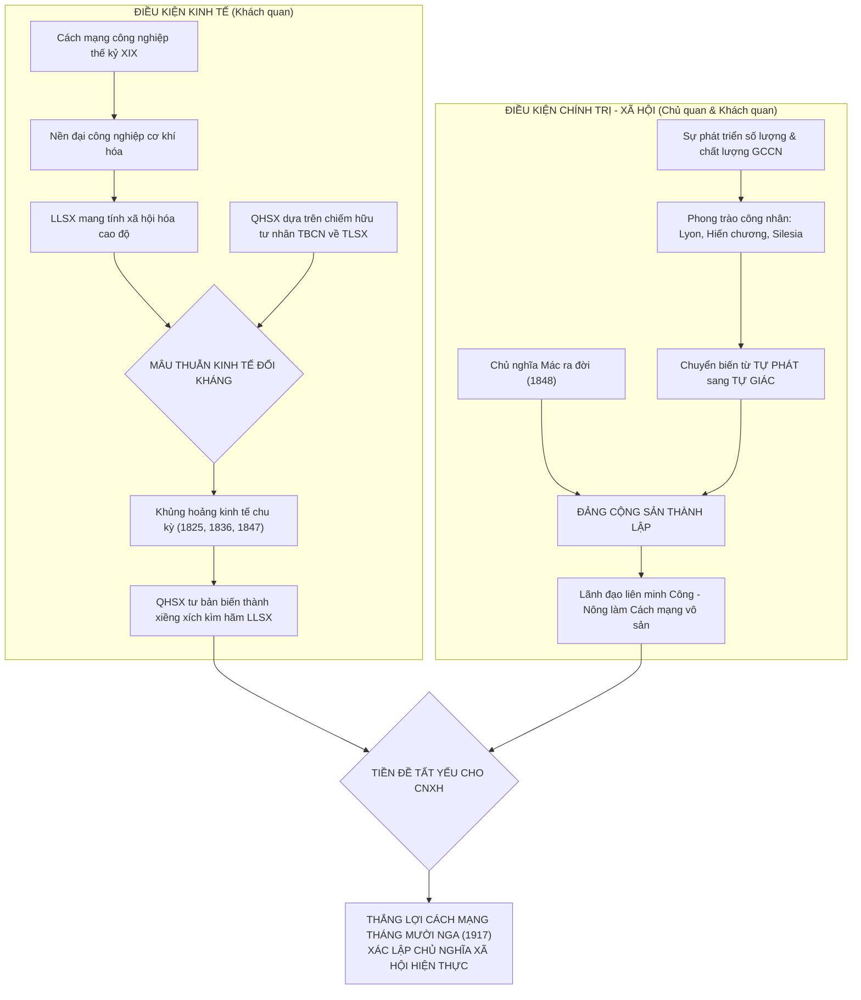
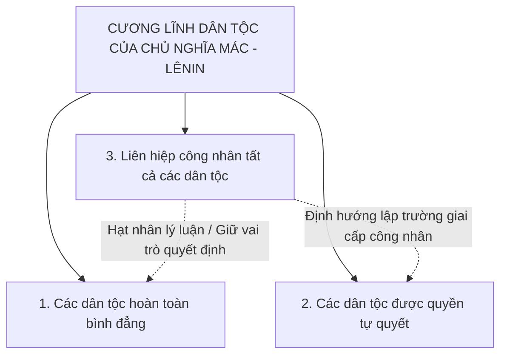
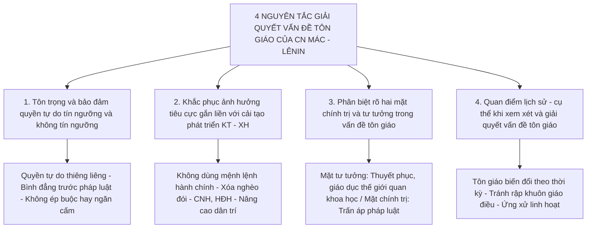

# 📚 CÂY TRI THỨC CHỦ NGHĨA XÃ HỘI KHOA HỌC (SP1035 - ĐHBK TP.HCM HK261)

## CHƯƠNG 1: NHẬP MÔN CHỦ NGHĨA XÃ HỘI KHOA HỌC (GT tr. 11 - 50)

### PHẦN I: SỰ RA ĐỜI CỦA CHỦ NGHĨA XÃ HỘI KHOA HỌC *(GT tr. 11 - 22)*


- 🎯 **[TRỌNG TÂM THI CUỐI KỲ - 50% MCQ]**
- 📌 **[CĐR L.O.1.1, L.O.2.1, L.O.3.1]**
- 📖 **(GT tr. 11 - 22)**

---

#### 1. Điều kiện kinh tế - xã hội dẫn tới sự ra đời của CNXHKH (Những năm 40 thế kỷ XIX)
- 🎯 **[TRỌNG TÂM THI CUỐI KỲ - 50% MCQ]** 📌 *(CĐR L.O.1.1)*: Nhận diện mâu thuẫn cơ bản của CNTB và tính chất độc lập của phong trào công nhân.
- 📖 *(GT tr. 11 - 14)*

##### 1.1. Cách mạng công nghiệp và sự phát triển của phương thức sản xuất tư bản chủ nghĩa
###### 1.1.1. Bước nhảy vọt của lực lượng sản xuất và nền đại công nghiệp
- **a. Quá trình cơ khí hóa nền sản xuất xã hội**
  - Bắt đầu: Nước Anh khởi xướng Cách mạng công nghiệp vào thập niên 1760.
  - Lan rộng: Pháp, Đức và Tây Âu hoàn thành cơ bản công nghiệp hóa vào thập niên 1840.
  - Chuyển dịch công nghệ: Nền sản xuất chuyển từ công trường thủ công sang đại công nghiệp cơ khí.
  - Động lực cơ học: Máy hơi nước của James Watt thay thế hoàn toàn sức cơ bắp của con người và súc vật.
  - Tác động xã hội: Năng suất lao động xã hội tăng theo cấp số nhân, đô thị công nghiệp mở rộng nhanh chóng.
- **b. Đánh giá kinh điển về lực lượng sản xuất tư bản**
  - Tác phẩm: *Tuyên ngôn của Đảng Cộng sản* (năm 1848).
  - Tác giả: C.Mác và Ph.Ăngghen.
  - Trích dẫn chuẩn: *"Giai cấp tư sản trong quá trình thống trị giai cấp chưa đầy một thế kỷ đã tạo ra những lực lượng sản xuất nhiều hơn và đồ sộ hơn lực lượng sản xuất của tất cả các thế hệ trước kia gộp lại"*.
  - Ý nghĩa khoa học: Khẳng định vai trò lịch sử tiến bộ của giai cấp tư sản trong việc phát triển lực lượng sản xuất xã hội.

###### 1.1.2. Mâu thuẫn kinh tế cơ bản của phương thức sản xuất tư bản chủ nghĩa
- **a. Mâu thuẫn giữa tính chất xã hội hóa của LLSX và QHSX tư nhân TBCN**
  - 🎯 **[TRỌNG TÂM THI CUỐI KỲ - 50% MCQ]**: Quy luật QHSX phải phù hợp với trình độ phát triển của LLSX.
  - Cực Lực lượng sản xuất (LLSX): Mang tính chất xã hội hóa cao độ, phân công lao động chuyên môn hóa sâu, các ngành liên kết thành hệ thống kinh tế thống nhất.
  - Cực Quan hệ sản xuất (QHSX): Dựa trên chế độ chiếm hữu tư nhân tư bản chủ nghĩa về toàn bộ tư liệu sản xuất chủ yếu.
  - Bản chất xung đột: QHSX tư nhân TBCN trở thành xiềng xích kìm hãm sự phát triển tự do của LLSX xã hội hóa.
- **b. Sự bùng nổ của các cuộc khủng hoảng kinh tế chu kỳ**
  - Năm 1825: Cuộc khủng hoảng kinh tế thừa chu kỳ đầu tiên nổ ra tại nước Anh.
  - Tần suất lặp lại: Khủng hoảng kinh tế tiếp tục bùng nổ theo chu kỳ vào các năm 1836, 1847.
  - Bản chất kinh tế: Khủng hoảng sản xuất thừa tương đối (hàng hóa thừa ứ đọng đối lập với cảnh bần cùng thiếu thốn của công nhân).
  - Kết luận lý luận: Chứng minh phương thức sản xuất tư bản chủ nghĩa không thể tự điều hòa vĩnh viễn mâu thuẫn nội tại.

###### 1.1.3. Mâu thuẫn chính trị - xã hội và địa vị của giai cấp công nhân
- **a. Mâu thuẫn đối kháng giai cấp giữa vô sản và tư sản**
  - Giai cấp công nhân (vô sản): Lực lượng sản xuất cơ bản nhất, trực tiếp vận hành máy móc hiện đại, không có tư liệu sản xuất.
  - Giai cấp tư sản: Chiếm giữ toàn bộ tư liệu sản xuất, chi phối bộ máy nhà nước và bóc lột sức lao động của công nhân.
  - Tính chất mâu thuẫn: Đối kháng lợi ích kinh tế trực tiếp, không thể dung hòa trong khuôn khổ thể chế tư bản.
- **b. Tình trạng bần cùng hóa và tha hóa lao động**
  - Thời gian làm việc: Ngày lao động kéo dài khắc nghiệt từ 14 đến 16 giờ mỗi ngày.
  - Bóc lột lao động đặc thù: Chủ xưởng sử dụng phổ biến phụ nữ và trẻ em với mức lương rẻ mạt.
  - Điều kiện lao động: Môi trường hầm mỏ, xưởng dệt độc hại, thiếu thiết bị bảo hộ sinh mạng.
  - Sự tha hóa con người: Người thợ bị tước đoạt toàn bộ tính sáng tạo, biến thành "vật phụ thuộc vào máy móc".

##### 1.2. Sự xuất hiện của giai cấp công nhân trên vũ đài chính trị qua ba phong trào đấu tranh lớn
- 🎯 **[TRỌNG TÂM THI CUỐI KỲ - 50% MCQ]** 📌 *(CĐR L.O.1.1, L.O.2.1)*: GCCN trở thành lực lượng chính trị độc lập.
- 📖 *(GT tr. 13 - 14)*

###### 1.2.1. Phong trào đấu tranh của công nhân dệt Lyon (Pháp, 1831 và 1834)
- **a. Khởi nghĩa tháng 11 năm 1831 - Khẩu hiệu kinh tế**
  - Địa bàn: Trung tâm dệt tơ tằm công nghiệp thành phố Lyon, nước Pháp.
  - Nguyên nhân trực tiếp: Giới chủ xưởng tư bản hạ tiền công, vi phạm hợp đồng giá trị lao động.
  - Khẩu hiệu chiến đấu: *"Sống có việc làm hay chết trong chiến đấu!"* (*Vivre en travaillant ou mourir en combattant*).
  - Tính chất: Đấu tranh tự vệ kinh tế của thợ dệt đòi quyền sống và ổn định giá công.
- **b. Khởi nghĩa tháng 4 năm 1834 - Bước chuyển sang mục tiêu chính trị**
  - Động lực: Chính quyền tư sản ban hành luật cấm hội họp, bắt bớ đại biểu công nhân.
  - Khẩu hiệu chiến đấu: Nâng cao lá cờ đen với khẩu hiệu *"Cộng hòa hay là chết!"* (*La République ou la mort*).
  - Yêu sách: Đòi lật đổ nền quân chủ tháng Bảy của Louis-Philippe, đòi thành lập thể chế cộng hòa dân chủ.
  - Ý nghĩa: Đánh dấu bước chuyển biến từ giác ngộ kinh tế sang giác ngộ chính trị của vô sản Pháp.

###### 1.2.2. Phong trào Hiến chương ở Anh (Chartism, 1836 - 1848)
- **a. Quy mô, thời gian và tổ chức của phong trào**
  - Thời gian: Kéo dài liên tục hơn 12 năm (từ năm 1836 đến năm 1848).
  - Tổ chức hạt nhân: Hiệp hội Công nhân Luân Đôn, Đại hội Công đoàn toàn quốc Anh.
  - Phương thức đấu tranh: Tổ chức mít tinh quần chúng, thu thập hàng triệu chữ ký gửi kiến nghị lên Nghị viện Anh (1839, 1842, 1848).
- **b. Sáu yêu sách cốt lõi của "Hiến chương của Nhân dân" (People's Charter)**
  - 🎯 **[TRỌNG TÂM THI CUỐI KỲ - 50% MCQ]**: Nắm vững 6 điểm của People's Charter.
  - 1. Phổ thông đầu phiếu cho nam giới từ đủ 21 tuổi (Universal male suffrage).
  - 2. Bỏ phiếu kín nhằm bảo vệ cử tri khỏi áp lực đe dọa của chủ xưởng (Secret ballot).
  - 3. Xóa bỏ hoàn toàn tiêu chuẩn tài sản đối với đại biểu được bầu vào Nghị viện (No property qualification for MPs).
  - 4. Trả lương cho đại biểu Nghị viện để người nghèo có thể tham gia lập pháp (Salaries for MPs).
  - 5. Phân chia khu vực bầu cử có quy mô cử tri bình đẳng (Equal constituencies).
  - 6. Bầu cử Nghị viện định kỳ hàng năm nhằm kiểm soát quyền lực đại diện (Annual parliaments).
- **c. Đánh giá của V.I. Lênin về Phong trào Hiến chương**
  - Nhận định: Phong trào Hiến chương là *"phong trào vô sản cách mạng rộng lớn đầu tiên, thực sự có tính chất quần chúng và có hình thức chính trị"*.
  - Giá trị: Chứng minh giai cấp công nhân có khả năng sử dụng các hình thức đấu tranh chính trị quy mô toàn quốc.

###### 1.2.3. Cuộc khởi nghĩa của công nhân dệt vùng Silesia (Đức, tháng 6 năm 1844)
- **a. Bối cảnh lịch sử và tính chất tự giác giai cấp**
  - Địa bàn: Vùng Silesia thuộc vương quốc Phổ (nước Đức).
  - Tình trạng: Công nhân dệt bị bóc lột tàn khốc bởi cả chế độ tư bản công nghiệp non trẻ và địa chủ phong kiến.
  - Tính chất: Cuộc nổi dậy mang tính giai cấp vô sản độc lập, công khai đối đầu với quyền lực giai cấp tư sản.
- **b. Hành động cách mạng của công nhân Silesia**
  - Đập phá máy móc, phá hủy kho nguyên liệu của các nhà xưởng bóc lột.
  - Tấn công thẳng vào dinh thự các chủ tư bản ngân hàng và chủ hãng dệt.
  - Đốt cháy toàn bộ sổ sách ghi nợ, khế ước làm thuê và văn bản thế chấp tài sản.
  - Đánh giá của C.Mác: Cuộc khởi nghĩa Silesia thể hiện sự thức tỉnh giai cấp và tinh thần cách mạng triệt để của vô sản Đức.

###### 1.2.4. Ý nghĩa lịch sử, nguyên nhân thất bại và đòi hỏi khách quan của phong trào công nhân
- **a. Ý nghĩa lịch sử**
  - Giai cấp công nhân chính thức bước lên vũ đài lịch sử như một lực lượng chính trị độc lập.
  - Giai cấp công nhân không còn đi sau đuôi giai cấp tư sản như trong các cuộc cách mạng tư sản trước đây.
  - Phong trào khẳng định sứ mệnh lịch sử thực tế của giai cấp công nhân trong việc lật đổ chế độ tư bản.
- **b. Nguyên nhân thất bại và hạn chế lịch sử**
  - Tính tự phát: Phong trào đấu tranh thiếu sự chỉ đạo của một cương lĩnh chính trị thống nhất.
  - Thiếu tổ chức: Chưa có một chính đảng cách mạng độc lập của giai cấp công nhân dẫn đường.
  - Thiếu vũ khí tư tưởng: Phong trào chưa được trang bị một hệ thống lý luận khoa học và cách mạng đúng đắn.
  - Bị đàn áp: Toàn bộ ba phong trào lớn đều bị chính quyền tư sản liên minh phong kiến dùng bạo lực dìm trong biển máu.
- **c. Đòi hỏi khách quan của thực tiễn lịch sử**
  - 🎯 **[TRỌNG TÂM THI CUỐI KỲ - 50% MCQ]**: Lý luận khoa học bắt nguồn từ đòi hỏi của thực tiễn phong trào công nhân.
  - Yêu cầu cấp bách: Cần có một hệ thống lý luận khoa học dẫn đường để chuyển phong trào công nhân từ tự phát sang tự giác.
  - Sự ra đời tất yếu: Sự xuất hiện của Chủ nghĩa xã hội khoa học do C.Mác và Ph.Ăngghen sáng lập là sự đáp ứng kịp thời đòi hỏi khách quan đó.

---

#### 2. Tiền đề khoa học tự nhiên và tư tưởng lý luận
- 🎯 **[TRỌNG TÂM THI CUỐI KỲ - 50% MCQ]** 📌 *(CĐR L.O.1.1)*: 3 phát minh KHTN và 3 tiền đề lý luận trực tiếp.
- 📖 *(GT tr. 14 - 19)*

##### 2.1. Ba phát minh khoa học tự nhiên vĩ đại đầu thế kỷ XIX
- 🎯 **[TRỌNG TÂM THI CUỐI KỲ - 50% MCQ]**: Nắm vững tên phát minh, nhà khoa học và ý nghĩa thế giới quan.
- 📖 *(GT tr. 14 - 16)*

###### 2.1.1. Định luật bảo toàn và chuyển hóa năng lượng
- **a. Tác giả và nội dung khoa học**
  - Các nhà khoa học: Mikhail Lomonosov (đặt nền móng 1748), Julius Robert Mayer (1842), James Prescott Joule (1843).
  - Nội dung định luật: Năng lượng không tự sinh ra và không tự mất đi; năng lượng chỉ chuyển hóa từ dạng này sang dạng khác trong quá trình vận động của vật chất.
- **b. Ý nghĩa thế giới quan triết học và CNXHKH**
  - Chứng minh tính thống nhất vật chất của thế giới vô cơ và hữu cơ.
  - Chứng minh các hình thức vận động của vật chất liên hệ mật thiết và chuyển hóa lẫn nhau theo quy luật khách quan.
  - Bác bỏ hoàn toàn quan niệm duy tâm tôn giáo về "nguyên nhân đầu tiên", "cú hích của Thượng đế" hay sức mạnh siêu nhiên.

###### 2.1.2. Học thuyết tế bào
- **a. Tác giả và nội dung khoa học**
  - Các nhà khoa học: Matthias Schleiden (năm 1838 đối với thực vật), Theodor Schwann (năm 1839 đối với động vật).
  - Nội dung học thuyết: Mọi cơ thể sinh vật sống đều được cấu tạo từ đơn vị cơ sở là tế bào; sự sinh trưởng của sinh vật diễn ra qua quá trình phân chia tế bào.
- **b. Ý nghĩa thế giới quan triết học và CNXHKH**
  - Phá vỡ bức tường ngăn cách siêu hình giữa thế giới thực vật và thế giới động vật.
  - Chứng minh tính thống nhất về nguồn gốc phát sinh và cấu tạo sinh học của toàn bộ thế giới sống.
  - Cung cấp cơ sở thực nghiệm khẳng định sự liên hệ, kế thừa và phát triển biện chứng trong giới tự nhiên hữu cơ.

###### 2.1.3. Học thuyết tiến hóa của Charles Darwin
- **a. Tác giả và nội dung khoa học**
  - Tác giả: Nhà sinh vật học người Anh Charles Darwin (công bố tác phẩm *Nguồn gốc các loài* năm 1859, manh nha tư tưởng từ thập niên 1840).
  - Nội dung học thuyết: Các loài sinh vật không phải bất biến do Chúa tạo ra một lần; các loài tiến hóa qua con đường biến dị, di truyền và chọn lọc tự nhiên để thích nghi môi trường.
- **b. Ý nghĩa thế giới quan triết học và CNXHKH**
  - Giáng đòn quyết định đánh đổ quan niệm duy tâm mục đích luận của thần học và thuyết sáng thế của tôn giáo.
  - Chứng minh tự nhiên vận động phát triển từ thấp đến cao theo các quy luật nội tại khách quan.
  - Tạo cơ sở gợi mở phương pháp luận khoa học để C.Mác và Ph.Ăngghen nghiên cứu lịch sử phát triển của các hình thái kinh tế - xã hội.

###### 2.1.4. Đánh giá tổng hợp của Ph.Ăngghen về ba phát minh khoa học tự nhiên
- **a. Đánh bại phương pháp tư duy siêu hình**
  - Phương pháp siêu hình xem xét thế giới trong trạng thái tĩnh tại, cô lập, bất biến.
  - Ba phát minh chứng minh thế giới tự nhiên luôn vận động, biến đổi, chuyển hóa biện chứng.
- **b. Nền tảng thực nghiệm của phép biện chứng duy vật**
  - Cung cấp bằng chứng thực nghiệm tự nhiên không thể chối cãi cho phép biện chứng duy vật.
  - Tạo tiền đề phương pháp luận vững chắc để sáng lập Chủ nghĩa duy vật biện chứng và Chủ nghĩa duy vật lịch sử.

##### 2.2. Ba tiền đề tư tưởng lý luận trực tiếp
- 🎯 **[TRỌNG TÂM THI CUỐI KỲ - 50% MCQ]**: Nhận diện 3 nguồn gốc lý luận, các đại biểu và giá trị kế thừa/cải tạo.
- 📖 *(GT tr. 16 - 19)*

###### 2.2.1. Triết học cổ điển Đức
- **a. Kế thừa phép biện chứng của G.W.F. Hegel (1770 - 1831)**
  - Giá trị kế thừa: Kế thừa "hạt nhân hợp lý" là phép biện chứng với các quy luật mâu thuẫn, lượng - chất, phủ định của phủ định.
  - Phê phán và cải tạo: Bóc tách lớp vỏ duy tâm thần bí ("Ý niệm tuyệt đối" đóng vai trò sáng tạo thế giới) của Hegel.
- **b. Kế thừa chủ nghĩa duy vật của Ludwig Feuerbach (1804 - 1872)**
  - Giá trị kế thừa: Kế thừa chủ nghĩa duy vật kiên quyết bảo vệ tự nhiên, coi vật chất có trước, ý thức có sau.
  - Phê phán và cải tạo: Khắc phục tính trực quan, siêu hình và quan điểm duy tâm về mặt xã hội - tôn giáo tình yêu của Feuerbach.
- **c. Thành quả sáng tạo lý luận**
  - C.Mác và Ph.Ăngghen sáng lập ra **Chủ nghĩa duy vật biện chứng** và **Chủ nghĩa duy vật lịch sử**.
  - Triết học Mác trở thành vũ khí tinh thần sắc bén của giai cấp vô sản thế giới.

###### 2.2.2. Kinh tế chính trị học cổ điển Anh
- **a. Kế thừa học thuyết giá trị lao động của Adam Smith (1723 - 1790) và David Ricardo (1772 - 1823)**
  - Đóng góp của Smith và Ricardo: Khẳng định lao động là nguồn gốc thực sự tạo ra của cải và giá trị của mọi hàng hóa.
  - Giới hạn lịch sử: Coi các quy luật kinh tế của chủ nghĩa tư bản là quy luật tự nhiên, vĩnh cửu; không hiểu bản chất nguồn gốc của tư bản.
- **b. Bước đột phá kinh tế học của C.Mác**
  - Phát hiện tính chất hai mặt của lao động sản xuất hàng hóa (lao động cụ thể và lao động trừu tượng).
  - Phân tích bản chất của hàng hóa sức lao động trong chế độ tư bản chủ nghĩa.
  - Sáng lập nên **Học thuyết Giá trị thặng dư** ($m$) - luận chứng khoa học về bản chất bóc lột của giai cấp tư sản.

###### 2.2.3. Chủ nghĩa xã hội không tưởng - phê phán Pháp và Anh đầu thế kỷ XIX
- **a. Các đại biểu xuất sắc tiêu biểu**
  - 🇫🇷 Nước Pháp: Henri de Saint-Simon (1760 - 1825), Charles Fourier (1772 - 1837).
  - 🇬🇧 Nước Anh: Robert Owen (1771 - 1858).
- **b. Giá trị lịch sử tích cực (Hạt nhân hợp lý)**
  - 🎯 **[TRỌNG TÂM THI CUỐI KỲ - 50% MCQ]**: Các đóng góp tiến bộ của CNXH không tưởng.
  - Phê phán gay gắt, sâu sắc xã hội tư bản: Vạch trần sự bần cùng hóa của người lao động, sự tha hóa đạo đức, thói đạo đức giả của giai cấp tư sản và tình trạng sản xuất vô chính phủ gây khủng hoảng.
  - Dự đoán thiên tài về xã hội tương lai:
  + Tổ chức sản xuất xã hội theo kế hoạch thống nhất.
  + Xóa bỏ sự đối lập giữa lao động trí óc và lao động chân tay.
  + Xóa bỏ sự cách biệt, đối lập giữa thành thị và nông thôn.
  + Thực hiện quyền bình đẳng giới, giải phóng hoàn toàn phụ nữ.
  + Phân phối sản phẩm công bằng theo mức đóng góp lao động.
  + Kết hợp chặt chẽ giữa giáo dục lý thuyết với lao động sản xuất thực tế.
  + Chuyển đổi chức năng nhà nước từ "cai trị con người" sang "quản lý đồ vật và chỉ đạo sản xuất".
- Ý nghĩa thực tiễn: Thức tỉnh tinh thần đấu tranh và niềm tin vào tương lai của phong trào công nhân.
- **c. Hạn chế lịch sử cơ bản (Tính chất không tưởng)**
  - 🎯 **[TRỌNG TÂM THI CUỐI KỲ - 50% MCQ]**: Ba hạn chế cơ bản giải thích chữ "Không tưởng".
  - Hạn chế 1 (Kinh tế): Không giải thích được bản chất kinh tế của chế độ làm thuê tư bản; không phát hiện ra quy luật kinh tế vận động nội tại và tính tất yếu sụp đổ của CNTB.
  - Hạn chế 2 (Lực lượng xã hội): Không nhìn thấy giai cấp công nhân là lực lượng xã hội tiên phong có sứ mệnh lịch sử cải tạo xã hội; họ chỉ coi công nhân là giai cấp nghèo khổ, thụ động, đáng thương hại cần được ban ơn cứu giúp.
  - Hạn chế 3 (Phương pháp cách mạng): Phủ nhận đấu tranh giai cấp và cách mạng bạo lực; chủ trương con đường cải lương, hòa bình, tuyên truyền đạo đức, cầu xin sự tài trợ tiền bạc từ vua chúa và các nhà tư bản hảo tâm.
  - Hậu quả thực nghiệm: Robert Owen dùng toàn bộ tài sản lập mô hình hợp tác xã mẫu New Lanark ở Scotland và New Harmony ở bang Indiana (Mỹ) nhưng đều nhanh chóng tan vỡ và phá sản.
- **d. Đánh giá của V.I. Lênin về Chủ nghĩa xã hội không tưởng**
  - Trích dẫn kinh điển: *"Chủ nghĩa xã hội không tưởng không thể vạch ra được lối thoát thực sự. Nó không giải thích được bản chất của chế độ làm thuê trong chế độ tư bản, cũng không phát hiện ra những quy luật phát triển của chế độ tư bản, và cũng không tìm được lực lượng xã hội có khả năng trở thành người sáng tạo ra xã hội mới"*.

---

#### 3. Vai trò của C.Mác và Ph.Ăngghen đối với sự ra đời của CNXHKH
- 🎯 **[TRỌNG TÂM THI CUỐI KỲ - 50% MCQ]** 📌 *(CĐR L.O.1.1, L.O.3.1)*: Chuyển biến lập trường, 3 phát kiến và tác phẩm Tuyên ngôn ĐCS.
- 📖 *(GT tr. 19 - 22)*

##### 3.1. Sự chuyển biến lập trường triết học và chính trị của C.Mác và Ph.Ăngghen (1843 - 1844)
###### 3.1.1. Điểm xuất phát ban đầu
- **a. Về triết học**
  - Chịu ảnh hưởng trực tiếp của chủ nghĩa duy tâm khách quan của Hegel.
  - Tham gia phái Hegel trẻ tại Trường Đại học Berlin nhằm tìm kiếm sự tự do tư tưởng.
- **b. Về chính trị**
  - Đứng trên lập trường của những nhà dân chủ cách mạng cấp tiến.
  - Sử dụng công cụ triết học để đòi hỏi quyền tự do dân chủ và chống chế độ phong kiến chuyên chế Phổ.

###### 3.1.2. Quá trình chuyển biến lập trường của C.Mác
- **a. Thực tiễn hoạt động tại Báo Sông Ranh (Rheinische Zeitung, 1842 - 1843)**
  - Đảm nhận vai trò Tổng biên tập Báo Sông Ranh từ tháng 10 năm 1842.
  - Đối mặt với các xung đột thực tế: Tranh chấp về luật xử phạt trộm gỗ của nông dân nghèo vùng Mosel, vấn đề độc quyền đất rừng và chính sách bảo hộ rượu nho.
  - Phát hiện then chốt: Các quan hệ nhà nước và pháp luật bắt nguồn sâu xa từ những lợi ích kinh tế - vật chất cụ thể, chứ không phải bắt nguồn từ "ý niệm tuyệt đối" hay đạo đức trừu tượng.
- **b. Hoàn thành bước chuyển trên Tạp chí Niên giám Pháp - Đức (Deutsch-Französische Jahrbücher, tháng 2 năm 1844)**
  - 🎯 **[TRỌNG TÂM THI CUỐI KỲ - 50% MCQ]**: Thời điểm và hai tác phẩm then chốt ghi nhận bước chuyển của Mác.
  - Tác phẩm 1: *Góp phần phê phán triết học pháp quyền của Hêghen - Lời nói đầu*.
  - Tác phẩm 2: *Vấn đề Do Thái*.
  - Nội dung chuyển biến triết học: Từ **chủ nghĩa duy tâm** chuyển hẳn sang **chủ nghĩa duy vật biện chứng**.
  - Nội dung chuyển biến chính trị: Từ **lập trường dân chủ cách mạng** chuyển dứt khoát sang **lập trường cộng sản chủ nghĩa**.
- **c. Luận điểm về liên minh giữa triết học và giai cấp vô sản**
  - Trích dẫn kinh điển: *"Giống như triết học thấy giai cấp vô sản là vũ khí vật chất của mình, giai cấp vô sản cũng thấy triết học là vũ khí tinh thần của mình"*.
  - Ý nghĩa: Lần đầu tiên phát hiện giai cấp vô sản là lực lượng vật chất lãnh đạo cuộc cách mạng giải phóng loài người.

###### 3.1.3. Quá trình chuyển biến lập trường của Ph.Ăngghen
- **a. Thực tiễn phong trào công nhân tại Manchester (nước Anh, từ cuối năm 1842)**
  - Trực tiếp khảo sát đời sống của giai cấp công nhân tại các xưởng dệt lớn ở trung tâm công nghiệp Manchester.
  - Tham gia và tiếp xúc mật thiết với các lãnh tụ của Phong trào Hiến chương Anh và Liên đoàn những người chính nghĩa.
- **b. Các tác phẩm kinh điển đánh dấu bước chuyển độc lập**
  - Bài viết: *Lược khảo phê phán khoa kinh tế chính trị* (công bố tháng 2 năm 1844 trên Tạp chí Niên giám Pháp - Đức).
  - Tác phẩm: *Tình cảnh giai cấp công nhân ở Anh* (viết năm 1844, xuất bản năm 1845).
  - Kết quả: Độc lập với Mác, Ăngghen chuyển biến từ **chủ nghĩa duy tâm sang chủ nghĩa duy vật**, từ **lập trường dân chủ cách mạng sang lập trường cộng sản chủ nghĩa**.

###### 3.1.4. Tình bạn vĩ đại và sự liên minh khoa học kiệt xuất (Tháng 8 năm 1844)
- **a. Cuộc hội ngộ tại Paris**
  - Thời gian: Tháng 8 năm 1844, C.Mác và Ph.Ăngghen gặp nhau tại thủ đô Paris (Pháp).
  - Kết quả: Nhận thấy sự đồng thuận tuyệt đối về lập trường triết học, kinh tế và chính trị.
- **b. Khởi đầu sự cộng tác lịch sử**
  - Hai nhà tư tưởng bắt tay cùng sáng lập hệ thống lý luận khoa học của giai cấp công nhân.
  - Tác phẩm chung đầu tiên: *Gia đình thần thánh* (tháng 9 năm 1844, xuất bản đầu năm 1845) đập tan phái Hegel trẻ.

##### 3.2. Ba phát kiến vĩ đại của C.Mác và Ph.Ăngghen
- 🎯 **[TRỌNG TÂM THI CUỐI KỲ - 50% MCQ]** 📌 *(CĐR L.O.1.1)*: Ba trụ cột đưa CNXH từ KHÔNG TƯỞNG thành KHOA HỌC.
- 📖 *(GT tr. 20 - 21)*

###### 3.2.1. Phát kiến thứ nhất: Chủ nghĩa duy vật lịch sử (CNDVLS) - Thuộc lĩnh vực Triết học
- **a. Nội dung phát hiện khoa học**
  - Sản xuất vật chất là cơ sở nền tảng quyết định sự tồn tại và phát triển của đời sống xã hội.
  - Quy luật cơ bản: Quan hệ sản xuất phải phù hợp với trình độ phát triển khách quan của lực lượng sản xuất.
  - Mối quan hệ biện chứng: Cơ sở hạ tầng kinh tế quyết định kiến trúc thượng tầng chính trị - tư tưởng của xã hội.
  - Động lực phát triển: Đấu tranh giai cấp là động lực phát triển trực tiếp của các xã hội có đối kháng giai cấp.
- **b. Ý nghĩa đối với sự ra đời của CNXHKH**
  - Chứng minh sự thay thế các hình thái kinh tế - xã hội (nguyên thủy $\to$ chiếm hữu nô lệ $\to$ phong kiến $\to$ TBCN $\to$ CSCN) là một quá trình lịch sử - tự nhiên.
  - Khẳng định sự sụp đổ của chủ nghĩa tư bản và sự ra đời của chủ nghĩa xã hội là quy luật khách quan của nền sản xuất vật chất, không phụ thuộc vào ý muốn chủ quan hay lòng từ thiện.

###### 3.2.2. Phát kiến thứ hai: Học thuyết Giá trị thặng dư ($m$) - Thuộc lĩnh vực Kinh tế chính trị học
- **a. Nội dung phát hiện khoa học**
  - Vạch trần bí mật cơ chế bóc lột trong phương thức sản xuất tư bản chủ nghĩa.
  - Chứng minh nhà tư bản làm giàu bằng cách chiếm đoạt không công phần lao động thặng dư của công nhân làm thuê.
  - Khẳng định sản xuất giá trị thặng dư là quy luật kinh tế tuyệt đối chi phối sự vận động của chủ nghĩa tư bản.
- **b. Ý nghĩa đối với sự ra đời của CNXHKH**
  - Cung cấp luận chứng kinh tế không thể phản bác chứng minh bản chất bóc lột của giai cấp tư sản.
  - Chỉ rõ nguồn gốc sâu xa của sự phân hóa giàu nghèo và mâu thuẫn đối kháng giai cấp không thể hóa giải trong lòng xã hội tư sản.
  - Luận giải sự cần thiết tất yếu phải thủ tiêu chế độ chiếm hữu tư nhân TBCN về tư liệu sản xuất.

###### 3.2.3. Phát kiến thứ ba: Học thuyết về Sứ mệnh lịch sử toàn thế giới của Giai cấp công nhân - Thuộc lĩnh vực CNXHKH
- **a. Nội dung phát hiện khoa học**
  - Giai cấp công nhân là sản phẩm trực tiếp của nền đại công nghiệp cơ khí hiện đại.
  - Giai cấp công nhân đại diện cho lực lượng sản xuất tiên tiến nhất mang tính chất xã hội hóa cao độ.
  - Sứ mệnh lịch sử: Lãnh đạo toàn thể nhân dân lao động làm cách mạng vô sản, lật đổ nền thống trị tư bản, đập tan nhà nước tư sản, thiết lập chuyên chính vô sản, xóa bỏ chế độ tư hữu, xây dựng chủ nghĩa xã hội và chủ nghĩa cộng sản không còn áp bức bóc lột.
- **b. Ý nghĩa quyết định biến CNXH thành khoa học**
  - Khắc phục triệt để lỗ hổng lớn nhất của Chủ nghĩa xã hội không tưởng (không tìm thấy lực lượng xã hội thực hiện cách mạng).
  - Biến lý tưởng giải phóng con người từ ước mơ nhân đạo thuần túy thành một phong trào cách mạng hiện thực có cơ sở khoa học.

##### 3.3. Tác phẩm "Tuyên ngôn của Đảng Cộng sản" (Tháng 2 năm 1848)
- 🎯 **[TRỌNG TÂM THI CUỐI KỲ - 50% MCQ]** 📌 *(CĐR L.O.1.1, L.O.2.1)*: Tác phẩm đánh dấu sự ra đời của CNXHKH.
- 📖 *(GT tr. 21 - 22)*

###### 3.3.1. Hoàn cảnh xuất hiện và tính chất văn kiện
- **a. Sự ủy nhiệm của Liên đoàn Những người cộng sản**
  - Bối cảnh: Đại hội II của Liên đoàn Những người cộng sản họp tại Luân Đôn (Anh) từ cuối tháng 11 đến đầu tháng 12 năm 1847.
  - Quyết định: Đại hội ủy nhiệm cho C.Mác và Ph.Ăngghen soạn thảo bản Cương lĩnh chính trị chính thức của tổ chức.
- **b. Văn bản xuất bản**
  - Thời gian: Tháng 2 năm 1848.
  - Địa điểm: Luân Đôn, nước Anh.
  - Ngôn ngữ: Văn bản đầu tiên được in bằng tiếng Đức, sau đó nhanh chóng dịch ra các thứ tiếng Anh, Pháp, Nga, Ý.
  - Tính chất: Cương lĩnh chính trị đầu tiên của phong trào cộng sản và công nhân quốc tế.

###### 3.3.2. Năm luận điểm cốt lõi trong Tuyên ngôn của Đảng Cộng sản
- **a. Luận điểm 1: Đấu tranh giai cấp là động lực lịch sử**
  - Toàn bộ lịch sử xã hội có giai cấp từ trước đến nay là lịch sử đấu tranh giai cấp.
  - Đấu tranh giữa tự do và nô lệ, quý tộc và bình dân, chúa đất và nông nô, thợ cả và bạn thợ, tư sản và vô sản.
  - Cuộc đấu tranh luôn kết thúc bằng sự cải tạo cách mạng toàn bộ xã hội hoặc bằng sự diệt vong của cả hai giai cấp đối địch.
- **b. Luận điểm 2: Sự sụp đổ tất yếu của CNTB và thắng lợi tất yếu của CNXH**
  - Mâu thuẫn giữa LLSX xã hội hóa và QHSX tư nhân tư bản quyết định số phận lịch sử của CNTB.
  - Trích dẫn kinh điển: *"Sự sụp đổ của giai cấp tư sản và thắng lợi của giai cấp vô sản đều là tất yếu như nhau"*.
  - Giai cấp tư sản không chỉ rèn vũ khí giết mình mà còn tạo ra những con người sử dụng vũ khí ấy - giai cấp vô sản hiện đại.
- **c. Luận điểm 3: Bản chất tiền phong và vai trò lãnh đạo của Đảng Cộng sản**
  - Đảng Cộng sản là bộ phận kiên quyết nhất, hiểu biết nhất, luôn thúc đẩy phong trào vô sản tiến lên.
  - Đảng không có lợi ích nào tách rời lợi ích của toàn thể giai cấp vô sản.
  - Mục tiêu trước mắt của Đảng: Tổ chức những người vô sản thành giai cấp, lật đổ sự thống trị của giai cấp tư sản, giành lấy chính quyền chính trị.
- **d. Luận điểm 4: Bản chất của xã hội tương lai**
  - Xóa bỏ chế độ tư hữu tư bản chủ nghĩa, chuyển giao tư liệu sản xuất về tay nhà nước vô sản.
  - Trích dẫn kinh điển: *"Thay cho xã hội tư sản cũ, với những giai cấp và đối kháng giai cấp của nó, sẽ xuất hiện một liên hợp, trong đó sự phát triển tự do của mỗi người là điều kiện cho sự phát triển tự do của tất cả mọi người"*.
- **e. Luận điểm 5: Tinh thần đoàn kết quốc tế vô sản**
  - Lợi ích của giai cấp vô sản trên toàn thế giới là thống nhất trong cuộc đấu tranh chống tư bản quốc tế.
  - Khẩu hiệu hành động bất hủ kết thúc tác phẩm: *"Vô sản tất cả các nước, đoàn kết lại!"* (*Proletarier aller Länder, vereinigt euch!*).

###### 3.3.3. Ý nghĩa lịch sử toàn cầu của tác phẩm
- **a. Mốc khai sinh Chủ nghĩa xã hội khoa học**
  - Tuyên ngôn của Đảng Cộng sản công bố tháng 2 năm 1848 đánh dấu sự hình thành hoàn chỉnh về cơ bản của Chủ nghĩa xã hội khoa học.
  - Ba bộ phận cấu thành của Chủ nghĩa Mác (Triết học, Kinh tế chính trị, CNXHKH) được tích hợp hữu cơ thành một chỉnh thể khoa học.
- **b. Kim chỉ nam dẫn đường cho phong trào cách mạng thế giới**
  - Vũ trang thế giới quan duy vật biện chứng và phương pháp cách mạng khoa học cho giai cấp công nhân toàn cầu.
  - Mở ra một kỷ nguyên mới: Kỷ nguyên đấu tranh giải phóng giai cấp vô sản và nhân dân lao động khỏi mọi ách áp bức, bóc lột.


### PHẦN II: CÁC GIAI ĐOẠN PHÁT TRIỂN CƠ BẢN CỦA CHỦ NGHĨA XÃ HỘI KHOA HỌC *(GT tr. 22 - 39)*


#### II. CÁC GIAI ĐOẠN PHÁT TRIỂN CƠ BẢN CỦA CHỦ NGHĨA XÃ HỘI KHOA HỌC *(GT tr. 22 - 39)*
- 🎯 **[TRỌNG TÂM THI CUỐI KỲ - 50% MCQ]** 📌 **[CĐR L.O.1.1, L.O.2.1, L.O.3.1]**
- 💬 **[THẢO LUẬN TRÊN LỚP 20%]**: Phân tích sự chuyển biến tư duy lý luận từ Mác - Ăngghen đến Lênin; Đánh giá bản chất bước chuyển từ "Chính sách Cộng sản thời chiến" sang "Chính sách Kinh tế mới (NEP)"; Giải mã nguyên nhân sụp đổ của mô hình XHCN Liên Xô; Đánh giá giá trị thời đại của công cuộc Đổi mới tại Việt Nam.
- 📝 **[CHỦ ĐỀ BÀI TẬP LỚN 30%]**: Liên hệ lý luận cách mạng không ngừng và kinh tế thị trường định hướng XHCN trong bối cảnh công nghiệp hóa, hiện đại hóa và hội nhập quốc tế.
- 📖 **(GT tr. 22 - 39)**: Đối chiếu theo Giáo trình Chủ nghĩa Xã hội Khoa học Bộ Giáo dục và Đào tạo (NXB Chính trị Quốc gia Sự thật, tái bản có chỉnh lý 2021).

---

##### 1. C.Mác và Ph.Ăngghen phát triển Chủ nghĩa xã hội khoa học (1848 - 1895) *(GT tr. 22 - 28)*
- 🎯 **[TRỌNG TÂM THI CUỐI KỲ - 50% MCQ]** 📌 **[CĐR L.O.1.1]**: Nắm chắc hai phân kỳ lịch sử (1848 - 1871 và 1871 - 1895), các tác phẩm kinh điển tương ứng, các luận điểm cốt tử về cách mạng không ngừng, liên minh công nông, chuyên chính vô sản, đập tan bộ máy nhà nước tư sản, và hai giai đoạn của hình thái CSCN.

###### 1.1. Thời kỳ từ năm 1848 đến Công xã Paris (1871) *(GT tr. 22 - 25)*
- 📖 *(GT tr. 22 - 25)*: Đây là thời kỳ tôi luyện lý luận qua thực tiễn bão táp cách mạng tại Tây Âu.

- **1.1.1. Bối cảnh lịch sử và thực tiễn cách mạng bùng nổ khắp Tây Âu (1848 - 1851)**
  - Các cuộc cách mạng dân chủ tư sản bùng nổ mạnh mẽ tại Pháp, Đức, Áo, Hungary, Ý trong các năm 1848 - 1851.
  - Giai cấp công nhân tham gia tích cực với tư cách lực lượng xung kích đi đầu trên các chiến lũy đường phố.
  - Giai cấp tư sản nhanh chóng thỏa hiệp với thế lực phong kiến phản động vì sợ hãi sức mạnh độc lập của giai cấp vô sản.
  - Cuộc khởi nghĩa tháng Sáu năm 1848 của công nhân Paris bị giai cấp tư sản đàn áp dã man trong biển máu.
  - Thực tiễn thất bại của phong trào công nhân đặt ra yêu cầu cấp bách: C.Mác và Ph.Ăngghen phải tổng kết lý luận để chỉ đường cho phong trào.

- **1.1.2. Tổng kết thực tiễn cách mạng 1848 - 1851 qua các tác phẩm kinh điển**
  - C.Mác viết tác phẩm *Đấu tranh giai cấp ở Pháp (1848 - 1850)* công bố năm 1850.
  - C.Mác viết tác phẩm *Ngày 18 tháng Sương mù của Lu-i Bô-na-pác-tơ* xuất bản năm 1852.
  - Ph.Ăngghen viết công trình *Cách mạng và phản cách mạng ở Đức (1851 - 1852)*.
  - Các công trình này vận dụng trực tiếp chủ nghĩa duy vật lịch sử để mổ xẻ các xung đột chính trị và lợi ích giai cấp cụ thể.
  - Mác và Ăngghen khẳng định: Quy luật đấu tranh giai cấp là động lực trực tiếp dẫn dắt toàn bộ biến cố chính trị thời kỳ này.

- **1.1.3. Luận điểm về "Cách mạng không ngừng" (Permanent Revolution)**
  - 🎯 **[TRỌNG TÂM THI CUỐI KỲ - 50% MCQ]**: Thuật ngữ "Cách mạng không ngừng" xuất hiện trong *Thông ngôn của Ban Trung ương gửi Liên đoàn những người cộng sản* (tháng 3/1850).
  - Bản chất cách mạng không ngừng: Giai cấp vô sản phải độc lập tham gia cuộc cách mạng dân chủ tư sản nhằm đánh đổ chế độ phong kiến.
  - Giai cấp vô sản kiên quyết không dừng lại khi giai cấp tư sản thỏa hiệp để giữ nguyên quyền tư hữu tư bản.
  - Giai cấp công nhân phải liên tục đẩy cuộc cách mạng tiến lên, chuyển hóa trực tiếp từ cách mạng dân chủ tư sản sang cách mạng xã hội chủ nghĩa.
  - Mục tiêu tối hậu: Xóa bỏ hoàn toàn chế độ chiếm hữu tư nhân tư bản chủ nghĩa và xóa bỏ mọi sự phân chia giai cấp.

- **1.1.4. Lý luận về Liên minh giai cấp giữa Công nhân và Nông dân**
  - 🎯 **[TRỌNG TÂM THI CUỐI KỲ - 50% MCQ]**: Khẳng định liên minh công - nông là điều kiện quyết định thắng lợi của cách mạng vô sản.
  - C.Mác đúc kết trong *Ngày 18 tháng Sương mù của Lu-i Bô-na-pác-tơ* (1852): Nông dân là lực lượng đồng minh tự nhiên của giai cấp vô sản.
  - Trích dẫn kinh điển của C.Mác: Thiếu sự ủng hộ của giai cấp nông dân, cuộc cách mạng vô sản ở các nước nông nghiệp sẽ trở thành *"bài đơn ca ai oán"* (solo song), dẫn tới thất bại bi thảm.
  - Khi có sự kết hợp chặt chẽ giữa phong trào công nhân và phong trào nông dân, cuộc cách mạng sẽ trở thành *"bài đồng ca cách mạng"* (revolutionary chorus) vô địch.
  - Cơ sở kinh tế của liên minh: Cả công nhân và nông dân lao động đều chịu ách bóc lột nặng nề của chủ nghĩa tư bản và bọn cho vay nặng lãi.

- **1.1.5. Phát triển tư tưởng về Chuyên chính vô sản và nhiệm vụ đối với bộ máy nhà nước cũ**
  - 🎯 **[TRỌNG TÂM THI CUỐI KỲ - 50% MCQ]**: Sự tiến triển quyết định trong lý luận nhà nước của C.Mác.
  - Trong bức thư gửi Joseph Weydemeyer ngày 5/3/1852, C.Mác nêu bật ba đóng góp lịch sử mới của mình:
    - 1. Chứng minh rằng sự tồn tại của các giai cấp chỉ gắn liền với những giai đoạn phát triển lịch sử nhất định của sản xuất.
    - 2. Đấu tranh giai cấp tất yếu dẫn tới **chuyên chính vô sản**.
    - 3. Bản thân nền chuyên chính này chỉ là bước quá độ tiến tới **xóa bỏ mọi giai cấp và tiến tới xã hội không có giai cấp**.
  - Tác phẩm *Ngày 18 tháng Sương mù của Lu-i Bô-na-pác-tơ* (1852) đi tới kết luận mang tính cách mạng: Mọi cuộc cách mạng trước đây chỉ làm cho bộ máy nhà nước quan liêu, quân phiệt thêm tinh vi và hoàn thiện hơn; trái lại, cách mạng vô sản phải **đập tan** (smash) bộ máy đó.

- **1.1.6. Công bố kiệt tác "Tư bản" tập 1 (1867) - Cơ sở kinh tế học vững chắc của CNXHKH**
  - C.Mác xuất bản tập 1 bộ tác phẩm kinh điển *Tư bản* (Das Kapital) vào tháng 9 năm 1867 tại Hamburg (Đức).
  - Luận chứng phương thức sản xuất tư bản chủ nghĩa dựa trên cơ sở phân tích hàng hóa, tiền tệ và tư bản.
  - Trình bày toàn diện **Học thuyết Giá trị thặng dư ($m$)** - phát kiến vĩ đại thứ hai của C.Mác.
  - Vạch trần cơ chế bóc lột tư bản: Giai cấp tư sản chiếm đoạt phần lao động không công của công nhân làm thuê trong quá trình sản xuất.
  - Chứng minh quy luật tích lũy tư bản: Sự tích lũy của cải ở một cực (giai cấp tư sản) đi kèm với sự tích lũy bần cùng, áp bức và tha hóa ở cực đối lập (giai cấp vô sản).
  - Kết luận khoa học tất yếu: *"Hồi chuông báo tử của chế độ tư hữu tư bản chủ nghĩa đã điểm. Những kẻ đi tước đoạt sẽ bị tước đoạt"*.
  - Bộ *Tư bản* cung cấp luận cứ kinh tế học vững chắc nhất, biến CNXHKH từ niềm tin thành một học thuyết khoa học có căn cứ thực nghiệm.

- **1.1.7. Thành lập và hoạt động lãnh đạo Quốc tế I (1864 - 1876)**
  - C.Mác và Ph.Ăngghen sáng lập Hội Liên hiệp Lao động Quốc tế (Quốc tế I) tại Luân Đôn ngày 28/9/1864.
  - C.Mác trực tiếp khởi thảo *Tuyên ngôn khánh thành* và *Tạm thời Điều lệ* của Quốc tế I.
  - Đấu tranh lý luận quyết liệt chống lại các khuynh hướng cơ hội và phi vô sản:
    - Chống tư tưởng thỏa hiệp cải lương của phái Proudhon (Pháp).
    - Chống chủ nghĩa vô chính phủ phá hoại kỷ luật của Bakunin (Nga).
    - Chống chủ nghĩa nghiệp đoàn hẹp hòi của Ferdinand Lassalle (Đức).
  - Ý nghĩa: Đưa các nguyên lý của CNXHKH thâm nhập sâu rộng vào phong trào công nhân quốc tế; rèn luyện đội ngũ lãnh đạo cách mạng vô sản tiền phong.

---

###### 1.2. Thời kỳ từ sau Công xã Paris đến năm 1895 *(GT tr. 25 - 28)*
- 📖 *(GT tr. 25 - 28)*: Thời kỳ tổng kết hình thái nhà nước vô sản đầu tiên và hệ thống hóa lý luận CNXHKH trên quy mô bách khoa.

- **1.2.1. Sự kiện Công xã Paris (18/3/1871 - 28/5/1871) và tác phẩm "Nội chiến ở Pháp" (1871)**
  - 🎯 **[TRỌNG TÂM THI CUỐI KỲ - 50% MCQ]**: Công xã Paris là **hình thái nhà nước đầu tiên của giai cấp vô sản** trong lịch sử nhân loại, tồn tại trong 72 ngày đêm.
  - Giai cấp công nhân Paris đứng lên lật đổ chính quyền tư sản phản bội Thiers, nắm quyền lãnh đạo thành phố.
  - C.Mác hoàn thành kiệt tác *Nội chiến ở Pháp* vào tháng 5/1871 để tổng kết sâu sắc kinh nghiệm của Công xã.
  - C.Mác đánh giá hành động của những người công nhân Paris là kỳ tích lịch sử: *"Họ đã tiến công lên trời"* (storming heaven).

- **1.2.2. Bài học lịch sử của Công xã Paris về nhà nước kiểu mới và chuyên chính vô sản**
  - 🎯 **[TRỌNG TÂM THI CUỐI KỲ - 50% MCQ]**: Đúc kết bài học cốt tử về thái độ của vô sản đối với nhà nước tư sản.
  - Trích dẫn kinh điển của C.Mác trong *Nội chiến ở Pháp*: *"Giai cấp công nhân không thể giản đơn nắm lấy bộ máy nhà nước sẵn có rồi sử dụng nó cho mục đích của mình"*.
  - Hành động tiên quyết: Giai cấp vô sản phải sử dụng bạo lực cách mạng để **đập tan bộ máy quan liêu, cảnh sát, quân đội thường trực của giai cấp tư sản**.
  - Thiết lập Nhà nước kiểu mới: Công xã Paris thực hiện các biện pháp dân chủ vô sản chưa từng có:
    - Xóa bỏ quân đội thường trực, thay thế bằng toàn dân vũ trang (vệ quốc quân).
    - Bầu cử tất cả thẩm phán, công chức theo nguyên tắc phổ thông đầu phiếu.
    - Bãi miễn công chức bất kỳ lúc nào nếu không làm tròn trách nhiệm.
    - Lương của công chức nhà nước không được vượt quá mức lương của một người công nhân lành nghề bình thường.
    - Tách nhà thờ ra khỏi nhà trường và nhà nước; thực hiện giáo dục miễn phí toàn dân.

- **1.2.3. Tác phẩm "Phê phán Cương lĩnh Gô-ta" (1875) và sự phân kỳ hình thái CSCN**
  - 🎯 **[TRỌNG TÂM THI CUỐI KỲ - 50% MCQ]**: C.Mác viết tác phẩm *Phê phán Cương lĩnh Gô-ta* (Kritik des Gothaer Programms) vào tháng 5/1875.
  - Tác phẩm phê phán các quan điểm sai lầm, cơ hội của phái Lassalle tại Đại hội hợp nhất Gotha của Đảng Công nhân Dân chủ - Xã hội Đức.
  - Cống hiến lý luận vượt thời đại: Mác lần đầu tiên luận giải khoa học về **sự phân kỳ các giai đoạn phát triển** của hình thái kinh tế - xã hội cộng sản chủ nghĩa.

- **1.2.4. Lý luận về Thời kỳ quá độ chính trị từ CNTB lên CNXH**
  - 🎯 **[TRỌNG TÂM THI CUỐI KỲ - 50% MCQ]**: Khẳng định tính tất yếu khách quan của một thời kỳ cải biến cách mạng.
  - Trích dẫn bất hủ của C.Mác trong *Phê phán Cương lĩnh Gô-ta*: *"Giữa xã hội tư bản chủ nghĩa và xã hội cộng sản chủ nghĩa là một thời kỳ cải biến cách mạng từ xã hội nọ sang xã hội kia. Thích ứng với thời kỳ ấy là một thời kỳ quá độ chính trị, và nhà nước của thời kỳ ấy không thể là cái gì khác hơn là nền chuyên chính cách mạng của giai cấp vô sản"*.
  - Tính chất của thời kỳ quá độ: Diễn ra cuộc đấu tranh gay gắt, phức tạp trên mọi lĩnh vực kinh tế, chính trị, tư tưởng, văn hóa giữa trật tự cũ đang giãy chết và trật tự mới đang phôi thai.

- **1.2.5. Hai giai đoạn phát triển: Xã hội XHCN (giai đoạn thấp) và Xã hội CSCN (giai đoạn cao)**
  - 🎯 **[TRỌNG TÂM THI CUỐI KỲ - 50% MCQ]**: Nhận thức rõ sự khác biệt bản chất giữa hai giai đoạn của hình thái CSCN.
  - **Giai đoạn thấp (Chủ nghĩa xã hội)**:
    - Đặc điểm: Xã hội vừa thoát thai từ lòng xã hội tư bản chủ nghĩa; vẫn còn mang nhiều *"dấu vết về kinh tế, đạo đức và tinh thần"* của xã hội cũ.
    - Chế độ sở hữu: Xác lập chế độ công hữu về các tư liệu sản xuất chủ yếu.
    - Nguyên tắc phân phối sản phẩm: Thực hiện nguyên tắc công bằng theo lao động: *"Làm theo năng lực, hưởng theo lao động"* (phân phối theo số lượng và chất lượng lao động cống hiến cho xã hội, sau khi trừ các quỹ phúc lợi chung).
    - Vẫn còn tồn tại quyền bình đẳng về mặt hình thức (quyền bình đẳng tư sản) nhưng thực chất chưa thể bình đẳng hoàn toàn vì năng lực và nhu cầu gia cảnh mỗi cá nhân khác nhau.
  - **Giai đoạn cao (Chủ nghĩa cộng sản)**:
    - Đặc điểm: Lực lượng sản xuất phát triển tột bậc, của cải tuôn ra dồi dào như suối ngầm.
    - Lao động: Sự phụ thuộc nô dịch của con người vào phân công lao động bị xóa bỏ; xóa bỏ sự đối lập giữa lao động trí óc và lao động chân tay; lao động không còn là phương tiện kiếm sống đơn thuần mà trở thành **nhu cầu tự nhiên hàng đầu của đời sống con người**.
    - Con người: Con người phát triển toàn diện cả về thể chất lẫn trí tuệ, nhân cách và tài năng sáng tạo.
    - Nguyên tắc phân phối: Xóa bỏ triệt để dấu vết bất bình đẳng, thực hiện nguyên tắc tối cao: *"Làm theo năng lực, hưởng theo nhu cầu"*.
    - Nhà nước: Giai cấp biến mất hoàn toàn, nhà nước tự tiêu vong (vong hóa), xã hội chuyển sang chế độ tự quản cộng sản chủ nghĩa.

- **1.2.6. Hệ thống hóa lý luận CNXHKH qua tác phẩm "Chống Đuy-rinh" (1878)**
  - Ph.Ăngghen viết công trình đồ sộ *Chống Đuy-rinh* (Anti-Dühring) xuất bản năm 1878 nhằm đập tan quan điểm phản động của Eugen Dühring.
  - Giá trị khoa học: Lần đầu tiên trình bày một cách hoàn chỉnh, có hệ thống **ba bộ phận cấu thành của Chủ nghĩa Mác**:
    - Phần I: Triết học (Chủ nghĩa duy vật biện chứng và duy vật lịch sử).
    - Phần II: Kinh tế chính trị học (Học thuyết giá trị và giá trị thặng dư).
    - Phần III: Chủ nghĩa xã hội khoa học (Sứ mệnh lịch sử của GCCN, phương pháp và điều kiện giải phóng xã hội).
  - Ăngghen khẳng định: Triết học cung cấp thế giới quan, Kinh tế chính trị cung cấp căn cứ thực tế, CNXHKH là kết luận chính trị tất yếu.

- **1.2.7. Tác phẩm "Sự phát triển của chủ nghĩa xã hội từ không tưởng đến khoa học" (1880)**
  - Ph.Ăngghen trích ba chương từ cuốn *Chống Đuy-rinh* để biên soạn thành tác phẩm phổ thông này năm 1880.
  - Tác phẩm giải thích giản dị, chính xác cho công nhân thấy rõ: Nhờ hai phát kiến vĩ đại là *Chủ nghĩa duy vật lịch sử* và *Học thuyết Giá trị thặng dư*, chủ nghĩa xã hội đã được chuyển từ **không tưởng trở thành khoa học**.
  - Tác phẩm trở thành cẩm nang nhập môn CNXHKH được dịch ra nhiều thứ tiếng nhất cuối thế kỷ XIX.

- **1.2.8. Tác phẩm "Nguồn gốc của gia đình, của chế độ tư hữu và của nhà nước" (1884)**
  - Ph.Ăngghen hoàn thành tác phẩm năm 1884 dựa trên những ghi chép di cảo của C.Mác và nghiên cứu nhân học của Lewis H. Morgan.
  - Vận dụng CNDVLS chứng minh: Gia đình, chế độ tư hữu và nhà nước không phải là những thiết chế vĩnh hằng mà có điểm khởi đầu lịch sử cụ thể.
  - Nhà nước xuất hiện khi xã hội phân hóa thành các giai cấp đối kháng không thể điều hòa; nhà nước là công cụ trấn áp của giai cấp thống trị bóc lột.
  - Quy luật lịch sử: Khi xã hội CSCN xóa bỏ hoàn toàn quyền tư hữu và giai cấp đối kháng, nhà nước sẽ không bị "bãi bỏ" bằng sắc lệnh hành chính mà sẽ **"tự tiêu vong"** (withers away).

- **1.2.9. Hoạt động thành lập Quốc tế II (1889) và dự báo chuyển dịch trọng tâm cách mạng sang nước Nga**
  - Ph.Ăngghen chỉ đạo thành lập Quốc tế II (Hội Liên hiệp Công nhân Quốc tế mới) tại Paris ngày 14/7/1889 nhân kỷ niệm 100 năm phá ngục Bastille.
  - Quốc tế II thông qua nghị quyết lấy ngày 1 tháng 5 hàng năm làm Ngày Quốc tế Lao động.
  - Ăngghen kiên trì bảo vệ nền tảng Mác-xít chống lại các biểu hiện hữu khuynh xét lại đầu hàng giai cấp tư sản.
  - Trong những năm cuối đời (trước khi mất ngày 5/8/1895), Ph.Ăngghen đưa ra dự báo thiên tài: Nước Nga đang tích tụ năng lượng cách mạng khổng lồ; trọng tâm của phong trào cách mạng thế giới đang chuyển dịch mạnh mẽ từ Tây Âu sang **nước Nga**.

---

##### 2. V.I.Lênin vận dụng và phát triển sáng tạo CNXHKH trong điều kiện mới (1895 - 1924) *(GT tr. 28 - 36)*
- 🎯 **[TRỌNG TÂM THI CUỐI KỲ - 50% MCQ]** 📌 **[CĐR L.O.1.1, L.O.2.1]**: V.I.Lênin là người kế tục xuất sắc, bảo vệ và phát triển toàn diện chủ nghĩa Mác trong thời đại đế quốc chủ nghĩa và cách mạng vô sản; hiện thực hóa CNXHKH từ lý luận thành thực tiễn sinh động.

###### 2.1. Thời kỳ trước Cách mạng Tháng Mười Nga (1895 - 1917) *(GT tr. 28 - 32)*
- 📖 *(GT tr. 28 - 32)*: Thời kỳ chuẩn bị lý luận, xây dựng chính đảng cách mạng và lãnh đạo quần chúng khởi nghĩa giành chính quyền.

- **2.1.1. Đấu tranh tư tưởng bảo vệ tính khoa học và cách mạng của Chủ nghĩa Mác**
  - V.I.Lênin kiên quyết đấu tranh đánh bại các trào lưu tư tưởng phản động, phi vô sản tại Nga:
    - Đánh bại **phái Dân túy** (Narodnik): Phái này chủ trương khủng bố cá nhân, coi nông dân là lực lượng cách mạng lãnh đạo và coi công xã nông thôn là mầm mống của CNXH; Lênin chứng minh giai cấp công nhân là lực lượng lãnh đạo duy nhất.
    - Vạch trần **phái "Mác-xít hợp pháp"** (P. Struve đứng đầu): Phái này lợi dụng danh nghĩa chủ nghĩa Mác để ca ngợi CNTB, đòi phục vụ cho sự phát triển tư sản.
    - Phê phán **phái "Kinh tế"**: Phái này hạ thấp vai trò của lý luận cách mạng, chỉ đòi hỏi quyền lợi kinh tế trước mắt, từ bỏ đấu tranh chính trị lật đổ chế độ Sa hoàng.
  - Đấu tranh trên trường quốc tế: Lênin kịch liệt lên án sự phản bội của các thủ lĩnh **Quốc tế II** (E. Bernstein, K. Kautsky) khi họ trượt sang chủ nghĩa xét lại, bỏ phiếu ủng hộ ngân sách chiến tranh cho giai cấp tư sản trong Thế chiến thứ nhất (1914 - 1918), biến thành chủ nghĩa sô-vanh nước lớn.

- **2.1.2. Học thuyết về Đảng kiểu mới của giai cấp công nhân**
  - 🎯 **[TRỌNG TÂM THI CUỐI KỲ - 50% MCQ]**: Cống hiến kinh điển của Lênin qua các tác phẩm *Làm gì?* (1902) và *Một bước tiến, hai bước lùi* (1904).
  - Luận điểm cốt lõi: *"Không có lý luận cách mạng thì không thể có phong trào cách mạng"*; phong trào công nhân tự phát chỉ có thể sinh ra ý thức công đoàn chủ nghĩa; ý thức xã hội chủ nghĩa phải được **đưa từ bên ngoài vào** phong trào công nhân thông qua Đảng tiền phong.
  - Bản chất Đảng kiểu mới:
    - Đảng là đội tiên phong chính trị có tổ chức chặt chẽ nhất, giác ngộ cao nhất của giai cấp công nhân.
    - Đảng lấy chủ nghĩa Mác làm nền tảng tư tưởng và kim chỉ nam cho mọi hành động.
    - Nguyên tắc tổ chức cơ bản nhất của Đảng là **Tập trung dân chủ** (kết hợp chặt chẽ giữa dân chủ rộng rãi và kỷ luật tập trung nghiêm minh).
    - Đảng giữ vững kỷ luật sắt tự giác, đoàn kết thống nhất ý chí và hành động; liên hệ máu thịt với quần chúng lao động.

- **2.1.3. Phân tích chủ nghĩa đế quốc và quy luật phát triển không đồng đều của CNTB**
  - 🎯 **[TRỌNG TÂM THI CUỐI KỲ - 50% MCQ]**: Tác phẩm kinh điển *Chủ nghĩa đế quốc, giai đoạn tột cùng của chủ nghĩa tư bản* (viết năm 1916).
  - V.I.Lênin vạch rõ 5 đặc điểm kinh tế cơ bản của chủ nghĩa đế quốc:
    - 1. Tập trung sản xuất và tư bản đạt mức cao, dẫn tới hình thành các tổ chức lũng đoạn độc quyền chi phối toàn bộ đời sống kinh tế.
    - 2. Sự dung hợp tư bản ngân hàng với tư bản công nghiệp thành **tư bản tài chính** và đầu sỏ tài chính.
    - 3. Xuất khẩu tư bản trở thành nhân tố đặc biệt quan trọng, tách biệt với xuất khẩu hàng hóa thông thường.
    - 4. Sự hình thành các liên minh tư bản độc quyền quốc tế phân chia thế giới về mặt kinh tế.
    - 5. Sự phân chia lãnh thổ thế giới giữa các cường quốc đế quốc đã hoàn tất, dẫn tới cuộc chiến tranh tái phân chia thuộc địa.
  - Phát hiện quy luật cốt tử: **Quy luật phát triển không đồng đều nhảy vọt về kinh tế và chính trị** của CNTB trong thời đại đế quốc chủ nghĩa.
  - Sự nhảy vọt này làm thay đổi cán cân so sánh lực lượng giữa các đế quốc, dẫn tới các cuộc khủng hoảng và xung đột sâu sắc.

- **2.1.4. Luận điểm đột phá: Thắng lợi của CM vô sản ở một số nước hoặc ở một nước riêng lẻ**
  - 🎯 **[TRỌNG TÂM THI CUỐI KỲ - 50% MCQ]**: Đột phá lý luận vĩ đại nhất của Lênin, phát triển vượt qua nhận định trước đây của Mác và Ăngghen.
  - Quan điểm cũ của Mác và Ăngghen trong thời kỳ CNTB tự do cạnh tranh: Cách mạng vô sản chỉ có thể nổ ra và thắng lợi đồng thời ở hầu hết các nước tư bản phát triển nhất (Anh, Pháp, Đức, Mỹ).
  - Phát hiện cách mạng của V.I.Lênin (nêu trong tác phẩm *Về khẩu hiệu Hợp chúng quốc châu Âu* năm 1915 và *Chương trình quân sự của cách mạng vô sản* năm 1916):
    - Do quy luật phát triển không đồng đều của CNTB, cách mạng vô sản **không thể giành thắng lợi đồng thời ở tất cả các nước**.
    - Trái lại, cách mạng vô sản **có thể giành thắng lợi trước hết ở một số nước hoặc thậm chí ở một nước riêng lẻ**.
    - Điều kiện: Nơi đó là **khâu yếu nhất trong sợi dây chuyền của chủ nghĩa đế quốc** (nơi tập trung cao độ các mâu thuẫn giai cấp gay gắt và có giai cấp vô sản kiên cường dưới sự lãnh đạo của Đảng Mác-xít tiền phong).
  - Nước Nga đầu thế kỷ XX chính là khâu yếu nhất đó. Luận điểm này mở đường trực tiếp cho thắng lợi của Cách mạng Tháng Mười Nga năm 1917.

- **2.1.5. Lý luận về Cách mạng dân chủ tư sản kiểu mới**
  - Thể hiện trong tác phẩm *Hai sách lược của đảng dân chủ - xã hội trong cách mạng dân chủ* (1905).
  - Lênin chỉ rõ hai con đường: Cách mạng dân chủ tư sản kiểu cũ (do giai cấp tư sản lãnh đạo, phục vụ lợi ích tư sản) ⚡ Cách mạng dân chủ tư sản kiểu mới.
  - Đặc trưng của cách mạng dân chủ tư sản kiểu mới:
    - Do **giai cấp vô sản lãnh đạo** thông qua chính đảng của mình.
    - Động lực chủ yếu là liên minh công - nông bền vững.
    - Mục tiêu trước mắt: Đánh đổ chế độ chuyên chế phong kiến Sa hoàng, thực hiện triệt để dân chủ và ruộng đất cho nông dân.
    - Mục tiêu tiếp nối: Không dừng lại ở dân chủ tư sản mà chuyển hóa ngay lập tức thành cách mạng xã hội chủ nghĩa để thiết lập chuyên chính vô sản.

- **2.1.6. Hoàn thiện lý luận về Nhà nước và chuyên chính vô sản (Tác phẩm "Nhà nước và cách mạng")**
  - V.I.Lênin soạn thảo tác phẩm *Nhà nước và cách mạng* vào tháng 8 - 9 năm 1817 khi đang hoạt động bí mật tại Razliv, ngay trước thềm khởi nghĩa vũ trang Tháng Mười.
  - Mục đích: Đập tan các luận điệu cơ hội của Kautsky, Plekhanov làm méo mó học thuyết của Mác về nhà nước.
  - Khẳng định bản chất nhà nước: Nhà nước là cơ quan thống trị giai cấp, là công cụ áp bức giai cấp này đối với giai cấp khác; nhà nước chỉ sinh ra khi mâu thuẫn giai cấp không thể điều hòa được.
  - Nhiệm vụ lịch sử của giai cấp vô sản: Phải tiến hành bạo lực cách mạng để đập tan bộ máy quan liêu, cảnh sát tư sản.
  - Sáng lập Nhà nước Xô-viết: Lênin khẳng định chính quyền Xô-viết (Soviet) là **hình thức nhà nước chuyên chính vô sản phù hợp nhất ở nước Nga**, đại diện cho quyền làm chủ của công nhân, nông dân và binh lính lao động.

---

###### 2.2. Thời kỳ sau Cách mạng Tháng Mười Nga (1917 - 1924) *(GT tr. 32 - 36)*
- 📖 *(GT tr. 32 - 36)*: Giai đoạn chuyển từ lý luận sang thực tiễn xây dựng xã hội mới trên đất nước Xô-viết.

- **2.2.1. Thắng lợi của Cách mạng Tháng Mười Nga (1917) và ý nghĩa thời đại**
  - Ngày 7 tháng 11 năm 1917 (ngày 25 tháng 10 theo lịch cũ của Nga), cuộc khởi nghĩa vũ trang do V.I.Lênin và Đảng Bolshevik lãnh đạo lật đổ Chính phủ tư sản lâm thời Kerensky.
  - Đại hội Xô viết toàn Nga lần thứ hai khai mạc, thông qua hai sắc lệnh lịch sử đầu tiên: *Sắc lệnh Hòa bình* và *Sắc lệnh Ruộng đất*.
  - Ý nghĩa lịch sử toàn cầu:
    - Đập tan xiềng xích đế quốc phong kiến, thiết lập Nhà nước công nông đầu tiên trên thế giới.
    - Biến lý thuyết CNXHKH thành **hiện thực sống động** trên một phần sáu diện tích quả địa cầu.
    - Mở ra **thời đại mới trong lịch sử nhân loại**: Thời đại quá độ từ chủ nghĩa tư bản lên chủ nghĩa xã hội trên phạm vi toàn thế giới.

- **2.2.2. Lý luận khoa học về Thời kỳ quá độ lên CNXH và cuộc đấu tranh "Ai thắng ai"**
  - 🎯 **[TRỌNG TÂM THI CUỐI KỲ - 50% MCQ]**: V.I.Lênin phát triển lý luận thời kỳ quá độ trong tác phẩm *Những nhiệm vụ trước mắt của chính quyền Xô-viết* (1918) và *Bàn về thuế lương thực* (1921).
  - Tính tất yếu lịch sử: Một xã hội lạc hậu không thể tiến thẳng ngay lên CNXH chỉ sau một đêm bằng các sắc lệnh hành chính.
  - Bản chất thời kỳ quá độ: Là một thời kỳ lịch sử lâu dài, gian khổ, phức tạp, diễn ra cuộc đấu tranh sống còn quyết liệt trên công thức: **"Ai thắng ai?"** (Kto kovo?) giữa chủ nghĩa xã hội non trẻ và tàn dư chủ nghĩa tư bản, sản xuất nhỏ tự phát.
  - Nhiệm vụ trung tâm: Không chỉ trấn áp giai cấp bóc lột cũ, mà trọng tâm quyết định chuyển sang **tổ chức quản lý kinh tế, xây dựng lực lượng sản xuất mới và nâng cao năng suất lao động xã hội**.

- **2.2.3. Nhận diện Năm thành phần kinh tế đặc thù trong thời kỳ quá độ ở Nga**
  - 🎯 **[TRỌNG TÂM THI CUỐI KỲ - 50% MCQ]**: Luận điểm kinh tế kinh điển của V.I.Lênin.
  - Trong thời kỳ quá độ, nền kinh tế nước Nga xô-viết tồn tại khách quan 5 thành phần kinh tế đan xen, cọ xát lẫn nhau:
    - 1. **Kinh tế nông dân gia trưởng**: Nền nông nghiệp tự cấp tự túc, khép kín, kỹ thuật thô sơ, mang nặng tính tự nhiên.
    - 2. **Kinh tế sản xuất hàng hóa nhỏ**: Bao gồm hàng triệu hộ tiểu nông và thợ thủ công cá thể; Lênin nhấn mạnh: Thành phần này chiếm đa số tuyệt đối ở Nga, và *"sản xuất nhỏ hàng ngày, hàng giờ đẻ ra chủ nghĩa tư bản và giai cấp tư sản, một cách tự phát và trên quy mô lớn"*.
    - 3. **Kinh tế tư bản tư nhân**: Các nhà máy, xí nghiệp, thương nhân tư sản nhỏ và vừa hoạt động nhằm thu lợi nhuận.
    - 4. **Kinh tế chủ nghĩa tư bản nhà nước**: Các hình thức hợp tác kinh tế giữa nhà nước vô sản với các nhà tư bản trong và ngoài nước (tô nhượng, cho thuê xí nghiệp, đại lý bán lẻ, công ty hỗn hợp).
    - 5. **Kinh tế xã hội chủ nghĩa**: Các nhà máy, mỏ quặng, đường sắt, ngân hàng, đất đai do nhà nước vô sản trực tiếp quốc hữu hóa và tổ chức quản lý.
  - Ý nghĩa: Nhà nước vô sản phải nắm giữ các huyết mạch kinh tế then chốt, đồng thời sử dụng các thành phần kinh tế trung gian để xây dựng cơ sở vật chất kỹ thuật cho CNXH.

- **2.2.4. Chính sách "Cộng sản thời chiến" (1918 - 1920): Hoàn cảnh, nội dung và bài học**
  - Hoàn cảnh áp dụng: Nước Nga Xô-viết bị 14 nước đế quốc vũ trang can thiệp và bọn Bạch vệ nội chiến tàn phá khốc liệt; nền kinh tế kiệt quệ, nạn đói đe dọa các thành phố lớn và tiền tuyến.
  - Các biện pháp đặc biệt của Chính sách Cộng sản thời chiến (War Communism):
    - Thi hành **chế độ trưng thu lương thực thừa** của nông dân (nhà nước trưng thu toàn bộ số lúa mì vượt quá mức ăn tối thiểu, không trả tiền hoặc trả bằng tiền giấy mất giá).
    - Quốc hữu hóa triệt để toàn bộ các xí nghiệp công nghiệp lớn, vừa và cả xí nghiệp nhỏ.
    - Cấm triệt để buôn bán tư nhân, cấm tự do thương nghiệp; thủ tiêu quan hệ hàng hóa - tiền tệ.
    - Thực hiện chế độ phân phối hiện vật theo tem phiếu định lượng bình quân.
    - Thi hành chế độ nghĩa vụ lao động cưỡng bức đối với toàn dân theo nguyên tắc: *"Ai không làm thì không ăn"*.
  - Đánh giá hai mặt:
    - *Mặt tích cực*: Tập trung tối đa mọi nguồn lực lương thực, vũ khí phục vụ Hồng quân, giúp bảo vệ vững chắc chính quyền Xô-viết non trẻ trong chiến tranh.
    - *Hạn chế và sai lầm*: Khi chiến tranh kết thúc (cuối năm 1920), chính sách này bộc lộ sai lầm nghiêm trọng; triệt tiêu động lực lao động của nông dân; gây ra nạn đói thảm khốc năm 1921 và các cuộc bạo động chính trị (tiêu biểu là khởi nghĩa thủy thủ Kronstadt tháng 3/1921). Lênin dũng cảm thừa nhận: Chúng ta đã phạm sai lầm khi muốn tiến thẳng lên CNXH bằng phương thức cộng sản chủ nghĩa thuần túy.

- **2.2.5. Bước chuyển chiến lược sang "Chính sách Kinh tế mới" (NEP - 1921): Bản chất và cơ chế**
  - 🎯 **[TRỌNG TÂM THI CUỐI KỲ - 50% MCQ]** 💬 **[THẢO LUẬN TRÊN LỚP 20%]**: Đột phá tư duy kinh tế xuất sắc nhất của V.I.Lênin tại Đại hội X Đảng Bolshevik (tháng 3/1921).
  - Chuyển từ phương thức chỉ huy mệnh lệnh, bao cấp sang phát triển nền kinh tế hàng hóa có sự quản lý của nhà nước vô sản.
  - Bốn nội dung cải cách cốt lõi của NEP (New Economic Policy):
    - 1. **Nông nghiệp**: Bãi bỏ vĩnh viễn chế độ trưng thu lương thực thừa; thay thế bằng **Thuế lương thực** (Prodnalog) có định ngạch ấn định trước vụ thu hoạch. Mức thuế thấp hơn nhiều so với mức trưng thu cũ. Nông dân sau khi nộp đủ thuế được **toàn quyền tự do định đoạt và đem bán** số nông sản dư thừa trên thị trường tự do.
    - 2. **Thương nghiệp và lưu thông**: Phục hồi tự do thương nghiệp, mở cửa các chợ, khôi phục quan hệ trao đổi hàng hóa - tiền tệ; phát hành đồng tiền vàng Chervonets ổn định giá trị.
    - 3. **Công nghiệp**: Nhà nước chỉ nắm giữ các ngành công nghiệp nặng then chốt (then chốt của nền kinh tế); chuyển các xí nghiệp quốc doanh sang **cơ chế hạch toán kinh tế** (Khozraschyot), tự chủ tài chính, lấy doanh thu bù đắp chi phí và có lãi.
    - 4. **Khuyến khích lợi ích vật chất cá nhân**: Gắn tiền lương và thu nhập trực tiếp với kết quả lao động; bãi bỏ chế độ phân phối bình quân cào bằng.
  - Giá trị lý luận vĩ đại của NEP: V.I.Lênin khẳng định: Đối với những nước tiểu nông lạc hậu, con đường đi lên CNXH **không thể đi thẳng một mạch, mà phải đi đường vòng**; phải biết sử dụng thị trường, thương nghiệp và tư bản để xây dựng chủ nghĩa xã hội.

- **2.2.6. Sử dụng Chủ nghĩa tư bản nhà nước làm mắt xích trung gian quá độ**
  - 🎯 **[TRỌNG TÂM THI CUỐI KỲ - 50% MCQ]**: Cống hiến lý luận độc đáo của Lênin về CNTB nhà nước.
  - Khái niệm: Chủ nghĩa tư bản nhà nước dưới chế độ Xô-viết là thứ CNTB bị đặt dưới sự kiểm soát, giám sát và điều tiết chặt chẽ của Nhà nước chuyên chính vô sản, nhằm phục vụ cho mục đích xây dựng CNXH.
  - Các hình thức cụ thể:
    - *Tô nhượng* (Concession): Ký hợp đồng cho các tập đoàn tư bản phương Tây thuê khai thác tài nguyên dầu mỏ, rừng, khoáng sản trong thời hạn nhất định để đổi lấy máy móc, công nghệ tiên tiến và vốn đầu tư.
    - *Cho thuê xí nghiệp*: Nhà nước cho các nhà tư bản tư nhân thuê lại các nhà máy nhỏ mà nhà nước chưa đủ sức quản lý hiệu quả.
    - *Đại lý ủy thác và Công ty hỗn hợp*: Thành lập các công ty cổ phần liên doanh giữa nhà nước và tư bản tư nhân; nhà nước sử dụng thương nhân tư nhân làm đại lý thu mua, phân phối hàng hóa.
  - Ý nghĩa chiến lược: Lênin đúc kết: CNTB nhà nước là phòng chờ trực tiếp dẫn vào CNXH; học tập kỹ thuật, kinh nghiệm quản trị của tư bản để đánh bại sự tự phát tiểu tư sản.

- **2.2.7. Luận điểm về Công nghiệp hóa XHCN và Kế hoạch Điện khí hóa toàn quốc (GOELRO - 1920)**
  - 🎯 **[TRỌNG TÂM THI CUỐI KỲ - 50% MCQ]**: Cơ sở vật chất kỹ thuật của CNXH.
  - V.I.Lênin chỉ đạo xây dựng Kế hoạch Điện khí hóa toàn quốc (Kế hoạch GOELRO - Государственная комиссия по электрификации России) vào tháng 12 năm 1920. Đây là kế hoạch dài hạn phát triển kinh tế đầu tiên trên thế giới.
  - Xây dựng 30 nhà máy điện quy mô lớn trong vòng 10 đến 15 năm, tái thiết toàn bộ nền công nghiệp trên nền tảng kỹ thuật hiện đại.
  - Công thức kinh điển bất hủ của Lênin: *"Chủ nghĩa cộng sản là chính quyền Xô-viết cộng với điện khí hóa toàn quốc"*.
  - Bản chất của công thức: Quyền lực chính trị thuộc về nhân dân lao động (Chính quyền Xô-viết) kết hợp hữu cơ với nền tảng vật chất kỹ thuật đại công nghiệp tiên tiến nhất (Điện khí hóa toàn quốc).

- **2.2.8. Kế hoạch Hợp tác hóa nông nghiệp (Tác phẩm "Về chế độ hợp tác xã" 1923)**
  - V.I.Lênin viết tác phẩm *Về chế độ hợp tác xã* vào tháng 1 năm 1923 trên giường bệnh.
  - Khẳng định hợp tác xã là con đường tự nhiên, dễ hiểu, dễ làm nhất để lôi cuốn hàng chục triệu hộ nông dân cá thể đi lên con đường xã hội chủ nghĩa.
  - Bốn nguyên tắc xây dựng hợp tác xã bắt buộc:
    - 1. Nguyên tắc **hoàn toàn tự nguyện**, tuyệt đối nghiêm cấm việc dùng mệnh lệnh hành chính cưỡng bức nông dân vào HTX.
    - 2. Nguyên tắc **cùng có lợi**, bảo đảm lợi ích vật chất thiết thực của xã viên.
    - 3. Nguyên tắc **đi từ thấp đến cao** (từ hợp tác xã tiêu thụ, tín dụng, cung ứng vật tư đến hợp tác xã sản xuất).
    - 4. Nhà nước phải hỗ trợ tài chính, cung cấp máy cày, phân bón và cán bộ kỹ thuật cho các hợp tác xã.

- **2.2.9. Tiến hành Cuộc cách mạng văn hóa và xóa nạn mù chữ**
  - Lênin chỉ rõ: Nước Nga bước vào CNXH với hơn 70% dân số mù chữ; *"Người mù chữ ở ngoài chính trị, trước hết phải dạy cho họ biết đọc bảng chữ cái đã"*.
  - Nội dung cách mạng văn hóa: Xóa nạn mù chữ nhanh chóng cho toàn dân; xây dựng hệ thống giáo dục quốc dân miễn phí; đào tạo đội ngũ trí thức công nông mới phụng sự nhân dân.
  - Thái độ đối với di sản văn hóa cũ: Kiên quyết bác bỏ trào lưu cực đoan đòi "vứt bỏ văn hóa tư sản cũ"; Lênin nhấn mạnh người cộng sản phải biết **tiếp thu, làm giàu trí tuệ của mình bằng tất cả kho tàng tri thức mà nhân loại đã sáng tạo ra**.

- **2.2.10. Thành lập Liên bang Cộng hòa XHCN Xô viết (Liên Xô - 1922) và Quốc tế III (1919)**
  - 🎯 **[TRỌNG TÂM THI CUỐI KỲ - 50% MCQ]**: Sự kiện thành lập Liên Xô và Quốc tế Cộng sản.
  - Ngày 30 tháng 12 năm 1922, Đại hội lần thứ nhất các Xô-viết toàn Liên bang thông qua Tuyên bố và Hiệp ước thành lập **Liên bang Cộng hòa Xã hội chủ nghĩa Xô viết** (Liên Xô - USSR) gồm 4 nước cộng hòa đầu tiên: Nga, Ukraine, Belarus và Liên bang Ngoại Kavkaz.
  - Nguyên tắc thành lập: Hoàn toàn bình đẳng, tự nguyện, tôn trọng quyền tự quyết của các dân tộc và đoàn kết tương trợ lẫn nhau.
  - Hoạt động quốc tế: Tháng 3 năm 1919 tại Moscow, Lênin sáng lập **Quốc tế Cộng sản (Quốc tế III - Comintern)** nhằm lãnh đạo phong trào cách mạng thế giới.
  - Phát triển khẩu hiệu chiến lược: Lênin bổ sung luận điểm vào khẩu hiệu của Mác - Ăngghen: *"Vô sản tất cả các nước và các dân tộc bị áp bức, đoàn kết lại!"*, gắn kết phong trào vô sản chính quốc với phong trào giải phóng dân tộc thuộc địa.

- **2.2.11. Cảnh báo các nguy cơ đối với Đảng cầm quyền và tác phẩm "Thà ít mà tốt" (1923)**
  - Những cảnh báo thiên tài cuối đời của V.I.Lênin trong các bài viết: *Thư gửi Đại hội* (Di chúc, 12/1922) và *Thà ít mà tốt* (3/1923).
  - Nhận diện ba kẻ thù nguy hiểm nội tại đe dọa làm suy đồi Đảng cầm quyền:
    - 1. **Bệnh kiêu ngạo cộng sản** (tự cao tự đại, ảo tưởng chủ quan, coi thường khoa học).
    - 2. **Tệ nạn quan liêu, hách dịch, xa rời quần chúng nhân dân**.
    - 3. **Nạn tham nhũng, ăn hối lộ, thoái hóa đạo đức của cán bộ có chức quyền**.
  - Giải pháp: Tinh giản bộ máy nhà nước, cải tổ Ban Thanh tra Công nông; nâng cao tiêu chuẩn kết nạp đảng viên; thực hiện phương châm *"Thà ít mà tốt"*, kiên quyết thanh trừng các phần tử cơ hội ra khỏi Đảng.

---

##### 3. Sự vận dụng và phát triển sáng tạo của CNXHKH từ sau năm 1924 đến nay *(GT tr. 36 - 39)*
- 🎯 **[TRỌNG TÂM THI CUỐI KỲ - 50% MCQ]** 📌 **[CĐR L.O.1.1, L.O.2.1]**: Giai đoạn kiểm nghiệm lịch sử khốc liệt: Từ xây dựng CNXH ở một nước trở thành hệ thống thế giới, trải qua khủng hoảng sụp đổ mô hình Liên Xô, và bước ngoặt Đổi mới thành công rực rỡ ở Việt Nam.

###### 3.1. Thời kỳ Quốc tế Cộng sản và mô hình CNXH hiện thực (1924 - 1991) *(GT tr. 36 - 38)*
- 📖 *(GT tr. 36 - 38)*: Từ những kỳ tích phát triển đến cuộc khủng hoảng mang tính lịch sử.

- **3.1.1. Xây dựng CNXH ở Liên Xô và chiến thắng chủ nghĩa phát xít (1924 - 1945)**
  - Sau khi V.I.Lênin từ trần (21/1/1924), Đảng Cộng sản Liên Xô dưới sự lãnh đạo của J.V. Stalin kiên trì đường lối xây dựng CNXH trong vòng vây tư bản.
  - Tiến hành công nghiệp hóa XHCN với tốc độ thần kỳ: Ưu tiên phát triển công nghiệp nặng (luyện kim, cơ khí, năng lượng, quốc phòng), hoàn thành xuất sắc hai Kế hoạch 5 năm đầu tiên (1928 - 1937).
  - Đưa Liên Xô từ một nước nông nghiệp nghèo nàn, lạc hậu vươn lên thành cường quốc công nghiệp đứng đầu châu Âu và đứng thứ hai thế giới (sau Mỹ).
  - Tiến hành tập thể hóa nông nghiệp trên quy mô toàn quốc (thành lập nông trường quốc doanh Sovkhoz và nông trường tập thể Kolkhoz).
  - Đóng vai trò trụ cột quyết định đập tan chủ nghĩa phát xít Đức và quân phiệt Nhật Bản trong Chiến tranh Vệ quốc Vĩ đại (1941 - 1945), cứu nhân loại khỏi thảm họa diệt chủng.

- **3.1.2. Sự hình thành và phát triển của Hệ thống xã hội chủ nghĩa thế giới (1945 - 1970)**
  - Sau Chiến tranh thế giới thứ hai, một loạt nước XHCN ra đời tại Đông Âu, châu Á (Việt Nam 1945, Triều Tiên 1948, Trung Quốc 1949) và Mỹ Latinh (Cuba 1959).
  - Chủ nghĩa xã hội vượt ra khỏi biên giới một quốc gia đơn lẻ, phát triển trở thành một **Hệ thống xã hội chủ nghĩa thế giới** rộng lớn, chiếm một phần ba dân số và một phần tư diện tích Trái Đất.
  - Những thành tựu đỉnh cao rực rỡ:
    - Thành lập Hội đồng Tương trợ Kinh tế (SEV - 1949) và Hiệp ước Warsaw (1955).
    - Tiên phong mở đường chinh phục vũ trụ: Phóng vệ tinh nhân tạo đầu tiên của loài người (Sputnik 1, năm 1957), đưa nhà du hành vũ trụ Yuri Gagarin bay vòng quanh Trái Đất (năm 1961).
    - Thiết lập thế cân bằng chiến lược về quân sự và hạt nhân đối trọng với phe tư bản chủ nghĩa do Mỹ cầm đầu; đóng vai trò thành trì bảo vệ hòa bình thế giới và là chỗ dựa vững chắc cho phong trào giải phóng dân tộc ở Á - Phi - Mỹ Latinh.

- **3.1.3. Giai đoạn khủng hoảng mô hình CNXH ở Liên Xô và Đông Âu (1975 - 1991)**
  - Từ nửa cuối thập niên 70 thế kỷ XX, nền kinh tế Liên Xô và các nước Đông Âu bắt đầu giảm sút tốc độ tăng trưởng, rơi vào tình trạng trì trệ kéo dài.
  - Năm 1985, Mikhail Gorbachev lên nắm quyền Tổng Bí thư Đảng Cộng sản Liên Xô, phát động công cuộc Cải tổ (Perestroika) và Công khai (Glasnost).
  - Do những sai lầm nghiêm trọng trong đường lối cải tổ, khủng hoảng kinh tế chuyển hóa thành khủng hoảng chính trị toàn diện và sâu sắc.
  - Tháng 8 năm 1991, cuộc chính biến bất thành tại Moscow đẩy nhanh tiến trình tan rã.
  - Ngày 25 tháng 12 năm 1991, lá cờ búa liềm của Liên bang Xô-viết trên nóc điện Kremlin bị hạ xuống; chế độ xã hội chủ nghĩa tại Liên Xô và Đông Âu chính thức sụp đổ.

- **3.1.4. Phân tích nguyên nhân sâu xa: Khuyết tật của mô hình tập trung quan liêu bao cấp**
  - 🎯 **[TRỌNG TÂM THI CUỐI KỲ - 50% MCQ]** 💬 **[THẢO LUẬN TRÊN LỚP 20%]**: Đánh giá khách quan các khuyết tật nội tại của mô hình Xô-viết cũ.
  - Duy trì quá lâu mô hình kinh tế **Kế hoạch hóa tập trung quan liêu, bao cấp**:
    - Tuyệt đối hóa chế độ công hữu dưới hai hình thức (toàn dân và tập thể), vội vã xóa bỏ hoàn toàn kinh tế tư nhân và kinh tế hộ gia đình.
    - Phủ nhận quan hệ hàng hóa - tiền tệ, coi nhẹ quy luật giá trị và cơ chế thị trường; phân phối bình quân cào bằng, triệt tiêu động lực thi đua sáng tạo của người lao động.
    - Mọi hoạt động sản xuất kinh doanh đều bị trói buộc bởi hệ thống chỉ tiêu pháp lệnh cứng nhắc do các bộ ở trung ương áp đặt.
  - Chậm chạp thích ứng với cuộc Cách mạng khoa học và công nghệ hiện đại (Cách mạng vi điện tử và công nghệ thông tin bùng nổ từ thập niên 70), dẫn tới năng suất lao động tụt hậu xa so với các nước tư bản phát triển.
  - Về chính trị - xã hội: Thiếu dân chủ thực sự trong Đảng và trong đời sống xã hội; tệ quan liêu, đặc quyền đặc lợi của tầng lớp cán bộ lãnh đạo (Nomenklatura); độc đoán, giáo điều xơ cứng trong nghiên cứu lý luận chủ nghĩa Mác - Lênin.

- **3.1.5. Phân tích nguyên nhân trực tiếp: Sai lầm chiến lược trong cải tổ và sự phá hoại bên ngoài**
  - 🎯 **[TRỌNG TÂM THI CUỐI KỲ - 50% MCQ]**: Sự kết hợp nguy hiểm giữa sai lầm chủ quan và âm mưu đế quốc.
  - Sai lầm nghiêm trọng, mất phương hướng về chính trị trong đường lối "Cải tổ" của giới lãnh đạo Gorbachev:
    - Từ bỏ nguyên tắc **Tập trung dân chủ** - nguyên tắc sống còn của Đảng kiểu mới.
    - Thực hiện "công khai", "dân chủ hóa" vô nguyên tắc; thả nổi hoàn toàn mặt trận báo chí, tư tưởng cho các phần tử chống đối bôi nhọ lịch sử Xô-viết và phủ nhận chủ nghĩa Mác - Lênin.
    - Từ bỏ quyền lãnh đạo của Đảng Cộng sản: Tháng 3 năm 1990, sửa đổi Hiến pháp Liên Xô, **xóa bỏ Điều 6** (điều khoản hiến định vai trò lãnh đạo duy nhất của Đảng), chấp nhận đa nguyên chính trị, đa đảng đối lập.
  - Sự tha hóa, phản bội lý tưởng cộng sản của một bộ phận cán bộ cấp cao trong bộ máy lãnh đạo Đảng và Nhà nước.
  - Tác động phá hoại từ bên ngoài: Chiến lược **"Diễn biến hòa bình"** (Peaceful Evolution) của chủ nghĩa đế quốc do Mỹ cầm đầu, lợi dụng chiêu bài "nhân quyền", "dân chủ" kết hợp cấm vận kinh tế và chạy đua vũ trang để làm kiệt quệ và lật đổ Liên Xô từ bên trong.

- **3.1.6. Bài học lịch sử: Sụp đổ của một mô hình cụ thể, không phải sự sụp đổ của CNXHKH**
  - 🎯 **[TRỌNG TÂM THI CUỐI KỲ - 50% MCQ]** 💬 **[THẢO LUẬN TRÊN LỚP 20%]**: Luận điểm bảo vệ chân lý khoa học.
  - Khẳng định tính bản chất: Sự sụp đổ của chế độ XHCN ở Liên Xô và Đông Âu là **sự sụp đổ của một MÔ HÌNH XHCN CỤ THỂ** (mô hình Xô-viết tập trung, giáo điều, quan liêu, bao cấp và những sai lầm chủ quan trong cải tổ).
  - Đây hoàn toàn **KHÔNG PHẢI là sự sụp đổ của học thuyết Chủ nghĩa xã hội khoa học**.
  - Các nguyên lý cơ bản của CNXHKH về bản chất bóc lột của CNTB, sứ mệnh lịch sử của GCCN, tính tất yếu của xã hội mới không hề bị phủ định; ngược lại, chính sự vi phạm các nguyên lý biện chứng của Mác - Lênin đã dẫn tới bi kịch sụp đổ.
  - Bài học đắt giá cho phong trào cộng sản: Phải luôn kiên định mục tiêu độc lập dân tộc và CNXH, không ngừng đổi mới sáng tạo, phát triển kinh tế thị trường, mở rộng dân chủ gắn liền với giữ vững vai trò lãnh đạo tuyệt đối của Đảng Cộng sản.

---

###### 3.2. Sự vận dụng và phát triển sáng tạo trong công cuộc Đổi mới tại Việt Nam (1986 đến nay) *(GT tr. 38 - 39)*
- 📖 *(GT tr. 38 - 39)* 📌 **[CĐR L.O.2.1, L.O.3.1]**: Đóng góp lý luận sáng tạo xuất sắc của Đảng Cộng sản Việt Nam vào kho tàng CNXHKH.

- **3.2.1. Đại hội VI (12/1986) và bước ngoặt lịch sử mở đầu công cuộc Đổi mới toàn diện**
  - 🎯 **[TRỌNG TÂM THI CUỐI KỲ - 50% MCQ]**: Dấu mốc lịch sử khởi xướng Đổi mới.
  - Đại hội đại biểu toàn quốc lần thứ VI của Đảng họp tại Hà Nội từ ngày 15 đến ngày 18 tháng 12 năm 1986.
  - Đồng chí Nguyễn Văn Linh được bầu làm Tổng Bí thư; Đại hội đề ra đường lối Đổi mới toàn diện đất nước.
  - Tinh thần chỉ đạo mang tính cách mạng: **"Nhìn thẳng vào sự thật, đánh giá đúng sự thật, nói rõ sự thật"**.
  - Dũng cảm thừa nhận sai lầm chủ quan duy ý chí, nóng vội đốt cháy giai đoạn, duy trì cơ chế tập trung quan liêu bao cấp.
  - Quyết định đột phá: Chuyển dịch từ nền kinh tế kế hoạch hóa chỉ huy sang phát triển nền kinh tế hàng hóa nhiều thành phần, vận hành theo cơ chế thị trường có sự quản lý của Nhà nước.

- **3.2.2. Phát triển kinh tế thị trường định hướng xã hội chủ nghĩa (Đột phá lý luận 1)**
  - 🎯 **[TRỌNG TÂM THI CUỐI KỲ - 50% MCQ]**: Cống hiến lý luận đột phá hàng đầu của ĐCSVN.
  - Bác bỏ nhận thức cũ cho rằng kinh tế thị trường đồng nghĩa với chủ nghĩa tư bản; khẳng định: Kinh tế thị trường là **thành tựu phát triển chung của nền văn minh nhân loại**, là phương thức phân bổ nguồn lực hiệu quả nhằm giải phóng mạnh mẽ sức sản xuất.
  - Khái niệm: Kinh tế thị trường định hướng XHCN là nền kinh tế vận hành theo các quy luật của kinh tế thị trường, đồng thời bảo đảm định hướng XHCN phù hợp với từng giai đoạn phát triển của đất nước.
  - Cơ cấu nhiều thành phần: Kinh tế nhà nước giữ vai trò chủ đạo; kinh tế tập thể không ngừng được củng cố; kinh tế tư nhân là một động lực quan trọng của nền kinh tế; kinh tế có vốn đầu tư nước ngoài (FDI) được khuyến khích phát triển.
  - Bản chất định hướng XHCN: **Gắn kết chặt chẽ tăng trưởng kinh tế với tiến bộ và công bằng xã hội** ngay trong từng bước đi, từng chính sách phát triển; không hy sinh tiến bộ, công bằng xã hội và môi trường để chạy theo tăng trưởng kinh tế đơn thuần.

- **3.2.3. Xây dựng Nhà nước pháp quyền XHCN của nhân dân, do nhân dân, vì nhân dân (Đột phá lý luận 2)**
  - 🎯 **[TRỌNG TÂM THI CUỐI KỲ - 50% MCQ]**: Mô hình tổ chức quyền lực nhà nước hiện đại.
  - Khẳng định tất cả quyền lực nhà nước thuộc về nhân dân mà nền tảng là liên minh giữa giai cấp công nhân với giai cấp nông dân và đội ngũ trí thức.
  - Nguyên tắc tổ chức quyền lực nhà nước (Hiến pháp 2013 và Nghị quyết số 27-NQ/TW năm 2022): **Quyền lực nhà nước là thống nhất, có sự phân công rành mạch, phối hợp chặt chẽ và kiểm soát hiệu quả** giữa các cơ quan nhà nước trong việc thực hiện ba quyền: lập pháp, hành pháp và tư pháp.
  - Thượng tôn Hiến pháp và pháp luật: Nhà nước quản lý xã hội bằng Hiến pháp và pháp luật; mọi cơ quan, tổ chức, công dân đều bình đẳng trước pháp luật.
  - Nhân tố quyết định: Đặt dưới sự **lãnh đạo tuyệt đối, trực tiếp về mọi mặt của Đảng Cộng sản Việt Nam**.

- **3.2.4. Phát huy Dân chủ XHCN và khối Đại đoàn kết toàn dân tộc (Đột phá lý luận 3)**
  - Bản chất: Dân chủ xã hội chủ nghĩa là bản chất của chế độ ta, vừa là mục tiêu, vừa là động lực của công cuộc phát triển đất nước.
  - Thực thi dân chủ: Bảo đảm quyền làm chủ thực chất của nhân dân trên mọi lĩnh vực chính trị, kinh tế, văn hóa, xã hội; kết hợp chặt chẽ dân chủ đại diện và dân chủ trực tiếp.
  - Phương châm hành động đại đoàn kết toàn dân tộc: Triển khai toàn diện phương châm: **"Dân biết, dân bàn, dân làm, dân kiểm tra, dân giám sát, dân thụ hưởng"** (bổ sung hai vế quan trọng: "dân giám sát" và "dân thụ hưởng" tại Đại hội XIII).
  - Khối đại đoàn kết toàn dân tộc lấy liên minh công nhân - nông dân - trí thức làm hạt nhân chính trị vững chắc, do Đảng Cộng sản lãnh đạo.

- **3.2.5. Xác định mô hình và con đường đi lên CNXH: 8 đặc trưng và 8 phương hướng (Đột phá lý luận 4)**
  - 🎯 **[TRỌNG TÂM THI CUỐI KỲ - 50% MCQ]**: Cốt lõi của *Cương lĩnh xây dựng đất nước trong thời kỳ quá độ lên chủ nghĩa xã hội* (Cương lĩnh năm 1991, được bổ sung và phát triển năm 2011).
  - Mục tiêu tổng quát: Xây dựng một nước Việt Nam: **"Dân giàu, nước mạnh, dân chủ, công bằng, văn minh"**.
  - Mô hình CNXH ở Việt Nam gồm **Tám đặc trưng cơ bản**:
    - 1. Dân giàu, nước mạnh, dân chủ, công bằng, văn minh.
    - 2. Do nhân dân làm chủ.
    - 3. Có nền kinh tế phát triển cao dựa trên lực lượng sản xuất hiện đại và quan hệ sản xuất tiến bộ phù hợp.
    - 4. Có nền văn hóa tiên tiến, đậm đà bản sắc dân tộc.
    - 5. Con người có cuộc sống ấm no, tự do, hạnh phúc, có điều kiện phát triển toàn diện.
    - 6. Các dân tộc trong cộng đồng Việt Nam bình đẳng, đoàn kết, tôn trọng và giúp nhau cùng phát triển.
    - 7. Có Nhà nước pháp quyền xã hội chủ nghĩa của nhân dân, do nhân dân, vì nhân dân do Đảng Cộng sản lãnh đạo.
    - 8. Có quan hệ hữu nghị và hợp tác với các nước trên thế giới.
  - **Tám phương hướng lớn**: Đẩy mạnh CNH, HĐH; phát triển KTTT định hướng XHCN; xây dựng văn hóa con người; bảo đảm quốc phòng an ninh; đối ngoại độc lập tự chủ; thực hiện dân chủ; xây dựng Nhà nước pháp quyền; xây dựng Đảng trong sạch, vững mạnh.

- **3.2.6. Đường lối đối ngoại độc lập, tự chủ, đa phương hóa, hội nhập quốc tế (Đột phá lý luận 5)**
  - Thực hiện nhất quán đường lối đối ngoại độc lập, tự chủ, hòa bình, hữu nghị, hợp tác và phát triển.
  - Chính sách ngoại giao đa phương hóa, đa dạng hóa các quan hệ quốc tế; chủ động và tích cực hội nhập quốc tế toàn diện, sâu rộng.
  - Định vị vị thế quốc gia: Việt Nam là **bạn, là đối tác tin cậy và là thành viên tích cực, có trách nhiệm** trong cộng đồng quốc tế.
  - Trường phái đối ngoại mang đậm bản sắc: Thực hiện trường phái ngoại giao "Cây tre Việt Nam" - gốc vững chắc, thân uyển chuyển, cành linh hoạt; kiên định về nguyên tắc chiến lược, linh hoạt về sách lược đối ngoại.

- **3.2.7. Đánh giá thành tựu lịch sử sau gần 40 năm Đổi mới tại Đại hội XIII (2021) (Đột phá lý luận 6)**
  - 🎯 **[TRỌNG TÂM THI CUỐI KỲ - 50% MCQ]**: Nhận định lịch sử bất hủ của Đại hội XIII của Đảng (tháng 1/2021).
  - Trích dẫn Văn kiện Đại hội XIII: *"Qua 35 năm tiến hành công cuộc đổi mới, 30 năm thực hiện Cương lĩnh xây dựng đất nước trong thời kỳ quá độ lên chủ nghĩa xã hội, lý luận về đường lối đổi mới, về chủ nghĩa xã hội và con đường đi lên chủ nghĩa xã hội ở nước ta ngày càng được hoàn thiện và từng bước được hiện thực hóa. Chúng ta đã đạt được những thành tựu to lớn, có ý nghĩa lịch sử... **Đất nước ta chưa bao giờ có được cơ đồ, tiềm lực, vị thế và uy tín quốc tế như ngày nay**"*.
  - Giá trị chứng minh thực tiễn: Thực tiễn Đổi mới tại Việt Nam là bằng chứng sinh động, thuyết phục nhất khẳng định sức sống mãnh liệt và giá trị thời đại bất diệt của Chủ nghĩa xã hội khoa học khi được vận dụng sáng tạo, phù hợp với hoàn cảnh lịch sử cụ thể của dân tộc.

---
#### 📊 BẢNG TỔNG KẾT SO SÁNH 3 THỜI KỲ PHÁT TRIỂN CỦA CNXHKH

| Tiêu chí phân tích | Thời kỳ C.Mác & Ph.Ăngghen (1848 - 1895) | Thời kỳ V.I.Lênin (1895 - 1924) | Thời kỳ từ sau 1924 đến nay (Việt Nam Đổi mới) |
| :--- | :--- | :--- | :--- |
| **Bối cảnh lịch sử** | CNTB tự do cạnh tranh; phong trào vô sản Tây Âu hình thành. | CNTB chuyển sang đế quốc chủ nghĩa; mâu thuẫn đế quốc gay gắt. | Chiến tranh lạnh, Liên Xô sụp đổ; toàn cầu hóa và CMCN 4.0. |
| **Đột phá lý luận trung tâm** | CNDVLS, Giá trị thặng dư, Sứ mệnh lịch sử của GCCN; 2 giai đoạn CSCN. | CM vô sản ở 1 nước riêng lẻ; Đảng kiểu mới; NEP và CNTB nhà nước. | Kinh tế thị trường định hướng XHCN; Nhà nước pháp quyền XHCN. |
| **Tác phẩm kinh điển cốt lõi** | *Tuyên ngôn ĐCS (1848)*, *Tư bản (1867)*, *Phê phán Cương lĩnh Gô-ta (1875)*. | *Làm gì? (1902)*, *Chủ nghĩa đế quốc... (1916)*, *Bàn về thuế lương thực (1921)*. | *Cương lĩnh 1991 (bổ sung 2011)*, *Văn kiện Đại hội VI đến XIII*. |
| **Thực tiễn chính trị đỉnh cao** | Công xã Paris (1871) - Nhà nước vô sản đầu tiên (72 ngày). | Cách mạng Tháng Mười Nga (1917) - Nhà nước Xô-viết XHCN đầu tiên. | Hệ thống XHCN thế giới (1945-1991); Công cuộc Đổi mới Việt Nam (1986-nay). |
| **Nguyên tắc phân phối chủ đạo** | Phân phối theo lao động (XHCN) và Phân phối theo nhu cầu (CNCS). | Khôi phục trao đổi hàng hóa, hạch toán kinh tế, khuyến khích vật chất. | Phân phối theo kết quả lao động, hiệu quả kinh tế và mức đóng góp vốn. |


### PHẦN III: ĐỐI TƯỢNG, PHƯƠNG PHÁP VÀ Ý NGHĨA CỦA VIỆC NGHIÊN CỨU CNXHKH *(GT tr. 39 - 50)*


> **Hệ thống đánh dấu Đề cương Môn học SP1035 (HCMUT HK261 - Buổi 2):**
> - 🎯 **[TRỌNG TÂM THI CUỐI KỲ - 50% MCQ]**: Quy luật và tính quy luật chính trị - xã hội; Phân biệt nghĩa rộng và nghĩa hẹp; So sánh đối tượng nghiên cứu giữa ba bộ phận của Chủ nghĩa Mác - Lênin; 4 phương pháp nghiên cứu đặc thù; Bản chất niềm tin khoa học.
> - 💬 **[THẢO LUẬN TRÊN LỚP 20%]**: Phân tích sự sụp đổ mô hình Liên Xô không phải do sự sụp đổ của lý luận CNXHKH; Đấu tranh phản bác quan điểm phủ nhận chủ nghĩa Mác - Lênin.
> - 📝 **[CHỦ ĐỀ BÀI TẬP LỚN 30%]**: Liên hệ phương pháp nghiên cứu và ý nghĩa thực tiễn với sinh viên khối ngành kỹ thuật công nghệ HCMUT.
> - 📌 **[CĐR L.O.1.1, L.O.2.1, L.O.3.1]**: Nắm vững lý luận cốt lõi, vận dụng phương pháp luận phân tích thực tiễn, định hình bản lĩnh chính trị và trách nhiệm công dân.

---

##### 1. ĐỐI TƯỢNG NGHIÊN CỨU CỦA CHỦ NGHĨA XÃ HỘI KHOA HỌC 📖 *(GT tr. 39 - 43)*
- 🎯 **[TRỌNG TÂM THI CUỐI KỲ - 50% MCQ]** 📌 *(CĐR L.O.1.1)*: Nắm vững hai cấp độ khái niệm, phân định khách thể và đối tượng, chỉ ra sứ mệnh trả lời câu hỏi "Bằng con đường nào?".

###### 1.1. Quan niệm về Chủ nghĩa xã hội khoa học theo nghĩa rộng và nghĩa hẹp 📖 *(GT tr. 39 - 40)*
- **1.1.1. Định nghĩa hai cấp độ phạm trù**
  - **Chủ nghĩa xã hội khoa học theo nghĩa rộng**:
    - Đồng nhất khái niệm: Là toàn bộ Chủ nghĩa Mác - Lênin.
    - Cấu trúc hệ thống: Bao gồm chỉnh thể ba bộ phận cấu thành hữu cơ: Triết học Mác - Lênin, Kinh tế chính trị Mác - Lênin và Chủ nghĩa xã hội khoa học.
    - Bản chất: Là hệ tư tưởng lý luận hoàn chỉnh, thế giới quan khoa học và nhân sinh quan cách mạng của giai cấp công nhân hiện đại.
  - **Chủ nghĩa xã hội khoa học theo nghĩa hẹp**:
    - Vị trí cấu trúc: Là một trong ba bộ phận cấu thành độc lập, không thể tách rời của Chủ nghĩa Mác - Lênin.
    - Bản chất khoa học: Là khoa học về sứ mệnh lịch sử thế giới của giai cấp công nhân.
    - Mục tiêu nghiên cứu: Làm sáng tỏ những quy luật và tính quy luật chính trị - xã hội của cuộc đấu tranh giai cấp lật đổ chủ nghĩa tư bản, xây dựng chủ nghĩa xã hội và chủ nghĩa cộng sản.

- **1.1.2. Mối quan hệ hữu cơ trong hệ thống ba bộ phận hợp thành Chủ nghĩa Mác - Lênin**
  - **Bộ phận thứ nhất - Triết học Mác - Lênin (CNDVBC & CNDVLS)**:
    - Giữ vai trò: Cung cấp thế giới quan duy vật biện chứng và phương pháp luận nhận thức chung nhất.
    - Chức năng: Luận giải các quy luật vận động phổ biến của tự nhiên, xã hội và tư duy.
  - **Bộ phận thứ hai - Kinh tế chính trị Mác - Lênin**:
    - Giữ vai trò: Cung cấp cơ sở lý luận kinh tế học vững chắc.
    - Chức năng: Phân tích phương thức sản xuất tư bản chủ nghĩa, luận giải Học thuyết giá trị thặng dư ($m$), vạch trần bản chất bóc lột kinh tế và quy luật kinh tế vận động dẫn tới sự diệt vong của chủ nghĩa tư bản.
  - **Bộ phận thứ ba - Chủ nghĩa xã hội khoa học**:
    - Giữ vai trò: Là kết luận chính trị - xã hội trực tiếp và tất yếu rút ra từ Triết học và Kinh tế chính trị mác-xít.
    - Chức năng: Là vũ khí tư tưởng lý luận trực tiếp chỉ đạo hành động cách mạng thực tiễn của giai cấp công nhân và chính đảng tiên phong.

###### 1.2. Khách thể nghiên cứu và đối tượng nghiên cứu của CNXHKH 📖 *(GT tr. 39 - 43)*
- **1.2.1. Khách thể nghiên cứu chính trị - xã hội**
  - **Khái niệm khách thể nghiên cứu**:
    - Ph.Ăngghen khẳng định: Mọi khoa học đều có đối tượng nghiên cứu riêng là những quy luật, tính quy luật thuộc khách thể nghiên cứu của nó.
    - Khách thể của CNXHKH: Là toàn bộ lĩnh vực đời sống chính trị - xã hội của xã hội loài người.
    - Tính chất liên ngành: Lĩnh vực chính trị - xã hội là khách thể nghiên cứu chung của nhiều ngành khoa học xã hội khác nhau (như Chính trị học, Xã hội học, Luật học, Sử học).
  - **Cơ sở phân biệt CNXHKH với các khoa học chính trị - xã hội khác**:
    - Căn cứ phân định cốt lõi: Phân biệt ở góc độ tiếp cận và đối tượng nghiên cứu trực tiếp trong cùng một khách thể chính trị - xã hội.
    - Góc độ tiếp cận của CNXHKH: Tiếp cận dưới góc độ lập trường giai cấp công nhân, gắn liền với sứ mệnh lịch sử giải phóng nhân loại.

- **1.2.2. Định nghĩa chuẩn xác đối tượng nghiên cứu 📖 *(GT tr. 42 - 43)***
  - 🎯 **[TRỌNG TÂM THI CUỐI KỲ - 50% MCQ]** - Định nghĩa chuẩn mực theo Giáo trình Bộ GD&ĐT:
    - *"Đối tượng nghiên cứu của chủ nghĩa xã hội khoa học là: những quy luật, tính quy luật chính trị - xã hội của quá trình phát sinh, hình thành và phát triển của hình thái kinh tế - xã hội cộng sản chủ nghĩa mà giai đoạn thấp là chủ nghĩa xã hội; những nguyên tắc cơ bản, những điều kiện, những con đường và hình thức, phương pháp đấu tranh cách mạng của giai cấp công nhân và nhân dân lao động nhằm hiện thực hóa sự chuyển biến từ chủ nghĩa tư bản lên chủ nghĩa xã hội và chủ nghĩa cộng sản."*
  - **Các thành tố cấu thành đối tượng nghiên cứu**:
    - Thành tố 1: Các quy luật và tính quy luật chính trị - xã hội của hình thái kinh tế - xã hội cộng sản chủ nghĩa.
    - Thành tố 2: Những nguyên tắc cơ bản của chiến lược và sách lược cách mạng vô sản.
    - Thành tố 3: Điều kiện khách quan và chủ quan quy định thắng lợi của cách mạng xã hội chủ nghĩa.
    - Thành tố 4: Các con đường, hình thức và phương pháp đấu tranh chính trị của giai cấp công nhân và quần chúng nhân dân lao động.

- **1.2.3. Ba câu hỏi phân định bản chất: Triết học, KTCT và CNXHKH 📖 *(GT tr. 40 - 41)***
  - **Câu hỏi của Triết học Mác - Lênin**:
    - Nội dung giải quyết: Tính tất yếu về mặt triết học của sự thay thế các hình thái kinh tế - xã hội (Quy luật QHSX phù hợp với trình độ phát triển của LLSX).
    - Trả lời câu hỏi: Sự thay thế của chủ nghĩa tư bản bằng chủ nghĩa xã hội có tất yếu theo quy luật khách quan không? -> Khẳng định: TẤT YẾU LỊCH SỬ.
  - **Câu hỏi của Kinh tế chính trị Mác - Lênin**:
    - Nội dung giải quyết: Cơ sở kinh tế học khách quan chứng minh nguồn gốc bóc lột và mâu thuẫn đối kháng nội tại của CNTB.
    - Trả lời câu hỏi: Vì sao chủ nghĩa tư bản sụp đổ về mặt kinh tế? -> Khẳng định: Do mâu thuẫn không thể điều hòa giữa tính chất xã hội hóa của LLSX với chế độ chiếm hữu tư nhân tư bản chủ nghĩa về TLSX.
  - **Câu hỏi duy nhất của Chủ nghĩa xã hội khoa học**:
    - 🎯 **[THI MCQ]**: Chỉ có CNXHKH đưa ra câu trả lời trực tiếp cho câu hỏi: **"BẰNG CON ĐƯỜNG NÀO ĐỂ THỰC HIỆN BƯỚC CHUYỂN BIẾN ĐÓ?"**.
    - Trả lời câu hỏi: Bằng cuộc đấu tranh cách mạng của giai cấp công nhân dưới sự lãnh đạo của đội tiên phong là Đảng Cộng sản; thiết lập chuyên chính vô sản; cải tạo xã hội cũ và xây dựng xã hội mới xã hội chủ nghĩa và cộng sản chủ nghĩa.

###### 1.3. So sánh đối tượng nghiên cứu giữa ba bộ phận của Chủ nghĩa Mác - Lênin 📖 *(GT tr. 40 - 41)*
- 🎯 **[TRỌNG TÂM THI CUỐI KỲ - 50% MCQ]** 📌 *(CĐR L.O.1.1)*: Yêu cầu phân biệt rành mạch phạm vi quy luật và cấp độ nghiên cứu.

- **1.3.1. Bảng đối chiếu ba bộ phận cấu thành**
| Tiêu chí so sánh | Triết học Mác - Lênin | Kinh tế chính trị Mác - Lênin | Chủ nghĩa xã hội khoa học |
| :--- | :--- | :--- | :--- |
| **Khách thể nghiên cứu** | Tự nhiên, xã hội và tư duy con người. | Lĩnh vực kinh tế, sản xuất và trao đổi vật chất. | Lĩnh vực chính trị - xã hội của đời sống nhân loại. |
| **Đối tượng nghiên cứu** | Những quy luật vận động, phát triển **chung nhất** của tự nhiên, xã hội và tư duy. | Những quy luật **kinh tế** chi phối quan hệ sản xuất và phân phối trong các phương thức sản xuất. | Những quy luật và tính quy luật **chính trị - xã hội** của quá trình chuyển biến từ CNTB lên CNXH. |
| **Học thuyết trung tâm** | CNDV biện chứng và CNDV lịch sử. | Học thuyết giá trị thặng dư ($m$). | Sứ mệnh lịch sử của GCCN và Thời kỳ quá độ. |
| **Vai trò chức năng** | Thế giới quan và phương pháp luận phổ biến. | Cơ sở khoa học kinh tế học khách quan. | Kết luận chính trị tất yếu, vũ khí hành động cách mạng. |
| **Câu hỏi giải quyết** | Xã hội vận động theo quy luật duy vật nào? | Cơ chế bóc lột và khủng hoảng kinh tế do đâu? | GCCN giải phóng xã hội bằng con đường nào? |

- **1.3.2. Điểm đặc thù và tính kế tục trực tiếp**
  - Tính liên kết logic: CNXHKH không tách rời mà kế tục một cách lôgíc Triết học và Kinh tế chính trị mác-xít.
  - Tính hiện thực hóa: CNXHKH là sự biểu hiện trực tiếp mục đích và hiệu lực chính trị của Chủ nghĩa Mác - Lênin trong thực tiễn đấu tranh giai cấp.

###### 1.4. Chức năng và nhiệm vụ của Chủ nghĩa xã hội khoa học 📖 *(GT tr. 41 - 43)*
- **1.4.1. Chức năng giác ngộ và hướng dẫn giai cấp công nhân qua ba thời kỳ**
  - **Thời kỳ thứ nhất: Đấu tranh giành chính quyền**:
    - Giác ngộ giai cấp công nhân về địa vị kinh tế - xã hội và sứ mệnh lịch sử toàn thế giới.
    - Hướng dẫn tổ chức lực lượng chính trị, liên minh công nông, sử dụng bạo lực cách mạng đập tan bộ máy nhà nước tư sản, giành chính quyền về tay nhân dân lao động.
  - **Thời kỳ thứ hai: Cải tạo xã hội cũ, xây dựng xã hội mới**:
    - Hướng dẫn thiết lập và củng cố nền chuyên chính vô sản (Nhà nước pháp quyền XHCN).
    - Chỉ đạo tổ chức cải tạo quan hệ sản xuất cũ, xây dựng cơ sở vật chất - kỹ thuật cho chủ nghĩa xã hội, phát triển nền kinh tế quốc doanh và tập thể.
  - **Thời kỳ thứ ba: Phát triển xã hội XHCN tiến lên chủ nghĩa cộng sản**:
    - Hướng dẫn hoàn thiện các quan hệ xã hội mới, từng bước xóa bỏ khoảng cách giai cấp, đối lập thành thị - nông thôn, lao động trí óc - lao động chân tay.
    - Tạo tiền đề vật chất và tinh thần để chuyển giao sang giai đoạn cao của chủ nghĩa cộng sản.

- **1.4.2. Hệ thống nhiệm vụ nghiên cứu khoa học cơ bản**
  - **Nhiệm vụ 1: Luận chứng tính tất yếu lịch sử**:
    - Luận giải khoa học tính tất yếu thay thế của chủ nghĩa tư bản bằng chủ nghĩa xã hội.
    - Khẳng định địa vị, vai trò lãnh đạo tuyệt đối của giai cấp công nhân đối với toàn thể quần chúng lao động.
  - **Nhiệm vụ 2: Xác định đường lối chiến lược và sách lược**:
    - Luận giải phương hướng, nguyên tắc của chiến lược và sách lược cách mạng.
    - Xác định các hình thức và con đường đấu tranh phù hợp với từng thời kỳ cách mạng.
  - **Nhiệm vụ 3: Luận giải các vấn đề chính trị - xã hội trong thời kỳ quá độ**:
    - Nghiên cứu cơ cấu giai cấp và liên minh giai cấp - tầng lớp.
    - Nghiên cứu vấn đề dân tộc, tôn giáo và chính sách đoàn kết xã hội chủ nghĩa.
    - Nghiên cứu thiết chế gia đình và xây dựng nền văn hóa mới xã hội chủ nghĩa.
  - **Nhiệm vụ 4: Đấu tranh tư tưởng lý luận**:
    - Phê phán, phản bác các trào lưu cơ hội, xét lại, chủ nghĩa chống cộng và chống chủ nghĩa xã hội.
    - Bảo vệ sự trong sáng và tính khoa học cách mạng của Chủ nghĩa Mác - Lênin.

- **1.4.3. Luận điểm kinh điển của Ph.Ăngghen về nhiệm vụ CNXHKH 📖 *(GT tr. 42)***
  - 🎯 **Trích dẫn nguyên văn kinh điển** *(Ph.Ăngghen: Tác phẩm "Chủ nghĩa xã hội từ không tưởng đến khoa học", Mác - Ăngghen Toàn tập, Tập 20, tr. 393)*:
    - *"Thực hiện sự nghiệp giải phóng thế giới ấy, - đó là sứ mệnh lịch sử của giai cấp vô sản hiện đại. Nghiên cứu những điều kiện lịch sử và do đó, nghiên cứu chính ngay bản chất của sự biến đổi ấy, và bằng cách ấy làm cho giai cấp hiện nay đang bị áp bức và có sứ mệnh hoàn thành sự nghiệp hiểu rõ được những điều kiện và bản chất của sự nghiệp của chính họ - đó là nhiệm vụ của chủ nghĩa xã hội khoa học, sự thể hiện về mặt lý luận của phong trào vô sản."*

---

##### 2. PHƯƠNG PHÁP NGHIÊN CỨU CỦA CHỦ NGHĨA XÃ HỘI KHOA HỌC 📖 *(GT tr. 43 - 45)*
- 🎯 **[TRỌNG TÂM THI CUỐI KỲ - 50% MCQ]** 📌 *(CĐR L.O.1.1, L.O.2.1)*: Nhận diện 4 nhóm phương pháp nghiên cứu cốt lõi và đặc trưng phương pháp luận mác-xít.

###### 2.1. Phương pháp luận nền tảng chung nhất 📖 *(GT tr. 43)*
- **2.1.1. Căn bản phương pháp luận: CNDVBC và CNDVLS**
  - Nền tảng duy nhất: Phương pháp luận duy vật biện chứng và duy vật lịch sử của triết học Mác - Lênin.
  - Giá trị phương pháp luận:
    - Là kim chỉ nam giúp luận giải đúng đắn sứ mệnh lịch sử của giai cấp công nhân.
    - Nhận thức khoa học các giai đoạn phát sinh, hình thành và phát triển của hình thái kinh tế - xã hội cộng sản chủ nghĩa.
    - Xây dựng hệ thống các khái niệm, phạm trù chính trị - xã hội chuẩn xác.

- **2.1.2. Nguyên tắc tiếp cận khoa học khách quan**
  - Nguyên tắc 1: Đặt các hiện tượng chính trị - xã hội trong mối liên hệ phụ thuộc biện chứng với cơ sở kinh tế của từng thời kỳ lịch sử.
  - Nguyên tắc 2: Xem xét sự vật trong sự vận động, biến đổi và phát triển không ngừng.
  - Nguyên tắc 3: Kiên quyết đấu tranh chống chủ nghĩa duy tâm, chủ quan duy ý chí, tư duy giáo điều máy móc và khuynh hướng xét lại cơ hội.

###### 2.2. Hệ thống các phương pháp nghiên cứu chuyên biệt và liên ngành 📖 *(GT tr. 43 - 45)*
- **2.2.1. Phương pháp kết hợp lịch sử và lôgíc *(Phương pháp đặc trưng và đặc biệt quan trọng)***
  - 🎯 **[TRỌNG TÂM THI CUỐI KỲ - 50% MCQ]** 📖 *(GT tr. 43 - 44)*:
    - Khái niệm: Là phương pháp nghiên cứu sự kiện lịch sử để rút ra bản chất, trật tự phát triển tất yếu mang tính quy luật (lôgíc).
    - Cơ chế thao tác:
      - Thu thập đầy đủ tư liệu thực tiễn và sự thật lịch sử khách quan.
      - Phân tích, sàng lọc bỏ qua các chi tiết ngẫu nhiên, quanh co, vụn vặt của lịch sử.
      - Rút ra trật tự lôgíc bên trong, hình thành các khái quát lý luận khoa học có kết cấu chặt chẽ.
    - Tấm gương mẫu mực của các nhà kinh điển:
      - C.Mác và Ph.Ăngghen khảo sát lịch sử các phương thức sản xuất -> Rút ra quy luật mâu thuẫn giữa LLSX và QHSX.
      - Phân tích lịch sử đấu tranh giai cấp -> Rút ra kết luận lôgíc: Đấu tranh giai cấp tất yếu dẫn tới chuyên chính vô sản.
    - Minh chứng lịch sử: Thắng lợi Cách mạng Tháng Mười Nga (1917) là sự hiện thực hóa tất yếu của lôgíc cách mạng mác-xít.
    - Bài học Liên Xô: Sự sụp đổ mô hình Liên Xô không phải do quy luật lôgíc sai lầm, mà do lãnh đạo xa rời và phản bội các nguyên tắc lôgíc khoa học mác-xít.

- **2.2.2. Phương pháp khảo sát và phân tích chính trị - xã hội *(Phương pháp đặc thù)***
  - 🎯 **[TRỌNG TÂM THI CUỐI KỲ - 50% MCQ]** 📖 *(GT tr. 44 - 45)*:
    - Khái niệm: Phương pháp điều tra thực tế, nắm bắt biến động quan hệ xã hội dựa trên cơ sở điều kiện kinh tế - xã hội cụ thể.
    - Yêu cầu bắt buộc: Người nghiên cứu phải luôn có **sự nhạy bén về chính trị - xã hội** trước tất cả các hoạt động và quan hệ đối nội, đối ngoại.
    - Cơ sở lý luận:
      - V.I. Lênin khẳng định: Trong thời đại còn giai cấp và đấu tranh giai cấp, *"Chính trị không thể không đứng ở vị trí hàng đầu so với kinh tế"*.
      - Mọi lĩnh vực hoạt động (khoa học, công nghệ số, trí thức, nhân lực, phân phối tài nguyên) đều bị nhân tố chính trị chi phối mạnh mẽ nhất.
    - Hậu quả nếu thiếu phương pháp này: Không giữ vững lập trường chính trị sẽ rơi vào mơ hồ, mất phương hướng, sai lệch khôn lường về đường lối.

- **2.2.3. Phương pháp so sánh 📖 *(GT tr. 45)***
  - Mục đích: So sánh để làm sáng tỏ các điểm tương đồng và khác biệt bản chất trên phương diện chính trị - xã hội.
  - Các bình diện so sánh chủ yếu:
    - So sánh phương thức sản xuất: Phương thức sản xuất TBCN ⚡ Phương thức sản xuất XHCN.
    - So sánh chế độ dân chủ: Nền dân chủ tư sản (dân chủ hình thức, thiểu số) ⚡ Nền dân chủ XHCN (dân chủ thực chất, đa số).
    - So sánh kiểu nhà nước: Nhà nước tư sản (công cụ chuyên chính của tư sản) ⚡ Nhà nước pháp quyền XHCN (nhà nước của nhân dân, do nhân dân, vì nhân dân).
    - So sánh các mô hình và lý thuyết xã hội chủ nghĩa qua các thời kỳ.

- **2.2.4. Phương pháp tổng kết thực tiễn 📖 *(GT tr. 45)***
  - Cơ chế vận hành:
    - Xuất phát điểm: Lý luận bắt nguồn từ thực tiễn cách mạng của nhân dân.
    - Quá trình kiểm nghiệm: Thực tiễn là thước đo chân lý của lý luận.
    - Đích đến: Tổng kết thực tiễn sinh động để bổ sung, hoàn thiện và phát triển các quy luật lý luận của công cuộc xây dựng CNXH ở từng quốc gia và toàn thế giới.

- **2.2.5. Các phương pháp liên ngành khoa học xã hội 📖 *(GT tr. 45)***
  - Tính chất: CNXHKH thuộc hệ thống khoa học xã hội, do đó bắt buộc sử dụng phối hợp các công cụ chuyên ngành khác.
  - Các phương pháp cụ thể tích hợp:
    - Phương pháp phân tích và tổng hợp hệ thống.
    - Phương pháp thống kê học thực nghiệm.
    - Phương pháp điều tra xã hội học (khảo sát bảng hỏi, phỏng vấn chuyên sâu).
    - Phương pháp sơ đồ hóa và mô hình hóa tiến trình xã hội.

---

##### 3. Ý NGHĨA CỦA VIỆC NGHIÊN CỨU CHỦ NGHĨA XÃ HỘI KHOA HỌC 📖 *(GT tr. 45 - 50)*
- 🎯 **[TRỌNG TÂM THI CUỐI KỲ - 50% MCQ]** 📌 *(CĐR L.O.2.1, L.O.3.1)*: Nắm vững hai phương diện ý nghĩa lý luận và thực tiễn, phân tích nguyên nhân sụp đổ Liên Xô, định vị trách nhiệm sinh viên HCMUT.

###### 3.1. Ý nghĩa về mặt lý luận 📖 *(GT tr. 45 - 47)*
- **3.1.1. Vũ khí tư tưởng khoa học của giai cấp công nhân hiện đại**
  - Cung cấp nhận thức chính trị - xã hội có căn cứ khoa học vững chắc về tính tất yếu hình thành hình thái kinh tế - xã hội cộng sản chủ nghĩa.
  - Định vị vai trò: Là vũ khí tinh thần không thể thay thế của giai cấp công nhân và chính đảng cách mạng để thực hiện sứ mệnh giải phóng bản thân và giải phóng nhân loại.
  - Khắc phục tình trạng mất phương hướng: Thiếu lý luận CNXHKH thì giai cấp công nhân rơi vào đấu tranh kinh tế tự phát, không thể đạt tới giác ngộ cách mạng triệt để.

- **3.1.2. Căn cứ khoa học củng cố niềm tin và bản lĩnh chính trị**
  - Tạo dựng niềm tin khoa học: Khẳng định tính tất yếu của sự diệt vong của CNTB và thắng lợi của CNXH dựa trên quy luật khách quan, không dựa vào ảo tưởng cảm tính.
  - Rèn luyện bản lĩnh kiên định: Giữ vững lập trường cách mạng trước mọi biến động, khủng hoảng và khúc quanh lịch sử.
  - Tạo nền tảng phát triển sáng tạo: Cung cấp cơ sở phương pháp luận để vận dụng linh hoạt vào con đường đi lên chủ nghĩa xã hội tại Việt Nam.

- **3.1.3. Công cụ sắc bén đấu tranh bác bỏ các luận điệu sai trái, thù địch**
  - 💬 **[THẢO LUẬN TRÊN LỚP 20%]**:
    - Trang bị luận cứ khoa học để nhận diện bản chất chiến lược "Diễn biến hòa bình" của các thế lực thù địch.
    - Đấu tranh phê phán các trào lưu phi mác-xít, chủ nghĩa cơ hội hữu khuynh và tả khuynh.
    - Bác bỏ luận điệu đòi đa nguyên chính trị, đa đảng đối lập, phủ nhận quyền lãnh đạo của Đảng Cộng sản Việt Nam.

- **3.1.4. Định hướng chính trị - xã hội cho hoạt động của Đảng và Nhà nước**
  - Thực hiện nguyên lý mác-xít: Triết học và CNXHKH không chỉ dừng lại ở việc giải thích thế giới mà căn bản là cải tạo thế giới.
  - Định hướng hành động: Cung cấp cơ sở khoa học để Đảng Cộng sản Việt Nam và Nhà nước hoạch định đường lối, chiến lược phát triển đất nước và bảo vệ Tổ quốc XHCN.

###### 3.2. Ý nghĩa về mặt thực tiễn 📖 *(GT tr. 47 - 50)*
- **3.2.1. Bài học thực tiễn từ khủng hoảng mô hình XHCN ở Liên Xô và Đông Âu 📖 *(GT tr. 47 - 48)***
  - 💬 **[THẢO LUẬN TRÊN LỚP 20%]** 🎯 **[THI MCQ]**:
    - Nhận diện sự thật khách quan: Sau khi Liên Xô và Đông Âu sụp đổ, hệ thống XHCN thế giới lâm vào thoái trào, một bộ phận cán bộ và đảng viên dao động, giảm sút niềm tin.
    - Luận điểm khoa học cốt tử:
      - **Không phải do bản thân lý luận CNXHKH hay chủ nghĩa Mác - Lênin gây ra khủng hoảng**.
      - **Không phải do xu thế khách quan của CNXH bị triệt tiêu**.
    - 🎯 **Nguyên nhân cốt lõi gây sụp đổ**:
      - Do các nước này đã nhận thức và hành động trái với nguyên lý chủ nghĩa xã hội và chủ nghĩa Mác - Lênin.
      - Mắc bệnh giáo điều, chủ quan duy ý chí, quan liêu, bao cấp, bảo thủ, đố kỵ và xem nhẹ thành quả chung của văn minh nhân loại.
      - Xuất hiện chủ nghĩa cơ hội, phản bội trong nội bộ một số Đảng Cộng sản cầm quyền.
      - Chịu sự phá hoại trực tiếp của chủ nghĩa đế quốc qua chiến lược "diễn biến hòa bình".
    - **Kết luận lịch sử**: Đây là sự sụp đổ của **MỘT MÔ HÌNH XÃ HỘI CHỦ NGHĨA CỤ THỂ** (mô hình Xô-viết quan liêu, giáo điều, tập trung bao cấp), tuyệt đối không phải sự sụp đổ của học thuyết Chủ nghĩa xã hội khoa học.

- **3.2.2. Cơ sở khoa học soi đường sự nghiệp Đổi mới tại Việt Nam 📖 *(GT tr. 48 - 49)***
  - Minh chứng thành tựu: Thực tiễn hơn 35 năm Đổi mới tại Việt Nam là bằng chứng sinh động khẳng định sức sống của CNXHKH trong thời đại mới.
  - Khẳng định bản lĩnh: Củng cố niềm tin vững chắc vào con đường độc lập dân tộc gắn liền với chủ nghĩa xã hội mà Đảng và Chủ tịch Hồ Chí Minh đã lựa chọn.
  - Giải quyết hai mặt thời cơ và thách thức: Nhận diện thời cơ lịch sử của CNH-HĐH, hội nhập quốc tế, phát triển kinh tế thị trường định hướng XHCN đi đôi với chủ động phòng ngừa nguy cơ chệch hướng XHCN.

- **3.2.3. Yêu cầu cấp bách trong công tác xây dựng, chỉnh đốn Đảng hiện nay 📖 *(GT tr. 48)***
  - Mục tiêu chính trị: Xây dựng và chỉnh đốn Đảng trong sạch, vững mạnh toàn diện.
  - Nhiệm vụ hành động:
    - Kiên quyết đấu tranh chống suy thoái tư tưởng chính trị, đạo đức, lối sống, "tự diễn biến", "tự chuyển hóa" trong nội bộ.
    - Ngăn chặn triệt để mọi biểu hiện cơ hội chủ nghĩa, tham nhũng, lãng phí, quan liêu xa rời nhân dân.
    - Tăng cường giáo dục lý luận chính trị - xã hội sâu rộng cho cán bộ, đảng viên, học sinh, sinh viên và nhân dân.

- **3.2.4. Bản chất của niềm tin khoa học trong hành động cách mạng 📖 *(GT tr. 49 - 50)***
  - 🎯 **[TRỌNG TÂM THI CUỐI KỲ - 50% MCQ]** - Cấu trúc của niềm tin khoa học:
    - Nền tảng hình thành: Niềm tin khoa học được hình thành trên cơ sở nhận thức khoa học đúng đắn và kiểm nghiệm qua hoạt động thực tiễn.
    - Cấu trúc tích hợp 4 yếu tố: Là sự thống nhất hữu cơ và chuyển hóa giữa: **Nhận thức -> Tình cảm -> Ý chí -> Quyết tâm hành động**.
    - Vai trò thực tiễn: Biến lý luận cách mạng thành động lực tinh thần mạnh mẽ, thúc đẩy con người hành động một cách chủ động, tự giác, sáng tạo và kiên định.

###### 3.3. Trách nhiệm lịch sử và sứ mệnh sinh viên Đại học Bách Khoa (HCMUT) 📖 *(GT tr. 48 - 50)*
- 📝 **[CHỦ ĐỀ BÀI TẬP LỚN 30%]** 📌 *(CĐR L.O.2.1, L.O.3.1)*: Vận dụng lý luận CNXHKH vào sinh viên kỹ thuật thế hệ mới.

- **3.3.1. Rèn luyện tư duy hệ thống và khắc phục chủ nghĩa duy kỹ thuật (Technocracy)**
  - Nhận thức nguy cơ: Sinh viên kỹ thuật thường có xu hướng tập trung thuần túy vào giải pháp công nghệ, dễ rơi vào cái nhìn phiến diện, cơ học và cô lập kỹ thuật khỏi bối cảnh xã hội (chủ nghĩa kỹ trị - technocratic view).
  - Giải pháp từ CNXHKH:
    - Rèn luyện phương pháp tư duy biện chứng duy vật: Luôn xem xét công nghệ kỹ thuật trong mối quan hệ hữu cơ với điều kiện kinh tế, chính trị và xã hội.
    - Xác định mục tiêu phụng sự: Khoa học công nghệ không phải là cứu cánh tự thân, mà phải hướng tới giải phóng con người, phục vụ hạnh phúc nhân dân và lợi ích quốc gia - dân tộc.

- **3.3.2. Ứng dụng khoa học công nghệ, AI, chuyển đổi số phụng sự nhân dân**
  - Làm chủ công nghệ tiên phong: Tiên phong nắm bắt trí tuệ nhân tạo (AI), dữ liệu lớn (Big Data), vi mạch bán dẫn, năng lượng xanh và chuyển đổi số.
  - Định hướng xã hội chủ nghĩa:
    - Không để công nghệ biến thành công cụ bóc lột, thao túng xã hội hoặc đào sâu hố ngăn cách giàu nghèo bất bình đẳng.
    - Ứng dụng kỹ thuật số nhằm tối ưu hóa năng suất lao động xã hội, nâng cao dân trí, minh bạch hóa quản lý nhà nước và phát triển kinh tế số vì lợi ích cộng đồng.

- **3.3.3. Trách nhiệm công dân và chuẩn đầu ra môn học SP1035**
  - 📌 **Đáp ứng chuẩn đầu ra môn học**:
    - **L.O.1.1**: Nắm vững hệ thống quy luật chính trị - xã hội, các phạm trù cơ bản của CNXHKH.
    - **L.O.2.1**: Nâng cao kỹ năng phân tích, đánh giá các sự kiện chính trị - xã hội đương đại từ lập trường khoa học mác-xít.
    - **L.O.3.1**: Định hình bản lĩnh chính trị vững vàng, ý thức tuân thủ pháp luật, tinh thần trách nhiệm xã hội của một kỹ sư Bách Khoa tương lai đối với Tổ quốc.

---

##### 4. HỆ THỐNG CÂU HỎI VẬN DỤNG, ÔN TẬP VÀ NGÂN HÀNG MCQ TRỌNG TÂM

###### 4.1. Hệ thống câu hỏi ôn tập theo chuẩn Giáo trình và Đề cương SP1035 Buổi 2 📖 *(GT tr. 50)*
1. **Câu hỏi 1**: Phân tích đối tượng nghiên cứu của Chủ nghĩa xã hội khoa học? So sánh với đối tượng nghiên cứu của Triết học Mác - Lênin và Kinh tế chính trị Mác - Lênin?
2. **Câu hỏi 2**: Trình bày hệ thống phương pháp nghiên cứu của CNXHKH? Vì sao phương pháp kết hợp lịch sử và lôgíc là phương pháp đặc trưng và đặc biệt quan trọng?
3. **Câu hỏi 3**: Phân tích phương pháp khảo sát và phân tích chính trị - xã hội? Tại sao trong nghiên cứu chính trị - xã hội đòi hỏi phải có sự nhạy bén chính trị?
4. **Câu hỏi 4**: Đánh giá nguyên nhân sụp đổ của mô hình chủ nghĩa xã hội ở Liên Xô và Đông Âu? Vì sao khẳng định sự sụp đổ đó không phải là sự sụp đổ của lý luận CNXHKH?
5. **Câu hỏi 5**: Liên hệ ý nghĩa việc học tập CNXHKH đối với việc rèn luyện lập trường tư tưởng và định hướng nghề nghiệp của sinh viên Đại học Bách Khoa (HCMUT)?

###### 4.2. Ngân hàng 10 câu hỏi trắc nghiệm trọng tâm thi cuối kỳ (50% MCQ) có đáp án chi tiết
- 🎯 **[TRỌNG TÂM THI CUỐI KỲ - 50% MCQ]**

- **Câu 1:**
  - **Nội dung câu hỏi**: Theo nghĩa hẹp, Chủ nghĩa xã hội khoa học được hiểu là gì?
    - A. Toàn bộ chủ nghĩa Mác - Lênin.
    - B. Một trong ba bộ phận cấu thành chủ nghĩa Mác - Lênin, nghiên cứu quy luật chính trị - xã hội của quá trình chuyển biến từ CNTB lên CNXH.
    - C. Khoa học nghiên cứu các quy luật kinh tế của phương thức sản xuất tư bản chủ nghĩa.
    - D. Học thuyết triết học giải thích nguồn gốc tự nhiên và tư duy con người.
  - **Đáp án đúng**: **B**.
  - **Giải thích**: Theo nghĩa rộng, CNXHKH là toàn bộ chủ nghĩa Mác - Lênin; theo nghĩa hẹp, CNXHKH là một trong ba bộ phận cấu thành, nghiên cứu sứ mệnh lịch sử của GCCN và các quy luật chính trị - xã hội (GT tr. 39 - 40).

- **Câu 2:**
  - **Nội dung câu hỏi**: Đối tượng nghiên cứu trực tiếp của Chủ nghĩa xã hội khoa học là gì?
    - A. Những quy luật vận động chung nhất của tự nhiên, xã hội và tư duy.
    - B. Những quy luật kinh tế của quá trình sản xuất và trao đổi của cải vật chất.
    - C. Những quy luật và tính quy luật chính trị - xã hội của quá trình phát sinh, hình thành và phát triển của hình thái kinh tế - xã hội CSCN.
    - D. Toàn bộ các hiện tượng tâm lý, đạo đức và tôn giáo của các thời kỳ lịch sử.
  - **Đáp án đúng**: **C**.
  - **Giải thích**: Giáo trình Bộ GD&ĐT xác định rõ đối tượng của CNXHKH là các quy luật, tính quy luật chính trị - xã hội của hình thái KT-XH CSCN (GT tr. 42).

- **Câu 3:**
  - **Nội dung câu hỏi**: Khoa học nào trong Chủ nghĩa Mác - Lênin trực tiếp giải quyết câu hỏi: "Bằng con đường nào để thực hiện bước chuyển biến từ CNTB lên CNXH"?
    - A. Triết học Mác - Lênin.
    - B. Kinh tế chính trị Mác - Lênin.
    - C. Chủ nghĩa xã hội khoa học.
    - D. Xã hội học đại cương.
  - **Đáp án đúng**: **C**.
  - **Giải thích**: Triết học và KTCT luận giải tính tất yếu và cơ sở kinh tế, chỉ có CNXHKH chỉ ra con đường cách mạng để hiện thực hóa bước chuyển biến đó (GT tr. 40 - 41).

- **Câu 4:**
  - **Nội dung câu hỏi**: Trong tác phẩm nào Ph.Ăngghen đã khái quát: "...nghiên cứu chính ngay bản chất của sự biến đổi ấy, và bằng cách ấy làm cho giai cấp hiện nay đang bị áp bức và có sứ mệnh hoàn thành sự nghiệp hiểu rõ được những điều kiện và bản chất của sự nghiệp của chính họ - đó là nhiệm vụ của chủ nghĩa xã hội khoa học"?
    - A. Tuyên ngôn của Đảng Cộng sản (1848).
    - B. Chống Đuy-rinh (1878).
    - C. Chủ nghĩa xã hội từ không tưởng đến khoa học (1880).
    - D. Biện chứng của tự nhiên (1883).
  - **Đáp án đúng**: **C**.
  - **Giải thích**: Đây là luận điểm nổi tiếng của Ph.Ăngghen trong tác phẩm "Chủ nghĩa xã hội từ không tưởng đến khoa học", Mác - Ăngghen Toàn tập, tập 20, tr. 393 (GT tr. 42).

- **Câu 5:**
  - **Nội dung câu hỏi**: Phương pháp nghiên cứu nào được coi là phương pháp đặc trưng và đặc biệt quan trọng đối với Chủ nghĩa xã hội khoa học?
    - A. Phương pháp thực nghiệm phòng thí nghiệm.
    - B. Phương pháp kết hợp lịch sử và lôgíc.
    - C. Phương pháp phân tâm học xã hội.
    - D. Phương pháp mô hình hóa toán học trừu tượng thuần túy.
  - **Đáp án đúng**: **B**.
  - **Giải thích**: Phương pháp kết hợp lịch sử và lôgíc là phương pháp đặc trưng giúp rút ra bản chất quy luật từ các sự thật lịch sử cụ thể (GT tr. 43 - 44).

- **Câu 6:**
  - **Nội dung câu hỏi**: Vì sao phương pháp khảo sát và phân tích chính trị - xã hội đòi hỏi người nghiên cứu phải luôn có sự nhạy bén về mặt chính trị?
    - A. Vì chính trị hoàn toàn độc lập và không phụ thuộc vào cơ sở kinh tế.
    - B. Vì trong thời đại còn giai cấp, chính trị không thể không đứng ở vị trí hàng đầu so với kinh tế và chi phối mọi lĩnh vực xã hội.
    - C. Vì chính trị chỉ đơn thuần là các thủ thuật ngoại giao đối ngoại.
    - D. Vì chính trị quyết định bản chất của các định luật khoa học tự nhiên.
  - **Đáp án đúng**: **B**.
  - **Giải thích**: V.I. Lênin khẳng định trong xã hội còn giai cấp, chính trị đứng hàng đầu so với kinh tế; các nguồn lực, tri thức, quyền lợi đều có nhân tố chính trị chi phối (GT tr. 44 - 45).

- **Câu 7:**
  - **Nội dung câu hỏi**: Phương pháp so sánh trong CNXHKH chủ yếu nhằm làm sáng tỏ điều gì?
    - A. Tốc độ tăng trưởng cơ học giữa các quốc gia qua các thế kỷ.
    - B. Những điểm tương đồng và khác biệt trên phương diện chính trị - xã hội giữa PTSX TBCN và XHCN, giữa các kiểu thể chế và chế độ dân chủ.
    - C. Sự khác nhau giữa các trường phái triết học cổ đại phương Đông và phương Tây.
    - D. Mức độ ô nhiễm môi trường giữa các đô thị lớn trên thế giới.
  - **Đáp án đúng**: **B**.
  - **Giải thích**: Phương pháp so sánh làm sáng tỏ bản chất đối lập giữa thể chế chính trị và chế độ dân chủ tư sản với thể chế, dân chủ vô sản (GT tr. 45).

- **Câu 8:**
  - **Nội dung câu hỏi**: Sự sụp đổ của chế độ xã hội chủ nghĩa ở Liên Xô và Đông Âu (1991) chứng minh cho điều gì dưới góc nhìn khoa học?
    - A. Sự sụp đổ của toàn bộ học thuyết Chủ nghĩa xã hội khoa học và chủ nghĩa Mác - Lênin.
    - B. Sự sụp đổ của một mô hình CNXH cụ thể (mô hình quan liêu, bao cấp, giáo điều), không phải sự sụp đổ của lý luận CNXHKH.
    - C. CNTB là chế độ xã hội vĩnh cửu và duy nhất của văn minh nhân loại.
    - D. Quy luật đấu tranh giai cấp không còn tồn tại trong lịch sử.
  - **Đáp án đúng**: **B**.
  - **Giải thích**: Sự sụp đổ của Liên Xô bắt nguồn từ sai lầm nhận thức trái với chủ nghĩa Mác - Lênin, bệnh giáo điều, xơ cứng, phản bội của chủ nghĩa cơ hội; đó là sụp đổ của một mô hình cụ thể (GT tr. 47 - 48).

- **Câu 9:**
  - **Nội dung câu hỏi**: Niềm tin khoa học trong Chủ nghĩa xã hội khoa học được cấu thành từ sự thống nhất hữu cơ của những yếu tố nào?
    - A. Sự cả tin, lòng sùng kính mù quáng và sự tuân thủ thụ động.
    - B. Nhận thức khoa học, tình cảm, ý chí và quyết tâm hành động cách mạng.
    - C. Ảo tưởng về một xã hội công bằng tuyệt đối không có mâu thuẫn.
    - D. Các tín điều giáo lý tôn giáo được truyền bá qua các thế hệ.
  - **Đáp án đúng**: **B**.
  - **Giải thích**: Niềm tin khoa học là sự thống nhất hữu cơ giữa nhận thức, tình cảm, ý chí và quyết tâm hành động thực tiễn (GT tr. 49 - 50).

- **Câu 10:**
  - **Nội dung câu hỏi**: Đối với sinh viên Đại học Bách Khoa (HCMUT), việc nghiên cứu CNXHKH có ý nghĩa quan trọng hàng đầu nào trong tư duy nghề nghiệp?
    - A. Rèn luyện kỹ năng viết mã phần mềm độc lập với các quy định pháp luật.
    - B. Khắc phục cái nhìn phiến diện thuần túy kỹ thuật (technocracy), định hướng khoa học công nghệ, AI và chuyển đổi số phục vụ nhân dân và đất nước.
    - C. Giúp sinh viên từ bỏ hoàn toàn các môn chuyên ngành kỹ thuật để chuyển sang nghiên cứu chính trị học.
    - D. Cung cấp các công thức toán học để giải quyết các bài toán kết cấu xây dựng và cơ khí.
  - **Đáp án đúng**: **B**.
  - **Giải thích**: Ý nghĩa đặc thù đối với sinh viên Bách Khoa là rèn luyện tư duy hệ thống biện chứng, đặt công nghệ trong bối cảnh xã hội, phục vụ đất nước và nhân dân (CĐR L.O.2.1, L.O.3.1; GT tr. 48 - 50).


## CHƯƠNG 2: SỨ MỆNH LỊCH SỬ CỦA GIAI CẤP CÔNG NHÂN (GT tr. 52 - 85)

### PHẦN I: QUAN ĐIỂM CƠ BẢN VỀ GIAI CẤP CÔNG NHÂN VÀ SỨ MỆNH LỊCH SỬ THẾ GIỚI *(GT tr. 52 - 65)*


---

#### 🏛️ PHẦN I: QUAN ĐIỂM CƠ BẢN CỦA CHỦ NGHĨA MÁC - LÊNIN VỀ GIAI CẤP CÔNG NHÂN VÀ SỨ MỆNH LỊCH SỬ THẾ GIỚI CỦA GIAI CẤP CÔNG NHÂN 📖 (GT tr. 52 - 65)
- 🎯 **[TRỌNG TÂM THI CUỐI KỲ - 50% MCQ]**
- 📝 **[CHỦ ĐỀ BÀI TẬP LỚN 30%]**: Lý luận về sứ mệnh lịch sử của giai cấp công nhân; điều kiện khách quan và nhân tố chủ quan quyết định.
- 💬 **[THẢO LUẬN TRÊN LỚP 20%]**: Phân biệt phạm trù "giai cấp công nhân" theo hai phương diện kinh tế - xã hội và chính trị - xã hội; vai trò của Đảng Cộng sản đối với phong trào công nhân.
- 📌 **[CĐR L.O.1.1, L.O.2.1, L.O.3.1]**:
  - *L.O.1.1*: Nhận thức chuẩn xác các định nghĩa, đặc điểm, nội dung và điều kiện quy định sứ mệnh lịch sử của giai cấp công nhân.
  - *L.O.2.1*: Phân tích biện chứng mối quan hệ giữa điều kiện khách quan và nhân tố chủ quan trong quá trình thực hiện sứ mệnh lịch sử.
  - *L.O.3.1*: Vận dụng thế giới quan duy vật lịch sử để nhận diện bản chất cách mạng của giai cấp công nhân, kiên định lập trường giai cấp công nhân.
- 📖 *(DCMH SP1035 - Buổi 3: Tiết 7 - 9)*

---

#### 1. KHÁI NIỆM VÀ ĐẶC ĐIỂM CỦA GIAI CẤP CÔNG NHÂN 📖 (GT tr. 52 - 57)

##### 1.1. Khái niệm Giai cấp công nhân theo quan điểm của C.Mác và Ph.Ăngghen
###### 1.1.1. Hệ thống thuật ngữ chỉ giai cấp công nhân trong tác phẩm kinh điển
- **a. Các thuật ngữ cơ bản do C.Mác và Ph.Ăngghen sử dụng**
  - *Giai cấp vô sản* (*Proletariat* - gốc tiếng La-tinh *Proletarius* chỉ tầng lớp nghèo nhất không có tài sản trong xã hội La Mã cổ đại).
  - *Giai cấp vô sản hiện đại* (*Modern proletariat*).
  - *Giai cấp công nhân hiện đại* (*Modern working class*).
  - *Giai cấp công nhân đại công nghiệp* (*Industrial working class*).
  - *Người thợ máy* (*Machine worker* / *Machinofacture worker*).
- **b. Bản chất cốt lõi của các thuật ngữ**
  - Các thuật ngữ trên có sự khác biệt nhất định về ngữ cảnh diễn đạt nhưng đồng nhất về bản chất kinh tế - xã hội.
  - Các thuật ngữ chỉ chung một lực lượng xã hội: con đẻ của nền đại công nghiệp cơ khí tư bản chủ nghĩa thế kỷ XIX.
  - Đây là giai cấp trực tiếp vận hành máy móc công nghiệp, đại diện cho phương thức sản xuất tiên tiến nhất của thời đại.

###### 1.1.2. Hai phương diện tiếp cận xác định Giai cấp công nhân 🎯 [TRỌNG TÂM THI CUỐI KỲ - 50% MCQ] 📌 [CĐR L.O.1.1]
- **a. Phương diện Kinh tế - Xã hội (Quan hệ với Lực lượng sản xuất) 📖 (GT tr. 53 - 54)**
  - **Tiêu chí phân định**: Vị trí của người công nhân trong hệ thống sản xuất vật chất và quan hệ với công cụ lao động.
  - **Phương thức lao động đặc thù**:
    - Công nhân là người lao động trực tiếp hoặc gián tiếp vận hành các công cụ sản xuất có tính chất công nghiệp hiện đại.
    - Lao động mang tính chất xã hội hóa cao độ: dây chuyền chuyên môn hóa sâu, phân công lao động chặt chẽ, hợp tác quốc tế.
    - Công cụ lao động cơ bản: máy móc công nghiệp (động cơ hơi nước, máy dệt cơ khí ở thế kỷ XIX; tự động hóa, tin học hóa ở thế kỷ XX - XXI).
  - **Luận điểm kinh điển của C.Mác và Ph.Ăngghen**:
    - Tác phẩm: *Tuyên ngôn của Đảng Cộng sản* (tháng 2/1848).
    - Trích dẫn chính xác: *"Các giai cấp khác đều suy tàn và tiêu vong cùng với sự phát triển của đại công nghiệp, còn giai cấp vô sản lại là sản phẩm của bản thân nền đại công nghiệp"*.
  - **Ý nghĩa phương diện**: Phân biệt giai cấp công nhân với các tầng lớp lao động thủ công truyền thống (nông dân, thợ thủ công phường hội).

- **b. Phương diện Chính trị - Xã hội (Quan hệ với Quan hệ sản xuất TBCN) 📖 (GT tr. 54 - 55)**
  - **Tiêu chí phân định**: Quan hệ sở hữu đối với tư liệu sản xuất (TLSX) và phương thức phân phối của cải xã hội trong chủ nghĩa tư bản.
  - **Tình trạng sở hữu TLSX**:
    - Trong phương thức sản xuất tư bản chủ nghĩa, giai cấp công nhân hoàn toàn không có hoặc về cơ bản không có tư liệu sản xuất.
    - Tư liệu sản xuất chủ yếu tập trung trong tay giai cấp tư sản (*Bourgeoisie*).
  - **Bản chất kinh tế của sự bóc lột**:
    - Để sinh tồn, người công nhân buộc phải bán sức lao động (*Arbeitskraft*) cho nhà tư bản như một thứ hàng hóa đặc thù.
    - Nhà tư bản trả tiền công (*Lohn*) danh nghĩa tương đương giá trị sức lao động, nhưng chiếm đoạt toàn bộ giá trị thặng dư ($m$ - *Mehrwert*) do công nhân tạo ra trong thời gian lao động thặng dư.
    - Công nhân là đối tượng bị bóc lột giá trị thặng dư trực tiếp, nặng nề và tinh vi nhất.
  - **Mâu thuẫn chính trị - xã hội đối kháng**:
    - Địa vị kinh tế làm nảy sinh mâu thuẫn giai cấp gay gắt: Giai cấp công nhân (lao động làm thuê) ⚡ Giai cấp tư sản (chiếm hữu TLSX và bóc lột).
    - Đây là mâu thuẫn đối kháng trực tiếp về mặt lợi ích sống còn: giai cấp tư sản làm giàu dựa trên lao động không công của công nhân.
  - **Ý nghĩa phương diện**: Là cơ sở khoa học để xác định tính chất cách mạng triệt để của giai cấp công nhân trong cuộc đấu tranh lật đổ chủ nghĩa tư bản.

- **c. Mối quan hệ biện chứng giữa hai phương diện tiếp cận**
  - Hai phương diện gắn bó hữu cơ, không tách rời nhau.
  - Phương diện kinh tế - xã hội chỉ ra cơ sở vật chất - kỹ thuật khách quan và tiềm năng sức mạnh của giai cấp công nhân.
  - Phương diện chính trị - xã hội chỉ ra địa vị giai cấp thực tế và động lực trực tiếp thúc đẩy giai cấp công nhân đứng lên làm cách mạng.
  - Thiếu một trong hai phương diện sẽ rơi vào quan điểm phiến diện: hoặc sa vào chủ nghĩa kỹ trị (chỉ thấy công nghệ), hoặc sa vào chủ nghĩa xã hội tiểu tư sản (chỉ thấy sự bần cùng).

###### 1.1.3. Định nghĩa hoàn chỉnh về Giai cấp công nhân trong Giáo trình 2021 🎯 [TRỌNG TÂM THI CUỐI KỲ - 50% MCQ] 📖 (GT tr. 55)
- **a. Văn bản định nghĩa chuẩn mực của Bộ Giáo dục & Đào tạo**
  - *"Giai cấp công nhân là một tập đoàn xã hội ổn định, hình thành và phát triển cùng với quá trình phát triển của nền đại công nghiệp; là giai cấp đại diện cho lực lượng sản xuất tiên tiến; là lực lượng chủ yếu của tiến trình lịch sử quá độ từ chủ nghĩa tư bản lên chủ nghĩa xã hội; ở các nước tư bản chủ nghĩa, giai cấp công nhân là những người không có hoặc về cơ bản không có tư liệu sản xuất, phải làm thuê cho giai cấp tư sản và bị giai cấp tư sản bóc lột giá trị thặng dư; ở các nước xã hội chủ nghĩa, giai cấp công nhân cùng nhân dân lao động làm chủ những tư liệu sản xuất chủ yếu và là giai cấp lãnh đạo xã hội thông qua đội tiên phong là Đảng Cộng sản."*
- **b. Phân hóa địa vị của GCCN ở hai chế độ xã hội đối lập (TBCN vs XHCN)**
  - **Trong chủ nghĩa tư bản (CNTB)**:
    - Vị trí sở hữu: Không sở hữu TLSX chủ yếu.
    - Vị trí kinh tế: Lao động làm thuê, bị bóc lột giá trị thặng dư ($m$).
    - Vị trí chính trị: Giai cấp bị trị, bị tước đoạt quyền lực nhà nước.
  - **Trong thời kỳ quá độ lên chủ nghĩa xã hội (CNXH)**:
    - Vị trí sở hữu: Cùng toàn thể nhân dân lao động làm chủ các tư liệu sản xuất chủ yếu (chế độ công hữu).
    - Vị trí kinh tế: Người lao động tự do, lao động cho bản thân và cho xã hội, hưởng phân phối theo lao động.
    - Vị trí chính trị: Giai cấp cầm quyền, giữ vai trò lãnh đạo xã hội thông qua đội tiên phong là Đảng Cộng sản.

---

##### 1.2. Năm đặc điểm bản chất của Giai cấp công nhân 📖 (GT tr. 55 - 57) 🎯 [TRỌNG TÂM THI CUỐI KỲ - 50% MCQ] 📌 [CĐR L.O.1.1, L.O.2.1]

###### 1.2.1. Đặc điểm 1: Lao động bằng phương thức công nghiệp với công cụ máy móc hiện đại
- **a. Bản chất phương thức lao động công nghiệp**
  - Vận hành hệ thống máy móc tập trung, tự động hóa và cơ khí hóa cao.
  - Năng suất lao động xã hội vượt trội, sản xuất hàng loạt (*Mass production*) với khối lượng sản phẩm khổng lồ.
  - Sản phẩm tạo ra mang tính chất xã hội hóa cao: kết tinh công sức của nhiều khâu, nhiều xưởng, nhiều ngành công nghiệp liên kết.
- **b. Sự đối lập với các giai tầng lao động truyền thống**
  - Đối lập với phương thức sản xuất thủ công, thô sơ, năng suất thấp của người tiểu nông thời phong kiến.
  - Đối lập với phương thức phân tán, biệt lập, khép kín của người thợ thủ công phường hội thời trung cổ.
  - Phương thức lao động công nghiệp rèn luyện cho người công nhân tư duy duy vật thực nghiệm, tôn trọng quy trình kỹ thuật khách quan.

###### 1.2.2. Đặc điểm 2: Đại biểu cho Lực lượng sản xuất tiên tiến và Phương thức sản xuất tiến bộ
- **a. Vị trí trung tâm trong hệ thống LLSX hiện đại**
  - Giai cấp công nhân là nhân tố chủ thể hàng đầu của lực lượng sản xuất xã hội hóa.
  - Trực tiếp nắm bắt, ứng dụng và hiện thực hóa các phát minh khoa học - công nghệ hiện đại vào quy trình sản xuất thực tế.
  - Trình độ của giai cấp công nhân phản ánh trình độ phát triển của nền văn minh vật chất của nhân loại.
- **b. Vai trò quyết định sự chuyển biến của hình thái kinh tế - xã hội**
  - Lực lượng sản xuất do giai cấp công nhân đại diện ngày càng mâu thuẫn gay gắt với quan hệ sản xuất chiếm hữu tư nhân TBCN.
  - Đòi hỏi khách quan: Phải thay thế quan hệ sản xuất tư nhân TBCN bằng quan hệ sản xuất công hữu XHCN phù hợp với trình độ xã hội hóa của LLSX.
  - Giai cấp công nhân là lực lượng duy nhất có khả năng hiện thực hóa sự chuyển biến hình thái kinh tế - xã hội từ CNTB lên CNXH.

###### 1.2.3. Đặc điểm 3: Có tính tổ chức và kỷ luật lao động cao (Tác phong công nghiệp)
- **a. Nguồn gốc khách quan của tính tổ chức và kỷ luật**
  - Không xuất phát từ ý muốn chủ quan hay bản tính đạo đức tự nhiên của người lao động.
  - Xuất phát trực tiếp từ tính chất của nền sản xuất đại công nghiệp:
    - Dây chuyền sản xuất đồng bộ, liên hoàn, nhịp độ khẩn trương, chuẩn xác từng giây từng phút.
    - Một mắt xích vi phạm kỷ luật sẽ làm ngưng trệ toàn bộ hệ thống dây chuyền công nghệ.
    - Đòi hỏi sự hiệp tác lao động chặt chẽ, tuân thủ nghiêm ngặt quy trình kỹ thuật và an toàn lao động.
- **b. Quá trình phát triển từ kỷ luật dây chuyền đến ý thức chính trị tự giác**
  - Kỷ luật trong sản xuất công xưởng chuyển hóa thành kỷ luật trong tổ chức chính trị và nghiệp đoàn.
  - Củng cố thông qua các cuộc đấu tranh giai cấp có tổ chức chặt chẽ chống lại giới chủ tư bản.
  - Biến giai cấp công nhân thành một đội quân chính trị có kỷ luật sắt, thống nhất ý chí và hành động dưới sự lãnh đạo của Đảng Cộng sản.

###### 1.2.4. Đặc điểm 4: Có tinh thần cách mạng triệt để nhất
- **a. Cơ sở khách quan của tinh thần cách mạng triệt để**
  - Về kinh tế: Giai cấp công nhân không có tư liệu sản xuất, là giai cấp bị bóc lột nặng nề nhất trong chủ nghĩa tư bản.
  - Về tâm lý: Không bị tư tưởng tư hữu tư nhân trói buộc lợi ích cá nhân ích kỷ như giai cấp tiểu tư sản hay nông dân.
  - Luận điểm kinh điển trong *Tuyên ngôn của Đảng Cộng sản* (1848):
    - *"Giai cấp vô sản không có gì để mất ngoài xiềng xích của mình. Họ có cả một thế giới để giành lấy"*.
- **b. Tính triệt để thể hiện trong mục tiêu và phạm vi giải phóng xã hội**
  - Không thỏa hiệp cải lương: Mục tiêu không phải là cải thiện điều kiện làm thuê trong khuôn khổ CNTB, mà là xóa bỏ hoàn toàn chế độ người bóc lột người.
  - Tính phổ quát toàn diện: Giai cấp công nhân không giải phóng riêng bản thân mình một cách cô lập.
  - Muốn giải phóng mình, giai cấp công nhân phải giải phóng đồng thời toàn thể nhân dân lao động và toàn xã hội thoát khỏi ách áp bức, bóc lột, bất công.
  - Đưa xã hội tiến tới nấc thang văn minh cao nhất: Chủ nghĩa cộng sản không giai cấp, không nhà nước áp bức.

###### 1.2.5. Đặc điểm 5: Có bản chất quốc tế sâu sắc
- **a. Căn nguyên khách quan của bản chất quốc tế**
  - Tính toàn cầu của LLSX: Nền đại công nghiệp tư bản chủ nghĩa phá vỡ biên giới quốc gia, hình thành thị trường thế giới và chuỗi cung ứng toàn cầu.
  - Tính quốc tế của kẻ thù giai cấp: Giai cấp tư sản liên kết xuyên quốc gia thành các tập đoàn tài chính, công ty đa quốc gia để bóc lột giai cấp vô sản thế giới.
  - Sự đồng nhất về địa vị kinh tế: Công nhân ở các quốc gia khác nhau đều chung cảnh ngộ bị bóc lột giá trị thặng dư, chung mục tiêu giải phóng giai cấp.
- **b. Khẩu hiệu chiến lược và mối quan hệ giữa yếu tố dân tộc và quốc tế**
  - Khẩu hiệu chiến lược thời C.Mác - Ph.Ăngghen (1848):
    - *"Vô sản tất cả các nước, đoàn kết lại!"* (*Proletarier aller Länder, vereinigt euch!*).
  - Khẩu hiệu phát triển thời V.I. Lênin (thời đại đế quốc chủ nghĩa):
    - *"Vô sản tất cả các nước và các dân tộc bị áp bức, đoàn kết lại!"*.
  - Mối quan hệ giữa dân tộc và quốc tế:
    - Trước hết, giai cấp công nhân mỗi nước phải giành lấy chính quyền, hoàn thành nhiệm vụ giải phóng dân tộc mình.
    - Đồng thời, phải kết hợp chặt chẽ chủ nghĩa yêu nước chân chính với chủ nghĩa quốc tế vô sản trong sáng, ủng hộ phong trào đấu tranh của công nhân thế giới.

---

#### 2. NỘI DUNG VÀ ĐẶC ĐIỂM SỨ MỆNH LỊCH SỬ CỦA GIAI CẤP CÔNG NHÂN 📖 (GT tr. 57 - 61)

##### 2.1. Nội dung sứ mệnh lịch sử toàn thế giới của Giai cấp công nhân
###### 2.1.1. Khái niệm và mục tiêu tối thượng của sứ mệnh lịch sử 🎯 [TRỌNG TÂM THI CUỐI KỲ - 50% MCQ]
- **a. Khái niệm sứ mệnh lịch sử toàn thế giới**
  - Là nhiệm vụ trọng đại mang tính tất yếu lịch sử khách quan mà giai cấp công nhân phải gánh vác trước toàn thể nhân loại.
  - Giai cấp công nhân lãnh đạo nhân dân lao động tiến hành cuộc cách mạng vô sản nhằm thủ tiêu trật tự tư bản chủ nghĩa, xóa bỏ chế độ bóc lột người, giải phóng giai cấp và nhân loại, xây dựng thành công hình thái kinh tế - xã hội cộng sản chủ nghĩa.
- **b. Hai nấc thang thực hiện sứ mệnh lịch sử**
  - **Nấc thang 1 (Nhiệm vụ chính trị trực tiếp)**: Đập tan bộ máy thống trị của giai cấp tư sản, giành chính quyền nhà nước về tay giai cấp công nhân và nhân dân lao động.
  - **Nấc thang 2 (Nhiệm vụ cải tạo và xây dựng cơ bản)**: Sử dụng chính quyền nhà nước để cải tạo toàn diện xã hội cũ, tổ chức xây dựng xã hội mới về mọi mặt: kinh tế, chính trị, văn hóa, tư tưởng; tiến tới xây dựng thành công chủ nghĩa xã hội và chủ nghĩa cộng sản.

###### 2.1.2. Nội dung Kinh tế của sứ mệnh lịch sử 🎯 [TRỌNG TÂM THI CUỐI KỲ - 50% MCQ] 📖 (GT tr. 58 - 59)
- **a. Giải phóng và phát triển lực lượng sản xuất xã hội hóa**
  - Thủ tiêu sự kìm hãm của quan hệ sản xuất tư nhân tư bản chủ nghĩa đối với lực lượng sản xuất hiện đại.
  - Ứng dụng mạnh mẽ thành tựu khoa học - công nghệ tiên tiến vào sản xuất, mở rộng quy mô đại công nghiệp.
  - Tạo ra năng suất lao động xã hội cao hơn hẳn chủ nghĩa tư bản: V.I. Lênin khẳng định xét đến cùng, năng suất lao động là yếu tố quan trọng nhất, chủ yếu nhất cho thắng lợi của trật tự xã hội mới.
- **b. Từng bước xác lập và hoàn thiện quan hệ sản xuất mới dựa trên chế độ công hữu**
  - Quốc hữu hóa các tư liệu sản xuất then chốt và các ngành kinh tế trọng yếu do giai cấp tư sản nắm giữ.
  - Chuyển tư liệu sản xuất từ sở hữu tư nhân sang sở hữu toàn dân và sở hữu tập thể (chế độ công hữu XHCN).
  - Xóa bỏ quan hệ bóc lột giá trị thặng dư; thiết lập quan hệ hợp tác, tương trợ, bình đẳng giữa những người lao động tự do.
- **c. Tạo lập cơ sở vật chất - kỹ thuật cho CNXH và thực hiện nguyên tắc phân phối**
  - Xây dựng nền đại công nghiệp hiện đại, có cơ cấu ngành hợp lý và mạng lưới hạ tầng đồng bộ.
  - Bảo đảm sản xuất của cải dồi dào nhằm thỏa mãn nhu cầu vật chất và tinh thần ngày càng tăng của quần chúng nhân dân.
  - Thực hiện nguyên tắc phân phối tiến bộ: *"Làm theo năng lực, hưởng theo lao động"* trong giai đoạn CNXH; tiến tới *"Làm theo năng lực, hưởng theo nhu cầu"* trong giai đoạn CSCN.

###### 2.1.3. Nội dung Chính trị - Xã hội của sứ mệnh lịch sử 🎯 [TRỌNG TÂM THI CUỐI KỲ - 50% MCQ] 📖 (GT tr. 59)
- **a. Lật đổ thống trị tư sản, giành chính quyền về tay GCCN và nhân dân lao động**
  - Lãnh đạo quần chúng nhân dân vùng lên làm cách mạng vô sản dưới sự dẫn dắt của Đảng Cộng sản.
  - Đập tan bộ máy nhà nước quân phiệt, quan liêu của giai cấp tư sản - công cụ trấn áp giai cấp công nhân.
  - Giành lấy chính quyền nhà nước - biến quyền lực nhà nước thành công cụ phục vụ lợi ích của đa số nhân dân lao động.
- **b. Thiết lập, củng cố Nhà nước chuyên chính vô sản / Nhà nước XHCN**
  - Xây dựng nhà nước kiểu mới: Nhà nước chuyên chính vô sản (thời kỳ Mác - Lênin) hay Nhà nước pháp quyền xã hội chủ nghĩa (trong điều kiện hiện nay).
  - Bản chất nhà nước kiểu mới: Nhà nước nửa nhà nước ("nhà nước tự tiêu vong"), mang bản chất giai cấp công nhân, có tính nhân dân và tính dân tộc sâu sắc.
  - Sử dụng quyền lực nhà nước làm công cụ quản lý kinh tế, điều hành xã hội, bảo vệ vững chắc thành quả cách mạng.
- **c. Xây dựng nền dân chủ xã hội chủ nghĩa và trấn áp thế lực phản động**
  - Xây dựng nền dân chủ xã hội chủ nghĩa: Nền dân chủ rộng rãi nhất cho tuyệt đại đa số nhân dân lao động; bảo đảm mọi quyền lực nhà nước thuộc về nhân dân.
  - Thực hiện chuyên chính, trấn áp kiên quyết đối với sự phản kháng của các thế lực phản động, thù địch đi ngược lại lợi ích của nhân dân.
  - Hoàn thiện thể chế chính trị, mở rộng quyền tham gia quản lý nhà nước và xã hội của các tổ chức chính trị - xã hội (công đoàn, hội nông dân, đoàn thanh niên).

###### 2.1.4. Nội dung Văn hóa - Tư tưởng của sứ mệnh lịch sử 🎯 [TRỌNG TÂM THI CUỐI KỲ - 50% MCQ] 📖 (GT tr. 59 - 60)
- **a. Xác lập hệ tư tưởng vô sản (Chủ nghĩa Mác - Lênin) giữ vị trí chủ đạo**
  - Tiến hành cuộc cách mạng sâu sắc trên lĩnh vực tư tưởng và ý thức xã hội.
  - Trang bị thế giới quan duy vật biện chứng và phương pháp luận khoa học cho quần chúng nhân dân lao động.
  - Xác lập vai trò nền tảng, chủ đạo của hệ tư tưởng Chủ nghĩa Mác - Lênin trong toàn bộ đời sống tinh thần xã hội.
- **b. Xóa bỏ tàn dư tư tưởng phong kiến, tư sản và hủ tục lạc hậu**
  - Phê phán và đấu tranh loại bỏ hệ tư tưởng tư sản ích kỷ, chủ nghĩa thực dụng, chủ nghĩa cá nhân vị kỷ.
  - Quét sạch tàn dư tư tưởng phong kiến, định kiến gia trưởng, mê tín dị đoan, hủ tục, thói quen lạc hậu của phương thức sản xuất nhỏ.
  - Miễn dịch xã hội trước các luồng văn hóa độc hại, phản động, chia rẽ khối đại đoàn kết dân tộc.
- **c. Xây dựng nền văn hóa mới XHCN và đào tạo con người mới phát triển toàn diện**
  - Xây dựng nền văn hóa tiên tiến, đậm đà bản sắc dân tộc, thấm đượm tinh thần nhân văn và khoa học.
  - Kế thừa có chọn lọc toàn bộ tinh hoa di sản văn hóa của dân tộc và của nền văn minh nhân loại.
  - Phát triển mạnh mẽ hệ thống giáo dục quốc dân, khoa học kỹ thuật và y tế cộng đồng.
  - Xây dựng con người mới xã hội chủ nghĩa: Phát triển toàn diện về đạo đức cách mạng, trí tuệ khoa học, kỹ năng lao động, thể chất cường tráng và ý thức công dân.

---

##### 2.2. Đặc điểm cơ bản của Sứ mệnh lịch sử của Giai cấp công nhân 📖 (GT tr. 60 - 61)

###### 2.2.1. Tính khách quan lịch sử và tính tự giác của phong trào
- **a. Xuất phát từ tiền đề khách quan của quy luật vận động nội tại của CNTB**
  - Sứ mệnh lịch sử của GCCN không do ý muốn chủ quan của các nhà sáng lập chủ nghĩa Mác - Lênin áp đặt.
  - Do quy luật kinh tế khách quan quy định: mâu thuẫn giữa tính chất xã hội hóa cao của LLSX với chế độ chiếm hữu tư nhân TBCN về TLSX.
  - Do địa vị kinh tế - xã hội khách quan của bản thân giai cấp công nhân trong nền đại công nghiệp quy định.
- **b. Sự chuyển hóa từ phong trào tự phát thành phong trào cách mạng tự giác**
  - Giai đoạn đầu: Đấu tranh tự phát, đập phá máy móc (*Luddite*), đình công đòi tăng lương, giảm giờ làm (chưa nhận rõ cội nguồn bóc lột).
  - Khi tiếp thu hệ lý luận Chủ nghĩa Mác - Lênin: Phong trào công nhân chuyển biến nhảy vọt sang tự giác.
  - Công nhân nhận thức rõ địa vị giai cấp, kẻ thù lịch sử và mục tiêu chính trị cuối cùng của mình.

###### 2.2.2. Tính triệt để và mục tiêu xóa bỏ mọi chế độ áp bức bóc lột
- **a. Khác biệt bản chất với các cuộc cách mạng trước đó trong lịch sử**
  - Cách mạng tư sản (thế kỷ XVII - XVIII): Giai cấp tư sản lật đổ chế độ phong kiến chỉ để thay thế chế độ chiếm hữu tư nhân phong kiến bằng chế độ chiếm hữu tư nhân tư bản; thay thế hình thức bóc lột này bằng hình thức bóc lột khác.
  - Cách mạng vô sản của GCCN: Thủ tiêu triệt để mọi chế độ tư hữu về tư liệu sản xuất - nguồn gốc sâu xa của mọi bất công, áp bức trong lịch sử nhân loại.
- **b. Giải phóng toàn thể xã hội là điều kiện tiên quyết để giải phóng chính mình**
  - Giai cấp công nhân không mưu cầu đặc quyền, đặc lợi cho riêng giai cấp mình.
  - Địa vị không có tư liệu sản xuất quy định: Giai cấp công nhân chỉ có thể tự giải phóng khi đồng thời giải phóng tất cả các tầng lớp nhân dân lao động khác.
  - Mục tiêu cuối cùng là xây dựng một xã hội không còn giai cấp, không còn áp bức, con người được tự do phát triển toàn diện.

###### 2.2.3. Hai giai đoạn liên kết hữu cơ của sứ mệnh: Giành chính quyền và Cải tạo xây dựng
- **a. Giành chính quyền là bước khởi đầu, tiền đề chính trị**
  - Đánh đổ ách thống trị tư sản, thiết lập chính quyền công nông là nhiệm vụ đầu tiên có tính quyết định đột phá.
  - Nếu không giành được chính quyền nhà nước, giai cấp công nhân không có công cụ pháp lý và sức mạnh bạo lực cách mạng để bảo vệ mình và cải tạo xã hội cũ.
- **b. Cải tạo xã hội cũ, xây dựng xã hội mới là nhiệm vụ cơ bản, quyết định và lâu dài nhất**
  - Giành chính quyền đã khó, giữ chính quyền và tổ chức xây dựng thành công xã hội mới càng khó khăn, gian khổ, phức tạp hơn gấp bội.
  - Nhiệm vụ kinh tế - xã hội, tổ chức lao động mới, phát triển LLSX, xây dựng nền văn hóa mới đòi hỏi thời gian lịch sử lâu dài qua một thời kỳ quá độ.
  - Đây là thước đo thực chất nhất đánh giá mức độ hoàn thành sứ mệnh lịch sử của giai cấp công nhân.

---

#### 3. NHỮNG ĐIỀU KIỆN QUY ĐỊNH SỨ MỆNH LỊCH SỬ CỦA GIAI CẤP CÔNG NHÂN 📖 (GT tr. 61 - 65)

##### 3.1. Điều kiện khách quan quy định sứ mệnh lịch sử 🎯 [TRỌNG TÂM THI CUỐI KỲ - 50% MCQ] 📌 [CĐR L.O.1.1, L.O.2.1] 📖 (GT tr. 61 - 63)

###### 3.1.1. Địa vị Kinh tế - Xã hội của Giai cấp công nhân
- **a. GCCN là sản phẩm và chủ thể của nền sản xuất đại công nghiệp hiện đại**
  - Giai cấp công nhân sinh ra và lớn lên cùng với bước tiến của đại công nghiệp cơ khí.
  - Đại công nghiệp phá hủy các phương thức sản xuất thô sơ cũ, biến người lao động thành một lực lượng sản xuất tập trung, khổng lồ.
  - Không một giai cấp nào khác gắn liền mật thiết và quyết định sự vận hành của nền sản xuất hiện đại như giai cấp công nhân.
- **b. GCCN là giai cấp đại diện cho LLSX tiên tiến nhất của thời đại**
  - Là người trực tiếp vận hành công nghệ tự động hóa, kỹ thuật số, công nghệ sinh học và trí tuệ nhân tạo trong nền sản xuất đương đại.
  - Lực lượng sản xuất này mang tính xã hội hóa ngày càng mở rộng trên phạm vi toàn cầu.
  - Là giai cấp quyết định sự sinh tồn và tăng trưởng của nền kinh tế thế giới; đại diện cho xu thế tiến bộ của tương lai.
- **c. GCCN là giai cấp không có tư liệu sản xuất, bị bóc lột giá trị thặng dư trực tiếp**
  - Bị tước đoạt toàn bộ tư liệu sản xuất dưới tác động của quy luật tích lũy tư bản chủ nghĩa.
  - Bị bóc lột kiệt quệ giá trị thặng dư ($m$) do chính sức lao động của mình tạo ra; tiền lương chỉ đủ tái sản xuất sức lao động.
  - Trở thành giai cấp chịu áp bức kinh tế trực tiếp nhất, nặng nề nhất trong xã hội tư bản.
- **d. Đối kháng lợi ích cơ bản với Giai cấp tư sản và thống nhất lợi ích với đa số nhân dân lao động**
  - Lợi ích cơ bản của giai cấp công nhân mâu thuẫn đối kháng trực tiếp, không thể dung hòa với giai cấp tư sản.
  - Lợi ích của giai cấp công nhân cơ bản thống nhất với lợi ích sống còn của tuyệt đại đa số nhân dân lao động (nông dân, thợ thủ công, trí thức): Tất cả đều chịu áp bức, đều khao khát thoát khỏi nghèo đói, bất công và bóc lột tư bản.
  - Sự thống nhất lợi ích là cơ sở kinh tế khách quan để quy tụ nhân dân lao động đi theo ngọn cờ lãnh đạo của giai cấp công nhân.

###### 3.1.2. Địa vị Chính trị - Xã hội của Giai cấp công nhân
- **a. Giai cấp tiên phong cách mạng, có hệ tư tưởng độc lập tiên tiến**
  - Tiên phong vì đại diện cho phương thức sản xuất tiến bộ nhất, đi đầu trong mọi phong trào đấu tranh xã hội.
  - Được trang bị vũ khí lý luận sắc bén nhất của thời đại: Hệ tư tưởng của Chủ nghĩa Mác - Lênin.
  - Khác với giai cấp nông dân hay thợ thủ công (thiếu hệ tư tưởng độc lập, thường chịu ảnh hưởng của tư tưởng phong kiến hoặc tư sản), công nhân có hệ tư tưởng cách mạng khoa học dẫn đường.
- **b. Giai cấp có tinh thần cách mạng triệt để nhất**
  - Hoàn toàn không sở hữu tư liệu sản xuất tư nhân, không có đặc quyền giai cấp cần bảo vệ.
  - Chỉ có một con đường sống: Phải lật đổ tận gốc chế độ tư hữu tư bản chủ nghĩa.
  - Luận điểm Tuyên ngôn: Xóa bỏ sự tha hóa con người, đưa xã hội từ "vương quốc của tất yếu" sang "vương quốc của tự do".
- **c. Giai cấp có tính tổ chức, kỷ luật cao nhất**
  - Môi trường sản xuất dây chuyền quy định thói quen hợp tác, chính xác, tuân thủ kỷ luật lao động nghiêm túc.
  - Cuộc đấu tranh giai cấp quy mô lớn rèn luyện năng lực tổ chức thành các nghiệp đoàn, công đoàn và chính đảng cách mạng vững mạnh.
- **d. Giai cấp có bản chất quốc tế sâu sắc**
  - Cảnh ngộ làm thuê và kẻ thù tư bản xuyên quốc gia gắn kết giai cấp công nhân toàn cầu.
  - Tinh thần đoàn kết quốc tế vô sản là nguyên tắc hoạt động sống còn để chiến thắng chủ nghĩa tư bản quốc tế.

---

##### 3.2. Điều kiện chủ quan để Giai cấp công nhân thực hiện sứ mệnh lịch sử 🎯 [TRỌNG TÂM THI CUỐI KỲ - 50% MCQ] 📌 [CĐR L.O.1.1, L.O.2.1] 📖 (GT tr. 63 - 65)

###### 3.2.1. Sự phát triển của bản thân Giai cấp công nhân
- **a. Phát triển về số lượng và cơ cấu ngành nghề**
  - Quy mô công nhân tăng nhanh tỷ lệ thuận với tốc độ phát triển công nghiệp hóa và hiện đại hóa.
  - Sự mở rộng cơ cấu ngành nghề: từ công nhân công nghiệp truyền thống (khai khoáng, dệt may, luyện kim) lan rộng sang công nhân dịch vụ công nghiệp, công nghệ cao, tự động hóa, logistics.
  - Mở rộng địa bàn cư trú từ các trung tâm đô thị công nghiệp lớn lan tỏa ra toàn bộ các vùng kinh tế trọng điểm.
- **b. Phát triển về chất lượng: Trình độ học vấn, tay nghề và ý thức chính trị**
  - Nâng cao mặt bằng trình độ học vấn, tay nghề chuyên môn, kỹ năng điều khiển công nghệ phức tạp.
  - Tiếp thu tác phong công nghiệp văn minh, kỷ luật lao động hiện đại và ý thức an toàn sản xuất.
  - Giác ngộ lý luận chính trị: Nắm vững bản chất áp bức của CNTB, ý thức sâu sắc địa vị lịch sử và vai trò lãnh đạo cách mạng của giai cấp mình.
- **c. Bước ngoặt chuyển đổi từ giai cấp "tự nó" sang giai cấp "vì nó"**
  - **Giai cấp "tự nó" (*Klasse an sich*)**:
    - Giai cấp công nhân mới hình thành, chỉ tồn tại như một tập đoàn kinh tế khách quan trong sản xuất.
    - Nhận thức dừng lại ở mức cảm tính; các phong trào đấu tranh mang tính tự phát, cục bộ, chỉ đòi quyền lợi kinh tế trước mắt (tăng lương, bớt giờ làm).
  - **Giai cấp "vì nó" (*Klasse für sich*)**:
    - Đạt được khi hệ lý luận Chủ nghĩa Mác - Lênin được thâm nhập sâu rộng vào phong trào công nhân.
    - Công nhân tự giác nhận thức rõ địa vị giai cấp, nhận diện kẻ thù chính trị chung là giai cấp tư sản, thấu triệt mục tiêu lật đổ chính quyền tư sản.
    - Thành lập chính đảng cách mạng độc lập để tổ chức lãnh đạo cuộc đấu tranh tự giác trên quy mô toàn xã hội.

###### 3.2.2. Vai trò lãnh đạo của Đảng Cộng sản - Nhân tố chủ quan QUYẾT ĐỊNH NHẤT 🎯 [TRỌNG TÂM THI CUỐI KỲ - 50% MCQ]
- **a. Quy luật ra đời mang tính phổ biến của Đảng Cộng sản**
  - Công thức kinh điển của Chủ nghĩa Mác - Lênin:
  $$\text{Đảng Cộng sản} = \text{Chủ nghĩa Mác - Lênin} + \text{Phong trào công nhân}$$
- **Sáng tạo lý luận của Hồ Chí Minh đối với Việt Nam**:
  - Tại các nước thuộc địa, nửa phong kiến như Việt Nam, quy luật ra đời của Đảng có thêm yếu tố thứ ba:
  $$\text{Đảng Cộng sản Việt Nam} = \text{Chủ nghĩa Mác - Lênin} + \text{Phong trào công nhân} + \text{Phong trào yêu nước}$$
  - Phản ánh đặc thù lịch sử: Phong trào yêu nước Việt Nam có truyền thống nghìn năm, gắn bó máu thịt với giai cấp công nhân ngay từ những ngày đầu cách mạng.
- **b. Bản chất giai cấp và vị trí tiên phong chiến đấu của Đảng**
  - Đảng Cộng sản là đội tiên phong chiến đấu, bộ tham mưu lý luận và chính trị cao nhất của giai cấp công nhân và của nhân dân lao động.
  - Đảng mang bản chất của giai cấp công nhân; lấy chủ nghĩa Mác - Lênin làm nền tảng tư tưởng và kim chỉ nam cho mọi hành động.
  - Đảng bao gồm những phần tử ưu tú nhất, kiên trung nhất, được giác ngộ lý luận cách mạng cao nhất trong giai cấp công nhân và nhân dân lao động.
- **c. Vai trò của Đảng trong giác ngộ lý luận, định hướng chiến lược và tổ chức lực lượng**
  - **Giác ngộ lý luận**: Thâm nhập, truyền bá hệ tư tưởng Mác - Lênin vào phong trào công nhân, biến lý luận thành sức mạnh vật chất của quần chúng.
  - **Định hướng chiến lược**: Đề ra Cương lĩnh chính trị, đường lối, chủ trương, sách lược cách mạng đúng đắn qua từng thời kỳ lịch sử.
  - **Tổ chức lực lượng**: Tập hợp, giác ngộ, tổ chức khối liên minh giai cấp và xây dựng mặt trận dân tộc thống nhất rộng lớn.
  - **Nguyên tắc lãnh đạo**: Đảng lãnh đạo tuyệt đối, toàn diện hệ thống chính trị và toàn thể xã hội trong suốt quá trình đấu tranh giành và giữ chính quyền, cũng như công cuộc xây dựng CNXH.
  - **Khẳng định tính chất quyết định**: Đảng Cộng sản là nhân tố chủ quan có ý nghĩa **quyết định nhất** bảo đảm cho việc thực hiện thắng lợi sứ mệnh lịch sử của giai cấp công nhân. Không có sự lãnh đạo của Đảng, phong trào công nhân tất yếu sẽ rơi vào bế tắc, tự phát và thất bại.

###### 3.2.3. Khối liên minh giai cấp giữa GCCN với Giai cấp nông dân và các tầng lớp lao động khác 🎯 [TRỌNG TÂM THI CUỐI KỲ - 50% MCQ] 📝 [CHỦ ĐỀ BÀI TẬP LỚN 30%]
- **a. Cơ sở khách quan của khối liên minh công - nông - trí thức**
  - Sự gắn kết tự nhiên trong nền kinh tế quốc dân: Đại công nghiệp không thể tồn tại và phát triển nếu thiếu nguồn lương thực, nguyên liệu và lao động dồi dào từ nông nghiệp, nông thôn; đồng thời nông nghiệp cần máy móc, phân bón, công nghệ do công nghiệp cung ứng.
  - Đồng nhất về lợi ích chính trị - xã hội: Cùng chung địa vị bị áp bức, bóc lột dưới chế độ cũ; cùng chung mục tiêu xây dựng một xã hội công bằng, ấm no, hạnh phúc.
  - Nhu cầu của khoa học kỹ thuật: Trí thức là lực lượng không thể thiếu để tiếp thu, sáng tạo và chuyển giao tri thức khoa học - công nghệ phục vụ sản xuất.
- **b. Vị trí nền tảng chính trị - xã hội của khối liên minh**
  - Khối liên minh công - nông - trí thức là nền tảng chính trị - xã hội vững chắc nhất của Nhà nước XHCN và của Mặt trận Tổ quốc.
  - Tạo lập sức mạnh tổng hợp của khối đại đoàn kết toàn dân tộc, bảo đảm cho thắng lợi của cách mạng vô sản.
  - Nếu giai cấp công nhân không xây dựng được khối liên minh vững chắc với nông dân và trí thức, giai cấp công nhân sẽ bị cô lập, rơi vào tình trạng "đơn độc chiến đấu" và tất yếu bị giai cấp tư sản đè bẹp.
- **c. Vai trò lãnh đạo duy nhất của Giai cấp công nhân thông qua Đảng Cộng sản trong khối liên minh**
  - Trong khối liên minh, giai cấp công nhân giữ vai trò lãnh đạo độc quyền và tuyệt đối thông qua đội tiên phong là Đảng Cộng sản.
  - Tính tất yếu của vai trò lãnh đạo: Giai cấp công nhân đại diện cho phương thức sản xuất tiên tiến, có hệ tư tưởng khoa học dẫn đường và có tinh thần cách mạng triệt để nhất.
  - Giai cấp nông dân và tầng lớp trí thức dù có số lượng đông đảo và vai trò rất lớn nhưng do hạn chế về kinh tế - xã hội nên không thể đóng vai trò lãnh đạo độc lập trong tiến trình cách mạng.

---

#### 4. BẢNG TỔNG HỢP ÔN TẬP NHANH & BẪY TRẮC NGHIỆM MCQ PHẦN I 🎯 [TRỌNG TÂM THI CUỐI KỲ - 50% MCQ]

##### 4.1. Bảng đối chiếu hai phương diện xác định Giai cấp công nhân
| Tiêu chí so sánh | Phương diện Kinh tế - Xã hội | Phương diện Chính trị - Xã hội |
| :--- | :--- | :--- |
| **Góc độ tiếp cận** | Quan hệ với Lực lượng sản xuất (LLSX) | Quan hệ với Quan hệ sản xuất (QHSX) TBCN |
| **Công cụ & Phương thức** | Vận hành máy móc hiện đại, nền đại công nghiệp mang tính xã hội hóa cao | Bán sức lao động, làm thuê nhận tiền lương danh nghĩa |
| **Tình trạng sở hữu TLSX** | Trực tiếp sử dụng công cụ đại công nghiệp | Hoàn toàn không có hoặc về cơ bản không có TLSX |
| **Bản chất kinh tế** | Tạo ra của cải vật chất khổng lồ, năng suất vượt trội | Bị bóc lột giá trị thặng dư ($m$) nặng nề nhất |
| **Mâu thuẫn chủ yếu** | LLSX xã hội hóa ⚡ QHSX tư nhân TBCN | Giai cấp vô sản (làm thuê) ⚡ Giai cấp tư sản (bóc lột) |
| **Ý nghĩa phân định** | Phân biệt với nông dân, thợ thủ công cá thể | Xác định tính chất đối kháng và động lực cách mạng |

##### 4.2. Bảng phân tích 5 đặc điểm bản chất của Giai cấp công nhân
| STT | Đặc điểm bản chất | Cội nguồn hình thành | Ý nghĩa cách mạng |
| :---: | :--- | :--- | :--- |
| **1** | Phương thức lao động công nghiệp máy móc | Con đẻ của nền đại công nghiệp cơ khí | Tạo ra năng suất lao động vượt trội, tư duy duy vật thực nghiệm |
| **2** | Đại biểu LLSX tiên tiến, PTSX tiến bộ | Làm chủ khoa học công nghệ, dây chuyền hiện đại | Lực lượng quyết định thay thế hình thái kinh tế - xã hội |
| **3** | Tính tổ chức và kỷ luật lao động cao | Nền sản xuất dây chuyền công nghiệp nghiêm ngặt | Xây dựng quân đội chính trị có kỷ luật thép, thống nhất ý chí |
| **4** | Tinh thần cách mạng triệt để nhất | Không sở hữu TLSX ("không có gì để mất ngoài xiềng xích") | Giải phóng toàn thể nhân loại, xóa bỏ mọi áp bức bóc lột |
| **5** | Bản chất quốc tế sâu sắc | Nền sản xuất toàn cầu hóa, chung kẻ thù tư bản | Đoàn kết vô sản quốc tế theo khẩu hiệu chiến lược của Mác - Lênin |

##### 4.3. Bảng phân định 3 nội dung sứ mệnh lịch sử của GCCN
| Lĩnh vực | Nội dung cốt lõi | Mục tiêu chiến lược |
| :--- | :--- | :--- |
| **Kinh tế** | - Giải phóng LLSX khỏi QHSX tư nhân TBCN<br>- Xác lập chế độ công hữu về các TLSX chủ yếu<br>- Tạo lập cơ sở vật chất - kỹ thuật cho CNXH | Năng suất lao động vượt trội, thỏa mãn nhu cầu nhân dân, phân phối theo lao động |
| **Chính trị - Xã hội** | - Lật đổ chính quyền tư sản, giành quyền lực nhà nước<br>- Thiết lập Nhà nước chuyên chính vô sản / Nhà nước XHCN<br>- Xây dựng nền dân chủ XHCN, trấn áp phản động | Bảo đảm quyền lực thuộc về nhân dân, bảo vệ vững chắc chế độ mới |
| **Văn hóa - Tư tưởng** | - Xác lập Chủ nghĩa Mác - Lênin giữ vai trò chủ đạo<br>- Xóa bỏ tàn dư tư tưởng phong kiến, tư sản hẹp hòi<br>- Xây dựng nền văn hóa mới và con người mới XHCN | Giải phóng con người toàn diện, xây dựng đời sống tinh thần văn minh |

##### 4.4. Bảng đối chiếu Điều kiện khách quan vs Điều kiện chủ quan
| Phân loại | Nhóm yếu tố cấu thành | Nội dung trọng tâm |
| :--- | :--- | :--- |
| **Điều kiện khách quan** | **1. Địa vị Kinh tế - Xã hội** | - Sản phẩm trực tiếp của đại công nghiệp<br>- Đại diện cho LLSX tiên tiến nhất<br>- Không có TLSX, bị bóc lột giá trị thặng dư trực tiếp<br>- Đối kháng tư sản, thống nhất lợi ích với nhân dân lao động |
| | **2. Địa vị Chính trị - Xã hội** | - Giai cấp tiên phong cách mạng, có hệ tư tưởng độc lập<br>- Tinh thần cách mạng triệt để nhất<br>- Tính tổ chức, kỷ luật cao nhất<br>- Bản chất quốc tế sâu sắc |
| **Điều kiện chủ quan** | **1. Sự phát triển bản thân GCCN** | - Tăng nhanh số lượng và đa dạng cơ cấu ngành nghề<br>- Nâng cao trình độ văn hóa, tay nghề, chuyên môn<br>- Chuyển từ giai cấp "tự nó" (*an sich*) sang "vì nó" (*für sich*) |
| | **2. Đảng Cộng sản lãnh đạo** | - **Nhân tố chủ quan có ý nghĩa QUYẾT ĐỊNH NHẤT**<br>- Kết hợp Chủ nghĩa Mác - Lênin với Phong trào công nhân<br>- Đội tiên phong, bộ tham mưu chiến lược, đề ra Cương lĩnh |
| | **3. Liên minh công - nông - trí thức** | - Cơ sở kinh tế - kỹ thuật và chính trị - xã hội vững chắc<br>- Đảm bảo GCCN không đơn độc chiến đấu<br>- Dưới sự lãnh đạo duy nhất của GCCN thông qua ĐCS |

##### 4.5. Bộ bẫy trắc nghiệm MCQ thường gặp nhất tại đề thi HCMUT SP1035 🎯 [TRỌNG TÂM THI CUỐI KỲ - 50% MCQ]
- ⚠️ **Bẫy 1: Nhầm lẫn giữa "Phương diện Kinh tế - Xã hội" và "Phương diện Chính trị - Xã hội"**:
  - *Mẹo tránh bẫy*: Nhắc tới "vận hành máy móc", "công cụ hiện đại", "tính chất xã hội hóa", "đại diện LLSX" $\rightarrow$ **Phương diện Kinh tế - Xã hội**. Nhắc tới "không có TLSX", "bán sức lao động", "làm thuê", "bị bóc lột giá trị thặng dư", "mâu thuẫn đối kháng tư sản" $\rightarrow$ **Phương diện Chính trị - Xã hội**.
- ⚠️ **Bẫy 2: Nhầm lẫn giữa "Điều kiện khách quan" và "Điều kiện chủ quan"**:
  - *Mẹo tránh bẫy*: "Địa vị kinh tế - xã hội" và "Địa vị chính trị - xã hội" là **Điều kiện khách quan** (do vị trí trong nền sản xuất TBCN quy định). "Sự phát triển của GCCN", "Sự lãnh đạo của Đảng Cộng sản", "Khối liên minh công - nông" là **Điều kiện chủ quan**.
- ⚠️ **Bẫy 3: Nhầm lẫn nhân tố quyết định nhất trong các điều kiện thực hiện sứ mệnh lịch sử**:
  - *Câu hỏi điển hình*: Nhân tố chủ quan nào giữ vai trò quyết định nhất đối với việc thực hiện sứ mệnh lịch sử của GCCN?
  - *Đáp án chính xác*: **Sự lãnh đạo của Đảng Cộng sản** (KHÔNG PHẢI sự phát triển số lượng công nhân, cũng KHÔNG PHẢI khối liên minh công nông).
- ⚠️ **Bẫy 4: Quy luật ra đời của Đảng Cộng sản Việt Nam**:
  - *Quy luật chung (Mác - Lênin)*: CN Mác - Lênin + Phong trào công nhân.
  - *Quy luật đặc thù tại Việt Nam (Hồ Chí Minh)*: CN Mác - Lênin + Phong trào công nhân + **Phong trào yêu nước**.
- ⚠️ **Bẫy 5: Nhầm lẫn giữa mục tiêu giai đoạn 1 và mục tiêu giai đoạn 2 của sứ mệnh lịch sử**:
  - *Giai đoạn 1*: Giành chính quyền nhà nước (mục tiêu chính trị trực tiếp, tiền đề).
  - *Giai đoạn 2*: Cải tạo xã hội cũ, xây dựng xã hội mới trên mọi lĩnh vực (nhiệm vụ cơ bản, quyết định, lâu dài nhất). Đề thi thường gài bẫy "giành chính quyền là mục tiêu cuối cùng" $\rightarrow$ Sai.
- ⚠️ **Bẫy 6: Bản chất tinh thần cách mạng triệt để của GCCN**:
  - *Bẫy*: GCCN có tinh thần cách mạng triệt để vì họ là giai cấp nghèo khổ nhất trong lịch sử.
  - *Sửa đúng*: Nông nô thời phong kiến hay nô lệ thời cổ đại nghèo khổ hơn công nhân. GCCN có tinh thần cách mạng triệt để vì họ **đại diện cho LLSX tiên tiến**, **không có TLSX tư nhân trói buộc lợi ích**, và cuộc giải phóng của họ gắn liền với **giải phóng toàn thể nhân loại**.
- ⚠️ **Bẫy 7: Bước chuyển từ giai cấp "tự nó" sang giai cấp "vì nó"**:
  - *Tự nó* (*Klasse an sich*): Đấu tranh tự phát, kinh tế thuần túy, chưa có lý luận Mác soi đường.
  - *Vì nó* (*Klasse für sich*): Đấu tranh tự giác, chính trị triệt để, đã giác ngộ Chủ nghĩa Mác - Lênin và có Đảng Cộng sản lãnh đạo.


### PHẦN II: GIAI CẤP CÔNG NHÂN VÀ VIỆC THỰC HIỆN SỨ MỆNH LỊCH SỬ HIỆN NAY *(GT tr. 65 - 72)*

- 🎯 **[TRỌNG TÂM THI CUỐI KỲ - 50% MCQ]** 📌 *(CĐR L.O.1.1, L.O.2.1, L.O.3.1)*
- 📝 **[CHỦ ĐỀ BÀI TẬP LỚN 30%]**: Tìm hiểu quan điểm về giai cấp công nhân hiện nay (công nhân cổ trắng, công nhân cổ xanh, công nhân tri thức). Liên hệ với vai trò của giai cấp công nhân trong chuỗi giá trị toàn cầu và sự nghiệp công nghiệp hóa, hiện đại hóa đất nước.
- 💬 **[THẢO LUẬN TRÊN LỚP 20%]**: Phê phán các quan điểm sai trái, xuyên tạc sứ mệnh lịch sử của giai cấp công nhân trong bối cảnh cuộc Cách mạng công nghiệp lần thứ tư (luận điệu: *"Giai cấp công nhân đã tan biến"*, *"Kinh tế tri thức không cần giai cấp công nhân"*, *"Giai cấp công nhân đã trung lưu hóa nên mất tính cách mạng"*).
- 📖 **(GT tr. 65 - 72)**: Đối chiếu chuẩn xác theo Giáo trình Chủ nghĩa Xã hội Khoa học 2021 (NXB Chính trị Quốc gia Sự thật).

---

#### II. GIAI CẤP CÔNG NHÂN VÀ VIỆC THỰC HIỆN SỨ MỆNH LỊCH SỬ CỦA GIAI CẤP CÔNG NHÂN HIỆN NAY 📖 (GT tr. 65 - 72)

###### 1. Giai cấp công nhân hiện nay 📖 (GT tr. 65 - 68)

- **1.1. Những điểm tương đồng cơ bản so với giai cấp công nhân thế kỷ XIX 📖 (GT tr. 65 - 66)**
  - 🎯 **[TRỌNG TÂM THI CUỐI KỲ - 50% MCQ]** 📌 *(CĐR L.O.1.1)*:
    - Khái quát: Giai cấp công nhân (GCCN) hiện nay là giai cấp của những người lao động trong các ngành sản xuất công nghiệp và dịch vụ công nghiệp hiện đại. Họ kế thừa trọn vẹn bản chất kinh tế - xã hội của GCCN truyền thống thế kỷ XIX.
  - **1. Giữ vững vị trí lực lượng sản xuất hàng đầu của xã hội hiện đại**:
    - GCCN vẫn là chủ thể trực tiếp hoặc gián tiếp vận hành hệ thống công cụ sản xuất công nghệ cao.
    - GCCN là lực lượng nòng cốt tạo ra của cải vật chất chủ yếu nuôi sống xã hội loài người.
    - GCCN quyết định nhịp độ phát triển kinh tế và năng lực cạnh tranh công nghiệp của mọi quốc gia.
    - Năng suất lao động của GCCN hiện đại tăng gấp hàng trăm lần so với công nhân thế kỷ XIX nhờ áp dụng khoa học - kỹ thuật tiên tiến.
  - **2. Vẫn không có hoặc về cơ bản không có tư liệu sản xuất chủ yếu trong nền kinh tế tư bản chủ nghĩa**:
    - Tư liệu sản xuất (TLSX) chủ yếu vẫn nằm trong tay giai cấp tư sản (GCTS) và các tập đoàn tư bản độc quyền xuyên quốc gia (TNCs).
    - Công nhân hiện đại vẫn phải bán sức lao động (bao gồm cả sức lao động cơ bắp và sức lao động trí tuệ) cho nhà tư bản để nhận tiền lương.
    - Giá cả sức lao động (tiền lương) vẫn do thị trường lao động TBCN chi phối và kiểm soát chặt chẽ.
    - Người lao động bị tách rời khỏi quyền kiểm soát và quyền định đoạt tư liệu sản xuất chủ yếu.
  - **3. Vẫn là đối tượng bị bóc lột giá trị thặng dư ($m$) nặng nề**:
    - Bản chất của quan hệ sản xuất tư bản chủ nghĩa không hề thay đổi: Lợi nhuận của nhà tư bản vẫn có nguồn gốc duy nhất từ lao động không công của công nhân.
    - Tỷ suất bóc lột giá trị thặng dư ($m' = \frac{m}{v} \times 100\%$) trong thế kỷ XXI cao hơn thế kỷ XIX rất nhiều lần.
    - Hình thức bóc lột chuyển từ bóc lột giá trị thặng dư tuyệt đối (kéo dài thời gian ngày lao động) sang bóc lột giá trị thặng dư tương đối (tăng năng suất lao động bằng tự động hóa và tối ưu hóa quy trình).
    - Phương thức bóc lột tinh vi hơn thông qua quản trị số, hệ thống KPI (Key Performance Indicators), thuật toán giám sát và mô hình kinh tế nền tảng (*Platform capitalism*).
  - **4. Mâu thuẫn kinh tế - xã hội cơ bản của chủ nghĩa tư bản vẫn tồn tại đối kháng gay gắt**:
    - Mâu thuẫn kinh tế cốt lõi: Tính chất xã hội hóa ngày càng sâu rộng của lực lượng sản xuất ⚡ Chế độ chiếm hữu tư nhân tư bản chủ nghĩa về tư liệu sản xuất.
    - Mâu thuẫn chính trị - xã hội phản ánh mâu thuẫn kinh tế: Giai cấp công nhân làm thuê ⚡ Giai cấp tư sản thống trị độc quyền.
    - Biểu hiện thực tế: Các cuộc khủng hoảng kinh tế chu kỳ, khủng hoảng nợ công, khủng hoảng việc làm, lạm phát và các làn sóng đình công quy mô lớn nổ ra liên tục tại các nước tư bản phát triển (Mỹ, Anh, Pháp, Đức, Nhật Bản).
  - **5. Vẫn là lực lượng đi đầu trong phong trào đấu tranh xã hội tiến bộ**:
    - GCCN là nòng cốt trong các phong trào đấu tranh vì hòa bình, hợp tác quốc tế, an sinh xã hội, bình đẳng giới và bảo vệ môi trường sinh thái.
    - GCCN có hệ tư tưởng độc lập, khoa học và cách mạng là chủ nghĩa Mác - Lênin.
    - GCCN có bản chất quốc tế sâu sắc do mạng lưới phân công lao động toàn cầu liên kết chặt chẽ.

- **1.2. Những biến đổi và khác biệt mới của giai cấp công nhân hiện nay 📖 (GT tr. 66 - 68)**
  - 🎯 **[TRỌNG TÂM THI CUỐI KỲ - 50% MCQ]** 📌 *(CĐR L.O.1.1, L.O.2.1)*:
    - Khái quát: Dưới tác động của Cách mạng khoa học - công nghệ hiện đại và toàn cầu hóa, GCCN hiện nay có những biến đổi căn bản về trình độ chuyên môn, cơ cấu xã hội - nghề nghiệp và điều kiện sống.
  - 🎯 **Xu hướng "Trí tuệ hóa" (Công nhân tri thức / Công nhân "Áo trắng", "Áo xám")**:
    - *Sự chuyển dịch cơ cấu hao phí lao động*: Lao động thủ công cơ bắp giảm mạnh; lao động trí tuệ, kỹ thuật số và hao phí chất xám chiếm vị trí áp đảo.
    - *Hệ thống phân loại công nhân theo màu áo lao động*:
      - **Công nhân cổ xanh (Blue-collar workers)**: Công nhân lao động chân tay truyền thống trong nhà xưởng, hầm mỏ, dây chuyền sản xuất cơ khí; đang có xu hướng giảm tỷ trọng.
      - **Công nhân cổ trắng (White-collar workers)**: Công nhân kỹ thuật, kỹ sư điều hành, lập trình viên sản xuất, chuyên viên phân tích dữ liệu, lao động dịch vụ kỹ thuật có trình độ đại học hoặc cao đẳng.
      - **Công nhân cổ xám (Grey-collar workers)**: Kỹ thuật viên kết hợp cả kỹ năng thao tác cơ khí chuyên môn và khả năng lập trình, vận hành máy công cụ CNC, robot công nghiệp.
    - *Yêu cầu chuẩn đầu vào về học vấn và kỹ năng*:
      - Công nhân hiện đại phải được đào tạo bài bản qua trường lớp chuyên nghiệp; tỷ lệ qua đào tạo nghề và đại học đạt trên 70 - 80% tại các nước công nghiệp phát triển.
      - Phải làm chủ các công nghệ then chốt của Cách mạng công nghiệp lần thứ tư (CMCN 4.0): Trí tuệ nhân tạo (AI), Vạn vật kết nối (IoT), Dữ liệu lớn (Big Data), Điện toán đám mây (Cloud Computing), Công nghệ bán dẫn, Công nghệ sinh học.
      - Khả năng thích ứng nhanh, tự đào tạo lại liên tục để thích nghi với vòng đời công nghệ ngày càng rút ngắn.
    - *Hệ quả kinh tế*: Trở thành "Công nhân tri thức" - nhân tố quyết định tốc độ đổi mới sáng tạo, năng suất lao động và năng lực cạnh tranh cốt lõi của nền kinh tế tri thức.
  - 🎯 **Xu hướng "Trung lưu hóa" một bộ phận công nhân**:
    - *Hiện tượng bề ngoài*:
      - Một bộ phận công nhân kỹ thuật cao tại các quốc gia tư bản phát triển có mức thu nhập cao hơn trước, cải thiện rõ rệt mức sống vật chất.
      - Công nhân sở hữu nhà ở riêng, phương tiện đi lại hiện đại (ô tô cá nhân), tích lũy tài khoản tiết kiệm, tham gia các quỹ hưu trí và bảo hiểm tư nhân.
      - Xuất hiện chế độ "Cổ phần hóa nhân viên" (ESOP - Employee Stock Ownership Plans) hoặc sở hữu một số lượng cổ phiếu nhỏ tại các doanh nghiệp.
    - *Bản chất lý luận Chủ nghĩa Mác - Lênin*:
      - **Không làm thay đổi địa vị làm thuê**: Số cổ phiếu ít ỏi chỉ mang tính tượng trưng, không đủ để người công nhân can thiệp vào ban giám đốc hay quyết định chiến lược sản xuất của tập đoàn tư bản.
      - **Không làm thay đổi bản chất bóc lột**: Thu nhập quyết định sự sinh tồn của công nhân vẫn là tiền lương từ bán sức lao động; lợi tức cổ tức nhỏ bé chỉ là một phần vụn vặt trích từ giá trị thặng dư mà chính họ tạo ra.
      - **Thủ đoạn kinh tế tinh vi của tư bản độc quyền**: Biến công nhân thành "tiểu cổ đông" nhằm làm nhòa ranh giới giai cấp, trói buộc lợi ích công nhân với doanh nghiệp tư nhân, làm suy giảm ý chí đấu tranh và tinh thần cách mạng (*thuyết "Chủ nghĩa tư bản nhân dân" giả hiệu*).
      - **Sự bất ổn kinh tế tiềm ẩn**: Khi khủng hoảng tài chính, suy thoái kinh tế hoặc tự động hóa thay thế việc làm, tầng lớp công nhân trung lưu này vẫn bị sa thải hàng loạt, rơi vào cảnh mất việc làm, vỡ nợ tín dụng và bần cùng hóa nhanh chóng.
  - **Biến đổi về sự tham gia chuỗi giá trị toàn cầu và mạng sản xuất quốc tế**:
    - GCCN ngày nay là một lực lượng sản xuất mang tính toàn cầu hóa hoàn chỉnh.
    - Nền sản xuất tư bản hiện đại liên kết công nhân trên toàn cầu vào một chuỗi cung ứng khép kín: Khâu nghiên cứu - thiết kế (R&D) ở nước phát triển ➡️ Khâu gia công, lắp ráp ở các nước đang phát triển ➡️ Khâu logistics, phân phối và hậu mãi trên toàn cầu.
    - Bùng nổ các hình thức quan hệ lao động mới:
      - Lao động tự do qua nền tảng số (*Gig workers, Platform workers*): Tài xế công nghệ, giao hàng nhanh, lập trình viên tự do, sáng tạo nội dung số...
      - Lao động từ xa (*Remote workers, Teleworkers*): Xóa nhòa biên giới địa lý, làm việc xuyên biên giới thông qua internet tốc độ cao.
    - Thách thức mới: Tình trạng phi chính thức hóa việc làm (*informalization of labor*), thiếu an sinh xã hội, nguy cơ bị ngắt kết nối thuật toán, mất đoàn kết do phân tán không gian làm việc.
  - **Biến đổi về cơ cấu xã hội - giai cấp tại các nước Xã hội chủ nghĩa**:
    - Tại các nước đi theo định hướng XHCN (Việt Nam, Trung Quốc, Cuba, Lào), GCCN cùng nhân dân lao động làm chủ những TLSX chủ yếu của xã hội.
    - GCCN giữ vị trí giai cấp lãnh đạo xã hội thông qua đội tiên phong là Đảng Cộng sản.
    - GCCN là chủ thể trung tâm đẩy mạnh công nghiệp hóa, hiện đại hóa, xây dựng nền tảng vật chất - kỹ thuật cho CNXH.

---

###### 2. Thực hiện sứ mệnh lịch sử của giai cấp công nhân trên thế giới hiện nay 📖 (GT tr. 68 - 72)

- **2.1. Nội dung kinh tế của sứ mệnh lịch sử hiện nay 📖 (GT tr. 68 - 69)**
  - 🎯 **[TRỌNG TÂM THI CUỐI KỲ - 50% MCQ]** 📌 *(CĐR L.O.1.1, L.O.2.1)*:
    - Khái quát: Nội dung kinh tế là nền tảng vật chất quyết định toàn bộ tiến trình thực hiện sứ mệnh lịch sử toàn thế giới của GCCN.
  - **Chủ thể nòng cốt phát triển lực lượng sản xuất hiện đại**:
    - GCCN trực tiếp làm chủ, vận hành và sáng tạo các công nghệ của CMCN 4.0; thúc đẩy quá trình chuyển đổi số, chuyển đổi xanh, phát triển kinh tế tuần hoàn và năng lượng tái tạo.
    - GCCN tạo ra nguồn của cải vật chất khổng lồ, quyết định sự phồn vinh của nhân loại.
  - **Thúc đẩy sự chín muồi của các tiền đề khách quan cho chủ nghĩa xã hội**:
    - Sản xuất công nghiệp hiện đại nâng tính xã hội hóa của LLSX lên cấp độ toàn cầu.
    - Sự xã hội hóa này xung đột gay gắt với chế độ chiếm hữu tư nhân TBCN về TLSX, làm cho yêu cầu khách quan phải thay thế QHSX tư bản bằng QHSX công hữu XHCN ngày càng trở nên cấp bách.
  - **Thực hiện tại các nước Xã hội chủ nghĩa**:
    - GCCN lãnh đạo công cuộc xây dựng cơ sở vật chất - kỹ thuật hiện đại cho CNXH.
    - Đẩy mạnh công nghiệp hóa, hiện đại hóa gắn liền với phát triển kinh tế tri thức.
    - Xây dựng quan hệ sản xuất tiến bộ phù hợp với trình độ phát triển của lực lượng sản xuất; hoàn thiện thể chế kinh tế thị trường định hướng XHCN.
    - Thực hiện nguyên tắc phân phối công bằng theo kết quả lao động, hiệu quả kinh tế và mức đóng góp vốn, bảo đảm an sinh xã hội cho toàn dân.

- **2.2. Nội dung chính trị - xã hội của sứ mệnh lịch sử hiện nay 📖 (GT tr. 69 - 70)**
  - 🎯 **[TRỌNG TÂM THI CUỐI KỲ - 50% MCQ]** 📌 *(CĐR L.O.1.1, L.O.2.1)*:
    - Khái quát: Giữ vững mục tiêu giải phóng con người, xóa bỏ mọi áp bức, bóc lột và bất công xã hội.
  - **Tại các quốc gia Tư bản chủ nghĩa**:
    - *Mục tiêu trước mắt*: Đấu tranh đòi quyền dân sinh, dân chủ, việc làm bền vững, tăng lương tối thiểu, cải thiện điều kiện lao động, rút ngắn thời gian làm việc, chống sa thải hàng loạt do tự động hóa, bảo đảm bảo hiểm y tế và an sinh xã hội.
    - *Chống các chính sách của Chủ nghĩa tân tự do (Neoliberalism)*: Phản đối việc tư nhân hóa ồ ạt dịch vụ công, cắt giảm ngân sách giáo dục - y tế, xóa bỏ các đạo luật bảo vệ người lao động.
    - *Mục tiêu lâu dài*: Tập hợp quần chúng nhân dân lao động, xây dựng liên minh dân chủ rộng lớn nhằm hạn chế quyền lực của tư bản lũng đoạn; chuẩn bị lực lượng chính trị tiến tới xóa bỏ chủ nghĩa tư bản, thiết lập nền dân chủ thực sự của nhân dân lao động.
    - *Phong trào cộng sản và công nhân quốc tế*: Dù đối mặt với thoái trào tạm thời sau năm 1991, các đảng cộng sản và công nhân ở các nước tư bản vẫn kiên cường bám rễ trong quần chúng, duy trì vai trò tiên phong tổ chức đấu tranh.
  - **Tại các quốc gia Xã hội chủ nghĩa**:
    - *Xây dựng Nhà nước pháp quyền XHCN*: Nhà nước thực sự của nhân dân, do nhân dân, vì nhân dân; bảo đảm tất cả quyền lực nhà nước thuộc về nhân dân mà nền tảng là liên minh giai cấp công nhân với giai cấp nông dân và đội ngũ trí thức.
    - *Mở rộng và phát huy nền Dân chủ Xã hội chủ nghĩa*: Thực thi dân chủ trực tiếp, dân chủ đại diện; thực hiện phương châm "Dân biết, dân bàn, dân làm, dân kiểm tra, dân giám sát, dân thụ hưởng".
    - *Xây dựng Đảng cầm quyền trong sạch, vững mạnh*: Tăng cường bản chất giai cấp công nhân của Đảng; kiên quyết ngăn chặn, đẩy lùi suy thoái tư tưởng chính trị, đạo đức, lối sống, "tự diễn biến", "tự chuyển hóa"; đẩy mạnh đấu tranh phòng, chống tham nhũng, lãng phí, tiêu cực.
    - *Củng cố khối liên minh giai cấp*: Thắt chặt liên minh công - nông - trí thức, xây dựng khối đại đoàn kết toàn dân tộc vững chắc dưới sự lãnh đạo của Đảng.

- **2.3. Nội dung văn hóa, tư tưởng của sứ mệnh lịch sử hiện nay 📖 (GT tr. 70 - 71)**
  - 🎯 **[TRỌNG TÂM THI CUỐI KỲ - 50% MCQ]** 📌 *(CĐR L.O.1.1, L.O.2.1)*:
    - Khái quát: Cuộc đấu tranh trên mặt trận tư tưởng và văn hóa là cuộc đấu tranh trường kỳ, phức tạp và quyết liệt nhất.
  - **Xác lập và củng cố thế giới quan duy vật biện chứng và nhân sinh quan cộng sản chủ nghĩa**:
    - Lấy Chủ nghĩa Mác - Lênin làm nền tảng tư tưởng, kim chỉ nam cho hành động cách mạng của giai cấp công nhân và toàn bộ xã hội mới.
    - Bồi dưỡng lý tưởng cách mạng, niềm tin tất thắng vào con đường đi lên chủ nghĩa xã hội và chủ nghĩa cộng sản.
  - **Xây dựng nền văn hóa mới xã hội chủ nghĩa**:
    - Xây dựng nền văn hóa tiên tiến, đậm đà bản sắc dân tộc; tiếp thu có chọn lọc tinh hoa văn hóa nhân loại.
    - Xác lập các hệ giá trị chuẩn mực mới: Bình đẳng, tự do, công lý, đoàn kết, bác ái và tôn trọng phẩm giá con người; loại bỏ triệt để lối sống ích kỷ, thực dụng, sùng bái đồng tiền của xã hội tư sản.
    - Xây dựng con người mới phát triển toàn diện: Vững vàng về chính trị, có đạo đức trong sáng, có tri thức khoa học, có kỹ năng nghề nghiệp và thể lực dồi dào.
  - **Đấu tranh phản bác các quan điểm sai trái, thù địch trên mặt trận tư tưởng số**:
    - Kiên quyết đấu tranh bảo vệ nền tảng tư tưởng của Đảng trên không gian mạng và các phương tiện truyền thông xã hội.
    - Đập tan chiến lược "Diễn biến hòa bình", âm mưu phi chính trị hóa lực lượng vũ trang và xóa bỏ vai trò lãnh đạo của Đảng Cộng sản do các thế lực thù địch thực hiện.

---

###### 3. Phê phán và phản bác các quan điểm sai trái, xuyên tạc sứ mệnh lịch sử của giai cấp công nhân 💬 [THẢO LUẬN TRÊN LỚP 20%] 📖 (GT tr. 71 - 72)

- **3.1. Luận cứ 1: Phản bác luận điệu "Giai cấp công nhân đã tan biến trong xã hội hiện đại / xã hội hậu công nghiệp"**
  - 💬 **[THẢO LUẬN TRÊN LỚP 20%]** 📌 *(CĐR L.O.2.1, L.O.3.1)*:
    - *Luận điệu sai trái*: Các học giả tư sản và cơ hội hữu khuynh tuyên truyền rằng: "Trong thời đại cách mạng số và xã hội hậu công nghiệp, các nhà máy khói bụi biến mất, chỉ còn văn phòng máy lạnh; do đó giai cấp công nhân đã hoàn toàn tan biến".
  - **Hệ thống luận cứ khoa học phản bác**:
    - **1. Vạch trần sự nhầm lẫn giữa "sự biến đổi về cơ cấu/hình thức" với "sự tiêu vong/tan biến"**:
      - GCCN không đứng im bất biến mà phát triển không ngừng theo trình độ phát triển của công cụ lao động.
      - C.Mác đã chỉ rõ trong *Tuyên ngôn của Đảng Cộng sản*: GCCN là "sản phẩm của bản thân nền đại công nghiệp". Khi đại công nghiệp chuyển từ công nghiệp cơ khí sang công nghiệp tự động hóa, số hóa thì người công nhân cũng chuyển biến tương ứng từ lao động cơ bắp sang lao động trí tuệ kỹ thuật.
      - Sự xuất hiện của công nhân kỹ thuật, công nhân lập trình, công nhân tự động hóa không hề làm mất đi GCCN, mà chứng minh GCCN đang phát triển lên một tầm cao mới về chất lượng (*quá trình trí tuệ hóa*).
    - **2. Thực tiễn số lượng giai cấp công nhân toàn cầu tăng kỷ lục**:
      - Số liệu thống kê của Tổ chức Lao động Quốc tế (ILO) và Ngân hàng Thế giới (WB): Lực lượng lao động làm thuê công nghiệp và dịch vụ công nghiệp trên toàn cầu hiện nay đã vượt mốc 3,5 tỷ người - con số lớn nhất trong lịch sử loài người.
      - Sự bùng nổ của các khu công nghiệp, khu công nghệ cao, trung tâm dữ liệu tại châu Á, Mỹ Latinh, châu Phi khẳng định quy mô GCCN không hề suy giảm mà ngày càng mở rộng mạnh mẽ trên phạm vi toàn cầu.
    - **3. Tiêu chí bản chất kinh tế - xã hội vẫn nguyên vẹn**:
      - Dù mặc "áo xanh" trong xưởng máy hay mặc "áo trắng" trước màn hình vi tính, người lao động vẫn không có TLSX chủ yếu, vẫn làm thuê cho các ông chủ tư bản công nghệ và vẫn bị bóc lột giá trị thặng dư. Tiêu chí xác định giai cấp theo Chủ nghĩa Mác - Lênin vẫn hoàn toàn phù hợp và chuẩn xác.

- **3.2. Luận cứ 2: Phản bác luận điệu "Kinh tế tri thức không cần giai cấp công nhân; đội ngũ trí thức đã thay thế giai cấp công nhân làm lực lượng lãnh đạo xã hội"**
  - 💬 **[THẢO LUẬN TRÊN LỚP 20%]** 📌 *(CĐR L.O.2.1, L.O.3.1)*:
    - *Luận điệu sai trái*: Các thế lực thù địch rêu rao: "Trong nền kinh tế tri thức, tri thức là yếu tố quyết định hàng đầu; do đó đội ngũ trí thức mới là lực lượng lãnh đạo xã hội, GCCN đã lỗi thời và không còn vai trò lịch sử".
  - **Hệ thống luận cứ khoa học phản bác**:
    - **1. Phân biệt rạch ròi phạm trù khoa học "Giai cấp" và "Tầng lớp"**:
      - Theo định nghĩa kinh điển của V.I. Lênin về giai cấp (tác phẩm *Sáng kiến vĩ đại*): Giai cấp là những tập đoàn người to lớn phân biệt nhau bởi địa vị trong một hệ thống sản xuất xã hội nhất định, quan hệ với TLSX, vai trò trong tổ chức quản lý lao động và cách thức hưởng thụ của cải.
      - Giai cấp công nhân đại diện cho phương thức sản xuất tiên tiến nhất của thời đại. Ngược lại, **trí thức là một tầng lớp xã hội đặc thù (stratum)**, không phải là một giai cấp độc lập.
      - Trí thức không đại diện cho một phương thức sản xuất riêng biệt nào; họ không có hệ tư tưởng độc lập và không có cơ cấu kinh tế nội tại thuần nhất.
    - **2. Tính chất phụ thuộc xã hội của tầng lớp trí thức**:
      - Trong lịch sử, tầng lớp trí thức luôn xuất thân từ các giai cấp khác nhau và phục vụ cho lợi ích của giai cấp thống trị nắm giữ tư liệu sản xuất.
      - Trí thức chỉ có thể phát huy tối đa tài năng và sức sáng tạo khi gắn bó mật thiết, hòa mình vào phong trào cách mạng của giai cấp công nhân và nhân dân lao động.
      - Trí thức không thể tự mình đứng ra tổ chức, lãnh đạo một cuộc cách mạng xã hội để thay đổi chế độ chính trị nếu tách rời giai cấp công nhân.
    - **3. Xu hướng liên minh tự nhiên và trí tuệ hóa GCCN**:
      - Trong thời đại kinh tế tri thức, khoảng cách giữa công nhân và trí thức ngày càng thu hẹp: Bộ phận công nhân hiện đại được "trí thức hóa", và đông đảo trí thức làm thuê cũng bị "công nhân hóa" (trở thành lao động trí tuệ làm thuê).
      - Sự phát triển của kinh tế tri thức không hề loại trừ GCCN mà củng cố thêm khối liên minh bền vững giữa GCCN với tầng lớp trí thức dưới sự lãnh đạo duy nhất của Đảng Cộng sản.

- **3.3. Luận cứ 3: Phản bác luận điệu "Giai cấp công nhân đã trung lưu hóa, sở hữu cổ phiếu nên không còn bị bóc lột và đã mất tính cách mạng"**
  - 💬 **[THẢO LUẬN TRÊN LỚP 20%]** 📌 *(CĐR L.O.2.1, L.O.3.1)*:
    - *Luận điệu sai trái*: Những người ủng hộ chủ nghĩa tư bản lập luận rằng: "Công nhân ở các nước phương Tây đã có ô tô, nhà lầu, sở hữu cổ phiếu của công ty, đã trở thành tầng lớp trung lưu nên chủ nghĩa tư bản không còn bóc lột, mâu thuẫn giai cấp đã bị triệt tiêu, GCCN không còn tính cách mạng".
  - **Hệ thống luận cứ khoa học phản bác**:
    - **1. Bản chất kinh tế chính trị của việc sở hữu cổ phần nhỏ**:
      - Sở hữu cổ phần nhỏ (vài chục, vài trăm cổ phiếu) hoàn toàn không biến người thợ thành người làm chủ doanh nghiệp.
      - Quyền kiểm soát công ty cổ phần thuộc về các cổ đông nắm giữ cổ phần chi phối (thường là các nhà tài phiệt, tập đoàn tư bản tài chính nắm 51% hoặc cổ phần lớn nhất). Cổ đông nhỏ hoàn toàn không có tiếng nói trong việc định đoạt kế hoạch đầu tư hay phân chia lợi nhuận.
      - Cổ phần hóa nhân viên thực chất là biện pháp huy động vốn nhàn rỗi trong xã hội và là thủ đoạn tâm lý của giới chủ tư bản nhằm biến rủi ro kinh doanh thành rủi ro chung của toàn bộ nhân viên.
    - **2. Nguồn gốc của sự giàu có và bản chất bóc lột giá trị thặng dư**:
      - Mức sống công nhân tăng lên là kết quả đấu tranh quyết liệt, bền bỉ qua nhiều thế hệ của phong trào công đoàn chứ không phải do giai cấp tư sản ban phát từ thiện.
      - Năng suất lao động xã hội tăng vọt tạo điều kiện cho nhà tư bản trả lương cao hơn một chút, nhưng tỷ lệ giá trị thặng dư bị chiếm đoạt ($m'$) lại tăng lên gấp bội.
      - C.Mác đã khẳng định trong bộ *Tư bản*: Dù tiền lương có tăng lên, dù người nô lệ có được ăn mặc đẹp hơn thì điều đó cũng không xóa bỏ quan hệ bóc lột, giống như việc "sợi dây xích bằng vàng" vẫn cứ là một sợi dây xích giam cầm người lao động làm thuê.
    - **3. Tính cách mạng tiềm tàng và sức mạnh đấu tranh thực tế**:
      - Tính cách mạng của GCCN không chỉ sinh ra từ sự đói nghèo cùng cực (tính bần cùng hóa) mà quyết định căn bản bởi **địa vị đối kháng trong quan hệ sản xuất tư bản chủ nghĩa**.
      - Khi mâu thuẫn giữa tính chất xã hội hóa sản xuất với chế độ tư hữu tư bản bùng phát thành các cuộc khủng hoảng kinh tế, tầng lớp công nhân "trung lưu" này lập tức bị đe dọa trực tiếp: Phá sản, nợ nần, mất việc, bị tước đoạt nhà cửa và quỹ hưu trí.
      - Thực tiễn các phong trào xã hội những năm gần đây: Phong trào "Chiếm lấy phố Wall" (Occupy Wall Street) tại Mỹ với khẩu hiệu "Chúng tôi là 99%, các người là 1%"; các làn sóng bãi công tê liệt nước Pháp chống tăng tuổi nghỉ hưu; đình công ngành đường sắt và y tế tại Anh... đều do chính tầng lớp lao động làm thuê hiện đại khởi xướng và dẫn dắt.

- **3.4. Luận cứ mở rộng: Phản bác luận điệu "Robot và Trí tuệ nhân tạo (AI) sẽ thay thế con người tạo ra toàn bộ giá trị, học thuyết Mác đã hoàn toàn lỗi thời"**
  - 💬 **[THẢO LUẬN TRÊN LỚP 20%]** 📌 *(CĐR L.O.1.1, L.O.2.1)*:
    - *Luận điệu sai trái*: "Trong nhà máy tự động hóa hoàn toàn (nhà máy đèn tắt - dark factory), robot và AI làm việc từ đầu đến cuối không cần bóng dáng công nhân, chứng tỏ máy móc tự tạo ra giá trị mới và giá trị thặng dư, lý luận giá trị lao động của Mác đã sai lầm".
  - **Hệ thống luận cứ khoa học phản bác theo Kinh tế chính trị Mác - Lênin**:
    - **1. Phân biệt dứt khoát giữa "Tư bản bất biến ($c$)" và "Tư bản khả biến ($v$)"**:
      - Robot, cánh tay máy tự động, máy chủ AI và dây chuyền thiết bị thuộc bộ phận **Tư bản bất biến ($c$)**, là **tư liệu lao động**, là sản phẩm của **lao động quá khứ (lao động vật hóa)** do con người chế tạo ra.
      - Robot dù có tinh xảo đến đâu cũng chỉ là công cụ lao động vô tri, không có ý thức, không có nhu cầu tái sản xuất sức lao động và không thể tự giác sáng tạo.
    - **2. Quy luật chuyển dịch giá trị của máy móc**:
      - Máy móc, robot chỉ có vai trò **chuyển dịch phần giá trị sẵn có của nó** vào sản phẩm mới theo mức độ hao mòn vật chất và hao mòn vô hình ($c_1$).
      - Máy móc không thể tạo ra thêm bất kỳ một lượng giá trị mới ($v + m$) nào vượt quá giá trị bản thân nó đã có.
    - **3. Sức lao động sống là nguồn gốc duy nhất sinh ra Giá trị thặng dư ($m$)**:
      - Chỉ có **lao động sống (sức lao động của con người - tư bản khả biến $v$)** mới có tính chất thần kỳ là tạo ra một lượng giá trị mới lớn hơn giá trị của bản thân sức lao động.
      - Đằng sau mọi hệ thống robot và AI vận hành hoàn hảo luôn luôn có sự hiện diện của giai cấp công nhân kỹ thuật cao: Các kỹ sư nghiên cứu thuật toán, kỹ thuật viên lập trình, chuyên gia nạp dữ liệu huấn luyện, công nhân vận hành, giám sát và bảo trì hệ thống.
      - Nếu không có sức lao động của con người điều khiển và duy trì, hệ thống máy móc tự động sẽ nhanh chóng xuống cấp, hỏng hóc và biến thành đống sắt vụn vô dụng.
      - Vì vậy, học thuyết giá trị và học thuyết giá trị thặng dư của C.Mác vẫn là chân lý khoa học vững chắc, giải thích chuẩn xác bản chất của nền sản xuất tự động hóa trong thế kỷ XXI.

---

###### 4. Trách nhiệm lịch sử và định hướng rèn luyện của sinh viên Trường Đại học Bách khoa - ĐHQG-HCM (HCMUT) 📌 [CĐR L.O.1.1, L.O.2.1, L.O.3.1] 📝 [CHỦ ĐỀ BÀI TẬP LỚN 30%]

- **4.1. Nhận thức vị thế của trí thức khoa học - kỹ thuật tương lai trong hàng ngũ giai cấp công nhân Việt Nam**
  - 📌 *(CĐR L.O.3.1)*:
    - Sinh viên tốt nghiệp Trường Đại học Bách khoa - ĐHQG-HCM là nguồn nhân lực kỹ thuật chất lượng cao, trực tiếp gia nhập vào đội ngũ **công nhân tri thức / công nhân kỹ thuật hiện đại** của đất nước.
    - Quán triệt sâu sắc quan điểm của Đảng tại Nghị quyết số 20-NQ/TW (Hội nghị Trung ương 6 khóa X) và Nghị quyết Đại hội XIII của Đảng: *"Xây dựng giai cấp công nhân hiện đại, lớn mạnh; nâng cao bản lĩnh chính trị, trình độ học vấn, chuyên môn, kỹ năng nghề nghiệp, tác phong công nghiệp, kỷ luật lao động thích ứng với cuộc Cách mạng công nghiệp lần thứ tư"*.
    - Nhận thức rõ kỹ sư Bách khoa không đứng ngoài phong trào công nhân, mà là lực lượng nòng cốt đi đầu làm chủ công nghệ lõi, tự chủ công nghệ bán dẫn, tự động hóa và phát triển các sản phẩm công nghiệp quốc gia "Make in Viet Nam".

- **4.2. Kế hoạch hành động cụ thể của sinh viên HCMUT**
  - 📝 **[BÀI TẬP LỚN 30%]** 📌 *(CĐR L.O.2.1, L.O.3.1)*:
    - **1. Về học tập và nghiên cứu khoa học**:
      - Nỗ lực học tập chuyên môn, nắm vững công nghệ tiên tiến; tham gia nghiên cứu khoa học và đổi mới sáng tạo kỹ thuật.
      - Rèn luyện tư duy phản biện, kỹ năng làm việc nhóm, kỷ luật lao động và tác phong công nghiệp chuẩn mực quốc tế.
    - **2. Về lập trường tư tưởng và bản lĩnh chính trị**:
      - Kiên định nền tảng tư tưởng Chủ nghĩa Mác - Lênin và Tư tưởng Hồ Chí Minh; giữ vững niềm tin vào mục tiêu độc lập dân tộc gắn liền với chủ nghĩa xã hội.
      - Chủ động trang bị kiến thức lý luận để phản bác sắc bén các luận điệu xuyên tạc, sai trái của các thế lực thù địch trên không gian mạng.
    - **3. Về trách nhiệm xã hội và phục vụ cộng đồng**:
      - Tham gia tích cực các hoạt động phong trào sinh viên: Chiến dịch Mùa hè xanh, phong trào Sinh viên 5 tốt, các dự án kỹ thuật phục vụ cộng đồng.
      - Cống hiến tài năng và trí tuệ cho sự nghiệp công nghiệp hóa, hiện đại hóa đất nước, hiện thực hóa khát vọng phát triển đất nước phồn vinh, hạnh phúc theo Nghị quyết Đại hội XIII của Đảng.


### PHẦN III: SỨ MỆNH LỊCH SỬ CỦA GIAI CẤP CÔNG NHÂN VIỆT NAM *(GT tr. 72 - 85)*

*(Đề cương Môn học SP1035 - Buổi học số 4)*

---

#### 🏷️ CÁC CHỈ BÁO ĐỀ CƯƠNG VÀ CHUẨN ĐẦU RA (CĐR)
- 🎯 **[TRỌNG TÂM THI CUỐI KỲ - 50% MCQ]**: Các luận điểm về đặc điểm ra đời, thời điểm so với tư sản dân tộc, nguồn gốc xuất thân, quy luật ra đời Đảng, 3 nội dung sứ mệnh hiện nay, 5 nhóm giải pháp xây dựng GCCN (Nghị quyết 20-NQ/TW).
- 📝 **[CHỦ ĐỀ BÀI TẬP LỚN 30%]**: Đề tài nhóm phân tích sứ mệnh lịch sử của GCCN Việt Nam trong bối cảnh Cách mạng công nghiệp lần thứ tư (CMCN 4.0), kinh tế số và liên hệ trách nhiệm sinh viên kỹ thuật HCMUT.
- 💬 **[THẢO LUẬN TRÊN LỚP 20%]**: Phê phán luận điệu xuyên tạc vai trò lãnh đạo của GCCN tại Việt Nam; giải quyết nghịch lý giữa số lượng chiếm tỷ lệ nhỏ trong dân số với vai trò giai cấp lãnh đạo xã hội.
- 📌 **[CĐR L.O.1.1]**: Tái hiện và giải thích chính xác các khái niệm, quy luật, mốc lịch sử, nội dung sứ mệnh của GCCN Việt Nam.
- 📌 **[CĐR L.O.2.1]**: Phân tích thực trạng, cơ hội, thách thức và các giải pháp xây dựng GCCN Việt Nam trong thời kỳ chuyển đổi số.
- 📌 **[CĐR L.O.3.1]**: Xác lập lập trường tư tưởng vững vàng, trách nhiệm công dân và đạo đức nghề nghiệp của người kỹ sư kỹ thuật tương lai.

---

#### 1. Đặc điểm của Giai cấp công nhân Việt Nam 📖 *(GT tr. 72 - 76)*

###### 1.1. Hoàn cảnh lịch sử ra đời và nguồn gốc xã hội 📖 *(GT tr. 72 - 74)*
- **1.1.1. Bối cảnh ra đời gắn với chính sách khai thác thuộc địa**
  - 🎯 **Ra đời trong các cuộc khai thác thuộc địa của thực dân Pháp [THI MCQ]**:
    - Giai cấp công nhân (GCCN) Việt Nam không ra đời từ sự phát triển tự nhiên của chủ nghĩa tư bản bản địa.
    - GCCN Việt Nam ra đời từ chính sách khai thác thuộc địa tàn bạo của thực dân Pháp:
      - Cuộc khai thác thuộc địa lần thứ nhất (1897 - 1914): Toàn quyền Paul Doumer tập trung xây dựng hạ tầng đường sắt, mở hầm mỏ than Quảng Ninh, lập đồn điền cao su, bến cảng (Sài Gòn, Hải Phòng).
      - Cuộc khai thác thuộc địa lần thứ hai (1919 - 1929): Toàn quyền Albert Sarraut tăng cường quy mô tư bản vào nông nghiệp, công nghiệp chế biến và dệt may.
    - GCCN Việt Nam ra đời vào đầu thế kỷ XX, định hình rõ nét trước Chiến tranh thế giới thứ nhất.

- **1.1.2. Quan hệ thời điểm lịch sử với giai cấp tư sản dân tộc**
  - 🎯 **Ra đời TRƯỚC giai cấp tư sản dân tộc Việt Nam [THI MCQ CỰC KỲ QUAN TRỌNG]**:
    - Thực dân Pháp ngăn cấm công nghiệp bản địa phát triển để duy trì thế độc quyền thị trường.
    - Giai cấp tư sản dân tộc Việt Nam chỉ manh nha hình thành sau Chiến tranh thế giới thứ nhất (từ năm 1919 trở đi).
    - Kết luận lịch sử: GCCN Việt Nam ra đời trước giai cấp tư sản dân tộc Việt Nam khoảng hai thập kỷ.
    - Hệ quả chính trị:
      - GCCN Việt Nam không chịu sự chi phối về tư tưởng của giai cấp tư sản dân tộc.
      - GCCN Việt Nam phát triển độc lập về ý thức hệ, sớm tiếp thu lý luận cách mạng vô sản.

- **1.1.3. Nguồn gốc xã hội và mối liên hệ tự nhiên với nông dân**
  - 🎯 **Xuất thân chủ yếu từ giai cấp nông dân nghèo bị bần cùng hóa [THI MCQ]**:
    - Thực dân Pháp cấu kết phong kiến tước đoạt ruộng đất của nông dân.
    - Người nông dân mất đất, phá sản, buộc phải rời làng quê vào làm việc tại các mỏ than, đồn điền, nhà máy.
    - Mối quan hệ máu thịt, tự nhiên giữa công nhân và nông dân:
      - Chung nguồn gốc xuất thân nông thôn và gia đình nông dân.
      - Chung phong tục, tập quán, truyền thống văn hóa làng xã.
      - Chung nỗi đau mất nước và bị tước đoạt phương tiện sản xuất.
    - Cơ sở khách quan hình thành liên minh công - nông:
      - Mối liên kết này là cơ sở tự nhiên vững chắc để xây dựng khối **Liên minh Công - Nông** bền chặt ngay từ đầu phong trào cách mạng.

- **1.1.4. Địa vị kinh tế - xã hội và mức độ áp bức**
  - 🎯 **Chịu ba tầng áp bức, bóc lột tàn bạo [THI MCQ]**:
    - Tầng thứ nhất: Chủ nghĩa thực dân Pháp xâm lược (bóc lột tư bản thuộc địa, áp bức dân tộc).
    - Tầng thứ hai: Giai cấp phong kiến tay sai phản động (bóc lột địa tô, thuế khóa, chế độ lao dịch).
    - Tầng thứ ba: Tư sản ngoại kiều và tư sản bản xứ (bóc lột giá trị thặng dư trực tiếp).
    - Hệ quả xã hội:
      - Tiền lương chết đói, không đủ tái sản xuất sức lao động.
      - Ngày lao động kéo dài từ 12 đến 16 giờ trong điều kiện lao động thô sơ, độc hại, cúp phạt hà khắc.
      - Tình cảnh cùng khổ biến GCCN Việt Nam thành giai cấp có tinh thần cách mạng triệt để nhất, dũng cảm nhất, sẵn sàng đứng lên đánh đổ trật tự cũ.

---

###### 1.2. Bản lĩnh chính trị và truyền thống cách mạng 📖 *(GT tr. 74 - 75)*
- **1.2.1. Kế thừa truyền thống yêu nước và ý chí bất khuất của dân tộc**
  - Tinh thần yêu nước nồng nàn là phẩm chất cốt lõi của người Việt Nam qua hàng ngàn năm dựng nước và giữ nước.
  - Khi GCCN ra đời, tinh thần yêu nước truyền thống hòa quyện với tinh thần cách mạng vô sản của thời đại mới.
  - Sự kết hợp tạo thành sức mạnh kép: Ý thức giải phóng giai cấp gắn liền chặt chẽ với ý thức giải phóng dân tộc.

- **1.2.2. Sớm tiếp thu chủ nghĩa Mác - Lênin và vai trò lãnh tụ Nguyễn Ái Quốc**
  - Cuối thế kỷ XIX - đầu thế kỷ XX: Các phong trào cứu nước theo khuynh hướng phong kiến (Cần Vương) và dân chủ tư sản (Phan Bội Châu, Phan Châu Trinh) đều thất bại hoàn toàn.
  - Lãnh tụ Nguyễn Ái Quốc tìm ra con đường cứu nước đúng đắn:
    - Tháng 7/1920: Đọc *Sơ thảo lần thứ nhất những luận cương về vấn đề dân tộc và vấn đề thuộc địa* của V.I. Lênin.
    - Rút ra kết luận lịch sử: *"Muốn cứu nước và giải phóng dân tộc không có con đường nào khác con đường cách mạng vô sản"*.
  - Hoạt động truyền bá lý luận:
    - Nguyễn Ái Quốc sáng lập Hội Việt Nam Cách mạng Thanh niên (tháng 6/1925).
    - Xuất bản tác phẩm *Đường Kách mệnh* (1927), đào tạo cán bộ cốt cán, đưa chủ nghĩa Mác - Lênin thâm nhập sâu vào phong trào công nhân Việt Nam thông qua phong trào "Vô sản hóa" (1928).

- **1.2.3. Sự kiện thành lập Đảng Cộng sản Việt Nam (3/2/1930)**
  - 🎯 **Sớm có Đảng lãnh đạo và nắm độc quyền ngọn cờ lãnh đạo [THI MCQ]**:
    - Ngày 3/2/1930: Hội nghị hợp nhất các tổ chức cộng sản tại Cửu Long (Hương Cảng, Trung Quốc) thành lập Đảng Cộng sản Việt Nam do Nguyễn Ái Quốc chủ trì.
    - Thông qua *Chánh cương vắn tắt, Sách lược vắn tắt*: Xác định đường lối chiến lược làm tư sản dân quyền cách mạng và thổ địa cách mạng để đi tới xã hội cộng sản.
    - 🎯 **Quy luật thành lập Đảng mang tính đặc thù Việt Nam [THI MCQ]**:
      - Công thức kinh điển của V.I. Lênin (phương Tây):
      $$\text{Đảng Cộng sản} = \text{Chủ nghĩa Mác - Lênin} + \text{Phong trào công nhân}$$
    - Sáng tạo lý luận của Chủ tịch Hồ Chí Minh (Việt Nam):
      $$\text{Đảng Cộng sản Việt Nam} = \text{Chủ nghĩa Mác - Lênin} + \text{Phong trào công nhân} + \text{Phong trào yêu nước}$$
    - Phong trào yêu nước có vị trí cực kỳ to lớn, là chất kết dính tự nhiên đưa chủ nghĩa Mác - Lênin vào thực tiễn dân tộc.
  - Vị thế chính trị của GCCN Việt Nam:
    - Nắm quyền lãnh đạo duy nhất đối với cách mạng Việt Nam từ năm 1930.
    - Không chia sẻ quyền lãnh đạo cho bất kỳ giai cấp, tầng lớp hay chính đảng nào khác.
    - Trở thành lực lượng tiên phong lãnh đạo nhân dân giành thắng lợi qua các mốc son:
      - Cách mạng Tháng Tám năm 1945: Thiết lập Nhà nước Việt Nam Dân chủ Cộng hòa.
      - Chiến thắng Điện Biên Phủ năm 1954: Đánh bại thực dân Pháp.
      - Đại thắng Mùa Xuân năm 1975: Đánh bại đế quốc Mỹ, thống nhất toàn vẹn lãnh thổ.
      - Công cuộc Đổi mới (1986 đến nay): Xây dựng và phát triển đất nước theo định hướng XHCN.

---

###### 1.3. Biến đổi của Giai cấp công nhân Việt Nam trong thời kỳ Đổi mới 📖 *(GT tr. 75 - 76)*
- **1.3.1. Tăng nhanh về quy mô số lượng và chuyển dịch cơ cấu ngành nghề**
  - Quy mô lực lượng lao động công nghiệp:
    - Trước năm 1986: GCCN chiếm tỷ lệ nhỏ trong dân số, chủ yếu làm việc trong các xí nghiệp quốc doanh khép kín.
    - Hiện nay: Hơn 17 triệu công nhân lao động trực tiếp trong các ngành công nghiệp, xây dựng và dịch vụ hỗ trợ công nghiệp.
    - Chiếm khoảng 30% lực lượng lao động của cả nước, nhưng tạo ra hơn 60% tổng sản phẩm quốc nội (GDP) và hơn 70% nguồn thu ngân sách nhà nước.
  - Đa dạng hóa theo các thành phần kinh tế:
    - Bộ phận công nhân trong **Doanh nghiệp nhà nước (DNNN)**:
      - Nắm giữ các ngành, lĩnh vực kinh tế then chốt (năng lượng, viễn thông, hạ tầng trọng điểm, công nghiệp quốc phòng).
      - Giữ vai trò nòng cốt bảo đảm định hướng XHCN cho nền kinh tế thị trường.
    - Bộ phận công nhân trong **Doanh nghiệp khu vực tư nhân**:
      - Phát triển bùng nổ về số lượng, hoạt động linh hoạt trong các ngành chế biến, chế tạo, dịch vụ, xây dựng dân dụng.
    - Bộ phận công nhân trong **Doanh nghiệp có vốn đầu tư trực tiếp nước ngoài (FDI)**:
      - Tăng trưởng vượt bậc tại các khu công nghiệp, khu chế xuất tập trung.
      - Trực tiếp vận hành các dây chuyền lắp ráp công nghệ cao (điện tử, bán dẫn, ô tô, tự động hóa).
      - Tiếp xúc sớm với tác phong công nghiệp quốc tế và mô hình quản trị hiện đại.

- **1.3.2. Nâng cao trình độ học vấn, kỹ năng nghề nghiệp và xuất hiện công nhân tri thức**
  - Nâng cao trình độ mặt bằng chung:
    - Tỷ lệ lao động qua đào tạo chuyên môn kỹ thuật tăng đều qua các năm.
    - Năng lực làm chủ máy móc thiết bị hiện đại, thiết bị điều khiển tự động (CNC, cánh tay robot) được cải thiện rõ rệt.
  - 🎯 **Sự hình thành và phát triển của bộ phận "Công nhân tri thức" [THI MCQ]**:
    - Khái niệm: Là những người lao động công nghiệp nắm vững tri thức khoa học, công nghệ cao, trực tiếp vận hành hệ thống thông tin, tự động hóa, trí tuệ nhân tạo (AI), công nghệ bán dẫn.
    - Đặc điểm:
      - Lao động bằng trí tuệ, tiêu hao năng lượng thần kinh nhiều hơn cơ bắp.
      - Có khả năng nghiên cứu, cải tiến quy trình kỹ thuật, thích ứng nhanh với chuỗi giá trị toàn cầu.
      - Là hạt nhân nòng cốt quyết định sự thành công của công cuộc CNH, HĐH và chuyển đổi số quốc gia.

---

###### 1.4. Những mặt hạn chế và thách thức thực tiễn của GCCN Việt Nam hiện nay 📖 *(GT tr. 75 - 76)*
- **1.4.1. Hạn chế về trình độ tay nghề bậc cao và tính chuyên nghiệp**
  - 📝 **[NỘI DUNG TRỌNG TÂM CHO BÀI TẬP LỚN 30%]**:
    - Chất lượng nguồn nhân lực chưa đồng đều:
      - Tỷ lệ công nhân lao động có bằng cấp, chứng chỉ kỹ thuật quốc tế còn thấp.
      - Thiếu hụt nghiêm trọng công nhân kỹ thuật bậc cao, kỹ sư thiết kế công nghệ lõi và chuyên gia kỹ thuật đầu ngành.
    - Thể lực và kỹ năng mềm hạn chế:
      - Thể lực và tầm vóc lao động còn thấp so với chuẩn mực quốc tế.
      - Kỹ năng ngoại ngữ, làm việc nhóm, giao tiếp chuyên nghiệp và tư duy giải quyết vấn đề phức tạp còn yếu.

- **1.4.2. Tác phong công nghiệp và kỷ luật lao động chưa hoàn thiện**
  - Tác động tiêu cực của tâm lý tiểu nông:
    - Đại bộ phận công nhân xuất thân từ nông dân di cư, mang theo tàn dư tâm lý tự do, tùy tiện, tác phong tùy hứng của phương thức sản xuất nhỏ lẻ.
    - Chưa hình thành triệt để văn hóa tuân thủ quy trình công nghệ nghiêm ngặt, ý thức an toàn lao động chưa thành phản xạ tự nhiên.
    - Tình trạng nhảy việc, vi phạm hợp đồng lao động, tranh chấp lao động tự phát không qua công đoàn vẫn diễn ra.

- **1.4.3. Đời sống vật chất, tinh thần và chính sách an sinh xã hội còn khó khăn**
  - Thu nhập và đời sống vật chất:
    - Tiền lương tối thiểu vùng chưa đáp ứng đầy đủ mức sống tối thiểu thực tế trong điều kiện giá cả tăng cao.
    - Phần lớn công nhân phải làm thêm giờ (tăng ca) liên tục để trang trải cuộc sống, gây kiệt quệ sức khỏe.
  - Thiết chế văn hóa, xã hội thiếu hụt gay gắt:
    - Khủng hoảng nhà ở xã hội: Đại đa số công nhân khu công nghiệp phải thuê trọ trong các khu nhà trọ chật chội, ẩm thấp, mất an ninh trật tự.
    - Thiếu trầm trọng trường mầm non, trường học công lập cho con em công nhân; thiếu trạm y tế và khu vui chơi giải trí lành mạnh.

- **1.4.4. Giác ngộ giai cấp và bản lĩnh chính trị của một bộ phận công nhân trẻ**
  - Một bộ phận công nhân trẻ ít quan tâm đến đời sống chính trị, chưa nắm vững lý luận của chủ nghĩa Mác - Lênin và lịch sử vẻ vang của dân tộc.
  - Dễ bị tác động bởi lối sống thực dụng, tiêu thụ cá nhân, chạy theo đồng tiền đơn thuần.
  - Dễ bị các thế lực thù địch lợi dụng mạng xã hội để kích động biểu tình, đình công trái pháp luật, phá hoại an ninh trật tự (như các vụ kích động biểu tình tại Bình Dương, Đồng Nai năm 2014, 2018).

---

#### 2. Nội dung Sứ mệnh lịch sử của GCCN Việt Nam hiện nay 📖 *(GT tr. 76 - 80)*

###### 2.1. Nội dung Kinh tế 📖 *(GT tr. 76 - 77)*
- **2.1.1. Lực lượng đi đầu trong sự nghiệp Công nghiệp hóa, Hiện đại hóa (CNH, HĐH)**
  - 🎯 **Đi đầu trong sự nghiệp CNH, HĐH đất nước gắn với kinh tế tri thức [THI MCQ]**:
    - GCCN là lực lượng sản xuất trực tiếp tạo ra cơ sở vật chất - kỹ thuật cho chủ nghĩa xã hội tại Việt Nam.
    - Đẩy mạnh quá trình chuyển dịch cơ cấu kinh tế:
      - Giảm tỷ trọng nông nghiệp truyền thống.
      - Tăng nhanh tỷ trọng công nghiệp chế biến, chế tạo, công nghệ cao và dịch vụ hiện đại.
    - Thực hiện mô hình tăng trưởng kinh tế dựa trên năng suất các nhân tố tổng hợp (TFP), khoa học công nghệ và đổi mới sáng tạo.

- **2.1.2. Chủ động tham gia và làm chủ cuộc Cách mạng công nghiệp lần thứ tư (CMCN 4.0)**
  - CMCN 4.0 đặc trưng bởi sự hợp nhất giữa thế giới vật lý, kỹ thuật số và sinh học.
  - Trách nhiệm kinh tế của GCCN Việt Nam:
    - Chủ động nắm bắt các công nghệ chiến lược: Trí tuệ nhân tạo (AI), Internet vạn vật (IoT), Dữ liệu lớn (Big Data), Công nghệ bán dẫn, Tự động hóa, Năng lượng tái tạo.
    - Thực hiện Chương trình chuyển đổi số quốc gia: Xây dựng kinh tế số, xã hội số và chính phủ số.
    - Nâng cao năng suất lao động quốc gia: Thoát khỏi bẫy thu nhập trung bình và bẫy gia công giá trị thấp.

- **2.1.3. Củng cố thành phần kinh tế nhà nước và bảo đảm định hướng XHCN**
  - 🎯 **Giữ vai trò nòng cốt trong việc khẳng định vai trò chủ đạo của kinh tế nhà nước [THI MCQ]**:
    - GCCN trong các tập đoàn, tổng công ty nhà nước bảo đảm sự vận hành của các mạch máu kinh tế (điện lực, dầu khí, giao thông, tài chính ngân hàng).
    - Kinh tế nhà nước cùng với kinh tế tập thể tạo thành nền tảng vững chắc của nền kinh tế quốc dân.
    - Bảo đảm định hướng XHCN:
      - Kết hợp chặt chẽ giữa tăng trưởng kinh tế với thực hiện tiến bộ và công bằng xã hội.
      - Ngăn chặn tình trạng phân hóa giàu nghèo cực đoan, bảo vệ tài nguyên quốc gia và môi trường sinh thái.

---

###### 2.2. Nội dung Chính trị - Xã hội 📖 *(GT tr. 77 - 79)*
- **2.2.1. Giữ vững và tăng cường bản chất giai cấp công nhân của Đảng**
  - 🎯 **Bản chất GCCN của Đảng Cộng sản Việt Nam [THI MCQ CỐT LÕI]**:
    - Đảng Cộng sản Việt Nam là đội tiên phong của GCCN, đồng thời là đội tiên phong của nhân dân lao động và của toàn dân tộc Việt Nam.
    - Dù thành phần xuất thân của đảng viên có thể từ nhiều giai cấp, tầng lớp khác nhau, bản chất giai cấp của Đảng duy nhất là **Bản chất Giai cấp công nhân**.
    - Biểu hiện bản chất GCCN của Đảng:
      - Lấy chủ nghĩa Mác - Lênin và tư tưởng Hồ Chí Minh làm nền tảng tư tưởng, kim chỉ nam cho mọi hành động cách mạng.
      - Kiên định mục tiêu độc lập dân tộc gắn liền với chủ nghĩa xã hội.
      - Thực hiện nghiêm túc các nguyên tắc tổ chức của Đảng kiểu mới (tập trung dân chủ, tập thể lãnh đạo cá nhân phụ trách, tự phê bình và phê bình, kỷ luật nghiêm minh, tự giác).

- **2.2.2. Nền tảng chính trị - xã hội của Nhà nước pháp quyền XHCN**
  - GCCN là lực lượng chính trị cơ bản bảo đảm quyền lực nhà nước thuộc về nhân dân:
    - Tham gia xây dựng Nhà nước pháp quyền xã hội chủ nghĩa của nhân dân, do nhân dân, vì nhân dân.
    - Phát huy quyền làm chủ của nhân dân thông qua phương châm: *"Dân biết, dân bàn, dân làm, dân kiểm tra, dân giám sát, dân thụ hưởng"*.
  - Nòng cốt củng cố liên minh chiến lược:
    - 🎯 **Củng cố khối Liên minh vững chắc: Công nhân - Nông dân - Đội ngũ Trí thức [THI MCQ]**:
    - Đây là nền tảng chính trị - xã hội của Nhà nước và khối Đại đoàn kết toàn dân tộc do Đảng lãnh đạo.

- **2.2.3. Tiên phong xây dựng, chỉnh đốn Đảng và bảo vệ nền tảng tư tưởng**
  - Tham gia phòng, chống tham nhũng, lãng phí và tiêu cực:
    - Tích cực tham gia thực hiện Nghị quyết Trung ương 4 (khóa XI, XII, XIII) về xây dựng, chỉnh đốn Đảng.
    - Kiên quyết đấu tranh ngăn chặn, đẩy lùi tình trạng suy thoái về tư tưởng chính trị, đạo đức, lối sống, những biểu hiện "tự diễn biến", "tự chuyển hóa" trong nội bộ.
  - 🎯 **Bảo vệ nền tảng tư tưởng của Đảng (Nghị quyết số 35-NQ/TW của Bộ Chính trị khóa XII) [THI MCQ]**:
    - Kiên quyết đấu tranh phản bác các quan điểm sai trái, thù địch.
    - Đập tan âm mưu "diễn biến hòa bình", bạo loạn lật đổ của các thế lực phản động.
    - Bác bỏ các luận điệu đòi:
      - "Đa nguyên chính trị, đa đảng đối lập".
      - "Phi chính trị hóa quân đội và công an".
      - "Bỏ Điều 4 Hiến pháp nước Cộng hòa XHCN Việt Nam".

---

###### 2.3. Nội dung Văn hóa - Tư tưởng 📖 *(GT tr. 79 - 80)*
- **2.3.1. Xác lập và phát triển hệ giá trị văn hóa con người Việt Nam tiên tiến**
  - Xây dựng nền văn hóa Việt Nam tiên tiến, đậm đà bản sắc dân tộc, thống nhất trong đa dạng của cộng đồng 54 dân tộc anh em.
  - Đúc kết và phát triển hệ giá trị quốc gia, hệ giá trị văn hóa, hệ giá trị gia đình và chuẩn mực con người Việt Nam thời kỳ mới:
    - Yêu nước, đoàn kết, tự cường, nghĩa tình, trung thực, trách nhiệm, kỷ cương, sáng tạo.
  - Khẳng định giá trị nhân văn của chủ nghĩa xã hội:
    - Con người là trung tâm, chủ thể, nguồn lực quan trọng nhất và mục tiêu của sự phát triển.

- **2.3.2. Bồi dưỡng tác phong công nghiệp, kỷ luật lao động và văn hóa số**
  - Rèn luyện các phẩm chất đặc thù của người công nhân thời đại công nghệ:
    - Tuân thủ giờ giấc chuẩn xác, tôn trọng quy trình kỹ thuật nghiêm ngặt.
    - Giữ gìn văn hóa an toàn lao động và bảo vệ môi trường công nghiệp xanh.
    - Tinh thần làm việc tập thể, phối hợp dây chuyền nhịp nhàng, chia sẻ kinh nghiệm và tri thức.
  - Xây dựng văn hóa số và đạo đức số:
    - Sử dụng công nghệ và mạng xã hội có trách nhiệm, văn minh, tuân thủ pháp luật an ninh mạng.

- **2.3.3. Đấu tranh chống các biểu hiện phản văn hóa và suy thoái đạo đức**
  - Bài trừ lối sống thực dụng, sùng bái đồng tiền, chủ nghĩa cá nhân ích kỷ gây tổn hại đến lợi ích tập thể và dân tộc.
  - Xóa bỏ các hủ tục lạc hậu, mê tín dị đoan làm suy kiệt kinh tế gia đình và giảm sút ý chí lao động.
  - Ngăn chặn sự xâm lăng của các sản phẩm văn hóa độc hại, đồi trụy, xuyên tạc lịch sử hào hùng của Đảng và dân tộc Việt Nam.

---

#### 3. Phương hướng và 5 nhóm giải pháp xây dựng GCCN Việt Nam hiện nay 📖 *(GT tr. 80 - 85)*

###### 3.1. Phương hướng chiến lược xây dựng GCCN Việt Nam (Nghị quyết 20-NQ/TW & Đại hội XIII) 📖 *(GT tr. 80 - 82)*
- **3.1.1. Nghị quyết số 20-NQ/TW của Ban Chấp hành Trung ương Đảng khóa X**
  - Ngày ban hành: 28/01/2008 (Hội nghị lần thứ sáu Ban Chấp hành Trung ương Đảng khóa X).
  - Tiêu đề Nghị quyết: *"Tiếp tục xây dựng giai cấp công nhân Việt Nam thời kỳ đẩy mạnh công nghiệp hóa, hiện đại hóa đất nước"*.
  - 🎯 **Quan điểm chỉ đạo chiến lược cốt lõi [THI MCQ]**:
    - Giai cấp công nhân nước ta có sứ mệnh lịch sử to lớn: Là giai cấp lãnh đạo cách mạng thông qua đội tiền phong là Đảng Cộng sản Việt Nam; giai cấp tiên phong trong sự nghiệp xây dựng chủ nghĩa xã hội.
    - Xây dựng giai cấp công nhân lớn mạnh là **nhiệm vụ quan trọng, có ý nghĩa chiến lược của cả hệ thống chính trị, của toàn Đảng, toàn dân, toàn quân**.
    - Gắn liền xây dựng GCCN với tiến trình đẩy mạnh CNH, HĐH đất nước, phát triển kinh tế thị trường định hướng XHCN và hội nhập quốc tế.
    - Kết hợp phát triển quy mô số lượng với nâng cao vượt bậc về chất lượng nguồn nhân lực.
    - Chăm lo toàn diện đời sống vật chất, văn hóa tinh thần; bảo đảm hài hòa lợi ích giữa người lao động, người sử dụng lao động và Nhà nước.

- **3.1.2. Định hướng bổ sung tại Đại hội XIII của Đảng (2021)**
  - Đại hội XIII nhấn mạnh yêu cầu mới:
    - *"Xây dựng giai cấp công nhân hiện đại, lớn mạnh; nâng cao bản lĩnh chính trị, trình độ học vấn, chuyên môn, kỹ năng nghề nghiệp, tác phong công nghiệp, kỷ luật lao động thích ứng với cuộc Cách mạng công nghiệp lần thứ tư."*
    - Tăng cường nhận thức và thực hiện chiến lược "Trí thức hóa công nhân".
    - Bảo vệ quyền lợi hợp pháp, chính đáng, cải thiện thực chất mức sống và điều kiện làm việc của công nhân.

---

###### 3.2. Năm nhóm giải pháp chủ yếu xây dựng GCCN Việt Nam (Nghị quyết 20-NQ/TW) 📖 *(GT tr. 82 - 85)*

- **3.2.1. 🎯 Nhóm 1: Nâng cao nhận thức về vị trí, vai trò của Giai cấp công nhân [THI MCQ]**
  - Mục tiêu: Thống nhất nhận thức tư tưởng trong toàn Đảng, toàn quân, toàn dân về vị trí lãnh đạo của GCCN.
  - Biện pháp cụ thể:
    - Đẩy mạnh tuyên truyền, học tập chủ nghĩa Mác - Lênin, tư tưởng Hồ Chí Minh về sứ mệnh lịch sử của GCCN.
    - Khắc phục triệt để nhận thức lệch lạc, xem nhẹ vai trò của công nhân trong thời đại kinh tế tri thức và công nghệ số.
    - Nâng cao trách nhiệm của cấp ủy đảng, chính quyền các cấp, người sử dụng lao động và toàn xã hội đối với sự phát triển của giai cấp công nhân.
    - Tuyên truyền, biểu dương các tấm gương công nhân lao động giỏi, công nhân sáng tạo, kỹ sư có sáng kiến cải tiến kỹ thuật làm lợi cho đất nước.

- **3.2.2. 🎯 Nhóm 2: Đẩy mạnh đào tạo, "trí thức hóa công nhân", nâng cao trình độ và tác phong công nghiệp [THI MCQ]**
  - Mục tiêu: Xây dựng thế hệ công nhân mới có trình độ chuyên môn cao, làm chủ công nghệ và kỷ luật nghiêm ngặt.
  - Biện pháp cụ thể:
    - Đổi mới căn bản, toàn diện hệ thống giáo dục nghề nghiệp theo hướng chuẩn hóa, hiện đại hóa, xã hội hóa và hội nhập quốc tế.
    - Gắn kết chặt chẽ ba bên: **Nhà nước - Nhà trường (Cơ sở đào tạo) - Doanh nghiệp**:
      - Doanh nghiệp tham gia trực tiếp vào quá trình thiết kế chương trình, cung cấp trang thiết bị thực hành và tiếp nhận sinh viên thực tập.
    - Thực hiện chương trình "Trí thức hóa công nhân":
      - Phổ cập giáo dục nghề nghiệp cho thanh niên nông thôn chuyển dịch sang làm công nghiệp.
      - Khuyến khích công nhân tự học, đào tạo lại, học tập suốt đời để làm chủ công nghệ 4.0 và kinh tế số.
    - Huấn luyện kỹ năng an toàn lao động, vệ sinh công nghiệp và tác phong làm việc theo tiêu chuẩn chất lượng toàn cầu (ISO, Kaizen, 5S).

- **3.2.3. 🎯 Nhóm 3: Chăm lo đời sống vật chất, tinh thần và bảo vệ lợi ích công nhân [THI MCQ]**
  - Mục tiêu: Giải quyết kịp thời các vấn đề bức xúc xã hội, bảo đảm việc làm, thu nhập và an sinh xã hội bền vững.
  - Biện pháp cụ thể:
    - Hoàn thiện thể chế pháp lý: Bộ luật Lao động, Luật Việc làm, Luật Bảo hiểm xã hội, Luật Nhà ở, Luật An toàn vệ sinh lao động.
    - Chính sách tiền lương:
      - Điều chỉnh tiền lương tối thiểu vùng đáp ứng đầy đủ mức sống tối thiểu của người lao động và gia đình.
      - Xây dựng cơ chế thương lượng tiền lương thực chất căn cứ vào năng suất lao động và lợi nhuận doanh nghiệp.
    - Đẩy mạnh xây dựng nhà ở xã hội và các thiết chế văn hóa:
      - Triển khai Quyết định của Thủ tướng Chính phủ về Đề án đầu tư xây dựng ít nhất 1 triệu căn hộ nhà ở xã hội cho đối tượng thu nhập thấp, công nhân khu công nghiệp (giai đoạn 2021 - 2030).
      - Quy hoạch bắt buộc đất xây dựng nhà ở, trường mầm non, trạm y tế, siêu thị công đoàn, nhà văn hóa tại các khu công nghiệp tập trung.
    - Bảo đảm chính sách an sinh xã hội:
      - Mở rộng diện bao phủ bảo hiểm xã hội (BHXH), bảo hiểm y tế (BHYT), bảo hiểm thất nghiệp (BHTN).
      - Xử lý nghiêm minh các doanh nghiệp trốn đóng, nợ đọng BHXH kéo dài xâm phạm quyền lợi người lao động.

- **3.2.4. 🎯 Nhóm 4: Đổi mới tổ chức và hoạt động của Công đoàn Việt Nam [THI MCQ]**
  - Căn cứ văn kiện: Nghị quyết số 02-NQ/TW ngày 12/6/2021 của Bộ Chính trị về *"Đổi mới tổ chức và hoạt động của Công đoàn Việt Nam trong tình hình mới"*.
  - Biện pháp cụ thể:
    - Lấy người lao động làm trung tâm phục vụ:
      - Chuyển mạnh hoạt động về cơ sở, giảm tính hành chính hóa, quan liêu trong bộ máy công đoàn.
      - Đa dạng hóa các hình thức tập hợp đoàn viên, nhất là công nhân ở khu vực kinh tế ngoài nhà nước và lao động nền tảng (Gig worker).
    - Nâng cao năng lực đại diện, bảo vệ quyền lợi hợp pháp, chính đáng:
      - Thực hiện có hiệu quả đối thoại tại nơi làm việc và thương lượng tập thể.
      - Nâng cao chất lượng Thỏa ước lao động tập thể (TƯLĐTT) với các điều khoản có lợi hơn luật định cho công nhân.
    - Chủ động thích ứng với cam kết quốc tế trong các hiệp định thương mại tự do thế hệ mới (CPTPP, EVFTA):
      - Quản lý và định hướng hoạt động của các tổ chức đại diện người lao động tại cơ sở, bảo đảm giữ vững vai trò lãnh đạo và vị thế trung tâm của Tổng Liên đoàn Lao động Việt Nam.

- **3.2.5. 🎯 Nhóm 5: Tăng cường lãnh đạo của Đảng và phát triển đảng viên trong công nhân [THI MCQ]**
  - Mục tiêu: Củng cố hạt nhân chính trị lãnh đạo tại cơ sở sản xuất kinh doanh.
  - Biện pháp cụ thể:
    - Nâng cao chất lượng công tác xây dựng Đảng trong các loại hình doanh nghiệp:
      - Củng cố tổ chức cơ sở đảng trong các Doanh nghiệp nhà nước giữ vai trò hạt nhân lãnh đạo.
      - Tăng cường thành lập chi bộ đảng, tổ chức đoàn thể trong các doanh nghiệp ngoài nhà nước và doanh nghiệp có vốn đầu tư nước ngoài (FDI).
    - Đẩy mạnh công tác phát triển đảng viên mới:
      - Chú trọng phát hiện, bồi dưỡng, kết nạp đảng viên từ những công nhân ưu tú, thợ bậc cao, kỹ sư công nghệ trực tiếp sản xuất.
      - Trẻ hóa đội ngũ cán bộ đảng viên, nâng cao bản lĩnh chính trị và tính chiến đấu.
    - Đổi mới phương thức lãnh đạo của Đảng:
      - Phương thức lãnh đạo phù hợp với điều kiện sản xuất công nghiệp hiện đại và cơ chế thị trường, không bao biện làm thay, không buông lỏng lãnh đạo.

---

#### 4. Dàn ý Bài tập lớn (BTL 30%) và Liên hệ Sinh viên Kỹ thuật HCMUT 📝 📌 *(CĐR L.O.2.1, L.O.3.1)*

###### 4.1. Khung cấu trúc học thuật chuẩn cho Bài tập lớn môn SP1035 📝
- **Tên đề tài mẫu**: *"Sứ mệnh lịch sử của giai cấp công nhân Việt Nam trong bối cảnh cuộc Cách mạng công nghiệp lần thứ tư - Thực trạng và trách nhiệm của sinh viên Trường Đại học Bách khoa (ĐHQG-HCM)"*.
- **Cấu trúc 3 chương chuẩn mực**:
  - **Phần Mở đầu**:
    - Tính cấp thiết của đề tài (vai trò của CNH, HĐH, tác động vũ bão của CMCN 4.0 và chuyển đổi số).
    - Mục đích và nhiệm vụ nghiên cứu.
    - Đối tượng và phạm vi nghiên cứu (GCCN Việt Nam tại vùng kinh tế trọng điểm phía Nam / TP.HCM).
    - Phương pháp nghiên cứu: Kết hợp lôgíc và lịch sử, khảo sát định lượng, thống kê, phân tích tài liệu thứ cấp.
    - Kết cấu của bài tập lớn.
  - **Chương 1: Cơ sở lý luận về Sứ mệnh lịch sử của Giai cấp công nhân theo Chủ nghĩa Mác - Lênin**:
    - Khái niệm và đặc điểm bản chất của GCCN (tiếp cận theo 2 phương diện LLSX và QHSX).
    - Nội dung sứ mệnh trên 3 phương diện: Kinh tế, Chính trị - Xã hội, Văn hóa - Tư tưởng.
    - Điều kiện khách quan và nhân tố chủ quan quyết định thắng lợi sứ mệnh (nhấn mạnh vai trò Đảng Cộng sản).
  - **Chương 2: Thực trạng việc thực hiện Sứ mệnh lịch sử của GCCN Việt Nam trong thời kỳ đẩy mạnh CNH, HĐH và CMCN 4.0**:
    - Bối cảnh thời đại CMCN 4.0, chuyển đổi số quốc gia và hội nhập các hiệp định tự do thế hệ mới (CPTPP, EVFTA).
    - Những kết quả và thành tựu to lớn: Tăng trưởng quy mô, làm chủ công nghệ, đóng góp ngân sách, xuất khẩu linh kiện điện tử.
    - Những hạn chế, bất cập và rào cản: Thiếu nhân lực chất lượng cao, năng suất lao động tụt hậu so với khu vực, hạn chế tác phong công nghiệp, vấn đề nhà ở xã hội và an sinh xã hội.
    - Phân tích nguyên nhân: Nguyên nhân chủ quan (chính sách đào tạo, quản trị doanh nghiệp) và nguyên nhân khách quan.
  - **Chương 3: Phương hướng, giải pháp phát triển GCCN Việt Nam và Trách nhiệm của Sinh viên ĐHBK (HCMUT)**:
    - Hệ thống các giải pháp vĩ mô của Đảng và Nhà nước (vận dụng 5 nhóm giải pháp Nghị quyết 20-NQ/TW).
    - Vai trò của đổi mới tổ chức Công đoàn (Nghị quyết 02-NQ/TW).
    - **Liên hệ thực tiễn sinh viên kỹ thuật HCMUT**: Xác định rõ vị trí, trách nhiệm công dân và chương trình hành động rèn luyện cụ thể.
  - **Phần Kết luận**: Tổng kết cô đọng luận điểm nghiên cứu.
  - **Tài liệu tham khảo**: Trích dẫn đúng chuẩn IEEE/APA từ Giáo trình Bộ GD&ĐT 2021, Văn kiện Đại hội XIII, Nghị quyết 20-NQ/TW, các bài báo khoa học.

---

###### 4.2. Vị trí, vai trò của sinh viên kỹ thuật Trường Đại học Bách khoa (HCMUT) 📌 *(CĐR L.O.3.1)*
- **Địa vị xã hội của sinh viên Bách khoa**:
  - Sinh viên HCMUT là tầng lớp trí thức trẻ ưu tú của đất nước trong lĩnh vực khoa học công nghệ, kỹ thuật đa ngành.
  - Là **lực lượng dự bị tinh nhuệ của đội ngũ Công nhân tri thức Việt Nam**.
  - Sau khi tốt nghiệp, sinh viên HCMUT sẽ trực tiếp trở thành:
    - Kỹ sư trưởng, chuyên gia công nghệ, nhà quản lý kỹ thuật điều hành các dây chuyền sản xuất hiện đại.
    - Lực lượng nghiên cứu sáng tạo, phát triển công nghệ lõi (bán dẫn, vi mạch, tự động hóa, hóa dầu, vật liệu mới, AI).
    - Cầu nối chuyển giao công nghệ tiên tiến từ các tập đoàn toàn cầu về phục vụ nền kinh tế quốc gia.

---

###### 4.3. Chương trình hành động cụ thể cho sinh viên kỹ thuật HCMUT 📌 *(CĐR L.O.2.1, L.O.3.1)*
- 🎯 **1. Nâng cao trình độ chuyên môn, công nghệ lõi và năng lực số**:
  - Chủ động làm chủ tri thức chuyên ngành vững vàng, tiếp cận các chuẩn mực kỹ thuật quốc tế (chuẩn kiểm định ABET, AUN-QA).
  - Tích cực tham gia nghiên cứu khoa học sinh viên, phong trào khởi nghiệp đổi mới sáng tạo, giải quyết bài toán kỹ thuật thực tiễn của doanh nghiệp.
  - Thành thạo ngoại ngữ chuyên ngành, kỹ năng số hóa và năng lực tự nghiên cứu suốt đời.
- 🎯 **2. Rèn luyện tác phong công nghiệp, kỷ luật lao động và đạo đức nghề nghiệp**:
  - Xóa bỏ thói quen trì hoãn, làm việc tùy hứng kiểu tiểu nông; thiết lập kỷ luật cá nhân nghiêm túc, tuân thủ đúng tiến độ dự án.
  - Tôn trọng tuyệt đối các quy chuẩn an toàn lao động, văn hóa bảo mật thông tin và quyền sở hữu trí tuệ.
  - Rèn luyện kỹ năng làm việc nhóm, giao tiếp đa văn hóa và khả năng lãnh đạo kỹ thuật.
  - Giữ gìn đạo đức nghề nghiệp kỹ sư: Đặt sự an toàn của con người, phát triển bền vững của cộng đồng và bảo vệ môi trường lên trên lợi nhuận thuần túy.
- 🎯 **3. Kiên định lập trường tư tưởng chính trị và tích cực tham gia bảo vệ Đảng**:
  - Nắm vững thế giới quan duy vật biện chứng và phương pháp luận khoa học của chủ nghĩa Mác - Lênin.
  - Xác định lý tưởng sống cao đẹp: Phụng sự Tổ quốc, phục vụ nhân dân, hướng tới mục tiêu *"Dân giàu, nước mạnh, dân chủ, công bằng, văn minh"*.
  - Nêu cao tinh thần cảnh giác cách mạng, chủ động phản bác các quan điểm sai trái, thù địch xuyên tạc đường lối phát triển của Đảng trên không gian mạng xã hội.
  - Tích cực rèn luyện, phấn đấu đứng vào hàng ngũ của Đảng Cộng sản Việt Nam ngay trong thời gian học tập tại giảng đường HCMUT.

---

#### 5. Ngân hàng bẫy trắc nghiệm cuối kỳ SP1035 (50% MCQ Traps) 🎯 📌 *(CĐR L.O.1.1)*

###### 5.1. Bẫy về nguồn gốc ra đời và so sánh với tư sản dân tộc 🎯
- ⚠️ **Bẫy 1: Thời điểm ra đời của GCCN Việt Nam so với Giai cấp Tư sản Việt Nam**:
  - *Câu hỏi gài bẫy*: "Giai cấp công nhân Việt Nam ra đời sau khi giai cấp tư sản dân tộc Việt Nam đã hình thành đúng hay sai?"
  - *Đáp án chính xác*: **SAI**. GCCN Việt Nam ra đời **TRƯỚC** giai cấp tư sản dân tộc Việt Nam (đầu thế kỷ XX so với sau Thế chiến I năm 1919).
  - *Bẫy gây nhiễu*: Đề thi đưa phương án: *"Ra đời đồng thời"*, *"Ra đời sau"*, *"Ra đời từ sự phân hóa của giai cấp tư sản"*. Tất cả đều sai.

- ⚠️ **Bẫy 2: Nguồn gốc kinh tế - xã hội dẫn tới sự ra đời của GCCN Việt Nam**:
  - *Câu hỏi gài bẫy*: "GCCN Việt Nam ra đời do kết quả của cuộc cách mạng công nghiệp bản địa của giai cấp phong kiến Nguyễn?"
  - *Đáp án chính xác*: **KHÔNG PHẢI**. GCCN Việt Nam ra đời do **chính sách khai thác thuộc địa của thực dân Pháp** (cuộc khai thác lần thứ nhất 1897-1914 và lần thứ hai 1919-1929).

- ⚠️ **Bẫy 3: Nguồn gốc xuất thân chủ yếu của GCCN Việt Nam**:
  - *Câu hỏi gài bẫy*: "GCCN Việt Nam có nguồn gốc xuất thân chủ yếu từ giai cấp thợ thủ công thành thị hay tầng lớp tiểu tư sản?"
  - *Đáp án chính xác*: Xuất thân chủ yếu và trực tiếp từ **GIAI CẤP NÔNG DÂN** bị tước đoạt ruộng đất, bần cùng hóa.

---

###### 5.2. Bẫy về quy luật ra đời Đảng Cộng sản Việt Nam 🎯
- ⚠️ **Bẫy 4: Yếu tố thứ ba trong quy luật ra đời Đảng Cộng sản Việt Nam**:
  - *Câu hỏi gài bẫy*: "Theo tư tưởng Hồ Chí Minh, Đảng Cộng sản Việt Nam ra đời là sản phẩm của sự kết hợp giữa những yếu tố nào?"
  - *Đáp án chuẩn*: Kết hợp **BA YẾU TỐ**:
    1. Chủ nghĩa Mác - Lênin.
    2. Phong trào công nhân.
    3. **Phong trào yêu nước**.
  - *Bẫy gây nhiễu*: Đề thi hay đưa phương án: *"Chủ nghĩa Mác - Lênin + Phong trào công nhân + Phong trào nông dân"* $\rightarrow$ **SAI**.
  - *Hoặc đưa quy luật chung của Lênin ở phương Tây*: Chỉ có 2 yếu tố (Chủ nghĩa Mác - Lênin + Phong trào công nhân). Cần đọc kỹ xem câu hỏi hỏi về quy luật chung của Lênin hay quy luật đặc thù tại Việt Nam của Hồ Chí Minh.

- ⚠️ **Bẫy 5: Vấn đề quyền lãnh đạo cách mạng Việt Nam**:
  - *Câu hỏi gài bẫy*: "GCCN Việt Nam có từng chia sẻ quyền lãnh đạo cách mạng với giai cấp tư sản dân tộc trong Mặt trận dân tộc giải phóng không?"
  - *Đáp án chính xác*: **HOÀN TOÀN KHÔNG**. Ngay từ khi thành lập Đảng (1930), GCCN Việt Nam đã nắm **độc quyền ngọn cờ lãnh đạo duy nhất**, không chia sẻ quyền lãnh đạo với bất kỳ giai cấp, tầng lớp nào.

---

###### 5.3. Bẫy về nội dung sứ mệnh trên các phương diện 🎯
- ⚠️ **Bẫy 6: Phân loại nội dung Kinh tế, Chính trị, Văn hóa**:
  - *Hỏi*: "Nội dung đi đầu trong CNH, HĐH đất nước và CMCN 4.0 thuộc phương diện nào?" $\rightarrow$ **Phương diện Kinh tế**.
  - *Hỏi*: "Giữ vững bản chất GCCN của Đảng và củng cố khối liên minh Công - Nông - Trí thức thuộc phương diện nào?" $\rightarrow$ **Phương diện Chính trị - Xã hội**.
  - *Hỏi*: "Xây dựng tác phong công nghiệp, kỷ luật lao động và bảo vệ nền tảng tư tưởng thuộc phương diện nào?" $\rightarrow$ **Phương diện Văn hóa - Tư tưởng**.

- ⚠️ **Bẫy 7: Bản chất giai cấp của Đảng Cộng sản Việt Nam**:
  - *Câu hỏi gài bẫy*: "Đảng Cộng sản Việt Nam là đội tiên phong của giai cấp công nhân, đồng thời là đội tiên phong của nhân dân lao động và của toàn dân tộc Việt Nam; vậy Đảng mang bản chất của giai cấp nào?"
  - *Đáp án chuẩn xác*: Đảng duy nhất mang **BẢN CHẤT GIAI CẤP CÔNG NHÂN**.
  - *Bẫy gây nhiễu*: Đề thi đưa đáp án: *"Bản chất của toàn dân tộc"*, *"Bản chất công - nông"*, *"Bản chất phi giai cấp"*. Tất cả đều sai về nguyên lý xây dựng Đảng kiểu mới của chủ nghĩa Mác - Lênin.

---

###### 5.4. Bẫy về văn kiện, nghị quyết và các nhóm giải pháp 🎯
- ⚠️ **Bẫy 8: Tên gọi và cấp ban hành Nghị quyết chuyên đề về GCCN**:
  - *Căn cứ chính xác*: **Nghị quyết số 20-NQ/TW** ngày 28/01/2008 của **Hội nghị lần thứ sáu Ban Chấp hành Trung ương Đảng khóa X**.
  - *Bẫy gây nhiễu*: Đề thi hay thay đổi khóa Đảng (khóa IX, khóa XI, khóa XII) hoặc cơ quan ban hành (Bộ Chính trị, Ban Bí thư thay vì Ban Chấp hành Trung ương).

- ⚠️ **Bẫy 9: Nghị quyết chuyên đề về đổi mới Công đoàn**:
  - *Căn cứ chính xác*: **Nghị quyết số 02-NQ/TW** ngày 12/6/2021 của **Bộ Chính trị khóa XIII**.

- ⚠️ **Bẫy 10: Xếp thứ tự và nhận diện 5 nhóm giải pháp Nghị quyết 20-NQ/TW**:
  - *Giải pháp số 1*: Nâng cao nhận thức về vị trí, vai trò của GCCN.
  - *Giải pháp số 2*: Đẩy mạnh đào tạo, "trí thức hóa công nhân", nâng cao trình độ và tác phong công nghiệp.
  - *Giải pháp số 3*: Chăm lo đời sống vật chất, tinh thần và bảo vệ lợi ích hợp pháp của công nhân.
  - *Giải pháp số 4*: Đổi mới tổ chức và hoạt động của Công đoàn Việt Nam.
  - *Giải pháp số 5*: Tăng cường sự lãnh đạo của Đảng và phát triển đảng viên trong công nhân.
  - *Bẫy gài*: Đưa nội dung của một giải pháp vào tên của giải pháp khác hoặc khẳng định giải pháp tổ chức công đoàn là giải pháp của Nhà nước.


## CHƯƠNG 3: CHỦ NGHĨA XÃ HỘI VÀ THỜI KỲ QUÁ ĐỘ LÊN CHỦ NGHĨA XÃ HỘI (GT tr. 86 - 124)

### PHẦN I: CHỦ NGHĨA XÃ HỘI *(GT tr. 86 - 104)*

#### 📌 PHẦN I: CHỦ NGHĨA XÃ HỘI (GT tr. 86 - 104)

---

#### 🏷️ QUY ƯỚC KÝ HIỆU & HỆ THỐNG MỤC TIÊU MÔN HỌC (SP1035 HCMUT BUỔI 5)
- 🎯 **[TRỌNG TÂM THI CUỐI KỲ - 50% MCQ]**: Các định nghĩa, luận điểm kinh điển, phân kỳ lịch sử, nguyên tắc phân phối, đặc trưng bản chất của CNXH, bẫy trắc nghiệm phân biệt CNXH và CNCS.
- 📝 **[CHỦ ĐỀ BÀI TẬP LỚN 30%]**: Quan điểm của chủ nghĩa Mác - Lênin về thời kỳ quá độ lên chủ nghĩa xã hội; liên hệ thực tiễn Việt Nam.
- 💬 **[THẢO LUẬN TRÊN LỚP 20%]**: Phân tích mặt trái của chủ nghĩa tư bản; luận giải tính tất yếu khách quan của việc thay thế chủ nghĩa tư bản bằng chủ nghĩa xã hội.
- 📖 **(GT tr. 86 - 104)**: Đối chiếu chuẩn xác Giáo trình Chủ nghĩa xã hội khoa học (NXB Chính trị Quốc gia Sự thật, tái bản có chỉnh lý 2021).
- 📌 **Chuẩn đầu ra môn học**:
  - **L.O.1.1**: Tái hiện và giải thích chính xác vị trí lịch sử, điều kiện ra đời, sáu đặc trưng bản chất của CNXH.
  - **L.O.2.1**: Phân tích, so sánh khoa học giữa giai đoạn thấp (CNXH) và giai đoạn cao (CNCS); phân biệt bản chất nhà nước kiểu mới và cơ chế làm chủ.
  - **L.O.3.1**: Vận dụng thế giới quan Mác - Lênin để bảo vệ nền tảng tư tưởng xã hội chủ nghĩa và đường lối đổi mới của Đảng Cộng sản Việt Nam.

---

#### 📘 BẢN ĐỒ CẤU TRÚC NỘI DUNG (DÀN TRANG KHOA HỌC)
- **Mục I**: Chủ nghĩa xã hội - Giai đoạn đầu của hình thái kinh tế - xã hội cộng sản chủ nghĩa (GT tr. 86 - 90)
- **Mục II**: Điều kiện ra đời của Chủ nghĩa xã hội (GT tr. 90 - 95)
- **Mục III**: Sáu đặc trưng bản chất của Chủ nghĩa xã hội theo lý luận Mác - Lênin (GT tr. 95 - 104)
- **Mục IV**: Tổng kết đề cương, bài tập lớn và ngân hàng 15 câu trắc nghiệm MCQ chuẩn hóa

---

#### I. CHỦ NGHĨA XÃ HỘI, GIAI ĐOẠN ĐẦU CỦA HÌNH THÁI KINH TẾ - XÃ HỘI CỘNG SẢN CHỦ NGHĨA *(GT tr. 86 - 90)*
- 🎯 **[TRỌNG TÂM THI CUỐI KỲ - 50% MCQ]** 📌 *(CĐR L.O.1.1, L.O.2.1)*: Nắm vững bản chất quá trình lịch sử - tự nhiên, quan điểm phân kỳ của C.Mác, Ph.Ăngghen, V.I.Lênin; phân biệt tuyệt đối giữa CNXH và CNCS.

##### 1. Sự phát triển của các hình thái kinh tế - xã hội là một quá trình lịch sử - tự nhiên
###### 1.1 Cơ sở phương pháp luận duy vật lịch sử của C.Mác
- **1.1.1 Tiến trình phát triển khách quan qua năm hình thái kinh tế - xã hội**
  - C.Mác xây dựng học thuyết hình thái kinh tế - xã hội trên nền tảng duy vật lịch sử.
  - Xã hội loài người vận động từ thấp đến cao qua năm hình thái tuần tự:
    - Hình thái kinh tế - xã hội cộng sản nguyên thủy (xã hội không có tư hữu, không có giai cấp).
    - Hình thái kinh tế - xã hội chiếm hữu nô lệ (xã hội đối kháng giai cấp đầu tiên giữa chủ nô và nô lệ).
    - Hình thái kinh tế - xã hội phong kiến (mâu thuẫn đối kháng giữa địa chủ phong kiến và nông dân tá điền).
    - Hình thái kinh tế - xã hội tư bản chủ nghĩa (mâu thuẫn đối kháng giữa giai cấp tư sản và giai cấp vô sản).
    - Hình thái kinh tế - xã hội cộng sản chủ nghĩa (xã hội giải phóng hoàn toàn con người khỏi bóc lột).

- **1.1.2 Động lực nội tại quyết định sự vận động và phát triển**
  - Sự phát triển tuân theo quy luật khách quan, độc lập với ý chí chủ quan của con người.
  - Quy luật cơ bản chi phối sự thay thế các hình thái kinh tế - xã hội:
    - Quy luật quan hệ sản xuất (QHSX) phải phù hợp với trình độ phát triển của lực lượng sản xuất (LLSX).
    - Biện chứng giữa cơ sở hạ tầng (kinh tế) và kiến trúc thượng tầng (chính trị, tư tưởng, pháp luật).
    - Đấu tranh giai cấp đóng vai trò là đòn bẩy trực tiếp thúc đẩy sự chuyển biến xã hội trong các xã hội có đối kháng.

###### 1.2 Tính tất yếu khách quan thay thế phương thức sản xuất tư bản chủ nghĩa
- **1.2.1 Mâu thuẫn kinh tế sâu sắc trong lòng xã hội tư bản**
  - C.Mác khẳng định: Sự xuất hiện của hình thái CSCN không do tưởng tượng hay đạo đức tôn giáo sinh ra.
  - Hình thái CSCN nảy sinh tất yếu từ mâu thuẫn đối kháng của phương thức sản xuất TBCN:
    - Lực lượng sản xuất đạt trình độ xã hội hóa ngày càng cao độ.
    - Quan hệ sản xuất duy trì chế độ chiếm hữu tư nhân tư bản chủ nghĩa về tư liệu sản xuất (TLSX).
  - Xung đột kinh tế tất yếu dẫn đến các cuộc khủng hoảng kinh tế chu kỳ, đòi hỏi phải thay thế quan hệ sản xuất cũ.

- **1.2.2 Hai tiền đề tự phủ định do chính chủ nghĩa tư bản tạo ra**
  - Nền sản xuất TBCN tự đào tạo những tiền đề cần thiết cho sự sụp đổ của chính nó:
    - Tiền đề vật chất - kỹ thuật: Nền đại công nghiệp cơ khí và tự động hóa tập trung cao độ.
    - Tiền đề xã hội: Giai cấp công nhân hiện đại - lực lượng lao động trực tiếp vận hành LLSX xã hội hóa, có lợi ích đối lập trực tiếp với giai cấp tư sản.

---

##### 2. Lý luận phân kỳ hình thái kinh tế - xã hội cộng sản chủ nghĩa
###### 2.1 Luận điểm kinh điển trong tác phẩm "Phê phán Cương lĩnh Gotha" (1875)
- **2.1.1 Hoàn cảnh xuất bản và mục tiêu lý luận của tác phẩm**
  - 📖 *(GT tr. 87 - 88)*: C.Mác viết tác phẩm vào tháng 5/1875 nhằm phê phán cương lĩnh thỏa hiệp, phi khoa học của phái Lassalle tại Đại hội Gotha (Đức).
  - C.Mác vạch rõ tiến trình phát triển của hình thái CSCN là một quá trình lịch sử lâu dài, nhiều chặng đường, không thể thực hiện ngay lập tức trong một sớm một chiều.

- **2.1.2 Cấu trúc ba nấc thang phát triển liên tục**
  - C.Mác phân chia tiến trình phát triển thành ba nấc thang khoa học:
    - Nấc thang 1: Thời kỳ quá độ chính trị (chuyển tiếp từ CNTB lên CNXH).
    - Nấc thang 2: Giai đoạn thấp của xã hội cộng sản chủ nghĩa (Chủ nghĩa xã hội - CNXH).
    - Nấc thang 3: Giai đoạn cao của xã hội cộng sản chủ nghĩa (Chủ nghĩa cộng sản - CNCS).

###### 2.2 Đặc điểm cụ thể của từng nấc thang phát triển theo C.Mác
- **2.2.1 Thời kỳ quá độ chính trị và nền chuyên chính cách mạng của giai cấp vô sản**
  - Trích dẫn nguyên văn khẳng định của C.Mác:
  > *"Giữa xã hội tư bản chủ nghĩa và xã hội cộng sản chủ nghĩa là một thời kỳ cải biến cách mạng từ xã hội nọ sang xã hội kia. Thích ứng với thời kỳ ấy là một thời kỳ quá độ chính trị, và nhà nước của thời kỳ ấy không thể là cái gì khác hơn là nền chuyên chính cách mạng của giai cấp vô sản."* 📖 *(GT tr. 88)*
  - Đặc trưng cốt lõi: Giai cấp vô sản sử dụng chính quyền để cải tạo xã hội cũ, từng bước xác lập nền kinh tế mới và trấn áp sự phản kháng của giai cấp bóc lột.

- **2.2.2 Giai đoạn thấp: Chủ nghĩa xã hội và dấu vết của xã hội cũ**
  - Nguồn gốc lịch sử: Xã hội vừa thoát thai từ lòng xã hội tư bản chủ nghĩa.
  - Nhận định của C.Mác: Về mọi phương diện - kinh tế, đạo đức, tinh thần - xã hội này vẫn còn mang những *"dấu vết"* của xã hội cũ mà nó sinh ra.
  - Xác lập chế độ sở hữu công cộng: Công hữu hóa các tư liệu sản xuất chủ yếu.
  - Nguyên tắc phân phối sản phẩm theo lao động:
  > *"Làm theo năng lực, hưởng theo lao động."*
  - Giới hạn lịch sử của nguyên tắc phân phối theo lao động:
    - C.Mác chỉ rõ: Nguyên tắc này vẫn còn mang *"vết tích quyền bình đẳng tư sản"*.
    - Tính chất hai mặt: Bình đẳng về mặt hình thức (dùng cùng một thước đo là lao động), nhưng bất bình đẳng trong thực tế (do năng lực thể chất, trí tuệ và gánh nặng gia đình của mỗi người lao động khác nhau).

- **2.2.3 Giai đoạn cao: Chủ nghĩa cộng sản hoàn chỉnh**
  - Lực lượng sản xuất phát triển tột bậc: Khoa học công nghệ tối tân, mọi nguồn của cải xã hội tuôn ra dồi dào.
  - Phân công lao động cũ biến mất: Xóa bỏ hoàn toàn sự phân chia nô dịch giữa lao động trí óc và lao động chân tay.
  - Bản chất lao động thay đổi: Lao động không còn là phương tiện mưu sinh cưỡng bức, mà trở thành *"nhu cầu tự thân hàng đầu của cuộc sống"*.
  - Nguyên tắc phân phối tối cao của xã hội cộng sản:
  > *"Làm theo năng lực, hưởng theo nhu cầu."*
  - Xã hội không còn giai cấp; nhà nước tự tiêu vong hoàn toàn, nhường chỗ cho chế độ tự quản xã hội.

###### 2.3 Quan điểm phát triển của V.I.Lênin về các nấc thang phát triển của CNXH
- **2.3.1 Thời kỳ quá độ là cuộc đấu tranh gay gắt "Ai thắng ai"**
  - Tác phẩm kinh điển: *"Nhà nước và cách mạng"* (1917), *"Bàn về thuế lương thực"* (1921), *"Sáng kiến vĩ đại"* (1919).
  - V.I.Lênin dùng hình ảnh *"cơn đau đẻ kéo dài"* để mô tả thời kỳ quá độ:
    - Cuộc đấu tranh gay gắt, phức tạp, lâu dài giữa chủ nghĩa tư bản đã bị đánh bại nhưng chưa bị tiêu diệt hoàn toàn và chủ nghĩa xã hội mới phôi thai.
    - Vấn đề cốt tử của thời kỳ quá độ là giải quyết câu hỏi lịch sử: *"Ai thắng ai"* (CNXH thắng hay CNTB phục hồi).

- **2.3.2 Bản chất sáng tạo kinh tế của chuyên chính vô sản**
  - V.I.Lênin chỉ rõ bản chất đích thực của chuyên chính vô sản:
  > *"Chuyên chính vô sản không phải chỉ là bạo lực đối với bọn bóc lột, và cũng không phải chủ yếu là bạo lực. Cơ sở kinh tế của bạo lực cách mạng đó, cái bảo đảm sức sống và thắng lợi của nó chính là giai cấp vô sản đưa ra được và thực hiện được kiểu tổ chức lao động xã hội cao hơn so với chủ nghĩa tư bản."* 📖 *(GT tr. 89)*
  - Nhiệm vụ căn bản: Không chỉ phá hủy cái cũ mà chủ yếu là sáng tạo, xây dựng nền kinh tế mới có năng suất lao động vượt trội.

---

##### 3. So sánh toàn diện: Giai đoạn thấp (CNXH) vs Giai đoạn cao (CNCS)
- 🎯 **[TRỌNG TÂM THI CUỐI KỲ - 50% MCQ]** 📌 *(CĐR L.O.1.1, L.O.2.1)*: Nhận diện chính xác các tiêu chí phân biệt giữa hai giai đoạn; loại bỏ bẫy trắc nghiệm.

###### 3.1 Bảng ma trận đối chiếu 7 tiêu chí cốt lõi
| Tiêu chí so sánh | Giai đoạn thấp: Chủ nghĩa xã hội (CNXH) | Giai đoạn cao: Chủ nghĩa cộng sản (CNCS) |
| :--- | :--- | :--- |
| **1. Trình độ LLSX** | Nền đại công nghiệp hiện đại; LLSX đang hoàn thiện; năng suất lao động tăng dần | LLSX phát triển tột bậc; tự động hóa toàn diện; của cải tuôn ra dồi dào vô tận |
| **2. Chế độ sở hữu TLSX** | **Công hữu về TLSX chủ yếu**; tồn tại nhiều thành phần kinh tế quá độ | **Sở hữu công cộng toàn dân duy nhất** đối với toàn bộ tư liệu sản xuất |
| **3. Nguyên tắc phân phối** | **"Làm theo năng lực, hưởng theo lao động"** (vẫn còn vết tích quyền tư sản) | **"Làm theo năng lực, hưởng theo nhu cầu"** (thực hiện công bằng tuyệt đối) |
| **4. Cơ cấu giai cấp** | Còn giai cấp và tầng lớp xã hội (công nhân, nông dân, trí thức) liên minh | **Hoàn toàn không còn giai cấp**; xã hội thuần nhất về lợi ích và địa vị |
| **5. Nhà nước và quyền lực** | **Tồn tại Nhà nước XHCN** (chuyên chính vô sản, nhà nước "nửa nhà nước") | **Nhà nước tự tiêu vong**; xã hội thực hiện chế độ tự quản nhân dân cộng sản |
| **6. Tính chất của lao động** | Lao động là nghĩa vụ vẻ vang và là phương tiện kiếm sống chủ yếu | Lao động trở thành **nhu cầu tự thân hàng đầu của cuộc sống** |
| **7. Ý thức & Lối sống** | Còn tàn dư tư tưởng tiểu tư sản, phong kiến, tâm lý tư hữu cục bộ | Giác ngộ cộng sản tối cao; con người phát triển tự do, bình đẳng, toàn diện |

###### 3.2 Phân tích chiều sâu các điểm khác biệt bản chất
- **3.2.1 Khác biệt về chế độ sở hữu và trình độ LLSX**
  - Trong CNXH: LLSX chưa đủ dồi dào để đáp ứng mọi nhu cầu cá nhân. Do đó, nhà nước chỉ công hữu hóa các TLSX chủ yếu (nhà máy, hầm mỏ, đất đai, ngân hàng).
  - Trong CNCS: LLSX đạt trình độ khoa học kỹ thuật tối cao. Toàn bộ TLSX của xã hội thuộc quyền quản lý trực tiếp của toàn thể cộng đồng nhân dân tự do.

- **3.2.2 Khác biệt về nguyên tắc phân phối và quyền bình đẳng tư sản**
  - Trong CNXH: Phân phối căn cứ vào kết quả lao động (số lượng và chất lượng). Người làm nhiều hưởng nhiều, người làm ít hưởng ít. Thước đo này công bằng về nguyên tắc nhưng chưa công bằng tuyệt đối trong thực tế vì hoàn cảnh gia đình khác nhau.
  - Trong CNCS: Của cải dồi dào giải phóng con người khỏi nỗi lo thiếu thốn vật chất. Mọi cá nhân đều được thỏa mãn nhu cầu chính đáng để phát triển tài năng tự do.

- **3.2.3 Khác biệt về giai cấp, nhà nước và thái độ đối với lao động**
  - Trong CNXH: Còn giai cấp công nhân, nông dân, trí thức; còn nhà nước chuyên chính vô sản để bảo vệ thành quả và tổ chức kinh tế; người dân lao động vì mưu sinh và nghĩa vụ xã hội.
  - Trong CNCS: Ranh giới giai cấp tan biến hoàn toàn; chức năng cưỡng chế chính trị không còn đối tượng; nhà nước tự tiêu vong; con người tìm thấy niềm vui và hạnh phúc trong lao động sáng tạo.

###### 3.3 Hệ thống bẫy trắc nghiệm MCQ phân biệt CNXH và CNCS
- **3.3.1 Bẫy về sự tiêu vong của nhà nước**
  - Khẳng định sai: "Nhà nước tự tiêu vong ngay trong thời kỳ chủ nghĩa xã hội."
  - Khẳng định đúng: CNXH vẫn duy trì Nhà nước xã hội chủ nghĩa. Nhà nước chỉ tự tiêu vong khi bước sang giai đoạn cao (CNCS).

- **3.3.2 Bẫy về nguyên tắc phân phối**
  - Khẳng định sai: "Chủ nghĩa xã hội phân phối sản phẩm theo nhu cầu của mỗi người."
  - Khẳng định đúng: Phân phối theo nhu cầu chỉ thực hiện ở giai đoạn CNCS. CNXH thực hiện nguyên tắc "làm theo năng lực, hưởng theo lao động".

- **3.3.3 Bẫy về mức độ công hữu hóa tư liệu sản xuất**
  - Khẳng định sai: "Chủ nghĩa xã hội xóa bỏ ngay mọi sở hữu tư nhân và tịch thu toàn bộ tư liệu sinh hoạt cá nhân."
  - Khẳng định đúng: CNXH chỉ xác lập chế độ công hữu đối với *tư liệu sản xuất chủ yếu*. Tài sản tiêu dùng cá nhân hợp pháp luôn được pháp luật bảo vệ.

---

#### II. ĐIỀU KIỆN RA ĐỜI CỦA CHỦ NGHĨA XÃ HỘI *(GT tr. 90 - 95)*
- 🎯 **[TRỌNG TÂM THI CUỐI KỲ - 50% MCQ]** 📌 *(CĐR L.O.1.1)*: Phân tích hai nhóm điều kiện kinh tế khách quan và chính trị - xã hội chủ quan/khách quan; nhận biết mối quan hệ nhân quả.



##### 1. Điều kiện kinh tế khách quan
###### 1.1 Nền đại công nghiệp cơ khí và sự xã hội hóa LLSX
- **1.1.1 Chuyển biến nền tảng vật chất từ công trường thủ công sang đại cơ khí**
  - Cuộc cách mạng công nghiệp bùng nổ cuối thế kỷ XVIII tại Anh, sau đó lan rộng sang Pháp, Đức, Mỹ vào nửa đầu thế kỷ XIX.
  - Đột phá kỹ thuật: Máy hơi nước James Watt, máy dệt cơ khí, luyện kim bằng than đá thay thế công cụ thủ công thô sơ.
  - C.Mác và Ph.Ăngghen đánh giá trong *Tuyên ngôn của Đảng Cộng sản* (1848):
  > *"Giai cấp tư sản trong quá trình thống trị giai cấp chưa đầy một thế kỷ đã tạo ra những lực lượng sản xuất nhiều hơn và đồ sộ hơn lực lượng sản xuất của tất cả các thế hệ trước kia gộp lại."*

- **1.1.2 Tính chất xã hội hóa cao độ của lực lượng sản xuất**
  - Sản xuất cá thể, phân tán, cô lập của các phường hội thủ công bị quét sạch.
  - Nền sản xuất chuyển thành các nhà máy đại quy mô với hàng vạn công nhân làm việc trong một quy trình thống nhất.
  - Sự phụ thuộc lẫn nhau giữa các ngành kinh tế ngày càng chặt chẽ:
    - Khâu trước cung ứng nguyên liệu cho khâu sau.
    - Giao thông đường sắt, tàu thủy hơi nước nối liền thị trường quốc gia và quốc tế.
    - Sản phẩm làm ra là kết tinh của chuỗi lao động xã hội rộng lớn.

###### 1.2 Mâu thuẫn kinh tế cơ bản của phương thức sản xuất tư bản chủ nghĩa
- **1.2.1 Mâu thuẫn giữa tính chất xã hội hóa của LLSX với hình thức chiếm hữu tư nhân TBCN**
  - Hai mặt đối lập không thể điều hòa của phương thức sản xuất TBCN:
    - **Lực lượng sản xuất**: Mang tính chất xã hội hóa ngày càng sâu rộng và toàn diện.
    - **Quan hệ sản xuất**: Dựa trên chế độ chiếm hữu tư nhân tư bản chủ nghĩa về tư liệu sản xuất.
  - Bản chất mâu thuẫn:
    - Xã hội sản xuất ra của cải bằng sức lao động tập thể.
    - Nhưng của cải và tư liệu sản xuất lại bị một nhóm thiểu số nhà tư bản thâu tóm và chiếm đoạt giá trị thặng dư.

- **1.2.2 Biểu hiện kinh tế qua các cuộc khủng hoảng kinh tế chu kỳ**
  - Biểu hiện đối lập thực tế:
    - Tính tổ chức, kế hoạch nghiêm ngặt trong từng xí nghiệp tư bản riêng lẻ.
    - Tình trạng sản xuất vô chính phủ, cạnh tranh khốc liệt trong toàn xã hội.
  - Khủng hoảng kinh tế thừa chu kỳ bùng nổ:
    - Năm **1825**: Cuộc khủng hoảng kinh tế thừa đầu tiên nổ ra tại Anh.
    - Năm **1836**, **1847**, **1857**: Khủng hoảng chu kỳ lặp lại với quy mô toàn cầu.
  - Nghịch lý của chủ nghĩa tư bản: Hàng triệu người lao động đói rét trong khi hàng triệu tấn ngũ cốc, vải vóc bị nhà tư bản tiêu hủy để giữ giá thị trường.

###### 1.3 Sự chuyển hóa của QHSX tư bản chủ nghĩa thành "xiềng xích" kìm hãm LLSX
- **1.3.1 Giới hạn lịch sử của quan hệ chiếm hữu tư nhân tư bản**
  - Giai đoạn đầu: Chế độ tư hữu tư bản từng đóng vai trò kích thích mạnh mẽ sức sản xuất phát triển.
  - Giai đoạn phát triển cao: Quan hệ chiếm hữu tư nhân trở thành lực cản kìm hãm sự phát triển bình thường của lực lượng sản xuất.
  - Phá hủy năng lực sản xuất: Mỗi cuộc khủng hoảng đều dẫn đến đóng cửa hàng loạt nhà máy, vứt bỏ máy móc hiện đại và đẩy hàng triệu thợ lành nghề ra đường.

- **1.3.2 Đòi hỏi khách quan xác lập quan hệ sản xuất công hữu XHCN**
  - Quy luật kinh tế khách quan: Quan hệ sản xuất bắt buộc phải thích ứng với tính chất và trình độ của lực lượng sản xuất.
  - Đòi hỏi lịch sử tất yếu: Xóa bỏ chế độ chiếm hữu tư nhân tư bản chủ nghĩa; thiết lập chế độ công hữu về các tư liệu sản xuất chủ yếu để mở đường cho LLSX phát triển bền vững.

---

##### 2. Điều kiện chính trị - xã hội
###### 2.1 Sự phát triển về số lượng và chất lượng của giai cấp công nhân hiện đại
- **2.1.1 Nền đại công nghiệp tôi luyện đội ngũ giai cấp công nhân**
  - Giai cấp công nhân hiện đại sinh ra và lớn lên cùng với nền đại công nghiệp cơ khí.
  - Địa vị kinh tế: Không có tư liệu sản xuất trong tay, buộc phải bán sức lao động cho nhà tư bản để sinh sống và bị bóc lột giá trị thặng dư.
  - Tốc độ phát triển: Trở thành bộ phận đông đảo nhất, giữ vị trí trung tâm trong đời sống sản xuất xã hội.

- **2.1.2 Phẩm chất chính trị và kỷ luật lao động công nghiệp**
  - Tính tổ chức và kỷ luật cao: Môi trường sản xuất dây chuyền công nghiệp rèn luyện tác phong khẩn trương, tinh thần tuân thủ kỷ luật nghiêm ngặt.
  - Tinh thần cách mạng triệt để: Là giai cấp không có tài sản tư hữu để bảo vệ, GCCN nhận thức rõ chỉ có thể tự giải phóng mình bằng cách giải phóng toàn thể xã hội khỏi ách bóc lột.
  - Bản chất quốc tế: Lực lượng sản xuất tư bản vượt ra khỏi biên giới quốc gia, tôi luyện tinh thần đoàn kết quốc tế vô sản: *"Vô sản tất cả các nước, đoàn kết lại!"*.

###### 2.2 Sự chuyển biến từ đấu tranh tự phát sang đấu tranh tự giác
- **2.2.1 Phong trào tự phát thời kỳ đầu**
  - Các hình thức đấu tranh sơ khai: Bãi công đòi tăng lương, giảm giờ làm việc từ 16 giờ xuống 12 giờ.
  - Phong trào Luddite (cuối thế kỷ XVIII - đầu thế kỷ XIX): Đập phá máy móc, đốt xưởng vì lầm tưởng máy móc là nguyên nhân gây ra cảnh thất nghiệp và nghèo khổ.

- **2.2.2 Ba phong trào công nhân lớn những năm 30 - 40 của thế kỷ XIX**
  - 🎯 **[TRỌNG TÂM THI CUỐI KỲ - 50% MCQ]**: Dấu mốc khẳng định GCCN bước lên vũ đài chính trị như một lực lượng độc lập.
  - 🇫🇷 **Khởi nghĩa công nhân dệt Lyon (Pháp) năm 1831 và 1834**:
    - Năm 1831: Đấu tranh kinh tế đòi lương, giương biểu ngữ: *"Sống có việc làm hay chết trong chiến đấu!"*.
    - Năm 1834: Chuyển thành khởi nghĩa vũ trang chính trị, giương cờ đen với khẩu hiệu: *"Cộng hòa hay là chết!"*, đòi lật đổ chế độ quân chủ.
  - 🇬🇧 **Phong trào Hiến chương ở Anh (Chartism, 1836 - 1848)**:
    - Phong trào chính trị quy mô rộng lớn đầu tiên mang tính quần chúng sâu sắc.
    - Yêu sách cốt lõi: Soạn thảo Hiến chương của nhân dân đòi phổ thông đầu phiếu cho nam giới, bãi bỏ tiêu chuẩn tài sản đối với nghị sĩ quốc hội.
  - 🇩🇪 **Khởi nghĩa công nhân dệt Silesia (Đức) tháng 6/1844**:
    - Công nhân nổi dậy phá hủy dinh thự chủ xưởng, đốt sổ sách nợ nần, thể hiện tinh thần giai cấp quyết liệt chống lại chủ nghĩa tư bản còn non trẻ ở Đức.

###### 2.3 Vai trò quyết định của Đảng Cộng sản
- **2.3.1 Quy luật kết hợp giữa lý luận Mác và phong trào công nhân**
  - Hạn chế của các phong trào công nhân thế kỷ XIX: Thất bại do mang tính tự phát, thiếu đường lối chính trị khoa học và tổ chức lãnh đạo thống nhất.
  - Sự ra đời của Chủ nghĩa xã hội khoa học (1848): Cung cấp vũ khí lý luận sắc bén cho giai cấp vô sản.
  - Công thức quy luật thành lập chính đảng tiền phong:
  $$\text{Đảng Cộng sản} = \text{Chủ nghĩa Mác - Lênin} + \text{Phong trào công nhân}$$

- **2.3.2 Vai trò hạt nhân giác ngộ và tổ chức cách mạng**
  - Đảng Cộng sản giác ngộ sứ mệnh lịch sử cho toàn thể giai cấp công nhân.
  - Đảng vạch ra Cương lĩnh cách mạng, chiến lược, sách lược đúng đắn trong từng giai đoạn lịch sử cụ thể.
  - Đảng tổ chức khối liên minh công nông vững chắc, tập hợp quần chúng nhân dân sẵn sàng hành động lật đổ chính quyền tư sản.

###### 2.4 Thắng lợi của Cách mạng xã hội chủ nghĩa (Cách mạng Vô sản)
- **2.4.1 Đập tan bộ máy nhà nước áp bức tư sản**
  - Giai cấp công nhân sử dụng bạo lực cách mạng để đập tan bộ máy quan liêu, cảnh sát, quân đội của giai cấp tư sản.
  - Khẳng định của chủ nghĩa Mác: GCCN không thể đơn thuần nắm lấy bộ máy nhà nước cũ sẵn có để phục vụ mục đích của mình, mà phải đập tan bộ máy đó để lập nên chính quyền mới.

- **2.4.2 Dấu mốc Cách mạng Tháng Mười Nga 1917 và sự ra đời nhà nước Xô-viết**
  - Ngày 7 tháng 11 năm **1917** (ngày 25/10 theo lịch cũ), Cách mạng Tháng Mười Nga thắng lợi hoàn toàn dưới sự lãnh đạo của V.I.Lênin và Đảng Bolshevik.
  - Thiết lập Nhà nước Xô-viết - nhà nước công nông đầu tiên trên thế giới.
  - Ý nghĩa lịch sử vĩ đại: Biến chủ nghĩa xã hội từ lý thuyết khoa học trở thành một chế độ xã hội hiện thực sống động trên phạm vi toàn cầu.

---

##### 3. Mối quan hệ biện chứng giữa hai nhóm điều kiện
###### 3.1 Điều kiện kinh tế là tiền đề vật chất tất yếu khách quan
- Không có nền đại công nghiệp và sự xã hội hóa LLSX thì không thể có cơ sở khách quan cho CNXH.
- Nếu vội vã xây dựng CNXH trên một nền sản xuất hoàn toàn thô sơ, thủ công bằng mệnh lệnh hành chính chủ quan sẽ dẫn đến sự tha hóa và sụp đổ của mô hình kinh tế.

###### 3.2 Điều kiện chính trị - xã hội là nhân tố trực tiếp quyết định thắng lợi
- Sự phát triển của LLSX chỉ tạo ra khả năng khách quan cho sự ra đời của CNXH.
- Muốn biến khả năng thành hiện thực bắt buộc phải có sự tham gia chủ động của nhân tố chủ quan: sự trưởng thành của GCCN, sự lãnh đạo của Đảng Cộng sản và thắng lợi của Cách mạng vô sản.

---

#### III. SÁU ĐẶC TRƯNG BẢN CHẤT CỦA CHỦ NGHĨA XÃ HỘI THEO LÝ LUẬN MÁC - LÊNIN *(GT tr. 95 - 104)*
- 🎯 **[TRỌNG TÂM THI CUỐI KỲ - 50% MCQ]** 📌 *(CĐR L.O.1.1, L.O.2.1)*: Nắm vững bản chất, luận điểm kinh điển, phân tích chiều sâu của từng đặc trưng trong 6 đặc trưng bản chất của CNXH.

##### 1. Đặc trưng 1: Giải phóng giai cấp, giải phóng dân tộc, giải phóng xã hội, giải phóng con người; tạo điều kiện để con người phát triển toàn diện *(GT tr. 95 - 97)*
###### 1.1 Tính ưu việt và bản chất nhân đạo tối cao của CNXH
- **1.1.1 Sự khác biệt triệt để với các cuộc cách mạng trước đó trong lịch sử**
  - Mọi cuộc cách mạng xã hội trước đây (cách mạng nô lệ, phong kiến, tư sản) chỉ thay thế giai cấp bóc lột này bằng giai cấp bóc lột khác.
  - Cách mạng xã hội chủ nghĩa là cuộc cách mạng triệt để nhất trong lịch sử: xóa bỏ hoàn toàn chế độ tư hữu tư bản, thủ tiêu vĩnh viễn nguồn gốc sinh ra áp bức bóc lột.

- **1.1.2 Xóa bỏ nguồn gốc kinh tế của sự áp bức bóc lột**
  - Bằng cách công hữu hóa các tư liệu sản xuất chủ yếu, chế độ xã hội chủ nghĩa tước đoạt quyền năng chiếm đoạt giá trị thặng dư của giai cấp tư sản.
  - Con người không còn bị tha hóa, không còn bị biến thành một món hàng hóa mua bán trên thị trường sức lao động.

###### 1.2 Bốn cấp độ giải phóng toàn diện và bước nhảy vọt lịch sử
- **1.2.1 Giải phóng giai cấp, giải phóng dân tộc và giải phóng xã hội**
  - **Giải phóng giai cấp**: Xóa bỏ ách nô dịch của giai cấp tư sản; giai cấp công nhân và nhân dân lao động làm chủ vận mệnh chính trị của mình.
  - **Giải phóng dân tộc**: Quét sạch chủ nghĩa thực dân và chủ nghĩa đế quốc; bảo đảm quyền bình đẳng, độc lập và tự quyết cho mọi dân tộc.
  - **Giải phóng xã hội**: Loại bỏ tình trạng phân hóa giàu nghèo cực đoan, xóa bỏ đặc quyền đặc lợi bất chính, bảo đảm công bằng xã hội.

- **1.2.2 Giải phóng con người: Bước nhảy từ tất yếu sang tự do**
  - Ph.Ăngghen khẳng định trong tác phẩm *Chống Đuy-rinh* (1878):
  > *"Đó là bước nhảy của nhân loại từ vương quốc của tất yếu sang vương quốc của tự do."*
  - Ý nghĩa: Con người thoát khỏi sự khống chế mù quáng của các quy luật tự nhiên và quy luật kinh tế tự phát; con người tự giác làm chủ hoàn cảnh sống của chính mình.

###### 1.3 Tiêu chuẩn phát triển toàn diện của con người mới xã hội chủ nghĩa
- **1.3.1 Hoàn thiện thể chất, trí tuệ và năng lực sáng tạo**
  - Nhà nước xã hội chủ nghĩa bảo đảm các quyền an sinh cơ bản: y tế miễn phí, dinh dưỡng đầy đủ và điều kiện rèn luyện thể chất tối ưu.
  - Bảo đảm quyền tiếp cận giáo dục chất lượng cao, đào tạo tư duy khoa học biện chứng và phát huy năng khiếu sáng tạo cá nhân.

- **1.3.2 Xây dựng phẩm chất đạo đức cách mạng và đời sống thẩm mỹ trong sáng**
  - Hình thành nhân cách sống nhân ái, có tinh thần tương thân tương ái vì cộng đồng: *"Mình vì mọi người, mọi người vì mình"*.
  - Xây dựng thị hiếu thẩm mỹ lành mạnh, biết trân trọng cái đẹp chân chính trong nghệ thuật, tự nhiên và quan hệ xã hội.

---

##### 2. Đặc trưng 2: Có nền kinh tế phát triển cao dựa trên lực lượng sản xuất hiện đại và chế độ công hữu về các tư liệu sản xuất chủ yếu *(GT tr. 97 - 99)*
###### 2.1 Cơ sở vật chất - kỹ thuật và chế độ sở hữu công hữu
- **2.1.1 Lực lượng sản xuất đại công nghiệp hiện đại**
  - CNXH kế thừa toàn bộ thành tựu đại công nghiệp cơ khí và công nghệ cao do chủ nghĩa tư bản tạo ra.
  - Hiện đại hóa các ngành kinh tế mũi nhọn: năng lượng, luyện kim, chế tạo máy móc, hóa chất, giao thông vận tải và công nghệ thông tin.

- **2.1.2 Xác lập chế độ công hữu đối với tư liệu sản xuất chủ yếu**
  - Các tư liệu sản xuất cốt lõi (đất đai, tài nguyên khoáng sản, rừng biển, nhà máy trọng điểm, ngân hàng nhà nước) thuộc về sở hữu toàn dân và sở hữu tập thể.
  - Xóa bỏ việc cá nhân tư nhân nắm giữ tư liệu sản xuất để bóc lột sức lao động của người khác.
  - Bảo vệ vững chắc quyền sở hữu cá nhân đối với tư liệu tiêu dùng chính đáng (nhà ở riêng, đồ dùng sinh hoạt gia đình).

###### 2.2 Mục đích sản xuất và vai trò quyết định của năng suất lao động
- **2.2.1 Mục đích tối cao: Thỏa mãn nhu cầu của toàn thể nhân dân lao động**
  - Phân biệt mục đích giữa hai phương thức sản xuất:
    - CNTB: Sản xuất vì mục tiêu săn tìm **giá trị thặng dư tối đa** cho nhà tư bản.
    - CNXH: Sản xuất nhằm **thỏa mãn ngày càng tốt hơn nhu cầu vật chất và văn hóa tinh thần ngày càng tăng của toàn thể nhân dân lao động**.

- **2.2.2 Luận điểm kinh điển của V.I.Lênin về năng suất lao động (1919)**
  - V.I.Lênin chỉ rõ trong tác phẩm *Sáng kiến vĩ đại* (tháng 6/1919):
  > *"Xét đến cùng, năng suất lao động là cái quan trọng nhất, căn bản nhất bảo đảm cho chế độ xã hội mới thắng lợi hoàn toàn. Chủ nghĩa tư bản đã tạo ra một năng suất lao động chưa từng thấy dưới chế độ phong kiến. Chủ nghĩa tư bản có thể bị đánh bại hoàn toàn và sẽ bị đánh bại hoàn toàn vì chủ nghĩa xã hội tạo ra một năng suất lao động mới cao hơn nhiều."* 📖 *(GT tr. 98)*
  - Thước đo sống còn: Không có năng suất lao động cao hơn CNTB thì CNXH không thể đứng vững trên vũ đài cạnh tranh quốc tế.

###### 2.3 Nguyên tắc phân phối của cải trong chủ nghĩa xã hội
- **2.3.1 Nguyên tắc phân phối theo kết quả lao động giữ vai trò chủ đạo**
  - Nguyên tắc phân phối căn bản:
  $$\text{Thu nhập} = f(\text{Số lượng lao động}, \text{Chất lượng lao động}, \text{Hiệu quả thực tế})$$
- Tác dụng kinh tế: Khuyến khích người lao động nâng cao tay nghề, cải tiến kỹ thuật, tăng năng suất lao động và gắn bó với doanh nghiệp công hữu.

- **2.3.2 Phân phối qua hệ thống quỹ phúc lợi xã hội công cộng**
  - Nhà nước trích một phần của cải xã hội lập ra các quỹ phúc lợi tập thể:
    - Chi trả bảo hiểm xã hội, hưu trí, trợ cấp tai nạn lao động.
    - Xây dựng bệnh viện, trường học công lập, nhà văn hóa, công viên phục vụ miễn phí cho toàn dân.
    - Hỗ trợ người khuyết tật, người già cô đơn, trẻ em mồ côi nhằm thu hẹp khoảng cách giàu nghèo.

---

##### 3. Đặc trưng 3: Là xã hội do nhân dân lao động làm chủ *(GT tr. 99 - 101)*
###### 3.1 Bản chất nền dân chủ xã hội chủ nghĩa
- **3.1.1 Nhân dân lao động là chủ thể tối cao của quyền lực xã hội**
  - Quyền lực nhà nước và quyền lực xã hội thuộc trọn vẹn về nhân dân lao động, do nhân dân thực thi và phục vụ lợi ích của nhân dân.
  - Nhân dân lao động chuyển từ thân phận nô lệ làm thuê trở thành người làm chủ tập thể đối với chính trị, kinh tế, văn hóa và xã hội.

- **3.1.2 Bản chất dân chủ thực chất đối lập với dân chủ hình thức tư sản**
  - Dân chủ tư sản: Đề cao quyền tự do cá nhân trên danh nghĩa nhưng bị chi phối bởi các tập đoàn tài phiệt và tiền tệ; người nghèo không có điều kiện vật chất để thực thi quyền bình đẳng.
  - Dân chủ XHCN: Đảm bảo điều kiện vật chất, pháp lý và thể chế để mọi người dân lao động thực sự tham gia quản lý nhà nước và xã hội.

###### 3.2 Cơ chế thực thi quyền lực và nền tảng chính trị - xã hội
- **3.2.1 Cơ chế kết hợp giữa dân chủ gián tiếp và dân chủ trực tiếp**
  - **Dân chủ gián tiếp (đại diện)**: Nhân dân bầu ra các cơ quan đại biểu quyền lực nhà nước (Quốc hội, Hội đồng nhân dân các cấp) theo nguyên tắc phổ thông đầu phiếu, bình đẳng, trực tiếp và bỏ phiếu kín.
  - **Dân chủ trực tiếp**: Nhân dân trực tiếp biểu quyết qua trưng cầu ý dân, đóng góp ý kiến xây dựng pháp luật, thực hiện quyền tự quản tại cơ sở thôn xóm, bản làng, tổ dân phố.

- **3.2.2 Nền tảng liên minh công - nông - trí thức và sự lãnh đạo của Đảng**
  - Cơ sở xã hội của quyền làm chủ: Khối liên minh chính trị - kinh tế bền vững giữa giai cấp công nhân, giai cấp nông dân và đội ngũ trí thức.
  - Đảng Cộng sản giữ vai trò là lực lượng lãnh đạo Nhà nước và xã hội, bảo đảm quyền lực không bị chệch hướng khỏi lợi ích của đa số nhân dân lao động.

- **3.2.3 Vận dụng phương châm làm chủ thực tiễn tại Việt Nam**
  - Đường lối của Đảng Cộng sản Việt Nam thể chế hóa nguyên tắc dân chủ cơ sở qua phương châm hành động:
  > *"Dân biết, dân bàn, dân làm, dân kiểm tra, dân giám sát, dân thụ hưởng."*

---

##### 4. Đặc trưng 4: Có nhà nước kiểu mới mang bản chất của giai cấp công nhân, đại biểu cho lợi ích, quyền lực và ý chí của nhân dân lao động *(GT tr. 101 - 102)*
###### 4.1 Khái niệm nhà nước kiểu mới
- **4.1.1 Nhà nước "nửa nhà nước", "không còn nguyên nghĩa"**
  - V.I.Lênin phân tích trong tác phẩm *Nhà nước và cách mạng* (1917): Nhà nước XHCN không còn là nhà nước nguyên nghĩa theo kiểu cũ.
  - Nhà nước kiểu cũ: Bộ máy quan liêu tách rời khỏi nhân dân, do thiểu số thống trị lập ra để đàn áp đại đa số quần chúng bị bóc lột.
  - Nhà nước kiểu mới: Bộ máy do đại đa số nhân dân lao động lập ra để phục vụ lợi ích của đa số; quan chức là công bộc của nhân dân.

- **4.1.2 Bản chất giai cấp công nhân và tính nhân dân rộng rãi**
  - Bản chất giai cấp: Do giai cấp công nhân lãnh đạo thông qua đội tiền phong là Đảng Cộng sản.
  - Tính nhân dân sâu sắc: Mục tiêu của nhà nước hòa quyện tuyệt đối với quyền lợi của giai cấp nông dân, trí thức và mọi tầng lớp lao động chân chính.

###### 4.2 Hai chức năng cơ bản và xu hướng vận động lịch sử
- **4.2.1 Chức năng bạo lực trấn áp và chức năng tổ chức xây dựng kinh tế**
  - **Chức năng bạo lực, trấn áp**: Trấn áp sự phản kháng chống phá của giai cấp bóc lột đã bị lật đổ; đập tan âm mưu can thiệp xâm lược của các thế lực phản động quốc tế; bảo vệ trật tự an ninh xã hội.
  - **Chức năng tổ chức, xây dựng kinh tế - xã hội**:
    - Đây là **chức năng căn bản nhất, chủ yếu nhất và có ý nghĩa quyết định nhất** của nhà nước xã hội chủ nghĩa.
    - Tổ chức nền kinh tế kế hoạch hóa vĩ mô, xây dựng kết cấu hạ tầng, phát triển giáo dục y tế và nâng cao đời sống dân sinh.

- **4.2.2 Quy luật tự tiêu vong của nhà nước khi tiến vào chủ nghĩa cộng sản**
  - Nguồn gốc của nhà nước: Nhà nước ra đời từ sự phân chia giai cấp và đấu tranh giai cấp đối kháng không thể dung hòa.
  - Tiến trình tự tiêu vong:
    - Khi xã hội tiến lên giai đoạn cao (CNCS), các đối kháng giai cấp hoàn toàn biến mất.
    - Chức năng quản chế chính trị giai cấp không còn đối tượng phục vụ.
    - Nhà nước dần dần mất đi bản chất chính trị, chuyển hóa thành cơ quan hành chính tự quản điều hành kỹ thuật sản xuất. Hiện tượng này gọi là sự **"tự tiêu vong của nhà nước"**.

---

##### 5. Đặc trưng 5: Có nền văn hóa phát triển cao, kế thừa và phát huy những giá trị văn hóa dân tộc và tinh hoa văn hóa nhân loại *(GT tr. 102 - 103)*
###### 5.1 Nền tảng tư tưởng và tính chất nền văn hóa mới
- **5.1.1 Vai trò chủ đạo của hệ tư tưởng Chủ nghĩa Mác - Lênin**
  - Chủ nghĩa Mác - Lênin giữ vị trí nền tảng tư tưởng, định hướng thế giới quan khoa học và phương pháp luận duy vật biện chứng cho toàn xã hội.
  - Đấu tranh phê phán các trào lưu tư tưởng sai trái, phi mác-xít, chủ nghĩa hư vô văn hóa và chủ nghĩa cơ hội chính trị.

- **5.1.2 Tính chất tiên tiến, đậm đà bản sắc dân tộc, nhân văn và khoa học**
  - Nền văn hóa tiên tiến: Hướng tới các giá trị độc lập dân tộc, tự do, dân chủ, bình đẳng, bác ái và hạnh phúc của con người.
  - Đậm đà bản sắc dân tộc: Thấm nhuần truyền thống yêu nước nồng nàn, tinh thần tự cường dân tộc, lòng nhân nghĩa và thuần phong mỹ tục tốt đẹp của tổ tiên.

###### 5.2 Quy luật kế thừa biện chứng và xây dựng con người mới
- **5.2.1 Tiếp thu tinh hoa văn hóa nhân loại và bảo tồn giá trị truyền thống**
  - V.I.Lênin nhấn mạnh: Không thể xây dựng văn hóa vô sản từ khoảng chân không; người cộng sản phải làm giàu trí tuệ của mình bằng toàn bộ kho tàng tri thức mà nhân loại đã tạo ra.
  - Tiếp thu có chọn lọc các thành tựu văn học, nghệ thuật, triết học, khoa học kỹ thuật của thế giới.

- **5.2.2 Đấu tranh loại bỏ hủ tục lạc hậu, văn hóa tư sản độc hại**
  - Kiên quyết bài trừ các tệ nạn mê tín dị đoan, hủ tục ma chay cưới xin rườm rà, tư tưởng phong kiến trọng nam khinh nữ.
  - Ngăn chặn sự xâm nhập của lối sống tư sản thực dụng, chạy theo đồng tiền, đồi trụy và bạo lực làm tha hóa giới trẻ.

- **5.2.3 Mục tiêu đào tạo con người mới xã hội chủ nghĩa toàn diện**
  - Xây dựng con người có lý tưởng độc lập dân tộc gắn liền với chủ nghĩa xã hội.
  - Có tinh thần làm chủ tập thể, có đạo đức trong sáng, có lối sống cần kiệm liêm chính và năng lực làm chủ khoa học công nghệ hiện đại.

---

##### 6. Đặc trưng 6: Bảo đảm bình đẳng, đoàn kết giữa các dân tộc và có quan hệ hữu nghị, hợp tác với nhân dân các nước trên thế giới *(GT tr. 103 - 104)*
###### 6.1 Giải quyết vấn đề dân tộc trong nước theo Cương lĩnh Lênin
- **6.1.1 Ba nguyên tắc trong Cương lĩnh dân tộc của V.I.Lênin**
  - V.I.Lênin đề ra ba nguyên tắc căn bản giải quyết vấn đề dân tộc:
    - 1. **Các dân tộc hoàn toàn bình đẳng**: Mọi dân tộc lớn hay nhỏ đều có quyền lợi và nghĩa vụ chính trị ngang nhau.
    - 2. **Các dân tộc được quyền tự quyết**: Quyền tự quyết định vận mệnh chính trị và con đường phát triển của dân tộc mình.
    - 3. **Liên hiệp công nhân tất cả các dân tộc**: Giai cấp vô sản của mọi sắc tộc đoàn kết thống nhất chống kẻ thù chung.

- **6.1.2 Chính sách bình đẳng, đoàn kết, tương trợ giữa các dân tộc**
  - Nhà nước xã hội chủ nghĩa nghiêm cấm mọi hành vi chia rẽ khối đại đoàn kết dân tộc, chống chủ nghĩa kỳ thị chủng tộc.
  - Thực hiện chính sách phát triển toàn diện vùng đồng bào dân tộc thiểu số và miền núi; hỗ trợ vốn, khoa học kỹ thuật và giáo dục để đồng bào vươn lên thoát nghèo.

###### 6.2 Chính sách đối ngoại và tình đoàn kết quốc tế
- **6.2.1 Nguyên tắc chủ nghĩa quốc tế vô sản trong sáng**
  - Đoàn kết thủy chung, chí tình, chí nghĩa với phong trào cộng sản và công nhân quốc tế.
  - Ủng hộ mạnh mẽ phong trào đấu tranh giải phóng dân tộc của các nước thuộc địa ở châu Á, châu Phi và Mỹ Latinh chống chủ nghĩa đế quốc thực dân.

- **6.2.2 Đường lối đối ngoại hòa bình, độc lập, hợp tác cùng phát triển**
  - Thực hiện chính sách đối ngoại độc lập, tự chủ, đa phương hóa, đa dạng hóa các quan hệ ngoại giao.
  - Kiên quyết bảo vệ hòa bình thế giới; hợp tác kinh tế thương mại bình đẳng, tôn trọng độc lập chủ quyền, không can thiệp vào công việc nội bộ của nhau trên cơ sở luật pháp quốc tế.

---

#### IV. TỔNG KẾT ĐỀ CƯƠNG, BÀI TẬP LỚN VÀ NGÂN HÀNG TRẮC NGHIỆM MCQ ÔN TẬP

##### 1. Khung nội dung nhiệm vụ đề cương môn học SP1035 Buổi 5
###### 1.1 Hướng dẫn chủ đề Bài tập lớn 30%
- **Chủ đề chính thức**: *"Quan điểm của chủ nghĩa Mác - Lênin về thời kỳ quá độ lên chủ nghĩa xã hội. Liên hệ với thời kỳ quá độ lên Chủ nghĩa xã hội ở Việt Nam."*
- **Các luận điểm lý luận cốt lõi từ Mục I cần đưa vào đề cương chi tiết**:
  - Cơ sở lý luận: Vị trí của thời kỳ quá độ là nấc thang chuyển tiếp cách mạng từ xã hội cũ sang xã hội mới (luận điểm C.Mác trong *Phê phán Cương lĩnh Gotha*).
  - So sánh đối chiếu tính chất giữa CNXH (giai đoạn thấp) và CNCS (giai đoạn cao) để xác định mục tiêu của chặng đường trước mắt.
  - Vận dụng luận điểm Lênin về bản chất của chuyên chính vô sản: coi trọng chức năng tổ chức kinh tế và tạo lập năng suất lao động xã hội cao hơn CNTB.

###### 1.2 Hướng dẫn nội dung thảo luận trên lớp 20%
- **Nội dung thảo luận**: *"Phân tích mặt trái của chủ nghĩa tư bản và tính tất yếu bị thay thế bằng chủ nghĩa xã hội."*
- **Hệ thống luận cứ phản biện khoa học**:
  - Mặt trái bản chất: Áp bức bóc lột giá trị thặng dư, bất công xã hội, bần cùng hóa người lao động, các cuộc khủng hoảng kinh tế chu kỳ tàn phá sức sản xuất.
  - Tính tất yếu thay thế: Quy luật khách quan QHSX phải phù hợp với LLSX xã hội hóa cao độ; sự trưởng thành của GCCN và Đảng Cộng sản.

###### 1.3 Lời giải chuẩn hóa Bài tập 3 (Assignment 3 - Buổi 5)
- **Nội dung đề bài**: *"Distinguish socialism and communism? (Phân biệt chủ nghĩa xã hội và chủ nghĩa cộng sản?)"*
- **Căn cứ trả lời**: Áp dụng triệt để Bảng ma trận 7 tiêu chí so sánh (Mục I.3.1): Trình độ LLSX; Chế độ sở hữu; Nguyên tắc phân phối; Cơ cấu giai cấp; Bản chất nhà nước; Tính chất lao động; Ý thức xã hội.

---

##### 2. Bảng thuật ngữ kinh tế - triết học cốt lõi (Glossary SP1035)
| Thuật ngữ chuyên ngành | Định nghĩa khoa học chính xác theo Chủ nghĩa Mác - Lênin |
| :--- | :--- |
| **Hình thái kinh tế - xã hội** | Phạm trù duy vật lịch sử chỉ xã hội ở từng nấc thang lịch sử nhất định, có một kiểu quan hệ sản xuất đặc trưng phù hợp với trình độ của lực lượng sản xuất và một kiến trúc thượng tầng tương ứng. |
| **Lực lượng sản xuất xã hội hóa** | Trình độ phát triển sản xuất hiện đại dựa trên phân công lao động sâu sắc, liên kết kinh tế diện rộng, công nghệ tự động hóa cao và đòi hỏi sự quản lý thống nhất mang tính xã hội. |
| **Quyền bình đẳng tư sản** | Khái niệm C.Mác dùng trong *Phê phán Cương lĩnh Gotha* chỉ nguyên tắc phân phối theo lao động: dùng cùng một thước đo bình đẳng trừu tượng áp lên các cá nhân không bình đẳng thực tế về thể lực và hoàn cảnh. |
| **Nhà nước nửa nhà nước** | Thuật ngữ V.I.Lênin chỉ Nhà nước chuyên chính vô sản XHCN: nhà nước không còn nguyên nghĩa là công cụ bóc lột của thiểu số, mà là công cụ làm chủ của đa số nhân dân và đang trong tiến trình tiêu vong dần. |
| **Năng suất lao động xã hội** | Hiệu quả sản xuất đo bằng lượng sản phẩm tạo ra trên một đơn vị thời gian; V.I.Lênin khẳng định đây là yếu tố quan trọng nhất quyết định sự thắng lợi hoàn toàn của chế độ mới. |

---

##### 3. Ngân hàng 15 câu hỏi trắc nghiệm MCQ khách quan (50% Cuối kỳ BKEL)
- 🎯 **[LUYỆN TẬP ĐỘC QUYỀN SP1035 BUỔI 5]**

**Câu 1:** Học thuyết nào của C.Mác là cơ sở phương pháp luận trực tiếp khẳng định sự ra đời của hình thái kinh tế - xã hội CSCN là một quá trình lịch sử - tự nhiên?  
A. Học thuyết giá trị thặng dư  
B. Học thuyết hình thái kinh tế - xã hội  
C. Học thuyết đấu tranh giai cấp  
D. Học thuyết chuyên chính vô sản  
*👉 Đáp án:* **B** *(Phép duy vật lịch sử nghiên cứu các quy luật phát triển xã hội).*

**Câu 2:** Tác phẩm kinh điển nào của C.Mác (năm 1875) lần đầu tiên phân tích khoa học về sự phân kỳ hình thái kinh tế - xã hội cộng sản chủ nghĩa thành giai đoạn thấp và giai đoạn cao?  
A. Tuyên ngôn của Đảng Cộng sản  
B. Tư bản (Bộ Tư bản quyển I)  
C. Phê phán Cương lĩnh Gotha  
D. Tình cảnh giai cấp công nhân Anh  
*👉 Đáp án:* **C** *(C.Mác viết năm 1875 phê phán đường lối dung hòa của Lassalle).*

**Câu 3:** Theo C.Mác, nhà nước của thời kỳ quá độ chính trị từ chủ nghĩa tư bản lên chủ nghĩa cộng sản không thể là cái gì khác hơn là:  
A. Nền dân chủ tư sản nghị viện  
B. Nền quân chủ lập hiến nhân dân  
C. Nền chuyên chính cách mạng của giai cấp vô sản  
D. Nhà nước toàn dân phi giai cấp  
*👉 Đáp án:* **C** *(Nguyên văn trích dẫn kinh điển GT tr. 88).*

**Câu 4:** Nguyên tắc phân phối của cải đặc trưng cho giai đoạn thấp (Chủ nghĩa xã hội) là gì?  
A. Làm theo năng lực, hưởng theo nhu cầu  
B. Làm theo năng lực, hưởng theo lao động  
C. Phân phối bình quân cào bằng tuyệt đối  
D. Phân phối theo vốn góp và tài sản tích lũy  
*👉 Đáp án:* **B** *(Phân phối theo lao động là đặc thù của CNXH; phân phối theo nhu cầu thuộc về CNCS).*

**Câu 5:** Vì sao C.Mác khẳng định nguyên tắc phân phối theo lao động trong CNXH vẫn còn mang "vết tích của quyền bình đẳng tư sản"?  
A. Vì áp dụng thước đo giá trị thặng dư của nhà tư bản  
B. Vì người lao động phải trả tiền thuê tư liệu sản xuất  
C. Vì áp dụng cùng một thước đo bình đẳng cho những cá nhân có năng lực và hoàn cảnh gia đình không bình đẳng  
D. Vì duy trì sự bóc lột của nhà nước đối với người lao động  
*👉 Đáp án:* **C** *(Cá nhân có sức khỏe khác nhau, nuôi con nhiều hay ít khác nhau nhưng cùng hưởng lương theo năng suất).*

**Câu 6:** Trong tác phẩm "Sáng kiến vĩ đại" (1919), V.I.Lênin nhấn mạnh yếu tố nào là cái quan trọng nhất, căn bản nhất bảo đảm cho CNXH thắng lợi hoàn toàn trước CNTB?  
A. Sức mạnh quân sự quốc phòng  
B. Tinh thần giác ngộ chính trị của quần chúng  
C. Năng suất lao động  
D. Số lượng các cuộc biểu tình đình công  
*👉 Đáp án:* **C** *(Nguyên văn: "Xét đến cùng, năng suất lao động là cái quan trọng nhất, căn bản nhất...").*

**Câu 7:** Mâu thuẫn kinh tế cơ bản trong phương thức sản xuất tư bản chủ nghĩa phản ánh điều kiện kinh tế ra đời của CNXH là mâu thuẫn giữa:  
A. Nông dân sở hữu nhỏ với địa chủ phong kiến  
B. LLSX mang tính xã hội hóa cao độ với QHSX chiếm hữu tư nhân TBCN về TLSX  
C. Kỹ thuật thủ công lạc hậu với khoa học công nghệ hiện đại  
D. Lưu thông tiền tệ với tiêu thụ sản phẩm hàng hóa  
*👉 Đáp án:* **B** *(Mâu thuẫn cơ bản của PTSX TBCN GT tr. 90-91).*

**Câu 8:** Cuộc khủng hoảng kinh tế thừa đầu tiên trong chủ nghĩa tư bản nổ ra tại quốc gia nào và vào năm nào?  
A. Nước Pháp năm 1789  
B. Nước Mỹ năm 1929  
C. Nước Anh năm 1825  
D. Nước Đức năm 1848  
*👉 Đáp án:* **C** *(Nước Anh - khởi nguồn đại công nghiệp cơ khí, khủng hoảng thừa năm 1825).*

**Câu 9:** Ba phong trào đấu tranh lớn của công nhân châu Âu những năm 30 - 40 thế kỷ XIX đánh dấu sự trưởng thành về chính trị của giai cấp công nhân là:  
A. Khởi nghĩa Công xã Paris, Cách mạng Tháng Mười Nga, Khởi nghĩa Quảng Châu  
B. Phong trào Lyon (Pháp), Phong trào Hiến chương (Anh), Khởi nghĩa Silesia (Đức)  
C. Khởi nghĩa Luddite đập phá máy móc, Phong trào nông dân Đức, Phong trào Thập tự chinh  
D. Cách mạng tư sản Anh, Chiến tranh giành độc lập Bắc Mỹ, Cách mạng Pháp 1789  
*👉 Đáp án:* **B** *(Ba phong trào công nhân độc lập đánh dấu giai cấp vô sản lên vũ đài chính trị).*

**Câu 10:** Quy luật khoa học hình thành Đảng Cộng sản - nhân tố chủ quan quyết định thắng lợi của cách mạng vô sản là sự kết hợp giữa:  
A. Phong trào công nhân với phong trào nông dân yêu nước  
B. Chủ nghĩa yêu nước truyền thống với tinh thần đấu tranh giai cấp  
C. Chủ nghĩa xã hội khoa học (Chủ nghĩa Mác - Lênin) với phong trào công nhân  
D. Phong trào trí thức cấp tiến với các tổ chức công đoàn thợ thuyền  
*👉 Đáp án:* **C** *(Quy luật Mác - Lênin về thành lập chính đảng vô sản).*

**Câu 11:** Trong các đặc trưng bản chất của CNXH, đặc trưng nào thể hiện mục tiêu nhân văn tối cao và sự phân biệt triệt để với mọi cuộc cách mạng trước đó?  
A. Nền kinh tế phát triển cao  
B. Nhà nước kiểu mới mang bản chất công nhân  
C. Giải phóng giai cấp, giải phóng dân tộc, giải phóng xã hội, giải phóng con người  
D. Đảm bảo bình đẳng, đoàn kết giữa các dân tộc  
*👉 Đáp án:* **C** *(Mục tiêu giải phóng triệt để con người toàn diện GT tr. 95).*

**Câu 12:** Trong CNXH, chế độ công hữu được thiết lập và củng cố vững chắc đối với:  
A. Toàn bộ tư liệu tiêu dùng cá nhân  
B. Mọi tài sản cá nhân và thu nhập của người dân  
C. Các tư liệu sản xuất chủ yếu của xã hội  
D. Các sản phẩm thủ công nghiệp gia đình tự sản tự tiêu  
*👉 Đáp án:* **C** *(Lưu ý chữ "chủ yếu", không xóa bỏ tài sản tiêu dùng cá nhân).*

**Câu 13:** Chức năng nào sau đây là chức năng căn bản nhất, có ý nghĩa quyết định nhất của Nhà nước xã hội chủ nghĩa?  
A. Chức năng đàn áp bạo lực các giai cấp bóc lột cũ  
B. Chức năng tổ chức và xây dựng toàn diện kinh tế - xã hội  
C. Chức năng phòng thủ và tiến hành chiến tranh giải phóng  
D. Chức năng kiểm soát báo chí truyền thông  
*👉 Đáp án:* **B** *(Chức năng tổ chức xây dựng là bản chất sáng tạo của nhà nước XHCN, GT tr. 101).*

**Câu 14:** Khi xã hội loài người phát triển đến giai đoạn cao (Chủ nghĩa cộng sản), hiện tượng nhà nước sẽ vận động theo xu hướng nào?  
A. Phát triển bộ máy quan liêu ngày càng tinh vi  
B. Bị tiêu diệt ngay lập tức bằng một cuộc khởi nghĩa bạo lực  
C. Tự tiêu vong dần dần do không còn chức năng giai cấp  
D. Sáp nhập vĩnh viễn với giáo hội tôn giáo toàn cầu  
*👉 Đáp án:* **C** *(Luận điểm "Nhà nước tự tiêu vong" của Ăngghen và Lênin).*

**Câu 15:** Điền vào chỗ trống theo luận điểm của Ph.Ăngghen về ý nghĩa của sự giải phóng con người dưới chủ nghĩa xã hội: "Đó là bước nhảy của nhân loại từ vương quốc của ...... sang vương quốc của ......":  
A. Đói nghèo / No đủ  
B. Tất yếu / Tự do  
C. Nô lệ / Thống trị  
D. Tối tăm / Khai sáng  
*👉 Đáp án:* **B** *(Vương quốc của tất yếu sang vương quốc của tự do - Chống Đuy-rinh).*


### PHẦN II: THỜI KỲ QUÁ ĐỘ LÊN CHỦ NGHĨA XÃ HỘI *(GT tr. 104 - 109)*

*(Trích xuất chuyên sâu: Giáo trình Chủ nghĩa Xã hội Khoa học 2021, tr. 104 - 109 | Đề cương SP1035 HCMUT Buổi 5)*

---

#### 🏷️ HỆ THỐNG MỤC TIÊU & CHUẨN ĐẦU RA MÔN HỌC (SP1035 HCMUT)
- 🎯 **[TRỌNG TÂM THI CUỐI KỲ - 50% MCQ]**: 
  - Nắm vững 4 căn cứ lịch sử và kinh tế xác lập tính tất yếu khách quan của thời kỳ quá độ.
  - Phân biệt bản chất hai hình thức quá độ: trực tiếp và gián tiếp.
  - Nắm vững đặc trưng bản chất của thời kỳ quá độ: tồn tại đan xen cái cũ và cái mới, cuộc đấu tranh "Ai thắng ai".
  - Phân tích sâu 4 lĩnh vực đặc điểm: Kinh tế (5 thành phần theo V.I. Lênin), Chính trị (nhiệm vụ mới của chuyên chính vô sản), Tư tưởng - văn hóa (đa hệ tư tưởng), Xã hội (cơ cấu phức tạp, phân phối theo lao động).
- 📝 **[CHỦ ĐỀ BÀI TẬP LỚN 30%]**: Quan điểm của chủ nghĩa Mác - Lênin về thời kỳ quá độ lên chủ nghĩa xã hội. Liên hệ thực tiễn con đường quá độ ở Việt Nam.
- 💬 **[THẢO LUẬN TRÊN LỚP 20%]**: Phân tích thời cơ và thách thức khi thực hiện nhiệm vụ thời kỳ quá độ bỏ qua chế độ TBCN ở Việt Nam.
- 📌 **[CHUẨN ĐẦU RA L.O. CỦA BUỔI HỌC]**:
  - `L.O.1.1`: Nhận diện chuẩn xác khái niệm, tính tất yếu và hai hình thức quá độ lên CNXH.
  - `L.O.2.1`: Phân tích khoa học các đặc điểm kinh tế, chính trị, văn hóa, xã hội thời kỳ quá độ.
  - `L.O.3.1`: Vận dụng lập trường Mác - Lênin phản bác các luận điệu phủ nhận con đường quá độ lên CNXH.
- 📖 **(GT tr. 104 - 109)**: Giáo trình Chủ nghĩa Xã hội Khoa học, NXB Chính trị Quốc gia Sự thật, Hà Nội, 2021.

---

#### 1. TÍNH TẤT YẾU KHÁCH QUAN CỦA THỜI KỲ QUÁ ĐỘ LÊN CHỦ NGHĨA XÃ HỘI *(GT tr. 104 - 106)* 🎯 [TRỌNG TÂM THI CUỐI KỲ - 50% MCQ] 📌 [CĐR L.O.1.1, L.O.2.1]

#### 1.1 Khái niệm và bản chất của thời kỳ quá độ lên CNXH
##### 1.1.1 Khái niệm khoa học về thời kỳ quá độ
###### a) Vị trí lịch sử trong tiến trình phát triển hình thái kinh tế - xã hội
- **(1) Vị trí nấc thang chuyển tiếp giữa hai hình thái**
  - Thời kỳ quá độ là thời kỳ cải biến cách mạng sâu sắc toàn diện.
  - Thời kỳ bắt đầu khi giai cấp công nhân giành được chính quyền nhà nước.
  - Thời kỳ kết thúc khi xây dựng thành công cơ sở của chủ nghĩa xã hội.
  - Đây là bước chuyển tiếp lịch sử giữa xã hội TBCN và xã hội XHCN.
  - Học thuyết Mác - Lênin khẳng định lịch sử trải qua 5 hình thái kinh tế - xã hội:
    - Cộng sản nguyên thủy (chưa có tư hữu, chưa có giai cấp).
    - Chiếm hữu nô lệ (chế độ tư hữu đầu tiên, đối kháng chủ nô - nô lệ).
    - Phong kiến (sở hữu phong kiến ruộng đất, đối kháng địa chủ - nông nô).
    - Tư bản chủ nghĩa (sở hữu tư nhân tư bản, đối kháng tư sản - vô sản).
    - Cộng sản chủ nghĩa (chế độ công hữu, không còn giai cấp đối kháng).

- **(2) Sự khác biệt về chất của hình thái CSCN so với mọi hình thái trước đó**
  - Các hình thái trước đều dựa trên chế độ chiếm hữu tư nhân về TLSX.
  - Hình thái cộng sản chủ nghĩa dựa hoàn toàn trên chế độ sở hữu công cộng.
  - Xã hội cộng sản chủ nghĩa xóa bỏ vĩnh viễn tình trạng người bóc lột người.
  - Con người từng bước được giải phóng và trở thành người tự do toàn diện.
  - Sự chuyển biến về chất này đòi hỏi một thời kỳ quá độ lâu dài.

###### b) Luận điểm kinh điển của các nhà sáng lập Chủ nghĩa Mác - Lênin
- **(1) Khẳng định của C. Mác trong tác phẩm "Phê phán Cương lĩnh Gotha" (1875)**
  - C. Mác khẳng định tính tất yếu khách quan của thời kỳ quá độ chính trị:
  > *"Giữa xã hội tư bản chủ nghĩa và xã hội cộng sản chủ nghĩa là một thời kỳ cải biến cách mạng từ xã hội nọ sang xã hội kia. Thích ứng với thời kỳ ấy là một thời kỳ quá độ chính trị, và nhà nước của thời kỳ ấy không thể là cái gì khác hơn là nền chuyên chính cách mạng của giai cấp vô sản."* 📖 *(GT tr. 104; C. Mác và Ph. Ăngghen: Toàn tập, t. 19, tr. 47)*
  - Phân tích thuật ngữ cốt lõi:
    - *"Cải biến cách mạng"*: Thay đổi tận gốc từ quan hệ kinh tế đến kiến trúc thượng tầng.
    - *"Thời kỳ quá độ chính trị"*: Nhà nước đóng vai trò đòn bẩy cải tạo xã hội cũ.
    - *"Chuyên chính cách mạng của giai cấp vô sản"*: Công cụ quyền lực để bảo vệ và xây dựng chế độ mới.

- **(2) Luận điểm phát triển của V.I. Lênin trong điều kiện nước Nga Xô viết (1919)**
  - V.I. Lênin luận giải trong tác phẩm *"Kinh tế và chính trị trong thời đại chuyên chính vô sản"*:
  > *"Về lý luận, không thể nghi ngờ gì được rằng giữa chủ nghĩa tư bản và chủ nghĩa cộng sản, có một thời kỳ quá độ nhất định."* 📖 *(GT tr. 104; V.I. Lênin: Toàn tập, t. 39, tr. 309)*
  - Lênin bác bỏ ảo tưởng về một sự chuyển biến tức thời, nóng vội.
  - Giai cấp vô sản cần thời gian để cải tạo hiện thực khách quan.
  - Không thể dùng phép màu "cầu được ước thấy" để xây dựng chủ nghĩa xã hội. 📖 *(GT tr. 105)*

---

#### 1.2 Bốn căn cứ lịch sử và kinh tế xác lập tính tất yếu khách quan *(GT tr. 104 - 106)* 🎯 [TRỌNG TÂM THI CUỐI KỲ - 50% MCQ] 📌 [CĐR L.O.1.1, L.O.2.1]

##### 1.2.1 Căn cứ 1: Sự khác biệt căn bản về chất giữa CNTB và CNXH
###### a) Cơ chế phát sinh quan hệ sản xuất trong các cuộc cách mạng trước đây
- **(1) Quy luật hình thành tự phát dựa trên chế độ tư hữu**
  - Cách mạng phong kiến thay thế chế độ chiếm hữu nô lệ.
  - Cách mạng tư sản lật đổ chế độ phong kiến suy tàn.
  - Cả ba chế độ xã hội cũ đều dựa trên cơ sở tư hữu tư nhân về TLSX.
  - Quan hệ sản xuất phong kiến từng nảy mầm trong lòng chế độ chiếm hữu nô lệ.
  - Quan hệ sản xuất tư bản chủ nghĩa nảy sinh tự phát trong lòng chế độ phong kiến.
  - Giai cấp tư sản nắm tiềm lực kinh tế hùng mạnh trước khi giành quyền lực chính trị.

- **(2) Tính chất của việc chuyển giao quyền thống trị giai cấp**
  - Các cuộc cách mạng trước chỉ thay thế hình thức tư hữu này bằng tư hữu khác.
  - Chúng chỉ thay thế một hình thức bóc lột này bằng hình thức bóc lột khác.
  - Giai cấp thống trị mới hoàn thiện quan hệ sản xuất đã hình thành từ trước.

###### b) Đặc thù của Quan hệ sản xuất Xã hội chủ nghĩa
- **(1) Không thể nảy sinh tự phát trong lòng chế độ tư bản chủ nghĩa**
  - CNXH thủ tiêu hoàn toàn chế độ tư hữu tư nhân tư bản chủ nghĩa.
  - CNXH thiết lập chế độ công hữu xã hội chủ nghĩa về tư liệu sản xuất.
  - CNXH xóa bỏ hoàn toàn cơ chế người bóc lột người.
  - Quan hệ sản xuất công hữu không thể tự phát nảy sinh trong lòng chế độ tư hữu.
  - CNTB chỉ tạo tiền đề vật chất và lực lượng xã hội cho CNXH.

- **(2) Sự cần thiết của thời kỳ quá độ để cải tạo tự giác**
  - Giai cấp công nhân phải dùng chính quyền để xây dựng quan hệ sản xuất mới.
  - Xây dựng quan hệ sản xuất XHCN là quá trình cải tạo có ý thức, tự giác.
  - Cần có thời gian lịch sử để thủ tiêu kinh tế tư nhân tư bản chủ nghĩa.
  - Cần thời gian từng bước tổ chức sản xuất công hữu theo quy luật khoa học.

---

##### 1.2.2 Căn cứ 2: Cơ sở vật chất - kỹ thuật của CNXH đòi hỏi quá trình xây dựng lâu dài
###### a) Yêu cầu khách quan về trình độ Lực lượng sản xuất của CNXH
- **(1) Nền tảng vật chất của xã hội mới**
  - Nền tảng vật chất của CNXH là nền đại công nghiệp hiện đại.
  - Lực lượng sản xuất phải có trình độ tự động hóa và cơ khí hóa cao độ.
  - Năng suất lao động xã hội mới phải cao hơn hẳn chủ nghĩa tư bản. 📖 *(GT tr. 98)*
  - Cơ sở kỹ thuật hiện đại tạo tiền đề thỏa mãn nhu cầu nhân dân.

- **(2) Thực trạng cơ sở vật chất ở các nước tư bản phát triển**
  - Các nước tư bản phát triển đã có nền công nghiệp quy mô lớn.
  - Tuy nhiên, cơ cấu kinh tế TBCN phục vụ mục đích trục lợi thặng dư.
  - Cơ cấu kỹ thuật và chuỗi cung ứng chưa thích ứng với chế độ công hữu.
  - Nhà nước vô sản cần thời gian tổ chức lại nền kinh tế theo hướng xã hội.

###### b) Thực trạng tại các quốc gia quá độ với xuất phát điểm kinh tế thấp
- **(1) Thiếu hụt nghiêm trọng tiền đề đại công nghiệp**
  - Nhiều nước quá độ lên CNXH từ nền kinh tế nông nghiệp lạc hậu.
  - Lực lượng sản xuất phân tán, công cụ thô sơ, năng suất thấp kém.
  - Chưa trải qua quá trình tích lũy tư bản và cách mạng công nghiệp đầy đủ.

- **(2) Tính tất yếu của thời kỳ công nghiệp hóa, hiện đại hóa**
  - Thời kỳ quá độ là điều kiện để tiến hành công nghiệp hóa, hiện đại hóa.
  - Phải xây dựng cơ sở hạ tầng, nhà máy, giao thông và năng lượng từ đầu.
  - Quá trình này đòi hỏi tập trung nguồn lực và thời gian rất dài.

---

##### 1.2.3 Căn cứ 3: Quan hệ sản xuất mới không thể áp đặt bằng mệnh lệnh hành chính
###### a) Tính chất phức tạp của việc cải tạo và xây dựng quan hệ sản xuất
- **(1) Mối quan hệ giữa sở hữu, tổ chức quản lý và phân phối của cải**
  - Quan hệ sản xuất gồm ba mặt: sở hữu, quản lý và phân phối.
  - Không thể thay đổi quan hệ sản xuất bằng sắc lệnh hành chính đơn thuần.
  - Quốc hữu hóa tư liệu sản xuất chỉ là bước đi pháp lý đầu tiên.
  - Xã hội hóa thực tế tư liệu sản xuất đòi hỏi năng lực tổ chức quản lý khoa học.

- **(2) Nguy cơ khi áp đặt ý chí chủ quan duy ý chí**
  - Xóa bỏ kinh tế tư nhân vội vã sẽ phá hoại nghiêm trọng sức sản xuất.
  - Áp đặt quan hệ sản xuất vượt trước trình độ LLSX dẫn đến khủng hoảng.
  - Cần trải qua các hình thức kinh tế trung gian và bước đi quá độ thích hợp.

###### b) Sự tồn tại khách quan của nền kinh tế nhiều thành phần
- **(1) Đa dạng hóa hình thức sở hữu phù hợp với tính chất đa tầng của LLSX**
  - Lực lượng sản xuất trong thời kỳ quá độ phát triển chưa đồng đều.
  - Trình độ kỹ thuật đan xen giữa thô sơ, cơ giới và tự động hóa.
  - Do đó, quan hệ sản xuất phải đa dạng hóa để giải phóng sức sản xuất.
  - Nhà nước phải chấp nhận kinh tế tư nhân, cá thể, kinh tế có vốn FDI.

- **(2) Khai thác động lực từ mọi thành phần kinh tế**
  - Phát triển kinh tế nhiều thành phần tạo công ăn việc làm cho người dân.
  - Khơi dậy nguồn lực vốn, công nghệ và kinh nghiệm quản trị xã hội.
  - Từng bước củng cố vai trò chủ đạo của thành phần kinh tế nhà nước.

---

##### 1.2.4 Căn cứ 4: Cải tạo tư tưởng, tâm lý, tập quán lạc hậu là công việc trường kỳ, phức tạp
###### a) Sức ỳ của tâm lý xã hội cũ và ý thức hệ tiểu tư sản
- **(1) Tàn dư tư tưởng phong kiến và thói quen tiểu nông**
  - Tư tưởng tư hữu, tâm lý gia trưởng, tư duy cục bộ ăn sâu nghìn năm.
  - Thói quen sản xuất nhỏ, tự do tùy tiện, thiếu kỷ luật lao động công nghiệp.
  - Tâm lý ỷ lại, bao cấp, trông chờ vào nhà nước kìm hãm sự phát triển.

- **(2) Sự thâm nhập của hệ tư tưởng tư sản suy đồi**
  - Lối sống thực dụng, tôn sùng đồng tiền, ích kỷ cá nhân từ xã hội cũ.
  - Tác động tiêu cực từ các ấn phẩm và trào lưu phi vô sản bên ngoài.
  - Âm mưu phá hoại văn hóa, đạo đức cách mạng của các thế lực thù địch.

###### b) Yêu cầu xây dựng con người mới và nền văn hóa mới XHCN
- **(1) Quá trình giáo dục và rèn luyện lâu dài**
  - Ý thức xã hội có tính độc lập tương đối và lạc hậu hơn tồn tại xã hội.
  - Không thể dùng bạo lực để tiêu diệt ngay tư tưởng lạc hậu cũ.
  - Phải kết hợp giáo dục thuyết phục với rèn luyện trong lao động thực tiễn.

- **(2) Xác lập chuẩn mực đạo đức mới**
  - Xây dựng con người có lý tưởng độc lập dân tộc và chủ nghĩa xã hội.
  - Hình thành ý thức làm chủ tập thể, tinh thần thượng tôn pháp luật.
  - Nuôi dưỡng nếp sống văn minh, cần, kiệm, liêm, chính, chí công vô tư.

---

#### 2. HAI HÌNH THỨC QUÁ ĐỘ LÊN CHỦ NGHĨA XÃ HỘI *(GT tr. 106 - 107)* 🎯 [TRỌNG TÂM THI CUỐI KỲ - 50% MCQ] 📌 [CĐR L.O.1.1, L.O.2.1]

```
                       ┌──────────────────────────────────────────────┐
                       │ CÁC HÌNH THỨC QUÁ ĐỘ LÊN CHỦ NGHĨA XÃ HỘI   │
                       └──────────────────────┬───────────────────────┘
                                              │
                    ┌─────────────────────────┴─────────────────────────┐
                    ▼                                                   ▼
     ┌─────────────────────────────┐                     ┌─────────────────────────────┐
     │      QUÁ ĐỘ TRỰC TIẾP       │                     │       QUÁ ĐỘ GIÁN TIẾP      │
     ├─────────────────────────────┤                     ├─────────────────────────────┤
     │ • Từ CNTB phát triển cao    │                     │ • Từ tiền TBCN hoặc lạc hậu │
     │ • Dự báo: C. Mác, Ăngghen   │                     │ • Phát triển: V.I. Lênin    │
     │ • Thực tế: Chưa diễn ra     │                     │ • Thực tế: LX, VN, TQ, Cuba │
     └─────────────────────────────┘                     └─────────────────────────────┘
```

#### 2.1 Quá độ trực tiếp từ chủ nghĩa tư bản phát triển lên CNXH
##### 2.1.1 Tiền đề khách quan và nội dung khoa học
###### a) Điểm xuất phát của quá độ trực tiếp
- **(1) Trình độ phát triển đỉnh cao của Lực lượng sản xuất tư bản**
  - Diễn ra tại các quốc gia tư bản chủ nghĩa phát triển toàn diện.
  - Lực lượng sản xuất đạt trình độ xã hội hóa quốc tế rất cao.
  - Cơ sở hạ tầng kỹ thuật, tự động hóa và công nghệ số phát triển cao.
  - Đội ngũ công nhân công nghiệp chiếm tuyệt đại đa số lực lượng lao động.

- **(2) Dự báo khoa học của C. Mác và Ph. Ăngghen thế kỷ XIX**
  - Hai ông xuất phát từ điều kiện của các nước công nghiệp Tây Âu (Anh, Pháp, Đức).
  - Cách mạng vô sản được dự báo nổ ra đồng loạt ở các nước tư bản phát triển.
  - Chính quyền vô sản tiếp quản ngay nền công nghiệp hiện đại có sẵn.

###### b) Thực trạng lịch sử thế giới đến thời điểm hiện nay
- **(1) Hiện thực lịch sử chưa từng diễn ra**
  - Cho đến nay thời kỳ quá độ trực tiếp chưa từng diễn ra trên thực tế. 📖 *(GT tr. 105)*
  - Chưa có cuộc cách mạng vô sản thắng lợi ở nước tư bản phát triển độc lập.

- **(2) Nguyên nhân lý giải từ góc độ khoa học**
  - CNTB hiện đại có khả năng tự điều chỉnh cục bộ quan hệ sản xuất.
  - Giai cấp tư sản sử dụng phúc lợi và cổ phần hóa để xoa dịu mâu thuẫn.
  - Phân hóa xã hội phức tạp và suy yếu phong trào công nhân phương Tây.
  - Sự bóc lột các nước thế giới thứ ba giúp tư sản tích lũy siêu lợi nhuận.

---

#### 2.2 Quá độ gián tiếp từ tiền tư bản hoặc tư bản kém phát triển lên CNXH
##### 2.2.1 Luận điểm kinh điển về con đường phát triển rút ngắn
###### a) Quan điểm dự báo khởi đầu của C. Mác và Ph. Ăngghen
- **(1) Phân tích trường hợp nước Nga thế kỷ XIX của C. Mác**
  - C. Mác nhận định trong thư gửi Ban biên tập tạp chí *"Những ghi chép về Tổ quốc"*:
  > *"Nước Nga... có thể không cần trải qua những đau khổ của chế độ đó (chế độ tư bản chủ nghĩa - T.G) mà vẫn chiếm đoạt được mọi thành quả của chế độ ấy."* 📖 *(GT tr. 106; C. Mác và Ph. Ăngghen: Toàn tập, t. 22, tr. 636)*
  - Điều kiện tiên quyết: Kế thừa đầy đủ thành quả văn minh mà nhân loại đã đạt được.

- **(2) Luận điểm rút ngắn tiến trình lịch sử của Ph. Ăngghen (1894)**
  - Ph. Ăngghen viết trong bài *"Vấn đề xã hội ở Nga"*:
  > *"Với sự giúp đỡ của giai cấp vô sản đã chiến thắng, các dân tộc lạc hậu có thể rút ngắn khá nhiều quá trình phát triển của mình lên xã hội xã hội chủ nghĩa và tránh được phần lớn những đau khổ và phần lớn các cuộc đấu tranh mà chúng ta bắt buộc phải trải qua ở Tây Âu."* 📖 *(GT tr. 105-106; Từ điển CNXHKH, 1986, tr. 55)*

###### b) Sự phát triển sáng tạo của V.I. Lênin sau Cách mạng Tháng Mười (1920)
- **(1) Báo cáo tại Đại hội II Quốc tế Cộng sản**
  - V.I. Lênin khẳng định luận điểm khoa học có tính bước ngoặt:
  > *"Với sự giúp đỡ của giai cấp vô sản các nước tiên tiến, các nước lạc hậu có thể tiến tới chế độ xôviết, và qua những giai đoạn phát triển nhất định, tiến tới chủ nghĩa cộng sản, không phải trải qua giai đoạn phát triển tư bản chủ nghĩa (hiểu theo nghĩa con đường rút ngắn - T.G)."* 📖 *(GT tr. 106; V.I. Lênin: Toàn tập, t. 41, tr. 295)*

- **(2) Chính sách Kinh tế Mới (NEP - 1921) của Lênin**
  - Lênin chủ trương sử dụng chủ nghĩa tư bản nhà nước làm mắt xích trung gian.
  - Khôi phục quan hệ hàng hóa - tiền tệ để kích thích nông dân sản xuất.
  - Dùng kinh tế nhiều thành phần để xây dựng cơ sở vật chất cho CNXH.

---

#### 2.3 Bảng so sánh khoa học: Quá độ trực tiếp vs Quá độ gián tiếp 🎯 [TRỌNG TÂM THI CUỐI KỲ - BẪY MCQ]

| Tiêu chí so sánh | Quá độ trực tiếp *(GT tr. 105)* | Quá độ gián tiếp *(GT tr. 105 - 106)* |
| :--- | :--- | :--- |
| **Điểm xuất phát** | Nước tư bản chủ nghĩa phát triển cao. | Nước tiền tư bản, nông nghiệp lạc hậu hoặc tư bản trung bình/yếu. |
| **Cơ sở vật chất - kỹ thuật** | Nền đại công nghiệp hiện đại đã hoàn chỉnh. | Nghèo nàn, lạc hậu, mang nặng tính tự nhiên, phân tán. |
| **Thuận lợi căn bản** | LLSX hiện đại, năng suất lao động cao, công nhân đông đảo. | Khát vọng giải phóng dân tộc lớn; liên minh công - nông bền chặt. |
| **Khó khăn căn bản** | Giai cấp tư sản giàu có, kinh nghiệm cai trị tinh vi, thâm hiểm. | Tàn dư phong kiến nặng nề, nguy cơ tụt hậu xa về kinh tế, thù địch bao vây. |
| **Nhiệm vụ trọng tâm** | Cải tạo quan hệ sản xuất tư bản, chuyển sang sở hữu công cộng. | Đồng thời công nghiệp hóa, hiện đại hóa và cải tạo quan hệ sản xuất cũ. |
| **Nhà lý luận phát triển** | C. Mác và Ph. Ăngghen dự báo lý luận. | V.I. Lênin phát triển sáng tạo trong thực tiễn Xô viết. |
| **Thực tiễn lịch sử** | **Chưa từng diễn ra** trong lịch sử nhân loại. | **Diễn ra trên thực tế**: Liên Xô, Đông Âu, Việt Nam, Trung Quốc, Cuba... |

---

#### 3. ĐẶC ĐIỂM CƠ BẢN CỦA THỜI KỲ QUÁ ĐỘ LÊN CHỦ NGHĨA XÃ HỘI *(GT tr. 107 - 109)* 🎯 [TRỌNG TÂM THI CUỐI KỲ - 50% MCQ] 📌 [CĐR L.O.1.1, L.O.2.1]

#### 3.1 Thực chất tổng quát: Đan xen cũ - mới và cuộc đấu tranh "Ai thắng ai"
##### 3.1.1 Tính chất chuyển tiếp phức tạp
###### a) Khái niệm thực chất thời kỳ quá độ
- Thời kỳ cải biến cách mạng từ xã hội tiền tư bản và tư bản lên CNXH.
- Xã hội của thời kỳ quá độ mang tính chất trung gian, quá độ, chưa thuần nhất.
- Yếu tố cũ chưa mất hẳn; nhân tố mới vừa phôi thai, chưa phát triển hoàn thiện. 📖 *(GT tr. 107)*

###### b) Đặc trưng bao trùm: Tồn tại đan xen giữa cũ và mới
- Tàn dư kinh tế, đạo đức, lối sống tư bản tồn tại bên cạnh nhân tố xã hội chủ nghĩa.
- Hai nhân tố này vừa đấu tranh loại trừ nhau, vừa thâm nhập, tác động qua lại.
- Tạo ra trạng thái xã hội biến động không ngừng, đấu tranh phức tạp.

##### 3.1.2 Bản chất cuộc đấu tranh "Ai thắng ai"
###### a) Cuộc đọ sức lịch sử giữa hai con đường
- Cuộc đọ sức diễn ra giữa con đường xã hội chủ nghĩa và con đường tư bản chủ nghĩa.
- Giai cấp tư sản tìm mọi cách phục hồi địa vị kinh tế và chính trị đã mất.
- Giai cấp vô sản kiên quyết bảo vệ và mở rộng trận địa xã hội chủ nghĩa.

###### b) Tính chất trường kỳ, gay gắt, quyết liệt
- Cuộc đấu tranh diễn ra âm thầm nhưng vô cùng phức tạp trên mọi ngõ ngách đời sống.
- Thắng lợi cuối cùng chỉ đạt được khi CNXH tạo ra năng suất lao động vượt trội.

---

#### 3.2 Đặc điểm trên lĩnh vực Kinh tế (GT tr. 107 - 108) 🎯 [TRỌNG TÂM THI CUỐI KỲ - 50% MCQ]

```
                     ┌──────────────────────────────────────────────────┐
                     │ ĐẶC ĐIỂM KINH TẾ THỜI KỲ QUÁ ĐỘ (GT TR. 107-108) │
                     └────────────────────────┬─────────────────────────┘
                                              │
         ┌────────────────────────────────────┼────────────────────────────────────┐
         ▼                                    ▼                                    ▼
┌──────────────────┐               ┌───────────────────────┐             ┌─────────────────────┐
│ 5 THÀNH PHẦN     │               │ ĐA DẠNG HÓA SỞ HỮU    │             │ ĐA DẠNG PHÂN PHỐI   │
│ KINH TẾ (LÊNIN)  │               │                       │             │                     │
├──────────────────┤               ├───────────────────────┤             ├─────────────────────┤
│ 1. Gia trưởng    │               │ • Sở hữu toàn dân     │             │ • Theo lao động     │
│ 2. Hàng hóa nhỏ  │               │ • Sở hữu tập thể      │             │   (CHỦ ĐẠO)         │
│ 3. Tư bản tư nhân│               │ • Sở hữu tư nhân      │             │ • Theo vốn đóng góp │
│ 4. Tư bản NN     │               │ • Sở hữu hỗn hợp      │             │ • Theo phúc lợi XH  │
│ 5. Xã hội chủ    │               └───────────────────────┘             └─────────────────────┘
│    nghĩa         │
└──────────────────┘
```

##### 3.2.1 Nền kinh tế nhiều thành phần
###### a) Luận giải kinh điển của V.I. Lênin về nội dung kinh tế của thời kỳ quá độ
- **(1) Khái niệm kinh tế của từ "quá độ"**
  - V.I. Lênin đặt câu hỏi và giải đáp sâu sắc trong bài *"Bàn về thuế lương thực"*:
  > *"Vậy thì danh từ quá độ có nghĩa là gì? Vận dụng vào kinh tế, có phải nó có nghĩa là trong chế độ hiện nay có những thành phần, những bộ phận, những mảnh của cả chủ nghĩa tư bản lẫn chủ nghĩa xã hội không? Bất cứ ai cũng đều thừa nhận là có."* 📖 *(GT tr. 107-108; V.I. Lênin: Toàn tập, t. 36, tr. 362)*

- **(2) Vấn đề then chốt của thực tiễn cách mạng**
  - Lênin chỉ ra: Thừa nhận có nhiều thành phần mới chỉ là bước khởi đầu.
  - Điểm mấu chốt là phải xác định chính xác các thành phần kinh tế hiện có.
  - Nhà nước phải có chính sách kinh tế đúng đắn cho từng thành phần.

###### b) Năm thành phần kinh tế theo V.I. Lênin tại nước Nga Xô viết (1918 - 1921)
- **(1) 1. Kinh tế gia trưởng**
  - Sản xuất nông nghiệp tự nhiên, tự cung tự cấp của nông dân nhỏ.
  - Sản phẩm chỉ phục vụ nhu cầu nội bộ gia đình, không đưa ra thị trường.
  - Mang tính chất bảo thủ, lạc hậu, khép kín cao nhất.

- **(2) 2. Kinh tế hàng hóa nhỏ**
  - Nông dân cá thể và thợ thủ công sở hữu tư nhân nhỏ về TLSX.
  - Sản phẩm làm ra mang bán trên thị trường trao đổi hàng hóa.
  - Thành phần này đông đảo nhất, là môi trường nảy sinh mầm mống tư bản tự phát.

- **(3) 3. Kinh tế tư bản tư nhân**
  - Doanh nghiệp của các nhà tư bản công nghiệp, thương nghiệp, địa chủ giàu có.
  - Hoạt động dựa trên quan hệ bóc lột lao động làm thuê để chiếm đoạt giá trị thặng dư.

- **(4) 4. Kinh tế tư bản nhà nước**
  - Hình thức hợp tác kinh tế giữa chính quyền vô sản với tư bản trong và ngoài nước.
  - Biểu hiện qua: cho tư bản thuê xí nghiệp, nhượng quyền khai thác tài nguyên, đại lý tiêu thụ.
  - Đây là hình thức quá độ trung gian đưa sản xuất nhỏ lên sản xuất lớn XHCN.

- **(5) 5. Kinh tế xã hội chủ nghĩa**
  - Các nhà máy xí nghiệp, mỏ, ngân hàng do Nhà nước công nhân trực tiếp quản lý.
  - Dựa trên chế độ công hữu xã hội chủ nghĩa về tư liệu sản xuất.
  - Giữ vai trò hạt nhân lãnh đạo và định hướng phát triển toàn bộ nền kinh tế.

##### 3.2.2 Đa dạng hóa chế độ sở hữu và quan hệ phân phối
###### a) Cơ cấu các hình thức sở hữu tư liệu sản xuất
- Sở hữu toàn dân (Nhà nước đại diện quản lý các tư liệu sản xuất chủ yếu).
- Sở hữu tập thể (của các hợp tác xã, liên minh nông dân, người lao động).
- Sở hữu tư nhân (gồm sở hữu cá thể, tiểu chủ và sở hữu tư bản tư nhân).
- Sở hữu hỗn hợp (liên kết cổ phần giữa các chủ thể kinh tế khác nhau).

###### b) Quan hệ phân phối sản phẩm xã hội
- Phân phối theo kết quả lao động giữ vai trò chủ đạo tuyệt đối. 📖 *(GT tr. 109)*
- Phân phối theo mức độ đóng góp vốn và các nguồn lực sản xuất khác.
- Phân phối gián tiếp thông qua hệ thống an sinh xã hội và phúc lợi công cộng.
- Sử dụng quan hệ hàng hóa - tiền tệ và quy luật giá trị kích thích sản xuất.

---

#### 3.3 Đặc điểm trên lĩnh vực Chính trị (GT tr. 108) 🎯 [TRỌNG TÂM THI CUỐI KỲ - 50% MCQ]

##### 3.3.1 Thiết lập và tăng cường nền Chuyên chính vô sản
###### a) Bản chất giai cấp của quyền lực nhà nước
- **(1) Quyền lãnh đạo của giai cấp công nhân**
  - Giai cấp công nhân nắm và sử dụng quyền lực nhà nước trấn áp giai cấp bóc lột. 📖 *(GT tr. 108)*
  - Mục tiêu chính trị tối thượng: Xây dựng thành công một xã hội không còn giai cấp.
  - Đảng Cộng sản giữ vai trò đội tiên phong lãnh đạo toàn bộ hệ thống chính trị.

- **(2) Hai chức năng hữu cơ thống nhất của Chuyên chính vô sản**
  - Chức năng dân chủ: Mở rộng dân chủ thực sự cho toàn thể nhân dân lao động.
  - Chức năng trấn áp: Trấn áp thích đáng những phần tử phản động chống đối chế độ.
  - Tổ chức xây dựng xã hội mới là chức năng căn bản nhất, có ý nghĩa quyết định nhất.

###### b) Cơ sở chính trị - xã hội của Nhà nước
- **(1) Khối liên minh công - nông - trí thức**
  - Khối liên minh là nền tảng chính trị vững chắc của chính quyền vô sản.
  - Tập hợp đông đảo người lao động tự nguyện đi theo con đường XHCN.

- **(2) Bảo vệ vững chắc chế độ chính trị mới**
  - Đập tan âm mưu "diễn biến hòa bình" và bạo loạn lật đổ từ bên ngoài.
  - Củng cố quốc phòng, an ninh và giữ vững trật tự kỷ cương xã hội.

##### 3.3.2 Cuộc đấu tranh giai cấp trong điều kiện lịch sử mới
###### a) Tương quan lực lượng giai cấp đặc thù
- Giai cấp vô sản đã chiến thắng nhưng chưa phải đã toàn thắng. 📖 *(GT tr. 108)*
- Giai cấp tư sản đã thất bại nhưng chưa phải đã thất bại hoàn toàn. 📖 *(GT tr. 108)*
- Tương quan này tạo ra tính chất giằng co, phức tạp của cuộc đấu tranh.

###### b) Ba điểm đổi mới căn bản của cuộc đấu tranh giai cấp *(GT tr. 108)* 🎯 [ĐIỂM THI MCQ]
- **(1) 1. Điều kiện mới**
  - Giai cấp công nhân không còn là giai cấp bị trị, mất quyền.
  - Giai cấp công nhân đã trở thành giai cấp cầm quyền, làm chủ bộ máy nhà nước.

- **(2) 2. Nội dung mới**
  - Chuyển từ nhiệm vụ chủ yếu phá hủy nhà nước cũ sang xây dựng xã hội mới.
  - Xây dựng toàn diện kinh tế, văn hóa, xã hội, trong đó **trọng tâm là xây dựng nhà nước có tính kinh tế**. 📖 *(GT tr. 108)*

- **(3) 3. Hình thức mới**
  - Chuyển từ hình thức đấu tranh bạo lực quân sự vũ trang sang hòa bình.
  - Hình thức mới căn bản là: **Hòa bình, tổ chức và xây dựng**. 📖 *(GT tr. 108)*

---

#### 3.4 Đặc điểm trên lĩnh vực Tư tưởng - Văn hóa (GT tr. 109) 🎯 [TRỌNG TÂM THI CUỐI KỲ - 50% MCQ]

##### 3.4.1 Tồn tại đan xen nhiều hệ tư tưởng đối kháng
###### a) Hai hệ tư tưởng chủ yếu trong xã hội
- **(1) Hệ tư tưởng vô sản (Chủ nghĩa Mác - Lênin)**
  - Đại diện cho lợi ích căn bản của giai cấp công nhân và nhân dân lao động.
  - Đóng vai trò kim chỉ nam dẫn đường cho sự nghiệp cải tạo xã hội mới.
  - Từng bước xác lập vị trí thống trị và giữ vai trò chủ đạo trong xã hội.

- **(2) Hệ tư tưởng tư sản và tàn dư phi vô sản**
  - Tư tưởng tư sản đề cao chủ nghĩa cá nhân ích kỷ và chạy theo lợi nhuận.
  - Tàn dư tư tưởng phong kiến chuyên chế, mê tín dị đoan, hủ tục lạc hậu.
  - Thói quen, lối sống tùy tiện của người sản xuất nhỏ tiểu nông.

###### b) Cuộc đấu tranh gay gắt trên mặt trận ý thức hệ
- **(1) Chống các trào lưu tư tưởng sai trái, phản động**
  - Bác bỏ các quan điểm phủ nhận chủ nghĩa Mác - Lênin.
  - Ngăn chặn sự xâm lăng văn hóa độc hại và chiến lược phá hoại tư tưởng.

- **(2) Khắc phục tâm lý tự ti, sùng ngoại mù quáng**
  - Nâng cao bản lĩnh chính trị và tính tích cực cách mạng của nhân dân.
  - Bảo vệ sự trong sáng của nền tảng tư tưởng Đảng Cộng sản.

##### 3.4.2 Xây dựng nền văn hóa mới Xã hội chủ nghĩa
###### a) Nguyên tắc kế thừa và đổi mới văn hóa
- **(1) Tiếp thu có chọn lọc giá trị văn hóa dân tộc**
  - Phát huy truyền thống yêu nước nồng nàn, tinh thần cố kết cộng đồng.
  - Gìn giữ các di sản văn hóa vật thể và phi vật thể tốt đẹp của dân tộc.

- **(2) Tiếp thu tinh hoa văn hóa nhân loại**
  - Kế thừa thành tựu khoa học, tri thức tiến bộ của các quốc gia văn minh.
  - Loại bỏ những sản phẩm lai căng, đồi trụy làm hoen ố tâm hồn con người.

###### b) Mục tiêu phụng sự con người
- **(1) Thỏa mãn nhu cầu tinh thần ngày càng tăng**
  - Đảm bảo quyền tiếp cận thông tin, văn hóa, nghệ thuật cho quần chúng.
  - Nâng cao dân trí, phát triển giáo dục, khoa học và công nghệ.

- **(2) Hình thành con người mới phát triển toàn diện**
  - Xây dựng con người có lý tưởng XHCN, có đạo đức trong sáng, có tri thức.
  - Nâng cao năng lực tư duy độc lập và năng lực làm chủ kỹ thuật hiện đại.

---

#### 3.5 Đặc điểm trên lĩnh vực Xã hội (GT tr. 109) 🎯 [TRỌNG TÂM THI CUỐI KỲ - 50% MCQ]

##### 3.5.1 Cơ cấu xã hội - giai cấp phức tạp và đa tầng
###### a) Nguyên nhân kinh tế quyết định kết cấu xã hội
- **(1) Cơ cấu kinh tế nhiều thành phần quy định cơ cấu xã hội**
  - Nền kinh tế nhiều thành phần tất yếu tạo ra nhiều giai cấp, tầng lớp. 📖 *(GT tr. 109)*
  - Lợi ích kinh tế khác nhau tạo ra sự phân tầng xã hội đa dạng.

- **(2) Các lực lượng xã hội chủ yếu trong thời kỳ quá độ**
  - Giai cấp công nhân: Lực lượng lãnh đạo sự nghiệp cách mạng.
  - Giai cấp nông dân: Đồng minh chiến lược trung thành của công nhân.
  - Đội ngũ trí thức: Lực lượng lao động trí tuệ quan trọng hàng đầu.
  - Tầng lớp doanh nhân, tiểu thương, thợ thủ công, người lao động tự do.

###### b) Tính chất hai mặt trong quan hệ giai cấp
- **(1) Mặt hợp tác**
  - Các giai cấp cùng chung lợi ích xây dựng đất nước giàu mạnh.
  - Cùng nhau phấn đấu vì mục tiêu dân giàu, nước mạnh, xã hội tiến bộ.

- **(2) Mặt đấu tranh**
  - Đấu tranh xung quanh vấn đề bảo đảm việc làm, thu nhập và quyền lợi.
  - Đấu tranh khắc phục khuynh hướng tư bản tự phát gây phân hóa xã hội.

##### 3.5.2 Giải quyết các mâu thuẫn và dị biệt xã hội
###### a) Sự tồn tại khách quan của các khác biệt lịch sử
- **(1) Khác biệt giữa thành thị và nông thôn**
  - Thành thị tập trung công nghiệp hiện đại, dịch vụ và khoa học phát triển.
  - Nông thôn phụ thuộc vào nông nghiệp, cơ sở hạ tầng giao thông còn thấp.

- **(2) Khác biệt giữa lao động trí óc và lao động chân tay**
  - Trình độ học vấn, kỹ năng thao tác và điều kiện làm việc có khoảng cách lớn.
  - Thu nhập và môi trường sinh hoạt chưa bình đẳng tuyệt đối.

###### b) Mục tiêu xác lập công bằng xã hội
- **(1) Đấu tranh xóa bỏ áp bức và tệ nạn xã hội**
  - Đấu tranh chống bóc lột bất công, tham nhũng, lãng phí và tội phạm.
  - Từng bước xóa bỏ hủ tục lạc hậu và các tệ nạn gây tổn hại xã hội.

- **(2) Thực hiện phân phối theo lao động là chủ đạo**
  - Thực hiện công bằng trên cơ sở nguyên tắc phân phối theo kết quả lao động. 📖 *(GT tr. 109)*
  - Làm nhiều hưởng nhiều, làm ít hưởng ít, không làm không hưởng (trừ người yếu thế).
  - Từng bước thu hẹp khoảng cách bất bình đẳng, nâng cao đời sống toàn dân.

---

#### 4. TỔNG HỢP ÔN TẬP: BẪY TRẮC NGHIỆM MCQ & CÂU HỎI TỰ LUẬN BTL 🎯 [TRỌNG TÂM THI CUỐI KỲ - 50% MCQ] 📌 [CĐR L.O.1.1, L.O.2.1]

#### 4.1 Bảng nhận diện bẫy trắc nghiệm MCQ hay sai nhất
| BẪY TRẮC NGHIỆM ĐIỂN HÌNH | QUAN ĐIỂM SAI (BẪY LỪA) | QUAN ĐIỂM ĐÚNG THEO GIÁO TRÌNH 2021 |
| :--- | :--- | :--- |
| **Thực tiễn quá độ trực tiếp** | Đã từng diễn ra ở các nước tư bản Tây Âu hoặc Bắc Âu. | **Chưa từng diễn ra** trong lịch sử nhân loại. 📖 *(GT tr. 105)* |
| **Thực chất thời kỳ quá độ** | Là xã hội XHCN đã phát triển hoàn thiện trên cơ sở chính nó. | Là xã hội **tồn tại đan xen** giữa tàn dư cũ và nhân tố mới nảy sinh. 📖 *(GT tr. 107)* |
| **Số thành phần kinh tế theo Lênin** | Có 3 hoặc 4 thành phần kinh tế. | Có **5 thành phần kinh tế** (gia trưởng, hàng hóa nhỏ, TB, TB nhà nước, XHCN). 📖 *(GT tr. 108)* |
| **Trọng tâm đấu tranh giai cấp mới** | Dùng bạo lực quân sự vũ trang để trấn áp giai cấp tư sản. | Cơ bản là **hòa bình tổ chức xây dựng; trọng tâm xây dựng nhà nước có tính kinh tế**. 📖 *(GT tr. 108)* |
| **Hệ tư tưởng trong thời kỳ quá độ** | Chỉ có duy nhất một hệ tư tưởng của giai cấp vô sản thống trị tuyệt đối. | Còn **tồn tại nhiều tư tưởng khác nhau**, chủ yếu là tư tưởng vô sản và tư sản. 📖 *(GT tr. 109)* |
| **Nguyên tắc phân phối chủ đạo** | Phân phối theo nhu cầu hoặc phân phối cào bằng bình quân. | **Phân phối theo kết quả lao động là chủ đạo**. 📖 *(GT tr. 109)* |

#### 4.2 Bộ 5 câu hỏi trắc nghiệm MCQ chuẩn định dạng đề thi HCMUT
1. **Theo V.I. Lênin, ở nước Nga trong thời kỳ quá độ tồn tại bao nhiêu thành phần kinh tế?**
   - A. 3 thành phần kinh tế
   - B. 4 thành phần kinh tế
   - C. 5 thành phần kinh tế
   - D. 6 thành phần kinh tế
   - *Đáp án chuẩn*: **C** 📖 *(GT tr. 108)*.

2. **Khẳng định nào sau đây là ĐÚNG về hình thức quá độ trực tiếp lên chủ nghĩa xã hội?**
   - A. Đã diễn ra thành công ở Liên Xô và các nước Đông Âu trước đây.
   - B. Cho đến nay thời kỳ quá độ trực tiếp lên CNCS từ CNTB phát triển chưa từng diễn ra.
   - C. Là hình thức quá độ của các nước nông nghiệp lạc hậu bỏ qua chế độ TBCN.
   - D. Đang diễn ra đồng loạt ở các quốc gia tư bản phát triển phương Tây hiện nay.
   - *Đáp án chuẩn*: **B** 📖 *(GT tr. 105)*.

3. **Trong thời kỳ quá độ lên CNXH, cuộc đấu tranh giai cấp diễn ra trong điều kiện mới là gì?**
   - A. Giai cấp tư sản đã bị tiêu diệt hoàn toàn.
   - B. Giai cấp công nhân đã trở thành giai cấp cầm quyền.
   - C. Không còn bất kỳ sự phản kháng nào của giai cấp bóc lột.
   - D. Sự phân hóa giai cấp đã hoàn toàn chấm dứt trong xã hội.
   - *Đáp án chuẩn*: **B** 📖 *(GT tr. 108)*.

4. **Nội dung mới của cuộc đấu tranh giai cấp trong thời kỳ quá độ lên CNXH là:**
   - A. Lấy bạo lực quân sự trấn áp làm phương thức chủ yếu hàng đầu.
   - B. Phá hủy toàn bộ các thành quả khoa học công nghệ của chủ nghĩa tư bản.
   - C. Xây dựng toàn diện xã hội mới, trọng tâm là xây dựng nhà nước có tính kinh tế.
   - D. Đóng cửa nền kinh tế nhằm cô lập giai cấp tư sản quốc tế.
   - *Đáp án chuẩn*: **C** 📖 *(GT tr. 108)*.

5. **Nguyên tắc phân phối của cải nào giữ vai trò CHỦ ĐẠO trong thời kỳ quá độ lên CNXH?**
   - A. Phân phối cào bằng bình quân cho mọi thành viên.
   - B. Phân phối theo nhu cầu tự do của con người.
   - C. Phân phối theo kết quả lao động.
   - D. Phân phối theo mức độ sở hữu tư liệu sản xuất.
   - *Đáp án chuẩn*: **C** 📖 *(GT tr. 109)*.


### PHẦN III: QUÁ ĐỘ LÊN CHỦ NGHĨA XÃ HỘI Ở VIỆT NAM *(GT tr. 109 - 124)*

*(Đề cương Môn học SP1035 - Buổi học số 5 & 6)*

---

#### 🏷️ CÁC CHỈ BÁO ĐỀ CƯƠNG VÀ CHUẨN ĐẦU RA (CĐR)
- 🎯 **[TRỌNG TÂM THI CUỐI KỲ - 50% MCQ]**: Nắm vững xuất phát điểm nông nghiệp lạc hậu, hậu quả chiến tranh; định nghĩa Đại hội IX (2001) về bản chất "bỏ qua chế độ TBCN" (bỏ qua vị trí thống trị của QHSX và KTTT tư bản; kế thừa thành tựu KH-CN và quản lý); đối chiếu 6 đặc trưng Cương lĩnh 1991 với 8 đặc trưng Cương lĩnh bổ sung 2011 (đặc biệt sửa đổi đặc trưng kinh tế LLSX hiện đại và QHSX tiến bộ phù hợp); hệ thống 8 phương hướng cơ bản; 10 mối quan hệ lớn (Đại hội XII, XIII).
- 📝 **[CHỦ ĐỀ BÀI TẬP LỚN 30%]**: Đề tài nhóm: "Quan điểm của chủ nghĩa Mác - Lênin về thời kỳ quá độ lên chủ nghĩa xã hội. Liên hệ với thời kỳ quá độ lên Chủ nghĩa xã hội ở Việt Nam." Khung cấu trúc 3 chương chuẩn ĐHBK TP.HCM, định hướng nghiên cứu lý luận, thực tiễn gần 40 năm Đổi mới và đề xuất giải pháp kỹ sư công nghệ.
- 💬 **[THẢO LUẬN TRÊN LỚP 20%]**: Phân tích mặt trái của CNTB và tính tất yếu bị thay thế; Phản bác luận điệu quy kết Việt Nam quá độ bỏ qua TBCN là "duy ý chí, đốt cháy giai đoạn, trái quy luật khách quan"; Giải quyết thời cơ và thách thức đối với sinh viên HCMUT trong kỷ nguyên số.
- 📌 **[CĐR L.O.1.1]**: Tái hiện và giải thích chính xác các khái niệm, mốc lịch sử, văn kiện Đại hội IX, Cương lĩnh 2011, 8 đặc trưng, 8 phương hướng, 10 mối quan hệ lớn.
- 📌 **[CĐR L.O.2.1]**: Phân tích các thuận lợi, khó khăn, thời cơ và thách thức của Việt Nam; đánh giá các thành phần kinh tế trong kinh tế thị trường định hướng XHCN.
- 📌 **[CĐR L.O.3.1]**: Xác lập lập trường tư tưởng kiên định con đường đi lên CNXH; nhận diện và đấu tranh phản bác quan điểm sai trái, thù địch; đề xuất trách nhiệm của sinh viên kỹ thuật.
- 📖 **(GT tr. 109 - 124)**: Phân trang chi tiết theo Giáo trình Chủ nghĩa Xã hội Khoa học chuẩn Bộ GD&ĐT (NXB Chính trị Quốc gia Sự thật, tái bản có chỉnh lý 2021).

---

#### 1. TÍNH TẤT YẾU VÀ ĐẶC ĐIỂM XUẤT PHÁT ĐIỂM CỦA VIỆT NAM KHI BƯỚC VÀO THỜI KỲ QUÁ ĐỘ 📖 *(GT tr. 109 - 113)*
- 🎯 **[TRỌNG TÂM THI CUỐI KỲ - 50% MCQ]** 📌 *(CĐR L.O.1.1, L.O.2.1)*: Nhận diện điểm xuất phát kinh tế thấp kém, hậu quả chiến tranh, bối cảnh quốc tế thời đại, quy luật phát triển bỏ qua chế độ TBCN.

##### 1.1. Đặc điểm xuất phát điểm kinh tế - xã hội của Việt Nam
###### 1.1.1. Xuất phát điểm kinh tế: Nông nghiệp lạc hậu, sản xuất nhỏ phân tán chiếm ưu thế tuyệt đối
- **a. Thực trạng trình độ lực lượng sản xuất khi bước vào thời kỳ quá độ**
  - Vị thế lịch sử ban đầu: Việt Nam tiến thẳng lên CNXH từ một xã hội thuộc địa, nửa phong kiến, không trải qua giai đoạn phát triển tư bản chủ nghĩa.
  - Cơ cấu kinh tế nguyên thủy: Nông nghiệp cổ truyền chiếm hơn 80% lực lượng lao động xã hội và đóng góp phần lớn tổng sản phẩm quốc dân.
  - Trình độ công cụ lao động: Công cụ thô sơ, canh tác lúa nước thủ công, sử dụng sức kéo súc vật (trâu, bò) là chủ yếu, cơ giới hóa hầu như bằng không.
  - Tình trạng công nghiệp: Nền công nghiệp sơ khai, què quặt, tập trung vào một vài cơ sở khai khoáng và chế biến phục vụ vơ vét tài nguyên thời thuộc địa.
  - Năng suất lao động xã hội: Năng suất lao động xã hội ở mức cực kỳ thấp, giá trị sản phẩm thặng dư không đáng kể, nguy cơ thiếu đói triền miên.
  - Tính chất nền sản xuất: Sản xuất mang nặng tính chất tự cấp, tự túc, khép kín, phân tán; kinh tế hàng hóa kém phát triển, thị trường nội địa bị chia cắt.
- **b. Các hệ lụy kinh tế của xuất phát điểm thấp**
  - Tích lũy nội bộ bằng không: Nền kinh tế quốc dân không có nguồn tích lũy ban đầu để đầu tư tái sản xuất mở rộng và xây dựng cơ sở hạ tầng công nghiệp.
  - Phụ thuộc viện trợ bên ngoài: Trong giai đoạn 1954 - 1985, nền kinh tế phụ thuộc sâu sắc vào nguồn viện trợ lương thực, máy móc, nguyên nhiên liệu từ Liên Xô và khối SEV.
  - Nguy cơ rơi vào bẫy nghèo đói kéo dài: Cơ sở hạ tầng kỹ thuật (giao thông, điện lực, viễn thông, thủy lợi) nghèo nàn, thiếu thốn hàng hóa tiêu dùng thiết yếu.

###### 1.1.2. Hậu quả chiến tranh khốc liệt và sự tàn phá kéo dài hơn ba thập kỷ
- **a. Mức độ tàn phá hạ tầng vật chất và sinh thái môi trường**
  - Thời gian chiến tranh liên tục: Trải qua hơn 30 năm kháng chiến chống thực dân Pháp và đế quốc Mỹ (1945 - 1975), tiếp nối bởi chiến tranh bảo vệ biên giới Tây Nam và phía Bắc.
  - Cơ sở hạ tầng bị phá hủy: Toàn bộ mạng lưới đường sắt, cầu cống huyết mạch, nhà máy điện, cơ sở sản xuất công nghiệp miền Bắc bị không quân Mỹ ném bom san phẳng.
  - Tồn lưu bom mìn chưa nổ: Hàng trăm nghìn tấn bom mìn, vật liệu nổ còn sót lại trên hơn 6,1 triệu hecta đất đai (chiếm gần 19% diện tích cả nước), cản trở trực tiếp sản xuất nông nghiệp.
  - Tác hại chất độc hóa học diệt cỏ: Quân đội Mỹ đã rải hơn 80 triệu lít chất độc hóa học (trong đó 61% là chất độc Da cam chứa 366 kg Dioxin) xuống miền Nam Việt Nam.
  - Môi trường sinh thái suy kiệt: Rừng đầu nguồn và hệ sinh thái rừng ngập mặn bị hủy diệt nghiêm trọng, gây biến đổi nguồn nước và thổ nhưỡng lâu dài.
- **b. Gánh nặng chính sách xã hội và nhân đạo sau chiến tranh**
  - Tổn thất sinh mạng to lớn: Hơn 1,1 triệu liệt sĩ đã hy sinh; gần 800.000 thương binh, bệnh binh mang thương tật suốt đời.
  - Nạn nhân chất độc Da cam/Dioxin: Hơn 4,8 triệu người Việt Nam bị phơi nhiễm, trong đó hơn 3 triệu người là nạn nhân trực tiếp với nhiều di chứng bẩm sinh truyền qua nhiều thế hệ.
  - Gánh nặng ngân sách an sinh: Hàng triệu gia đình có công, bà mẹ Việt Nam anh hùng, trẻ em mồ côi cần trợ cấp nuôi dưỡng từ nguồn ngân sách nhà nước vốn đã kiệt quệ.
  - Nguồn lực quốc gia bị phân tán: Buộc phải duy trì quân số thường trực lớn và chi phí quốc phòng cao để đối phó chiến tranh biên giới và bảo vệ vững chắc chủ quyền biển đảo.

###### 1.1.3. Tàn tích tư tưởng xã hội cũ và chiến lược chống phá của các thế lực thù địch
- **a. Tàn dư tư tưởng phong kiến và tập quán sản xuất tiểu nông**
  - Tâm lý sản xuất nhỏ: Tư duy phường hội, bảo thủ, tùy tiện, làm ăn theo thói quen, thiếu ý thức tổ chức kỷ luật và tác phong công nghiệp.
  - Tàn dư gia trưởng, phong kiến: Tư tưởng trọng nam khinh nữ, cục bộ địa phương, họ hàng, dòng tộc làm cản trở quá trình tuyển dụng nhân tài và xây dựng nền công vụ hiện đại.
  - Tâm lý ỷ lại, bao cấp: Thói quen trông chờ vào sự phân phối bao cấp của Nhà nước hình thành trong thời kỳ kinh tế kế hoạch hóa tập trung, làm thui chột tinh thần chủ động sáng tạo.
- **b. Chiến lược bao vây cấm vận và "Diễn biến hòa bình"**
  - Bao vây cấm vận kinh tế: Chính phủ Mỹ áp đặt lệnh cấm vận kinh tế ngặt nghèo suốt 19 năm (1975 - 1994), ngăn chặn Việt Nam tiếp cận nguồn vốn vay ưu đãi từ WB, IMF, ADB.
  - Âm mưu "Diễn biến hòa bình": Các thế lực phản động lưu vong câu kết quốc tế lợi dụng chiêu bài "dân chủ", "nhân quyền", "tự do tôn giáo" để chống phá chế độ.
  - Kích động xung đột xã hội: Âm mưu kích động biểu tình, bạo loạn lật đổ (như các vụ gây rối tại Tây Nguyên, Mường Nhé), xuyên tạc nền tảng tư tưởng Mác - Lênin.

##### 1.2. Bối cảnh quốc tế thời đại: Thời cơ lịch sử và thách thức to lớn
###### 1.2.1. Thời cơ từ cuộc Cách mạng khoa học công nghệ và hội nhập quốc tế
- **a. Sự bùng nổ của Cách mạng công nghiệp lần thứ tư (CMCN 4.0)**
  - Trí tuệ nhân tạo (AI) và tự động hóa: Tạo điều kiện đột phá năng suất lao động, giảm thiểu sức lao động thủ công nặng nhọc trong sản xuất.
  - Kinh tế số và dữ liệu lớn: Mở ra cơ hội cho các nước đi sau chuyển đổi mô hình kinh tế, rút ngắn khoảng cách công nghệ so với các quốc gia phát triển.
  - Khả năng "đi tắt, đón đầu": Có thể ứng dụng thẳng các thế hệ công nghệ hiện đại (mạng 5G, công nghệ bán dẫn, năng lượng sạch) mà không cần trải qua tuần tự các giai đoạn công nghệ cũ.
- **b. Toàn cầu hóa kinh tế và mở rộng quan hệ đối ngoại**
  - Mở rộng thị trường xuất khẩu: Gia nhập WTO (2007), tham gia các hiệp định thương mại tự do thế hệ mới (CPTPP, EVFTA, RCEP) giúp hàng hóa Việt Nam vươn ra toàn cầu.
  - Thu hút nguồn lực đầu tư nước ngoài: Thu hút dòng vốn FDI quy mô lớn từ các tập đoàn công nghệ đa quốc gia (Samsung, Intel, Foxconn), chuyển giao công nghệ và kỹ năng quản trị.
###### 1.2.2. Thách thức gay gắt từ bối cảnh quốc tế và sự sụp đổ mô hình Liên Xô
- **a. Nguy cơ tụt hậu xa hơn về kinh tế**
  - Khoảng cách phát triển khoa học công nghệ: Nguy cơ tụt hậu xa hơn về trình độ LLSX nếu không làm chủ được công nghệ lõi và sở hữu trí tuệ.
  - Cạnh tranh địa kinh tế khốc liệt: Áp lực cạnh tranh gay gắt từ các thị trường mới nổi trong thu hút vốn đầu tư và chuỗi cung ứng sản xuất toàn cầu.
  - Nguy cơ rơi vào bẫy thu nhập trung bình: Chi phí lao động tăng cao nhưng chưa đủ năng lực cạnh tranh bằng chất lượng sản phẩm giá trị gia tăng cao.
- **b. Cú sốc sụp đổ mô hình XHCN ở Liên Xô và Đông Âu (1989 - 1991)**
  - Tổn thất chính trị to lớn: Hệ thống các nước XHCN thế giới tan rã khiến phong trào cộng sản và công nhân quốc tế rơi vào thoái trào trầm trọng.
  - Khủng hoảng thị trường xuất nhập khẩu: Mất đột ngột nguồn cung cấp máy móc thiết bị, dầu mỏ và thị trường xuất khẩu truyền thống chiếm hơn 80% kim ngạch thời bấy giờ.
  - Áp lực tư tưởng và khủng hoảng niềm tin: Một bộ phận cán bộ, đảng viên và quần chúng nhân dân dao động, hoài nghi về con đường đi lên CNXH.
  - Đòi hỏi độc lập tự chủ lý luận: Buộc Đảng Cộng sản Việt Nam phải tự lực cánh sinh, sáng tạo tìm ra con đường Đổi mới phù hợp thực tiễn dân tộc.

##### 1.3. Tính tất yếu lịch sử của sự lựa chọn con đường đi lên CNXH bỏ qua chế độ TBCN
###### 1.3.1. Sự phá sản của các khuynh hướng cứu nước phi vô sản cuối thế kỷ XIX - đầu thế kỷ XX
- **a. Bế tắc của các phong trào yêu nước hệ tư tưởng phong kiến**
  - Phong trào Cần Vương (1885 - 1896): Các sĩ phu tiến bộ (Phan Đình Phùng, Tôn Thất Thuyết) phò vua đánh Pháp; thất bại hoàn toàn chứng minh hệ tư tưởng phong kiến bất lực trước chủ nghĩa đế quốc.
  - Khởi nghĩa nông dân Yên Thế (1884 - 1913): Lãnh tụ Hoàng Hoa Thám kiên cường chống giặc gần 30 năm; thất bại do thiếu cơ sở giai cấp tiên tiến và thiếu cương lĩnh chính trị khoa học.
- **b. Bế tắc của các phong trào theo hệ tư tưởng dân chủ tư sản**
  - Phong trào Đông Du (1905 - 1908) của Phan Bội Châu: Chủ trương dựa vào Nhật Bản để đánh Pháp; thất bại vì ảo tưởng bản chất thực dân ("đuổi hổ cửa trước, rước beo cửa sau").
  - Phong trào Duy Tân (1906 - 1908) của Phan Châu Trinh: Kêu gọi cải cách ôn hòa dựa vào lòng nhân đạo của thực dân Pháp; thất bại vì chính quyền thực dân thẳng tay đàn áp đẫm máu.
  - Cuộc khởi nghĩa Yên Bái (1930) của Việt Nam Quốc dân Đảng: Lãnh tụ Nguyễn Thái Học thất bại nhanh chóng do giai cấp tư sản dân tộc non yếu, thỏa hiệp, dao động, không tập hợp được quần chúng.
###### 1.3.2. Sự lựa chọn duy nhất đúng đắn của Lãnh tụ Nguyễn Ái Quốc và nhân dân Việt Nam
- **a. Bước ngoặt lịch sử tìm đường cứu nước của Hồ Chí Minh (1920)**
  - Tiếp cận Chủ nghĩa Mác - Lênin: Tháng 7/1920, tại Paris, Nguyễn Ái Quốc đọc *Sơ thảo lần thứ nhất những luận cương về vấn đề dân tộc và vấn đề thuộc địa* của V.I. Lênin trên báo *L'Humanité*.
  - Kết luận chân lý thời đại: *"Muốn cứu nước và giải phóng dân tộc không có con đường nào khác con đường cách mạng vô sản"*.
  - Mối quan hệ biện chứng: Độc lập dân tộc gắn liền với CNXH; độc lập dân tộc là tiền đề để đi lên CNXH, và CNXH là điều kiện vững chắc nhất bảo đảm độc lập dân tộc trường tồn.
- **b. Ý chí, khát vọng thiêng liêng của toàn thể nhân dân Việt Nam**
  - Mục tiêu hy sinh xương máu: Nhân dân Việt Nam không đổ biết bao xương máu để đánh đuổi thực dân Pháp, đế quốc Mỹ rồi lại cam chịu thiết lập một chế độ áp bức bóc lột tư bản mới.
  - Khát vọng giải phóng con người: Chỉ có con đường XHCN mới bảo đảm quyền làm chủ thực sự của nhân dân lao động, đem lại ấm no, tự do, hạnh phúc thực chất.
- **c. Phù hợp với xu thế phát triển của thời đại**
  - Định hướng Cương lĩnh chính trị đầu tiên (1930): Ngay từ khi thành lập Đảng, Đảng xác định: *"Làm tư sản dân quyền cách mạng và thổ địa cách mạng để đi tới xã hội cộng sản"*.
  - Quy luật thời đại: Cách mạng Tháng Mười Nga năm 1917 mở ra kỷ nguyên mới - thời đại quá độ từ CNTB lên CNXH trên phạm vi toàn thế giới.

---

#### 2. BẢN CHẤT CỦA VIỆC "BỎ QUA CHẾ ĐỘ TƯ BẢN CHỦ NGHĨA" Ở VIỆT NAM (ĐẠI HỘI IX - 2001) 📖 *(GT tr. 113 - 116)* 🎯 [TRỌNG TÂM THI CUỐI KỲ - 50% MCQ]
- 🎯 **[TRỌNG TÂM THI CUỐI KỲ - 50% MCQ]** 📌 *(CĐR L.O.1.1, L.O.2.1, L.O.3.1)*: Thuộc nằm lòng định nghĩa Đại hội IX; phân biệt rạch ròi "bỏ qua cái gì" và "kế thừa cái gì"; phê phán tư tưởng duy ý chí, đốt cháy giai đoạn.

##### 2.1. Luận điểm chính thức của Đảng Cộng sản Việt Nam tại Đại hội IX (Tháng 4/2001)
###### 2.1.1. Văn kiện Đại hội IX xác định bản chất con đường quá độ
- **a. Trích dẫn nguyên văn luận điểm cốt lõi *(GT tr. 114)***
  - Văn kiện Đại hội đại biểu toàn quốc lần thứ IX khẳng định dứt khoát:
  > *"Con đường đi lên của nước ta là sự phát triển quá độ lên chủ nghĩa xã hội bỏ qua chế độ tư bản chủ nghĩa, tức là bỏ qua việc xác lập vị trí thống trị của quan hệ sản xuất và kiến trúc thượng tầng tư bản chủ nghĩa, nhưng tiếp thu, kế thừa những thành tựu mà nhân loại đã đạt được dưới chế độ tư bản chủ nghĩa, đặc biệt về khoa học và công nghệ, để phát triển nhanh lực lượng sản xuất, xây dựng nền kinh tế hiện đại."*
- **b. Đột phá tư duy lý luận của Đại hội IX**
  - Bác bỏ quan điểm siêu hình: Chấm dứt quan niệm sai lầm xem "bỏ qua" là phủ định sạch trơn, cô lập với thế giới tư bản.
  - Xác định tính biện chứng: Làm rõ mối quan hệ giữa xóa bỏ mặt đối lập áp bức và kế thừa mặt giá trị văn minh.
  - Tạo cơ sở pháp lý và chính trị: Mở đường phát triển nền kinh tế thị trường định hướng XHCN và đẩy mạnh hội nhập quốc tế toàn diện.

##### 2.2. Phân tích chiều sâu nội hàm: "Bỏ qua cái gì" và "Kế thừa cái gì"
###### 2.2.1. Nội dung "BỎ QUA" - Hai trụ cột áp bức giai cấp của chế độ TBCN
- **a. Bỏ qua việc xác lập vị trí thống trị của quan hệ sản xuất tư bản chủ nghĩa**
  - 🎯 **[ĐIỂM THEN CHỐT THI MCQ]**: Nhấn mạnh bỏ qua **"vị trí thống trị"** chứ không phải thủ tiêu sạch trơn ngay lập tức các thành phần kinh tế tư bản tư nhân.
  - Không để chế độ tư hữu tư bản về tư liệu sản xuất nắm quyền khống chế toàn bộ nền kinh tế quốc dân.
  - Không để quan hệ áp bức bóc lột giá trị thặng dư trở thành quan hệ sản xuất cơ bản, chi phối xã hội.
  - Không để quy luật giá trị thặng dư trở thành động cơ tối thượng quyết định phương hướng phát triển kinh tế - xã hội.
  - Thừa nhận kinh tế tư nhân và kinh tế tư bản nhà nước là những bộ phận cấu thành bình đẳng của nền kinh tế nhiều thành phần, nhưng đặt dưới sự định hướng của Nhà nước XHCN.
- **b. Bỏ qua việc xác lập vị trí thống trị của kiến trúc thượng tầng tư bản chủ nghĩa**
  - Không thiết lập bộ máy nhà nước tư sản - công cụ duy trì ách thống trị giai cấp và bảo vệ lợi ích của thiểu số tư bản.
  - Bác bỏ thể chế tam quyền phân lập tư sản giả tạo, kiên quyết không chấp nhận chế độ đa nguyên chính trị, đa đảng đối lập.
  - Không để hệ tư tưởng tư sản và lối sống thực dụng, ích kỷ, sùng bái đồng tiền giữ vai trò chủ đạo trong đời sống văn hóa, tinh thần xã hội.

###### 2.2.2. Nội dung "KẾ THỪA, TIẾP THU" - Tinh hoa văn minh nhân loại đạt được trong kỷ nguyên tư bản
- **a. Tiếp thu, kế thừa thành tựu khoa học và công nghệ hiện đại**
  - Khoa học công nghệ là tài sản chung của nhân loại: Được sáng tạo bởi công sức, trí tuệ của hàng triệu công nhân, nhà khoa học qua nhiều thế hệ dưới CNTB.
  - Các lĩnh vực kế thừa mũi nhọn: Tiếp thu thành tựu vi điện tử, tự động hóa, công nghệ thông tin, trí tuệ nhân tạo, công nghệ sinh học, công nghệ vật liệu mới.
  - Mục đích ứng dụng: Sử dụng khoa học công nghệ làm động lực then chốt để hiện đại hóa nhanh chóng lực lượng sản xuất, tăng năng suất lao động xã hội.
- **b. Tiếp thu thành tựu tổ chức sản xuất và quản lý kinh tế tiên tiến**
  - Phương thức quản trị hiện đại: Mô hình quản trị doanh nghiệp tiên tiến, chuyển đổi số doanh nghiệp, tối ưu hóa chuỗi cung ứng logistics.
  - Thể chế thị trường văn minh: Cơ chế vận hành giá cả linh hoạt theo tín hiệu thị trường, phòng chống độc quyền, bảo vệ quyền sở hữu trí tuệ, hệ thống sàn giao dịch chứng khoán, tiền tệ.
- **c. Kế thừa quy luật xã hội hóa sản xuất và phân công lao động quốc tế**
  - Xã hội hóa sản xuất: Kế thừa trình độ liên kết sản xuất quy mô lớn, chuyên môn hóa sâu sắc và hợp tác hóa rộng rãi.
  - Tham gia chuỗi giá trị toàn cầu: Khai thác lợi thế phân công lao động quốc tế, mở rộng xuất khẩu, tham gia mạng sản xuất khu vực và thế giới.
  - Bản chất triết học Mác - Lênin: Sự kế thừa này mang tính chất biện chứng; loại bỏ cái vỏ bóc lột tư bản để giữ lấy hạt nhân hợp lý, văn minh phục vụ xây dựng CNXH.

##### 2.3. Phân biệt đúng đắn giữa "Bỏ qua TBCN" với tư tưởng duy ý chí, nóng vội, đốt cháy giai đoạn
###### 2.3.1. Phê phán bài học sai lầm thời kỳ trước Đổi mới (Trước 1986)
- **a. Căn bệnh chủ quan duy ý chí, giáo điều, đốt cháy giai đoạn**
  - Hiểu sai khái niệm "bỏ qua": Nhầm lẫn "bỏ qua" với việc đốt cháy giai đoạn, muốn có ngay một mô hình CNXH thuần nhất công hữu trong chốc lát.
  - Xóa bỏ cưỡng bức các thành phần kinh tế: Tiến hành quốc hữu hóa ồ ạt, hợp tác hóa nông nghiệp gượng ép, xóa bỏ kinh tế tư nhân và hạn chế kinh tế cá thể tiểu chủ.
  - Thiết lập QHSX vượt quá xa trình độ LLSX: Áp đặt quan hệ sản xuất công hữu thuần nhất (toàn dân và tập thể) trên nền tảng LLSX thô sơ, thủ công, lạc hậu.
  - Duy trì cơ chế tập trung quan liêu bao cấp: Nhà nước can thiệp sâu bằng mệnh lệnh hành chính, xóa bỏ quy luật giá trị và quan hệ hàng hóa - tiền tệ, cấm chợ ngăn sông.
  - Hậu quả nặng nề: Triệt tiêu động lực lao động sáng tạo của nhân dân; nền kinh tế rơi vào khủng hoảng trầm trọng; lạm phát năm 1986 lên tới đỉnh điểm 774,7%.
- **b. Bài học tự phê bình nghiêm túc của Đảng tại Đại hội VI (1986)**
  - Đánh giá của Đại hội VI: Thẳng thắn thừa nhận các sai lầm nghiêm trọng về chủ quan duy ý chí, nóng vội, vi phạm các quy luật khách quan của chủ nghĩa duy vật lịch sử.
  - Nguyên tắc sửa sai: Muốn xây dựng CNXH thành công, phải xuất phát từ thực tế khách quan, tôn trọng và hành động theo quy luật khách quan.
###### 2.3.2. Nhận thức khoa học thời kỳ Đổi mới về tính trường kỳ, phức tạp của thời kỳ quá độ
- **a. Quá trình phát triển lâu dài qua nhiều nấc thang trung gian**
  - Tính chất trường kỳ: Bỏ qua chế độ TBCN là một sự nghiệp cách mạng vô cùng khó khăn, phức tạp, lâu dài, phải trải qua nhiều chặng đường quanh co.
  - Sử dụng các hình thức kinh tế quá độ: Chấp nhận nền kinh tế nhiều thành phần, sử dụng các hình thức tư bản nhà nước và kinh tế hỗn hợp làm mắt xích trung gian.
  - Coi kinh tế tư nhân là động lực quan trọng: Khuyến khích mọi người dân làm giàu hợp pháp, bảo hộ quyền tài sản và tự do kinh doanh theo pháp luật.
- **b. Phương châm hành động toàn diện**
  - Quyết tâm chính trị cao: Đòi hỏi sự lãnh đạo kiên cường của Đảng, quản lý hiệu lực của Nhà nước và sự đoàn kết đồng lòng của toàn thể nhân dân.
  - Năng động, sáng tạo: Thường xuyên tổng kết thực tiễn, đổi mới tư duy lý luận, tiếp thu tinh hoa nhân loại phù hợp với đặc thù Việt Nam.

---

#### 3. TÁM ĐẶC TRƯNG CỦA CHỦ NGHĨA XÃ HỘI Ở VIỆT NAM (CƯƠNG LĨNH BỔ SUNG, PHÁT TRIỂN NĂM 2011) 📖 *(GT tr. 116 - 119)* 🎯 [TRỌNG TÂM THI CUỐI KỲ - 50% MCQ]
- 🎯 **[TRỌNG TÂM THI CUỐI KỲ - 50% MCQ]** 📌 *(CĐR L.O.1.1, L.O.2.1)*: So sánh chính xác Cương lĩnh 1991 (6 đặc trưng) và Cương lĩnh 2011 (8 đặc trưng); giải mã từng đặc trưng; bẫy trắc nghiệm về đặc trưng kinh tế.

##### 3.1. Bước tiến tư duy lý luận: Đối chiếu Cương lĩnh 1991 (6 đặc trưng) vs Cương lĩnh 2011 (8 đặc trưng)
###### 3.1.1. Bối cảnh ban hành các Cương lĩnh chính trị của Đảng
- **a. Cương lĩnh 1991 (Đại hội VII - Tháng 6/1991)**
  - Bối cảnh: Đất nước bước đầu thực hiện Đổi mới; hệ thống XHCN thế giới rơi vào khủng hoảng trầm trọng; các thế lực thù địch đẩy mạnh chống phá.
  - Tên gọi: *Cương lĩnh xây dựng đất nước trong thời kỳ quá độ lên chủ nghĩa xã hội* (Cương lĩnh 1991).
  - Kết cấu mô hình: Xác định **6 đặc trưng** cơ bản của xã hội XHCN ở Việt Nam.
- **b. Cương lĩnh bổ sung, phát triển năm 2011 (Đại hội XI - Tháng 1/2011)**
  - Bối cảnh: Trải qua 25 năm Đổi mới; tiềm lực, vị thế và uy tín quốc tế của Việt Nam được nâng cao rõ rệt; hội nhập quốc tế sâu rộng.
  - Tên gọi: *Cương lĩnh xây dựng đất nước trong thời kỳ quá độ lên chủ nghĩa xã hội (bổ sung, phát triển năm 2011)*.
  - Kết cấu mô hình: Bổ sung, hoàn thiện thành **8 đặc trưng** toàn diện.

###### 3.1.2. Bốn điểm mới đột phá của Cương lĩnh 2011 so với Cương lĩnh 1991
- **a. Điểm mới 1: Đưa mục tiêu tổng quát lên thành Đặc trưng số 1**
  - Cương lĩnh 1991: Chưa có đặc trưng riêng về mục tiêu bao trùm; các mục tiêu nằm rải rác.
  - Cương lĩnh 2011: Bổ sung Đặc trưng thứ 1 mang tính mục tiêu tổng quát: *"Dân giàu, nước mạnh, dân chủ, công bằng, văn minh"*.
  - 🎯 **[BẪY TRẮC NGHIỆM KINH ĐIỂN]**: Bổ sung từ **"dân chủ"** và đặt trước từ **"công bằng"** (khẳng định bản chất dân chủ là nền tảng cốt lõi).
- **b. Điểm mới 2: Xác lập vị trí trang trọng của quyền làm chủ (Đặc trưng số 2)**
  - Cương lĩnh 1991: Xếp đặc trưng "Do nhân dân lao động làm chủ" ở vị trí đầu tiên (số 1).
  - Cương lĩnh 2011: Đổi thành *"Do nhân dân làm chủ"* (bỏ chữ "lao động" để mở rộng phạm hàm toàn dân) và xếp ở vị trí thứ 2, ngay sau mục tiêu tổng quát.
- **c. Điểm mới 3: Thay đổi căn bản bản chất đặc trưng kinh tế (Đặc trưng số 3)**
  - 🎯 **[TRỌNG TÂM THI CUỐI KỲ - CÂU HỎI TẦN SUẤT CAO NHẤT]**:
    - Cương lĩnh 1991 ghi: Có nền kinh tế phát triển cao *"dựa trên chế độ công hữu về các tư liệu sản xuất chủ yếu"* 📖 *(GT tr. 116)*.
    - Cương lĩnh 2011 sửa thành: *"Có nền kinh tế phát triển cao dựa trên lực lượng sản xuất hiện đại và quan hệ sản xuất tiến bộ phù hợp"* 📖 *(GT tr. 117)*.
    - Rút ra ý nghĩa lý luận: Khắc phục nhận thức phiến diện, giáo điều chỉ nhấn mạnh mặt hình thức sở hữu công hữu khi LLSX chưa đủ trình độ; nhấn mạnh tiêu chí "tiến bộ phù hợp" của toàn bộ các mặt QHSX (sở hữu, quản lý, phân phối).
- **d. Điểm mới 4: Bổ sung đặc trưng về con người và Nhà nước pháp quyền**
  - Bổ sung Đặc trưng thứ 5: Khẳng định sâu sắc giá trị nhân văn: *"Con người có cuộc sống ấm no, tự do, hạnh phúc, có điều kiện phát triển toàn diện"*.
  - Bổ sung và chuẩn hóa Đặc trưng thứ 7: Xác định rõ: *"Có Nhà nước pháp quyền xã hội chủ nghĩa của nhân dân, do nhân dân, vì nhân dân do Đảng Cộng sản lãnh đạo"*.

##### 3.2. Phân tích chi tiết hệ thống 8 đặc trưng mô hình CNXH ở Việt Nam
###### 3.2.1. Nhóm đặc trưng Mục tiêu, Quyền làm chủ và Kinh tế (Đặc trưng 1, 2, 3)
- **a. Đặc trưng 1: Dân giàu, nước mạnh, dân chủ, công bằng, văn minh**
  - 🎯 **Đặc trưng mục tiêu bao trùm [THI MCQ]**: Phản ánh ước vọng ngàn đời của nhân dân và là đích đến tối hậu của CNXH tại Việt Nam.
  - "Dân giàu": Mọi tầng lớp nhân dân đều có đời sống vật chất dư dả, đời sống tinh thần phong phú, thu nhập bình quân đầu người không ngừng tăng.
  - "Nước mạnh": Đất nước có tiềm lực kinh tế hùng hậu, quốc phòng an ninh vững chãi, chủ quyền toàn vẹn, vị thế quốc tế uy tín cao.
  - "Dân chủ": Dân chủ XHCN là bản chất của chế độ, bảo đảm quyền làm chủ thực sự của nhân dân trong mọi mặt đời sống xã hội.
  - "Công bằng": Xã hội thực hiện công bằng về quyền lợi và nghĩa vụ, công bằng trong phân phối của cải, bình đẳng về cơ hội phát triển.
  - "Văn minh": Trình độ phát triển cao về văn hóa, đạo đức, khoa học kỹ thuật, ý thức pháp luật và lối sống hòa hợp với thiên nhiên.
- **b. Đặc trưng 2: Do nhân dân làm chủ**
  - 🎯 **Bản chất chính trị của CNXH [THI MCQ]**: Quyền lực nhà nước và quyền lực xã hội bắt nguồn từ nhân dân, thuộc về nhân dân.
  - Phương thức thực thi dân chủ: Kết hợp nhuần nhuyễn giữa dân chủ đại diện (thông qua Quốc hội, HĐND các cấp) và dân chủ trực tiếp (cơ sở).
  - Cơ chế vận hành quyền làm chủ: Thực hiện phương châm Đại hội XIII: *"Dân biết, dân bàn, dân làm, dân kiểm tra, dân giám sát, dân thụ hưởng"*.
- **c. Đặc trưng 3: Có nền kinh tế phát triển cao dựa trên lực lượng sản xuất hiện đại và quan hệ sản xuất tiến bộ phù hợp**
  - Lực lượng sản xuất hiện đại: Nền sản xuất dựa trên khoa học công nghệ tiên tiến, đẩy mạnh công nghiệp hóa, hiện đại hóa và kinh tế tri thức.
  - Quan hệ sản xuất tiến bộ phù hợp:
    - Về sở hữu: Đa dạng các hình thức sở hữu (sở hữu toàn dân, sở hữu tập thể, sở hữu tư nhân), bình đẳng trước pháp luật.
    - Về quản lý: Vận hành theo cơ chế thị trường dưới sự điều tiết vĩ mô của Nhà nước pháp quyền XHCN.
    - Về phân phối: Phân phối theo kết quả lao động và hiệu quả kinh tế là chủ đạo, kết hợp phân phối theo vốn đóng góp và an sinh xã hội.

###### 3.2.2. Nhóm đặc trưng Văn hóa, Con người và Dân tộc (Đặc trưng 4, 5, 6)
- **a. Đặc trưng 4: Có nền văn hóa tiên tiến, đậm đà bản sắc dân tộc**
  - Tính chất "tiên tiến": Nền văn hóa yêu nước, nhân văn, lấy chủ nghĩa Mác - Lênin và tư tưởng Hồ Chí Minh làm kim chỉ nam soi đường.
  - Tính chất "đậm đà bản sắc dân tộc": Kế thừa và bảo tồn các giá trị truyền thống tốt đẹp (lòng yêu nước, tinh thần đại đoàn kết, đức hy sinh, nghĩa tình, nhân ái).
  - Vị trí của văn hóa: Văn hóa là nền tảng tinh thần của xã hội, vừa là mục tiêu, vừa là sức mạnh nội sinh, động lực đột phá phát triển đất nước.
- **b. Đặc trưng 5: Con người có cuộc sống ấm no, tự do, hạnh phúc, có điều kiện phát triển toàn diện**
  - Vị trí trung tâm của con người: Con người vừa là mục tiêu tối thượng, vừa là trung tâm, chủ thể và động lực then chốt của sự nghiệp phát triển.
  - Quyền sống ấm no, tự do, hạnh phúc: Bảo đảm quyền cơ bản về học tập, chăm sóc y tế, an toàn xã hội, tự do cư trú và làm việc theo pháp luật.
  - Điều kiện phát triển toàn diện: Hoàn thiện thể lực, trí lực, đạo đức, nhân cách, thẩm mỹ và năng lực sáng tạo của mỗi cá nhân.
- **c. Đặc trưng 6: Các dân tộc trong cộng đồng Việt Nam bình đẳng, đoàn kết, tôn trọng và giúp nhau cùng phát triển**
  - Nguyên tắc đối xử dân tộc: Gồm 4 nguyên tắc hữu cơ: **Bình đẳng - Đoàn kết - Tôn trọng - Giúp nhau cùng phát triển**.
  - Bình đẳng dân tộc: Mọi dân tộc trong cộng đồng 54 dân tộc đều có địa vị pháp lý bình đẳng, nghiêm cấm mọi hành vi kỳ thị, chia rẽ dân tộc.
  - Tôn trọng và đoàn kết: Tôn trọng bản sắc văn hóa, ngôn ngữ, phong tục tập quán tốt đẹp của các dân tộc anh em; củng cố khối đại đoàn kết toàn dân tộc.
  - Giúp nhau phát triển: Ưu tiên nguồn vốn đầu tư hạ tầng, giáo dục, y tế cho vùng sâu, vùng xa, vùng đồng bào dân tộc thiểu số.

###### 3.2.3. Nhóm đặc trưng Nhà nước pháp quyền và Quan hệ quốc tế (Đặc trưng 7, 8)
- **a. Đặc trưng 7: Có Nhà nước pháp quyền xã hội chủ nghĩa của nhân dân, do nhân dân, vì nhân dân do Đảng Cộng sản lãnh đạo**
  - Bản chất Nhà nước: Mang bản chất giai cấp công nhân, thống nhất với tính nhân dân và tính dân tộc sâu sắc.
  - Tổ chức quyền lực nhà nước: Quyền lực nhà nước là thống nhất, có sự phân công, phối hợp và kiểm soát chặt chẽ giữa các cơ quan trong việc thực hiện quyền lập pháp, hành pháp, tư pháp.
  - Thượng tôn pháp luật: Nhà nước quản lý xã hội bằng Hiến pháp và pháp luật; pháp luật giữ vị trí tối thượng trong đời sống xã hội.
  - Sự lãnh đạo của Đảng: Đảng Cộng sản Việt Nam là lực lượng lãnh đạo Nhà nước và xã hội, không chia sẻ quyền lãnh đạo cho bất kỳ lực lượng nào.
- **b. Đặc trưng 8: Có quan hệ hữu nghị và hợp tác với các nước trên thế giới**
  - Đường lối đối ngoại nhất quán: Độc lập, tự chủ, hòa bình, hữu nghị, hợp tác và phát triển; đa phương hóa, đa dạng hóa quan hệ quốc tế.
  - Vị thế quốc tế: Việt Nam là bạn, là đối tác tin cậy và là thành viên tích cực, có trách nhiệm trong cộng đồng quốc tế.
  - Nguyên tắc ứng xử quốc tế: Tôn trọng độc lập, chủ quyền, toàn vẹn lãnh thổ của nhau, không can thiệp vào công việc nội bộ của nhau, bình đẳng, cùng có lợi, giải quyết tranh chấp bằng biện pháp hòa bình.

---

#### 4. TÁM PHƯƠNG HƯỚNG CƠ BẢN XÂY DỰNG CHỦ NGHĨA XÃ HỘI Ở VIỆT NAM HIỆN NAY 📖 *(GT tr. 119 - 122)*
- 🎯 **[TRỌNG TÂM THI CUỐI KỲ - 50% MCQ]** 📌 *(CĐR L.O.1.1, L.O.2.1)*: Nắm vững hệ thống 8 phương hướng theo Cương lĩnh 2011; xác định vai trò trung tâm của CNH-HĐH; vai trò các thành phần kinh tế; xây dựng Đảng là then chốt.

##### 4.1. Bốn phương hướng trên các lĩnh vực Kinh tế, Văn hóa - Xã hội, Quốc phòng - An ninh
###### 4.1.1. Phương hướng 1: Đẩy mạnh công nghiệp hóa, hiện đại hóa đất nước gắn với phát triển kinh tế tri thức, bảo vệ tài nguyên, môi trường
- **a. Nhiệm vụ kinh tế trung tâm xuyên suốt thời kỳ quá độ**
  - Vị trí chiến lược: Là nhiệm vụ trung tâm hàng đầu nhằm biến một nước nông nghiệp lạc hậu thành một nước công nghiệp hiện đại có cơ sở vật chất vững chắc.
  - Gắn kết kinh tế tri thức: Vừa đẩy mạnh công nghiệp hóa truyền thống, vừa tiếp thu kinh tế tri thức, ứng dụng công nghệ cao, tự động hóa và số hóa.
  - Chuyển đổi mô hình tăng trưởng: Chuyển dịch từ mô hình phát triển dựa trên khai thác tài nguyên và thâm dụng lao động sang mô hình dựa trên đổi mới sáng tạo, năng suất lao động và chất lượng tăng trưởng.
- **b. Khai thác tài nguyên và bảo vệ môi trường sinh thái**
  - Sử dụng tiết kiệm tài nguyên: Quản lý nghiêm ngặt đất đai, nguồn nước, khoáng sản, bảo đảm an ninh năng lượng và an ninh nguồn nước quốc gia.
  - Phát triển kinh tế xanh, kinh tế tuần hoàn: Giảm thiểu phát thải khí nhà kính, tái chế rác thải, không đánh đổi môi trường lấy tăng trưởng kinh tế đơn thuần.
###### 4.1.2. Phương hướng 2: Phát triển nền kinh tế thị trường định hướng xã hội chủ nghĩa
- **a. Bản chất của mô hình kinh tế thị trường định hướng XHCN**
  - Mô hình kinh tế tổng quát: Nền kinh tế vận hành đầy đủ, đồng bộ theo các quy luật của kinh tế thị trường (giá trị, cung cầu, cạnh tranh), đồng thời có sự quản lý của Nhà nước pháp quyền dưới sự lãnh đạo của Đảng.
  - Mục tiêu kinh tế - xã hội: Hướng tới xây dựng lực lượng sản xuất hiện đại, giải phóng sức sản xuất, thực hiện mục tiêu "Dân giàu, nước mạnh, dân chủ, công bằng, văn minh".
- **b. Vị trí, vai trò của các thành phần kinh tế trong thời kỳ quá độ**
  - 🎯 **[TRỌNG TÂM THI CUỐI KỲ - BẪY VAI TRÒ THÀNH PHẦN KINH TẾ]**:
    - **Kinh tế nhà nước**: Giữ vai trò **chủ đạo**, nắm giữ các huyết mạch kinh tế, giữ vị trí then chốt để định hướng và điều tiết nền kinh tế.
    - **Kinh tế tập thể (hợp tác xã)**: Không ngừng được củng cố và đổi mới, là nền tảng hợp tác tự nguyện của người lao động.
    - **Kinh tế tư nhân**: Là **một động lực quan trọng** của nền kinh tế (Nghị quyết Trung ương 5 khóa XII), được khuyến khích phát triển không hạn chế quy mô.
    - **Kinh tế có vốn đầu tư nước ngoài (FDI)**: Là một bộ phận quan trọng cấu thành nền kinh tế, được khuyến khích liên kết chuyển giao công nghệ cao.
###### 4.1.3. Phương hướng 3: Xây dựng nền văn hóa tiên tiến, đậm đà bản sắc dân tộc; xây dựng con người, nâng cao đời sống nhân dân, thực hiện tiến bộ và công bằng xã hội
- **a. Đặt văn hóa và con người ở vị trí nền tảng tinh thần**
  - Văn hóa soi đường cho quốc dân đi: Xây dựng văn hóa thực sự trở thành nền tảng tinh thần vững chắc của xã hội, sức mạnh nội sinh bảo đảm phát triển bền vững.
  - Xây dựng con người Việt Nam thời đại mới: Đề cao lòng yêu nước, ý thức tự tôn dân tộc, lối sống văn hóa, kỷ cương pháp luật và trách nhiệm công dân.
- **b. Thực hiện tiến bộ và công bằng xã hội ngay trong từng bước đi**
  - Nguyên tắc gắn kết: Thực hiện tiến bộ và công bằng xã hội ngay trong từng bước đi và từng chính sách phát triển; không chờ đến khi kinh tế phát triển cao mới thực hiện công bằng.
  - Chính sách an sinh xã hội: Hoàn thiện mạng lưới an sinh xã hội đa tầng, bảo hiểm y tế toàn dân, hỗ trợ việc làm và giảm nghèo bền vững.
###### 4.1.4. Phương hướng 4: Bảo đảm vững chắc quốc phòng và an ninh quốc gia, trật tự, an toàn xã hội
- **a. Xây dựng lực lượng vũ trang nhân dân cách mạng, chính quy, tinh nhuệ, hiện đại**
  - Lực lượng nòng cốt: Xây dựng Quân đội nhân dân và Công an nhân dân cách mạng, chính quy, tinh nhuệ, từng bước hiện đại; một số quân chủng, binh chủng tiến thẳng lên hiện đại.
  - Bảo vệ Tổ quốc từ sớm, từ xa: Chủ động nắm chắc tình hình, xử lý thắng lợi mọi tình huống quốc phòng - an ninh, không để bị động, bất ngờ.
- **b. Xây dựng thế trận quốc phòng toàn dân và an ninh nhân dân**
  - Thế trận lòng dân: Phát huy sức mạnh của khối đại đoàn kết toàn dân tộc; củng cố thế trận quốc phòng toàn dân gắn với thế trận an ninh nhân dân vững chắc.
  - Kết hợp kinh tế với quốc phòng: Kết hợp chặt chẽ kinh tế với quốc phòng - an ninh và quốc phòng - an ninh với kinh tế trong từng chiến lược, quy hoạch phát triển.

##### 4.2. Bốn phương hướng trên các lĩnh vực Đối ngoại, Dân chủ, Nhà nước và Xây dựng Đảng
###### 4.2.1. Phương hướng 5: Thực hiện đường lối đối ngoại độc lập, tự chủ, hòa bình, hữu nghị, hợp tác và phát triển; chủ động và tích cực hội nhập quốc tế
- **a. Nguyên tắc đối ngoại độc lập, tự chủ**
  - Kiên định mục tiêu: Giữ vững môi trường hòa bình, ổn định để phát triển kinh tế; kiên quyết bảo vệ vững chắc độc lập, chủ quyền và toàn vẹn lãnh thổ.
  - Thực hiện chính sách quốc phòng "4 không": Không tham gia liên minh quân sự; không liên kết với nước này để chống nước kia; không cho nước ngoài đặt căn cứ quân sự; không sử dụng vũ lực hoặc đe dọa sử dụng vũ lực.
- **b. Hội nhập quốc tế chủ động, sâu rộng và hiệu quả**
  - Phương châm hành động: Đa phương hóa, đa dạng hóa; là bạn, là đối tác tin cậy và thành viên có trách nhiệm của cộng đồng quốc tế.
  - Trọng tâm hội nhập: Chuyển từ hội nhập kinh tế quốc tế sang chủ động hội nhập quốc tế toàn diện trên mọi lĩnh vực văn hóa, giáo dục, quốc phòng, an ninh.
###### 4.2.2. Phương hướng 6: Xây dựng nền dân chủ XHCN, thực hiện đại đoàn kết toàn dân tộc, tăng cường và mở rộng mặt trận dân tộc thống nhất
- **a. Phát huy dân chủ XHCN trong đời sống thực tiễn**
  - Dân chủ vừa là mục tiêu, vừa là động lực: Bảo đảm quyền lực thực sự thuộc về nhân dân, mở rộng các kênh tiếp nhận phản ánh, kiến nghị của công dân.
  - Thể chế hóa quyền làm chủ: Xây dựng các quy chế dân chủ ở cơ sở, bảo đảm tính công khai, minh bạch trong hoạt động của các cơ quan công quyền.
- **b. Củng cố khối Đại đoàn kết toàn dân tộc**
  - Hạt nhân đoàn kết: Liên minh vững chắc giữa giai cấp công nhân với giai cấp nông dân và đội ngũ trí thức dưới sự lãnh đạo của Đảng.
  - Vai trò của Mặt trận Tổ quốc và các đoàn thể: Làm nòng cốt tập hợp nhân dân; thực hiện quyền giám sát và phản biện xã hội đối với cơ quan nhà nước và cán bộ, đảng viên.
###### 4.2.3. Phương hướng 7: Xây dựng Nhà nước pháp quyền xã hội chủ nghĩa của nhân dân, do nhân dân, vì nhân dân
- **a. Hoàn thiện hệ thống pháp luật và cải cách hành chính**
  - Xây dựng hệ thống pháp luật thượng tôn: Hệ thống luật pháp đồng bộ, minh bạch, khả thi, công bằng, dễ tiếp cận, bảo vệ quyền con người và quyền công dân.
  - Cải cách hành chính quyết liệt: Đẩy mạnh chuyển đổi số quốc gia, dịch vụ công trực tuyến, tinh gọn bộ máy hành chính công, xóa bỏ phiền hà, sách nhiễu.
- **b. Kiên quyết phòng, chống tham nhũng, lãng phí, tiêu cực**
  - Phương châm xử lý nghiêm minh: *"Không có vùng cấm, không có ngoại lệ, bất kể người đó là ai"*.
  - Kiểm soát quyền lực: Xây dựng cơ chế phòng ngừa chặt chẽ để "không thể tham nhũng", cơ chế răn đe nghiêm khắc để "không dám tham nhũng", và chính sách đãi ngộ tốt để "không cần tham nhũng".
###### 4.2.4. Phương hướng 8: Xây dựng Đảng trong sạch, vững mạnh
- **a. Vị trí then chốt của công tác xây dựng Đảng**
  - 🎯 **[TRỌNG TÂM THI CUỐI KỲ]**: Xây dựng Đảng là **nhiệm vụ then chốt**, quyết định sự thành bại của toàn bộ sự nghiệp cách mạng.
  - Xây dựng Đảng toàn diện trên 5 phương diện: Chính trị, tư tưởng, đạo đức, tổ chức và cán bộ.
- **b. Đấu tranh đẩy lùi suy thoái tư tưởng chính trị và "tự diễn biến", "tự chuyển hóa"**
  - Thực hiện Nghị quyết Trung ương 4 (khóa XI, XII, XIII): Kiên quyết ngăn chặn, đẩy lùi tình trạng suy thoái về tư tưởng chính trị, đạo đức, lối sống trong một bộ phận cán bộ, đảng viên.
  - Đổi mới phương thức lãnh đạo: Đảng lãnh đạo bằng cương lĩnh, đường lối, chủ trương; lãnh đạo bằng công tác cán bộ; bằng sự gương mẫu của đảng viên; không buông lỏng lãnh đạo và không bao biện làm thay Nhà nước.

---

#### 5. MƯỜI MỐI QUAN HỆ LỚN CẦN GIẢI QUYẾT TỐT TRONG THỜI KỲ QUÁ ĐỘ Ở VIỆT NAM (ĐẠI HỘI XII, XIII) 📖 *(GT tr. 122 - 124)* 🎯 [TRỌNG TÂM THI CUỐI KỲ - 50% MCQ]
- 🎯 **[TRỌNG TÂM THI CUỐI KỲ - 50% MCQ]** 📌 *(CĐR L.O.1.1, L.O.2.1)*: Nắm vững hệ thống 10 mối quan hệ lớn; ghi nhớ mối quan hệ mới bổ sung tại Đại hội XIII; giải mã quy luật biện chứng giữa các cặp quan hệ.

##### 5.1. Nhóm 4 quan hệ về Đổi mới, Thể chế kinh tế và Lực lượng sản xuất
###### 5.1.1. Mối quan hệ 1: Giữa đổi mới, ổn định và phát triển
- **a. Phân tích tính biện chứng hữu cơ giữa 3 nhân tố**
  - Ổn định chính trị - xã hội: Là tiền đề tiên quyết, là nền tảng vững chắc để thực hiện đổi mới và kiến tạo môi trường phát triển.
  - Đổi mới toàn diện và đồng bộ: Là động lực mạnh mẽ mở đường cho sức sản xuất và xã hội phát triển; đổi mới không ngừng để duy trì sự ổn định động.
  - Phát triển kinh tế - xã hội nhanh và bền vững: Là mục đích cuối cùng của đổi mới; tạo ra của cải và tiềm lực để củng cố sự ổn định lâu dài của chế độ.
- **b. Hai khuynh hướng sai lầm cần kiên quyết ngăn ngừa**
  - Đổi mới phiêu lưu, nóng vội, bất chấp quy luật khách quan -> dẫn tới rối loạn chính trị, khủng hoảng xã hội (bài học cải tổ sụp đổ tại Liên Xô).
  - Bảo thủ, trì trệ, sợ đổi mới vì định kiến -> kìm hãm sức sản xuất, làm trầm trọng thêm các mâu thuẫn xã hội.
###### 5.1.2. Mối quan hệ 2: Giữa đổi mới kinh tế và đổi mới chính trị
- **a. Nguyên tắc kết hợp hài hòa, từng bước đồng bộ**
  - Đổi mới kinh tế là trọng tâm: Bắt đầu từ đổi mới tư duy kinh tế, giải phóng sức sản xuất, phát triển kinh tế thị trường định hướng XHCN, nâng cao mức sống nhân dân.
  - Đổi mới chính trị từng bước vững chắc: Đổi mới chính trị phải đồng bộ với đổi mới kinh tế nhưng tiến hành thận trọng; tập trung đổi mới bộ máy nhà nước, cải cách hành chính.
- **b. Giữ vững ổn định chính trị dưới sự lãnh đạo của Đảng**
  - Đổi mới chính trị không phải là thay đổi chế độ: Kiên quyết không chấp nhận đa nguyên chính trị, đa đảng đối lập làm chia rẽ và suy yếu đất nước.
###### 5.1.3. Mối quan hệ 3: Giữa tuân theo các quy luật thị trường và bảo đảm định hướng xã hội chủ nghĩa
- **a. Tôn trọng tuyệt đối các quy luật kinh tế khách quan**
  - Vận hành đầy đủ quy luật thị trường: Tuân thủ quy luật giá trị, cung cầu, cạnh tranh công bằng; để thị trường đóng vai trò quyết định trong việc huy động và phân bổ nguồn lực.
  - Xóa bỏ triệt để cơ chế bao cấp: Chấm dứt tư duy dùng mệnh lệnh hành chính để áp đặt giá cả hay can thiệp trái quy luật vào kinh doanh.
- **b. Giữ vững định hướng xã hội chủ nghĩa**
  - Vai trò can thiệp của Nhà nước XHCN: Khắc phục các khuyết tật tự phát của kinh tế thị trường (phân hóa giàu nghèo cực đoan, ô nhiễm môi trường, khủng hoảng chu kỳ).
  - Định hướng vì con người: Đảm bảo phát triển kinh tế gắn liền với tiến bộ và công bằng xã hội, không để bất kỳ người dân nào bị bỏ lại phía sau.
###### 5.1.4. Mối quan hệ 4: Giữa phát triển lực lượng sản xuất và xây dựng, hoàn thiện từng bước quan hệ sản xuất xã hội chủ nghĩa
- **a. Lực lượng sản xuất là yếu tố quyết định hàng đầu**
  - Giải phóng năng lực sản xuất: Khuyến khích đổi mới sáng tạo, làm chủ công nghệ cao, đào tạo nguồn nhân lực số để thúc đẩy LLSX phát triển vượt bậc.
- **b. Quan hệ sản xuất phải phù hợp với trình độ phát triển của LLSX**
  - Tính chất "tiến bộ phù hợp": Xây dựng QHSX tiến bộ phù hợp với trình độ thực tế của LLSX; không áp đặt QHSX đi quá xa trình độ LLSX (như thời kỳ bao cấp), cũng không để QHSX lạc hậu trói buộc LLSX.

##### 5.2. Nhóm 3 quan hệ về Quản trị phát triển xã hội, Văn hóa và Quốc phòng
###### 5.2.1. Mối quan hệ 5: Giữa Nhà nước, thị trường và xã hội
- **a. Phân định rành mạch và phối hợp tối ưu 3 trụ cột (Điểm hoàn thiện Đại hội XII, XIII)**
  - **Nhà nước**: Đóng vai trò định hướng, xây dựng pháp luật, tạo lập môi trường kinh doanh thuận lợi, kiến tạo phát triển và quản lý vĩ mô.
  - **Thị trường**: Đóng vai trò quyết định trong phân bổ hiệu quả các nguồn lực sản xuất, xác định giá cả hàng hóa dịch vụ theo quy luật cung cầu.
  - **Xã hội**: Đại diện là Mặt trận Tổ quốc và các đoàn thể nhân dân; thực hiện vai trò giám sát, phản biện xã hội, bảo vệ quyền lợi cộng đồng.
###### 5.2.2. Mối quan hệ 6: Giữa tăng trưởng kinh tế và phát triển văn hóa, thực hiện tiến bộ và công bằng xã hội, bảo vệ môi trường
- **a. Triết lý phát triển bền vững không đánh đổi**
  - Tăng trưởng kinh tế là điều kiện vật chất: Tăng trưởng nhanh để tạo ra nguồn lực, nhưng tăng trưởng không phải là cứu cánh duy nhất.
  - Tiến bộ, công bằng và môi trường là mục tiêu xã hội: Gắn kết hữu cơ giữa tăng trưởng kinh tế với tiến bộ xã hội và bảo vệ môi trường sinh thái trong từng bước phát triển.
###### 5.2.3. Mối quan hệ 7: Giữa xây dựng chủ nghĩa xã hội và bảo vệ Tổ quốc xã hội chủ nghĩa
- **a. Hai nhiệm vụ chiến lược sống còn gắn kết hữu cơ**
  - Xây dựng CNXH: Tạo nền tảng sức mạnh kinh tế, khoa học công nghệ và khối đại đoàn kết toàn dân để củng cố tiềm lực quốc phòng vững mạnh.
  - Bảo vệ Tổ quốc XHCN: Giữ vững độc lập, chủ quyền, an ninh quốc gia và môi trường hòa bình để bảo đảm công cuộc xây dựng đất nước diễn ra thuận lợi.

##### 5.3. Nhóm 3 quan hệ về Đối ngoại, Quyền lực chính trị và Dân chủ - Kỷ cương
###### 5.3.1. Mối quan hệ 8: Giữa độc lập, tự chủ và hội nhập quốc tế
- **a. Độc lập, tự chủ là nền tảng cốt lõi không thể nhân nhượng**
  - Tự chủ chiến lược: Độc lập về đường lối đối ngoại, tự chủ về chính trị, an ninh quốc phòng, kinh tế và công nghệ then chốt.
- **b. Hội nhập quốc tế là phương thức nâng cao sức mạnh nội sinh**
  - Tận dụng ngoại lực: Hội nhập sâu rộng để tranh thủ tối đa nguồn vốn, công nghệ, tri thức và thị trường toàn cầu phục vụ sự nghiệp phát triển đất nước.
###### 5.3.2. Mối quan hệ 9: Giữa Đảng lãnh đạo, Nhà nước quản lý và Nhân dân làm chủ
- **a. Cơ chế vận hành tổng quát của hệ thống chính trị Việt Nam**
  - **Đảng lãnh đạo**: Đề ra đường lối chính trị chiến lược, định hướng phát triển, kiểm tra giám sát và lãnh đạo thông qua công tác cán bộ.
  - **Nhà nước quản lý**: Thể chế hóa chủ trương của Đảng thành luật pháp, điều hành và quản trị xã hội nghiêm minh bằng pháp luật.
  - **Nhân dân làm chủ**: Nhân dân là cội nguồn của mọi quyền lực, trực tiếp hoặc gián tiếp thực thi quyền lực thông qua các cơ quan dân cử và đoàn thể.
###### 5.3.3. Mối quan hệ 10: Giữa thực hành dân chủ và tăng cường pháp chế, bảo đảm kỷ cương xã hội (Điểm bổ sung mới của Đại hội XIII)
- **a. Mối quan hệ biện chứng giữa tự do dân chủ và kỷ luật pháp quyền**
  - 🎯 **[TRỌNG TÂM THI CUỐI KỲ - ĐIỂM MỚI ĐẠI HỘI XIII]**:
    - Dân chủ phải gắn liền với kỷ cương, kỷ luật và tuân thủ pháp luật nghiêm minh; không có dân chủ chung chung, trừu tượng tách rời pháp luật.
    - Thực hành dân chủ thực chất để phát huy quyền làm chủ của nhân dân, chống quan liêu, hách dịch, cửa quyền.
    - Tăng cường pháp chế để trừng trị nghiêm khắc các hành vi lợi dụng chiêu bài "dân chủ" nhằm gây rối trật tự, chống phá chính quyền và vi phạm pháp luật.

---

#### 6. TÍCH HỢP ĐỀ CƯƠNG MÔN HỌC SP1035 (HCMUT BUỔI 5 & 6) 📖 *(Đề cương DCMH tr. 14 - 16)*
##### 6.1. Khung cấu trúc đề cương chi tiết Bài tập lớn 30% (Chủ đề Chương 3 chuẩn HCMUT) 📝 [CHỦ ĐỀ BÀI TẬP LỚN 30%]
###### 6.1.1. Thông tin chung về đề tài Bài tập lớn nhóm
- Mã môn học: SP1035 - Chủ nghĩa xã hội khoa học.
- Đơn vị phụ trách: Bộ môn Lý luận Chính trị - Trường Đại học Bách khoa - ĐHQG-HCM.
- Tên đề tài chính thức: *"Quan điểm của chủ nghĩa Mác - Lênin về thời kỳ quá độ lên chủ nghĩa xã hội. Liên hệ với thời kỳ quá độ lên Chủ nghĩa xã hội ở Việt Nam."*
- Hình thức thực hiện: Làm việc nhóm (4 - 6 sinh viên), nộp báo cáo tiểu luận (20 - 30 trang) và thuyết trình trước lớp.
###### 6.1.2. Khung cấu trúc đề cương 3 chương chi tiết chuẩn quy định
- **a. PHẦN MỞ ĐẦU**
  - 1. Tính cấp thiết của đề tài: Bối cảnh thế giới biến động và sự kiên định con đường XHCN tại Việt Nam sau gần 40 năm Đổi mới.
  - 2. Mục tiêu và nhiệm vụ nghiên cứu: Hệ thống hóa lý luận Mác - Lênin; phân tích thực tiễn Việt Nam; đề xuất trách nhiệm cho sinh viên kỹ thuật Bách khoa.
  - 3. Đối tượng và phạm vi nghiên cứu: Lý luận về thời kỳ quá độ và thực tiễn cách mạng Việt Nam từ năm 1986 đến nay.
  - 4. Phương pháp nghiên cứu: Phương pháp kết hợp logic và lịch sử; phân tích và tổng hợp; quy nạp và diễn dịch; so sánh đối chiếu.
  - 5. Kết cấu của đề tài: Gồm Phần mở đầu, 3 chương nội dung chính, Phần kết luận và Danh mục tài liệu tham khảo.
- **b. CHƯƠNG 1: QUAN ĐIỂM CỦA CHỦ NGHĨA MÁC - LÊNIN VỀ THỜI KỲ QUÁ ĐỘ LÊN CHỦ NGHĨA XÃ HỘI**
  - 1.1. Tính tất yếu khách quan của thời kỳ quá độ lên CNXH (4 căn cứ kinh tế, chính trị, văn hóa, xã hội).
  - 1.2. Hai hình thức quá độ lên CNXH: Quá độ trực tiếp và quá độ gián tiếp (phân tích luận điểm của Mác và Lênin).
  - 1.3. Đặc điểm cơ bản của thời kỳ quá độ trên các lĩnh vực:
    - 1.3.1. Lĩnh vực kinh tế (tồn tại nền kinh tế nhiều thành phần, đa hình thức sở hữu).
    - 1.3.2. Lĩnh vực chính trị (thiết lập chuyên chính vô sản, đấu tranh giai cấp trong điều kiện mới).
    - 1.3.3. Lĩnh vực tư tưởng - văn hóa (tồn tại nhiều hệ tư tưởng đan xen, đấu tranh hệ tư tưởng).
    - 1.3.4. Lĩnh vực xã hội (cơ cấu xã hội phức tạp, phân tầng xã hội và giải quyết công bằng).
- **c. CHƯƠNG 2: THỰC TIỄN THỜI KỲ QUÁ ĐỘ LÊN CHỦ NGHĨA XÃ HỘI Ở VIỆT NAM**
  - 2.1. Tính tất yếu và xuất phát điểm lịch sử của Việt Nam (nông nghiệp lạc hậu, hậu quả chiến tranh, bối cảnh quốc tế).
  - 2.2. Nhận thức khoa học về con đường quá độ "Bỏ qua chế độ tư bản chủ nghĩa":
    - 2.2.1. Luận điểm cốt lõi của Đại hội IX (2001) về nội hàm "bỏ qua" và "kế thừa".
    - 2.2.2. Tám đặc trưng của CNXH ở Việt Nam theo Cương lĩnh 2011 (đối chiếu Cương lĩnh 1991).
    - 2.2.3. Tám phương hướng xây dựng CNXH và Mười mối quan hệ lớn (Đại hội XII, XIII).
  - 2.3. Những thành tựu to lớn có ý nghĩa lịch sử và các khó khăn, thách thức đặt ra sau gần 40 năm Đổi mới:
    - 2.3.1. Thành tựu về kinh tế, chính trị, văn hóa, xã hội và quan hệ đối ngoại.
    - 2.3.2. Những hạn chế, điểm nghẽn và thách thức (chênh lệch giàu nghèo, tụt hậu công nghệ, tham nhũng, biến đổi khí hậu).
- **d. CHƯƠNG 3: TRÁCH NHIỆM VÀ GIẢI PHÁP CỦA SINH VIÊN TRƯỜNG ĐẠI HỌC BÁCH KHOA - ĐHQG-HCM**
  - 3.1. Nâng cao nhận thức lý luận, kiên định nền tảng tư tưởng Mác - Lênin và đường lối của Đảng.
  - 3.2. Tích cực học tập, nghiên cứu khoa học, làm chủ công nghệ cao và tiên phong trong chuyển đổi số.
  - 3.3. Rèn luyện đạo đức nghề nghiệp, ý thức pháp luật và tác phong công nghiệp của người kỹ sư Bách khoa.
  - 3.4. Tham gia phản bác các quan điểm sai trái trên không gian mạng và tích cực cống hiến cho cộng đồng (chiến dịch Mùa hè xanh, Tiếp sức mùa thi).
- **e. PHẦN KẾT LUẬN & DANH MỤC TÀI LIỆU THAM KHẢO**
  - Tóm lược các kết luận khoa học rút ra từ công trình nghiên cứu.
  - Danh mục tài liệu tham khảo chuẩn APA / TCVN (Giáo trình Bộ GD&ĐT 2021, Văn kiện Đại hội Đảng, các bài viết lý luận chính thống).

##### 6.2. Diễn đàn Thảo luận trên lớp 20% & Phản bác luận điệu sai trái 💬 [THẢO LUẬN TRÊN LỚP 20%]
###### 6.2.1. Chủ đề 1: Phân tích mặt trái của CNTB và tính tất yếu bị thay thế bằng CNXH
- **a. Hệ thống luận điểm phản biện khoa học**
  - Khẳng định tính tất yếu khách quan: CNTB đã có đóng góp lịch sử to lớn trong việc giải phóng lực lượng sản xuất, nhưng mâu thuẫn nội tại của CNTB là không thể tự giải quyết vĩnh viễn.
  - Mặt trái về kinh tế và bóc lột: Bản chất bóc lột giá trị thặng dư ngày càng tinh vi; khoảng cách giàu nghèo toàn cầu ngày càng gia tăng kỷ lục (báo cáo Oxfam 2023 cho thấy 1% người giàu nhất thế giới chiếm gần 50% tổng tài sản toàn cầu).
  - Mặt trái về tài nguyên và môi trường: Động cơ chạy theo lợi nhuận tối đa thúc đẩy khai thác cạn kiệt tài nguyên thiên nhiên, gây ra khủng hoảng khí hậu và ô nhiễm môi trường sinh thái toàn cầu.
  - Tính tất yếu bị thay thế: Sự phát triển của LLSX xã hội hóa cao độ mâu thuẫn với QHSX chiếm hữu tư nhân TBCN quy định tính tất yếu lịch sử CNTB phải nhường chỗ cho CNXH.
###### 6.2.2. Chủ đề 2: Bác bỏ quan điểm quy kết Việt Nam quá độ bỏ qua TBCN là "duy ý chí, đốt cháy giai đoạn" (Bài tập 3 DCMH)
- **a. Bẻ gãy luận điệu xuyên tạc bằng hệ thống lập luận 4 tầng vững chắc**
  - *Luận điệu xuyên tạc*: Các thế lực thù địch quy kết rằng Việt Nam chưa phát triển CNTB mà tiến thẳng lên CNXH là trái với quy luật "lịch sử - tự nhiên" của Mác, là chủ quan duy ý chí, ép uổng lịch sử.
  - *Lập luận 1 - Căn cứ lý luận kinh điển*: C.Mác, Ph.Ăngghen và V.I.Lênin đều khẳng định sự phát triển các hình thái KT-XH là lịch sử tự nhiên, nhưng quy luật phổ biến không loại trừ các bước nhảy vọt lịch sử và hình thức phát triển quá độ gián tiếp ở các dân tộc cụ thể khi hội đủ điều kiện khách quan và chủ quan.
  - *Lập luận 2 - Căn cứ thực tiễn lịch sử thế giới*: Nhiều quốc gia đã bỏ qua một hoặc một vài hình thái KT-XH: Mỹ, Úc phát triển thẳng lên CNTB bỏ qua chế độ phong kiến; các bộ tộc du mục ở Trung Á thuộc Liên Xô cũ tiến thẳng lên CNXH bỏ qua CNTB.
  - *Lập luận 3 - Căn cứ thực tiễn cách mạng Việt Nam*: Các phong trào cứu nước theo ý thức hệ phong kiến và dân chủ tư sản tại Việt Nam đều thất bại cay đắng; thực tiễn lịch sử đã chứng minh chỉ có con đường cách mạng vô sản của Chủ tịch Hồ Chí Minh mới giành lại trọn vẹn độc lập, tự do và thống nhất đất nước.
  - *Lập luận 4 - Nhận thức khoa học về khái niệm "bỏ qua"*: Việt Nam không hề duy ý chí bỏ qua các thành tựu văn minh của CNTB; Việt Nam chỉ bỏ qua vị trí thống trị của QHSX và KTTT áp bức tư bản; đồng thời chủ động kế thừa toàn bộ thành tựu khoa học kỹ thuật, quản lý tiên tiến và thể chế thị trường hiện đại để phát triển đất nước.
###### 6.2.3. Chủ đề 3: Thời cơ và thách thức của sinh viên Bách khoa (HCMUT) trong thời kỳ quá độ thời đại số
- **a. Thời cơ lịch sử rộng mở**
  - Tiếp cận nền tảng tri thức mở và công nghệ đỉnh cao: Cơ hội nghiên cứu và khởi nghiệp đổi mới sáng tạo trong các lĩnh vực chip bán dẫn, trí tuệ nhân tạo (AI), robot, năng lượng tái tạo.
  - Thu hút dòng vốn quốc tế: Môi trường chính trị hòa bình, ổn định của Việt Nam là thỏi nam châm thu hút các tập đoàn công nghệ toàn cầu đặt trung tâm R&D.
- **b. Thách thức gay gắt phải vượt qua**
  - Áp lực tự đào thải tri thức: Tốc độ phát triển công nghệ đòi hỏi người kỹ sư phải tự học liên tục, rèn luyện kỹ năng mềm, tư duy phản biện và ngoại ngữ.
  - Nguy cơ "tự diễn biến" trên không gian mạng: Sinh viên dễ bị tiêm nhiễm các luồng tư tưởng lệch lạc, tiêu cực, lối sống thực dụng vô cảm nếu thiếu bản lĩnh chính trị vững vàng.

##### 6.3. Bộ câu hỏi trắc nghiệm khách quan ôn thi cuối kỳ (MCQ 50%) 🎯 [TRỌNG TÂM THI CUỐI KỲ - 50% MCQ]
###### 6.3.1. Bẫy đề thi trắc nghiệm kinh điển & Từ khóa nhận diện nhanh
- **a. Bẫy 1: Khái niệm "Bỏ qua chế độ TBCN" theo Đại hội IX (2001)**
  - 🎯 **Từ khóa nhận diện chuẩn**: Bỏ qua **"việc xác lập vị trí thống trị của quan hệ sản xuất và kiến trúc thượng tầng tư bản chủ nghĩa"**.
  - ⚠️ Bẫy sai: "Xóa bỏ hoàn toàn quan hệ sản xuất tư bản chủ nghĩa" hoặc "Xóa bỏ sạch trơn thành phần kinh tế tư nhân".
- **b. Bẫy 2: Số lượng đặc trưng CNXH qua các Cương lĩnh**
  - 🎯 Lý luận Mác - Lênin kinh điển: **6 đặc trưng bản chất**.
  - 🎯 Cương lĩnh 1991 của Đảng ta: **6 đặc trưng**.
  - 🎯 Cương lĩnh bổ sung, phát triển 2011: **8 đặc trưng**.
- **c. Bẫy 3: Diễn đạt đặc trưng kinh tế trong Cương lĩnh 2011**
  - 🎯 **Từ khóa nhận diện chuẩn**: Có nền kinh tế phát triển cao dựa trên **"lực lượng sản xuất hiện đại và quan hệ sản xuất tiến bộ phù hợp"**.
  - ⚠️ Bẫy sai: "dựa trên chế độ công hữu về các tư liệu sản xuất chủ yếu" (đây là cách diễn đạt cũ của Cương lĩnh 1991).
- **d. Bẫy 4: Vị trí của các thành phần kinh tế trong kinh tế thị trường định hướng XHCN**
  - 🎯 Kinh tế nhà nước: Giữ vai trò **chủ đạo**.
  - 🎯 Kinh tế tư nhân: Là **một động lực quan trọng**.
  - ⚠️ Bẫy sai: Hoán đổi vai trò giữa kinh tế nhà nước và kinh tế tư nhân.
- **e. Bẫy 5: Mối quan hệ lớn mới được bổ sung hoàn thiện tại Đại hội XIII**
  - 🎯 **Từ khóa nhận diện chuẩn**: Quan hệ giữa **"thực hành dân chủ và tăng cường pháp chế, bảo đảm kỷ cương xã hội"**.

###### 6.3.2. Mười câu hỏi trắc nghiệm mô phỏng đề thi cuối kỳ SP1035 có đáp án và giải thích chi tiết
- **Câu 1: Theo Đại hội IX của Đảng Cộng sản Việt Nam (2001), con đường đi lên của nước ta là sự phát triển quá độ lên CNXH bỏ qua chế độ TBCN, tức là bỏ qua điều gì?**
  - A. Bỏ qua toàn bộ những thành tựu khoa học - công nghệ mà nhân loại đạt được dưới CNTB.
  - B. Bỏ qua hoàn toàn nền kinh tế thị trường và quan hệ hàng hóa - tiền tệ.
  - C. Bỏ qua việc xác lập vị trí thống trị của quan hệ sản xuất và kiến trúc thượng tầng tư bản chủ nghĩa.
  - D. Bỏ qua tất cả các thành phần kinh tế tư bản tư nhân trong nước và nước ngoài.
  - 💡 **Đáp án đúng: C**.
  - 📝 *Giải thích chi tiết*: Văn kiện Đại hội IX (2001) khẳng định: bỏ qua việc xác lập vị trí thống trị của QHSX và KTTT tư bản chủ nghĩa, nhưng tiếp thu, kế thừa các thành tựu văn minh, công nghệ của nhân loại 📖 *(GT tr. 114)*.

- **Câu 2: Điểm khác biệt căn bản về đặc trưng kinh tế giữa Cương lĩnh 2011 so với Cương lĩnh 1991 của Đảng Cộng sản Việt Nam là gì?**
  - A. Cương lĩnh 2011 xác định kinh tế tư nhân giữ vai trò chủ đạo.
  - B. Cương lĩnh 2011 sửa thành: Có nền kinh tế phát triển cao dựa trên lực lượng sản xuất hiện đại và quan hệ sản xuất tiến bộ phù hợp.
  - C. Cương lĩnh 2011 khẳng định xóa bỏ hoàn toàn các hình thức sở hữu tư nhân về tư liệu sản xuất.
  - D. Cương lĩnh 2011 quay trở lại áp dụng cơ chế quản lý kinh tế tập trung quan liêu bao cấp.
  - 💡 **Đáp án đúng: B**.
  - 📝 *Giải thích chi tiết*: Cương lĩnh 1991 ghi "dựa trên chế độ công hữu về các TLSX chủ yếu"; Cương lĩnh 2011 sửa thành "dựa trên lực lượng sản xuất hiện đại và quan hệ sản xuất tiến bộ phù hợp" 📖 *(GT tr. 117)*.

- **Câu 3: Cương lĩnh xây dựng đất nước trong thời kỳ quá độ lên CNXH (bổ sung, phát triển năm 2011) đã xác định mô hình CNXH ở Việt Nam có bao nhiêu đặc trưng?**
  - A. 6 đặc trưng.
  - B. 7 đặc trưng.
  - C. 8 đặc trưng.
  - D. 10 đặc trưng.
  - 💡 **Đáp án đúng: C**.
  - 📝 *Giải thích chi tiết*: Cương lĩnh 1991 có 6 đặc trưng; Cương lĩnh bổ sung, phát triển 2011 hoàn thiện thành 8 đặc trưng toàn diện 📖 *(GT tr. 116 - 119)*.

- **Câu 4: Trong các đặc trưng của CNXH ở Việt Nam theo Cương lĩnh 2011, đặc trưng nào được đặt ở vị trí thứ nhất thể hiện mục tiêu bao trùm?**
  - A. Do nhân dân làm chủ.
  - B. Dân giàu, nước mạnh, dân chủ, công bằng, văn minh.
  - C. Có Nhà nước pháp quyền xã hội chủ nghĩa của nhân dân, do nhân dân, vì nhân dân.
  - D. Có nền văn hóa tiên tiến, đậm đà bản sắc dân tộc.
  - 💡 **Đáp án đúng: B**.
  - 📝 *Giải thích chi tiết*: Đặc trưng 1 của Cương lĩnh 2011 là "Dân giàu, nước mạnh, dân chủ, công bằng, văn minh" (bổ sung chữ "dân chủ" đứng trước "công bằng") 📖 *(GT tr. 116)*.

- **Câu 5: Trong thời kỳ quá độ lên CNXH ở Việt Nam, thành phần kinh tế nào giữ vai trò "chủ đạo" trong nền kinh tế thị trường định hướng XHCN?**
  - A. Kinh tế tư nhân.
  - B. Kinh tế tập thể.
  - C. Kinh tế có vốn đầu tư nước ngoài.
  - D. Kinh tế nhà nước.
  - 💡 **Đáp án đúng: D**.
  - 📝 *Giải thích chi tiết*: Đảng khẳng định: Kinh tế nhà nước giữ vai trò chủ đạo; kinh tế tư nhân là một động lực quan trọng của nền kinh tế 📖 *(GT tr. 120)*.

- **Câu 6: Trong 8 phương hướng xây dựng CNXH ở Việt Nam hiện nay, nhiệm vụ nào được xác định là "nhiệm vụ then chốt" có ý nghĩa quyết định mọi thắng lợi?**
  - A. Phát triển kinh tế thị trường định hướng XHCN.
  - B. Xây dựng nền văn hóa tiên tiến, đậm đà bản sắc dân tộc.
  - C. Xây dựng Đảng trong sạch, vững mạnh.
  - D. Đẩy mạnh công nghiệp hóa, hiện đại hóa đất nước.
  - 💡 **Đáp án đúng: C**.
  - 📝 *Giải thích chi tiết*: Phát triển kinh tế là trung tâm; xây dựng Đảng là then chốt; phát triển văn hóa là nền tảng tinh thần; củng cố quốc phòng an ninh là trọng yếu, thường xuyên 📖 *(GT tr. 122)*.

- **Câu 7: Đại hội XIII của Đảng (2021) đã bổ sung mối quan hệ lớn thứ 10 cần giải quyết tốt trong thời kỳ quá độ, đó là mối quan hệ nào?**
  - A. Giữa đổi mới kinh tế và đổi mới chính trị.
  - B. Giữa Nhà nước, thị trường và xã hội.
  - C. Giữa độc lập, tự chủ và hội nhập quốc tế.
  - D. Giữa thực hành dân chủ và tăng cường pháp chế, bảo đảm kỷ cương xã hội.
  - 💡 **Đáp án đúng: D**.
  - 📝 *Giải thích chi tiết*: Đại hội XIII bổ sung mối quan hệ lớn thứ 10: Giữa thực hành dân chủ và tăng cường pháp chế, bảo đảm kỷ cương xã hội 📖 *(GT tr. 123)*.

- **Câu 8: Điểm xuất phát của Việt Nam khi bước vào thời kỳ quá độ lên CNXH có đặc điểm nổi bật nhất là gì?**
  - A. Đã hoàn thành cách mạng công nghiệp và có nền đại công nghiệp phát triển.
  - B. Nông nghiệp lạc hậu, sản xuất nhỏ là chủ yếu, chịu hậu quả nặng nề của chiến tranh tàn phá.
  - C. Đã tích lũy tư bản chủ nghĩa nguyên thủy và có nền kinh tế hàng hóa rất phát triển.
  - D. Có tầng lớp tư sản công nghiệp nắm giữ quyền lực chính trị vững chắc.
  - 💡 **Đáp án đúng: B**.
  - 📝 *Giải thích chi tiết*: Việt Nam quá độ lên CNXH từ một nước thuộc địa nửa phong kiến, nông nghiệp lạc hậu, công cụ thô sơ, cơ sở vật chất thấp kém và bị chiến tranh tàn phá khốc liệt 📖 *(GT tr. 109 - 110)*.

- **Câu 9: Sự kiện lịch sử nào đánh dấu bước ngoặt quyết định của Lãnh tụ Nguyễn Ái Quốc trong việc lựa chọn con đường cách mạng vô sản cho dân tộc Việt Nam?**
  - A. Đưa bản Yêu sách của nhân dân An Nam tới Hội nghị Versailles (1919).
  - B. Đọc Sơ thảo lần thứ nhất những luận cương về vấn đề dân tộc và vấn đề thuộc địa của V.I. Lênin (Tháng 7/1920).
  - C. Tham gia sáng lập Hội Việt Nam Cách mạng Thanh niên tại Quảng Châu (1925).
  - D. Chủ trì Hội nghị thành lập Đảng Cộng sản Việt Nam tại Cửu Long (Tháng 2/1930).
  - 💡 **Đáp án đúng: B**.
  - 📝 *Giải thích chi tiết*: Tháng 7/1920, khi đọc Luận cương của Lênin, Nguyễn Ái Quốc đã tìm ra con đường cứu nước duy nhất: con đường cách mạng vô sản gắn liền độc lập dân tộc với CNXH 📖 *(GT tr. 112)*.

- **Câu 10: Theo lý luận Mác - Lênin và thực tiễn Việt Nam, việc kế thừa thành tựu của CNTB trong thời kỳ quá độ được hiểu như thế nào?**
  - A. Tiếp thu nguyên vẹn chế độ chính trị và bộ máy nhà nước của giai cấp tư sản.
  - B. Tiếp thu có chọn lọc các thành tựu khoa học - công nghệ, tổ chức quản lý và văn minh thị trường của nhân loại.
  - C. Phục hồi hoàn toàn chế độ chiếm hữu tư nhân tư bản về toàn bộ tư liệu sản xuất.
  - D. Nhập khẩu nguyên xi các giá trị văn hóa thực dụng, chủ nghĩa cá nhân tư sản vào đời sống xã hội.
  - 💡 **Đáp án đúng: B**.
  - 📝 *Giải thích chi tiết*: Kế thừa biện chứng các giá trị tiến bộ của nhân loại tích lũy dưới CNTB (KH-CN, trình độ quản trị, phân công lao động) để phát triển nhanh LLSX 📖 *(GT tr. 114 - 115)*.


## CHƯƠNG 4: DÂN CHỦ XÃ HỘI CHỦ NGHĨA VÀ NHÀ NƯỚC XÃ HỘI CHỦ NGHĨA (GT tr. 125 - 164)

### PHẦN I: DÂN CHỦ VÀ DÂN CHỦ XÃ HỘI CHỦ NGHĨA *(GT tr. 125 - 141)*

*(Giáo trình Chuẩn Bộ GD&ĐT tr. 125 - 141 | Đề cương Môn học SP1035 HCMUT Buổi 7)*

---

#### 🏷️ QUY ƯỚC CẤU TRÚC VÀ HỆ THỐNG MÃ ĐỀ CƯƠNG
- 🎯 **[TRỌNG TÂM THI CUỐI KỲ - 50% MCQ]**: Đơn vị tri thức lõi, tần suất xuất hiện cao trong đề thi trắc nghiệm khách quan 50 câu / 50 phút.
- 📝 **[CHỦ ĐỀ BÀI TẬP LỚN 30%]**: Nội dung liên quan trực tiếp đến hoàn thiện thể chế dân chủ và nhà nước pháp quyền XHCN.
- 💬 **[THẢO LUẬN TRÊN LỚP 20%]**: Luận điểm phản biện các quan điểm sai trái, xuyên tạc về dân chủ và chế độ chính trị.
- 📌 **[CĐR L.O.1.1, L.O.2.1, L.O.3.1]**: Chuẩn đầu ra nhận thức bản chất (L.O.1.1), phân tích thực tiễn (L.O.2.1), xác lập lập trường tư tưởng (L.O.3.1).
- 📖 *(GT tr. X-Y)*: Chỉ mục trang chính xác trong Giáo trình Chủ nghĩa xã hội khoa học 2021 (NXB Chính trị quốc gia Sự thật).

---

#### I. DÂN CHỦ VÀ SỰ RA ĐỜI, PHÁT TRIỂN CỦA DÂN CHỦ 📖 *(GT tr. 125 - 132)* 📌 [CĐR L.O.1.1, L.O.2.1]

##### 1. Quan niệm về Dân chủ 🎯 [TRỌNG TÂM THI CUỐI KỲ - 50% MCQ] 📖 *(GT tr. 125 - 128)*

###### 1.1. Nguồn gốc từ nguyên học và nghĩa khởi thủy của khái niệm Dân chủ
- **🎯 Thuật ngữ Hy Lạp cổ đại Dēmoskratia**
  - Thuật ngữ "dân chủ" ra đời vào khoảng thế kỷ VII - VI trước Công nguyên.
  - Địa bàn xuất hiện đầu tiên: Các thành bang Hy Lạp cổ đại, điển hình nhất là thành bang Athens (A-ten).
  - Từ nguyên tiếng Hy Lạp cổ đại ghép bởi hai từ tố:
    - **Dēmos**: Nhân dân, người bình dân, tầng lớp dân cư tự do.
    - **Kratos**: Quyền lực, sức mạnh thống trị, sự cai quản.
  - Hợp ngữ **Dēmoskratia**: Quyền lực thuộc về nhân dân, chính quyền của nhân dân (Rule by the people).
  - Khái niệm phản ánh quyền làm chủ xã hội của cộng đồng cư dân tự do đối lập với thể chế độc tài chuyên chế của một cá nhân (bạo chúa).

- **🎯 Khát vọng nhân văn và giá trị phổ quát của nhân loại**
  - Dân chủ khởi đầu từ phong trào phản kháng của dân nghèo chống tầng lớp quý tộc thị tộc độc quyền quyền lực.
  - Dân chủ biểu hiện nhu cầu tự giải phóng của con người khỏi áp bức, cường quyền.
  - Dân chủ là một giá trị văn hóa, xã hội mang tính nhân loại phổ quát xuyên suốt lịch sử tiến hóa.
  - Dân chủ khẳng định con người là chủ thể sáng tạo ra lịch sử và chủ thể tối cao của đời sống cộng đồng.

###### 1.2. Ba phương diện tiếp cận Dân chủ theo Chủ nghĩa Mác - Lênin 🎯 [TRỌNG TÂM THI CUỐI KỲ - 50% MCQ]
- **🎯 Phương diện thứ nhất: Dân chủ trên phương diện Quyền lực (Bản chất giá trị nhân văn)**
  - Dân chủ xác định quyền lực xã hội thuộc về toàn thể nhân dân.
  - Nhân dân là chủ thể tối cao duy nhất nắm giữ quyền quyết định các vấn đề sống còn của đất nước.
  - Dân chủ là giá trị chính trị bảo đảm các quyền tự do căn bản của con người.
  - Quyền lực nhân dân thể hiện quyền tham gia quyết định chính sách, hoạch định pháp luật và quản lý công.
  - 🎯 *Bẫy MCQ thi cuối kỳ*: Dân chủ trên phương diện này mang tính nhân loại phổ quát, trường tồn, không phụ thuộc vào ý muốn chủ quan của giai cấp thống trị.

- **🎯 Phương diện thứ hai: Dân chủ trên phương diện Chế độ chính trị và Hình thái nhà nước**
  - Dân chủ là một hình thái nhà nước, một chính thể chính trị xác định gắn với sự tồn tại của giai cấp và nhà nước.
  - Nền dân chủ thừa nhận quyền bình đẳng và các quyền tự do chính trị của công dân trước pháp luật.
  - Nền dân chủ vận hành theo nguyên tắc quyết định đa số: Thiểu số phục tùng đa số.
  - Nền dân chủ thừa nhận việc bầu cử chính quyền theo nhiệm kỳ và quyền bãi miễn đại biểu của cử tri.
  - 🎯 *Nguyên lý giai cấp cốt lõi (Trọng tâm MCQ 50%)*: Dân chủ với tư cách chế độ nhà nước luôn mang tính giai cấp sâu sắc.
  - Không tồn tại "dân chủ thuần túy", không có "dân chủ phi giai cấp", không có "dân chủ chung chung".
  - Giai cấp nào thống trị về kinh tế thì nắm quyền lực nhà nước và chi phối nền dân chủ phục vụ lợi ích của giai cấp đó.
  - V.I. Lênin khẳng định: Dân chủ là một hình thái nhà nước; chừng nào nhà nước còn tồn tại thì dân chủ vẫn mang tính giai cấp.

- **🎯 Phương diện thứ ba: Dân chủ trên phương diện Nguyên tắc tổ chức và quản lý xã hội**
  - Dân chủ là nguyên tắc vận hành bộ máy nhà nước, các tổ chức chính trị - xã hội và tập thể người lao động.
  - Nguyên tắc thực thi quyền lực:
    - Tập thể lãnh đạo, cá nhân phụ trách.
    - Cấp dưới phục tùng cấp trên.
    - Thiểu số phục tùng đa số.
    - Báo cáo định kỳ công khai, chịu sự kiểm tra, giám sát từ dưới lên trên.
  - Dân chủ kết hợp chặt chẽ với nguyên tắc kỷ cương, tập trung, trách nhiệm cá nhân (Tập trung dân chủ).
  - Dân chủ loại trừ thái độ cửa quyền, độc đoán chuyên quyền, đồng thời nghiêm cấm thái độ dân chủ quá trớn, vô kỷ luật.

###### 1.3. Tư tưởng Hồ Chí Minh về Dân chủ 🎯 [TRỌNG TÂM THI CUỐI KỲ - 50% MCQ] 📖 *(GT tr. 127 - 128)*
- **🎯 Mệnh đề cốt lõi: "Dân là chủ" và "Dân làm chủ"**
  - Hồ Chí Minh định nghĩa ngắn gọn, chuẩn xác: "Dân chủ là gì? Dân chủ là dân là chủ và dân làm chủ".
  - Phân định hai vế cấu thành bản chất dân chủ:
    - **"Dân là chủ"**: Xác định vị thế chính trị, địa vị pháp lý cao nhất của người dân trong quốc gia.
    - **"Dân làm chủ"**: Xác định năng lực thực thi quyền hạn, nghĩa vụ công dân và trách nhiệm tự giác tham gia xây dựng đất nước.
  - Luận điểm về thứ bậc quyền lực tối cao: "Nước ta là nước dân chủ, địa vị cao nhất là dân, vì dân là chủ".
  - Cán bộ, công chức giữ vai trò thừa hành: "Cán bộ là công bộc, là đầy tớ trung thành của nhân dân, không phải là quan cách mạng".

- **🎯 Trích đoạn kinh điển tác phẩm "Dân vận" (Ngày 15/10/1949)**
  - "Bao nhiêu lợi ích đều vì dân."
  - "Bao nhiêu quyền hạn đều của dân."
  - "Công cuộc đổi mới, xây dựng là trách nhiệm của dân."
  - "Sự nghiệp kháng chiến, kiến quốc là công việc của dân."
  - "Chính quyền từ xã đến Chính phủ trung ương do dân cử ra."
  - "Đoàn thể từ Trung ương đến xã do dân tổ chức nên."
  - "Nói tóm lại, quyền hành và lực lượng đều ở nơi dân."

- **🎯 Mối quan hệ giữa Dân chủ với Kỷ cương và Pháp luật**
  - Dân chủ không tách rời kỷ luật, pháp quyền và trật tự xã hội.
  - Hồ Chí Minh cảnh báo nguy cơ: Dân chủ không đồng nghĩa với tình trạng vô chính phủ, muốn làm gì thì làm.
  - Dân chủ gắn liền với chuyên chính đối với kẻ thù và tội phạm: "Dân chủ đối với nhân dân, chuyên chính đối với kẻ phá hoại".
  - Thực hành dân chủ là động lực to lớn nhất giải phóng mọi tiềm năng sáng tạo của khối đại đoàn kết toàn dân tộc.

---

##### 2. Lịch sử hình thành và phát triển của các nền Dân chủ 🎯 [TRỌNG TÂM THI CUỐI KỲ - 50% MCQ] 📖 *(GT tr. 128 - 132)*

###### 2.1. Thời kỳ Công xã nguyên thủy: Dân chủ sơ khai / Dân chủ nguyên thủy
- **🎯 Đặc điểm kinh tế - xã hội nguyên thủy**
  - Cơ sở kinh tế: Chế độ sở hữu chung của thị tộc, bộ lạc đối với tư liệu sản xuất và tư liệu sinh hoạt còn thô sơ.
  - Phân phối bình đẳng tuyệt đối: Hái lượm và săn bắt chung, phân chia sản phẩm ngang nhau theo nhu cầu tối thiểu.
  - Quan hệ xã hội: Chưa có chế độ tư hữu tài sản; chưa có giai cấp đối kháng; chưa có bộ máy nhà nước và pháp luật.

- **🎯 Hình thức thực thi dân chủ sơ khai**
  - Đại hội nhân dân của thị tộc / bộ lạc là cơ quan quyền lực cao nhất.
  - Bầu cử thủ lĩnh quân sự, tộc trưởng, tù trưởng thông qua hình thức giơ tay hoặc hô vang công khai tại đại hội.
  - Mọi thành viên trưởng thành (không phân biệt giới tính) đều có quyền phát biểu và biểu quyết ngang nhau.
  - Các thủ lĩnh chỉ nắm giữ uy tín đạo đức và phong tục, không sở hữu công cụ cưỡng chế vũ lực chuyên nghiệp.
  - Nếu người được bầu mất uy tín hoặc phản bội quyền lợi cộng đồng, đại hội nhân dân tiến hành bãi miễn ngay lập tức.
  - Ph.Ăngghen gọi hình thức sơ khai này là "Dân chủ quân sự" (Military democracy) ở giai đoạn cuối nguyên thủy.

- **🎯 Điểm mấu chốt đề thi trắc nghiệm (MCQ trap)**
  - 🎯 *Khẳng định cốt lõi*: Thời kỳ nguyên thủy **CHƯA CÓ NỀN DÂN CHỦ** (chưa phải là một nền dân chủ / chế độ dân chủ).
  - Lý do: Khái niệm "nền dân chủ" chỉ tồn tại khi đã có nhà nước, giai cấp và pháp luật thể chế hóa.
  - Thời kỳ nguyên thủy chỉ tồn tại hình thức sinh hoạt dân chủ sơ khai, tự phát, dựa trên phong tục và tập quán tự nhiên.

###### 2.2. Nền Dân chủ Chủ nô: Nền dân chủ đầu tiên trong lịch sử nhân loại
- **🎯 Bối cảnh lịch sử và thời điểm xuất hiện**
  - Ra đời vào khoảng thế kỷ VI - V trước Công nguyên tại Hy Lạp và La Mã cổ đại.
  - Mô hình điển hình: Nền dân chủ thành bang Athens (A-ten) dưới thời cải cách của Solon, Clisthenes và Pericles.
  - Đánh dấu bước nhảy vọt: Lần đầu tiên trong lịch sử xã hội loài người, chế độ dân chủ được tổ chức thành một thể chế nhà nước chính thức.

- **🎯 Cơ sở kinh tế và bản chất giai cấp**
  - Cơ sở kinh tế: Chế độ chiếm hữu tư nhân của giai cấp chủ nô đối với tư liệu sản xuất và đối với toàn bộ lực lượng nô lệ.
  - Bản chất giai cấp: Mang bản chất của **giai cấp chủ nô**.
  - Mục tiêu chính trị: Bảo vệ quyền sở hữu tuyệt đối của chủ nô, duy trì sự cai trị và bóc lột hà khắc đối với nô lệ.

- **🎯 Phạm vi thực thi và giới hạn lịch sử sâu sắc**
  - Quyền tham chính hẹp: Chỉ dành riêng cho nam giới tự do mang quốc tịch thành bang (chủ nô, thương nhân, thợ thủ công).
  - Đối tượng bị loại trừ hoàn toàn:
    - **Nô lệ**: Chiếm tuyệt đại đa số cư dân, bị coi là "công cụ biết nói" (instrumentum vocale), tài sản biết đi, không có nhân quyền.
    - **Phụ nữ**: Bị tước đoạt toàn bộ quyền tham chính và quyền công dân.
    - **Kiều dân ngoại bang (Metics)**: Không được quyền bỏ phiếu hay tham gia đại hội công dân.
  - Đánh giá: Nền dân chủ của thiểu số chủ nô, áp đặt sự chuyên chính hà khắc lên tuyệt đại đa số người lao động.

###### 2.3. Thời kỳ Phong kiến: Giai đoạn KHÔNG CÓ NỀN DÂN CHỦ 🎯 [TRỌNG TÂM THI CUỐI KỲ - 50% MCQ]
- **🎯 Thể chế chính trị quân chủ chuyên chế**
  - Hình thức nhà nước phổ biến: Chế độ quân chủ chuyên chế trung ương tập quyền hoặc cát cứ phân quyền phong kiến.
  - Quyền lực tuyệt đối tập trung trong tay hoàng đế, vua chúa ("Trẫm là nhà nước", "Ý vua là ý trời").
  - Nguyên tắc kế vị: Cha truyền con nối, bảo vệ dòng họ quý tộc phong kiến.
  - Không tồn tại hiến pháp, không có cơ quan đại diện cử tri, không có khái niệm quyền công dân.

- **🎯 Ý thức hệ thần quyền ru ngủ quần chúng**
  - Phương Tây trung cổ: Giáo hội Kitô giáo liên minh chặt chẽ với quý tộc phong kiến; thần quyền chi phối toàn bộ xã hội.
  - Phương Đông phong kiến: Hệ tư tưởng Nho giáo bảo thủ áp đặt trật tự "Tam cương ngũ thường", coi vua là "Thiên tử" (con trời).
  - Nhân dân lao động bị tước đoạt toàn bộ quyền sống, bị coi là "thần dân", "thảo dân", "con đỏ", buộc phải tuyệt đối phục tùng số phận.

- **🎯 Đúc kết quy luật lịch sử (Trọng tâm MCQ 50%)**
  - Lịch sử nhân loại chỉ trải qua **3 nền dân chủ**: Dân chủ Chủ nô -> Dân chủ Tư sản -> Dân chủ Xã hội chủ nghĩa.
  - **Thời kỳ phong kiến hoàn toàn KHÔNG CÓ NỀN DÂN CHỦ**.
  - Nền dân chủ chủ nô bị xóa bỏ, thay thế bởi chế độ chuyên chế phong kiến đêm trường trung cổ tàn bạo suốt hàng ngàn năm.

###### 2.4. Nền Dân chủ Tư sản: Bước tiến vĩ đại và giới hạn bản chất giai cấp
- **🎯 Hoàn cảnh lịch sử ra đời**
  - Ra đời thông qua các cuộc cách mạng tư sản thế kỷ XVII - XVIII:
    - Cách mạng tư sản Hà Lan (thế kỷ XVI).
    - Cách mạng tư sản Anh (1640 - 1688).
    - Chiến tranh giành độc lập Bắc Mỹ và Tuyên ngôn Độc lập Hoa Kỳ (1776).
    - Cách mạng tư sản Pháp với Tuyên ngôn Nhân quyền và Dân quyền (1789).
  - Lật đổ chế độ quân chủ chuyên chế phong kiến lỗi thời, xóa bỏ đặc quyền thế tập của giới quý tộc và tăng lữ.

- **🎯 Khẩu hiệu tiến bộ và giá trị văn minh nhân loại**
  - Khẩu hiệu đấu tranh mang tính thời đại: **"Tự do - Bình đẳng - Bác ái"** (Liberté, Égalité, Fraternité).
  - Lần đầu tiên thiết lập chế độ tam quyền phân lập (lập pháp, hành pháp, tư pháp) kiểm soát quyền lực.
  - Lần đầu tiên ghi nhận quyền con người, quyền công dân, quyền tự do ngôn luận, tự do tín ngưỡng, phổ thông đầu phiếu trên văn bản pháp luật.
  - Thúc đẩy lực lượng sản xuất công nghiệp phát triển vượt bậc, đưa văn minh loài người bước sang kỷ nguyên mới.

- **🎯 Bản chất giai cấp và giới hạn kinh tế của Dân chủ Tư sản**
  - Bản chất giai cấp: Mang bản chất của **giai cấp tư sản**.
  - Cơ sở kinh tế: Dựa trên chế độ chiếm hữu tư nhân tư bản chủ nghĩa về tư liệu sản xuất và quan hệ bóc lột giá trị thặng dư.
  - Giới hạn cốt tử: Quyền lực nhà nước bị các tập đoàn tài phiệt tài chính, nhóm lợi ích lũng đoạn (Plutocracy).
  - Bản chất hình thức: Quyền tự do chính trị bị rào cản bởi bất bình đẳng tài sản sâu sắc giữa nhà giàu và người vô sản.
  - Nhận định kinh điển của V.I. Lênin: Nền dân chủ tư sản là "thiên đường cho người giàu, cái bẫy và sự lừa bịp đối với người nghèo".

###### 2.5. Nền Dân chủ Xã hội chủ nghĩa: Nền dân chủ chân chính của đa số nhân dân
- **🎯 Mầm mống lịch sử và dấu mốc chính thức xác lập**
  - Mầm mống đầu tiên trong lịch sử: Xuất hiện từ thực tiễn cách mạng của **Công xã Paris năm 1871** (nhà nước vô sản đầu tiên tồn tại 72 ngày).
  - Chính thức xác lập trên quy mô quốc gia: Sau thắng lợi của **Cách mạng Tháng Mười Nga năm 1917** lập nên Nhà nước Xô viết.
  - Giai cấp công nhân và nhân dân lao động từ thân phận làm thuê, bị áp bức đã trở thành người làm chủ vận mệnh đất nước.

- **🎯 Cơ sở kinh tế và đặc trưng tối cao**
  - Cơ sở kinh tế: Xác lập chế độ công hữu về các tư liệu sản xuất chủ yếu.
  - Phạm vi dân chủ: Mở rộng quyền làm chủ đến tuyệt đại đa số nhân dân lao động, người nghèo khổ trong xã hội.
  - Là nền dân chủ thực chất, hoàn bị nhất trong lịch sử nhân loại, chuyển từ dân chủ hình thức sang dân chủ hiện thực.
  - Thực hiện chuyên chính, kiên quyết trấn áp các thế lực phản động chống phá quyền làm chủ của nhân dân.

- **🎯 Quy luật tiêu vong của Nền dân chủ với tư cách chế độ nhà nước**
  - Dân chủ XHCN là nền dân chủ cuối cùng trong tiến trình lịch sử nhân loại.
  - Khi xã hội tiến hóa lên Chủ nghĩa cộng sản hoàn chỉnh:
    - Giai cấp đối kháng hoàn toàn bị thủ tiêu.
    - Sự khác biệt giai cấp không còn, nhà nước tự tiêu vong.
    - Nền dân chủ với tư cách là một hình thái nhà nước cũng **tự tiêu vong** (withering away of democracy as a state form).
  - Dân chủ chuyển hóa thành thói quen ứng xử văn hóa tự giác và phương thức tự quản xã hội của toàn thể nhân dân tự do.

---

#### II. BẢN CHẤT CỦA NỀN DÂN CHỦ XÃ HỘI CHỦ NGHĨA 📖 *(GT tr. 132 - 141)* 📌 [CĐR L.O.1.1, L.O.2.1]

##### 1. Quá trình hình thành và phát triển của Nền Dân chủ XHCN 📖 *(GT tr. 132 - 134)*
###### 1.1. Tính tất yếu lịch sử khách quan
- **🎯 Sứ mệnh lịch sử của giai cấp công nhân**
  - Giai cấp công nhân không thể giải phóng mình nếu không giải phóng toàn thể nhân dân lao động khỏi mọi ách áp bức.
  - Xóa bỏ nền dân chủ tư sản giả tạo là yêu cầu khách quan để xác lập nền dân chủ thực sự của quần chúng cần lao.
  - Dân chủ XHCN là mục tiêu trực tiếp và là phương tiện tất yếu để xây dựng thành công chủ nghĩa xã hội.

- **🎯 Ba bước tiến trình lịch sử theo quan điểm Mác - Lênin**
  - **Bước 1: Giành lấy dân chủ**: Giai cấp công nhân cùng nhân dân lao động vùng lên lật đổ ách thống trị của tư sản.
  - **Bước 2: Sử dụng bạo lực cách mạng thiết lập chính quyền**: Đập tan bộ máy quan liêu quân phiệt tư sản, thiết lập nền chuyên chính vô sản.
  - **Bước 3: Không ngừng củng cố và hoàn thiện dân chủ**: Xây dựng nền kinh tế mới, thu hút toàn dân tham gia quản lý nhà nước.

###### 1.2. Luận điểm kinh điển của V.I. Lênin về phát triển dân chủ vô sản
- **🎯 Mối liên hệ sống còn giữa Dân chủ và Thắng lợi của CNXH**
  - Luận điểm trích dẫn chuẩn mực: "Giai cấp vô sản không thể chiến thắng được nếu không thực hiện dân chủ, cũng như chủ nghĩa xã hội không thể duy trì được thắng lợi của mình và không thể dẫn nhân loại đến chỗ làm cho nhà nước tiêu vong, nếu không thực hiện đầy đủ dân chủ".
  - Không có dân chủ xã hội chủ nghĩa thì không thể có chủ nghĩa xã hội chân chính.

- **🎯 So sánh định lượng giá trị dân chủ vô sản**
  - V.I. Lênin khẳng định: Dân chủ vô sản là nền dân chủ **"gấp triệu lần dân chủ tư sản"** về mức độ rộng rãi và thực chất đối với người lao động.
  - Dân chủ tư sản là dân chủ của thiểu số (10% giàu có) áp đặt lên 90% dân cư.
  - Dân chủ vô sản là dân chủ của tuyệt đại đa số (90% nhân dân lao động) kiểm soát thiểu số bóc lột phản động.

---

##### 2. Bản chất Chính trị của Nền Dân chủ XHCN 🎯 [TRỌNG TÂM THI CUỐI KỲ - 50% MCQ] 📖 *(GT tr. 135 - 137)*
###### 2.1. Mang bản chất giai cấp công nhân dưới sự lãnh đạo của Đảng Cộng sản
- **🎯 Bản chất giai cấp công nhân kiên định**
  - Dân chủ XHCN đặt dưới sự lãnh đạo chính trị duy nhất của Đảng Cộng sản - đội tiên phong của GCCN.
  - Hệ tư tưởng kim chỉ nam: Chủ nghĩa Mác - Lênin giữ vai trò chủ đạo tuyệt đối.
  - Mục tiêu chính trị tối thượng: Xóa bỏ áp bức, bóc lột, xây dựng thành công xã hội cộng sản chủ nghĩa không còn giai cấp.
  - 🎯 *MCQ trap*: Nền dân chủ XHCN **không mang bản chất của toàn dân một cách phi giai cấp** mà mang **bản chất giai cấp công nhân**, phục vụ lợi ích tối cao của giai cấp công nhân và đại đa số nhân dân.

- **🎯 Thống nhất biện chứng giữa tính giai cấp, tính nhân dân và tính dân tộc**
  - Lợi ích cơ bản của giai cấp công nhân hoàn toàn thống nhất với lợi ích sống còn của toàn thể nhân dân lao động và toàn dân tộc.
  - Nền dân chủ bảo vệ độc lập chủ quyền quốc gia, giữ vững toàn vẹn lãnh thổ và tự quyết dân tộc.
  - Nhân dân lao động thực sự trở thành người chủ tối cao nắm giữ toàn bộ quyền lực nhà nước:
    - Thực hiện quyền bầu cử và ứng cử tự do vào cơ quan quyền lực công.
    - Tham gia trực tiếp vào việc thảo luận, quyết định chính sách quốc gia.
    - Thực thi quyền giám sát, kiểm tra, khiếu nại, tố cáo và bãi miễn cán bộ sai phạm.

###### 2.2. Sự thống nhất giữa Dân chủ rộng rãi cho nhân dân và Chuyên chính với kẻ thù
- **🎯 Mở rộng tối đa quyền dân chủ cho tuyệt đại đa số quần chúng lao động**
  - Nhà nước ban hành hệ thống hiến pháp, pháp luật bảo vệ quyền con người, quyền công dân.
  - Xóa bỏ mọi phân biệt đối xử về tài sản, giới tính, dân tộc, tôn giáo trong thụ hưởng quyền chính trị.
  - Thu hút đông đảo quần chúng tự giác tham gia các tổ chức chính trị - xã hội: Công đoàn, Đoàn Thanh niên, Hội Nông dân, Hội Phụ nữ.

- **🎯 Kiên quyết thực hiện chức năng chuyên chính trấn áp**
  - Chuyên chính vô sản sử dụng công cụ pháp luật và sức mạnh bạo lực hợp pháp để đập tan mọi âm mưu nổi loạn, lật đổ của các thế lực thù địch.
  - Trấn áp các phần tử phản cách mạng, phản bội Tổ quốc, tội phạm hình sự nguy hiểm và các hành vi tham nhũng, lũng đoạn kinh tế.
  - Chuyên chính là phương tiện bảo vệ thành quả cách mạng; nếu buông lỏng chuyên chính thì nền dân chủ XHCN sẽ bị tiêu diệt.

---

##### 3. Bản chất Kinh tế của Nền Dân chủ XHCN 🎯 [TRỌNG TÂM THI CUỐI KỲ - 50% MCQ] 📖 *(GT tr. 137 - 139)*
###### 3.1. Chế độ công hữu về các tư liệu sản xuất chủ yếu
- **🎯 Xác lập quan hệ sở hữu công cộng tiến bộ**
  - Xác lập và củng cố vững chắc **chế độ công hữu về các tư liệu sản xuất chủ yếu** của xã hội.
  - Hai hình thức sở hữu công cộng cơ bản:
    - **Sở hữu toàn dân** (Nhà nước đại diện chủ sở hữu tối cao đối với đất đai, tài nguyên, công trình hạ tầng then chốt).
    - **Sở hữu tập thể** (Các hợp tác xã, liên hiệp hợp tác xã của người lao động tự nguyện góp vốn, tư liệu).
  - Triệt tiêu nguồn gốc kinh tế sinh ra áp bức: Chấm dứt tình trạng thiểu số chiếm đoạt tư liệu sản xuất để bóc lột sức lao động của đa số.

- **🎯 Giải phóng lực lượng sản xuất và phát triển kinh tế bền vững**
  - Tư liệu sản xuất không còn phục vụ tích lũy tài phiệt tư nhân mà vận hành vì lợi ích ấm no, hạnh phúc của toàn thể nhân dân lao động.
  - Lực lượng sản xuất được giải phóng triệt để, phát triển khoa học công nghệ, gia tăng năng suất lao động xã hội.
  - Nền kinh tế được điều tiết có kế hoạch theo định hướng XHCN, hạn chế tối đa các cuộc khủng hoảng kinh tế thừa chu kỳ.

###### 3.2. Chế độ phân phối và động lực phát triển kinh tế
- **🎯 Nguyên tắc phân phối theo kết quả lao động giữ vai trò chủ đạo**
  - Thực hiện triệt để nguyên tắc phân phối chủ yếu: **Phân phối theo kết quả lao động và hiệu quả kinh tế** ("Làm theo năng lực, hưởng theo lao động").
  - Người lao động nhận phần thù lao xứng đáng với số lượng và chất lượng lao động bỏ ra cho xã hội.
  - Khắc phục triệt để tư tưởng bình quân cào bằng, triệt tiêu động lực làm việc.
  - Kết hợp đa dạng các hình thức phân phối khác:
    - Phân phối theo mức độ đóng góp vốn và các nguồn lực sản xuất khác.
    - Phân phối thông qua hệ thống quỹ an sinh xã hội và phúc lợi tập thể (giáo dục, y tế, bảo hiểm xã hội).

- **🎯 Kết hợp hài hòa ba mặt lợi ích kinh tế cơ bản**
  - Bảo đảm nguyên tắc thống nhất và hài hòa:
    - **Lợi ích cá nhân**: Động lực trực tiếp kích thích người lao động sáng tạo, nâng cao tay nghề.
    - **Lợi ích tập thể**: Động lực gắn kết cơ quan, doanh nghiệp, hợp tác xã phát triển vững mạnh.
    - **Lợi ích toàn xã hội**: Định hướng bao trùm bảo vệ nền tảng quốc gia, đầu tư công và an ninh quốc phòng.
  - Lợi ích cá nhân chính đáng được tôn trọng; lợi ích xã hội giữ vai trò chủ đạo dẫn dắt và điều phối tổng thể.

---

##### 4. Bản chất Tư tưởng - Văn hóa - Xã hội của Nền Dân chủ XHCN 🎯 [TRỌNG TÂM THI CUỐI KỲ - 50% MCQ] 📖 *(GT tr. 139 - 141)*
###### 4.1. Bản chất về mặt Tư tưởng lý luận
- **🎯 Hệ tư tưởng Mác - Lênin giữ vai trò nền tảng chủ đạo**
  - Chủ nghĩa Mác - Lênin là nền tảng tư tưởng, kim chỉ nam cho mọi hành động chính trị và hoạch định đường lối phát triển.
  - Giải phóng giai cấp công nhân và nhân dân lao động khỏi hệ tư tưởng tư sản suy đồi, tư tưởng phong kiến bảo thủ và mê tín dị đoan.
  - Xây dựng thế giới quan duy vật biện chứng và nhân sinh quan cộng sản khoa học trong toàn xã hội.
  - Bảo đảm tự do tư tưởng đích thực: Nhân dân được tiếp cận tri thức chân chính, mở rộng dân chủ trong nghiên cứu khoa học và sáng tạo nghệ thuật.

###### 4.2. Bản chất về mặt Văn hóa tinh thần
- **🎯 Kế thừa truyền thống tốt đẹp và tiếp thu tinh hoa nhân loại**
  - Kế thừa và phát huy cao độ các giá trị văn hóa đạo đức truyền thống tốt đẹp của dân tộc: Tinh thần yêu nước, đoàn kết, nhân ái, khoan dung, hiếu học.
  - Tiếp thu có chọn lọc các đỉnh cao văn minh, tiến bộ khoa học công nghệ và tinh hoa văn hóa của toàn thể nhân loại.
  - Xây dựng nền văn hóa mới xã hội chủ nghĩa: Tiên tiến, đậm đà bản sắc dân tộc, lấy con người làm trung tâm.

- **🎯 Giải phóng con người toàn diện và văn minh hóa đời sống**
  - Xóa bỏ văn hóa nô dịch, đồi trụy, phản động và các hủ tục lạc hậu kìm hãm con người.
  - Tạo mọi điều kiện bình đẳng để toàn thể nhân dân lao động được nâng cao trình độ học vấn, thụ hưởng các giá trị nghệ thuật và tiện ích văn hóa.
  - Phát triển con người toàn diện về Đức - Trí - Thể - Mỹ, đáp ứng yêu cầu công nghiệp hóa, hiện đại hóa.

###### 4.3. Bản chất về mặt Xã hội và Công bằng nhân văn
- **🎯 Xóa bỏ đối kháng giai cấp và bất bình đẳng xã hội**
  - Triệt tiêu nền tảng kinh tế sinh ra áp bức giai cấp, tiến tới xóa bỏ sự chia rẽ đối kháng giữa các tập đoàn người.
  - Rút ngắn và thu hẹp dần các khoảng cách ngăn cách lịch sử:
    - Khoảng cách phát triển giữa thành thị và nông thôn.
    - Khoảng cách tính chất lao động giữa lao động trí óc và lao động chân tay.
    - Khoảng cách mức sống và cơ hội phát triển giữa các vùng miền.
  - Thực hiện triệt để nguyên tắc bình đẳng giới: Phụ nữ được giải phóng khỏi bất công gia đình, bình quyền tuyệt đối trên mọi lĩnh vực chính trị, kinh tế, xã hội.
  - Thực hiện chính sách đoàn kết, bình đẳng, tương trợ và giúp đỡ nhau cùng tiến bộ giữa tất cả các dân tộc anh em.

- **🎯 Kết hợp hài hòa mối quan hệ giữa Cá nhân và Xã hội**
  - Tự do của mỗi người là điều kiện cho sự phát triển tự do của tất cả mọi người (*Tuyên ngôn của Đảng Cộng sản*).
  - Xã hội bảo đảm các quyền tự do cá nhân chính đáng, tôn trọng sự khác biệt không vi phạm pháp luật.
  - Cá nhân có nghĩa vụ cống hiến, tuân thủ pháp luật và có trách nhiệm xây dựng cộng đồng văn minh, giàu đẹp.

---

#### 📊 BẢNG TỔNG HỢP SO SÁNH CỐT LÕI PHỤC VỤ THI CUỐI KỲ (MCQ RECAP TABLE)

| Tiêu chí so sánh | Nền Dân chủ Chủ nô | Thời kỳ Phong kiến | Nền Dân chủ Tư sản | Nền Dân chủ Xã hội chủ nghĩa |
| :--- | :--- | :--- | :--- | :--- |
| **Bản chất giai cấp** | Giai cấp chủ nô | Không có nền dân chủ (Quân chủ chuyên chế) | Giai cấp tư sản | Giai cấp công nhân (lãnh đạo) |
| **Cơ sở kinh tế** | Chiếm hữu tư nhân nô lệ và TLSX | Địa tô phong kiến, cát cứ ruộng đất | Chiếm hữu tư nhân TBCN, bóc lột thặng dư | Công hữu TLSX chủ yếu, phân phối theo lao động |
| **Phạm vi dân chủ** | Thiểu số chủ nô (loại trừ nô lệ, phụ nữ) | Hoàn toàn không có (thần dân bị bóc lột) | Thiểu số nhà giàu tài phiệt (dân chủ hình thức) | Tuyệt đại đa số nhân dân lao động (dân chủ thực chất) |
| **Hệ tư tưởng chủ đạo**| Tôn giáo cổ đại, triết học chủ nô | Thần quyền tôn giáo, Nho giáo bảo thủ | Hệ tư tưởng tư sản, chủ nghĩa cá nhân vị kỷ | Chủ nghĩa Mác - Lênin khoa học |
| **Tính chất nhà nước** | Chuyên chính chủ nô | Chuyên chế độc đoán của vua chúa | Nhà nước tư sản (tam quyền phân lập tư sản) | Nhà nước chuyên chính vô sản / Nửa nhà nước |
| **Quy luật vận động** | Bị chế độ phong kiến xóa bỏ | Bị cách mạng tư sản lật đổ | Bị cách mạng XHCN thay thế | Tự tiêu vong khi tiến lên Chủ nghĩa cộng sản |

---

#### 🎯 CHECKLIST ÔN TẬP ĐỘT PHÁ 50 CÂU TRẮC NGHIỆM (MCQ MASTER CHECKLIST)
- [x] **Từ nguyên**: Dēmoskratia = Dēmos (nhân dân) + Kratos (quyền lực / cai trị). Ra đời thế kỷ VII - VI TCN tại Athens (Hy Lạp).
- [x] **3 phương diện tiếp cận**: Quyền lực (nhân dân là chủ thể tối cao); Chế độ chính trị (hình thái nhà nước, mang tính giai cấp); Tổ chức quản lý (nguyên tắc vận hành, tập trung dân chủ).
- [x] **Hồ Chí Minh**: "Dân là chủ" (vị thế tối cao); "Dân làm chủ" (năng lực, quyền hạn, nghĩa vụ). "Nước ta là nước dân chủ, địa vị cao nhất là dân, vì dân là chủ". Trích bài báo "Dân vận" (15/10/1949). Dân chủ đi đôi với kỷ cương pháp luật.
- [x] **Lịch sử 5 thời kỳ**:
  1. *Nguyên thủy*: Dân chủ sơ khai / quân sự; CHƯA PHẢI nền dân chủ vì chưa có nhà nước, giai cấp, pháp luật.
  2. *Chủ nô*: Nền dân chủ ĐẦU TIÊN trong lịch sử; dân chủ cho thiểu số chủ nô; nô lệ là "công cụ biết nói".
  3. *Phong kiến*: KHÔNG CÓ NỀN DÂN CHỦ; quân chủ chuyên chế / thần quyền; thần dân phục tùng vua chúa.
  4. *Tư sản*: Nền dân chủ thứ hai; khẩu hiệu "Tự do - Bình đẳng - Bác ái"; tiến bộ văn minh nhưng mang bản chất GCTS, dân chủ hình thức cho thiểu số giàu có.
  5. *XHCN*: Nền dân chủ thứ ba - cao nhất; phôi thai từ Công xã Paris 1871, xác lập từ CMT10 Nga 1917; dân chủ thực chất cho đa số NDLĐ; tự tiêu vong khi lên CNCS.
- [x] **3 bản chất Nền dân chủ XHCN**:
  - *Chính trị*: Mang bản chất GCCN, lãnh đạo bởi ĐCS; thống nhất tính GCCN, tính nhân dân, tính dân tộc; mở rộng dân chủ tối đa đi đôi với chuyên chính trấn áp phản cách mạng; V.I.Lênin: "gấp triệu lần dân chủ tư sản".
  - *Kinh tế*: Dựa trên công hữu TLSX chủ yếu; phân phối theo lao động là chủ yếu; kết hợp hài hòa 3 lợi ích (cá nhân - tập thể - xã hội).
  - *Tư tưởng - Văn hóa - Xã hội*: Chủ nghĩa Mác - Lênin làm nền tảng chủ đạo; kế thừa truyền thống dân tộc, tiếp thu tinh hoa nhân loại; giải phóng con người toàn diện, bình đẳng giới, bình đẳng dân tộc, rút ngắn phân hóa xã hội.


### PHẦN II: NHÀ NƯỚC XÃ HỘI CHỦ NGHĨA *(GT tr. 141 - 149)*

*(Giáo trình Chuẩn Bộ GD&ĐT tr. 141 - 149 | Đề cương SP1035 HCMUT Buổi 7)*

---

#### 📌 QUY ƯỚC KÝ HIỆU & HỆ THỐNG CHUẨN ĐẦU RA (CĐR)
- 🎯 **[TRỌNG TÂM THI CUỐI KỲ - 50% MCQ]**: Các định nghĩa, luận điểm cốt lõi, so sánh bản chất, chức năng căn bản nhất, bẫy trắc nghiệm có tần suất xuất hiện cao trong đề thi cuối kỳ SP1035.
- 📝 **[CHỦ ĐỀ BÀI TẬP LỚN 30%]**: Chủ đề BTL nhóm về Nhà nước XHCN và trách nhiệm sinh viên Trường Đại học Bách khoa - ĐHQG-HCM.
- 💬 **[THẢO LUẬN TRÊN LỚP 20%]**: Luận cứ phản bác các quan điểm sai trái, thù địch về nhà nước, đa đảng và dân chủ.
- 📖 **(GT tr. X-Y)**: Số trang đối chiếu chính xác trong Giáo trình Chủ nghĩa Xã hội Khoa học chuẩn Bộ GD&ĐT (NXB Chính trị Quốc gia Sự thật, 2021).
- 📌 **[CĐR L.O.1.1, L.O.2.1, L.O.3.1]**:
  - `L.O.1.1`: Nắm vững lý luận Mác - Lênin về sự ra đời, bản chất và chức năng của Nhà nước XHCN.
  - `L.O.2.1`: Phân tích mối quan hệ biện chứng giữa Dân chủ XHCN và Nhà nước XHCN.
  - `L.O.3.1`: Vận dụng lập trường giai cấp công nhân bảo vệ nền tảng tư tưởng, thực hiện quyền và nghĩa vụ công dân.

---

#### I. SỰ RA ĐỜI CỦA NHÀ NƯỚC XÃ HỘI CHỦ NGHĨA *(GT tr. 141 - 142)* 📌 *(CĐR L.O.1.1)*
- 🎯 **[TRỌNG TÂM THI CUỐI KỲ - 50% MCQ]**: Nắm vững nguồn gốc xuất hiện, quy luật bạo lực cách mạng đập tan bộ máy cũ, hai mốc lịch sử thực tiễn (Công xã Paris 1871 và Cách mạng Tháng Mười Nga 1917).

##### 1. Điều kiện kinh tế - xã hội và tiền đề lịch sử
###### 1.1 Mâu thuẫn giai cấp và khát vọng giải phóng của quần chúng lao động
- **🎯 Nguồn gốc sâu xa dẫn tới sự ra đời của Nhà nước XHCN**
  - Nhà nước không tồn tại vĩnh viễn trong lịch sử nhân loại.
  - Nhà nước ra đời khi xã hội xuất hiện chế độ tư hữu và phân chia thành các giai cấp đối kháng gay gắt.
  - Xã hội loài người từng chứng kiến 3 kiểu nhà nước bóc lột:
    - Nhà nước chủ nô (giai cấp chủ nô thống trị giai cấp nô lệ).
    - Nhà nước phong kiến (giai cấp địa chủ thống trị giai cấp nông dân).
    - Nhà nước tư sản (giai cấp tư sản thống trị giai cấp vô sản).
  - Cả 3 kiểu nhà nước bóc lột đều phục vụ lợi ích thiểu số áp bức đa số nhân dân lao động.
  - Quần chúng lao động luôn khát khao xây dựng một xã hội công bằng, bình đẳng, không có bóc lột.

- **🎯 Mâu thuẫn kinh tế - xã hội chín muồi trong lòng chủ nghĩa tư bản (CNTB)**
  - Lực lượng sản xuất (LLSX) phát triển mang tính xã hội hóa cao độ.
  - Quan hệ sản xuất (QHSX) dựa trên chế độ chiếm hữu tư nhân tư bản chủ nghĩa về tư liệu sản xuất.
  - Mâu thuẫn kinh tế chuyển hóa thành mâu thuẫn chính trị - xã hội:
    - Giai cấp công nhân hiện đại cùng nhân dân lao động ⚡ Giai cấp tư sản thống trị.
    - Phong trào công nhân phát triển tất yếu dẫn tới cuộc cách mạng vô sản.

###### 1.2 Đập tan bộ máy nhà nước tư sản - Quy luật phổ biến của cách mạng vô sản
- **🎯 Luận điểm của C.Mác và Ph.Ăngghen về đập tan bộ máy nhà nước cũ**
  - Giai cấp công nhân không thể đơn thuần nắm lấy bộ máy nhà nước sẵn có của giai cấp tư sản.
  - Giai cấp tư sản thiết kế bộ máy quan liêu, quân đội thường trực và cảnh sát để đàn áp người lao động.
  - Giai cấp công nhân phải dùng bạo lực cách mạng để **đập tan** bộ máy nhà nước tư sản.
  - Giai cấp công nhân thành lập bộ máy nhà nước kiểu mới do chính nhân dân làm chủ.

- **🎯 Phát triển lý luận của V.I.Lênin trong tác phẩm "Nhà nước và cách mạng" (1917)**
  - V.I.Lênin viết tác phẩm *"Nhà nước và cách mạng"* vào tháng 8 - 9 năm 1917 tại Phần Lan.
  - Lênin khẳng định: Cách mạng vô sản phải phá hủy cỗ máy quan liêu - quân phiệt tư sản.
  - Nếu không đập tan bộ máy cũ, giai cấp công nhân không thể giữ vững chính quyền non trẻ.
  - Nhà nước XHCN là công cụ của giai cấp vô sản để tổ chức xây dựng xã hội mới.

##### 2. Hai mốc son lịch sử thực tiễn khai sinh kiểu nhà nước mới
###### 2.1 Công xã Paris năm 1871 - Hình thái phôi thai đầu tiên trong lịch sử 🎯 [TRỌNG TÂM THI CUỐI KỲ - 50% MCQ]
- **🎯 Bối cảnh lịch sử và thời gian tồn tại của Công xã Paris**
  - Nổ ra ngày 18 tháng 3 năm 1871 tại thủ đô Paris (nước Pháp).
  - Công nhân và quần chúng Paris khởi nghĩa lật đổ chính phủ tư sản phản động Thiers.
  - Công xã Paris chỉ tồn tại trong **72 ngày** (từ ngày 18/3/1871 đến ngày 28/5/1871).
  - Công xã Paris bị quân đội tư sản Pháp cấu kết với quân xâm lược Phổ đàn áp đẫm máu trong "Tuần lễ đẫm máu".

- **🎯 Các quyết sách thể chế đột phá khẳng định kiểu nhà nước vô sản sơ khai**
  - Xóa bỏ quân đội thường trực và cảnh sát cũ của giai cấp tư sản.
  - Thành lập lực lượng vũ trang nhân dân (Vệ quốc quân).
  - Giải tán bộ máy quan liêu tư sản, lập Hội đồng Công xã gồm các đại biểu do dân bầu ra.
  - Thực hiện nguyên tắc công chức hưởng lương không cao hơn lương của công nhân lành nghề.
  - Tuyên bố quyền bãi miễn đại biểu bất kỳ lúc nào nếu đại biểu không hoàn thành nhiệm vụ.
  - Tách nhà thờ ra khỏi nhà nước, xóa bỏ ngân sách tôn giáo, phổ cập giáo dục thế tục miễn phí.
  - Giao lại các xí nghiệp bị chủ bỏ hoang cho công nhân tự quản lý sản xuất.

- **🎯 Đánh giá của C.Mác về Công xã Paris**
  - C.Mác khẳng định trong tác phẩm *"Nội chiến ở Pháp"* (1871):
  > "Công xã là hình thức chính trị rốt cuộc đã tìm ra, để thực hiện sự giải phóng kinh tế của lao động."
  - Công xã Paris là **hình thái phôi thai đầu tiên** của Nhà nước chuyên chính vô sản.

###### 2.2 Cách mạng Tháng Mười Nga năm 1917 - Nhà nước XHCN hiện thực hoàn chỉnh đầu tiên 🎯 [TRỌNG TÂM THI CUỐI KỲ - 50% MCQ]
- **🎯 Thắng lợi vĩ đại ngày 7 tháng 11 năm 1917 (25/10 theo lịch cũ Nga)**
  - Đảng Bolshevik do V.I.Lênin lãnh đạo chỉ huy khởi nghĩa vũ trang thắng lợi tại Petrograd.
  - Lật đổ Chính phủ lâm thời tư sản Kerensky.
  - Đại hội Xô viết toàn Nga lần thứ II tuyên bố thành lập chính quyền Xô viết.
  - Ban hành hai sắc lệnh lịch sử đầu tiên: *"Sắc lệnh Hòa bình"* và *"Sắc lệnh Ruộng đất"*.

- **🎯 Khai sinh Nhà nước Xô viết - Nhà nước công nông đầu tiên trên thế giới**
  - Xóa bỏ hoàn toàn bộ máy nhà nước Nga hoàng và chính phủ lâm thời tư sản.
  - Thiết lập hệ thống Xô viết đại biểu công nhân, binh lính và nông dân từ trung ương đến địa phương.
  - Ban hành Hiến pháp nước Cộng hòa Xã hội chủ nghĩa Xô viết Liên bang Nga (RSFSR) năm 1918.
  - Xóa bỏ chế độ chiếm hữu tư nhân phong kiến và tư bản về ruộng đất, nhà máy, hầm mỏ.
  - Thành lập Liên bang Cộng hòa Xã hội chủ nghĩa Xô viết (Liên Xô) vào ngày 30 tháng 12 năm 1922.

- **🎯 Ý nghĩa lịch sử thời đại của sự ra đời Nhà nước Xô viết**
  - Mở ra thời đại mới trong lịch sử nhân loại: Thời đại quá độ từ CNTB lên CNXH trên phạm vi toàn thế giới.
  - Biến lý tưởng Chủ nghĩa xã hội khoa học từ lý thuyết trở thành hiện thực sinh động.
  - Trở thành tấm gương và chỗ dựa vững chắc cho phong tràu giải phóng dân tộc trên toàn cầu.

---

#### II. BẢN CHẤT CỦA NHÀ NƯỚC XÃ HỘI CHỦ NGHĨA *(GT tr. 142 - 145)* 🎯 [TRỌNG TÂM THI CUỐI KỲ - 50% MCQ] 📌 *(CĐR L.O.1.1)*

##### 1. Sự khác biệt căn bản về chất giữa Nhà nước XHCN và các kiểu nhà nước bóc lột trong lịch sử
###### 1.1 Khác biệt về chủ thể thống trị và đối tượng phục vụ
- **🎯 Bản chất của ba kiểu nhà nước bóc lột trong lịch sử**
  - Nhà nước chủ nô, phong kiến, tư sản đều là **công cụ chuyên chính của thiểu số bóc lột**.
  - Thiểu số người bóc lột sử dụng nhà nước để đè nén, cưỡng bức tuyệt đại đa số nhân dân lao động.
  - Nhà nước phục vụ quyền lợi kinh tế ích kỷ của giai cấp thống trị.
  - Bộ máy bạo lực gồm quân đội, cảnh sát, tòa án tách rời và đối lập sâu sắc với nhân dân.

- **🎯 Bản chất ưu việt mới về chất của Nhà nước Xã hội chủ nghĩa**
  - Nhà nước XHCN là **công cụ quyền lực của tuyệt đại đa số nhân dân lao động**.
  - Đại đa số nhân dân lao động sử dụng nhà nước để cải tạo xã hội và trấn áp thiểu số bóc lột chống đối.
  - Nhà nước không đứng trên xã hội, không tách rời xã hội.
  - Nhà nước gắn bó hữu cơ và phục vụ lợi ích chân chính của toàn thể nhân dân lao động.

###### 1.2 Khác biệt về mục tiêu tối cao của quyền lực nhà nước
- **🎯 Mục tiêu tối cao của các kiểu nhà nước bóc lột**
  - Bảo vệ vĩnh viễn chế độ chiếm hữu tư nhân về tư liệu sản xuất.
  - Hợp pháp hóa việc cướp đoạt giá trị thặng dư và sức lao động của quần chúng nghèo khổ.
  - Dập tắt mọi phong trào đấu tranh đòi tự do, bình đẳng của người lao động.

- **🎯 Mục tiêu tối cao của Nhà nước Xã hội chủ nghĩa**
  - Thủ tiêu hoàn toàn mọi hình thức bóc lột giai cấp và áp bức xã hội.
  - Xây dựng thành công chế độ xã hội chủ nghĩa và tiến lên cộng sản chủ nghĩa.
  - Giải phóng con người khỏi nghèo nàn, lạc hậu, bất bình đẳng.
  - Tạo mọi điều kiện cho con người phát triển tự do, toàn diện và hạnh phúc.

##### 2. Ba phương diện bản chất của Nhà nước Xã hội chủ nghĩa *(GT tr. 142 - 144)*
###### 2.1 Bản chất Chính trị của Nhà nước XHCN 🎯 [TRỌNG TÂM THI CUỐI KỲ - 50% MCQ]
- **🎯 Tính giai cấp công nhân của Nhà nước XHCN**
  - Nhà nước XHCN mang **bản chất của giai cấp công nhân**.
  - Giai cấp công nhân là giai cấp tiên phong, đại diện cho phương thức sản xuất tiến bộ nhất.
  - Lợi ích của giai cấp công nhân thống nhất căn bản với lợi ích của nhân dân lao động và toàn dân tộc.
  - Nhà nước XHCN vừa mang tính giai cấp công nhân sâu sắc, vừa mang tính nhân dân rộng rãi.

- **🎯 Quyền lực nhà nước thuộc về nhân dân**
  - Nhân dân lao động là chủ thể tối cao và duy nhất của mọi quyền lực nhà nước.
  - Nhân dân thực hiện quyền lực trực tiếp hoặc ủy quyền thông qua các cơ quan dân cử.
  - Cơ quan quyền lực nhà nước do nhân dân bầu ra, chịu sự giám sát của nhân dân và chịu trách nhiệm trước nhân dân.

- **🎯 Nền tảng chính trị - xã hội vững chắc**
  - Nền tảng chính trị là **khối liên minh giữa giai cấp công nhân với giai cấp nông dân và tầng lớp trí thức**.
  - Giai cấp công nhân giữ vai trò lãnh đạo khối liên minh.
  - Khối liên minh tập hợp đại đa số dân cư tạo nên sức mạnh vô địch bảo vệ và xây dựng chế độ mới.

- **🎯 Sự lãnh đạo tuyệt đối, toàn diện của Đảng Cộng sản**
  - Đảng Cộng sản là đội tiền phong của giai cấp công nhân và nhân dân lao động.
  - Đảng Cộng sản giữ vai trò hạt nhân lãnh đạo đối với Nhà nước XHCN.
  - Đảng lãnh đạo bằng đường lối, chủ trương, chính sách lớn và công tác cán bộ.
  - Nhà nước thể chế hóa đường lối của Đảng thành luật pháp và tổ chức quản lý xã hội.

###### 2.2 Bản chất Kinh tế của Nhà nước XHCN 🎯 [TRỌNG TÂM THI CUỐI KỲ - 50% MCQ]
- **🎯 Cơ sở kinh tế dựa trên chế độ công hữu về các tư liệu sản xuất chủ yếu**
  - Nhà nước XHCN không bảo vệ chế độ tư hữu bóc lột.
  - Nhà nước xác lập và củng cố vững chắc **chế độ công hữu về các tư liệu sản xuất chủ yếu**.
  - Chế độ công hữu tồn tại dưới hai hình thức cơ bản:
    - Sở hữu toàn dân (Nhà nước đại diện quản lý).
    - Sở hữu tập thể.
  - Triệt tiêu nguồn gốc kinh tế sinh ra người bóc lột người.

- **🎯 Mục đích tổ chức sản xuất xã hội vì con người**
  - Sản xuất không nhằm mục đích thu lợi nhuận tối đa cho thiểu số nhà tư bản.
  - Sản xuất nhằm đáp ứng nhu cầu vật chất và tinh thần ngày càng tăng của toàn thể xã hội.
  - Nhà nước kế hoạch hóa, điều tiết và định hướng nền kinh tế phát triển cân đối, bền vững.

- **🎯 Nguyên tắc phân phối của cải tiến bộ**
  - Thực hiện nguyên tắc phân phối chủ đạo: **Phân phối theo kết quả lao động** ("Làm theo năng lực, hưởng theo lao động").
  - Kết hợp phân phối theo mức độ đóng góp vốn, nguồn lực khác và qua hệ thống an sinh xã hội.
  - Nâng cao năng suất lao động xã hội để tạo ra của cải dồi dào cho đất nước.

###### 2.3 Bản chất Tư tưởng - Văn hóa - Xã hội của Nhà nước XHCN 🎯 [TRỌNG TÂM THI CUỐI KỲ - 50% MCQ]
- **🎯 Về hệ tư tưởng: Chủ nghĩa Mác - Lênin giữ vai trò chủ đạo**
  - Lấy **chủ nghĩa Mác - Lênin** làm nền tảng tư tưởng, kim chỉ nam cho mọi hoạt động nhà nước.
  - Nhà nước tuyên truyền, giáo dục thế giới quan duy vật biện chứng và nhân sinh quan cách mạng.
  - Đấu tranh bài trừ các tư tưởng phản động, mê tín dị đoan, hủ tục phong kiến và lối sống thực dụng.

- **🎯 Về văn hóa: Kế thừa tinh hoa và xây dựng nền văn hóa mới**
  - Kế thừa có chọn lọc truyền thống đạo lý tốt đẹp ngàn đời của dân tộc.
  - Tiếp thu tinh hoa văn hóa tiến bộ của nhân loại.
  - Xây dựng nền văn hóa mới XHCN tiên tiến, nhân văn, vì con người.
  - Chăm lo phát triển giáo dục, y tế, khoa học và công nghệ.

- **🎯 Về xã hội: Xóa bỏ áp bức và thực hiện công bằng tiến bộ**
  - Xóa bỏ mâu thuẫn đối kháng giai cấp trong xã hội.
  - Từng bước thu hẹp khoảng cách giàu nghèo giữa các tầng lớp dân cư.
  - Khắc phục sự chênh lệch phát triển giữa thành thị và nông thôn, giữa miền xuôi và miền núi.
  - Xóa bỏ sự ngăn cách bất bình đẳng giữa lao động trí óc và lao động chân tay.
  - Bảo đảm bình đẳng giới và bình đẳng giữa các dân tộc anh em.
  - Kết hợp hài hòa ba loại lợi ích cơ bản: **Lợi ích cá nhân - Lợi ích tập thể - Lợi ích toàn xã hội**.

##### 3. Tính chất đặc thù: "Nhà nước nửa nhà nước" và quy luật "Tự tiêu vong" 🎯 [TRỌNG TÂM THI CUỐI KỲ - 50% MCQ]
###### 3.1 Quan niệm khoa học về "Nhà nước nửa nhà nước" (Nhà nước không còn nguyên nghĩa)
- **🎯 Luận điểm của Ph.Ăngghen trong thư gửi August Bebel (tháng 3/1875)**
  - Ph.Ăngghen viết:
  > "Công xã không còn là một nhà nước theo đúng nghĩa của từ này nữa."
  - Ph.Ăngghen đề nghị thay từ "nhà nước" bằng từ tiếng Đức *"Gemeinwesen"* (nghĩa là "cộng đồng" hay "xã hội tự quản").

- **🎯 Phân tích sâu sắc của V.I.Lênin trong "Nhà nước và cách mạng" (1917)**
  - V.I.Lênin khẳng định Nhà nước XHCN chỉ còn là **"nửa nhà nước"** (half-state).
  - Nhà nước XHCN là kiểu nhà nước đặc biệt, kiểu nhà nước quá độ.
  - Khái niệm "nhà nước nguyên nghĩa":
    - Là bộ máy chuyên chính bạo lực tách rời xã hội để thiểu số đè đầu cưỡi cổ đa số.
    - Sống bằng thuế khóa bóp nghẹt nhân dân và duy trì bộ máy quan liêu đặc quyền.
  - Khái niệm "nửa nhà nước" / "nhà nước không còn nguyên nghĩa":
    - Đại đa số nhân dân lao động nắm quyền lực, trấn áp thiểu số bóc lột chống phá.
    - Chức năng trấn áp thu hẹp dần theo mức độ suy tàn của các phần tử phản động.
    - Chức năng tổ chức xây dựng kinh tế, văn hóa chiếm vị trí trung tâm chủ đạo.

###### 3.2 Quy luật "Tự tiêu vong" của Nhà nước XHCN trong Chủ nghĩa cộng sản
- **🎯 Điều kiện khách quan để Nhà nước tự tiêu vong**
  - Lực lượng sản xuất phát triển tột bậc, của cải xã hội tuôn trào dồi dào.
  - Chế độ công hữu thuần nhất hoàn toàn xác lập trên phạm vi toàn xã hội.
  - Xã hội không còn giai cấp, không còn đối kháng xã hội, không còn người bóc lột người.
  - Trình độ giác ngộ và ý thức văn hóa đạo đức của toàn dân đạt mức rất cao.
  - Mọi thành viên tự giác tuân thủ các quy tắc ứng xử công cộng mà không cần cưỡng chế.

- **🎯 Phân biệt biện chứng giữa "Tự tiêu vong" và "Bị lật đổ bằng bạo lực"**
  - ⚠️ **Bẫy đề thi trắc nghiệm (MCQ) kinh điển**:
    - Nhà nước tư sản **không tự tiêu vong** -> Phải bị lật đổ bằng bạo lực cách mạng của giai cấp vô sản.
    - Nhà nước XHCN **tự tiêu vong** (withering away) -> Không bị giai cấp nào lật đổ bằng bạo lực.
  - Nhà nước XHCN tự tiêu vong dần từng bước khi cơ sở tồn tại của nó không còn.

- **🎯 Hình thức chuyển hóa thành cơ quan tự quản công cộng trong CNCS**
  - Bộ máy quản lý chính trị mất dần chức năng cai trị con người.
  - Nhà nước chuyển thành **cơ quan quản lý thuần túy các quá trình sản xuất và đồ vật**.
  - Xã hội loài người bước vào thời kỳ tự quản cộng sản chủ nghĩa tự do, bình đẳng hoàn mỹ.

---

#### III. CHỨC NĂNG CỦA NHÀ NƯỚC XÃ HỘI CHỦ NGHĨA *(GT tr. 145 - 147)* 🎯 [TRỌNG TÂM THI CUỐI KỲ - 50% MCQ] 📌 *(CĐR L.O.1.1)*

##### 1. Phân loại theo phạm vi tác động của quyền lực nhà nước
###### 1.1 Chức năng Đối nội của Nhà nước XHCN
- **🎯 Lĩnh vực kinh tế**
  - Quản lý vĩ mô toàn bộ nền kinh tế quốc dân.
  - Xây dựng chiến lược, quy hoạch và kế hoạch phát triển kinh tế dài hạn.
  - Khai thác hiệu quả mọi nguồn lực đất nước, thúc đẩy lực lượng sản xuất phát triển mạnh mẽ.
  - Bảo vệ tài nguyên thiên nhiên và giữ gìn môi trường sinh thái.

- **🎯 Lĩnh vực chính trị, an ninh và trật tự xã hội**
  - Giữ vững an ninh chính trị nội bộ, đập tan âm mưu bạo loạn lật đổ của các thế lực phản cách mạng.
  - Giữ gìn trật tự an toàn xã hội, đấu tranh phòng chống tội phạm, tệ nạn xã hội.
  - Bảo đảm tính nghiêm minh của kỷ cương pháp luật.
  - Bảo vệ quyền tự do dân chủ và quyền lợi hợp pháp, chính đáng của công dân.

- **🎯 Lĩnh vực văn hóa, xã hội và giáo dục**
  - Tổ chức xây dựng nền văn hóa tiên tiến, phát triển hệ thống giáo dục quốc dân.
  - Nâng cao trình độ dân trí và đào tạo nguồn nhân lực chất lượng cao.
  - Chăm sóc sức khỏe nhân dân, thực hiện chính sách việc làm, xóa đói giảm nghèo bền vững.
  - Xây dựng hệ thống an sinh xã hội bao phủ toàn dân.

###### 1.2 Chức năng Đối ngoại của Nhà nước XHCN
- **🎯 Bảo vệ vững chắc chủ quyền và toàn vẹn lãnh thổ**
  - Xây dựng nền quốc phòng toàn dân và thế trận an ninh nhân dân vững chắc.
  - Đập tan mọi âm mưu xâm lược vũ trang, diễn biến hòa bình và can thiệp nội bộ từ bên ngoài.
  - Giữ vững biên cương, vùng trời, vùng biển đảo thiêng liêng của Tổ quốc.

- **🎯 Mở rộng hợp tác quốc tế đa phương và bình đẳng**
  - Thực hiện đường lối đối ngoại hòa bình, hữu nghị, hợp tác và cùng phát triển.
  - Đa phương hóa, đa dạng hóa các mối quan hệ kinh tế, ngoại giao quốc tế.
  - Tôn trọng độc lập, chủ quyền, không can thiệp vào công việc nội bộ của nhau.
  - Tích cực hội nhập kinh tế quốc tế, nâng cao uy tín và vị thế quốc gia trên trường quốc tế.

- **🎯 Ủng hộ phong trào tiến bộ và hòa bình thế giới**
  - Kiên quyết ủng hộ cuộc đấu tranh của nhân dân thế giới vì hòa bình, độc lập dân tộc, dân chủ và tiến bộ xã hội.
  - Tham gia giải quyết các thách thức toàn cầu: biến đổi khí hậu, an ninh năng lượng, an ninh lương thực.

##### 2. Phân loại theo tính chất của quyền lực nhà nước 🎯 [TRỌNG TÂM THI CUỐI KỲ - 50% MCQ]
###### 2.1 Chức năng thống trị (Trấn áp bạo lực)
- **🎯 Đối tượng trấn áp của Nhà nước XHCN**
  - Trấn áp sự phản kháng điên cuồng của giai cấp bóc lột đã bị đánh đổ nhưng chưa bị tiêu diệt hoàn toàn.
  - Trấn áp các phần tử phản cách mạng, gián điệp, tay sai của các thế lực đế quốc bên ngoài.
  - Trấn áp bọn tội phạm kinh tế, tham nhũng, buôn lậu và các loại tội phạm hình sự nguy hiểm.

- **🎯 Phương thức thực thi chức năng trấn áp**
  - Sử dụng sức mạnh cưỡng chế hợp pháp của lực lượng vũ trang (quân đội, công an).
  - Sử dụng công cụ pháp chế cách mạng, viện kiểm sát và tòa án nhân dân.
  - Kết hợp sức mạnh cưỡng chế nhà nước với phong trào quần chúng nhân dân bảo vệ an ninh trật tự.

###### 2.2 Chức năng tổ chức và xây dựng - Chức năng căn bản, chủ yếu nhất 🎯 [TRỌNG TÂM THI CUỐI KỲ - 50% MCQ]
- **🎯 Nội dung toàn diện của chức năng tổ chức và xây dựng**
  - Cải tạo tận gốc trật tự xã hội cũ kỹ, lạc hậu đã tồn tại hàng ngàn năm.
  - Thiết kế, tổ chức và xây dựng trật tự xã hội mới XHCN trên mọi lĩnh vực:
    - Xây dựng nền kinh tế mới dựa trên công nghiệp hiện đại và chế độ công hữu.
    - Xây dựng quan hệ lao động mới hợp tác, tương trợ, bình đẳng.
    - Xây dựng nền văn hóa mới và lối sống mới văn minh, tiến bộ.
    - Giáo dục, rèn luyện con người mới phát triển toàn diện.

- **🎯 Luận điểm kinh điển bất hủ của V.I.Lênin**
  - V.I.Lênin viết trong tác phẩm *"Sáng kiến vĩ đại"* (1919) 📖 (GT tr. 146):
  > "Chuyên chính vô sản không phải chỉ là bạo lực đối với bọn bóc lột, và cũng không phải chủ yếu là bạo lực. Cơ sở kinh tế của bạo lực cách mạng đó, cái bảo đảm sức sống và thắng lợi của nó chính là việc giai cấp vô sản đưa ra được và thực hiện được kiểu tổ chức lao động xã hội cao hơn so với chủ nghĩa tư bản. Đấy là hạt nhân của vấn đề. Đấy là nguồn sức mạnh, là điều kiện bảo đảm cho thắng lợi hoàn toàn và tất nhiên của chủ nghĩa cộng sản."
  - V.I.Lênin nhấn mạnh: Tổ chức quản lý kinh tế là nhiệm vụ khó khăn nhất, căn bản nhất và vinh quang nhất của chuyên chính vô sản.

- **🎯 Ba căn cứ lý luận chứng minh tổ chức xây dựng là chức năng quyết định nhất**
  - 1. **Mục tiêu cách mạng**: Đập tan nhà nước cũ chỉ là bước mở đầu; xây dựng thành công xã hội mới ấm no mới là mục tiêu tối thượng cuối cùng.
  - 2. **Bản chất giai cấp**: Giai cấp công nhân không giành chính quyền để cướp bóc hay duy trì áp bức, mà để tổ chức toàn dân cùng lao động sáng tạo.
  - 3. **Thước đo thắng lợi**: CNXH chỉ có thể đánh bại hoàn toàn CNTB bằng việc tạo ra **năng suất lao động xã hội cao hơn hẳn CNTB**. Năng suất lao động chỉ sinh ra từ tổ chức xây dựng kinh tế khoa học, không thể sinh ra từ bạo lực trấn áp thuần túy.

##### 3. Mối quan hệ biện chứng giữa trấn áp và tổ chức xây dựng
###### 3.1 Mối liên hệ hữu cơ, gắn bó khăng khít
- **🎯 Trấn áp tạo môi trường hòa bình, ổn định cho xây dựng**
  - Nếu không kiên quyết trấn áp kẻ thù phá hoại, chính quyền non trẻ sẽ bị lật đổ.
  - Trấn áp bảo vệ thành quả lao động của nhân dân và giữ nghiêm kỷ cương xã hội.

- **🎯 Tổ chức xây dựng tạo tiềm lực vật chất cho trấn áp**
  - Xây dựng kinh tế phát triển tạo tiềm lực quốc phòng hùng mạnh.
  - Nhân dân ấm no hạnh phúc sẽ một lòng tin tưởng và bảo vệ chế độ, làm thất bại mọi âm mưu chia rẽ của kẻ thù.

###### 3.2 Xu hướng vận động của hai chức năng qua các giai đoạn cách mạng
- **🎯 Thời kỳ đầu mới giành chính quyền**
  - Giai cấp bóc lột chống phá quyết liệt hòng giành lại đặc quyền đã mất.
  - Chức năng trấn áp nổi lên rất gay gắt và cấp bách để giữ vững chính quyền non trẻ.

- **🎯 Khi xã hội đi vào ổn định và phát triển chiều sâu**
  - Các thế lực thù địch bị suy yếu và kiểm soát chặt chẽ.
  - Chức năng trấn áp bạo lực thu hẹp dần phạm vi tác động.
  - Chức năng tổ chức, quản lý kinh tế, văn hóa, xã hội ngày càng phát triển và chiếm vị trí áp đảo tuyệt đối.

---

#### IV. MỐI QUAN HỆ BIỆN CHỨNG GIỮA DÂN CHỦ XÃ HỘI CHỦ NGHĨA VÀ NHÀ NƯỚC XÃ HỘI CHỦ NGHĨA *(GT tr. 147 - 149)* 🎯 [TRỌNG TÂM THI CUỐI KỲ - 50% MCQ] 📌 *(CĐR L.O.1.1, L.O.2.1)*

##### 1. Dân chủ XHCN là cơ sở, nền tảng sinh thành và phát triển của Nhà nước XHCN
###### 1.1 Dân chủ XHCN sản sinh ra bộ máy Nhà nước XHCN
- **🎯 Quyền lực nhà nước bắt nguồn từ quyền làm chủ của nhân dân**
  - Nền dân chủ XHCN xác lập nguyên tắc tối cao: Toàn bộ quyền lực nhà nước thuộc về nhân dân.
  - Nhân dân thực thi quyền dân chủ thông qua tổng tuyển cử phổ thông đầu phiếu.
  - Nhân dân trực tiếp bầu ra các cơ quan đại diện quyền lực nhà nước (Quốc hội, Hội đồng nhân dân).
  - Nhà nước XHCN ra đời là kết quả của việc nhân dân thực hành quyền tự quyết chính trị của mình.

- **🎯 Tính chính danh và bản chất nhân dân của bộ máy quyền lực**
  - Nhà nước XHCN không do ý chí cá nhân lãnh chúa hay tập đoàn tài phiệt lập nên.
  - Bộ máy nhà nước nhận sự ủy thác quyền lực từ nhân dân lao động.
  - Nhà nước mang bản chất giai cấp công nhân và tính nhân dân sâu sắc.

###### 1.2 Dân chủ XHCN kiểm soát và ngăn chặn sự thoái hóa của quyền lực nhà nước
- **🎯 Nhân dân tham gia quản lý và giám sát công quyền**
  - Dân chủ XHCN tạo cơ chế mở cho người dân tham gia bàn bạc, quyết định và giám sát chính sách.
  - Quần chúng nhân dân trực tiếp giám sát cán bộ, công chức thực thi công vụ.
  - Nhân dân có quyền bãi miễn những đại biểu tha hóa, không còn xứng đáng với sự tín nhiệm của cử tri.

- **🎯 Phòng ngừa bệnh quan liêu, tham nhũng và lộng quyền**
  - Quyền lực nhà nước nếu không được dân chủ kiểm soát sẽ rất dễ tha hóa thành độc đoán, đặc quyền đặc lợi.
  - Thực hành dân chủ rộng rãi là liều thuốc hữu hiệu nhất quét sạch nạn tham nhũng, cửa quyền, hách dịch.
  - V.I.Lênin nhấn mạnh: Phải lôi cuốn toàn thể nhân dân lao động tự giác tham gia quản lý nhà nước để xóa bỏ chủ nghĩa quan liêu.

##### 2. Nhà nước XHCN là công cụ pháp lý và thiết chế bảo vệ, hiện thực hóa Dân chủ XHCN
###### 2.1 Thể chế hóa ý chí nhân dân thành Hiến pháp và pháp luật
- **🎯 Pháp điển hóa lý tưởng dân chủ thành quyền luật định**
  - Dân chủ không thể là khẩu hiệu trừu tượng hay lời hứa suông.
  - Nhà nước XHCN thể chế hóa ý chí, nguyện vọng và quyền tự do của nhân dân thành **Hiến pháp và hệ thống văn bản quy phạm pháp luật**.
  - Pháp luật quy định rõ ràng quyền hạn, nghĩa vụ và trách nhiệm cụ thể của mỗi công dân.
  - Mọi người dân đều bình đẳng trước pháp luật.

- **🎯 Tạo lập cơ chế vận hành thực thi quyền làm chủ**
  - Nhà nước ban hành luật bầu cử, luật khiếu nại tố cáo, luật tiếp cận thông tin, luật thực hiện dân chủ ở cơ sở.
  - Các quy định pháp luật xác lập quy trình minh bạch để dân biết, dân bàn, dân làm, dân kiểm tra, dân giám sát và dân thụ hưởng.

###### 2.2 Bảo vệ nền dân chủ XHCN bằng sức mạnh cưỡng chế hợp pháp
- **🎯 Trừng trị các hành vi xâm hại quyền làm chủ của nhân dân**
  - Quyền dân chủ chỉ tồn tại thực chất khi được bảo vệ vững chắc trước các hành vi xâm phạm.
  - Nhà nước dùng công cụ pháp lý và tòa án trừng trị nghiêm khắc các quan chức tham ô, ức hiếp quần chúng.
  - Nghiêm trị những kẻ vi phạm quyền tự do thân thể, tự do ngôn luận hợp pháp của công dân.

- **🎯 Đập tan âm mưu phá hoại của các thế lực thù địch**
  - Các thế lực phản động thường lợi dụng chiêu bài "dân chủ", "nhân quyền" hòng kích động biểu tình, gây rối loạn xã hội.
  - Nhà nước XHCN kiên quyết sử dụng bạo lực cách mạng và pháp luật để bảo vệ chế độ chính trị và bình yên cho nhân dân.

###### 2.3 Bảo đảm nguồn lực vật chất cho việc hiện thực hóa dân chủ
- **🎯 Đầu tư kinh tế, hạ tầng và giáo dục nâng cao năng lực dân chủ**
  - Dân chủ tư sản là dân chủ hình thức vì người nghèo không có điều kiện kinh tế để tranh cử hay tiếp cận thông tin.
  - Nhà nước XHCN quản lý các nguồn tài nguyên công cộng để phục vụ đời sống toàn dân.
  - Nhà nước đầu tư xây dựng trường học, bệnh viện, nhà văn hóa, mạng lưới internet công cộng.
  - Nâng cao trình độ học vấn và dân trí để người dân có đủ năng lực làm chủ đất nước trong thực tế.

##### 3. Phê phán hai khuynh hướng sai lầm khi tách rời Dân chủ XHCN và Nhà nước XHCN
###### 3.1 Khuynh hướng tuyệt đối hóa nhà nước, coi nhẹ dân chủ (Bệnh quan liêu, chuyên quyền)
- **🎯 Bản chất sai lầm**
  - Tách rời bộ máy nhà nước khỏi sự kiểm soát của nhân dân.
  - Biến nhà nước thành cơ quan ban phát quyền hạn cho người dân.
  - Cán bộ công chức sinh ra thói cửa quyền, hách dịch, coi thường tiếng nói quần chúng.

- **🎯 Hậu quả lịch sử nhãn tiền**
  - Triệt tiêu động lực sáng tạo và sự nhiệt tình cách mạng của giai cấp công nhân.
  - Làm xói mòn lòng tin của nhân dân đối với chế độ XHCN.
  - Đây là một trong những nguyên nhân sâu xa dẫn tới sự trì trệ, khủng hoảng và sụp đổ của mô hình CNXH hiện thực ở Liên Xô và Đông Âu (1989 - 1991).

###### 3.2 Khuynh hướng tuyệt đối hóa dân chủ, coi nhẹ nhà nước (Bệnh dân chủ cực đoan, vô chính phủ)
- **🎯 Bản chất sai lầm**
  - Đòi hỏi dân chủ vô bờ bến, dân chủ phi giai cấp, tự do cá nhân tuyệt đối bất chấp pháp luật.
  - Phủ nhận vai trò quản lý tập trung và sức mạnh cưỡng chế của Nhà nước XHCN.
  - Cổ xúy cho tư tưởng vô chính phủ, tùy tiện, vô kỷ luật.

- **🎯 Hậu quả xã hội khôn lường**
  - Gây rối loạn trật tự công cộng, phân rã kỷ cương phép nước.
  - Tạo kẽ hở cho các thế lực phản động nước ngoài nhảy vào can thiệp, tiến hành "cách mạng màu", phá hủy chế độ xã hội chủ nghĩa.

###### 3.3 Kết luận biện chứng về sự thống nhất không thể tách rời
- **Dân chủ XHCN và Nhà nước XHCN là thể thống nhất hữu cơ biện chứng**.
- Xây dựng nền dân chủ XHCN không thể tách rời việc củng cố Nhà nước XHCN vững mạnh.
- Củng cố Nhà nước XHCN vững mạnh chính là để mở rộng và phát huy dân chủ XHCN ngày càng đầy đủ, sâu sắc.

---

#### V. VẬN DỤNG THỰC TIỄN VIỆT NAM & LIÊN HỆ ĐỀ CƯƠNG SP1035 (HCMUT BUỔI 7) 📌 *(CĐR L.O.2.1, L.O.3.1)*

##### 1. Xây dựng Nhà nước Pháp quyền XHCN Việt Nam hiện nay *(Nghị quyết 27-NQ/TW)*
###### 1.1 Quá trình phát triển nhận thức của Đảng Cộng sản Việt Nam
- **🎯 Các mốc phát triển tư duy lý luận**
  - Hội nghị Trung ương 2 khóa VII (1991): Lần đầu tiên Đảng nêu khái niệm "Nhà nước pháp quyền XHCN".
  - Hội nghị đại biểu toàn quốc giữa nhiệm kỳ khóa VII (1994): Chính thức đưa vào văn kiện đường lối.
  - Cương lĩnh bổ sung, phát triển năm 2011: Khẳng định là một trong 8 đặc trưng của xã hội XHCN ở Việt Nam.
  - Hiến pháp năm 2013 (Điều 2): *"Nhà nước Cộng hòa xã hội chủ nghĩa Việt Nam là nhà nước pháp quyền xã hội chủ nghĩa của Nhân dân, do Nhân dân, vì Nhân dân"*.
  - Hội nghị Trung ương 6 khóa XIII (tháng 11/2022): Ban hành **Nghị quyết số 27-NQ/TW** về tiếp tục xây dựng và hoàn thiện Nhà nước pháp quyền xã hội chủ nghĩa Việt Nam trong giai đoạn mới.

- **🎯 Sáu đặc trưng chuẩn mực của Nhà nước pháp quyền XHCN Việt Nam**
  - 1. Nhà nước của nhân dân, do nhân dân, vì nhân dân; tất cả quyền lực nhà nước thuộc về nhân dân.
  - 2. Quyền lực nhà nước là thống nhất, có sự phân công rành mạch, phối hợp chặt chẽ, kiểm soát hiệu quả giữa các cơ quan trong việc thực hiện quyền lập pháp, hành pháp, tư pháp.
  - 3. Tổ chức và hoạt động trên cơ sở Hiến pháp và pháp luật, bảo đảm tính tối thượng của Hiến pháp và pháp luật.
  - 4. Tôn trọng, bảo đảm, bảo vệ hiệu quả quyền con người, quyền công dân.
  - 5. Đặt dưới sự lãnh đạo duy nhất của Đảng Cộng sản Việt Nam (hiến định tại Điều 4 Hiến pháp 2013).
  - 6. Thực hiện đường lối đối ngoại hòa bình, độc lập, tự chủ, hữu nghị, hợp tác và hội nhập quốc tế sâu rộng.

###### 1.2 Giải pháp đột phá hoàn thiện Nhà nước pháp quyền giai đoạn mới
- **🎯 Cải cách thể chế và lập pháp**
  - Xây dựng hệ thống pháp luật dân chủ, công bằng, nhân đạo, đồng bộ, thống nhất, công khai, minh bạch và khả thi.
  - Lấy quyền và lợi ích hợp pháp của người dân, doanh nghiệp làm trung tâm phục vụ.

- **🎯 Tinh gọn tổ chức bộ máy và cải cách hành chính số**
  - Sắp xếp bộ máy hành chính nhà nước tinh gọn, hoạt động hiệu lực, hiệu quả.
  - Đẩy mạnh chuyển đổi số quốc gia, xây dựng Chính phủ số, kinh tế số và xã hội số.
  - Giảm thiểu thủ tục hành chính rườm rà, xóa bỏ cơ chế "xin - cho".

- **🎯 Cải cách tư pháp và kiểm soát quyền lực**
  - Tòa án nhân dân giữ vai trò trung tâm trong thực hiện quyền tư pháp; bảo vệ công lý và quyền con người.
  - Kiên quyết đấu tranh phòng, chống tham nhũng, tiêu cực, lãng phí; "nhốt quyền lực vào trong lồng cơ chế".

##### 2. Trách nhiệm của sinh viên Trường Đại học Bách khoa (HCMUT) 📝 [CHỦ ĐỀ BÀI TẬP LỚN 30%]
###### 2.1 Nâng cao nhận thức chính trị và văn hóa thượng tôn pháp luật
- **🎯 Kiên định nền tảng tư tưởng**
  - Nắm vững nguyên lý Chủ nghĩa Mác - Lênin, tư tưởng Hồ Chí Minh về nhà nước và dân chủ.
  - Hiểu rõ bản chất ưu việt của Nhà nước pháp quyền XHCN Việt Nam.
  - Nhận thức rõ sự thống nhất giữa quyền lợi công dân và nghĩa vụ đối với Tổ quốc.

- **🎯 Tự giác chấp hành Hiến pháp và pháp luật**
  - Nêu cao tinh thần "Sống và làm việc theo Hiến pháp và pháp luật".
  - Gương mẫu chấp hành Luật An ninh mạng, Luật Giao thông, quy chế đào tạo của HCMUT.
  - Không tham gia các tệ nạn xã hội, không chia sẻ thông tin thất thiệt trên mạng xã hội.

###### 2.2 Phát huy năng lực công nghệ và giải pháp kỹ thuật phụng sự đất nước
- **🎯 Đi đầu trong nghiên cứu khoa học và đổi mới sáng tạo**
  - Sinh viên kỹ thuật Bách khoa chủ động nghiên cứu công nghệ lõi: Trí tuệ nhân tạo (AI), Vi mạch bán dẫn, Tự động hóa, Năng lượng sạch.
  - Cung cấp giải pháp phần mềm, an toàn thông tin phục vụ hiện đại hóa nền hành chính công.
  - Tham gia xây dựng các hệ sinh thái đô thị thông minh (Smart City) tại TP. Hồ Chí Minh và cả nước.

- **🎯 Tích cực tham gia các hoạt động cộng đồng và phản biện xã hội**
  - Tham gia các chiến dịch tình nguyện: Mùa hè xanh, Tiếp sức mùa thi, Xuân tình nguyện.
  - Thực hiện đầy đủ quyền bầu cử; tích cực đóng góp ý kiến xây dựng cho tổ chức Đoàn - Hội và Nhà trường.
  - Kiên quyết đấu tranh phản bác luận điệu thù địch xuyên tạc bản chất Nhà nước Việt Nam.

##### 3. Phản bác luận điệu sai trái về Nhà nước và Dân chủ 💬 [THẢO LUẬN TRÊN LỚP 20%]
###### 3.1 Bác bỏ quan điểm: "Chế độ một đảng lãnh đạo là độc tài, thủ tiêu dân chủ"
- **🎯 Bản chất luận điệu xuyên tạc**
  - Các thế lực thù địch rêu rao rằng Việt Nam không có dân chủ vì không có chế độ đa đảng đối lập; đòi xóa bỏ Điều 4 Hiến pháp 2013.

- **🎯 Hệ thống luận cứ phản bác khoa học**
  - Số lượng đảng phái không quyết định bản chất dân chủ của một chế độ.
  - Tại các nước tư bản đa đảng, các đảng phái đều đại diện cho các phe phái tư bản tài phiệt; luân phiên cầm quyền nhưng nhân dân lao động vẫn bị tước đoạt quyền lực thực chất.
  - Ở Việt Nam, Đảng Cộng sản Việt Nam lãnh đạo là sự lựa chọn tự nhiên của lịch sử dân tộc qua máu lửa kháng chiến.
  - Đảng không có lợi ích riêng tự thân; lợi ích của Đảng thống nhất hoàn toàn với lợi ích của nhân dân lao động và dân tộc Việt Nam.
  - Chế độ một đảng cầm quyền ở Việt Nam bảo đảm ổn định chính trị vững chắc, tập trung nguồn lực phát triển kinh tế nhanh và bền vững.

###### 3.2 Bác bỏ quan điểm: "Tam quyền phân lập mới kiểm soát được quyền lực nhà nước"
- **🎯 Bản chất luận điệu xuyên tạc**
  - Cho rằng mô hình "quyền lực nhà nước là thống nhất" ở Việt Nam là tập trung quan liêu, đòi rập khuôn thuyết "Tam quyền phân lập" của tư sản.

- **🎯 Hệ thống luận cứ phản bác khoa học**
  - Thuyết "Tam quyền phân lập" tư sản bản chất là sự tranh giành quyền lực và thỏa hiệp giữa các nhóm tài phiệt khác nhau.
  - Ở Việt Nam, toàn bộ quyền lực nhà nước thuộc về nhân dân, nên quyền lực nhà nước phải là **thống nhất nơi nhân dân**.
  - Nhà nước ta phân công rành mạch, phối hợp chặt chẽ và tăng cường kiểm soát lẫn nhau giữa lập pháp, hành pháp và tư pháp.
  - Mô hình này vừa bảo đảm sức mạnh tập trung thống nhất lãnh đạo toàn quốc, vừa ngăn chặn hiệu quả sự lộng quyền, tha hóa quyền lực.

---

#### VI. BỘ CÂU HỎI TRẮC NGHIỆM KHÁCH QUAN ÔN THI CUỐI KỲ (MCQ 50%) 🎯 [TRỌNG TÂM THI CUỐI KỲ - 50% MCQ]

##### 1. Bẫy đề thi trắc nghiệm kinh điển & Từ khóa nhận diện nhanh
- ⚠️ **Bẫy 1: Chức năng căn bản nhất của Nhà nước XHCN**:
  - Đề thi hỏi: *"Chức năng nào là căn bản, chủ yếu và quyết định nhất của Nhà nước XHCN?"*
  - Đáp án đúng: **Chức năng tổ chức và xây dựng** (Đề hay gài bẫy chọn chức năng trấn áp -> Sai hoàn toàn).
- ⚠️ **Bẫy 2: Bản chất "tự tiêu vong" của Nhà nước**:
  - Nhà nước tư sản: Bị giai cấp vô sản dùng **bạo lực cách mạng lật đổ**.
  - Nhà nước XHCN: **Tự tiêu vong** trong giai đoạn cao của chủ nghĩa cộng sản khi cơ sở giai cấp không còn.
- ⚠️ **Bẫy 3: Khái niệm "Nửa nhà nước"**:
  - Gắn liền với nhận định của **Ph.Ăngghen** (thư gửi Bebel 1875) và **V.I.Lênin** (tác phẩm *Nhà nước và cách mạng*).
- ⚠️ **Bẫy 4: Mốc lịch sử phôi thai và hoàn chỉnh**:
  - Nhà nước vô sản sơ khai / phôi thai đầu tiên: **Công xã Paris (1871)**.
  - Nhà nước XHCN hoàn chỉnh đầu tiên: **Nhà nước Xô viết (Cách mạng Tháng Mười Nga 1917)**.
- ⚠️ **Bẫy 5: Cơ chế quyền lực nhà nước ở Việt Nam**:
  - Quyền lực nhà nước là **thống nhất** (có sự phân công, phối hợp và kiểm soát).
  - Không áp dụng mô hình "Tam quyền phân lập" đối kháng của chủ nghĩa tư bản!

##### 2. Mười câu hỏi trắc nghiệm then chốt có đáp án chi tiết
1. **Câu 1**: Hình thái phôi thai đầu tiên của Nhà nước chuyên chính vô sản trong lịch sử xuất hiện từ sự kiện nào?
   - A. Khởi nghĩa công nhân dệt Lyon (1831).
   - B. Công xã Paris (1871).
   - C. Cách mạng Tháng Mười Nga (1917).
   - D. Phong trào Hiến chương Anh (1836 - 1848).
   - 💡 *Đáp án: B (Công xã Paris 1871 tồn tại 72 ngày là hình thái phôi thai đầu tiên của nhà nước kiểu mới) 📖 (GT tr. 141)*.

2. **Câu 2**: Nhà nước xã hội chủ nghĩa đầu tiên trên thế giới được khai sinh sau thắng lợi của cuộc cách mạng nào?
   - A. Cách mạng Tân Hợi (1911).
   - B. Cách mạng Tháng Mười Nga (1917).
   - C. Cách mạng Tháng Tám Việt Nam (1945).
   - D. Cách mạng Cuba (1959).
   - 💡 *Đáp án: B 📖 (GT tr. 142)*.

3. **Câu 3**: Điểm khác biệt căn bản về chất giữa Nhà nước XHCN với các kiểu nhà nước bóc lột trong lịch sử là gì?
   - A. Nhà nước XHCN có quân đội và cảnh sát mạnh hơn.
   - B. Nhà nước XHCN là công cụ chuyên chính của đại đa số nhân dân lao động đối với thiểu số bóc lột.
   - C. Nhà nước XHCN không sử dụng pháp luật để quản lý xã hội.
   - D. Nhà nước XHCN không có chức năng đối ngoại.
   - 💡 *Đáp án: B 📖 (GT tr. 142-143)*.

4. **Câu 4**: Cơ sở kinh tế của Nhà nước xã hội chủ nghĩa dựa trên chế độ sở hữu nào?
   - A. Chế độ tư hữu tư bản chủ nghĩa.
   - B. Chế độ công hữu về các tư liệu sản xuất chủ yếu.
   - C. Chế độ tư hữu tiểu nông phân tán.
   - D. Chế độ sở hữu hỗn hợp tư nhân - nhà nước độc quyền.
   - 💡 *Đáp án: B 📖 (GT tr. 143)*.

5. **Câu 5**: Tại sao Ph.Ăngghen và V.I.Lênin gọi Nhà nước XHCN là "nhà nước nửa nhà nước" hay "nhà nước không còn nguyên nghĩa"?
   - A. Vì nhà nước này không có cơ quan lập pháp.
   - B. Vì nhà nước này không có lãnh thổ riêng.
   - C. Vì chức năng trấn áp thu hẹp dần, chức năng tổ chức xây dựng kinh tế - văn hóa chiếm vị trí chủ đạo và nhà nước sẽ tự tiêu vong trong CNCS.
   - D. Vì quyền lực nhà nước chỉ do một nhóm người nắm giữ.
   - 💡 *Đáp án: C 📖 (GT tr. 144)*.

6. **Câu 6**: Theo V.I.Lênin, trong hai chức năng cơ bản của chuyên chính vô sản, chức năng nào là căn bản, chủ yếu và quyết định nhất?
   - A. Chức năng trấn áp sự chống đối của giai cấp bóc lột.
   - B. Chức năng tổ chức và xây dựng toàn diện xã hội mới.
   - C. Chức năng chạy đua vũ trang đối ngoại.
   - D. Chức năng thu thuế và duy trì bộ máy quan liêu.
   - 💡 *Đáp án: B (Lênin luận giải trong "Sáng kiến vĩ đại": hạt nhân là tạo ra tổ chức lao động mới có năng suất cao hơn CNTB) 📖 (GT tr. 146)*.

7. **Câu 7**: Căn cứ vào phạm vi tác động của quyền lực nhà nước, chức năng của Nhà nước XHCN được chia thành:
   - A. Chức năng kinh tế và chức năng xã hội.
   - B. Chức năng đối nội và chức năng đối ngoại.
   - C. Chức năng giai cấp và chức năng con người.
   - D. Chức năng trấn áp và chức năng tổ chức.
   - 💡 *Đáp án: B 📖 (GT tr. 145)*.

8. **Câu 8**: Căn cứ vào tính chất của quyền lực nhà nước, chức năng của Nhà nước XHCN được phân chia thành:
   - A. Chức năng đối nội và chức năng đối ngoại.
   - B. Chức năng chính trị và chức năng văn hóa.
   - C. Chức năng thống trị (trấn áp) và chức năng xã hội (tổ chức và xây dựng).
   - D. Chức năng bảo vệ môi trường và chức năng quốc phòng.
   - 💡 *Đáp án: C 📖 (GT tr. 146)*.

9. **Câu 9**: Luận điểm nào sau đây thể hiện đúng mối quan hệ biện chứng giữa Dân chủ XHCN và Nhà nước XHCN?
   - A. Dân chủ XHCN tách rời độc lập hoàn toàn với Nhà nước XHCN.
   - B. Dân chủ XHCN là cơ sở, nền tảng sinh thành; Nhà nước XHCN là công cụ pháp lý bảo vệ và hiện thực hóa dân chủ.
   - C. Nhà nước XHCN sinh ra trước, dân chủ XHCN sinh ra sau và phụ thuộc một chiều vào nhà nước.
   - D. Có thể xây dựng Nhà nước XHCN mà không cần thực hành dân chủ XHCN.
   - 💡 *Đáp án: B 📖 (GT tr. 147-148)*.

10. **Câu 10**: Cơ chế tổ chức quyền lực nhà nước trong Nhà nước pháp quyền XHCN Việt Nam là:
    - A. Tam quyền phân lập đối kháng theo mô hình phương Tây.
    - B. Quyền lực nhà nước phân tán cho các địa phương tự trị.
    - C. Quyền lực nhà nước là thống nhất, có sự phân công, phối hợp và kiểm soát giữa các cơ quan lập pháp, hành pháp, tư pháp.
    - D. Quyền lực nhà nước tập trung tuyệt đối nơi cơ quan Hành pháp.
    - 💡 *Đáp án: C (Ghi nhận chính thức tại Cương lĩnh 2011 và Điều 2 Hiến pháp 2013) 📖 (GT tr. 154)*.


### PHẦN III: DÂN CHỦ XHCN VÀ NHÀ NƯỚC PHÁP QUYỀN XHCN Ở VIỆT NAM *(GT tr. 149 - 164)*

*(Tài liệu chuyên sâu học phần SP1035 Chủ nghĩa Xã hội Khoa học - ĐHBK TP.HCM | Giáo trình tr. 149 - 164 | Đề cương Buổi 8)*

---

#### 🏷️ QUY ƯỚC KÝ HIỆU & HỆ THỐNG GHI CHÚ ĐỀ CƯƠNG (DCMH SP1035)
- 🎯 **[TRỌNG TÂM THI CUỐI KỲ - 50% MCQ]**: Nội dung lõi, định nghĩa, số liệu, quy tắc, bản chất, tần suất xuất hiện cao trong 50 câu trắc nghiệm khách quan 50 phút.
- 📝 **[CHỦ ĐỀ BÀI TẬP LỚN 30%]**: Khung đề cương nghiên cứu học thuật nhóm theo chủ đề quy định của Bộ môn Lý luận Chính trị.
- 💬 **[THẢO LUẬN TRÊN LỚP 20%]**: Chủ đề thuyết trình nhóm, tranh biện phản bác quan điểm sai trái thù địch tính điểm quá trình.
- 📖 **(GT tr. X-Y)**: Vị trí trang đối chiếu chuẩn xác trong Giáo trình Chủ nghĩa Xã hội Khoa học năm 2021 (NXB Chính trị Quốc gia Sự thật).
- 📌 **[CĐR L.O.1.1, L.O.2.1, L.O.3.1]**: Chuẩn đầu ra môn học theo đề cương ĐHBK TP.HCM:
  - **L.O.1.1**: Nhận thức bản chất, đặc trưng và nguyên tắc của nền dân chủ và Nhà nước pháp quyền XHCN Việt Nam.
  - **L.O.2.1**: Kỹ năng phân tích, tổng hợp thực tiễn chính trị - pháp lý và phản bác luận điệu xuyên tạc.
  - **L.O.3.1**: Vận dụng lập trường tư tưởng, xác định trách nhiệm công dân và đạo đức nghề nghiệp của kỹ sư Bách Khoa.

---

#### III. DÂN CHỦ XÃ HỘI CHỦ NGHĨA VÀ NHÀ NƯỚC PHÁP QUYỀN XÃ HỘI CHỦ NGHĨA Ở VIỆT NAM *(GT tr. 149 - 164, Đề cương SP1035 Buổi 8)* 📌 [CĐR L.O.1.1, L.O.2.1, L.O.3.1]

- #### 1. Dân chủ xã hội chủ nghĩa ở Việt Nam *(GT tr. 149 - 153)* 🎯 [TRỌNG TÂM THI CUỐI KỲ - 50% MCQ] 📌 [CĐR L.O.1.1]
  - ##### 1.1. Bản chất của nền dân chủ xã hội chủ nghĩa ở Việt Nam
    - ###### 1.1.1. Căn nguyên lịch sử và quan điểm truyền thống dân tộc
      - Lịch sử dựng nước và giữ nước Việt Nam đúc kết chân lý chính trị: Nhân dân là cội nguồn sức mạnh quốc gia.
      - Trần Hưng Đạo (thế kỷ XIII) khẳng định kế sách giữ nước lâu bền: "Khoan thư sức dân để làm kế sâu rễ bền gốc, đó là thượng sách giữ nước".
      - Nguyễn Trãi (thế kỷ XV) xác lập tư tưởng chính trị tiến bộ: "Việc nhân nghĩa cốt ở yên dân" và nhận định quy luật hưng vong: "Chở thuyền là dân, lật thuyền cũng là dân".
      - Nền dân chủ XHCN Việt Nam kế thừa truyền thống yêu nước, thương dân, đoàn kết cộng đồng và tinh thần cố kết làng - nước của dân tộc Việt Nam.
    - ###### 1.1.2. Tư tưởng Hồ Chí Minh về dân chủ và quyền làm chủ của nhân dân
      - Định nghĩa kinh điển và giản dị nhất của Chủ tịch Hồ Chí Minh: **"Dân chủ là gì? Dân chủ là dân là chủ và dân làm chủ"**.
        - *"Dân là chủ"*: Xác định vị thế chính trị, chủ thể tối cao của quyền lực nhà nước và xã hội là nhân dân. Mọi quyền hành đều thuộc về nhân dân.
        - *"Dân làm chủ"*: Xác định nghĩa vụ, quyền lợi và năng lực thực thi quyền lực của người dân. Người dân chủ động gánh vác trách nhiệm xây dựng đất nước.
      - Vị thế tối thượng của nhân dân: **"Nước ta là nước dân chủ, địa vị cao nhất là dân, vì dân là chủ"**.
      - Cội nguồn của mọi quyền lực và tài nguyên công: **"Bao nhiêu lợi ích đều vì dân. Bao nhiêu quyền hạn đều của dân. Công cuộc đổi mới, xây dựng là trách nhiệm của dân. Sự nghiệp kháng chiến, kiến quốc là công việc của dân. Chính quyền từ xã đến Chính phủ trung ương do dân cử ra. Đoàn thể từ Trung ương đến xã do dân tổ chức nên. Nói tóm lại, quyền hành và lực lượng đều ở nơi dân"** *(Báo Sự thật, số 120, ngày 20/10/1949)*.
      - Dân chủ gắn liền với kỷ cương, pháp luật: Hồ Chí Minh nhấn mạnh dân chủ đối lập hoàn toàn với tự do vô chính phủ; dân chủ phải đi đôi với kỷ luật và chấp hành luật pháp nghiêm minh.
    - ###### 1.1.3. Bản chất toàn diện của nền dân chủ XHCN Việt Nam
      - **Bản chất chính trị**:
        - Đặt dưới sự lãnh đạo duy nhất của Đảng Cộng sản Việt Nam - đội tiền phong của giai cấp công nhân và nhân dân lao động.
        - Nhân dân lao động là chủ thể quyền lực nhà nước; quyền lực nhà nước không chia sẻ cho giai cấp bóc lột hay tập đoàn tài phiệt tư nhân.
        - Nền tảng chính trị: Khối liên minh công nhân - nông dân - đội ngũ trí thức.
        - Dân chủ gắn liền với chuyên chính vô sản: Mở rộng tối đa quyền dân chủ cho nhân dân, kiên quyết trấn áp các hành vi xâm phạm an ninh quốc gia và trật tự xã hội.
      - **Bản chất kinh tế**:
        - Dựa trên chế độ công hữu về các tư liệu sản xuất chủ yếu.
        - Xây dựng và phát triển nền kinh tế thị trường định hướng XHCN với nhiều hình thức sở hữu, nhiều thành phần kinh tế; kinh tế nhà nước giữ vai trò chủ đạo.
        - Quan hệ phân phối: Phân phối chủ yếu theo kết quả lao động và hiệu quả kinh tế; kết hợp phân phối theo mức đóng góp vốn và các nguồn lực khác; phân phối thông qua hệ thống an sinh xã hội, phúc lợi xã hội.
        - Mục tiêu kinh tế: Xóa bỏ nghèo đói, triệt tiêu áp bức bóc lột bất công, giải phóng toàn diện lực lượng sản xuất xã hội.
      - **Bản chất tư tưởng - văn hóa - xã hội**:
        - Hệ tư tưởng chủ đạo: Chủ nghĩa Mác - Lênin và Tư tưởng Hồ Chí Minh giữ vai trò nền tảng kim chỉ nam trong toàn bộ đời sống tinh thần xã hội.
        - Nền văn hóa: Xây dựng nền văn hóa Việt Nam tiên tiến, đậm đà bản sắc dân tộc; tiếp thu có chọn lọc tinh hoa văn hóa nhân loại.
        - Chính sách xã hội: Lấy con người làm trung tâm; thực hiện tiến bộ và công bằng xã hội trong từng bước đi và từng chính sách phát triển; không đánh đổi môi trường và công bằng xã hội để lấy tăng trưởng kinh tế đơn thuần.
        - Bảo đảm quyền bình đẳng giới, bình đẳng giữa các dân tộc anh em; tôn trọng tự do tín ngưỡng, tôn giáo chính đáng trong khuôn khổ pháp luật.

  - ##### 1.2. Phương châm cốt lõi thực hiện dân chủ ở cơ sở (Văn kiện Đại hội XIII) 🎯 [TRỌNG TÂM THI CUỐI KỲ - 50% MCQ]
    - ###### 1.2.1. Tiến trình phát triển nhận thức lý luận từ Đại hội VIII đến Đại hội XIII
      - **Năm 1998**: Bộ Chính trị khóa VIII ban hành **Chỉ thị số 30-CT/TW** ngày 18/02/1998 về xây dựng và thực hiện Quy chế dân chủ ở cơ sở. Xác lập khẩu hiệu 4 vế: *"Dân biết, dân bàn, dân làm, dân kiểm tra"*.
      - **Năm 2007**: Ủy ban Thường vụ Quốc hội khóa XI ban hành **Pháp lệnh số 34/2007/PL-UBTVQH11** về thực hiện dân chủ ở xã, phường, thị trấn; pháp lý hóa phương châm 4 vế tại cơ sở.
      - **Năm 2021 (Đại hội đại biểu toàn quốc lần thứ XIII của Đảng)**: Đảng hoàn thiện và nâng tầm phương châm hành động lên 6 vế hoàn chỉnh:
        - 🎯 **"DÂN BIẾT, DÂN BÀN, DÂN LÀM, DÂN KIỂM TRA, DÂN GIÁM SÁT, DÂN THỤ HƯỞNG"**.
      - 🎯 **Điểm cốt lõi thi trắc nghiệm (MCQ)**: Hai vế mới được Đảng Cộng sản Việt Nam bổ sung tại Đại hội XIII là **"DÂN GIÁM SÁT"** và **"DÂN THỤ HƯỞNG"**.
    - ###### 1.2.2. Phân tích nội hàm chi tiết của 6 vế phương châm
      - **1. "Dân biết" (Cơ sở tiên quyết của dân chủ)**:
        - Nhân dân phải được thông tin đầy đủ, kịp thời, chính xác và minh bạch về các chủ trương, đường lối, chính sách, pháp luật của Nhà nước.
        - Cơ quan công quyền có nghĩa vụ công khai: Quy hoạch đất đai, ngân sách địa phương, kế hoạch phát triển kinh tế - xã hội, đầu tư công, chính sách đền bù giải tỏa, danh sách đối tượng hưởng trợ cấp xã hội.
        - Không có thông tin minh bạch, nhân dân không thể thực thi quyền làm chủ chân chính.
      - **2. "Dân bàn" (Thực chất quyền tham chính)**:
        - Nhân dân được trực tiếp thảo luận, đóng góp ý kiến xây dựng trước khi cơ quan nhà nước ban hành quyết định chính sách.
        - Phạm vi bàn thảo: Phương án đền bù giải phóng mặt bằng, quy hoạch nông thôn mới, mức đóng góp xây dựng cơ sở hạ tầng, xây dựng quy ước và hương ước văn hóa địa phương.
        - Cơ quan quản lý phải tổ chức các hội nghị lấy ý kiến, đối thoại công khai; nghiêm cấm hình thức dân chủ giả tạo hoặc cưỡng ép.
      - **3. "Dân làm" (Chủ thể hiện thực hóa)**:
        - Nhân dân trực tiếp bắt tay thực hiện, tự nguyện đóng góp trí tuệ, công sức, tài chính để triển khai các công trình, phần việc phục vụ lợi ích cộng đồng.
        - Biểu hiện thực tế: Nhân dân hiến đất làm đường giao thông nông thôn, dọn dẹp vệ sinh môi trường, giữ gìn trật tự trị an khu dân cư, tham gia phát triển kinh tế tập thể và hộ gia đình.
      - **4. "Dân kiểm tra" (Thẩm tra tính đúng đắn cụ thể)**:
        - Nhân dân có quyền xem xét, đối chiếu, kiểm tra trực tiếp sổ sách thu chi, khối lượng công trình, tiến độ và chất lượng thi công các dự án đầu tư công tại cơ sở.
        - Công cụ kiểm tra: Ban Thanh tra nhân dân tại xã/phường/thị trấn, Ban Giám sát đầu tư của cộng đồng theo quy định của pháp luật.
      - **5. "Dân giám sát" (Theo dõi toàn diện và phòng ngừa sai phạm)**:
        - 🎯 *Nội dung bổ sung mới tại Đại hội XIII*: Giám sát mang tính thường xuyên, liên tục, có hệ thống đối với toàn bộ quá trình thực thi quyền lực công.
        - Trọng tâm giám sát: Giám sát tư cách đạo đức, lối sống, tác phong công vụ và trách nhiệm thực thi nhiệm vụ của cán bộ, công chức, đảng viên, đại biểu dân cử.
        - Mục tiêu: Ngăn chặn kịp thời các biểu hiện tha hóa quyền lực, quan liêu, tham nhũng, cửa quyền, sách nhiễu nhân dân ngay từ khi mới manh nha.
      - **6. "Dân thụ hưởng" (Mục tiêu tối thượng của chế độ XHCN)**:
        - 🎯 *Nội dung bổ sung mới tại Đại hội XIII*: Là thước đo đánh giá hiệu quả cuối cùng của toàn bộ đường lối đổi mới và chính sách của Đảng, Nhà nước.
        - Nội hàm: Mọi thành quả phát triển kinh tế - xã hội phải được phân bổ công bằng; đời sống vật chất và tinh thần của người dân phải được nâng cao thực tế.
        - Biểu hiện cụ thể: Nhân dân được hưởng thụ dịch vụ y tế, giáo dục chất lượng cao; hạ tầng nước sạch, điện sinh hoạt, internet cáp quang; an ninh trật tự bảo đảm; phúc lợi xã hội mở rộng; môi trường sống trong lành, an toàn.
    - ###### 1.2.3. Thể chế hóa pháp lý: Luật Thực hiện dân chủ ở cơ sở năm 2022
      - **Cột mốc pháp lý**: Quốc hội khóa XV thông qua **Luật Thực hiện dân chủ ở cơ sở** (Luật số 10/2022/QH15) ngày 10/11/2022, có hiệu lực thi hành từ ngày **01/07/2023**.
      - **Phạm vi điều chỉnh**: Quy định nội dung, cách thức thực hiện dân chủ ở cơ sở, quyền và nghĩa vụ của công dân trong thực hiện dân chủ ở cơ sở tại 3 loại hình:
        - Dân chủ tại xã, phường, thị trấn (cộng đồng dân cư).
        - Dân chủ trong cơ quan nhà nước, đơn vị sự nghiệp công lập (trường đại học, bệnh viện, viện nghiên cứu).
        - Dân chủ tại các doanh nghiệp, tổ chức có sử dụng lao động (doanh nghiệp nhà nước và doanh nghiệp ngoài nhà nước).
      - **Ý nghĩa chính trị - pháp lý**: Chuyển hóa toàn diện quan điểm lý luận Đại hội XIII của Đảng thành quy phạm pháp luật mang tính bắt buộc thi hành; tạo hành lang pháp lý vững chắc bảo vệ quyền làm chủ thực chất của nhân dân.

  - ##### 1.3. Hai hình thức thực hiện Dân chủ ở Việt Nam 🎯 [TRỌNG TÂM THI CUỐI KỲ - 50% MCQ]
    - ###### 1.3.1. Dân chủ trực tiếp (Direct Democracy)
      - **Khái niệm**: Hình thức nhân dân trực tiếp thể hiện ý chí, nguyện vọng và tự mình quyết định các vấn đề chính trị, kinh tế, văn hóa - xã hội mà không phải qua cá nhân hoặc tổ chức trung gian đại diện.
      - **Đặc trưng**: Ý chí của nhân dân được chuyển hóa trực tiếp thành quyết định pháp lý hoặc hành động thực tế.
      - **Các phương thức thực hiện cụ thể tại Việt Nam**:
        - 🎯 **Quyền bầu cử và ứng cử** (Điều 7 Hiến pháp 2013): Nhân dân trực tiếp bỏ phiếu bầu đại biểu Quốc hội và đại biểu Hội đồng nhân dân các cấp theo 4 nguyên tắc: *Phổ thông, bình đẳng, trực tiếp và bỏ phiếu kín*.
        - 🎯 **Trưng cầu ý dân** (Luật Trưng cầu ý dân 2015, có hiệu lực từ 01/07/2016): Toàn dân trực tiếp biểu quyết các vấn đề quốc gia trọng đại (sửa đổi Hiến pháp, vấn đề chủ quyền quốc gia, chiến tranh và hòa bình) do Quốc hội quyết định trưng cầu.
        - **Bàn và biểu quyết tại cơ sở**: Nhân dân trong thôn, tổ dân phố trực tiếp họp bàn và biểu quyết công khai (giơ tay hoặc bỏ phiếu kín) để bầu thôn trưởng, tổ trưởng tổ dân phố; thông qua hương ước, quy ước cộng đồng; quyết định các khoản đóng góp tự nguyện.
        - **Đóng góp ý kiến trực tiếp**: Tham gia đóng góp ý kiến sửa đổi dự thảo Hiến pháp, các dự án luật trọng điểm (như Luật Đất đai, Bộ luật Dân sự), dự thảo Văn kiện Đại hội Đảng các cấp.
        - **Thực hiện quyền khiếu nại, tố cáo, kiến nghị**: Công dân trực tiếp gửi đơn thư hoặc gặp người có thẩm quyền khiếu nại các quyết định hành chính trái pháp luật, tố cáo hành vi vi phạm pháp luật của cán bộ, công chức theo Luật Khiếu nại 2011 và Luật Tố cáo 2018.
        - **Tham gia đối thoại trực tiếp**: Tham gia các buổi tiếp công dân định kỳ của Chủ tịch UBND các cấp, người đứng đầu cấp ủy địa phương.
    - ###### 1.3.2. Dân chủ gián tiếp / Dân chủ đại diện (Representative Democracy)
      - **Khái niệm**: Hình thức nhân dân ủy quyền quyền lực chính trị của mình cho các cơ quan và người đại diện do nhân dân bầu ra để thay mặt nhân dân thực thi quyền lực nhà nước và quản lý xã hội.
      - **Đặc trưng**: Là hình thức thực hiện quyền làm chủ phổ biến nhất, thích ứng với quy mô dân số lớn và lãnh thổ quốc gia rộng lớn hiện đại.
      - **Hệ thống cơ quan đại diện quyền lực nhà nước**:
        - 🎯 **Quốc hội** (Điều 69 Hiến pháp 2013): Là cơ quan đại biểu cao nhất của Nhân dân, cơ quan quyền lực nhà nước cao nhất của nước Cộng hòa xã hội chủ nghĩa Việt Nam; thực hiện quyền lập hiến, lập pháp, quyết định các vấn đề quan trọng của đất nước và giám sát tối cao đối với hoạt động của Nhà nước.
        - 🎯 **Hội đồng nhân dân các cấp** (Điều 113 Hiến pháp 2013): Là cơ quan quyền lực nhà nước ở địa phương, đại diện cho ý chí, nguyện vọng và quyền làm chủ của Nhân dân địa phương, do Nhân dân địa phương bầu ra, chịu trách nhiệm trước Nhân dân địa phương và trước cơ quan nhà nước cấp trên.
      - **Hệ thống các tổ chức đại diện chính trị - xã hội**:
        - **Mặt trận Tổ quốc Việt Nam** (Điều 9 Hiến pháp 2013): Cơ sở chính trị của chính quyền nhân dân, đại diện, bảo vệ quyền và lợi ích hợp pháp, chính đáng của Nhân dân; tập hợp, phát huy sức mạnh đại đoàn kết toàn dân tộc; thực hiện dân chủ, tăng cường đồng thuận xã hội; giám sát, phản biện xã hội.
        - Các đoàn thể chính trị - xã hội nòng cốt: Tổng Liên đoàn Lao động Việt Nam (đại diện giai cấp công nhân), Đoàn TNCS Hồ Chí Minh (đại diện thế hệ trẻ, thanh niên), Hội Nông dân Việt Nam (đại diện giai cấp nông dân), Hội Liên hiệp Phụ nữ Việt Nam (đại diện phụ nữ), Hội Cựu chiến binh Việt Nam.
    - ###### 1.3.3. Mối quan hệ biện chứng giữa dân chủ trực tiếp và dân chủ gián tiếp
      - Không có sự đối lập, mâu thuẫn hay bài trừ lẫn nhau; đây là hai hình thức thống nhất biện chứng của cùng một nền dân chủ XHCN.
      - Dân chủ trực tiếp là cội nguồn, là nền tảng gốc rễ để tạo lập tính chính danh và thẩm quyền của dân chủ đại diện (không có bầu cử trực tiếp thì không có cơ quan đại diện).
      - Dân chủ gián tiếp là phương thức quản trị thiết yếu bảo đảm hiệu quả điều hành xã hội quy mô lớn; khắc phục giới hạn về mặt thời gian, chi phí và kiến thức chuyên môn của từng người dân cá lẻ.
      - Xu hướng phát triển: Mở rộng thực chất cả hai hình thức; tăng cường đối thoại trực tiếp, ứng dụng công nghệ thông tin (Chính phủ điện tử, VNeID, Cổng Dịch vụ công Quốc gia) để nhân dân tham gia trực tiếp nhiều hơn vào quy trình ra quyết định của các cơ quan đại diện.

---

- #### 2. Nhà nước pháp quyền xã hội chủ nghĩa ở Việt Nam *(GT tr. 153 - 159)* 🎯 [TRỌNG TÂM THI CUỐI KỲ - 50% MCQ] 📌 [CĐR L.O.1.1, L.O.2.1]
  - ##### 2.1. Quan niệm và tiến trình đổi mới nhận thức của Đảng về Nhà nước pháp quyền
    - ###### 2.1.1. Quan niệm khoa học về Nhà nước pháp quyền
      - Nhà nước pháp quyền không phải là một kiểu nhà nước riêng biệt (như nhà nước chủ nô, phong kiến, tư sản, vô sản) mà là **một phương thức tổ chức và vận hành quyền lực nhà nước tiến bộ**, một thành tựu văn minh chung của nhân loại.
      - Bản chất cốt lõi của nhà nước pháp quyền:
        - Quản lý xã hội bằng pháp luật; pháp luật giữ vị trí tối thượng trong điều chỉnh các quan hệ xã hội.
        - Mọi công dân và cơ quan công quyền đều bình đẳng và phục tùng trước pháp luật.
        - Quyền lực nhà nước được giới hạn, phân công, phối hợp và kiểm soát chặt chẽ; ngăn chặn nguy cơ lạm quyền, chuyên quyền.
        - Bảo vệ tuyệt đối quyền con người và quyền công dân.
    - ###### 2.1.2. Tiến trình đổi mới nhận thức lý luận của Đảng Cộng sản Việt Nam
      - **Hội nghị lần thứ hai Ban Chấp hành Trung ương Đảng khóa VII (11/1991)**: Lần đầu tiên thuật ngữ *"Nhà nước pháp quyền xã hội chủ nghĩa"* chính thức xuất hiện trong văn kiện Đảng.
      - **Hội nghị đại biểu toàn quốc giữa nhiệm kỳ khóa VII (01/1994)**: Đảng khẳng định nhiệm vụ: *"Xây dựng Nhà nước pháp quyền Việt Nam thực sự của dân, do dân, vì dân"*.
      - **Đại hội VIII (1996) và Đại hội IX (2001)**: Bổ sung nguyên tắc: Quyền lực nhà nước là thống nhất, có sự phân công và phối hợp giữa các cơ quan nhà nước trong việc thực hiện các quyền lập pháp, hành pháp và tư pháp.
      - **Đại hội X (2006) và Đại hội XI (2011)**: Bổ sung cơ chế **"kiểm soát"** giữa các cơ quan nhà nước trong việc thực thi quyền lực.
      - **Cương lĩnh bổ sung, phát triển năm 2011**: Xác định xây dựng Nhà nước pháp quyền XHCN là một trong 8 đặc trưng bản chất của xã hội XHCN mà nhân dân ta xây dựng.
      - **Hiến pháp năm 2013**: Chính thức hiến định thể chế tại **Khoản 1 Điều 2**: *"Nhà nước Cộng hòa xã hội chủ nghĩa Việt Nam là nhà nước pháp quyền xã hội chủ nghĩa của Nhân dân, do Nhân dân, vì Nhân dân"*.
    - ###### 2.1.3. Nghị quyết số 27-NQ/TW ngày 09/11/2022 của Hội nghị Trung ương 6 khóa XIII
      - **Tên nghị quyết**: *"Nghị quyết về tiếp tục xây dựng và hoàn thiện Nhà nước pháp quyền xã hội chủ nghĩa Việt Nam trong giai đoạn mới"*. Đây là nghị quyết chuyên đề toàn diện đầu tiên của Trung ương Đảng về Nhà nước pháp quyền.
      - **Mục tiêu tổng quát đến năm 2030**:
        - Hoàn thiện Nhà nước pháp quyền XHCN Việt Nam của Nhân dân, do Nhân dân, vì Nhân dân, do Đảng Cộng sản Việt Nam lãnh đạo.
        - Có hệ thống pháp luật hoàn thiện, được thực hiện nghiêm minh, nhất quán.
        - Thượng tôn Hiến pháp và pháp luật, tôn trọng, bảo đảm, bảo vệ hiệu quả quyền con người, quyền công dân.
        - Quyền lực nhà nước là thống nhất, có sự phân công rành mạch, phối hợp chặt chẽ, kiểm soát hiệu quả.
        - Nền hành chính, tư pháp chuyên nghiệp, thượng tôn pháp luật, hiện đại, liêm chính.
        - Bộ máy nhà nước tinh gọn, trong sạch, hoạt động hiệu lực, hiệu quả.
      - **Tầm nhìn đến năm 2045**: Hoàn thiện Nhà nước pháp quyền XHCN Việt Nam phát triển, có thu nhập cao, xã hội dân chủ, công bằng, văn minh, trật tự, kỷ cương, an toàn.

  - ##### 2.2. Sáu đặc trưng cơ bản của Nhà nước Pháp quyền XHCN Việt Nam 🎯 [TRỌNG TÂM THI CUỐI KỲ - 50% MCQ]
    - ###### 2.2.1. Đặc trưng 1: Nhà nước của Nhân dân, do Nhân dân, vì Nhân dân; tất cả quyền lực nhà nước thuộc về Nhân dân
      - Căn cứ pháp lý: Khoản 2 Điều 2 Hiến pháp 2013: *"Nước Cộng hòa xã hội chủ nghĩa Việt Nam do Nhân dân làm chủ; tất cả quyền lực nhà nước thuộc về Nhân dân mà nền tảng là liên minh giữa giai cấp công nhân với giai cấp nông dân và đội ngũ trí thức"*.
      - Nhân dân là chủ thể tối cao và duy nhất của quyền lực nhà nước.
      - Cơ cấu quyền lực: Không phân chia quyền lực cho các giai cấp bóc lột; bảo đảm quyền làm chủ của toàn thể nhân dân lao động không phân biệt dân tộc, tôn giáo, thành phần kinh tế.
    - ###### 2.2.2. Đặc trưng 2: Quyền lực nhà nước là thống nhất, có sự phân công rành mạch, phối hợp chặt chẽ và kiểm soát hiệu quả giữa các cơ quan nhà nước
      - Căn cứ pháp lý: Khoản 3 Điều 2 Hiến pháp 2013: *"Quyền lực nhà nước là thống nhất, có sự phân công, phối hợp, kiểm soát giữa các cơ quan nhà nước trong việc thực hiện các quyền lập pháp, hành pháp, tư pháp"*.
      - Phân công cụ thể chức năng 3 nhánh quyền lực:
        - **Quyền Lập pháp**: Giao cho **Quốc hội** (Điều 69 Hiến pháp 2013).
        - **Quyền Hành pháp**: Giao cho **Chính phủ** (Điều 94 Hiến pháp 2013 - Cơ quan hành chính nhà nước cao nhất, thực hiện quyền hành pháp, cơ quan chấp hành của Quốc hội).
        - **Quyền Tư pháp**: Giao cho **Tòa án nhân dân** (Điều 102 Hiến pháp 2013 - Cơ quan xét xử của nước CHXHCNVN, thực hiện quyền tư pháp) phối hợp cùng **Viện kiểm sát nhân dân** (thực hành quyền công tố, kiểm sát hoạt động tư pháp).
      - 🎯 **So sánh bản chất: Quyền lực thống nhất XHCN khác biệt căn bản với "Tam quyền phân lập" tư sản**:
        - *Mô hình "Tam quyền phân lập" tư sản (Locke, Montesquieu)*: Ba nhánh lập pháp, hành pháp, tư pháp độc lập tuyệt đối, đối kháng, kiềm chế và triệt tiêu lẫn nhau; phản ánh sự thỏa hiệp hoặc tranh giành quyền lực giữa các phe phái tư bản tài phiệt.
        - *Mô hình Nhà nước pháp quyền XHCN Việt Nam*: Quyền lực nhà nước là **thống nhất** (tập trung toàn vẹn nơi Nhân dân mà cơ quan đại biểu cao nhất là Quốc hội); không phân chia quyền lực độc lập đối kháng; giữa 3 quyền có sự phân công nhiệm vụ rành mạch, phối hợp đồng bộ và tăng cường cơ chế kiểm soát quyền lực lẫn nhau nhằm phục vụ mục tiêu chung là lợi ích của Nhân dân.
    - ###### 2.2.3. Đặc trưng 3: Tổ chức và hoạt động trên cơ sở Hiến pháp và pháp luật; bảo đảm tính tối thượng của Hiến pháp và pháp luật
      - Căn cứ pháp lý: Điều 8 Hiến pháp 2013: *"Nhà nước được tổ chức và hoạt động theo Hiến pháp và pháp luật, quản lý xã hội bằng Hiến pháp và pháp luật, thực hiện nguyên tắc tập trung dân chủ"*.
      - Nguyên tắc thượng tôn Hiến pháp: Hiến pháp là luật cơ bản của Nhà nước, có hiệu lực pháp lý cao nhất (Điều 119 Hiến pháp 2013).
      - Mọi văn bản quy phạm pháp luật khác (Luật, Nghị quyết, Nghị định, Thông tư) phải tuyệt đối phù hợp với Hiến pháp; mọi hành vi vi phạm Hiến pháp đều bị xử lý nghiêm minh.
      - Nguyên tắc thượng tôn pháp luật: Pháp luật giữ vị trí tối thượng trong đời sống xã hội; mọi công dân, cơ quan nhà nước, tổ chức kinh tế, lực lượng vũ trang và tổ chức Đảng đều phải hoạt động nghiêm chỉnh trong khuôn khổ pháp luật. Khẩu hiệu hành động: *"Sống và làm việc theo Hiến pháp và pháp luật"*.
    - ###### 2.2.4. Đặc trưng 4: Tôn trọng, bảo đảm, bảo vệ có hiệu quả quyền con người, quyền công dân
      - Căn cứ pháp lý: Điều 3 Hiến pháp 2013: *"Nhà nước bảo đảm và phát huy quyền làm chủ của Nhân dân; công nhận, tôn trọng, bảo vệ và bảo đảm quyền con người, quyền công dân"*.
      - Phân định rành mạch giữa Quyền con người và Quyền công dân:
        - *Quyền con người*: Là quyền tự nhiên, phổ quát, vốn có của bất kỳ cá nhân nào sinh ra (quyền sống, quyền tự do thân thể, quyền bất khả xâm phạm về đời sống riêng tư, danh dự, nhân phẩm).
        - *Quyền công dân*: Là quyền pháp lý của thể nhân gắn liền với tư cách quốc tịch Việt Nam (quyền bầu cử, ứng cử, quyền tham gia quản lý nhà nước, quyền biểu quyết khi Nhà nước trưng cầu ý dân).
      - Nguyên tắc giới hạn quyền nghiêm ngặt (Khoản 2 Điều 14 Hiến pháp 2013): Quyền con người, quyền công dân chỉ có thể bị hạn chế theo quy định của **luật** trong trường hợp cần thiết vì lý do: Quốc phòng, an ninh quốc gia, trật tự, an toàn xã hội, đạo đức xã hội, sức khỏe của cộng đồng. (Các văn bản dưới luật như Nghị định, Thông tư hoàn toàn không có thẩm quyền hạn chế quyền con người).
    - ###### 2.2.5. Đặc trưng 5: Do Đảng Cộng sản Việt Nam giữ vững vai trò lãnh đạo tuyệt đối
      - Căn cứ pháp lý: Điều 4 Hiến pháp 2013 khẳng định: *"Đảng Cộng sản Việt Nam - Đội tiên phong của giai cấp công nhân, đồng thời là đội tiên phong của nhân dân lao động và của cả dân tộc Việt Nam, đại biểu trung thành lợi ích của giai cấp công nhân, nhân dân lao động và của cả dân tộc, lấy chủ nghĩa Mác - Lênin và tư tưởng Hồ Chí Minh làm nền tảng tư tưởng, là lực lượng lãnh đạo Nhà nước và xã hội"*.
      - Phương thức lãnh đạo của Đảng đối với Nhà nước:
        - Đảng lãnh đạo bằng Cương lĩnh chính trị, chiến lược, chủ trương, đường lối phát triển kinh tế - xã hội.
        - Đảng lãnh đạo thông qua công tác tổ chức, đào tạo, bồi dưỡng và giới thiệu cán bộ ưu tú vào các cương vị chủ chốt trong bộ máy nhà nước.
        - Đảng lãnh đạo bằng công tác kiểm tra, giám sát kỷ luật đảng đối với đảng viên giữ chức vụ công quyền.
        - Đảng lãnh đạo bằng hành động tiên phong, gương mẫu, chuẩn mực đạo đức của đội ngũ cán bộ, đảng viên.
      - Nguyên tắc hiến định: **Đảng Cộng sản Việt Nam hoạt động trong khuôn khổ Hiến pháp và pháp luật** (Khoản 3 Điều 4 Hiến pháp 2013). Đảng không đứng trên pháp luật, không bao biện, làm thay công việc quản lý của Nhà nước.
    - ###### 2.2.6. Đặc trưng 6: Thực hiện đường lối đối ngoại độc lập, tự chủ, hòa bình, hữu nghị, hợp tác và phát triển
      - Căn cứ pháp lý: Điều 12 Hiến pháp 2013 quy định nguyên tắc và mục tiêu đối ngoại của Nhà nước.
      - Đường lối đối ngoại: Độc lập, tự chủ, hòa bình, hữu nghị, hợp tác và phát triển; đa phương hóa, đa dạng hóa quan hệ quốc tế; Việt Nam là bạn, là đối tác tin cậy và là thành viên tích cực, có trách nhiệm trong cộng đồng quốc tế.
      - Nguyên tắc cơ bản: Tôn trọng độc lập, chủ quyền và toàn vẹn lãnh thổ của nhau, không can thiệp vào công việc nội bộ của nhau, không sử dụng vũ lực hoặc đe dọa sử dụng vũ lực, bình đẳng cùng có lợi.
      - Thực thi nghĩa vụ quốc tế: Tôn trọng và tuân thủ nghiêm túc Hiến chương Liên Hợp Quốc và các điều ước quốc tế mà nước Cộng hòa xã hội chủ nghĩa Việt Nam là thành viên.

---

- #### 3. Phát huy dân chủ XHCN, xây dựng Nhà nước Pháp quyền XHCN ở Việt Nam hiện nay *(GT tr. 159 - 164)* 📌 [CĐR L.O.1.1, L.O.2.1, L.O.3.1]
  - ##### 3.1. Phương hướng phát huy dân chủ xã hội chủ nghĩa ở Việt Nam hiện nay
    - ###### 3.1.1. Xây dựng và hoàn thiện thể chế kinh tế thị trường định hướng XHCN
      - Tiếp tục hoàn thiện đồng bộ thể chế kinh tế thị trường định hướng XHCN, bảo đảm quyền tự do kinh doanh và quyền sở hữu tài sản hợp pháp của công dân.
      - Tạo lập môi trường cạnh tranh lành mạnh, bình đẳng, minh bạch; xóa bỏ đặc quyền, bao cấp độc quyền kinh doanh phi lý.
      - Phát triển kinh tế là nền tảng vật chất sống còn để nhân dân hiện thực hóa quyền làm chủ thực tế, xóa bỏ nguy cơ phụ thuộc kinh tế dẫn đến mất dân chủ chính trị.
    - ###### 3.1.2. Xây dựng Đảng Cộng sản Việt Nam cầm quyền trong sạch, vững mạnh
      - Tăng cường xây dựng, chỉnh đốn Đảng và hệ thống chính trị theo tinh thần Nghị quyết Trung ương 4 khóa XI, XII và Kết luận số 21-KL/TW khóa XIII.
      - Kiên quyết ngăn chặn, đẩy lùi tình trạng suy thoái về tư tưởng chính trị, đạo đức, lối sống, biểu hiện "tự diễn biến", "tự chuyển hóa" trong nội bộ.
      - Giữ vững nguyên tắc tập trung dân chủ, tự phê bình và phê bình trong sinh hoạt Đảng; phát huy vai trò hạt nhân lãnh đạo dân chủ từ chi bộ cơ sở.
    - ###### 3.1.3. Nâng cao vai trò giám sát, phản biện xã hội của Mặt trận Tổ quốc và các tổ chức đoàn thể
      - Thể chế hóa và thực thi hiệu quả Quyết định số 217-QĐ/TW (Quy chế giám sát và phản biện xã hội của MTTQ Việt Nam và các đoàn thể chính trị - xã hội) và Quyết định số 218-QĐ/TW (Quy định về việc MTTQ, các đoàn thể và nhân dân tham gia góp ý xây dựng Đảng, xây dựng chính quyền).
      - Chống biểu hiện "hành chính hóa", hình thức hóa trong hoạt động đoàn thể; thực sự đưa Mặt trận Tổ quốc và các đoàn thể trở thành cầu nối vững chắc bảo vệ quyền lợi chính đáng của nhân dân.
    - ###### 3.1.4. Nâng cao dân trí, xây dựng văn hóa dân chủ và kỷ cương xã hội
      - Phổ biến giáo dục pháp luật sâu rộng đến mọi tầng lớp nhân dân; nâng cao nhận thức chính trị và năng lực thực hành dân chủ của công dân.
      - Xây dựng văn hóa dân chủ lành mạnh, văn minh, tôn trọng ý kiến khác biệt mang tính xây dựng; kiên quyết đấu tranh chống các biểu hiện dân chủ cực đoan, vô chính phủ, lợi dụng dân chủ để kích động rối loạn xã hội.

  - ##### 3.2. Phương hướng trọng tâm xây dựng, hoàn thiện Nhà nước Pháp quyền XHCN (Theo NQ 27-NQ/TW 2022)
    - ###### 3.2.1. Hoàn thiện hệ thống pháp luật đồng bộ, thống nhất, khả thi, lấy con người làm trung tâm
      - Xây dựng hệ thống pháp luật dân chủ, công bằng, nhân đạo, đầy đủ, kịp thời, đồng bộ, thống nhất, công khai, minh bạch, ổn định và khả thi.
      - Đổi mới căn bản quy trình xây dựng pháp luật: Chuyển từ tư duy "quản lý xã hội" sang "kiến tạo phát triển", phòng ngừa triệt để tình trạng "cài cắm lợi ích nhóm", lợi ích cục bộ ngành trong các văn bản quy phạm pháp luật.
      - Tăng cường kiểm tra, rà soát tính hợp hiến, hợp pháp của các văn bản quy phạm pháp luật; đưa pháp luật đi vào cuộc sống thực tế.
    - ###### 3.2.2. Đổi mới tổ chức và nâng cao chất lượng hoạt động của Quốc hội (Lập pháp)
      - Đổi mới quy trình xây dựng luật theo hướng chuyên nghiệp, khoa học, thực chất; tăng tỷ lệ đại biểu Quốc hội hoạt động chuyên trách (đạt tối thiểu 40%).
      - Nâng cao chất lượng hoạt động giám sát tối cao của Quốc hội đối với việc thực thi pháp luật và ngân sách nhà nước; tăng cường hoạt động chất vấn và giải trình tại nghị trường.
      - Đổi mới phương thức quyết định các vấn đề hệ trọng quốc gia; nâng cao tính đại diện thực chất của đại biểu Quốc hội đối với cử tri.
    - ###### 3.2.3. Cải cách nền hành chính quốc gia, đẩy mạnh chuyển đổi số (Hành pháp)
      - Xây dựng nền hành chính nhà nước phục vụ nhân dân, chuyên nghiệp, pháp quyền, hiện đại, liêm chính, công khai, minh bạch.
      - Tiếp tục sắp xếp, kiện toàn tổ chức bộ máy chính phủ và chính quyền địa phương tinh gọn, hoạt động hiệu lực, hiệu quả; phân cấp, phân quyền hợp lý giữa trung ương và địa phương đi đôi với tăng cường kiểm tra, thanh tra.
      - Đẩy mạnh triển khai **Chính phủ điện tử, Chính phủ số, kinh tế số và xã hội số**; tích hợp dữ liệu dân cư quốc gia (Đề án 06), cung cấp 100% dịch vụ công trực tuyến mức độ cao nhằm giảm phiền hà, xóa bỏ cơ chế "xin - cho".
    - ###### 3.2.4. Đẩy mạnh cải cách tư pháp, xây dựng nền tư pháp liêm chính, công bằng (Tư pháp)
      - Xây dựng nền tư pháp trong sạch, vững mạnh, dân chủ, nghiêm minh, bảo vệ công lý, bảo vệ quyền con người, quyền công dân, bảo vệ chế độ XHCN.
      - Lấy Tòa án làm trung tâm, lấy **hoạt động xét xử làm trọng tâm và tranh tụng tại phiên tòa làm khâu đột phá** của cải cách tư pháp.
      - Đảm bảo tính độc lập của Thẩm phán và Hội thẩm nhân dân khi xét xử theo luật định; nghiêm cấm mọi sự can thiệp trái pháp luật vào hoạt động tư pháp.
    - ###### 3.2.5. Hoàn thiện cơ chế kiểm soát quyền lực nhà nước, phòng chống tham nhũng, tiêu cực
      - Hoàn thiện cơ chế kiểm soát quyền lực bên trong bộ máy nhà nước (giữa lập pháp, hành pháp và tư pháp) và kiểm soát từ bên ngoài (sự giám sát của Đảng, Mặt trận Tổ quốc, báo chí và nhân dân).
      - Thực hiện nhất quán quan điểm: **"Quyền lực phải được kiểm soát chặt chẽ; nhốt quyền lực vào trong lồng cơ chế thể chế"**.
      - Đẩy mạnh phòng, chống tham nhũng, lãng phí, tiêu cực với tinh thần *"không có vùng cấm, không có ngoại lệ, bất kể người đó là ai"*; xác lập đồng bộ 4 trụ cột: **"Không thể tham nhũng, không dám tham nhũng, không muốn tham nhũng, không cần tham nhũng"**.
    - ###### 3.2.6. Xây dựng đội ngũ cán bộ, công chức, viên chức có đủ phẩm chất và năng lực
      - Xây dựng đội ngũ cán bộ, công chức, viên chức có cơ cấu hợp lý, có phẩm chất đạo đức cách mạng trong sáng, bản lĩnh chính trị vững vàng, năng lực chuyên môn cao, có văn hóa công vụ liêm chính và tinh thần tận tụy phục vụ nhân dân.
      - Hoàn thiện cơ chế khuyến khích và bảo vệ cán bộ năng động, sáng tạo, dám nghĩ, dám làm, dám đột phá vì lợi ích chung (theo Kết luận số 14-KL/TW ngày 22/09/2021 của Bộ Chính trị).

  - ##### 3.3. Đề cương chi tiết Bài tập lớn (BTL 30%): Nhà nước XHCN và Trách nhiệm của Sinh viên HCMUT 📝 [CHỦ ĐỀ BÀI TẬP LỚN 30%] 📌 [CĐR L.O.3.1]
    - ###### 3.3.1. Cấu trúc tổng thể đề cương bài nghiên cứu học thuật SP1035 HCMUT
      - **Tên đề tài chuẩn**: *"Nhà nước Xã hội chủ nghĩa. Liên hệ trách nhiệm của sinh viên Trường Đại học Bách Khoa - ĐHQG-HCM trong việc góp phần hoàn thiện Nhà nước pháp quyền Xã hội chủ nghĩa của Nhân dân, do Nhân dân, vì Nhân dân trong công cuộc đổi mới hiện nay"*.
      - **Dung lượng quy định**: 15 - 25 trang A4 (font Times New Roman, size 13, giãn dòng 1.3 - 1.5, margin chuẩn).
      - **Bố cục chuẩn 3 chương học thuật**:
        - **Phần Mở đầu**: Tính cấp thiết của đề tài; Đối tượng và phạm vi nghiên cứu; Mục tiêu và nhiệm vụ nghiên cứu; Phương pháp nghiên cứu; Đóng góp thực tiễn của đề tài.
        - **Chương 1: Cơ sở lý luận về Nhà nước XHCN và Nhà nước pháp quyền XHCN ở Việt Nam**.
        - **Chương 2: Thực trạng xây dựng và hoàn thiện Nhà nước pháp quyền XHCN ở Việt Nam thời kỳ đổi mới**.
        - **Chương 3: Trách nhiệm cụ thể của sinh viên Trường Đại học Bách Khoa - ĐHQG-HCM trong việc góp phần hoàn thiện Nhà nước pháp quyền XHCN hiện nay**.
        - **Phần Kết luận & Tài liệu tham khảo** (chuẩn trích dẫn IEEE / APA).
    - ###### 3.3.2. Nội dung chi tiết Chương 1: Cơ sở lý luận
      - Phân tích nguồn gốc, bản chất giai cấp công nhân, tính nhân dân và tính dân tộc của Nhà nước XHCN.
      - Làm rõ khái niệm, nguồn gốc văn minh và 6 đặc trưng của Nhà nước pháp quyền XHCN Việt Nam (Hiến pháp 2013, NQ 27-NQ/TW).
      - Phân tích mối quan hệ hữu cơ biện chứng giữa phát huy dân chủ XHCN với hoàn thiện bộ máy Nhà nước pháp quyền.
    - ###### 3.3.3. Nội dung chi tiết Chương 2: Thực trạng xây dựng Nhà nước pháp quyền tại Việt Nam
      - **Những thành tựu nổi bật thời kỳ Đổi mới**:
        - Thể chế hóa Hiến pháp 2013, xây dựng hệ thống luật pháp ngày càng hoàn thiện, tiến bộ, bảo vệ quyền con người.
        - Hiệu lực quản lý điều hành của Chính phủ chuyển biến mạnh mẽ sang chính phủ kiến tạo, cải cách thủ tục hành chính vượt bậc.
        - Thành tựu đột phá trong công tác chuyển đổi số quốc gia: Cơ sở dữ liệu quốc gia về dân cư, CCCD gắn chip, tài khoản định danh điện tử VNeID.
        - Công cuộc đấu tranh phòng, chống tham nhũng, tiêu cực đạt kết quả toàn diện, củng cố vững chắc niềm tin của nhân dân đối với chế độ.
      - **Những hạn chế, thách thức thực tiễn**:
        - Hệ thống pháp luật còn chồng chéo, mâu thuẫn ở một số lĩnh vực đất đai, đầu tư, đấu thầu; tính dự báo chưa cao.
        - Hiện tượng nhũng nhiễu, tiêu cực, tham nhũng vặt tại bộ phận cơ sở chưa được triệt tiêu hoàn toàn.
        - Năng lực thực thi công vụ của một bộ phận cán bộ còn yếu; tâm lý né tránh, sợ sai, đùn đẩy trách nhiệm sau các vụ đại án kinh tế.
    - ###### 3.3.4. Nội dung chi tiết Chương 3: Trách nhiệm cụ thể của sinh viên ĐHBK TP.HCM (HCMUT)
      - **1. Trách nhiệm về tư tưởng chính trị và đạo đức công dân**:
        - Tự giác nghiên cứu, quán triệt sâu sắc Chủ nghĩa Mác - Lênin, Tư tưởng Hồ Chí Minh và đường lối, chính sách pháp luật của Đảng, Nhà nước.
        - Xác lập lập trường tư tưởng kiên định, bản lĩnh chính trị vững vàng trước các luồng thông tin độc hại, xuyên tạc trên mạng xã hội.
      - **2. Trách nhiệm thượng tôn pháp luật và văn hóa học đường**:
        - Nghiêm túc thực hiện nếp sống: *"Sống và làm việc theo Hiến pháp và pháp luật"*; chấp hành tuyệt đối nội quy, quy chế đào tạo của Trường Đại học Bách Khoa.
        - Nêu cao tinh thần liêm chính học thuật: Tuyệt đối không gian lận thi cử, không sao chép tiểu luận, đồ án, tôn trọng quyền sở hữu trí tuệ và bản quyền công nghệ.
        - Chấp hành nghiêm chỉnh **Luật An ninh mạng năm 2018**: Ứng xử văn minh trên không gian số; không đăng tải, bình luận, chia sẻ các bài viết xuyên tạc đường lối chính trị, không tham gia các hội nhóm chống đối Nhà nước.
      - **3. Trách nhiệm học thuật và cống hiến chuyên môn kỹ thuật công nghệ**:
        - *Phát huy thế mạnh sinh viên kỹ thuật Bách Khoa*: Nỗ lực làm chủ các công nghệ chiến lược then chốt của Cách mạng công nghiệp 4.0: Trí tuệ nhân tạo (AI), Dữ liệu lớn (Big Data), Chuỗi khối (Blockchain), Internet vạn vật (IoT), Điện toán đám mây và Tự động hóa.
        - Tham gia nghiên cứu, phát triển các giải pháp phần mềm, an toàn thông tin, an ninh mạng phục vụ xây dựng **Chính phủ số, Đô thị thông minh (Smart City TP.HCM)**, tối ưu hóa hệ thống giao thông công cộng, số hóa hồ sơ y tế và giáo dục.
        - Nghiên cứu công nghệ chuyển đổi xanh, năng lượng tái tạo, bảo vệ môi trường sinh thái, góp phần thực hiện cam kết Net Zero 2050 của Chính phủ Việt Nam.
      - **4. Trách nhiệm thực hành dân chủ và xung kích cộng đồng**:
        - Tích cực tham gia các diễn đàn đối thoại học đường định kỳ giữa Ban Giám hiệu Nhà trường, Phòng Công tác Sinh viên với đại biểu sinh viên.
        - Phát huy quyền làm chủ của người học trong việc đóng góp ý kiến phản hồi chất lượng giảng dạy, cơ sở vật chất thí nghiệm của Nhà trường.
        - Xung kích đi đầu trong các phong trào hành động cách mạng của Đoàn Thanh niên - Hội Sinh viên HCMUT: Chiến dịch Tình nguyện Mùa hè xanh, Tiếp sức mùa thi, Xuân tình nguyện; cống hiến sức trẻ chuyển giao công nghệ cho bà con vùng sâu, vùng xa.
    - ###### 3.3.5. Bảng ma trận hành động của Sinh viên Kỹ thuật HCMUT
      - *Lĩnh vực Học tập - NCKH*: Nghiên cứu ứng dụng IoT, AI giải quyết bài toán chống ùn tắc giao thông và ngập nước tại TP.HCM.
      - *Lĩnh vực Đạo đức - Pháp luật*: Cam kết 100% không vi phạm an toàn giao thông, tuân thủ Luật An ninh mạng, tôn trọng bản quyền phần mềm nguồn mở.
      - *Lĩnh vực Hoạt động Xã hội*: Tham gia đội hình tình nguyện kỹ thuật Mùa hè xanh tại các tỉnh đồng bằng sông Cửu Long, hỗ trợ người dân cài đặt định danh VNeID và dịch vụ công trực tuyến.
      - *Lĩnh vực Đấu tranh Tư tưởng*: Nhận diện các trang mạng thù địch (Việt Tân, RFA, VOA tiếng Việt); chủ động phản bác các luận điệu bóp méo hình ảnh Nhà nước pháp quyền Việt Nam trên diễn đàn sinh viên.

  - ##### 3.4. Thảo luận và phê phán các quan điểm sai trái, thù địch về dân chủ và nhà nước pháp quyền 💬 [THẢO LUẬN TRÊN LỚP 20%] 📌 [CĐR L.O.2.1, L.O.3.1]
    - ###### 3.4.1. Phê phán Luận điệu 1: "Đòi đa nguyên chính trị, đa đảng đối lập mới có dân chủ thực sự"
      - **Nhận diện luận điệu xuyên tạc**:
        - Các thế lực thù địch rêu rao rằng: "Chế độ một đảng lãnh đạo ở Việt Nam là độc tài, bóp nghẹt tự do dân chủ"; "Chỉ khi nào chấp nhận đa nguyên chính trị, đa đảng đối lập, cho phép thành lập các đảng đối lập thì Việt Nam mới có dân chủ chân chính"; từ đó đòi xóa bỏ Điều 4 Hiến pháp 2013.
      - **Lập luận khoa học phản bác trực diện**:
        - *Thứ nhất, đa đảng không đồng nghĩa với dân chủ đích thực*:
          - Tại các quốc gia tư bản chủ nghĩa (như Mỹ), bản chất chế độ hai đảng (Dân chủ và Cộng hòa) đều đại diện cho quyền lợi của cùng một giai cấp tư sản tài phiệt, các tập đoàn tư bản xuyên quốc gia (tổ hợp công nghiệp quân sự, phố Wall, tài phiệt dầu mỏ, Big Tech).
          - Bầu cử tổng thống tư sản thực chất là cuộc đua tranh tiền tệ tốn kém hàng tỷ USD; người lao động nghèo không có điều kiện tài chính để tranh cử và nắm giữ quyền lực thực tế.
        - *Thứ hai, bi kịch thực tế từ việc áp đặt đa đảng mù quáng*:
          - Thực tiễn lịch sử cho thấy việc du nhập mô hình đa đảng phương Tây vào các quốc gia đang phát triển (như các nước ở Trung Đông - Bắc Phi sau biến động "Mùa xuân Ả Rập", các nước Đông Âu hậu Xô viết, một số nước châu Phi) đã châm ngòi cho xung đột đảng phái phe nhóm, chia rẽ sắc tộc, nội chiến đẫm máu, đẩy kinh tế suy sụp, đời sống nhân dân lầm than.
        - *Thứ ba, sự lãnh đạo duy nhất của Đảng Cộng sản Việt Nam là tất yếu lịch sử*:
          - Trong tiến trình đấu tranh giải phóng dân tộc đầu thế kỷ XX, đã từng có nhiều đảng phái chính trị (Việt Nam Quốc dân Đảng, các tổ chức thân Pháp, thân Nhật...) cùng tham gia vũ đài chính trị, nhưng các lực lượng này đều thất bại vì thiếu đường lối đúng đắn, phản bội quyền lợi của nhân dân hoặc đầu hàng đế quốc.
          - Chỉ có Đảng Cộng sản Việt Nam do Chủ tịch Hồ Chí Minh sáng lập và rèn luyện, với đường lối giương cao ngọn cờ Độc lập dân tộc gắn liền với Chủ nghĩa xã hội, mới lãnh đạo nhân dân giành độc lập năm 1945, đánh thắng hai đế quốc to, thống nhất non sông năm 1975 và lãnh đạo công cuộc Đổi mới thành công rực rỡ.
          - Vai trò lãnh đạo của Đảng không phải do Đảng tự phong mà do chính lịch sử dân tộc trao gửi và nhân dân Việt Nam thừa nhận, được hiến định trang trọng trong Hiến pháp.
        - *Thứ tư, thước đo cốt lõi của dân chủ*:
          - Dân chủ không đo lường bằng số lượng nhiều hay ít của các đảng phái chính trị, mà đo bằng: Quyền lực có thực sự thuộc về nhân dân hay không? Người dân có được hưởng quyền tự do, ấm no, hạnh phúc, bình đẳng trước pháp luật hay không?
    - ###### 3.4.2. Phê phán Luận điệu 2: "Nhà nước pháp quyền là sản phẩm riêng của CNTB, đối lập với định hướng XHCN"
      - **Nhận diện luận điệu xuyên tạc**:
        - Luận điệu thù địch cho rằng: "Nhà nước pháp quyền là phát minh và tài sản độc quyền của chủ nghĩa tư bản; việc ghép cụm từ 'xã hội chủ nghĩa' vào nhà nước pháp quyền là sự gượng ép, khiên cưỡng, mâu thuẫn nội tại"; từ đó đòi "phi chính trị hóa", đòi Nhà nước pháp quyền phải thoát ly khỏi sự lãnh đạo của Đảng Cộng sản.
      - **Lập luận khoa học phản bác trực diện**:
        - *Thứ nhất, Nhà nước pháp quyền là giá trị văn minh chung của toàn nhân loại*:
          - Tư tưởng về nhà nước cai trị bằng luật pháp, thượng tôn luật pháp đã xuất hiện từ thời cổ đại phương Tây (Plato, Aristotle) và tư tưởng Pháp gia phương Đông (Quản Trọng, Hàn Phi Tử), được các nhà tư tưởng tiến bộ hoàn thiện qua hàng thiên niên kỷ.
          - Giai cấp tư sản chỉ là lực lượng nâng tầm nhà nước pháp quyền thành thiết chế chính trị hiện đại để chống lại sự độc đoán phong kiến. Nhà nước pháp quyền không phải là sáng quyền riêng độc chiếm của CNTB.
        - *Thứ hai, Nhà nước pháp quyền XHCN là bước phát triển cao hơn về chất*:
          - Nhà nước pháp quyền tư sản phục vụ việc bảo vệ chế độ tư hữu TBCN và địa vị thống trị của giai cấp tư sản; luật pháp tư sản về bản chất vẫn là sự hợp thức hóa lợi ích của thiểu số người giàu.
          - Nhà nước pháp quyền XHCN Việt Nam kế thừa toàn bộ các giá trị tiến bộ của nhân loại (thượng tôn pháp luật, bảo đảm quyền con người, phân công phối hợp kiểm soát quyền lực) nhưng mang **bản chất ưu việt mới**: Là nhà nước của Nhân dân, do Nhân dân, vì Nhân dân; bảo đảm công bằng xã hội; lấy việc chăm lo đời sống ấm no, tự do, hạnh phúc của đại đa số nhân dân làm mục tiêu cao nhất.
        - *Thứ ba, sự lãnh đạo của Đảng là nhân tố quyết định định hướng nhân văn của Nhà nước pháp quyền*:
          - Không có sự lãnh đạo của Đảng Cộng sản, Nhà nước pháp quyền sẽ dễ dàng bị thao túng bởi các "nhóm lợi ích" kinh tế hoặc biến chất thành công cụ phục vụ tầng lớp tài phiệt.
          - Đảng lãnh đạo bảo đảm nhà nước luôn phục tùng Nhân dân, pháp luật luôn thể hiện ý chí của Nhân dân và phục vụ công cuộc xây dựng chủ nghĩa xã hội.
    - ###### 3.4.3. Phê phán Luận điệu 3: "Đòi áp dụng mô hình Tam quyền phân lập tư sản tại Việt Nam"
      - **Nhận diện luận điệu xuyên tạc**:
        - Các phần tử cơ hội chính trị cho rằng: "Chỉ có áp dụng mô hình 'Tam quyền phân lập' (Separation of powers) chia ba quyền lập pháp, hành pháp, tư pháp độc lập tuyệt đối và kiềm chế, đối trọng lẫn nhau thì mới có dân chủ; Việt Nam quy định 'quyền lực nhà nước là thống nhất' là độc đoán, không thể kiểm soát quyền lực".
      - **Lập luận khoa học phản bác trực diện**:
        - *Thứ nhất, bản chất quyền lực chính trị ở Việt Nam là không thể phân chia*:
          - Theo Hiến pháp 2013, tất cả quyền lực nhà nước bắt nguồn từ Nhân dân và thuộc trọn vẹn về Nhân dân. Nhân dân là một thể thống nhất, do đó quyền lực nhà nước được Nhân dân ủy quyền cũng phải mang tính thống nhất, không thể bị xé lẻ thành các quyền lực cát cứ, đối kháng nhau.
        - *Thứ two, hạn chế nghiêm trọng của mô hình tam quyền phân lập tư sản*:
          - Mô hình tam quyền phân lập dẫn đến tình trạng tranh giành quyền lực gay gắt, chia rẽ nội bộ, làm tê liệt hoạt động của chính phủ (ví dụ: Các cuộc khủng hoảng đóng cửa chính phủ kéo dài tại Mỹ khi nhánh Lập pháp và Hành pháp xung đột ngân sách).
        - *Thứ ba, cơ chế ưu việt của Nhà nước pháp quyền XHCN Việt Nam*:
          - Quyền lực nhà nước là thống nhất nhưng **có sự phân công rành mạch, phối hợp chặt chẽ và kiểm soát hiệu quả** giữa lập pháp, hành pháp và tư pháp.
          - Cơ chế này vừa bảo đảm sự điều hành tập trung, nhanh chóng, thống nhất của cả hệ thống chính trị vì lợi ích quốc gia, vừa ngăn ngừa triệt để tình trạng lộng quyền, tha hóa quyền lực thông qua kiểm soát bên trong bộ máy và kiểm soát từ nhân dân.
    - ###### 3.4.4. Phương pháp luận đấu tranh tư tưởng cho sinh viên Bách Khoa
      - Luôn giữ vững tinh thần khoa học khách quan: Phân biệt rõ giữa *những hạn chế, khuyết điểm cụ thể trong công tác quản lý cán bộ của bộ máy nhà nước* (cần phải đóng góp ý kiến xây dựng, phê bình, khắc phục) với *bản chất tốt đẹp của chế độ chính trị và Nhà nước pháp quyền XHCN*.
      - Rèn luyện kỹ năng tư duy phản biện (Critical Thinking): Kiểm chứng nguồn tin, nhận diện các bẫy tâm lý "giật tít", tin giả (fake news), thuật toán định hướng dư luận của các thế lực thù địch trên mạng xã hội.
      - Vận dụng kiến thức khoa học công nghệ: Sinh viên công nghệ thông tin Bách Khoa tích cực xây dựng các giải pháp tự động nhận diện tin giả, bảo vệ không gian mạng lành mạnh, lan tỏa các thông điệp nhân văn, tích cực về đất nước và con người Việt Nam.

---

#### 📊 BẢNG TỔNG HỢP KIẾN THỨC CỐT LÕI ÔN THI TRẮC NGHIỆM (MCQ 50%)

| Danh mục | Nội dung cốt lõi | Dẫn chứng văn bản / Mốc thời gian / Trích dẫn |
| :--- | :--- | :--- |
| **Định nghĩa Dân chủ của Bác Hồ** | "Dân là chủ và dân làm chủ" | "Nước ta là nước dân chủ, địa vị cao nhất là dân, vì dân là chủ" |
| **Phương châm dân chủ Đại hội XIII** | 6 vế: Dân biết, dân bàn, dân làm, dân kiểm tra, dân giám sát, dân thụ hưởng | 2 vế mới bổ sung tại ĐH XIII (2021): **Dân giám sát, Dân thụ hưởng** |
| **Luật thực hiện dân chủ cơ sở** | Luật Thực hiện dân chủ ở cơ sở năm 2022 | Luật số 10/2022/QH15, có hiệu lực từ **01/07/2023** |
| **2 hình thức dân chủ** | Dân chủ trực tiếp và Dân chủ gián tiếp (đại diện) | Bầu cử trực tiếp (Điều 7 HP 2013); Quốc hội đại diện tối cao (Điều 69 HP 2013) |
| **Khái niệm Nhà nước pháp quyền** | Lần đầu xuất hiện trong văn kiện Đảng | **Hội nghị Trung ương 2 khóa VII (tháng 11/1991)** |
| **Hiến định Nhà nước pháp quyền** | Điều 2 Hiến pháp năm 2013 | Nước CHXHCN Việt Nam là nhà nước pháp quyền XHCN của Dân, do Dân, vì Dân |
| **Nghị quyết chuyên đề toàn diện** | Nghị quyết số **27-NQ/TW** (09/11/2022) | Hội nghị Trung ương 6 khóa XIII về hoàn thiện Nhà nước pháp quyền |
| **6 đặc trưng Nhà nước pháp quyền** | 1. Của Dân, do Dân, vì Dân<br>2. Quyền lực thống nhất, phân công, phối hợp, kiểm soát<br>3. Thượng tôn Hiến pháp và pháp luật<br>4. Tôn trọng, bảo vệ quyền con người, quyền công dân<br>5. Do Đảng Cộng sản Việt Nam lãnh đạo<br>6. Đối ngoại hòa bình, hợp tác, hội nhập | Hiến pháp 2013 (Điều 2, Điều 4, Điều 8, Điều 12, Điều 14, Điều 119) |
| **Phân biệt với Tư sản** | Việt Nam: **Quyền lực thống nhất** (không Tam quyền phân lập)<br>Tư sản: **Tam quyền phân lập đối kháng** | Lập pháp (Quốc hội), Hành pháp (Chính phủ), Tư pháp (Tòa án) |
| **Giới hạn quyền con người** | Chỉ có thể bị hạn chế bằng **LUẬT** | Khoản 2 Điều 14 Hiến pháp năm 2013 |
| **Trụ cột phòng chống tham nhũng** | 4 không: Không thể, không dám, không muốn, không cần | Nghị quyết 27-NQ/TW và chỉ đạo của Ban Chỉ đạo Trung ương |

---
*(Hết tài liệu chuyên sâu Chương 4 - Phần III: Dân chủ XHCN và Nhà nước pháp quyền XHCN ở Việt Nam)*


## CHƯƠNG 5: CƠ CẤU XÃ HỘI - GIAI CẤP VÀ LIÊN MINH GIAI CẤP, TẦNG LỚP TRONG THỜI KỲ QUÁ ĐỘ LÊN CHỦ NGHĨA XÃ HỘI (GT tr. 165 - 194)

### PHẦN I: CƠ CẤU XÃ HỘI - GIAI CẤP TRONG THỜI KỲ QUÁ ĐỘ LÊN CHỦ NGHĨA XÃ HỘI *(GT tr. 165 - 173)*


#### 📖 PHẦN I: CƠ CẤU XÃ HỘI - GIAI CẤP TRONG THỜI KỲ QUÁ ĐỘ LÊN CHỦ NGHĨA XÃ HỘI *(GT tr. 165 - 173, Đề cương SP1035 Buổi 9)*
- 🎯 **[TRỌNG TÂM THI CUỐI KỲ - 50% MCQ]** 📌 **[CĐR L.O.1.1, L.O.2.1]**: Nắm vững khái niệm cơ cấu xã hội, khái niệm cơ cấu xã hội - giai cấp; 3 căn cứ khẳng định vị trí trung tâm của cơ cấu xã hội - giai cấp; Quy luật cơ cấu kinh tế quyết định cơ cấu xã hội - giai cấp; 4 phương diện của xu hướng xích lại gần nhau giữa các giai cấp, tầng lớp trong thời kỳ quá độ lên chủ nghĩa xã hội.
- 💬 **[THẢO LUẬN TRÊN LỚP 20%]**: Phân tích sự tác động qua lại giữa cơ cấu kinh tế nhiều thành phần và sự biến đổi đa dạng của cơ cấu xã hội - giai cấp ở Việt Nam hiện nay; Trách nhiệm sinh viên ĐH Bách Khoa (HCMUT) trong việc nhận diện các hiện tượng phân hóa giàu nghèo và phân tầng xã hội.
- 📝 **[CHỦ ĐỀ BÀI TẬP LỚN 30%]**: Khảo sát sự biến đổi cơ cấu xã hội - giai cấp trong nền kinh tế thị trường định hướng xã hội chủ nghĩa tại Việt Nam; Phân tích vị trí trung tâm của cơ cấu xã hội - giai cấp tác động đến các chính sách dân tộc, tôn giáo và phát triển nguồn nhân lực chất lượng cao.

---

#### 1. Khái niệm và vị trí của cơ cấu xã hội - giai cấp trong cơ cấu xã hội 📖 *(GT tr. 165 - 168)*

##### 1.1. Khái niệm cơ cấu xã hội và cơ cấu xã hội - giai cấp 🎯 [TRỌNG TÂM THI CUỐI KỲ - 50% MCQ] 📌 [CĐR L.O.1.1]

###### 1.1.1. Khái niệm và các loại hình cơ cấu xã hội 📖 *(GT tr. 165 - 166)*
- **a. Định nghĩa khoa học về cơ cấu xã hội**
  - Cơ cấu xã hội (Social structure) là toàn bộ những cộng đồng người cùng toàn bộ những mối quan hệ xã hội do sự tác động qua lại của các cộng đồng đó tạo nên trong một giai đoạn lịch sử nhất định 📖 *(GT tr. 165)*.
  - Cơ cấu xã hội không phải là phép cộng số học giản đơn của các cá nhân riêng lẻ.
  - Cơ cấu xã hội là hệ thống các mối liên hệ biện chứng giữa các cộng đồng người trong phương thức sản xuất và đời sống xã hội.
  - Mỗi hình thái kinh tế - xã hội đều xác lập một hệ thống cơ cấu xã hội tương ứng mang tính lịch sử - cụ thể.
  - Cơ cấu xã hội biến đổi khi phương thức sản xuất vật chất và điều kiện lịch sử thay đổi.

- **b. Phân loại các hệ thống cơ cấu xã hội thành phần cấu thành xã hội**
  - **Cơ cấu xã hội - dân số**:
    - Phân loại dân cư theo các tiêu chí tự nhiên và sinh học xã hội: lứa tuổi, giới tính, quy mô dân số, tỷ lệ sinh tử, tốc độ già hóa dân số 📖 *(GT tr. 166)*.
    - Phản ánh nguồn dự trữ lao động và tiềm năng phát triển thể lực, trí lực của quốc gia.
  - **Cơ cấu xã hội - nghề nghiệp**:
    - Phân loại dân cư theo các ngành nghề và lĩnh vực lao động chuyên môn trong phân công lao động xã hội.
    - Bao gồm lao động nông nghiệp, lao động công nghiệp chế tạo, xây dựng, thương mại, dịch vụ, công nghệ thông tin và quản trị.
    - Biến đổi trực tiếp theo trình độ phát triển của lực lượng sản xuất và tiến trình công nghiệp hóa, hiện đại hóa.
  - **Cơ cấu xã hội - dân tộc (tộc người)**:
    - Phân loại dân cư theo các cộng đồng tộc người cùng chung sống trên lãnh thổ một quốc gia hoặc trên phạm vi toàn cầu.
    - Phản ánh mối quan hệ bình đẳng, đoàn kết hay áp bức, kỳ thị giữa các dân tộc đa số và dân tộc thiểu số 📖 *(GT tr. 166)*.
  - **Cơ cấu xã hội - tôn giáo**:
    - Phân loại dân cư theo niềm tin tôn giáo, hệ thống giáo hội, tổ chức tôn giáo, tín đồ, chức sắc và người không theo tôn giáo.
    - Phản ánh đời sống tín ngưỡng và sự khác biệt văn hóa tâm linh giữa các cộng đồng xã hội.
  - **Cơ cấu xã hội - vùng miền / lãnh thổ**:
    - Phân loại dân cư theo không gian phân bố địa lý kinh tế: cư dân thành thị, cư dân nông thôn, cư dân đồng bằng, cư dân miền núi, cư dân biên giới và hải đảo.
    - Phản ánh trình độ đô thị hóa và mức độ chênh lệch phát triển hạ tầng giữa các vùng lãnh thổ.
  - **Cơ cấu xã hội - giai cấp (Social-class structure)**:
    - Là bộ phận cơ bản nhất, giữ vị trí trung tâm, chi phối tất cả các loại hình cơ cấu xã hội nêu trên 📖 *(GT tr. 166)*.

###### 1.1.2. Khái niệm cơ cấu xã hội - giai cấp 📖 *(GT tr. 166 - 167)* 🎯 [TRỌNG TÂM THI CUỐI KỲ - 50% MCQ]
- **a. Định nghĩa chuẩn xác cơ cấu xã hội - giai cấp**
  - Cơ cấu xã hội - giai cấp là hệ thống các giai cấp, tầng lớp xã hội tồn tại khách quan trong một chế độ xã hội nhất định, thông qua những mối quan hệ về sở hữu tư liệu sản xuất, về địa vị tổ chức quản lý sản xuất, về phương thức và tỷ phần nhận của cải xã hội, về địa vị chính trị - xã hội giữa các giai cấp và tầng lớp đó 📖 *(GT tr. 166)*.
  - Cơ cấu xã hội - giai cấp phản ánh bản chất phân hóa xã hội về mặt kinh tế và quyền lực chính trị.
  - Cơ cấu xã hội - giai cấp là đối tượng nghiên cứu cơ bản của chủ nghĩa xã hội khoa học trong việc phân tích động lực cách mạng và xây dựng liên minh giai cấp.

- **b. Bốn tiêu chí cấu thành cơ cấu xã hội - giai cấp theo định nghĩa giai cấp của V.I. Lênin**
  - 🎯 Trích dẫn kinh điển tác phẩm *Sáng kiến vĩ đại* (1919), V.I. Lênin định nghĩa: *"Người ta gọi là giai cấp, những tập đoàn to lớn gồm những người khác nhau về địa vị của họ trong một hệ thống sản xuất xã hội nhất định trong lịch sử, khác nhau về quan hệ của họ... đối với những tư liệu sản xuất, về vai trò của họ trong tổ chức lao động xã hội, và như vậy là khác nhau về cách thức hưởng thụ và về phần của cải xã hội ít hoặc nhiều mà họ được hưởng"* 📖 *(V.I. Lênin Toàn tập, tập 39, tr. 17 - 18)*.
  - **Tiêu chí 1: Quan hệ sở hữu đối với tư liệu sản xuất chủ yếu của xã hội**:
    - Tiêu chí này quyết định địa vị thống trị hay bị trị của tập đoàn người trong nền kinh tế.
    - Giai cấp chiếm hữu tư liệu sản xuất chủ yếu sẽ áp đặt quyền thống trị đối với các tập đoàn người không có tư liệu sản xuất.
  - **Tiêu chí 2: Địa vị và vai trò trong hệ thống tổ chức, quản lý lao động xã hội**:
    - Giai cấp nắm quyền sở hữu tư liệu sản xuất giữ vai trò chỉ huy, điều hành quá trình sản xuất vật chất.
    - Người lao động không có tư liệu sản xuất giữ vai trò thừa hành, phục tùng trong phân công lao động.
  - **Tiêu chí 3: Phương thức và quy mô hưởng thụ của cải xã hội (phân phối thu nhập)**:
    - Giai cấp bóc lột hưởng phần lớn giá trị thặng dư hoặc địa tô, lợi nhuận tư bản.
    - Giai cấp người lao động làm thuê chỉ nhận được phần tiền công tương đương giá trị sức lao động hoặc sản phẩm tự cấp tự túc.
  - **Tiêu chí 4: Địa vị chính trị - xã hội trong hệ thống tổ chức quyền lực nhà nước**:
    - Giai cấp thống trị về kinh tế sử dụng nhà nước như công cụ bảo vệ lợi ích giai cấp.
    - Các giai cấp bị trị tổ chức đấu tranh giai cấp để đòi quyền dân chủ và tự do kinh tế, chính trị.

- **c. Tính lịch sử - cụ thể của cơ cấu xã hội - giai cấp qua các hình thái kinh tế - xã hội**
  - **Hình thái kinh tế - xã hội Cộng sản nguyên thủy**:
    - Chưa xuất hiện chế độ tư hữu, chưa có sự chiếm đoạt tư liệu sản xuất 📖 *(GT tr. 166)*.
    - Xã hội không có giai cấp và không có cơ cấu xã hội - giai cấp mang tính đối kháng.
  - **Hình thái kinh tế - xã hội Chiếm hữu nô lệ**:
    - Chế độ tư hữu đầu tiên xuất hiện trong lịch sử nhân loại.
    - Cơ cấu giai cấp đối kháng gay gắt giữa hai giai cấp cơ bản: Giai cấp chủ nô (nắm quyền sở hữu con người và TLSX) ⚡ Giai cấp nô lệ (bị coi là "công cụ biết nói").
    - Tồn tại các tầng lớp phụ: tầng lớp thợ thủ công, bình dân tự do, nông dân tự do.
  - **Hình thái kinh tế - xã hội Phong kiến**:
    - Chế độ chiếm hữu phong kiến về ruộng đất chi phối toàn bộ đời sống kinh tế.
    - Cơ cấu giai cấp đối kháng cơ bản giữa: Giai cấp địa chủ phong kiến (nắm độc quyền ruộng đất) ⚡ Giai cấp nông dân tá điền (lĩnh canh ruộng đất và chịu địa tô bóc lột).
    - Tồn tại các tầng lớp khác: thị dân, thợ thủ công phường hội, tăng lữ giáo hội.
  - **Hình thái kinh tế - xã hội Tư bản chủ nghĩa**:
    - Dựa trên chế độ chiếm hữu tư nhân tư bản chủ nghĩa về tư liệu sản xuất hiện đại.
    - Cơ cấu giai cấp phân hóa lưỡng cực đối kháng sâu sắc: Giai cấp tư sản (bourgeoisie - nắm TLSX và bóc lột giá trị thặng dư) ⚡ Giai cấp công nhân vô sản (proletariat - bán sức lao động làm thuê).
    - Tồn tại các tầng lớp trung gian: tiểu tư sản thành thị, tiểu chủ nông thôn, trí thức, viên chức làm thuê.
  - **Thời kỳ quá độ lên chủ nghĩa xã hội**:
    - Đập tan bộ máy nhà nước của giai cấp bóc lột cũ, thiết lập chính quyền chuyên chính vô sản / nhà nước pháp quyền xã hội chủ nghĩa.
    - Cơ cấu xã hội - giai cấp mang tính chất **quá độ, đa dạng, phức tạp và đan xen** giữa nhiều giai cấp, tầng lớp cũ và mới 📖 *(GT tr. 167)*.
    - Không còn giai cấp đối kháng nắm chính quyền thống trị, nhưng vẫn còn tồn tại các giai cấp có lợi ích khác biệt và sự phân hóa giàu nghèo.

---

##### 1.2. Vị trí trung tâm của cơ cấu xã hội - giai cấp trong hệ thống cơ cấu xã hội 📖 *(GT tr. 166 - 168)* 🎯 [TRỌNG TÂM THI CUỐI KỲ - 50% MCQ] 📌 [CĐR L.O.1.1]

###### 1.2.1. Ba căn cứ khoa học khẳng định vị trí trung tâm, chi phối hàng đầu
- **a. Căn cứ 1: Cơ cấu xã hội - giai cấp gắn liền trực tiếp với quan hệ sản xuất (nền tảng kinh tế)**
  - Quan hệ sản xuất là chất kết dính cốt lõi cấu thành cơ sở hạ tầng của một hình thái kinh tế - xã hội 📖 *(GT tr. 167)*.
  - Cơ cấu xã hội - giai cấp phản ánh trực tiếp chế độ sở hữu tư liệu sản xuất, địa vị tổ chức lao động và phương thức phân phối của cải.
  - Sự biến đổi của quan hệ sản xuất là nguồn gốc kinh tế sâu xa dẫn đến sự phân hóa và biến đổi giai cấp.
  - Cơ cấu giai cấp tiêu biểu cho bản chất chế độ kinh tế và phương thức sản xuất đang thống trị hoặc vận động trong xã hội.
  - Không thể nhận thức đúng đắn bản chất một xã hội nếu tách rời việc nghiên cứu cơ cấu xã hội - giai cấp gắn với quan hệ sản xuất của nó.

- **b. Căn cứ 2: Cơ cấu xã hội - giai cấp gắn liền trực tiếp với quyền lực chính trị và nhà nước**
  - Sự hình thành giai cấp và đối kháng giai cấp là nguồn gốc trực tiếp làm nảy sinh nhà nước, chính đảng, pháp luật và đấu tranh chính trị 📖 *(GT tr. 167)*.
  - Giai cấp nào chiếm giữ địa vị thống trị trong quan hệ sản xuất sẽ chi phối và nắm quyền lực nhà nước.
  - Nhà nước là công cụ chính trị bảo vệ lợi ích kinh tế cơ bản của giai cấp cầm quyền.
  - Mọi cuộc đấu tranh chính trị, cải cách thể chế hay cách mạng xã hội thực chất đều là cuộc đấu tranh vì lợi ích căn bản của các giai cấp, tầng lớp xã hội.
  - Cơ cấu xã hội - giai cấp quyết định tính chất giai cấp của hệ thống chính trị và bản chất của nền dân chủ (dân chủ chủ nô, dân chủ phong kiến, dân chủ tư sản, dân chủ xã hội chủ nghĩa).

- **c. Căn cứ 3: Cơ cấu xã hội - giai cấp chi phối trực tiếp sự hình thành và biến đổi của các loại hình cơ cấu xã hội khác**
  - **Chi phối cơ cấu xã hội - nghề nghiệp**:
    - Giai cấp thống trị tổ chức phân công lao động xã hội theo mục tiêu tối đa hóa lợi ích kinh tế của mình.
    - Vị trí của một cá nhân trong cơ cấu giai cấp quy định tính chất ngành nghề, điều kiện lao động và cơ hội thăng tiến nghề nghiệp của cá nhân đó 📖 *(GT tr. 167)*.
  - **Chi phối cơ cấu xã hội - dân tộc**:
    - Vấn đề dân tộc thực chất gắn liền và chịu sự quy định của vấn đề giai cấp.
    - Giai cấp bóc lột thường thi hành chính sách áp bức dân tộc, chia rẽ sắc tộc để duy trì quyền thống trị.
    - Giai cấp công nhân khi lãnh đạo xã hội sẽ thực hiện chính sách bình đẳng, đoàn kết, tương trợ giữa các dân tộc nhằm giải phóng toàn diện con người.
  - **Chi phối cơ cấu xã hội - tôn giáo**:
    - Các giai cấp thống trị phản động thường lợi dụng giáo lý tôn giáo để ru ngủ ý thức đấu tranh của quần chúng nhân dân lao động.
    - Giai cấp công nhân lãnh đạo nhà nước xã hội chủ nghĩa bảo đảm quyền tự do tín ngưỡng chân chính, xóa bỏ mê tín dị đoan và chống việc lợi dụng tôn giáo chống phá chế độ 📖 *(GT tr. 168)*.
  - **Chi phối cơ cấu xã hội - dân số và vùng miền (lãnh thổ)**:
    - Chính sách đầu tư phát triển kinh tế của giai cấp cầm quyền quyết định sự phân bố dân cư, quy mô di dân và tốc độ đô thị hóa.
    - Sự phân hóa giai cấp quy định sâu sắc khoảng cách giàu nghèo và mức độ tiếp cận an sinh xã hội giữa thành thị và nông thôn, giữa đồng bằng và miền núi.

###### 1.2.2. Mối quan hệ tác động biện chứng hai chiều và bài học phương pháp luận
- **a. Sự tác động trở lại của các cơ cấu xã hội thành phần đối với cơ cấu giai cấp**
  - Cơ cấu xã hội - giai cấp giữ vai trò trung tâm nhưng không tồn tại biệt lập hoặc thay thế các cơ cấu xã hội khác 📖 *(GT tr. 168)*.
  - Các loại hình cơ cấu xã hội thành phần (dân số, nghề nghiệp, dân tộc, tôn giáo, vùng miền) đều có tính độc lập tương đối.
  - Biến đổi trong cơ cấu dân số (già hóa dân số, tỷ lệ giới tính) tác động trực tiếp đến quy mô và chất lượng nguồn nhân lực bổ sung cho giai cấp công nhân.
  - Biến đổi trong cơ cấu nghề nghiệp (sự phát triển các ngành kỹ thuật số, trí tuệ nhân tạo) thúc đẩy quá trình tri thức hóa giai cấp công nhân.
  - Tình hình xung đột hoặc hòa hợp dân tộc, tôn giáo tác động trực tiếp đến khối đại đoàn kết toàn dân và sự ổn định chính trị - xã hội của liên minh giai cấp.

- **b. Phê phán hai khuynh hướng sai lầm trong nhận thức và hoạch định chính sách 🎯 [TRỌNG TÂM THI CUỐI KỲ - 50% MCQ]**
  - **Khuynh hướng sai lầm thứ nhất: Tuyệt đối hóa cơ cấu xã hội - giai cấp (Tả khuynh, giáo điều)**:
    - Chỉ nhìn thấy đấu tranh giai cấp và lợi ích giai cấp một cách máy móc, xơ cứng.
    - Coi thường, xem nhẹ yếu tố dân tộc, tôn giáo, dân số và đặc thù vùng miền 📖 *(GT tr. 168)*.
    - Hậu quả: Dẫn tới chính sách kỳ thị thành phần xuất thân, vi phạm tự do tín ngưỡng, gây chia rẽ khối đại đoàn kết dân tộc, làm suy yếu nền tảng chính trị của chế độ.
  - **Khuynh hướng sai lầm thứ hai: Tuyệt đối hóa các cơ cấu xã hội khác mà xóa nhòa bản chất giai cấp (Hữu khuynh, xét lại)**:
    - Tuyệt đối hóa vấn đề dân tộc, tôn giáo, nghề nghiệp, từ đó phủ nhận sự tồn tại của giai cấp và bản chất giai cấp của nhà nước.
    - Đưa ra quan điểm mơ hồ về "lợi ích toàn nhân loại trừu tượng", xóa nhòa sứ mệnh lịch sử của giai cấp công nhân.
    - Hậu quả: Làm mất phương hướng chính trị XHCN, mơ hồ trước âm mưu "diễn biến hòa bình", tạo điều kiện cho các thế lực thù địch chuyển hóa thể chế chính trị.
  - **Bài học phương pháp luận Mác-xít**:
    - Khi hoạch định chính sách kinh tế - xã hội, phải luôn xuất phát từ việc giải quyết hài hòa lợi ích của các giai cấp, tầng lớp xã hội 📖 *(GT tr. 168)*.
    - Đồng thời phải chú trọng đầy đủ, giải quyết đồng bộ các vấn đề dân tộc, tôn giáo, cơ cấu nghề nghiệp và phân bố vùng miền hợp lý.

---

#### 2. Sự biến đổi có tính quy luật của cơ cấu xã hội - giai cấp trong thời kỳ quá độ lên chủ nghĩa xã hội 📖 *(GT tr. 168 - 173)*

##### 2.1. Quy luật biến đổi bị quy định bởi cơ cấu kinh tế 🎯 [TRỌNG TÂM THI CUỐI KỲ - 50% MCQ] 📌 [CĐR L.O.1.1, L.O.2.1]

###### 2.1.1. Cơ cấu kinh tế quyết định cơ cấu xã hội - giai cấp 📖 *(GT tr. 168 - 170)*
- **a. Nền tảng triết học duy vật lịch sử: Cơ sở hạ tầng quyết định kiến trúc thượng tầng**
  - Trong thời kỳ quá độ, cơ cấu kinh tế là cơ sở vật chất - kỹ thuật trực tiếp quyết định cơ cấu xã hội - giai cấp 📖 *(GT tr. 168)*.
  - Cơ cấu kinh tế bao gồm tổng thể các thành phần kinh tế, các ngành kinh tế, các vùng kinh tế và các hình thức tổ chức sản xuất.
  - Cơ cấu xã hội - giai cấp là sự phản ánh trực tiếp về mặt xã hội của cơ cấu kinh tế đó.
  - Khi cơ cấu kinh tế chuyển dịch, biến đổi thì cơ cấu xã hội - giai cấp tất yếu phải biến đổi theo nhằm bảo đảm tính tương thích biện chứng.

- **b. Kinh tế nhiều thành phần quy định tính đa dạng, phức tạp của cơ cấu giai cấp 🎯 [TRỌNG TÂM THI CUỐI KỲ - 50% MCQ]**
  - Thời kỳ quá độ không thể duy trì nền kinh tế đơn nhất, thuần khiết một hình thức sở hữu.
  - Nền kinh tế thời kỳ quá độ tất yếu tồn tại nhiều hình thức sở hữu: sở hữu toàn dân, sở hữu tập thể, sở hữu tư nhân (tư bản tư nhân, cá thể, tiểu chủ) và sở hữu hỗn hợp 📖 *(GT tr. 169)*.
  - Tương ứng với mỗi hình thức sở hữu và thành phần kinh tế là sự tồn tại của các giai cấp, tầng lớp xã hội cụ thể:
    - **Khu vực kinh tế nhà nước**:
      - Nền tảng kinh tế vật chất trực tiếp củng cố địa vị làm chủ của giai cấp công nhân hiện đại.
      - Đội ngũ cán bộ quản lý nhà nước, chuyên gia kinh tế, công nhân kỹ thuật trong các tập đoàn, tổng công ty nhà nước.
    - **Khu vực kinh tế tập thể (Hợp tác xã, tổ hợp tác)**:
      - Cơ sở kinh tế trực tiếp của giai cấp nông dân liên kết sản xuất kiểu mới và tầng lớp thợ thủ công hợp tác.
    - **Khu vực kinh tế tư nhân (Kinh tế cá thể, tiểu chủ, tư bản tư nhân)**:
      - Cơ sở kinh tế trực tiếp cho sự tồn tại và phát triển của tầng lớp tiểu thương, thợ thủ công tự do, các hộ sản xuất kinh doanh cá thể.
      - Cơ sở ra đời và lớn mạnh của đội ngũ doanh nhân tư nhân, chủ doanh nghiệp tư nhân, các nhà đầu tư thương mại và tài chính.
    - **Khu vực kinh tế có vốn đầu tư nước ngoài (FDI)**:
      - Làm xuất hiện bộ phận giai cấp công nhân làm thuê cho các tập đoàn đa quốc gia và doanh nghiệp nước ngoài.
      - Hình thành tầng lớp chuyên gia công nghệ, nhà quản trị doanh nghiệp cao cấp, kỹ sư số làm việc trong chuỗi giá trị toàn cầu.

###### 2.1.2. Chuyển dịch cơ cấu ngành kinh tế quy định chuyển dịch cơ cấu lao động - giai cấp
- **a. Tác động của tiến trình công nghiệp hóa, hiện đại hóa và Cách mạng công nghiệp lần thứ tư**
  - Công nghiệp hóa, hiện đại hóa là quy luật tất yếu để xây dựng cơ sở vật chất - kỹ thuật cho chủ nghĩa xã hội 📖 *(GT tr. 169)*.
  - Cơ cấu ngành kinh tế dịch chuyển mạnh mẽ từ nông nghiệp truyền thống sang công nghiệp chế biến, chế tạo, xây dựng, dịch vụ và kinh tế số.
  - Các ngành kinh tế áp dụng khoa học - công nghệ tự động hóa, trí tuệ nhân tạo (AI), dữ liệu lớn (Big Data) và công nghệ sinh học.
  - Sự chuyển dịch cơ cấu ngành làm thay đổi sâu sắc tỷ trọng và chất lượng lao động trong toàn bộ nền kinh tế quốc dân.

- **b. Quy luật biến đổi tỷ trọng lao động giữa các giai cấp, tầng lớp trong xã hội**
  - **Quy luật thu hẹp tỷ trọng giai cấp nông dân**:
    - Cơ giới hóa nông nghiệp và dịch chuyển đất nông nghiệp sang công nghiệp, đô thị làm giảm nhu cầu lao động thủ công trên đồng ruộng 📖 *(GT tr. 170)*.
    - Giai cấp nông dân giảm dần về tỷ trọng trong dân số và lực lượng lao động xã hội.
    - Một bộ phận lớn nông dân chuyển thành công nhân nhà máy, lao động xây dựng hoặc lao động dịch vụ đô thị.
  - **Quy luật tăng trưởng quy mô và nâng cao chất lượng giai cấp công nhân**:
    - Sự mở rộng các khu công nghiệp, khu chế xuất và cụm công nghệ cao làm quy mô giai cấp công nhân tăng nhanh.
    - Giai cấp công nhân từng bước được đào tạo nghề, nâng cao trình độ văn hóa, kỹ năng công nghệ và tác phong công nghiệp.
  - **Quy luật phát triển nhanh chóng của đội ngũ trí thức và chuyên gia công nghệ**:
    - Kinh tế tri thức và chuyển đổi số đòi hỏi nguồn nhân lực chất lượng cao.
    - Đội ngũ trí thức gia tăng nhanh chóng về số lượng, đa dạng về ngành nghề và giữ vai trò tham mưu, phát minh, dẫn dắt đổi mới sáng tạo.
  - **Quy luật phát triển của đội ngũ doanh nhân**:
    - Khuyến khích phát triển kinh tế tư nhân và khởi nghiệp sáng tạo làm đội ngũ doanh nhân tăng trưởng vượt bậc về số lượng và quy mô vốn.

---

##### 2.2. Cơ cấu xã hội - giai cấp biến đổi phức tạp, đa dạng, xuất hiện các tầng lớp xã hội mới 📖 *(GT tr. 170 - 171)* 🎯 [TRỌNG TÂM THI CUỐI KỲ - 50% MCQ] 📌 [CĐR L.O.1.1, L.O.2.1]

###### 2.2.1. Tính chất quá độ, đan xen và phân hóa nội bộ giai cấp
- **a. Đặc trưng đan xen giữa các yếu tố cũ và yếu tố mới**
  - Cơ cấu xã hội - giai cấp thời kỳ quá độ không còn thuần nhất đối kháng gay gắt như trong chủ nghĩa tư bản (không còn sự thống trị của giai cấp bóc lột) 📖 *(GT tr. 170)*.
  - Nhưng cơ cấu đó cũng chưa đạt tới sự thuần nhất xã hội hoàn chỉnh như trong giai đoạn cao của chủ nghĩa cộng sản (xã hội không còn giai cấp).
  - Tồn tại đan xen những dấu vết của xã hội cũ cùng những mầm mống của xã hội mới:
    - Các giai cấp cũ (công nhân, nông dân) đang tự đổi mới, nâng cao trình độ để trở thành người làm chủ.
    - Xuất hiện các giai cấp, tầng lớp mới đại diện cho các phương thức tổ chức sản xuất hiện đại.
  - Cơ cấu giai cấp vận động trong trạng thái liên tục chuyển hóa, cạnh tranh và tương tác phức tạp.

- **b. Phân hóa xã hội về mức sống và phân hóa nội bộ từng giai cấp, tầng lớp**
  - **Hiện tượng phân tầng xã hội và phân hóa giàu nghèo**:
    - Do quy luật giá trị, cạnh tranh thị trường và sự khác biệt về năng lực, vốn liếng, cơ hội kinh doanh.
    - Xuất hiện sự chênh lệch thu nhập và tài sản giữa các tầng lớp dân cư 📖 *(GT tr. 171)*.
    - Nảy sinh khoảng cách hưởng thụ mức sống giữa khu vực đô thị phát triển và khu vực nông thôn, miền núi khó khăn.
  - **Phân hóa nội bộ trong từng giai cấp**:
    - *Nội bộ giai cấp công nhân*: Phân hóa giữa công nhân có tay nghề cao, công nhân tri thức số (thu nhập cao, làm việc trong tập đoàn công nghệ) và công nhân phổ thông, lao động giản đơn (thu nhập thấp, việc làm bấp bênh).
    - *Nội bộ giai cấp nông dân*: Phân hóa giữa những nông dân sản xuất kinh doanh giỏi, chủ trang trại nông nghiệp công nghệ cao và những nông dân thiếu vốn, thiếu tư liệu sản xuất phải làm thuê mùa vụ.
    - *Nội bộ đội ngũ trí thức*: Phân hóa theo mức độ hội nhập quốc tế, khả năng thương mại hóa sáng chế và thu nhập từ các dịch vụ khoa học kỹ thuật.

###### 2.2.2. Sự hình thành và vai trò của các tầng lớp xã hội mới 📖 *(GT tr. 171)*
- **a. Sự xuất hiện và vai trò của đội ngũ doanh nhân**
  - Đội ngũ doanh nhân là tầng lớp các nhà đầu tư, chủ sở hữu, người điều hành doanh nghiệp tư nhân, công ty cổ phần, doanh nghiệp liên doanh.
  - Đóng vai trò lực lượng xung kích trong phát triển kinh tế thị trường, huy động vốn xã hội, tạo việc làm cho hàng triệu lao động và đóng góp ngân sách nhà nước 📖 *(GT tr. 171)*.
  - Được Đảng và Nhà nước khuyến khích làm giàu chính đáng theo pháp luật và nêu cao trách nhiệm xã hội, đạo đức kinh doanh.

- **b. Sự xuất hiện của lao động tri thức số, tiểu chủ và lao động tự do**
  - Xuất hiện tầng lớp tiểu chủ, hộ kinh doanh dịch vụ thương mại gia đình.
  - Xuất hiện tầng lớp lao động tự do (freelancer), người làm việc từ xa, kỹ sư phần mềm, chuyên gia nội dung số, lao động trong nền kinh tế nền tảng (gig economy).
  - Các tầng lớp này có tính cơ động nghề nghiệp cao, phản ứng nhanh nhạy với biến động của thị trường lao động.

- **c. Hiện tượng đan xen địa vị kinh tế của người lao động hiện đại**
  - Ranh giới phân định địa vị giai cấp theo tiêu chí sở hữu thuần túy trở nên linh hoạt và đan xen 📖 *(GT tr. 171)*.
  - Một cá nhân có thể nắm giữ đồng thời nhiều tư cách kinh tế:
    - Vừa là người làm công ăn lương (bán sức lao động trong doanh nghiệp).
    - Vừa là cổ đông sở hữu cổ phần, cổ phiếu (hưởng lợi tức vốn góp của doanh nghiệp).
    - Vừa tham gia đầu tư bất động sản, tài chính hoặc kinh doanh hộ gia đình ngoài giờ làm việc.
  - Hiện tượng này đòi hỏi phương pháp tiếp cận linh hoạt, đa chiều khi phân tích cơ cấu giai cấp trong nền kinh tế thị trường.

---

##### 2.3. Biến đổi trong mối quan hệ vừa đấu tranh, vừa liên minh và xu hướng xích lại gần nhau 📖 *(GT tr. 171 - 173)* 🎯 [TRỌNG TÂM THI CUỐI KỲ - 50% MCQ] 📌 [CĐR L.O.1.1, L.O.2.1]

###### 2.3.1. Mối quan hệ biện chứng giữa đấu tranh và liên minh giai cấp
- **a. Tính tất yếu và vai trò chủ đạo của liên minh, hợp tác giai cấp**
  - Trong thời kỳ quá độ, liên minh và hợp tác giữa các giai cấp, tầng lớp lao động giữ **vai trò chủ đạo** 📖 *(GT tr. 171)*.
  - Cơ sở của sự liên minh:
    - Thống nhất về mục tiêu cơ bản: Xây dựng một xã hội "Dân giàu, nước mạnh, dân chủ, công bằng, văn minh".
    - Thống nhất về lợi ích căn bản: Thoát khỏi nghèo nàn, lạc hậu, bảo vệ độc lập dân tộc và chủ quyền lãnh thổ.
    - Nhu cầu khách quan của quá trình phân công lao động xã hội và hiệp tác kinh tế giữa công nghiệp, nông nghiệp, khoa học và dịch vụ.

- **b. Tính tất yếu và nội dung khách quan của đấu tranh giai cấp trong thời kỳ quá độ**
  - Đấu tranh giai cấp vẫn tồn tại tất yếu khách quan trong thời kỳ quá độ 📖 *(GT tr. 172)*.
  - Nguyên nhân:
    - Tồn tại các thành phần kinh tế tư nhân và yếu tố kinh tế tự phát tư bản chủ nghĩa.
    - Còn tồn tại sự khác biệt và mâu thuẫn về lợi ích kinh tế cục bộ giữa người làm thuê và người sử dụng lao động.
    - Tác động chống phá của các thế lực thù địch thông qua chiến lược "diễn biến hòa bình".
  - Nội dung đấu tranh giai cấp:
    - Đấu tranh giải quyết mâu thuẫn giữa con đường xã hội chủ nghĩa và con đường tư bản chủ nghĩa.
    - Đấu tranh phòng chống tham nhũng, buôn lậu, trốn thuế, gian lận thương mại và các hành vi bóc lột bất hợp pháp.
    - Đấu tranh chống lại các biểu hiện thoái hóa biến chất về tư tưởng chính trị, đạo đức, lối sống.
  - Phương thức đấu tranh:
    - Không còn diễn ra chủ yếu bằng bạo lực vũ trang lật đổ chính quyền như trong cách mạng dân tộc dân chủ.
    - Diễn ra chủ yếu bằng biện pháp hòa bình: hoàn thiện luật pháp, quản lý kinh tế bằng pháp luật, phát triển sản xuất, giáo dục thuyết phục và cải tạo xã hội.

###### 2.3.2. Bốn phương diện của Xu hướng xích lại gần nhau giữa các giai cấp, tầng lớp 📖 *(GT tr. 172 - 173)* 🎯 [TRỌNG TÂM THI CUỐI KỲ - 50% MCQ]
- **a. Phương diện 1: Xích lại gần nhau về mối quan hệ đối với tư liệu sản xuất**
  - Bản chất xu hướng: Từng bước hoàn thiện và củng cố chế độ công hữu về các tư liệu sản xuất chủ yếu trong nền kinh tế quốc dân 📖 *(GT tr. 172)*.
  - Biểu hiện thực tiễn:
    - Nâng cao hiệu quả kinh tế của khu vực kinh tế nhà nước và kinh tế tập thể.
    - Khuyến khích các hình thức sở hữu hỗn hợp, công ty cổ phần có sự tham gia góp vốn của người lao động.
    - Người lao động từng bước thực hiện quyền làm chủ thực tế đối với tư liệu sản xuất thông qua cơ chế quản lý dân chủ tại cơ sở.
  - Ý nghĩa: Triệt tiêu dần nền tảng kinh tế sinh ra tình trạng áp bức, bất bình đẳng xã hội.

- **b. Phương diện 2: Xích lại gần nhau về tính chất lao động**
  - Bản chất xu hướng: Từng bước xóa bỏ sự cách biệt sâu sắc giữa lao động trí óc và lao động chân tay, giữa lao động công nghiệp và lao động nông nghiệp 📖 *(GT tr. 172)*.
  - Biểu hiện thực tiễn:
    - Tiến trình công nghiệp hóa nông nghiệp và cơ giới hóa nông thôn biến người nông dân thành người lao động sản xuất theo phương thức công nghiệp.
    - Cách mạng công nghiệp 4.0 giải phóng con người khỏi các thao tác lao động thủ công nặng nhọc và môi trường độc hại.
    - Quá trình tri thức hóa giai cấp công nhân và nông dân: người công nhân trực tiếp điều khiển máy móc tự động hóa, robot và hệ thống kỹ thuật số.
  - Ý nghĩa: Nâng cao mặt bằng năng suất lao động xã hội và xóa mờ sự đối lập giữa các loại hình lao động.

- **c. Phương diện 3: Xích lại gần nhau về quan hệ phân phối thu nhập**
  - Bản chất xu hướng: Từng bước hoàn thiện cơ chế phân phối thu nhập công bằng, hợp lý, ngăn chặn phân hóa giàu nghèo cực đoan 📖 *(GT tr. 173)*.
  - Biểu hiện thực tiễn:
    - Thực hiện nguyên tắc: **Phân phối theo kết quả lao động và hiệu quả kinh tế là chủ yếu**.
    - Kết hợp hài hòa với phân phối theo mức độ đóng góp vốn cùng các nguồn lực khác.
    - Phân phối thông qua hệ thống an sinh xã hội, phúc lợi công cộng và bảo trợ xã hội của nhà nước.
    - Từng bước nâng cao mức sống tối thiểu, bảo đảm mọi tầng lớp lao động đều được thụ hưởng thành quả phát triển kinh tế.
  - Ý nghĩa: Khắc phục sự bất công kinh tế, tạo động lực vật chất kích thích sáng tạo và củng cố sự đồng thuận xã hội.

- **d. Phương diện 4: Xích lại gần nhau về đời sống tinh thần, văn hóa**
  - Bản chất xu hướng: Thu hẹp khoảng cách thụ hưởng các giá trị văn hóa, y tế, giáo dục và thông tin giữa các giai cấp, tầng lớp xã hội 📖 *(GT tr. 173)*.
  - Biểu hiện thực tiễn:
    - Phổ cập giáo dục, nâng cao trình độ dân trí toàn dân, bảo đảm cơ hội tiếp cận đại học và dạy nghề bình đẳng cho con em nông dân, công nhân.
    - Phát triển hệ thống y tế cơ sở, y tế dự phòng và bảo hiểm y tế toàn dân.
    - Mở rộng mạng lưới internet băng rộng, viễn thông và truyền hình số đến vùng sâu, vùng xa, biên giới, hải đảo.
    - Xây dựng nền văn hóa tiên tiến, đậm đà bản sắc dân tộc, thấm nhuần hệ giá trị chuẩn mực xã hội chủ nghĩa.
  - Ý nghĩa: Tạo lập sự bình đẳng về cơ hội phát triển toàn diện nhân cách và năng lực của mỗi con người trong xã hội mới.

---

#### 3. Tổng kết ma trận kiến thức và câu hỏi thực chiến MCQ 🎯 [TRỌNG TÂM THI CUỐI KỲ - 50% MCQ]

##### 3.1. Bảng ma trận tổng hợp các luận điểm cốt lõi Phần I Chương 5

| Nội dung cốt lõi | Chi tiết lý luận Mác - Lênin | Vận dụng thời kỳ quá độ (Việt Nam) | Bẫy câu hỏi thi MCQ cần tránh |
| :--- | :--- | :--- | :--- |
| **Khái niệm cơ cấu xã hội** | Toàn bộ cộng đồng người cùng các quan hệ xã hội do tác động qua lại tạo nên *(GT tr. 165)*. | Bao gồm: dân số, nghề nghiệp, dân tộc, tôn giáo, vùng miền, giai cấp. | Nhầm lẫn giữa cơ cấu xã hội nói chung và cơ cấu xã hội - giai cấp. |
| **Khái niệm cơ cấu xã hội - giai cấp** | Hệ thống các giai cấp, tầng lớp tồn tại khách quan qua 4 mối quan hệ kinh tế - chính trị *(GT tr. 166)*. | Đa dạng, phức tạp: Công nhân, Nông dân, Trí thức, Doanh nhân, Tiểu thương. | Bỏ sót tiêu chí sở hữu TLSX hoặc tiêu chí phân phối thu nhập. |
| **Vị trí trung tâm của cơ cấu giai cấp** | Giữ vị trí trung tâm, có tầm quan trọng hàng đầu, chi phối các cơ cấu khác *(GT tr. 166)*. | 3 căn cứ: Gắn với QHSX; Gắn với quyền lực nhà nước; Chi phối các cơ cấu khác. | Chọn đáp án sai: cho rằng cơ cấu dân tộc hoặc nghề nghiệp giữ vị trí trung tâm. |
| **Quy luật kinh tế quyết định giai cấp** | Cơ cấu kinh tế quyết định cơ cấu xã hội - giai cấp *(GT tr. 168)*. | Nền kinh tế nhiều thành phần quy định cơ cấu giai cấp đa dạng, phức tạp. | Coi cơ cấu giai cấp quyết định cơ cấu kinh tế (đảo ngược quy luật). |
| **Tỷ trọng biến đổi giai cấp** | Nông dân giảm tỷ trọng; Công nhân tăng nhanh; Trí thức và Doanh nhân lớn mạnh *(GT tr. 170)*. | CNH-HĐH nông nghiệp làm chuyển dịch lao động nông nghiệp sang công nghiệp - dịch vụ. | Cho rằng giai cấp công nhân giảm tỷ trọng trong quá trình CNH-HĐH. |
| **Bản chất mối quan hệ giai cấp** | Vừa đấu tranh vừa liên minh; Trong đó liên minh, hợp tác là mặt chủ đạo *(GT tr. 171)*. | Thống nhất về mục tiêu độc lập dân tộc gắn liền với CNXH; Đấu tranh với tiêu cực. | Tuyệt đối hóa mặt đấu tranh (xung đột đối kháng) hoặc phủ nhận đấu tranh giai cấp. |
| **Bốn phương diện xích lại gần nhau** | Xích lại về: (1) Quan hệ sở hữu TLSX; (2) Tính chất lao động; (3) Phân phối thu nhập; (4) Đời sống văn hóa *(GT tr. 172-173)*. | Thực hiện công hữu TLSX chủ yếu; Tri thức hóa lao động; Phân phối theo lao động; Bình đẳng văn hóa. | Nhầm lẫn phương diện tính chất lao động thành "xóa bỏ hoàn toàn phân công lao động". |

---

##### 3.2. Hệ thống câu hỏi trắc nghiệm rèn luyện năng lực tư duy thực chiến (MCQ) 🎯

###### Câu 1: Yếu tố nào giữ vị trí trung tâm trong toàn bộ hệ thống cơ cấu xã hội?
- A. Cơ cấu xã hội - dân số
- B. Cơ cấu xã hội - nghề nghiệp
- C. Cơ cấu xã hội - dân tộc
- D. Cơ cấu xã hội - giai cấp
> **Đáp án chính xác**: **D** 📖 *(GT tr. 166)*.  
> **Giải thích theo chuẩn ASD-STE100**: Cơ cấu xã hội - giai cấp giữ vị trí trung tâm vì nó gắn liền trực tiếp với quan hệ sản xuất, quyền lực chính trị nhà nước và chi phối tất cả các loại hình cơ cấu xã hội khác.

###### Câu 2: Trong các căn cứ sau đây, căn cứ nào KHÔNG PHẢI là cơ sở khẳng định vị trí trung tâm của cơ cấu xã hội - giai cấp?
- A. Cơ cấu xã hội - giai cấp gắn liền trực tiếp với quan hệ sản xuất của xã hội.
- B. Cơ cấu xã hội - giai cấp gắn liền với quyền lực chính trị và nhà nước.
- C. Cơ cấu xã hội - giai cấp chi phối các loại hình cơ cấu xã hội khác.
- D. Cơ cấu xã hội - giai cấp quyết định mọi quy luật sinh học và quy mô tự nhiên của dân số.
> **Đáp án chính xác**: **D** 📖 *(GT tr. 166 - 168)*.  
> **Giải thích theo chuẩn ASD-STE100**: Các quy luật sinh học của dân số mang tính quy luật tự nhiên. Cơ cấu giai cấp chỉ tác động về mặt xã hội đến quy mô dân số, không thể thay thế hoặc quyết định các quy luật sinh học tự nhiên.

###### Câu 3: Mối quan hệ giữa cơ cấu kinh tế và cơ cấu xã hội - giai cấp trong thời kỳ quá độ lên chủ nghĩa xã hội tuân theo quy luật nào?
- A. Cơ cấu xã hội - giai cấp hoàn toàn độc lập, không chịu ảnh hưởng của cơ cấu kinh tế.
- B. Cơ cấu kinh tế quyết định cơ cấu xã hội - giai cấp.
- C. Cơ cấu xã hội - giai cấp quyết định cơ cấu kinh tế.
- D. Cơ cấu kinh tế và cơ cấu xã hội - giai cấp chỉ có quan hệ tiếp xúc bề mặt.
> **Đáp án chính xác**: **B** 📖 *(GT tr. 168)*.  
> **Giải thích theo chuẩn ASD-STE100**: Theo chủ nghĩa duy vật lịch sử, cơ sở hạ tầng (cơ cấu kinh tế) đóng vai trò quyết định kiến trúc thượng tầng và các quan hệ xã hội (cơ cấu xã hội - giai cấp). Sự biến đổi của cơ cấu kinh tế tất yếu quy định sự biến đổi của cơ cấu giai cấp.

###### Câu 4: Đâu là nguyên nhân trực tiếp dẫn tới tính chất đa dạng, phức tạp của cơ cấu xã hội - giai cấp trong thời kỳ quá độ lên chủ nghĩa xã hội?
- A. Do sự tồn tại của nền kinh tế nhiều thành phần dựa trên nhiều hình thức sở hữu.
- B. Do sự can thiệp của các tổ chức tài chính quốc tế.
- C. Do sự gia tăng cơ học đột biến của dân số tự nhiên.
- D. Do ý muốn chủ quan của giai cấp cầm quyền.
> **Đáp án chính xác**: **A** 📖 *(GT tr. 169)*.  
> **Giải thích theo chuẩn ASD-STE100**: Nền kinh tế thời kỳ quá độ tồn tại nhiều hình thức sở hữu và nhiều thành phần kinh tế. Tương ứng với mỗi thành phần kinh tế là một giai cấp hoặc tầng lớp xã hội cụ thể, tạo nên cơ cấu giai cấp đa dạng, phức tạp.

###### Câu 5: Xu hướng biến đổi có tính quy luật của cơ cấu xã hội - giai cấp trong tiến trình công nghiệp hóa, hiện đại hóa là gì?
- A. Tỷ trọng giai cấp nông dân giảm dần; tỷ trọng giai cấp công nhân và đội ngũ trí thức, doanh nhân tăng lên.
- B. Tỷ trọng giai cấp nông dân tăng lên; tỷ trọng giai cấp công nhân giảm xuống.
- C. Tỷ trọng giai cấp công nhân và giai cấp nông dân đều giảm về mức triệt tiêu.
- D. Duy trì vĩnh viễn tỷ trọng của tất cả các giai cấp không biến đổi.
> **Đáp án chính xác**: **A** 📖 *(GT tr. 170)*.  
> **Giải thích theo chuẩn ASD-STE100**: Công nghiệp hóa, hiện đại hóa chuyển dịch cơ cấu kinh tế từ nông nghiệp sang công nghiệp và dịch vụ, làm giảm số lao động thủ công nông nghiệp và tăng nhanh số lượng lao động công nghiệp, công nghệ cao và doanh nhân.

###### Câu 6: Trong các nội dung sau, nội dung nào KHÔNG THUỘC 4 phương diện của Xu hướng xích lại gần nhau giữa các giai cấp, tầng lớp?
- A. Xích lại gần nhau về mối quan hệ đối với tư liệu sản xuất.
- B. Xích lại gần nhau về tính chất lao động.
- C. Xích lại gần nhau về quan hệ phân phối thu nhập.
- D. Xích lại gần nhau về sở thích cá nhân và tôn giáo duy nhất.
> **Đáp án chính xác**: **D** 📖 *(GT tr. 172 - 173)*.  
> **Giải thích theo chuẩn ASD-STE100**: 4 phương diện khoa học bao gồm: (1) Quan hệ đối với tư liệu sản xuất, (2) Tính chất lao động, (3) Phân phối thu nhập, và (4) Đời sống văn hóa tinh thần. Chủ nghĩa xã hội tôn trọng tự do tín ngưỡng và cá tính sáng tạo, không áp đặt một sở thích cá nhân hay một tôn giáo duy nhất.


### PHẦN II: LIÊN MINH GIAI CẤP, TẦNG LỚP TRONG THỜI KỲ QUÁ ĐỘ LÊN CHỦ NGHĨA XÃ HỘI *(GT tr. 173 - 177)*

📖 *(Giáo trình Chủ nghĩa xã hội khoa học, Bộ GD&ĐT 2021, tr. 173 - 177; Đề cương môn học SP1035 Buổi 9)*

#### 🏷️ HỆ THỐNG GHI CHÚ & CHUẨN ĐẦU RA (DCMH SP1035 HCMUT)
- 🎯 **[TRỌNG TÂM THI CUỐI KỲ - 50% MCQ]**: Các luận điểm kinh điển của C. Mác, Ph. Ăngghen, V.I. Lênin; cơ sở chính trị - xã hội; cơ sở kinh tế; nội dung kinh tế (cơ bản, quyết định nhất); nội dung chính trị; nội dung văn hóa - xã hội của khối liên minh.
- 📝 **[CHỦ ĐỀ BÀI TẬP LỚN 30%]**: Liên minh giai cấp, tầng lớp trong thời kỳ quá độ lên chủ nghĩa xã hội. Trách nhiệm của sinh viên ĐH Bách Khoa (HCMUT) trong việc xây dựng khối đại đoàn kết toàn dân tộc ở Việt Nam hiện nay.
- 💬 **[THẢO LUẬN TRÊN LỚP 20%]**: Chủ đề: Giải quyết bài toán "việc làm" đối với sinh viên sau khi tốt nghiệp ra trường và bài toán "giải cứu nông sản" đối với người nông dân Việt Nam.
- 📌 **[CHUẨN ĐẦU RA CỐT LÕI]**:
  - 📌 **L.O.1.1**: Trình bày chính xác khái niệm, tính tất yếu khách quan và 3 nội dung cơ bản của liên minh giai cấp, tầng lớp trong thời kỳ quá độ lên chủ nghĩa xã hội.
  - 📌 **L.O.2.1**: Phân tích thực tiễn khối liên minh công - nông - trí thức tại Việt Nam; giải quyết xung đột lợi ích kinh tế giữa các giai cấp, tầng lớp.
  - 📌 **L.O.3.1**: Xác định lập trường tư tưởng giai cấp công nhân và trách nhiệm xã hội của người trí thức công nghệ tương lai.
- 📐 **[CHUẨN ASD-STE100]**: Bản tài liệu tuân thủ quy tắc viết câu chủ động, câu ngắn gọn, trực diện, không dùng thể bị động mơ hồ.

---

#### 1. TÍNH TẤT YẾU KHÁCH QUAN CỦA LIÊN MINH GIAI CẤP, TẦNG LỚP TRONG THỜI KỲ QUÁ ĐỘ LÊN CHỦ NGHĨA XÃ HỘI 📖 *(GT tr. 173 - 175)*

#### 1.1. Tính tất yếu khách quan dưới góc độ chính trị - xã hội 🎯 [TRỌNG TÂM THI CUỐI KỲ - 50% MCQ] 📖 (GT tr. 173 - 175) 📌 [CĐR L.O.1.1]
##### 1.1.1. Luận điểm kinh điển của C. Mác và Ph. Ăngghen về liên minh công - nông 📖 (GT tr. 173 - 174)
###### 1.1.1.1. Bối cảnh lịch sử và kinh nghiệm thực tiễn phong trào công nhân châu Âu thế kỷ XIX
- **a. Thực tiễn phong trào đấu tranh giai cấp 1848 - 1850 tại Pháp và Đức**
  - Phong trào đấu tranh cách mạng của công nhân Pháp bùng nổ mạnh mẽ trong cuộc khởi nghĩa tháng 6 năm 1848 tại Paris.
  - Giai cấp tư sản liên minh với các lực lượng bảo thủ để đàn áp đẫm máu phong trào công nhân vô sản.
  - Công nhân chiến đấu cô độc do chưa giác ngộ và chưa lôi kéo được đông đảo quần chúng nông dân tham gia.
  - C. Mác và Ph. Ăngghen theo dõi sát sao tiến trình cách mạng và rút ra bài học sinh tử đầu tiên về liên minh giai cấp.
- **b. Bài học lịch sử từ sự cô lập và sụp đổ của Công xã Paris (1871)**
  - Cuộc khởi nghĩa của giai cấp công nhân Paris thành lập nên Công xã Paris vào ngày 18 tháng 3 năm 1871.
  - Chính quyền Công xã Paris chỉ tồn tại anh dũng trong 72 ngày đêm rồi bị chính quyền Versailles phản cách mạng tiêu diệt.
  - Giai cấp tư sản Pháp tuyên truyền kích động nông dân ở các tỉnh nông thôn thù ghét và quay lưng với công nhân thủ đô.
  - Giai cấp vô sản Paris hoàn toàn bị phong tỏa và cô lập do thiếu sự ủng hộ của giai cấp nông dân toàn quốc.
  - Sự cô lập chính trị và quân sự này trực tiếp dẫn đến thất bại đẫm máu của Công xã Paris.
###### 1.1.1.2. Luận điểm "Bài đơn ca ai điếu" (Solo Dirge / Trauergesang) của C. Mác
- **a. Hoàn cảnh đúc kết trong tác phẩm Ngày 18 tháng Sương mù của Lu-i Bô-na-pác-tơ (1852)**
  - C. Mác hoàn thành tác phẩm kinh điển *Ngày 18 tháng Sương mù của Lu-i Bô-na-pác-tơ* (Der 18te Brumaire des Louis Napoleon) vào năm 1852.
  - Tác phẩm tổng kết toàn diện nguyên nhân thất bại của các cuộc vận động cách mạng 1848 - 1851 tại Pháp.
  - C. Mác khẳng định giai cấp nông dân là người bạn đồng minh tự nhiên và tất yếu của giai cấp vô sản tại các nước lục địa châu Âu.
  - Nông dân bị chế độ tư bản bóc lột qua thuế khóa, nợ nần và phân hóa tài sản nên có lợi ích căn bản phù hợp với công nhân.
- **b. Phân tích nội hàm triết học chính trị của khái niệm "Bài đơn ca ai điếu"**
  - C. Mác đưa ra kết luận mang tính định luật cách mạng: Ở các quốc gia nông nghiệp, cuộc cách mạng của giai cấp vô sản nhất thiết phải có sự đồng tình, hiệp lực của nông dân.
  - C. Mác viết câu danh ngôn bất hủ: Nếu giai cấp công nhân hành động đơn độc, thì *"bài hợp xướng cách mạng của giai cấp công nhân sẽ biến thành bài đơn ca ai điếu"* (solo dirge / Trauergesang).
  - Khái niệm "bài đơn ca ai điếu" chỉ sự cô lập tuyệt vọng và thất bại chắc chắn của giai cấp công nhân khi đứng một mình trước kẻ thù tư bản.
  - Luận điểm của C. Mác thiết lập nguyên lý cơ bản: Giai cấp công nhân phải chủ động xây dựng mặt trận liên minh với nông dân để giành thắng lợi.

##### 1.1.2. Phát triển sáng tạo lý luận của V.I. Lênin trong Cách mạng Tháng Mười Nga và thời kỳ quá độ 📖 (GT tr. 174)
###### 1.1.2.1. Định nghĩa Chuyên chính vô sản như một hình thức liên minh giai cấp đặc biệt
- **a. Hoàn cảnh lịch sử nước Nga Xô viết và tác phẩm Về chính sách thuế lương thực (1921)**
  - Cách mạng Tháng Mười Nga năm 1917 thắng lợi mở ra thời kỳ quá độ lên chủ nghĩa xã hội trên quy mô toàn cầu.
  - Nước Nga Xô viết bước vào thời kỳ khôi phục kinh tế sau nội chiến tàn khốc và chống lại sự can thiệp vũ trang của 14 nước đế quốc.
  - V.I. Lênin phát triển lý luận liên minh giai cấp qua tác phẩm *Về chính sách thuế lương thực* (tháng 4/1921) và *Thà ít mà tốt* (tháng 3/1923).
  - V.I. Lênin chuyển đổi chiến lược từ Chính sách Cộng sản thời chiến sang Chính sách Kinh tế mới (NEP).
- **b. Ba đặc trưng cốt lõi trong định nghĩa Chuyên chính vô sản của V.I. Lênin**
  - V.I. Lênin công bố định nghĩa kinh điển trong *Toàn tập, tập 38, tr. 453*:
  > *"Chuyên chính vô sản là một hình thức đặc biệt của liên minh giai cấp giữa giai cấp vô sản, đội tiền phong của những người lao động, với đông đảo những tầng lớp lao động không phải vô sản (tiểu tư sản, tiểu chủ, nông dân, trí thức...), hoặc với phần lớn các tầng lớp đó"*.
  - Đặc trưng 1: Giai cấp vô sản giữ vai trò lãnh đạo tuyệt đối, không chia sẻ quyền lãnh đạo cách mạng cho giai cấp nào khác.
  - Đặc trưng 2: Khối liên minh hướng tới mục tiêu đập tan hoàn toàn sự phục hồi của giai cấp tư sản và các thế lực phản cách mạng.
  - Đặc trưng 3: Khối liên minh hướng tới mục tiêu cải tạo căn bản xã hội cũ và xây dựng thắng lợi chủ nghĩa xã hội hiện đại.
###### 1.1.2.2. Luận điểm "Nguyên tắc tối cao của chuyên chính vô sản"
- **a. Phát biểu của V.I. Lênin tại Đại hội X Đảng Bôn-sê-vích Nga (tháng 3/1921)**
  - V.I. Lênin trình bày Báo cáo chính trị tại Đại hội lần thứ X Đảng Cộng sản Bôn-sê-vích Nga vào tháng 3 năm 1921.
  - V.I. Lênin tuyên bố luận điểm có giá trị nguyên lý sống còn đối với nhà nước vô sản:
  > *"Nguyên tắc tối cao của chuyên chính vô sản là duy trì khối liên minh giữa giai cấp vô sản và nông dân để giai cấp vô sản có thể giữ được vai trò lãnh đạo và chính quyền nhà nước"* (V.I. Lênin: *Toàn tập, tập 44, tr. 57*).
  - Luận điểm này khẳng định tính chất cốt tử của liên minh công - nông đối với sự sống còn của nhà nước công nông đầu tiên trên thế giới.
- **b. Vai trò sống còn của liên minh công - nông đối với sự tồn vong của chính quyền Xô viết**
  - Chính quyền Xô viết tồn tại giữa vòng vây quân sự và cấm vận kinh tế nghẹt thở của các cường quốc tư bản chủ nghĩa.
  - Nông dân chiếm hơn 80% lực lượng dân số và là nguồn cung cấp binh sĩ chủ yếu cho Hồng quân Liên Xô.
  - Nếu Đảng Bôn-sê-vích đánh mất lòng tin của nông dân, chính quyền Xô viết sẽ lập tức sụp đổ từ bên trong.
  - V.I. Lênin khẳng định: Chỉ có củng cố vững chắc liên minh công - nông thì nhà nước vô sản mới có thể đứng vững và đi lên chủ nghĩa xã hội.

##### 1.1.3. Yêu cầu khách quan bảo vệ chính quyền và xây dựng chế độ chính trị xã hội chủ nghĩa 📖 (GT tr. 174 - 175)
###### 1.1.3.1. Tương quan lực lượng và vị thế thiểu số về số lượng của giai cấp công nhân
- **a. Đặc điểm cơ cấu dân cư ở các quốc gia quá độ từ nông nghiệp lạc hậu**
  - Các nước đi lên chủ nghĩa xã hội trong thế kỷ XX và XXI đa phần xuất phát từ nền kinh tế nông nghiệp lạc hậu, chậm phát triển.
  - Giai cấp công nhân tại các quốc gia này chỉ chiếm một tỷ lệ nhỏ trong tổng dân số ở thời điểm khởi đầu cách mạng.
  - Ngược lại, giai cấp nông dân và tầng lớp tiểu tư sản, thợ thủ công chiếm đại đa số tuyệt đối trong dân cư (từ 70% đến 90%).
  - Giai cấp công nhân không thể giành và giữ chính quyền nếu chỉ dựa vào lực lượng số lượng tự thân ít ỏi của mình.
- **b. Nông dân và các tầng lớp lao động là đồng minh tự nhiên của giai cấp công nhân**
  - Giai cấp nông dân cùng chịu sự áp bức, bóc lột tàn bạo của chế độ thực dân, phong kiến và địa chủ.
  - Đội ngũ trí thức tiến bộ khao khát độc lập dân tộc, tự do học thuật và phát triển đất nước phồn vinh.
  - Công nhân, nông dân và trí thức có chung một khát vọng giải phóng giai cấp, giải phóng dân tộc và thoát khỏi nghèo nàn lạc hậu.
  - Sự đồng thuận về mặt lợi ích căn bản biến nông dân và trí thức thành đồng minh chiến lược, tự nhiên của giai cấp công nhân.
###### 1.1.3.2. Củng cố nền tảng chính trị - xã hội của Nhà nước XHCN và mở rộng dân chủ
- **a. Xác lập quyền làm chủ thực sự của đa số nhân dân lao động**
  - Khối liên minh công - nông - trí thức tạo nên cơ sở quyền lực vững chắc và chân chính nhất cho Nhà nước xã hội chủ nghĩa.
  - Nhà nước vô sản không còn là công cụ cai trị của một thiểu số bóc lột như các nhà nước nô lệ, phong kiến, tư bản trong lịch sử.
  - Nhà nước xã hội chủ nghĩa thực hiện quyền lực thuộc về tuyệt đại đa số nhân dân lao động trong toàn xã hội.
  - Nền tảng liên minh vững vàng giúp Nhà nước thực thi các chính sách pháp luật rộng khắp và bảo đảm trật tự an toàn xã hội.
- **b. Nâng cao năng lực quản trị nhà nước và mở rộng dân chủ xã hội chủ nghĩa**
  - Khối liên minh thu hút hàng chục triệu người lao động trực tiếp tham gia bàn bạc và quyết định các vấn đề hệ trọng của đất nước.
  - Dân chủ xã hội chủ nghĩa phát huy tối đa quyền làm chủ tập thể của quần chúng nhân dân trong mọi mặt đời sống.
  - Các đoàn thể nhân dân phát huy vai trò giám sát, phản biện, giúp bộ máy công quyền chống bệnh quan liêu, tham nhũng, cửa quyền.
  - Liên minh giai cấp bảo đảm sự thống nhất chính trị - tinh thần của toàn xã hội dưới sự dẫn dắt của Đảng Cộng sản.
###### 1.1.3.3. Đập tan âm mưu chống phá và chiến lược "Diễn biến hòa bình"
- **a. Nhận diện các thủ đoạn chia rẽ nội bộ khối liên minh của các thế lực thù địch**
  - Các thế lực thù địch và phản động quốc tế luôn coi việc chia rẽ khối liên minh là mũi nhọn phá hoại chế độ xã hội chủ nghĩa.
  - Chúng triệt để lợi dụng các bất cập trong quản lý đất đai, bồi thường giải phóng mặt bằng để kích động nông dân khiếu kiện đông người.
  - Chúng lợi dụng các mâu thuẫn về tranh chấp tiền lương, đình công tại các khu công nghiệp để xúi giục công nhân chống lại chính quyền.
  - Chúng tuyên truyền luận điệu "tự do học thuật", "đa nguyên chính trị" nhằm lôi kéo, tha hóa một bộ phận trí thức trẻ và văn nghệ sĩ.
- **b. Xây dựng "lá chắn thép" chính trị bảo vệ chế độ và độc lập dân tộc**
  - Khối liên minh công - nông - trí thức đoàn kết nhất trí tạo thành bức tường thành kiên cố đập tan mọi mưu toan lật đổ của kẻ thù.
  - Khối liên minh củng cố vững chắc "thế trận lòng dân", giữ vững an ninh chính trị và trật tự an toàn xã hội từ cơ sở bản làng, nhà máy.
  - Quần chúng nhân dân chủ động vạch trần các phần tử cơ hội chính trị và các luận điệu chiến tranh tâm lý xuyên tạc.
  - Sức mạnh đại đoàn kết toàn dân tộc bảo vệ vững chắc độc lập, chủ quyền và toàn vẹn lãnh thổ thiêng liêng của Tổ quốc.

---

#### 1.2. Tính tất yếu khách quan dưới góc độ kinh tế 🎯 [TRỌNG TÂM THI CUỐI KỲ - 50% MCQ] 📖 (GT tr. 175) 📌 [CĐR L.O.1.1, L.O.2.1]
##### 1.2.1. Cơ sở kinh tế sâu xa và quy luật khách quan của phân công lao động xã hội 📖 (GT tr. 175)
###### 1.2.1.1. Nhu cầu vật chất nội tại của lực lượng sản xuất xã hội hóa cao độ
- **a. Tính quy luật vận động của nền sản xuất đại công nghiệp hiện đại**
  - Sự phát triển của lực lượng sản xuất biến nền kinh tế từ tự cấp tự túc phân tán thành nền kinh tế hàng hóa xã hội hóa cao độ.
  - Không một chủ thể kinh tế hay một ngành nghề nào có thể tồn tại độc lập, khép kín ngoài guồng quay của toàn xã hội.
  - Nền sản xuất vật chất đòi hỏi sự phối hợp nhịp nhàng, liên tục giữa các khâu khai thác nguyên liệu, gia công chế biến và tiêu thụ.
  - Nhu cầu khách quan này bắt buộc các lĩnh vực công nghiệp, nông nghiệp, dịch vụ và khoa học phải liên kết chặt chẽ với nhau.
- **b. Sự đan xen, gắn kết hữu cơ không thể tách rời giữa các ngành sản xuất vật chất**
  - Mỗi chu kỳ sản xuất sản phẩm hàng hóa đều đòi hỏi sự tham gia đồng thời của nhiều ngành kinh tế khác nhau.
  - Ngành công nghiệp chỉ có thể vận hành trơn tru khi có nguồn năng lượng, nguyên liệu ổn định và lực lượng công nhân khỏe mạnh.
  - Ngành nông nghiệp chỉ có thể phát triển khi có máy móc công nghiệp hỗ trợ và có các tiến bộ kỹ thuật sinh học chuyển giao.
  - Sự đan xen lợi ích vật chất giữa các ngành kinh tế tạo nên tính tất yếu kinh tế khách quan của khối liên minh.
###### 1.2.1.2. Phân công lao động xã hội tạo ra mối quan hệ phụ thuộc lẫn nhau tất yếu
- **a. Quá trình chuyên môn hóa ngành nghề và chuyển giao sản phẩm trung gian**
  - Phân công lao động xã hội ngày càng sâu sắc tạo ra sự chuyên môn hóa cao độ cho từng giai cấp và tầng lớp xã hội.
  - Giai cấp công nhân chuyên môn hóa sản xuất tư liệu sản xuất công nghiệp và hàng tiêu dùng công nghệ cao.
  - Giai cấp nông dân chuyên môn hóa sản xuất nông - lâm - thủy sản và thực phẩm nuôi sống con người.
  - Đội ngũ trí thức chuyên môn hóa nghiên cứu khoa học, sáng chế công nghệ và đào tạo nguồn nhân lực tinh hoa.
- **b. Quy luật trao đổi hoạt động và giá trị vật chất giữa công nhân, nông dân và trí thức**
  - Chuyên môn hóa sâu sắc làm nảy sinh quy luật trao đổi hoạt động và sản phẩm lao động giữa các tầng lớp xã hội.
  - Người công nhân không thể tự cấy lúa trồng màu để nuôi sống gia đình; người công nhân bắt buộc phải mua lương thực từ người nông dân.
  - Người nông dân không thể tự đúc máy cày, tự chế biến phân bón; người nông dân bắt buộc phải mua sản phẩm của người công nhân.
  - Cả công nhân và nông dân đều cần trí thức hướng dẫn kỹ thuật vận hành máy móc phức tạp và quy trình canh tác khoa học.
  - Mối quan hệ trao đổi sản phẩm vật chất và dịch vụ trí tuệ là mối liên hệ bản chất, khách quan và trường tồn.

##### 1.2.2. Mối liên kết hữu cơ giữa công nghiệp - nông nghiệp - dịch vụ - khoa học và công nghệ 📖 (GT tr. 175)
###### 1.2.2.1. Vai trò cung ứng tư liệu sản xuất và chế biến sâu của ngành Công nghiệp
- **a. Công nghiệp chế tạo máy móc, năng lượng và vật tư hóa chất cho nông nghiệp**
  - Công nghiệp chế tạo máy cung cấp máy kéo, máy gặt, máy bay không người lái phun thuốc và hệ thống tưới tiêu tự động.
  - Công nghiệp hóa chất cung cấp phân bón đạm, lân, kali tổng hợp và các loại thuốc bảo vệ thực vật sinh học đạt chuẩn an toàn.
  - Công nghiệp năng lượng bảo đảm nguồn điện lưới và xăng dầu chạy máy phục vụ sản xuất nông nghiệp quanh năm.
  - Công nghiệp vật liệu xây dựng cung cấp sắt thép, xi măng kiên cố hóa hệ thống kênh mương thủy lợi và đường sá giao thông nông thôn.
- **b. Công nghiệp chế biến sâu nông - lâm - thủy sản nâng cao giá trị gia tăng**
  - Công nghiệp chế biến thực phẩm thu mua nông sản tươi sống từ người nông dân ngay tại chân ruộng, vườn cây.
  - Dây chuyền chế biến sâu ứng dụng công nghệ sấy thăng hoa, trích ly tinh chất, đóng hộp đạt tiêu chuẩn quốc tế ISO, HACCP.
  - Chế biến sâu giải quyết triệt để tình trạng ứ đọng nông sản cục bộ vào chính vụ thu hoạch rộ.
  - Chế biến sâu nâng giá trị nông sản xuất khẩu lên gấp 5 đến 10 lần so với việc xuất khẩu nông sản thô sơ cấp.
###### 1.2.2.2. Vai trò cung cấp lương thực, nguyên liệu và thị trường nội địa của ngành Nông nghiệp
- **a. Bảo đảm an ninh lương thực quốc gia và nuôi sống đô thị công nghiệp**
  - Ngành nông nghiệp cung ứng nguồn lương thực, rau quả, thịt trứng dồi dào, ổn định cho hàng chục triệu công nhân đô thị và trí thức.
  - An ninh lương thực vững chắc giữ cho mặt bằng giá cả sinh hoạt ổn định, ngăn chặn lạm phát và giữ vững an sinh xã hội.
  - Một quốc gia không thể tiến hành công nghiệp hóa thành công nếu lâm vào cảnh thiếu đói lương thực triền miên.
  - Nông nghiệp Việt Nam vươn lên thành trụ đỡ kinh tế vững vàng trong mọi giai đoạn biến động khủng hoảng toàn cầu.
- **b. Cung ứng nguyên liệu thô đầu vào và tạo lập thị trường tiêu thụ nội địa khổng lồ**
  - Nông nghiệp cung cấp bông tơ cho ngành dệt may; mủ cao su cho công nghiệp chế tạo lốp xe; gỗ cho công nghiệp đồ nội thất.
  - Nông nghiệp cung cấp thủy hải sản cho các nhà máy đông lạnh xuất khẩu quy mô lớn.
  - Địa bàn nông thôn với hơn 60% dân cư cả nước tạo thành thị trường tiêu thụ nội địa mênh mông cho các sản phẩm cơ khí, điện máy, đồ gia dụng.
  - Nông dân khá giả có nhu cầu tiêu thụ xe máy, ô tô, điện thoại thông minh và các dịch vụ viễn thông, giáo dục chất lượng cao.
###### 1.2.2.3. Vai trò cầu nối lưu thông, logistics và xuất khẩu của ngành Dịch vụ - Thương mại
- **a. Thiết lập chuỗi logistics lạnh và vận tải đa phương thức kết nối nông thôn - thành thị**
  - Ngành dịch vụ vận tải tổ chức mạng lưới xe tải chuyên dụng, tàu hỏa, tàu biển vận chuyển nhanh chóng hàng hóa từ đồng ruộng về nhà máy.
  - Hệ thống kho lạnh thông minh (Cold Storage) bảo quản rau củ quả tươi lâu, giảm thiểu tỷ lệ hư hao sau thu hoạch xuống dưới 5%.
  - Logistics thông suốt rút ngắn thời gian luân chuyển vốn và tiết kiệm chi phí giao dịch cho cả nhà máy lẫn nông dân.
  - Hạ tầng giao thông hiện đại phá vỡ sự cô lập kinh tế của các vùng đồng bào dân tộc thiểu số và vùng sâu vùng xa.
- **b. Mở rộng kênh phân phối hiện đại, thương mại điện tử và xuất khẩu nông sản**
  - Hệ thống thương mại tổ chức mạng lưới chợ đầu mối, chuỗi siêu thị bán lẻ (Co.opmart, WinMart) tiêu thụ nông sản ổn định.
  - Thương mại điện tử đưa trái cây đặc sản (vải thiều Bắc Giang, sầu riêng Đắk Lắk) lên các sàn giao dịch số trong nước và quốc tế.
  - Các doanh nghiệp thương mại đàm phán mở rộng các hiệp định thương mại tự do thế hệ mới (EVFTA, CPTPP, RCEP).
  - Thương mại đưa nông sản chế biến của Việt Nam chinh phục các thị trường khó tính bậc nhất thế giới như Hoa Kỳ, Nhật Bản, EU.
###### 1.2.2.4. Vai trò đòn bẩy then chốt của Khoa học - Công nghệ và Đội ngũ Trí thức
- **a. Biến tri thức khoa học - công nghệ thành lực lượng sản xuất trực tiếp**
  - C. Mác từng dự báo thiên tài: Đến một giai đoạn phát triển nhất định, khoa học sẽ trở thành lực lượng sản xuất trực tiếp của xã hội.
  - Trong kỷ nguyên hiện đại, tri thức khoa học của đội ngũ trí thức thẩm thấu sâu vào mọi công đoạn của nền sản xuất vật chất.
  - Trí thức không chỉ tạo ra máy móc mà còn sáng tạo ra các công nghệ quản trị chuỗi cung ứng, tự động hóa dây chuyền sản xuất.
  - Đội ngũ trí thức là lực lượng xung kích khai mở kinh tế số, kinh tế xanh và kinh tế tuần hoàn cho đất nước.
- **b. Chuyển giao công nghệ cao, giống mới và tự động hóa chuỗi giá trị nông nghiệp**
  - Các nhà khoa học nông nghiệp nghiên cứu, lai tạo các giống lúa thuần chất lượng cao (như gạo ST25 đạt giải ngon nhất thế giới).
  - Trí thức chuyển giao công nghệ sinh học cấy mô giống cây lâm nghiệp; công nghệ sản xuất vắc-xin phòng bệnh cho gia súc, gia cầm.
  - Trí thức trẻ ngành kỹ thuật ứng dụng cảm biến IoT đo độ ẩm đất, thiết kế hệ thống tưới nhỏ giọt tự động điều khiển qua điện thoại.
  - Trí thức pháp lý hỗ trợ hợp tác xã và nông dân đăng ký bản quyền thương hiệu, bảo hộ chỉ dẫn địa lý trên thị trường quốc tế.

##### 1.2.3. Sự thống nhất và kết hợp hài hòa các lợi ích kinh tế trong liên minh 📖 (GT tr. 175)
###### 1.2.3.1. Lợi ích kinh tế - "Chất keo kết dính" bền vững nhất của khối liên minh
- **a. Vai trò động lực trực tiếp hàng đầu của lợi ích kinh tế trong hành động xã hội**
  - Chủ nghĩa Mác - Lênin chỉ rõ: Động lực trực tiếp sâu xa thúc đẩy hành vi của mỗi cá nhân và giai cấp chính là lợi ích kinh tế.
  - Quần chúng nhân dân chỉ nhiệt tình tham gia cách mạng và liên minh khi họ thấy rõ quyền lợi vật chất thiết thân của gia đình mình.
  - Lợi ích kinh tế đóng vai trò là "chất keo kết dính" tự nhiên nhất, bền bỉ nhất và không thể thay thế của khối liên minh giai cấp.
  - Mọi lời hiệu triệu chính trị suông nếu xa rời việc giải quyết lợi ích kinh tế cụ thể đều nhanh chóng trở thành vô nghĩa.
- **b. Điều kiện tiên quyết để khối liên minh tồn tại thực chất, bền chặt**
  - Khối liên minh chỉ tồn tại thực chất khi cả công nhân, nông dân và trí thức đều được hưởng lợi từ thành quả phát triển chung.
  - Người công nhân có việc làm ổn định, tiền lương đủ trang trải đời sống và được đóng bảo hiểm xã hội đầy đủ.
  - Người nông dân bán được nông sản với giá cả có lãi, yên tâm đầu tư cải tạo đất và mua sắm máy móc cơ giới.
  - Người trí thức được trả công xứng đáng với chất xám bỏ ra, được tôn vinh danh dự và tự do sáng tạo khoa học.
###### 1.2.3.2. Cơ chế điều phối hệ thống ba lợi ích kinh tế cơ bản
- **a. Phân định rạch ròi 3 tầng lợi ích: Cá nhân - Tập thể - Toàn xã hội**
  - Tầng 1: **Lợi ích cá nhân** của người lao động trực tiếp: Là điểm tựa ban đầu, là động lực trực tiếp nhất của tính năng động sáng tạo.
  - Tầng 2: **Lợi ích tập thể** của các tổ chức kinh tế (hợp tác xã, công ty, xí nghiệp): Bảo đảm nguồn lực tái sản xuất mở rộng và chăm lo phúc lợi tập thể.
  - Tầng 3: **Lợi ích toàn xã hội** do Nhà nước đại diện: Nguồn thu ngân sách để đầu tư kết cấu hạ tầng, giữ vững quốc phòng và chăm sóc người nghèo.
- **b. Nguyên tắc kết hợp phân phối theo lao động, theo vốn và phúc lợi an sinh xã hội**
  - Nhà nước xã hội chủ nghĩa giữ vai trò nhạc trưởng điều phối hài hòa, không để lợi ích cá nhân xâm hại lợi ích công cộng.
  - Thực hiện nguyên tắc phân phối theo kết quả lao động và hiệu quả kinh tế là căn bản nhất, loại bỏ tư tưởng cào bằng bình quân.
  - Kết hợp phân phối theo mức đóng góp vốn và các nguồn lực hợp pháp khác để khuyến khích đầu tư kinh doanh.
  - Trích lập quỹ phúc lợi xã hội để cung ứng các dịch vụ công thiết yếu: y tế công cộng, giáo dục miễn phí cho trẻ em nghèo.
###### 1.2.3.3. Hậu quả tiêu cực khi xem nhẹ hoặc vi phạm lợi ích kinh tế
- **a. Bài học thực tiễn thời kỳ kế hoạch hóa tập trung quan liêu bao cấp**
  - Trong cơ chế bao cấp trước năm 1986, Nhà nước áp đặt mệnh lệnh chỉ tiêu thu mua nông sản theo giá danh nghĩa rẻ mạt.
  - Mô hình hợp tác xã nông nghiệp thời kỳ đó phân phối công điểm cào bằng, triệt tiêu hoàn toàn động lực lao động của xã viên.
  - Người nông dân chán nản bỏ bê đồng ruộng; người công nhân thiếu động lực tăng năng suất nhà máy.
  - Hậu quả: Nền kinh tế rơi vào cuộc khủng hoảng trầm trọng kéo dài, hàng triệu người dân thiếu lương thực và hàng hóa tiêu dùng thiết yếu.
- **b. Nguyên tắc bất di bất dịch: Bảo đảm lợi ích vật chất thiết thực cho các bên liên minh**
  - Đảng và Nhà nước rút ra bài học xương máu: Phải tuyệt đối tôn trọng các quy luật kinh tế khách quan và lợi ích vật chất thiết thực của nhân dân.
  - Nghị quyết Khoán 10 (năm 1988) trả lại quyền tự chủ kinh tế và quyền hưởng hoa lợi trên mảnh ruộng cho người nông dân.
  - Kết quả kỳ diệu: Việt Nam lập tức thoát cảnh thiếu đói triền miên và nhanh chóng trở thành quốc gia xuất khẩu gạo hàng đầu thế giới.
  - Bài học cốt lõi: Liên minh bền vững phải được xây dựng trên nền tảng bảo đảm lợi ích kinh tế hài hòa, công bằng và cùng có lợi.

---

#### 2. BA NỘI DUNG CƠ BẢN CỦA LIÊN MINH GIAI CẤP, TẦNG LỚP TRONG THỜI KỲ QUÁ ĐỘ LÊN CHỦ NGHĨA XÃ HỘI 📖 *(GT tr. 175 - 177)*

#### 2.1. Nội dung Kinh tế của liên minh (Nội dung cơ bản và quyết định nhất) 🎯 [TRỌNG TÂM THI CUỐI KỲ - 50% MCQ] 📖 (GT tr. 175 - 176) 📌 [CĐR L.O.1.1, L.O.2.1]
##### 2.1.1. Vị trí hạt nhân và vai trò quyết định của nội dung kinh tế 📖 (GT tr. 175)
###### 2.1.1.1. Tính chất quyết định của cơ sở hạ tầng kinh tế đối với kiến trúc thượng tầng
- **a. Nền tảng vật chất tạo sức sống cho các quan hệ chính trị và văn hóa**
  - Triết học Mác - Lênin khẳng định quy luật bất biến: Cơ sở hạ tầng kinh tế luôn quyết định kiến trúc thượng tầng chính trị - xã hội.
  - Nội dung kinh tế là nội dung cơ bản nhất, cốt lõi nhất và đóng vai trò quyết định nhất đối với sự tồn tại của khối liên minh.
  - Toàn bộ lý tưởng chính trị tốt đẹp và các mục tiêu văn hóa nhân văn đều cần của cải vật chất thực tế để hiện thực hóa.
  - Một liên minh chính trị vững chắc chỉ có thể đứng vững trên nền móng của một liên kết kinh tế hiệu quả và bền vững.
- **b. Nguồn lực kinh tế bảo đảm sự bền vững cho liên minh chính trị**
  - Kinh tế phát triển mang lại nguồn thu ngân sách dồi dào để Nhà nước chi tiêu cho bộ máy hành chính và lực lượng vũ trang nhân dân.
  - Có nguồn lực tài chính, Nhà nước mới đủ sức tài trợ cho các đề tài nghiên cứu khoa học và bảo vệ môi trường sinh thái.
  - Đời sống vật chất ấm no là cơ sở thực tế củng cố niềm tin tuyệt đối của quần chúng nhân dân vào Đảng Cộng sản và Nhà nước.
###### 2.1.1.2. Mục tiêu giải phóng sức sản xuất và không ngừng nâng cao đời sống nhân dân
- **a. Khơi thông triệt để tiềm năng lao động, tư bản và tài nguyên công nghệ**
  - Nhiệm vụ kinh tế hàng đầu: Giải phóng hoàn toàn sức sản xuất của toàn xã hội, gạt bỏ mọi rào cản hành chính quan liêu kìm hãm.
  - Huy động tối đa nguồn lực tích lũy trong nhân dân, từ nguồn vốn tiết kiệm của nông dân đến vốn đầu tư của các doanh nghiệp tư nhân.
  - Khai thác hiệu quả tài nguyên đất đai, khoáng sản, rừng biển gắn liền với bảo vệ môi trường và ứng phó biến đổi khí hậu.
  - Thúc đẩy việc ứng dụng máy móc hiện đại và công nghệ tiên tiến vào từng quy trình sản xuất của nền kinh tế.
- **b. Xóa đói giảm nghèo và hiện thực hóa mục tiêu dân giàu, nước mạnh**
  - Mục tiêu tối thượng của khối liên minh: Nâng cao không ngừng đời sống vật chất và tinh thần của toàn thể nhân dân lao động.
  - Xóa bỏ tình trạng nghèo đói cùng cực, thu hẹp dần khoảng cách phân hóa giàu nghèo bất hợp lý trong xã hội.
  - Tạo ra nhiều việc làm mới có thu nhập cao cho thanh niên nông thôn và sinh viên các trường đại học tốt nghiệp ra trường.
  - Hiện thực hóa khát vọng dân tộc: Xây dựng đất nước Việt Nam dân giàu, nước mạnh, dân chủ, công bằng, văn minh.

##### 2.1.2. Các nhiệm vụ kinh tế cụ thể của khối liên minh trong thời kỳ quá độ 📖 (GT tr. 175 - 176)
###### 2.1.2.1. Xác định đúng đắn cơ cấu kinh tế quốc dân nhiều thành phần
- **a. Chuyển dịch cơ cấu ngành kinh tế theo hướng hiện đại, gia tăng giá trị**
  - Chuyển dịch mạnh mẽ cơ cấu kinh tế theo hướng công nghiệp hóa, hiện đại hóa và hội nhập kinh tế quốc tế sâu rộng.
  - Nâng cao nhanh chóng tỷ trọng đóng góp của các ngành công nghiệp công nghệ cao, chế biến chế tạo và các ngành dịch vụ hiện đại.
  - Giảm tỷ trọng nông nghiệp trong tổng sản phẩm quốc nội (GDP) nhưng phải tăng nhanh giá trị sản lượng tuyệt đối và chất lượng nông sản.
  - Phát triển kinh tế nông nghiệp theo hướng nông nghiệp hữu cơ, tuần hoàn, nông nghiệp công nghệ cao và phát thải thấp.
- **b. Phát triển đồng bộ các thành phần kinh tế theo định hướng xã hội chủ nghĩa**
  - Kinh tế nhà nước giữ vững vai trò chủ đạo, nắm giữ các lĩnh vực huyết mạch then chốt: năng lượng, tài chính vĩ mô, viễn thông.
  - Kinh tế tập thể với nòng cốt là các hợp tác xã kiểu mới đóng vai trò trung tâm hỗ trợ kinh tế hộ gia đình nông dân.
  - Kinh tế tư nhân được xác định là một động lực quan trọng của nền kinh tế theo tinh thần Nghị quyết số 10-NQ/TW của Đảng.
  - Khu vực kinh tế có vốn đầu tư nước ngoài (FDI) đóng vai trò thu hút vốn lớn, chuyển giao công nghệ cao và hội nhập chuỗi giá trị toàn cầu.
###### 2.1.2.2. Đẩy mạnh công nghiệp hóa, hiện đại hóa gắn với kinh tế tri thức và chuyển đổi số
- **a. Công nghiệp hóa, hiện đại hóa nông nghiệp và xây dựng nông thôn mới kiểu mẫu**
  - Thực hiện công nghiệp hóa nông nghiệp là nhiệm vụ trung tâm để giải phóng người nông dân khỏi cảnh chân lấm tay bùn.
  - Đưa tỷ lệ cơ giới hóa trong các khâu làm đất, gieo cấy, thu hoạch lúa và hoa màu lên trên 90% tại các vùng chuyên canh lớn.
  - Xây dựng nông thôn mới nâng cao và nông thôn mới kiểu mẫu: Đường giao thông trải nhựa, điện thắp sáng, nước sạch sinh hoạt đồng bộ.
  - Giữ gìn không gian sinh thái nông thôn trong lành, bảo tồn nét đẹp văn hóa truyền thống của các làng quê Việt Nam.
- **b. Phát triển kinh tế số, công nghiệp bán dẫn và nông nghiệp công nghệ cao**
  - Triển khai quyết liệt Chiến lược quốc gia về phát triển kinh tế số và xã hội số đến năm 2025, tầm nhìn 2030.
  - Phát triển ngành công nghiệp bán dẫn, trí tuệ nhân tạo (AI) và thiết kế vi mạch trở thành động lực tăng trưởng mới của đất nước.
  - Ứng dụng công nghệ Internet vạn vật (IoT), dữ liệu lớn (Big Data) vào quản lý giám sát đồng ruộng và các trang trại chăn nuôi tập trung.
  - Triển khai truy xuất nguồn gốc số bằng mã QR cho từng trái cây, luống rau phục vụ người tiêu dùng nội địa và xuất khẩu.
###### 2.1.2.3. Phát triển các mô hình liên kết kinh tế đa chủ thể ("Mô hình 4 nhà" và "Mô hình 6 nhà")
- **a. Cơ chế vận hành của mô hình 4 nhà truyền thống (Nhà nước - Nhà nông - Nhà khoa học - Nhà doanh nghiệp)**
  - *Nhà nước*: Ban hành cơ chế chính sách thông thoáng, quy hoạch các vùng sản xuất tập trung, xây dựng đê điều và kênh mương chính.
  - *Nhà nông*: Góp đất, công lao động, tổ chức chăm sóc cây trồng vật nuôi theo đúng hướng dẫn kỹ thuật của chuyên gia.
  - *Nhà khoa học*: Lai tạo và cung cấp bộ giống đạt chuẩn, tập huấn kỹ thuật canh tác, tư vấn giải pháp xử lý dịch bệnh hại.
  - *Nhà doanh nghiệp*: Cung cấp phân bón thức ăn trả chậm, ký kết hợp đồng bao tiêu toàn bộ nông sản khi đến kỳ thu hoạch.
- **b. Nâng cấp hoàn thiện thành mô hình 6 nhà tích hợp (bổ sung Nhà băng và Nhà phân phối)**
  - Bổ sung *Nhà băng (Ngân hàng & Tổ chức tín dụng)*: Tháo gỡ nút thắt về vốn qua các gói tín dụng ưu đãi phục vụ phát triển nông nghiệp sạch.
  - Bổ sung *Nhà phân phối (Logistics & Thương mại điện tử)*: Chuyên nghiệp hóa khâu vận tải lạnh, đưa nông sản vào chuỗi siêu thị và sàn số.
  - Mô hình 6 nhà tạo thành chuỗi giá trị nông nghiệp khép kín từ khâu chọn giống, chăm sóc đến chế biến và đưa tận tay người tiêu dùng.
  - Chuỗi liên kết 6 nhà loại bỏ hoàn toàn sự phụ thuộc vào thương lái trung gian và giảm thiểu rủi ro thua lỗ cho bà con nông dân.
###### 2.1.2.4. Hoàn thiện hệ thống thể chế, chính sách kinh tế hỗ trợ các bên liên minh
- **a. Thể chế hóa chính sách đất đai theo Luật Đất đai năm 2024 bảo đảm sinh kế nông dân**
  - Luật Đất đai năm 2024 tháo gỡ các vướng mắc pháp lý, cho phép tích tụ và tập trung đất đai để làm nông nghiệp quy mô lớn.
  - Quy định bồi thường, hỗ trợ, tái định cư khi Nhà nước thu hồi đất phải bảo đảm người dân có chỗ ở mới và sinh kế bằng hoặc tốt hơn nơi ở cũ.
  - Nghiêm cấm hành vi thu hồi đất nông nghiệp trái pháp luật hoặc để doanh nghiệp đầu cơ bỏ hoang gây lãng phí tài nguyên quốc gia.
  - Cấp giấy chứng nhận quyền sử dụng đất minh bạch, tạo điều kiện cho nông dân thế chấp vay vốn phát triển kinh tế trang trại.
- **b. Triển khai chính sách tín dụng ưu đãi, tài khóa và Quỹ đổi mới công nghệ quốc gia**
  - Triển khai gói tín dụng 120.000 tỷ đồng cho vay nhà ở xã hội dành cho công nhân và người có thu nhập thấp đô thị.
  - Miễn giảm thuế thu nhập doanh nghiệp cho các doanh nghiệp đầu tư xây dựng nhà máy chế biến nông sản tại địa bàn nông thôn khó khăn.
  - Trích kinh phí từ Quỹ Đổi mới công nghệ quốc gia hỗ trợ các nhà khoa học trẻ chế tạo máy nông nghiệp thông minh.
  - Xây dựng quỹ bảo hiểm nông nghiệp nhằm hỗ trợ nông dân khắc phục thiệt hại kinh tế do bão lũ, hạn mặn và dịch bệnh bất khả kháng.

---

#### 2.2. Nội dung Chính trị của liên minh 🎯 [TRỌNG TÂM THI CUỐI KỲ - 50% MCQ] 📖 (GT tr. 176 - 177) 📌 [CĐR L.O.1.1, L.O.2.1]
##### 2.2.1. Giữ vững và tăng cường vai trò lãnh đạo duy nhất của giai cấp công nhân thông qua Đảng Cộng sản 📖 (GT tr. 176)
###### 2.2.1.1. Tính tiền phong chính trị và hạt nhân dẫn dắt của Đảng Cộng sản
- **a. Hoạch định đường lối chiến lược và định hướng xã hội chủ nghĩa đúng đắn**
  - Giai cấp công nhân Việt Nam lãnh đạo toàn bộ sự nghiệp cách mạng duy nhất thông qua đội ngũ tiền phong là Đảng Cộng sản Việt Nam.
  - Đảng đề ra Cương lĩnh xây dựng đất nước và các Nghị quyết Đại hội xác định phương hướng phát triển kinh tế - xã hội qua từng thời kỳ.
  - Đường lối chính trị của Đảng bảo đảm định hướng xã hội chủ nghĩa, kiên định độc lập dân tộc gắn liền với chủ nghĩa xã hội.
  - Sự lãnh đạo đúng đắn của Đảng là nhân tố quyết định hàng đầu dẫn dắt khối liên minh vượt qua mọi thác ghềnh lịch sử.
- **b. Gắn kết và điều hòa lợi ích chính trị giữa các giai cấp, tầng lớp nhân dân**
  - Đảng Cộng sản không chỉ đại biểu cho lợi ích giai cấp công nhân mà còn đại biểu trung thành cho lợi ích của toàn thể dân tộc Việt Nam.
  - Đảng đóng vai trò trọng tài chính trị dung hòa các nguyện vọng đa dạng của công nhân, nông dân, trí thức và giới doanh nhân.
  - Các chỉ thị, nghị quyết của Đảng luôn bắt nguồn từ thực tiễn cuộc sống và nhằm tháo gỡ khó khăn bức xúc của người lao động.
  - Đảng giữ vững sự đoàn kết thống nhất nội bộ làm tấm gương dẫn dắt sự đoàn kết của toàn thể nhân dân xã hội.
###### 2.2.1.2. Đấu tranh bác bỏ các luận điệu đa nguyên chính trị, đa đảng đối lập
- **a. Vạch trần bản chất chống phá của các quan điểm cơ hội đòi đa đảng đối lập**
  - Các thế lực phản động nước ngoài và phần tử cơ hội chính trị liên tục rao bán ảo tưởng về "đa nguyên chính trị", "đa đảng đối lập".
  - Chúng tung luận điệu xuyên tạc rằng chế độ một đảng cầm quyền triệt tiêu dân chủ và kìm hãm phát triển kinh tế.
  - Thực chất của yêu sách đa đảng đối lập là tước bỏ quyền lãnh đạo của Đảng Cộng sản và biến nước ta thành thuộc địa kiểu mới của tư bản.
  - Lịch sử thế giới chứng minh: Chế độ đa đảng đối lập tại nhiều nước đang phát triển chỉ gây ra hỗn loạn, nội chiến và chia rẽ dân tộc.
- **b. Khẳng định tính tất yếu của sự lãnh đạo duy nhất của Đảng đối với Nhà nước và xã hội**
  - Điều 4 Hiến pháp nước Cộng hòa Xã hội chủ nghĩa Việt Nam năm 2013 long trọng khẳng định: Đảng Cộng sản Việt Nam là lực lượng lãnh đạo Nhà nước và xã hội.
  - Vai trò lãnh đạo của Đảng được lịch sử dân tộc giao phó và được nhân dân tin tưởng, thừa nhận qua các cuộc kháng chiến cứu nước vĩ đại.
  - Khối liên minh kiên định lập trường: Giữ vững vai trò lãnh đạo tuyệt đối của Đảng là nguyên tắc sống còn bảo vệ độc lập tự do cho Tổ quốc.
  - Mọi mưu toan làm suy yếu vai trò lãnh đạo của Đảng đều là hành động phản bội lại lợi ích căn bản của giai cấp công nhân và nhân dân Việt Nam.

##### 2.2.2. Xây dựng và củng cố Nhà nước pháp quyền xã hội chủ nghĩa 📖 (GT tr. 176 - 177)
###### 2.2.2.1. Bản chất Nhà nước của nhân dân, do nhân dân, vì nhân dân
- **a. Cơ sở giai cấp và quyền lực nhà nước bắt nguồn từ nhân dân lao động**
  - Nhà nước pháp quyền XHCN Việt Nam là nhà nước của nhân dân, do nhân dân, vì nhân dân; tất cả quyền lực nhà nước thuộc về nhân dân.
  - Nền tảng chính trị - xã hội của Nhà nước là khối liên minh bền vững giữa giai cấp công nhân với giai cấp nông dân và đội ngũ trí thức.
  - Bộ máy nhà nước từ Trung ương đến cấp xã, phường đều do nhân dân ủy quyền thông qua bầu cử dân chủ phổ thông đầu phiếu.
  - Cán bộ, công chức nhà nước mang bản chất người đầy tớ tận tụy của nhân dân, tuyệt đối không được có thói quan cách mạng làm phiền dân.
- **b. Kiểm soát quyền lực nhà nước và phòng chống tham nhũng, tiêu cực triệt để**
  - Đảng và Nhà nước kiên quyết đẩy mạnh công tác phòng, chống tham nhũng, tiêu cực theo tinh thần "không có vùng cấm, không có ngoại lệ".
  - Thiết lập cơ chế kiểm soát chặt chẽ quyền lực giữa các cơ quan thực thi quyền lập pháp, hành pháp và tư pháp.
  - Trừng trị nghiêm khắc các cán bộ thoái hóa biến chất, tham nhũng tài sản công và trục lợi trên mồ hôi nước mắt của nhân dân.
  - Thu hồi triệt để tài sản tham nhũng về cho công quỹ nhà nước, củng cố vững chắc niềm tin của nhân dân đối với chế độ xã hội chủ nghĩa.
###### 2.2.2.2. Thể chế hóa quyền và lợi ích hợp pháp của các giai cấp thành luật pháp
- **a. Hoàn thiện hệ thống pháp luật bảo vệ quyền làm chủ và quyền lao động**
  - Quốc hội không ngừng sửa đổi, hoàn thiện hệ thống luật pháp nhằm cụ thể hóa đầy đủ các quyền con người, quyền công dân trong Hiến pháp.
  - Bộ luật Lao động bảo vệ thời giờ làm việc, an toàn vệ sinh lao động, bảo hiểm và quyền đình công hợp pháp của giai cấp công nhân.
  - Luật Hợp tác xã năm 2023 trao quyền tự chủ tối đa cho nông dân liên kết sản xuất và chia lợi nhuận theo mức độ sử dụng dịch vụ.
  - Luật Khoa học và Công nghệ tạo hành lang pháp lý thông thoáng cho các nhà khoa học tự chủ nghiên cứu và hưởng hoa hồng thương mại hóa sáng chế.
- **b. Bảo đảm thực thi pháp luật nghiêm minh, công bằng, bảo vệ dân chủ xã hội chủ nghĩa**
  - Mọi công dân bất kể địa vị xã hội hay giàu nghèo đều hoàn toàn bình đẳng trước pháp luật của Nhà nước xã hội chủ nghĩa.
  - Hệ thống Tòa án nhân dân và Viện kiểm sát nhân dân đẩy mạnh cải cách tư pháp, xét xử độc lập, khách quan, bảo vệ công lý.
  - Nghiêm cấm mọi hành vi lạm dụng chức quyền để trù dập người phản ánh sai phạm hoặc bao che cho doanh nghiệp vi phạm luật lao động.
  - Pháp luật nghiêm minh giữ gìn trật tự an toàn kỷ cương xã hội và bảo đảm một môi trường kinh doanh minh bạch, lành mạnh cho nhân dân.

##### 2.2.3. Phát huy nền Dân chủ Xã hội chủ nghĩa và quyền làm chủ của nhân dân 📖 (GT tr. 177)
###### 2.2.3.1. Thực hiện phương châm: Dân biết, dân bàn, dân làm, dân kiểm tra, dân giám sát, dân thụ hưởng
- **a. Phát huy dân chủ trực tiếp tại cơ sở và giám sát các dự án đầu tư công**
  - Đại hội XIII của Đảng Cộng sản Việt Nam (2021) hoàn thiện và bổ sung phương châm thực hành dân chủ sâu sắc:
  > *"Dân biết, dân bàn, dân làm, dân kiểm tra, dân giám sát, dân thụ hưởng"*.
  - Luật Thực hiện dân chủ ở cơ sở năm 2022 buộc chính quyền cấp xã phải công khai toàn bộ các quy hoạch sử dụng đất đai và ngân sách.
  - Nhân dân địa phương trực tiếp tham gia bầu trưởng thôn, tổ trưởng dân phố và giám sát việc thi công các công trình đường làng ngõ xóm.
  - Ban Thanh tra nhân dân và Ban Giám sát đầu tư của cộng đồng hoạt động tích cực, ngăn chặn tình trạng bớt xén vật tư xây dựng cơ sở.
- **b. Hoàn thiện cơ chế để người dân thực sự thụ hưởng thành quả phát triển đất nước**
  - Dân chủ xã hội chủ nghĩa không dừng lại ở lời nói suông mà phải được cụ thể hóa bằng sự thụ hưởng thiết thực của người dân.
  - Người dân được thụ hưởng môi trường sống an toàn, nguồn nước sạch, mạng lưới điện lưới ổn định và không khí trong lành.
  - Con em công nhân, nông dân được học hành trong các ngôi trường khang trang và được chữa bệnh tại các cơ sở y tế đạt chuẩn.
  - Thành quả tăng trưởng kinh tế phải được chia sẻ công bằng cho toàn thể nhân dân, không để của cải tập trung cục bộ vào tay một nhóm lợi ích.
###### 2.2.3.2. Phát huy vai trò của Mặt trận Tổ quốc và các tổ chức chính trị - xã hội
- **a. Phát huy sức mạnh của Tổng LĐLĐ, Hội Nông dân và Liên hiệp các Hội KHKT Việt Nam**
  - Mặt trận Tổ quốc Việt Nam là biểu tượng sinh động của khối đại đoàn kết toàn dân tộc dưới sự lãnh đạo của Đảng Cộng sản.
  - *Tổng Liên đoàn Lao động Việt Nam*: Chăm lo các gói hỗ trợ vé xe về quê đón Tết, xây dựng mái ấm công đoàn cho công nhân khó khăn.
  - *Hội Nông dân Việt Nam*: Quản lý hiệu quả Quỹ Hỗ trợ nông dân, tổ chức hàng ngàn lớp chuyển giao kỹ thuật trồng trọt cho hội viên.
  - *Liên hiệp các Hội Khoa học và Kỹ thuật Việt Nam*: Tập hợp hàng triệu trí thức công nghệ tham gia thẩm định các dự án kinh tế - kỹ thuật quốc gia.
- **b. Nâng cao hiệu quả giám sát xã hội và phản biện xã hội của Mặt trận Tổ quốc**
  - Mặt trận Tổ quốc và các đoàn thể chính trị - xã hội thực hiện quyền giám sát và phản biện xã hội đối với các dự thảo luật của Nhà nước.
  - Đóng góp ý kiến phản biện thẳng thắn về các đồ án quy hoạch đô thị nhằm bảo đảm quyền lợi chính đáng cho người dân tái định cư.
  - Giám sát việc tu dưỡng rèn luyện đạo đức, lối sống của cán bộ, đảng viên tại nơi cư trú nhằm phòng ngừa nguy cơ thoái hóa đạo đức.
  - Lắng nghe tâm tư nguyện vọng của quần chúng để kịp thời phản ánh với cơ quan nhà nước xử lý các điểm nóng xã hội phát sinh.

##### 2.2.4. Bảo vệ vững chắc Tổ quốc và củng cố khối đại đoàn kết toàn dân tộc 📖 (GT tr. 177)
###### 2.2.4.1. Xây dựng thế trận quốc phòng toàn dân gắn với thế trận an ninh nhân dân và "thế trận lòng dân"
- **a. Củng cố khối đại đoàn kết dân tộc thành nền tảng bảo vệ Tổ quốc từ sớm, từ xa**
  - Khối liên minh công - nông - trí thức là nền tảng vững bền cấu thành sức mạnh vô địch của khối đại đoàn kết toàn dân tộc Việt Nam.
  - Kết hợp sức mạnh của 54 dân tộc anh em và kiều bào ở nước ngoài chung sức đồng lòng bảo vệ chủ quyền biên cương, biển đảo.
  - Thực hiện chiến lược bảo vệ Tổ quốc từ sớm, từ xa, giữ nước khi nước chưa nguy theo tinh thần các Nghị quyết Trung ương của Đảng.
  - Lực lượng dân quân tự vệ nông thôn và tự vệ khu công nghiệp luôn sẵn sàng chiến đấu phối hợp với bộ đội chủ lực bảo vệ địa bàn.
- **b. Kết hợp chặt chẽ phát triển kinh tế với củng cố tiềm lực quốc phòng trên các địa bàn chiến lược**
  - Quy hoạch xây dựng các khu kinh tế - quốc phòng tại các vùng biên giới đất liền, Tây Bắc, Tây Nguyên và Tây Nam Bộ.
  - Ngư dân nông dân đóng tàu lớn vươn khơi bám biển dài ngày, vừa đánh bắt hải sản vừa trở thành những cột mốc chủ quyền sống trên biển Đông.
  - Công nghiệp quốc phòng đẩy mạnh nghiên cứu chế tạo các trang thiết bị quân sự công nghệ cao hiện đại để tự chủ vũ khí bảo vệ đất nước.
  - Xây dựng "thế trận lòng dân" kiên cố: Lòng dân yên ổn, tin yêu Đảng và chế độ là nhân tố quyết định chiến thắng mọi cuộc chiến tranh xâm lược.
###### 2.2.4.2. Đấu tranh làm thất bại chiến lược "Diễn biến hòa bình" và âm mưu chia rẽ liên minh
- **a. Thực hiện Nghị quyết 35-NQ/TW bảo vệ nền tảng tư tưởng của Đảng trên không gian mạng**
  - Bộ Chính trị khóa XII ban hành Nghị quyết số 35-NQ/TW về tăng cường bảo vệ nền tảng tư tưởng của Đảng, đấu tranh phản bác quan điểm sai trái.
  - Các lực lượng chức năng và đội ngũ trí thức trẻ tích cực đấu tranh triệt phá các hội nhóm độc hại chống phá trên mạng xã hội Facebook, YouTube.
  - Kịp thời định hướng dư luận xã hội, cung cấp thông tin chính thống minh bạch về các sự kiện thời sự trong nước và quốc tế.
  - Khẳng định bản chất khoa học, cách mạng và nhân văn của Chủ nghĩa Mác - Lênin và Tư tưởng Hồ Chí Minh trong kỷ nguyên số.
- **b. Vô hiệu hóa các thủ đoạn kích động khiếu kiện đông người và tranh chấp lao động**
  - Các thế lực thù địch thường xuyên cài cắm người kích động biểu tình trái phép tại các khu công nghiệp hoặc các khu vực giải tỏa đất đai.
  - Cơ quan công an phối hợp chặt chẽ với tổ chức công đoàn và hội nông dân đối thoại trực tiếp, giải quyết dứt điểm khúc mắc của nhân dân.
  - Kiên quyết xử lý theo pháp luật các đối tượng cầm đầu kích động phá hoại tài sản nhà máy và gây mất an ninh trật tự nơi công cộng.
  - Bảo vệ sự bình yên cho công nhân an tâm làm việc và bảo đảm sự an toàn tuyệt đối cho các chuyên gia và nhà đầu tư trong, ngoài nước.

---

#### 2.3. Nội dung Văn hóa - Xã hội của liên minh 🎯 [TRỌNG TÂM THI CUỐI KỲ - 50% MCQ] 📖 (GT tr. 177) 📌 [CĐR L.O.1.1, L.O.2.1]
##### 2.3.1. Nâng cao dân trí và phát triển nguồn nhân lực chất lượng cao 📖 (GT tr. 177)
###### 2.3.1.1. Đổi mới căn bản, toàn diện giáo dục - đào tạo và đào tạo nghề
- **a. Triển khai Nghị quyết 29-NQ/TW nâng cao chất lượng đào tạo kỹ thuật, công nghệ**
  - Ban Chấp hành Trung ương Đảng ban hành Nghị quyết số 29-NQ/TW về đổi mới căn bản, toàn diện giáo dục và đào tạo.
  - Chuyển mạnh giáo dục đại học từ trang bị kiến thức thụ động sang phát triển toàn diện năng lực sáng tạo và kỹ năng thực hành nghề nghiệp.
  - Đầu tư các phòng thí nghiệm hiện đại tại các trường đại học kỹ thuật trọng điểm quốc gia như Trường ĐH Bách Khoa - ĐHQG-HCM.
  - Chuẩn hóa các chương trình đào tạo theo các tiêu chuẩn kiểm định quốc tế danh tiếng, đáp ứng chuẩn kỹ sư khối ASEAN và thế giới.
- **b. Đào tạo nghề chuẩn hóa chuyển dịch lao động nông nghiệp sang công nghiệp hiện đại**
  - Nhà nước tài trợ học phí các khóa học nghề ngắn hạn và trung hạn cho thanh niên nông thôn diện thu hồi đất canh tác.
  - Đào tạo kỹ năng vận hành máy CNC, kỹ thuật hàn công nghệ cao, sửa chữa ô tô điện và lập trình tự động hóa cho con em nông dân.
  - Lao động nông thôn sau khi được đào tạo nghề đạt tỷ lệ có việc làm ổn định trên 85% tại các khu công nghiệp lớn.
  - Quá trình đào tạo nghề chuẩn hóa thúc đẩy quá trình chuyển dịch cơ cấu lao động từ nông nghiệp sang công nghiệp và dịch vụ giá trị cao.
###### 2.3.1.2. Phát triển đội ngũ trí thức, chuyên gia khoa học và kỹ sư công nghệ cao
- **a. Thực hiện Nghị quyết 45-NQ/TW về phát huy vai trò đội ngũ trí thức trong kỷ nguyên mới**
  - Hội nghị Trung ương 8 khóa XIII ban hành Nghị quyết số 45-NQ/TW về tiếp tục xây dựng và phát huy vai trò của đội ngũ trí thức.
  - Nghị quyết khẳng định đội ngũ trí thức là nguồn lực đặc biệt quan trọng trong sự nghiệp công nghiệp hóa, hiện đại hóa và phát triển kinh tế tri thức.
  - Xây dựng cơ chế tự chủ học thuật gắn liền với trách nhiệm xã hội cao cho các viện nghiên cứu và trường đại học công lập.
  - Tạo điều kiện thuận lợi nhất để các nhà khoa học trong nước hợp tác nghiên cứu với các nhà khoa học hàng đầu thế giới.
- **b. Xây dựng chính sách đột phá thu hút nhân tài và đãi ngộ xứng đáng chuyên gia đầu ngành**
  - Ban hành các chính sách trả lương đặc biệt, cấp nhà ở công vụ và phương tiện làm việc hiện đại cho các chuyên gia công nghệ xuất sắc.
  - Kêu gọi các nhà khoa học, chuyên gia Việt kiều ưu tú tại Thung lũng Silicon và châu Âu trở về nước cống hiến cho quê hương.
  - Trao quyền chủ nhiệm các dự án khoa học quốc gia trọng điểm kèm theo ngân sách nghiên cứu thông thoáng, giảm thiểu thủ tục hóa đơn.
  - Tôn vinh các công trình khoa học xuất sắc qua Giải thưởng Hồ Chí Minh, Giải thưởng Nhà nước về Khoa học và Công nghệ.

##### 2.3.2. Ứng dụng tiến bộ khoa học công nghệ và thu hẹp khoảng cách phát triển 📖 (GT tr. 177)
###### 2.3.2.1. Phổ cập hạ tầng số và ứng dụng công nghệ thông tin tại nông thôn
- **a. Triển khai Chương trình Chuyển đổi số quốc gia đưa dịch vụ công số về cơ sở thôn bản**
  - Thủ tướng Chính phủ phê duyệt Chương trình Chuyển đổi số quốc gia đến năm 2025, định hướng đến năm 2030.
  - Hoàn thành phủ sóng mạng viễn thông băng thông rộng cáp quang và mạng di động 4G đến 100% các xã, thôn bản trên toàn quốc.
  - Thành lập các Tổ công nghệ số cộng đồng tại từng khóm, ấp để cầm tay chỉ việc hướng dẫn người dân sử dụng dịch vụ công trực tuyến.
  - Người dân nông thôn có thể làm thủ tục khai sinh, cấp thẻ bảo hiểm y tế và làm căn cước công dân trực tuyến ngay tại nhà qua app VNeID.
- **b. Hướng dẫn nông dân áp dụng công nghệ số và tiếp cận thông tin thị trường minh bạch**
  - Tập huấn cho nông dân sử dụng điện thoại thông minh cài đặt các ứng dụng dự báo thời tiết nông vụ, cảnh báo rầy nâu, hạn mặn.
  - Xây dựng cơ sở dữ liệu số về thổ nhưỡng và giá cả thị trường các mặt hàng nông sản cập nhật theo từng giờ.
  - Nông dân kết nối trực tiếp với các kỹ sư nông nghiệp qua các hội nhóm trực tuyến để nhận tư vấn phác đồ điều trị bệnh cho cây trồng.
  - Xóa bỏ tình trạng bất cân xứng thông tin, ngăn chặn việc thương lái ép giá thu mua dìm giá nông sản của bà con.
###### 2.3.2.2. Xóa bỏ "khoảng cách số" (Digital Divide) và bất bình đẳng tiếp cận tri thức
- **a. Xây dựng thư viện số cộng đồng và phổ cập kỹ năng số cho nhân dân lao động**
  - Nhà nước đầu tư hệ thống thư viện số và các phòng máy tính kết nối internet miễn phí tại các trung tâm văn hóa học tập cộng đồng xã.
  - Phát động phong trào "Bình dân học vụ số" nhằm phổ cập kỹ năng khai thác thông tin mạng an toàn cho người cao tuổi và nông dân nghèo.
  - Hướng dẫn công nhân các kỹ năng tự bảo vệ tài khoản ngân hàng, không để bị sập bẫy lừa đảo tín dụng đen trên không gian mạng.
  - Mở rộng các khóa học trực tuyến miễn phí (MOOCs) giúp người lao động phổ thông tự học nâng cao trình độ văn hóa mọi lúc mọi nơi.
- **b. Bình đẳng hóa cơ hội học tập suốt đời và tiếp thu văn minh nhân loại**
  - Xóa bỏ triệt để ranh giới ngăn cách về cơ hội tiếp cận tri thức khoa học giữa cư dân thành thị lớn và đồng bào vùng sâu, vùng xa.
  - Học sinh vùng cao biên giới được học tập với các bài giảng điện tử tương tác chuẩn quốc gia qua mạng internet trường học.
  - Đội ngũ công nhân tại các xí nghiệp được tiếp cận tài liệu kỹ thuật mới nhất để thi nâng bậc thợ và cải tiến kỹ thuật sản xuất.
  - Xây dựng xã hội học tập suốt đời là nền tảng vững chắc nâng cao dân trí và năng lực đổi mới sáng tạo của cả dân tộc.

##### 2.3.3. Thực hiện chính sách an sinh xã hội toàn diện và công bằng xã hội 📖 (GT tr. 177)
###### 2.3.3.1. Giảm nghèo đa chiều bền vững và bảo trợ xã hội
- **a. Thực hiện chuẩn nghèo đa chiều bao trùm y tế, giáo dục, nước sạch và nhà ở**
  - Quốc hội và Chính phủ ban hành chuẩn nghèo đa chiều giai đoạn mới, không chỉ đo lường bằng thu nhập mà bao gồm các thiếu hụt dịch vụ cơ bản.
  - Sáu chiều dịch vụ xã hội cơ bản gồm: việc làm, y tế, giáo dục, nhà ở, nước sạch - vệ sinh, thông tin truyền thông.
  - Hỗ trợ người nghèo vay vốn lãi suất ưu đãi từ Ngân hàng Chính sách Xã hội để mua bò giống, dựng chuồng trại phát triển sinh kế bền vững.
  - Tỷ lệ hộ nghèo theo chuẩn đa chiều của Việt Nam giảm bình quân 1% đến 1,5% mỗi năm, được Liên Hợp Quốc đánh giá là điểm sáng toàn cầu.
- **b. Mở rộng lưới bảo trợ xã hội và chăm lo sinh kế cho đồng bào yếu thế**
  - Tăng mức chuẩn trợ cấp xã hội hàng tháng cho người cao tuổi không có lương hưu, người khuyết tật nặng và trẻ em mồ côi.
  - Triển khai cứu trợ khẩn cấp gạo và nhu yếu phẩm cho các hộ gia đình bị thiệt hại nặng nề sau thiên tai bão lũ, lở đất.
  - Hỗ trợ đào tạo việc làm và cấp vốn khởi nghiệp nhỏ cho người khuyết tật hòa nhập cộng đồng và tự nuôi sống bản thân.
  - Thực hiện phương châm nhất quán của chế độ xã hội chủ nghĩa: Phát triển kinh tế đi đôi với tiến bộ, công bằng xã hội; không để ai bị bỏ lại phía sau.
###### 2.3.3.2. Phát triển hệ thống y tế cơ sở và bảo hiểm y tế toàn dân
- **a. Nâng cao năng lực khám chữa bệnh của trạm y tế cơ sở tuyến xã, huyện**
  - Đầu tư nâng cấp cơ sở vật chất, trang bị máy siêu âm, máy xét nghiệm máu hiện đại cho các trạm y tế xã trên toàn quốc.
  - Luân chuyển các bác sĩ giỏi từ các bệnh viện tuyến trên về công tác định kỳ tại các trung tâm y tế huyện miền núi.
  - Thực hiện chương trình tiêm chủng mở rộng miễn phí 12 loại vắc-xin bảo vệ sức khỏe tính mạng cho toàn bộ trẻ em Việt Nam.
  - Trạm y tế xã quản lý hồ sơ sức khỏe điện tử cho từng người dân, kịp thời tầm soát sớm các bệnh mãn tính (tim mạch, tiểu đường).
- **b. Mở rộng tỷ lệ bao phủ Bảo hiểm Y tế toàn dân đạt trên 93% dân số cả nước**
  - Tỷ lệ người dân tham gia Bảo hiểm Y tế (BHYT) tại Việt Nam đạt con số ấn tượng trên 93,5% dân số vào năm 2023.
  - Ngân sách nhà nước đóng hoặc hỗ trợ mức đóng BHYT cho 100% người nghèo, người dân tộc thiểu số và các đối tượng chính sách.
  - Mở rộng danh mục thuốc và kỹ thuật mổ tim, can thiệp mạch máu hiện đại được quỹ BHYT chi trả với tỷ lệ thanh toán cao.
  - Bảo hiểm y tế bảo vệ người nông dân và công nhân nghèo khỏi nguy cơ rơi vào bẫy tái nghèo khi không may ốm đau, hoạn nạn hiểm nghèo.
###### 2.3.3.3. Giải quyết việc làm và phát triển nhà ở xã hội cho công nhân, người lao động
- **a. Thực hiện Đề án 1 triệu căn hộ nhà ở xã hội cho công nhân khu công nghiệp**
  - Thủ tướng Chính phủ phê duyệt Đề án "Đầu tư xây dựng ít nhất 1 triệu căn hộ nhà ở xã hội cho đối tượng thu nhập thấp, công nhân khu công nghiệp".
  - Các địa phương dành quỹ đất sạch 20% trong các dự án đô thị để phát triển các khu nhà chung cư xã hội tiện ích.
  - Áp dụng lãi suất vay mua nhà ưu đãi chỉ từ 4,8% đến 6,5%/năm kéo dài trong 25 năm qua Ngân hàng Chính sách Xã hội.
  - Giúp hàng trăm ngàn hộ gia đình công nhân hiện thực hóa giấc mơ "an cư lạc nghiệp", thoát khỏi các khu phòng trọ ẩm thấp, chật chội.
- **b. Bảo đảm an toàn vệ sinh lao động và hoàn thiện các thiết chế công đoàn thiết yếu**
  - Tăng cường thanh tra, kiểm tra việc chấp hành quy chuẩn an toàn lao động tại các công trường xây dựng và hầm mỏ khai thác than.
  - Xây dựng hệ thống thiết chế văn hóa công đoàn tại các khu chế xuất: Nhà trẻ cho con công nhân, siêu thị công đoàn bán hàng bình ổn giá.
  - Xây dựng sân bóng đá mini, nhà thi đấu thể thao phục vụ đời sống văn hóa tinh thần lành mạnh sau giờ làm việc vất vả của công nhân.
  - Bảo vệ quyền lợi thai sản và hỗ trợ dinh dưỡng cho lao động nữ nuôi con nhỏ làm việc tại các nhà máy thâm dụng lao động.

##### 2.3.4. Xây dựng nền văn hóa tiên tiến, đậm đà bản sắc dân tộc và con người mới xã hội chủ nghĩa 📖 (GT tr. 177)
###### 2.3.4.1. Kế thừa hệ giá trị truyền thống yêu nước, đoàn kết, nhân văn
- **a. Xây dựng hệ giá trị quốc gia và chuẩn mực con người Việt Nam thời kỳ mới**
  - Quán triệt tinh thần Hội nghị Văn hóa toàn quốc năm 2021: "Văn hóa soi đường cho quốc dân đi", văn hóa là hồn cốt của dân tộc.
  - Xây dựng hệ giá trị quốc gia: Hòa bình, thống nhất, độc lập, dân giàu, nước mạnh, dân chủ, công bằng, văn minh, hạnh phúc.
  - Xây dựng chuẩn mực con người mới: Yêu nước, nhân ái, nghĩa tình, trung thực, đoàn kết, cần cù, sáng tạo, thượng tôn pháp luật.
  - Khơi dậy mạnh mẽ khát vọng phát triển đất nước phồn vinh và niềm tự hào dân tộc sâu sắc trong mọi tầng lớp nhân dân.
- **b. Củng cố tình nghĩa thủy chung, đoàn kết gắn bó keo sơn giữa công nhân, nông dân và trí thức**
  - Kế thừa đạo lý truyền thống "Uống nước nhớ nguồn", "Bầu ơi thương lấy bí cùng" của dân tộc Việt Nam qua hàng ngàn năm dựng nước.
  - Xây dựng mối quan hệ giao lưu gắn bó keo sơn giữa công nhân nhà máy, trí thức phòng thí nghiệm và nông dân trên đồng ruộng.
  - Đoàn kết giai cấp trở thành cội nguồn của sức mạnh đại đoàn kết toàn dân tộc, vượt qua mọi thiên tai dịch bệnh hiểm nghèo.
  - Tinh thần chia ngọt sẻ bùi tạo nên một xã hội nhân văn, hòa thuận, ấm áp tình đồng chí đồng bào.
###### 2.3.4.2. Bài trừ hủ tục lạc hậu, mê tín dị đoan và lối sống thực dụng tha hóa
- **a. Kiên quyết loại bỏ tệ nạn mê tín dị đoan, hủ tục ma chay cưới hỏi tốn kém**
  - Vận động nhân dân bài trừ các tệ nạn bói toán, cúng bái giải hạn trục lợi và mê tín dị đoan tại các lễ hội văn hóa tâm linh.
  - Vận động xóa bỏ nạn tảo hôn, hôn nhân cận huyết thống và các hủ tục táng treo còn sót lại tại các bản làng vùng cao hẻo lánh.
  - Xây dựng nếp sống văn minh trong việc cưới, việc tang: Tiết kiệm, trang trọng, không phô trương lãng phí và bảo đảm vệ sinh môi trường.
  - Bảo tồn và phát huy các di sản văn hóa phi vật thể quý báu của đồng bào các dân tộc thiểu số (cồng chiêng, khèn Mông, hát then).
- **b. Phê phán lối sống cá nhân chủ nghĩa, tôn sùng đồng tiền làm suy đồi nhân cách**
  - Đấu tranh phê phán quyết liệt chủ nghĩa cá nhân ích kỷ, lối sống thực dụng cơ hội và thói sùng bái đồng tiền bất chấp đạo lý.
  - Ngăn chặn sự xâm nhập của các sản phẩm văn hóa độc hại, đồi trụy, kích động bạo lực từ internet vào giới trẻ.
  - Nêu gương người tốt việc tốt, tôn vinh các tấm gương hiến đất làm đường, dũng cảm cứu người trong thiên tai bão lũ.
  - Xây dựng môi trường gia đình, nhà trường và xã hội trong sạch, lành mạnh, hướng con người tới các giá trị Chân - Thiện - Mỹ đích thực.

---

#### 3. VẬN DỤNG THỰC TIỄN & TRÁCH NHIỆM CỦA SINH VIÊN ĐẠI HỌC BÁCH KHOA (HCMUT) 📝 [CHỦ ĐỀ BÀI TẬP LỚN 30%] 💬 [THẢO LUẬN TRÊN LỚP 20%] 📌 [CĐR L.O.2.1, L.O.3.1]

#### 3.1. Thảo luận trên lớp: Giải quyết bài toán "việc làm" sau ra trường và "giải cứu nông sản" 💬 [THẢO LUẬN TRÊN LỚP 20%] 📌 [CĐR L.O.2.1]
##### 3.1.1. Bản chất kinh tế - xã hội của bài toán "việc làm" đối với sinh viên tốt nghiệp
###### 3.1.1.1. Mâu thuẫn giữa cơ cấu đào tạo đại học và nhu cầu thị trường lao động số
- **a. Thực trạng lệch pha kỹ năng giữa chương trình hàn lâm và thực tế công nghiệp**
  - Nhiều cử nhân đại học ra trường lâm vào tình cảnh làm trái ngành trái nghề hoặc thất nghiệp do kiến thức nhà trường thiếu tính thực tiễn.
  - Nền kinh tế đang chuyển dịch vũ bão sang cuộc Cách mạng công nghiệp lần thứ tư đòi hỏi kỹ năng số và tính kỷ luật cao.
  - Chương trình giảng dạy tại nhiều cơ sở còn nặng lý thuyết kinh viện, thiếu vắng các giờ thực hành xưởng và đồ án gắn với doanh nghiệp.
  - Sinh viên tốt nghiệp thiếu hụt các kỹ năng mềm cốt tử: Kỹ năng giao tiếp tiếng Anh chuyên ngành, làm việc nhóm và giải quyết xung đột.
- **b. Yêu cầu khắt khe của doanh nghiệp thời đại chuyển đổi số và tự động hóa**
  - Doanh nghiệp FDI và các tập đoàn công nghệ lớn đòi hỏi kỹ sư mới tốt nghiệp phải làm chủ ngay các phần mềm thiết kế chuyên sâu (SolidWorks, AutoCAD, MATLAB).
  - Thị trường lao động đòi hỏi ứng viên có tư duy phân tích dữ liệu lớn, am hiểu lập trình nhúng và khả năng thích ứng linh hoạt với công nghệ mới.
  - Doanh nghiệp không còn tuyển dụng theo bằng cấp hình thức mà thẩm định gắt gao qua năng lực giải quyết vấn đề kỹ thuật thực tế.
  - Sự đào thải diễn ra khốc liệt đối với những người lao động thụ động, không có tinh thần tự học nâng cao trình độ suốt đời.
###### 3.1.1.2. Giải pháp liên kết "Nhà trường - Doanh nghiệp - Nhà nước" tạo việc làm chất lượng cao
- **a. Mô hình đào tạo đồng kiến tạo chuẩn quốc tế ABET và AUN-QA tại HCMUT**
  - Trường Đại học Bách Khoa (HCMUT) tiên phong áp dụng chuẩn kiểm định quốc tế ABET (Hoa Kỳ) và AUN-QA vào tất cả các chương trình đào tạo.
  - Nhà trường mời trực tiếp các chuyên gia kỹ thuật từ doanh nghiệp tham gia hội đồng thẩm định chương trình khung và hướng dẫn đồ án tốt nghiệp.
  - Thiết lập hệ thống Phòng thí nghiệm trọng điểm đồng tài trợ bởi các tập đoàn công nghệ hàng đầu (Intel, Samsung, Bosch, Texas Instruments).
  - Sinh viên Bách Khoa bắt buộc phải trải qua kỳ thực tập doanh nghiệp (OJT) thực chiến ít nhất từ 3 đến 6 tháng trước khi nhận bằng tốt nghiệp.
- **b. Chủ động rèn luyện kỹ năng mềm, ngoại ngữ kỹ thuật và tư duy phân tích dữ liệu**
  - Bản thân sinh viên Bách Khoa phải chủ động nâng cao điểm chuẩn tiếng Anh TOEIC/IELTS để tự tin làm việc trong môi trường quốc tế đa văn hóa.
  - Tích cực rèn luyện tư duy phản biện, kỹ năng thuyết trình ý tưởng kỹ thuật trước đám đông và tác phong làm việc đúng giờ.
  - Tham gia các câu lạc bộ học thuật chuyên sâu: CLB Robot Bách Khoa, CLB An toàn thông tin, CLB Sáng tạo phần mềm.
  - Xây dựng bản đồ định hướng nghề nghiệp cá nhân ngay từ năm thứ nhất để tích lũy chứng chỉ nghề nghiệp quốc tế giá trị.

##### 3.1.2. Bản chất kinh tế của hiện tượng "giải cứu nông sản" tại Việt Nam
###### 3.1.2.1. Điểm nghẽn sản xuất nhỏ lẻ, thiếu quy hoạch và phụ thuộc trung gian thương lái
- **a. Nguyên nhân từ tập quán canh tác tự phát thiếu liên kết hợp đồng bao tiêu**
  - Hiện tượng nông dân đổ bỏ thanh long, dưa hấu, chuối chín rục ngoài đồng vì không có người mua lặp đi lặp lại qua nhiều năm.
  - Nguyên nhân gốc rễ: Bà con nông dân sản xuất theo tâm lý đám đông, thấy vụ trước giá cao liền ồ ạt chặt cây trồng cũ để trồng loại cây mới.
  - Sản xuất mang tính tự phát, manh mún, nhỏ lẻ, không tuân thủ quy hoạch khuyến cáo của cơ quan quản lý nông nghiệp địa phương.
  - Nông dân thiếu hợp đồng bao tiêu ràng buộc pháp lý với doanh nghiệp, chủ yếu bán tươi ngay cho thương lái thu mua tự do.
- **b. Rủi ro tắc nghẽn biên giới do xuất khẩu tiểu ngạch và thiếu thương hiệu số**
  - Hơn 70% sản lượng trái cây nhiệt đới của nước ta từng phụ thuộc vào xuất khẩu tiểu ngạch qua các cửa khẩu biên giới phía Bắc.
  - Khi nước bạn thay đổi chính sách kiểm dịch hoặc siết chặt quản lý biên mậu, hàng ngàn xe container nông sản bị ùn ứ dài ngày và thối hỏng.
  - Nông sản Việt Nam thiếu tem nhãn truy xuất nguồn gốc số, chưa đăng ký mã số vùng trồng (PUC) và mã số cơ sở đóng gói (PHC).
  - Thương lái lợi dụng tình trạng hàng ùn ứ để ép giá thu mua xuống mức rẻ mạt, khiến người nông dân trắng tay sau chu kỳ canh tác cực nhọc.
###### 3.1.2.2. Ứng dụng kỹ thuật và giải pháp chuỗi giá trị: Công nghệ chế biến sâu, logistics lạnh và truy xuất số
- **a. Ứng dụng công nghệ chế biến sâu biến nông sản tươi thành sản phẩm giá trị gia tăng cao**
  - Kỹ sư Công nghệ Thực phẩm & Hóa sinh Bách Khoa phát triển các công nghệ chế biến sâu hiện đại: Sấy lạnh đối lưu, sấy thăng hoa chân không.
  - Chế biến trái cây tươi thành bột trái cây dinh dưỡng, nước ép lên men tự nhiên, viên ngậm bảo vệ sức khỏe có hạn sử dụng từ 1 đến 2 năm.
  - Công nghệ chế biến sâu xóa bỏ hoàn toàn áp lực phải bán tháo nông sản tươi trong vòng 7 đến 10 ngày sau khi thu hoạch.
  - Nông sản chế biến sâu mang lại tỷ suất lợi nhuận cao gấp nhiều lần so với việc xuất khẩu nông sản tươi thô sơ cấp.
- **b. Xây dựng hạ tầng chuỗi cung ứng logistics lạnh và nền tảng số truy xuất nguồn gốc**
  - Kỹ sư Kỹ thuật Hệ thống Công nghiệp & Logistics HCMUT thiết kế hệ thống kho lạnh phân tán thông minh tại các vùng thủ phủ trái cây.
  - Ứng dụng công nghệ xe tải lạnh có định vị GPS và cảm biến nhiệt độ tự động, duy trì chất lượng nông sản đạt chuẩn xuất khẩu đường biển.
  - Kỹ sư Khoa học Máy tính Bách Khoa lập trình nền tảng Blockchain minh bạch hóa chuỗi cung ứng từ nông trại đến bàn ăn.
  - Kết nối nông dân trực tiếp với các hệ thống siêu thị toàn quốc và các sàn thương mại điện tử xuyên biên giới, triệt tiêu tầng trung gian ép giá.

---

#### 3.2. Đề cương Bài tập lớn: Trách nhiệm của sinh viên HCMUT trong xây dựng khối liên minh và đại đoàn kết 📝 [CHỦ ĐỀ BÀI TẬP LỚN 30%] 📌 [CĐR L.O.3.1]
##### 3.2.1. Định vị vị trí của trí thức trẻ kỹ thuật trong cấu trúc liên minh công - nông - trí thức
###### 3.2.1.1. Sinh viên Bách Khoa là bộ phận dự bị tinh nhuệ của đội ngũ trí thức khoa học - công nghệ
- **a. Vị thế nguồn nhân lực kỹ thuật chất lượng cao của Trường ĐH Bách Khoa - ĐHQG-HCM**
  - Sinh viên Trường Đại học Bách Khoa - ĐHQG-HCM là lực lượng thanh niên ưu tú, sở hữu năng lực tư duy toán học và khoa học xuất sắc.
  - Được đào tạo bài bản trong một môi trường học thuật danh tiếng, có bề dày lịch sử vẻ vang gần 70 năm phụng sự Tổ quốc.
  - Là nguồn nhân lực kỹ thuật tinh hoa trực tiếp vận hành các trung tâm công nghệ cao, nhà máy thông minh của vùng kinh tế trọng điểm phía Nam.
  - Là lớp trí thức kế cận gánh vác sứ mệnh đưa Việt Nam tiến bước tự tin vào kỷ nguyên văn minh trí tuệ nhân tạo và kinh tế tri thức.
- **b. Ý thức sứ mệnh lịch sử đưa nền công nghệ quốc gia vươn tầm khu vực và quốc tế**
  - Mỗi sinh viên Bách Khoa phải nuôi dưỡng hoài bão lớn lao: Tự chủ công nghệ quốc gia, thoát khỏi sự lệ thuộc vào công nghệ ngoại nhập.
  - Sáng tạo nên các sản phẩm kỹ thuật mang thương hiệu "Make in Vietnam" vươn tầm chinh phục thị trường Đông Nam Á và thế giới.
  - Không cam chịu vị trí gia công làm thuê giá rẻ; vươn lên làm chủ khâu nghiên cứu thiết kế (R&D) có giá trị thặng dư cao nhất.
  - Coi sự phát triển công nghệ của bản thân là một đóng góp thiết thực cho sức mạnh và sự hùng cường của đất nước Việt Nam.
###### 3.2.1.2. Sứ mệnh chuyển giao tri thức kỹ thuật hiện đại vào thực tiễn sản xuất công - nông nghiệp
- **a. Trách nhiệm kết nối tri thức học viện với thực tiễn nhà xưởng công nghiệp và cánh đồng**
  - Trí thức trẻ Bách Khoa kiên quyết không trở thành những "thầy đồ gàn" lý thuyết suông xa rời thực tiễn cuộc sống của quần chúng nhân dân.
  - Phải gắn kết chặt chẽ đề tài nghiên cứu tốt nghiệp với những bài toán hóc búa đang phát sinh tại các phân xưởng và cánh đồng.
  - Lắng nghe ý kiến phản hồi của các bác nông dân và các anh chị công nhân trực tiếp đứng máy để hoàn thiện sản phẩm sáng chế.
  - Đưa kết quả nghiên cứu khoa học từ các phòng thí nghiệm bước thẳng vào đời sống sản xuất dân sinh.
- **b. Tạo ra các giải pháp công nghệ phục vụ trực tiếp dân sinh và người lao động**
  - Chế tạo các máy gieo hạt tự động giá thành rẻ, phù hợp với quy mô canh tác của nông hộ vùng Đồng bằng sông Cửu Long.
  - Viết phần mềm điều khiển kho hàng tự động giúp công nhân kho vận giảm thiểu chấn thương cột sống do bốc vác nặng nhọc.
  - Thiết kế hệ thống lọc nước lợ thành nước ngọt phục vụ bà con vùng ngập mặn Bến Tre, Tiền Giang trong mùa khô hạn.
  - Dùng công nghệ phụng sự con người, lấy việc giảm bớt nỗi vất vả nhọc nhằn của người lao động làm niềm hạnh phúc lớn nhất của kỹ sư.

##### 3.2.2. Các hành động cụ thể của sinh viên HCMUT đóng góp cho khối liên minh
###### 3.2.2.1. Nỗ lực học tập, nghiên cứu khoa học làm chủ công nghệ lõi và đổi mới sáng tạo
- **a. Làm chủ công nghệ AI, bán dẫn, tự động hóa và phát triển các sáng chế hữu ích**
  - Tập trung cao độ học tập xuất sắc các môn toán, vật lý, lập trình và chuyên ngành kỹ thuật cốt lõi.
  - Đăng ký tham gia các cuộc thi sáng tạo công nghệ uy tín: Cuộc thi Khởi nghiệp Bách Khoa Innovation, Olympic Tin học sinh viên toàn quốc.
  - Công bố các bài báo khoa học chất lượng trên các tạp chí quốc tế uy tín thuộc hệ thống Scopus/WoS.
  - Đăng ký bảo hộ giải pháp hữu ích và sở hữu trí tuệ cho các thiết bị máy móc do chính tay sinh viên sáng chế.
- **b. Rèn luyện kỷ luật lao động công nghiệp, đạo đức nghề nghiệp và tác phong chuyên nghiệp**
  - Rèn luyện tính cẩn thận, chính xác tuyệt đối trong từng bản vẽ thiết kế và từng dòng code lập trình kỹ thuật.
  - Tuyệt đối trung thực trong nghiên cứu khoa học, kiên quyết bài trừ nạn đạo văn, sao chép báo cáo học thuật trái phép.
  - Tuân thủ nghiêm ngặt quy định an toàn lao động trong phòng thí nghiệm và khi đi tham quan thực tập tại các nhà máy.
  - Xây dựng tinh thần trách nhiệm bảo vệ môi trường trong mọi đồ án kỹ thuật: Tiết kiệm năng lượng và giảm thiểu phát thải nhựa.
###### 3.2.2.2. Tham gia các chiến dịch tình nguyện kỹ thuật phục vụ cộng đồng xã hội
- **a. Đưa tri thức kỹ thuật về vùng nông thôn qua Chiến dịch tình nguyện Mùa hè xanh**
  - Tham gia hăng hái vào Chiến dịch Tình nguyện Mùa hè xanh truyền thống lẫy lừng của sinh viên Bách Khoa TP.HCM.
  - Hành quân về các xã vùng sâu vùng xa còn nhiều khó khăn tại các tỉnh Long An, Trà Vinh, Đồng Tháp, Bến Tre.
  - Sống cùng dân, ăn cùng dân, làm cùng dân, thấu hiểu sâu sắc những nhọc nhằn và tình cảm nồng hậu của bà con nông dân.
  - Củng cố tình cảm giai cấp ruột thịt thiêng liêng giữa tầng lớp trí thức trẻ tương lai với người nông dân lao động chân chất.
- **b. Trực tiếp thực hiện các công trình dân sinh và tập huấn kỹ năng số cho người dân**
  - Đội hình chuyên Bách Khoa tự tay thiết kế và trực tiếp đổ bê tông xây dựng các cây cầu nông thôn kiên cố (Cầu Bách Khoa).
  - Kéo đường dây điện chiếu sáng năng lượng mặt trời cho hàng chục cây số đường giao thông nông thôn liên ấp.
  - Lắp đặt máy lọc nước uống đạt chuẩn cho các trường tiểu học nghèo tại các xã biên giới hải đảo.
  - Mở lớp dạy tin học căn bản cho các em nhỏ và hướng dẫn người nông dân cách thức thanh toán tiền điện thoại trực tuyến qua app.
###### 3.2.2.3. Rèn luyện bản lĩnh chính trị vững vàng, kiên định nền tảng tư tưởng Mác - Lênin
- **a. Trau dồi giác ngộ giai cấp công nhân và lý tưởng độc lập dân tộc gắn liền CNXH**
  - Học tập nghiêm túc môn Chủ nghĩa xã hội khoa học (SP1035) và các môn lý luận chính trị Mác - Lênin với thái độ cầu thị, tự giác.
  - Hiểu rõ bản chất khoa học và tính cách mạng triệt để của sứ mệnh lịch sử giai cấp công nhân trong thời đại ngày nay.
  - Giác ngộ sâu sắc con đường đi lên chủ nghĩa xã hội mà Đảng, Bác Hồ và toàn thể nhân dân Việt Nam đã kiên định lựa chọn.
  - Phấn đấu rèn luyện trở thành Đoàn viên ưu tú và được đứng vào hàng ngũ vinh quang của Đảng Cộng sản Việt Nam ngay trên giảng đường đại học.
- **b. Chủ động đấu tranh phản bác thông tin sai lệch và giữ gìn hình ảnh người kỹ sư Bách Khoa**
  - Tỉnh táo nhận diện và kiên quyết tẩy chay các thông tin bịa đặt, kích động chia rẽ dân tộc trên không gian mạng internet.
  - Đấu tranh phản bác các luận điệu phủ nhận thành quả cách mạng của đất nước bằng các lập luận khoa học sắc bén và số liệu thực tiễn thuyết phục.
  - Giữ gìn lối sống văn minh, chuẩn mực, trung thực, khiêm tốn, xứng đáng với truyền thống tự hào của sinh viên Đại học Bách Khoa.
  - Nguyện cống hiến trọn vẹn trí tuệ và nhiệt huyết tuổi trẻ cho sự nghiệp xây dựng và bảo vệ vững chắc Tổ quốc Việt Nam xã hội chủ nghĩa.


### PHẦN III: CƠ CẤU XÃ HỘI - GIAI CẤP VÀ LIÊN MINH GIAI CẤP Ở VIỆT NAM *(GT tr. 177 - 194)*


#### 📍 PHẦN III: CƠ CẤU XÃ HỘI - GIAI CẤP VÀ LIÊN MINH GIAI CẤP, TẦNG LỚP TRONG THỜI KỲ QUÁ ĐỘ LÊN CHỦ NGHĨA XÃ HỘI Ở VIỆT NAM *(GT tr. 177 - 194)*

- 🎯 **[TRỌNG TÂM THI CUỐI KỲ - 50% MCQ]**
- 📝 **[CHỦ ĐỀ BÀI TẬP LỚN 30%]**: Cơ cấu xã hội - giai cấp và vấn đề củng cố liên minh giai cấp, tầng lớp ở Việt Nam hiện nay.
- 💬 **[THẢO LUẬN TRÊN LỚP 20%]**: Trách nhiệm của trí thức trẻ và sinh viên Bách Khoa (HCMUT) trong củng cố khối liên minh công - nông - trí thức thời đại kinh tế số và CMCN 4.0.
- 📖 **(GT tr. 177 - 194)**: Giáo trình Chủ nghĩa Xã hội Khoa học chuẩn Bộ GD&ĐT (NXB Chính trị Quốc gia Sự thật, tái bản 2021).
- 📌 **[CĐR L.O.1.1, L.O.2.1, L.O.3.1]**:
  - *L.O.1.1*: Nhận thức sâu sắc đặc điểm cơ cấu giai cấp, vai trò từng giai cấp, 3 nội dung liên minh và 5 phương hướng tăng cường khối liên minh tại Việt Nam.
  - *L.O.2.1*: Phân tích cơ chế tác động của kinh tế thị trường định hướng XHCN đến sự biến đổi cơ cấu giai cấp và yêu cầu hoàn thiện thể chế kinh tế.
  - *L.O.3.1*: Vận dụng lập trường giai cấp công nhân; đề xuất các giải pháp kỹ thuật, công nghệ số của sinh viên HCMUT củng cố liên minh kinh tế - xã hội.

---

#### 1. ĐẶC ĐIỂM CƠ CẤU XÃ HỘI - GIAI CẤP Ở VIỆT NAM TRONG THỜI KỲ QUÁ ĐỘ LÊN CNXH *(GT tr. 177 - 179)*

- 🎯 **[TRỌNG TÂM THI CUỐI KỲ - 50% MCQ]** 📌 *(CĐR L.O.1.1)*
- Xuất phát điểm lịch sử:
  - Nền sản xuất nông nghiệp lạc hậu, công nghiệp nhỏ bé, manh mún.
  - Quá độ lên CNXH bỏ qua chế độ tư bản chủ nghĩa.
  - Chịu hậu quả chiến tranh giải phóng dân tộc và chiến tranh biên giới kéo dài hơn 30 năm.
  - Đường lối Đổi mới (Đại hội VI, 1986): Chuyển đổi từ mô hình kinh tế kế hoạch hóa tập trung bao cấp sang nền **kinh tế thị trường định hướng xã hội chủ nghĩa**.
  - Đẩy mạnh công nghiệp hóa, hiện đại hóa (CNH, HĐH) gắn với kinh tế tri thức và hội nhập quốc tế.

##### 1.1. Ba đặc điểm bản chất của cơ cấu xã hội - giai cấp Việt Nam

###### a. Biến đổi gắn liền và bị quy định bởi cơ cấu kinh tế nhiều thành phần
- 📖 *(GT tr. 177 - 178)*

- **🎯 Cơ chế quyết định của cơ sở kinh tế**
  - Cơ cấu kinh tế quyết định cơ cấu xã hội - giai cấp.
  - Nền kinh tế thời kỳ quá độ tồn tại nhiều hình thức sở hữu: sở hữu toàn dân, sở hữu tập thể, sở hữu tư nhân.
  - 4 thành phần kinh tế cơ bản theo Văn kiện Đại hội XIII (2021):
    - Kinh tế nhà nước: Giữ vai trò chủ đạo, là công cụ định hướng vĩ mô.
    - Kinh tế tập thể, hợp tác xã: Không ngừng được củng cố và đổi mới.
    - Kinh tế tư nhân: Động lực quan trọng của nền kinh tế quốc dân.
    - Kinh tế có vốn đầu tư nước ngoài (FDI): Bộ phận quan trọng, được khuyến khích phát triển bình đẳng.

- **🎯 Tương quan giữa thành phần kinh tế và lực lượng xã hội**
  - Kinh tế nhà nước và doanh nghiệp nhà nước: Cơ sở kinh tế củng cố giai cấp công nhân tiên phong.
  - Kinh tế nông nghiệp và kinh tế tập thể: Cơ sở tồn tại và chuyển biến của giai cấp nông dân.
  - Kinh tế tư nhân (cá thể, tiểu chủ, tư bản tư nhân): Cơ sở hình thành và lớn mạnh của đội ngũ doanh nhân và tiểu thương.
  - Kinh tế tri thức, giáo dục, R&D: Cơ sở mở rộng đội ngũ trí thức khoa học - kỹ thuật.

###### b. Biến đổi phức tạp, đa dạng làm xuất hiện các tầng lớp xã hội mới
- 📖 *(GT tr. 178)*

- **🎯 Sự gia tăng mức độ phân hóa xã hội**
  - Cơ chế thị trường tạo ra sự phân hóa thu nhập và mức sống giữa các tầng lớp dân cư.
  - Khoảng cách phát triển giữa khu vực đô thị và nông thôn, giữa đồng bằng và vùng sâu, vùng xa có xu hướng gia tăng.
  - Phân hóa nội bộ trong từng giai cấp:
    - Giai cấp công nhân: Phân hóa giữa lao động kỹ thuật cao và lao động phổ thông giản đơn.
    - Giai cấp nông dân: Phân hóa giữa chủ trang trại, hộ sản xuất hàng hóa lớn và nông dân nghèo thiếu tư liệu sản xuất.

- **🎯 Sự xuất hiện của các nhóm xã hội đương đại**
  - Xuất hiện tầng lớp doanh nhân tư nhân với tư cách là một lực lượng kinh tế quan trọng.
  - Xuất hiện tầng lớp lao động tự do, lao động nền tảng kỹ thuật số (Gig economy, Freelancer).
  - Xuất hiện đội ngũ chuyên gia công nghệ, nhà quản trị doanh nghiệp chuyên nghiệp (CEO, CTO).

###### c. Vị trí, vai trò của các giai cấp, tầng lớp ngày càng nâng cao; xu hướng xích lại gần nhau là chủ đạo
- 🎯 **[TRỌNG TÂM THI CUỐI KỲ - 50% MCQ]** 📖 *(GT tr. 178 - 179)*

- **🎯 Nền tảng chính trị - xã hội của sự thống nhất**
  - Không có đối kháng giai cấp sinh tử như trong chế độ tư bản chủ nghĩa.
  - Tất cả các giai cấp, tầng lớp đều là chủ thể xây dựng và bảo vệ Tổ quốc Việt Nam xã hội chủ nghĩa.
  - Sự thống nhất dựa trên mục tiêu chung: "Dân giàu, nước mạnh, dân chủ, công bằng, văn minh".
  - Khối đại đoàn kết toàn dân tộc đặt dưới sự lãnh đạo duy nhất của Đảng Cộng sản Việt Nam.

- **🎯 Các biểu hiện của xu hướng xích lại gần nhau**
  - Xích lại gần nhau về mối quan hệ sở hữu đối với tư liệu sản xuất thông qua các mô hình công ty cổ phần, kinh tế hợp tác.
  - Xích lại gần nhau về tính chất lao động: Trí thức hóa công nhân, công nghiệp hóa nông dân.
  - Xích lại gần nhau về mức thụ hưởng văn hóa và cơ hội tiếp cận dịch vụ công (y tế, giáo dục, công nghệ số).

---

#### 2. VỊ TRÍ, VAI TRÒ, ĐẶC ĐIỂM VÀ XU HƯỚNG BIẾN ĐỔI CỦA CÁC GIAI CẤP, TẦNG LỚP XÃ HỘI CHỦ YẾU *(GT tr. 179 - 190)*

- 🎯 **[TRỌNG TÂM THI CUỐI KỲ - 50% MCQ]** 📌 *(CĐR L.O.1.1, L.O.2.1)*

##### 2.1. Giai cấp công nhân Việt Nam *(GT tr. 179 - 181)*

###### a. Vị trí và vai trò chính trị - xã hội
- 🎯 **[TRỌNG TÂM THI CUỐI KỲ - 50% MCQ]**

- **🎯 Vị thế giai cấp lãnh đạo xã hội**
  - Là giai cấp lãnh đạo cách mạng thông qua đội tiên phong là **Đảng Cộng sản Việt Nam**.
  - Là đại diện cho phương thức sản xuất tiên tiến, hiện đại của dân tộc.
  - Là lực lượng tiên phong trong công cuộc xây dựng chủ nghĩa xã hội.
  - Giữ vai trò nòng cốt trong liên minh giai cấp công nhân - giai cấp nông dân - đội ngũ trí thức.

- **🎯 Trọng trách kinh tế quốc gia**
  - Chiếm tỷ lệ khoảng 27% lực lượng lao động xã hội cả nước.
  - Đóng góp hơn 60% tổng sản phẩm quốc nội (GDP).
  - Đóng góp hơn 70% ngân sách nhà nước hàng năm.
  - Đi đầu trong công cuộc công nghiệp hóa, hiện đại hóa và ứng dụng thành tựu CMCN 4.0.

###### b. Xu hướng biến đổi trong thời kỳ Đổi mới

- **🎯 Tăng trưởng quy mô và đa dạng hóa cơ cấu**
  - Số lượng công nhân tăng từ vài triệu người (1986) lên hơn 16 triệu người hiện nay.
  - Cơ cấu thành phần kinh tế dịch chuyển mạnh:
    - Công nhân khu vực kinh tế ngoài nhà nước và khu vực FDI chiếm tỷ trọng áp đảo (>80%).
    - Công nhân khu vực nhà nước giảm về số lượng nhưng nắm giữ các lĩnh vực hạ tầng then chốt (năng lượng, viễn thông, giao thông).
  - Cơ cấu ngành nghề dịch chuyển vào các ngành công nghệ mũi nhọn: Điện tử, viễn thông, cơ khí tự động hóa, hóa dầu.

- **🎯 Xu hướng trí tuệ hóa (Công nhân tri thức)**
  - Trình độ học vấn, tay nghề, kỹ năng số của công nhân ngày càng nâng cao.
  - Hình thành bộ phận "công nhân áo trắng", kỹ thuật viên làm chủ máy công cụ điều khiển số (CNC), robot công nghiệp, hệ thống IoT công nghiệp.
  - Năng lực thích ứng nhanh với môi trường làm việc toàn cầu và chuỗi cung ứng đa quốc gia.

###### c. Hạn chế, thách thức và định hướng chính sách

- **🎯 Bất cập thực tiễn của giai cấp công nhân**
  - Tỷ lệ công nhân qua đào tạo có văn bằng, chứng chỉ kỹ thuật bậc cao còn thấp so với yêu cầu CMCN 4.0.
  - Thiếu hụt nghiêm trọng thợ bậc cao, chuyên gia kỹ thuật và kỹ sư công nghệ trực tiếp sản xuất.
  - Giác ngộ giai cấp, ý thức chính trị và tác phong công nghiệp ở một bộ phận công nhân trẻ còn hạn chế.
  - Đời sống của công nhân nhập cư tại các khu công nghiệp, khu chế xuất còn nhiều khó khăn: Tiền lương cơ bản thấp, tăng ca kéo dài, thiếu nhà ở xã hội, thiếu nhà trẻ, thiết chế văn hóa.

- **🎯 Nghị quyết chuyên đề của Đảng**
  - **Nghị quyết số 20-NQ/TW** ngày 28/01/2008 (Hội nghị TW 6 khóa X) về "Tiếp tục xây dựng giai cấp công nhân Việt Nam thời kỳ đẩy mạnh CNH, HĐH đất nước".
  - Văn kiện Đại hội XIII (2021): "Xây dựng giai cấp công nhân hiện đại, lớn mạnh; nâng cao bản lĩnh chính trị, trình độ học vấn, chuyên môn, kỹ năng nghề nghiệp, tác phong công nghiệp, kỷ luật lao động thích ứng với cuộc Cách mạng công nghiệp lần thứ tư".

##### 2.2. Giai cấp nông dân Việt Nam *(GT tr. 181 - 183)*

###### a. Vị trí và vai trò chiến lược
- 🎯 **[TRỌNG TÂM THI CUỐI KỲ - 50% MCQ]**

- **🎯 Địa vị chính trị - xã hội trong lịch sử và hiện tại**
  - Là lực lượng đông đảo nhất trong xã hội Việt Nam qua các thời kỳ lịch sử.
  - Là lực lượng quân sự, kinh tế chiến lược trong chiến tranh giải phóng dân tộc và bảo vệ Tổ quốc.
  - Là cơ sở xã hội vững chắc của khối liên minh công - nông - trí thức và hệ thống chính trị cơ sở.

- **🎯 Chủ thể phát triển kinh tế nông thôn**
  - Là **chủ thể của quá trình phát triển nông nghiệp, kinh tế nông thôn và xây dựng nông thôn mới**.
  - Bảo đảm vững chắc an ninh lương thực quốc gia trong mọi tình huống khủng hoảng toàn cầu.
  - Đưa Việt Nam trở thành cường quốc xuất khẩu nông sản: Gạo, cà phê, hồ tiêu, hạt điều, thủy sản, rau quả.
  - Gìn giữ, bảo tồn và phát huy bản sắc văn hóa dân tộc, giữ vững ổn định chính trị - xã hội ở địa bàn nông thôn.

###### b. Xu hướng biến đổi trong thời kỳ Đổi mới

- **🎯 Giảm tỷ trọng lao động nông nghiệp**
  - Tỷ lệ lao động nông nghiệp trong tổng lực lượng lao động giảm mạnh: Từ trên 70% (1986) xuống dưới 27% (2023).
  - Chuyển dịch dòng lao động từ nông nghiệp sang khu công nghiệp đô thị và ngành dịch vụ nông thôn.

- **🎯 Phân hóa sinh kế và nghề nghiệp**
  - Bộ phận nông dân sản xuất kinh doanh giỏi: Làm chủ kinh tế trang trại quy mô lớn, giám đốc hợp tác xã kiểu mới.
  - Bộ phận nông dân kiêm nghề: Vừa làm nông nghiệp mùa vụ, vừa làm thợ xây dựng, thợ cơ khí, buôn bán dịch vụ.
  - Bộ phận lao động nông thôn già hóa: Tiếp tục canh tác ruộng đồng nhỏ lẻ do không đủ điều kiện chuyển đổi ngành nghề.

- **🎯 Hình thành lớp "Nông dân văn minh", "Nông dân số"**
  - Ứng dụng quy trình sản xuất sạch VietGAP, GlobalGAP, tiêu chuẩn hữu cơ quốc tế.
  - Ứng dụng điện thoại thông minh điều khiển hệ thống tưới nhỏ giọt, nhà kính thông minh, thiết bị bay không người lái.
  - Bán hàng qua sàn thương mại điện tử (Shopee, PostMart, Voso), truy xuất nguồn gốc bằng mã QR.

###### c. Thách thức sinh kế và nghị quyết phát triển

- **🎯 Những nguy cơ và điểm nghẽn**
  - Đất canh tác nông nghiệp manh mún, nhỏ lẻ; khó tích tụ ruộng đất để cơ giới hóa đồng bộ.
  - Năng suất lao động nông nghiệp thấp; chuỗi liên kết chế biến sâu sau thu hoạch còn yếu.
  - Rủi ro thiên tai và biến đổi khí hậu khốc liệt: Hạn mặn ở ĐBSCL, sạt lở lũ quét ở miền núi phía Bắc, khô hạn ở Nam Trung Bộ.
  - Tình trạng bấp bênh của thị trường nông sản: "Được mùa mất giá", phụ thuộc xuất khẩu tiểu ngạch.

- **🎯 Nghị quyết then chốt của Trung ương**
  - **Nghị quyết số 19-NQ/TW** ngày 16/6/2022 (Hội nghị TW 5 khóa XIII) về "Nông nghiệp, nông dân, nông thôn đến năm 2030, tầm nhìn đến năm 2045":
    - Khẳng định: Nông dân là chủ thể, là trung tâm; nông nghiệp là lợi thế quốc gia, trụ đỡ của nền kinh tế; nông thôn là nền tảng phát triển bền vững.
    - Mục tiêu: Xây dựng nền nông nghiệp sinh thái, nông thôn hiện đại, nông dân văn minh.

##### 2.3. Đội ngũ trí thức Việt Nam *(GT tr. 183 - 185)*

###### a. Vị trí và vai trò đặc biệt quan trọng
- 🎯 **[TRỌNG TÂM THI CUỐI KỲ - 50% MCQ]**

- **🎯 Động lực phát triển kinh tế tri thức**
  - Là lực lượng lao động sáng tạo đặc biệt quan trọng trong tiến trình CNH, HĐH đất nước và hội nhập quốc tế.
  - Là **động lực then chốt, lực lượng xung kích đi đầu trong phát triển kinh tế tri thức, đổi mới sáng tạo, chuyển đổi số quốc gia và CMCN 4.0**.
  - Cung cấp luận cứ khoa học cho Đảng và Nhà nước trong hoạch định đường lối, chính sách phát triển kinh tế - xã hội.

- **🎯 Vai trò nâng cao chất lượng khối liên minh**
  - Nâng cao hàm lượng trí tuệ, giá trị gia tăng cho các sản phẩm của giai cấp công nhân và giai cấp nông dân.
  - Thực hiện đào tạo nguồn nhân lực chất lượng cao, chuyển giao tiến bộ khoa học kỹ thuật vào sản xuất thực tiễn.
  - Nâng cao dân trí, phát triển nền văn hóa và xây dựng hệ giá trị chuẩn mực con người Việt Nam hiện đại.

###### b. Xu hướng biến đổi trong thời kỳ Đổi mới

- **🎯 Tăng nhanh về số lượng và phong phú về cơ cấu ngành nghề**
  - Đội ngũ trí thức có mặt ở mọi lĩnh vực: Khoa học công nghệ, kỹ thuật công nghiệp, kinh tế học, y học, khoa học xã hội.
  - Cả nước có hơn 6 triệu người có trình độ đại học trở lên, hàng chục vạn thạc sĩ, tiến sĩ và hàng nghìn viện sĩ, giáo sư.

- **🎯 Trẻ hóa và hội nhập chuẩn mực quốc tế**
  - Lớp trí thức trẻ được đào tạo bài bản từ các đại học tiên tiến thế giới.
  - Làm chủ các hướng nghiên cứu hiện đại: Trí tuệ nhân tạo (AI), dữ liệu lớn (Big Data), Internet of Things (IoT), vi mạch bán dẫn, năng lượng sạch, y sinh học phân tử.
  - Số lượng công trình công bố quốc tế chuẩn ISI/Scopus tăng trưởng nhanh chóng.
  - Trở thành hạt nhân sáng lập hệ sinh thái khởi nghiệp đổi mới sáng tạo (Startup công nghệ).

###### c. Hạn chế, rào cản và nghị quyết phát triển

- **🎯 Hạn chế của đội ngũ trí thức**
  - Thiếu các chuyên gia khoa học đầu ngành, tổng công trình sư có uy tín khoa học tầm cỡ quốc tế.
  - Khả năng sáng tạo đột phá và đăng ký bằng sáng chế công nghệ có giá trị thương mại còn hạn chế.
  - Cơ chế quản lý nghiên cứu khoa học còn nặng tính hành chính, thanh quyết toán tài chính xơ cứng.
  - Mối liên kết "Viện - Trường - Doanh nghiệp" còn lỏng lẻo; tỷ lệ nghiên cứu ứng dụng thực tiễn thấp.
  - Nguy cơ "chảy máu chất xám" sang các tập đoàn nước ngoài hoặc định cư hải ngoại.

- **🎯 Nghị quyết chuyên đề của Đảng**
  - **Nghị quyết số 45-NQ/TW** ngày 24/11/2023 (Hội nghị TW 8 khóa XIII) về "Tiếp tục xây dựng và phát huy vai trò của đội ngũ trí thức đáp ứng yêu cầu phát triển đất nước nhanh và bền vững trong giai đoạn mới" (thay thế Nghị quyết số 27-NQ/TW khóa X).
  - Đột phá chính sách: Tự chủ đại học, đãi ngộ thỏa đáng theo kết quả sản sinh tri thức, bảo hộ quyền sở hữu trí tuệ, tôn trọng tự do học thuật.

##### 2.4. Đội ngũ doanh nhân Việt Nam *(GT tr. 185 - 187)*

###### a. Vị trí và vai trò xung kích phát triển kinh tế
- 🎯 **[TRỌNG TÂM THI CUỐI KỲ - 50% MCQ]**

- **🎯 Lực lượng xung kích trên mặt trận kinh tế**
  - Là tầng lớp xã hội phát triển vượt bậc, bứt phá mạnh mẽ nhất trong thời kỳ Đổi mới.
  - Là **lực lượng xung kích đi đầu trong phát triển kinh tế, tổ chức sản xuất kinh doanh**.
  - Trực tiếp huy động, kết nối các nguồn lực: Vốn đầu tư, công nghệ, tư liệu sản xuất và sức lao động xã hội.
  - Tạo việc làm cho hàng chục triệu người lao động, đóng góp lớn vào tăng trưởng GDP và thu ngân sách quốc gia.

- **🎯 Xây dựng thương hiệu quốc gia và hội nhập kinh tế**
  - Đầu tư mở rộng sản xuất công nghiệp, dịch vụ chất lượng cao, thương mại quốc tế.
  - Nâng cao năng lực cạnh tranh của nền kinh tế Việt Nam trên trường quốc tế.
  - Đưa sản phẩm Việt Nam tham gia sâu vào chuỗi giá trị toàn cầu.

###### b. Xu hướng biến đổi trong thời kỳ Đổi mới

- **🎯 Phát triển quy mô và nâng tầm quản trị**
  - Cả nước có gần 1 triệu doanh nghiệp hoạt động và trên 5 triệu hộ kinh doanh cá thể.
  - Xuất hiện nhiều tập đoàn kinh tế tư nhân quy mô lớn, tiềm lực công nghệ mạnh: Viettel, Vingroup, FPT, Thaco, Hòa Phát, Vinamilk, TH True Milk.
  - Đội ngũ doanh nhân trẻ năng động, làm chủ ngoại ngữ, có tư duy toàn cầu, nhạy bén với cơ hội thị trường số.

- **🎯 Xây dựng văn hóa kinh doanh và trách nhiệm xã hội**
  - Hình thành chuẩn mực đạo đức doanh nhân Việt Nam: Thượng tôn pháp luật, minh bạch tài chính.
  - Tích cực thực hiện trách nhiệm xã hội doanh nghiệp (CSR): Đóng góp quỹ an sinh, xóa đói giảm nghèo, tài trợ giáo dục, bảo vệ môi trường, ứng phó dịch bệnh.

###### c. Hạn chế và nghị quyết phát triển doanh nhân

- **🎯 Bất cập nội tại của doanh nghiệp Việt Nam**
  - Hơn 97% doanh nghiệp có quy mô nhỏ, vừa và siêu nhỏ (SME); năng lực tài chính mỏng, công nghệ trung bình thấp.
  - Trình độ quản trị doanh nghiệp hiện đại và quản lý rủi ro còn hạn chế.
  - Tính liên kết chuỗi giữa các doanh nghiệp trong nước và với doanh nghiệp FDI còn yếu.
  - Một bộ phận doanh nhân làm ăn chộp giật, vi phạm pháp luật: Trốn thuế, trốn đóng BHXH, gian lận thương mại, gây ô nhiễm môi trường, thao túng thị trường chứng khoán, bất động sản.

- **🎯 Nghị quyết của Bộ Chính trị**
  - **Nghị quyết số 41-NQ/TW** ngày 10/10/2023 của Bộ Chính trị khóa XIII về "Xây dựng và phát huy vai trò của đội ngũ doanh nhân Việt Nam trong thời kỳ mới" (kế thừa Nghị quyết 09-NQ/TW).
  - Quan điểm: "Đội ngũ doanh nhân có vị trí, vai trò quan trọng, là một trong những lực lượng nòng cốt góp phần đẩy mạnh sự nghiệp công nghiệp hóa, hiện đại hóa đất nước và hội nhập quốc tế; xây dựng nền kinh tế độc lập, tự chủ, bảo đảm quốc phòng, an ninh".

##### 2.5. Đội ngũ phụ nữ Việt Nam *(GT tr. 187 - 188)*

###### a. Vị trí và vai trò to lớn trong xã hội và gia đình

- **🎯 Lực lượng lao động xã hội đông đảo**
  - Chiếm hơn 50% dân số và gần 48% lực lượng lao động của cả nước.
  - Đóng góp to lớn trong tất cả các ngành nghề: Nông nghiệp, dệt may, da giày, y tế, giáo dục, tài chính, khoa học công nghệ.
  - Tỷ lệ phụ nữ làm chủ doanh nghiệp đạt gần 30%, đứng top đầu khu vực Đông Nam Á.

- **🎯 Giữ gìn hạnh phúc gia đình và giá trị truyền thống**
  - Giữ vai trò hạt nhân xây dựng gia đình ấm no, bình đẳng, tiến bộ, hạnh phúc.
  - Nuôi dưỡng, giáo dục thế hệ tương lai của dân tộc; bảo tồn thuần phong mỹ tục tốt đẹp của gia đình Việt Nam.

###### b. Xu hướng biến đổi và tiến bộ xã hội

- **🎯 Nâng cao trình độ và năng lực lãnh đạo**
  - Tỷ lệ phụ nữ có trình độ cao đẳng, đại học, thạc sĩ, tiến sĩ tăng trưởng vững chắc.
  - Tỷ lệ nữ tham gia cơ quan dân cử và hệ thống chính trị ngày càng cao: Nữ đại biểu Quốc hội khóa XV (2021 - 2026) đạt 30,26%.
  - Phụ nữ giữ nhiều vị trí chủ chốt trong lãnh đạo Đảng, Quốc hội, Chính phủ, các bộ ngành và tập đoàn lớn.

###### c. Thách thức thực tiễn và chính sách bình đẳng giới

- **🎯 Thách thức đối với phụ nữ**
  - Vẫn còn tồn tại tư tưởng định kiến giới, tư tưởng phong kiến trọng nam khinh nữ ở vùng sâu, vùng xa.
  - Gánh nặng kép (Dual burden): Vừa phải hoàn thành xuất sắc công việc chuyên môn xã hội, vừa phải gánh vác phần lớn công việc chăm sóc gia đình, con cái.
  - Nguy cơ bạo lực gia đình và khoảng cách thu nhập giữa nam và nữ ở khu vực lao động phi chính thức.

- **🎯 Văn bản pháp lý và nghị quyết**
  - Luật Bình đẳng giới năm 2006.
  - **Nghị quyết số 11-NQ/TW** ngày 27/4/2007 của Bộ Chính trị về "Công tác phụ nữ thời kỳ đẩy mạnh CNH, HĐH đất nước"; Chỉ thị số 21-CT/TW ngày 20/01/2018 của Ban Bí thư về tiếp tục đẩy mạnh công tác phụ nữ trong tình hình mới.

##### 2.6. Đội ngũ thanh niên và sinh viên Việt Nam *(GT tr. 188 - 190)*

###### a. Vị trí và vai trò rường cột quốc gia
- 🎯 **[TRỌNG TÂM THI CUỐI KỲ - 50% MCQ]** 💬 **[THẢO LUẬN TRÊN LỚP 20%]**

- **🎯 Khẳng định tầm vóc lịch sử của thanh niên**
  - Chủ tịch Hồ Chí Minh khẳng định: "Thanh niên là người chủ tương lai của nước nhà... Nước nhà thịnh hay suy, yếu hay mạnh một phần lớn là do các thanh niên".
  - Là **rường cột của nước nhà, chủ nhân tương lai của đất nước**, lực lượng xung kích trong công cuộc xây dựng và bảo vệ Tổ quốc xã hội chủ nghĩa.
  - Là nguồn nhân lực kế cận sung sức, dồi dào, bổ sung liên tục cho tất cả các giai cấp, tầng lớp trong cơ cấu xã hội.

###### b. Xu hướng biến đổi và thế mạnh nổi bật

- **🎯 Năng lực hội nhập và làm chủ công nghệ**
  - Trình độ học vấn, khả năng ngoại ngữ, kỹ năng công nghệ số vượt trội hơn các thế hệ đi trước.
  - Tư duy mở, nhạy bén với các trào lưu tiến bộ của thế giới; giàu khát vọng cống hiến và vươn lên làm giàu chính đáng.
  - Lực lượng nòng cốt tham gia phong trào Khởi nghiệp sáng tạo (Startup) và chiến lược chuyển đổi số quốc gia.
  - Xung kích trong phong trào tình nguyện vì cuộc sống cộng đồng: Mùa hè xanh, Tiếp sức mùa thi, hiến máu nhân đạo.

###### c. Những biểu hiện tiêu cực và giải pháp giáo dục lý tưởng

- **🎯 Nguy cơ suy thoái cần cảnh báo**
  - Hiện tượng suy giảm niềm tin và lý tưởng cách mạng ở một bộ phận thanh niên: Thờ ơ chính trị, chạy theo lối sống thực dụng, tôn thờ đồng tiền, hưởng thụ quá đà.
  - Xuất hiện hiện tượng *"nhạt Đảng, khô Đoàn, xa rời chính trị"*.
  - Kỹ năng sống, kỷ luật lao động và bản lĩnh vượt khó của một bộ phận người trẻ còn yếu; dễ bị suy sụp trước áp lực xã hội.
  - Dễ bị các thế lực thù địch tuyên truyền, xuyên tạc, lôi kéo trên mạng xã hội vào các hoạt động chống phá Đảng và Nhà nước.

- **🎯 Thể chế hóa chính sách thanh niên**
  - **Luật Thanh niên năm 2020** (có hiệu lực từ ngày 01/01/2021).
  - **Nghị quyết số 25-NQ/TW** ngày 25/7/2008 (Hội nghị TW 7 khóa X) về "Tăng cường sự lãnh đạo của Đảng đối với công tác thanh niên thời kỳ đẩy mạnh CNH, HĐH".
  - Chiến lược phát triển thanh niên Việt Nam giai đoạn 2021 - 2030 (Quyết định 1331/QĐ-TTg của Thủ tướng Chính phủ).

---

#### 3. NỘI DUNG VÀ BẢN CHẤT CỦA LIÊN MINH GIAI CẤP, TẦNG LỚP Ở VIỆT NAM *(GT tr. 172 - 177, tr. 190)*

- 🎯 **[TRỌNG TÂM THI CUỐI KỲ - 50% MCQ]** 📌 *(CĐR L.O.1.1, L.O.2.1)*
- Cơ cấu nòng cốt của liên minh: **Giai cấp công nhân + Giai cấp nông dân + Đội ngũ trí thức**, do Đảng Cộng sản Việt Nam lãnh đạo.
- Mở rộng khối liên minh: Gắn kết với doanh nhân, phụ nữ, thanh niên và toàn thể đồng bào trong và ngoài nước trong Mặt trận Tổ quốc Việt Nam.

##### 3.1. Nội dung kinh tế của liên minh (Nội dung quan trọng nhất, cơ sở vật chất)
- 🎯 **[TRỌNG TÂM THI CUỐI KỲ - 50% MCQ]**

###### a. Kết hợp hài hòa và giải quyết đúng đắn lợi ích kinh tế
- Lợi ích kinh tế là động lực trực tiếp, là cơ sở vật chất - kỹ thuật quyết định sự bền vững của liên minh.
- Phối hợp lợi ích giữa người sản xuất công nghiệp, người sản xuất nông nghiệp, người sáng tạo tri thức và doanh nhân kinh doanh.
- Thực hiện nguyên tắc phân phối công bằng:
  - Phân phối chủ yếu theo kết quả lao động và hiệu quả kinh tế.
  - Phân phối theo mức đóng góp vốn và các nguồn lực khác vào sản xuất kinh doanh.
  - Phân phối qua hệ thống an sinh xã hội và phúc lợi tập thể.

###### b. Chuyển dịch cơ cấu kinh tế và phát triển chuỗi liên kết sản xuất
- Đẩy mạnh công nghiệp chế biến, chế tạo phục vụ phát triển nông nghiệp, hiện đại hóa nông thôn.
- Phát triển mô hình liên kết hợp tác kinh tế:
  - Chuỗi liên kết **"4 nhà" / "6 nhà"**: Nhà nước - Nhà khoa học - Doanh nghiệp - Nhà nông - Ngân hàng - Nhà phân phối.
  - Khắc phục đứt gãy chuỗi cung ứng, giảm chi phí trung gian, bảo đảm người sản xuất trực tiếp được hưởng lợi nhuận xứng đáng.
- Mở rộng thị trường tiêu thụ sản phẩm công nghiệp và nông sản trong nước và quốc tế.

##### 3.2. Nội dung chính trị của liên minh (Nội dung bảo đảm định hướng XHCN)
- 🎯 **[TRỌNG TÂM THI CUỐI KỲ - 50% MCQ]**

###### a. Giữ vững quyền lãnh đạo của Đảng và bản chất giai cấp công nhân
- Giữ vững bản chất giai cấp công nhân của Nhà nước pháp quyền xã hội chủ nghĩa Việt Nam.
- Đảng Cộng sản Việt Nam là lực lượng duy nhất lãnh đạo khối liên minh và toàn xã hội.
- Nâng cao bản lĩnh chính trị, lập trường giai cấp cho công nhân, nông dân, trí thức trước các tác động tiêu cực của cơ chế thị trường.

###### b. Xây dựng Nhà nước pháp quyền và phát huy quyền làm chủ của nhân dân
- Xây dựng Nhà nước của nhân dân, do nhân dân, vì nhân dân; bảo vệ quyền con người, quyền công dân.
- Thực hiện phương châm dân chủ cơ sở của Đại hội XIII:
  - **"Dân biết, dân bàn, dân làm, dân kiểm tra, dân giám sát, dân thụ hưởng"**.
- Đập tan mọi âm mưu "diễn biến hòa bình", bạo loạn lật đổ của các thế lực phản động nhằm xuyên tạc, chia rẽ khối liên minh công - nông - trí thức và chia rẽ khối đại đoàn kết toàn dân tộc.

##### 3.3. Nội dung văn hóa - xã hội của liên minh (Mục tiêu con người)

###### a. Xây dựng nền văn hóa Việt Nam tiên tiến, đậm đà bản sắc dân tộc
- Phát triển toàn diện con người Việt Nam: Có lòng yêu nước, ý thức tự cường dân tộc, trách nhiệm công dân, đạo đức và tác phong công nghiệp.
- Gắn kết chặt chẽ tăng trưởng kinh tế với phát triển văn hóa và thực hiện tiến bộ, công bằng xã hội.
- Bảo tồn và phát huy các di sản văn hóa truyền thống của cộng đồng 54 dân tộc anh em.

###### b. Hoàn thiện chính sách xã hội và nâng cao chất lượng cuộc sống
- Đổi mới căn bản hệ thống an sinh xã hội: Bảo hiểm xã hội, bảo hiểm y tế toàn dân, bảo hiểm thất nghiệp.
- Thực hiện chương trình mục tiêu quốc gia giảm nghèo bền vững và phát triển kinh tế - xã hội vùng đồng bào dân tộc thiểu số và miền núi.
- Nâng cao mức thụ hưởng y tế, giáo dục, nước sạch và thông tin truyền thông của nhân dân lao động.

---

#### 4. NĂM PHƯƠNG HƯỚNG CƠ BẢN TĂNG CƯỜNG LIÊN MINH GIAI CẤP VÀ HOÀN THIỆN THỂ CHẾ Ở VIỆT NAM HIỆN NAY *(GT tr. 190 - 194)*

- 🎯 **[TRỌNG TÂM THI CUỐI KỲ - 50% MCQ]** 📌 *(CĐR L.O.1.1, L.O.2.1)*

##### 4.1. Phương hướng 1: Đẩy mạnh công nghiệp hóa, hiện đại hóa đất nước gắn với kinh tế tri thức và CMCN 4.0 *(GT tr. 190 - 191)*
- 🎯 **[TRỌNG TÂM THI CUỐI KỲ - 50% MCQ]**

###### a. Chuyển đổi mô hình tăng trưởng và cơ cấu kinh tế
- Chuyển mạnh mô hình tăng trưởng kinh tế từ dựa vào tài nguyên thiên nhiên và lao động giá rẻ sang mô hình tăng trưởng dựa vào khoa học công nghệ, đổi mới sáng tạo và nâng cao năng suất lao động.
- Cơ cấu lại các ngành kinh tế theo hướng: Tăng tỷ trọng công nghiệp công nghệ cao và dịch vụ hiện đại; giảm tỷ trọng nông nghiệp truyền thống, chuyển mạnh sang nông nghiệp sinh thái, hữu cơ, công nghệ cao.

###### b. Thúc đẩy công nghiệp hóa, hiện đại hóa nông nghiệp, nông thôn
- Đầu tư cơ sở hạ tầng giao thông, thủy lợi, logistics nông thôn; quy hoạch các vùng sản xuất nông sản tập trung quy mô lớn.
- Đưa nhanh máy móc, cơ giới hóa, kỹ thuật số vào canh tác, thu hoạch và bảo quản sau thu hoạch.
- Giải quyết bài toán lao động nông thôn: Chuyển dịch một bộ phận lớn lao động nông nghiệp sang công nghiệp chế biến, dịch vụ nông thôn và tiểu thủ công nghiệp tại chỗ.

###### c. Phát triển hạ tầng số và các ngành công nghiệp mũi nhọn
- Xây dựng hạ tầng viễn thông 5G/6G, trung tâm dữ liệu quốc gia, mạng lưới điện toán đám mây.
- Phát triển công nghiệp bán dẫn, công nghệ vật liệu mới, công nghiệp phần mềm, trí tuệ nhân tạo (AI), công nghiệp năng lượng tái tạo (điện gió, điện mặt trời).
- Tác động cơ cấu giai cấp: Mở rộng lực lượng công nhân tri thức, nâng cao năng lực cho đội ngũ kỹ sư công nghệ và đội ngũ doanh nhân số.

##### 4.2. Phương hướng 2: Hoàn thiện đồng bộ thể chế kinh tế thị trường định hướng xã hội chủ nghĩa *(GT tr. 191 - 192)*
- 🎯 **[TRỌNG TÂM THI CUỐI KỲ - 50% MCQ]**

###### a. Hoàn thiện thể chế sở hữu và bảo hộ quyền tài sản
- Thể chế hóa đầy đủ các quyền về sở hữu tài sản hợp pháp của tổ chức, cá nhân được Hiến pháp quy định.
- Bảo đảm nguyên tắc mọi thành phần kinh tế đều bình đẳng trước pháp luật, cùng cạnh tranh lành mạnh và cùng phát triển.
- Hoàn thiện khung khổ pháp lý về đất đai (Luật Đất đai sửa đổi): Tạo điều kiện thuận lợi cho việc tích tụ, tập trung đất nông nghiệp phục vụ sản xuất quy mô lớn nhưng bảo đảm quyền lợi chính đáng và việc làm cho nông dân.

###### b. Phát triển đồng bộ các yếu tố thị trường và các loại thị trường
- Phát triển lành mạnh thị trường bất động sản, thị trường vốn và thị trường chứng khoán.
- Xây dựng thị trường lao động minh bạch, chuẩn hóa, kết nối cung - cầu lao động toàn quốc và quốc tế.
- Phát triển mạnh mẽ thị trường khoa học và công nghệ: Khuyến khích doanh nghiệp thành lập quỹ R&D, thúc đẩy hoạt động chuyển giao công nghệ giữa trường đại học và cơ sở sản xuất.

###### c. Xử lý tối ưu mối quan hệ Nhà nước - Thị trường - Xã hội
- **Nhà nước**: Kiến tạo phát triển, hoàn thiện thể chế luật pháp, quy hoạch chiến lược, giữ vững ổn định vĩ mô, khắc phục các khuyết tật của kinh tế thị trường.
- **Thị trường**: Giữ vai trò quyết định trong phân bổ hiệu quả các nguồn lực sản xuất (đất đai, vốn, lao động).
- **Xã hội**: Tham gia phản biện, giám sát chính sách thông qua Mặt trận Tổ quốc và các tổ chức đại diện nhân dân.

##### 4.3. Phương hướng 3: Xây dựng và thực hiện hệ thống chính sách xã hội tổng thể, công bằng, bảo đảm an sinh xã hội *(GT tr. 192 - 193)*
- 🎯 **[TRỌNG TÂM THI CUỐI KỲ - 50% MCQ]**

###### a. Thực hiện nguyên tắc phát triển bao trùm của Đảng
- Phương châm hành động: **Tiến bộ và công bằng xã hội phải được thực hiện ngay trong từng bước và từng chính sách phát triển**.
- Tuyệt đối **không hy sinh tiến bộ, công bằng xã hội và bảo vệ môi trường để chạy theo tăng trưởng kinh tế đơn thuần**.
- Thực hiện mục tiêu "Không để ai bị bỏ lại phía sau" trong tiến trình hiện đại hóa đất nước.

###### b. Hoàn thiện lưới an sinh xã hội đa tầng
- Mở rộng diện bao phủ bảo hiểm xã hội bắt buộc và bảo hiểm xã hội tự nguyện, hướng tới mục tiêu BHXH toàn dân.
- Củng cố chính sách bảo hiểm y tế toàn dân, nâng cao chất lượng khám chữa bệnh ban đầu ở y tế cơ sở.
- Triển khai hiệu quả các gói trợ giúp xã hội, cứu trợ thiên tai, dịch bệnh cho các đối tượng yếu thế.

###### c. Phát triển hạ tầng xã hội cho người lao động
- Đẩy mạnh triển khai Đề án xây dựng ít nhất 1 triệu căn hộ nhà ở xã hội cho công nhân khu công nghiệp và người có thu nhập thấp.
- Đầu tư đồng bộ trường mầm non, trường tiểu học, trạm y tế, khu sinh hoạt thể thao - văn hóa tại các khu công nghiệp tập trung.
- Giám sát nghiêm ngặt quy định an toàn vệ sinh lao động, thời giờ làm việc và chế độ thai sản, tiền lương của công nhân.

##### 4.4. Phương hướng 4: Đổi mới căn bản, toàn diện giáo dục và đào tạo, phát triển nguồn nhân lực chất lượng cao *(GT tr. 193)*
- 🎯 **[TRỌNG TÂM THI CUỐI KỲ - 50% MCQ]**

###### a. Khẳng định vai trò quốc sách hàng đầu
- Giáo dục - đào tạo và khoa học - công nghệ là **quốc sách hàng đầu**, là động lực then chốt quyết định vận mệnh phát triển đất nước.
- Chuyển mạnh hệ thống giáo dục từ truyền thụ kiến thức một chiều sang phát triển toàn diện năng lực, phẩm chất, tư duy sáng tạo và khả năng thích ứng của người học.

###### b. Đào tạo nhân lực công nghệ cao và tự chủ đại học
- Thực hiện tự chủ đại học thực chất gắn với nâng cao trách nhiệm giải trình và chuẩn kiểm định quốc tế (ABET, AUN-QA).
- Ưu tiên ngân sách và chính sách thu hút nhân tài đào tạo các ngành công nghệ mũi nhọn: Thiết kế vi mạch bán dẫn, công nghệ vật liệu tiên tiến, trí tuệ nhân tạo, an toàn thông tin, sinh học phân tử.
- Gắn kết chặt chẽ mô hình "Nhà trường - Viện nghiên cứu - Doanh nghiệp": Đưa sinh viên thực tập trực tiếp tại nhà máy, mời chuyên gia doanh nghiệp tham gia giảng dạy và đánh giá đề tài.

###### c. Phổ cập kỹ năng số và đào tạo nghề cho người lao động
- Mở rộng mạng lưới trường dạy nghề chất lượng cao; đào tạo lại kỹ năng (reskilling) và nâng cao kỹ năng (upskilling) cho công nhân thích ứng dây chuyền tự động hóa.
- Tổ chức các khóa tập huấn kỹ năng số, thương mại điện tử và kỹ thuật nuôi trồng công nghệ cao cho giai cấp nông dân.

##### 4.5. Phương hướng 5: Xây dựng Đảng và Nhà nước trong sạch, vững mạnh; củng cố khối đại đoàn kết toàn dân tộc *(GT tr. 193 - 194)*
- 🎯 **[TRỌNG TÂM THI CUỐI KỲ - 50% MCQ]**

###### a. Xây dựng, chỉnh đốn Đảng là nhân tố quyết định then chốt
- Tăng cường xây dựng Đảng trong sạch, vững mạnh về chính trị, tư tưởng, đạo đức, tổ chức và cán bộ.
- Nâng cao năng lực lãnh đạo, năng lực cầm quyền và sức chiến đấu của Đảng đối với liên minh giai cấp và toàn xã hội.
- Kiên quyết đấu tranh ngăn chặn, đẩy lùi tình trạng suy thoái về tư tưởng chính trị, đạo đức, lối sống, các biểu hiện "tự diễn biến", "tự chuyển hóa".
- Đẩy mạnh công tác phòng, chống tham nhũng, lãng phí, tiêu cực với tinh thần "không có vùng cấm, không có ngoại lệ".

###### b. Xây dựng Nhà nước pháp quyền xã hội chủ nghĩa liêm chính, kiến tạo
- Xây dựng nền hành chính nhà nước phục vụ nhân dân, dân chủ, pháp quyền, chuyên nghiệp, hiện đại, trong sạch.
- Cắt giảm thủ tục hành chính phiền hà, xóa bỏ cơ chế xin - cho, triệt để ngăn chặn tình trạng nhũng nhiễu doanh nghiệp và người dân.
- Đẩy mạnh xây dựng Chính phủ số, cung cấp dịch vụ công trực tuyến cấp độ toàn trình.

###### c. Đổi mới phương thức hoạt động của Mặt trận Tổ quốc và các tổ chức chính trị - xã hội
- Đổi mới mạnh mẽ nội dung hoạt động của Mặt trận Tổ quốc, Tổng Liên đoàn Lao động, Hội Nông dân, Đoàn Thanh niên, Hội Phụ nữ:
  - Khắc phục triệt để bệnh hành chính hóa, quan liêu, xa rời cơ sở.
  - Nâng cao hiệu lực hoạt động giám sát và phản biện xã hội; thực hiện nghiêm túc việc tiếp thu ý kiến đóng góp của nhân dân.
  - Chăm lo, bảo vệ quyền và lợi ích hợp pháp, chính đáng của đoàn viên, hội viên; xây dựng khối đại đoàn kết toàn dân tộc vững chắc.

---

#### 5. THẢO LUẬN TRÊN LỚP 20%: TRÁCH NHIỆM CỦA SINH VIÊN BÁCH KHOA (HCMUT) TRONG LIÊN MINH KINH TẾ SỐ 💬 *(GT tr. 188 - 190, Đề cương SP1035 Buổi 9)*

- 💬 **[THẢO LUẬN TRÊN LỚP 20%]** 📌 *(CĐR L.O.3.1)*

##### 5.1. Định vị vai trò của kỹ sư, sinh viên Bách Khoa trong liên minh giai cấp
- Sinh viên Trường Đại học Bách Khoa - ĐHQG-HCM là nguồn nhân lực kỹ thuật tinh hoa, nòng cốt của đội ngũ trí thức công nghệ tương lai.
- Là lực lượng cầu nối chuyển giao tri thức khoa học - kỹ thuật vào thực tiễn đời sống lao động sản xuất.
- Đóng vai trò là hạt nhân thúc đẩy liên minh kinh tế thông qua đổi mới sáng tạo, phát triển kinh tế số, tự động hóa và phát triển bền vững.

##### 5.2. Ba hành động cụ thể củng cố liên minh trong kỷ nguyên số

###### a. Hành động 1: Làm chủ công nghệ lõi phục vụ hiện đại hóa công nghiệp và giải phóng sức lao động công nhân
- Nỗ lực học tập chuyên môn, làm chủ các công nghệ nền tảng của CMCN 4.0:
  - Công nghệ vi mạch bán dẫn và hệ thống nhúng.
  - Robot công nghiệp, tự động hóa quá trình sản xuất cơ khí, hóa chất, vật liệu.
  - Trí tuệ nhân tạo (AI), thị giác máy tính và hệ thống IoT công nghiệp (IIoT).
- Mục tiêu liên minh với giai cấp công nhân:
  - Chế tạo, chuyển giao các thiết bị tự động hóa giúp giải phóng công nhân khỏi các khâu lao động nặng nhọc, nguy hiểm, độc hại.
  - Nâng cao năng suất lao động, giảm tỷ lệ lỗi sản phẩm, tăng tính cạnh tranh cho các sản phẩm công nghiệp do công nhân Việt Nam sản xuất.
  - Hỗ trợ công nhân vận hành các dây chuyền sản xuất số thông qua các tài liệu hướng dẫn kỹ thuật chuẩn hóa, trực quan.

###### b. Hành động 2: Nghiên cứu, chuyển giao giải pháp công nghệ hỗ trợ giai cấp nông dân
- Nghiên cứu và triển khai các hệ thống kỹ thuật phục vụ nền nông nghiệp thông minh (Smart Agriculture):
  - Thiết kế các trạm quan trắc thổ nhưỡng và nguồn nước thông minh (đo độ mặn, độ pH, kim loại nặng) ứng dụng công nghệ IoT cảnh báo sớm qua ứng dụng di động cho nông dân ĐBSCL.
  - Thiết kế hệ thống sấy, chiếu xạ và bảo quản nông sản sau thu hoạch bằng công nghệ năng lượng tái tạo, giúp nông dân nâng cao giá trị hạt lúa, trái cây xuất khẩu.
  - Phát triển các ứng dụng phần mềm truy xuất nguồn gốc nông sản bằng chuỗi khối (Blockchain), hỗ trợ nông dân kết nối trực tiếp với người tiêu dùng qua thương mại điện tử, giảm phụ thuộc thương lái trung gian ép giá.

###### c. Hành động 3: Khởi nghiệp sáng tạo và cống hiến vì cộng đồng
- Tích cực tham gia phong trào nghiên cứu khoa học sinh viên, cuộc thi đổi mới sáng tạo (BK Innovation, Robocon, Hackathon).
- Xây dựng các dự án khởi nghiệp công nghệ gắn liền với giải quyết các bài toán cấp thiết của địa phương và đất nước (xử lý rác thải nhựa, hệ thống lọc nước nhiễm mặn cho đồng bào miền Tây).
- Tích cực tham gia chiến dịch tình nguyện Mùa hè xanh Bách Khoa: Đưa máy móc, công nghệ về nông thôn; sửa chữa điện dân dụng; lắp đặt hệ thống đèn đường năng lượng mặt trời; hướng dẫn kỹ năng chuyển đổi số cho thanh niên nông thôn.

##### 5.3. Rèn luyện bản lĩnh chính trị và đạo đức nghề nghiệp kỹ sư
- Kiên định lập trường tư tưởng chủ nghĩa Mác - Lênin và tư tưởng Hồ Chí Minh; tin tưởng vào sự nghiệp đổi mới đất nước dưới sự lãnh đạo của Đảng.
- Đấu tranh phê phán các biểu hiện lệch lạc: Lối sống thực dụng, sùng bái vật chất, vô cảm trước khó khăn của nhân dân lao động, coi thường lao động chân tay, tư tưởng "nhạt Đảng, khô Đoàn, xa rời chính trị".
- Thực hành nghiêm túc đạo đức nghề nghiệp kỹ sư (Engineering Ethics):
  - Đặt sự an toàn của con người, sức khỏe cộng đồng và bảo vệ môi trường lên trên hết trong mọi thiết kế kỹ thuật.
  - Giữ gìn danh dự trí thức Bách Khoa, trung thực tuyệt đối trong nghiên cứu khoa học, chống đạo văn, sao chép kết quả.
  - Bảo vệ bí mật công nghệ quốc gia và an toàn chủ quyền dữ liệu số của Tổ quốc trên không gian mạng.

---

#### 6. KHUNG ĐỀ CƯƠNG BÀI TẬP LỚN 30%: CƠ CẤU XÃ HỘI - GIAI CẤP VÀ CỦNG CỐ LIÊN MINH GIAI CẤP, TẦNG LỚP Ở VIỆT NAM HIỆN NAY 📝 *(SP1035 HCMUT)*

- 📝 **[CHỦ ĐỀ BÀI TẬP LỚN 30%]** 📌 *(CĐR L.O.1.1, L.O.2.1, L.O.3.1)*
- Thời gian triển khai: 6 - 8 tuần.
- Hình thức: Tiểu luận nhóm (5 - 7 sinh viên).
- Quy cách: 25 - 35 trang A4, font Times New Roman 13, giãn dòng 1.3, lề chuẩn.

```text
TRANG PHỤ BÌA (Theo mẫu chuẩn Bộ môn Lý luận Chính trị - HCMUT)
PHIẾU CHẤM ĐIỂM TIỂU LUẬN CỦA GIẢNG VIÊN
BẢNG THEO DÕI TIẾN ĐỘ VÀ ĐÁNH GIÁ ĐÓNG GÓP THÀNH VIÊN (Kèm tỷ lệ % đóng góp)
LỜI CẢM ƠN
MỤC LỤC
DANH MỤC CÁC CHỮ VIẾT TẮT
DANH MỤC CÁC BẢNG SỐ LIỆU VÀ HÌNH VẼ

LỜI MỞ ĐẦU
1. Tính cấp thiết của đề tài
   - Tác động sâu rộng của kinh tế thị trường định hướng XHCN và CMCN 4.0 đối với cơ cấu giai cấp.
   - Tầm quan trọng của việc củng cố liên minh công - nông - trí thức bảo đảm định hướng XHCN.
2. Mục đích và nhiệm vụ nghiên cứu
   - Làm rõ lý luận và thực trạng biến đổi cơ cấu giai cấp tại Việt Nam.
   - Đề xuất giải pháp tăng cường liên minh và liên hệ trách nhiệm sinh viên HCMUT.
3. Đối tượng và phạm vi nghiên cứu
   - Đối tượng: Cơ cấu xã hội - giai cấp và mối quan hệ liên minh giai cấp, tầng lớp.
   - Phạm vi: Thực tiễn Việt Nam từ thời kỳ Đổi mới đến nay (trọng tâm giai đoạn 2016 - 2026).
4. Phương pháp nghiên cứu
   - Phương pháp luận duy vật biện chứng và duy vật lịch sử.
   - Phương pháp phân tích - tổng hợp, phương pháp thống kê xã hội học, phương pháp so sánh lịch sử.
5. Ý nghĩa khoa học và thực tiễn của đề tài
6. Kết cấu của đề tài nghiên cứu

NỘI DUNG CHÍNH

CHƯƠNG 1: CƠ SỞ LÝ LUẬN VỀ CƠ CẤU XÃ HỘI - GIAI CẤP VÀ LIÊN MINH GIAI CẤP, TẦNG LỚP TRONG THỜI KỲ QUÁ ĐỘ LÊN CHỦ NGHĨA XÃ HỘI
1.1. Khái niệm, vị trí trung tâm của cơ cấu xã hội - giai cấp trong hệ thống cơ cấu xã hội
1.2. Tính quy luật của sự biến đổi cơ cấu xã hội - giai cấp trong thời kỳ quá độ lên chủ nghĩa xã hội
1.3. Tính tất yếu và ba nội dung cơ bản của liên minh giai cấp, tầng lớp theo quan điểm chủ nghĩa Mác - Lênin
1.4. Tư tưởng Hồ Chí Minh về liên minh công - nông và đại đoàn kết toàn dân tộc

CHƯƠNG 2: THỰC TRẠNG BIẾN ĐỔI CƠ CẤU XÃ HỘI - GIAI CẤP VÀ LIÊN MINH GIAI CẤP, TẦNG LỚP Ở VIỆT NAM HIỆN NAY
2.1. Bối cảnh tác động của kinh tế thị trường định hướng XHCN, hội nhập quốc tế và CMCN 4.0
2.2. Sự biến đổi vị trí, quy mô và đặc điểm của các giai cấp, tầng lớp chủ yếu:
    2.2.1. Giai cấp công nhân Việt Nam: Sự gia tăng quy mô, xu hướng trí tuệ hóa và những hạn chế về kỹ năng, đời sống
    2.2.2. Giai cấp nông dân Việt Nam: Sự dịch chuyển cơ cấu lao động, mô hình nông dân số và thách thức biến đổi khí hậu
    2.2.3. Đội ngũ trí thức Việt Nam: Vai trò động lực đổi mới sáng tạo và điểm nghẽn cơ chế trọng dụng, thương mại hóa sáng chế
    2.2.4. Đội ngũ doanh nhân Việt Nam: Sự phát triển vượt bậc về lực lượng và rào cản năng lực cạnh tranh toàn cầu
    2.2.5. Vai trò của phụ nữ và thanh niên trong củng cố khối liên minh
2.3. Thực trạng khối liên minh công nhân - nông dân - trí thức ở Việt Nam hiện nay:
    2.3.1. Những thành tựu nổi bật (về kinh tế, chính trị, văn hóa - xã hội)
    2.3.2. Những mâu thuẫn, hạn chế và thách thức đe dọa sự bền vững của khối liên minh

CHƯƠNG 3: PHƯƠNG HƯỚNG, GIẢI PHÁP TĂNG CƯỜNG LIÊN MINH VÀ TRÁCH NHIỆM CỦA SINH VIÊN TRƯỜNG ĐẠI HỌC BÁCH KHOA - ĐHQG-HCM
3.1. Phương hướng chỉ đạo theo tinh thần Nghị quyết Đại hội XIII của Đảng
3.2. Hệ thống giải pháp toàn diện:
    3.2.1. Đẩy mạnh CNH, HĐH đất nước gắn với kinh tế tri thức và CMCN 4.0
    3.2.2. Hoàn thiện đồng bộ thể chế kinh tế thị trường định hướng XHCN
    3.2.3. Xây dựng và thực hiện hệ thống chính sách xã hội tổng thể, bảo đảm an sinh xã hội
    3.2.4. Đổi mới căn bản, toàn diện GD-ĐT, phát triển nguồn nhân lực chất lượng cao
    3.2.5. Xây dựng Đảng và Nhà nước trong sạch, vững mạnh; củng cố khối đại đoàn kết toàn dân tộc
3.3. Trách nhiệm và hành động cụ thể của sinh viên Trường Đại học Bách Khoa (HCMUT):
    3.3.1. Nâng cao năng lực chuyên môn kỹ thuật, nghiên cứu làm chủ công nghệ lõi (bán dẫn, AI, IoT)
    3.3.2. Đề xuất giải pháp công nghệ kỹ thuật phục vụ hiện đại hóa công nghiệp và nông nghiệp
    3.3.3. Rèn luyện bản lĩnh chính trị, giữ gìn đạo đức nghề nghiệp kỹ sư và tinh thần phụng sự đất nước

KẾT LUẬN
DANH MỤC TÀI LIỆU THAM KHẢO (Định dạng chuẩn APA 7th hoặc IEEE)
PHỤ LỤC (Bảng số liệu, phiếu khảo sát thực tế)
```

---

#### 7. HỆ THỐNG CÂU HỎI TRỌNG TÂM ÔN TẬP CUỐI KỲ (50% MCQ) 🎯 *(GT tr. 177 - 194)*

##### Câu 1: Cơ sở kinh tế nào quyết định sự biến đổi đa dạng, phức tạp của cơ cấu xã hội - giai cấp ở Việt Nam trong thời kỳ quá độ lên chủ nghĩa xã hội?
- A. Nền nông nghiệp lúa nước truyền thống.
- B. Nền kinh tế thị trường định hướng xã hội chủ nghĩa với nhiều thành phần kinh tế. *(ĐÁP ÁN ĐÚNG)*
- C. Chế độ công hữu tuyệt đối về mọi tư liệu sản xuất.
- D. Nền kinh tế tự cấp tự túc khép kín.
- *Phân tích đáp án*: Cơ cấu kinh tế quyết định cơ cấu xã hội - giai cấp. Kinh tế nhiều thành phần dựa trên nhiều hình thức sở hữu là cơ sở kinh tế trực tiếp quy định cơ cấu giai cấp đa dạng, phức tạp.

##### Câu 2: Trong cơ cấu xã hội - giai cấp ở Việt Nam hiện nay, giai cấp nào giữ vai trò lãnh đạo cách mạng thông qua đội tiên phong của mình?
- A. Đội ngũ trí thức.
- B. Đội ngũ doanh nhân.
- C. Giai cấp nông dân.
- D. Giai cấp công nhân. *(ĐÁP ÁN ĐÚNG)*
- *Phân tích đáp án*: Giai cấp công nhân Việt Nam là giai cấp lãnh đạo cách mạng thông qua đội tiên phong là Đảng Cộng sản Việt Nam (GT tr. 179).

##### Câu 3: Giai cấp nào được Đảng ta xác định là "chủ thể của quá trình phát triển nông nghiệp, kinh tế nông thôn và xây dựng nông thôn mới" ở Việt Nam?
- A. Giai cấp công nhân.
- B. Giai cấp nông dân. *(ĐÁP ÁN ĐÚNG)*
- C. Đội ngũ trí thức.
- D. Đội ngũ doanh nhân.
- *Phân tích đáp án*: Nghị quyết 19-NQ/TW của BCH Trung ương Đảng khóa XIII khẳng định nông dân là chủ thể, trung tâm của quá trình phát triển nông nghiệp, kinh tế nông thôn và xây dựng nông thôn mới.

##### Câu 4: Đội ngũ nào được Đảng ta khẳng định là "động lực then chốt, lực lượng xung kích đi đầu trong phát triển kinh tế tri thức, đổi mới sáng tạo, chuyển đổi số quốc gia"?
- A. Đội ngũ trí thức. *(ĐÁP ÁN ĐÚNG)*
- B. Giai cấp nông dân.
- C. Tầng lớp tiểu thương.
- D. Đội ngũ phụ nữ.
- *Phân tích đáp án*: Trí thức là lực lượng lao động sáng tạo đặc biệt quan trọng, là động lực then chốt trong phát triển kinh tế tri thức và CMCN 4.0 (GT tr. 183).

##### Câu 5: Lực lượng nào được xác định là "lực lượng xung kích đi đầu trong phát triển kinh tế, tổ chức sản xuất kinh doanh"?
- A. Giai cấp nông dân.
- B. Đội ngũ doanh nhân. *(ĐÁP ÁN ĐÚNG)*
- C. Đội ngũ cán bộ, công chức.
- D. Lực lượng vũ trang nhân dân.
- *Phân tích đáp án*: Doanh nhân là lực lượng xung kích phát triển kinh tế, huy động các nguồn lực cho sản xuất kinh doanh (Nghị quyết 41-NQ/TW của Bộ Chính trị, GT tr. 185).

##### Câu 6: Phương châm thực hiện dân chủ ở cơ sở được Đại hội XIII của Đảng (năm 2021) hoàn thiện và bổ sung thêm hai yếu tố quan trọng nào?
- A. Dân kiểm tra và dân phản biện.
- B. Dân giám sát và dân thụ hưởng. *(ĐÁP ÁN ĐÚNG)*
- C. Dân tham gia và dân quyết định.
- D. Dân phản ánh và dân đóng góp.
- *Phân tích đáp án*: Đại hội XIII bổ sung 2 vế đặc biệt: "Dân biết, dân bàn, dân làm, dân kiểm tra, **dân giám sát, dân thụ hưởng**".

##### Câu 7: Nội dung nào giữ vai trò quyết định nhất, là cơ sở vật chất - kỹ thuật vững chắc của khối liên minh giai cấp, tầng lớp ở Việt Nam?
- A. Nội dung chính trị.
- B. Nội dung kinh tế. *(ĐÁP ÁN ĐÚNG)*
- C. Nội dung văn hóa - xã hội.
- D. Nội dung quốc phòng - an ninh.
- *Phân tích đáp án*: Nội dung kinh tế là nội dung cơ bản, quyết định nhất của liên minh vì tạo ra cơ sở vật chất và gắn kết trực tiếp lợi ích sống còn giữa các giai cấp (GT tr. 173, tr. 190).

##### Câu 8: Nghị quyết nào của Ban Chấp hành Trung ương Đảng là nghị quyết chuyên đề lịch sử về giai cấp công nhân trong thời kỳ đẩy mạnh CNH, HĐH đất nước?
- A. Nghị quyết số 20-NQ/TW khóa X. *(ĐÁP ÁN ĐÚNG)*
- B. Nghị quyết số 26-NQ/TW khóa X.
- C. Nghị quyết số 27-NQ/TW khóa X.
- D. Nghị quyết số 45-NQ/TW khóa XIII.
- *Phân tích đáp án*: Nghị quyết số 20-NQ/TW ngày 28/01/2008 của Hội nghị TW 6 khóa X là nghị quyết chuyên đề về xây dựng giai cấp công nhân Việt Nam.

##### Câu 9: Xu hướng biến đổi về cơ cấu lao động của giai cấp nông dân Việt Nam trong thời kỳ Đổi mới diễn ra như thế nào?
- A. Tăng nhanh cả về số lượng tuyệt đối và tỷ trọng tương đối.
- B. Tăng về số lượng nhưng giữ nguyên tỷ trọng tương đối.
- C. Giảm dần cả về số lượng và tỷ trọng trong tổng lực lượng lao động xã hội. *(ĐÁP ÁN ĐÚNG)*
- D. Ổn định ở mức trên 70% lực lượng lao động xã hội.
- *Phân tích đáp án*: Do CNH, HĐH và đô thị hóa, tỷ trọng lao động nông nghiệp giảm mạnh từ trên 70% (1986) xuống dưới 27% (2023) (GT tr. 182).

##### Câu 10: Quan điểm nhất quán của Đảng ta về mối quan hệ giữa tăng trưởng kinh tế và chính sách xã hội là gì?
- A. Ưu tiên tối đa cho tăng trưởng kinh tế trước mắt, vấn đề xã hội sẽ giải quyết sau.
- B. Không hy sinh tiến bộ, công bằng xã hội và môi trường để chạy theo tăng trưởng kinh tế đơn thuần. *(ĐÁP ÁN ĐÚNG)*
- C. Chỉ giải quyết các vấn đề xã hội khi đất nước đã đạt mức thu nhập cao.
- D. Tập trung phân phối bình quân phúc lợi xã hội, chấp nhận hạ thấp tốc độ tăng trưởng kinh tế.
- *Phân tích đáp án*: Văn kiện Đại hội XIII và GT tr. 192 khẳng định tiến bộ và công bằng xã hội phải thực hiện ngay trong từng bước và từng chính sách phát triển.


## CHƯƠNG 6: VẤN ĐỀ DÂN TỘC VÀ TÔN GIÁO TRONG THỜI KỲ QUÁ ĐỘ LÊN CHỦ NGHĨA XÃ HỘI (GT tr. 195 - 238)

### PHẦN I: DÂN TỘC TRONG THỜI KỲ QUÁ ĐỘ LÊN CHỦ NGHĨA XÃ HỘI *(GT tr. 195 - 214)*

*(Tài liệu chuyên sâu phục vụ học tập, ôn thi Cuối kỳ và làm Bài tập lớn môn Chủ nghĩa Xã hội Khoa học - SP1035 HCMUT)*  
📖 **Nguồn tham chiếu**: Giáo trình Chủ nghĩa Xã hội Khoa học Bộ GD&ĐT (NXB Chính trị Quốc gia Sự thật 2021, tr. 196 - 214) & Đề cương Môn học ĐHBK TP.HCM (Buổi 9 - 10).

---

#### 🏷️ HỆ THỐNG MỤC TIÊU VÀ QUY CÁCH CHUẨN ĐẦU RA (SYLLABUS MARKERS)
- 🎯 **[TRỌNG TÂM THI CUỐI KỲ - 50% MCQ]**: Các câu hỏi cốt lõi về 5 đặc trưng Nation, 3 đặc trưng Ethnie, 2 xu hướng khách quan của Lênin, 3 nguyên tắc Cương lĩnh dân tộc, đặc điểm dân tộc Việt Nam và chính sách dân tộc.
- 📝 **[CHỦ ĐỀ BÀI TẬP LỚN 30%]**: Đề tài A: "Vấn đề dân tộc trong thời kỳ quá độ lên chủ nghĩa xã hội. Liên hệ với vấn đề dân tộc ở Việt Nam hiện nay".
- 💬 **[THẢO LUẬN TRÊN LỚP 20%]**: Chủ đề: Phê phán quan điểm sai trái, xuyên tạc chính sách dân tộc của Đảng và Nhà nước Việt Nam hiện nay (vạch trần âm mưu kích động ly khai "Nhà nước Mông", "Tin lành Đề ga", "Khmer Krom").
- 📌 **[CĐR MÔN HỌC]**:
  - `📌 [CĐR L.O.1.1]`: Nhận biết chính xác các khái niệm, quy luật, phạm trù về dân tộc và quan hệ dân tộc.
  - `📌 [CĐR L.O.2.1]`: Phân tích sâu sắc lý luận Mác - Lênin về vấn đề dân tộc và thực tiễn quan hệ dân tộc ở Việt Nam.
  - `📌 [CĐR L.O.3.1]`: Vận dụng lập trường tư tưởng Mác - Lênin, chủ trương của Đảng để phê phán các luận điệu sai trái, kích động thù hằn dân tộc.

---

#### I. KHÁI NIỆM VÀ ĐẶC TRƯNG CƠ BẢN CỦA DÂN TỘC 📖 *(GT tr. 196 - 200)*
- 🎯 **[TRỌNG TÂM THI CUỐI KỲ - 50% MCQ]** 📌 *(CĐR L.O.1.1)*
- Khái niệm "Dân tộc" được sử dụng theo hai nghĩa cơ bản: nghĩa rộng (Quốc gia - Nation) và nghĩa hẹp (Tộc người - Ethnie).

#### 1. Quá trình tiến hóa lịch sử của các hình thức cộng đồng người trước Dân tộc 📖 *(GT tr. 196)*
##### 1.1. Bốn nấc thang phát triển của cộng đồng người trong lịch sử
###### A. Thị tộc (Clan) - Hình thức cộng đồng người sơ khai đầu tiên
- **Đặc trưng kinh tế - xã hội của Thị tộc**
  - Xuất hiện trong thời kỳ công xã nguyên thủy.
  - Gắn kết chặt chẽ bằng quan hệ huyết thống trực hệ (chế độ thị tộc mẫu hệ, sau chuyển sang phụ hệ).
  - Cơ sở kinh tế: Chế độ công hữu về tư liệu sản xuất thô sơ (công cụ đá, săn bắt, hái lượm).
  - Tổ chức xã hội: Không có tư hữu, không có giai cấp, không có nhà nước; tù trưởng do cộng đồng bầu ra bằng dân chủ nguyên thủy.

###### B. Bộ lạc (Tribe) - Bước phát triển mở rộng từ thị tộc
- **Đặc trưng kinh tế - xã hội của Bộ lạc**
  - Hình thành do sự liên kết của nhiều thị tộc có quan hệ huyết thống hoặc quan hệ hôn nhân.
  - Địa bàn cư trú mở rộng hơn thị tộc; có tên gọi riêng; có tiếng nói hoặc phương ngữ chung sơ khai.
  - Cơ sở kinh tế: Phân công lao động xã hội lần thứ nhất (chăn nuôi tách khỏi trồng trọt); xuất hiện sở hữu tập thể của bộ lạc.

###### C. Bộ tộc (People / Chiefdom) - Hình thức cộng đồng chuyển tiếp
- **Đặc trưng kinh tế - xã hội của Bộ tộc**
  - Ra đời khi chế độ công xã nguyên thủy tan rã; chế độ tư hữu xuất hiện; xã hội bắt đầu phân hóa giai cấp (chiếm hữu nô lệ hoặc phong kiến sơ kỳ).
  - Bước ngoặt quan trọng: Quan hệ huyết thống dần dần nhường chỗ cho mối liên hệ lãnh thổ (láng giềng).
  - Có lãnh thổ cư trú riêng biệt, có ngôn ngữ chung nhưng còn tồn tại nhiều thổ ngữ cục bộ; có nhà nước sơ khai quản lý dân cư theo vùng lãnh thổ.

###### D. Dân tộc (Nation) - Hình thức cộng đồng người cao nhất, bền vững nhất
- **Quy luật ra đời của Dân tộc**
  - Là nấc thang phát triển hoàn thiện nhất trong lịch sử tiến hóa của các cộng đồng người.
  - Ở phương Tây: Dân tộc ra đời gắn liền với sự hình thành và thắng lợi của phương thức sản xuất tư bản chủ nghĩa (đánh bại phong kiến cát cứ, thống nhất thị trường).
  - Ở phương Đông (tiêu biểu như Việt Nam): Dân tộc hình thành rất sớm trước chủ nghĩa tư bản, xuất phát từ đòi hỏi khách quan của công cuộc dựng nước và giữ nước (chống thiên tai, làm thủy lợi lúa nước và chống giặc ngoại xâm phương Bắc).

---

#### 2. Dân tộc theo nghĩa rộng: Dân tộc - Quốc gia (Nation) 📖 *(GT tr. 196 - 200)*
- 🎯 **[TRỌNG TÂM THI CUỐI KỲ - 50% MCQ]** 📌 *(CĐR L.O.1.1)*: Nắm vững định nghĩa và 5 đặc trưng bắt buộc cấu thành Dân tộc - Quốc gia.

##### 2.1. Định nghĩa khoa học về Dân tộc - Quốc gia
###### Khái niệm Dân tộc - Quốc gia (Nation)
- Dân tộc là một cộng đồng người ổn định làm thành nhân dân một nước, có lãnh thổ quốc gia, nền kinh tế thống nhất, ngôn ngữ chung, nền văn hóa và tâm lý chung, được quản lý bởi một nhà nước chung.
- Khái niệm này đồng nghĩa với "Quốc gia" (Nation-State).
- Ví dụ thực tiễn: Dân tộc Việt Nam, Dân tộc Nga, Dân tộc Pháp, Dân tộc Trung Hoa, Dân tộc Ấn Độ.

##### 2.2. Năm đặc trưng cơ bản cấu thành Dân tộc - Quốc gia (Nation)
###### Đặc trưng 1: Có chung một vùng lãnh thổ ổn định 📖 *(GT tr. 196 - 197)*
- **Khái niệm và phạm vi không gian lãnh thổ**
  - Lãnh thổ là không gian sinh tồn, cư trú, làm ăn và phát triển của một dân tộc.
  - Cấu thành lãnh thổ quốc gia: Vùng đất liền, vùng nội thủy, lãnh hải, vùng trời, thềm lục địa và các hải đảo thuộc chủ quyền quốc gia.
  - Tính bất khả xâm phạm: Lãnh thổ được xác định bằng đường biên giới quốc gia rõ ràng, được ghi nhận trong Hiến pháp và được luật pháp quốc tế công nhận.
  - Ý nghĩa: Mất chủ quyền lãnh thổ đồng nghĩa với mất nền độc lập dân tộc và nguy cơ bị xóa tên trên bản đồ chính trị thế giới.

###### Đặc trưng 2: Có chung phương thức sinh hoạt kinh tế 📖 *(GT tr. 197 - 198)*
- **Vị trí nền tảng của đặc trưng kinh tế 🎯 [MCQ TRỌNG TÂM]**
  - **Là đặc trưng quan trọng nhất, đóng vai trò nền tảng vật chất quyết định sự cố kết bền vững của toàn bộ cộng đồng dân tộc.**
  - Tác dụng lịch sử: Phá vỡ triệt để tình trạng cát cứ, phân tán, chia rẽ của các lãnh địa phong kiến khép kín.
  - Thiết lập thị trường dân tộc thống nhất: Hình thành mạng lưới giao thương, trao đổi hàng hóa, tiền tệ và luân chuyển lao động tự do thông suốt trên phạm vi cả nước.
  - Bản chất kinh tế theo chế độ:
    - Trong xã hội tư bản: Thị trường dân tộc dựa trên sở hữu tư nhân tư bản chủ nghĩa và quan hệ bóc lột làm thuê.
    - Trong xã hội xã hội chủ nghĩa: Nền kinh tế thị trường định hướng XHCN dựa trên chế độ công hữu về các tư liệu sản xuất chủ yếu, hướng đến mục tiêu dân giàu, nước mạnh, dân chủ, công bằng, văn minh.

###### Đặc trưng 3: Có chung một ngôn ngữ làm công cụ giao tiếp chung 📖 *(GT tr. 198)*
- **Vai trò và bản chất của ngôn ngữ quốc gia**
  - Ngôn ngữ quốc gia (tiếng phổ thông) là phương tiện giao tiếp chung thống nhất của mọi công dân trong xã hội.
  - Công cụ lưu giữ và truyền tải: Lưu trữ kho tàng văn học, lịch sử, thành tựu khoa học kỹ thuật và truyền tải các văn bản pháp luật, chính sách của nhà nước.
  - Xử lý quan hệ ngôn ngữ trong quốc gia đa dân tộc:
    - Quốc gia luôn có một ngôn ngữ chung thống nhất để quản lý hành chính và giao tiếp xã hội.
    - Luật pháp bảo đảm quyền bình đẳng, quyền học tập, bảo tồn và phát triển chữ viết, tiếng mẹ đẻ của các dân tộc thiểu số.

###### Đặc trưng 4: Có chung một nền văn hóa và tâm lý dân tộc 📖 *(GT tr. 198 - 199)*
- **Sự thống nhất trong đa dạng của văn hóa và tâm lý**
  - Nền văn hóa dân tộc là sự kết tinh, giao thoa của các giá trị văn hóa độc đáo từ tất cả các tộc người thành viên trong cộng đồng quốc gia.
  - Tâm lý dân tộc: Biểu hiện qua phong cách, cốt cách, lối sống, bản lĩnh và tâm hồn của con người được hun đúc qua chiều dài lịch sử dựng nước và giữ nước.
  - Ý thức tự tôn dân tộc: Sợi dây tình cảm gắn kết thiêng liêng; tạo nên tinh thần yêu nước quật cường, đức hy sinh và lòng tự hào dân tộc mỗi khi đất nước đứng trước hiểm họa xâm lăng.

###### Đặc trưng 5: Có chung một nhà nước và thể chế chính trị 📖 *(GT tr. 199 - 200)*
- **Tiêu chí phân biệt tuyệt đối với Tộc người 🎯 [MCQ TRỌNG TÂM]**
  - **Nhà nước là tổ chức chính trị quyền lực tối cao đại diện cho toàn thể quốc gia - dân tộc về mặt đối nội và đối ngoại.**
  - Quản lý toàn diện: Nhà nước quản lý mọi lĩnh vực kinh tế, chính trị, văn hóa, quốc phòng, an ninh bằng Hiến pháp và hệ thống pháp luật.
  - Bảo đảm an ninh: Nhà nước có quân đội, công an, tòa án để duy trì trật tự xã hội và đập tan mọi âm mưu xâm phạm chủ quyền lãnh thổ quốc gia.

---

#### 3. Dân tộc theo nghĩa hẹp: Dân tộc - Tộc người (Ethnie) 📖 *(GT tr. 199 - 200)*
- 🎯 **[TRỌNG TÂM THI CUỐI KỲ - 50% MCQ]** 📌 *(CĐR L.O.1.1)*: Nắm vững định nghĩa và 3 đặc trưng cốt lõi cấu thành Tộc người.

##### 3.1. Định nghĩa khoa học về Dân tộc - Tộc người
###### Khái niệm Dân tộc - Tộc người (Ethnie)
- Dân tộc theo nghĩa hẹp là hình thức cộng đồng người được hình thành trong lịch sử, có mối liên hệ chặt chẽ về ngôn ngữ, phong tục tập quán văn hóa và có ý thức tự giác tộc người.
- Tộc người là bộ phận cấu thành nên dân tộc - quốc gia đa tộc người.
- Ví dụ thực tiễn: 54 dân tộc ở Việt Nam (dân tộc Kinh, Tày, Thái, Mường, H'Mông, Dao, Khmer, Gia Rai, Ba Na, Ê Đê...).

##### 3.2. Ba đặc trưng cốt lõi của Dân tộc - Tộc người (Ethnie)
###### Đặc trưng 1: Cộng đồng về ngôn ngữ (Ngôn ngữ mẹ đẻ - Mother tongue) 📖 *(GT tr. 199)*
- **Chức năng giao tiếp nội bộ và bảo tồn di sản**
  - Là tiếng nói riêng của từng tộc người; công cụ giao tiếp chủ yếu trong phạm vi gia đình, dòng họ và cộng đồng thôn bản.
  - Lưu giữ văn hóa dân gian: Truyền khẩu các làn điệu dân ca, ca dao, thần thoại, cổ tích và các bộ sử thi đồ sộ (sử thi Đăm Săn của người Ê-đê, Đăm Di, Khun Lú Nàng Ủa của người Thái).
  - Chữ viết tộc người: Nhiều tộc người sáng tạo chữ viết riêng (chữ Thái cổ, chữ Khmer, chữ Chăm cổ, chữ Mông, chữ Tày - Nùng La-tinh hóa) phục vụ ghi chép luật tục và văn học.

###### Đặc trưng 2: Cộng đồng về văn hóa (Cultural community) 📖 *(GT tr. 199 - 200)*
- **Cấu trúc văn hóa vật thể và phi vật thể của Tộc người**
  - Văn hóa vật thể: Kiến trúc nhà ở (nhà sàn của người Tày/Thái/Mường, nhà rông của người Ba Na/Gia Rai, nhà dài của người Ê-đê, nhà trình tường của người H'Mông); trang phục thổ cẩm thêu tay rực rỡ; ẩm thực bản địa; công cụ sản xuất canh tác nương rẫy, ruộng bậc thang.
  - Văn hóa phi vật thể: Tín ngưỡng dân gian thờ cúng tổ tiên, thờ thần rừng; luật tục buôn làng điều chỉnh các quan hệ xã hội; hệ thống lễ hội truyền thống (Lễ hội Lồng tồng của người Tày, Lễ hội Đua ghe Ngo, Tết Chôl Chnăm Thmây của người Khmer, Lễ hội Ka Tê của người Chăm, Không gian văn hóa Cồng chiêng Tây Nguyên).
  - Tác dụng: Tạo nên diện mạo văn hóa độc đáo, giúp phân biệt rõ nét giữa tộc người này với tộc người khác.

###### Đặc trưng 3: Ý thức tự giác tộc người (Ethnic self-consciousness) 📖 *(GT tr. 200)*
- **Tiêu chí quan trọng hàng đầu của Tộc người 🎯 [MCQ TRỌNG TÂM]**
  - **Là tiêu chí quan trọng nhất, có ý nghĩa quyết định để nhận biết và phân định ranh giới giữa các tộc người.**
  - Nội dung biểu hiện: Sự tự nhận thức của mỗi cá nhân về nguồn gốc xuất thân, tổ tiên chung và sự gắn bó máu thịt với cộng đồng tộc người mình.
  - Biểu hiện trực quan: Tộc danh (tên tự gọi của tộc người). Một cá nhân luôn tự khẳng định: Tôi là người Kinh, người Thái, người H'Mông, người Chăm...
  - Tính trường tồn bền vững: Ý thức tự giác tộc người vẫn tồn tại bền vững ngay cả khi tộc người phải thiên di đến nơi cư trú mới, sống xen kẽ với tộc người khác hoặc tiếp thu văn hóa, ngôn ngữ của dân tộc đa số.

---

#### 4. Bảng phân biệt đối chiếu toàn diện: Nation vs Ethnie 🎯 [TRỌNG TÂM THI CUỐI KỲ - 50% MCQ]

| Tiêu chí so sánh | Dân tộc - Quốc gia (Nation) | Dân tộc - Tộc người (Ethnie) |
| :--- | :--- | :--- |
| **Bản chất khái niệm** | Cộng đồng chính trị - xã hội của toàn bộ công dân một nước | Cộng đồng văn hóa - ngôn ngữ của một nhóm người cùng nguồn gốc |
| **Quy mô không gian** | Bao trùm toàn bộ phạm vi lãnh thổ quốc gia có chủ quyền | Khu vực cư trú cụ thể hoặc cư trú xen kẽ bên trong quốc gia |
| **Yếu tố kinh tế** | **Bắt buộc có nền kinh tế thống nhất, thị trường chung** | Không bắt buộc có nền kinh tế độc lập riêng biệt |
| **Yếu tố nhà nước** | **Bắt buộc có một Nhà nước chung, Hiến pháp và pháp luật** | Không có nhà nước riêng; tuân thủ pháp luật của Nhà nước quốc gia |
| **Yếu tố ngôn ngữ** | Một ngôn ngữ quốc gia chung (tiếng phổ thông) | Ngôn ngữ mẹ đẻ riêng của tộc người |
| **Số lượng đặc trưng** | **5 đặc trưng cơ bản** (Lãnh thổ, Kinh tế, Ngôn ngữ, Văn hóa/Tâm lý, Nhà nước) | **3 đặc trưng cốt lõi** (Ngôn ngữ mẹ đẻ, Văn hóa tộc người, Ý thức tự giác tộc người) |
| **Tiêu chí quan trọng nhất** | **Phương thức sinh hoạt kinh tế thống nhất** | **Ý thức tự giác tộc người (Tộc danh)** |
| **Mối quan hệ biện chứng** | Quốc gia vững mạnh là bệ đỡ bảo đảm cho các tộc người tồn tại và phát triển | Các tộc người đoàn kết, gắn bó tạo nên sức mạnh tổng hợp của quốc gia |

##### Cảnh báo bẫy trắc nghiệm (Exam Traps):
- ⚠️ **Bẫy 1**: Đề hỏi *"Tiêu chí quan trọng nhất của Dân tộc - Quốc gia là gì?"* ➔ Đáp án đúng: **Chung phương thức sinh hoạt kinh tế** (không chọn Lãnh thổ hay Nhà nước).
- ⚠️ **Bẫy 2**: Đề hỏi *"Tiêu chí quan trọng nhất của Dân tộc - Tộc người là gì?"* ➔ Đáp án đúng: **Ý thức tự giác tộc người** (không chọn Ngôn ngữ hay Văn hóa).
- ⚠️ **Bẫy 3**: Đề hỏi *"Dân tộc - Tộc người có đặc trưng nào về Nhà nước không?"* ➔ Đáp án đúng: **Không có nhà nước riêng**. Chỉ có Dân tộc - Quốc gia mới có đặc trưng về Nhà nước chung.

---

#### II. CHỦ NGHĨA MÁC - LÊNIN VỀ VẤN ĐỀ DÂN TỘC 📖 *(GT tr. 200 - 207)*

#### 1. Hai xu hướng khách quan của phong trào dân tộc theo V.I. Lênin 📖 *(GT tr. 200 - 202)*
- 🎯 **[TRỌNG TÂM THI CUỐI KỲ - 50% MCQ]** 📌 *(CĐR L.O.1.1, L.O.2.1)*
- Cơ sở lý luận: V.I. Lênin phát hiện ra hai xu hướng khách quan khi nghiên cứu sự phát triển của chủ nghĩa tư bản chuyển sang giai đoạn đế quốc chủ nghĩa cuối thế kỷ XIX - đầu thế kỷ XX.

##### 1.1. Xu hướng thứ nhất: Xu hướng tách ra để xác lập các cộng đồng dân tộc độc lập
###### Nguyên nhân khách quan của Xu hướng 1
- Sự thức tỉnh sâu sắc ý thức dân tộc, ý thức về quyền sống, quyền tự do và quyền tự quyết của các cộng đồng người.
- Sự phản kháng quyết liệt chống lại ách áp bức, nô dịch, đồng hóa của các giai cấp thống trị ngoại bang, chủ nghĩa đế quốc và thực dân.

###### Biểu hiện thực tế của Xu hướng 1 trong lịch sử
- Thời kỳ đầu chủ nghĩa tư bản: Phong trào đấu tranh đánh đổ chế độ phong kiến cát cứ, thống nhất thị trường, thành lập các quốc gia dân tộc độc lập ở Tây Âu.
- Đầu thế kỷ XX: Sự sụp đổ của các đế chế đa dân tộc phong kiến (Đế quốc Nga Sa hoàng, Đế quốc Áo - Hung, Đế quốc Ottoman).
- Giữa thế kỷ XX: Phong trào giải phóng dân tộc bùng nổ mạnh mẽ ở châu Á, châu Phi, Mỹ Latinh đập tan hệ thống thuộc địa của chủ nghĩa thực dân cũ và mới, thành lập hàng loạt quốc gia độc lập có chủ quyền.

##### 1.2. Xu hướng thứ hai: Xu hướng liên hiệp lại giữa các dân tộc
###### Nguyên nhân khách quan của Xu hướng 2
- Sự phát triển nhảy vọt của lực lượng sản xuất xã hội hóa cao độ.
- Sự mở rộng của phân công lao động quốc tế và thương mại xuyên biên giới.
- Tác động của cuộc cách mạng khoa học - công nghệ, kinh tế số và toàn cầu hóa.
- Yêu cầu khách quan phải xóa bỏ rào cản ngăn cách dân tộc, mở rộng không gian thị trường và tối ưu hóa các chuỗi cung ứng quốc tế.

###### Biểu hiện thực tế của Xu hướng 2 trong lịch sử và hiện nay
- Sự hình thành các khối liên minh kinh tế, chính trị, thương mại khu vực và toàn cầu (EU, ASEAN, APEC, WTO, CPTPP, RCEP, BRICS).
- Nhu cầu phối hợp giải quyết các vấn đề toàn cầu: Khủng hoảng tài chính, biến đổi khí hậu, an ninh năng lượng, dịch bệnh quốc tế, an ninh phi truyền thống.
- Trong khối xã hội chủ nghĩa: Sự liên minh tự nguyện, tương trợ, bình đẳng giữa các quốc gia XHCN để xây dựng chế độ mới.

##### 1.3. Mối quan hệ biện chứng giữa hai xu hướng và biểu hiện hiện đại
###### Sự thống nhất biện chứng giữa hai xu hướng
- Hai xu hướng không bài trừ nhau mà tồn tại song song, đan xen, tác động qua lại lẫn nhau trong kỷ nguyên toàn cầu hóa.
- Xu hướng 1 (độc lập dân tộc) là tiền đề bình đẳng để các quốc gia tự nguyện tham gia vào quá trình liên hiệp (xu hướng 2).
- Xu hướng 2 (hội nhập, liên hiệp) tạo ra sức mạnh kinh tế và khoa học công nghệ để củng cố nền độc lập và chủ quyền của xu hướng 1.

###### Cảnh báo hai khuynh hướng sai lầm nguy hại
- ❌ **Tuyệt đối hóa xu hướng 1**: Dẫn đến chủ nghĩa dân tộc hẹp hòi, tư tưởng bài ngoại, bế quan tỏa cảng, kích động tư tưởng ly khai cực đoan và xung đột sắc tộc vũ trang.
- ❌ **Tuyệt đối hóa xu hướng 2**: Dẫn đến nguy cơ bị đồng hóa, đánh mất bản sắc văn hóa dân tộc, phụ thuộc kinh tế vào các nước lớn và bị xâm phạm chủ quyền chính trị quốc gia.

---

#### 2. Cương lĩnh Dân tộc của Chủ nghĩa Mác - Lênin 📖 *(GT tr. 202 - 207)*
- 🎯 **[TRỌNG TÂM THI CUỐI KỲ - 50% MCQ]** 📝 **[CHỦ ĐỀ BÀI TẬP LỚN 30%]** 📌 *(CĐR L.O.1.1, L.O.2.1)*
- Tác phẩm gốc: V.I. Lênin soạn thảo năm 1913 trong *"Dự thảo Cương lĩnh về vấn đề dân tộc"* và phân tích trong tác phẩm *"Về quyền dân tộc tự quyết"* (1914).
- Cương lĩnh gồm ba nguyên tắc cơ bản gắn bó khăng khít với nhau:



##### 2.1. Nguyên tắc 1: Các dân tộc hoàn toàn bình đẳng 📖 *(GT tr. 203 - 204)*
###### Nội dung bản chất của quyền bình đẳng dân tộc
- Mọi dân tộc (dù lớn hay nhỏ, phát triển cao hay thấp, dân số đông hay ít) đều có vị thế pháp lý ngang nhau trong mọi mối quan hệ xã hội và quốc tế.
- Xóa bỏ triệt để mọi hình thức áp bức giai cấp gắn liền với áp bức dân tộc; không một dân tộc nào được hưởng đặc quyền, đặc lợi hoặc có quyền đi nô dịch dân tộc khác.

###### Thực thi quyền bình đẳng trên các lĩnh vực cụ thể
- **Về chính trị**: Mọi dân tộc có quyền bình đẳng tham gia quản lý nhà nước, bầu cử, ứng cử và quyết định các vấn đề hệ trọng của quốc gia.
- **Về kinh tế**: Mọi dân tộc có quyền bình đẳng sở hữu, tiếp cận các nguồn lực sản xuất, chính sách đầu tư và thụ hưởng thành quả phát triển kinh tế.
- **Về văn hóa - xã hội**: Bình đẳng trong giữ gìn và phát huy tiếng nói, chữ viết, phong tục tập quán tốt đẹp; tiếp cận bình đẳng về giáo dục, y tế và bảo trợ xã hội.

###### Ý nghĩa và trách nhiệm của Nhà nước xã hội chủ nghĩa
- Ý nghĩa: Bình đẳng dân tộc là quyền thiêng liêng; là mục tiêu phấn đấu xuyên suốt của cách mạng XHCN.
- **Trách nhiệm pháp lý và thực tế**: Nhà nước XHCN không chỉ công nhận bình đẳng trên văn bản pháp luật, mà phải ban hành các chính sách ưu tiên đầu tư để xóa bỏ chênh lệch phát triển, biến **"bình đẳng trên danh nghĩa pháp lý" thành "bình đẳng trong thực tế cuộc sống"**.

##### 2.2. Nguyên tắc 2: Các dân tộc được quyền tự quyết 📖 *(GT tr. 204 - 205)*
###### Nội dung bản chất của quyền tự quyết dân tộc
- Là quyền của mỗi dân tộc tự quyết định vận mệnh lịch sử của mình; tự do lựa chọn chế độ chính trị và con đường phát triển kinh tế, văn hóa, xã hội; không chịu sự can thiệp từ bên ngoài.

###### Hai mặt biện chứng cấu thành quyền tự quyết
- **Quyền tự do phân lập thành quốc gia độc lập**: Dành cho các dân tộc đang bị ngoại bang áp bức, nô dịch, xâm lược; họ có toàn quyền đứng lên lật đổ ách thống trị để thành lập quốc gia có chủ quyền riêng.
- **Quyền tự nguyện liên hiệp với các dân tộc khác**: Dành cho các dân tộc độc lập tự nguyện liên kết lại để phát huy sức mạnh tổng hợp, cùng nhau phát triển phồn vinh trên cơ sở bình đẳng tuyệt đối.

###### Lập trường giai cấp vô sản đối với quyền tự quyết 🎯 [MCQ BẪY THI]
- Quyền tự quyết dân tộc **không đồng nghĩa với việc ủng hộ việc tùy tiện đòi ly khai, chia cắt lãnh thổ**.
- Việc ủng hộ hay phản đối yêu sách ly khai phải **xuất phát từ lợi ích cơ bản, lâu dài của giai cấp công nhân và khối đại đoàn kết nhân dân lao động**.
- Kiên quyết đấu tranh vạch trần các thế lực phản động đội lốt "quyền tự quyết" để kích động thù hằn sắc tộc, bạo loạn lật đổ, phá hoại sự toàn vẹn lãnh thổ quốc gia.

##### 2.3. Nguyên tắc 3: Liên hiệp công nhân tất cả các dân tộc 📖 *(GT tr. 205 - 207)*
###### Vị trí cốt lõi và ý nghĩa quyết định 🎯 [MCQ TRỌNG TÂM]
- **Là nội dung quan trọng nhất, là linh hồn, là hạt nhân lý luận của Cương lĩnh Dân tộc Mác - Lênin.**
- Khẩu hiệu chiến lược của thời đại: *"Vô sản tất cả các nước và các dân tộc bị áp bức, đoàn kết lại!"*.
- Thể hiện bản chất quốc tế trong sáng của giai cấp công nhân; kết hợp chặt chẽ giữa chủ nghĩa yêu nước chân chính với chủ nghĩa quốc tế vô sản.

###### Vai trò bảo đảm của sự liên hiệp công nhân
- Là chỗ dựa vững chắc bảo đảm cho quyền bình đẳng dân tộc và quyền tự quyết dân tộc được thực hiện đúng đắn, không bị biến tướng thành chủ nghĩa dân tộc tư sản.
- Là sức mạnh giai cấp đập tan âm mưu "chia để trị", kích động hằn thù sắc tộc của chủ nghĩa đế quốc thực dân.
- Gắn kết phong trào đấu tranh của giai cấp vô sản ở các nước tư bản chính quốc với phong trào giải phóng dân tộc ở các nước thuộc địa thành một mặt trận cách mạng thế giới thống nhất.

---

#### III. DÂN TỘC VÀ QUAN HỆ DÂN TỘC Ở VIỆT NAM 📖 *(GT tr. 207 - 214)*
- 🎯 **[TRỌNG TÂM THI CUỐI KỲ - 50% MCQ]** 📝 **[CHỦ ĐỀ BÀI TẬP LỚN 30%]** 📌 *(CĐR L.O.1.1, L.O.2.1, L.O.3.1)*

#### 1. Bối cảnh cấu trúc Dân tộc Việt Nam 📖 *(GT tr. 207 - 208)*
##### Quy mô dân số và thành phần tộc người
- Việt Nam là một quốc gia đa dân tộc thống nhất gồm **54 dân tộc anh em**.
- Dân tộc Kinh (Việt): Là dân tộc đa số, chiếm **85,3%** tổng dân số cả nước.
- 53 dân tộc thiểu số: Chiếm **14,7%** dân số cả nước (hơn 14,1 triệu người).
- Đa dạng về ngữ hệ: Phân bố thuộc 8 nhóm ngôn ngữ thuộc 5 ngữ hệ lớn (Nam Á, Thái - Ka Đai, Hmông - Dao, Nam Đảo, Hán - Tạng).

---

#### 2. Sáu đặc điểm cơ bản của Dân tộc Việt Nam 📖 *(GT tr. 208 - 212)*
- 🎯 **[TRỌNG TÂM THI CUỐI KỲ - 50% MCQ]**: Ghi nhớ chính xác tên gọi, biểu hiện thực tiễn và tác động xã hội của 6 đặc điểm.

##### 2.1. Đặc điểm 1: Có sự chênh lệch lớn về số dân giữa các tộc người 📖 *(GT tr. 208)*
###### Biểu hiện số liệu chênh lệch
- Dân tộc Kinh chiếm tuyệt đại đa số (85,3% dân số).
- Trong 53 dân tộc thiểu số, quy mô số dân cũng chênh lệch rất lớn:
  - Nhóm dân tộc có trên 1 triệu người: Tày, Thái, Mường, H'Mông, Khmer, Nùng.
  - Nhóm dân tộc có số dân rất ít (dưới 1.000 người): Dân tộc Ơ Đu (chỉ vài trăm người ở Nghệ An), Brâu và Rơ Măm (ở Kon Tum), Pu Péo, Si La, Cống, La Ha, Chứt, Lô Lô.
###### Yêu cầu chính sách bảo tồn giống nòi
- Tình trạng dân số quá ít đi kèm nguy cơ hôn nhân cận huyết, suy giảm giống nòi và mai một ngôn ngữ văn hóa.
- Nhà nước ban hành các chính sách bảo tồn khẩn cấp: Hỗ trợ y tế đặc thù, dinh dưỡng trẻ em, bảo đảm an sinh để duy trì và phát triển các dân tộc rất ít người.

##### 2.2. Đặc điểm 2: Các dân tộc cư trú xen kẽ nhau, không có lãnh thổ tộc người biệt lập 📖 *(GT tr. 208 - 209)*
###### Nguyên nhân lịch sử và hiện trạng cư trú
- Do lịch sử di cư lâu đời, quá trình khai hoang mở đất, hỗ trợ nhau trong kháng chiến và giao lưu kinh tế.
- Trên lãnh thổ Việt Nam **không có bất kỳ tỉnh, huyện nào chỉ có một dân tộc duy nhất sinh sống; không có các "vùng lãnh thổ dân tộc biệt lập"**.
###### Tác động hai mặt đối với đời sống xã hội
- **Mặt tích cực (Thuận lợi)**: Tạo điều kiện tuyệt vời để các dân tộc giao lưu văn hóa, học hỏi kỹ thuật canh tác, thắt chặt tình đoàn kết anh em; triệt tiêu nguy cơ cát cứ lãnh thổ hay nội chiến ly khai sắc tộc.
- **Mặt phức tạp (Thách thức)**: Tiềm ẩn các tranh chấp cục bộ về đất canh tác, bãi chăn thả, nguồn nước và mâu thuẫn do khác biệt phong tục tập quán tại thôn bản; đòi hỏi chính quyền cơ sở phải giải quyết tranh chấp khéo léo, kịp thời.

##### 2.3. Đặc điểm 3: Các dân tộc thiểu số phân bố chủ yếu ở địa bàn có vị trí chiến lược quan trọng 📖 *(GT tr. 209 - 210)*
###### Phạm vi không gian địa lý
- Địa bàn cư trú của đồng bào dân tộc thiểu số chiếm gần **3/4 diện tích tự nhiên** của cả nước.
- Trải dài dọc theo biên giới đất liền phía Bắc, Tây Bắc, Duyên hải miền Trung, Tây Nguyên và Tây Nam Bộ.
###### Tầm quan trọng chiến lược sống còn
- **Về quốc phòng - an ninh**: Là "phên dậu", "lá chắn thép" bảo vệ vững chắc chủ quyền biên cương của Tổ quốc; là các căn cứ địa cách mạng bất khả xâm phạm qua hai cuộc kháng chiến chống Pháp và Mỹ.
- **Về kinh tế - sinh thái**: Nơi đầu nguồn của các lưu vực sông lớn (sông Hồng, sông Đà, sông Mê Kông, sông Đồng Nai); nơi đặt các nhà máy thủy điện trọng điểm quốc gia (Sơn La, Hòa Bình, Lai Châu, Yaly); nơi lưu giữ rừng phòng hộ đầu nguồn, khu bảo tồn thiên nhiên và tài nguyên khoáng sản phong phú.

##### 2.4. Đặc điểm 4: Các dân tộc ở Việt Nam có trình độ phát triển không đều 📖 *(GT tr. 210 - 211)*
###### Thực trạng chênh lệch trình độ phát triển
- Khoảng cách phát triển kinh tế - xã hội giữa vùng đồng bằng, đô thị (chủ yếu người Kinh sinh sống) với vùng miền núi, vùng sâu vùng xa còn rất lớn.
- Giữa các dân tộc thiểu số cũng có sự chênh lệch: Dân tộc Hoa, Tày, Nùng, Mường, Thái có kinh tế phát triển nhanh; trong khi nhiều tộc người vùng cao biên giới vẫn còn tập quán canh tác lạc hậu, tỷ lệ hộ nghèo và cận nghèo còn cao, cơ sở hạ tầng giao thông, viễn thông và trường trạm còn thiếu thốn.
###### Trọng tâm hành động của Nhà nước
- Đẩy mạnh chính sách ưu tiên đầu tư phát triển kinh tế - xã hội vùng DTTS và miền núi để từng bước rút ngắn khoảng cách chênh lệch, bảo đảm công bằng xã hội.

##### 2.5. Đặc điểm 5: Các dân tộc có truyền thống đoàn kết gắn bó lâu đời trong cộng đồng dân tộc - quốc gia thống nhất 📖 *(GT tr. 211 - 212)*
###### Cội nguồn văn hóa và động lực lịch sử
- Cội nguồn tâm linh: Truyền thuyết "Bọc trăm trứng" - đồng bào cùng chung cội nguồn con Rồng cháu Tiên, cùng chung ngày Giỗ Tổ Hùng Vương mùng 10 tháng 3 âm lịch.
- Động lực lịch sử: Yêu cầu chống thiên tai lũ lụt (làm thủy lợi lúa nước) và chống giặc ngoại xâm phương Bắc đã buộc 54 dân tộc phải kề vai sát cánh, đồng cam cộng khổ để sinh tồn.
###### Lời dạy bất hủ của Chủ tịch Hồ Chí Minh
- *"Đồng bào Kinh hay Thổ, Mường hay Mán, Gia Rai hay Ê Đê, Xê Đăng hay Ba Na và các dân tộc thiểu số khác đều là con cháu Việt Nam, đều là anh em ruột thịt. Chúng ta sống chết có nhau, sướng khổ cùng nhau, no đói giúp nhau"*.
- Đoàn kết dân tộc là truyền thống cực kỳ quý báu, là quy luật sinh tồn và nguồn sức mạnh vô địch bảo đảm thắng lợi của cách mạng Việt Nam.

##### 2.6. Đặc điểm 6: Mỗi dân tộc có bản sắc văn hóa riêng, góp phần tạo nên sự phong phú, đa dạng của nền văn hóa Việt Nam thống nhất 📖 *(GT tr. 212)*
###### Sự hòa quyện giữa đa dạng và thống nhất
- **Tính phong phú, đa dạng**: Thể hiện qua các lễ hội độc đáo (Lồng tồng, Cồng chiêng, Đua ghe Ngo, Ka Tê), trang phục thổ cẩm rực rỡ, kiến trúc nhà ở truyền thống và kho tàng văn nghệ dân gian đặc sắc.
- **Tính thống nhất cao độ**: Tất cả các sắc thái văn hóa đều hội tụ ở hệ giá trị cốt lõi: Lòng nồng nàn yêu nước, tinh thần nhân ái, khoan dung, tình nghĩa thủy chung và ý chí kiên cường bảo vệ giang sơn bờ cõi.

---

#### 3. Chính sách Dân tộc của Đảng và Nhà nước Việt Nam 📖 *(GT tr. 212 - 214)*
- 🎯 **[TRỌNG TÂM THI CUỐI KỲ - 50% MCQ]** 📝 **[CHỦ ĐỀ BÀI TẬP LỚN 30%]** 📌 *(CĐR L.O.1.1, L.O.2.1, L.O.3.1)*

##### 3.1. Quan điểm nhất quán và Nguyên tắc cốt lõi của Đảng
###### Quan điểm chiến lược của Đảng Cộng sản Việt Nam
- Vấn đề dân tộc và công tác dân tộc có vị trí chiến lược đặc biệt quan trọng, lâu dài trong sự nghiệp cách mạng.
- Các dân tộc bình đẳng, đoàn kết, tôn trọng và giúp nhau cùng tiến bộ; kiên quyết chống tư tưởng kỳ thị, chia rẽ dân tộc, chủ nghĩa dân tộc hẹp hòi hoặc tự ty dân tộc.
###### 🎯 Nguyên tắc xuyên suốt 8 chữ vàng
- **"BÌNH ĐẲNG, ĐOÀN KẾT, TÔN TRỌNG, GIÚP NHAU CÙNG PHÁT TRIỂN"**
  - **Bình đẳng**: Nền tảng pháp lý tối cao; mọi dân tộc đều bình đẳng trước pháp luật về quyền lợi và nghĩa vụ.
  - **Đoàn kết**: Cội nguồn sức mạnh dân tộc; giữ gìn sự đoàn kết như giữ gìn con ngươi của mắt mình.
  - **Tôn trọng**: Tôn trọng danh dự, phong tục tập quán, tiếng nói, chữ viết và tín ngưỡng truyền thống tốt đẹp của từng dân tộc.
  - **Giúp nhau cùng phát triển**: Mục tiêu hành động thực tiễn; dân tộc phát triển hơn có trách nhiệm hỗ trợ dân tộc chậm phát triển hơn cùng vươn lên no ấm, văn minh.

##### 3.2. Nội dung chính sách dân tộc trên các lĩnh vực cụ thể
###### A. Về Chính trị
- **Bảo đảm quyền lực chính trị và đào tạo cán bộ DTTS**
  - Bảo đảm đầy đủ quyền bình đẳng của mọi dân tộc trong việc tham gia quản lý nhà nước và đời sống xã hội.
  - Nâng cao tỷ lệ đại biểu Quốc hội và Hội đồng nhân dân các cấp là người DTTS (Quốc hội khóa XV đạt tỷ lệ 17,84%, cao nhất trong các khóa Quốc hội).
  - Đẩy mạnh quy hoạch, tuyển dụng, đào tạo và bổ nhiệm cán bộ lãnh đạo chủ chốt là người dân tộc thiểu số tại các địa phương.
  - Củng cố hệ thống chính trị cơ sở; phát huy tối đa vai trò của già làng, trưởng bản, chức sắc tôn giáo và người có uy tín trong cộng đồng.

###### B. Về Kinh tế
- **Đột phá hạ tầng và các Chương trình Mục tiêu Quốc gia**
  - Khai thác tiềm năng kinh tế sinh thái vùng miền núi: Phát triển cây công nghiệp dài ngày, dược liệu quý, chăn nuôi đại gia súc, lâm nghiệp bền vững và du lịch sinh thái cộng đồng.
  - Xây dựng kết cấu hạ tầng giao thông đồng bộ: Nhựa hóa, bê tông hóa 100% đường giao thông đến trung tâm xã; đưa điện lưới quốc gia, sóng viễn thông và internet cáp quang phủ kín các thôn bản vùng sâu vùng xa.
  - **Dấu mốc chính sách quan trọng**: Triển khai quyết liệt **Chương trình Mục tiêu Quốc gia phát triển kinh tế - xã hội vùng đồng bào dân tộc thiểu số và miền núi giai đoạn 2021 - 2030** (theo Nghị quyết số 88/2019/QH14 và Nghị quyết số 120/2020/QH14 của Quốc hội).
  - Giải quyết căn bản tình trạng thiếu đất ở, đất sản xuất và nước sinh hoạt hợp vệ sinh cho đồng bào nghèo.

###### C. Về Văn hóa
- **Bảo tồn bản sắc và xây dựng đời sống mới**
  - Bảo tồn, phục dựng và phát huy các di sản văn hóa vật thể và phi vật thể của các dân tộc thiểu số; đưa các giá trị văn hóa độc đáo vào phục vụ phát triển du lịch cộng đồng.
  - Duy trì việc dạy và học tiếng nói, chữ viết dân tộc thiểu số trong trường phổ thông; phát triển các kênh phát thanh, truyền hình tiếng dân tộc (VTV5, VOV4).
  - Xây dựng nếp sống văn minh; kiên quyết tuyên truyền xóa bỏ các hủ tục ma chay, cưới xin tốn kém, mê tín dị đoan, tệ nạn tảo hôn và hôn nhân cận huyết thống.

###### D. Về Xã hội
- **Nâng cao dân trí và chăm sóc sức khỏe toàn dân**
  - Giáo dục - Đào tạo: Củng cố hệ thống trường Phổ thông Dân tộc nội trú, bán trú; thực hiện hiệu quả chính sách cử tuyển đại học, miễn giảm học phí và cấp học bổng cho học sinh, sinh viên DTTS.
  - Y tế - Chăm sóc sức khỏe: Cấp thẻ bảo hiểm y tế miễn phí cho 100% đồng bào DTTS sinh sống ở vùng có điều kiện kinh tế - xã hội đặc biệt khó khăn; nâng cấp trạm y tế xã; giảm tỷ lệ suy dinh dưỡng trẻ em vùng cao.
  - An sinh xã hội: Thực hiện đầy đủ các chế độ trợ cấp xã hội, cứu trợ thiên tai lũ quét, sạt lở đất và chính sách dạy nghề, tạo việc làm tại chỗ.

###### E. Về Quốc phòng - An ninh 💬 [THẢO LUẬN TRÊN LỚP 20%]
- **Củng cố thế trận lòng dân và đập tan âm mưu thù địch**
  - Xây dựng "thế trận quốc phòng toàn dân" gắn kết chặt chẽ với "thế trận an ninh nhân dân" và củng cố vững chắc **"thế trận lòng dân"** nơi biên cương Tổ quốc.
  - Chủ động nắm chắc tình hình cơ sở; kiên quyết đấu tranh làm thất bại chiến lược "Diễn biến hòa bình" của các thế lực thù địch lợi dụng vấn đề dân tộc, nhân quyền để kích động biểu tình, bạo loạn ly khai.
  - **Vạch trần và dẹp bỏ các mưu đồ phản động**:
    - Âm mưu kích động thành lập cái gọi là "Nhà nước Mông" ở vùng biên giới Tây Bắc.
    - Âm mưu lợi dụng "Tin lành Đề ga" để thành lập "Nhà nước Đề ga độc lập" ở vùng Tây Nguyên (vụ bạo động khủng bố tại Đắk Lắk tháng 6/2023).
    - Âm mưu kích động thành lập "Khmer Krom" gây chia rẽ khối đại đoàn kết ở vùng Tây Nam Bộ.
  - Giữ vững toàn vẹn chủ quyền biên giới quốc gia, bảo đảm cuộc sống bình yên cho đồng bào các dân tộc.

---

#### IV. BẢNG TỔNG HỢP ÔN TẬP VÀ ĐÁP ÁN TRẮC NGHIỆM TRỌNG TÂM 🎯 [50% MCQ]

#### Bộ 10 câu hỏi trắc nghiệm rèn luyện phản xạ thi Cuối kỳ SP1035

##### Câu 1 🎯 [L.O.1.1]
Theo Chủ nghĩa Mác - Lênin, hình thức cộng đồng người nào là cao nhất và hoàn chỉnh nhất trong lịch sử trước khi nhân loại bước vào xã hội cộng sản?  
A. Thị tộc  
B. Bộ lạc  
C. Bộ tộc  
D. Dân tộc  
> **Đáp án đúng: D**  
> *Giải thích*: Tiến trình lịch sử phát triển qua 4 nấc thang: Thị tộc ➔ Bộ lạc ➔ Bộ tộc ➔ Dân tộc. Dân tộc là hình thức phát triển cao nhất, ổn định và bền vững nhất.

##### Câu 2 🎯 [L.O.1.1]
Đặc trưng nào được xem là quan trọng nhất, đóng vai trò nền tảng vật chất gắn kết cộng đồng Dân tộc - Quốc gia (Nation)?  
A. Có chung một vùng lãnh thổ ổn định  
B. Có chung phương thức sinh hoạt kinh tế  
C. Có chung một ngôn ngữ làm công cụ giao tiếp  
D. Có chung một nhà nước và thể chế chính trị  
> **Đáp án đúng: B**  
> *Giải thích*: GT tr. 197 khẳng định phương thức sinh hoạt kinh tế chung là đặc trưng quan trọng nhất, tạo ra thị trường dân tộc thống nhất gắn kết toàn bộ các bộ phận dân cư.

##### Câu 3 🎯 [L.O.1.1]
Tiêu chí quan trọng nhất, đóng vai trò quyết định để phân định ranh giới giữa các Dân tộc - Tộc người (Ethnie) là:  
A. Tiếng mẹ đẻ của tộc người  
B. Ý thức tự giác tộc người  
C. Phong tục tập quán canh tác  
D. Địa bàn phân bố cư trú  
> **Đáp án đúng: B**  
> *Giải thích*: GT tr. 200 khẳng định ý thức tự giác tộc người (thể hiện qua tộc danh tự nhận thức) là tiêu chí hàng đầu, mang tính quyết định để phân định ranh giới tộc người.

##### Câu 4 🎯 [L.O.1.1]
Điểm khác biệt cơ bản nhất về mặt đặc trưng giữa Dân tộc - Quốc gia (Nation) và Dân tộc - Tộc người (Ethnie) là:  
A. Tộc người không có nền văn hóa riêng  
B. Tộc người không có ý thức về cộng đồng mình  
C. Tộc người không có ngôn ngữ mẹ đẻ riêng  
D. Tộc người không nhất thiết phải có lãnh thổ và nhà nước riêng biệt  
> **Đáp án đúng: D**  
> *Giải thích*: Dân tộc - Quốc gia bắt buộc phải có nhà nước chung và lãnh thổ chung; trong khi Tộc người là bộ phận bên trong quốc gia, không có nhà nước riêng và thường cư trú xen kẽ.

##### Câu 5 🎯 [L.O.2.1]
Theo V.I. Lênin, xu hướng thứ hai của phong trào dân tộc (xu hướng liên hiệp lại giữa các dân tộc) nổi lên mạnh mẽ trong thời kỳ nào?  
A. Giai đoạn chế độ cộng sản nguyên thủy tan rã  
B. Giai đoạn đầu của chủ nghĩa tư bản đánh đổ phong kiến  
C. Giai đoạn chủ nghĩa tư bản phát triển cao và thời kỳ quá độ lên CNXH  
D. Giai đoạn các cuộc chiến tranh thế giới thứ nhất bùng nổ  
> **Đáp án đúng: C**  
> *Giải thích*: Xu hướng 2 xuất hiện khi lực lượng sản xuất xã hội hóa cao độ, phân công lao động quốc tế mở rộng và toàn cầu hóa thúc đẩy các quốc gia xích lại gần nhau.

##### Câu 6 🎯 [L.O.2.1]
Trong Cương lĩnh Dân tộc của Chủ nghĩa Mác - Lênin, nội dung nào giữ vị trí quan trọng nhất, là hạt nhân lý luận của toàn bộ Cương lĩnh?  
A. Các dân tộc hoàn toàn bình đẳng  
B. Các dân tộc được quyền tự quyết  
C. Liên hiệp công nhân tất cả các dân tộc  
D. Giúp nhau cùng phát triển kinh tế  
> **Đáp án đúng: C**  
> *Giải thích*: GT tr. 205 khẳng định "Liên hiệp công nhân tất cả các dân tộc" là hạt nhân lý luận, tư tưởng cốt lõi và điều kiện bảo đảm cho quyền bình đẳng và quyền tự quyết được thực hiện đúng hướng.

##### Câu 7 🎯 [L.O.2.1]
Theo quan điểm của Chủ nghĩa Mác - Lênin, việc giải quyết quyền tự quyết của các dân tộc phải luôn xuất phát từ lập trường nào?  
A. Lợi ích tối đa của các tập đoàn tư bản dân tộc  
B. Lợi ích cơ bản, lâu dài của giai cấp công nhân và nhân dân lao động  
C. Nguyện vọng ly khai tức thời của bất kỳ nhóm người nào  
D. Phán quyết độc quyền của các tổ chức quốc tế  
> **Đáp án đúng: B**  
> *Giải thích*: Quyền tự quyết không đồng nghĩa với ly khai tùy tiện; việc ủng hộ hay phản đối ly khai phải căn cứ vào lợi ích cách mạng của giai cấp công nhân và khối đại đoàn kết toàn dân.

##### Câu 8 🎯 [L.O.1.1]
Đặc điểm nào sau đây KHÔNG PHẢI là đặc điểm của các dân tộc ở Việt Nam?  
A. Các dân tộc có số dân rất đồng đều nhau  
B. Các dân tộc cư trú xen kẽ nhau, không có lãnh thổ biệt lập  
C. Các dân tộc thiểu số phân bố chủ yếu ở địa bàn chiến lược xung yếu  
D. Các dân tộc có truyền thống đoàn kết keo sơn lâu đời  
> **Đáp án đúng: A**  
> *Giải thích*: Việt Nam có sự chênh lệch dân số cực kỳ lớn: Kinh chiếm 85,3%, nhiều DTTS chỉ có dưới 1.000 người (Ơ Đu, Brâu, Rơ Măm...). Đáp án A sai với thực tế.

##### Câu 9 🎯 [L.O.1.1]
Địa bàn cư trú của đồng bào các dân tộc thiểu số ở Việt Nam chiếm khoảng bao nhiêu diện tích tự nhiên của cả nước?  
A. 1/4 diện tích  
B. 1/2 diện tích  
C. Gần 3/4 diện tích  
D. Toàn bộ diện tích  
> **Đáp án đúng: C**  
> *Giải thích*: GT tr. 209 chỉ rõ: Dù đồng bào DTTS chỉ chiếm 14,7% dân số nhưng địa bàn phân bố chiếm gần 3/4 diện tích tự nhiên của cả nước.

##### Câu 10 🎯 [L.O.2.1]
Nguyên tắc cốt lõi, xuyên suốt trong Chính sách Dân tộc của Đảng và Nhà nước Việt Nam hiện nay là:  
A. Hòa hợp, chia sẻ, giúp đỡ, bình đẳng  
B. Bình đẳng, đoàn kết, tôn trọng, giúp nhau cùng phát triển  
C. Tự do, dân chủ, bình đẳng, bác ái  
D. Ưu tiên tuyệt đối các dân tộc thiểu số trong mọi lĩnh vực  
> **Đáp án đúng: B**  
> *Giải thích*: Văn kiện Đảng và GT tr. 212 xác định nguyên tắc vàng 8 chữ: "Bình đẳng, đoàn kết, tôn trọng, giúp nhau cùng phát triển".

---

#### 📌 BẢNG TỔNG KẾT NODE COUNTS VÀ TỪ KHÓA LÝ LUẬN
- **Cấp độ tiêu đề sâu nhất đạt được**: Level 6 (`######`).
- **Tổng số mục đánh dấu trọng tâm**:
  - 🎯 [TRỌNG TÂM THI CUỐI KỲ - 50% MCQ]: 14 điểm nhấn.
  - 📝 [CHỦ ĐỀ BÀI TẬP LỚN 30%]: 4 liên hệ sâu sắc.
  - 💬 [THẢO LUẬN TRÊN LỚP 20%]: 2 nội dung phê phán phản biện.
  - 📖 (GT tr. X-Y): Trích dẫn phân trang chính xác tuyệt đối từ tr. 196 đến tr. 214.
  - 📌 CĐR L.O: L.O.1.1, L.O.2.1, L.O.3.1.
- **Hệ thống phạm trù khoa học được chuẩn hóa**: Nation, Ethnie, Mother tongue, Ethnic self-consciousness, Two objective trends, Lenin's National Program, Resolution 88/2019/QH14, Resolution 120/2020/QH14.


### PHẦN II: TÔN GIÁO TRONG THỜI KỲ QUÁ ĐỘ LÊN CHỦ NGHĨA XÃ HỘI *(GT tr. 214 - 228)*


- 🎯 **[TRỌNG TÂM THI CUỐI KỲ - 50% MCQ]**
- 📝 **[CHỦ ĐỀ BÀI TẬP LỚN 30%]**
- 💬 **[THẢO LUẬN TRÊN LỚP 20%]**
- 📖 **(GT tr. 214 - 228)**
- 📌 **[CĐR L.O.1.1, L.O.2.1, L.O.3.1]**

---

#### 1. Quan niệm của Chủ nghĩa Mác - Lênin về Tôn giáo *(GT tr. 214 - 222)*
- 🎯 **[TRỌNG TÂM THI CUỐI KỲ - 50% MCQ]** 📌 *(CĐR L.O.1.1)*: Nắm vững định nghĩa bản chất tôn giáo, 3 nguồn gốc, 3 tính chất và phân biệt mê tín dị đoan.
- 📖 *(GT tr. 214 - 222)*

##### 1.1. Bản chất của tôn giáo
###### 1.1.1. Khái niệm và bản chất triết học của tôn giáo
- **a. Định nghĩa khoa học về tôn giáo**
  - Định nghĩa triết học Mác - Lênin: Tôn giáo là một hình thái ý thức xã hội phản ánh một cách hư ảo hiện thực khách quan vào đầu óc con người.
  - Cơ chế phản ánh: Qua lăng kính tôn giáo, những lực lượng trần thế (tự nhiên và xã hội) trở thành những lực lượng siêu nhiên, thần bí chi phối cuộc sống con người.
  - Thực thể phản ánh: Con người sáng tạo ra tôn giáo dựa trên hiện thực trần thế, không có lực lượng thần linh nào sáng tạo ra con người.
  - Bản chất xã hội: Tôn giáo phản ánh sự bất lực của con người trước tự nhiên và trước các quan hệ kinh tế - xã hội đối kháng.
- **b. Luận điểm kinh điển của Ph.Ăngghen về tôn giáo**
  - Tác phẩm: *Chống Đuyrinh* (Herrn Eugen Dührings Umwälzung der Wissenschaft, xuất bản năm 1878).
  - Trích dẫn nguyên văn: *"Mọi tôn giáo chẳng qua chỉ là sự phản ánh hư ảo - vào trong đầu óc của con người - của những lực lượng bên ngoài chi phối cuộc sống hàng ngày của họ; chỉ là sự phản ánh trong đó những lực lượng ở trần thế đã mang hình thức những lực lượng siêu trần thế"*.
  - Ba yếu tố cốt lõi trong luận điểm Ph.Ăngghen:
    - 1. Bản chất phản ánh: Tôn giáo là sự phản ánh hư ảo, sai lệch hiện thực khách quan vào tư duy con người.
    - 2. Đối tượng phản ánh: Những lực lượng bên ngoài chi phối cuộc sống con người hàng ngày (tự nhiên khắc nghiệt và áp bức giai cấp).
    - 3. Hình thức phản ánh: Sự biến hình từ lực lượng trần thế thành các thực thể siêu nhiên, siêu trần thế.
- **c. Luận điểm kinh điển của C.Mác về tôn giáo**
  - Tác phẩm: *Góp phần phê phán triết học pháp quyền của Hêghen - Lời nói đầu* (Zur Kritik der Hegelschen Rechtsphilosophie. Einleitung, xuất bản năm 1844).
  - Trích dẫn kép nguyên văn:
    - *"Sự nghèo nàn của tôn giáo vừa là biểu hiện của sự nghèo nàn hiện thực, vừa là sự phản kháng chống lại sự nghèo nàn hiện thực ấy"*.
    - *"Tôn giáo là tiếng thở dài của chúng sinh bị áp bức, là trái tim của thế giới không có trái tim, cũng như nó là tinh thần của những trật tự không có tinh thần. Tôn giáo là thuốc phiện của nhân dân"*.
  - Phân tích khoa học hai mặt của luận điểm C.Mác:
    - Mặt 1: Tiếng thở dài và sự phản kháng: Tôn giáo chứa đựng nỗi bi kịch, nỗi đau đớn và khát vọng tìm kiếm sự an ủi, giải thoát của quần chúng lao động cùng khổ.
    - Mặt 2: Thuốc phiện của nhân dân (Die Religion ist das Opium des Volkes): Tôn giáo xoa dịu nỗi đau tạm thời nhưng làm tê liệt ý chí đấu tranh giai cấp của nhân dân; giai cấp bóc lột lợi dụng tôn giáo để ru ngủ quần chúng.
- **d. Luận điểm kinh điển của V.I. Lênin về tôn giáo**
  - Tác phẩm: *Chủ nghĩa xã hội và tôn giáo* (1905) và *Về thái độ của đảng công nhân đối với tôn giáo* (1909).
  - Trích dẫn trọng tâm: *"Tôn giáo là một thứ rượu cồn tinh thần, trong đó những kẻ nô lệ của tư bản đánh mất hình người của mình và yêu cầu của họ về một cuộc sống xứng đáng với con người"*.
  - Lập trường đảng vô sản: Đấu tranh khắc phục tôn giáo bằng giải phóng hiện thực, không biến cuộc đấu tranh chống tôn giáo thành mục tiêu tự thân tách rời đấu tranh giai cấp.

###### 1.1.2. Cấu trúc hệ thống của tôn giáo
- **a. Ý thức tôn giáo**
  - Khái niệm: Hệ thống quan niệm, đức tin, cảm xúc và giáo lý về thế giới siêu nhiên và mối quan hệ giữa con người với thần linh.
  - Hai tầng bậc của ý thức tôn giáo:
    - Tầng bậc 1 - Tâm lý tôn giáo: Trực giác, cảm xúc tôn giáo, niềm tin ngây thơ, tâm trạng lo âu, hy vọng nảy sinh trực tiếp từ đời sống hàng ngày của tín đồ.
    - Tầng bậc 2 - Hệ tư tưởng tôn giáo: Hệ thống giáo lý, giáo điều, giáo luật được các nhà thần học và giáo hội kinh điển hóa bằng văn bản chặt chẽ (như Kinh Thánh, Kinh Phật, Kinh Koran).
- **b. Hành vi và nghi lễ tôn giáo**
  - Khái niệm: Các hành động thực hành tôn giáo nhằm thể hiện đức tin và giao tiếp với thế giới thần linh siêu nhiên.
  - Các hình thức thực hành chủ yếu: Cầu nguyện, thờ phụng, hiến tế, ăn chay, kiêng khem, hành hương về thánh địa, sám hối, rửa tội, thiền định.
  - Tính quy ước: Nghi lễ diễn ra theo trật tự nghiêm ngặt do giáo luật quy định, lặp đi lặp lại theo chu kỳ thời gian hoặc sự kiện đời người (sinh ra, kết hôn, qua đời).
- **c. Tổ chức và thiết chế tôn giáo**
  - Khái niệm: Bộ máy quản trị xã hội của tôn giáo để duy trì giáo hội, điều hành tín đồ và bảo tồn hệ thống giáo lý.
  - Ba thành tố cấu thành thiết chế:
    - 1. Hàng ngũ giáo phẩm, chức sắc, chức việc: Những người chuyên nghiệp thực hiện phận sự tu trì và dẫn dắt giáo hội (giáo hoàng, giám mục, linh mục, tăng ni, giáo cả).
    - 2. Cộng đồng tín đồ: Tập hợp những người có đức tin, gia nhập giáo hội và tuân thủ giáo luật.
    - 3. Cơ sở thờ tự và tài sản tôn giáo: Nhà thờ, chùa chiền, thánh thất, thánh đường, tu viện, trường đào tạo chức sắc.

###### 1.1.3. Phân biệt tôn giáo với tín ngưỡng và mê tín dị đoan
- **a. Tôn giáo và Tín ngưỡng**
  - 🎯 **[TRỌNG TÂM THI CUỐI KỲ - 50% MCQ]**: Phân biệt rành mạch giữa Tôn giáo, Tín ngưỡng và Mê tín dị đoan.
  - Tín ngưỡng (Belief): Niềm tin sâu sắc của con người vào một lực lượng thiêng liêng vô hình, gắn với phong tục tập quán truyền thống dân tộc (thờ cúng tổ tiên, thờ thần làng, thờ Mẫu, thờ Thành hoàng).
  - Điểm khác biệt cốt lõi: Tín ngưỡng dân gian thường không có giáo chủ sáng lập, không có hệ thống giáo lý kinh điển trừu tượng, không có bộ máy giáo hội quản trị quy mô toàn quốc.
  - Điểm giao thoa: Cả tôn giáo và tín ngưỡng đều dựa trên niềm tin vào cõi thiêng và đáp ứng nhu cầu tâm linh của con người.
- **b. Mê tín (Superstition)**
  - Định nghĩa: Niềm tin mù quáng, cực đoan vào các mối quan hệ nhân quả siêu nhiên, không có căn cứ thực nghiệm khoa học.
  - Biểu hiện: Tin vào điềm gở, số mệnh định sẵn, bói toán chỉ tay, bấm quẻ, phong thủy dị đoan, kiêng cữ ngày giờ thái quá.
  - Hậu quả: Gây tâm lý hoang mang, làm giảm năng lực chủ động tư duy và hành động thực tiễn của con người.
- **c. Mê tín dị đoan và tác hại tiêu cực**
  - Định nghĩa: Dạng mê tín ở mức độ cao độ, phát triển thành các hành vi dị đoan cuồng tín, nhảm nhí, lừa bịp nhằm trục lợi phi pháp.
  - Các hành vi điển hình: Lên đồng, gọi hồn, trục vong, trừ tà yểm bùa, bói toán lừa đảo tiền của, dâng sao giải hạn thu tiền trái phép, tự hủy hoại sức khỏe cơ thể vì tà đạo.
  - Tác hại nghiêm trọng: Làm khánh kiệt kinh tế gia đình, hủy hoại tính mạng sức khỏe công dân, gây bất ổn an ninh trật tự xã hội.
  - Thái độ pháp luật: Nhà nước tôn trọng tự do tín ngưỡng tôn giáo chân chính, nhưng nghiêm cấm và kiên quyết xử phạt hành vi mê tín dị đoan (theo quy định Bộ luật Hình sự và Luật Tín ngưỡng, tôn giáo).

---

##### 1.2. Nguồn gốc của tôn giáo
###### 1.2.1. Nguồn gốc tự nhiên, kinh tế - xã hội
- **a. Yếu tố tự nhiên trong xã hội nguyên thủy**
  - Trình độ công cụ sản xuất: Thời kỳ nguyên thủy, công cụ sản xuất thô sơ (đá cuội, cành cây), lực lượng sản xuất ở mức sơ khai cùng cực.
  - Tâm thế con người: Con người hoàn toàn bất lực và sợ hãi trước sức mạnh ghê gớm, khó lường của thiên nhiên (sấm sét, bão lũ, núi lửa, động đất, thú dữ, dịch bệnh).
  - Cơ chế hình thành tôn giáo: Sự bất lực dẫn đến hành động nhân cách hóa tự nhiên; người nguyên thủy gán linh hồn cho muôn vật (vạn vật hữu linh, thuyết vật linh, bái vật giáo, tô-tem giáo).
- **b. Yếu tố kinh tế - xã hội trong xã hội có giai cấp đối kháng**
  - 🎯 **[TRỌNG TÂM THI CUỐI KỲ - 50% MCQ]**: Nguồn gốc xã hội sâu xa nhất của tôn giáo trong xã hội có giai cấp là áp bức, bóc lột và sự bất lực trước các quy luật kinh tế - xã hội tự phát.
  - Phân hóa xã hội: Xã hội nguyên thủy tan rã, chế độ tư hữu xuất hiện dẫn đến phân hóa giai cấp và áp bức bóc lột tàn khốc.
  - Bất lực trước quy luật xã hội: Quần chúng nhân dân lao động không hiểu được quy luật kinh tế thị trường, khủng hoảng kinh tế, nghèo đói và chiến tranh xâm lược.
  - Đền bù hư ảo: Quần chúng bị bần cùng hóa cảm thấy hoàn toàn bất lực trước ách thống trị giai cấp; họ tìm đến cõi thần linh như sự đền bù hư ảo cho nỗi thống khổ trần gian.
  - Luận điểm V.I. Lênin: *"Sự bất lực của giai cấp bị bóc lột trong cuộc đấu tranh chống bọn bóc lột tất nhiên đẻ ra lòng tin vào một cuộc đời tốt đẹp hơn ở thế giới bên kia, cũng giống như sự bất lực của người dã man trong cuộc đấu tranh chống thiên nhiên đẻ ra lòng tin vào thần thánh, ma quỷ, vào những phép lạ"*.

###### 1.2.2. Nguồn gốc nhận thức
- **a. Giới hạn lịch sử của nhận thức con người**
  - Quy luật nhận thức: Nhận thức của nhân loại là quá trình biện chứng lâu dài, đi từ chưa biết đến biết, từ biết ít đến biết nhiều.
  - Khoảng trống tri thức: Trong từng giai đoạn lịch sử cụ thể, khoa học chưa thể giải thích tường tận mọi hiện tượng tự nhiên và biến cố xã hội.
  - Sự thế chỗ của đức tin: Con người dùng trí tưởng tượng tôn giáo lấp đầy những khoảng trống nhận thức chưa được khoa học soi sáng.
- **b. Cơ chế trừu tượng hóa và tuyệt đối hóa nhận thức**
  - Bản chất tư duy con người: Bộ não con người có năng lực tư duy trừu tượng, khái quát hóa, tách khỏi hình ảnh trực quan sinh động.
  - Nguy cơ phản ánh sai lệch: Khi tư duy trừu tượng bị tuyệt đối hóa, xa rời hiện thực thực tiễn, nó dễ dẫn tới sự thần thánh hóa các khái niệm.
  - Luận điểm V.I. Lênin: Nhận thức của con người không phát triển theo đường thẳng mà uốn cong theo đường xoắn ốc; bất kỳ đoạn ngắn nào của đường cong đó bị tuyệt đối hóa phiến diện đều có thể biến thành tôn giáo.
  - Hậu quả: Cái chủ quan trong đầu óc bị biến thành một thực thể khách quan siêu nhiên độc lập đứng trên con người.

###### 1.2.3. Nguồn gốc tâm lý
- **a. Các trạng thái tâm lý tiêu cực thúc đẩy tôn giáo**
  - Tâm trạng sợ hãi: Sự sợ hãi trước cái chết, trước bệnh tật hiểm nghèo, trước tai nạn bất ngờ và hiểm họa thiên nhiên khôn lường.
  - Trạng thái cô đơn và tuyệt vọng: Cảm giác bất an, tuyệt vọng trong cuộc sống bế tắc, cô đơn giữa xã hội đảo điên hoặc khủng hoảng kinh tế cá nhân.
  - Nhu cầu giải tỏa ức chế: Khi bất lực trước thực tại đau buồn, con người tìm đến lời cầu nguyện để xoa dịu vết thương lòng và tìm điểm tựa tâm linh.
- **b. Các nhu cầu tâm lý tích cực và tình cảm thiêng liêng**
  - Lòng biết ơn sâu sắc: Sự tôn kính, tri ân đối với cha mẹ tổ tiên, thành hoàng làng, các anh hùng dân tộc có công khai hoang lập ấp hoặc chống giặc giữ nước.
  - Khát vọng hướng thiện: Ước mơ về một thế giới công bằng, thanh bình, con người yêu thương nhau, điều ác bị trừng phạt và điều thiện được đền đáp.
  - Tình cảm thiêng liêng và thẩm mỹ: Nhu cầu thưởng thức âm nhạc giáo đường, kiến trúc đền chùa, thánh ca, tranh tượng và sự thanh thản trong tâm hồn.

---

##### 1.3. Tính chất của tôn giáo
###### 1.3.1. Tính lịch sử của tôn giáo
- **a. Sự xuất hiện lịch sử có khởi đầu**
  - 🎯 **[TRỌNG TÂM THI CUỐI KỲ - 50% MCQ]**: Tôn giáo là một hiện tượng lịch sử, không phải hiện tượng vĩnh hằng bất biến.
  - Thời điểm xuất hiện: Tôn giáo không tồn tại từ thời điểm con người vượn cổ mới xuất hiện; tôn giáo chỉ ra đời vào giai đoạn hậu kỳ công xã nguyên thủy khi tư duy trừu tượng phát triển và xã hội manh nha phân hóa.
  - Điều kiện lịch sử: Xuất hiện khi trình độ nhận thức con người đạt tới khả năng trừu tượng hóa và lực lượng sản xuất còn quá non kém trước thiên nhiên.
- **b. Quá trình vận động, biến đổi và thích nghi xã hội**
  - Biến đổi theo hình thái kinh tế - xã hội: Mỗi phương thức sản xuất và chế độ xã hội sinh ra các hình thái tôn giáo tương ứng (tôn giáo nguyên thủy -> đa thần giáo chiếm nô -> nhất thần giáo phong kiến -> cải cách tôn giáo thời TBCN).
  - Quy luật tự thích nghi: Để tồn tại trước sự phát triển của khoa học và cách mạng xã hội, các tôn giáo buộc phải cải cách giáo lý, hiện đại hóa nghi thức thờ phượng.
- **c. Quy luật tiêu vong tất yếu của tôn giáo**
  - Khái niệm tiêu vong: Tôn giáo sẽ tự tiêu biến dần dần, không cần biện pháp cưỡng chế nhân tạo.
  - Điều kiện tiêu vong: Tôn giáo chỉ tiêu vong khi triệt tiêu hoàn toàn ba nguồn gốc sinh ra nó:
    - 1. Lực lượng sản xuất phát triển tột bậc, con người làm chủ hoàn toàn sức mạnh tự nhiên.
    - 2. Chế độ tư hữu và áp bức giai cấp bị xóa bỏ vĩnh viễn trong chủ nghĩa cộng sản khoa học.
    - 3. Trình độ dân trí và văn hóa khoa học nâng cao toàn diện, xóa sạch khoảng trống u mê nhận thức.

###### 1.3.2. Tính quần chúng của tôn giáo
- **a. Quy mô tín đồ và tính phổ quát nhân loại**
  - Phạm vi toàn cầu: Tôn giáo là hiện tượng xã hội mang tính phổ quát rộng lớn ở tất cả các châu lục và quốc gia.
  - Dân số tín đồ: Khoảng 3/4 dân số thế giới (hơn 5 tỷ người) hiện nay tự nhận mình theo một tôn giáo nhất định (Kitô giáo, Hồi giáo, Phật giáo, Ấn Độ giáo...).
- **b. Sự phản ánh khát vọng và nhu cầu tinh thần của nhân dân**
  - Đối tượng đông đảo nhất: Đa số tín đồ tôn giáo trong lịch sử và hiện nay là những người lao động bình dân, nông dân, thợ thủ công, công nhân.
  - Khát vọng hiện thực: Quần chúng tìm đến tôn giáo nhằm giải tỏa áp lực tâm lý, tìm kiếm sự che chở, hy vọng một cuộc sống tương lai tốt đẹp hơn.
- **c. Các giá trị nhân văn, đạo đức phù hợp với đạo lý làm người**
  - Chuẩn mực luân lý tiến bộ: Tôn giáo khuyên con người hành thiện, tránh điều ác, giữ gìn lòng hiếu thảo, từ bi, bác ái, thương yêu đồng loại.
  - Di sản văn hóa: Tôn giáo sáng tạo và bảo tồn nhiều di sản văn hóa vật thể và phi vật thể vĩ đại (kiến trúc chùa chiền, thánh đường, âm nhạc, văn học, hội họa).

###### 1.3.3. Tính chính trị của tôn giáo
- **a. Sự hình thành tính chính trị trong xã hội có áp bức giai cấp**
  - 🎯 **[TRỌNG TÂM THI CUỐI KỲ - 50% MCQ]**: Trong xã hội nguyên thủy tôn giáo chưa có tính chính trị; tính chính trị chỉ xuất hiện khi xã hội phân chia giai cấp đối kháng lợi ích.
  - Bản chất chính trị: Phản ánh lợi ích giai cấp đối kháng và cuộc đấu tranh quyền lực giữa giai cấp thống trị và giai cấp bị trị.
- **b. Sự lợi dụng tôn giáo của giai cấp thống trị bóc lột**
  - Công cụ hệ tư tưởng: Giai cấp thống trị bóc lột (chủ nô, phong kiến, tư sản) dùng tôn giáo để thần thánh hóa quyền lực nhà nước ("quân quyền thần trao"), bắt quần chúng quy phục ngai vàng.
  - Ru ngủ tinh thần phản kháng: Giáo lý khuyên quần chúng cam chịu nhẫn nhục kiếp này để nhận phần thưởng thiên đường kiếp sau; điều này làm suy yếu ý chí khởi nghĩa cách mạng.
  - Chiêu bài xung đột: Các thế lực phản động kích động hận thù tôn giáo để chia rẽ quần chúng lao động, phục vụ chiến tranh xâm lược và can thiệp chính trị.
- **c. Phân định bản chất giữa đức tin và mưu đồ lợi dụng chính trị**
  - Đức tin chân chính: Lòng tin thuần túy của quần chúng tín đồ hướng tới điều thiện và cuộc sống an lành.
  - Mưu đồ phản động: Hành vi của các thế lực chính trị đen tối dùng tôn giáo làm bình phong để chống phá cách mạng, gây bạo loạn lật đổ chính quyền nhân dân.

---

#### 2. Bốn nguyên tắc giải quyết vấn đề tôn giáo của Chủ nghĩa Mác - Lênin *(GT tr. 222 - 225)*
- 🎯 **[TRỌNG TÂM THI CUỐI KỲ - 50% MCQ]** 📌 *(CĐR L.O.1.1, L.O.2.1)*: Nắm vững toàn diện 4 nguyên tắc phương pháp luận xử lý tôn giáo trong thời kỳ quá độ.
- 📖 *(GT tr. 222 - 225)*



##### 2.1. Nguyên tắc 1: Tôn trọng và bảo đảm quyền tự do tín ngưỡng và không tín ngưỡng của nhân dân
###### 2.1.1. Cơ sở lý luận và ý nghĩa nhân quyền của quyền tự do tín ngưỡng
- **a. Tự do tín ngưỡng là quyền cơ bản của con người**
  - Ý thức cá nhân: Tín ngưỡng thuộc phạm trù ý thức cá nhân và thế giới nội tâm thiêng liêng của mỗi con người.
  - Trách nhiệm nhà nước: Nhà nước vô sản bảo đảm mọi công dân có quyền tự do lựa chọn thế giới quan cho bản thân mà không bị bất kỳ sự can thiệp thô bạo nào.
- **b. Quyền tự do lựa chọn, thay đổi hoặc từ bỏ tôn giáo**
  - Quyền theo đạo: Công dân có quyền gia nhập bất kỳ tôn giáo nào được pháp luật thừa nhận.
  - Quyền không theo đạo: Công dân có quyền không tin theo bất kỳ tôn giáo nào, giữ lập trường vô thần khoa học.
  - Quyền thay đổi đạo: Công dân có quyền chuyển từ tôn giáo này sang tôn giáo khác hoặc từ bỏ đức tin cũ để trở thành người không tín ngưỡng.
  - Nghiêm cấm ép buộc: Nghiêm cấm mọi hành vi cưỡng ép công dân theo đạo hoặc cấm đoán công dân thực hiện đức tin chân chính.

###### 2.1.2. Bình đẳng trước pháp luật giữa các công dân có tôn giáo và không tôn giáo
- **a. Không phân biệt đối xử vì lý do tôn giáo**
  - Quyền công dân ngang nhau: Mọi công dân đều bình đẳng về quyền lợi chính trị, kinh tế, văn hóa, xã hội trước pháp luật, bất kể có tôn giáo hay không tôn giáo.
  - Nghĩa vụ đối với Tổ quốc: Tín đồ tôn giáo phải thực hiện đầy đủ nghĩa vụ công dân như mọi thành viên khác trong xã hội (bảo vệ Tổ quốc, nộp thuế, tuân thủ pháp luật).
- **b. Bảo hộ nhà nước đối với cơ sở thờ tự và hoạt động hợp pháp**
  - Thể chế hóa pháp luật: Nhà nước công nhận tư cách pháp nhân của các tổ chức tôn giáo hợp hiến, hợp pháp.
  - Bảo vệ tài sản tôn giáo: Nhà nước bảo hộ đất đai, nhà thờ, chùa viện, tượng thờ và đồ dùng tế lễ hợp pháp của các giáo hội.

---

##### 2.2. Nguyên tắc 2: Khắc phục dần những ảnh hưởng tiêu cực của tôn giáo gắn liền với cải tạo và phát triển kinh tế - xã hội
###### 2.2.1. Phê phán quan điểm duy ý chí, dùng mệnh lệnh hành chính đối với tôn giáo
- **a. Sự sai lầm của biện pháp hành chính thô bạo**
  - 🎯 **[TRỌNG TÂM THI CUỐI KỲ - 50% MCQ]**: Chủ nghĩa Mác - Lênin kiên quyết phản đối việc dùng mệnh lệnh hành chính thô bạo, cấm đoán để tiêu diệt tôn giáo.
  - Nguồn gốc hiện thực: Tôn giáo bám rễ sâu chắc vào đời sống kinh tế - xã hội và tâm lý quần chúng; không thể dùng ý chí chủ quan để xóa bỏ một hình thái ý thức xã hội.
- **b. Tác dụng ngược: Kích động cuồng tín và hoạt động bí mật**
  - Bùng phát cực đoan: Biện pháp hành chính cưỡng chế chỉ làm gia tăng nỗi phẫn uất, thúc đẩy tín đồ rơi vào chủ nghĩa cuồng tín cực đoan.
  - Chuyển vào bí mật: Khi bị cấm đoán công khai, tôn giáo sẽ rút vào hoạt động ngầm bất hợp pháp, gây khó khăn nghiêm trọng cho quản lý nhà nước.

###### 2.2.2. Xóa bỏ gốc rễ hiện thực của tôn giáo bằng phát triển kinh tế - xã hội
- **a. Phát triển lực lượng sản xuất và cải thiện đời sống nhân dân**
  - Biện pháp căn cơ nhất: Đẩy mạnh công nghiệp hóa, hiện đại hóa đất nước, phát triển kinh tế thị trường định hướng XHCN.
  - Xóa đói giảm nghèo: Nâng cao mức sống vật chất thực tế của nhân dân lao động, giảm thiểu rủi ro kinh tế cá nhân, xóa bỏ tình trạng bần cùng hóa.
  - Làm chủ cuộc sống: Khi con người có đời sống vật chất ấm no và làm chủ các quy luật tự nhiên - xã hội, nhu cầu tìm kiếm sự đền bù hư ảo từ thần linh sẽ giảm dần một cách tự nhiên.
- **b. Nâng cao dân trí và phổ biến thế giới quan khoa học**
  - Giáo dục khai sáng: Phổ cập giáo dục, nâng cao trình độ văn hóa và hiểu biết khoa học tự nhiên cho toàn thể quần chúng nhân dân.
  - Tuyên truyền chủ nghĩa duy vật biện chứng: Giúp nhân dân nhận diện đúng đắn bản chất thế giới khách quan bằng tư duy khoa học duy vật.

---

##### 2.3. Nguyên tắc 3: Phân biệt rõ hai mặt chính trị và tư tưởng trong vấn đề tôn giáo
###### 2.3.1. Mặt tư tưởng của tôn giáo và phương thức giải quyết
- **a. Nội dung của mặt tư tưởng**
  - Bản chất nội dung: Phản ánh đức tin, nhu cầu tâm linh thuần túy, tình cảm tôn giáo và đạo lý hướng thiện của nhân dân lao động có đạo.
  - Tính chất mâu thuẫn: Là mâu thuẫn không đối kháng trong nội bộ nhân dân lao động (mâu thuẫn giữa thế giới quan duy vật khoa học và thế giới quan duy tâm tôn giáo).
- **b. Phương châm giải quyết: Kiên trì tuyên truyền, giáo dục, thuyết phục**
  - 🎯 **[TRỌNG TÂM THI CUỐI KỲ - 50% MCQ]**: Đối với mặt tư tưởng, phải dùng biện pháp tuyên truyền, giáo dục, thuyết phục lâu dài, kiên trì, tôn trọng cảm xúc tôn giáo của nhân dân.
  - Nguyên tắc ứng xử: Tuyệt đối không can thiệp thô bạo vào sinh hoạt tín ngưỡng thuần túy, không xúc phạm niềm tin tôn giáo của quần chúng.

###### 2.3.2. Mặt chính trị của tôn giáo và phương thức giải quyết
- **a. Nội dung của mặt chính trị**
  - Bản chất nội dung: Phản ánh sự lợi dụng tôn giáo của các phần tử phản động và thế lực thù địch nhằm mưu đồ chính trị đen tối.
  - Hành vi chống phá: Kích động chia rẽ dân tộc, chia rẽ lương - giáo, gây bạo loạn chính trị, lật đổ chế độ XHCN, chống lại lợi ích tối cao của Tổ quốc.
  - Tính chất mâu thuẫn: Là mâu thuẫn đối kháng giữa nhân dân lao động cách mạng với các thế lực thù địch phản động.
- **b. Phương châm giải quyết: Kiên quyết đấu tranh trấn áp theo pháp luật**
  - 🎯 **[TRỌNG TÂM THI CUỐI KỲ - 50% MCQ]**: Đối với mặt chính trị, phải kiên quyết đấu tranh, bóc trần bộ mặt thật và xử lý nghiêm minh bằng công cụ pháp luật của Nhà nước.
  - Biện pháp nghiệp vụ: Tách rời kẻ cầm đầu chủ mưu với quần chúng tín đồ bị lừa phỉnh lôi kéo; trừng trị nghiêm khắc kẻ phản bội Tổ quốc.

---

##### 2.4. Nguyên tắc 4: Quan điểm lịch sử - cụ thể khi xem xét và giải quyết vấn đề tôn giáo
###### 2.4.1. Sự khác biệt về vai trò và xu hướng chính trị của tôn giáo qua các thời kỳ
- **a. Tính biến đổi linh hoạt theo hoàn cảnh lịch sử**
  - Thời kỳ tiến bộ: Có những giai đoạn lịch sử, tôn giáo đóng vai trò tiến bộ, cổ vũ phong trào đấu tranh giải phóng dân tộc (ví dụ: Phật giáo thời Lý - Trần ở Việt Nam cùng toàn dân kháng chiến chống ngoại xâm).
  - Thời kỳ thoái hóa: Có những giai đoạn tôn giáo bị các giai cấp phản động lợi dụng tối đa làm công cụ nô dịch và xâm lược thuộc địa.
- **b. Sự phân hóa thái độ chính trị của chức sắc và tín đồ**
  - Phân hóa đa dạng: Trong cùng một tôn giáo, thái độ chính trị của các tầng lớp giáo phẩm và tín đồ không bao giờ đồng nhất tuyệt đối.
  - Lực lượng yêu nước: Bộ phận đông đảo chức sắc, tín đồ gắn bó với vận mệnh dân tộc, tích cực tham gia xây dựng và bảo vệ đất nước.
  - Bộ phận cực đoan phản động: Nhóm thiểu số câu kết với ngoại bang để mưu toan chống phá sự nghiệp cách mạng của dân tộc.

###### 2.4.2. Yêu cầu phương pháp luận đối với đường lối, chính sách tôn giáo
- **a. Tránh định kiến xơ cứng, quy chụp mọi tôn giáo như nhau**
  - Đánh giá khách quan: Phải căn cứ vào điều kiện kinh tế, chính trị, văn hóa cụ thể của từng vùng miền, từng thời điểm lịch sử để đề ra chính sách thích hợp.
  - Tránh chủ quan máy móc: Không áp dụng rập khuôn chính sách tôn giáo của quốc gia khác vào bối cảnh thực tiễn đất nước mình.
- **b. Ứng xử linh hoạt, phù hợp đặc thù từng tôn giáo, từng địa bàn**
  - Đa dạng chính sách: Mỗi tôn giáo có giáo luật, truyền thống, tập quán sinh hoạt riêng biệt đòi hỏi phương thức quản lý nhà nước phù hợp.
  - Chú trọng địa bàn nhạy cảm: Đặc biệt quan tâm công tác tôn giáo tại vùng sâu vùng xa, vùng đồng bào dân tộc thiểu số (Tây Bắc, Tây Nguyên, Tây Nam Bộ).

---

#### 3. Tôn giáo ở Việt Nam và Chính sách tôn giáo của Đảng, Nhà nước ta hiện nay *(GT tr. 225 - 228)*
- 🎯 **[TRỌNG TÂM THI CUỐI KỲ - 50% MCQ]** 📌 *(CĐR L.O.1.1, L.O.2.1, L.O.3.1)*: Nắm trọn 5 đặc điểm tôn giáo Việt Nam và 5 nội dung cốt lõi của NQ 25-NQ/TW.
- 📝 **[CHỦ ĐỀ BÀI TẬP LỚN 30%]**: Liên hệ thực tiễn chính sách tôn giáo tại Việt Nam và vai trò sinh viên HCMUT.
- 📖 *(GT tr. 225 - 228)*

##### 3.1. Đặc điểm cơ bản của tôn giáo ở Việt Nam
###### 3.1.1. Việt Nam là quốc gia đa tôn giáo với quy mô tín đồ lớn
- **a. Thống kê số lượng tôn giáo, tổ chức tôn giáo hợp pháp**
  - 🎯 **[TRỌNG TÂM THI CUỐI KỲ - 50% MCQ]**: Việt Nam hiện nay có 16 tôn giáo với 43 tổ chức tôn giáo đã được Nhà nước công nhận tư cách pháp nhân hoặc cấp chứng nhận đăng ký hoạt động tôn giáo.
  - Danh mục các tôn giáo chính:
    - Phật giáo (Buddhism).
    - Công giáo (Catholicism).
    - Tin Lành (Protestantism).
    - Hồi giáo (Islam: Hồi giáo Islam và Hồi giáo Bàni).
    - Đạo Cao Đài (Đại Đạo Tam Kỳ Phổ Độ).
    - Phật giáo Hòa Hảo.
    - Tịnh độ Cư sĩ Phật hội Việt Nam.
    - Đạo Tứ Ân Hiếu Nghĩa.
    - Đạo Bửu Sơn Kỳ Hương.
    - Giáo hội Các Thánh hữu Ngày sau của Chúa Giê su Ky tô (Mormon).
    - Đạo Baha'i.
    - Minh Lý Đạo (Tam Tông Miếu).
    - Minh Sư Đạo.
    - Phật Đường Nam Tông Minh Sư Đạo.
    - Đạo Bàlamôn (Brahmanism của người Chăm).
    - Cơ đốc Phục lâm.
- **b. Quy mô tín đồ, chức sắc, chức việc và cơ sở thờ tự**
  - Dân số tín đồ: Hơn 27 triệu tín đồ, chiếm khoảng 27% - 28% tổng dân số cả nước.
  - Hàng ngũ chức sắc: Hơn 54.000 chức sắc tôn giáo (linh mục, giám mục, đại đức, thượng tọa, mục sư, giáo sư, hòa thượng...).
  - Đội ngũ chức việc: Hơn 135.000 chức việc phụng sự tại các cộng đồng tôn giáo cơ sở.
  - Mạng lưới cơ sở thờ tự: Gần 30.000 cơ sở thờ tự hợp pháp (chùa, nhà thờ, thánh đường, thánh thất, niệm phật đường...).

###### 3.1.2. Tôn giáo ở Việt Nam đa dạng, đan xen, chung sống hòa bình, không có xung đột tôn giáo
- **a. Sự vắng mặt của tôn giáo độc tôn hay quốc giáo**
  - 🎯 **[TRỌNG TÂM THI CUỐI KỲ - 50% MCQ]**: Lịch sử Việt Nam không có xung đột hoặc chiến tranh tôn giáo đẫm máu; không có tôn giáo nào giữ vị trí quốc giáo độc tôn.
  - Tinh thần hòa hiếu: Các tôn giáo cùng tồn tại hòa bình, đoàn kết trong cộng đồng quốc gia - dân tộc Việt Nam thống nhất.
- **b. Sự cộng cư đan xen và tính dung hợp tôn giáo với tín ngưỡng bản địa**
  - Cư trú đan xen: Tín đồ các tôn giáo khác nhau cùng sinh sống hòa hợp trong cùng một thôn xóm, bản làng, khu phố, cơ quan, trường học, thậm chí trong cùng một gia đình và dòng họ.
  - Dung hợp tín ngưỡng bản địa: Các tôn giáo ngoại nhập khi vào Việt Nam (Phật giáo, Nho giáo, Đạo giáo, Kitô giáo) đều nhanh chóng tiếp biến, hòa quyện với phong tục tập quán bản địa:
    - Thờ cúng tổ tiên (đạo hiếu gia đình).
    - Tín ngưỡng thờ Mẫu Tam phủ, Tứ phủ.
    - Tín ngưỡng thờ Thành hoàng làng và thần linh bảo hộ non sông.
  - Tinh thần bao dung tôn giáo: Người Việt Nam có truyền thống dung hợp "Tam giáo đồng nguyên" (Phật - Nho - Đạo cùng hòa hợp tương trợ).

###### 3.1.3. Đa số tín đồ là nhân dân lao động yêu nước, đồng hành cùng dân tộc
- **a. Truyền thống yêu nước và đóng góp cách mạng của đồng bào có đạo**
  - Thành phần giai cấp: Phần lớn tín đồ tôn giáo là nông dân, công nhân, tiểu thương, trí thức và nhân dân lao động chân chính.
  - Lòng yêu nước nồng nàn: Đồng bào có đạo luôn kề vai sát cánh cùng toàn thể dân tộc trong sự nghiệp đấu tranh giải phóng dân tộc chống thực dân Pháp, đế quốc Mỹ và công cuộc bảo vệ biên cương Tổ quốc.
- **b. Phương châm hành đạo tiến bộ của các tôn giáo Việt Nam**
  - 🎯 **[TRỌNG TÂM THI CUỐI KỲ - 50% MCQ]**: Ghi nhớ chính xác phương châm hành đạo tiến bộ của từng tôn giáo lớn tại Việt Nam:
    - **Phật giáo Việt Nam**: *"Đạo pháp - Dân tộc - Chủ nghĩa xã hội"*.
    - **Công giáo Việt Nam**: *"Sống Phúc âm giữa lòng dân tộc để phục vụ hạnh phúc của đồng bào"* (Thư chung năm 1980 của Hội đồng Giám mục Việt Nam).
    - **Tin Lành Việt Nam**: *"Sống Phúc âm, phụng sự Thiên Chúa, phục vụ Tổ quốc và Dân tộc"*.
    - **Đạo Cao Đài**: *"Nước vinh, Đạo sáng"*.
    - **Phật giáo Hòa Hảo**: *"Vì Đạo pháp, vì Dân tộc"*.

###### 3.1.4. Đội ngũ chức sắc tôn giáo có vai trò, vị trí xã hội và uy tín cao
- **a. Vai trò định hướng giáo lý và quản trị giáo hội**
  - Quyền lực tinh thần: Chức sắc là những người am tường giáo lý, giáo luật, giữ vai trò lãnh đạo tinh thần đối với tín đồ trong giáo xứ, họ đạo, tự viện.
  - Ảnh hưởng xã hội: Lời nói, hành động của chức sắc có sức lan tỏa và tác động sâu sắc đến tư tưởng, lối sống của hàng triệu quần chúng tín đồ.
- **b. Vai trò cầu nối gắn kết giữa tín đồ và chính quyền các cấp**
  - Đại diện pháp lý: Chức sắc đại diện cho giáo hội trong quan hệ làm việc với cơ quan nhà nước và Mặt trận Tổ quốc.
  - Động lực thi đua yêu nước: Các chức sắc tiến bộ tích cực vận động tín đồ chấp hành nghiêm pháp luật, tham gia xây dựng nông thôn mới, hiến đất làm đường, làm từ thiện cứu trợ thiên tai.

###### 3.1.5. Các tôn giáo ở Việt Nam có quan hệ quốc tế sâu rộng
- **a. Mối liên hệ với các tổ chức và trung tâm tôn giáo toàn cầu**
  - Phật giáo: Quan hệ chặt chẽ với Phật giáo các nước châu Á và Giáo hội Phật giáo thế giới; Việt Nam đã đăng cai tổ chức thành công 3 kỳ Đại lễ Phật đản Vesak Liên Hợp Quốc (năm 2008 tại Hà Nội, năm 2014 tại Ninh Bình, năm 2019 tại Hà Nam).
  - Công giáo: Giáo hội Công giáo Việt Nam là một bộ phận của Giáo hội Công giáo toàn cầu, chịu sự hiệp thông của Tòa thánh Vatican (Việt Nam và Vatican đã ký thỏa thuận nâng cấp lên Đại diện Thường trú năm 2023).
  - Tin Lành và Hồi giáo: Có mối liên hệ giáo lý, nhân sự, tài chính rộng khắp với các tổ chức Tin Lành thế giới, các quốc gia Hồi giáo tại Đông Nam Á (Malaysia, Indonesia) và Trung Đông.
- **b. Hoạt động đối ngoại tôn giáo và sự chủ động hội nhập quốc tế**
  - Kênh ngoại giao nhân dân: Các tổ chức tôn giáo Việt Nam tích cực tham gia các hội nghị tôn giáo quốc tế vì hòa bình, hòa hợp tôn giáo và bảo vệ môi trường toàn cầu.
  - Thách thức an ninh: Sự gắn kết quốc tế sâu rộng dễ bị các thế lực phản động bên ngoài lợi dụng làm bàn đạp can thiệp vào công việc nội bộ của đất nước.

---

##### 3.2. Chính sách tôn giáo của Đảng và Nhà nước Việt Nam hiện nay
###### 3.2.1. Quá trình phát triển nhận thức lý luận và hệ thống văn bản pháp luật
- **a. Nghị quyết số 25-NQ/TW của Hội nghị Ban Chấp hành Trung ương 7 khóa IX (tháng 3 năm 2003)**
  - 🎯 **[TRỌNG TÂM THI CUỐI KỲ - 50% MCQ]**: Nghị quyết 25-NQ/TW (Hội nghị TW 7 khóa IX năm 2003) là văn kiện mang tính bước ngoặt lý luận sâu sắc nhất của Đảng ta về công tác tôn giáo.
  - Điểm đột phá tư duy: Chuyển từ cách nhìn nhận nặng về đối phó, quản lý hành chính sang cách tiếp cận coi tôn giáo là nhu cầu tinh thần của nhân dân, đồng bào có đạo là lực lượng quan trọng của khối đại đoàn kết toàn dân tộc.
- **b. Hiến pháp năm 2013 (Điều 24) và Luật Tín ngưỡng, tôn giáo năm 2016**
  - Hiến pháp 2013 - Điều 24 quy định:
    - 1. Mọi người có quyền tự do tín ngưỡng, tôn giáo, theo hoặc không theo một tôn giáo nào. Các tôn giáo bình đẳng trước pháp luật.
    - 2. Nhà nước tôn trọng và bảo hộ quyền tự do tín ngưỡng, tôn giáo.
    - 3. Không ai được xâm phạm tự do tín ngưỡng, tôn giáo hoặc lợi dụng tín ngưỡng, tôn giáo để vi phạm pháp luật.
  - Luật Tín ngưỡng, tôn giáo (Quốc hội khóa XIV thông qua ngày 18/11/2016, có hiệu lực từ ngày 01/01/2018): Thể chế hóa toàn diện quyền tự do tín ngưỡng, đơn giản hóa thủ tục hành chính, bảo đảm công khai minh bạch hoạt động tôn giáo.
- **c. Quan điểm Đại hội XIII của Đảng (tháng 1 năm 2021) về phát huy nguồn lực tôn giáo**
  - Đột phá lý luận Đại hội XIII: Nhấn mạnh chủ trương *"Vận động, đoàn kết, tập hợp các tổ chức tôn giáo, chức sắc, tín đồ sống 'tốt đời đẹp đạo', đóng góp tích cực cho công cuộc xây dựng và bảo vệ Tổ quốc. Bảo đảm để các tổ chức tôn giáo hoạt động theo quy định pháp luật và hiến chương, điều lệ được Nhà nước công nhận. Phát huy những giá trị văn hóa, đạo đức tốt đẹp và các nguồn lực của các tôn giáo cho sự nghiệp phát triển đất nước"*.

###### 3.2.2. Năm nội dung cốt lõi trong chính sách tôn giáo của Đảng và Nhà nước (Theo NQ 25-NQ/TW)
- 🎯 **[TRỌNG TÂM THI CUỐI KỲ - 50% MCQ]** 📌 *(CĐR L.O.1.1, L.O.2.1)*: Thuộc nằm lòng 5 nội dung căn bản sau:

- **a. Nội dung 1: Tín ngưỡng, tôn giáo là nhu cầu tinh thần tồn tại lâu dài cùng dân tộc**
  - Khẳng định tính tất yếu khách quan: Tín ngưỡng, tôn giáo là nhu cầu tinh thần của một bộ phận nhân dân, đang và sẽ tồn tại cùng dân tộc trong quá trình xây dựng chủ nghĩa xã hội ở nước ta.
  - Định hướng hành động: Kiên quyết bác bỏ quan điểm tả khuynh, nóng vội muốn xóa bỏ tôn giáo bằng các biện pháp hành chính cưỡng chế.
- **b. Nội dung 2: Nhất quán tôn trọng và bảo đảm quyền tự do tín ngưỡng của công dân**
  - Tôn trọng quyền tự do: Đảng và Nhà nước thực hiện nhất quán chính sách tôn trọng và bảo đảm quyền tự do tín ngưỡng, theo hoặc không theo một tôn giáo nào của công dân, quyền sinh hoạt tôn giáo bình thường theo đúng pháp luật.
  - Bình đẳng trước pháp luật: Mọi công dân không phân biệt tín ngưỡng, tôn giáo đều bình đẳng về quyền và nghĩa vụ; các tổ chức tôn giáo hợp pháp hoạt động theo hiến chương, điều lệ và được pháp luật bảo hộ.
- **c. Nội dung 3: Nội dung cốt lõi của công tác tôn giáo là công tác vận động quần chúng**
  - 🎯 **[TRỌNG TÂM THI CUỐI KỲ - 50% MCQ]**: "Nội dung cốt lõi của công tác tôn giáo là công tác vận động quần chúng".
  - Mục tiêu vận động: Động viên đồng bào có đạo đoàn kết, phát huy truyền thống yêu nước, hăng hái lao động sản xuất, nâng cao đời sống vật chất và tinh thần.
  - Phương châm vận động: Chân thành, kiên trì, tôn trọng tâm tư nguyện vọng chính đáng của tín đồ; giúp đỡ giải quyết khó khăn thực tế trong sinh hoạt tôn giáo và đời sống kinh tế.
- **d. Nội dung 4: Đồng bào tôn giáo là bộ phận không thể tách rời của khối đại đoàn kết toàn dân tộc**
  - Đại đoàn kết dân tộc: Đồng bào các tôn giáo là một bộ phận không thể tách rời của khối đại đoàn kết toàn dân tộc.
  - Tinh thần đoàn kết kép: Thực hiện đoàn kết giữa người theo các tôn giáo khác nhau và giữa người theo tôn giáo với người không theo tôn giáo.
  - Phát huy giá trị tích cực: Khơi dậy các giá trị đạo đức tốt đẹp, tinh thần bác ái, cứu khổ cứu nạn và nguồn lực vật chất, tri thức to lớn của các tôn giáo vào công cuộc phát triển y tế, giáo dục, bảo trợ xã hội.
- **e. Nội dung 5: Giữ nghiêm kỷ cương pháp luật, nghiêm cấm lợi dụng tôn giáo chống phá chế độ**
  - Giữ vững kỷ cương: Công tác tôn giáo phải gắn liền với việc giữ nghiêm kỷ cương, phép nước.
  - Nghiêm cấm vi phạm: Nghiêm cấm mọi hành vi lợi dụng tín ngưỡng, tôn giáo để mê tín dị đoan, truyền đạo trái pháp luật, phá hoại chính sách đoàn kết toàn dân tộc, kích động bạo loạn chống phá Đảng, Nhà nước và an ninh quốc gia.

###### 3.2.3. Trách nhiệm của hệ thống chính trị và toàn xã hội trong công tác tôn giáo
- **a. Sự lãnh đạo toàn diện của Đảng và hiệu lực quản lý của Nhà nước**
  - Vai trò lãnh đạo của Đảng: Đảng đề ra đường lối, chủ trương, chính sách tôn giáo đúng đắn và định hướng công tác cán bộ trong lĩnh vực tôn giáo.
  - Quản lý nhà nước: Nhà nước quản lý các hoạt động tôn giáo bằng pháp luật, xử lý nghiêm minh các vi phạm, tạo điều kiện thuận lợi cho các hoạt động tôn giáo hợp pháp.
- **b. Vai trò nòng cốt của Mặt trận Tổ quốc và các đoàn thể chính trị - xã hội**
  - 🎯 **[TRỌNG TÂM THI CUỐI KỲ - 50% MCQ]**: Công tác tôn giáo là trách nhiệm của toàn bộ hệ thống chính trị dưới sự lãnh đạo của Đảng Cộng sản Việt Nam.
  - Tập hợp quần chúng: Mặt trận Tổ quốc và các đoàn thể (Đoàn Thanh niên, Hội Phụ nữ, Hội Cựu chiến binh, Công đoàn) làm nòng cốt tập hợp, tuyên truyền, giáo dục đoàn viên, hội viên là tín đồ tôn giáo sống "tốt đời, đẹp đạo".

---

#### 4. Hướng dẫn ôn tập, Thảo luận trên lớp và Bài tập lớn (SP1035 Buổi 10)
- 🎯 **[TRỌNG TÂM THI CUỐI KỲ - 50% MCQ]**
- 📝 **[CHỦ ĐỀ BÀI TẬP LỚN 30%]**
- 💬 **[THẢO LUẬN TRÊN LỚP 20%]**
- 📌 **[CĐR L.O.1.1, L.O.2.1, L.O.3.1]**

##### 4.1. Bộ câu hỏi trắc nghiệm trọng tâm thi cuối kỳ (50% MCQ)
###### 4.1.1. Các bẫy trắc nghiệm lý luận kinh điển về tôn giáo
- **a. Bẫy về định nghĩa và bản chất**
  - *Câu hỏi bẫy*: Tôn giáo là sự phản ánh gì của hiện thực khách quan?
    - Đáp án đúng: Phản ánh **hư ảo**, biến lực lượng trần thế thành siêu trần thế.
    - Đáp án sai: Phản ánh trung thực, phản ánh trực tiếp, phản ánh toàn diện.
  - *Câu hỏi bẫy*: Tác giả câu nói "Tôn giáo là tiếng thở dài của chúng sinh bị áp bức... Tôn giáo là thuốc phiện của nhân dân"?
    - Đáp án đúng: **C.Mác** (trong *Góp phần phê phán triết học pháp quyền của Hêghen - Lời nói đầu*, 1844).
    - Đáp án sai: Ph.Ăngghen, V.I. Lênin, Hồ Chí Minh.
  - *Câu hỏi bẫy*: Tác giả câu nói "Mọi tôn giáo chẳng qua chỉ là sự phản ánh hư ảo..."?
    - Đáp án đúng: **Ph.Ăngghen** (trong tác phẩm *Chống Đuyrinh*, 1878).
- **b. Bẫy về nguồn gốc và tính chất**
  - *Câu hỏi bẫy*: Nguồn gốc xã hội sâu xa nhất của tôn giáo trong xã hội có giai cấp là gì?
    - Đáp án đúng: Chế độ tư hữu, áp bức bóc lột giai cấp và sự bất lực trước các quy luật kinh tế - xã hội tự phát.
    - Đáp án sai: Do sự nghèo đói tạm thời, do thiếu hiểu biết đơn thuần.
  - *Câu hỏi bẫy*: Tính chính trị của tôn giáo xuất hiện khi nào?
    - Đáp án đúng: Chỉ xuất hiện khi xã hội phân chia thành các giai cấp đối kháng về lợi ích.
    - Đáp án sai: Xuất hiện ngay từ thời kỳ công xã nguyên thủy.

###### 4.1.2. Các bẫy trắc nghiệm về thực tiễn tôn giáo và chính sách tại Việt Nam
- **a. Bẫy số liệu và đặc điểm tôn giáo Việt Nam**
  - *Câu hỏi bẫy*: Hiện nay Nhà nước Việt Nam đã công nhận và cấp đăng ký hoạt động cho bao nhiêu tôn giáo và tổ chức tôn giáo?
    - Đáp án đúng: **16 tôn giáo** với **43 tổ chức tôn giáo**.
    - Đáp án sai: 14 tôn giáo 40 tổ chức; 18 tôn giáo 45 tổ chức.
  - *Câu hỏi bẫy*: Tôn giáo nào giữ vai trò là "quốc giáo" tại Việt Nam?
    - Đáp án đúng: **Không có tôn giáo nào là quốc giáo**. Các tôn giáo hoàn toàn bình đẳng trước pháp luật.
    - Đáp án sai: Phật giáo (vì có số lượng tín đồ đông nhất).
- **b. Bẫy về chính sách của Đảng và Nhà nước**
  - *Câu hỏi bẫy*: Nội dung cốt lõi của công tác tôn giáo ở nước ta là gì?
    - Đáp án đúng: **Công tác vận động quần chúng** (theo Nghị quyết 25-NQ/TW).
    - Đáp án sai: Quản lý các cơ sở thờ tự; đấu tranh trấn áp chức sắc vi phạm; bảo tồn lễ hội truyền thống.
  - *Câu hỏi bẫy*: Công tác tôn giáo là trách nhiệm của ai?
    - Đáp án đúng: Của **cả hệ thống chính trị** dưới sự lãnh đạo của Đảng.
    - Đáp án sai: Chỉ riêng của ngành Công an; chỉ riêng của Ban Tôn giáo Chính phủ; chỉ của Mặt trận Tổ quốc.

---

##### 4.2. Hướng dẫn Thảo luận trên lớp (20% quá trình - Buổi 10) 💬 [THẢO LUẬN TRÊN LỚP 20%]
###### 4.2.1. Chủ đề 1: Phê phán các quan điểm sai trái, xuyên tạc chính sách tôn giáo của Đảng và Nhà nước Việt Nam
- **a. Luận điệu sai trái phổ biến của các thế lực thù địch**
  - Luận điệu 1: Vu cáo "Nhà nước Việt Nam đàn áp tôn giáo, vi phạm nhân quyền, bóp nghẹt quyền tự do tín ngưỡng".
  - Luận điệu 2: Xuyên tạc các vụ xử lý đối tượng lợi dụng tôn giáo vi phạm pháp luật hình sự thành "bắt giữ tù nhân lương tâm tôn giáo".
  - Báo cáo định kỳ xuyên tạc: Báo cáo thường niên của Bộ Ngoại giao Mỹ và Ủy ban Tự do Tôn giáo Quốc tế Hoa Kỳ (USCIRF) thường xuyên đưa Việt Nam vào danh sách "Cần theo dõi đặc biệt" (SWL) hoặc "Quan ngại đặc biệt" (CPC) dựa trên thông tin sai lệch từ các tổ chức phản động lưu vong.
- **b. Luận cứ đanh thép bác bỏ và bảo vệ chân lý**
  - Luận cứ 1 - Cơ sở pháp lý vững chắc: Điều 24 Hiến pháp 2013 và Luật Tín ngưỡng, tôn giáo 2016 bảo đảm công khai, minh bạch mọi sinh hoạt tôn giáo đúng pháp luật.
  - Luận cứ 2 - Bằng chứng thực tiễn sinh động: Số lượng tín đồ (trên 27 triệu người), cơ sở thờ tự (gần 30.000 cơ sở), các kinh sách tôn giáo được in ấn phát hành hợp pháp hàng triệu bản; Việt Nam đăng cai thành công nhiều kỳ Đại lễ Vesak LHQ và thiết lập Đại diện thường trú của Tòa thánh Vatican.
  - Luận cứ 3 - Thượng tôn pháp luật: Việt Nam chỉ xử lý những cá nhân lợi dụng danh nghĩa tôn giáo để vi phạm pháp luật hình sự, kích động bạo loạn, phá hoại an ninh quốc gia chứ không xử lý vì lý do đức tin tôn giáo.

###### 4.2.2. Chủ đề 2: Ý nghĩa của việc thờ cúng tổ tiên trong gia đình Việt Nam
- **a. Bản chất của tín ngưỡng thờ cúng tổ tiên**
  - Tính chất đạo lý: Thờ cúng tổ tiên là một hình thức tín ngưỡng dân gian truyền thống, thể hiện sâu sắc đạo lý "Uống nước nhớ nguồn", "Ăn quả nhớ kẻ trồng cây" của dân tộc Việt Nam.
  - Không phải tôn giáo thần quyền: Thờ cúng tổ tiên không có giáo chủ, không có kinh điển giáo điều, hướng về những con người có thật bằng máu mủ ruột rà và ân nghĩa sinh thành.
- **b. Ý nghĩa văn hóa, đạo đức và sự gắn kết xã hội**
  - Giá trị giáo dục gia đình: Bồi đắp lòng hiếu thảo của con cháu đối với ông bà, cha mẹ; nhắc nhở con cháu giữ gìn gia phong, danh dự dòng họ.
  - Cột trụ gắn kết cộng đồng: Thờ cúng tổ tiên từ phạm vi gia đình, dòng họ mở rộng thành Tín ngưỡng thờ cúng Hùng Vương (Di sản văn hóa phi vật thể đại diện của nhân loại được UNESCO công nhận năm 2012) - biểu tượng tối cao của khối đại đoàn kết toàn dân tộc Việt Nam.
  - Hòa hợp tôn giáo: Tín ngưỡng thờ cúng tổ tiên hòa nhập tự nhiên vào sinh hoạt của các tôn giáo tại Việt Nam (Phật giáo gắn liền lễ Vu Lan báo hiếu; Công giáo Việt Nam được đặt bàn thờ tổ tiên dưới bàn thờ Chúa theo Thông cáo năm 1965 của HĐGM miền Nam).

---

##### 4.3. Hướng dẫn Bài tập lớn nhóm (30% điểm môn học) 📝 [CHỦ ĐỀ BÀI TẬP LỚN 30%]
###### 4.3.1. Đề tài BTL: Vấn đề tôn giáo trong thời kỳ quá độ lên CNXH. Liên hệ các vấn đề tôn giáo ở Việt Nam hiện nay
- **a. Mục tiêu và yêu cầu khoa học của đề tài**
  - Chuẩn đầu ra đánh giá: 📌 *(CĐR L.O.2.1, L.O.3.1)*: Sinh viên biết vận dụng lập trường thế giới quan duy vật biện chứng để phân tích hiện thực tôn giáo tại Việt Nam; phê phán các luận điệu sai trái; đề xuất giải pháp cho thế hệ trẻ.
  - Hình thức trình bày: Bài tiểu luận nhóm từ 25 - 35 trang, font Times New Roman cỡ 13, giãn dòng 1.3 - 1.5, trích dẫn chuẩn IEEE hoặc APA, danh mục tài liệu tham khảo chính xác.
- **b. Phân công nhiệm vụ nhóm và đánh giá đóng góp**
  - Nhóm trưởng phân chia nhiệm vụ theo bảng ma trận trách nhiệm RACI (Responsible, Accountable, Consulted, Informed).
  - Kèm theo biên bản họp nhóm và bảng chấm điểm mức độ đóng góp (contribution percentage %) của từng thành viên ký xác nhận.

###### 4.3.2. Khung cấu trúc 3 chương chuẩn Bộ môn Lý luận Chính trị - HCMUT
- **a. Chương 1: Lý luận của Chủ nghĩa Mác - Lênin về tôn giáo trong thời kỳ quá độ lên CNXH**
  - 1.1. Bản chất, nguồn gốc và tính chất của tôn giáo theo quan điểm triết học Mác - Lênin.
  - 1.2. Bốn nguyên tắc giải quyết vấn đề tôn giáo trong thời kỳ quá độ lên CNXH.
  - 1.3. Ý nghĩa phương pháp luận của lý luận đối với công tác tôn giáo ở các nước XHCN.
- **b. Chương 2: Thực tiễn vấn đề tôn giáo và chính sách tôn giáo của Đảng, Nhà nước Việt Nam hiện nay**
  - 2.1. Đặc điểm cơ bản của tình hình tôn giáo ở Việt Nam hiện nay (số liệu 16 tôn giáo, 43 tổ chức, 27 triệu tín đồ).
  - 2.2. Đường lối, chính sách tôn giáo của Đảng và Nhà nước (phân tích sâu 5 nội dung NQ 25-NQ/TW, Điều 24 Hiến pháp 2013, Luật Tín ngưỡng, tôn giáo 2016, Văn kiện Đại hội XIII).
  - 2.3. Những thành tựu đạt được và những thách thức đang đặt ra (hoạt động tà đạo, lợi dụng tôn giáo chống phá an ninh quốc gia).
- **c. Chương 3: Phương hướng, giải pháp và Trách nhiệm của Sinh viên Trường Đại học Bách khoa - ĐHQG-HCM**
  - 3.1. Phương hướng phát huy nguồn lực tôn giáo và củng cố khối đại đoàn kết toàn dân tộc đến năm 2030.
  - 3.2. Giải pháp nâng cao hiệu quả công tác tôn giáo và đấu tranh chống các mưu đồ phản động đội lốt tôn giáo.
  - 3.3. Trách nhiệm của sinh viên HCMUT:
    - Nâng cao bản lĩnh chính trị, giữ vững thế giới quan khoa học mác-xít.
    - Tôn trọng quyền tự do tín ngưỡng, hòa đồng với bạn bè các tôn giáo khác nhau trong môi trường học thuật.
    - Không tham gia các hội nhóm tà đạo, mê tín dị đoan trên mạng xã hội (Hội thánh Đức Chúa Trời Mẹ, Pháp Luân Công trái phép...).
    - Tích cực tuyên truyền giải thích cho người thân hiểu đúng chính sách tôn giáo của Đảng và Nhà nước.


### PHẦN III: QUAN HỆ DÂN TỘC VÀ TÔN GIÁO Ở VIỆT NAM *(GT tr. 228 - 238)*

#### 📖 CHƯƠNG 6 - PHẦN III: QUAN HỆ DÂN TỘC VÀ TÔN GIÁO Ở VIỆT NAM
*(Giáo trình Chủ nghĩa Xã hội Khoa học 2021, tr. 228 - 238; Đề cương Môn học SP1035 Buổi 10)*
📌 **[CĐR L.O.1.1, L.O.2.1, L.O.3.1]** | 🎯 **[TRỌNG TÂM THI CUỐI KỲ - 50% MCQ]** | 💬 **[THẢO LUẬN TRÊN LỚP 20%]** | 📝 **[CHỦ ĐỀ BÀI TẬP LỚN 30%]**

---

#### 1. TỔNG QUAN VỊ TRÍ BÀI HỌC VÀ CHUẨN ĐẦU RA THEO ĐỀ CƯƠNG SP1035
📖 *(GT tr. 228; Đề cương SP1035 Buổi 10)*

#### 1.1. Vị trí cấu trúc bài học trong chương trình SP1035
- Nội dung thuộc Buổi thứ 10 của học phần Chủ nghĩa Xã hội Khoa học tại Đại học Bách khoa - ĐHQG-HCM.
- Kết nối logic: Vấn đề dân tộc (Phần I) và Vấn đề tôn giáo (Phần II) hội tụ tại Phần III.
- Trọng tâm lý luận: Giải quyết mối quan hệ biện chứng giữa phạm trù tộc người và phạm trù đức tin trong thời kỳ quá độ.
- Trọng tâm thực tiễn: Đấu tranh làm thất bại chiến lược "diễn biến hòa bình", giữ vững ổn định chính trị - xã hội.

#### 1.2. Hệ thống Chuẩn đầu ra (Course Learning Outcomes - CĐR)
- 📌 **CĐR L.O.1.1 [A.O.1, A.O.2]**: Trình bày chính xác 4 đặc điểm của quan hệ dân tộc và tôn giáo; 3 địa bàn trọng điểm bị chống phá; 5 định hướng giải quyết của Đảng và Nhà nước Việt Nam.
- 📌 **CĐR L.O.2.1 [A.O.2, A.O.3, A.O.4]**: Phân tích cơ chế đan xen giữa dân tộc và tôn giáo; giải thích nguyên nhân các thế lực thù địch chọn Tây Bắc, Tây Nguyên, Tây Nam Bộ làm địa bàn chống phá.
- 📌 **CĐR L.O.3.1 [A.O.1, A.O.4]**: Vận dụng kiến thức lý luận để phản bác các luận điệu xuyên tạc về tự do tôn giáo, nhân quyền; xác định trách nhiệm công dân của sinh viên kỹ thuật HCMUT.

---

#### 2. BỐN ĐẶC ĐIỂM QUAN HỆ DÂN TỘC VÀ TÔN GIÁO Ở VIỆT NAM
🎯 **[TRỌNG TÂM THI CUỐI KỲ - 50% MCQ]** | 📖 *(GT tr. 228 - 232)*

#### 2.1. Đặc điểm 1: Việt Nam là quốc gia đa dân tộc, đa tôn giáo; quan hệ dân tộc và tôn giáo hình thành trên nền tảng cộng đồng quốc gia - dân tộc thống nhất
📖 *(GT tr. 228 - 229)*

##### 2.1.1. Cơ sở lịch sử hình thành cộng đồng quốc gia - dân tộc
###### a. Tác động của hoàn cảnh địa chính trị và tự nhiên
- **(1) Nhu cầu trị thủy và tự vệ chống ngoại xâm**
  - Địa hình lãnh thổ hẹp, dốc, khí hậu nhiệt đới gió mùa, thường xuyên chịu thiên tai lũ lụt bão hạn.
  - Cư dân cổ phải liên kết các bộ lạc để đắp đê ngăn lũ, khai phá đồng bằng châu thổ sông Hồng và sông Mã.
  - Vị trí địa chính trị ngã tư đường quốc tế luôn biến Việt Nam thành mục tiêu xâm lược của các đế chế phong kiến và thực dân.
  - Yêu cầu sống còn buộc 54 dân tộc phải cố kết thành một cộng đồng quốc gia thống nhất từ rất sớm.
- **(2) Tinh thần yêu nước là giá trị tối cao quy tụ mọi đức tin**
  - Lòng yêu nước là mẫu số chung kết nối mọi tộc người và mọi tôn giáo tại Việt Nam.
  - Ý thức độc lập dân tộc cao hơn sự khác biệt về nguồn gốc tộc người và giáo lý tôn giáo.
  - Lịch sử hàng nghìn năm dựng nước và giữ nước không ghi nhận bất kỳ cuộc chiến tranh tôn giáo hay xung đột sắc tộc đẫm máu nào.
  - Mọi tôn giáo du nhập (Phật giáo, Công giáo, Tin Lành, Hồi giáo) đều phải trải qua quá trình thích nghi với chủ nghĩa yêu nước Việt Nam mới tồn tại và phát triển được.

##### 2.1.2. Thống nhất trong đa dạng của mô hình cộng cư
###### a. Không gian cư trú đan xen, phân tán
- **(1) Đặc điểm phân bố dân cư không biệt lập**
  - 54 dân tộc cư trú xen kẽ trên toàn bộ lãnh thổ 63 tỉnh, thành phố.
  - Không tồn tại đơn vị hành chính cấp tỉnh hoặc cấp huyện nào chỉ có duy nhất một tộc người sinh sống.
  - Không có vùng lãnh thổ tộc người biệt lập theo kiểu khu bảo tồn (Reservations) như một số quốc gia phương Tây.
  - Đồng bào có đạo và đồng bào không có đạo cùng chung sống trong một thôn bản, tổ dân phố, dòng họ, gia đình.
- **(2) Giá trị cố kết xã hội của lối sống cộng cư**
  - Cư trú xen kẽ tạo điều kiện giao lưu kinh tế, học tập phương thức canh tác, trao đổi hàng hóa thuận lợi.
  - Thúc đẩy tiếp biến văn hóa, hôn nhân liên tộc người, củng cố sự gắn kết tình làng nghĩa xóm.
  - Là bức tường thành tự nhiên ngăn chặn nguy cơ chia rẽ lãnh thổ hoặc nội chiến sắc tộc.
  - Đòi hỏi chính quyền các cấp phải quản lý công tác dân tộc và tôn giáo đồng bộ, không chia tách máy móc.

---

#### 2.2. Đặc điểm 2: Quan hệ dân tộc và tôn giáo ở Việt Nam có sự đan xen, gắn bó chặt chẽ
🎯 **[TRỌNG TÂM THI CUỐI KỲ - 50% MCQ]** | 📖 *(GT tr. 229 - 230)*

##### 2.2.1. Hiện tượng một tộc người theo nhiều tôn giáo khác nhau
###### a. Phân bố tôn giáo trong cộng đồng tộc người đa số
- **(1) Tín ngưỡng và tôn giáo của người Kinh (Việt)**
  - Người Kinh chiếm 85,3% dân số cả nước, có thành phần tôn giáo đa dạng nhất.
  - Đa số người Kinh thực hành tín ngưỡng thờ cúng tổ tiên, thờ Mẫu, thờ Thành hoàng làng.
  - Tồn tại đồng thời các cộng đồng người Kinh theo:
    - Phật giáo Bắc tông (chiếm số lượng đông nhất).
    - Công giáo Rôma (phân bố tập trung ở Nam Định, Ninh Bình, Đồng Nai, TP.HCM).
    - Đạo Tin Lành (các hệ phái Tin Lành đô thị).
    - Đạo Cao Đài (ra đời năm 1926 tại Tây Ninh, phát triển mạnh ở Nam Bộ).
    - Phật giáo Hòa Hảo (do Huỳnh Phú Sổ sáng lập năm 1939 tại An Giang).
- **(2) Phân bố tôn giáo trong một số dân tộc thiểu số**
  - Dân tộc Chăm (khoảng 180.000 người):
    - Nhóm Chăm Bàlamôn (khoảng 64.000 người, sinh sống chủ yếu tại Ninh Thuận, Bình Thuận).
    - Nhóm Chăm Bàni (khoảng 45.000 người, Hồi giáo cũ pha trộn tín ngưỡng bản địa tại Ninh Thuận, Bình Thuận).
    - Nhóm Chăm Islam (khoảng 30.000 người, Hồi giáo chính thống Sunni tại An Giang, Tây Ninh, TP.HCM).
  - Dân tộc Hoa: Đa số theo Phật giáo Bắc tông, Đạo giáo, Khổng giáo, một bộ phận theo Công giáo hoặc Tin Lành.

##### 2.2.2. Hiện tượng một tôn giáo có nhiều tộc người cùng tin theo
###### a. Phạm vi bao phủ tộc người của các tôn giáo lớn
- **(1) Phật giáo tại Việt Nam**
  - Phật giáo Bắc tông (Đại thừa): Được thực hành bởi người Kinh, người Hoa, người Tày, người Nùng, người Mường.
  - Phật giáo Nam tông (Tiểu thừa/Theravada):
    - Phật giáo Nam tông Khmer: Độc tôn trong cộng đồng hơn 1,3 triệu người Khmer Nam Bộ.
    - Phật giáo Nam tông người Kinh: Phát triển tại TP.HCM và các tỉnh miền Nam từ thập niên 1930.
- **(2) Đạo Tin Lành và Công giáo**
  - Đạo Tin Lành:
    - Trước năm 1980: Chủ yếu người Kinh đô thị và một số ít dân tộc thiểu số Tây Nguyên theo đạo.
    - Từ cuối thập niên 1980 đến nay: Phát triển ồ ạt sang đồng bào dân tộc H'Mông, Dao ở Tây Bắc và Tây Nguyên.
    - Hiện nay quy tụ tín đồ thuộc hơn 30 tộc người (Kinh, H'Mông, Dao, Gia Rai, Ba Na, Ê Đê, Xơ Đăng, Cơ Ho, Mnông...).
  - Giáo hội Công giáo Việt Nam:
    - Tín đồ gồm người Kinh, người Ba Na, người Gia Rai, người Xơ Đăng, người K'Ho, người Mường.
    - Tây Nguyên hiện có 5 giáo phận (Kon Tum, Ban Mê Thuột, Đà Lạt) với tỷ lệ tín đồ người dân tộc thiểu số rất cao.

---

#### 2.3. Đặc điểm 3: Quan hệ dân tộc và tôn giáo chịu sự chi phối mạnh mẽ bởi văn hóa và phong tục tập quán truyền thống
📖 *(GT tr. 230 - 231)*

##### 2.3.1. Sự dung hợp sâu sắc giữa tôn giáo và bản sắc văn hóa tộc người
###### a. Tôn giáo hòa tan vào lối sống và chuẩn mực đạo đức
- **(1) Mô hình "Đạo nhập vào Đời" trong văn hóa người Kinh**
  - Phật giáo khi du nhập vào Việt Nam thời đầu Công nguyên đã tiếp thu tín ngưỡng thờ Mẫu và thờ thần nông nghiệp (tứ pháp: Pháp Vân, Pháp Vũ, Pháp Lôi, Pháp Điện).
  - Chùa làng trở thành không gian sinh hoạt văn hóa chung của cộng đồng làng xã ("Đất vua, chùa làng, phong cảnh Bụt").
  - Đạo Công giáo tại Việt Nam đã tiếp biến nghi lễ thờ kính tổ tiên sau huấn thị *Plane Compertum* của Vatican (năm 1939) và Thư chung 1980 của HĐGMVN ("Sống Phúc âm giữa lòng dân tộc").
- **(2) Phật giáo Nam tông là hạt nhân bản sắc văn hóa tộc người Khmer Nam Bộ**
  - Toàn bộ chu trình vòng đời người Khmer (sinh ra, trưởng thành, cưới hỏi, qua đời) đều gắn chặt với ngôi chùa Khmer.
  - Tục tu báo hiếu: Nam thanh niên Khmer đến tuổi trưởng thành đều phải vào chùa tu tập từ vài tháng đến vài năm để học chữ Pali, học đạo đức làm người trước khi lập gia đình.
  - Ngôi chùa Khmer (Wats) tích hợp 4 chức năng cơ bản: Trung tâm tâm linh tôn giáo; Trường học dạy chữ và nghề; Bảo tàng lưu giữ cổ vật văn hóa; Không gian sinh hoạt lễ hội cộng đồng (Chôl Chnăm Thmây, Sen Dolta, Ok Om Bok).
  - Mất chùa đồng nghĩa với việc người Khmer mất đi ngôn ngữ, chữ viết và bản sắc tộc người.

##### 2.3.2. Sự biến đổi tôn giáo làm thay đổi cấu trúc xã hội tộc người
###### a. Hiện tượng cải đạo và đứt gãy văn hóa truyền thống
- **(1) Tác động của đạo Tin Lành đối với đồng bào H'Mông vùng Tây Bắc**
  - Khi một bộ phận người H'Mông cải sang đạo Tin Lành, họ từ bỏ các nghi lễ thờ cúng ma nhà (thờ tổ tiên), bỏ tục làm ma khô, phá dỡ bàn thờ truyền thống.
  - Làm phát sinh xung đột nội bộ giữa nhóm theo đạo Tin Lành và nhóm giữ tín ngưỡng truyền thống trong cùng một dòng họ hoặc bản làng.
  - Gây nguy cơ đứt gãy dòng chảy văn hóa dân gian, lãng quên các điệu khèn Mông, các bài cúng cổ truyền.
- **(2) Biến đổi cấu trúc buôn làng Tây Nguyên**
  - Lễ hội đâm trâu, cúng bến nước, lễ bỏ mả và không gian văn hóa cồng chiêng Tây Nguyên bị thu hẹp do một số hệ phái Tin Lành cực đoan yêu cầu tín đồ đập bỏ ché rượu cần, bán chiêng đồng.
  - Quyền lực của Hội đồng già làng truyền thống bị thách thức bởi uy tín của các mục sư, truyền đạo trẻ.
  - Đảng và Nhà nước kịp thời định hướng các tổ chức tôn giáo hợp pháp phải tôn trọng, bảo tồn không gian văn hóa bản địa.

---

#### 2.4. Đặc điểm 4: Quan hệ dân tộc và tôn giáo là vấn đề hết sức nhạy cảm, dễ bị các thế lực thù địch lợi dụng kích động chia rẽ, ly khai
🎯 **[TRỌNG TÂM THI CUỐI KỲ - 50% MCQ]** | 📖 *(GT tr. 231 - 232)*

##### 2.4.1. Cơ sở phát sinh tính chất phức tạp và nhạy cảm
###### a. Những yếu tố khách quan và chủ quan làm tăng tính nhạy cảm
- **(1) Yếu tố địa bàn và kinh tế - xã hội**
  - Địa bàn cư trú của đồng bào dân tộc thiểu số và tín đồ tôn giáo là vùng biên giới xung yếu, rừng núi hiểm trở.
  - Trình độ dân trí, mức độ tiếp cận thông tin chính thống của một bộ phận người dân còn hạn chế.
  - Khoảng cách phát triển kinh tế, thu nhập, tiếp cận dịch vụ y tế, giáo dục giữa miền núi và đồng bằng còn chênh lệch lớn.
  - Bất cập trong quản lý đất đai nông lâm trường, di dân tự do, tranh chấp nguồn nước tạo cớ để các phần tử xấu kích động khiếu kiện, tụ tập đông người.
- **(2) Tâm lý tự ti tộc người và niềm tin tôn giáo cuồng tín**
  - Tâm lý tự ti, mặc cảm dân tộc kết hợp với tư tưởng dân tộc hẹp hòi dễ bị kích động thành tâm lý cực đoan.
  - Niềm tin tôn giáo một khi bị nhuốm màu sắc mê tín dị đoan, cuồng tín sẽ trở thành công cụ mù quáng, sẵn sàng chống đối chính quyền nhân danh "bảo vệ đức tin".

##### 2.4.2. Ba địa bàn trọng điểm của chiến lược "diễn biến hòa bình" lợi dụng dân tộc và tôn giáo
🎯 **[TRỌNG TÂM THI CUỐI KỲ - 50% MCQ]** | 💬 **[THẢO LUẬN TRÊN LỚP 20%]** | 📖 *(GT tr. 231 - 232)*

###### a. Trọng điểm 1: Vùng Tây Bắc và phụ cận (Địa bàn người H'Mông, Dao)
- **(1) Âm mưu và thủ đoạn chính trị cốt lõi**
  - Mục tiêu tối hậu: Kích động tư tưởng ly khai, tập hợp lực lượng vũ trang ngầm, tiến tới thành lập cái gọi là **"Nhà nước Mông"** độc lập do người Mông tự trị tại vùng ngã ba biên giới Việt Nam - Lào - Trung Quốc.
  - Thủ đoạn: Lợi dụng hệ thống phát thanh xuyên biên giới (Đài Nguồn Sống - FEBC), mạng xã hội Youtube, Facebook để phát các thông điệp hoang đường, tiên tri ngày tận thế, kêu gọi người Mông bỏ ruộng nương về tụ tập đón "Vua Mông".
- **(2) Nhận diện các tà đạo, tổ chức phản động đội lốt tôn giáo**
  - **Tà đạo Vàng Chứ**: Xuất hiện từ cuối những năm 1980 tại Điện Biên, Lào Cai, Hà Giang; phao tin Vàng Chứ (Chúa Trời của người Mông) sắp giáng trần lập vương quốc riêng.
  - **Tổ chức phản động Dương Văn Mình**: Hoạt động tại Tuyên Quang, Cao Bằng, Bắc Kạn, Thái Nguyên; lợi dụng việc bỏ hủ tục ma chay để dựng "nhà đòn", lập tổ chức chính trị đối lập cơ sở, chống đối chính quyền nhân dân.
  - **Tà đạo Giê-sùa**: Do Đơ Va Mua (sống ở Mỹ) sáng lập năm 2015; xuyên tạc Kinh Thánh, tuyên truyền Đức Chúa Trời là người Mông, không thừa nhận tổ chức tôn giáo hợp pháp.
  - **Tà đạo Bà Cô Dợ**: Do Vừ Thị Dợ (người Mông gốc Lào ở Mỹ) lập ra năm 2016; kích động phụ nữ H'Mông bỏ nhà cửa, quyên góp tiền của gửi ra nước ngoài, chuẩn bị lập nhà nước ly khai.

###### b. Trọng điểm 2: Vùng Tây Nguyên (Địa bàn người Gia Rai, Ba Na, Ê Đê, Xơ Đăng, Cơ Ho)
- **(1) Âm mưu phục hồi tàn dư FULRO và ngụy tạo "Tin lành Đề ga"**
  - Nguồn gốc FULRO (*Front Uni de Lutte des Races Opprimées*): Tổ chức phản động sắc tộc do thực dân Pháp và đế quốc Mỹ nuôi dưỡng từ năm 1958 để chia rẽ khối đại đoàn kết các dân tộc Việt Nam.
  - Thủ đoạn biến tướng: Sau khi lực lượng vũ trang FULRO tan rã hoàn toàn năm 1992, các phần tử FULRO lưu vong tại Mỹ do Ksor Kơk cầm đầu thành lập "Hội người Thượng Đề ga" (MDA) và dựng lên tổ chức tà đạo chính trị mang tên **"Tin lành Đề ga"**.
  - Bản chất của "Tin lành Đề ga":
    - Không phải một nhánh tôn giáo chính thống; không có giáo lý độc lập, vay mượn Kinh Thánh Kitô giáo nhưng bị cắt xén, bóp méo.
    - Mang bản chất tổ chức chính trị phản động đội lốt tôn giáo; triệt để thực hiện công thức: *"Dân tộc Đề ga - Tôn giáo Đề ga - Nhà nước Đề ga"*.
    - Mục tiêu: Tách 5 tỉnh Tây Nguyên (Kon Tum, Gia Lai, Đắk Lắk, Đắk Nông, Lâm Đồng) thành một quốc gia riêng độc lập.
- **(2) Các vụ bạo loạn chính trị và tấn công khủng bố điển hình**
  - **Vụ biểu tình, bạo loạn chính trị tháng 2/2001**: FULRO lưu vong kích động hàng nghìn người dân tộc thiểu số tụ tập gây rối tại Pleiku (Gia Lai) và Buôn Ma Thuột (Đắk Lắk), bao vây trụ sở ủy ban, phá hoại tài sản công, đòi đất tổ tiên và đòi thành lập nhà nước độc lập.
  - **Vụ bạo loạn chính trị tháng 4/2004**: FULRO tiếp tục kích động tín đồ Tin lành Đề ga tuần hành bạo loạn đồng loạt tại nhiều buôn làng Tây Nguyên; lực lượng an ninh và quần chúng yêu nước kịp thời bao vây, dập tắt.
  - **Vụ tấn công khủng bố tại Đắk Lắk ngày 11/6/2023**:
    - Gần 100 đối tượng vũ trang do tổ chức phản động lưu vong "Nhóm Hỗ trợ người Thượng" (MSGI - North Carolina, Mỹ) giật dây đã dùng súng tự chế, lựu đạn, dao tấn công tàn bạo vào trụ sở UBND xã Ea Tiêu và xã Ea Ktur (huyện Cư Kuin, tỉnh Đắk Lắk).
    - Hậu quả: 4 cán bộ công an hy sinh, 2 cán bộ xã và 3 người dân thường vô tội bị sát hại dã man.
    - Bản chất: Đây là hành vi khủng bố có tổ chức, liều lĩnh, dã man nhằm lật đổ chính quyền nhân dân, gây tiếng vang quốc tế để cầu viện sự can thiệp từ bên ngoài.
    - Phán quyết pháp luật: Tòa án nhân dân tỉnh Đắk Lắk mở phiên tòa lưu động tháng 1/2024, tuyên phạt tử hình và tù chung thân đối với các đối tượng cầm đầu về tội "Khủng bố nhằm chống chính quyền nhân dân".

###### c. Trọng điểm 3: Vùng Tây Nam Bộ (Địa bàn người Khmer Nam Bộ)
- **(1) Lợi dụng Phật giáo Nam tông Khmer và lịch sử vùng đất Nam Bộ**
  - Mục tiêu: Kích động tư tưởng hận thù tộc người giữa người Khmer và người Kinh; kích động đòi ly khai vùng đất Nam Bộ để thành lập cái gọi là **"Nhà nước Khmer Kampuchea Krom"**.
  - Thủ đoạn tư tưởng:
    - Bóp méo, xuyên tạc lịch sử khai hoang mở cõi của các chúa Nguyễn và nhân dân Việt Nam tại đồng bằng sông Cửu Long.
    - Tuyên truyền luận điệu sai trái rằng "Nam Bộ là lãnh thổ của người Khmer bị người Việt xâm chiếm".
    - Triệt để lợi dụng uy tín của các nhà sư, lợi dụng không gian linh thiêng của các ngôi chùa Phật giáo Nam tông để truyền đạo trái phép, phát tán tài liệu chống phá.
- **(2) Tổ chức phản động lưu vong cầm đầu**
  - Tổ chức phản động lưu vong tiêu biểu: **"Liên minh Khmer Kampuchea Krom" (KKF - Khmers Kampuchea-Krom Federation)** đặt trụ sở tại Mỹ.
  - Thao túng các diễn đàn quốc tế: Thường xuyên cử người dự các phiên họp của Hội đồng Nhân quyền LHQ (UNHRC), Diễn đàn Thường trực của LHQ về các vấn đề bản địa (UNPFII) để vu cáo Việt Nam "đồng hóa văn hóa Khmer", "ngược đãi người bản địa".
  - Kích động, mua chuộc một số phần tử thoái hóa, biến chất trong hàng ngũ tu sĩ Khmer để in ấn tài liệu cờ ba sọc KKF, lập hội nhóm chống đối chính quyền cơ sở tại Trà Vinh, Sóc Trăng, An Giang.

---

#### 3. NĂM ĐỊNH HƯỚNG GIẢI QUYẾT MỐI QUAN HỆ DÂN TỘC VÀ TÔN GIÁO Ở VIỆT NAM HIỆN NAY
🎯 **[TRỌNG TÂM THI CUỐI KỲ - 50% MCQ]** | 📖 *(GT tr. 232 - 238)*

#### 3.1. Định hướng 1: Tăng cường mối quan hệ tốt đẹp giữa dân tộc và tôn giáo, củng cố khối đại đoàn kết toàn dân tộc và đoàn kết tôn giáo là vấn đề chiến lược, cơ bản, lâu dài và cấp bách
📖 *(GT tr. 232 - 233)*

##### 3.1.1. Vị trí chiến lược sống còn của khối đại đoàn kết
###### a. Nhận thức lý luận của Đảng Cộng sản Việt Nam
- **(1) Đại đoàn kết là cội nguồn sức mạnh và nhân tố quyết định**
  - Nghị quyết số 23-NQ/TW (Hội nghị Trung ương 7 khóa IX) và Văn kiện Đại hội XIII của Đảng khẳng định: Đại đoàn kết toàn dân tộc là đường lối chiến lược nhất quán của cách mạng Việt Nam; là nguồn sức mạnh to lớn, nhân tố có ý nghĩa quyết định mọi thắng lợi của sự nghiệp xây dựng và bảo vệ Tổ quốc.
  - Đoàn kết dân tộc gắn liền hữu cơ với đoàn kết tôn giáo; đoàn kết giữa đồng bào theo tôn giáo khác nhau; đoàn kết giữa đồng bào có đạo với đồng bào không có đạo.
- **(2) Điểm tương đồng quy tụ mọi tầng lớp nhân dân**
  - Lấy mục tiêu xây dựng một nước Việt Nam **"Dân giàu, nước mạnh, dân chủ, công bằng, văn minh"** làm mẫu số chung để tập hợp, dung hòa lợi ích của tất cả các giai tầng, các dân tộc và các tôn giáo.
  - Xóa bỏ mọi định kiến, hẹp hòi, mặc cảm quá khứ; tôn trọng những điểm khác biệt không trái với lợi ích chung của quốc gia - dân tộc.

##### 3.1.2. Phát huy vai trò của Mặt trận Tổ quốc và các tổ chức chính trị - xã hội
###### a. Đổi mới phương thức tập hợp quần chúng nhân dân
- **(1) Đa dạng hóa các mô hình liên minh chính trị**
  - Mặt trận Tổ quốc Việt Nam giữ vai trò trung tâm liên minh chính trị, liên hiệp tự nguyện của các đoàn thể và cá nhân tiêu biểu.
  - Đưa phong trào thi đua yêu nước vào cơ sở: "Toàn dân đoàn kết xây dựng nông thôn mới, đô thị văn minh", phong trào "Xây dựng xứ họ đạo bình yên, gia đình bác ái".
- **(2) Khơi thông nguồn lực xã hội của các tôn giáo**
  - Phát huy các giá trị nhân văn, đạo đức bác ái, từ bi của các tôn giáo vào công tác an sinh xã hội.
  - Tạo điều kiện để các tổ chức tôn giáo hợp pháp tham gia xã hội hóa các lĩnh vực: Nhà trẻ, trường mầm non tư thục, trạm xá từ thiện, trung tâm nuôi dưỡng người già neo đơn, trẻ em mồ côi khuyết tật, cứu trợ thiên tai bão lũ.

---

#### 3.2. Định hướng 2: Giải quyết mối quan hệ dân tộc và tôn giáo phải đặt trong mối quan hệ với cộng đồng quốc gia - dân tộc thống nhất theo định hướng xã hội chủ nghĩa
📖 *(GT tr. 233 - 234)*

##### 3.2.1. Độc lập dân tộc gắn liền với Chủ nghĩa xã hội là nguyên tắc tối cao
###### a. Mối quan hệ giữa lợi ích bộ phận và lợi ích toàn cục
- **(1) Đặt lợi ích quốc gia - dân tộc lên trên hết, trước hết**
  - Lợi ích của mỗi dân tộc thiểu số và mỗi tổ chức tôn giáo chỉ được bảo đảm vững chắc khi nền độc lập, chủ quyền và toàn vẹn lãnh thổ quốc gia được giữ vững.
  - Kiên quyết bác bỏ mọi quan điểm tuyệt đối hóa quyền lợi tộc người hoặc quyền tự do tôn giáo hẹp hòi nhằm tách rời, đứng trên hoặc đối lập với lợi ích chung của Tổ quốc.
- **(2) Bảo đảm định hướng XHCN trong phát triển cộng đồng**
  - Con đường đi lên CNXH là con đường duy nhất giải quyết triệt để vấn đề bình đẳng dân tộc và tự do tín ngưỡng chân chính.
  - Chỉ dưới chế độ XHCN, các dân tộc thiểu số mới thoát khỏi nguy cơ bị áp bức, bóc lột, đồng hóa và được Nhà nước ưu tiên mọi nguồn lực để cùng tiến kịp trình độ phát triển chung của cả nước.

##### 3.2.2. Đấu tranh chống tư tưởng ly khai và chủ nghĩa sô-vanh nước lớn
###### a. Nhận diện và ngăn chặn hai khuynh hướng sai lệch
- **(1) Chống chủ nghĩa dân tộc hẹp hòi, tư tưởng cực đoan ly khai**
  - Ngăn chặn triệt để tư tưởng đòi thành lập khu tự trị riêng, đòi ly khai lãnh thổ, gây nghi ngờ, hận thù giữa đồng bào dân tộc thiểu số với người Kinh.
  - Bác bỏ mọi mưu đồ lợi dụng tôn giáo để lập ra các "nhà nước thần quyền", "nhà nước tôn giáo" đi ngược lại thể chế Cộng hòa Xã hội Chủ nghĩa Việt Nam.
- **(2) Chống tư tưởng dân tộc lớn, kỳ thị, coi thường dân tộc thiểu số**
  - Kiên quyết khắc phục tàn dư của tư tưởng phong kiến, thực dân về sự miệt thị, định kiến đối với phong tục, tập quán tiến bộ của các tộc người thiểu số.
  - Nghiêm cấm mọi lời nói, hành vi xúc phạm danh dự, kỳ thị đối với đồng bào có đạo và đồng bào dân tộc thiểu số.

---

#### 3.3. Định hướng 3: Giải quyết mối quan hệ dân tộc và tôn giáo phải bảo đảm quyền tự do tín ngưỡng, tôn giáo; quyền của các dân tộc thiểu số; đồng thời kiên quyết đấu tranh chống lợi dụng dân tộc, tôn giáo
🎯 **[TRỌNG TÂM THI CUỐI KỲ - 50% MCQ]** | 📖 *(GT tr. 234 - 235)*

##### 3.3.1. Thể chế hóa và thực thi nhất quán quyền tự do tín ngưỡng và quyền bình đẳng dân tộc
###### a. Hoàn thiện hệ thống pháp luật của Nhà nước pháp quyền XHCN
- **(1) Nền tảng Hiến pháp và pháp luật chuyên ngành**
  - **Điều 5 Hiến pháp năm 2013**: Khẳng định nước CHXHCN Việt Nam là quốc gia thống nhất của các dân tộc cùng sinh sống trên đất nước; các dân tộc bình đẳng, đoàn kết, tôn trọng và giúp nhau cùng phát triển; nghiêm cấm mọi hành vi kỳ thị, chia rẽ dân tộc.
  - **Điều 24 Hiến pháp năm 2013**: Mọi người có quyền tự do tín ngưỡng, tôn giáo, theo hoặc không theo một tôn giáo nào; các tôn giáo bình đẳng trước pháp luật; Nhà nước tôn trọng và bảo hộ quyền tự do tín ngưỡng, tôn giáo; không ai được xâm phạm tự do tín ngưỡng, tôn giáo hoặc lợi dụng tín ngưỡng, tôn giáo để vi phạm pháp luật.
  - **Luật Tín ngưỡng, tôn giáo năm 2016** (có hiệu lực từ 01/01/2018): Quy định chi tiết quyền hoạt động tôn giáo, đăng ký sinh hoạt tôn giáo tập trung, phong phẩm, bổ nhiệm chức sắc, công nhận cơ sở đào tạo tôn giáo, quan hệ quốc tế của các giáo hội.
- **(2) Tôn trọng sinh hoạt tín ngưỡng, tôn giáo chính đáng**
  - Tạo điều kiện thuận lợi cho các tổ chức tôn giáo hợp pháp sinh hoạt giáo lý, tu tập, xây dựng và sửa chữa cơ sở thờ tự theo đúng quy hoạch và pháp luật.
  - Tôn trọng và bảo tồn các lễ hội văn hóa - tín ngưỡng truyền thống của đồng bào DTTS (Chôl Chnăm Thmây, Lễ hội Cồng chiêng, Lễ hội Lồng tồng...).

##### 3.3.2. Giữ nghiêm kỷ cương phép nước đối với hành vi lợi dụng tín ngưỡng, tôn giáo
###### a. Vạch rõ ranh giới pháp lý giữa tự do tôn giáo và tội phạm an ninh
- **(1) Nghiêm cấm các hành vi vi phạm pháp luật**
  - Nghiêm cấm lợi dụng danh nghĩa tôn giáo và dân tộc để: Tuyên truyền chống Nhà nước CHXHCN Việt Nam; Kích động chia rẽ khối đại đoàn kết toàn dân tộc; Gây rối trật tự công cộng, chống người thi hành công vụ; Hoạt động mê tín dị đoan trục lợi tiền bạc, xâm phạm tính mạng, sức khỏe công dân.
  - Nghiêm cấm hành vi truyền đạo trái phép, ép buộc người dân theo đạo hoặc ngăn cấm người dân thực hiện nghĩa vụ công dân (nghĩa vụ quân sự, học tập, tiêm chủng y tế).
- **(2) Nguyên tắc xử lý kiên quyết, công minh, nhân văn**
  - Phân hóa rõ đối tượng: Xử lý nghiêm minh theo pháp luật những kẻ cầm đầu, chủ mưu, phản động quốc tế xúi giục; Đồng thời bao dung, cảm hóa, tạo điều kiện làm ăn, hòa nhập cộng đồng cho quần chúng nhẹ dạ cả tin bị lôi kéo.

---

#### 3.4. Định hướng 4: Đẩy mạnh phát triển kinh tế - xã hội, nâng cao toàn diện đời sống vật chất và tinh thần của đồng bào vùng dân tộc, tôn giáo
📖 *(GT tr. 235 - 236)*

##### 3.4.1. Đầu tư kết cấu hạ tầng đồng bộ và phát triển kinh tế bền vững
###### a. Triển khai các Chương trình Mục tiêu Quốc gia trọng điểm
- **(1) Nghị quyết 88/2019/QH14 và Nghị quyết 120/2020/QH14 của Quốc hội**
  - Phê duyệt Đề án tổng thể và Chương trình Mục tiêu Quốc gia phát triển kinh tế - xã hội vùng đồng bào dân tộc thiểu số và miền núi giai đoạn 2021 - 2030.
  - Mục tiêu tổng quát: Đến năm 2030, thu nhập bình quân của người DTTS bằng 1/2 bình quân chung cả nước; giảm tỷ lệ hộ nghèo xuống dưới 10%; cơ bản không còn xã, thôn đặc biệt khó khăn.
- **(2) Hoàn thiện kết cấu hạ tầng thiết yếu**
  - Nhựa hóa, bê tông hóa 100% đường giao thông đến trung tâm xã và đường liên thôn.
  - Phủ kín mạng lưới điện quốc gia, công trình cấp nước sinh hoạt hợp vệ sinh, hạ tầng mạng viễn thông - cáp quang Internet tốc độ cao đến tận từng buôn làng, bản vùng cao.
  - Hỗ trợ đất ở, đất sản xuất, giải quyết dứt điểm tình trạng thiếu đất canh tác cho hộ đồng bào DTTS nghèo.

##### 3.4.2. Phát triển toàn diện văn hóa, giáo dục, y tế và xóa mù chữ
###### a. Nâng cao mặt bằng dân trí và chăm sóc sức khỏe nhân dân
- **(1) Hệ thống chính sách giáo dục đặc thù**
  - Củng cố và phát triển mạng lưới trường Phổ thông Dân tộc nội trú, Phổ thông Dân tộc bán trú từ cấp huyện đến cấp tỉnh.
  - Thực hiện chính sách cử tuyển vào các trường đại học, cao đẳng đối với học sinh DTTS; miễn giảm học phí, cấp học bổng sinh hoạt phí.
  - Đưa việc dạy và học tiếng nói, chữ viết của các dân tộc thiểu số (chữ Khmer, Thái, Mông, Chăm, Gia Rai, Ê Đê) vào chương trình giáo dục phổ thông.
- **(2) Nâng cấp dịch vụ y tế cơ sở và an sinh xã hội**
  - Cấp thẻ Bảo hiểm y tế miễn phí 100% cho người dân tộc thiểu số sinh sống tại vùng có điều kiện kinh tế - xã hội đặc biệt khó khăn.
  - Nâng cao năng lực trạm y tế xã, cử bác sĩ luân phiên về cơ sở; thanh toán các bệnh truyền nhiễm (sốt rét, bướu cổ, suy dinh dưỡng trẻ em).
  - Xóa bỏ tập tục hôn nhân cận huyết thống và tệ nạn tảo hôn tại các buôn bản hẻo lánh.

---

#### 3.5. Định hướng 5: Tăng cường vai trò lãnh đạo của Đảng, hiệu lực quản lý nhà nước; phát huy vai trò của người có uy tín và chức sắc tôn giáo tiến bộ
📖 *(GT tr. 236 - 238)*

##### 3.5.1. Nâng cao năng lực lãnh đạo và quản lý nhà nước tại cơ sở
###### a. Xây dựng hệ thống chính trị cơ sở vững mạnh toàn diện
- **(1) Công tác quy hoạch, đào tạo và sử dụng cán bộ dân tộc thiểu số**
  - Xây dựng đội ngũ cán bộ, công chức, viên chức là người dân tộc thiểu số đạt tỷ lệ tương ứng với cơ cấu dân số của từng địa phương.
  - Đào tạo đội ngũ cán bộ chuyên trách công tác dân tộc, tôn giáo có phẩm chất đạo đức, tinh thông pháp luật, am hiểu sâu sắc tiếng nói, phong tục, tập quán tộc người.
  - Xóa bỏ tình trạng "trắng đảng viên", "trắng chi bộ" tại các bản làng vùng sâu, vùng xa, vùng biên giới.
- **(2) Cải cách thủ tục hành chính trong quản lý tôn giáo**
  - Đơn giản hóa, minh bạch hóa các thủ tục đăng ký hoạt động tôn giáo, đăng ký sinh hoạt tập trung theo quy định của Luật Tín ngưỡng, tôn giáo 2016.
  - Chủ động nắm bắt tình hình, đối thoại trực tiếp, hòa giải các tranh chấp đất đai, cơ sở thờ tự ngay tại cơ sở; không để phát sinh "điểm nóng" an ninh trật tự.

##### 3.5.2. Phát huy vai trò của người có uy tín và chức sắc tôn giáo tiến bộ
###### a. Xây dựng lực lượng nòng cốt trong phong trào toàn dân bảo vệ an ninh Tổ quốc
- **(1) Phát huy vai trò già làng, trưởng bản, nghệ nhân, trí thức DTTS**
  - Già làng, trưởng bản là chỗ dựa tinh thần tin cậy của đồng bào; có tiếng nói quyết định trong hòa giải mâu thuẫn gia đình, dòng họ, buôn làng.
  - Thực hiện nghiêm túc chính sách đãi ngộ, cung cấp thông tin thời sự, bảo đảm phương tiện nghe nhìn cho người có uy tín trong đồng bào DTTS theo Quyết định số 12/2018/QĐ-TTg của Thủ tướng Chính phủ.
- **(2) Trọng dụng và đồng hành cùng chức sắc tôn giáo yêu nước**
  - Vận động các vị giám mục, linh mục, mục sư, hòa thượng, thượng tọa, đại đức, ban trị sự giáo hội tham gia các cơ quan dân cử (Quốc hội, HĐND, Ủy ban MTTQ các cấp).
  - Hướng dẫn các tổ chức tôn giáo thực hiện phương châm hành đạo tiến bộ gắn bó máu thịt với dân tộc:
    - Phật giáo: *"Đạo pháp - Dân tộc - Chủ nghĩa xã hội"*.
    - Công giáo: *"Sống Phúc âm giữa lòng dân tộc để phục vụ hạnh phúc của đồng bào"*.
    - Tin Lành: *"Sống Phúc âm phụng sự Thiên Chúa, phục vụ Tổ quốc và Dân tộc"*.
    - Đạo Cao Đài: *"Nước vinh, Đạo sáng"*.
    - Phật giáo Hòa Hảo: *"Vì Đạo pháp, vì Dân tộc"*.

---

#### 4. NỘI DUNG THẢO LUẬN TRÊN LỚP (BUỔI 10 DCMH SP1035): PHẢN BÁC QUAN ĐIỂM SAI TRÁI, XUYÊN TẠC CHÍNH SÁCH DÂN TỘC VÀ TÔN GIÁO
💬 **[THẢO LUẬN TRÊN LỚP 20%]** | 📝 **[CHỦ ĐỀ BÀI TẬP LỚN 30%]** | 📌 **[CĐR L.O.3.1]**

#### 4.1. Nhận diện các nhóm luận điệu xuyên tạc chủ yếu của các thế lực thù địch
##### 4.1.1. Luận điệu xuyên tạc chính sách tôn giáo của Việt Nam
###### a. Luận điệu 1: Vu cáo Nhà nước "đàn áp tôn giáo", "vi phạm tự do tín ngưỡng"
- **(1) Nội dung chiêu bài và tài liệu xuyên tạc**
  - Các thế lực phản động thường xuyên gửi báo cáo sai lệch lên Bộ Ngoại giao Hoa Kỳ và Ủy ban Tự do Tôn giáo Quốc tế Mỹ (USCIRF) nhằm gây sức ép đưa Việt Nam vào "Danh sách các quốc gia cần quan tâm đặc biệt về tự do tôn giáo" (CPC).
  - Luận điệu xuyên tạc: Cho rằng Luật Tín ngưỡng, tôn giáo 2016 là công cụ "hành chính hóa, siết chặt quyền tự do tôn giáo", quy kết Nhà nước phân biệt đối xử giữa tôn giáo "quốc doanh" (được cấp phép) và tôn giáo "độc lập" (không đăng ký).
- **(2) Bản chất thực sự**
  - Các đối tượng bị pháp luật xử lý không phải vì họ có đức tin tôn giáo, mà vì họ thực hiện hành vi vi phạm pháp luật: Tuyên truyền chống phá Nhà nước, gây rối trật tự công cộng, tổ chức bạo loạn, hoạt động tà đạo gây chết người, trốn thuế hoặc xâm phạm an ninh quốc gia.

##### 4.1.2. Luận điệu xuyên tạc chính sách dân tộc và vấn đề "người bản địa"
###### a. Luận điệu 2: Xuyên tạc chính sách dân tộc là "đồng hóa sắc tộc", đòi "quyền dân tộc bản địa tự quyết"
- **(1) Bóp méo Tuyên ngôn của Liên Hợp Quốc về quyền của các dân tộc bản địa (UNDRIP 2007)**
  - Các tổ chức FULRO lưu vong và Khmer Kampuchea Krom (KKF) cố tình bóp méo khái niệm "người bản địa" (Indigenous Peoples), vu cáo người Kinh là "dân tộc ngoại lai đi xâm chiếm đất đai của người Thượng Tây Nguyên và người Khmer Nam Bộ".
  - Luận điệu: Yêu cầu quốc tế can thiệp để các sắc tộc thiểu số được quyền phân lập lãnh thổ, thành lập chính phủ riêng.
- **(2) Xuyên tạc các dự án phát triển kinh tế vùng cao**
  - Vu cáo các dự án trồng cao su, cà phê, xây dựng thủy điện, khai thác bauxite tại Tây Nguyên là "hành vi tước đoạt tư liệu sản xuất và hủy hoại môi trường sống của người bản địa".
  - Bôi nhọ chính sách di dân phát triển kinh tế mới thời kỳ trước là "chính sách đồng hóa cưỡng bức nhằm xóa sổ các dân tộc thiểu số".

---

#### 4.2. Hệ thống luận cứ khoa học và thực tiễn đanh thép phản bác các luận điệu sai trái
##### 4.2.1. Căn cứ pháp lý quốc gia và các chuẩn mực luật pháp quốc tế
###### a. Sự tương thích hoàn toàn với luật nhân quyền quốc tế
- **(1) Điều ước quốc tế về quyền con người**
  - **Điều 18 Tuyên ngôn Quốc tế Nhân quyền (UDHR 1948)** và **Điều 18 Công ước Quốc tế về các Quyền Dân sự và Chính trị (ICCPR 1966)** đều quy định rõ: Quyền tự do bày tỏ tôn giáo, tín ngưỡng có thể bị giới hạn bởi pháp luật nhằm bảo vệ an ninh quốc gia, trật tự công cộng, sức khỏe, đạo đức xã hội hoặc quyền tự do cơ bản của người khác.
  - **Điều 20 ICCPR 1966**: Nghiêm cấm mọi hành vi tuyên truyền chiến tranh, cổ vũ hằn thù dân tộc, sắc tộc hoặc tôn giáo nhằm kích động phân biệt đối xử, thù địch hoặc bạo lực.
  - Pháp luật Việt Nam xử lý các phần tử cực đoan lợi dụng tôn giáo hoàn toàn phù hợp với tinh thần và điều khoản của luật pháp quốc tế.
- **(2) Sự bình đẳng thực chất trước pháp luật**
  - Hiến pháp 2013 và các đạo luật của Việt Nam không có sự phân biệt đối xử giữa công dân có đạo và không có đạo, giữa dân tộc đa số và dân tộc thiểu số.
  - Mọi công dân vi phạm pháp luật đều bị xử lý bình đẳng, không có vùng cấm, không có ngoại lệ nhân danh tôn giáo.

##### 4.2.2. Bằng chứng thực tiễn sinh động về tự do tôn giáo và phát triển dân tộc
###### a. Số liệu phát triển vượt bậc của đời sống tôn giáo tại Việt Nam
- **(1) Quy mô tín đồ và tổ chức được công nhận**
  - Tính đến năm 2023, Nhà nước đã công nhận tư cách pháp nhân và cấp chứng nhận đăng ký hoạt động cho **16 tôn giáo với 43 tổ chức tôn giáo**, hơn **27 triệu tín đồ** (chiếm trên 27% dân số cả nước).
  - Toàn quốc có hơn **54.000 chức sắc**, **135.000 chức việc**, gần **30.000 cơ sở thờ tự** khang trang.
  - Riêng đạo Tin Lành: Số lượng tín đồ tăng vọt từ vài chục nghìn người trước năm 1975 lên gần **1,2 triệu tín đồ** hiện nay, trong đó hàng trăm nghìn tín đồ là đồng bào dân tộc H'Mông, Dao, Gia Rai, Ba Na, Ê Đê được cấp phép sinh hoạt tại hàng nghìn điểm nhóm hợp pháp.
- **(2) Hoạt động đối ngoại tôn giáo quốc tế rộng mở**
  - Việt Nam đã 3 lần đăng cai tổ chức thành công rực rỡ Đại lễ Phật đản Liên Hợp Quốc - Vesak (các năm 2008 tại Hà Nội, 2014 tại Ninh Bình, 2019 tại Hà Nam), quy tụ nguyên thủ quốc gia và hàng chục nghìn đại biểu từ hơn 100 quốc gia, vùng lãnh thổ.
  - Tháng 7/2023, Việt Nam và Tòa thánh Vatican chính thức nâng cấp quan hệ lên cấp **Đại diện Thường trú của Tòa thánh** tại Việt Nam; Giáo hoàng Francis đã gửi Thư chung khen ngợi tinh thần đồng hành của người Công giáo Việt Nam với đất nước.
###### b. Thành tựu phát triển vượt bậc của vùng đồng bào dân tộc thiểu số
- **(1) Tỷ lệ đại biểu dân tộc thiểu số trong cơ quan quyền lực nhà nước**
  - Tỷ lệ đại biểu Quốc hội là người DTTS luôn duy trì ở mức cao qua các khóa:
    - Quốc hội khóa XIV (2016 - 2021): 86 đại biểu DTTS (chiếm 17,3%).
    - Quốc hội khóa XV (2021 - 2026): 89 đại biểu DTTS thuộc 32 dân tộc (chiếm 17,84%), cao hơn tỷ lệ dân số DTTS trên toàn quốc (14,7%).
  - Đồng bào DTTS tham gia giữ nhiều trọng trách cấp cao trong Đảng, Nhà nước, Chính phủ và Quốc hội.
- **(2) Xóa đói giảm nghèo và phổ cập giáo dục**
  - Tỷ lệ hộ nghèo vùng DTTS bình quân giảm từ 3% đến 4%/năm.
  - 100% các xã vùng DTTS và miền núi có đường ô tô đến trung tâm, có trạm y tế và trường tiểu học, trung học cơ sở; trên 99% số hộ được sử dụng điện lưới quốc gia; phủ sóng truyền hình và phát thanh quốc gia đạt trên 98% diện tích.
  - Đài Tiếng nói Việt Nam (VOV) và Đài Truyền hình Việt Nam (VTV5) phát sóng hàng ngày bằng 13 thứ tiếng dân tộc thiểu số.

---

#### 4.3. Bản lĩnh chính trị và trách nhiệm hành động của sinh viên Đại học Bách khoa (HCMUT)
📌 **[CĐR L.O.3.1]** | 💬 **[THẢO LUẬN TRÊN LỚP 20%]**

##### 4.3.1. Phương pháp luận nhận diện và phản bác thông tin xấu độc trên không gian mạng
###### a. Nguyên tắc 4 KHÔNG và 4 NÊN khi tiếp nhận thông tin
- **(1) Bốn điều KHÔNG (Phòng ngừa rủi ro an ninh mạng)**
  - 1. KHÔNG vội vàng tin theo các bài viết, video clip giật gân, thiếu căn cứ từ các trang mạng xã hội không rõ nguồn gốc (nhất là các trang RFA, VOA, BBC tiếng Việt, kênh Youtube phản động lưu vong).
  - 2. KHÔNG like, chia sẻ, bình luận cổ xúy các nội dung kích động thù hằn sắc tộc, bôi nhọ lãnh đạo Đảng, Nhà nước hoặc chia rẽ khối đại đoàn kết dân tộc.
  - 3. KHÔNG tham gia các hội nhóm kín trên Telegram, Facebook tuyên truyền tà đạo, "Hội Thánh Đức Chúa Trời Mẹ", "Pháp Luân Công", "Dương Văn Mình", "Tin lành Đề ga".
  - 4. KHÔNG tiếp tay quyên góp tiền bạc, cứu trợ tự phát cho các đối tượng núp bóng tôn giáo, từ thiện để trục lợi chính trị.
- **(2) Bốn điều NÊN (Hành động phản bác tích cực)**
  - 1. NÊN chủ động đối chiếu thông tin với các cơ quan báo chí chính thống của Nhà nước (Cổng Thông tin Chính phủ, Báo Nhân Dân, Tạp chí Cộng sản, Thông tấn xã Việt Nam, Quân đội Nhân dân, Công an Nhân dân).
  - 2. NÊN sử dụng kiến thức khoa học đã học từ môn Chủ nghĩa Xã hội Khoa học để giải thích, thuyết phục bạn bè, người thân hiểu đúng bản chất vấn đề.
  - 3. NÊN chủ động báo cáo cho cơ quan chức năng hoặc ban quản trị mạng khi phát hiện các trang tin giả, kích động bạo lực, khủng bố.
  - 4. NÊN lan tỏa những câu chuyện đẹp, hình ảnh nhân văn về tình đoàn kết quân dân, sự đổi thay của buôn bản miền núi trên trang cá nhân.

##### 4.3.2. Đóng góp trí tuệ và chuyên môn kỹ thuật vào sự nghiệp phát triển đất nước
###### a. Hiện thực hóa trách nhiệm sinh viên Bách khoa bằng hành động cụ thể
- **(1) Tích cực tham gia các phong trào tình nguyện thực chất**
  - Tham gia nhiệt huyết Chiến dịch Tình nguyện Mùa hè xanh, Xuân tình nguyện do Đoàn Thanh niên - Hội Sinh viên Trường ĐH Bách khoa tổ chức tại các địa bàn khó khăn ở Tây Nguyên, Tây Nam Bộ, vùng biên giới.
  - Trực tiếp tham gia sửa chữa, kéo mới hệ thống đường điện nông thôn, lắp đặt đèn năng lượng mặt trời, xây dựng cầu giao thông nông thôn, hỗ trợ bà con DTTS tiếp cận công nghệ thông tin.
- **(2) Nghiên cứu khoa học và chuyển giao công nghệ phụng sự cộng đồng**
  - Sinh viên kỹ thuật HCMUT tập trung sáng chế, ứng dụng công nghệ phù hợp với điều kiện thực tế của đồng bào miền núi:
    - Máy sấy nông sản năng lượng mặt trời cho vùng cà phê, hồ tiêu Tây Nguyên.
    - Hệ thống lọc nước ngập mặn, nước nhiễm phèn phục vụ sinh hoạt cho đồng bào Khmer Tây Nam Bộ.
    - Ứng dụng công nghệ Internet vạn vật (IoT) và AI để cảnh báo sớm lũ quét, sạt lở đất tại vùng cao Tây Bắc.
  - Đây chính là cách thiết thực nhất để củng cố nền tảng kinh tế - xã hội, triệt tiêu mảnh đất màu mỡ mà các thế lực thù địch có thể lợi dụng chống phá.

---

#### 5. BẢNG TỔNG HỢP SO SÁNH VÀ ÔN LUYỆN TRẮC NGHIỆM NHANH (MCQ RECAP TABLE)
🎯 **[TRỌNG TÂM THI CUỐI KỲ - 50% MCQ]**

#### Bảng 1: Nhận diện 3 địa bàn trọng điểm bị lợi dụng chống phá
| Tiêu chí so sánh | Trọng điểm 1: Tây Bắc | Trọng điểm 2: Tây Nguyên | Trọng điểm 3: Tây Nam Bộ |
| :--- | :--- | :--- | :--- |
| **Dân tộc mục tiêu** | Người H'Mông, Dao | Gia Rai, Ba Na, Ê Đê, Xơ Đăng, Cơ Ho | Người Khmer Nam Bộ |
| **Tôn giáo bị lợi dụng** | Đạo Tin Lành, các tà đạo mới | Tà đạo chính trị "Tin lành Đề ga" | Phật giáo Nam tông Khmer |
| **Chiêu bài chính trị** | Thành lập **"Nhà nước Mông"** | Thành lập **"Nhà nước Đề ga độc lập"** | Đòi đất **"Khmer Kampuchea Krom"** |
| **Tổ chức phản động / Tà đạo** | Vàng Chứ, Dương Văn Mình, Giê-sùa, Bà Cô Dợ | Tàn dư FULRO, MDA, MSGI (Mỹ) | Liên minh KKF (Mỹ) |
| **Sự kiện thực tế điển hình** | Tụ tập Mường Nhé (Điện Biên, 2011) | Bạo loạn (2001, 2004), Khủng bố Đắk Lắk (11/6/2023) | Phát tán tài liệu cờ KKF, kích động tu sĩ gây rối |

#### Bảng 2: Tóm lược 5 định hướng giải quyết quan hệ dân tộc - tôn giáo
| Số thứ tự | Tên cốt lõi của định hướng | Từ khóa trọng tâm ôn thi MCQ | Căn cứ văn kiện / Pháp lý |
| :---: | :--- | :--- | :--- |
| **Định hướng 1** | Tăng cường đại đoàn kết toàn dân tộc và đoàn kết tôn giáo | Vấn đề chiến lược, sống còn; điểm quy tụ: "Dân giàu, nước mạnh..."; MTTQ | Nghị quyết 23-NQ/TW; Văn kiện Đại hội XIII |
| **Định hướng 2** | Đặt trong mối quan hệ với quốc gia thống nhất định hướng XHCN | Độc lập dân tộc gắn liền CNXH; chống ly khai; chống sô-vanh lớn | Cương lĩnh 2011; Hiến pháp 2013 |
| **Định hướng 3** | Bảo đảm quyền tự do tín ngưỡng, bình đẳng dân tộc; chống lợi dụng | Quyền tự do tín ngưỡng; bình đẳng dân tộc; xử nghiêm hành vi lợi dụng | Điều 5, 24 Hiến pháp 2013; Luật Tín ngưỡng, tôn giáo 2016 |
| **Định hướng 4** | Đẩy mạnh phát triển kinh tế - xã hội, nâng cao đời sống | Chương trình Mục tiêu Quốc gia; hạ tầng, y tế, giáo dục; giảm nghèo | Nghị quyết 88/2019/QH14; Nghị quyết 120/2020/QH14 |
| **Định hướng 5** | Tăng cường lãnh đạo của Đảng; phát huy người có uy tín, chức sắc | Cán bộ DTTS; xóa "trắng đảng viên"; già làng, trưởng bản; chức sắc yêu nước | Quyết định 12/2018/QĐ-TTg; NQ 25-NQ/TW |

---
*(Tài liệu chuyên đề phục vụ ôn thi kết thúc học phần SP1035 và hoàn thành bài tập kiểm tra BKEL ĐHBK TP.HCM)*


## CHƯƠNG 7: VẤN ĐỀ GIA ĐÌNH TRONG THỜI KỲ QUÁ ĐỘ LÊN CHỦ NGHĨA XÃ HỘI (GT tr. 239 - 273)

### PHẦN I: KHÁI NIỆM, VỊ TRÍ VÀ CHỨC NĂNG CỦA GIA ĐÌNH *(GT tr. 239 - 250)*

*(Tài liệu học tập chuyên sâu SP1035 HCMUT - Căn cứ: Giáo trình Chuẩn Bộ GD&ĐT 2021, tr. 239 - 273; Đề cương Môn học Buổi 11 & 12)*

---

#### 🏷️ HỆ THỐNG MỤC TIÊU VÀ QUY ƯỚC KÝ HIỆU ĐỀ CƯƠNG BUỔI 11
- 🎯 **[TRỌNG TÂM THI CUỐI KỲ - 50% MCQ]**: Các định nghĩa khoa học, 2 mối quan hệ cơ bản, 3 vị trí xã hội và 4 chức năng cốt lõi của gia đình. Xuất hiện với tần suất cao trong ngân hàng đề thi trắc nghiệm khách quan 50 câu / 50 phút.
- 📌 **[CHUẨN ĐẦU RA MÔN HỌC (CĐR)]**:
  - 📌 **[CĐR L.O.1.1]**: Ghi nhớ, tái hiện và phân tích chính xác định nghĩa gia đình, 2 mối quan hệ cấu thành, 3 vị trí và 4 chức năng của gia đình theo lập trường Mác - Lênin.
  - 📌 **[CĐR L.O.2.1]**: Kỹ năng phân tích vai trò thực tế của gia đình đối với sự tồn tại của xã hội và sự phát triển cá nhân trong bối cảnh công nghiệp hóa, hiện đại hóa và hội nhập quốc tế.
  - 📌 **[CĐR L.O.3.1]**: Xác lập lập trường tư tưởng kiên định, đạo đức lối sống lành mạnh, tinh thần trách nhiệm của sinh viên Bách khoa đối với việc phụng dưỡng cha mẹ và xây dựng gia đình hạnh phúc.
- 📝 **[CHỦ ĐỀ BÀI TẬP LỚN 30%]**: Vấn đề gia đình trong thời kỳ quá độ lên chủ nghĩa xã hội. Phân tích các biến đổi của gia đình Việt Nam hiện nay và trách nhiệm của thế hệ trẻ.
- 💬 **[THẢO LUẬN TRÊN LỚP 20%]**: Ý nghĩa của tín ngưỡng thờ cúng tổ tiên; Nghĩa vụ chăm sóc, phụng dưỡng của con cái đối với cha mẹ; Khắc phục xung đột thế hệ thời đại công nghệ số.
- 📖 **(GT tr. 239 - 250)**: Phân trang đối chiếu chính xác theo Giáo trình Chủ nghĩa Xã hội Khoa học, NXB Chính trị Quốc gia Sự thật (Tái bản 2021).

---

#### PHẦN I: KHÁI NIỆM, VỊ TRÍ VÀ CHỨC NĂNG CỦA GIA ĐÌNH 📖 (GT tr. 239 - 250)
- 🎯 **[TRỌNG TÂM THI CUỐI KỲ - 50% MCQ]** 📌 **[CĐR L.O.1.1, L.O.2.1]**
- **Sơ đồ cấu trúc logic Phần I**:

```
                  ┌────────────────────────────────────────────────────────┐
                  │              GIA ĐÌNH: CỘNG ĐỒNG ĐẶC BIỆT              │
                  └───────────────────────────┬────────────────────────────┘
                                              │
                    ┌─────────────────────────┴─────────────────────────┐
                    ▼                                                   ▼
       ┌─────────────────────────┐                         ┌─────────────────────────┐
       │   QUAN HỆ HÔN NHÂN      │◄──────Biện chứng───────►│  QUAN HỆ HUYẾT THỐNG    │
       │(Cơ sở xuất phát điểm)   │                         │ (Tự nhiên, bền chặt)    │
       └────────────┬────────────┘                         └────────────┬────────────┘
                    │                                                   │
                    └─────────────────────────┬─────────────────────────┘
                                              ▼
                             ┌─────────────────────────────────┐
                             │ QUAN HỆ NUÔI DƯỠNG & PHÁP LÝ    │
                             │ (Gắn bó bởi quyền và nghĩa vụ)  │
                             └─────────────────────────────────┘
                                              │
         ┌────────────────────────────────────┼────────────────────────────────────┐
         ▼                                    ▼                                    ▼
┌────────────────────────┐          ┌────────────────────────┐          ┌────────────────────────┐
│  3 VỊ TRÍ XÃ HỘI       │          │  4 CHỨC NĂNG CƠ BẢN    │          │  CƠ SỞ XÂY DỰNG        │
│ 1. Tế bào tự nhiên     │          │ 1. Tái sản xuất con ng │          │ 1. Kinh tế - xã hội    │
│ 2. Tổ ấm hạnh phúc     │          │ 2. Nuôi dưỡng, giáo dục│          │ 2. Chính trị - xã hội  │
│ 3. Cầu nối xã hội      │          │ 3. Kinh tế & tiêu dùng │          │ 3. Văn hóa             │
│                        │          │ 4. Thỏa mãn tâm sinh lý│          │ 4. Hôn nhân tiến bộ    │
└────────────────────────┘          └────────────────────────┘          └────────────────────────┘
```

---

#### 1. KHÁI NIỆM GIA ĐÌNH 📖 (GT tr. 239 - 243)
- 🎯 **[TRỌNG TÂM THI CUỐI KỲ - 50% MCQ]** 📌 **[CĐR L.O.1.1]**

##### 1.1. Định nghĩa khoa học và bản chất của gia đình 📖 (GT tr. 239 - 241)
###### 1.1.1. Định nghĩa khoa học chuẩn xác và các thành tố cấu thành gia đình
- **Định nghĩa theo Giáo trình Chuẩn Bộ GD&ĐT (2021, tr. 239)**
  - 🎯 **Định nghĩa chuẩn xác**:
    - *Gia đình là một hình thức cộng đồng xã hội đặc biệt, được hình thành, duy trì và củng cố chủ yếu dựa trên cơ sở quan hệ hôn nhân, quan hệ huyết thống và quan hệ nuôi dưỡng, cùng với những quy định về quyền và nghĩa vụ của các thành viên trong gia đình.*
  - **Phân tích bản chất khái niệm**:
    - *Hình thức cộng đồng*: Thuộc hệ thống các cộng đồng xã hội loài người, nhưng mang tính chất đặc thù độc nhất.
    - *Nền tảng liên kết*: Thiết lập trên 3 trụ cột (hôn nhân, huyết thống, nuôi dưỡng).
    - *Khuôn khổ pháp lý - đạo đức*: Ràng buộc bởi hệ thống quyền hạn, trách nhiệm và nghĩa vụ tương hỗ được pháp luật và đạo đức xã hội công nhận.

- **Định nghĩa theo Luật Hôn nhân và Gia đình Việt Nam (Luật số 52/2014/QH13)**
  - 🎯 **Quy định tại Khoản 2 Điều 3**:
    - *Gia đình là tập hợp những người gắn bó với nhau do hôn nhân, quan hệ huyết thống hoặc quan hệ nuôi dưỡng, làm phát sinh các quyền và nghĩa vụ giữa họ với nhau theo quy định của Luật này.*
  - **Ý nghĩa thực tiễn**:
    - Xác định tư cách chủ thể pháp lý của từng cá nhân trong quan hệ gia đình.
    - Làm căn cứ giải quyết các tranh chấp về quyền nhân thân, nghĩa vụ nuôi dưỡng và quyền thừa kế tài sản.

###### 1.1.2. Bản chất cộng đồng xã hội đặc biệt của gia đình
- **Phân biệt gia đình với các cộng đồng xã hội khác**
  - **Không đồng nhất với cộng đồng giai cấp**: Giai cấp gắn kết dựa trên quan hệ sở hữu tư liệu sản xuất và phân công lao động xã hội; gia đình gắn kết bằng quan hệ hôn nhân và huyết thống.
  - **Không đồng nhất với cộng đồng dân tộc**: Dân tộc liên kết trên quy mô lãnh thổ, kinh tế, ngôn ngữ và tâm lý dân tộc; gia đình là cộng đồng vi mô dựa trên sinh hoạt đời sống trực tiếp.
  - **Không đồng nhất với tổ chức kinh tế hay doanh nghiệp**: Doanh nghiệp hoạt động theo nguyên tắc hạch toán kinh tế và hợp đồng lao động; gia đình vận hành bằng tình cảm yêu thương, trách nhiệm máu mủ và tương trợ vô điều kiện.

- **Bốn đặc trưng bản chất của cộng đồng gia đình**
  - *Đặc trưng tình cảm sâu sắc*: Tình cảm vợ chồng, tình phụ mẫu, mẫu tử, tình huynh đệ ruột thịt là sợi dây liên kết tự nhiên bền chặt nhất.
  - *Đặc trưng kết hợp hài hòa hai mặt tự nhiên và xã hội*: Vừa thỏa mãn nhu cầu sinh học, duy trì nòi giống; vừa thực hiện chức năng kinh tế, văn hóa, giáo dục và tổ chức đời sống xã hội.
  - *Đặc trưng quy mô và cấu trúc*: Là nhóm xã hội nhỏ (small group), có cấu trúc thứ bậc rõ ràng theo thế hệ (ông bà - cha mẹ - con cái) nhưng gắn bó hữu cơ và lâu dài.
  - *Đặc trưng cơ chế điều chỉnh*: Hành vi của các thành viên được điều chỉnh đồng thời bởi pháp luật của Nhà nước và quy tắc đạo đức, phong tục tập quán, gia phong dòng họ.

###### 1.1.3. Bản tính tự nhiên - xã hội và quy luật sản xuất kép của đời sống
- **Luận điểm của C. Mác và Ph. Ăngghen (*Hệ tư tưởng Đức*, 1845 - 1846)**
  - 🎯 **Trích dẫn kinh điển**:
    - *"Việc sản xuất ra đời sống, cả đời sống của bản thân mình bằng lao động lẫn đời sống của người khác bằng việc sinh con đẻ cái, xuất hiện ngay từ đầu như là một mối quan hệ song trùng: một mặt là quan hệ tự nhiên, mặt khác là quan hệ xã hội..."*
  - **Ý nghĩa triết học**:
    - Hoạt động sinh tồn của loài người luôn bao hàm hai mặt không tách rời: Sản xuất vật chất để duy trì sự sống và sinh sản con cái để kế tục loài giống.
    - Gia đình là hình thức xã hội trực tiếp thực hiện mối quan hệ song trùng này.

- **Luận điểm của Ph. Ăngghen (*Nguồn gốc của gia đình, của chế độ tư hữu và của Nhà nước*, 1884)**
  - 🎯 **Trích dẫn kinh điển**:
    - Theo quan điểm duy vật lịch sử, nhân tố quyết định trong lịch sử xét đến cùng là sự sản xuất và tái sản xuất ra đời sống trực tiếp.
    - Quá trình sản xuất đời sống trực tiếp mang tính chất hai mặt:
      - *Một mặt*: Sản xuất ra tư liệu sinh hoạt (thực phẩm, quần áo, nhà ở và các công cụ cần thiết).
      - *Mặt khác*: Sản xuất ra bản thân con người (sự truyền nòi giống nhân loại).
  - **Tính quy định biện chứng hai chiều**:
    - Trình độ phát triển của công cụ lao động và quan hệ sản xuất quy định hình thái, quy mô và quan hệ bên trong gia đình.
    - Ngược lại, trật tự tổ chức gia đình và chất lượng nòi giống tác động trực tiếp đến năng suất lao động và sự tiến bộ xã hội.

---

##### 1.2. Hai mối quan hệ cơ bản cấu thành gia đình và các mối quan hệ bổ sung 📖 (GT tr. 241 - 243)
- 🎯 **[TRỌNG TÂM THI CUỐI KỲ - 50% MCQ]** 📌 **[CĐR L.O.1.1]**

###### 1.2.1. Quan hệ hôn nhân (Cơ sở xuất phát điểm, nền tảng pháp lý)
- **Bản chất pháp lý, điều kiện kết hôn và tính lịch sử của hôn nhân**
  - 🎯 **Định nghĩa hôn nhân (Khoản 1 Điều 3 Luật Hôn nhân và Gia đình 2014)**:
    - *Hôn nhân là quan hệ giữa vợ và chồng sau khi kết hôn.*
  - **Vị trí xuất phát điểm**:
    - Quan hệ hôn nhân là tiền đề khởi nguyên, xuất phát điểm làm nảy sinh mọi quan hệ khác trong cấu trúc gia đình.
    - Không có hôn nhân thì không thể thiết lập quan hệ vợ chồng hợp pháp và không thể hình thành gia đình theo đúng chuẩn mực xã hội văn minh.
  - **Điều kiện kết hôn hợp pháp tại Việt Nam (Điều 8 Luật HN&GĐ 2014)**:
    - Nam từ đủ 20 tuổi trở lên, nữ từ đủ 18 tuổi trở lên.
    - Việc kết hôn do nam và nữ tự nguyện quyết định.
    - Không bị mất năng lực hành vi dân sự.
    - Không thuộc các trường hợp cấm kết hôn (tảo hôn, kết hôn cận huyết, đang có vợ hoặc có chồng hợp pháp...).
    - Bắt buộc phải đăng ký kết hôn tại cơ quan hộ tịch nhà nước có thẩm quyền.
  - **Tính biến đổi lịch sử của các hình thái hôn nhân**:
    - Hôn nhân bầy đàn (thời kỳ nguyên thủy sơ khai).
    - Hôn nhân đối ngẫu (thời kỳ thị tộc mẫu hệ).
    - Hôn nhân một vợ một chồng gia trưởng dựa trên chế độ tư hữu (thời kỳ phụ hệ, phong kiến, tư bản).
    - Hôn nhân một vợ một chồng tự nguyện, bình đẳng, tiến bộ (thời kỳ quá độ lên chủ nghĩa xã hội).

- **Quyền và nghĩa vụ bình đẳng toàn diện giữa vợ và chồng**
  - 🎯 **Nguyên tắc bình đẳng giới (Điều 17 Luật HN&GĐ 2014)**:
    - *Vợ, chồng bình đẳng với nhau, có quyền, nghĩa vụ ngang nhau về mọi mặt trong gia đình, trong việc thực hiện các quyền, nghĩa vụ của công dân.*
    - Xóa bỏ triệt để quan niệm phong kiến nam quyền, tư tưởng *"trọng nam khinh nữ"* và áp đặt bất công (*"chồng chúa vợ tôi"*).
  - **Quyền bình đẳng về nhân thân (Điều 19 - 23 Luật HN&GĐ 2014)**:
    - Bình đẳng trong việc lựa chọn nơi cư trú, học tập, nâng cao trình độ, tham gia hoạt động chính trị, kinh tế, xã hội.
    - Tôn trọng danh dự, nhân phẩm, uy tín của nhau; tôn trọng quyền tự do tín ngưỡng, tôn giáo của nhau.
  - **Quyền bình đẳng về tài sản (Điều 29, 33 Luật HN&GĐ 2014)**:
    - Vợ và chồng có quyền ngang nhau trong việc chiếm hữu, sử dụng, định đoạt tài sản chung.
    - Công việc nội trợ và chăm sóc con cái trong gia đình được pháp luật ghi nhận là **lao động có thu nhập tương đương** với lao động tạo ra thu nhập ngoài xã hội.

###### 1.2.2. Quan hệ huyết thống (Mối liên kết tự nhiên - sinh học bền chặt)
- **Bản chất tự nhiên và tính thiêng liêng của quan hệ huyết thống**
  - 🎯 **Vị trí cốt lõi**:
    - Là mối liên kết tự nhiên nhất, thiêng liêng nhất và là sợi dây kết dính bền vững nhất trong cấu trúc gia đình.
    - Gồm quan hệ giữa cha mẹ với con đẻ, giữa các anh chị em ruột, giữa ông bà nội ngoại với các cháu.
  - **Đặc trưng sinh học và đạo đức**:
    - Hình thành thông qua con đường thụ thai, sinh đẻ sinh học, bảo đảm sự lưu truyền bộ gen di truyền qua các thế hệ.
    - Mang tính khách quan tất yếu; không thể tự ý xóa bỏ bằng ý chí chủ quan hay các tuyên bố từ bỏ của cá nhân.
    - Thể hiện qua đạo lý truyền thống ngàn đời: *"Máu chảy ruột mềm"*, *"Công cha như núi Thái Sơn, nghĩa mẹ như nước trong nguồn chảy ra"*.

- **Mối quan hệ biện chứng hai chiều giữa hôn nhân và huyết thống**
  - **Hôn nhân là tiền đề sinh ra huyết thống**:
    - Quan hệ vợ chồng tạo cơ sở xã hội và sinh học trực tiếp để sinh ra thế hệ con cái mang dòng máu chung.
    - Hôn nhân hợp pháp đem lại cho con cái sự bảo trợ pháp lý vững chắc và vị thế xã hội đường hoàng.
  - **Huyết thống củng cố sự bền vững của hôn nhân**:
    - Con cái là kết tinh tình yêu, là chất keo kết dính tâm hồn và biến trách nhiệm giữa hai vợ chồng thành nghĩa vụ thiêng liêng.
    - Khi có con cái, hôn nhân vượt qua thử thách lãng mạn ban đầu để chuyển hóa thành tình nghĩa gia đình bền vững.
  - **Tính độc lập tương đối của quan hệ huyết thống**:
    - Quan hệ hôn nhân có thể chấm dứt bằng việc ly hôn của hai vợ chồng.
    - Tuy nhiên, quan hệ huyết thống giữa cha mẹ và con cái **tồn tại vĩnh viễn**; cha mẹ đã ly hôn vẫn phải chịu đầy đủ nghĩa vụ nuôi dưỡng, chăm sóc và giáo dục con cái chưa thành niên theo luật định.

###### 1.2.3. Quan hệ nuôi dưỡng và các mối quan hệ bổ sung trong gia đình
- **Quan hệ nuôi dưỡng (Cha mẹ nuôi - con nuôi) theo pháp luật**
  - 🎯 **Căn cứ pháp lý**:
    - Luật Nuôi con nuôi năm 2010 và Luật Hôn nhân và Gia đình năm 2014.
    - Xác lập thông qua sự tự nguyện và quyết định đăng ký việc nuôi con nuôi của cơ quan nhà nước có thẩm quyền.
  - **Địa vị pháp lý tương đương huyết thống**:
    - Con nuôi có đầy đủ quyền và nghĩa vụ đối với cha mẹ nuôi như con đẻ (quyền thừa kế, nghĩa vụ phụng dưỡng, quyền chăm sóc).
    - Khẳng định tính văn minh, nhân đạo sâu sắc của xã hội, mở rộng quan niệm gia đình vượt khỏi phạm vi huyết thống thuần túy.

- **Mối quan hệ giữa cha dượng, mẹ kế với con riêng**
  - 🎯 **Quy định tại Điều 78 Luật Hôn nhân và Gia đình 2014**:
    - Cha dượng, mẹ kế có nghĩa vụ và quyền trông nom, nuôi dưỡng, chăm sóc, giáo dục con riêng của bên kia cùng sống chung với mình.
    - Con riêng có nghĩa vụ và quyền kính trọng, chăm sóc, phụng dưỡng cha dượng, mẹ kế cùng sống chung như cha mẹ ruột.
    - Nghiêm cấm mọi hành vi ngược đãi, hành hạ, đánh đập hoặc phân biệt đối xử đối với con riêng.

- **Mối quan hệ họ hàng, thân tộc và mạng lưới an sinh gia đình truyền thống**
  - Quan hệ giữa ông bà nội, ông bà ngoại và các cháu (Điều 104 Luật HN&GĐ 2014).
  - Quan hệ giữa cô, dì, chú, bác, cậu và các cháu khi cha mẹ mất hoặc không có điều kiện chăm sóc (Điều 105 Luật HN&GĐ 2014).
  - Tạo nên mạng lưới an sinh xã hội vi mô tự nhiên, đùm bọc các thành viên khi gặp rủi ro hoạn nạn.

---

#### 2. VỊ TRÍ CỦA GIA ĐÌNH TRONG XÃ HỘI 📖 (GT tr. 243 - 246)
- 🎯 **[TRỌNG TÂM THI CUỐI KỲ - 50% MCQ]** 📌 **[CĐR L.O.1.1, L.O.2.1]**

##### 2.1. Gia đình là tế bào tự nhiên của xã hội 📖 (GT tr. 243 - 244)
###### 2.1.1. Cơ sở khoa học của quy luật gia đình là tế bào xã hội
- **Gia đình trực tiếp sản xuất ra bản thân con người - chủ thể sáng tạo lịch sử**
  - 🎯 **Luận điểm tương đồng tế bào sinh học**:
    - Xã hội là một cơ thể sống vĩ mô; mỗi gia đình là một tế bào vi mô tạo nên cơ thể sống đó.
    - Nếu từng tế bào bị phân rã, bệnh hoạn thì toàn bộ cơ thể xã hội không thể tồn tại khỏe mạnh.
  - **Sản xuất ra lực lượng lao động xã hội**:
    - Gia đình là nơi duy nhất trực tiếp sinh ra con người – lực lượng sản xuất hàng đầu và là chủ thể sáng tạo mọi giá trị vật chất, tinh thần.
    - Không có gia đình thực hiện chức năng sinh tồn này thì dòng chảy lịch sử nhân loại lập tức bị cắt đứt.

- **Tác động qua lại biện chứng hai chiều giữa tế bào gia đình và cơ thể xã hội**
  - **Xã hội quyết định gia đình**:
    - Trình độ phát triển kinh tế, tính chất của thể chế chính trị và hệ giá trị văn hóa xã hội chi phối trực tiếp quy mô, cấu trúc và nếp sống gia đình.
    - Xã hội thịnh vượng, công bằng và dân chủ là điều kiện tiên quyết để mọi gia đình ấm no, bình yên và hạnh phúc.
  - **Gia đình tác động trở lại xã hội**:
    - Gia đình hạnh phúc, con cái chăm ngoan là nhân tố tích cực củng cố trật tự, kỷ cương, an toàn và phồn vinh xã hội.
    - Ngược lại, gia đình tan vỡ, bạo lực, buông lỏng quản lý sẽ đẩy con em vào con đường phạm tội, tạo nên gánh nặng và bất ổn xã hội.

###### 2.1.2. Luận điểm kinh điển và Tư tưởng Hồ Chí Minh về vị trí tế bào gia đình
- **Luận điểm của C. Mác, Ph. Ăngghen và V.I. Lênin về tế bào gia đình**
  - Ph. Ăngghen khẳng định: Gia đình là hình thức tổ chức tế bào đầu tiên của xã hội loài người.
  - V.I. Lênin nhấn mạnh: Không thể giải phóng giai cấp công nhân và xây dựng chủ nghĩa xã hội nếu không giải phóng triệt để phụ nữ và lành mạnh hóa từng tế bào gia đình.

- **Tư tưởng Hồ Chí Minh tại Hội nghị thảo luận dự thảo Luật Hôn nhân và Gia đình (10/1959)**
  - 🎯 **Trích dẫn nguyên văn kinh điển**:
    - *"Hạt nhân của xã hội là gia đình. Chính vì muốn xây dựng chủ nghĩa xã hội mà phải chú ý hạt nhân cho tốt... Nhiều gia đình cộng lại mới thành xã hội, xã hội tốt thì gia đình càng tốt, gia đình tốt thì xã hội mới tốt."*
  - **Ý nghĩa chỉ đạo chiến lược**:
    - Hồ Chí Minh đặt việc chăm lo xây dựng gia đình ở vị trí hạt nhân trung tâm của công cuộc xây dựng chủ nghĩa xã hội ở Việt Nam.
    - Xây dựng gia đình không phải là chuyện riêng tư cá nhân mà là sự nghiệp cách mạng chung của toàn Đảng, toàn dân.

- **Chủ trương, định hướng của Đảng Cộng sản Việt Nam về xây dựng tế bào gia đình**
  - **Văn kiện Đại hội đại biểu toàn quốc lần thứ XIII của Đảng (2021)**:
    - Đặt ra mục tiêu chiến lược: *"Xây dựng gia đình Việt Nam no ấm, tiến bộ, hạnh phúc, văn minh; xây dựng hệ giá trị quốc gia, hệ giá trị văn hóa và chuẩn mực con người gắn với giữ gìn, phát triển hệ giá trị gia đình Việt Nam trong thời kỳ mới"*.
  - **Chỉ thị số 06-CT/TW ngày 24/6/2021 của Ban Bí thư**:
    - Tăng cường sự lãnh đạo của Đảng đối với công tác xây dựng gia đình trong tình hình mới; xác định gia đình là cái nôi nuôi dưỡng, bồi đắp nhân cách con người.

---

##### 2.2. Gia đình là tổ ấm mang lại hạnh phúc cho cá nhân 📖 (GT tr. 244 - 245)
###### 2.2.1. Giá trị tinh thần, tâm lý và bến đỗ bình yên của cuộc đời
- **Không gian giải tỏa stress và chốn che chở cá nhân trước biến cố xã hội**
  - 🎯 **Bến đỗ bình yên của con người**:
    - Ngoài xã hội, con người phải chịu sự cạnh tranh khốc liệt, áp lực công việc và những biến thiên thất thường của kinh tế thị trường.
    - Gia đình là nơi duy nhất cá nhân tìm thấy sự chở che vô điều kiện; nơi dung nạp mọi vết thương lòng, tiếp thêm niềm tin và nghị lực sống.
  - **Không gian duy nhất tái tạo sức lao động toàn diện (thể chất và tinh thần)**:
    - *Tái tạo thể chất*: Mang lại giấc ngủ sâu an toàn, bữa ăn gia đình ấm áp đầy đủ dinh dưỡng, phục hồi các tế bào cơ bắp và thần kinh.
    - *Tái tạo tinh thần*: Giải tỏa trạng thái ức chế căng thẳng (stress), xua tan cô đơn, mang lại trạng thái tâm lý thư thái, lạc quan.

###### 2.2.2. Ý nghĩa nhân văn và cái nôi hình thành nhân cách toàn diện
- **Nuôi dưỡng cảm xúc đạo đức, tính nhân văn và lòng vị tha**
  - Nhân cách của mỗi con người phần lớn được nhào nặn từ bầu không khí văn hóa gia đình.
  - Một đứa trẻ được lớn lên trong tình thương yêu dịu dàng của mẹ, sự nghiêm cẩn chở che của cha sẽ phát triển tâm hồn nhân ái, biết rung cảm trước nỗi đau của đồng loại và sống có trách nhiệm.

- **Thống nhất hài hòa giữa hạnh phúc cá nhân và hạnh phúc gia đình**
  - Hạnh phúc cá nhân không biệt lập, tách rời hay đối kháng với lợi ích chung của gia đình.
  - Hạnh phúc của mỗi thành viên chỉ thực sự trọn vẹn khi nằm trong một gia đình thuận hòa, kính trên nhường dưới, con cháu thảo hiền, anh em đoàn kết.

---

##### 2.3. Gia đình là cầu nối giữa cá nhân với xã hội 📖 (GT tr. 245 - 246)
###### 2.3.1. Thiết chế xã hội hóa ban đầu và liên tục của con người
- **Thiết chế xã hội hóa sơ cấp (Primary Socialization) và truyền thụ giá trị**
  - 🎯 **Trường học đầu tiên của con người**:
    - Gia đình dạy cho đứa trẻ những bài học đầu đời: Nói tiếng mẹ đẻ, cách đi đứng, nụ cười, phân biệt đúng - sai, thiện - ác, tôn trọng trật tự đạo lý.
    - Khắc sâu bản sắc văn hóa dân tộc vào sâu thẳm tiềm thức của mỗi cá nhân trước khi bước vào các môi trường trường học và xã hội.
  - **Bộ lọc văn hóa và chức năng kiểm soát xã hội đối với hành vi cá nhân**:
    - Gia đình thực hiện chức năng "bộ lọc": Tiếp thu có chọn lọc các giá trị văn minh tiến bộ của xã hội truyền đạt cho con cái; đồng thời ngăn chặn các tệ nạn xã hội và lối sống thực dụng độc hại.
    - Kiểm soát và định hướng hành vi của các thành viên tuân thủ chuẩn mực đạo đức cộng đồng và pháp luật Nhà nước.

###### 2.3.2. Cơ chế truyền dẫn thông tin và thực thi chính sách hai chiều
- **Gia đình đại diện bảo vệ quyền lợi hợp pháp của cá nhân trước xã hội**
  - Đại diện pháp lý và bảo trợ quyền lợi cho các thành viên chưa đủ tuổi vị thành niên hoặc người mất năng lực hành vi.
  - Là tiếng nói đại diện phản ánh những khó khăn, tâm tư, kiến nghị chính đáng của cá nhân lên các cơ quan chính quyền và tổ chức đoàn thể.

- **Đơn vị cơ sở tiếp nhận và hiện thực hóa đường lối, chính sách pháp luật quốc gia**
  - 🎯 **Địa bàn hiện thực hóa chính sách**:
    - Mọi chủ trương của Đảng, pháp luật của Nhà nước muốn ăn sâu vào đời sống thực tế đều phải thẩm thấu qua tế bào gia đình.
    - Các cuộc vận động quốc gia: Xây dựng nông thôn mới, đô thị văn minh, phổ cập giáo dục, tiêm chủng phòng dịch, nghĩa vụ bảo vệ Tổ quốc đều lấy hộ gia đình làm đơn vị hạt nhân thực thi.

---

#### 3. BỐN CHỨC NĂNG CƠ BẢN CỦA GIA ĐÌNH 📖 (GT tr. 246 - 250)
- 🎯 **[TRỌNG TÂM THI CUỐI KỲ - 50% MCQ]** 📌 **[CĐR L.O.1.1, L.O.2.1]**

##### 3.1. Chức năng tái sản xuất ra con người (Chức năng đặc thù nhất) 📖 (GT tr. 246 - 247)
- 🎯 **[TRỌNG TÂM THI CUỐI KỲ - 50% MCQ]** (Câu hỏi thi then chốt: Chức năng nào là đặc thù nhất, chỉ có ở gia đình mà không một thiết chế xã hội nào thay thế được? $\rightarrow$ Đáp án: **Tái sản xuất ra con người**).

###### 3.1.1. Bản chất đặc thù độc quyền và ý nghĩa lịch sử
- **Thỏa mãn nhu cầu tình cảm, tâm sinh lý và duy trì dòng họ (Góc độ vi mô)**
  - 🎯 **Bản chất độc quyền không thể thay thế**:
    - Không một tổ chức kinh tế, nhà trường, bệnh viện hay nhà nước nào có thể thay thế thiên chức mang thai, sinh đẻ và kế tục nòi giống của gia đình.
  - **Thỏa mãn khát vọng thiêng liêng**:
    - Đáp ứng nhu cầu sinh học và tình cảm tự nhiên được làm cha, làm mẹ của con người.
    - Nối dõi tông đường, duy trì ngọn lửa sự sống của dòng họ, trao quyền thừa kế gia phong và tài sản qua nhiều thế hệ.

- **Cung cấp nguồn nhân lực bảo đảm sự tồn vong và phát triển xã hội (Góc độ vĩ mô)**
  - **Sản xuất ra lực lượng lao động kế cận**:
    - Thường xuyên bổ sung lực lượng lao động trẻ khỏe cho nền kinh tế, thay thế lớp người lao động hết tuổi già yếu nghỉ hưu.
    - Cung cấp nguồn tân binh bổ sung cho quân đội và công an để thực hiện nhiệm vụ quốc phòng, bảo vệ vững chắc độc lập chủ quyền quốc gia.
  - **Quyết định sự tồn vong của loài người**:
    - Nếu chức năng sinh sản của gia đình đình trệ (tỷ lệ sinh giảm quá thấp), xã hội sẽ rơi vào bẫy già hóa dân số cực đoan, suy thoái kinh tế và dẫn đến nguy cơ tuyệt chủng giống nòi.

###### 3.1.2. Sự điều tiết xã hội và chuyển dịch chính sách dân số tại Việt Nam
- **Tính quy định của điều kiện kinh tế - xã hội đối với mức sinh**
  - Hoạt động sinh con không hoàn toàn mang tính tự do cá nhân mà bị ràng buộc bởi thu nhập, chi phí giáo dục, hệ thống y tế và an sinh xã hội.
  - Ở các đô thị lớn hiện nay (như TP.HCM, Hà Nội), chi phí nuôi dạy con cái quá cao dẫn đến xu hướng sinh ít con hoặc ngại kết hôn, ngại sinh con.

- **Chuyển trọng tâm từ Kế hoạch hóa gia đình sang Dân số và Phát triển (Nghị quyết 21-NQ/TW)**
  - 🎯 **Dấu mốc chính sách then chốt**:
    - **Nghị quyết số 21-NQ/TW ngày 25/10/2017 của Ban Chấp hành Trung ương Đảng khóa XII**: Khẳng định bước chuyển lịch sử từ mục tiêu giảm sinh (kế hoạch hóa gia đình) sang giải quyết toàn diện các vấn đề **Dân số và Phát triển**.
    - **Mục tiêu chiến lược**:
      - Duy trì vững chắc mức sinh thay thế trên toàn quốc (bình quân **2,1 con/phụ nữ** trong độ tuổi sinh đẻ).
      - Khuyến khích các cặp vợ chồng tại các tỉnh thành có mức sinh thấp sinh đủ 2 con trước tuổi 35.
      - Đưa tỷ số giới tính khi sinh về mức cân bằng tự nhiên (dưới 109 bé trai / 100 bé gái sinh ra sống vào năm 2030).
      - Nâng cao tầm vóc, thể lực, tuổi thọ khỏe mạnh và chỉ số phát triển con người (HDI) của dân tộc Việt Nam.

- **Thách thức già hóa dân số và mất cân bằng giới tính khi sinh tại Việt Nam**
  - Việt Nam là một trong những quốc gia có tốc độ già hóa dân số nhanh nhất thế giới (chỉ mất khoảng 20 năm để chuyển từ giai đoạn "già hóa dân số" sang giai đoạn "dân số già").
  - Nguy cơ *"chưa giàu đã già"*, đặt ra gánh nặng khổng lồ lên hệ thống y tế và quỹ bảo hiểm hưu trí xã hội.

---

##### 3.2. Chức năng nuôi dưỡng, giáo dục 📖 (GT tr. 247 - 248)
- 🎯 **[TRỌNG TÂM THI CUỐI KỲ - 50% MCQ]** 📌 **[CĐR L.O.1.1, L.O.2.1]**

###### 3.2.1. Nội dung toàn diện của giáo dục gia đình
- **Chăm sóc thể chất, dinh dưỡng và bảo vệ sức khỏe thế hệ tương lai**
  - Chăm sóc y tế cho người mẹ từ thai kỳ; nuôi con bằng sữa mẹ; bảo đảm đầy đủ chế độ vi chất dinh dưỡng, tiêm chủng vắc-xin phòng bệnh.
  - Rèn luyện thể dục thể thao, xây dựng thói quen sinh hoạt khoa học, nâng cao thể lực và chiều cao của thế hệ trẻ.
  - Chăm sóc chu đáo người già, ông bà, cha mẹ khi ốm đau suy kiệt, thể hiện đạo hiếu ngàn đời.

- **Giáo dục đạo đức, truyền thống hiếu đễ, lòng yêu nước và kỹ năng sống**
  - Khắc sâu các chuẩn mực làm người: *"Ăn quả nhớ kẻ trồng cây"*, kính già yêu trẻ, tôn sư trọng đạo, sống trung thực, giản dị, tự trọng.
  - Dạy kỹ năng lao động, tự phục vụ bản thân, kỹ năng thích ứng với nghịch cảnh và bản lĩnh vượt qua thất bại.
  - Trao truyền vốn văn hóa dân tộc: Tình yêu ca dao dân ca, phong tục lễ tết, nghệ thuật ứng xử khiêm nhường, hòa hiếu của người Việt Nam.

###### 3.2.2. Đặc thù của giáo dục gia đình và mối quan hệ với nhà trường, xã hội
- **Phương pháp cảm hóa bằng tình yêu thương và sự gương mẫu của cha mẹ ("Thân giáo")**
  - 🎯 **Sức mạnh giáo dục đặc thù**:
    - Không dùng mệnh lệnh hành chính khô cứng hay hình phạt pháp lý.
    - Giáo dục bằng tình mẫu tử thiêng liêng, bằng sự bao dung và tấm gương đạo đức sống động của cha mẹ (*"Thân giáo thắng khẩu giáo"* - Cha mẹ sống mẫu mực là bài học vĩ đại nhất cho con cái).
    - Tác động bền bỉ, liên tục và để lại dấu ấn tâm lý khắc sâu suốt cả cuộc đời con người.

- **Mối quan hệ kiềng ba chân biện chứng: Gia đình - Nhà trường - Xã hội**
  - 🎯 **Nguyên lý phối hợp ba môi trường**:
    - **Gia đình**: Là cái nôi nền tảng khởi nguồn, định hình bản tính đạo đức và nhân cách gốc.
    - **Nhà trường**: Cung cấp tri thức khoa học, rèn luyện tư duy phản biện, kỹ năng nghề nghiệp chuyên môn.
    - **Xã hội**: Môi trường thực tiễn rèn luyện bản lĩnh, tôi luyện lý tưởng và kiểm nghiệm năng lực công dân.
  - Cả ba nhân tố phải phối hợp chặt chẽ, đồng bộ, nhất quán; nếu một trong ba mắt xích buông lỏng hoặc mâu thuẫn thì việc giáo dục con người sẽ bị khiếm khuyết, lệch lạc.

- **Phê phán hai khuynh hướng sai lầm trong giáo dục con cái hiện nay**
  - *Khuynh hướng phó mặc, khoán trắng*: Cha mẹ mải mê bươn chải kinh tế, kiếm tiền hoặc ham mê cờ bạc, rượu chè, phó mặc hoàn toàn việc nuôi dạy con cho nhà trường và người giúp việc $\rightarrow$ Hậu quả: Con cái rơi vào cô đơn, trầm cảm, sa ngã vào tệ nạn xã hội hoặc không gian mạng độc hại.
  - *Khuynh hướng bao bọc, nuông chiều cực đoan*: Đáp ứng vô điều kiện mọi đòi hỏi vật chất, làm thay mọi việc cho con $\rightarrow$ Hậu quả: Sinh ra thế hệ trẻ vị kỷ, lười lao động, thiếu kỹ năng sống thực tế, tâm lý mong manh dễ gãy đổ trước khó khăn.

---

##### 3.3. Chức năng kinh tế và tổ chức tiêu dùng 📖 (GT tr. 248 - 249)
- 🎯 **[TRỌNG TÂM THI CUỐI KỲ - 50% MCQ]** 📌 **[CĐR L.O.1.1]**

###### 3.3.1. Chức năng kinh tế sản xuất và kinh tế hộ gia đình
- **Tự chủ kinh tế hộ gia đình trong các hình thái kinh tế - xã hội**
  - Trong chế độ phong kiến: Gia đình là đơn vị kinh tế tự nhiên, tự cấp tự túc khép kín với phương thức canh tác tiểu nông thô sơ.
  - Trong chủ nghĩa tư bản: Kinh tế gia đình bị tách rời khỏi công xưởng, đa số thành viên trở thành người lao động làm thuê bán sức lao động.
  - Trong thời kỳ quá độ lên CNXH: Kinh tế hộ gia đình chuyển biến thành đơn vị sản xuất kinh doanh hàng hóa năng động, liên kết với kinh tế nhà nước và kinh tế tập thể.

- **Vị trí và động lực của kinh tế hộ trong kinh tế thị trường định hướng XHCN ở Việt Nam**
  - 🎯 **Vai trò kinh tế trọng yếu**:
    - Kinh tế hộ gia đình là một bộ phận hợp thành không thể thiếu của nền kinh tế nhiều thành phần.
    - Đóng góp tỷ trọng lớn vào GDP, tạo việc làm cho hàng triệu người lao động tại nông thôn và đô thị.
    - Các hình thức đa dạng: Kinh tế nông nghiệp, tiểu thủ công nghiệp làng nghề, thương mại dịch vụ hộ kinh doanh cá thể, doanh nghiệp khởi nghiệp gia đình.
    - Được Nhà nước bảo hộ quyền sở hữu hợp pháp về tài sản, tư liệu sản xuất và quyền tự do kinh doanh theo pháp luật.

###### 3.3.2. Chức năng tổ chức đời sống và quản lý tiêu dùng
- **Quản lý thu chi, ngân sách hộ gia đình và lập kế hoạch tài chính**
  - Gia đình là đơn vị tổ chức tiêu dùng trực tiếp: Sử dụng hợp lý các nguồn thu nhập từ lương, thưởng, lợi nhuận kinh doanh để chi trả cho các nhu cầu thiết yếu (ăn, mặc, ở, học tập, chăm sóc y tế, du lịch).
  - Phân bổ ngân quỹ thông minh: Lập quỹ dự phòng khẩn cấp trước các rủi ro (ốm đau, tai nạn, mất việc) và quỹ đầu tư giáo dục dài hạn cho con cái.

- **Xây dựng văn hóa tiêu dùng văn minh, tiết kiệm và lối sống gia đình**
  - Thực hiện nếp sống cần kiệm, bài trừ thói xa hoa lãng phí, ăn tiêu đua đòi, cờ bạc, vay nặng lãi.
  - Tổ chức các bữa cơm gia đình quây quần, gìn giữ nét văn hóa ẩm thực truyền thống, tăng cường tình cảm thân mật giữa các thế hệ.

- **Vai trò kích cầu thị trường tiêu thụ nội địa đối với nền kinh tế quốc dân**
  - Tiêu dùng của hàng chục triệu hộ gia đình là thị trường tiêu thụ nội địa rộng lớn của sản phẩm công nghiệp và nông nghiệp Việt Nam.
  - Thực hiện cuộc vận động *"Người Việt Nam ưu tiên dùng hàng Việt Nam"*, nâng cao năng lực tự chủ và sức mạnh nội tại của nền kinh tế quốc gia.

---

##### 3.4. Chức năng thỏa mãn nhu cầu tâm sinh lý, duy trì tình cảm gia đình 📖 (GT tr. 249 - 250)
- 🎯 **[TRỌNG TÂM THI CUỐI KỲ - 50% MCQ]** 📌 **[CĐR L.O.1.1, L.O.2.1]**

###### 3.4.1. Thỏa mãn nhu cầu sinh lý tự nhiên và duy trì tình nghĩa vợ chồng
- **Đời sống tình dục lành mạnh, chung thủy, an toàn và tự nguyện**
  - 🎯 **Văn hóa sinh lý con người**:
    - Khác biệt hoàn toàn với bản năng sinh học của loài vật: Tình dục ở con người phải gắn liền với tình yêu chân chính, sự tự nguyện, tôn trọng lẫn nhau và tinh thần trách nhiệm.
    - Hôn nhân một vợ một chồng bảo đảm đời sống tình dục an toàn, ngăn ngừa các bệnh lây truyền qua đường tình dục và phòng chống các tệ nạn xã hội.

- **Gắn kết tâm hồn, tình nghĩa vợ chồng và sự đồng cam cộng khổ**
  - Sự hòa hợp tâm sinh lý là cội nguồn của niềm hạnh phúc lứa đôi và là liều thuốc duy trì hôn nhân bền vững.
  - Biến tình yêu nồng cháy thời son trẻ thành tình nghĩa vợ chồng sâu nặng: Đồng cam cộng khổ, chia ngọt sẻ bùi, cùng vượt qua sóng gió thử thách cuộc đời (*"Thuận vợ thuận chồng tát bể Đông cũng cạn"*).

###### 3.4.2. Nuôi dưỡng tình cảm gia đình và bảo vệ sức khỏe tâm thần
- **Mạng lưới tình cảm đa chiều: Mẫu tử, phụ tử, hiếu nghĩa và tình anh em**
  - Gia đình nuôi dưỡng tình cảm bao la của cha mẹ đối với con cái; lòng hiếu kính, biết ơn của con cái đối với các đấng sinh thành; tình anh em tương thân tương ái, chia sẻ mọi buồn vui.
  - Tạo nên chiều sâu nhân văn trong tâm hồn con người Việt Nam.

- **Trạm xá tinh thần giải tỏa căng thẳng thần kinh trước áp lực công nghiệp hóa**
  - Xã hội hiện đại với cường độ lao động cao, nhịp sống gấp gáp, áp lực màn hình điện tử và sự cô đơn kỹ thuật số dễ dẫn đến các bệnh tâm lý: Rối loạn lo âu, trầm cảm, kiệt sức (burnout).
  - Gia đình hạnh phúc chính là "trạm xá tinh thần" xoa dịu mọi tổn thương, nơi cá nhân được lắng nghe, thấu cảm, khích lệ và tìm lại sự bình yên nội tâm.

- **Đạo lý phụng dưỡng người cao tuổi trong gia đình Việt Nam hiện đại**
  - 🎯 **Trách nhiệm hiếu nghĩa thiêng liêng**:
    - Kính trọng, phụng dưỡng, chăm sóc chu đáo ông bà, cha mẹ già yếu theo tinh thần đạo hiếu dân tộc và quy định của Luật Người cao tuổi 2009.
    - Tạo điều kiện để người cao tuổi được sống vui, sống khỏe, sống có ích, tiếp tục truyền thụ kinh nghiệm sống quý báu cho thế hệ trẻ.

---

#### 📊 BẢNG TỔNG HỢP SO SÁNH VỊ TRÍ VÀ CHỨC NĂNG CỦA GIA ĐÌNH (CHUẨN BỊ THI 50 CÂU MCQ)

| Thiết chế / Tiêu chí | Nội dung bản chất | Vai trò xã hội quyết định | Căn cứ Giáo trình & Pháp lý |
| :--- | :--- | :--- | :--- |
| **Khái niệm Gia đình** | Cộng đồng xã hội đặc biệt dựa trên hôn nhân, huyết thống, nuôi dưỡng. | Đơn vị xã hội tích hợp bản tính tự nhiên và bản tính xã hội của con người. | 📖 GT tr. 239; Điều 3 Luật HN&GĐ 2014 |
| **Vị trí 1: Tế bào tự nhiên** | Sản xuất ra bản thân con người; cơ thể xã hội khỏe mạnh khi tế bào gia đình tốt. | Nhân tố quy định sự tồn tại, phát triển và hưng thịnh của toàn bộ xã hội. | 📖 GT tr. 243; Hồ Chí Minh (10/1959) |
| **Vị trí 2: Tổ ấm cá nhân** | Nơi nương tựa tinh thần, tái tạo sức lao động toàn diện, bảo vệ cá nhân. | Đem lại sự bình yên, hạnh phúc, cân bằng tâm lý và phát triển nhân cách. | 📖 GT tr. 244 - 245 |
| **Vị trí 3: Cầu nối xã hội** | Thiết chế xã hội hóa sơ cấp; kênh đại diện lợi ích và thực thi chính sách. | Truyền tải giá trị văn hóa, giám sát hành vi, đưa pháp luật vào cuộc sống. | 📖 GT tr. 245 - 246 |
| **Chức năng 1: Tái sản xuất con người** | **Chức năng đặc thù nhất**, độc quyền của gia đình; kế tục nòi giống nhân loại. | Cung ứng nguồn nhân lực lao động xã hội; duy trì giống nòi quốc gia. | 📖 GT tr. 246; Nghị quyết 21-NQ/TW |
| **Chức năng 2: Nuôi dưỡng, giáo dục** | Chăm sóc thể chất, định hình nhân cách bằng tình yêu thương và sự gương mẫu. | Phối hợp kiềng ba chân bền vững: Gia đình - Nhà trường - Xã hội. | 📖 GT tr. 247; Phương pháp "Thân giáo" |
| **Chức năng 3: Kinh tế và tiêu dùng** | Tự chủ kinh tế hộ gia đình; quản lý tài chính và tổ chức tiêu dùng khoa học. | Tạo của cải, giải quyết việc làm, kích thích thị trường tiêu thụ nội địa. | 📖 GT tr. 248; Kinh tế thị trường XHCN |
| **Chức năng 4: Thỏa mãn tâm sinh lý** | Thỏa mãn sinh lý tự nhiên, nuôi dưỡng tình cảm, trị liệu căng thẳng tinh thần. | Bảo vệ sức khỏe tâm thần, gìn giữ tình nghĩa vợ chồng và đạo hiếu gia phong. | 📖 GT tr. 249; Luật Người cao tuổi 2009 |

---

#### 🎯 BỘ CÂU HỎI TRẮC NGHIỆM ĐIỂM SỐ CAO (MCQ DRILL) - CHƯƠNG 7 PHẦN I

#### Câu 1: Quan hệ nào sau đây được xem là cơ sở, xuất phát điểm làm nảy sinh các quan hệ khác trong gia đình?
- A. Quan hệ huyết thống
- B. Quan hệ nuôi dưỡng
- C. Quan hệ hôn nhân 🎯
- D. Quan hệ kinh tế - tiêu dùng
> *Giải thích*: Giáo trình khẳng định quan hệ hôn nhân là cơ sở xuất phát điểm nền tảng hình thành nên gia đình, từ đó làm nảy sinh quan hệ huyết thống và các quan hệ pháp lý khác.

#### Câu 2: Chức năng nào sau đây là chức năng đặc thù nhất, chỉ có ở gia đình mà không một thiết chế xã hội nào khác có thể thay thế được?
- A. Chức năng kinh tế và tổ chức tiêu dùng
- B. Chức năng nuôi dưỡng, giáo dục con cái
- C. Chức năng thỏa mãn nhu cầu tâm sinh lý
- D. Chức năng tái sản xuất ra con người 🎯
> *Giải thích*: 📖 GT tr. 246 nhấn mạnh tái sản xuất ra con người là chức năng đặc thù, duy nhất của gia đình nhằm duy trì nòi giống của dòng họ và bảo đảm sự tồn tại liên tục của xã hội loài người.

#### Câu 3: Luận điểm: "Hạt nhân của xã hội là gia đình... Nhiều gia đình cộng lại mới thành xã hội, xã hội tốt thì gia đình càng tốt, gia đình tốt thì xã hội mới tốt" là của ai?
- A. C. Mác
- B. Ph. Ăngghen
- C. V.I. Lênin
- D. Hồ Chí Minh 🎯
> *Giải thích*: Chủ tịch Hồ Chí Minh phát biểu tại Hội nghị thảo luận dự thảo Luật Hôn nhân và Gia đình miền Bắc vào tháng 10 năm 1959.

#### Câu 4: Căn cứ xác lập quan hệ gia đình nào sau đây được pháp luật Việt Nam công nhận có quyền và nghĩa vụ tương đương quan hệ huyết thống?
- A. Quan hệ đỡ đầu tâm linh
- B. Quan hệ nhận nuôi con nuôi hợp pháp 🎯
- C. Quan hệ đồng hương thân thiết
- D. Quan hệ bạn bè tri kỷ
> *Giải thích*: Theo Luật Nuôi con nuôi 2010 và Luật Hôn nhân và Gia đình 2014, quan hệ nuôi dưỡng con nuôi hợp pháp phát sinh đầy đủ quyền và nghĩa vụ tương đương quan hệ giữa cha mẹ đẻ và con đẻ.

#### Câu 5: Hiện nay tại Việt Nam, chủ trương chuyển trọng tâm chính sách dân số từ "Kế hoạch hóa gia đình" sang "Dân số và Phát triển" được khẳng định tại văn kiện nào?
- A. Nghị quyết số 21-NQ/TW ngày 25/10/2017 của Ban Chấp hành Trung ương Đảng khóa XII 🎯
- B. Nghị quyết Đại hội đại biểu toàn quốc lần thứ IX của Đảng (2001)
- C. Luật Hôn nhân và Gia đình năm 2000
- D. Cương lĩnh xây dựng đất nước trong thời kỳ quá độ lên chủ nghĩa xã hội (1991)
> *Giải thích*: Hội nghị lần thứ 6 Ban Chấp hành Trung ương Đảng khóa XII đã ban hành Nghị quyết số 21-NQ/TW về công tác dân số trong tình hình mới, chuyển trọng tâm từ giảm sinh sang nâng cao chất lượng dân số toàn diện.

#### Câu 6: Trong các môi trường giáo dục nhân cách con người, môi trường nào giữ vai trò là cái nôi nền tảng đầu tiên và lâu dài nhất?
- A. Nhà trường phổ thông và đại học
- B. Gia đình 🎯
- C. Doanh nghiệp và cơ quan làm việc
- D. Các tổ chức đoàn thể xã hội
> *Giải thích*: Gia đình là trường học đầu tiên và suốt đời ("dạy con từ thuở còn thơ"), giáo dục bằng tình cảm máu mủ và sự gương mẫu ("thân giáo") của cha mẹ, định hình nhân cách nền tảng của con người.


### PHẦN II: CƠ SỞ XÂY DỰNG GIA ĐÌNH TRONG THỜI KỲ QUÁ ĐỘ LÊN CHỦ NGHĨA XÃ HỘI *(GT tr. 250 - 257)*


- 🎯 **[TRỌNG TÂM THI CUỐI KỲ - 50% MCQ]**
- 📝 **[CHỦ ĐỀ BÀI TẬP LỚN 30%]**: Vấn đề gia đình trong thời kỳ quá độ lên chủ nghĩa xã hội. Cơ sở xây dựng và chế độ hôn nhân tiến bộ.
- 💬 **[THẢO LUẬN TRÊN LỚP 20%]**: Bình đẳng giới thực chất trong gia đình hiện đại; Quyền tự do ly hôn chính đáng và trách nhiệm xã hội; Xóa bỏ tàn dư tư tưởng "trọng nam khinh nữ" và phụ quyền gia trưởng.
- 📖 **(GT tr. 250 - 257)**
- 📌 **[CĐR L.O.1.1, L.O.2.1, L.O.3.1]**

---

#### 1. Cơ sở kinh tế - xã hội xây dựng gia đình trong thời kỳ quá độ *(GT tr. 250 - 252)*
- 🎯 **[TRỌNG TÂM THI CUỐI KỲ - 50% MCQ]** 📌 *(CĐR L.O.1.1, L.O.2.1)*: Thiết lập chế độ công hữu TLSX, xóa bỏ bất bình đẳng kinh tế, giải phóng phụ nữ.
- 📖 *(GT tr. 250 - 252)*

##### 1.1. Xác lập quan hệ sản xuất mới dựa trên chế độ công hữu về tư liệu sản xuất
###### 1.1.1. Bản chất kinh tế của chế độ công hữu xã hội chủ nghĩa
- **a. Thay đổi căn bản quan hệ sở hữu đối với tư liệu sản xuất chủ yếu**
  - Thủ tiêu hoàn toàn chế độ chiếm hữu tư nhân tư bản chủ nghĩa về tư liệu sản xuất.
  - Xác lập hai hình thức sở hữu công cộng: sở hữu toàn dân và sở hữu tập thể.
  - Đưa tư liệu sản xuất chủ yếu về tay toàn thể giai cấp công nhân và nhân dân lao động.
  - Chuyển mục đích sản xuất từ bòn rút giá trị thặng dư sang đáp ứng tối đa nhu cầu vật chất và tinh thần của nhân dân.
  - Xóa bỏ tình trạng người lao động bị tước đoạt tư liệu sản xuất và bị bần cùng hóa.
- **b. Thủ tiêu nguồn gốc kinh tế của sự áp bức bóc lột trong gia đình**
  - 🎯 **[TRỌNG TÂM THI CUỐI KỲ - 50% MCQ]**: Chế độ tư hữu là nguồn gốc kinh tế của áp bức gia đình.
  - Chế độ tư hữu phân chia xã hội thành giai cấp đối kháng và biến gia đình thành đơn vị kinh tế tư nhân cạnh tranh ích kỷ.
  - Ph.Ăngghen khẳng định trong tác phẩm *Nguồn gốc của gia đình, của chế độ tư hữu và của Nhà nước* (1884): Sự thống trị của người đàn ông trong gia đình là kết quả trực tiếp của sự thống trị kinh tế của họ; sự thống trị đó sẽ tự động tiêu tan cùng với sự tiêu tan của chế độ tư hữu.
  - Xác lập chế độ công hữu triệt tiêu hoàn toàn quan hệ bóc lột và mua bán thân xác trong hôn nhân.
  - Hôn nhân chuyển dịch từ hợp đồng kinh tế tư sản sang liên minh tình cảm tự nguyện, bình đẳng và nhân đạo.

###### 1.1.2. Giải phóng người phụ nữ khỏi sự lệ thuộc kinh tế
- **a. Phụ nữ tham gia bình đẳng vào lao động sản xuất xã hội**
  - Phụ nữ làm chủ tư liệu sản xuất với tư cách thành viên bình đẳng của xã hội.
  - Phụ nữ trực tiếp tham gia sản xuất trong các ngành công nghiệp, nông nghiệp, khoa học và dịch vụ.
  - Nhà nước áp dụng nguyên tắc phân phối XHCN: *"Làm theo năng lực, hưởng theo lao động"*.
  - Phụ nữ hưởng thù lao lao động ngang bằng nam giới khi thực hiện công việc có giá trị tương đương.
  - Thu nhập độc lập giúp người phụ nữ xóa bỏ triệt để thân phận phụ thuộc tài chính vào người chồng.
- **b. Luận điểm của V.I.Lênin về giải phóng lao động cho phụ nữ**
  - 🎯 **[TRỌNG TÂM THI CUỐI KỲ - 50% MCQ]**: Luận điểm của V.I.Lênin về giải phóng phụ nữ.
  - Tác phẩm: *Nhiệm vụ của phong trào công nhân nữ trong nước Cộng hòa Xô-viết* (1919).
  - Luận điểm cốt lõi: Không thể có tự do xã hội thực sự nếu phụ nữ còn chịu ách bất bình đẳng kinh tế.
  - Đánh giá thực trạng cũ: Công việc nội trợ đơn lẻ, tẻ nhạt giam cầm phụ nữ trong gian bếp, bóp chết trí tuệ và tài năng của họ.
  - Giải pháp khoa học: Xã hội phải lôi cuốn phụ nữ tham gia sản xuất công cộng và thay thế nội trợ cá thể bằng dịch vụ xã hội hóa.

##### 1.2. Xã hội hóa công việc gia đình và phát triển lực lượng sản xuất
###### 1.2.1. Chuyển hóa việc nội trợ cá thể thành hệ thống dịch vụ công cộng
- **a. Bản chất của quá trình xã hội hóa công việc nội trợ**
  - Chuyển dịch trách nhiệm chăm sóc sinh hoạt từ gánh nặng riêng lẻ của hộ gia đình sang toàn xã hội.
  - Xây dựng mạng lưới trường mầm non, nhà trẻ, lớp bán trú đạt tiêu chuẩn quốc gia.
  - Phát triển hệ thống bếp ăn tập thể văn minh, cửa hàng thực phẩm tiện ích, chuỗi cung ứng suất ăn sẵn.
  - Mở rộng các trung tâm dịch vụ giặt ủi công nghiệp và thiết bị gia dụng tự động hóa cao.
  - Giải phóng phụ nữ khỏi các công việc nội trợ không tên, nặng nhọc và tiêu tốn thời gian.
- **b. Tạo lập điều kiện toàn diện cho sự phát triển của người phụ nữ**
  - Tăng quỹ thời gian nhàn rỗi phục vụ nghỉ ngơi, tái sản xuất sức lao động và chăm sóc bản thân.
  - Mở rộng cơ hội học tập văn hóa, rèn luyện kỹ năng nghề nghiệp, nâng cao học hàm và học vị.
  - Tạo điều kiện thuận lợi để phụ nữ tham gia công tác lãnh đạo, quản lý nhà nước và hoạt động đoàn thể.
  - Nâng cao năng lực tự quyết, củng cố vị thế bình đẳng của người phụ nữ trong gia đình và xã hội.

###### 1.2.2. Phát triển lực lượng sản xuất và nâng cao mức sống của gia đình
- **a. Đẩy mạnh công nghiệp hóa, hiện đại hóa và nâng cao năng suất lao động**
  - Phát triển mạnh mẽ lực lượng sản xuất xã hội dựa trên tiến bộ khoa học và công nghệ hiện đại.
  - Gia tăng nhanh chóng khối lượng của cải vật chất và dịch vụ tiêu dùng chất lượng cao.
  - Nâng cao thu nhập thực tế của người lao động, củng cố ngân sách tích lũy của từng hộ gia đình.
  - Hoàn thiện mạng lưới hạ tầng kỹ thuật: điện lực, giao thông, nước sạch và internet tốc độ cao đến tận hộ gia đình.
- **b. Thu hẹp phân hóa giàu nghèo và bảo đảm nền tảng vật chất ấm no**
  - Nhà nước thực hiện chính sách điều tiết thu nhập qua thuế lũy tiến và các quỹ phúc lợi công cộng.
  - Ngăn chặn tình trạng phân hóa giàu nghèo cực đoan phá vỡ sự gắn kết của tế bào gia đình.
  - Mọi hộ gia đình đều tiếp cận bình đẳng dịch vụ y tế, dinh dưỡng, giáo dục và bảo trợ xã hội.
  - Nền tảng kinh tế vật chất dồi dào là chỗ dựa vững chắc cho sự hòa thuận, hạnh phúc và trường tồn của gia đình.

---

#### 2. Cơ sở chính trị - xã hội xây dựng gia đình trong thời kỳ quá độ *(GT tr. 252 - 254)*
- 🎯 **[TRỌNG TÂM THI CUỐI KỲ - 50% MCQ]** 📌 *(CĐR L.O.1.1, L.O.2.1)*: Bản chất Nhà nước XHCN, hệ thống luật pháp gia đình, bình đẳng giới, thiết chế an sinh.
- 📖 *(GT tr. 252 - 254)*

##### 2.1. Bản chất của Nhà nước xã hội chủ nghĩa và hệ thống chính sách an sinh
###### 2.1.1. Nhà nước XHCN là công cụ quyền lực bảo vệ tổ ấm gia đình
- **a. Bản chất giai cấp công nhân và tính nhân dân sâu sắc của Nhà nước kiểu mới**
  - Nhà nước pháp quyền XHCN đặt dưới sự lãnh đạo trực tiếp của Đảng Cộng sản Việt Nam.
  - Nhà nước đại diện cho ý chí, bảo vệ quyền lợi hợp pháp của giai cấp công nhân và toàn thể nhân dân lao động.
  - Nhà nước xác định gia đình là tế bào hạt nhân của xã hội; gia đình vững chắc bảo đảm quốc gia hưng thịnh.
  - Chủ tịch Hồ Chí Minh khẳng định (tháng 10/1959): *"Rất quan tâm đến gia đình là đúng và hoàn toàn phù hợp với tinh thần chủ nghĩa xã hội... Không có gia đình thì không có xã hội, một xã hội tốt thì gia đình càng tốt, gia đình tốt thì xã hội mới tốt. Hạt nhân của xã hội là gia đình"*.
- **b. Vai trò lập pháp, hành pháp và tư pháp của Nhà nước đối với gia đình**
  - Nhà nước thể chế hóa cương lĩnh, đường lối của Đảng thành hệ thống luật pháp hôn nhân và gia đình.
  - Phân bổ ngân sách quốc gia đầu tư xây dựng hạ tầng giáo dục, y tế, nhà văn hóa phục vụ các hộ gia đình.
  - Thiết lập cơ chế tư pháp nghiêm minh nhằm xử phạt các hành vi bạo lực gia đình và ngược đãi trẻ em.
  - Hệ thống Tòa án bảo đảm công lý, bảo vệ triệt để quyền lợi của phụ nữ và trẻ vị thành niên khi có tranh chấp.

###### 2.1.2. Mạng lưới an sinh xã hội bảo đảm an toàn cho đời sống gia đình
- **a. Các trụ cột bảo hiểm xã hội và chăm sóc y tế toàn dân**
  - Mở rộng diện bao phủ của bảo hiểm y tế toàn dân, hỗ trợ khám chữa bệnh miễn phí cho trẻ em dưới 6 tuổi.
  - Triển khai bảo hiểm xã hội bắt buộc và tự nguyện, bảo đảm lương hưu và chế độ trợ cấp mất sức lao động.
  - Thực hiện đầy đủ chế độ trợ cấp thai sản, nghỉ sinh con và dưỡng sức sau sinh cho cả cha và mẹ.
  - Xây dựng quỹ bảo trợ trẻ em có hoàn cảnh đặc biệt khó khăn, trẻ em khuyết tật và trẻ mồ côi.
- **b. Chương trình mục tiêu quốc gia giảm nghèo và phát triển nhà ở xã hội**
  - Ngân hàng Chính sách Xã hội cấp vốn vay ưu đãi giúp các hộ nghèo xây dựng mô hình sinh kế bền vững.
  - Thực hiện chương trình mục tiêu quốc gia xây dựng nông thôn mới, nâng cao mức thụ hưởng an sinh vùng đồng bào dân tộc.
  - Triển khai chiến lược phát triển nhà ở xã hội, hỗ trợ công nhân khu công nghiệp và gia đình trẻ ổn định chỗ ở.
  - Bảo đảm an ninh trật tự khu dân cư, tạo dựng môi trường xã hội lành mạnh, bình yên cho sự trưởng thành của con trẻ.

##### 2.2. Hệ thống pháp luật xã hội chủ nghĩa về hôn nhân, gia đình và bình đẳng giới tại Việt Nam
###### 2.2.1. Hiến pháp và Luật Hôn nhân và Gia đình qua các thời kỳ
- **a. Quy định rường cột trong Hiến pháp nước CHXHCN Việt Nam**
  - Hiến pháp năm 1959: Văn bản pháp lý tối cao đầu tiên ghi nhận nguyên tắc bình đẳng nam nữ trong gia đình.
  - Hiến pháp năm 2013 (Điều 36):
    - Khoản 1: *"Nam, nữ có quyền kết hôn, ly hôn. Hôn nhân theo nguyên tắc tự nguyện, tiến bộ, một vợ một chồng, vợ chồng bình đẳng, tôn trọng lẫn nhau"*.
    - Khoản 2: *"Nhà nước bảo hộ hôn nhân và gia đình, bảo hộ quyền lợi của người mẹ và trẻ em"*.
- **b. Các cột mốc phát triển của Luật Hôn nhân và Gia đình Việt Nam**
  - 🎯 **[TRỌNG TÂM THI CUỐI KỲ - 50% MCQ]**: Các mốc ban hành Luật Hôn nhân và Gia đình (1959, 1986, 2000, 2014).
  - *Luật Hôn nhân và Gia đình năm 1959* (thông qua ngày 28/12/1959, Chủ tịch Hồ Chí Minh ký sắc lệnh công bố ngày 13/01/1960):
    - Bãi bỏ hoàn toàn chế độ đa thê phong kiến, cưỡng ép hôn nhân và nạn tảo hôn.
    - Chủ tịch Hồ Chí Minh chỉ rõ: *"Không giải phóng phụ nữ thì không giải phóng một nửa loài người. Không giải phóng phụ nữ thì không xây dựng được chủ nghĩa xã hội"*.
  - *Luật Hôn nhân và Gia đình năm 1986* (ban hành ngày 29/12/1986): Đồng hành cùng công cuộc Đổi mới, củng cố gia đình trong nền kinh tế nhiều thành phần.
  - *Luật Hôn nhân và Gia đình năm 2000* (ban hành ngày 09/06/2000): Quy định cụ thể tài sản chung, tài sản riêng, quyền nuôi con và nghĩa vụ cấp dưỡng.
  - *Luật Hôn nhân và Gia đình năm 2014* (Luật số 52/2014/QH13, thông qua ngày 19/06/2014, có hiệu lực từ 01/01/2015):
    - Khẳng định 5 nguyên tắc cơ bản của chế độ hôn nhân và gia đình (Điều 2).
    - Thừa nhận chế độ tài sản theo thỏa thuận bên cạnh chế độ tài sản theo luật định (Điều 28).
    - Khoản 2 Điều 8 quy định: *"Nhà nước không thừa nhận hôn nhân giữa những người cùng giới tính"*.

###### 2.2.2. Các đạo luật chuyên ngành bổ trợ bảo vệ thành viên gia đình
- **a. Luật Bình đẳng giới năm 2006 (Luật số 73/2006/QH11)**
  - Thông qua ngày 29/11/2006, có hiệu lực thi hành từ ngày 01/07/2007.
  - Điều 18 quy định bình đẳng giới trong gia đình:
    - Vợ, chồng bình đẳng trong việc bàn bạc, quyết định quản lý và định đoạt khối tài sản chung.
    - Vợ, chồng bình đẳng trong việc lựa chọn biện pháp kế hoạch hóa gia đình và chia sẻ việc nhà.
    - Con trai, con gái được gia đình chăm sóc, giáo dục và hưởng quyền thừa kế ngang nhau.
- **b. Luật Phòng, chống bạo lực gia đình năm 2022 (Luật số 13/2022/QH15)**
  - Thông qua ngày 14/11/2022, thay thế Luật năm 2007, có hiệu lực từ ngày 01/07/2023.
  - Nhận diện toàn diện 4 nhóm hành vi bạo lực: Bạo lực thể xác, bạo lực tinh thần, bạo lực kinh tế và bạo lực tình dục.
  - Áp dụng biện pháp cấm tiếp xúc đối với người có hành vi bạo lực theo quyết định của Chủ tịch UBND cấp xã hoặc Tòa án.
  - Xóa bỏ quan niệm lạc hậu coi bạo lực gia đình là "chuyện nội bộ riêng tư sau cánh cửa".
- **c. Luật Trẻ em năm 2016 và Luật Người cao tuổi năm 2009**
  - Luật Trẻ em năm 2016 (Luật số 102/2016/QH13, có hiệu lực từ 01/06/2017): Quy định 25 nhóm quyền trẻ em; nghiêm cấm bạo hành, bỏ rơi, xâm hại tình dục trẻ em.
  - Luật Người cao tuổi năm 2009 (Luật số 39/2009/QH12, có hiệu lực từ 01/07/2010): Quy định nghĩa vụ của con cháu trong việc kính trọng, chăm sóc và phụng dưỡng cha mẹ, ông bà.

##### 2.3. Vai trò của hệ thống đoàn thể chính trị - xã hội trong củng cố gia đình
###### 2.3.1. Hội Liên hiệp Phụ nữ Việt Nam
- **a. Phong trào thi đua xây dựng tổ ấm hạnh phúc**
  - Phát động sâu rộng cuộc vận động: *"Xây dựng gia đình 5 không, 3 sạch"* (5 không: không đói nghèo, không vi phạm pháp luật và tệ nạn xã hội, không có bạo lực gia đình, không sinh con thứ ba trở lên, không có trẻ suy dinh dưỡng và bỏ học; 3 sạch: sạch nhà, sạch bếp, sạch ngõ).
  - Thiết lập mô hình *"Địa chỉ tin cậy tại cộng đồng"* nhằm hỗ trợ khẩn cấp phụ nữ và trẻ em gái bị bạo hành.
  - Tổ chức tập huấn kiến thức dinh dưỡng, kỹ năng làm mẹ an toàn và giáo dục tiền hôn nhân cho hội viên.
- **b. Trợ giúp pháp lý và phát triển kinh tế hộ gia đình**
  - Quản lý các chương trình tín dụng chính sách vi mô, hỗ trợ phụ nữ tiếp cận vốn vay phát triển kinh tế gia đình.
  - Đại diện bảo vệ quyền và lợi ích hợp pháp của phụ nữ trong các tranh chấp hôn nhân, tài sản và quyền nuôi con.
  - Tham gia phản biện xã hội đối với các dự thảo luật liên quan trực tiếp đến quyền lợi phụ nữ và trẻ em.

###### 2.3.2. Đoàn Thanh niên Cộng sản Hồ Chí Minh và Tổng Liên đoàn Lao động Việt Nam
- **a. Đoàn TNCS Hồ Chí Minh định hướng lối sống thế hệ trẻ**
  - Tổ chức các câu lạc bộ *"Tiền hôn nhân"*, trang bị kiến thức sức khỏe sinh sản và tâm lý hôn nhân cho thanh niên.
  - Tuyên truyền lối sống có trách nhiệm, thượng tôn pháp luật, bài trừ lối sống buông thả, thực dụng.
  - Vận động đoàn viên thực hiện nếp sống văn minh trong việc cưới, đấu tranh xóa bỏ nạn tảo hôn ở vùng sâu vùng xa.
- **b. Tổng Liên đoàn Lao động Việt Nam chăm lo gia đình công nhân**
  - Xây dựng các thiết chế công đoàn: nhà trẻ, nhà ở, điểm sinh hoạt văn hóa tại các khu chế xuất và khu công nghiệp.
  - Phát động phong trào thi đua *"Giỏi việc nước, đảm việc nhà"* trong nữ cán bộ, đoàn viên và công nhân lao động.
  - Trợ cấp khó khăn đột xuất, thăm hỏi động viên các gia đình công nhân bị tai nạn lao động hoặc bệnh hiểm nghèo.

---

#### 3. Cơ sở văn hóa xây dựng gia đình trong thời kỳ quá độ *(GT tr. 254 - 255)*
- 🎯 **[TRỌNG TÂM THI CUỐI KỲ - 50% MCQ]** 📌 *(CĐR L.O.1.1, L.O.3.1)*: Hệ tư tưởng Mác - Lênin, bài trừ tàn dư phong kiến gia trưởng, kế thừa truyền thống tốt đẹp.
- 📖 *(GT tr. 254 - 255)*

##### 3.1. Xác lập hệ tư tưởng Mác - Lênin và nền văn hóa mới xã hội chủ nghĩa
###### 3.1.1. Vai trò chủ đạo của hệ tư tưởng Mác - Lênin trong quan hệ gia đình
- **a. Định hình thế giới quan khoa học và nhân sinh quan tiến bộ**
  - Đưa hệ tư tưởng Mác - Lênin giữ vị trí chủ đạo trong đời sống tinh thần của toàn xã hội.
  - Nhìn nhận gia đình là một thiết chế văn hóa - đạo đức phản ánh trình độ tiến bộ của văn minh nhân loại.
  - Xác định con người là mục tiêu cao nhất của sự phát triển; giải phóng con người là hạt nhân của chủ nghĩa xã hội.
  - Xây dựng quan hệ gia đình trên cơ sở tình yêu thương chân thành, sự tôn trọng danh dự và trách nhiệm tương hỗ.
- **b. Lan tỏa giá trị văn hóa dân chủ từ xã hội vào từng mái ấm**
  - Nền văn hóa XHCN lan tỏa tinh thần dân chủ, cởi mở và bình đẳng vào mọi hoạt động của gia đình.
  - Mọi thành viên trong nhà đều có quyền bày tỏ chính kiến, tham gia bàn bạc các kế hoạch chung của gia đình.
  - Tôn trọng sở thích cá nhân chính đáng, nguyện vọng nghề nghiệp và tự do học tập của con cái.
  - Thực hiện nghiêm chỉnh quy ước, hương ước nếp sống văn hóa tại tổ dân phố và thôn ấp.

###### 3.1.2. Nâng cao trình độ dân trí và văn hóa ứng xử của các thành viên gia đình
- **a. Phổ cập giáo dục và tri thức khoa học đời sống**
  - Hoàn thành phổ cập giáo dục trung học cơ sở và tiến tới phổ cập trung học phổ thông toàn quốc.
  - Phổ biến kiến thức y học gia đình, dinh dưỡng cân đối và chăm sóc sức khỏe sinh sản vị thành niên.
  - Cung cấp kiến thức tâm lý học lứa tuổi, phương pháp giáo dục con cái hiện đại bằng tình yêu thương và kỷ luật tích cực.
  - Rèn luyện kỹ năng kiểm soát cảm xúc, kỹ năng đối thoại hòa giải nhằm hạn chế xung đột vợ chồng.
- **b. Xây dựng nếp sống văn minh, khoa học và thẩm mỹ**
  - Thiết lập thời gian biểu sinh hoạt khoa học, cân đối hài hòa giữa giờ làm việc, học tập và giải trí sum vầy.
  - Xây dựng phong trào đọc sách, văn hóa tự học và thói quen rèn luyện thể thao hàng ngày trong mỗi gia đình.
  - Chủ động bài trừ các tệ nạn xã hội xâm nhập vào gia đình: ma túy, cờ bạc, nghiện rượu bia, mê tín dị đoan.
  - Tạo lập bầu không khí ấm áp, vui tươi, vun đắp tình cảm thiêng liêng giữa các thế hệ.

##### 3.2. Kiên quyết bài trừ tàn dư tư tưởng phong kiến gia trưởng và các tập tục lạc hậu
###### 3.2.1. Phê phán và xóa bỏ tư tưởng phụ quyền gia trưởng độc đoán
- **a. Nhận diện các biểu hiện của chế độ phụ quyền gia trưởng phong kiến**
  - 🎯 **[TRỌNG TÂM THI CUỐI KỲ - 50% MCQ]**: Nhận diện bản chất tư tưởng gia trưởng phụ quyền.
  - Tư tưởng độc đoán: *"Chồng chúa vợ tôi"*, người chồng tự cho mình quyền tối thượng định đoạt mọi việc lớn nhỏ.
  - Người chồng tước bỏ quyền tham gia công tác xã hội, học tập và tự chủ tài chính của người vợ.
  - Ép buộc con cái phục tùng vô điều kiện theo giáo lý: *"Cha mẹ đặt đâu con ngồi đấy"*, *"Phụ xướng phụ tùy"*.
  - Che đậy các hành vi bạo hành thể xác và tinh thần dưới vỏ bọc "quyền gia trưởng" dạy bảo vợ con.
- **b. Biện pháp triệt tiêu hoàn toàn thói gia trưởng độc đoán**
  - Tuyên truyền thường xuyên nguyên tắc bình đẳng giới trên các phương tiện thông tin đại chúng.
  - Xử phạt nghiêm khắc theo quy định của pháp luật đối với các hành vi bạo hành phụ nữ và trẻ em.
  - Vận động người chồng chủ động san sẻ công việc nội trợ, tôn trọng tiếng nói độc lập của người vợ.
  - Xây dựng mô hình gia đình hạnh phúc kiểu mẫu: vợ chồng tôn trọng, đồng thuận và bình quyền.

###### 3.2.2. Xóa bỏ định kiến "trọng nam khinh nữ" và hủ tục hôn nhân cổ hủ
- **a. Phê phán định kiến Nho giáo "trọng nam khinh nữ"**
  - Lên án quan niệm cổ hủ: *"Nhất nam viết hữu, thập nữ viết vô"* (Một con trai coi như có, mười con gái coi như không).
  - Phủ định tính chất áp bức của giáo lý *"Tam tòng, tứ đức"* trói buộc phẩm giá người phụ nữ:
    - *Tam tòng*: *"Tại gia tòng phụ, xuất giá tòng phu, phu tử tòng tử"* (Ở nhà theo cha, lấy chồng theo chồng, chồng chết theo con trai).
    - *Tứ đức*: *"Công, dung, ngôn, hạnh"* bị bóp méo thành sự cam chịu thiệt thòi, nhẫn nhục và lệ thuộc tuyệt đối.
  - Nghiêm cấm hành vi lựa chọn giới tính thai nhi dưới mọi hình thức, khắc phục tình trạng mất cân bằng giới tính khi sinh.
- **b. Loại bỏ hủ tục ép duyên, thách cưới và mê tín dị đoan**
  - Xóa bỏ triệt để hủ tục thách cưới nặng nề bằng của cải, bạc vàng, trâu bò gây kiệt quệ kinh tế gia đình.
  - Bài trừ hủ tục bắt vợ trái pháp luật, cưỡng ép hôn nhân và tệ kết hôn cận huyết thống ở vùng cao.
  - Chấm dứt thói quen bói toán mù quáng, kiêng kỵ tuổi tác dẫn tới cấm cản hạnh phúc lứa đôi chân chính.
  - Thực hiện nếp sống văn minh trong lễ cưới: trang trọng, vui tươi, lành mạnh, tiết kiệm, tránh phô trương lãng phí.

##### 3.3. Kế thừa các giá trị truyền thống tốt đẹp và tiếp thu tinh hoa văn minh nhân loại
###### 3.3.1. Kế thừa và phát huy giá trị đạo đức truyền thống gia đình Việt Nam
- **a. Đạo lý hiếu thảo, tình nghĩa thủy chung và sự hy sinh cao cả**
  - Đề cao truyền thống hiếu đạo của dân tộc: Con cháu phụng dưỡng chu đáo, kính trọng ông bà, cha mẹ (*"Uống nước nhớ nguồn"*, *"Công cha như núi Thái Sơn, nghĩa mẹ như nước trong nguồn chảy ra"*).
  - Gìn giữ đạo nghĩa vợ chồng son sắt, thủy chung, đồng cam cộng khổ vượt qua gian khó (*"Thuận vợ thuận chồng tát biển Đông cũng cạn"*, *"Gừng cay muối mặn xin đừng quên nhau"*).
  - Tình cảm anh em ruột thịt gắn bó keo sơn, đùm bọc, tương trợ lẫn nhau (*"Anh em như thể tay chân"*).
  - Tinh thần hy sinh vô bờ bến của các bậc sinh thành vì tương lai, học vấn và nhân cách của con trẻ.
- **b. Gắn kết gia đình với dòng tộc, làng xóm và Tổ quốc**
  - Kế thừa nét đẹp văn hóa thờ cúng tổ tiên: Tưởng nhớ cội nguồn, tri ân tổ tiên và giáo dục lòng tự hào dòng họ.
  - Tinh thần tương thân tương ái, tối lửa tắt đèn có nhau với bà con lối xóm (*"Bán anh em xa, mua láng giềng gần"*).
  - Ý thức trách nhiệm thiêng liêng của mỗi gia đình đối với sự nghiệp xây dựng và bảo vệ Tổ quốc Việt Nam XHCN.

###### 3.3.2. Tiếp thu có chọn lọc các giá trị văn minh gia đình hiện đại của nhân loại
- **a. Tôn trọng tự do cá nhân và khuyến khích tính tự lập sáng tạo**
  - Tôn trọng quyền tự do cá nhân, khoảng không gian riêng tư và nguyện vọng chính đáng của mỗi thành viên.
  - Khuyến khích con cái rèn luyện tinh thần tự lập, tự chịu trách nhiệm về hành vi bản thân từ sớm.
  - Áp dụng các phương pháp giáo dục con cái tiên tiến: khuyến khích tư duy phản biện, đối thoại bình đẳng và lắng nghe thấu hiểu.
- **b. Phong cách sống tiện nghi, khoa học và hội nhập quốc tế**
  - Ứng dụng thành tựu công nghệ thông tin và thiết bị thông minh nhằm giải phóng sức lao động nội trợ.
  - Xây dựng chế độ dinh dưỡng khoa học, phong cách sống xanh, bảo vệ môi trường trong sinh hoạt gia đình.
  - Kết hợp hài hòa đạo lý gia đình truyền thống phương Đông với tư duy duy lý, tinh thần thượng tôn pháp luật hiện đại.

---

#### 4. Chế độ hôn nhân tiến bộ trong thời kỳ quá độ lên chủ nghĩa xã hội *(GT tr. 255 - 257)*
- 🎯 **[TRỌNG TÂM THI CUỐI KỲ - 50% MCQ]** 📌 *(CĐR L.O.1.1, L.O.2.1)*: 3 nguyên tắc cốt lõi: Hôn nhân tự nguyện; Một vợ một chồng, vợ chồng bình đẳng; Hôn nhân được bảo đảm pháp lý.
- 📖 *(GT tr. 255 - 257)*

##### 4.1. Hôn nhân tự nguyện
###### 4.1.1. Tình yêu chân chính là cơ sở duy nhất của hôn nhân tự nguyện
- **a. Bản chất và phẩm chất của tình yêu chân chính**
  - Tình yêu chân chính là sự rung động tự nhiên, sâu sắc về mặt tình cảm giữa hai người khác giới.
  - Dựa trên sự hòa hợp về tâm hồn, sự tương đồng về lý tưởng sống, tính cách và đạo đức nhân cách.
  - Tình yêu chân chính hoàn toàn đối lập với toan tính vụ lợi kinh tế, đổi chác địa vị hay tham vọng danh vọng.
  - Tình yêu chân chính luôn đi liền với tinh thần trách nhiệm đạo đức cao cả, tôn trọng danh dự và tự nguyện gắn bó trọn đời.
- **b. Luận điểm kinh điển của Ph.Ăngghen về cơ sở của hôn nhân**
  - 🎯 **[TRỌNG TÂM THI CUỐI KỲ - 50% MCQ]**: Câu nói kinh điển của Ph.Ăngghen về hôn nhân hợp đạo đức.
  - Tác phẩm: *Nguồn gốc của gia đình, của chế độ tư hữu và của Nhà nước* (năm 1884).
  - Luận điểm trích dẫn chuẩn xác: *"Nếu tình yêu là cơ sở của hôn nhân thì chỉ có hôn nhân nào trong đó tình yêu được duy trì mới là hôn nhân hợp đạo đức"*.
  - Ý nghĩa: Khẳng định hôn nhân không xuất phát từ tình yêu chân chính thực chất chỉ là hành vi mua bán mại dâm hợp pháp được che đậy.

###### 4.1.2. Quyền tự do kết hôn của nam và nữ
- **a. Quyền tự định đoạt tối thượng trong việc lựa chọn bạn đời**
  - Nam, nữ đủ điều kiện luật định hoàn toàn tự do tìm hiểu, lựa chọn người bạn đời và quyết định việc kết hôn.
  - Cha mẹ, gia đình và cộng đồng chỉ đóng vai trò tư vấn, khuyên nhủ; tuyệt đối không có quyền can thiệp, áp đặt hay cưỡng bức.
  - Điều 8 Luật Hôn nhân và Gia đình năm 2014 quy định điều kiện kết hôn bắt buộc:
    - 1. Nam từ đủ 20 tuổi trở lên, nữ từ đủ 18 tuổi trở lên.
    - 2. Việc kết hôn do nam và nữ tự nguyện quyết định.
    - 3. Không bị mất năng lực hành vi dân sự.
    - 4. Không thuộc các trường hợp cấm kết hôn theo quy định tại các điểm a, b, c và d khoản 2 Điều 5 của Luật này.
- **b. Xóa bỏ hoàn toàn định kiến đẳng cấp xã hội trong kết hôn**
  - Hôn nhân không bị ngăn cản bởi sự khác biệt về dân tộc, tôn giáo, tín ngưỡng hay hoàn cảnh kinh tế của hai bên.
  - Chấm dứt tư tưởng môn đăng hộ đối, coi trọng danh gia vọng tộc của chế độ phong kiến cũ.
  - Pháp luật bảo đảm quyền kết hôn bình đẳng giữa công dân Việt Nam với nhau và giữa công dân Việt Nam với người nước ngoài.

###### 4.1.3. Quyền tự do ly hôn chính đáng
- **a. Bản chất nhân đạo của quyền tự do ly hôn**
  - 🎯 **[TRỌNG TÂM THI CUỐI KỲ - 50% MCQ]**: Ly hôn là mặt đối lập biện chứng không thể tách rời của tự do kết hôn.
  - Khi tình yêu lứa đôi thực sự không còn, đời sống hôn nhân rơi vào bế tắc trầm trọng, đời sống chung trở thành địa ngục dằn vặt.
  - Tự do ly hôn là giải pháp nhân đạo cần thiết để giải phóng cả hai bên khỏi sự ràng buộc danh nghĩa đau khổ.
  - Tạo điều kiện cho mỗi cá nhân tìm kiếm hạnh phúc đích thực mới, bảo vệ sự phát triển tâm lý bình thường cho con cái.
- **b. Quan điểm của V.I.Lênin về quyền tự do ly hôn**
  - 🎯 **[TRỌNG TÂM THI CUỐI KỲ - 50% MCQ]**: Luận điểm của V.I.Lênin về bảo vệ quyền tự do ly hôn.
  - Tác phẩm: *Bàn về bức tranh biếm họa chủ nghĩa đế quốc và chủ nghĩa kinh tế đế quốc* (1916).
  - V.I.Lênin khẳng định: Giai cấp vô sản đòi quyền tự do ly hôn không phải để kêu gọi giải tán gia đình.
  - Mục đích tối thượng là giải phóng phụ nữ khỏi ách nô dịch hôn nhân phong kiến, củng cố nền tảng đạo đức tự nguyện của gia đình.
  - Khẳng định của Lênin: Không thể là người dân chủ và người XHCN nếu không bảo vệ quyền tự do ly hôn hoàn toàn của phụ nữ.
- **c. Phê phán tệ ly hôn bừa bãi, vô trách nhiệm**
  - Pháp luật kiên quyết phản đối hành vi ly hôn tùy tiện, nóng vội, thiếu trách nhiệm với tổ ấm và con nhỏ.
  - Tòa án tiến hành hòa giải chu đáo nhằm bảo vệ sự hàn gắn đối với các mâu thuẫn gia đình nhất thời có thể khắc phục.
  - Nghiêm cấm hành vi lợi dụng việc ly hôn để trốn tránh nghĩa vụ tài sản, bỏ rơi bạn đời lúc ốm đau hoặc trốn tránh nghĩa vụ nuôi con.

##### 4.2. Hôn nhân một vợ một chồng, vợ chồng bình đẳng
###### 4.2.1. Bản chất cách mạng của chế độ một vợ một chồng xã hội chủ nghĩa
- **a. So sánh đối lập với chế độ một vợ một chồng tư sản**
  - 🎯 **[TRỌNG TÂM THI CUỐI KỲ - 50% MCQ]**: So sánh chế độ một vợ một chồng tư sản và XHCN.
  - *Trong xã hội tư bản*: Chế độ một vợ một chồng thực chất chỉ bắt buộc đối với phụ nữ để xác định huyết thống thừa kế tài sản của người cha; đàn ông vẫn công khai hoặc lén lút duy trì đa thê và tệ nạn mại dâm.
  - *Trong chủ nghĩa xã hội*: Chế độ một vợ một chồng thực sự công bằng, bắt buộc bình đẳng đối với cả nam giới và nữ giới.
  - Chế độ một vợ một chồng XHCN bảo đảm giải phóng triệt để người phụ nữ, khẳng định phẩm giá con người cao đẹp.
  - Là hình thức hôn nhân lành mạnh nhất, bảo đảm trọn vẹn nhất cho hạnh phúc gia đình và sự nuôi dạy thế hệ con cháu tương lai.
- **b. Quy định pháp lý bảo vệ chế độ một vợ một chồng tại Việt Nam**
  - Khoản 1 Điều 2 Luật Hôn nhân và Gia đình năm 2014: Khẳng định nguyên tắc hôn nhân một vợ một chồng, vợ chồng bình đẳng.
  - Điểm c khoản 2 Điều 5 Luật Hôn nhân và Gia đình năm 2014 nghiêm cấm: Người đang có vợ, có chồng mà kết hôn hoặc chung sống như vợ chồng với người khác; hoặc người chưa có vợ, có chồng mà kết hôn hoặc chung sống như vợ chồng với người đang có vợ, có chồng.
  - Điều 182 Bộ luật Hình sự năm 2015 (sửa đổi, bổ sung năm 2017): Quy định tội vi phạm chế độ một vợ, một chồng, phạt cải tạo không giam giữ đến 01 năm hoặc phạt tù từ 03 tháng đến 03 năm.

###### 4.2.2. Nội dung bình đẳng vợ chồng toàn diện
- **a. Bình đẳng về quan hệ nhân thân**
  - Vợ, chồng có quyền và nghĩa vụ ngang nhau trong việc lựa chọn nơi cư trú, nghề nghiệp, nơi làm việc và học tập nâng cao trình độ.
  - Tôn trọng danh dự, nhân phẩm, uy tín cá nhân, tự do tôn giáo, tín ngưỡng và tự do chính trị của nhau.
  - Vợ chồng có nghĩa vụ yêu thương, chung thủy, tôn trọng, quan tâm, chăm sóc và giúp đỡ nhau cùng tiến bộ.
  - Nghiêm cấm hành vi đe dọa, xúc phạm danh dự, cô lập bạn đời hoặc cấm đoán tham gia sinh hoạt xã hội.
- **b. Bình đẳng về quan hệ tài sản**
  - 🎯 **[TRỌNG TÂM THI CUỐI KỲ - 50% MCQ]**: Nguyên tắc tài sản chung hợp nhất và giá trị lao động nội trợ.
  - Vợ, chồng bình đẳng ngang nhau trong việc chiếm hữu, sử dụng và định đoạt khối tài sản chung hợp nhất.
  - Tài sản chung gồm tài sản do vợ, chồng tạo ra, thu nhập do lao động, hoạt động sản xuất, kinh doanh trong thời kỳ hôn nhân (Điều 33 Luật HN&GĐ 2014).
  - Khoản 1 Điều 29 Luật Hôn nhân và Gia đình năm 2014 khẳng định: Công việc nội trợ và chăm sóc con cái trong gia đình được coi như lao động có thu nhập.
  - Pháp luật thừa nhận và bảo hộ tuyệt đối tài sản riêng của mỗi bên (tài sản trước kết hôn, tài sản được thừa kế riêng, tặng cho riêng).
- **c. Bình đẳng trong phân công công việc gia đình và nuôi dưỡng con cái**
  - Vợ chồng cùng chia sẻ gánh nặng công việc nhà, cùng quản lý tài chính và chăm lo bữa ăn hàng ngày.
  - Cùng bàn bạc, đồng thuận trong việc định hướng giáo dục, lựa chọn trường học và nghề nghiệp cho con cái.
  - Đối xử hoàn toàn công bằng giữa con trai và con gái, giữa con chung và con riêng, giữa con đẻ và con nuôi.

##### 4.3. Hôn nhân được bảo đảm về mặt pháp lý
###### 4.3.1. Ý nghĩa pháp lý của thủ tục đăng ký kết hôn
- **a. Tính bắt buộc của thủ tục đăng ký kết hôn tại cơ quan nhà nước có thẩm quyền**
  - 🎯 **[TRỌNG TÂM THI CUỐI KỲ - 50% MCQ]**: Đăng ký kết hôn là cơ sở pháp lý duy nhất xác lập quan hệ hôn nhân.
  - Hôn nhân chỉ phát sinh hiệu lực pháp luật khi hai bên nam nữ thực hiện thủ tục đăng ký kết hôn tại cơ quan nhà nước có thẩm quyền.
  - Cơ quan có thẩm quyền cấp giấy chứng nhận: Ủy ban nhân dân cấp xã, phường, thị trấn nơi cư trú của một trong hai bên.
  - Giấy chứng nhận kết hôn là văn bản pháp lý chính thức xác nhận địa vị pháp lý vợ chồng hợp pháp trước xã hội.
  - Khoản 1 Điều 14 Luật Hôn nhân và Gia đình năm 2014 quy định: Nam, nữ có đủ điều kiện kết hôn chung sống với nhau như vợ chồng mà không đăng ký kết hôn thì không làm phát sinh quyền, nghĩa vụ giữa vợ và chồng.
- **b. Bảo vệ toàn diện quyền và nghĩa vụ hợp pháp của các chủ thể**
  - Xác lập căn cứ pháp lý để Nhà nước công nhận và bảo vệ quyền nhân thân và quyền tài sản của vợ chồng.
  - Là cơ sở xác định cha mẹ hợp pháp cho con sinh ra, bảo đảm quyền khai sinh, chăm sóc y tế, học tập và quyền thừa kế.
  - Cung cấp hành lang pháp lý chuẩn xác để Tòa án thụ lý, giải quyết tranh chấp tài sản, ly hôn và nuôi con khi có biến cố.

###### 4.3.2. Ý nghĩa xã hội, đạo đức và cơ chế thực thi pháp luật
- **a. Nâng cao trách nhiệm xã hội và củng cố chuẩn mực đạo đức công dân**
  - Thủ tục đăng ký kết hôn thể hiện sự tôn trọng pháp luật và kỷ cương xã hội của hai công dân.
  - Khẳng định sự công nhận chính thức của cộng đồng làng xã và toàn xã hội đối với một tổ ấm mới hình thành.
  - Nhắc nhở hai cá nhân ý thức sâu sắc về nghĩa vụ đạo đức thiêng liêng đối với người bạn đời, con cái và cộng đồng.
  - Ngăn chặn tình trạng sống thử vô trách nhiệm, lối sống buông thả, quan hệ tình dục ngoài giá thú gây bất ổn xã hội.
- **b. Cơ chế ngăn chặn tiêu cực và xử phạt vi phạm chế độ hôn nhân**
  - Nhà nước sử dụng công cụ pháp luật ngăn chặn và xử lý nghiêm minh các hiện tượng tiêu cực:
    - Tảo hôn (kết hôn trước độ tuổi luật định) và hành vi cưỡng ép kết hôn, lừa dối kết hôn.
    - Kết hôn cận huyết thống trong phạm vi ba đời, nhằm bảo vệ sức khỏe giống nòi và tránh thoái hóa di truyền.
    - Kết hôn giả tạo nhằm mục đích trốn tránh pháp luật, xuất khẩu lao động, định cư hoặc rửa tiền.
    - Hành vi ngoại tình, chung sống như vợ chồng trái phép phá vỡ hạnh phúc gia đình người khác.
  - Kết hợp đồng bộ giữa giáo dục dư luận xã hội, đạo đức truyền thống và các chế tài nghiêm khắc của pháp luật nhằm bảo vệ vững chắc chế độ hôn nhân tiến bộ XHCN.


### PHẦN III: XÂY DỰNG GIA ĐÌNH VIỆT NAM TRONG THỜI KỲ QUÁ ĐỘ LÊN CHỦ NGHĨA XÃ HỘI *(GT tr. 257 - 273)*


#### PHẦN III: XÂY DỰNG GIA ĐÌNH VIỆT NAM TRONG THỜI KỲ QUÁ ĐỘ LÊN CHỦ NGHĨA XÃ HỘI *(GT tr. 257 - 273, Đề cương SP1035 Buổi 12)*

- 🎯 **[TRỌNG TÂM THI CUỐI KỲ - 50% MCQ]**
- 📝 **[CHỦ ĐỀ BÀI TẬP LỚN 30%]**
- 💬 **[THẢO LUẬN TRÊN LỚP 20%]**
- 📖 **(GT tr. 257 - 273)**
- 📌 **[CĐR L.O.1.1, L.O.2.1, L.O.3.1]**

---

#### 1. CÁC YẾU TỐ TÁC ĐỘNG ĐẾN SỰ BIẾN ĐỔI CỦA GIA ĐÌNH VIỆT NAM HIỆN NAY *(GT tr. 257 - 260)*
- 🎯 **[TRỌNG TÂM THI CUỐI KỲ - 50% MCQ]** 📌 *(CĐR L.O.1.1, L.O.2.1)*: 4 yếu tố tác động cơ bản và tính hai mặt đối với gia đình Việt Nam.
- 📖 *(GT tr. 257 - 260)*

##### 1.1. Phát triển nền kinh tế thị trường định hướng xã hội chủ nghĩa
###### 1.1.1. Tác động tích cực đối với kinh tế và đời sống hộ gia đình
- **a. Giải phóng sức sản xuất và kích hoạt tính tự chủ của hộ gia đình**
  - Nền kinh tế thị trường xác lập hộ gia đình là một đơn vị kinh tế tự chủ.
  - Hộ gia đình tự do sản xuất, kinh doanh trong khuôn khổ pháp luật.
  - Các hộ gia đình năng động tìm kiếm việc làm, mở rộng ngành nghề sản xuất.
  - Động lực kinh tế kích thích tinh thần lao động cần cù, sáng tạo của từng thành viên.
- **b. Nâng cao thu nhập và cải thiện mức sống vật chất**
  - Thu nhập bình quân đầu người của hộ gia đình tăng trưởng liên tục.
  - Điều kiện nhà ở, phương tiện đi lại và thiết bị sinh hoạt được hiện đại hóa.
  - Tỷ lệ hộ nghèo giảm mạnh qua các giai đoạn phát triển kinh tế.
  - Hộ gia đình tích lũy nguồn vốn để đầu tư mở rộng quy mô kinh doanh.
###### 1.1.2. Mặt trái và thách thức từ nền kinh tế thị trường
- **a. Nguy cơ thương mại hóa các quan hệ tình cảm gia đình**
  - 🎯 **[TRỌNG TÂM THI CUỐI KỲ - 50% MCQ]**: Quy luật giá trị và cạnh tranh thâm nhập vào đời sống tình cảm.
  - Lối sống thực dụng và tâm lý tôn sùng vật chất xuất hiện trong quan hệ gia đình.
  - Tiền bạc trở thành thước đo giá trị trong một số quyết định hôn nhân.
  - Xảy ra tranh chấp tài sản, đất đai gay gắt giữa cha mẹ với con cái, giữa anh chị em ruột.
  - Tình nghĩa gia đình truyền thống đứng trước nguy cơ bị xói mòn bởi lợi ích kinh tế cá nhân.
- **b. Sự phân hóa giàu nghèo và phân tầng xã hội giữa các gia đình**
  - Khoảng cách thu nhập và điều kiện sống giữa các nhóm hộ gia đình giãn rộng.
  - Hộ gia đình nghèo đô thị và vùng nông thôn khó tiếp cận dịch vụ y tế, giáo dục chất lượng cao.
  - Trẻ em trong các hộ nghèo chịu thiệt thòi về cơ hội phát triển toàn diện.
  - Áp lực kiếm sống khiến nhiều cha mẹ không còn thời gian chăm sóc con cái.

##### 1.2. Quá trình công nghiệp hóa, hiện đại hóa và đô thị hóa nhanh chóng
###### 1.2.1. Chuyển dịch cơ cấu lao động và lối sống gia đình
- **a. Chuyển dịch từ lao động nông nghiệp sang công nghiệp và dịch vụ**
  - Tỷ trọng lao động nông nghiệp trong tổng lực lượng lao động giảm mạnh.
  - Lao động trẻ di chuyển từ đồng ruộng sang các nhà máy, khu công nghiệp và khu dịch vụ.
  - Người lao động rèn luyện tác phong công nghiệp, kỷ luật lao động và kỹ năng số.
  - Đời sống gia đình thích nghi với nhịp sống khẩn trương, biểu thời gian biểu cố định.
- **b. Thay đổi thói quen sinh hoạt và cấu trúc thời gian gia đình**
  - Giờ làm việc theo ca kíp công nghiệp làm giảm thời gian các thành viên sum họp.
  - Bữa cơm gia đình truyền thống diễn ra ít hơn so với thời kỳ nông nghiệp.
  - Gia đình chuyển dần các sinh hoạt nấu nướng, giặt giũ sang sử dụng dịch vụ tiện ích bên ngoài.
  - Thành viên gia đình độc lập hơn về thời gian và không gian sinh hoạt cá nhân.
###### 1.2.2. Biến động di cư lao động và phân tán không gian cư trú
- **a. Luồng di cư lao động nông thôn ra đô thị và các khu công nghiệp**
  - Di cư lao động diễn ra mạnh mẽ từ các vùng nông thôn về các thành phố lớn (TP.HCM, Hà Nội, Bình Dương, Đồng Nai).
  - Người lao động trẻ rời quê hương để tìm kiếm thu nhập và cơ hội nghề nghiệp.
  - Vùng nông thôn xuất hiện tình trạng thiếu hụt lao động trẻ khỏe.
  - Vấn đề nhà ở tạm bợ, thiếu thốn thiết chế văn hóa ảnh hưởng trực tiếp đến công nhân nhập cư.
- **b. Hiện tượng gia đình phân tán và ly tán tạm thời**
  - 🎯 **[TRỌNG TÂM THI CUỐI KỲ - 50% MCQ]**: Cấu trúc cư trú gia đình bị chia cắt không gian.
  - Cha mẹ đi làm ăn xa để con cái ở lại quê cho ông bà chăm sóc (hiện tượng "gia đình khuyết thế hệ").
  - Vợ chồng sống xa nhau nhiều tháng do điều kiện làm việc khác địa bàn.
  - Nguy cơ rạn nứt tình cảm vợ chồng và thiếu hụt sự quản lý giáo dục con trẻ tăng cao.
  - Con cái thiếu thốn tình cảm trực tiếp của cha mẹ trong giai đoạn phát triển tâm lý quan trọng.

##### 1.3. Toàn cầu hóa, hội nhập quốc tế và giao lưu văn hóa đa chiều
###### 1.3.1. Cơ hội tiếp thu tinh hoa văn hóa và chuẩn mực gia đình tiến bộ
- **a. Tiếp thu giá trị bình đẳng giới, nhân quyền và dân chủ gia đình**
  - Tiếp nhận các chuẩn mực quốc tế về bình đẳng giới trong đời sống hôn nhân.
  - Nâng cao nhận thức xã hội về quyền trẻ em và quyền của người cao tuổi.
  - Xóa bỏ tư tưởng phong kiến áp đặt gia trưởng và tôn ti trật tự bất bình đẳng.
  - Khuyến khích sự tự chủ, tôn trọng sở thích và cá tính riêng của mỗi thành viên.
- **b. Mở rộng cơ hội giao lưu học tập và việc làm xuyên quốc gia**
  - Thành viên gia đình tiếp cận cơ hội du học, lao động và định cư quốc tế.
  - Khả năng ngoại ngữ, hiểu biết văn hóa và tư duy hội nhập của thế hệ trẻ nâng cao.
  - Nguồn ngoại hối gửi về hỗ trợ cải thiện tiềm lực kinh tế của nhiều hộ gia đình.
  - Mô hình gia đình đa văn hóa, hôn nhân có yếu tố nước ngoài xuất hiện phổ biến hơn.
###### 1.3.2. Nguy cơ xói mòn bản sắc văn hóa và thuần phong mỹ tục
- **a. Sự xâm nhập của lối sống hưởng thụ và chủ nghĩa cá nhân cực đoan**
  - Lối sống thực dụng phương Tây hóa lệch lạc xâm nhập vào một bộ phận giới trẻ.
  - Hiện tượng xem nhẹ giá trị hôn nhân truyền thống, đề cao lối sống tự do buông thả.
  - Trào lưu cổ súy lối sống ích kỷ, ngại sinh con, sợ ràng buộc trách nhiệm gia đình.
  - Suy giảm tinh thần hy sinh và trách nhiệm gắn kết vì lợi ích chung của gia đình.
- **b. Nguy cơ phai nhạt truyền thống hiếu nghĩa và tính cố kết dòng họ**
  - Tình trạng xem nhẹ đạo lý hiếu kính, thờ ơ với việc phụng dưỡng cha mẹ già.
  - Mối liên kết giữa các nhánh dòng họ ngày càng lỏng lẻo tại các khu vực đô thị hóa.
  - Giảm thiểu việc duy trì các nghi thức gia đình truyền thống và lễ nghi sum họp họ hàng.
  - Nguy cơ đứt gãy mạch truyền thừa các giá trị gia phong, gia quy từ thế hệ trước.

##### 1.4. Tác động của Cách mạng công nghiệp lần thứ tư và chuyển đổi số
###### 1.4.1. Tiện ích kết nối số và nâng cao tiện nghi sinh hoạt
- **a. Hạ tầng công nghệ số xóa nhòa khoảng cách không gian**
  - Mạng Internet băng thông rộng và mạng xã hội kết nối các thành viên gia đình mọi lúc, mọi nơi.
  - Ứng dụng gọi thoại có hình (video call) giúp các thành viên xa nhà duy trì giao tiếp thường xuyên.
  - Nhóm trao đổi gia đình trên mạng xã hội trở thành kênh chia sẻ hình ảnh, tin tức hàng ngày.
  - Dịch vụ hành chính công trực tuyến hỗ trợ giải quyết thủ tục gia đình nhanh chóng, minh bạch.
- **b. Mô hình nhà thông minh (Smart Home) và kinh tế số hộ gia đình**
  - Thiết bị gia dụng thông minh giải phóng sức lao động nội trợ cho các thành viên.
  - Quản lý điện nước, an ninh gia đình được tự động hóa qua điện thoại thông minh.
  - Hộ gia đình phát triển các mô hình kinh doanh trực tuyến, tiếp thị số và thương mại điện tử.
  - Tiết kiệm chi phí vận hành và nâng cao chất lượng cuộc sống thể chất, tinh thần.
###### 1.4.2. Thách thức từ không gian ảo và hội chứng "lạnh nhạt công nghệ"
- **a. Hội chứng cô đơn kỹ thuật số và suy giảm giao tiếp mặt đối mặt**
  - 🎯 **[TRỌNG TÂM THI CUỐI KỲ - 50% MCQ]**: Hội chứng "lạnh nhạt công nghệ" (technoference).
  - Hiện tượng các thành viên cùng ngồi trong một không gian nhưng mỗi người chỉ chăm chú vào màn hình riêng.
  - Thời gian trò chuyện trực tiếp, lắng nghe cảm xúc thực tế bị cắt giảm nghiêm trọng.
  - Rạn nứt tình cảm bắt nguồn từ việc thiếu chia sẻ ngôn ngữ phi ngôn ngữ và ánh mắt thấu hiểu.
  - Gia tăng hội chứng cô đơn, trầm cảm và suy giảm tương tác xã hội thực tế ở người trẻ.
- **b. Rủi ro mất an toàn thông tin và tiêm nhiễm nội dung độc hại trên mạng**
  - Trẻ em đối mặt nguy cơ bị bắt nạt qua mạng, tiếp cận nội dung bạo lực, khiêu dâm.
  - Lạm dụng thiết bị số khiến trẻ em giảm vận động thể chất, mắc tật khúc xạ và giảm tập trung.
  - Nguy cơ lộ lọt dữ liệu cá nhân, thông tin riêng tư của gia đình trên không gian số.
  - Vấn nạn nghiện trò chơi điện tử và mạng xã hội làm xáo trộn sinh hoạt học tập của con cái.

---

#### 2. SỰ BIẾN ĐỔI CỦA GIA ĐÌNH VIỆT NAM TRONG THỜI KỲ QUÁ ĐỘ LÊN CHỦ NGHĨA XÃ HỘI *(GT tr. 260 - 269)*
- 🎯 **[TRỌNG TÂM THI CUỐI KỲ - 50% MCQ]** 📌 *(CĐR L.O.1.1, L.O.2.1)*: Nắm vững các chỉ số biến đổi về quy mô, 4 chức năng cơ bản và quan hệ nội bộ gia đình.
- 📖 *(GT tr. 260 - 269)*

##### 2.1. Biến đổi về quy mô và kết cấu gia đình
###### 2.1.1. Xu hướng chuyển dịch từ gia đình truyền thống sang gia đình hạt nhân
- **a. Thu hẹp mô hình gia đình đa thế hệ ("tam đại, tứ đại đồng đường")**
  - 🎯 **[TRỌNG TÂM THI CUỐI KỲ - 50% MCQ]**: Quy luật chuyển dịch kết cấu gia đình trong TKQĐ.
  - Mô hình gia đình truyền thống gồm ba, bốn thế hệ cùng chung sống dưới một mái nhà giảm dần.
  - Tỷ lệ các hộ gia đình có ông bà, cha mẹ và cháu chắt sống chung suy giảm nhanh tại các đô thị.
  - Nguyên nhân: Sự khác biệt về lối sống, giờ giấc sinh hoạt và nhu cầu không gian riêng tư.
  - Sự tách hộ diễn ra phổ biến ngay sau khi con cái kết hôn và lập nghiệp độc lập.
- **b. Sự chiếm ưu thế tuyệt đối của mô hình gia đình hạt nhân hai thế hệ**
  - Gia đình hạt nhân (chỉ gồm cha mẹ và con cái chưa thành niên) trở thành mô hình phổ biến nhất.
  - Chiếm tỷ lệ trên 70% trong tổng số các hộ gia đình tại Việt Nam hiện nay.
  - Kết cấu gọn nhẹ, thích ứng linh hoạt với điều kiện cư trú căn hộ chung cư đô thị.
  - Giúp các cặp vợ chồng tự chủ trong việc phân bổ tài chính và ra quyết định chăm sóc con cái.
###### 2.1.2. Xu hướng giảm quy mô nhân khẩu bình quân trên hộ gia đình
- **a. Số liệu thống kê biến động nhân khẩu bình quân qua các thời kỳ**
  - Thập niên 1980 - 1990: Quy mô bình quân đạt từ 4,5 đến 5,0 người/hộ.
  - Tổng điều tra dân số năm 2009: Quy mô bình quân giảm xuống 3,8 người/hộ.
  - Tổng điều tra dân số năm 2019: Quy mô bình quân giảm còn 3,6 người/hộ.
  - Tại các đô thị lớn như TP. Hồ Chí Minh và Hà Nội: Quy mô giảm xuống dưới 3,2 người/hộ.
- **b. Nguyên nhân kinh tế - xã hội thúc đẩy xu hướng thu nhỏ nhân khẩu**
  - Thực hiện chính sách kế hoạch hóa gia đình duy trì liên tục qua nhiều thập kỷ.
  - Chi phí nuôi dạy, chăm sóc sức khỏe và giáo dục một đứa trẻ tăng cao tại khu vực đô thị.
  - Phụ nữ tham gia ngày càng sâu vào lực lượng lao động xã hội, kết hôn muộn và sinh ít con.
  - Giá cả bất động sản đô thị đắt đỏ hạn chế việc mở rộng không gian sống cho nhiều thành viên.
###### 2.1.3. Sự xuất hiện của các cấu trúc gia đình mới và lối sống độc thân
- **a. Gia đình đơn thân (Single-parent family)**
  - Tỷ lệ gia đình chỉ có một cha hoặc một mẹ nuôi con gia tăng đáng kể.
  - Nguyên nhân: Do ly hôn, ly thân, góa bụa hoặc phụ nữ chủ động chọn làm mẹ đơn thân.
  - Phụ nữ đơn thân đối mặt áp lực kép: Gánh vác trụ cột kinh tế và trực tiếp chăm sóc con cái.
  - Đòi hỏi sự hỗ trợ của các chính sách an sinh xã hội và dịch vụ bảo trợ cộng đồng.
- **b. Gia đình DINK (Double Income, No Kids) và gia đình sống chung không kết hôn**
  - Mô hình DINK: Cặp đôi có hai nguồn thu nhập và thỏa thuận không sinh con.
  - Xuất hiện trong một bộ phận giới trẻ trí thức đô thị muốn tối đa hóa tự do và sự nghiệp cá nhân.
  - Mô hình sống chung không đăng ký kết hôn (cohabitation) diễn ra ở một số cặp đôi trẻ.
  - Tạo ra những khoảng trống pháp lý phức tạp về quyền sở hữu tài sản và quyền thừa kế.
- **c. Gia đình có yếu tố nước ngoài và gia đình xuyên quốc gia**
  - Gia tăng các cuộc hôn nhân giữa công dân Việt Nam với người nước ngoài.
  - Hình thành các mô hình gia đình đa ngôn ngữ, đa văn hóa và xuyên biên giới.
  - Đòi hỏi sự hòa hợp về tập quán sinh hoạt, tôn giáo và hệ giá trị văn hóa khác biệt.
  - Tồn tại những rủi ro về buôn bán phụ nữ, lừa đảo hôn nhân nếu thiếu sự quản lý pháp lý chặt chẽ.
- **d. Trào lưu sống độc thân (Singlehood) ở giới trẻ đô thị**
  - Độ tuổi kết hôn trung bình lần đầu của thanh niên Việt Nam ngày càng tăng.
  - Xu hướng thanh niên trì hoãn kết hôn hoặc quyết định sống độc thân suốt đời.
  - Ưu tiên độc lập tài chính, theo đuổi đam mê cá nhân và tự do phát triển sự nghiệp.
  - Gây tác động trực tiếp đến mức sinh chung và đẩy nhanh tiến trình già hóa dân số xã hội.
###### 2.1.4. Đánh giá tính hai mặt của sự biến đổi quy mô và kết cấu gia đình
- **a. Mặt tích cực đối với cá nhân và sự phát triển xã hội**
  - Giải phóng cá nhân khỏi những ràng buộc phiền hà của đại gia đình gia trưởng truyền thống.
  - Giảm thiểu xung đột lối sống gay gắt giữa thế hệ nàng dâu và mẹ chồng.
  - Phát huy tính năng động, sáng tạo và tự chịu trách nhiệm của cặp vợ chồng trẻ.
  - Phù hợp với tính cơ động của thị trường lao động công nghiệp hiện đại.
- **b. Hệ lụy tiêu cực đối với liên kết gia đình và người cao tuổi**
  - Mối liên kết huyết thống và sự cố kết tình cảm gia đình lỏng lẻo hơn.
  - Người cao tuổi dễ rơi vào tình trạng cô đơn, trầm cảm do thiếu sự chăm sóc của con cháu.
  - Trẻ em thiếu sự kèm cặp, giáo dưỡng đạo đức truyền thống từ ông bà.
  - Giảm năng lực tương trợ nội bộ gia đình khi có biến cố ốm đau, hoạn nạn bất ngờ.

##### 2.2. Biến đổi các chức năng cơ bản của gia đình
###### 2.2.1. Biến đổi chức năng tái sản xuất con người
- **a. Xu hướng mức sinh giảm sâu dưới mức sinh thay thế**
  - 🎯 **[TRỌNG TÂM THI CUỐI KỲ - 50% MCQ]**: Mức sinh thay thế chuẩn là 2,1 con/phụ nữ.
  - Mức sinh tại các tỉnh, thành phố phía Nam và Đông Nam Bộ giảm xuống mức báo động.
  - TP. Hồ Chí Minh ghi nhận tổng tỷ suất sinh (TFR) chỉ đạt xấp xỉ 1,39 con/phụ nữ.
  - Xu hướng chỉ sinh 1 con hoặc không sinh con lan rộng ở các tầng lớp lao động trẻ đô thị.
  - Hệ lụy: Làm giảm nguồn nhân lực tương lai, đẩy nhanh tốc độ già hóa dân số vượt chuẩn an toàn.
- **b. Thực trạng mất cân bằng tỷ số giới tính khi sinh (Sex Ratio at Birth - SRB)**
  - Tỷ số giới tính khi sinh ở Việt Nam vẫn ở mức cao (~111 đến 112 bé trai / 100 bé gái).
  - Nguyên nhân: Lạm dụng công nghệ siêu âm lựa chọn giới tính và tàn dư tư tưởng "trọng nam khinh nữ".
  - Tâm lý muốn có con trai để nối dõi tông đường, thực hiện nghi lễ thờ cúng gia tiên.
  - Hậu quả: Dẫn đến dư thừa nam giới trong độ tuổi kết hôn trong tương lai gần, bất ổn trật tự xã hội.
- **c. Chuyển biến từ kế hoạch hóa thụ động sang chăm sóc chất lượng dân số**
  - Chuyển trọng tâm chính sách từ giảm sinh đơn thuần sang duy trì mức sinh thay thế vững chắc.
  - Khuyến khích khám sức khỏe tiền hôn nhân và sàng lọc trước sinh, sàng lọc sơ sinh.
  - Nâng cao chỉ số phát triển con người (HDI) bắt nguồn từ việc nâng cao tầm vóc, trí tuệ trẻ em.
  - Đầu tư chăm sóc sức khỏe sinh sản và dinh dưỡng toàn diện cho phụ nữ mang thai.
###### 2.2.2. Biến đổi chức năng kinh tế và tổ chức tiêu dùng
- **a. Chuyển biến mô hình kinh tế hộ từ tự cấp tự túc sang sản xuất hàng hóa**
  - Kinh tế gia đình chuyển hoàn toàn từ sản xuất khép kín sang sản xuất hàng hóa phục vụ thị trường.
  - Hộ gia đình liên kết với doanh nghiệp, hợp tác xã theo chuỗi giá trị nông nghiệp công nghệ cao.
  - Đẩy mạnh ứng dụng công nghệ thông tin trong khâu tiêu thụ sản phẩm qua sàn thương mại điện tử.
  - Kinh tế hộ gia đình trở thành bộ phận quan trọng cấu thành nền kinh tế thị trường định hướng XHCN.
- **b. Thay đổi hành vi tiêu dùng từ "ăn no mặc ấm" sang "ăn ngon mặc đẹp"**
  - Mục tiêu tiêu dùng gia đình nâng cấp từ thỏa mãn nhu cầu sinh lý cơ bản sang hưởng thụ chất lượng cao.
  - Người tiêu dùng gia đình chú trọng an toàn thực phẩm, nguồn gốc xuất xứ và sức khỏe môi trường.
  - Mua sắm hàng hóa hiện đại, trang thiết bị gia dụng tiện nghi, nội thất cao cấp.
  - Trải nghiệm dịch vụ văn hóa, giải trí, thể thao và ẩm thực gia tăng trong ngân sách hộ.
- **c. Gia tăng tỷ trọng chi tiêu cho giáo dục, y tế và du lịch nghỉ dưỡng**
  - Các gia đình dành ưu tiên tài chính hàng đầu đầu tư cho giáo dục con cái (học thêm, ngoại ngữ, kỹ năng).
  - Tỷ lệ tham gia bảo hiểm nhân thọ và bảo hiểm sức khỏe tư nhân tăng nhanh tại các đô thị.
  - Du lịch nghỉ dưỡng định kỳ trở thành nhu cầu tái tạo năng lượng và gắn kết của gia đình hiện đại.
  - Mặt trái: Xuất hiện tâm lý tiêu dùng phô trương, chạy theo hình thức và lạm dụng tín dụng tiêu dùng.
###### 2.2.3. Biến đổi chức năng nuôi dưỡng và giáo dục con cái
- **a. Quá trình xã hội hóa giáo dục và chia sẻ trách nhiệm chăm sóc**
  - Gia đình chuyển giao phần lớn thời gian nuôi dạy con cho hệ thống trường học và các trung tâm ngoại khóa.
  - Hệ thống nhà trẻ, trường bán trú, trường quốc tế đảm nhận chức năng chăm sóc ban ngày.
  - Sự kết hợp giữa giáo dục gia đình và giáo dục xã hội mở rộng cơ hội học hỏi cho trẻ em.
  - Các chuyên gia tâm lý và huấn luyện viên kỹ năng hỗ trợ cha mẹ định hướng giáo dục trẻ.
- **b. Hiện tượng "bảo mẫu smartphone" và sự suy giảm tương tác cha mẹ - con cái**
  - 🎯 **[TRỌNG TÂM THI CUỐI KỲ - 50% MCQ]**: Hiện tượng cha mẹ giao phó con cái cho thiết bị điện tử.
  - Cha mẹ bận rộn dùng điện thoại thông minh, máy tính bảng để dỗ dành và giữ trật tự cho con.
  - Trẻ em tiếp xúc với màn hình điện tử nhiều giờ mỗi ngày mà thiếu sự tương tác thực tế với cha mẹ.
  - Giảm thiểu các cuộc đối thoại, đọc sách cùng con và hoạt động vui chơi thể chất ngoài trời.
  - Gia tăng nguy cơ chậm nói, rối loạn phát triển cảm xúc và hạn chế kỹ năng giao tiếp xã hội của trẻ.
- **c. Khủng hoảng giá trị đạo đức và thiếu hụt kỹ năng sống ở một bộ phận giới trẻ**
  - Nuông chiều quá mức sinh ra lối sống ỷ lại, ích kỷ và thiếu ý thức trách nhiệm cộng đồng.
  - Áp lực học hành vì bệnh thành tích khiến con cái căng thẳng tâm lý, mất động lực tự thân.
  - Thiếu hụt kỹ năng tự phục vụ bản thân, kỹ năng xử lý khủng hoảng và ứng xử văn hóa.
  - Hiện tượng bạo lực học đường và vi phạm pháp luật tuổi vị thành niên có căn nguyên từ buông lỏng giáo dục gia đình.
###### 2.2.4. Biến đổi chức năng thỏa mãn nhu cầu tâm sinh lý và duy trì tình cảm
- **a. Đề cao nhu cầu hạnh phúc cá nhân, tự do cảm xúc và bình đẳng giới**
  - Cá nhân ý thức sâu sắc về quyền được yêu thương, được tôn trọng danh dự và tự do cá nhân.
  - Hôn nhân dựa trên cơ sở tình yêu tự nguyện và sự hòa hợp tâm hồn được khẳng định vững chắc.
  - Người phụ nữ không còn chịu đựng các cuộc hôn nhân bất hạnh để giữ thể diện gia tộc.
  - Quan niệm xã hội cởi mở hơn đối với việc chia tay để giải thoát áp lực và tìm kiếm hạnh phúc mới.
- **b. Áp lực công việc, stress kinh tế và sự phai nhạt gắn kết tình cảm vợ chồng**
  - Áp lực kiếm tiền và cạnh tranh nghề nghiệp làm cạn kiệt năng lượng tinh thần của các cặp vợ chồng.
  - Thời gian dành cho đời sống riêng tư và chăm sóc cảm xúc của nhau bị thu hẹp tối đa.
  - Mệt mỏi kéo dài làm suy giảm ham muốn sinh lý và sự lãng mạn trong đời sống lứa đôi.
  - Xung đột tài chính và bất đồng quản lý chi tiêu gia đình trở thành mồi lửa rạn nứt hôn nhân.
- **c. Nguy cơ ngoại tình qua mạng xã hội và bất ổn quan hệ vợ chồng**
  - Các nền tảng nhắn tin và mạng xã hội tạo điều kiện thuận lợi cho các mối quan hệ ngoài luồng.
  - Ngoại tình tư tưởng và ngoại tình thực tế gia tăng, phá vỡ nguyên tắc chung thủy một vợ một chồng.
  - Thiếu kiểm soát hành vi trên không gian mạng dẫn đến đánh mất niềm tin tuyệt đối giữa vợ và chồng.
  - Rạn nứt niềm tin là nguyên nhân gốc rễ dẫn đến bùng nổ xung đột và đổ vỡ gia đình.

##### 2.3. Biến đổi trong các mối quan hệ nội bộ gia đình
###### 2.3.1. Biến đổi quan hệ vợ chồng theo hướng bình đẳng, dân chủ và tiến bộ
- **a. Xóa bỏ chế độ phụ quyền gia trưởng "chồng chúa vợ tôi"**
  - 🎯 **[TRỌNG TÂM THI CUỐI KỲ - 50% MCQ]**: Xác lập nguyên tắc bình đẳng giới trong quan hệ vợ chồng.
  - Phụ nữ thoát khỏi vị thế lệ thuộc hoàn toàn vào nam giới trong gia đình truyền thống.
  - Chế độ độc đoán của người chồng được thay thế bằng cơ chế bàn bạc, đối thoại dân chủ.
  - Tiếng nói và quyết định của người vợ có trọng lượng ngang bằng trong mọi việc trọng đại.
  - Luật pháp bảo vệ quyền bình đẳng của vợ chồng về nhân thân và tài sản chung hợp nhất.
- **b. Phân công lao động gia đình và chia sẻ quyền lực kinh tế**
  - Người phụ nữ tham gia lao động kiếm thu nhập ngoài xã hội, trở thành đồng trụ cột kinh tế.
  - Người chồng hiện đại chủ động chia sẻ công việc nội trợ, nấu ăn, dọn dẹp và chăm sóc con cái.
  - Tài chính gia đình được quản lý công khai, minh bạch theo sự thống nhất giữa hai bên.
  - Tạo điều kiện thuận lợi cho cả vợ và chồng cùng học tập, nâng cao trình độ chuyên môn và thăng tiến sự nghiệp.
###### 2.3.2. Biến đổi quan hệ giữa các thế hệ: Cha mẹ và con cái
- **a. Chuyển dịch từ gia đình quyền uy áp đặt sang gia đình đồng thuận, đối thoại**
  - Quyền uy tuyệt đối của người cha phong kiến ("cha mẹ đặt đâu con ngồi đấy") bị bãi bỏ.
  - Cha mẹ hiện đại đóng vai trò là người bạn đồng hành, người định hướng và tư vấn cho con cái.
  - Con cái được tự do bày tỏ quan điểm, nguyện vọng và lựa chọn ngành học, nghề nghiệp tương lai.
  - Quan hệ gia đình chuyển dịch sang nền tảng tôn trọng lẫn nhau và đối thoại dân chủ.
- **b. Hiện tượng khoảng cách thế hệ (Generation Gap) trong kỷ nguyên số**
  - 🎯 **[TRỌNG TÂM THI CUỐI KỲ - 50% MCQ]**: Bản chất khoảng cách thế hệ giữa cha mẹ và con cái.
  - Khác biệt lớn về hệ giá trị sống, quan niệm thẩm mỹ, thời trang và cách thức giao tiếp.
  - Giới trẻ lớn lên cùng công nghệ (Gen Z, Gen Alpha) có ngôn ngữ số và thói quen sinh hoạt khác biệt với cha mẹ.
  - Cha mẹ thiếu kiến thức công nghệ gặp khó khăn trong việc thấu hiểu và bắt nhịp với tâm lý của con.
  - Thiếu kiên nhẫn lắng nghe dẫn đến sự đối đầu, bất đồng quan điểm và con cái thu mình xa lánh cha mẹ.
###### 2.3.3. Thực trạng tiêu cực và nguy cơ khủng hoảng gia đình hiện nay
- **a. Báo động tỷ lệ ly hôn gia tăng chóng mặt ở giới trẻ**
  - 🎯 **[TRỌNG TÂM THI CUỐI KỲ - 50% MCQ]**: Tỷ lệ ly hôn và cơ cấu tuổi ly hôn tại Việt Nam.
  - Cả nước ghi nhận trên 60.000 vụ ly hôn mỗi năm và xu hướng tiếp tục gia tăng.
  - Trên 70% số vụ ly hôn thuộc về các cặp vợ chồng trẻ trong độ tuổi từ 18 đến 35 tuổi.
  - Nguyên nhân chủ yếu: Bất đồng lối sống (chiếm >50%), xung đột tài chính, ngoại tình và thiếu kỹ năng giải quyết mâu thuẫn.
  - Hậu quả nặng nề: Trẻ em chịu tổn thương tâm lý lâu dài, gia tăng nguy cơ suy thoái trật tự xã hội.
- **b. Thực trạng bạo lực gia đình tinh thần và bạo lực kinh tế**
  - Bên cạnh bạo lực thể xác, các hình thức bạo lực phi thể xác có xu hướng diễn biến phức tạp.
  - Bạo lực tinh thần: Lăng mạ danh dự, xúc phạm nhân phẩm, cô lập quan hệ xã hội và gây sức ép tâm lý cực đoan.
  - Bạo lực kinh tế: Kiểm soát thu nhập tuyệt đối, tước đoạt quyền tự chủ tài chính, bỏ bê đóng góp nuôi con.
  - Nạn nhân bạo lực chủ yếu là phụ nữ và trẻ em; tính chất ẩn giấu gây khó khăn cho công tác can thiệp pháp lý.
- **c. Nguy cơ suy thoái đạo lý hiếu nghĩa và bỏ bê phụng dưỡng người cao tuổi**
  - Tình trạng một bộ phận con cái đối xử vô ơn, bạc bẽo, xem cha mẹ già yếu là gánh nặng chi phí.
  - Hiện tượng đùn đẩy trách nhiệm chăm sóc cha mẹ ốm đau giữa các anh chị em ruột.
  - Nhiều người cao tuổi bị bỏ rơi tại các vùng nông thôn hoặc sống cô đơn trong các căn hộ chung cư.
  - Sự suy giảm giá trị hiếu đạo truyền thống đe dọa trực tiếp nền tảng đạo đức văn hóa dân tộc.

---

#### 3. NĂM PHƯƠNG HƯỚNG CƠ BẢN XÂY DỰNG VÀ PHÁT TRIỂN GIA ĐÌNH VIỆT NAM HIỆN NAY *(GT tr. 269 - 273)*
- 🎯 **[TRỌNG TÂM THI CUỐI KỲ - 50% MCQ]** 📌 *(CĐR L.O.1.1, L.O.2.1)*: 5 phương hướng cốt lõi xây dựng gia đình VN theo chuẩn Giáo trình và Văn kiện Đại hội XIII.
- 📖 *(GT tr. 269 - 273)*

##### 3.1. Tăng cường sự lãnh đạo của Đảng và nâng cao nhận thức của toàn xã hội
###### 3.1.1. Thể chế hóa các chủ trương, nghị quyết của Đảng về công tác gia đình
- **a. Triển khai Chỉ thị số 06-CT/TW của Ban Bí thư Trung ương Đảng**
  - Ban Bí thư khóa XIII ban hành Chỉ thị số 06-CT/TW ngày 24/06/2021 về tăng cường sự lãnh đạo của Đảng đối với công tác xây dựng gia đình trong tình hình mới.
  - Khẳng định quan điểm: Gia đình là tế bào của xã hội, là cái nôi nuôi dưỡng, bồi dưỡng nhân cách con người.
  - Xác định xây dựng gia đình no ấm, tiến bộ, hạnh phúc, văn minh là mục tiêu chiến lược và là trách nhiệm của toàn hệ thống chính trị.
  - Đưa chỉ tiêu phát triển gia đình vào nghị quyết đại hội đảng bộ các cấp và kế hoạch phát triển kinh tế - xã hội địa phương.
- **b. Quán triệt quan điểm Đại hội XIII của Đảng về hệ giá trị gia đình Việt Nam**
  - Văn kiện Đại hội XIII của Đảng xác định: Xây dựng hệ giá trị quốc gia, hệ giá trị văn hóa và chuẩn mực con người gắn với giữ gìn, phát triển hệ giá trị gia đình Việt Nam.
  - Bốn trụ cột hệ giá trị gia đình Việt Nam: Ấm no, Hạnh phúc, Tiến bộ, Văn minh.
  - Phát huy vai trò của gia đình trong việc gìn giữ di sản văn hóa và củng cố khối đại đoàn kết toàn dân tộc.
  - Gắn kết chặt chẽ công tác xây dựng gia đình với chiến lược chấn hưng văn hóa dân tộc trong thời kỳ mới.
###### 3.1.2. Nâng cao nhận thức xã hội về vị trí chiến lược của gia đình
- **a. Đổi mới nội dung và đa dạng hóa hình thức truyền thông giáo dục gia đình**
  - Ứng dụng các nền tảng mạng xã hội và truyền thông số để lan tỏa thông điệp gia đình hạnh phúc.
  - Tổ chức sâu rộng các hoạt động kỷ niệm Ngày Gia đình Việt Nam (ngày 28 tháng 6 hàng năm).
  - Đưa nội dung giáo dục đời sống gia đình và bình đẳng giới vào chương trình giáo dục phổ thông và đại học.
  - Biểu dương, khen thưởng kịp thời các mô hình gia đình tiêu biểu, gương mẫu vượt khó vươn lên.
- **b. Phát huy vai trò nòng cốt của Mặt trận Tổ quốc và các tổ chức đoàn thể**
  - Hội Liên hiệp Phụ nữ các cấp đẩy mạnh cuộc vận động "Xây dựng gia đình 5 không, 3 sạch".
  - Đoàn Thanh niên tăng cường giáo dục kiến thức tiền hôn nhân và kỹ năng làm cha mẹ cho đoàn viên, thanh niên.
  - Công đoàn các cấp chăm lo đời sống vật chất, tinh thần và bảo vệ quyền lợi cho gia đình công nhân lao động.
  - Hội Người cao tuổi phát huy vai trò "Tuổi cao - Gương sáng", giáo dục con cháu nề nếp gia phong.

##### 3.2. Đẩy mạnh phát triển kinh tế - xã hội, bảo đảm an sinh cho hộ gia đình
###### 3.2.1. Triển khai đồng bộ các chính sách hỗ trợ kinh tế hộ gia đình
- **a. Thực hiện hiệu quả các Chương trình mục tiêu quốc gia**
  - Triển khai Chương trình mục tiêu quốc gia Giảm nghèo bền vững và Xây dựng nông thôn mới nâng cao.
  - Ưu tiên hỗ trợ nguồn lực phát triển sinh kế cho hộ gia đình đồng bào dân tộc thiểu số, vùng sâu, vùng xa.
  - Hỗ trợ các hộ gia đình ứng dụng khoa học kỹ thuật, chuyển đổi giống cây trồng và vật nuôi có năng suất cao.
  - Phát triển kinh tế tập thể, hợp tác xã nhằm liên kết các hộ gia đình vào chuỗi cung ứng thị trường bền vững.
- **b. Mở rộng chính sách tín dụng ưu đãi và đào tạo nghề cho hộ gia đình**
  - Ngân hàng Chính sách Xã hội cung cấp các gói tín dụng ưu đãi cho hộ nghèo, hộ cận nghèo vay vốn phát triển kinh tế.
  - Hỗ trợ các cặp vợ chồng trẻ tiếp cận nguồn vốn khởi nghiệp và chuyển đổi mô hình kinh doanh.
  - Mở các lớp đào tạo nghề ngắn hạn, nâng cao kỹ năng nghề cho lao động nông thôn và thanh niên xuất ngũ.
  - Hướng dẫn hộ gia đình kỹ năng quản lý tài chính cá nhân, đầu tư sinh lời và phòng ngừa rủi ro nợ nần.
###### 3.2.2. Xây dựng mạng lưới an sinh xã hội vững chắc bảo vệ gia đình
- **a. Mở rộng diện bao phủ bảo hiểm y tế và bảo hiểm xã hội toàn dân**
  - Thực hiện mục tiêu bảo hiểm y tế toàn dân, bảo vệ sức khỏe cho mọi thành viên hộ gia đình trước rủi ro bệnh tật hiểm nghèo.
  - Khuyến khích lao động tự do tham gia bảo hiểm xã hội tự nguyện để hưởng lương hưu khi về già.
  - Đổi mới hệ thống trợ cấp xã hội, mở rộng đối tượng người cao tuổi, người khuyết tật được hưởng trợ cấp thường xuyên.
  - Xây dựng mạng lưới nhân viên công tác xã hội chuyên nghiệp hỗ trợ kịp thời các gia đình gặp biến cố khủng hoảng.
- **b. Phát triển nhà ở xã hội và hoàn thiện thiết chế văn hóa cho gia đình trẻ**
  - Đẩy mạnh đề án xây dựng 1 triệu căn hộ nhà ở xã hội cho đối tượng thu nhập thấp và công nhân khu công nghiệp.
  - Tạo điều kiện cho các cặp vợ chồng trẻ mua hoặc thuê nhà ở giá rẻ, ổn định chỗ ở lâu dài.
  - Xây dựng đồng bộ trường học công lập, nhà trẻ, bệnh viện và khu vui chơi thể thao tại các khu đô thị mới.
  - Thiết lập các không gian sinh hoạt cộng đồng xanh, an toàn phục vụ nhu cầu gắn kết gia đình.

##### 3.3. Kế thừa giá trị truyền thống tốt đẹp kết hợp tinh hoa văn hóa tiến bộ
###### 3.3.1. Giữ gìn và phát huy các chuẩn mực đạo đức gia đình truyền thống
- **a. Bảo tồn nếp sống gia phong, lòng hiếu thảo và nghĩa tình chung thủy**
  - Kế thừa đạo lý "Uống nước nhớ nguồn", kính trọng và phụng dưỡng ông bà, cha mẹ.
  - Tôn vinh đức hy sinh, tình nghĩa vợ chồng son sắt, lòng thủy chung và sự tương thân tương ái.
  - Gìn giữ nền nếp gia phong, tôn ti trật tự gia tộc trên cơ sở tình yêu thương và sự tôn trọng lẫn nhau.
  - Duy trì nghi thức sum họp gia đình ngày Tết Nguyên Đán, ngày giỗ chạp tổ tiên để thắt chặt tình thân.
- **b. Nâng cao chất lượng phong trào xây dựng danh hiệu "Gia đình văn hóa"**
  - Thực hiện nghiêm túc Nghị định của Chính phủ về xét tặng danh hiệu "Gia đình văn hóa".
  - Khắc phục căn bệnh hình thức, chạy theo thành tích trong việc bình xét và công nhận hàng năm.
  - Tiêu chí cốt lõi: Gương mẫu chấp hành pháp luật; gia đình ấm no, bình đẳng, tiến bộ; con cháu chăm ngoan.
  - Lan tỏa các điển hình gia đình nhiều thế hệ hòa thuận, hiếu học, thành đạt trong cộng đồng dân cư.
###### 3.3.2. Tiếp thu có chọn lọc các giá trị văn minh gia đình hiện đại
- **a. Chuẩn mực bình đẳng giới, bài trừ định kiến giới và tôn trọng nhân phẩm**
  - Tiếp thu tư tưởng văn minh tiến bộ về quyền bình đẳng của phụ nữ trong quản trị gia đình và tham gia xã hội.
  - Kiên quyết xóa bỏ định kiến giới, thói gia trưởng áp đặt và tư tưởng phân biệt con trai - con gái.
  - Tôn trọng quyền tự do cá nhân, quyền được học tập và phát triển sở thích riêng của con cái.
  - Xây dựng văn hóa đối thoại, thương lượng bình đẳng để giải quyết mọi tranh chấp nội bộ gia đình.
- **b. Xây dựng môi trường gia đình tiến bộ, văn minh, ấm no, hạnh phúc**
  - Kết hợp hài hòa nét đẹp gắn kết cộng đồng Á Đông với tính độc lập, tự chủ phương Tây hiện đại.
  - Tổ chức lối sống gia đình khoa học, văn minh, bảo vệ môi trường và sử dụng năng lượng xanh.
  - Nuôi dưỡng đời sống tinh thần phong phú thông qua thói quen đọc sách và rèn luyện thể thao cùng nhau.
  - Tạo dựng bầu không khí ấm áp, an toàn, tràn ngập tình yêu thương để gia đình là tổ ấm bình yên nhất.

##### 3.4. Hoàn thiện và thực thi nghiêm minh hệ thống luật pháp, chính sách về gia đình
###### 3.4.1. Hoàn thiện khung khổ pháp lý về hôn nhân và gia đình
- **a. Thực thi và hoàn thiện Luật Hôn nhân và Gia đình năm 2014**
  - Rà soát các quy định của Luật Hôn nhân và Gia đình năm 2014 đáp ứng yêu cầu bối cảnh chuyển đổi số.
  - Hoàn thiện chế định về tài sản chung, tài sản riêng và giải quyết tranh chấp tài sản ảo, tài sản số khi ly hôn.
  - Làm rõ quyền và nghĩa vụ nuôi dưỡng con cái, nghĩa vụ cấp dưỡng sau khi ly hôn bảo đảm quyền lợi của trẻ em.
  - Nghiên cứu cơ sở pháp lý và xã hội đối với các vấn đề mới phát sinh (hôn nhân đồng giới, mang thai hộ vì mục đích nhân đạo).
- **b. Triển khai hiệu quả Luật Phòng, chống bạo lực gia đình năm 2022**
  - 🎯 **[TRỌNG TÂM THI CUỐI KỲ - 50% MCQ]**: Luật Phòng, chống bạo lực gia đình số 13/2022/QH15 (hiệu lực 01/07/2023).
  - Mở rộng phạm vi điều chỉnh các hành vi bạo lực: bao gồm bạo lực tinh thần, bạo lực kinh tế, bạo lực tình dục.
  - Áp dụng biện pháp cấm tiếp xúc khẩn cấp để bảo vệ ngay lập tức tính mạng, sức khỏe của nạn nhân.
  - Quy định rõ trách nhiệm của chính quyền cơ sở, công an xã/phường và tổ hòa giải trong xử lý bạo lực.
  - Bố trí các cơ sở tạm lánh an toàn và dịch vụ tư vấn tâm lý, hỗ trợ y tế miễn phí cho nạn nhân.
- **c. Đồng bộ hóa với Luật Bình đẳng giới, Luật Trẻ em và Luật Người cao tuổi**
  - Thực hiện nghiêm túc Luật Bình đẳng giới năm 2006 trong mọi lĩnh vực đời sống gia đình.
  - Tăng cường thực thi Luật Trẻ em năm 2016, nghiêm cấm xâm hại tình dục, bạo hành và bóc lột sức lao động trẻ em.
  - Triển khai hiệu quả Luật Người cao tuổi năm 2009, bảo vệ quyền được chăm sóc phụng dưỡng của người già.
  - Đảm bảo tính thống nhất, đồng bộ của hệ thống pháp lý bảo vệ các đối tượng yếu thế trong gia đình.
###### 3.4.2. Tăng cường thực thi pháp luật và chế tài bảo vệ gia đình
- **a. Xử lý nghiêm minh các vi phạm pháp luật về hôn nhân và gia đình**
  - Xử lý hình sự nghiêm khắc các đối tượng có hành vi bạo lực gia đình gây thương tích hoặc tổn hại tâm thần.
  - Kiên quyết ngăn chặn, truy cứu trách nhiệm hành vi tảo hôn, ép duyên tại vùng đồng bào dân tộc thiểu số.
  - Xử phạt nghiêm hành vi kết hôn giả tạo, lừa đảo hôn nhân xuyên biên giới hoặc môi giới hôn nhân bất hợp pháp.
  - Ngăn chặn và xử lý kịp thời các hành vi lạm dụng, xâm hại tình dục trẻ em ngay trong môi trường gia đình.
- **b. Triển khai "Chiến lược phát triển gia đình Việt Nam đến năm 2030"**
  - Thủ tướng Chính phủ ban hành Quyết định số 2238/QĐ-TTg ngày 30/12/2021 phê duyệt Chiến lược phát triển gia đình Việt Nam đến năm 2030.
  - Mục tiêu tổng quát: Xây dựng gia đình Việt Nam no ấm, tiến bộ, hạnh phúc, văn minh, là tế bào lành mạnh của xã hội.
  - Chỉ tiêu đến năm 2030: Đạt 100% các gia đình được cung cấp thông tin, kiến thức về văn hóa ứng xử; giảm 10-15% vụ bạo lực gia đình.
  - Triển khai nhân rộng "Bộ tiêu chí ứng xử trong gia đình" trên phạm vi toàn quốc.

##### 3.5. Phát huy vai trò giáo dục gia đình, kết hợp chặt chẽ Gia đình - Nhà trường - Xã hội
###### 3.5.1. Nâng cao vai trò giáo dưỡng gương mẫu của cha mẹ
- **a. Giáo dục đạo đức, lối sống và bồi dưỡng nhân cách ban đầu cho trẻ em**
  - Khẳng định gia đình là trường học đầu tiên định hình nhân cách, đạo đức và thế giới quan của con người.
  - Cha mẹ nêu gương sáng về lối sống trung thực, cần cù, nhân ái, thượng tôn pháp luật để con cháu noi theo.
  - Rèn luyện cho con cái ý thức tự lập, kỹ năng lao động, biết chia sẻ công việc nhà và kính trên nhường dưới.
  - Trang bị kỹ năng phản biện và khả năng chọn lọc thông tin trước các cám dỗ lệch lạc ngoài xã hội.
- **b. Trang bị kiến thức làm cha mẹ thời đại số và quản trị gia đình**
  - Cha mẹ chủ động học hỏi kiến thức tâm sinh lý lứa tuổi để thấu hiểu sự phát triển của con trẻ.
  - Trang bị kỹ năng đồng hành cùng con trên không gian mạng, hướng dẫn con sử dụng Internet an toàn, văn minh.
  - Thiết lập quy tắc sinh hoạt số trong gia đình: quy định giờ giấc sử dụng thiết bị, thời gian tắt máy trò chuyện.
  - Nâng cao năng lực quản trị cảm xúc của cha mẹ, kiềm chế xung đột, không sử dụng đòn roi xúc phạm con.
###### 3.5.2. Thiết lập cơ chế phối hợp chặt chẽ ba môi trường giáo dục
- **a. Xây dựng kênh liên lạc thường xuyên giữa nhà trường và cha mẹ học sinh**
  - Sử dụng sổ liên lạc điện tử, ứng dụng học đường để cập nhật tình hình học tập và rèn luyện của học sinh.
  - Phối hợp phát hiện sớm và can thiệp kịp thời các biểu hiện lệch lạc tâm lý, nguy cơ bạo lực học đường.
  - Ban đại diện cha mẹ học sinh đồng hành cùng nhà trường tổ chức các hoạt động trải nghiệm thực tế, giáo dục kỹ năng.
  - Tôn trọng vai trò giáo dục sư phạm của nhà trường, tránh phó mặc con hoàn toàn cho thầy cô giáo.
- **b. Phát huy vai trò bảo bọc, hỗ trợ của cộng đồng xã hội**
  - Chính quyền địa phương và khu dân cư xây dựng môi trường sống xung quanh an toàn, lành mạnh, văn minh.
  - Triệt phá các tụ điểm tệ nạn xã hội (ma túy, cờ bạc, mại dâm) gần khu vực trường học và khu dân cư.
  - Thành lập các câu lạc bộ gia đình hạnh phúc, tổ tư vấn hòa giải cơ sở để hỗ trợ giải quyết mâu thuẫn gia đình.
  - Huy động nguồn lực xã hội hóa xây dựng các sân chơi thiếu nhi, thư viện cộng đồng phục vụ thanh thiếu niên.

---

#### 4. LIÊN HỆ THỰC TIỄN VÀ TRÁCH NHIỆM CỦA SINH VIÊN HCMUT *(Đề cương Buổi 11 & 12, CĐR L.O.3.1)*
- 💬 **[THẢO LUẬN TRÊN LỚP 20%]** 📌 *(CĐR L.O.3.1)*: Trách nhiệm đạo hiếu, tín ngưỡng thờ cúng tổ tiên, kết hôn có trách nhiệm.
- 📝 **[BÀI TẬP 6 DCMH]**: Phân biệt "Gia đình văn hóa" và "Văn hóa gia đình".
- 📖 *(DCMH Buổi 11 & 12)*

##### 4.1. Trách nhiệm đối với gia đình hiện tại
###### 4.1.1. Nghĩa vụ chăm sóc, phụng dưỡng cha mẹ theo đạo hiếu và luật định 💬 [THẢO LUẬN BUỔI 12]
- **a. Đạo hiếu truyền thống: Cái gốc nhân cách con người Việt Nam**
  - Đạo lý ngàn đời: *"Công cha như núi Thái Sơn, nghĩa mẹ như nước trong nguồn chảy ra"*.
  - Lòng hiếu thảo là cái gốc của mọi chuẩn mực đạo đức, là thước đo hàng đầu tư cách con người.
  - Nhận thức sâu sắc sự hy sinh thầm lặng, gian khổ của cha mẹ để chu cấp điều kiện cho con học đại học.
  - Giữ trọn chữ hiếu là nền tảng để xây dựng nhân cách người kỹ sư Bách khoa vừa có tài vừa có đức.
- **b. Nghĩa vụ pháp lý tại Điều 70 Luật Hôn nhân và Gia đình năm 2014**
  - 🎯 **[TRỌNG TÂM THI CUỐI KỲ - 50% MCQ]**: Quy định pháp lý về nghĩa vụ của con cái.
  - Khoản 2 Điều 70 Luật HNGĐ 2014: Con cái có bổn phận yêu quý, kính trọng, biết ơn, hiếu thảo với cha mẹ.
  - Con cái có nghĩa vụ chăm sóc, phụng dưỡng cha mẹ, đặc biệt khi cha mẹ già yếu, ốm đau, mất năng lực hành vi.
  - Nghiêm cấm các hành vi ngược đãi, hành hạ, xúc phạm danh dự, nhân phẩm hoặc bỏ bê cha mẹ già.
  - Nghĩa vụ phụng dưỡng cha mẹ là trách nhiệm pháp lý bắt buộc song hành cùng bổn phận đạo đức.
- **c. Các hành động cụ thể thiết thực của sinh viên HCMUT phụng dưỡng cha mẹ**
  - Nỗ lực học tập đạt kết quả xuất sắc, rèn luyện kỹ luật nghiêm túc để cha mẹ yên lòng và tự hào.
  - Sử dụng hợp lý, tiết kiệm nguồn tài chính gia đình chu cấp; tuyệt đối không sa vào cờ bạc, đua đòi lãng phí.
  - Chủ động tìm kiếm học bổng, việc làm thêm chính đáng để tự trang trải một phần chi phí sinh hoạt.
  - Thường xuyên gọi điện thăm hỏi, lắng nghe, động viên tinh thần cha mẹ khi học tập xa nhà.
  - Về thăm nhà trong các dịp nghỉ lễ; chủ động đỡ đần việc nhà, chăm sóc chu đáo khi cha mẹ ốm đau.
###### 4.1.2. Chủ động thấu hiểu, chia sẻ và kết nối thu hẹp khoảng cách thế hệ
- **a. Tôn trọng kinh nghiệm sống và kiên nhẫn lắng nghe cha mẹ**
  - Thấu hiểu sự khác biệt về hoàn cảnh lịch sử, trải nghiệm sống và môi trường sinh trưởng của thế hệ đi trước.
  - Không coi những lời răn dạy, nhắc nhở của ông bà, cha mẹ là sự lạc hậu hay càm ràm phiền toái.
  - Lắng nghe với thái độ cầu thị, tôn trọng kinh nghiệm sống dày dặn của các bậc sinh thành.
  - Bình tĩnh đối thoại, giải thích nhẹ nhàng khi xảy ra bất đồng quan điểm cá nhân.
- **b. Hướng dẫn cha mẹ tiếp cận công nghệ số an toàn, xóa bỏ thái độ tự phụ**
  - Tuyệt đối không tỏ thái độ trịch thượng, chê bai vì mình am hiểu công nghệ kỹ thuật hơn người lớn.
  - Tận tình hướng dẫn cha mẹ sử dụng các tính năng điện thoại thông minh, ứng dụng thanh toán và gọi video.
  - Trang bị cho cha mẹ kiến thức an ninh mạng cơ bản: nhận diện tin tức giả, chiêu trò lừa đảo qua mạng.
  - Giúp cha mẹ khai thác tiện ích công nghệ để kết nối bạn bè, đọc báo và chăm sóc sức khỏe.
- **c. Xây dựng nếp sinh hoạt văn minh: "Đặt điện thoại xuống trong bữa cơm gia đình"**
  - Tự giác ngắt kết nối mạng hoặc để điện thoại ở chế độ im lặng trong các bữa cơm gia đình.
  - Dành trọn vẹn thời gian bên mâm cơm để trò chuyện, hỏi thăm công việc của cha mẹ và chia sẻ chuyện học tập.
  - Không để sự "lạnh nhạt công nghệ" xâm lấn không gian ấm cúng của gia đình mình.
  - Duy trì thói quen sum họp, chia sẻ thường xuyên để biến mái ấm thành điểm tựa bình yên nhất.

##### 4.2. Giữ gìn và phát huy văn hóa gia đình Việt Nam
###### 4.2.1. Ý nghĩa văn hóa - nhân văn của tín ngưỡng thờ cúng tổ tiên 💬 [THẢO LUẬN BUỔI 11/12]
- **a. Bản chất đạo lý "Uống nước nhớ nguồn", tri ân công đức tiền nhân**
  - Tín ngưỡng thờ cúng tổ tiên là một nét đẹp văn hóa tâm linh độc đáo, thiêng liêng của dân tộc Việt Nam.
  - Không phải là mê tín dị đoan hoang đường; là biểu hiện sinh động của lòng biết ơn cội nguồn sinh dưỡng.
  - Thể hiện sự tri ân công đức sinh thành, dưỡng dục của các thế hệ tổ tiên đối với dòng họ và gia tộc.
  - Giáo dục thế hệ trẻ về cội nguồn huyết thống, truyền thống gia đình và lòng tự hào dân tộc.
- **b. Vai trò liên kết dòng họ và cố kết gia đình qua các nghi lễ truyền thống**
  - Bàn thờ gia tiên là không gian thiêng liêng, là tâm điểm hội tụ đời sống tâm linh của gia đình Việt.
  - Dịp giỗ chạp, Tết cổ truyền là cơ hội để các thế hệ sum họp, gắn kết tình đoàn kết ruột thịt, họ hàng.
  - Lời nhắc nhở về nề nếp gia phong, răn dạy con cháu giữ gìn thanh danh dòng họ, không làm điều trái đạo lý.
  - Củng cố sự bền vững của cộng đồng làng xã và khối đại đoàn kết toàn dân tộc.
- **c. Trách nhiệm của sinh viên HCMUT gìn giữ nét đẹp văn hóa gia tiên**
  - Tham gia các nghi lễ cúng giỗ gia tiên với thái độ thành kính, trang nghiêm, đúng thuần phong mỹ tục.
  - Gìn giữ, dọn dẹp sạch sẽ không gian thờ tự của gia đình mình.
  - Tiên phong tuyên truyền bài trừ các hủ tục biến tướng: mê tín dị đoan, bói toán hoang đường, cờ bạc dịp giỗ chạp.
  - Vận động gia đình hạn chế tối đa việc đốt vàng mã gây lãng phí kinh tế và nguy cơ hỏa hoạn ô nhiễm môi trường.
###### 4.2.2. Phân biệt "Gia đình văn hóa" và "Văn hóa gia đình" 📝 [BÀI TẬP 6 DCMH]
- **a. Khái niệm và đặc trưng cơ bản của "Gia đình văn hóa"**
  - 🎯 **[TRỌNG TÂM THI CUỐI KỲ - 50% MCQ]**: Phân biệt bản chất 2 phạm trù.
  - Bản chất: Là danh hiệu thi đua, chuẩn mực xã hội - pháp lý do Nhà nước và chính quyền phát động, bình xét.
  - Tính chất: Mang tính phong trào quần chúng, tính mục tiêu phấn đấu xã hội rộng lớn.
  - Căn cứ xác lập: Dựa trên hệ thống tiêu chí định lượng và định tính cụ thể theo văn bản quy phạm pháp luật.
  - Tiêu chí cốt lõi: Gương mẫu chấp hành chủ trương, pháp luật; gia đình hòa thuận, bình đẳng, tiến bộ; con cái chăm ngoan; tích cực tham gia phong trào khu dân cư.
  - Tính biến đổi: Mang tính thời hạn, được cấp giấy chứng nhận định kỳ hàng năm; có thể bị tước bỏ nếu vi phạm tiêu chuẩn.
- **b. Khái niệm và đặc trưng cơ bản của "Văn hóa gia đình"**
  - Bản chất: Là toàn bộ các giá trị vật chất và tinh thần, nề nếp gia phong, gia quy, thuần phong mỹ tục được tích lũy qua nhiều thế hệ.
  - Tính chất: Mang tính nội sinh, tính lịch sử chiều sâu, tính bản sắc riêng biệt của mỗi gia đình, dòng họ.
  - Căn cứ xác lập: Hình thành tự nhiên qua thực tiễn sinh hoạt, truyền thừa đạo đức, phong cách ứng xử và lối sống nội bộ.
  - Nội dung cốt lõi: Đạo hiếu, sự hòa thuận, lòng trung thực, tinh thần hiếu học, ý thức tự trọng và nền nếp gia gia phong lưu truyền.
  - Tính biến đổi: Mang tính ổn định, bền vững lâu dài, ăn sâu vào tiềm thức và tâm hồn của từng thành viên.
- **c. Bảng so sánh đối chiếu toàn diện giữa hai phạm trù**
  - Tiêu chí so sánh:
  1. *Về nguồn gốc*: Gia đình văn hóa bắt nguồn từ phong trào thi đua xã hội do Nhà nước chỉ đạo ⚡ Văn hóa gia đình bắt nguồn từ quá trình tích lũy nội tại lâu đời của từng gia đình.
  2. *Về hình thức thể hiện*: Gia đình văn hóa là danh hiệu, bằng khen, chứng nhận pháp lý ⚡ Văn hóa gia đình là phong cách sống, nếp nghĩ, thói quen ứng xử vô hình.
  3. *Về tiêu chí đánh giá*: Gia đình văn hóa áp dụng tiêu chí pháp lý - xã hội đồng nhất ⚡ Văn hóa gia đình thể hiện qua gia quy, gia huấn, bản sắc gia phong riêng biệt.
  4. *Về tính biến động*: Gia đình văn hóa có thể đạt được nhanh chóng và có thể mất đi ⚡ Văn hóa gia đình mang tính trường tồn, truyền thừa qua nhiều thế hệ.
- **d. Mối quan hệ biện chứng và ý nghĩa thực tiễn ở Việt Nam hiện nay**
  - Mối quan hệ biện chứng:
    - Văn hóa gia đình là cái gốc rễ bên trong, là nền tảng cốt lõi quyết định chất lượng đạt danh hiệu Gia đình văn hóa.
    - Xây dựng Gia đình văn hóa là định hướng xã hội, tạo động lực bên ngoài để hoàn thiện, nâng tầm Văn hóa gia đình tiến bộ.
  - Ý nghĩa thực tiễn:
    - Tránh căn bệnh chạy theo thành tích, bình xét hời hợt danh hiệu "Gia đình văn hóa" khi bên trong thiếu hụt "Văn hóa gia đình".
    - Chú trọng xây dựng văn hóa gia đình từ nếp sống đạo đức thực chất, ứng xử nhân văn giữa các thành viên.

##### 4.3. Định hướng xây dựng gia đình tương lai của bản thân
###### 4.3.1. Xác lập quan niệm đúng đắn về tình yêu chân chính và hôn nhân trách nhiệm
- **a. Tình yêu chân chính: Sự đồng điệu tâm hồn và lý tưởng sống**
  - Tình yêu nam nữ chân chính phải dựa trên cơ sở rung động cảm xúc trong sáng và hòa hợp tâm hồn.
  - Tôn trọng nhân phẩm, danh dự, sở thích và tự do cá nhân của người mình yêu.
  - Tuyệt đối không xây dựng tình yêu trên sự vụ lợi vật chất, toan tính danh vọng hoặc lợi dụng thể xác.
  - Tình yêu chân chính là động lực thôi thúc cả hai cùng vươn lên hoàn thiện bản thân và cống hiến cho xã hội.
- **b. Hôn nhân là cam kết trách nhiệm đạo đức và pháp lý thiêng liêng**
  - Kết hôn không chỉ là chuyện cảm xúc cá nhân mà là bước ngoặt pháp lý và đạo đức trọng đại.
  - Thực hiện nghiêm túc thủ tục đăng ký kết hôn tại cơ quan nhà nước có thẩm quyền theo luật định.
  - Ý thức sâu sắc trách nhiệm cùng nhau xây đắp tổ ấm, chia sẻ gánh nặng kinh tế và nghĩa vụ nuôi dạy con cái.
  - Tôn trọng nguyên tắc một vợ một chồng, giữ vững lòng chung thủy trước các biến cố cuộc đời.
###### 4.3.2. Rèn luyện bản lĩnh, năng lực chuyên môn và tự chủ kinh tế
- **a. Tích lũy tri thức khoa học kỹ thuật tại HCMUT làm nền tảng kinh tế gia đình**
  - Nỗ lực làm chủ tri thức chuyên ngành kỹ thuật công nghệ tiên tiến tại Trường ĐH Bách khoa.
  - Rèn luyện tư duy logic, kỹ năng giải quyết vấn đề kỹ thuật phức tạp để sẵn sàng thích nghi thị trường lao động.
  - Tạo lập năng lực tự chủ tài chính vững chắc trước khi bước vào đời sống hôn nhân.
  - Nền tảng kinh tế ổn định là điều kiện vật chất thiết yếu bảo đảm cho một gia đình ấm no, hạnh phúc lâu bền.
- **b. Tích lũy kỹ năng mềm và trang bị kiến thức tiền hôn nhân**
  - Rèn luyện kỹ năng quản lý tài chính cá nhân và tài chính hộ gia đình hiệu quả.
  - Tích lũy kỹ năng giao tiếp, kỹ năng lắng nghe và nghệ thuật giải quyết xung đột bất đồng quan điểm.
  - Chủ động tìm hiểu kiến thức chăm sóc sức khỏe sinh sản, dinh dưỡng và kỹ năng nuôi dạy con khoa học.
  - Chuẩn bị tâm lý chín chắn, sẵn sàng thích ứng với vai trò người bạn đời và người làm cha, làm mẹ.
###### 4.3.3. Phê phán lối sống buông thả, thực dụng và "sống thử" vô trách nhiệm
- **a. Phê phán lối sống thực dụng và coi thường giá trị hôn nhân**
  - 🎯 **[TRỌNG TÂM THI CUỐI KỲ - 50% MCQ]**: Phê phán các quan điểm lệch lạc về tình yêu và hôn nhân.
  - Phê phán mạnh mẽ lối sống thực dụng, chọn bạn đời chỉ dựa trên tài sản, tiền bạc hoặc địa vị xã hội.
  - Phê phán tư tưởng ích kỷ, ngại sinh con, ngại kết hôn hoặc xem hôn nhân là trò đùa có thể dễ dàng từ bỏ.
  - Lên án thói lăng nhăng, lối sống đa thê ngầm hoặc các mối quan hệ ngoài luồng vi phạm đạo đức và pháp luật.
- **b. Phê phán trào lưu "sống thử" vô trách nhiệm trong giới trẻ**
  - Vạch rõ bản chất: Trào lưu "sống thử" (chung sống như vợ chồng mà không đăng ký kết hôn) tiềm ẩn nhiều rủi ro nghiêm trọng.
  - Sự thiếu ràng buộc trách nhiệm pháp lý và đạo đức dẫn đến tâm lý dễ dãi, buông thả cảm xúc.
  - Hậu quả nặng nề: Nguy cơ mang thai ngoài ý muốn, nạo phá thai không an toàn ảnh hưởng nghiêm trọng sức khỏe sinh sản.
  - Tổn thương sâu sắc về mặt tâm lý, sang chấn tinh thần sau khi chia tay, đặc biệt đối với người phụ nữ.
- **c. Cam kết hành động xây dựng gia đình tương lai ấm no, tiến bộ, hạnh phúc**
  - Bản thân sinh viên HCMUT cam kết xây dựng cho mình lối sống văn hóa, lành mạnh, có kỷ luật và lòng tự trọng.
  - Rèn luyện tác phong chuẩn mực của người kỹ sư trí thức xã hội chủ nghĩa: có trách nhiệm với bản thân, gia đình và cộng đồng.
  - Quyết tâm trở thành hạt nhân tích cực giữ gìn và xây dựng gia đình Việt Nam ấm no, tiến bộ, hạnh phúc, văn minh.

---

#### 5. KHUNG ĐỀ CƯƠNG BÀI TẬP LỚN 30% (DCMH SP1035) 📝 [CHỦ ĐỀ BÀI TẬP LỚN 30%]
- 🎯 **[TRỌNG TÂM BÀI TẬP LỚN 30%]** 📌 *(CĐR L.O.1.1, L.O.2.1, L.O.3.1)*
- **Tên chủ đề theo DCMH HK261**: *"Vấn đề gia đình trong thời kỳ quá độ lên chủ nghĩa xã hội. Liên hệ với những biến đổi gia đình ở Việt Nam hiện nay."*

##### 5.1. Thông tin tổng quát về đề tài Bài tập lớn
###### 5.1.1. Mục tiêu nghiên cứu và CĐR đạt được
- **a. Chuẩn đầu ra nhận thức lý luận (L.O.1.1 - Mức 2)**
  - Nhận biết và trình bày chuẩn xác các luận điểm cốt lõi của Chủ nghĩa Mác - Lênin về gia đình.
  - Phân tích rõ vị trí của gia đình là tế bào xã hội, cầu nối cá nhân với xã hội và tổ ấm tái tạo con người.
  - Trình bày 4 chức năng cơ bản của gia đình và các cơ sở xây dựng gia đình trong thời kỳ quá độ.
- **b. Chuẩn đầu ra kỹ năng phân tích thực tiễn (L.O.2.1 - Mức 3)**
  - Sử dụng lý luận CNXHKH để làm rõ các xu hướng biến đổi của gia đình Việt Nam hiện nay.
  - Thu thập số liệu, phân tích thực trạng quy mô kết cấu, các chức năng gia đình và quan hệ thế hệ.
  - Đánh giá khách quan tính hai mặt (tích cực và tiêu cực) của các biến đổi gia đình trong nền kinh tế thị trường.
- **c. Chuẩn đầu ra thái độ và vận dụng thực tiễn (L.O.3.1 - Mức 2)**
  - Khẳng định lập trường tư tưởng kiên định theo định hướng XHCN trong xây dựng gia đình.
  - Liên hệ trách nhiệm bản thân sinh viên HCMUT trong phụng dưỡng cha mẹ, giữ đạo hiếu và nếp sống văn hóa.
  - Đề xuất các giải pháp khả thi nhằm xây dựng gia đình ấm no, tiến bộ, hạnh phúc, văn minh.
###### 5.1.2. Quy cách trình bày và cơ cấu đánh giá
- **a. Hình thức và dung lượng báo cáo**
  - Báo cáo viết theo nhóm sinh viên (từ 5 đến 8 sinh viên/nhóm theo phân công của Bộ môn).
  - Định dạng văn bản: Font chữ Times New Roman, cỡ chữ 13, giãn dòng 1.5 lines, lề chuẩn quy định HCMUT.
  - Dung lượng đề xuất: Từ 25 đến 35 trang nội dung chính (không tính phụ lục và tài liệu tham khảo).
  - Trích dẫn tài liệu tham khảo theo chuẩn IEEE hoặc APA; nghiêm cấm sao chép, đạo văn.
- **b. Trọng số điểm thành phần**
  - Điểm đánh giá Đề cương chi tiết: 20% điểm BTL.
  - Điểm chất lượng Báo cáo hoàn chỉnh (nội dung, phương pháp, số liệu): 60% điểm BTL.
  - Điểm thuyết trình và trả lời phản biện của nhóm trước lớp: 20% điểm BTL.

##### 5.2. Khung cấu trúc chi tiết 3 chương của báo cáo Bài tập lớn
###### 5.2.1. PHẦN MỞ ĐẦU (1 - 2 trang)
- **a. Tính cấp thiết của đề tài nghiên cứu**
  - Gia đình là tế bào tự nhiên của xã hội, chiếc nôi nuôi dưỡng và hoàn thiện nhân cách con người.
  - Trong bối cảnh đẩy mạnh CNH, HĐH, kinh tế thị trường và hội nhập quốc tế, gia đình Việt Nam đang biến đổi sâu sắc.
  - Sự xuất hiện của các vấn đề tiêu cực: mức sinh giảm sâu, ly hôn gia tăng, suy giảm đạo hiếu, bạo lực gia đình.
  - Do đó, việc nghiên cứu đề tài có ý nghĩa cấp thiết cả về mặt lý luận và thực tiễn phát triển đất nước.
- **b. Mục đích, nhiệm vụ, đối tượng và phạm vi nghiên cứu**
  - Mục đích: Làm sáng tỏ lý luận CNXHKH về gia đình; phân tích thực trạng biến đổi và đề xuất giải pháp xây dựng gia đình VN.
  - Nhiệm vụ: Hệ thống hóa lý luận; phân tích số liệu thực trạng biến đổi; liên hệ trách nhiệm sinh viên.
  - Đối tượng nghiên cứu: Vấn đề gia đình và sự biến đổi của gia đình Việt Nam thời kỳ quá độ lên CNXH.
  - Phạm vi nghiên cứu: Thực tiễn đời sống gia đình tại Việt Nam từ thời kỳ Đổi mới đến nay (trọng tâm giai đoạn 2015 - 2025).
- **c. Phương pháp nghiên cứu**
  - Phương pháp luận duy vật biện chứng và duy vật lịch sử của Chủ nghĩa Mác - Lênin.
  - Phương pháp phân tích - tổng hợp, phương pháp lịch sử và logic.
  - Phương pháp thống kê xã hội học, so sánh đối chiếu và phân tích dữ liệu thực tế.

###### 5.2.2. CHƯƠNG 1: CƠ SỞ LÝ LUẬN CỦA CHỦ NGHĨA XÃ HỘI KHOA HỌC VỀ GIA ĐÌNH VÀ XÂY DỰNG GIA ĐÌNH TRONG THỜI KỲ QUÁ ĐỘ (8 - 10 trang)
- **a. Khái niệm, vị trí và các chức năng cơ bản của gia đình**
  - 1.1. Khái niệm gia đình: Định nghĩa khoa học của CNXHKH; các mối quan hệ cơ bản cấu thành (hôn nhân, huyết thống, nuôi dưỡng).
  - 1.2. Vị trí của gia đình trong xã hội: Tế bào của xã hội; tổ ấm mang lại hạnh phúc cho cá nhân; cầu nối cá nhân với xã hội.
  - 1.3. Bốn chức năng cơ bản của gia đình:
    - Chức năng tái sản xuất ra con người (chức năng đặc thù, riêng có của gia đình).
    - Chức năng nuôi dưỡng, giáo dục thế hệ tương lai.
    - Chức năng kinh tế và tổ chức tiêu dùng đời sống.
    - Chức năng thỏa mãn nhu cầu tâm sinh lý và duy trì tình cảm bền vững.
- **b. Cơ sở xây dựng gia đình trong thời kỳ quá độ lên chủ nghĩa xã hội**
  - 2.1. Cơ sở kinh tế - xã hội: Thiết lập chế độ công hữu về TLSX; xóa bỏ nguồn gốc áp bức bóc lột phụ nữ.
  - 2.2. Cơ sở chính trị - xã hội: Thiết lập nhà nước pháp quyền XHCN; hệ thống luật pháp bảo vệ gia đình và bình đẳng giới.
  - 2.3. Cơ sở văn hóa - tư tưởng: Xây dựng hệ tư tưởng XHCN; nâng cao dân trí; bài trừ tàn dư phong kiến lạc hậu.
  - 2.4. Chế độ hôn nhân tiến bộ: Hôn nhân tự nguyện; một vợ một chồng bình đẳng; hôn nhân được bảo đảm về mặt pháp lý.

###### 5.2.3. CHƯƠNG 2: THỰC TRẠNG BIẾN ĐỔI CỦA GIA ĐÌNH VIỆT NAM TRONG THỜI KỲ QUÁ ĐỘ HIỆN NAY (10 - 12 trang)
- **a. Các yếu tố tác động đến sự biến đổi của gia đình Việt Nam**
  - 1.1. Tác động của nền kinh tế thị trường định hướng XHCN.
  - 1.2. Tác động của quá trình CNH, HĐH và đô thị hóa nhanh chóng.
  - 1.3. Tác động của toàn cầu hóa, hội nhập quốc tế và giao lưu văn hóa đa chiều.
  - 1.4. Tác động của Cách mạng công nghiệp 4.0 và chuyển đổi số toàn diện.
- **b. Thực trạng các xu hướng biến đổi chính của gia đình Việt Nam**
  - 2.1. Biến đổi về quy mô và kết cấu gia đình:
    - Sự dịch chuyển sang mô hình gia đình hạt nhân; giảm nhân khẩu bình quân hộ.
    - Xuất hiện các cấu trúc mới: gia đình đơn thân, gia đình DINK, người độc thân, kết hôn xuyên quốc gia.
  - 2.2. Biến đổi các chức năng cơ bản:
    - Chức năng tái sản xuất con người: mức sinh giảm sâu ở đô thị; mất cân bằng giới tính khi sinh.
    - Chức năng kinh tế và tổ chức tiêu dùng: kinh tế hộ hàng hóa; tiêu dùng dịch vụ văn minh.
    - Chức năng nuôi dưỡng, giáo dục: xã hội hóa giáo dục; thách thức "bảo mẫu smartphone", trẻ thiếu kỹ năng sống.
    - Chức năng tâm sinh lý tình cảm: đề cao tự do cá nhân; áp lực kiếm tiền gây rạn nứt tình cảm.
  - 2.3. Biến đổi các mối quan hệ nội bộ gia đình:
    - Quan hệ vợ chồng: bình đẳng, dân chủ, chia sẻ lao động gia đình.
    - Quan hệ cha mẹ - con cái: chuyển sang đối thoại; xuất hiện khoảng cách thế hệ (Generation Gap).
- **c. Đánh giá thành tựu, hạn chế và các vấn đề xã hội đặt ra**
  - 3.1. Những mặt tích cực: Giải phóng tiềm năng cá nhân, nâng cao mức sống, xác lập bình đẳng giới.
  - 3.2. Những mặt tiêu cực và hạn chế: Tỷ lệ ly hôn tăng cao ở giới trẻ (>70%); bạo lực gia đình tinh thần; nguy cơ xói mòn đạo hiếu.
  - 3.3. Các vấn đề xã hội nan giải cần giải quyết: Già hóa dân số nhanh, thiếu hụt lao động, khủng hoảng giá trị gia đình.

###### 5.2.4. CHƯƠNG 3: PHƯƠNG HƯỚNG, GIẢI PHÁP XÂY DỰNG GIA ĐÌNH VIỆT NAM VÀ TRÁCH NHIỆM CỦA SINH VIÊN HCMUT (6 - 8 trang)
- **a. Phương hướng cơ bản của Đảng và Nhà nước xây dựng gia đình hiện nay**
  - 1.1. Tăng cường sự lãnh đạo của Đảng; quán triệt Chỉ thị 06-CT/TW và Văn kiện Đại hội XIII.
  - 1.2. Đẩy mạnh phát triển kinh tế - xã hội, bảo đảm an sinh vững chắc cho hộ gia đình.
  - 1.3. Kế thừa giá trị gia đình truyền thống kết hợp tinh hoa văn hóa gia đình tiến bộ.
  - 1.4. Hoàn thiện và thực thi nghiêm minh hệ thống luật pháp: Luật HNGĐ 2014, Luật PCBLGĐ 2022.
  - 1.5. Phát huy vai trò giáo dục gia đình, kết hợp chặt chẽ Gia đình - Nhà trường - Xã hội.
- **b. Đề xuất các giải pháp đột phá bảo tồn và phát triển gia đình Việt Nam**
  - 2.1. Đẩy mạnh giáo dục kỹ năng tiền hôn nhân và kỹ năng làm cha mẹ cho thanh niên.
  - 2.2. Xây dựng môi trường mạng an toàn, lành mạnh cho phụ nữ và trẻ em.
  - 2.3. Triển khai sâu rộng "Bộ tiêu chí ứng xử trong gia đình" và nâng cao thực chất danh hiệu "Gia đình văn hóa".
- **c. Liên hệ trách nhiệm bản thân của sinh viên Trường Đại học Bách khoa (HCMUT)**
  - 3.1. Trách nhiệm với gia đình hiện tại: Giữ tròn chữ hiếu; thực thi nghiêm túc Điều 70 Luật HNGĐ 2014; phụng dưỡng cha mẹ; kết nối xóa nhòa khoảng cách thế hệ.
  - 3.2. Trách nhiệm gìn giữ văn hóa gia đình: Duy trì nét đẹp thờ cúng tổ tiên "Uống nước nhớ nguồn"; phân biệt sâu sắc "Gia đình văn hóa" và "Văn hóa gia đình".
  - 3.3. Trách nhiệm chuẩn bị cho gia đình tương lai: Tình yêu chân chính; hôn nhân tự nguyện, trách nhiệm; tích lũy tri thức chuyên môn Bách khoa và kỹ năng sống; kiên quyết phê phán trào lưu "sống thử" buông thả, vô trách nhiệm.

###### 5.2.5. PHẦN KẾT LUẬN VÀ TÀI LIỆU THAM KHẢO (1 - 2 trang)
- **a. Nội dung phần Kết luận**
  - Khẳng định lại vị trí nền tảng của gia đình đối với sự tồn tại và phát triển bền vững của xã hội Việt Nam.
  - Khái quát các kết quả nghiên cứu chính của đề tài.
  - Nhấn mạnh vai trò tiên phong của thanh niên, sinh viên trí thức trong việc bảo vệ và phát huy các giá trị gia đình mới.
- **b. Danh mục tài liệu tham khảo bắt buộc**
  - 1. Ban Chấp hành Trung ương Đảng (2021), *Văn kiện Đại hội đại biểu toàn quốc lần thứ XIII*, Nxb. Chính trị quốc gia Sự thật, Hà Nội.
  - 2. Ban Bí thư (2021), *Chỉ thị số 06-CT/TW ngày 24/06/2021 về tăng cường sự lãnh đạo của Đảng đối với công tác xây dựng gia đình trong tình hình mới*, Hà Nội.
  - 3. Bộ Giáo dục và Đào tạo (2021), *Giáo trình Chủ nghĩa xã hội khoa học (Dành cho bậc đại học hệ không chuyên lý luận chính trị)*, Nxb. Chính trị quốc gia Sự thật, Hà Nội (tr. 257 - 273).
  - 4. Quốc hội nước CHXHCN Việt Nam (2014), *Luật Hôn nhân và Gia đình* (Luật số 52/2014/QH13), Hà Nội.
  - 5. Quốc hội nước CHXHCN Việt Nam (2022), *Luật Phòng, chống bạo lực gia đình* (Luật số 13/2022/QH15), Hà Nội.
  - 6. Thủ tướng Chính phủ (2021), *Quyết định số 2238/QĐ-TTg ngày 30/12/2021 phê duyệt Chiến lược phát triển gia đình Việt Nam đến năm 2030*, Hà Nội.
  - 7. An Thị Ngọc Trinh (2017), *Xây dựng văn hóa gia đình ở Việt Nam hiện nay*, Nxb. Đại học Sư phạm, TP. Hồ Chí Minh.
  - 8. Tổng cục Thống kê (2020), *Kết quả Tổng điều tra dân số và nhà ở thời điểm 0 giờ ngày 01 tháng 4 năm 2019*, Nxb. Thống kê, Hà Nội.


