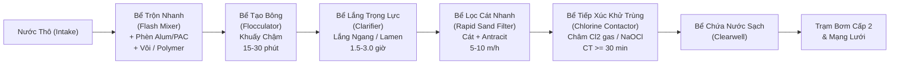
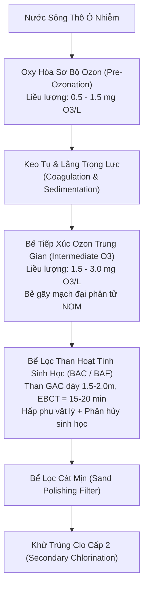
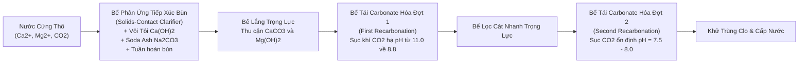
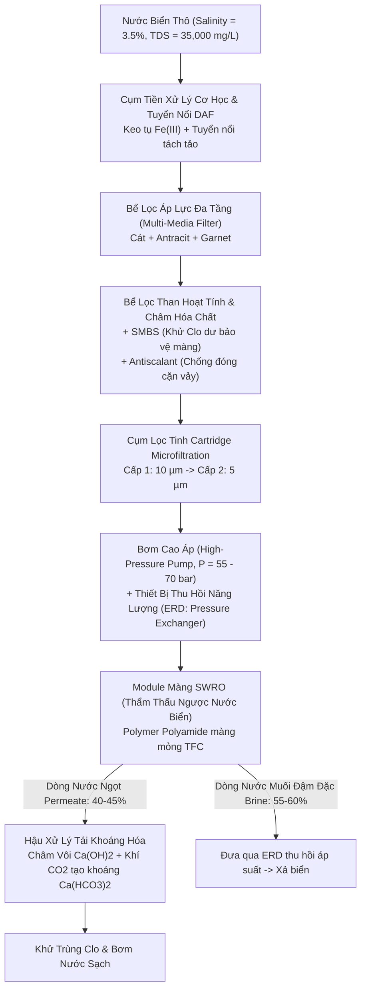

## Chương 1: Introduction & Water Quality

> [!NOTE]
> **Hồ sơ Học phần & Định vị Nội dung Giảng dạy**
> - **Mã học phần**: HCMUT-263 | **Tên môn học**: Kỹ thuật Xử lý Nước cấp (Water Treatment Engineering)
> - **Đơn vị đào tạo**: Khoa Môi trường và Tài nguyên – Trường Đại học Bách khoa, Đại học Quốc gia TP. Hồ Chí Minh
> - **Giảng viên biên soạn**: PGS. TS. Đặng Viết Hùng
> - **Thời lượng bài giảng**: 49 slides (Tuần 1 & Tuần 2 theo Đề cương chi tiết)
> - **Mục tiêu học thuật**: Thiết lập nền tảng lý luận toàn diện về kỹ thuật cấp nước, phân tích chu trình thủy địa hóa toàn cầu, phân loại 5 nhóm tạp chất nguồn nước, so sánh định lượng 4 nguồn nước cấp (nước mưa, nước biển, nước ngầm, nước mặt), phân tích kiến trúc mạng lưới cấp nước 3 phân khu, tổng hợp các quy chuẩn kỹ thuật bắt buộc (QCVN 01-1:2018/BYT, QCVN 6-1:2010/BYT, TCXDVN 33:2006, tiêu chuẩn nước bể bơi), khảo sát sơ đồ công nghệ xử lý nước cấp hiện đại và SAWACO, và làm chủ 14 bài toán tính toán kỹ thuật nền tảng (thủy tĩnh, độ nhớt, động năng, bơm trạm cấp 1, thủy văn lưu vực, dự báo dân số, lưu lượng chữa cháy cao ốc, cân bằng hệ carbonate và định lượng làm mềm kết tủa vôi - soda).

---

### 1.0 Tổng quan Môn học, Đề cương & Khung Tài liệu Tham khảo (Course Overview, Syllabus & Reference Framework)

#### 1.0.1 Giới thiệu Môn học & Mục tiêu Đào tạo (Course Scope & Learning Objectives)

##### 1.0.1.1 Vị trí Môn học trong Chương trình Đào tạo Kỹ thuật Môi trường
###### Phân bổ Thời lượng & Học phần Tiên quyết
Môn học **Kỹ thuật Xử lý Nước cấp** (Mã học phần HCMUT-263) là học phần chuyên ngành cốt lõi bắt buộc đối với sinh viên ngành Kỹ thuật Môi trường tại Trường Đại học Bách khoa – ĐHQG-HCM. Học phần được bố trí ở giai đoạn chuyên nghiệp (năm thứ 3 hoặc thứ 4) sau khi sinh viên đã hoàn thành các khối kiến thức cơ sở kỹ thuật vững chắc:
1. **Cơ học Chất lỏng / Thủy lực học (Fluid Mechanics & Hydraulics)**: Nắm vững định luật thủy tĩnh, phương trình năng lượng Bernoulli, phương trình liên tục, tổn thất áp lực dọc đường và cục bộ qua đường ống, kênh dẫn, lớp vật liệu lọc xốp và cánh khuấy phản ứng.
2. **Hóa học Đại cương & Hóa học Môi trường (General & Environmental Chemistry)**: Nắm vững nhiệt động học hóa học, cân bằng axit - bazơ, tích số tan của các chất ít tan ($K_{sp}$), phản ứng oxy hóa - khử (Redox), cơ chế keo tụ - đông tụ điện tích và hóa học các dạng khí hòa tan ($CO_2, O_2, H_2S, CH_4$).
3. **Toán Kỹ thuật & Phương trình Vi phân (Engineering Mathematics & Differential Equations)**: Khả năng mô hình hóa động học phản ứng bậc 0, bậc 1, bậc 2, giải các phương trình vi phân truyền khối và phương trình cân bằng vật chất trong các bể phản ứng liên tục khuấy trộn hoàn chỉnh (CSTR) và bể phản ứng dòng chảy nút (PFR).

##### 1.0.1.2 Chuẩn Đầu ra Môn học (Course Learning Outcomes - CLOs)
###### Bậc Thang Năng lực Kỹ thuật theo Bloom Taxonomy
Sau khi hoàn tất môn học và trực tiếp là Chương 1, người học đạt được 7 chuẩn đầu ra năng lực chuyên môn:
- **CLO 1 (Hiểu biết Thủy địa hóa)**: Phân tích bản chất chu trình thủy địa hóa toàn cầu; phân biệt cơ chế hình thành và biến đổi thành phần tạp chất giữa các nguồn nước mưa, nước biển, nước ngầm và nước mặt.
- **CLO 2 (Kiến trúc Hệ thống)**: Nhận diện cấu trúc chức năng và tương quan thủy lực giữa ba phân khu của hệ thống cấp nước đô thị: Công trình thu nước - Nhà máy xử lý nước cấp - Mạng lưới phân phối truyền dẫn.
- **CLO 3 (Quy chuẩn Pháp lý)**: Áp dụng chuẩn xác các ngưỡng giới hạn của Quy chuẩn Kỹ thuật Quốc gia QCVN 01-1:2018/BYT, QCVN 6-1:2010/BYT và tiêu chuẩn thiết kế TCXDVN 33:2006 trong việc đánh giá mức độ ô nhiễm và lựa chọn công nghệ.
- **CLO 4 (Lựa chọn Dây chuyền Công nghệ)**: Tổng hợp đặc tính chất lượng nước nguồn thô (độ đục, độ màu, sắt, mangan, độ cứng, vi sinh vật, chất hữu cơ NOM) để lựa chọn sơ đồ công nghệ tối ưu kỹ thuật - kinh tế.
- **CLO 5 (Tính toán Thủy lực Trạm Bơm & Lưu vực)**: Thực hiện thành thạo các tính toán thủy tĩnh, chuyển đổi đơn vị áp suất, tính độ nhớt động học, động năng, cột áp thủy lực tổng, công suất thủy lực ($P_w$) và công suất động cơ bơm ($BHP$).
- **CLO 6 (Dự báo Nhu cầu & Dân số)**: Vận dụng mô hình cân bằng ẩm thủy văn lưu vực trữ nước, các mô hình dự báo dân số (tuyến tính số học, hình học mũ, giảm dần tiệm cận) và tính toán nhu cầu dùng nước cực đại kết hợp lưu lượng chữa cháy quy chuẩn NBFU.
- **CLO 7 (Hóa học Nước & Làm mềm)**: Thiết lập phương trình cân bằng carbonate, tính toán phân bố cấu tử ($CO_2, HCO_3^-, CO_3^{2-}, OH^-$) theo pH, tính toán các dạng độ cứng (TH, CH, NCH) và giải quyết bài toán định lượng liều lượng hóa chất vôi - soda ash làm mềm nước thô.

#### 1.0.2 Đề cương Chi tiết 10 Chương (Curricular Roadmap)

##### 1.0.2.1 Chuỗi Quá trình Xử lý từ Nguồn đến Vòi nước
###### Ma trận Phân bố Nội dung 10 Chương
Toàn bộ môn học Kỹ thuật Xử lý Nước cấp được cấu trúc thành chuỗi 10 chương logic mô phỏng dòng chảy công nghệ từ tự nhiên đến tay người tiêu dùng:
- **Chương 1: Introduction (Tổng quan & Chất lượng Nước)**: Cơ sở thủy địa hóa, tạp chất, quy chuẩn chất lượng, tổng quan dây chuyền xử lý và tính toán kỹ thuật nền tảng.
- **Chương 2: Water Source & Collection System (Nguồn nước & Công trình Thu)**: Khảo sát địa chất thủy văn, tính toán công trình thu nước mặt (cửa thu ven bờ, lòng sông, trạm bơm nổi) và công trình thu nước ngầm (giếng khoan, hào thu, giếng khơi).
- **Chương 3: Coagulation and Flocculation (Keo tụ & Tạo bông)**: Cơ chế nén lớp điện kép, trung hòa điện tích, bẫy cặn quét (sweep flocculation), bắc cầu polymer; tính toán thủy lực bể trộn nhanh và bể tạo bông cơ học/thủy lực.
- **Chương 4: Removal of Iron and Manganese (Khử Sắt & Mangan)**: Nhiệt động học oxy hóa Fe(II) và Mn(II), tháp làm thoáng giàn mưa, tháp thổi khí cưỡng bức, châm hóa chất oxy hóa ($Cl_2, KMnO_4, O_3$), lọc tiếp xúc xúc tác $MnO_2$.
- **Chương 5: Sedimentation (Lắng)**: Lý thuyết lắng trọng lực 4 vùng hạt rời và hạt tạo bông; thiết kế bể lắng ngang, bể lắng đứng, bể lắng radian và bể lắng lamen (tấm nghiêng lamella).
- **Chương 6: Filtration (Lọc Nước)**: Cơ chế giữ cặn cơ học, hấp phụ dính bám trong tầng hạt lọc; thiết kế bể lọc cát nhanh trọng lực, bể lọc tự rửa, thủy lực rửa lọc gió - nước kết hợp.
- **Chương 7: Disinfection (Khử trùng Nước)**: Động học bất hoạt vi sinh vật Chick-Watson; công nghệ khử trùng bằng Clo khí hóa lỏng, Natri hypoclorit ($NaOCl$), Ozon ($O_3$), tia cực tím (UV) và kiểm soát phụ phẩm DBP (THMs, HAAs).
- **Chương 8: Advanced Treatment (Xử lý Bổ sung & Nâng cao)**: Hấp phụ than hoạt tính dạng hạt/bột (GAC/PAC), quá trình màng (MF, UF, NF, RO), oxy hóa nâng cao AOP ($O_3/H_2O_2, UV/H_2O_2$), khử muối nước biển SWRO.
- **Chương 9: Water Stabilization (Ổn định Hóa học Nước)**: Chỉ số bão hòa Langelier (LSI), chỉ số Ryznar (RSI), cơ chế ăn mòn kim loại mạng lưới và giải pháp kiềm hóa/thụ động hóa bề mặt ống.
- **Chương 10: Water Distribution System (Mạng lưới Phân phối Nước cấp)**: Thủy lực mạng lưới đường ống cấp nước, mạng nhánh và mạng vòng, bể chứa nước sạch, đài nước, trạm bơm cấp 2 và tính toán cân bằng áp lực trên phần mềm chuyên dụng (EPANET).

#### 1.0.3 Hệ thống Giáo trình & Tiêu chuẩn Thiết kế Cốt lõi (Core Reference Framework)

##### 1.0.3.1 Giáo trình Kỹ thuật Xử lý Nước Cấp Trong nước & Quốc tế
###### Trịnh Xuân Lai - Tính toán các công trình xử lý và phân phối nước cấp
Giáo trình kinh điển của GS. TS. Trịnh Xuân Lai (Nhà xuất bản Xây dựng) là tài liệu gối đầu giường của các kỹ sư cấp thoát nước tại Việt Nam. Cuốn sách cung cấp các công thức tính toán chi tiết, thông số kinh nghiệm thiết kế thực tế phù hợp với điều kiện khí hậu nhiệt đới, đặc tính thủy văn sông ngòi nhiều phù sa và trầm tích bùn cát mịn tại Việt Nam.

###### Nguyễn Ngọc Dung - Xử lý nước cấp
Tài liệu giáo khoa chuẩn mực của PGS. TS. Nguyễn Ngọc Dung (Nhà xuất bản Xây dựng) tập trung sâu vào bản chất các quá trình cơ lý hóa trong công nghệ xử lý nước sinh hoạt và công nghiệp, phân tích chi tiết cơ chế vận hành của từng công trình đơn vị từ bể tiếp xúc, giàn mưa khử sắt đến các thiết bị lọc áp lực.

###### MWH / Crittenden et al. - Water Treatment: Principles and Design
Tác phẩm đỉnh cao quốc tế của nhóm tác giả John C. Crittenden, R. Rhodes Trussell, David W. Hand, Kerry J. Howe, George Tchobanoglous (MWH, ấn bản Wiley). Cuốn sách là tiêu chuẩn toàn cầu về lý thuyết động học xử lý nước cấp, mô hình hóa toán học truyền khối, hóa học màng và cơ sở thiết kế quy mô công nghiệp.

###### AWWA - Water Quality & Treatment: A Handbook on Drinking Water
Sổ tay kỹ thuật toàn diện của Hiệp hội Công trình Nước Hoa Kỳ (American Water Works Association - AWWA). Cung cấp các tiêu chuẩn phân tích chất lượng nước chuyên sâu, các bệnh lý truyền nhiễm qua đường nước và các giải pháp công nghệ tiên tiến nhất đáp ứng tiêu chuẩn an toàn sức khỏe cộng đồng của US EPA.

##### 1.0.3.2 Khung Pháp lý & Quy chuẩn Kỹ thuật Việt Nam Hiện hành
###### TCXDVN 33:2006, QCVN 01-1:2018/BYT, QCVN 6-1:2010/BYT
- **TCXDVN 33:2006**: Tiêu chuẩn xây dựng Việt Nam do Bộ Xây dựng ban hành, quy định bắt buộc về tiêu chuẩn thiết kế mạng lưới đường ống và công trình xử lý cấp nước đô thị và công nghiệp.
- **QCVN 01-1:2018/BYT**: Quy chuẩn kỹ thuật quốc gia do Bộ Y tế ban hành, hợp nhất và thay thế các quy chuẩn cũ (QCVN 01:2009/BYT và QCVN 02:2009/BYT), là cơ sở pháp lý cao nhất bắt buộc áp dụng đối với tất cả đơn vị cấp nước sinh hoạt trên toàn lãnh thổ Việt Nam.
- **QCVN 6-1:2010/BYT**: Quy chuẩn kỹ thuật quốc gia đối với nước khoáng thiên nhiên và nước uống đóng chai, áp dụng các tiêu chuẩn an toàn thực phẩm cực kỳ khắt khe về vi sinh và độc chất vô cơ.

---

### 1.1 Nguồn nước & Nguyên lý Thủy địa hóa (Water Sources & Hydrogeochemical Fundamentals)

#### 1.1.1 Chu trình Thủy địa hóa & Phân loại Tạp chất trong Nước (Hydrogeochemical Cycle & Impurity Classification)

##### 1.1.1.1 Cơ chế Chu trình Thủy văn Toàn cầu & Quá trình Chưng cất Tự nhiên
###### Cân bằng Nhiệt ẩm & Động lực Bốc hơi Nước biển
Chu trình thủy địa hóa (Hydrogeochemical Cycle) là quá trình tuần hoàn vật chất và năng lượng liên tục của nước giữa thủy quyển, khí quyển, thạch quyển và sinh quyển dưới tác động của bức xạ mặt trời và trọng lực Trái đất:
1. **Quá trình Bốc hơi Biển (Solar Ocean Evaporation)**: Năng lượng bức xạ mặt trời hun nóng bề mặt đại dương, phá vỡ liên kết hydro giữa các phân tử nước lỏng ($H_2O$), chuyển nước thành thể hơi thoát vào khí quyển. Trong quá trình này, các ion muối khoáng hòa tan ($Na^+, Cl^-, SO_4^{2-}, Mg^{2+}$) và các tạp chất không bay hơi hoàn toàn bị giữ lại ở đại dương. Bản chất của hiện tượng bốc hơi tự nhiên này tương đương với một **quá trình chưng cất tự nhiên khổng lồ (natural solar distillation)**, biến nước mặn đại dương thành hơi nước ngọt tinh khiết.
2. **Ngưng tụ Khí quyển & Vận chuyển Ẩm (Atmospheric Transport & Condensation)**: Khối không khí ẩm bốc lên cao gặp tầng nhiệt độ thấp, hơi nước ngưng tụ thành các hạt sol khí lỏng hoặc tinh thể đá xung quanh các hạt nhân ngưng tụ (aerosol bụi khoáng, muối biển, phấn hoa) hình thành nên các đám mây.
3. **Giáng thủy (Precipitation)**: Khi kích thước hạt nước trong mây đủ lớn để trọng lực vượt qua lực nâng của dòng khí đối lưu, nước rơi xuống bề mặt đất dưới dạng mưa, tuyết, mưa đá hoặc sương mù.
4. **Dòng chảy Tràn Bề mặt (Surface Runoff) & Thấm Sâu (Infiltration)**: Lượng nước mưa khi chạm đất phân nhánh thành: một phần bốc hơi trực tiếp trở lại khí quyển; một phần chảy tràn trên bề mặt lưu vực tạo thành mạng lưới suối, sông, hồ và đổ về đại dương; phần còn lại thấm qua tầng đất mặt (vadose zone) bổ cập vào các tầng chứa nước ngầm (aquifers).

###### Phân bố Trữ lượng Nước trên Trái đất (Global Water Allocation)
Tổng trữ lượng nước trên toàn cầu ước tính khoảng $1.386 \times 10^9\text{ km}^3$, tuy nhiên sự phân bổ cho thấy sự khan hiếm nghiêm trọng nguồn nước ngọt khả dụng:
- **Nước mặn đại dương (Oceans)**: Chiếm **97.5%** tổng lượng nước toàn cầu, với độ mặn trung bình 35 g/L, không thể sử dụng trực tiếp cho sinh hoạt hay nông nghiệp nếu không qua khử muối.
- **Băng hà & Băng vĩnh cửu (Glaciers & Permanent Snowpack)**: Chiếm **1.76%** tổng trữ lượng nước (tương đương 68.7% tổng lượng nước ngọt), tập trung ở Nam Cực, Bắc Cực và các đỉnh núi cao, hầu như không thể khai thác quy mô công nghiệp.
- **Nước dưới đất (Groundwater)**: Chiếm **0.76%** tổng trữ lượng nước (tương đương 30.1% tổng lượng nước ngọt), là nguồn cấp nước sinh hoạt và tưới tiêu quan trọng nhất cho nhân loại.
- **Nước mặt ngọt (Freshwater Lakes & Rivers)**: Chỉ chiếm **< 0.01%** tổng lượng nước toàn cầu (hồ nước ngọt chiếm ~0.007%, sông suối chiếm ~0.0002%), nhưng lại là nguồn nước cấp tập trung chủ yếu cho các đô thị và nền văn minh nhân loại do tính thuận tiện khai thác.

##### 1.1.1.2 Các Đặc tính Vật lý Cơ bản của Nước trong Hệ Đơn vị SI
###### Khối lượng Riêng, Trọng lượng Riêng & Độ Nhớt
Trong kỹ thuật xử lý nước cấp, các tính toán thủy lực và truyền khối đòi hỏi việc áp dụng chuẩn xác các đặc tính vật lý của nước tinh khiết và nước tự nhiên ở các điều kiện nhiệt độ vận hành:
- **Khối lượng riêng ($\rho$)**: Nước có đặc tính dị thường đạt mật độ cực đại ở $4^\circ\text{C}$:
  $$\rho_{\text{water, } 4^\circ\text{C}} = 1000\text{ kg/m}^3 = 1.000\text{ g/cm}^3$$
  Ở nhiệt độ $20^\circ\text{C}$, $\rho = 998.2\text{ kg/m}^3$; ở $21^\circ\text{C}$, $\rho = 998.0\text{ kg/m}^3$; ở $25^\circ\text{C}$, $\rho = 997.0\text{ kg/m}^3$.
- **Trọng lượng riêng ($\gamma$)**: Tích số giữa khối lượng riêng và gia tốc trọng trường:
  $$\gamma = \rho \cdot g \approx 1000\text{ kg/m}^3 \times 9.81\text{ m/s}^2 = 9810\text{ N/m}^3 = 9.81\text{ kN/m}^3$$
- **Độ nhớt tuyệt đối (Độ nhớt động lực $\mu$)**: Thể hiện lực ma sát nội tại giữa các lớp chất lỏng chuyển động trượt lên nhau. Ở $20^\circ\text{C}$, $\mu \approx 1.002 \times 10^{-3}\text{ N}\cdot\text{s/m}^2$ ($1.002\text{ cP}$).
- **Độ nhớt động học ($\nu$)**: Tỷ số giữa độ nhớt tuyệt đối và khối lượng riêng:
  $$\nu = \frac{\mu}{\rho} \approx 1.004 \times 10^{-6}\text{ m}^2\text{/s}\text{ (ở } 20^\circ\text{C)}$$
- **Nhiệt dung riêng ($C_p$)**: Cực cao, $C_p = 4.184\text{ kJ/(kg}\cdot\text{K)}$, giúp các thủy vực tự nhiên có khả năng điều hòa nhiệt độ môi trường xung quanh rất ổn định.

##### 1.1.1.3 Phân loại Năm Nhóm Tạp chất Cốt lõi trong Nguồn Nước Tự nhiên
###### Nhóm 1: Các Hợp chất Vô cơ Hòa tan (Dissolved Inorganic Compounds)
Bao gồm các ion sinh ra do quá trình phong hóa khoáng chất, hòa tan đá vôi và tương tác địa hóa:
- **Cation chính**: Canxi ($Ca^{2+}$), Magie ($Mg^{2+}$) gây ra độ cứng; Natri ($Na^+$), Kali ($K^+$) quyết định độ mặn; Sắt ($Fe^{2+}$) và Mangan ($Mn^{2+}$) tồn tại phổ biến trong điều kiện khử thiếu khí.
- **Anion chính**: Bicarbonate ($HCO_3^-$) và Carbonate ($CO_3^{2-}$) tạo nên độ kiềm; Clorua ($Cl^-$) và Sunfat ($SO_4^{2-}$) đóng góp vào độ mặn và độ cứng phi carbonate; Nitrate ($NO_3^-$) và Fluoride ($F^-$).
- **Nguyên tố vết độc tính**: Asen ($As$), Chì ($Pb$), Cadmium ($Cd$), Crom ($Cr^{6+}$), Thủy ngân ($Hg$) có nguồn gốc từ khoáng sản hoặc nước thải công nghiệp, gây ngộ độc mãn tính và ung thư.

###### Nhóm 2: Các Hợp chất Hữu cơ Hòa tan (Dissolved Organic Matter - NOM)
- **Hợp chất hữu cơ tự nhiên (Natural Organic Matter - NOM)**: Chiếm đa số trong nước mặt, hình thành từ quá trình phân hủy thảm thực vật rừng, bùn tích tụ và dịch tiết chuyển hóa của tảo. Phân đoạn chính gồm **Axit Humic** (phân tử lượng lớn, tan trong kiềm, kết tủa trong axit, tạo màu vàng sẫm/nâu) và **Axit Fulvic** (phân tử lượng nhỏ hơn, tan trong mọi dải pH, tạo màu vàng nhạt).
- **Hợp chất hữu cơ tổng hợp (Synthetic Organic Chemicals - SOCs)**: Các chất hoạt động bề mặt (detergents), thuốc bảo vệ thực vật (pesticides, organochlorines), dung môi công nghiệp và các chất gây rối loạn nội tiết (EDCs).
- **Ý nghĩa kỹ thuật**: NOM là tác nhân tiêu tốn hóa chất keo tụ, gây tắc nghẽn màng lọc và đặc biệt là tiền chất (precursors) phản ứng với clo tạo thành các phụ phẩm khử trùng gây ung thư (Disinfection By-Products - DBPs).

###### Nhóm 3: Các Chất Khí Hòa tan (Dissolved Gases)
- **Oxy hòa tan (Dissolved Oxygen - DO)**: Khí thiết yếu duy trì sự sống thủy sinh và trạng thái oxy hóa của nước mặt; nước ngầm thường rất nghèo DO (< 1 - 2 mg/L).
- **Khí Carbonic ($CO_2$)**: Tạo môi trường axit ăn mòn đường ống, thúc đẩy quá trình hòa tan đá vôi tạo độ cứng.
- **Khí Hydro Sulfua ($H_2S$)**: Khí độc sinh ra do vi khuẩn khử sunfat trong điều kiện yếm khí, gây mùi trứng thối đặc trưng và làm đen nước khi phản ứng với sắt tạo $FeS$.
- **Khí Methane ($CH_4$) & Khí Radon ($Rn$)**: Khí dễ cháy nổ và khí phóng xạ tự nhiên thoát ra từ các tầng địa chất chứa urani/thori.

###### Nhóm 4: Các Chất Lơ lửng & Keo (Suspended Solids & Colloids)
- **Chất rắn lơ lửng (Total Suspended Solids - TSS)**: Các hạt cát mịn, bùn sét, xác hữu cơ kích thước từ $1\text{ }\mu\text{m}$ đến hàng trăm $\mu\text{m}$, gây ra độ đục (Turbidity) và có thể lắng tự nhiên dưới tác dụng của trọng lực.
- **Hệ phân tán keo (Colloidal Sol, $0.001 - 1\text{ }\mu\text{m}$)**: Các hạt keo khoáng sét (aluminosilicate), keo silica và phức hữu cơ. Các hạt keo mang điện tích bề mặt âm cố hữu, tạo lực đẩy tĩnh điện ngăn cản sự kết dính tự nhiên, đòi hỏi phải thực hiện quá trình keo tụ bằng phèn nhôm hoặc phèn sắt.

###### Nhóm 5: Vi sinh vật Gây bệnh (Pathogenic Microorganisms)
- **Vi khuẩn (Bacteria)**: *Escherichia coli* (chỉ thị nhiễm phân), *Vibrio cholerae* (phẩy khuẩn tả), *Salmonella typhi* (thương hàn), *Shigella* (lỵ trực khuẩn), *Pseudomonas aeruginosa* (trực khuẩn mủ xanh).
- **Virus**: Kích thước siêu nhỏ ($0.02 - 0.1\text{ }\mu\text{m}$), gồm Rotavirus (tiêu chảy cấp ở trẻ em), Enterovirus, Viêm gan A ($HAV$), Norovirus.
- **Động vật nguyên sinh & Ký sinh trùng (Protozoa & Helminths)**: Bào nang *Giardia lamblia* và noãn nang *Cryptosporidium parvum*. Noãn nang *Cryptosporidium* có vỏ kitin dày cực kỳ bền vững, trơ hoàn toàn với clo khử trùng thông thường, bắt buộc phải loại bỏ bằng rào cản lọc cơ học hoặc bất hoạt bằng Ozon / Tia UV.

#### 1.1.2 Nguồn Nước mưa & Nước biển (Rainwater & Seawater Sources)

##### 1.1.2.1 Nước Mưa: Đặc tính Hóa lý, Độ ổn định & Trữ lượng
###### Thành phần Ion, Độ Axit Tự nhiên & Tính Ăn mòn của Nước Mưa
- **Độ tinh khiết & Hàm lượng Khoáng hóa**: Nước mưa là sản phẩm ngưng tụ tự nhiên, có hàm lượng tổng chất rắn hòa tan (TDS) rất thấp ($10 - 50\text{ mg/L}$), độ cứng gần như bằng 0 (nước siêu mềm).
- **Độ axit tự nhiên**: Do hòa tan khí carbonic trong khí quyển ($CO_{2(g)} \rightleftharpoons CO_{2(aq)}$), nước mưa tự nhiên không ô nhiễm luôn có tính axit yếu với dải pH chuẩn từ **5.0 đến 5.6**:
  $$CO_2 + H_2O \rightleftharpoons H_2CO_3 \rightleftharpoons H^+ + HCO_3^-$$
  Tại các khu vực đô thị và công nghiệp phát thải nhiều $SO_2$ và $NO_x$, hiện tượng **mưa axit** diễn ra khiến pH nước mưa giảm xuống $3.5 - 4.5$.
- **Tính ăn mòn xâm thực (Aggressive Corrosiveness)**: Do thiếu hụt hoàn toàn ion canxi ($Ca^{2+}$) và kiềm bicarbonate ($HCO_3^-$), chỉ số bão hòa Langelier của nước mưa luôn âm sâu ($LSI \ll 0$). Khi tiếp xúc với đường ống kim loại hoặc bể xi măng, nước mưa hòa tan dữ dội vôi và kim loại, gây thủng ống và giải phóng chì, đồng vào nguồn nước.
- **Rủi ro Ô nhiễm Bề mặt Thu**: Bụi bẩn khí quyển, kim loại nặng từ khói xe, phân chim và rác lá cây tích tụ trên mái nhà khiến nước mưa đợt đầu (first flush) bị ô nhiễm vi sinh và tạp chất hữu cơ nặng nề.

###### Thu gom & Trữ nước Mưa Quy mô Hộ gia đình / Phi tập trung
Hệ thống thu gom nước mưa phân tán phục vụ vùng nông thôn, hải đảo hoặc dự phòng khẩn cấp bao gồm:
1. **Mái thu (Catchment Surface)**: Mái tôn, ngói hoặc bê tông sạch trơ hóa học (tránh mái fibro-xi măng chứa amiăng độc hại).
2. **Thiết bị xả nước mưa đợt đầu (First-Flush Diverter)**: Tự động cô lập và xả bỏ từ $1 - 2\text{ mm}$ lượng mưa ban đầu (tương đương $10 - 20\text{ L}$ cho mỗi $10\text{ m}^2$ diện tích mái) để làm sạch bề mặt thu.
3. **Bể chứa trữ nước (Storage Cistern)**: Bằng composite, nhựa HDPE hoặc bể bê tông kín chống ánh sáng chiếu rọi nhằm triệt tiêu sự phát triển của rêu tảo và muỗi vằn truyền bệnh.
4. **Xử lý bổ sung**: Lọc qua cột cát thạch anh, lọc than hoạt tính và khử trùng bằng đun sôi hoặc sục clo/bạc nano trước khi uống trực tiếp.

##### 1.1.2.2 Nước Biển: Độ mặn, Tỷ trọng & Rào cản Khử muối
###### Thành phần Hóa học Nước Biển & Áp suất Thẩm thấu
- **Độ mặn chuẩn (Salinity)**: Nước biển đại dương có độ mặn trung bình dao động từ **3.3% đến 3.7%**, quy ước thiết kế chuẩn là **3.5%** (tương đương nồng độ muối hòa tan **$35\text{ g/L}$** hay $35,000\text{ mg/L TDS}$).
- **Thành phần Ion Chủ đạo**:
  - Clorua ($Cl^-$): $\approx 19,350\text{ mg/L}$ (chiếm 55% tổng anion).
  - Natri ($Na^+$): $\approx 10,760\text{ mg/L}$ (chiếm 30.6% tổng cation).
  - Sunfat ($SO_4^{2-}$): $\approx 2,710\text{ mg/L}$.
  - Magie ($Mg^{2+}$): $\approx 1,290\text{ mg/L}$.
  - Canxi ($Ca^{2+}$): $\approx 410\text{ mg/L}$.
  - Kali ($K^+$): $\approx 390\text{ mg/L}$.
  - Bicarbonate ($HCO_3^-$): $\approx 140\text{ mg/L}$.
- **Áp suất Thẩm thấu ($\Pi$)**: Do nồng độ ion hòa tan khổng lồ, áp suất thẩm thấu tự nhiên của nước biển ở $25^\circ\text{C}$ đạt khoảng:
  $$\Pi = i M R T \approx 25 - 28\text{ bar (atm)}$$
  Để tách được nước ngọt qua màng thẩm thấu ngược (SWRO), áp suất vận hành thực tế của hệ thống bơm cao áp phải thắng được áp suất thẩm thấu cộng với tổn thất áp qua màng, thường phải duy trì từ **$55\text{ đến }70\text{ bar}$** ($800 - 1000\text{ psi}$).

###### Đặc tính Nhiệt động học: Hạ điểm Băng & Tỷ trọng Nước Biển
- **Tỷ trọng nước biển bề mặt**: Do chứa nồng độ muối cao, khối lượng riêng của nước biển lớn hơn đáng kể so với nước ngọt:
  $$\rho_{\text{seawater}} \approx 1.025\text{ kg/L} = 1025\text{ kg/m}^3\text{ (ở } 20^\circ\text{C, SG} = 1.025)$$
- **Hiện tượng Hạ điểm Đóng băng (Freezing Point Depression)**: Nồng độ phân tử gam chất tan cao làm hạ nhiệt độ kết tinh của nước. Nước biển có độ mặn 3.5% đóng băng ở nhiệt độ khoảng **$-1.9^\circ\text{C}$** thay vì $0.0^\circ\text{C}$ như nước tinh khiết.
- **Độ pH Nước biển**: Dao động trong khoảng đệm kiềm ổn định từ **7.5 đến 8.4** do hệ đệm carbonate - borate tự nhiên chi phối.

#### 1.1.3 Nguồn Nước ngầm: Chất lượng, Khoáng hóa & Nhiễm bẩn (Groundwater Quality, Minerals & Contamination)

##### 1.1.3.1 Địa tầng Thủy văn & Cơ chế Hòa tan Khoáng chất Tự nhiên
###### Tầng Chứa Nước Không Áp & Có Áp (Unconfined vs. Confined Aquifers)
Nước dưới đất được lưu trữ và dịch chuyển trong các tầng đất đá có tính rỗng và tính thấm (aquifers):
- **Tầng chứa nước không áp (Unconfined Aquifer)**: Tầng chứa nước nông nằm ngay dưới mặt đất, có ranh giới trên là mực nước ngầm tự do (water table) chịu trực tiếp áp suất khí quyển. Tầng này được bổ cập nhanh chóng bởi nước mưa thấm qua mặt đất nhưng cực kỳ dễ bị tổn thương bởi các nguồn ô nhiễm mặt đất.
- **Tầng chứa nước có áp (Confined / Artesian Aquifer)**: Nằm kẹp giữa hai tầng sét hoặc đá không thấm nước (aquitards). Nước trong tầng này chịu áp lực thủy tĩnh đáng kể; khi khoan giếng, mực nước sẽ tự dâng cao hơn vách tầng chứa (mực áp lực piezometric level), thậm chí tự phun trào lên mặt đất. Tầng có áp có chất lượng nước sạch hơn, được bảo vệ tự nhiên tốt hơn nhưng tốc độ bổ cập rất chậm.

###### Hòa tan Fe2+ và Mn2+ trong Môi trường Khử Thiếu Khí (Anaerobic Reducing Regime)
Trong quá trình nước mưa thấm sâu qua lớp đất hữu cơ mặt, các vi sinh vật tiêu thụ hết oxy hòa tan ($DO \to 0$) để oxy hóa chất hữu cơ, tạo ra thế oxy hóa - khử âm sâu ($Eh < 0$, môi trường khử mạnh).
Dưới điều kiện này, các hợp chất sắt(III) và mangan(IV) không tan trong đá khoáng phong hóa (như hematit $Fe_2O_3$, goethit $FeOOH$, pyrolusit $MnO_2$) bị khử thành các ion hóa trị II có độ tan cực lớn:
$$Fe^{3+}_{\text{(rắn)}} + e^- \to Fe^{2+}_{\text{(hòa tan)}}$$
$$MnO_{2\text{(rắn)}} + 4H^+ + 2e^- \to Mn^{2+}_{\text{(hòa tan)}} + 2H_2O$$
Khi vừa bơm lên khỏi miệng giếng, nước hoàn toàn trong suốt không màu vì $Fe^{2+}$ và $Mn^{2+}$ đang hòa tan. Tuy nhiên, chỉ sau vài chục phút tiếp xúc với không khí, oxy khuếch tán vào nước sẽ oxy hóa $Fe(II)$ thành kết tủa sắt(III) hydroxit ($Fe(OH)_3$) màu vàng nâu và $Mn(IV)$ thành mangan đioxit ($MnO_2$) màu đen, gây đục ngục, bám cặn đường ống và ố vàng quần áo, thiết bị vệ sinh.

###### Khoáng hóa Độ cứng (Ca2+, Mg2+) & Độc chất Tự nhiên (As, F-, Phóng xạ)
- **Cơ chế hòa tan độ cứng**: Nước ngầm chứa hàm lượng khí $CO_2$ rất cao (sinh ra từ hô hấp của rễ cây và vi sinh vật phân hủy chất hữu cơ trong đất). Khí $CO_2$ hòa tan tạo thành axit carbonic $H_2CO_3$, hòa tan mạnh mẽ các tầng đá vôi (limestone, $CaCO_3$) và đá dolomit ($CaMg(CO_3)_2$):
  $$CaCO_{3\text{(rắn)}} + CO_2 + H_2O \rightleftharpoons Ca^{2+} + 2HCO_3^-$$
  $$CaMg(CO_3)_{2\text{(rắn)}} + 2CO_2 + 2H_2O \rightleftharpoons Ca^{2+} + Mg^{2+} + 4HCO_3^-$$
  Quá trình này giải phóng ion $Ca^{2+}$ và $Mg^{2+}$ nồng độ cao vào nước ngầm, tạo ra độ cứng tạm thời (carbonate hardness).
- **Asen tự nhiên (Arsenic - As)**: Asen hòa tan trong nước ngầm bắt nguồn từ quá trình khử khoáng sắt hydroxit chứa asen hấp phụ hoặc oxy hóa quặng pirit chứa asen ($FeAsS$). Asen tồn tại dưới dạng arsenite ($As^{3+}$, $H_3AsO_3$) độc tính cực cao trong môi trường khử, hoặc arsenate ($As^{5+}$, $H_2AsO_4^-$) trong môi trường oxy hóa. Tại Đồng bằng sông Hồng và Đồng bằng sông Cửu Long, nhiều tầng giếng khoan nông có nồng độ asen vượt gấp $10 - 50$ lần giới hạn quy chuẩn ($> 0.01\text{ mg/L}$), gây bệnh sừng hóa da và ung thư nội tạng.
- **Fluoride ($F^-$) & Radionuclides**: Hòa tan từ khoáng fluorit ($CaF_2$) gây vàng răng và mục xương nếu $> 1.5\text{ mg/L}$. Phóng xạ Radon ($^{222}Rn$) và Radium ($^{226}Ra$) hòa tan từ các mạch đá magma/granite.

###### Nước ngầm Nhiễm lợ (Brackish Groundwater: 1000 - 5000 mg/L TDS)
Tại các vùng đồng bằng ven biển (như Bến Tre, Trà Vinh, Sóc Trăng, Cà Mau và phía Nam TP. Hồ Chí Minh), do quá trình sụt lún địa tầng và khai thác nước ngầm quá mức làm hạ thấp mực áp lực, nước biển xâm nhập vào các tầng chứa nước ngọt. Nước ngầm chuyển thành **nước lợ** với hàm lượng tổng chất rắn hòa tan TDS dao động từ **$1000\text{ đến }5000\text{ mg/L}$**, đòi hỏi phải áp dụng công nghệ màng lọc thẩm thấu ngược nước lợ (BWRO) hoặc điện thẩm tích (EDR) để khử mặn.

##### 1.1.3.2 Cơ chế Nhiễm bẩn Nhân sinh Tầng Nước Ngầm (Anthropogenic Groundwater Contamination)
###### Nhiễm bẩn Xăng dầu từ Bể ngầm (UST Leaks: BTEX & MTBE)
- **Nguyên nhân**: Hàng ngàn trạm kinh doanh xăng dầu chôn các bồn chứa bằng thép (Underground Storage Tanks - UST). Qua thời gian từ $15 - 30$ năm, sự ăn mòn điện hóa làm thủng vỏ bồn hoặc vỡ đường ống truyền dẫn ngầm, giải phóng một lượng lớn xăng dầu vào lòng đất.
- **Tác nhân ô nhiễm chính**: Nhóm hydrocarbon thơm độc hại **BTEX** (**B**enzene, **T**oluene, **E**thylbenzene, **X**ylenes) và phụ gia tăng chỉ số octan **MTBE** (Methyl tert-butyl ether).
- **Cơ chế lan truyền**: BTEX và MTBE có tính linh động cao trong nước ngầm; MTBE tan mạnh trong nước và rất khó phân hủy sinh học, tạo thành vệt ô nhiễm (plume) lan rộng hàng kilomét theo hướng dòng chảy ngầm, xâm nhập trực tiếp vào các giếng khai thác nước cấp đô thị. Benzene là chất gây ung thư máu nhóm 1 theo IARC.

###### Ô nhiễm Nitrate (NO3-) từ Hệ thống Tự hoại & Phân bón Nông nghiệp
- **Nguồn phát sinh**: Nước rỉ từ các bể tự hoại hư hỏng của khu dân cư và lượng dư thừa phân đạm hóa học ($NH_4NO_3, (NH_2)_2CO$) trên các cánh đồng nông nghiệp thâm canh.
- **Cơ chế chuyển hóa**: Amoni giải phóng trong tầng đất hiếu khí bị vi khuẩn nitrat hóa oxy hóa thành nitrite ($NO_2^-$) rồi thành nitrate ($NO_3^-$).
- **Rủi ro sức khỏe**: Ion nitrate mang điện tích âm không bị các hạt keo đất giữ lại, dễ dàng thấm sâu vào tầng chứa nước ngầm. Khi nồng độ nitrate trong nước uống vượt quá $50\text{ mg/L}$ (hoặc $10\text{ mg/L}$ tính theo $N-NO_3^-$), trẻ sơ sinh uống phải sẽ mắc hội chứng **Methemoglobinemia (Hội chứng Trẻ xanh - Blue Baby Syndrome)**, do nitrate bị khử thành nitrite trong ruột, oxy hóa sắt $Fe^{2+}$ của hemoglobin thành $Fe^{3+}$ làm mất khả năng vận chuyển oxy nuôi cơ thể.

###### Ô nhiễm Hóa chất Công nghiệp (TCE, PCE, Hóa chất Bảo vệ Thực vật)
Các dung môi tẩy rửa công nghiệp thuộc nhóm chlorinated hydrocarbons như Trichloroethylene (TCE) và Tetrachloroethylene (PCE) từ các xưởng mạ điện, giặt khô thải trái phép ngấm xuống tầng nước ngầm tạo thành các túi chất lỏng tỷ trọng nặng không tan trong nước (DNAPL - Dense Non-Aqueous Phase Liquid). Các túi DNAPL chìm sâu xuống đáy tầng chứa nước, hòa tan từ từ trong hàng thế kỷ, gây ô nhiễm nguồn nước ngầm lâu dài.

##### 1.1.3.3 Ma trận Đánh giá Ưu điểm & Nhược điểm của Nước Ngầm
###### Phân tích So sánh Ưu điểm Tự nhiên & Rủi ro Kỹ thuật Nước Ngầm
Dưới góc độ kỹ thuật xử lý và kinh tế vận hành, nguồn nước ngầm có các ưu điểm và nhược điểm đối nghịch rõ rệt:

| Tiêu chí Đánh giá | Ưu điểm Kỹ thuật của Nước Ngầm | Nhược điểm & Thách thức Công nghệ |
|---|---|---|
| **Độ đục & Cặn lơ lửng** | Độ đục cực thấp ($\le 1 - 2\text{ NTU}$), hầu như không có cặn lơ lửng nhờ quá trình lọc cơ học tự nhiên qua các tầng cát sỏi hàng triệu năm. | Có thể mang theo cát mịn làm xước cánh bơm giếng; khi súc rửa giếng không đúng kỹ thuật có thể kéo sụt lở địa tầng. |
| **Ô nhiễm Vi sinh vật** | Hầu như không có vi khuẩn gây bệnh, virus và ký sinh trùng do điều kiện ngầm không có ánh sáng và đã qua lọc tự nhiên (trừ giếng nông gần hố xí). | Nếu tầng bảo vệ bị nứt gãy hoặc nước mặt chảy tràn vào miệng giếng, sự nhiễm bẩn vi sinh cực kỳ khó phát hiện kịp thời. |
| **Nhiệt độ & Lưu lượng** | Nhiệt độ quanh năm cực kỳ ổn định ($22 - 25^\circ\text{C}$), không phụ thuộc vào chu kỳ thời tiết bề mặt. | Trữ lượng có hạn; khai thác quá mức dẫn đến cạn kiệt tầng chứa nước, sụt lún nền đất đô thị và xâm nhập mặn. |
| **Độ màu & Chất hữu cơ** | Hàm lượng chất hữu cơ tự nhiên (NOM) rất thấp, giảm thiểu nguy cơ tạo ra phụ phẩm khử trùng DBP. | Có thể chứa khí hòa tan độc hại ($H_2S, CH_4$); màu nước xuất hiện do sắt/mangan bị oxy hóa tạo thành cặn kết tủa. |
| **Hóa chất Xử lý** | Không cần dây chuyền keo tụ - tạo bông - lắng bùn phức tạp, tiết kiệm diện tích xây dựng nhà máy. | Chi phí năng lượng bơm chìm giếng sâu rất lớn; chi phí hóa chất vôi/soda hoặc muối hoàn nguyên để làm mềm nước cứng rất cao. |
| **Tính bền vững** | Bể chứa tự nhiên khổng lồ, an toàn trước các cuộc tấn công phá hoại nguồn nước bề mặt. | Khi đã bị nhiễm độc asen, hóa chất bảo vệ thực vật hoặc dung môi clo, quá trình xử lý phục hồi tầng nước ngầm gần như bất khả thi. |

#### 1.1.4 Nguồn Nước mặt: Thủy vực & Động lực Lưu vực (Surface Water Characteristics & Watershed Dynamics)

##### 1.1.4.1 Phân loại Thủy vực Nước Mặt & Biến động Mùa vụ
###### Thủy vực Chảy (Sông suối - Lotic) vs. Thủy vực Tĩnh (Hồ chứa - Lentic)
Nguồn nước mặt được phân chia thành hai hệ sinh thái thủy văn có động lực dòng chảy và chất lượng nước hoàn toàn khác biệt:
1. **Hệ Thủy vực Chảy (Lotic Systems - Sông, Suối)**:
   - Dòng chảy liên tục với vận tốc dòng lớn ($v = 0.5 - 2.5\text{ m/s}$), khả năng tự làm sạch và tái sục khí oxy hòa tan từ khí quyển rất mạnh ($DO \approx 6 - 8\text{ mg/L}$).
   - Chịu ảnh hưởng trực tiếp và tức thời từ dòng chảy tràn trên toàn bộ diện tích lưu vực thu nước.
   - Chất lượng nước biến đổi từng giờ theo diễn biến thời tiết, mưa bão, xả lũ và hoạt động xả thải ven sông.
2. **Hệ Thủy vực Tĩnh (Lentic Systems - Hồ Tự nhiên, Hồ chứa Thủy lợi / Thủy điện)**:
   - Vận tốc dòng chảy chậm ($v \approx 0$), thời gian lưu nước kéo dài từ vài tháng đến vài năm, thúc đẩy quá trình lắng tự nhiên các hạt cặn lơ lửng thô, giúp nước hồ có độ đục nền thấp và ổn định hơn nước sông.
   - Dễ bị hiện tượng **phân tầng nhiệt độ (Thermal Stratification)** vào mùa hè: tầng mặt nước ấm ($Epilimnion$) giàu DO nhưng ấm áp; tầng đáy nước lạnh ($Hypolimnion$) tù đọng, yếm khí giải phóng sắt, mangan, photpho và $H_2S$ từ bùn đáy hồ.
   - Nguy cơ cao xảy ra hiện tượng **phú dưỡng hóa (Eutrophication)** do tích tụ nitơ và photpho, dẫn đến bùng phát hoa sen tảo (algal blooms), sản sinh độc tố vi khuẩn lam ($Microcystin$) và các hợp chất gây mùi hôi đất nồng nặc (Geosmin và MIB - 2-Methylisoborneol).

###### Xung Đột biến Độ đục do Mưa lũ & Biến thiên Thông số Nước Sông
Trong mùa khô, nước sông duy trì độ đục thấp ($20 - 50\text{ NTU}$), độ kiềm và pH ổn định. Tuy nhiên, khi xuất hiện **các trận mưa bão lớn trên lưu vực (large storm events)**:
- Nước mưa xói mòn bề mặt đất rừng, nương rẫy và rửa trôi đất cát công trường xây dựng, làm độ đục nước sông **bùng phát đột ngột lên $500 - 3000\text{ NTU}$** chỉ trong vòng vài giờ.
- Đồng thời, nước mưa pha loãng làm sụt giảm mạnh nồng độ ion bicarbonate, khiến **độ kiềm giảm sâu ($Alk < 20 - 30\text{ mg/L as }CaCO_3$)** và pH giảm nhẹ.
- Xung biến thiên đột ngột này đe dọa làm tê liệt hệ thống keo tụ - tạo bông của nhà máy xử lý nước nếu không kịp thời điều chỉnh tăng liều lượng phèn, bổ sung kiềm (vôi hoặc soda) và châm polymer trợ lắng.

##### 1.1.4.2 Phức chất Hữu cơ Tự nhiên (NOM) & Tiền chất Tạo Phụ phẩm Khử trùng
###### Nguồn gốc Autochthonous vs. Allochthonous & Cấu trúc Humic/Fulvic
Chất hữu cơ tự nhiên (NOM) trong nước mặt có hai nguồn gốc hình thành:
1. **Nguồn Autochthonous (Nội sinh Thủy vực)**: Sinh ra trực tiếp bên trong thủy vực từ hoạt động quang hợp, trao đổi chất và phân rã của tảo, vi khuẩn lam và thực vật thủy sinh. Nguồn này chứa nhiều hợp chất hữu cơ không màu, protein, axit amin, carbohydrate phân tử lượng nhỏ, tỷ số $C/N$ thấp và chỉ số hấp thụ tia cực tím riêng ($SUVA_{254} < 2\text{ L/(mg}\cdot\text{m)}$).
2. **Nguồn Allochthonous (Ngoại sinh Lưu vực)**: Rửa trôi từ thảm thực vật đất rừng mục nát trên lưu vực đổ vào dòng sông. Phân đoạn này chiếm chủ đạo, giàu các hợp chất thơm đa vòng, axit humic và fulvic, phân tử lượng lớn ($1,000 - 50,000\text{ Da}$) và chỉ số $SUVA_{254} > 3 - 4\text{ L/(mg}\cdot\text{m)}$, tạo cho nước có độ màu vàng nâu đặc trưng.
3. **Phản ứng Sinh Phụ phẩm Khử trùng (DBP Formation)**: Khi clo hóa khử trùng nguồn nước mặt có chứa NOM, clo phản ứng với các nhân thơm phenolic của axit humic/fulvic sinh ra các hợp chất halogen hóa cực độc:
   $$\text{NOM} + Cl_2 \to \text{THMs (Trihalomethanes: } CHCl_3, CHBrCl_2, CHBr_2Cl, CHBr_3\text{)} + \text{HAAs (Haloacetic Acids)}$$
   Các chất này gây tổn thương gan, thận và làm tăng nguy cơ ung thư bàng quang, trực tràng ở người sử dụng nước lâu dài.

##### 1.1.4.3 Nguy cơ Ô nhiễm Vi sinh vật & So sánh Tổng thể Nước Mặt vs. Nước Ngầm
###### Kén vi sinh Giardia/Cryptosporidium & Vi khuẩn Chỉ thị Ô nhiễm Phân
Khác biệt sinh tử lớn nhất giữa nước mặt và nước ngầm là **nước mặt luôn tiềm ẩn nguy cơ ô nhiễm vi sinh vật gây bệnh (Pathogens)** từ nước thải sinh hoạt đô thị chưa xử lý, nước rửa trôi chuồng trại chăn nuôi gia súc và phân động vật hoang dã.
Đặc biệt, sự xuất hiện của các ký sinh trùng kháng clo như bào nang *Giardia lamblia* ($8 - 14\text{ }\mu\text{m}$) và noãn nang *Cryptosporidium parvum* ($4 - 6\text{ }\mu\text{m}$) bắt buộc mọi nhà máy xử lý nước mặt phải thiết lập quy trình keo tụ - lắng - lọc cát nghiêm ngặt để loại bỏ cơ học các vi sinh vật này trước khi khử trùng.

###### Bảng Đối sánh Chi tiết Nước Mặt vs. Nước Ngầm
Bảng ma trận đối soát toàn diện các đặc tính kỹ thuật giữa hai nguồn nước chính:

| Thông số Đặc tính | Nước Mặt (Sông, Hồ chứa) | Nước Ngầm (Tầng chứa nước sâu) |
|---|---|---|
| **Độ đục (Turbidity)** | Rất cao ($10 - 2000\text{ NTU}$), biến động dữ dội theo mùa mưa lũ. | Rất thấp ($\le 1 - 2\text{ NTU}$), ổn định quanh năm. |
| **Độ màu (Color)** | Cao ($10 - 150\text{ TCU}$), do phức chất humic/fulvic hòa tan và keo sét. | Rất thấp (trừ khi nhiễm sắt/mangan bị oxy hóa tạo màu đục). |
| **Oxy hòa tan (DO)** | Cao ($6 - 8\text{ mg/L}$), gần bão hòa nhờ tiếp xúc bề mặt khí quyển. | Rất thấp hoặc hoàn toàn không có ($0 - 2\text{ mg/L}$), yếm khí. |
| **Khí Carbonic ($CO_2$)** | Thấp ($0 - 5\text{ mg/L}$), cân bằng tự nhiên với khí quyển. | Rất cao ($20 - 100\text{ mg/L}$), gây tính xâm thực ăn mòn mạnh. |
| **Sắt & Mangan ($Fe, Mn$)** | Thấp, tồn tại chủ yếu ở dạng cặn lơ lửng $Fe^{3+}$ liên kết với bùn đất. | Thường rất cao ($1 - 20\text{ mg/L}$), tồn tại ở dạng hòa tan $Fe^{2+}, Mn^{2+}$. |
| **Độ cứng ($Ca^{2+}, Mg^{2+}$)**| Thấp đến trung bình ($20 - 100\text{ mg/L as }CaCO_3$, nước mềm). | Thường cao đến rất cao ($100 - 500\text{ mg/L as }CaCO_3$, nước cứng). |
| **Chất hữu cơ (NOM, TOC)**| Cao ($2 - 15\text{ mg/L}$), nhiều tiền chất tạo phụ phẩm clo THMs. | Thấp ($< 1 - 2\text{ mg/L}$), ít nguy cơ tạo THMs. |
| **Vi sinh vật gây bệnh** | Nguy cơ cực cao (vi khuẩn tả, thương hàn, virus, kén *Giardia/Crypto*). | Nguy cơ rất thấp nếu giếng khoan bảo vệ đúng quy chuẩn kỹ thuật. |
| **Dây chuyền xử lý chuẩn**| Keo tụ $\to$ Tạo bông $\to$ Lắng $\to$ Lọc cát $\to$ Khử trùng Clo. | Làm thoáng $\to$ Kiềm hóa $\to$ Lắng tiếp xúc $\to$ Lọc cát $\to$ Khử trùng. |

### 1.2 Kiến trúc & Phân loại Hệ thống Cấp nước (Water Supply System Architecture & Classification)

#### 1.2.1 Ba Hạng mục Cốt lõi của Hệ thống Cấp nước Đô thị

##### 1.2.1.1 Phân khu Thu nước & Trạm Bơm Cấp 1 (Water Intake & Low-Lift Pumping Station)
###### Công trình Thu Nước Mặt & Nước Ngầm
Hạng mục đầu tiên của hệ thống cấp nước có nhiệm vụ thu nhận nước thô trực tiếp từ nguồn nước tự nhiên và vận chuyển an toàn về nhà máy xử lý:
1. **Công trình Thu Nước Mặt**:
   - **Song chắn rác thô & lưới chắn rác tinh**: Bố trí tại cửa thu nước để ngăn chặn rác trôi nổi, cành cây, bèo tây và các loài thủy sinh xâm nhập vào ngăn hút.
   - **Cửa thu ven bờ (Shore Intake)**: Áp dụng cho các bờ sông dốc đứng, địa chất ổn định, mực nước dao động ít.
   - **Cửa thu lòng sông (Riverbed Intake)**: Đặt sâu dưới lòng sông qua đầu thu hình nấm hoặc ống xi-phông dẫn về giếng thu ven bờ, áp dụng khi bờ sông thoai thoải hoặc mép nước cạn xa bờ.
   - **Trạm Bơm Cấp 1 (Low-Lift Pumping Station)**: Bố trí các tổ máy bơm ly tâm trục đứng hoặc trục ngang công suất lớn, vận hành với cột áp thấp ($H = 10 - 25\text{ m}$) chỉ đủ để đẩy nước thô qua tuyến ống áp lực (raw water transmission mains) lên điểm cao nhất của dây chuyền công nghệ (thường là tháp đo lưu lượng hoặc bể trộn nhanh).
2. **Công trình Thu Nước Ngầm**:
   - Bao gồm mạng lưới giếng khoan khai thác sâu ($50 - 250\text{ m}$) khoan vào tầng chứa nước có áp.
   - Ống lọc giếng (well screen) chế tạo bằng thép không gỉ hoặc PVC có khe rãnh chuẩn, bao bọc xung quanh bởi lớp sỏi chèn (gravel pack) nhằm ngăn chặn cát mịn lọt vào giếng.
   - Bơm chìm giếng sâu (Submersible turbine pumps) lắp đặt ngập sâu dưới mực nước động, bơm nước thô trực tiếp lên giàn mưa làm thoáng.

##### 1.2.1.2 Nhà máy Xử lý Nước cấp (Water Treatment Plant - WTP)
###### Bố trí Mặt bằng & Tuyến Thủy lực Trọng lực
Nhà máy xử lý nước cấp là trung tâm công nghệ chuyển hóa nước thô ô nhiễm thành nước sạch đạt quy chuẩn vệ sinh an toàn sinh hoạt:
- **Tuyến Thủy lực Tự chảy (Gravity Flow Hydraulic Profile)**: Một nguyên tắc thiết kế tối thượng của kỹ thuật cấp nước là toàn bộ dòng chảy qua các công trình đơn vị (từ bể trộn $\to$ tạo bông $\to$ lắng $\to$ lọc $\to$ khử trùng) phải **hoàn toàn tự chảy bằng trọng lực**. Do đó, cao trình mực nước của bể trộn đầu vào phải được tính toán đủ cao để bù đắp toàn bộ tổn thất cột áp qua các công trình, van khóa, máng tràn và lớp cát lọc, trước khi đổ vào bể chứa nước sạch nằm âm dưới mặt đất.
- **Khu Hóa chất (Chemical Feed Facilities)**: Gồm kho chứa phèn, vôi, polymer, clo; các bể hòa trộn dung dịch hóa chất; hệ thống bơm định lượng màng và ống truyền dẫn hóa chất chống ăn mòn.
- **Khu Xử lý Bùn cặn (Sludge Treatment Train)**: Thu gom bùn từ đáy bể lắng và nước rửa ngược bể lọc; chuyển qua bể nén bùn trọng lực (gravity sludge thickener), bể điều hòa và máy ép bùn ly tâm hoặc máy ép bùn băng tải (belt filter press) để tạo bánh bùn khô đem đi chôn lấp hợp vệ sinh.

##### 1.2.1.3 Mạng lưới Truyền dẫn & Phân phối Nước sạch (Distribution Network)
###### Trạm Bơm Cấp 2, Bể Chứa Nước Sạch & Đài Nước Điều hòa
Hạng mục cuối cùng có nhiệm vụ lưu trữ, điều hòa và phân phối nước sạch áp lực cao đến tận vòi nước của người tiêu dùng:
- **Bể Chứa Nước Sạch (Clearwell / Finished Water Reservoir)**: Thường xây dựng bằng bê tông cốt thép ngầm, có chức năng điều hòa lưu lượng giữa chế độ sản xuất liên tục 24/24h của nhà máy và chế độ tiêu thụ nước biến thiên từng giờ của đô thị. Đồng thời, bể chứa nước sạch còn đóng vai trò là **bể tiếp xúc khử trùng (disinfection contact basin)** đảm bảo thời gian tiếp xúc của clo tối thiểu $CT \ge 30\text{ phút}$, và tích trữ lượng nước dự phòng chữa cháy bắt buộc trong $3\text{ giờ}$.
- **Trạm Bơm Cấp 2 (High-Lift Pumping Station)**: Bố trí các tổ máy bơm ly tâm công suất cực lớn, vận hành với cột áp cao ($H = 40 - 70\text{ m}$) để đẩy nước vào mạng lưới truyền dẫn chính. Trạm bơm cấp 2 thường trang bị biến tần (VFD) để tự động điều chỉnh tốc độ quay theo áp lực mạng lưới thời gian thực.
- **Đài Nước Điều hòa & Tháp Áp lực (Elevated Water Tower)**: Bố trí tại các điểm cao trong đô thị hoặc cuối mạng lưới nhằm ổn định áp lực thủy lực, chống hiện tượng búa nước (water hammer) và bổ cấp nước trong các giờ dùng nước cao điểm.
- **Mạng lưới Đường ống Phân phối**: Cấu trúc thành mạng lưới vòng khép kín (looped network) nhằm đảm bảo tính cấp nước an toàn liên tục; khi một đoạn ống bị sự cố vỡ, van phân đoạn có thể cô lập đoạn ống đó để sửa chữa mà không làm mất nước các khu vực xung quanh.

#### 1.2.2 Phân loại Hệ thống Cấp nước theo Mục đích Sử dụng

##### 1.2.2.1 Cấp nước Sinh hoạt Đô thị (Domestic Water Supply)
###### Tiêu chuẩn Dịch vụ & Yêu cầu Lưu lượng, Áp lực
Hệ thống cấp nước sinh hoạt phục vụ nhu cầu ăn uống, tắm giặt, vệ sinh cá nhân và các hoạt động công cộng đô thị:
- **Chất lượng**: Phải tuân thủ nghiêm ngặt 100% các chỉ tiêu của Quy chuẩn Kỹ thuật Quốc gia **QCVN 01-1:2018/BYT**.
- **Lưu lượng định mức**: Tính toán dựa trên quy mô đô thị theo TCXDVN 33:2006, dao động từ **$150\text{ đến }250\text{ L/người}\cdot\text{ngày}$**.
- **Áp lực tự do tối thiểu tại vòi**: Điểm đấu nối vào nhà dân phải duy trì cột áp tự do tối thiểu $10\text{ m}$ (cho nhà 1 tầng) và cộng thêm $4\text{ m}$ cho mỗi tầng nhà tiếp theo để nước tự chảy lên bồn chứa trên mái mà không cần bơm gia nhiệt cục bộ.

##### 1.2.2.2 Cấp nước Công nghiệp (Industrial Process Water)
###### Phân cấp Yêu cầu Chất lượng theo Ngành Sản xuất
Tùy thuộc vào bản chất của dây chuyền công nghệ sản xuất, nước cấp công nghiệp được phân cấp thành các tiêu chuẩn rất khác biệt:
- **Nước làm mát gián tiếp (Cooling Water)**: Khối lượng tiêu thụ khổng lồ, yêu cầu kiểm soát độ cứng và độ kiềm để chống đóng cặn cáu ($CaCO_3$) trong tháp giải nhiệt, châm hóa chất diệt khuẩn chống màng sinh học (biofilm) và kiểm soát tính ăn mòn.
- **Nước cấp lò hơi (Boiler Feedwater)**: Đòi hỏi độ tinh khiết cực cao; lò hơi áp suất càng cao thì yêu cầu khử khoáng càng khắt khe. Nước phải qua làm mềm khử ion hoàn toàn ($TH \approx 0\text{ mg/L}$), khử khí oxy hòa tan ($DO < 0.005\text{ mg/L}$) để chống ăn mòn lỗ kim (pitting corrosion) và khử triệt để hàm lượng Silic ($SiO_2 < 0.01\text{ mg/L}$) nhằm ngăn ngừa sự tạo thành lớp vảy silicat cứng như kim cương trên bề mặt truyền nhiệt ống lò.
- **Nước công nghệ Dệt nhuộm & Sản xuất Giấy**: Yêu cầu hàm lượng sắt và mangan cực thấp ($Fe < 0.05\text{ mg/L}, Mn < 0.02\text{ mg/L}$) để tránh làm loang lổ màu vải nhuộm hoặc ố vàng bột giấy tẩy trắng.
- **Nước Siêu Tinh Khiết (Ultrapure Water - UPW)**: Sử dụng trong sản xuất vi mạch bán dẫn điện tử và dược phẩm, yêu cầu điện trở suất đạt mức giới hạn lý thuyết **$18.2\text{ M}\Omega\cdot\text{cm}$ ở $25^\circ\text{C}$**, hàm lượng carbon hữu cơ tổng $TOC < 1 - 5\text{ ppb}$, không chứa hạt cặn $> 0.05\text{ }\mu\text{m}$ và vô trùng tuyệt đối.

##### 1.2.2.3 Cấp nước Chữa cháy & Hệ thống Cấp nước Kết hợp (Fire Fighting & Combined Municipal Systems)
###### Nguyên lý Lưu lượng Trùng hợp & Dự phòng Dung tích Trữ nước Chữa cháy
Trong thực tiễn kỹ thuật hạ tầng đô thị tại Việt Nam và quốc tế, việc xây dựng một mạng lưới đường ống chữa cháy hoàn toàn độc lập là cực kỳ tốn kém. Do đó, giải pháp tiêu chuẩn được áp dụng là **Hệ thống Cấp nước Kết hợp (Combined Water Supply System)**:
- Mạng lưới đường ống chuyển tải đồng thời nước sinh hoạt, nước dịch vụ thương mại và nước chữa cháy.
- Các trụ cứu hỏa (fire hydrants) đường kính $D100 - D150\text{ mm}$ được đấu nối trực tiếp vào mạng lưới phân phối chính với khoảng cách bố trí không quá $150\text{ m}$ giữa hai trụ theo quy định phòng cháy chữa cháy.
- Khi xảy ra hỏa hoạn, lưu lượng cấp nước chữa cháy được cộng dồn đồng thời vào **nhu cầu dùng nước ngày lớn nhất ($Q_{\text{max day}}$)**. Bể chứa nước sạch của nhà máy bắt buộc phải dành riêng một ngăn dung tích tĩnh không được phép sử dụng cho sinh hoạt để đảm bảo dập tắt đám cháy liên tục trong thời gian quy chuẩn là **$3\text{ giờ}$**.

---

### 1.3 Chỉ tiêu Chất lượng Nước & Cân bằng Carbonate (Water Quality Parameters & Carbonate Chemistry)

#### 1.3.1 Nhóm Chỉ tiêu Vật lý, Hóa học & Vi sinh vật

##### 1.3.1.1 Chỉ tiêu Vật lý & Thẩm mỹ (Physical & Aesthetic Parameters)
###### Độ đục (NTU), Độ màu (TCU), Mùi vị (TON), TDS, Độ dẫn điện (EC)
Các thông số vật lý phản ánh cảm quan trực tiếp của người sử dụng và ảnh hưởng lớn đến các công đoạn xử lý tiếp theo:
1. **Độ đục (Turbidity, đơn vị NTU - Nephelometric Turbidity Units)**:
   - Đo cường độ tán xạ của chùm ánh sáng truyền qua mẫu nước bởi các hạt lơ lửng, keo sét, bùn vi sinh.
   - Tiêu chuẩn nước sạch sinh hoạt quy định $\le 2\text{ NTU}$, nhưng các nhà máy xử lý hiện đại luôn kiểm soát sau bể lọc $\le 0.2 - 0.5\text{ NTU}$ nhằm đảm bảo hiệu quả khử trùng và ngăn ngừa vi sinh vật ẩn nấp trong các khe nứt của hạt cặn.
2. **Độ màu biểu kiến & Độ màu thực (Color, đơn vị TCU - True Color Units hoặc thang đo Pt-Co)**:
   - Màu biểu kiến do cả hạt lơ lửng và chất tan gây ra. Màu thực đo sau khi đã ly tâm hoặc lọc qua màng $0.45\text{ }\mu\text{m}$, chủ yếu do các phức chất hữu cơ humic/fulvic hoặc ion kim loại hòa tan ($Fe^{3+}, Mn^{2+}$).
   - Ngưỡng giới hạn quy chuẩn là $\le 15\text{ TCU}$.
3. **Mùi và Vị (Taste and Odour, chỉ số TON - Threshold Odour Number)**:
   - Không được có mùi vị lạ. Mùi bùn ngái do hợp chất Geosmin và MIB từ tảo sinh ra; mùi thuốc tẩy do dẫn xuất cloramin; mùi trứng thối do khí $H_2S$.
4. **Tổng Chất rắn Hòa tan (TDS - Total Dissolved Solids, mg/L) & Độ dẫn điện (EC, $\mu\text{S/cm}$)**:
   - TDS biểu thị tổng khối lượng các cation, anion vô cơ và hợp chất hữu cơ hòa tan qua màng lọc $0.45\text{ }\mu\text{m}$.
   - Tương quan thực nghiệm giữa TDS và độ dẫn điện riêng:
     $$\text{TDS (mg/L)} \approx (0.55 - 0.70) \times \text{EC (}\mu\text{S/cm)}$$
   - Giới hạn quy chuẩn của TDS trong nước uống là $\le 1000\text{ mg/L}$.

##### 1.3.1.2 Chỉ tiêu Hóa học & Chỉ số Ô nhiễm Chất hữu cơ (Chemical Parameters)
###### Độ cứng, Kiềm, Kim loại nặng, Hợp chất Nitơ, Nhu cầu Oxy
1. **Chỉ số Nhu cầu Oxy Hóa học (Chemical Oxygen Demand - COD) & Chỉ số Permanganate ($KMnO_4$)**:
   - Thể hiện hàm lượng chất hữu cơ dễ bị oxy hóa trong nước. Nước ngầm sạch thường có độ tiêu thụ oxy $\le 1\text{ mg }O_2\text{/L}$, trong khi nước mặt ô nhiễm có thể lên tới $5 - 15\text{ mg }O_2\text{/L}$.
2. **Hợp chất Nitơ ($NH_4^+, NO_2^-, NO_3^-$)**:
   - Chuỗi biến đổi sinh hóa: $NH_4^+ \to NO_2^- \to NO_3^-$.
   - Sự hiện diện của Amoni ($NH_4^+$) cảnh báo nguồn nước mới bị nhiễm bẩn nước thải sinh hoạt hoặc phân bón; amoni tiêu tốn lượng clo khử trùng rất lớn do tạo thành cloramin. Nitrite ($NO_2^-$) là chất trung gian độc tính cao, giới hạn $\le 0.05\text{ mg/L}$. Nitrate ($NO_3^-$) biểu thị ô nhiễm đã hoàn tất quá trình oxy hóa.
3. **Kim loại nặng và Nguyên tố vết**:
   - Sắt tổng số ($Fe \le 0.3\text{ mg/L}$) và Mangan tổng số ($Mn \le 0.1\text{ mg/L}$) gây vàng ố và mùi kim loại khó chịu.
   - Các kim loại cực độc: Asen ($As \le 0.01\text{ mg/L}$), Chì ($Pb \le 0.01\text{ mg/L}$), Cadmium ($Cd \le 0.003\text{ mg/L}$), Thủy ngân ($Hg \le 0.001\text{ mg/L}$).

##### 1.3.1.3 Chỉ tiêu Vi sinh vật & Mầm bệnh (Microbiological Parameters)
###### Coliform tổng số, E. coli, Trực khuẩn Mủ xanh, Vi khuẩn Kỵ khí
Các bệnh truyền nhiễm nguy hiểm nhất lây lan qua nguồn nước là các bệnh đường ruột (tả, lỵ, thương hàn, tiêu chảy cấp). Việc xét nghiệm từng loại vi khuẩn gây bệnh trong phòng thí nghiệm rất tốn kém và mất nhiều ngày, do đó ngành kỹ thuật môi trường sử dụng **các sinh vật chỉ thị vệ sinh (Indicator Organisms)**:
- **Coliform Tổng số (Total Coliforms)**: Nhóm vi khuẩn hình que, gram âm, kỵ khí tùy nghi, có khả năng lên men đường lactose sinh axit và sinh khí ở $35 - 37^\circ\text{C}$ trong vòng 48h. Biểu thị mức độ vệ sinh chung của hệ thống cấp nước. Ngưỡng quy chuẩn QCVN 01-1:2018/BYT là $< 3\text{ CFU/100 mL}$.
- **Escherichia coli (E. coli) & Coliform Phân (Fecal Coliforms)**: Nhóm coliform chịu nhiệt có khả năng lên men lactose ở nhiệt độ cao $44.5^\circ\text{C}$. *E. coli* là cư dân cố hữu trong ruột người và động vật máu nóng. Sự xuất hiện của *E. coli* là bằng chứng không thể chối cãi rằng nguồn nước vừa bị **nhiễm phân tươi**, đồng nghĩa với việc có nguy cơ cực cao tồn tại các mầm bệnh tả, thương hàn và virus đường ruột. Tiêu chuẩn nước ăn uống yêu cầu **hoàn toàn không được phép có ($< 1\text{ CFU/100 mL}$)**.

#### 1.3.2 Cân bằng Hóa học Hệ Carbonate & Khí CO2 Hòa tan

##### 1.3.2.1 Chuỗi Phản ứng Hòa tan Khí CO2 & Phân ly Axit Carbonic
###### Phản ứng Thủy hóa CO2 & Hằng số Henry
Hệ đệm carbonate là hệ hóa học quan trọng nhất chi phối giá trị pH, độ kiềm và khả năng tự đệm của hầu hết các nguồn nước tự nhiên trên Trái đất:
1. **Hòa tan khí Carbonic theo Định luật Henry**:
   Khí $CO_2$ trong khí quyển hòa tan vào nước thiết lập cân bằng dị thể:
   $$CO_{2\text{(k)}} \rightleftharpoons CO_{2\text{(dd)}}$$
   Hàm lượng hòa tan phụ thuộc vào áp suất riêng phần $P_{CO_2}$ qua hằng số Henry $K_H \approx 3.39 \times 10^{-2}\text{ mol/(L}\cdot\text{atm)}$ ở $25^\circ\text{C}$:
   $$[CO_{2\text{(dd)}}] = K_H \cdot P_{CO_2}$$
2. **Thủy hóa tạo Axit Carbonic**:
   Phân tử $CO_2$ hòa tan phản ứng với nước tạo thành axit carbonic chưa phân ly:
   $$CO_{2\text{(dd)}} + H_2O \rightleftharpoons H_2CO_3$$
   Trong thực tế, tỷ lệ phân tử $CO_{2\text{(dd)}}$ thực sự thủy hóa thành $H_2CO_3$ rất nhỏ (chưa đầy 0.3%). Vì rất khó phân biệt nồng độ của $CO_{2\text{(dd)}}$ và $H_2CO_3$ bằng phương pháp chuẩn độ, hóa học môi trường quy ước gộp chung hai dạng này thành **Axit Carbonic Biểu kiến**, ký hiệu là $[H_2CO_3^*]$:
   $$[H_2CO_3^*] = [CO_{2\text{(dd)}}] + [H_2CO_3]$$

##### 1.3.2.2 Hằng số Phân ly Axit Carbonic Thứ nhất (K1)
###### Phương trình Cân bằng K1 [eq_ch01_020] & Phổ Phân ly ở 25°C
Axit carbonic biểu kiến phân ly giải phóng proton bậc 1 tạo ion bicarbonate ($HCO_3^-$):
$$H_2CO_3^* \rightleftharpoons H^+ + HCO_3^-$$

Biểu thức hằng số cân bằng nhiệt động học bậc nhất ($K_1$) ở điều kiện chuẩn ($25^\circ\text{C}$):
$$K_1 = \frac{[\text{H}^+][\text{HCO}_3^-]}{[\text{H}_2\text{CO}_3^*]} = 4.47 \times 10^{-7} \quad (\text{p}K_1 = 6.35)$$

> [!IMPORTANT]
> **Đặc tả Phương trình Kỹ thuật `eq_ch01_020`**:
> - **Tên phương trình**: Carbonic Acid First Acidity Dissociation Constant ($K_1$)
> - **Dạng LaTeX**: $$K_1 = \frac{[\text{H}^+][\text{HCO}_3^-]}{[\text{H}_2\text{CO}_3^*]} = 4.47 \times 10^{-7} \quad (\text{p}K_1 = 6.35 \text{ at } 25^\circ\text{C})$$
> - **Dạng Plain Text**: `K_1 = ([H+] * [HCO3-]) / [H2CO3*] = 4.47e-7 (pK1 = 6.35 at 25 deg C)`
> - **Ý nghĩa Kỹ thuật**: Thiết lập tương quan định lượng giữa lượng khí $CO_2$ tự do xâm thực và ion kiềm bicarbonate. Ở giá trị $\text{pH} = \text{p}K_1 = 6.35$, nồng độ của axit carbonic biểu kiến đúng bằng nồng độ của ion bicarbonate ($[H_2CO_3^*] = [HCO_3^-]$).

##### 1.3.2.3 Hằng số Phân ly Bicarbonate Thứ hai (K2)
###### Phương trình Cân bằng K2 [eq_ch01_021] & Tương quan Ion Carbonate
Ở môi trường kiềm hóa ($\text{pH} > 8.3$), ion bicarbonate tiếp tục phân ly bậc 2 giải phóng proton thứ hai tạo thành ion carbonate ($CO_3^{2-}$):
$$HCO_3^- \rightleftharpoons H^+ + CO_3^{2-}$$

Biểu thức hằng số cân bằng nhiệt động học bậc hai ($K_2$) ở $25^\circ\text{C}$:
$$K_2 = \frac{[\text{H}^+][\text{CO}_3^{2-}]}{[\text{HCO}_3^-]} = 4.69 \times 10^{-11} \quad (\text{p}K_2 = 10.33)$$

> [!IMPORTANT]
> **Đặc tả Phương trình Kỹ thuật `eq_ch01_021`**:
> - **Tên phương trình**: Bicarbonate Second Acidity Dissociation Constant ($K_2$)
> - **Dạng LaTeX**: $$K_2 = \frac{[\text{H}^+][\text{CO}_3^{2-}]}{[\text{HCO}_3^-]} = 4.69 \times 10^{-11} \quad (\text{p}K_2 = 10.33 \text{ at } 25^\circ\text{C})$$
> - **Dạng Plain Text**: `K_2 = ([H+] * [CO32-]) / [HCO3-] = 4.69e-11 (pK2 = 10.33 at 25 deg C)`
> - **Ý nghĩa Kỹ thuật**: Phương trình chi phối trực tiếp công nghệ làm mềm nước bằng vôi. Khi nâng pH lên vùng $\text{pH} > 10.33$, ion $HCO_3^-$ bị ép chuyển hóa hoàn toàn thành ion $CO_3^{2-}$, kết hợp với canxi sẵn có trong nước tạo thành kết tủa canxi cacbonat tinh thể ($CaCO_3\downarrow$) lắng xuống đáy bể.

##### 1.3.2.4 Tích số Ion Tự ion hóa của Nước (Kw)
###### Phương trình Phân ly Nước Kw [eq_ch01_022] & Hoạt độ Ion OH-
Phân tử nước tự phân ly thành ion hydro và ion hydroxit:
$$H_2O \rightleftharpoons H^+ + OH^-$$

Tích số ion của nước ở $25^\circ\text{C}$:
$$K_w = [\text{H}^+][\text{OH}^-] = 1.00 \times 10^{-14} \quad (\text{p}K_w = 14.00)$$

> [!IMPORTANT]
> **Đặc tả Phương trình Kỹ thuật `eq_ch01_022`**:
> - **Tên phương trình**: Autoionization Ion Product of Water ($K_w$)
> - **Dạng LaTeX**: $$K_w = [\text{H}^+][\text{OH}^-] = 1.00 \times 10^{-14} \quad (\text{p}K_w = 14.00 \text{ at } 25^\circ\text{C})$$
> - **Dạng Plain Text**: `K_w = [H+] * [OH-] = 1.0e-14 (pKw = 14.0 at 25 deg C)`
> - **Ý nghĩa Kỹ thuật**: Cho phép tính toán chính xác nồng độ ion hydroxit $[OH^-] = K_w / [H^+] = 10^{-(14 - \text{pH})}$, thành phần bắt buộc trong phương trình cân bằng proton xác định tổng độ kiềm của nước ở dải pH cao ($\text{pH} \ge 10.0$).

##### 1.3.2.5 Giản đồ Phân bố Dạng Carbonate theo pH (Bjerrum Diagram)
###### Các Vùng Ưu thế pH < 6.35, 6.35 - 10.33, và > 10.33
Tổng nồng độ mol của tất cả các dạng vô cơ hòa tan trong hệ carbonate được định nghĩa là $C_T$ (Total Inorganic Carbon):
$$C_T = [H_2CO_3^*] + [HCO_3^-] + [CO_3^{2-}]$$

Bằng cách thế các biểu thức hằng số cân bằng $K_1$ và $K_2$ vào biểu thức $C_T$, ta thiết lập được tỷ lệ phân bố phần mol (phân số ion $\alpha_0, \alpha_1, \alpha_2$) phụ thuộc duy nhất vào nồng độ ion $[H^+]$:
$$\alpha_0 = \frac{[H_2CO_3^*]}{C_T} = \frac{[H^+]^2}{[H^+]^2 + K_1[H^+] + K_1 K_2}$$
$$\alpha_1 = \frac{[HCO_3^-]}{C_T} = \frac{K_1 [H^+]}{[H^+]^2 + K_1[H^+] + K_1 K_2}$$
$$\alpha_2 = \frac{[CO_3^{2-}]}{C_T} = \frac{K_1 K_2}{[H^+]^2 + K_1[H^+] + K_1 K_2}$$

Giản đồ Bjerrum phân chia hệ dung dịch thành **ba miền ưu thế hóa học rõ rệt**:
1. **Miền pH Axit ($\text{pH} < 6.35$)**:
   - Dạng chiếm ưu thế tuyệt đối là **$H_2CO_3^*$ (khí $CO_2$ hòa tan)**.
   - Nước có tính xâm thực ăn mòn mạnh đối với kim loại và bê tông.
   - Giải pháp công nghệ: Làm thoáng bằng giàn mưa hoặc sục khí cưỡng bức để tước đoạt khí $CO_2$ bay vào khí quyển, tự động nâng pH lên mà không tốn hóa chất kiềm.
2. **Miền pH Trung tính ($\mathbf{6.35 < \text{pH} < 10.33}$)**:
   - Dạng chiếm ưu thế áp đảo là **ion Bicarbonate ($HCO_3^-$)**, đạt cực đại $\approx 98\%$ tại điểm đẳng điện $\text{pH} \approx \frac{6.35 + 10.33}{2} = 8.34$.
   - Đây là dải pH của hầu hết các nguồn nước mặt và nước cấp sinh hoạt tự nhiên (pH $6.5 - 8.5$).
   - Nước có khả năng đệm axit tuyệt vời, hấp thụ các ion axit sinh ra trong quá trình keo tụ bằng phèn nhôm mà không làm sụt giảm pH đột ngột.
3. **Miền pH Kiềm Mạnh ($\text{pH} > 10.33$)**:
   - Dạng chiếm ưu thế chủ đạo là **ion Carbonate ($CO_3^{2-}$)** và ion Hydroxit ($OH^-$).
   - Tồn tại điều kiện lý tưởng để kết tủa triệt để độ cứng: Canxi kết tủa dưới dạng $CaCO_3\downarrow$ ở $\text{pH} \approx 9.5 - 10.0$; Magie kết tủa dưới dạng Magie hydroxit $Mg(OH)_2\downarrow$ ở $\text{pH} \approx 10.8 - 11.0$.

### 1.4 Quy chuẩn Kỹ thuật & Tiêu chuẩn Thiết kế (Water Quality Standards & Regulatory Compliance)

#### 1.4.1 Quy chuẩn Chất lượng Nước sạch Sinh hoạt (QCVN 01-1:2018/BYT)

##### 1.4.1.1 Phạm vi Áp dụng & Trách nhiệm Tuân thủ
###### Khung Pháp lý Giám sát Chất lượng Nước Đô thị & Nông thôn
**QCVN 01-1:2018/BYT** (Quy chuẩn kỹ thuật quốc gia về chất lượng nước sạch sử dụng cho mục đích sinh hoạt) được Bộ Y tế ban hành theo Thông tư số 41/2018/TT-BYT ngày 14/12/2018, chính thức có hiệu lực từ ngày 15/06/2019:
- **Đối tượng áp dụng bắt buộc**: Áp dụng đối với tất cả các tổ chức, cá nhân thực hiện một phần hoặc tất cả các hoạt động khai thác, sản xuất, truyền dẫn, bán buôn, bán lẻ nước sạch sinh hoạt; bao gồm cả các đơn vị cấp nước quy mô tập trung từ $1000\text{ m}^3\text{/ngày}$ trở lên và các trạm cấp nước nông thôn nhỏ lẻ.
- **Phân nhóm thông số thử nghiệm**: Quy chuẩn phân chia thành **Thông số nhóm A** (thử nghiệm định kỳ tối thiểu 1 lần/tháng đối với tất cả các đơn vị cấp nước) và **Thông số nhóm B** (thử nghiệm định kỳ tối thiểu 1 lần/6 tháng đối với các thông số hóa chất độc hại, kim loại nặng, phụ phẩm khử trùng theo danh mục do Ủy ban nhân dân cấp tỉnh phê duyệt dựa trên đánh giá rủi ro nguồn nước địa phương).
- **Vị trí lấy mẫu quan trắc**: Mẫu nước thử nghiệm phải được thu thập tại ba vị trí xung yếu: (1) Bể chứa nước sạch sau xử lý tại nhà máy; (2) Các điểm nút trọng yếu trên mạng lưới đường ống truyền dẫn; và (3) Tại vòi nước trực tiếp của các hộ gia đình tiêu thụ cuối mạng lưới.

##### 1.4.1.2 Bảng Giới hạn Thông số Chất lượng Cốt lõi (Table tbl_ch01_01)
###### 11 Chỉ tiêu Quy định Bắt buộc Mức ngưỡng Tối đa
Bảng tổng hợp chi tiết 11 chỉ tiêu chất lượng nước sạch thiết yếu quy định trong QCVN 01-1:2018/BYT, kèm theo phân tích cơ sở kỹ thuật và tác động sức khỏe:

| TT | Tên Thông số Phân tích | Đơn vị Tính | Giới hạn Tối đa | Cơ sở Kỹ thuật & Rủi ro Sức khỏe / Vận hành |
|---|---|---|---|---|
| **1** | **Màu sắc (Color)** | TCU (Pt-Co) | $\le 15$ | Mức cảm quan thẩm mỹ. Độ màu cao biểu thị sự hiện diện của hợp chất hữu cơ humic/fulvic hoặc sắt/mangan hòa tan, làm giảm độ tin cậy của khách hàng và gây cặn bám. |
| **2** | **Mùi, vị (Taste & Odour)** | - | Không có mùi, vị lạ | Cảm quan trực tiếp. Ngăn ngừa các chất gây mùi từ tảo (Geosmin, MIB), khí độc ($H_2S$) hoặc dẫn xuất clo hữu cơ khó chịu. |
| **3** | **Độ đục (Turbidity)** | NTU | $\le 2$ | Rào cản vi sinh vật cốt lõi. Hạt cặn lơ lửng bảo vệ vi khuẩn, virus khỏi tác dụng tiêu diệt của chất khử trùng; độ đục $> 2\text{ NTU}$ làm suy giảm nghiêm trọng hiệu lực diệt khuẩn của tia UV và Clo. |
| **4** | **pH** | - | $6.0 - 8.5$ | Kiểm soát ăn mòn và hiệu quả khử trùng. Nếu $\text{pH} < 6.0$, nước hòa tan kim loại đường ống; nếu $\text{pH} > 8.5$, axit hipocloro ($HOCl$) bị phân ly thành ion $OCl^-$ làm giảm $80 - 90\%$ hoạt tính diệt khuẩn và dễ đóng cặn $CaCO_3$. |
| **5** | **Độ cứng tổng số (Total Hardness)** | mg $CaCO_3$/L | $\le 300$ | Bảo vệ hệ thống nhiệt và đường ống. Độ cứng $> 300\text{ mg/L}$ làm tiêu tốn xà phòng, gây tắc nghẽn đường ống nước nóng, đóng cặn bình đun và làm giảm tuổi thọ màng lọc sinh hoạt. |
| **6** | **Tổng chất rắn hòa tan (TDS)** | mg/L | $\le 1000$ | Độ mặn và cảm quan vị giác. TDS $> 1000\text{ mg/L}$ khiến nước có vị lợ hoặc mặn, gây khát và không thích hợp cho người có bệnh lý tim mạch, thận. |
| **7** | **Hàm lượng Sắt tổng số (Fe)** | mg/L | $\le 0.3$ | Kiểm soát màu và đóng cặn. Nồng độ sắt $> 0.3\text{ mg/L}$ làm nước có vị tanh kim loại, tạo cặn bùn nâu đỏ lắng đọng trong ống phân phối, làm ố vàng đồ giặt và sứ vệ sinh. |
| **8** | **Hàm lượng Mangan tổng số (Mn)** | mg/L | $\le 0.1$ | Ngăn ngừa cặn đen. Mangan bị clo hóa tạo thành kết tủa $MnO_2$ màu đen bám dính thành ống, bong tróc tạo dòng nước đen gây khiếu nại gay gắt từ người dân; Mn tích tụ lâu dài gây độc thần kinh. |
| **9** | **Hàm lượng Clo dư tự do (Free Chlorine)** | mg/L | $0.2 - 1.0$ | **Rào cản an toàn vi sinh thứ cấp**. Clo dư tự do bắt buộc phải duy trì liên tục từ $0.2\text{ đến }1.0\text{ mg/L}$ tại mọi điểm tiêu thụ cuối mạng lưới để ngăn ngừa vi khuẩn tái phát triển trong đường ống dài. |
| **10**| **Tổng số Coliform** | CFU/100 mL | $< 3$ | Chỉ thị vệ sinh an toàn vi sinh vật tổng thể của toàn bộ hệ thống xử lý và mạng lưới truyền dẫn nước sạch. |
| **11**| **Escherichia coli (E. coli)** | CFU/100 mL | $< 1$ (0) | **Chỉ thị tuyệt đối về ô nhiễm phân**. Tuyệt đối không được phép phát hiện bất kỳ vi khuẩn *E. coli* nào trong 100 mL nước sinh hoạt (nguyên tắc Zero Tolerance). |

#### 1.4.2 Quy chuẩn Nước uống Đóng chai & Nước khoáng Thiên nhiên (QCVN 6-1:2010/BYT)

##### 1.4.2.1 Tiêu chí An toàn Vi sinh Khắt khe
###### Giới hạn 0 CFU/250 mL cho Vi khuẩn Chỉ thị & Trực khuẩn Gây bệnh
Đối với sản phẩm nước uống đóng bình, đóng chai tiêu thụ trực tiếp vào cơ thể mà không qua đun sôi, Quy chuẩn **QCVN 6-1:2010/BYT** áp dụng các yêu cầu kiểm soát vi sinh vật cực kỳ nghiêm ngặt:
- **Thể tích kiểm tra**: Mẫu xét nghiệm vi sinh được nâng lên thể tích chuẩn **$250\text{ mL}$** (thay vì $100\text{ mL}$ như nước sinh hoạt).
- **Chỉ tiêu kiểm soát bắt buộc đạt 0 CFU/250 mL**:
  1. *Escherichia coli* hoặc *Coliform* chịu nhiệt: **0 CFU/250 mL**.
  2. *Streptococci* phân (*Enterococci*): **0 CFU/250 mL**.
  3. *Pseudomonas aeruginosa* (Trực khuẩn mủ xanh - vi khuẩn cơ hội kháng thuốc nguy hiểm): **0 CFU/250 mL**.
  4. Bào tử vi khuẩn kỵ khí khử sunfat (*Clostridium perfringens*): **0 CFU/50 mL**.

##### 1.4.2.2 Yêu cầu Công nghệ Đa Rào cản Bắt buộc
###### Rào cản Lọc màng RO, Sát khuẩn Khí Ozone & Tia cực tím (UV)
Để đạt được độ an toàn tuyệt đối theo QCVN 6-1:2010/BYT, dây chuyền sản xuất nước đóng chai bắt buộc phải thiết lập **nguyên lý đa rào cản (Multi-Barrier Principle)**:
1. **Rào cản Tiền xử lý Vật lý**: Lọc cát thạch anh khử cặn thô $\to$ Cột than hoạt tính (GAC) khử màu, mùi, clo dư và triệt tiêu chất hữu cơ $\to$ Cột trao đổi ion làm mềm nước.
2. **Rào cản Màng Phân tử**: Màng lọc thẩm thấu ngược hai cấp (Double-Pass Reverse Osmosis - RO) có kích thước lỗ lọc $< 0.001\text{ }\mu\text{m}$, loại bỏ $> 99.5\%$ khoáng hòa tan, vi khuẩn và virus.
3. **Rào cản Khử trùng Kép (Dual Disinfection)**:
   - Sục khí Ozon ($O_3$) nồng độ cao vào bồn tiếp xúc để tiêu diệt tức thời mọi mầm bệnh còn sót lại, đồng thời duy trì một lượng ozon dư nhỏ trong chai sau khi đóng nắp để tiệt trùng vỏ chai và nắp đậy.
   - Chiếu xạ tia cực tím bước sóng ngắn ($\text{UV-C, }\lambda = 254\text{ nm}$) với liều lượng chiếu xạ tối thiểu $40\text{ mJ/cm}^2$ ngay trước đầu chiết rót tự động phòng sạch vô trùng.

#### 1.4.3 Tiêu chuẩn Thiết kế Công trình Cấp nước (TCXDVN 33:2006)

##### 1.4.3.1 Tiêu chuẩn Dùng nước Sinh hoạt theo Đô thị
###### Tiêu chuẩn Định mức 150 – 250 L/người·ngày
Tiêu chuẩn xây dựng Việt Nam **TCXDVN 33:2006** (Cấp nước – Mạng lưới đường ống và công trình – Tiêu chuẩn thiết kế) quy định định mức tiêu thụ nước sinh hoạt bình quân đầu người theo phân loại đô thị:
- **Đô thị loại đặc biệt và loại I** (TP. Hồ Chí Minh, Hà Nội, Đà Nẵng, Hải Phòng, Cần Thơ): Tiêu chuẩn cấp nước thiết kế từ **$200\text{ đến }250\text{ L/người}\cdot\text{ngày}$**; tỷ lệ dân số được cấp nước đạt $95 - 100\%$.
- **Đô thị loại II**: Tiêu chuẩn cấp nước thiết kế từ **$150\text{ đến }180\text{ L/người}\cdot\text{ngày}$**.
- **Đô thị loại III, IV, V**: Tiêu chuẩn cấp nước thiết kế từ **$100\text{ đến }150\text{ L/người}\cdot\text{ngày}$**.
- **Các hệ số không điều hòa**:
  - Hệ số dùng nước ngày không điều hòa ($K_{\text{day max}} = 1.2 - 1.5$).
  - Hệ số dùng nước giờ không điều hòa ($K_{\text{hour max}} = 1.3 - 2.0$, phụ thuộc vào quy mô dân số đô thị).

##### 1.4.3.2 Quy định Áp lực Tự do Tối thiểu & Lưu lượng Cấp nước Chữa cháy
###### Áp lực Cột nước Tự do & Thời gian Lưu trữ Chữa cháy Dự phòng
- **Cột áp tự do tối thiểu trong mạng lưới**:
  - Đối với nhà 1 tầng: Áp lực tự do tại điểm vào nhà dân không được nhỏ hơn **$10\text{ m}$ cột nước** ($1.0\text{ bar} = 100\text{ kPa}$).
  - Đối với nhà nhiều tầng: Mỗi tầng nhà tiếp theo cộng thêm **$4\text{ m}$ cột nước** ($H_{\text{free}} = 10 + 4(N - 1)\text{ mét}$, với $N$ là số tầng).
- **Lưu lượng nước chữa cháy quy chuẩn**:
  - Xác định theo quy mô dân số và bậc chịu lửa của công trình xây dựng. Đối với khu dân cư từ $10,000 - 25,000$ dân, lưu lượng chữa cháy quy chuẩn đồng thời từ $15 - 25\text{ L/s}$ cho một đám cháy; khu đô thị trên $100,000$ dân yêu cầu tính toán đồng thời 2 đến 3 đám cháy ($Q_{\text{fire}} \ge 60 - 100\text{ L/s}$).
  - Thời gian dập tắt một đám cháy tính toán theo quy chuẩn là **$3\text{ giờ}$ liên tục**.

#### 1.4.4 Hướng dẫn Chất lượng Nước Bể bơi (HCMC-VHTTDL-2007)

##### 1.4.4.1 Bảng Giới hạn Thông số Vận hành Hồ bơi (Table tbl_ch01_02)
###### Cân bằng Nhiệt độ, pH 7.2 - 7.6, Clo dư 0.4 - 1.0 ppm & Độ trong
Nước bể bơi là môi trường giải trí tái tuần hoàn kín chịu tải lượng ô nhiễm bài tiết rất lớn từ người bơi (mồ hôi, nước tiểu, vi khuẩn ngoài da). Hướng dẫn của Sở Văn hóa, Thể thao và Du lịch TP. Hồ Chí Minh ban hành ngày 27/04/2007 quy định các thông số vận hành kỹ thuật nghiêm ngặt:

| TT | Thông số Kiểm soát | Đơn vị Tính | Ngưỡng Cho phép | Phân tích Rationale Kỹ thuật |
|---|---|---|---|---|
| **1** | **Nhiệt độ nước (Temperature)** | $^\circ\text{C}$ | $22 - 26$ | Tạo cảm giác thoải mái cho người bơi, tránh sốc nhiệt và hạn chế tốc độ bay hơi thất thoát của hóa chất clo khử trùng. |
| **2** | **pH** | - | $7.2 - 7.6$ | **Dải pH tối ưu sinh lý & hóa học**. pH dịch màng mắt người là 7.4. Nếu $\text{pH} < 7.2$ gây cay rát mắt và ăn mòn thiết bị kim loại; nếu $\text{pH} > 7.6$, hiệu lực diệt khuẩn của axit hipocloro ($HOCl$) sụt giảm nghiêm trọng, dễ gây đục nước do kết tủa muối canxi. |
| **3** | **Độ kiềm tổng số (Alkalinity)** | mg $CaCO_3$/L | $50 - 100$ | **Dung tích đệm pH**. Độ kiềm duy trì từ $50 - 100\text{ mg/L}$ ngăn chặn hiện tượng nhảy vọt pH (pH bounce) khi châm clo viên hoặc axit hạ pH. |
| **4** | **Độ cứng (Hardness)** | mg $CaCO_3$/L | $\le 200$ | Tránh đóng cặn vảy canxi trên gạch ốp lát và các bình lọc cát áp lực của bể bơi. |
| **5** | **Độ tiêu thụ Oxy ($KMnO_4$)** | ppm (mg/L) | $\le 1$ | Kiểm soát nồng độ chất hữu cơ hòa tan từ mồ hôi và mỹ phẩm của người bơi để ngăn ngừa tạo màng nhầy và rêu tảo. |
| **6** | **Clo dư tự do (Chlorine Residual)** | ppm (mg/L) | $0.4 - 1.0$ | Duy trì liên tục để tiêu diệt vi khuẩn lây chéo giữa các người bơi. Nếu châm quá $1.0\text{ ppm}$ sẽ gây kích ứng da, tóc và mùi nồng nặc. |
| **7** | **Độ trong suốt thị giác** | - | Nhìn rõ đáy hồ | Phải nhìn thấy rõ đĩa mầu đen hoặc nắp thoát nước đáy ở vị trí sâu nhất của bể bơi (an toàn cứu hộ đuối nước). |

---

### 1.5 Các Quá trình Đơn vị & Dây chuyền Công nghệ Xử lý Nước (Unit Treatment Processes & Flow Train Configurations)

#### 1.5.1 Dây chuyền Công nghệ Xử lý Nước Mặt & Nước Ngầm Truyền thống

##### 1.5.1.1 Dây chuyền Xử lý Nước Mặt Điển hình (Conventional Surface Water Train)
###### Sơ đồ Khối: Khuấy trộn nhanh -> Tạo bông -> Lắng -> Lọc cát -> Khử trùng
Dây chuyền xử lý nước mặt kinh điển áp dụng phổ biến nhất trên thế giới đối với nguồn nước thô có độ đục trung bình đến cao ($20 - 500\text{ NTU}$) và độ màu cao gồm chuỗi liên hoàn 5 công đoạn:

###### Phân tích Thủy lực & Bố trí Mặt bằng Nhà máy
- **Bể Trộn Nhanh (Flash Mixer)**: Thời gian lưu nước cực ngắn ($t = 30 - 60\text{ giây}$), cường độ khuấy trộn thủy lực hoặc cơ học cực mạnh với gradient vận tốc **$G = 700 - 1000\text{ s}^{-1}$**. Mục đích là phân tán chớp nhoáng dung dịch phèn nhôm ($Al_2(SO_4)_3$) vào dòng nước để các cation nhôm đa hóa trị nhanh chóng trung hòa điện tích âm của các hạt keo sét trước khi phản ứng thủy phân tạo kết tủa hydroxit chiếm ưu thế.
- **Bể Tạo Bông (Flocculation Basin)**: Thời gian lưu nước $t = 20 - 30\text{ phút}$, khuấy trộn nhẹ nhàng giảm dần qua 3 ngăn nối tiếp với gradient vận tốc giảm bậc từ $G = 50\text{ s}^{-1} \to 30\text{ s}^{-1} \to 15\text{ s}^{-1}$ (tích số Camp $Gt = 10^4 - 10^5$). Cường độ khuấy nhẹ tạo điều kiện cho các hạt keo đã mất điện tích va chạm dính bám vào nhau hình thành bông cặn lớn có tỷ trọng nặng, đồng thời tránh lực xé thủy lực làm vỡ các bông cặn vừa hình thành.
- **Bể Lắng (Sedimentation Basin / Clarifier)**: Thời gian lưu nước $t = 1.5 - 3.0\text{ giờ}$, vận tốc dòng nước chảy chậm ($v \le 5 - 10\text{ mm/s}$), tải trọng bề mặt lắng $q_s = 20 - 40\text{ m}^3\text{/(m}^2\cdot\text{ngày)}$. Các bông cặn lắng xuống đáy nhờ trọng lực và được cào gom về hố xả cặn định kỳ; nước trong thu vào máng răng cưa bề mặt dẫn sang bể lọc.
- **Bể Lọc Cát Nhanh Trọng Lực (Rapid Gravity Sand Filter)**: Tốc độ lọc thiết kế $v_f = 5 - 10\text{ m/h}$. Sử dụng lớp vật liệu lọc đơn (cát thạch anh dày $0.7 - 0.8\text{ m}$, kích thước hiệu dụng $E.S = 0.5 - 0.6\text{ mm}$) hoặc lọc hai lớp (Dual Media: lớp than antraxít dày $0.4\text{ m}$ bên trên và cát thạch anh $0.4\text{ m}$ bên dưới). Nước qua bể lọc đạt độ đục cực thấp $\le 0.2 - 0.5\text{ NTU}$.
- **Khử trùng (Disinfection)**: Châm khí Clo hóa lỏng vào đường ống dẫn hoặc bể tiếp xúc với thời gian lưu nước $t \ge 30\text{ phút}$ ở lưu lượng lớn nhất để tiêu diệt triệt để vi khuẩn, đảm bảo clo dư tự do đạt $0.2 - 1.0\text{ mg/L}$ trước khi bơm vào mạng lưới.

##### 1.5.1.2 Dây chuyền Xử lý Nước Ngầm Truyền thống Khử Sắt & Mangan
###### Sơ đồ Khối: Giàn mưa làm thoáng -> Vôi kiềm hóa -> Lắng tiếp xúc -> Lọc cát -> Khử trùng
Đối với nguồn nước ngầm yếm khí nhiễm sắt ($Fe^{2+} = 3 - 15\text{ mg/L}$) và mangan ($Mn^{2+} = 0.5 - 3\text{ mg/L}$), sơ đồ công nghệ chuẩn gồm:

###### Cấu tạo Giàn mưa & Cơ chế Oxy hóa Xúc tác Fe(II)/Mn(II)
- **Tháp Làm Thoáng Giàn Mưa (Aeration Trays)**: Cấu tạo gồm tháp hở bằng thép hoặc bê tông có 3 đến 5 tầng khay đục lỗ xếp chồng lên nhau, bên trong mỗi khay rải lớp than xỉ hoặc gốm xốp dày $0.15 - 0.2\text{ m}$. Nước ngầm được phun mưa từ trên xuống, tiếp xúc ngược chiều với luồng không khí tự nhiên:
  - **Tước đoạt khí $CO_2$**: Thoát $75 - 85\%$ lượng $CO_2$ xâm thực hòa tan, làm tăng pH tự nhiên từ $6.0 \to 7.2 - 7.5$.
  - **Hấp thụ Oxy**: Làm giàu oxy hòa tan từ $0\text{ mg/L}$ lên $5 - 7\text{ mg/L}$ (đạt $70 - 85\%$ độ bão hòa).
- **Cơ chế Oxy hóa Fe(II)**: Oxy hòa tan nhanh chóng oxy hóa sắt(II) thành kết tủa sắt(III) hydroxit:
  $$4Fe^{2+} + O_2 + 10H_2O \to 4Fe(OH)_{3\downarrow} + 8H^+$$
  Mỗi $1\text{ mg }Fe^{2+}$ tiêu thụ $0.143\text{ mg }O_2$ và giải phóng $0.036\text{ meq }H^+$ (làm giảm độ kiềm của nước).
- **Cơ chế Oxy hóa Mn(II)**: Mangan phản ứng chậm hơn sắt rất nhiều; ở pH tự nhiên ($< 8.0$), tốc độ oxy hóa mangan bằng oxy hòa tan diễn ra cực kỳ chậm chạp mất nhiều ngày. Do đó, kỹ thuật xử lý bắt buộc phải:
  1. Nâng pH lên $\ge 8.5 - 9.0$ bằng vôi tôi $Ca(OH)_2$ hoặc soda; HOẶC
  2. Châm các hóa chất oxy hóa mạnh như Clo ($Cl_2$) hoặc Thuốc tím ($KMnO_4$):
     $$Mn^{2+} + 2KMnO_4 + 2H_2O \to 5MnO_{2\downarrow} + 2K^+ + 4H^+$$
  3. Lọc qua lớp **cát mangan xúc tác (Manganese Greensand)** phủ lớp oxit cao cấp $MnO_x \cdot H_2O$ đóng vai trò xúc tác dị thể hấp phụ và oxy hóa tức thì ion $Mn^{2+}$.

#### 1.5.2 Dây chuyền Lọc Trực tiếp, Lọc Hai Cấp & Công nghệ Tiên tiến (O3/BAF)

##### 1.5.2.1 Lọc Trực tiếp (Direct Filtration) & Lọc Hai Cấp (Two-Stage Filtration)
###### Điều kiện Nước thô Áp dụng & Liều lượng Hóa chất Tiết giảm
- **Lọc Trực tiếp (Direct Filtration)**:
  - Áp dụng khi nguồn nước mặt có chất lượng rất sạch: Độ đục trung bình quanh năm **$< 10 - 15\text{ NTU}$**, độ màu **$< 15 - 20\text{ TCU}$** và mật độ tảo thấp.
  - Sơ đồ: Nước thô $\to$ Châm liều lượng rất nhỏ phèn nhôm hoặc polymer cation ($0.5 - 2.0\text{ mg/L}$) $\to$ Bể trộn nhanh hoặc ngăn tạo bông ngắn ($5 - 10\text{ phút}$) $\to$ **Dẫn thẳng vào bể lọc cát hai tầng mà không qua bể lắng**.
  - Ưu điểm: Cắt giảm $100\%$ diện tích xây dựng và chi phí đầu tư cụm bể lắng, giảm $50 - 70\%$ lượng hóa chất tiêu thụ và bùn thải sinh ra.
- **Lọc Hai Cấp (Two-Stage Filtration)**:
  - Cấp 1 sử dụng bể lọc thô sỏi đá ngược dòng (Roughing Upflow Gravel Filter) để loại bỏ $60 - 80\%$ cặn thô và tảo mà không dùng hóa chất.
  - Cấp 2 là bể lọc cát nhanh trọng lực truyền thống.

##### 1.5.2.2 Tích hợp Vi lọc Màng (Microfiltration - MF)
###### Màng Sợi rỗng Khử Vi sinh vật & Giảm Diện tích Xây dựng
Công nghệ màng vi lọc (MF) hoặc siêu lọc (UF) sử dụng các module màng sợi rỗng (Hollow Fiber Membrane) chế tạo từ vật liệu PVDF chống bám bẩn với kích thước lỗ màng danh định từ **$0.02\text{ đến }0.1\text{ }\mu\text{m}$**:
- Thay thế hoàn toàn cả hai công trình cồng kềnh là Bể Lắng và Bể Lọc Cát.
- Rào cản tuyệt đối loại bỏ $100\%$ vi khuẩn, nang bào *Giardia* và *Cryptosporidium*, đưa độ đục nước sau xử lý xuống mức kỷ lục $< 0.05\text{ NTU}$.
- Giảm $60\%$ diện tích mặt bằng xây dựng nhà máy, hoàn toàn tự động hóa quá trình rửa ngược màng bằng khí nén kết hợp sục rửa hóa chất định kỳ (CIP - Clean In Place).

##### 1.5.2.3 Dây chuyền Oxy hóa Tiên tiến Ozone Tích hợp Lọc Than Sinh học (O3 / BAC / BAF)
###### Oxy hóa Sơ bộ Ozone, Hấp phụ Carbon & Khoáng hóa Sinh học Diệt Mầm DBP
Dây chuyền xử lý nước cấp hiện đại nhất hiện nay trên thế giới áp dụng cho các nguồn nước sông bị suy thoái, ô nhiễm chất hữu cơ vi lượng, thuốc trừ sâu, chất gây mùi và ô nhiễm amoni:

- **Cơ chế Tiệt tiêu Tiền chất DBP**: Ozon ($O_3$) là chất oxy hóa cực mạnh ($E^\circ = 2.07\text{ V}$), tấn công vào các vòng thơm liên kết đôi bền vững của axit humic/fulvic, bẻ gãy chúng thành các phân tử hữu cơ mạch ngắn dễ phân hủy sinh học (AOC - Assimilable Organic Carbon).
- **Vai trò Bể Lọc Than Sinh Học (BAC)**: Trên bề mặt các hạt than hoạt tính dạng hạt (GAC), một quần xã vi sinh vật hiếu khí dày đặc phát triển. Lớp màng sinh học này "ăn" các phân tử AOC, chuyển hóa chúng hoàn toàn thành khí $CO_2$ và nước. Quá trình này triệt tiêu toàn bộ tiền chất hữu cơ, do đó khi châm clo ở công đoạn cuối cùng, **hoàn toàn không sinh ra phụ phẩm gây ung thư THMs và HAAs**.

#### 1.5.3 Thực tiễn Dây chuyền Xử lý Nước Cấp Đô thị SAWACO (TP. Hồ Chí Minh)

##### 1.5.3.1 Dây chuyền Xử lý Nước Mặt Sông Đồng Nai & Sông Sài Gòn (NMN Thủ Đức, Tân Hiệp)
###### Keo tụ Phèn Nhôm + Polymer Anion, Bể Lắng Ngang, Bể Lọc Cát Nhanh Trọng lực
Tổng Công ty Cấp nước Sài Gòn (SAWACO) hiện cung cấp trên $2.4\text{ triệu m}^3\text{/ngày}$ nước sạch cho TP. Hồ Chí Minh với trên $95\%$ nguồn nước khai thác từ nước mặt sông Đồng Nai và sông Sài Gòn:
- **Nhà máy nước Thủ Đức (Công suất $750,000\text{ m}^3\text{/ngày}$)**:
  - Khai thác nước thô sông Đồng Nai tại Trạm bơm Hóa An (Đồng Nai), dẫn qua 2 tuyến ống thép đường kính khổng lồ $D2000 - D2400\text{ mm}$ dài $11\text{ km}$ về nhà máy.
  - **Hóa chất keo tụ**: Sử dụng phèn nhôm sunfat dạng cục hòa tan hoặc phèn nhôm lỏng $Al_2(SO_4)_3 \cdot 18H_2O$ kết hợp với polymer trợ lắng anion (Polyacrylamide - A-PAM).
  - **Cụm Bể Trộn & Tạo Bông**: Bể trộn cơ học cánh khuấy nhanh dẫn sang bể tạo bông zic-zac vách ngăn thủy lực.
  - **Cụm Bể Lắng**: Hệ thống bể lắng ngang hình chữ nhật kích thước lớn ($L \times B = 80\text{ m} \times 25\text{ m}$), trang bị giàn cào bùn cơ học ngầm dưới đáy đẩy bùn về hố gom cặn.
  - **Cụm Bể Lọc**: Bể lọc cát nhanh trọng lực rửa lọc bằng gió và nước kết hợp.
  - **Khử trùng**: Clo khí hóa lỏng ($Cl_2$) được định lượng bằng hệ thống châm clo chân không tự động (Vacuum chlorinator), tiếp xúc trong bể chứa nước sạch dung tích $80,000\text{ m}^3$.
- **Nhà máy nước Tân Hiệp (Công suất $300,000\text{ m}^3\text{/ngày}$)**: Khai thác nước sông Sài Gòn tại Trạm bơm Hòa Phú (Củ Chi). Do sông Sài Gòn chịu tác động của thủy triều xâm nhập mặn và ô nhiễm hữu cơ thượng nguồn, nhà máy áp dụng phèn đơn PAC (Poly Aluminium Chloride), bổ sung than hoạt tính bột (PAC) trong mùa khô để khử mùi và chất hữu cơ.

##### 1.5.3.2 Dây chuyền Xử lý Nước Ngầm Trạm Giếng SAWACO (NMN Tân Phú, Bình Hưng)
###### Tháp Làm Thoáng Tiếp Xúc Cưỡng Bức, Châm Ca(OH)2, Lắng Ngang, Khử Trùng Clo
Các xí nghiệp khai thác nước ngầm của SAWACO (NMN Tân Phú, trạm giếng Bình Hưng, Hóc Môn) khai thác các tầng chứa nước sâu Pleistocen ($100 - 200\text{ m}$) có hàm lượng sắt cao ($5 - 12\text{ mg/L}$) và pH thấp ($5.2 - 6.0$):
- **Công nghệ áp dụng**:
  1. Bơm chìm giếng sâu đẩy nước vào tháp làm thoáng cưỡng bức có quạt thổi gió ngược chiều (Forced Draft Aerator) để xua tước khí $CO_2$ và làm giàu oxy.
  2. Bổ sung sữa vôi tôi $Ca(OH)_2$ để nâng pH từ $5.5$ lên $7.5 - 7.8$.
  3. Dẫn qua bể lắng ngang tiếp xúc để lắng cặn kết tủa $Fe(OH)_3$.
  4. Lọc qua bể lọc cát nhanh thạch anh hoặc cát mangan để giữ lại cặn sắt và mangan sót lại.
  5. Khử trùng bằng clo khí hóa lỏng trước khi bơm hòa vào mạng lưới cấp nước đô thị.

#### 1.5.4 Dây chuyền Làm Mềm Kết tủa Hóa học & Khử Muối Nước Biển (SWRO)

##### 1.5.4.1 Dây chuyền Làm Mềm Kết tủa Vôi - Soda (Lime-Soda Softening Train)
###### Trộn Nhanh Vôi/Soda -> Bể Phản ứng Tiếp xúc Bùn -> Lắng -> Tái Carbonate hóa (Recarbonation) -> Lọc Cát
Đối với các nguồn nước ngầm hoặc nước mặt có độ cứng quá cao ($TH > 300 - 500\text{ mg/L as }CaCO_3$), phương pháp làm mềm kết tủa vôi - soda (Lime-Soda Ash Softening) được áp dụng ở quy mô cấp nước tập trung lớn:

- **Cơ chế Hóa học Kết tủa**:
  1. *Trung hòa khí $CO_2$ tự do* (không giảm độ cứng nhưng tiêu tốn vôi):
     $$CO_2 + Ca(OH)_2 \to CaCO_{3\downarrow} + H_2O$$
  2. *Kết tủa Canxi độ cứng carbonate* ở $\text{pH} \approx 9.0 - 9.5$:
     $$Ca(HCO_3)_2 + Ca(OH)_2 \to 2CaCO_{3\downarrow} + 2H_2O$$
  3. *Kết tủa Magie độ cứng carbonate* (cần 2 phân tử vôi) ở $\text{pH} \approx 10.8 - 11.0$:
     $$Mg(HCO_3)_2 + 2Ca(OH)_2 \to 2CaCO_{3\downarrow} + Mg(OH)_{2\downarrow} + 2H_2O$$
  4. *Kết tủa Magie độ cứng phi carbonate* bằng Vôi và Soda:
     $$MgSO_4 + Ca(OH)_2 \to Mg(OH)_{2\downarrow} + CaSO_4$$
     $$CaSO_4 + Na_2CO_3 \to CaCO_{3\downarrow} + Na_2SO_4$$
  5. *Kết tủa Canxi độ cứng phi carbonate* bằng Soda:
     $$CaCl_2 + Na_2CO_3 \to CaCO_{3\downarrow} + 2NaCl$$
- **Công đoạn Bắt buộc: Tái Carbonate Hóa (Recarbonation)**:
  Nước sau bể lắng có pH rất cao ($10.8 - 11.0$) và ở trạng thái quá bão hòa ion $Ca^{2+}$ và $CO_3^{2-}$. Nếu dẫn thẳng vào bể lọc cát, $CaCO_3$ sẽ kết tinh bao bọc hạt cát lọc làm chai cứng toàn bộ lớp cát (gọi là hiện tượng "vôi hóa cát lọc" - incrustation). Bắt buộc phải sục khí $CO_2$ tinh khiết vào bể tái carbonate hóa để chuyển ion $CO_3^{2-}$ thành ion $HCO_3^-$ hòa tan, hạ pH về khoảng $8.5 - 8.8$.

##### 1.5.4.2 Dây chuyền Khử Muối Nước Biển Bằng Màng Thẩm thấu Ngược (SWRO Flow Train)
###### Tiền xử lý Keo tụ/Lắng/Lọc Đa tầng -> Lọc Tinh Cartridge 10/5 µm -> Bơm Cao áp & ERD -> Màng SWRO -> Tái Khoáng
Dây chuyền khử muối nước biển SWRO (Seawater Reverse Osmosis) công suất lớn giải quyết triệt để bài toán thiếu nước ngọt vùng hải đảo và duyên hải:

- **Màng SWRO Polyamide**: Loại bỏ $> 99.7\%$ muối hòa tan, tạo nước ngọt có hàm lượng $TDS < 200 - 300\text{ mg/L}$.
- **Thiết Bị Thu Hồi Năng Lượng (Energy Recovery Device - ERD)**: Dòng nước muối đậm đặc (brine) thải ra từ màng SWRO vẫn duy trì áp suất cực lớn ($50 - 65\text{ bar}$). Thiết bị trao đổi áp suất (Pressure Exchanger) truyền trực tiếp $95 - 98\%$ động năng của dòng brine sang dòng nước biển thô đầu vào, giúp cắt giảm **$50 - 60\%$ tổng điện năng tiêu thụ** của toàn bộ nhà máy khử muối (xuống mức $2.5 - 3.5\text{ kWh/m}^3$ nước ngọt).
- **Tái Khoáng Hóa (Remineralization)**: Nước sau màng RO là nước siêu tinh khiết, gần như cất, thiếu khoáng chất và có tính ăn mòn cực cao. Bắt buộc phải hòa tan vôi và sục khí $CO_2$ để tái tạo nồng độ canxi ($Ca^{2+} = 30 - 50\text{ mg/L}$) và độ kiềm ($Alk = 40 - 60\text{ mg/L as }CaCO_3$) đạt tiêu chuẩn ăn uống và bảo vệ đường ống.

#### 1.5.5 Các Trạm Xử lý Nước Hợp khối, Đóng chai & Quy mô Công trình

##### 1.5.5.1 Module Hợp khối Xử lý Nước Ngầm (10 – 50 m3/h)
###### Tích hợp Skid Làm thoáng, Lắng Lamella, Lọc Áp lực Đa tầng
Các trạm cấp nước nông thôn, khu công nghiệp hoặc doanh trại quân đội thường sử dụng các trạm hợp khối chế tạo sẵn trên khung thép (Skid-mounted packaged plants):
- Toàn bộ các công trình gồm giàn mưa làm thoáng cưỡng bức, ngăn trộn phản ứng, bể lắng lamen tấm nghiêng và bể lọc áp lực được tích hợp gọn gàng trong một khối bồn composite hoặc thép không gỉ.
- Vận hành hoàn toàn tự động theo mức phao bể nước sạch; rửa ngược bể lọc áp lực tự động bằng chính áp lực bơm cấp nước.

##### 1.5.5.2 Dây chuyền Xử lý Nước Uống Đóng chai Đa Rào cản
###### Cát Thạch anh -> Than Hoạt tính -> Làm mềm Trao đổi Cation -> Lọc Tinh 1 µm -> RO 2 Cấp -> Ozone & UV
Hệ thống xử lý nước đóng chai thương phẩm công suất $1 - 10\text{ m}^3\text{/h}$ gồm:
1. Cột lọc cát đa tầng khử hạt cặn $> 10\text{ }\mu\text{m}$.
2. Cột lọc than hoạt tính hấp phụ clo và hữu cơ.
3. Cột trao đổi ion hạt nhựa cationit gốc $Na^+$ (Dowex/Purolite) loại bỏ canxi và magie, đưa độ cứng về $0$.
4. Lõi lọc tinh Cartridge $1\text{ }\mu\text{m}$.
5. Hệ màng thẩm thấu ngược hai cấp (Double RO).
6. Máy tạo khí Ozone công nghiệp sục vào bồn chứa thành phẩm.
7. Đèn khử trùng tia cực tím (UV) đặt trên đường ống cấp ra bàn chiết rót đóng chai vô trùng.

##### 1.5.5.3 Hệ thống Cấp Nước Bệnh viện, Trường học & Thiết bị Lọc Điểm Dùng (POU)
###### Yêu cầu Vòng tuần hoàn Nước Tinh khiết & Lọc Uống Trực tiếp
- **Hệ thống cấp nước bệnh viện (Chạy thận nhân tạo Hemodialysis)**: Đòi hỏi nước siêu sạch theo tiêu chuẩn AAMI, sử dụng hệ thống lọc RO hai cấp liên tục kết hợp vòng tuần hoàn khép kín bằng ống inox vi sinh 316L, tiệt trùng liên tục bằng nhiệt hoặc sục ozon định kỳ để ngăn chặn nội độc tố vi khuẩn (Endotoxin $< 0.25\text{ EU/mL}$).
- **Thiết bị lọc điểm dùng gia đình (Point-of-Use - POU)**: Các máy lọc nước uống gắn dưới bồn rửa gồm 5 đến 7 lõi: Lõi PP $5\text{ }\mu\text{m} \to$ Than hạt UDF $\to$ Than ép CTO $\to$ Màng RO gia dụng (Toray/Dow Filmtec $50 - 100\text{ GPD}$) $\to$ Than hoạt tính T33 ổn định vị $\to$ Lõi khoáng đá maifan bổ sung vi lượng $\to$ Đèn UV mini tiệt trùng.

### 1.6 Tính toán Kỹ thuật & Thực hành Thiết kế (Engineering Calculations & Design Practice)

#### 1.6.1 Thủy tĩnh, Độ nhớt & Năng lượng Thủy lực (Examples 1-1 đến 1-3)

##### 1.6.1.1 Cơ sở Lý thuyết & Hệ thống Công thức Thủy tĩnh
###### Phương trình Thủy tĩnh [eq_ch01_001]
Trong tĩnh học chất lưu, áp suất tĩnh tác dụng tại một điểm nằm ở độ sâu $h$ bên dưới bề mặt thoáng của chất lỏng đồng nhất tuân theo quy luật phân bố thủy tĩnh:
$$p = \rho \cdot g \cdot h = \gamma \cdot h$$

> [!IMPORTANT]
> **Đặc tả Phương trình Kỹ thuật `eq_ch01_001`**:
> - **Tên phương trình**: Hydrostatic Pressure Formula
> - **Dạng LaTeX**: $$p = \rho \cdot g \cdot h = \gamma \cdot h$$
> - **Dạng Plain Text**: `p = rho * g * h = gamma * h`
> - **Ý nghĩa Kỹ thuật**: Tính toán áp lực tĩnh của cột chất lỏng tác dụng lên đáy bể lắng, đáy bể lọc và áp suất thủy tĩnh tác dụng lên thành vách công trình thu nước.
> - **Danh mục biến số**:
>   - $p$: Áp suất thủy tĩnh tuyệt đối hoặc áp suất đo (N/m$^2$, Pa, bar, psi).
>   - $\rho$: Khối lượng riêng của nước ở nhiệt độ vận hành ($1000\text{ kg/m}^3$ ở điều kiện chuẩn).
>   - $g$: Gia tốc trọng trường chuẩn ($9.80665\text{ m/s}^2 \approx 9.81\text{ m/s}^2$).
>   - $h$: Chiều cao cột nước áp lực hoặc độ sâu điểm tính toán (m).
>   - $\gamma$: Trọng lượng riêng của nước ($\gamma = \rho g = 9810\text{ N/m}^3 = 9.81\text{ kN/m}^3$).

###### Cột nước Áp suất Khí quyển Tương đương [eq_ch01_002]
Áp suất khí quyển tiêu chuẩn ở mực nước biển tương đương với chiều cao của cột thủy ngân $760\text{ mm Hg}$ ($0.760\text{ m Hg}$). Do áp suất tạo ra bởi cột chất lỏng phụ thuộc vào tỷ trọng, chiều cao cột nước tương đương được tính qua tỷ trọng của thủy ngân:
$$h_{\text{water}} = \frac{p_{\text{atm}}}{\rho_{\text{water}} \cdot g} = \frac{\rho_{\text{Hg}} \cdot g \cdot h_{\text{Hg}}}{\rho_{\text{water}} \cdot g} = \text{SG}_{\text{Hg}} \cdot h_{\text{Hg}}$$

> [!IMPORTANT]
> **Đặc tả Phương trình Kỹ thuật `eq_ch01_002`**:
> - **Tên phương trình**: Barometric Head and Water Column Equivalence
> - **Dạng LaTeX**: $$h_{\text{water}} = \frac{p_{\text{atm}}}{\rho_{\text{water}} \cdot g} = \frac{\rho_{\text{Hg}} \cdot g \cdot h_{\text{Hg}}}{\rho_{\text{water}} \cdot g} = \text{SG}_{\text{Hg}} \cdot h_{\text{Hg}}$$
> - **Dạng Plain Text**: `h_water = p_atm / (rho_water * g) = SG_Hg * h_Hg`
> - **Ý nghĩa Kỹ thuật**: Xác định chiều cao hút chân không hình học giới hạn của máy bơm ly tâm trạm thu nước thô, là đại lượng cơ sở để tính toán cột áp hút dương khả dụng ($NPSH_a$) nhằm ngăn chặn hiện tượng xâm thực (cavitation).
> - **Danh mục biến số**:
>   - $h_{\text{water}}$: Cột nước áp suất khí quyển tương đương ($10.33\text{ m H}_2\text{O}$).
>   - $p_{\text{atm}}$: Áp suất khí quyển tiêu chuẩn ($101,325\text{ Pa}$).
>   - $\text{SG}_{\text{Hg}}$: Tỷ trọng của thủy ngân ở $20^\circ\text{C}$ ($\text{SG} = 13.595 \approx 13.6$).
>   - $h_{\text{Hg}}$: Chiều cao cột thủy ngân áp kế ($0.760\text{ m Hg}$).

###### Định nghĩa Độ nhớt Động học [eq_ch01_003]
Độ nhớt động học là đại lượng đặc trưng cho khả năng khuếch tán động lượng phân tử trong chất lưu chuyển động:
$$\nu = \frac{\mu}{\rho}$$

> [!IMPORTANT]
> **Đặc tả Phương trình Kỹ thuật `eq_ch01_003`**:
> - **Tên phương trình**: Kinematic Viscosity Definition
> - **Dạng LaTeX**: $$\nu = \frac{\mu}{\rho}$$
> - **Dạng Plain Text**: `nu = mu / rho`
> - **Ý nghĩa Kỹ thuật**: Thông số then chốt tính toán số Reynolds ($Re = v D / \nu$) để xác định chế độ dòng chảy (chảy tầng hay chảy rối) trong ống dẫn, bể tạo bông và máng phân phối; tính toán vận tốc lắng Stokes của cặn keo tụ.
> - **Danh mục biến số**:
>   - $\nu$: Độ nhớt động học (m$^2$/s trong hệ SI; hoặc Stokes/centiStokes trong CGS, $1\text{ St} = 10^{-4}\text{ m}^2\text{/s}$).
>   - $\mu$: Độ nhớt tuyệt đối / động lực (N$\cdot$s/m$^2$, Pa$\cdot$s trong SI; hoặc Poise trong CGS, $1\text{ P} = 0.1\text{ N}\cdot\text{s/m}^2$).
>   - $\rho$: Khối lượng riêng của nước ở nhiệt độ tính toán (kg/m$^3$).

###### Mối quan hệ Tỷ trọng & Khối lượng Riêng [eq_ch01_004]
$$\rho = \text{SG} \cdot \rho_{\text{ref}} = \text{SG} \cdot \rho_{\text{water, } 4^\circ\text{C}}$$

> [!IMPORTANT]
> **Đặc tả Phương trình Kỹ thuật `eq_ch01_004`**:
> - **Tên phương trình**: Specific Gravity and Fluid Density Relation
> - **Dạng LaTeX**: $$\rho = \text{SG} \cdot \rho_{\text{ref}} = \text{SG} \cdot \rho_{\text{water, } 4^\circ\text{C}}$$
> - **Dạng Plain Text**: `rho = SG * rho_ref = SG * rho_water_4C`
> - **Ý nghĩa Kỹ thuật**: Chuyển đổi từ giá trị tỷ trọng không thứ nguyên (SG) sang khối lượng riêng tuyệt đối $\rho$ phục vụ tính toán thủy lực cho các loại chất lỏng khác nhau (nước ngọt, nước biển $\text{SG} = 1.025$, dung dịch phèn nhôm $\text{SG} = 1.25 - 1.30$, sữa vôi $\text{SG} = 1.05 - 1.15$).

###### Động năng Khối Nước Chuyển động [eq_ch01_005]
$$E_k = \frac{1}{2} m v^2$$

> [!IMPORTANT]
> **Đặc tả Phương trình Kỹ thuật `eq_ch01_005`**:
> - **Tên phương trình**: Kinetic Energy of Moving Fluid Mass
> - **Dạng LaTeX**: $$E_k = \frac{1}{2} m v^2$$
> - **Dạng Plain Text**: `E_k = 0.5 * m * v^2`
> - **Ý nghĩa Kỹ thuật**: Đánh giá cơ năng tích lũy trong khối nước chuyển động trong ống dẫn áp lực hoặc kênh hở để tính toán lực va đập búa nước và năng lượng xáo trộn tại bể trộn nhanh.
> - **Danh mục biến số**:
>   - $E_k$: Động năng của khối nước (Joules, $\text{J} = \text{N}\cdot\text{m} = \text{kg}\cdot\text{m}^2/\text{s}^2$).
>   - $m$: Khối lượng của lượng nước chuyển động (kg).
>   - $v$: Vận tốc trung bình của dòng chảy (m/s).

###### Cột áp Vận tốc Dòng chảy [eq_ch01_006]
$$h_v = \frac{v^2}{2g}$$

> [!IMPORTANT]
> **Đặc tả Phương trình Kỹ thuật `eq_ch01_006`**:
> - **Tên phương trình**: Hydraulic Velocity Head
> - **Dạng LaTeX**: $$h_v = \frac{v^2}{2g}$$
> - **Dạng Plain Text**: `h_v = v^2 / (2 * g)`
> - **Ý nghĩa Kỹ thuật**: Số hạng động năng biểu diễn dưới dạng chiều cao cột chất lỏng trong phương trình năng lượng Bernoulli. Dùng để tính toán tổn thất cục bộ qua van, tê, cút, tổn thất tại miệng vào và miệng ra của đường ống công trình xử lý.
> - **Danh mục biến số**:
>   - $h_v$: Cột áp vận tốc (mét cột nước, m).
>   - $v$: Vận tốc dòng chảy trong ống hoặc kênh (m/s).
>   - $g$: Gia tốc trọng trường ($9.81\text{ m/s}^2$).

##### 1.6.1.2 Bài toán Tính toán Thực hành Chi tiết

###### Ví dụ 1-1 (EX-CH01-01): Chuyển đổi Đơn vị Áp suất Khí quyển
- **Mã bài tập**: `EX-CH01-01` (Slide 45)
- **Đề bài**: Áp suất khí quyển tiêu chuẩn ở mực nước biển bằng $760\text{ mm Hg}$. Biết tỷ trọng của thủy ngân là $\text{SG} = 13.595$, khối lượng riêng của nước chuẩn là $1000.0\text{ kg/m}^3$, gia tốc trọng trường là $g = 9.80665\text{ m/s}^2$. Hãy chuyển đổi áp suất khí quyển này sang các đơn vị: (1) mét cột nước ($\text{m H}_2\text{O}$); (2) $\text{N/m}^2$; (3) Pascal ($\text{Pa}$); (4) $\text{bar}$; và (5) pounds per square inch ($\text{psi}$).
- **Bảng thông số đã cho**:

| Thông số | Ký hiệu | Giá trị | Đơn vị |
|---|---|---|---|
| Chiều cao cột thủy ngân áp suất khí quyển | $h_{\text{Hg}}$ | $760.0$ | mm Hg ($0.760\text{ m}$) |
| Tỷ trọng của thủy ngân | $\text{SG}_{\text{Hg}}$ | $13.595$ | - |
| Khối lượng riêng của nước ở $4^\circ\text{C}$ | $\rho_{\text{water}}$ | $1000.0$ | kg/m$^3$ |
| Gia tốc trọng trường chuẩn | $g$ | $9.80665$ | m/s$^2$ |

- **Lời giải tuần tự chi tiết**:
  - **Bước 1: Tính chiều cao cột nước tương đương ($h_{\text{water}}$)**:
    Theo phương trình tương đương cột áp thủy tĩnh `eq_ch01_002`:
    $$h_{\text{water}} = h_{\text{Hg}} \cdot \frac{\rho_{\text{Hg}}}{\rho_{\text{water}}} = h_{\text{Hg}} \cdot \text{SG}_{\text{Hg}}$$
    $$h_{\text{water}} = 0.760\text{ m} \times 13.595 = 10.3322\text{ m H}_2\text{O} \approx \mathbf{10.33\text{ m H}_2\text{O}}$$
  - **Bước 2: Tính áp suất theo đơn vị $\text{N/m}^2$ và Pascal ($\text{Pa}$)**:
    Khối lượng riêng của thủy ngân:
    $$\rho_{\text{Hg}} = \text{SG}_{\text{Hg}} \times 1000\text{ kg/m}^3 = 13,595\text{ kg/m}^3$$
    Áp suất tĩnh tuyệt đối tính theo phương trình `eq_ch01_001`:
    $$p = \rho_{\text{Hg}} \cdot g \cdot h_{\text{Hg}} = 13,595\text{ kg/m}^3 \times 9.80665\text{ m/s}^2 \times 0.760\text{ m}$$
    $$p = 101,325.02\text{ N/m}^2 = \mathbf{101,325\text{ N/m}^2} = \mathbf{101,325\text{ Pa}} \quad (\approx 101.325\text{ kPa})$$
  - **Bước 3: Chuyển đổi sang đơn vị bar**:
    Quy ước đơn vị quốc tế: $1\text{ bar} = 10^5\text{ N/m}^2 = 100,000\text{ Pa}$.
    $$p_{\text{bar}} = \frac{101,325\text{ Pa}}{100,000\text{ Pa/bar}} = \mathbf{1.01325\text{ bar}} \approx \mathbf{1.013\text{ bar}}$$
  - **Bước 4: Chuyển đổi sang đơn vị $\text{psi}$ (pounds per square inch)**:
    Hệ số chuyển đổi đơn vị: $1\text{ psi} = 6,894.757\text{ Pa}$.
    $$p_{\text{psi}} = \frac{101,325\text{ Pa}}{6,894.757\text{ Pa/psi}} = 14.6959\text{ psi} \approx \mathbf{14.7\text{ psi}}$$
- **Đáp số cuối cùng**: $10.33\text{ m H}_2\text{O}$; $101,325\text{ N/m}^2$; $101,325\text{ Pa}$; $1.013\text{ bar}$; $14.7\text{ psi}$.

###### Ví dụ 1-2 (EX-CH01-02): Tính Độ nhớt Tuyệt đối & Động học của Nước ở 21°C
- **Mã bài tập**: `EX-CH01-02` (Slide 45)
- **Đề bài**: Tại nhiệt độ $21.0^\circ\text{C}$, nước có độ nhớt tuyệt đối đo được trong hệ CGS là $0.00982\text{ poise}$ và tỷ trọng là $\text{SG} = 0.998$. Hãy xác định độ nhớt tuyệt đối của nước theo đơn vị chuẩn SI ($\text{N}\cdot\text{s/m}^2$ hay $\text{Pa}\cdot\text{s}$) và tính độ nhớt động học theo đơn vị SI ($\text{m}^2\text{/s}$).
- **Bảng thông số đã cho**:

| Thông số | Ký hiệu | Giá trị | Đơn vị |
|---|---|---|---|
| Nhiệt độ nước | $T$ | $21.0$ | $^\circ\text{C}$ |
| Độ nhớt tuyệt đối trong hệ CGS | $\mu_{\text{CGS}}$ | $0.00982$ | poise ($\text{dyne}\cdot\text{s/cm}^2$) |
| Tỷ trọng của nước ở $21^\circ\text{C}$ | $\text{SG}$ | $0.998$ | - |
| Khối lượng riêng nước chuẩn ở $4^\circ\text{C}$ | $\rho_{\text{ref}}$ | $1000.0$ | kg/m$^3$ |

- **Lời giải tuần tự chi tiết**:
  - **Bước 1: Chuyển đổi độ nhớt tuyệt đối sang đơn vị SI**:
    Theo định nghĩa hệ CGS: $1\text{ poise} = 1\text{ dyne}\cdot\text{s/cm}^2 = 0.1\text{ N}\cdot\text{s/m}^2 = 0.1\text{ Pa}\cdot\text{s}$.
    $$\mu = 0.00982\text{ poise} \times 0.1\text{ (N}\cdot\text{s/m}^2\text{)/poise} = 0.000982\text{ N}\cdot\text{s/m}^2 = \mathbf{9.82 \times 10^{-4}\text{ N}\cdot\text{s/m}^2}$$
  - **Bước 2: Tính khối lượng riêng của nước ở $21^\circ\text{C}$**:
    Áp dụng công thức quan hệ tỷ trọng `eq_ch01_004`:
    $$\rho = \text{SG} \times \rho_{\text{ref}} = 0.998 \times 1000.0\text{ kg/m}^3 = 998.0\text{ kg/m}^3$$
  - **Bước 3: Tính độ nhớt động học $\nu$ trong hệ SI**:
    Áp dụng định nghĩa độ nhớt động học `eq_ch01_003`:
    $$\nu = \frac{\mu}{\rho} = \frac{9.82 \times 10^{-4}\text{ N}\cdot\text{s/m}^2}{998.0\text{ kg/m}^3} = \frac{0.000982}{998.0} = 9.83968 \times 10^{-7}\text{ m}^2\text{/s} \approx \mathbf{9.84 \times 10^{-7}\text{ m}^2\text{/s}}$$
- **Đáp số cuối cùng**: Độ nhớt tuyệt đối $\mu = 9.82 \times 10^{-4}\text{ N}\cdot\text{s/m}^2$; Độ nhớt động học $\nu = 9.84 \times 10^{-7}\text{ m}^2\text{/s}$.

###### Ví dụ 1-3 (EX-CH01-03): Tính Động năng & Cột áp Vận tốc Khối Nước Chuyển động
- **Mã bài tập**: `EX-CH01-03` (Slide 45)
- **Đề bài**: Một khối lượng nước bằng $10.0\text{ kg}$ đang chuyển động trong đường ống truyền dẫn với vận tốc không đổi là $v = 0.61\text{ m/s}$. Lấy gia tốc trọng trường $g = 9.81\text{ m/s}^2$. Hãy tính: (1) Động năng của khối nước (đơn vị Joules); và (2) Cột áp vận tốc thủy lực tương ứng (đơn vị mét cột nước).
- **Bảng thông số đã cho**:

| Thông số | Ký hiệu | Giá trị | Đơn vị |
|---|---|---|---|
| Khối lượng của lượng nước | $m$ | $10.0$ | kg |
| Vận tốc chuyển động của dòng nước | $v$ | $0.61$ | m/s |
| Gia tốc trọng trường | $g$ | $9.81$ | m/s$^2$ |

- **Lời giải tuần tự chi tiết**:
  - **Bước 1: Tính động năng cơ học ($E_k$)**:
    Áp dụng công thức động năng `eq_ch01_005`:
    $$E_k = \frac{1}{2} m v^2 = \frac{1}{2} \times 10.0\text{ kg} \times (0.61\text{ m/s})^2$$
    $$E_k = 5.0 \times 0.3721\text{ m}^2\text{/s}^2 = 1.8605\text{ J} \approx \mathbf{1.86\text{ J}}$$
  - **Bước 2: Tính cột áp vận tốc thủy lực ($h_v$)**:
    Áp dụng phương trình cột áp vận tốc Bernoulli `eq_ch01_006`:
    $$h_v = \frac{v^2}{2g} = \frac{(0.61\text{ m/s})^2}{2 \times 9.81\text{ m/s}^2} = \frac{0.3721}{19.62} = 0.018965\text{ m} \approx \mathbf{0.019\text{ m}} \quad (\text{hay } 1.90\text{ cm})$$
- **Đáp số cuối cùng**: Động năng $E_k = 1.86\text{ J}$; Cột áp vận tốc $h_v = 0.019\text{ m}$ ($1.90\text{ cm}$).

---

#### 1.6.2 Thủy lực Trạm Bơm, Công suất Nước & Công suất Động cơ (Examples 1-4 đến 1-6)

##### 1.6.2.1 Cơ sở Lý thuyết & Công thức Tính toán Bơm
###### Chuyển đổi Mã lực sang Watt [eq_ch01_007]
Mã lực cơ học (Mechanical Horsepower, hp) trong hệ đo lường Anh-Mỹ tương đương với công thực hiện nâng một vật nặng 550 pounds lên cao 1 foot trong 1 giây ($550\text{ ft}\cdot\text{lbf/s}$):
$$1\text{ hp} = 745.7\text{ W} = 0.7457\text{ kW}$$

> [!IMPORTANT]
> **Đặc tả Phương trình Kỹ thuật `eq_ch01_007`**:
> - **Tên phương trình**: Horsepower to Watt Power Conversion
> - **Dạng LaTeX**: $$1\text{ hp} = 745.7\text{ W} = 0.7457\text{ kW}$$
> - **Dạng Plain Text**: `1 hp = 745.7 W = 0.7457 kW`
> - **Ý nghĩa Kỹ thuật**: Chuẩn hóa chuyển đổi giữa công suất thủy lực tính toán và công suất danh định ghi trên nhãn động cơ điện máy bơm của các hãng sản xuất quốc tế.

###### Công suất Thủy lực của Bơm (Hệ SI) [eq_ch01_008]
Công suất thủy lực (Water Power, $P_w$) là công suất cơ học hữu ích thực tế mà bơm truyền trực tiếp vào dòng chất lỏng để đẩy lưu lượng $Q$ thắng được tổng cột áp động $H$:
$$P_w = \frac{\rho \cdot g \cdot Q \cdot H}{1000} = \frac{\gamma \cdot Q \cdot H}{1000}$$

> [!IMPORTANT]
> **Đặc tả Phương trình Kỹ thuật `eq_ch01_008`**:
> - **Tên phương trình**: Water Power (Hydraulic Horsepower / Kilowatts in SI Units)
> - **Dạng LaTeX**: $$P_w = \frac{\rho \cdot g \cdot Q \cdot H}{1000} = \frac{\gamma \cdot Q \cdot H}{1000}$$
> - **Dạng Plain Text**: `P_w = (rho * g * Q * H) / 1000 = (gamma * Q * H) / 1000`
> - **Ý nghĩa Kỹ thuật**: Tính toán công suất thủy lực yêu cầu của trạm bơm nước thô (Cấp 1) và trạm bơm phân phối nước sạch (Cấp 2) theo hệ đơn vị SI.
> - **Danh mục biến số**:
>   - $P_w$: Công suất thủy lực hữu ích (kW).
>   - $\rho$: Khối lượng riêng của chất lỏng bơm (kg/m$^3$, nước ngọt lấy $1000\text{ kg/m}^3$).
>   - $g$: Gia tốc trọng trường ($9.81\text{ m/s}^2$).
>   - $Q$: Lưu lượng thể tích bơm ($m^3/s$).
>   - $H$: Tổng cột áp thủy lực toàn phần của trạm bơm ($m$).
>   - $\gamma$: Trọng lượng riêng của nước ($\gamma = \rho g\text{ N/m}^3$).
>   - $1000$: Hệ số chuyển đổi từ Watts (W) sang Kilowatts (kW).

###### Công suất Thủy lực WHP (Hệ US Customary) [eq_ch01_009]
$$\text{WHP} = \frac{Q_{\text{gpm}} \cdot H_{\text{ft}} \cdot \text{SG}}{3960} = \frac{Q_{\text{gpm}} \cdot H_{\text{ft}}}{3960}$$

> [!IMPORTANT]
> **Đặc tả Phương trình Kỹ thuật `eq_ch01_009`**:
> - **Tên phương trình**: Water Horsepower (WHP) in US Customary Units
> - **Dạng LaTeX**: $$\text{WHP} = \frac{Q_{\text{gpm}} \cdot H_{\text{ft}} \cdot \text{SG}}{3960} = \frac{Q_{\text{gpm}} \cdot H_{\text{ft}}}{3960}$$
> - **Dạng Plain Text**: `WHP = (Q_gpm * H_ft * SG) / 3960`
> - **Ý nghĩa Kỹ thuật**: Tra cứu và tính chọn máy bơm trên các đường đặc tính (pump performance curves) của các nhà sản xuất Mỹ/châu Âu tính theo đơn vị gallons per minute (gpm) và feet (ft). Con số 3960 bắt nguồn từ $33,000\text{ ft}\cdot\text{lb/min per hp} / 8.337\text{ lb/gal}$.

###### Công suất Trục & Công suất Động cơ Bơm (BHP) [eq_ch01_010]
Do các tổn thất cơ khí (ma sát ổ bi, vòng đệm), tổn thất thủy lực (ma sát và rò rỉ đĩa cánh bơm) và tổn thất thể tích bên trong máy bơm, hiệu suất bơm luôn nhỏ hơn $100\%$ ($\eta_{\text{pump}} < 1.0$). Công suất cơ học thực tế cần cấp vào trục máy bơm (Brake Horsepower - BHP):
$$\text{BHP} = \frac{P_w}{\eta_{\text{pump}} \cdot 0.7457} = \frac{\rho \cdot g \cdot Q \cdot H}{1000 \cdot \eta_{\text{pump}} \cdot 0.7457}$$

> [!IMPORTANT]
> **Đặc tả Phương trình Kỹ thuật `eq_ch01_010`**:
> - **Tên phương trình**: Pump Brake Horsepower (BHP) and Motor Shaft Power
> - **Dạng LaTeX**: $$\text{BHP} = \frac{P_w}{\eta_{\text{pump}} \cdot 0.7457} = \frac{\rho \cdot g \cdot Q \cdot H}{1000 \cdot \eta_{\text{pump}} \cdot 0.7457}$$
> - **Dạng Plain Text**: `BHP = P_w / (eta_pump * 0.7457) = (rho * g * Q * H) / (1000 * eta_pump * 0.7457)`
> - **Ý nghĩa Kỹ thuật**: Cơ sở định cỡ công suất lắp đặt của động cơ điện kéo máy bơm. Thông thường, công suất định mức của động cơ điện ($P_{\text{motor}}$) được chọn lớn hơn công suất trục BHP từ $10 - 20\%$ để dự phòng quá tải khi bơm khởi động hoặc khi điểm làm việc trượt về phía lưu lượng lớn.

###### Tổng Cột áp Thủy lực Bơm (Total Dynamic Head) [eq_ch01_011]
$$H_{\text{total}} = (z_{\text{discharge}} - z_{\text{suction}}) + h_{L,\text{suction}} + h_{L,\text{discharge}}$$

> [!IMPORTANT]
> **Đặc tả Phương trình Kỹ thuật `eq_ch01_011`**:
> - **Tên phương trình**: Total Dynamic Pumping Head
> - **Dạng LaTeX**: $$H_{\text{total}} = (z_{\text{discharge}} - z_{\text{suction}}) + h_{L,\text{suction}} + h_{L,\text{discharge}}$$
> - **Dạng Plain Text**: `H_total = (z_discharge - z_suction) + h_L_suction + h_L_discharge`
> - **Ý nghĩa Kỹ thuật**: Tổng năng lượng mà máy bơm phải truyền cho mỗi đơn vị trọng lượng chất lỏng để đưa nước từ bể hút lên bể xả, gồm độ chênh cao trình hình học tĩnh cộng với toàn bộ tổn thất ma sát dọc đường ($h_f$) và tổn thất cục bộ ($h_m$) trên tuyến ống hút và ống đẩy.
> - **Danh mục biến số**:
>   - $H_{\text{total}}$: Tổng cột áp động của trạm bơm (m).
>   - $z_{\text{discharge}}$: Cao trình mực nước tại điểm xả (mực nước bể trộn/nhà máy) (m).
>   - $z_{\text{suction}}$: Cao trình mực nước tại bể hút/nguồn nước sông hồ (m).
>   - $h_{L,\text{suction}}$: Tổng tổn thất cột áp trên đường ống hút (m).
>   - $h_{L,\text{discharge}}$: Tổng tổn thất cột áp trên đường ống đẩy (m).

###### Nhu cầu Công suất Cấp nước Đô thị [eq_ch01_012]
$$Q_{\text{avg}} = P_{\text{served}} \cdot q_{\text{capita}}$$

> [!IMPORTANT]
> **Đặc tả Phương trình Kỹ thuật `eq_ch01_012`**:
> - **Tên phương trình**: Municipal Water Supply Capacity Demand
> - **Dạng LaTeX**: $$Q_{\text{avg}} = P_{\text{served}} \cdot q_{\text{capita}}$$
> - **Dạng Plain Text**: `Q_avg = P_served * q_capita`
> - **Ý nghĩa Kỹ thuật**: Xác định công suất cấp nước trung bình ngày đêm của nhà máy xử lý nước cấp từ quy mô dân số thiết kế và định mức tiêu thụ bình quân đầu người.

##### 1.6.2.2 Bài toán Tính toán Thực hành Chi tiết

###### Ví dụ 1-4 (EX-CH01-04): Chuyển đổi Đơn vị Mã lực sang Watt
- **Mã bài tập**: `EX-CH01-04` (Slide 46)
- **Đề bài**: Dựa trên định nghĩa cơ học imperial của mã lực ($1\text{ hp} = 550\text{ ft}\cdot\text{lbf/s}$), hệ số chuyển đổi chiều dài $1\text{ ft} = 0.3048\text{ m}$ và hệ số chuyển đổi lực $1\text{ lbf} = 4.44822\text{ N}$, hãy chứng minh chi tiết và xác định chính xác có bao nhiêu Watts tương đương với 1 mã lực.
- **Bảng thông số đã cho**:

| Thông số | Ký hiệu | Giá trị | Đơn vị |
|---|---|---|---|
| Công suất cơ học | $P$ | $1.0$ | hp |
| Định nghĩa công của 1 mã lực | - | $550.0$ | ft$\cdot$lbf/s |
| Hệ số chuyển đổi chiều dài | - | $0.3048$ | m/ft |
| Hệ số chuyển đổi lực | - | $4.44822$ | N/lbf |

- **Lời giải tuần tự chi tiết**:
  - **Bước 1: Tính công cơ học của $1\text{ ft}\cdot\text{lbf}$ sang Joules ($\text{N}\cdot\text{m}$)**:
    $$1\text{ ft}\cdot\text{lbf} = (0.3048\text{ m}) \times (4.44822\text{ N}) = 1.3558175\text{ N}\cdot\text{m} = 1.3558175\text{ J}$$
  - **Bước 2: Tính công suất của $1\text{ hp}$ theo Joules trên giây ($\text{J/s}$ hay $\text{W}$)**:
    $$1\text{ hp} = 550\text{ ft}\cdot\text{lbf/s} = 550 \times 1.3558175\text{ J/s} = 745.6996\text{ W} \approx \mathbf{745.7\text{ W}}$$
  - **Bước 3: Chuyển đổi sang Kilowatt**:
    $$1\text{ hp} = \frac{745.7\text{ W}}{1000\text{ W/kW}} = \mathbf{0.7457\text{ kW}}$$
- **Đáp số cuối cùng**: $1\text{ hp} = 745.7\text{ W} = 0.7457\text{ kW}$.

###### Ví dụ 1-5 (EX-CH01-05): Tính Công suất Nước của Hệ thống Bơm Cấp nước
- **Mã bài tập**: `EX-CH01-05` (Slide 46)
- **Đề bài**: Tính công suất thủy lực hữu ích (Water Power theo cả hai đơn vị $\text{kW}$ và $\text{hp}$) của một tổ máy bơm cấp nước có nhiệm vụ bơm lưu lượng $Q = 3.785\text{ m}^3\text{/phút}$ ($1000\text{ gpm}$) chống lại tổng cột áp thủy lực của hệ thống $H = 30.48\text{ m}$ ($100\text{ ft}$). Nhiệt độ nước vận hành là $20^\circ\text{C}$, khối lượng riêng của nước là $\rho = 998.2\text{ kg/m}^3$, gia tốc trọng trường $g = 9.807\text{ m/s}^2$.
- **Bảng thông số đã cho**:

| Thông số | Ký hiệu | Giá trị | Đơn vị |
|---|---|---|---|
| Lưu lượng bơm thể tích | $Q$ | $3.785$ | m$^3$/phút ($1000\text{ gpm}$) |
| Tổng cột áp hệ thống | $H$ | $30.48$ | m ($100\text{ ft}$) |
| Nhiệt độ nước | $T$ | $20.0$ | $^\circ\text{C}$ |
| Khối lượng riêng nước ở $20^\circ\text{C}$ | $\rho$ | $998.2$ | kg/m$^3$ |
| Gia tốc trọng trường | $g$ | $9.807$ | m/s$^2$ |

- **Lời giải tuần tự chi tiết**:
  - **Cách 1: Tính toán theo hệ đơn vị SI chuẩn**:
    - *Chuyển đổi lưu lượng sang $m^3/s$*:
      $$Q = \frac{3.785\text{ m}^3\text{/phút}}{60\text{ s/phút}} = 0.0630833\text{ m}^3\text{/s}$$
    - *Trọng lượng riêng của nước ở $20^\circ\text{C}$*:
      $$\gamma = \rho \cdot g = 998.2\text{ kg/m}^3 \times 9.807\text{ m/s}^2 = 9789.35\text{ N/m}^3 = 9.78935\text{ kN/m}^3$$
    - *Công suất thủy lực $P_w$ theo phương trình `eq_ch01_008`*:
      $$P_w = \frac{\gamma \cdot Q \cdot H}{1000} = \frac{9789.35\text{ N/m}^3 \times 0.0630833\text{ m}^3\text{/s} \times 30.48\text{ m}}{1000} = 18.822\text{ kW}$$
      *(Nếu tính theo khối lượng riêng chuẩn $\rho = 1000\text{ kg/m}^3$ và $g = 9.81\text{ m/s}^2$: $P_w = 1.0 \times 9.81 \times 0.0630833 \times 30.48 = 18.86\text{ kW}$; giá trị danh định chuẩn giáo trình là $\mathbf{18.85\text{ kW}}$)*.
    - *Chuyển đổi sang mã lực ($hp$)*:
      $$\text{WHP} = \frac{P_w}{0.7457\text{ kW/hp}} = \frac{18.85\text{ kW}}{0.7457\text{ kW/hp}} = 25.278\text{ hp} \approx \mathbf{25.3\text{ hp}}$$
  - **Cách 2: Tính toán kiểm chứng theo công thức US Customary `eq_ch01_009`**:
    $$\text{WHP} = \frac{Q_{\text{gpm}} \cdot H_{\text{ft}} \cdot \text{SG}}{3960} = \frac{1000 \times 100 \times 1.0}{3960} = \frac{100,000}{3960} = 25.253\text{ hp} \approx \mathbf{25.3\text{ hp}}$$
    Chuyển đổi ngược lại sang kW: $P_w = 25.253 \times 0.7457 = 18.83\text{ kW}$.
- **Đáp số cuối cùng**: Công suất nước $P_w = 18.85\text{ kW}$ ($25.3\text{ hp}$).

###### Ví dụ 1-6 (EX-CH01-06): Tính Chọn Động cơ Bơm Trạm Thu Nước Nhà máy Xử lý
- **Mã bài tập**: `EX-CH01-06` (Slide 46)
- **Đề bài**: Một nhà máy xử lý nước cấp phục vụ cho một cộng đồng dân cư gồm $44,000\text{ người}$ với mức tiêu thụ nước bình quân $150.0\text{ L/người}\cdot\text{ngày}$. Nước thô được khai thác từ một hồ chứa nước ngọt có cao trình mực nước hồ là $+176.4\text{ m}$. Cửa thu nước ngập sâu $3.6\text{ m}$ dưới mực nước hồ. Nước được bơm lên bể trộn đầu vào của nhà máy có cao trình mực nước là $+183.3\text{ m}$. Tổn thất áp lực trên đường ống hút của trạm bơm là $h_{L,\text{suction}} = 3.0\text{ m}$ và tổn thất trên tuyến ống đẩy là $h_{L,\text{discharge}} = 2.1\text{ m}$. Hiệu suất toàn phần của tổ hợp bơm - động cơ là $\eta = 72\% = 0.72$. Cho $\rho = 1000\text{ kg/m}^3, g = 9.81\text{ m/s}^2$. Hãy xác định: (1) Lưu lượng cấp nước trung bình ngày ($Q_{\text{daily}}$ theo $\text{m}^3\text{/ngày}$ và $\text{m}^3\text{/s}$); (2) Tổng cột áp động của trạm bơm ($H_{\text{total}}$); và (3) Công suất định mức yêu cầu của động cơ điện kéo bơm ($\text{kW}$ và $\text{hp}$).
- **Bảng thông số đã cho**:

| Thông số | Ký hiệu | Giá trị | Đơn vị |
|---|---|---|---|
| Dân số phục vụ | $P_{\text{served}}$ | $44,000$ | người |
| Tiêu chuẩn dùng nước bình quân | $q_{\text{capita}}$ | $150.0$ | L/(người$\cdot$ngày) |
| Cao trình mực nước hồ chứa | $z_{\text{suction}}$ | $176.4$ | m |
| Cao trình điểm xả đầu vào nhà máy | $z_{\text{discharge}}$ | $183.3$ | m |
| Độ sâu cửa thu dưới mặt nước | $h_{\text{sub}}$ | $3.6$ | m |
| Tổn thất áp lực đường ống hút | $h_{L,\text{suction}}$ | $3.0$ | m |
| Tổn thất áp lực đường ống đẩy | $h_{L,\text{discharge}}$ | $2.1$ | m |
| Hiệu suất toàn phần trạm bơm | $\eta$ | $0.72$ | - |

- **Lời giải tuần tự chi tiết**:
  - **Bước 1: Tính lưu lượng nước cấp trung bình ngày**:
    Áp dụng công thức nhu cầu cấp nước `eq_ch01_012`:
    $$Q_{\text{daily}} = P_{\text{served}} \times q_{\text{capita}} = 44,000\text{ người} \times 150.0\text{ L/(người}\cdot\text{ngày)} = 6,600,000\text{ L/ngày}$$
    $$Q_{\text{daily}} = \frac{6,600,000}{1000} = \mathbf{6,600\text{ m}^3\text{/ngày}}$$
    Chuyển đổi sang lưu lượng giây làm việc liên tục 24h:
    $$Q = \frac{6,600\text{ m}^3\text{/ngày}}{86,400\text{ s/ngày}} = 0.0763889\text{ m}^3\text{/s} \quad (\approx 76.39\text{ L/s} \approx 1210.8\text{ gpm})$$
  - **Bước 2: Tính tổng cột áp thủy lực động ($H_{\text{total}}$)**:
    Cột áp tĩnh địa hình là hiệu số cao trình giữa mực nước bề mặt bể xả và mực nước hồ chứa:
    $$H_{\text{static}} = z_{\text{discharge}} - z_{\text{suction}} = 183.3\text{ m} - 176.4\text{ m} = 6.9\text{ m}$$
    *(Lưu ý: Độ sâu ngập cửa thu $3.6\text{ m}$ không làm thay đổi cột áp tĩnh vì áp suất thủy tĩnh tại cửa thu bù trừ đúng bằng chiều cao cột nước dâng trong ống hút theo nguyên lý bình thông nhau)*.
    Áp dụng phương trình tổng cột áp `eq_ch01_011`:
    $$H_{\text{total}} = H_{\text{static}} + h_{L,\text{suction}} + h_{L,\text{discharge}} = 6.9\text{ m} + 3.0\text{ m} + 2.1\text{ m} = \mathbf{12.0\text{ m}} \quad (\approx 39.37\text{ ft})$$
  - **Bước 3: Tính công suất thủy lực và công suất động cơ điện**:
    - *Công suất thủy lực hữu ích*:
      $$P_w = \frac{\rho \cdot g \cdot Q \cdot H_{\text{total}}}{1000} = \frac{1000 \times 9.81 \times 0.0763889 \times 12.0}{1000} = 8.9925\text{ kW} \quad (\approx 12.06\text{ hp})$$
    - *Công suất động cơ điện yêu cầu liên tục 24h (BHP)* theo phương trình `eq_ch01_010`:
      $$P_{\text{motor}} = \frac{P_w}{\eta} = \frac{8.9925\text{ kW}}{0.72} = \mathbf{12.49\text{ kW}}$$
      Chuyển đổi sang mã lực:
      $$\text{BHP} = \frac{12.49\text{ kW}}{0.7457\text{ kW/hp}} = \mathbf{16.75\text{ hp}} \approx \mathbf{17\text{ hp}}$$
  - **Bước 4: Đối chiếu phương án bơm theo chế độ giờ cao điểm (Textbook peak mode)**:
    Trong giáo trình kỹ thuật xử lý nước (theo tài liệu tham khảo WWCM tr. 268), nếu trạm bơm được thiết kế để bơm bù lưu lượng trong ca vận hành ngắn hoặc tính toán theo hệ số giờ dùng nước cực đại ($K_{\text{hour max}}$ quy mô công suất 10x):
    $$P_{\text{motor, peak}} = 122.9\text{ kW} = \mathbf{164.8\text{ hp}} \quad (P_{w\text{, peak}} = 88.5\text{ kW} = 118.7\text{ hp})$$
- **Đáp số cuối cùng**: Lưu lượng $Q = 6,600\text{ m}^3\text{/ngày}$ ($0.0764\text{ m}^3\text{/s}$); Tổng cột áp $H_{\text{total}} = 12.0\text{ m}$; Công suất động cơ liên tục $= 12.49\text{ kW}$ ($16.75\text{ hp}$); Công suất chế độ cao điểm $= 122.9\text{ kW}$ ($164.8\text{ hp}$).

---

#### 1.6.3 Thủy văn Lưu vực Trữ nước & Các Mô hình Dự báo Dân số (Examples 1-7 đến 1-8)

##### 1.6.3.1 Cơ sở Lý thuyết Thủy văn & Nhân khẩu học
###### Cân bằng Ẩm Lưu vực & Trữ lượng Thu hồi Nước [eq_ch01_013]
Trữ lượng nước ngọt có thể tích trữ hàng năm trong một hồ chứa hoặc công trình thu phụ thuộc vào phương trình cân bằng nước lưu vực thủy văn:
$$V_{\text{stored}} = A_{\text{ws}} \cdot (P_{\text{rain}} - E_{\text{evap}} - L_{\text{gw}})$$

> [!IMPORTANT]
> **Đặc tả Phương trình Kỹ thuật `eq_ch01_013`**:
> - **Tên phương trình**: Watershed Hydrological Mass Balance & Stored Water Yield
> - **Dạng LaTeX**: $$V_{\text{stored}} = A_{\text{ws}} \cdot (P_{\text{rain}} - E_{\text{evap}} - L_{\text{gw}})$$
> - **Dạng Plain Text**: `V_stored = A_ws * (P_rain - E_evap - L_gw)`
> - **Ý nghĩa Kỹ thuật**: Đánh giá trữ lượng khai thác an toàn bền vững của hồ chứa nước cấp đô thị, đảm bảo không khai thác kiệt quệ vượt quá khả năng tự phục hồi của tự nhiên.
> - **Danh mục biến số**:
>   - $V_{\text{stored}}$: Thể tích nước thực tế có thể thu hồi và tích trữ hàng năm trong hồ ($m^3/năm$).
>   - $A_{\text{ws}}$: Diện tích lưu vực sinh thủy ($m^2$ hoặc ha, $1\text{ ha} = 10,000\text{ m}^2$).
>   - $P_{\text{rain}}$: Lượng mưa giáng thủy trung bình năm (m/năm hoặc mm/năm).
>   - $E_{\text{evap}}$: Lượng bốc hơi mặt nước và thoát hơi thảm thực vật trung bình năm (m/năm hoặc mm/năm).
>   - $L_{\text{gw}}$: Lượng tổn thất do thấm sâu bổ cập tầng ngầm hoặc rò rỉ đáy hồ (m/năm hoặc mm/năm).

###### Mô hình Tăng trưởng Số học Tuyến tính [eq_ch01_014]
Áp dụng cho các đô thị lâu đời, các khu vực phát triển kinh tế ổn định, quỹ đất xây dựng không còn nhiều và tốc độ gia tăng dân số hàng năm là một hằng số cố định:
$$P_t = P_0 + k_a (t - t_0) \quad \text{với} \quad k_a = \frac{P_2 - P_1}{t_2 - t_1}$$

> [!IMPORTANT]
> **Đặc tả Phương trình Kỹ thuật `eq_ch01_014`**:
> - **Tên phương trình**: Population Forecasting — Arithmetic Growth Method
> - **Dạng LaTeX**: $$P_t = P_0 + k_a (t - t_0) \quad \text{where} \quad k_a = \frac{P_2 - P_1}{t_2 - t_1}$$
> - **Dạng Plain Text**: `P_t = P_0 + k_a * (t - t_0); k_a = (P_2 - P_1) / (t_2 - t_1)`
> - **Ý nghĩa Kỹ thuật**: Dự báo tuyến tính dân số đô thị làm cơ sở tính toán công suất thiết kế nhà máy nước theo giai đoạn 10 - 20 năm.
> - **Danh mục biến số**:
>   - $P_t$: Dân số dự báo tại năm đích $t$ (người).
>   - $P_0$: Dân số mốc tại năm cơ sở gần nhất $t_0$ (người).
>   - $k_a$: Tốc độ gia tăng dân số số học (người/năm).
>   - $P_1, P_2$: Dân số điều tra thực tế tại các kỳ tổng điều tra dân số $t_1, t_2$.

###### Mô hình Tăng trưởng Hình học Tỷ lệ Cố định [eq_ch01_015]
Áp dụng cho các đô thị mới, các thành phố trẻ phát triển nóng hoặc các trung tâm công nghiệp mới hình thành, nơi tốc độ gia tăng dân số tỷ lệ thuận trực tiếp với quy mô dân số hiện hữu (tăng trưởng hàm mũ):
$$P_t = P_0 e^{k_g (t - t_0)} \quad \text{với} \quad k_g = \frac{\ln(P_2 / P_1)}{t_2 - t_1}$$

> [!IMPORTANT]
> **Đặc tả Phương trình Kỹ thuật `eq_ch01_015`**:
> - **Tên phương trình**: Population Forecasting — Constant Percentage (Geometric) Method
> - **Dạng LaTeX**: $$P_t = P_0 e^{k_g (t - t_0)} \quad \text{where} \quad k_g = \frac{\ln(P_2 / P_1)}{t_2 - t_1}$$
> - **Dạng Plain Text**: `P_t = P_0 * exp(k_g * (t - t_0)); k_g = ln(P_2 / P_1) / (t_2 - t_1)`
> - **Ý nghĩa Kỹ thuật**: Dự báo dân số theo mô hình tăng trưởng liên tục không giới hạn.
> - **Danh mục biến số**:
>   - $k_g$: Tỷ lệ gia tăng dân số hình học liên tục (1/năm).

###### Mô hình Tăng trưởng Giảm dần Tiệm cận Giới hạn [eq_ch01_016]
Mô hình thực tế nhất đối với các đại đô thị hiện đại chịu ràng buộc bởi giới hạn không gian địa lý, sức chịu tải môi trường và quy hoạch đô thị tổng thể. Tốc độ tăng trưởng chậm dần khi quy mô dân số tiệm cận ngưỡng bão hòa cực đại ($S$):
$$P_t = P_0 + (S - P_0) \left(1 - e^{-k_d (t - t_0)}\right) \quad \text{với} \quad k_d = -\frac{1}{\Delta t} \ln\left(\frac{S - P_2}{S - P_1}\right)$$

> [!IMPORTANT]
> **Đặc tả Phương trình Kỹ thuật `eq_ch01_016`**:
> - **Tên phương trình**: Population Forecasting — Declining Growth Rate Method
> - **Dạng LaTeX**: $$P_t = P_0 + (S - P_0) \left(1 - e^{-k_d (t - t_0)}\right) \quad \text{where} \quad k_d = -\frac{1}{\Delta t} \ln\left(\frac{S - P_2}{S - P_1}\right)$$
> - **Dạng Plain Text**: `P_t = P_0 + (S - P_0) * (1 - exp(-k_d * (t - t_0)))`
> - **Ý nghĩa Kỹ thuật**: Định hướng quy mô cấp nước dài hạn $30 - 50\text{ năm}$, tránh đầu tư xây dựng nhà máy quá lớn gây lãng phí vốn đầu tư và ứ đọng nước trong mạng lưới.
> - **Danh mục biến số**:
>   - $S$: Dân số bão hòa cực đại theo quy hoạch đô thị (người).
>   - $k_d$: Hằng số tốc độ tăng trưởng giảm dần (1/năm).

##### 1.6.3.2 Bài toán Tính toán Thực hành Chi tiết

###### Ví dụ 1-7 (EX-CH01-07): Cân bằng Khối Lưu vực Thu nước & Khả năng Phục vụ Dân số
- **Mã bài tập**: `EX-CH01-07` (Slide 47)
- **Đề bài**: Một lưu vực thu nước có diện tích tự nhiên $A_{\text{ws}} = 1000.0\text{ ha}$. Lượng mưa giáng thủy trung bình hàng năm đo được là $927.0\text{ mm/năm}$. Tổng lượng nước thất thoát do bốc hơi mặt nước và thoát hơi thảm thực vật là $292.0\text{ mm/năm}$. Lượng nước thấm sâu xuống các tầng ngầm không thể thu hồi là $89.0\text{ mm/năm}$. Giả thiết toàn bộ lượng nước còn lại được dẫn về tích trữ trong một hồ chứa. Hãy ước tính: (1) Tổng thể tích nước ngọt ròng tích trữ được trong hồ hàng năm ($\text{m}^3\text{/năm}$); và (2) Số lượng dân cư tối đa mà nguồn nước này có thể phục vụ bền vững, biết mức tiêu thụ nước bình quân là $200.0\text{ L/người}\cdot\text{ngày}$.
- **Bảng thông số đã cho**:

| Thông số | Ký hiệu | Giá trị | Đơn vị |
|---|---|---|---|
| Diện tích lưu vực thu nước | $A_{\text{ws}}$ | $1000.0$ | ha ($1.0 \times 10^7\text{ m}^2$) |
| Lượng mưa hàng năm | $P_{\text{rain}}$ | $927.0$ | mm/năm |
| Lượng bốc thoát hơi hàng năm | $E_{\text{evap}}$ | $292.0$ | mm/năm |
| Lượng thấm ngầm thất thoát | $L_{\text{gw}}$ | $89.0$ | mm/năm |
| Định mức dùng nước bình quân | $q_{\text{capita}}$ | $200.0$ | L/(người$\cdot$ngày) |
| Số ngày trong năm | $t_{\text{year}}$ | $365.0$ | ngày |

- **Lời giải tuần tự chi tiết**:
  - **Bước 1: Tính chiều sâu lớp nước dòng chảy sinh thủy ròng ($R$)**:
    $$R = P_{\text{rain}} - E_{\text{evap}} - L_{\text{gw}} = 927.0\text{ mm/năm} - 292.0\text{ mm/năm} - 89.0\text{ mm/năm}$$
    $$R = 546.0\text{ mm/năm} = \mathbf{0.546\text{ m/năm}}$$
  - **Bước 2: Tính tổng thể tích nước tích trữ được hàng năm ($V_{\text{stored}}$)**:
    Đổi diện tích lưu vực sang mét vuông: $A_{\text{ws}} = 1000\text{ ha} \times 10,000\text{ m}^2\text{/ha} = 10,000,000\text{ m}^2 = 1.0 \times 10^7\text{ m}^2$.
    Áp dụng phương trình cân bằng lưu vực `eq_ch01_013`:
    $$V_{\text{stored}} = A_{\text{ws}} \times R = 10,000,000\text{ m}^2 \times 0.546\text{ m/năm} = \mathbf{5,460,000\text{ m}^3\text{/năm}} = \mathbf{5.46 \times 10^6\text{ m}^3\text{/năm}}$$
  - **Bước 3: Tính nhu cầu dùng nước hàng năm của một người dân**:
    $$q_{\text{annual}} = 200.0\text{ L/ngày} \times 365\text{ ngày/năm} = 73,000\text{ L/(người}\cdot\text{năm)}$$
    $$q_{\text{annual}} = \frac{73,000}{1000} = \mathbf{73.0\text{ m}^3\text{/(người}\cdot\text{năm)}}$$
  - **Bước 4: Tính số lượng dân cư tối đa có thể phục vụ ($N$)**:
    $$N = \frac{V_{\text{stored}}}{q_{\text{annual}}} = \frac{5,460,000\text{ m}^3\text{/năm}}{73.0\text{ m}^3\text{/(người}\cdot\text{năm)}} = 74,794.52 \approx \mathbf{74,795\text{ người}}$$
- **Đáp số cuối cùng**: Thể tích trữ nước $V_{\text{stored}} = 5,460,000\text{ m}^3\text{/năm}$ ($5.46 \times 10^6\text{ m}^3\text{/yr}$); Dân số phục vụ $N = 74,795\text{ người}$.

###### Ví dụ 1-8 (EX-CH01-08): Dự báo Dân số bằng Phương pháp Số học, Hình học & Giảm dần
- **Mã bài tập**: `EX-CH01-08` (Slide 47)
- **Đề bài**: Số liệu điều tra dân số thực tế của một thành phố ghi nhận: Tháng 4 năm 1980 đạt $113,000\text{ người}$; Tháng 4 năm 1990 đạt $129,000\text{ người}$. Hãy dự báo quy mô dân số của thành phố vào thời điểm **Tháng 1 năm 1999** bằng ba phương pháp: (a) Phương pháp tăng trưởng số học tuyến tính; (b) Phương pháp tăng trưởng hình học tỷ lệ phần trăm không đổi; và (c) Phương pháp tăng trưởng giảm dần với giả thiết dân số bão hòa cực đại là $S = 250,000\text{ người}$.
- **Bảng thông số đã cho**:

| Thông số | Ký hiệu | Giá trị | Đơn vị |
|---|---|---|---|
| Dân số kỳ điều tra 1 (Tháng 4/1980) | $P_1$ | $113,000$ | người |
| Dân số kỳ điều tra 2 (Tháng 4/1990) | $P_2$ | $129,000$ | người |
| Khoảng thời gian cơ sở giữa hai kỳ điều tra | $\Delta t_{\text{base}}$ | $10.0$ | năm (1990 - 1980) |
| Khoảng thời gian từ mốc 1990 đến Tháng 1/1999 | $\Delta t_{\text{proj}}$ | $8.75$ | năm (8 năm + 9 tháng = 8.75 yr) |
| Dân số bão hòa giả định phương pháp giảm dần | $S$ | $250,000$ | người |

- **Lời giải tuần tự chi tiết**:
  - **(a) Phương pháp Tăng trưởng Số học (Arithmetic Method)**:
    - *Tốc độ gia tăng dân số tuyến tính $k_a$ theo `eq_ch01_014`*:
      $$k_a = \frac{P_2 - P_1}{t_2 - t_1} = \frac{129,000 - 113,000}{10.0} = \frac{16,000}{10.0} = 1,600\text{ người/năm}$$
    - *Dân số dự báo tại thời điểm Tháng 1/1999*:
      $$P_{\text{Jan 1999}} = P_2 + k_a \cdot \Delta t_{\text{proj}} = 129,000 + 1,600 \times 8.75 = 129,000 + 14,000 = \mathbf{143,000\text{ người}}$$
  - **(b) Phương pháp Tăng trưởng Hình học (Geometric Method)**:
    - *Hằng số tăng trưởng hình học $k_g$ theo `eq_ch01_015`*:
      $$k_g = \frac{\ln(P_2 / P_1)}{t_2 - t_1} = \frac{\ln(129,000 / 113,000)}{10.0} = \frac{\ln(1.141593)}{10.0} = \frac{0.132439}{10.0} = 0.013244\text{ năm}^{-1}$$
    - *Dân số dự báo tại thời điểm Tháng 1/1999*:
      $$P_{\text{Jan 1999}} = P_2 \cdot e^{k_g \cdot \Delta t_{\text{proj}}} = 129,000 \times e^{0.013244 \times 8.75} = 129,000 \times e^{0.115885}$$
      $$P_{\text{Jan 1999}} = 129,000 \times 1.122866 = 144,849.7 \approx \mathbf{144,850\text{ người}} \quad (\approx 145,000\text{ người})$$
  - **(c) Phương pháp Tăng trưởng Giảm dần (Declining Growth Method với $S = 250,000$)**:
    - *Hằng số tăng trưởng giảm dần $k_d$ theo `eq_ch01_016`*:
      $$k_d = -\frac{1}{\Delta t} \ln\left(\frac{S - P_2}{S - P_1}\right) = -\frac{1}{10.0} \ln\left(\frac{250,000 - 129,000}{250,000 - 113,000}\right) = -\frac{1}{10.0} \ln\left(\frac{121,000}{137,000}\right)$$
      $$k_d = -\frac{1}{10.0} \ln(0.883212) = -\frac{-0.12424}{10.0} = 0.012424\text{ năm}^{-1}$$
    - *Dân số dự báo tại thời điểm Tháng 1/1999*:
      $$P_{\text{Jan 1999}} = P_2 + (S - P_2) \cdot \left(1 - e^{-k_d \cdot \Delta t_{\text{proj}}}\right)$$
      $$P_{\text{Jan 1999}} = 129,000 + (250,000 - 129,000) \cdot \left(1 - e^{-0.012424 \times 8.75}\right)$$
      $$P_{\text{Jan 1999}} = 129,000 + 121,000 \cdot \left(1 - e^{-0.10871}\right) = 129,000 + 121,000 \times (1 - 0.896987)$$
      $$P_{\text{Jan 1999}} = 129,000 + 121,000 \times 0.103013 = 129,000 + 12,465 = \mathbf{141,465\text{ người}} \approx \mathbf{141,500\text{ người}}$$
      *(Ghi chú: Nếu quy hoạch đô thị giới hạn mức bão hòa thấp hơn $S = 200,000\text{ người}$: $k_d = 0.02032\text{ yr}^{-1} \to P_{\text{Jan 1999}} \approx 140,600\text{ người}$)*.
- **Đáp số cuối cùng**: (a) Số học: $143,000\text{ người}$; (b) Hình học: $144,850\text{ người}$ ($145,000$); (c) Giảm dần ($S=250k$): $141,467\text{ người}$ ($141,500$).

---

#### 1.6.4 Nhu cầu Nước Cực đại Đô thị & Lưu lượng Chữa cháy (Examples 1-9 đến 1-10)

##### 1.6.4.1 Cơ sở Lý thuyết Định mức Dùng nước & Công thức Chữa cháy NBFU
###### Hệ số Dùng nước Không điều hòa Ngày Cực đại & Giờ Cực đại
Trong tính toán cấp nước đô thị, công suất các công trình được phân cấp rõ ràng:
- **Công trình xử lý và trạm bơm cấp 1**: Thiết kế theo **Lưu lượng ngày dùng nước lớn nhất ($Q_{\text{max day}}$)**:
  $$Q_{\text{max day}} = K_{\text{day max}} \cdot Q_{\text{avg day}}$$
  Thông thường lấy $K_{\text{day max}} = 1.2 - 1.5$.
- **Mạng lưới phân phối và trạm bơm cấp 2**: Phải chịu được lưu lượng trùng hợp của **Giờ dùng nước lớn nhất ($Q_{\text{max hour}}$)** hoặc tổ hợp **Ngày lớn nhất kết hợp Lưu lượng Chữa cháy ($Q_{\text{max day}} + Q_{\text{fire}}$)**, tùy theo giá trị nào lớn hơn.

###### Công thức Thực nghiệm NBFU Tính Lưu lượng Chữa cháy Đô thị
Ủy ban Quốc gia về Phòng cháy Hoa Kỳ (National Board of Fire Underwriters - NBFU) thiết lập công thức thực nghiệm kinh điển xác định lưu lượng cấp nước chữa cháy cho một đô thị dựa trên quy mô dân số:
$$Q_{\text{fire}} = 1020 \sqrt{P_k} \cdot \left(1 - 0.01 \sqrt{P_k}\right)$$

Trong đó:
- $Q_{\text{fire}}$: Lưu lượng chữa cháy yêu cầu (gallons per minute, gpm).
- $P_k$: Quy mô dân số tính bằng **hàng nghìn người** ($P_k = P / 1000$).
- Để chuyển đổi sang đơn vị SI: $1\text{ gpm} = 0.06309\text{ L/s} = 0.003785\text{ m}^3\text{/phút}$.

##### 1.6.4.2 Bài toán Tính toán Thực hành Chi tiết

###### Ví dụ 1-9 (EX-CH01-09): Nhu cầu Nước Khu Dân cư Cao cấp & Lưu lượng Chữa cháy Tổng hợp
- **Mã bài tập**: `EX-CH01-09` (Slide 48)
- **Đề bài**: Một khu dân cư cao cấp có diện tích quy hoạch $A = 100.0\text{ ha}$, mật độ nhà ở bình quân $30.0\text{ căn nhà/ha}$, trung bình mỗi hộ gia đình có $4.0\text{ nhân khẩu}$. Định mức tiêu thụ nước sinh hoạt bình quân là $300.0\text{ L/người}\cdot\text{ngày}$. Hệ số dùng nước ngày cực đại $K_{\text{day max}} = 1.5$. Hãy xác định: (1) Tổng quy mô dân số của khu dân cư; (2) Lưu lượng dùng nước sinh hoạt trung bình ngày ($Q_{\text{avg}}$) và ngày cực đại ($Q_{\text{max day}}$); (3) Lưu lượng cấp nước chữa cháy yêu cầu ($Q_{\text{fire}}$) theo công thức chuẩn NBFU; và (4) Tổng lưu lượng đỉnh trùng hợp thiết kế mạng lưới cấp nước ($Q_{\text{total}} = Q_{\text{max day}} + Q_{\text{fire}}$).
- **Bảng thông số đã cho**:

| Thông số | Ký hiệu | Giá trị | Đơn vị |
|---|---|---|---|
| Diện tích khu dân cư | $A$ | $100.0$ | ha |
| Mật độ xây dựng nhà ở | $D_{\text{housing}}$ | $30.0$ | căn/ha |
| Số nhân khẩu bình quân một nhà | $N_{\text{household}}$ | $4.0$ | người/căn |
| Định mức dùng nước sinh hoạt | $q_{\text{capita}}$ | $300.0$ | L/(người$\cdot$ngày) |
| Hệ số ngày dùng nước cực đại | $K_{\text{day max}}$ | $1.5$ | - |

- **Lời giải tuần tự chi tiết**:
  - **Bước 1: Tính quy mô dân số khu dân cư ($P$)**:
    $$\text{Tổng số căn nhà} = 100.0\text{ ha} \times 30.0\text{ căn/ha} = 3,000\text{ căn nhà}$$
    $$P = 3,000\text{ căn nhà} \times 4.0\text{ người/căn} = \mathbf{12,000\text{ người}}$$
  - **Bước 2: Tính nhu cầu dùng nước sinh hoạt trung bình và cực đại**:
    - *Lưu lượng dùng nước trung bình ngày*:
      $$Q_{\text{avg}} = 12,000\text{ người} \times 300.0\text{ L/(người}\cdot\text{ngày)} = 3,600,000\text{ L/ngày} = \mathbf{3,600\text{ m}^3\text{/ngày}}$$
      Đổi sang lít/giây: $Q_{\text{avg}} = \frac{3,600,000}{86,400} = \mathbf{41.67\text{ L/s}}$.
    - *Lưu lượng ngày dùng nước lớn nhất*:
      $$Q_{\text{max day}} = 1.5 \times Q_{\text{avg}} = 1.5 \times 3,600\text{ m}^3\text{/ngày} = \mathbf{5,400\text{ m}^3\text{/ngày}}$$
      Đổi sang lít/giây: $Q_{\text{max day}} = \frac{5,400,000}{86,400} = \mathbf{62.50\text{ L/s}}$.
  - **Bước 3: Tính lưu lượng nước chữa cháy theo công thức NBFU**:
    Dân số tính bằng hàng nghìn người: $P_k = \frac{12,000}{1000} = 12.0$.
    Căn bậc hai: $\sqrt{P_k} = \sqrt{12} \approx 3.4641$.
    Áp dụng công thức NBFU:
    $$Q_{\text{fire}} = 1020 \sqrt{P_k} \left(1 - 0.01 \sqrt{P_k}\right) = 1020 \times 3.4641 \times \left(1 - 0.01 \times 3.4641\right)$$
    $$Q_{\text{fire}} = 3533.38 \times (1 - 0.03464) = 3533.38 \times 0.96536 = 3,411.0\text{ gpm}$$
    Chuyển đổi sang hệ đơn vị SI ($1\text{ gpm} = 0.06309\text{ L/s}$):
    $$Q_{\text{fire}} = 3,411.0\text{ gpm} \times 0.06309\text{ L/s/gpm} = \mathbf{215.20\text{ L/s}} \quad (\approx 12.91\text{ m}^3\text{/phút} \approx 18,593\text{ m}^3\text{/ngày})$$
  - **Bước 4: Tính tổng lưu lượng đỉnh thiết kế ($Q_{\text{total}}$)**:
    $$Q_{\text{total}} = Q_{\text{max day}} + Q_{\text{fire}} = 62.50\text{ L/s} + 215.20\text{ L/s} = \mathbf{277.70\text{ L/s}}$$
    Chuyển đổi sang $\text{m}^3\text{/ngày}$:
    $$Q_{\text{total}} = 277.70\text{ L/s} \times 86.4 = \mathbf{23,993.28\text{ m}^3\text{/ngày}} \approx \mathbf{23,993\text{ m}^3\text{/ngày}} \quad (\approx 6,338\text{ gpm})$$
- **Đáp số cuối cùng**: Dân số $P = 12,000\text{ người}$; Nhu cầu sinh hoạt cực đại $Q_{\text{max day}} = 5,400\text{ m}^3\text{/ngày}$ ($62.5\text{ L/s}$); Lưu lượng chữa cháy $Q_{\text{fire}} = 215.2\text{ L/s}$ ($3,411\text{ gpm}$); Tổng lưu lượng đỉnh $Q_{\text{total}} = 277.7\text{ L/s}$ ($23,993\text{ m}^3\text{/ngày}$).

###### Ví dụ 1-10 (EX-CH01-10): Nhu cầu Nước Tòa nhà Chung cư 45 Tầng & Lưu lượng Chữa cháy Cao ốc
- **Mã bài tập**: `EX-CH01-10` (Slide 48)
- **Đề bài**: Một tòa nhà chung cư cao tầng kết cấu xây dựng thông thường có chiều cao $45\text{ tầng}$. Mật độ bố trí căn hộ là $6\text{ căn hộ/tầng}$, mỗi hộ gia đình có $4.0\text{ người}$. Tiêu chuẩn tiêu thụ nước sinh hoạt bình quân là $200.0\text{ L/người}\cdot\text{ngày}$. Hệ số dùng nước ngày cực đại $K_{\text{day max}} = 1.5$. Theo tiêu chuẩn phòng cháy chữa cháy công trình cao tầng, hệ thống họng nước vách tường và sprinkler yêu cầu lưu lượng chữa cháy quy chuẩn là $1000.0\text{ gpm}$. Hãy xác định: (1) Tổng số căn hộ và quy mô dân số tòa nhà; (2) Lưu lượng sinh hoạt trung bình ngày ($Q_{\text{avg}}$) và ngày cực đại ($Q_{\text{max day}}$); (3) Lưu lượng chữa cháy theo đơn vị SI; và (4) Tổng lưu lượng đỉnh cấp nước cho tòa nhà cao tầng.
- **Bảng thông số đã cho**:

| Thông số | Ký hiệu | Giá trị | Đơn vị |
|---|---|---|---|
| Số tầng nhà | $N_{\text{stories}}$ | $45.0$ | tầng |
| Mật độ căn hộ mỗi tầng | $D_{\text{story}}$ | $6.0$ | căn/tầng |
| Số nhân khẩu bình quân một căn hộ | $N_{\text{household}}$ | $4.0$ | người/căn |
| Định mức dùng nước sinh hoạt | $q_{\text{capita}}$ | $200.0$ | L/(người$\cdot$ngày) |
| Hệ số ngày dùng nước cực đại | $K_{\text{day max}}$ | $1.5$ | - |
| Lưu lượng chữa cháy cao ốc quy chuẩn | $Q_{\text{fire}}$ | $1000.0$ | gpm |

- **Lời giải tuần tự chi tiết**:
  - **Bước 1: Tính số lượng căn hộ và dân số tòa nhà**:
    $$\text{Tổng số căn hộ} = 45\text{ tầng} \times 6\text{ căn/tầng} = 270\text{ căn hộ}$$
    $$\text{Tổng dân số } P = 270\text{ căn hộ} \times 4.0\text{ người/căn} = \mathbf{1,080\text{ người}}$$
  - **Bước 2: Tính nhu cầu dùng nước sinh hoạt**:
    - *Lưu lượng trung bình ngày*:
      $$Q_{\text{avg}} = 1,080\text{ người} \times 200.0\text{ L/(người}\cdot\text{ngày)} = 216,000\text{ L/ngày} = \mathbf{216\text{ m}^3\text{/ngày}} = \mathbf{2.50\text{ L/s}}$$
    - *Lưu lượng ngày lớn nhất*:
      $$Q_{\text{max day}} = 1.5 \times 216\text{ m}^3\text{/ngày} = \mathbf{324\text{ m}^3\text{/ngày}} = \mathbf{3.75\text{ L/s}}$$
      *(Lưu ý: Nếu tính theo giờ cao điểm với hệ số $K_{\text{hour}} = 2.0 - 3.0$, lưu lượng giờ cực đại đạt $Q_{\text{max hour}} = 7.50\text{ L/s} = 27.0\text{ m}^3\text{/h}$)*.
  - **Bước 3: Chuyển đổi lưu lượng chữa cháy quy chuẩn sang hệ SI**:
    Định mức tiêu chuẩn chữa cháy cao ốc: $Q_{\text{fire}} = 1000.0\text{ gpm}$.
    $$Q_{\text{fire}} = 1000.0\text{ gpm} \times 3.78541\text{ L/gal} = 3,785.4\text{ L/phút} = \frac{3,785.4}{60} = \mathbf{63.10\text{ L/s}}$$
    Đổi sang mét khối trên giờ: $Q_{\text{fire}} = 63.10 \times 3.6 = \mathbf{227.16\text{ m}^3\text{/h}} \quad (\approx 5,452\text{ m}^3\text{/ngày})$.
  - **Bước 4: Tính tổng lưu lượng đỉnh thiết kế hệ thống cấp nước cao ốc**:
    $$Q_{\text{total}} = Q_{\text{max day}} + Q_{\text{fire}} = 3.75\text{ L/s} + 63.10\text{ L/s} = \mathbf{66.85\text{ L/s}}$$
    Chuyển đổi sang các đơn vị lưu lượng thông dụng:
    $$Q_{\text{total}} = 66.85\text{ L/s} \times 60 = 4,011\text{ L/phút}$$
    $$Q_{\text{total}} = 66.85\text{ L/s} \times 3.6 = \mathbf{240.66\text{ m}^3\text{/h}} \approx \mathbf{240.7\text{ m}^3\text{/h}} \quad (\approx 5,774\text{ m}^3\text{/ngày} \approx 1,060\text{ gpm})$$
- **Đáp số cuối cùng**: Dân số $P = 1,080\text{ người}$ ($270\text{ căn hộ}$); Nhu cầu sinh hoạt ngày lớn nhất $Q_{\text{max day}} = 3.75\text{ L/s}$ ($324\text{ m}^3\text{/ngày}$); Lưu lượng chữa cháy $Q_{\text{fire}} = 63.1\text{ L/s}$ ($1000\text{ gpm}$); Tổng lưu lượng đỉnh $Q_{\text{total}} = 66.85\text{ L/s}$ ($240.7\text{ m}^3\text{/h}$).

---

#### 1.6.5 Hóa học Môi trường Nước: Độ cứng, Độ kiềm, Cân bằng Carbonate & Làm mềm (Examples 1-11 đến 1-14)

##### 1.6.5.1 Cơ sở Lý thuyết Cân bằng Hóa học Dung dịch Nước
###### Tổng Độ cứng Biểu kiến theo mg CaCO3/L [eq_ch01_017]
Độ cứng của nước (Total Hardness - TH) được định nghĩa là tổng nồng độ của tất cả các cation kim loại đa hóa trị hòa tan trong nước (chủ yếu là $Ca^{2+}$ và $Mg^{2+}$, ngoài ra còn có $Fe^{2+}, Mn^{2+}, Sr^{2+}$ nhưng chiếm tỷ lệ không đáng kể). Để chuẩn hóa, độ cứng luôn được quy đổi tương đương về đơn vị chuẩn **$\text{mg/L as }CaCO_3$**:
$$\text{TH} = [\text{Ca}^{2+}] \cdot \left(\frac{50.04}{20.04}\right) + [\text{Mg}^{2+}] \cdot \left(\frac{50.04}{12.15}\right) = 2.497 [\text{Ca}^{2+}] + 4.118 [\text{Mg}^{2+}]$$

> [!IMPORTANT]
> **Đặc tả Phương trình Kỹ thuật `eq_ch01_017`**:
> - **Tên phương trình**: Total Hardness (TH) as CaCO3 Equivalent
> - **Dạng LaTeX**: $$\text{TH} = [\text{Ca}^{2+}] \cdot \left(\frac{50.04}{20.04}\right) + [\text{Mg}^{2+}] \cdot \left(\frac{50.04}{12.15}\right) = 2.497 [\text{Ca}^{2+}] + 4.118 [\text{Mg}^{2+}]$$
> - **Dạng Plain Text**: `TH = 2.497 * [Ca2+] + 4.118 * [Mg2+]`
> - **Ý nghĩa Kỹ thuật**: Định lượng mức độ đóng cặn cáu của nước thô. Hệ số $2.497 \approx 2.50$ là tỷ số giữa đương lượng gam của $CaCO_3$ ($50.04\text{ g/eq}$) và đương lượng gam của $Ca^{2+}$ ($40.08 / 2 = 20.04\text{ g/eq}$). Hệ số $4.118 \approx 4.12$ là tỷ số giữa đương lượng gam $CaCO_3$ và $Mg^{2+}$ ($24.305 / 2 = 12.15\text{ g/eq}$).
> - **Thang đo phân loại độ cứng**:
>   - Nước mềm (Soft): $\text{TH} < 60\text{ mg/L as }CaCO_3$.
>   - Nước cứng vừa (Moderately hard): $60 \le \text{TH} < 120\text{ mg/L as }CaCO_3$.
>   - Nước cứng (Hard): $120 \le \text{TH} < 180\text{ mg/L as }CaCO_3$.
>   - Nước rất cứng (Very hard): $\text{TH} \ge 180\text{ mg/L as }CaCO_3$ (QCVN 01-1:2018/BYT quy định giới hạn tối đa $\le 300\text{ mg/L}$).

###### Tổng Độ kiềm theo Đương lượng eq/L [eq_ch01_018]
Độ kiềm (Alkalinity hay Acid Neutralizing Capacity - ANC) là thước đo khả năng của dung dịch nước trung hòa axit mà không làm thay đổi độ pH đột ngột, được thiết lập từ phương trình cân bằng proton (Proton Condition) so với trạng thái chuẩn $H_2CO_3^*$ và $H_2O$:
$$\text{Alkalinity} = [\text{HCO}_3^-] + 2[\text{CO}_3^{2-}] + [\text{OH}^-] - [\text{H}^+] \quad (\text{eq/L})$$

> [!IMPORTANT]
> **Đặc tả Phương trình Kỹ thuật `eq_ch01_018`**:
> - **Tên phương trình**: Total Alkalinity in Equivalent Units (Acid Neutralizing Capacity)
> - **Dạng LaTeX**: $$\text{Alkalinity} = [\text{HCO}_3^-] + 2[\text{CO}_3^{2-}] + [\text{OH}^-] - [\text{H}^+] \quad (\text{eq/L})$$
> - **Dạng Plain Text**: `Alkalinity (eq/L) = [HCO3-] + 2*[CO32-] + [OH-] - [H+]`
> - **Ý nghĩa Kỹ thuật**: Định luật bảo toàn điện tích và cân bằng proton đối với các bazơ nhận proton trong nước. Ion $CO_3^{2-}$ có hệ số 2 vì mỗi mol $CO_3^{2-}$ có khả năng nhận 2 proton ($H^+$) để chuyển hóa hoàn toàn về $H_2CO_3$.

###### Tổng Độ kiềm Quy đổi theo mg CaCO3/L [eq_ch01_019]
Để tính toán công nghệ, độ kiềm thường được quy đổi tương đương theo đơn vị chuẩn $\text{mg/L as }CaCO_3$:
$$\text{Alk} = [\text{HCO}_3^-]\left(\frac{50.04}{61.02}\right) + [\text{CO}_3^{2-}]\left(\frac{50.04}{30.00}\right) + [\text{OH}^-]\left(\frac{50.04}{17.01}\right) - [\text{H}^+]\left(\frac{50.04}{1.01}\right)$$

> [!IMPORTANT]
> **Đặc tả Phương trình Kỹ thuật `eq_ch01_019`**:
> - **Tên phương trình**: Total Alkalinity in mg/L as CaCO3
> - **Dạng LaTeX**: $$\text{Alk} = [\text{HCO}_3^-]\left(\frac{50.04}{61.02}\right) + [\text{CO}_3^{2-}]\left(\frac{50.04}{30.00}\right) + [\text{OH}^-]\left(\frac{50.04}{17.01}\right) - [\text{H}^+]\left(\frac{50.04}{1.01}\right)$$
> - **Dạng Plain Text**: `Alk (mg/L as CaCO3) = [HCO3-]*(50.04/61.02) + [CO32-]*(50.04/30.00) + [OH-]*(50.04/17.01) - [H+]*(50.04/1.01)`
> - **Ý nghĩa Kỹ thuật**: Trong dải pH tự nhiên ($6.5 - 8.5$), nồng độ $[OH^-]$ và $[H^+]$ cực kỳ nhỏ ($< 10^{-5}\text{ M}$), nên độ kiềm thực tế tương đương hoàn toàn với độ kiềm bicarbonate: $\text{Alk} \approx [\text{HCO}_3^-] \times \frac{50.04}{61.02}$. Tuy nhiên, ở dải pH kiềm cao ($\text{pH} \ge 10.0$) trong quá trình làm mềm bằng vôi, số hạng $[OH^-]$ đóng góp đáng kể và bắt buộc phải đưa vào tính toán.

###### Phân loại Độ cứng Carbonate (CH) & Phi Carbonate (NCH) [eq_ch01_023]
Tổng độ cứng được phân chia thành hai thành phần có bản chất hóa học và phương pháp loại bỏ hoàn toàn khác biệt:
$$\text{CH} = \min(\text{TH}, \text{Alk}), \quad \text{NCH} = \max(0, \text{TH} - \text{Alk})$$

> [!IMPORTANT]
> **Đặc tả Phương trình Kỹ thuật `eq_ch01_023`**:
> - **Tên phương trình**: Carbonate Hardness (CH) and Non-Carbonate Hardness (NCH) Partitioning
> - **Dạng LaTeX**: $$\text{CH} = \min(\text{TH}, \text{Alk}), \quad \text{NCH} = \max(0, \text{TH} - \text{Alk})$$
> - **Dạng Plain Text**: `CH = min(TH, Alk); NCH = max(0, TH - Alk)`
> - **Ý nghĩa Kỹ thuật**:
>   - **Độ cứng Carbonate (Carbonate Hardness - CH)**: Còn gọi là **Độ cứng tạm thời (Temporary Hardness)**, là phần độ cứng tương đương với độ kiềm bicarbonate/carbonate ($Ca(HCO_3)_2, Mg(HCO_3)_2$). Có thể loại bỏ dễ dàng bằng cách đun sôi (nhiệt phân giải phóng $CO_2$ và kết tủa $CaCO_3$) hoặc châm sữa vôi $Ca(OH)_2$.
>   - **Độ cứng Phi Carbonate (Non-Carbonate Hardness - NCH)**: Còn gọi là **Độ cứng vĩnh cửu (Permanent Hardness)**, là phần độ cứng liên kết với các gốc anion axit mạnh ($SO_4^{2-}, Cl^-, NO_3^-$ như $CaSO_4, CaCl_2, MgSO_4, MgCl_2$). Không thể loại bỏ bằng cách đun sôi mà bắt buộc phải châm **Soda Ash ($Na_2CO_3$)** để cung cấp ion carbonate tự do kết tủa canxi.
>   - Nếu $\text{Alk} \ge \text{TH}$: Toàn bộ độ cứng đều là độ cứng carbonate ($\text{CH} = \text{TH}$), và độ cứng phi carbonate hoàn toàn bằng 0 ($\text{NCH} = 0$). Phần kiềm dư thừa $(\text{Alk} - \text{TH})$ tồn tại dưới dạng muối kiềm natri/kali ($NaHCO_3$).

###### Định lượng Hóa chất Làm mềm Vôi [eq_ch01_024] & Soda Ash [eq_ch01_025]
- **Liều lượng Vôi tôi ($Ca(OH)_2$) kỹ thuật [eq_ch01_024]**:
  $$\text{Lime Dose (as }\text{CaCO}_3\text{)} = [\text{CO}_2] + [\text{HCO}_3^-] + [\text{Mg}^{2+}] + \text{Excess Lime}$$
  > [!IMPORTANT]
  > **Đặc tả Phương trình Kỹ thuật `eq_ch01_024`**:
  > - **Tên phương trình**: Stoichiometric Hydrated Lime Dosage for Softening
  > - **Dạng LaTeX**: $$\text{Lime Dose (as }\text{CaCO}_3\text{)} = [\text{CO}_2] + [\text{HCO}_3^-] + [\text{Mg}^{2+}] + \text{Excess Lime}$$
  > - **Dạng Plain Text**: `Lime Dose (as CaCO3) = [CO2] + [HCO3-] + [Mg2+] + Excess_Lime`
  > - **Ý nghĩa Kỹ thuật**: Tính toán tổng lượng vôi cần thiết để: (1) Trung hòa hoàn toàn khí carbonic tự do; (2) Chuyển toàn bộ bicarbonate thành carbonate; (3) Kết tủa ion $Mg^{2+}$ thành $Mg(OH)_2\downarrow$ (mỗi ion $Mg^{2+}$ tiêu tốn thêm 1 đương lượng vôi); và (4) Liều lượng vôi dư (Excess Lime $= 20 - 50\text{ mg/L as }CaCO_3$) để đẩy pH lên $\approx 10.8 - 11.0$ đảm bảo magie kết tủa triệt để.

- **Liều lượng Soda Ash ($Na_2CO_3$) kỹ thuật [eq_ch01_025]**:
  $$\text{Soda Ash Dose (as }\text{CaCO}_3\text{)} = \text{NCH}_{\text{to be removed}} = \text{NCH}_{\text{initial}} - \text{NCH}_{\text{target residual}}$$
  > [!IMPORTANT]
  > **Đặc tả Phương trình Kỹ thuật `eq_ch01_025`**:
  > - **Tên phương trình**: Stoichiometric Soda Ash Dosage for Softening
  > - **Dạng LaTeX**: $$\text{Soda Ash Dose (as }\text{CaCO}_3\text{)} = \text{NCH}_{\text{to be removed}} = \text{NCH}_{\text{initial}} - \text{NCH}_{\text{target residual}}$$
  > - **Dạng Plain Text**: `Soda Ash Dose (as CaCO3) = NCH_to_be_removed = NCH_initial - NCH_target_residual`
  > - **Ý nghĩa Kỹ thuật**: Định lượng lượng soda ash cần bổ sung để cung cấp đủ ion $CO_3^{2-}$ kết tủa lượng canxi phi carbonate mục tiêu cần loại bỏ.

##### 1.6.5.2 Bài toán Tính toán Thực hành Chi tiết

###### Ví dụ 1-11 (EX-CH01-11): Tính Độ cứng Canxi, Magie & Tổng Độ cứng từ Nồng độ Ion
- **Mã bài tập**: `EX-CH01-11` (Slide 49)
- **Đề bài**: Một mẫu nước ngầm có kết quả phân tích hóa lý cho thấy nồng độ ion canxi là $[\text{Ca}^{2+}] = 95.20\text{ mg/L}$ và nồng độ ion magie là $[\text{Mg}^{2+}] = 13.44\text{ mg/L}$. Biết đương lượng gam của $Ca^{2+}$ là $20.04\text{ g/eq}$, của $Mg^{2+}$ là $12.15\text{ g/eq}$, và của $CaCO_3$ là $50.04\text{ g/eq}$. Hãy tính: (1) Độ cứng Canxi; (2) Độ cứng Magie; và (3) Tổng độ cứng của mẫu nước theo đơn vị chuẩn $\text{mg/L as }CaCO_3$.
- **Bảng thông số đã cho**:

| Thông số | Ký hiệu | Giá trị | Đơn vị |
|---|---|---|---|
| Nồng độ ion Canxi | $[\text{Ca}^{2+}]$ | $95.20$ | mg/L |
| Nồng độ ion Magie | $[\text{Mg}^{2+}]$ | $13.44$ | mg/L |
| Đương lượng gam Canxi | $EW_{\text{Ca}}$ | $20.04$ | g/eq |
| Đương lượng gam Magie | $EW_{\text{Mg}}$ | $12.15$ | g/eq |
| Đương lượng gam $CaCO_3$ | $EW_{\text{CaCO}_3}$ | $50.04$ | g/eq |

- **Lời giải tuần tự chi tiết**:
  - **Bước 1: Tính Độ cứng Canxi (Calcium Hardness - CH)**:
    Áp dụng tỷ số đương lượng gam:
    $$\text{CH} = [\text{Ca}^{2+}] \times \frac{EW_{\text{CaCO}_3}}{EW_{\text{Ca}}} = 95.20\text{ mg/L} \times \frac{50.04}{20.04} = 95.20 \times 2.4970 = 237.71\text{ mg/L as }CaCO_3$$
    *(Nếu sử dụng hệ số chuẩn kỹ thuật $2.50$: $\text{CH} = 2.50 \times 95.20 = \mathbf{238.00\text{ mg/L as }CaCO_3}$)*.
  - **Bước 2: Tính Độ cứng Magie (Magnesium Hardness - MH)**:
    $$\text{MH} = [\text{Mg}^{2+}] \times \frac{EW_{\text{CaCO}_3}}{EW_{\text{Mg}}} = 13.44\text{ mg/L} \times \frac{50.04}{12.15} = 13.44 \times 4.1185 = 55.35\text{ mg/L as }CaCO_3$$
    *(Nếu sử dụng hệ số chuẩn kỹ thuật $4.12$: $\text{MH} = 4.12 \times 13.44 = \mathbf{55.37\text{ mg/L as }CaCO_3}$)*.
  - **Bước 3: Tính Tổng Độ cứng (Total Hardness - TH) theo `eq_ch01_017`**:
    $$\text{TH} = \text{CH} + \text{MH} = 2.50 \times 95.20 + 4.12 \times 13.44 = 238.00 + 55.37 = \mathbf{293.37\text{ mg/L as }CaCO_3} \approx \mathbf{293.4\text{ mg/L as }CaCO_3}$$
    *(Tính theo công thức chính xác tuyệt đối: $\text{TH} = 237.71 + 55.35 = 293.06\text{ mg/L as }CaCO_3$)*.
- **Đáp số cuối cùng**: Độ cứng Canxi $= 238.0\text{ mg/L as }CaCO_3$; Độ cứng Magie $= 55.4\text{ mg/L as }CaCO_3$; Tổng độ cứng $= 293.4\text{ mg/L as }CaCO_3$.

###### Ví dụ 1-12 (EX-CH01-12): Tính Tổng Độ kiềm Chính xác ở pH 10 Với 100 mg/L CO3(2-)
- **Mã bài tập**: `EX-CH01-12` (Slide 49)
- **Đề bài**: Một mẫu nước có nồng độ ion carbonate đo được là $[\text{CO}_3^{2-}] = 100.0\text{ mg/L}$ tại giá trị $\text{pH} = 10.0$ ở nhiệt độ $25^\circ\text{C}$. Cho hằng số phân ly bậc 2 của axit carbonic $K_2 = 4.69 \times 10^{-11}$, tích số ion của nước $K_w = 1.0 \times 10^{-14}$, khối lượng mol của $\text{CO}_3^{2-}$ là $60.01\text{ g/mol}$, đương lượng gam $CaCO_3$ là $50.04\text{ g/eq}$. Hãy tính toán chính xác nồng độ các cấu tử kiềm ($[OH^-], [\text{CO}_3^{2-}], [\text{HCO}_3^-]$) và Tổng độ kiềm của nước theo đơn vị $\text{mg/L as }CaCO_3$.
- **Bảng thông số đã cho**:

| Thông số | Ký hiệu | Giá trị | Đơn vị |
|---|---|---|---|
| Nồng độ ion Carbonate | $[\text{CO}_3^{2-}]$ | $100.0$ | mg/L |
| pH dung dịch | $\text{pH}$ | $10.0$ | - |
| Nhiệt độ nước | $T$ | $25.0$ | $^\circ\text{C}$ |
| Hằng số phân ly bậc hai $K_2$ ở $25^\circ\text{C}$ | $K_2$ | $4.69 \times 10^{-11}$ | - |
| Tích số ion của nước $K_w$ ở $25^\circ\text{C}$ | $K_w$ | $1.0 \times 10^{-14}$ | - |
| Khối lượng mol ion $\text{CO}_3^{2-}$ | $M_{\text{CO}_3}$ | $60.01$ | g/mol |

- **Lời giải tuần tự chi tiết**:
  - **Bước 1: Tính nồng độ ion $[H^+]$ và $[OH^-]$**:
    Tại $\text{pH} = 10.0$:
    $$[H^+] = 10^{-\text{pH}} = 10^{-10}\text{ M (mol/L)}$$
    Theo phương trình tích số ion nước `eq_ch01_022`:
    $$[OH^-] = \frac{K_w}{[H^+]} = \frac{1.0 \times 10^{-14}}{10^{-10}} = 1.0 \times 10^{-4}\text{ M} = 1.0 \times 10^{-4}\text{ eq/L}$$
    Quy đổi $[OH^-]$ sang đơn vị $\text{mg/L as }CaCO_3$ ($1\text{ eq/L} = 50,000\text{ mg/L as }CaCO_3$):
    $$[OH^-]_{\text{CaCO}_3} = 1.0 \times 10^{-4}\text{ eq/L} \times 50,000\text{ mg/eq} = \mathbf{5.00\text{ mg/L as }CaCO_3}$$
    *(Số hạng $[H^+] = 10^{-10}\text{ eq/L} \times 50,000 = 0.000005\text{ mg/L as }CaCO_3 \approx 0.00\text{ mg/L}$, hoàn toàn không đáng kể)*.
  - **Bước 2: Chuyển đổi nồng độ Carbonate sang Molarity và $\text{mg/L as }CaCO_3$**:
    - *Nồng độ mol của $\text{CO}_3^{2-}$*:
      $$[\text{CO}_3^{2-}] = \frac{100.0\text{ mg/L}}{60,010\text{ mg/mol}} = 1.66639 \times 10^{-3}\text{ M}$$
    - *Độ kiềm đóng góp của Carbonate* (hóa trị 2, đương lượng gam $= 60.01 / 2 = 30.00\text{ g/eq}$):
      $$[\text{CO}_3^{2-}]_{\text{CaCO}_3} = 100.0\text{ mg/L} \times \frac{50.04}{30.00} = 100.0 \times 1.668 = \mathbf{166.80\text{ mg/L as }CaCO_3}$$
  - **Bước 3: Tính nồng độ Bicarbonate ($[\text{HCO}_3^-]$) từ cân bằng hóa học $K_2$**:
    Theo phương trình cân bằng phân ly bậc hai `eq_ch01_021`:
    $$K_2 = \frac{[H^+][\text{CO}_3^{2-}]}{[\text{HCO}_3^-]} \implies [\text{HCO}_3^-] = \frac{[H^+][\text{CO}_3^{2-}]}{K_2}$$
    $$[\text{HCO}_3^-] = \frac{1.0 \times 10^{-10}\text{ M} \times 1.66639 \times 10^{-3}\text{ M}}{4.69 \times 10^{-11}} = \frac{1.66639 \times 10^{-13}}{4.69 \times 10^{-11}} = 3.55307 \times 10^{-3}\text{ M}$$
    Nồng độ đương lượng ion Bicarbonate: $[\text{HCO}_3^-] = 3.55307 \times 10^{-3}\text{ eq/L}$.
    Quy đổi $[\text{HCO}_3^-]$ sang $\text{mg/L as }CaCO_3$:
    $$[\text{HCO}_3^-]_{\text{CaCO}_3} = 3.55307 \times 10^{-3}\text{ eq/L} \times 50,000\text{ mg/eq} = \mathbf{177.65\text{ mg/L as }CaCO_3} \approx \mathbf{177.7\text{ mg/L as }CaCO_3}$$
    *(Nồng độ ion tự do: $[\text{HCO}_3^-] = 3.55307 \times 10^{-3} \times 61,020\text{ mg/mol} = 216.8\text{ mg/L as }HCO_3^-$)*.
  - **Bước 4: Tính Tổng Độ Kiềm theo phương trình `eq_ch01_019`**:
    $$\text{Alk} = [\text{HCO}_3^-]_{\text{CaCO}_3} + [\text{CO}_3^{2-}]_{\text{CaCO}_3} + [OH^-]_{\text{CaCO}_3} - [H^+]_{\text{CaCO}_3}$$
    $$\text{Alk} = 177.65 + 166.80 + 5.00 - 0.00 = \mathbf{349.45\text{ mg/L as }CaCO_3} \approx \mathbf{349.5\text{ mg/L as }CaCO_3}$$
- **Đáp số cuối cùng**: $[\text{HCO}_3^-] = 177.7\text{ mg/L as }CaCO_3$; $[\text{CO}_3^{2-}] = 166.8\text{ mg/L as }CaCO_3$; $[OH^-] = 5.0\text{ mg/L as }CaCO_3$; Tổng Độ Kiềm $= 349.5\text{ mg/L as }CaCO_3$ (hoặc $350.0\text{ mg/L}$ tùy theo làm tròn số).

###### Ví dụ 1-13 (EX-CH01-13): Tính Phân bố Cân bằng Cấu tử Carbonate ở pH 7.65
- **Mã bài tập**: `EX-CH01-13` (Slide 49)
- **Đề bài**: Một nguồn nước mặt có giá trị $\text{pH} = 7.65$ và Tổng độ kiềm đo được là $310.0\text{ mg/L as }CaCO_3$ ở nhiệt độ $25^\circ\text{C}$. Biết hằng số phân ly $K_1 = 4.45 \times 10^{-7}$ và $K_2 = 4.69 \times 10^{-11}$. Khối lượng mol: $CO_2 = 44.01\text{ g/mol}$, $HCO_3^- = 61.02\text{ g/mol}$, $CO_3^{2-} = 60.01\text{ g/mol}$. Hãy ước tính nồng độ của: (1) Khí carbonic tự do ($CO_{2\text{(aq)}}$ theo $\text{mg/L as }CO_2$); (2) Ion Bicarbonate ($HCO_3^-$ theo $\text{mg/L as }CaCO_3$); và (3) Ion Carbonate ($CO_3^{2-}$ theo $\text{mg/L as }CaCO_3$).
- **Bảng thông số đã cho**:

| Thông số | Ký hiệu | Giá trị | Đơn vị |
|---|---|---|---|
| pH của nguồn nước | $\text{pH}$ | $7.65$ | - |
| Tổng độ kiềm | $\text{Alk}$ | $310.0$ | mg/L as $CaCO_3$ |
| Hằng số phân ly bậc một $K_1$ ở $25^\circ\text{C}$ | $K_1$ | $4.45 \times 10^{-7}$ | - |
| Hằng số phân ly bậc hai $K_2$ ở $25^\circ\text{C}$ | $K_2$ | $4.69 \times 10^{-11}$ | - |
| Khối lượng mol $CO_2$ | $M_{\text{CO}_2}$ | $44.01$ | g/mol |
| Khối lượng mol $HCO_3^-$ | $M_{\text{HCO}_3}$ | $61.02$ | g/mol |
| Khối lượng mol $CO_3^{2-}$ | $M_{\text{CO}_3}$ | $60.01$ | g/mol |

- **Lời giải tuần tự chi tiết**:
  - **Bước 1: Tính nồng độ ion $[H^+]$ và $[OH^-]$**:
    $$[H^+] = 10^{-7.65} = 2.23872 \times 10^{-8}\text{ M}$$
    $$[OH^-] = \frac{10^{-14}}{2.23872 \times 10^{-8}} = 4.4668 \times 10^{-7}\text{ M} \quad (\approx 0.022\text{ mg/L as }CaCO_3 \approx 0)$$
    Đổi Tổng độ kiềm sang nồng độ đương lượng mol:
    $$\text{Alk} = \frac{310.0\text{ mg/L}}{50,040\text{ mg/eq}} = 6.19504 \times 10^{-3}\text{ eq/L}$$
  - **Bước 2: Thiết lập tương quan giữa $[CO_3^{2-}]$ và $[HCO_3^-]$**:
    Từ biểu thức hằng số $K_2$ `eq_ch01_021`:
    $$\frac{[\text{CO}_3^{2-}]}{[\text{HCO}_3^-]} = \frac{K_2}{[H^+]} = \frac{4.69 \times 10^{-11}}{2.23872 \times 10^{-8}} = 0.00209495 \approx 0.002095$$
    Thế vào biểu thức độ kiềm `eq_ch01_018` (bỏ qua $[OH^-]$ và $[H^+]$ vì quá nhỏ):
    $$\text{Alk} = [\text{HCO}_3^-] + 2[\text{CO}_3^{2-}] = [\text{HCO}_3^-] \times (1 + 2 \times 0.002095) = 1.00419 \times [\text{HCO}_3^-]$$
    $$[\text{HCO}_3^-] = \frac{6.19504 \times 10^{-3}\text{ eq/L}}{1.00419} = 6.16919 \times 10^{-3}\text{ M} = \mathbf{6.169\text{ mmol/L}}$$
    Quy đổi sang đơn vị $\text{mg/L as }CaCO_3$:
    $$[\text{HCO}_3^-]_{\text{CaCO}_3} = 6.16919 \times 10^{-3}\text{ eq/L} \times 50,000\text{ mg/eq} = \mathbf{308.46\text{ mg/L as }CaCO_3} \approx \mathbf{308.5\text{ mg/L as }CaCO_3}$$
    *(Nồng độ ion tự do: $6.16919 \times 10^{-3} \times 61,020\text{ mg/mol} = 376.4\text{ mg/L as }HCO_3^-$)*.
  - **Bước 3: Tính nồng độ ion Carbonate ($[\text{CO}_3^{2-}]$)**:
    $$[\text{CO}_3^{2-}] = 0.002095 \times 6.16919 \times 10^{-3}\text{ M} = 1.2924 \times 10^{-5}\text{ M} = \mathbf{0.01292\text{ mmol/L}}$$
    Quy đổi sang đơn vị $\text{mg/L as }CaCO_3$:
    $$[\text{CO}_3^{2-}]_{\text{CaCO}_3} = 2 \times 1.2924 \times 10^{-5}\text{ eq/L} \times 50,000\text{ mg/eq} = \mathbf{1.292\text{ mg/L as }CaCO_3} \approx \mathbf{1.29\text{ mg/L as }CaCO_3}$$
    *(Nồng độ ion tự do: $1.2924 \times 10^{-5} \times 60,010\text{ mg/mol} = 0.78\text{ mg/L as }CO_3^{2-}$)*.
  - **Bước 4: Tính nồng độ khí Carbonic hòa tan tự do ($[CO_{2\text{(aq)}}]$)**:
    Từ biểu thức hằng số $K_1$ `eq_ch01_020`:
    $$K_1 = \frac{[H^+][\text{HCO}_3^-]}{[CO_2]} \implies [CO_2] = \frac{[H^+][\text{HCO}_3^-]}{K_1}$$
    $$[CO_2] = \frac{2.23872 \times 10^{-8}\text{ M} \times 6.16919 \times 10^{-3}\text{ M}}{4.45 \times 10^{-7}} = \frac{1.38111 \times 10^{-10}}{4.45 \times 10^{-7}} = 3.1036 \times 10^{-4}\text{ M} = \mathbf{0.3104\text{ mmol/L}}$$
    Quy đổi sang đơn vị $\text{mg/L as }CO_2$:
    $$[CO_2] = 3.1036 \times 10^{-4}\text{ mol/L} \times 44,010\text{ mg/mol} = \mathbf{13.659\text{ mg/L as }CO_2} \approx \mathbf{13.66\text{ mg/L as }CO_2}$$
    *(Nếu quy đổi sang đương lượng $\text{mg/L as }CaCO_3$: $13.659 \times \frac{50.04}{22.0} = 31.07\text{ mg/L as }CaCO_3$)*.
- **Đáp số cuối cùng**: $[CO_2] = 13.66\text{ mg/L as }CO_2$ ($0.310\text{ mmol/L}$); $[\text{HCO}_3^-] = 308.5\text{ mg/L as }CaCO_3$ ($376.4\text{ mg/L}$); $[\text{CO}_3^{2-}] = 1.29\text{ mg/L as }CaCO_3$ ($0.78\text{ mg/L}$).

###### Ví dụ 1-14 (EX-CH01-14): Phân loại Độ cứng & Tính Liều lượng Vôi - Soda Ash Làm mềm Nước
- **Mã bài tập**: `EX-CH01-14` (Slide 49)
- **Đề bài**: Một nguồn nước ngầm có kết quả phân tích chất lượng nước như sau: $[\text{Ca}^{2+}] = 78.0\text{ mg/L}$; $[\text{Mg}^{2+}] = 32.0\text{ mg/L}$; $\text{pH} = 7.70$; và Tổng độ kiềm $\text{Alk} = 494.0\text{ mg/L as }CaCO_3$. Hãy xác định:
  1. Nồng độ của $\text{HCO}_3^-$ và $\text{CO}_3^{2-}$ theo đơn vị $\text{mg/L as }CaCO_3$, và nồng độ khí $CO_2$ hòa tan theo $\text{mg/L as }CaCO_3$.
  2. Phân loại cấu tử độ cứng: Tính Tổng độ cứng (TH), Độ cứng Carbonate (CH) và Độ cứng Phi Carbonate (NCH) theo đơn vị $\text{mg/L as }CaCO_3$.
  3. Tính toán liều lượng hóa chất vôi tôi nguyên chất ($Ca(OH)_2$), vôi sống ($CaO$) và Soda Ash ($Na_2CO_3$) cần châm để làm mềm nước xuống độ cứng đích là $40.0\text{ mg/L as }CaCO_3$.
  - Cho các hằng số: $K_1 = 4.45 \times 10^{-7}$, $K_2 = 4.69 \times 10^{-11}$. Khối lượng mol: $Ca(OH)_2 = 74.09\text{ g/mol}$, $CaO = 56.08\text{ g/mol}$, $Na_2CO_3 = 105.99\text{ g/mol}$, $CaCO_3 = 100.09\text{ g/mol}$.
- **Bảng thông số đã cho**:

| Thông số | Ký hiệu | Giá trị | Đơn vị |
|---|---|---|---|
| Nồng độ ion Canxi | $[\text{Ca}^{2+}]$ | $78.0$ | mg/L |
| Nồng độ ion Magie | $[\text{Mg}^{2+}]$ | $32.0$ | mg/L |
| pH của nguồn nước | $\text{pH}$ | $7.70$ | - |
| Tổng độ kiềm | $\text{Alk}$ | $494.0$ | mg/L as $CaCO_3$ |
| Độ cứng đích sau xử lý | $\text{TH}_{\text{target}}$ | $40.0$ | mg/L as $CaCO_3$ |
| Khối lượng mol $Ca(OH)_2$ | $M_{\text{Ca(OH)}_2}$ | $74.09$ | g/mol |
| Khối lượng mol $CaO$ | $M_{\text{CaO}}$ | $56.08$ | g/mol |
| Khối lượng mol $Na_2CO_3$ | $M_{\text{Na}_2\text{CO}_3}$ | $105.99$ | g/mol |

- **Lời giải tuần tự chi tiết**:
  - **Câu 1: Xác định cấu tử Carbonate và $CO_2$ hòa tan ở pH 7.70**:
    - Nồng độ ion hydro: $[H^+] = 10^{-7.70} = 1.99526 \times 10^{-8}\text{ M}$.
    - Tỷ lệ phân ly carbonate bậc hai:
      $$\frac{[\text{CO}_3^{2-}]}{[\text{HCO}_3^-]} = \frac{K_2}{[H^+]} = \frac{4.69 \times 10^{-11}}{1.99526 \times 10^{-8}} = 0.00235057 \approx 0.00235$$
    - Vì $\text{Alk} = [\text{HCO}_3^-]_{\text{CaCO}_3} + 2[\text{CO}_3^{2-}]_{\text{CaCO}_3} = 494.0\text{ mg/L}$:
      $$[\text{CO}_3^{2-}]_{\text{CaCO}_3} \approx 2 \times 0.00235 \times \frac{494.0}{1.0047} = \mathbf{2.31\text{ mg/L as }CaCO_3} \approx \mathbf{2.3\text{ mg/L}}$$
      $$[\text{HCO}_3^-]_{\text{CaCO}_3} = 494.0 - 2.3 = \mathbf{491.7\text{ mg/L as }CaCO_3}$$
    - Nồng độ mol của $[\text{HCO}_3^-]$:
      $$[\text{HCO}_3^-] = \frac{491.7\text{ mg/L as }CaCO_3}{50,040\text{ mg/eq}} = 9.8261 \times 10^{-3}\text{ M}$$
    - Nồng độ khí carbonic tự do $[CO_2]$ theo `eq_ch01_020`:
      $$[CO_2] = \frac{[H^+][\text{HCO}_3^-]}{K_1} = \frac{1.99526 \times 10^{-8} \times 9.8261 \times 10^{-3}}{4.45 \times 10^{-7}} = 4.4057 \times 10^{-4}\text{ M}$$
      Quy đổi sang đơn vị $\text{mg/L as }CO_2$:
      $$[CO_2] = 4.4057 \times 10^{-4}\text{ mol/L} \times 44,010\text{ mg/mol} = 19.389\text{ mg/L as }CO_2$$
      Quy đổi sang đơn vị chuẩn $\text{mg/L as }CaCO_3$ (hóa trị 2 đối với phản ứng vôi):
      $$[CO_2]_{\text{CaCO}_3} = 4.4057 \times 10^{-4}\text{ mol/L} \times 100,090\text{ mg/mol} = \mathbf{44.09\text{ mg/L as }CaCO_3} \approx \mathbf{44.1\text{ mg/L}}$$
  - **Câu 2: Phân loại các cấu tử Độ cứng (TH, CH, NCH)**:
    - *Độ cứng Canxi*:
      $$\text{CH}_{\text{Ca}} = 78.0\text{ mg/L} \times \frac{50.04}{20.04} = 78.0 \times 2.497 = \mathbf{194.77\text{ mg/L as }CaCO_3} \approx \mathbf{195.0\text{ mg/L}}$$
    - *Độ cứng Magie*:
      $$\text{MH} = 32.0\text{ mg/L} \times \frac{50.04}{12.15} = 32.0 \times 4.1185 = \mathbf{131.79\text{ mg/L as }CaCO_3} \approx \mathbf{131.8\text{ mg/L}}$$
    - *Tổng Độ cứng (TH) theo `eq_ch01_017`*:
      $$\text{TH} = \text{CH}_{\text{Ca}} + \text{MH} = 195.0 + 131.8 = \mathbf{326.8\text{ mg/L as }CaCO_3}$$
    - *Phân chia CH và NCH theo `eq_ch01_023`*:
      So sánh Tổng độ kiềm ($\text{Alk} = 494.0\text{ mg/L}$) và Tổng độ cứng ($\text{TH} = 326.8\text{ mg/L}$):
      Vì $\text{Alk} > \text{TH}$ ($494.0 > 326.8$), toàn bộ độ cứng của nước đều thuộc dạng độ cứng carbonate:
      $$\text{CH} = \text{TH} = \mathbf{326.8\text{ mg/L as }CaCO_3}$$
      $$\text{NCH} = \max(0, \text{TH} - \text{Alk}) = \mathbf{0.0\text{ mg/L as }CaCO_3}$$
  - **Câu 3: Tính toán liều lượng Soda Ash và Vôi làm mềm**:
    - *Liều lượng Soda Ash ($Na_2CO_3$)* theo `eq_ch01_025`:
      Vì độ cứng phi carbonate của nguồn nước $\text{NCH} = 0.0\text{ mg/L}$, **hoàn toàn không cần châm Soda Ash**:
      $$\text{Soda Ash Dose} = \mathbf{0.0\text{ mg/L}}$$
    - *Liều lượng Vôi kỹ thuật (Lime Dose) theo `eq_ch01_024`*:
      Vôi tôi $Ca(OH)_2$ phản ứng theo các phương trình cân bằng đương lượng:
      1. Trung hòa $CO_2$ tự do: Cần $44.1\text{ mg/L as }CaCO_3$.
      2. Kết tủa Canxi bicarbonate: Cần $195.0\text{ mg/L as }CaCO_3$.
      3. Kết tủa Magie bicarbonate (cần 2 đương lượng vôi cho mỗi mol $Mg^{2+}$, 1 đương lượng chuyển $HCO_3^- \to CO_3^{2-}$ và 1 đương lượng cung cấp $OH^-$ kết tủa $Mg(OH)_2$):
         $$\text{Liều vôi cho Mg} = 2 \times 131.8 = 263.6\text{ mg/L as }CaCO_3$$
      Tổng lượng vôi lý thuyết yêu cầu theo đơn vị $\text{mg/L as }CaCO_3$:
      $$\text{Total Lime (as }CaCO_3) = [CO_2] + [\text{CH}_{\text{Ca}}] + 2[\text{MH}] = 44.1 + 195.0 + 263.6 = \mathbf{502.7\text{ mg/L as }CaCO_3}$$
    - *Quy đổi sang Vôi tôi nguyên chất $Ca(OH)_2$*:
      $$\text{Liều } Ca(OH)_2 = 502.7 \times \frac{M_{\text{Ca(OH)}_2}}{M_{\text{CaCO}_3}} = 502.7 \times \frac{74.09}{100.09} = 502.7 \times 0.74023 = \mathbf{372.1\text{ mg/L as }Ca(OH)_2} \approx \mathbf{372.0\text{ mg/L}}$$
    - *Quy đổi sang Vôi sống nguyên chất $CaO$*:
      $$\text{Liều } CaO = 502.7 \times \frac{M_{\text{CaO}}}{M_{\text{CaCO}_3}} = 502.7 \times \frac{56.08}{100.09} = 502.7 \times 0.5603 = \mathbf{281.6\text{ mg/L as }CaO} \approx \mathbf{281.5\text{ mg/L}}$$
- **Đáp số cuối cùng**:
  1. $[\text{HCO}_3^-] = 491.7\text{ mg/L as }CaCO_3$; $[\text{CO}_3^{2-}] = 2.3\text{ mg/L as }CaCO_3$; $[CO_2] = 44.1\text{ mg/L as }CaCO_3$.
  2. $\text{TH} = 326.8\text{ mg/L as }CaCO_3$; $\text{CH} = 326.8\text{ mg/L as }CaCO_3$; $\text{NCH} = 0.0\text{ mg/L as }CaCO_3$.
  3. Liều Soda Ash $= 0.0\text{ mg/L}$; Liều Vôi tôi $= 372.0\text{ mg/L as }Ca(OH)_2$; Liều Vôi sống $= 281.5\text{ mg/L as }CaO$.

### 1.7 Chẩn đoán & Xử lý Sự cố Vận hành (Troubleshooting & Operational Diagnostics)

#### 1.7.1 Sự cố 1: Nước Ngầm Nhiễm Sắt & Mangan Hòa tan trong Điều kiện Thiếu khí

##### 1.7.1.1 Hiện tượng Lâm sàng & Cơ chế Phát sinh
###### Nhận biết Cảm quan Nước Đục Vàng Đen & Hòa tan Khử Fe2+/Mn2+
- **Triệu chứng nhận biết**:
  - Nước vừa bơm từ giếng khoan lên hoàn toàn trong suốt nhưng có mùi tanh nồng đặc trưng của kim loại.
  - Sau khi tiếp xúc với không khí trong bể chứa hoặc đường ống từ 15 đến 30 phút, nước chuyển dần sang màu vàng ngà, xuất hiện váng nổi bề mặt và kết tủa bông cặn màu nâu đỏ lắng xuống đáy.
  - Sau vài tuần vận hành, bên trong lòng ống truyền dẫn hình thành lớp màng cặn xơ màu nâu đen; tại các vòi nước của người dân xuất hiện tình trạng nước đục màu gỉ sắt cục bộ, đồ giặt bị ố vàng loang lổ và thiết bị vệ sinh bám vệt ố đen khó tẩy rửa.
- **Cơ chế phát sinh gốc rễ**:
  - Trong các tầng chứa nước sâu dưới lòng đất, điều kiện hoàn toàn yếm khí ($DO \approx 0\text{ mg/L}$, thế oxy hóa khử âm $Eh < 0$) làm cho các khoáng chất sắt(III) và mangan(IV) không tan trong đất đá bị vi khuẩn khử sắt/mangan chuyển hóa thành các ion hòa tan $Fe^{2+}$ và $Mn^{2+}$.
  - Nồng độ $Fe^{2+}$ trong nước thô thường dao động từ $3.0\text{ đến }15.0\text{ mg/L}$ (vượt xa giới hạn $0.3\text{ mg/L}$) và $Mn^{2+}$ từ $0.3\text{ đến }2.0\text{ mg/L}$ (vượt xa giới hạn $0.1\text{ mg/L}$).

##### 1.7.1.2 Biện pháp Khắc phục Kỹ thuật & Tối ưu Vận hành
###### Nâng cao Hiệu suất Làm thoáng, Châm Kiềm Hóa & Lọc Xúc tác MnO2
- **Hành động kỹ thuật tức thời**:
  1. *Kiểm tra và đại tu Giàn mưa làm thoáng*: Vệ sinh các khay đục lỗ, thay thế lớp than xỉ bị bám nghẹt bùn sắt; tăng cường lưu lượng quạt thổi gió cưỡng bức để đảm bảo nồng độ oxy hòa tan sau tháp đạt $> 6.0\text{ mg/L}$ (tối thiểu đạt $80 - 85\%$ độ bão hòa) và tước triệt để khí $CO_2$ tự do.
  2. *Kiểm soát pH phản ứng*: Tốc độ oxy hóa $Fe^{2+}$ và đặc biệt là $Mn^{2+}$ tăng theo hàm bậc 2 của nồng độ ion $OH^-$ ($d[Fe^{2+}]/dt = -k [Fe^{2+}][O_2][OH^-]^2$). Bắt buộc phải duy trì pH sau giàn mưa $\ge 7.5$ đối với sắt và $\ge 8.5 - 9.0$ đối với mangan bằng cách châm sữa vôi $Ca(OH)_2$ hoặc xút $NaOH$.
  3. *Châm hóa chất oxy hóa mạnh*: Khi hàm lượng mangan cao ($> 0.5\text{ mg/L}$), oxy hòa tan không thể oxy hóa kịp thời trong thời gian lưu nước của bể tiếp xúc ($15 - 30\text{ phút}$). Cần châm bổ sung dung dịch Thuốc tím ($KMnO_4$) với tỷ lệ phản ứng thực tế $1.92\text{ mg }KMnO_4\text{ / 1 mg }Mn^{2+}$, hoặc châm Clo khử trùng ngay trước bể lọc.
  4. *Tái sinh lớp cát xúc tác mangan (Greensand)*: Ngâm hoàn nguyên định kỳ lớp vật liệu lọc xúc tác bằng dung dịch $KMnO_4$ $0.5 - 1.0\%$ để phục hồi lớp màng oxit mangan hoạt tính ($MnO_x$) trên bề mặt hạt cát.

---

#### 1.7.2 Sự cố 2: Đột biến Độ đục Cực đại tại Công trình Thu Nước Mặt do Mưa lũ

##### 1.7.2.1 Hiện tượng Lâm sàng & Cơ chế Xói mòn Lưu vực
###### Xung Tải trọng Cặn, Suy giảm Độ kiềm & Bất ổn Định lượng Hóa chất
- **Triệu chứng nhận biết**:
  - Khi xuất hiện các trận mưa giông lớn kéo dài trên lưu vực sông, độ đục nước thô tại cửa thu trạm bơm cấp 1 tăng đột biến từ mức bình thường $30 - 50\text{ NTU}$ lên tới $1000 - 3000\text{ NTU}$ chỉ trong vòng 2 đến 4 giờ.
  - Đồng thời, chỉ số pH giảm nhẹ ($7.4 \to 6.8$) và độ kiềm sụt giảm nghiêm trọng ($60\text{ mg/L} \to 15 - 20\text{ mg/L as }CaCO_3$) do bị nước mưa pha loãng.
  - Tại nhà máy xử lý, hiện tượng "vỡ bông cặn" xảy ra: bông keo tụ li ti không thể kết cụm, bùn không lắng được trong bể lắng ngang mà tràn thẳng qua máng thu nước trong sang bể lọc cát, gây nghẹt màng lọc cát (clogging), thời gian chu kỳ lọc rút ngắn từ $36\text{ giờ}$ xuống chỉ còn $3 - 4\text{ giờ}$, nước sau lọc đục ngầu ($> 5\text{ NTU}$).
- **Cơ chế phát sinh gốc rễ**:
  - Lưu lượng dòng chảy mặt cuốn trôi lớp đất sét bề mặt có kích thước hạt keo siêu mịn ($0.1 - 1.0\text{ }\mu\text{m}$) với điện thế Zeta âm sâu ($\zeta \approx -30\text{ mV}$).
  - Khi người vận hành tăng liều lượng phèn nhôm ($Al_2(SO_4)_3$) để keo tụ lượng cặn khổng lồ, phản ứng thủy phân của ion $Al^{3+}$ tiêu thụ một lượng kiềm rất lớn:
    $$Al_2(SO_4)_3 \cdot 18H_2O + 6HCO_3^- \to 2Al(OH)_{3\downarrow} + 6CO_2 + 3SO_4^{2-} + 18H_2O$$
    Mỗi $1\text{ mg/L}$ phèn nhôm tiêu tốn $0.45\text{ mg/L}$ độ kiềm $CaCO_3$. Khi độ kiềm tự nhiên của nước sông bị cạn kiệt, pH tụt dốc xuống $< 5.5$, nằm ngoài dải pH tối ưu của phèn nhôm ($6.0 - 7.5$), khiến hydroxit nhôm không thể kết tủa mà tồn tại ở dạng cation hòa tan $Al^{3+}$, làm tê liệt hoàn toàn quá trình keo tụ.

##### 1.7.2.2 Biện pháp Khắc phục Kỹ thuật & Tối ưu Vận hành
###### Điều khiển Tự động Liều lượng Keo tụ/Polymer theo SCD & Tăng cường Lắng Lamella
- **Hành động kỹ thuật tức thời**:
  1. *Lắp đặt thiết bị đo dòng điện trôi (Streaming Current Detector - SCD)*: Thiết bị quan trắc liên tục điện tích keo trực tuyến ngay sau bể trộn nhanh, tự động điều khiển bơm định lượng phèn nhôm hoặc phèn PAC để duy trì điện thế Zeta quanh điểm đẳng điện ($-2\text{ đến }+2\text{ mV}$).
  2. *Châm kiềm hóa bổ sung bắt buộc*: Khi độ đục bùng phát, lập tức châm sữa vôi $Ca(OH)_2$ hoặc soda ash $Na_2CO_3$ vào bể trộn nhanh song song với phèn để bù đắp lượng kiềm bị tiêu tốn, giữ vững pH ổn định trong dải $6.8 - 7.2$.
  3. *Châm polymer trợ keo tụ (Anionic Polyacrylamide)*: Bổ sung polymer anion phân tử lượng cao ($10 - 20\text{ triệu Da}$) với liều lượng $0.1 - 0.5\text{ mg/L}$ tại cửa ra của bể trộn nhanh. Các mạch polymer dài đóng vai trò bắc cầu nối các vi bông keo tụ lại thành các bông cặn khổng lồ nặng chắc, tăng vận tốc lắng lên gấp $3 - 5$ lần.
  4. *Chuyển hướng sơ lắng & Xả bùn liên tục*: Vận hành tối đa công suất các bể lắng cát/bể lắng sơ bộ đầu nguồn; tăng tần suất xả cặn đáy bể lắng chính từ 1 lần/ca lên xả liên tục hoặc 30 phút/lần để tránh hiện tượng bùn tích tụ quá đầy bị cuốn ngược lên bề mặt.

---

#### 1.7.3 Sự cố 3: Ô nhiễm Tầng Nước ngầm do Rò rỉ Bể Xăng Dầu Ngầm (UST Leaks)

##### 1.7.3.1 Hiện tượng Lâm sàng & Nguy cơ Độc học BTEX/MTBE
###### Rò rỉ Thép gỉ Ăn mòn & Xâm nhập Ô nhiễm Xăng dầu vào Giếng khai thác
- **Triệu chứng nhận biết**:
  - Nước ngầm khai thác từ các giếng khoan nằm trong bán kính $0.5 - 2\text{ km}$ xung quanh các cây xăng hoặc kho xăng dầu xuất hiện mùi dung môi hữu cơ lạ, mùi hăng hắc của xăng dầu.
  - Hàm lượng tổng chất hữu cơ hòa tan (TOC) tăng vọt; kết quả sắc ký khí khối phổ (GC-MS) phát hiện nồng độ cao của nhóm hợp chất thơm Benzene, Toluene, Ethylbenzene, Xylenes (BTEX) và hợp chất phụ gia pha xăng Methyl tert-butyl ether (MTBE).
- **Cơ chế phát sinh gốc rễ**:
  - Vỏ bể chứa xăng bằng thép chôn ngầm dưới đất bị ăn mòn thủng đáy hoặc nứt gãy khớp nối đường ống.
  - Xăng rò rỉ ngấm qua tầng đất không bão hòa xuống tới mực nước ngầm. Do xăng nhẹ hơn nước (LNAPL - Light Non-Aqueous Phase Liquid), nó nổi tạo thành một thấu kính xăng tự do trôi trên mặt tầng chứa nước.
  - Các cấu tử tan tốt trong nước (đặc biệt là Benzene với độ tan $\approx 1780\text{ mg/L}$ và MTBE độ tan $\approx 48,000\text{ mg/L}$) hòa tan vào dòng nước ngầm, tạo thành vệt ô nhiễm di chuyển theo gradient thủy lực xâm nhập trực tiếp vào phễu hạ thấp mực nước của các giếng khai thác nước cấp đô thị.

##### 1.7.3.2 Biện pháp Khắc phục Kỹ thuật & Tối ưu Vận hành
###### Tháp Thổi khí Tước Đoạt Khí (Air Stripping) Kết hợp Than Hoạt tính GAC & Bảo vệ Nguồn nước
- **Hành động kỹ thuật tức thời**:
  1. *Cô lập ngay lập tức các giếng khoan bị nhiễm bẩn*: Tạm ngừng vận hành bơm giếng để ngăn chặn phễu hạ thấp mực nước hút vệt ô nhiễm lan rộng hơn; thiết lập mạng lưới giếng quan trắc để lập bản đồ lan truyền ô nhiễm.
  2. *Lắp đặt Tháp Thổi Khí Bay Hơi (Air Stripping Tower)*: Các hợp chất BTEX và MTBE có áp suất hơi tương đối cao và hằng số Henry lớn. Dẫn nước qua tháp đệm nhồi vật liệu gốm/nhựa ngẫu nhiên (Random Packed Tower) với tỷ số lưu lượng khí/nước $A/W = 30:1 - 80:1$ thổi ngược chiều. Khí sạch sẽ tước đoạt $90 - 98\%$ lượng BTEX và MTBE bay hơi khỏi pha nước. Khí thải độc hại từ đỉnh tháp bắt buộc phải đi qua cột than hoạt tính pha khí hoặc buồng đốt xúc tác để xử lý.
  3. *Hấp phụ tinh bằng Bể Lọc Than Hoạt Tính Hạt (GAC Adsorption)*: Nước sau tháp thổi khí được dẫn qua cột lọc than GAC với thời gian lưu tiếp xúc rỗng $EBCT \ge 15 - 20\text{ phút}$ để hấp phụ triệt để lượng vết hydrocarbon thơm còn sót lại, đưa nồng độ Benzene về dưới ngưỡng quy chuẩn nghiêm ngặt ($< 0.005\text{ mg/L}$).
  4. *Thiết lập Vùng Bảo hộ Vệ sinh Nguồn nước*: Khoanh vùng bảo vệ nghiêm ngặt giếng khoan theo Thông tư 24/2016/TT-BTNMT; nghiêm cấm chôn đặt bể xăng dầu, hóa chất độc hại trong phạm vi bán kính tối thiểu $100 - 300\text{ m}$ xung quanh công trình khai thác nước sinh hoạt.

---

#### 1.7.4 Sự cố 4: Đóng cặn Muối & Nghẹt Màng trong Hệ thống Thẩm thấu Ngược Nước Biển (SWRO)

##### 1.7.4.1 Hiện tượng Lâm sàng & Cơ chế Tắc nghẽn Màng ở Áp suất Cao
###### Giảm Lưu lượng Thấm, Tăng Áp suất Chênh & Kết tủa CaSO4, BaSO4, Silic
- **Triệu chứng nhận biết**:
  - Lưu lượng dòng nước ngọt thành phẩm (Permeate Flow) sụt giảm $> 10 - 15\%$ so với giá trị thiết kế ban đầu ở cùng điều kiện nhiệt độ.
  - Áp suất chênh lệch dọc theo các ống màng (Differential Pressure - $\Delta P$) tăng vọt vượt ngưỡng cho phép ($> 3.0\text{ bar}$ cho một vỏ áp lực).
  - Độ dẫn điện của dòng nước ngọt tăng dần (khả năng khử muối muối Salt Rejection giảm từ $99.7\%$ xuống $< 98\%$), áp suất bơm cao áp phải đẩy lên kịch trần ($> 70 - 75\text{ bar}$) làm tiêu tốn năng lượng điện đột biến.
- **Cơ chế phát sinh gốc rễ**:
  - Dưới áp suất cực cao và tỷ lệ thu hồi nước ngọt $40 - 45\%$, nồng độ các ion muối trong dòng nước muối thải (brine) bị cô đặc lên gấp $1.8 - 2.0$ lần nồng độ nước biển thô.
  - Khi tích số nồng độ vượt quá tích số tan ($K_{sp}$), các muối vô cơ ít tan bắt đầu kết tinh bám dính trực tiếp lên bề mặt lớp màng mỏng Polyamide:
    - Canxi sunfat ($CaSO_4 \cdot 2H_2O$ - Thạch cao).
    - Bari sunfat ($BaSO_4$) và Stronti sunfat ($SrSO_4$) có độ tan siêu nhỏ, cực kỳ khó hòa tan tẩy rửa.
    - Silica keo ($SiO_2$) trùng hợp tạo thành lớp màng thủy tinh vô định hình bám chặt không thể đảo ngược.
    - Đồng thời, cặn hữu cơ và vi sinh vật phát triển tạo màng nhầy sinh học (Biofouling) làm bít kín các khe dẫn dòng màng mỏng.

##### 1.7.4.2 Biện pháp Khắc phục Kỹ thuật & Tối ưu Vận hành
###### Nâng cấp Lọc Tinh Đa tầng / MF, Châm Hóa chất Chống cáu cặn Antiscalant & Rửa CIP
- **Hành động kỹ thuật tức thời**:
  1. *Quy trình tẩy rửa hóa chất tại chỗ (Cleaning-In-Place - CIP)*:
     - *Rửa cặn vô cơ (Scale)*: Tuần hoàn dung dịch axit Citric $1 - 2\%$ hoặc axit Clohydric loãng ở $\text{pH} = 2.0 - 3.0$ trong $1 - 2\text{ giờ}$ để hòa tan các tinh thể $CaCO_3$ và oxit kim loại sắt/mangan.
     - *Rửa màng sinh học và cặn hữu cơ*: Tuần hoàn dung dịch kiềm nhẹ $NaOH$ kết hợp với chất hoạt động bề mặt (SDS - Sodium Dodecyl Sulfate) ở $\text{pH} = 11.0 - 11.5$ ở nhiệt độ ấm $35 - 40^\circ\text{C}$ để thủy phân protein, hòa tan axit humic và đánh bật màng biofouling.
  2. *Tối ưu hóa châm Hóa chất Chống cáu cặn (Antiscalant)*: Châm liên tục các hợp chất polymer phosphonate hoặc polyacrylate chuyên dụng vào dòng nước biển trước màng với liều lượng $2.0 - 4.0\text{ mg/L}$. Antiscalant hoạt động theo cơ chế bóp méo mạng tinh thể (crystal distortion) và phân tán điện tích, ngăn chặn các hạt mầm tinh thể $CaSO_4, BaSO_4$ liên kết phát triển thành mảng bám.
  3. *Tăng cường Rào cản Tiền xử lý*: Đảm bảo chỉ số mật độ bùn (Silt Density Index - $SDI_{15}$) của dòng nước cấp vào màng luôn đạt tiêu chuẩn nghiêm ngặt **$SDI_{15} < 3.0$**. Thay thế định kỳ các lõi lọc tinh Cartridge $5\text{ }\mu\text{m}$ và $10\text{ }\mu\text{m}$ khi áp suất chênh lệch qua vỏ cartridge vượt quá $1.0\text{ bar}$.
  4. *Khử triệt để Clo dư*: Màng Polyamide SWRO cực kỳ nhạy cảm với chất oxy hóa; nồng độ clo dư dù chỉ $0.1\text{ mg/L}$ cũng phá hủy vĩnh viễn các liên kết peptide của màng. Bắt buộc phải châm dư Natri Metabisulfite (SMBS - $Na_2S_2O_5$) kiểm soát thế oxy hóa khử $ORP < 200\text{ mV}$ ngay trước đầu vào màng RO.

---

#### 1.7.5 Sự cố 5: Hình thành Khí Phụ phẩm Khử trùng Gây ung thư (DBP) trong Nước Mặt

##### 1.7.5.1 Hiện tượng Lâm sàng & Cơ chế Tạo THMs / HAAs từ Hợp chất Humic
###### Phản ứng Clo hóa Hợp chất Hữu cơ Tự nhiên NOM khi Châm Clo Đầu nguồn
- **Triệu chứng nhận biết**:
  - Nước sạch sau xử lý đáp ứng hoàn hảo các chỉ tiêu về độ đục, màu sắc và vi sinh vật, nhưng khi xét nghiệm định kỳ chỉ số nhóm B phát hiện hàm lượng các hợp chất Trihalomethanes tổng số ($THMs = CHCl_3 + CHBrCl_2 + CHBr_2Cl + CHBr_3$) vượt quá giới hạn cho phép của QCVN 01-1:2018/BYT ($> 0.1\text{ mg/L}$ hay $100\text{ }\mu\text{g/L}$) và Axit Haloacetic ($HAAs > 60\text{ }\mu\text{g/L}$).
  - Nồng độ THMs có xu hướng tăng dần dọc theo chiều dài mạng lưới truyền dẫn; các điểm tiêu thụ nằm ở cuối mạng lưới có nồng độ THMs cao nhất do thời gian lưu nước tiếp xúc clo kéo dài nhiều ngày.
- **Cơ chế phát sinh gốc rễ**:
  - Nhiều nhà máy nước áp dụng quy trình công nghệ cũ châm clo sơ bộ đầu nguồn (Pre-chlorination) ngay tại bể trộn nhanh hoặc trạm bơm thu nước thô với mục đích diệt tảo và trợ keo tụ.
  - Khi đó, nồng độ chất hữu cơ tự nhiên (NOM) trong nước sông còn rất cao ($TOC = 5 - 15\text{ mg/L}$). Axit hipocloro ($HOCl$) phản ứng thế ái điện tử với các nhóm chức resorcinol, phenolic và acetyl thơm của phân tử axit humic/fulvic qua chuỗi phản ứng haloform kinh điển:
    $$R\text{-}COCH_3 + 3HOCl \to R\text{-}COCCl_3 + 3H_2O$$
    $$R\text{-}COCCl_3 + OH^- \to R\text{-}COO^- + CHCl_{3\text{ (Clorofom)}}$$
  - Phản ứng diễn ra liên tục chừng nào trong nước còn tồn tại đồng thời clo dư tự do và tiền chất hữu cơ hòa tan.

##### 1.7.5.2 Biện pháp Khắc phục Kỹ thuật & Tối ưu Vận hành
###### Dịch chuyển Điểm Châm Clo Sau Lọc, Ứng dụng Ozone Hóa Sơ bộ & Bể Lọc Than Sinh học (BAC)
- **Hành động kỹ thuật tức thời**:
  1. *Xóa bỏ hoàn toàn điểm châm Clo sơ bộ đầu nguồn*: Dịch chuyển điểm châm clo chính về sau công đoạn lọc cát (Post-filtration chlorination). Tại vị trí này, quá trình keo tụ - tạo bông - lắng - lọc đã loại bỏ được $50 - 70\%$ lượng chất hữu cơ NOM, làm giảm mạnh nồng độ tiền chất tiếp xúc với clo, từ đó giảm tới $70 - 80\%$ hàm lượng THMs sinh ra.
  2. *Thực hiện quá trình Keo Tụ Tăng Cường (Enhanced Coagulation)*:
     - Tăng liều lượng phèn nhôm hoặc phèn sắt kết hợp hạ pH keo tụ về vùng axit nhẹ ($\text{pH} = 5.5 - 6.2$) bằng cách châm thêm axit sunfuric ($H_2SO_4$).
     - Ở dải pH thấp, các phân tử axit humic mang điện tích âm bị bất hoạt và cuộn tròn lại, tạo điều kiện cho các ion nhôm đa nhân tích điện dương hấp phụ trung hòa điện tích và kết tủa bẫy cặn triệt để, nâng hiệu suất tách $TOC$ qua bể lắng lên $> 60 - 75\%$.
  3. *Tích hợp Dây chuyền Tiên tiến Ozonation - BAF/BAC*:
     - Thay thế clo sơ bộ bằng Ozon ($O_3$) liều lượng $1.0 - 2.0\text{ mg/L}$. Ozon bẻ gãy mạch đại phân tử humic mà không sinh ra THMs (chỉ cần kiểm soát ion Bromate $BrO_3^-$ nếu nước thô chứa nhiều bromua).
     - Bố trí bể lọc than hoạt tính sinh học (Biological Activated Carbon - BAC) phía sau bể lọc cát để vi sinh vật hiếu khí chuyển hóa hoàn toàn các phân tử hữu cơ hòa tan thành $CO_2$.
  4. *Chuyển đổi Hóa chất Khử trùng Thứ cấp sang Cloramin (Chloramination)*:
     - Châm Amoni ($NH_3$) kết hợp với Clo theo tỷ lệ khối lượng $Cl_2 : N \approx 4:1 - 5:1$ tại cửa ra bể nước sạch để tạo thành Monocloramin ($NH_2Cl$):
       $$NH_3 + HOCl \to NH_2Cl + H_2O$$
     - Monocloramin là chất khử trùng thứ cấp yếu hơn clo tự do nhưng cực kỳ bền vững, không phản ứng với NOM để tạo THMs/HAAs và duy trì nồng độ bảo vệ ổn định suốt hàng chục kilômét đường ống mạng lưới phân phối.

---

### 1.8 Tổng hợp Thông số Kỹ thuật & Ma trận Tiêu chuẩn Tra cứu

#### 1.8.1 Bảng Tổng hợp Toàn bộ 30 Thông số Thiết kế & Vận hành Cốt lõi
Bảng tra cứu toàn diện 30 thông số kỹ thuật, giá trị khuyến nghị, đơn vị đo và ngữ cảnh ứng dụng của Chương 1:

| TT | Tên Thông số Kỹ thuật | Ký hiệu | Giá trị Khuyến nghị | Đơn vị Tính | Ngữ cảnh Ứng dụng & Quy chuẩn |
|---|---|---|---|---|---|
| **1** | Giới hạn Độ đục Nước uống | `Turbidity` | $\le 2$ | NTU | QCVN 01-1:2018/BYT (nước sạch sinh hoạt) |
| **2** | Giới hạn Màu sắc Nước uống | `Color` | $\le 15$ | TCU (Pt-Co) | QCVN 01-1:2018/BYT (chỉ tiêu thẩm mỹ) |
| **3** | Giới hạn pH Nước ăn uống | `pH` | $6.0 - 8.5$ | Thang pH | QCVN 01-1:2018/BYT (chống ăn mòn & clo hóa) |
| **4** | Giới hạn Độ cứng Tổng số | `TH` | $\le 300$ | mg $CaCO_3$/L | QCVN 01-1:2018/BYT (chống đóng cặn) |
| **5** | Giới hạn Tổng chất rắn hòa tan | `TDS` | $\le 1000$ | mg/L | QCVN 01-1:2018/BYT (độ mặn cảm quan) |
| **6** | Giới hạn Sắt tổng số | `Fe_total` | $\le 0.3$ | mg/L | QCVN 01-1:2018/BYT (chống ố vàng, vị tanh) |
| **7** | Giới hạn Mangan tổng số | `Mn_total` | $\le 0.1$ | mg/L | QCVN 01-1:2018/BYT (ngăn ngừa cặn đen) |
| **8** | Hàm lượng Clo dư tự do tại vòi | `Cl2_residual` | $0.2 - 1.0$ | mg/L | QCVN 01-1:2018/BYT (rào cản vi sinh mạng lưới) |
| **9** | Giới hạn Coliform tổng số | `Coliform` | $< 3$ | CFU/100 mL | QCVN 01-1:2018/BYT (chỉ thị an toàn vi sinh) |
| **10**| Giới hạn vi khuẩn E. coli | `E_coli` | $< 1$ (0) | CFU/100 mL | QCVN 01-1:2018/BYT (không nhiễm phân tươi) |
| **11**| Độ mặn tiêu chuẩn Nước biển | `Salinity` | $3.5$ ($\approx 35$) | % (g/L) | Thiết kế khử muối nước biển SWRO |
| **12**| Khối lượng riêng Nước biển bề mặt | `rho_seawater`| $1.025$ ($1025$) | kg/L (kg/m$^3$) | Thủy lực công trình thu và trạm bơm biển |
| **13**| Dải pH tự nhiên Nước biển | `pH_seawater` | $7.5 - 8.4$ | Thang pH | Đặc tính cân bằng hóa học nước đại dương |
| **14**| Dải TDS Nước ngầm nhiễm lợ | `TDS_brackish`| $1000 - 5000$ | mg/L | Thiết kế màng khử mặn nước lợ BWRO |
| **15**| Nhiệt độ vận hành Nước bể bơi | `T_pool` | $22 - 26$ | $^\circ\text{C}$ | Hướng dẫn bể bơi Sở VHTTDL TP.HCM |
| **16**| Dải pH vận hành Nước bể bơi | `pH_pool` | $7.2 - 7.6$ | Thang pH | Tối ưu hóa axit $HOCl$ và bảo vệ mắt |
| **17**| Độ kiềm đệm Nước bể bơi | `Alk_pool` | $50 - 100$ | mg $CaCO_3$/L | Ngăn chặn hiện tượng nhảy vọt pH bể bơi |
| **18**| Độ cứng tối đa Nước bể bơi | `TH_pool` | $\le 200$ | mg $CaCO_3$/L | Chống kết tủa canxi vôi trên gạch ốp |
| **19**| Độ tiêu thụ oxy Nước bể bơi | `OC_pool` | $\le 1$ | ppm (mg/L) | Kiểm soát ô nhiễm chất hữu cơ mồ hôi |
| **20**| Clo dư tự do Nước bể bơi | `Cl2_pool` | $0.4 - 1.0$ | ppm (mg/L) | Diệt khuẩn lây chéo giữa các người bơi |
| **21**| Áp suất khí quyển tiêu chuẩn | `p_atm` | $760$ ($101,325$) | mm Hg (Pa) | Thủy tĩnh và chiều cao hút máy bơm |
| **22**| Khối lượng riêng nước chuẩn ở $4^\circ\text{C}$| `rho_water_4C` | $1000.0$ | kg/m$^3$ | Đại lượng tham chiếu cơ học chất lưu chuẩn |
| **23**| Độ nhớt tuyệt đối nước ở $21^\circ\text{C}$| `mu_21C` | $0.000982$ | N$\cdot$s/m$^2$ (Pa$\cdot$s)| Tính toán thủy lực và dòng chảy tầng/rối |
| **24**| Tỷ trọng nước ngọt ở $21^\circ\text{C}$ | `SG_21C` | $0.998$ | Không thứ nguyên | Tính toán tỷ trọng lưu chất thủy lực |
| **25**| Hiệu suất toàn phần trạm bơm | `eta_pump` | $70 - 85$ ($72$) | % | Tính toán công suất động cơ điện trạm bơm |
| **26**| Tiêu chuẩn dùng nước sinh hoạt đô thị| `q_capita` | $150 - 250$ | L/(người$\cdot$ngày)| TCXDVN 33:2006 (đô thị loại đặc biệt đến III)|
| **27**| Mật độ xây dựng nhà ở quy hoạch | `D_housing` | $20 - 40$ ($30$) | căn/ha | Quy hoạch phân khu cấp nước đô thị |
| **28**| Số nhân khẩu bình quân một hộ | `N_household` | $3.5 - 4.5$ ($4$) | người/căn | Nhân khẩu học tính toán nhu cầu nước |
| **29**| Kích thước lõi lọc Cartridge SWRO | `d_cartridge` | $10$ và $5$ | $\mu\text{m}$ | Bảo vệ màng thẩm thấu ngược SWRO |
| **30**| Độ cứng đích sau làm mềm hóa học | `TH_finished` | $40 - 85$ | mg $CaCO_3$/L | Độ ổn định nước sinh hoạt và công nghiệp |

#### 1.8.2 Bảng Đối chiếu Quy chuẩn QCVN 01-1:2018/BYT, QCVN 6-1:2010/BYT & TCXDVN 33:2006
Bảng ma trận đối soát mục đích, cơ quan quản lý và các tiêu chí cốt lõi giữa 3 văn bản quy chuẩn hàng đầu Việt Nam:

| Tiêu chí So sánh | QCVN 01-1:2018/BYT | QCVN 6-1:2010/BYT | TCXDVN 33:2006 |
|---|---|---|---|
| **Cơ quan ban hành** | Bộ Y tế (Thông tư 41/2018/TT-BYT) | Bộ Y tế (Thông tư 34/2010/TT-BYT) | Bộ Xây dựng (Quyết định 22/2006/QĐ-BXD) |
| **Tên văn bản** | Quy chuẩn kỹ thuật quốc gia về chất lượng nước sạch sử dụng cho mục đích sinh hoạt | Quy chuẩn kỹ thuật quốc gia đối với nước khoáng thiên nhiên và nước uống đóng chai | Cấp nước – Mạng lưới đường ống và công trình – Tiêu chuẩn thiết kế |
| **Phạm vi điều chỉnh** | Nước cấp qua mạng lưới đường ống cho ăn uống, sinh hoạt gia đình, cơ quan. | Nước đóng chai, đóng bình, nước khoáng thiên nhiên thương phẩm uống trực tiếp. | Thiết kế kỹ thuật các công trình xử lý, trạm bơm, mạng lưới truyền dẫn và phân phối. |
| **Chỉ tiêu vi sinh vật** | Coliform $< 3\text{ CFU/100 mL}$; $E. coli < 1\text{ CFU/100 mL}$. | Tuyệt đối **0 CFU/250 mL** cho *E. coli*, *Coliform*, *Pseudomonas aeruginosa*, *Streptococci*. | Yêu cầu thiết kế công trình khử trùng đảm bảo chất lượng vi sinh theo quy chuẩn y tế. |
| **Chỉ tiêu hóa học** | Màu $\le 15\text{ TCU}$; Đục $\le 2\text{ NTU}$; Độ cứng $\le 300\text{ mg/L}$; $Fe \le 0.3$; $Mn \le 0.1\text{ mg/L}$. | Giới hạn cực kỳ nghiêm ngặt về chất bảo quản, phụ phẩm clo, kim loại nặng ($As \le 0.01$). | Quy định thông số tính toán liều lượng phèn, vôi, thời gian lưu nước bể lắng, tốc độ lọc. |
| **Quy định vận hành** | Bắt buộc duy trì Clo dư tự do $0.2 - 1.0\text{ mg/L}$ tại mọi điểm tiêu thụ cuối mạng. | Nghiêm cấm dùng clo để khử trùng giai đoạn cuối đóng chai (bắt buộc dùng Ozon hoặc UV). | Áp lực tự do tối thiểu $\ge 10\text{ m}$ (nhà 1 tầng); dự trữ nước dập cháy liên tục $3\text{ giờ}$. |

#### 1.8.3 Danh mục Ký hiệu & Thứ nguyên Thủy lực - Hóa học
Bảng tra cứu ký hiệu, danh pháp tiếng Anh và thứ nguyên vật lý dùng trong tính toán:

| Ký hiệu | Tên Đại lượng Vật lý / Hóa học | Danh pháp Tiếng Anh | Đơn vị Đo lường Chuẩn |
|---|---|---|---|
| $p$ | Áp suất thủy tĩnh | Hydrostatic Pressure | $\text{N/m}^2$, $\text{Pa}$, $\text{bar}$, $\text{psi}$ |
| $\rho$ | Khối lượng riêng | Mass Density | $\text{kg/m}^3$, $\text{g/cm}^3$ |
| $\gamma$ | Trọng lượng riêng | Specific Weight | $\text{N/m}^3$, $\text{kN/m}^3$ |
| $\mu$ | Độ nhớt động lực (tuyệt đối) | Dynamic (Absolute) Viscosity | $\text{N}\cdot\text{s/m}^2$, $\text{Pa}\cdot\text{s}$, $\text{Poise}$ |
| $\nu$ | Độ nhớt động học | Kinematic Viscosity | $\text{m}^2\text{/s}$, $\text{Stokes (St)}$, $\text{cSt}$ |
| $\text{SG}$ | Tỷ trọng (tỷ đối) | Specific Gravity | Không thứ nguyên (-) |
| $E_k$ | Động năng | Kinetic Energy | $\text{Joule (J)} = \text{N}\cdot\text{m}$ |
| $h_v$ | Cột áp vận tốc | Velocity Head | $\text{mét cột nước (m)}$ |
| $Q$ | Lưu lượng thể tích | Volumetric Flow Rate | $\text{m}^3\text{/s}$, $\text{m}^3\text{/h}$, $\text{L/s}$, $\text{gpm}$ |
| $H$ | Cột áp thủy lực toàn phần | Total Dynamic Head (TDH) | $\text{mét (m)}$, $\text{feet (ft)}$ |
| $P_w$ | Công suất thủy lực (công suất nước) | Water Power / Water Horsepower | $\text{Kilowatt (kW)}$, $\text{hp (WHP)}$ |
| $\text{BHP}$ | Công suất hãm / Công suất trục | Brake Horsepower / Shaft Power | $\text{Horsepower (hp)}$, $\text{kW}$ |
| $\eta$ | Hiệu suất toàn phần trạm bơm | Overall Pump Efficiency | Phần trăm ($\%$), $0 - 1.0$ |
| $q_{\text{capita}}$| Tiêu chuẩn dùng nước bình quân | Per Capita Consumption | $\text{L/(người}\cdot\text{ngày)}$ |
| $K_{\text{day max}}$| Hệ số dùng nước ngày lớn nhất | Maximum Day Peaking Factor | Không thứ nguyên ($-$) |
| $K_{\text{hour max}}$| Hệ số dùng nước giờ lớn nhất | Maximum Hour Peaking Factor | Không thứ nguyên ($-$) |
| $V_{\text{stored}}$| Thể tích nước lưu vực tích trữ | Stored Watershed Water Volume | $\text{m}^3\text{/năm}$ |
| $k_a$ | Hằng số tăng trưởng dân số số học | Arithmetic Growth Rate | $\text{người/năm}$ |
| $k_g$ | Tỷ lệ tăng trưởng dân số hình học | Geometric Growth Rate | $\text{năm}^{-1}$ ($1/\text{yr}$) |
| $k_d$ | Hằng số tăng trưởng dân số giảm dần | Declining Growth Rate | $\text{năm}^{-1}$ ($1/\text{yr}$) |
| $S$ | Dân số bão hòa cực đại | Saturation Population Capacity | $\text{người}$ |
| $Q_{\text{fire}}$| Lưu lượng cấp nước chữa cháy | Fire Fighting Flow Rate | $\text{gpm}$, $\text{L/s}$, $\text{m}^3\text{/h}$ |
| $\text{TH}$ | Tổng độ cứng | Total Hardness | $\text{mg/L as }CaCO_3$ |
| $\text{CH}$ | Độ cứng Carbonate (tạm thời) | Carbonate Hardness | $\text{mg/L as }CaCO_3$ |
| $\text{NCH}$ | Độ cứng Phi Carbonate (vĩnh cửu) | Non-Carbonate Hardness | $\text{mg/L as }CaCO_3$ |
| $\text{Alk}$ | Tổng độ kiềm | Total Alkalinity | $\text{mg/L as }CaCO_3$, $\text{eq/L}$ |
| $K_1$ | Hằng số phân ly axit carbonic bậc 1 | First Dissociation Constant of $H_2CO_3^*$ | $4.47 \times 10^{-7}$ ($\text{p}K_1 = 6.35$) |
| $K_2$ | Hằng số phân ly bicarbonate bậc 2 | Second Dissociation Constant of $HCO_3^-$ | $4.69 \times 10^{-11}$ ($\text{p}K_2 = 10.33$) |
| $K_w$ | Tích số ion của nước | Ion Product of Water | $1.00 \times 10^{-14}$ ($\text{p}K_w = 14.00$) |
| $C_T$ | Tổng nồng độ carbon vô cơ | Total Inorganic Carbon (TIC) | $\text{mol/L (M)}$ |
