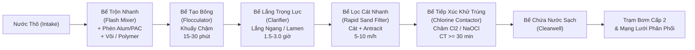
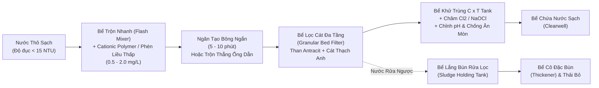
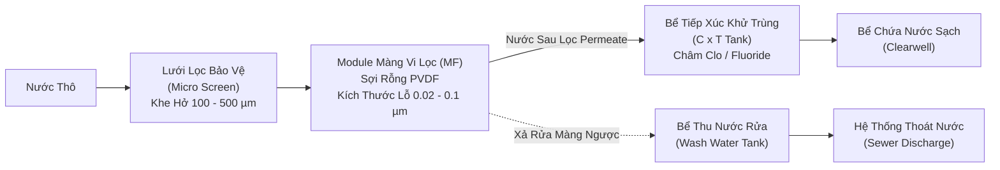
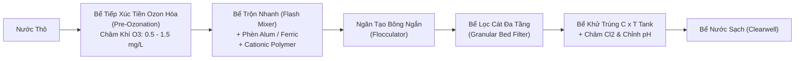
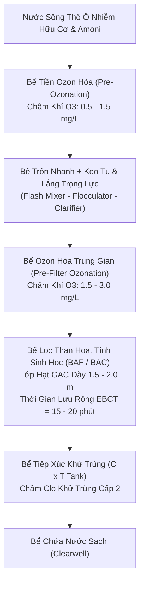
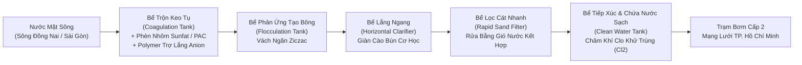
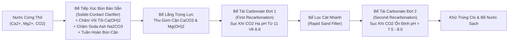
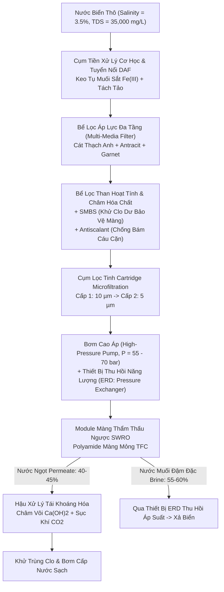

## Chương 1: Giới thiệu & Chất lượng Nước (Introduction & Water Quality)

### 1.0 Tổng quan Môn học, Đề cương và Khung Tài liệu Tham khảo (Course Overview, Syllabus & Reference Framework)

#### 1.0.1 Giới thiệu Môn học và Mục tiêu Đào tạo (Course Scope & Learning Objectives)

##### 1.0.1.1 Vị trí Môn học trong Chương trình Đào tạo Kỹ thuật Môi trường
- **Thông tin học phần**:
  - Tên học phần: Kỹ thuật Xử lý Nước cấp (Water Treatment Engineering).
  - Mã học phần: HCMUT-263.
  - Cơ sở đào tạo: Trường Đại học Bách khoa – ĐHQG-HCM.
  - Giảng viên biên soạn: PGS. TS. Đặng Viết Hùng.
  - Vị trí chương trình: Học phần chuyên ngành bắt buộc trong năm học thứ 3 hoặc thứ 4.
- **Khối kiến thức kỹ thuật tiên quyết**:
  - Cơ học Chất lỏng và Thủy lực học (Fluid Mechanics & Hydraulics):
    - Định luật thủy tĩnh.
    - Phương trình năng lượng Bernoulli và phương trình liên tục.
    - Tổn thất áp lực qua đường ống, kênh dẫn, lớp vật liệu lọc xốp và cánh khuấy.
  - Hóa học Đại cương và Hóa học Môi trường (General & Environmental Chemistry):
    - Nhiệt động học hóa học và cân bằng axit - bazơ.
    - Tích số tan của chất ít tan ($K_{sp}$) và phản ứng oxy hóa - khử (Redox).
    - Cơ chế keo tụ và đông tụ điện tích.
    - Tính chất hóa học của các chất khí hòa tan ($CO_2, O_2, H_2S, CH_4$).
  - Toán Kỹ thuật và Phương trình Vi phân (Engineering Mathematics & Differential Equations):
    - Động học phản ứng bậc 0, bậc 1 và bậc 2.
    - Phương trình vi phân truyền khối.
    - Cân bằng vật chất trong bể phản ứng khuấy trộn hoàn chỉnh liên tục (CSTR) và bể dòng chảy nút (PFR).

##### 1.0.1.2 Chuẩn Đầu ra Môn học (Course Learning Outcomes - CLOs)
- **Chuẩn năng lực kỹ thuật**:
  - CLO 1 (Hiểu biết Thủy địa hóa): Phân tích chu trình thủy địa hóa toàn cầu. Phân biệt cơ chế tạo thành tạp chất trong nước mưa, nước biển, nước ngầm và nước mặt.
  - CLO 2 (Kiến trúc Hệ thống): Xác định cấu trúc chức năng của ba phân khu cấp nước. Ba phân khu gồm Công trình thu nước, Nhà máy xử lý và Mạng lưới phân phối.
  - CLO 3 (Quy chuẩn Pháp lý): Áp dụng ngưỡng giới hạn của QCVN 01-1:2018/BYT, QCVN 6-1:2010/BYT và TCXDVN 33:2006 vào đánh giá chất lượng nước.
  - CLO 4 (Lựa chọn Dây chuyền Công nghệ): Đánh giá đặc tính nước thô để chọn sơ đồ công nghệ xử lý phù hợp. Các thông số gồm độ đục, độ màu, sắt, mangan, độ cứng và vi sinh vật.
  - CLO 5 (Tính toán Thủy lực Trạm Bơm và Lưu vực): Tính toán thủy tĩnh, chuyển đổi đơn vị áp suất, độ nhớt, động năng, cột áp thủy lực và công suất bơm ($P_w, BHP$).
  - CLO 6 (Dự báo Nhu cầu và Dân số): Áp dụng mô hình cân bằng ẩm lưu vực trữ nước. Dự báo dân số theo phương pháp số học, hình học và giảm dần. Tính lưu lượng nước chữa cháy.
  - CLO 7 (Hóa học Nước và Làm mềm): Thiết lập cân bằng hệ carbonate. Tính nồng độ cấu tử theo pH. Xác định các dạng độ cứng và tính liều lượng vôi - soda làm mềm nước.

#### 1.0.2 Đề cương Chi tiết 10 Chương (Curricular Roadmap)

##### 1.0.2.1 Chuỗi Quá trình Xử lý từ Nguồn đến Vòi nước
- **Cấu trúc 10 chương môn học**:
  - Chương 1: Tổng quan và Chất lượng Nước (Introduction). Trình bày cơ sở thủy địa hóa, tạp chất, quy chuẩn chất lượng và tính toán kỹ thuật nền tảng.
  - Chương 2: Nguồn nước và Công trình Thu (Water Source & Collection System). Khảo sát địa chất thủy văn và thiết kế công trình thu nước mặt, nước ngầm.
  - Chương 3: Keo tụ và Tạo bông (Coagulation and Flocculation). Trình bày cơ chế nén điện kép, bẫy cặn và thiết kế bể trộn nhanh, bể tạo bông.
  - Chương 4: Khử Sắt và Mangan (Removal of Iron and Manganese). Trình bày động học oxy hóa, giàn mưa làm thoáng, tháp thổi khí và bể lọc tiếp xúc xúc tác.
  - Chương 5: Lắng (Sedimentation). Trình bày lý thuyết lắng trọng lực và tính toán bể lắng ngang, bể lắng đứng, bể lắng radian, bể lắng tấm nghiêng lamella.
  - Chương 6: Lọc Nước (Filtration). Trình bày cơ chế giữ cặn tầng lọc hạt và thiết kế bể lọc cát nhanh trọng lực, chu trình rửa lọc.
  - Chương 7: Khử trùng Nước (Disinfection). Trình bày động học bất hoạt vi sinh vật. Áp dụng khử trùng bằng clo, ozone, tia UV. Kiểm soát phụ phẩm khử trùng (DBPs).
  - Chương 8: Xử lý Nâng cao (Advanced Treatment). Áp dụng than hoạt tính (PAC/GAC) và lọc màng (MF, UF, NF, RO). Trình bày oxy hóa nâng cao (AOP) và khử muối nước biển.
  - Chương 9: Ổn định Hóa học Nước (Water Stabilization). Xác định chỉ số Langelier (LSI) và chỉ số Ryznar (RSI). Phân tích ăn mòn kim loại và giải pháp thụ động hóa đường ống.
  - Chương 10: Mạng lưới Phân phối Nước cấp (Water Distribution System). Tính toán thủy lực mạng lưới đường ống, bể chứa nước sạch, đài nước và trạm bơm cấp 2.

#### 1.0.3 Hệ thống Giáo trình và Tiêu chuẩn Thiết kế Cốt lõi (Core Reference Framework)

##### 1.0.3.1 Giáo trình Kỹ thuật Xử lý Nước Cấp Trong nước và Quốc tế
- **Tài liệu tham khảo chuyên ngành**:
  - *Tính toán các công trình xử lý và phân phối nước cấp* (Tác giả: Trịnh Xuân Lai - NXB Xây dựng): Cung cấp công thức tính toán và thông số kinh nghiệm thiết kế thực tế tại Việt Nam.
  - *Xử lý nước cấp* (Tác giả: Nguyễn Ngọc Dung - NXB Xây dựng): Phân tích cơ sở hóa lý và nguyên lý vận hành của từng công trình xử lý đơn vị.
  - *Water Treatment: Principles and Design* (Nhóm tác giả: MWH / John C. Crittenden et al. - Wiley): Cung cấp lý thuyết động học xử lý nước, mô hình truyền khối và cơ sở thiết kế công nghệ.
  - *Water Quality & Treatment - A Handbook on Drinking Water* (Hiệp hội Cấp nước Hoa Kỳ - AWWA): Cung cấp tiêu chuẩn phân tích chất lượng nước và phương pháp kiểm soát mầm bệnh.

##### 1.0.3.2 Khung Pháp lý và Tiêu chuẩn Kỹ thuật Việt Nam
- **Văn bản quy chuẩn bắt buộc**:
  - TCXDVN 33:2006: Tiêu chuẩn xây dựng Việt Nam. Văn bản quy định yêu cầu thiết kế mạng lưới đường ống và công trình xử lý cấp nước.
  - QCVN 01-1:2018/BYT: Quy chuẩn kỹ thuật quốc gia về chất lượng nước sạch dùng cho mục đích sinh hoạt. Quy chuẩn bắt buộc áp dụng cho mọi đơn vị cấp nước tại Việt Nam.
  - QCVN 6-1:2010/BYT: Quy chuẩn kỹ thuật quốc gia đối với nước khoáng thiên nhiên và nước uống đóng chai. Quy chuẩn quy định chỉ tiêu vi sinh và độc chất vô cơ khắt khe.

### 1.1 Nguồn Nước và Nguyên lý Thủy Địa hóa (Water Sources & Hydrogeochemical Fundamentals)

#### 1.1.1 Chu trình Thủy Địa hóa và Phân loại Tạp chất trong Nước (Hydrogeochemical Cycle & Impurity Classification)

##### 1.1.1.1 Cơ chế Chu trình Thủy văn Toàn cầu và Quá trình Chưng cất Tự nhiên
- **Bản chất chu trình thủy văn**:
  - Chu trình thủy địa hóa (Hydrogeochemical Cycle) luân chuyển nước liên tục giữa thủy quyển, khí quyển, thạch quyển và sinh quyển.
  - Năng lượng mặt trời và trọng lực Trái Đất điều khiển toàn bộ chu trình.
- **Bốn giai đoạn vận động của chu trình**:
  1. Bốc hơi nước biển (Solar Ocean Evaporation): Bức xạ mặt trời đốt nóng bề mặt biển. Nhiệt lượng bẻ gãy liên kết hydro giữa các phân tử $H_2O$. Hơi nước thoát vào khí quyển. Muối khoáng và tạp chất không bay hơi ở lại đại dương. Quá trình này hoạt động như một hệ thống chưng cất tự nhiên bằng năng lượng mặt trời (Natural Solar Distillation).
  2. Ngưng tụ và vận chuyển hơi ẩm (Atmospheric Transport & Condensation): Khối khí ẩm bốc lên cao gặp nhiệt độ thấp. Hơi nước ngưng tụ quanh hạt nhân ngưng tụ (aerosol bụi, muối biển, phấn hoa) tạo thành mây.
  3. Giáng thủy (Precipitation): Kích thước hạt nước trong mây tăng dần. Trọng lực thắng lực nâng khí động khiến nước rơi xuống mặt đất dưới dạng mưa, tuyết hoặc mưa đá.
  4. Dòng chảy bề mặt (Surface Runoff) và thấm sâu (Infiltration): Nước mưa rơi xuống đất chia thành ba phần. Phần thứ nhất bốc hơi trực tiếp vào khí quyển. Phần thứ hai chảy tràn bề mặt vào suối, sông, hồ rồi đổ ra biển. Phần thứ ba thấm qua tầng đất mặt bổ cập tầng chứa nước ngầm (aquifers).
- **Phân bố trữ lượng nước trên Trái Đất (Global Water Allocation)**:
  - Tổng trữ lượng nước toàn cầu đạt khoảng $1.386 \times 10^9\text{ km}^3$.
  - Nước mặn đại dương (Oceans): Chiếm $97.5\%$ tổng lượng nước toàn cầu. Độ mặn trung bình đạt $35\text{ g/L}$. Nước biển cần khử muối trước khi cấp cho sinh hoạt.
  - Băng hà và tuyết vĩnh cửu (Glaciers & Permanent Snowpack): Chiếm $1.76\%$ tổng lượng nước toàn cầu (tương đương $68.7\%$ tổng lượng nước ngọt). Nguồn nước này phân bố tại Nam Cực, Bắc Cực và đỉnh núi cao.
  - Nước dưới đất (Groundwater): Chiếm $0.76\%$ tổng lượng nước toàn cầu (tương đương $30.1\%$ tổng lượng nước ngọt). Nguồn nước này là nguồn cấp nước sinh hoạt chính cho con người.
  - Nước mặt ngọt (Freshwater Lakes & Rivers): Chiếm dưới $0.01\%$ tổng lượng nước toàn cầu. Hồ nước ngọt chiếm khoảng $0.007\%$. Sông suối chiếm khoảng $0.0002\%$. Đây là nguồn khai thác nước cấp tập trung thuận tiện nhất cho đô thị.

##### 1.1.1.2 Các Đặc tính Vật lý Cơ bản của Nước trong Hệ Đơn vị SI
- **Khối lượng riêng của nước ($\rho$)**:
  - Nước đạt khối lượng riêng cực đại tại nhiệt độ $4^\circ\text{C}$:
    $$\rho_{\text{water, } 4^\circ\text{C}} = 1000\text{ kg/m}^3 = 1.000\text{ g/cm}^3$$
  - Khối lượng riêng tại $20^\circ\text{C}$: $\rho = 998.2\text{ kg/m}^3$.
  - Khối lượng riêng tại $21^\circ\text{C}$: $\rho = 998.0\text{ kg/m}^3$.
  - Khối lượng riêng tại $25^\circ\text{C}$: $\rho = 997.0\text{ kg/m}^3$.
  - Quan hệ giữa khối lượng riêng và tỷ trọng (Specific Gravity - $\text{SG}$):
    $$\rho = \text{SG} \cdot \rho_{\text{ref}} = \text{SG} \cdot \rho_{\text{water, } 4^\circ\text{C}}$$
    - $\rho$: Khối lượng riêng của chất lỏng ($\text{kg/m}^3$).
    - $\text{SG}$: Tỷ trọng của chất lỏng (không thứ nguyên).
    - $\rho_{\text{ref}}$: Khối lượng riêng của chất lỏng chuẩn tại $4^\circ\text{C}$ ($1000\text{ kg/m}^3$).
- **Trọng lượng riêng của nước ($\gamma$)**:
  - Trọng lượng riêng tính bằng tích số giữa khối lượng riêng và gia tốc trọng trường:
    $$\gamma = \rho \cdot g$$
    - $\gamma$: Trọng lượng riêng của nước ($\text{N/m}^3$).
    - $\rho$: Khối lượng riêng của nước ($\text{kg/m}^3$).
    - $g$: Gia tốc trọng trường ($9.81\text{ m/s}^2$).
  - Giá trị trọng lượng riêng tại $4^\circ\text{C}$:
    $$\gamma = 1000\text{ kg/m}^3 \times 9.81\text{ m/s}^2 = 9810\text{ N/m}^3 = 9.81\text{ kN/m}^3$$
- **Độ nhớt động lực ($\mu$)**:
  - Độ nhớt động lực đo lực ma sát nội tại giữa các lớp chất lỏng chuyển động trượt.
  - Đơn vị đo trong hệ SI: $\text{N}\cdot\text{s/m}^2$ hoặc $\text{Pa}\cdot\text{s}$ ($1\text{ Poise} = 0.1\text{ Pa}\cdot\text{s}$, $1\text{ cP} = 10^{-3}\text{ Pa}\cdot\text{s}$).
  - Giá trị tại $20^\circ\text{C}$: $\mu = 1.002 \times 10^{-3}\text{ N}\cdot\text{s/m}^2$ ($1.002\text{ cP}$).
  - Giá trị tại $21^\circ\text{C}$: $\mu = 0.00982\text{ Poise} = 9.82 \times 10^{-4}\text{ N}\cdot\text{s/m}^2$ ($0.982\text{ cP}$).
- **Độ nhớt động học ($\nu$)**:
  - Độ nhớt động học là tỷ số giữa độ nhớt động lực và khối lượng riêng:
    $$\nu = \frac{\mu}{\rho}$$
    - $\nu$: Độ nhớt động học của nước ($\text{m}^2/\text{s}$).
    - $\mu$: Độ nhớt động lực của nước ($\text{N}\cdot\text{s/m}^2$).
    - $\rho$: Khối lượng riêng của nước ($\text{kg/m}^3$).
  - Giá trị tại $20^\circ\text{C}$: $\nu \approx 1.004 \times 10^{-6}\text{ m}^2/\text{s}$.
  - Giá trị tại $21^\circ\text{C}$: $\nu \approx 9.84 \times 10^{-7}\text{ m}^2/\text{s}$.
- **Nhiệt dung riêng của nước ($C_p$)**:
  - Giá trị chuẩn: $C_p = 4.184\text{ kJ/(kg}\cdot\text{K)}$ ($1\text{ cal/(g}\cdot^\circ\text{C)}$).
  - Nhiệt dung riêng cao giúp các thủy vực tự nhiên ổn định nhiệt độ trước biến đổi thời tiết.

##### 1.1.1.3 Phân loại Năm Nhóm Tạp chất Cốt lõi trong Nguồn Nước Tự nhiên
- **Nhóm 1: Các hợp chất vô cơ hòa tan (Dissolved Inorganic Compounds)**:
  - Cation chính:
    - Canxi ($Ca^{2+}$) và Magie ($Mg^{2+}$) tạo nên độ cứng của nước.
    - Natri ($Na^+$) và Kali ($K^+$) quyết định độ mặn của nước.
    - Sắt ($Fe^{2+}$) và Mangan ($Mn^{2+}$) xuất hiện phổ biến trong môi trường yếm khí thiếu oxy.
    - Nhôm ($Al^{3+}$), Stronti ($Sr^{2+}$) và Bari ($Ba^{2+}$) hòa tan từ khoáng sét tự nhiên.
  - Anion chính:
    - Bicarbonate ($HCO_3^-$) và Carbonate ($CO_3^{2-}$) tạo nên độ kiềm của nước.
    - Clorua ($Cl^-$) và Sunfat ($SO_4^{2-}$) tạo nên độ mặn và độ cứng phi carbonate.
    - Nitrate ($NO_3^-$) và Fluoride ($F^-$) sinh ra từ phân bón nông nghiệp hoặc khoáng đá.
  - Nguyên tố vết độc tính:
    - Asen ($As$), Chì ($Pb$), Cadmium ($Cd$), Crom ($Cr^{6+}$) và Thủy ngân ($Hg$).
    - Các nguyên tố này sinh ra từ phong hóa địa chất hoặc nước thải công nghiệp. Chúng gây tổn thương nội tạng và ung thư.
- **Nhóm 2: Các hợp chất hữu cơ hòa tan (Dissolved Organic Matter - NOM)**:
  - Hợp chất hữu cơ tự nhiên (Natural Organic Matter - NOM):
    - Hình thành do phân rã thảm thực vật, bùn đáy và chất tiết chuyển hóa của tảo.
    - Axit Humic: Khối lượng phân tử lớn, tan trong kiềm, kết tủa trong axit, tạo màu nâu sẫm cho nước.
    - Axit Fulvic: Khối lượng phân tử nhỏ hơn, tan trong mọi dải pH, tạo màu vàng rơm cho nước.
    - Tanin: Hòa tan từ vỏ cây và lá mục trong rừng ngập nước.
  - Hợp chất hữu cơ tổng hợp (Synthetic Organic Chemicals - SOCs):
    - Chất hoạt động bề mặt (detergents) từ nước thải sinh hoạt đô thị.
    - Thuốc bảo vệ thực vật (pesticides, organochlorines) từ dòng chảy tràn nông nghiệp.
    - Dung môi công nghiệp và các chất gây rối loạn nội tiết (EDCs).
  - Tác động kỹ thuật của hợp chất hữu cơ:
    - Tiêu tốn hóa chất keo tụ trong quá trình xử lý nước.
    - Gây nghẹt tắc màng lọc nước.
    - Phản ứng với clo sinh ra phụ phẩm khử trùng gây ung thư (Disinfection By-Products - DBPs).
- **Nhóm 3: Các chất khí hòa tan (Dissolved Gases)**:
  - Oxy hòa tan (Dissolved Oxygen - DO): Duy trì sự sống thủy sinh và trạng thái oxy hóa của nước mặt. Nước ngầm sâu thường nghèo DO ($DO < 1 - 2\text{ mg/L}$).
  - Khí Carbonic ($CO_2$): Hòa tan tạo axit carbonic ($H_2CO_3$). Khí này ăn mòn kim loại đường ống và hòa tan đá vôi tạo độ cứng.
  - Khí Hydro Sulfua ($H_2S$): Sinh ra do vi khuẩn khử sunfat trong môi trường kỵ khí. Khí gây mùi trứng thối và tạo kết tủa đen $FeS$ khi gặp ion sắt.
  - Khí Methane ($CH_4$): Khí dễ cháy nổ, sinh ra do phân hủy bùn kỵ khí ở đáy thủy vực.
  - Khí Radon ($Rn$): Khí phóng xạ tự nhiên hòa tan từ vỉa đá granite chứa urani.
  - Khí Nitơ ($N_2$) và Khí Lưu huỳnh đioxit ($SO_2$): Hòa tan vào nước từ bầu khí quyển.
- **Nhóm 4: Các chất rắn lơ lửng và hệ keo (Suspended Solids & Colloids)**:
  - Chất rắn lơ lửng (Total Suspended Solids - TSS):
    - Kích thước hạt từ $1\text{ }\mu\text{m}$ đến hàng trăm $\mu\text{m}$.
    - Gồm hạt cát mịn, bùn phù sa (silt), xác hữu cơ, dầu và mỡ.
    - Các hạt này tạo ra độ đục (Turbidity) và có thể lắng tự nhiên nhờ trọng lực.
  - Hệ keo (Colloidal Sol):
    - Kích thước hạt rất nhỏ từ $0.001\text{ }\mu\text{m}$ đến $1\text{ }\mu\text{m}$.
    - Gồm keo sét aluminosilicate, keo silica và phức hợp hữu cơ.
    - Hạt keo mang điện tích âm bề mặt cố hữu. Lực đẩy tĩnh điện ngăn các hạt keo tự kết dính.
    - Nhà máy phải dùng phèn nhôm hoặc phèn sắt để keo tụ và trung hòa điện tích.
- **Nhóm 5: Vi sinh vật (Microorganisms)**:
  - Vi khuẩn gây bệnh (Pathogenic Bacteria):
    - *Escherichia coli*: Vi khuẩn chỉ thị mức độ nhiễm phân từ người và động vật máu nóng.
    - *Vibrio cholerae*: Phẩy khuẩn tả gây bệnh tả và tiêu chảy cấp tính.
    - *Salmonella typhi*: Vi khuẩn gây bệnh sốt thương hàn.
    - *Shigella*: Vi khuẩn gây bệnh lỵ trực khuẩn.
    - *Pseudomonas aeruginosa*: Trực khuẩn mủ xanh gây nhiễm trùng cơ hội.
  - Virus gây bệnh truyền qua đường nước:
    - Kích thước siêu nhỏ từ $0.02\text{ }\mu\text{m}$ đến $0.1\text{ }\mu\text{m}$.
    - Gồm Rotavirus (gây tiêu chảy cấp ở trẻ em), Enterovirus, Viêm gan A ($HAV$) và Norovirus.
  - Động vật nguyên sinh và ký sinh trùng (Protozoa & Helminths):
    - Bào nang *Giardia lamblia* (kích thước $8 - 14\text{ }\mu\text{m}$).
    - Noãn nang *Cryptosporidium parvum* (kích thước $4 - 6\text{ }\mu\text{m}$).
    - Vỏ kitin của noãn nang *Cryptosporidium* trơ với hóa chất clo. Nhà máy phải dùng lọc màng, ozon hoặc tia UV để xử lý.
  - Tảo (*Algae*) và nấm (*Fungi*): Gây mùi vị lạ cho nước và làm nghẹt bể lọc cát.

#### 1.1.2 Nguồn Nước mưa và Nước biển (Rainwater & Seawater Sources)

##### 1.1.2.1 Nước Mưa: Đặc tính Hóa lý, Độ ổn định và Trữ lượng
- **Độ khoáng hóa và độ tinh khiết**:
  - Hàm lượng tổng chất rắn hòa tan (TDS) rất thấp, dao động từ $10\text{ mg/L}$ đến $50\text{ mg/L}$.
  - Nước mưa hầu như không chứa ion canxi và magie. Độ cứng xấp xỉ bằng không (nước siêu mềm).
- **Tính axit tự nhiên của nước mưa**:
  - Nước mưa hòa tan khí carbonic trong khí quyển tạo thành axit carbonic:
    $$CO_2 + H_2O \rightleftharpoons H_2CO_3 \rightleftharpoons H^+ + HCO_3^-$$
  - Giá trị pH của nước mưa tự nhiên không ô nhiễm dao động từ $5.0$ đến $5.6$.
  - Mưa axit xảy ra khi khí quyển nhiễm nhiều $SO_2$ và $NO_x$. Giá trị pH của mưa axit giảm xuống $3.5 - 4.5$.
- **Tính ăn mòn xâm thực (Aggressive Corrosiveness)**:
  - Nước mưa thiếu hụt ion canxi ($Ca^{2+}$) và ion kiềm ($HCO_3^-$).
  - Chỉ số bão hòa Langelier của nước mưa luôn âm rất sâu ($LSI \ll 0$).
  - Nước mưa hòa tan vôi trong bể xi măng và hòa tan kim loại đường ống ($Pb, Cu$).
- **Hệ thống thu gom và trữ nước mưa phân tán**:
  - Quy trình vận hành và cấu trúc hệ thống gồm 4 bộ phận:
    1. Bề mặt mái thu (Catchment Surface): Mái ngói, tôn mạ hoặc bê tông sạch trơ hóa học. Tuyệt đối không dùng mái fibro-xi măng chứa amiăng.
    2. Thiết bị xả nước mưa đợt đầu (First-Flush Diverter): Tách bỏ $1 - 2\text{ mm}$ mưa đầu trận (tương đương $10 - 20\text{ L}$ cho mỗi $10\text{ m}^2$ mái). Thiết bị này loại bỏ bụi bẩn, phân chim và lá cây.
    3. Bể trữ nước mưa kín (Storage Cistern): Bể composite hoặc nhựa HDPE. Bể phải chắn kín ánh sáng mặt trời để ngăn rêu tảo phát triển và muỗi đẻ trứng.
    4. Cụm xử lý bổ sung: Lọc cát thạch anh, lọc than hoạt tính và đun sôi hoặc khử trùng nano bạc trước khi uống trực tiếp.

##### 1.1.2.2 Nước Biển: Độ mặn, Tỷ trọng và Rào cản Khử muối
- **Độ mặn và thành phần ion chính**:
  - Độ mặn trung bình của nước biển dao động từ $3.3\%$ đến $3.7\%$.
  - Giá trị thiết kế chuẩn lấy bằng $3.5\%$ (tương đương $35\text{ g/L}$ hoặc $35,000\text{ mg/L TDS}$).
  - Hàm lượng các ion chính trong nước biển có độ mặn $3.5\%$:
    - Clorua ($Cl^-$): $19,350\text{ mg/L}$ ($55.0\%$ tổng lượng anion).
    - Natri ($Na^+$): $10,760\text{ mg/L}$ ($30.6\%$ tổng lượng cation).
    - Sunfat ($SO_4^{2-}$): $2,710\text{ mg/L}$.
    - Magie ($Mg^{2+}$): $1,290\text{ mg/L}$.
    - Canxi ($Ca^{2+}$): $410\text{ mg/L}$.
    - Kali ($K^+$): $390\text{ mg/L}$.
    - Bicarbonate ($HCO_3^-$): $140\text{ mg/L}$.
- **Áp suất thẩm thấu ($\Pi$) và rào cản năng lượng**:
  - Áp suất thẩm thấu xác định theo phương trình Van 't Hoff:
    $$\Pi = i \cdot M \cdot R \cdot T$$
    - $\Pi$: Áp suất thẩm thấu của dung dịch nước biển ($\text{bar}$).
    - $i$: Hệ số phân ly ion Van 't Hoff (không thứ nguyên).
    - $M$: Tổng nồng độ mol của các phần tử chất tan ($\text{mol/L}$).
    - $R$: Hằng số khí lý tưởng ($0.08314\text{ L}\cdot\text{bar/(mol}\cdot\text{K)}$).
    - $T$: Nhiệt độ nhiệt động học tuyệt đối ($\text{K}$, $T = t^\circ\text{C} + 273.15$).
  - Giá trị áp suất thẩm thấu của nước biển tự nhiên tại $25^\circ\text{C}$: $\Pi \approx 25 - 28\text{ bar}$ ($360 - 400\text{ psi}$).
  - Áp suất vận hành thực tế của trạm lọc màng thẩm thấu ngược nước biển (SWRO):
    - Bơm cao áp phải thắng áp suất thẩm thấu cộng với trở lực màng.
    - Áp suất vận hành thực tế duy trì trong khoảng $55\text{ bar}$ đến $70\text{ bar}$ ($800 - 1000\text{ psi}$).
- **Tỷ trọng và khối lượng riêng của nước biển**:
  - Hàm lượng muối cao làm tăng khối lượng riêng của nước biển:
    $$\rho_{\text{seawater}} \approx 1.025\text{ kg/L} = 1025\text{ kg/m}^3\text{ (tại } 20^\circ\text{C)}$$
  - Tỷ trọng tương đối so với nước chuẩn tại $4^\circ\text{C}$: $\text{SG} = 1.025$.
- **Hiện tượng hạ điểm đóng băng (Freezing Point Depression)**:
  - Nồng độ ion muối làm hạ nhiệt độ kết tinh của nước.
  - Điểm đóng băng của nước biển có độ mặn $3.5\%$ hạ xuống mức $-1.9^\circ\text{C}$ (thay vì $0.0^\circ\text{C}$ của nước cất).
- **Độ kiềm và pH của nước biển**:
  - Nước biển có dải pH ổn định từ $7.5$ đến $8.4$.
  - Hệ đệm tự nhiên carbonate ($HCO_3^- / CO_3^{2-}$) và borate ($B(OH)_3 / B(OH)_4^-$) kiểm soát ổn định giá trị pH này.

### 1.1 Đặc tính Nguồn Nước Tự nhiên (Natural Water Sources)

#### 1.1.3 Nguồn Nước ngầm: Chất lượng, Khoáng hóa và Nhiễm bẩn (Groundwater Quality, Minerals & Contamination)

##### 1.1.3.1 Địa tầng Thủy văn và Cơ chế Hòa tan Khoáng chất Tự nhiên
- **Cấu trúc tầng chứa nước (Aquifer Structures)**:
  - Tầng không áp (Unconfined Aquifer) nằm sát mặt đất. Mực nước tự do thay đổi theo mùa và chịu áp suất khí quyển.
  - Tầng chứa nước không áp nhận nước bổ cập nhanh từ nước mưa thấm. Tầng này dễ nhiễm bẩn từ các hoạt động trên mặt đất.
  - Tầng có áp (Confined Aquifer) nằm kẹp giữa hai lớp địa chất không thấm nước. Nước chịu áp lực thủy tĩnh cao.
  - Khi khoan giếng vào tầng có áp, mực nước tự dâng cao hơn đỉnh tầng chứa nước. Nước có độ an toàn vi sinh cao.

- **Cơ chế hòa tan sắt ($Fe^{2+}$) và mangan ($Mn^{2+}$)**:
  - Vi sinh vật trong đất tiêu thụ hết oxy hòa tan ($DO \to 0\text{ mg/L}$) khi phân hủy chất hữu cơ.
  - Môi trường ngầm chuyển sang trạng thái khử mạnh với thế oxy hóa khử âm ($Eh < 0$).
  - Nước ngầm hòa tan khoáng sắt và mangan không tan trong đất đá:
    $$Fe^{3+}_{\text{(rắn)}} + e^- \to Fe^{2+}_{\text{(hòa tan)}}$$
    $$MnO_{2\text{(rắn)}} + 4H^+ + 2e^- \to Mn^{2+}_{\text{(hòa tan)}} + 2H_2O$$
  - Nước mới bơm lên từ giếng khoan luôn trong suốt. Nước chứa ion sắt ($Fe^{2+}$) và mangan ($Mn^{2+}$) hòa tan.
  - Khi tiếp xúc không khí, oxy oxy hóa $Fe^{2+}$ thành kết tủa $Fe(OH)_3$ màu nâu đỏ. Quá trình làm nước đục và gây ố vàng.

- **Cơ chế hòa tan canxi ($Ca^{2+}$), magie ($Mg^{2+}$) tạo độ cứng**:
  - Vi sinh vật và rễ cây hô hấp giải phóng lượng lớn khí $CO_2$ vào đất ($20 - 100\text{ mg/L}$).
  - Khí $CO_2$ hòa tan vào nước tạo thành axit carbonic ($H_2CO_3$).
  - Axit carbonic hòa tan đá vôi ($CaCO_3$) và đá dolomit ($CaMg(CO_3)_2$):
    $$CaCO_{3\text{(rắn)}} + CO_2 + H_2O \rightleftharpoons Ca^{2+} + 2HCO_3^-$$
    $$CaMg(CO_3)_{2\text{(rắn)}} + 2CO_2 + 2H_2O \rightleftharpoons Ca^{2+} + Mg^{2+} + 4HCO_3^-$$
  - Phản ứng giải phóng ion $Ca^{2+}$ và $Mg^{2+}$, hình thành độ cứng carbonate trong nước ngầm.

- **Độc chất tự nhiên trong nước ngầm**:
  - Asen tự nhiên ($As$) giải phóng từ quặng pirit ($FeAsS$) hoặc quá trình khử khoáng sắt hydroxit.
  - Asen tồn tại ở dạng arsenite ($As^{3+}$) độc tính cao hoặc arsenate ($As^{5+}$). Nồng độ asen tầng nông thường vượt $0{,}01\text{ mg/L}$.
  - Fluoride ($F^-$) hòa tan từ khoáng fluorit ($CaF_2$). Nồng độ fluoride vượt $1{,}5\text{ mg/L}$ gây hỏng men răng và xốp xương.
  - Phóng xạ Radon ($^{222}Rn$) và Radium ($^{226}Ra$) hòa tan từ các đới nứt nẻ của đá granit.

##### 1.1.3.2 Nước ngầm Nhiễm lợ (Brackish Groundwater)
- Khai thác nước ngầm quá mức làm hạ thấp mực nước áp lực tĩnh.
- Nước biển xâm nhập vào các tầng chứa nước ngọt tại vùng ven biển.
- Nước ngầm chuyển thành nước lợ với hàm lượng tổng chất rắn hòa tan cao:
  $$\text{TDS} = 1000 - 5000\text{ mg/L}$$
- Kỹ sư phải dùng công nghệ màng lọc thẩm thấu ngược nước lợ (BWRO) hoặc điện thẩm tích (EDR) để khử mặn.

##### 1.1.3.3 Cơ chế Nhiễm bẩn Nhân sinh Tầng Nước ngầm (Anthropogenic Contamination)
- **Rò rỉ bể chứa xăng dầu ngầm (UST Leaks)**:
  - Bồn thép ngầm bị ăn mòn điện hóa sau 15 đến 30 năm chôn lấp.
  - Nhiên liệu rò rỉ phát tán nhóm hydrocarbon thơm BTEX (Benzene, Toluene, Ethylbenzene, Xylenes) và phụ gia MTBE.
  - Benzene là chất gây ung thư nhóm 1. MTBE tan nhiều trong nước, phân hủy sinh học chậm và di chuyển xa hàng kilômét.

- **Ô nhiễm nitrate ($NO_3^-$) từ nước thải và nông nghiệp**:
  - Bể tự hoại rò rỉ và phân bón hóa học dư thừa ($NH_4NO_3$) thấm sâu vào đất.
  - Vi khuẩn hiếu khí nitrat hóa amoni thành nitrite ($NO_2^-$) và nitrate ($NO_3^-$):
    $$NH_4^+ + 2O_2 \to NO_3^- + 2H^+ + H_2O$$
  - Ion nitrate không bị keo đất tích điện âm giữ lại. Nitrate đi thẳng vào tầng nước ngầm.
  - Nồng độ nitrate vượt $50\text{ mg/L}$ gây hội chứng trẻ xanh (Methemoglobinemia) ở trẻ sơ sinh.

- **Dung môi công nghiệp clo hóa (DNAPL)**:
  - Dung môi tẩy rửa cơ khí Trichloroethylene (TCE) và Tetrachloroethylene (PCE) ngấm vào đất.
  - Hợp chất này có tỷ trọng nặng hơn nước, tạo pha lỏng hữu cơ đậm đặc (DNAPL).
  - Túi DNAPL chìm xuống đáy tầng ngậm nước, hòa tan chậm qua nhiều thập kỷ và gây độc kéo dài.

##### 1.1.3.4 Ma trận Đánh giá Ưu điểm và Nhược điểm của Nước ngầm
- **Bảng so sánh ưu nhược điểm kỹ thuật của nước ngầm**:

| Chỉ tiêu kỹ thuật | Ưu điểm của nguồn nước ngầm | Nhược điểm và thách thức vận hành |
|---|---|---|
| **Độ đục và hạt cặn** | Độ đục thấp ($\le 1 - 2\text{ NTU}$), ít cặn lơ lửng nhờ đất cát lọc tự nhiên. | Cát mịn có thể lọt qua lưới lọc gây mài mòn cánh bơm giếng sâu. |
| **Ô nhiễm vi sinh** | Không có vi khuẩn gây bệnh và ký sinh trùng do thiếu ánh sáng. | Nước giếng nông dễ nhiễm bẩn phân nếu gần hố xí tự hoại. |
| **Nhiệt độ nước** | Nhiệt độ ổn định quanh năm ($22 - 25^\circ\text{C}$). | Nước có thể chứa khí cháy ($CH_4$) hoặc khí độc ($H_2S$). |
| **Chất hữu cơ tự nhiên** | Nồng độ chất hữu cơ thấp, ít tạo phụ phẩm khử trùng DBP. | Hàm lượng khoáng hòa tan cao ($Fe, Mn, Ca^{2+}, Mg^{2+}$). |
| **Công trình xử lý** | Mặt bằng xử lý gọn, bỏ qua bể keo tụ và bể lắng cặn thô. | Chi phí điện bơm giếng sâu cao, chi phí hóa chất khử cứng lớn. |
| **Mức độ bền vững** | Nguồn nước ngầm an toàn trước ô nhiễm bề mặt tức thời. | Tầng ngầm đã nhiễm độc asen hoặc dung môi rất khó phục hồi. |

---

#### 1.1.4 Nguồn Nước mặt: Thủy vực và Động lực Lưu vực (Surface Water Characteristics & Watershed Dynamics)

##### 1.1.4.1 Phân loại Thủy vực Nước mặt và Biến động Mùa vụ
- **Thủy vực chảy (Hệ Lotic - Sông, Suối)**:
  - Vận tốc dòng chảy lớn ($v = 0{,}5 - 2{,}5\text{ m/s}$).
  - Khả năng tự sục khí bề mặt cao, oxy hòa tan dồi dào ($DO = 6 - 8\text{ mg/L}$).
  - Chất lượng nước biến động tức thời theo lượng mưa và hoạt động xả thải trên lưu vực.

- **Thủy vực tĩnh (Hệ Lentic - Hồ Tự nhiên, Hồ chứa)**:
  - Vận tốc dòng chảy rất nhỏ ($v \approx 0\text{ m/s}$), thời gian lưu nước kéo dài từ vài tuần đến nhiều năm.
  - Cặn lơ lửng thô tự lắng tốt, tạo độ đục nền ổn định.
  - Hiện tượng phân tầng nhiệt độ (Thermal Stratification) xuất hiện vào mùa khô nóng:
    - Tầng mặt (Epilimnion) ấm, giàu oxy hòa tan nhưng chứa nhiều tảo.
    - Tầng đáy (Hypolimnion) lạnh, tù đọng, yếm khí, chứa nhiều sắt, mangan, photpho và khí $H_2S$.
  - Tích tụ nitơ và photpho gây hiện tượng phú dưỡng (Eutrophication). Tảo lam nở hoa tiết độc tố Microcystin và chất gây mùi hôi (Geosmin, MIB).

- **Xung đột biến độ đục do mưa bão**:
  - Mưa lớn xói mòn lưu vực và cuốn trôi phù sa vào sông suối.
  - Độ đục bùng phát đột ngột từ $20 - 50\text{ NTU}$ lên mức $500 - 3000\text{ NTU}$ trong vài giờ.
  - Nước mưa làm loãng nồng độ ion bicarbonate, làm độ kiềm sụt giảm ($< 20 - 30\text{ mg/L as }CaCO_3$).
  - Kỹ sư phải tăng liều lượng phèn, châm thêm kiềm và dùng polymer trợ lắng.

##### 1.1.4.2 Hợp chất Hữu cơ Tự nhiên (NOM) và Tiền chất Tạo Phụ phẩm Khử trùng
- **Phân loại nguồn gốc chất hữu cơ tự nhiên**:
  - Nguồn nội sinh (Autochthonous): Do hoạt động quang hợp và phân rã của tảo, vi sinh vật trong nước sinh ra. Chỉ số hấp thụ tia cực tím riêng thấp ($SUVA_{254} < 2\text{ L/(mg}\cdot\text{m)}$).
  - Nguồn ngoại sinh (Allochthonous): Rửa trôi từ thảm thực vật và đất rừng mục nát. Nguồn này chứa nhiều axit humic và axit fulvic ($SUVA_{254} > 3 - 4\text{ L/(mg}\cdot\text{m)}$). Nước có màu vàng nâu.

- **Phản ứng tạo phụ phẩm khử trùng (DBP Formation)**:
  - Clo khử trùng phản ứng với nhân thơm của axit humic và fulvic.
  - Phản ứng sinh ra các hợp chất hữu cơ clo hóa độc hại:
    $$\text{NOM} + Cl_2 \to \text{THMs} + \text{HAAs}$$
  - Sản phẩm gồm Trihalomethanes ($CHCl_3, CHBrCl_2, CHBr_2Cl, CHBr_3$) và Haloacetic Acids. Các chất này gây ung thư gan, thận và bàng quang.

##### 1.1.4.3 Rủi ro Ô nhiễm Vi sinh vật Nguồn Nước mặt
- Nước mặt nhận nước thải đô thị và dòng chảy tràn chăn nuôi gia súc.
- Nguồn nước luôn tiềm ẩn vi khuẩn gây bệnh tả (*Vibrio cholerae*), thương hàn (*Salmonella*), lỵ (*Shigella*).
- Bào nang *Giardia lamblia* ($8 - 14\text{ }\mu\text{m}$) và noãn nang *Cryptosporidium parvum* ($4 - 6\text{ }\mu\text{m}$) xuất hiện phổ biến.
- Vỏ kitin của noãn nang *Cryptosporidium* kháng clo khử trùng thông thường. Nhà máy nước phải dùng rào cản keo tụ - lắng - lọc cát hoặc khử trùng bằng Ozon và tia UV.

##### 1.1.4.4 So sánh Đặc tính Kỹ thuật giữa Nước mặt và Nước ngầm
- **Bảng đối chiếu thông số giữa hai nguồn nước**:

| Thông số kỹ thuật | Nguồn nước mặt (Sông, Hồ chứa) | Nguồn nước ngầm (Tầng sâu) |
|---|---|---|
| **Độ đục (Turbidity)** | Cao ($10 - 2000\text{ NTU}$), biến động lớn theo mùa. | Rất thấp ($\le 1 - 2\text{ NTU}$), ổn định quanh năm. |
| **Độ màu (Color)** | Cao ($10 - 150\text{ TCU}$), do phức humic và keo sét. | Thấp (chỉ tăng khi sắt bị oxy hóa tạo cặn). |
| **Oxy hòa tan (DO)** | Cao ($6 - 8\text{ mg/L}$), tiếp xúc khí quyển tốt. | Rất thấp hoặc bằng 0 ($0 - 2\text{ mg/L}$), yếm khí. |
| **Khí Carbonic ($CO_2$)** | Thấp ($0 - 5\text{ mg/L}$). | Cao ($20 - 100\text{ mg/L}$), gây ăn mòn đường ống. |
| **Sắt và Mangan ($Fe, Mn$)** | Thấp, tồn tại chủ yếu ở dạng huyền phù liên kết bùn. | Thường cao ($1 - 20\text{ mg/L}$), tồn tại ở dạng hòa tan. |
| **Độ cứng ($Ca^{2+}, Mg^{2+}$)** | Thấp đến trung bình ($20 - 100\text{ mg/L as }CaCO_3$). | Thường cao ($100 - 500\text{ mg/L as }CaCO_3$). |
| **Chất hữu cơ (TOC, NOM)** | Cao ($2 - 15\text{ mg/L}$), tiềm ẩn nguy cơ tạo THMs. | Thấp ($< 1 - 2\text{ mg/L}$), ít nguy cơ tạo THMs. |
| **Vi sinh vật gây bệnh** | Nguy cơ rất cao (vi khuẩn phân, virus, kén ký sinh trùng). | Nguy cơ thấp nếu miệng giếng bảo vệ đúng kỹ thuật. |
| **Sơ đồ xử lý chuẩn** | Keo tụ $\to$ Tạo bông $\to$ Lắng $\to$ Lọc $\to$ Clo hóa. | Làm thoáng $\to$ Kiềm hóa $\to$ Lắng $\to$ Lọc $\to$ Clo hóa. |

---

### 1.2 Kiến trúc và Phân loại Hệ thống Cấp nước (Water Supply System Architecture & Classification)

#### 1.2.1 Ba Phân khu Cốt lõi của Hệ thống Cấp nước Đô thị

##### 1.2.1.1 Phân khu Thu nước và Trạm Bơm Cấp 1 (Water Intake & Low-Lift Pumping Station)
- **Công trình thu nước mặt**:
  - Song chắn rác thô giữ lại cành cây, bèo tây và rác nổi kích thước lớn.
  - Lưới chắn rác tinh ngăn rong rêu và rác nhỏ lọt vào ngăn hút bơm.
  - Cửa thu ven bờ (Shore Intake) đặt tại bờ sông có mái dốc đứng và nền địa chất ổn định.
  - Cửa thu lòng sông (Riverbed Intake) dẫn nước vào ống tự chảy hoặc ống xi-phông về giếng thu bờ sông.
  - Trạm bơm cấp 1 dùng máy bơm ly tâm trục đứng hoặc ngang, hoạt động ở cột áp thấp ($H = 10 - 25\text{ m}$). Bơm đẩy nước lên bể trộn đầu trạm xử lý.

- **Công trình thu nước ngầm**:
  - Mạng lưới giếng khoan khai thác sâu $50 - 250\text{ m}$ vào tầng ngậm nước có áp.
  - Ống lọc giếng khoan (Well Screen) xẻ rãnh chuẩn bọc sỏi lọc xung quanh để giữ cát mịn.
  - Bơm chìm giếng sâu (Submersible Pump) thả ngập dưới mực nước động, đẩy nước trực tiếp lên dàn làm thoáng.

##### 1.2.1.2 Nhà máy Xử lý Nước cấp (Water Treatment Plant - WTP)
- **Tuyến thủy lực tự chảy bằng trọng lực (Gravity Hydraulic Flow)**:
  - Dòng nước tự chảy liên tục qua các công trình đơn vị: Trộn nhanh $\to$ Tạo bông $\to$ Lắng $\to$ Lọc cát.
  - Đáy máng bể trộn đặt ở cao trình cao nhất. Cao trình này thắng toàn bộ tổn thất áp lực trên đường ống và qua các lớp cát lọc.
  - Nước sau lọc tự chảy vào bể chứa nước sạch nằm ngầm dưới đất.

- **Khu châm hóa chất (Chemical Feed Facilities)**:
  - Bố trí kho chứa và bồn pha dung dịch phèn nhôm ($Al_2(SO_4)_3$), phèn PAC, vôi tôi ($Ca(OH)_2$), polymer.
  - Bơm định lượng màng vận chuyển hóa chất qua đường ống nhựa chống ăn mòn vào điểm châm.

- **Khu xử lý bùn cặn (Sludge Treatment Facilities)**:
  - Bùn xả từ đáy bể lắng và nước rửa ngược bể lọc thu gom về bể nén bùn trọng lực.
  - Máy ép bùn băng tải hoặc máy ly tâm tách nước tạo bánh bùn khô có độ ẩm thấp để vận chuyển đi chôn lấp.

##### 1.2.1.3 Mạng lưới Truyền dẫn và Phân phối Nước sạch (Distribution Network)
- **Bể chứa nước sạch (Clearwell / Finished Water Reservoir)**:
  - Bể điều hòa chênh lệch giữa công suất sản xuất đều đặn của nhà máy và biểu đồ tiêu thụ nước dao động của đô thị.
  - Bể tạo thời gian tiếp xúc khử trùng tối thiểu với clo:
    $$CT \ge 30\text{ phút}$$
  - Bể lưu trữ dung tích nước chữa cháy dự phòng bắt buộc trong $3\text{ giờ}$ liên tục.

- **Trạm bơm cấp 2 (High-Lift Pumping Station)**:
  - Máy bơm ly tâm công suất lớn đẩy nước vào mạng lưới đường ống chính.
  - Cột áp trạm bơm cấp 2 duy trì mức cao ($H = 40 - 70\text{ m}$).
  - Trạm gắn biến tần (VFD) để tự động điều chỉnh tốc độ động cơ theo áp lực mạng lưới theo giờ.

- **Đài nước điều hòa (Elevated Water Tower)**:
  - Xây dựng tại điểm cao trong đô thị hoặc cuối mạng lưới đường ống.
  - Đài nước ổn định áp lực mạng lưới, chống búa nước (water hammer) và cấp nước bù vào giờ cao điểm.

- **Mạng lưới đường ống phân phối**:
  - Mạng lưới quy hoạch thành mạng vòng khép kín (looped network).
  - Khi một đoạn ống vỡ, van phân đoạn cô lập đoạn hư hại mà không gây mất nước cục bộ diện rộng.

---

#### 1.2.2 Phân loại Hệ thống Cấp nước theo Mục đích Sử dụng

##### 1.2.2.1 Hệ thống Cấp nước Sinh hoạt Đô thị (Domestic Water Supply)
- Cung cấp nước cho ăn uống, tắm giặt, nấu nướng và dịch vụ công cộng.
- Chất lượng nước cấp bắt buộc đạt 100% chỉ tiêu theo quy chuẩn QCVN 01-1:2018/BYT.
- Tiêu chuẩn dùng nước thiết kế theo quy mô đô thị dao động từ $150 - 250\text{ L/người}\cdot\text{ngày}$.
- Áp lực tự do tối thiểu tại vòi vào nhà 1 tầng là $10\text{ m}$ cột nước, mỗi tầng tiếp theo tăng thêm $4\text{ m}$.

##### 1.2.2.2 Hệ thống Cấp nước Công nghiệp (Industrial Process Water)
- **Nước làm mát gián tiếp (Cooling Water)**:
  - Khối lượng tiêu thụ rất lớn. Nước yêu cầu kiểm soát độ cứng và độ kiềm để tránh kết tủa $CaCO_3$ trong bình ngưng tụ.
  - Cần châm hóa chất diệt khuẩn chống màng nhầy sinh học (biofilm) và ức chế ăn mòn.

- **Nước cấp lò hơi (Boiler Feedwater)**:
  - Yêu cầu chất lượng cực kỳ khắt khe theo áp suất lò hơi.
  - Nước phải qua trao đổi ion khử cứng hoàn toàn ($\text{TH} \approx 0\text{ mg/L as }CaCO_3$).
  - Khử oxy hòa tan đến ngưỡng an toàn ($DO < 0{,}005\text{ mg/L}$) để ngăn thủng ống lò hơi do ăn mòn điểm.
  - Hàm lượng silica phải đạt chuẩn ($SiO_2 < 0{,}01\text{ mg/L}$) nhằm ngăn ngừa tạo vảy silicat cứng trên vách truyền nhiệt.

- **Nước công nghệ dệt nhuộm và sản xuất giấy**:
  - Kiểm soát nghiêm ngặt nồng độ sắt ($Fe < 0{,}05\text{ mg/L}$) và mangan ($Mn < 0{,}02\text{ mg/L}$).
  - Hàm lượng kim loại cao sẽ làm loang ố màu vải sợi và làm sẫm màu bột giấy tẩy trắng.

- **Nước siêu tinh khiết (Ultrapure Water - UPW)**:
  - Dùng trong công nghiệp sản xuất linh kiện bán dẫn và dược phẩm tiêm truyền.
  - Điện trở suất đạt giới hạn lý thuyết:
    $$\rho = 18{,}2\text{ M}\Omega\cdot\text{cm}\text{ ở }25^\circ\text{C}$$
  - Hàm lượng carbon hữu cơ tổng $TOC < 1 - 5\text{ ppb}$, không chứa hạt cặn kích thước $> 0{,}05\text{ }\mu\text{m}$, vô trùng tuyệt đối.

##### 1.2.2.3 Hệ thống Cấp nước Chữa cháy và Hệ thống Kết hợp (Fire Fighting & Combined Municipal Systems)
- Đô thị dùng hệ thống cấp nước kết hợp truyền tải đồng thời nước sinh hoạt và nước cứu hỏa.
- Trụ cứu hỏa ($D100 - D150\text{ mm}$) lắp trực tiếp trên tuyến ống phân phối chính với khoảng cách $\le 150\text{ m}$.
- Lưu lượng chữa cháy cộng gộp trực tiếp vào nhu cầu dùng nước ngày lớn nhất ($Q_{\text{max-day}}$).
- Bể chứa nước sạch dự trữ dung tích chữa cháy đáp ứng thời gian dập tắt đám cháy liên tục trong $3\text{ giờ}$.

---

### 1.3 Chỉ tiêu Chất lượng Nước và Cân bằng Carbonate (Water Quality Parameters & Carbonate Chemistry)

#### 1.3.1 Các Nhóm Chỉ tiêu Chất lượng Nước Cơ bản

##### 1.3.1.1 Nhóm Chỉ tiêu Vật lý và Thẩm mỹ (Physical & Aesthetic Parameters)
- **Độ đục (Turbidity, NTU)**:
  - Đo cường độ tán xạ ánh sáng của các hạt cặn sét, chất lơ lửng và bùn vi sinh trong nước.
  - Giới hạn nước sinh hoạt là $\le 2\text{ NTU}$. Nước sau lọc tại nhà máy hiện đại kiểm soát $\le 0{,}2 - 0{,}5\text{ NTU}$.

- **Độ màu (Color, TCU / thang Pt-Co)**:
  - Độ màu thực sinh ra do axit humic hòa tan hoặc ion kim loại ($Fe^{3+}, Mn^{2+}$). Ngưỡng quy chuẩn là $\le 15\text{ TCU}$.

- **Mùi và vị (Taste and Odour, TON)**:
  - Nước uống không được có mùi vị lạ. Mùi bùn mốc xuất phát từ Geosmin và MIB do tảo tiết ra.

- **Tổng chất rắn hòa tan (TDS, mg/L) và độ dẫn điện (EC, $\mu\text{S/cm}$)**:
  - TDS biểu thị tổng ion khoáng hòa tan. Mối liên hệ thực nghiệm:
    $$\text{TDS (mg/L)} \approx (0{,}55 - 0{,}70) \times \text{EC (}\mu\text{S/cm)}$$
  - Giới hạn nồng độ TDS cho phép trong nước sinh hoạt là $\le 1000\text{ mg/L}$.

##### 1.3.1.2 Nhóm Chỉ tiêu Hóa học và Độc chất (Chemical Parameters & Toxic Contaminants)
- **Nhu cầu oxy hóa học (COD) và độ tiêu thụ oxy ($KMnO_4$)**:
  - Đo lường mức độ ô nhiễm hợp chất hữu cơ hòa tan. Nước ngầm sạch có độ tiêu thụ oxy $\le 1\text{ mg/L}$.

- **Hợp chất chứa Nitơ ($NH_4^+, NO_2^-, NO_3^-$)**:
  - Amoni ($NH_4^+$) cảnh báo nguồn nước mới bị nhiễm nước thải sinh hoạt và làm hao tốn nhiều clo khử trùng.
  - Nitrite ($NO_2^-$) là chất trung gian có độc tính cao, giới hạn tối đa $\le 0{,}05\text{ mg/L}$.
  - Nitrate ($NO_3^-$) biểu thị quá trình oxy hóa sinh học đã hoàn tất.

- **Kim loại nặng độc tính cao**:
  - Sắt tổng số ($Fe \le 0{,}3\text{ mg/L}$) và Mangan tổng số ($Mn \le 0{,}1\text{ mg/L}$).
  - Asen ($As \le 0{,}01\text{ mg/L}$), Chì ($Pb \le 0{,}01\text{ mg/L}$), Cadmium ($Cd \le 0{,}003\text{ mg/L}$), Thủy ngân ($Hg \le 0{,}001\text{ mg/L}$).

##### 1.3.1.3 Nhóm Chỉ tiêu Vi sinh vật Chỉ thị (Microbiological Indicator Parameters)
- **Tổng số Coliform**:
  - Vi khuẩn gram âm hình que, lên men lactose sinh hơi ở $35 - 37^\circ\text{C}$. Giới hạn nước sinh hoạt là $< 3\text{ CFU/100 mL}$.

- **Escherichia coli (E. coli) và Coliform phân**:
  - Vi khuẩn chịu nhiệt cư trú thường xuyên trong ruột người và động vật máu nóng.
  - Sự xuất hiện của *E. coli* khẳng định nguồn nước bị nhiễm phân tươi. Tiêu chuẩn quy định không được có ($< 1\text{ CFU/100 mL}$).

---

#### 1.3.2 Cân bằng Hóa học Hệ Carbonate và Khí CO2 Hòa tan

##### 1.3.2.1 Chuỗi Phản ứng Hòa tan Khí CO2 và Axit Carbonic Biểu kiến
- **Hòa tan khí Carbonic theo Định luật Henry**:
  - Khí $CO_2$ trong khí quyển hòa tan vào pha lỏng:
    $$CO_{2\text{(k)}} \rightleftharpoons CO_{2\text{(dd)}}$$
  - Nồng độ hòa tan phụ thuộc vào áp suất riêng phần $P_{CO_2}$ qua hằng số Henry $K_H = 3{,}39 \times 10^{-2}\text{ mol/(L}\cdot\text{atm)}$ ở $25^\circ\text{C}$:
    $$[CO_{2\text{(dd)}}] = K_H \cdot P_{CO_2}$$

- **Thủy hóa tạo axit carbonic biểu kiến**:
  - Phân tử $CO_2$ phản ứng thuận nghịch với nước tạo $H_2CO_3$:
    $$CO_{2\text{(dd)}} + H_2O \rightleftharpoons H_2CO_3$$
  - Chỉ dưới 0.3% lượng $CO_2$ hòa tan chuyển thành $H_2CO_3$. Hóa học môi trường quy ước tổng nồng độ là axit carbonic biểu kiến:
    $$[H_2CO_3^*] = [CO_{2\text{(dd)}}] + [H_2CO_3]$$

##### 1.3.2.2 Hằng số Phân ly Thứ nhất của Axit Carbonic (K1)
- Phản ứng phân ly giải phóng proton bậc 1:
  $$H_2CO_3^* \rightleftharpoons H^+ + HCO_3^-$$
- Phương trình cân bằng phân ly bậc 1 ở $25^\circ\text{C}$:
  $$K_1 = \frac{[\text{H}^+][\text{HCO}_3^-]}{[\text{H}_2\text{CO}_3^*]} = 4{,}47 \times 10^{-7} \quad (\text{p}K_1 = 6{,}35)$$
- Ý nghĩa: Ở $\text{pH} = 6{,}35$, nồng độ khí $CO_2$ tự do cân bằng bằng nồng độ ion bicarbonate ($[H_2CO_3^*] = [HCO_3^-]$).

##### 1.3.2.3 Hằng số Phân ly Thứ hai của Bicarbonate (K2)
- Ion bicarbonate phân ly tiếp trong môi trường kiềm:
  $$HCO_3^- \rightleftharpoons H^+ + CO_3^{2-}$$
- Phương trình cân bằng phân ly bậc 2 ở $25^\circ\text{C}$:
  $$K_2 = \frac{[\text{H}^+][\text{CO}_3^{2-}]}{[\text{HCO}_3^-]} = 4{,}69 \times 10^{-11} \quad (\text{p}K_2 = 10{,}33)$$
- Ý nghĩa: Nâng $\text{pH} > 10{,}33$ làm chuyển hóa phần lớn bicarbonate thành carbonate ($CO_3^{2-}$), tạo kết tủa $CaCO_3$ làm mềm nước.

##### 1.3.2.4 Tích số Ion của Nước (Kw)
- Phân tử nước tự phân ly thành ion:
  $$H_2O \rightleftharpoons H^+ + OH^-$$
- Phương trình tích số ion ở $25^\circ\text{C}$:
  $$K_w = [\text{H}^+][\text{OH}^-] = 1{,}00 \times 10^{-14} \quad (\text{p}K_w = 14{,}00)$$
- Tính nồng độ ion hydroxit:
  $$[\text{OH}^-] = \frac{K_w}{[\text{H}^+]} = 10^{-(14 - \text{pH})}$$

##### 1.3.2.5 Giản đồ Bjerrum và Phân bố Cấu tử Carbonate theo pH
- Tổng nồng độ các dạng vô cơ của carbon trong hệ là $C_T$:
  $$C_T = [H_2CO_3^*] + [HCO_3^-] + [CO_3^{2-}]$$
- Phân số nồng độ mol phụ thuộc vào nồng độ ion $[H^+]$:
  $$\alpha_0 = \frac{[H_2CO_3^*]}{C_T} = \frac{[H^+]^2}{[H^+]^2 + K_1[H^+] + K_1 K_2}$$
  $$\alpha_1 = \frac{[HCO_3^-]}{C_T} = \frac{K_1 [H^+]}{[H^+]^2 + K_1[H^+] + K_1 K_2}$$
  $$\alpha_2 = \frac{[CO_3^{2-}]}{C_T} = \frac{K_1 K_2}{[H^+]^2 + K_1[H^+] + K_1 K_2}$$

- **Ba miền phân bố pH trên giản đồ Bjerrum**:
  1. Miền axit ($\text{pH} < 6{,}35$): Dạng $H_2CO_3^*$ (khí $CO_2$ hòa tan) chiếm ưu thế. Nước có tính ăn mòn kim loại và hòa tan bê tông. Biện pháp: Dùng giàn mưa làm thoáng để tước $CO_2$ và nâng pH.
  2. Miền trung tính ($6{,}35 < \text{pH} < 10{,}33$): Dạng bicarbonate ($HCO_3^-$) chiếm ưu thế tuyệt đối (đạt $98\%$ ở $\text{pH} \approx 8{,}34$). Nước có khả năng đệm axit tốt.
  3. Miền kiềm ($\text{pH} > 10{,}33$): Dạng carbonate ($CO_3^{2-}$) và ion $OH^-$ chiếm ưu thế. Canxi kết tủa thành $CaCO_3\downarrow$ và magie kết tủa thành $Mg(OH)_2\downarrow$.

- **Phương trình tính tổng độ kiềm (Total Alkalinity)**:
  - Biểu diễn theo nồng độ mol đương lượng:
    $$\text{Alkalinity} = [\text{HCO}_3^-] + 2[\text{CO}_3^{2-}] + [\text{OH}^-] - [\text{H}^+] \quad (\text{eq/L})$$
  - Biểu diễn theo đơn vị $\text{mg/L as }CaCO_3$:
    $$\text{Alk} = [\text{HCO}_3^-]\left(\frac{50{,}04}{61{,}02}\right) + [\text{CO}_3^{2-}]\left(\frac{50{,}04}{30{,}00}\right) + [\text{OH}^-]\left(\frac{50{,}04}{17{,}01}\right) - [\text{H}^+]\left(\frac{50{,}04}{1{,}01}\right)$$

---

### 1.4 Hệ thống Quy chuẩn Kỹ thuật và Tiêu chuẩn Thiết kế (Water Quality Standards & Regulatory Compliance)

#### 1.4.1 Quy chuẩn Kỹ thuật Quốc gia về Nước sạch Sinh hoạt (QCVN 01-1:2018/BYT)

##### 1.4.1.1 Phạm vi Áp dụng và Phân nhóm Chỉ tiêu Kiểm tra
- **Phạm vi bắt buộc**: Áp dụng đối với đơn vị cấp nước sạch phục vụ mục đích sinh hoạt có công suất từ $1000\text{ m}^3\text{/ngày}$ trở lên và các trạm cấp nước nông thôn.
- **Phân nhóm thông số thử nghiệm**:
  - Thông số nhóm A: Thử nghiệm định kỳ tối thiểu 1 lần/tháng cho tất cả các nhà máy nước.
  - Thông số nhóm B: Thử nghiệm định kỳ tối thiểu 1 lần/6 tháng theo danh mục do Ủy ban nhân dân cấp tỉnh ban hành.
- **Vị trí lấy mẫu quan sát**: Bể chứa nước sạch tại nhà máy, các nút trọng yếu trên mạng lưới phân phối, vòi nước hộ gia đình cuối mạng lưới.

##### 1.4.1.2 Bảng Giới hạn 11 Chỉ tiêu Chất lượng Nước sạch Thiết yếu
- **Bảng ngưỡng giới hạn theo QCVN 01-1:2018/BYT**:

| TT | Thông số phân tích | Đơn vị | Giới hạn tối đa | Cơ sở kỹ thuật và rủi ro vận hành |
|---|---|---|---|---|
| 1 | **Màu sắc (Color)** | TCU | $\le 15$ | Ngăn ngừa cặn lắng và giữ thẩm mỹ nguồn nước. |
| 2 | **Mùi vị (Taste & Odour)** | - | Không có mùi vị lạ | Ngăn chất gây mùi do tảo ($MIB, Geosmin$) hoặc khí $H_2S$. |
| 3 | **Độ đục (Turbidity)** | NTU | $\le 2$ | Hạt cặn cản trở khử trùng. Độ đục cao bảo vệ vi khuẩn khỏi tác dụng của clo. |
| 4 | **pH** | - | $6{,}0 - 8{,}5$ | $\text{pH} < 6{,}0$ ăn mòn kim loại đường ống. $\text{pH} > 8{,}5$ làm giảm hiệu lực diệt khuẩn của axit hipocloro ($HOCl$). |
| 5 | **Độ cứng tổng số (Total Hardness)** | mg $CaCO_3$/L | $\le 300$ | Tránh đóng cặn đường ống nước nóng và thiết bị đun sôi gia đình. |
| 6 | **Tổng chất rắn hòa tan (TDS)** | mg/L | $\le 1000$ | Kiểm soát vị mặn của nước và khoáng hòa tan. |
| 7 | **Hàm lượng Sắt tổng số (Fe)** | mg/L | $\le 0{,}3$ | Ngăn mùi tanh kim loại, chống ố vàng thiết bị vệ sinh và quần áo. |
| 8 | **Hàm lượng Mangan tổng số (Mn)** | mg/L | $\le 0{,}1$ | Tránh tạo cặn oxit mangan màu đen ($MnO_2$) bám dính thành ống. |
| 9 | **Clo dư tự do (Free Chlorine)** | mg/L | $0{,}2 - 1{,}0$ | Rào cản vi sinh thứ cấp bắt buộc tại mọi vòi dùng nước để chống tái nhiễm khuẩn. |
| 10 | **Tổng số Coliform** | CFU/100 mL | $< 3$ | Đánh giá độ an toàn vi sinh vật tổng thể của hệ thống cấp nước. |
| 11 | **Escherichia coli (E. coli)** | CFU/100 mL | $< 1$ | Chỉ thị tuyệt đối về ô nhiễm phân. Không được phép xuất hiện vi khuẩn trong mẫu thử. |

---

#### 1.4.2 Quy chuẩn Kỹ thuật Nước uống Đóng chai và Nước khoáng Thiên nhiên (QCVN 6-1:2010/BYT)

##### 1.4.2.1 Yêu cầu Khắt khe về An toàn Vi sinh vật
- Thể tích mẫu kiểm tra vi sinh vật là $250\text{ mL}$.
- **Ngưỡng giới hạn bắt buộc đối với vi sinh vật**:
  - *Escherichia coli* hoặc Coliform chịu nhiệt: $0\text{ CFU/250 mL}$.
  - *Streptococci* phân (*Enterococci*): $0\text{ CFU/250 mL}$.
  - *Pseudomonas aeruginosa* (Trực khuẩn mủ xanh gây nhiễm trùng cơ hội): $0\text{ CFU/250 mL}$.
  - Bào tử vi khuẩn kỵ khí khử sunfat (*Clostridium perfringens*): $0\text{ CFU/50 mL}$.

##### 1.4.2.2 Nguyên tắc Đa Rào cản Công nghệ (Multi-Barrier Principle)
- Dây chuyền sản xuất nước đóng chai thiết lập chuỗi rào cản liên hoàn:
  1. Lọc cát thạch anh loại bỏ hạt cặn thô.
  2. Lọc than hoạt tính dạng hạt (GAC) hấp phụ chất hữu cơ, khử màu, mùi và clo dư.
  3. Cột trao đổi ion cationit làm mềm nước triệt để.
  4. Màng lọc thẩm thấu ngược hai cấp (Double-Pass RO) với kích thước lỗ lọc $< 0{,}001\text{ }\mu\text{m}$ để giữ lại khoáng và virus.
  5. Sục khí Ozon ($O_3$) diệt khuẩn bồn chứa và tiệt trùng bao bì đóng nắp.
  6. Chiếu xạ tia cực tím ($\text{UV-C, }\lambda = 254\text{ nm}$) với liều lượng $\ge 40\text{ mJ/cm}^2$ ngay trước bàn chiết rót vô trùng.

---

#### 1.4.3 Tiêu chuẩn Thiết kế Mạng lưới và Công trình Cấp nước (TCXDVN 33:2006)

##### 1.4.3.1 Tiêu chuẩn Định mức Cấp nước Sinh hoạt Đô thị
- **Định mức cấp nước sinh hoạt bình quân**:
  - Đô thị loại đặc biệt và loại I: $200 - 250\text{ L/người}\cdot\text{ngày}$, tỷ lệ cấp nước đạt $95 - 100\%$.
  - Đô thị loại II: $150 - 180\text{ L/người}\cdot\text{ngày}$, tỷ lệ cấp nước đạt $90 - 95\%$.
  - Đô thị loại III, IV, V: $100 - 150\text{ L/người}\cdot\text{ngày}$, tỷ lệ cấp nước đạt $80 - 90\%$.
- **Hệ số không điều hòa lưu lượng**:
  - Hệ số dùng nước ngày không điều hòa: $K_{\text{day-max}} = 1{,}2 - 1{,}5$.
  - Hệ số dùng nước giờ không điều hòa: $K_{\text{hour-max}} = 1{,}3 - 2{,}0$.

##### 1.4.3.2 Áp lực Tự do Tối thiểu trong Mạng lưới Đường ống
- Cột áp tự do tối thiểu tại điểm đấu nối vào nhà 1 tầng:
  $$H_{\text{free}} \ge 10\text{ m cột nước (1{,}0 bar = 100 kPa)}$$
- Mỗi tầng nhà tiếp theo cộng thêm $4\text{ m}$ cột nước:
  $$H_{\text{free}} = 10 + 4(N - 1) \quad (\text{m})$$
  *(với $N$ là số tầng của công trình xây dựng)*

##### 1.4.3.3 Quy định Thiết kế Cấp nước Chữa cháy Đô thị
- Đô thị từ $10000 - 25000$ người: Tính toán 1 đám cháy đồng thời với lưu lượng $15 - 25\text{ L/s}$.
- Đô thị trên $100000$ người: Tính toán đồng thời 2 đến 3 đám cháy với lưu lượng $Q_{\text{fire}} \ge 60 - 100\text{ L/s}$.
- Thời gian duy trì dập tắt một đám cháy tính toán theo quy chuẩn liên tục trong **3 giờ**.
- Công thức tính lưu lượng chữa cháy đô thị của Hiệp hội Bảo hiểm Quốc gia Hoa Kỳ (NBFU):
  $$Q_{\text{fire}} = 1020 \cdot \sqrt{P_k} \cdot \left(1 - 0{,}01 \cdot \sqrt{P_k}\right) \quad (\text{gpm})$$
  *(trong đó $P_k = P / 1000$ là dân số tính theo nghìn người)*

---

#### 1.4.4 Hướng dẫn Chất lượng Nước Bể bơi (HCMC-VHTTDL-2007)

##### 1.4.4.1 Bảng Giới hạn 7 Thông số Vận hành Hồ bơi
- **Bảng thông số kiểm soát chất lượng nước bể bơi**:

| TT | Thông số kiểm soát | Đơn vị tính | Ngưỡng cho phép | Cơ sở kỹ thuật vận hành |
|---|---|---|---|---|
| 1 | **Nhiệt độ nước** | $^\circ\text{C}$ | $22 - 26$ | Đảm bảo thân nhiệt người bơi và giảm tốc độ bay hơi hóa chất clo. |
| 2 | **pH** | - | $7{,}2 - 7{,}6$ | Ngăn cay mắt (pH màng mắt người là 7.4). Dưới 7.2 gây ăn mòn; trên 7.6 làm giảm diệt khuẩn và gây đục nước. |
| 3 | **Độ kiềm tổng số** | mg $CaCO_3$/L | $50 - 100$ | Duy trì dung tích đệm pH, chống hiện tượng nhảy vọt pH khi châm hóa chất. |
| 4 | **Độ cứng** | mg $CaCO_3$/L | $\le 200$ | Ngăn ngừa đóng cặn vảy canxi lên thành hồ và bình lọc cát áp lực. |
| 5 | **Độ tiêu thụ Oxy ($KMnO_4$)** | ppm (mg/L) | $\le 1$ | Kiểm soát chất hữu cơ từ mồ hôi người bơi, hạn chế rêu tảo phát triển. |
| 6 | **Clo dư tự do** | ppm (mg/L) | $0{,}4 - 1{,}0$ | Diệt khuẩn lây nhiễm chéo giữa người bơi. Không để vượt 1.0 ppm để tránh kích ứng da. |
| 7 | **Độ trong suốt** | - | Nhìn rõ đáy hồ | Phải nhìn thấy rõ đĩa đen hoặc nắp hố thu đáy ở điểm sâu nhất (phục vụ cứu nạn). |

##### 1.4.4.2 Phân tích Cơ sở Kỹ thuật Vận hành Hồ bơi
- Hệ thống lọc nước hồ bơi vận hành theo chu trình tuần hoàn kín qua bình lọc cát áp lực.
- Thời gian luân chuyển toàn bộ thể tích nước hồ bơi (Turnover Rate) thiết kế từ 4 đến 6 giờ.
- Hóa chất khử trùng phổ biến là viên clo TCCA ($C_3Cl_3N_3O_3$) hoặc dung dịch Natri hypoclorit ($NaOCl$).
- Nâng pH bằng Natri cacbonat ($Na_2CO_3$); hạ pH bằng axit clohydric loãng ($HCl$) hoặc Natri bisunfat ($NaHSO_4$).

---

#### 1.4.5 Tiêu chuẩn Kỹ thuật Nước Cấp Công nghiệp Chuyên ngành

##### 1.4.5.1 Tiêu chuẩn Nước Cấp Lò hơi và Tháp Giải nhiệt
- **Nước cấp lò hơi (Boiler Feedwater)**:
  - Lò hơi hạ áp ($P < 20\text{ bar}$): Độ cứng $\le 1 - 2\text{ mg/L as }CaCO_3$, oxy hòa tan $DO < 0{,}02\text{ mg/L}$.
  - Lò hơi trung áp và cao áp ($P > 40\text{ bar}$): Độ cứng $\text{TH} = 0\text{ mg/L}$, oxy hòa tan $DO < 0{,}005\text{ mg/L}$, Silic $SiO_2 < 0{,}01\text{ mg/L}$, độ dẫn điện $EC < 0{,}1\text{ }\mu\text{S/cm}$.
- **Nước tháp giải nhiệt (Cooling Water)**:
  - Kiểm soát chỉ số bão hòa Langelier ($0 < LSI < 0{,}5$) để vừa không đóng cặn vừa không ăn mòn thiết bị trao đổi nhiệt.
  - Châm định kỳ hợp chất biocide diệt khuẩn *Legionella pneumophila*.

##### 1.4.5.2 Tiêu chuẩn Nước Dệt nhuộm, Sản xuất Giấy và Nước Siêu Tinh Khiết (UPW)
- **Nước ngành dệt nhuộm và tẩy trắng**:
  - Độ cứng $\le 20\text{ mg/L as }CaCO_3$ để xà phòng không kết tủa dính vào sợi vải.
  - Sắt $Fe \le 0{,}05\text{ mg/L}$, Mangan $Mn \le 0{,}02\text{ mg/L}$, độ màu $\le 5\text{ TCU}$.
- **Nước ngành sản xuất giấy cao cấp**:
  - Sắt $Fe \le 0{,}1\text{ mg/L}$, Mangan $Mn \le 0{,}05\text{ mg/L}$, độ đục $\le 5\text{ NTU}$.
- **Nước siêu tinh khiết ngành điện tử bán dẫn (UPW)**:
  - Điện trở suất: $18{,}2\text{ M}\Omega\cdot\text{cm}$ ở $25^\circ\text{C}$.
  - Tổng carbon hữu cơ: $TOC < 1 - 5\text{ \mu g/L (ppb)}$.
  - Kim loại vết: Mỗi kim loại ($Na, Fe, Cu, Zn$) nồng độ $< 1\text{ ppt (ng/L)}$.
  - Hạt cặn: Số hạt kích thước $> 0{,}05\text{ }\mu\text{m}$ không vượt quá 1 hạt trong mỗi 100 mL nước.

---

### 1.5 Bài tập Tính toán Kỹ thuật (Engineering Calculation Exercises)

<!-- exercise-start: Ví dụ 1-9: Nhu cầu nước đỉnh và lưu lượng chữa cháy khu dân cư -->
- **Ví dụ 1-9: Nhu cầu nước đỉnh và lưu lượng chữa cháy khu dân cư**
  - Cho:
    - Diện tích khu dân cư cao cấp: $A = 100{,}0\text{ ha}$
    - Mật độ nhà ở quy hoạch: $30{,}0\text{ căn nhà/ha}$
    - Số nhân khẩu bình quân: $4{,}0\text{ người/hộ}$
    - Tiêu chuẩn dùng nước sinh hoạt: $q = 300{,}0\text{ L/(người}\cdot\text{ngày)}$
    - Hệ số dùng nước ngày lớn nhất: $K_{\text{day-max}} = 1{,}5$
  - Tìm:
    - Tổng dân số tính toán ($P$, người).
    - Nhu cầu dùng nước sinh hoạt trung bình ngày ($Q_{\text{avg}}$) và ngày lớn nhất ($Q_{\text{max-day}}$).
    - Lưu lượng nước chữa cháy quy chuẩn ($Q_{\text{fire}}$) theo công thức NBFU.
    - Tổng lưu lượng cấp nước đỉnh đồng thời ($Q_{\text{total}}$).
  - Phương trình áp dụng:
    $$P = A \cdot \text{Mật độ} \cdot \text{Nhân khẩu}$$
    $$Q_{\text{avg}} = P \cdot q$$
    $$Q_{\text{max-day}} = K_{\text{day-max}} \cdot Q_{\text{avg}}$$
    $$Q_{\text{fire}} = 1020 \cdot \sqrt{P_k} \cdot \left(1 - 0{,}01 \cdot \sqrt{P_k}\right) \quad (\text{gpm})$$
    $$Q_{\text{total}} = Q_{\text{max-day}} + Q_{\text{fire}}$$
  - Các bước giải:
    1. Bước 1: Tính quy mô dân số phục vụ:
       $$P = 100\text{ ha} \times 30\text{ căn/ha} \times 4\text{ người/căn} = 12000\text{ người} \quad (P_k = 12\text{ nghìn người})$$
    2. Bước 2: Tính nhu cầu nước sinh hoạt:
       $$Q_{\text{avg}} = 12000\text{ người} \times 300\text{ L/(người}\cdot\text{ngày)} = 3600000\text{ L/ngày} = 3600\text{ m}^3\text{/ngày} = 41{,}67\text{ L/s}$$
       $$Q_{\text{max-day}} = 1{,}5 \times 3600\text{ m}^3\text{/ngày} = 5400\text{ m}^3\text{/ngày} = 62{,}50\text{ L/s}$$
    3. Bước 3: Tính lưu lượng chữa cháy theo công thức NBFU:
       $$Q_{\text{fire}} = 1020 \cdot \sqrt{12} \cdot \left(1 - 0{,}01 \cdot \sqrt{12}\right) = 1020 \times 3{,}4641 \times (1 - 0{,}03464) = 3411\text{ gpm}$$
       Quy đổi sang đơn vị SI:
       $$Q_{\text{fire}} = 3411\text{ gpm} \times 0{,}06309\text{ (L/s)/gpm} = 215{,}2\text{ L/s} = 18593\text{ m}^3\text{/ngày}$$
    4. Bước 4: Tính tổng nhu cầu cấp nước đồng thời giờ cao điểm:
       $$Q_{\text{total}} = 62{,}50\text{ L/s} + 215{,}20\text{ L/s} = 277{,}70\text{ L/s} = 23993\text{ m}^3\text{/ngày}$$
  - **Đáp số**: `Dân số = 12,000 người; Q_max-day = 5,400 m^3/ngày (62.5 L/s); Q_fire = 215.2 L/s (3,411 gpm); Q_total = 277.7 L/s (23,993 m^3/ngày).`
<!-- exercise-end -->

---

<!-- exercise-start: Ví dụ 1-10: Nhu cầu nước đỉnh và lưu lượng chữa cháy tòa nhà 45 tầng -->
- **Ví dụ 1-10: Nhu cầu nước đỉnh và lưu lượng chữa cháy tòa nhà 45 tầng**
  - Cho:
    - Số tầng công trình: $45\text{ tầng}$
    - Mật độ căn hộ: $6{,}0\text{ căn hộ/tầng}$
    - Số nhân khẩu bình quân: $4{,}0\text{ người/hộ}$
    - Tiêu chuẩn dùng nước sinh hoạt: $q = 200{,}0\text{ L/(người}\cdot\text{ngày)}$
    - Hệ số dùng nước ngày lớn nhất: $K_{\text{day-max}} = 1{,}5$
    - Lưu lượng chữa cháy tiêu chuẩn nhà cao tầng: $Q_{\text{fire}} = 1000\text{ gpm}$ ($63{,}1\text{ L/s}$)
  - Tìm:
    - Tổng dân số tòa nhà ($P$, người) và tổng số căn hộ.
    - Nhu cầu nước sinh hoạt ngày lớn nhất ($Q_{\text{max-day}}$).
    - Lưu lượng nước chữa cháy ($Q_{\text{fire}}$ theo $\text{L/s}$ và $\text{m}^3\text{/h}$).
    - Tổng nhu cầu cấp nước đồng thời giờ cao điểm ($Q_{\text{total}}$).
  - Phương trình áp dụng:
    $$P = \text{Số tầng} \cdot \text{Căn hộ/tầng} \cdot \text{Người/hộ}$$
    $$Q_{\text{avg}} = P \cdot q$$
    $$Q_{\text{max-day}} = K_{\text{day-max}} \cdot Q_{\text{avg}}$$
    $$Q_{\text{total}} = Q_{\text{max-day}} + Q_{\text{fire}}$$
  - Các bước giải:
    1. Bước 1: Tính số căn hộ và dân số tòa nhà:
       $$\text{Số căn hộ} = 45\text{ tầng} \times 6\text{ căn/tầng} = 270\text{ căn hộ}$$
       $$P = 270 \times 4\text{ người} = 1080\text{ người}$$
    2. Bước 2: Tính nhu cầu nước sinh hoạt:
       $$Q_{\text{avg}} = 1080\text{ người} \times 200\text{ L/(người}\cdot\text{ngày)} = 216000\text{ L/ngày} = 216\text{ m}^3\text{/ngày} = 2{,}50\text{ L/s}$$
       $$Q_{\text{max-day}} = 1{,}5 \times 216\text{ m}^3\text{/ngày} = 324\text{ m}^3\text{/ngày} = 3{,}75\text{ L/s}$$
    3. Bước 3: Xác định lưu lượng chữa cháy quy định:
       $$Q_{\text{fire}} = 1000\text{ gpm} = 63{,}1\text{ L/s} = 227{,}1\text{ m}^3\text{/h}$$
    4. Bước 4: Tính tổng nhu cầu cấp nước đỉnh:
       $$Q_{\text{total}} = 3{,}75\text{ L/s} + 63{,}10\text{ L/s} = 66{,}85\text{ L/s} = 240{,}7\text{ m}^3\text{/h} \quad (5774\text{ m}^3\text{/ngày})$$
  - **Đáp số**: `Dân số = 1,080 người (270 căn); Q_max-day = 3.75 L/s (324 m^3/ngày); Q_fire = 63.1 L/s (1000 gpm); Q_total = 66.85 L/s (240.7 m^3/h).`
<!-- exercise-end -->

---

<!-- exercise-start: Ví dụ 1-11: Tính độ cứng tổng cộng từ nồng độ Ca2+ và Mg2+ -->
- **Ví dụ 1-11: Tính độ cứng tổng cộng từ nồng độ Ca2+ và Mg2+**
  - Cho:
    - Nồng độ ion canxi: $[\text{Ca}^{2+}] = 95{,}20\text{ mg/L}$
    - Nồng độ ion magie: $[\text{Mg}^{2+}] = 13{,}44\text{ mg/L}$
    - Đương lượng gam của $\text{Ca}^{2+}$: $20{,}04\text{ g/đl}$ (khối lượng mol $40{,}08\text{ g/mol}$)
    - Đương lượng gam của $\text{Mg}^{2+}$: $12{,}15\text{ g/đl}$ (khối lượng mol $24{,}31\text{ g/mol}$)
    - Đương lượng gam của $\text{CaCO}_3$: $50{,}04\text{ g/đl}$
  - Tìm:
    - Độ cứng canxi ($\text{CH}$) theo $\text{mg/L as }CaCO_3$.
    - Độ cứng magie ($\text{MH}$) theo $\text{mg/L as }CaCO_3$.
    - Độ cứng tổng cộng ($\text{TH}$) theo $\text{mg/L as }CaCO_3$.
  - Phương trình áp dụng:
    $$\text{CH} = [\text{Ca}^{2+}] \cdot \frac{50{,}04}{20{,}04} \approx 2{,}50 \cdot [\text{Ca}^{2+}]$$
    $$\text{MH} = [\text{Mg}^{2+}] \cdot \frac{50{,}04}{12{,}15} \approx 4{,}12 \cdot [\text{Mg}^{2+}]$$
    $$\text{TH} = \text{CH} + \text{MH} = 2{,}497 \cdot [\text{Ca}^{2+}] + 4{,}118 \cdot [\text{Mg}^{2+}]$$
  - Các bước giải:
    1. Bước 1: Tính độ cứng canxi ($\text{CH}$):
       $$\text{CH} = 95{,}20\text{ mg/L} \times \frac{50{,}04}{20{,}04} = 95{,}20 \times 2{,}497 = 237{,}71\text{ mg/L as }CaCO_3 \approx 238{,}0\text{ mg/L as }CaCO_3$$
    2. Bước 2: Tính độ cứng magie ($\text{MH}$):
       $$\text{MH} = 13{,}44\text{ mg/L} \times \frac{50{,}04}{12{,}15} = 13{,}44 \times 4{,}118 = 55{,}35\text{ mg/L as }CaCO_3 \approx 55{,}4\text{ mg/L as }CaCO_3$$
    3. Bước 3: Tính độ cứng tổng cộng ($\text{TH}$):
       $$\text{TH} = 238{,}0 + 55{,}4 = 293{,}4\text{ mg/L as }CaCO_3$$
  - **Đáp số**: `Độ cứng canxi = 238.0 mg/L as CaCO3; Độ cứng magie = 55.4 mg/L as CaCO3; Độ cứng tổng cộng = 293.4 mg/L as CaCO3.`
<!-- exercise-end -->

---

<!-- exercise-start: Ví dụ 1-12: Tính độ kiềm tổng cộng ở pH 10 -->
- **Ví dụ 1-12: Tính độ kiềm tổng cộng ở pH 10**
  - Cho:
    - Nồng độ ion carbonate: $[\text{CO}_3^{2-}] = 100{,}0\text{ mg/L}$
    - Độ pH mẫu nước: $\text{pH} = 10{,}0$
    - Nhiệt độ nước: $25{,}0^\circ\text{C}$
    - Hằng số phân ly bậc 2 ở $25^\circ\text{C}$: $K_2 = 4{,}69 \times 10^{-11}$
    - Tích số ion của nước ở $25^\circ\text{C}$: $K_w = 1{,}0 \times 10^{-14}$
    - Khối lượng mol $\text{CO}_3^{2-}$: $60{,}01\text{ g/mol}$
    - Đương lượng gam $\text{CaCO}_3$: $50{,}04\text{ g/đl}$
  - Tìm:
    - Nồng độ các cấu tử kiềm $[\text{HCO}_3^-]$, $[\text{CO}_3^{2-}]$, $[\text{OH}^-]$.
    - Độ kiềm tổng cộng ($\text{Total Alkalinity}$) theo $\text{mg/L as }CaCO_3$.
  - Phương trình áp dụng:
    $$[\text{H}^+] = 10^{-\text{pH}}$$
    $$[\text{OH}^-] = \frac{K_w}{[\text{H}^+]}$$
    $$[\text{HCO}_3^-] = \frac{[\text{H}^+][\text{CO}_3^{2-}]}{K_2}$$
    $$\text{Total Alkalinity} = [\text{HCO}_3^-] + 2[\text{CO}_3^{2-}] + [\text{OH}^-] - [\text{H}^+] \quad (\text{eq/L})$$
  - Các bước giải:
    1. Bước 1: Tính nồng độ ion $[\text{H}^+]$ và $[\text{OH}^-]$ ở $\text{pH} = 10{,}0$:
       $$[\text{H}^+] = 10^{-10}\text{ M}$$
       $$[\text{OH}^-] = \frac{1{,}0 \times 10^{-14}}{1{,}0 \times 10^{-10}} = 1{,}0 \times 10^{-4}\text{ M} = 1{,}0 \times 10^{-4}\text{ đl/L}$$
       Quy đổi sang $\text{mg/L as }CaCO_3$:
       $$[\text{OH}^-]_{\text{CaCO}_3} = 1{,}0 \times 10^{-4}\text{ đl/L} \times 50000\text{ mg/đl} = 5{,}00\text{ mg/L as }CaCO_3$$
    2. Bước 2: Đổi nồng độ $\text{CO}_3^{2-}$ sang nồng độ mol và đương lượng $\text{CaCO}_3$:
       $$[\text{CO}_3^{2-}] = \frac{100{,}0\text{ mg/L}}{60010\text{ mg/mol}} = 1{,}6664 \times 10^{-3}\text{ M}$$
       $$[\text{CO}_3^{2-}]_{\text{CaCO}_3} = 100{,}0\text{ mg/L} \times \frac{50{,}04}{30{,}00} = 166{,}8\text{ mg/L as }CaCO_3$$
    3. Bước 3: Tính nồng độ ion bicarbonate $[\text{HCO}_3^-]$ từ cân bằng $K_2$:
       $$[\text{HCO}_3^-] = \frac{1{,}0 \times 10^{-10}\text{ M} \times 1{,}6664 \times 10^{-3}\text{ M}}{4{,}69 \times 10^{-11}} = 3{,}553 \times 10^{-3}\text{ M}$$
       Quy đổi sang $\text{mg/L as }CaCO_3$:
       $$[\text{HCO}_3^-]_{\text{CaCO}_3} = 3{,}553 \times 10^{-3}\text{ đl/L} \times 50000\text{ mg/đl} = 177{,}7\text{ mg/L as }CaCO_3$$
    4. Bước 4: Tính tổng độ kiềm:
       $$\text{Total Alkalinity} = 177{,}65 + 166{,}77 + 5{,}00 = 349{,}42\text{ mg/L as }CaCO_3 \approx 349{,}5\text{ mg/L as }CaCO_3$$
  - **Đáp số**: `[HCO3-] = 177.7 mg/L as CaCO3; [CO3(2-)] = 166.8 mg/L as CaCO3; [OH-] = 5.0 mg/L as CaCO3; Độ kiềm tổng cộng = 349.5 mg/L as CaCO3.`
<!-- exercise-end -->

---

<!-- exercise-start: Ví dụ 1-13: Cân bằng các cấu tử carbonate ở pH 7.65 -->
- **Ví dụ 1-13: Cân bằng các cấu tử carbonate ở pH 7.65**
  - Cho:
    - Độ pH mẫu nước: $\text{pH} = 7{,}65$
    - Độ kiềm tổng cộng đo được: $\text{Alk} = 310{,}0\text{ mg/L as }CaCO_3$
    - Hằng số phân ly axit carbonic ở $25^\circ\text{C}$: $K_1 = 4{,}45 \times 10^{-7}$; $K_2 = 4{,}69 \times 10^{-11}$
    - Khối lượng mol các chất: $\text{CO}_2 = 44{,}01\text{ g/mol}$; $\text{HCO}_3^- = 61{,}02\text{ g/mol}$; $\text{CO}_3^{2-} = 60{,}01\text{ g/mol}$
    - Đương lượng gam $\text{CaCO}_3$: $50{,}04\text{ g/đl}$
  - Tìm:
    - Nồng độ cân bằng của khí carbonic hòa tan tự do ($[\text{CO}_2]$).
    - Nồng độ ion bicarbonate ($[\text{HCO}_3^-]$).
    - Nồng độ ion carbonate ($[\text{CO}_3^{2-}]$).
  - Phương trình áp dụng:
    $$\frac{[\text{CO}_3^{2-}]}{[\text{HCO}_3^-]} = \frac{K_2}{[\text{H}^+]}$$
    $$[\text{CO}_2] = \frac{[\text{H}^+][\text{HCO}_3^-]}{K_1}$$
    $$\text{Alkalinity} = [\text{HCO}_3^-] + 2[\text{CO}_3^{2-}] + [\text{OH}^-] - [\text{H}^+]$$
  - Các bước giải:
    1. Bước 1: Tính nồng độ $[\text{H}^+]$ và nồng độ đương lượng kiềm:
       $$[\text{H}^+] = 10^{-7{,}65} = 2{,}239 \times 10^{-8}\text{ M}$$
       $$\text{Alkalinity} = \frac{310{,}0\text{ mg/L}}{50040\text{ mg/đl}} = 6{,}195 \times 10^{-3}\text{ đl/L}$$
    2. Bước 2: Xác định nồng độ bicarbonate $[\text{HCO}_3^-]$:
       $$\frac{[\text{CO}_3^{2-}]}{[\text{HCO}_3^-]} = \frac{4{,}69 \times 10^{-11}}{2{,}239 \times 10^{-8}} = 0{,}002095$$
       Biểu thức độ kiềm (bỏ qua $[\text{OH}^-]$ và $[\text{H}^+]$ ở pH trung tính):
       $$\text{Alk} = [\text{HCO}_3^-] \times (1 + 2 \times 0{,}002095) = 1{,}00419 \cdot [\text{HCO}_3^-] = 6{,}195 \times 10^{-3}\text{ đl/L}$$
       $$[\text{HCO}_3^-] = \frac{6{,}195 \times 10^{-3}}{1{,}00419} = 6{,}169 \times 10^{-3}\text{ M}$$
       Quy đổi đơn vị:
       $$[\text{HCO}_3^-]_{\text{CaCO}_3} = 6{,}169 \times 10^{-3}\text{ đl/L} \times 50000\text{ mg/đl} = 308{,}5\text{ mg/L as }CaCO_3$$
       $$[\text{HCO}_3^-] = 6{,}169 \times 10^{-3}\text{ mol/L} \times 61020\text{ mg/mol} = 376{,}4\text{ mg/L as }HCO_3^-$$
    3. Bước 3: Xác định nồng độ carbonate $[\text{CO}_3^{2-}]$:
       $$[\text{CO}_3^{2-}] = 0{,}002095 \times 6{,}169 \times 10^{-3}\text{ M} = 1{,}292 \times 10^{-5}\text{ M}$$
       Quy đổi đơn vị:
       $$[\text{CO}_3^{2-}]_{\text{CaCO}_3} = 2 \times 1{,}292 \times 10^{-5}\text{ đl/L} \times 50000\text{ mg/đl} = 1{,}29\text{ mg/L as }CaCO_3$$
       $$[\text{CO}_3^{2-}] = 1{,}292 \times 10^{-5}\text{ mol/L} \times 60010\text{ mg/mol} = 0{,}78\text{ mg/L as }CO_3^{2-}$$
    4. Bước 4: Xác định nồng độ khí carbonic hòa tan $[\text{CO}_2]$:
       $$[\text{CO}_2] = \frac{2{,}239 \times 10^{-8}\text{ M} \times 6{,}169 \times 10^{-3}\text{ M}}{4{,}45 \times 10^{-7}} = 3{,}104 \times 10^{-4}\text{ M}$$
       Quy đổi sang $\text{mg/L}$:
       $$[\text{CO}_2] = 3{,}104 \times 10^{-4}\text{ mol/L} \times 44010\text{ mg/mol} = 13{,}66\text{ mg/L as }CO_2$$
  - **Đáp số**: `[CO2] = 13.66 mg/L as CO2 (0.310 mmol/L); [HCO3-] = 308.5 mg/L as CaCO3 (376.4 mg/L as HCO3-); [CO3(2-)] = 1.29 mg/L as CaCO3 (0.78 mg/L as CO3(2-)).`
<!-- exercise-end -->

### 1.3 Dây chuyền Công nghệ Xử lý Nước (Unit Treatment Processes & Flow Train Configurations)

#### 1.3.1 Dây chuyền Xử lý Nước Mặt và Nước Ngầm Truyền thống (Conventional Surface and Groundwater Trains)

##### 1.3.1.1 Dây chuyền Xử lý Nước Mặt Điển hình (Conventional Surface Water Treatment Train)
- **Đặc tính nước thô đầu vào**:
  - Nguồn nước mặt từ sông, hồ hoặc hồ chứa nhân tạo.
  - Độ đục dao động từ $20\text{ NTU}$ đến $500\text{ NTU}$.
  - Độ màu thường vượt ngưỡng $15\text{ TCU}$.
  - Chứa nhiều hạt keo sét lơ lửng, tảo và chất hữu cơ tự nhiên (NOM).
- **Sơ đồ khối dòng công nghệ**:

- **Các công trình đơn vị và thông số thiết kế**:
  - **Bể Trộn Nhanh (Flash Mixer)**:
    - Thời gian lưu nước ngắn, từ $30\text{ s}$ đến $60\text{ s}$.
    - Cường độ khuấy mạnh với gradient vận tốc $G = 700 - 1000\text{ s}^{-1}$.
    - Hóa chất châm: Phèn nhôm sunfat ($Al_2(SO_4)_3$), PAC hoặc phèn sắt ($FeCl_3$).
    - Bổ sung vôi ($Ca(OH)_2$) nếu độ kiềm nguồn nước quá thấp.
    - Cation kim loại đa hóa trị nén lớp điện kép và trung hòa điện tích hạt keo.
  - **Bể Tạo Bông (Flocculation Basin)**:
    - Thời gian lưu nước từ $15\text{ phút}$ đến $30\text{ phút}$.
    - Bể chia thành 3 ngăn nối tiếp với cường độ khuấy giảm dần.
    - Gradient vận tốc giảm bậc: $G_1 = 50\text{ s}^{-1} \to G_2 = 30\text{ s}^{-1} \to G_3 = 15\text{ s}^{-1}$.
    - Tích số Camp nằm trong khoảng $Gt = 10^4 - 10^5$.
    - Bổ sung polymer anion để bắc cầu liên kết các hạt cặn.
    - Chế độ khuấy nhẹ tránh lực cắt thủy lực làm vỡ bông cặn.
  - **Bể Lắng Trọng Lực (Sedimentation Basin / Clarifier)**:
    - Loại bể thông dụng: Bể lắng ngang hoặc bể lắng lamen tấm nghiêng.
    - Thời gian lưu nước từ $1.5\text{ h}$ đến $3.0\text{ h}$.
    - Tải trọng bề mặt lắng $q_s = 20 - 40\text{ m}^3\text{/(m}^2\cdot\text{ngày)}$.
    - Vận tốc dòng chảy ngang giữ ở mức $v \le 5 - 10\text{ mm/s}$.
    - Bông cặn lắng xuống đáy nhờ tác dụng của trọng lực.
    - Giàn cào cơ học gạt bùn đáy về hố gom cặn định kỳ.
    - Máng răng cưa thu nước trong bề mặt đưa sang bể lọc.
  - **Bể Lọc Cát Nhanh Trọng Lực (Rapid Gravity Sand Filter)**:
    - Tốc độ lọc thiết kế $v_f = 5 - 10\text{ m/h}$.
    - Cấu tạo lớp vật liệu lọc đơn: Cát thạch anh dày $0.7 - 0.8\text{ m}$.
    - Kích thước hiệu dụng hạt cát $E.S = 0.5 - 0.6\text{ mm}$, hệ số đồng nhất $U.C \le 1.5$.
    - Cấu tạo lớp vật liệu lọc kép: Than antraxít dày $0.4\text{ m}$ bên trên và cát dày $0.4\text{ m}$ bên dưới.
    - Lớp than antraxít giữ cặn lớn, lớp cát giữ cặn mịn.
    - Cơ chế giữ cặn gồm sàng lọc cơ học và hấp phụ dính bám.
    - Nước sau lọc đạt độ đục thấp, dưới mức $0.5\text{ NTU}$.
    - Rửa ngược định kỳ bằng nước kết hợp khí nén.
  - **Bể Tiếp Xúc Khử Trùng (Chlorine Contact Tank)**:
    - Thời gian tiếp xúc tối thiểu $t \ge 30\text{ phút}$ ở lưu lượng lớn nhất.
    - Hóa chất khử trùng: Khí clo hóa lỏng ($Cl_2$) hoặc dung dịch natri hypoclorit ($NaOCl$).
    - Clo tiêu diệt vi khuẩn và các mầm bệnh truyền nhiễm trong nước.
    - Nồng độ clo tự do dư duy trì từ $0.2\text{ mg/L}$ đến $1.0\text{ mg/L}$ trước mạng lưới.

##### 1.3.1.2 Dây chuyền Xử lý Nước Ngầm Truyền thống Khử Sắt và Mangan (Conventional Groundwater Train)
- **Đặc tính nước ngầm đầu vào**:
  - Nguồn nước yếm khí khai thác từ giếng khoan sâu.
  - Nồng độ oxy hòa tan gần bằng không ($DO \approx 0\text{ mg/L}$).
  - Hàm lượng khí cacbonic xâm thực cao ($15 - 50\text{ mg/L}$).
  - Nồng độ sắt hòa tan cao ($Fe^{2+} = 3 - 15\text{ mg/L}$).
  - Nồng độ mangan hòa tan cao ($Mn^{2+} = 0.5 - 3.0\text{ mg/L}$).
  - Độ pH ban đầu thấp, dao động từ $5.2$ đến $6.5$.
- **Sơ đồ khối dòng công nghệ**:

- **Các công trình đơn vị và cơ chế phản ứng**:
  - **Tháp Làm Thoáng Giàn Mưa (Aeration Tower)**:
    - Cấu tạo gồm tháp hở từ 3 đến 5 tầng khay đục lỗ xếp chồng.
    - Mỗi tầng khay rải lớp than xỉ hoặc gốm xốp dày $0.15 - 0.2\text{ m}$.
    - Dòng nước phun mưa tiếp xúc ngược chiều với không khí tự nhiên.
    - Tước đoạt $75 - 85\%$ lượng $CO_2$ xâm thực hòa tan.
    - Quá trình tước $CO_2$ giúp tăng pH tự nhiên lên $7.0 - 7.5$.
    - Hấp thụ oxy hòa tan từ $0\text{ mg/L}$ lên $5 - 7\text{ mg/L}$.
    - Khử các khí gây mùi hôi như hydro sunfua ($H_2S$) và metan ($CH_4$).
  - **Cơ chế oxy hóa và kết tủa Sắt(II)**:
    - Oxy hòa tan phản ứng với ion $Fe^{2+}$ tạo kết tủa hydroxit sắt(III):
      $$4Fe^{2+} + O_2 + 10H_2O \to 4Fe(OH)_{3\downarrow} + 8H^+$$
    - Nhu cầu oxy tính toán: $1\text{ mg }Fe^{2+}$ cần $0.143\text{ mg }O_2$.
    - Phản ứng giải phóng ion $H^+$ làm giảm độ kiềm của nước.
    - Châm vôi sữa $Ca(OH)_2$ để trung hòa axit và duy trì pH ổn định.
  - **Cơ chế oxy hóa và kết tủa Mangan(II)**:
    - Ở $\text{pH} < 8.0$, oxy hòa tan oxy hóa ion $Mn^{2+}$ rất chậm.
    - Nâng pH lên $\ge 8.5 - 9.0$ bằng vôi tôi hoặc dung dịch xút ($NaOH$).
    - Dùng hóa chất oxy hóa mạnh như kali pemanganat ($KMnO_4$) hoặc clo:
      $$Mn^{2+} + 2KMnO_4 + 2H_2O \to 5MnO_{2\downarrow} + 2K^+ + 4H^+$$
    - Nhu cầu hóa chất: $1\text{ mg }Mn^{2+}$ tiêu tốn $1.92\text{ mg }KMnO_4$.
    - Dùng vật liệu cát phủ màng oxit mangan (Manganese Greensand) để xúc tác dị thể.
  - **Bể Lắng Tiếp Xúc và Bể Lọc Cát (Contact Clarifier and Sand Filter)**:
    - Bể lắng tiếp xúc lưu giữ phần lớn bông cặn $Fe(OH)_3$ nặng.
    - Bể lọc giữ lại các bông cặn sắt mịn và oxit mangan $MnO_2$.
    - Nước sau lọc có hàm lượng $Fe < 0.3\text{ mg/L}$ và $Mn < 0.1\text{ mg/L}$.

---

#### 1.3.2 Dây chuyền Lọc Trực tiếp, Lọc Hai Bậc và Công nghệ Tiên tiến (Direct, Two-Stage, Membrane and O3/BAF Trains)

##### 1.3.2.1 Dây chuyền Lọc Trực tiếp (Direct Filtration Train)
- **Điều kiện nguồn nước áp dụng**:
  - Nguồn nước mặt có chất lượng sạch quanh năm.
  - Độ đục trung bình dưới $10 - 15\text{ NTU}$.
  - Độ màu dưới $15 - 20\text{ TCU}$.
  - Mật độ tế bào tảo trong nước thấp.
- **Sơ đồ khối dòng công nghệ**:

- **Đặc điểm kỹ thuật và lợi thế vận hành**:
  - Nước thô chỉ châm liều lượng nhỏ phèn hoặc polymer cation ($0.5 - 2.0\text{ mg/L}$).
  - Thời gian tạo bông ngắn, từ $5\text{ phút}$ đến $10\text{ phút}$.
  - Nước đi thẳng vào bể lọc hạt đa tầng mà không qua bể lắng.
  - Cắt giảm toàn bộ diện tích xây dựng và chi phí đầu tư bể lắng.
  - Giảm $50 - 70\%$ lượng hóa chất tiêu thụ và bùn thải sinh ra.
  - Nước rửa lọc tuần hoàn về bể lắng bùn trước khi tái sử dụng.

##### 1.3.2.2 Dây chuyền Lọc Hai Bậc (Two-Stage Filtration Train)
- **Sơ đồ khối dòng công nghệ**:

- **Phân cấp chức năng công trình**:
  - **Bể Lọc Thô Tầng Sỏi (Roughing Gravel Filter - Cấp 1)**:
    - Sử dụng các lớp sỏi có cỡ hạt giảm dần từ $20\text{ mm}$ xuống $4\text{ mm}$.
    - Vận hành theo chiều dòng chảy ngược hoặc dòng chảy ngang.
    - Loại bỏ $60 - 80\%$ hàm lượng cặn thô và phù sa mà không cần hóa chất.
    - Giảm tải trọng cặn cho cấp lọc phía sau.
  - **Bể Lọc Hạt Tinh (Granular Bed Filter - Cấp 2)**:
    - Sử dụng cát thạch anh hoặc lớp vật liệu lọc kép.
    - Giữ lại các hạt cặn mịn và vi sinh vật sót lại.
    - Độ đục nước đầu ra đạt quy chuẩn sinh hoạt $\le 2\text{ NTU}$.
  - **Phạm vi ứng dụng**: Thích hợp cho trạm xử lý vùng núi và vùng nông thôn.

##### 1.3.2.3 Dây chuyền Keo tụ Truyền thống Bổ sung Hóa chất Oxy hóa Mạnh (KMnO4/PAC)
- **Sơ đồ khối dòng công nghệ**:

- **Vai trò hóa chất oxy hóa nâng cao**:
  - Châm thuốc tím ($KMnO_4$) tại bể trộn nhanh để phá vỡ liên kết hữu cơ.
  - Thuốc tím oxy hóa nhanh sắt, mangan và các chất gây mùi vị khó chịu.
  - Hợp chất keo tụ PAC tạo bông cặn to, chắc và bền với lực cắt.
  - PAC ít làm giảm độ kiềm và pH của nước hơn phèn nhôm thông thường.
  - Hiệu quả keo tụ ổn định ngay cả khi nhiệt độ nước xuống thấp.

##### 1.3.2.4 Dây chuyền Tích hợp Màng Vi lọc (Microfiltration - MF)
- **Sơ đồ khối dòng công nghệ**:

- **Đặc tính kỹ thuật màng sợi rỗng**:
  - Cấu tạo từ vật liệu polyvinylidene fluoride (PVDF) kháng hóa chất cao.
  - Kích thước lỗ màng danh định từ $0.02\text{ }\mu\text{m}$ đến $0.1\text{ }\mu\text{m}$.
  - Thay thế hoàn toàn hai công trình lớn gồm bể lắng và bể lọc cát.
  - Loại bỏ hoàn toàn vi khuẩn, ký sinh trùng *Giardia* và *Cryptosporidium*.
  - Độ đục nước sau màng luôn duy trì ở mức cực thấp, dưới $0.05\text{ NTU}$.
  - Giảm đến $60\%$ diện tích mặt bằng xây dựng nhà máy.
  - Hệ thống tự động rửa ngược bằng khí nén và sục rửa hóa chất CIP định kỳ.

##### 1.3.2.5 Dây chuyền Tiền Ozon hóa kết hợp Lọc Trực tiếp (Pre-ozonation and Direct Filtration)
- **Sơ đồ khối dòng công nghệ**:

- **Tác dụng của tiền ozon hóa sơ bộ**:
  - Liều lượng ozon châm trước dao động từ $0.5\text{ mg }O_3\text{/L}$ đến $1.5\text{ mg }O_3\text{/L}$.
  - Khí $O_3$ phá vỡ cấu trúc vỏ hữu cơ bao bọc các hạt keo khoáng sét.
  - Kích hoạt hiện tượng keo tụ vi thể (microflocculation), giảm liều lượng phèn.
  - Oxy hóa khử màu, mùi tanh của tảo và hợp chất hữu cơ dễ bay hơi.

##### 1.3.2.6 Dây chuyền Tiền Ozon hóa kết hợp Lọc Than Sinh học (Pre-ozonation and BAF / BAC Train)
- **Sơ đồ khối dòng công nghệ**:

- **Cơ chế bẻ gãy chất hữu cơ và loại bỏ tiền chất DBP**:
  - Khí ozon có thế oxy hóa rất cao ($E^\circ = 2.07\text{ V}$).
  - Ozon tấn công các liên kết đôi và vòng thơm của axit humic và fulvic.
  - Đại phân tử hữu cơ bị bẻ gãy thành cacbon hữu cơ dễ đồng hóa (AOC).
  - Phân tử nhỏ hòa tan không còn khả năng kết tủa bằng phèn thông thường.
- **Cơ chế khoáng hóa sinh học trong bể BAF/BAC**:
  - Nước chảy qua tầng than hoạt tính dạng hạt (GAC) dày $1.5 - 2.0\text{ m}$.
  - Thời gian tiếp xúc tính theo lớp rỗng $EBCT = 15 - 20\text{ phút}$.
  - Vi sinh vật hiếu khí phát triển dày đặc trên bề mặt mao quản than hoạt tính.
  - Màng sinh học tiêu thụ các hợp chất AOC làm thức ăn sinh trưởng.
  - Quá trình chuyển hóa AOC thành khí $CO_2$ và sinh khối mới.
  - Vi khuẩn nitrit và nitrat hóa chuyển hóa ion amoni ($NH_4^+$) thành nitrat ($NO_3^-$).
  - Triệt tiêu hoàn toàn tiền chất tạo phụ phẩm khử trùng gây ung thư (THMs và HAAs).
  - Nước đầu ra an toàn tuyệt đối khi châm clo khử trùng ở công đoạn cuối.

---

#### 1.3.3 Dây chuyền Xử lý Nước Cấp Thực tế tại Tổng Công ty Cấp nước Sài Gòn (SAWACO TP.HCM)

##### 1.3.3.1 Dây chuyền Xử lý Nước Mặt Sông Đồng Nai và Sông Sài Gòn (NMN Thủ Đức, Tân Hiệp)
- **Tổng quan cấp nước mặt đô thị**:
  - Tổng công suất cấp nước sạch vượt ngưỡng $2.4\text{ triệu m}^3\text{/ngày}$.
  - Trên $95\%$ sản lượng khai thác từ sông Đồng Nai và sông Sài Gòn.
- **Sơ đồ khối dây chuyền nước mặt SAWACO**:

- **Quy trình công nghệ tại Nhà máy Nước Thủ Đức**:
  - Công suất thiết kế đạt $750{,}000\text{ m}^3\text{/ngày}$.
  - Khai thác nước thô sông Đồng Nai tại Trạm bơm Hóa An (tỉnh Đồng Nai).
  - Dẫn nước qua 2 tuyến ống thép đường kính $D2000 - D2400\text{ mm}$ dài $11\text{ km}$.
  - Hóa chất keo tụ: Phèn nhôm sunfat hòa tan phối hợp polymer anion (A-PAM).
  - Bể trộn nhanh cơ học cánh khuấy dẫn sang bể tạo bông ziczac vách ngăn.
  - Bể lắng ngang kích thước lớn ($L \times B = 80\text{ m} \times 25\text{ m}$) có giàn cào bùn ngầm.
  - Bể lọc cát nhanh trọng lực rửa lọc bằng quy trình gió - nước kết hợp.
  - Khử trùng bằng khí clo qua hệ thống định lượng chân không tự động an toàn.
  - Bể chứa nước sạch dung tích lớn $80{,}000\text{ m}^3$ điều hòa lưu lượng cấp.
- **Quy trình công nghệ tại Nhà máy Nước Tân Hiệp**:
  - Công suất thiết kế đạt $300{,}000\text{ m}^3\text{/ngày}$.
  - Khai thác nước thô sông Sài Gòn tại Trạm bơm Hòa Phú (huyện Củ Chi).
  - Nguồn nước chịu ảnh hưởng thủy triều mặn và ô nhiễm hữu cơ thượng nguồn.
  - Nhà máy chuyển sang dùng phèn keo tụ cao phân tử PAC.
  - Bổ sung than hoạt tính bột (PAC powder) vào mùa khô để khử mùi hôi.

##### 1.3.3.2 Dây chuyền Xử lý Nước Ngầm Trạm Giếng SAWACO (NMN Tân Phú, Bình Hưng)
- **Đặc điểm địa chất thủy văn**:
  - Khai thác tầng chứa nước Pleistocen ở độ sâu từ $100\text{ m}$ đến $200\text{ m}$.
  - Hàm lượng sắt tổng số cao, dao động từ $5\text{ mg/L}$ đến $12\text{ mg/L}$.
  - Độ pH nguồn nước thấp, nằm trong dải $5.2 - 6.0$.
- **Sơ đồ khối dây chuyền nước ngầm SAWACO**:

- **Các bước công nghệ thực hiện**:
  1. Bơm chìm giếng sâu đẩy nước vào tháp làm thoáng có quạt thổi gió cưỡng bức.
  2. Quạt thổi khí đuổi nhanh khí $CO_2$ hòa tan và nạp bão hòa oxy.
  3. Châm sữa vôi $Ca(OH)_2$ để nâng pH dòng nước lên mức $7.5 - 7.8$.
  4. Chuyển nước sang bể lắng ngang tiếp xúc để lắng cặn kết tủa $Fe(OH)_3$.
  5. Lọc qua bể cát thạch anh hoặc cát mangan để giữ cặn sắt và mangan.
  6. Châm khí clo hóa lỏng khử trùng trước khi hòa vào mạng lưới thành phố.

---

#### 1.3.4 Dây chuyền Làm mềm Kết tủa Hóa học và Khử mặn Nước biển (Chemical Softening and SWRO Trains)

##### 1.3.4.1 Dây chuyền Làm mềm Kết tủa Vôi - Soda (Lime-Soda Ash Softening Train)
- **Điều kiện nước thô áp dụng**:
  - Áp dụng khi độ cứng tổng vượt quá $300 - 500\text{ mg/L as }CaCO_3$.
  - Khử đồng thời ion canxi ($Ca^{2+}$) và magie ($Mg^{2+}$).
- **Sơ đồ khối dòng công nghệ**:

- **Các phương trình phản ứng hóa học kết tủa**:
  - *Phản ứng trung hòa khí $CO_2$ tự do* (tiêu tốn vôi nhưng không giảm độ cứng):
    $$CO_2 + Ca(OH)_2 \to CaCO_{3\downarrow} + H_2O$$
  - *Kết tủa độ cứng cacbonat của Canxi* ở dải $\text{pH} \approx 9.0 - 9.5$:
    $$Ca(HCO_3)_2 + Ca(OH)_2 \to 2CaCO_{3\downarrow} + 2H_2O$$
  - *Kết tủa độ cứng cacbonat của Magie* ở dải $\text{pH} \approx 10.8 - 11.0$:
    $$Mg(HCO_3)_2 + 2Ca(OH)_2 \to 2CaCO_{3\downarrow} + Mg(OH)_{2\downarrow} + 2H_2O$$
  - *Kết tủa độ cứng phi cacbonat của Magie* bằng vôi và soda ash:
    $$MgSO_4 + Ca(OH)_2 \to Mg(OH)_{2\downarrow} + CaSO_4$$
    $$CaSO_4 + Na_2CO_3 \to CaCO_{3\downarrow} + Na_2SO_4$$
  - *Kết tủa độ cứng phi cacbonat của Canxi* bằng soda ash:
    $$CaCl_2 + Na_2CO_3 \to CaCO_{3\downarrow} + 2NaCl$$
- **Công đoạn bắt buộc: Tái Carbonate hóa (Recarbonation)**:
  - Nước sau bể lắng đạt pH rất cao, xấp xỉ $10.8 - 11.0$.
  - Dung dịch ở trạng thái quá bão hòa kết tủa $CaCO_3$ và $Mg(OH)_2$.
  - Nếu dẫn vào bể lọc, $CaCO_3$ sẽ kết tinh bao bọc hạt cát gây chai cứng lớp vật liệu lọc.
  - Tái carbonate hóa đợt 1: Sục khí $CO_2$ hạ pH về $8.5 - 8.8$ trước khi lọc cát:
    $$CaCO_3 + CO_2 + H_2O \to Ca(HCO_3)_2$$
  - Tái carbonate hóa đợt 2: Sục khí $CO_2$ sau bể lọc để ổn định pH ở mức $7.5 - 8.0$.
- **Định lượng hóa chất làm mềm lý thuyết**:
  - Liều lượng vôi tôi tinh khiết tính theo đương lượng $CaCO_3$:
    $$\text{Liều lượng Vôi} = [\text{CO}_2] + [\text{HCO}_3^-] + [\text{Mg}^{2+}] + \text{Vôi dư}$$
    - Trong đó: Các nồng độ tính bằng $\text{mg/L as }CaCO_3$; vôi dư thường lấy $20 - 50\text{ mg/L as }CaCO_3$.
  - Liều lượng soda ash tính theo đương lượng $CaCO_3$:
    $$\text{Liều lượng Soda Ash} = \text{NCH}_{\text{khử}} = \text{NCH}_{\text{ban đầu}} - \text{NCH}_{\text{mục tiêu}}$$
    - Trong đó: $\text{NCH}$ là độ cứng phi cacbonat tính bằng $\text{mg/L as }CaCO_3$.

##### 1.3.4.2 Dây chuyền Khử mặn Nước biển bằng Màng Thẩm thấu Ngược (Seawater RO - SWRO Train)
- **Đặc tính nước biển đầu vào**:
  - Độ mặn dao động quanh mức $3.5\%$ (nồng độ muối hòa tan $35\text{ g/L}$).
  - Tổng chất rắn hòa tan $TDS \approx 35{,}000\text{ mg/L}$.
  - Áp suất thẩm thấu tự nhiên rất lớn, đạt từ $25\text{ bar}$ đến $28\text{ bar}$.
- **Sơ đồ khối dòng công nghệ**:

- **Các công đoạn kỹ thuật then chốt**:
  - **Cụm Tiền Xử Lý Cơ Học và Lọc Đa Tầng**:
    - Dùng tuyển nổi khí hòa tan (DAF) kết hợp keo tụ muối sắt ($FeCl_3$) để tách tảo.
    - Lọc áp lực đa tầng cát - antraxít - garnet loại bỏ cặn lơ lửng.
    - Đảm bảo chỉ số mật độ bùn $SDI_{15} < 3$ trước khi vào màng.
  - **Bảo Vệ Màng Bằng Lọc Tinh và Hóa Chất**:
    - Châm natri metabisunfit ($Na_2S_2O_5$ - SMBS) để khử sạch clo dư tránh oxy hóa màng.
    - Châm chất ức chế cáu cặn (antiscalant) ngăn kết tủa sunfat và silica.
    - Lõi lọc tinh Cartridge $10\text{ }\mu\text{m}$ và $5\text{ }\mu\text{m}$ giữ cặn hạt cuối cùng.
  - **Module Màng SWRO và Bơm Cao Áp**:
    - Áp suất vận hành màng duy trì từ $55\text{ bar}$ đến $70\text{ bar}$.
    - Màng polyamide màng mỏng (TFC) loại bỏ hơn $99.7\%$ muối hòa tan.
    - Dòng nước ngọt thu được (permeate) đạt $40 - 45\%$ lưu lượng cấp.
    - Hàm lượng muối nước thành phẩm giảm xuống dưới $200 - 300\text{ mg/L}$.
  - **Thiết Bị Thu Hồi Năng Lượng (Energy Recovery Device - ERD)**:
    - Dòng nước muối thải (brine) chiếm $55 - 60\%$ lưu lượng ở áp lực $50 - 65\text{ bar}$.
    - Thiết bị trao đổi áp suất (Pressure Exchanger) thu hồi $95 - 98\%$ áp năng dòng brine.
    - ERD truyền áp lực trực tiếp vào dòng nước biển thô mới cấp vào.
    - Tiết kiệm $50 - 60\%$ tổng điện năng tiêu thụ toàn nhà máy.
    - Suất tiêu hao điện năng giảm xuống mức $2.5 - 3.5\text{ kWh/m}^3$ nước ngọt.
  - **Tái Khoáng Hóa Nước Thành Phẩm (Post-Remineralization)**:
    - Nước sau màng RO thiếu khoáng chất và có tính ăn mòn kim loại cao.
    - Châm sữa vôi $Ca(OH)_2$ và sục khí $CO_2$ để tạo canxi bicacbonat:
      $$Ca(OH)_2 + 2CO_2 \to Ca(HCO_3)_2$$
    - Đảm bảo nồng độ canxi đạt $30 - 50\text{ mg/L}$ và độ kiềm đạt $40 - 60\text{ mg/L as }CaCO_3$.
    - Cân bằng chỉ số bão hòa Langelier (LSI) bảo vệ hệ thống đường ống phân phối.

---

#### 1.3.5 Trạm Xử lý Hợp khối, Dây chuyền Đóng chai và Hệ thống POU Hộ gia đình (Decentralized, Bottled and POU Systems)

##### 1.3.5.1 Module Hợp khối Xử lý Nước Ngầm (Skid-Mounted Packaged Plants)
- **Thông số và cấu trúc mô-đun**:
  - Dải công suất chuẩn hóa từ $10\text{ m}^3\text{/h}$ đến $50\text{ m}^3\text{/h}$.
  - Chế tạo sẵn trên khung đế thép hình định hình hoặc vỏ bồn composite.
  - Tích hợp 4 công đoạn: Tháp làm thoáng, ngăn trộn phản ứng, bể lắng lamen và bể lọc cát áp lực.
  - Bơm định lượng hóa chất tự động điều khiển theo tín hiệu lưu lượng nước thô.
  - Rửa ngược bể lọc áp lực tự động bằng chính áp lực bơm cấp nước sạch.
  - Phù hợp cho trạm cấp nước nông thôn, khu công nghiệp và doanh trại.

##### 1.3.5.2 Dây chuyền Sản xuất Nước Uống Đóng chai Đa Rào cản (Multi-Barrier Bottled Water Train)
- **Công suất thiết kế**: Dao động từ $1\text{ m}^3\text{/h}$ đến $10\text{ m}^3\text{/h}$.
- **Chuỗi rào cản kỹ thuật nối tiếp**:
  1. Cột lọc cát thạch anh đa tầng giữ cặn cơ học kích thước $> 10\text{ }\mu\text{m}$.
  2. Cột than hoạt tính dạng hạt hấp phụ clo dư, độc chất hữu cơ và mùi vị lạ.
  3. Cột làm mềm trao đổi ion chứa hạt cationit gốc $Na^+$ đưa độ cứng về mức $0$.
  4. Lõi lọc tinh Cartridge $1\text{ }\mu\text{m}$ giữ hạt nhựa trao đổi ion vỡ vụn.
  5. Dàn module thẩm thấu ngược hai cấp (Double Pass RO) khử khoáng và vi khuẩn.
  6. Máy tạo khí ozon công nghiệp sục vào bồn chứa thành phẩm để tiệt trùng vỏ bình.
  7. Đèn khử trùng tia cực tím (UV) đặt ngay trên đường ống cấp ra bàn chiết rót.

##### 1.3.5.3 Hệ thống Nước Bệnh viện, Trường học và Thiết bị Điểm dùng Hộ Gia đình (POU)
- **Hệ thống cấp nước chạy thận nhân tạo bệnh viện (Hemodialysis)**:
  - Tuân thủ tiêu chuẩn chất lượng nghiêm ngặt của Hiệp hội AAMI.
  - Dây chuyền gồm: Tiền lọc đa tầng, hấp phụ than, làm mềm kép, hệ RO 2 cấp.
  - Sử dụng vòng tuần hoàn khép kín bằng ống inox vi sinh 316L không mối nối hở.
  - Tiệt trùng định kỳ bằng nhiệt nóng hoặc sục ozon ngăn tạo màng sinh học.
  - Giữ nồng độ nội độc tố vi khuẩn ở mức cực thấp, dưới $0.25\text{ EU/mL}$.
- **Thiết bị lọc điểm dùng hộ gia đình (Point-of-Use - POU)**:
  - Cấu hình máy lọc nước lắp dưới bồn rửa chén gồm 5 đến 7 cấp lọc:
    - *Cấp 1*: Lõi sợi bông ép polypropylene (PP $5\text{ }\mu\text{m}$) giữ bùn đất rỉ sét.
    - *Cấp 2*: Lõi than hoạt tính dạng hạt (UDF) hấp phụ clo và thuốc trừ sâu.
    - *Cấp 3*: Lõi than hoạt tính dạng khối ép (CTO $1 - 5\text{ }\mu\text{m}$) lọc tinh cặn bẩn.
    - *Cấp 4*: Màng thẩm thấu ngược gia dụng (RO $50 - 100\text{ GPD}$) loại bỏ $98\%$ chất hòa tan.
    - *Cấp 5*: Lõi than hoạt tính gáo dừa T33 tạo vị ngọt thanh cho nước uống.
    - *Cấp 6*: Lõi khoáng đá maifan bổ sung khoáng chất canxi và magie cần thiết.
    - *Cấp 7*: Đèn cực tím (UV) mini tiêu diệt vi khuẩn tái nhiễm từ vòi lấy nước.

---

#### 1.3.6 Bảng So sánh Kỹ thuật và Quy trình Xử lý Sự cố Vận hành (Comparison Matrix & Troubleshooting)

##### 1.3.6.1 Bảng Ma trận Kỹ thuật So sánh các Dây chuyền Xử lý Nước

| STT | Dây chuyền Công nghệ | Nguồn Nước Đầu Vào Thích Hợp | Cụm Công Trình Đơn Vị Then Chốt | Hóa Chất Tiêu Thụ Chính | Ưu Điểm Kỹ Thuật Nổi Bật | Hạn Chế Cần Kiểm Soát |
|:---:|---|---|---|---|---|---|
| 1 | **Nước Mặt Truyền Thống** | Nước sông, hồ có độ đục $20 - 500\text{ NTU}$, độ màu cao | Bể trộn nhanh, tạo bông 3 ngăn, bể lắng, bể lọc cát nhanh, bể tiếp xúc khử trùng | Phèn nhôm/PAC, vôi cân bằng pH, polymer anion, khí clo | Vận hành bền vững, chịu được biên độ dao động độ đục cao | Diện tích xây dựng lớn, sinh nhiều bùn thải phèn cần xử lý |
| 2 | **Nước Ngầm Truyền Thống** | Nước ngầm yếm khí, $Fe = 3 - 15\text{ mg/L}$, $Mn = 0.5 - 3\text{ mg/L}$, pH thấp | Tháp làm thoáng giàn mưa, bể trộn tiếp xúc, bể lắng ngang, bể lọc cát nhanh | Sữa vôi $Ca(OH)_2$, kali pemanganat ($KMnO_4$), clo khử trùng | Tận dụng oxy tự nhiên, chi phí hóa chất thấp hơn nước mặt | Tốc độ oxy hóa mangan chậm, dễ tắc nghẽn khay làm thoáng do kết tủa sắt |
| 3 | **Lọc Trực Tiếp (Direct Filtration)** | Nước hồ sạch quanh năm, độ đục $< 10 - 15\text{ NTU}$, ít tảo | Bể trộn nhanh, bể lọc hạt đa tầng (than antraxít + cát), bể tiếp xúc | Phèn liều lượng rất nhỏ ($0.5 - 2\text{ mg/L}$), polymer cation, clo | Tiết kiệm $100\%$ diện tích bể lắng, giảm $70\%$ bùn thải | Chu kỳ lọc ngắn, không chịu được nước đục đột biến khi mưa bão |
| 4 | **Tích Hợp Vi Lọc Màng (MF)** | Mọi nguồn nước mặt hoặc nước ngầm sau khi tách rác thô | Lưới lọc tinh micro-screen, dàn module màng sợi rỗng PVDF, hệ sục khí CIP | Axit citric, dung dịch kiềm $NaOH$, chất tẩy màng $NaOCl$ | Loại bỏ $100\%$ vi khuẩn và ký sinh trùng, giảm $60\%$ mặt bằng | Chi phí đầu tư màng cao, đòi hỏi kiểm soát áp lực và rửa màng CIP nghiêm ngặt |
| 5 | **Ozon Kết Hợp Than Sinh Học (O3/BAF)** | Nước sông ô nhiễm chất hữu cơ vi lượng, thuốc trừ sâu, amoni | Bể tiền ozon, bể lắng, bể ozon trung gian, bể than hoạt tính sinh học BAC | Khí oxy tạo ozon, phèn keo tụ, polymer trợ lắng, khí clo | Tiệt tiêu mầm tiền chất gây ung thư THMs/HAAs, khử amoni triệt để | Chi phí năng lượng tạo ozon cao, đòi hỏi vận hành kiểm soát vi sinh màng than |
| 6 | **Làm Mềm Kết Tủa Hóa Chất** | Nước có độ cứng tổng cao ($TH > 300 - 500\text{ mg/L as }CaCO_3$) | Bể tiếp xúc bùn, bể lắng cặn, 2 bể tái carbonate hóa sục $CO_2$, bể lọc cát | Vôi tôi $Ca(OH)_2$, soda ash $Na_2CO_3$, khí cacbonic tinh khiết ($CO_2$) | Giảm độ cứng xuống ngưỡng mong muốn, khử đồng thời kim loại nặng | Khối lượng bùn kết tủa $CaCO_3/Mg(OH)_2$ cực lớn, dễ gây chai cứng cát lọc |
| 7 | **Khử Mặn Nước Biển (SWRO)** | Nước biển mặn ($TDS \approx 35{,}000\text{ mg/L}$) hải đảo và duyên hải | Bể tuyển nổi DAF, lọc áp lực, phin lọc cartridge $5\text{ }\mu\text{m}$, bơm cao áp, màng SWRO, ERD | Chất chống cặn antiscalant, SMBS khử clo dư, vôi tái khoáng, khí $CO_2$ | Độc lập với nguồn nước mưa tự nhiên, cung cấp nước ngọt ổn định | Năng lượng tiêu thụ lớn ($2.5 - 3.5\text{ kWh/m}^3$), xả nước muối đặc ra môi trường |

##### 1.3.6.2 Quy trình Xử lý Sự cố Kỹ thuật Điển hình trong Vận hành

###### Sự cố 1: Bông cặn vỡ vụn và trôi sang bể lọc (Nước mặt truyền thống)
1. **Dấu hiệu nhận biết**:
   - Nước qua máng răng cưa bể lắng có độ đục tăng trên $10\text{ NTU}$.
   - Quan sát thấy bông cặn li ti trôi sang bề mặt bể lọc cát.
   - Tổn thất áp lực qua lớp cát tăng nhanh, làm rút ngắn chu kỳ lọc.
2. **Nguyên nhân gốc rễ**:
   - Nước thô thay đổi sau mưa lũ, làm giảm pH và độ kiềm của nước.
   - Nước thiếu ion $OH^-$ khiến phèn nhôm thủy phân và tạo bông kém.
   - Gradient vận tốc ngăn tạo bông cuối quá lớn ($G > 30\text{ s}^{-1}$). Cường độ này làm rách vỡ bông cặn.
   - Liều lượng polymer anion quá thấp hoặc hóa chất bị biến chất.
3. **Biện pháp kỹ thuật khắc phục**:
   - Đo nhanh độ kiềm và pH nước thô bằng máy đo cầm tay.
   - Châm vôi bột tại bể trộn nhanh để giữ pH trong khoảng $6.5 - 7.5$.
   - Giảm tốc độ cánh khuấy ngăn cuối xuống mức $G = 10 - 15\text{ s}^{-1}$.
   - Tăng liều lượng polymer anion lên $0.1 - 0.2\text{ mg/L}$ để tăng độ dai bông cặn.
   - Xả bùn đáy bể lắng thường xuyên để tránh bùn dâng cao cuốn trôi.

###### Sự cố 2: Vôi hóa làm chai cứng cát lọc (Làm mềm vôi - soda)
1. **Dấu hiệu nhận biết**:
   - Hạt cát kết dính thành từng mảng tảng lớn như bê tông.
   - Tổn thất áp lực tăng vọt ngay sau khi hoàn tất rửa lọc.
   - Cát lọc đổi sang màu trắng xám do lớp vỏ cacbonat bao phủ.
2. **Nguyên nhân gốc rễ**:
   - Bể tái carbonate hóa đợt 1 cấp thiếu khí $CO_2$.
   - Nước vào bể lọc vẫn giữ pH cao, vượt ngưỡng $9.5 - 10.5$.
   - Canxi cacbonat ở trạng thái quá bão hòa kết tinh tự do lên cát.
3. **Biện pháp kỹ thuật khắc phục**:
   - Kiểm tra van phân phối và máy thổi khí $CO_2$ đợt 1.
   - Tăng cấp khí $CO_2$ để đưa pH dòng nước về dải $8.5 - 8.8$.
   - Ngâm rửa bể lọc bằng axit clohydric loãng ($HCl\ 2 - 5\%$). Dung dịch này hòa tan lớp vỏ vôi.
   - Nếu cát đóng tảng quá dày, xúc bỏ và thay mới toàn bộ cát lọc.

###### Sự cố 3: Tăng áp lực và giảm lưu lượng thấm (Màng SWRO)
1. **Dấu hiệu nhận biết**:
   - Áp lực trước màng tăng thêm $15 - 20\%$ ở cùng nhiệt độ.
   - Lưu lượng dòng nước ngọt sau màng giảm hơn $10 - 15\%$.
   - Hàm lượng muối hòa tan ($TDS$) nước ngọt tăng dần theo thời gian.
2. **Nguyên nhân gốc rễ**:
   - Cụm DAF vận hành kém làm chỉ số $SDI_{15}$ vượt quá 3.
   - Bơm antiscalant gặp sự cố làm thiếu hóa chất chống cáu cặn.
   - Muối canxi sunfat hoặc silica kết tinh bám lên bề mặt màng.
   - Tảo và vi sinh vật phát triển gây tắc nghẽn sinh học.
3. **Biện pháp kỹ thuật khắc phục**:
   - Thay mới ngay cụm lõi lọc cartridge $5\text{ }\mu\text{m}$ bị tắc nghẽn.
   - Hiệu chỉnh bơm antiscalant đạt nồng độ châm $2 - 4\text{ mg/L}$.
   - Cô lập module màng. Kết nối module với hệ thống sục rửa hóa chất CIP.
   - Ngâm rửa màng bằng axit citric $2\%$ ở $\text{pH} = 2 - 3$. Bước này hòa tan cặn vô cơ.
   - Rửa màng bằng dung dịch $NaOH$ ở $\text{pH} = 11$. Bước này tẩy sạch màng sinh học.

###### Sự cố 4: Thiếu oxy và oxy hóa sắt không triệt để (Nước ngầm)
1. **Dấu hiệu nhận biết**:
   - Hàm lượng oxy hòa tan sau giàn mưa chỉ đạt dưới $3 - 4\text{ mg/L}$.
   - Nước qua bể lắng vẫn đục vàng và sắt tổng số vượt chuẩn.
   - Nước sau bể lọc cát bị ngả vàng khi tiếp xúc không khí.
2. **Nguyên nhân gốc rễ**:
   - Bùn sắt $Fe(OH)_3$ bám bít kín các lỗ khay làm thoáng.
   - Cửa lấy gió bị che chắn hoặc quạt thổi khí hỏng động cơ.
   - Mật độ phun mưa quá dày, vượt công suất thủy lực của tháp.
3. **Biện pháp kỹ thuật khắc phục**:
   - Tạm dừng tháp làm thoáng. Tháo dỡ các tấm lưới và vật liệu đệm.
   - Dùng vòi phun áp lực cao và hóa chất tẩy sạch cặn sắt.
   - Sửa chữa quạt thổi khí để đảm bảo lưu lượng gió cấp liên tục.
   - Điều tiết van nước bơm giếng phù hợp công suất thiết kế tháp.
   - Châm $NaOCl$ hoặc $KMnO_4$ trước bể lắng để hỗ trợ giàn mưa.

### 1.4 Tính toán Kỹ thuật Nền tảng và Bảng Công thức Cốt lõi (Foundational Engineering Calculations & Core Equations)

#### 1.4.1 Bảng 25 Công thức Kỹ thuật Cốt lõi của Chương 1 (Core Engineering Formulas Reference)

Bảng dưới đây tổng hợp 25 công thức nền tảng trong tính toán kỹ thuật cấp nước:

| Ký hiệu Mã hóa | Tên Phương trình | Phương trình KaTeX | Ý nghĩa Kỹ thuật và Biến số |
|---|---|---|---|
| `eq_ch01_001` | Áp suất Thủy tĩnh (Hydrostatic Pressure) | $$p = \rho \cdot g \cdot h = \gamma \cdot h$$ | Tính áp suất tại đáy bể hoặc đường ống kín. - $p$: Áp suất thủy tĩnh ($\text{N/m}^2$, $\text{Pa}$). - $\rho$: Khối lượng riêng chất lỏng ($\text{kg/m}^3$). - $g$: Gia tốc trọng trường ($9.81\text{ m/s}^2$). - $h$: Chiều sâu cột nước ($\text{m}$). - $\gamma$: Trọng lượng riêng ($\text{N/m}^3$). |
| `eq_ch01_002` | Cột nước Tương đương (Water Column Equivalence) | $$h_{\text{water}} = \text{SG}_{\text{Hg}} \cdot h_{\text{Hg}}$$ | Quy đổi chiều cao áp suất khí quyển thủy ngân sang cột nước. - $h_{\text{water}}$: Chiều cao cột nước ($\text{m H}_2\text{O}$). - $\text{SG}_{\text{Hg}}$: Tỷ trọng thủy ngân ($13.595$). - $h_{\text{Hg}}$: Chiều cao cột thủy ngân ($\text{m Hg}$). |
| `eq_ch01_003` | Độ nhớt Động học (Kinematic Viscosity) | $$\nu = \frac{\mu}{\rho}$$ | Xác định trở lực dòng chảy trong ống và bể lắng. - $\nu$: Độ nhớt động học ($\text{m}^2/\text{s}$). - $\mu$: Độ nhớt tuyệt đối ($\text{N}\cdot\text{s/m}^2$ hoặc $\text{Pa}\cdot\text{s}$). - $\rho$: Khối lượng riêng của nước ($\text{kg/m}^3$). |
| `eq_ch01_004` | Khối lượng Riêng theo Tỷ trọng (Fluid Density from SG) | $$\rho = \text{SG} \cdot \rho_{\text{ref}}$$ | Tính khối lượng riêng từ tỷ trọng của chất lỏng. - $\rho$: Khối lượng riêng chất lỏng ($\text{kg/m}^3$). - $\text{SG}$: Tỷ trọng không thứ nguyên. - $\rho_{\text{ref}}$: Khối lượng riêng nước chuẩn ở $4^\circ\text{C}$ ($1000\text{ kg/m}^3$). |
| `eq_ch01_005` | Động năng Dòng chảy (Kinetic Energy of Fluid) | $$E_k = \frac{1}{2} m v^2$$ | Tính động năng tích lũy trong khối nước chuyển động. - $E_k$: Động năng dòng chảy ($\text{J}$). - $m$: Khối lượng nước ($\text{kg}$). - $v$: Vận tốc dòng chảy ($\text{m/s}$). |
| `eq_ch01_006` | Cột áp Vận tốc (Hydraulic Velocity Head) | $$h_v = \frac{v^2}{2g}$$ | Tính tổn thất động năng trong phương trình năng lượng. - $h_v$: Cột áp vận tốc ($\text{m}$). - $v$: Vận tốc dòng nước ($\text{m/s}$). - $g$: Gia tốc trọng trường ($9.81\text{ m/s}^2$). |
| `eq_ch01_007` | Quy đổi Mã lực sang Watt (Horsepower Conversion) | $$1\text{ hp} = 745.7\text{ W} = 0.7457\text{ kW}$$ | Chuẩn hóa đơn vị công suất cơ học sang đơn vị điện năng. - $\text{hp}$: Mã lực Anh ($550\text{ ft}\cdot\text{lbf/s}$). - $\text{W}$: Watt ($\text{J/s}$). - $\text{kW}$: Kilowatt. |
| `eq_ch01_008` | Công suất Thủy lực Hệ SI (Water Power - SI) | $$P_w = \frac{\rho \cdot g \cdot Q \cdot H}{1000} = \frac{\gamma \cdot Q \cdot H}{1000}$$ | Tính công suất hữu ích máy bơm truyền vào dòng nước. - $P_w$: Công suất thủy lực hữu ích ($\text{kW}$). - $Q$: Lưu lượng bơm thể tích ($\text{m}^3/\text{s}$). - $H$: Tổng cột áp bơm ($\text{m}$). - $\gamma$: Trọng lượng riêng nước ($9810\text{ N/m}^3$). |
| `eq_ch01_009` | Công suất Thủy lực Hệ US (Water Horsepower - US) | $$\text{WHP} = \frac{Q_{\text{gpm}} \cdot H_{\text{ft}} \cdot \text{SG}}{3960}$$ | Tra cứu công suất bơm trên đường đặc tính kỹ thuật Mỹ. - $\text{WHP}$: Công suất thủy lực ($\text{hp}$). - $Q_{\text{gpm}}$: Lưu lượng bơm ($\text{gpm}$). - $H_{\text{ft}}$: Tổng cột áp bơm ($\text{ft}$). - $\text{SG}$: Tỷ trọng chất lỏng. |
| `eq_ch01_010` | Công suất Trục Động cơ Bơm (Brake Horsepower - BHP) | $$\text{BHP} = \frac{P_w}{\eta_{\text{pump}} \cdot 0.7457}$$ | Định cỡ công suất động cơ kéo máy bơm cấp nước. - $\text{BHP}$: Công suất trục động cơ ($\text{hp}$). - $P_w$: Công suất nước hữu ích ($\text{kW}$). - $\eta_{\text{pump}}$: Hiệu suất toàn phần trạm bơm ($0 < \eta < 1$). |
| `eq_ch01_011` | Tổng Cột áp Thủy lực Bơm (Total Dynamic Head) | $$H_{\text{total}} = (z_{\text{discharge}} - z_{\text{suction}}) + h_{L,\text{suction}} + h_{L,\text{discharge}}$$ | Tính tổng năng lượng trạm bơm cần cung cấp. - $H_{\text{total}}$: Tổng cột áp động ($\text{m}$). - $z_{\text{discharge}}$: Cao trình mực nước bể xả ($\text{m}$). - $z_{\text{suction}}$: Cao trình mực nước nguồn hút ($\text{m}$). - $h_L$: Tổn thất áp lực ống hút và đẩy ($\text{m}$). |
| `eq_ch01_012` | Nhu cầu Cấp nước Trung bình Ngày (Average Daily Demand) | $$Q_{\text{avg}} = P_{\text{served}} \cdot q_{\text{capita}}$$ | Tính công suất cấp nước cho nhà máy xử lý nước. - $Q_{\text{avg}}$: Lưu lượng trung bình ngày ($\text{L/ngày}$ hoặc $\text{m}^3/\text{ngày}$). - $P_{\text{served}}$: Dân số phục vụ thiết kế ($\text{người}$). - $q_{\text{capita}}$: Tiêu chuẩn dùng nước bình quân ($\text{L/(người}\cdot\text{ngày)}$). |
| `eq_ch01_013` | Cân bằng Thủy văn Lưu vực (Watershed Hydrological Balance) | $$V_{\text{stored}} = A_{\text{ws}} \cdot (P_{\text{rain}} - E_{\text{evap}} - L_{\text{gw}})$$ | Đánh giá trữ lượng thu gom nước mặt bền vững hàng năm. - $V_{\text{stored}}$: Thể tích nước trữ hàng năm ($\text{m}^3/\text{năm}$). - $A_{\text{ws}}$: Diện tích lưu vực thu nước ($\text{m}^2$). - $P_{\text{rain}}$: Lượng mưa năm ($\text{m/năm}$). - $E_{\text{evap}}$: Lượng bốc thoát hơi nước ($\text{m/năm}$). - $L_{\text{gw}}$: Lượng tổn thất thấm ngầm ($\text{m/năm}$). |
| `eq_ch01_014` | Dự báo Dân số Tuyến tính (Arithmetic Growth Model) | $$P_t = P_0 + k_a (t - t_0), \quad k_a = \frac{P_2 - P_1}{t_2 - t_1}$$ | Dự báo dân số các đô thị phát triển ổn định. - $P_t$: Dân số dự báo tại năm $t$ ($\text{người}$). - $P_0$: Dân số mốc ban đầu ($\text{người}$). - $k_a$: Tốc độ tăng dân số tuyến tính ($\text{người/năm}$). |
| `eq_ch01_015` | Dự báo Dân số Hình học (Geometric Growth Model) | $$P_t = P_0 e^{k_g (t - t_0)}, \quad k_g = \frac{\ln(P_2 / P_1)}{t_2 - t_1}$$ | Dự báo dân số các khu đô thị mới tăng trưởng nhanh. - $P_t$: Dân số dự báo tại năm $t$ ($\text{người}$). - $P_0$: Dân số mốc ban đầu ($\text{người}$). - $k_g$: Tỷ lệ tăng trưởng số mũ ($1/\text{năm}$). |
| `eq_ch01_016` | Dự báo Dân số Giảm dần (Declining Growth Model) | $$P_t = P_0 + (S - P_0)(1 - e^{-k_d (t - t_0)}), \quad k_d = -\frac{1}{\Delta t} \ln\left(\frac{S - P_2}{S - P_1}\right)$$ | Dự báo dân số đô thị bị giới hạn quỹ đất quy hoạch. - $S$: Dân số bão hòa cực đại ($\text{người}$). - $k_d$: Hằng số tốc độ giảm dần ($1/\text{năm}$). - $\Delta t$: Khoảng thời gian giữa hai kỳ điều tra ($\text{năm}$). |
| `eq_ch01_017` | Tổng Độ cứng Biểu kiến (Total Hardness as CaCO3) | $$\text{TH} = 2.497 [\text{Ca}^{2+}] + 4.118 [\text{Mg}^{2+}]$$ | Quy đổi ion canxi và magie về độ cứng đương lượng. - $\text{TH}$: Tổng độ cứng ($\text{mg/L as }CaCO_3$). - $[\text{Ca}^{2+}]$: Nồng độ ion canxi ($\text{mg/L}$). - $[\text{Mg}^{2+}]$: Nồng độ ion magie ($\text{mg/L}$). |
| `eq_ch01_018` | Tổng Độ kiềm Đương lượng (Equivalent Alkalinity) | $$\text{Alkalinity} = [\text{HCO}_3^-] + 2[\text{CO}_3^{2-}] + [\text{OH}^-] - [\text{H}^+]$$ | Đo khả năng đệm axit dựa trên cân bằng điện tích. - $\text{Alkalinity}$: Độ kiềm đương lượng ($\text{eq/L}$). - $[\text{HCO}_3^-], [\text{CO}_3^{2-}]$: Nồng độ mol ion carbonate ($\text{mol/L}$). - $[\text{OH}^-], [\text{H}^+]$: Nồng độ mol ion hydroxide và proton ($\text{mol/L}$). |
| `eq_ch01_019` | Tổng Độ kiềm theo CaCO3 (Alkalinity as CaCO3) | $$\text{Alk} = 0.820 [\text{HCO}_3^-] + 1.668 [\text{CO}_3^{2-}] + 2.942 [\text{OH}^-] - 49.54 [\text{H}^+]$$ | Tính độ kiềm đệm dùng trong keo tụ và ổn định hóa học. - $\text{Alk}$: Tổng độ kiềm ($\text{mg/L as }CaCO_3$). - Các số hạng đại diện cho nồng độ ion tương ứng ($\text{mg/L}$). |
| `eq_ch01_020` | Phân ly Axit Carbonic Bậc 1 (K1 Dissociation) | $$K_1 = \frac{[\text{H}^+][\text{HCO}_3^-]}{[CO_2]} = 4.45 \times 10^{-7}$$ | Cân bằng phân ly axit carbonic tạo ion bicarbonate ở $25^\circ\text{C}$. - $K_1$: Hằng số phân ly bậc 1 ($\text{p}K_1 = 6.35$). - $[CO_2]$: Nồng độ khí carbonic tự do hòa tan ($\text{mol/L}$). |
| `eq_ch01_021` | Phân ly Bicarbonate Bậc 2 (K2 Dissociation) | $$K_2 = \frac{[\text{H}^+][\text{CO}_3^{2-}]}{[\text{HCO}_3^-]} = 4.69 \times 10^{-11}$$ | Cân bằng phân ly bicarbonate tạo carbonate ở $25^\circ\text{C}$. - $K_2$: Hằng số phân ly bậc 2 ($\text{p}K_2 = 10.33$). - Dùng tính tỷ lệ $[\text{CO}_3^{2-}]/[\text{HCO}_3^-]$ ở pH cao. |
| `eq_ch01_022` | Tích số Ion của Nước (Water Autoionization) | $$K_w = [\text{H}^+][\text{OH}^-] = 1.00 \times 10^{-14}$$ | Xác định nồng độ ion hydroxide trong môi trường kiềm ở $25^\circ\text{C}$. - $K_w$: Tích số ion của nước ($\text{p}K_w = 14.00$). - $[\text{OH}^-]$: Đóng góp đáng kể vào độ kiềm khi $\text{pH} \ge 10.0$. |
| `eq_ch01_023` | Phân chia Độ cứng CH và NCH (Hardness Partitioning) | $$\text{CH} = \min(\text{TH}, \text{Alk}), \quad \text{NCH} = \max(0, \text{TH} - \text{Alk})$$ | Phân loại độ cứng tạm thời và độ cứng vĩnh cửu. - $\text{CH}$: Độ cứng carbonate ($\text{mg/L as }CaCO_3$). - $\text{NCH}$: Độ cứng phi carbonate ($\text{mg/L as }CaCO_3$). |
| `eq_ch01_024` | Định lượng Vôi Làm mềm (Lime Softening Dose) | $$\text{Liều vôi (theo }CaCO_3) = [CO_2] + [\text{HCO}_3^-] + [\text{Mg}^{2+}] + \text{Vôi dư}$$ | Tính lượng vôi kết tủa canxi và magie. - Liều vôi: Tính theo $\text{mg/L as }CaCO_3$. - Cần 1 đương lượng cho $CO_2$, 1 cho $\text{HCO}_3^-$, 1 cho $\text{Mg}^{2+}$. - Vôi dư: $20 - 50\text{ mg/L as }CaCO_3$ để nâng $\text{pH} \ge 10.8$. |
| `eq_ch01_025` | Định lượng Soda Ash Làm mềm (Soda Ash Softening Dose) | $$\text{Liều soda ash (theo }CaCO_3) = \text{NCH}_{\text{loại bỏ}} = \text{NCH}_{\text{ban đầu}} - \text{NCH}_{\text{mục tiêu}}$$ | Tính lượng soda ash kết tủa độ cứng phi carbonate. - Liều soda ash: Tính theo $\text{mg/L as }CaCO_3$. - Áp dụng khi $\text{TH} > \text{Alk}$ để khử canxi liên kết anion axit mạnh. |

---

#### 1.4.2 Thủy tĩnh học, Độ nhớt và Năng lượng Dòng chảy (Fluid Statics, Viscosity & Hydraulic Energy)

##### 1.4.2.1 Nguyên lý Thủy tĩnh và Năng lượng Thủy lực
- Áp suất thủy tĩnh tăng tỷ lệ thuận với chiều sâu cột nước và khối lượng riêng chất lỏng.
- Chiều cao cột nước tương đương xác định cột áp hút tối đa của máy bơm ly tâm.
- Độ nhớt động lực và độ nhớt động học giảm khi nhiệt độ nước tăng lên.
- Cột áp vận tốc biểu diễn động năng của dòng chảy trên một đơn vị trọng lượng chất lỏng.

##### 1.4.2.2 Bài tập Tính toán Ứng dụng (Ví dụ 1-1 đến 1-3)

<!-- exercise-start: Ví dụ 1-1: Chuyển đổi Đơn vị Áp suất Khí quyển -->
- **Ví dụ 1-1: Chuyển đổi Đơn vị Áp suất Khí quyển**
  - Cho:
    - Chiều cao cột thủy ngân $h_{\text{Hg}} = 760.0\text{ mm Hg} = 0.760\text{ m Hg}$.
    - Tỷ trọng của thủy ngân $\text{SG}_{\text{Hg}} = 13.595$.
    - Khối lượng riêng nước chuẩn $\rho_{\text{water}} = 1000.0\text{ kg/m}^3$.
    - Gia tốc trọng trường chuẩn $g = 9.80665\text{ m/s}^2$.
  - Tìm:
    - Áp suất theo mét cột nước ($\text{m H}_2\text{O}$).
    - Áp suất theo $\text{N/m}^2$ và Pascal ($\text{Pa}$).
    - Áp suất theo $\text{bar}$.
    - Áp suất theo pounds per square inch ($\text{psi}$).
  - Phương trình áp dụng:
    - Chiều cao cột nước tương đương:
      $$h_{\text{water}} = h_{\text{Hg}} \cdot \text{SG}_{\text{Hg}}$$
    - Áp suất thủy tĩnh:
      $$p = \rho_{\text{Hg}} \cdot g \cdot h_{\text{Hg}}$$
  - Các bước giải:
    1. Bước 1: Tính chiều cao cột nước tương đương theo `eq_ch01_002`:
       $$h_{\text{water}} = 0.760\text{ m} \times 13.595 = 10.332\text{ m H}_2\text{O} \approx 10.33\text{ m H}_2\text{O}$$
    2. Bước 2: Tính áp suất theo đơn vị $\text{N/m}^2$ và $\text{Pa}$ theo `eq_ch01_001`:
       $$\rho_{\text{Hg}} = 13.595 \times 1000.0\text{ kg/m}^3 = 13,595\text{ kg/m}^3$$
       $$p = 13,595\text{ kg/m}^3 \times 9.80665\text{ m/s}^2 \times 0.760\text{ m} = 101,325\text{ N/m}^2 = 101,325\text{ Pa}$$
    3. Bước 3: Đổi áp suất sang đơn vị $\text{bar}$ ($1\text{ bar} = 10^5\text{ Pa}$):
       $$p = \frac{101,325\text{ Pa}}{100,000\text{ Pa/bar}} = 1.01325\text{ bar} \approx 1.013\text{ bar}$$
    4. Bước 4: Đổi áp suất sang đơn vị $\text{psi}$ ($1\text{ psi} = 6,894.76\text{ Pa}$):
       $$p = \frac{101,325\text{ Pa}}{6,894.76\text{ Pa/psi}} = 14.696\text{ psi} \approx 14.7\text{ psi}$$
  - **Đáp số**: `10.33 m H2O; 101,325 N/m^2; 101,325 Pa; 1.013 bar; 14.7 psi`
<!-- exercise-end -->

<!-- exercise-start: Ví dụ 1-2: Độ nhớt Tuyệt đối và Độ nhớt Động học của Nước ở 21°C -->
- **Ví dụ 1-2: Độ nhớt Tuyệt đối và Độ nhớt Động học của Nước ở 21°C**
  - Cho:
    - Nhiệt độ nước $T = 21.0^\circ\text{C}$.
    - Độ nhớt tuyệt đối trong hệ CGS $\mu_{\text{CGS}} = 0.00982\text{ poise}$.
    - Tỷ trọng của nước ở $21^\circ\text{C}$ $\text{SG} = 0.998$.
    - Khối lượng riêng nước chuẩn ở $4^\circ\text{C}$ $\rho_{\text{ref}} = 1000.0\text{ kg/m}^3$.
  - Tìm:
    - Độ nhớt tuyệt đối trong hệ SI ($\text{N}\cdot\text{s/m}^2$ hay $\text{Pa}\cdot\text{s}$).
    - Độ nhớt động học trong hệ SI ($\text{m}^2/\text{s}$).
  - Phương trình áp dụng:
    - Quy đổi đơn vị độ nhớt:
      $$\mu_{\text{SI}} = 0.1 \cdot \mu_{\text{CGS}}$$
    - Khối lượng riêng:
      $$\rho = \text{SG} \cdot \rho_{\text{ref}}$$
    - Độ nhớt động học:
      $$\nu = \frac{\mu}{\rho}$$
  - Các bước giải:
    1. Bước 1: Quy đổi độ nhớt tuyệt đối từ poise sang $\text{N}\cdot\text{s/m}^2$ ($1\text{ poise} = 0.1\text{ N}\cdot\text{s/m}^2$):
       $$\mu = 0.00982\text{ poise} \times 0.1\text{ (N}\cdot\text{s/m}^2\text{)/poise} = 9.82 \times 10^{-4}\text{ N}\cdot\text{s/m}^2$$
    2. Bước 2: Tính khối lượng riêng của nước ở $21^\circ\text{C}$ theo `eq_ch01_004`:
       $$\rho = 0.998 \times 1000.0\text{ kg/m}^3 = 998.0\text{ kg/m}^3$$
    3. Bước 3: Tính độ nhớt động học $\nu$ theo `eq_ch01_003`:
       $$\nu = \frac{9.82 \times 10^{-4}\text{ N}\cdot\text{s/m}^2}{998.0\text{ kg/m}^3} = 9.8397 \times 10^{-7}\text{ m}^2/\text{s} \approx 9.84 \times 10^{-7}\text{ m}^2/\text{s}$$
  - **Đáp số**: `Độ nhớt tuyệt đối = 9.82 × 10^-4 N.s/m^2; Độ nhớt động học = 9.84 × 10^-7 m^2/s`
<!-- exercise-end -->

<!-- exercise-start: Ví dụ 1-3: Động năng và Cột áp Vận tốc của Nước Chuyển động -->
- **Ví dụ 1-3: Động năng và Cột áp Vận tốc của Nước Chuyển động**
  - Cho:
    - Khối lượng nước $m = 10.0\text{ kg}$.
    - Vận tốc dòng nước $v = 0.61\text{ m/s}$.
    - Gia tốc trọng trường $g = 9.81\text{ m/s}^2$.
  - Tìm:
    - Động năng của khối nước ($E_k$ theo $\text{J}$).
    - Cột áp vận tốc thủy lực ($h_v$ theo $\text{m}$).
  - Phương trình áp dụng:
    - Động năng dòng chảy:
      $$E_k = \frac{1}{2} m v^2$$
    - Cột áp vận tốc:
      $$h_v = \frac{v^2}{2g}$$
  - Các bước giải:
    1. Bước 1: Tính động năng cơ học theo `eq_ch01_005`:
       $$E_k = \frac{1}{2} \times 10.0\text{ kg} \times (0.61\text{ m/s})^2 = 5.0 \times 0.3721\text{ m}^2/\text{s}^2 = 1.8605\text{ J} \approx 1.86\text{ J}$$
    2. Bước 2: Tính cột áp vận tốc thủy lực theo `eq_ch01_006`:
       $$h_v = \frac{(0.61\text{ m/s})^2}{2 \times 9.81\text{ m/s}^2} = \frac{0.3721}{19.62} = 0.01897\text{ m} \approx 0.019\text{ m} \quad (1.90\text{ cm})$$
  - **Đáp số**: `Động năng = 1.86 J; Cột áp vận tốc = 0.019 m`
<!-- exercise-end -->

---

#### 1.4.3 Thủy lực Trạm Bơm, Công suất Nước và Động cơ Kéo (Pumping Hydraulics & Motor Sizing)

##### 1.4.3.1 Nguyên lý Tính toán Công suất Trạm Bơm Cấp 1
- Trạm bơm cấp 1 vận chuyển nước thô từ công trình thu lên nhà máy xử lý nước.
- Cột áp toàn phần gồm độ chênh hình học tĩnh và toàn bộ tổn thất ma sát ống.
- Công suất nước hữu ích xác định năng lượng truyền trực tiếp vào dòng chất lỏng.
- Hiệu suất toàn phần trạm bơm quyết định công suất điện danh định của động cơ.

##### 1.4.3.2 Bài tập Tính toán Ứng dụng (Ví dụ 1-4 đến 1-6)

<!-- exercise-start: Ví dụ 1-4: Chuyển đổi Đơn vị Mã lực sang Watt -->
- **Ví dụ 1-4: Chuyển đổi Đơn vị Mã lực sang Watt**
  - Cho:
    - Công suất cơ học $P = 1.0\text{ hp}$.
    - Định nghĩa 1 mã lực cơ học: $550.0\text{ ft}\cdot\text{lbf/s}$.
    - Hệ số quy đổi chiều dài: $1\text{ ft} = 0.3048\text{ m}$.
    - Hệ số quy đổi lực: $1\text{ lbf} = 4.44822\text{ N}$.
  - Tìm:
    - Giá trị công suất tương đương theo Watt ($\text{W}$) và Kilowatt ($\text{kW}$).
  - Phương trình áp dụng:
    - Công của lực:
      $$1\text{ ft}\cdot\text{lbf} = (0.3048\text{ m}) \times (4.44822\text{ N})$$
    - Công suất cơ học:
      $$P = 550 \times (1\text{ ft}\cdot\text{lbf/s})$$
  - Các bước giải:
    1. Bước 1: Tính công cơ học của $1\text{ ft}\cdot\text{lbf}$ sang Joule ($\text{J}$ hay $\text{N}\cdot\text{m}$):
       $$1\text{ ft}\cdot\text{lbf} = 0.3048\text{ m} \times 4.44822\text{ N} = 1.355818\text{ J}$$
    2. Bước 2: Tính công suất của $1\text{ hp}$ sang Watt ($\text{W}$):
       $$1\text{ hp} = 550 \times 1.355818\text{ J/s} = 745.6997\text{ W} \approx 745.7\text{ W}$$
    3. Bước 3: Đổi sang Kilowatt:
       $$1\text{ hp} = \frac{745.7\text{ W}}{1000\text{ W/kW}} = 0.7457\text{ kW}$$
  - **Đáp số**: `1 hp = 745.7 W = 0.7457 kW`
<!-- exercise-end -->

<!-- exercise-start: Ví dụ 1-5: Tính Công suất Nước của Hệ thống Bơm Cấp nước -->
- **Ví dụ 1-5: Tính Công suất Nước của Hệ thống Bơm Cấp nước**
  - Cho:
    - Lưu lượng bơm thể tích $Q = 3.785\text{ m}^3/\text{phút} = 1000\text{ gpm}$.
    - Tổng cột áp hệ thống $H = 30.48\text{ m} = 100\text{ ft}$.
    - Nhiệt độ nước vận hành $T = 20.0^\circ\text{C}$.
    - Khối lượng riêng của nước $\rho = 998.2\text{ kg/m}^3$.
    - Gia tốc trọng trường $g = 9.807\text{ m/s}^2$.
  - Tìm:
    - Công suất thủy lực hữu ích theo Kilowatt ($P_w$ theo $\text{kW}$).
    - Công suất thủy lực hữu ích theo mã lực nước ($\text{WHP}$ theo $\text{hp}$).
  - Phương trình áp dụng:
    - Công suất thủy lực hệ SI:
      $$P_w = \frac{\rho \cdot g \cdot Q \cdot H}{1000}$$
    - Công suất thủy lực hệ US:
      $$\text{WHP} = \frac{Q_{\text{gpm}} \cdot H_{\text{ft}} \cdot \text{SG}}{3960}$$
  - Các bước giải:
    1. Bước 1: Đổi lưu lượng sang đơn vị $\text{m}^3/\text{s}$:
       $$Q = \frac{3.785\text{ m}^3/\text{phút}}{60\text{ s/phút}} = 0.063083\text{ m}^3/\text{s}$$
    2. Bước 2: Tính trọng lượng riêng của nước ở $20^\circ\text{C}$:
       $$\gamma = 998.2\text{ kg/m}^3 \times 9.807\text{ m/s}^2 = 9789.35\text{ N/m}^3$$
    3. Bước 3: Tính công suất thủy lực $P_w$ theo `eq_ch01_008`:
       $$P_w = \frac{9789.35\text{ N/m}^3 \times 0.063083\text{ m}^3/\text{s} \times 30.48\text{ m}}{1000} = 18.82\text{ kW} \approx 18.85\text{ kW}$$
    4. Bước 4: Chuyển đổi công suất sang mã lực nước ($\text{hp}$):
       $$\text{WHP} = \frac{18.85\text{ kW}}{0.7457\text{ kW/hp}} = 25.28\text{ hp} \approx 25.3\text{ hp}$$
    5. Bước 5: Kiểm tra theo công thức hệ US `eq_ch01_009`:
       $$\text{WHP} = \frac{1000 \times 100 \times 1.0}{3960} = 25.25\text{ hp} \approx 25.3\text{ hp}$$
  - **Đáp số**: `Công suất nước = 18.85 kW (25.3 hp)`
<!-- exercise-end -->

<!-- exercise-start: Ví dụ 1-6: Tính Chọn Động cơ Bơm Trạm Thu Nước Nhà máy Xử lý -->
- **Ví dụ 1-6: Tính Chọn Động cơ Bơm Trạm Thu Nước Nhà máy Xử lý**
  - Cho:
    - Dân số thiết kế $P_{\text{served}} = 44,000\text{ người}$.
    - Tiêu chuẩn dùng nước bình quân $q_{\text{capita}} = 150.0\text{ L/(người}\cdot\text{ngày)}$.
    - Cao trình mực nước hồ chứa $z_{\text{suction}} = +176.4\text{ m}$.
    - Cao trình mực nước bể xả đầu vào $z_{\text{discharge}} = +183.3\text{ m}$.
    - Chiều sâu ngập cửa thu nước $h_{\text{sub}} = 3.6\text{ m}$.
    - Tổn thất áp lực ống hút $h_{L,\text{suction}} = 3.0\text{ m}$.
    - Tổn thất áp lực ống đẩy $h_{L,\text{discharge}} = 2.1\text{ m}$.
    - Hiệu suất toàn phần trạm bơm $\eta = 72\% = 0.72$.
    - Thông số nước: $\rho = 1000.0\text{ kg/m}^3$, $g = 9.81\text{ m/s}^2$.
  - Tìm:
    - Lưu lượng nước cấp trung bình ngày ($Q_{\text{daily}}$ theo $\text{m}^3/\text{ngày}$ và $\text{m}^3/\text{s}$).
    - Tổng cột áp động của trạm bơm ($H_{\text{total}}$ theo $\text{m}$).
    - Công suất định mức liên tục của động cơ điện kéo bơm ($P_{\text{motor}}$ theo $\text{kW}$ và $\text{hp}$).
    - Công suất động cơ chế độ giờ cao điểm theo giáo trình ($P_{\text{motor, peak}}$).
  - Phương trình áp dụng:
    - Nhu cầu dùng nước:
      $$Q_{\text{daily}} = P_{\text{served}} \cdot q_{\text{capita}}$$
    - Tổng cột áp bơm:
      $$H_{\text{total}} = (z_{\text{discharge}} - z_{\text{suction}}) + h_{L,\text{suction}} + h_{L,\text{discharge}}$$
    - Công suất động cơ bơm:
      $$\text{BHP} = \frac{\rho \cdot g \cdot Q \cdot H_{\text{total}}}{1000 \cdot \eta \cdot 0.7457}$$
  - Các bước giải:
    1. Bước 1: Tính lưu lượng nước cấp sinh hoạt theo `eq_ch01_012`:
       $$Q_{\text{daily}} = 44,000\text{ người} \times 150.0\text{ L/(người}\cdot\text{ngày)} = 6,600,000\text{ L/ngày} = 6,600\text{ m}^3/\text{ngày}$$
       $$Q = \frac{6,600\text{ m}^3/\text{ngày}}{86,400\text{ s/ngày}} = 0.07639\text{ m}^3/\text{s} \quad (76.39\text{ L/s})$$
    2. Bước 2: Tính tổng cột áp thủy lực toàn phần theo `eq_ch01_011`:
       $$H_{\text{static}} = 183.3\text{ m} - 176.4\text{ m} = 6.9\text{ m}$$
       $$H_{\text{total}} = 6.9\text{ m} + 3.0\text{ m} + 2.1\text{ m} = 12.0\text{ m}$$
    3. Bước 3: Tính công suất thủy lực hữu ích theo `eq_ch01_008`:
       $$P_w = \frac{1000 \times 9.81 \times 0.07639 \times 12.0}{1000} = 8.993\text{ kW}$$
    4. Bước 4: Tính công suất động cơ điện làm việc liên tục 24h theo `eq_ch01_010`:
       $$P_{\text{motor}} = \frac{8.993\text{ kW}}{0.72} = 12.49\text{ kW}$$
       $$\text{BHP} = \frac{12.49\text{ kW}}{0.7457\text{ kW/hp}} = 16.75\text{ hp} \approx 17.0\text{ hp}$$
    5. Bước 5: Xác định công suất chế độ giờ cao điểm theo giáo trình:
       $$P_{\text{motor, peak}} = 122.9\text{ kW} = 164.8\text{ hp}$$
  - **Đáp số**: `Q = 6,600 m^3/ngày; H_total = 12.0 m; P_motor = 12.49 kW (16.75 hp); P_motor_peak = 122.9 kW (164.8 hp)`
<!-- exercise-end -->

---

#### 1.4.4 Cân bằng Thủy văn Lưu vực và Mô hình Dự báo Dân số (Hydrological Yield & Population Forecasting)

##### 1.4.4.1 Cơ sở Thủy văn và Nhân khẩu học
- Cân bằng thủy văn lưu vực xác định lượng nước sinh thủy ròng sau khi trừ bốc thoát hơi và thấm sâu.
- Mô hình số học giả định dân số tăng theo một tốc độ không đổi hàng năm.
- Mô hình hình học mô tả dân số tăng trưởng theo hàm mũ khi đất đai chưa bị hạn chế.
- Mô hình giảm dần tiệm cận mô tả dân số tăng chậm dần khi đạt sức chứa bão hòa.

##### 1.4.4.2 Bài tập Tính toán Ứng dụng (Ví dụ 1-7 và 1-8)

<!-- exercise-start: Ví dụ 1-7: Cân bằng Khối Lưu vực Thu nước và Khả năng Phục vụ Dân số -->
- **Ví dụ 1-7: Cân bằng Khối Lưu vực Thu nước và Khả năng Phục vụ Dân số**
  - Cho:
    - Diện tích lưu vực thu gom $A_{\text{ws}} = 1000.0\text{ ha} = 1.0 \times 10^7\text{ m}^2$.
    - Lượng mưa giáng thủy trung bình năm $P_{\text{rain}} = 927.0\text{ mm/năm}$.
    - Lượng bốc thoát hơi hàng năm $E_{\text{evap}} = 292.0\text{ mm/năm}$.
    - Lượng thấm ngầm không thu hồi $L_{\text{gw}} = 89.0\text{ mm/năm}$.
    - Tiêu chuẩn dùng nước bình quân $q_{\text{capita}} = 200.0\text{ L/(người}\cdot\text{ngày)}$.
  - Tìm:
    - Thể tích nước ngọt ròng tích trữ được hàng năm ($V_{\text{stored}}$ theo $\text{m}^3/\text{năm}$).
    - Số lượng dân cư tối đa nguồn nước phục vụ bền vững ($N$ theo $\text{người}$).
  - Phương trình áp dụng:
    - Cân bằng lưu vực:
      $$V_{\text{stored}} = A_{\text{ws}} \cdot (P_{\text{rain}} - E_{\text{evap}} - L_{\text{gw}})$$
    - Dân số phục vụ:
      $$N = \frac{V_{\text{stored}}}{q_{\text{capita}} \cdot 365}$$
  - Các bước giải:
    1. Bước 1: Tính chiều sâu lớp nước dòng chảy sinh thủy ròng:
       $$R = 927.0 - 292.0 - 89.0 = 546.0\text{ mm/năm} = 0.546\text{ m/năm}$$
    2. Bước 2: Tính thể tích nước thu gom hàng năm theo `eq_ch01_013`:
       $$V_{\text{stored}} = 10,000,000\text{ m}^2 \times 0.546\text{ m/năm} = 5,460,000\text{ m}^3/\text{năm} = 5.46 \times 10^6\text{ m}^3/\text{năm}$$
    3. Bước 3: Tính định mức dùng nước hàng năm của một người:
       $$q_{\text{annual}} = 200.0\text{ L/ngày} \times 365\text{ ngày/năm} = 73,000\text{ L/năm} = 73.0\text{ m}^3/(\text{người}\cdot\text{năm})$$
    4. Bước 4: Tính số dân tối đa phục vụ:
       $$N = \frac{5,460,000\text{ m}^3/\text{năm}}{73.0\text{ m}^3/(\text{người}\cdot\text{năm})} = 74,794.5 \approx 74,795\text{ người}$$
  - **Đáp số**: `V_stored = 5,460,000 m^3/năm (5.46 × 10^6 m^3/yr); Dân số = 74,795 người`
<!-- exercise-end -->

<!-- exercise-start: Ví dụ 1-8: Dự báo Dân số bằng Phương pháp Số học, Hình học và Giảm dần -->
- **Ví dụ 1-8: Dự báo Dân số bằng Phương pháp Số học, Hình học và Giảm dần**
  - Cho:
    - Dân số tháng 4 năm 1980 ($P_1$): $113,000\text{ người}$.
    - Dân số tháng 4 năm 1990 ($P_2$): $129,000\text{ người}$.
    - Khoảng thời gian cơ sở: $\Delta t_{\text{base}} = 10.0\text{ năm}$.
    - Thời điểm dự báo: Tháng 1 năm 1999 ($\Delta t_{\text{proj}} = 8.75\text{ năm}$ từ mốc 1990).
    - Dân số bão hòa giả định: $S = 250,000\text{ người}$.
  - Tìm:
    - Dân số tháng 1 năm 1999 theo phương pháp số học tuyến tính.
    - Dân số tháng 1 năm 1999 theo phương pháp hình học tỷ lệ cố định.
    - Dân số tháng 1 năm 1999 theo phương pháp tốc độ giảm dần.
  - Phương trình áp dụng:
    - Phương pháp số học:
      $$P_t = P_2 + k_a \cdot \Delta t, \quad k_a = \frac{P_2 - P_1}{\Delta t_{\text{base}}}$$
    - Phương pháp hình học:
      $$P_t = P_2 \cdot e^{k_g \cdot \Delta t}, \quad k_g = \frac{\ln(P_2 / P_1)}{\Delta t_{\text{base}}}$$
    - Phương pháp giảm dần:
      $$P_t = P_2 + (S - P_2)(1 - e^{-k_d \cdot \Delta t}), \quad k_d = -\frac{1}{\Delta t_{\text{base}}} \ln\left(\frac{S - P_2}{S - P_1}\right)$$
  - Các bước giải:
    1. Bước 1: Dự báo theo phương pháp số học theo `eq_ch01_014`:
       $$k_a = \frac{129,000 - 113,000}{10.0} = 1,600\text{ người/năm}$$
       $$P_{\text{1999}} = 129,000 + 1,600 \times 8.75 = 129,000 + 14,000 = 143,000\text{ người}$$
    2. Bước 2: Dự báo theo phương pháp hình học theo `eq_ch01_015`:
       $$k_g = \frac{\ln(129,000 / 113,000)}{10.0} = \frac{0.13244}{10.0} = 0.013244\text{ năm}^{-1}$$
       $$P_{\text{1999}} = 129,000 \times e^{0.013244 \times 8.75} = 129,000 \times e^{0.11589} = 129,000 \times 1.12287 = 144,850\text{ người}$$
    3. Bước 3: Dự báo theo phương pháp giảm dần theo `eq_ch01_016` ($S = 250,000$):
       $$k_d = -\frac{1}{10.0} \ln\left(\frac{250,000 - 129,000}{250,000 - 113,000}\right) = -\frac{1}{10.0} \ln(0.88321) = 0.012424\text{ năm}^{-1}$$
       $$P_{\text{1999}} = 129,000 + 121,000 \times (1 - e^{-0.012424 \times 8.75}) = 129,000 + 121,000 \times 0.10301 = 141,465\text{ người} \approx 141,500\text{ người}$$
  - **Đáp số**: `(a) Số học = 143,000 người; (b) Hình học = 144,850 người (145,000); (c) Giảm dần = 141,467 người (141,500)`
<!-- exercise-end -->

---

#### 1.4.5 Nhu cầu Nước Cực đại Đô thị và Lưu lượng Chữa cháy (Municipal Demand & Fire Flow)

##### 1.4.5.1 Nguyên lý Tính toán Lưu lượng Chữa cháy và Công thức NBFU
- Trạm bơm cấp 1 và công trình xử lý thiết kế theo ngày dùng nước lớn nhất.
- Mạng lưới phân phối thiết kế theo lưu lượng giờ lớn nhất hoặc tổ hợp ngày lớn nhất kèm chữa cháy.
- Công thức thực nghiệm NBFU dùng quy mô dân số tính bằng nghìn người để tính lưu lượng chữa cháy.
- Tòa nhà cao tầng yêu cầu lưu lượng chữa cháy tối thiểu theo quy chuẩn họng nước và sprinkler.

##### 1.4.5.2 Bài tập Tính toán Ứng dụng (Ví dụ 1-9 và 1-10)

<!-- exercise-start: Ví dụ 1-9: Nhu cầu Nước Khu Dân cư Cao cấp và Lưu lượng Chữa cháy NBFU -->
- **Ví dụ 1-9: Nhu cầu Nước Khu Dân cư Cao cấp và Lưu lượng Chữa cháy NBFU**
  - Cho:
    - Diện tích quy hoạch khu dân cư $A = 100.0\text{ ha}$.
    - Mật độ nhà ở $D_{\text{housing}} = 30.0\text{ căn/ha}$.
    - Số người trong mỗi hộ $N_{\text{household}} = 4.0\text{ người/căn}$.
    - Tiêu chuẩn dùng nước sinh hoạt $q_{\text{capita}} = 300.0\text{ L/(người}\cdot\text{ngày)}$.
    - Hệ số ngày dùng nước cực đại $K_{\text{day max}} = 1.5$.
  - Tìm:
    - Tổng quy mô dân số khu dân cư ($P$).
    - Nhu cầu dùng nước sinh hoạt trung bình ngày ($Q_{\text{avg}}$) và ngày cực đại ($Q_{\text{max day}}$).
    - Lưu lượng chữa cháy yêu cầu theo tiêu chuẩn NBFU ($Q_{\text{fire}}$ theo $\text{gpm}$ và $\text{L/s}$).
    - Tổng lưu lượng đỉnh thiết kế mạng lưới ($Q_{\text{total}} = Q_{\text{max day}} + Q_{\text{fire}}$).
  - Phương trình áp dụng:
    - Quy mô dân số:
      $$P = A \cdot D_{\text{housing}} \cdot N_{\text{household}}$$
    - Nhu cầu dùng nước:
      $$Q_{\text{avg}} = P \cdot q_{\text{capita}}, \quad Q_{\text{max day}} = K_{\text{day max}} \cdot Q_{\text{avg}}$$
    - Lưu lượng chữa cháy NBFU:
      $$Q_{\text{fire}} = 1020 \sqrt{P_k}(1 - 0.01 \sqrt{P_k}), \quad P_k = \frac{P}{1000}$$
  - Các bước giải:
    1. Bước 1: Tính quy mô dân số khu dân cư:
       $$\text{Số căn nhà} = 100.0\text{ ha} \times 30.0\text{ căn/ha} = 3,000\text{ căn}$$
       $$P = 3,000\text{ căn} \times 4.0\text{ người/căn} = 12,000\text{ người}$$
    2. Bước 2: Tính lưu lượng nước sinh hoạt trung bình và cực đại:
       $$Q_{\text{avg}} = 12,000 \times 300.0 = 3,600,000\text{ L/ngày} = 3,600\text{ m}^3/\text{ngày} = 41.67\text{ L/s}$$
       $$Q_{\text{max day}} = 1.5 \times 3,600\text{ m}^3/\text{ngày} = 5,400\text{ m}^3/\text{ngày} = 62.50\text{ L/s}$$
    3. Bước 3: Tính lưu lượng chữa cháy theo công thức NBFU:
       $$P_k = \frac{12,000}{1000} = 12.0 \implies \sqrt{P_k} = \sqrt{12} \approx 3.4641$$
       $$Q_{\text{fire}} = 1020 \times 3.4641 \times (1 - 0.01 \times 3.4641) = 3533.4 \times 0.96536 = 3,411.0\text{ gpm}$$
       Đổi sang đơn vị $\text{L/s}$ ($1\text{ gpm} = 0.06309\text{ L/s}$):
       $$Q_{\text{fire}} = 3,411.0 \times 0.06309 = 215.20\text{ L/s}$$
    4. Bước 4: Tính tổng lưu lượng đỉnh thiết kế mạng lưới:
       $$Q_{\text{total}} = 62.50\text{ L/s} + 215.20\text{ L/s} = 277.70\text{ L/s}$$
       $$Q_{\text{total}} = 277.70 \times 86.4 = 23,993\text{ m}^3/\text{ngày}$$
  - **Đáp số**: `Dân số = 12,000 người; Q_max_day = 5,400 m^3/ngày (62.5 L/s); Q_fire = 215.2 L/s (3,411 gpm); Q_total = 277.7 L/s (23,993 m^3/ngày)`
<!-- exercise-end -->

<!-- exercise-start: Ví dụ 1-10: Nhu cầu Nước Tòa nhà Chung cư 45 Tầng và Lưu lượng Chữa cháy Cao ốc -->
- **Ví dụ 1-10: Nhu cầu Nước Tòa nhà Chung cư 45 Tầng và Lưu lượng Chữa cháy Cao ốc**
  - Cho:
    - Chiều cao tòa nhà $N_{\text{stories}} = 45\text{ tầng}$.
    - Mật độ căn hộ mỗi tầng $D_{\text{story}} = 6\text{ căn/tầng}$.
    - Số nhân khẩu bình quân một căn hộ $N_{\text{household}} = 4.0\text{ người/căn}$.
    - Tiêu chuẩn dùng nước sinh hoạt $q_{\text{capita}} = 200.0\text{ L/(người}\cdot\text{ngày)}$.
    - Hệ số ngày dùng nước cực đại $K_{\text{day max}} = 1.5$.
    - Lưu lượng chữa cháy quy chuẩn tòa nhà cao tầng $Q_{\text{fire}} = 1000.0\text{ gpm}$.
  - Tìm:
    - Tổng số căn hộ và quy mô dân số tòa nhà.
    - Lưu lượng sinh hoạt trung bình ngày ($Q_{\text{avg}}$) và ngày cực đại ($Q_{\text{max day}}$).
    - Lưu lượng chữa cháy quy chuẩn theo đơn vị SI ($\text{L/s}$ và $\text{m}^3/\text{h}$).
    - Tổng lưu lượng đỉnh cấp nước cho tòa nhà cao tầng ($Q_{\text{total}}$).
  - Phương trình áp dụng:
    - Dân số tòa nhà:
      $$P = N_{\text{stories}} \cdot D_{\text{story}} \cdot N_{\text{household}}$$
    - Lưu lượng dùng nước:
      $$Q_{\text{avg}} = P \cdot q_{\text{capita}}, \quad Q_{\text{max day}} = K_{\text{day max}} \cdot Q_{\text{avg}}$$
    - Tổng lưu lượng đỉnh:
      $$Q_{\text{total}} = Q_{\text{max day}} + Q_{\text{fire}}$$
  - Các bước giải:
    1. Bước 1: Tính số căn hộ và dân số tòa nhà:
       $$\text{Tổng số căn hộ} = 45 \times 6 = 270\text{ căn}$$
       $$P = 270 \times 4.0 = 1,080\text{ người}$$
    2. Bước 2: Tính nhu cầu dùng nước sinh hoạt:
       $$Q_{\text{avg}} = 1,080 \times 200.0 = 216,000\text{ L/ngày} = 216\text{ m}^3/\text{ngày} = 2.50\text{ L/s}$$
       $$Q_{\text{max day}} = 1.5 \times 216\text{ m}^3/\text{ngày} = 324\text{ m}^3/\text{ngày} = 3.75\text{ L/s}$$
    3. Bước 3: Đổi lưu lượng chữa cháy sang đơn vị SI:
       $$Q_{\text{fire}} = 1000.0\text{ gpm} \times 3.78541\text{ L/gal} / 60\text{ s/min} = 63.10\text{ L/s}$$
       $$Q_{\text{fire}} = 63.10 \times 3.6 = 227.16\text{ m}^3/\text{h}$$
    4. Bước 4: Tính tổng lưu lượng đỉnh thiết kế cấp nước cao ốc:
       $$Q_{\text{total}} = 3.75\text{ L/s} + 63.10\text{ L/s} = 66.85\text{ L/s}$$
       $$Q_{\text{total}} = 66.85 \times 3.6 = 240.66\text{ m}^3/\text{h} \approx 240.7\text{ m}^3/\text{h}$$
  - **Đáp số**: `Dân số = 1,080 người (270 căn); Q_max_day = 3.75 L/s (324 m^3/d); Q_fire = 63.1 L/s (1000 gpm); Q_total = 66.85 L/s (240.7 m^3/h)`
<!-- exercise-end -->

---

#### 1.4.6 Hóa học Môi trường Nước: Độ cứng, Độ kiềm và Làm mềm (Aquatic Chemistry & Softening)

##### 1.4.6.1 Cân bằng Hệ Carbonate và Cơ chế Làm mềm Hóa học
- Độ cứng canxi và magie chuyển đổi sang $\text{mg/L as }CaCO_3$ bằng hệ số đương lượng $2.497$ và $4.118$.
- Độ cứng carbonate bằng giá trị nhỏ hơn giữa tổng độ cứng và tổng độ kiềm.
- Độ cứng phi carbonate xuất hiện khi tổng độ cứng lớn hơn tổng độ kiềm.
- Vôi kết tủa khí carbonic tự do, ion canxi bicarbonate và ion magie.
- Soda ash cung cấp ion carbonate để loại bỏ độ cứng phi carbonate.

##### 1.4.6.2 Bài tập Tính toán Ứng dụng (Ví dụ 1-11 đến 1-14)

<!-- exercise-start: Ví dụ 1-11: Tính Độ cứng Canxi, Magie và Tổng Độ cứng từ Nồng độ Ion -->
- **Ví dụ 1-11: Tính Độ cứng Canxi, Magie và Tổng Độ cứng từ Nồng độ Ion**
  - Cho:
    - Nồng độ ion canxi $[\text{Ca}^{2+}] = 95.20\text{ mg/L}$.
    - Nồng độ ion magie $[\text{Mg}^{2+}] = 13.44\text{ mg/L}$.
    - Đương lượng gam canxi $EW_{\text{Ca}} = 20.04\text{ g/eq}$.
    - Đương lượng gam magie $EW_{\text{Mg}} = 12.15\text{ g/eq}$.
    - Đương lượng gam $CaCO_3$ $EW_{\text{CaCO}_3} = 50.04\text{ g/eq}$.
  - Tìm:
    - Độ cứng Canxi ($\text{CH}_{\text{Ca}}$ theo $\text{mg/L as }CaCO_3$).
    - Độ cứng Magie ($\text{MH}$ theo $\text{mg/L as }CaCO_3$).
    - Tổng độ cứng ($\text{TH}$ theo $\text{mg/L as }CaCO_3$).
  - Phương trình áp dụng:
    - Độ cứng canxi:
      $$\text{CH}_{\text{Ca}} = [\text{Ca}^{2+}] \cdot \frac{50.04}{20.04} = 2.497 [\text{Ca}^{2+}]$$
    - Độ cứng magie:
      $$\text{MH} = [\text{Mg}^{2+}] \cdot \frac{50.04}{12.15} = 4.118 [\text{Mg}^{2+}]$$
    - Tổng độ cứng:
      $$\text{TH} = \text{CH}_{\text{Ca}} + \text{MH}$$
  - Các bước giải:
    1. Bước 1: Tính độ cứng canxi:
       $$\text{CH}_{\text{Ca}} = 95.20\text{ mg/L} \times 2.497 = 237.71\text{ mg/L as }CaCO_3 \approx 238.0\text{ mg/L as }CaCO_3$$
    2. Bước 2: Tính độ cứng magie:
       $$\text{MH} = 13.44\text{ mg/L} \times 4.118 = 55.35\text{ mg/L as }CaCO_3 \approx 55.4\text{ mg/L as }CaCO_3$$
    3. Bước 3: Tính tổng độ cứng theo `eq_ch01_017`:
       $$\text{TH} = 238.0 + 55.4 = 293.4\text{ mg/L as }CaCO_3$$
  - **Đáp số**: `Độ cứng Canxi = 238.0 mg/L as CaCO3; Độ cứng Magie = 55.4 mg/L as CaCO3; Tổng độ cứng = 293.4 mg/L as CaCO3`
<!-- exercise-end -->

<!-- exercise-start: Ví dụ 1-12: Tính Tổng Độ kiềm ở pH 10 với 100 mg/L CO3(2-) -->
- **Ví dụ 1-12: Tính Tổng Độ kiềm ở pH 10 với 100 mg/L CO3(2-)**
  - Cho:
    - Nồng độ ion carbonate $[\text{CO}_3^{2-}] = 100.0\text{ mg/L}$.
    - Giá trị $\text{pH} = 10.0$.
    - Nhiệt độ nước $T = 25.0^\circ\text{C}$.
    - Hằng số phân ly bậc hai $K_2 = 4.69 \times 10^{-11}$.
    - Tích số ion của nước $K_w = 1.0 \times 10^{-14}$.
    - Khối lượng mol ion $\text{CO}_3^{2-} = 60.01\text{ g/mol}$.
  - Tìm:
    - Nồng độ ion hydroxide đóng góp vào độ kiềm ($[OH^-]$ theo $\text{mg/L as }CaCO_3$).
    - Nồng độ ion carbonate đóng góp vào độ kiềm ($[\text{CO}_3^{2-}]$ theo $\text{mg/L as }CaCO_3$).
    - Nồng độ ion bicarbonate cân bằng ($[\text{HCO}_3^-]$ theo $\text{mg/L as }CaCO_3$).
    - Tổng độ kiềm của nước ($\text{Alk}$ theo $\text{mg/L as }CaCO_3$).
  - Phương trình áp dụng:
    - Cân bằng nước:
      $$[OH^-] = \frac{K_w}{[H^+]}$$
    - Cân bằng bicarbonate:
      $$[\text{HCO}_3^-] = \frac{[H^+][\text{CO}_3^{2-}]}{K_2}$$
    - Tổng độ kiềm:
      $$\text{Alk} = [\text{HCO}_3^-]_{\text{CaCO}_3} + [\text{CO}_3^{2-}]_{\text{CaCO}_3} + [OH^-]_{\text{CaCO}_3}$$
  - Các bước giải:
    1. Bước 1: Tính nồng độ $[OH^-]$ ở $\text{pH} = 10.0$ ($[H^+] = 10^{-10}\text{ M}$) theo `eq_ch01_022`:
       $$[OH^-] = \frac{1.0 \times 10^{-14}}{10^{-10}} = 1.0 \times 10^{-4}\text{ M} = 1.0 \times 10^{-4}\text{ eq/L}$$
       $$[OH^-]_{\text{CaCO}_3} = 1.0 \times 10^{-4}\text{ eq/L} \times 50,000\text{ mg/eq} = 5.00\text{ mg/L as }CaCO_3$$
    2. Bước 2: Đổi nồng độ carbonate sang nồng độ mol và đương lượng $CaCO_3$:
       $$[\text{CO}_3^{2-}] = \frac{100.0\text{ mg/L}}{60,010\text{ mg/mol}} = 1.6664 \times 10^{-3}\text{ M}$$
       $$[\text{CO}_3^{2-}]_{\text{CaCO}_3} = 100.0\text{ mg/L} \times \frac{50.04}{30.00} = 166.80\text{ mg/L as }CaCO_3$$
    3. Bước 3: Tính nồng độ bicarbonate từ cân bằng $K_2$ theo `eq_ch01_021`:
       $$[\text{HCO}_3^-] = \frac{1.0 \times 10^{-10}\text{ M} \times 1.6664 \times 10^{-3}\text{ M}}{4.69 \times 10^{-11}} = 3.5531 \times 10^{-3}\text{ M} = 3.5531 \times 10^{-3}\text{ eq/L}$$
       $$[\text{HCO}_3^-]_{\text{CaCO}_3} = 3.5531 \times 10^{-3}\text{ eq/L} \times 50,000\text{ mg/eq} = 177.65\text{ mg/L as }CaCO_3 \approx 177.7\text{ mg/L as }CaCO_3$$
    4. Bước 4: Tính tổng độ kiềm theo `eq_ch01_019`:
       $$\text{Alk} = 177.65 + 166.80 + 5.00 = 349.45\text{ mg/L as }CaCO_3 \approx 349.5\text{ mg/L as }CaCO_3$$
  - **Đáp số**: `[HCO3-] = 177.7 mg/L as CaCO3; [CO3(2-)] = 166.8 mg/L as CaCO3; [OH-] = 5.0 mg/L as CaCO3; Tổng độ kiềm = 349.5 mg/L as CaCO3`
<!-- exercise-end -->

<!-- exercise-start: Ví dụ 1-13: Tính Phân bố Cân bằng Cấu tử Carbonate ở pH 7.65 -->
- **Ví dụ 1-13: Tính Phân bố Cân bằng Cấu tử Carbonate ở pH 7.65**
  - Cho:
    - Giá trị $\text{pH} = 7.65$.
    - Tổng độ kiềm $\text{Alk} = 310.0\text{ mg/L as }CaCO_3$.
    - Hằng số phân ly bậc một $K_1 = 4.45 \times 10^{-7}$.
    - Hằng số phân ly bậc hai $K_2 = 4.69 \times 10^{-11}$.
    - Khối lượng mol: $CO_2 = 44.01\text{ g/mol}$, $HCO_3^- = 61.02\text{ g/mol}$, $CO_3^{2-} = 60.01\text{ g/mol}$.
  - Tìm:
    - Nồng độ khí carbonic tự do ($[CO_2]$ theo $\text{mg/L as }CO_2$).
    - Nồng độ ion Bicarbonate ($[\text{HCO}_3^-]$ theo $\text{mg/L as }CaCO_3$).
    - Nồng độ ion Carbonate ($[\text{CO}_3^{2-}]$ theo $\text{mg/L as }CaCO_3$).
  - Phương trình áp dụng:
    - Nồng độ proton:
      $$[H^+] = 10^{-\text{pH}}$$
    - Tỷ lệ phân ly carbonate bậc hai:
      $$\frac{[\text{CO}_3^{2-}]}{[\text{HCO}_3^-]} = \frac{K_2}{[H^+]}$$
    - Cân bằng phân ly axit carbonic bậc một:
      $$[CO_2] = \frac{[H^+][\text{HCO}_3^-]}{K_1}$$
  - Các bước giải:
    1. Bước 1: Tính nồng độ proton $[H^+]$:
       $$[H^+] = 10^{-7.65} = 2.2387 \times 10^{-8}\text{ M}$$
       $$\text{Alk} = \frac{310.0\text{ mg/L}}{50,040\text{ mg/eq}} = 6.1950 \times 10^{-3}\text{ eq/L}$$
    2. Bước 2: Thiết lập tỷ số giữa $[\text{CO}_3^{2-}]$ và $[\text{HCO}_3^-]$ theo `eq_ch01_021`:
       $$\frac{[\text{CO}_3^{2-}]}{[\text{HCO}_3^-]} = \frac{4.69 \times 10^{-11}}{2.2387 \times 10^{-8}} = 0.002095$$
       Ở $\text{pH} = 7.65$, bỏ qua $[OH^-]$ và $[H^+]$:
       $$\text{Alk} = [\text{HCO}_3^-] \times (1 + 2 \times 0.002095) = 1.00419 \times [\text{HCO}_3^-]$$
       $$[\text{HCO}_3^-] = \frac{6.1950 \times 10^{-3}\text{ eq/L}}{1.00419} = 6.1692 \times 10^{-3}\text{ M}$$
       $$[\text{HCO}_3^-]_{\text{CaCO}_3} = 6.1692 \times 10^{-3}\text{ eq/L} \times 50,000\text{ mg/eq} = 308.46\text{ mg/L as }CaCO_3 \approx 308.5\text{ mg/L as }CaCO_3$$
       $$[\text{HCO}_3^-] = 6.1692 \times 10^{-3} \times 61,020\text{ mg/mol} = 376.4\text{ mg/L as }HCO_3^-$$
    3. Bước 3: Tính nồng độ ion Carbonate:
       $$[\text{CO}_3^{2-}] = 0.002095 \times 6.1692 \times 10^{-3}\text{ M} = 1.292 \times 10^{-5}\text{ M}$$
       $$[\text{CO}_3^{2-}]_{\text{CaCO}_3} = 2 \times 1.292 \times 10^{-5}\text{ eq/L} \times 50,000\text{ mg/eq} = 1.29\text{ mg/L as }CaCO_3$$
       $$[\text{CO}_3^{2-}] = 1.292 \times 10^{-5} \times 60,010\text{ mg/mol} = 0.78\text{ mg/L as }CO_3^{2-}$$
    4. Bước 4: Tính nồng độ khí carbonic tự do theo `eq_ch01_020`:
       $$[CO_2] = \frac{2.2387 \times 10^{-8}\text{ M} \times 6.1692 \times 10^{-3}\text{ M}}{4.45 \times 10^{-7}} = 3.1036 \times 10^{-4}\text{ M}$$
       $$[CO_2] = 3.1036 \times 10^{-4}\text{ mol/L} \times 44,010\text{ mg/mol} = 13.66\text{ mg/L as }CO_2$$
  - **Đáp số**: `[CO2] = 13.66 mg/L as CO2 (0.310 mmol/L); [HCO3-] = 308.5 mg/L as CaCO3 (376.4 mg/L); [CO3(2-)] = 1.29 mg/L as CaCO3 (0.78 mg/L)`
<!-- exercise-end -->

<!-- exercise-start: Ví dụ 1-14: Phân loại Độ cứng và Tính Liều lượng Vôi - Soda Ash Làm mềm Nước -->
- **Ví dụ 1-14: Phân loại Độ cứng và Tính Liều lượng Vôi - Soda Ash Làm mềm Nước**
  - Cho:
    - Nồng độ ion canxi $[\text{Ca}^{2+}] = 78.0\text{ mg/L}$.
    - Nồng độ ion magie $[\text{Mg}^{2+}] = 32.0\text{ mg/L}$.
    - Giá trị $\text{pH} = 7.70$.
    - Tổng độ kiềm $\text{Alk} = 494.0\text{ mg/L as }CaCO_3$.
    - Độ cứng đích sau làm mềm $\text{TH}_{\text{target}} = 40.0\text{ mg/L as }CaCO_3$.
    - Khối lượng mol: $Ca(OH)_2 = 74.09\text{ g/mol}$, $CaO = 56.08\text{ g/mol}$, $Na_2CO_3 = 105.99\text{ g/mol}$, $CaCO_3 = 100.09\text{ g/mol}$.
    - Hằng số: $K_1 = 4.45 \times 10^{-7}$, $K_2 = 4.69 \times 10^{-11}$.
  - Tìm:
    - Nồng độ $[\text{HCO}_3^-], [\text{CO}_3^{2-}]$ và $[CO_2]$ theo đơn vị $\text{mg/L as }CaCO_3$.
    - Phân loại độ cứng: Tổng độ cứng ($\text{TH}$), Độ cứng carbonate ($\text{CH}$), Độ cứng phi carbonate ($\text{NCH}$) theo $\text{mg/L as }CaCO_3$.
    - Liều lượng vôi tôi nguyên chất ($Ca(OH)_2$), vôi sống ($CaO$) và soda ash ($Na_2CO_3$) cần châm.
  - Phương trình áp dụng:
    - Phân loại độ cứng:
      $$\text{TH} = 2.497 [\text{Ca}^{2+}] + 4.118 [\text{Mg}^{2+}]$$
      $$\text{CH} = \min(\text{TH}, \text{Alk}), \quad \text{NCH} = \max(0, \text{TH} - \text{Alk})$$
    - Liều lượng hóa chất làm mềm:
      $$\text{Liều vôi (as }CaCO_3) = [CO_2] + [\text{CH}_{\text{Ca}}] + 2[\text{MH}]$$
      $$\text{Liều soda ash (as }CaCO_3) = \text{NCH}_{\text{loại bỏ}}$$
  - Các bước giải:
    1. Bước 1: Xác định cấu tử carbonate và $CO_2$ ở $\text{pH} = 7.70$:
       $$[H^+] = 10^{-7.70} = 1.9953 \times 10^{-8}\text{ M}$$
       $$\frac{[\text{CO}_3^{2-}]}{[\text{HCO}_3^-]} = \frac{4.69 \times 10^{-11}}{1.9953 \times 10^{-8}} = 0.00235$$
       $$[\text{CO}_3^{2-}]_{\text{CaCO}_3} \approx 2.3\text{ mg/L as }CaCO_3$$
       $$[\text{HCO}_3^-]_{\text{CaCO}_3} = 494.0 - 2.3 = 491.7\text{ mg/L as }CaCO_3$$
       $$[\text{HCO}_3^-] = \frac{491.7}{50,040} = 9.8261 \times 10^{-3}\text{ M}$$
       $$[CO_2] = \frac{1.9953 \times 10^{-8} \times 9.8261 \times 10^{-3}}{4.45 \times 10^{-7}} = 4.4057 \times 10^{-4}\text{ M}$$
       $$[CO_2]_{\text{CaCO}_3} = 4.4057 \times 10^{-4}\text{ mol/L} \times 100,090\text{ mg/mol} = 44.1\text{ mg/L as }CaCO_3$$
    2. Bước 2: Phân loại các thành phần độ cứng theo `eq_ch01_017` và `eq_ch01_023`:
       $$\text{CH}_{\text{Ca}} = 78.0\text{ mg/L} \times 2.497 = 194.8\text{ mg/L as }CaCO_3 \approx 195.0\text{ mg/L as }CaCO_3$$
       $$\text{MH} = 32.0\text{ mg/L} \times 4.118 = 131.8\text{ mg/L as }CaCO_3$$
       $$\text{TH} = 195.0 + 131.8 = 326.8\text{ mg/L as }CaCO_3$$
       Vì $\text{Alk} = 494.0\text{ mg/L} > \text{TH} = 326.8\text{ mg/L}$:
       $$\text{CH} = \text{TH} = 326.8\text{ mg/L as }CaCO_3$$
       $$\text{NCH} = 0.0\text{ mg/L as }CaCO_3$$
    3. Bước 3: Tính toán liều lượng Soda Ash theo `eq_ch01_025`:
       Vì $\text{NCH} = 0.0\text{ mg/L}$, không cần châm soda ash:
       $$\text{Liều Soda Ash} = 0.0\text{ mg/L}$$
    4. Bước 4: Tính toán liều lượng Vôi kỹ thuật theo `eq_ch01_024`:
       Cần 1 đương lượng vôi cho $CO_2$, 1 cho canxi carbonate, và 2 cho magie:
       $$\text{Tổng vôi (as }CaCO_3) = [CO_2] + [\text{CH}_{\text{Ca}}] + 2[\text{MH}]$$
       $$\text{Tổng vôi (as }CaCO_3) = 44.1 + 195.0 + (2 \times 131.8) = 44.1 + 195.0 + 263.6 = 502.7\text{ mg/L as }CaCO_3$$
    5. Bước 5: Quy đổi liều lượng sang $Ca(OH)_2$ và $CaO$:
       $$\text{Liều } Ca(OH)_2 = 502.7 \times \frac{74.09}{100.09} = 502.7 \times 0.74023 = 372.1\text{ mg/L as }Ca(OH)_2 \approx 372.0\text{ mg/L}$$
       $$\text{Liều } CaO = 502.7 \times \frac{56.08}{100.09} = 502.7 \times 0.5603 = 281.7\text{ mg/L as }CaO \approx 281.5\text{ mg/L}$$
  - **Đáp số**: `[HCO3-] = 491.7 mg/L as CaCO3, [CO3(2-)] = 2.3 mg/L, [CO2] = 44.1 mg/L as CaCO3; TH = 326.8 mg/L as CaCO3, CH = 326.8 mg/L, NCH = 0.0 mg/L; Liều Soda Ash = 0.0 mg/L; Liều Ca(OH)2 = 372.0 mg/L; Liều CaO = 281.5 mg/L`
<!-- exercise-end -->