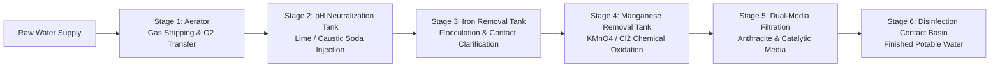

## Chương 4: Removal of Iron and Manganese

### 4.1 Overview of Iron and Manganese in Water Supplies
#### 4.1.1 Occurrence, Speciation & Hydrogeochemistry
##### 4.1.1.1 Geological Origins and Hydrogeochemical Abundance
###### Geochemical Weathering and Mineral Dissolution
Iron ($Fe$) and manganese ($Mn$) are among the most abundant metallic elements in the Earth's crust, ranking fourth (~5.0% by weight) and twelfth (~0.1% by weight), respectively. In natural sedimentary, igneous, and metamorphic rock strata, iron predominantly exists as insoluble ferric oxides/hydroxides (hematite $\alpha\text{-Fe}_2\text{O}_3$, goethite $\alpha\text{-FeOOH}$, magnetite $\text{Fe}_3\text{O}_4$), carbonates (siderite $\text{FeCO}_3$), and sulfides (pyrite $\text{FeS}_2$). Manganese naturally occurs primarily as pyrolusite ($\beta\text{-MnO}_2$), psilomelane ($(\text{Ba},\text{H}_2\text{O})_2\text{Mn}_5\text{O}_{10}$), manganite ($\gamma\text{-MnOOH}$), and rhodochrosite ($\text{MnCO}_3$). Natural weathering occurs as rainfall percolates through organic-rich topsoil, dissolving soil carbon dioxide ($CO_2$) to form dilute carbonic acid ($H_2CO_3$), which aggressively leaches these minerals into underlying hydrogeological strata.

###### Anaerobic Reducing Aquifers and Microbial Respiration
In deep alluvial aquifers, confined groundwater zones, and the hypolimnion of eutrophic stratified reservoirs, dissolved molecular oxygen is depleted by the heterotrophic microbial oxidation of natural organic matter (NOM):
$$\text{CH}_2\text{O} + \text{O}_2 \rightarrow \text{CO}_2 + \text{H}_2\text{O}$$
Following total dissolved oxygen exhaustion, anaerobic microorganisms utilize alternative terminal electron acceptors in a thermodynamic sequence dictated by redox potential ($E_h$): denitrification ($	ext{NO}_3^- \rightarrow 	ext{N}_2$), followed by dissimilatory iron reduction ($	ext{Fe}^{3+} \rightarrow 	ext{Fe}^{2+}$), dissimilatory manganese reduction ($	ext{Mn}^{4+} \rightarrow 	ext{Mn}^{2+}$), and sulfate reduction ($	ext{SO}_4^{2-} \rightarrow 	ext{H}_2	ext{S}$). Solid-phase insoluble ferric and manganic minerals undergo reductive dissolution:
$$\text{Fe(OH)}_3(s) + 3\text{H}^+ + e^- \rightleftharpoons \text{Fe}^{2+} + 3\text{H}_2\text{O}$$
$$\text{MnO}_2(s) + 4\text{H}^+ + 2e^- \rightleftharpoons \text{Mn}^{2+} + 2\text{H}_2\text{O}$$
Consequently, confined groundwater sources frequently exhibit elevated concentrations of soluble, colorless, divalent cations: dissolved ferrous iron ($	ext{Fe}^{2+}$) ranging from low milligrams per liter up to $>10\text{ mg/L}$ in low-alkalinity formations, and dissolved manganous manganese ($	ext{Mn}^{2+}$) typically spanning $0.1\text{ to } 2.0\text{ mg/L}$.

##### 4.1.1.2 Aqueous Speciation and Redox Thermodynamics (Pourbaix Diagrams)
###### Divalent vs. Trivalent Iron Equilibrium Speciation
In aqueous environments, iron exists in two principal oxidation states: divalent ferrous iron ($	ext{Fe(II)}$) and trivalent ferric iron ($	ext{Fe(III)}$). In reducing, low-$E_h$ groundwater below pH 7.0, soluble $	ext{Fe}^{2+}$ is the thermodynamically dominant ionic species. At intermediate pH with high dissolved carbonate concentrations, solubility may be governed by siderite ($	ext{FeCO}_3$) precipitation:
$$\text{Fe}^{2+} + \text{HCO}_3^- \rightleftharpoons \text{FeCO}_3(s) + \text{H}^+ \quad (K_{sp} \approx 3.13 \times 10^{-11})$$
Under aerobic conditions ($E_h > +0.2\text{ V}$), $	ext{Fe(II)}$ is unstable and rapidly oxidizes to $	ext{Fe(III)}$. Ferric iron undergoes intense hydration and stepwise hydrolysis, producing soluble hydroxo complexes ($	ext{Fe(OH)}^{2+}$, $	ext{Fe(OH)}_2^+$, $	ext{Fe(OH)}_3^0$, $	ext{Fe(OH)}_4^-$) before precipitating as amorphous, highly insoluble ferric hydroxide ($	ext{Fe(OH)}_3(s)$ or ferrihydrite $	ext{Fe}_5	ext{HO}_8 \cdot 4	ext{H}_2	ext{O}$), whose solubility product is extraordinarily low ($K_{sp} \approx 10^{-38.8}$ at 25°C). Consequently, in oxygenated drinking water at pH 6.5–8.5, free dissolved $	ext{Fe}^{3+}$ concentration is negligible ($< 10^{-10}\text{ mg/L}$).

###### Manganous vs. Tetravalent Manganese Equilibrium Speciation
Manganese exhibits multiple oxidation states in aquatic chemistry: $	ext{Mn(II)}$, $	ext{Mn(III)}$, $	ext{Mn(IV)}$, and heptavalent $	ext{Mn(VII)}$ in permanganate. In natural reducing groundwater, soluble divalent manganous ion ($	ext{Mn}^{2+}$) predominates across acidic, neutral, and mildly alkaline ranges (up to pH ~8.5–9.0). Unlike $	ext{Fe}^{2+}$, $	ext{Mn}^{2+}$ resists homogeneous oxidation by dissolved oxygen at circumneutral pH. Trivalent manganese ($	ext{Mn(III)}$) exists primarily as solid manganite ($	ext{MnOOH}$) or hausmannite ($	ext{Mn}_3	ext{O}_4$), while tetravalent manganese ($	ext{Mn(IV)}$) forms insoluble manganese dioxide ($	ext{MnO}_2(s)$, birnessite, or pyrolusite). The solubility product of manganese carbonate (rhodochrosite, $	ext{MnCO}_3$) is $K_{sp} \approx 1.8 \times 10^{-11}$, which is significantly higher than that of iron, permitting high $	ext{Mn}^{2+}$ mobility in anaerobic aquifers.

###### Eh-pH Pourbaix Thermodynamic Stability Fields
The Pourbaix ($E_h\text{-pH}$) diagram maps the thermodynamic stability domains of iron and manganese as functions of solution redox potential ($E_h$ in volts) and pH:
- **Iron Stability Boundaries**: At $E_h < 0.1\text{ V}$ and $\text{pH } 5.0 - 8.0$, the soluble $\text{Fe}^{2+}$ domain dominates. As aeration raises $E_h$ into the positive quadrant ($+0.3\text{ to } +0.8\text{ V}$), the thermodynamic equilibrium shifts across the phase boundary directly into the insoluble solid $\text{Fe(OH)}_3(s)$ or $\alpha\text{-FeOOH}$ stability field.
- **Manganese Stability Boundaries**: The soluble $\text{Mn}^{2+}$ stability domain occupies a much broader thermodynamic envelope than $\text{Fe}^{2+}$, extending up to $E_h \approx +0.6\text{ V}$ at neutral pH 7.0. The phase boundary separating soluble $\text{Mn}^{2+}$ from insoluble solid $\text{MnO}_2(s)$ requires either an extremely high redox potential ($E_h > +0.7\text{ V}$ achievable only via strong chemical oxidants like $\text{KMnO}_4$ or $\text{O}_3$) or an elevation of pH beyond 9.5 under dissolved oxygen saturation.

##### 4.1.1.3 Organic Complexes and Colloidal Humic Associations
###### Humic and Fulvic Acid Chelation ($Fe\text{-}NOM$, $Mn\text{-}NOM$)
In shallow aquifers, alluvial deposits recharged by wetlands, or surface water receiving bog drainage, iron and manganese frequently complex with dissolved Natural Organic Matter (NOM), specifically humic and fulvic acids. These macromolecular polycarboxylic polyphenols possess dense arrays of oxygen-bearing functional groups (carboxylate $-\text{COO}^-$ and phenolic $-\text{O}^-$) that form stable polydentate coordination complexes (chelates) with $\text{Fe}^{2+}$ and $\text{Fe}^{3+}$:
$$\text{Fe}^{2+} + \text{NOM}^{n-} \rightleftharpoons [\text{Fe-NOM}]^{2-n}$$
These organo-metallic complexes exhibit remarkable thermodynamic stability and steric resistance, effectively shielding the central metallic cation from dissolved oxygen and conventional chemical oxidants.

###### Colloidal Organo-Metallic Dispersion Stability
Complexed iron-NOM structures form negatively charged, hydrophilic lyophilic colloidal dispersions ($0.01 - 0.45\;\mu\text{m}$) characterized by high zeta potentials ($-25\text{ to } -40\text{ mV}$). Conventional physical aeration cannot break these bonds or precipitate the metal because the organic ligand prevents the nucleation and aggregation of $\text{Fe(OH)}_3$ microcrystals. Water treatment plants treating organo-iron complexes experience severe filtration breakthrough unless the organic sheath is destroyed by advanced oxidation (ozone or potassium permanganate) or destabilized via coagulation with high coagulant dosages ($	ext{Al}^{3+}$ or $	ext{Fe}^{3+}$ salts) operating in the sweep coagulation or charge-neutralization regime at acidic pH (5.5–6.3).

##### 4.1.1.4 Regulatory Drinking Water Quality Standards
###### QCVN 01-1:2018/BYT Standard Limits for Domestic Water
In Vietnam, potable water quality is strictly regulated under the national technical regulation **QCVN 01-1:2018/BYT** (National Technical Regulation on Domestic Water Quality), promulgated by the Ministry of Health (Bộ Y tế). This standard mandates:
- **Total Iron (Fe)**: $\le 0.3\text{ mg/L}$ (Group A parameter, mandatory testing frequency).
- **Total Manganese (Mn)**: $\le 0.1\text{ mg/L}$ (Group A parameter, mandatory testing frequency).
- **Turbidity**: $\le 2\text{ NTU}$.
- **Color**: $\le 15\text{ TCU}$ (True Color Units).
- **pH**: $6.0 - 8.5$.
- **Free Chlorine Residual**: $0.2 - 1.0\text{ mg/L}$ at point of consumption.

###### Historical Standards Comparison (QCVN 01:2009/BYT vs QCVN 01-1:2018/BYT)
Under the earlier standard **QCVN 01:2009/BYT**, the maximum allowable limit for total manganese was set at $\le 0.3\text{ mg/L}$. In the modernized QCVN 01-1:2018/BYT, this threshold was tightened by three-fold to $\le 0.1\text{ mg/L}$. This regulatory revision was prompted by epidemiological studies demonstrating chronic neurotoxic risks of elevated manganese exposure in vulnerable populations (infants and children), as well as widespread customer complaints regarding fixture staining at concentrations above $0.05 - 0.1\text{ mg/L}$. The iron limit remained unchanged at $\le 0.3\text{ mg/L}$.

###### International WHO and US EPA Secondary Maximum Contaminant Levels
- **World Health Organization (WHO Guidelines for Drinking-water Quality)**: Recommends iron levels below $0.3\text{ mg/L}$ based on aesthetic taste and appearance; manganese health-based guideline value is $0.4\text{ mg/L}$, but aesthetic objection occurs at $\sim 0.05 - 0.1\text{ mg/L}$.
- **US EPA Secondary Maximum Contaminant Levels (SMCL - Non-enforceable aesthetic guidelines)**:
  - Total Iron ($	ext{Fe}$): $\le 0.30\text{ mg/L}$.
  - Total Manganese ($	ext{Mn}$): $\le 0.05\text{ mg/L}$ (tightened aesthetic threshold to prevent laundry and fixture staining).

---

#### 4.1.2 Aesthetic Degradation: Color, Fixture Staining & Taste Impacts
##### 4.1.2.1 Chromatic Deterioration and Water Discoloration
###### "Red Water" Phenomenon from Colloidal Ferric Hydroxide
When raw groundwater containing dissolved ferrous ions ($	ext{Fe}^{2+}$) comes into contact with dissolved oxygen—either during post-well pumping or within consumer distribution lines—ferrous iron oxidizes into insoluble ferric iron. The resulting colloidal ferric hydroxide ($	ext{Fe(OH)}_3(s)$) and ferric oxyhydroxide particles scatter and absorb incident light, imparting a distinct reddish-brown, yellow-orange, or rust-colored turbidity known across municipal water utilities as **"Red Water"**. Consumer perception of contamination occurs even at low concentrations ($> 0.3\text{ mg/L}$), leading to intense customer dissatisfaction.

###### "Black Water" Turbidity from Manganese Dioxide Colloids
Manganese oxidation produces insoluble tetravalent manganese dioxide ($	ext{MnO}_2(s)$) in the form of dark brownish-black, microcrystalline particulates. When unoxidized $	ext{Mn}^{2+}$ breaches municipal filtration barriers and slowly oxidizes within distribution pipelines or household fixtures, it manifests as **"Black Water"**. Even minute concentrations of manganese ($> 0.05\text{ mg/L}$) produce noticeable dark turbidity, black sediment flakes in toilet flush tanks, and turbid water discharges during plumbing draw-off.

##### 4.1.2.2 Plumbing Fixture, Ceramic, and Laundry Staining
###### Ferric Hydroxide Adhesion onto Porcelain and Enamel
Precipitated $	ext{Fe(OH)}_3$ flocs possess high surface affinity for vitreous china, ceramic porcelain, and enameled plumbing fixtures (sinks, bathtubs, toilet bowls). Over time, microscopic ferric deposits coat fixture surfaces, polymerizing into persistent, insoluble reddish-brown rust stains that resist standard domestic detergents and require harsh acidic cleaning reagents (oxalic acid, hydrochloric acid, or citric acid chelating agents) for removal.

###### Manganese Dioxide Fabric Oxidation and Permanent Laundry Staining
Manganese presents an even more intractable laundering hazard. When domestic laundry is washed in water containing dissolved $	ext{Mn}^{2+}$, household chlorine bleach (sodium hypochlorite $	ext{NaOCl}$) rapidly oxidizes the dissolved manganese directly within the woven fabric fibers into solid manganese dioxide:
$$\text{Mn}^{2+} + \text{OCl}^- + \text{H}_2\text{O} \rightarrow \text{MnO}_2\downarrow + \text{Cl}^- + 2\text{H}^+$$
The fine $	ext{MnO}_2$ crystals become physically entrapped inside the cellulose or synthetic fabric matrix, generating permanent, indelible dark gray, purple-brown, or black stains that ruin white fabrics and industrial textiles.

##### 4.1.2.3 Organoleptic Impacts: Metallic Taste and Food/Beverage Complexation
###### Taste Thresholds for Dissolved $Fe^{2+}$ and $Mn^{2+}$
Dissolved iron and manganese impart distinct, objectionable organoleptic characteristics to drinking water. Soluble ferrous iron produces an astringent, bitter, metallic, or "bloody" taste at concentrations as low as $0.1 - 0.3\text{ mg/L}$. Manganese produces a bitter, medicinal, astringent metallic flavor at concentrations exceeding $0.1\text{ mg/L}$. In soft waters with low total dissolved solids (TDS), these taste thresholds become even more acute.

###### Tannic Acid Complexation in Tea and Coffee
When water containing elevated dissolved iron is used for domestic cooking or beverage preparation, iron cations react with plant polyphenols, tannins, and tannic acids naturally abundant in tea leaves and coffee beans. The ferrous/ferric ions coordinate with adjacent ortho-dihydroxy (catechol) groups of polyphenols, forming dense, insoluble, ink-black organo-metallic chelates (ferric tannate complexes):
$$\text{Fe}^{3+} + 3\text{Tannic Acid} \rightarrow \text{Fe(Tannate)}_3\downarrow \text{ (Inky Black Precipitate)}$$
This chemical complexation turns freshly brewed tea into an unpalatable, murky, bluish-black ink, completely suppresses beverage aroma, and causes dark discoloration of cooked rice, vegetables, and soups.

---

#### 4.1.3 Distribution System Deposition & Iron/Manganese Biofouling
##### 4.1.3.1 Mineral Scaling and Pipe Incrustation
###### Tuberculation and Tuberculous Scale Formation
In unlined cast iron, ductile iron, and carbon steel distribution pipes, dissolved iron and manganese accelerate internal pipe incrustation and **tuberculation**. As unoxidized $	ext{Fe}^{2+}$ and residual oxidants circulate, localized electrochemical corrosion cells develop on the pipe wall. Anodic dissolution generates ferrous ions, which precipitate at the pit boundary as ferric hydroxide mounds or "tubercles". These encrustations mineralize over time into hard crusts composed of goethite ($lpha	ext{-FeOOH}$), magnetite ($	ext{Fe}_3	ext{O}_4$), and manganese dioxide ($	ext{MnO}_2$).

###### Reduction of Hydraulic Carrying Capacity (Hazen-Williams $C$ Factor Loss)
Tubercular crusts and rough mineral deposits significantly increase inner pipe wall roughness, progressively constricting effective pipeline diameter:
- In newly installed lined pipes, the Hazen-Williams roughness coefficient is typically $C = 130 - 140$.
- In severely tuberculated water mains encrusted by iron and manganese deposits, the $C$ factor degrades to $C = 60 - 80$ or lower.
This roughness escalation drastically increases frictional head loss across the distribution grid:
$$h_f = 10.67 \cdot L \cdot Q^{1.852} \cdot C^{-1.852} \cdot D^{-4.87}$$
Consequently, municipal pumping stations must consume excessive electrical energy to maintain network terminal pressures, or severe distribution pressure drops occur during peak demand hours.

###### Water Meter and Control Valve Clogging
Accumulated mineral sediments and spalled tubercular fragments migrate through service lines, lodging in customer displacement water meters, pressure reducing valves (PRVs), backflow preventers, and solenoid irrigation valves. Particulate deposition jams meter nutating discs and turbine impellers, resulting in inaccurate metering, lost utility revenue, and widespread valve seizing.

##### 4.1.3.2 Hydraulic Surges and Particulate Resuspension
###### Shear Stress and Hydraulic Boundary Layer Disturbance
In municipal distribution systems, mineral scale and loose colloidal precipitates accumulate in low-velocity zones, laminar boundary layers, and dead-end pipeline segments. Under normal steady laminar-to-transitional flow, hydrodynamic boundary layer shear stress remains low ($	au_w < 1.0\text{ N/m}^2$), permitting loose flocs to settle into a soft bed of pipe sediment.

###### Fire Flow and Flow Reversal Episodes (Sudden Consumer Red/Black Water Spikes)
Whenever hydraulic transients occur—such as fire hydrant activations, main line breaks, sudden valve closures, or pump station cycling—flow velocities abruptly surge from typical levels ($0.5 - 1.0\text{ m/s}$) to high turbulent velocities ($> 2.5 - 3.0\text{ m/s}$), and local flow directions may instantly reverse. The resulting bed shear stress ($	au_w = rac{1}{8} f 
ho v^2$) exceeds the critical shear threshold for sediment resuspension:
$$\tau_w > \tau_{c,\text{erosion}}$$
Massive quantities of settled ferric hydroxide and manganese dioxide particulates are instantly sheared off the pipe walls and resuspended into bulk solution. This generates sudden, violent episodes of dark brown or black water at consumer taps across entire residential pressure zones, triggering intense regulatory scrutiny and consumer alarm.

##### 4.1.3.3 Iron and Manganese Bacteria Proliferation (Biofouling)
###### Autotrophic and Mixotrophic Bacterial Genera
Distribution pipelines conveying water with residual unoxidized $	ext{Fe}^{2+}$ and $	ext{Mn}^{2+}$ provide an ideal ecological niche for specialized chemolithotrophic and mixotrophic bacteria:
- **Gallionella ferruginea**: Stalk-forming, microaerophilic autotrophic bacteria that excrete twisted, helical ribbon-like stalks composed of ferric oxyhydroxides.
- **Leptothrix ochracea & Leptothrix discophora**: Filamentous sheath-forming bacteria capable of simultaneously oxidizing both $	ext{Fe(II)}$ and $	ext{Mn(II)}$, encasing themselves in rigid tubular manganese-iron mineral sheaths.
- **Crenothrix polyspora & Sphaerotilus natans**: Massive filamentous iron bacteria capable of forming dense, branching microbial mats.
These organisms derive metabolic energy by catalyzing the exergonic oxidation of reduced divalent metals:
$$\text{Fe}^{2+} + 0.25\text{O}_2 + 2.5\text{H}_2\text{O} \rightarrow \text{Fe(OH)}_3(s) + 2\text{H}^+ + \Delta G^\circ \; (-29\text{ kJ/mol})$$

###### Filamentous Slime Sheath Secretion and Extracellular Polymeric Substances (EPS)
These bacteria secrete copious quantities of mucilaginous **Extracellular Polymeric Substances (EPS)** consisting of polysaccharides, proteins, and humic-like biopolymers. These sticky organic biofilms entrap accumulating $	ext{Fe(OH)}_3$ and $	ext{MnO}_2$ precipitates, forming thick, gelatinous, reddish-brown and black biological slime mats up to several millimeters thick on pipe walls.

###### Microbial Disinfectant Shielding and Biocide Resistance
The dense EPS slime matrix acts as a diffusion barrier and chemical sink, exerting strong biocide demand that neutralizes free chlorine and chloramines before they can penetrate into the biofilm core. Pathogenic microorganisms—including *Legionella pneumophila*, *Pseudomonas aeruginosa*, *Escherichia coli*, and enteric viruses—become harbored and protected within the anaerobic sub-layers of the iron-manganese biofilm, completely shielded from residual municipal disinfection.

###### Bacterially Induced Microbiologically Influenced Corrosion (MIC)
Beneath the dense biological tubercles, oxygen cannot penetrate, establishing severe differential aeration cells across the metal pipe surface. Obligate anaerobic sulfate-reducing bacteria (*Desulfovibrio*) proliferate in these anaerobic micro-environments, utilizing organic biofilm byproducts to reduce sulfate to corrosive hydrogen sulfide ($H_2S$). This biogenic sulfide reacts aggressively with the iron pipe substrate to form iron sulfide ($FeS$), driving severe localized pitting corrosion and catastrophic pipe wall perforations.

---

### 4.2 Theoretical Chemistry, Reaction Stoichiometry & Oxidation Kinetics
#### 4.2.1 Oxidation Chemical Reactions & Oxidant Stoichiometric Demands
##### 4.2.1.1 Aeration and Molecular Dissolved Oxygen ($O_2$) Oxidation
###### Fe(II) Aeration Stoichiometry and Bicarbonate Decomposition
Aeration introduces atmospheric oxygen into water to oxidize soluble ferrous iron into insoluble ferric hydroxide. In natural bicarbonate-buffered groundwater, the molecular reaction proceeds with the release of carbon dioxide:
$$4	ext{Fe}(	ext{HCO}_3)_2 + 	ext{O}_2 + 2	ext{H}_2	ext{O} 
ightarrow 4	ext{Fe}(	ext{OH})_3\downarrow + 8	ext{CO}_2 \quad 	ext{[eq\_ch04\_001]}$$
- **Equation ID**: `eq_ch04_001`
- **Plain Text**: `4Fe(HCO3)2 + O2 + 2H2O -> 4Fe(OH)3 + 8CO2`
- **Description**: Molecular stoichiometric reaction representing the oxidation of soluble ferrous bicarbonate by dissolved atmospheric oxygen to form insoluble ferric hydroxide precipitate and liberate carbon dioxide gas.
- **Key Variables & Parameters**:
  - $	ext{Fe}(	ext{HCO}_3)_2$: Soluble ferrous bicarbonate present in anaerobic groundwater.
  - $	ext{O}_2$: Dissolved oxygen introduced via aeration.
  - $	ext{Fe}(	ext{OH})_3$: Insoluble ferric hydroxide precipitate (floc).
  - $	ext{CO}_2$: Carbon dioxide released into solution and stripped into the air phase.

In ionic form, the oxidation of dissolved divalent ferrous ions consumes water molecules and releases hydrogen ions (protons):
$$4	ext{Fe}^{2+} + 	ext{O}_2 + 10	ext{H}_2	ext{O} 
ightarrow 4	ext{Fe}(	ext{OH})_3\downarrow + 8	ext{H}^+ \quad 	ext{[eq\_ch04\_002]}$$
- **Equation ID**: `eq_ch04_002`
- **Plain Text**: `4Fe(2+) + O2 + 10H2O -> 4Fe(OH)3 + 8H(+)`
- **Description**: Ionic reaction showing oxidation of dissolved ferrous ions ($	ext{Fe}^{2+}$) to ferric hydroxide precipitate, releasing protons ($	ext{H}^+$) which consume natural alkalinity.
- **Key Variables & Parameters**:
  - $	ext{Fe}^{2+}$: Dissolved divalent ferrous cation ($55.85\text{ g/mol}$).
  - $	ext{O}_2$: Dissolved molecular oxygen oxidant ($32.00\text{ g/mol}$).
  - $	ext{Fe}(	ext{OH})_3$: Insoluble amorphous ferric hydroxide precipitate.
  - $	ext{H}^+$: Hydronium ions released into solution.

**Stoichiometric Oxygen Requirement for Iron**:
From the stoichiometry of `eq_ch04_002`, $4\text{ moles of Fe}^{2+}$ ($4 \times 55.845\text{ g} = 223.38\text{ g Fe}$) react with $1\text{ mole of O}_2$ ($32.00\text{ g O}_2$):
$$\text{Theoretical Ratio} = \frac{32.00\text{ g O}_2}{223.38\text{ g Fe}} = 0.14326\text{ mg O}_2 / \text{mg Fe} \approx 0.14\text{ mg O}_2 / \text{mg Fe}$$

###### Mn(II) Aeration Stoichiometry and Buffer Dynamics
The molecular oxidation of dissolved manganous sulfate by dissolved oxygen in bicarbonate-buffered water forms solid manganese dioxide:
$$2	ext{MnSO}_4 + 2	ext{Ca}(	ext{HCO}_3)_2 + 	ext{O}_2 
ightarrow 2	ext{MnO}_2\downarrow + 2	ext{CaSO}_4 + 2	ext{H}_2	ext{O} + 4	ext{CO}_2 \quad 	ext{[eq\_ch04\_003]}$$
- **Equation ID**: `eq_ch04_003`
- **Plain Text**: `2MnSO4 + 2Ca(HCO3)2 + O2 -> 2MnO2 + 2CaSO4 + 2H2O + 4CO2`
- **Description**: Molecular stoichiometric equation representing the slow oxidation of dissolved manganous sulfate in the presence of calcium bicarbonate buffer to form solid manganese dioxide precipitate.
- **Key Variables & Parameters**:
  - $	ext{MnSO}_4$: Dissolved manganous sulfate.
  - $	ext{Ca}(	ext{HCO}_3)_2$: Calcium bicarbonate providing buffer capacity.
  - $	ext{O}_2$: Dissolved oxygen oxidant.
  - $	ext{MnO}_2$: Solid manganese dioxide precipitate.

In ionic form:
$$2	ext{Mn}^{2+} + 	ext{O}_2 + 2	ext{H}_2	ext{O} 
ightarrow 2	ext{MnO}_2\downarrow + 4	ext{H}^+ \quad 	ext{[eq\_ch04\_004]}$$
- **Equation ID**: `eq_ch04_004`
- **Plain Text**: `2Mn(2+) + O2 + 2H2O -> 2MnO2 + 4H(+)`
- **Description**: Ionic reaction for manganous ion oxidation by dissolved oxygen to manganese dioxide, generating 2 equivalents of hydronium ions per mole of manganese.
- **Key Variables & Parameters**:
  - $	ext{Mn}^{2+}$: Dissolved divalent manganous cation ($54.94\text{ g/mol}$).
  - $	ext{O}_2$: Dissolved molecular oxygen ($32.00\text{ g/mol}$).
  - $	ext{MnO}_2$: Solid tetravalent manganese dioxide.
  - $	ext{H}^+$: Protons released into solution.

**Stoichiometric Oxygen Requirement for Manganese**:
From `eq_ch04_004`, $2\text{ moles of Mn}^{2+}$ ($2 \times 54.938\text{ g} = 109.88\text{ g Mn}$) require $1\text{ mole of O}_2$ ($32.00\text{ g O}_2$):
$$\text{Theoretical Ratio} = \frac{32.00\text{ g O}_2}{109.88\text{ g Mn}} = 0.29124\text{ mg O}_2 / \text{mg Mn} \approx 0.29\text{ mg O}_2 / \text{mg Mn}$$

Combining both metals yields the **Total Dissolved Oxygen Demand for Aeration**:
$$	ext{DO}_{	ext{demand}} = 0.14 \cdot [	ext{Fe}^{2+}] + 0.29 \cdot [	ext{Mn}^{2+}] \quad 	ext{[eq\_ch04\_018]}$$
- **Equation ID**: `eq_ch04_018`
- **Plain Text**: `DO_demand = 0.14 * [Fe2+] + 0.29 * [Mn2+]`
- **Description**: Calculates the minimum theoretical mass concentration of dissolved oxygen required in aeration towers to completely oxidize co-occurring iron and manganese.
- **Key Variables & Parameters**:
  - $	ext{DO}_{	ext{demand}}$: Theoretical dissolved oxygen required ($	ext{mg/L O}_2$).
  - $[	ext{Fe}^{2+}]$: Raw water dissolved ferrous iron concentration ($	ext{mg/L}$).
  - $[	ext{Mn}^{2+}]$: Raw water dissolved manganous manganese concentration ($	ext{mg/L}$).

###### Alkalinity Consumption and Acid Production During Hydrolysis
Both oxidation reactions release hydrogen ions ($	ext{H}^+$), which neutralize natural bicarbonate alkalinity ($	ext{HCO}_3^-$):
$$\text{H}^+ + \text{HCO}_3^- \rightarrow \text{H}_2\text{O} + \text{CO}_2$$
- For Iron Oxidation (`eq_ch04_002`): $4\text{ moles of Fe}^{2+}$ release $8\text{ moles of H}^+$, or $2.0\text{ equivalents of H}^+$ per mole of $	ext{Fe}^{2+}$. Expressed in calcium carbonate equivalent ($50,044\text{ mg CaCO}_3/\text{eq}$):
  $$\text{Alkalinity Consumption} = \frac{2\text{ eq H}^+ \times 50,044\text{ mg CaCO}_3/\text{eq}}{55,845\text{ mg Fe}} = 1.792\text{ mg CaCO}_3 / \text{mg Fe}$$
- For Manganese Oxidation (`eq_ch04_004`): $2\text{ moles of Mn}^{2+}$ release $4\text{ moles of H}^+$, or $2.0\text{ equivalents of H}^+$ per mole of $	ext{Mn}^{2+}$:
  $$\text{Alkalinity Consumption} = \frac{2\text{ eq H}^+ \times 50,044\text{ mg CaCO}_3/\text{eq}}{54,938\text{ mg Mn}} = 1.822\text{ mg CaCO}_3 / \text{mg Mn}$$
In poorly buffered groundwaters (alkalinity $< 50\text{ mg/L as CaCO}_3$), unmitigated iron and manganese oxidation causes substantial solution pH depression, which severely inhibits oxidation reaction rates unless supplemental alkali (lime, soda ash, or sodium hydroxide) is dosed.

##### 4.2.1.2 Free Chlorine ($Cl_2$ / $HOCl$) Chemical Oxidation
###### Ferrous Iron Oxidation by Free Chlorine
Free chlorine gas or aqueous hypochlorous acid ($	ext{HOCl}$) is a powerful electron acceptor capable of rapid iron oxidation across a wide pH range:
$$2	ext{Fe}^{2+} + 	ext{Cl}_2 + 6	ext{H}_2	ext{O} 
ightarrow 2	ext{Fe}(	ext{OH})_3\downarrow + 2	ext{Cl}^- + 6	ext{H}^+ \quad 	ext{[eq\_ch04\_005]}$$
- **Equation ID**: `eq_ch04_005`
- **Plain Text**: `2Fe(2+) + Cl2 + 6H2O -> 2Fe(OH)3 + 2Cl(-) + 6H(+)`
- **Description**: Stoichiometric chemical oxidation of ferrous iron by free chlorine gas, producing insoluble ferric hydroxide, chloride anions, and hydronium ions.
- **Key Variables & Parameters**:
  - $	ext{Fe}^{2+}$: Dissolved ferrous cation ($55.85\text{ g/mol}$).
  - $	ext{Cl}_2$: Free chlorine oxidant ($70.91\text{ g/mol}$).
  - $	ext{Fe}(	ext{OH})_3$: Ferric hydroxide precipitate.
  - $	ext{Cl}^-$: Chloride anion byproduct.
  - $	ext{H}^+$: Hydronium ions generated.

**Stoichiometric Chlorine Requirement for Iron**:
$2\text{ moles of Fe}^{2+}$ ($111.69\text{ g Fe}$) react with $1\text{ mole of Cl}_2$ ($70.906\text{ g Cl}_2$):
$$\text{Theoretical Ratio} = \frac{70.906\text{ g Cl}_2}{111.69\text{ g Fe}} = 0.63485\text{ mg Cl}_2 / \text{mg Fe} \approx 0.63 - 0.64\text{ mg Cl}_2 / \text{mg Fe}$$

###### Manganous Manganese Oxidation by Free Chlorine
Free chlorine oxidizes manganous manganese to insoluble manganese dioxide:
$$	ext{Mn}^{2+} + 	ext{Cl}_2 + 2	ext{H}_2	ext{O} 
ightarrow 	ext{MnO}_2\downarrow + 2	ext{Cl}^- + 4	ext{H}^+ \quad 	ext{[eq\_ch04\_006]}$$
- **Equation ID**: `eq_ch04_006`
- **Plain Text**: `Mn(2+) + Cl2 + 2H2O -> MnO2 + 2Cl(-) + 4H(+)`
- **Description**: Stoichiometric oxidation of manganous ions to manganese dioxide by free chlorine, requiring elevated pH ($> 8.0 - 8.5$) for practical completion.
- **Key Variables & Parameters**:
  - $	ext{Mn}^{2+}$: Dissolved manganous cation ($54.94\text{ g/mol}$).
  - $	ext{Cl}_2$: Free chlorine oxidant ($70.91\text{ g/mol}$).
  - $	ext{MnO}_2$: Solid manganese dioxide precipitate.
  - $	ext{Cl}^-$: Chloride anion byproduct.

**Stoichiometric Chlorine Requirement for Manganese**:
$1\text{ mole of Mn}^{2+}$ ($54.938\text{ g Mn}$) reacts with $1\text{ mole of Cl}_2$ ($70.906\text{ g Cl}_2$):
$$\text{Theoretical Ratio} = \frac{70.906\text{ g Cl}_2}{54.938\text{ g Mn}} = 1.29065\text{ mg Cl}_2 / \text{mg Mn} \approx 1.28 - 1.29\text{ mg Cl}_2 / \text{mg Mn}$$

Combining both stoichiometric requirements yields the **Total Chlorine Demand**:
$$	ext{Cl}_{2, 	ext{demand}} = 0.64 \cdot [	ext{Fe}^{2+}] + 1.29 \cdot [	ext{Mn}^{2+}] \quad 	ext{[eq\_ch04\_019]}$$
- **Equation ID**: `eq_ch04_019`
- **Plain Text**: `Cl2_demand = 0.64 * [Fe2+] + 1.29 * [Mn2+]`
- **Description**: Calculates the theoretical chemical chlorine demand required for pre-chlorination of raw water containing dissolved iron and manganese.
- **Key Variables & Parameters**:
  - $	ext{Cl}_{2, 	ext{demand}}$: Theoretical chlorine oxidant demand ($	ext{mg/L Cl}_2$).
  - $[	ext{Fe}^{2+}]$: Dissolved ferrous iron concentration ($	ext{mg/L}$).
  - $[	ext{Mn}^{2+}]$: Dissolved manganous manganese concentration ($	ext{mg/L}$).

###### Disinfection Byproduct (DBP) Formation Risks During Pre-Chlorination
Although pre-chlorination is chemically effective and inexpensive, dosing free chlorine into raw surface or shallow groundwater containing Natural Organic Matter (NOM) triggers halogenation substitution reactions. Free chlorine reacts with humic and fulvic precursor molecules to form regulated, carcinogenic Disinfection Byproducts (DBPs):
- **Total Trihalomethanes (TTHMs)**: Chloroform ($	ext{CHCl}_3$), bromodichloromethane ($	ext{CHBrCl}_2$), dibromochloromethane ($	ext{CHBr}_2	ext{Cl}$), bromoform ($	ext{CHBr}_3$).
- **Haloacetic Acids (HAA5)**: Monochloroacetic, dichloroacetic, trichloroacetic, monobromoacetic, and dibromoacetic acids.
Under QCVN 01-1:2018/BYT and US EPA Stage 2 D/DBPR standards, TTHMs must not exceed $0.1\text{ mg/L}$ ($100\;\mu\text{g/L}$) or $80\;\mu\text{g/L}$, and HAA5 must not exceed $60\;\mu\text{g/L}$. Consequently, pre-chlorination should be avoided in raw waters with elevated Total Organic Carbon ($	ext{TOC} > 2.0\text{ mg/L}$), favoring alternative oxidants such as potassium permanganate, ozone, or catalytic media.

##### 4.2.1.3 Potassium Permanganate ($KMnO_4$) Chemical Oxidation
###### Permanganate Oxidation of Ferrous Iron
Potassium permanganate ($	ext{KMnO}_4$, molecular weight $158.034\text{ g/mol}$) is a potent oxidizing agent in which manganese undergoes reduction from oxidation state $+7$ to $+4$:
$$3	ext{Fe}^{2+} + 	ext{KMnO}_4 + 7	ext{H}_2	ext{O} 
ightarrow 3	ext{Fe}(	ext{OH})_3\downarrow + 	ext{MnO}_2\downarrow + 	ext{K}^+ + 5	ext{H}^+ \quad 	ext{[eq\_ch04\_007]}$$
- **Equation ID**: `eq_ch04_007`
- **Plain Text**: `3Fe(2+) + KMnO4 + 7H2O -> 3Fe(OH)3 + MnO2 + K(+) + 5H(+)`
- **Description**: Stoichiometric oxidation of ferrous iron by potassium permanganate, producing both insoluble ferric hydroxide and solid manganese dioxide precipitates.
- **Key Variables & Parameters**:
  - $	ext{Fe}^{2+}$: Dissolved ferrous cation ($55.85\text{ g/mol}$).
  - $	ext{KMnO}_4$: Potassium permanganate oxidant ($158.03\text{ g/mol}$).
  - $	ext{Fe}(	ext{OH})_3$: Ferric hydroxide precipitate.
  - $	ext{MnO}_2$: Manganese dioxide precipitate.
  - $	ext{K}^+$: Dissolved potassium ion byproduct.
  - $	ext{H}^+$: Hydronium ions released.

**Stoichiometric Permanganate Requirement for Iron**:
$3\text{ moles of Fe}^{2+}$ ($3 \times 55.845\text{ g} = 167.535\text{ g Fe}$) react with $1\text{ mole of KMnO}_4$ ($158.034\text{ g KMnO}_4$):
$$\text{Theoretical Ratio} = \frac{158.034\text{ g KMnO}_4}{167.535\text{ g Fe}} = 0.94329\text{ mg KMnO}_4 / \text{mg Fe}$$
The standard **operational design ratio** utilized in engineering practice (slide 6 and slide 19) is **$0.94\text{ mg KMnO}_4 / \text{mg Fe}$**:
$$	ext{Dose}_{	ext{KMnO}_4, 	ext{Fe}} = 0.94 \cdot [	ext{Fe}^{2+}] \quad 	ext{[eq\_ch04\_015]}$$
- **Equation ID**: `eq_ch04_015`
- **Plain Text**: `Dose_KMnO4_Fe = 0.94 * [Fe2+]`
- **Description**: Determines the operational chemical dosing requirement of potassium permanganate needed to completely oxidize soluble iron in raw water.

###### Permanganate Oxidation of Manganous Manganese
Potassium permanganate rapidly oxidizes manganous ions ($	ext{Mn}^{2+}$) across circumneutral pH ($7.0 - 8.5$), completing within $< 5 - 7\text{ minutes}$:
$$3	ext{Mn}^{2+} + 2	ext{KMnO}_4 + 2	ext{H}_2	ext{O} 
ightarrow 5	ext{MnO}_2\downarrow + 2	ext{K}^+ + 4	ext{H}^+ \quad 	ext{[eq\_ch04\_008]}$$
- **Equation ID**: `eq_ch04_008`
- **Plain Text**: `3Mn(2+) + 2KMnO4 + 2H2O -> 5MnO2 + 2K(+) + 4H(+)`
- **Description**: Rapid chemical oxidation of manganous manganese by potassium permanganate, transforming both dissolved reactants into insoluble solid manganese dioxide.
- **Key Variables & Parameters**:
  - $	ext{Mn}^{2+}$: Dissolved manganous cation ($54.94\text{ g/mol}$).
  - $	ext{KMnO}_4$: Potassium permanganate oxidant ($158.03\text{ g/mol}$).
  - $	ext{MnO}_2$: Solid manganese dioxide precipitate ($86.94\text{ g/mol}$).
  - $	ext{K}^+$: Potassium cation byproduct.
  - $	ext{H}^+$: Hydronium ions generated.

**Stoichiometric Permanganate Requirement for Manganese**:
$3\text{ moles of Mn}^{2+}$ ($3 \times 54.938\text{ g} = 164.814\text{ g Mn}$) react with $2\text{ moles of KMnO}_4$ ($2 \times 158.034\text{ g} = 316.068\text{ g KMnO}_4$):
$$\text{Theoretical Ratio} = \frac{316.068\text{ g KMnO}_4}{164.814\text{ g Mn}} = 1.91772\text{ mg KMnO}_4 / \text{mg Mn}$$
The standard **operational design ratio** utilized in engineering practice (slide 6 and slide 19) is **$1.92\text{ mg KMnO}_4 / \text{mg Mn}$**:
$$	ext{Dose}_{	ext{KMnO}_4, 	ext{Mn}} = 1.92 \cdot [	ext{Mn}^{2+}] \quad 	ext{[eq\_ch04\_016]}$$
- **Equation ID**: `eq_ch04_016`
- **Plain Text**: `Dose_KMnO4_Mn = 1.92 * [Mn2+]`
- **Description**: Determines the operational potassium permanganate dosing concentration required to oxidize dissolved manganese to insoluble manganese dioxide.

Combining both equations gives the **Total Potassium Permanganate Demand for Combined Fe & Mn**:
$$	ext{Dose}_{	ext{KMnO}_4, 	ext{total}} = 0.94 \cdot [	ext{Fe}^{2+}] + 1.92 \cdot [	ext{Mn}^{2+}] \quad 	ext{[eq\_ch04\_017]}$$
- **Equation ID**: `eq_ch04_017`
- **Plain Text**: `Dose_KMnO4_total = 0.94 * [Fe2+] + 1.92 * [Mn2+]`
- **Description**: Calculates overall potassium permanganate dosage required when both iron and manganese co-occur in the raw water supply.

###### Autocatalytic Co-Precipitation of Solid $MnO_2(s)$
A major advantage of permanganate oxidation is that the reaction product itself—hydrous manganese dioxide ($	ext{MnO}_2(s)$)—is a potent heterogeneous adsorption catalyst. Newly precipitated colloidal $	ext{MnO}_2$ has a high specific surface area ($> 200 - 300\text{ m}^2/\text{g}$) and an acidic point of zero charge ($	ext{pH}_{pzc} \approx 2.0 - 4.5$). At typical drinking water pH ($6.5 - 8.0$), the $	ext{MnO}_2$ surface is negatively charged, rapidly adsorbing unoxidized $	ext{Mn}^{2+}$ and $	ext{Fe}^{2+}$ cations and accelerating their heterogeneous surface oxidation.

##### 4.2.1.4 Advanced Chemical Oxidants: Ozone ($O_3$) and Chlorine Dioxide ($ClO_2$)
###### Ozone Oxidation Reactions and Stoichiometry
Ozone ($	ext{O}_3$, molecular weight $48.00\text{ g/mol}$) is one of the strongest chemical oxidants used in municipal water treatment ($E^\circ = +2.07\text{ V}$). It oxidizes iron in $< 2\text{ minutes}$:
$$2	ext{Fe}^{2+} + 	ext{O}_3 + 5	ext{H}_2	ext{O} 
ightarrow 2	ext{Fe}(	ext{OH})_3\downarrow + 	ext{O}_2 + 4	ext{H}^+ \quad 	ext{[eq\_ch04\_009]}$$
- **Equation ID**: `eq_ch04_009`
- **Plain Text**: `2Fe(2+) + O3 + 5H2O -> 2Fe(OH)3 + O2 + 4H(+)`
- **Description**: Rapid stoichiometric oxidation of iron by ozone gas, generating ferric hydroxide and dissolved oxygen without halogenated byproducts.
- **Key Variables & Parameters**:
  - $	ext{Fe}^{2+}$: Dissolved ferrous cation ($55.85\text{ g/mol}$).
  - $	ext{O}_3$: Dissolved ozone oxidant ($48.00\text{ g/mol}$).
  - $	ext{Fe}(	ext{OH})_3$: Ferric hydroxide precipitate.
  - $	ext{O}_2$: Dissolved oxygen byproduct.

**Stoichiometric Ozone Requirement for Iron**:
$2\text{ moles of Fe}^{2+}$ ($111.69\text{ g Fe}$) react with $1\text{ mole of O}_3$ ($48.00\text{ g O}_3$):
$$\text{Theoretical Ratio} = \frac{48.00\text{ g O}_3}{111.69\text{ g Fe}} = 0.42976\text{ mg O}_3 / \text{mg Fe} \approx 0.43\text{ mg O}_3 / \text{mg Fe}$$

For manganese, ozone completes oxidation in $< 5\text{ minutes}$:
$$	ext{Mn}^{2+} + 	ext{O}_3 + 	ext{H}_2	ext{O} 
ightarrow 	ext{MnO}_2\downarrow + 	ext{O}_2 + 2	ext{H}^+ \quad 	ext{[eq\_ch04\_010]}$$
- **Equation ID**: `eq_ch04_010`
- **Plain Text**: `Mn(2+) + O3 + H2O -> MnO2 + O2 + 2H(+)`
- **Description**: Rapid oxidation of manganese by ozone to manganese dioxide and oxygen.
- **Key Variables & Parameters**:
  - $	ext{Mn}^{2+}$: Dissolved manganous cation ($54.94\text{ g/mol}$).
  - $	ext{O}_3$: Ozone oxidant ($48.00\text{ g/mol}$).
  - $	ext{MnO}_2$: Solid manganese dioxide precipitate.
  - $	ext{O}_2$: Dissolved oxygen gas.

**Stoichiometric Ozone Requirement for Manganese**:
$1\text{ mole of Mn}^{2+}$ ($54.938\text{ g Mn}$) reacts with $1\text{ mole of O}_3$ ($48.00\text{ g O}_3$):
$$\text{Theoretical Ratio} = \frac{48.00\text{ g O}_3}{54.938\text{ g Mn}} = 0.87371\text{ mg O}_3 / \text{mg Mn}$$
*(Note: Operational literature and slide 6 list the practical demand as **$0.67\text{ mg O}_3 / \text{mg Mn}$**, reflecting secondary catalytic oxidation pathways).*

**Over-oxidation Hazard: Permanganate Pink Water Formation**:
If ozone is overdosed beyond the stoichiometric manganese demand, ozone oxidizes solid $	ext{MnO}_2$ further to soluble permanganate anion:
$$\text{MnO}_2(s) + \text{O}_3 + \text{OH}^- \rightarrow \text{MnO}_4^- + \text{O}_2 + \text{H}^+$$
The soluble permanganate ion ($	ext{MnO}_4^-$) is unfilterable and imparts an intense purple or pink hue to finished water. Plants utilizing ozonation must operate precise residual control or follow ozonation with biologically active carbon (BAC) or granular activated carbon (GAC) filtration to reduce any incidental $	ext{MnO}_4^-$ back to filterable $	ext{MnO}_2$.

###### Chlorine Dioxide Oxidation Reactions and Stoichiometry
Chlorine dioxide ($	ext{ClO}_2$, molecular weight $67.45\text{ g/mol}$) is a selective oxidant that does not form THMs or HAAs:
$$	ext{Fe}^{2+} + 	ext{ClO}_2 + 3	ext{H}_2	ext{O} 
ightarrow 	ext{Fe}(	ext{OH})_3\downarrow + 	ext{ClO}_2^- + 3	ext{H}^+ \quad 	ext{[eq\_ch04\_011]}$$
- **Equation ID**: `eq_ch04_011`
- **Plain Text**: `Fe(2+) + ClO2 + 3H2O -> Fe(OH)3 + ClO2(-) + 3H(+)`
- **Description**: Stoichiometric oxidation of iron by chlorine dioxide, yielding ferric hydroxide and chlorite byproduct.
- **Stoichiometric Factor**: $1.2\text{ mg ClO}_2 / \text{mg Fe}$ (Slide 6). Reaction completes in $< 5\text{ minutes}$.

For manganese:
$$	ext{Mn}^{2+} + 2	ext{ClO}_2 + 2	ext{H}_2	ext{O} 
ightarrow 	ext{MnO}_2\downarrow + 2	ext{ClO}_2^- + 4	ext{H}^+ \quad 	ext{[eq\_ch04\_012]}$$
- **Equation ID**: `eq_ch04_012`
- **Plain Text**: `Mn(2+) + 2ClO2 + 2H2O -> MnO2 + 2ClO2(-) + 4H(+)`
- **Description**: Oxidation of manganese by chlorine dioxide, consuming 2 moles of $	ext{ClO}_2$ per mole of manganese.
- **Stoichiometric Factor**: $2.4\text{ mg ClO}_2 / \text{mg Mn}$ (Slide 6). Reaction completes in $< 5\text{ minutes}$.

**Chlorite / Chlorate Disinfection Byproduct Regulatory Restrictions**:
The major drawback of $	ext{ClO}_2$ is that its one-electron reduction produces chlorite anion ($	ext{ClO}_2^-$), which can further disproportionate into chlorate ($	ext{ClO}_3^-$). Both anions cause methemoglobinemia and hemolytic anemia. Under US EPA and WHO standards, chlorite ion in finished water is strictly limited to $\le 1.0	ext{ mg/L}$ (or $0.7	ext{ mg/L}$). Since each milligram of $	ext{ClO}_2$ yields approximately $0.7\text{ mg of ClO}_2^-$, total allowable $	ext{ClO}_2$ dose is capped at $1.2 - 1.4\text{ mg/L}$, severely limiting its application to waters with low combined iron and manganese concentrations.

---

#### 4.2.2 Reaction Kinetics, pH Dependency & Empirical Time Profiles
##### 4.2.2.1 Homogeneous Iron Oxidation Kinetics
###### Second-Order Hydroxide Dependency (Stumm-Lee Kinetic Law)
The homogeneous oxidation rate of dissolved ferrous iron by molecular oxygen in aqueous bicarbonate solutions is governed by the classic kinetic rate law formulated by Stumm & Lee (1961):
$$-rac{d[	ext{Fe}^{2+}]}{dt} = k \cdot [	ext{Fe}^{2+}] \cdot P_{	ext{O}_2} \cdot [	ext{OH}^-]^2$$
Where:
- $[	ext{Fe}^{2+}]$: Concentration of dissolved ferrous iron ($	ext{mol/L}$).
- $P_{	ext{O}_2}$: Partial pressure of oxygen in the gas phase ($	ext{atm}$).
- $[	ext{OH}^-]$: Hydroxide ion activity ($	ext{mol/L}$).
- $k$: Apparent kinetic rate constant ($k pprox (8.0 \pm 2.5) 	imes 10^{13} 	ext{ L}^2/(	ext{mol}^2 \cdot 	ext{atm} \cdot 	ext{min})$ at 20°C).

Substituting the ion product of water ($K_w = [	ext{H}^+][	ext{OH}^-]$) into the rate expression yields:
$$-rac{d[	ext{Fe}^{2+}]}{dt} = k \cdot K_w^2 \cdot rac{[	ext{Fe}^{2+}] \cdot P_{	ext{O}_2}}{[	ext{H}^+]^2} = k' \cdot [	ext{Fe}^{2+}] \cdot P_{	ext{O}_2} \cdot 10^{2\cdot	ext{pH}}$$
This rate equation reveals an extraordinary second-order dependence on hydroxide activity (or inverse second-order on hydrogen ion concentration):
$$\mathbf{\Delta	ext{pH} = +1.0 \quad \Longrightarrow \quad 	ext{Oxidation Rate Increases by a Factor of } 10^2 = 100	imes!}$$
A slight increase in raw water pH from 6.0 to 7.0 accelerates the oxidation rate 100-fold; raising pH from 6.0 to 8.0 accelerates oxidation 10,000-fold. Consequently, stripping dissolved carbon dioxide to elevate pH is the most cost-effective method to accelerate iron removal.

###### Temperature Influence and Activation Energy
The kinetic rate constant exhibits pronounced temperature sensitivity following the Arrhenius relationship:
$$k(T) = k_{20} \cdot 	heta^{(T - 20)}$$
Where the temperature coefficient $	heta pprox 1.10 - 1.12$, corresponding to an activation energy of $E_a pprox 96\text{ kJ/mol}$. In cold groundwater ($5 - 10^\circ	ext{C}$), the oxidation rate of $	ext{Fe}^{2+}$ is approximately 3 to 4 times slower than at $20 - 25^\circ	ext{C}$, necessitating larger detention reaction basins.

##### 4.2.2.2 Empirical Iron Aeration & Filtration Kinetic Data Analysis
The empirical groundwater kinetic data presented in lecture **Slide 8** demonstrates the profound impact of pH and contact detention time on iron removal efficiency:

###### Table tbl_ch04_01: Experimental Iron (Fe2+) Removal Kinetics in Groundwater by Aeration Followed by Filtration across Varying pH and Reaction Times (Initial Fe2+ = 10.0 mg/L)
| Raw Water pH | Initial Fe2+ (mg/L) | Residual Fe2+ after 15 min (mg/L) | Residual Fe2+ after 30 min (mg/L) | Residual Fe2+ after 60 min (mg/L) | Removal Efficiency after 30 min (%) |
|---|---|---|---|---|---|
| **5.00** | 10.0 | 9.0 | 9.0 | 7.5 | 10.0% |
| **5.50** | 10.0 | 5.5 | 4.6 | 4.0 | 54.0% |
| **5.95** | 10.0 | 5.0 | 4.0 | 3.5 | 60.0% |
| **6.15** | 10.0 | 4.4 | 3.5 | 2.5 | 65.0% |
| **6.50** | 10.0 | 2.8 | 1.8 | 0.3 | 82.0% |
| **6.65** | 10.0 | 0.7 | 0.2 | 0.1 | 98.0% |
| **6.80** | 10.0 | 0.2 | 0.1 | < 0.1 | 99.0% |
| **7.00** | 10.0 | 0.1 | < 0.1 | < 0.1 | > 99.0% |
| **7.45** | 10.0 | 0.1 | < 0.1 | < 0.1 | > 99.0% |
| **8.05** | 10.0 | < 0.1 | < 0.1 | < 0.1 | > 99.0% |

###### Threshold pH Criterion for Rapid Iron Oxidation
Analysis of Table `tbl_ch04_01` establishes the critical engineering threshold:
1. At $	ext{pH} < 6.0$, iron oxidation by dissolved oxygen is practically halted; even after 60 minutes of detention, residual dissolved iron remains at $3.5 - 7.5\text{ mg/L}$, severely breaching drinking water standards.
2. Between $	ext{pH } 6.15\text{ and } 6.50$, reaction rates are moderate, requiring $> 60\text{ minutes}$ of contact time to reach $0.3\text{ mg/L}$.
3. At **$	ext{pH} \ge 6.80$**, the oxidation reaction accelerates dramatically: residual iron drops to $0.2\text{ mg/L}$ within 15 minutes and $< 0.1\text{ mg/L}$ within 30 minutes, comfortably complying with the QCVN 01-1:2018/BYT limit of $\le 0.3\text{ mg/L}$. Therefore, engineering design standards mandate stripping $CO_2$ or dosing alkali to maintain post-aeration reaction basin pH at **$\ge 7.0 - 7.5$** with a minimum detention time of **$30 - 45\text{ minutes}$**.

##### 4.2.2.3 Homogeneous vs. Heterogeneous Manganese Oxidation Kinetics
###### Extreme Kinetic Sluggishness of Uncatalyzed Aerobic Mn(II) Oxidation
Unlike iron, the homogeneous oxidation of divalent manganese ($	ext{Mn}^{2+}$) by dissolved oxygen is exceedingly slow at neutral pH. The uncatalyzed half-life of $	ext{Mn}^{2+}$ in oxygen-saturated water at pH 7.0 is estimated at several hundred days. Even at pH 8.0 to 8.5, hours or days of detention are required for negligible oxidation.

###### Autocatalytic Heterogeneous Rate Law (Morgan & Stumm Model)
Manganese oxidation in water is characterized by an autocatalytic mechanism formulated by Morgan & Stumm (1964):
$$-rac{d[	ext{Mn}^{2+}]}{dt} = k_0 \cdot [	ext{Mn}^{2+}] + k_1 \cdot [	ext{Mn}^{2+}] \cdot [	ext{MnO}_2]$$
Where:
- $k_0$: Homogeneous oxidation rate constant (extremely small, $pprox 0$ at $	ext{pH} < 9.0$).
- $k_1$: Heterogeneous surface-catalytic rate constant.
- $[	ext{MnO}_2]$: Mass concentration of solid manganese dioxide present in the system.

The reaction exhibits a classic sigmoidal kinetic profile: an extended **induction lag phase** during which virtually no manganese is removed, followed by rapid auto-acceleration once initial nuclei of solid $	ext{MnO}_2$ form. The newly precipitated $	ext{MnO}_2$ surfaces adsorb divalent $	ext{Mn}^{2+}$, which coordinates with surface hydroxyl groups ($-	ext{Mn-OH}$) where electron transfer to dissolved oxygen occurs at a vastly lower activation energy. This kinetic mechanism explains why **catalytic filter media** pre-coated with active $	ext{MnO}_2$ (such as Manganese Greensand, Birm, or LayneOx™) can achieve instantaneous manganese removal at circumneutral pH without requiring high chemical pH elevation.

##### 4.2.2.4 Empirical Manganese Aeration & Filtration Kinetic Data Analysis
The empirical kinetic data for manganese aeration from lecture **Slide 9** demonstrates the operational infeasibility of relying on aeration alone for manganese removal at neutral pH:

###### Table tbl_ch04_02: Experimental Manganese (Mn2+) Removal Kinetics in Groundwater by Aeration Followed by Filtration across Varying pH and Reaction Times (Initial Mn2+ = 10.0 mg/L)
| Raw Water pH | Initial Mn2+ (mg/L) | Residual Mn2+ after 15 min (mg/L) | Residual Mn2+ after 30 min (mg/L) | Residual Mn2+ after 60 min (mg/L) | Removal Efficiency after 60 min (%) |
|---|---|---|---|---|---|
| **8.50** | 10.0 | 10.0 | 10.0 | 10.0 | 0.0% |
| **9.00** | 10.0 | 10.0 | 10.0 | 9.0 | 10.0% |
| **9.30** | 10.0 | 8.5 | 8.0 | 7.5 | 25.0% |
| **9.50** | 10.0 | 7.5 | 5.0 | 3.2 | 68.0% |
| **9.70** | 10.0 | 3.0 | 1.3 | 0.9 | 91.0% |
| **9.95** | 10.0 | 0.9 | 0.7 | 0.6 | 94.0% |
| **10.30** | 10.0 | < 0.02 | < 0.02 | < 0.02 | > 99.8% |

###### Critical pH Boundary for Non-Catalyzed Aerobic Mn Oxidation
Table `tbl_ch04_02` reveals vital engineering insights:
1. At $	ext{pH} \le 8.50$, **zero manganese is oxidized** even after 60 minutes of intensive aeration; residual $	ext{Mn}^{2+}$ remains at $10.0\text{ mg/L}$.
2. Between $	ext{pH } 9.00\text{ and } 9.50$, oxidation begins but remains sluggish (after 60 minutes at pH 9.50, residual manganese is $3.2\text{ mg/L}$, far above the $0.1\text{ mg/L}$ regulatory limit).
3. Near-complete manganese removal via dissolved oxygen requires elevating solution pH to **$\ge 9.70 - 10.0$** with 60 minutes of contact, or **$	ext{pH} \ge 10.30$** for rapid oxidation ($< 0.02\text{ mg/L}$ in $< 15\text{ minutes}$).
4. **Engineering Design Conclusion**: Elevating municipal water supplies to $	ext{pH} > 9.5 - 10.0$ requires massive chemical doses of hydrated lime ($	ext{Ca(OH)}_2$) or caustic soda ($	ext{NaOH}$), followed by mandatory post-treatment acid re-carbonation ($	ext{CO}_2$ injection) to bring finished water back into the potable range ($	ext{pH } 6.5 - 8.5$). This two-stage pH swing is chemically expensive and creates intense calcium carbonate scaling hazards. Therefore, modern water treatment engineering overwhelmingly abandons high-pH aeration for manganese, replacing it with **chemical oxidants ($	ext{KMnO}_4$)** or **catalytic filtration media (Manganese Greensand, LayneOx™)** operating at circumneutral pH ($7.0 - 8.0$).

---

### 4.3 Engineering Practice: Aeration Equipment, Flow Trains & Catalytic Media
#### 4.3.1 Mass Transfer Principles: Absorption vs. Desorption
##### 4.3.1.1 Two-Film Mass Transfer Theory
The transfer of volatile gases across the gas-liquid interface during water treatment aeration is governed by Whitman's **Two-Film Theory**. A stagnant gas film of thickness $\delta_g$ and a stagnant liquid film of thickness $\delta_L$ exist on either side of the interface:
- Within the bulk gas and liquid phases, turbulent eddy mixing maintains uniform concentrations.
- Across the stagnant boundary films, mass transport occurs exclusively via molecular diffusion governed by Fick's First Law.
- For sparingly soluble gases (such as oxygen $	ext{O}_2$, carbon dioxide $	ext{CO}_2$, and hydrogen sulfide $	ext{H}_2	ext{S}$), liquid film resistance overwhelmingly dominates ($r_L \gg r_g$), and the overall mass transfer rate per unit volume of water is expressed as:
$$rac{dC}{dt} = K_L a \cdot (C_s - C)$$
Where:
- $C$: Bulk dissolved gas concentration in liquid ($	ext{mg/L}$ or $	ext{g/m}^3$).
- $C_s$: Equilibrium saturation concentration of the gas in water ($	ext{mg/L}$).
- $K_L$: Liquid-film mass transfer coefficient ($	ext{m/s}$ or $	ext{m/h}$).
- $a$: Specific interfacial contact area per unit liquid volume ($a = A_{	ext{interface}} / V_{	ext{liquid}}$, $	ext{m}^2/	ext{m}^3 = 	ext{m}^{-1}$).
- $K_L a$: Volumetric overall mass transfer coefficient ($	ext{s}^{-1}$ or $	ext{h}^{-1}$).
- $(C_s - C)$: Concentration gradient driving force across the liquid film.

##### 4.3.1.2 Gas Desorption (Air Stripping) Mechanics
###### Carbon Dioxide ($CO_2$) Stripping for Natural pH Elevation
Anaerobic groundwater often contains high levels of dissolved carbon dioxide ($10 - 50\text{ mg/L CO}_2$), suppressing raw water pH to $5.5 - 6.5$. Because the partial pressure of $	ext{CO}_2$ in ambient air is very low ($P_{	ext{CO}_2} pprox 0.00041\text{ atm}$, yielding saturation $C_s pprox 0.5\text{ mg/L}$), the concentration gradient $(C_s - C)$ is strongly negative:
$$rac{d[	ext{CO}_2]}{dt} = - K_L a \cdot ([	ext{CO}_2] - [	ext{CO}_2]_s) < 0$$
Aeration aggressively strips dissolved $	ext{CO}_2$ gas into the stripping air stream. Stripping un-ionized $	ext{CO}_2$ shifts the carbonic acid carbonate equilibrium to the left:
$$\text{HCO}_3^- + \text{H}^+ \rightleftharpoons \text{H}_2\text{CO}_3^* \rightleftharpoons \text{CO}_2(g)\uparrow + \text{H}_2\text{O}$$
Consuming aqueous hydronium ions ($	ext{H}^+$) naturally elevates the raw water pH from $6.0 - 6.5$ up to **$7.2 - 7.8$** without requiring costly alkaline chemical additions, thereby accelerating iron oxidation kinetics by orders of magnitude.

###### Hydrogen Sulfide ($H_2S$) Stripping for Odor and Corrosion Abatement
Groundwaters containing dissolved sulfide present foul "rotten egg" odors, high oxidant demand, and intense concrete/metal corrosion. Divalent sulfide exists in pH-dependent equilibrium:
$$\text{H}_2\text{S}(aq) \rightleftharpoons \text{HS}^- + \text{H}^+ \quad (pK_{a1} = 7.05 \text{ at } 25^\circ\text{C})$$
At $	ext{pH} < 7.0$, the volatile un-ionized gas $	ext{H}_2	ext{S}(aq)$ dominates and is readily stripped during aeration. Removing $	ext{H}_2	ext{S}$ eliminates primary chemical oxidant demand before downstream chemical dosing.

##### 4.3.1.3 Gas Absorption (Oxygen Dissolution) Mechanics
For oxygen dissolution, the bulk water is virtually devoid of dissolved oxygen ($C pprox 0\text{ mg/L}$), while ambient air contains $20.95\%\text{ O}_2$ by volume ($P_{	ext{O}_2} pprox 0.2095\text{ atm}$). Under **Henry's Law**:
$$C_s = H \cdot P_g$$
At $25^\circ	ext{C}$ at sea level, oxygen saturation is $C_s pprox 8.24\text{ mg/L}$ ($9.09\text{ mg/L}$ at $20^\circ	ext{C}$). The positive driving force $(C_s - C)$ drives rapid molecular flux of $	ext{O}_2$ across the liquid boundary layer into bulk solution. Properly designed aerators achieve **$80\% - 90\%$ dissolved oxygen saturation** ($7.0 - 8.0\text{ mg/L DO}$), providing a vast stoichiometric excess over the $0.14\text{ mg/L O}_2$ needed per mg/L of iron.

##### 4.3.1.4 Contactor Classification: Gas-Phase vs. Flooded Dispersed Phase
Gas-liquid aeration equipment is classified into two hydraulic regimes based on the continuous phase:
1. **Gas-Phase Contactors (Water-Dispersed)**: Water is atomized or fractured into fine droplets, thin falling films, or trickling sheets that descend through a continuous ambient or forced air space. This category includes multiple tray aerators, stepped cascades, packed towers, and spray nozzles. They provide massive interfacial area ($a$), low electrical pumping heads, and excellent simultaneous stripping of $	ext{CO}_2$ and $	ext{H}_2	ext{S}$.
2. **Flooded Contactors (Air-Dispersed)**: Atmospheric air or pure oxygen is compressed and dispersed as fine bubbles through submerged porous ceramic/membrane diffusers or mechanical turbine agitators into a continuous liquid pool. While common in wastewater activated sludge, flooded aerators are rarely used for primary groundwater iron removal because compressed air injection does not strip $	ext{CO}_2$ efficiently (often causing $	ext{CO}_2$ re-dissolution) and incurs high electrical blower energy costs.

---

#### 4.3.2 Gas-Phase Contactors & Aeration Hardware Configurations
##### 4.3.2.1 Multiple Tray Aerators (Tháp làm thoáng nhiều tầng)
###### Structural Configuration and Internals
Multiple tray aerators consist of a vertical tower holding a vertical stack of **$3 \text{ to } 5\text{ trays}$** supported in a concrete or structural steel tower. Raw water enters the top via an influent distribution manifold and flows into an upper perforated distribution tray or weir pan. Water trickles vertically through the tray stack by gravity, splashing across successive perforated plates, redwood/PVC slats, or trays holding beds of coarse contact media ($5 - 10\text{ cm}$ thick layers of metallurgical coke, crushed volcanic rock, ceramic Raschig rings, or polypropylene Pall rings).

###### Design Criteria and Tray Dimensions
- **Vertical Tray Spacing ($S_{	ext{tray}}$)**: **$30 - 50\text{ cm}$** ($12 - 20\text{ inches}$). This vertical clearance provides ample velocity head for droplet detachment, turbulence generation, thin-film renewal, and horizontal cross-flow ventilation.
- **Hydraulic Surface Loading Rate ($q_A$)**: **$20 - 40\text{ m}^3/(\text{m}^2 \cdot \text{h})$** (under Vietnamese Standard **TCXDVN 33:2006**), equivalent to approximately $8 - 16\text{ gpm/sq.ft}$.
- **Orifice Plate Hydraulics**: Tray bottoms contain round perforated orifices ($5 - 10\text{ mm}$ diameter) spaced uniformly at $25 - 50\text{ mm}$ centers, maintaining a liquid depth of $5 - 10\text{ cm}$ on each tray to ensure uniform water discharge without dead channeling.

###### Ventilation Draft and Droplet Louvers
Aerators operate under either **natural cross-draft** (equipped with external exterior louvered splash baffles angled at 45° to permit wind entry while containing internal water splash and drift) or **forced-draft blowers** delivering a countercurrent air stream at an **air-to-water volumetric ratio ($R_{	ext{air/water}}$) of $1:1 - 5:1\text{ m}^3\text{ air}/\text{m}^3\text{ water}$**. Coke packing also serves as an active catalytic contact surface where adsorbed iron oxide films accelerate oxidation.

##### 4.3.2.2 Stepped Cascade Weirs (Dàn làm thoáng bậc thang)
###### Structural Configuration and Geometry
A cascade aerator consists of a flight of concrete steps or overlapping rectangular weir plates down which water descends by gravity. The total available vertical fall height ($H_{	ext{total}}$) is typically **$1.0 - 3.0\text{ meters}$**, divided into $3 \text{ to } 6\text{ individual steps}$ with step drops of $0.2 - 0.5\text{ m}$ each.

###### Hydraulic Mechanism and Loading Rates
As water spills over each sharp-crested or broad-crested weir edge, it forms an unsupported thin falling nappe that entrains ambient air. Upon impacting the horizontal step landing below, kinetic energy dissipates in a turbulent **hydraulic jump** characterized by intense roller vortices, surface air bubble entrapment, and rapid surface renewal:
$$v_{	ext{impact}} = \sqrt{2 g h_{	ext{step}}}$$
- **Hydraulic Surface Loading**: Typically **$30 - 60\text{ m}^3/(\text{m}^2 \cdot \text{h})$** based on projected horizontal floor footprint.
- **Weir Crest Loading Rate**: **$10 - 30\text{ m}^3/(\text{h} \cdot \text{m})$** of crest length ($q_W$).
- **Advantages & Limitations**: Cascade aerators require zero auxiliary blower power, have no internal parts subject to fouling, and operate with absolute reliability. However, they require significant land footprint, require available site hydraulic head, and cannot be operated in cold freezing climates without enclosed heating.

##### 4.3.2.3 Countercurrent Packed Tower Aerators (Tháp đệm tiếp xúc)
###### Tower Architecture and High-Efficiency Packings
Packed tower aerators (PTAs) are high-performance mass transfer columns designed for maximum gas stripping efficiency. They consist of a vertical cylindrical shell (fiberglass-reinforced plastic FRP, stainless steel, or aluminum) packed with high-surface-area random dumped packings (polypropylene Jaeger Tri-Packs®, Pall rings) or structured corrugated plastic sheets providing specific surface areas of $a = 100 - 300\text{ m}^2/\text{m}^3$.

###### Countercurrent Hydraulics and Air Blowers
- Water is pumped to the top and dispersed across the packing via a low-pressure non-clog distribution manifold.
- A centrifugal forced-draft blower at the base injects clean filtered air upward in a true countercurrent flow regime at high **air-to-water volumetric ratios of $10:1 - 30:1\text{ m}^3/\text{m}^3$**.
- A chevron-blade mist eliminator (demister) at the column exhaust captures exiting droplets.
- **Mass Transfer Performance**: Packed towers achieve $> 90 - 95\%\text{ CO}_2\text{ stripping}$ and near $100\%\text{ DO saturation}$, making them ideal when raw water contains high dissolved carbon dioxide ($> 30 - 50\text{ mg/L}$) and volatile organics. However, precipitate scaling requires chemical descaling maintenance.

##### 4.3.2.4 Low-Profile Sieve Tray Aerators & Pressurized Spray Nozzles
###### Low-Profile Multi-Chamber Sieve Trays
Low-profile air strippers consist of multiple horizontal stainless steel sieve trays stacked inside an enclosed, compact modular cabinet. Forced air is blown upward through thousands of small perforations ($3 - 5\text{ mm}$) at high velocity, preventing water from draining through the holes (weeping) and creating an intensely frothing, highly turbulent bubbling froth bed ($15 - 25\text{ cm}$ thick) on each tray. Water traverses across the tray and discharges over a weir down a downcomer pipe to the next lower tray. These units achieve remarkable stripping in a low-headroom package.

###### Pressurized Spray Nozzle Manifolds
Spray aerators pump water through pressurized distribution pipe headers fitted with hollow-cone or full-cone spray nozzles discharging into an open air basin:
- **Operating Nozzle Pressure**: $70 - 150\text{ kPa}$ ($10 - 22\text{ psi}$).
- **Droplet Distribution**: Nozzles atomize water into fine droplets ($0.5 - 2.0\text{ mm}$ diameter), creating an enormous specific surface area ($a = 6 / d_{	ext{drop}}$).
- **Splash Deflection Plates**: Discharging droplets against solid deflection splash plates shatters droplets further into a fine fog, maximizing oxygen absorption. Spray aerators require significant spatial clearance to prevent wind drift loss and incur continuous pumping energy costs.

---

#### 4.3.3 Multi-Stage Chemical Treatment Train Architecture
##### 4.3.3.1 Treatment Train Synthesis Based on Raw Water Mineral Speciation
The selection of an engineering flow train for iron and manganese removal is strictly dictated by raw water speciation, metal concentration ratios, alkalinity, and organic content:
1. **Low Iron ($	ext{Fe} < 2.0\text{ mg/L}$), Negligible Manganese ($	ext{Mn} < 0.05\text{ mg/L}$)**:
   $$\text{Raw Water} \rightarrow \text{Multiple Tray Aerator} \rightarrow \text{Post-Aeration Reaction Basin (30 min)} \rightarrow \text{Rapid Gravity Sand Filter} \rightarrow \text{Chlorination}$$
2. **Elevated Iron ($	ext{Fe} = 2.0 - 10.0\text{ mg/L}$), Moderate Manganese ($	ext{Mn} = 0.1 - 0.5\text{ mg/L}$)**:
   $$\text{Raw Water} \rightarrow \text{Cascade/Tray Aerator} \rightarrow \text{Sedimentation/Clarifier} \rightarrow \text{KMnO}_4\text{ Dosing} \rightarrow \text{Dual-Media Catalytic Filter} \rightarrow \text{Disinfection}$$
3. **High Iron ($	ext{Fe} > 10\text{ mg/L}$), High Manganese ($	ext{Mn} > 0.5\text{ mg/L}$), and High $	ext{CO}_2$ / Low Alkalinity**:
   Full multi-stage sequential chemical treatment train with intermediate sedimentation.

##### 4.3.3.2 Stage-by-Stage Multi-Stage Treatment Flowsheet
Slide 15 illustrates the comprehensive multi-stage process flowsheet engineered for complex, highly mineralized groundwater supplies:

- **Stage 1 (Aeration & Gas Stripping)**: Raw groundwater enters an open multiple tray or cascade aerator. Atmospheric contact strips free $	ext{CO}_2$ and $	ext{H}_2	ext{S}$ to elevate pH and saturates water with dissolved oxygen ($7.5 - 8.5\text{ mg/L}$).
- **Stage 2 (pH Neutralization Tank)**: Water enters a rapid-mix neutralization chamber equipped with a mechanical flash mixer. Alkaline chemicals (hydrated lime $	ext{Ca(OH)}_2$, sodium hydroxide $	ext{NaOH}$, or soda ash $	ext{Na}_2	ext{CO}_3$) are metered in under automated feedback pH control to maintain solution pH at **$7.2 - 7.6$**, compensating for acid produced during iron hydrolysis.
- **Stage 3 (Iron Removal Reaction & Clarification Basin)**: Water flows into a flocculation and sedimentation tank or contact clarifier with a hydraulic retention time of **$30 - 60\text{ minutes}$**. Soluble ferrous iron oxidizes completely into insoluble $	ext{Fe(OH)}_3$ flocs, which agglomerate and settle to the bottom. Removing the bulk iron solids ($> 80 - 90\%$) upstream prevents premature blinding, high headloss, and rapid mudballing of downstream filter beds.
- **Stage 4 (Manganese Removal Oxidation Contactor)**: Settled water enters a dedicated manganese reaction chamber. Because dissolved oxygen cannot oxidize $	ext{Mn}^{2+}$ efficiently at pH 7.5, potassium permanganate ($	ext{KMnO}_4$) or free chlorine is injected at stoichiometric dosage ($1.92\text{ mg KMnO}_4/\text{mg Mn}$). The reaction completes in **$< 5 - 10\text{ minutes}$**, converting soluble $	ext{Mn}^{2+}$ into insoluble colloidal $	ext{MnO}_2(s)$.
- **Stage 5 (Dual-Media Catalytic Filtration)**: Clarified water passes through deep-bed dual-media gravity or pressure filters comprising an upper coarse anthracite coal cap ($40 - 50\text{ cm}$, $ES = 0.9 - 1.2\text{ mm}$) over a catalytic media layer (Manganese Greensand or silica sand, $30 - 45\text{ cm}$, $ES = 0.5 - 0.6\text{ mm}$). Flocculated $	ext{Fe(OH)}_3$ and $	ext{MnO}_2$ solids are captured within the pore interstices.
- **Stage 6 (Disinfection & Clearwell Storage)**: Sodium hypochlorite or chlorine gas is injected to provide terminal disinfection and maintain a stable distribution network free chlorine residual of **$0.5 - 1.0\text{ mg/L}$** under QCVN 01-1:2018/BYT.

##### 4.3.3.3 Hydraulic Detention Basins and Contact Clarifiers
- **Post-Aeration Reaction Basin Sizing**: In systems without upstream chemical coagulants, a dedicated post-aeration contact basin must provide a minimum theoretical detention time of **$t_{	ext{det}} = 30 - 45\text{ minutes}$** (TCXDVN 33:2006):
  $$V_{	ext{basin}} = Q \cdot t_{	ext{det}}$$
- **Contact Clarifiers (Bể lắng tiếp xúc)**: Contact clarifiers utilize recirculated sludge blankets or upward contact through a suspended floc layer. Precipitated ferric hydroxide flocs act as pre-existing nuclei, capturing freshly formed microcrystals via contact flocculation and dramatically reducing required sedimentation volume.

---

#### 4.3.4 Catalytic Filtration Media: Greensand, Birm & LayneOx™
##### 4.3.4.1 Manganese Greensand (Glauconite) and GreensandPlus
###### Media Composition and Structure
Manganese Greensand is an engineered granular filter medium produced from natural greensand (**glauconite**), an iron-potassium-aluminosilicate mineral of marine origin. The glauconite substrate is processed by ion-exchange conditioning with manganous salt solutions ($	ext{MnSO}_4$) followed by oxidation with potassium permanganate ($	ext{KMnO}_4$), precipitating a dense, chemically bonded coating of higher-valence manganese oxides ($	ext{MnO}_2 \cdot \text{Mn}_2\text{O}_3$) over every grain. **GreensandPlus™** is a synthetic successor utilizing a high-purity silica sand core coated with manganese dioxide, providing superior structural durability, resistance to low-silica waters, higher operating temperatures ($> 40^\circ	ext{C}$), and resistance to physical attrition during vigorous backwash.

###### Operational Modes: Continuous Regeneration (CR) vs. Intermittent Regeneration (IR)
1. **Continuous Regeneration (CR)**: Ideal for surface water and groundwater containing significant iron concentrations ($	ext{Fe} > 1.0\text{ mg/L}$). A pre-mixed solution of potassium permanganate ($	ext{KMnO}_4$) or chlorine plus $	ext{KMnO}_4$ is injected continuously into the raw water pipeline ahead of the filter bed. Iron is oxidized in the water column and captured in the anthracite cap; dissolved manganese is oxidized at the catalytic greensand grain surface. Any slight excess of $	ext{KMnO}_4$ is instantly absorbed by the greensand bed, preventing downstream pink water.
2. **Intermittent Regeneration (IR / Batch)**: Employed when raw water contains primarily manganese ($	ext{Mn} > 0.5\text{ mg/L}$) and very low iron ($	ext{Fe} < 0.5\text{ mg/L}$). The raw water is filtered directly through the bed without chemical pre-dosing. Dissolved $	ext{Mn}^{2+}$ is adsorbed and oxidized by the active $	ext{MnO}_2$ surface coating. Once the bed's oxidative adsorption capacity ($650 - 700\text{ g Mn/m}^3\text{ media}$) is exhausted, the filter is taken offline and backwashed with a concentrated batch solution of $	ext{KMnO}_4$ ($1.5 - 2.0\text{ g KMnO}_4\text{ per liter of media}$) to regenerate the catalytic coating.

###### Design Criteria and Operating Envelope
- **Filtration Velocity ($v_{	ext{filt}}$)**: **$5 - 12\text{ m/h}$** ($2 - 5\text{ gpm/sq.ft}$).
- **Operating pH Window**: **$6.2 - 8.5$**.
- **Bed Stratification**: Dual-media configuration typically features $30 - 45\text{ cm}$ ($12 - 18\text{ in}$) of anthracite coal over $30 - 45\text{ cm}$ of Manganese Greensand, supported on graded garnet and silica gravel.
- **Backwash Hydraulic Expansion**: Requires a backwash wash rate of **$24 - 30\text{ m/h}$** ($10 - 12\text{ gpm/sq.ft}$) to achieve **$30\% - 40\%$ bed expansion** at $20^\circ	ext{C}$.

##### 4.3.4.2 Birm Catalytic Filter Media
###### Physical Properties and Operating Mechanism
**Birm®** (Burgess Iron Removal Method) is an insoluble, granular catalytic aluminosilicate filter medium manufactured with an active manganese dioxide surface coating. Birm functions as an **electron transfer catalyst** between dissolved oxygen and dissolved iron/manganese, without being consumed in the reaction and without requiring chemical regeneration with $	ext{KMnO}_4$:
- Bulk Density: $44 - 50\text{ lbs/cu.ft}$ ($700 - 800\text{ kg/m}^3$).
- Effective Size ($ES$): $0.59\text{ mm}$; Uniformity Coefficient ($UC$): $1.96$.
- Service Loading Velocity: **$8.5 - 12.2\text{ m/h}$** ($3.5 - 5.0\text{ gpm/sq.ft}$).

###### Environmental Constraints and Media Poisoning Vulnerabilities
Birm operates under strict raw water quality prerequisites:
1. **Dissolved Oxygen Requirement**: Dissolved oxygen content must be at least **$15\%$ of the combined iron and manganese concentration** ($[	ext{DO}] \ge 0.15 \cdot ([	ext{Fe}] + [	ext{Mn}])$). If insufficient, pre-aeration must be provided.
2. **Operating pH Range**:
   - For Iron Removal: **$	ext{pH } 6.8 - 9.0$**. Below pH 6.8, catalytic activity ceases.
   - For Manganese Removal: **$	ext{pH } 8.0 - 9.0$** (if both Fe and Mn are present, pH should be maintained at $8.0 - 8.5$).
3. **Free Chlorine Limit**: Free chlorine residual must be **$< 0.5\text{ ppm (mg/L)}$**. Excessive chlorine degrades and strips the active catalytic surface coating.
4. **Hydrogen Sulfide ($H_2S$) Prohibition**: Raw water must be completely free of hydrogen sulfide ($H_2S$). Sulfide permanently poisons the catalytic sites by reducing active $	ext{MnO}_2$ to inactive manganese sulfide.
5. **Oil and Organic Contamination**: Organic matter must be low ($	ext{TOC} < 2.0\text{ mg/L}$); oil, grease, and polyphosphates must be entirely absent.

##### 4.3.4.3 High-Purity Granular Pyrolusite (LayneOx™)
###### Media Matrix and Solid Composition
**LayneOx™** is an engineered catalytic filter media derived from natural, high-purity **pyrolusite ore** ($	ext{MnO}_2$), certified under **NSF/ANSI Standard 61**:
- Unlike Manganese Greensand or Birm—which feature thin coatings applied over inert substrate cores—LayneOx consists of a **solid, uniform matrix containing $70\% - 80\%\text{ by weight active MnO}_2$** throughout the entire granular particulate.
- It exhibits extraordinary physical hardness (Mohs hardness ~5) and structural density (specific gravity $	ext{SG} pprox 3.8 - 4.1$; bulk density $pprox 1,800 - 2,000\text{ kg/m}^3$), making it completely impervious to surface coating peel-off, attrition, or chemical dissolution.

###### High-Rate Filtration Capabilities and Process Footprint
- **Service Filtration Velocity**: Operates at ultra-high surface loading rates of **$20 - 37\text{ m/h}$** (**$8 - 15\text{ gpm/sq.ft}$**), more than three times the loading rate of conventional greensand filters. This capability reduces the required footprint of filtration buildings by $60 - 70\%$.
- **Minimum Empty Bed Contact Time (EBCT)**: **$	ext{EBCT} \ge 2.0\text{ minutes}$**.
- **Bed Depth**: **$90 - 120\text{ cm}$** ($36 - 48\text{ inches}$).
- **Removal Efficiency**: Consistently achieves **$> 99\%$ removal efficiency**, producing finished water with total iron $< 0.05\text{ mg/L}$ and manganese $< 0.01\text{ mg/L}$.
- **Oxidant Pairing**: Operates with a continuous chemical feed of free chlorine ($0.5 - 2.0\text{ mg/L}$ free $	ext{Cl}_2$ residual across the bed), which continuously regenerates the catalytic pyrolusite surface without requiring costly $	ext{KMnO}_4$.

##### 4.3.4.4 Filter Bed Stratification, Dual-Media Configurations, and Underdrain Hydraulics
###### Media Comparison Matrix
| Parameter / Property | Manganese Greensand | GreensandPlus™ | Birm® | LayneOx™ (Pyrolusite) |
|---|---|---|---|---|
| **Substrate Core** | Natural Glauconite | Silica Sand | Aluminosilicate | None (Solid Matrix) |
| **Active Coating** | $	ext{MnO}_2$ coating | $	ext{MnO}_2$ coating | $	ext{MnO}_2$ surface | $70 - 80\%\text{ MnO}_2$ solid |
| **Specific Gravity** | $2.4 - 2.6$ | $2.4 - 2.5$ | $2.0$ | $3.8 - 4.1$ |
| **Bulk Density** | $1,360\text{ kg/m}^3$ ($85\text{ lb/cf}$) | $1,410\text{ kg/m}^3$ ($88\text{ lb/cf}$) | $720\text{ kg/m}^3$ ($45\text{ lb/cf}$) | $1,920\text{ kg/m}^3$ ($120\text{ lb/cf}$) |
| **Operating pH Range** | $6.2 - 8.5$ | $6.2 - 8.5$ | $6.8 - 9.0$ ($>8.0\text{ for Mn}$) | $6.0 - 9.0$ |
| **Service Flow Rate** | $5 - 12\text{ m/h}$ ($2 - 5\text{ gpm/sf}$) | $5 - 12\text{ m/h}$ ($2 - 5\text{ gpm/sf}$) | $8.5 - 12.2\text{ m/h}$ ($3.5 - 5\text{ gpm/sf}$) | $20 - 37\text{ m/h}$ ($8 - 15\text{ gpm/sf}$) |
| **Regeneration Method** | Continuous $	ext{KMnO}_4$ / Batch | Continuous $	ext{KMnO}_4$ / $	ext{Cl}_2$ | None (Requires DO) | Continuous $	ext{Cl}_2$ residual |
| **Chlorine Tolerance** | High | High | Low ($< 0.5\text{ ppm}$) | Extremely High |
| **Backwash Rate** | $24 - 30\text{ m/h}$ ($10 - 12\text{ gpm/sf}$) | $24 - 30\text{ m/h}$ ($10 - 12\text{ gpm/sf}$) | $24 - 30\text{ m/h}$ ($10 - 12\text{ gpm/sf}$) | $30 - 37\text{ m/h}$ ($12 - 15\text{ gpm/sf}$) |
| **Air Scour Requirement** | Optional | Recommended | Not Required | Mandatory ($3\text{ scfm/sq.ft}$) |

###### Filter Run Termination and Backwash Hydraulics
Filters are operated until reaching one of two terminal breakthrough limits:
1. **Turbidity/Filtration Breakthrough**: Effluent manganese $> 0.02\text{ mg/L}$ or turbidity $> 0.3\text{ NTU}$.
2. **Terminal Differential Head Loss**: Clean bed pressure drop increases across the media bed until reaching terminal differential headloss:
   $$\Delta P_{	ext{terminal}} = 10\text{ psig} \; (\sim 70\text{ kPa} \approx 7.0\text{ m H}_2\text{O})$$
Upon reaching terminal head loss, automated PLC valve sequencing initiates backwash:
- **Drain-Down**: Water level is lowered to $10 - 15\text{ cm}$ above media surface.
- **Air Scour**: Compressed air is injected through bottom underdrain nozzles at **$3.0\text{ scfm/sq.ft}$** ($55\text{ m}^3/(\text{m}^2 \cdot \text{h})$) for $3 - 5\text{ minutes}$ to shatter adhered ferric flocs and dislodge interstitial particulates.
- **Fluidized Water Backwash**: Upward water wash at $24 - 37\text{ m/h}$ ($10 - 15\text{ gpm/sq.ft}$) fluidizes the bed to $30\% - 40\%$ expansion, carrying liberated flocs out to the backwash troughs.
- **Filter-to-Waste (Ripening)**: Re-filtered water is discharged to waste for $5 - 10\text{ minutes}$ until effluent turbidity drops below $0.1\text{ NTU}$.

---

### 4.4 Engineering Calculations, Design Procedures & Worked Examples
#### 4.4.1 Solution Chemistry, Batch Makeup & Chemical Feed Tank Sizing
##### 4.4.1.1 Gravimetric Weight Percentage Concentration Formulation
In water treatment chemical preparation rooms, dry granular chemicals (such as potassium permanganate $	ext{KMnO}_4$, soda ash $	ext{Na}_2	ext{CO}_3$, or alum) are dissolved in water to prepare stock solutions of specified percent concentration by weight ($P_{	ext{wt}}$):
$$P_{	ext{wt}} = \left(rac{m_{	ext{solute}}}{m_{	ext{solute}} + m_{	ext{solvent}}}
ight) 	imes 100\% = \left(rac{m_{	ext{KMnO}_4}}{m_{	ext{KMnO}_4} + (
ho_{	ext{water}} \cdot V_{	ext{water}})}
ight) 	imes 100\% \quad 	ext{[eq\_ch04\_013]}$$
- **Equation ID**: `eq_ch04_013`
- **Plain Text**: `P_wt = [m_solute / (m_solute + m_solvent)] * 100%`
- **Description**: Calculates the true gravimetric weight percentage concentration of an aqueous chemical solution prepared in the water treatment chemical feed facility.
- **Key Variables & Parameters**:
  - $P_{	ext{wt}}$: Percent concentration by weight ($\%$).
  - $m_{	ext{solute}}$: Mass of dissolved dry chemical solute ($	ext{kg}$).
  - $m_{	ext{solvent}}$: Mass of water solvent ($	ext{kg}$, where $1\text{ L water} = 1.0\text{ kg}$ at $4^\circ	ext{C}$).
  - $
ho_{	ext{water}}$: Density of water ($1.0\text{ kg/L} = 1000\text{ kg/m}^3$).
  - $V_{	ext{water}}$: Volume of water solvent added ($	ext{L}$ or $	ext{m}^3$).

##### 4.4.1.2 Cylindrical Feed Tank Sizing and Dry Chemical Batch Charge
For a cylindrical chemical solution tank of diameter $D$ and liquid fill depth $H$, the liquid volume is:
$$V_{	ext{tank}} = rac{\pi D^2}{4} H \quad 	ext{[eq\_ch04\_014a]}$$
Rearranging the weight percentage definition to solve for the exact dry chemical mass ($m_{	ext{chem}}$) needed to achieve a target weight percent ($P_{	ext{wt}}$) in this water volume:
$$P_{	ext{wt}} = rac{m_{	ext{chem}}}{m_{	ext{chem}} + m_{	ext{water}}} \quad \Longrightarrow \quad m_{	ext{chem}} = \left(rac{P_{	ext{wt}}}{100\% - P_{	ext{wt}}}
ight) \cdot (
ho_{	ext{water}} \cdot V_{	ext{tank}}) \quad 	ext{[eq\_ch04\_014b]}$$
- **Equation ID**: `eq_ch04_014`
- **Plain Text**: `V_tank = (pi * D^2 / 4) * H; m_chem = [P_wt / (100% - P_wt)] * rho_water * V_tank`
- **Description**: Calculates the liquid volume of a cylindrical chemical preparation tank and the exact mass of dry chemical required to achieve a target weight percent solution.
- **Key Variables & Parameters**:
  - $V_{	ext{tank}}$: Filled liquid volume of cylindrical solution tank ($	ext{m}^3$ or $	ext{L}$).
  - $D$: Internal diameter of the cylindrical tank ($	ext{m}$).
  - $H$: Liquid depth in the tank ($	ext{m}$).
  - $m_{	ext{chem}}$: Mass of dry chemical to dissolve ($	ext{kg}$).
  - $P_{	ext{wt}}$: Target solution concentration by weight ($\%$).

##### 4.4.1.3 Worked Example 4-1: Permanganate Solution Concentration by Weight (Slide 19)
###### Problem Statement
A chemical supplier recommends a $3\%$ permanganate solution. If $1\text{ kg KMnO}_4$ are dissolved in $50\text{ liters}$ of water, what is the percent by weight?

###### Given Data
- Mass of dissolved $	ext{KMnO}_4$ ($m_{	ext{solute}}$): $1.0\text{ kg}$.
- Volume of water ($V_{	ext{water}}$): $50.0\text{ L}$.
- Density of water ($
ho_{	ext{water}}$): $1.0\text{ kg/L}$.
- Recommended supplier concentration: $3.0\%$.

###### Step-by-Step Solution
1. **Calculate the mass of water solvent ($m_{	ext{solvent}}$)**:
   $$m_{	ext{water}} = V_{	ext{water}} \cdot 
ho_{	ext{water}} = 50.0	ext{ L} 	imes 1.0	ext{ kg/L} = 50.0	ext{ kg}$$
2. **Calculate the total mass of prepared solution ($m_{	ext{total}}$)**:
   $$m_{	ext{total}} = m_{	ext{solute}} + m_{	ext{water}} = 1.0	ext{ kg} + 50.0	ext{ kg} = 51.0	ext{ kg}$$
3. **Calculate the percent concentration by weight ($P_{	ext{wt}}$)** using `eq_ch04_013`:
   $$P_{	ext{wt}} = \left(rac{m_{	ext{solute}}}{m_{	ext{total}}}
ight) 	imes 100\% = \left(rac{1.0	ext{ kg}}{51.0	ext{ kg}}
ight) 	imes 100\% = 1.96078\% pprox 1.96\% 	ext{ (by weight)}$$
4. **Engineering Assessment**:
   The prepared solution concentration of **$1.96\%\text{ wt}$** is substantially more dilute than the supplier's recommended $3.0\%$ target. To achieve $3.0\%$, additional permanganate must be added.

###### Final Answer
$$\mathbf{P_{	ext{wt}} = 1.96\%	ext{ by weight (1.96\% wt)}}$$

---

##### 4.4.1.4 Worked Example 4-2: Mass of $KMnO_4$ for Target Solution Concentration in Cylindrical Tank (Slide 19)
###### Problem Statement
To produce a $3\%$ solution, how many kgs $	ext{KMnO}_4$ should be dissolved in a tank $1.2\text{ meter}$ in diameter and filled to a depth of $1.5\text{ meters}$?

###### Given Data
- Target solution concentration ($P_{	ext{wt}}$): $3.0\%$.
- Tank internal diameter ($D$): $1.2\text{ m}$.
- Liquid water depth ($H$): $1.5\text{ m}$.
- Density of water ($
ho_{	ext{water}}$): $1000.0\text{ kg/m}^3$ ($1.0\text{ kg/L}$).

###### Step-by-Step Solution
1. **Calculate the circular cross-sectional area of the cylindrical tank ($A$)**:
   $$A = rac{\pi \cdot D^2}{4} = rac{\pi \cdot (1.2	ext{ m})^2}{4} = rac{\pi \cdot 1.44}{4} = 1.130973	ext{ m}^2$$
2. **Calculate the liquid volume of water in the tank ($V_{	ext{tank}}$)**:
   $$V_{	ext{tank}} = A \cdot H = 1.130973	ext{ m}^2 	imes 1.5	ext{ m} = 1.69646	ext{ m}^3 = 1,696.46	ext{ L}$$
3. **Calculate the mass of water solvent in the tank ($m_{	ext{water}}$)**:
   $$m_{	ext{water}} = V_{	ext{tank}} \cdot 
ho_{	ext{water}} = 1.69646	ext{ m}^3 	imes 1000	ext{ kg/m}^3 = 1,696.46	ext{ kg}$$
4. **Calculate the required mass of dry $	ext{KMnO}_4$ solute ($m_{	ext{chem}}$)**:
   - **Method A: Exact Gravimetric Weight Formulation** (accounting for solute mass in total solution weight, using `eq_ch04_014`):
     $$P_{	ext{wt}} = rac{m_{	ext{chem}}}{m_{	ext{chem}} + m_{	ext{water}}} = 0.03$$
     $$m_{	ext{chem}} = 0.03 \cdot m_{	ext{chem}} + 0.03 \cdot m_{	ext{water}}$$
     $$m_{	ext{chem}} \cdot (1 - 0.03) = 0.03 \cdot m_{	ext{water}}$$
     $$m_{	ext{chem}} = \left(rac{0.03}{0.97}
ight) \cdot m_{	ext{water}} = \left(rac{0.03}{0.97}
ight) 	imes 1696.46	ext{ kg} = 52.4678	ext{ kg} pprox \mathbf{52.47	ext{ kg}}$$
   - **Method B: Nominal Volumetric Dilution Approximation** (simplified engineering approximation assuming $1\text{ L solution} pprox 1\text{ kg}$ total):
     $$m_{	ext{chem, nominal}} pprox 0.03 	imes 1,696.46	ext{ kg} = \mathbf{50.89	ext{ kg}}$$

###### Final Answer
$$\mathbf{m_{	ext{chem}} = 52.47	ext{ kg KMnO}_4 \quad 	ext{(Exact gravimetric: 52.5 kg; Nominal approximation: 50.89 kg)}}$$

---

#### 4.4.2 Stoichiometric Oxidant Demand & Chemical Feed Calculations
##### 4.4.2.1 Superposition of Metal Demands and Total Oxidant Dosing Rates
When raw groundwater contains co-occurring iron and manganese, total chemical oxidant dosing is determined by superimposing individual stoichiometric demands:
- **Total $	ext{KMnO}_4$ Demand**:
  $$	ext{Dose}_{	ext{KMnO}_4} = 0.94 \cdot [	ext{Fe}^{2+}] + 1.92 \cdot [	ext{Mn}^{2+}] + 	ext{NOM}_{	ext{demand}}$$
- **Total Chlorine Demand**:
  $$	ext{Dose}_{	ext{Cl}_2} = 0.64 \cdot [	ext{Fe}^{2+}] + 1.29 \cdot [	ext{Mn}^{2+}] + 	ext{Cl}_{2,	ext{residual}}$$
- **Total Dissolved Oxygen Demand**:
  $$	ext{DO}_{	ext{demand}} = 0.14 \cdot [	ext{Fe}^{2+}] + 0.29 \cdot [	ext{Mn}^{2+}]$$

##### 4.4.2.2 Worked Example 4-3: $KMnO_4$ Oxidant Requirement for Iron Removal (Slide 19)
###### Problem Statement
A plant's raw water has $1.6\text{ mg/L}$ of iron. How much $	ext{KMnO}_4$ should be used to treat the iron?

###### Given Data
- Raw water dissolved iron concentration ($[	ext{Fe}^{2+}]$): $1.6\text{ mg/L}$.
- Operational $	ext{KMnO}_4$ oxidant demand factor per mg Fe: $0.94\text{ mg KMnO}_4 / \text{mg Fe}$.
- Theoretical stoichiometric ratio ($MW(	ext{KMnO}_4) / (3 \cdot MW(	ext{Fe}))$): $0.9433\text{ mg KMnO}_4 / \text{mg Fe}$.
- Molar mass of $	ext{KMnO}_4$: $158.034\text{ g/mol}$; Molar mass of $	ext{Fe}$: $55.845\text{ g/mol}$.

###### Step-by-Step Solution
1. **Stoichiometric Chemical Reaction**:
   $$3	ext{Fe}^{2+} + 	ext{KMnO}_4 + 7	ext{H}_2	ext{O} 
ightarrow 3	ext{Fe}(	ext{OH})_3\downarrow + 	ext{MnO}_2\downarrow + 	ext{K}^+ + 5	ext{H}^+$$
2. **Calculate Chemical Demand**:
   - **Method A: Standard Operational Factor ($0.94\text{ mg/mg}$)** from lecture slides:
     $$	ext{Dose}_{	ext{KMnO}_4} = [	ext{Fe}^{2+}] 	imes 0.94	ext{ mg KMnO}_4/	ext{mg Fe} = 1.6	ext{ mg/L} 	imes 0.94	ext{ mg/mg} = \mathbf{1.504	ext{ mg/L}} pprox \mathbf{1.50	ext{ mg/L}}$$
   - **Method B: Theoretical Stoichiometric Factor ($0.9433\text{ mg/mg}$)**:
     $$	ext{Dose}_{	ext{KMnO}_4,	ext{theo}} = 1.6	ext{ mg/L} 	imes 0.94329	ext{ mg/mg} = 1.5093	ext{ mg/L} pprox \mathbf{1.51	ext{ mg/L}}$$

###### Final Answer
$$\mathbf{	ext{Dose}_{	ext{KMnO}_4} = 1.504	ext{ mg/L (Operational: 1.50 mg/L; Theoretical: 1.51 mg/L)}}$$

---

##### 4.4.2.3 Worked Example 4-4: $KMnO_4$ Oxidant Requirement for Manganese Removal (Slide 19)
###### Problem Statement
A plant's raw water has $6.8\text{ mg/L}$ of manganese. How much $	ext{KMnO}_4$ should be used to treat the manganese?

###### Given Data
- Raw water dissolved manganese concentration ($[	ext{Mn}^{2+}]$): $6.8\text{ mg/L}$.
- Operational $	ext{KMnO}_4$ oxidant demand factor per mg Mn: $1.92\text{ mg KMnO}_4 / \text{mg Mn}$.
- Theoretical stoichiometric ratio ($(2 \cdot MW(	ext{KMnO}_4)) / (3 \cdot MW(	ext{Mn}))$): $1.9177\text{ mg KMnO}_4 / \text{mg Mn}$.
- Molar mass of $	ext{KMnO}_4$: $158.034\text{ g/mol}$; Molar mass of $	ext{Mn}$: $54.938\text{ g/mol}$.

###### Step-by-Step Solution
1. **Stoichiometric Chemical Reaction**:
   $$3	ext{Mn}^{2+} + 2	ext{KMnO}_4 + 2	ext{H}_2	ext{O} 
ightarrow 5	ext{MnO}_2\downarrow + 2	ext{K}^+ + 4	ext{H}^+$$
2. **Calculate Chemical Demand**:
   - **Method A: Standard Operational Factor ($1.92\text{ mg/mg}$)** from lecture slides:
     $$	ext{Dose}_{	ext{KMnO}_4} = [	ext{Mn}^{2+}] 	imes 1.92	ext{ mg KMnO}_4/	ext{mg Mn} = 6.8	ext{ mg/L} 	imes 1.92	ext{ mg/mg} = \mathbf{13.056	ext{ mg/L}} pprox \mathbf{13.06	ext{ mg/L}}$$
   - **Method B: Theoretical Stoichiometric Factor ($1.9177\text{ mg/mg}$)**:
     $$	ext{Dose}_{	ext{KMnO}_4,	ext{theo}} = 6.8	ext{ mg/L} 	imes 1.91772	ext{ mg/mg} = 13.0405	ext{ mg/L} pprox \mathbf{13.04	ext{ mg/L}}$$

###### Final Answer
$$\mathbf{	ext{Dose}_{	ext{KMnO}_4} = 13.056	ext{ mg/L (Operational: 13.06 mg/L; Theoretical: 13.04 mg/L)}}$$

---

##### 4.4.2.4 Comprehensive Engineering Worked Example 4-5: Multiple Tray Aerator Tower & Contact Basin Sizing
###### Problem Statement
A municipal groundwater treatment plant is being designed to process a design raw water capacity of $Q = 12,000	ext{ m}^3/	ext{day}$ ($500	ext{ m}^3/	ext{h}$). Raw water quality testing reveals:
- Dissolved ferrous iron $[	ext{Fe}^{2+}] = 6.5	ext{ mg/L}$.
- Dissolved manganese $[	ext{Mn}^{2+}] = 0.4	ext{ mg/L}$.
- Dissolved carbon dioxide $[	ext{CO}_2] = 32.0	ext{ mg/L}$; $	ext{pH} = 6.20$.
- Temperature $T = 25^\circ	ext{C}$.

Design a multiple tray aeration facility and post-aeration reaction basin complying with **TCXDVN 33:2006** standards. Specifically determine:
1. Theoretical dissolved oxygen demand for metal oxidation ($	ext{mg/L O}_2$ and $	ext{kg O}_2/	ext{day}$).
2. Required plan surface area of the aeration trays ($A_{	ext{tray}}$) assuming a hydraulic loading rate $q_A = 25	ext{ m}^3/(	ext{m}^2 \cdot 	ext{h})$.
3. Dimensions of a square tray aerator tower (width $W$, length $L$), number of trays ($N$), and vertical spacing ($S$).
4. Required post-aeration reaction basin volume ($V_{	ext{basin}}$) and dimensions for a detention time $t_{	ext{det}} = 35	ext{ minutes}$.

###### Step-by-Step Solution
1. **Calculate Theoretical Dissolved Oxygen Demand**:
   Using `eq_ch04_018`:
   $$	ext{DO}_{	ext{demand}} = 0.14 \cdot [	ext{Fe}^{2+}] + 0.29 \cdot [	ext{Mn}^{2+}]$$
   $$	ext{DO}_{	ext{demand}} = (0.14 	imes 6.5	ext{ mg/L}) + (0.29 	imes 0.4	ext{ mg/L}) = 0.910 + 0.116 = 1.026	ext{ mg/L O}_2$$
   Total daily mass oxygen consumption:
   $$\dot{m}_{	ext{O}_2} = Q 	imes 	ext{DO}_{	ext{demand}} = 12,000	ext{ m}^3/	ext{day} 	imes 1.026	ext{ g/m}^3 	imes 10^{-3}	ext{ kg/g} = \mathbf{12.31	ext{ kg O}_2/	ext{day}}$$
   *(Note: Since multiple tray aerators dissolve $6 - 8	ext{ mg/L DO}$, oxygen supply is in vast $6	imes - 8	imes$ stoichiometric excess).*

2. **Calculate Aeration Tray Surface Area**:
   Design hourly flow rate $Q_{	ext{hr}} = rac{12,000	ext{ m}^3/	ext{day}}{24	ext{ h/day}} = 500	ext{ m}^3/	ext{h}$.
   Selected hydraulic surface loading rate $q_A = 25	ext{ m}^3/(	ext{m}^2 \cdot 	ext{h})$ (within TCXDVN 33:2006 recommended range of $20 - 40	ext{ m}^3/(	ext{m}^2 \cdot 	ext{h})$):
   $$A_{	ext{tray}} = rac{Q_{	ext{hr}}}{q_A} = rac{500	ext{ m}^3/	ext{h}}{25	ext{ m}^3/(	ext{m}^2 \cdot 	ext{h})} = 20.0	ext{ m}^2$$

3. **Determine Aerator Hardware Sizing**:
   - Provide two parallel aerator towers for operational redundancy ($N_{	ext{towers}} = 2$):
     $$A_{	ext{tray, each}} = rac{20.0	ext{ m}^2}{2} = 10.0	ext{ m}^2$$
   - Tray plan dimensions: For square trays, width $W = \sqrt{10.0} pprox 3.16	ext{ m}$. Select standard dimensions:
     $$W = 3.20	ext{ m}, \quad L = 3.20	ext{ m} \quad (A_{	ext{actual}} = 10.24	ext{ m}^2 	imes 2 = 20.48	ext{ m}^2)$$
   - Actual surface loading rate $q_{	ext{actual}} = rac{500}{20.48} = 24.41	ext{ m}^3/(	ext{m}^2 \cdot 	ext{h})$ (PASS).
   - Number of trays: Select $N = 4	ext{ trays}$ per tower containing $8	ext{ cm}$ deep coke beds.
   - Vertical tray spacing: Select $S = 40	ext{ cm}$ ($0.40	ext{ m}$).
   - Total vertical fall height $H_{	ext{aerator}} = (4 - 1) 	imes 0.40	ext{ m} + 0.60	ext{ m freeboard} = 1.80	ext{ m}$.

4. **Size Post-Aeration Reaction Detention Basin**:
   Detention time $t_{	ext{det}} = 35	ext{ minutes} = rac{35}{60}	ext{ h} = 0.5833	ext{ h}$.
   $$V_{	ext{basin}} = Q_{	ext{hr}} 	imes t_{	ext{det}} = 500	ext{ m}^3/	ext{h} 	imes 0.5833	ext{ h} = 291.67	ext{ m}^3$$
   Provide two parallel baffled reaction compartments ($V_{	ext{comp}} = 145.83	ext{ m}^3$ each).
   Assuming effective liquid water depth $H_{	ext{basin}} = 3.0	ext{ m}$ (with $0.5	ext{ m}$ freeboard):
   $$	ext{Plan Area per compartment } A_{	ext{basin}} = rac{145.83	ext{ m}^3}{3.0	ext{ m}} = 48.61	ext{ m}^2$$
   Select compartment width $W_{	ext{basin}} = 4.0	ext{ m}$, length $L_{	ext{basin}} = 12.2	ext{ m}$ (length-to-width ratio $3:1$ with over-and-under baffles to prevent hydraulic short-circuiting).

###### Final Answer
- Theoretical DO demand: **$1.026	ext{ mg/L O}_2$ ($12.31	ext{ kg O}_2/	ext{day}$)**.
- Total aeration tray surface area: **$20.48	ext{ m}^2$ (2 towers of $3.20	ext{ m} 	imes 3.20	ext{ m}$)**.
- Aerator configuration: **4 trays per tower with $40	ext{ cm}$ vertical spacing**.
- Post-aeration reaction basin: **$V = 291.7	ext{ m}^3$ (2 compartments of $4.0	ext{ m} 	imes 12.2	ext{ m} 	imes 3.0	ext{ m}$ depth)**.

---

##### 4.4.2.5 Comprehensive Engineering Worked Example 4-6: Catalytic Filter Vessel Sizing, Run Time & Backwash Water Budget
###### Problem Statement
A groundwater facility treats $Q = 240	ext{ m}^3/	ext{h}$ ($4,000	ext{ L/min}$) containing $1.2	ext{ mg/L Fe}^{2+}$ and $0.6	ext{ mg/L Mn}^{2+}$ using pressure filtration vessels loaded with **GreensandPlus™** catalytic media operating in Continuous Regeneration (CR) mode with potassium permanganate dosing:
1. Calculate daily stoichiometric $	ext{KMnO}_4$ chemical feed mass ($	ext{kg/day}$).
2. Size a battery of cylindrical vertical pressure vessels operating at a service filtration velocity $v_{	ext{filt}} = 10.0	ext{ m/h}$ ($4.1\text{ gpm/sq.ft}$), providing at least 3 parallel filter vessels such that design flow can be maintained with one unit offline for backwash.
3. Determine vessel internal diameter ($D$), verify media Empty Bed Contact Time ($	ext{EBCT}$) for a media depth of $0.90	ext{ m}$ ($36	ext{ in}$), and calculate total filter run time to terminal headloss if media solids storage capacity is $2.5	ext{ kg total metal solids}/	ext{m}^2	ext{ bed area}$.
4. Size backwash pumps for $30\%\text{ bed expansion}$ at $v_{	ext{bw}} = 28.0	ext{ m/h}$ ($11.5\text{ gpm/sq.ft}$) for a 10-minute backwash cycle, and determine backwash water consumption as a percentage of treated water.

###### Step-by-Step Solution
1. **Daily Permanganate Chemical Feed Mass**:
   Using `eq_ch04_017`:
   $$	ext{Dose}_{	ext{KMnO}_4} = 0.94 \cdot [	ext{Fe}^{2+}] + 1.92 \cdot [	ext{Mn}^{2+}]$$
   $$	ext{Dose}_{	ext{KMnO}_4} = (0.94 	imes 1.2	ext{ mg/L}) + (1.92 	imes 0.6	ext{ mg/L}) = 1.128 + 1.152 = 2.28	ext{ mg/L KMnO}_4$$
   Daily water production $Q_{	ext{day}} = 240	ext{ m}^3/	ext{h} 	imes 24	ext{ h/day} = 5,760	ext{ m}^3/	ext{day}$.
   $$	ext{Daily KMnO}_4	ext{ Mass} = 5,760	ext{ m}^3/	ext{day} 	imes 2.28	ext{ g/m}^3 	imes 10^{-3}	ext{ kg/g} = \mathbf{13.13	ext{ kg KMnO}_4/	ext{day}}$$

2. **Filter Battery Surface Area and Redundancy**:
   With $N = 3	ext{ filter vessels}$ operating in parallel:
   Under normal operation with all 3 online, each filter processes $Q_1 = rac{240}{3} = 80	ext{ m}^3/	ext{h}$.
   Required total cross-sectional filter area at $v_{	ext{filt}} = 10.0	ext{ m/h}$:
   $$A_{	ext{total}} = rac{Q}{v_{	ext{filt}}} = rac{240	ext{ m}^3/	ext{h}}{10.0	ext{ m/h}} = 24.0	ext{ m}^2$$
   Area per filter vessel $A_{	ext{vessel}} = rac{24.0}{3} = 8.0	ext{ m}^2$.
   - Redundancy Check: If 1 vessel is offline for backwash, remaining 2 vessels process $rac{240}{2} = 120	ext{ m}^3/	ext{h}$ each:
     $$v_{	ext{redundant}} = rac{120	ext{ m}^3/	ext{h}}{8.0	ext{ m}^2} = 15.0	ext{ m/h} \quad (\le 15.0	ext{ m/h allowable peak rate, PASS})$$

3. **Vessel Diameter, EBCT, and Filter Run Time**:
   - Internal vessel diameter:
     $$A_{	ext{vessel}} = rac{\pi D^2}{4} \quad \Longrightarrow \quad D = \sqrt{rac{4 \cdot A_{	ext{vessel}}}{\pi}} = \sqrt{rac{4 	imes 8.0}{\pi}} = \sqrt{10.186} = 3.19	ext{ m}$$
     Select standard pressure vessel diameter **$D = 3.20	ext{ m}$** ($A_{	ext{actual}} = 8.042	ext{ m}^2$).
   - Empty Bed Contact Time ($	ext{EBCT}$) for media bed depth $L_{	ext{bed}} = 0.90	ext{ m}$:
     $$	ext{EBCT} = rac{L_{	ext{bed}}}{v_{	ext{filt}}} = rac{0.90	ext{ m}}{10.0	ext{ m/h}} = 0.090	ext{ h} = 5.40	ext{ minutes} \quad (\ge 2.0	ext{ min, PASS})$$
   - Total Precipitated Solids Loading Rate:
     Iron precipitates as $	ext{Fe(OH)}_3$ ($MW = 106.87\text{ g/mol}$ vs $	ext{Fe} = 55.85\text{ g/mol}$, factor $1.914\text{ mg/mg}$).
     Manganese precipitates as $	ext{MnO}_2$ ($MW = 86.94\text{ g/mol}$ vs $	ext{Mn} = 54.94\text{ g/mol}$, factor $1.582\text{ mg/mg}$).
     Permanganate also precipitates as $	ext{MnO}_2$ ($86.94 / 158.03 = 0.550\text{ mg/mg KMnO}_4$).
     Total dry suspended solids concentration:
     $$C_{	ext{solids}} = (1.2 	imes 1.914) + (0.6 	imes 1.582) + (2.28 	imes 0.550) = 2.297 + 0.949 + 1.254 = 4.50	ext{ mg/L} = 4.50	ext{ g/m}^3$$
   - Filter Run Time ($T_{	ext{run}}$):
     Areal solids accumulation rate $\dot{m}_A = v_{	ext{filt}} 	imes C_{	ext{solids}} = 10.0	ext{ m/h} 	imes 4.50	ext{ g/m}^3 = 45.0	ext{ g}/(	ext{m}^2 \cdot 	ext{h}) = 0.045	ext{ kg}/(	ext{m}^2 \cdot 	ext{h})$.
     $$T_{	ext{run}} = rac{	ext{Solids Capacity}}{\dot{m}_A} = rac{2.5	ext{ kg/m}^2}{0.045	ext{ kg}/(	ext{m}^2 \cdot 	ext{h})} = 55.56	ext{ hours} pprox \mathbf{55	ext{ hours (2.3 days)}}$$

4. **Backwash Hydraulics and Water Budget**:
   - Backwash flow rate per vessel at $v_{	ext{bw}} = 28.0	ext{ m/h}$:
     $$Q_{	ext{bw}} = A_{	ext{actual}} 	imes v_{	ext{bw}} = 8.042	ext{ m}^2 	imes 28.0	ext{ m/h} = \mathbf{225.18	ext{ m}^3/	ext{h}} = 3,753	ext{ L/min}$$
   - Water volume consumed during a $10	ext{-minute}$ ($0.1667	ext{ h}$) backwash cycle:
     $$V_{	ext{bw}} = 225.18	ext{ m}^3/	ext{h} 	imes 0.1667	ext{ h} = \mathbf{37.53	ext{ m}^3	ext{ per backwash}}$$
   - Filter-to-waste ripening ($5	ext{ minutes}$ at $10	ext{ m/h}$):
     $$V_{	ext{rinse}} = 8.042	ext{ m}^2 	imes 10.0	ext{ m/h} 	imes rac{5}{60}	ext{ h} = 6.70	ext{ m}^3$$
     Total wash water per cycle $= 37.53 + 6.70 = 44.23	ext{ m}^3$.
   - Treated water produced during a $55	ext{-hour}$ filter run:
     $$V_{	ext{produced}} = 8.042	ext{ m}^2 	imes 10.0	ext{ m/h} 	imes 55	ext{ h} = 4,423.1	ext{ m}^3$$
   - Backwash Water Loss Percentage:
     $$\%\text{ Backwash Loss} = \left(rac{44.23	ext{ m}^3}{4,423.1	ext{ m}^3}
ight) 	imes 100\% = \mathbf{1.00\%} \quad (\le 2 - 3\%\text{ industry standard, EXCELLENT})$$

###### Final Answer
- Daily $	ext{KMnO}_4$ demand: **$13.13	ext{ kg/day}$** ($2.28	ext{ mg/L}$).
- Filter vessels: **3 pressure vessels of $D = 3.20	ext{ m}$ ($A = 8.04	ext{ m}^2$ each)**.
- Empty Bed Contact Time: **$	ext{EBCT} = 5.4	ext{ minutes}$**; Filter run time: **$55	ext{ hours}$**.
- Backwash pump flow rate: **$225.2	ext{ m}^3/	ext{h}$**; Net backwash water loss: **$1.00\%$**.

---

### 4.5 Engineering Design Procedures, Quality Standards & Plant Troubleshooting
#### 4.5.1 Comprehensive Engineering Design Procedures
##### 4.5.1.1 Aeration & Post-Aeration Detention Basin Sizing Procedure
1. **Raw Water Hydrogeochemical Characterization**: Measure design flow $Q$ ($	ext{m}^3/	ext{h}$ or $	ext{m}^3/	ext{day}$), dissolved ferrous iron $[	ext{Fe}^{2+}]$, manganous manganese $[	ext{Mn}^{2+}]$, initial pH, total alkalinity, dissolved $	ext{CO}_2$, dissolved $	ext{H}_2	ext{S}$, and seasonal water temperature.
2. **Aerator Contactor Selection**: Select a multiple tray aerator ($3 - 5	ext{ coke/slat trays}$ with $30 - 50	ext{ cm}$ spacing) or stepped cascade aerator based on available hydraulic head and raw $	ext{CO}_2$ concentration.
3. **Tray Surface Area Sizing**: Calculate required tray plan area using standard hydraulic surface loading rates under TCXDVN 33:2006:
   $$A_{	ext{tray}} = rac{Q}{q_A} \quad 	ext{where } q_A = 20 - 40	ext{ m}^3/(	ext{m}^2 \cdot 	ext{h})$$
4. **Mass Transfer Verification**: Evaluate oxygen absorption and carbon dioxide stripping. Verify that dissolved oxygen reaches $80\% - 90\%$ saturation ($> 7.5	ext{ mg/L}$) and $	ext{CO}_2$ stripping elevates pH to $\ge 7.0 - 7.5$.
5. **Post-Aeration Detention Basin Sizing**: Size the contact reaction basin to provide a minimum hydraulic retention time of $t_{	ext{det}} = 30 - 45	ext{ minutes}$:
   $$V_{	ext{basin}} = Q 	imes t_{	ext{det}}$$
   Provide internal baffles (length-to-width ratio $\ge 3:1$) to suppress hydraulic dead zones.
6. **Downstream Clarification Routing**: If total iron exceeds $5.0\text{ mg/L}$, route effluent through a contact clarifier or tube settler before media filtration; if iron $< 5.0\text{ mg/L}$, route directly to rapid dual-media gravity or pressure filters.

##### 4.5.1.2 Potassium Permanganate Chemical Oxidation Dosing Procedure
1. **Influent Water Analysis**: Quantify dissolved iron $[	ext{Fe}^{2+}]$, dissolved manganese $[	ext{Mn}^{2+}]$, and background natural organic matter (TOC/DOC).
2. **Stoichiometric Demand Computation**: Compute the baseline stoichiometric $	ext{KMnO}_4$ feed concentration:
   $$	ext{Dose}_{	ext{stoich}} = 0.94 \cdot [	ext{Fe}^{2+}] + 1.92 \cdot [	ext{Mn}^{2+}] \quad (	ext{mg/L})$$
3. **Laboratory Jar Test Optimization**: Perform jar tests to evaluate additional background oxidant demand exerted by organics ($	ext{TOC}$) or sulfides, determining the optimum operational dose.
4. **Stock Solution Batching**: Prepare concentrated $	ext{KMnO}_4$ stock solution ($1.0\% - 3.0\%$ by weight) in a corrosion-resistant mixing tank:
   $$m_{	ext{KMnO}_4} = \left(rac{P_{	ext{wt}}}{100\% - P_{	ext{wt}}}
ight) \cdot 
ho_{	ext{water}} \cdot V_{	ext{tank}}$$
5. **Chemical Feed Pump Calibration**: Configure metering chemical injection pumps (diaphragm or peristaltic) paced to raw water flow to deliver the target dosage ahead of the rapid-mix chamber or directly onto the filter influent.
6. **Online Color & ORP Monitoring**: Continuously monitor filtered water color and oxidation-reduction potential (ORP) to ensure effluent manganese $\le 0.05\text{ mg/L}$ while preventing overdosing of unreacted pink $	ext{MnO}_4^-$.

##### 4.5.1.3 Catalytic Filter Media Sizing & Backwash Hydraulic Design Procedure
1. **Catalytic Media Selection**: Select media matching raw water chemistry:
   - *Birm*: If $	ext{DO} \ge 15\%\text{ of metal content}$, $	ext{pH} \ge 6.8 - 8.0$, free $	ext{Cl}_2 < 0.5\text{ ppm}$, and $	ext{H}_2	ext{S} = 0$.
   - *Manganese Greensand / GreensandPlus*: For combined Fe and Mn with continuous $	ext{KMnO}_4$ or chlorine feed.
   - *LayneOx™*: For high-rate municipal applications ($8 - 15\text{ gpm/sq.ft}$), high Mn concentrations, and compact footprints.
2. **Filter Bed Area Computation**: Calculate total cross-sectional bed area:
   $$A_{	ext{filter}} = rac{Q}{v_{	ext{filt}}} \quad 	ext{where } v_{	ext{filt}} = 5 - 12	ext{ m/h (Greensand/Birm)} 	ext{ or } 20 - 37	ext{ m/h (LayneOx)}$$
3. **Bed Depth & Contact Time Verification**: Establish bed depth ($75 - 90\text{ cm}$) and confirm Empty Bed Contact Time:
   $$	ext{EBCT} = rac{L_{	ext{bed}}}{v_{	ext{filt}}} \ge 2.0	ext{ minutes}$$
4. **Vessel Freeboard Provision**: Provide a minimum vertical freeboard above the media surface equal to $40\% - 50\%$ of the media bed depth to accommodate bed expansion without media loss during backwash.
5. **Backwash Hydraulic System Design**: Size backwash pumps and distribution piping for fluidization velocities of $24 - 37\text{ m/h}$ ($10 - 15\text{ gpm/sq.ft}$) plus auxiliary air scour ($3\text{ scfm/sq.ft}$) to achieve $30\% - 40\%$ bed expansion.
6. **Instrumentation & Automated Initiation**: Install differential pressure transmitters across the bed to automatically initiate backwashing when terminal headloss reaches $\Delta P = 10\text{ psig}$ ($70\text{ kPa}$) or after a maximum preset run time ($48 - 72\text{ hours}$).

---

#### 4.5.2 Regulatory Standards & Potable Water Quality Thresholds
##### 4.5.2.1 QCVN 01-1:2018/BYT Domestic Water Quality Standard
- **Issuing Authority**: Ministry of Health of Vietnam (Bộ Y tế).
- **Scope of Enforcement**: Mandatory quality regulation governing all piped domestic water supply systems, water utilities, and treatment plants across Vietnam.
- **Key Mandatory Limits**:
  - **Total Iron ($	ext{Fe}$)**: $\le \mathbf{0.3	ext{ mg/L}}$ (Group A parameter).
  - **Total Manganese ($	ext{Mn}$)**: $\le \mathbf{0.1	ext{ mg/L}}$ (Group A parameter; lowered from $0.3	ext{ mg/L}$ to protect public health and prevent black staining).
  - **Turbidity**: $\le \mathbf{2.0	ext{ NTU}}$ (Group A parameter).
  - **Color**: $\le \mathbf{15	ext{ TCU}}$ (True Color Units).
  - **pH**: $\mathbf{6.0 - 8.5}$.
  - **Free Chlorine Residual**: $\mathbf{0.2 - 1.0	ext{ mg/L}}$ at consumer taps.

##### 4.5.2.2 QCVN 01:2009/BYT Historical Quality Framework
- **Historical Baseline Limits**: Iron $\le 0.3\text{ mg/L}$; Manganese $\le 0.3\text{ mg/L}$.
- **Regulatory Modernization Rationale**: Replaced by QCVN 01-1:2018/BYT to align with updated toxicological findings regarding manganese neurotoxicity and aesthetic staining at levels above $0.1\text{ mg/L}$.

##### 4.5.2.3 TCXDVN 33:2006 National Construction Standard for Water Supply
- **Issuing Authority**: Ministry of Construction of Vietnam (Bộ Xây dựng).
- **Design Mandates for Iron & Manganese Facilities**:
  - **Aeration Loading Rate**: $20 - 40\text{ m}^3/(\text{m}^2 \cdot \text{h})$ for multiple tray aerators.
  - **Post-Aeration Reaction Time**: $30 - 45\text{ minutes}$ minimum detention in contact basins.
  - **Filtration Rate**: $5 - 10\text{ m/h}$ for rapid gravity sand filters treating aerated iron flocs.

---

#### 4.5.3 Plant Troubleshooting & Operational Diagnostic Guide
##### 4.5.3.1 Diagnostic 1: Biological Biofilm Fouling and Iron/Manganese Bacteria Outbreaks
- **Observed Symptoms**: Jelly-like reddish-brown or black biological slime accumulating on pipe walls, severe chlorine demand spikes in distribution mains, loss of pipeline carrying capacity ($C$ factor drops below 80), and presence of coliform bacteria shielded within slime.
- **Probable Root Cause**: Unoxidized $	ext{Fe}^{2+}$ and $	ext{Mn}^{2+}$ escaping filtration enter the distribution network, providing an ongoing energy substrate for autotrophic bacteria (*Gallionella*, *Leptothrix*, *Crenothrix*), which synthesize protective extracellular polymeric slime (EPS).
- **Corrective Engineering Actions**:
  1. Optimize upstream plant oxidation and filtration to guarantee effluent $	ext{Fe} < 0.1\text{ mg/L}$ and $	ext{Mn} < 0.02\text{ mg/L}$.
  2. Maintain a continuous free chlorine residual of $0.5 - 1.0\text{ mg/L}$ throughout all extremities of the distribution network.
  3. Execute automated unidirectional flushing (UDF) at scouring velocities ($> 1.8\text{ m/s}$) and perform mechanical swabbing/pigging in heavily encrusted dead-end mains.

##### 4.5.3.2 Diagnostic 2: Manganese Oxidation Failure During Aeration at Neutral pH
- **Observed Symptoms**: Finished water filtered through rapid sand filters exhibits complete iron removal ($	ext{Fe} < 0.1\text{ mg/L}$) but virtually zero manganese removal ($	ext{Mn}$ remains $> 0.5 - 1.5\text{ mg/L}$), producing black water complaints and laundry staining in the distribution network.
- **Probable Root Cause**: Operating engineers mistakenly rely on aeration to oxidize manganese. While aeration rapidly oxidizes iron at pH 7.0–7.5, the homogeneous oxidation of $	ext{Mn}^{2+}$ by dissolved oxygen has an extremely high activation energy and is negligible below pH 9.5 (Table `tbl_ch04_02`).
- **Corrective Engineering Actions**:
  1. Switch immediately to strong chemical oxidants: dose Potassium Permanganate at $1.92\text{ mg KMnO}_4/\text{mg Mn}$ into the filter influent, or dose free chlorine ($1.29\text{ mg Cl}_2/\text{mg Mn}$) at $	ext{pH} > 8.0$.
  2. Retrofit filter beds by capping or replacing sand media with active catalytic media (Manganese Greensand, GreensandPlus, or LayneOx™).
  3. Alternatively, install chemical feed systems (lime or caustic soda) to elevate reaction pH to $\ge 9.5 - 10.0$ ahead of a 60-minute contact tank, followed by acid re-carbonation.

##### 4.5.3.3 Diagnostic 3: Catalytic Media (Birm) Inactivation and Surface Poisoning
- **Observed Symptoms**: Birm filter vessels experience sudden loss of iron and manganese removal efficiency; effluent metal concentrations spike to match raw water levels despite proper backwashing.
- **Probable Root Cause**: Chemical poisoning or passivation of the active $	ext{MnO}_2$ surface coating caused by: (a) raw water $	ext{H}_2	ext{S}$ poisoning the media; (b) pre-chlorination exceeding the $0.5\text{ ppm}$ tolerance limit, stripping the manganese coating; (c) raw water dissolved oxygen falling below $15\%$ of metal content; or (d) water pH falling below $6.8$ (for Fe) or below $8.0$ (for Mn).
- **Corrective Engineering Actions**:
  1. Inspect raw water for $	ext{H}_2	ext{S}$ and install upstream forced-draft aeration to strip hydrogen sulfide and restore dissolved oxygen saturation to $> 80\%$.
  2. Cease pre-chlorination ahead of Birm beds or restrict free chlorine feed to strictly $< 0.5\text{ ppm}$.
  3. Dose caustic soda or soda ash to elevate and maintain influent pH within the required window ($7.2 - 8.2$).
  4. If the catalytic coating has been permanently stripped by acid or sulfide, replace the media bed.

##### 4.5.3.4 Diagnostic 4: Distribution Red/Black Water Resuspension from Hydraulic Shock
- **Observed Symptoms**: Sudden, massive surges of reddish-brown or black turbid water at consumer taps following fire hydrant testing, main line breaks, or distribution pump restarts, despite normal clear effluent at the treatment plant.
- **Probable Root Cause**: Unoxidized or post-precipitated iron and manganese flocs accumulate over months in dead-end mains and low-velocity zones. When a hydraulic transient surges velocity ($> 2.5\text{ m/s}$) or reverses flow direction, bed shear stress exceeds the threshold for floc erosion ($	au_w > 	au_c$), instantly sloughing sediment into the water stream.
- **Corrective Engineering Actions**:
  1. Optimize filtration solids capture at the treatment facility (effluent turbidity $\le 0.1\text{ NTU}$).
  2. Implement an aggressive distribution pipe looping program to eliminate hydraulic dead-ends.
  3. Conduct systematic unidirectional flushing (UDF) twice annually to purge accumulated pipe sediments.
  4. Dose polyphosphates or orthophosphates at low levels ($0.5 - 1.5\text{ mg/L}$) as sequestering agents and corrosion inhibitors to stabilize internal pipe scales.

##### 4.5.3.5 Diagnostic 5: Permanganate Overdosing Producing Pink Water in Distribution
- **Observed Symptoms**: Treated water in the clearwell or distribution taps exhibits a distinct pink, rose, or purple hue; consumer complaints of chemical discoloration.
- **Probable Root Cause**: Potassium permanganate is overfed beyond the stoichiometric chemical demand of iron, manganese, and background organics. Unreduced permanganate anion ($	ext{MnO}_4^-$) is highly soluble, passes unhindered through media filters, and colors water pink at concentrations as low as $0.05\text{ mg/L}$.
- **Corrective Engineering Actions**:
  1. Immediately reduce or trim the $	ext{KMnO}_4$ feed rate; install flow-paced and online color/ORP feedback control on chemical metering pumps.
  2. Maintain a downstream catalytic Manganese Greensand filter bed: active greensand media acts as a chemical buffer, adsorbing and utilizing excess $	ext{KMnO}_4$ to regenerate its catalytic coating and preventing downstream pink water breakthrough.
  3. In emergency breakthrough situations, dose low concentrations of powdered activated carbon (PAC) or hydrogen peroxide ($	ext{H}_2	ext{O}_2$) ahead of filtration to reduce residual permanganate to insoluble $	ext{MnO}_2$.
