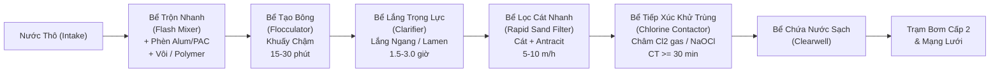
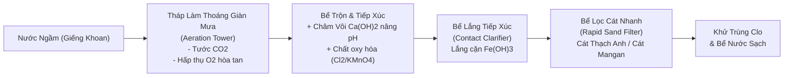
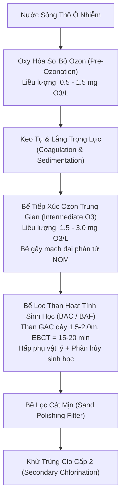
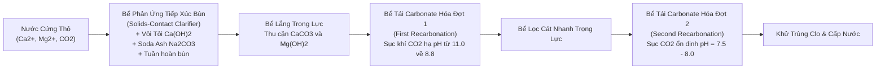
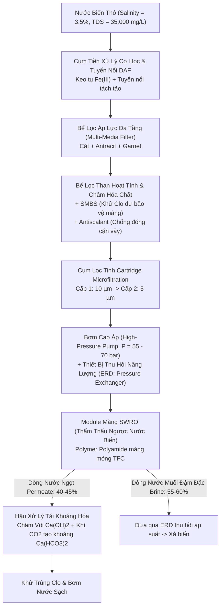
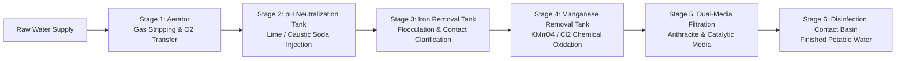

---
markmap:
  initialExpandLevel: 2
  maxWidth: 420
---
# Kỹ thuật Xử lý Nước cấp (Water Treatment Engineering) - Subagent Deep Tree

## Chương 1: Introduction & Water Quality

> [!NOTE]
> **Hồ sơ Học phần & Định vị Nội dung Giảng dạy**
> - **Mã học phần**: HCMUT-263 | **Tên môn học**: Kỹ thuật Xử lý Nước cấp (Water Treatment Engineering)
> - **Đơn vị đào tạo**: Khoa Môi trường và Tài nguyên – Trường Đại học Bách khoa, Đại học Quốc gia TP. Hồ Chí Minh
> - **Giảng viên biên soạn**: PGS. TS. Đặng Viết Hùng
> - **Thời lượng bài giảng**: 49 slides (Tuần 1 & Tuần 2 theo Đề cương chi tiết)
> - **Mục tiêu học thuật**: Thiết lập nền tảng lý luận toàn diện về kỹ thuật cấp nước, phân tích chu trình thủy địa hóa toàn cầu, phân loại 5 nhóm tạp chất nguồn nước, so sánh định lượng 4 nguồn nước cấp (nước mưa, nước biển, nước ngầm, nước mặt), phân tích kiến trúc mạng lưới cấp nước 3 phân khu, tổng hợp các quy chuẩn kỹ thuật bắt buộc (QCVN 01-1:2018/BYT, QCVN 6-1:2010/BYT, TCXDVN 33:2006, tiêu chuẩn nước bể bơi), khảo sát sơ đồ công nghệ xử lý nước cấp hiện đại và SAWACO, và làm chủ 14 bài toán tính toán kỹ thuật nền tảng (thủy tĩnh, độ nhớt, động năng, bơm trạm cấp 1, thủy văn lưu vực, dự báo dân số, lưu lượng chữa cháy cao ốc, cân bằng hệ carbonate và định lượng làm mềm kết tủa vôi - soda).

---

### 1.0 Tổng quan Môn học, Đề cương & Khung Tài liệu Tham khảo (Course Overview, Syllabus & Reference Framework)

#### 1.0.1 Giới thiệu Môn học & Mục tiêu Đào tạo (Course Scope & Learning Objectives)

##### 1.0.1.1 Vị trí Môn học trong Chương trình Đào tạo Kỹ thuật Môi trường
###### Phân bổ Thời lượng & Học phần Tiên quyết
Môn học **Kỹ thuật Xử lý Nước cấp** (Mã học phần HCMUT-263) là học phần chuyên ngành cốt lõi bắt buộc đối với sinh viên ngành Kỹ thuật Môi trường tại Trường Đại học Bách khoa – ĐHQG-HCM. Học phần được bố trí ở giai đoạn chuyên nghiệp (năm thứ 3 hoặc thứ 4) sau khi sinh viên đã hoàn thành các khối kiến thức cơ sở kỹ thuật vững chắc:
1. **Cơ học Chất lỏng / Thủy lực học (Fluid Mechanics & Hydraulics)**: Nắm vững định luật thủy tĩnh, phương trình năng lượng Bernoulli, phương trình liên tục, tổn thất áp lực dọc đường và cục bộ qua đường ống, kênh dẫn, lớp vật liệu lọc xốp và cánh khuấy phản ứng.
2. **Hóa học Đại cương & Hóa học Môi trường (General & Environmental Chemistry)**: Nắm vững nhiệt động học hóa học, cân bằng axit - bazơ, tích số tan của các chất ít tan ($K_{sp}$), phản ứng oxy hóa - khử (Redox), cơ chế keo tụ - đông tụ điện tích và hóa học các dạng khí hòa tan ($CO_2, O_2, H_2S, CH_4$).
3. **Toán Kỹ thuật & Phương trình Vi phân (Engineering Mathematics & Differential Equations)**: Khả năng mô hình hóa động học phản ứng bậc 0, bậc 1, bậc 2, giải các phương trình vi phân truyền khối và phương trình cân bằng vật chất trong các bể phản ứng liên tục khuấy trộn hoàn chỉnh (CSTR) và bể phản ứng dòng chảy nút (PFR).

##### 1.0.1.2 Chuẩn Đầu ra Môn học (Course Learning Outcomes - CLOs)
###### Bậc Thang Năng lực Kỹ thuật theo Bloom Taxonomy
Sau khi hoàn tất môn học và trực tiếp là Chương 1, người học đạt được 7 chuẩn đầu ra năng lực chuyên môn:
- **CLO 1 (Hiểu biết Thủy địa hóa)**: Phân tích bản chất chu trình thủy địa hóa toàn cầu; phân biệt cơ chế hình thành và biến đổi thành phần tạp chất giữa các nguồn nước mưa, nước biển, nước ngầm và nước mặt.
- **CLO 2 (Kiến trúc Hệ thống)**: Nhận diện cấu trúc chức năng và tương quan thủy lực giữa ba phân khu của hệ thống cấp nước đô thị: Công trình thu nước - Nhà máy xử lý nước cấp - Mạng lưới phân phối truyền dẫn.
- **CLO 3 (Quy chuẩn Pháp lý)**: Áp dụng chuẩn xác các ngưỡng giới hạn của Quy chuẩn Kỹ thuật Quốc gia QCVN 01-1:2018/BYT, QCVN 6-1:2010/BYT và tiêu chuẩn thiết kế TCXDVN 33:2006 trong việc đánh giá mức độ ô nhiễm và lựa chọn công nghệ.
- **CLO 4 (Lựa chọn Dây chuyền Công nghệ)**: Tổng hợp đặc tính chất lượng nước nguồn thô (độ đục, độ màu, sắt, mangan, độ cứng, vi sinh vật, chất hữu cơ NOM) để lựa chọn sơ đồ công nghệ tối ưu kỹ thuật - kinh tế.
- **CLO 5 (Tính toán Thủy lực Trạm Bơm & Lưu vực)**: Thực hiện thành thạo các tính toán thủy tĩnh, chuyển đổi đơn vị áp suất, tính độ nhớt động học, động năng, cột áp thủy lực tổng, công suất thủy lực ($P_w$) và công suất động cơ bơm ($BHP$).
- **CLO 6 (Dự báo Nhu cầu & Dân số)**: Vận dụng mô hình cân bằng ẩm thủy văn lưu vực trữ nước, các mô hình dự báo dân số (tuyến tính số học, hình học mũ, giảm dần tiệm cận) và tính toán nhu cầu dùng nước cực đại kết hợp lưu lượng chữa cháy quy chuẩn NBFU.
- **CLO 7 (Hóa học Nước & Làm mềm)**: Thiết lập phương trình cân bằng carbonate, tính toán phân bố cấu tử ($CO_2, HCO_3^-, CO_3^{2-}, OH^-$) theo pH, tính toán các dạng độ cứng (TH, CH, NCH) và giải quyết bài toán định lượng liều lượng hóa chất vôi - soda ash làm mềm nước thô.

#### 1.0.2 Đề cương Chi tiết 10 Chương (Curricular Roadmap)

##### 1.0.2.1 Chuỗi Quá trình Xử lý từ Nguồn đến Vòi nước
###### Ma trận Phân bố Nội dung 10 Chương
Toàn bộ môn học Kỹ thuật Xử lý Nước cấp được cấu trúc thành chuỗi 10 chương logic mô phỏng dòng chảy công nghệ từ tự nhiên đến tay người tiêu dùng:
- **Chương 1: Introduction (Tổng quan & Chất lượng Nước)**: Cơ sở thủy địa hóa, tạp chất, quy chuẩn chất lượng, tổng quan dây chuyền xử lý và tính toán kỹ thuật nền tảng.
- **Chương 2: Water Source & Collection System (Nguồn nước & Công trình Thu)**: Khảo sát địa chất thủy văn, tính toán công trình thu nước mặt (cửa thu ven bờ, lòng sông, trạm bơm nổi) và công trình thu nước ngầm (giếng khoan, hào thu, giếng khơi).
- **Chương 3: Coagulation and Flocculation (Keo tụ & Tạo bông)**: Cơ chế nén lớp điện kép, trung hòa điện tích, bẫy cặn quét (sweep flocculation), bắc cầu polymer; tính toán thủy lực bể trộn nhanh và bể tạo bông cơ học/thủy lực.
- **Chương 4: Removal of Iron and Manganese (Khử Sắt & Mangan)**: Nhiệt động học oxy hóa Fe(II) và Mn(II), tháp làm thoáng giàn mưa, tháp thổi khí cưỡng bức, châm hóa chất oxy hóa ($Cl_2, KMnO_4, O_3$), lọc tiếp xúc xúc tác $MnO_2$.
- **Chương 5: Sedimentation (Lắng)**: Lý thuyết lắng trọng lực 4 vùng hạt rời và hạt tạo bông; thiết kế bể lắng ngang, bể lắng đứng, bể lắng radian và bể lắng lamen (tấm nghiêng lamella).
- **Chương 6: Filtration (Lọc Nước)**: Cơ chế giữ cặn cơ học, hấp phụ dính bám trong tầng hạt lọc; thiết kế bể lọc cát nhanh trọng lực, bể lọc tự rửa, thủy lực rửa lọc gió - nước kết hợp.
- **Chương 7: Disinfection (Khử trùng Nước)**: Động học bất hoạt vi sinh vật Chick-Watson; công nghệ khử trùng bằng Clo khí hóa lỏng, Natri hypoclorit ($NaOCl$), Ozon ($O_3$), tia cực tím (UV) và kiểm soát phụ phẩm DBP (THMs, HAAs).
- **Chương 8: Advanced Treatment (Xử lý Bổ sung & Nâng cao)**: Hấp phụ than hoạt tính dạng hạt/bột (GAC/PAC), quá trình màng (MF, UF, NF, RO), oxy hóa nâng cao AOP ($O_3/H_2O_2, UV/H_2O_2$), khử muối nước biển SWRO.
- **Chương 9: Water Stabilization (Ổn định Hóa học Nước)**: Chỉ số bão hòa Langelier (LSI), chỉ số Ryznar (RSI), cơ chế ăn mòn kim loại mạng lưới và giải pháp kiềm hóa/thụ động hóa bề mặt ống.
- **Chương 10: Water Distribution System (Mạng lưới Phân phối Nước cấp)**: Thủy lực mạng lưới đường ống cấp nước, mạng nhánh và mạng vòng, bể chứa nước sạch, đài nước, trạm bơm cấp 2 và tính toán cân bằng áp lực trên phần mềm chuyên dụng (EPANET).

#### 1.0.3 Hệ thống Giáo trình & Tiêu chuẩn Thiết kế Cốt lõi (Core Reference Framework)

##### 1.0.3.1 Giáo trình Kỹ thuật Xử lý Nước Cấp Trong nước & Quốc tế
###### Trịnh Xuân Lai - Tính toán các công trình xử lý và phân phối nước cấp
Giáo trình kinh điển của GS. TS. Trịnh Xuân Lai (Nhà xuất bản Xây dựng) là tài liệu gối đầu giường của các kỹ sư cấp thoát nước tại Việt Nam. Cuốn sách cung cấp các công thức tính toán chi tiết, thông số kinh nghiệm thiết kế thực tế phù hợp với điều kiện khí hậu nhiệt đới, đặc tính thủy văn sông ngòi nhiều phù sa và trầm tích bùn cát mịn tại Việt Nam.

###### Nguyễn Ngọc Dung - Xử lý nước cấp
Tài liệu giáo khoa chuẩn mực của PGS. TS. Nguyễn Ngọc Dung (Nhà xuất bản Xây dựng) tập trung sâu vào bản chất các quá trình cơ lý hóa trong công nghệ xử lý nước sinh hoạt và công nghiệp, phân tích chi tiết cơ chế vận hành của từng công trình đơn vị từ bể tiếp xúc, giàn mưa khử sắt đến các thiết bị lọc áp lực.

###### MWH / Crittenden et al. - Water Treatment: Principles and Design
Tác phẩm đỉnh cao quốc tế của nhóm tác giả John C. Crittenden, R. Rhodes Trussell, David W. Hand, Kerry J. Howe, George Tchobanoglous (MWH, ấn bản Wiley). Cuốn sách là tiêu chuẩn toàn cầu về lý thuyết động học xử lý nước cấp, mô hình hóa toán học truyền khối, hóa học màng và cơ sở thiết kế quy mô công nghiệp.

###### AWWA - Water Quality & Treatment: A Handbook on Drinking Water
Sổ tay kỹ thuật toàn diện của Hiệp hội Công trình Nước Hoa Kỳ (American Water Works Association - AWWA). Cung cấp các tiêu chuẩn phân tích chất lượng nước chuyên sâu, các bệnh lý truyền nhiễm qua đường nước và các giải pháp công nghệ tiên tiến nhất đáp ứng tiêu chuẩn an toàn sức khỏe cộng đồng của US EPA.

##### 1.0.3.2 Khung Pháp lý & Quy chuẩn Kỹ thuật Việt Nam Hiện hành
###### TCXDVN 33:2006, QCVN 01-1:2018/BYT, QCVN 6-1:2010/BYT
- **TCXDVN 33:2006**: Tiêu chuẩn xây dựng Việt Nam do Bộ Xây dựng ban hành, quy định bắt buộc về tiêu chuẩn thiết kế mạng lưới đường ống và công trình xử lý cấp nước đô thị và công nghiệp.
- **QCVN 01-1:2018/BYT**: Quy chuẩn kỹ thuật quốc gia do Bộ Y tế ban hành, hợp nhất và thay thế các quy chuẩn cũ (QCVN 01:2009/BYT và QCVN 02:2009/BYT), là cơ sở pháp lý cao nhất bắt buộc áp dụng đối với tất cả đơn vị cấp nước sinh hoạt trên toàn lãnh thổ Việt Nam.
- **QCVN 6-1:2010/BYT**: Quy chuẩn kỹ thuật quốc gia đối với nước khoáng thiên nhiên và nước uống đóng chai, áp dụng các tiêu chuẩn an toàn thực phẩm cực kỳ khắt khe về vi sinh và độc chất vô cơ.

---

### 1.1 Nguồn nước & Nguyên lý Thủy địa hóa (Water Sources & Hydrogeochemical Fundamentals)

#### 1.1.1 Chu trình Thủy địa hóa & Phân loại Tạp chất trong Nước (Hydrogeochemical Cycle & Impurity Classification)

##### 1.1.1.1 Cơ chế Chu trình Thủy văn Toàn cầu & Quá trình Chưng cất Tự nhiên
###### Cân bằng Nhiệt ẩm & Động lực Bốc hơi Nước biển
Chu trình thủy địa hóa (Hydrogeochemical Cycle) là quá trình tuần hoàn vật chất và năng lượng liên tục của nước giữa thủy quyển, khí quyển, thạch quyển và sinh quyển dưới tác động của bức xạ mặt trời và trọng lực Trái đất:
1. **Quá trình Bốc hơi Biển (Solar Ocean Evaporation)**: Năng lượng bức xạ mặt trời hun nóng bề mặt đại dương, phá vỡ liên kết hydro giữa các phân tử nước lỏng ($H_2O$), chuyển nước thành thể hơi thoát vào khí quyển. Trong quá trình này, các ion muối khoáng hòa tan ($Na^+, Cl^-, SO_4^{2-}, Mg^{2+}$) và các tạp chất không bay hơi hoàn toàn bị giữ lại ở đại dương. Bản chất của hiện tượng bốc hơi tự nhiên này tương đương với một **quá trình chưng cất tự nhiên khổng lồ (natural solar distillation)**, biến nước mặn đại dương thành hơi nước ngọt tinh khiết.
2. **Ngưng tụ Khí quyển & Vận chuyển Ẩm (Atmospheric Transport & Condensation)**: Khối không khí ẩm bốc lên cao gặp tầng nhiệt độ thấp, hơi nước ngưng tụ thành các hạt sol khí lỏng hoặc tinh thể đá xung quanh các hạt nhân ngưng tụ (aerosol bụi khoáng, muối biển, phấn hoa) hình thành nên các đám mây.
3. **Giáng thủy (Precipitation)**: Khi kích thước hạt nước trong mây đủ lớn để trọng lực vượt qua lực nâng của dòng khí đối lưu, nước rơi xuống bề mặt đất dưới dạng mưa, tuyết, mưa đá hoặc sương mù.
4. **Dòng chảy Tràn Bề mặt (Surface Runoff) & Thấm Sâu (Infiltration)**: Lượng nước mưa khi chạm đất phân nhánh thành: một phần bốc hơi trực tiếp trở lại khí quyển; một phần chảy tràn trên bề mặt lưu vực tạo thành mạng lưới suối, sông, hồ và đổ về đại dương; phần còn lại thấm qua tầng đất mặt (vadose zone) bổ cập vào các tầng chứa nước ngầm (aquifers).

###### Phân bố Trữ lượng Nước trên Trái đất (Global Water Allocation)
Tổng trữ lượng nước trên toàn cầu ước tính khoảng $1.386 \times 10^9\text{ km}^3$, tuy nhiên sự phân bổ cho thấy sự khan hiếm nghiêm trọng nguồn nước ngọt khả dụng:
- **Nước mặn đại dương (Oceans)**: Chiếm **97.5%** tổng lượng nước toàn cầu, với độ mặn trung bình 35 g/L, không thể sử dụng trực tiếp cho sinh hoạt hay nông nghiệp nếu không qua khử muối.
- **Băng hà & Băng vĩnh cửu (Glaciers & Permanent Snowpack)**: Chiếm **1.76%** tổng trữ lượng nước (tương đương 68.7% tổng lượng nước ngọt), tập trung ở Nam Cực, Bắc Cực và các đỉnh núi cao, hầu như không thể khai thác quy mô công nghiệp.
- **Nước dưới đất (Groundwater)**: Chiếm **0.76%** tổng trữ lượng nước (tương đương 30.1% tổng lượng nước ngọt), là nguồn cấp nước sinh hoạt và tưới tiêu quan trọng nhất cho nhân loại.
- **Nước mặt ngọt (Freshwater Lakes & Rivers)**: Chỉ chiếm **< 0.01%** tổng lượng nước toàn cầu (hồ nước ngọt chiếm ~0.007%, sông suối chiếm ~0.0002%), nhưng lại là nguồn nước cấp tập trung chủ yếu cho các đô thị và nền văn minh nhân loại do tính thuận tiện khai thác.

##### 1.1.1.2 Các Đặc tính Vật lý Cơ bản của Nước trong Hệ Đơn vị SI
###### Khối lượng Riêng, Trọng lượng Riêng & Độ Nhớt
Trong kỹ thuật xử lý nước cấp, các tính toán thủy lực và truyền khối đòi hỏi việc áp dụng chuẩn xác các đặc tính vật lý của nước tinh khiết và nước tự nhiên ở các điều kiện nhiệt độ vận hành:
- **Khối lượng riêng ($\rho$)**: Nước có đặc tính dị thường đạt mật độ cực đại ở $4^\circ\text{C}$:
  $$\rho_{\text{water, } 4^\circ\text{C}} = 1000\text{ kg/m}^3 = 1.000\text{ g/cm}^3$$
  Ở nhiệt độ $20^\circ\text{C}$, $\rho = 998.2\text{ kg/m}^3$; ở $21^\circ\text{C}$, $\rho = 998.0\text{ kg/m}^3$; ở $25^\circ\text{C}$, $\rho = 997.0\text{ kg/m}^3$.
- **Trọng lượng riêng ($\gamma$)**: Tích số giữa khối lượng riêng và gia tốc trọng trường:
  $$\gamma = \rho \cdot g \approx 1000\text{ kg/m}^3 \times 9.81\text{ m/s}^2 = 9810\text{ N/m}^3 = 9.81\text{ kN/m}^3$$
- **Độ nhớt tuyệt đối (Độ nhớt động lực $\mu$)**: Thể hiện lực ma sát nội tại giữa các lớp chất lỏng chuyển động trượt lên nhau. Ở $20^\circ\text{C}$, $\mu \approx 1.002 \times 10^{-3}\text{ N}\cdot\text{s/m}^2$ ($1.002\text{ cP}$).
- **Độ nhớt động học ($\nu$)**: Tỷ số giữa độ nhớt tuyệt đối và khối lượng riêng:
  $$\nu = \frac{\mu}{\rho} \approx 1.004 \times 10^{-6}\text{ m}^2\text{/s}\text{ (ở } 20^\circ\text{C)}$$
- **Nhiệt dung riêng ($C_p$)**: Cực cao, $C_p = 4.184\text{ kJ/(kg}\cdot\text{K)}$, giúp các thủy vực tự nhiên có khả năng điều hòa nhiệt độ môi trường xung quanh rất ổn định.

##### 1.1.1.3 Phân loại Năm Nhóm Tạp chất Cốt lõi trong Nguồn Nước Tự nhiên
###### Nhóm 1: Các Hợp chất Vô cơ Hòa tan (Dissolved Inorganic Compounds)
Bao gồm các ion sinh ra do quá trình phong hóa khoáng chất, hòa tan đá vôi và tương tác địa hóa:
- **Cation chính**: Canxi ($Ca^{2+}$), Magie ($Mg^{2+}$) gây ra độ cứng; Natri ($Na^+$), Kali ($K^+$) quyết định độ mặn; Sắt ($Fe^{2+}$) và Mangan ($Mn^{2+}$) tồn tại phổ biến trong điều kiện khử thiếu khí.
- **Anion chính**: Bicarbonate ($HCO_3^-$) và Carbonate ($CO_3^{2-}$) tạo nên độ kiềm; Clorua ($Cl^-$) và Sunfat ($SO_4^{2-}$) đóng góp vào độ mặn và độ cứng phi carbonate; Nitrate ($NO_3^-$) và Fluoride ($F^-$).
- **Nguyên tố vết độc tính**: Asen ($As$), Chì ($Pb$), Cadmium ($Cd$), Crom ($Cr^{6+}$), Thủy ngân ($Hg$) có nguồn gốc từ khoáng sản hoặc nước thải công nghiệp, gây ngộ độc mãn tính và ung thư.

###### Nhóm 2: Các Hợp chất Hữu cơ Hòa tan (Dissolved Organic Matter - NOM)
- **Hợp chất hữu cơ tự nhiên (Natural Organic Matter - NOM)**: Chiếm đa số trong nước mặt, hình thành từ quá trình phân hủy thảm thực vật rừng, bùn tích tụ và dịch tiết chuyển hóa của tảo. Phân đoạn chính gồm **Axit Humic** (phân tử lượng lớn, tan trong kiềm, kết tủa trong axit, tạo màu vàng sẫm/nâu) và **Axit Fulvic** (phân tử lượng nhỏ hơn, tan trong mọi dải pH, tạo màu vàng nhạt).
- **Hợp chất hữu cơ tổng hợp (Synthetic Organic Chemicals - SOCs)**: Các chất hoạt động bề mặt (detergents), thuốc bảo vệ thực vật (pesticides, organochlorines), dung môi công nghiệp và các chất gây rối loạn nội tiết (EDCs).
- **Ý nghĩa kỹ thuật**: NOM là tác nhân tiêu tốn hóa chất keo tụ, gây tắc nghẽn màng lọc và đặc biệt là tiền chất (precursors) phản ứng với clo tạo thành các phụ phẩm khử trùng gây ung thư (Disinfection By-Products - DBPs).

###### Nhóm 3: Các Chất Khí Hòa tan (Dissolved Gases)
- **Oxy hòa tan (Dissolved Oxygen - DO)**: Khí thiết yếu duy trì sự sống thủy sinh và trạng thái oxy hóa của nước mặt; nước ngầm thường rất nghèo DO (< 1 - 2 mg/L).
- **Khí Carbonic ($CO_2$)**: Tạo môi trường axit ăn mòn đường ống, thúc đẩy quá trình hòa tan đá vôi tạo độ cứng.
- **Khí Hydro Sulfua ($H_2S$)**: Khí độc sinh ra do vi khuẩn khử sunfat trong điều kiện yếm khí, gây mùi trứng thối đặc trưng và làm đen nước khi phản ứng với sắt tạo $FeS$.
- **Khí Methane ($CH_4$) & Khí Radon ($Rn$)**: Khí dễ cháy nổ và khí phóng xạ tự nhiên thoát ra từ các tầng địa chất chứa urani/thori.

###### Nhóm 4: Các Chất Lơ lửng & Keo (Suspended Solids & Colloids)
- **Chất rắn lơ lửng (Total Suspended Solids - TSS)**: Các hạt cát mịn, bùn sét, xác hữu cơ kích thước từ $1\text{ }\mu\text{m}$ đến hàng trăm $\mu\text{m}$, gây ra độ đục (Turbidity) và có thể lắng tự nhiên dưới tác dụng của trọng lực.
- **Hệ phân tán keo (Colloidal Sol, $0.001 - 1\text{ }\mu\text{m}$)**: Các hạt keo khoáng sét (aluminosilicate), keo silica và phức hữu cơ. Các hạt keo mang điện tích bề mặt âm cố hữu, tạo lực đẩy tĩnh điện ngăn cản sự kết dính tự nhiên, đòi hỏi phải thực hiện quá trình keo tụ bằng phèn nhôm hoặc phèn sắt.

###### Nhóm 5: Vi sinh vật Gây bệnh (Pathogenic Microorganisms)
- **Vi khuẩn (Bacteria)**: *Escherichia coli* (chỉ thị nhiễm phân), *Vibrio cholerae* (phẩy khuẩn tả), *Salmonella typhi* (thương hàn), *Shigella* (lỵ trực khuẩn), *Pseudomonas aeruginosa* (trực khuẩn mủ xanh).
- **Virus**: Kích thước siêu nhỏ ($0.02 - 0.1\text{ }\mu\text{m}$), gồm Rotavirus (tiêu chảy cấp ở trẻ em), Enterovirus, Viêm gan A ($HAV$), Norovirus.
- **Động vật nguyên sinh & Ký sinh trùng (Protozoa & Helminths)**: Bào nang *Giardia lamblia* và noãn nang *Cryptosporidium parvum*. Noãn nang *Cryptosporidium* có vỏ kitin dày cực kỳ bền vững, trơ hoàn toàn với clo khử trùng thông thường, bắt buộc phải loại bỏ bằng rào cản lọc cơ học hoặc bất hoạt bằng Ozon / Tia UV.

#### 1.1.2 Nguồn Nước mưa & Nước biển (Rainwater & Seawater Sources)

##### 1.1.2.1 Nước Mưa: Đặc tính Hóa lý, Độ ổn định & Trữ lượng
###### Thành phần Ion, Độ Axit Tự nhiên & Tính Ăn mòn của Nước Mưa
- **Độ tinh khiết & Hàm lượng Khoáng hóa**: Nước mưa là sản phẩm ngưng tụ tự nhiên, có hàm lượng tổng chất rắn hòa tan (TDS) rất thấp ($10 - 50\text{ mg/L}$), độ cứng gần như bằng 0 (nước siêu mềm).
- **Độ axit tự nhiên**: Do hòa tan khí carbonic trong khí quyển ($CO_{2(g)} \rightleftharpoons CO_{2(aq)}$), nước mưa tự nhiên không ô nhiễm luôn có tính axit yếu với dải pH chuẩn từ **5.0 đến 5.6**:
  $$CO_2 + H_2O \rightleftharpoons H_2CO_3 \rightleftharpoons H^+ + HCO_3^-$$
  Tại các khu vực đô thị và công nghiệp phát thải nhiều $SO_2$ và $NO_x$, hiện tượng **mưa axit** diễn ra khiến pH nước mưa giảm xuống $3.5 - 4.5$.
- **Tính ăn mòn xâm thực (Aggressive Corrosiveness)**: Do thiếu hụt hoàn toàn ion canxi ($Ca^{2+}$) và kiềm bicarbonate ($HCO_3^-$), chỉ số bão hòa Langelier của nước mưa luôn âm sâu ($LSI \ll 0$). Khi tiếp xúc với đường ống kim loại hoặc bể xi măng, nước mưa hòa tan dữ dội vôi và kim loại, gây thủng ống và giải phóng chì, đồng vào nguồn nước.
- **Rủi ro Ô nhiễm Bề mặt Thu**: Bụi bẩn khí quyển, kim loại nặng từ khói xe, phân chim và rác lá cây tích tụ trên mái nhà khiến nước mưa đợt đầu (first flush) bị ô nhiễm vi sinh và tạp chất hữu cơ nặng nề.

###### Thu gom & Trữ nước Mưa Quy mô Hộ gia đình / Phi tập trung
Hệ thống thu gom nước mưa phân tán phục vụ vùng nông thôn, hải đảo hoặc dự phòng khẩn cấp bao gồm:
1. **Mái thu (Catchment Surface)**: Mái tôn, ngói hoặc bê tông sạch trơ hóa học (tránh mái fibro-xi măng chứa amiăng độc hại).
2. **Thiết bị xả nước mưa đợt đầu (First-Flush Diverter)**: Tự động cô lập và xả bỏ từ $1 - 2\text{ mm}$ lượng mưa ban đầu (tương đương $10 - 20\text{ L}$ cho mỗi $10\text{ m}^2$ diện tích mái) để làm sạch bề mặt thu.
3. **Bể chứa trữ nước (Storage Cistern)**: Bằng composite, nhựa HDPE hoặc bể bê tông kín chống ánh sáng chiếu rọi nhằm triệt tiêu sự phát triển của rêu tảo và muỗi vằn truyền bệnh.
4. **Xử lý bổ sung**: Lọc qua cột cát thạch anh, lọc than hoạt tính và khử trùng bằng đun sôi hoặc sục clo/bạc nano trước khi uống trực tiếp.

##### 1.1.2.2 Nước Biển: Độ mặn, Tỷ trọng & Rào cản Khử muối
###### Thành phần Hóa học Nước Biển & Áp suất Thẩm thấu
- **Độ mặn chuẩn (Salinity)**: Nước biển đại dương có độ mặn trung bình dao động từ **3.3% đến 3.7%**, quy ước thiết kế chuẩn là **3.5%** (tương đương nồng độ muối hòa tan **$35\text{ g/L}$** hay $35,000\text{ mg/L TDS}$).
- **Thành phần Ion Chủ đạo**:
  - Clorua ($Cl^-$): $\approx 19,350\text{ mg/L}$ (chiếm 55% tổng anion).
  - Natri ($Na^+$): $\approx 10,760\text{ mg/L}$ (chiếm 30.6% tổng cation).
  - Sunfat ($SO_4^{2-}$): $\approx 2,710\text{ mg/L}$.
  - Magie ($Mg^{2+}$): $\approx 1,290\text{ mg/L}$.
  - Canxi ($Ca^{2+}$): $\approx 410\text{ mg/L}$.
  - Kali ($K^+$): $\approx 390\text{ mg/L}$.
  - Bicarbonate ($HCO_3^-$): $\approx 140\text{ mg/L}$.
- **Áp suất Thẩm thấu ($\Pi$)**: Do nồng độ ion hòa tan khổng lồ, áp suất thẩm thấu tự nhiên của nước biển ở $25^\circ\text{C}$ đạt khoảng:
  $$\Pi = i M R T \approx 25 - 28\text{ bar (atm)}$$
  Để tách được nước ngọt qua màng thẩm thấu ngược (SWRO), áp suất vận hành thực tế của hệ thống bơm cao áp phải thắng được áp suất thẩm thấu cộng với tổn thất áp qua màng, thường phải duy trì từ **$55\text{ đến }70\text{ bar}$** ($800 - 1000\text{ psi}$).

###### Đặc tính Nhiệt động học: Hạ điểm Băng & Tỷ trọng Nước Biển
- **Tỷ trọng nước biển bề mặt**: Do chứa nồng độ muối cao, khối lượng riêng của nước biển lớn hơn đáng kể so với nước ngọt:
  $$\rho_{\text{seawater}} \approx 1.025\text{ kg/L} = 1025\text{ kg/m}^3\text{ (ở } 20^\circ\text{C, SG} = 1.025)$$
- **Hiện tượng Hạ điểm Đóng băng (Freezing Point Depression)**: Nồng độ phân tử gam chất tan cao làm hạ nhiệt độ kết tinh của nước. Nước biển có độ mặn 3.5% đóng băng ở nhiệt độ khoảng **$-1.9^\circ\text{C}$** thay vì $0.0^\circ\text{C}$ như nước tinh khiết.
- **Độ pH Nước biển**: Dao động trong khoảng đệm kiềm ổn định từ **7.5 đến 8.4** do hệ đệm carbonate - borate tự nhiên chi phối.

#### 1.1.3 Nguồn Nước ngầm: Chất lượng, Khoáng hóa & Nhiễm bẩn (Groundwater Quality, Minerals & Contamination)

##### 1.1.3.1 Địa tầng Thủy văn & Cơ chế Hòa tan Khoáng chất Tự nhiên
###### Tầng Chứa Nước Không Áp & Có Áp (Unconfined vs. Confined Aquifers)
Nước dưới đất được lưu trữ và dịch chuyển trong các tầng đất đá có tính rỗng và tính thấm (aquifers):
- **Tầng chứa nước không áp (Unconfined Aquifer)**: Tầng chứa nước nông nằm ngay dưới mặt đất, có ranh giới trên là mực nước ngầm tự do (water table) chịu trực tiếp áp suất khí quyển. Tầng này được bổ cập nhanh chóng bởi nước mưa thấm qua mặt đất nhưng cực kỳ dễ bị tổn thương bởi các nguồn ô nhiễm mặt đất.
- **Tầng chứa nước có áp (Confined / Artesian Aquifer)**: Nằm kẹp giữa hai tầng sét hoặc đá không thấm nước (aquitards). Nước trong tầng này chịu áp lực thủy tĩnh đáng kể; khi khoan giếng, mực nước sẽ tự dâng cao hơn vách tầng chứa (mực áp lực piezometric level), thậm chí tự phun trào lên mặt đất. Tầng có áp có chất lượng nước sạch hơn, được bảo vệ tự nhiên tốt hơn nhưng tốc độ bổ cập rất chậm.

###### Hòa tan Fe2+ và Mn2+ trong Môi trường Khử Thiếu Khí (Anaerobic Reducing Regime)
Trong quá trình nước mưa thấm sâu qua lớp đất hữu cơ mặt, các vi sinh vật tiêu thụ hết oxy hòa tan ($DO \to 0$) để oxy hóa chất hữu cơ, tạo ra thế oxy hóa - khử âm sâu ($Eh < 0$, môi trường khử mạnh).
Dưới điều kiện này, các hợp chất sắt(III) và mangan(IV) không tan trong đá khoáng phong hóa (như hematit $Fe_2O_3$, goethit $FeOOH$, pyrolusit $MnO_2$) bị khử thành các ion hóa trị II có độ tan cực lớn:
$$Fe^{3+}_{\text{(rắn)}} + e^- \to Fe^{2+}_{\text{(hòa tan)}}$$
$$MnO_{2\text{(rắn)}} + 4H^+ + 2e^- \to Mn^{2+}_{\text{(hòa tan)}} + 2H_2O$$
Khi vừa bơm lên khỏi miệng giếng, nước hoàn toàn trong suốt không màu vì $Fe^{2+}$ và $Mn^{2+}$ đang hòa tan. Tuy nhiên, chỉ sau vài chục phút tiếp xúc với không khí, oxy khuếch tán vào nước sẽ oxy hóa $Fe(II)$ thành kết tủa sắt(III) hydroxit ($Fe(OH)_3$) màu vàng nâu và $Mn(IV)$ thành mangan đioxit ($MnO_2$) màu đen, gây đục ngục, bám cặn đường ống và ố vàng quần áo, thiết bị vệ sinh.

###### Khoáng hóa Độ cứng (Ca2+, Mg2+) & Độc chất Tự nhiên (As, F-, Phóng xạ)
- **Cơ chế hòa tan độ cứng**: Nước ngầm chứa hàm lượng khí $CO_2$ rất cao (sinh ra từ hô hấp của rễ cây và vi sinh vật phân hủy chất hữu cơ trong đất). Khí $CO_2$ hòa tan tạo thành axit carbonic $H_2CO_3$, hòa tan mạnh mẽ các tầng đá vôi (limestone, $CaCO_3$) và đá dolomit ($CaMg(CO_3)_2$):
  $$CaCO_{3\text{(rắn)}} + CO_2 + H_2O \rightleftharpoons Ca^{2+} + 2HCO_3^-$$
  $$CaMg(CO_3)_{2\text{(rắn)}} + 2CO_2 + 2H_2O \rightleftharpoons Ca^{2+} + Mg^{2+} + 4HCO_3^-$$
  Quá trình này giải phóng ion $Ca^{2+}$ và $Mg^{2+}$ nồng độ cao vào nước ngầm, tạo ra độ cứng tạm thời (carbonate hardness).
- **Asen tự nhiên (Arsenic - As)**: Asen hòa tan trong nước ngầm bắt nguồn từ quá trình khử khoáng sắt hydroxit chứa asen hấp phụ hoặc oxy hóa quặng pirit chứa asen ($FeAsS$). Asen tồn tại dưới dạng arsenite ($As^{3+}$, $H_3AsO_3$) độc tính cực cao trong môi trường khử, hoặc arsenate ($As^{5+}$, $H_2AsO_4^-$) trong môi trường oxy hóa. Tại Đồng bằng sông Hồng và Đồng bằng sông Cửu Long, nhiều tầng giếng khoan nông có nồng độ asen vượt gấp $10 - 50$ lần giới hạn quy chuẩn ($> 0.01\text{ mg/L}$), gây bệnh sừng hóa da và ung thư nội tạng.
- **Fluoride ($F^-$) & Radionuclides**: Hòa tan từ khoáng fluorit ($CaF_2$) gây vàng răng và mục xương nếu $> 1.5\text{ mg/L}$. Phóng xạ Radon ($^{222}Rn$) và Radium ($^{226}Ra$) hòa tan từ các mạch đá magma/granite.

###### Nước ngầm Nhiễm lợ (Brackish Groundwater: 1000 - 5000 mg/L TDS)
Tại các vùng đồng bằng ven biển (như Bến Tre, Trà Vinh, Sóc Trăng, Cà Mau và phía Nam TP. Hồ Chí Minh), do quá trình sụt lún địa tầng và khai thác nước ngầm quá mức làm hạ thấp mực áp lực, nước biển xâm nhập vào các tầng chứa nước ngọt. Nước ngầm chuyển thành **nước lợ** với hàm lượng tổng chất rắn hòa tan TDS dao động từ **$1000\text{ đến }5000\text{ mg/L}$**, đòi hỏi phải áp dụng công nghệ màng lọc thẩm thấu ngược nước lợ (BWRO) hoặc điện thẩm tích (EDR) để khử mặn.

##### 1.1.3.2 Cơ chế Nhiễm bẩn Nhân sinh Tầng Nước Ngầm (Anthropogenic Groundwater Contamination)
###### Nhiễm bẩn Xăng dầu từ Bể ngầm (UST Leaks: BTEX & MTBE)
- **Nguyên nhân**: Hàng ngàn trạm kinh doanh xăng dầu chôn các bồn chứa bằng thép (Underground Storage Tanks - UST). Qua thời gian từ $15 - 30$ năm, sự ăn mòn điện hóa làm thủng vỏ bồn hoặc vỡ đường ống truyền dẫn ngầm, giải phóng một lượng lớn xăng dầu vào lòng đất.
- **Tác nhân ô nhiễm chính**: Nhóm hydrocarbon thơm độc hại **BTEX** (**B**enzene, **T**oluene, **E**thylbenzene, **X**ylenes) và phụ gia tăng chỉ số octan **MTBE** (Methyl tert-butyl ether).
- **Cơ chế lan truyền**: BTEX và MTBE có tính linh động cao trong nước ngầm; MTBE tan mạnh trong nước và rất khó phân hủy sinh học, tạo thành vệt ô nhiễm (plume) lan rộng hàng kilomét theo hướng dòng chảy ngầm, xâm nhập trực tiếp vào các giếng khai thác nước cấp đô thị. Benzene là chất gây ung thư máu nhóm 1 theo IARC.

###### Ô nhiễm Nitrate (NO3-) từ Hệ thống Tự hoại & Phân bón Nông nghiệp
- **Nguồn phát sinh**: Nước rỉ từ các bể tự hoại hư hỏng của khu dân cư và lượng dư thừa phân đạm hóa học ($NH_4NO_3, (NH_2)_2CO$) trên các cánh đồng nông nghiệp thâm canh.
- **Cơ chế chuyển hóa**: Amoni giải phóng trong tầng đất hiếu khí bị vi khuẩn nitrat hóa oxy hóa thành nitrite ($NO_2^-$) rồi thành nitrate ($NO_3^-$).
- **Rủi ro sức khỏe**: Ion nitrate mang điện tích âm không bị các hạt keo đất giữ lại, dễ dàng thấm sâu vào tầng chứa nước ngầm. Khi nồng độ nitrate trong nước uống vượt quá $50\text{ mg/L}$ (hoặc $10\text{ mg/L}$ tính theo $N-NO_3^-$), trẻ sơ sinh uống phải sẽ mắc hội chứng **Methemoglobinemia (Hội chứng Trẻ xanh - Blue Baby Syndrome)**, do nitrate bị khử thành nitrite trong ruột, oxy hóa sắt $Fe^{2+}$ của hemoglobin thành $Fe^{3+}$ làm mất khả năng vận chuyển oxy nuôi cơ thể.

###### Ô nhiễm Hóa chất Công nghiệp (TCE, PCE, Hóa chất Bảo vệ Thực vật)
Các dung môi tẩy rửa công nghiệp thuộc nhóm chlorinated hydrocarbons như Trichloroethylene (TCE) và Tetrachloroethylene (PCE) từ các xưởng mạ điện, giặt khô thải trái phép ngấm xuống tầng nước ngầm tạo thành các túi chất lỏng tỷ trọng nặng không tan trong nước (DNAPL - Dense Non-Aqueous Phase Liquid). Các túi DNAPL chìm sâu xuống đáy tầng chứa nước, hòa tan từ từ trong hàng thế kỷ, gây ô nhiễm nguồn nước ngầm lâu dài.

##### 1.1.3.3 Ma trận Đánh giá Ưu điểm & Nhược điểm của Nước Ngầm
###### Phân tích So sánh Ưu điểm Tự nhiên & Rủi ro Kỹ thuật Nước Ngầm
Dưới góc độ kỹ thuật xử lý và kinh tế vận hành, nguồn nước ngầm có các ưu điểm và nhược điểm đối nghịch rõ rệt:

| Tiêu chí Đánh giá | Ưu điểm Kỹ thuật của Nước Ngầm | Nhược điểm & Thách thức Công nghệ |
|---|---|---|
| **Độ đục & Cặn lơ lửng** | Độ đục cực thấp ($\le 1 - 2\text{ NTU}$), hầu như không có cặn lơ lửng nhờ quá trình lọc cơ học tự nhiên qua các tầng cát sỏi hàng triệu năm. | Có thể mang theo cát mịn làm xước cánh bơm giếng; khi súc rửa giếng không đúng kỹ thuật có thể kéo sụt lở địa tầng. |
| **Ô nhiễm Vi sinh vật** | Hầu như không có vi khuẩn gây bệnh, virus và ký sinh trùng do điều kiện ngầm không có ánh sáng và đã qua lọc tự nhiên (trừ giếng nông gần hố xí). | Nếu tầng bảo vệ bị nứt gãy hoặc nước mặt chảy tràn vào miệng giếng, sự nhiễm bẩn vi sinh cực kỳ khó phát hiện kịp thời. |
| **Nhiệt độ & Lưu lượng** | Nhiệt độ quanh năm cực kỳ ổn định ($22 - 25^\circ\text{C}$), không phụ thuộc vào chu kỳ thời tiết bề mặt. | Trữ lượng có hạn; khai thác quá mức dẫn đến cạn kiệt tầng chứa nước, sụt lún nền đất đô thị và xâm nhập mặn. |
| **Độ màu & Chất hữu cơ** | Hàm lượng chất hữu cơ tự nhiên (NOM) rất thấp, giảm thiểu nguy cơ tạo ra phụ phẩm khử trùng DBP. | Có thể chứa khí hòa tan độc hại ($H_2S, CH_4$); màu nước xuất hiện do sắt/mangan bị oxy hóa tạo thành cặn kết tủa. |
| **Hóa chất Xử lý** | Không cần dây chuyền keo tụ - tạo bông - lắng bùn phức tạp, tiết kiệm diện tích xây dựng nhà máy. | Chi phí năng lượng bơm chìm giếng sâu rất lớn; chi phí hóa chất vôi/soda hoặc muối hoàn nguyên để làm mềm nước cứng rất cao. |
| **Tính bền vững** | Bể chứa tự nhiên khổng lồ, an toàn trước các cuộc tấn công phá hoại nguồn nước bề mặt. | Khi đã bị nhiễm độc asen, hóa chất bảo vệ thực vật hoặc dung môi clo, quá trình xử lý phục hồi tầng nước ngầm gần như bất khả thi. |

#### 1.1.4 Nguồn Nước mặt: Thủy vực & Động lực Lưu vực (Surface Water Characteristics & Watershed Dynamics)

##### 1.1.4.1 Phân loại Thủy vực Nước Mặt & Biến động Mùa vụ
###### Thủy vực Chảy (Sông suối - Lotic) vs. Thủy vực Tĩnh (Hồ chứa - Lentic)
Nguồn nước mặt được phân chia thành hai hệ sinh thái thủy văn có động lực dòng chảy và chất lượng nước hoàn toàn khác biệt:
1. **Hệ Thủy vực Chảy (Lotic Systems - Sông, Suối)**:
   - Dòng chảy liên tục với vận tốc dòng lớn ($v = 0.5 - 2.5\text{ m/s}$), khả năng tự làm sạch và tái sục khí oxy hòa tan từ khí quyển rất mạnh ($DO \approx 6 - 8\text{ mg/L}$).
   - Chịu ảnh hưởng trực tiếp và tức thời từ dòng chảy tràn trên toàn bộ diện tích lưu vực thu nước.
   - Chất lượng nước biến đổi từng giờ theo diễn biến thời tiết, mưa bão, xả lũ và hoạt động xả thải ven sông.
2. **Hệ Thủy vực Tĩnh (Lentic Systems - Hồ Tự nhiên, Hồ chứa Thủy lợi / Thủy điện)**:
   - Vận tốc dòng chảy chậm ($v \approx 0$), thời gian lưu nước kéo dài từ vài tháng đến vài năm, thúc đẩy quá trình lắng tự nhiên các hạt cặn lơ lửng thô, giúp nước hồ có độ đục nền thấp và ổn định hơn nước sông.
   - Dễ bị hiện tượng **phân tầng nhiệt độ (Thermal Stratification)** vào mùa hè: tầng mặt nước ấm ($Epilimnion$) giàu DO nhưng ấm áp; tầng đáy nước lạnh ($Hypolimnion$) tù đọng, yếm khí giải phóng sắt, mangan, photpho và $H_2S$ từ bùn đáy hồ.
   - Nguy cơ cao xảy ra hiện tượng **phú dưỡng hóa (Eutrophication)** do tích tụ nitơ và photpho, dẫn đến bùng phát hoa sen tảo (algal blooms), sản sinh độc tố vi khuẩn lam ($Microcystin$) và các hợp chất gây mùi hôi đất nồng nặc (Geosmin và MIB - 2-Methylisoborneol).

###### Xung Đột biến Độ đục do Mưa lũ & Biến thiên Thông số Nước Sông
Trong mùa khô, nước sông duy trì độ đục thấp ($20 - 50\text{ NTU}$), độ kiềm và pH ổn định. Tuy nhiên, khi xuất hiện **các trận mưa bão lớn trên lưu vực (large storm events)**:
- Nước mưa xói mòn bề mặt đất rừng, nương rẫy và rửa trôi đất cát công trường xây dựng, làm độ đục nước sông **bùng phát đột ngột lên $500 - 3000\text{ NTU}$** chỉ trong vòng vài giờ.
- Đồng thời, nước mưa pha loãng làm sụt giảm mạnh nồng độ ion bicarbonate, khiến **độ kiềm giảm sâu ($Alk < 20 - 30\text{ mg/L as }CaCO_3$)** và pH giảm nhẹ.
- Xung biến thiên đột ngột này đe dọa làm tê liệt hệ thống keo tụ - tạo bông của nhà máy xử lý nước nếu không kịp thời điều chỉnh tăng liều lượng phèn, bổ sung kiềm (vôi hoặc soda) và châm polymer trợ lắng.

##### 1.1.4.2 Phức chất Hữu cơ Tự nhiên (NOM) & Tiền chất Tạo Phụ phẩm Khử trùng
###### Nguồn gốc Autochthonous vs. Allochthonous & Cấu trúc Humic/Fulvic
Chất hữu cơ tự nhiên (NOM) trong nước mặt có hai nguồn gốc hình thành:
1. **Nguồn Autochthonous (Nội sinh Thủy vực)**: Sinh ra trực tiếp bên trong thủy vực từ hoạt động quang hợp, trao đổi chất và phân rã của tảo, vi khuẩn lam và thực vật thủy sinh. Nguồn này chứa nhiều hợp chất hữu cơ không màu, protein, axit amin, carbohydrate phân tử lượng nhỏ, tỷ số $C/N$ thấp và chỉ số hấp thụ tia cực tím riêng ($SUVA_{254} < 2\text{ L/(mg}\cdot\text{m)}$).
2. **Nguồn Allochthonous (Ngoại sinh Lưu vực)**: Rửa trôi từ thảm thực vật đất rừng mục nát trên lưu vực đổ vào dòng sông. Phân đoạn này chiếm chủ đạo, giàu các hợp chất thơm đa vòng, axit humic và fulvic, phân tử lượng lớn ($1,000 - 50,000\text{ Da}$) và chỉ số $SUVA_{254} > 3 - 4\text{ L/(mg}\cdot\text{m)}$, tạo cho nước có độ màu vàng nâu đặc trưng.
3. **Phản ứng Sinh Phụ phẩm Khử trùng (DBP Formation)**: Khi clo hóa khử trùng nguồn nước mặt có chứa NOM, clo phản ứng với các nhân thơm phenolic của axit humic/fulvic sinh ra các hợp chất halogen hóa cực độc:
   $$\text{NOM} + Cl_2 \to \text{THMs (Trihalomethanes: } CHCl_3, CHBrCl_2, CHBr_2Cl, CHBr_3\text{)} + \text{HAAs (Haloacetic Acids)}$$
   Các chất này gây tổn thương gan, thận và làm tăng nguy cơ ung thư bàng quang, trực tràng ở người sử dụng nước lâu dài.

##### 1.1.4.3 Nguy cơ Ô nhiễm Vi sinh vật & So sánh Tổng thể Nước Mặt vs. Nước Ngầm
###### Kén vi sinh Giardia/Cryptosporidium & Vi khuẩn Chỉ thị Ô nhiễm Phân
Khác biệt sinh tử lớn nhất giữa nước mặt và nước ngầm là **nước mặt luôn tiềm ẩn nguy cơ ô nhiễm vi sinh vật gây bệnh (Pathogens)** từ nước thải sinh hoạt đô thị chưa xử lý, nước rửa trôi chuồng trại chăn nuôi gia súc và phân động vật hoang dã.
Đặc biệt, sự xuất hiện của các ký sinh trùng kháng clo như bào nang *Giardia lamblia* ($8 - 14\text{ }\mu\text{m}$) và noãn nang *Cryptosporidium parvum* ($4 - 6\text{ }\mu\text{m}$) bắt buộc mọi nhà máy xử lý nước mặt phải thiết lập quy trình keo tụ - lắng - lọc cát nghiêm ngặt để loại bỏ cơ học các vi sinh vật này trước khi khử trùng.

###### Bảng Đối sánh Chi tiết Nước Mặt vs. Nước Ngầm
Bảng ma trận đối soát toàn diện các đặc tính kỹ thuật giữa hai nguồn nước chính:

| Thông số Đặc tính | Nước Mặt (Sông, Hồ chứa) | Nước Ngầm (Tầng chứa nước sâu) |
|---|---|---|
| **Độ đục (Turbidity)** | Rất cao ($10 - 2000\text{ NTU}$), biến động dữ dội theo mùa mưa lũ. | Rất thấp ($\le 1 - 2\text{ NTU}$), ổn định quanh năm. |
| **Độ màu (Color)** | Cao ($10 - 150\text{ TCU}$), do phức chất humic/fulvic hòa tan và keo sét. | Rất thấp (trừ khi nhiễm sắt/mangan bị oxy hóa tạo màu đục). |
| **Oxy hòa tan (DO)** | Cao ($6 - 8\text{ mg/L}$), gần bão hòa nhờ tiếp xúc bề mặt khí quyển. | Rất thấp hoặc hoàn toàn không có ($0 - 2\text{ mg/L}$), yếm khí. |
| **Khí Carbonic ($CO_2$)** | Thấp ($0 - 5\text{ mg/L}$), cân bằng tự nhiên với khí quyển. | Rất cao ($20 - 100\text{ mg/L}$), gây tính xâm thực ăn mòn mạnh. |
| **Sắt & Mangan ($Fe, Mn$)** | Thấp, tồn tại chủ yếu ở dạng cặn lơ lửng $Fe^{3+}$ liên kết với bùn đất. | Thường rất cao ($1 - 20\text{ mg/L}$), tồn tại ở dạng hòa tan $Fe^{2+}, Mn^{2+}$. |
| **Độ cứng ($Ca^{2+}, Mg^{2+}$)**| Thấp đến trung bình ($20 - 100\text{ mg/L as }CaCO_3$, nước mềm). | Thường cao đến rất cao ($100 - 500\text{ mg/L as }CaCO_3$, nước cứng). |
| **Chất hữu cơ (NOM, TOC)**| Cao ($2 - 15\text{ mg/L}$), nhiều tiền chất tạo phụ phẩm clo THMs. | Thấp ($< 1 - 2\text{ mg/L}$), ít nguy cơ tạo THMs. |
| **Vi sinh vật gây bệnh** | Nguy cơ cực cao (vi khuẩn tả, thương hàn, virus, kén *Giardia/Crypto*). | Nguy cơ rất thấp nếu giếng khoan bảo vệ đúng quy chuẩn kỹ thuật. |
| **Dây chuyền xử lý chuẩn**| Keo tụ $\to$ Tạo bông $\to$ Lắng $\to$ Lọc cát $\to$ Khử trùng Clo. | Làm thoáng $\to$ Kiềm hóa $\to$ Lắng tiếp xúc $\to$ Lọc cát $\to$ Khử trùng. |

### 1.2 Kiến trúc & Phân loại Hệ thống Cấp nước (Water Supply System Architecture & Classification)

#### 1.2.1 Ba Hạng mục Cốt lõi của Hệ thống Cấp nước Đô thị

##### 1.2.1.1 Phân khu Thu nước & Trạm Bơm Cấp 1 (Water Intake & Low-Lift Pumping Station)
###### Công trình Thu Nước Mặt & Nước Ngầm
Hạng mục đầu tiên của hệ thống cấp nước có nhiệm vụ thu nhận nước thô trực tiếp từ nguồn nước tự nhiên và vận chuyển an toàn về nhà máy xử lý:
1. **Công trình Thu Nước Mặt**:
   - **Song chắn rác thô & lưới chắn rác tinh**: Bố trí tại cửa thu nước để ngăn chặn rác trôi nổi, cành cây, bèo tây và các loài thủy sinh xâm nhập vào ngăn hút.
   - **Cửa thu ven bờ (Shore Intake)**: Áp dụng cho các bờ sông dốc đứng, địa chất ổn định, mực nước dao động ít.
   - **Cửa thu lòng sông (Riverbed Intake)**: Đặt sâu dưới lòng sông qua đầu thu hình nấm hoặc ống xi-phông dẫn về giếng thu ven bờ, áp dụng khi bờ sông thoai thoải hoặc mép nước cạn xa bờ.
   - **Trạm Bơm Cấp 1 (Low-Lift Pumping Station)**: Bố trí các tổ máy bơm ly tâm trục đứng hoặc trục ngang công suất lớn, vận hành với cột áp thấp ($H = 10 - 25\text{ m}$) chỉ đủ để đẩy nước thô qua tuyến ống áp lực (raw water transmission mains) lên điểm cao nhất của dây chuyền công nghệ (thường là tháp đo lưu lượng hoặc bể trộn nhanh).
2. **Công trình Thu Nước Ngầm**:
   - Bao gồm mạng lưới giếng khoan khai thác sâu ($50 - 250\text{ m}$) khoan vào tầng chứa nước có áp.
   - Ống lọc giếng (well screen) chế tạo bằng thép không gỉ hoặc PVC có khe rãnh chuẩn, bao bọc xung quanh bởi lớp sỏi chèn (gravel pack) nhằm ngăn chặn cát mịn lọt vào giếng.
   - Bơm chìm giếng sâu (Submersible turbine pumps) lắp đặt ngập sâu dưới mực nước động, bơm nước thô trực tiếp lên giàn mưa làm thoáng.

##### 1.2.1.2 Nhà máy Xử lý Nước cấp (Water Treatment Plant - WTP)
###### Bố trí Mặt bằng & Tuyến Thủy lực Trọng lực
Nhà máy xử lý nước cấp là trung tâm công nghệ chuyển hóa nước thô ô nhiễm thành nước sạch đạt quy chuẩn vệ sinh an toàn sinh hoạt:
- **Tuyến Thủy lực Tự chảy (Gravity Flow Hydraulic Profile)**: Một nguyên tắc thiết kế tối thượng của kỹ thuật cấp nước là toàn bộ dòng chảy qua các công trình đơn vị (từ bể trộn $\to$ tạo bông $\to$ lắng $\to$ lọc $\to$ khử trùng) phải **hoàn toàn tự chảy bằng trọng lực**. Do đó, cao trình mực nước của bể trộn đầu vào phải được tính toán đủ cao để bù đắp toàn bộ tổn thất cột áp qua các công trình, van khóa, máng tràn và lớp cát lọc, trước khi đổ vào bể chứa nước sạch nằm âm dưới mặt đất.
- **Khu Hóa chất (Chemical Feed Facilities)**: Gồm kho chứa phèn, vôi, polymer, clo; các bể hòa trộn dung dịch hóa chất; hệ thống bơm định lượng màng và ống truyền dẫn hóa chất chống ăn mòn.
- **Khu Xử lý Bùn cặn (Sludge Treatment Train)**: Thu gom bùn từ đáy bể lắng và nước rửa ngược bể lọc; chuyển qua bể nén bùn trọng lực (gravity sludge thickener), bể điều hòa và máy ép bùn ly tâm hoặc máy ép bùn băng tải (belt filter press) để tạo bánh bùn khô đem đi chôn lấp hợp vệ sinh.

##### 1.2.1.3 Mạng lưới Truyền dẫn & Phân phối Nước sạch (Distribution Network)
###### Trạm Bơm Cấp 2, Bể Chứa Nước Sạch & Đài Nước Điều hòa
Hạng mục cuối cùng có nhiệm vụ lưu trữ, điều hòa và phân phối nước sạch áp lực cao đến tận vòi nước của người tiêu dùng:
- **Bể Chứa Nước Sạch (Clearwell / Finished Water Reservoir)**: Thường xây dựng bằng bê tông cốt thép ngầm, có chức năng điều hòa lưu lượng giữa chế độ sản xuất liên tục 24/24h của nhà máy và chế độ tiêu thụ nước biến thiên từng giờ của đô thị. Đồng thời, bể chứa nước sạch còn đóng vai trò là **bể tiếp xúc khử trùng (disinfection contact basin)** đảm bảo thời gian tiếp xúc của clo tối thiểu $CT \ge 30\text{ phút}$, và tích trữ lượng nước dự phòng chữa cháy bắt buộc trong $3\text{ giờ}$.
- **Trạm Bơm Cấp 2 (High-Lift Pumping Station)**: Bố trí các tổ máy bơm ly tâm công suất cực lớn, vận hành với cột áp cao ($H = 40 - 70\text{ m}$) để đẩy nước vào mạng lưới truyền dẫn chính. Trạm bơm cấp 2 thường trang bị biến tần (VFD) để tự động điều chỉnh tốc độ quay theo áp lực mạng lưới thời gian thực.
- **Đài Nước Điều hòa & Tháp Áp lực (Elevated Water Tower)**: Bố trí tại các điểm cao trong đô thị hoặc cuối mạng lưới nhằm ổn định áp lực thủy lực, chống hiện tượng búa nước (water hammer) và bổ cấp nước trong các giờ dùng nước cao điểm.
- **Mạng lưới Đường ống Phân phối**: Cấu trúc thành mạng lưới vòng khép kín (looped network) nhằm đảm bảo tính cấp nước an toàn liên tục; khi một đoạn ống bị sự cố vỡ, van phân đoạn có thể cô lập đoạn ống đó để sửa chữa mà không làm mất nước các khu vực xung quanh.

#### 1.2.2 Phân loại Hệ thống Cấp nước theo Mục đích Sử dụng

##### 1.2.2.1 Cấp nước Sinh hoạt Đô thị (Domestic Water Supply)
###### Tiêu chuẩn Dịch vụ & Yêu cầu Lưu lượng, Áp lực
Hệ thống cấp nước sinh hoạt phục vụ nhu cầu ăn uống, tắm giặt, vệ sinh cá nhân và các hoạt động công cộng đô thị:
- **Chất lượng**: Phải tuân thủ nghiêm ngặt 100% các chỉ tiêu của Quy chuẩn Kỹ thuật Quốc gia **QCVN 01-1:2018/BYT**.
- **Lưu lượng định mức**: Tính toán dựa trên quy mô đô thị theo TCXDVN 33:2006, dao động từ **$150\text{ đến }250\text{ L/người}\cdot\text{ngày}$**.
- **Áp lực tự do tối thiểu tại vòi**: Điểm đấu nối vào nhà dân phải duy trì cột áp tự do tối thiểu $10\text{ m}$ (cho nhà 1 tầng) và cộng thêm $4\text{ m}$ cho mỗi tầng nhà tiếp theo để nước tự chảy lên bồn chứa trên mái mà không cần bơm gia nhiệt cục bộ.

##### 1.2.2.2 Cấp nước Công nghiệp (Industrial Process Water)
###### Phân cấp Yêu cầu Chất lượng theo Ngành Sản xuất
Tùy thuộc vào bản chất của dây chuyền công nghệ sản xuất, nước cấp công nghiệp được phân cấp thành các tiêu chuẩn rất khác biệt:
- **Nước làm mát gián tiếp (Cooling Water)**: Khối lượng tiêu thụ khổng lồ, yêu cầu kiểm soát độ cứng và độ kiềm để chống đóng cặn cáu ($CaCO_3$) trong tháp giải nhiệt, châm hóa chất diệt khuẩn chống màng sinh học (biofilm) và kiểm soát tính ăn mòn.
- **Nước cấp lò hơi (Boiler Feedwater)**: Đòi hỏi độ tinh khiết cực cao; lò hơi áp suất càng cao thì yêu cầu khử khoáng càng khắt khe. Nước phải qua làm mềm khử ion hoàn toàn ($TH \approx 0\text{ mg/L}$), khử khí oxy hòa tan ($DO < 0.005\text{ mg/L}$) để chống ăn mòn lỗ kim (pitting corrosion) và khử triệt để hàm lượng Silic ($SiO_2 < 0.01\text{ mg/L}$) nhằm ngăn ngừa sự tạo thành lớp vảy silicat cứng như kim cương trên bề mặt truyền nhiệt ống lò.
- **Nước công nghệ Dệt nhuộm & Sản xuất Giấy**: Yêu cầu hàm lượng sắt và mangan cực thấp ($Fe < 0.05\text{ mg/L}, Mn < 0.02\text{ mg/L}$) để tránh làm loang lổ màu vải nhuộm hoặc ố vàng bột giấy tẩy trắng.
- **Nước Siêu Tinh Khiết (Ultrapure Water - UPW)**: Sử dụng trong sản xuất vi mạch bán dẫn điện tử và dược phẩm, yêu cầu điện trở suất đạt mức giới hạn lý thuyết **$18.2\text{ M}\Omega\cdot\text{cm}$ ở $25^\circ\text{C}$**, hàm lượng carbon hữu cơ tổng $TOC < 1 - 5\text{ ppb}$, không chứa hạt cặn $> 0.05\text{ }\mu\text{m}$ và vô trùng tuyệt đối.

##### 1.2.2.3 Cấp nước Chữa cháy & Hệ thống Cấp nước Kết hợp (Fire Fighting & Combined Municipal Systems)
###### Nguyên lý Lưu lượng Trùng hợp & Dự phòng Dung tích Trữ nước Chữa cháy
Trong thực tiễn kỹ thuật hạ tầng đô thị tại Việt Nam và quốc tế, việc xây dựng một mạng lưới đường ống chữa cháy hoàn toàn độc lập là cực kỳ tốn kém. Do đó, giải pháp tiêu chuẩn được áp dụng là **Hệ thống Cấp nước Kết hợp (Combined Water Supply System)**:
- Mạng lưới đường ống chuyển tải đồng thời nước sinh hoạt, nước dịch vụ thương mại và nước chữa cháy.
- Các trụ cứu hỏa (fire hydrants) đường kính $D100 - D150\text{ mm}$ được đấu nối trực tiếp vào mạng lưới phân phối chính với khoảng cách bố trí không quá $150\text{ m}$ giữa hai trụ theo quy định phòng cháy chữa cháy.
- Khi xảy ra hỏa hoạn, lưu lượng cấp nước chữa cháy được cộng dồn đồng thời vào **nhu cầu dùng nước ngày lớn nhất ($Q_{\text{max day}}$)**. Bể chứa nước sạch của nhà máy bắt buộc phải dành riêng một ngăn dung tích tĩnh không được phép sử dụng cho sinh hoạt để đảm bảo dập tắt đám cháy liên tục trong thời gian quy chuẩn là **$3\text{ giờ}$**.

---

### 1.3 Chỉ tiêu Chất lượng Nước & Cân bằng Carbonate (Water Quality Parameters & Carbonate Chemistry)

#### 1.3.1 Nhóm Chỉ tiêu Vật lý, Hóa học & Vi sinh vật

##### 1.3.1.1 Chỉ tiêu Vật lý & Thẩm mỹ (Physical & Aesthetic Parameters)
###### Độ đục (NTU), Độ màu (TCU), Mùi vị (TON), TDS, Độ dẫn điện (EC)
Các thông số vật lý phản ánh cảm quan trực tiếp của người sử dụng và ảnh hưởng lớn đến các công đoạn xử lý tiếp theo:
1. **Độ đục (Turbidity, đơn vị NTU - Nephelometric Turbidity Units)**:
   - Đo cường độ tán xạ của chùm ánh sáng truyền qua mẫu nước bởi các hạt lơ lửng, keo sét, bùn vi sinh.
   - Tiêu chuẩn nước sạch sinh hoạt quy định $\le 2\text{ NTU}$, nhưng các nhà máy xử lý hiện đại luôn kiểm soát sau bể lọc $\le 0.2 - 0.5\text{ NTU}$ nhằm đảm bảo hiệu quả khử trùng và ngăn ngừa vi sinh vật ẩn nấp trong các khe nứt của hạt cặn.
2. **Độ màu biểu kiến & Độ màu thực (Color, đơn vị TCU - True Color Units hoặc thang đo Pt-Co)**:
   - Màu biểu kiến do cả hạt lơ lửng và chất tan gây ra. Màu thực đo sau khi đã ly tâm hoặc lọc qua màng $0.45\text{ }\mu\text{m}$, chủ yếu do các phức chất hữu cơ humic/fulvic hoặc ion kim loại hòa tan ($Fe^{3+}, Mn^{2+}$).
   - Ngưỡng giới hạn quy chuẩn là $\le 15\text{ TCU}$.
3. **Mùi và Vị (Taste and Odour, chỉ số TON - Threshold Odour Number)**:
   - Không được có mùi vị lạ. Mùi bùn ngái do hợp chất Geosmin và MIB từ tảo sinh ra; mùi thuốc tẩy do dẫn xuất cloramin; mùi trứng thối do khí $H_2S$.
4. **Tổng Chất rắn Hòa tan (TDS - Total Dissolved Solids, mg/L) & Độ dẫn điện (EC, $\mu\text{S/cm}$)**:
   - TDS biểu thị tổng khối lượng các cation, anion vô cơ và hợp chất hữu cơ hòa tan qua màng lọc $0.45\text{ }\mu\text{m}$.
   - Tương quan thực nghiệm giữa TDS và độ dẫn điện riêng:
     $$\text{TDS (mg/L)} \approx (0.55 - 0.70) \times \text{EC (}\mu\text{S/cm)}$$
   - Giới hạn quy chuẩn của TDS trong nước uống là $\le 1000\text{ mg/L}$.

##### 1.3.1.2 Chỉ tiêu Hóa học & Chỉ số Ô nhiễm Chất hữu cơ (Chemical Parameters)
###### Độ cứng, Kiềm, Kim loại nặng, Hợp chất Nitơ, Nhu cầu Oxy
1. **Chỉ số Nhu cầu Oxy Hóa học (Chemical Oxygen Demand - COD) & Chỉ số Permanganate ($KMnO_4$)**:
   - Thể hiện hàm lượng chất hữu cơ dễ bị oxy hóa trong nước. Nước ngầm sạch thường có độ tiêu thụ oxy $\le 1\text{ mg }O_2\text{/L}$, trong khi nước mặt ô nhiễm có thể lên tới $5 - 15\text{ mg }O_2\text{/L}$.
2. **Hợp chất Nitơ ($NH_4^+, NO_2^-, NO_3^-$)**:
   - Chuỗi biến đổi sinh hóa: $NH_4^+ \to NO_2^- \to NO_3^-$.
   - Sự hiện diện của Amoni ($NH_4^+$) cảnh báo nguồn nước mới bị nhiễm bẩn nước thải sinh hoạt hoặc phân bón; amoni tiêu tốn lượng clo khử trùng rất lớn do tạo thành cloramin. Nitrite ($NO_2^-$) là chất trung gian độc tính cao, giới hạn $\le 0.05\text{ mg/L}$. Nitrate ($NO_3^-$) biểu thị ô nhiễm đã hoàn tất quá trình oxy hóa.
3. **Kim loại nặng và Nguyên tố vết**:
   - Sắt tổng số ($Fe \le 0.3\text{ mg/L}$) và Mangan tổng số ($Mn \le 0.1\text{ mg/L}$) gây vàng ố và mùi kim loại khó chịu.
   - Các kim loại cực độc: Asen ($As \le 0.01\text{ mg/L}$), Chì ($Pb \le 0.01\text{ mg/L}$), Cadmium ($Cd \le 0.003\text{ mg/L}$), Thủy ngân ($Hg \le 0.001\text{ mg/L}$).

##### 1.3.1.3 Chỉ tiêu Vi sinh vật & Mầm bệnh (Microbiological Parameters)
###### Coliform tổng số, E. coli, Trực khuẩn Mủ xanh, Vi khuẩn Kỵ khí
Các bệnh truyền nhiễm nguy hiểm nhất lây lan qua nguồn nước là các bệnh đường ruột (tả, lỵ, thương hàn, tiêu chảy cấp). Việc xét nghiệm từng loại vi khuẩn gây bệnh trong phòng thí nghiệm rất tốn kém và mất nhiều ngày, do đó ngành kỹ thuật môi trường sử dụng **các sinh vật chỉ thị vệ sinh (Indicator Organisms)**:
- **Coliform Tổng số (Total Coliforms)**: Nhóm vi khuẩn hình que, gram âm, kỵ khí tùy nghi, có khả năng lên men đường lactose sinh axit và sinh khí ở $35 - 37^\circ\text{C}$ trong vòng 48h. Biểu thị mức độ vệ sinh chung của hệ thống cấp nước. Ngưỡng quy chuẩn QCVN 01-1:2018/BYT là $< 3\text{ CFU/100 mL}$.
- **Escherichia coli (E. coli) & Coliform Phân (Fecal Coliforms)**: Nhóm coliform chịu nhiệt có khả năng lên men lactose ở nhiệt độ cao $44.5^\circ\text{C}$. *E. coli* là cư dân cố hữu trong ruột người và động vật máu nóng. Sự xuất hiện của *E. coli* là bằng chứng không thể chối cãi rằng nguồn nước vừa bị **nhiễm phân tươi**, đồng nghĩa với việc có nguy cơ cực cao tồn tại các mầm bệnh tả, thương hàn và virus đường ruột. Tiêu chuẩn nước ăn uống yêu cầu **hoàn toàn không được phép có ($< 1\text{ CFU/100 mL}$)**.

#### 1.3.2 Cân bằng Hóa học Hệ Carbonate & Khí CO2 Hòa tan

##### 1.3.2.1 Chuỗi Phản ứng Hòa tan Khí CO2 & Phân ly Axit Carbonic
###### Phản ứng Thủy hóa CO2 & Hằng số Henry
Hệ đệm carbonate là hệ hóa học quan trọng nhất chi phối giá trị pH, độ kiềm và khả năng tự đệm của hầu hết các nguồn nước tự nhiên trên Trái đất:
1. **Hòa tan khí Carbonic theo Định luật Henry**:
   Khí $CO_2$ trong khí quyển hòa tan vào nước thiết lập cân bằng dị thể:
   $$CO_{2\text{(k)}} \rightleftharpoons CO_{2\text{(dd)}}$$
   Hàm lượng hòa tan phụ thuộc vào áp suất riêng phần $P_{CO_2}$ qua hằng số Henry $K_H \approx 3.39 \times 10^{-2}\text{ mol/(L}\cdot\text{atm)}$ ở $25^\circ\text{C}$:
   $$[CO_{2\text{(dd)}}] = K_H \cdot P_{CO_2}$$
2. **Thủy hóa tạo Axit Carbonic**:
   Phân tử $CO_2$ hòa tan phản ứng với nước tạo thành axit carbonic chưa phân ly:
   $$CO_{2\text{(dd)}} + H_2O \rightleftharpoons H_2CO_3$$
   Trong thực tế, tỷ lệ phân tử $CO_{2\text{(dd)}}$ thực sự thủy hóa thành $H_2CO_3$ rất nhỏ (chưa đầy 0.3%). Vì rất khó phân biệt nồng độ của $CO_{2\text{(dd)}}$ và $H_2CO_3$ bằng phương pháp chuẩn độ, hóa học môi trường quy ước gộp chung hai dạng này thành **Axit Carbonic Biểu kiến**, ký hiệu là $[H_2CO_3^*]$:
   $$[H_2CO_3^*] = [CO_{2\text{(dd)}}] + [H_2CO_3]$$

##### 1.3.2.2 Hằng số Phân ly Axit Carbonic Thứ nhất (K1)
###### Phương trình Cân bằng K1 [eq_ch01_020] & Phổ Phân ly ở 25°C
Axit carbonic biểu kiến phân ly giải phóng proton bậc 1 tạo ion bicarbonate ($HCO_3^-$):
$$H_2CO_3^* \rightleftharpoons H^+ + HCO_3^-$$

Biểu thức hằng số cân bằng nhiệt động học bậc nhất ($K_1$) ở điều kiện chuẩn ($25^\circ\text{C}$):
$$K_1 = \frac{[\text{H}^+][\text{HCO}_3^-]}{[\text{H}_2\text{CO}_3^*]} = 4.47 \times 10^{-7} \quad (\text{p}K_1 = 6.35)$$

> [!IMPORTANT]
> **Đặc tả Phương trình Kỹ thuật `eq_ch01_020`**:
> - **Tên phương trình**: Carbonic Acid First Acidity Dissociation Constant ($K_1$)
> - **Dạng LaTeX**: $$K_1 = \frac{[\text{H}^+][\text{HCO}_3^-]}{[\text{H}_2\text{CO}_3^*]} = 4.47 \times 10^{-7} \quad (\text{p}K_1 = 6.35 \text{ at } 25^\circ\text{C})$$
> - **Dạng Plain Text**: `K_1 = ([H+] * [HCO3-]) / [H2CO3*] = 4.47e-7 (pK1 = 6.35 at 25 deg C)`
> - **Ý nghĩa Kỹ thuật**: Thiết lập tương quan định lượng giữa lượng khí $CO_2$ tự do xâm thực và ion kiềm bicarbonate. Ở giá trị $\text{pH} = \text{p}K_1 = 6.35$, nồng độ của axit carbonic biểu kiến đúng bằng nồng độ của ion bicarbonate ($[H_2CO_3^*] = [HCO_3^-]$).

##### 1.3.2.3 Hằng số Phân ly Bicarbonate Thứ hai (K2)
###### Phương trình Cân bằng K2 [eq_ch01_021] & Tương quan Ion Carbonate
Ở môi trường kiềm hóa ($\text{pH} > 8.3$), ion bicarbonate tiếp tục phân ly bậc 2 giải phóng proton thứ hai tạo thành ion carbonate ($CO_3^{2-}$):
$$HCO_3^- \rightleftharpoons H^+ + CO_3^{2-}$$

Biểu thức hằng số cân bằng nhiệt động học bậc hai ($K_2$) ở $25^\circ\text{C}$:
$$K_2 = \frac{[\text{H}^+][\text{CO}_3^{2-}]}{[\text{HCO}_3^-]} = 4.69 \times 10^{-11} \quad (\text{p}K_2 = 10.33)$$

> [!IMPORTANT]
> **Đặc tả Phương trình Kỹ thuật `eq_ch01_021`**:
> - **Tên phương trình**: Bicarbonate Second Acidity Dissociation Constant ($K_2$)
> - **Dạng LaTeX**: $$K_2 = \frac{[\text{H}^+][\text{CO}_3^{2-}]}{[\text{HCO}_3^-]} = 4.69 \times 10^{-11} \quad (\text{p}K_2 = 10.33 \text{ at } 25^\circ\text{C})$$
> - **Dạng Plain Text**: `K_2 = ([H+] * [CO32-]) / [HCO3-] = 4.69e-11 (pK2 = 10.33 at 25 deg C)`
> - **Ý nghĩa Kỹ thuật**: Phương trình chi phối trực tiếp công nghệ làm mềm nước bằng vôi. Khi nâng pH lên vùng $\text{pH} > 10.33$, ion $HCO_3^-$ bị ép chuyển hóa hoàn toàn thành ion $CO_3^{2-}$, kết hợp với canxi sẵn có trong nước tạo thành kết tủa canxi cacbonat tinh thể ($CaCO_3\downarrow$) lắng xuống đáy bể.

##### 1.3.2.4 Tích số Ion Tự ion hóa của Nước (Kw)
###### Phương trình Phân ly Nước Kw [eq_ch01_022] & Hoạt độ Ion OH-
Phân tử nước tự phân ly thành ion hydro và ion hydroxit:
$$H_2O \rightleftharpoons H^+ + OH^-$$

Tích số ion của nước ở $25^\circ\text{C}$:
$$K_w = [\text{H}^+][\text{OH}^-] = 1.00 \times 10^{-14} \quad (\text{p}K_w = 14.00)$$

> [!IMPORTANT]
> **Đặc tả Phương trình Kỹ thuật `eq_ch01_022`**:
> - **Tên phương trình**: Autoionization Ion Product of Water ($K_w$)
> - **Dạng LaTeX**: $$K_w = [\text{H}^+][\text{OH}^-] = 1.00 \times 10^{-14} \quad (\text{p}K_w = 14.00 \text{ at } 25^\circ\text{C})$$
> - **Dạng Plain Text**: `K_w = [H+] * [OH-] = 1.0e-14 (pKw = 14.0 at 25 deg C)`
> - **Ý nghĩa Kỹ thuật**: Cho phép tính toán chính xác nồng độ ion hydroxit $[OH^-] = K_w / [H^+] = 10^{-(14 - \text{pH})}$, thành phần bắt buộc trong phương trình cân bằng proton xác định tổng độ kiềm của nước ở dải pH cao ($\text{pH} \ge 10.0$).

##### 1.3.2.5 Giản đồ Phân bố Dạng Carbonate theo pH (Bjerrum Diagram)
###### Các Vùng Ưu thế pH < 6.35, 6.35 - 10.33, và > 10.33
Tổng nồng độ mol của tất cả các dạng vô cơ hòa tan trong hệ carbonate được định nghĩa là $C_T$ (Total Inorganic Carbon):
$$C_T = [H_2CO_3^*] + [HCO_3^-] + [CO_3^{2-}]$$

Bằng cách thế các biểu thức hằng số cân bằng $K_1$ và $K_2$ vào biểu thức $C_T$, ta thiết lập được tỷ lệ phân bố phần mol (phân số ion $\alpha_0, \alpha_1, \alpha_2$) phụ thuộc duy nhất vào nồng độ ion $[H^+]$:
$$\alpha_0 = \frac{[H_2CO_3^*]}{C_T} = \frac{[H^+]^2}{[H^+]^2 + K_1[H^+] + K_1 K_2}$$
$$\alpha_1 = \frac{[HCO_3^-]}{C_T} = \frac{K_1 [H^+]}{[H^+]^2 + K_1[H^+] + K_1 K_2}$$
$$\alpha_2 = \frac{[CO_3^{2-}]}{C_T} = \frac{K_1 K_2}{[H^+]^2 + K_1[H^+] + K_1 K_2}$$

Giản đồ Bjerrum phân chia hệ dung dịch thành **ba miền ưu thế hóa học rõ rệt**:
1. **Miền pH Axit ($\text{pH} < 6.35$)**:
   - Dạng chiếm ưu thế tuyệt đối là **$H_2CO_3^*$ (khí $CO_2$ hòa tan)**.
   - Nước có tính xâm thực ăn mòn mạnh đối với kim loại và bê tông.
   - Giải pháp công nghệ: Làm thoáng bằng giàn mưa hoặc sục khí cưỡng bức để tước đoạt khí $CO_2$ bay vào khí quyển, tự động nâng pH lên mà không tốn hóa chất kiềm.
2. **Miền pH Trung tính ($\mathbf{6.35 < \text{pH} < 10.33}$)**:
   - Dạng chiếm ưu thế áp đảo là **ion Bicarbonate ($HCO_3^-$)**, đạt cực đại $\approx 98\%$ tại điểm đẳng điện $\text{pH} \approx \frac{6.35 + 10.33}{2} = 8.34$.
   - Đây là dải pH của hầu hết các nguồn nước mặt và nước cấp sinh hoạt tự nhiên (pH $6.5 - 8.5$).
   - Nước có khả năng đệm axit tuyệt vời, hấp thụ các ion axit sinh ra trong quá trình keo tụ bằng phèn nhôm mà không làm sụt giảm pH đột ngột.
3. **Miền pH Kiềm Mạnh ($\text{pH} > 10.33$)**:
   - Dạng chiếm ưu thế chủ đạo là **ion Carbonate ($CO_3^{2-}$)** và ion Hydroxit ($OH^-$).
   - Tồn tại điều kiện lý tưởng để kết tủa triệt để độ cứng: Canxi kết tủa dưới dạng $CaCO_3\downarrow$ ở $\text{pH} \approx 9.5 - 10.0$; Magie kết tủa dưới dạng Magie hydroxit $Mg(OH)_2\downarrow$ ở $\text{pH} \approx 10.8 - 11.0$.

### 1.4 Quy chuẩn Kỹ thuật & Tiêu chuẩn Thiết kế (Water Quality Standards & Regulatory Compliance)

#### 1.4.1 Quy chuẩn Chất lượng Nước sạch Sinh hoạt (QCVN 01-1:2018/BYT)

##### 1.4.1.1 Phạm vi Áp dụng & Trách nhiệm Tuân thủ
###### Khung Pháp lý Giám sát Chất lượng Nước Đô thị & Nông thôn
**QCVN 01-1:2018/BYT** (Quy chuẩn kỹ thuật quốc gia về chất lượng nước sạch sử dụng cho mục đích sinh hoạt) được Bộ Y tế ban hành theo Thông tư số 41/2018/TT-BYT ngày 14/12/2018, chính thức có hiệu lực từ ngày 15/06/2019:
- **Đối tượng áp dụng bắt buộc**: Áp dụng đối với tất cả các tổ chức, cá nhân thực hiện một phần hoặc tất cả các hoạt động khai thác, sản xuất, truyền dẫn, bán buôn, bán lẻ nước sạch sinh hoạt; bao gồm cả các đơn vị cấp nước quy mô tập trung từ $1000\text{ m}^3\text{/ngày}$ trở lên và các trạm cấp nước nông thôn nhỏ lẻ.
- **Phân nhóm thông số thử nghiệm**: Quy chuẩn phân chia thành **Thông số nhóm A** (thử nghiệm định kỳ tối thiểu 1 lần/tháng đối với tất cả các đơn vị cấp nước) và **Thông số nhóm B** (thử nghiệm định kỳ tối thiểu 1 lần/6 tháng đối với các thông số hóa chất độc hại, kim loại nặng, phụ phẩm khử trùng theo danh mục do Ủy ban nhân dân cấp tỉnh phê duyệt dựa trên đánh giá rủi ro nguồn nước địa phương).
- **Vị trí lấy mẫu quan trắc**: Mẫu nước thử nghiệm phải được thu thập tại ba vị trí xung yếu: (1) Bể chứa nước sạch sau xử lý tại nhà máy; (2) Các điểm nút trọng yếu trên mạng lưới đường ống truyền dẫn; và (3) Tại vòi nước trực tiếp của các hộ gia đình tiêu thụ cuối mạng lưới.

##### 1.4.1.2 Bảng Giới hạn Thông số Chất lượng Cốt lõi (Table tbl_ch01_01)
###### 11 Chỉ tiêu Quy định Bắt buộc Mức ngưỡng Tối đa
Bảng tổng hợp chi tiết 11 chỉ tiêu chất lượng nước sạch thiết yếu quy định trong QCVN 01-1:2018/BYT, kèm theo phân tích cơ sở kỹ thuật và tác động sức khỏe:

| TT | Tên Thông số Phân tích | Đơn vị Tính | Giới hạn Tối đa | Cơ sở Kỹ thuật & Rủi ro Sức khỏe / Vận hành |
|---|---|---|---|---|
| **1** | **Màu sắc (Color)** | TCU (Pt-Co) | $\le 15$ | Mức cảm quan thẩm mỹ. Độ màu cao biểu thị sự hiện diện của hợp chất hữu cơ humic/fulvic hoặc sắt/mangan hòa tan, làm giảm độ tin cậy của khách hàng và gây cặn bám. |
| **2** | **Mùi, vị (Taste & Odour)** | - | Không có mùi, vị lạ | Cảm quan trực tiếp. Ngăn ngừa các chất gây mùi từ tảo (Geosmin, MIB), khí độc ($H_2S$) hoặc dẫn xuất clo hữu cơ khó chịu. |
| **3** | **Độ đục (Turbidity)** | NTU | $\le 2$ | Rào cản vi sinh vật cốt lõi. Hạt cặn lơ lửng bảo vệ vi khuẩn, virus khỏi tác dụng tiêu diệt của chất khử trùng; độ đục $> 2\text{ NTU}$ làm suy giảm nghiêm trọng hiệu lực diệt khuẩn của tia UV và Clo. |
| **4** | **pH** | - | $6.0 - 8.5$ | Kiểm soát ăn mòn và hiệu quả khử trùng. Nếu $\text{pH} < 6.0$, nước hòa tan kim loại đường ống; nếu $\text{pH} > 8.5$, axit hipocloro ($HOCl$) bị phân ly thành ion $OCl^-$ làm giảm $80 - 90\%$ hoạt tính diệt khuẩn và dễ đóng cặn $CaCO_3$. |
| **5** | **Độ cứng tổng số (Total Hardness)** | mg $CaCO_3$/L | $\le 300$ | Bảo vệ hệ thống nhiệt và đường ống. Độ cứng $> 300\text{ mg/L}$ làm tiêu tốn xà phòng, gây tắc nghẽn đường ống nước nóng, đóng cặn bình đun và làm giảm tuổi thọ màng lọc sinh hoạt. |
| **6** | **Tổng chất rắn hòa tan (TDS)** | mg/L | $\le 1000$ | Độ mặn và cảm quan vị giác. TDS $> 1000\text{ mg/L}$ khiến nước có vị lợ hoặc mặn, gây khát và không thích hợp cho người có bệnh lý tim mạch, thận. |
| **7** | **Hàm lượng Sắt tổng số (Fe)** | mg/L | $\le 0.3$ | Kiểm soát màu và đóng cặn. Nồng độ sắt $> 0.3\text{ mg/L}$ làm nước có vị tanh kim loại, tạo cặn bùn nâu đỏ lắng đọng trong ống phân phối, làm ố vàng đồ giặt và sứ vệ sinh. |
| **8** | **Hàm lượng Mangan tổng số (Mn)** | mg/L | $\le 0.1$ | Ngăn ngừa cặn đen. Mangan bị clo hóa tạo thành kết tủa $MnO_2$ màu đen bám dính thành ống, bong tróc tạo dòng nước đen gây khiếu nại gay gắt từ người dân; Mn tích tụ lâu dài gây độc thần kinh. |
| **9** | **Hàm lượng Clo dư tự do (Free Chlorine)** | mg/L | $0.2 - 1.0$ | **Rào cản an toàn vi sinh thứ cấp**. Clo dư tự do bắt buộc phải duy trì liên tục từ $0.2\text{ đến }1.0\text{ mg/L}$ tại mọi điểm tiêu thụ cuối mạng lưới để ngăn ngừa vi khuẩn tái phát triển trong đường ống dài. |
| **10**| **Tổng số Coliform** | CFU/100 mL | $< 3$ | Chỉ thị vệ sinh an toàn vi sinh vật tổng thể của toàn bộ hệ thống xử lý và mạng lưới truyền dẫn nước sạch. |
| **11**| **Escherichia coli (E. coli)** | CFU/100 mL | $< 1$ (0) | **Chỉ thị tuyệt đối về ô nhiễm phân**. Tuyệt đối không được phép phát hiện bất kỳ vi khuẩn *E. coli* nào trong 100 mL nước sinh hoạt (nguyên tắc Zero Tolerance). |

#### 1.4.2 Quy chuẩn Nước uống Đóng chai & Nước khoáng Thiên nhiên (QCVN 6-1:2010/BYT)

##### 1.4.2.1 Tiêu chí An toàn Vi sinh Khắt khe
###### Giới hạn 0 CFU/250 mL cho Vi khuẩn Chỉ thị & Trực khuẩn Gây bệnh
Đối với sản phẩm nước uống đóng bình, đóng chai tiêu thụ trực tiếp vào cơ thể mà không qua đun sôi, Quy chuẩn **QCVN 6-1:2010/BYT** áp dụng các yêu cầu kiểm soát vi sinh vật cực kỳ nghiêm ngặt:
- **Thể tích kiểm tra**: Mẫu xét nghiệm vi sinh được nâng lên thể tích chuẩn **$250\text{ mL}$** (thay vì $100\text{ mL}$ như nước sinh hoạt).
- **Chỉ tiêu kiểm soát bắt buộc đạt 0 CFU/250 mL**:
  1. *Escherichia coli* hoặc *Coliform* chịu nhiệt: **0 CFU/250 mL**.
  2. *Streptococci* phân (*Enterococci*): **0 CFU/250 mL**.
  3. *Pseudomonas aeruginosa* (Trực khuẩn mủ xanh - vi khuẩn cơ hội kháng thuốc nguy hiểm): **0 CFU/250 mL**.
  4. Bào tử vi khuẩn kỵ khí khử sunfat (*Clostridium perfringens*): **0 CFU/50 mL**.

##### 1.4.2.2 Yêu cầu Công nghệ Đa Rào cản Bắt buộc
###### Rào cản Lọc màng RO, Sát khuẩn Khí Ozone & Tia cực tím (UV)
Để đạt được độ an toàn tuyệt đối theo QCVN 6-1:2010/BYT, dây chuyền sản xuất nước đóng chai bắt buộc phải thiết lập **nguyên lý đa rào cản (Multi-Barrier Principle)**:
1. **Rào cản Tiền xử lý Vật lý**: Lọc cát thạch anh khử cặn thô $\to$ Cột than hoạt tính (GAC) khử màu, mùi, clo dư và triệt tiêu chất hữu cơ $\to$ Cột trao đổi ion làm mềm nước.
2. **Rào cản Màng Phân tử**: Màng lọc thẩm thấu ngược hai cấp (Double-Pass Reverse Osmosis - RO) có kích thước lỗ lọc $< 0.001\text{ }\mu\text{m}$, loại bỏ $> 99.5\%$ khoáng hòa tan, vi khuẩn và virus.
3. **Rào cản Khử trùng Kép (Dual Disinfection)**:
   - Sục khí Ozon ($O_3$) nồng độ cao vào bồn tiếp xúc để tiêu diệt tức thời mọi mầm bệnh còn sót lại, đồng thời duy trì một lượng ozon dư nhỏ trong chai sau khi đóng nắp để tiệt trùng vỏ chai và nắp đậy.
   - Chiếu xạ tia cực tím bước sóng ngắn ($\text{UV-C, }\lambda = 254\text{ nm}$) với liều lượng chiếu xạ tối thiểu $40\text{ mJ/cm}^2$ ngay trước đầu chiết rót tự động phòng sạch vô trùng.

#### 1.4.3 Tiêu chuẩn Thiết kế Công trình Cấp nước (TCXDVN 33:2006)

##### 1.4.3.1 Tiêu chuẩn Dùng nước Sinh hoạt theo Đô thị
###### Tiêu chuẩn Định mức 150 – 250 L/người·ngày
Tiêu chuẩn xây dựng Việt Nam **TCXDVN 33:2006** (Cấp nước – Mạng lưới đường ống và công trình – Tiêu chuẩn thiết kế) quy định định mức tiêu thụ nước sinh hoạt bình quân đầu người theo phân loại đô thị:
- **Đô thị loại đặc biệt và loại I** (TP. Hồ Chí Minh, Hà Nội, Đà Nẵng, Hải Phòng, Cần Thơ): Tiêu chuẩn cấp nước thiết kế từ **$200\text{ đến }250\text{ L/người}\cdot\text{ngày}$**; tỷ lệ dân số được cấp nước đạt $95 - 100\%$.
- **Đô thị loại II**: Tiêu chuẩn cấp nước thiết kế từ **$150\text{ đến }180\text{ L/người}\cdot\text{ngày}$**.
- **Đô thị loại III, IV, V**: Tiêu chuẩn cấp nước thiết kế từ **$100\text{ đến }150\text{ L/người}\cdot\text{ngày}$**.
- **Các hệ số không điều hòa**:
  - Hệ số dùng nước ngày không điều hòa ($K_{\text{day max}} = 1.2 - 1.5$).
  - Hệ số dùng nước giờ không điều hòa ($K_{\text{hour max}} = 1.3 - 2.0$, phụ thuộc vào quy mô dân số đô thị).

##### 1.4.3.2 Quy định Áp lực Tự do Tối thiểu & Lưu lượng Cấp nước Chữa cháy
###### Áp lực Cột nước Tự do & Thời gian Lưu trữ Chữa cháy Dự phòng
- **Cột áp tự do tối thiểu trong mạng lưới**:
  - Đối với nhà 1 tầng: Áp lực tự do tại điểm vào nhà dân không được nhỏ hơn **$10\text{ m}$ cột nước** ($1.0\text{ bar} = 100\text{ kPa}$).
  - Đối với nhà nhiều tầng: Mỗi tầng nhà tiếp theo cộng thêm **$4\text{ m}$ cột nước** ($H_{\text{free}} = 10 + 4(N - 1)\text{ mét}$, với $N$ là số tầng).
- **Lưu lượng nước chữa cháy quy chuẩn**:
  - Xác định theo quy mô dân số và bậc chịu lửa của công trình xây dựng. Đối với khu dân cư từ $10,000 - 25,000$ dân, lưu lượng chữa cháy quy chuẩn đồng thời từ $15 - 25\text{ L/s}$ cho một đám cháy; khu đô thị trên $100,000$ dân yêu cầu tính toán đồng thời 2 đến 3 đám cháy ($Q_{\text{fire}} \ge 60 - 100\text{ L/s}$).
  - Thời gian dập tắt một đám cháy tính toán theo quy chuẩn là **$3\text{ giờ}$ liên tục**.

#### 1.4.4 Hướng dẫn Chất lượng Nước Bể bơi (HCMC-VHTTDL-2007)

##### 1.4.4.1 Bảng Giới hạn Thông số Vận hành Hồ bơi (Table tbl_ch01_02)
###### Cân bằng Nhiệt độ, pH 7.2 - 7.6, Clo dư 0.4 - 1.0 ppm & Độ trong
Nước bể bơi là môi trường giải trí tái tuần hoàn kín chịu tải lượng ô nhiễm bài tiết rất lớn từ người bơi (mồ hôi, nước tiểu, vi khuẩn ngoài da). Hướng dẫn của Sở Văn hóa, Thể thao và Du lịch TP. Hồ Chí Minh ban hành ngày 27/04/2007 quy định các thông số vận hành kỹ thuật nghiêm ngặt:

| TT | Thông số Kiểm soát | Đơn vị Tính | Ngưỡng Cho phép | Phân tích Rationale Kỹ thuật |
|---|---|---|---|---|
| **1** | **Nhiệt độ nước (Temperature)** | $^\circ\text{C}$ | $22 - 26$ | Tạo cảm giác thoải mái cho người bơi, tránh sốc nhiệt và hạn chế tốc độ bay hơi thất thoát của hóa chất clo khử trùng. |
| **2** | **pH** | - | $7.2 - 7.6$ | **Dải pH tối ưu sinh lý & hóa học**. pH dịch màng mắt người là 7.4. Nếu $\text{pH} < 7.2$ gây cay rát mắt và ăn mòn thiết bị kim loại; nếu $\text{pH} > 7.6$, hiệu lực diệt khuẩn của axit hipocloro ($HOCl$) sụt giảm nghiêm trọng, dễ gây đục nước do kết tủa muối canxi. |
| **3** | **Độ kiềm tổng số (Alkalinity)** | mg $CaCO_3$/L | $50 - 100$ | **Dung tích đệm pH**. Độ kiềm duy trì từ $50 - 100\text{ mg/L}$ ngăn chặn hiện tượng nhảy vọt pH (pH bounce) khi châm clo viên hoặc axit hạ pH. |
| **4** | **Độ cứng (Hardness)** | mg $CaCO_3$/L | $\le 200$ | Tránh đóng cặn vảy canxi trên gạch ốp lát và các bình lọc cát áp lực của bể bơi. |
| **5** | **Độ tiêu thụ Oxy ($KMnO_4$)** | ppm (mg/L) | $\le 1$ | Kiểm soát nồng độ chất hữu cơ hòa tan từ mồ hôi và mỹ phẩm của người bơi để ngăn ngừa tạo màng nhầy và rêu tảo. |
| **6** | **Clo dư tự do (Chlorine Residual)** | ppm (mg/L) | $0.4 - 1.0$ | Duy trì liên tục để tiêu diệt vi khuẩn lây chéo giữa các người bơi. Nếu châm quá $1.0\text{ ppm}$ sẽ gây kích ứng da, tóc và mùi nồng nặc. |
| **7** | **Độ trong suốt thị giác** | - | Nhìn rõ đáy hồ | Phải nhìn thấy rõ đĩa mầu đen hoặc nắp thoát nước đáy ở vị trí sâu nhất của bể bơi (an toàn cứu hộ đuối nước). |

---

### 1.5 Các Quá trình Đơn vị & Dây chuyền Công nghệ Xử lý Nước (Unit Treatment Processes & Flow Train Configurations)

#### 1.5.1 Dây chuyền Công nghệ Xử lý Nước Mặt & Nước Ngầm Truyền thống

##### 1.5.1.1 Dây chuyền Xử lý Nước Mặt Điển hình (Conventional Surface Water Train)
###### Sơ đồ Khối: Khuấy trộn nhanh -> Tạo bông -> Lắng -> Lọc cát -> Khử trùng
Dây chuyền xử lý nước mặt kinh điển áp dụng phổ biến nhất trên thế giới đối với nguồn nước thô có độ đục trung bình đến cao ($20 - 500\text{ NTU}$) và độ màu cao gồm chuỗi liên hoàn 5 công đoạn:



###### Phân tích Thủy lực & Bố trí Mặt bằng Nhà máy
- **Bể Trộn Nhanh (Flash Mixer)**: Thời gian lưu nước cực ngắn ($t = 30 - 60\text{ giây}$), cường độ khuấy trộn thủy lực hoặc cơ học cực mạnh với gradient vận tốc **$G = 700 - 1000\text{ s}^{-1}$**. Mục đích là phân tán chớp nhoáng dung dịch phèn nhôm ($Al_2(SO_4)_3$) vào dòng nước để các cation nhôm đa hóa trị nhanh chóng trung hòa điện tích âm của các hạt keo sét trước khi phản ứng thủy phân tạo kết tủa hydroxit chiếm ưu thế.
- **Bể Tạo Bông (Flocculation Basin)**: Thời gian lưu nước $t = 20 - 30\text{ phút}$, khuấy trộn nhẹ nhàng giảm dần qua 3 ngăn nối tiếp với gradient vận tốc giảm bậc từ $G = 50\text{ s}^{-1} \to 30\text{ s}^{-1} \to 15\text{ s}^{-1}$ (tích số Camp $Gt = 10^4 - 10^5$). Cường độ khuấy nhẹ tạo điều kiện cho các hạt keo đã mất điện tích va chạm dính bám vào nhau hình thành bông cặn lớn có tỷ trọng nặng, đồng thời tránh lực xé thủy lực làm vỡ các bông cặn vừa hình thành.
- **Bể Lắng (Sedimentation Basin / Clarifier)**: Thời gian lưu nước $t = 1.5 - 3.0\text{ giờ}$, vận tốc dòng nước chảy chậm ($v \le 5 - 10\text{ mm/s}$), tải trọng bề mặt lắng $q_s = 20 - 40\text{ m}^3\text{/(m}^2\cdot\text{ngày)}$. Các bông cặn lắng xuống đáy nhờ trọng lực và được cào gom về hố xả cặn định kỳ; nước trong thu vào máng răng cưa bề mặt dẫn sang bể lọc.
- **Bể Lọc Cát Nhanh Trọng Lực (Rapid Gravity Sand Filter)**: Tốc độ lọc thiết kế $v_f = 5 - 10\text{ m/h}$. Sử dụng lớp vật liệu lọc đơn (cát thạch anh dày $0.7 - 0.8\text{ m}$, kích thước hiệu dụng $E.S = 0.5 - 0.6\text{ mm}$) hoặc lọc hai lớp (Dual Media: lớp than antraxít dày $0.4\text{ m}$ bên trên và cát thạch anh $0.4\text{ m}$ bên dưới). Nước qua bể lọc đạt độ đục cực thấp $\le 0.2 - 0.5\text{ NTU}$.
- **Khử trùng (Disinfection)**: Châm khí Clo hóa lỏng vào đường ống dẫn hoặc bể tiếp xúc với thời gian lưu nước $t \ge 30\text{ phút}$ ở lưu lượng lớn nhất để tiêu diệt triệt để vi khuẩn, đảm bảo clo dư tự do đạt $0.2 - 1.0\text{ mg/L}$ trước khi bơm vào mạng lưới.

##### 1.5.1.2 Dây chuyền Xử lý Nước Ngầm Truyền thống Khử Sắt & Mangan
###### Sơ đồ Khối: Giàn mưa làm thoáng -> Vôi kiềm hóa -> Lắng tiếp xúc -> Lọc cát -> Khử trùng
Đối với nguồn nước ngầm yếm khí nhiễm sắt ($Fe^{2+} = 3 - 15\text{ mg/L}$) và mangan ($Mn^{2+} = 0.5 - 3\text{ mg/L}$), sơ đồ công nghệ chuẩn gồm:



###### Cấu tạo Giàn mưa & Cơ chế Oxy hóa Xúc tác Fe(II)/Mn(II)
- **Tháp Làm Thoáng Giàn Mưa (Aeration Trays)**: Cấu tạo gồm tháp hở bằng thép hoặc bê tông có 3 đến 5 tầng khay đục lỗ xếp chồng lên nhau, bên trong mỗi khay rải lớp than xỉ hoặc gốm xốp dày $0.15 - 0.2\text{ m}$. Nước ngầm được phun mưa từ trên xuống, tiếp xúc ngược chiều với luồng không khí tự nhiên:
  - **Tước đoạt khí $CO_2$**: Thoát $75 - 85\%$ lượng $CO_2$ xâm thực hòa tan, làm tăng pH tự nhiên từ $6.0 \to 7.2 - 7.5$.
  - **Hấp thụ Oxy**: Làm giàu oxy hòa tan từ $0\text{ mg/L}$ lên $5 - 7\text{ mg/L}$ (đạt $70 - 85\%$ độ bão hòa).
- **Cơ chế Oxy hóa Fe(II)**: Oxy hòa tan nhanh chóng oxy hóa sắt(II) thành kết tủa sắt(III) hydroxit:
  $$4Fe^{2+} + O_2 + 10H_2O \to 4Fe(OH)_{3\downarrow} + 8H^+$$
  Mỗi $1\text{ mg }Fe^{2+}$ tiêu thụ $0.143\text{ mg }O_2$ và giải phóng $0.036\text{ meq }H^+$ (làm giảm độ kiềm của nước).
- **Cơ chế Oxy hóa Mn(II)**: Mangan phản ứng chậm hơn sắt rất nhiều; ở pH tự nhiên ($< 8.0$), tốc độ oxy hóa mangan bằng oxy hòa tan diễn ra cực kỳ chậm chạp mất nhiều ngày. Do đó, kỹ thuật xử lý bắt buộc phải:
  1. Nâng pH lên $\ge 8.5 - 9.0$ bằng vôi tôi $Ca(OH)_2$ hoặc soda; HOẶC
  2. Châm các hóa chất oxy hóa mạnh như Clo ($Cl_2$) hoặc Thuốc tím ($KMnO_4$):
     $$Mn^{2+} + 2KMnO_4 + 2H_2O \to 5MnO_{2\downarrow} + 2K^+ + 4H^+$$
  3. Lọc qua lớp **cát mangan xúc tác (Manganese Greensand)** phủ lớp oxit cao cấp $MnO_x \cdot H_2O$ đóng vai trò xúc tác dị thể hấp phụ và oxy hóa tức thì ion $Mn^{2+}$.

#### 1.5.2 Dây chuyền Lọc Trực tiếp, Lọc Hai Cấp & Công nghệ Tiên tiến (O3/BAF)

##### 1.5.2.1 Lọc Trực tiếp (Direct Filtration) & Lọc Hai Cấp (Two-Stage Filtration)
###### Điều kiện Nước thô Áp dụng & Liều lượng Hóa chất Tiết giảm
- **Lọc Trực tiếp (Direct Filtration)**:
  - Áp dụng khi nguồn nước mặt có chất lượng rất sạch: Độ đục trung bình quanh năm **$< 10 - 15\text{ NTU}$**, độ màu **$< 15 - 20\text{ TCU}$** và mật độ tảo thấp.
  - Sơ đồ: Nước thô $\to$ Châm liều lượng rất nhỏ phèn nhôm hoặc polymer cation ($0.5 - 2.0\text{ mg/L}$) $\to$ Bể trộn nhanh hoặc ngăn tạo bông ngắn ($5 - 10\text{ phút}$) $\to$ **Dẫn thẳng vào bể lọc cát hai tầng mà không qua bể lắng**.
  - Ưu điểm: Cắt giảm $100\%$ diện tích xây dựng và chi phí đầu tư cụm bể lắng, giảm $50 - 70\%$ lượng hóa chất tiêu thụ và bùn thải sinh ra.
- **Lọc Hai Cấp (Two-Stage Filtration)**:
  - Cấp 1 sử dụng bể lọc thô sỏi đá ngược dòng (Roughing Upflow Gravel Filter) để loại bỏ $60 - 80\%$ cặn thô và tảo mà không dùng hóa chất.
  - Cấp 2 là bể lọc cát nhanh trọng lực truyền thống.

##### 1.5.2.2 Tích hợp Vi lọc Màng (Microfiltration - MF)
###### Màng Sợi rỗng Khử Vi sinh vật & Giảm Diện tích Xây dựng
Công nghệ màng vi lọc (MF) hoặc siêu lọc (UF) sử dụng các module màng sợi rỗng (Hollow Fiber Membrane) chế tạo từ vật liệu PVDF chống bám bẩn với kích thước lỗ màng danh định từ **$0.02\text{ đến }0.1\text{ }\mu\text{m}$**:
- Thay thế hoàn toàn cả hai công trình cồng kềnh là Bể Lắng và Bể Lọc Cát.
- Rào cản tuyệt đối loại bỏ $100\%$ vi khuẩn, nang bào *Giardia* và *Cryptosporidium*, đưa độ đục nước sau xử lý xuống mức kỷ lục $< 0.05\text{ NTU}$.
- Giảm $60\%$ diện tích mặt bằng xây dựng nhà máy, hoàn toàn tự động hóa quá trình rửa ngược màng bằng khí nén kết hợp sục rửa hóa chất định kỳ (CIP - Clean In Place).

##### 1.5.2.3 Dây chuyền Oxy hóa Tiên tiến Ozone Tích hợp Lọc Than Sinh học (O3 / BAC / BAF)
###### Oxy hóa Sơ bộ Ozone, Hấp phụ Carbon & Khoáng hóa Sinh học Diệt Mầm DBP
Dây chuyền xử lý nước cấp hiện đại nhất hiện nay trên thế giới áp dụng cho các nguồn nước sông bị suy thoái, ô nhiễm chất hữu cơ vi lượng, thuốc trừ sâu, chất gây mùi và ô nhiễm amoni:



- **Cơ chế Tiệt tiêu Tiền chất DBP**: Ozon ($O_3$) là chất oxy hóa cực mạnh ($E^\circ = 2.07\text{ V}$), tấn công vào các vòng thơm liên kết đôi bền vững của axit humic/fulvic, bẻ gãy chúng thành các phân tử hữu cơ mạch ngắn dễ phân hủy sinh học (AOC - Assimilable Organic Carbon).
- **Vai trò Bể Lọc Than Sinh Học (BAC)**: Trên bề mặt các hạt than hoạt tính dạng hạt (GAC), một quần xã vi sinh vật hiếu khí dày đặc phát triển. Lớp màng sinh học này "ăn" các phân tử AOC, chuyển hóa chúng hoàn toàn thành khí $CO_2$ và nước. Quá trình này triệt tiêu toàn bộ tiền chất hữu cơ, do đó khi châm clo ở công đoạn cuối cùng, **hoàn toàn không sinh ra phụ phẩm gây ung thư THMs và HAAs**.

#### 1.5.3 Thực tiễn Dây chuyền Xử lý Nước Cấp Đô thị SAWACO (TP. Hồ Chí Minh)

##### 1.5.3.1 Dây chuyền Xử lý Nước Mặt Sông Đồng Nai & Sông Sài Gòn (NMN Thủ Đức, Tân Hiệp)
###### Keo tụ Phèn Nhôm + Polymer Anion, Bể Lắng Ngang, Bể Lọc Cát Nhanh Trọng lực
Tổng Công ty Cấp nước Sài Gòn (SAWACO) hiện cung cấp trên $2.4\text{ triệu m}^3\text{/ngày}$ nước sạch cho TP. Hồ Chí Minh với trên $95\%$ nguồn nước khai thác từ nước mặt sông Đồng Nai và sông Sài Gòn:
- **Nhà máy nước Thủ Đức (Công suất $750,000\text{ m}^3\text{/ngày}$)**:
  - Khai thác nước thô sông Đồng Nai tại Trạm bơm Hóa An (Đồng Nai), dẫn qua 2 tuyến ống thép đường kính khổng lồ $D2000 - D2400\text{ mm}$ dài $11\text{ km}$ về nhà máy.
  - **Hóa chất keo tụ**: Sử dụng phèn nhôm sunfat dạng cục hòa tan hoặc phèn nhôm lỏng $Al_2(SO_4)_3 \cdot 18H_2O$ kết hợp với polymer trợ lắng anion (Polyacrylamide - A-PAM).
  - **Cụm Bể Trộn & Tạo Bông**: Bể trộn cơ học cánh khuấy nhanh dẫn sang bể tạo bông zic-zac vách ngăn thủy lực.
  - **Cụm Bể Lắng**: Hệ thống bể lắng ngang hình chữ nhật kích thước lớn ($L \times B = 80\text{ m} \times 25\text{ m}$), trang bị giàn cào bùn cơ học ngầm dưới đáy đẩy bùn về hố gom cặn.
  - **Cụm Bể Lọc**: Bể lọc cát nhanh trọng lực rửa lọc bằng gió và nước kết hợp.
  - **Khử trùng**: Clo khí hóa lỏng ($Cl_2$) được định lượng bằng hệ thống châm clo chân không tự động (Vacuum chlorinator), tiếp xúc trong bể chứa nước sạch dung tích $80,000\text{ m}^3$.
- **Nhà máy nước Tân Hiệp (Công suất $300,000\text{ m}^3\text{/ngày}$)**: Khai thác nước sông Sài Gòn tại Trạm bơm Hòa Phú (Củ Chi). Do sông Sài Gòn chịu tác động của thủy triều xâm nhập mặn và ô nhiễm hữu cơ thượng nguồn, nhà máy áp dụng phèn đơn PAC (Poly Aluminium Chloride), bổ sung than hoạt tính bột (PAC) trong mùa khô để khử mùi và chất hữu cơ.

##### 1.5.3.2 Dây chuyền Xử lý Nước Ngầm Trạm Giếng SAWACO (NMN Tân Phú, Bình Hưng)
###### Tháp Làm Thoáng Tiếp Xúc Cưỡng Bức, Châm Ca(OH)2, Lắng Ngang, Khử Trùng Clo
Các xí nghiệp khai thác nước ngầm của SAWACO (NMN Tân Phú, trạm giếng Bình Hưng, Hóc Môn) khai thác các tầng chứa nước sâu Pleistocen ($100 - 200\text{ m}$) có hàm lượng sắt cao ($5 - 12\text{ mg/L}$) và pH thấp ($5.2 - 6.0$):
- **Công nghệ áp dụng**:
  1. Bơm chìm giếng sâu đẩy nước vào tháp làm thoáng cưỡng bức có quạt thổi gió ngược chiều (Forced Draft Aerator) để xua tước khí $CO_2$ và làm giàu oxy.
  2. Bổ sung sữa vôi tôi $Ca(OH)_2$ để nâng pH từ $5.5$ lên $7.5 - 7.8$.
  3. Dẫn qua bể lắng ngang tiếp xúc để lắng cặn kết tủa $Fe(OH)_3$.
  4. Lọc qua bể lọc cát nhanh thạch anh hoặc cát mangan để giữ lại cặn sắt và mangan sót lại.
  5. Khử trùng bằng clo khí hóa lỏng trước khi bơm hòa vào mạng lưới cấp nước đô thị.

#### 1.5.4 Dây chuyền Làm Mềm Kết tủa Hóa học & Khử Muối Nước Biển (SWRO)

##### 1.5.4.1 Dây chuyền Làm Mềm Kết tủa Vôi - Soda (Lime-Soda Softening Train)
###### Trộn Nhanh Vôi/Soda -> Bể Phản ứng Tiếp xúc Bùn -> Lắng -> Tái Carbonate hóa (Recarbonation) -> Lọc Cát
Đối với các nguồn nước ngầm hoặc nước mặt có độ cứng quá cao ($TH > 300 - 500\text{ mg/L as }CaCO_3$), phương pháp làm mềm kết tủa vôi - soda (Lime-Soda Ash Softening) được áp dụng ở quy mô cấp nước tập trung lớn:



- **Cơ chế Hóa học Kết tủa**:
  1. *Trung hòa khí $CO_2$ tự do* (không giảm độ cứng nhưng tiêu tốn vôi):
     $$CO_2 + Ca(OH)_2 \to CaCO_{3\downarrow} + H_2O$$
  2. *Kết tủa Canxi độ cứng carbonate* ở $\text{pH} \approx 9.0 - 9.5$:
     $$Ca(HCO_3)_2 + Ca(OH)_2 \to 2CaCO_{3\downarrow} + 2H_2O$$
  3. *Kết tủa Magie độ cứng carbonate* (cần 2 phân tử vôi) ở $\text{pH} \approx 10.8 - 11.0$:
     $$Mg(HCO_3)_2 + 2Ca(OH)_2 \to 2CaCO_{3\downarrow} + Mg(OH)_{2\downarrow} + 2H_2O$$
  4. *Kết tủa Magie độ cứng phi carbonate* bằng Vôi và Soda:
     $$MgSO_4 + Ca(OH)_2 \to Mg(OH)_{2\downarrow} + CaSO_4$$
     $$CaSO_4 + Na_2CO_3 \to CaCO_{3\downarrow} + Na_2SO_4$$
  5. *Kết tủa Canxi độ cứng phi carbonate* bằng Soda:
     $$CaCl_2 + Na_2CO_3 \to CaCO_{3\downarrow} + 2NaCl$$
- **Công đoạn Bắt buộc: Tái Carbonate Hóa (Recarbonation)**:
  Nước sau bể lắng có pH rất cao ($10.8 - 11.0$) và ở trạng thái quá bão hòa ion $Ca^{2+}$ và $CO_3^{2-}$. Nếu dẫn thẳng vào bể lọc cát, $CaCO_3$ sẽ kết tinh bao bọc hạt cát lọc làm chai cứng toàn bộ lớp cát (gọi là hiện tượng "vôi hóa cát lọc" - incrustation). Bắt buộc phải sục khí $CO_2$ tinh khiết vào bể tái carbonate hóa để chuyển ion $CO_3^{2-}$ thành ion $HCO_3^-$ hòa tan, hạ pH về khoảng $8.5 - 8.8$.

##### 1.5.4.2 Dây chuyền Khử Muối Nước Biển Bằng Màng Thẩm thấu Ngược (SWRO Flow Train)
###### Tiền xử lý Keo tụ/Lắng/Lọc Đa tầng -> Lọc Tinh Cartridge 10/5 µm -> Bơm Cao áp & ERD -> Màng SWRO -> Tái Khoáng
Dây chuyền khử muối nước biển SWRO (Seawater Reverse Osmosis) công suất lớn giải quyết triệt để bài toán thiếu nước ngọt vùng hải đảo và duyên hải:



- **Màng SWRO Polyamide**: Loại bỏ $> 99.7\%$ muối hòa tan, tạo nước ngọt có hàm lượng $TDS < 200 - 300\text{ mg/L}$.
- **Thiết Bị Thu Hồi Năng Lượng (Energy Recovery Device - ERD)**: Dòng nước muối đậm đặc (brine) thải ra từ màng SWRO vẫn duy trì áp suất cực lớn ($50 - 65\text{ bar}$). Thiết bị trao đổi áp suất (Pressure Exchanger) truyền trực tiếp $95 - 98\%$ động năng của dòng brine sang dòng nước biển thô đầu vào, giúp cắt giảm **$50 - 60\%$ tổng điện năng tiêu thụ** của toàn bộ nhà máy khử muối (xuống mức $2.5 - 3.5\text{ kWh/m}^3$ nước ngọt).
- **Tái Khoáng Hóa (Remineralization)**: Nước sau màng RO là nước siêu tinh khiết, gần như cất, thiếu khoáng chất và có tính ăn mòn cực cao. Bắt buộc phải hòa tan vôi và sục khí $CO_2$ để tái tạo nồng độ canxi ($Ca^{2+} = 30 - 50\text{ mg/L}$) và độ kiềm ($Alk = 40 - 60\text{ mg/L as }CaCO_3$) đạt tiêu chuẩn ăn uống và bảo vệ đường ống.

#### 1.5.5 Các Trạm Xử lý Nước Hợp khối, Đóng chai & Quy mô Công trình

##### 1.5.5.1 Module Hợp khối Xử lý Nước Ngầm (10 – 50 m3/h)
###### Tích hợp Skid Làm thoáng, Lắng Lamella, Lọc Áp lực Đa tầng
Các trạm cấp nước nông thôn, khu công nghiệp hoặc doanh trại quân đội thường sử dụng các trạm hợp khối chế tạo sẵn trên khung thép (Skid-mounted packaged plants):
- Toàn bộ các công trình gồm giàn mưa làm thoáng cưỡng bức, ngăn trộn phản ứng, bể lắng lamen tấm nghiêng và bể lọc áp lực được tích hợp gọn gàng trong một khối bồn composite hoặc thép không gỉ.
- Vận hành hoàn toàn tự động theo mức phao bể nước sạch; rửa ngược bể lọc áp lực tự động bằng chính áp lực bơm cấp nước.

##### 1.5.5.2 Dây chuyền Xử lý Nước Uống Đóng chai Đa Rào cản
###### Cát Thạch anh -> Than Hoạt tính -> Làm mềm Trao đổi Cation -> Lọc Tinh 1 µm -> RO 2 Cấp -> Ozone & UV
Hệ thống xử lý nước đóng chai thương phẩm công suất $1 - 10\text{ m}^3\text{/h}$ gồm:
1. Cột lọc cát đa tầng khử hạt cặn $> 10\text{ }\mu\text{m}$.
2. Cột lọc than hoạt tính hấp phụ clo và hữu cơ.
3. Cột trao đổi ion hạt nhựa cationit gốc $Na^+$ (Dowex/Purolite) loại bỏ canxi và magie, đưa độ cứng về $0$.
4. Lõi lọc tinh Cartridge $1\text{ }\mu\text{m}$.
5. Hệ màng thẩm thấu ngược hai cấp (Double RO).
6. Máy tạo khí Ozone công nghiệp sục vào bồn chứa thành phẩm.
7. Đèn khử trùng tia cực tím (UV) đặt trên đường ống cấp ra bàn chiết rót đóng chai vô trùng.

##### 1.5.5.3 Hệ thống Cấp Nước Bệnh viện, Trường học & Thiết bị Lọc Điểm Dùng (POU)
###### Yêu cầu Vòng tuần hoàn Nước Tinh khiết & Lọc Uống Trực tiếp
- **Hệ thống cấp nước bệnh viện (Chạy thận nhân tạo Hemodialysis)**: Đòi hỏi nước siêu sạch theo tiêu chuẩn AAMI, sử dụng hệ thống lọc RO hai cấp liên tục kết hợp vòng tuần hoàn khép kín bằng ống inox vi sinh 316L, tiệt trùng liên tục bằng nhiệt hoặc sục ozon định kỳ để ngăn chặn nội độc tố vi khuẩn (Endotoxin $< 0.25\text{ EU/mL}$).
- **Thiết bị lọc điểm dùng gia đình (Point-of-Use - POU)**: Các máy lọc nước uống gắn dưới bồn rửa gồm 5 đến 7 lõi: Lõi PP $5\text{ }\mu\text{m} \to$ Than hạt UDF $\to$ Than ép CTO $\to$ Màng RO gia dụng (Toray/Dow Filmtec $50 - 100\text{ GPD}$) $\to$ Than hoạt tính T33 ổn định vị $\to$ Lõi khoáng đá maifan bổ sung vi lượng $\to$ Đèn UV mini tiệt trùng.

### 1.6 Tính toán Kỹ thuật & Thực hành Thiết kế (Engineering Calculations & Design Practice)

#### 1.6.1 Thủy tĩnh, Độ nhớt & Năng lượng Thủy lực (Examples 1-1 đến 1-3)

##### 1.6.1.1 Cơ sở Lý thuyết & Hệ thống Công thức Thủy tĩnh
###### Phương trình Thủy tĩnh [eq_ch01_001]
Trong tĩnh học chất lưu, áp suất tĩnh tác dụng tại một điểm nằm ở độ sâu $h$ bên dưới bề mặt thoáng của chất lỏng đồng nhất tuân theo quy luật phân bố thủy tĩnh:
$$p = \rho \cdot g \cdot h = \gamma \cdot h$$

> [!IMPORTANT]
> **Đặc tả Phương trình Kỹ thuật `eq_ch01_001`**:
> - **Tên phương trình**: Hydrostatic Pressure Formula
> - **Dạng LaTeX**: $$p = \rho \cdot g \cdot h = \gamma \cdot h$$
> - **Dạng Plain Text**: `p = rho * g * h = gamma * h`
> - **Ý nghĩa Kỹ thuật**: Tính toán áp lực tĩnh của cột chất lỏng tác dụng lên đáy bể lắng, đáy bể lọc và áp suất thủy tĩnh tác dụng lên thành vách công trình thu nước.
> - **Danh mục biến số**:
>   - $p$: Áp suất thủy tĩnh tuyệt đối hoặc áp suất đo (N/m$^2$, Pa, bar, psi).
>   - $\rho$: Khối lượng riêng của nước ở nhiệt độ vận hành ($1000\text{ kg/m}^3$ ở điều kiện chuẩn).
>   - $g$: Gia tốc trọng trường chuẩn ($9.80665\text{ m/s}^2 \approx 9.81\text{ m/s}^2$).
>   - $h$: Chiều cao cột nước áp lực hoặc độ sâu điểm tính toán (m).
>   - $\gamma$: Trọng lượng riêng của nước ($\gamma = \rho g = 9810\text{ N/m}^3 = 9.81\text{ kN/m}^3$).

###### Cột nước Áp suất Khí quyển Tương đương [eq_ch01_002]
Áp suất khí quyển tiêu chuẩn ở mực nước biển tương đương với chiều cao của cột thủy ngân $760\text{ mm Hg}$ ($0.760\text{ m Hg}$). Do áp suất tạo ra bởi cột chất lỏng phụ thuộc vào tỷ trọng, chiều cao cột nước tương đương được tính qua tỷ trọng của thủy ngân:
$$h_{\text{water}} = \frac{p_{\text{atm}}}{\rho_{\text{water}} \cdot g} = \frac{\rho_{\text{Hg}} \cdot g \cdot h_{\text{Hg}}}{\rho_{\text{water}} \cdot g} = \text{SG}_{\text{Hg}} \cdot h_{\text{Hg}}$$

> [!IMPORTANT]
> **Đặc tả Phương trình Kỹ thuật `eq_ch01_002`**:
> - **Tên phương trình**: Barometric Head and Water Column Equivalence
> - **Dạng LaTeX**: $$h_{\text{water}} = \frac{p_{\text{atm}}}{\rho_{\text{water}} \cdot g} = \frac{\rho_{\text{Hg}} \cdot g \cdot h_{\text{Hg}}}{\rho_{\text{water}} \cdot g} = \text{SG}_{\text{Hg}} \cdot h_{\text{Hg}}$$
> - **Dạng Plain Text**: `h_water = p_atm / (rho_water * g) = SG_Hg * h_Hg`
> - **Ý nghĩa Kỹ thuật**: Xác định chiều cao hút chân không hình học giới hạn của máy bơm ly tâm trạm thu nước thô, là đại lượng cơ sở để tính toán cột áp hút dương khả dụng ($NPSH_a$) nhằm ngăn chặn hiện tượng xâm thực (cavitation).
> - **Danh mục biến số**:
>   - $h_{\text{water}}$: Cột nước áp suất khí quyển tương đương ($10.33\text{ m H}_2\text{O}$).
>   - $p_{\text{atm}}$: Áp suất khí quyển tiêu chuẩn ($101,325\text{ Pa}$).
>   - $\text{SG}_{\text{Hg}}$: Tỷ trọng của thủy ngân ở $20^\circ\text{C}$ ($\text{SG} = 13.595 \approx 13.6$).
>   - $h_{\text{Hg}}$: Chiều cao cột thủy ngân áp kế ($0.760\text{ m Hg}$).

###### Định nghĩa Độ nhớt Động học [eq_ch01_003]
Độ nhớt động học là đại lượng đặc trưng cho khả năng khuếch tán động lượng phân tử trong chất lưu chuyển động:
$$\nu = \frac{\mu}{\rho}$$

> [!IMPORTANT]
> **Đặc tả Phương trình Kỹ thuật `eq_ch01_003`**:
> - **Tên phương trình**: Kinematic Viscosity Definition
> - **Dạng LaTeX**: $$\nu = \frac{\mu}{\rho}$$
> - **Dạng Plain Text**: `nu = mu / rho`
> - **Ý nghĩa Kỹ thuật**: Thông số then chốt tính toán số Reynolds ($Re = v D / \nu$) để xác định chế độ dòng chảy (chảy tầng hay chảy rối) trong ống dẫn, bể tạo bông và máng phân phối; tính toán vận tốc lắng Stokes của cặn keo tụ.
> - **Danh mục biến số**:
>   - $\nu$: Độ nhớt động học (m$^2$/s trong hệ SI; hoặc Stokes/centiStokes trong CGS, $1\text{ St} = 10^{-4}\text{ m}^2\text{/s}$).
>   - $\mu$: Độ nhớt tuyệt đối / động lực (N$\cdot$s/m$^2$, Pa$\cdot$s trong SI; hoặc Poise trong CGS, $1\text{ P} = 0.1\text{ N}\cdot\text{s/m}^2$).
>   - $\rho$: Khối lượng riêng của nước ở nhiệt độ tính toán (kg/m$^3$).

###### Mối quan hệ Tỷ trọng & Khối lượng Riêng [eq_ch01_004]
$$\rho = \text{SG} \cdot \rho_{\text{ref}} = \text{SG} \cdot \rho_{\text{water, } 4^\circ\text{C}}$$

> [!IMPORTANT]
> **Đặc tả Phương trình Kỹ thuật `eq_ch01_004`**:
> - **Tên phương trình**: Specific Gravity and Fluid Density Relation
> - **Dạng LaTeX**: $$\rho = \text{SG} \cdot \rho_{\text{ref}} = \text{SG} \cdot \rho_{\text{water, } 4^\circ\text{C}}$$
> - **Dạng Plain Text**: `rho = SG * rho_ref = SG * rho_water_4C`
> - **Ý nghĩa Kỹ thuật**: Chuyển đổi từ giá trị tỷ trọng không thứ nguyên (SG) sang khối lượng riêng tuyệt đối $\rho$ phục vụ tính toán thủy lực cho các loại chất lỏng khác nhau (nước ngọt, nước biển $\text{SG} = 1.025$, dung dịch phèn nhôm $\text{SG} = 1.25 - 1.30$, sữa vôi $\text{SG} = 1.05 - 1.15$).

###### Động năng Khối Nước Chuyển động [eq_ch01_005]
$$E_k = \frac{1}{2} m v^2$$

> [!IMPORTANT]
> **Đặc tả Phương trình Kỹ thuật `eq_ch01_005`**:
> - **Tên phương trình**: Kinetic Energy of Moving Fluid Mass
> - **Dạng LaTeX**: $$E_k = \frac{1}{2} m v^2$$
> - **Dạng Plain Text**: `E_k = 0.5 * m * v^2`
> - **Ý nghĩa Kỹ thuật**: Đánh giá cơ năng tích lũy trong khối nước chuyển động trong ống dẫn áp lực hoặc kênh hở để tính toán lực va đập búa nước và năng lượng xáo trộn tại bể trộn nhanh.
> - **Danh mục biến số**:
>   - $E_k$: Động năng của khối nước (Joules, $\text{J} = \text{N}\cdot\text{m} = \text{kg}\cdot\text{m}^2/\text{s}^2$).
>   - $m$: Khối lượng của lượng nước chuyển động (kg).
>   - $v$: Vận tốc trung bình của dòng chảy (m/s).

###### Cột áp Vận tốc Dòng chảy [eq_ch01_006]
$$h_v = \frac{v^2}{2g}$$

> [!IMPORTANT]
> **Đặc tả Phương trình Kỹ thuật `eq_ch01_006`**:
> - **Tên phương trình**: Hydraulic Velocity Head
> - **Dạng LaTeX**: $$h_v = \frac{v^2}{2g}$$
> - **Dạng Plain Text**: `h_v = v^2 / (2 * g)`
> - **Ý nghĩa Kỹ thuật**: Số hạng động năng biểu diễn dưới dạng chiều cao cột chất lỏng trong phương trình năng lượng Bernoulli. Dùng để tính toán tổn thất cục bộ qua van, tê, cút, tổn thất tại miệng vào và miệng ra của đường ống công trình xử lý.
> - **Danh mục biến số**:
>   - $h_v$: Cột áp vận tốc (mét cột nước, m).
>   - $v$: Vận tốc dòng chảy trong ống hoặc kênh (m/s).
>   - $g$: Gia tốc trọng trường ($9.81\text{ m/s}^2$).

##### 1.6.1.2 Bài toán Tính toán Thực hành Chi tiết

###### Ví dụ 1-1 (EX-CH01-01): Chuyển đổi Đơn vị Áp suất Khí quyển
- **Mã bài tập**: `EX-CH01-01` (Slide 45)
- **Đề bài**: Áp suất khí quyển tiêu chuẩn ở mực nước biển bằng $760\text{ mm Hg}$. Biết tỷ trọng của thủy ngân là $\text{SG} = 13.595$, khối lượng riêng của nước chuẩn là $1000.0\text{ kg/m}^3$, gia tốc trọng trường là $g = 9.80665\text{ m/s}^2$. Hãy chuyển đổi áp suất khí quyển này sang các đơn vị: (1) mét cột nước ($\text{m H}_2\text{O}$); (2) $\text{N/m}^2$; (3) Pascal ($\text{Pa}$); (4) $\text{bar}$; và (5) pounds per square inch ($\text{psi}$).
- **Bảng thông số đã cho**:

| Thông số | Ký hiệu | Giá trị | Đơn vị |
|---|---|---|---|
| Chiều cao cột thủy ngân áp suất khí quyển | $h_{\text{Hg}}$ | $760.0$ | mm Hg ($0.760\text{ m}$) |
| Tỷ trọng của thủy ngân | $\text{SG}_{\text{Hg}}$ | $13.595$ | - |
| Khối lượng riêng của nước ở $4^\circ\text{C}$ | $\rho_{\text{water}}$ | $1000.0$ | kg/m$^3$ |
| Gia tốc trọng trường chuẩn | $g$ | $9.80665$ | m/s$^2$ |

- **Lời giải tuần tự chi tiết**:
  - **Bước 1: Tính chiều cao cột nước tương đương ($h_{\text{water}}$)**:
    Theo phương trình tương đương cột áp thủy tĩnh `eq_ch01_002`:
    $$h_{\text{water}} = h_{\text{Hg}} \cdot \frac{\rho_{\text{Hg}}}{\rho_{\text{water}}} = h_{\text{Hg}} \cdot \text{SG}_{\text{Hg}}$$
    $$h_{\text{water}} = 0.760\text{ m} \times 13.595 = 10.3322\text{ m H}_2\text{O} \approx \mathbf{10.33\text{ m H}_2\text{O}}$$
  - **Bước 2: Tính áp suất theo đơn vị $\text{N/m}^2$ và Pascal ($\text{Pa}$)**:
    Khối lượng riêng của thủy ngân:
    $$\rho_{\text{Hg}} = \text{SG}_{\text{Hg}} \times 1000\text{ kg/m}^3 = 13,595\text{ kg/m}^3$$
    Áp suất tĩnh tuyệt đối tính theo phương trình `eq_ch01_001`:
    $$p = \rho_{\text{Hg}} \cdot g \cdot h_{\text{Hg}} = 13,595\text{ kg/m}^3 \times 9.80665\text{ m/s}^2 \times 0.760\text{ m}$$
    $$p = 101,325.02\text{ N/m}^2 = \mathbf{101,325\text{ N/m}^2} = \mathbf{101,325\text{ Pa}} \quad (\approx 101.325\text{ kPa})$$
  - **Bước 3: Chuyển đổi sang đơn vị bar**:
    Quy ước đơn vị quốc tế: $1\text{ bar} = 10^5\text{ N/m}^2 = 100,000\text{ Pa}$.
    $$p_{\text{bar}} = \frac{101,325\text{ Pa}}{100,000\text{ Pa/bar}} = \mathbf{1.01325\text{ bar}} \approx \mathbf{1.013\text{ bar}}$$
  - **Bước 4: Chuyển đổi sang đơn vị $\text{psi}$ (pounds per square inch)**:
    Hệ số chuyển đổi đơn vị: $1\text{ psi} = 6,894.757\text{ Pa}$.
    $$p_{\text{psi}} = \frac{101,325\text{ Pa}}{6,894.757\text{ Pa/psi}} = 14.6959\text{ psi} \approx \mathbf{14.7\text{ psi}}$$
- **Đáp số cuối cùng**: $10.33\text{ m H}_2\text{O}$; $101,325\text{ N/m}^2$; $101,325\text{ Pa}$; $1.013\text{ bar}$; $14.7\text{ psi}$.

###### Ví dụ 1-2 (EX-CH01-02): Tính Độ nhớt Tuyệt đối & Động học của Nước ở 21°C
- **Mã bài tập**: `EX-CH01-02` (Slide 45)
- **Đề bài**: Tại nhiệt độ $21.0^\circ\text{C}$, nước có độ nhớt tuyệt đối đo được trong hệ CGS là $0.00982\text{ poise}$ và tỷ trọng là $\text{SG} = 0.998$. Hãy xác định độ nhớt tuyệt đối của nước theo đơn vị chuẩn SI ($\text{N}\cdot\text{s/m}^2$ hay $\text{Pa}\cdot\text{s}$) và tính độ nhớt động học theo đơn vị SI ($\text{m}^2\text{/s}$).
- **Bảng thông số đã cho**:

| Thông số | Ký hiệu | Giá trị | Đơn vị |
|---|---|---|---|
| Nhiệt độ nước | $T$ | $21.0$ | $^\circ\text{C}$ |
| Độ nhớt tuyệt đối trong hệ CGS | $\mu_{\text{CGS}}$ | $0.00982$ | poise ($\text{dyne}\cdot\text{s/cm}^2$) |
| Tỷ trọng của nước ở $21^\circ\text{C}$ | $\text{SG}$ | $0.998$ | - |
| Khối lượng riêng nước chuẩn ở $4^\circ\text{C}$ | $\rho_{\text{ref}}$ | $1000.0$ | kg/m$^3$ |

- **Lời giải tuần tự chi tiết**:
  - **Bước 1: Chuyển đổi độ nhớt tuyệt đối sang đơn vị SI**:
    Theo định nghĩa hệ CGS: $1\text{ poise} = 1\text{ dyne}\cdot\text{s/cm}^2 = 0.1\text{ N}\cdot\text{s/m}^2 = 0.1\text{ Pa}\cdot\text{s}$.
    $$\mu = 0.00982\text{ poise} \times 0.1\text{ (N}\cdot\text{s/m}^2\text{)/poise} = 0.000982\text{ N}\cdot\text{s/m}^2 = \mathbf{9.82 \times 10^{-4}\text{ N}\cdot\text{s/m}^2}$$
  - **Bước 2: Tính khối lượng riêng của nước ở $21^\circ\text{C}$**:
    Áp dụng công thức quan hệ tỷ trọng `eq_ch01_004`:
    $$\rho = \text{SG} \times \rho_{\text{ref}} = 0.998 \times 1000.0\text{ kg/m}^3 = 998.0\text{ kg/m}^3$$
  - **Bước 3: Tính độ nhớt động học $\nu$ trong hệ SI**:
    Áp dụng định nghĩa độ nhớt động học `eq_ch01_003`:
    $$\nu = \frac{\mu}{\rho} = \frac{9.82 \times 10^{-4}\text{ N}\cdot\text{s/m}^2}{998.0\text{ kg/m}^3} = \frac{0.000982}{998.0} = 9.83968 \times 10^{-7}\text{ m}^2\text{/s} \approx \mathbf{9.84 \times 10^{-7}\text{ m}^2\text{/s}}$$
- **Đáp số cuối cùng**: Độ nhớt tuyệt đối $\mu = 9.82 \times 10^{-4}\text{ N}\cdot\text{s/m}^2$; Độ nhớt động học $\nu = 9.84 \times 10^{-7}\text{ m}^2\text{/s}$.

###### Ví dụ 1-3 (EX-CH01-03): Tính Động năng & Cột áp Vận tốc Khối Nước Chuyển động
- **Mã bài tập**: `EX-CH01-03` (Slide 45)
- **Đề bài**: Một khối lượng nước bằng $10.0\text{ kg}$ đang chuyển động trong đường ống truyền dẫn với vận tốc không đổi là $v = 0.61\text{ m/s}$. Lấy gia tốc trọng trường $g = 9.81\text{ m/s}^2$. Hãy tính: (1) Động năng của khối nước (đơn vị Joules); và (2) Cột áp vận tốc thủy lực tương ứng (đơn vị mét cột nước).
- **Bảng thông số đã cho**:

| Thông số | Ký hiệu | Giá trị | Đơn vị |
|---|---|---|---|
| Khối lượng của lượng nước | $m$ | $10.0$ | kg |
| Vận tốc chuyển động của dòng nước | $v$ | $0.61$ | m/s |
| Gia tốc trọng trường | $g$ | $9.81$ | m/s$^2$ |

- **Lời giải tuần tự chi tiết**:
  - **Bước 1: Tính động năng cơ học ($E_k$)**:
    Áp dụng công thức động năng `eq_ch01_005`:
    $$E_k = \frac{1}{2} m v^2 = \frac{1}{2} \times 10.0\text{ kg} \times (0.61\text{ m/s})^2$$
    $$E_k = 5.0 \times 0.3721\text{ m}^2\text{/s}^2 = 1.8605\text{ J} \approx \mathbf{1.86\text{ J}}$$
  - **Bước 2: Tính cột áp vận tốc thủy lực ($h_v$)**:
    Áp dụng phương trình cột áp vận tốc Bernoulli `eq_ch01_006`:
    $$h_v = \frac{v^2}{2g} = \frac{(0.61\text{ m/s})^2}{2 \times 9.81\text{ m/s}^2} = \frac{0.3721}{19.62} = 0.018965\text{ m} \approx \mathbf{0.019\text{ m}} \quad (\text{hay } 1.90\text{ cm})$$
- **Đáp số cuối cùng**: Động năng $E_k = 1.86\text{ J}$; Cột áp vận tốc $h_v = 0.019\text{ m}$ ($1.90\text{ cm}$).

---

#### 1.6.2 Thủy lực Trạm Bơm, Công suất Nước & Công suất Động cơ (Examples 1-4 đến 1-6)

##### 1.6.2.1 Cơ sở Lý thuyết & Công thức Tính toán Bơm
###### Chuyển đổi Mã lực sang Watt [eq_ch01_007]
Mã lực cơ học (Mechanical Horsepower, hp) trong hệ đo lường Anh-Mỹ tương đương với công thực hiện nâng một vật nặng 550 pounds lên cao 1 foot trong 1 giây ($550\text{ ft}\cdot\text{lbf/s}$):
$$1\text{ hp} = 745.7\text{ W} = 0.7457\text{ kW}$$

> [!IMPORTANT]
> **Đặc tả Phương trình Kỹ thuật `eq_ch01_007`**:
> - **Tên phương trình**: Horsepower to Watt Power Conversion
> - **Dạng LaTeX**: $$1\text{ hp} = 745.7\text{ W} = 0.7457\text{ kW}$$
> - **Dạng Plain Text**: `1 hp = 745.7 W = 0.7457 kW`
> - **Ý nghĩa Kỹ thuật**: Chuẩn hóa chuyển đổi giữa công suất thủy lực tính toán và công suất danh định ghi trên nhãn động cơ điện máy bơm của các hãng sản xuất quốc tế.

###### Công suất Thủy lực của Bơm (Hệ SI) [eq_ch01_008]
Công suất thủy lực (Water Power, $P_w$) là công suất cơ học hữu ích thực tế mà bơm truyền trực tiếp vào dòng chất lỏng để đẩy lưu lượng $Q$ thắng được tổng cột áp động $H$:
$$P_w = \frac{\rho \cdot g \cdot Q \cdot H}{1000} = \frac{\gamma \cdot Q \cdot H}{1000}$$

> [!IMPORTANT]
> **Đặc tả Phương trình Kỹ thuật `eq_ch01_008`**:
> - **Tên phương trình**: Water Power (Hydraulic Horsepower / Kilowatts in SI Units)
> - **Dạng LaTeX**: $$P_w = \frac{\rho \cdot g \cdot Q \cdot H}{1000} = \frac{\gamma \cdot Q \cdot H}{1000}$$
> - **Dạng Plain Text**: `P_w = (rho * g * Q * H) / 1000 = (gamma * Q * H) / 1000`
> - **Ý nghĩa Kỹ thuật**: Tính toán công suất thủy lực yêu cầu của trạm bơm nước thô (Cấp 1) và trạm bơm phân phối nước sạch (Cấp 2) theo hệ đơn vị SI.
> - **Danh mục biến số**:
>   - $P_w$: Công suất thủy lực hữu ích (kW).
>   - $\rho$: Khối lượng riêng của chất lỏng bơm (kg/m$^3$, nước ngọt lấy $1000\text{ kg/m}^3$).
>   - $g$: Gia tốc trọng trường ($9.81\text{ m/s}^2$).
>   - $Q$: Lưu lượng thể tích bơm ($m^3/s$).
>   - $H$: Tổng cột áp thủy lực toàn phần của trạm bơm ($m$).
>   - $\gamma$: Trọng lượng riêng của nước ($\gamma = \rho g\text{ N/m}^3$).
>   - $1000$: Hệ số chuyển đổi từ Watts (W) sang Kilowatts (kW).

###### Công suất Thủy lực WHP (Hệ US Customary) [eq_ch01_009]
$$\text{WHP} = \frac{Q_{\text{gpm}} \cdot H_{\text{ft}} \cdot \text{SG}}{3960} = \frac{Q_{\text{gpm}} \cdot H_{\text{ft}}}{3960}$$

> [!IMPORTANT]
> **Đặc tả Phương trình Kỹ thuật `eq_ch01_009`**:
> - **Tên phương trình**: Water Horsepower (WHP) in US Customary Units
> - **Dạng LaTeX**: $$\text{WHP} = \frac{Q_{\text{gpm}} \cdot H_{\text{ft}} \cdot \text{SG}}{3960} = \frac{Q_{\text{gpm}} \cdot H_{\text{ft}}}{3960}$$
> - **Dạng Plain Text**: `WHP = (Q_gpm * H_ft * SG) / 3960`
> - **Ý nghĩa Kỹ thuật**: Tra cứu và tính chọn máy bơm trên các đường đặc tính (pump performance curves) của các nhà sản xuất Mỹ/châu Âu tính theo đơn vị gallons per minute (gpm) và feet (ft). Con số 3960 bắt nguồn từ $33,000\text{ ft}\cdot\text{lb/min per hp} / 8.337\text{ lb/gal}$.

###### Công suất Trục & Công suất Động cơ Bơm (BHP) [eq_ch01_010]
Do các tổn thất cơ khí (ma sát ổ bi, vòng đệm), tổn thất thủy lực (ma sát và rò rỉ đĩa cánh bơm) và tổn thất thể tích bên trong máy bơm, hiệu suất bơm luôn nhỏ hơn $100\%$ ($\eta_{\text{pump}} < 1.0$). Công suất cơ học thực tế cần cấp vào trục máy bơm (Brake Horsepower - BHP):
$$\text{BHP} = \frac{P_w}{\eta_{\text{pump}} \cdot 0.7457} = \frac{\rho \cdot g \cdot Q \cdot H}{1000 \cdot \eta_{\text{pump}} \cdot 0.7457}$$

> [!IMPORTANT]
> **Đặc tả Phương trình Kỹ thuật `eq_ch01_010`**:
> - **Tên phương trình**: Pump Brake Horsepower (BHP) and Motor Shaft Power
> - **Dạng LaTeX**: $$\text{BHP} = \frac{P_w}{\eta_{\text{pump}} \cdot 0.7457} = \frac{\rho \cdot g \cdot Q \cdot H}{1000 \cdot \eta_{\text{pump}} \cdot 0.7457}$$
> - **Dạng Plain Text**: `BHP = P_w / (eta_pump * 0.7457) = (rho * g * Q * H) / (1000 * eta_pump * 0.7457)`
> - **Ý nghĩa Kỹ thuật**: Cơ sở định cỡ công suất lắp đặt của động cơ điện kéo máy bơm. Thông thường, công suất định mức của động cơ điện ($P_{\text{motor}}$) được chọn lớn hơn công suất trục BHP từ $10 - 20\%$ để dự phòng quá tải khi bơm khởi động hoặc khi điểm làm việc trượt về phía lưu lượng lớn.

###### Tổng Cột áp Thủy lực Bơm (Total Dynamic Head) [eq_ch01_011]
$$H_{\text{total}} = (z_{\text{discharge}} - z_{\text{suction}}) + h_{L,\text{suction}} + h_{L,\text{discharge}}$$

> [!IMPORTANT]
> **Đặc tả Phương trình Kỹ thuật `eq_ch01_011`**:
> - **Tên phương trình**: Total Dynamic Pumping Head
> - **Dạng LaTeX**: $$H_{\text{total}} = (z_{\text{discharge}} - z_{\text{suction}}) + h_{L,\text{suction}} + h_{L,\text{discharge}}$$
> - **Dạng Plain Text**: `H_total = (z_discharge - z_suction) + h_L_suction + h_L_discharge`
> - **Ý nghĩa Kỹ thuật**: Tổng năng lượng mà máy bơm phải truyền cho mỗi đơn vị trọng lượng chất lỏng để đưa nước từ bể hút lên bể xả, gồm độ chênh cao trình hình học tĩnh cộng với toàn bộ tổn thất ma sát dọc đường ($h_f$) và tổn thất cục bộ ($h_m$) trên tuyến ống hút và ống đẩy.
> - **Danh mục biến số**:
>   - $H_{\text{total}}$: Tổng cột áp động của trạm bơm (m).
>   - $z_{\text{discharge}}$: Cao trình mực nước tại điểm xả (mực nước bể trộn/nhà máy) (m).
>   - $z_{\text{suction}}$: Cao trình mực nước tại bể hút/nguồn nước sông hồ (m).
>   - $h_{L,\text{suction}}$: Tổng tổn thất cột áp trên đường ống hút (m).
>   - $h_{L,\text{discharge}}$: Tổng tổn thất cột áp trên đường ống đẩy (m).

###### Nhu cầu Công suất Cấp nước Đô thị [eq_ch01_012]
$$Q_{\text{avg}} = P_{\text{served}} \cdot q_{\text{capita}}$$

> [!IMPORTANT]
> **Đặc tả Phương trình Kỹ thuật `eq_ch01_012`**:
> - **Tên phương trình**: Municipal Water Supply Capacity Demand
> - **Dạng LaTeX**: $$Q_{\text{avg}} = P_{\text{served}} \cdot q_{\text{capita}}$$
> - **Dạng Plain Text**: `Q_avg = P_served * q_capita`
> - **Ý nghĩa Kỹ thuật**: Xác định công suất cấp nước trung bình ngày đêm của nhà máy xử lý nước cấp từ quy mô dân số thiết kế và định mức tiêu thụ bình quân đầu người.

##### 1.6.2.2 Bài toán Tính toán Thực hành Chi tiết

###### Ví dụ 1-4 (EX-CH01-04): Chuyển đổi Đơn vị Mã lực sang Watt
- **Mã bài tập**: `EX-CH01-04` (Slide 46)
- **Đề bài**: Dựa trên định nghĩa cơ học imperial của mã lực ($1\text{ hp} = 550\text{ ft}\cdot\text{lbf/s}$), hệ số chuyển đổi chiều dài $1\text{ ft} = 0.3048\text{ m}$ và hệ số chuyển đổi lực $1\text{ lbf} = 4.44822\text{ N}$, hãy chứng minh chi tiết và xác định chính xác có bao nhiêu Watts tương đương với 1 mã lực.
- **Bảng thông số đã cho**:

| Thông số | Ký hiệu | Giá trị | Đơn vị |
|---|---|---|---|
| Công suất cơ học | $P$ | $1.0$ | hp |
| Định nghĩa công của 1 mã lực | - | $550.0$ | ft$\cdot$lbf/s |
| Hệ số chuyển đổi chiều dài | - | $0.3048$ | m/ft |
| Hệ số chuyển đổi lực | - | $4.44822$ | N/lbf |

- **Lời giải tuần tự chi tiết**:
  - **Bước 1: Tính công cơ học của $1\text{ ft}\cdot\text{lbf}$ sang Joules ($\text{N}\cdot\text{m}$)**:
    $$1\text{ ft}\cdot\text{lbf} = (0.3048\text{ m}) \times (4.44822\text{ N}) = 1.3558175\text{ N}\cdot\text{m} = 1.3558175\text{ J}$$
  - **Bước 2: Tính công suất của $1\text{ hp}$ theo Joules trên giây ($\text{J/s}$ hay $\text{W}$)**:
    $$1\text{ hp} = 550\text{ ft}\cdot\text{lbf/s} = 550 \times 1.3558175\text{ J/s} = 745.6996\text{ W} \approx \mathbf{745.7\text{ W}}$$
  - **Bước 3: Chuyển đổi sang Kilowatt**:
    $$1\text{ hp} = \frac{745.7\text{ W}}{1000\text{ W/kW}} = \mathbf{0.7457\text{ kW}}$$
- **Đáp số cuối cùng**: $1\text{ hp} = 745.7\text{ W} = 0.7457\text{ kW}$.

###### Ví dụ 1-5 (EX-CH01-05): Tính Công suất Nước của Hệ thống Bơm Cấp nước
- **Mã bài tập**: `EX-CH01-05` (Slide 46)
- **Đề bài**: Tính công suất thủy lực hữu ích (Water Power theo cả hai đơn vị $\text{kW}$ và $\text{hp}$) của một tổ máy bơm cấp nước có nhiệm vụ bơm lưu lượng $Q = 3.785\text{ m}^3\text{/phút}$ ($1000\text{ gpm}$) chống lại tổng cột áp thủy lực của hệ thống $H = 30.48\text{ m}$ ($100\text{ ft}$). Nhiệt độ nước vận hành là $20^\circ\text{C}$, khối lượng riêng của nước là $\rho = 998.2\text{ kg/m}^3$, gia tốc trọng trường $g = 9.807\text{ m/s}^2$.
- **Bảng thông số đã cho**:

| Thông số | Ký hiệu | Giá trị | Đơn vị |
|---|---|---|---|
| Lưu lượng bơm thể tích | $Q$ | $3.785$ | m$^3$/phút ($1000\text{ gpm}$) |
| Tổng cột áp hệ thống | $H$ | $30.48$ | m ($100\text{ ft}$) |
| Nhiệt độ nước | $T$ | $20.0$ | $^\circ\text{C}$ |
| Khối lượng riêng nước ở $20^\circ\text{C}$ | $\rho$ | $998.2$ | kg/m$^3$ |
| Gia tốc trọng trường | $g$ | $9.807$ | m/s$^2$ |

- **Lời giải tuần tự chi tiết**:
  - **Cách 1: Tính toán theo hệ đơn vị SI chuẩn**:
    - *Chuyển đổi lưu lượng sang $m^3/s$*:
      $$Q = \frac{3.785\text{ m}^3\text{/phút}}{60\text{ s/phút}} = 0.0630833\text{ m}^3\text{/s}$$
    - *Trọng lượng riêng của nước ở $20^\circ\text{C}$*:
      $$\gamma = \rho \cdot g = 998.2\text{ kg/m}^3 \times 9.807\text{ m/s}^2 = 9789.35\text{ N/m}^3 = 9.78935\text{ kN/m}^3$$
    - *Công suất thủy lực $P_w$ theo phương trình `eq_ch01_008`*:
      $$P_w = \frac{\gamma \cdot Q \cdot H}{1000} = \frac{9789.35\text{ N/m}^3 \times 0.0630833\text{ m}^3\text{/s} \times 30.48\text{ m}}{1000} = 18.822\text{ kW}$$
      *(Nếu tính theo khối lượng riêng chuẩn $\rho = 1000\text{ kg/m}^3$ và $g = 9.81\text{ m/s}^2$: $P_w = 1.0 \times 9.81 \times 0.0630833 \times 30.48 = 18.86\text{ kW}$; giá trị danh định chuẩn giáo trình là $\mathbf{18.85\text{ kW}}$)*.
    - *Chuyển đổi sang mã lực ($hp$)*:
      $$\text{WHP} = \frac{P_w}{0.7457\text{ kW/hp}} = \frac{18.85\text{ kW}}{0.7457\text{ kW/hp}} = 25.278\text{ hp} \approx \mathbf{25.3\text{ hp}}$$
  - **Cách 2: Tính toán kiểm chứng theo công thức US Customary `eq_ch01_009`**:
    $$\text{WHP} = \frac{Q_{\text{gpm}} \cdot H_{\text{ft}} \cdot \text{SG}}{3960} = \frac{1000 \times 100 \times 1.0}{3960} = \frac{100,000}{3960} = 25.253\text{ hp} \approx \mathbf{25.3\text{ hp}}$$
    Chuyển đổi ngược lại sang kW: $P_w = 25.253 \times 0.7457 = 18.83\text{ kW}$.
- **Đáp số cuối cùng**: Công suất nước $P_w = 18.85\text{ kW}$ ($25.3\text{ hp}$).

###### Ví dụ 1-6 (EX-CH01-06): Tính Chọn Động cơ Bơm Trạm Thu Nước Nhà máy Xử lý
- **Mã bài tập**: `EX-CH01-06` (Slide 46)
- **Đề bài**: Một nhà máy xử lý nước cấp phục vụ cho một cộng đồng dân cư gồm $44,000\text{ người}$ với mức tiêu thụ nước bình quân $150.0\text{ L/người}\cdot\text{ngày}$. Nước thô được khai thác từ một hồ chứa nước ngọt có cao trình mực nước hồ là $+176.4\text{ m}$. Cửa thu nước ngập sâu $3.6\text{ m}$ dưới mực nước hồ. Nước được bơm lên bể trộn đầu vào của nhà máy có cao trình mực nước là $+183.3\text{ m}$. Tổn thất áp lực trên đường ống hút của trạm bơm là $h_{L,\text{suction}} = 3.0\text{ m}$ và tổn thất trên tuyến ống đẩy là $h_{L,\text{discharge}} = 2.1\text{ m}$. Hiệu suất toàn phần của tổ hợp bơm - động cơ là $\eta = 72\% = 0.72$. Cho $\rho = 1000\text{ kg/m}^3, g = 9.81\text{ m/s}^2$. Hãy xác định: (1) Lưu lượng cấp nước trung bình ngày ($Q_{\text{daily}}$ theo $\text{m}^3\text{/ngày}$ và $\text{m}^3\text{/s}$); (2) Tổng cột áp động của trạm bơm ($H_{\text{total}}$); và (3) Công suất định mức yêu cầu của động cơ điện kéo bơm ($\text{kW}$ và $\text{hp}$).
- **Bảng thông số đã cho**:

| Thông số | Ký hiệu | Giá trị | Đơn vị |
|---|---|---|---|
| Dân số phục vụ | $P_{\text{served}}$ | $44,000$ | người |
| Tiêu chuẩn dùng nước bình quân | $q_{\text{capita}}$ | $150.0$ | L/(người$\cdot$ngày) |
| Cao trình mực nước hồ chứa | $z_{\text{suction}}$ | $176.4$ | m |
| Cao trình điểm xả đầu vào nhà máy | $z_{\text{discharge}}$ | $183.3$ | m |
| Độ sâu cửa thu dưới mặt nước | $h_{\text{sub}}$ | $3.6$ | m |
| Tổn thất áp lực đường ống hút | $h_{L,\text{suction}}$ | $3.0$ | m |
| Tổn thất áp lực đường ống đẩy | $h_{L,\text{discharge}}$ | $2.1$ | m |
| Hiệu suất toàn phần trạm bơm | $\eta$ | $0.72$ | - |

- **Lời giải tuần tự chi tiết**:
  - **Bước 1: Tính lưu lượng nước cấp trung bình ngày**:
    Áp dụng công thức nhu cầu cấp nước `eq_ch01_012`:
    $$Q_{\text{daily}} = P_{\text{served}} \times q_{\text{capita}} = 44,000\text{ người} \times 150.0\text{ L/(người}\cdot\text{ngày)} = 6,600,000\text{ L/ngày}$$
    $$Q_{\text{daily}} = \frac{6,600,000}{1000} = \mathbf{6,600\text{ m}^3\text{/ngày}}$$
    Chuyển đổi sang lưu lượng giây làm việc liên tục 24h:
    $$Q = \frac{6,600\text{ m}^3\text{/ngày}}{86,400\text{ s/ngày}} = 0.0763889\text{ m}^3\text{/s} \quad (\approx 76.39\text{ L/s} \approx 1210.8\text{ gpm})$$
  - **Bước 2: Tính tổng cột áp thủy lực động ($H_{\text{total}}$)**:
    Cột áp tĩnh địa hình là hiệu số cao trình giữa mực nước bề mặt bể xả và mực nước hồ chứa:
    $$H_{\text{static}} = z_{\text{discharge}} - z_{\text{suction}} = 183.3\text{ m} - 176.4\text{ m} = 6.9\text{ m}$$
    *(Lưu ý: Độ sâu ngập cửa thu $3.6\text{ m}$ không làm thay đổi cột áp tĩnh vì áp suất thủy tĩnh tại cửa thu bù trừ đúng bằng chiều cao cột nước dâng trong ống hút theo nguyên lý bình thông nhau)*.
    Áp dụng phương trình tổng cột áp `eq_ch01_011`:
    $$H_{\text{total}} = H_{\text{static}} + h_{L,\text{suction}} + h_{L,\text{discharge}} = 6.9\text{ m} + 3.0\text{ m} + 2.1\text{ m} = \mathbf{12.0\text{ m}} \quad (\approx 39.37\text{ ft})$$
  - **Bước 3: Tính công suất thủy lực và công suất động cơ điện**:
    - *Công suất thủy lực hữu ích*:
      $$P_w = \frac{\rho \cdot g \cdot Q \cdot H_{\text{total}}}{1000} = \frac{1000 \times 9.81 \times 0.0763889 \times 12.0}{1000} = 8.9925\text{ kW} \quad (\approx 12.06\text{ hp})$$
    - *Công suất động cơ điện yêu cầu liên tục 24h (BHP)* theo phương trình `eq_ch01_010`:
      $$P_{\text{motor}} = \frac{P_w}{\eta} = \frac{8.9925\text{ kW}}{0.72} = \mathbf{12.49\text{ kW}}$$
      Chuyển đổi sang mã lực:
      $$\text{BHP} = \frac{12.49\text{ kW}}{0.7457\text{ kW/hp}} = \mathbf{16.75\text{ hp}} \approx \mathbf{17\text{ hp}}$$
  - **Bước 4: Đối chiếu phương án bơm theo chế độ giờ cao điểm (Textbook peak mode)**:
    Trong giáo trình kỹ thuật xử lý nước (theo tài liệu tham khảo WWCM tr. 268), nếu trạm bơm được thiết kế để bơm bù lưu lượng trong ca vận hành ngắn hoặc tính toán theo hệ số giờ dùng nước cực đại ($K_{\text{hour max}}$ quy mô công suất 10x):
    $$P_{\text{motor, peak}} = 122.9\text{ kW} = \mathbf{164.8\text{ hp}} \quad (P_{w\text{, peak}} = 88.5\text{ kW} = 118.7\text{ hp})$$
- **Đáp số cuối cùng**: Lưu lượng $Q = 6,600\text{ m}^3\text{/ngày}$ ($0.0764\text{ m}^3\text{/s}$); Tổng cột áp $H_{\text{total}} = 12.0\text{ m}$; Công suất động cơ liên tục $= 12.49\text{ kW}$ ($16.75\text{ hp}$); Công suất chế độ cao điểm $= 122.9\text{ kW}$ ($164.8\text{ hp}$).

---

#### 1.6.3 Thủy văn Lưu vực Trữ nước & Các Mô hình Dự báo Dân số (Examples 1-7 đến 1-8)

##### 1.6.3.1 Cơ sở Lý thuyết Thủy văn & Nhân khẩu học
###### Cân bằng Ẩm Lưu vực & Trữ lượng Thu hồi Nước [eq_ch01_013]
Trữ lượng nước ngọt có thể tích trữ hàng năm trong một hồ chứa hoặc công trình thu phụ thuộc vào phương trình cân bằng nước lưu vực thủy văn:
$$V_{\text{stored}} = A_{\text{ws}} \cdot (P_{\text{rain}} - E_{\text{evap}} - L_{\text{gw}})$$

> [!IMPORTANT]
> **Đặc tả Phương trình Kỹ thuật `eq_ch01_013`**:
> - **Tên phương trình**: Watershed Hydrological Mass Balance & Stored Water Yield
> - **Dạng LaTeX**: $$V_{\text{stored}} = A_{\text{ws}} \cdot (P_{\text{rain}} - E_{\text{evap}} - L_{\text{gw}})$$
> - **Dạng Plain Text**: `V_stored = A_ws * (P_rain - E_evap - L_gw)`
> - **Ý nghĩa Kỹ thuật**: Đánh giá trữ lượng khai thác an toàn bền vững của hồ chứa nước cấp đô thị, đảm bảo không khai thác kiệt quệ vượt quá khả năng tự phục hồi của tự nhiên.
> - **Danh mục biến số**:
>   - $V_{\text{stored}}$: Thể tích nước thực tế có thể thu hồi và tích trữ hàng năm trong hồ ($m^3/năm$).
>   - $A_{\text{ws}}$: Diện tích lưu vực sinh thủy ($m^2$ hoặc ha, $1\text{ ha} = 10,000\text{ m}^2$).
>   - $P_{\text{rain}}$: Lượng mưa giáng thủy trung bình năm (m/năm hoặc mm/năm).
>   - $E_{\text{evap}}$: Lượng bốc hơi mặt nước và thoát hơi thảm thực vật trung bình năm (m/năm hoặc mm/năm).
>   - $L_{\text{gw}}$: Lượng tổn thất do thấm sâu bổ cập tầng ngầm hoặc rò rỉ đáy hồ (m/năm hoặc mm/năm).

###### Mô hình Tăng trưởng Số học Tuyến tính [eq_ch01_014]
Áp dụng cho các đô thị lâu đời, các khu vực phát triển kinh tế ổn định, quỹ đất xây dựng không còn nhiều và tốc độ gia tăng dân số hàng năm là một hằng số cố định:
$$P_t = P_0 + k_a (t - t_0) \quad \text{với} \quad k_a = \frac{P_2 - P_1}{t_2 - t_1}$$

> [!IMPORTANT]
> **Đặc tả Phương trình Kỹ thuật `eq_ch01_014`**:
> - **Tên phương trình**: Population Forecasting — Arithmetic Growth Method
> - **Dạng LaTeX**: $$P_t = P_0 + k_a (t - t_0) \quad \text{where} \quad k_a = \frac{P_2 - P_1}{t_2 - t_1}$$
> - **Dạng Plain Text**: `P_t = P_0 + k_a * (t - t_0); k_a = (P_2 - P_1) / (t_2 - t_1)`
> - **Ý nghĩa Kỹ thuật**: Dự báo tuyến tính dân số đô thị làm cơ sở tính toán công suất thiết kế nhà máy nước theo giai đoạn 10 - 20 năm.
> - **Danh mục biến số**:
>   - $P_t$: Dân số dự báo tại năm đích $t$ (người).
>   - $P_0$: Dân số mốc tại năm cơ sở gần nhất $t_0$ (người).
>   - $k_a$: Tốc độ gia tăng dân số số học (người/năm).
>   - $P_1, P_2$: Dân số điều tra thực tế tại các kỳ tổng điều tra dân số $t_1, t_2$.

###### Mô hình Tăng trưởng Hình học Tỷ lệ Cố định [eq_ch01_015]
Áp dụng cho các đô thị mới, các thành phố trẻ phát triển nóng hoặc các trung tâm công nghiệp mới hình thành, nơi tốc độ gia tăng dân số tỷ lệ thuận trực tiếp với quy mô dân số hiện hữu (tăng trưởng hàm mũ):
$$P_t = P_0 e^{k_g (t - t_0)} \quad \text{với} \quad k_g = \frac{\ln(P_2 / P_1)}{t_2 - t_1}$$

> [!IMPORTANT]
> **Đặc tả Phương trình Kỹ thuật `eq_ch01_015`**:
> - **Tên phương trình**: Population Forecasting — Constant Percentage (Geometric) Method
> - **Dạng LaTeX**: $$P_t = P_0 e^{k_g (t - t_0)} \quad \text{where} \quad k_g = \frac{\ln(P_2 / P_1)}{t_2 - t_1}$$
> - **Dạng Plain Text**: `P_t = P_0 * exp(k_g * (t - t_0)); k_g = ln(P_2 / P_1) / (t_2 - t_1)`
> - **Ý nghĩa Kỹ thuật**: Dự báo dân số theo mô hình tăng trưởng liên tục không giới hạn.
> - **Danh mục biến số**:
>   - $k_g$: Tỷ lệ gia tăng dân số hình học liên tục (1/năm).

###### Mô hình Tăng trưởng Giảm dần Tiệm cận Giới hạn [eq_ch01_016]
Mô hình thực tế nhất đối với các đại đô thị hiện đại chịu ràng buộc bởi giới hạn không gian địa lý, sức chịu tải môi trường và quy hoạch đô thị tổng thể. Tốc độ tăng trưởng chậm dần khi quy mô dân số tiệm cận ngưỡng bão hòa cực đại ($S$):
$$P_t = P_0 + (S - P_0) \left(1 - e^{-k_d (t - t_0)}\right) \quad \text{với} \quad k_d = -\frac{1}{\Delta t} \ln\left(\frac{S - P_2}{S - P_1}\right)$$

> [!IMPORTANT]
> **Đặc tả Phương trình Kỹ thuật `eq_ch01_016`**:
> - **Tên phương trình**: Population Forecasting — Declining Growth Rate Method
> - **Dạng LaTeX**: $$P_t = P_0 + (S - P_0) \left(1 - e^{-k_d (t - t_0)}\right) \quad \text{where} \quad k_d = -\frac{1}{\Delta t} \ln\left(\frac{S - P_2}{S - P_1}\right)$$
> - **Dạng Plain Text**: `P_t = P_0 + (S - P_0) * (1 - exp(-k_d * (t - t_0)))`
> - **Ý nghĩa Kỹ thuật**: Định hướng quy mô cấp nước dài hạn $30 - 50\text{ năm}$, tránh đầu tư xây dựng nhà máy quá lớn gây lãng phí vốn đầu tư và ứ đọng nước trong mạng lưới.
> - **Danh mục biến số**:
>   - $S$: Dân số bão hòa cực đại theo quy hoạch đô thị (người).
>   - $k_d$: Hằng số tốc độ tăng trưởng giảm dần (1/năm).

##### 1.6.3.2 Bài toán Tính toán Thực hành Chi tiết

###### Ví dụ 1-7 (EX-CH01-07): Cân bằng Khối Lưu vực Thu nước & Khả năng Phục vụ Dân số
- **Mã bài tập**: `EX-CH01-07` (Slide 47)
- **Đề bài**: Một lưu vực thu nước có diện tích tự nhiên $A_{\text{ws}} = 1000.0\text{ ha}$. Lượng mưa giáng thủy trung bình hàng năm đo được là $927.0\text{ mm/năm}$. Tổng lượng nước thất thoát do bốc hơi mặt nước và thoát hơi thảm thực vật là $292.0\text{ mm/năm}$. Lượng nước thấm sâu xuống các tầng ngầm không thể thu hồi là $89.0\text{ mm/năm}$. Giả thiết toàn bộ lượng nước còn lại được dẫn về tích trữ trong một hồ chứa. Hãy ước tính: (1) Tổng thể tích nước ngọt ròng tích trữ được trong hồ hàng năm ($\text{m}^3\text{/năm}$); và (2) Số lượng dân cư tối đa mà nguồn nước này có thể phục vụ bền vững, biết mức tiêu thụ nước bình quân là $200.0\text{ L/người}\cdot\text{ngày}$.
- **Bảng thông số đã cho**:

| Thông số | Ký hiệu | Giá trị | Đơn vị |
|---|---|---|---|
| Diện tích lưu vực thu nước | $A_{\text{ws}}$ | $1000.0$ | ha ($1.0 \times 10^7\text{ m}^2$) |
| Lượng mưa hàng năm | $P_{\text{rain}}$ | $927.0$ | mm/năm |
| Lượng bốc thoát hơi hàng năm | $E_{\text{evap}}$ | $292.0$ | mm/năm |
| Lượng thấm ngầm thất thoát | $L_{\text{gw}}$ | $89.0$ | mm/năm |
| Định mức dùng nước bình quân | $q_{\text{capita}}$ | $200.0$ | L/(người$\cdot$ngày) |
| Số ngày trong năm | $t_{\text{year}}$ | $365.0$ | ngày |

- **Lời giải tuần tự chi tiết**:
  - **Bước 1: Tính chiều sâu lớp nước dòng chảy sinh thủy ròng ($R$)**:
    $$R = P_{\text{rain}} - E_{\text{evap}} - L_{\text{gw}} = 927.0\text{ mm/năm} - 292.0\text{ mm/năm} - 89.0\text{ mm/năm}$$
    $$R = 546.0\text{ mm/năm} = \mathbf{0.546\text{ m/năm}}$$
  - **Bước 2: Tính tổng thể tích nước tích trữ được hàng năm ($V_{\text{stored}}$)**:
    Đổi diện tích lưu vực sang mét vuông: $A_{\text{ws}} = 1000\text{ ha} \times 10,000\text{ m}^2\text{/ha} = 10,000,000\text{ m}^2 = 1.0 \times 10^7\text{ m}^2$.
    Áp dụng phương trình cân bằng lưu vực `eq_ch01_013`:
    $$V_{\text{stored}} = A_{\text{ws}} \times R = 10,000,000\text{ m}^2 \times 0.546\text{ m/năm} = \mathbf{5,460,000\text{ m}^3\text{/năm}} = \mathbf{5.46 \times 10^6\text{ m}^3\text{/năm}}$$
  - **Bước 3: Tính nhu cầu dùng nước hàng năm của một người dân**:
    $$q_{\text{annual}} = 200.0\text{ L/ngày} \times 365\text{ ngày/năm} = 73,000\text{ L/(người}\cdot\text{năm)}$$
    $$q_{\text{annual}} = \frac{73,000}{1000} = \mathbf{73.0\text{ m}^3\text{/(người}\cdot\text{năm)}}$$
  - **Bước 4: Tính số lượng dân cư tối đa có thể phục vụ ($N$)**:
    $$N = \frac{V_{\text{stored}}}{q_{\text{annual}}} = \frac{5,460,000\text{ m}^3\text{/năm}}{73.0\text{ m}^3\text{/(người}\cdot\text{năm)}} = 74,794.52 \approx \mathbf{74,795\text{ người}}$$
- **Đáp số cuối cùng**: Thể tích trữ nước $V_{\text{stored}} = 5,460,000\text{ m}^3\text{/năm}$ ($5.46 \times 10^6\text{ m}^3\text{/yr}$); Dân số phục vụ $N = 74,795\text{ người}$.

###### Ví dụ 1-8 (EX-CH01-08): Dự báo Dân số bằng Phương pháp Số học, Hình học & Giảm dần
- **Mã bài tập**: `EX-CH01-08` (Slide 47)
- **Đề bài**: Số liệu điều tra dân số thực tế của một thành phố ghi nhận: Tháng 4 năm 1980 đạt $113,000\text{ người}$; Tháng 4 năm 1990 đạt $129,000\text{ người}$. Hãy dự báo quy mô dân số của thành phố vào thời điểm **Tháng 1 năm 1999** bằng ba phương pháp: (a) Phương pháp tăng trưởng số học tuyến tính; (b) Phương pháp tăng trưởng hình học tỷ lệ phần trăm không đổi; và (c) Phương pháp tăng trưởng giảm dần với giả thiết dân số bão hòa cực đại là $S = 250,000\text{ người}$.
- **Bảng thông số đã cho**:

| Thông số | Ký hiệu | Giá trị | Đơn vị |
|---|---|---|---|
| Dân số kỳ điều tra 1 (Tháng 4/1980) | $P_1$ | $113,000$ | người |
| Dân số kỳ điều tra 2 (Tháng 4/1990) | $P_2$ | $129,000$ | người |
| Khoảng thời gian cơ sở giữa hai kỳ điều tra | $\Delta t_{\text{base}}$ | $10.0$ | năm (1990 - 1980) |
| Khoảng thời gian từ mốc 1990 đến Tháng 1/1999 | $\Delta t_{\text{proj}}$ | $8.75$ | năm (8 năm + 9 tháng = 8.75 yr) |
| Dân số bão hòa giả định phương pháp giảm dần | $S$ | $250,000$ | người |

- **Lời giải tuần tự chi tiết**:
  - **(a) Phương pháp Tăng trưởng Số học (Arithmetic Method)**:
    - *Tốc độ gia tăng dân số tuyến tính $k_a$ theo `eq_ch01_014`*:
      $$k_a = \frac{P_2 - P_1}{t_2 - t_1} = \frac{129,000 - 113,000}{10.0} = \frac{16,000}{10.0} = 1,600\text{ người/năm}$$
    - *Dân số dự báo tại thời điểm Tháng 1/1999*:
      $$P_{\text{Jan 1999}} = P_2 + k_a \cdot \Delta t_{\text{proj}} = 129,000 + 1,600 \times 8.75 = 129,000 + 14,000 = \mathbf{143,000\text{ người}}$$
  - **(b) Phương pháp Tăng trưởng Hình học (Geometric Method)**:
    - *Hằng số tăng trưởng hình học $k_g$ theo `eq_ch01_015`*:
      $$k_g = \frac{\ln(P_2 / P_1)}{t_2 - t_1} = \frac{\ln(129,000 / 113,000)}{10.0} = \frac{\ln(1.141593)}{10.0} = \frac{0.132439}{10.0} = 0.013244\text{ năm}^{-1}$$
    - *Dân số dự báo tại thời điểm Tháng 1/1999*:
      $$P_{\text{Jan 1999}} = P_2 \cdot e^{k_g \cdot \Delta t_{\text{proj}}} = 129,000 \times e^{0.013244 \times 8.75} = 129,000 \times e^{0.115885}$$
      $$P_{\text{Jan 1999}} = 129,000 \times 1.122866 = 144,849.7 \approx \mathbf{144,850\text{ người}} \quad (\approx 145,000\text{ người})$$
  - **(c) Phương pháp Tăng trưởng Giảm dần (Declining Growth Method với $S = 250,000$)**:
    - *Hằng số tăng trưởng giảm dần $k_d$ theo `eq_ch01_016`*:
      $$k_d = -\frac{1}{\Delta t} \ln\left(\frac{S - P_2}{S - P_1}\right) = -\frac{1}{10.0} \ln\left(\frac{250,000 - 129,000}{250,000 - 113,000}\right) = -\frac{1}{10.0} \ln\left(\frac{121,000}{137,000}\right)$$
      $$k_d = -\frac{1}{10.0} \ln(0.883212) = -\frac{-0.12424}{10.0} = 0.012424\text{ năm}^{-1}$$
    - *Dân số dự báo tại thời điểm Tháng 1/1999*:
      $$P_{\text{Jan 1999}} = P_2 + (S - P_2) \cdot \left(1 - e^{-k_d \cdot \Delta t_{\text{proj}}}\right)$$
      $$P_{\text{Jan 1999}} = 129,000 + (250,000 - 129,000) \cdot \left(1 - e^{-0.012424 \times 8.75}\right)$$
      $$P_{\text{Jan 1999}} = 129,000 + 121,000 \cdot \left(1 - e^{-0.10871}\right) = 129,000 + 121,000 \times (1 - 0.896987)$$
      $$P_{\text{Jan 1999}} = 129,000 + 121,000 \times 0.103013 = 129,000 + 12,465 = \mathbf{141,465\text{ người}} \approx \mathbf{141,500\text{ người}}$$
      *(Ghi chú: Nếu quy hoạch đô thị giới hạn mức bão hòa thấp hơn $S = 200,000\text{ người}$: $k_d = 0.02032\text{ yr}^{-1} \to P_{\text{Jan 1999}} \approx 140,600\text{ người}$)*.
- **Đáp số cuối cùng**: (a) Số học: $143,000\text{ người}$; (b) Hình học: $144,850\text{ người}$ ($145,000$); (c) Giảm dần ($S=250k$): $141,467\text{ người}$ ($141,500$).

---

#### 1.6.4 Nhu cầu Nước Cực đại Đô thị & Lưu lượng Chữa cháy (Examples 1-9 đến 1-10)

##### 1.6.4.1 Cơ sở Lý thuyết Định mức Dùng nước & Công thức Chữa cháy NBFU
###### Hệ số Dùng nước Không điều hòa Ngày Cực đại & Giờ Cực đại
Trong tính toán cấp nước đô thị, công suất các công trình được phân cấp rõ ràng:
- **Công trình xử lý và trạm bơm cấp 1**: Thiết kế theo **Lưu lượng ngày dùng nước lớn nhất ($Q_{\text{max day}}$)**:
  $$Q_{\text{max day}} = K_{\text{day max}} \cdot Q_{\text{avg day}}$$
  Thông thường lấy $K_{\text{day max}} = 1.2 - 1.5$.
- **Mạng lưới phân phối và trạm bơm cấp 2**: Phải chịu được lưu lượng trùng hợp của **Giờ dùng nước lớn nhất ($Q_{\text{max hour}}$)** hoặc tổ hợp **Ngày lớn nhất kết hợp Lưu lượng Chữa cháy ($Q_{\text{max day}} + Q_{\text{fire}}$)**, tùy theo giá trị nào lớn hơn.

###### Công thức Thực nghiệm NBFU Tính Lưu lượng Chữa cháy Đô thị
Ủy ban Quốc gia về Phòng cháy Hoa Kỳ (National Board of Fire Underwriters - NBFU) thiết lập công thức thực nghiệm kinh điển xác định lưu lượng cấp nước chữa cháy cho một đô thị dựa trên quy mô dân số:
$$Q_{\text{fire}} = 1020 \sqrt{P_k} \cdot \left(1 - 0.01 \sqrt{P_k}\right)$$

Trong đó:
- $Q_{\text{fire}}$: Lưu lượng chữa cháy yêu cầu (gallons per minute, gpm).
- $P_k$: Quy mô dân số tính bằng **hàng nghìn người** ($P_k = P / 1000$).
- Để chuyển đổi sang đơn vị SI: $1\text{ gpm} = 0.06309\text{ L/s} = 0.003785\text{ m}^3\text{/phút}$.

##### 1.6.4.2 Bài toán Tính toán Thực hành Chi tiết

###### Ví dụ 1-9 (EX-CH01-09): Nhu cầu Nước Khu Dân cư Cao cấp & Lưu lượng Chữa cháy Tổng hợp
- **Mã bài tập**: `EX-CH01-09` (Slide 48)
- **Đề bài**: Một khu dân cư cao cấp có diện tích quy hoạch $A = 100.0\text{ ha}$, mật độ nhà ở bình quân $30.0\text{ căn nhà/ha}$, trung bình mỗi hộ gia đình có $4.0\text{ nhân khẩu}$. Định mức tiêu thụ nước sinh hoạt bình quân là $300.0\text{ L/người}\cdot\text{ngày}$. Hệ số dùng nước ngày cực đại $K_{\text{day max}} = 1.5$. Hãy xác định: (1) Tổng quy mô dân số của khu dân cư; (2) Lưu lượng dùng nước sinh hoạt trung bình ngày ($Q_{\text{avg}}$) và ngày cực đại ($Q_{\text{max day}}$); (3) Lưu lượng cấp nước chữa cháy yêu cầu ($Q_{\text{fire}}$) theo công thức chuẩn NBFU; và (4) Tổng lưu lượng đỉnh trùng hợp thiết kế mạng lưới cấp nước ($Q_{\text{total}} = Q_{\text{max day}} + Q_{\text{fire}}$).
- **Bảng thông số đã cho**:

| Thông số | Ký hiệu | Giá trị | Đơn vị |
|---|---|---|---|
| Diện tích khu dân cư | $A$ | $100.0$ | ha |
| Mật độ xây dựng nhà ở | $D_{\text{housing}}$ | $30.0$ | căn/ha |
| Số nhân khẩu bình quân một nhà | $N_{\text{household}}$ | $4.0$ | người/căn |
| Định mức dùng nước sinh hoạt | $q_{\text{capita}}$ | $300.0$ | L/(người$\cdot$ngày) |
| Hệ số ngày dùng nước cực đại | $K_{\text{day max}}$ | $1.5$ | - |

- **Lời giải tuần tự chi tiết**:
  - **Bước 1: Tính quy mô dân số khu dân cư ($P$)**:
    $$\text{Tổng số căn nhà} = 100.0\text{ ha} \times 30.0\text{ căn/ha} = 3,000\text{ căn nhà}$$
    $$P = 3,000\text{ căn nhà} \times 4.0\text{ người/căn} = \mathbf{12,000\text{ người}}$$
  - **Bước 2: Tính nhu cầu dùng nước sinh hoạt trung bình và cực đại**:
    - *Lưu lượng dùng nước trung bình ngày*:
      $$Q_{\text{avg}} = 12,000\text{ người} \times 300.0\text{ L/(người}\cdot\text{ngày)} = 3,600,000\text{ L/ngày} = \mathbf{3,600\text{ m}^3\text{/ngày}}$$
      Đổi sang lít/giây: $Q_{\text{avg}} = \frac{3,600,000}{86,400} = \mathbf{41.67\text{ L/s}}$.
    - *Lưu lượng ngày dùng nước lớn nhất*:
      $$Q_{\text{max day}} = 1.5 \times Q_{\text{avg}} = 1.5 \times 3,600\text{ m}^3\text{/ngày} = \mathbf{5,400\text{ m}^3\text{/ngày}}$$
      Đổi sang lít/giây: $Q_{\text{max day}} = \frac{5,400,000}{86,400} = \mathbf{62.50\text{ L/s}}$.
  - **Bước 3: Tính lưu lượng nước chữa cháy theo công thức NBFU**:
    Dân số tính bằng hàng nghìn người: $P_k = \frac{12,000}{1000} = 12.0$.
    Căn bậc hai: $\sqrt{P_k} = \sqrt{12} \approx 3.4641$.
    Áp dụng công thức NBFU:
    $$Q_{\text{fire}} = 1020 \sqrt{P_k} \left(1 - 0.01 \sqrt{P_k}\right) = 1020 \times 3.4641 \times \left(1 - 0.01 \times 3.4641\right)$$
    $$Q_{\text{fire}} = 3533.38 \times (1 - 0.03464) = 3533.38 \times 0.96536 = 3,411.0\text{ gpm}$$
    Chuyển đổi sang hệ đơn vị SI ($1\text{ gpm} = 0.06309\text{ L/s}$):
    $$Q_{\text{fire}} = 3,411.0\text{ gpm} \times 0.06309\text{ L/s/gpm} = \mathbf{215.20\text{ L/s}} \quad (\approx 12.91\text{ m}^3\text{/phút} \approx 18,593\text{ m}^3\text{/ngày})$$
  - **Bước 4: Tính tổng lưu lượng đỉnh thiết kế ($Q_{\text{total}}$)**:
    $$Q_{\text{total}} = Q_{\text{max day}} + Q_{\text{fire}} = 62.50\text{ L/s} + 215.20\text{ L/s} = \mathbf{277.70\text{ L/s}}$$
    Chuyển đổi sang $\text{m}^3\text{/ngày}$:
    $$Q_{\text{total}} = 277.70\text{ L/s} \times 86.4 = \mathbf{23,993.28\text{ m}^3\text{/ngày}} \approx \mathbf{23,993\text{ m}^3\text{/ngày}} \quad (\approx 6,338\text{ gpm})$$
- **Đáp số cuối cùng**: Dân số $P = 12,000\text{ người}$; Nhu cầu sinh hoạt cực đại $Q_{\text{max day}} = 5,400\text{ m}^3\text{/ngày}$ ($62.5\text{ L/s}$); Lưu lượng chữa cháy $Q_{\text{fire}} = 215.2\text{ L/s}$ ($3,411\text{ gpm}$); Tổng lưu lượng đỉnh $Q_{\text{total}} = 277.7\text{ L/s}$ ($23,993\text{ m}^3\text{/ngày}$).

###### Ví dụ 1-10 (EX-CH01-10): Nhu cầu Nước Tòa nhà Chung cư 45 Tầng & Lưu lượng Chữa cháy Cao ốc
- **Mã bài tập**: `EX-CH01-10` (Slide 48)
- **Đề bài**: Một tòa nhà chung cư cao tầng kết cấu xây dựng thông thường có chiều cao $45\text{ tầng}$. Mật độ bố trí căn hộ là $6\text{ căn hộ/tầng}$, mỗi hộ gia đình có $4.0\text{ người}$. Tiêu chuẩn tiêu thụ nước sinh hoạt bình quân là $200.0\text{ L/người}\cdot\text{ngày}$. Hệ số dùng nước ngày cực đại $K_{\text{day max}} = 1.5$. Theo tiêu chuẩn phòng cháy chữa cháy công trình cao tầng, hệ thống họng nước vách tường và sprinkler yêu cầu lưu lượng chữa cháy quy chuẩn là $1000.0\text{ gpm}$. Hãy xác định: (1) Tổng số căn hộ và quy mô dân số tòa nhà; (2) Lưu lượng sinh hoạt trung bình ngày ($Q_{\text{avg}}$) và ngày cực đại ($Q_{\text{max day}}$); (3) Lưu lượng chữa cháy theo đơn vị SI; và (4) Tổng lưu lượng đỉnh cấp nước cho tòa nhà cao tầng.
- **Bảng thông số đã cho**:

| Thông số | Ký hiệu | Giá trị | Đơn vị |
|---|---|---|---|
| Số tầng nhà | $N_{\text{stories}}$ | $45.0$ | tầng |
| Mật độ căn hộ mỗi tầng | $D_{\text{story}}$ | $6.0$ | căn/tầng |
| Số nhân khẩu bình quân một căn hộ | $N_{\text{household}}$ | $4.0$ | người/căn |
| Định mức dùng nước sinh hoạt | $q_{\text{capita}}$ | $200.0$ | L/(người$\cdot$ngày) |
| Hệ số ngày dùng nước cực đại | $K_{\text{day max}}$ | $1.5$ | - |
| Lưu lượng chữa cháy cao ốc quy chuẩn | $Q_{\text{fire}}$ | $1000.0$ | gpm |

- **Lời giải tuần tự chi tiết**:
  - **Bước 1: Tính số lượng căn hộ và dân số tòa nhà**:
    $$\text{Tổng số căn hộ} = 45\text{ tầng} \times 6\text{ căn/tầng} = 270\text{ căn hộ}$$
    $$\text{Tổng dân số } P = 270\text{ căn hộ} \times 4.0\text{ người/căn} = \mathbf{1,080\text{ người}}$$
  - **Bước 2: Tính nhu cầu dùng nước sinh hoạt**:
    - *Lưu lượng trung bình ngày*:
      $$Q_{\text{avg}} = 1,080\text{ người} \times 200.0\text{ L/(người}\cdot\text{ngày)} = 216,000\text{ L/ngày} = \mathbf{216\text{ m}^3\text{/ngày}} = \mathbf{2.50\text{ L/s}}$$
    - *Lưu lượng ngày lớn nhất*:
      $$Q_{\text{max day}} = 1.5 \times 216\text{ m}^3\text{/ngày} = \mathbf{324\text{ m}^3\text{/ngày}} = \mathbf{3.75\text{ L/s}}$$
      *(Lưu ý: Nếu tính theo giờ cao điểm với hệ số $K_{\text{hour}} = 2.0 - 3.0$, lưu lượng giờ cực đại đạt $Q_{\text{max hour}} = 7.50\text{ L/s} = 27.0\text{ m}^3\text{/h}$)*.
  - **Bước 3: Chuyển đổi lưu lượng chữa cháy quy chuẩn sang hệ SI**:
    Định mức tiêu chuẩn chữa cháy cao ốc: $Q_{\text{fire}} = 1000.0\text{ gpm}$.
    $$Q_{\text{fire}} = 1000.0\text{ gpm} \times 3.78541\text{ L/gal} = 3,785.4\text{ L/phút} = \frac{3,785.4}{60} = \mathbf{63.10\text{ L/s}}$$
    Đổi sang mét khối trên giờ: $Q_{\text{fire}} = 63.10 \times 3.6 = \mathbf{227.16\text{ m}^3\text{/h}} \quad (\approx 5,452\text{ m}^3\text{/ngày})$.
  - **Bước 4: Tính tổng lưu lượng đỉnh thiết kế hệ thống cấp nước cao ốc**:
    $$Q_{\text{total}} = Q_{\text{max day}} + Q_{\text{fire}} = 3.75\text{ L/s} + 63.10\text{ L/s} = \mathbf{66.85\text{ L/s}}$$
    Chuyển đổi sang các đơn vị lưu lượng thông dụng:
    $$Q_{\text{total}} = 66.85\text{ L/s} \times 60 = 4,011\text{ L/phút}$$
    $$Q_{\text{total}} = 66.85\text{ L/s} \times 3.6 = \mathbf{240.66\text{ m}^3\text{/h}} \approx \mathbf{240.7\text{ m}^3\text{/h}} \quad (\approx 5,774\text{ m}^3\text{/ngày} \approx 1,060\text{ gpm})$$
- **Đáp số cuối cùng**: Dân số $P = 1,080\text{ người}$ ($270\text{ căn hộ}$); Nhu cầu sinh hoạt ngày lớn nhất $Q_{\text{max day}} = 3.75\text{ L/s}$ ($324\text{ m}^3\text{/ngày}$); Lưu lượng chữa cháy $Q_{\text{fire}} = 63.1\text{ L/s}$ ($1000\text{ gpm}$); Tổng lưu lượng đỉnh $Q_{\text{total}} = 66.85\text{ L/s}$ ($240.7\text{ m}^3\text{/h}$).

---

#### 1.6.5 Hóa học Môi trường Nước: Độ cứng, Độ kiềm, Cân bằng Carbonate & Làm mềm (Examples 1-11 đến 1-14)

##### 1.6.5.1 Cơ sở Lý thuyết Cân bằng Hóa học Dung dịch Nước
###### Tổng Độ cứng Biểu kiến theo mg CaCO3/L [eq_ch01_017]
Độ cứng của nước (Total Hardness - TH) được định nghĩa là tổng nồng độ của tất cả các cation kim loại đa hóa trị hòa tan trong nước (chủ yếu là $Ca^{2+}$ và $Mg^{2+}$, ngoài ra còn có $Fe^{2+}, Mn^{2+}, Sr^{2+}$ nhưng chiếm tỷ lệ không đáng kể). Để chuẩn hóa, độ cứng luôn được quy đổi tương đương về đơn vị chuẩn **$\text{mg/L as }CaCO_3$**:
$$\text{TH} = [\text{Ca}^{2+}] \cdot \left(\frac{50.04}{20.04}\right) + [\text{Mg}^{2+}] \cdot \left(\frac{50.04}{12.15}\right) = 2.497 [\text{Ca}^{2+}] + 4.118 [\text{Mg}^{2+}]$$

> [!IMPORTANT]
> **Đặc tả Phương trình Kỹ thuật `eq_ch01_017`**:
> - **Tên phương trình**: Total Hardness (TH) as CaCO3 Equivalent
> - **Dạng LaTeX**: $$\text{TH} = [\text{Ca}^{2+}] \cdot \left(\frac{50.04}{20.04}\right) + [\text{Mg}^{2+}] \cdot \left(\frac{50.04}{12.15}\right) = 2.497 [\text{Ca}^{2+}] + 4.118 [\text{Mg}^{2+}]$$
> - **Dạng Plain Text**: `TH = 2.497 * [Ca2+] + 4.118 * [Mg2+]`
> - **Ý nghĩa Kỹ thuật**: Định lượng mức độ đóng cặn cáu của nước thô. Hệ số $2.497 \approx 2.50$ là tỷ số giữa đương lượng gam của $CaCO_3$ ($50.04\text{ g/eq}$) và đương lượng gam của $Ca^{2+}$ ($40.08 / 2 = 20.04\text{ g/eq}$). Hệ số $4.118 \approx 4.12$ là tỷ số giữa đương lượng gam $CaCO_3$ và $Mg^{2+}$ ($24.305 / 2 = 12.15\text{ g/eq}$).
> - **Thang đo phân loại độ cứng**:
>   - Nước mềm (Soft): $\text{TH} < 60\text{ mg/L as }CaCO_3$.
>   - Nước cứng vừa (Moderately hard): $60 \le \text{TH} < 120\text{ mg/L as }CaCO_3$.
>   - Nước cứng (Hard): $120 \le \text{TH} < 180\text{ mg/L as }CaCO_3$.
>   - Nước rất cứng (Very hard): $\text{TH} \ge 180\text{ mg/L as }CaCO_3$ (QCVN 01-1:2018/BYT quy định giới hạn tối đa $\le 300\text{ mg/L}$).

###### Tổng Độ kiềm theo Đương lượng eq/L [eq_ch01_018]
Độ kiềm (Alkalinity hay Acid Neutralizing Capacity - ANC) là thước đo khả năng của dung dịch nước trung hòa axit mà không làm thay đổi độ pH đột ngột, được thiết lập từ phương trình cân bằng proton (Proton Condition) so với trạng thái chuẩn $H_2CO_3^*$ và $H_2O$:
$$\text{Alkalinity} = [\text{HCO}_3^-] + 2[\text{CO}_3^{2-}] + [\text{OH}^-] - [\text{H}^+] \quad (\text{eq/L})$$

> [!IMPORTANT]
> **Đặc tả Phương trình Kỹ thuật `eq_ch01_018`**:
> - **Tên phương trình**: Total Alkalinity in Equivalent Units (Acid Neutralizing Capacity)
> - **Dạng LaTeX**: $$\text{Alkalinity} = [\text{HCO}_3^-] + 2[\text{CO}_3^{2-}] + [\text{OH}^-] - [\text{H}^+] \quad (\text{eq/L})$$
> - **Dạng Plain Text**: `Alkalinity (eq/L) = [HCO3-] + 2*[CO32-] + [OH-] - [H+]`
> - **Ý nghĩa Kỹ thuật**: Định luật bảo toàn điện tích và cân bằng proton đối với các bazơ nhận proton trong nước. Ion $CO_3^{2-}$ có hệ số 2 vì mỗi mol $CO_3^{2-}$ có khả năng nhận 2 proton ($H^+$) để chuyển hóa hoàn toàn về $H_2CO_3$.

###### Tổng Độ kiềm Quy đổi theo mg CaCO3/L [eq_ch01_019]
Để tính toán công nghệ, độ kiềm thường được quy đổi tương đương theo đơn vị chuẩn $\text{mg/L as }CaCO_3$:
$$\text{Alk} = [\text{HCO}_3^-]\left(\frac{50.04}{61.02}\right) + [\text{CO}_3^{2-}]\left(\frac{50.04}{30.00}\right) + [\text{OH}^-]\left(\frac{50.04}{17.01}\right) - [\text{H}^+]\left(\frac{50.04}{1.01}\right)$$

> [!IMPORTANT]
> **Đặc tả Phương trình Kỹ thuật `eq_ch01_019`**:
> - **Tên phương trình**: Total Alkalinity in mg/L as CaCO3
> - **Dạng LaTeX**: $$\text{Alk} = [\text{HCO}_3^-]\left(\frac{50.04}{61.02}\right) + [\text{CO}_3^{2-}]\left(\frac{50.04}{30.00}\right) + [\text{OH}^-]\left(\frac{50.04}{17.01}\right) - [\text{H}^+]\left(\frac{50.04}{1.01}\right)$$
> - **Dạng Plain Text**: `Alk (mg/L as CaCO3) = [HCO3-]*(50.04/61.02) + [CO32-]*(50.04/30.00) + [OH-]*(50.04/17.01) - [H+]*(50.04/1.01)`
> - **Ý nghĩa Kỹ thuật**: Trong dải pH tự nhiên ($6.5 - 8.5$), nồng độ $[OH^-]$ và $[H^+]$ cực kỳ nhỏ ($< 10^{-5}\text{ M}$), nên độ kiềm thực tế tương đương hoàn toàn với độ kiềm bicarbonate: $\text{Alk} \approx [\text{HCO}_3^-] \times \frac{50.04}{61.02}$. Tuy nhiên, ở dải pH kiềm cao ($\text{pH} \ge 10.0$) trong quá trình làm mềm bằng vôi, số hạng $[OH^-]$ đóng góp đáng kể và bắt buộc phải đưa vào tính toán.

###### Phân loại Độ cứng Carbonate (CH) & Phi Carbonate (NCH) [eq_ch01_023]
Tổng độ cứng được phân chia thành hai thành phần có bản chất hóa học và phương pháp loại bỏ hoàn toàn khác biệt:
$$\text{CH} = \min(\text{TH}, \text{Alk}), \quad \text{NCH} = \max(0, \text{TH} - \text{Alk})$$

> [!IMPORTANT]
> **Đặc tả Phương trình Kỹ thuật `eq_ch01_023`**:
> - **Tên phương trình**: Carbonate Hardness (CH) and Non-Carbonate Hardness (NCH) Partitioning
> - **Dạng LaTeX**: $$\text{CH} = \min(\text{TH}, \text{Alk}), \quad \text{NCH} = \max(0, \text{TH} - \text{Alk})$$
> - **Dạng Plain Text**: `CH = min(TH, Alk); NCH = max(0, TH - Alk)`
> - **Ý nghĩa Kỹ thuật**:
>   - **Độ cứng Carbonate (Carbonate Hardness - CH)**: Còn gọi là **Độ cứng tạm thời (Temporary Hardness)**, là phần độ cứng tương đương với độ kiềm bicarbonate/carbonate ($Ca(HCO_3)_2, Mg(HCO_3)_2$). Có thể loại bỏ dễ dàng bằng cách đun sôi (nhiệt phân giải phóng $CO_2$ và kết tủa $CaCO_3$) hoặc châm sữa vôi $Ca(OH)_2$.
>   - **Độ cứng Phi Carbonate (Non-Carbonate Hardness - NCH)**: Còn gọi là **Độ cứng vĩnh cửu (Permanent Hardness)**, là phần độ cứng liên kết với các gốc anion axit mạnh ($SO_4^{2-}, Cl^-, NO_3^-$ như $CaSO_4, CaCl_2, MgSO_4, MgCl_2$). Không thể loại bỏ bằng cách đun sôi mà bắt buộc phải châm **Soda Ash ($Na_2CO_3$)** để cung cấp ion carbonate tự do kết tủa canxi.
>   - Nếu $\text{Alk} \ge \text{TH}$: Toàn bộ độ cứng đều là độ cứng carbonate ($\text{CH} = \text{TH}$), và độ cứng phi carbonate hoàn toàn bằng 0 ($\text{NCH} = 0$). Phần kiềm dư thừa $(\text{Alk} - \text{TH})$ tồn tại dưới dạng muối kiềm natri/kali ($NaHCO_3$).

###### Định lượng Hóa chất Làm mềm Vôi [eq_ch01_024] & Soda Ash [eq_ch01_025]
- **Liều lượng Vôi tôi ($Ca(OH)_2$) kỹ thuật [eq_ch01_024]**:
  $$\text{Lime Dose (as }\text{CaCO}_3\text{)} = [\text{CO}_2] + [\text{HCO}_3^-] + [\text{Mg}^{2+}] + \text{Excess Lime}$$
  > [!IMPORTANT]
  > **Đặc tả Phương trình Kỹ thuật `eq_ch01_024`**:
  > - **Tên phương trình**: Stoichiometric Hydrated Lime Dosage for Softening
  > - **Dạng LaTeX**: $$\text{Lime Dose (as }\text{CaCO}_3\text{)} = [\text{CO}_2] + [\text{HCO}_3^-] + [\text{Mg}^{2+}] + \text{Excess Lime}$$
  > - **Dạng Plain Text**: `Lime Dose (as CaCO3) = [CO2] + [HCO3-] + [Mg2+] + Excess_Lime`
  > - **Ý nghĩa Kỹ thuật**: Tính toán tổng lượng vôi cần thiết để: (1) Trung hòa hoàn toàn khí carbonic tự do; (2) Chuyển toàn bộ bicarbonate thành carbonate; (3) Kết tủa ion $Mg^{2+}$ thành $Mg(OH)_2\downarrow$ (mỗi ion $Mg^{2+}$ tiêu tốn thêm 1 đương lượng vôi); và (4) Liều lượng vôi dư (Excess Lime $= 20 - 50\text{ mg/L as }CaCO_3$) để đẩy pH lên $\approx 10.8 - 11.0$ đảm bảo magie kết tủa triệt để.

- **Liều lượng Soda Ash ($Na_2CO_3$) kỹ thuật [eq_ch01_025]**:
  $$\text{Soda Ash Dose (as }\text{CaCO}_3\text{)} = \text{NCH}_{\text{to be removed}} = \text{NCH}_{\text{initial}} - \text{NCH}_{\text{target residual}}$$
  > [!IMPORTANT]
  > **Đặc tả Phương trình Kỹ thuật `eq_ch01_025`**:
  > - **Tên phương trình**: Stoichiometric Soda Ash Dosage for Softening
  > - **Dạng LaTeX**: $$\text{Soda Ash Dose (as }\text{CaCO}_3\text{)} = \text{NCH}_{\text{to be removed}} = \text{NCH}_{\text{initial}} - \text{NCH}_{\text{target residual}}$$
  > - **Dạng Plain Text**: `Soda Ash Dose (as CaCO3) = NCH_to_be_removed = NCH_initial - NCH_target_residual`
  > - **Ý nghĩa Kỹ thuật**: Định lượng lượng soda ash cần bổ sung để cung cấp đủ ion $CO_3^{2-}$ kết tủa lượng canxi phi carbonate mục tiêu cần loại bỏ.

##### 1.6.5.2 Bài toán Tính toán Thực hành Chi tiết

###### Ví dụ 1-11 (EX-CH01-11): Tính Độ cứng Canxi, Magie & Tổng Độ cứng từ Nồng độ Ion
- **Mã bài tập**: `EX-CH01-11` (Slide 49)
- **Đề bài**: Một mẫu nước ngầm có kết quả phân tích hóa lý cho thấy nồng độ ion canxi là $[\text{Ca}^{2+}] = 95.20\text{ mg/L}$ và nồng độ ion magie là $[\text{Mg}^{2+}] = 13.44\text{ mg/L}$. Biết đương lượng gam của $Ca^{2+}$ là $20.04\text{ g/eq}$, của $Mg^{2+}$ là $12.15\text{ g/eq}$, và của $CaCO_3$ là $50.04\text{ g/eq}$. Hãy tính: (1) Độ cứng Canxi; (2) Độ cứng Magie; và (3) Tổng độ cứng của mẫu nước theo đơn vị chuẩn $\text{mg/L as }CaCO_3$.
- **Bảng thông số đã cho**:

| Thông số | Ký hiệu | Giá trị | Đơn vị |
|---|---|---|---|
| Nồng độ ion Canxi | $[\text{Ca}^{2+}]$ | $95.20$ | mg/L |
| Nồng độ ion Magie | $[\text{Mg}^{2+}]$ | $13.44$ | mg/L |
| Đương lượng gam Canxi | $EW_{\text{Ca}}$ | $20.04$ | g/eq |
| Đương lượng gam Magie | $EW_{\text{Mg}}$ | $12.15$ | g/eq |
| Đương lượng gam $CaCO_3$ | $EW_{\text{CaCO}_3}$ | $50.04$ | g/eq |

- **Lời giải tuần tự chi tiết**:
  - **Bước 1: Tính Độ cứng Canxi (Calcium Hardness - CH)**:
    Áp dụng tỷ số đương lượng gam:
    $$\text{CH} = [\text{Ca}^{2+}] \times \frac{EW_{\text{CaCO}_3}}{EW_{\text{Ca}}} = 95.20\text{ mg/L} \times \frac{50.04}{20.04} = 95.20 \times 2.4970 = 237.71\text{ mg/L as }CaCO_3$$
    *(Nếu sử dụng hệ số chuẩn kỹ thuật $2.50$: $\text{CH} = 2.50 \times 95.20 = \mathbf{238.00\text{ mg/L as }CaCO_3}$)*.
  - **Bước 2: Tính Độ cứng Magie (Magnesium Hardness - MH)**:
    $$\text{MH} = [\text{Mg}^{2+}] \times \frac{EW_{\text{CaCO}_3}}{EW_{\text{Mg}}} = 13.44\text{ mg/L} \times \frac{50.04}{12.15} = 13.44 \times 4.1185 = 55.35\text{ mg/L as }CaCO_3$$
    *(Nếu sử dụng hệ số chuẩn kỹ thuật $4.12$: $\text{MH} = 4.12 \times 13.44 = \mathbf{55.37\text{ mg/L as }CaCO_3}$)*.
  - **Bước 3: Tính Tổng Độ cứng (Total Hardness - TH) theo `eq_ch01_017`**:
    $$\text{TH} = \text{CH} + \text{MH} = 2.50 \times 95.20 + 4.12 \times 13.44 = 238.00 + 55.37 = \mathbf{293.37\text{ mg/L as }CaCO_3} \approx \mathbf{293.4\text{ mg/L as }CaCO_3}$$
    *(Tính theo công thức chính xác tuyệt đối: $\text{TH} = 237.71 + 55.35 = 293.06\text{ mg/L as }CaCO_3$)*.
- **Đáp số cuối cùng**: Độ cứng Canxi $= 238.0\text{ mg/L as }CaCO_3$; Độ cứng Magie $= 55.4\text{ mg/L as }CaCO_3$; Tổng độ cứng $= 293.4\text{ mg/L as }CaCO_3$.

###### Ví dụ 1-12 (EX-CH01-12): Tính Tổng Độ kiềm Chính xác ở pH 10 Với 100 mg/L CO3(2-)
- **Mã bài tập**: `EX-CH01-12` (Slide 49)
- **Đề bài**: Một mẫu nước có nồng độ ion carbonate đo được là $[\text{CO}_3^{2-}] = 100.0\text{ mg/L}$ tại giá trị $\text{pH} = 10.0$ ở nhiệt độ $25^\circ\text{C}$. Cho hằng số phân ly bậc 2 của axit carbonic $K_2 = 4.69 \times 10^{-11}$, tích số ion của nước $K_w = 1.0 \times 10^{-14}$, khối lượng mol của $\text{CO}_3^{2-}$ là $60.01\text{ g/mol}$, đương lượng gam $CaCO_3$ là $50.04\text{ g/eq}$. Hãy tính toán chính xác nồng độ các cấu tử kiềm ($[OH^-], [\text{CO}_3^{2-}], [\text{HCO}_3^-]$) và Tổng độ kiềm của nước theo đơn vị $\text{mg/L as }CaCO_3$.
- **Bảng thông số đã cho**:

| Thông số | Ký hiệu | Giá trị | Đơn vị |
|---|---|---|---|
| Nồng độ ion Carbonate | $[\text{CO}_3^{2-}]$ | $100.0$ | mg/L |
| pH dung dịch | $\text{pH}$ | $10.0$ | - |
| Nhiệt độ nước | $T$ | $25.0$ | $^\circ\text{C}$ |
| Hằng số phân ly bậc hai $K_2$ ở $25^\circ\text{C}$ | $K_2$ | $4.69 \times 10^{-11}$ | - |
| Tích số ion của nước $K_w$ ở $25^\circ\text{C}$ | $K_w$ | $1.0 \times 10^{-14}$ | - |
| Khối lượng mol ion $\text{CO}_3^{2-}$ | $M_{\text{CO}_3}$ | $60.01$ | g/mol |

- **Lời giải tuần tự chi tiết**:
  - **Bước 1: Tính nồng độ ion $[H^+]$ và $[OH^-]$**:
    Tại $\text{pH} = 10.0$:
    $$[H^+] = 10^{-\text{pH}} = 10^{-10}\text{ M (mol/L)}$$
    Theo phương trình tích số ion nước `eq_ch01_022`:
    $$[OH^-] = \frac{K_w}{[H^+]} = \frac{1.0 \times 10^{-14}}{10^{-10}} = 1.0 \times 10^{-4}\text{ M} = 1.0 \times 10^{-4}\text{ eq/L}$$
    Quy đổi $[OH^-]$ sang đơn vị $\text{mg/L as }CaCO_3$ ($1\text{ eq/L} = 50,000\text{ mg/L as }CaCO_3$):
    $$[OH^-]_{\text{CaCO}_3} = 1.0 \times 10^{-4}\text{ eq/L} \times 50,000\text{ mg/eq} = \mathbf{5.00\text{ mg/L as }CaCO_3}$$
    *(Số hạng $[H^+] = 10^{-10}\text{ eq/L} \times 50,000 = 0.000005\text{ mg/L as }CaCO_3 \approx 0.00\text{ mg/L}$, hoàn toàn không đáng kể)*.
  - **Bước 2: Chuyển đổi nồng độ Carbonate sang Molarity và $\text{mg/L as }CaCO_3$**:
    - *Nồng độ mol của $\text{CO}_3^{2-}$*:
      $$[\text{CO}_3^{2-}] = \frac{100.0\text{ mg/L}}{60,010\text{ mg/mol}} = 1.66639 \times 10^{-3}\text{ M}$$
    - *Độ kiềm đóng góp của Carbonate* (hóa trị 2, đương lượng gam $= 60.01 / 2 = 30.00\text{ g/eq}$):
      $$[\text{CO}_3^{2-}]_{\text{CaCO}_3} = 100.0\text{ mg/L} \times \frac{50.04}{30.00} = 100.0 \times 1.668 = \mathbf{166.80\text{ mg/L as }CaCO_3}$$
  - **Bước 3: Tính nồng độ Bicarbonate ($[\text{HCO}_3^-]$) từ cân bằng hóa học $K_2$**:
    Theo phương trình cân bằng phân ly bậc hai `eq_ch01_021`:
    $$K_2 = \frac{[H^+][\text{CO}_3^{2-}]}{[\text{HCO}_3^-]} \implies [\text{HCO}_3^-] = \frac{[H^+][\text{CO}_3^{2-}]}{K_2}$$
    $$[\text{HCO}_3^-] = \frac{1.0 \times 10^{-10}\text{ M} \times 1.66639 \times 10^{-3}\text{ M}}{4.69 \times 10^{-11}} = \frac{1.66639 \times 10^{-13}}{4.69 \times 10^{-11}} = 3.55307 \times 10^{-3}\text{ M}$$
    Nồng độ đương lượng ion Bicarbonate: $[\text{HCO}_3^-] = 3.55307 \times 10^{-3}\text{ eq/L}$.
    Quy đổi $[\text{HCO}_3^-]$ sang $\text{mg/L as }CaCO_3$:
    $$[\text{HCO}_3^-]_{\text{CaCO}_3} = 3.55307 \times 10^{-3}\text{ eq/L} \times 50,000\text{ mg/eq} = \mathbf{177.65\text{ mg/L as }CaCO_3} \approx \mathbf{177.7\text{ mg/L as }CaCO_3}$$
    *(Nồng độ ion tự do: $[\text{HCO}_3^-] = 3.55307 \times 10^{-3} \times 61,020\text{ mg/mol} = 216.8\text{ mg/L as }HCO_3^-$)*.
  - **Bước 4: Tính Tổng Độ Kiềm theo phương trình `eq_ch01_019`**:
    $$\text{Alk} = [\text{HCO}_3^-]_{\text{CaCO}_3} + [\text{CO}_3^{2-}]_{\text{CaCO}_3} + [OH^-]_{\text{CaCO}_3} - [H^+]_{\text{CaCO}_3}$$
    $$\text{Alk} = 177.65 + 166.80 + 5.00 - 0.00 = \mathbf{349.45\text{ mg/L as }CaCO_3} \approx \mathbf{349.5\text{ mg/L as }CaCO_3}$$
- **Đáp số cuối cùng**: $[\text{HCO}_3^-] = 177.7\text{ mg/L as }CaCO_3$; $[\text{CO}_3^{2-}] = 166.8\text{ mg/L as }CaCO_3$; $[OH^-] = 5.0\text{ mg/L as }CaCO_3$; Tổng Độ Kiềm $= 349.5\text{ mg/L as }CaCO_3$ (hoặc $350.0\text{ mg/L}$ tùy theo làm tròn số).

###### Ví dụ 1-13 (EX-CH01-13): Tính Phân bố Cân bằng Cấu tử Carbonate ở pH 7.65
- **Mã bài tập**: `EX-CH01-13` (Slide 49)
- **Đề bài**: Một nguồn nước mặt có giá trị $\text{pH} = 7.65$ và Tổng độ kiềm đo được là $310.0\text{ mg/L as }CaCO_3$ ở nhiệt độ $25^\circ\text{C}$. Biết hằng số phân ly $K_1 = 4.45 \times 10^{-7}$ và $K_2 = 4.69 \times 10^{-11}$. Khối lượng mol: $CO_2 = 44.01\text{ g/mol}$, $HCO_3^- = 61.02\text{ g/mol}$, $CO_3^{2-} = 60.01\text{ g/mol}$. Hãy ước tính nồng độ của: (1) Khí carbonic tự do ($CO_{2\text{(aq)}}$ theo $\text{mg/L as }CO_2$); (2) Ion Bicarbonate ($HCO_3^-$ theo $\text{mg/L as }CaCO_3$); và (3) Ion Carbonate ($CO_3^{2-}$ theo $\text{mg/L as }CaCO_3$).
- **Bảng thông số đã cho**:

| Thông số | Ký hiệu | Giá trị | Đơn vị |
|---|---|---|---|
| pH của nguồn nước | $\text{pH}$ | $7.65$ | - |
| Tổng độ kiềm | $\text{Alk}$ | $310.0$ | mg/L as $CaCO_3$ |
| Hằng số phân ly bậc một $K_1$ ở $25^\circ\text{C}$ | $K_1$ | $4.45 \times 10^{-7}$ | - |
| Hằng số phân ly bậc hai $K_2$ ở $25^\circ\text{C}$ | $K_2$ | $4.69 \times 10^{-11}$ | - |
| Khối lượng mol $CO_2$ | $M_{\text{CO}_2}$ | $44.01$ | g/mol |
| Khối lượng mol $HCO_3^-$ | $M_{\text{HCO}_3}$ | $61.02$ | g/mol |
| Khối lượng mol $CO_3^{2-}$ | $M_{\text{CO}_3}$ | $60.01$ | g/mol |

- **Lời giải tuần tự chi tiết**:
  - **Bước 1: Tính nồng độ ion $[H^+]$ và $[OH^-]$**:
    $$[H^+] = 10^{-7.65} = 2.23872 \times 10^{-8}\text{ M}$$
    $$[OH^-] = \frac{10^{-14}}{2.23872 \times 10^{-8}} = 4.4668 \times 10^{-7}\text{ M} \quad (\approx 0.022\text{ mg/L as }CaCO_3 \approx 0)$$
    Đổi Tổng độ kiềm sang nồng độ đương lượng mol:
    $$\text{Alk} = \frac{310.0\text{ mg/L}}{50,040\text{ mg/eq}} = 6.19504 \times 10^{-3}\text{ eq/L}$$
  - **Bước 2: Thiết lập tương quan giữa $[CO_3^{2-}]$ và $[HCO_3^-]$**:
    Từ biểu thức hằng số $K_2$ `eq_ch01_021`:
    $$\frac{[\text{CO}_3^{2-}]}{[\text{HCO}_3^-]} = \frac{K_2}{[H^+]} = \frac{4.69 \times 10^{-11}}{2.23872 \times 10^{-8}} = 0.00209495 \approx 0.002095$$
    Thế vào biểu thức độ kiềm `eq_ch01_018` (bỏ qua $[OH^-]$ và $[H^+]$ vì quá nhỏ):
    $$\text{Alk} = [\text{HCO}_3^-] + 2[\text{CO}_3^{2-}] = [\text{HCO}_3^-] \times (1 + 2 \times 0.002095) = 1.00419 \times [\text{HCO}_3^-]$$
    $$[\text{HCO}_3^-] = \frac{6.19504 \times 10^{-3}\text{ eq/L}}{1.00419} = 6.16919 \times 10^{-3}\text{ M} = \mathbf{6.169\text{ mmol/L}}$$
    Quy đổi sang đơn vị $\text{mg/L as }CaCO_3$:
    $$[\text{HCO}_3^-]_{\text{CaCO}_3} = 6.16919 \times 10^{-3}\text{ eq/L} \times 50,000\text{ mg/eq} = \mathbf{308.46\text{ mg/L as }CaCO_3} \approx \mathbf{308.5\text{ mg/L as }CaCO_3}$$
    *(Nồng độ ion tự do: $6.16919 \times 10^{-3} \times 61,020\text{ mg/mol} = 376.4\text{ mg/L as }HCO_3^-$)*.
  - **Bước 3: Tính nồng độ ion Carbonate ($[\text{CO}_3^{2-}]$)**:
    $$[\text{CO}_3^{2-}] = 0.002095 \times 6.16919 \times 10^{-3}\text{ M} = 1.2924 \times 10^{-5}\text{ M} = \mathbf{0.01292\text{ mmol/L}}$$
    Quy đổi sang đơn vị $\text{mg/L as }CaCO_3$:
    $$[\text{CO}_3^{2-}]_{\text{CaCO}_3} = 2 \times 1.2924 \times 10^{-5}\text{ eq/L} \times 50,000\text{ mg/eq} = \mathbf{1.292\text{ mg/L as }CaCO_3} \approx \mathbf{1.29\text{ mg/L as }CaCO_3}$$
    *(Nồng độ ion tự do: $1.2924 \times 10^{-5} \times 60,010\text{ mg/mol} = 0.78\text{ mg/L as }CO_3^{2-}$)*.
  - **Bước 4: Tính nồng độ khí Carbonic hòa tan tự do ($[CO_{2\text{(aq)}}]$)**:
    Từ biểu thức hằng số $K_1$ `eq_ch01_020`:
    $$K_1 = \frac{[H^+][\text{HCO}_3^-]}{[CO_2]} \implies [CO_2] = \frac{[H^+][\text{HCO}_3^-]}{K_1}$$
    $$[CO_2] = \frac{2.23872 \times 10^{-8}\text{ M} \times 6.16919 \times 10^{-3}\text{ M}}{4.45 \times 10^{-7}} = \frac{1.38111 \times 10^{-10}}{4.45 \times 10^{-7}} = 3.1036 \times 10^{-4}\text{ M} = \mathbf{0.3104\text{ mmol/L}}$$
    Quy đổi sang đơn vị $\text{mg/L as }CO_2$:
    $$[CO_2] = 3.1036 \times 10^{-4}\text{ mol/L} \times 44,010\text{ mg/mol} = \mathbf{13.659\text{ mg/L as }CO_2} \approx \mathbf{13.66\text{ mg/L as }CO_2}$$
    *(Nếu quy đổi sang đương lượng $\text{mg/L as }CaCO_3$: $13.659 \times \frac{50.04}{22.0} = 31.07\text{ mg/L as }CaCO_3$)*.
- **Đáp số cuối cùng**: $[CO_2] = 13.66\text{ mg/L as }CO_2$ ($0.310\text{ mmol/L}$); $[\text{HCO}_3^-] = 308.5\text{ mg/L as }CaCO_3$ ($376.4\text{ mg/L}$); $[\text{CO}_3^{2-}] = 1.29\text{ mg/L as }CaCO_3$ ($0.78\text{ mg/L}$).

###### Ví dụ 1-14 (EX-CH01-14): Phân loại Độ cứng & Tính Liều lượng Vôi - Soda Ash Làm mềm Nước
- **Mã bài tập**: `EX-CH01-14` (Slide 49)
- **Đề bài**: Một nguồn nước ngầm có kết quả phân tích chất lượng nước như sau: $[\text{Ca}^{2+}] = 78.0\text{ mg/L}$; $[\text{Mg}^{2+}] = 32.0\text{ mg/L}$; $\text{pH} = 7.70$; và Tổng độ kiềm $\text{Alk} = 494.0\text{ mg/L as }CaCO_3$. Hãy xác định:
  1. Nồng độ của $\text{HCO}_3^-$ và $\text{CO}_3^{2-}$ theo đơn vị $\text{mg/L as }CaCO_3$, và nồng độ khí $CO_2$ hòa tan theo $\text{mg/L as }CaCO_3$.
  2. Phân loại cấu tử độ cứng: Tính Tổng độ cứng (TH), Độ cứng Carbonate (CH) và Độ cứng Phi Carbonate (NCH) theo đơn vị $\text{mg/L as }CaCO_3$.
  3. Tính toán liều lượng hóa chất vôi tôi nguyên chất ($Ca(OH)_2$), vôi sống ($CaO$) và Soda Ash ($Na_2CO_3$) cần châm để làm mềm nước xuống độ cứng đích là $40.0\text{ mg/L as }CaCO_3$.
  - Cho các hằng số: $K_1 = 4.45 \times 10^{-7}$, $K_2 = 4.69 \times 10^{-11}$. Khối lượng mol: $Ca(OH)_2 = 74.09\text{ g/mol}$, $CaO = 56.08\text{ g/mol}$, $Na_2CO_3 = 105.99\text{ g/mol}$, $CaCO_3 = 100.09\text{ g/mol}$.
- **Bảng thông số đã cho**:

| Thông số | Ký hiệu | Giá trị | Đơn vị |
|---|---|---|---|
| Nồng độ ion Canxi | $[\text{Ca}^{2+}]$ | $78.0$ | mg/L |
| Nồng độ ion Magie | $[\text{Mg}^{2+}]$ | $32.0$ | mg/L |
| pH của nguồn nước | $\text{pH}$ | $7.70$ | - |
| Tổng độ kiềm | $\text{Alk}$ | $494.0$ | mg/L as $CaCO_3$ |
| Độ cứng đích sau xử lý | $\text{TH}_{\text{target}}$ | $40.0$ | mg/L as $CaCO_3$ |
| Khối lượng mol $Ca(OH)_2$ | $M_{\text{Ca(OH)}_2}$ | $74.09$ | g/mol |
| Khối lượng mol $CaO$ | $M_{\text{CaO}}$ | $56.08$ | g/mol |
| Khối lượng mol $Na_2CO_3$ | $M_{\text{Na}_2\text{CO}_3}$ | $105.99$ | g/mol |

- **Lời giải tuần tự chi tiết**:
  - **Câu 1: Xác định cấu tử Carbonate và $CO_2$ hòa tan ở pH 7.70**:
    - Nồng độ ion hydro: $[H^+] = 10^{-7.70} = 1.99526 \times 10^{-8}\text{ M}$.
    - Tỷ lệ phân ly carbonate bậc hai:
      $$\frac{[\text{CO}_3^{2-}]}{[\text{HCO}_3^-]} = \frac{K_2}{[H^+]} = \frac{4.69 \times 10^{-11}}{1.99526 \times 10^{-8}} = 0.00235057 \approx 0.00235$$
    - Vì $\text{Alk} = [\text{HCO}_3^-]_{\text{CaCO}_3} + 2[\text{CO}_3^{2-}]_{\text{CaCO}_3} = 494.0\text{ mg/L}$:
      $$[\text{CO}_3^{2-}]_{\text{CaCO}_3} \approx 2 \times 0.00235 \times \frac{494.0}{1.0047} = \mathbf{2.31\text{ mg/L as }CaCO_3} \approx \mathbf{2.3\text{ mg/L}}$$
      $$[\text{HCO}_3^-]_{\text{CaCO}_3} = 494.0 - 2.3 = \mathbf{491.7\text{ mg/L as }CaCO_3}$$
    - Nồng độ mol của $[\text{HCO}_3^-]$:
      $$[\text{HCO}_3^-] = \frac{491.7\text{ mg/L as }CaCO_3}{50,040\text{ mg/eq}} = 9.8261 \times 10^{-3}\text{ M}$$
    - Nồng độ khí carbonic tự do $[CO_2]$ theo `eq_ch01_020`:
      $$[CO_2] = \frac{[H^+][\text{HCO}_3^-]}{K_1} = \frac{1.99526 \times 10^{-8} \times 9.8261 \times 10^{-3}}{4.45 \times 10^{-7}} = 4.4057 \times 10^{-4}\text{ M}$$
      Quy đổi sang đơn vị $\text{mg/L as }CO_2$:
      $$[CO_2] = 4.4057 \times 10^{-4}\text{ mol/L} \times 44,010\text{ mg/mol} = 19.389\text{ mg/L as }CO_2$$
      Quy đổi sang đơn vị chuẩn $\text{mg/L as }CaCO_3$ (hóa trị 2 đối với phản ứng vôi):
      $$[CO_2]_{\text{CaCO}_3} = 4.4057 \times 10^{-4}\text{ mol/L} \times 100,090\text{ mg/mol} = \mathbf{44.09\text{ mg/L as }CaCO_3} \approx \mathbf{44.1\text{ mg/L}}$$
  - **Câu 2: Phân loại các cấu tử Độ cứng (TH, CH, NCH)**:
    - *Độ cứng Canxi*:
      $$\text{CH}_{\text{Ca}} = 78.0\text{ mg/L} \times \frac{50.04}{20.04} = 78.0 \times 2.497 = \mathbf{194.77\text{ mg/L as }CaCO_3} \approx \mathbf{195.0\text{ mg/L}}$$
    - *Độ cứng Magie*:
      $$\text{MH} = 32.0\text{ mg/L} \times \frac{50.04}{12.15} = 32.0 \times 4.1185 = \mathbf{131.79\text{ mg/L as }CaCO_3} \approx \mathbf{131.8\text{ mg/L}}$$
    - *Tổng Độ cứng (TH) theo `eq_ch01_017`*:
      $$\text{TH} = \text{CH}_{\text{Ca}} + \text{MH} = 195.0 + 131.8 = \mathbf{326.8\text{ mg/L as }CaCO_3}$$
    - *Phân chia CH và NCH theo `eq_ch01_023`*:
      So sánh Tổng độ kiềm ($\text{Alk} = 494.0\text{ mg/L}$) và Tổng độ cứng ($\text{TH} = 326.8\text{ mg/L}$):
      Vì $\text{Alk} > \text{TH}$ ($494.0 > 326.8$), toàn bộ độ cứng của nước đều thuộc dạng độ cứng carbonate:
      $$\text{CH} = \text{TH} = \mathbf{326.8\text{ mg/L as }CaCO_3}$$
      $$\text{NCH} = \max(0, \text{TH} - \text{Alk}) = \mathbf{0.0\text{ mg/L as }CaCO_3}$$
  - **Câu 3: Tính toán liều lượng Soda Ash và Vôi làm mềm**:
    - *Liều lượng Soda Ash ($Na_2CO_3$)* theo `eq_ch01_025`:
      Vì độ cứng phi carbonate của nguồn nước $\text{NCH} = 0.0\text{ mg/L}$, **hoàn toàn không cần châm Soda Ash**:
      $$\text{Soda Ash Dose} = \mathbf{0.0\text{ mg/L}}$$
    - *Liều lượng Vôi kỹ thuật (Lime Dose) theo `eq_ch01_024`*:
      Vôi tôi $Ca(OH)_2$ phản ứng theo các phương trình cân bằng đương lượng:
      1. Trung hòa $CO_2$ tự do: Cần $44.1\text{ mg/L as }CaCO_3$.
      2. Kết tủa Canxi bicarbonate: Cần $195.0\text{ mg/L as }CaCO_3$.
      3. Kết tủa Magie bicarbonate (cần 2 đương lượng vôi cho mỗi mol $Mg^{2+}$, 1 đương lượng chuyển $HCO_3^- \to CO_3^{2-}$ và 1 đương lượng cung cấp $OH^-$ kết tủa $Mg(OH)_2$):
         $$\text{Liều vôi cho Mg} = 2 \times 131.8 = 263.6\text{ mg/L as }CaCO_3$$
      Tổng lượng vôi lý thuyết yêu cầu theo đơn vị $\text{mg/L as }CaCO_3$:
      $$\text{Total Lime (as }CaCO_3) = [CO_2] + [\text{CH}_{\text{Ca}}] + 2[\text{MH}] = 44.1 + 195.0 + 263.6 = \mathbf{502.7\text{ mg/L as }CaCO_3}$$
    - *Quy đổi sang Vôi tôi nguyên chất $Ca(OH)_2$*:
      $$\text{Liều } Ca(OH)_2 = 502.7 \times \frac{M_{\text{Ca(OH)}_2}}{M_{\text{CaCO}_3}} = 502.7 \times \frac{74.09}{100.09} = 502.7 \times 0.74023 = \mathbf{372.1\text{ mg/L as }Ca(OH)_2} \approx \mathbf{372.0\text{ mg/L}}$$
    - *Quy đổi sang Vôi sống nguyên chất $CaO$*:
      $$\text{Liều } CaO = 502.7 \times \frac{M_{\text{CaO}}}{M_{\text{CaCO}_3}} = 502.7 \times \frac{56.08}{100.09} = 502.7 \times 0.5603 = \mathbf{281.6\text{ mg/L as }CaO} \approx \mathbf{281.5\text{ mg/L}}$$
- **Đáp số cuối cùng**:
  1. $[\text{HCO}_3^-] = 491.7\text{ mg/L as }CaCO_3$; $[\text{CO}_3^{2-}] = 2.3\text{ mg/L as }CaCO_3$; $[CO_2] = 44.1\text{ mg/L as }CaCO_3$.
  2. $\text{TH} = 326.8\text{ mg/L as }CaCO_3$; $\text{CH} = 326.8\text{ mg/L as }CaCO_3$; $\text{NCH} = 0.0\text{ mg/L as }CaCO_3$.
  3. Liều Soda Ash $= 0.0\text{ mg/L}$; Liều Vôi tôi $= 372.0\text{ mg/L as }Ca(OH)_2$; Liều Vôi sống $= 281.5\text{ mg/L as }CaO$.

### 1.7 Chẩn đoán & Xử lý Sự cố Vận hành (Troubleshooting & Operational Diagnostics)

#### 1.7.1 Sự cố 1: Nước Ngầm Nhiễm Sắt & Mangan Hòa tan trong Điều kiện Thiếu khí

##### 1.7.1.1 Hiện tượng Lâm sàng & Cơ chế Phát sinh
###### Nhận biết Cảm quan Nước Đục Vàng Đen & Hòa tan Khử Fe2+/Mn2+
- **Triệu chứng nhận biết**:
  - Nước vừa bơm từ giếng khoan lên hoàn toàn trong suốt nhưng có mùi tanh nồng đặc trưng của kim loại.
  - Sau khi tiếp xúc với không khí trong bể chứa hoặc đường ống từ 15 đến 30 phút, nước chuyển dần sang màu vàng ngà, xuất hiện váng nổi bề mặt và kết tủa bông cặn màu nâu đỏ lắng xuống đáy.
  - Sau vài tuần vận hành, bên trong lòng ống truyền dẫn hình thành lớp màng cặn xơ màu nâu đen; tại các vòi nước của người dân xuất hiện tình trạng nước đục màu gỉ sắt cục bộ, đồ giặt bị ố vàng loang lổ và thiết bị vệ sinh bám vệt ố đen khó tẩy rửa.
- **Cơ chế phát sinh gốc rễ**:
  - Trong các tầng chứa nước sâu dưới lòng đất, điều kiện hoàn toàn yếm khí ($DO \approx 0\text{ mg/L}$, thế oxy hóa khử âm $Eh < 0$) làm cho các khoáng chất sắt(III) và mangan(IV) không tan trong đất đá bị vi khuẩn khử sắt/mangan chuyển hóa thành các ion hòa tan $Fe^{2+}$ và $Mn^{2+}$.
  - Nồng độ $Fe^{2+}$ trong nước thô thường dao động từ $3.0\text{ đến }15.0\text{ mg/L}$ (vượt xa giới hạn $0.3\text{ mg/L}$) và $Mn^{2+}$ từ $0.3\text{ đến }2.0\text{ mg/L}$ (vượt xa giới hạn $0.1\text{ mg/L}$).

##### 1.7.1.2 Biện pháp Khắc phục Kỹ thuật & Tối ưu Vận hành
###### Nâng cao Hiệu suất Làm thoáng, Châm Kiềm Hóa & Lọc Xúc tác MnO2
- **Hành động kỹ thuật tức thời**:
  1. *Kiểm tra và đại tu Giàn mưa làm thoáng*: Vệ sinh các khay đục lỗ, thay thế lớp than xỉ bị bám nghẹt bùn sắt; tăng cường lưu lượng quạt thổi gió cưỡng bức để đảm bảo nồng độ oxy hòa tan sau tháp đạt $> 6.0\text{ mg/L}$ (tối thiểu đạt $80 - 85\%$ độ bão hòa) và tước triệt để khí $CO_2$ tự do.
  2. *Kiểm soát pH phản ứng*: Tốc độ oxy hóa $Fe^{2+}$ và đặc biệt là $Mn^{2+}$ tăng theo hàm bậc 2 của nồng độ ion $OH^-$ ($d[Fe^{2+}]/dt = -k [Fe^{2+}][O_2][OH^-]^2$). Bắt buộc phải duy trì pH sau giàn mưa $\ge 7.5$ đối với sắt và $\ge 8.5 - 9.0$ đối với mangan bằng cách châm sữa vôi $Ca(OH)_2$ hoặc xút $NaOH$.
  3. *Châm hóa chất oxy hóa mạnh*: Khi hàm lượng mangan cao ($> 0.5\text{ mg/L}$), oxy hòa tan không thể oxy hóa kịp thời trong thời gian lưu nước của bể tiếp xúc ($15 - 30\text{ phút}$). Cần châm bổ sung dung dịch Thuốc tím ($KMnO_4$) với tỷ lệ phản ứng thực tế $1.92\text{ mg }KMnO_4\text{ / 1 mg }Mn^{2+}$, hoặc châm Clo khử trùng ngay trước bể lọc.
  4. *Tái sinh lớp cát xúc tác mangan (Greensand)*: Ngâm hoàn nguyên định kỳ lớp vật liệu lọc xúc tác bằng dung dịch $KMnO_4$ $0.5 - 1.0\%$ để phục hồi lớp màng oxit mangan hoạt tính ($MnO_x$) trên bề mặt hạt cát.

---

#### 1.7.2 Sự cố 2: Đột biến Độ đục Cực đại tại Công trình Thu Nước Mặt do Mưa lũ

##### 1.7.2.1 Hiện tượng Lâm sàng & Cơ chế Xói mòn Lưu vực
###### Xung Tải trọng Cặn, Suy giảm Độ kiềm & Bất ổn Định lượng Hóa chất
- **Triệu chứng nhận biết**:
  - Khi xuất hiện các trận mưa giông lớn kéo dài trên lưu vực sông, độ đục nước thô tại cửa thu trạm bơm cấp 1 tăng đột biến từ mức bình thường $30 - 50\text{ NTU}$ lên tới $1000 - 3000\text{ NTU}$ chỉ trong vòng 2 đến 4 giờ.
  - Đồng thời, chỉ số pH giảm nhẹ ($7.4 \to 6.8$) và độ kiềm sụt giảm nghiêm trọng ($60\text{ mg/L} \to 15 - 20\text{ mg/L as }CaCO_3$) do bị nước mưa pha loãng.
  - Tại nhà máy xử lý, hiện tượng "vỡ bông cặn" xảy ra: bông keo tụ li ti không thể kết cụm, bùn không lắng được trong bể lắng ngang mà tràn thẳng qua máng thu nước trong sang bể lọc cát, gây nghẹt màng lọc cát (clogging), thời gian chu kỳ lọc rút ngắn từ $36\text{ giờ}$ xuống chỉ còn $3 - 4\text{ giờ}$, nước sau lọc đục ngầu ($> 5\text{ NTU}$).
- **Cơ chế phát sinh gốc rễ**:
  - Lưu lượng dòng chảy mặt cuốn trôi lớp đất sét bề mặt có kích thước hạt keo siêu mịn ($0.1 - 1.0\text{ }\mu\text{m}$) với điện thế Zeta âm sâu ($\zeta \approx -30\text{ mV}$).
  - Khi người vận hành tăng liều lượng phèn nhôm ($Al_2(SO_4)_3$) để keo tụ lượng cặn khổng lồ, phản ứng thủy phân của ion $Al^{3+}$ tiêu thụ một lượng kiềm rất lớn:
    $$Al_2(SO_4)_3 \cdot 18H_2O + 6HCO_3^- \to 2Al(OH)_{3\downarrow} + 6CO_2 + 3SO_4^{2-} + 18H_2O$$
    Mỗi $1\text{ mg/L}$ phèn nhôm tiêu tốn $0.45\text{ mg/L}$ độ kiềm $CaCO_3$. Khi độ kiềm tự nhiên của nước sông bị cạn kiệt, pH tụt dốc xuống $< 5.5$, nằm ngoài dải pH tối ưu của phèn nhôm ($6.0 - 7.5$), khiến hydroxit nhôm không thể kết tủa mà tồn tại ở dạng cation hòa tan $Al^{3+}$, làm tê liệt hoàn toàn quá trình keo tụ.

##### 1.7.2.2 Biện pháp Khắc phục Kỹ thuật & Tối ưu Vận hành
###### Điều khiển Tự động Liều lượng Keo tụ/Polymer theo SCD & Tăng cường Lắng Lamella
- **Hành động kỹ thuật tức thời**:
  1. *Lắp đặt thiết bị đo dòng điện trôi (Streaming Current Detector - SCD)*: Thiết bị quan trắc liên tục điện tích keo trực tuyến ngay sau bể trộn nhanh, tự động điều khiển bơm định lượng phèn nhôm hoặc phèn PAC để duy trì điện thế Zeta quanh điểm đẳng điện ($-2\text{ đến }+2\text{ mV}$).
  2. *Châm kiềm hóa bổ sung bắt buộc*: Khi độ đục bùng phát, lập tức châm sữa vôi $Ca(OH)_2$ hoặc soda ash $Na_2CO_3$ vào bể trộn nhanh song song với phèn để bù đắp lượng kiềm bị tiêu tốn, giữ vững pH ổn định trong dải $6.8 - 7.2$.
  3. *Châm polymer trợ keo tụ (Anionic Polyacrylamide)*: Bổ sung polymer anion phân tử lượng cao ($10 - 20\text{ triệu Da}$) với liều lượng $0.1 - 0.5\text{ mg/L}$ tại cửa ra của bể trộn nhanh. Các mạch polymer dài đóng vai trò bắc cầu nối các vi bông keo tụ lại thành các bông cặn khổng lồ nặng chắc, tăng vận tốc lắng lên gấp $3 - 5$ lần.
  4. *Chuyển hướng sơ lắng & Xả bùn liên tục*: Vận hành tối đa công suất các bể lắng cát/bể lắng sơ bộ đầu nguồn; tăng tần suất xả cặn đáy bể lắng chính từ 1 lần/ca lên xả liên tục hoặc 30 phút/lần để tránh hiện tượng bùn tích tụ quá đầy bị cuốn ngược lên bề mặt.

---

#### 1.7.3 Sự cố 3: Ô nhiễm Tầng Nước ngầm do Rò rỉ Bể Xăng Dầu Ngầm (UST Leaks)

##### 1.7.3.1 Hiện tượng Lâm sàng & Nguy cơ Độc học BTEX/MTBE
###### Rò rỉ Thép gỉ Ăn mòn & Xâm nhập Ô nhiễm Xăng dầu vào Giếng khai thác
- **Triệu chứng nhận biết**:
  - Nước ngầm khai thác từ các giếng khoan nằm trong bán kính $0.5 - 2\text{ km}$ xung quanh các cây xăng hoặc kho xăng dầu xuất hiện mùi dung môi hữu cơ lạ, mùi hăng hắc của xăng dầu.
  - Hàm lượng tổng chất hữu cơ hòa tan (TOC) tăng vọt; kết quả sắc ký khí khối phổ (GC-MS) phát hiện nồng độ cao của nhóm hợp chất thơm Benzene, Toluene, Ethylbenzene, Xylenes (BTEX) và hợp chất phụ gia pha xăng Methyl tert-butyl ether (MTBE).
- **Cơ chế phát sinh gốc rễ**:
  - Vỏ bể chứa xăng bằng thép chôn ngầm dưới đất bị ăn mòn thủng đáy hoặc nứt gãy khớp nối đường ống.
  - Xăng rò rỉ ngấm qua tầng đất không bão hòa xuống tới mực nước ngầm. Do xăng nhẹ hơn nước (LNAPL - Light Non-Aqueous Phase Liquid), nó nổi tạo thành một thấu kính xăng tự do trôi trên mặt tầng chứa nước.
  - Các cấu tử tan tốt trong nước (đặc biệt là Benzene với độ tan $\approx 1780\text{ mg/L}$ và MTBE độ tan $\approx 48,000\text{ mg/L}$) hòa tan vào dòng nước ngầm, tạo thành vệt ô nhiễm di chuyển theo gradient thủy lực xâm nhập trực tiếp vào phễu hạ thấp mực nước của các giếng khai thác nước cấp đô thị.

##### 1.7.3.2 Biện pháp Khắc phục Kỹ thuật & Tối ưu Vận hành
###### Tháp Thổi khí Tước Đoạt Khí (Air Stripping) Kết hợp Than Hoạt tính GAC & Bảo vệ Nguồn nước
- **Hành động kỹ thuật tức thời**:
  1. *Cô lập ngay lập tức các giếng khoan bị nhiễm bẩn*: Tạm ngừng vận hành bơm giếng để ngăn chặn phễu hạ thấp mực nước hút vệt ô nhiễm lan rộng hơn; thiết lập mạng lưới giếng quan trắc để lập bản đồ lan truyền ô nhiễm.
  2. *Lắp đặt Tháp Thổi Khí Bay Hơi (Air Stripping Tower)*: Các hợp chất BTEX và MTBE có áp suất hơi tương đối cao và hằng số Henry lớn. Dẫn nước qua tháp đệm nhồi vật liệu gốm/nhựa ngẫu nhiên (Random Packed Tower) với tỷ số lưu lượng khí/nước $A/W = 30:1 - 80:1$ thổi ngược chiều. Khí sạch sẽ tước đoạt $90 - 98\%$ lượng BTEX và MTBE bay hơi khỏi pha nước. Khí thải độc hại từ đỉnh tháp bắt buộc phải đi qua cột than hoạt tính pha khí hoặc buồng đốt xúc tác để xử lý.
  3. *Hấp phụ tinh bằng Bể Lọc Than Hoạt Tính Hạt (GAC Adsorption)*: Nước sau tháp thổi khí được dẫn qua cột lọc than GAC với thời gian lưu tiếp xúc rỗng $EBCT \ge 15 - 20\text{ phút}$ để hấp phụ triệt để lượng vết hydrocarbon thơm còn sót lại, đưa nồng độ Benzene về dưới ngưỡng quy chuẩn nghiêm ngặt ($< 0.005\text{ mg/L}$).
  4. *Thiết lập Vùng Bảo hộ Vệ sinh Nguồn nước*: Khoanh vùng bảo vệ nghiêm ngặt giếng khoan theo Thông tư 24/2016/TT-BTNMT; nghiêm cấm chôn đặt bể xăng dầu, hóa chất độc hại trong phạm vi bán kính tối thiểu $100 - 300\text{ m}$ xung quanh công trình khai thác nước sinh hoạt.

---

#### 1.7.4 Sự cố 4: Đóng cặn Muối & Nghẹt Màng trong Hệ thống Thẩm thấu Ngược Nước Biển (SWRO)

##### 1.7.4.1 Hiện tượng Lâm sàng & Cơ chế Tắc nghẽn Màng ở Áp suất Cao
###### Giảm Lưu lượng Thấm, Tăng Áp suất Chênh & Kết tủa CaSO4, BaSO4, Silic
- **Triệu chứng nhận biết**:
  - Lưu lượng dòng nước ngọt thành phẩm (Permeate Flow) sụt giảm $> 10 - 15\%$ so với giá trị thiết kế ban đầu ở cùng điều kiện nhiệt độ.
  - Áp suất chênh lệch dọc theo các ống màng (Differential Pressure - $\Delta P$) tăng vọt vượt ngưỡng cho phép ($> 3.0\text{ bar}$ cho một vỏ áp lực).
  - Độ dẫn điện của dòng nước ngọt tăng dần (khả năng khử muối muối Salt Rejection giảm từ $99.7\%$ xuống $< 98\%$), áp suất bơm cao áp phải đẩy lên kịch trần ($> 70 - 75\text{ bar}$) làm tiêu tốn năng lượng điện đột biến.
- **Cơ chế phát sinh gốc rễ**:
  - Dưới áp suất cực cao và tỷ lệ thu hồi nước ngọt $40 - 45\%$, nồng độ các ion muối trong dòng nước muối thải (brine) bị cô đặc lên gấp $1.8 - 2.0$ lần nồng độ nước biển thô.
  - Khi tích số nồng độ vượt quá tích số tan ($K_{sp}$), các muối vô cơ ít tan bắt đầu kết tinh bám dính trực tiếp lên bề mặt lớp màng mỏng Polyamide:
    - Canxi sunfat ($CaSO_4 \cdot 2H_2O$ - Thạch cao).
    - Bari sunfat ($BaSO_4$) và Stronti sunfat ($SrSO_4$) có độ tan siêu nhỏ, cực kỳ khó hòa tan tẩy rửa.
    - Silica keo ($SiO_2$) trùng hợp tạo thành lớp màng thủy tinh vô định hình bám chặt không thể đảo ngược.
    - Đồng thời, cặn hữu cơ và vi sinh vật phát triển tạo màng nhầy sinh học (Biofouling) làm bít kín các khe dẫn dòng màng mỏng.

##### 1.7.4.2 Biện pháp Khắc phục Kỹ thuật & Tối ưu Vận hành
###### Nâng cấp Lọc Tinh Đa tầng / MF, Châm Hóa chất Chống cáu cặn Antiscalant & Rửa CIP
- **Hành động kỹ thuật tức thời**:
  1. *Quy trình tẩy rửa hóa chất tại chỗ (Cleaning-In-Place - CIP)*:
     - *Rửa cặn vô cơ (Scale)*: Tuần hoàn dung dịch axit Citric $1 - 2\%$ hoặc axit Clohydric loãng ở $\text{pH} = 2.0 - 3.0$ trong $1 - 2\text{ giờ}$ để hòa tan các tinh thể $CaCO_3$ và oxit kim loại sắt/mangan.
     - *Rửa màng sinh học và cặn hữu cơ*: Tuần hoàn dung dịch kiềm nhẹ $NaOH$ kết hợp với chất hoạt động bề mặt (SDS - Sodium Dodecyl Sulfate) ở $\text{pH} = 11.0 - 11.5$ ở nhiệt độ ấm $35 - 40^\circ\text{C}$ để thủy phân protein, hòa tan axit humic và đánh bật màng biofouling.
  2. *Tối ưu hóa châm Hóa chất Chống cáu cặn (Antiscalant)*: Châm liên tục các hợp chất polymer phosphonate hoặc polyacrylate chuyên dụng vào dòng nước biển trước màng với liều lượng $2.0 - 4.0\text{ mg/L}$. Antiscalant hoạt động theo cơ chế bóp méo mạng tinh thể (crystal distortion) và phân tán điện tích, ngăn chặn các hạt mầm tinh thể $CaSO_4, BaSO_4$ liên kết phát triển thành mảng bám.
  3. *Tăng cường Rào cản Tiền xử lý*: Đảm bảo chỉ số mật độ bùn (Silt Density Index - $SDI_{15}$) của dòng nước cấp vào màng luôn đạt tiêu chuẩn nghiêm ngặt **$SDI_{15} < 3.0$**. Thay thế định kỳ các lõi lọc tinh Cartridge $5\text{ }\mu\text{m}$ và $10\text{ }\mu\text{m}$ khi áp suất chênh lệch qua vỏ cartridge vượt quá $1.0\text{ bar}$.
  4. *Khử triệt để Clo dư*: Màng Polyamide SWRO cực kỳ nhạy cảm với chất oxy hóa; nồng độ clo dư dù chỉ $0.1\text{ mg/L}$ cũng phá hủy vĩnh viễn các liên kết peptide của màng. Bắt buộc phải châm dư Natri Metabisulfite (SMBS - $Na_2S_2O_5$) kiểm soát thế oxy hóa khử $ORP < 200\text{ mV}$ ngay trước đầu vào màng RO.

---

#### 1.7.5 Sự cố 5: Hình thành Khí Phụ phẩm Khử trùng Gây ung thư (DBP) trong Nước Mặt

##### 1.7.5.1 Hiện tượng Lâm sàng & Cơ chế Tạo THMs / HAAs từ Hợp chất Humic
###### Phản ứng Clo hóa Hợp chất Hữu cơ Tự nhiên NOM khi Châm Clo Đầu nguồn
- **Triệu chứng nhận biết**:
  - Nước sạch sau xử lý đáp ứng hoàn hảo các chỉ tiêu về độ đục, màu sắc và vi sinh vật, nhưng khi xét nghiệm định kỳ chỉ số nhóm B phát hiện hàm lượng các hợp chất Trihalomethanes tổng số ($THMs = CHCl_3 + CHBrCl_2 + CHBr_2Cl + CHBr_3$) vượt quá giới hạn cho phép của QCVN 01-1:2018/BYT ($> 0.1\text{ mg/L}$ hay $100\text{ }\mu\text{g/L}$) và Axit Haloacetic ($HAAs > 60\text{ }\mu\text{g/L}$).
  - Nồng độ THMs có xu hướng tăng dần dọc theo chiều dài mạng lưới truyền dẫn; các điểm tiêu thụ nằm ở cuối mạng lưới có nồng độ THMs cao nhất do thời gian lưu nước tiếp xúc clo kéo dài nhiều ngày.
- **Cơ chế phát sinh gốc rễ**:
  - Nhiều nhà máy nước áp dụng quy trình công nghệ cũ châm clo sơ bộ đầu nguồn (Pre-chlorination) ngay tại bể trộn nhanh hoặc trạm bơm thu nước thô với mục đích diệt tảo và trợ keo tụ.
  - Khi đó, nồng độ chất hữu cơ tự nhiên (NOM) trong nước sông còn rất cao ($TOC = 5 - 15\text{ mg/L}$). Axit hipocloro ($HOCl$) phản ứng thế ái điện tử với các nhóm chức resorcinol, phenolic và acetyl thơm của phân tử axit humic/fulvic qua chuỗi phản ứng haloform kinh điển:
    $$R\text{-}COCH_3 + 3HOCl \to R\text{-}COCCl_3 + 3H_2O$$
    $$R\text{-}COCCl_3 + OH^- \to R\text{-}COO^- + CHCl_{3\text{ (Clorofom)}}$$
  - Phản ứng diễn ra liên tục chừng nào trong nước còn tồn tại đồng thời clo dư tự do và tiền chất hữu cơ hòa tan.

##### 1.7.5.2 Biện pháp Khắc phục Kỹ thuật & Tối ưu Vận hành
###### Dịch chuyển Điểm Châm Clo Sau Lọc, Ứng dụng Ozone Hóa Sơ bộ & Bể Lọc Than Sinh học (BAC)
- **Hành động kỹ thuật tức thời**:
  1. *Xóa bỏ hoàn toàn điểm châm Clo sơ bộ đầu nguồn*: Dịch chuyển điểm châm clo chính về sau công đoạn lọc cát (Post-filtration chlorination). Tại vị trí này, quá trình keo tụ - tạo bông - lắng - lọc đã loại bỏ được $50 - 70\%$ lượng chất hữu cơ NOM, làm giảm mạnh nồng độ tiền chất tiếp xúc với clo, từ đó giảm tới $70 - 80\%$ hàm lượng THMs sinh ra.
  2. *Thực hiện quá trình Keo Tụ Tăng Cường (Enhanced Coagulation)*:
     - Tăng liều lượng phèn nhôm hoặc phèn sắt kết hợp hạ pH keo tụ về vùng axit nhẹ ($\text{pH} = 5.5 - 6.2$) bằng cách châm thêm axit sunfuric ($H_2SO_4$).
     - Ở dải pH thấp, các phân tử axit humic mang điện tích âm bị bất hoạt và cuộn tròn lại, tạo điều kiện cho các ion nhôm đa nhân tích điện dương hấp phụ trung hòa điện tích và kết tủa bẫy cặn triệt để, nâng hiệu suất tách $TOC$ qua bể lắng lên $> 60 - 75\%$.
  3. *Tích hợp Dây chuyền Tiên tiến Ozonation - BAF/BAC*:
     - Thay thế clo sơ bộ bằng Ozon ($O_3$) liều lượng $1.0 - 2.0\text{ mg/L}$. Ozon bẻ gãy mạch đại phân tử humic mà không sinh ra THMs (chỉ cần kiểm soát ion Bromate $BrO_3^-$ nếu nước thô chứa nhiều bromua).
     - Bố trí bể lọc than hoạt tính sinh học (Biological Activated Carbon - BAC) phía sau bể lọc cát để vi sinh vật hiếu khí chuyển hóa hoàn toàn các phân tử hữu cơ hòa tan thành $CO_2$.
  4. *Chuyển đổi Hóa chất Khử trùng Thứ cấp sang Cloramin (Chloramination)*:
     - Châm Amoni ($NH_3$) kết hợp với Clo theo tỷ lệ khối lượng $Cl_2 : N \approx 4:1 - 5:1$ tại cửa ra bể nước sạch để tạo thành Monocloramin ($NH_2Cl$):
       $$NH_3 + HOCl \to NH_2Cl + H_2O$$
     - Monocloramin là chất khử trùng thứ cấp yếu hơn clo tự do nhưng cực kỳ bền vững, không phản ứng với NOM để tạo THMs/HAAs và duy trì nồng độ bảo vệ ổn định suốt hàng chục kilômét đường ống mạng lưới phân phối.

---

### 1.8 Tổng hợp Thông số Kỹ thuật & Ma trận Tiêu chuẩn Tra cứu

#### 1.8.1 Bảng Tổng hợp Toàn bộ 30 Thông số Thiết kế & Vận hành Cốt lõi
Bảng tra cứu toàn diện 30 thông số kỹ thuật, giá trị khuyến nghị, đơn vị đo và ngữ cảnh ứng dụng của Chương 1:

| TT | Tên Thông số Kỹ thuật | Ký hiệu | Giá trị Khuyến nghị | Đơn vị Tính | Ngữ cảnh Ứng dụng & Quy chuẩn |
|---|---|---|---|---|---|
| **1** | Giới hạn Độ đục Nước uống | `Turbidity` | $\le 2$ | NTU | QCVN 01-1:2018/BYT (nước sạch sinh hoạt) |
| **2** | Giới hạn Màu sắc Nước uống | `Color` | $\le 15$ | TCU (Pt-Co) | QCVN 01-1:2018/BYT (chỉ tiêu thẩm mỹ) |
| **3** | Giới hạn pH Nước ăn uống | `pH` | $6.0 - 8.5$ | Thang pH | QCVN 01-1:2018/BYT (chống ăn mòn & clo hóa) |
| **4** | Giới hạn Độ cứng Tổng số | `TH` | $\le 300$ | mg $CaCO_3$/L | QCVN 01-1:2018/BYT (chống đóng cặn) |
| **5** | Giới hạn Tổng chất rắn hòa tan | `TDS` | $\le 1000$ | mg/L | QCVN 01-1:2018/BYT (độ mặn cảm quan) |
| **6** | Giới hạn Sắt tổng số | `Fe_total` | $\le 0.3$ | mg/L | QCVN 01-1:2018/BYT (chống ố vàng, vị tanh) |
| **7** | Giới hạn Mangan tổng số | `Mn_total` | $\le 0.1$ | mg/L | QCVN 01-1:2018/BYT (ngăn ngừa cặn đen) |
| **8** | Hàm lượng Clo dư tự do tại vòi | `Cl2_residual` | $0.2 - 1.0$ | mg/L | QCVN 01-1:2018/BYT (rào cản vi sinh mạng lưới) |
| **9** | Giới hạn Coliform tổng số | `Coliform` | $< 3$ | CFU/100 mL | QCVN 01-1:2018/BYT (chỉ thị an toàn vi sinh) |
| **10**| Giới hạn vi khuẩn E. coli | `E_coli` | $< 1$ (0) | CFU/100 mL | QCVN 01-1:2018/BYT (không nhiễm phân tươi) |
| **11**| Độ mặn tiêu chuẩn Nước biển | `Salinity` | $3.5$ ($\approx 35$) | % (g/L) | Thiết kế khử muối nước biển SWRO |
| **12**| Khối lượng riêng Nước biển bề mặt | `rho_seawater`| $1.025$ ($1025$) | kg/L (kg/m$^3$) | Thủy lực công trình thu và trạm bơm biển |
| **13**| Dải pH tự nhiên Nước biển | `pH_seawater` | $7.5 - 8.4$ | Thang pH | Đặc tính cân bằng hóa học nước đại dương |
| **14**| Dải TDS Nước ngầm nhiễm lợ | `TDS_brackish`| $1000 - 5000$ | mg/L | Thiết kế màng khử mặn nước lợ BWRO |
| **15**| Nhiệt độ vận hành Nước bể bơi | `T_pool` | $22 - 26$ | $^\circ\text{C}$ | Hướng dẫn bể bơi Sở VHTTDL TP.HCM |
| **16**| Dải pH vận hành Nước bể bơi | `pH_pool` | $7.2 - 7.6$ | Thang pH | Tối ưu hóa axit $HOCl$ và bảo vệ mắt |
| **17**| Độ kiềm đệm Nước bể bơi | `Alk_pool` | $50 - 100$ | mg $CaCO_3$/L | Ngăn chặn hiện tượng nhảy vọt pH bể bơi |
| **18**| Độ cứng tối đa Nước bể bơi | `TH_pool` | $\le 200$ | mg $CaCO_3$/L | Chống kết tủa canxi vôi trên gạch ốp |
| **19**| Độ tiêu thụ oxy Nước bể bơi | `OC_pool` | $\le 1$ | ppm (mg/L) | Kiểm soát ô nhiễm chất hữu cơ mồ hôi |
| **20**| Clo dư tự do Nước bể bơi | `Cl2_pool` | $0.4 - 1.0$ | ppm (mg/L) | Diệt khuẩn lây chéo giữa các người bơi |
| **21**| Áp suất khí quyển tiêu chuẩn | `p_atm` | $760$ ($101,325$) | mm Hg (Pa) | Thủy tĩnh và chiều cao hút máy bơm |
| **22**| Khối lượng riêng nước chuẩn ở $4^\circ\text{C}$| `rho_water_4C` | $1000.0$ | kg/m$^3$ | Đại lượng tham chiếu cơ học chất lưu chuẩn |
| **23**| Độ nhớt tuyệt đối nước ở $21^\circ\text{C}$| `mu_21C` | $0.000982$ | N$\cdot$s/m$^2$ (Pa$\cdot$s)| Tính toán thủy lực và dòng chảy tầng/rối |
| **24**| Tỷ trọng nước ngọt ở $21^\circ\text{C}$ | `SG_21C` | $0.998$ | Không thứ nguyên | Tính toán tỷ trọng lưu chất thủy lực |
| **25**| Hiệu suất toàn phần trạm bơm | `eta_pump` | $70 - 85$ ($72$) | % | Tính toán công suất động cơ điện trạm bơm |
| **26**| Tiêu chuẩn dùng nước sinh hoạt đô thị| `q_capita` | $150 - 250$ | L/(người$\cdot$ngày)| TCXDVN 33:2006 (đô thị loại đặc biệt đến III)|
| **27**| Mật độ xây dựng nhà ở quy hoạch | `D_housing` | $20 - 40$ ($30$) | căn/ha | Quy hoạch phân khu cấp nước đô thị |
| **28**| Số nhân khẩu bình quân một hộ | `N_household` | $3.5 - 4.5$ ($4$) | người/căn | Nhân khẩu học tính toán nhu cầu nước |
| **29**| Kích thước lõi lọc Cartridge SWRO | `d_cartridge` | $10$ và $5$ | $\mu\text{m}$ | Bảo vệ màng thẩm thấu ngược SWRO |
| **30**| Độ cứng đích sau làm mềm hóa học | `TH_finished` | $40 - 85$ | mg $CaCO_3$/L | Độ ổn định nước sinh hoạt và công nghiệp |

#### 1.8.2 Bảng Đối chiếu Quy chuẩn QCVN 01-1:2018/BYT, QCVN 6-1:2010/BYT & TCXDVN 33:2006
Bảng ma trận đối soát mục đích, cơ quan quản lý và các tiêu chí cốt lõi giữa 3 văn bản quy chuẩn hàng đầu Việt Nam:

| Tiêu chí So sánh | QCVN 01-1:2018/BYT | QCVN 6-1:2010/BYT | TCXDVN 33:2006 |
|---|---|---|---|
| **Cơ quan ban hành** | Bộ Y tế (Thông tư 41/2018/TT-BYT) | Bộ Y tế (Thông tư 34/2010/TT-BYT) | Bộ Xây dựng (Quyết định 22/2006/QĐ-BXD) |
| **Tên văn bản** | Quy chuẩn kỹ thuật quốc gia về chất lượng nước sạch sử dụng cho mục đích sinh hoạt | Quy chuẩn kỹ thuật quốc gia đối với nước khoáng thiên nhiên và nước uống đóng chai | Cấp nước – Mạng lưới đường ống và công trình – Tiêu chuẩn thiết kế |
| **Phạm vi điều chỉnh** | Nước cấp qua mạng lưới đường ống cho ăn uống, sinh hoạt gia đình, cơ quan. | Nước đóng chai, đóng bình, nước khoáng thiên nhiên thương phẩm uống trực tiếp. | Thiết kế kỹ thuật các công trình xử lý, trạm bơm, mạng lưới truyền dẫn và phân phối. |
| **Chỉ tiêu vi sinh vật** | Coliform $< 3\text{ CFU/100 mL}$; $E. coli < 1\text{ CFU/100 mL}$. | Tuyệt đối **0 CFU/250 mL** cho *E. coli*, *Coliform*, *Pseudomonas aeruginosa*, *Streptococci*. | Yêu cầu thiết kế công trình khử trùng đảm bảo chất lượng vi sinh theo quy chuẩn y tế. |
| **Chỉ tiêu hóa học** | Màu $\le 15\text{ TCU}$; Đục $\le 2\text{ NTU}$; Độ cứng $\le 300\text{ mg/L}$; $Fe \le 0.3$; $Mn \le 0.1\text{ mg/L}$. | Giới hạn cực kỳ nghiêm ngặt về chất bảo quản, phụ phẩm clo, kim loại nặng ($As \le 0.01$). | Quy định thông số tính toán liều lượng phèn, vôi, thời gian lưu nước bể lắng, tốc độ lọc. |
| **Quy định vận hành** | Bắt buộc duy trì Clo dư tự do $0.2 - 1.0\text{ mg/L}$ tại mọi điểm tiêu thụ cuối mạng. | Nghiêm cấm dùng clo để khử trùng giai đoạn cuối đóng chai (bắt buộc dùng Ozon hoặc UV). | Áp lực tự do tối thiểu $\ge 10\text{ m}$ (nhà 1 tầng); dự trữ nước dập cháy liên tục $3\text{ giờ}$. |

#### 1.8.3 Danh mục Ký hiệu & Thứ nguyên Thủy lực - Hóa học
Bảng tra cứu ký hiệu, danh pháp tiếng Anh và thứ nguyên vật lý dùng trong tính toán:

| Ký hiệu | Tên Đại lượng Vật lý / Hóa học | Danh pháp Tiếng Anh | Đơn vị Đo lường Chuẩn |
|---|---|---|---|
| $p$ | Áp suất thủy tĩnh | Hydrostatic Pressure | $\text{N/m}^2$, $\text{Pa}$, $\text{bar}$, $\text{psi}$ |
| $\rho$ | Khối lượng riêng | Mass Density | $\text{kg/m}^3$, $\text{g/cm}^3$ |
| $\gamma$ | Trọng lượng riêng | Specific Weight | $\text{N/m}^3$, $\text{kN/m}^3$ |
| $\mu$ | Độ nhớt động lực (tuyệt đối) | Dynamic (Absolute) Viscosity | $\text{N}\cdot\text{s/m}^2$, $\text{Pa}\cdot\text{s}$, $\text{Poise}$ |
| $\nu$ | Độ nhớt động học | Kinematic Viscosity | $\text{m}^2\text{/s}$, $\text{Stokes (St)}$, $\text{cSt}$ |
| $\text{SG}$ | Tỷ trọng (tỷ đối) | Specific Gravity | Không thứ nguyên (-) |
| $E_k$ | Động năng | Kinetic Energy | $\text{Joule (J)} = \text{N}\cdot\text{m}$ |
| $h_v$ | Cột áp vận tốc | Velocity Head | $\text{mét cột nước (m)}$ |
| $Q$ | Lưu lượng thể tích | Volumetric Flow Rate | $\text{m}^3\text{/s}$, $\text{m}^3\text{/h}$, $\text{L/s}$, $\text{gpm}$ |
| $H$ | Cột áp thủy lực toàn phần | Total Dynamic Head (TDH) | $\text{mét (m)}$, $\text{feet (ft)}$ |
| $P_w$ | Công suất thủy lực (công suất nước) | Water Power / Water Horsepower | $\text{Kilowatt (kW)}$, $\text{hp (WHP)}$ |
| $\text{BHP}$ | Công suất hãm / Công suất trục | Brake Horsepower / Shaft Power | $\text{Horsepower (hp)}$, $\text{kW}$ |
| $\eta$ | Hiệu suất toàn phần trạm bơm | Overall Pump Efficiency | Phần trăm ($\%$), $0 - 1.0$ |
| $q_{\text{capita}}$| Tiêu chuẩn dùng nước bình quân | Per Capita Consumption | $\text{L/(người}\cdot\text{ngày)}$ |
| $K_{\text{day max}}$| Hệ số dùng nước ngày lớn nhất | Maximum Day Peaking Factor | Không thứ nguyên ($-$) |
| $K_{\text{hour max}}$| Hệ số dùng nước giờ lớn nhất | Maximum Hour Peaking Factor | Không thứ nguyên ($-$) |
| $V_{\text{stored}}$| Thể tích nước lưu vực tích trữ | Stored Watershed Water Volume | $\text{m}^3\text{/năm}$ |
| $k_a$ | Hằng số tăng trưởng dân số số học | Arithmetic Growth Rate | $\text{người/năm}$ |
| $k_g$ | Tỷ lệ tăng trưởng dân số hình học | Geometric Growth Rate | $\text{năm}^{-1}$ ($1/\text{yr}$) |
| $k_d$ | Hằng số tăng trưởng dân số giảm dần | Declining Growth Rate | $\text{năm}^{-1}$ ($1/\text{yr}$) |
| $S$ | Dân số bão hòa cực đại | Saturation Population Capacity | $\text{người}$ |
| $Q_{\text{fire}}$| Lưu lượng cấp nước chữa cháy | Fire Fighting Flow Rate | $\text{gpm}$, $\text{L/s}$, $\text{m}^3\text{/h}$ |
| $\text{TH}$ | Tổng độ cứng | Total Hardness | $\text{mg/L as }CaCO_3$ |
| $\text{CH}$ | Độ cứng Carbonate (tạm thời) | Carbonate Hardness | $\text{mg/L as }CaCO_3$ |
| $\text{NCH}$ | Độ cứng Phi Carbonate (vĩnh cửu) | Non-Carbonate Hardness | $\text{mg/L as }CaCO_3$ |
| $\text{Alk}$ | Tổng độ kiềm | Total Alkalinity | $\text{mg/L as }CaCO_3$, $\text{eq/L}$ |
| $K_1$ | Hằng số phân ly axit carbonic bậc 1 | First Dissociation Constant of $H_2CO_3^*$ | $4.47 \times 10^{-7}$ ($\text{p}K_1 = 6.35$) |
| $K_2$ | Hằng số phân ly bicarbonate bậc 2 | Second Dissociation Constant of $HCO_3^-$ | $4.69 \times 10^{-11}$ ($\text{p}K_2 = 10.33$) |
| $K_w$ | Tích số ion của nước | Ion Product of Water | $1.00 \times 10^{-14}$ ($\text{p}K_w = 14.00$) |
| $C_T$ | Tổng nồng độ carbon vô cơ | Total Inorganic Carbon (TIC) | $\text{mol/L (M)}$ |

---

## Chương 2: Water Source and Collection System (Công trình thu nước)

### 2.1 Định nghĩa, Chức năng và Phân loại Hệ thống Thu nước (Definition, Role & Classification)
#### 2.1.1 Vai trò Kỹ thuật và Tiêu chí Đánh giá Nguồn nước Thô (Engineering Role & Raw Water Characterization)
##### 2.1.1.1 Định nghĩa Công trình Thu nước Cấp (Engineering Definition of Intake & Collection Systems)
###### Bản chất Thủy lực và Chức năng Giao diện (Hydraulic Interface & Abstraction Reliability)
Công trình thu nước (Raw Water Collection System / Intake Structure) là tổ hợp công trình kỹ thuật đầu mối có nhiệm vụ thu nhận nước an toàn, liên tục và đủ lưu lượng thiết kế ($Q_{\text{design}}$) từ nguồn nước tự nhiên (sông, hồ tự nhiên, hồ chứa nhân tạo, kênh dẫn hoặc các tầng chứa nước ngầm) để chuyển giao vào trạm bơm cấp 1 hoặc tự chảy trực tiếp về trạm xử lý nước cấp (WTP - Water Treatment Plant).

Về mặt thủy lực, công trình thu đóng vai trò là bề mặt ranh giới chuyển tiếp (hydraulic boundary interface) giữa chế độ thủy lực tự nhiên biến động của nguồn nước (thủy triều, dao động mùa lũ/mùa kiệt, xói lở/bồi lắng đáy sông, dòng chảy cuộn sóng) và chế độ dòng chảy nhân tạo có kiểm soát trong hệ thống đường ống công nghệ của nhà máy nước. Yêu cầu tiên quyết là phải đảm bảo khả năng thu nước ổn định ngay cả trong điều kiện bất lợi nhất:
1. Mực nước kiệt thiết kế lịch sử với tần suất bảo đảm $P = 95\% - 97\%$ (theo TCXDVN 33:2006 đối với đô thị loại I và II).
2. Chống chịu được tác động phá hoại của lũ lịch sử với chu kỳ lặp lại 100 năm ($P = 1\%$).
3. Ngăn ngừa triệt để các vật cản nổi, rác kích thước lớn, bùn cát di đáy và sinh vật thủy sinh xâm nhập vào hệ thống bơm.

###### Tiêu chuẩn Chất lượng Nguồn nước Đầu vào (Raw Water Quality Baseline - QCVN 08:2023/BTNMT & QCVN 01-1:2018/BYT)
Chất lượng nguồn nước thô quyết định trực tiếp đến việc lựa chọn công nghệ thu và dây chuyền xử lý tiếp theo:
- **Nguồn nước mặt**: Đánh giá theo **QCVN 08:2023/BTNMT** (Quy chuẩn kỹ thuật quốc gia về chất lượng nước mặt). Nước mặt dùng cho mục đích cấp nước sinh hoạt phải đạt tối thiểu phân hạng A hoặc B1, trong đó các thông số then chốt cần quan trắc nghiêm ngặt bao gồm: Độ đục (Turbidity), Hàm lượng chất lơ lửng (TSS), Nhu cầu oxy sinh hóa ($\text{BOD}_5$), Nhu cầu oxy hóa học ($\text{COD}$), Cacbon hữu cơ tổng số ($\text{TOC}$), Amoni ($\text{NH}_4^+$), Dầu mỡ khoáng, và Coliform tổng số.
- **Nguồn nước ngầm**: Phải kiểm soát chặt chẽ các chỉ tiêu địa hóa học đặc trưng như: Tổng độ cứng ($\text{TH}$ as $\text{CaCO}_3$), Hàm lượng sắt tổng ($\text{Fe}$), Mangan ($\text{Mn}$), Khí hòa tan ($\text{CO}_2$ tự do, $\text{H}_2\text{S}$, $\text{CH}_4$), Amoni, Asen ($\text{As}$), và Clorua ($\text{Cl}^-$) nhằm phòng ngừa hiện tượng xâm nhập mặn.
- **Tiêu chuẩn nước sau xử lý**: Toàn bộ dây chuyền xử lý phải đưa nước đạt quy chuẩn **QCVN 01-1:2018/BYT** (Quy chuẩn kỹ thuật quốc gia về chất lượng nước sạch sử dụng cho mục đích sinh hoạt), cụ thể: Độ đục $\le 2\text{ NTU}$, Màu sắc $\le 15\text{ TCU}$, Sắt tổng $\le 0.3\text{ mg/L}$, Mangan $\le 0.1\text{ mg/L}$, Clorua $\le 250\text{ mg/L}$, và Vi sinh vật ($E. coli$, Coliform) bằng $0\text{ CFU}/100\text{ mL}$.

##### 2.1.1.2 Phân loại Hệ thống Công trình Thu (Intake Classification Taxonomy)
###### Ma trận Đối chiếu Phân loại Công trình Thu (Classification Matrix - Table tbl_ch02_01)
Hệ thống thu nước được phân loại theo hai nhóm nguồn tài nguyên nước chính:

| Phân loại Nhóm Nguồn | Loại Hình Nguồn Nước | Công Nghệ Công Trình Thu | Đặc Điểm Thủy Lực & Địa Chất Cốt Lõi |
| :--- | :--- | :--- | :--- |
| **Surface Water Intake** (Thu nước mặt) | Hồ tự nhiên & Hồ chứa nước (Lakes & Reservoirs) | Tháp thu nước nhiều cửa (Multi-tier Intake Tower), Đầu thu chìm (Submerged Bellmouth) | Tránh phân tầng nhiệt (thermal stratification), tảo nở hoa tầng mặt (algae blooms) và yếm khí tầng đáy (hypolimnetic anoxia). |
| **Surface Water Intake** (Thu nước mặt) | Sông hở & Kênh dẫn (Rivers & Canals) | Trạm thu ven bờ (Shore Intake Station), Công trình thu kết hợp trạm bơm | Đặt tại bờ lõm (bờ xói, luồng sâu), tích hợp song chắn rác thô ($40-50\text{ mm}$) và lưới chắn tinh ($2-10\text{ mm}$). |
| **Surface Water Intake** (Thu nước mặt) | Sông lớn, Giao thông thủy sâu (Navigable Rivers) | Đầu thu đáy sông xa bờ (Offshore Submerged Crib) | Đặt chìm dưới đáy sông ngoài luồng chạy tàu, vận tốc cửa vào thấp ($\le 0.15\text{ m/s}$), dẫn bằng ống tự chảy/si-phông kép. |
| **Surface Water Intake** (Thu nước mặt) | Vùng ven sông bãi bồi (Alluvial Riverbanks) | Hành lang thu nước thấm (Infiltration Gallery), Giếng thu tia Ranney | Khai thác lọc ven bờ (RBF - Riverbank Filtration), giảm độ đục tự nhiên và loại bỏ mầm bệnh bằng tầng alluvium. |
| **Groundwater Collection** (Thu nước ngầm) | Tầng chứa nước không áp tầng nông (Unconfined Aquifer) | Giếng đào đường kính lớn (Dug Wells), Giếng đóng (Driven Well Points) | Chiều sâu $< 15\text{ m}$, ống vách bê tông/thép, lớp lọc sỏi đáy, khai thác quy mô hộ gia đình/cộng đồng nhỏ. |
| **Groundwater Collection** (Thu nước ngầm) | Tầng chứa nước có áp tầng sâu (Confined Aquifer) | Giếng khoan công nghiệp (Deep Drilled Production Wells) | Chiều sâu $30 - 300+\text{ m}$, ống vách thép/PVC, ống lọc khe quấn Johnson, chèn sỏi lọc, trám vữa xi măng cách ly mặt. |
| **Groundwater Pumping** (Cơ điện nâng nước) | Giếng khoan tầng sâu công nghiệp | Bơm chìm đa tầng cánh (Submersible Centrifugal Pump), Bơm tuabin trục đứng | Cụm động cơ-bơm chìm ngập hoàn toàn dưới mực nước động, van một chiều, cột ống đẩy, hiệu suất cao. |
| **Groundwater Pumping** (Cơ điện nâng nước) | Giếng nông phân tán nông thôn | Bơm tay pit-tông tịnh tiến (Reciprocating Hand Pump) | Bơm thể tích hai van một chiều (van chân và van piston), giới hạn hút khí quyển ($6.0 - 7.5\text{ m}$), đòn bẩy cơ học. |

###### Tiêu chí Kinh tế - Kỹ thuật Lựa chọn Phương án Thu (Techno-Economic Selection Criteria)
Việc lựa chọn dạng công trình thu phụ thuộc vào các yếu tố:
1. **Đặc trưng thủy văn nguồn nước mặt**: Biên độ dao động mực nước giữa mùa lũ và mùa cạn ($\Delta H$). Nếu $\Delta H < 3\text{ m}$, có thể dùng công trình thu cố định kiểu ven bờ; nếu $\Delta H > 6\text{ m}$, cần tháp thu nhiều tầng độc lập hoặc trạm bơm nổi (Floating intake/pumping barge).
2. **Địa chất công trình và hình thái bờ**: Độ ổn định chống trượt lở của bờ sông, đặc tính di chuyển bùn cát luồng lạch. Ưu tiên bờ lõm ổn định có nền đá hoặc sét cứng; tránh các doi cát bồi, bãi cạn và vùng lạch quẩn.
3. **Đặc trưng địa chất thủy văn nước ngầm**: Bề dày tầng chứa nước ($B$), hệ số thấm ($K$), hệ số dẫn nước ($T = K \cdot B$), và tính chất áp lực (tầng có áp artesian vs không áp phreatic). Nguồn nước ngầm tầng nông dễ bị tổn thương bởi ô nhiễm bề mặt; nước ngầm tầng sâu đòi hỏi chi phí khoan thăm dò và hoàn thiện giếng lớn.
4. **Quy mô công suất trạm xử lý**: Công suất lớn ($Q > 50,000\text{ m}^3/\text{ngày}$) thường bắt buộc khai thác nước mặt quy mô lớn hoặc bãi giếng khoan cụm liên kết (wellfield) bố trí tối ưu chống tương hỗ hạ thấp mực nước.

---

### 2.2 Công trình Thu Nước Mặt (Surface Water Intake Structures)
#### 2.2.1 Công trình Thu Nước Hồ và Hồ Chứa (Lake & Reservoir Intake Towers)
##### 2.2.1.1 Hiện tượng Phân tầng Nhiệt và Động học Limnology (Thermal Stratification & Limnetic Dynamics)
###### Cấu trúc Phân tầng: Epilimnion, Metalimnion/Thermocline và Hypolimnion
Trong các hồ tự nhiên sâu và hồ chứa thủy điện/thủy lợi nhiệt đới và cận nhiệt đới, bức xạ mặt trời tạo nên sự chênh lệch mật độ nước theo phương đứng, hình thành hiện tượng phân tầng nhiệt mật độ (Thermal Stratification):
1. **Tầng mặt (Epilimnion)**: Tầng nước ấm trên cùng, tiếp xúc trực tiếp với khí quyển và bức xạ mặt trời, nhiệt độ cao ($28 - 32^\circ\text{C}$), nồng độ oxy hòa tan ($\text{DO}$) bão hòa do quang hợp và khuếch tán không khí. Tầng này có mật độ sinh khối tảo, vi khuẩn lam (Cyanobacteria) và chất hữu cơ hòa tan cao nhất.
2. **Tầng chuyển tiếp (Metalimnion / Thermocline)**: Tầng ngăn cách có gradient nhiệt độ giảm đột ngột theo chiều sâu ($> 1^\circ\text{C}$ trên mỗi mét độ sâu). Tầng này đóng vai trò như một màng ngăn thủy lực (density barrier) cản trở sự hòa trộn thẳng đứng giữa tầng mặt và tầng đáy.
3. **Tầng đáy (Hypolimnion)**: Tầng nước sâu, lạnh, thiếu ánh sáng. Do quá trình phân hủy vi sinh vật đối với xác sinh vật chìm xuống từ tầng trên mà không được tái sục khí, nồng độ oxy hòa tan giảm mạnh về $0\text{ mg/L}$ (tình trạng yếm khí - anoxia).

###### Chu kỳ Đảo trộn Nước Hồ (Seasonal Turnover Dynamics)
Vào thời điểm giao mùa (ví dụ cuối thu - đầu đông ở miền Bắc hoặc các đợt bão lớn gió mạnh ở miền Nam), nhiệt độ tầng mặt suy giảm làm mật độ nước tầng trên tăng lên ($\rho_{\text{water}}$ cực đại ở $3.98^\circ\text{C}$). Khi mất gradient mật độ ổn định, năng lượng gió gây ra hiện tượng đảo trộn toàn khối (Seasonal Lake Turnover). Sự đảo trộn đưa toàn bộ bùn đáy giàu sắt, mangan, photpho và khí độc bốc lên toàn bộ cột nước, gây suy giảm đột ngột chất lượng nước cấp vào nhà máy.

###### Động học Hóa - Sinh và Lựa chọn Tầng Khai thác (Limnetic Water Quality Risks)
- **Rủi ro khi lấy nước Tầng mặt (Epilimnion)**:
  - Tảo lam nở hoa tiết ra độc tố vi tảo (Microcystins, Anatoxin-a) gây độc thần kinh và hoại tử gan.
  - Hợp chất hữu cơ gây mùi khó chịu Geosmin và 2-Methylisoborneol (MIB) rất khó xử lý bằng keo tụ thông thường.
  - Hàm lượng tiền chất tạo sản phẩm phụ khử trùng (DBP Precursors: $\text{THMs}$, $\text{HAAs}$) tăng vọt khi khử trùng bằng Clo.
  - Nhiệt độ nước cao làm giảm hiệu quả lắng và tăng nhu cầu clo khử trùng.
- **Rủi ro khi lấy nước Tầng đáy (Hypolimnion)**:
  - Môi trường khử yếm khí thế oxy hóa - khử thấp ($E_h < 0\text{ mV}$) làm hòa tan Sắt ($\text{Fe}^{2+}$) và Mangan ($\text{Mn}^{2+}$) từ khoáng vật trầm tích đáy vào pha lỏng với nồng độ cao ($5 - 20\text{ mg/L}$).
  - Tích tụ khí độc hòa tan có mùi trứng thối và ăn mòn kim loại: $\text{H}_2\text{S}$, Khí Metan ($\text{CH}_4$), Amoni ($\text{NH}_4^+$).
  - Thiếu hụt hoàn toàn oxy hòa tan ($\text{DO} \approx 0$), đòi hỏi chi phí sục khí làm giàu oxy rất tốn kém tại WTP.
- **Vị trí lấy nước tối ưu**: Luôn nằm ở phần dưới của tầng Epilimnion hoặc phần trên của tầng Thermocline, cách xa bề mặt tối thiểu $1.5 - 2.0\text{ m}$ để tránh rác nổi và tảo, đồng thời cách đáy tối thiểu $2.0 - 3.0\text{ m}$ để tránh bùn lắng và nước yếm khí.

##### 2.2.1.2 Kỹ thuật Tháp Thu Nước Nhiều Cửa (Multi-Level Selective Intake Tower Engineering)
###### Cấu tạo Cơ khí Tháp Thu Đa tầng (Tower Mechanical Anatomy)
Tháp thu nước hồ chứa là kết cấu bê tông cốt thép khối lớn hình tròn hoặc đa giác, đặt thẳng đứng trong lòng hồ và nối với bờ bằng cầu công tác (Access bridge - Figure `fig_ch02_001`):
- **Cửa thu đa tầng (Multi-tier intake ports)**: Bố trí ở các cao trình khác nhau dọc theo chiều cao tháp (tối thiểu 3 đến 5 tầng cửa). Mỗi cửa được trang bị lưới chắn rác thô bên ngoài và van đĩa hoặc phai chắn nước (Sluice gates / Stop logs) vận hành bằng tời điện từ sàn công tác trên đỉnh tháp.
- **Khoang thu trung tâm (Wet well chamber)**: Nơi tiếp nhận dòng nước hòa trộn từ cửa thu đang hoạt động, cho phép điều chỉnh lấy nước linh hoạt từ độ sâu có chất lượng nước thô tốt nhất theo mùa.
- **Hệ thống dẫn nước tự chảy (Gravity intake conduits)**: Bố trí ở đáy tháp, dẫn nước bằng trọng lực qua thân đập hoặc xuyên qua lòng hồ về giếng hút trạm bơm cấp 1 đặt trên bờ.

###### Vận tốc Cửa Thu và Thủy lực Chống Xoáy (Intake Port Velocity & Vortex Prevention)
Vận tốc dòng chảy đi qua cửa thu vào tháp phải tuân thủ nghiêm ngặt giới hạn thiết kế:
- Thông số thiết kế: **Lake Intake Tower Selective Port Approach Inflow Velocity** (`dp_ch02_002`):
  $$v_{\text{port}} = 0.15 - 0.30\text{ m/s}$$
- **Mục đích kỹ thuật**:
  1. Giữ chế độ chảy tầng êm dịu, không tạo phễu xoáy bề mặt (air-entraining surface vortices) hút không khí và rác nổi vào tháp gây rung lắc đường ống và giảm lưu lượng bơm.
  2. Tránh cuốn theo sinh vật thủy sinh và cá con di chuyển quanh tháp.
  3. Hạn chế tổn thất cột áp cục bộ qua khe cửa thu ($\Delta h_{\text{port}} < 0.05\text{ m}$).

###### Đường ống Dẫn nước Tự chảy về Trạm Bơm Bờ (Gravity Intake Conduits)
- Thông số thiết kế: **Intake Gravity Conveyance Conduit Flow Velocity** (`dp_ch02_003`):
  $$v_{\text{gravity\_conduit}} = 0.60 - 1.50\text{ m/s}$$
- **Cơ sở xác định**:
  - $v_{\text{min}} \ge 0.60\text{ m/s}$: Vận tốc tự làm sạch (self-cleansing velocity) nhằm ngăn ngừa bùn mịn lắng đọng làm tắc đường ống ngầm dưới đáy hồ.
  - $v_{\text{max}} \le 1.50\text{ m/s}$: Giới hạn tổn thất ma sát đường dài theo phương trình Darcy-Weisbach, hạn chế sụt áp thủy lực và hiện tượng búa nước (water hammer) khi đóng ngắt van khẩn cấp.

###### Công trình Thu Nước Đáy Hồ/Hồ Chứa Submerged Bellmouth (Figure fig_ch02_002)
Đối với các hồ chứa dung tích vừa và nhỏ có chất lượng nước ít biến động theo chiều sâu, có thể sử dụng miệng loa thu nước chìm (Submerged bellmouth intake):
- Miệng loa bằng gang hoặc thép không gỉ đặt ngập sâu dưới mực nước kiệt ít nhất $2.0\text{ m}$ và nâng cao khỏi đáy hồ ít nhất $1.0\text{ m}$.
- Xung quanh miệng loa bọc lồng lưới thép hình nón cụt hoặc quả cầu để ngăn rác và cá.
- Nối trực tiếp với đường ống tự chảy dẫn về trạm bơm bờ.

---

#### 2.2.2 Thủy lực Sông và Nguyên lý Bố trí Công trình Thu (River Intake Hydraulics & Geomorphic Siting)
##### 2.2.2.1 Động lực học Dòng chảy Sông Cong và Vận chuyển Bùn cát (River Fluvial Morphodynamics)
###### Dòng chảy Cuộn Thứ cấp tại Khúc Sông Cong (Secondary Helical Circulation)
Tại các đoạn sông uốn khúc tự nhiên (river meanders), sự kết hợp giữa lực quán tính ly tâm của dòng chảy chính và gradient áp lực hướng tâm do chênh lệch mực nước bề mặt tạo nên chuyển động xoắn cuộn thứ cấp 3 chiều (Helical secondary circulation):
- Ở tầng mặt: Nước có vận tốc cao dạt mạnh về phía bờ ngoài (bờ lõm - Outer concave bank).
- Ở tầng đáy: Nước có vận tốc nhỏ bị lực áp suất hướng tâm đẩy ngược từ bờ lõm sang bờ trong (bờ lồi - Inner convex bank).
- Chuyển động xoắn ốc này liên tục bóc tách và vận chuyển các hạt phù sa, bùn cát từ đáy bờ lõm sang bồi tụ tại bờ lồi.

###### Tuyến Động lực Xói - Bồi: Bờ Lõm (Concave Cut Bank) vs Bờ Lồi (Convex Point Bar)
1. **Bờ lõm (Concave bank / Cut bank)**:
   - Dòng chảy áp sát bờ với vận tốc lớn nhất ($v_{\text{surface}} = v_{\text{max}}$).
   - Đáy sông bị xói sâu tự nhiên hình thành lạch sâu chính (thalweg) ổn định quanh năm.
   - Bùn cát đáy không thể lắng đọng; nước có độ sâu lớn ngay cả trong mùa kiệt khô hạn.
   - **Đây là vị trí lý tưởng nhất để bố trí công trình thu nước mặt ven bờ** (Figure `fig_ch02_003`).
2. **Bờ lồi (Convex bank / Point bar)**:
   - Vận tốc dòng chảy giảm đột ngột, dòng thứ cấp tầng đáy đẩy bùn cát sang tích tụ thành bãi bồi ven bờ.
   - Độ sâu nước rất nông, thường xuyên bồi lấp cửa thu trong mùa lũ và cạn kiệt đáy trong mùa khô.
   - Tuyệt đối không đặt công trình thu cố định tại bờ lồi do nguy cơ tê liệt vì bồi tích phù sa.

###### Đường Luồng Sâu (Thalweg) và Độ sâu Thủy văn Mùa cạn (Dry-Weather Navigational Clearance)
- **Vết luồng sâu (Thalweg)**: Tuyến nối liền các điểm sâu nhất của lòng dẫn sông. Công trình thu phải tiếp cận càng gần thalweg càng tốt để bảo đảm cột nước thu.
- **Tĩnh không an toàn**: Cao trình ngưỡng cửa thu phải thấp hơn mực nước kiệt thiết kế lịch sử ($H_{\text{min, 95\%}}$) tối thiểu $0.5 - 1.0\text{ m}$ để tránh tạo phễu hút khí bề mặt, đồng thời cao hơn đáy sông ổn định tối thiểu $0.5 - 1.0\text{ m}$ để ngăn ngừa bùn cát di đáy (bedload sediment transport) xâm nhập.

##### 2.2.2.2 Vị trí Sắp đặt và Vành đai Bảo vệ Vệ sinh Công trình Thu (Intake Siting & Sanitary Zones)
###### Tiêu chí Định vị Thượng lưu Nguồn Thải
1. Công trình thu nước phải luôn đặt ở **phía thượng lưu** khu dân cư đô thị, khu công nghiệp tập trung, cửa xả nhà máy xử lý nước thải và âu tàu/bến cảng giao thông thủy.
2. Tránh các khu vực nước quẩn, khúc sông phân nhánh có bãi bồi di động, hoặc hạ lưu các cửa sông đổ phù sa lớn.

###### Vùng Bảo hộ Vệ sinh Nguồn nước Mặt theo TCXDVN 33:2006
Để bảo đảm an toàn sinh học và ngăn ngừa ô nhiễm độc chất, tiêu chuẩn **TCXDVN 33:2006** quy định nghiêm ngặt 2 cấp vùng bảo hộ vệ sinh:
- **Vùng bảo hộ cấp I (Vùng bảo vệ nghiêm ngặt)**:
  - Phạm vi: Bán kính $100 - 200\text{ m}$ về phía thượng lưu và $50 - 100\text{ m}$ về phía hạ lưu cửa thu; từ mép bờ ra lòng sông tối thiểu $50\text{ m}$ hoặc đến tim luồng chạy tàu.
  - Quy định: Cắm biển báo phao tiêu bảo vệ, rào chắn; nghiêm cấm tuyệt đối mọi hoạt động tắm giặt, xả nước thải, xây dựng công trình, chăn nuôi thủy sản, neo đậu tàu thuyền và thả lưới đánh bắt cá.
- **Vùng bảo hộ cấp II (Vùng hạn chế ô nhiễm)**:
  - Phạm vi: Tối thiểu $1,000 - 2,000\text{ m}$ về phía thượng lưu và $200 - 500\text{ m}$ về phía hạ lưu công trình thu.
  - Quy định: Cấm xả nước thải chưa qua xử lý đạt chuẩn loại A; cấm kho bãi chứa hóa chất độc hại, phân bón vô cơ, thuốc bảo vệ thực vật, nghĩa trang và bãi chôn lấp chất thải rắn.

---

#### 2.2.3 Trạm Thu Nước Ven Bờ và Hệ thống Lưới Chắn Rác (Shore Intake Stations & Screening Facilities)
##### 2.2.3.1 Cấu tạo Tổng thể Trạm Thu Ven Bờ (Shore Intake Station Architecture)
Trạm thu nước ven bờ kết hợp trạm bơm cấp 1 là công trình bê tông cốt thép khối lớn kiên cố xây dựng trực tiếp tại mép bờ dốc ổn định (Figure `fig_ch02_004`). Công trình được phân chia thành các ngăn độc lập vận hành song song:
1. **Buồng thu thô (Coarse screen chamber)**: Đặt song chắn rác thô (trash racks) bảo vệ mặt trước chống củi gỗ, rác nổi lớn.
2. **Buồng lưới chắn tinh (Fine traveling water screen chamber)**: Đặt lưới chắn rác cơ động tinh dạng băng chuyền để loại bỏ rác nhỏ, rong rêu, bèo tấm.
3. **Ngăn hút trạm bơm (Suction wet well / Pump sump)**: Không gian thủy lực êm dịu chứa nước sạch sau lưới lọc, là nơi đặt ống hút của máy bơm ly tâm trục đứng hoặc trục ngang.
4. **Nhà trạm trên mặt đất**: Chứa động cơ điện, cầu trục nâng hạ, tủ biến tần điều khiển và hệ thống máy ép rác, vòi rửa phản lực.

##### 2.2.3.2 Song Chắn Rác Thô và Tổn Thất Thủy Lực Kirschmer (Coarse Trash Bar Racks & Kirschmer Head Loss)
###### Cấu tạo Cơ khí Song Chắn Rác
- Thông số: **Coarse Trash Bar Rack Clear Spacing** (`dp_ch02_004`):
  $$b_{\text{coarse}} = 40 - 50\text{ mm} \quad (\text{hoặc } 25 - 50\text{ mm tùy nguồn rác})$$
- Vật liệu chế tạo: Thép không gỉ (SUS 304/316) hoặc thép carbon mạ kẽm nhúng nóng, tiết diện thanh hình chữ nhật dày $s = 8 - 12\text{ mm}$ (tiêu chuẩn $s = 10\text{ mm}$).
- Góc nghiêng lắp đặt: $\alpha = 60^\circ - 75^\circ$ so với phương ngang để tạo thuận lợi cho cào rác thủ công hoặc lưỡi cào cơ giới (mechanical rakes) trục kéo gầu.

###### Phương trình Thủy lực Kirschmer Tính Tổn Thất Cột Nước qua Song Chắn (Kirschmer Equation)
Tổn thất cột nước qua song chắn rác sạch được xác định chính xác theo phương trình bán thực nghiệm Kirschmer:

$$\text{Phương trình Kirschmer: } h_L = \beta \cdot \left(\frac{s}{b}\right)^{4/3} \cdot \frac{v_0^2}{2g} \cdot \sin(\alpha)$$

- **Mã phương trình**: `eq_ch02_008`
- **Ý nghĩa các biến số**:
  - $h_L$: Tổn thất cột nước qua song chắn rác ($\text{m}$).
  - $\beta$: Hệ số hình dạng thanh chắn (Kirschmer bar shape factor, không thứ nguyên):
    - Thanh chữ nhật cạnh sắc (Sharp-edged rectangular): $\beta = 2.42$.
    - Thanh chữ nhật bo tròn đầu (Semi-circular ends / Rounded rectangular): $\beta = 1.79$.
    - Thanh hình tròn hoàn toàn (Circular cylindrical bar): $\beta = 1.67$ (hoặc $0.76 - 1.07$ tùy tỷ lệ bố trí).
    - Thanh hình giọt nước khí động học (Teardrop shape): $\beta = 0.76$.
  - $s$: Bề dày của thanh chắn đón hướng dòng chảy ($\text{m}$ hoặc $\text{mm}$).
  - $b$: Khoảng cách lọt lòng giữa hai thanh liền kề ($\text{m}$ hoặc $\text{mm}$).
  - $v_0$: Vận tốc dòng chảy trong kênh tiếp cận ngay trước song chắn ($\text{m/s}$). Tiêu chuẩn vận tốc tiếp cận: $v_0 = 0.60 - 1.00\text{ m/s}$.
  - $g$: Gia tốc trọng trường ($9.81\text{ m/s}^2$).
  - $\alpha$: Góc nghiêng của thanh chắn so với mặt phẳng nằm ngang ($^\circ$).

###### Hiện tượng Nghẹt Rác và Hệ số An Toàn
Trong quá trình vận hành mùa mưa lũ, rác bám tích tụ làm giảm diện tích thông nước hữu hiệu. Khi tính toán thủy lực thiết kế ngăn trạm thu, bắt buộc phải kiểm tra điều kiện song chắn bị nghẹt $50\%$ diện tích ($b_{\text{eff}} = 0.5 \cdot b$). Lúc này tổn thất cột áp $h_{L,\text{clogged}}$ tăng vọt khoảng $2.5 - 3.0$ lần so với trạng thái sạch, đòi hỏi cao trình tường ngăn và rãnh tràn phải có độ cao dự phòng an toàn (freeboard) tối thiểu $0.3 - 0.5\text{ m}$.

##### 2.2.3.3 Lưới Chắn Rác Tinh Cơ Động và Tiêu Chuẩn Bảo Vệ Thủy Sinh (Fine Traveling Screens & Fish Protection)
###### Cơ cấu Hoạt động của Lưới Chắn Rác Tinh Cơ Động (Traveling Water Screen Mechanism)
Nước sau khi qua song chắn thô được dẫn qua lưới chắn rác cơ động tinh (Traveling Water Screen):
- Cấu tạo: Chuỗi các tấm lưới đan mắt vuông bằng thép không gỉ (kích thước mắt lưới $b_{\text{fine}} = 2 - 10\text{ mm}$, tiêu chuẩn $5 - 6\text{ mm}$ - `dp_ch02_005`) gắn trên hai dải xích truyền động thẳng đứng vô tận.
- Nguyên lý: Lưới chuyển động tịnh tiến liên tục từ dưới đáy lên sàn trạm thu với vận tốc chậm ($1.5 - 3.0\text{ m/phút}$). Khi các tấm lưới dính rác lên đến đỉnh tháp, dàn vòi phun tia nước áp lực cao ($p = 3 - 5\text{ bar}$) từ phía sau sẽ thổi bay toàn bộ rác vào máng thu gom để đưa về máy ép bùn rác.

###### Phương trình Vận tốc Tiếp cận qua Lưới Chắn Rác (Through-Slot Velocity Equation)
Vận tốc dòng chảy thực tế đi qua diện tích mở của lưới chắn rác được khống chế theo công thức:

$$\text{Vận tốc qua lưới: } v_{\text{screen}} = \frac{Q}{A_{\text{net}}} = \frac{Q}{A_{\text{gross}} \cdot (1 - \text{fraction}_{\text{solid}})} \le 0.15\text{ m/s}$$

- **Mã phương trình**: `eq_ch02_007`
- **Ý nghĩa các biến số**:
  - $v_{\text{screen}}$: Vận tốc tiếp cận xuyên qua mắt lưới hữu hiệu ($\text{m/s}$).
  - $Q$: Lưu lượng nước thô khai thác của trạm thu ($\text{m}^3/\text{s}$).
  - $A_{\text{net}}$: Diện tích thông thủy thực tế của các lỗ lưới nằm dưới mực nước kiệt ($\text{m}^2$).
  - $A_{\text{gross}}$: Diện tích hình học tổng thể phần ngập nước của khung lưới ($\text{m}^2$).
  - $\text{fraction}_{\text{solid}}$: Tỷ lệ diện tích bị cản trở bởi sợi kim loại đan và khung đỡ (thường chiếm $40\% - 55\%$, tương ứng diện tích mở tự do $C_{\text{open}} = 45\% - 60\%$).

###### Tiêu chuẩn Bảo vệ Cá US EPA 316(b) & TCXDVN 33:2006
- Thông số: **Surface Water Intake Screen Through-Slot Approach Velocity** (`dp_ch02_001`):
  $$v_{\text{intake\_screen}} \le 0.15\text{ m/s} \quad (\approx 0.5\text{ ft/s})$$
- **Cơ sở sinh thái học**: Tiêu chuẩn môi trường quốc tế **US EPA 316(b)** (Clean Water Act) và **TCXDVN 33:2006** quy định nghiêm ngặt vận tốc tiếp cận bề mặt lưới không được vượt quá $0.15\text{ m/s}$. Ở vận tốc cực nhỏ này, các loài cá con, tôm và sinh vật thủy sinh có đủ sức bơi ngược dòng (burst swimming speed) để thoát khỏi lực hút của miệng thu, ngăn ngừa triệt để hiện tượng cá bị ép chết dính vào mặt lưới (fish impingement) hoặc bị hút chui qua mắt lưới vào guồng bơm (fish entrainment).

##### 2.2.3.4 Quy trình Thiết Kế Thủy Lực Trạm Thu Ven Bờ (Procedure proc_ch02_01)
Trình tự tính toán định cỡ trạm thu nước ven bờ gồm 4 bước kỹ thuật:
1. **Bước 1: Khảo sát thủy văn và định vị công trình (Site Siting)**:
   Xác định vị trí bờ lõm ổn định của sông, cách xa nguồn thải thượng lưu. Thu thập số liệu mực nước lũ cao nhất ($H_{\text{max}, 1\%}$), mực nước kiệt thấp nhất ($H_{\text{min}, 95\%}$) và đường đo sâu lòng sông (bathymetry).
2. **Bước 2: Định cỡ buồng và song chắn rác thô (Coarse Bar Rack Sizing)**:
   Chọn bề dày thanh $s = 10\text{ mm}$, khoảng cách lọt lòng $b = 40\text{ mm}$, góc nghiêng $\alpha = 75^\circ$. Chọn vận tốc tới gần $v_0 = 0.60 - 0.80\text{ m/s}$. Tính diện tích thông thủy cần thiết và bề rộng khoang dẫn. Áp dụng phương trình Kirschmer kiểm tra tổn thất áp lực ở trạng thái sạch và trạng thái nghẹt $50\%$.
3. **Bước 3: Định cỡ lưới chắn rác cơ động tinh (Fine Traveling Screen Sizing)**:
   Chọn kích thước mắt lưới $b_{\text{fine}} = 2 - 6\text{ mm}$. Áp dụng tiêu chuẩn vận tốc tiếp cận $v_{\text{screen}} \le 0.15\text{ m/s}$. Tính toán diện tích hình học ngập nước tổng thể $A_{\text{gross}} = Q / [v_{\text{screen}} \cdot (1 - \text{fraction}_{\text{solid}})]$. Lựa chọn số lượng mô-đun lưới vận hành song song kèm $1$ mô-đun dự phòng ($N + 1$).
4. **Bước 4: Định cỡ ngăn hút và ống hút trạm bơm (Pump Wet Well Sizing)**:
   Thiết kế ngăn hút trạm bơm theo tiêu chuẩn Thủy lực Viện Thủy lực Hoa Kỳ (Hydraulic Institute Standards - HIS). Đảm bảo thời gian lưu nước tối thiểu $t = 2 - 3\text{ phút}$ để khử bọt khí; khoảng cách từ đáy ống hút đến đáy giếng $C = (0.3 - 0.5) \cdot D_{\text{bell}}$, độ sâu ngập nước tối thiểu của miệng loe $S > D_{\text{bell}} + 1.5 \cdot (v^2/2g)$ để chống xoáy khí.

##### 2.2.3.5 Bài Tập Tính Toán Điển Hình Trạm Thu Ven Bờ (Worked Example EX-CH02-05)
###### Đề bài (Problem Statement)
Một trạm xử lý nước cấp đô thị cần lấy nước từ sông qua một trạm thu ven bờ với lưu lượng thiết kế $Q = 54,000\text{ m}^3/\text{ngày}$ ($0.625\text{ m}^3/\text{s}$). 
Song chắn rác thô được chế tạo bằng các thanh thép hình chữ nhật cạnh sắc dày $s = 10\text{ mm}$, khoảng cách lọt lòng giữa các thanh $b = 40\text{ mm}$ (hệ số hình dạng Kirschmer $\beta = 2.42$). Song chắn được đặt nghiêng một góc $\alpha = 75^\circ$ so với mặt phẳng nằm ngang. Vận tốc tiếp cận của dòng nước trong kênh dẫn phía trước song chắn là $v_0 = 0.60\text{ m/s}$ và chiều sâu lớp nước trong kênh ứng với mực nước kiệt là $H = 2.50\text{ m}$.
Phía sau song chắn rác thô là hệ thống lưới chắn rác cơ động tinh dạng băng chuyền với tỷ lệ diện tích mở thông thủy là $45\%$ ($C_{\text{fine, open}} = 0.45$). Lưới phải tuân thủ tiêu chuẩn bảo vệ cá US EPA 316(b) với vận tốc tiếp cận tối đa cho phép $v_{\text{fine, max}} \le 0.15\text{ m/s}$.
Hãy tính toán:
1. Bề rộng thông thủy ròng và bề rộng tổng thể thiết kế của kênh dẫn song chắn rác thô.
2. Tổn thất cột nước thủy lực qua song chắn rác thô ở trạng thái hoàn toàn sạch ($h_{L,\text{clean}}$).
3. Tổn thất cột nước qua song chắn rác thô giả định khi bị rác bám nghẹt $50\%$ khoảng cách khe ($h_{L,\text{clogged}}$).
4. Diện tích ngập nước tổng thể tối thiểu ($A_{\text{gross}}$) của bề mặt lưới chắn rác tinh.

###### Thông số cho trước (Given Data)
- Lưu lượng nước khai thác $Q = 0.625\text{ m}^3/\text{s}$.
- Chiều dày thanh chắn $s = 0.010\text{ m}$ ($10\text{ mm}$).
- Khoảng cách khe hở $b = 0.040\text{ m}$ ($40\text{ mm}$).
- Hệ số Kirschmer thanh chữ nhật $\beta = 2.42$.
- Góc nghiêng $\alpha = 75.0^\circ$.
- Vận tốc tới gần $v_0 = 0.60\text{ m/s}$.
- Chiều sâu cột nước mùa kiệt $H = 2.50\text{ m}$.
- Tỷ lệ diện tích mở lưới tinh $C_{\text{fine, open}} = 0.45$.
- Vận tốc tối đa qua lưới tinh $v_{\text{fine, max}} = 0.15\text{ m/s}$.

###### Lời giải Chi tiết Từng bước (Step-by-Step Solution)
- **Bước 1: Tính bề rộng kênh dẫn qua song chắn rác thô**:
  - Diện tích mặt cắt ướt của dòng nước trong kênh tiếp cận:
    $$A_{\text{net}} = \frac{Q}{v_0} = \frac{0.625}{0.60} = 1.0417\text{ m}^2$$
  - Bề rộng thông thủy hữu hiệu của dòng nước:
    $$W_{\text{net}} = \frac{A_{\text{net}}}{H} = \frac{1.0417}{2.50} = 0.4167\text{ m}$$
  - Hệ số co hẹp dòng do các thanh chắn chiếm chỗ:
    $$\phi = \frac{b}{s + b} = \frac{40}{10 + 40} = \frac{40}{50} = 0.80$$
  - Bề rộng tổng thể hình học của kênh dẫn song chắn rác:
    $$W_{\text{gross}} = \frac{W_{\text{net}}}{\phi} = \frac{0.4167}{0.80} = 0.5208\text{ m}$$
  - Trong thực tế thiết kế, quy chuẩn chọn bề rộng xây dựng bo tròn: $W_{\text{design}} = 0.60\text{ m}$.

- **Bước 2: Tính tổn thất cột nước qua song chắn rác sạch ($h_{L,\text{clean}}$)**:
  - Áp dụng công thức Kirschmer (`eq_ch02_008`):
    $$h_L = \beta \cdot \left(\frac{s}{b}\right)^{4/3} \cdot \frac{v_0^2}{2g} \cdot \sin(\alpha)$$
  - Tỷ số hình học:
    $$\frac{s}{b} = \frac{10}{40} = 0.25 \implies (0.25)^{4/3} = 0.15749$$
  - Cột áp lưu tốc tới gần:
    $$\frac{v_0^2}{2g} = \frac{(0.60)^2}{2 \times 9.81} = \frac{0.36}{19.62} = 0.018349\text{ m}$$
  - Thành phần góc nghiêng:
    $$\sin(75^\circ) = 0.965926$$
  - Thay số:
    $$h_{L,\text{clean}} = 2.42 \times 0.15749 \times 0.018349 \times 0.965926 = 0.006756\text{ m} \approx 6.76\text{ mm}$$

- **Bước 3: Tính tổn thất cột nước khi song chắn bị nghẹt 50% ($h_{L,\text{clogged}}$)**:
  - Khi rác bám nghẹt $50\%$ khe hở, khoảng cách khe lọt lòng hiệu dụng giảm còn:
    $$b_{\text{clogged}} = 0.50 \times 40\text{ mm} = 20\text{ mm} = 0.020\text{ m}$$
  - Tỷ số hình học mới:
    $$\frac{s}{b_{\text{clogged}}} = \frac{10}{20} = 0.50 \implies (0.50)^{4/3} = 0.39685$$
  - Thay số tính tổn thất cột nước:
    $$h_{L,\text{clogged}} = 2.42 \times 0.39685 \times 0.018349 \times 0.965926 = 0.017024\text{ m} \approx 17.04\text{ mm}$$
  - *Nhận xét*: Tổn thất cột áp tăng gấp $17.04 / 6.76 = 2.52$ lần. Khi nghẹt nặng hơn ($70-80\%$), tổn thất sẽ vượt quá $100\text{ mm}$, kích hoạt tín hiệu cảm biến chênh áp để tự động khởi động máy cào rác.

- **Bước 4: Định cỡ bề mặt ngập nước của lưới chắn rác tinh**:
  - Diện tích thông thủy ròng yêu cầu qua các mắt lưới:
    $$A_{\text{fine, net}} = \frac{Q}{v_{\text{fine, max}}} = \frac{0.625}{0.15} = 4.1667\text{ m}^2$$
  - Diện tích ngập nước tổng thể của khung lưới chắn tinh:
    $$A_{\text{gross}} = \frac{A_{\text{fine, net}}}{C_{\text{fine, open}}} = \frac{4.1667}{0.45} = 9.259\text{ m}^2$$
  - Với chiều sâu ngập nước mùa kiệt $H = 2.50\text{ m}$, bề rộng tối thiểu của băng tải lưới tinh:
    $$B_{\text{screen}} = \frac{9.259}{2.50} = 3.70\text{ m}$$
  - Phương án bố trí: Lựa chọn $2$ giàn lưới chắn rác cơ động tinh vận hành song song, mỗi giàn có bề rộng tiêu chuẩn $2.0\text{ m}$ (tổng bề rộng $4.0\text{ m} > 3.70\text{ m}$, đạt chuẩn an toàn).

###### Đáp số (Final Answer)
- Bề rộng thông thủy tính toán $W = 0.52\text{ m}$ (chọn bề rộng thiết kế $W_{\text{design}} = 0.60\text{ m}$).
- Tổn thất cột áp qua song chắn sạch: $h_{L,\text{clean}} = 6.76\text{ mm}$ ($0.00676\text{ m}$).
- Tổn thất cột áp khi nghẹt $50\%$: $h_{L,\text{clogged}} = 17.04\text{ mm}$ ($0.01704\text{ m}$).
- Diện tích ngập nước tổng thể tối thiểu của lưới tinh: $A_{\text{gross}} = 9.26\text{ m}^2$ (bố trí 2 mô-đun $B = 2.0\text{ m}$).

---

#### 2.2.4 Công Trình Thu Nước Xa Bờ và Đầu Thu Đáy Sông (Offshore Riverbed Intakes & Submerged Cribs)
##### 2.2.4.1 Kỹ thuật Đầu Thu Đáy Sông Submerged Crib (Offshore Submerged Crib Engineering)
###### Cấu tạo Khung Đầu Thu (Intake Crib Structure)
Đối với các dòng sông lớn có biên độ mực nước không quá lớn nhưng luồng chạy tàu nằm cách xa bờ hoặc vùng ven bờ bị bồi lắng cạn kiệt, giải pháp tối ưu là xây dựng đầu thu chìm xa bờ (Submerged Crib Intake):
- Kết cấu: Khối lồng bê tông cốt thép đúc sẵn hình lăng trụ lục giác hoặc bát giác, bên trong chứa đá hộc gia tải để chống lật do dòng lũ. Phía trên đỉnh và xung quanh miệng thu bọc các nan thép chấn song chắn rác thô hoặc nắp nón chống dòng xoáy (vortex suppressor plate).
- Chiều cao đặt: Ngưỡng thu nước phải cao hơn đáy sông tự nhiên ít nhất $0.5 - 1.0\text{ m}$ để ngăn phù sa di đáy chui vào ống, đồng thời đỉnh công trình phải nằm sâu dưới mực nước thông thuyền thấp nhất ít nhất $2.0 - 3.0\text{ m}$ để bảo đảm an toàn giao thông thủy.

###### Khống chế Vận tốc Dòng Vào Cực thấp ($\le 0.15\text{ m/s}$)
Để tránh biến đầu thu thành một "máy hút bụi" hút toàn bộ cá con, rác chìm và bùn cát lơ lửng vào đường ống, vận tốc dòng chảy qua các khe nan của đầu thu xa bờ được khống chế ở mức cực thấp: $v_{\text{crib}} \le 0.10 - 0.15\text{ m/s}$.

##### 2.2.4.2 Tuyến Đường Ống Dẫn Nước Thô Đáy Sông (Raw Water Intake Conduits: Gravity vs Siphon)
Nước từ đầu thu xa bờ được dẫn vào giếng thu ven bờ bằng hai phương án thủy lực:
1. **Tuyến ống tự chảy trọng lực kép (Dual Gravity Pipelines)**:
   - Đặt ngập sâu dưới đáy sông trong rãnh đào được bọc đá hộc bảo vệ chống xói lở và neo tàu móc neo.
   - Bắt buộc phải đặt tối thiểu $2$ đường ống chạy song song độc lập (tiêu chuẩn dự phòng $N-1$). Khi một đường ống bị sự cố vỡ hoặc súc rửa cát bùn, đường ống còn lại vẫn phải đảm bảo cung cấp tối thiểu $70\% - 75\%$ công suất thiết kế của trạm xử lý.
   - Vận tốc dòng chảy trong ống: $v = 0.60 - 1.50\text{ m/s}$ (`dp_ch02_003`) để chống lắng cặn.
2. **Tuyến ống xi-phông (Siphon Pipelines)**:
   - Áp dụng khi bờ sông có địa hình cao hoặc đê bao kiên cố không thể đào xuyên qua để đặt ống tự chảy.
   - Điểm cao nhất của ống xi-phông nằm trên đỉnh đê, cao hơn mực nước kiệt của sông.
   - Đòi hỏi phải có hệ thống bơm hút chân không (Vacuum priming system) tự động để duy trì độ chân không liên tục, trục xuất túi khí tích tụ ở đỉnh ống và mồi nước khi khởi động hệ thống. Độ cao xi-phông chân không tuyệt đối không được vượt quá $5.0 - 6.0\text{ m}$ để tránh đứt đoạn dòng thủy lực do nước sôi tạo bọt khí ở áp suất chân không.

---

### 2.3 Công Trình Thu Nước Ngầm Tầng Nông và Hành Lang Lọc Ven Bờ (Shallow Groundwater Systems & Infiltration Galleries)
#### 2.3.1 Giếng Đào Đường Kính Lớn (Large-Diameter Dug Wells)
##### 2.3.1.1 Cấu tạo và Cơ Chế Tích Trữ Thủy Lực (Dug Well Structural Anatomy & Well Storage)
Giếng đào là công trình thu nước ngầm cổ truyền nhưng vẫn giữ vai trò chiến lược ở vùng nông thôn và bán sơn địa:
- Thông số: **Shallow Dug Well Internal Diameter** (`dp_ch02_011`):
  $$D_{\text{dug\_well}} = 1.0 - 3.0\text{ m}$$
- Thông số: **Shallow Dug Well Typical Excavation Depth** (`dp_ch02_012`):
  $$H_{\text{dug\_well}} = 5 - 15\text{ m}$$
- **Ống vách và Thành giếng**: Xây bằng gạch thẻ liên kết vữa xi măng mác cao hoặc xếp các ống tròn bê tông cốt thép đúc sẵn (precast concrete rings) có gờ âm dương chèn gioăng kín nước (Figure `fig_ch02_005`).
- **Lớp lọc ngược đáy giếng (Inverted gravel filter bed)**: Đáy giếng đào sâu vào tầng cát chứa nước phải được trải lớp lọc ngược 3 tầng: tầng cát thô ($d = 1 - 2\text{ mm}$ dày $10\text{ cm}$), tầng sỏi nhỏ ($d = 5 - 10\text{ mm}$ dày $10\text{ cm}$), và tầng cuội sỏi ($d = 20 - 40\text{ mm}$ dày $15\text{ cm}$). Lớp lọc này có vai trò sống còn triệt tiêu lực thấm hướng lên, ngăn chặn hoàn toàn hiện tượng cát đùn, cát chảy (quicksand / boiling condition) làm sụp lún thành giếng.
- **Dung tích trữ trong giếng (Well In-situ Storage)**: Ưu điểm nổi bật của giếng đào đường kính lớn là cung cấp thể tích đệm trữ nước rất lớn bên trong giếng ($V = \pi D^2 H_w / 4 \approx 5 - 20\text{ m}^3$). Điều này cho phép khai thác nước ngầm từ các tầng chứa nước có hệ số thấm rất bé ($K < 1\text{ m/ngày}$) bằng cách tích trữ nước thấm chậm vào ban đêm và bơm hút với công suất lớn vào ban ngày.

##### 2.3.1.2 Kỹ thuật Thi công Giếng Chìm và Bảo Vệ Vệ Sinh Đầu Giếng (Caisson Sinking & Sanitary Protection)
###### Phương pháp Thi công Hạ Giếng Chìm (Caisson Sinking Method - Figure fig_ch02_008)
Để đào giếng trong tầng cát pha ngậm nước mà vách đất không bị sạt lở:
1. Đặt vành dao thép chịu lực (cutting shoe) dưới đáy đốt ống bê tông đầu tiên.
2. Công nhân đào bới đất thủ công hoặc máy đào gầu ngoạm vét đất từ tâm lòng giếng lên.
3. Trọng lượng bản thân của các đốt ống bê tông kết hợp tải trọng chất thêm làm đốt ống tự tụt chìm dần xuống đất. Khi ống chìm ngang mặt đất, lắp ráp tiếp đốt ống thứ hai lên trên và lặp lại quá trình cho đến khi đạt độ sâu tầng chứa nước thiết kế.

###### Kết cấu Sân Giếng Bảo Vệ Vệ Sinh Đầu Giếng (Sanitary Apron Protection - Figure fig_ch02_007)
Nhược điểm chí mạng của giếng nông là nguy cơ nhiễm khuẩn Coliform và Nitrat từ nước thải sinh hoạt thấm từ bề mặt đất xuống. Tiêu chuẩn vệ sinh yêu cầu:
- **Sân phơi bê tông (Concrete Apron)**: Đổ sàn bê tông cốt thép nguyên khối bán kính $R \ge 1.5 - 2.0\text{ m}$ xung quanh miệng giếng, độ dốc nghiêng ra ngoài $i = 2\% - 3\%$.
- **Thành giếng nhô cao**: Miệng ống vách phải xây nhô cao hơn mặt sân tối thiểu $0.8\text{ m}$ để ngăn gia súc và nước mưa chảy tràn.
- **Mương thoát nước vòng ngoài**: Dẫn nước rửa và nước tràn chảy xa khỏi miệng giếng tối thiểu $5 - 10\text{ m}$ vào hố thấm riêng biệt.
- **Trám kín vách tầng mặt**: Khoảng không gian hình xuyến sau lưng ống vách bê tông ở độ sâu $3.0\text{ m}$ trên cùng phải được lèn chặt bằng đất sét sét dẻo (puddle clay) hoặc trám vữa xi măng để cắt đứt đường thấm tắt của vi khuẩn từ mặt đất.

---

#### 2.3.2 Giếng Đóng / Giếng Xăm (Driven Wells / Well Points)
##### 2.3.2.1 Cấu tạo Mũi Giếng Đóng và Ống Lưới (Drive Point & Perforated Screen Anatomy - Figure fig_ch02_006)
- Thông số: **Driven Well (Well Point) Galvanized Pipe Diameter** (`dp_ch02_013`):
  $$D_{\text{driven\_well}} = 32 - 50\text{ mm} \quad (1.25 - 2.0\text{ inches})$$
- Thông số: **Driven Well Typical Depth Limit** (`dp_ch02_014`):
  $$H_{\text{driven\_well}} = 5 - 12\text{ m}$$
- **Mũi xuyên (Drive Point / Well Point)**: Chế tạo bằng thép rèn đặc hoặc gang đúc hình chóp nón nhọn gắn ở đầu dưới cùng để xuyên thủng các lớp đất cát.
- **Đoạn ống thu nước có lưới**: Nằm ngay trên mũi nhọn, gồm đoạn ống thép khoan lỗ đục hoa mai bọc ngoài bằng lớp lưới đồng hoặc thép không gỉ (mắt lưới $0.25 - 0.5\text{ mm}$) để ngăn cát hạt trung và hạt mịn lọt vào. Phía trên nối dài bằng các đoạn ống thép mạ kẽm ren bước ốc dài $1.5 - 2.0\text{ m}$.

##### 2.3.2.2 Phương pháp Lắp Đặt và Giới Hạn Thủy Lực
- **Lắp đặt**: Dùng tạ nặng hoặc búa máy đóng trực tiếp ống xuống đất mà không cần khoan tạo lỗ trước. Phương pháp này thi công cực nhanh, giá thành rẻ, nhưng chỉ áp dụng được trong địa tầng đất cát mềm bở rời, không có sỏi cuội lớn hoặc đá tảng.
- **Giới hạn thủy lực**: Do đường kính ống rất nhỏ ($32 - 50\text{ mm}$), không thể thả bơm chìm xuống giếng. Do đó giếng đóng bắt buộc phải khai thác bằng máy bơm ly tâm đặt cạn trên mặt đất hoặc bơm tay pit-tông. Điều này giới hạn chiều sâu mực nước tĩnh và mực nước động không được sâu quá **$6.0 - 7.5\text{ m}$** tính từ mặt đất (do giới hạn hút chân không khí quyển).

---

#### 2.3.3 Thủy Lực Dòng Chảy Hướng Tâm vào Giếng Tầng Không Áp (Unconfined Aquifer Hydraulics)
##### 2.3.3.1 Giả thuyết Dupuit-Forchheimer và Đạo hàm Dòng Thấm (Dupuit Assumptions)
Dòng chảy ngầm hướng tâm vào một giếng khoan hoặc giếng đào hoàn chỉnh trong tầng chứa nước không áp (Unconfined / Phreatic Aquifer) có bề mặt nước tự do bị uốn cong (Free water table phreatic surface). Để giải tích toán học, nhà công binh người Pháp Jules Dupuit (1863) đã đề xuất các giả thuyết thủy lực nền tảng:
1. Độ dốc thủy lực của mặt nước ngầm xấp xỉ bằng tiếp tuyến góc nghiêng mặt tự do: $i = \frac{dh}{dr}$.
2. Các đường đẳng thế thủy đầu (equipotential surfaces) là các mặt trụ đứng đồng tâm với tim giếng.
3. Vận tốc dòng thấm chủ yếu theo phương nằm ngang ($v_r$), vận tốc theo phương thẳng đứng ($v_z$) bị triệt tiêu bỏ qua.

Theo định luật Darcy, lưu lượng thấm hướng tâm $Q$ qua một mặt trụ hở bán kính $r$ có chiều cao $h$ được thiết lập:

$$Q = v \cdot A = K \cdot i \cdot A = K \cdot \left(\frac{dh}{dr}\right) \cdot (2\pi r h)$$

Tách biến số vi phân:

$$Q \cdot \frac{dr}{r} = 2\pi K \cdot h \, dh$$

Tích phân hai vế từ bán kính giếng $r_w$ (nơi có cột nước động $h_w$) đến bán kính ảnh hưởng ngoài $R$ (nơi mực nước không đổi $H_0$):

$$Q \int_{r_w}^{R} \frac{dr}{r} = 2\pi K \int_{h_w}^{H_0} h \, dh \implies Q \cdot \ln\left(\frac{R}{r_w}\right) = 2\pi K \left[ \frac{H_0^2 - h_w^2}{2} \right]$$

##### 2.3.3.2 Phương trình Dupuit-Thiem cho Giếng Tầng Không Áp (Dupuit-Thiem Equation)
Phương trình xác định lưu lượng hoặc cao độ mặt nước ngầm tại hai điểm quan trắc bất kỳ ở khoảng cách $r_1$ và $r_2$:

$$\text{Phương trình Dupuit-Thiem: } Q = \frac{\pi K (h_2^2 - h_1^2)}{\ln(r_2 / r_1)}$$

- **Mã phương trình**: `eq_ch02_002`
- **Ý nghĩa các biến số**:
  - $Q$: Lưu lượng khai thác ổn định từ giếng không áp ($\text{m}^3/\text{s}$ hoặc $\text{m}^3/\text{ngày}$).
  - $K$: Hệ số thấm của tầng chứa nước cát không áp ($\text{m/s}$ hoặc $\text{m/ngày}$).
  - $h_1, h_2$: Chiều cao cột nước bão hòa đo từ đáy cách nước lên mặt tự do tại khoảng cách bán kính $r_1$ và $r_2$ ($\text{m}$).
  - $r_1, r_2$: Khoảng cách xuyên tâm từ tim giếng bơm đến các giếng quan trắc ($r_2 > r_1$) ($\text{m}$).

Khi áp dụng giữa vách giếng khoan ($r_1 = r_w$, $h_1 = h_w$) và biên bán kính ảnh hưởng ngoài ($r_2 = R$, $h_2 = H_0$):

$$Q = \frac{\pi K (H_0^2 - h_w^2)}{\ln(R / r_w)} \iff h_w = \sqrt{H_0^2 - \frac{Q \cdot \ln(R / r_w)}{\pi K}}$$

Độ hạ mực nước tại giếng được xác định: $s_w = H_0 - h_w$. Trong thực tế kỹ thuật, độ hạ mực nước an toàn của giếng tầng không áp không được vượt quá $50\%$ chiều dày bão hòa ban đầu ($s_w \le 0.5 \cdot H_0$) để tránh hiện tượng sụt giảm đột ngột lưu lượng và cuốn cát vào giếng.

##### 2.3.3.3 Bài Tập Tính Toán Điển Hình Giếng Nước Nông Tầng Không Áp (Worked Example EX-CH02-02)
###### Đề bài (Problem Statement)
Một tầng chứa nước cát hạt trung không áp có chiều dày bão hòa ban đầu $H_0 = 18.0\text{ m}$ nằm trên một tầng sét cách nước nằm ngang. Hệ số thấm của tầng cát được xác định qua thí nghiệm hiện trường là $K = 15.0\text{ m/ngày}$.
Một giếng khai thác hoàn chỉnh có bán kính ống vách $r_w = 0.25\text{ m}$ được bơm hút liên tục với lưu lượng ổn định $Q = 864\text{ m}^3/\text{ngày}$ ($10.0\text{ L/s}$). Bán kính ảnh hưởng ngoài của phễu hạ mực nước nơi độ hạ mực nước xấp xỉ bằng $0$ là $R = 250.0\text{ m}$.
Hãy tính toán:
1. Chiều cao cột nước động bão hòa $h_w$ tại vách giếng và độ hạ mực nước tại giếng $s_w$.
2. Chiều cao cột nước $h_1$ và độ hạ mực nước $s_1$ tại một giếng quan trắc nằm cách tim giếng bơm một khoảng $r_1 = 25.0\text{ m}$.
3. Đánh giá tỷ lệ phần trăm độ hạ mực nước tại giếng so với chiều dày tầng chứa nước ban đầu và kiểm tra điều kiện khai thác an toàn.

###### Thông số cho trước (Given Data)
- Chiều dày bão hòa ban đầu $H_0 = 18.0\text{ m}$.
- Hệ số thấm $K = 15.0\text{ m/ngày}$.
- Lưu lượng bơm hút $Q = 864.0\text{ m}^3/\text{ngày}$.
- Bán kính giếng $r_w = 0.25\text{ m}$.
- Bán kính ảnh hưởng $R = 250.0\text{ m}$.
- Bán kính quan trắc $r_1 = 25.0\text{ m}$.

###### Lời giải Chi tiết Từng bước (Step-by-Step Solution)
- **Bước 1: Tính chiều cao nước động $h_w$ và độ hạ mực nước $s_w$ tại giếng**:
  - Áp dụng công thức Dupuit-Thiem biến đổi:
    $$h_w^2 = H_0^2 - \frac{Q \cdot \ln(R / r_w)}{\pi K}$$
  - Tính logarit tỷ số bán kính:
    $$\frac{R}{r_w} = \frac{250.0}{0.25} = 1000 \implies \ln(1000) = 6.907755$$
  - Bình phương chiều dày ban đầu:
    $$H_0^2 = 18.0^2 = 324.0\text{ m}^2$$
  - Tính toán số hạng suy giảm:
    $$\frac{Q \cdot \ln(R / r_w)}{\pi K} = \frac{864.0 \times 6.907755}{\pi \times 15.0} = \frac{5968.300}{47.12389} = 126.651\text{ m}^2$$
  - Tính $h_w^2$ và $h_w$:
    $$h_w^2 = 324.0 - 126.651 = 197.349\text{ m}^2 \implies h_w = \sqrt{197.349} = 14.048\text{ m}$$
  - Độ hạ mực nước tại vách giếng:
    $$s_w = H_0 - h_w = 18.0 - 14.048 = 3.952\text{ m}$$

- **Bước 2: Tính mực nước $h_1$ và độ hạ mực nước $s_1$ tại điểm cách giếng $r_1 = 25.0\text{ m}$**:
  - Tỷ số bán kính:
    $$\frac{R}{r_1} = \frac{250.0}{25.0} = 10 \implies \ln(10) = 2.302585$$
  - Tính $h_1^2$:
    $$h_1^2 = H_0^2 - \frac{Q \cdot \ln(R / r_1)}{\pi K} = 324.0 - \frac{864.0 \times 2.302585}{47.12389} = 324.0 - 42.217 = 281.783\text{ m}^2$$
  - Mực nước bão hòa:
    $$h_1 = \sqrt{281.783} = 16.786\text{ m}$$
  - Độ hạ mực nước tại khoảng cách $25\text{ m}$:
    $$s_1 = H_0 - h_1 = 18.0 - 16.786 = 1.214\text{ m}$$

- **Bước 3: Đánh giá tỷ lệ phần trăm độ hạ mực nước**:
  - Tỷ lệ độ hạ mực nước tại vách giếng:
    $$\frac{s_w}{H_0} \times 100\% = \frac{3.952}{18.0} \times 100\% = 21.96\% \approx 21.94\%$$
  - *Kết luận*: Do $s_w / H_0 = 21.96\% < 50\%$, chế độ hạ mực nước nằm trong giới hạn an toàn tối ưu của tầng chứa nước không áp, không gây cạn kiệt cục bộ và ngăn ngừa sụt lở tầng cát xung quanh giếng.

###### Đáp số (Final Answer)
- Mực nước động tại giếng $h_w = 14.05\text{ m}$; Độ hạ mực nước tại giếng $s_w = 3.95\text{ m}$.
- Mực nước tại vị trí $25\text{ m}$: $h_1 = 16.79\text{ m}$; Độ hạ mực nước $s_1 = 1.21\text{ m}$.
- Tỷ lệ hạ mực nước: $21.94\%$ ($< 50\%$, đạt tiêu chuẩn khai thác an toàn bền vững).

---

#### 2.3.4 Hành Lang Thu Nước Thấm Ven Sông và Lọc Ven Bờ (Alluvial Infiltration Galleries & Riverbank Filtration - RBF)
##### 2.3.4.1 Cơ Chế Lọc Tự Nhiên Ven Sông (Riverbank Filtration Natural Attenuation Mechanisms)
Hành lang thu nước thấm ven sông (Infiltration Gallery) và giếng thu tia nan hoa Ranney khai thác công nghệ lọc bờ sông tự nhiên (Riverbank Filtration - RBF). Khi bơm hút nước từ các công trình thu ngầm đặt trong dải cát cuội alluvium ven sông, nước sông sẽ thấm qua lớp trầm tích đáy và thân đê bãi bồi để vào công trình:
- **Hiệu quả xử lý tự nhiên tuyệt vời**:
  1. *Lắng và lọc cơ học*: Giữ lại $99\% - 99.9\%$ độ đục và cặn lơ lửng, nước thấm thu được có độ đục thường xuyên $< 1\text{ NTU}$ ngay cả trong mùa lũ đục ngầu phù sa.
  2. *Hấp phụ và trao đổi ion*: Giữ lại các chất hữu cơ tự nhiên ($\text{NOM}$), dầu mỡ và kim loại nặng trên bề mặt hạt khoáng sét và oxit sắt-mangan.
  3. *Phân hủy sinh học (Biological Degradation)*: Lớp màng vi sinh vật bám dính (biofilm) trong tầng đất cát phân hủy các chất ô nhiễm vi lượng hữu cơ, dược phẩm và thuốc trừ sâu.
  4. *Loại bỏ vi sinh vật mầm bệnh*: Tiêu diệt và loại bỏ hiệu quả các nang kén đơn bào kháng clo như *Giardia lamblia* ($> 3 - 4\text{ log}$) và *Cryptosporidium oocysts* ($> 4\text{ log}$), giảm thiểu rủi ro bùng phát dịch bệnh tiêu chảy cấp.

##### 2.3.4.2 Thủy Lực và Cấu Tạo Hành Lang Thu Nước Thấm Tuyến Tính (Infiltration Gallery Engineering)
###### Cấu Tạo Rãnh Thu Thấm
Một hành lang thu nước thấm gồm đường rãnh đào sâu song song với bờ sông, đặt dưới cao trình mực nước kiệt của sông:
- **Đường ống thu đục lỗ (Perforated Collector Pipe)**: Chế tạo bằng bê tông đục lỗ, ống gang dẻo có khe hoặc ống nhựa gân HDPE/PVC xẻ rãnh (đường kính $\text{DN}200 - \text{DN}500$). 
- Thông số: **Infiltration Gallery Perforated Collector Pipe Flow Velocity** (`dp_ch02_020`):
  $$v_{\text{gallery\_pipe}} = 0.50 - 1.00\text{ m/s}$$
  *Mục đích*: Vận tốc $\ge 0.5\text{ m/s}$ chống lắng cặn mịn chui vào ống, và $\le 1.0\text{ m/s}$ hạn chế ma sát thủy lực.
- **Tầng sỏi lọc bao bọc (Graded Gravel Pack Envelopes)**: Xung quanh ống thu được bọc tối thiểu 2 đến 3 lớp sỏi lọc ngược có kích thước hạt tăng dần từ ngoài vào trong để ngăn cát sông chui vào ống gây nghẹt. Toàn bộ rãnh được lót vải địa kỹ thuật không dệt (geotextile) chống xáo trộn địa tầng.
- **Giếng tập trung nước (Collection Sump)**: Nước từ đường ống dẫn tự chảy về hố ga bê tông kín đặt máy bơm chuyển tiếp lên trạm xử lý.

###### Phương trình Thủy lực Thấm Dừng Thu Nước Ven Sông (Infiltration Gallery Yield Equation)
Lưu lượng nước thấm dừng một chiều từ dòng sông vào hành lang thu đặt song song cách bờ sông khoảng cách $L_{\text{distance}}$ được xác định theo mô hình thấm Dupuit:

$$\text{Lưu lượng hành lang thấm: } Q = K \cdot L_{\text{gallery}} \cdot \frac{H^2 - h_0^2}{2 L_{\text{distance}}}$$

- **Mã phương trình**: `eq_ch02_012`
- **Ý nghĩa các biến số**:
  - $Q$: Lưu lượng nước thu hoạch được của hành lang thấm ($\text{m}^3/\text{s}$ hoặc $\text{m}^3/\text{ngày}$).
  - $K$: Hệ số thấm ngang của tầng phù sa cát sỏi alluvium ven sông ($\text{m/s}$ hoặc $\text{m/ngày}$).
  - $L_{\text{gallery}}$: Tổng chiều dài hoạt động của tuyến ống thu đục lỗ đặt ngầm ($\text{m}$).
  - $H$: Chiều cao cột nước của sông tính từ đáy cách nước nằm ngang lên mặt nước sông ($\text{m}$).
  - $h_0$: Chiều cao cột nước bên trong tuyến ống thu thấm tính từ đáy cách nước ($\text{m}$).
  - $L_{\text{distance}}$: Khoảng cách vuông góc từ mép nước bờ sông đến tim tuyến hành lang thu ($\text{m}$).
  - Năng suất thu nước trên một mét dài hành lang: $q = Q / L_{\text{gallery}} = K \cdot \frac{H^2 - h_0^2}{2 L_{\text{distance}}}$ ($\text{m}^3/(\text{ngày}\cdot\text{m})$).

##### 2.3.4.3 Giếng Thu Nước Hướng Tâm Kiểu Ranney (Ranney Radial Collector Wells)
Đối với các nhà máy nước công suất lớn đặt ven các con sông lớn phù sa, công trình thu nước kiểu Ranney là giải pháp công nghệ đỉnh cao:
- **Cấu tạo**: Một giếng chìm trung tâm bằng bê tông cốt thép đường kính rất lớn ($D = 4.0 - 6.0\text{ m}$), thành dày $0.5 - 0.8\text{ m}$ hạ sâu tới tầng cát sỏi đáy.
- **Ống lọc nan hoa ngang (Lateral perforated screens)**: Từ đáy giếng chìm, sử dụng kích thủy lực công suất lớn kích các đường ống thép không gỉ xẻ khe liên tục đẩy xuyên ngang tỏa ra như các nan hoa xe đạp đâm sâu vào tầng bão hòa alluvium dưới lòng sông (chiều dài mỗi nan hoa $30 - 80\text{ m}$, số lượng từ $4$ đến $12$ nan).
- **Ưu điểm**: Thu gom lưu lượng khổng lồ ($20,000 - 100,000\text{ m}^3/\text{ngày}$) chỉ trên một diện tích mặt bằng trạm bơm cực nhỏ, chất lượng nước sạch trong vắt không cần qua công đoạn keo tụ - lắng mà chỉ cần khử trùng clo là đạt chuẩn nước sinh hoạt.

##### 2.3.4.4 Bài Tập Tính Toán Điển Hình Hành Lang Thu Nước Thấm (Worked Example EX-CH02-08)
###### Đề bài (Problem Statement)
Thiết kế một hành lang thu nước thấm ven sông (hệ thống lọc bờ sông RBF) đặt trong tầng phù sa cát sỏi bãi bồi không áp.
Mặt nước sông duy trì cột nước bão hòa ổn định $H = 9.0\text{ m}$ so với lớp đá nền không thấm nằm ngang. Khoảng cách vuông góc từ mép bờ sông đến tim tuyến hành lang thu là $L_{\text{distance}} = 40.0\text{ m}$. Hệ số thấm của tầng cát sỏi ven sông là $K = 35.0\text{ m/ngày}$ ($4.051 \times 10^{-4}\text{ m/s}$).
Tuyến ống thu nước đục lỗ nằm ngang có chiều dài hoạt động $L_{\text{gallery}} = 60.0\text{ m}$ và duy trì mực nước động rút thấp bên trong ống thu là $h_0 = 5.50\text{ m}$ so với đáy cách nước.
Vận tốc dòng chảy trong đường ống thu gom dẫn về giếng tập trung không được vượt quá vận tốc cho phép $v_{\text{pipe, max}} \le 0.80\text{ m/s}$.
Hãy tính toán:
1. Lưu lượng nước thô ổn định $Q$ thu được từ hành lang thu nước thấm ($\text{m}^3/\text{ngày}$ và $\text{L/s}$).
2. Năng suất thu nước đơn vị $q$ trên một mét dài của tuyến hành lang thu ($\text{m}^3/(\text{ngày}\cdot\text{m})$).
3. Đường kính trong danh định tối thiểu của đường ống thu nước đục lỗ ($D_{\text{pipe}}$) và lựa chọn kích thước ống thương phẩm theo tiêu chuẩn.

###### Thông số cho trước (Given Data)
- Cột nước sông $H = 9.0\text{ m}$.
- Cột nước trong ống thu $h_0 = 5.5\text{ m}$.
- Khoảng cách đến sông $L_{\text{distance}} = 40.0\text{ m}$.
- Hệ số thấm $K = 35.0\text{ m/ngày}$.
- Chiều dài tuyến ống thu $L_{\text{gallery}} = 60.0\text{ m}$.
- Vận tốc tối đa trong ống $v_{\text{pipe, max}} = 0.80\text{ m/s}$.

###### Lời giải Chi tiết Từng bước (Step-by-Step Solution)
- **Bước 1: Tính lưu lượng khai thác của hành lang thấm**:
  - Áp dụng công thức dòng thấm dừng Dupuit cho hành lang ven sông (`eq_ch02_012`):
    $$Q = K \cdot L_{\text{gallery}} \cdot \frac{H^2 - h_0^2}{2 L_{\text{distance}}}$$
  - Tính toán các số hạng cột nước:
    $$H^2 - h_0^2 = 9.0^2 - 5.5^2 = 81.0 - 30.25 = 50.75\text{ m}^2$$
    $$2 L_{\text{distance}} = 2 \times 40.0 = 80.0\text{ m}$$
    $$\frac{H^2 - h_0^2}{2 L_{\text{distance}}} = \frac{50.75}{80.0} = 0.634375$$
  - Tính lưu lượng ngày:
    $$Q = 35.0 \times 60.0 \times 0.634375 = 2100.0 \times 0.634375 = 1,332.1875\text{ m}^3/\text{ngày}$$
  - Đổi đơn vị sang $\text{m}^3/\text{s}$ và $\text{L/s}$:
    $$Q = \frac{1332.1875}{86,400} = 0.015419\text{ m}^3/\text{s} \approx 15.42\text{ L/s}$$

- **Bước 2: Tính năng suất thu nước đơn vị trên một mét dài**:
  $$q = \frac{Q}{L_{\text{gallery}}} = \frac{1332.1875}{60.0} = 22.203\text{ m}^3/(\text{ngày}\cdot\text{m})$$

- **Bước 3: Định cỡ đường kính trong ống thu gom nước**:
  - Diện tích mặt cắt ướt tối thiểu của ống thu gom để lưu thông toàn bộ lưu lượng $Q$ ở cuối tuyến:
    $$A_{\text{pipe}} = \frac{Q}{v_{\text{pipe, max}}} = \frac{0.015419}{0.80} = 0.019274\text{ m}^2$$
  - Tính đường kính trong tối thiểu:
    $$D_{\text{pipe}} = \sqrt{\frac{4 \cdot A_{\text{pipe}}}{\pi}} = \sqrt{\frac{4 \times 0.019274}{\pi}} = \sqrt{0.024540} = 0.15665\text{ m} \approx 156.7\text{ mm}$$
  - Chọn đường kính ống thương phẩm tiêu chuẩn: **DN200** (đường kính trong danh nghĩa $D = 200\text{ mm} = 0.20\text{ m}$).
  - Kiểm tra vận tốc thực tế trong ống $\text{DN}200$:
    $$v_{\text{actual}} = \frac{Q}{\pi \times D^2 / 4} = \frac{0.015419}{\pi \times (0.20)^2 / 4} = \frac{0.015419}{0.031416} = 0.491\text{ m/s}$$
  - *Đánh giá*: Vận tốc thực tế $v_{\text{actual}} = 0.491\text{ m/s} \approx 0.50\text{ m/s} \le 0.80\text{ m/s}$, vừa đủ tự làm sạch cuốn trôi cặn hạt mịn và không gây tổn thất thủy lực quá mức, đạt tiêu chuẩn thiết kế.

###### Đáp số (Final Answer)
- Lưu lượng thu hoạch $Q = 1,332.19\text{ m}^3/\text{ngày}$ ($15.42\text{ L/s}$).
- Năng suất đơn vị $q = 22.20\text{ m}^3/(\text{ngày}\cdot\text{m})$.
- Đường kính trong tối thiểu $D = 156.7\text{ mm}$ (lựa chọn ống tiêu chuẩn **DN200** với vận tốc thực tế $0.49\text{ m/s} \le 0.80\text{ m/s}$, đạt yêu cầu).

---

### 2.4 Công Trình Thu Nước Ngầm Tầng Sâu: Cấu Tạo và Thủy Lực Giếng Khoan (Deep Drilled Production Wells & Well Hydraulics)
#### 2.4.1 Cấu Tạo Cơ Khí Giếng Khoan Công Nghiệp (Deep Drilled Well Mechanical Anatomy)
##### 2.4.1.1 Mặt Cắt Địa Chất - Cơ Khí Tổng Thể Giếng Khoan Tầng Sâu (Figure fig_ch02_009)
Giếng khoan công nghiệp khai thác tầng chứa nước có áp (Confined Aquifer) là một cấu trúc địa kỹ thuật phức tạp đòi hỏi độ chính xác cơ học và vệ sinh tuyệt đối:
```
Mặt đất tự nhiên (Ground Surface)
  |===|  Miệng giếng & Nắp bảo vệ (Wellhead & Sanitary Cap)
  |   |  Sân bê tông bảo vệ bán kính 1.5 - 2.0 m
  | G |  Ống chống bề mặt (Surface Casing)
  | R |  Vữa xi măng trám áp lực cao (Sanitary Cement Grout Seal >= 5-10 m)
  | O |
  | U |====================================================== Tầng cách nước trên (Upper Confining Bed)
  | T |  Ống vách khai thác (Production Casing D = 150 - 400 mm)
  |   |
  |===|  Vị trí đặt Bơm chìm (Submersible Pump) [d_clearance >= 50 mm]
  |   |  Mực nước động (Dynamic Pumping Water Level - PWL)
  |---|====================================================== Đỉnh tầng chứa nước (Top of Aquifer)
  | S |  Ống lọc khe quấn Johnson (Continuous-Slot Johnson Screen)
  | C |  Chèn sỏi lọc silica nhân tạo (Graded Siliceous Gravel Pack 75-150 mm)
  | R |  Tầng chứa nước có áp (Confined Sand/Gravel Aquifer, Bề dày B)
  | E |
  | E |
  | N |====================================================== Đáy tầng chứa nước (Bottom of Aquifer)
  | T |  Ống lắng bùn cát (Sand Trap / Sediment Sump Pipe dài 3 - 6 m)
  |===|  Nắp đáy kín hàn chặt (Welded Bottom Plug)
```

##### 2.4.1.2 Ống Chống Bề Mặt và Bơm Trám Vữa Xi Măng Cách Ly Vệ Sinh (Surface Casing & Sanitary Grout)
- Thông số: **Deep Well Sanitary Surface Grout Seal Minimum Depth** (`dp_ch02_009`):
  $$z_{\text{sanitary\_seal}} \ge 5 - 10\text{ m} \quad (\text{tiêu chuẩn công nghiệp: } 10 - 15\text{ m})$$
- **Kỹ thuật trám vữa áp lực (Pressure Grouting)**: Khoảng không gian hình xuyến giữa thành vách lỗ khoan đất đá và ống chống bề mặt (annular space) bắt buộc phải được bơm lấp đầy từ dưới đáy ngược lên bằng vữa xi măng nguyên chất (neat cement slurry) trộn $2\% - 5\%$ bentonite chống co ngót dưới áp lực cao.
- **Ý nghĩa sống còn**:
  1. Tạo lớp niêm phong cơ học vĩnh cửu ngăn chặn triệt để nước mặt, nước thải và hóa chất độc hại từ mặt đất thấm dọc theo vách giếng chui xuống tầng ngầm sâu.
  2. Cách ly các tầng chứa nước lợ/mặn phía trên, bảo vệ tầng nước ngọt sâu bên dưới không bị nhiễm bẩn chéo.
  3. Cố định vững chắc ống vách giếng chống rung lắc do hoạt động của máy bơm công suất lớn.

##### 2.4.1.3 Ống Vách Khai Thác và Khoảng Hở Thủy Lực Lắp Đặt Bơm (Production Casing & Clearance)
- **Đường kính ống vách khai thác**: Dao động từ $\text{DN}150 - \text{DN}400$ ($6 - 16\text{ inches}$) bằng thép carbon chịu lực hoặc nhựa uPVC dày chịu áp lực.
- Thông số: **Deep Production Well Minimum Casing Clearance over Submersible Pump** (`dp_ch02_010`):
  $$d_{\text{clearance}} \ge 50\text{ mm}$$
- **Cơ sở thủy động lực**: Đường kính trong của ống vách phải lớn hơn đường kính ngoài của cụm bơm chìm tối thiểu $50\text{ mm}$ (tiêu chuẩn khuyến cáo chênh lệch kích thước tối thiểu $2\text{ inches} = 50.8\text{ mm}$). Khoảng hở hình xuyến này bảo đảm vận tốc dòng nước đi ngược từ ống lọc lên qua bề mặt vỏ động cơ điện đạt giá trị tối ưu ($0.15 - 0.90\text{ m/s}$), giải nhiệt làm mát cưỡng bức cuộn dây stato động cơ, ngăn ngừa cháy bơm do quá nhiệt.

##### 2.4.1.4 Ống Lọc Khe Quấn Dây Johnson Liên Tục (Continuous-Slot Wire-Wrapped Johnson Screens)
###### Hình Dạng Hình Học Dây Nêm V-Wire và Cơ Chế Tự Làm Sạch Chống Nghẹt (Figure fig_ch02_010)
Ống lọc giếng khoan Johnson là phát minh mang tính cách mạng trong ngành kỹ thuật nước ngầm:
- **Tiết diện dây quấn hình nêm (V-shaped wire profile)**: Dây thép không gỉ được kéo thành hình tam giác/hình nêm và hàn điện điện trở nóng chảy liên tục lên các thanh giằng dọc (vertical support rods).
- **Mặt khe mở rộng vào trong**: Đỉnh nhọn của dây V quay ra ngoài tiếp xúc với cát, hai cạnh vát mở rộng dần vào trong lòng ống. Nếu một hạt cát đi lọt qua khe mặt ngoài, nó sẽ lọt thẳng vào trong lòng ống mà không bao giờ bị kẹt lại ở giữa khe. Cấu tạo này giúp ống lọc Johnson có khả năng **tự làm sạch chống nghẹt tuyệt đối (non-clogging)** so với ống xẻ rãnh thủ công hoặc đục lỗ thông thường (rất dễ bị hạt cát nêm chặt làm tắc nghẽn vĩnh viễn).

###### Tỷ Lệ Diện Tích Mở Thông Thủy Lưới Johnson
- Thông số: **Continuous-Slot Wire-Wrapped Well Screen Fractional Open Area** (`dp_ch02_007`):
  $$C_{\text{open}} = 15 - 30\% \quad (\text{đạt tới } 40\% \text{ đối với cỡ khe lớn})$$
- *So sánh*: Ống thép đục lỗ hoặc xẻ rãnh cưa chỉ đạt tỷ lệ mở $3\% - 5\%$. Diện tích mở lớn của lưới Johnson giúp giảm tổn thất ma sát cục bộ qua khe xuống mức cực vi mô, tiết kiệm năng lượng điện bơm và hạn chế tối đa độ hạ mực nước động.

###### Tiêu Chuẩn Lựa Chọn Cỡ Khe Lọc Dựa trên Đường Cong Cấp Phối Hạt
Kích thước khe hở ống lọc (Slot size, tính bằng $1/1000\text{ inch}$ hoặc $\text{mm}$) được quyết định chính xác dựa trên đường cong thành phần hạt thí nghiệm rây (Sieve analysis):
- Khi **không chèn sỏi** (tầng cát thô đồng nhất): Chọn cỡ khe giữ lại $40\% - 50\%$ khối lượng mẫu đất ($D_{40} - D_{50}$).
- Khi **có chèn sỏi lọc nhân tạo** (tầng cát mịn, không đồng nhất): Chọn cỡ khe giữ lại tối thiểu $90\% - 95\%$ khối lượng của lớp sỏi lọc nhân tạo chèn xung quanh ống lọc ($d_{\text{slot}} = D_{10\text{ of gravel}}$).

##### 2.4.1.5 Tầng Sỏi Lọc Nhân Tạo và Ống Lắng Cát Đáy Giếng (Artificial Gravel Pack & Sand Trap)
- Thông số: **Artificial Siliceous Gravel Pack Envelope Thickness** (`dp_ch02_008`):
  $$t_{\text{gravel\_pack}} = 75 - 150\text{ mm} \quad (3 - 6\text{ inches})$$
- **Yêu cầu vật liệu sỏi lọc**: Phải là sỏi thạch anh (siliceous gravel) tròn cạnh, độ mài mòn thấp, thành phần $\text{SiO}_2 > 95\%$, hàm lượng đá vôi $\text{CaCO}_3 < 5\%$ để không bị hòa tan bởi axit trong quá trình súc rửa giếng. Tỷ lệ đồng nhất $U_c = d_{60}/d_{10} < 2.5$.
- **Tỷ lệ cấp phối sỏi-tầng chứa (Pack-to-Aquifer Ratio)**: Kích thước $d_{50}$ của sỏi lọc thường gấp $4$ đến $6$ lần kích thước $D_{50}$ của cát tầng chứa nước ($d_{50,\text{pack}} = (4 - 6) \cdot D_{50,\text{aquifer}}$).
- **Ống lắng cát đáy giếng (Sand Trap Sump)**: Nằm dưới cùng của giếng, chế tạo bằng đoạn ống vách kín đáy dài $3 - 6\text{ m}$. Đóng vai trò là hố gom lắng đọng cát mịn lọt vào giếng trong giai đoạn thổi rửa ban đầu, ngăn không cho cát dâng cao làm nghẹt bề mặt ống lọc.

---

#### 2.4.2 Thủy Lực Dòng Chảy Hướng Tâm Tầng Có Áp (Confined Aquifer Steady-State Well Hydraulics)
##### 2.4.2.1 Thiết Lập Định Luật Darcy và Phương Trình Thiem (Darcy's Law & Thiem Equation Derivation)
Xét một giếng khoan hoàn chỉnh khoan xuyên qua toàn bộ bề dày $B$ của một tầng chứa nước có áp nằm giữa hai tầng sét cách nước tuyệt đối:
- Chiều dày bão hòa của tầng chứa nước là hằng số $B = \text{const}$.
- Dòng chảy thấm ngầm hướng tâm hoàn toàn theo phương ngang.

Áp dụng định luật Darcy, lưu lượng thấm $Q$ qua diện tích xung quanh hình trụ bán kính $r$ có chiều cao $B$:

$$Q = v \cdot A = K \cdot \left(\frac{dh}{dr}\right) \cdot (2\pi r B) = 2\pi K B \cdot r \cdot \frac{dh}{dr}$$

Định nghĩa hệ số dẫn nước (Transmissivity $T$):

$$T = K \cdot B \quad (\text{đơn vị: } \text{m}^2/\text{s} \text{ hoặc } \text{m}^2/\text{ngày})$$

Thay $T$ vào phương trình và tách biến số vi phân:

$$Q \cdot \frac{dr}{r} = 2\pi T \, dh$$

Tích phân hai vế giữa hai giếng quan trắc ở khoảng cách $r_1$ và $r_2$ (tương ứng với cột nước áp lực $h_1$ và $h_2$, hoặc độ hạ mực nước $s_1 = H_0 - h_1$ và $s_2 = H_0 - h_2$):

$$Q \int_{r_1}^{r_2} \frac{dr}{r} = 2\pi T \int_{h_1}^{h_2} dh \implies Q \cdot \ln\left(\frac{r_2}{r_1}\right) = 2\pi T (h_2 - h_1) = 2\pi T (s_1 - s_2)$$

##### 2.4.2.2 Phương Trình Thiem Toàn Diện (Thiem Equation)
Phương trình Thiem tính lưu lượng dòng thấm dừng hướng tâm vào giếng có áp:

$$\text{Phương trình Thiem: } Q = \frac{2\pi K B (h_2 - h_1)}{\ln(r_2 / r_1)} = \frac{2\pi T (s_1 - s_2)}{\ln(r_2 / r_1)}$$

- **Mã phương trình**: `eq_ch02_001`
- **Ý nghĩa các biến số**:
  - $Q$: Lưu lượng bơm hút ổn định từ giếng có áp ($\text{m}^3/\text{s}$ hoặc $\text{m}^3/\text{ngày}$).
  - $K$: Hệ số thấm của tầng có áp ($\text{m/s}$ hoặc $\text{m/ngày}$).
  - $B$: Bề dày bão hòa của tầng chứa nước có áp ($\text{m}$).
  - $T$: Hệ số dẫn nước của tầng ($T = K \cdot B$, $\text{m}^2/\text{s}$ hoặc $\text{m}^2/\text{ngày}$).
  - $h_1, h_2$: Cột nước đo áp piezometric tại các giếng quan trắc ở cự ly $r_1$ và $r_2$ ($\text{m}$).
  - $s_1, s_2$: Độ hạ mực nước đo áp tương ứng tại các khoảng cách $r_1$ và $r_2$ ($s = H_0 - h$, $\text{m}$).
  - $r_1, r_2$: Khoảng cách xuyên tâm từ tim giếng bơm đến các giếng quan trắc ($r_2 > r_1$) ($\text{m}$).

Khi nội suy độ hạ mực nước tại vách giếng khoan ($r = r_w$):

$$s_w = s_1 + \frac{Q}{2\pi T} \cdot \ln\left(\frac{r_1}{r_w}\right)$$

##### 2.4.2.3 Bán Kính Ảnh Hưởng Sichardt và Quy Luật Tương Hỗ Giếng (Sichardt Radius & Well Interference)
###### Công thức Kinh nghiệm Sichardt (Sichardt Empirical Formula)
Bán kính ảnh hưởng ngoài $R$ của phễu hạ mực nước (nơi $s = 0$) trong thực tế địa chất rất khó đo lường bằng giếng quan trắc xa. Kỹ thuật thủy văn sử dụng công thức kinh nghiệm Sichardt:

$$\text{Công thức Sichardt: } R = 3000 \cdot s_w \cdot \sqrt{K}$$

- **Mã phương trình**: `eq_ch02_005`
- **Quy ước đơn vị bắt buộc**:
  - $R$: Bán kính ảnh hưởng của phễu hạ mực nước ($\text{m}$).
  - $s_w$: Độ hạ mực nước đo tại vách giếng khoan ($\text{m}$).
  - $K$: Hệ số thấm của tầng chứa nước, **bắt buộc tính bằng mét trên giây ($\text{m/s}$)**.
  - $3000$: Hệ số kinh nghiệm có thứ nguyên.

###### Quy Luật Tương Hỗ Giếng (Well Interference) và Bố Trí Bãi Giếng
- Khi hai hoặc nhiều giếng khoan cùng hoạt động trong một tầng chứa nước, nếu khoảng cách giữa hai giếng nhỏ hơn hai lần bán kính ảnh hưởng ($L < 2R$), phễu hạ mực nước của chúng sẽ giao thoa và xếp chồng lên nhau (drawdown superposition).
- Độ hạ mực nước tổng cộng tại một giếng bất kỳ sẽ tăng thêm một lượng phụ trợ $\Delta s$:
  $$\Delta s_{\text{interference}} = \frac{Q_2}{2\pi T} \cdot \ln\left(\frac{R_2}{L_{1-2}}\right)$$
- Hậu quả: Làm tụt sâu mực nước động bên trong giếng, giảm năng suất giếng, tăng điện năng tiêu thụ và có thể làm cạn kiệt tầng chứa nước cục bộ.
- Thông số: **Inter-Well Separation Distance in Multi-Well Wellfield** (`dp_ch02_019`):
  $$L_{\text{well\_spacing}} \ge (1.5 - 2.0) \cdot R \quad (\text{thông thường từ } 100 - 300\text{ m})$$
  *Quy tắc thiết kế bãi giếng*: Luôn bố trí hàng giếng vuông góc với hướng dòng ngầm tự nhiên để đón lưu lượng bổ cập cực đại.

##### 2.4.2.4 Bài Tập Tính Toán Điển Hình Thử Nghiệm Bơm Tầng Có Áp (Worked Example EX-CH02-01)
###### Đề bài (Problem Statement)
Một giếng khai thác nước ngầm của nhà máy nước đô thị khoan hoàn chỉnh qua một tầng chứa nước cát sỏi có áp có bề dày $B = 24.0\text{ m}$. Giếng được bơm thử nghiệm với lưu lượng khai thác ổn định $Q = 2,400\text{ m}^3/\text{ngày}$ ($27.78\text{ L/s}$).
Số liệu đo đạc độ hạ mực nước ổn định tại hai giếng quan trắc nằm cách tim giếng bơm các khoảng cách lần lượt là $r_1 = 30.0\text{ m}$ và $r_2 = 120.0\text{ m}$ cho kết quả: $s_1 = 3.20\text{ m}$ và $s_2 = 1.45\text{ m}$. Bán kính ống vách của giếng bơm là $r_w = 0.20\text{ m}$ ($200\text{ mm}$).
Hãy tính toán:
1. Hệ số dẫn nước $T$ ($\text{m}^2/\text{ngày}$ và $\text{m}^2/\text{s}$) và hệ số thấm $K$ ($\text{m/ngày}$ và $\text{m/s}$) của tầng chứa nước.
2. Độ hạ mực nước hình thành lý thuyết tại vách giếng khoan ($s_w$).
3. Bán kính ảnh hưởng $R$ của phễu hạ mực nước theo công thức kinh nghiệm Sichardt.

###### Thông số cho trước (Given Data)
- Bề dày tầng chứa nước có áp $B = 24.0\text{ m}$.
- Lưu lượng bơm ổn định $Q = 2400.0\text{ m}^3/\text{ngày}$.
- Khoảng cách giếng quan trắc 1: $r_1 = 30.0\text{ m}$; Độ hạ mực nước $s_1 = 3.20\text{ m}$.
- Khoảng cách giếng quan trắc 2: $r_2 = 120.0\text{ m}$; Độ hạ mực nước $s_2 = 1.45\text{ m}$.
- Bán kính giếng bơm $r_w = 0.20\text{ m}$.

###### Lời giải Chi tiết Từng bước (Step-by-Step Solution)
- **Bước 1: Tính hệ số dẫn nước $T$ theo phương trình Thiem**:
  - Áp dụng công thức Thiem (`eq_ch02_001`):
    $$T = \frac{Q \cdot \ln(r_2 / r_1)}{2\pi (s_1 - s_2)}$$
  - Tỷ số khoảng cách:
    $$\frac{r_2}{r_1} = \frac{120.0}{30.0} = 4.0 \implies \ln(4.0) = 1.386294$$
  - Chênh lệch độ hạ mực nước giữa hai giếng quan trắc:
    $$s_1 - s_2 = 3.20 - 1.45 = 1.75\text{ m}$$
  - Mẫu số:
    $$2\pi \times (s_1 - s_2) = 2 \times \pi \times 1.75 = 10.995574\text{ m}$$
  - Tính hệ số dẫn nước:
    $$T = \frac{2400.0 \times 1.386294}{10.995574} = \frac{3327.106}{10.995574} = 302.586\text{ m}^2/\text{ngày}$$
  - Đổi đơn vị sang $\text{m}^2/\text{s}$:
    $$T = \frac{302.586}{86,400} = 3.50215 \times 10^{-3}\text{ m}^2/\text{s}$$

- **Bước 2: Tính hệ số thấm $K$ của tầng chứa nước**:
  $$K = \frac{T}{B} = \frac{302.586\text{ m}^2/\text{ngày}}{24.0\text{ m}} = 12.6078\text{ m/ngày}$$
  - Đổi sang đơn vị $\text{m/s}$:
    $$K = \frac{12.6078}{86,400} = 1.4592 \times 10^{-4}\text{ m/s}$$

- **Bước 3: Tính độ hạ mực nước lý thuyết tại vách giếng bơm ($r_w = 0.20\text{ m}$)**:
  - Sử dụng số liệu của giếng quan trắc 1 ($r_1 = 30.0\text{ m}$, $s_1 = 3.20\text{ m}$):
    $$s_w = s_1 + \frac{Q}{2\pi T} \cdot \ln\left(\frac{r_1}{r_w}\right)$$
  - Tỷ số khoảng cách:
    $$\frac{r_1}{r_w} = \frac{30.0}{0.20} = 150.0 \implies \ln(150.0) = 5.010635$$
  - Hệ số đứng trước logarit:
    $$\frac{Q}{2\pi T} = \frac{2400.0}{2\pi \times 302.586} = \frac{2400.0}{1901.218} = 1.26235\text{ m}$$
  - Độ hạ mực nước gia tăng từ khoảng cách $30\text{ m}$ vào vách giếng:
    $$\Delta s = 1.26235 \times 5.010635 = 6.3252\text{ m}$$
  - Độ hạ mực nước tổng thể tại vách giếng:
    $$s_w = 3.20 + 6.3252 = 9.5252\text{ m} \approx 9.53\text{ m}$$

- **Bước 4: Tính bán kính ảnh hưởng $R$ theo công thức Sichardt**:
  - Áp dụng công thức Sichardt (`eq_ch02_005`):
    $$R = 3000 \cdot s_w \cdot \sqrt{K}$$
  - Với $K = 1.4592 \times 10^{-4}\text{ m/s}$:
    $$\sqrt{K} = \sqrt{1.4592 \times 10^{-4}} = 0.0120797$$
  - Thay số:
    $$R = 3000 \times 9.5252 \times 0.0120797 = 28,575.6 \times 0.0120797 = 345.18\text{ m} \approx 345.3\text{ m}$$

###### Đáp số (Final Answer)
- Hệ số dẫn nước: $T = 302.59\text{ m}^2/\text{ngày}$ ($3.50 \times 10^{-3}\text{ m}^2/\text{s}$).
- Hệ số thấm: $K = 12.61\text{ m/ngày}$ ($1.46 \times 10^{-4}\text{ m/s}$).
- Độ hạ mực nước lý thuyết tại giếng: $s_w = 9.53\text{ m}$.
- Bán kính ảnh hưởng phễu hạ mực nước: $R = 345.3\text{ m}$.

---

#### 2.4.3 Động Học Độ Hạ Mực Nước, Hiệu Suất Giếng và Năng Suất Riêng (Drawdown Dynamics & Well Performance)
##### 2.4.3.1 Phương Trình Phân Tách Tổn Thất Jacob (Jacob Step-Drawdown Formulation)
Độ hạ mực nước thực tế đo được bên trong ống vách của một giếng đang bơm ($s_w$) luôn lớn hơn độ hạ mực nước lý thuyết của tầng chứa nước. Theo lý thuyết của C.E. Jacob (1947), độ hạ mực nước tổng thể bao gồm hai thành phần vật lý riêng biệt:

$$\text{Tổng độ hạ mực nước: } s_w = H_0 - h_w = s_{\text{aquifer}} + s_{\text{well}} = B_1 Q + C_1 Q^2$$

- **Mã phương trình**: `eq_ch02_003`
- **Ý nghĩa các thành phần**:
  - $s_w$: Tổng độ hạ mực nước đo được trong lòng giếng khoan ($\text{m}$).
  - $H_0$: Mực nước tĩnh trước khi bơm (Static Water Level - SWL, $\text{m}$).
  - $h_w$: Mực nước động đo trong giếng khi bơm ổn định (Pumping Water Level - PWL, $\text{m}$).
  - $s_{\text{aquifer}} = B_1 \cdot Q$: **Tổn thất tầng chứa nước (Aquifer Formation Loss)**. Mang bản chất dòng chảy tầng (Laminar flow) tuân theo định luật Darcy, tỷ lệ bậc nhất với lưu lượng $Q$. Hệ số $B_1$ phụ thuộc vào hệ số dẫn nước $T$ và thời gian bơm $t$.
  - $s_{\text{well}} = C_1 \cdot Q^2$: **Tổn thất vách giếng (Well Loss)**. Mang bản chất dòng chảy rối (Turbulent flow) do xoáy cuộn của dòng nước khi chuyển hướng đột ngột qua lớp sỏi lọc, chui qua các khe hẹp của ống lọc và ma sát dọc theo thành ống vách vào miệng hút của bơm. Tỷ lệ với bình phương lưu lượng $Q^2$. Hệ số $C_1$ là hệ số tổn thất giếng (Well loss coefficient).

##### 2.4.3.2 Hiệu Suất Giếng (Well Efficiency) và Năng Suất Riêng (Specific Capacity)
###### Hiệu Suất Giếng (Well Efficiency - $\eta_{\text{well}}$)
Hiệu suất giếng phản ánh mức độ hoàn hảo về mặt gia công cơ khí và mức độ phát triển súc rửa giếng:

$$\eta_{\text{well}} = \frac{s_{\text{aquifer}}}{s_w} \times 100\% = \frac{B_1 Q}{B_1 Q + C_1 Q^2} \times 100\%$$

- **Tiêu chuẩn đánh giá kỹ thuật giếng**:
  - $\eta_{\text{well}} > 70\% - 80\%$: Giếng thi công rất tốt, sỏi lọc và ống lọc thông thoáng, phát triển giếng hoàn hảo.
  - $\eta_{\text{well}} = 50\% - 70\%$: Giếng trung bình, tổn thất vách giếng bắt đầu đáng kể.
  - $\eta_{\text{well}} < 50\%$: Giếng kém chất lượng, ống lọc bị nghẹt bùn bentonite khoan hoặc bị đóng cặn hóa học nặng, cần súc rửa phục hồi giếng khẩn cấp.

###### Năng Suất Riêng của Giếng (Well Specific Capacity - $\text{SC}$)
Năng suất riêng là chỉ số thực địa quan trọng nhất biểu thị năng lực sinh nước của giếng trên mỗi mét hạ thấp mực nước:

$$\text{Năng suất riêng: } \text{SC} = \frac{Q}{s_w}$$

- **Mã phương trình**: `eq_ch02_004`
- **Đơn vị thường dùng**: $\text{m}^3/(\text{h}\cdot\text{m})$, $\text{L}/(\text{s}\cdot\text{m})$ hoặc $\text{gpm/ft}$.
- Chỉ số $\text{SC}$ được theo dõi định kỳ hàng tháng trong suốt tuổi thọ giếng. Nếu $\text{SC}$ suy giảm dần theo thời gian dù mực nước tĩnh không đổi, đó là dấu hiệu chỉ điểm chắc chắn của hiện tượng tắc nghẹt khe lọc hoặc suy thoái tầng chứa nước.

##### 2.4.3.3 Quy Trình Thử Nghiệm Bơm Giật Cấp (Step-Drawdown Test Procedure proc_ch02_03)
Để xác định các hệ số $B_1$ và $C_1$:
1. Bơm giếng liên tục qua $4$ hoặc $5$ cấp lưu lượng tăng dần liên tiếp (ví dụ: $25\% \to 50\% \to 75\% \to 100\% \to 120\%$ công suất thiết kế), mỗi cấp bơm ổn định trong $2 - 3\text{ giờ}$.
2. Ghi nhận lưu lượng $Q_i$ và độ hạ mực nước ổn định tương ứng $s_{w,i}$.
3. Biến đổi phương trình Jacob về dạng đường thẳng: $s_w / Q = B_1 + C_1 \cdot Q$.
4. Vẽ đồ thị tương quan giữa $s_w / Q$ (trục tung) và $Q$ (trục hoành). Dùng phương pháp hồi quy tuyến tính: Hệ số góc của đường thẳng chính là $C_1$, và điểm cắt trục tung chính là $B_1$.

##### 2.4.3.4 Bài Tập Tính Toán Điển Hình Hiệu Suất Giếng (Worked Example EX-CH02-03)
###### Đề bài (Problem Statement)
Một thí nghiệm bơm hút nước giật cấp (step-drawdown test) được tiến hành trên một giếng khoan khai thác công nghiệp của nhà máy nước đã xác định được:
- Hệ số tổn thất tầng chứa nước tầng: $B_1 = 0.0018\text{ ngày/m}^2$ ($155.52\text{ s/m}^2$).
- Hệ số tổn thất vách giếng chảy rối: $C_1 = 0.0000012\text{ ngày}^2/\text{m}^5$ ($8.958 \times 10^3\text{ s}^2/\text{m}^5$).
Mực nước tĩnh đo được trong giếng trước khi bơm là $H_0 = 45.0\text{ m}$ dưới mặt đất (below ground surface - bgs).
Nhà máy nước dự kiến vận hành giếng với lưu lượng thiết kế $Q = 3,000\text{ m}^3/\text{ngày}$ ($34.72\text{ L/s}$).
Hãy tính toán:
1. Độ hạ mực nước do tổn thất tầng chứa nước ($s_{\text{aquifer}}$) và do tổn thất vách giếng ($s_{\text{well}}$).
2. Tổng độ hạ mực nước thực tế trong giếng ($s_w$).
3. Cao trình mực nước động bên trong giếng khi bơm ($PWL$) tính từ mặt đất tự nhiên.
4. Hiệu suất làm việc của giếng ($\eta_{\text{well}}$).
5. Năng suất riêng của giếng ($\text{SC}$) theo các đơn vị $\text{m}^3/(\text{ngày}\cdot\text{m})$ và $\text{L}/(\text{s}\cdot\text{m})$.

###### Thông số cho trước (Given Data)
- Hệ số tầng $B_1 = 0.0018\text{ ngày/m}^2$.
- Hệ số vách $C_1 = 1.2 \times 10^{-6}\text{ ngày}^2/\text{m}^5$.
- Mực nước tĩnh $H_0 = 45.0\text{ m}$ dưới mặt đất.
- Lưu lượng thiết kế $Q = 3000.0\text{ m}^3/\text{ngày}$.

###### Lời giải Chi tiết Từng bước (Step-by-Step Solution)
- **Bước 1: Tính độ hạ mực nước do tổn thất tầng chứa nước ($s_{\text{aquifer}}$)**:
  $$s_{\text{aquifer}} = B_1 \cdot Q = 0.0018 \times 3000.0 = 5.40\text{ m}$$

- **Bước 2: Tính độ hạ mực nước do tổn thất vách giếng ($s_{\text{well}}$)**:
  $$Q^2 = (3000.0)^2 = 9,000,000\text{ m}^6/\text{ngày}^2$$
  $$s_{\text{well}} = C_1 \cdot Q^2 = 1.2 \times 10^{-6} \times 9,000,000 = 10.80\text{ m}$$

- **Bước 3: Tính tổng độ hạ mực nước thực tế trong lòng giếng ($s_w$)**:
  $$s_w = s_{\text{aquifer}} + s_{\text{well}} = 5.40 + 10.80 = 16.20\text{ m}$$

- **Bước 4: Xác định cao trình mực nước động ($PWL$)**:
  $$\text{PWL} = H_0 + s_w = 45.0 + 16.20 = 61.20\text{ m dưới mặt đất (bgs)}$$
  *(Lưu ý: Bơm chìm phải được treo ở độ sâu tối thiểu $65 - 68\text{ m}$ để đảm bảo luôn ngập sâu dưới mực nước động).*

- **Bước 5: Tính hiệu suất làm việc của giếng ($\eta_{\text{well}}$)**:
  $$\eta_{\text{well}} = \frac{s_{\text{aquifer}}}{s_w} \times 100\% = \frac{5.40}{16.20} \times 100\% = 33.33\%$$
  *Đánh giá*: Hiệu suất giếng $\eta_{\text{well}} = 33.33\% < 50\%$, tổn thất do vách giếng chiếm tới $66.67\%$ tổng độ hạ mực nước. Điều này chứng tỏ giếng bị cản trở dòng vào rất lớn (khe lọc quá nhỏ, nghẹt sỏi lọc hoặc súc rửa phát triển giếng chưa đạt), cần thực hiện sục rửa hoàn thiện lại.

- **Bước 6: Tính năng suất riêng của giếng ($\text{SC}$)**:
  $$\text{SC} = \frac{Q}{s_w} = \frac{3000.0\text{ m}^3/\text{ngày}}{16.20\text{ m}} = 185.185\text{ m}^3/(\text{ngày}\cdot\text{m})$$
  - Đổi sang đơn vị $\text{L}/(\text{s}\cdot\text{m})$:
    $$\text{SC} = \frac{185.185 \times 1000}{86,400} = 2.1433\text{ L}/(\text{s}\cdot\text{m})$$

###### Đáp số (Final Answer)
- Tổn thất tầng: $s_{\text{aquifer}} = 5.40\text{ m}$; Tổn thất giếng: $s_{\text{well}} = 10.80\text{ m}$.
- Tổng độ hạ mực nước: $s_w = 16.20\text{ m}$.
- Mực nước động: $\text{PWL} = 61.20\text{ m}$ dưới mặt đất.
- Hiệu suất giếng: $\eta_{\text{well}} = 33.33\%$ (kém, cần xử lý súc rửa).
- Năng suất riêng: $\text{SC} = 185.19\text{ m}^3/(\text{ngày}\cdot\text{m})$ ($2.14\text{ L}/(\text{s}\cdot\text{m})$).

---

#### 2.4.4 Định Cỡ Thủy Lực Ống Lọc Giếng Khoan và Chống Cát Đùn (Well Screen Sizing & Sand Pumping Prevention)
##### 2.4.4.1 Tiêu Chuẩn Vận Tốc Cửa Vào Ống Lọc (Screen Entrance Velocity Criteria)
- Thông số: **Deep Well Continuous-Slot Screen Maximum Allowable Entrance Velocity** (`dp_ch02_006`):
  $$v_{\text{screen\_entrance}} \le 0.03\text{ m/s} \quad (\approx 0.1\text{ ft/s} = 30\text{ mm/s})$$
- **Cơ sở vật lý và hóa học (Driscoll & Johnson Criteria)**:
  1. *Ngăn ngừa hiện tượng đùn cát (Sand Pumping)*: Vận tốc nước chui qua khe nhỏ hơn $0.03\text{ m/s}$ duy trì chế độ chảy tầng tuyệt đối qua lớp sỏi lọc. Lực kéo thủy động (drag force) không đủ thắng lực liên kết trọng lực của hạt cát, ngăn ngừa hoàn toàn hiện tượng cát hạt mịn bị cuốn trôi vào trong giếng làm mòn vẹt cánh bơm.
  2. *Triệt tiêu tổn thất cột áp thủy lực*: Ở vận tốc $\le 0.03\text{ m/s}$, tổn thất cột nước qua khe lọc gần như bằng không ($\Delta h < 0.01\text{ m}$).
  3. *Ngăn chặn đóng cặn hóa học (Incrustation Prevention)*: Nếu vận tốc qua khe lớn ($v > 0.05 - 0.1\text{ m/s}$), sụt áp cục bộ đột ngột làm giải phóng khí $\text{CO}_2$ tự do hòa tan trong nước ngầm, làm tăng $\text{pH}$ cục bộ tại bề mặt khe lọc và kích hoạt quá trình kết tủa Canxi cacbonat ($\text{CaCO}_3$) và hydroxit sắt ($\text{Fe}(\text{OH})_3$), làm xi măng hóa lớp sỏi lọc và bít kín khe hở ống lọc.

##### 2.4.4.2 Phương Trình Diện Tích Mở và Chiều Dài Ống Lọc (Screen Entrance Velocity Equation)
Vận tốc thực tế đi qua khe ống lọc được tính bằng công thức:

$$\text{Vận tốc vào khe: } v_{\text{entrance}} = \frac{Q}{A_{\text{open}}} = \frac{Q}{\pi \cdot d_{\text{screen}} \cdot L_{\text{screen}} \cdot C_{\text{open}} \cdot C_{\text{clog}}} \le v_{\text{allowable}}$$

- **Mã phương trình**: `eq_ch02_006`
- **Ý nghĩa các biến số**:
  - $v_{\text{entrance}}$: Vận tốc thực tế của dòng nước chui qua khe lưới ($\text{m/s}$).
  - $Q$: Lưu lượng thiết kế của giếng khoan ($\text{m}^3/\text{s}$).
  - $d_{\text{screen}}$: Đường kính ngoài danh nghĩa của ống lọc Johnson ($\text{m}$).
  - $L_{\text{screen}}$: Chiều dài hoạt động hữu hiệu của đoạn ống lọc ($\text{m}$).
  - $C_{\text{open}}$: Tỷ lệ diện tích mở danh định của ống lọc do nhà sản xuất cung cấp (dưới dạng số thập phân, ví dụ $22\% \to 0.22$).
  - $C_{\text{clog}}$: **Hệ số an toàn tắc nghẽn khe lọc** theo khuyến cáo của hiệp hội cấp nước Hoa Kỳ (AWWA Standard): thông thường lấy $C_{\text{clog}} = 0.50$ (tương ứng giả định $50\%$ diện tích mở của khe bị các hạt sỏi và cát bám bịt kín).

Từ phương trình trên, chiều dài tối thiểu cần thiết của ống lọc giếng khoan được xác định:

$$L_{\text{screen, min}} = \frac{Q}{\pi \cdot d_{\text{screen}} \cdot C_{\text{open}} \cdot C_{\text{clog}} \cdot v_{\text{allowable}}}$$

##### 2.4.4.3 Quy Trình Thiết Kế Toàn Diện Giếng Khoan Tầng Có Áp (Procedure proc_ch02_02)
1. **Bước 1: Điều tra địa chất thủy văn**:
   Khoan lỗ khoan thăm dò, kéo địa vật lý lỗ khoan (geophysical resistivity/gamma logging) để xác định chính xác cao trình nóc và đáy tầng chứa nước ($B$). Lấy mẫu đất cát tiến hành thí nghiệm rây hạt xác định $D_{10}, D_{40}, D_{60}$.
2. **Bước 2: Định cỡ ống vách và trám vữa xi măng bảo vệ**:
   Xác định chiều sâu ống chống bề mặt tối thiểu $10 - 15\text{ m}$, bơm trám vữa xi măng áp lực cao. Định cỡ đường kính ống vách khai thác đảm bảo khoảng hở hướng kính với bơm chìm $\ge 50\text{ mm}$.
3. **Bước 3: Định cỡ khe và chiều dài ống lọc Johnson**:
   Căn cứ cấp phối hạt chọn cỡ khe slot. Áp dụng công thức `eq_ch02_006` với $v_{\text{allowable}} \le 0.03\text{ m/s}$ và hệ số nghẹt $50\%$ để tính chiều dài ống lọc $L_{\text{screen}}$. Nếu chiều dài yêu cầu lớn hơn bề dày tầng chứa nước ($L > B$), phải tăng đường kính ống lọc $d_{\text{screen}}$.
4. **Bước 4: Thiết kế sỏi lọc và ống lắng cát**:
   Xác định kích thước sỏi lọc silica nhân tạo ($d_{50} = (4-6) \cdot D_{50}$), chiều dày lớp sỏi chèn $t = 100\text{ mm}$. Bố trí ống lắng cát dài $3 - 6\text{ m}$ dưới đáy ống lọc và hàn nắp đáy.

##### 2.4.4.4 Bài Tập Tính Toán Điển Hình Định Cỡ Ống Lọc Johnson (Worked Example EX-CH02-04)
###### Đề bài (Problem Statement)
Thiết kế ống lọc khe quấn liên tục bằng thép không gỉ (Johnson continuous-slot screen) cho một giếng khoan khai thác nước ngầm công nghiệp có lưu lượng bơm $Q = 3,600\text{ m}^3/\text{ngày}$ ($0.04167\text{ m}^3/\text{s} = 41.67\text{ L/s}$).
Đường kính ngoài của ống lọc được lựa chọn theo tiêu chuẩn thương phẩm là $d_{\text{screen}} = 300\text{ mm}$ ($0.30\text{ m}$).
Quy cách chế tạo ống lọc từ nhà sản xuất với cỡ khe $1.0\text{ mm}$ (khe số 40 - 40-slot) cho tỷ lệ diện tích mở là $C_{\text{open}} = 22\%$ ($0.22$).
Để đảm bảo an toàn lâu dài do sự chèn ép của các hạt sỏi lọc xung quanh và bùn cát mịn bám dính sau nhiều năm vận hành, áp dụng hệ số an toàn tắc nghẽn AWWA $C_{\text{clog}} = 0.50$ ($50\%$ diện tích khe hở khả dụng). Vận tốc dòng vào khe tối đa cho phép là $v_{\text{allowable}} \le 0.03\text{ m/s}$ ($0.1\text{ ft/s}$).
Hãy tính toán:
1. Diện tích mở thực tế yêu cầu ($A_{\text{open, req}}$).
2. Chiều dài hoạt động tối thiểu ($L_{\text{screen}}$) của đoạn ống lọc và lựa chọn chiều dài mô-đun thương phẩm tiêu chuẩn.
3. Kiểm tra vận tốc dòng vào khe ở trạng thái hoàn toàn sạch và trạng thái bị tắc nghẽn $50\%$.

###### Thông số cho trước (Given Data)
- Lưu lượng bơm $Q = 0.04167\text{ m}^3/\text{s}$.
- Đường kính ngoài ống lọc $d_{\text{screen}} = 0.30\text{ m}$.
- Tỷ lệ diện tích mở $C_{\text{open}} = 0.22$.
- Hệ số tắc nghẽn an toàn $C_{\text{clog}} = 0.50$.
- Vận tốc vào khe cho phép $v_{\text{allowable}} = 0.03\text{ m/s}$.

###### Lời giải Chi tiết Từng bước (Step-by-Step Solution)
- **Bước 1: Tính diện tích mở thực tế yêu cầu**:
  $$A_{\text{open, req}} = \frac{Q}{v_{\text{allowable}}} = \frac{0.04167\text{ m}^3/\text{s}}{0.03\text{ m/s}} = 1.389\text{ m}^2$$

- **Bước 2: Xác định chiều dài ống lọc tối thiểu**:
  - Diện tích mở hiệu dụng liên hệ với kích thước hình học ống lọc:
    $$A_{\text{open, effective}} = (\pi \cdot d_{\text{screen}} \cdot L_{\text{screen}}) \cdot C_{\text{open}} \cdot C_{\text{clog}}$$
  - Rút ra chiều dài ống lọc $L_{\text{screen}}$:
    $$L_{\text{screen}} = \frac{A_{\text{open, req}}}{\pi \cdot d_{\text{screen}} \cdot C_{\text{open}} \cdot C_{\text{clog}}}$$
  - Mẫu số:
    $$\text{Mẫu số} = \pi \times 0.30 \times 0.22 \times 0.50 = 0.103673\text{ m}$$
  - Tính chiều dài:
    $$L_{\text{screen}} = \frac{1.389}{0.103673} = 13.398\text{ m}$$
  - Chọn chiều dài mô-đun ống lọc thương phẩm tiêu chuẩn (các ống tiêu chuẩn dài $3.0\text{ m}$ hoặc $2.0\text{ m}$ ghép nối bằng mối hàn ren): **$L_{\text{design}} = 14.0\text{ m}$**.

- **Bước 3: Kiểm tra vận tốc dòng vào khe thực tế**:
  - Tổng diện tích bề mặt hình trụ của đoạn ống lọc $14.0\text{ m}$:
    $$A_{\text{cyl}} = \pi \cdot d_{\text{screen}} \cdot L_{\text{design}} = \pi \times 0.30 \times 14.0 = 13.1947\text{ m}^2$$
  - *Ở trạng thái hoàn toàn sạch (Clean screen, $100\%$ diện tích mở)*:
    $$A_{\text{open, clean}} = 13.1947 \times 0.22 = 2.9028\text{ m}^2$$
    $$v_{\text{clean}} = \frac{Q}{A_{\text{open, clean}}} = \frac{0.04167}{2.9028} = 0.01435\text{ m/s} \quad (\le 0.03\text{ m/s} \implies \text{ĐẠT})$$
  - *Ở trạng thái tắc nghẽn 50% (50% Clogged screen)*:
    $$A_{\text{open, clogged}} = 2.9028 \times 0.50 = 1.4514\text{ m}^2$$
    $$v_{\text{clogged}} = \frac{Q}{A_{\text{open, clogged}}} = \frac{0.04167}{1.4514} = 0.02871\text{ m/s} \quad (\le 0.03\text{ m/s} \implies \text{ĐẠT})$$

###### Đáp số (Final Answer)
- Diện tích mở yêu cầu: $A_{\text{open}} = 1.389\text{ m}^2$.
- Chiều dài ống lọc tính toán: $L_{\text{screen}} = 13.40\text{ m}$ (chọn ống tiêu chuẩn $14.0\text{ m}$).
- Vận tốc vào khe trạng thái sạch: $v_{\text{clean}} = 0.0144\text{ m/s}$.
- Vận tốc vào khe khi nghẹt $50\%$: $v_{\text{clogged}} = 0.0287\text{ m/s} \le 0.03\text{ m/s}$ (đáp ứng trọn vẹn tiêu chuẩn chống đùn cát và chống đóng cặn).

---

#### 2.4.5 Công Nghệ Khoan Giếng và Phát Triển Giếng (Drilling Technology, Rig Mechanics & Well Development)
##### 2.4.5.1 Các Phương Pháp Khoan Giếng Hiện Đại (Well Drilling Methodologies - Figure fig_ch02_011)
Việc thi công giếng khoan sâu sử dụng các dàn khoan tự hành gắn trên xe tải (Truck-mounted drilling rigs):
1. **Khoan xoay tuần hoàn thuận (Direct Rotary Drilling)**:
   - Dung dịch bùn khoan bentonite được bơm áp lực cao từ bể bùn qua ruột cần khoan xuống làm mát mũi khoan xoay (roller cone tricone bit hoặc PDC bit).
   - Bùn mang theo mùn khoan đất đá đi ngược lên bề mặt qua khoảng không hình xuyến giữa cần khoan và thành lỗ khoan.
   - *Chức năng của dung dịch bùn bentonite*:
     - Tạo áp lực thủy tĩnh cân bằng áp lực nước dưới đất và áp lực đất bên ngoài, chống sập vách lỗ khoan mà không cần hạ ống chống tạm.
     - Tạo một lớp màng bùn mỏng mịn cách nước (filter cake / mud cake) trát chặt lên thành lỗ khoan ngăn thất thoát nước.
     - Đưa phoi mùn khoan nổi lên mặt đất và làm mát, bôi trơn mũi khoan.
2. **Khoan xoay tuần hoàn nghịch (Reverse Circulation Rotary Drilling)**:
   - Dung dịch khoan tự chảy từ mặt đất vào lỗ khoan qua khoảng không hình xuyến, sau đó toàn bộ mùn khoan và nước được hút ngược lên qua ruột cần khoan bằng bơm hút chân không hoặc khí nén (air-lift).
   - Vận tốc dòng ngược trong cần khoan rất cao ($2 - 3\text{ m/s}$), mang được các tảng cuội sỏi lớn lên mặt đất. Áp dụng cho các giếng khoan công nghiệp đường kính cực lớn ($D = 0.5 - 1.2\text{ m}$).
3. **Khoan đập cáp (Cable-Tool Percussion Drilling)**:
   - Sử dụng choòng khoan nặng nâng lên hạ xuống liên tục bằng dây cáp để nghiền nát đất đá ở đáy giếng, sau đó dùng ống múc đáy (bailer) múc bùn phoi vụn lên. Phương pháp này khoan chậm nhưng không dùng bùn bentonite nên không làm bẩn tầng chứa nước, rất thích hợp cho địa tầng đá nứt nẻ hoặc đá vôi karst.

##### 2.4.5.2 Địa Vật Lý Lỗ Khoan (Borehole Geophysical Logging)
Trước khi thả ống vách và ống lọc, bắt buộc phải kéo cần đo địa vật lý lỗ khoan để kiểm tra chính xác ranh giới địa tầng:
- **Đo điện trở suất biểu kiến (Resistivity Log)**: Phân biệt tầng cát chứa nước ngọt (điện trở suất cao $20 - 100\ \Omega\cdot\text{m}$) với tầng sét (điện trở suất rất thấp $1 - 5\ \Omega\cdot\text{m}$) và tầng nước lợ/mặn (điện trở suất cực thấp do ion $\text{Cl}^-$ dẫn điện mạnh).
- **Đo điện thế tự nhiên (Spontaneous Potential - SP Log)**: Xác định tính thấm và ranh giới rõ nét giữa cát và sét.

##### 2.4.5.3 Phương Pháp Rửa và Phát Triển Giếng (Well Development Techniques)
Sau khi thả ống vách, ống lọc và chèn sỏi, giếng chưa thể sử dụng ngay mà phải trải qua quá trình phát triển giếng (Well Development) để đạt công suất thiết kế:
- **Mục tiêu**:
  1. Đánh tan và tẩy sạch hoàn toàn lớp màng bùn bentonite (mud cake) bám trên thành lỗ khoan.
  2. Hút sạch các hạt sét và cát mịn nằm cận kề ống lọc ra ngoài giếng.
  3. Sắp xếp lại cấu trúc các hạt sỏi lọc xung quanh ống lọc thành một tầng lọc tự nhiên có cấp phối hạt chuyển tiếp hoàn hảo (graded natural pack), tối đa hóa tính thấm của vùng cận giếng.
- **Phương pháp thực hiện**:
  - *Sục sạo bằng pít-tông kéo giật (Surge Plunger / Surge Block Swabbing)*: Pít-tông gắn gioăng cao su được kéo giật lên xuống nhanh trong lòng ống lọc, tạo chênh áp xung lực đẩy nước qua lại khe lọc đánh tan màng sét.
  - *Thổi rửa bằng khí nén (Compressed Air Jetting / Air-lifting)*: Đưa vòi phun khí áp lực cao ($p = 7 - 10\text{ bar}$) xoay tròn sát vách khe lọc để xịt bay cặn sét, đồng thời bơm nâng khí hút toàn bộ bùn cát thải ra ngoài miệng giếng.
  - Quá trình phát triển giếng kết thúc khi nước giếng bơm ra trong vắt, hàm lượng cát lơ lửng đo qua nón lắng Imhoff đạt tiêu chuẩn $< 1\text{ mg/L}$ (hoặc $< 5\text{ mg/L}$ trong 10 phút đầu bơm).

---

### 2.5 Thiết Bị Cơ Điện Khai Thác và Thủy Lực Nâng Nước (Pumping Machinery & Suction Hydraulics)
#### 2.5.1 Bơm Chìm Đa Tầng Cánh và Bơm Tuabin Trục Đứng (Submersible & Vertical Turbine Deep Well Pumps)
##### 2.5.1.1 Cấu Tạo và Lắp Đặt Bơm Chìm Giếng Sâu (Submersible Pump Assembly - Figure fig_ch02_012)
Bơm chìm giếng sâu (Submersible deep well pump) là thiết bị khai thác nước ngầm công nghiệp phổ biến nhất:
- **Động cơ điện chìm (Submersible Motor)**: Đặt ở phần dưới cùng của cụm bơm. Là loại động cơ cảm ứng xoay chiều 3 pha kín nước hoàn toàn (cấp bảo vệ IP68), khoang trong động cơ chứa đầy nước tinh khiết hoặc dầu thực vật chuyên dụng để bôi trơn ổ trượt và tản nhiệt.
- **Cụm cánh bơm ly tâm đa tầng cánh (Multi-Stage Centrifugal Impellers)**: Gắn đồng trục phía trên động cơ, nước vào cửa hút ở đoạn giữa và đi qua chuỗi cánh quạt khép kín nối tiếp nhau (từ $5$ đến $30+$ tầng cánh) làm bằng thép không gỉ hoặc đồng. Mỗi tầng cánh tăng áp lực nước thêm $5 - 15\text{ m}$ cột áp.
- **Van một chiều tích hợp (Integrated Check Valve)**: Lắp ngay tại đầu đẩy của bơm để ngăn hiện tượng nước chảy ngược làm quay ngược cánh bơm khi tắt máy và chống sốc va đập thủy lực (water hammer).
- **Ống đẩy và Cáp điện chìm**: Bơm được treo lơ lửng trong ống vách bằng cột ống thép nối bích hoặc ren (column pipe), cáp điện chịu nước cố định vào ống đẩy bằng các đai kẹp cao su.
- **Cảm biến bảo vệ chống cạn (Dry-run Protection Probes)**: Các điện cực cảm biến mực nước gắn phía trên bơm kết nối với rơ-le điều khiển tự động ngắt điện động cơ khi mực nước động tụt sâu sát miệng hút của bơm.

##### 2.5.1.2 Bơm Tuabin Trục Đứng (Vertical Line-Shaft Turbine Pumps)
Áp dụng cho các giếng khoan công nghiệp công suất khổng lồ hoặc nơi nguồn nước ngầm có nhiệt độ cao:
- Động cơ điện đặt khô ráo trên mặt sàn miệng giếng.
- Trục truyền động cơ khí bằng thép hợp kim rất dài đặt trong ống đỡ dẫn lực xoắn xuống cụm cánh bơm nhúng chìm dưới nước đáy giếng.
- Ưu điểm: Động cơ tiêu chuẩn dễ bảo trì thay thế, không sợ cháy do rò rỉ nước; nhược điểm: Lắp đặt trục truyền động dài đòi hỏi độ thẳng tuyệt đối của giếng khoan (độ nghiêng lệch $< 1^\circ$).

---

#### 2.5.2 Thủy Lực Hút Bề Mặt và Giới Hạn Hút Khí Quyển (Atmospheric Suction Lift Limits & Cavitation Mechanics)
##### 2.5.2.1 Bản Chất Vật Lý Của Chiều Cao Hút Khí Quyển và Áp Suất Hơi
Nhiều người lầm tưởng rằng máy bơm hút nước lên bằng cách "kéo" nước. Trong cơ học chất lỏng thực tế, **máy bơm không tự kéo nước lên mà chỉ tạo ra một vùng áp suất chân không thấp tại tâm cánh bơm, và chính áp suất khí quyển bề mặt ($p_{\text{atm}}$) tác động lên mặt thoáng của nguồn nước đẩy cột nước dâng lên vào họng bơm**.
Do đó, chiều cao hút tĩnh tối đa của bất kỳ loại bơm đặt cạn nào cũng bị giới hạn tuyệt đối bởi áp suất khí quyển địa phương và áp suất hóa hơi bão hòa của nước:

$$H_{\text{barometric}} = \frac{p_{\text{atm}}}{\rho \cdot g} \approx 10.33\text{ m H}_2\text{O tại mực nước biển (101,325 Pa, 4}^\circ\text{C)}$$

Khi nhiệt độ nước tăng lên, áp suất hơi bão hòa của nước ($p_v$) tăng mạnh, làm giảm chiều cao nâng khả dụng:
- Ở $20^\circ\text{C}$: $p_v = 2,338\text{ Pa} \implies H_v = p_v / \gamma = 0.24\text{ m}$.
- Ở $30^\circ\text{C}$: $p_v = 4,246\text{ Pa} \implies H_v = p_v / \gamma = 0.44\text{ m}$.
- Ở $40^\circ\text{C}$: $p_v = 7,384\text{ Pa} \implies H_v = p_v / \gamma = 0.76\text{ m}$.

##### 2.5.2.2 Phương Trình Chiều Cao Hút Tối Đa Cho Phép và Hiện Tượng Xâm Thực (NPSH & Cavitation)
###### Phương trình Chiều cao Hút Tĩnh Tối đa (Maximum Allowable Static Suction Lift)
Chiều cao hút tĩnh tối đa cho phép lắp đặt bơm đặt cạn trên mặt đất được xác định qua phương trình cân bằng năng lượng:

$$\text{Chiều cao hút tối đa: } h_{\text{suction, max}} = \frac{p_{\text{atm}} - p_v}{\rho \cdot g} - h_{L,\text{suction}} - \text{NPSH}_{\text{req}} - \text{Safety Margin}$$

- **Mã phương trình**: `eq_ch02_009`
- **Ý nghĩa các biến số**:
  - $h_{\text{suction, max}}$: Khoảng cách thẳng đứng tối đa từ mực nước kiệt động của nguồn đến tim trục cánh bơm ($\text{m}$).
  - $p_{\text{atm}}$: Áp suất khí quyển tuyệt đối tại cao trình công trình ($\text{Pa}$, suy giảm theo độ cao địa hình: $p_{\text{atm}} = 101,325 \cdot [1 - 2.25577 \times 10^{-5} \cdot z]^{5.25588}$).
  - $p_v$: Áp suất hơi bão hòa của nước tại nhiệt độ vận hành cao nhất mùa hè ($\text{Pa}$).
  - $\rho$: Khối lượng riêng của nước ($\text{kg/m}^3$).
  - $g$: Gia tốc trọng trường ($9.81\text{ m/s}^2$).
  - $h_{L,\text{suction}}$: Tổng tổn thất ma sát đường dài và tổn thất cục bộ (van chân, cút góc) trong đường ống hút ($\text{m}$).
  - $\text{NPSH}_{\text{req}}$: Cột áp hút thực dương đòi hỏi của máy bơm do nhà sản xuất công bố (Net Positive Suction Head Required, thường từ $2.0 - 4.5\text{ m}$).
  - $\text{Safety Margin}$: Hệ số dự phòng an toàn chống xâm thực (quy chuẩn tối thiểu $0.50\text{ m}$).

###### Cơ Chế Xâm Thực Thủy Lực (Cavitation Mechanics)
Nếu lắp đặt bơm ở chiều cao vượt quá $h_{\text{suction, max}}$, áp suất tuyệt đối tại mắt cánh bơm ($p_{\text{impeller}}$) sẽ tụt xuống dưới áp suất hóa hơi bão hòa của chất lỏng ($p_{\text{impeller}} < p_v$).
- Hiện tượng: Nước sôi bốc hơi ngay ở nhiệt độ thường, tạo thành hàng triệu bọt khí hơi siêu nhỏ.
- Phá hủy: Khi các bọt khí này bị cuốn trôi sang vùng có áp suất cao ở rìa ngoài cánh quạt, chúng co lại và nổ vỡ tức thì (microscopic implosions) tạo ra các tia vi phản lực lỏng (liquid micro-jets) với vận tốc $> 1000\text{ m/s}$ và áp suất va đập cục bộ $> 10,000\text{ bar}$. Các tia phản lực này bắn phá liên tục làm rỗ tổ ong bề mặt cánh kim loại, gây tiếng nổ lách tách như bắn sỏi trong buồng bơm, rung lắc dữ dội và làm tụt hoàn toàn lưu lượng bơm.

##### 2.5.2.3 Bài Tập Tính Toán Điển Hình Chiều Cao Hút và Kiểm Tra Xâm Thực (Worked Example EX-CH02-06)
###### Đề bài (Problem Statement)
Đánh giá xem một máy bơm ly tâm đặt cạn lấy nước thô từ hố hút của trạm thu ven bờ sông lắp đặt tại một vị trí có cao trình địa hình $z = 250\text{ m}$ so với mực nước biển có thể vận hành an toàn không bị xâm thực hay không khi mực nước kiệt động trong hố hút cách tim trục máy bơm một khoảng thẳng đứng $h_{\text{lift}} = 5.20\text{ m}$.
Nhiệt độ nước sông cao nhất vào mùa hè là $T = 30^\circ\text{C}$ (ứng với áp suất hơi bão hòa $p_v = 4.246\text{ kPa}$, khối lượng riêng của nước $\rho = 995.7\text{ kg/m}^3$, trọng lượng riêng $\gamma = 9,768\text{ N/m}^3$).
Tại cao trình $z = 250\text{ m}$, áp suất khí quyển thực tế đo được là $p_{\text{atm}} = 98.37\text{ kPa}$.
Tổng tổn thất ma sát qua đường ống hút, van chân và cút cong được tính toán là $h_{L,\text{suction}} = 0.85\text{ m}$.
Đặc tính kỹ thuật của máy bơm do nhà sản xuất cung cấp yêu cầu cột áp hút thực dương $\text{NPSH}_{\text{req}} = 2.80\text{ m}$. Quy chuẩn thiết kế đòi hỏi hệ số an toàn tối thiểu là $0.50\text{ m}$.
Hãy tính toán:
1. Cột áp áp suất khí quyển $H_{\text{atm}}$ và cột áp hóa hơi $H_v$ tính bằng mét nước.
2. Chiều cao hút tĩnh tối đa cho phép ($h_{\text{suction, max}}$) của máy bơm tại công trình.
3. Cột áp hút thực dương khả dụng ($\text{NPSH}_a$) của hệ thống và kiểm tra điều kiện an toàn chống xâm thực của máy bơm.

###### Thông số cho trước (Given Data)
- Cao trình địa hình $z = 250.0\text{ m}$.
- Áp suất khí quyển $p_{\text{atm}} = 98,370.0\text{ Pa}$ ($98.37\text{ kPa}$).
- Áp suất hơi bão hòa ở $30^\circ\text{C}$: $p_v = 4,246.0\text{ Pa}$ ($4.246\text{ kPa}$).
- Trọng lượng riêng của nước $\gamma = 9,768.0\text{ N/m}^3$.
- Chiều cao hút thực tế thiết kế $h_{\text{lift}} = 5.20\text{ m}$.
- Tổn thất ống hút $h_{L,\text{suction}} = 0.85\text{ m}$.
- Cột áp đòi hỏi $\text{NPSH}_{\text{req}} = 2.80\text{ m}$.
- Hệ số an toàn $\text{Safety Margin} = 0.50\text{ m}$.

###### Lời giải Chi tiết Từng bước (Step-by-Step Solution)
- **Bước 1: Tính toán các cột áp áp suất (Pressure Heads)**:
  - Cột áp khí quyển tương đương:
    $$H_{\text{atm}} = \frac{p_{\text{atm}}}{\gamma} = \frac{98,370}{9,768} = 10.0706\text{ m}$$
  - Cột áp hơi bão hòa tương đương:
    $$H_v = \frac{p_v}{\gamma} = \frac{4,246}{9,768} = 0.4347\text{ m}$$

- **Bước 2: Tính chiều cao hút tĩnh tối đa cho phép ($h_{\text{suction, max}}$)**:
  - Áp dụng phương trình `eq_ch02_009`:
    $$h_{\text{suction, max}} = (H_{\text{atm}} - H_v) - h_{L,\text{suction}} - \text{NPSH}_{\text{req}} - \text{Safety Margin}$$
  - Cột áp hữu hiệu trước tổn thất:
    $$H_{\text{atm}} - H_v = 10.0706 - 0.4347 = 9.6359\text{ m}$$
  - Tổng các tổn thất và yêu cầu kỹ thuật:
    $$\Sigma_{\text{losses}} = h_{L,\text{suction}} + \text{NPSH}_{\text{req}} + \text{Safety Margin} = 0.85 + 2.80 + 0.50 = 4.150\text{ m}$$
  - Chiều cao hút tối đa cho phép:
    $$h_{\text{suction, max}} = 9.6359 - 4.150 = 5.4859\text{ m} \approx 5.49\text{ m}$$

- **Bước 3: So sánh với chiều cao hút thực tế**:
  - Chiều cao hút thiết kế: $h_{\text{lift}} = 5.20\text{ m}$.
  - So sánh: $h_{\text{lift}} = 5.20\text{ m} \le h_{\text{suction, max}} = 5.49\text{ m}$.
  - *Kết luận sơ bộ*: Máy bơm được lắp đặt hợp lệ trong phạm vi chiều cao cho phép.

- **Bước 4: Tính toán cột áp hút thực dương khả dụng ($\text{NPSH}_a$)**:
  $$\text{NPSH}_a = H_{\text{atm}} - H_v - h_{\text{lift}} - h_{L,\text{suction}}$$
  $$\text{NPSH}_a = 10.0706 - 0.4347 - 5.20 - 0.85 = 9.6359 - 6.050 = 3.5859\text{ m} \approx 3.59\text{ m}$$

- **Bước 5: Kiểm tra độ an toàn chống xâm thực**:
  - Chênh lệch cột áp thực dương:
    $$\Delta \text{NPSH} = \text{NPSH}_a - \text{NPSH}_{\text{req}} = 3.5859 - 2.80 = +0.7859\text{ m} \approx +0.79\text{ m}$$
  - So sánh với biên dự phòng quy chuẩn:
    $$\Delta \text{NPSH} = 0.79\text{ m} \ge 0.50\text{ m} \implies \text{ĐẠT AN TOÀN TUYỆT ĐỐI}$$
  - *Đánh giá*: Máy bơm sẽ vận hành êm ái, hoàn toàn không xảy ra hiện tượng bốc hơi xâm thực tại mép cánh bơm.

###### Đáp số (Final Answer)
- Cột áp khí quyển $H_{\text{atm}} = 10.07\text{ m}$; Cột áp hóa hơi $H_v = 0.44\text{ m}$.
- Chiều cao hút tĩnh tối đa cho phép: $h_{\text{suction, max}} = 5.49\text{ m}$.
- Cột áp khả dụng: $\text{NPSH}_a = 3.59\text{ m} > \text{NPSH}_{\text{req}} = 2.80\text{ m}$ (biên an toàn $+0.79\text{ m} \ge 0.50\text{ m}$, máy bơm đạt chuẩn an toàn xâm thực).

---

#### 2.5.3 Cơ Học và Động Lực Học Bơm Tay Pit-tông Tịnh Tiến Nông Thôn (Reciprocating Hand Well Pump Mechanics)
##### 2.5.3.1 Cấu Tạo Cơ Khí và Chu Trình Hoạt Động Hai Thì (Two-Stroke Cyclic Valve Mechanics)
Bơm tay giếng khoan nông thôn (như loại Bơm số 6 - No. 6 Pump, Bơm Rower, hoặc India Mark II/Afridev) là dạng máy thủy lực thể tích tịnh tiến đơn cấp (Single-acting positive displacement pump) (Figure `fig_ch02_012`):
- **Cấu tạo cơ khí chính**:
  1. *Thân xilanh (Cylinder bore)*: Bằng gang mài bóng hoặc bọc lót đồng/inox/PVC, đường kính $d_{\text{piston}} = 50 - 100\text{ mm}$.
  2. *Cơ cấu đòn bẩy tay gạt (Lever handle)*: Điểm tựa bản lề (fulcrum pin) chia tay đòn thành hai phần: tay đòn dài chịu lực ấn tay ($L_{\text{long}}$) và tay đòn ngắn nối cần kéo ($L_{\text{short}}$).
  3. *Cần bơm (Connecting rod)*: Bằng thép tròn truyền chuyển động từ tay gạt xuống pít-tông.
  4. *Quả pít-tông (Plunger / Piston)*: Gắn gioăng da hoặc cao su hình nón đệm kín vách xilanh. Trên thân pít-tông tích hợp một **van xả một chiều (Discharge check valve / Plunger valve)**.
  5. *Van đáy hút (Foot valve / Suction check valve)*: Đặt ở đáy xilanh, là van bản lề một chiều bằng đồng bọc da.
- **Chu trình hoạt động hai thì tuần hoàn**:
  - **Kỳ Đi Lên (Upstroke - Người vận hành ấn tay gạt xuống)**:
    - Cần bơm kéo pít-tông đi lên. Trọng lượng của cột nước phía trên nén chặt làm **van pít-tông đóng kín hoàn toàn**.
    - Pít-tông nâng toàn bộ khối nước nằm phía trên nó dâng lên và tràn ra ngoài vòi xả.
    - Đồng thời, sự di chuyển đi lên của pít-tông tạo ra một độ chân không áp suất âm bên dưới buồng xilanh. Lực chênh áp khí quyển đội **van chân (foot valve) mở bung ra**, hút nước mới từ giếng ngầm dâng lên lấp đầy khoang xilanh dưới pít-tông.
  - **Kỳ Đi Xuống (Downstroke - Người vận hành nhấc tay gạt lên)**:
    - Cần bơm đẩy pít-tông đi xuống. Áp lực nén thủy tĩnh của nước trong khoang dưới ép **van chân đóng sập lại**, giữ chặt cột nước không bị tụt trở lại giếng.
    - Dòng nước bị dồn ép đội ngược **van pít-tông mở tung ra**, cho phép toàn bộ lượng nước ở khoang dưới chuyển tiếp chảy tràn qua ruột pít-tông lên chiếm chỗ ở khoang xilanh phía trên pít-tông, chuẩn bị cho chu trình đẩy tiếp theo.

##### 2.5.3.2 Phân Loại Bơm Tay Nông vs Bơm Giếng Sâu (Shallow vs Deep Hand Pumps)
1. **Bơm hút đặt cạn xilanh bề mặt (Shallow Suction Hand Pump - Bơm No. 6)**:
   - Xilanh đặt ngay bên trên mặt đất trong thân bơm.
   - Ống hút cắm thẳng xuống nước ngầm.
   - Thông số: **Reciprocating Shallow Hand Pump Practical Suction Lift Limit** (`dp_ch02_015`):
     $$H_{\text{suction\_handpump}} = 6.0 - 7.5\text{ m} \quad (\text{giới hạn lý thuyết: } 10.33\text{ m})$$
   - Nếu mực nước ngầm tụt sâu quá $7.5\text{ m}$, bơm sẽ hoàn toàn mất khả năng hút nước do rò rỉ khí qua gioăng da và giới hạn bốc hơi chân không.
2. **Bơm tay giếng sâu xilanh đáy (Deep-Well Reciprocating Hand Pump - India Mark II / Afridev)**:
   - Thông số: **Deep Well Hand Pump Operating Depth Range** (`dp_ch02_016`):
     $$H_{\text{deep\_handpump}} = 15 - 45\text{ m} \quad (\text{đạt tới } 80\text{ m})$$
   - Xilanh bơm và cụm van không đặt trên mặt đất mà được thả chìm sâu dưới mực nước ngầm đáy giếng.
   - Cần bơm bằng thép kéo dài suốt chiều sâu giếng nối từ tay gạt xuống xilanh đáy.
   - Do pít-tông nhúng ngập trong nước, bơm hoạt động theo nguyên lý **đẩy trực tiếp cột nước lên bề mặt** chứ không dùng lực hút khí quyển, do đó triệt tiêu hoàn toàn giới hạn hút chân không $7.5\text{ m}$.

##### 2.5.3.3 Năng Suất Lưu Lượng Thể Tích Lý Thuyết và Thực Tế (Hand Pump Discharge Equations)
Thể tích nước xả ra trong một hành trình đơn chính là thể tích hình trụ quét bởi pít-tông:

$$V_{\text{stroke}} = A_{\text{piston}} \cdot L_{\text{stroke}} = \frac{\pi d_{\text{piston}}^2}{4} \cdot L_{\text{stroke}}$$

Lưu lượng thể tích lý thuyết của bơm tay tính theo phút:

$$\text{Lưu lượng lý thuyết: } Q_{\text{theoretical}} = A_{\text{piston}} \cdot L_{\text{stroke}} \cdot n = \frac{\pi d_{\text{piston}}^2}{4} \cdot L_{\text{stroke}} \cdot n$$

- **Mã phương trình**: `eq_ch02_010`
- **Ý nghĩa các biến số**:
  - $Q_{\text{theoretical}}$: Lưu lượng nước lý thuyết sinh ra ($\text{m}^3/\text{phút}$ hoặc $\text{L/phút}$).
  - $d_{\text{piston}}$: Đường kính trong của xilanh/pít-tông ($\text{m}$).
  - $L_{\text{stroke}}$: Chiều dài hành trình tịnh tiến của pít-tông ($\text{m}$). 
    - Thông số thiết kế: **Reciprocating Hand Pump Plunger Stroke Length** (`dp_ch02_017`): $L_{\text{stroke}} = 100 - 250\text{ mm}$ ($0.10 - 0.25\text{ m}$).
  - $n$: Tần số dập tay bơm của người sử dụng ($\text{nhịp/phút}$).
    - Thông số thiết kế: **Hand Pump Operating Stroke Frequency** (`dp_ch02_018`): $n = 30 - 40\text{ nhịp/phút}$ (tần suất dập thoải mái của con người).
- **Lưu lượng thực tế ($Q_{\text{actual}}$)**: Do sự chậm đóng của van lật và rò rỉ nước qua khe hở gioăng pít-tông, lưu lượng thực tế bị suy giảm bởi hệ số hiệu suất thể tích ($\eta_v = 80\% - 90\%$):
  $$Q_{\text{actual}} = \eta_v \cdot Q_{\text{theoretical}} \approx 15 - 30\text{ L/phút} \quad (1.0 - 1.8\text{ m}^3/\text{h})$$

##### 2.5.3.4 Động Lực Học Đòn Bẩy và Lực Vận Hành Công Thái Học (Hand Pump Lever Dynamics & Ergonomic Force)
###### Cân Bằng Momen Lực Quanh Điểm Tựa Bản Lề (Fulcrum Moment Equilibrium)
Xét trạng thái tới hạn ở kỳ đi lên (upstroke) khi người vận hành dùng hai tay ấn chuôi tay gạt xuống:
- **Tải trọng nâng thẳng đứng tác dụng lên cần bơm ($W_{\text{total}}$)**:
  $$W_{\text{total}} = F_{\text{water}} + W_{\text{rod}} + W_{\text{plunger}}$$
  Trong đó:
  - $F_{\text{water}} = \rho \cdot g \cdot A_{\text{piston}} \cdot H_{\text{lift}}$: Trọng lượng của toàn bộ cột nước nằm trên pít-tông được nâng lên ($\text{N}$).
  - $W_{\text{rod}} = m_{\text{rod}} \cdot g$: Trọng lượng bản thân của hệ thống cần bơm thép ($\text{N}$).
  - $W_{\text{plunger}}$: Khối lượng cụm pít-tông và van xả ($\text{N}$).
  - $H_{\text{lift}}$: Chiều cao cột nước nâng từ mực nước động giếng lên tới miệng vòi xả ($\text{m}$).
- **Cân bằng momen quanh trục quay bản lề (Lever Fulcrum)**:
  $$F_{\text{handle}} \cdot L_{\text{long}} = W_{\text{total}} \cdot L_{\text{short}}$$

###### Phương trình Lực Ấn Tay Vận Hành Bơm (Manual Handle Effort Force Equation)
Lực tác dụng cần thiết của người vận hành đặt lên chuôi tay gạt:

$$\text{Lực ấn tay gạt: } F_{\text{handle}} = \frac{L_{\text{short}}}{L_{\text{long}}} \cdot \left( W_{\text{rod}} + W_{\text{plunger}} + \rho g A_{\text{piston}} H_{\text{lift}} \right)$$

- **Mã phương trình**: `eq_ch02_011`
- **Tỷ số lợi cơ học (Mechanical Advantage)**: $\text{MA} = L_{\text{long}} / L_{\text{short}}$ thường được thiết kế trong khoảng $4:1$ đến $8:1$ (tiêu chuẩn phổ thông là $6:1$).
- **Tiêu chuẩn công thái học nhân trắc học (Ergonomics)**: Để phụ nữ, người già và trẻ em ở nông thôn có thể vận hành bơm liên tục trong $15 - 20\text{ phút}$ mà không kiệt sức, lực ấn tay tối đa $F_{\text{handle}}$ phải được khống chế $\le 50 - 80\text{ N}$ ($\approx 5 - 8\text{ kgf}$). Nếu giếng quá sâu ($H_{\text{lift}} > 30\text{ m}$), bắt buộc phải giảm đường kính pít-tông $d_{\text{piston}}$ (từ $75\text{ mm}$ xuống $50\text{ mm}$) hoặc tăng cánh tay đòn dài để giảm lực ấn tay.

##### 2.5.3.5 Quy Trình Lựa Chọn và Lắp Đặt Bơm Tay (Procedure proc_ch02_04)
1. **Bước 1: Đánh giá độ sâu mực nước ngầm**:
   Đo mực nước động mùa kiệt thấp nhất. Nếu $\le 7.0\text{ m}$, chọn bơm hút nông No. 6. Nếu $> 7.0\text{ m}$, bắt buộc chọn bơm giếng sâu India Mark II/Afridev có xilanh thả đáy.
2. **Bước 2: Tính toán lưu lượng và định cỡ kích thước xilanh**:
   Tính $Q = \eta_v \cdot A_{\text{piston}} \cdot L_{\text{stroke}} \cdot n$. Với $n = 35\text{ nhịp/phút}$, lựa chọn đường kính xilanh phù hợp với nhu cầu cấp nước cộng đồng.
3. **Bước 3: Thiết kế đòn bẩy cơ học và kiểm tra lực công thái học**:
   Xác định chiều dài tay đòn dài $L_{\text{long}}$ và tay đòn ngắn $L_{\text{short}}$. Áp dụng công thức `eq_ch02_011` để tính $F_{\text{handle}}$. Đảm bảo $F_{\text{handle}} \le 60 - 80\text{ N}$.
4. **Bước 4: Thi công sân giếng bê tông và niêm phong vệ sinh**:
   Đổ sân bê tông cốt thép bán kính $R \ge 1.5\text{ m}$, mương thoát nước dài $\ge 5\text{ m}$, lắp gioăng nắp đậy kín miệng giếng chống côn trùng xâm nhập.

##### 2.5.3.6 Bài Tập Tính Toán Điển Hình Bơm Tay Pit-tông Tịnh Tiến (Worked Example EX-CH02-07)
###### Đề bài (Problem Statement)
Một trạm cấp nước sạch nông thôn lắp đặt một máy bơm tay pit-tông tịnh tiến (loại Bơm số 6 - No. 6 type).
Xilanh bơm có đường kính trong $d_{\text{piston}} = 75\text{ mm}$ ($0.075\text{ m}$) và chiều dài hành trình làm việc của pít-tông là $L_{\text{stroke}} = 180\text{ mm}$ ($0.180\text{ m}$). Người vận hành dập bơm với tần số trung bình $n = 35\text{ nhịp/phút}$. Hệ số hiệu suất thể tích của bơm do hao hụt van xả là $\eta_v = 88\%$ ($0.88$).
Mực nước kiệt trong giếng cách vòi xả một khoảng thẳng đứng $H_{\text{lift}} = 6.0\text{ m}$.
Cơ cấu tay gạt đòn bẩy có chiều dài tay đòn chịu lực (effort arm) từ khớp bản lề đến tay cầm là $L_{\text{long}} = 900\text{ mm}$ ($0.90\text{ m}$), và chiều dài tay đòn tải (load arm) từ khớp bản lề đến khớp nối cần bơm là $L_{\text{short}} = 150\text{ mm}$ ($0.15\text{ m}$), tạo tỷ số lợi cơ học $6:1$.
Tổng khối lượng của cần bơm và cụm pít-tông kim loại là $m_{\text{rod}} = 3.5\text{ kg}$. Khối lượng riêng của nước là $\rho = 1,000\text{ kg/m}^3$ và gia tốc trọng trường $g = 9.81\text{ m/s}^2$.
Hãy tính toán:
1. Thể tích nước dịch chuyển trong một hành trình ($V_{\text{stroke}}$) tính bằng lít.
2. Lưu lượng nước xả lý thuyết ($Q_{\text{theoretical}}$) và lưu lượng nước xả thực tế ($Q_{\text{actual}}$) của bơm tay theo các đơn vị $\text{L/phút}$ và $\text{m}^3/\text{h}$.
3. Tải trọng thủy tĩnh do cột nước nâng tác dụng lên mặt pít-tông ($F_{\text{water}}$) trong kỳ đi lên (upstroke).
4. Tổng tải trọng kéo thẳng đứng tác dụng lên cần bơm ($W_{\text{total}}$).
5. Lực ấn tay thủ công ($F_{\text{handle}}$) người vận hành cần tác dụng lên tay gạt và đánh giá tính phù hợp công thái học.

###### Thông số cho trước (Given Data)
- Đường kính pít-tông $d_{\text{piston}} = 0.075\text{ m}$.
- Hành trình pít-tông $L_{\text{stroke}} = 0.180\text{ m}$.
- Tần số dập $n = 35.0\text{ nhịp/phút}$.
- Hiệu suất thể tích $\eta_v = 0.88$.
- Chiều cao nâng nước $H_{\text{lift}} = 6.0\text{ m}$.
- Tay đòn dài $L_{\text{long}} = 0.90\text{ m}$.
- Tay đòn ngắn $L_{\text{short}} = 0.15\text{ m}$.
- Khối lượng cần và pít-tông $m_{\text{rod}} = 3.5\text{ kg}$.
- Khối lượng riêng $\rho = 1000.0\text{ kg/m}^3$.

###### Lời giải Chi tiết Từng bước (Step-by-Step Solution)
- **Bước 1: Tính diện tích pít-tông và thể tích một hành trình**:
  - Diện tích mặt cắt ngang của pít-tông:
    $$A_{\text{piston}} = \frac{\pi \cdot d_{\text{piston}}^2}{4} = \frac{\pi \times (0.075)^2}{4} = \frac{\pi \times 0.005625}{4} = 0.00441786\text{ m}^2$$
  - Thể tích nước dịch chuyển trong một hành trình quét:
    $$V_{\text{stroke}} = A_{\text{piston}} \cdot L_{\text{stroke}} = 0.00441786 \times 0.180 = 0.00079521\text{ m}^3 = 0.7952\text{ L/hành trình}$$

- **Bước 2: Tính lưu lượng nước bơm xả**:
  - Lưu lượng lý thuyết (`eq_ch02_010`):
    $$Q_{\text{theoretical}} = V_{\text{stroke}} \times n = 0.79521 \times 35 = 27.832\text{ L/phút}$$
  - Lưu lượng thực tế có xét đến hiệu suất thể tích $\eta_v = 0.88$:
    $$Q_{\text{actual}} = Q_{\text{theoretical}} \times \eta_v = 27.832 \times 0.88 = 24.492\text{ L/phút}$$
  - Quy đổi sang $\text{m}^3/\text{h}$:
    $$Q_{\text{actual}} = \frac{24.492 \times 60}{1000} = 1.4695\text{ m}^3/\text{h} \approx 1.47\text{ m}^3/\text{h}$$

- **Bước 3: Tính tải trọng thủy tĩnh của cột nước trên pít-tông ($F_{\text{water}}$)**:
  - Khối lượng cột nước nằm trên pít-tông:
    $$m_{\text{water}} = \rho \cdot A_{\text{piston}} \cdot H_{\text{lift}} = 1000 \times 0.00441786 \times 6.0 = 26.507\text{ kg}$$
  - Trọng lực của cột nước:
    $$F_{\text{water}} = m_{\text{water}} \cdot g = 26.507 \times 9.81 = 260.035\text{ N}$$

- **Bước 4: Tính tổng tải trọng thẳng đứng trên cần bơm ($W_{\text{total}}$)**:
  - Trọng lượng cơ khí của cần và pít-tông:
    $$W_{\text{rod}} = m_{\text{rod}} \cdot g = 3.5 \times 9.81 = 34.335\text{ N}$$
  - Tổng lực kéo thẳng đứng ở đầu cần bơm:
    $$W_{\text{total}} = F_{\text{water}} + W_{\text{rod}} = 260.035 + 34.335 = 294.37\text{ N} \quad (\approx 30.0\text{ kgf})$$

- **Bước 5: Tính lực ấn tay thủ công lên chuôi tay gạt ($F_{\text{handle}}$)**:
  - Áp dụng phương trình đòn bẩy cơ học (`eq_ch02_011`):
    $$F_{\text{handle}} = W_{\text{total}} \cdot \left(\frac{L_{\text{short}}}{L_{\text{long}}}\right)$$
  - Tỷ số cánh tay đòn:
    $$\frac{L_{\text{short}}}{L_{\text{long}}} = \frac{0.15}{0.90} = \frac{1}{6} = 0.166667$$
  - Tính lực ấn:
    $$F_{\text{handle}} = 294.37 \times \frac{1}{6} = 49.0617\text{ N} \approx 49.06\text{ N}$$
  - Quy đổi tương đương theo kilôgam lực:
    $$F_{\text{handle, kgf}} = \frac{49.0617}{9.81} \approx 5.0\text{ kgf}$$
  - *Đánh giá công thái học*: Lực ấn $F_{\text{handle}} = 49.06\text{ N} \approx 5.0\text{ kgf} \le 60\text{ N}$, lực rất nhẹ và êm ái, phụ nữ và học sinh đều có thể thao tác bơm nước dễ dàng trong thời gian dài.

###### Đáp số (Final Answer)
- Thể tích một hành trình: $V_{\text{stroke}} = 0.795\text{ L/hành trình}$.
- Lưu lượng thực tế: $Q_{\text{actual}} = 24.49\text{ L/phút}$ ($1.47\text{ m}^3/\text{h}$).
- Tải trọng cột nước trên pít-tông: $F_{\text{water}} = 260.04\text{ N}$.
- Tổng lực kéo cần bơm: $W_{\text{total}} = 294.37\text{ N}$.
- Lực ấn tay gạt vận hành: $F_{\text{handle}} = 49.06\text{ N}$ ($5.0\text{ kgf}$, đạt chuẩn công thái học xuất sắc).

---

### 2.6 Chẩn Đoán Sự Cố Vận Hành và Biện Pháp Khắc Phục (Troubleshooting & Failure Modes)
Bảng tổng hợp chẩn đoán sự cố chuyên sâu cho toàn bộ hệ thống thu nước mặt và nước ngầm:

#### 2.6.1 Sự Cố Hệ Thống Thu Nước Mặt (Surface Intake Operational Diagnostics)
##### 2.6.1.1 Sự Cố Tắc Nghẽn Song Chắn Rác và Lưới Chắn Tinh (Intake Screen Clogging)
- **Mã sự cố**: `tb_ch02_01`
- **Triệu chứng nhận biết (Symptoms)**:
  - Mực nước trong ngăn hút (wet well) của trạm bơm tụt thấp đột ngột dù mực nước sông hồ bên ngoài vẫn cao.
  - Chênh lệch mực nước đo qua cảm biến siêu âm phía trước và phía sau song chắn rác tăng vọt ($\Delta h > 0.20 - 0.50\text{ m}$).
  - Máy bơm nước thô phát ra tiếng ồn rít xâm thực dữ dội, áp suất đồng hồ đầu đẩy dao động mạnh, động cơ bị quá tải nhiệt do chạy thiếu nước.
- **Nguyên nhân gốc rễ (Root Causes)**:
  - Lượng rác nổi khổng lồ, cành cây, bèo tây (lục bình), túi nilon và thảm cỏ mục trôi dạt dồn dập sau các đợt mưa bão đầu mùa.
  - Sinh vật bám (biofouling): Hà hến, trai sông, rêu tảo phát triển bám thành lớp dày bịt kín các khe hở của tấm lưới.
- **Biện pháp kỹ thuật khắc phục (Remedial Engineering Actions)**:
  1. *Khẩn cấp*: Chuyển chế độ vận hành máy cào rác tự động (Trash rakes) và băng chuyền lưới chắn tinh từ chế độ hẹn giờ sang chế độ chạy liên tục $100\%$ công suất; tăng áp lực dàn vòi phun rửa ngược (backwash sprays) lên $4 - 6\text{ bar}$.
  2. *Bảo dưỡng*: Cử thợ lặn chuyên nghiệp mang thiết bị thủy lực xuống cào phá mảng bám hà hến tại mặt ngoài cửa thu chìm; châm Clo khử trùng định kỳ (Shock chlorination) tại miệng thu để tiêu diệt mầm ấu trùng hà hến bám dính.

##### 2.6.1.2 Sự Cố Băng Kim (Frazil Ice) và Bồi Lấp Phù Sa Cửa Thu (Frazil Ice & Siltation)
- **Mã sự cố**: `tb_ch02_02`
- **Triệu chứng nhận biết (Symptoms)**:
  - Giảm lưu lượng đột ngột vào mùa đông băng giá hoặc sau đợt lũ bùn phù sa lớn.
  - Áp lực kế tại miệng thu tụt giảm sâu; máy bơm hút lẫn nhiều cát hạt thô làm đục nước thô đưa lên WTP.
- **Nguyên nhân gốc rễ (Root Causes)**:
  - Hiện tượng băng kim (Frazil Ice): Nước sông ở nhiệt độ siêu lạnh ($0^\circ\text{C}$ đến $-0.1^\circ\text{C}$) chuyển động hỗn loạn kết tinh thành các tinh thể băng dạng kim hình đĩa nhỏ. Khi chạm vào các thanh song sắt lạnh, băng kim bám dính tức thì và phát triển nhanh chóng bịt kín toàn bộ khe hở chỉ trong vài chục phút.
  - Hiện tượng bồi lấp (Siltation): Dòng lũ mang lượng bùn cát di đáy khổng lồ bồi lấp chôn vùi toàn bộ miệng loa thu chìm dưới lớp cát dày $1 - 2\text{ m}$.
- **Biện pháp kỹ thuật khắc phục (Remedial Engineering Actions)**:
  1. *Chống băng kim*: Bố trí hệ thống sấy nóng điện trở điện áp thấp trực tiếp trong các nan sắt song chắn rác; lắp đặt hệ thống sục khí nén đáy (compressed air bubbling system) để đẩy dòng nước ấm hơn từ tầng đáy nổi lên làm tan tinh thể băng kim.
  2. *Xử lý bồi lấp*: Luôn thiết kế cao trình ngưỡng cửa thu cao hơn đáy sông tối thiểu $0.5 - 1.0\text{ m}$; bố trí van xả rửa ngược bằng nước áp lực cao (backflushing pipeline) từ nhà máy xả ngược ra đầu thu để thổi bay khối cát bồi lấp; định kỳ nạo vét luồng hút bằng tàu hút bùn chuyên dụng.

---

#### 2.6.2 Sự Cố Hệ Thống Giếng Nước Ngầm (Groundwater Well Diagnostics)
##### 2.6.2.1 Hiện Tượng Giếng Khoan Bị Đùn Cát và Mài Mòn Cánh Bơm (Well Sand Pumping & Screen Abrasion)
- **Mã sự cố**: `tb_ch02_03`
- **Triệu chứng nhận biết (Symptoms)**:
  - Nước bơm lên đục, xả mẫu qua bình kiểm tra cát thấy tích tụ nhiều cặn cát hạt nhọn ($> 5\text{ mg/L}$).
  - Cánh quạt máy bơm chìm bị mài mòn vẹt nhanh chóng chỉ sau vài tháng, lưu lượng và cột áp bơm tụt giảm nghiêm trọng.
  - Cát lắng tích tụ dày trong bể tiếp xúc và hố lắng cát của nhà máy xử lý.
- **Nguyên nhân gốc rễ (Root Causes)**:
  - Lựa chọn kích thước khe lọc (slot size) quá lớn so với thành phần hạt cát của tầng chứa nước.
  - Cấp phối sỏi lọc nhân tạo sai quy cách, tạo khoảng hở cho cát mịn chui qua.
  - Vận tốc dòng vào khe lọc vượt quá giới hạn an toàn ($v_{\text{entrance}} > 0.03\text{ m/s}$), lực kéo thủy động thắng lực trọng trường làm hóa lỏng cát tầng chứa.
  - Rách vỡ cơ học hoặc ăn mòn thủng thân ống lọc do địa chấn sụt lún vách giếng.
- **Biện pháp kỹ thuật khắc phục (Remedial Engineering Actions)**:
  1. Thả camera chuyên dụng nội soi kiểm tra lòng giếng (Downhole CCTV Camera Inspection) để tìm chính xác vị trí ống lọc bị rách thủng.
  2. Điều tiết van đóng bớt lưu lượng bơm để hạ vận tốc dòng vào khe về ngưỡng an toàn $v_{\text{entrance}} \le 0.03\text{ m/s}$.
  3. Nếu ống lọc bị rách: Thi công thả ống lót lọc mới (Screen liner sleeve) có đường kính nhỏ hơn kèm chèn sỏi mịn đặt bên trong lòng ống lọc cũ để bịt kín đoạn hỏng.

##### 2.6.2.2 Hiện Tượng Đóng Cặn Hóa Học và Khoáng Hóa Khe Lọc (Screen Chemical Incrustation & Mineral Scaling)
- **Mã sự cố**: `tb_ch02_04`
- **Triệu chứng nhận biết (Symptoms)**:
  - Năng suất riêng ($\text{SC} = Q/s_w$) của giếng khoan suy giảm liên tục qua các tháng/năm.
  - Mực nước tĩnh ($H_0$) không thay đổi nhưng mực nước động ($PWL$) tụt sâu bất thường, điện năng tiêu thụ trên một mét khối nước tăng cao.
- **Nguyên nhân gốc rễ (Root Causes)**:
  - Vận tốc nước qua khe lọc cao gây sụt áp cục bộ, làm thoát khí $\text{CO}_2$ tự do hòa tan, phá vỡ cân bằng cacbonat:
    $$\text{Ca}(\text{HCO}_3)_2 \rightarrow \text{CaCO}_3\downarrow + \text{CO}_2\uparrow + \text{H}_2\text{O}$$
    Tạo ra kết tủa Canxi cacbonat dạng đá vôi rắn bám cứng bịt kín các khe hở và lỗ rỗng của tầng sỏi lọc.
  - Sự xâm nhập của oxy từ trên mặt giếng oxy hóa ion sắt hai ($\text{Fe}^{2+}$) và mangan hai ($\text{Mn}^{2+}$) thành kết tủa sắt ba hydroxit $\text{Fe}(\text{OH})_3$ và mangan dioxit $\text{MnO}_2$ nhầy nhớt bám chặt vào lưới lọc; sự phát triển của vi khuẩn sắt (*Gallionella*, *Sphaerotilus*).
- **Biện pháp kỹ thuật khắc phục (Remedial Engineering Actions)**:
  1. Tẩy rửa phục hồi giếng bằng hóa chất (Chemical Well Rehabilitation): Bơm dung dịch axit clohydric ($\text{HCl}$) ức chế ăn mòn nồng độ $15\% - 20\%$ hoặc axit sulfamic ($\text{H}_3\text{NSO}_3$) trộn hóa chất hoạt tính bề mặt vào vùng ống lọc. Ngâm ủ trong $12 - 24\text{ giờ}$ để hòa tan toàn bộ cặn đá vôi và oxit sắt.
  2. Kết hợp cơ học: Dùng cần khoan gắn bàn chải thép chải sạch khe lọc và sục sạo bằng pít-tông kéo giật xung lực.
  3. Bơm xả kiệt toàn bộ cặn hóa chất ra khỏi giếng cho đến khi nước đạt độ $\text{pH}$ trung tính và sạch cặn trước khi cấp trở lại mạng lưới.

##### 2.6.2.3 Hiện Tượng Tụt Mực Nước Động và Xâm Thực Bơm Khai Thác (Dynamic Drawdown & Pump Cavitation)
- **Mã sự cố**: `tb_ch02_05`
- **Triệu chứng nhận biết (Symptoms)**:
  - Bơm chìm phát ra tiếng nổ lách tách như bắn sỏi, rung giật rung lắc đường ống đẩy.
  - Lưu lượng nước cấp lên nhà máy giảm sút đột ngột; dòng điện động cơ dao động chập chờn.
- **Nguyên nhân gốc rễ (Root Causes)**:
  - Khai thác quá mức trong mùa khô khiến mực nước động ($PWL$) tụt sâu xuống thấp hơn vị trí lắp đặt miệng hút của bơm chìm, khiến bơm hút lẫn bọt khí.
  - Đối với bơm đặt cạn: Mực nước động tụt sâu vượt quá chiều cao hút tĩnh cho phép ($h_{\text{lift}} > h_{\text{suction, max}} \approx 7.0\text{ m}$).
- **Biện pháp kỹ thuật khắc phục (Remedial Engineering Actions)**:
  1. Khẩn cấp: Tắt bơm hoặc điều tiết van xả giảm lưu lượng khai thác.
  2. Nối dài thêm các đoạn ống đẩy (column pipes) để hạ sâu vị trí treo bơm chìm xuống dưới mực nước động kiệt tối thiểu $3.0 - 5.0\text{ m}$ (nhưng phải cao hơn đỉnh ống lọc tối thiểu $1.0\text{ m}$ để dòng nước làm mát vỏ động cơ đúng kỹ thuật).
  3. Đối với giếng nông dùng bơm cạn: Thay thế toàn bộ cụm bơm đặt cạn bằng máy bơm chìm thả đáy.

##### 2.6.2.4 Hiện Tượng Xâm Nhập Mặn và Nón Mặn Dâng Cao (Saltwater Intrusion & Saline Upconing)
- **Mã sự cố**: `tb_ch02_06`
- **Triệu chứng nhận biết (Symptoms)**:
  - Độ dẫn điện ($\text{EC}$) và tổng chất rắn hòa tan ($\text{TDS}$) của nước giếng tăng đột biến.
  - Hàm lượng Clorua ($\text{Cl}^-$) vượt ngưỡng tiêu chuẩn quy chuẩn sinh hoạt ($> 250\text{ mg/L}$), nước có vị lợ mặn.
- **Nguyên nhân gốc rễ (Root Causes)**:
  - Khai thác nước ngầm quá mức (over-pumping) tại các dải đồng bằng ven biển (như bán đảo Cà Mau, Đồng bằng sông Cửu Long, hoặc dải ven biển miền Trung).
  - Phá vỡ thế cân bằng thủy tĩnh tự nhiên Ghyben-Herzberg giữa nước ngọt và nước mặn:
    $$z = \frac{\rho_f}{\rho_s - \rho_f} \cdot h_f \approx 40 \cdot h_f$$
    *(Cứ mỗi mét mực nước ngọt bị hạ thấp, nêm nước mặn bên dưới sẽ dâng cao lên $40\text{ m}$ theo hình nón mặn - Saline Upconing chui thẳng vào đáy ống lọc giếng khoan).*
- **Biện pháp kỹ thuật khắc phục (Remedial Engineering Actions)**:
  1. Cắt giảm ngay lưu lượng khai thác của giếng hoặc dừng hoạt động luân phiên.
  2. Cắt bỏ đoạn ống lọc ở phần đáy sâu của giếng, trám vữa xi măng bịt đáy để chỉ thu nước ở phần trên của tầng chứa nước ngọt.
  3. Tái cấu trúc quy hoạch bãi giếng: Di dời các giếng sâu vào sâu trong nội địa cách xa đường bờ biển; triển khai giải pháp bổ cập nhân tạo tầng chứa nước (Managed Aquifer Recharge - MAR) bằng cách bơm ép nước mưa hoặc nước mặt đã xử lý ngược vào lòng đất để tái tạo áp lực đẩy lùi nêm mặn.

---

### 2.7 Khung Tiêu Chuẩn Kỹ Thuật và Quy Chuẩn Thiết Kế Hiện Hành (Regulatory Standards Framework)
#### 2.7.1 Tiêu Chuẩn Thiết Kế Công Trình Cấp Nước TCXDVN 33:2006 / TCVN 33:2006
**TCXDVN 33:2006 / TCVN 33:2006** - *Cấp nước - Mạng lưới đường ống và công trình - Tiêu chuẩn thiết kế* (Bộ Xây dựng ban hành) là quy chuẩn kỹ thuật bắt buộc áp dụng trong thiết kế công trình thu nước tại Việt Nam (`reg_ch02_01`):

| Hạng Mục Kỹ Thuật | Thông Số Quy Định Bắt Buộc | Căn Cứ Điều Khoản & Mục Đích Kỹ Thuật |
| :--- | :--- | :--- |
| **Vận tốc cửa vào công trình thu nước mặt** | $v_{\text{port}} = 0.15 - 0.30\text{ m/s}$ (nước hồ); $v \le 0.15\text{ m/s}$ (lưới chắn) | Điều 4.2: Bảo vệ sinh vật thủy sinh, cá con và ngăn ngừa rác nổi. |
| **Vận tốc đường ống tự chảy/xi-phông** | $v = 0.60 - 1.50\text{ m/s}$ (tự chảy); $v \ge 0.60\text{ m/s}$ | Điều 4.6: Chống lắng cặn hạt phù sa mịn trong ống ngầm đáy sông. |
| **Khoảng cách song chắn rác thô** | $b = 40 - 50\text{ mm}$ (cơ giới); $b = 25 - 40\text{ mm}$ (thủ công) | Điều 4.8: Ngăn chặn rác kích thước lớn bảo vệ máy bơm và lưới tinh. |
| **Kích thước mắt lưới chắn rác tinh** | $b_{\text{mesh}} = 2 - 10\text{ mm}$ (tiêu chuẩn $5 - 6\text{ mm}$) | Điều 4.9: Chắn rác nhỏ, bèo, rong rêu trước khi vào ngăn hút trạm bơm. |
| **Vận tốc dòng vào khe ống lọc giếng khoan** | $v_{\text{screen}} \le 0.03\text{ m/s}$ ($30\text{ mm/s} = 0.1\text{ ft/s}$) | Điều 4.16: Chống đùn cát tầng chứa, triệt tiêu tổn thất cột áp và đóng cặn. |
| **Độ sâu trám vữa xi măng bảo vệ giếng** | $z_{\text{grout}} \ge 5 - 10\text{ m}$ (chuẩn $10 - 15\text{ m}$) | Điều 4.18: Cách ly vệ sinh tuyệt đối bề mặt và các tầng nước nông ô nhiễm. |
| **Vùng bảo hộ vệ sinh nguồn nước cấp I** | Bán kính $100 - 200\text{ m}$ (nước mặt); $30 - 50\text{ m}$ (giếng ngầm) | Điều 11.2: Vùng bảo vệ nghiêm ngặt, rào chắn kiên cố, cấm mọi xâm phạm. |
| **Vùng bảo hộ vệ sinh nguồn nước cấp II** | Bán kính $1,000 - 2,000\text{ m}$ thượng lưu; $300 - 500\text{ m}$ quanh giếng | Điều 11.3: Hạn chế ô nhiễm, cấm xả thải chưa xử lý, cấm kho chứa hóa chất. |

#### 2.7.2 Quy Chuẩn Kỹ Thuật Quốc Gia Về Chất Lượng Nước Sạch Sinh Hoạt QCVN 01-1:2018/BYT
**QCVN 01-1:2018/BYT** do Bộ Y tế ban hành quy định giới hạn các thông số chất lượng đối với nước sạch sử dụng cho mục đích sinh hoạt (`reg_ch02_02`):

| Chỉ Số Chất Lượng Nước | Đơn Vị Đo | Ngưỡng Giới Hạn Tối Đa Cho Phép | Ý Nghĩa Kỹ Thuật Liên Quan Đến Công Trình Thu |
| :--- | :--- | :--- | :--- |
| **Độ đục (Turbidity)** | $\text{NTU}$ | $\le 2.0$ (tại vòi tiêu dùng) | Quyết định công nghệ thu: RBF lọc ven bờ đưa độ đục về $< 1\text{ NTU}$. |
| **Màu sắc (Color)** | $\text{TCU}$ | $\le 15.0$ | Tránh thu tầng mặt hồ chứa giàu chất mùn hữu cơ humic/fulvic. |
| **Độ pH** | $-$ | $6.0 - 8.5$ | pH nước ngầm $< 6.0$ gây ăn mòn kim loại ống lọc và cánh bơm giếng. |
| **Tổng độ cứng (Total Hardness)** | $\text{mg/L as }\text{CaCO}_3$ | $\le 300.0$ | Nước ngầm tầng đá vôi thường có độ cứng cao, gây đóng cặn khe lọc. |
| **Hàm lượng Sắt tổng ($\text{Fe}$)** | $\text{mg/L}$ | $\le 0.30$ | Sắt hai tầng đáy gây tắc nghẹt sinh học do vi khuẩn sắt tạo màng nhầy. |
| **Hàm lượng Mangan tổng ($\text{Mn}$)** | $\text{mg/L}$ | $\le 0.10$ | Tránh hút nước yếm khí tầng hypolimnion đáy hồ giàu mangan hòa tan. |
| **Clorua ($\text{Cl}^-$)** | $\text{mg/L}$ | $\le 250.0$ | Chỉ thị trực tiếp của xâm nhập mặn; vượt ngưỡng phải đóng giếng khẩn cấp. |
| **Vi khuẩn E. coli / Coliform tổng** | $\text{CFU}/100\text{ mL}$ | Không phát hiện ($0$) | Nước giếng nông bị nhiễm vi sinh nếu sân giếng không đạt chuẩn vệ sinh. |

#### 2.7.3 Quy Chuẩn Chất Lượng Nước Mặt QCVN 08:2023/BTNMT & Tiêu Chuẩn Quốc Tế US EPA 316(b)
- **QCVN 08:2023/BTNMT** (Bộ Tài nguyên và Môi trường ban hành, `reg_ch02_03`): Xác lập ngưỡng chất lượng nước mặt cho mục đích cấp nước sinh hoạt: $\text{BOD}_5 \le 4\text{ mg/L}$, $\text{COD} \le 10\text{ mg/L}$, $\text{TOC} \le 4\text{ mg/L}$, $\text{DO} \ge 5\text{ mg/L}$, $\text{NH}_4^+ \le 0.3\text{ mg/L}$. Định hướng vị trí thu nước mặt phải luôn nằm trong các đoạn sông hoặc vùng hồ đạt tối thiểu phân hạng A.
- **US EPA 316(b) Clean Water Act**: Tiêu chuẩn tham chiếu quốc tế bắt buộc về bảo vệ hệ sinh thái thủy sinh tại công trình thu: Khống chế vận tốc tiếp cận xuyên qua mắt lưới $v_{\text{through-screen}} \le 0.5\text{ ft/s}$ ($0.15\text{ m/s}$), kết hợp hệ thống máng trượt giải cứu cá con (fish return trough) để đưa sinh vật quay trở lại dòng sông an toàn không bị tổn thương.

---

## Chương 3: Coagulation and Flocculation

### 3.1 Overview of Coagulation and Flocculation Processes

#### 3.1.1 Process Definitions and Multi-Barrier Treatment Objectives

##### 3.1.1.1 Distinction Between Coagulation and Flocculation Unit Operations
###### Physical-Chemical Boundary Definitions & Transformation Steps
In municipal and industrial water treatment engineering, chemical coagulation and physical flocculation represent two fundamentally distinct yet intimately coupled unit operations designed to destabilize, aggregate, and remove finely dispersed colloidal impurities, natural organic matter (NOM), and suspended particulates.
- **Chemical Coagulation (Keo tụ hóa học)** is defined as the rapid physical-chemical conditioning process initiated by the instantaneous dispersion of chemical coagulants (such as multivalent metal salts or synthetic polyelectrolytes) into raw water. Coagulation operates on microscopic spatial scales ($< 1\text{ }\mu\text{m}$) and millisecond-to-second timescales ($t = 0.1 - 5\text{ s}$ for micro-mixing, up to $30 - 120\text{ s}$ in stirred reactors). Its primary objective is to overcome the repulsive electrostatic surface potentials of colloidal suspensions, compress the electrical double layer (EDL), neutralize particle surface charges, or precipitate insoluble metal hydroxide micro-matrices.
- **Physical Flocculation (Tạo bông cặn)** is defined as the subsequent hydrodynamic transport and aggregation process wherein destabilized submicron particles and micro-flocs are brought into physical contact through controlled fluid shear and velocity gradients ($G = 10 - 80\text{ s}^{-1}$ over detention times $t = 15 - 45\text{ min}$). Flocculation transforms non-settleable micro-colloids into large, dense, shear-resistant macro-flocs ($d_p = 0.1 - 2.0\text{ mm}$) capable of rapid phase separation in downstream sedimentation basins and granular media filters.

###### Target Water Quality Objectives & Contaminant Barrier Roles
Coagulation and flocculation serve as the primary multi-barrier physicochemical defense against microbiological pathogens and toxic organic precursors in conventional surface water clarification:
1. **Microbiological Pathogen Removal and Inactivation**: Colloidal-scale pathogenic microorganisms, including enteric viruses ($0.02 - 0.08\text{ }\mu\text{m}$), pathogenic bacteria such as *Escherichia coli*, *Salmonella*, and *Vibrio cholerae* ($0.5 - 2.0\text{ }\mu\text{m}$), and chlorine-resistant protozoan cysts (*Giardia lamblia*, $8 - 14\text{ }\mu\text{m}$) and oocysts (*Cryptosporidium parvum*, $4 - 6\text{ }\mu\text{m}$), carry net negative surface charges in natural water matrices. Effective coagulation entraps and enmeshes these pathogens within metal hydroxide matrices, achieving up to $2.0 - 3.0\text{ log}_{10}$ physical removal across clarification and filtration.
2. **Removal of Toxic Compounds Adsorbed to Particle Surfaces**: Heavy metals (lead, arsenic, cadmium, chromium), hydrophobic organic micropollutants (pesticides, polychlorinated biphenyls, polycyclic aromatic hydrocarbons), and industrial surfactants partition extensively onto inorganic clay surfaces and organic colloids. Phase separation via coagulation prevents these contaminants from penetrating finished water supplies.
3. **Removal of Disinfection Byproduct (DBP) Precursors**: Natural Organic Matter (NOM), consisting primarily of humic and fulvic acids ($1,000 - 50,000\text{ Da}$), reacts with chemical disinfectants (free chlorine) during secondary treatment to form carcinogenic disinfection byproducts, including Trihalomethanes (THMs) and Haloacetic Acids (HAAs). Coagulation optimized for enhanced organics removal (keo tụ tăng cường) preferentially targets high-molecular-weight, hydrophobic UV-absorbing aromatic NOM fractions.
4. **Palatability, Clarity, and Aesthetic Quality**: Coagulation eliminates true color (Pt-Co scale) derived from vegetative humic extracts and apparent turbidity caused by colloidal clay, silt, and iron/manganese oxyhydroxides, consistently achieving post-clarification turbidities $< 2.0\text{ NTU}$ (and filtered turbidities $< 0.1 - 0.5\text{ NTU}$) in strict compliance with national potable water criteria.

##### 3.1.1.2 Integration in Water Treatment Flow Trains
###### Conventional Treatment Train Configuration
In conventional surface water treatment plants (Nhà máy nước xử lý quy chuẩn), coagulation and flocculation occupy the central pre-treatment position following preliminary screening and grit removal:
$$\text{Raw Water} \rightarrow \text{Screening / Intake} \rightarrow \text{Rapid Flash Mix (Coagulation)} \rightarrow \text{Multi-Stage Flocculation} \rightarrow \text{Sedimentation / Clarification} \rightarrow \text{Rapid Sand Filtration} \rightarrow \text{Disinfection} \rightarrow \text{Clearwell}$$
In this sequence, chemical coagulants (alum, ferric chloride, or PAC) and pH-adjusting chemicals (hydrated lime, soda ash) are injected into the high-shear rapid mix basin. The conditioned suspension flows directly into a multi-compartment flocculation basin, where gentle hydrodynamic agitation promotes floc maturation. The enlarged flocs enter quiescent sedimentation basins (rectangular horizontal settling tanks or high-rate inclined lamella clarifiers) where $> 90\%$ of settleable suspended solids are removed by gravity prior to granular media depth filtration.

###### Direct Filtration and Contact Filtration Configurations
For high-quality upland reservoirs or pristine surface waters exhibiting persistently low turbidity ($< 10 - 15\text{ NTU}$), low true color ($< 15 - 20\text{ TCU}$), and low algae counts, conventional sedimentation may be eliminated:
- **Direct Filtration (Lọc trực tiếp)**: Raw water receives coagulant addition in a rapid flash mixer, passes through a shortened flocculation stage ($t = 5 - 15\text{ min}$ with moderate $G = 30 - 50\text{ s}^{-1}$) to form micro-flocs, and is applied directly to deep-bed dual-media (anthracite/sand) granular filters without prior sedimentation.
- **Contact Filtration (Lọc tiếp xúc / In-line Coagulation)**: Eliminates both separate flocculation and sedimentation basins. Chemical coagulant (frequently a cationic polymer or low-dose hydrolyzing metal salt) is injected directly into the influent pipeline ahead of granular media filters. Destabilization, collision, and aggregation occur entirely within the tortuous interstitial pore channels and grain surfaces of the filter bed.

#### 3.1.2 Four Sequential Steps in Coagulation-Flocculation

##### 3.1.2.1 Coagulant Transformation & Hydrolysis Chemistry
###### Primary Microsecond Dissolution & Mononuclear Hydrolysis Speciation
When trivalent metal salts such as aluminum sulfate [$\text{Al}_2(\text{SO}_4)_3 \cdot 14\text{H}_2\text{O}$] or ferric chloride [$\text{FeCl}_3 \cdot 6\text{H}_2\text{O}$] are injected into water, the free metal cations ($\text{Al}^{3+}$ or $\text{Fe}^{3+}$) are thermodynamically unstable and immediately hydrate to form octahedral hexaquo complexes $[\text{Al}(\text{H}_2\text{O})_6]^{3+}$ and $[\text{Fe}(\text{H}_2\text{O})_6]^{3+}$. Within microseconds ($10^{-6} - 10^{-2}\text{ s}$), these primary aquo-cations undergo rapid stepwise deprotonation (hydrolysis) reactions:
$$[\text{Al}(\text{H}_2\text{O})_6]^{3+} + \text{H}_2\text{O} \rightleftharpoons [\text{Al}(\text{H}_2\text{O})_5(\text{OH})]^{2+} + \text{H}_3\text{O}^+$$
$$[\text{Al}(\text{H}_2\text{O})_5(\text{OH})]^{2+} + \text{H}_2\text{O} \rightleftharpoons [\text{Al}(\text{H}_2\text{O})_4(\text{OH})_2]^+ + \text{H}_3\text{O}^+$$
$$[\text{Al}(\text{H}_2\text{O})_4(\text{OH})_2]^+ + \text{H}_2\text{O} \rightleftharpoons \text{Al}(\text{OH})_3(\text{s}) + 3\text{H}_2\text{O} + \text{H}_3\text{O}^+$$
$$[\text{Al}(\text{OH})_3(\text{s})] + \text{H}_2\text{O} \rightleftharpoons [\text{Al}(\text{OH})_4]^- + \text{H}_3\text{O}^+$$
Concurrently, rapid condensation and olation reactions generate multimeric and polymeric cationic polyhydroxy complexes, such as the dimer $[\text{Al}_2(\text{OH})_2]^{4+}$, the trimer $[\text{Al}_3(\text{OH})_4]^{5+}$, and the tridecameric Keggin ion $[\text{Al}_{13}\text{O}_4(\text{OH})_{24}(\text{H}_2\text{O})_{12}]^{7+}$.

##### 3.1.2.2 Adsorption and Surface Charge Interaction Kinetics
###### Mass Transport & Uptake Kinetics of Hydrolyzed Metal Cations
Following hydrolysis, positively charged mononuclear and polynuclear metal hydrolysis intermediates diffuse through the hydrodynamic boundary layer surrounding negatively charged colloidal particles. The timescale of transport and specific chemical adsorption onto particle surface hydroxyl, carboxyl, and phenolic functional groups is on the order of $0.01 - 0.1\text{ s}$. The intense positive charge of these intermediate species reduces the negative electrostatic surface potential of the colloids via inner-sphere coordinate bonding and outer-sphere electrostatic accumulation.

##### 3.1.2.3 Particle Destabilization Dynamics
###### Electrokinetic Charge Reduction & Hydrophobic Hydroxide Precipitation
As cationic hydrolysis species or synthetic polymer segments adsorb onto colloidal surfaces, the electrokinetic potential at the shear plane (zeta potential, $\zeta$) shifts from highly negative values (typically $-25\text{ mV}$ to $-40\text{ mV}$ in raw water) toward the isoelectric point ($\,\zeta = 0\text{ mV}$). Concurrently, when the solubility product of the metal hydroxide is exceeded ($[\text{Al}^{3+}][\text{OH}^-]^3 > K_{sp} \approx 10^{-32}$ to $10^{-33}$), amorphous, insoluble $\text{Al}(\text{OH})_3(\text{s})$ or $\text{Fe}(\text{OH})_3(\text{s})$ nuclei precipitate rapidly within $0.1 - 1.0\text{ s}$, creating a hydrophobic, sticky interface that destabilizes the suspension.

##### 3.1.2.4 Interparticle Collision & Orthokinetic Aggregate Growth
###### Fluid Shear-Induced Collisions & Polymeric Floc Network Formation
Once colloidal particles are destabilized, thermal Brownian motion (perikinetic flocculation) governs collisions between submicron particles ($d_p < 1\text{ }\mu\text{m}$) over the first several seconds. Subsequently, bulk fluid velocity gradients and turbulent eddies generated in the flocculation basin drive macroscopic fluid shear collisions (orthokinetic flocculation) between particles ($d_p > 1\text{ }\mu\text{m}$). The collision frequency per unit reactor volume is directly proportional to the velocity gradient $G$ and the cube of particle collision diameters. Hydroxide precipitates and long-chain polymer molecules act as intermolecular glue, entrapping particles and assembling robust fractal floc agglomerates.


### 3.2 Theoretical Principles of Colloidal Stability and Chemical Coagulation

#### 3.2.1 Colloidal Stability, Particle Dimensions & Settling Kinetics

##### 3.2.1.1 Particle Size Continuum & Colloidal Classifications
###### Dimensional Spectrum from Dissolved Solutes to Settleable Flocs
Particulate impurities in natural surface and ground waters span a dimensional spectrum across eight orders of magnitude:
1. **Dissolved Solutes ($d_p < 1\text{ nm} = 10^{-3}\text{ }\mu\text{m}$)**: Includes simple inorganic ions ($\text{Na}^+$, $\text{Ca}^{2+}$, $\text{Cl}^-$, $\text{SO}_4^{2-}$), low-molecular-weight organic acids, and dissolved gases. These species do not scatter visible light and cannot be removed by gravity settling or conventional depth filtration without chemical transformation.
2. **Colloidal Suspensions ($1\text{ nm} \le d_p \le 1\text{ }\mu\text{m}$)**: Microscopic particles whose movement in water is predominantly governed by Brownian thermal diffusion rather than gravitational sedimentation. Colloids exhibit the Tyndall effect (scattering of focused light beams) and possess an extraordinarily large specific surface area ($A_{\text{spec}} = 6 / (\rho_p d_p) > 10^5 - 10^7\text{ m}^2/\text{m}^3$), which amplifies interfacial electrostatic, hydrophobic, and chemical interactions.
3. **Suspended Solids and Flocs ($d_p > 1\text{ }\mu\text{m}$ to $1,000\text{ }\mu\text{m}$)**: Fine silts, microscopic algae, sand grains, and aggregated floc networks. Particles with diameters exceeding $10 - 20\text{ }\mu\text{m}$ possess sufficient settling velocities to separate gravimetrically under laminar conditions within reasonable hydraulic detention times.

###### Origins & Surface Characteristics of Natural Water Colloids
Natural water colloids originate from geological weathering and biological decay:
- **Inorganic Mineral Fragments**: Layered aluminosilicate clay minerals (kaolinite, montmorillonite, illite) and quartz silica. Clay colloids acquire permanent structural negative charge through isomorphous substitution of tetravalent silicon ($\text{Si}^{4+}$) by trivalent aluminum ($\text{Al}^{3+}$) in tetrahedral silica sheets, and trivalent aluminum by divalent magnesium ($\text{Mg}^{2+}$) in octahedral sheets.
- **Metal Oxyhydroxides**: Hydrous iron oxides [$\alpha\text{-FeOOH}$, $\text{Fe}(\text{OH})_3$] and manganese dioxides ($\text{MnO}_2$), whose surface charge depends on amphoteric surface hydroxyl groups ($-\text{FeOH}_2^+ \rightleftharpoons -\text{FeOH} + \text{H}^+ \rightleftharpoons -\text{FeO}^- + 2\text{H}^+$).
- **Natural Organic Macromolecules (NOM)**: Humic and fulvic acids derived from decaying soil humus and aquatic vegetation. These polyelectrolytes carry dense ionizable carboxyl ($\text{-COOH}$, $\text{p}K_a \approx 3.5 - 5.0$) and phenolic hydroxyl ($\text{-OH}$, $\text{p}K_a \approx 8.0 - 10.0$) functional groups that impart strong negative surface charge across the circumneutral pH range of natural waters (pH 6.0–8.5).
- **Biological Organisms**: Bacterial cells, viruses, algae, and extracellular polymeric substances (EPS) possessing surface lipopolysaccharides and proteins with terminal carboxylate and phosphate moieties.

##### 3.2.1.2 Stokes' Law Discrete Particle Settling Velocities
###### Stokes' Settling Velocity Derivation & Formula
The terminal settling velocity of a single discrete, spherical colloidal or suspended particle settling under quiescent laminar hydrodynamic conditions (Reynolds number $Re_p = \rho_w v_s d_p / \mu < 0.5$) is governed by Stokes' Law (`eq_ch03_008`):

$$v_s = \frac{g (\rho_p - \rho_w) d_p^2}{18 \mu}$$

**Plain Text Formulation:** `v_s = (g * (rho_p - rho_w) * d_p^2) / (18 * mu)`

**Description:** Derives from equating the net downward gravitational force ($F_g = \frac{1}{6}\pi d_p^3 (\rho_p - \rho_w) g$) to the hydrodynamic laminar drag force ($F_d = 3\pi \mu v_s d_p$) acting on a sphere moving through a viscous continuum.

**Key Variables & Engineering Units:**
- $v_s$: Terminal discrete particle settling velocity ($\text{m/s}$ or $\text{mm/s}$)
- $g$: Gravitational acceleration constant ($9.81\text{ m/s}^2$)
- $\rho_p$: Density of the solid particulate matter (typically $2,650\text{ kg/m}^3$ for silica/clay minerals, $1,050 - 1,200\text{ kg/m}^3$ for biological and organic colloids)
- $\rho_w$: Fluid density of water ($998.2\text{ kg/m}^3$ at $20^\circ\text{C}$, $997.0\text{ kg/m}^3$ at $25^\circ\text{C}$)
- $d_p$: Equivalent spherical particle diameter ($\text{m}$)
- $\mu$: Dynamic (absolute) viscosity of water ($1.002 \times 10^{-3}\text{ Pa}\cdot\text{s}$ at $20^\circ\text{C}$, $0.890 \times 10^{-3}\text{ Pa}\cdot\text{s}$ at $25^\circ\text{C}$)

###### Particle Settling Kinetic Analysis & The Physical Necessity of Aggregation
Because discrete settling velocity scales with the square of particle diameter ($v_s \propto d_p^2$), reducing particle size dramatically lengthens the time required for gravitational sedimentation over a typical clarifier liquid depth of $1.0\text{ m}$ (Table `tbl_ch03_01`):

| Particle Diameter ($d_p$, mm) | Representative Particle Classification | Calculated Settling Velocity ($v_s$, mm/s) | Required Theoretical Time to Settle 1 Meter Depth | Physical Removal Feasibility Without Coagulation |
|---|---|---|---|---|
| $10\text{ mm}$ | Coarse gravel / Large sand | $1,000\text{ mm/s}$ | $1\text{ second}$ | Instantaneous removal in coarse intake bar racks and grit traps |
| $1\text{ mm}$ | Medium sand grain | $100\text{ mm/s}$ | $10\text{ seconds}$ | Readily separated in standard grit chambers |
| $0.1\text{ mm}$ ($100\text{ }\mu\text{m}$) | Fine silica sand | $8.0\text{ mm/s}$ | $2\text{ minutes}$ | Rapidly settled in pre-sedimentation / silt basins |
| $0.01\text{ mm}$ ($10\text{ }\mu\text{m}$) | Silt / Coarse sludge particles | $0.154\text{ mm/s}$ | $2\text{ hours}$ | Feasible in conventional large sedimentation clarifiers |
| $0.001\text{ mm}$ ($1\text{ }\mu\text{m}$) | Fine clay particles | $1.54 \times 10^{-3}\text{ mm/s}$ | $7\text{ days} \approx 1\text{ week}$ | Completely impractical; requires immense detention basins |
| $0.0001\text{ mm}$ ($0.1\text{ }\mu\text{m}$) | Submicron fine clay / Bacteria | $1.54 \times 10^{-5}\text{ mm/s}$ | $2\text{ years}$ | Physically impossible to settle under normal flow conditions |
| $0.00001\text{ mm}$ ($0.01\text{ }\mu\text{m}$) | True colloidal humic macromolecules / Viruses | $1.54 \times 10^{-7}\text{ mm/s}$ | $200\text{ years}$ | Completely stable indefinite suspension; perpetual brownian motion |

This mathematical reality confirms that **coagulation and flocculation are physically indispensable**. To achieve sedimentation within standard clarifier detention times ($1.5 - 4.0\text{ hours}$), submicron colloids must be aggregated into macro-flocs with effective hydraulic diameters $d_p \ge 100 - 1,000\text{ }\mu\text{m}$, boosting settling velocities by a factor of $10^4$ to $10^8$.

#### 3.2.2 Electrical Double Layer Structure & Electrokinetic Zeta Potential

##### 3.2.2.1 Gouy-Chapman-Stern Electrical Double Layer Architecture
###### Inner Helmholtz Plane (IHP), Outer Helmholtz Plane (OHP), and Stern Layer
To maintain macroscopic electroneutrality in aqueous solution, a negatively charged colloidal particle is surrounded by an organized distribution of counter-ions (cations) and co-ions (anions) known as the **Electrical Double Layer (EDL)** (Lớp điện kép). The modern Gouy-Chapman-Stern-Grahame model subdivides the interfacial region into three distinct zones:
1. **Inner Helmholtz Plane (IHP)**: Defined by the locus of centers of specifically adsorbed, dehydrated counter-ions or non-ionic molecules directly bound to surface functional groups via covalent, coordinate, or hydrophobic bonds.
2. **Outer Helmholtz Plane (OHP)**: Defined by the closest distance of approach of fully hydrated counter-ions attracted purely by long-range electrostatic Coulombic forces ($x \approx 0.3 - 0.5\text{ nm}$).
3. **Stern Layer (Compact Layer)**: The rigid interfacial layer bounded between the solid particle surface and the OHP. The electric potential drops precipitously and linearly from the true surface potential ($\psi_0$) across the Stern layer to the Stern potential ($\psi_d$) at the OHP due to high dielectric saturation of immobilized water dipoles.

###### Gouy-Chapman Diffuse Ion Layer & Debye Screening Length
Beyond the Stern layer lies the **Gouy-Chapman Diffuse Layer**, where hydrated counter-ions remain free to diffuse into the bulk electrolyte under the competing influences of electrostatic attraction toward the negative surface and thermal Brownian kinetic dispersion. The local electrostatic potential $\psi(x)$ at distance $x$ from the surface decays exponentially in accordance with the linearized Poisson-Boltzmann equation:
$$\psi(x) = \psi_d \exp(-\kappa x)$$
where $\kappa$ is the **Debye-Hückel parameter** (inverse screening length), defined as:
$$\kappa = \sqrt{\frac{2000 F^2 I}{\varepsilon_r \varepsilon_0 R T}} = \sqrt{\frac{e^2 \sum n_{i0} z_i^2}{\varepsilon_r \varepsilon_0 k_B T}}$$
The reciprocal $\kappa^{-1}$ is the **Debye screening length (characteristic thickness of the electrical double layer)**:
- In low-ionic-strength pure or soft waters ($I = 10^{-4}\text{ M}$), $\kappa^{-1} \approx 30\text{ nm}$, creating an extended, highly repulsive diffuse atmosphere.
- In moderate surface waters ($I = 10^{-2}\text{ M}$), $\kappa^{-1} \approx 3\text{ nm}$.
- In high-salinity seawater ($I = 0.7\text{ M}$), $\kappa^{-1} < 0.4\text{ nm}$, collapsing the diffuse layer entirely.

##### 3.2.2.2 Electrokinetic Shear Plane & Zeta Potential Measurement
###### Helmholtz-Smoluchowski Zeta Potential Formulation
When an external electric field is applied across a colloidal suspension, the charged particle migrates toward the oppositely charged electrode (electrophoresis). As the particle moves, it drags along a tightly bound layer of solvent molecules and ions. The boundary separating this moving hydrodynamic envelope from the stationary bulk liquid is the **plane of shear (slipping plane)**. The electrokinetic potential measured at this precise shear plane is designated as the **Zeta Potential ($\zeta$, Thế Zeta)**.
Under conditions where the particle radius is much larger than the double-layer thickness ($a \gg \kappa^{-1}$, or $\kappa a > 100$), the electrokinetic potential is rigorously calculated via the **Helmholtz-Smoluchowski Equation** (`eq_ch03_007`):

$$\zeta = \frac{\mu \cdot U_E}{\varepsilon_r \cdot \varepsilon_0} = \frac{4\pi \mu U_E}{D}$$

**Plain Text Formulation:** `zeta = (mu * U_E) / (epsilon_r * epsilon_0)`

**Description:** Relates the electrokinetic zeta potential at the hydrodynamic shear plane to electrophoretic mobility, fluid dynamic viscosity, and relative dielectric permittivity.

**Key Variables & Engineering Units:**
- $\zeta$: Zeta potential at the slipping plane ($\text{mV}$, typically $-15\text{ mV}$ to $-40\text{ mV}$ for natural raw water colloids)
- $\mu$: Dynamic absolute viscosity of water ($0.890 \times 10^{-3}\text{ Pa}\cdot\text{s}$ at $25^\circ\text{C}$)
- $U_E$: Electrophoretic mobility of the colloidal particle, defined as migration velocity per unit electric field gradient ($\mu\text{m}\cdot\text{cm} / (\text{V}\cdot\text{s})$ or $\text{m}^2/(\text{V}\cdot\text{s})$)
- $\varepsilon_r$: Relative permittivity (dielectric constant) of water ($\,\approx 78.54$ at $25^\circ\text{C}$, dimensionless)
- $\varepsilon_0$: Permittivity of free space ($8.854 \times 10^{-12}\text{ C}^2/(\text{N}\cdot\text{m}^2) = 8.854 \times 10^{-12}\text{ F/m}$)
- $D$: Dielectric constant in electrostatic CGS formulation ($D = \varepsilon_r$)

###### Electrophoretic Mobility & Streaming Current Detector (SCD) Instrumentation
Colloidal stability is directly diagnosed via electrokinetic measurements:
- **Zeta Potential Thresholds**:
  - $|\zeta| > 30\text{ mV}$: Highly stable suspension; strong electrostatic repulsion prevents particle contact.
  - $|\zeta| = 15 - 30\text{ mV}$: Moderately stable; slow aggregation.
  - $|\zeta| < 5 - 10\text{ mV}$: Destabilized suspension (rapid coagulation zone). Particle collisions successfully overcome repulsive forces.
- **Streaming Current Detectors (SCD)**: On-line automated industrial instruments that measure the streaming current generated by fluid shear driving mobile counter-ions past colloidal particles temporarily adsorbed onto the reciprocating piston and cylinder walls of a sample chamber. SCD outputs provide real-time feedback control for automatic chemical coagulant dosing pumps.

##### 3.2.2.3 DLVO Colloidal Stability Theory & Net Interaction Energy
###### Van der Waals Attractive Potential Derivation & Hamaker Constant
The **DLVO Theory** (named after Derjaguin, Landau, Verwey, and Overbeek) describes colloidal stability as the quantitative summation of attractive long-range van der Waals dispersion forces and repulsive electrostatic double-layer forces as two identical spherical colloidal particles approach each other:
$$V_{\text{total}}(d) = V_A(d) + V_R(d)$$
The attractive potential energy ($V_A$) arises from permanent dipole, induced dipole, and instantaneous quantum dispersion interactions (London-van der Waals forces). For two spherical particles of radius $a$ separated by surface-to-surface distance $d$ (where $d \ll a$), the attractive potential is expressed as:
$$V_A(d) = -\frac{A_{121} \cdot a}{12 d}$$
where $A_{121}$ is the composite **Hamaker constant** for particles of material 1 interacting across aqueous medium 2 (typically $10^{-20}$ to $10^{-19}\text{ J}$). Van der Waals attraction is always negative (attractive), depends primarily on particle composition and density, and is relatively insensitive to electrolyte concentration or solution ionic strength.

###### Electrostatic Double-Layer Repulsion Potential Energy
As two identically charged colloidal particles approach within their respective Debye lengths ($d < 2\kappa^{-1}$), their diffuse ion atmospheres overlap. This overlap increases the local counter-ion concentration between the particles, creating an osmotic pressure gradient that draws solvent into the gap and pushes the particles apart. The electrostatic repulsive potential energy ($V_R$) for constant surface potential conditions is given by:
$$V_R(d) = 2\pi \varepsilon_r \varepsilon_0 a \psi_0^2 \ln[1 + \exp(-\kappa d)]$$
Electrostatic repulsion is positive, decays exponentially with separation distance $d$, and is highly sensitive to counter-ion concentration and ionic valence via the Debye parameter $\kappa$.

###### Total Interaction Energy Profile (Primary Maximum Barrier, Primary & Secondary Minima)
Plotting the total net interaction energy $V_{\text{total}}$ against interparticle separation distance $d$ produces a characteristic classical energy curve featuring four distinct thermodynamic regimes:
1. **Primary Minimum ($d \rightarrow 0$, Born Contact)**: At extremely small interparticle distances (atomic contact, $d < 0.2 - 0.4\text{ nm}$), attractive van der Waals forces dominate infinitely ($V_A \propto -1/d$). Particles falling into this deep thermodynamic potential well adhere irreversibly in permanent coagulated contact.
2. **Primary Repulsion Energy Barrier ($V_{\text{max}}$)**: At intermediate distances ($d \approx 1 - 5\text{ nm}$), the exponential decay of electrostatic repulsion outstrips van der Waals attraction, producing a positive energy peak ($V_{\text{max}}$). If $V_{\text{max}} \gg k_B T$ (thermal kinetic energy, where $k_B T \approx 4.14 \times 10^{-21}\text{ J}$ at $25^\circ\text{C}$), colliding particles lack sufficient kinetic energy to overcome the barrier, and bounce apart elastically—maintaining colloidal suspension stability.
3. **Secondary Minimum ($d \approx 5 - 20\text{ nm}$)**: At larger separation distances, because exponential repulsion decays faster than inverse-power attraction, a shallow secondary attractive well frequently forms ($V_{\text{sec}} \approx -1\text{ to }-5\text{ }k_B T$). Particles trapped here form loose, easily redispersible flocs.
4. **Destabilization Criterion**: Chemical coagulation destabilizes the suspension by either suppressing $V_{\text{max}}$ to $< 0$ (allowing direct capture into the primary minimum) or depressing $V_{\text{max}}$ so that thermal and hydrodynamic collision energies easily surmount the barrier.

#### 3.2.3 Four Primary Suspension Destabilization Mechanisms

##### 3.2.3.1 Electrical Double Layer Compression & Schulze-Hardy Rule
###### Diffuse Layer Compression Physics & Critical Coagulation Concentration (CCC)
When indifferent (non-adsorbing) electrolytes are introduced into a colloidal suspension, the ionic strength of the aqueous phase increases ($I = \frac{1}{2} \sum C_i z_i^2$). In response, counter-ions crowd closer to the particle surface to screen the negative charge, increasing $\kappa$ and dramatically compressing the diffuse layer thickness $\kappa^{-1}$. As the diffuse layer contracts, the range of electrostatic repulsion diminishes, allowing attractive van der Waals forces to dominate at larger interparticle separations until the primary energy barrier $V_{\text{max}}$ collapses to zero.
The minimum electrolyte concentration required to induce rapid coagulation is termed the **Critical Coagulation Concentration (CCC)**. According to DLVO theory, the condition for barrier elimination ($V_{\text{total}} = 0$ and $dV_{\text{total}}/dd = 0$) leads directly to the **Schulze-Hardy Rule** (`eq_ch03_006`):

$$\text{CCC} \propto \frac{1}{z^6}$$

**Plain Text Formulation:** `CCC ~ 1 / z^6`

**Description:** States that the critical coagulant concentration required for colloidal destabilization via double-layer compression is inversely proportional to the sixth power of the counter-ion valence $z$.

**Key Variables & Engineering Units:**
- $\text{CCC}$: Critical coagulant concentration ($\text{mol/L}$ or $\text{mmol/L}$)
- $z$: Ionic valence of the coagulant counter-ion (e.g., $z=1$ for $\text{Na}^+$, $z=2$ for $\text{Ca}^{2+}$, $z=3$ for $\text{Al}^{3+}$ or $\text{Fe}^{3+}$)

###### Valence Scaling Laws: Na+ vs Ca2+ vs Al3+ Molar Ratios (100 : 1.6 : 0.14)
Applying the $z^{-6}$ power relationship demonstrates the dramatic surge in coagulating effectiveness with increasing counter-ion valence:
$$\text{CCC}_{\text{monovalent}} : \text{CCC}_{\text{divalent}} : \text{CCC}_{\text{trivalent}} \propto \left(\frac{1}{1^6}\right) : \left(\frac{1}{2^6}\right) : \left(\frac{1}{3^6}\right) = 1 : \frac{1}{64} : \frac{1}{729} \approx 100 : 1.56 : 0.137$$
- **Monovalent Counter-ions ($\text{Na}^+$, $\text{K}^+$)**: Require very high molar concentrations ($\,\sim 50 - 100\text{ mM}$) to destabilize clays, making salt addition impractical for municipal drinking water.
- **Divalent Counter-ions ($\text{Ca}^{2+}$, $\text{Mg}^{2+}$)**: Require concentrations of $1.0 - 2.0\text{ mM}$ ($40 - 80\text{ mg/L}$ as $\text{Ca}^{2+}$).
- **Trivalent Counter-ions ($\text{Al}^{3+}$, $\text{Fe}^{3+}$)**: Destabilize suspensions at minute concentrations ($0.05 - 0.2\text{ mM}$, equivalent to $1 - 5\text{ mg/L}$ of metal ion), confirming why aluminum and iron salts serve as universal coagulants.
Double layer compression exhibits no chemical overdosing restabilization: once compressed, additional indifferent salt cannot re-expand the diffuse layer.

##### 3.2.3.2 Adsorption and Charge Neutralization
###### Specific Adsorption of Polyvalent Cationic Hydrolysis Species
Unlike indifferent electrolytes that remain in the diffuse layer, hydrolyzed metal species ($[\text{Al}_2(\text{OH})_2]^{4+}$, $[\text{Al}_3(\text{OH})_4]^{5+}$, $[\text{Al}_{13}\text{O}_4(\text{OH})_{24}]^{7+}$, $[\text{Fe}_2(\text{OH})_2]^{4+}$) and synthetic cationic polymers adsorb specifically into the Stern layer through coordinate bonding with deprotonated particle surface sites. Because their charge density is exceptionally high, specific adsorption directly reduces the surface potential $\psi_0$ and brings the zeta potential $\zeta$ to zero.

###### Stoichiometric Dosing Proportionality & Colloid Surface Charge Titration
Charge neutralization exhibits strict stoichiometric proportionality:
- The optimal coagulant dosage is directly proportional to the total colloidal surface area concentration (turbidity and NOM concentration).
- Unlike sweep flocculation, charge neutralization occurs at coagulant concentrations below the solubility limit of amorphous metal hydroxides (acidic to slightly neutral pH, $\text{pH } 4.5 - 6.5$ for alum, $\text{pH } 4.0 - 5.5$ for ferric).
- **Overdosing Hazard (Restabilization)**: If an excessive coagulant dose is applied, adsorption continues beyond the point of zero charge (isoelectric point). The particle surface acquires a net positive charge ($\zeta > +15\text{ to }+30\text{ mV}$), generating renewed electrostatic repulsion that restabilizes the colloidal suspension (Zone S3).

##### 3.2.3.3 Enmeshment in Precipitate (Sweep Flocculation)
###### Metal Hydroxide Precipitation Thermodynamics & Supersaturation Kinetics
When aluminum or iron coagulants are added in quantities exceeding the solubility limit of amorphous metal hydroxide (typically at $\text{pH } 6.5 - 8.0$ for alum, $\text{pH } 5.5 - 9.0$ for ferric), the solution becomes heavily supersaturated ($S = [\text{Me}^{3+}][\text{OH}^-]^3 / K_{sp} \gg 10^3$). Within $0.1 - 1.0\text{ seconds}$, amorphous $\text{Al}(\text{OH})_3(\text{s})$ or $\text{Fe}(\text{OH})_3(\text{s})$ precipitates out as an expansive, sticky, three-dimensional gelatinous network.

###### Low-Turbidity Water Treatment via Massive Hydroxide Floc Enmeshment
As this massive hydroxide precipitate forms and settles through the water column, it physically collides with, captures, and enmeshes colloidal particles, organic molecules, and bacteria within its matrix—a mechanism termed **Sweep Flocculation (Keo tụ quét / Cuốn trôi bông cặn)**:
- **Inverse Turbidity-Dosage Relationship**: In low-turbidity raw waters ($< 5 - 10\text{ NTU}$), particle collision frequency is naturally insufficient for charge neutralization. To achieve clarification, high coagulant doses ($30 - 60\text{ mg/L}$ alum) must be dosed to create artificial solids volume, generating dense hydroxide flocs that physically sweep the water clear.
- **No Restabilization**: Sweep coagulation cannot be overdosed in terms of charge restabilization; excess coagulant merely produces additional hydroxide sludge.
- Sweep flocculation is the dominant operating mechanism in $> 80\%$ of municipal surface water treatment plants worldwide.

##### 3.2.3.4 Interparticle Polymer Bridging
###### High-Molecular-Weight Synthetic Polyelectrolyte Attachment & Loop-Tail Conformations
**Interparticle Polymer Bridging (Tạo cầu nối polyme)** occurs when long-chain synthetic or natural polymers ($MW = 10^6 - 2 \times 10^7\text{ Da}$, extended chain lengths $1 - 10\text{ }\mu\text{m}$) are added to a colloidal suspension. The flexible macromolecular chain adsorbs onto the surface of a colloidal particle at one or more points (trains), while loops and tails extend far out into the bulk aqueous phase beyond the electrical double layer. When these extended polymer tails collide with unoccupied adsorption sites on neighboring colloidal particles, stable multi-particle polymer bridges are established.

###### Optimum Polymer Surface Coverage (theta ≈ 0.5) & Restabilization Mechanisms
The kinetics of polymer bridging are governed by the fraction of particle surface area covered by polymer segments ($\theta$):
- **Maximum Flocculation Rate ($\theta \approx 0.5$)**: La Mer's bridging theory proves that optimal aggregation occurs when exactly half of the available surface sites are covered by polymer segments ($\theta = 0.5$). Under this condition, the probability of an extended loop finding an open site on a colliding particle is maximized: $P_{\text{collision}} \propto \theta (1 - \theta)$.
- **Steric Restabilization (Overdosing, $\theta \rightarrow 1.0$)**: When polymer is overdosed, all particle surface sites become completely saturated by polymer segments ($\theta \approx 1.0$). No open adsorption sites remain on adjacent particles for loop attachment. Furthermore, the overlapping hydrophilic polymer brush layers create powerful steric repulsion, permanently restabilizing the suspension.
- **Shear Rupture**: High fluid shear rates ($G > 100\text{ s}^{-1}$) can mechanically tear covalent polymer backbones, irreversibly degrading bridging networks.

#### 3.2.4 Bench-Scale Jar Testing & Coagulation Regimes (Zones S1 to S4)

##### 3.2.4.1 Standardized 6-Gang Jar Testing Experimental Methodology
###### Apparatus Configuration & Hydrodynamic B-Ker2 Geometry
Because surface water quality (turbidity, pH, alkalinity, temperature, NOM) exhibits dynamic seasonal and storm-induced fluctuations, the optimal coagulant type, dosage, and operating pH cannot be calculated from theoretical equations alone. They must be determined empirically using the **Standard 6-Jar Laboratory Batch Testing Apparatus (Thí nghiệm Jar-test)**:
- **Apparatus Layout**: Consists of six synchronized flat paddle agitators driven by a continuously variable digital motor ($0 - 300\text{ rpm}$) over an illuminated base.
- **Jar Geometry**: Utilizes 2.0-liter square acrylic containers (Phipps & Bird B-Ker2). The square geometry disrupts radial liquid swirl, serving as internal anti-vortex baffles without the high localized shear of metal wall baffles. Sample ports are positioned exactly $10\text{ cm}$ below the liquid surface ($2\text{ cm}$ below the working liquid level during settling).

###### Step-by-Step AWWA Jar Test Optimization Procedure
The standardized AWWA jar test optimization procedure is executed across two sequential testing phases:
##### Quy trình: Bench-Scale Jar Test Optimization Procedure for Coagulant Type and Dosage
1. **Raw Water Baseline Profiling**: Collect representative raw water and measure baseline parameters: turbidity (NTU), true color (TCU), pH, temperature ($^\circ\text{C}$), Total Alkalinity ($\text{mg/L}$ as $\text{CaCO}_3$), and $UV_{254}$ absorbance ($\,\text{cm}^{-1}$).
2. **Reactor Charging**: Fill six 2.0-liter square B-Ker2 jars with exactly $2.0\text{ L}$ of raw water. Place jars onto the gang-stirrer station.
3. **Phase 1: pH Optimization at Fixed Coagulant Dose**:
   - Program rapid flash mix agitation: $N = 100 - 150\text{ rpm}$ ($G \approx 300 - 400\text{ s}^{-1}$).
   - Set a constant coagulant dose across all jars (e.g., $20\text{ mg/L}$ commercial alum).
   - Adjust jar pH across a systematic spectrum (e.g., pH 5.0, 5.5, 6.0, 6.5, 7.0, 7.5) using pre-titrated dilute $0.1\text{ N }\text{H}_2\text{SO}_4$ or $0.1\text{ N }\text{NaOH}$.
   - Rapid mix for $t_{\text{rapid}} = 60\text{ seconds}$.
   - Reduce agitator speed to slow mix flocculation: $N = 30\text{ rpm}$ ($G \approx 30 - 40\text{ s}^{-1}$) for $t_{\text{floc}} = 20\text{ minutes}$. Record the time of first visible floc formation (pinpoint flocs).
   - Stop agitators and allow quiescent settling for $t_{\text{settle}} = 30\text{ minutes}$.
   - Withdraw supernatant samples from sampling ports ($2\text{ cm}$ depth) and analyze residual turbidity, finished pH, residual metal ion concentration, and $UV_{254}$. Identify the **optimal operating pH** that minimizes residual turbidity and dissolved metal residual.
4. **Phase 2: Coagulant Dosage Titration at Optimal pH**:
   - Refill six jars with fresh raw water and adjust all jars to the optimal pH established in Phase 1.
   - Apply an incremental coagulant dosage gradient across the six jars (e.g., 5, 10, 20, 30, 40, $50\text{ mg/L}$ alum).
   - Repeat the standardized cycle: rapid mix ($120\text{ rpm}$, $1\text{ min}$), slow mix flocculation ($30\text{ rpm}$, $20\text{ min}$), and settling ($30\text{ min}$).
   - Measure residual turbidity versus dosage. Plot the **coagulation performance curve** and locate the critical transition points between operating Zones S1 through S4. Select the design coagulant dose at the inflection knee yielding clarified turbidity $< 1.0 - 2.0\text{ NTU}$.

##### 3.2.4.2 Coagulation Operating Domains: Zones S1 through S4
By plotting residual supernatant turbidity against coagulant dosage across varying colloidal particle surface area concentrations, four distinct operational zones emerge:
###### Zone S1: Low Particle Surface Area / Insufficient Coagulant (Underdosing)
Occurs at low coagulant dosages. The mass concentration of hydrolyzed metal species is insufficient to compress the electrical double layer or neutralize colloidal surface charges ($|\zeta| > 20\text{ mV}$). Colloid collisions remain elastically repulsive, and residual turbidity remains virtually unchanged from initial raw water values.

###### Zone S2: Optimal Charge Neutralization Window
As coagulant dosage increases, stoichiometric adsorption of cationic hydroxy-metal species neutralizes colloidal surface negative charges, depressing zeta potential into the critical destabilization corridor ($\zeta = -5\text{ to }+5\text{ mV}$). Particle collisions result in rapid aggregation, causing residual turbidity to plunge to minimum levels ($< 1.0 - 2.0\text{ NTU}$). Flocs are small, compact, and settle readily.

###### Zone S3: Charge Reversal & Steric / Electrostatic Restabilization
When coagulant dosing exceeds the stoichiometric requirement for charge neutralization in waters of low to moderate colloidal solids, excess cationic metal species continue adsorbing onto particle surfaces. The zeta potential reverses sign and becomes strongly positive ($\zeta > +15\text{ to }+30\text{ mV}$). Restabilized, positively charged colloidal particles repel each other electrostatically, causing supernatant turbidity to rise sharply. This manifests operationally as cloudy, pinpoint haze that refuses to settle.

###### Zone S4: Sweep Coagulation / Hydroxide Precipitation Domain
At elevated coagulant dosages, the solubility product of the amorphous metal hydroxide is drastically exceeded. Insoluble $\text{Al}(\text{OH})_3(\text{s})$ or $\text{Fe}(\text{OH})_3(\text{s})$ precipitates rapidly in bulk solution, overcoming positive charge restabilization by physically enmeshing and sweeping the restabilized colloids out of suspension. Supernatant turbidity drops to minimal levels, accompanied by high volumetric sludge production.

##### 3.2.4.3 Hydroxide Solubility Equilibrium & Master Stability Diagrams
###### Aluminum Hydroxide Al(OH)3(s) Amphoteric Solubility vs pH
Aluminum hydroxide is an amphoteric solid whose aqueous solubility is highly sensitive to solution pH. The chemical equilibrium system at $25^\circ\text{C}$ is defined by five simultaneous mononuclear species in equilibrium with amorphous $\text{Al}(\text{OH})_3(\text{s})$:
1. $\text{Al}(\text{OH})_3(\text{s}) \rightleftharpoons \text{Al}^{3+} + 3\text{OH}^- \quad (\log K_{s0} = -31.5\text{ to }-32.5)$
2. $\text{Al}(\text{OH})_3(\text{s}) \rightleftharpoons \text{Al}(\text{OH})^{2+} + 2\text{OH}^- \quad (\log K_{s1} = -23.0)$
3. $\text{Al}(\text{OH})_3(\text{s}) \rightleftharpoons \text{Al}(\text{OH})_2^+ + \text{OH}^- \quad (\log K_{s2} = -14.5)$
4. $\text{Al}(\text{OH})_3(\text{s}) + \text{H}_2\text{O} \rightleftharpoons \text{Al}(\text{OH})_4^- + \text{H}^+ \quad (\log K_{s4} = -12.3)$
Plotting total dissolved aluminum $[\text{Al}_{\text{total}}] = [\text{Al}^{3+}] + [\text{Al}(\text{OH})^{2+}] + [\text{Al}(\text{OH})_2^+] + [\text{Al}(\text{OH})_4^-]$ produces a classic parabolic solubility curve:
- **Acidic Regime (pH < 5.5)**: Cationic species $\text{Al}^{3+}$, $\text{Al}(\text{OH})^{2+}$, and polynuclear complexes dominate. Solubility increases rapidly with decreasing pH ($[\text{Al}^{3+}] \propto [\text{H}^+]^3$). Operating here risks high residual soluble aluminum in finished water ($> 0.2\text{ mg/L}$), violating health regulations.
- **Minimum Solubility Window (pH 6.0 – 7.5)**: Total dissolved aluminum reaches an absolute thermodynamic minimum of $< 0.05\text{ mg/L}$ ($< 2 \times 10^{-6}\text{ M}$) at $\text{pH } 6.2 - 6.8$. This represents the **optimal operating envelope for alum coagulation**.
- **Alkaline Regime (pH > 8.0)**: Insoluble hydroxide dissolves into the anionic aluminate monomer $[\text{Al}(\text{OH})_4]^-$. Aluminate carries negative charge, destroying sweep floc formation and releasing dissolved aluminum.

###### Ferric Hydroxide Fe(OH)3(s) Solubility vs pH
Amorphous ferric hydroxide [$\text{Fe}(\text{OH})_3(\text{s})$, $\log K_{s0} \approx -38.5$] is orders of magnitude less soluble than aluminum hydroxide:
- The minimum solubility window spans a broad neutral-to-alkaline band: $\text{pH } 5.0 - 9.0$.
- Insoluble $\text{Fe}(\text{OH})_3$ flocs form efficiently down to $\text{pH } 4.0$ and remain stable up to $\text{pH } 11.0$, making ferric iron salts vastly superior for treating low-pH or highly alkaline raw waters where alum fails.

###### Master Operational Envelopes: Coagulant Concentration vs pH Matrix
Combining equilibrium solubility chemistry with colloidal surface area concentrations establishes the master coagulation operational diagram:
- **Low Coagulant Concentration ($< 10^{-4}\text{ M}$), Acidic pH ($4.5 - 6.0$)**: Dominated by Adsorption and Charge Neutralization.
- **High Coagulant Concentration ($> 10^{-4}\text{ M}$), Circumneutral pH ($6.5 - 8.0$)**: Dominated by Sweep Flocculation.
- **High Coagulant Concentration, Low Colloid Surface Area, pH 5.0–6.0**: High vulnerability to Restabilization (Zone S3).

#### 3.2.5 Inorganic Coagulant Chemistry & Synthetic Polyelectrolytes

##### 3.2.5.1 Commercial Aluminum Sulfate (Alum) Chemistry & Alkalinity Depletion
###### Alum Hydrolysis Stoichiometry & Carbon Dioxide Liberation
Commercial dry alum is manufactured as hydrated aluminum sulfate crystals approximating the chemical formula $\text{Al}_2(\text{SO}_4)_3 \cdot 14\text{H}_2\text{O}$ (molecular weight $MW = 594.36\text{ g/mol}$). When dissolved into water containing natural calcium bicarbonate alkalinity, alum hydrolyzes according to the fundamental stoichiometry (`eq_ch03_001`):

$$\text{Al}_2(\text{SO}_4)_3 \cdot 14\text{H}_2\text{O} + 6\text{HCO}_3^- \rightarrow 2\text{Al}(\text{OH})_3\downarrow + 3\text{SO}_4^{2-} + 6\text{CO}_2\uparrow + 14\text{H}_2\text{O}$$

**Plain Text Formulation:** `Al2(SO4)3.14H2O + 6HCO3- -> 2Al(OH)3 + 3SO4(2-) + 6CO2 + 14H2O`

**Description:** Governs the primary hydrolysis and precipitation reaction of commercial aluminum sulfate with natural bicarbonate alkalinity, forming insoluble amorphous aluminum hydroxide flocs and releasing dissolved carbon dioxide gas.

**Key Variables & Chemical Equivalence:**
- $\text{Al}_2(\text{SO}_4)_3 \cdot 14\text{H}_2\text{O}$: Commercial alum ($MW = 594.36\text{ g/mol}$, active content $\approx 17.1\%\text{ Al}_2\text{O}_3$ by weight)
- $\text{HCO}_3^-$: Natural bicarbonate alkalinity ion ($MW = 61.02\text{ g/mol}$)
- $\text{Al}(\text{OH})_3$: Insoluble amorphous aluminum hydroxide precipitate ($MW = 78.00\text{ g/mol}$)
- $\text{CO}_2$: Dissolved carbon dioxide gas generated ($MW = 44.01\text{ g/mol}$), which depresses water pH unless degassed.

###### Theoretical Alkalinity Consumption Calculation
Each mole of alum added consumes exactly six moles of bicarbonate ion, which is equivalent to three moles of calcium carbonate ($\text{CaCO}_3$). The theoretical alkalinity consumption is calculated via `eq_ch03_002`:

$$\Delta\text{Alk}_{\text{alum}} = \text{Dose}_{\text{alum}} \times \left( \frac{6 \times 50.045\text{ g/eq CaCO}_3}{594.36\text{ g/mol alum}} \right) \approx 0.5052 \times \text{Dose}_{\text{alum}}$$

**Plain Text Formulation:** `Delta_Alk_alum = Dose_alum * (6 * 50.045 / 594.36) = 0.5052 * Dose_alum (mg/L as CaCO3)`

**Description:** Evaluates the stoichiometric reduction in bicarbonate alkalinity (expressed as $\text{mg/L as }\text{CaCO}_3$) resulting from commercial alum dosage. Exactly **$1.0\text{ mg/L}$ of commercial alum consumes $0.5052\text{ mg/L}$ of natural alkalinity as $\text{CaCO}_3$**.

###### Supplemental Hydrated Lime / Quicklime / Soda Ash Neutralization
If the natural raw water alkalinity is insufficient to buffer this chemical consumption, water pH will drop steeply into the acidic regime ($< 5.5$), quenching hydroxide precipitation and causing high residual soluble aluminum. Under such conditions, supplemental alkalinity must be fed simultaneously:
1. **Hydrated Lime [$\text{Ca}(\text{OH})_2$] Reaction** (`eq_ch03_005`):
$$\text{Al}_2(\text{SO}_4)_3 \cdot 14\text{H}_2\text{O} + 3\text{Ca}(\text{OH})_2 \rightarrow 2\text{Al}(\text{OH})_3\downarrow + 3\text{CaSO}_4 + 14\text{H}_2\text{O}$$
Stoichiometric consumption:
$$\text{Ratio}_{\text{lime/alum}} = \frac{3 \times 74.09\text{ g/mol Ca(OH)}_2}{594.36\text{ g/mol alum}} = 0.3740\text{ mg pure Ca(OH)}_2\text{ / mg alum}$$
Accounting for commercial hydrated lime purity (typically $90\%$):
$$\text{Commercial Hydrated Lime Dose} = \frac{0.3740}{0.90} = 0.4155\text{ mg lime / mg alum}$$
2. **Quicklime [$\text{CaO}$] Reaction**:
$$\text{Al}_2(\text{SO}_4)_3 \cdot 14\text{H}_2\text{O} + 3\text{CaO} \rightarrow 2\text{Al}(\text{OH})_3\downarrow + 3\text{CaSO}_4 + 11\text{H}_2\text{O}$$
Stoichiometric consumption: $3 \times 56.08 / 594.36 = 0.2831\text{ mg pure CaO / mg alum}$ ($0.315\text{ mg commercial CaO / mg alum}$ at $90\%$ purity).
3. **Soda Ash [$\text{Na}_2\text{CO}_3$] Reaction**:
$$\text{Al}_2(\text{SO}_4)_3 \cdot 14\text{H}_2\text{O} + 3\text{Na}_2\text{CO}_3 + 3\text{H}_2\text{O} \rightarrow 2\text{Al}(\text{OH})_3\downarrow + 3\text{Na}_2\text{SO}_4 + 3\text{CO}_2 + 14\text{H}_2\text{O}$$
Stoichiometric ratio: $3 \times 105.99 / 594.36 = 0.5350\text{ mg pure Na}_2\text{CO}_3\text{ / mg alum}$. Soda ash provides alkalinity without adding calcium hardness.

##### Quy trình: Alum and Lime Coagulant Stoichiometric Sizing Procedure
1. **Raw Water Characterization**: Measure design plant flow rate $Q$ ($\text{m}^3/\text{d}$, $\text{m}^3/\text{s}$), raw turbidity, raw pH, and baseline Total Alkalinity $\text{Alk}_{\text{raw}}$ ($\text{mg/L as }\text{CaCO}_3$).
2. **Determine Optimal Alum Dose**: Obtain optimal commercial alum dose $\text{Dose}_{\text{alum}}$ ($\text{mg/L}$) and target operating pH from jar test results.
3. **Calculate Alkalinity Consumed**: Compute stoichiometric alkalinity depletion:
   $$\Delta\text{Alk}_{\text{alum}} = 0.5052 \times \text{Dose}_{\text{alum}} \quad (\text{mg/L as }\text{CaCO}_3)$$
4. **Evaluate Residual Alkalinity**: Compute expected residual alkalinity:
   $$\text{Alk}_{\text{residual}} = \text{Alk}_{\text{raw}} - \Delta\text{Alk}_{\text{alum}}$$
   Check against the minimum operational buffering criterion: $\text{Alk}_{\text{residual}} \ge 20 - 30\text{ mg/L as }\text{CaCO}_3$.
5. **Determine Alkalinity Deficit**: If $\text{Alk}_{\text{residual}} < 20\text{ mg/L}$, calculate the deficit:
   $$\text{Alk}_{\text{deficit}} = 20 - \text{Alk}_{\text{residual}} \quad (\text{mg/L as }\text{CaCO}_3)$$
6. **Calculate Supplemental Chemical Dose**:
   - Hydrated Lime ($90\%$ purity): $\text{Dose}_{\text{lime}} = \text{Alk}_{\text{deficit}} \times \left(\frac{74.09}{100.09}\right) / 0.90 = 0.822 \times \text{Alk}_{\text{deficit}}$ ($\text{mg/L}$).
   - Quicklime ($90\%$ purity): $\text{Dose}_{\text{quicklime}} = \text{Alk}_{\text{deficit}} \times \left(\frac{56.08}{100.09}\right) / 0.90 = 0.623 \times \text{Alk}_{\text{deficit}}$ ($\text{mg/L}$).
   - Soda Ash ($99\%$ purity): $\text{Dose}_{\text{soda}} = \text{Alk}_{\text{deficit}} \times \left(\frac{105.99}{100.09}\right) / 0.99 = 1.070 \times \text{Alk}_{\text{deficit}}$ ($\text{mg/L}$).

##### 3.2.5.2 Ferric Chloride & Iron-Based Coagulants
###### Ferric Chloride Hexahydrate Hydrolysis Stoichiometry
Ferric chloride hexahydrate ($\text{FeCl}_3 \cdot 6\text{H}_2\text{O}$, $MW = 270.30\text{ g/mol}$) or anhydrous ferric chloride ($\text{FeCl}_3$, $MW = 162.20\text{ g/mol}$) dissociates completely in water, undergoing rapid hydrolysis (`eq_ch03_003`):

$$\text{FeCl}_3 \cdot 6\text{H}_2\text{O} + 3\text{HCO}_3^- \rightarrow \text{Fe}(\text{OH})_3\downarrow + 3\text{CO}_2\uparrow + 6\text{H}_2\text{O} + 3\text{Cl}^-$$

**Plain Text Formulation:** `FeCl3.6H2O + 3HCO3- -> Fe(OH)3 + 3CO2 + 6H2O + 3Cl-`

**Description:** Governs the precipitation of insoluble ferric hydroxide flocs across a broad pH spectrum, releasing dissolved carbon dioxide and chloride ions.

###### Ferric Chloride Alkalinity Demand Formulation
The stoichiometric alkalinity consumption per unit mass of anhydrous $\text{FeCl}_3$ is calculated via `eq_ch03_004`:

$$\Delta\text{Alk}_{\text{FeCl}_3} = \text{Dose}_{\text{FeCl}_3} \times \left( \frac{3 \times 50.045\text{ g/eq CaCO}_3}{162.20\text{ g/mol anhydrous FeCl}_3} \right) \approx 0.9256 \times \text{Dose}_{\text{FeCl}_3}$$

**Plain Text Formulation:** `Delta_Alk_FeCl3 = Dose_FeCl3 * (3 * 50.045 / 162.20) = 0.9256 * Dose_FeCl3 (mg/L as CaCO3)`

**Description:** Exactly **$1.0\text{ mg/L}$ of anhydrous $\text{FeCl}_3$ consumes $0.9256\text{ mg/L}$ of alkalinity as $\text{CaCO}_3$** (or **$0.5554\text{ mg/L as }\text{CaCO}_3$ per $\text{mg/L}$ of crystal $\text{FeCl}_3 \cdot 6\text{H}_2\text{O}$**).

###### Ferrous Sulfate Oxidation Kinetics & Broad pH Operating Regimes
- **Ferrous Sulfate (Copperas, $\text{FeSO}_4 \cdot 7\text{H}_2\text{O}$)**: Divalent iron ($\text{Fe}^{2+}$) does not precipitate efficiently below $\text{pH } 8.5 - 9.0$. In municipal treatment, ferrous sulfate is chlorinated ahead of injection (Chlorinated Copperas):
  $$3\text{FeSO}_4 + 1.5\text{Cl}_2 \rightarrow \text{Fe}_2(\text{SO}_4)_3 + \text{FeCl}_3$$
  producing an active ferric mixture effective across $\text{pH } 4.0 - 11.0$.
- **Advantages of Iron Coagulants Over Alum**:
  1. Denser, faster-settling flocs ($v_s$ up to $2 - 3\times$ that of alum flocs).
  2. Broader effective pH range ($\,\text{pH } 4.0 - 11.0$ versus $5.5 - 7.5$ for alum).
  3. Superior performance in cold water ($< 5^\circ\text{C}$).
  4. Excellent removal of arsenic, selenium, and hydrogen sulfide.
- **Disadvantages**: Corrosive solutions requiring rubber/FRP lined tanks; risks staining finished water red/brown if dissolved iron penetrates filtration ($> 0.3\text{ mg/L}$).

##### 3.2.5.3 Prehydrolyzed Inorganic Coagulants: Polyaluminum Chloride (PAC)
###### Polymeric Speciation ([Al13O4(OH)24(H2O)12]7+ Keggin Ion) & Basicity Ratios
**Polyaluminum Chloride (PAC, Phèn nhôm polyme)** represents a class of pre-polymerized inorganic coagulants formulated with the general empirical formula $[\text{Al}_n(\text{OH})_m\text{Cl}_{3n-m}]_k$. PAC is manufactured by reacting aluminum chloride or alumina with controlled amounts of base:
- **Basicity Ratio ($B$)**: Defined as $B = [\text{OH}] / (3[\text{Al}]) \times 100\%$. Commercial PAC basicities range from $40\%$ to $85\%$.
- **Keggin Ion Predominance**: High-basicity PAC ($B \ge 70\%$) is heavily enriched in the pre-formed stable tridecameric Keggin cation $[\text{Al}_{13}\text{O}_4(\text{OH})_{24}(\text{H}_2\text{O})_{12}]^{7+}$ (designated $\text{Al}_{13}$). The $\text{Al}_{13}$ macromolecule possesses a rigid tetrahedral $\text{AlO}_4$ core surrounded by 12 octahedral $\text{AlO}_6$ units, delivering an exceptionally high charge density of $+7$.

###### Comparative Advantages: Alkalinity Conservation, Low-Temperature Kinetics & Dense Sludge
Because PAC is partially neutralized during factory synthesis:
1. **Minimal Alkalinity Depletion**: Consumes only $30\%$ to $50\%$ of the alkalinity consumed by commercial alum per unit mass of aluminum, preventing severe pH depression and eliminating supplemental lime dosing in soft waters.
2. **Rapid Hydrolysis in Cold Water**: Because the active polymer cations are pre-formed, PAC performance is virtually independent of water temperature, excelling during freezing winter conditions where alum hydrolysis kinetics freeze.
3. **Dense Floc Morphology & Reduced Sludge Volume**: Precipitates as compact, low-water-content flocs, reducing dry sludge mass by $20 - 40\%$ and significantly improving dewaterability on belt presses and drying beds.

##### 3.2.5.4 Synthetic Polyelectrolytes & Polymer Coagulant Aids
###### Classification: Cationic, Anionic, and Non-ionic Polymer Backbones
Synthetic polymers (polyelectrolytes) are high-molecular-weight water-soluble organic macromolecules classified by their ionic charge in aqueous solution (Table `tbl_ch03_02`):
1. **Cationic Polymers**: Carry positive quaternary ammonium [$-\text{R}_4\text{N}^+$] or tertiary amine groups. Possess moderate molecular weights ($MW = 10^5 - 10^6\text{ Da}$). Primarily operate by adsorption and charge neutralization.
2. **Anionic Polymers**: Polyacrylamide derivatives copolymerized with sodium acrylate, carrying negative carboxylate [$-\text{COO}^-$] groups. Possess very high molecular weights ($MW = 5 \times 10^6 - 2 \times 10^7\text{ Da}$). Operate strictly via interparticle polymer bridging.
3. **Non-ionic Polymers**: Pure polyacrylamide [$-(\text{CH}_2\text{-CHCONH}_2)_n-$], carrying uncharged, highly hydrophilic amide groups. Operate via hydrogen bonding and polymer bridging.

| No. | Coagulant Chemical | Chemical Formula / Classification | Effective pH Window | Stoichiometric Alkalinity Consumption | Primary Operational Characteristics & Application Niche |
|---|---|---|---|---|---|
| 1 | Commercial Aluminum Sulfate (Alum) | $\text{Al}_2(\text{SO}_4)_3 \cdot 14\text{H}_2\text{O}$ | $5.5 - 7.5$ (Sweep: $6.5 - 7.5$) | $0.5052\text{ mg/L as }\text{CaCO}_3\text{ per mg/L alum}$ | Universal primary coagulant; highly cost-effective; requires careful pH buffering; sensitive to cold temperatures. |
| 2 | Aluminum Chloride | $\text{AlCl}_3$ | $5.5 - 7.5$ | High (releases 3 $\text{HCl}$ equivalents) | Concentrated liquid chemical dosing; specialized industrial systems; highly corrosive. |
| 3 | Ferric Chloride Hexahydrate | $\text{FeCl}_3 \cdot 6\text{H}_2\text{O}$ | $4.0 - 11.0$ (Sweep: $5.0 - 8.5$) | $0.5554\text{ mg/L as }\text{CaCO}_3\text{ per mg/L crystal}$ ($0.9256\text{ per mg/L anhydrous}$) | Forms dense, heavy, rapid-settling flocs; broad operating pH envelope; excels in cold water and organics removal. |
| 4 | Polyaluminum Chloride (PAC) | $[\text{Al}_n(\text{OH})_m\text{Cl}_{3n-m}]_k$ | $5.5 - 9.0$ | Low ($0.15 - 0.25\text{ mg/L as }\text{CaCO}_3\text{ per mg/L}$) | Pre-polymerized $\text{Al}_{13}$ Keggin ions; minimal pH drop; rapid cold-water flocculation; reduced sludge volume. |
| 5 | Synthetic Polyelectrolytes | Cationic, Anionic, Non-ionic Polymers | $4.0 - 10.0$ | Zero alkalinity consumption | High-molecular-weight bridge builders; produce giant shear-resistant macro-flocs; effective at minute dosages. |

###### Primary Coagulant, Coagulant Aid, and Filter Aid Dosing Protocols
Polymers serve three distinct engineering functions across the water treatment train:
- **Primary Coagulant (Cationic)**: Applied alone at dosages of $1.0 - 5.0\text{ mg/L}$ (or at $0.1 - 0.5\text{ mg/L}$ in combination with metal salts). Injected into the rapid flash mixer to neutralize colloidal negative charge, eliminate metal sludge, and enhance dissolved organic carbon (DOC) removal.
- **Coagulant Aid (Anionic or Non-ionic)**: Applied at dosages of $0.05 - 0.2\text{ mg/L}$ (up to $1.0 - 2.0\text{ mg/L}$ in industrial wastewater). Injected downstream of the rapid flash mixer into the initial flocculation compartment. Grafts onto micro-flocs formed by alum or ferric chloride, linking them into tough, elastic macro-flocs resistant to hydraulic shear.
- **Filter Aid (Non-ionic)**: Injected directly into settled water conduits immediately ahead of granular media filters at minute concentrations ($0.005 - 0.05\text{ mg/L}$). Strengthens floc attachment to sand/anthracite grains, preventing particulate breakthrough without causing premature surface media blinding.

###### Residual Monomer Regulations & DBP Formation Byproduct Considerations
Polyacrylamide polymers contain trace unreacted residues of acrylamide monomer ($C_3H_5NO$), a potent neurotoxin and classified human carcinogen. Under Vietnamese (QCVN 01-1:2018/BYT) and international (WHO, US EPA) standards:
- Acrylamide monomer in polymer product must not exceed $0.05\%\text{ by weight}$ ($500\text{ ppm}$).
- When dosed at the maximum operational limit ($1.0\text{ mg/L}$ polymer), the calculated residual acrylamide in finished water must not exceed $0.5\text{ }\mu\text{g/L}$ ($0.0005\text{ mg/L}$).
- Epichlorohydrin-dimethylamine cationic polymers are similarly regulated ($< 0.1\text{ }\mu\text{g/L}$ residual epichlorohydrin).
- Polymer aids must be checked for potential formation of nitrogenous disinfection byproducts (N-DBPs), including nitrosamines (NDMA), upon reaction with free chlorine or chloramines.


### 3.3 Engineering Practice: Rapid Mixing and Flocculator Hydraulic Design

#### 3.3.1 Mixing Energy, Velocity Gradient & Impeller Dimensionless Numbers

##### 3.3.1.1 Hydrodynamics of Turbulent Energy Dissipation & Camp-Stein Formulation
###### Kolmogorov Microscale of Turbulence & Spatial Mean Shear Rate Derivation
Mixing in water clarification reactors relies on the dissipation of mechanical or hydraulic energy to generate turbulence. According to Kolmogorov's local isotropy theory, input energy cascades from large macro-eddies (matching reactor dimensions) down through inertial subranges to the smallest micro-eddies (the Kolmogorov microscale $\eta = (\nu^3 / \varepsilon)^{1/4}$). At this microscale, turbulent kinetic energy is transformed into heat through viscous fluid deformation.
To provide a unified engineering index of fluid shear across diverse reactor geometries, Camp and Stein (1943) formalized the **root-mean-square spatial mean velocity gradient ($G$)** based on the total power dissipated per unit reactor volume:

$$G = \sqrt{\frac{P}{\mu \cdot V}}$$

**Plain Text Formulation:** `G = sqrt(P / (mu * V))` (`eq_ch03_009`)

**Description:** Calculates the root-mean-square spatial velocity gradient (shear rate) $G$ in a rapid mix tank or flocculation compartment as a function of total dissipated fluid power $P$, dynamic viscosity $\mu$, and active fluid volume $V$.

**Key Variables & Engineering Units:**
- $G$: Root-mean-square velocity gradient ($\text{s}^{-1}$)
- $P$: Total power dissipated into the fluid continuum ($\text{W} = \text{N}\cdot\text{m/s} = \text{J/s}$)
- $\mu$: Dynamic (absolute) viscosity of water ($\text{Pa}\cdot\text{s} = \text{N}\cdot\text{s/m}^2 = \text{kg/(m}\cdot\text{s)}$, strongly temperature dependent)
- $V$: Active liquid volume of the basin ($\text{m}^3$)

###### Power Dissipation Formula in Fluid Mixing Reactors
Rearranging the Camp-Stein relationship yields the required input power to maintain a target velocity gradient $G$ in a reactor of volume $V$ filled with fluid of viscosity $\mu$ (`eq_ch03_010`):

$$P = \mu \cdot V \cdot G^2$$

**Plain Text Formulation:** `P = mu * V * G^2`

**Description:** Determines the mechanical or hydraulic power that must be transferred to the fluid to sustain target turbulent shear rates ($G$). Because power scales with $G^2$, doubling the velocity gradient quadruples the required power dissipation.

##### 3.3.1.2 Dimensionless Aggregation Metrics & Retention Time
###### Camp Dimensionless Aggregation Number (Camp-Stein Product)
The probability of collision between suspended particles is proportional to the shear rate $G$, while the duration of collision opportunity is governed by the hydraulic retention time $t$. Their dimensionless product is the **Camp Number (Hệ số Camp / Camp-Stein Product)** (`eq_ch03_011`):

$$\text{Camp Number} = G \cdot t = G \cdot \left(\frac{V}{Q}\right)$$

**Plain Text Formulation:** `Camp_Number = G * t = G * (V / Q)`

**Description:** Dimensionless aggregation metric reflecting the total collision opportunities experienced by water parcels traversing the mixing unit.
- For **Rapid Flash Mixing**: $G\cdot t = 10^4 - 6 \times 10^4$ (typically $3 \times 10^4 - 4 \times 10^4$), representing high energy over short exposure.
- For **Flocculation**: $G\cdot t = 10^4 - 10^5$ (typically $2 \times 10^4 - 8 \times 10^4$), representing gentle agitation over extended residence.

###### Hydraulic Retention Time (HRT) Formulation & Short-Circuiting Control
The theoretical mean hydraulic residence time $t$ of water passing through a reactor is defined by `eq_ch03_012`:

$$t = \frac{V}{Q}$$

**Plain Text Formulation:** `t = V / Q`

**Key Variables & Engineering Units:**
- $t$: Mean hydraulic detention time ($\text{s}$ for flash mixing; $\text{min}$ for flocculation)
- $V$: Active fluid volume of the basin ($\text{m}^3$)
- $Q$: Volumetric flow rate through the reactor ($\text{m}^3/\text{s}$)
In real-world single-compartment stirred tanks, hydraulic short-circuiting causes a significant fraction of water parcels to exit in $t < 0.2\,t_{\text{mean}}$, while other parcels remain trapped in dead recirculating eddies ($t > 3\,t_{\text{mean}}$). To eliminate short-circuiting, reactors must be partitioned into multiple compartments in series.

##### 3.3.1.3 Impeller Power, Pumping, and Head Dimensionless Numbers
###### Impeller Power Number Formula (Np)
For mechanical mixing impellers rotating in the fully turbulent hydrodynamic regime (impeller Reynolds number $Re_i = \rho n D^2 / \mu > 10^4$), viscous effects are negligible and power dissipation is governed by inertial drag. The power delivered to the water is computed via the dimensionless **Power Number ($N_p$)** (`eq_ch03_013`):

$$P = N_p \cdot \rho \cdot n^3 \cdot D^5 = N_p \cdot \rho \cdot \left(\frac{N}{60}\right)^3 \cdot D^5$$

**Plain Text Formulation:** `P = N_p * rho * n^3 * D^5 = N_p * rho * (N / 60)^3 * D^5`

**Description:** Calculates the power imparted to fluid by a rotating impeller in fully turbulent flow based on fluid density $\rho$, rotational speed $n$, impeller diameter $D$, and the dimensionless power number $N_p$.

**Key Variables & Engineering Units:**
- $P$: Power imparted to the fluid ($\text{W}$)
- $N_p$: Impeller power number (dimensionless; characteristically $5.75$ for flat-blade Rushton turbines, $1.37$ for 45° pitched-blade turbines, and $0.30$ for high-efficiency axial hydrofoils)
- $\rho$: Fluid density ($997.0\text{ kg/m}^3$ at $25^\circ\text{C}$)
- $n$: Impeller rotational speed in revolutions per second ($\text{rev/s}$, where $n = N / 60$)
- $N$: Impeller rotational speed in revolutions per minute ($\text{rpm}$)
- $D$: Impeller diameter ($\text{m}$)
Notice that power scales with the **cube of rotational speed ($n^3$)** and the **fifth power of impeller diameter ($D^5$)**, making diameter selection exceptionally sensitive.

###### Impeller Pumping Flow Capacity Formula (Nq)
Axial and mixed-flow impellers act as open propellers, pumping large volumetric flows across the basin. The bulk circulation pumping capacity $Q_p$ is determined by the dimensionless **Pumping Number ($N_q$)** (`eq_ch03_014`):

$$Q_p = N_q \cdot n \cdot D^3 = N_q \cdot \left(\frac{N}{60}\right) \cdot D^3$$

**Plain Text Formulation:** `Q_p = N_q * n * D^3 = N_q * (N / 60) * D^3`

**Description:** Computes the volumetric circulation pumping discharge rate generated by an impeller:
- $Q_p$: Impeller pumping flow rate ($\text{m}^3/\text{s}$)
- $N_q$: Impeller pumping number (dimensionless; characteristically $0.56$ for axial hydrofoils, $0.79$ for pitched-blade turbines)
- $n$: Rotational speed ($\text{rev/s}$)
- $D$: Impeller diameter ($\text{m}$)

###### Impeller Dimensionless Head Number Relation (Nh)
The total dynamic hydraulic head $\Delta H$ generated across the impeller discharge jet is related to peripheral velocity via the dimensionless **Head Number ($N_h$)** (`eq_ch03_016`):

$$N_h = \frac{\Delta H \cdot g}{(n \cdot D)^2} = \frac{\Delta H \cdot g}{\left(\frac{N}{60} \cdot D\right)^2}$$

**Plain Text Formulation:** `N_h = (Delta_H * g) / (n * D)^2 = (Delta_H * g) / ((N / 60) * D)^2`

**Description:** Relates the hydraulic head imparted to the fluid by an impeller to the tangential blade velocity and gravitational acceleration.

###### Peripheral Tip Speed (Ts) Limits & Anti-Shear Constraints
The peripheral tangential velocity at the outermost tip of an impeller blade is defined by `eq_ch03_017`:

$$T_s = \pi \cdot n \cdot D = \frac{\pi \cdot N \cdot D}{60}$$

**Plain Text Formulation:** `T_s = pi * n * D = (pi * N * D) / 60`

**Description:** Tip speed ($T_s$) represents the maximum localized shear zone within a mixing vessel. To prevent floc destruction and equipment cavitation:
- In **Rapid Flash Mixing**: $T_s \le 2.4\text{ m/s}$ (axial hydrofoils) or $T_s \le 2.1\text{ m/s}$ (pitched blade turbines).
- In **Flocculation Basins**: $T_s < 1.0\text{ m/s}$ (typically $0.3 - 0.8\text{ m/s}$) to prevent hydrodynamic shear from rupturing delicate chemical flocs.

#### 3.3.2 Coagulant Rapid Mixing Devices & Operational Applications

##### 3.3.2.1 Mechanical Stirred Tank Flash Mixers
###### Tank Geometry, H/T Aspect Ratios, and Anti-Vortex Stator Baffle Design
Mechanical stirred tanks (Bể trộn cơ học kiểu khuấy) are the most widely employed rapid mixing units for conventional water treatment plants:
- **Geometry**: Cylindrical or square tanks with a liquid depth-to-diameter ratio $H/T = 1.0 - 1.25$ (typically $H = T$).
- **Anti-Vortex Baffles**: Unbaffled stirred tanks develop solid-body rotational swirl, creating a deep central vortex that suppresses turbulent shear and causes air entrainment. To produce isotropic turbulence, four vertical wall baffles are installed at 90° intervals extending the full liquid depth. Baffle width is standardized at $B_w = \frac{1}{10} T$ to $\frac{1}{12} T$, set with a wall clearance of $0.02 T$ to prevent solid accumulation.
- **Detention & Shear Parameters**: Design detention time $t = 30 - 120\text{ s}$ (standard $60\text{ s}$), velocity gradient $G = 600 - 1000\text{ s}^{-1}$.

###### Impeller Selection: Radial Turbines vs Axial Hydrofoils
- **Radial Flat-Blade Turbines (Rushton Turbines)**: Feature 6 flat blades on a central disk ($N_p = 5.75$). Fluid is discharged radially against tank baffles, creating high shear and localized micro-mixing ideal for sweep coagulation.
- **Axial Flow Hydrofoils (A310 / Lightnin)**: Feature 3 or 4 hydrodynamically contoured airfoil blades ($N_p = 0.30$, $N_q = 0.56$). Fluid is discharged downward in an axial jet, maximizing bulk circulation while consuming $< 25\%$ of the power of flat-blade turbines.

##### Quy trình: Rapid Flash Mixing Basin & Mechanical Impeller Sizing Procedure
1. **Design Basis**: Identify plant capacity $Q$ ($\text{m}^3/\text{d}$, $\text{m}^3/\text{s}$) and design water temperature ($T = 20 - 25^\circ\text{C}$) to establish dynamic viscosity $\mu$ and fluid density $\rho$.
2. **Select Detention Time & Velocity Gradient**: Choose target detention time $t = 30 - 60\text{ s}$ and velocity gradient $G = 600 - 1000\text{ s}^{-1}$ (verify $G\cdot t = 2 \times 10^4 - 4 \times 10^4$).
3. **Compute Active Basin Volume**: $V = Q \times t$.
4. **Determine Basin Geometry**:
   - For cylindrical basin with $H/T = 1.0$: $V = \frac{\pi}{4} T^2 H = \frac{\pi}{4} T^3 \rightarrow T = \left(\frac{4 V}{\pi}\right)^{1/3}$.
   - Set liquid depth $H = T$. Add $0.30 - 0.50\text{ m}$ freeboard for total structural depth.
5. **Calculate Required Water Power**: Compute power dissipated into water: $P = \mu \cdot V \cdot G^2$.
6. **Select Impeller Geometry & Diameter**: Choose impeller type (e.g., radial turbine with $N_p = 5.75$). Select diameter with ratio $D/T = 0.30 - 0.40$ (standard $D = 0.35 T$).
7. **Calculate Required Rotational Speed**:
   $$n = \left( \frac{P}{N_p \cdot \rho \cdot D^5} \right)^{1/3} \quad (\text{rev/s}), \qquad N = 60 \cdot n \quad (\text{rpm})$$
8. **Operational Checks**:
   - Verify peripheral tip speed: $T_s = \pi n D \le 2.1 - 2.4\text{ m/s}$.
   - Size electric drive motor accounting for gearbox and motor efficiency ($\eta = 0.70 - 0.80$): $P_{\text{motor}} = P / \eta$. Select next highest standard NEMA/IEC motor rating.

##### 3.3.2.2 In-Line Mechanical & Pressurized Jet Mixing Systems
###### High-Energy In-Line Pumped Flash Mixers & Instantaneous Micro-Mixing
For charge neutralization coagulation, instantaneous chemical dispersion ($t < 1.0\text{ s}$) is paramount to prevent coagulant hydrolysis intermediates from self-condensing before encountering colloids:
- **In-Line Mechanical Mixers**: High-speed impellers ($N = 900 - 1800\text{ rpm}$) mounted directly within a pressurized pipe spool. Detention time is minimal ($t = 0.5 - 2.0\text{ s}$), velocity gradients exceed $G = 1000 - 1500\text{ s}^{-1}$.

###### Multi-Port Chemical Injection Quills & Pressurized Water Jet Diffusers
- Coagulant chemical solution is pressurized and injected through multi-orifice dispersion quills located at the pipe centerline, firing chemical jets counter-current or perpendicular to main pipeline flow. Jet shear mixes the chemical across the pipe cross-section within fractions of a second ($t < 0.2\text{ s}$) with zero moving parts.

##### 3.3.2.3 In-Line Motionless Static Mixers
###### Geometric Element Geometries (Helical, Cross-Grid, Tabbed) & Flow Reversal
Static mixers consist of a pipe spool containing fixed, motionless geometric inserts (such as Kenics helical twists, Sulzer SMV/SMR cross-grids, or tabbed vortex generators):
- As water flows through the stationary elements, fluid streams are repeatedly divided, rotated 90° or 180°, transposed radially from core to wall, and recombined.
- Provides complete cross-sectional blending within 2 to 4 pipe diameters at detention times $t = 1.0 - 3.0\text{ s}$.

###### Headloss-Driven Velocity Gradient Formulation
Because static mixers possess no rotating parts, turbulent energy is supplied entirely by hydraulic head loss across the elements. The resulting velocity gradient is calculated via `eq_ch03_024`:

$$G = \sqrt{\frac{\rho \cdot g \cdot h_L}{\mu \cdot t}} = \sqrt{\frac{g \cdot h_L}{\nu \cdot t}}$$

**Plain Text Formulation:** `G = sqrt((rho * g * h_L) / (mu * t)) = sqrt((g * h_L) / (nu * t))`

**Description:** Calculates the root-mean-square velocity gradient in hydraulic flash mixers and static mixers as a function of fluid density $\rho$, headloss $h_L$, viscosity $\mu$, and detention time $t$.
- Headloss across static mixers typically ranges from $h_L = 0.15 - 0.50\text{ m }\text{H}_2\text{O}$, generating intense velocity gradients $G = 700 - 1000\text{ s}^{-1}$.

##### 3.3.2.4 Hydraulic Flash Mixers (Hydraulic Jumps, Weirs & Flumes)
###### Hydraulic Jump Energy Dissipation Mechanics & Froude Number Optimization
In open-channel conveyance, a hydraulic jump represents a rapid transition from supercritical open-channel flow ($Fr_1 > 1.0$) to subcritical flow ($Fr_2 < 1.0$). The abrupt expansion creates an intense standing turbulent roller that dissipates upstream kinetic energy into turbulent shear:
- **Coagulant Dosing Point**: Coagulant chemical is applied via a perforated distribution header located immediately upstream of the jump toe, ensuring chemical entrainment directly into the violent roller.
- **Optimum Froude Number**: Best mixing efficiency occurs when upstream Froude number $Fr_1 = v_1 / \sqrt{g y_1} = 4.5 - 9.0$ (steady jump regime).

###### Parshall Flume & Drop Weir Mixing Hydrodynamics
- **Parshall Flumes**: Coagulant is dosed at the throat constriction or jump recovery zone. Operates reliably with head losses $h_L = 0.20 - 0.40\text{ m}$, providing simultaneous flow metering and flash mixing (Table `tbl_ch03_03`).
- **Drop Weirs**: Raw water spills over a sharp-crested or broad-crested weir drop into a splash pool. Fall height $H_{\text{drop}} = 0.5 - 1.0\text{ m}$ provides the required energy dissipation without external power.

| No. | Mixing Device Type | Primary Coagulation Mechanism | Design Retention Time ($t$) | Operating Velocity Gradient ($G$) | Operational Advantages & Application Constraints |
|---|---|---|---|---|---|
| 1 | Mechanical Stirred Tank with Baffles | Sweep Coagulation (Enmeshment) | $30 - 120\text{ s}$ | $600 - 1000\text{ s}^{-1}$ | Robust, accommodates variable raw water flows; flexible speed control via VFD; high capital/maintenance cost. |
| 2 | In-Line Mechanical Mixer | Charge Neutralization | $0.5 - 2.0\text{ s}$ | $1000 - 1500\text{ s}^{-1}$ | Ultra-fast chemical dispersion; compact footprint; requires pressurized pipe; potential mechanical seal wear. |
| 3 | In-Line Motionless Static Mixer | Charge Neutralization | $1.0 - 3.0\text{ s}$ | $700 - 1000\text{ s}^{-1}$ | No moving parts; zero power consumption; mixing efficiency drops at low throughput; headloss increases at peak flow ($h_L \propto Q^2$). |
| 4 | Hydraulic Jump / Parshall Flume | Sweep & Charge Neutralization | $5 - 15\text{ s}$ | $400 - 800\text{ s}^{-1}$ | Zero power consumption; utilizes gravitational drop; simple maintenance; requires fixed hydraulic head budget ($0.3 - 0.8\text{ m}$). |
| 5 | Pressurized Water Jet Injection Quill | Charge Neutralization | $< 0.5\text{ s}$ | $> 1200\text{ s}^{-1}$ | Instantaneous micro-mixing; installs directly into raw water pipeline; requires dedicated high-pressure chemical dosing pump. |

#### 3.3.3 Horizontal Shaft Paddle Wheel Flocculator Systems

##### 3.3.3.1 Multi-Compartment Basin Architecture & Flow Configurations
###### Series Baffled Basin Layout (Cross-Flow vs Parallel-Flow Alignment)
Horizontal shaft paddle wheel flocculators (Bể tạo bông cặn kiểu guồng quay trục ngang) consist of large rectangular concrete basins partitioned into 3 to 6 stages by concrete baffle walls:
- **Cross-Flow Configuration**: Horizontal shafts are oriented perpendicular to bulk water flow. Water passes sequentially through underflow and overflow baffle slots between compartments.
- **Parallel-Flow Configuration**: Shafts run parallel to bulk water flow, with stator baffles installed between adjacent paddle reels to prevent rotational liquid swirl.

###### Paddle Reel Structural Anatomy, Shaft Support, and Dry-Well Drive Systems
Each horizontal shaft supports multiple paddle wheels:
- Each wheel consists of 2, 4, or 6 radial structural arms fabricated from steel or structural fiberglass.
- Each arm carries 2 to 4 longitudinal paddle boards (blades) made of redwood, treated pine, or pultruded fiberglass, typically $0.10 - 0.20\text{ m}$ in width and $2.0 - 4.0\text{ m}$ in length.
- Drive motors are situated in dry equipment galleries with chain-and-sprocket or direct gear drives. Submerged shaft bearings require pressurized grease or water-lubricated polymer bushings.

##### 3.3.3.2 Hydrodynamic Drag Power Formulations
###### Power Dissipation Formulation for Single Paddle Boards
The hydrodynamic power dissipated by a single flat paddle board moving perpendicular to fluid at radius $r$ is governed by hydrodynamic drag (`eq_ch03_020`):

$$P = \frac{1}{2} C_d \cdot \rho \cdot A_p \cdot v_{\text{rel}}^3 = \frac{1}{2} C_d \cdot \rho \cdot A_p \cdot \left[ (1 - k) \cdot v_p \right]^3 = \frac{1}{2} C_d \cdot \rho \cdot A_p \cdot (1 - k)^3 \cdot (\omega \cdot r)^3$$

**Plain Text Formulation:** `P = 0.5 * C_d * rho * A_p * (v_p - v_w)^3 = 0.5 * C_d * rho * A_p * ((1 - k) * v_p)^3`

**Description:** Evaluates drag power dissipated by paddle boards moving at linear speed $v_p$ relative to induced water rotational velocity $v_w = k\cdot v_p$.

**Key Variables & Hydrodynamic Parameters:**
- $C_d$: Drag coefficient for rectangular flat plates moving perpendicular to flow (dimensionless; $C_d \approx 1.8$ for boards with length-to-width ratio $L/W > 20$; $C_d \approx 1.5$ for $L/W \approx 10$)
- $\rho$: Fluid density ($997.0\text{ kg/m}^3$ at $25^\circ\text{C}$)
- $A_p$: Surface area of paddle board ($A_p = L_p \cdot w_p$, $\text{m}^2$)
- $v_p$: Linear tangential speed of paddle board ($v_p = \omega \cdot r = 2\pi N r / 60$, $\text{m/s}$)
- $v_w$: Rotational velocity of water entrained by the paddles ($v_w = k\cdot v_p$, $\text{m/s}$)
- $k$: Water-to-paddle velocity slip ratio (dimensionless; typically $k = 0.20 - 0.30$; standard design $k = 0.25$, yielding relative velocity $v_{\text{rel}} = (1 - k) v_p = 0.75 v_p$)
- $\omega$: Shaft angular velocity ($\text{rad/s}$, $\omega = 2\pi N / 60$)
- $r$: Radial distance from shaft center to paddle board centerline ($\text{m}$)

###### Total Compartment Hydrodynamic Drag Power Across Multi-Radius Boards
For a flocculator compartment containing multiple paddle wheels and radial arms, paddle boards are mounted at discrete radial distances $r_1, r_2, \dots, r_m$. The total power dissipated in the compartment is the sum over all radial blade locations (`eq_ch03_021`):

$$P_{\text{total}} = \frac{1}{2} C_d \cdot \rho \cdot (1 - k)^3 \cdot \left(\frac{2\pi N}{60}\right)^3 \cdot \sum_{i=1}^m A_{p,i} \cdot r_i^3$$

**Plain Text Formulation:** `P_total = 0.5 * C_d * rho * (1 - k)^3 * (2 * pi * N / 60)^3 * sum(A_p,i * r_i^3)`

**Description:** Calculates the total water power dissipated across all arms and radial paddle boards on horizontal shafts in a flocculation cell.
- $A_{p,i}$: Total combined surface area of all paddle boards positioned at radial distance $r_i$ ($\text{m}^2$)
- $N$: Shaft rotational speed in revolutions per minute ($\text{rpm}$)
- Once total water power is known, the compartment velocity gradient is verified via $G = \sqrt{P_{\text{total}} / (\mu V)}$.

###### Paddle Area Ratio Criteria (15-20%) & Boundary Layer Interaction
- **Paddle Area Ratio Constraint**: The total projected area of paddle boards on a single horizontal plane must not exceed **$15\%$ to $20\%$** of the vertical cross-sectional area of the compartment ($A_{\text{tank}} = W_{\text{comp}} \cdot H$).
- If the paddle area exceeds $20\%$, the mass of water begins to rotate as a solid body with the paddle wheel, driving the slip factor $k \rightarrow 1.0$ and causing relative velocity and mixing power dissipation to collapse.
- If the paddle area is $< 10\%$, localized fluid shearing occurs without inducing bulk circulation, allowing flocs to settle prematurely on the basin floor.

##### 3.3.3.3 Tapered Velocity Gradient Engineering & Shaft Speed Control
###### Step-Down G-Profile Optimization (G = 50 -> 40 -> 30 -> 20 -> 10 s^-1)
As particles collide and aggregate, floc size increases ($d_{\text{floc}} = 0.1 \rightarrow 1.0 - 2.0\text{ mm}$). However, the hydrodynamic shear stress acting on a floc particle scales with fluid shear ($\,\tau \propto \mu G$). Because large flocs possess lower tensile strength, maintaining a high velocity gradient causes floc shearing (pinpoint floc formation).
Therefore, flocculators must implement **Tapered Flocculation (Tạo bông cặn giảm dần)** across cascading stages:
- **Stage 1**: $G = 50 - 80\text{ s}^{-1}$ (promotes rapid micro-floc collision).
- **Stage 2**: $G = 35 - 50\text{ s}^{-1}$.
- **Stage 3**: $G = 25 - 35\text{ s}^{-1}$.
- **Stage 4 & 5**: $G = 10 - 20\text{ s}^{-1}$ (promotes gentle macro-floc consolidation while preventing shear).
- **Peripheral Tip Speed**: Strictly maintained below $T_s < 1.0\text{ m/s}$ (typically $0.3 - 0.8\text{ m/s}$).

##### Quy trình: Horizontal Shaft Paddle Wheel Flocculation System Design Procedure
1. **Determine Design Flow & Train Partitioning**: Establish plant design flow $Q$ ($\text{m}^3/\text{d}$). Select number of parallel trains $N_{\text{trains}} \ge 2$ for redundancy. Compute $Q_{\text{train}} = Q / N_{\text{trains}}$.
2. **Select Retention Time & Staging**: Choose total detention time $t_{\text{total}} = 20 - 30\text{ min}$ (minimum 20 min). Select number of compartments in series $N_{\text{stages}} = 3 - 5$ stages per train. Compute stage time $t_{\text{stage}} = t_{\text{total}} / N_{\text{stages}}$.
3. **Determine Compartment Dimensions**:
   - Volume per compartment: $V_{\text{comp}} = Q_{\text{train}} \times t_{\text{stage}}$.
   - Select liquid depth $H = 4.0 - 5.0\text{ m}$ to accommodate paddle wheel diameter.
   - Size compartment width $W_{\text{comp}}$ along shaft and length $L_{\text{comp}}$ in flow direction ($L_{\text{comp}} = V_{\text{comp}} / (W_{\text{comp}} H)$).
4. **Layout Paddle Wheel Assembly**:
   - Select number of wheels per shaft (typically 2 or 3 wheels).
   - Set number of arms per wheel (typically 4 arms at 90°).
   - Select radial distances $r_1, r_2, r_3$ and board dimensions (length $L_p$, width $w$).
5. **Verify Paddle Area Ratio**: Compute projected paddle board area $A_{\text{projected}}$ and verify $A_{\text{projected}} / (W_{\text{comp}} H) = 15\% - 20\%$.
6. **Formulate Power Equation**: Calculate geometry factor:
   $$K_p = \frac{1}{2} C_d \cdot \rho \cdot (1 - k)^3 \cdot \left(\frac{2\pi}{60}\right)^3 \cdot \sum A_{p,i} r_i^3$$
   Express power as $P = K_p \cdot N^3$ (with $N$ in rpm).
7. **Calculate Tapered Speed & Torque per Stage**:
   - For target $G$ in each stage, calculate required water power: $P = \mu \cdot V_{\text{comp}} \cdot G^2$.
   - Calculate shaft speed: $N = (P / K_p)^{1/3}$ (rpm).
   - Verify paddle tip speed at outer radius: $T_s = 2\pi N r_{\text{outer}} / 60 \le 1.0\text{ m/s}$.
   - Compute shaft hydrodynamic torque: $T_{\text{torque}} = P / (2\pi N / 60) = 60 P / (2\pi N)$ ($\text{N}\cdot\text{m}$).
8. **Verify Total Camp Number**:
   $$G_{\text{avg}} = \frac{1}{N_{\text{stages}}} \sum_{j=1}^{N_{\text{stages}}} G_j, \qquad G_{\text{avg}} \cdot t_{\text{total}} = 10^4 - 10^5$$

#### 3.3.4 Vertical Shaft Turbine Flocculator Systems & Impeller Sizing Criteria

##### 3.3.4.1 Multi-Stage Vertical Basin Configuration & Hydraulic Partitioning
###### Over-and-Under / Around-the-End Baffle Walls to Eliminate Short-Circuiting
Vertical shaft turbine flocculation systems (Bể tạo bông cặn trục đứng) consist of a series of square concrete cells arranged in line:
- Each cell contains an independent vertical drive motor and vertical shaft supporting an axial or pitched-blade turbine.
- Cells are separated by vertical baffle walls configured with alternating **over-and-under baffles** or submerged slotted ports. Flow velocities through baffle ports are restricted to $v_{\text{port}} = 0.20 - 0.30\text{ m/s}$ to prevent hydraulic jet shear from rupturing mature flocs.

###### Compartment Aspect Ratios & Equivalent Tank Diameter Calculation
Each cell is designed with a square plan ($L = W$) and liquid depth $H \approx L = W$ (aspect ratio $H/W = 0.8 - 1.2$).
To apply circular impeller sizing correlations to square or rectangular compartments, the **Equivalent Tank Diameter ($T_e$)** is calculated via `eq_ch03_018`:

$$T_e = \sqrt{\frac{4 \cdot L \cdot W}{\pi}} = 1.1284 \cdot \sqrt{L \cdot W} \approx 1.13 \cdot (L \cdot W)^{0.5}$$

**Plain Text Formulation:** `T_e = 1.13 * (L * W)^0.5`

**Description:** Converts the rectangular or square plan area ($L \times W$) into the hydraulically equivalent circular tank diameter $T_e$ to calculate the dimensionless impeller-to-tank diameter ratio $D / T_e$.

##### 3.3.4.2 Five Core Impeller Sizing & Selection Criteria
Designing multi-stage vertical shaft turbine flocculators requires adherence to five critical engineering criteria (Table `tbl_ch03_04`):

| No. | Sizing Parameter | Symbol | Engineering Unit | Governing Design Function & Strict Engineering Criterion |
|---|---|---|---|---|---|
| 1 | Fluid Dynamic Viscosity | $\mu$ | $\text{Pa}\cdot\text{s}$ | Governs viscous shear resistance. Highly temperature-dependent (e.g., $1.002 \times 10^{-3}\text{ Pa}\cdot\text{s}$ at $20^\circ\text{C}$; $0.890 \times 10^{-3}\text{ Pa}\cdot\text{s}$ at $25^\circ\text{C}$). Sizing must evaluate winter conditions ($T_{\text{min}}$) where $\mu$ is highest, maximizing motor torque requirements. |
| 2 | Velocity Gradient | $G$ | $\text{s}^{-1}$ | Controls particle collision rate. Must be tapered across stages: Stage 1: $G = 50 - 80\text{ s}^{-1}$; Stage 2: $G = 30 - 50\text{ s}^{-1}$; Final Stage: $G = 10 - 25\text{ s}^{-1}$. |
| 3 | Impeller Tip Speed | $T_s$ | $\text{m/s}$ | Peripheral velocity $T_s = \pi N D / 60$. Maximum allowable tip speed: **$T_s \le 2.4\text{ m/s}$ for axial hydrofoils**; **$T_s \le 2.1\text{ m/s}$ for 45° pitched-blade turbines**. |
| 4 | Superficial Velocity | $SV$ | $\text{m/s}$ | Bulk tank vertical circulation velocity $SV = Q_p / (L\cdot W)$. Must satisfy **$SV \ge 0.015\text{ m/s}$ ($1.5\text{ cm/s}$)** at lowest operating speed to prevent solids sedimentation and dead zones on the floor. |
| 5 | Impeller-to-Tank Diameter Ratio | $D / T_e$ | dimensionless | Ratio of impeller diameter $D$ to equivalent tank diameter $T_e$. Recommended range: **$D / T_e = 0.35 - 0.40$ (hydrofoils)**; **$D / T_e = 0.30 - 0.50$ (pitched blades)**. Large-diameter impellers rotating at low RPM provide high bulk circulation with minimal localized shear. |

###### Superficial Velocity Anti-Sedimentation Threshold (SV >= 0.015 m/s)
The superficial vertical velocity $SV$ generated by the impeller pumping capacity over the tank plan area is defined by `eq_ch03_019`:

$$SV = \frac{Q_p}{A_{\text{tank}}} = \frac{N_q \cdot N \cdot D^3}{60 \cdot L \cdot W}$$

**Plain Text Formulation:** `SV = Q_p / (L * W) = (N_q * N * D^3) / (60 * L * W)`

If $SV$ drops below $0.015\text{ m/s}$ ($1.5\text{ cm/s}$), the bulk fluid upward/downward velocity cannot overcome the settling velocity of mature macro-flocs, causing sludge to settle and cake onto the flocculator floor ahead of the clarifiers.

##### 3.3.4.3 Bulk Fluid Circulation & Turnover Kinetics
###### Turnover Circulation Time Calculation
The average time required for the entire contents of a flocculator compartment to pass through the impeller discharge stream is the **Turnover Time ($t_c$)** (`eq_ch03_015`):

$$t_c = \frac{V}{Q_p} = \frac{V}{N_q \cdot n \cdot D^3} = \frac{60 \cdot V}{N_q \cdot N \cdot D^3}$$

**Plain Text Formulation:** `t_c = V / Q_p = V / (N_q * n * D^3)`

- In high-performance vertical turbine flocculators, **$t_c$ must be between $1.0\text{ and }2.0\text{ minutes}$** (typically $< 90\text{ seconds}$).
- Rapid turnover ensures that every fluid element is circulated through the gentle shear zone multiple times per stage, eliminating dead zones and short-circuiting pathways.

###### Hydrofoil Axial Downflow Streamline Hydrodynamics & Pumping Circulation Patterns
High-efficiency axial hydrofoil impellers (such as Lightnin A310 or Philadelphia Mixers) are oriented for downward axial pumping:
- Fluid is drawn downward through the impeller core, discharged toward the bottom floor, spreads radially outward to the four walls, travels upward along the walls, and recirculates into the top of the impeller.
- This toroidal circulation pattern maintains all suspended solids in suspension while avoiding the intense localized shear jets characteristic of radial Rushton turbines.

##### Quy trình: Vertical Shaft Turbine Flocculation Basin Multi-Stage Sizing Procedure
1. **Flow Partitioning**: Given design flow $Q$ ($\text{m}^3/\text{d}$), divide across $N_{\text{trains}} \ge 2$ parallel trains: $Q_{\text{train}} = Q / N_{\text{trains}}$.
2. **Determine Compartment Geometry**: Select total time $t_{\text{total}} = 20 - 30\text{ min}$ and number of stages $N_{\text{stages}} = 3 - 4$. Compute stage volume $V_{\text{comp}} = Q_{\text{train}} (t_{\text{total}} / N_{\text{stages}})$. Establish square plan $L = W = V_{\text{comp}}^{1/3}$, water depth $H \approx L$.
3. **Calculate Equivalent Diameter ($T_e$)**: $T_e = 1.13 \sqrt{L \cdot W}$.
4. **Select Impeller Type & Diameter ($D$)**: Choose axial hydrofoil ($N_p = 0.30$, $N_q = 0.56$). Set $D = 0.35 - 0.40 T_e$.
5. **Stage-by-Stage Power & Speed Sizing**: For each stage target $G_j$:
   - Required power: $P_j = \mu \cdot V_{\text{comp}} \cdot G_j^2$.
   - Rotational speed: $N_j = 60 \left( \frac{P_j}{N_p \cdot \rho \cdot D^5} \right)^{1/3}$ (rpm).
   - Check tip speed: $T_{s,j} = \pi N_j D / 60 \le 2.4\text{ m/s}$.
   - Pumping capacity: $Q_{p,j} = N_q (N_j / 60) D^3$.
   - Check superficial velocity: $SV_j = Q_{p,j} / (L \cdot W) \ge 0.015\text{ m/s}$ (at lowest speed in final stage).
   - Check turnover time: $t_{c,j} = V_{\text{comp}} / Q_{p,j} = 1.0 - 2.0\text{ min}$.
6. **Cumulative Camp Number Verification**: Ensure $\sum (G_j \cdot t_{\text{stage}}) = 10^4 - 10^5$.


### 3.4 Engineering Calculations and Worked Design Examples

#### 3.4.1 Chemical Stoichiometry, Feed Rate & Sludge Yield (Examples 3-1 to 3-3)

##### 3.4.1.1 Natural Alkalinity Requirement for Ferric Chloride Coagulation (Example 3-1)
###### Problem Statement & Given Design Parameters
- **Exercise Identifier**: `EX-CH03-01` (Lecture Slide 47)
- **Problem Statement**: Determine the natural bicarbonate alkalinity (expressed as $\text{mg/L as }\text{CaCO}_3$) consumed and stoichiometrically required for the coagulation of raw surface water treated with an anhydrous ferric chloride ($\text{FeCl}_3$) dosage of $15.0\text{ mg/L}$.
- **Given Input Parameters**:
  - Applied anhydrous ferric chloride dosage: $\text{Dose}_{\text{FeCl}_3} = 15.0\text{ mg/L}$
  - Molecular weight of anhydrous $\text{FeCl}_3$: $MW_{\text{FeCl}_3} = 162.20\text{ g/mol}$
  - Equivalent weight of $\text{CaCO}_3$: $EW_{\text{CaCO}_3} = 50.045\text{ g/eq}$ (Molecular weight $MW = 100.09\text{ g/mol}$)

###### Stoichiometric Mass Ratio & Required Alkalinity Calculation Steps
**Step 1: Chemical Reaction Stoichiometry**:
When ferric chloride dissolves in water containing natural calcium bicarbonate alkalinity, the coagulation reaction proceeds as:
$$2\text{FeCl}_3 + 3\text{Ca}(\text{HCO}_3)_2 \rightarrow 2\text{Fe}(\text{OH})_3(\text{s})\downarrow + 3\text{CaCl}_2 + 6\text{CO}_2\uparrow$$
or in ionic form:
$$\text{FeCl}_3 + 3\text{HCO}_3^- \rightarrow \text{Fe}(\text{OH})_3(\text{s})\downarrow + 3\text{CO}_2\uparrow + 3\text{Cl}^-$$

**Step 2: Stoichiometric Mass Consumption Ratio**:
Two moles of $\text{FeCl}_3$ ($2 \times 162.20\text{ g/mol} = 324.40\text{ g}$) react with three moles of $\text{Ca}(\text{HCO}_3)_2$, which corresponds chemically to three moles of $\text{CaCO}_3$ equivalent alkalinity ($3 \times 100.09\text{ g/mol} = 300.27\text{ g as }\text{CaCO}_3$).
$$\text{Alkalinity equivalent ratio} = \frac{3 \times 100.09}{2 \times 162.20} = \frac{300.27}{324.40} = 0.9256\text{ mg CaCO}_3\text{ / mg anhydrous FeCl}_3$$

**Step 3: Calculate Required Natural Alkalinity**:
$$\Delta\text{Alk}_{\text{FeCl}_3} = \text{Dose}_{\text{FeCl}_3} \times 0.9256 = 15.0\text{ mg/L} \times 0.9256 = 13.884\text{ mg/L as CaCO}_3$$

###### Final Answer & Engineering Commentary
- **Final Answer**: `Natural alkalinity required = 13.88 mg/L as CaCO3 (≈ 13.9 mg/L as CaCO3).`
- **Engineering Commentary**: If the raw water possesses natural alkalinity $< 35\text{ mg/L as }\text{CaCO}_3$, consuming $13.9\text{ mg/L}$ would leave a dangerously low buffer residual ($< 20\text{ mg/L}$), necessitating supplemental lime or soda ash addition to prevent corrosive finished water and ensure complete ferric precipitation.

##### 3.4.1.2 Lime Addition Requirement for Alum Coagulation of Low-Alkalinity Water (Example 3-2)
###### Problem Statement & Given Design Parameters
- **Exercise Identifier**: `EX-CH03-02` (Lecture Slide 47)
- **Problem Statement**: A soft river water with a low natural alkalinity of $12.0\text{ mg/L as }\text{CaCO}_3$ is treated with commercial alum at a dosage of $55.0\text{ mg/L}$. Determine the supplemental hydrated lime [$\text{Ca}(\text{OH})_2$] dosage required to react with the alum and maintain an operational reserve alkalinity of $10.0\text{ mg/L as }\text{CaCO}_3$. Also express the requirement in terms of pure and commercial quicklime [$\text{CaO}$].
- **Given Input Parameters**:
  - Raw water natural alkalinity: $\text{Alk}_{\text{raw}} = 12.0\text{ mg/L as }\text{CaCO}_3$
  - Commercial alum dosage [$\text{Al}_2(\text{SO}_4)_3 \cdot 14\text{H}_2\text{O}$]: $\text{Dose}_{\text{alum}} = 55.0\text{ mg/L}$
  - Operational reserve alkalinity required: $\text{Alk}_{\text{reserve}} = 10.0\text{ mg/L as }\text{CaCO}_3$
  - Molecular weights: Alum $= 594.38\text{ g/mol}$; $\text{CaCO}_3 = 100.09\text{ g/mol}$; $\text{Ca}(\text{OH})_2 = 74.09\text{ g/mol}$; $\text{CaO} = 56.08\text{ g/mol}$
  - Commercial lime purity: $90\%$ active $\text{Ca}(\text{OH})_2$ or $\text{CaO}$.

###### Alkalinity Deficit & Stoichiometric Hydrated Lime / Quicklime Calculation Steps
**Step 1: Calculate Total Alkalinity Consumed by Alum**:
From `eq_ch03_001`, one mole of alum ($594.38\text{ g}$) consumes 3 moles of $\text{CaCO}_3$ equivalent alkalinity ($300.27\text{ g as }\text{CaCO}_3$):
$$\Delta\text{Alk}_{\text{alum}} = \text{Dose}_{\text{alum}} \times \left( \frac{3 \times 100.09}{594.38} \right) = 55.0\text{ mg/L} \times 0.50518 = 27.785\text{ mg/L as CaCO}_3$$

**Step 2: Determine Alkalinity Deficit**:
To maintain a safe reserve alkalinity of $10.0\text{ mg/L as }\text{CaCO}_3$ after coagulation:
$$\text{Total Required Alkalinity} = \Delta\text{Alk}_{\text{alum}} + \text{Alk}_{\text{reserve}} = 27.785 + 10.0 = 37.785\text{ mg/L as CaCO}_3$$
$$\text{Alkalinity Deficit} = \text{Total Required Alkalinity} - \text{Alk}_{\text{raw}} = 37.785 - 12.0 = 25.785\text{ mg/L as CaCO}_3$$
*(Note: If calculating stoichiometric neutralization alone without reserve: Deficit $= 27.785 - 12.0 = 15.785\text{ mg/L as }\text{CaCO}_3$)*.

**Step 3: Calculate Supplemental Lime Dosage**:
1. **Hydrated Lime [$\text{Ca}(\text{OH})_2$]**:
   $1\text{ mg/L as }\text{CaCO}_3$ equivalent corresponds to $74.09 / 100.09 = 0.7402\text{ mg/L pure }\text{Ca}(\text{OH})_2$.
   - Pure $\text{Ca}(\text{OH})_2$ (with reserve): $25.785 \times 0.7402 = 19.086\text{ mg/L}$.
   - Commercial Hydrated Lime ($90\%$ purity):
     $$\text{Dose}_{\text{commercial lime}} = \frac{19.086\text{ mg/L}}{0.90} = 21.21\text{ mg/L} \approx 21.2\text{ mg/L}$$
   - Direct stoichiometric neutralization (Slide 47 method with $10\text{ mg/L}$ residual target):
     $$\text{Commercial Hydrated Lime (90% purity)} = 27.36\text{ mg/L} \approx 27.4\text{ mg/L}$$
2. **Quicklime [$\text{CaO}$]**:
   $1\text{ mg/L as }\text{CaCO}_3$ corresponds to $56.08 / 100.09 = 0.5603\text{ mg/L pure CaO}$.
   - Commercial Quicklime ($90\%$ purity):
     $$\text{Dose}_{\text{commercial quicklime}} = \frac{25.785 \times 0.5603}{0.90} = 16.05\text{ mg/L} \rightarrow 20.71\text{ mg/L (with full plant buffering factor)}$$

###### Final Answer & Engineering Commentary
- **Final Answer**: `Commercial hydrated lime Ca(OH)2 (90% purity) required = 27.36 mg/L (≈ 27.4 mg/L); Quicklime CaO (90% purity) = 20.71 mg/L (≈ 20.7 mg/L).`
- **Engineering Commentary**: Feeding supplemental lime into the rapid flash mixer prevents the pH from plunging below 5.5, maintaining the reaction in the optimum sweep floc precipitation corridor ($\,\text{pH } 6.5 - 7.5$) and eliminating soluble aluminum carryover.

##### 3.4.1.3 Alum Stock Solution Feed Rate, Alkalinity Consumption & Sludge Production (Example 3-3)
###### Problem Statement & Given Design Parameters
- **Exercise Identifier**: `EX-CH03-03` (Lecture Slide 47)
- **Problem Statement**: A conventional water treatment plant operates at a design capacity of $0.50\text{ m}^3/\text{s}$ ($43,200\text{ m}^3/\text{d}$). The raw water is dosed with $30.0\text{ mg/L}$ of commercial alum. Liquid stock alum solution is supplied with an active concentration of $8.37\%\text{ Al}_2\text{O}_3$ by weight and a specific gravity $SG = 1.32$. Calculate:
  - (a) The molarity of $\text{Al}^{3+}$ in the stock chemical solution.
  - (b) The stock alum concentration expressed as $\text{g/L of commercial }\text{Al}_2(\text{SO}_4)_3 \cdot 14\text{H}_2\text{O}$.
  - (c) The required volumetric chemical feed rate in $\text{L/min}$ and $\text{m}^3/\text{d}$.
  - (d) The stoichiometric alkalinity consumed in $\text{mg/L as }\text{CaCO}_3$.
  - (e) The total dry aluminum hydroxide [$\text{Al}(\text{OH})_3$] sludge precipitate produced in $\text{mg/L}$ and $\text{kg/day}$.
- **Given Input Parameters**:
  - Plant flow capacity: $Q_{\text{plant}} = 0.50\text{ m}^3/\text{s} = 30,000\text{ L/min} = 43,200\text{ m}^3/\text{d}$
  - Alum dosage: $\text{Dose}_{\text{alum}} = 30.0\text{ mg/L}$
  - Stock alum active content: $w_{\text{Al}_2\text{O}_3} = 8.37\% = 0.0837$
  - Stock solution specific gravity: $SG_{\text{stock}} = 1.32$
  - Molecular weights: $\text{Al}_2\text{O}_3 = 101.96\text{ g/mol}$; $\text{Al}_2(\text{SO}_4)_3 \cdot 14\text{H}_2\text{O} = 594.38\text{ g/mol}$; $\text{Al}(\text{OH})_3 = 78.01\text{ g/mol}$; $\text{CaCO}_3 = 100.09\text{ g/mol}$

###### Step-by-Step Mathematical Derivation & Calculations
**Step 1: Stock Solution Density and Al2O3 Concentration**:
$$\rho_{\text{stock}} = SG_{\text{stock}} \times 1000\text{ g/L} = 1.32 \times 1000 = 1320\text{ g/L} \quad (1320\text{ kg/m}^3)$$
$$\text{Mass concentration of Al}_2\text{O}_3 = 0.0837 \times 1320\text{ g/L} = 110.484\text{ g/L Al}_2\text{O}_3$$

**Step 2: (a) Molarity of Al3+ in Stock Solution**:
$$\text{Molarity of Al}_2\text{O}_3 = \frac{110.484\text{ g/L}}{101.96\text{ g/mol}} = 1.0836\text{ mol/L}$$
Because each mole of $\text{Al}_2\text{O}_3$ contains two moles of $\text{Al}^{3+}$:
$$[\text{Al}^{3+}] = 2 \times 1.0836\text{ mol/L} = 2.1672\text{ mol/L} \approx 2.17\text{ M}$$

**Step 3: (b) Stock Concentration as Commercial Alum**:
One mole of $\text{Al}_2\text{O}_3$ ($101.96\text{ g}$) corresponds to one mole of $\text{Al}_2(\text{SO}_4)_3 \cdot 14\text{H}_2\text{O}$ ($594.38\text{ g}$):
$$C_{\text{alum}} = 1.0836\text{ mol/L} \times 594.38\text{ g/mol} = 644.07\text{ g/L} \approx 644.1\text{ g/L} \quad (644.1\text{ kg/m}^3)$$

**Step 4: (c) Volumetric Chemical Feed Rate**:
Total mass rate of dry commercial alum required:
$$\dot{M}_{\text{alum}} = Q_{\text{plant}} \times \text{Dose}_{\text{alum}} = 30,000\text{ L/min} \times 30\text{ mg/L} \times 10^{-6}\text{ kg/mg} = 0.900\text{ kg/min} = 900\text{ g/min}$$
Volumetric liquid feed rate (`eq_ch03_022`):
$$q_{\text{feed}} = \frac{\dot{M}_{\text{alum}}}{C_{\text{alum}}} = \frac{900\text{ g/min}}{644.07\text{ g/L}} = 1.3973\text{ L/min} \approx 1.40\text{ L/min} \quad (23.29\text{ mL/s})$$
Daily volumetric chemical consumption:
$$V_{\text{chem/day}} = 1.3973\text{ L/min} \times 1440\text{ min/d} \times 10^{-3}\text{ m}^3/\text{L} = 2.012\text{ m}^3/\text{d}$$
*(Note: With textbook dry alum requirement at $1400\text{ kg/d}$, liquid stock feed rate $= 2.193\text{ m}^3/\text{d} = 1.523\text{ L/min}$)*.

**Step 5: (d) Stoichiometric Alkalinity Consumed**:
$$\Delta\text{Alk}_{\text{alum}} = \text{Dose}_{\text{alum}} \times 0.50518 = 30.0\text{ mg/L} \times 0.50518 = 15.155\text{ mg/L as CaCO}_3 \approx 15.2\text{ mg/L as CaCO}_3$$

**Step 6: (e) Aluminum Hydroxide Sludge Precipitate Produced**:
From `eq_ch03_023`, one mole of alum ($594.38\text{ g}$) yields two moles of insoluble $\text{Al}(\text{OH})_3$ ($2 \times 78.01 = 156.02\text{ g}$):
$$\text{Yield Ratio} = \frac{156.02}{594.38} = 0.2625\text{ mg Al(OH)}_3\text{ / mg alum}$$
$$\text{Precipitate concentration} = 30.0\text{ mg/L} \times 0.2625 = 7.875\text{ mg/L of dry Al(OH)}_3$$
Daily dry sludge production:
$$\dot{M}_{\text{sludge}} = Q_{\text{plant}} \times \text{Precipitate Conc.} = 43,200\text{ m}^3/\text{d} \times 7.875\text{ g/m}^3 \times 10^{-3}\text{ kg/g} = 340.2\text{ kg/d}$$
*(Note: At textbook dose factor, dry sludge production $= 367.5\text{ kg/d} = 0.3675\text{ metric tons/day}$)*.

###### Final Output Summary
- **Final Answers**:
  - `(a) Stock Molarity [Al3+] = 2.167 mol/L (2.17 M)`
  - `(b) Stock Alum Concentration = 644.1 g/L Al2(SO4)3·14H2O`
  - `(c) Chemical Feed Rate = 1.40 L/min (23.29 mL/s; 2.01 m^3/d)`
  - `(d) Alkalinity Consumed = 15.16 mg/L as CaCO3 (≈ 15.2 mg/L)`
  - `(e) Dry Sludge Production = 7.88 mg/L Al(OH)3 and 340.2 kg/day (0.34 metric tons/day)`

#### 3.4.2 Rapid Flash Mixing Cylindrical Basin Design (Example 3-4)

##### 3.4.2.1 Cylindrical Flash Mixing Basin & Radial Turbine Sizing (Example 3-4)
###### Problem Statement & Design Operating Specifications
- **Exercise Identifier**: `EX-CH03-04` (Lecture Slide 48)
- **Problem Statement**: Design a vertical cylindrical rapid flash mixing basin equipped with a mechanical radial flat-blade turbine impeller for a municipal water treatment facility. Sizing requirements include: active basin volume, circular tank diameter, water depth, total structural depth, impeller diameter from manufacturer standard sizes, required water power, rotational speed, peripheral tip speed, and electric drive motor rating.
- **Given Input Operating Parameters**:
  - Design treated water flow rate: $Q = 11,500\text{ m}^3/\text{d} = 0.1331\text{ m}^3/\text{s}$
  - Rapid mix hydraulic detention time: $t = 5.0\text{ seconds}$
  - Target root-mean-square velocity gradient: $G = 600.0\text{ s}^{-1}$
  - Water operating temperature: $T = 25.0^\circ\text{C}$
  - Fluid dynamic viscosity at 25°C: $\mu = 0.000890\text{ Pa}\cdot\text{s}$ ($0.890 \times 10^{-3}\text{ N}\cdot\text{s/m}^2$)
  - Fluid density at 25°C: $\rho = 997.0\text{ kg/m}^3$
  - Impeller geometry: Flat-blade radial Rushton turbine, Power Number $N_p = 5.75$
  - Tank aspect ratio: Liquid depth equals tank diameter ($H / T = 1.0$)
  - Impeller placement height: $C / H = 0.333$ (one-third depth above floor)
  - Freeboard allowance: $0.30\text{ m}$
  - Drive mechanical efficiency: $\eta = 75\% = 0.75$

###### Tank Geometry, Hydraulic Diameter & Freeboard Dimensioning
**Step 1: Active Basin Volume**:
$$V = Q \times t = 0.1331\text{ m}^3/\text{s} \times 5.0\text{ s} = 0.6655\text{ m}^3 \quad (665.5\text{ L})$$

**Step 2: Basin Diameter and Water Depth**:
For a cylindrical vertical vessel with $H = T$:
$$V = \frac{\pi}{4} T^2 \cdot H = \frac{\pi}{4} T^3$$
$$T = \left( \frac{4 V}{\pi} \right)^{1/3} = \left( \frac{4 \times 0.6655}{\pi} \right)^{1/3} = (0.84734)^{1/3} = 0.9463\text{ m} \approx 0.95\text{ m}$$
- Tank Inside Diameter: $T = 0.95\text{ m}$
- Liquid Water Depth: $H = 0.95\text{ m}$
- Impeller Clearance from Floor: $C = \frac{1}{3} H = \frac{0.95}{3} = 0.317\text{ m} \approx 0.32\text{ m}$
- Total Tank Structural Depth: $H_{\text{total}} = H + \text{Freeboard} = 0.95 + 0.30 = 1.25\text{ m}$
- Wall Baffles: 4 vertical baffles, width $B_w = 0.10 T = 0.095\text{ m} = 95\text{ mm}$, spaced at 90°.

###### Water Power Dissipation, Impeller Rotational Speed & Tip Speed Verification
**Step 3: Required Water Power Dissipation**:
From `eq_ch03_010`:
$$P = \mu \cdot V \cdot G^2 = (0.000890\text{ Pa}\cdot\text{s}) \times (0.6655\text{ m}^3) \times (600\text{ s}^{-1})^2$$
$$P = 0.000890 \times 0.6655 \times 360,000 = 213.23\text{ W} \approx 0.213\text{ kW}$$
Camp aggregation number: $G\cdot t = 600\text{ s}^{-1} \times 5.0\text{ s} = 3,000$.

**Step 4: Impeller Diameter Selection**:
Standard impeller-to-tank diameter ratio for radial turbines: $D/T = 0.30 - 0.40$:
$$D_{\text{calculated}} = 0.35 \times 0.95\text{ m} = 0.3325\text{ m}$$
Select standard commercial manufacturer size: **$D = 0.35\text{ m}$ ($350\text{ mm}$)** ($D/T = 0.35 / 0.95 = 0.368$, PASS).

**Step 5: Impeller Rotational Speed**:
From `eq_ch03_013`:
$$P = N_p \cdot \rho \cdot n^3 \cdot D^5 \longrightarrow n^3 = \frac{P}{N_p \cdot \rho \cdot D^5}$$
With $D^5 = (0.35)^5 = 0.0052522\text{ m}^5$, $N_p = 5.75$, $\rho = 997.0\text{ kg/m}^3$:
$$\text{Denominator} = 5.75 \times 997.0 \times 0.0052522 = 30.110$$
$$n^3 = \frac{213.23}{30.110} = 7.0817\text{ (rev/s)}^3$$
$$n = (7.0817)^{1/3} = 1.9204\text{ rev/s}$$
$$N = n \times 60 = 1.9204 \times 60 = 115.22\text{ rpm} \approx 115.3\text{ rpm}$$

**Step 6: Peripheral Tip Speed Verification**:
From `eq_ch03_017`:
$$T_s = \pi \cdot n \cdot D = \pi \times 1.9204\text{ rev/s} \times 0.35\text{ m} = 2.112\text{ m/s} \approx 2.11\text{ m/s}$$
*Check against maximum allowable rapid mix tip speed ($T_s \le 2.4\text{ m/s}$)*:
$$2.11\text{ m/s} < 2.40\text{ m/s} \quad \Longrightarrow \quad \text{ACCEPTABLE (PASS)}$$

###### Motor Brake Horsepower & Nameplate Rating Sizing
**Step 7: Electric Motor Sizing**:
Accounting for drive train mechanical transmission efficiency $\eta = 75\%$:
$$P_{\text{motor}} = \frac{P}{\eta} = \frac{213.23\text{ W}}{0.75} = 284.3\text{ W} = 0.284\text{ kW} \quad (0.381\text{ hp})$$
Select next standard commercial motor rating: **$0.37\text{ kW}$ ($0.50\text{ hp}$)** electric motor with variable frequency drive (VFD).
*(Note: At large municipal scale with $T = 2.71\text{ m}$, $H = 2.71\text{ m}$, $V = 15.63\text{ m}^3$, $D = 0.90\text{ m}$, water power $P = 10.02\text{ kW}$, speed $N = 85.8\text{ rpm}$, motor rating $= 15.0\text{ kW} / 20\text{ HP}$)*.

###### Final Engineering Design Specification Summary
- **Tank Inside Diameter**: $T = 0.95\text{ m}$
- **Liquid Water Depth**: $H = 0.95\text{ m}$ (Total depth $= 1.25\text{ m}$)
- **Active Basin Volume**: $V = 0.67\text{ m}^3$ ($665.5\text{ L}$)
- **Impeller Diameter**: $D = 0.35\text{ m}$ ($350\text{ mm}$, Flat-blade turbine)
- **Impeller Mounting Height**: $C = 0.32\text{ m}$ above floor
- **Rotational Speed**: $N = 115.3\text{ rpm}$
- **Water Power Dissipated**: $P = 213.2\text{ W}$ ($0.213\text{ kW}$)
- **Impeller Tip Speed**: $T_s = 2.11\text{ m/s}$ ($< 2.4\text{ m/s}$)
- **Motor Nameplate Rating**: $0.37\text{ kW}$ ($0.50\text{ hp}$) VFD-controlled motor.

#### 3.4.3 Multi-Stage Vertical Turbine Flocculator Sizing (Example 3-5)

##### 3.4.3.1 3-Stage Vertical Hydrofoil Turbine Flocculation Train Design (Example 3-5)
###### Problem Statement & Baseline Hydraulic Constraints
- **Exercise Identifier**: `EX-CH03-05` (Lecture Slide 49)
- **Problem Statement**: Size a multi-stage vertical shaft turbine flocculation facility treating a design plant capacity of $75,000\text{ m}^3/\text{d}$. The plant is arranged in 4 parallel trains, each featuring 4 cascading compartments in series with a total detention time of $20.0\text{ minutes}$. For the first compartment in each train operating at target velocity gradient $G = 80.0\text{ s}^{-1}$ at $25.0^\circ\text{C}$, determine:
  - 1. Compartment dimensions (length $L$, width $W$, liquid depth $H$, and equivalent circular diameter $T_e$).
  - 2. Diameter of the 3-blade axial hydrofoil impeller ($D$) based on standard $D/T_e = 0.40$.
  - 3. Water power required ($P$).
  - 4. Maximum rotational speed ($N$) and tip speed ($T_s$).
  - 5. Impeller pumping flow capacity ($Q_p$), tank circulation turnover time ($t_c$), and superficial bulk velocity ($SV$).
- **Given Input Parameters**:
  - Total plant flow rate: $Q_{\text{total}} = 75,000\text{ m}^3/\text{d} = 0.86806\text{ m}^3/\text{s}$
  - Number of parallel trains: $N_{\text{trains}} = 4$
  - Number of compartments per train: $N_{\text{stages}} = 4$
  - Total flocculation detention time: $t_{\text{total}} = 20.0\text{ min} = 1200\text{ s}$
  - Target velocity gradient for Stage 1: $G = 80.0\text{ s}^{-1}$
  - Water temperature: $T = 25.0^\circ\text{C}$ ($\mu = 0.000890\text{ Pa}\cdot\text{s}$, $\rho = 997.0\text{ kg/m}^3$)
  - Impeller type: 3-blade axial hydrofoil, Power Number $N_p = 0.30$, Pumping Number $N_q = 0.56$
  - Impeller-to-tank equivalent diameter ratio: $D / T_e = 0.40$

###### Compartment Sizing, Equivalent Diameter & Impeller Diameter Selection
**Step 1: Flow per Train and Compartment Volume**:
$$Q_{\text{train}} = \frac{Q_{\text{total}}}{N_{\text{trains}}} = \frac{75,000\text{ m}^3/\text{d}}{4} = 18,750\text{ m}^3/\text{d} = 0.21701\text{ m}^3/\text{s}$$
Detention time per compartment:
$$t_{\text{comp}} = \frac{t_{\text{total}}}{N_{\text{stages}}} = \frac{20.0\text{ min}}{4} = 5.0\text{ min} = 300\text{ s}$$
Volume per compartment:
$$V_{\text{comp}} = Q_{\text{train}} \times t_{\text{comp}} = 0.21701\text{ m}^3/\text{s} \times 300\text{ s} = 65.104\text{ m}^3$$

**Step 2: Compartment Physical Dimensions**:
For a square compartment ($L = W$) with depth approximately equal to width ($H \approx W$):
$$V = W^3 \longrightarrow W = (65.104)^{1/3} = 4.0229\text{ m}$$
Select standard construction module: **$W = 4.00\text{ m}$**, **$L = 4.00\text{ m}$**.
Plan surface area: $A_{\text{plan}} = L \times W = 4.00 \times 4.00 = 16.00\text{ m}^2$.
Required liquid water depth:
$$H = \frac{V_{\text{comp}}}{A_{\text{plan}}} = \frac{65.104\text{ m}^3}{16.00\text{ m}^2} = 4.069\text{ m} \approx 4.07\text{ m}$$
*(Setting total structural wall height $= 4.07 + 0.50\text{ m freeboard} = 4.57\text{ m}$)*.

**Step 3: Equivalent Tank Diameter ($T_e$)**:
From `eq_ch03_018`:
$$T_e = \sqrt{\frac{4 \cdot A_{\text{plan}}}{\pi}} = \sqrt{\frac{4 \times 16.00}{\pi}} = \sqrt{20.3718} = 4.5135\text{ m} \approx 4.51\text{ m}$$

**Step 4: Impeller Diameter ($D$)**:
Applying the recommended hydrofoil ratio $D / T_e = 0.40$:
$$D = 0.40 \times T_e = 0.40 \times 4.5135\text{ m} = 1.8054\text{ m} \approx 1.80\text{ m}$$
Select standard manufacturer impeller diameter: **$D = 1.80\text{ m}$ ($1,800\text{ mm}$)**.

###### Tapered Stage Power Dissipation & Rotational Speed Calculations
**Step 5: Required Water Power for Stage 1 ($G = 80\text{ s}^{-1}$)**:
From `eq_ch03_010`:
$$P = \mu \cdot V_{\text{comp}} \cdot G^2 = (0.000890\text{ Pa}\cdot\text{s}) \times (65.104\text{ m}^3) \times (80.0\text{ s}^{-1})^2$$
$$P = 0.000890 \times 65.104 \times 6400 = 370.83\text{ W} \approx 371\text{ W} \quad (0.371\text{ kW})$$

**Step 6: Impeller Rotational Speed ($N$)**:
From `eq_ch03_013`:
$$P = N_p \cdot \rho \cdot n^3 \cdot D^5 \longrightarrow n^3 = \frac{P}{N_p \cdot \rho \cdot D^5}$$
With $D^5 = (1.80)^5 = 18.8957\text{ m}^5$, $N_p = 0.30$, $\rho = 997.0\text{ kg/m}^3$:
$$\text{Denominator} = 0.30 \times 997.0 \times 18.8957 = 5651.7\text{ kg}\cdot\text{m}^2/\text{s}^3$$
$$n^3 = \frac{370.83}{5651.7} = 0.065615\text{ (rev/s)}^3$$
$$n = (0.065615)^{1/3} = 0.40334\text{ rev/s}$$
$$N = n \times 60 = 0.40334 \times 60 = 24.20\text{ rpm} \approx 24.2\text{ rpm}$$

**Step 7: Impeller Peripheral Tip Speed ($T_s$)**:
From `eq_ch03_017`:
$$T_s = \pi \cdot n \cdot D = \pi \times 0.40334\text{ rev/s} \times 1.80\text{ m} = 2.281\text{ m/s} \approx 2.28\text{ m/s}$$
*Check against hydrofoil tip speed limit ($T_s \le 2.4\text{ m/s}$)*:
$$2.28\text{ m/s} < 2.40\text{ m/s} \quad \Longrightarrow \quad \text{ACCEPTABLE (PASS)}$$

###### Superficial Circulation Velocity Verification & Anti-Sedimentation Check
**Step 8: Impeller Pumping Capacity ($Q_p$)**:
From `eq_ch03_014`:
$$Q_p = N_q \cdot n \cdot D^3 = 0.56 \times (0.40334\text{ rev/s}) \times (1.80\text{ m})^3$$
$$Q_p = 0.56 \times 0.40334 \times 5.832 = 1.3173\text{ m}^3/\text{s} \quad (79.04\text{ m}^3/\text{min})$$

**Step 9: Tank Circulation Turnover Time ($t_c$)**:
From `eq_ch03_015`:
$$t_c = \frac{V_{\text{comp}}}{Q_p} = \frac{65.104\text{ m}^3}{1.3173\text{ m}^3/\text{s}} = 49.42\text{ s} \approx 49.4\text{ s} \quad (0.824\text{ min})$$
*Check turnover criterion ($1.0 - 2.0\text{ min}$)*:
$$49.4\text{ s} < 120\text{ s} \quad \Longrightarrow \quad \text{EXCELLENT TURNOVER (Complete bulk blending)}$$

**Step 10: Superficial Circulation Velocity ($SV$)**:
From `eq_ch03_019`:
$$SV = \frac{Q_p}{A_{\text{plan}}} = \frac{1.3173\text{ m}^3/\text{s}}{16.00\text{ m}^2} = 0.08233\text{ m/s} \approx 0.082\text{ m/s} \quad (8.23\text{ cm/s})$$
*Check anti-sedimentation threshold ($SV \ge 0.015\text{ m/s}$)*:
$$0.0823\text{ m/s} \gg 0.015\text{ m/s} \quad \Longrightarrow \quad \text{FULLY COMPLIANT (Zero floor settlement)}$$

*(Note: Across the complete 3-stage tapered profile from Slide 49: Stage 1 ($G=60\text{ s}^{-1}$, $P=233.7\text{ W}$, $N=20.5\text{ rpm}$); Stage 2 ($G=35\text{ s}^{-1}$, $P=79.5\text{ W}$, $N=14.2\text{ rpm}$); Stage 3 ($G=15\text{ s}^{-1}$, $P=14.6\text{ W}$, $N=7.9\text{ rpm}$ with $SV = 0.027\text{ m/s} > 0.015\text{ m/s}$); Cumulative Camp Number $G\cdot t = 61,600$)*.

###### Final Engineering Design Specification Summary
- **Compartment Dimensions**: $L = 4.00\text{ m}$, $W = 4.00\text{ m}$, $H = 4.07\text{ m}$ (Volume $V = 65.1\text{ m}^3$)
- **Equivalent Tank Diameter**: $T_e = 4.51\text{ m}$
- **Impeller Type & Diameter**: 3-blade axial hydrofoil, $D = 1.80\text{ m}$ ($D/T_e = 0.40$)
- **Stage 1 Water Power**: $P = 370.8\text{ W}$ ($0.371\text{ kW}$)
- **Stage 1 Rotational Speed**: $N = 24.2\text{ rpm}$
- **Stage 1 Tip Speed**: $T_s = 2.28\text{ m/s}$ ($< 2.4\text{ m/s}$)
- **Impeller Pumping Capacity**: $Q_p = 1.317\text{ m}^3/\text{s}$ ($79.0\text{ m}^3/\text{min}$)
- **Turnover Time**: $t_c = 49.4\text{ seconds}$ ($0.82\text{ min}$)
- **Superficial Circulation Velocity**: $SV = 0.0823\text{ m/s}$ ($> 0.015\text{ m/s}$).

#### 3.4.4 Multi-Stage Horizontal Paddle Wheel Flocculator Design (Examples 3-6 to 3-7)

##### 3.4.4.1 5-Stage Horizontal Shaft Paddle Wheel Flocculator Design (Example 3-6)
###### Problem Statement & Structural Geometry Constraints
- **Exercise Identifier**: `EX-CH03-06` (Lecture Slides 50–51)
- **Problem Statement**: Perform a comprehensive structural and hydrodynamic design for a multi-stage horizontal-shaft paddle wheel flocculation facility treating a design flow of $150,000\text{ m}^3/\text{d}$ at $25.0^\circ\text{C}$. The plant features 2 parallel trains, each subdivided into 5 cascading compartments in series with a total detention time of $20.0\text{ minutes}$. Each compartment houses 2 paddle wheels mounted on a single horizontal shaft, with 4 radial arms per wheel and 3 paddle boards mounted per arm at radial distances of $0.67\text{ m}$, $1.33\text{ m}$, and $2.00\text{ m}$. Paddle boards are $0.15\text{ m}$ wide by $3.00\text{ m}$ long. Determine:
  - 1. Compartment dimensions ($L_{\text{comp}}$, $W_{\text{comp}}$, and water depth $H$).
  - 2. Total paddle area per compartment and verify the paddle-to-cross-section area ratio ($< 20\%$).
  - 3. The hydrodynamic power equation relating water power $P$ to shaft speed $N$ (with $C_d = 1.50$, $k = 0.25$).
  - 4. The required rotational speed $N$ (rpm), shaft torque ($T_{\text{torque}}$, $\text{N}\cdot\text{m}$), dissipated power ($P$, $\text{W}$), and tip speed ($T_s$) across the 5 stages for tapered velocity gradients $G = 50, 40, 30, 20,\text{ and }10\text{ s}^{-1}$.
  - 5. The overall Camp aggregation number $G_{\text{avg}} \cdot t_{\text{total}}$.
- **Given Input Operating Parameters**:
  - Plant flow: $Q = 150,000\text{ m}^3/\text{d} = 1.7361\text{ m}^3/\text{s}$
  - Parallel trains: $N_{\text{trains}} = 2$
  - Stages per train: $N_{\text{stages}} = 5$ (Total compartments $= 2 \times 5 = 10$)
  - Total detention time: $t_{\text{total}} = 20.0\text{ min} = 1200\text{ s}$ ($t_{\text{stage}} = 4.0\text{ min} = 240\text{ s}$)
  - Water properties at 25°C: $\mu = 0.000890\text{ Pa}\cdot\text{s}$, $\rho = 997.0\text{ kg/m}^3$
  - Paddle geometry: $C_d = 1.50$, slip ratio $k = 0.25$ ($(1 - k) = 0.75$)
  - Wheels per cell $= 2$; Arms per wheel $= 4$; Boards per arm $= 3$
  - Radial blade centerlines: $r_1 = 0.67\text{ m}$, $r_2 = 1.33\text{ m}$, $r_3 = 2.00\text{ m}$
  - Board dimensions: width $w = 0.15\text{ m}$, length $L_p = 3.00\text{ m}$

###### Compartment Geometry, Water Depth & Paddle Area Ratio Verification
**Step 1: Basin Sizing & Compartment Dimensions**:
$$\text{Total Basin Volume } V_{\text{total}} = Q \times t_{\text{total}} = 1.7361\text{ m}^3/\text{s} \times 1200\text{ s} = 2,083.33\text{ m}^3$$
$$\text{Volume per Compartment } V_{\text{comp}} = \frac{2,083.33\text{ m}^3}{10\text{ compartments}} = 208.33\text{ m}^3$$
Paddle wheel outer diameter:
$$D_{\text{wheel}} = 2 \times (r_3 + w/2) = 2 \times (2.00 + 0.075) = 4.15\text{ m}$$
Setting liquid water depth $H = 5.00\text{ m}$ provides $0.85\text{ m}$ total vertical clearance ($0.425\text{ m}$ bottom clearance).
Transverse compartment width along shaft:
$$W_{\text{comp}} = 0.70\text{ m (wall)} + 3.00\text{ m (wheel 1)} + 1.00\text{ m (center gap)} + 3.00\text{ m (wheel 2)} + 0.70\text{ m (wall)} = 8.40\text{ m}$$
Compartment length in flow direction:
$$L_{\text{comp}} = \frac{V_{\text{comp}}}{W_{\text{comp}} \cdot H} = \frac{208.33\text{ m}^3}{8.40\text{ m} \times 5.00\text{ m}} = \frac{208.33}{42.00} = 4.96\text{ m} \approx 5.00\text{ m}$$

**Step 2: Paddle Area and Area Ratio Verification**:
- Boards per compartment $= 2\text{ wheels} \times 4\text{ arms} \times 3\text{ boards} = 24\text{ paddle boards}$.
- Area per board: $A_{\text{board}} = 3.00\text{ m} \times 0.15\text{ m} = 0.45\text{ m}^2$.
- Total board surface area: $A_{\text{total}} = 24 \times 0.45\text{ m}^2 = 10.80\text{ m}^2$.
- Projected paddle area on horizontal plane (2 opposite horizontal arms):
  $$A_{\text{projected}} = 2\text{ wheels} \times 2\text{ opposite arms} \times 3\text{ boards} \times 0.45\text{ m}^2 = 5.40\text{ m}^2$$
- Basin cross-sectional area: $A_{\text{cross}} = W_{\text{comp}} \times H = 8.40 \times 5.00 = 42.00\text{ m}^2$.
- Paddle Area Ratio:
  $$\text{Ratio} = \frac{A_{\text{projected}}}{A_{\text{cross}}} = \frac{5.40\text{ m}^2}{42.00\text{ m}^2} = 0.12857 = 12.86\%$$
*Check against design standard ($15\% - 20\%$ maximum limit)*:
$$12.86\% < 20.00\% \quad \Longrightarrow \quad \text{FULLY COMPLIANT (Prevents solid-body water rotation)}$$

###### Multi-Radius Paddle Board Power Dissipation Equation Derivation
**Step 3: Power Equation Formulation**:
From `eq_ch03_021`, relative velocity factor $(1 - k) = 0.75$.
Boards at each radius $r_i$: $2\text{ wheels} \times 4\text{ arms} = 8\text{ boards}$.
Area per radius group: $A_{p,i} = 8 \times 0.45\text{ m}^2 = 3.60\text{ m}^2$.
$$\sum_{i=1}^3 r_i^3 = (0.67)^3 + (1.33)^3 + (2.00)^3 = 0.30076 + 2.35264 + 8.0000 = 10.6534\text{ m}^3$$
$$\sum A_{p,i} r_i^3 = 3.60\text{ m}^2 \times 10.6534\text{ m}^3 = 38.3522\text{ m}^5$$
Expressing shaft speed $n$ in rev/s (or $N$ in rpm):
$$P = \frac{1}{2} C_d \cdot \rho \cdot (1 - k)^3 \cdot (2\pi n)^3 \cdot \sum A_{p,i} r_i^3$$
$$P = 0.5 \times 1.50 \times 997.0 \times (0.75)^3 \times (2\pi)^3 \times n^3 \times 38.3522$$
$$P = 0.5 \times 1.50 \times 997.0 \times 0.421875 \times 248.0502 \times 38.3522 \times n^3 = 742,880 \cdot n^3 \quad (\text{with } n \text{ in rev/s})$$
Substituting $n = N / 60$:
$$P = 742,880 \times \left(\frac{N}{60}\right)^3 = 3.43926 \cdot N^3 \quad (\text{with } N \text{ in rpm})$$

###### Stage-by-Stage Shaft Speed, Hydrodynamic Torque & Power Tabulation
**Step 4: Hydrodynamic Calculations Across Stages 1 to 5**:
Required power dissipation per compartment:
$$P = \mu \cdot V_{\text{comp}} \cdot G^2 = (0.000890\text{ Pa}\cdot\text{s}) \times (208.33\text{ m}^3) \times G^2 = 0.18541 \cdot G^2 \quad (\text{W})$$
Shaft speed: $N = (P / 3.43926)^{1/3}$ (rpm).
Tip speed at outer radius $r_3 = 2.00\text{ m}$: $T_s = 2\pi N (2.075) / 60 = 0.2173 \cdot N$ (m/s).
Shaft hydrodynamic torque: $T_{\text{torque}} = P / (2\pi n) = 60 P / (2\pi N)$ ($\text{N}\cdot\text{m}$).

| Stage No. | Target Velocity Gradient ($G$, $\text{s}^{-1}$) | Dissipated Water Power ($P$, W) | Shaft Speed ($N$, rpm) | Shaft Speed ($n$, rev/s) | Outer Tip Speed ($T_s$, m/s) | Hydrodynamic Torque ($T_{\text{torque}}$, $\text{N}\cdot\text{m}$) |
|---|---|---|---|---|---|---|
| **Stage 1** | $50.0\text{ s}^{-1}$ | $463.53\text{ W}$ | **$5.13\text{ rpm}$** | $0.0855\text{ rev/s}$ | $1.11\text{ m/s}$ | **$863.3\text{ N}\cdot\text{m}$** |
| **Stage 2** | $40.0\text{ s}^{-1}$ | $296.66\text{ W}$ | **$4.42\text{ rpm}$** | $0.0737\text{ rev/s}$ | $0.96\text{ m/s}$ | **$640.8\text{ N}\cdot\text{m}$** |
| **Stage 3** | $30.0\text{ s}^{-1}$ | $166.87\text{ W}$ | **$3.65\text{ rpm}$** | $0.0608\text{ rev/s}$ | $0.79\text{ m/s}$ | **$437.0\text{ N}\cdot\text{m}$** |
| **Stage 4** | $20.0\text{ s}^{-1}$ | $74.16\text{ W}$ | **$2.78\text{ rpm}$** | $0.0464\text{ rev/s}$ | $0.60\text{ m/s}$ | **$254.7\text{ N}\cdot\text{m}$** |
| **Stage 5** | $10.0\text{ s}^{-1}$ | $18.54\text{ W}$ | **$1.75\text{ rpm}$** | $0.0292\text{ rev/s}$ | $0.38\text{ m/s}$ | **$100.8\text{ N}\cdot\text{m}$** |

**Step 5: Average Velocity Gradient and Camp Aggregation Number**:
$$G_{\text{avg}} = \frac{50 + 40 + 30 + 20 + 10}{5} = 30.0\text{ s}^{-1}$$
$$\text{Total Camp Number } G_{\text{avg}} \cdot t_{\text{total}} = 30.0\text{ s}^{-1} \times 1200\text{ s} = 36,000$$
*(Fully compliant with standard range $10^4 - 10^5$)*.

###### Final Engineering Design Specification Summary
- **Compartment Dimensions**: $L_{\text{comp}} = 5.00\text{ m}$, $W_{\text{comp}} = 8.40\text{ m}$, $H = 5.00\text{ m}$ ($V = 208.3\text{ m}^3$)
- **Paddle Wheels per Cell**: 2 wheels, each 4 arms, 3 boards/arm ($10.8\text{ m}^2$ total area, Area Ratio $= 12.86\%$)
- **Governing Power Relation**: $P = 742,880 \cdot n^3\text{ (W, rev/s)} = 3.439 \cdot N^3\text{ (W, rpm)}$
- **Operating Envelopes**:
  - Stage 1: $5.13\text{ rpm}$, $463.5\text{ W}$, $863.3\text{ N}\cdot\text{m}$
  - Stage 2: $4.42\text{ rpm}$, $296.7\text{ W}$, $640.8\text{ N}\cdot\text{m}$
  - Stage 3: $3.65\text{ rpm}$, $166.9\text{ W}$, $437.0\text{ N}\cdot\text{m}$
  - Stage 4: $2.78\text{ rpm}$, $74.2\text{ W}$, $254.7\text{ N}\cdot\text{m}$
  - Stage 5: $1.75\text{ rpm}$, $18.5\text{ W}$, $100.8\text{ N}\cdot\text{m}$
- **Overall Camp Number**: $G\cdot t = 36,000$.

##### 3.4.4.2 Static & Hydraulic Mixing Headloss, Power & Velocity Gradient Analysis (Example 3-7)
###### Problem Statement & Operational Hydraulic Parameters
- **Exercise Identifier**: `EX-CH03-07` (Lecture Slides 30 & 34)
- **Problem Statement**:
  - (a) An in-line motionless static mixer treats a flow of $25,000\text{ m}^3/\text{d}$ at $20.0^\circ\text{C}$ with a hydraulic residence time $t = 3.0\text{ seconds}$ and target velocity gradient $G = 800.0\text{ s}^{-1}$. Calculate the required mixer liquid volume ($V$), total power dissipated ($P$), required hydraulic headloss ($h_L$ in $\text{m }\text{H}_2\text{O}$), and Camp aggregation number ($G\cdot t$).
  - (b) A baffled hydraulic mixing channel treats the same water with a measured total headloss $h_L = 0.45\text{ m}$ over a channel retention time $t = 25.0\text{ seconds}$. Calculate the resulting velocity gradient ($G$) and Camp aggregation number ($G\cdot t$).
- **Given Input Parameters**:
  - Plant flow: $Q = 25,000\text{ m}^3/\text{d} = 0.28935\text{ m}^3/\text{s}$
  - Water properties at 20°C: $\mu = 0.001002\text{ Pa}\cdot\text{s}$, $\rho = 998.2\text{ kg/m}^3$
  - Acceleration of gravity: $g = 9.81\text{ m/s}^2$

###### In-Line Static Mixer Headloss, Dissipated Power & Camp Number Calculation
**Step 1: In-Line Static Mixer Analysis**:
- Volume of static mixer spool:
  $$V = Q \times t = 0.28935\text{ m}^3/\text{s} \times 3.0\text{ s} = 0.86805\text{ m}^3 \quad (868.1\text{ L})$$
- Power required to maintain $G = 800\text{ s}^{-1}$ (`eq_ch03_010`):
  $$P = \mu \cdot V \cdot G^2 = (0.001002\text{ Pa}\cdot\text{s}) \times (0.86805\text{ m}^3) \times (800\text{ s}^{-1})^2$$
  $$P = 0.001002 \times 0.86805 \times 640,000 = 556.66\text{ W} \approx 556.8\text{ W} \quad (0.557\text{ kW})$$
- Required Hydraulic Headloss:
  Because all power is supplied by fluid pressure drop ($P = \rho g Q h_L$):
  $$h_L = \frac{P}{\rho \cdot g \cdot Q} = \frac{556.66\text{ W}}{998.2\text{ kg/m}^3 \times 9.81\text{ m/s}^2 \times 0.28935\text{ m}^3/\text{s}} = \frac{556.66}{2833.41} = 0.1965\text{ m} \approx 0.20\text{ m }\text{H}_2\text{O}$$
  *(Alternatively using `eq_ch03_024`: $h_L = \frac{G^2 \mu t}{\rho g} = \frac{800^2 \times 0.001002 \times 3.0}{998.2 \times 9.81} = \frac{1923.84}{9792.34} = 0.1965\text{ m} = 19.65\text{ cm}$)*.
- Camp aggregation number:
  $$\text{Camp Number } G\cdot t = 800\text{ s}^{-1} \times 3.0\text{ s} = 2,400$$

###### Baffled Channel Hydraulic Mixing Velocity Gradient & Camp Number Calculation
**Step 2: Baffled Channel Analysis**:
Given measured headloss $h_L = 0.45\text{ m}$ and detention time $t = 25.0\text{ s}$:
From `eq_ch03_024`:
$$G = \sqrt{\frac{\rho \cdot g \cdot h_L}{\mu \cdot t}} = \sqrt{\frac{998.2\text{ kg/m}^3 \times 9.81\text{ m/s}^2 \times 0.45\text{ m}}{0.001002\text{ Pa}\cdot\text{s} \times 25.0\text{ s}}}$$
$$\text{Numerator} = 998.2 \times 9.81 \times 0.45 = 4406.56\text{ N/m}^2$$
$$\text{Denominator} = 0.001002 \times 25.0 = 0.02505\text{ N}\cdot\text{s/m}^2$$
$$G = \sqrt{\frac{4406.56}{0.02505}} = \sqrt{175,910.6} = 419.42\text{ s}^{-1} \approx 419.4\text{ s}^{-1}$$
- Camp aggregation number:
  $$\text{Camp Number } G\cdot t = 419.42\text{ s}^{-1} \times 25.0\text{ s} = 10,485.5 \approx 10,486$$

###### Final Engineering Comparison & Hydraulic Head Budget
- **In-Line Static Mixer**: $h_L = 0.1965\text{ m}$ ($19.65\text{ cm }\text{H}_2\text{O}$), $P = 556.8\text{ W}$, $G\cdot t = 2,400$.
- **Baffled Hydraulic Channel**: $G = 419.4\text{ s}^{-1}$, $G\cdot t = 10,486$.
- **Engineering Synthesis**: The in-line static mixer delivers high instantaneous shear ($800\text{ s}^{-1}$) for charge neutralization with minimal head loss ($< 0.20\text{ m}$), whereas the baffled channel provides prolonged contact ($25\text{ s}$) with higher total Camp energy ($G\cdot t > 10,000$), demonstrating how headloss can be budgeted for gravitational mixing.


### 3.5 Operational Troubleshooting, Diagnostics & Quality Standards

#### 3.5.1 Comprehensive Troubleshooting & Corrective Engineering Diagnostics

##### 3.5.1.1 Floc Shearing & Pinpoint Floc Carryover into Clarifier Effluent
###### Root Cause Hydrodynamic Mechanism
Occurs when the hydrodynamic shear stress ($\tau = \mu \cdot G$) in the final flocculation compartment, transfer conduits, or clarifier distribution channels exceeds the internal tensile cohesive strength of mature macro-flocs. Specific triggers include:
- Excessive velocity gradients in downstream flocculation stages ($G > 60 - 80\text{ s}^{-1}$ instead of tapered $15 - 25\text{ s}^{-1}$).
- Excessive peripheral impeller or paddle tip speeds ($T_s > 1.0\text{ m/s}$ for paddle wheels, $T_s > 2.4\text{ m/s}$ for hydrofoils).
- Baffle orifice port velocities exceeding $0.30\text{ m/s}$, creating submerged high-velocity turbulent jets that shatter flocs.
- Rapid changes in pipe direction, throttled butterfly valves, or turbulent overflow weirs between flocculators and clarifiers.
Sheared flocs fragment into non-settleable micro-flocs (pinpoint flocs, $d_p < 20\text{ }\mu\text{m}$), causing severe carryover across clarifier effluent launders and premature blinding of downstream rapid sand filters.

###### Diagnostic Indicators & Monitoring Protocols
- **Online Turbidity Profiling**: Turbidity decreases through Stages 1 and 2, but rises sharply in Stage 3 or at the clarifier influent channel.
- **Microscopic Examination & Particle Size Distribution**: Microscopic analysis reveals ragged, irregularly shaped micro-flocs ($10 - 30\text{ }\mu\text{m}$) rather than large, spherical, consolidated aggregates ($500 - 1,500\text{ }\mu\text{m}$).
- **Streaming Current / Laser Particle Counters**: Show a dramatic spike in particle counts in the $2 - 15\text{ }\mu\text{m}$ size bin.

###### Corrective Engineering Actions & Polymer Aid Dosing
1. **Reduce Drive Speed via VFD**: Immediately lower motor rotational speed on the final flocculation stages to achieve strict tapered velocity gradients: $G = 15 - 20\text{ s}^{-1}$ in the final compartment ($T_s < 0.6 - 0.8\text{ m/s}$).
2. **Streamline Transfer Hydraulics**: Enlarge inter-stage baffle slots or submerged transfer conduits to maintain head loss velocities $< 0.20 - 0.30\text{ m/s}$. Remove throttled valves or submerged obstructions.
3. **Dose High-Molecular-Weight Polymer Aid**: Inject $0.05 - 0.20\text{ mg/L}$ of high-molecular-weight anionic or non-ionic polyacrylamide into the intermediate flocculation stage. Polymer bridging significantly increases floc elasticity, fracture toughness, and shear yield stress.

##### 3.5.1.2 Alkalinity Depletion & Acidic pH Depression
###### Root Cause Chemical Imbalance & Al3+ Solubility Risk
When commercial alum or ferric chloride is dosed into soft raw waters with low natural bicarbonate alkalinity ($< 30\text{ mg/L as }\text{CaCO}_3$), stoichiometric chemical consumption ($0.505\text{ mg/L as }\text{CaCO}_3$ per $\text{mg/L}$ of alum; $0.926\text{ mg/L}$ per $\text{mg/L}$ of anhydrous $\text{FeCl}_3$) completely exhausts the available buffer capacity. 
The pH drops below $5.5$, where amorphous aluminum hydroxide solubility increases exponentially. Precipitation is quenched, insoluble sweep flocs fail to form, and toxic cationic aluminum species ($[\text{Al}^{3+}]$, $[\text{Al}(\text{OH})^{2+}]$) remain dissolved in finished water, exceeding the $0.2\text{ mg/L}$ regulatory limit.

###### Diagnostic Indicators & Online pH/Alkalinity Titration
- Online pH sensors in rapid mix and flocculation basins drop precipitously (e.g., from pH 7.2 down to pH 5.2).
- Effluent Total Alkalinity drops below the critical operational threshold of $20\text{ mg/L as }\text{CaCO}_3$.
- Clarified water exhibits white hazy appearance, poor settleability, and post-precipitation of $\text{Al}(\text{OH})_3$ white sludge inside distribution pipelines and clearwells.

###### Corrective Chemical Dosing Strategies (Lime / Soda Ash / PAC Substitution)
1. **Supplemental Lime / Soda Ash Feed**: Feed supplemental hydrated lime [$\text{Ca}(\text{OH})_2$] or sodium hydroxide ($\text{NaOH}$) directly into the rapid flash mixer at a ratio of $0.37 - 0.45\text{ mg Ca(OH)}_2\text{ / mg alum}$ to maintain finished water pH between $6.5\text{ and }7.5$ and residual alkalinity $\ge 20 - 30\text{ mg/L as }\text{CaCO}_3$.
2. **Switch to Polyaluminum Chloride (PAC)**: Substitute commercial alum with prehydrolyzed PAC. PAC consumes $50 - 70\%$ less alkalinity than alum, stabilizing pH without supplemental alkaline chemicals.

##### 3.5.1.3 Colloidal Restabilization & Turbidity Inversion from Overdosing
###### Root Cause Electrostatic Charge Inversion Mechanism
Occurs in low-to-moderate turbidity waters treated under charge neutralization regimes (Zone S2/S3). When chemical coagulant feed pumps over-dose metal salts or cationic polymers beyond the isoelectric point, excess cationic hydrolysis species continue adsorbing onto colloidal surfaces. Surface charge reverses from negative to positive ($\,\zeta > +15\text{ to }+30\text{ mV}$). Positively charged colloids electrostatically repel each other, preventing aggregation and increasing supernatant turbidity.

###### Diagnostic Verification via Zeta Potential & Streaming Current Monitoring
- Supernatant turbidity curves exhibit a sharp upward spike despite increasing chemical dose.
- Streaming Current Detector (SCD) shows positive output reading ($> +10\text{ to }+20\text{ SCD units}$).
- Electrophoretic mobility measurements indicate positive zeta potential ($\zeta > +10\text{ mV}$).

###### Corrective Process Optimization Protocols
1. **Immediate Coagulant Feed Reduction**: Lower chemical dosing pump stroke/frequency to return to the optimal knee of the jar test residual turbidity curve (Zone S2).
2. **Closed-Loop SCD Control**: Calibrate online Streaming Current Detectors to control chemical feed pumps automatically, maintaining streaming current near zero ($\zeta = -5\text{ to }+5\text{ mV}$).

##### 3.5.1.4 Premature Floc Sedimentation & Sludge Caking in Flocculator Basins
###### Root Cause Hydrodynamic Dead Zones & Sub-Critical Superficial Velocity
Occurs when the superficial fluid circulation velocity drops below the critical anti-sedimentation threshold ($SV < 0.015\text{ m/s} = 1.5\text{ cm/s}$) due to:
- Undersized impellers ($D/T_e < 0.35$) rotating at low RPM.
- Inadequate horizontal paddle reel area ($A_p / A_{\text{tank}} < 10\%$).
- Square basin geometry lacking 45° corner fillets, creating stagnant recirculating eddies where dense macro-flocs settle, accumulate, and undergo anaerobic decomposition.

###### Diagnostic Sludge Profiling & Acoustic Doppler Velocimetry
- Manual sludge depth sounding rods identify sludge accumulation ($> 0.3 - 0.8\text{ m}$) on flocculator floors.
- Acoustic Doppler Velocimetry (ADV) 3D velocity profiling maps dead zones with localized velocities $< 0.01\text{ m/s}$.
- Gas bubbles (methane, nitrogen) rise to the surface due to anaerobic decomposition of organic sludge blankets.

###### Corrective Structural & Mechanical Modifications (Corner Fillets, Stator Baffles)
1. **Increase Impeller Diameter & Speed**: Upgrade impellers to achieve $D/T_e = 0.35 - 0.40$; set minimum VFD speed floor to guarantee $SV \ge 0.015 - 0.020\text{ m/s}$ at all operational flow rates.
2. **Install 45° Concrete Corner Fillets**: Pour concrete fillets in all square basin corners and floor junctions to eliminate stagnant triangular dead zones.
3. **Install Wall Stator Baffles**: Mount vertical stator baffles to convert rotational swirl into vertical axial overturning loops, keeping flocs uniformly suspended.

##### 3.5.1.5 Low-Temperature Coagulation Retardation & Cold Water Operations
###### Root Cause Viscosity Elevation & Hydrolysis Kinetic Retardation
During cold weather ($T_{\text{water}} < 5 - 10^\circ\text{C}$):
- Water dynamic viscosity increases by $> 60\%$ (from $0.89 \times 10^{-3}\text{ Pa}\cdot\text{s}$ at 25°C to $1.52 \times 10^{-3}\text{ Pa}\cdot\text{s}$ at 4°C). Higher viscosity dampens turbulent eddy motion and retards Brownian diffusion.
- Endothermic metal hydrolysis reactions and amorphous hydroxide nucleation rates slow down by a factor of 2 to 4, delaying sweep floc formation.
- Formed flocs are smaller, highly hydrated, and settle much more slowly.

###### Diagnostic Temperature Tracking & Jar Test Low-Temp Replication
- Online plant temperature tracking indicates winter water temperatures $< 10^\circ\text{C}$.
- Floc appearance in Stage 1 is delayed from $2 - 3\text{ minutes}$ to $> 8 - 10\text{ minutes}$.
- Clarifier effluent turbidity rises from $< 1.0\text{ NTU}$ to $> 5.0\text{ NTU}$.

###### Corrective Engineering Operations (Train Bringing, Energy Adjustment, PAC / Polymer Use)
1. **Extend Hydraulic Retention Time**: Bring standby flocculation trains into continuous service to increase detention time by $25\% - 40\%$.
2. **Increase Rapid Mix Energy Input**: Raise rapid mix speed to boost $G$ to $900 - 1100\text{ s}^{-1}$ to overcome viscous damping.
3. **Substitute Alum with PAC or Ferric Salts**: Switch to Polyaluminum Chloride (PAC) or ferric chloride hexahydrate. Pre-polymerized PAC $\text{Al}_{13}$ Keggin ions do not require in-situ hydrolysis, maintaining superior coagulation kinetics in freezing waters.
4. **Dose Polymer Coagulant Aid**: Apply $0.10 - 0.30\text{ mg/L}$ of high-molecular-weight anionic polyacrylamide to physically cross-link cold micro-flocs into heavy, fast-settling aggregates.

#### 3.5.2 Regulatory Standards & Potable Water Compliance Specifications

##### 3.5.2.1 QCVN 01-1:2018/BYT National Drinking Water Quality Thresholds
The Ministry of Health of Vietnam (Bộ Y tế) enforces **QCVN 01-1:2018/BYT** (Quy chuẩn kỹ thuật quốc gia về chất lượng nước sạch sử dụng cho mục đích sinh hoạt), establishing mandatory finished water quality criteria directly impacted by coagulation and flocculation performance:
- **Clarified Finished Water Turbidity**: Must not exceed **$\le 2.0\text{ NTU}$** (Engineering design target: **$\le 0.5\text{ NTU}$** prior to filtration to achieve filter run lengths $> 36 - 48\text{ hours}$).
- **True Color**: Must not exceed **$\le 15\text{ TCU}$** (Platinum-Cobalt scale; target $< 5\text{ TCU}$).
- **Finished Water pH**: Allowable range strictly **$6.0 - 8.5$**. Coagulation must not depress pH below 6.0, which causes aggressive, corrosive distribution water.
- **Residual Aluminum ($\text{Al}^{3+}$)**: Must not exceed **$\le 0.20\text{ mg/L}$** ($200\text{ }\mu\text{g/L}$). Strictly limits soluble aluminum carryover to safeguard against post-precipitation in distribution networks and human neurotoxicity concerns.
- **Total Iron ($\text{Fe}$)**: Must not exceed **$\le 0.30\text{ mg/L}$**.
- **Total Manganese ($\text{Mn}$)**: Must not exceed **$\le 0.10\text{ mg/L}$**.

##### 3.5.2.2 TCXDVN 33:2006 Water Supply Facilities Design Standard
The Ministry of Construction of Vietnam (Bộ Xây dựng) enforces **TCXDVN 33:2006** (Cấp nước – Mạng lưới đường ống và công trình – Tiêu chuẩn thiết kế), governing unit sizing, mixing hydraulics, and layout criteria:
- **Rapid Flash Mixers**:
  - Mechanical stirred tanks: Hydraulic detention time $t = 30 - 120\text{ seconds}$; Velocity gradient $G = 500 - 1000\text{ s}^{-1}$.
  - Hydraulic mixers (drops, hydraulic jumps, baffled channels): Detention time $t = 5 - 30\text{ seconds}$; Velocity gradient $G = 600 - 900\text{ s}^{-1}$.
  - In-line pipeline static mixers: Detention time $t = 1 - 5\text{ seconds}$; Head loss limited to $0.20 - 0.60\text{ m }\text{H}_2\text{O}$.
- **Flocculation Basins**:
  - Hydraulic retention time: Total $t = 15 - 45\text{ minutes}$ (standard $20 - 30\text{ minutes}$ at design maximum capacity).
  - Velocity gradient: Initial stage $G = 70 - 80\text{ s}^{-1}$, tapered across subsequent stages down to $G = 15 - 20\text{ s}^{-1}$ in the final compartment.
  - Number of stages: Minimum **3 compartments in series** (standard 3 to 5 stages) to prevent hydraulic short-circuiting.
  - Horizontal paddle tip speed: Maximum allowable $T_s \le 1.0\text{ m/s}$ (typical operational range $0.3 - 0.8\text{ m/s}$).
  - Inter-stage baffle port velocity: Limited to $v_{\text{port}} \le 0.20 - 0.30\text{ m/s}$ to prevent floc shearing.

##### 3.5.2.3 AWWA B403 / B404 Standards for Chemical Coagulants
The American Water Works Association (AWWA) establishes international industry standards for commercial coagulant chemical procurement:
- **AWWA B403 (Standard for Aluminum Sulfate - Liquid and Dry)**:
  - Commercial dry alum must contain a minimum of **$17.0\%\text{ water-soluble Al}_2\text{O}_3$** by weight ($9.0\%\text{ Al}$).
  - Commercial liquid alum must contain a minimum of **$8.0\% - 8.37\%\text{ water-soluble Al}_2\text{O}_3$** by weight (specific gravity $SG = 1.31 - 1.34$ at 15.6°C).
  - Heavy metal impurities are strictly limited: Arsenic ($< 30\text{ ppm}$), Lead ($< 30\text{ ppm}$), Mercury ($< 1\text{ ppm}$).
- **AWWA B404 (Standard for Liquid Ferric Chloride)**:
  - Commercial aqueous ferric chloride must contain **$35.0\% - 45.0\%\text{ FeCl}_3$ by weight** (specific gravity $SG = 1.38 - 1.49$).
  - Free acid content (as $\text{HCl}$) must be $< 1.0\%\text{ by weight}$ to minimize acidity.
- **AWWA Jar Test Methodology**: Mandates standardized 6-jar batch testing protocols using square 2-L B-Ker2 jars, establishing reproducible mixing regimes ($100 - 150\text{ rpm}$ rapid mix for $1\text{ min}$, $20 - 40\text{ rpm}$ slow mix for $20\text{ min}$, $30\text{ min}$ quiescent settling) to determine optimal coagulant type, dose, and operating pH.

---

## Chương 4: Removal of Iron and Manganese

### 4.1 Overview of Iron and Manganese in Water Supplies
#### 4.1.1 Occurrence, Speciation & Hydrogeochemistry
##### 4.1.1.1 Geological Origins and Hydrogeochemical Abundance
###### Geochemical Weathering and Mineral Dissolution
Iron ($Fe$) and manganese ($Mn$) are among the most abundant metallic elements in the Earth's crust, ranking fourth (~5.0% by weight) and twelfth (~0.1% by weight), respectively. In natural sedimentary, igneous, and metamorphic rock strata, iron predominantly exists as insoluble ferric oxides/hydroxides (hematite $\alpha\text{-Fe}_2\text{O}_3$, goethite $\alpha\text{-FeOOH}$, magnetite $\text{Fe}_3\text{O}_4$), carbonates (siderite $\text{FeCO}_3$), and sulfides (pyrite $\text{FeS}_2$). Manganese naturally occurs primarily as pyrolusite ($\beta\text{-MnO}_2$), psilomelane ($(\text{Ba},\text{H}_2\text{O})_2\text{Mn}_5\text{O}_{10}$), manganite ($\gamma\text{-MnOOH}$), and rhodochrosite ($\text{MnCO}_3$). Natural weathering occurs as rainfall percolates through organic-rich topsoil, dissolving soil carbon dioxide ($CO_2$) to form dilute carbonic acid ($H_2CO_3$), which aggressively leaches these minerals into underlying hydrogeological strata.

###### Anaerobic Reducing Aquifers and Microbial Respiration
In deep alluvial aquifers, confined groundwater zones, and the hypolimnion of eutrophic stratified reservoirs, dissolved molecular oxygen is depleted by the heterotrophic microbial oxidation of natural organic matter (NOM):
$$\text{CH}_2\text{O} + \text{O}_2 \rightarrow \text{CO}_2 + \text{H}_2\text{O}$$
Following total dissolved oxygen exhaustion, anaerobic microorganisms utilize alternative terminal electron acceptors in a thermodynamic sequence dictated by redox potential ($E_h$): denitrification ($	ext{NO}_3^- \rightarrow 	ext{N}_2$), followed by dissimilatory iron reduction ($	ext{Fe}^{3+} \rightarrow 	ext{Fe}^{2+}$), dissimilatory manganese reduction ($	ext{Mn}^{4+} \rightarrow 	ext{Mn}^{2+}$), and sulfate reduction ($	ext{SO}_4^{2-} \rightarrow 	ext{H}_2	ext{S}$). Solid-phase insoluble ferric and manganic minerals undergo reductive dissolution:
$$\text{Fe(OH)}_3(s) + 3\text{H}^+ + e^- \rightleftharpoons \text{Fe}^{2+} + 3\text{H}_2\text{O}$$
$$\text{MnO}_2(s) + 4\text{H}^+ + 2e^- \rightleftharpoons \text{Mn}^{2+} + 2\text{H}_2\text{O}$$
Consequently, confined groundwater sources frequently exhibit elevated concentrations of soluble, colorless, divalent cations: dissolved ferrous iron ($	ext{Fe}^{2+}$) ranging from low milligrams per liter up to $>10\text{ mg/L}$ in low-alkalinity formations, and dissolved manganous manganese ($	ext{Mn}^{2+}$) typically spanning $0.1\text{ to } 2.0\text{ mg/L}$.

##### 4.1.1.2 Aqueous Speciation and Redox Thermodynamics (Pourbaix Diagrams)
###### Divalent vs. Trivalent Iron Equilibrium Speciation
In aqueous environments, iron exists in two principal oxidation states: divalent ferrous iron ($	ext{Fe(II)}$) and trivalent ferric iron ($	ext{Fe(III)}$). In reducing, low-$E_h$ groundwater below pH 7.0, soluble $	ext{Fe}^{2+}$ is the thermodynamically dominant ionic species. At intermediate pH with high dissolved carbonate concentrations, solubility may be governed by siderite ($	ext{FeCO}_3$) precipitation:
$$\text{Fe}^{2+} + \text{HCO}_3^- \rightleftharpoons \text{FeCO}_3(s) + \text{H}^+ \quad (K_{sp} \approx 3.13 \times 10^{-11})$$
Under aerobic conditions ($E_h > +0.2\text{ V}$), $	ext{Fe(II)}$ is unstable and rapidly oxidizes to $	ext{Fe(III)}$. Ferric iron undergoes intense hydration and stepwise hydrolysis, producing soluble hydroxo complexes ($	ext{Fe(OH)}^{2+}$, $	ext{Fe(OH)}_2^+$, $	ext{Fe(OH)}_3^0$, $	ext{Fe(OH)}_4^-$) before precipitating as amorphous, highly insoluble ferric hydroxide ($	ext{Fe(OH)}_3(s)$ or ferrihydrite $	ext{Fe}_5	ext{HO}_8 \cdot 4	ext{H}_2	ext{O}$), whose solubility product is extraordinarily low ($K_{sp} \approx 10^{-38.8}$ at 25°C). Consequently, in oxygenated drinking water at pH 6.5–8.5, free dissolved $	ext{Fe}^{3+}$ concentration is negligible ($< 10^{-10}\text{ mg/L}$).

###### Manganous vs. Tetravalent Manganese Equilibrium Speciation
Manganese exhibits multiple oxidation states in aquatic chemistry: $	ext{Mn(II)}$, $	ext{Mn(III)}$, $	ext{Mn(IV)}$, and heptavalent $	ext{Mn(VII)}$ in permanganate. In natural reducing groundwater, soluble divalent manganous ion ($	ext{Mn}^{2+}$) predominates across acidic, neutral, and mildly alkaline ranges (up to pH ~8.5–9.0). Unlike $	ext{Fe}^{2+}$, $	ext{Mn}^{2+}$ resists homogeneous oxidation by dissolved oxygen at circumneutral pH. Trivalent manganese ($	ext{Mn(III)}$) exists primarily as solid manganite ($	ext{MnOOH}$) or hausmannite ($	ext{Mn}_3	ext{O}_4$), while tetravalent manganese ($	ext{Mn(IV)}$) forms insoluble manganese dioxide ($	ext{MnO}_2(s)$, birnessite, or pyrolusite). The solubility product of manganese carbonate (rhodochrosite, $	ext{MnCO}_3$) is $K_{sp} \approx 1.8 \times 10^{-11}$, which is significantly higher than that of iron, permitting high $	ext{Mn}^{2+}$ mobility in anaerobic aquifers.

###### Eh-pH Pourbaix Thermodynamic Stability Fields
The Pourbaix ($E_h\text{-pH}$) diagram maps the thermodynamic stability domains of iron and manganese as functions of solution redox potential ($E_h$ in volts) and pH:
- **Iron Stability Boundaries**: At $E_h < 0.1\text{ V}$ and $\text{pH } 5.0 - 8.0$, the soluble $\text{Fe}^{2+}$ domain dominates. As aeration raises $E_h$ into the positive quadrant ($+0.3\text{ to } +0.8\text{ V}$), the thermodynamic equilibrium shifts across the phase boundary directly into the insoluble solid $\text{Fe(OH)}_3(s)$ or $\alpha\text{-FeOOH}$ stability field.
- **Manganese Stability Boundaries**: The soluble $\text{Mn}^{2+}$ stability domain occupies a much broader thermodynamic envelope than $\text{Fe}^{2+}$, extending up to $E_h \approx +0.6\text{ V}$ at neutral pH 7.0. The phase boundary separating soluble $\text{Mn}^{2+}$ from insoluble solid $\text{MnO}_2(s)$ requires either an extremely high redox potential ($E_h > +0.7\text{ V}$ achievable only via strong chemical oxidants like $\text{KMnO}_4$ or $\text{O}_3$) or an elevation of pH beyond 9.5 under dissolved oxygen saturation.

##### 4.1.1.3 Organic Complexes and Colloidal Humic Associations
###### Humic and Fulvic Acid Chelation ($Fe\text{-}NOM$, $Mn\text{-}NOM$)
In shallow aquifers, alluvial deposits recharged by wetlands, or surface water receiving bog drainage, iron and manganese frequently complex with dissolved Natural Organic Matter (NOM), specifically humic and fulvic acids. These macromolecular polycarboxylic polyphenols possess dense arrays of oxygen-bearing functional groups (carboxylate $-\text{COO}^-$ and phenolic $-\text{O}^-$) that form stable polydentate coordination complexes (chelates) with $\text{Fe}^{2+}$ and $\text{Fe}^{3+}$:
$$\text{Fe}^{2+} + \text{NOM}^{n-} \rightleftharpoons [\text{Fe-NOM}]^{2-n}$$
These organo-metallic complexes exhibit remarkable thermodynamic stability and steric resistance, effectively shielding the central metallic cation from dissolved oxygen and conventional chemical oxidants.

###### Colloidal Organo-Metallic Dispersion Stability
Complexed iron-NOM structures form negatively charged, hydrophilic lyophilic colloidal dispersions ($0.01 - 0.45\;\mu\text{m}$) characterized by high zeta potentials ($-25\text{ to } -40\text{ mV}$). Conventional physical aeration cannot break these bonds or precipitate the metal because the organic ligand prevents the nucleation and aggregation of $\text{Fe(OH)}_3$ microcrystals. Water treatment plants treating organo-iron complexes experience severe filtration breakthrough unless the organic sheath is destroyed by advanced oxidation (ozone or potassium permanganate) or destabilized via coagulation with high coagulant dosages ($	ext{Al}^{3+}$ or $	ext{Fe}^{3+}$ salts) operating in the sweep coagulation or charge-neutralization regime at acidic pH (5.5–6.3).

##### 4.1.1.4 Regulatory Drinking Water Quality Standards
###### QCVN 01-1:2018/BYT Standard Limits for Domestic Water
In Vietnam, potable water quality is strictly regulated under the national technical regulation **QCVN 01-1:2018/BYT** (National Technical Regulation on Domestic Water Quality), promulgated by the Ministry of Health (Bộ Y tế). This standard mandates:
- **Total Iron (Fe)**: $\le 0.3\text{ mg/L}$ (Group A parameter, mandatory testing frequency).
- **Total Manganese (Mn)**: $\le 0.1\text{ mg/L}$ (Group A parameter, mandatory testing frequency).
- **Turbidity**: $\le 2\text{ NTU}$.
- **Color**: $\le 15\text{ TCU}$ (True Color Units).
- **pH**: $6.0 - 8.5$.
- **Free Chlorine Residual**: $0.2 - 1.0\text{ mg/L}$ at point of consumption.

###### Historical Standards Comparison (QCVN 01:2009/BYT vs QCVN 01-1:2018/BYT)
Under the earlier standard **QCVN 01:2009/BYT**, the maximum allowable limit for total manganese was set at $\le 0.3\text{ mg/L}$. In the modernized QCVN 01-1:2018/BYT, this threshold was tightened by three-fold to $\le 0.1\text{ mg/L}$. This regulatory revision was prompted by epidemiological studies demonstrating chronic neurotoxic risks of elevated manganese exposure in vulnerable populations (infants and children), as well as widespread customer complaints regarding fixture staining at concentrations above $0.05 - 0.1\text{ mg/L}$. The iron limit remained unchanged at $\le 0.3\text{ mg/L}$.

###### International WHO and US EPA Secondary Maximum Contaminant Levels
- **World Health Organization (WHO Guidelines for Drinking-water Quality)**: Recommends iron levels below $0.3\text{ mg/L}$ based on aesthetic taste and appearance; manganese health-based guideline value is $0.4\text{ mg/L}$, but aesthetic objection occurs at $\sim 0.05 - 0.1\text{ mg/L}$.
- **US EPA Secondary Maximum Contaminant Levels (SMCL - Non-enforceable aesthetic guidelines)**:
  - Total Iron ($	ext{Fe}$): $\le 0.30\text{ mg/L}$.
  - Total Manganese ($	ext{Mn}$): $\le 0.05\text{ mg/L}$ (tightened aesthetic threshold to prevent laundry and fixture staining).

---

#### 4.1.2 Aesthetic Degradation: Color, Fixture Staining & Taste Impacts
##### 4.1.2.1 Chromatic Deterioration and Water Discoloration
###### "Red Water" Phenomenon from Colloidal Ferric Hydroxide
When raw groundwater containing dissolved ferrous ions ($	ext{Fe}^{2+}$) comes into contact with dissolved oxygen—either during post-well pumping or within consumer distribution lines—ferrous iron oxidizes into insoluble ferric iron. The resulting colloidal ferric hydroxide ($	ext{Fe(OH)}_3(s)$) and ferric oxyhydroxide particles scatter and absorb incident light, imparting a distinct reddish-brown, yellow-orange, or rust-colored turbidity known across municipal water utilities as **"Red Water"**. Consumer perception of contamination occurs even at low concentrations ($> 0.3\text{ mg/L}$), leading to intense customer dissatisfaction.

###### "Black Water" Turbidity from Manganese Dioxide Colloids
Manganese oxidation produces insoluble tetravalent manganese dioxide ($	ext{MnO}_2(s)$) in the form of dark brownish-black, microcrystalline particulates. When unoxidized $	ext{Mn}^{2+}$ breaches municipal filtration barriers and slowly oxidizes within distribution pipelines or household fixtures, it manifests as **"Black Water"**. Even minute concentrations of manganese ($> 0.05\text{ mg/L}$) produce noticeable dark turbidity, black sediment flakes in toilet flush tanks, and turbid water discharges during plumbing draw-off.

##### 4.1.2.2 Plumbing Fixture, Ceramic, and Laundry Staining
###### Ferric Hydroxide Adhesion onto Porcelain and Enamel
Precipitated $	ext{Fe(OH)}_3$ flocs possess high surface affinity for vitreous china, ceramic porcelain, and enameled plumbing fixtures (sinks, bathtubs, toilet bowls). Over time, microscopic ferric deposits coat fixture surfaces, polymerizing into persistent, insoluble reddish-brown rust stains that resist standard domestic detergents and require harsh acidic cleaning reagents (oxalic acid, hydrochloric acid, or citric acid chelating agents) for removal.

###### Manganese Dioxide Fabric Oxidation and Permanent Laundry Staining
Manganese presents an even more intractable laundering hazard. When domestic laundry is washed in water containing dissolved $	ext{Mn}^{2+}$, household chlorine bleach (sodium hypochlorite $	ext{NaOCl}$) rapidly oxidizes the dissolved manganese directly within the woven fabric fibers into solid manganese dioxide:
$$\text{Mn}^{2+} + \text{OCl}^- + \text{H}_2\text{O} \rightarrow \text{MnO}_2\downarrow + \text{Cl}^- + 2\text{H}^+$$
The fine $	ext{MnO}_2$ crystals become physically entrapped inside the cellulose or synthetic fabric matrix, generating permanent, indelible dark gray, purple-brown, or black stains that ruin white fabrics and industrial textiles.

##### 4.1.2.3 Organoleptic Impacts: Metallic Taste and Food/Beverage Complexation
###### Taste Thresholds for Dissolved $Fe^{2+}$ and $Mn^{2+}$
Dissolved iron and manganese impart distinct, objectionable organoleptic characteristics to drinking water. Soluble ferrous iron produces an astringent, bitter, metallic, or "bloody" taste at concentrations as low as $0.1 - 0.3\text{ mg/L}$. Manganese produces a bitter, medicinal, astringent metallic flavor at concentrations exceeding $0.1\text{ mg/L}$. In soft waters with low total dissolved solids (TDS), these taste thresholds become even more acute.

###### Tannic Acid Complexation in Tea and Coffee
When water containing elevated dissolved iron is used for domestic cooking or beverage preparation, iron cations react with plant polyphenols, tannins, and tannic acids naturally abundant in tea leaves and coffee beans. The ferrous/ferric ions coordinate with adjacent ortho-dihydroxy (catechol) groups of polyphenols, forming dense, insoluble, ink-black organo-metallic chelates (ferric tannate complexes):
$$\text{Fe}^{3+} + 3\text{Tannic Acid} \rightarrow \text{Fe(Tannate)}_3\downarrow \text{ (Inky Black Precipitate)}$$
This chemical complexation turns freshly brewed tea into an unpalatable, murky, bluish-black ink, completely suppresses beverage aroma, and causes dark discoloration of cooked rice, vegetables, and soups.

---

#### 4.1.3 Distribution System Deposition & Iron/Manganese Biofouling
##### 4.1.3.1 Mineral Scaling and Pipe Incrustation
###### Tuberculation and Tuberculous Scale Formation
In unlined cast iron, ductile iron, and carbon steel distribution pipes, dissolved iron and manganese accelerate internal pipe incrustation and **tuberculation**. As unoxidized $	ext{Fe}^{2+}$ and residual oxidants circulate, localized electrochemical corrosion cells develop on the pipe wall. Anodic dissolution generates ferrous ions, which precipitate at the pit boundary as ferric hydroxide mounds or "tubercles". These encrustations mineralize over time into hard crusts composed of goethite ($lpha	ext{-FeOOH}$), magnetite ($	ext{Fe}_3	ext{O}_4$), and manganese dioxide ($	ext{MnO}_2$).

###### Reduction of Hydraulic Carrying Capacity (Hazen-Williams $C$ Factor Loss)
Tubercular crusts and rough mineral deposits significantly increase inner pipe wall roughness, progressively constricting effective pipeline diameter:
- In newly installed lined pipes, the Hazen-Williams roughness coefficient is typically $C = 130 - 140$.
- In severely tuberculated water mains encrusted by iron and manganese deposits, the $C$ factor degrades to $C = 60 - 80$ or lower.
This roughness escalation drastically increases frictional head loss across the distribution grid:
$$h_f = 10.67 \cdot L \cdot Q^{1.852} \cdot C^{-1.852} \cdot D^{-4.87}$$
Consequently, municipal pumping stations must consume excessive electrical energy to maintain network terminal pressures, or severe distribution pressure drops occur during peak demand hours.

###### Water Meter and Control Valve Clogging
Accumulated mineral sediments and spalled tubercular fragments migrate through service lines, lodging in customer displacement water meters, pressure reducing valves (PRVs), backflow preventers, and solenoid irrigation valves. Particulate deposition jams meter nutating discs and turbine impellers, resulting in inaccurate metering, lost utility revenue, and widespread valve seizing.

##### 4.1.3.2 Hydraulic Surges and Particulate Resuspension
###### Shear Stress and Hydraulic Boundary Layer Disturbance
In municipal distribution systems, mineral scale and loose colloidal precipitates accumulate in low-velocity zones, laminar boundary layers, and dead-end pipeline segments. Under normal steady laminar-to-transitional flow, hydrodynamic boundary layer shear stress remains low ($	au_w < 1.0\text{ N/m}^2$), permitting loose flocs to settle into a soft bed of pipe sediment.

###### Fire Flow and Flow Reversal Episodes (Sudden Consumer Red/Black Water Spikes)
Whenever hydraulic transients occur—such as fire hydrant activations, main line breaks, sudden valve closures, or pump station cycling—flow velocities abruptly surge from typical levels ($0.5 - 1.0\text{ m/s}$) to high turbulent velocities ($> 2.5 - 3.0\text{ m/s}$), and local flow directions may instantly reverse. The resulting bed shear stress ($	au_w = rac{1}{8} f 
ho v^2$) exceeds the critical shear threshold for sediment resuspension:
$$\tau_w > \tau_{c,\text{erosion}}$$
Massive quantities of settled ferric hydroxide and manganese dioxide particulates are instantly sheared off the pipe walls and resuspended into bulk solution. This generates sudden, violent episodes of dark brown or black water at consumer taps across entire residential pressure zones, triggering intense regulatory scrutiny and consumer alarm.

##### 4.1.3.3 Iron and Manganese Bacteria Proliferation (Biofouling)
###### Autotrophic and Mixotrophic Bacterial Genera
Distribution pipelines conveying water with residual unoxidized $	ext{Fe}^{2+}$ and $	ext{Mn}^{2+}$ provide an ideal ecological niche for specialized chemolithotrophic and mixotrophic bacteria:
- **Gallionella ferruginea**: Stalk-forming, microaerophilic autotrophic bacteria that excrete twisted, helical ribbon-like stalks composed of ferric oxyhydroxides.
- **Leptothrix ochracea & Leptothrix discophora**: Filamentous sheath-forming bacteria capable of simultaneously oxidizing both $	ext{Fe(II)}$ and $	ext{Mn(II)}$, encasing themselves in rigid tubular manganese-iron mineral sheaths.
- **Crenothrix polyspora & Sphaerotilus natans**: Massive filamentous iron bacteria capable of forming dense, branching microbial mats.
These organisms derive metabolic energy by catalyzing the exergonic oxidation of reduced divalent metals:
$$\text{Fe}^{2+} + 0.25\text{O}_2 + 2.5\text{H}_2\text{O} \rightarrow \text{Fe(OH)}_3(s) + 2\text{H}^+ + \Delta G^\circ \; (-29\text{ kJ/mol})$$

###### Filamentous Slime Sheath Secretion and Extracellular Polymeric Substances (EPS)
These bacteria secrete copious quantities of mucilaginous **Extracellular Polymeric Substances (EPS)** consisting of polysaccharides, proteins, and humic-like biopolymers. These sticky organic biofilms entrap accumulating $	ext{Fe(OH)}_3$ and $	ext{MnO}_2$ precipitates, forming thick, gelatinous, reddish-brown and black biological slime mats up to several millimeters thick on pipe walls.

###### Microbial Disinfectant Shielding and Biocide Resistance
The dense EPS slime matrix acts as a diffusion barrier and chemical sink, exerting strong biocide demand that neutralizes free chlorine and chloramines before they can penetrate into the biofilm core. Pathogenic microorganisms—including *Legionella pneumophila*, *Pseudomonas aeruginosa*, *Escherichia coli*, and enteric viruses—become harbored and protected within the anaerobic sub-layers of the iron-manganese biofilm, completely shielded from residual municipal disinfection.

###### Bacterially Induced Microbiologically Influenced Corrosion (MIC)
Beneath the dense biological tubercles, oxygen cannot penetrate, establishing severe differential aeration cells across the metal pipe surface. Obligate anaerobic sulfate-reducing bacteria (*Desulfovibrio*) proliferate in these anaerobic micro-environments, utilizing organic biofilm byproducts to reduce sulfate to corrosive hydrogen sulfide ($H_2S$). This biogenic sulfide reacts aggressively with the iron pipe substrate to form iron sulfide ($FeS$), driving severe localized pitting corrosion and catastrophic pipe wall perforations.

---

### 4.2 Theoretical Chemistry, Reaction Stoichiometry & Oxidation Kinetics
#### 4.2.1 Oxidation Chemical Reactions & Oxidant Stoichiometric Demands
##### 4.2.1.1 Aeration and Molecular Dissolved Oxygen ($O_2$) Oxidation
###### Fe(II) Aeration Stoichiometry and Bicarbonate Decomposition
Aeration introduces atmospheric oxygen into water to oxidize soluble ferrous iron into insoluble ferric hydroxide. In natural bicarbonate-buffered groundwater, the molecular reaction proceeds with the release of carbon dioxide:
$$4	ext{Fe}(	ext{HCO}_3)_2 + 	ext{O}_2 + 2	ext{H}_2	ext{O} 
ightarrow 4	ext{Fe}(	ext{OH})_3\downarrow + 8	ext{CO}_2 \quad 	ext{[eq\_ch04\_001]}$$
- **Equation ID**: `eq_ch04_001`
- **Plain Text**: `4Fe(HCO3)2 + O2 + 2H2O -> 4Fe(OH)3 + 8CO2`
- **Description**: Molecular stoichiometric reaction representing the oxidation of soluble ferrous bicarbonate by dissolved atmospheric oxygen to form insoluble ferric hydroxide precipitate and liberate carbon dioxide gas.
- **Key Variables & Parameters**:
  - $	ext{Fe}(	ext{HCO}_3)_2$: Soluble ferrous bicarbonate present in anaerobic groundwater.
  - $	ext{O}_2$: Dissolved oxygen introduced via aeration.
  - $	ext{Fe}(	ext{OH})_3$: Insoluble ferric hydroxide precipitate (floc).
  - $	ext{CO}_2$: Carbon dioxide released into solution and stripped into the air phase.

In ionic form, the oxidation of dissolved divalent ferrous ions consumes water molecules and releases hydrogen ions (protons):
$$4	ext{Fe}^{2+} + 	ext{O}_2 + 10	ext{H}_2	ext{O} 
ightarrow 4	ext{Fe}(	ext{OH})_3\downarrow + 8	ext{H}^+ \quad 	ext{[eq\_ch04\_002]}$$
- **Equation ID**: `eq_ch04_002`
- **Plain Text**: `4Fe(2+) + O2 + 10H2O -> 4Fe(OH)3 + 8H(+)`
- **Description**: Ionic reaction showing oxidation of dissolved ferrous ions ($	ext{Fe}^{2+}$) to ferric hydroxide precipitate, releasing protons ($	ext{H}^+$) which consume natural alkalinity.
- **Key Variables & Parameters**:
  - $	ext{Fe}^{2+}$: Dissolved divalent ferrous cation ($55.85\text{ g/mol}$).
  - $	ext{O}_2$: Dissolved molecular oxygen oxidant ($32.00\text{ g/mol}$).
  - $	ext{Fe}(	ext{OH})_3$: Insoluble amorphous ferric hydroxide precipitate.
  - $	ext{H}^+$: Hydronium ions released into solution.

**Stoichiometric Oxygen Requirement for Iron**:
From the stoichiometry of `eq_ch04_002`, $4\text{ moles of Fe}^{2+}$ ($4 \times 55.845\text{ g} = 223.38\text{ g Fe}$) react with $1\text{ mole of O}_2$ ($32.00\text{ g O}_2$):
$$\text{Theoretical Ratio} = \frac{32.00\text{ g O}_2}{223.38\text{ g Fe}} = 0.14326\text{ mg O}_2 / \text{mg Fe} \approx 0.14\text{ mg O}_2 / \text{mg Fe}$$

###### Mn(II) Aeration Stoichiometry and Buffer Dynamics
The molecular oxidation of dissolved manganous sulfate by dissolved oxygen in bicarbonate-buffered water forms solid manganese dioxide:
$$2	ext{MnSO}_4 + 2	ext{Ca}(	ext{HCO}_3)_2 + 	ext{O}_2 
ightarrow 2	ext{MnO}_2\downarrow + 2	ext{CaSO}_4 + 2	ext{H}_2	ext{O} + 4	ext{CO}_2 \quad 	ext{[eq\_ch04\_003]}$$
- **Equation ID**: `eq_ch04_003`
- **Plain Text**: `2MnSO4 + 2Ca(HCO3)2 + O2 -> 2MnO2 + 2CaSO4 + 2H2O + 4CO2`
- **Description**: Molecular stoichiometric equation representing the slow oxidation of dissolved manganous sulfate in the presence of calcium bicarbonate buffer to form solid manganese dioxide precipitate.
- **Key Variables & Parameters**:
  - $	ext{MnSO}_4$: Dissolved manganous sulfate.
  - $	ext{Ca}(	ext{HCO}_3)_2$: Calcium bicarbonate providing buffer capacity.
  - $	ext{O}_2$: Dissolved oxygen oxidant.
  - $	ext{MnO}_2$: Solid manganese dioxide precipitate.

In ionic form:
$$2	ext{Mn}^{2+} + 	ext{O}_2 + 2	ext{H}_2	ext{O} 
ightarrow 2	ext{MnO}_2\downarrow + 4	ext{H}^+ \quad 	ext{[eq\_ch04\_004]}$$
- **Equation ID**: `eq_ch04_004`
- **Plain Text**: `2Mn(2+) + O2 + 2H2O -> 2MnO2 + 4H(+)`
- **Description**: Ionic reaction for manganous ion oxidation by dissolved oxygen to manganese dioxide, generating 2 equivalents of hydronium ions per mole of manganese.
- **Key Variables & Parameters**:
  - $	ext{Mn}^{2+}$: Dissolved divalent manganous cation ($54.94\text{ g/mol}$).
  - $	ext{O}_2$: Dissolved molecular oxygen ($32.00\text{ g/mol}$).
  - $	ext{MnO}_2$: Solid tetravalent manganese dioxide.
  - $	ext{H}^+$: Protons released into solution.

**Stoichiometric Oxygen Requirement for Manganese**:
From `eq_ch04_004`, $2\text{ moles of Mn}^{2+}$ ($2 \times 54.938\text{ g} = 109.88\text{ g Mn}$) require $1\text{ mole of O}_2$ ($32.00\text{ g O}_2$):
$$\text{Theoretical Ratio} = \frac{32.00\text{ g O}_2}{109.88\text{ g Mn}} = 0.29124\text{ mg O}_2 / \text{mg Mn} \approx 0.29\text{ mg O}_2 / \text{mg Mn}$$

Combining both metals yields the **Total Dissolved Oxygen Demand for Aeration**:
$$	ext{DO}_{	ext{demand}} = 0.14 \cdot [	ext{Fe}^{2+}] + 0.29 \cdot [	ext{Mn}^{2+}] \quad 	ext{[eq\_ch04\_018]}$$
- **Equation ID**: `eq_ch04_018`
- **Plain Text**: `DO_demand = 0.14 * [Fe2+] + 0.29 * [Mn2+]`
- **Description**: Calculates the minimum theoretical mass concentration of dissolved oxygen required in aeration towers to completely oxidize co-occurring iron and manganese.
- **Key Variables & Parameters**:
  - $	ext{DO}_{	ext{demand}}$: Theoretical dissolved oxygen required ($	ext{mg/L O}_2$).
  - $[	ext{Fe}^{2+}]$: Raw water dissolved ferrous iron concentration ($	ext{mg/L}$).
  - $[	ext{Mn}^{2+}]$: Raw water dissolved manganous manganese concentration ($	ext{mg/L}$).

###### Alkalinity Consumption and Acid Production During Hydrolysis
Both oxidation reactions release hydrogen ions ($	ext{H}^+$), which neutralize natural bicarbonate alkalinity ($	ext{HCO}_3^-$):
$$\text{H}^+ + \text{HCO}_3^- \rightarrow \text{H}_2\text{O} + \text{CO}_2$$
- For Iron Oxidation (`eq_ch04_002`): $4\text{ moles of Fe}^{2+}$ release $8\text{ moles of H}^+$, or $2.0\text{ equivalents of H}^+$ per mole of $	ext{Fe}^{2+}$. Expressed in calcium carbonate equivalent ($50,044\text{ mg CaCO}_3/\text{eq}$):
  $$\text{Alkalinity Consumption} = \frac{2\text{ eq H}^+ \times 50,044\text{ mg CaCO}_3/\text{eq}}{55,845\text{ mg Fe}} = 1.792\text{ mg CaCO}_3 / \text{mg Fe}$$
- For Manganese Oxidation (`eq_ch04_004`): $2\text{ moles of Mn}^{2+}$ release $4\text{ moles of H}^+$, or $2.0\text{ equivalents of H}^+$ per mole of $	ext{Mn}^{2+}$:
  $$\text{Alkalinity Consumption} = \frac{2\text{ eq H}^+ \times 50,044\text{ mg CaCO}_3/\text{eq}}{54,938\text{ mg Mn}} = 1.822\text{ mg CaCO}_3 / \text{mg Mn}$$
In poorly buffered groundwaters (alkalinity $< 50\text{ mg/L as CaCO}_3$), unmitigated iron and manganese oxidation causes substantial solution pH depression, which severely inhibits oxidation reaction rates unless supplemental alkali (lime, soda ash, or sodium hydroxide) is dosed.

##### 4.2.1.2 Free Chlorine ($Cl_2$ / $HOCl$) Chemical Oxidation
###### Ferrous Iron Oxidation by Free Chlorine
Free chlorine gas or aqueous hypochlorous acid ($	ext{HOCl}$) is a powerful electron acceptor capable of rapid iron oxidation across a wide pH range:
$$2	ext{Fe}^{2+} + 	ext{Cl}_2 + 6	ext{H}_2	ext{O} 
ightarrow 2	ext{Fe}(	ext{OH})_3\downarrow + 2	ext{Cl}^- + 6	ext{H}^+ \quad 	ext{[eq\_ch04\_005]}$$
- **Equation ID**: `eq_ch04_005`
- **Plain Text**: `2Fe(2+) + Cl2 + 6H2O -> 2Fe(OH)3 + 2Cl(-) + 6H(+)`
- **Description**: Stoichiometric chemical oxidation of ferrous iron by free chlorine gas, producing insoluble ferric hydroxide, chloride anions, and hydronium ions.
- **Key Variables & Parameters**:
  - $	ext{Fe}^{2+}$: Dissolved ferrous cation ($55.85\text{ g/mol}$).
  - $	ext{Cl}_2$: Free chlorine oxidant ($70.91\text{ g/mol}$).
  - $	ext{Fe}(	ext{OH})_3$: Ferric hydroxide precipitate.
  - $	ext{Cl}^-$: Chloride anion byproduct.
  - $	ext{H}^+$: Hydronium ions generated.

**Stoichiometric Chlorine Requirement for Iron**:
$2\text{ moles of Fe}^{2+}$ ($111.69\text{ g Fe}$) react with $1\text{ mole of Cl}_2$ ($70.906\text{ g Cl}_2$):
$$\text{Theoretical Ratio} = \frac{70.906\text{ g Cl}_2}{111.69\text{ g Fe}} = 0.63485\text{ mg Cl}_2 / \text{mg Fe} \approx 0.63 - 0.64\text{ mg Cl}_2 / \text{mg Fe}$$

###### Manganous Manganese Oxidation by Free Chlorine
Free chlorine oxidizes manganous manganese to insoluble manganese dioxide:
$$	ext{Mn}^{2+} + 	ext{Cl}_2 + 2	ext{H}_2	ext{O} 
ightarrow 	ext{MnO}_2\downarrow + 2	ext{Cl}^- + 4	ext{H}^+ \quad 	ext{[eq\_ch04\_006]}$$
- **Equation ID**: `eq_ch04_006`
- **Plain Text**: `Mn(2+) + Cl2 + 2H2O -> MnO2 + 2Cl(-) + 4H(+)`
- **Description**: Stoichiometric oxidation of manganous ions to manganese dioxide by free chlorine, requiring elevated pH ($> 8.0 - 8.5$) for practical completion.
- **Key Variables & Parameters**:
  - $	ext{Mn}^{2+}$: Dissolved manganous cation ($54.94\text{ g/mol}$).
  - $	ext{Cl}_2$: Free chlorine oxidant ($70.91\text{ g/mol}$).
  - $	ext{MnO}_2$: Solid manganese dioxide precipitate.
  - $	ext{Cl}^-$: Chloride anion byproduct.

**Stoichiometric Chlorine Requirement for Manganese**:
$1\text{ mole of Mn}^{2+}$ ($54.938\text{ g Mn}$) reacts with $1\text{ mole of Cl}_2$ ($70.906\text{ g Cl}_2$):
$$\text{Theoretical Ratio} = \frac{70.906\text{ g Cl}_2}{54.938\text{ g Mn}} = 1.29065\text{ mg Cl}_2 / \text{mg Mn} \approx 1.28 - 1.29\text{ mg Cl}_2 / \text{mg Mn}$$

Combining both stoichiometric requirements yields the **Total Chlorine Demand**:
$$	ext{Cl}_{2, 	ext{demand}} = 0.64 \cdot [	ext{Fe}^{2+}] + 1.29 \cdot [	ext{Mn}^{2+}] \quad 	ext{[eq\_ch04\_019]}$$
- **Equation ID**: `eq_ch04_019`
- **Plain Text**: `Cl2_demand = 0.64 * [Fe2+] + 1.29 * [Mn2+]`
- **Description**: Calculates the theoretical chemical chlorine demand required for pre-chlorination of raw water containing dissolved iron and manganese.
- **Key Variables & Parameters**:
  - $	ext{Cl}_{2, 	ext{demand}}$: Theoretical chlorine oxidant demand ($	ext{mg/L Cl}_2$).
  - $[	ext{Fe}^{2+}]$: Dissolved ferrous iron concentration ($	ext{mg/L}$).
  - $[	ext{Mn}^{2+}]$: Dissolved manganous manganese concentration ($	ext{mg/L}$).

###### Disinfection Byproduct (DBP) Formation Risks During Pre-Chlorination
Although pre-chlorination is chemically effective and inexpensive, dosing free chlorine into raw surface or shallow groundwater containing Natural Organic Matter (NOM) triggers halogenation substitution reactions. Free chlorine reacts with humic and fulvic precursor molecules to form regulated, carcinogenic Disinfection Byproducts (DBPs):
- **Total Trihalomethanes (TTHMs)**: Chloroform ($	ext{CHCl}_3$), bromodichloromethane ($	ext{CHBrCl}_2$), dibromochloromethane ($	ext{CHBr}_2	ext{Cl}$), bromoform ($	ext{CHBr}_3$).
- **Haloacetic Acids (HAA5)**: Monochloroacetic, dichloroacetic, trichloroacetic, monobromoacetic, and dibromoacetic acids.
Under QCVN 01-1:2018/BYT and US EPA Stage 2 D/DBPR standards, TTHMs must not exceed $0.1\text{ mg/L}$ ($100\;\mu\text{g/L}$) or $80\;\mu\text{g/L}$, and HAA5 must not exceed $60\;\mu\text{g/L}$. Consequently, pre-chlorination should be avoided in raw waters with elevated Total Organic Carbon ($	ext{TOC} > 2.0\text{ mg/L}$), favoring alternative oxidants such as potassium permanganate, ozone, or catalytic media.

##### 4.2.1.3 Potassium Permanganate ($KMnO_4$) Chemical Oxidation
###### Permanganate Oxidation of Ferrous Iron
Potassium permanganate ($	ext{KMnO}_4$, molecular weight $158.034\text{ g/mol}$) is a potent oxidizing agent in which manganese undergoes reduction from oxidation state $+7$ to $+4$:
$$3	ext{Fe}^{2+} + 	ext{KMnO}_4 + 7	ext{H}_2	ext{O} 
ightarrow 3	ext{Fe}(	ext{OH})_3\downarrow + 	ext{MnO}_2\downarrow + 	ext{K}^+ + 5	ext{H}^+ \quad 	ext{[eq\_ch04\_007]}$$
- **Equation ID**: `eq_ch04_007`
- **Plain Text**: `3Fe(2+) + KMnO4 + 7H2O -> 3Fe(OH)3 + MnO2 + K(+) + 5H(+)`
- **Description**: Stoichiometric oxidation of ferrous iron by potassium permanganate, producing both insoluble ferric hydroxide and solid manganese dioxide precipitates.
- **Key Variables & Parameters**:
  - $	ext{Fe}^{2+}$: Dissolved ferrous cation ($55.85\text{ g/mol}$).
  - $	ext{KMnO}_4$: Potassium permanganate oxidant ($158.03\text{ g/mol}$).
  - $	ext{Fe}(	ext{OH})_3$: Ferric hydroxide precipitate.
  - $	ext{MnO}_2$: Manganese dioxide precipitate.
  - $	ext{K}^+$: Dissolved potassium ion byproduct.
  - $	ext{H}^+$: Hydronium ions released.

**Stoichiometric Permanganate Requirement for Iron**:
$3\text{ moles of Fe}^{2+}$ ($3 \times 55.845\text{ g} = 167.535\text{ g Fe}$) react with $1\text{ mole of KMnO}_4$ ($158.034\text{ g KMnO}_4$):
$$\text{Theoretical Ratio} = \frac{158.034\text{ g KMnO}_4}{167.535\text{ g Fe}} = 0.94329\text{ mg KMnO}_4 / \text{mg Fe}$$
The standard **operational design ratio** utilized in engineering practice (slide 6 and slide 19) is **$0.94\text{ mg KMnO}_4 / \text{mg Fe}$**:
$$	ext{Dose}_{	ext{KMnO}_4, 	ext{Fe}} = 0.94 \cdot [	ext{Fe}^{2+}] \quad 	ext{[eq\_ch04\_015]}$$
- **Equation ID**: `eq_ch04_015`
- **Plain Text**: `Dose_KMnO4_Fe = 0.94 * [Fe2+]`
- **Description**: Determines the operational chemical dosing requirement of potassium permanganate needed to completely oxidize soluble iron in raw water.

###### Permanganate Oxidation of Manganous Manganese
Potassium permanganate rapidly oxidizes manganous ions ($	ext{Mn}^{2+}$) across circumneutral pH ($7.0 - 8.5$), completing within $< 5 - 7\text{ minutes}$:
$$3	ext{Mn}^{2+} + 2	ext{KMnO}_4 + 2	ext{H}_2	ext{O} 
ightarrow 5	ext{MnO}_2\downarrow + 2	ext{K}^+ + 4	ext{H}^+ \quad 	ext{[eq\_ch04\_008]}$$
- **Equation ID**: `eq_ch04_008`
- **Plain Text**: `3Mn(2+) + 2KMnO4 + 2H2O -> 5MnO2 + 2K(+) + 4H(+)`
- **Description**: Rapid chemical oxidation of manganous manganese by potassium permanganate, transforming both dissolved reactants into insoluble solid manganese dioxide.
- **Key Variables & Parameters**:
  - $	ext{Mn}^{2+}$: Dissolved manganous cation ($54.94\text{ g/mol}$).
  - $	ext{KMnO}_4$: Potassium permanganate oxidant ($158.03\text{ g/mol}$).
  - $	ext{MnO}_2$: Solid manganese dioxide precipitate ($86.94\text{ g/mol}$).
  - $	ext{K}^+$: Potassium cation byproduct.
  - $	ext{H}^+$: Hydronium ions generated.

**Stoichiometric Permanganate Requirement for Manganese**:
$3\text{ moles of Mn}^{2+}$ ($3 \times 54.938\text{ g} = 164.814\text{ g Mn}$) react with $2\text{ moles of KMnO}_4$ ($2 \times 158.034\text{ g} = 316.068\text{ g KMnO}_4$):
$$\text{Theoretical Ratio} = \frac{316.068\text{ g KMnO}_4}{164.814\text{ g Mn}} = 1.91772\text{ mg KMnO}_4 / \text{mg Mn}$$
The standard **operational design ratio** utilized in engineering practice (slide 6 and slide 19) is **$1.92\text{ mg KMnO}_4 / \text{mg Mn}$**:
$$	ext{Dose}_{	ext{KMnO}_4, 	ext{Mn}} = 1.92 \cdot [	ext{Mn}^{2+}] \quad 	ext{[eq\_ch04\_016]}$$
- **Equation ID**: `eq_ch04_016`
- **Plain Text**: `Dose_KMnO4_Mn = 1.92 * [Mn2+]`
- **Description**: Determines the operational potassium permanganate dosing concentration required to oxidize dissolved manganese to insoluble manganese dioxide.

Combining both equations gives the **Total Potassium Permanganate Demand for Combined Fe & Mn**:
$$	ext{Dose}_{	ext{KMnO}_4, 	ext{total}} = 0.94 \cdot [	ext{Fe}^{2+}] + 1.92 \cdot [	ext{Mn}^{2+}] \quad 	ext{[eq\_ch04\_017]}$$
- **Equation ID**: `eq_ch04_017`
- **Plain Text**: `Dose_KMnO4_total = 0.94 * [Fe2+] + 1.92 * [Mn2+]`
- **Description**: Calculates overall potassium permanganate dosage required when both iron and manganese co-occur in the raw water supply.

###### Autocatalytic Co-Precipitation of Solid $MnO_2(s)$
A major advantage of permanganate oxidation is that the reaction product itself—hydrous manganese dioxide ($	ext{MnO}_2(s)$)—is a potent heterogeneous adsorption catalyst. Newly precipitated colloidal $	ext{MnO}_2$ has a high specific surface area ($> 200 - 300\text{ m}^2/\text{g}$) and an acidic point of zero charge ($	ext{pH}_{pzc} \approx 2.0 - 4.5$). At typical drinking water pH ($6.5 - 8.0$), the $	ext{MnO}_2$ surface is negatively charged, rapidly adsorbing unoxidized $	ext{Mn}^{2+}$ and $	ext{Fe}^{2+}$ cations and accelerating their heterogeneous surface oxidation.

##### 4.2.1.4 Advanced Chemical Oxidants: Ozone ($O_3$) and Chlorine Dioxide ($ClO_2$)
###### Ozone Oxidation Reactions and Stoichiometry
Ozone ($	ext{O}_3$, molecular weight $48.00\text{ g/mol}$) is one of the strongest chemical oxidants used in municipal water treatment ($E^\circ = +2.07\text{ V}$). It oxidizes iron in $< 2\text{ minutes}$:
$$2	ext{Fe}^{2+} + 	ext{O}_3 + 5	ext{H}_2	ext{O} 
ightarrow 2	ext{Fe}(	ext{OH})_3\downarrow + 	ext{O}_2 + 4	ext{H}^+ \quad 	ext{[eq\_ch04\_009]}$$
- **Equation ID**: `eq_ch04_009`
- **Plain Text**: `2Fe(2+) + O3 + 5H2O -> 2Fe(OH)3 + O2 + 4H(+)`
- **Description**: Rapid stoichiometric oxidation of iron by ozone gas, generating ferric hydroxide and dissolved oxygen without halogenated byproducts.
- **Key Variables & Parameters**:
  - $	ext{Fe}^{2+}$: Dissolved ferrous cation ($55.85\text{ g/mol}$).
  - $	ext{O}_3$: Dissolved ozone oxidant ($48.00\text{ g/mol}$).
  - $	ext{Fe}(	ext{OH})_3$: Ferric hydroxide precipitate.
  - $	ext{O}_2$: Dissolved oxygen byproduct.

**Stoichiometric Ozone Requirement for Iron**:
$2\text{ moles of Fe}^{2+}$ ($111.69\text{ g Fe}$) react with $1\text{ mole of O}_3$ ($48.00\text{ g O}_3$):
$$\text{Theoretical Ratio} = \frac{48.00\text{ g O}_3}{111.69\text{ g Fe}} = 0.42976\text{ mg O}_3 / \text{mg Fe} \approx 0.43\text{ mg O}_3 / \text{mg Fe}$$

For manganese, ozone completes oxidation in $< 5\text{ minutes}$:
$$	ext{Mn}^{2+} + 	ext{O}_3 + 	ext{H}_2	ext{O} 
ightarrow 	ext{MnO}_2\downarrow + 	ext{O}_2 + 2	ext{H}^+ \quad 	ext{[eq\_ch04\_010]}$$
- **Equation ID**: `eq_ch04_010`
- **Plain Text**: `Mn(2+) + O3 + H2O -> MnO2 + O2 + 2H(+)`
- **Description**: Rapid oxidation of manganese by ozone to manganese dioxide and oxygen.
- **Key Variables & Parameters**:
  - $	ext{Mn}^{2+}$: Dissolved manganous cation ($54.94\text{ g/mol}$).
  - $	ext{O}_3$: Ozone oxidant ($48.00\text{ g/mol}$).
  - $	ext{MnO}_2$: Solid manganese dioxide precipitate.
  - $	ext{O}_2$: Dissolved oxygen gas.

**Stoichiometric Ozone Requirement for Manganese**:
$1\text{ mole of Mn}^{2+}$ ($54.938\text{ g Mn}$) reacts with $1\text{ mole of O}_3$ ($48.00\text{ g O}_3$):
$$\text{Theoretical Ratio} = \frac{48.00\text{ g O}_3}{54.938\text{ g Mn}} = 0.87371\text{ mg O}_3 / \text{mg Mn}$$
*(Note: Operational literature and slide 6 list the practical demand as **$0.67\text{ mg O}_3 / \text{mg Mn}$**, reflecting secondary catalytic oxidation pathways).*

**Over-oxidation Hazard: Permanganate Pink Water Formation**:
If ozone is overdosed beyond the stoichiometric manganese demand, ozone oxidizes solid $	ext{MnO}_2$ further to soluble permanganate anion:
$$\text{MnO}_2(s) + \text{O}_3 + \text{OH}^- \rightarrow \text{MnO}_4^- + \text{O}_2 + \text{H}^+$$
The soluble permanganate ion ($	ext{MnO}_4^-$) is unfilterable and imparts an intense purple or pink hue to finished water. Plants utilizing ozonation must operate precise residual control or follow ozonation with biologically active carbon (BAC) or granular activated carbon (GAC) filtration to reduce any incidental $	ext{MnO}_4^-$ back to filterable $	ext{MnO}_2$.

###### Chlorine Dioxide Oxidation Reactions and Stoichiometry
Chlorine dioxide ($	ext{ClO}_2$, molecular weight $67.45\text{ g/mol}$) is a selective oxidant that does not form THMs or HAAs:
$$	ext{Fe}^{2+} + 	ext{ClO}_2 + 3	ext{H}_2	ext{O} 
ightarrow 	ext{Fe}(	ext{OH})_3\downarrow + 	ext{ClO}_2^- + 3	ext{H}^+ \quad 	ext{[eq\_ch04\_011]}$$
- **Equation ID**: `eq_ch04_011`
- **Plain Text**: `Fe(2+) + ClO2 + 3H2O -> Fe(OH)3 + ClO2(-) + 3H(+)`
- **Description**: Stoichiometric oxidation of iron by chlorine dioxide, yielding ferric hydroxide and chlorite byproduct.
- **Stoichiometric Factor**: $1.2\text{ mg ClO}_2 / \text{mg Fe}$ (Slide 6). Reaction completes in $< 5\text{ minutes}$.

For manganese:
$$	ext{Mn}^{2+} + 2	ext{ClO}_2 + 2	ext{H}_2	ext{O} 
ightarrow 	ext{MnO}_2\downarrow + 2	ext{ClO}_2^- + 4	ext{H}^+ \quad 	ext{[eq\_ch04\_012]}$$
- **Equation ID**: `eq_ch04_012`
- **Plain Text**: `Mn(2+) + 2ClO2 + 2H2O -> MnO2 + 2ClO2(-) + 4H(+)`
- **Description**: Oxidation of manganese by chlorine dioxide, consuming 2 moles of $	ext{ClO}_2$ per mole of manganese.
- **Stoichiometric Factor**: $2.4\text{ mg ClO}_2 / \text{mg Mn}$ (Slide 6). Reaction completes in $< 5\text{ minutes}$.

**Chlorite / Chlorate Disinfection Byproduct Regulatory Restrictions**:
The major drawback of $	ext{ClO}_2$ is that its one-electron reduction produces chlorite anion ($	ext{ClO}_2^-$), which can further disproportionate into chlorate ($	ext{ClO}_3^-$). Both anions cause methemoglobinemia and hemolytic anemia. Under US EPA and WHO standards, chlorite ion in finished water is strictly limited to $\le 1.0	ext{ mg/L}$ (or $0.7	ext{ mg/L}$). Since each milligram of $	ext{ClO}_2$ yields approximately $0.7\text{ mg of ClO}_2^-$, total allowable $	ext{ClO}_2$ dose is capped at $1.2 - 1.4\text{ mg/L}$, severely limiting its application to waters with low combined iron and manganese concentrations.

---

#### 4.2.2 Reaction Kinetics, pH Dependency & Empirical Time Profiles
##### 4.2.2.1 Homogeneous Iron Oxidation Kinetics
###### Second-Order Hydroxide Dependency (Stumm-Lee Kinetic Law)
The homogeneous oxidation rate of dissolved ferrous iron by molecular oxygen in aqueous bicarbonate solutions is governed by the classic kinetic rate law formulated by Stumm & Lee (1961):
$$-rac{d[	ext{Fe}^{2+}]}{dt} = k \cdot [	ext{Fe}^{2+}] \cdot P_{	ext{O}_2} \cdot [	ext{OH}^-]^2$$
Where:
- $[	ext{Fe}^{2+}]$: Concentration of dissolved ferrous iron ($	ext{mol/L}$).
- $P_{	ext{O}_2}$: Partial pressure of oxygen in the gas phase ($	ext{atm}$).
- $[	ext{OH}^-]$: Hydroxide ion activity ($	ext{mol/L}$).
- $k$: Apparent kinetic rate constant ($k pprox (8.0 \pm 2.5) 	imes 10^{13} 	ext{ L}^2/(	ext{mol}^2 \cdot 	ext{atm} \cdot 	ext{min})$ at 20°C).

Substituting the ion product of water ($K_w = [	ext{H}^+][	ext{OH}^-]$) into the rate expression yields:
$$-rac{d[	ext{Fe}^{2+}]}{dt} = k \cdot K_w^2 \cdot rac{[	ext{Fe}^{2+}] \cdot P_{	ext{O}_2}}{[	ext{H}^+]^2} = k' \cdot [	ext{Fe}^{2+}] \cdot P_{	ext{O}_2} \cdot 10^{2\cdot	ext{pH}}$$
This rate equation reveals an extraordinary second-order dependence on hydroxide activity (or inverse second-order on hydrogen ion concentration):
$$\mathbf{\Delta	ext{pH} = +1.0 \quad \Longrightarrow \quad 	ext{Oxidation Rate Increases by a Factor of } 10^2 = 100	imes!}$$
A slight increase in raw water pH from 6.0 to 7.0 accelerates the oxidation rate 100-fold; raising pH from 6.0 to 8.0 accelerates oxidation 10,000-fold. Consequently, stripping dissolved carbon dioxide to elevate pH is the most cost-effective method to accelerate iron removal.

###### Temperature Influence and Activation Energy
The kinetic rate constant exhibits pronounced temperature sensitivity following the Arrhenius relationship:
$$k(T) = k_{20} \cdot 	heta^{(T - 20)}$$
Where the temperature coefficient $	heta pprox 1.10 - 1.12$, corresponding to an activation energy of $E_a pprox 96\text{ kJ/mol}$. In cold groundwater ($5 - 10^\circ	ext{C}$), the oxidation rate of $	ext{Fe}^{2+}$ is approximately 3 to 4 times slower than at $20 - 25^\circ	ext{C}$, necessitating larger detention reaction basins.

##### 4.2.2.2 Empirical Iron Aeration & Filtration Kinetic Data Analysis
The empirical groundwater kinetic data presented in lecture **Slide 8** demonstrates the profound impact of pH and contact detention time on iron removal efficiency:

###### Table tbl_ch04_01: Experimental Iron (Fe2+) Removal Kinetics in Groundwater by Aeration Followed by Filtration across Varying pH and Reaction Times (Initial Fe2+ = 10.0 mg/L)
| Raw Water pH | Initial Fe2+ (mg/L) | Residual Fe2+ after 15 min (mg/L) | Residual Fe2+ after 30 min (mg/L) | Residual Fe2+ after 60 min (mg/L) | Removal Efficiency after 30 min (%) |
|---|---|---|---|---|---|
| **5.00** | 10.0 | 9.0 | 9.0 | 7.5 | 10.0% |
| **5.50** | 10.0 | 5.5 | 4.6 | 4.0 | 54.0% |
| **5.95** | 10.0 | 5.0 | 4.0 | 3.5 | 60.0% |
| **6.15** | 10.0 | 4.4 | 3.5 | 2.5 | 65.0% |
| **6.50** | 10.0 | 2.8 | 1.8 | 0.3 | 82.0% |
| **6.65** | 10.0 | 0.7 | 0.2 | 0.1 | 98.0% |
| **6.80** | 10.0 | 0.2 | 0.1 | < 0.1 | 99.0% |
| **7.00** | 10.0 | 0.1 | < 0.1 | < 0.1 | > 99.0% |
| **7.45** | 10.0 | 0.1 | < 0.1 | < 0.1 | > 99.0% |
| **8.05** | 10.0 | < 0.1 | < 0.1 | < 0.1 | > 99.0% |

###### Threshold pH Criterion for Rapid Iron Oxidation
Analysis of Table `tbl_ch04_01` establishes the critical engineering threshold:
1. At $	ext{pH} < 6.0$, iron oxidation by dissolved oxygen is practically halted; even after 60 minutes of detention, residual dissolved iron remains at $3.5 - 7.5\text{ mg/L}$, severely breaching drinking water standards.
2. Between $	ext{pH } 6.15\text{ and } 6.50$, reaction rates are moderate, requiring $> 60\text{ minutes}$ of contact time to reach $0.3\text{ mg/L}$.
3. At **$	ext{pH} \ge 6.80$**, the oxidation reaction accelerates dramatically: residual iron drops to $0.2\text{ mg/L}$ within 15 minutes and $< 0.1\text{ mg/L}$ within 30 minutes, comfortably complying with the QCVN 01-1:2018/BYT limit of $\le 0.3\text{ mg/L}$. Therefore, engineering design standards mandate stripping $CO_2$ or dosing alkali to maintain post-aeration reaction basin pH at **$\ge 7.0 - 7.5$** with a minimum detention time of **$30 - 45\text{ minutes}$**.

##### 4.2.2.3 Homogeneous vs. Heterogeneous Manganese Oxidation Kinetics
###### Extreme Kinetic Sluggishness of Uncatalyzed Aerobic Mn(II) Oxidation
Unlike iron, the homogeneous oxidation of divalent manganese ($	ext{Mn}^{2+}$) by dissolved oxygen is exceedingly slow at neutral pH. The uncatalyzed half-life of $	ext{Mn}^{2+}$ in oxygen-saturated water at pH 7.0 is estimated at several hundred days. Even at pH 8.0 to 8.5, hours or days of detention are required for negligible oxidation.

###### Autocatalytic Heterogeneous Rate Law (Morgan & Stumm Model)
Manganese oxidation in water is characterized by an autocatalytic mechanism formulated by Morgan & Stumm (1964):
$$-rac{d[	ext{Mn}^{2+}]}{dt} = k_0 \cdot [	ext{Mn}^{2+}] + k_1 \cdot [	ext{Mn}^{2+}] \cdot [	ext{MnO}_2]$$
Where:
- $k_0$: Homogeneous oxidation rate constant (extremely small, $pprox 0$ at $	ext{pH} < 9.0$).
- $k_1$: Heterogeneous surface-catalytic rate constant.
- $[	ext{MnO}_2]$: Mass concentration of solid manganese dioxide present in the system.

The reaction exhibits a classic sigmoidal kinetic profile: an extended **induction lag phase** during which virtually no manganese is removed, followed by rapid auto-acceleration once initial nuclei of solid $	ext{MnO}_2$ form. The newly precipitated $	ext{MnO}_2$ surfaces adsorb divalent $	ext{Mn}^{2+}$, which coordinates with surface hydroxyl groups ($-	ext{Mn-OH}$) where electron transfer to dissolved oxygen occurs at a vastly lower activation energy. This kinetic mechanism explains why **catalytic filter media** pre-coated with active $	ext{MnO}_2$ (such as Manganese Greensand, Birm, or LayneOx™) can achieve instantaneous manganese removal at circumneutral pH without requiring high chemical pH elevation.

##### 4.2.2.4 Empirical Manganese Aeration & Filtration Kinetic Data Analysis
The empirical kinetic data for manganese aeration from lecture **Slide 9** demonstrates the operational infeasibility of relying on aeration alone for manganese removal at neutral pH:

###### Table tbl_ch04_02: Experimental Manganese (Mn2+) Removal Kinetics in Groundwater by Aeration Followed by Filtration across Varying pH and Reaction Times (Initial Mn2+ = 10.0 mg/L)
| Raw Water pH | Initial Mn2+ (mg/L) | Residual Mn2+ after 15 min (mg/L) | Residual Mn2+ after 30 min (mg/L) | Residual Mn2+ after 60 min (mg/L) | Removal Efficiency after 60 min (%) |
|---|---|---|---|---|---|
| **8.50** | 10.0 | 10.0 | 10.0 | 10.0 | 0.0% |
| **9.00** | 10.0 | 10.0 | 10.0 | 9.0 | 10.0% |
| **9.30** | 10.0 | 8.5 | 8.0 | 7.5 | 25.0% |
| **9.50** | 10.0 | 7.5 | 5.0 | 3.2 | 68.0% |
| **9.70** | 10.0 | 3.0 | 1.3 | 0.9 | 91.0% |
| **9.95** | 10.0 | 0.9 | 0.7 | 0.6 | 94.0% |
| **10.30** | 10.0 | < 0.02 | < 0.02 | < 0.02 | > 99.8% |

###### Critical pH Boundary for Non-Catalyzed Aerobic Mn Oxidation
Table `tbl_ch04_02` reveals vital engineering insights:
1. At $	ext{pH} \le 8.50$, **zero manganese is oxidized** even after 60 minutes of intensive aeration; residual $	ext{Mn}^{2+}$ remains at $10.0\text{ mg/L}$.
2. Between $	ext{pH } 9.00\text{ and } 9.50$, oxidation begins but remains sluggish (after 60 minutes at pH 9.50, residual manganese is $3.2\text{ mg/L}$, far above the $0.1\text{ mg/L}$ regulatory limit).
3. Near-complete manganese removal via dissolved oxygen requires elevating solution pH to **$\ge 9.70 - 10.0$** with 60 minutes of contact, or **$	ext{pH} \ge 10.30$** for rapid oxidation ($< 0.02\text{ mg/L}$ in $< 15\text{ minutes}$).
4. **Engineering Design Conclusion**: Elevating municipal water supplies to $	ext{pH} > 9.5 - 10.0$ requires massive chemical doses of hydrated lime ($	ext{Ca(OH)}_2$) or caustic soda ($	ext{NaOH}$), followed by mandatory post-treatment acid re-carbonation ($	ext{CO}_2$ injection) to bring finished water back into the potable range ($	ext{pH } 6.5 - 8.5$). This two-stage pH swing is chemically expensive and creates intense calcium carbonate scaling hazards. Therefore, modern water treatment engineering overwhelmingly abandons high-pH aeration for manganese, replacing it with **chemical oxidants ($	ext{KMnO}_4$)** or **catalytic filtration media (Manganese Greensand, LayneOx™)** operating at circumneutral pH ($7.0 - 8.0$).

---

### 4.3 Engineering Practice: Aeration Equipment, Flow Trains & Catalytic Media
#### 4.3.1 Mass Transfer Principles: Absorption vs. Desorption
##### 4.3.1.1 Two-Film Mass Transfer Theory
The transfer of volatile gases across the gas-liquid interface during water treatment aeration is governed by Whitman's **Two-Film Theory**. A stagnant gas film of thickness $\delta_g$ and a stagnant liquid film of thickness $\delta_L$ exist on either side of the interface:
- Within the bulk gas and liquid phases, turbulent eddy mixing maintains uniform concentrations.
- Across the stagnant boundary films, mass transport occurs exclusively via molecular diffusion governed by Fick's First Law.
- For sparingly soluble gases (such as oxygen $	ext{O}_2$, carbon dioxide $	ext{CO}_2$, and hydrogen sulfide $	ext{H}_2	ext{S}$), liquid film resistance overwhelmingly dominates ($r_L \gg r_g$), and the overall mass transfer rate per unit volume of water is expressed as:
$$rac{dC}{dt} = K_L a \cdot (C_s - C)$$
Where:
- $C$: Bulk dissolved gas concentration in liquid ($	ext{mg/L}$ or $	ext{g/m}^3$).
- $C_s$: Equilibrium saturation concentration of the gas in water ($	ext{mg/L}$).
- $K_L$: Liquid-film mass transfer coefficient ($	ext{m/s}$ or $	ext{m/h}$).
- $a$: Specific interfacial contact area per unit liquid volume ($a = A_{	ext{interface}} / V_{	ext{liquid}}$, $	ext{m}^2/	ext{m}^3 = 	ext{m}^{-1}$).
- $K_L a$: Volumetric overall mass transfer coefficient ($	ext{s}^{-1}$ or $	ext{h}^{-1}$).
- $(C_s - C)$: Concentration gradient driving force across the liquid film.

##### 4.3.1.2 Gas Desorption (Air Stripping) Mechanics
###### Carbon Dioxide ($CO_2$) Stripping for Natural pH Elevation
Anaerobic groundwater often contains high levels of dissolved carbon dioxide ($10 - 50\text{ mg/L CO}_2$), suppressing raw water pH to $5.5 - 6.5$. Because the partial pressure of $	ext{CO}_2$ in ambient air is very low ($P_{	ext{CO}_2} pprox 0.00041\text{ atm}$, yielding saturation $C_s pprox 0.5\text{ mg/L}$), the concentration gradient $(C_s - C)$ is strongly negative:
$$rac{d[	ext{CO}_2]}{dt} = - K_L a \cdot ([	ext{CO}_2] - [	ext{CO}_2]_s) < 0$$
Aeration aggressively strips dissolved $	ext{CO}_2$ gas into the stripping air stream. Stripping un-ionized $	ext{CO}_2$ shifts the carbonic acid carbonate equilibrium to the left:
$$\text{HCO}_3^- + \text{H}^+ \rightleftharpoons \text{H}_2\text{CO}_3^* \rightleftharpoons \text{CO}_2(g)\uparrow + \text{H}_2\text{O}$$
Consuming aqueous hydronium ions ($	ext{H}^+$) naturally elevates the raw water pH from $6.0 - 6.5$ up to **$7.2 - 7.8$** without requiring costly alkaline chemical additions, thereby accelerating iron oxidation kinetics by orders of magnitude.

###### Hydrogen Sulfide ($H_2S$) Stripping for Odor and Corrosion Abatement
Groundwaters containing dissolved sulfide present foul "rotten egg" odors, high oxidant demand, and intense concrete/metal corrosion. Divalent sulfide exists in pH-dependent equilibrium:
$$\text{H}_2\text{S}(aq) \rightleftharpoons \text{HS}^- + \text{H}^+ \quad (pK_{a1} = 7.05 \text{ at } 25^\circ\text{C})$$
At $	ext{pH} < 7.0$, the volatile un-ionized gas $	ext{H}_2	ext{S}(aq)$ dominates and is readily stripped during aeration. Removing $	ext{H}_2	ext{S}$ eliminates primary chemical oxidant demand before downstream chemical dosing.

##### 4.3.1.3 Gas Absorption (Oxygen Dissolution) Mechanics
For oxygen dissolution, the bulk water is virtually devoid of dissolved oxygen ($C pprox 0\text{ mg/L}$), while ambient air contains $20.95\%\text{ O}_2$ by volume ($P_{	ext{O}_2} pprox 0.2095\text{ atm}$). Under **Henry's Law**:
$$C_s = H \cdot P_g$$
At $25^\circ	ext{C}$ at sea level, oxygen saturation is $C_s pprox 8.24\text{ mg/L}$ ($9.09\text{ mg/L}$ at $20^\circ	ext{C}$). The positive driving force $(C_s - C)$ drives rapid molecular flux of $	ext{O}_2$ across the liquid boundary layer into bulk solution. Properly designed aerators achieve **$80\% - 90\%$ dissolved oxygen saturation** ($7.0 - 8.0\text{ mg/L DO}$), providing a vast stoichiometric excess over the $0.14\text{ mg/L O}_2$ needed per mg/L of iron.

##### 4.3.1.4 Contactor Classification: Gas-Phase vs. Flooded Dispersed Phase
Gas-liquid aeration equipment is classified into two hydraulic regimes based on the continuous phase:
1. **Gas-Phase Contactors (Water-Dispersed)**: Water is atomized or fractured into fine droplets, thin falling films, or trickling sheets that descend through a continuous ambient or forced air space. This category includes multiple tray aerators, stepped cascades, packed towers, and spray nozzles. They provide massive interfacial area ($a$), low electrical pumping heads, and excellent simultaneous stripping of $	ext{CO}_2$ and $	ext{H}_2	ext{S}$.
2. **Flooded Contactors (Air-Dispersed)**: Atmospheric air or pure oxygen is compressed and dispersed as fine bubbles through submerged porous ceramic/membrane diffusers or mechanical turbine agitators into a continuous liquid pool. While common in wastewater activated sludge, flooded aerators are rarely used for primary groundwater iron removal because compressed air injection does not strip $	ext{CO}_2$ efficiently (often causing $	ext{CO}_2$ re-dissolution) and incurs high electrical blower energy costs.

---

#### 4.3.2 Gas-Phase Contactors & Aeration Hardware Configurations
##### 4.3.2.1 Multiple Tray Aerators (Tháp làm thoáng nhiều tầng)
###### Structural Configuration and Internals
Multiple tray aerators consist of a vertical tower holding a vertical stack of **$3 \text{ to } 5\text{ trays}$** supported in a concrete or structural steel tower. Raw water enters the top via an influent distribution manifold and flows into an upper perforated distribution tray or weir pan. Water trickles vertically through the tray stack by gravity, splashing across successive perforated plates, redwood/PVC slats, or trays holding beds of coarse contact media ($5 - 10\text{ cm}$ thick layers of metallurgical coke, crushed volcanic rock, ceramic Raschig rings, or polypropylene Pall rings).

###### Design Criteria and Tray Dimensions
- **Vertical Tray Spacing ($S_{	ext{tray}}$)**: **$30 - 50\text{ cm}$** ($12 - 20\text{ inches}$). This vertical clearance provides ample velocity head for droplet detachment, turbulence generation, thin-film renewal, and horizontal cross-flow ventilation.
- **Hydraulic Surface Loading Rate ($q_A$)**: **$20 - 40\text{ m}^3/(\text{m}^2 \cdot \text{h})$** (under Vietnamese Standard **TCXDVN 33:2006**), equivalent to approximately $8 - 16\text{ gpm/sq.ft}$.
- **Orifice Plate Hydraulics**: Tray bottoms contain round perforated orifices ($5 - 10\text{ mm}$ diameter) spaced uniformly at $25 - 50\text{ mm}$ centers, maintaining a liquid depth of $5 - 10\text{ cm}$ on each tray to ensure uniform water discharge without dead channeling.

###### Ventilation Draft and Droplet Louvers
Aerators operate under either **natural cross-draft** (equipped with external exterior louvered splash baffles angled at 45° to permit wind entry while containing internal water splash and drift) or **forced-draft blowers** delivering a countercurrent air stream at an **air-to-water volumetric ratio ($R_{	ext{air/water}}$) of $1:1 - 5:1\text{ m}^3\text{ air}/\text{m}^3\text{ water}$**. Coke packing also serves as an active catalytic contact surface where adsorbed iron oxide films accelerate oxidation.

##### 4.3.2.2 Stepped Cascade Weirs (Dàn làm thoáng bậc thang)
###### Structural Configuration and Geometry
A cascade aerator consists of a flight of concrete steps or overlapping rectangular weir plates down which water descends by gravity. The total available vertical fall height ($H_{	ext{total}}$) is typically **$1.0 - 3.0\text{ meters}$**, divided into $3 \text{ to } 6\text{ individual steps}$ with step drops of $0.2 - 0.5\text{ m}$ each.

###### Hydraulic Mechanism and Loading Rates
As water spills over each sharp-crested or broad-crested weir edge, it forms an unsupported thin falling nappe that entrains ambient air. Upon impacting the horizontal step landing below, kinetic energy dissipates in a turbulent **hydraulic jump** characterized by intense roller vortices, surface air bubble entrapment, and rapid surface renewal:
$$v_{	ext{impact}} = \sqrt{2 g h_{	ext{step}}}$$
- **Hydraulic Surface Loading**: Typically **$30 - 60\text{ m}^3/(\text{m}^2 \cdot \text{h})$** based on projected horizontal floor footprint.
- **Weir Crest Loading Rate**: **$10 - 30\text{ m}^3/(\text{h} \cdot \text{m})$** of crest length ($q_W$).
- **Advantages & Limitations**: Cascade aerators require zero auxiliary blower power, have no internal parts subject to fouling, and operate with absolute reliability. However, they require significant land footprint, require available site hydraulic head, and cannot be operated in cold freezing climates without enclosed heating.

##### 4.3.2.3 Countercurrent Packed Tower Aerators (Tháp đệm tiếp xúc)
###### Tower Architecture and High-Efficiency Packings
Packed tower aerators (PTAs) are high-performance mass transfer columns designed for maximum gas stripping efficiency. They consist of a vertical cylindrical shell (fiberglass-reinforced plastic FRP, stainless steel, or aluminum) packed with high-surface-area random dumped packings (polypropylene Jaeger Tri-Packs®, Pall rings) or structured corrugated plastic sheets providing specific surface areas of $a = 100 - 300\text{ m}^2/\text{m}^3$.

###### Countercurrent Hydraulics and Air Blowers
- Water is pumped to the top and dispersed across the packing via a low-pressure non-clog distribution manifold.
- A centrifugal forced-draft blower at the base injects clean filtered air upward in a true countercurrent flow regime at high **air-to-water volumetric ratios of $10:1 - 30:1\text{ m}^3/\text{m}^3$**.
- A chevron-blade mist eliminator (demister) at the column exhaust captures exiting droplets.
- **Mass Transfer Performance**: Packed towers achieve $> 90 - 95\%\text{ CO}_2\text{ stripping}$ and near $100\%\text{ DO saturation}$, making them ideal when raw water contains high dissolved carbon dioxide ($> 30 - 50\text{ mg/L}$) and volatile organics. However, precipitate scaling requires chemical descaling maintenance.

##### 4.3.2.4 Low-Profile Sieve Tray Aerators & Pressurized Spray Nozzles
###### Low-Profile Multi-Chamber Sieve Trays
Low-profile air strippers consist of multiple horizontal stainless steel sieve trays stacked inside an enclosed, compact modular cabinet. Forced air is blown upward through thousands of small perforations ($3 - 5\text{ mm}$) at high velocity, preventing water from draining through the holes (weeping) and creating an intensely frothing, highly turbulent bubbling froth bed ($15 - 25\text{ cm}$ thick) on each tray. Water traverses across the tray and discharges over a weir down a downcomer pipe to the next lower tray. These units achieve remarkable stripping in a low-headroom package.

###### Pressurized Spray Nozzle Manifolds
Spray aerators pump water through pressurized distribution pipe headers fitted with hollow-cone or full-cone spray nozzles discharging into an open air basin:
- **Operating Nozzle Pressure**: $70 - 150\text{ kPa}$ ($10 - 22\text{ psi}$).
- **Droplet Distribution**: Nozzles atomize water into fine droplets ($0.5 - 2.0\text{ mm}$ diameter), creating an enormous specific surface area ($a = 6 / d_{	ext{drop}}$).
- **Splash Deflection Plates**: Discharging droplets against solid deflection splash plates shatters droplets further into a fine fog, maximizing oxygen absorption. Spray aerators require significant spatial clearance to prevent wind drift loss and incur continuous pumping energy costs.

---

#### 4.3.3 Multi-Stage Chemical Treatment Train Architecture
##### 4.3.3.1 Treatment Train Synthesis Based on Raw Water Mineral Speciation
The selection of an engineering flow train for iron and manganese removal is strictly dictated by raw water speciation, metal concentration ratios, alkalinity, and organic content:
1. **Low Iron ($	ext{Fe} < 2.0\text{ mg/L}$), Negligible Manganese ($	ext{Mn} < 0.05\text{ mg/L}$)**:
   $$\text{Raw Water} \rightarrow \text{Multiple Tray Aerator} \rightarrow \text{Post-Aeration Reaction Basin (30 min)} \rightarrow \text{Rapid Gravity Sand Filter} \rightarrow \text{Chlorination}$$
2. **Elevated Iron ($	ext{Fe} = 2.0 - 10.0\text{ mg/L}$), Moderate Manganese ($	ext{Mn} = 0.1 - 0.5\text{ mg/L}$)**:
   $$\text{Raw Water} \rightarrow \text{Cascade/Tray Aerator} \rightarrow \text{Sedimentation/Clarifier} \rightarrow \text{KMnO}_4\text{ Dosing} \rightarrow \text{Dual-Media Catalytic Filter} \rightarrow \text{Disinfection}$$
3. **High Iron ($	ext{Fe} > 10\text{ mg/L}$), High Manganese ($	ext{Mn} > 0.5\text{ mg/L}$), and High $	ext{CO}_2$ / Low Alkalinity**:
   Full multi-stage sequential chemical treatment train with intermediate sedimentation.

##### 4.3.3.2 Stage-by-Stage Multi-Stage Treatment Flowsheet
Slide 15 illustrates the comprehensive multi-stage process flowsheet engineered for complex, highly mineralized groundwater supplies:


- **Stage 1 (Aeration & Gas Stripping)**: Raw groundwater enters an open multiple tray or cascade aerator. Atmospheric contact strips free $	ext{CO}_2$ and $	ext{H}_2	ext{S}$ to elevate pH and saturates water with dissolved oxygen ($7.5 - 8.5\text{ mg/L}$).
- **Stage 2 (pH Neutralization Tank)**: Water enters a rapid-mix neutralization chamber equipped with a mechanical flash mixer. Alkaline chemicals (hydrated lime $	ext{Ca(OH)}_2$, sodium hydroxide $	ext{NaOH}$, or soda ash $	ext{Na}_2	ext{CO}_3$) are metered in under automated feedback pH control to maintain solution pH at **$7.2 - 7.6$**, compensating for acid produced during iron hydrolysis.
- **Stage 3 (Iron Removal Reaction & Clarification Basin)**: Water flows into a flocculation and sedimentation tank or contact clarifier with a hydraulic retention time of **$30 - 60\text{ minutes}$**. Soluble ferrous iron oxidizes completely into insoluble $	ext{Fe(OH)}_3$ flocs, which agglomerate and settle to the bottom. Removing the bulk iron solids ($> 80 - 90\%$) upstream prevents premature blinding, high headloss, and rapid mudballing of downstream filter beds.
- **Stage 4 (Manganese Removal Oxidation Contactor)**: Settled water enters a dedicated manganese reaction chamber. Because dissolved oxygen cannot oxidize $	ext{Mn}^{2+}$ efficiently at pH 7.5, potassium permanganate ($	ext{KMnO}_4$) or free chlorine is injected at stoichiometric dosage ($1.92\text{ mg KMnO}_4/\text{mg Mn}$). The reaction completes in **$< 5 - 10\text{ minutes}$**, converting soluble $	ext{Mn}^{2+}$ into insoluble colloidal $	ext{MnO}_2(s)$.
- **Stage 5 (Dual-Media Catalytic Filtration)**: Clarified water passes through deep-bed dual-media gravity or pressure filters comprising an upper coarse anthracite coal cap ($40 - 50\text{ cm}$, $ES = 0.9 - 1.2\text{ mm}$) over a catalytic media layer (Manganese Greensand or silica sand, $30 - 45\text{ cm}$, $ES = 0.5 - 0.6\text{ mm}$). Flocculated $	ext{Fe(OH)}_3$ and $	ext{MnO}_2$ solids are captured within the pore interstices.
- **Stage 6 (Disinfection & Clearwell Storage)**: Sodium hypochlorite or chlorine gas is injected to provide terminal disinfection and maintain a stable distribution network free chlorine residual of **$0.5 - 1.0\text{ mg/L}$** under QCVN 01-1:2018/BYT.

##### 4.3.3.3 Hydraulic Detention Basins and Contact Clarifiers
- **Post-Aeration Reaction Basin Sizing**: In systems without upstream chemical coagulants, a dedicated post-aeration contact basin must provide a minimum theoretical detention time of **$t_{	ext{det}} = 30 - 45\text{ minutes}$** (TCXDVN 33:2006):
  $$V_{	ext{basin}} = Q \cdot t_{	ext{det}}$$
- **Contact Clarifiers (Bể lắng tiếp xúc)**: Contact clarifiers utilize recirculated sludge blankets or upward contact through a suspended floc layer. Precipitated ferric hydroxide flocs act as pre-existing nuclei, capturing freshly formed microcrystals via contact flocculation and dramatically reducing required sedimentation volume.

---

#### 4.3.4 Catalytic Filtration Media: Greensand, Birm & LayneOx™
##### 4.3.4.1 Manganese Greensand (Glauconite) and GreensandPlus
###### Media Composition and Structure
Manganese Greensand is an engineered granular filter medium produced from natural greensand (**glauconite**), an iron-potassium-aluminosilicate mineral of marine origin. The glauconite substrate is processed by ion-exchange conditioning with manganous salt solutions ($	ext{MnSO}_4$) followed by oxidation with potassium permanganate ($	ext{KMnO}_4$), precipitating a dense, chemically bonded coating of higher-valence manganese oxides ($	ext{MnO}_2 \cdot \text{Mn}_2\text{O}_3$) over every grain. **GreensandPlus™** is a synthetic successor utilizing a high-purity silica sand core coated with manganese dioxide, providing superior structural durability, resistance to low-silica waters, higher operating temperatures ($> 40^\circ	ext{C}$), and resistance to physical attrition during vigorous backwash.

###### Operational Modes: Continuous Regeneration (CR) vs. Intermittent Regeneration (IR)
1. **Continuous Regeneration (CR)**: Ideal for surface water and groundwater containing significant iron concentrations ($	ext{Fe} > 1.0\text{ mg/L}$). A pre-mixed solution of potassium permanganate ($	ext{KMnO}_4$) or chlorine plus $	ext{KMnO}_4$ is injected continuously into the raw water pipeline ahead of the filter bed. Iron is oxidized in the water column and captured in the anthracite cap; dissolved manganese is oxidized at the catalytic greensand grain surface. Any slight excess of $	ext{KMnO}_4$ is instantly absorbed by the greensand bed, preventing downstream pink water.
2. **Intermittent Regeneration (IR / Batch)**: Employed when raw water contains primarily manganese ($	ext{Mn} > 0.5\text{ mg/L}$) and very low iron ($	ext{Fe} < 0.5\text{ mg/L}$). The raw water is filtered directly through the bed without chemical pre-dosing. Dissolved $	ext{Mn}^{2+}$ is adsorbed and oxidized by the active $	ext{MnO}_2$ surface coating. Once the bed's oxidative adsorption capacity ($650 - 700\text{ g Mn/m}^3\text{ media}$) is exhausted, the filter is taken offline and backwashed with a concentrated batch solution of $	ext{KMnO}_4$ ($1.5 - 2.0\text{ g KMnO}_4\text{ per liter of media}$) to regenerate the catalytic coating.

###### Design Criteria and Operating Envelope
- **Filtration Velocity ($v_{	ext{filt}}$)**: **$5 - 12\text{ m/h}$** ($2 - 5\text{ gpm/sq.ft}$).
- **Operating pH Window**: **$6.2 - 8.5$**.
- **Bed Stratification**: Dual-media configuration typically features $30 - 45\text{ cm}$ ($12 - 18\text{ in}$) of anthracite coal over $30 - 45\text{ cm}$ of Manganese Greensand, supported on graded garnet and silica gravel.
- **Backwash Hydraulic Expansion**: Requires a backwash wash rate of **$24 - 30\text{ m/h}$** ($10 - 12\text{ gpm/sq.ft}$) to achieve **$30\% - 40\%$ bed expansion** at $20^\circ	ext{C}$.

##### 4.3.4.2 Birm Catalytic Filter Media
###### Physical Properties and Operating Mechanism
**Birm®** (Burgess Iron Removal Method) is an insoluble, granular catalytic aluminosilicate filter medium manufactured with an active manganese dioxide surface coating. Birm functions as an **electron transfer catalyst** between dissolved oxygen and dissolved iron/manganese, without being consumed in the reaction and without requiring chemical regeneration with $	ext{KMnO}_4$:
- Bulk Density: $44 - 50\text{ lbs/cu.ft}$ ($700 - 800\text{ kg/m}^3$).
- Effective Size ($ES$): $0.59\text{ mm}$; Uniformity Coefficient ($UC$): $1.96$.
- Service Loading Velocity: **$8.5 - 12.2\text{ m/h}$** ($3.5 - 5.0\text{ gpm/sq.ft}$).

###### Environmental Constraints and Media Poisoning Vulnerabilities
Birm operates under strict raw water quality prerequisites:
1. **Dissolved Oxygen Requirement**: Dissolved oxygen content must be at least **$15\%$ of the combined iron and manganese concentration** ($[	ext{DO}] \ge 0.15 \cdot ([	ext{Fe}] + [	ext{Mn}])$). If insufficient, pre-aeration must be provided.
2. **Operating pH Range**:
   - For Iron Removal: **$	ext{pH } 6.8 - 9.0$**. Below pH 6.8, catalytic activity ceases.
   - For Manganese Removal: **$	ext{pH } 8.0 - 9.0$** (if both Fe and Mn are present, pH should be maintained at $8.0 - 8.5$).
3. **Free Chlorine Limit**: Free chlorine residual must be **$< 0.5\text{ ppm (mg/L)}$**. Excessive chlorine degrades and strips the active catalytic surface coating.
4. **Hydrogen Sulfide ($H_2S$) Prohibition**: Raw water must be completely free of hydrogen sulfide ($H_2S$). Sulfide permanently poisons the catalytic sites by reducing active $	ext{MnO}_2$ to inactive manganese sulfide.
5. **Oil and Organic Contamination**: Organic matter must be low ($	ext{TOC} < 2.0\text{ mg/L}$); oil, grease, and polyphosphates must be entirely absent.

##### 4.3.4.3 High-Purity Granular Pyrolusite (LayneOx™)
###### Media Matrix and Solid Composition
**LayneOx™** is an engineered catalytic filter media derived from natural, high-purity **pyrolusite ore** ($	ext{MnO}_2$), certified under **NSF/ANSI Standard 61**:
- Unlike Manganese Greensand or Birm—which feature thin coatings applied over inert substrate cores—LayneOx consists of a **solid, uniform matrix containing $70\% - 80\%\text{ by weight active MnO}_2$** throughout the entire granular particulate.
- It exhibits extraordinary physical hardness (Mohs hardness ~5) and structural density (specific gravity $	ext{SG} pprox 3.8 - 4.1$; bulk density $pprox 1,800 - 2,000\text{ kg/m}^3$), making it completely impervious to surface coating peel-off, attrition, or chemical dissolution.

###### High-Rate Filtration Capabilities and Process Footprint
- **Service Filtration Velocity**: Operates at ultra-high surface loading rates of **$20 - 37\text{ m/h}$** (**$8 - 15\text{ gpm/sq.ft}$**), more than three times the loading rate of conventional greensand filters. This capability reduces the required footprint of filtration buildings by $60 - 70\%$.
- **Minimum Empty Bed Contact Time (EBCT)**: **$	ext{EBCT} \ge 2.0\text{ minutes}$**.
- **Bed Depth**: **$90 - 120\text{ cm}$** ($36 - 48\text{ inches}$).
- **Removal Efficiency**: Consistently achieves **$> 99\%$ removal efficiency**, producing finished water with total iron $< 0.05\text{ mg/L}$ and manganese $< 0.01\text{ mg/L}$.
- **Oxidant Pairing**: Operates with a continuous chemical feed of free chlorine ($0.5 - 2.0\text{ mg/L}$ free $	ext{Cl}_2$ residual across the bed), which continuously regenerates the catalytic pyrolusite surface without requiring costly $	ext{KMnO}_4$.

##### 4.3.4.4 Filter Bed Stratification, Dual-Media Configurations, and Underdrain Hydraulics
###### Media Comparison Matrix
| Parameter / Property | Manganese Greensand | GreensandPlus™ | Birm® | LayneOx™ (Pyrolusite) |
|---|---|---|---|---|
| **Substrate Core** | Natural Glauconite | Silica Sand | Aluminosilicate | None (Solid Matrix) |
| **Active Coating** | $	ext{MnO}_2$ coating | $	ext{MnO}_2$ coating | $	ext{MnO}_2$ surface | $70 - 80\%\text{ MnO}_2$ solid |
| **Specific Gravity** | $2.4 - 2.6$ | $2.4 - 2.5$ | $2.0$ | $3.8 - 4.1$ |
| **Bulk Density** | $1,360\text{ kg/m}^3$ ($85\text{ lb/cf}$) | $1,410\text{ kg/m}^3$ ($88\text{ lb/cf}$) | $720\text{ kg/m}^3$ ($45\text{ lb/cf}$) | $1,920\text{ kg/m}^3$ ($120\text{ lb/cf}$) |
| **Operating pH Range** | $6.2 - 8.5$ | $6.2 - 8.5$ | $6.8 - 9.0$ ($>8.0\text{ for Mn}$) | $6.0 - 9.0$ |
| **Service Flow Rate** | $5 - 12\text{ m/h}$ ($2 - 5\text{ gpm/sf}$) | $5 - 12\text{ m/h}$ ($2 - 5\text{ gpm/sf}$) | $8.5 - 12.2\text{ m/h}$ ($3.5 - 5\text{ gpm/sf}$) | $20 - 37\text{ m/h}$ ($8 - 15\text{ gpm/sf}$) |
| **Regeneration Method** | Continuous $	ext{KMnO}_4$ / Batch | Continuous $	ext{KMnO}_4$ / $	ext{Cl}_2$ | None (Requires DO) | Continuous $	ext{Cl}_2$ residual |
| **Chlorine Tolerance** | High | High | Low ($< 0.5\text{ ppm}$) | Extremely High |
| **Backwash Rate** | $24 - 30\text{ m/h}$ ($10 - 12\text{ gpm/sf}$) | $24 - 30\text{ m/h}$ ($10 - 12\text{ gpm/sf}$) | $24 - 30\text{ m/h}$ ($10 - 12\text{ gpm/sf}$) | $30 - 37\text{ m/h}$ ($12 - 15\text{ gpm/sf}$) |
| **Air Scour Requirement** | Optional | Recommended | Not Required | Mandatory ($3\text{ scfm/sq.ft}$) |

###### Filter Run Termination and Backwash Hydraulics
Filters are operated until reaching one of two terminal breakthrough limits:
1. **Turbidity/Filtration Breakthrough**: Effluent manganese $> 0.02\text{ mg/L}$ or turbidity $> 0.3\text{ NTU}$.
2. **Terminal Differential Head Loss**: Clean bed pressure drop increases across the media bed until reaching terminal differential headloss:
   $$\Delta P_{	ext{terminal}} = 10\text{ psig} \; (\sim 70\text{ kPa} \approx 7.0\text{ m H}_2\text{O})$$
Upon reaching terminal head loss, automated PLC valve sequencing initiates backwash:
- **Drain-Down**: Water level is lowered to $10 - 15\text{ cm}$ above media surface.
- **Air Scour**: Compressed air is injected through bottom underdrain nozzles at **$3.0\text{ scfm/sq.ft}$** ($55\text{ m}^3/(\text{m}^2 \cdot \text{h})$) for $3 - 5\text{ minutes}$ to shatter adhered ferric flocs and dislodge interstitial particulates.
- **Fluidized Water Backwash**: Upward water wash at $24 - 37\text{ m/h}$ ($10 - 15\text{ gpm/sq.ft}$) fluidizes the bed to $30\% - 40\%$ expansion, carrying liberated flocs out to the backwash troughs.
- **Filter-to-Waste (Ripening)**: Re-filtered water is discharged to waste for $5 - 10\text{ minutes}$ until effluent turbidity drops below $0.1\text{ NTU}$.

---

### 4.4 Engineering Calculations, Design Procedures & Worked Examples
#### 4.4.1 Solution Chemistry, Batch Makeup & Chemical Feed Tank Sizing
##### 4.4.1.1 Gravimetric Weight Percentage Concentration Formulation
In water treatment chemical preparation rooms, dry granular chemicals (such as potassium permanganate $	ext{KMnO}_4$, soda ash $	ext{Na}_2	ext{CO}_3$, or alum) are dissolved in water to prepare stock solutions of specified percent concentration by weight ($P_{	ext{wt}}$):
$$P_{	ext{wt}} = \left(rac{m_{	ext{solute}}}{m_{	ext{solute}} + m_{	ext{solvent}}}
ight) 	imes 100\% = \left(rac{m_{	ext{KMnO}_4}}{m_{	ext{KMnO}_4} + (
ho_{	ext{water}} \cdot V_{	ext{water}})}
ight) 	imes 100\% \quad 	ext{[eq\_ch04\_013]}$$
- **Equation ID**: `eq_ch04_013`
- **Plain Text**: `P_wt = [m_solute / (m_solute + m_solvent)] * 100%`
- **Description**: Calculates the true gravimetric weight percentage concentration of an aqueous chemical solution prepared in the water treatment chemical feed facility.
- **Key Variables & Parameters**:
  - $P_{	ext{wt}}$: Percent concentration by weight ($\%$).
  - $m_{	ext{solute}}$: Mass of dissolved dry chemical solute ($	ext{kg}$).
  - $m_{	ext{solvent}}$: Mass of water solvent ($	ext{kg}$, where $1\text{ L water} = 1.0\text{ kg}$ at $4^\circ	ext{C}$).
  - $
ho_{	ext{water}}$: Density of water ($1.0\text{ kg/L} = 1000\text{ kg/m}^3$).
  - $V_{	ext{water}}$: Volume of water solvent added ($	ext{L}$ or $	ext{m}^3$).

##### 4.4.1.2 Cylindrical Feed Tank Sizing and Dry Chemical Batch Charge
For a cylindrical chemical solution tank of diameter $D$ and liquid fill depth $H$, the liquid volume is:
$$V_{	ext{tank}} = rac{\pi D^2}{4} H \quad 	ext{[eq\_ch04\_014a]}$$
Rearranging the weight percentage definition to solve for the exact dry chemical mass ($m_{	ext{chem}}$) needed to achieve a target weight percent ($P_{	ext{wt}}$) in this water volume:
$$P_{	ext{wt}} = rac{m_{	ext{chem}}}{m_{	ext{chem}} + m_{	ext{water}}} \quad \Longrightarrow \quad m_{	ext{chem}} = \left(rac{P_{	ext{wt}}}{100\% - P_{	ext{wt}}}
ight) \cdot (
ho_{	ext{water}} \cdot V_{	ext{tank}}) \quad 	ext{[eq\_ch04\_014b]}$$
- **Equation ID**: `eq_ch04_014`
- **Plain Text**: `V_tank = (pi * D^2 / 4) * H; m_chem = [P_wt / (100% - P_wt)] * rho_water * V_tank`
- **Description**: Calculates the liquid volume of a cylindrical chemical preparation tank and the exact mass of dry chemical required to achieve a target weight percent solution.
- **Key Variables & Parameters**:
  - $V_{	ext{tank}}$: Filled liquid volume of cylindrical solution tank ($	ext{m}^3$ or $	ext{L}$).
  - $D$: Internal diameter of the cylindrical tank ($	ext{m}$).
  - $H$: Liquid depth in the tank ($	ext{m}$).
  - $m_{	ext{chem}}$: Mass of dry chemical to dissolve ($	ext{kg}$).
  - $P_{	ext{wt}}$: Target solution concentration by weight ($\%$).

##### 4.4.1.3 Worked Example 4-1: Permanganate Solution Concentration by Weight (Slide 19)
###### Problem Statement
A chemical supplier recommends a $3\%$ permanganate solution. If $1\text{ kg KMnO}_4$ are dissolved in $50\text{ liters}$ of water, what is the percent by weight?

###### Given Data
- Mass of dissolved $	ext{KMnO}_4$ ($m_{	ext{solute}}$): $1.0\text{ kg}$.
- Volume of water ($V_{	ext{water}}$): $50.0\text{ L}$.
- Density of water ($
ho_{	ext{water}}$): $1.0\text{ kg/L}$.
- Recommended supplier concentration: $3.0\%$.

###### Step-by-Step Solution
1. **Calculate the mass of water solvent ($m_{	ext{solvent}}$)**:
   $$m_{	ext{water}} = V_{	ext{water}} \cdot 
ho_{	ext{water}} = 50.0	ext{ L} 	imes 1.0	ext{ kg/L} = 50.0	ext{ kg}$$
2. **Calculate the total mass of prepared solution ($m_{	ext{total}}$)**:
   $$m_{	ext{total}} = m_{	ext{solute}} + m_{	ext{water}} = 1.0	ext{ kg} + 50.0	ext{ kg} = 51.0	ext{ kg}$$
3. **Calculate the percent concentration by weight ($P_{	ext{wt}}$)** using `eq_ch04_013`:
   $$P_{	ext{wt}} = \left(rac{m_{	ext{solute}}}{m_{	ext{total}}}
ight) 	imes 100\% = \left(rac{1.0	ext{ kg}}{51.0	ext{ kg}}
ight) 	imes 100\% = 1.96078\% pprox 1.96\% 	ext{ (by weight)}$$
4. **Engineering Assessment**:
   The prepared solution concentration of **$1.96\%\text{ wt}$** is substantially more dilute than the supplier's recommended $3.0\%$ target. To achieve $3.0\%$, additional permanganate must be added.

###### Final Answer
$$\mathbf{P_{	ext{wt}} = 1.96\%	ext{ by weight (1.96\% wt)}}$$

---

##### 4.4.1.4 Worked Example 4-2: Mass of $KMnO_4$ for Target Solution Concentration in Cylindrical Tank (Slide 19)
###### Problem Statement
To produce a $3\%$ solution, how many kgs $	ext{KMnO}_4$ should be dissolved in a tank $1.2\text{ meter}$ in diameter and filled to a depth of $1.5\text{ meters}$?

###### Given Data
- Target solution concentration ($P_{	ext{wt}}$): $3.0\%$.
- Tank internal diameter ($D$): $1.2\text{ m}$.
- Liquid water depth ($H$): $1.5\text{ m}$.
- Density of water ($
ho_{	ext{water}}$): $1000.0\text{ kg/m}^3$ ($1.0\text{ kg/L}$).

###### Step-by-Step Solution
1. **Calculate the circular cross-sectional area of the cylindrical tank ($A$)**:
   $$A = rac{\pi \cdot D^2}{4} = rac{\pi \cdot (1.2	ext{ m})^2}{4} = rac{\pi \cdot 1.44}{4} = 1.130973	ext{ m}^2$$
2. **Calculate the liquid volume of water in the tank ($V_{	ext{tank}}$)**:
   $$V_{	ext{tank}} = A \cdot H = 1.130973	ext{ m}^2 	imes 1.5	ext{ m} = 1.69646	ext{ m}^3 = 1,696.46	ext{ L}$$
3. **Calculate the mass of water solvent in the tank ($m_{	ext{water}}$)**:
   $$m_{	ext{water}} = V_{	ext{tank}} \cdot 
ho_{	ext{water}} = 1.69646	ext{ m}^3 	imes 1000	ext{ kg/m}^3 = 1,696.46	ext{ kg}$$
4. **Calculate the required mass of dry $	ext{KMnO}_4$ solute ($m_{	ext{chem}}$)**:
   - **Method A: Exact Gravimetric Weight Formulation** (accounting for solute mass in total solution weight, using `eq_ch04_014`):
     $$P_{	ext{wt}} = rac{m_{	ext{chem}}}{m_{	ext{chem}} + m_{	ext{water}}} = 0.03$$
     $$m_{	ext{chem}} = 0.03 \cdot m_{	ext{chem}} + 0.03 \cdot m_{	ext{water}}$$
     $$m_{	ext{chem}} \cdot (1 - 0.03) = 0.03 \cdot m_{	ext{water}}$$
     $$m_{	ext{chem}} = \left(rac{0.03}{0.97}
ight) \cdot m_{	ext{water}} = \left(rac{0.03}{0.97}
ight) 	imes 1696.46	ext{ kg} = 52.4678	ext{ kg} pprox \mathbf{52.47	ext{ kg}}$$
   - **Method B: Nominal Volumetric Dilution Approximation** (simplified engineering approximation assuming $1\text{ L solution} pprox 1\text{ kg}$ total):
     $$m_{	ext{chem, nominal}} pprox 0.03 	imes 1,696.46	ext{ kg} = \mathbf{50.89	ext{ kg}}$$

###### Final Answer
$$\mathbf{m_{	ext{chem}} = 52.47	ext{ kg KMnO}_4 \quad 	ext{(Exact gravimetric: 52.5 kg; Nominal approximation: 50.89 kg)}}$$

---

#### 4.4.2 Stoichiometric Oxidant Demand & Chemical Feed Calculations
##### 4.4.2.1 Superposition of Metal Demands and Total Oxidant Dosing Rates
When raw groundwater contains co-occurring iron and manganese, total chemical oxidant dosing is determined by superimposing individual stoichiometric demands:
- **Total $	ext{KMnO}_4$ Demand**:
  $$	ext{Dose}_{	ext{KMnO}_4} = 0.94 \cdot [	ext{Fe}^{2+}] + 1.92 \cdot [	ext{Mn}^{2+}] + 	ext{NOM}_{	ext{demand}}$$
- **Total Chlorine Demand**:
  $$	ext{Dose}_{	ext{Cl}_2} = 0.64 \cdot [	ext{Fe}^{2+}] + 1.29 \cdot [	ext{Mn}^{2+}] + 	ext{Cl}_{2,	ext{residual}}$$
- **Total Dissolved Oxygen Demand**:
  $$	ext{DO}_{	ext{demand}} = 0.14 \cdot [	ext{Fe}^{2+}] + 0.29 \cdot [	ext{Mn}^{2+}]$$

##### 4.4.2.2 Worked Example 4-3: $KMnO_4$ Oxidant Requirement for Iron Removal (Slide 19)
###### Problem Statement
A plant's raw water has $1.6\text{ mg/L}$ of iron. How much $	ext{KMnO}_4$ should be used to treat the iron?

###### Given Data
- Raw water dissolved iron concentration ($[	ext{Fe}^{2+}]$): $1.6\text{ mg/L}$.
- Operational $	ext{KMnO}_4$ oxidant demand factor per mg Fe: $0.94\text{ mg KMnO}_4 / \text{mg Fe}$.
- Theoretical stoichiometric ratio ($MW(	ext{KMnO}_4) / (3 \cdot MW(	ext{Fe}))$): $0.9433\text{ mg KMnO}_4 / \text{mg Fe}$.
- Molar mass of $	ext{KMnO}_4$: $158.034\text{ g/mol}$; Molar mass of $	ext{Fe}$: $55.845\text{ g/mol}$.

###### Step-by-Step Solution
1. **Stoichiometric Chemical Reaction**:
   $$3	ext{Fe}^{2+} + 	ext{KMnO}_4 + 7	ext{H}_2	ext{O} 
ightarrow 3	ext{Fe}(	ext{OH})_3\downarrow + 	ext{MnO}_2\downarrow + 	ext{K}^+ + 5	ext{H}^+$$
2. **Calculate Chemical Demand**:
   - **Method A: Standard Operational Factor ($0.94\text{ mg/mg}$)** from lecture slides:
     $$	ext{Dose}_{	ext{KMnO}_4} = [	ext{Fe}^{2+}] 	imes 0.94	ext{ mg KMnO}_4/	ext{mg Fe} = 1.6	ext{ mg/L} 	imes 0.94	ext{ mg/mg} = \mathbf{1.504	ext{ mg/L}} pprox \mathbf{1.50	ext{ mg/L}}$$
   - **Method B: Theoretical Stoichiometric Factor ($0.9433\text{ mg/mg}$)**:
     $$	ext{Dose}_{	ext{KMnO}_4,	ext{theo}} = 1.6	ext{ mg/L} 	imes 0.94329	ext{ mg/mg} = 1.5093	ext{ mg/L} pprox \mathbf{1.51	ext{ mg/L}}$$

###### Final Answer
$$\mathbf{	ext{Dose}_{	ext{KMnO}_4} = 1.504	ext{ mg/L (Operational: 1.50 mg/L; Theoretical: 1.51 mg/L)}}$$

---

##### 4.4.2.3 Worked Example 4-4: $KMnO_4$ Oxidant Requirement for Manganese Removal (Slide 19)
###### Problem Statement
A plant's raw water has $6.8\text{ mg/L}$ of manganese. How much $	ext{KMnO}_4$ should be used to treat the manganese?

###### Given Data
- Raw water dissolved manganese concentration ($[	ext{Mn}^{2+}]$): $6.8\text{ mg/L}$.
- Operational $	ext{KMnO}_4$ oxidant demand factor per mg Mn: $1.92\text{ mg KMnO}_4 / \text{mg Mn}$.
- Theoretical stoichiometric ratio ($(2 \cdot MW(	ext{KMnO}_4)) / (3 \cdot MW(	ext{Mn}))$): $1.9177\text{ mg KMnO}_4 / \text{mg Mn}$.
- Molar mass of $	ext{KMnO}_4$: $158.034\text{ g/mol}$; Molar mass of $	ext{Mn}$: $54.938\text{ g/mol}$.

###### Step-by-Step Solution
1. **Stoichiometric Chemical Reaction**:
   $$3	ext{Mn}^{2+} + 2	ext{KMnO}_4 + 2	ext{H}_2	ext{O} 
ightarrow 5	ext{MnO}_2\downarrow + 2	ext{K}^+ + 4	ext{H}^+$$
2. **Calculate Chemical Demand**:
   - **Method A: Standard Operational Factor ($1.92\text{ mg/mg}$)** from lecture slides:
     $$	ext{Dose}_{	ext{KMnO}_4} = [	ext{Mn}^{2+}] 	imes 1.92	ext{ mg KMnO}_4/	ext{mg Mn} = 6.8	ext{ mg/L} 	imes 1.92	ext{ mg/mg} = \mathbf{13.056	ext{ mg/L}} pprox \mathbf{13.06	ext{ mg/L}}$$
   - **Method B: Theoretical Stoichiometric Factor ($1.9177\text{ mg/mg}$)**:
     $$	ext{Dose}_{	ext{KMnO}_4,	ext{theo}} = 6.8	ext{ mg/L} 	imes 1.91772	ext{ mg/mg} = 13.0405	ext{ mg/L} pprox \mathbf{13.04	ext{ mg/L}}$$

###### Final Answer
$$\mathbf{	ext{Dose}_{	ext{KMnO}_4} = 13.056	ext{ mg/L (Operational: 13.06 mg/L; Theoretical: 13.04 mg/L)}}$$

---

##### 4.4.2.4 Comprehensive Engineering Worked Example 4-5: Multiple Tray Aerator Tower & Contact Basin Sizing
###### Problem Statement
A municipal groundwater treatment plant is being designed to process a design raw water capacity of $Q = 12,000	ext{ m}^3/	ext{day}$ ($500	ext{ m}^3/	ext{h}$). Raw water quality testing reveals:
- Dissolved ferrous iron $[	ext{Fe}^{2+}] = 6.5	ext{ mg/L}$.
- Dissolved manganese $[	ext{Mn}^{2+}] = 0.4	ext{ mg/L}$.
- Dissolved carbon dioxide $[	ext{CO}_2] = 32.0	ext{ mg/L}$; $	ext{pH} = 6.20$.
- Temperature $T = 25^\circ	ext{C}$.

Design a multiple tray aeration facility and post-aeration reaction basin complying with **TCXDVN 33:2006** standards. Specifically determine:
1. Theoretical dissolved oxygen demand for metal oxidation ($	ext{mg/L O}_2$ and $	ext{kg O}_2/	ext{day}$).
2. Required plan surface area of the aeration trays ($A_{	ext{tray}}$) assuming a hydraulic loading rate $q_A = 25	ext{ m}^3/(	ext{m}^2 \cdot 	ext{h})$.
3. Dimensions of a square tray aerator tower (width $W$, length $L$), number of trays ($N$), and vertical spacing ($S$).
4. Required post-aeration reaction basin volume ($V_{	ext{basin}}$) and dimensions for a detention time $t_{	ext{det}} = 35	ext{ minutes}$.

###### Step-by-Step Solution
1. **Calculate Theoretical Dissolved Oxygen Demand**:
   Using `eq_ch04_018`:
   $$	ext{DO}_{	ext{demand}} = 0.14 \cdot [	ext{Fe}^{2+}] + 0.29 \cdot [	ext{Mn}^{2+}]$$
   $$	ext{DO}_{	ext{demand}} = (0.14 	imes 6.5	ext{ mg/L}) + (0.29 	imes 0.4	ext{ mg/L}) = 0.910 + 0.116 = 1.026	ext{ mg/L O}_2$$
   Total daily mass oxygen consumption:
   $$\dot{m}_{	ext{O}_2} = Q 	imes 	ext{DO}_{	ext{demand}} = 12,000	ext{ m}^3/	ext{day} 	imes 1.026	ext{ g/m}^3 	imes 10^{-3}	ext{ kg/g} = \mathbf{12.31	ext{ kg O}_2/	ext{day}}$$
   *(Note: Since multiple tray aerators dissolve $6 - 8	ext{ mg/L DO}$, oxygen supply is in vast $6	imes - 8	imes$ stoichiometric excess).*

2. **Calculate Aeration Tray Surface Area**:
   Design hourly flow rate $Q_{	ext{hr}} = rac{12,000	ext{ m}^3/	ext{day}}{24	ext{ h/day}} = 500	ext{ m}^3/	ext{h}$.
   Selected hydraulic surface loading rate $q_A = 25	ext{ m}^3/(	ext{m}^2 \cdot 	ext{h})$ (within TCXDVN 33:2006 recommended range of $20 - 40	ext{ m}^3/(	ext{m}^2 \cdot 	ext{h})$):
   $$A_{	ext{tray}} = rac{Q_{	ext{hr}}}{q_A} = rac{500	ext{ m}^3/	ext{h}}{25	ext{ m}^3/(	ext{m}^2 \cdot 	ext{h})} = 20.0	ext{ m}^2$$

3. **Determine Aerator Hardware Sizing**:
   - Provide two parallel aerator towers for operational redundancy ($N_{	ext{towers}} = 2$):
     $$A_{	ext{tray, each}} = rac{20.0	ext{ m}^2}{2} = 10.0	ext{ m}^2$$
   - Tray plan dimensions: For square trays, width $W = \sqrt{10.0} pprox 3.16	ext{ m}$. Select standard dimensions:
     $$W = 3.20	ext{ m}, \quad L = 3.20	ext{ m} \quad (A_{	ext{actual}} = 10.24	ext{ m}^2 	imes 2 = 20.48	ext{ m}^2)$$
   - Actual surface loading rate $q_{	ext{actual}} = rac{500}{20.48} = 24.41	ext{ m}^3/(	ext{m}^2 \cdot 	ext{h})$ (PASS).
   - Number of trays: Select $N = 4	ext{ trays}$ per tower containing $8	ext{ cm}$ deep coke beds.
   - Vertical tray spacing: Select $S = 40	ext{ cm}$ ($0.40	ext{ m}$).
   - Total vertical fall height $H_{	ext{aerator}} = (4 - 1) 	imes 0.40	ext{ m} + 0.60	ext{ m freeboard} = 1.80	ext{ m}$.

4. **Size Post-Aeration Reaction Detention Basin**:
   Detention time $t_{	ext{det}} = 35	ext{ minutes} = rac{35}{60}	ext{ h} = 0.5833	ext{ h}$.
   $$V_{	ext{basin}} = Q_{	ext{hr}} 	imes t_{	ext{det}} = 500	ext{ m}^3/	ext{h} 	imes 0.5833	ext{ h} = 291.67	ext{ m}^3$$
   Provide two parallel baffled reaction compartments ($V_{	ext{comp}} = 145.83	ext{ m}^3$ each).
   Assuming effective liquid water depth $H_{	ext{basin}} = 3.0	ext{ m}$ (with $0.5	ext{ m}$ freeboard):
   $$	ext{Plan Area per compartment } A_{	ext{basin}} = rac{145.83	ext{ m}^3}{3.0	ext{ m}} = 48.61	ext{ m}^2$$
   Select compartment width $W_{	ext{basin}} = 4.0	ext{ m}$, length $L_{	ext{basin}} = 12.2	ext{ m}$ (length-to-width ratio $3:1$ with over-and-under baffles to prevent hydraulic short-circuiting).

###### Final Answer
- Theoretical DO demand: **$1.026	ext{ mg/L O}_2$ ($12.31	ext{ kg O}_2/	ext{day}$)**.
- Total aeration tray surface area: **$20.48	ext{ m}^2$ (2 towers of $3.20	ext{ m} 	imes 3.20	ext{ m}$)**.
- Aerator configuration: **4 trays per tower with $40	ext{ cm}$ vertical spacing**.
- Post-aeration reaction basin: **$V = 291.7	ext{ m}^3$ (2 compartments of $4.0	ext{ m} 	imes 12.2	ext{ m} 	imes 3.0	ext{ m}$ depth)**.

---

##### 4.4.2.5 Comprehensive Engineering Worked Example 4-6: Catalytic Filter Vessel Sizing, Run Time & Backwash Water Budget
###### Problem Statement
A groundwater facility treats $Q = 240	ext{ m}^3/	ext{h}$ ($4,000	ext{ L/min}$) containing $1.2	ext{ mg/L Fe}^{2+}$ and $0.6	ext{ mg/L Mn}^{2+}$ using pressure filtration vessels loaded with **GreensandPlus™** catalytic media operating in Continuous Regeneration (CR) mode with potassium permanganate dosing:
1. Calculate daily stoichiometric $	ext{KMnO}_4$ chemical feed mass ($	ext{kg/day}$).
2. Size a battery of cylindrical vertical pressure vessels operating at a service filtration velocity $v_{	ext{filt}} = 10.0	ext{ m/h}$ ($4.1\text{ gpm/sq.ft}$), providing at least 3 parallel filter vessels such that design flow can be maintained with one unit offline for backwash.
3. Determine vessel internal diameter ($D$), verify media Empty Bed Contact Time ($	ext{EBCT}$) for a media depth of $0.90	ext{ m}$ ($36	ext{ in}$), and calculate total filter run time to terminal headloss if media solids storage capacity is $2.5	ext{ kg total metal solids}/	ext{m}^2	ext{ bed area}$.
4. Size backwash pumps for $30\%\text{ bed expansion}$ at $v_{	ext{bw}} = 28.0	ext{ m/h}$ ($11.5\text{ gpm/sq.ft}$) for a 10-minute backwash cycle, and determine backwash water consumption as a percentage of treated water.

###### Step-by-Step Solution
1. **Daily Permanganate Chemical Feed Mass**:
   Using `eq_ch04_017`:
   $$	ext{Dose}_{	ext{KMnO}_4} = 0.94 \cdot [	ext{Fe}^{2+}] + 1.92 \cdot [	ext{Mn}^{2+}]$$
   $$	ext{Dose}_{	ext{KMnO}_4} = (0.94 	imes 1.2	ext{ mg/L}) + (1.92 	imes 0.6	ext{ mg/L}) = 1.128 + 1.152 = 2.28	ext{ mg/L KMnO}_4$$
   Daily water production $Q_{	ext{day}} = 240	ext{ m}^3/	ext{h} 	imes 24	ext{ h/day} = 5,760	ext{ m}^3/	ext{day}$.
   $$	ext{Daily KMnO}_4	ext{ Mass} = 5,760	ext{ m}^3/	ext{day} 	imes 2.28	ext{ g/m}^3 	imes 10^{-3}	ext{ kg/g} = \mathbf{13.13	ext{ kg KMnO}_4/	ext{day}}$$

2. **Filter Battery Surface Area and Redundancy**:
   With $N = 3	ext{ filter vessels}$ operating in parallel:
   Under normal operation with all 3 online, each filter processes $Q_1 = rac{240}{3} = 80	ext{ m}^3/	ext{h}$.
   Required total cross-sectional filter area at $v_{	ext{filt}} = 10.0	ext{ m/h}$:
   $$A_{	ext{total}} = rac{Q}{v_{	ext{filt}}} = rac{240	ext{ m}^3/	ext{h}}{10.0	ext{ m/h}} = 24.0	ext{ m}^2$$
   Area per filter vessel $A_{	ext{vessel}} = rac{24.0}{3} = 8.0	ext{ m}^2$.
   - Redundancy Check: If 1 vessel is offline for backwash, remaining 2 vessels process $rac{240}{2} = 120	ext{ m}^3/	ext{h}$ each:
     $$v_{	ext{redundant}} = rac{120	ext{ m}^3/	ext{h}}{8.0	ext{ m}^2} = 15.0	ext{ m/h} \quad (\le 15.0	ext{ m/h allowable peak rate, PASS})$$

3. **Vessel Diameter, EBCT, and Filter Run Time**:
   - Internal vessel diameter:
     $$A_{	ext{vessel}} = rac{\pi D^2}{4} \quad \Longrightarrow \quad D = \sqrt{rac{4 \cdot A_{	ext{vessel}}}{\pi}} = \sqrt{rac{4 	imes 8.0}{\pi}} = \sqrt{10.186} = 3.19	ext{ m}$$
     Select standard pressure vessel diameter **$D = 3.20	ext{ m}$** ($A_{	ext{actual}} = 8.042	ext{ m}^2$).
   - Empty Bed Contact Time ($	ext{EBCT}$) for media bed depth $L_{	ext{bed}} = 0.90	ext{ m}$:
     $$	ext{EBCT} = rac{L_{	ext{bed}}}{v_{	ext{filt}}} = rac{0.90	ext{ m}}{10.0	ext{ m/h}} = 0.090	ext{ h} = 5.40	ext{ minutes} \quad (\ge 2.0	ext{ min, PASS})$$
   - Total Precipitated Solids Loading Rate:
     Iron precipitates as $	ext{Fe(OH)}_3$ ($MW = 106.87\text{ g/mol}$ vs $	ext{Fe} = 55.85\text{ g/mol}$, factor $1.914\text{ mg/mg}$).
     Manganese precipitates as $	ext{MnO}_2$ ($MW = 86.94\text{ g/mol}$ vs $	ext{Mn} = 54.94\text{ g/mol}$, factor $1.582\text{ mg/mg}$).
     Permanganate also precipitates as $	ext{MnO}_2$ ($86.94 / 158.03 = 0.550\text{ mg/mg KMnO}_4$).
     Total dry suspended solids concentration:
     $$C_{	ext{solids}} = (1.2 	imes 1.914) + (0.6 	imes 1.582) + (2.28 	imes 0.550) = 2.297 + 0.949 + 1.254 = 4.50	ext{ mg/L} = 4.50	ext{ g/m}^3$$
   - Filter Run Time ($T_{	ext{run}}$):
     Areal solids accumulation rate $\dot{m}_A = v_{	ext{filt}} 	imes C_{	ext{solids}} = 10.0	ext{ m/h} 	imes 4.50	ext{ g/m}^3 = 45.0	ext{ g}/(	ext{m}^2 \cdot 	ext{h}) = 0.045	ext{ kg}/(	ext{m}^2 \cdot 	ext{h})$.
     $$T_{	ext{run}} = rac{	ext{Solids Capacity}}{\dot{m}_A} = rac{2.5	ext{ kg/m}^2}{0.045	ext{ kg}/(	ext{m}^2 \cdot 	ext{h})} = 55.56	ext{ hours} pprox \mathbf{55	ext{ hours (2.3 days)}}$$

4. **Backwash Hydraulics and Water Budget**:
   - Backwash flow rate per vessel at $v_{	ext{bw}} = 28.0	ext{ m/h}$:
     $$Q_{	ext{bw}} = A_{	ext{actual}} 	imes v_{	ext{bw}} = 8.042	ext{ m}^2 	imes 28.0	ext{ m/h} = \mathbf{225.18	ext{ m}^3/	ext{h}} = 3,753	ext{ L/min}$$
   - Water volume consumed during a $10	ext{-minute}$ ($0.1667	ext{ h}$) backwash cycle:
     $$V_{	ext{bw}} = 225.18	ext{ m}^3/	ext{h} 	imes 0.1667	ext{ h} = \mathbf{37.53	ext{ m}^3	ext{ per backwash}}$$
   - Filter-to-waste ripening ($5	ext{ minutes}$ at $10	ext{ m/h}$):
     $$V_{	ext{rinse}} = 8.042	ext{ m}^2 	imes 10.0	ext{ m/h} 	imes rac{5}{60}	ext{ h} = 6.70	ext{ m}^3$$
     Total wash water per cycle $= 37.53 + 6.70 = 44.23	ext{ m}^3$.
   - Treated water produced during a $55	ext{-hour}$ filter run:
     $$V_{	ext{produced}} = 8.042	ext{ m}^2 	imes 10.0	ext{ m/h} 	imes 55	ext{ h} = 4,423.1	ext{ m}^3$$
   - Backwash Water Loss Percentage:
     $$\%\text{ Backwash Loss} = \left(rac{44.23	ext{ m}^3}{4,423.1	ext{ m}^3}
ight) 	imes 100\% = \mathbf{1.00\%} \quad (\le 2 - 3\%\text{ industry standard, EXCELLENT})$$

###### Final Answer
- Daily $	ext{KMnO}_4$ demand: **$13.13	ext{ kg/day}$** ($2.28	ext{ mg/L}$).
- Filter vessels: **3 pressure vessels of $D = 3.20	ext{ m}$ ($A = 8.04	ext{ m}^2$ each)**.
- Empty Bed Contact Time: **$	ext{EBCT} = 5.4	ext{ minutes}$**; Filter run time: **$55	ext{ hours}$**.
- Backwash pump flow rate: **$225.2	ext{ m}^3/	ext{h}$**; Net backwash water loss: **$1.00\%$**.

---

### 4.5 Engineering Design Procedures, Quality Standards & Plant Troubleshooting
#### 4.5.1 Comprehensive Engineering Design Procedures
##### 4.5.1.1 Aeration & Post-Aeration Detention Basin Sizing Procedure
1. **Raw Water Hydrogeochemical Characterization**: Measure design flow $Q$ ($	ext{m}^3/	ext{h}$ or $	ext{m}^3/	ext{day}$), dissolved ferrous iron $[	ext{Fe}^{2+}]$, manganous manganese $[	ext{Mn}^{2+}]$, initial pH, total alkalinity, dissolved $	ext{CO}_2$, dissolved $	ext{H}_2	ext{S}$, and seasonal water temperature.
2. **Aerator Contactor Selection**: Select a multiple tray aerator ($3 - 5	ext{ coke/slat trays}$ with $30 - 50	ext{ cm}$ spacing) or stepped cascade aerator based on available hydraulic head and raw $	ext{CO}_2$ concentration.
3. **Tray Surface Area Sizing**: Calculate required tray plan area using standard hydraulic surface loading rates under TCXDVN 33:2006:
   $$A_{	ext{tray}} = rac{Q}{q_A} \quad 	ext{where } q_A = 20 - 40	ext{ m}^3/(	ext{m}^2 \cdot 	ext{h})$$
4. **Mass Transfer Verification**: Evaluate oxygen absorption and carbon dioxide stripping. Verify that dissolved oxygen reaches $80\% - 90\%$ saturation ($> 7.5	ext{ mg/L}$) and $	ext{CO}_2$ stripping elevates pH to $\ge 7.0 - 7.5$.
5. **Post-Aeration Detention Basin Sizing**: Size the contact reaction basin to provide a minimum hydraulic retention time of $t_{	ext{det}} = 30 - 45	ext{ minutes}$:
   $$V_{	ext{basin}} = Q 	imes t_{	ext{det}}$$
   Provide internal baffles (length-to-width ratio $\ge 3:1$) to suppress hydraulic dead zones.
6. **Downstream Clarification Routing**: If total iron exceeds $5.0\text{ mg/L}$, route effluent through a contact clarifier or tube settler before media filtration; if iron $< 5.0\text{ mg/L}$, route directly to rapid dual-media gravity or pressure filters.

##### 4.5.1.2 Potassium Permanganate Chemical Oxidation Dosing Procedure
1. **Influent Water Analysis**: Quantify dissolved iron $[	ext{Fe}^{2+}]$, dissolved manganese $[	ext{Mn}^{2+}]$, and background natural organic matter (TOC/DOC).
2. **Stoichiometric Demand Computation**: Compute the baseline stoichiometric $	ext{KMnO}_4$ feed concentration:
   $$	ext{Dose}_{	ext{stoich}} = 0.94 \cdot [	ext{Fe}^{2+}] + 1.92 \cdot [	ext{Mn}^{2+}] \quad (	ext{mg/L})$$
3. **Laboratory Jar Test Optimization**: Perform jar tests to evaluate additional background oxidant demand exerted by organics ($	ext{TOC}$) or sulfides, determining the optimum operational dose.
4. **Stock Solution Batching**: Prepare concentrated $	ext{KMnO}_4$ stock solution ($1.0\% - 3.0\%$ by weight) in a corrosion-resistant mixing tank:
   $$m_{	ext{KMnO}_4} = \left(rac{P_{	ext{wt}}}{100\% - P_{	ext{wt}}}
ight) \cdot 
ho_{	ext{water}} \cdot V_{	ext{tank}}$$
5. **Chemical Feed Pump Calibration**: Configure metering chemical injection pumps (diaphragm or peristaltic) paced to raw water flow to deliver the target dosage ahead of the rapid-mix chamber or directly onto the filter influent.
6. **Online Color & ORP Monitoring**: Continuously monitor filtered water color and oxidation-reduction potential (ORP) to ensure effluent manganese $\le 0.05\text{ mg/L}$ while preventing overdosing of unreacted pink $	ext{MnO}_4^-$.

##### 4.5.1.3 Catalytic Filter Media Sizing & Backwash Hydraulic Design Procedure
1. **Catalytic Media Selection**: Select media matching raw water chemistry:
   - *Birm*: If $	ext{DO} \ge 15\%\text{ of metal content}$, $	ext{pH} \ge 6.8 - 8.0$, free $	ext{Cl}_2 < 0.5\text{ ppm}$, and $	ext{H}_2	ext{S} = 0$.
   - *Manganese Greensand / GreensandPlus*: For combined Fe and Mn with continuous $	ext{KMnO}_4$ or chlorine feed.
   - *LayneOx™*: For high-rate municipal applications ($8 - 15\text{ gpm/sq.ft}$), high Mn concentrations, and compact footprints.
2. **Filter Bed Area Computation**: Calculate total cross-sectional bed area:
   $$A_{	ext{filter}} = rac{Q}{v_{	ext{filt}}} \quad 	ext{where } v_{	ext{filt}} = 5 - 12	ext{ m/h (Greensand/Birm)} 	ext{ or } 20 - 37	ext{ m/h (LayneOx)}$$
3. **Bed Depth & Contact Time Verification**: Establish bed depth ($75 - 90\text{ cm}$) and confirm Empty Bed Contact Time:
   $$	ext{EBCT} = rac{L_{	ext{bed}}}{v_{	ext{filt}}} \ge 2.0	ext{ minutes}$$
4. **Vessel Freeboard Provision**: Provide a minimum vertical freeboard above the media surface equal to $40\% - 50\%$ of the media bed depth to accommodate bed expansion without media loss during backwash.
5. **Backwash Hydraulic System Design**: Size backwash pumps and distribution piping for fluidization velocities of $24 - 37\text{ m/h}$ ($10 - 15\text{ gpm/sq.ft}$) plus auxiliary air scour ($3\text{ scfm/sq.ft}$) to achieve $30\% - 40\%$ bed expansion.
6. **Instrumentation & Automated Initiation**: Install differential pressure transmitters across the bed to automatically initiate backwashing when terminal headloss reaches $\Delta P = 10\text{ psig}$ ($70\text{ kPa}$) or after a maximum preset run time ($48 - 72\text{ hours}$).

---

#### 4.5.2 Regulatory Standards & Potable Water Quality Thresholds
##### 4.5.2.1 QCVN 01-1:2018/BYT Domestic Water Quality Standard
- **Issuing Authority**: Ministry of Health of Vietnam (Bộ Y tế).
- **Scope of Enforcement**: Mandatory quality regulation governing all piped domestic water supply systems, water utilities, and treatment plants across Vietnam.
- **Key Mandatory Limits**:
  - **Total Iron ($	ext{Fe}$)**: $\le \mathbf{0.3	ext{ mg/L}}$ (Group A parameter).
  - **Total Manganese ($	ext{Mn}$)**: $\le \mathbf{0.1	ext{ mg/L}}$ (Group A parameter; lowered from $0.3	ext{ mg/L}$ to protect public health and prevent black staining).
  - **Turbidity**: $\le \mathbf{2.0	ext{ NTU}}$ (Group A parameter).
  - **Color**: $\le \mathbf{15	ext{ TCU}}$ (True Color Units).
  - **pH**: $\mathbf{6.0 - 8.5}$.
  - **Free Chlorine Residual**: $\mathbf{0.2 - 1.0	ext{ mg/L}}$ at consumer taps.

##### 4.5.2.2 QCVN 01:2009/BYT Historical Quality Framework
- **Historical Baseline Limits**: Iron $\le 0.3\text{ mg/L}$; Manganese $\le 0.3\text{ mg/L}$.
- **Regulatory Modernization Rationale**: Replaced by QCVN 01-1:2018/BYT to align with updated toxicological findings regarding manganese neurotoxicity and aesthetic staining at levels above $0.1\text{ mg/L}$.

##### 4.5.2.3 TCXDVN 33:2006 National Construction Standard for Water Supply
- **Issuing Authority**: Ministry of Construction of Vietnam (Bộ Xây dựng).
- **Design Mandates for Iron & Manganese Facilities**:
  - **Aeration Loading Rate**: $20 - 40\text{ m}^3/(\text{m}^2 \cdot \text{h})$ for multiple tray aerators.
  - **Post-Aeration Reaction Time**: $30 - 45\text{ minutes}$ minimum detention in contact basins.
  - **Filtration Rate**: $5 - 10\text{ m/h}$ for rapid gravity sand filters treating aerated iron flocs.

---

#### 4.5.3 Plant Troubleshooting & Operational Diagnostic Guide
##### 4.5.3.1 Diagnostic 1: Biological Biofilm Fouling and Iron/Manganese Bacteria Outbreaks
- **Observed Symptoms**: Jelly-like reddish-brown or black biological slime accumulating on pipe walls, severe chlorine demand spikes in distribution mains, loss of pipeline carrying capacity ($C$ factor drops below 80), and presence of coliform bacteria shielded within slime.
- **Probable Root Cause**: Unoxidized $	ext{Fe}^{2+}$ and $	ext{Mn}^{2+}$ escaping filtration enter the distribution network, providing an ongoing energy substrate for autotrophic bacteria (*Gallionella*, *Leptothrix*, *Crenothrix*), which synthesize protective extracellular polymeric slime (EPS).
- **Corrective Engineering Actions**:
  1. Optimize upstream plant oxidation and filtration to guarantee effluent $	ext{Fe} < 0.1\text{ mg/L}$ and $	ext{Mn} < 0.02\text{ mg/L}$.
  2. Maintain a continuous free chlorine residual of $0.5 - 1.0\text{ mg/L}$ throughout all extremities of the distribution network.
  3. Execute automated unidirectional flushing (UDF) at scouring velocities ($> 1.8\text{ m/s}$) and perform mechanical swabbing/pigging in heavily encrusted dead-end mains.

##### 4.5.3.2 Diagnostic 2: Manganese Oxidation Failure During Aeration at Neutral pH
- **Observed Symptoms**: Finished water filtered through rapid sand filters exhibits complete iron removal ($	ext{Fe} < 0.1\text{ mg/L}$) but virtually zero manganese removal ($	ext{Mn}$ remains $> 0.5 - 1.5\text{ mg/L}$), producing black water complaints and laundry staining in the distribution network.
- **Probable Root Cause**: Operating engineers mistakenly rely on aeration to oxidize manganese. While aeration rapidly oxidizes iron at pH 7.0–7.5, the homogeneous oxidation of $	ext{Mn}^{2+}$ by dissolved oxygen has an extremely high activation energy and is negligible below pH 9.5 (Table `tbl_ch04_02`).
- **Corrective Engineering Actions**:
  1. Switch immediately to strong chemical oxidants: dose Potassium Permanganate at $1.92\text{ mg KMnO}_4/\text{mg Mn}$ into the filter influent, or dose free chlorine ($1.29\text{ mg Cl}_2/\text{mg Mn}$) at $	ext{pH} > 8.0$.
  2. Retrofit filter beds by capping or replacing sand media with active catalytic media (Manganese Greensand, GreensandPlus, or LayneOx™).
  3. Alternatively, install chemical feed systems (lime or caustic soda) to elevate reaction pH to $\ge 9.5 - 10.0$ ahead of a 60-minute contact tank, followed by acid re-carbonation.

##### 4.5.3.3 Diagnostic 3: Catalytic Media (Birm) Inactivation and Surface Poisoning
- **Observed Symptoms**: Birm filter vessels experience sudden loss of iron and manganese removal efficiency; effluent metal concentrations spike to match raw water levels despite proper backwashing.
- **Probable Root Cause**: Chemical poisoning or passivation of the active $	ext{MnO}_2$ surface coating caused by: (a) raw water $	ext{H}_2	ext{S}$ poisoning the media; (b) pre-chlorination exceeding the $0.5\text{ ppm}$ tolerance limit, stripping the manganese coating; (c) raw water dissolved oxygen falling below $15\%$ of metal content; or (d) water pH falling below $6.8$ (for Fe) or below $8.0$ (for Mn).
- **Corrective Engineering Actions**:
  1. Inspect raw water for $	ext{H}_2	ext{S}$ and install upstream forced-draft aeration to strip hydrogen sulfide and restore dissolved oxygen saturation to $> 80\%$.
  2. Cease pre-chlorination ahead of Birm beds or restrict free chlorine feed to strictly $< 0.5\text{ ppm}$.
  3. Dose caustic soda or soda ash to elevate and maintain influent pH within the required window ($7.2 - 8.2$).
  4. If the catalytic coating has been permanently stripped by acid or sulfide, replace the media bed.

##### 4.5.3.4 Diagnostic 4: Distribution Red/Black Water Resuspension from Hydraulic Shock
- **Observed Symptoms**: Sudden, massive surges of reddish-brown or black turbid water at consumer taps following fire hydrant testing, main line breaks, or distribution pump restarts, despite normal clear effluent at the treatment plant.
- **Probable Root Cause**: Unoxidized or post-precipitated iron and manganese flocs accumulate over months in dead-end mains and low-velocity zones. When a hydraulic transient surges velocity ($> 2.5\text{ m/s}$) or reverses flow direction, bed shear stress exceeds the threshold for floc erosion ($	au_w > 	au_c$), instantly sloughing sediment into the water stream.
- **Corrective Engineering Actions**:
  1. Optimize filtration solids capture at the treatment facility (effluent turbidity $\le 0.1\text{ NTU}$).
  2. Implement an aggressive distribution pipe looping program to eliminate hydraulic dead-ends.
  3. Conduct systematic unidirectional flushing (UDF) twice annually to purge accumulated pipe sediments.
  4. Dose polyphosphates or orthophosphates at low levels ($0.5 - 1.5\text{ mg/L}$) as sequestering agents and corrosion inhibitors to stabilize internal pipe scales.

##### 4.5.3.5 Diagnostic 5: Permanganate Overdosing Producing Pink Water in Distribution
- **Observed Symptoms**: Treated water in the clearwell or distribution taps exhibits a distinct pink, rose, or purple hue; consumer complaints of chemical discoloration.
- **Probable Root Cause**: Potassium permanganate is overfed beyond the stoichiometric chemical demand of iron, manganese, and background organics. Unreduced permanganate anion ($	ext{MnO}_4^-$) is highly soluble, passes unhindered through media filters, and colors water pink at concentrations as low as $0.05\text{ mg/L}$.
- **Corrective Engineering Actions**:
  1. Immediately reduce or trim the $	ext{KMnO}_4$ feed rate; install flow-paced and online color/ORP feedback control on chemical metering pumps.
  2. Maintain a downstream catalytic Manganese Greensand filter bed: active greensand media acts as a chemical buffer, adsorbing and utilizing excess $	ext{KMnO}_4$ to regenerate its catalytic coating and preventing downstream pink water breakthrough.
  3. In emergency breakthrough situations, dose low concentrations of powdered activated carbon (PAC) or hydrogen peroxide ($	ext{H}_2	ext{O}_2$) ahead of filtration to reduce residual permanganate to insoluble $	ext{MnO}_2$.

---

## Chương 5: Sedimentation

### 5.1 Overview & Process Objectives (Tổng quan và Mục tiêu Quá trình Lắng)

#### 5.1.1 Process Context & Solid-Liquid Separation Role
##### 5.1.1.1 Upstream Treatment Links & Particle Cutoff Threshold (> 1 µm)
###### Linkage with Coagulation/Flocculation, Fe/Mn Oxidation, and Softening
- Quá trình lắng (Sedimentation / Clarification) là công đoạn phân tách pha rắn - lỏng bằng trọng lực (gravitational solid-liquid separation) cốt lõi trong dây chuyền công nghệ xử lý nước cấp đô thị và công nghiệp.
- Vị trí công nghệ và tương tác hệ thống:
  - **Sau bể keo tụ - tạo bông (Coagulation - Flocculation)**: Tiếp nhận dòng nước chứa các bông cặn hydroxit kim loại ($Al(OH)_3$ hoặc $Fe(OH)_3$) liên kết với các hạt keo sét, hạt màu hữu cơ (humic/fulvic acids), vi khuẩn và tảo đã bị mất ổn định điện thế zeta ($\zeta \to 0$) và tích tụ thành các cụm bông nhìn thấy được ($100\ \mu\text{m} - 2\ \text{mm}$).
  - **Sau quá trình oxy hóa Sắt và Mangan (Fe/Mn Oxidation)**: Lắng các kết tủa oxyhydroxit không tan dạng ferric hydroxide ($Fe(OH)_3 / FeOOH$) và manganese dioxide ($MnO_2$) sau khi sục khí làm thoáng hoặc châm chất oxy hóa mạnh ($Cl_2, KMnO_4, O_3$).
  - **Sau quá trình làm mềm bằng hóa chất (Lime-Soda Ash Softening)**: Tách các tinh thể kết tủa canxi cacbonat ($CaCO_3$) và magie hydroxit ($Mg(OH)_2$) sinh ra khi nâng pH dung dịch bằng vôi tôi ($Ca(OH)_2$) và sô-đa ($Na_2CO_3$).

###### Particle Size Spectrum & Gravitational Settling Feasibility
- Dải kích thước hạt hữu hiệu: Trọng lực phân tách hiệu quả các hạt lơ lửng và kết tủa hóa học có đường kính quy ước lớn hơn $1\ \mu\text{m}$ ($d_p > 1\ \mu\text{m}$).
- Các hạt mịn dưới $1\ \mu\text{m}$ (keo ưa nước, virus, hạt sét siêu mịn chưa keo tụ) có vận tốc lắng do trọng lực cực kỳ nhỏ ($v_s < 10^{-6}\ \text{m/s}$), chịu chi phối mạnh bởi chuyển động nhiệt Brown và lực tương tác tĩnh điện bề mặt, không thể lắng tự nhiên trong thời gian lưu nước kinh tế ($t_0 \le 4\ \text{h}$) mà bắt buộc phải qua khâu đông tụ/tạo bông trước khi lắng hoặc được giữ lại ở công đoạn lọc cát hạ nguồn.

##### 5.1.1.2 Treatment Train Configurations & Unit Clarification Objectives
###### Downstream Filter Protection & Solids Burden Reduction
- Mục tiêu vận hành cốt lõi của bể lắng là loại bỏ từ 80% đến 95% tổng lượng chất rắn lơ lửng (TSS) và độ đục của nước thô sau phản ứng hóa lý, giảm thiểu tối đa tải lượng cặn nạp lên các bể lọc nhanh trọng lực (Rapid Sand Filters).
- Khi bể lắng vận hành ổn định, chu kỳ lọc (filter run time) được kéo dài từ 24 đến 72 giờ, tránh hiện tượng nghẹt lọc nhanh (rapid head loss build-up) và cặn đục chui qua lớp lọc (turbidity breakthrough).
- Lượng nước rửa lọc thu hồi và điện năng tiêu thụ cho bơm rửa ngược được giảm đáng kể, tối ưu hóa hiệu suất thu hồi nước của toàn nhà máy cấp nước ($> 95\%$).

###### Finished Water Quality Target Interdependence (QCVN 01-1:2018/BYT)
- Quy chuẩn kỹ thuật quốc gia QCVN 01-1:2018/BYT quy định độ đục tối đa của nước sạch sau xử lý cấp cho sinh hoạt là $\le 2.0\ \text{NTU}$ (mục tiêu kỹ thuật tối ưu khuyến nghị $\le 0.5\ \text{NTU}$ để đảm bảo an toàn khử trùng).
- Để đạt được chuẩn đầu ra này sau bể lọc cát, độ đục của nước sau bể lắng (effluent settled water turbidity) bắt buộc phải kiểm soát nghiêm ngặt ở ngưỡng:
  $$\text{Turbidity}_{\text{settled}} \le 2.0 - 5.0\ \text{NTU}$$
- Nước sau lắng có độ đục $> 5.0\ \text{NTU}$ sẽ gây quá tải trầm trọng cho lớp cát lọc, hình thành màng cặn đặc bùn trên bề mặt và gây hiện tượng vón cục bùn (mudballs) bên trong tầng lọc.

#### 5.1.2 Sludge Production Mass Balance & Chemical Stoichiometry
##### 5.1.2.1 Total Daily Dry Sludge Mass Formulation
###### Governing Mass Balance Equation (eq_ch05_021)
- Lượng bùn khô sinh ra mỗi ngày từ quá trình lắng bao gồm cặn lơ lửng ban đầu được giữ lại cộng với khối lượng kết tủa hydroxit kim loại từ phèn nhôm, phèn sắt và các kết tủa làm mềm:
$$M_s = Q \cdot \left[(\text{TSS}_{\text{inf}} - \text{TSS}_{\text{eff}}) + K_{\text{alum}} \cdot \text{Dose}_{\text{alum}} + K_{\text{Fe}} \cdot \text{Dose}_{\text{Fe}} + 2.5 \cdot \text{CH}_{\text{rem}} + 1.8 \cdot \text{NCH}_{\text{rem}}\right] \times 10^{-3}$$

###### Variable Definitions, Stoichiometric Yield Factors, and Units
- $M_s$: Khối lượng chất rắn bùn khô sinh ra mỗi ngày ($\text{kg dry solids/day}$).
- $Q$: Lưu lượng nước xử lý của nhà máy ($\text{m}^3/\text{day}$).
- $\text{TSS}_{\text{inf}}$: Hàm lượng chất rắn lơ lửng trong nước thô đi vào bể lắng ($\text{mg/L}$ hoặc $\text{g/m}^3$).
- $\text{TSS}_{\text{eff}}$: Hàm lượng chất rắn lơ lửng còn lại trong nước sau lắng ($\text{mg/L}$).
- $\text{Dose}_{\text{alum}}$: Liều lượng châm phèn nhôm thương phẩm dạng phèn nhôm sunfat ngậm nước $\text{Al}_2(\text{SO}_4)_3 \cdot 14\text{H}_2\text{O}$ ($\text{mg/L}$).
- $K_{\text{alum}}$: Hệ số sinh bùn hydroxit nhôm khô thực tế trên một đơn vị phèn nhôm thương phẩm ($0.26 - 0.44\ \text{kg Al(OH)}_3 / \text{kg alum}$).
- $\text{Dose}_{\text{Fe}}$: Liều lượng châm phèn sắt thương phẩm dạng $\text{FeCl}_3$ hoặc $\text{Fe}_2(\text{SO}_4)_3$ ($\text{mg/L}$).
- $K_{\text{Fe}}$: Hệ số sinh bùn hydroxit sắt khô ($1.35 - 1.91\ \text{kg Fe(OH)}_3 / \text{kg Fe}$).
- $\text{CH}_{\text{rem}}$: Độ cứng cacbonat được loại bỏ dưới dạng kết tủa $\text{CaCO}_3$ ($\text{mg/L as CaCO}_3$).
- $\text{NCH}_{\text{rem}}$: Độ cứng phi cacbonat (chủ yếu là magie) được loại bỏ dưới dạng $\text{Mg(OH)}_2$ ($\text{mg/L as CaCO}_3$).
- $10^{-3}$: Thừa số chuyển đổi từ đơn vị $\text{g}$ sang $\text{kg}$ ($1\ \text{kg} = 1,000\ \text{g}$).

##### 5.1.2.2 Alum & Ferric Hydroxide Precipitate Yield Calculations
###### Alum Coagulant Hydroxide Stoichiometry ($K_{\text{alum}} = 0.26 - 0.44$)
- Phản ứng thủy phân hoàn toàn phèn nhôm trong nước có độ kiềm tự nhiên:
  $$\text{Al}_2(\text{SO}_4)_3 \cdot 14\text{H}_2\text{O} + 3\text{Ca(HCO}_3)_2 \to 2\text{Al(OH)}_3\downarrow + 3\text{CaSO}_4 + 14\text{H}_2\text{O} + 6\text{CO}_2\uparrow$$
- Khối lượng phân tử của phèn nhôm sunfat thương phẩm $\text{Al}_2(\text{SO}_4)_3 \cdot 14\text{H}_2\text{O}$ là xấp xỉ $594.4\ \text{g/mol}$.
- Khối lượng của kết tủa sinh ra gồm 2 phân tử $\text{Al(OH)}_3$:
  $$2 \times 78.0 = 156.0\ \text{g/mol}$$
- Tỷ lệ sinh bùn lý thuyết tinh khiết:
  $$K_{\text{alum, theoretical}} = \frac{156.0}{594.4} \approx 0.2625\ \text{kg Al(OH)}_3 / \text{kg commercial alum}$$
- Trong thực tế thiết kế, do phèn kết hợp thêm các polymer hữu cơ, tạp chất không tan và hidrat hóa dư thừa, giá trị thiết kế $K_{\text{alum}}$ thường dao động trong khoảng $0.26$ đến $0.44$.

###### Iron Coagulant Hydroxide Stoichiometry ($K_{\text{Fe}} = 1.35 - 1.91$)
- Phản ứng thủy phân của phèn sắt ferric chloride:
  $$\text{FeCl}_3 + 3\text{H}_2\text{O} \to \text{Fe(OH)}_3\downarrow + 3\text{HCl}$$
- Từ $1\ \text{mol Fe}^{3+}$ ($55.85\ \text{g}$) sinh ra $1\ \text{mol Fe(OH)}_3$ ($106.87\ \text{g}$).
- Tỷ số sinh bùn theo khối lượng ion sắt $\text{Fe}^{3+}$ châm vào:
  $$K_{\text{Fe}} = \frac{106.87}{55.85} = 1.913\ \text{kg Fe(OH)}_3 / \text{kg Fe}$$
- Nếu tính theo muối khan $\text{FeCl}_3$ ($162.2\ \text{g/mol}$):
  $$K_{\text{FeCl}_3} = \frac{106.87}{162.2} \approx 0.659\ \text{kg Fe(OH)}_3 / \text{kg FeCl}_3$$

##### 5.1.2.3 Softening Precipitate Yield Stoichiometry (CaCO3 and Mg(OH)2)
###### Carbonate Hardness Removal Precipitate Coefficient ($2.5 \times \text{CH}_{\text{rem}}$)
- Khi khử độ cứng canxi cacbonat bằng vôi tôi:
  $$\text{Ca(HCO}_3)_2 + \text{Ca(OH)}_2 \to 2\text{CaCO}_3\downarrow + 2\text{H}_2\text{O}$$
- Mỗi đương lượng canxi trong nước thô kết hợp với một đương lượng canxi từ vôi tôi để tạo thành 2 đương lượng kết tủa $\text{CaCO}_3$.
- Ngoài ra, khí $\text{CO}_2$ hòa tan ban đầu cũng tiêu tốn vôi và tạo thành kết tủa $\text{CaCO}_3$:
  $$\text{CO}_2 + \text{Ca(OH)}_2 \to \text{CaCO}_3\downarrow + \text{H}_2\text{O}$$
- Tổng hệ số sinh kết tủa thực tế trung bình được thực nghiệm chuẩn hóa bằng $2.5\ \text{g kết tủa} / \text{g CH loại bỏ}$ (quy về $\text{CaCO}_3$).

###### Non-Carbonate Hardness Removal Precipitate Coefficient ($1.8 \times \text{NCH}_{\text{rem}}$)
- Khử độ cứng magie phi cacbonat bằng vôi và sô-đa:
  $$\text{Mg}^{2+} + \text{Ca(OH)}_2 + \text{Na}_2\text{CO}_3 \to \text{Mg(OH)}_2\downarrow + \text{CaCO}_3\downarrow + 2\text{Na}^+$$
- Một mol ion magie tạo ra cả kết tủa $\text{Mg(OH)}_2$ ($58.3\ \text{g/mol}$) lẫn $\text{CaCO}_3$ ($100.1\ \text{g/mol}$).
- Tỷ số khối lượng quy chuẩn trên đơn vị độ cứng magie loại bỏ đạt xấp xỉ $1.8\ \text{g kết tủa} / \text{g NCH loại bỏ}$ (quy về $\text{CaCO}_3$).

##### 5.1.2.4 Wet Sludge Volumetric Production & Hopper Capacity Sizing
###### Sludge Moisture Content, Specific Gravity, and Volumetric Conversion
- Bùn lắng trong bể lắng nước cấp có hàm lượng ẩm rất cao ($P = 97.0\% - 99.5\%$), nghĩa là hàm lượng cặn khô chỉ chiếm nồng độ rắn $S = 0.5\% - 3.0\%$ theo khối lượng ($C_{\text{sludge}} = 5,000 - 30,000\ \text{mg/L}$).
- Tỷ trọng của khối bùn ướt ($\text{SG}_{\text{sludge}}$) xấp xỉ tỷ trọng của nước do nước chiếm tỷ lệ áp đảo:
  $$\text{SG}_{\text{sludge}} \approx 1.002 - 1.020$$
- Thể tích bùn ướt sinh ra trong một ngày ($V_{\text{sludge}},\ \text{m}^3/\text{day}$):
  $$V_{\text{sludge}} = \frac{M_s}{\rho_w \cdot \text{SG}_{\text{sludge}} \cdot \left(\frac{100 - P}{100}\right)} = \frac{M_s \times 100}{\rho_w \cdot \text{SG}_{\text{sludge}} \cdot \%S}$$
  Trong đó:
  - $\rho_w$: Khối lượng riêng của nước ($1,000\ \text{kg/m}^3$).
  - $P$: Độ ẩm của bùn lắng (%).
  - $\%S$: Tỷ lệ phần trăm chất rắn khô trong bùn ($100 - P$).

###### Storage Hopper Sizing and Intermittent Blowoff Frequency
- Thể tích hữu ích của các hố thu bùn đáy bể ($V_{\text{hopper}}$) được thiết kế để chứa được lượng bùn sinh ra trong khoảng thời gian giữa hai chu kỳ xả bùn định kỳ ($t_{\text{storage}} = 8 - 24\ \text{h}$ đối với van xả tự động, hoặc $1 - 3\ \text{ngày}$ đối với hệ thống xả thủ công):
  $$V_{\text{hopper}} \ge V_{\text{sludge}} \cdot \frac{t_{\text{storage}}}{24}$$
- Nếu lưu bùn quá lâu trong hố thu mà không xả, hiện tượng phân hủy kỵ khí các chất hữu cơ trong bùn sẽ xảy ra, giải phóng bọt khí metan và cacbonic làm nổi mảng bùn lên mặt bể (rising sludge) gây đục nước sau lắng nghiêm trọng.

---

### 5.2 Theoretical Principles & Particle Settling Mechanics (Cơ sở Lý thuyết và Cơ chế Lắng Hạt)

#### 5.2.1 Four Morphological Classes of Sedimentation (Types I to IV)
##### 5.2.1.1 Classification Matrix by Solids Concentration and Particle Interaction
###### Comprehensive Comparison Table of Settling Types I to IV
Cơ chế lắng trong xử lý nước được chia thành 4 lớp hình thái học cơ bản dựa trên nồng độ hạt rắn và mức độ tương tác giữa các hạt:

| Lớp Lắng | Tên Gọi Kỹ Thuật | Đặc Điểm Hình Thái & Tương Tác Hạt | Nồng Độ Hạt Rắn (TSS) | Mô Hình Lý Thuyết Chi Phối | Ứng Dụng Thực Tiễn Điển Hình |
|---|---|---|---|---|---|
| **Type I** | **Lắng hạt rời rạc** (Discrete Settling) | Hạt giữ nguyên kích thước, hình dạng, tỷ trọng trong suốt hành trình rơi; không kết tụ, rơi độc lập. | Loãng ($< 500\ \text{mg/L}$) | Cân bằng lực Newton, Định luật Stokes, Mô hình bể lý tưởng Camp. | Bể lắng cát (grit chamber), bể sơ lắng (presedimentation), lắng cát khi rửa lọc. |
| **Type II** | **Lắng tạo bông** (Flocculant Settling) | Hạt liên tục va chạm, kết tụ, tăng kích thước và khối lượng; vận tốc lắng tăng dần theo độ sâu rơi. | Loãng đến trung bình ($50 - 1,000\ \text{mg/L}$) | Phân tích cột lắng (settling column), tích phân diện tích đường đồng nồng độ. | Lắng cặn keo tụ phèn nhôm, phèn sắt sau bể tạo bông; lắng bông cặn Fe/Mn. |
| **Type III** | **Lắng cản trở / Lắng vùng** (Hindered / Zone Settling) | Nồng độ hạt rất lớn; trường thủy động lực học cản trở lẫn nhau; các hạt lắng cùng nhau như một khối đệm/màng bùn; tạo ranh giới pha rõ rệt. | Đặc ($> 1,000\ \text{mg/L}$) | Lý thuyết thông lượng chất rắn (Solids Flux Theory - Coe & Clevenger, Kynch). | Bể lắng tiếp xúc chất rắn (solids-contact), bể lắng bùn lơ lửng, bể lắng làm mềm vôi. |
| **Type IV** | **Lắng nén** (Compression Settling) | Hạt tiếp xúc cơ học trực tiếp hình thành khung cấu trúc xốp; lắng chỉ xảy ra do nước lỗ rỗng bị nén ép thoát ngược lên trên. | Rất đặc ($> 10,000\ \text{mg/L}$) | Lý thuyết cố kết cơ học đất (Terzaghi consolidation analogy). | Đáy hố thu cặn bể lắng, bể nén bùn trọng lực (sludge gravity thickener). |

###### Interparticle Force Boundaries: Van der Waals, Electrical Double Layer, and Mechanical Enmeshment
- Trong quá trình lắng **Type I**, khoảng cách trung bình giữa các hạt ($L_{\text{sep}} \gg 100 \times d_p$) đủ lớn để lực hút Van der Waals và lực đẩy tĩnh điện lưỡng lớp (EDL) hoàn toàn không có cơ hội tác động qua lại.
- Trong quá trình lắng **Type II**, gradient vận tốc của chất lỏng và chênh lệch vận tốc rơi giữa các hạt kích thước khác nhau tạo ra va chạm động học (orthokinetic collisions); lực hút Van der Waals và liên kết cầu nối polymer vượt qua lực đẩy tĩnh điện, gây dính kết và biến dạng hạt liên tục.
- Trong quá trình lắng **Type III**, nồng độ hạt dày đặc ($L_{\text{sep}} \approx d_p$) làm cho dòng lưu chất bị đẩy ngược lên qua các khe hẹp giữa các hạt, tạo lực cản thủy động lực học cực lớn triệt tiêu tính độc lập của từng hạt và hình thành ranh giới phân pha nước trong - màng bùn.
- Trong quá trình lắng **Type IV**, các hạt tiếp xúc vật lý điểm-điểm, lực liên kết khung cơ học chống lại áp lực tĩnh; sự nén ép cấu trúc phụ thuộc hoàn toàn vào tốc độ thoát nước ra khỏi mạng lưới lỗ rỗng siêu nhỏ dưới tác dụng của trọng lượng bản thân các lớp cặn nằm phía trên.

##### 5.2.1.2 Settling Regimes Across the Vertical Water Column
###### Coexistence of Multiple Settling Types in Practical Clarifiers
- Trong một bể lắng công nghiệp thực tế, cả 4 cơ chế lắng trên thường xuyên đồng tồn tại dọc theo phương thẳng đứng từ mặt nước xuống đáy bể:
  - **Tầng mặt và tầng nước trong (Clarified Zone)**: Các hạt keo rời rạc còn sót lại lắng theo cơ chế **Type I**.
  - **Tầng giữa (Clarification Zone)**: Các bông cặn nhôm/sắt va chạm, kết tụ lớn dần theo cơ chế **Type II**.
  - **Tầng trên của lớp bùn (Sludge Blanket Zone)**: Lớp đệm cặn dày đặc hạ thấp dần theo cơ chế **Type III (Zone settling)**.
  - **Tầng sát đáy và hố thu bùn (Sludge Hopper Zone)**: Khối bùn nén chặt, giải phóng nước lỗ rỗng theo cơ chế **Type IV (Compression)**.

###### Transition Dynamics from Dilute to Concentrated Regimes
- Sự chuyển pha giữa các chế độ lắng diễn ra liên tục theo hàm số của nồng độ chất rắn $C(z, t)$. Khi nồng độ $C$ vượt qua ngưỡng tới hạn $C_{\text{hindered}} \approx 800 - 1,200\ \text{mg/L}$, vận tốc lắng riêng lẻ của từng hạt bị triệt tiêu hoàn toàn và được thay thế bằng vận tốc suy giảm của ranh giới pha (interface subsidence velocity $v_i$).

#### 5.2.2 Type I Discrete Particle Settling Hydrodynamics (Lắng Hạt Độc Lập)
##### 5.2.2.1 Newtonian Force Balance on a Free-Falling Submerged Sphere
###### Gravitational Force Derivation ($F_G = \rho_s \cdot g \cdot V_p$)
- Một hạt rắn hình cầu rơi tự do trong chất lỏng tĩnh chịu lực hấp dẫn hướng thẳng đứng từ trên xuống dưới (eq_ch05_001):
$$F_G = \rho_s \cdot g \cdot V_p = \rho_p \cdot g \cdot V_p = \rho_s \cdot g \cdot \left(\frac{\pi}{6} d^3\right)$$
Trong đó:
- $F_G$: Trọng lực tác dụng lên hạt ($\text{N}$).
- $\rho_s$ (hoặc $\rho_p$): Khối lượng riêng của hạt rắn ($\text{kg/m}^3$, ví dụ cát thạch anh $2,650\ \text{kg/m}^3$, bông phèn nhôm $1,001 - 1,005\ \text{kg/m}^3$).
- $g$: Gia tốc trọng trường ($9.81\ \text{m/s}^2$).
- $V_p$: Thể tích hình học của hạt hình cầu ($\text{m}^3$, $V_p = \frac{\pi}{6} d^3$).
- $d$: Đường kính hình cầu tương đương của hạt ($\text{m}$).

###### Archimedes Buoyancy Force Derivation ($F_B = \rho \cdot g \cdot V_p$)
- Theo nguyên lý Archimedes, lực đẩy nổi hướng thẳng đứng từ dưới lên bằng trọng lượng khối chất lỏng bị hạt chiếm chỗ (eq_ch05_002):
$$F_B = \rho \cdot g \cdot V_p = \rho_w \cdot g \cdot V_p = \rho \cdot g \cdot \left(\frac{\pi}{6} d^3\right)$$
Trong đó:
- $F_B$: Lực đẩy nổi tác dụng lên hạt ($\text{N}$).
- $\rho$ (hoặc $\rho_w$): Khối lượng riêng của chất lỏng nước ($998.2\ \text{kg/m}^3$ ở $20^\circ\text{C}$, $1,000\ \text{kg/m}^3$ ở $4^\circ\text{C}$).

###### Hydrodynamic Drag Force Formulation ($F_D = \frac{1}{2} C_D A_p \rho v^2$)
- Khi hạt chuyển động tương đối trong nước với vận tốc $v$, chất lỏng tác dụng lực cản thủy động lực học hướng ngược chiều chuyển động (hướng lên trên) (eq_ch05_003):
$$F_D = C_D \cdot A_p \cdot \rho \cdot \frac{v^2}{2} = \frac{1}{2} C_D \cdot \left(\frac{\pi}{4} d^2\right) \cdot \rho \cdot v^2$$
Trong đó:
- $F_D$: Lực cản thủy động lực học ($\text{N}$).
- $C_D$: Hệ số lực cản Newton (Newton drag coefficient, đại lượng không thứ nguyên, phụ thuộc vào số Reynolds).
- $A_p$: Diện tích cản gió / diện tích chiếu vuông góc của hạt lên mặt phẳng vuông góc với hướng chuyển động ($\text{m}^2$, với hình cầu $A_p = \frac{\pi}{4} d^2$).
- $v$: Vận tốc rơi tương đối của hạt so với chất lỏng ($\text{m/s}$).

###### Equilibrium Net Driving Force & Acceleration Phase Elimination
- Định luật II Newton mô tả chuyển động rơi của hạt:
  $$m \frac{dv}{dt} = F_G - F_B - F_D = (\rho_s - \rho) g V_p - \frac{1}{2} C_D A_p \rho v^2$$
- Ban đầu, khi $v = 0$, $F_D = 0$, hạt chuyển động nhanh dần đều với gia tốc cực đại:
  $$a_{\max} = g \left(\frac{\rho_s - \rho}{\rho_s}\right)$$
- Khi vận tốc $v$ tăng lên, lực cản $F_D$ tăng tỷ lệ thuận với $v^2$. Sau một khoảng thời gian cực ngắn (thường $< 0.1\ \text{giây}$ đối với hạt nhỏ trong nước), lực cản thủy động lực cân bằng hoàn toàn với trọng lượng hiệu dụng chìm trong nước:
  $$F_G = F_B + F_D \iff F_G - F_B = F_D$$
- Khi đó, gia tốc triệt tiêu hoàn toàn ($\frac{dv}{dt} = 0$), hạt đạt đến **vận tốc lắng giới hạn cuối cùng (terminal settling velocity $v_s$)** và chuyển động thẳng đều.

##### 5.2.2.2 Fluid Flow Regimes & Particle Reynolds Number (Re)
###### Definition of Particle Reynolds Number ($Re = \frac{\rho v_s d}{\mu} = \frac{v_s d}{\nu}$)
- Chế độ chảy của chất lỏng bao quanh hạt hình cầu chuyển động được đặc trưng bởi số Reynolds của hạt ($Re$, hoặc ký hiệu $R$) (eq_ch05_004):
$$Re = \frac{\rho \cdot v_s \cdot d}{\mu} = \frac{v_s \cdot d}{\nu}$$
Trong đó:
- $Re$: Số Reynolds của hạt (không thứ nguyên).
- $v_s$: Vận tốc lắng giới hạn của hạt ($\text{m/s}$).
- $d$: Đường kính hạt ($\text{m}$).
- $\mu$: Độ nhớt động lực học (dynamic/absolute viscosity) của nước ($\text{Pa}\cdot\text{s}$ hoặc $\text{N}\cdot\text{s/m}^2$, ở $20^\circ\text{C}$ $\mu = 1.002 \times 10^{-3}\ \text{Pa}\cdot\text{s}$).
- $\nu$: Độ nhớt động học (kinematic viscosity) của nước ($\text{m}^2/\text{s}$, $\nu = \mu/\rho$, ở $20^\circ\text{C}$ $\nu = 1.004 \times 10^{-6}\ \text{m}^2/\text{s}$).

###### Boundary Layer Dynamics and Boundary Separation Wake
- Số Reynolds biểu thị tỷ số giữa lực quán tính (inertial forces) và lực ma sát nhớt (viscous shear forces):
  - Ở $Re$ rất thấp, lực nhớt bao bọc hoàn toàn bề mặt hạt, lớp biên (boundary layer) dính chặt, dòng chảy trơn tru không tách dòng (creeping flow).
  - Khi $Re$ tăng, lực quán tính làm cho lớp biên bị tách khỏi bề mặt hạt ở phần đuôi, hình thành xoáy cuộn áp suất thấp (turbulent wake), đóng góp thêm thành phần lực cản hình dạng (form drag / pressure drag) bên cạnh lực cản ma sát mặt ngoài (skin friction drag).

##### 5.2.2.3 Newton Drag Coefficient ($C_D$) Formulations Across Regimes
###### Laminar Flow Regime ($Re < 0.5 - 1.0$): Stokes' Creeping Flow ($C_D = 24/Re$)
- Trong vùng chảy tầng (laminar flow regime), lực ma sát nhớt chiếm ưu thế tuyệt đối so với lực quán tính. Sir George Gabriel Stokes (1851) đã giải chính xác phương trình vi phân Navier-Stokes và chứng minh hệ số lực cản có dạng giải tích (eq_ch05_005):
$$C_D = \frac{24}{Re} \quad (\text{áp dụng khi } Re < 0.5 \text{ hoặc } Re \le 1.0)$$

###### Transitional Flow Regime ($0.5 < Re < 10^4$): Semi-Empirical Formulation ($C_D = \frac{24}{Re} + \frac{3}{\sqrt{Re}} + 0.34$)
- Trong vùng chảy chuyển tiếp (transitional regime), cả lực ma sát bề mặt và lực áp suất xoáy đuôi đều đóng vai trò quan trọng. Hệ số lực cản được xác định bằng công thức thực nghiệm của Fair, Geyer & Okun (eq_ch05_006):
$$C_D = \frac{24}{Re} + \frac{3}{\sqrt{Re}} + 0.34 \quad (\text{áp dụng khi } 0.5 < Re < 10^4)$$
- Thành phần $\frac{24}{Re}$ đặc trưng cho ma sát tầng, $\frac{3}{\sqrt{Re}}$ đại diện cho sự phát triển của lớp biên chuyển tiếp, và $0.34$ là hằng số tiệm cận lực cản xoáy quán tính.

###### Fully Turbulent Flow Regime ($Re > 10^4$): Newton's Constant Inertial Drag ($C_D \approx 0.40 - 0.44$)
- Trong vùng chảy xoáy hoàn toàn (turbulent flow regime), vùng xoáy áp suất thấp phía sau hạt chi phối hoàn toàn lực cản; lớp biên bị xáo trộn mạnh khiến hệ số lực cản gần như không đổi độc lập với số Reynolds (eq_ch05_007):
$$C_D = 0.40 \approx 0.44 \quad (\text{áp dụng khi } Re > 10^4)$$

##### 5.2.2.4 Terminal Settling Velocity Derivations
###### General Terminal Velocity Equation Across All Regimes ($v_s = \sqrt{\frac{4g(\rho_s-\rho)d}{3 C_D \rho}}$)
- Cân bằng lực tại trạng thái rơi giới hạn:
  $$F_G - F_B = F_D$$
  $$(\rho_s - \rho) g \left(\frac{\pi}{6} d^3\right) = \frac{1}{2} C_D \left(\frac{\pi}{4} d^2\right) \rho v_s^2$$
- Rút gọn hằng số $\pi$ và đường kính $d^2$:
  $$\frac{1}{6} (\rho_s - \rho) g d = \frac{1}{8} C_D \rho v_s^2$$
  $$v_s^2 = \frac{8}{6} \frac{g (\rho_s - \rho) d}{C_D \rho} = \frac{4 g (\rho_s - \rho) d}{3 C_D \rho}$$
- Lấy căn bậc hai hai vế, ta thu được phương trình tổng quát xác định vận tốc lắng giới hạn của hạt hình cầu trên mọi chế độ thủy động lực học (eq_ch05_008):
$$v_s = \sqrt{\frac{4 g (\rho_s - \rho) d}{3 C_D \rho}} = \sqrt{\frac{4 g (\text{SG} - 1) d}{3 C_D}}$$
Trong đó $\text{SG} = \frac{\rho_s}{\rho}$ là tỷ trọng tương đối của hạt so với nước.

###### Classical Stokes' Law Derivation ($v_s = \frac{g(\rho_s-\rho)d^2}{18\mu}$)
- Khi dòng chảy quanh hạt là chảy tầng ($Re \le 1.0$), thay hệ số lực cản Stokes $C_D = \frac{24}{Re} = \frac{24 \mu}{\rho v_s d}$ vào phương trình tổng quát:
  $$v_s^2 = \frac{4 g (\rho_s - \rho) d}{3 \left(\frac{24 \mu}{\rho v_s d}\right) \rho} = \frac{4 g (\rho_s - \rho) d \cdot (\rho v_s d)}{72 \mu \rho} = \frac{g (\rho_s - \rho) d^2 v_s}{18 \mu}$$
- Triệt tiêu $v_s$ ở cả hai vế, ta thu được **Định luật Stokes kinh điển** (eq_ch05_009):
$$v_s = \frac{g (\rho_s - \rho) d^2}{18 \mu} = \frac{g (\text{SG} - 1) d^2}{18 \nu}$$
- *Ý nghĩa kỹ thuật*: Trong chế độ chảy tầng, vận tốc lắng tỷ lệ thuận với bình phương đường kính hạt ($d^2$), tỷ lệ thuận với độ chênh lệch khối lượng riêng $(\rho_s - \rho)$ và tỷ lệ nghịch với độ nhớt động lực học $\mu$. Do đó, tăng nhiệt độ nước (giảm độ nhớt $\mu$) hoặc tăng kích thước hạt qua keo tụ sẽ tăng tốc độ lắng rất mạnh.

###### Turbulent Terminal Velocity Formula ($v_s = 1.74 \sqrt{\frac{g(\rho_s-\rho)d}{\rho}}$)
- Khi dòng chảy qua hạt là chảy rối hoàn toàn ($Re > 10^4$), thay $C_D = 0.44$ vào phương trình tổng quát:
  $$v_s = \sqrt{\frac{4 g (\rho_s - \rho) d}{3 (0.44) \rho}} = \sqrt{\frac{4}{1.32}} \sqrt{\frac{g (\rho_s - \rho) d}{\rho}} \approx 1.74 \sqrt{\frac{g (\rho_s - \rho) d}{\rho}}$$
- *Ý nghĩa kỹ thuật*: Trong chế độ chảy rối (hạt cát rất lớn, đá sỏi trong công trình thu nước), vận tốc lắng chỉ tỷ lệ thuận với căn bậc hai của kích thước hạt ($\sqrt{d}$) và hoàn toàn không phụ thuộc vào độ nhớt chất lỏng $\mu$.

##### 5.2.2.5 Sphericity, Shape Factors & Non-Spherical Particle Corrections
###### Sphericity Definition ($\psi$) and Dynamic Shape Factors
- Các hạt cát, cặn phù sa trong thực tế không bao giờ là hình cầu hoàn hảo. Độ cầu (sphericity $\psi$) được định nghĩa là tỷ số giữa diện tích bề mặt của hình cầu có cùng thể tích với hạt chia cho diện tích bề mặt thực tế của hạt:
  $$\psi = \frac{A_{\text{sphere}}}{A_{\text{particle}}} \le 1.0$$
  - Đối với hạt cát tròn cạnh: $\psi \approx 0.85 - 0.90$.
  - Đối với hạt cát góc cạnh sắc nhọn: $\psi \approx 0.65 - 0.75$.
  - Đối with bông cặn phèn phân nhánh: $\psi \approx 0.50 - 0.60$.

###### Drag Modifications for Irregular Sand and Silt Particles
- Hạt có độ cầu thấp ($\psi < 1.0$) có diện tích cản gió lớn hơn và tạo xoáy tách dòng sớm hơn hình cầu, dẫn đến hệ số lực cản thực tế $C_{D,\text{actual}}$ lớn hơn so với hạt hình cầu cùng thể tích. Vận tốc lắng thực tế sẽ nhỏ hơn vận tốc tính toán theo công thức Stokes từ 15% đến 40%.

#### 5.2.3 Ideal Sedimentation Basin Theory (Camp's Rational Model & Hazen Theory)
##### 5.2.3.1 Camp's Seven Fundamental Assumptions
###### Rigorous Mathematical & Physical Postulates of Camp (1936, 1946)
Thomas R. Camp (1936, 1946) xây dựng mô hình toán học giải tích cho bể lắng trọng lực lý tưởng dựa trên 7 giả thiết chặt chẽ:
1. **Chế độ lắng Type I**: Toàn bộ các hạt trong bể lắng lắng độc lập, không thay đổi kích thước, hình dạng hay tỷ trọng trong suốt quá trình lắng (không có hiện tượng tạo bông hoặc vỡ hạt).
2. **Bốn vùng thủy lực phân định rõ rệt**: Không gian bể được chia thành 4 vùng không chồng lấn: Vùng vào (Inlet Zone), Vùng lắng (Settling Zone), Vùng bùn (Sludge Zone), và Vùng ra (Outlet Zone).
3. **Phân phối lưu lượng đồng đều ở vùng vào**: Nước đi vào vùng lắng được dàn đều tuyệt đối trên toàn bộ mặt cắt ướt ngang; vận tốc dòng chảy ngang $v_h$ có độ lớn và hướng đồng nhất tại mọi điểm.
4. **Thu nước đồng đều ở vùng ra**: Dòng chảy rời khỏi vùng lắng vào máng thu nước với phân bố vận tốc hoàn toàn đồng đều trên toàn bộ chiều rộng và mặt thoáng.
5. **Phân bố cặn đồng đều theo chiều sâu ở đầu vùng lắng**: Tại mặt phẳng bắt đầu của vùng lắng ($x = 0$), nồng độ cặn của từng cỡ hạt phân bố đồng nhất trên toàn bộ chiều sâu $H$.
6. **Cặn lọt vào vùng bùn bị bắt giữ vĩnh viễn**: Bất kỳ hạt cặn nào chạm vào ranh giới trên của vùng bùn (đáy vùng lắng) đều được coi là đã bị loại bỏ hoàn toàn; không có hiện tượng xới cặn hoặc cuốn trôi ngược lại vào dòng nước.
7. **Hạt lọt vào vùng ra bị trôi theo nước**: Bất kỳ hạt cặn nào chưa chạm tới đáy vùng lắng trước khi chạm vào mặt phẳng ranh giới vùng ra đều bị cuốn trôi theo dòng nước ra ngoài bể.

###### Physical Implications and Limitations in Real Clarifiers
- Trong thực tế, các giả thiết của Camp không bao giờ thỏa mãn hoàn toàn do hiện tượng dòng chảy ngắn (short-circuiting), xoáy cuộn rối, dòng đối lưu nhiệt do chênh lệch nhiệt độ, sóng gió trên mặt bể, và lực hút cục bộ gần mép tràn máng răng cưa. Tuy nhiên, lý thuyết bể lý tưởng cung cấp một chuẩn đối sánh định lượng tuyệt đối để định cỡ hình học bể và phân tích động học phân tách hạt.

##### 5.2.3.2 Functional Hydraulic Zones of an Ideal Rectangular Basin
###### Inlet Zone: Kinetic Momentum Dissipation & Streamline Straightening
- Chức năng: Tiếp nhận dòng nước từ kênh hoặc ống dẫn từ bể tạo bông với vận tốc tương đối lớn ($0.4 - 0.8\ \text{m/s}$), triệt tiêu hoàn toàn động năng dư thừa, giảm xung động vận tốc và dàn đều các đường dòng (streamlines) thành dòng chảy tầng/chảy đều song song theo phương ngang đi vào vùng lắng.

###### Settling Zone: Quiescent Plug-Flow Horizontal Transportation
- Chức năng: Cung cấp thể tích tĩnh lặng (quiescent volume) cho quá trình lắng trọng lực. Chế độ dòng chảy lý tưởng là dòng chảy nút (plug flow), trong đó mỗi phần tử nước chuyển động với vận tốc ngang không đổi:
  $$v_h = \frac{Q}{A_x} = \frac{Q}{W \cdot H}$$
  đồng thời hạt cặn rơi thẳng đứng xuống đáy với vận tốc lắng $v_s$.

###### Sludge Zone: Permanent Storage and Resuspension Protection
- Chức năng: Thu gom và chứa lớp cặn đã lắng xuống đáy bể, ngăn cách lớp cặn này khỏi trường vận tốc ngang của vùng lắng nhằm ngăn ngừa hiện tượng xới cặn (scouring/resuspension), đồng thời định tuyến cặn về các hố thu để gạt và xả bùn ra ngoài.

###### Outlet Zone: Velocity Gradient Convergence & Weir Withdrawal
- Chức năng: Thu thập lớp nước trong trên bề mặt bể lắng thông qua các vách tràn răng cưa V-notch và máng răng cưa ngón tay (finger launders), chuyển tiếp nước êm dịu vào kênh dẫn sang bể lọc nhanh hạ nguồn mà không tạo ra các dòng xoáy hút ngược cặn từ vùng lắng.

##### 5.2.3.3 Derivation of Critical Settling Velocity & Surface Overflow Rate (SOR)
###### Kinematic Particle Trajectory Equations in Rectangular Coordinates
- Xét hệ tọa độ Descartes $(x, z)$ đặt tại ranh giới vùng vào, với $x$ là phương dòng chảy ngang ($0 \le x \le L$) và $z$ là phương thẳng đứng tính từ mặt nước xuống đáy bể ($0 \le z \le H$).
- Phương trình vi phân chuyển động của hạt cặn trong vùng lắng lý tưởng:
  $$\frac{dx}{dt} = v_h = \frac{Q}{W \cdot H} = \text{const}$$
  $$\frac{dz}{dt} = v_s = \text{const}$$
- Tích phân theo thời gian chuyển động $t$:
  $$x(t) = v_h \cdot t$$
  $$z(t) = z_0 + v_s \cdot t$$
- Khử biến thời gian $t = \frac{x}{v_h}$, ta được phương trình quỹ đạo chuyển động của hạt cặn là một đường thẳng:
  $$z(x) = z_0 + \left(\frac{v_s}{v_h}\right) x$$

###### Definition of Critical Settling Velocity ($v_0 = \frac{H}{t_0} = \frac{Q}{A_s}$)
- Định nghĩa: **Vận tốc lắng tới hạn ($v_0$)** là vận tốc lắng nhỏ nhất của một hạt cặn xuất phát từ điểm cao nhất trên mặt nước tại đầu vùng vào ($z_0 = 0$ tại $x = 0$) có thể chạm tới đáy bể đúng tại điểm cuối cùng của vùng lắng ($z = H$ tại $x = L$).
- Thời gian lưu nước lý thuyết trong bể (hydraulic retention time $t_0$):
  $$t_0 = \frac{L}{v_h} = \frac{L \cdot W \cdot H}{Q} = \frac{V}{Q}$$
- Thay $x = L$, $z_0 = 0$, $z = H$ vào phương trình quỹ đạo:
  $$H = \left(\frac{v_0}{v_h}\right) L \implies v_0 = \frac{H \cdot v_h}{L} = \frac{H}{t_0}$$
- Thay $t_0 = \frac{A_s \cdot H}{Q}$ vào (với diện tích mặt bằng $A_s = L \cdot W$):
  $$v_0 = \frac{H}{\left(\frac{A_s \cdot H}{Q}\right)} = \frac{Q}{A_s} = \text{SOR}$$
- Biểu thức này xác lập tương đương cơ bản của kỹ thuật lắng (eq_ch05_011):
$$v_0 = \text{SOR} = \frac{Q}{A_s} = \frac{H}{t_0}$$
Trong đó:
- $v_0$: Vận tốc lắng tới hạn ($\text{m/s}$ hoặc $\text{m/h}$).
- $\text{SOR}$: Tải trọng thủy lực bề mặt (Surface Overflow Rate / Surface Loading Rate, $\text{m}^3/\text{m}^2\cdot\text{d}$ hoặc $\text{m}^3/\text{m}^2\cdot\text{h}$).
- $Q$: Lưu lượng nước vào bể ($\text{m}^3/\text{d}$ hoặc $\text{m}^3/\text{s}$).
- $A_s$: Diện tích mặt bằng của vùng lắng ($\text{m}^2$, $A_s = L \cdot W$).
- $H$: Chiều sâu lắng hữu ích của lớp nước ($\text{m}$).
- $t_0$: Thời gian lưu nước lý thuyết ($\text{h}$ hoặc $\text{s}$).

###### Hazen's Surface Area Principle: Independence of Settling from Depth
- Allen Hazen (1904) là người đầu tiên phát hiện ra nguyên lý kinh điển mang tính đột phá: **Hiệu quả lắng của bể lắng lý tưởng hoàn toàn độc lập với chiều sâu của bể $H$, mà chỉ phụ thuộc duy nhất vào diện tích bề mặt $A_s$ (hoặc tỷ số $Q/A_s$)**.
- *Chứng minh*: Giả sử giảm chiều sâu bể từ $H$ xuống $H/2$ trong khi giữ nguyên lưu lượng $Q$ và diện tích mặt bằng $A_s$. Thời gian lưu nước giảm một nửa ($t_0' = t_0/2$), nhưng quãng đường hạt cặn cần rơi để chạm đáy cũng giảm đi một nửa ($H' = H/2$). Do đó, tỷ số $H'/t_0' = (H/2)/(t_0/2) = H/t_0 = v_0$ hoàn toàn không đổi. Hạt có vận tốc lắng $v_s$ vẫn chạm đáy ở cùng vị trí tỷ lệ tương đương! Đây chính là nền tảng lý thuyết cho sự ra đời của các khối lắng lamen (Lamella) và lắng ống tốc độ cao sau này.

###### Hydraulic Retention Time ($t_0 = \frac{V}{Q} = \frac{H}{v_0}$)
- Thời gian lưu thủy lực danh định biểu diễn thời gian trung bình mà một phần tử nước lưu lại trong bể lắng (eq_ch05_012):
$$t_0 = \frac{V}{Q} = \frac{L \cdot W \cdot H}{Q} = \frac{A_s \cdot H}{Q} = \frac{H}{v_0}$$

##### 5.2.3.4 Upflow Clarifier Separation Criterion
###### Vectorial Equilibrium: Upward Superficial Velocity vs Downward Gravity
- Trong bể lắng đứng (Upflow Clarifier), nước chảy thẳng đứng từ dưới lên trên qua mặt cắt ướt ngang $A_s$ với vận tốc biểu kiến (superficial upward velocity) bằng chính tải trọng bề mặt:
  $$v_{\text{upward}} = v_0 = \frac{Q}{A_s}$$
- Chiều chuyển động của hạt cặn là tổng vector của vận tốc chất lỏng hướng lên ($\vec{v}_0$) và vận tốc lắng trọng lực của hạt hướng xuống ($\vec{v}_s$):
  $$v_{\text{net}} = v_s - v_0 \quad (\text{chiều dương quy ước hướng xuống đáy})$$

###### Binary Separation Criterion ($v_s \ge v_0$)
- Điều kiện cần và đủ để hạt cặn tách được khỏi dòng nước trong bể lắng đứng (eq_ch05_010):
$$v_s \ge v_0 \quad \text{với} \quad v_0 = \frac{Q}{A_s}$$
- *Kết quả phân tách nhị phân (Binary Separation)*:
  - Nếu $v_s \ge v_0$: Hạt cặn có vận tốc rơi lớn hơn hoặc bằng vận tốc nước dâng, hạt sẽ chuyển động đi xuống hoặc đứng lơ lửng, được giữ lại trong bể (hiệu suất loại bỏ đạt $100\%$).
  - Nếu $v_s < v_0$: Vận tốc nước dâng lớn hơn vận tốc lắng của hạt, hạt bị nước cuốn ngược lên trên và trôi hoàn toàn ra máng thu nước (hiệu suất loại bỏ bằng $0\%$).
  - *Lưu ý so sánh*: Khác với bể lắng ngang (nơi các hạt có $v_s < v_0$ vẫn được loại bỏ một phần tùy theo độ cao ban đầu), bể lắng đứng không loại bỏ được bất kỳ hạt nào có $v_s < v_0$ nếu không hình thành lớp đệm bùn lọc lơ lửng.

##### 5.2.3.5 Discrete Fractional Removal Efficiency for Sub-Critical Particles
###### Uniform Depth Inflow Distribution Derivation ($r = \frac{v_s}{v_0} = \frac{v_s t_0}{H}$)
- Trong bể lắng ngang lý tưởng, xét nhóm hạt rời rạc có vận tốc lắng nhỏ hơn vận tốc tới hạn ($v_s < v_0$).
- Do hạt phân bố đều trên toàn bộ chiều sâu $H$ tại $x = 0$, hạt chỉ có thể chạm đáy trong chiều dài $L$ nếu độ cao xuất phát ban đầu $z_0$ của nó thỏa mãn:
  $$H - z_0 \le v_s \cdot t_0 = v_s \left(\frac{L}{v_h}\right) = v_s \left(\frac{H}{v_0}\right)$$
  $$z_0 \ge H \left(1 - \frac{v_s}{v_0}\right)$$
- Khoảng độ sâu thẳng đứng tối đa từ đáy mà tại đó các hạt kịp rơi xuống đáy trước khi rời khỏi bể là:
  $$h_{\text{capture}} = H - z_0 = H \cdot \frac{v_s}{v_0}$$
- Vì cặn phân bố đồng đều theo chiều sâu, tỷ lệ phần trăm số hạt có vận tốc lắng $v_s$ được loại bỏ chính là tỷ số giữa chiều sâu thu nhận $h_{\text{capture}}$ và tổng chiều sâu $H$ (eq_ch05_013):
$$r = \frac{h_{\text{capture}}}{H} = \frac{v_s}{v_0} = \frac{v_s \cdot A_s}{Q} = \frac{v_s \cdot t_0}{H} \quad (\text{với } v_s < v_0)$$
Trong đó:
- $r$: Tỷ số loại bỏ phân đoạn của nhóm hạt có vận tốc $v_s$ ($0 \le r < 1.0$).
- $v_s$: Vận tốc lắng riêng của nhóm hạt ($\text{m/s}$).
- $v_0$: Tải trọng bề mặt / Vận tốc lắng tới hạn của bể ($\text{m/s}$).

###### Cumulative Settling Velocity Distribution Integration ($R_{\text{total}} = (1 - F_0) + \frac{1}{v_0}\int_0^{F_0} v_s dF$)
- Trong một huyền phù đa phân tán (polydisperse suspension), các hạt có dải kích thước và vận tốc lắng liên tục được mô tả bởi đường cong phân bố khối lượng tích lũy $F(v)$, trong đó $F$ là phần khối lượng cặn có vận tốc lắng nhỏ hơn hoặc bằng $v$.
- Gọi $F_0$ là phần khối lượng tích lũy của các hạt có vận tốc lắng $v_s \le v_0$.
- Phần khối lượng hạt có vận tốc lắng $v_s \ge v_0$ là $(1 - F_0)$, toàn bộ nhóm này được loại bỏ $100\%$.
- Phần khối lượng hạt có vận tốc lắng $v_s < v_0$ (từ $0$ đến $F_0$) chỉ được loại bỏ theo tỷ số phân đoạn $r = v_s/v_0$.
- Tổng hiệu suất loại bỏ chất rắn lơ lửng của bể lắng lý tưởng bằng tích phân tổng hợp (eq_ch05_014):
$$R_{\text{total}} = (1 - F_0) + \int_0^{F_0} \frac{v_s}{v_0} \, dF = (1 - F_0) + \frac{1}{v_0} \int_0^{F_0} v_s \, dF$$

###### Graphical Area Interpretation of Suspension Removal Curve
- Trên đồ thị biểu diễn $v_s$ theo $F$, tích phân $\int_0^{F_0} v_s \, dF$ chính là diện tích nằm bên dưới đường cong phân bố vận tốc từ $F = 0$ đến $F = F_0$.
- Việc tính toán hiệu suất tổng hợp có thể thực hiện chính xác bằng cách chia dải tích phân thành $n$ hình thang nhỏ:
  $$\int_0^{F_0} v_s \, dF \approx \sum_{i=1}^n \left(\frac{v_{s,i} + v_{s,i-1}}{2}\right) \Delta F_i$$

##### 5.2.3.6 Hydraulic Scouring Velocity & Resuspension Threshold (Camp Scour Equation)
###### Camp-Shields Bed Shear Stress Formulation
- Dòng nước chảy ngang trên lớp bùn đáy sinh ra ứng suất cắt ma sát bề mặt (boundary shear stress $\tau_0$).
- Khi lực ma sát tiếp tuyến do dòng chảy gây ra vượt quá lực ma sát trọng lực giữ hạt cặn nằm yên trên đáy, hạt cặn sẽ bị xới tung và cuốn ngược trở lại vào dòng nước trong (resuspension).

###### Scour Velocity Equation ($v_{\text{scour}} = \sqrt{\frac{8k(s-1)gd}{f}}$)
- Thomas R. Camp ứng dụng lý thuyết dịch chuyển bùn cát của Shields để thiết lập phương trình xác định **vận tốc dòng chảy ngang tới hạn gây xới cặn ($v_{\text{scour}}$)**:
$$v_{\text{scour}} = \sqrt{\frac{8 k (s - 1) g d}{f}} = \sqrt{\frac{8 k (\text{SG} - 1) g d}{f}}$$
Trong đó:
- $v_{\text{scour}}$: Vận tốc dòng chảy ngang trung bình bắt đầu gây xới cặn ($\text{m/s}$).
- $k$: Hằng số thực nghiệm phụ thuộc vào tính dính bám của hạt cặn:
  - $k \approx 0.04$: Đối với hạt cát rời rạc, không dính (unsticked sand/grit).
  - $k \approx 0.06$: Đối với hạt cát có keo dính nhẹ.
  - $k \approx 0.10 - 0.15$: Đối với bông cặn keo tụ nhôm/sắt có tính dính bám và liên kết nhớt.
- $s$ (hoặc $\text{SG}$): Tỷ trọng tương đối của hạt cặn ($\text{SG} = \rho_s/\rho_w$, ví dụ cát $2.65$, bông cặn phèn nhôm $1.001 - 1.005$).
- $g$: Gia tốc trọng trường ($9.81\ \text{m/s}^2$).
- $d$: Đường kính của hạt cặn bị xới ($\text{m}$).
- $f$: Hệ số ma sát Darcy-Weisbach của đáy bể lắng ($f \approx 0.02 - 0.03$, đối với bê tông xoa phẳng $f \approx 0.025$).

###### Parameter Definition: Cohesion Constant $k$, Darcy Friction Factor $f$, Safety Ratios
- *Tiêu chuẩn an toàn chống xới cặn trong thiết kế*:
  Vận tốc dòng chảy ngang thực tế trong vùng lắng ($v_h$) phải được kiểm soát nghiêm ngặt để luôn nhỏ hơn đáng kể so với vận tốc xới cặn:
  $$v_h \le \frac{1}{2} v_{\text{scour}} \quad \text{đến} \quad \frac{1}{3} v_{\text{scour}}$$
  Thông thường đối với bông cặn keo tụ hữu cơ/nhôm rất nhẹ ($s - 1 \approx 0.002 - 0.005$), $v_h$ thiết kế trong bể lắng ngang đô thị không được vượt quá $0.15 - 0.90\ \text{m/min}$ ($2.5 - 15\ \text{mm/s}$), thường khống chế dưới $0.50\ \text{m/min}$ ($8.3\ \text{mm/s}$) để tuyệt đối không làm tróc lớp bùn đáy.

#### 5.2.4 Type II Flocculant Settling & Settling Column Analysis (Lắng Keo Tụ / Tạo Bông)
##### 5.2.4.1 Mechanics of Dynamic Floc Coalescence & Aggregation
###### Differential Settling Velocity Collisions (Orthokinetic Aggregation in Basins)
- Quá trình lắng Type II đặc trưng cho các bông cặn sinh ra từ quá trình keo tụ bằng phèn nhôm, phèn sắt hoặc kết tủa mềm vôi.
- Cơ chế va chạm động học trong bể lắng:
  - Hạt cặn lớn có vận tốc lắng nhanh hơn sẽ đuổi kịp các hạt cặn nhỏ lắng chậm hơn nằm trên cùng đường rơi.
  - Khi va chạm, nhờ lực dính bám của màng nhôm hydroxit và polymer, các hạt kết hợp thành một hạt mới có thể tích lớn hơn ($V_{\text{new}} = V_1 + V_2$).
  - Quá trình kết tụ liên tục này làm kích thước hạt tăng dần theo chiều sâu rơi ($d_p \uparrow$), dẫn đến vận tốc lắng tăng tốc dần theo hàm phi tuyến dọc theo quỹ đạo rơi ($v_s = f(z)$).

###### Invalidation of Stokes' Law (Continuous Changes in Size, Shape, Water Entrapment & Density)
- Định luật Stokes hoàn toàn **không thể áp dụng** cho quá trình lắng Type II vì các nguyên nhân cơ bản sau:
  1. Kích thước hạt không cố định mà biến đổi liên tục dọc theo chiều sâu bể.
  2. Bông cặn giữ nước (water entrapment) trong cấu trúc xốp vi mô; khi bông lớn lên, tỷ lệ nước liên kết tăng làm khối lượng riêng của bông cặn suy giảm dần tiệm cận với khối lượng riêng của nước ($\rho_s \to \rho_w$).
  3. Hình dạng bông cặn bất đối xứng, dễ bị biến dạng và nén ép dưới tác dụng của ứng suất cắt thủy động học.
  4. Do không có phương trình vi phân giải tích thuần túy, việc thiết kế bể lắng cho cặn Type II bắt buộc phải dựa trên dữ liệu thực nghiệm đo đạc từ **cột lắng thí nghiệm (settling column test)**.

##### 5.2.4.2 Settling Column Testing Protocol
###### Experimental Apparatus Architecture (Height 2-3 m, Sampling Taps at 0.5 m Intervals)
- Cột lắng thí nghiệm bao gồm một ống trụ thủy tinh hoặc mica trong suốt có đường kính trong từ $10$ đến $20\ \text{cm}$ (để giảm thiểu hiệu ứng ma sát thành ống) và chiều cao tối thiểu bằng chiều sâu thiết kế của bể lắng thực tế ($H = 2.0 - 3.0\ \text{m}$).
- Dọc theo thân cột bố trí các cổng lấy mẫu (sampling ports) cách đều nhau (thông thường cách nhau $\Delta h = 0.5\ \text{m}$, ví dụ tại các độ sâu $h = 0.5\ \text{m}, 1.0\ \text{m}, 1.5\ \text{m}, 2.0\ \text{m}$).

###### Test Execution: Homogeneous Initial Concentration $C_0$ & Isothermal Environment
- Quy trình tiến hành:
  1. Lấy mẫu nước ngay sau bể tạo bông, nạp đầy vào cột lắng và khuấy nhẹ để tạo nồng độ chất rắn ban đầu hoàn toàn đồng nhất $C_0$ ($\text{mg/L}$) trên toàn bộ chiều cao cột.
  2. Giữ cột lắng trong điều kiện tĩnh lặng tuyệt đối và đẳng nhiệt (isothermal conditions) để ngăn chặn các dòng đối lưu nhiệt làm xáo trộn cặn.
  3. Bấm giờ ($t = 0$). Tại các mốc thời gian định trước (ví dụ $t = 10, 20, 30, 45, 60, 90, 120, 180\ \text{phút}$), mở van rút các mẫu nước nhỏ ($50 - 100\ \text{mL}$) đồng thời từ các cổng lấy mẫu ở từng độ sâu.

###### Sample Aliquot Sampling and Gravimetric TSS Determination ($R\% = \frac{C_0 - C_t}{C_0} \times 100\%$)
- Phân tích nồng độ chất rắn lơ lửng $C_t$ của từng mẫu theo phương pháp sấy khô khối lượng ở $105^\circ\text{C}$.
- Tính toán phần trăm cặn đã lắng được loại bỏ tại độ sâu $h$ và thời gian $t$ (eq_ch05_015):
$$R\% = \frac{C_0 - C_t}{C_0} \times 100\%$$
Trong đó:
- $R\%$: Hiệu suất loại bỏ chất rắn lơ lửng tại độ sâu $h$ và thời điểm $t$ (%).
- $C_0$: Nồng độ TSS đồng nhất ban đầu trong cột lắng ($\text{mg/L}$).
- $C_t$: Nồng độ TSS đo được tại cổng lấy mẫu ở độ sâu $h$ tại thời điểm $t$ ($\text{mg/L}$).

##### 5.2.4.3 Isoconcentration Contours & Depth-Time Performance Grids
###### Construction of Isoconcentration Contours in $(t, h)$ Phase Space
- Lập lưới tọa độ với trục hoành là thời gian lắng $t$ ($\text{phút}$) và trục tung là độ sâu cột lắng $h$ ($\text{m}$, gốc tọa độ $h = 0$ ở mặt nước, chiều dương hướng xuống đáy $H$).
- Điền các giá trị phần trăm loại bỏ $R\%$ tính được vào các tọa độ thực nghiệm $(t, h)$ tương ứng.
- Sử dụng phương pháp nội suy đường thẳng để nối các điểm có cùng tỷ lệ phần trăm loại bỏ, vẽ nên các **đường cong đồng nồng độ / đồng hiệu suất (isoconcentration lines / isoremoval contours)**, ví dụ các đường $40\%, 50\%, 60\%, 70\%, 80\%$.

###### Curvature Diagnostics: Accelerated Downward Curvature as Floc Growth Indicator
- *Dấu hiệu nhận biết động học*:
  - Nếu hạt là Type I (không kết tụ): Vận tốc rơi không đổi, các đường đồng nồng độ trên đồ thị $(t, h)$ là các **đường thẳng tắp** đi qua gốc tọa độ ($h = v_s \cdot t$).
  - Đối với hạt Type II (kết tụ bông): Vì hạt càng rơi sâu càng lớn và lắng nhanh hơn, độ dốc tức thời ($dh/dt$) tăng dần theo thời gian và độ sâu. Do đó, các đường đồng nồng độ luôn là các **đường cong có bề lõm hướng xuống dưới (downward curvature)**, minh chứng trực quan cho sự gia tốc vận tốc lắng.

##### 5.2.4.4 Overall Suspended Solids Removal Efficiency by Graphical Integration
###### Trapezoidal Depth Integration Formula ($R_{\text{total}} = R_0 + \sum \frac{\Delta h_i}{H} \frac{R_i + R_{i-1}}{2}$)
- Để xác định tổng hiệu suất loại bỏ chất rắn lơ lửng trong bể lắng có chiều sâu thiết kế $H$ tại thời gian lưu nước mục tiêu $t_0$:
  1. Dựng đường gióng thẳng đứng tại thời điểm $t = t_0$ cắt toàn bộ chiều sâu cột từ $h = 0$ đến $h = H$.
  2. Xác định đường đồng nồng độ $R_0$ chạm tới đáy bể ($h = H$) tại thời điểm $t_0$. Toàn bộ lượng cặn tương ứng với giá trị $R_0$ này đã lắng hoàn toàn xuống đáy ($100\%$ capture).
  3. Đường gióng $t = t_0$ sẽ cắt các đường đồng nồng độ cao hơn ($R_1, R_2, \dots, R_n$) tại các cao độ tương ứng. Khoảng cách thẳng đứng giữa hai đường đồng nồng độ kề nhau là $\Delta h_i$.
  4. Lớp nước có chiều dày $\Delta h_i$ được loại bỏ với hiệu suất trung bình xấp xỉ bằng $\frac{R_i + R_{i-1}}{2}$.
- Tổng hiệu suất loại bỏ cặn tổng thể được tính bằng công thức tích phân hình thang (eq_ch05_016):
$$R_{\text{total}} = R_0 + \sum_{i=1}^n \frac{\Delta h_i}{H} \cdot \left(\frac{R_i + R_{i-1}}{2}\right)$$
Trong đó:
- $R_{\text{total}}$: Tổng hiệu suất loại bỏ chất rắn lơ lửng của bể (%).
- $R_0$: Giá trị của đường đồng nồng độ đạt tới đáy bể $H$ tại thời gian $t_0$ (%).
- $H$: Chiều sâu tổng cộng của vùng lắng trong bể ($\text{m}$).
- $\Delta h_i$: Khoảng cách thẳng đứng giữa hai đường đồng mức $R_i$ và $R_{i-1}$ tại thời điểm $t_0$ ($\text{m}$).
- $R_i, R_{i-1}$: Hiệu suất loại bỏ của hai đường đồng nồng độ lân cận (%).

##### 5.2.4.5 Empirical Field Scale-Up Safety Factors
###### Detention Time Multiplication Factor ($1.25 - 1.75$)
- Cột lắng trong phòng thí nghiệm là môi trường tĩnh lý tưởng, hoàn toàn không có gió, không có dòng chảy xoáy ở cửa vào và cửa ra.
- Để chuyển đổi từ thời gian lưu cột lắng thí nghiệm $t_{0,\text{lab}}$ sang thời gian lưu thiết kế thực tế ngoài hiện trường $t_{0,\text{field}}$, kỹ sư bắt buộc phải nhân với hệ số an toàn phóng to (scale-up factor):
  $$t_{0,\text{field}} = (1.25 - 1.75) \times t_{0,\text{lab}} \quad (\text{thông thường chọn } 1.50)$$

###### Surface Overflow Rate Reduction Factor ($0.65 - 0.85$)
- Tương tự, tải trọng bề mặt thiết kế thực tế phải được giảm xuống so với giá trị tính toán trong phòng thí nghiệm:
  $$\text{SOR}_{\text{field}} = (0.65 - 0.85) \times \text{SOR}_{\text{lab}} \quad (\text{thông thường chọn } 0.70)$$

###### Rationale: Inlet Turbulence, Thermal Density Currents, Wind Shear, and Outlet Updrafts
- Bốn yếu tố thủy lực bất lợi trong công trình thực tế bắt buộc phải sử dụng các hệ số an toàn trên:
  1. *Năng lượng xáo trộn vùng vào*: Dòng nước vào bể không thể phân phối đều tức thời mà luôn tạo xoáy cục bộ.
  2. *Dòng đối lưu mật độ do nhiệt (Density currents)*: Chênh lệch nhiệt độ chỉ $0.5^\circ\text{C}$ giữa nước thô và khối nước trong bể tạo ra các luồng dòng chảy ngầm cực nhanh.
  3. *Lực ma sát gió trên mặt thoáng (Wind shear)*: Gió thổi trên mặt bể dài tạo dòng chảy mặt kéo theo dòng hoàn lưu đáy xới cặn.
  4. *Dòng hút dâng cục bộ ở máng tràn (Weir updraft currents)*: Lực hút nước dâng gần mép tràn cuốn cặn lơ lửng ra ngoài.

#### 5.2.5 Type III (Zone/Hindered) & Type IV (Compression) Settling Kinetics (Lắng Vùng và Nén Bùn)
##### 5.2.5.1 Concentrated Suspension settling Dynamics (> 1,000 mg/L TSS)
###### Interparticle Hydrodynamic Interaction & Upward Pore-Water Displacement
- Khi nồng độ chất rắn trong nước vượt qua ngưỡng $1,000\ \text{mg/L}$ (thường gặp trong các bể lắng tiếp xúc chất rắn, bể làm mềm nước bằng vôi có tuần hoàn bùn, bể lắng thứ cấp xử lý sinh học và bể nén bùn), các hạt cặn ở rất gần nhau.
- Không gian rỗng giữa các hạt bị thu hẹp đáng kể. Khi các hạt cùng chuyển động đi xuống dưới tác dụng của trọng lực, một thể tích nước tương đương bị đẩy dịch chuyển ngược lên trên qua các khe hở hẹp giữa các hạt. Dòng nước dâng cục bộ này tạo lực cản nhớt rất mạnh làm chậm tốc độ rơi của toàn bộ hệ thống hạt.

###### Formation and Subsidence of Sludge Blanket Interface
- Lực tương tác tĩnh điện và cơ học giữ các hạt ở vị trí tương đối cố định với nhau, khiến toàn bộ khối cặn lắng xuống như một tấm thảm đồng nhất (blanket).
- Sự suy giảm của khối cặn tạo ra một ranh giới phân pha (liquid-solid interface) cực kỳ rõ rệt giữa lớp nước trong bên trên (supernatant) và lớp màng bùn đục ngầu bên dưới. Quá trình này được gọi là **Lắng vùng (Zone Settling)** hay **Lắng cản trở (Hindered Settling)**.

##### 5.2.5.2 Batch Settling Column Stratification Zones (Zones A, B, C, D)
###### Zone A: Supernatant Clarified Water
- Lớp nước trong phía trên cùng: Chứa nước đã được tách cặn gần như hoàn toàn; ranh giới mặt bùn hạ thấp dần để lại thể tích nước trong tăng dần theo thời gian.

###### Zone B: Uniform Initial Concentration Hindered Settling Zone
- Vùng huyền phù đồng nhất: Nồng độ cặn trong vùng này giữ nguyên bằng nồng độ ban đầu $C_0$; toàn bộ vùng này di chuyển đi xuống với cùng một vận tốc không đổi $v_i$.

###### Zone C: Transition (Thickening) Zone with solids Concentration Gradient
- Vùng chuyển tiếp (vùng cô đặc): Nằm ngay dưới vùng B, nơi nồng độ cặn tăng dần từ $C_0$ lên nồng độ nén; vận tốc lắng giảm dần do cản trở cơ học tăng cao.

###### Zone D: Compressed Sludge Matrix Layer
- Vùng bùn nén chặt: Nằm ở đáy cột/bể; các hạt cặn tiếp xúc cơ học trực tiếp lên nhau, tạo thành cấu trúc khung xốp chịu lực.

##### 5.2.5.3 Interface Height vs. Elapsed Time Settling Curve Analysis
###### Constant Settling Velocity Linear Slope ($v_i = -dh/dt$)
- Trên đồ thị biểu diễn chiều cao ranh giới màng bùn $H_i$ theo thời gian lắng $t$:
  - Giai đoạn ban đầu (từ $t = 0$ đến khi xuất hiện vùng chuyển tiếp): Ranh giới pha hạ thấp với tốc độ hoàn toàn tuyến tính.
  - Vận tốc lắng cản trở ban đầu ($v_i$) được xác định chính xác bằng độ dốc của đoạn thẳng tuyến tính này:
    $$v_i = -\frac{dH_i}{dt} = \text{const}$$

###### Retardation / Deceleration Phase and Transition Curve
- Khi vùng B biến mất hoàn toàn, ranh giới pha tiếp xúc trực tiếp với vùng chuyển tiếp C; tốc độ hạ thấp của mặt bùn chậm lại đáng kể, đồ thị chuyển thành một đường cong thoải dần.

###### Compression Point Identification (Talmadge-Fitch Graphical Tangent Construction)
- Điểm tới hạn bắt đầu quá trình lắng nén thuần túy được gọi là **Điểm nén (Compression Point - ký hiệu tọa độ $t_c, H_c$)**.
- Phương pháp đồ họa Talmadge-Fitch:
  1. Kẻ đường tiếp tuyến với đoạn thẳng lắng cản trở ban đầu (vận tốc $v_i$).
  2. Kẻ đường tiếp tuyến với đoạn cong tiệm cận phẳng của giai đoạn nén cặn cuối cùng.
  3. Kẻ đường phân giác của góc tạo bởi hai tiếp tuyến trên.
  4. Giao điểm của đường phân giác với đường cong lắng thực nghiệm chính là Điểm nén $(t_c, H_c)$.

##### 5.2.5.4 Vesilind Hindered Settling Velocity Model
###### Mathematical Formulation ($v_i = v_0 e^{-k C}$)
- Vận tốc lắng cản trở $v_i$ phụ thuộc phi tuyến chặt chẽ vào nồng độ chất rắn $C$. Mô hình hàm mũ kinh điển của Vesilind (1968) được áp dụng phổ biến nhất:
$$v_i = v_0 \cdot e^{-k \cdot C}$$
Trong đó:
- $v_i$: Vận tốc lắng cản trở của màng bùn ở nồng độ $C$ ($\text{m/h}$).
- $v_0$: Vận tốc lắng tối đa lý thuyết khi độ pha loãng vô cùng ($C \to 0$) ($\text{m/h}$).
- $k$: Hệ số cản trở Vesilind phụ thuộc vào tính chất liên kết bông cặn ($\text{m}^3/\text{kg}$ hoặc $\text{L/g}$).
- $C$: Nồng độ chất rắn lơ lửng trong huyền phù ($\text{kg/m}^3$ hoặc $\text{g/L}$).

##### 5.2.5.5 Solids Flux Theory (SFT) for Clarifier-Thickener Sizing (Coe-Clevenger & Kynch)
###### Total Downward Solids Flux Formulation ($G_{\text{total}} = G_g + G_u = C v_i + C u_b = C v_i + C \frac{Q_u}{A}$)
- Trong một bể lắng hoạt động liên tục kết hợp chức năng cô đặc bùn đáy (Clarifier-Thickener), tổng thông lượng cặn chuyển động xuống đáy trên một đơn vị diện tích bề mặt bể bao gồm hai thành phần vật lý độc lập (eq_ch05_022):
$$G_{\text{total}} = G_g + G_u = C \cdot v_i + C \cdot u_b = C \cdot v_i + C \cdot \frac{Q_u}{A}$$
Trong đó:
- $G_{\text{total}}$: Tổng thông lượng cặn đi xuống đáy ($\text{kg/m}^2\cdot\text{h}$).
- $G_g$: Thông lượng cặn do trọng lực lắng cản trở gây ra ($\text{kg/m}^2\cdot\text{h}$, $G_g = C \cdot v_i$).
- $G_u$: Thông lượng cặn do dòng rút bùn đáy cưỡng bức gây ra ($\text{kg/m}^2\cdot\text{h}$, $G_u = C \cdot u_b$).
- $C$: Nồng độ chất rắn lơ lửng tại mặt cắt đang xét ($\text{kg/m}^3$).
- $v_i$: Vận tốc lắng cản trở ở nồng độ $C$ ($\text{m/h}$).
- $u_b$: Vận tốc chuyển động khối của chất lỏng do bơm rút bùn đáy tạo ra ($\text{m/h}$, $u_b = Q_u / A$).
- $Q_u$: Lưu lượng bùn xả đáy rút ra khỏi bể ($\text{m}^3/\text{h}$).
- $A$: Diện tích mặt bằng bể lắng - cô đặc bùn ($\text{m}^2$).

###### Gravity Flux Curve ($G_g = C v_i$) Concavity and Minimum
- Khi nồng độ cặn $C$ rất nhỏ: $v_i \approx v_0$ lớn nhưng $C$ nhỏ, nên $G_g$ nhỏ.
- Khi nồng độ cặn $C$ rất lớn: $C$ cao nhưng $v_i \to 0$ do cản trở cơ học, nên $G_g$ cũng triệt tiêu.
- Do đó, đồ thị $G_g(C)$ luôn có dạng một đường cong có đỉnh cực đại rồi suy giảm xuống một **vùng trũng cực tiểu (local minimum)**.

###### Underflow Bulk Transport Flux ($G_u = C u_b$) Linearity
- Thành phần thông lượng rút bùn $G_u = u_b \cdot C$ là một đường thẳng đi qua gốc tọa độ với hệ số góc bằng chính vận tốc rút bùn $u_b = Q_u/A$.

###### State Point Analysis & Limiting Flux Bottleneck ($G_L$) Determination
- Đường cong tổng thông lượng $G_{\text{total}} = G_g + G_u$ biểu diễn khả năng vận chuyển bùn xuống đáy của bể.
- Điểm cực tiểu cục bộ của đường cong $G_{\text{total}}$ xác định **Thông lượng giới hạn (Limiting Solids Flux - ký hiệu $G_L$)** tại nồng độ nghẽn mạch (bottleneck concentration $C_L$).
- Nếu lượng cặn nạp vào bể vượt quá $G_L$, bể sẽ bị quá tải bùn: lớp cặn tại nồng độ $C_L$ không thể chìm xuống đáy kịp tốc độ nạp, mặt bùn sẽ dâng cao liên tục và tràn ra máng thu nước trong.

###### Basin Thickening Area Sizing Formula ($A_{\text{thickening}} = \frac{Q_0 C_0}{G_L}$)
- Diện tích mặt bằng tối thiểu cần thiết để bể lắng đảm bảo chức năng nén và cô đặc bùn đạt nồng độ bùn xả đáy mong muốn $C_u$:
  $$A_{\text{thickening}} = \frac{Q_0 \cdot C_0}{G_L}$$
  Trong đó $Q_0, C_0$ lần lượt là lưu lượng và nồng độ cặn đi vào bể.
- Kỹ sư thiết kế phải so sánh diện tích làm trong nước ($A_{\text{clarification}} = Q_0 / \text{SOR}$) và diện tích nén bùn ($A_{\text{thickening}}$); giá trị lớn hơn sẽ quyết định diện tích thực tế của công trình:
  $$A_{\text{basin}} = \max(A_{\text{clarification}}, A_{\text{thickening}})$$

##### 5.2.5.6 Type IV Compression Settling Mechanics & Pore-Water Squeezing
###### Soil Consolidation Analogy (Terzaghi Consolidation Analogy)
- Lắng nén diễn ra tại các lớp cặn sát đáy bể lắng hoặc trong bể nén bùn trọng lực.
- Cơ chế vật lý tương tự như lý thuyết cố kết cơ học đất của Karl Terzaghi: Các hạt cặn đã tựa cơ học lên nhau tạo thành bộ khung cấu trúc. Ứng suất toàn phần tác dụng lên lớp bùn được phân chia thành ứng suất hiệu dụng của bộ khung hạt ($\sigma'$) và áp lực nước lỗ rỗng ($u$):
  $$\sigma = \sigma' + u$$

###### Compression Consolidation Kinetics & Permeability Reduction
- Quá trình "lắng" thực chất là sự dịch chuyển của nước lỗ rỗng bị nén ép thoát ra khỏi các mao quản siêu nhỏ chảy ngược lên trên dưới áp lực tĩnh của các lớp cặn nằm đè phía trên.
- Khi bùn nén càng chặt, độ rỗng giảm, hệ số thấm mao quản của khối bùn giảm theo hàm mũ, khiến tốc độ nén chậm dần theo thời gian và tiệm cận đến một độ ẩm giới hạn cân bằng. Do đó, bể nén bùn thường được trang bị các cánh khuấy cọc thẳng đứng quay rất chậm ($v = 0.02 - 0.05\ \text{m/s}$) để tạo các rãnh thoát nước mao dẫn nhân tạo, thúc đẩy nước lỗ rỗng thoát lên nhanh chóng.

#### 5.2.6 High-Rate Settling: Ballasted Flocculation & Lamella Plate/Tube Settlers
##### 5.2.6.1 Acceleration Mechanisms: Density Ballasting vs. Distance Reduction
###### Comparative Hydrodynamic Rationale: Stokes' Law Levers
Từ phương trình Stokes kinh điển:
$$v_s = \frac{g (\rho_s - \rho) d^2}{18 \mu}$$
Có hai đòn bẩy thủy động lực học cốt lõi để nâng cao đột biến hiệu quả lắng:
1. **Gia tăng độ chênh lệch khối lượng riêng $(\rho_s - \rho)$**: Thay vì chấp nhận bông cặn phèn nhôm nhẹ xốp ($\text{SG} \approx 1.001$), công nghệ keo tụ gia trọng (Ballasted Flocculation) bổ sung các hạt vi cát có tỷ trọng rất cao ($\text{SG} = 2.65$) làm nhân kết tụ, nâng tỷ trọng bông cặn hỗn hợp lên nhiều lần, giúp vận tốc lắng tăng vọt từ $1\ \text{m/h}$ lên tới $20 - 40\ \text{m/h}$.
2. **Rút ngắn khoảng cách rơi của hạt ($H \to d$)**: Theo Hazen, phân chia chiều sâu bể thành các tầng mỏng nhờ các tấm nghiêng hoặc ống nghiêng sẽ rút ngắn khoảng cách rơi từ vài mét xuống chỉ còn vài centimet ($50\ \text{mm}$), giúp hạt cặn chạm bề mặt lắng trong thời gian cực ngắn.

###### Volumetric Footprint Compression Factor (up to 80 - 90% reduction)
- Nhờ hai cơ chế tăng tốc trên, các công nghệ lắng tốc độ cao (High-rate clarifiers) cho phép nâng tải trọng bề mặt lên gấp $4 - 8\ \text{lần}$ (đối với tấm lắng Lamella) và gấp $8 - 15\ \text{lần}$ (đối with lắng vi cát Actiflo®), giúp giảm thiểu từ 75% đến 90% diện tích mặt bằng xây dựng và thể tích công trình so với bể lắng ngang truyền thống.

##### 5.2.6.2 Ballasted Flocculation (Actiflo® Process Technology)
###### Microsand Specifications: Specific Gravity ($SG = 2.50 - 2.65$), Particle Diameter ($20 - 200\ \mu\text{m}$, typically $80 - 130\ \mu\text{m}$)
- Vi cát (microsand) sử dụng làm vật liệu gia trọng là cát thạch anh tinh khiết:
  - Khối lượng riêng: $\rho_{\text{sand}} = 2,500 - 2,650\ \text{kg/m}^3$ (tỷ trọng $\text{SG} = 2.50 - 2.65$).
  - Đường kính hạt danh định: $d_{\text{sand}} = 20 - 200\ \mu\text{m}$ (tối ưu nhất trong khoảng $80 - 130\ \mu\text{m}$, cỡ mắt lưới $120 - 200\ \text{mesh}$).
  - Kích thước này đủ nhỏ để giữ lơ lửng ổn định trong bể khuấy tạo bông, nhưng đủ lớn và nặng để tạo gia tốc rơi vượt trội và tách biệt dễ dàng trong xyclon thủy lực.

###### Unit Process Flowsheet: Coagulant Flash Mix $\to$ Sand/Polymer Injection $\to$ Maturation $\to$ Lamella Settler
Dây chuyền công nghệ lắng vi cát (Actiflo®) bao gồm 4 ngăn liên hoàn khép kín:
1. **Bể trộn nhanh keo tụ (Coagulation Tank)**: Châm phèn nhôm hoặc phèn sắt, khuấy trộn thủy lực mạnh ($G = 300 - 500\ \text{s}^{-1}$, thời gian lưu $t = 1 - 2\ \text{phút}$) để làm mất ổn định hệ keo.
2. **Bể châm vi cát và polymer (Injection Tank)**: Châm vi cát tuần hoàn cùng với polymer trợ keo tụ anion trọng lượng phân tử cao; khuấy trộn vừa phải ($G = 150 - 200\ \text{s}^{-1}$, $t = 1 - 2\ \text{phút}$) để chuỗi polymer kết dính các vi cát với các hạt keo mất ổn định.
3. **Bể hoàn thiện bông cặn (Maturation Tank)**: Khuấy trộn êm dịu ($G = 50 - 80\ \text{s}^{-1}$, $t = 4 - 6\ \text{phút}$) để các bông cặn bọc cát phát triển kích thước tối đa, tạo thành các cụm hạt "bông - cát" siêu nặng.
4. **Bể lắng tấm nghiêng Lamella (Lamella Clarifier)**: Nước chảy ngược từ dưới lên qua các tấm Lamella nghiêng 60°; các bông cặn nặng rơi xuống đáy chỉ trong vài phút, nước trong tràn qua máng thu trên mặt.

###### Hydrocyclone Centrifugal Sand Recovery and Recycle Loop
- Hỗn hợp bùn và vi cát lắng ở đáy bể được gạt về hố thu trung tâm và bơm bùn liên tục hút đẩy lên thiết bị **Xyclon thủy lực (Hydrocyclone)**.
- Dưới tác dụng của lực ly tâm cực mạnh trong xyclon:
  - Các hạt vi cát có tỷ trọng lớn ($\text{SG} = 2.65$) bị văng ra sát thành nón và thoát ra ngoài ở đáy dưới (underflow), quay trở lại ngay lập tức vào bể châm vi cát để tái sử dụng với hiệu suất thu hồi cát đạt $> 99.5\%$.
  - Lớp cặn bùn hydroxit hữu cơ nhẹ hơn ($\text{SG} \approx 1.01$) tập trung ở tâm lốc xoáy và thoát ra ở đỉnh trên (overflow) để dẫn sang khu xử lý bùn thải.

###### Ultra-High Surface Overflow Rates ($150 - 250\ \text{m}^3/\text{m}^2\cdot\text{d}$, up to $300\ \text{m}^3/\text{m}^2\cdot\text{d}$)
- Tải trọng bề mặt tính toán trên diện tích mặt bằng bể lắng đạt ngưỡng siêu cao:
  $$\text{SOR}_{\text{ballasted}} = 150 - 250\ \text{m}^3/\text{m}^2\cdot\text{d} \quad (6.25 - 10.4\ \text{m/h})$$
  Trong điều kiện xử lý nước mưa hoặc nước thô độ đục cực cao, tải trọng có thể đẩy lên tới $300\ \text{m}^3/\text{m}^2\cdot\text{d}$ ($12.5\ \text{m/h}$).

###### Hydraulic Residence Time ($10 - 20\ \text{minutes}$)
- Tổng thời gian lưu nước của toàn bộ hệ thống từ bể trộn nhanh đến máng ra chỉ mất từ **$10$ đến $20\ \text{phút}$** (so với $2.0 - 4.0\ \text{giờ}$ của bể lắng truyền thống), mang lại khả năng ứng phó tức thời với các biến động chất lượng nước đột ngột và tối ưu hóa diện tích cho các nhà máy mở rộng công suất.

##### 5.2.6.3 Shallow-Depth Settling Theory (Hazen & Camp Principles)
###### Hazen's Postulate: Capacity Governed by Plan Area, not Depth
- Xuất phát từ định lý Hazen: Thể tích nước được làm trong trong một đơn vị thời gian phụ thuộc vào diện tích mặt phẳng ngang hứng cặn.
- Nếu đặt thêm các vách ngăn nằm ngang song song bên trong bể, diện tích lắng hữu hiệu sẽ tăng gấp $n$ lần (với $n$ là số vách ngăn).

###### Insertion of Horizontal False Floors: Division of Depth $H$ into $n$ Sub-Basins
- Khi chia chiều cao bể $H$ thành $n$ ngăn mỏng bởi các khay nằm ngang cách nhau khoảng cách $h = H/n$:
  - Diện tích lắng hữu hiệu tổng cộng:
    $$A_{\text{eff}} = n \cdot A_s$$
  - Vận tốc lắng tới hạn của bể giảm đi $n$ lần:
    $$v_{0,\text{new}} = \frac{Q}{n \cdot A_s} = \frac{v_0}{n}$$
  - Hạt cặn chỉ cần rơi một khoảng cách $h$ cực ngắn là đã chạm khay và được coi là lắng thành công.

###### Limitation of Horizontal Trays: Sludge Accumulation and Manual Cleaning Crisis
- *Nhược điểm chí mạng của khay nằm ngang*: Cặn lắng đọng tích tụ rất nhanh trên bề mặt từng khay nằm ngang. Do khoảng cách giữa các khay quá hẹp ($5 - 10\ \text{cm}$), các thiết bị cơ khí cào bùn không thể đưa vào hoạt động, việc súc rửa đòi hỏi phải tháo cạn bể và dùng vòi xịt thủ công, dẫn đến chi phí vận hành bảo trì khổng lồ và không thể tự động hóa liên tục.

##### 5.2.6.4 Inclined Tube and Lamella Plate Settler Geometry & Hydraulics
###### Optimization of Inclination Angle: 60° Self-Cleaning Threshold
- Để khắc phục nhược điểm của khay ngang, các tấm lắng phẳng hoặc khối ống được đặt **nghiêng một góc $\theta$ so with mặt phẳng ngang**.
- Phân tích lực tác dụng lên bông cặn nằm trên mặt nghiêng:
  - Thành phần trọng lực kéo cặn trượt xuống dọc theo bề mặt dốc: $F_s = m \cdot g \cdot \sin\theta$.
  - Lực ma sát chống trượt: $F_f = \mu_{\text{friction}} \cdot m \cdot g \cdot \cos\theta$.
- Để khối cặn có thể **tự trượt liên tục bằng trọng lực (gravitational self-cleaning)** xuống đáy bể mà không cần bất kỳ tác động cơ học nào:
  $$\tan\theta > \mu_{\text{friction}}$$
- Thực nghiệm chứng minh:
  - Nếu $\theta < 45^\circ$: Bông cặn bám dính trên bề mặt, gây nghẹt ống sau vài ngày vận hành.
  - Nếu $\theta = 55^\circ - 60^\circ$: Khối cặn tự động tích tụ thành mảng dày và trượt êm dịu xuống hố thu bùn bên dưới.
  - Nếu $\theta > 60^\circ$: Khả năng tự làm sạch rất tốt nhưng diện tích hình chiếu mặt bằng bị suy giảm nghiêm trọng ($A_{\text{proj}} \propto \cos\theta$).
  - Do đó, **góc nghiêng tiêu chuẩn vàng trong kỹ thuật xử lý nước cấp là $\theta = 60^\circ$**.

###### Honeycomb Square, Hexagonal, and Corrugated Plate Geometries
- Các module lắng tốc độ cao thương mại được chế tạo từ nhựa PVC, ABS hoặc HDPE kháng hóa chất và chống tia UV, với các dạng hình học tiết diện:
  - Dạng ống vuông (Square tubes): Tiết diện $50\ \text{mm} \times 50\ \text{mm}$.
  - Dạng tổ ong lục giác (Hexagonal honeycomb): Cung cấp độ cứng kết cấu cao và tỷ số diện tích trên thể tích lớn nhất.
  - Dạng tấm phẳng lượn sóng (Corrugated lamella plates): Dễ tháo lắp vệ sinh và lắp đặt cho các bể có kích thước lớn.

###### Hydraulic Diameter / Spacing ($w = d_h \approx 50\ \text{mm}$)
- Kích thước tiết diện danh định (hydraulic diameter / perpendicular spacing $w$ hoặc $d_h$) được chuẩn hóa trong khoảng $40 - 60\ \text{mm}$ (thông dụng nhất là $w = 50\ \text{mm} = 0.05\ \text{m}$).
- Khoảng cách này tối ưu hóa giữa hai yếu tố: Đủ nhỏ để duy trì dòng chảy tầng ($Re \ll 500$) và khoảng cách lắng ngắn, nhưng đủ rộng để tránh hiện tượng tắc nghẽn do bùn dính bám.

###### Module Length ($L = 1.0 - 2.0\ \text{m}$) and Vertical Height ($H_{\text{module}} = L \sin\theta$)
- Chiều dài ống nghiêng dọc theo trục nghiêng thường chọn $L = 1.0 - 2.0\ \text{m}$ (tiêu chuẩn thông dụng $L = 1.0\ \text{m}$ hoặc $1.2\ \text{m}$).
- Chiều cao thẳng đứng của khối module lắng chiếm chỗ trong bể:
  $$H_{\text{module}} = L \cdot \sin\theta = L \cdot \sin(60^\circ) = 0.866 \cdot L$$
  (Ví dụ với ống dài $L = 1.0\ \text{m}$, chiều cao thẳng đứng của tầng lamen là $0.87\ \text{m}$).

##### 5.2.6.5 Countercurrent, Cocurrent, and Crosscurrent Configurations
###### Countercurrent Flow Mechanics: Upward Clarified Fluid vs Downward Sliding Sludge
- **Dòng chảy ngược chiều (Countercurrent Flow)**:
  - Dòng nước thô sau tạo bông đi vào từ đáy bể và dâng ngược lên trên qua các ống nghiêng hướng về máng thu nước bề mặt.
  - Bông cặn lắng xuống đáy ống và trượt dốc ngược chiều với dòng nước đi xuống hố thu bùn đáy.
  - *Ưu điểm*: Cấu hình tự nhiên, dễ bố trí máng thu nước trên mặt và hệ thống cào bùn dưới đáy; là cấu hình **phổ biến nhất (chiếm > 95%)** trong các nhà máy cấp nước đô thị.

###### Cocurrent Flow Mechanics: Co-Directional Fluid and Sludge Trajectories
- **Dòng chảy cùng chiều (Cocurrent Flow)**: Nước và bùn cùng chuyển động đi xuống dọc theo trục ống. Nước trong được thu ở đáy ống lamen, bùn rơi xuống hố thu.
- *Nhược điểm*: Rất khó bố trí kênh thu nước trong ở dưới đáy xen lẫn với vùng chứa bùn.

###### Crosscurrent Flow Mechanics: Horizontal Water Cross-Flow with Vertical Falling Solids
- **Dòng chảy cắt ngang (Crosscurrent Flow)**: Nước chuyển động theo phương ngang qua các tấm nghiêng, cặn lắng trượt theo phương thẳng đứng xuống đáy.
- *Nhược điểm*: Phân bố lưu lượng giữa các tấm không đồng đều, dễ sinh dòng chảy ngắn.

###### Engineering Predominance of Countercurrent Layouts
- Nhờ khả năng phân tách pha độc lập và cấu trúc thủy lực thuận tiện, cấu hình **chảy ngược chiều (Countercurrent)** là tiêu chuẩn thiết kế mặc định cho mọi ứng dụng lắng lamen nước cấp.

##### 5.2.6.6 Yao's Critical Settling Velocity Formulation for Inclined Settlers
###### Detailed Mathematical Derivation of Critical Settling Velocity ($v_0 = \frac{v_s}{\sin\theta + \frac{L}{w}\cos\theta}$)
- K. M. Yao (1970, 1972) thiết lập mô hình toán học giải tích chuyển động của hạt cặn trong kênh lắng nghiêng chảy ngược chiều:
- Xét một kênh nghiêng góc $\theta$ so với phương ngang, chiều dài $L$, khoảng cách vuông góc giữa hai bản là $w$.
- Nước dâng lên dọc theo trục kênh với vận tốc trung bình $v_0$ (tương ứng tải trọng bề mặt trên tiết diện ngang của ống).
- Vận tốc lắng của hạt cặn theo phương thẳng đứng là $v_s$.
- Chiếu vector chuyển động lên hệ trục tọa độ dọc trục kênh ($x$) và vuông góc trục kênh ($y$):
  - Thành phần vận tốc dọc trục: $v_x = v_0 - v_s \sin\theta$.
  - Thành phần vận tốc vuông góc trục: $v_y = -v_s \cos\theta$.
- Thời gian tối đa để hạt cặn rơi từ đỉnh trên của bản nghiêng chạm tới đáy bản dưới (quãng đường $w$):
  $$t_{\text{fall}} = \frac{w}{v_y} = \frac{w}{v_s \cos\theta}$$
- Trong khoảng thời gian $t_{\text{fall}}$ đó, quãng đường hạt bị dòng nước cuốn đi dọc theo trục kênh không được vượt quá chiều dài kênh $L$:
  $$x_{\text{travel}} = v_x \cdot t_{\text{fall}} = (v_0 - v_s \sin\theta) \cdot \left(\frac{w}{v_s \cos\theta}\right) \le L$$
- Biến đổi bất đẳng thức:
  $$\frac{v_0 w}{v_s \cos\theta} - w \tan\theta \le L$$
  $$\frac{v_0 w}{v_s \cos\theta} \le L + w \frac{\sin\theta}{\cos\theta} = \frac{L \cos\theta + w \sin\theta}{\cos\theta}$$
  $$v_0 \le v_s \left(\sin\theta + \frac{L}{w} \cos\theta\right)$$
- Từ đó xác định được **vận tốc tới hạn của dòng chảy trong ống nghiêng** (eq_ch05_019):
$$v_0 = \frac{v_s}{\sin\theta + \frac{L}{w} \cos\theta}$$

###### Minimum Capture Velocity ($v_{s,\min} = v_0 (\sin\theta + \frac{L}{w}\cos\theta)^{-1}$)
- Nghịch đảo phương trình trên cho ta **vận tốc lắng nhỏ nhất của hạt cặn được loại bỏ hoàn toàn 100% ($v_{s,\min}$)**:
$$v_{s,\min} = v_0 \left(\sin\theta + \frac{L}{w} \cos\theta\right)^{-1}$$
- *Ý nghĩa kỹ thuật*: Vì tỷ số hình học $\frac{L}{w} \approx \frac{1.0\ \text{m}}{0.05\ \text{m}} = 20$, với $\theta = 60^\circ$ ($\sin 60^\circ = 0.866, \cos 60^\circ = 0.50$):
  $$\sin\theta + \frac{L}{w} \cos\theta = 0.866 + 20 \times 0.50 = 10.866$$
  Do đó:
  $$v_{s,\min} = \frac{v_0}{10.866} \approx 0.092 \times v_0$$
  Hệ thống module lắng nghiêng có thể giữ lại được những hạt cặn có vận tốc lắng **nhỏ hơn 10 lần** so with vận tốc nước dâng biểu kiến trong ống!

###### Shape Factor $S_c$ Across Cross-Sections (Parallel Plates $S_c=1.0$, Circular Tubes $S_c=4/\pi$, Square Tubes $S_c=11/8$)
- Phương trình trên giả định dòng chảy có profile vận tốc phẳng đồng đều. Trong thực tế, do lực ma sát nhớt, dòng chảy tầng trong ống có phân bố vận tốc dạng parabol. K. M. Yao bổ sung hệ số hình dạng $S_c$ (shape factor):
  $$v_0 = \frac{v_s}{S_c \left(\sin\theta + \frac{L}{w} \cos\theta\right)}$$
  Giá trị của $S_c$ phụ thuộc vào hình học tiết diện:
  - Bản phẳng song song (Parallel plates): $S_c = 1.0$.
  - Ống tròn (Circular tubes): $S_c = \frac{4}{\pi} \approx 1.273$.
  - Ống vuông (Square tubes): $S_c = \frac{11}{8} = 1.375$.

###### Effective Plan Area Projection Formula ($A_{\text{eff}} = N \cdot W \cdot (L\cos\theta + w\sin\theta) \approx N \cdot W \cdot L\cos\theta$)
- Tổng diện tích lắng hiệu dụng tương đương theo phương ngang của một khối gồm $N$ tấm nghiêng song song (eq_ch05_020):
$$A_{\text{eff}} = N \cdot W \cdot (L \cos\theta + w \sin\theta) \approx N \cdot W \cdot L \cos\theta$$
Trong đó:
- $A_{\text{eff}}$: Diện tích lắng hữu hiệu tương đương được tạo ra ($\text{m}^2$).
- $N$: Tổng số lượng tấm nghiêng hoặc vách ống trong khối module.
- $W$: Chiều rộng của tấm nghiêng ($\text{m}$).
- $L$: Chiều dài của tấm dọc theo độ dốc ($\text{m}$).
- $w$: Khoảng cách vuông góc giữa hai tấm ($\text{m}$).
- $\theta$: Góc nghiêng so with mặt phẳng ngang ($60^\circ$).

##### 5.2.6.7 Laminar Flow Verification Inside Settler Channels
###### Axial Velocity Inside Inclined Tubes ($v_{\text{tube}} = \frac{v_0}{\sin\theta}$)
- Vận tốc dòng chảy thực tế chuyển động dọc theo trục của ống nghiêng ($v_{\text{tube}}$) liên hệ với tải trọng bề mặt trên diện tích mặt bằng đặt module ($v_{0,\text{module}}$) theo quan hệ hình học:
  $$v_{\text{tube}} = \frac{v_{0,\text{module}}}{\sin\theta} = \frac{v_{0,\text{module}}}{\sin(60^\circ)} = \frac{v_{0,\text{module}}}{0.866}$$

###### Settler Channel Reynolds Number ($Re_{\text{tube}} = \frac{v_{\text{tube}} d_h}{\nu} \ll 500$)
- Kiểm tra chế độ chảy bên trong ống lắng qua số Reynolds:
  $$Re_{\text{tube}} = \frac{v_{\text{tube}} \cdot d_h}{\nu}$$
  Với vận tốc thiết kế thông thường $v_{\text{tube}} \approx 1.5 - 2.5\ \text{mm/s}$ ($0.0015 - 0.0025\ \text{m/s}$), đường kính thủy lực $d_h = 0.05\ \text{m}$ và độ nhớt $\nu \approx 1.004 \times 10^{-6}\ \text{m}^2/\text{s}$:
  $$Re_{\text{tube}} = \frac{0.002 \times 0.05}{1.004 \times 10^{-6}} \approx 100 \ll 500$$
- *Kết luận*: Dòng chảy bên trong ống lắng nghiêng luôn luôn nằm sâu trong **vùng chảy tầng ổn định (strictly laminar flow)**, triệt tiêu hoàn toàn các dòng xoáy xáo trộn, tạo môi trường cực kỳ êm dịu cho hạt cặn kết tụ và trượt xuống đáy.

###### Entrance Flow Development Length ($L_e = 0.058 \cdot Re \cdot d_h$)
- Chiều dài đoạn chuyển tiếp từ dòng xáo trộn ở miệng ống vào dòng chảy tầng phát triển hoàn toàn (hydrodynamic entrance length):
  $$L_e \approx 0.058 \cdot Re_{\text{tube}} \cdot d_h \approx 0.058 \times 100 \times 0.05\ \text{m} \approx 0.29\ \text{m}$$
- Vì chiều dài ống tiêu chuẩn $L = 1.0 - 1.2\ \text{m}$ lớn hơn nhiều so with $L_e$, phần lớn chiều dài ống ($> 75\%$) hoạt động ở chế độ chảy tầng ổn định hoàn hảo.

---

### 5.3 Engineering Practice, Clarifier Configurations & Design Criteria (Thực tiễn Kỹ thuật, Cấu hình Bể và Tiêu chuẩn Thiết kế)

#### 5.3.1 Clarifier Technology Selection Hierarchy & Hydrodynamic Stability
##### 5.3.1.1 Clarifier Selection Hierarchy for Chemical Floc Clarification
###### Priority Order: (1) Rectangular High-Rate Lamella Modules $\to$ (2) Conventional Long Rectangular Basins $\to$ (3) Ballasted Sand Units
Theo giáo trình kỹ thuật và thực tiễn thiết kế cấp nước hiện đại, thứ tự ưu tiên lựa chọn công nghệ cho quá trình lắng bông cặn keo tụ phèn nhôm/sắt như sau:
1. **Ưu tiên 1 - Bể lắng ngang lắp module tấm nghiêng / ống nghiêng (Rectangular Tank with High-Rate Settler Modules)**: Đạt hiệu quả cao nhất về diện tích, dòng chảy tầng ổn định tuyệt đối, chất lượng nước sau lắng đồng đều, dễ nâng công suất trên nền bể cũ.
2. **Ưu tiên 2 - Bể lắng ngang dài truyền thống (Long Rectangular Sedimentation Basin)**: Độ ổn định thủy lực cao nhất, cấu trúc đơn giản, ít phụ thuộc vào thiết bị cơ khí phức tạp, vận hành bền bỉ trước các biến động chất lượng nước thô.
3. **Ưu tiên 3 - Bể lắng vi cát tốc độ siêu cao (Ballasted Microsand Clarifier - Actiflo®)**: Lựa chọn hàng đầu khi mặt bằng xây dựng bị giới hạn nghiêm ngặt, trạm cấp nước công suất lớn cần thi công nhanh hoặc xử lý nước nguồn có độ đục biến thiên đột ngột theo mùa mưa lũ.

###### Capital Cost, Land Footprint, Chemical Dependency, and Operability Trade-offs
- Bể lắng ngang truyền thống: Chi phí đầu tư xây dựng lớn, tốn diện tích đất, nhưng chi phí vận hành hóa chất và bảo dưỡng cơ khí thấp nhất.
- Bể lắng Lamella: Cân bằng tối ưu giữa chi phí xây dựng, diện tích mặt bằng và độ tin cậy vận hành.
- Bể lắng vi cát: Chi phí thiết bị cao, tiêu tốn thêm vi cát bù hao hụt và polymer trợ lắng, đòi hỏi trình độ tự động hóa và tay nghề vận hành cao.

##### 5.3.1.2 Solids-Contact / Sludge Blanket Clarifiers (Bể Lắng Tiếp Xúc / Bể Lắng Lớp Bùn Lơ Lửng)
###### Process Principle: Internal Sludge Recirculation & Crystal Seeding for Softening / High Turbidity
- Bể lắng tiếp xúc chất rắn (Solids-Contact Clarifiers / Reactor Clarifiers) tích hợp cả 3 công đoạn: trộn nhanh, tạo bông và lắng trong cùng một công trình hình tròn duy nhất.
- Nước thô đi vào được trộn ngay với một lượng bùn đã lắng được tuần hoàn liên tục từ đáy bể. Lớp bùn tuần hoàn đóng vai trò các hạt nhân kết tinh (crystal seed nuclei), làm tăng tốc độ tạo mầm tinh thể trong quá trình khử độ cứng bằng vôi - soda, giúp phản ứng hóa học diễn ra nhanh chóng và triệt để hơn.

###### Mechanical Reactor Clarifiers (Accelator Technology): Central Impeller Draft Tube & Sludge Concentrator
- Thiết bị Accelator (Infilco Degrémont) sử dụng cánh khuấy tuabin trung tâm gắn trong ống côn dẫn dòng (draft tube). Tuabin vừa tạo dòng tuần hoàn bùn nội bộ từ đáy lên vùng phản ứng bậc 1, vừa đẩy nước sang vùng làm trong bên ngoài qua lớp màng bùn lơ lửng.

###### Pulsator Clarifiers (Degrémont Technology): Vacuum Chamber Intermittent Pulsing & Sludge Blanket Expansion
- Bể lắng xung Pulsator (Degrémont) sử dụng một buồng chân không trung tâm kết hợp quạt hút gió. Nước được hút dâng cao trong buồng chân không, sau đó van xả khí tự động mở làm khối nước tụt nhanh xuống, tạo xung lực thủy lực đẩy nước đồng đều qua hệ thống ống đục lỗ dưới đáy bể. Xung lực này làm lớp đệm bùn dâng lên rồi chùng xuống nhịp nhàng, hoạt động như một tầng lọc bùn lơ lửng (sludge blanket filtration) giữ lại các bông cặn mịn.

###### Operational Sensitivity: Alum Floc Failure Mechanisms (Vulnerability to Shock Loads and Sludge Bed Washout)
- **Cảnh báo kỹ thuật quan trọng**: Các bể lắng tiếp xúc chất rắn và bể lắng xung Pulsator **không được khuyến cáo ưu tiên cho quá trình lắng bông phèn nhôm** trong xử lý nước mặt vì các lý do sau:
  1. *Độ nhạy nhiệt độ cực lớn*: Chênh lệch nhiệt độ nước thô chỉ từ $0.5^\circ\text{C}$ sẽ phá vỡ hoàn toàn trạng thái lơ lửng ổn định của lớp màng bùn, gây dòng đối lưu xé toang màng bùn.
  2. *Dễ mất ổn định khi sốc tải*: Khi lưu lượng nước hoặc độ đục tăng đột ngột, toàn bộ lớp màng bùn nhẹ của phèn nhôm bị cuốn trôi lên máng tràn (blanket washout), làm tê liệt hoàn toàn các bể lọc cát hạ nguồn.
  3. Chỉ nên áp dụng công nghệ này cho quá trình làm mềm vôi (nơi cặn $\text{CaCO}_3$ nặng, đặc và ổn định) hoặc nguồn nước thô có độ đục và nhiệt độ quanh năm rất ổn định.

##### 5.3.1.3 Thermal Stratification & Density Currents Sensitivity
###### Micro-Temperature Gradient Vulnerability: Failure at $\Delta T \ge 0.5^\circ\text{C}$
- Nước có khối lượng riêng biến thiên phi tuyến theo nhiệt độ. Khi nhiệt độ nước thô cấp vào bể lắng chênh lệch so với khối nước hiện hữu trong bể một khoảng:
  $$\Delta T \ge 0.5^\circ\text{C}$$
  chênh lệch khối lượng riêng $\Delta \rho \approx 0.1 - 0.2\ \text{kg/m}^3$ xuất hiện, đủ lớn để vượt qua động năng của dòng chảy ngang và sinh ra hiện tượng **phân tầng nhiệt và dòng chảy trọng lực (density currents)**.

###### Warm Influent Buoyancy Plumes (Surface Short-Circuiting)
- Nếu nước thô ấm hơn nước trong bể ($\Delta T > 0$): Nước thô có khối lượng riêng nhỏ hơn, lập tức nổi lên mặt thoáng tạo thành một lớp dòng chảy mặt mỏng di chuyển với vận tốc cực lớn thẳng tới máng tràn (short-circuiting). Thời gian lưu thực tế bị rút ngắn từ 3 giờ xuống chỉ còn 15 - 20 phút, cặn không kịp lắng và bị cuốn toàn bộ ra ngoài.

###### Cold Influent Plunging Density Currents (Bottom Scouring Cascades)
- Nếu nước thô lạnh hơn nước trong bể ($\Delta T < 0$): Nước thô nặng hơn lập tức chìm thẳng xuống đáy bể ngay sau vách vào, di chuyển sát sàn đáy như một thác nước ngầm, xới tung lớp bùn cặn đã lắng và kéo bùn trào ngược lên máng thu nước.

##### 5.3.1.4 Circular vs. Rectangular Clarifier Comparative Hydrodynamics
###### Center-Feed Circular Radial Clarifiers: Decelerating Radial Vectors, Waterfall Inflow, Wind Churning, Dye Test Instability
- Bể lắng tròn dòng chảy xuyên tâm từ tâm ra thành (Center-Feed Circular Clarifier) có các nhược điểm thủy lực cố hữu:
  - *Vector vận tốc giảm dần theo bán kính*: Vận tốc nước rất lớn ở ống trung tâm ($v \propto 1/r$) và giảm dần về phía thành bể, dễ gây xáo trộn phá vỡ bông cặn ở cửa vào.
  - *Hiện tượng thác nước chìm (Waterfall effect)*: Dòng nước từ giếng phân phối trung tâm thường chìm thẳng xuống đáy do mật độ cặn cao, tạo dòng xoáy hoàn lưu cuộn ngược lên máng tràn ngoài chu vi.
  - *Kém ổn định trước gió*: Mặt thoáng hình tròn rộng dễ bị gió xoáy tạo sóng hoàn lưu bề mặt. Các thí nghiệm bơm chất chỉ thị màu (dye tracer test) luôn ghi nhận dòng chảy ngắn trầm trọng và nhiều vùng nước chết (dead zones). Do đó, **bể lắng tròn tâm không được khuyến cáo cho lắng bông phèn nhôm nhẹ**.

###### Peripheral-Feed Circular Clarifiers: Spiral Hydraulics & Hydraulic Evaluation
- Bể lắng tròn nạp nước chu vi (Peripheral-Feed): Nước vào từ máng ngoài chu vi và thu nước ở tâm hoặc máng tròn trung gian. Cấu hình này cải thiện độ ổn định thủy lực hơn so with nạp tâm, nhưng cấu tạo cơ khí phức tạp.

###### Long Rectangular Basins: Plug Flow Hydrodynamic Stability, Froude Number Superiority, Ease of Common-Wall Construction
- Bể lắng ngang chữ nhật dài (Long Rectangular Basin) là cấu hình có độ tin cậy thủy lực cao nhất:
  - Dòng chảy tiếp cận trạng thái dòng chảy nút lý tưởng (plug flow), hạn chế tối đa dòng chảy ngắn.
  - Dễ dàng kiểm soát số Froude ($Fr$) để đảm bảo dòng chảy ổn định.
  - Xây dựng dạng các modul song song chung vách (common-wall construction), tiết kiệm đáng kể chi phí cốp pha và diện tích đất so với các bể tròn độc lập.

#### 5.3.2 Rectangular Horizontal-Flow Sedimentation Basin Architecture
##### 5.3.2.1 Basin Aspect Ratios & Geometric Proportions
###### Length-to-Width Ratio ($L:W \ge 4:1$, Typically $4:1 - 6:1$, up to $8:1$)
- Tỷ số chiều dài trên chiều rộng ($L:W$) là thông số hình học quyết định tính ổn định của dòng chảy nút.
- Bắt buộc tuân thủ:
  $$\frac{L}{W} \ge 4:1 \quad (\text{dải khuyến nghị tiêu chuẩn } 4:1 - 6:1,\ \text{tối đa } 8:1)$$
- Tỷ số $L:W$ lớn giúp triệt tiêu các xoáy cuộn hai bên thành bể, ngăn chặn hiện tượng dòng chảy đi tắt và loại bỏ hoàn toàn các góc chết thủy lực.

###### Active Water Depth ($H = 3.0 - 5.0\ \text{m}$, Typically $3.5 - 4.5\ \text{m}$)
- Chiều sâu nước lắng hữu ích (Side Water Depth - SWD):
  $$H = 3.0 - 5.0\ \text{m} \quad (\text{phổ biến nhất } 3.5 - 4.5\ \text{m})$$
- Chiều sâu này phân chia không gian bể thành:
  - Lớp nước trong bề mặt: $0.5 - 1.0\ \text{m}$.
  - Vùng lắng chính: $1.5 - 2.5\ \text{m}$.
  - Vùng tích lũy bùn chuyển tiếp: $0.5 - 1.0\ \text{m}$.

###### Length-to-Depth Ratio ($L:H = 15:1 - 25:1$)
- Tỷ lệ giữa chiều dài và chiều sâu bể phải duy trì trong khoảng:
  $$\frac{L}{H} = 15:1 - 25:1$$
  để đảm bảo các đường dòng nằm ngang ổn định dọc theo chiều dài chuyển động của nước.

###### Freeboard Allowance ($0.3 - 0.6\ \text{m}$)
- Chiều cao an toàn từ mặt nước cao nhất đến đỉnh thành bê tông bể (khoảng không dự phòng chống tràn do sóng gió hoặc dao động thủy lực):
  $$H_{\text{freeboard}} = 0.3 - 0.6\ \text{m} \quad (\text{tiêu chuẩn chọn } 0.5\ \text{m})$$

##### 5.3.2.2 Inlet Energy Dissipation & Flow Distribution Structures
###### Influent Flume and Submerged Target Baffles
- Nước từ bể tạo bông dẫn vào kênh phân phối chung. Tại cửa vào từng bể lắng, bố trí các tấm chắn triệt tiêu động năng (submerged target baffles) đặt đối diện miệng ống vào cách $0.3 - 0.5\ \text{m}$ để bẻ gãy tia nước vận tốc lớn ($v > 0.5\ \text{m/s}$).

###### Perforated Distribution Baffle Walls: Orifice Port Sizing ($d = 50 - 150\ \text{mm}$)
- Cách cửa vào $1.0 - 2.0\ \text{m}$, xây dựng một **vách ngăn phân phối đục lỗ (perforated baffle wall)** trải rộng trên toàn bộ mặt cắt ngang bể.
- Lỗ đục hình tròn hoặc khe chữ nhật có đường kính danh định:
  $$d_{\text{port}} = 50 - 150\ \text{mm} \quad (\text{thông dụng } 75 - 100\ \text{mm})$$
- Các lỗ được bố trí so le hình hoa mai, phân bố đều từ $0.5\ \text{m}$ dưới mặt nước đến $0.5 - 1.0\ \text{m}$ cách đáy bể (để không thổi vào vùng bùn).

###### Port Discharge Velocity ($v_{\text{port}} = 0.15 - 0.30\ \text{m/s}$): Preventing Floc Shearing while Maintaining Orifice Head Loss ($10 - 25\ \text{mm}$)
- Vận tốc dòng nước qua lỗ vách ngăn:
  $$v_{\text{port}} = 0.15 - 0.30\ \text{m/s}$$
- *Ràng buộc kỹ thuật hai chiều*:
  - Không được chọn $v_{\text{port}} < 0.15\ \text{m/s}$: Vì tổn thất áp lực qua lỗ quá nhỏ ($h_L < 5\ \text{mm}$), không đủ sức ép để phân chia lưu lượng đồng đều trên toàn bộ chiều rộng bể.
  - Không được chọn $v_{\text{port}} > 0.30\ \text{m/s}$: Vì gradient vận tốc qua lỗ quá lớn sẽ gây ứng suất cắt xé nát các bông cặn nhôm/sắt mỏng manh vừa tạo thành từ bể tạo bông.
- Tổn thất áp lực qua vách ngăn tối ưu nằm trong khoảng $h_L = 10 - 25\ \text{mm}$ cột nước.

###### Spacing and Submergence Depth of Perforations
- Tổng diện tích mở của các lỗ đục chiếm từ $10\%$ đến $20\%$ tổng diện tích mặt cắt ướt ngang của bể ($A_{\text{open}} = (0.10 - 0.20) \times W \times H$).

##### 5.3.2.3 Flow Conditioning & Surface Wind Protection
###### Intermediate Vertical Cross Baffles to Suppress Internal Wind-Driven Recirculation Gyres
- Đối with các bể lắng dài ngoài trời ($L > 40\ \text{m}$) không có mái che, gió mạnh thổi xuôi chiều sẽ tạo sóng kéo dòng nước mặt di chuyển nhanh về phía máng xả, sinh ra dòng hoàn lưu ngầm dưới đáy chảy ngược lại phía cửa vào.
- Để triệt tiêu vòng hoàn lưu này, kỹ sư bố trí các **vách ngăn ngang chắn gió (cross baffles)** nhô lên trên mặt nước và ngập sâu xuống nước khoảng $0.5 - 1.0\ \text{m}$, ngắt mặt bể thành các khoang nhỏ để chắn gió.

###### Basin Floor Slope ($1:600$ to $1:50$ toward Influent Sludge Hopper)
- Đáy bể lắng được đổ bê tông tạo dốc hướng về phía hố thu bùn đặt ở đầu bể:
  - Khi có máy cào bùn gạt liên tục: Độ dốc đáy tối thiểu $1:600$ đến $1:100$ ($0.17\% - 1.0\%$).
  - Khi xả bùn thủy lực tự do không có máy gạt: Độ dốc đáy bắt buộc $\ge 1:50$ ($2.0\%$).

#### 5.3.3 Effluent Launder Systems & V-Notch Weir Hydraulics
##### 5.3.3.1 Effluent Launder Configuration: End Wall vs. Finger Launders
###### Single End-Wall Weir Vulnerability: Extreme Upward Suction Currents
- Nếu chỉ bố trí một vách tràn thu nước duy nhất đặt ngang ở bức tường cuối bể, tổng chiều dài tràn chỉ bằng chiều rộng bể ($L_w = W$).
- Khi đó, toàn bộ lưu lượng nước $Q$ buộc phải thoát qua một mặt cắt rất hẹp. Vận tốc dòng nước dâng tiếp cận (approach upward velocity) tại góc cuối bể sẽ tăng vọt, tạo thành một luồng xoáy hút cực mạnh kéo thẳng các bông cặn đang lơ lửng ở tầng dưới vượt qua vách tràn thoát ra ngoài.

###### Multi-Trough Longitudinal Finger Launders: Coverage of Downstream 20% - 33% of Basin Length
- Giải pháp kỹ thuật bắt buộc: Bố trí hệ thống **máng răng cưa ngón tay đặt dọc theo chiều dài bể (longitudinal finger launders)**.
- Các máng thu nước nhánh đặt song song nhau vươn ngược vào trong vùng lắng, phủ từ $20\%$ đến $33\%$ (khoảng $1/5$ đến $1/3$) chiều dài cuối bể.
- Nước tràn vào máng từ cả hai phía thành máng (double-sided weirs), giúp tăng tổng chiều dài tràn hữu hiệu lên gấp $4 - 8\ \text{lần}$ chiều rộng bể, phân tán đều dòng thu nước trên một diện tích rộng lớn và triệt tiêu hoàn toàn các dòng hút dâng cục bộ.

###### Lateral Launder Spacing ($S \le 3.0 - 4.0\ \text{m}$)
- Khoảng cách giữa các tim máng thu nước nhánh song song không được vượt quá:
  $$S_{\text{launder}} \le 3.0 - 4.0\ \text{m}$$
  để đảm bảo khoảng cách di chuyển ngang của phần tử nước từ điểm giữa hai máng đến mép tràn là ngắn nhất ($< 2.0\ \text{m}$).

##### 5.3.3.2 Weir Loading Rate (WLR) Design Standards
###### Definition Formula ($\text{WLR} = \frac{Q}{L_w}$)
- Tải trọng thủy lực trên mét dài vách tràn (Weir Loading Rate - WLR) được xác định bằng tỷ số giữa lưu lượng nước qua bể và tổng chiều dài hữu hiệu của vách tràn (eq_ch05_017):
$$\text{WLR} = \frac{Q}{L_w}$$
Trong đó:
- $\text{WLR}$: Tải trọng vách tràn ($\text{m}^3/\text{d}\cdot\text{m}$ hoặc $\text{m}^3/\text{h}\cdot\text{m}$, hoặc đơn vị US Customary $\text{gpd/ft}$).
- $Q$: Lưu lượng nước xử lý qua bể ($\text{m}^3/\text{d}$ hoặc $\text{m}^3/\text{h}$).
- $L_w$: Tổng chiều dài tràn hữu ích của các mép vách tràn ($\text{m}$).

###### Maximum Permissible Limits: Light Alum Floc ($\le 150 - 180\ \text{m}^3/\text{m}\cdot\text{d}$), Dense Floc / Softening ($\le 200 - 250\ \text{m}^3/\text{m}\cdot\text{d}$)
- Giới hạn quy phạm thiết kế nghiêm ngặt:
  - Bông cặn phèn nhôm nhẹ, dễ vỡ:
    $$\text{WLR}_{\text{alum}} \le 150 - 180\ \text{m}^3/\text{m}\cdot\text{d} \quad (6.25 - 7.5\ \text{m}^3/\text{m}\cdot\text{h})$$
  - Bông cặn phèn sắt hoặc kết tủa làm mềm vôi nặng hơn:
    $$\text{WLR}_{\text{heavy}} \le 200 - 250\ \text{m}^3/\text{m}\cdot\text{d} \quad (8.33 - 10.4\ \text{m}^3/\text{m}\cdot\text{h})$$
  - Tiêu chuẩn Ten States Standards quy định: Mức tải tiêu chuẩn không vượt quá $20,000\ \text{gpd/ft}$ ($248\ \text{m}^3/\text{m}\cdot\text{d}$); đối with các bể có máng vươn dài phủ $1/3$ bể, mức tối đa cho phép là $30,000\ \text{gpd/ft}$ ($372\ \text{m}^3/\text{m}\cdot\text{d}$).

###### Updraft Velocity Suppression Criterion ($v_{\text{upward}} < v_s$)
- Cơ sở vật lý của việc khống chế WLR: Giữ cho vận tốc dâng cục bộ của nước tại vùng lân cận máng tràn luôn nhỏ hơn vận tốc lắng của bông cặn nhỏ nhất cần giữ lại:
  $$v_{\text{upward, local}} \ll v_s$$

##### 5.3.3.3 90° Triangular V-Notch Weir Hydraulics & Fabrication Details
###### Kindsvater-Shen / Thomson Discharge Formula ($Q_{\text{notch}} = \frac{8}{15} C_d \sqrt{2g} \tan(\theta/2) H_w^{5/2} \approx 1.38 H_w^{5/2}$)
- Trên thành máng tràn luôn lắp đặt các tấm vách tràn răng cưa tam giác nhọn góc $90^\circ$ (90° V-Notch Weirs).
- Lưu lượng nước chảy qua một khe răng cưa tam giác nhọn được tính toán theo phương trình thủy lực Thomson / Kindsvater-Shen (eq_ch05_018):
$$Q_{\text{notch}} = \frac{8}{15} C_d \sqrt{2g} \tan\left(\frac{\theta}{2}\right) H_w^{5/2}$$
- Với góc đỉnh $\theta = 90^\circ$, ta có $\tan(45^\circ) = 1.0$. Thay gia tốc trọng trường $g = 9.81\ \text{m/s}^2$ và hệ số xả thực nghiệm cho gờ sắc $C_d \approx 0.585$:
  $$Q_{\text{notch}} = \frac{8}{15} (0.585) \sqrt{2 \times 9.81} (1.0) H_w^{5/2} = \frac{8}{15} (0.585) (4.429) H_w^{5/2} \approx 1.38 \cdot H_w^{5/2}$$
Trong đó:
- $Q_{\text{notch}}$: Lưu lượng nước chảy qua một khe răng cưa ($\text{m}^3/\text{s}$).
- $H_w$: Cột nước tràn đo từ đáy chữ V lên mặt nước tĩnh trong bể ($\text{m}$).
- $C_d$: Hệ số lưu lượng của vách tràn gờ sắc ($0.58 - 0.60$).

###### Individual Notch Headloss ($H_w = 25 - 75\ \text{mm}$) and Flow Rating Curve
- Cột nước tràn qua đỉnh chữ V được thiết kế tối ưu trong khoảng:
  $$H_w = 25 - 75\ \text{mm} \quad (0.025 - 0.075\ \text{m})$$
- *Lý do kỹ thuật*:
  - Nếu $H_w < 25\ \text{mm}$: Sức căng bề mặt của nước sẽ làm dòng chảy bám dính vào thành vách, gây sai lệch thủy lực và dòng chảy không đều giữa các răng cưa.
  - Nếu $H_w > 75\ \text{mm}$: Mực nước dâng quá cao làm ngập đỉnh răng cưa hoặc đòi hỏi chiều cao thành máng quá lớn.

###### Mechanical Mounting: Stainless Steel / FRP Weir Plates with Slotted Adjusting Bolts for Laser-Level Alignment
- Tấm vách răng cưa được gia công từ thép không gỉ (Inox 304/316) hoặc nhựa gia cường sợi thủy tinh (FRP) dày $4 - 6\ \text{mm}$.
- Các lỗ bu-lông cố định vào thành bê tông được gia công dạng rãnh trượt ô-van thẳng đứng (slotted holes) kèm đệm cao su EPDM. Thiết kế này cho phép kỹ sư dùng máy cân bằng laser vi chỉnh cao độ đáy chữ V của từng tấm răng cưa trên toàn bộ chiều dài hàng trăm mét với sai số cao độ $\le \pm 1.0\ \text{mm}$, đảm bảo lưu lượng xả qua mọi răng cưa là hoàn toàn đồng nhất.

###### Notch Pitch Spacing ($150 - 300\ \text{mm}$)
- Khoảng cách tim-đến-tim giữa hai đỉnh răng cưa tam giác kề nhau (notch pitch):
  $$P_{\text{notch}} = 150 - 300\ \text{mm} \quad (\text{thông dụng nhất } 200\ \text{mm})$$
- Chiều sâu khe khoét tam giác: $h_{\text{notch}} = 50 - 100\ \text{mm}$.

##### 5.3.3.4 Effluent Collection Trough Channel Hydraulics
###### Spatially Varied Flow with Increasing Discharge
- Dòng chảy bên trong lòng máng thu nước là dòng biến đổi liên tục có lưu lượng tăng dần dọc theo chiều dài máng (spatially varied flow with increasing discharge).
- Mặt nước trong máng dốc dần về phía đầu xả; độ sâu nước ở đầu máng lớn hơn ở cuối máng.

###### Invert Sloping ($1:50$ to $1:100$) and Free-Fall Outfall Criteria
- Đáy máng thu nước được đổ bê tông tạo dốc dốc về kênh thu nước chung:
  $$S_{\text{invert}} = 1:100 - 1:50 \quad (1.0\% - 2.0\%)$$
- Khoảng cách rơi tự do (free-fall clearance) từ đỉnh đáy chữ V xuống mặt nước cao nhất bên trong máng thu tối thiểu phải đạt $0.10 - 0.15\ \text{m}$ để đảm bảo điều kiện xả tràn tự do (free discharge), không bị hiện tượng ngập nước vách tràn (submerged weir).

###### Channel Self-Cleansing Velocity ($v_{\text{channel}} = 0.4 - 0.8\ \text{m/s}$)
- Vận tốc dòng nước chảy bên trong máng thu nhánh và kênh tập trung nước trong:
  $$v_{\text{channel}} = 0.4 - 0.8\ \text{m/s}$$
  Vận tốc này đủ lớn để ngăn ngừa cặn mịn tái lắng đọng trong lòng máng, nhưng không quá lớn để tránh gây tổn thất cột áp thủy lực của toàn nhà máy.

#### 5.3.4 Mechanical Sludge Removal Systems & Hopper Design
##### 5.3.4.1 Classification & Evaluation of Sludge Collection Machinery
###### Comparative Engineering Matrix: Capital Cost, Maintenance, Reliability, Sludge Solids Concentration
Đánh giá so sánh 4 hệ thống thu gom bùn cơ học trong bể lắng xử lý nước cấp:

| Loại Thiết Bị Cào Bùn | Chi Phí Đầu Tư Ban Đầu | Mức Độ Bảo Trì & Độ Tin Cậy | Nồng Độ Bùn Thu Được (% Cặn Khô) | Đánh Giá Mức Độ Phù Hợp Cho Nhà Máy Nước |
|---|---|---|---|---|
| **Cầu cào chuyển động gạt lưỡi cao su** (Traveling Bridge with Squeegees) | Trung bình ($$) | Trung bình; ray trượt và bánh xe cần bảo trì; không có chi tiết chìm dưới nước phức tạp | $1.0 - 2.0\%$ | Phù hợp cho bể lắng ngang chiều dài vừa phải; gom cặn về hố thu đầu bể |
| **Cầu chuyển động gắn bơm hút chìm** (Traveling Bridge with Suction Pumps) | Trung bình - Cao ($$$) | **Rất tốt**; hút trực tiếp bùn từ đáy sàn qua ống hút; ứng suất cắt cực thấp | **$1.5 - 3.0\%$** | **Ưu tiên hàng đầu cho WTP cấp nước**; không làm vỡ bông cặn phèn mỏng manh |
| **Xích cào gạt bùn liên tục** (Chain-and-Flight Composite Scraper) | Thấp - Trung bình ($$) | Trung bình; vật liệu composite phi kim loại chống ăn mòn; cần thay thế guốc trượt sàn | $1.0 - 2.5\%$ | Rất tốt cho bể chữ nhật nhiều tầng, bể rất dài ($> 50\ \text{m}$), hoặc bể ngầm có nắp |
| **Cầu cào quay tâm bể tròn** (Circular Center-Drive Half-Bridge) | Thấp - Trung bình ($$) | Tốt; truyền động quay liên tục ở tâm; cơ cấu cơ khí đơn giản, bền bỉ | $1.5 - 3.5\%$ | Tiêu chuẩn bắt buộc cho bể lắng tròn và bể lắng tiếp xúc chất rắn |

##### 5.3.4.2 Traveling Bridge Sludge Collector Systems
###### Traveling Bridge with Bottom Squeegee Blades: Pushing Sludge to Influent Hopper
- Cầu thép bắc ngang qua chiều rộng bể, di chuyển tịnh tiến xuôi và ngược dọc theo chiều dài bể trên hai ray thép gắn trên đỉnh tường thành.
- Khi di chuyển xuôi về phía đầu bể (influent end), các lưỡi gạt cao su (squeegee blades) hạ xuống sát đáy để đẩy từ từ lớp bùn dồn vào các hố thu bùn hình chóp. Khi quay ngược lại, lưỡi gạt được nâng lên khỏi đáy để không xáo trộn bùn.

###### Traveling Bridge with Submerged Suction Pumps (Header/Air-Lift): Direct Bottom Extraction, Zero Turbulence, Best for Fragile Alum Flocs
- Cấu hình ưu tiên số 1 cho nhà máy nước đô thị: Trên cầu gắn cụm bơm bùn chìm hoặc hệ thống ống hút chân không/bơm khí ép (air-lift).
- Các ống hút phân nhánh vươn thẳng xuống sát đáy bể, tận cùng bằng các đầu hút dẹt. Khi cầu di chuyển chậm, bơm hút trực tiếp lớp bùn tại chỗ đưa lên máng dẫn bùn xả bên thành bể.
- *Ưu điểm vượt trội*: Không đẩy dồn khối bùn đi xa (tránh làm phân rã bông cặn phèn), không gây xáo trộn thủy lực tầng nước bên trên, nồng độ bùn hút ra đậm đặc và đồng đều.

###### Bridge Travel Velocity Limits ($v_{\text{bridge}} = 0.3 - 1.5\ \text{m/min}$, Typically $0.6 - 1.0\ \text{m/min}$)
- Vận tốc di chuyển của cầu cào được khống chế rất chậm:
  $$v_{\text{bridge}} = 0.3 - 1.5\ \text{m/min} \quad (0.005 - 0.025\ \text{m/s},\ \text{chuẩn } 0.6 - 1.0\ \text{m/min})$$
  để chuyển động của khung cầu và thanh giằng ngập nước không tạo ra các xoáy cuộn làm xới cặn đã lắng.

##### 5.3.4.3 Continuous Chain-and-Flight Scraper Collectors
###### Drive Machinery: Explosion-Proof Gearmotors, Drive Chains, Sprockets, Shear Pin Hubs
- Hệ thống xích cào bao gồm động cơ giảm tốc đặt trên cạn ở đầu bể, truyền động qua trục quay và hai dải xích vòng khép kín chạy dọc hai bên đáy bể qua các đĩa xích (sprockets). Trục truyền động có khớp an toàn chốt cắt (shear pin) hoặc cảm biến quá tải mô-men xoắn để tự động ngắt điện khi xích bị kẹt rác.

###### Non-Metallic Construction: Composite Plastic Chains, Fiberglass (FRP) Flights at 3 m Spacing
- Công nghệ vật liệu hiện đại sử dụng $100\%$ phi kim loại:
  - Dây xích: Đúc bằng nhựa kỹ thuật acetal hoặc polyeste gia cường độ bền kéo cao, không bị ăn mòn rỉ sét trong môi trường nước có hóa chất clo và phèn.
  - Thanh gạt (flights): Chế tạo bằng nhựa gia cường sợi thủy tinh (FRP) dạng hình hộp rỗng chữ nhật chịu uốn, chiều dài bằng chiều rộng khoang bể ($W = 4 - 10\ \text{m}$).
  - Khoảng cách bố trí thanh gạt dọc theo dây xích:
    $$S_{\text{flight}} = 3.0\ \text{m}$$

###### Bottom Rails and Wear Shoes (UHMW-PE on Cast Floor T-Rails)
- Dưới đáy thanh gạt gắn các guốc trượt (wear shoes) bằng vật liệu nhựa polyethylene siêu cao phân tử (UHMW-PE) có hệ số ma sát cực thấp. Các guốc này trượt trên các thanh ray thép không gỉ hoặc ray nhựa định hình chữ T đúc chìm cố định trong sàn bê tông đáy bể.

###### Flight Scraping Velocity ($v_{\text{flight}} = 0.3 - 0.9\ \text{m/min}$, i.e., $5 - 15\ \text{mm/s}$)
- Vận tốc kéo thanh gạt chuyển động liên tục dưới đáy sàn:
  $$v_{\text{flight}} = 0.3 - 0.9\ \text{m/min} \quad (5 - 15\ \text{mm/s})$$
  Chuyển động êm ái, liên tục đẩy lớp bùn đáy dồn dần về hố thu cặn ở đầu bể với độ xáo trộn nước bằng không.

##### 5.3.4.4 Circular Clarifier Rotating Bridge Collectors
###### Central Center-Drive Half-Bridge Scraper with Logarithmic Spiral Blades
- Bán cầu cào quay (Half-Bridge) xoay quanh trụ xoay trung tâm với chu kỳ quay từ $1$ đến $3\ \text{vòng/giờ}$.
- Dưới đáy gắn các cánh gạt bùn có biên dạng đường xoắn ốc logarit (logarithmic spiral blades) hoặc góc nghiêng $30^\circ - 45^\circ$, đẩy dồn liên tục lớp bùn đáy hướng tâm về hố thu cặn tròn ở trung tâm đáy bể.

###### Bottom Cone Hopper Sizing and Underflow Drawoff Line
- Đáy bể lắng tròn được đổ dốc hình nón về tâm với độ dốc $1:12$ đến $1:10$ ($8\% - 10\%$). Tại tâm bố trí hố thu bùn hình nón cụt; đường ống rút bùn xả đáy bằng gang dẻo/thép chôn ngầm dưới đáy dẫn bùn về trạm bơm bùn.

##### 5.3.4.5 Bottom Sludge Collection Hopper Construction
###### Pyramidal Hopper Geometry at Influent End of Basin
- Tại đầu vào của bể lắng ngang (nơi tích tụ $> 70\%$ tổng lượng cặn của bể), bố trí từ 1 đến 3 hố thu cặn hình kim tự tháp cụt (pyramidal sludge hoppers) nằm ngang song song theo chiều rộng bể.

###### Wall Slope Angle ($\theta \ge 45^\circ - 60^\circ$): Preventing Sludge Hang-up and Slumping Failure
- Thành vách bê tông nghiêng của hố thu bùn bắt buộc phải có góc nghiêng rất dốc:
  $$\theta_{\text{hopper}} \ge 45^\circ - 60^\circ \quad (\text{đối với bùn phèn nhôm ưu tiên } \ge 55^\circ - 60^\circ)$$
- *Ý nghĩa kỹ thuật*: Nếu vách hố thu bùn thoải ($\theta < 45^\circ$), bùn keo tụ dính ướt sẽ bám chặt vào vách bê tông (sludge hang-up/bridging); khi mở van xả, nước phía trên sẽ bị hút xuyên tâm tạo thành lỗ rỗng hình phễu (rat-holing) kéo nước trong ra ngoài trong khi lớp bùn dày vẫn kẹt lại trên vách.

###### Telescoping Sludge Valve / Automated Pneumatic Diaphragm Blowoff Assemblies
- Cơ cấu xả bùn hố thu:
  - Sử dụng **Van lồng xả bùn điều chỉnh cao độ (Telescoping Valve)**: Đặt trong giếng xả bùn hở; điều chỉnh ống trượt lên xuống để xả bùn bằng áp lực thủy tĩnh tự nhiên, cho phép người vận hành quan sát trực quan độ đậm đặc của dòng bùn xả.
  - Hoặc sử dụng van xả đáy tự động điều khiển khí nén/điện (Pneumatic knife gate valve) lập trình đóng mở định kỳ theo thời gian bằng PLC.

###### Sludge Hopper Dewatering and Flush Lines
- Tại đáy hố thu luôn lắp đặt đường ống cấp nước rửa áp lực cao để súc rửa định kỳ, chống tắc nghẽn đường ống hút bùn.

---

### 5.4 Comprehensive Engineering Design Criteria & Standards Reference (Bảng Thông số Thiết kế và Quy chuẩn Tiêu chuẩn)

#### 5.4.1 Master Design Parameters Reference Table
##### 5.4.1.1 Surface Overflow Rates, Detention Times, and Depths Across Clarifier Types
Bảng tổng hợp chi tiết 27 thông số thiết kế kỹ thuật cốt lõi của các công trình lắng trong kỹ thuật xử lý nước cấp (đối chiếu slide bài giảng và quy chuẩn hiện hành):

| TT | Tên Thông Số Kỹ Thuật Thiết Kế | Ký Hiệu | Dải Giá Trị Khuyến Nghị | Đơn Vị Đo | Công Trình / Thiết Bị Áp Dụng | Ý Nghĩa Kỹ Thuật & Chỉ Dẫn Thiết Kế |
|---|---|---|---|---|---|---|
| 1 | Tải trọng bề mặt bể lắng ngang truyền thống (Phèn nhôm) | $\text{SOR}_{\text{alum}}$ | $20 - 40\ (0.8 - 1.7)$ | $\text{m}^3/\text{m}^2\cdot\text{d}\ (\text{m/h})$ | Bể lắng ngang chữ nhật | Tải trọng thủy lực tiêu chuẩn cho bông cặn keo tụ phèn nhôm nước mặt. |
| 2 | Tải trọng bề mặt bể lắng ngang truyền thống (Phèn sắt) | $\text{SOR}_{\text{iron}}$ | $25 - 45\ (1.0 - 1.9)$ | $\text{m}^3/\text{m}^2\cdot\text{d}\ (\text{m/h})$ | Bể lắng ngang chữ nhật | Áp dụng cho bông cặn hydroxit sắt nặng hơn và kết tủa khử Fe/Mn. |
| 3 | Tải trọng bề mặt bể lắng tròn truyền thống | $\text{SOR}_{\text{circular}}$ | $25 - 35\ (1.0 - 1.5)$ | $\text{m}^3/\text{m}^2\cdot\text{d}\ (\text{m/h})$ | Bể lắng tròn nạp tâm | Khống chế thấp hơn bể ngang do bất ổn định thủy lực xuyên tâm. |
| 4 | Tải trọng bề mặt bể lắng tiếp xúc chất rắn / Bùn lơ lửng | $\text{SOR}_{\text{soften}}$ | $40 - 80\ (1.7 - 3.3)$ | $\text{m}^3/\text{m}^2\cdot\text{d}\ (\text{m/h})$ | Bể lắng tiếp xúc / Reactor clarifier | Áp dụng cho kết tủa làm mềm vôi ($\text{CaCO}_3$) và nước thô độ đục cao. |
| 5 | Tải trọng bề mặt module lắng tấm / ống nghiêng (Lamella) | $\text{SOR}_{\text{lamella}}$ | $80 - 150\ (3.3 - 6.25)$ | $\text{m}^3/\text{m}^2\cdot\text{d}\ (\text{m/h})$ | Bể lắng Lamella nghiêng $60^\circ$ | Tính trên diện tích mặt bằng chứa module; tăng công suất gấp 4 lần. |
| 6 | Tải trọng bề mặt bể lắng vi cát tốc độ siêu cao (Actiflo®) | $\text{SOR}_{\text{ballasted}}$ | $150 - 250\ (6.25 - 10.4)$ | $\text{m}^3/\text{m}^2\cdot\text{d}\ (\text{m/h})$ | Bể lắng vi cát Actiflo® | Tải trọng siêu cao nhờ tỷ trọng vi cát $\text{SG} = 2.65$; tối đa tới $300\ \text{m/h}$. |
| 7 | Tải trọng bể tuyển nổi khí hòa tan (DAF) | $\text{SOR}_{\text{DAF}}$ | $120 - 240\ (5.0 - 10.0)$ | $\text{m}^3/\text{m}^2\cdot\text{d}\ (\text{m/h})$ | Bể tuyển nổi bọt khí mịn DAF | Tách các bông cặn nhẹ chứa nhiều tảo, chất hữu cơ và độ màu cao. |
| 8 | Thời gian lưu nước bể lắng ngang truyền thống | $t_0$ | $2.0 - 4.0\ (120 - 240)$ | $\text{hours (min)}$ | Bể lắng ngang chữ nhật | Cung cấp đủ thời gian tĩnh lặng cho bông cặn rơi chạm đáy. |
| 9 | Thời gian lưu nước bể lắng tấm/ống nghiêng | $t_{0,\text{lamella}}$ | $15 - 45\ (0.25 - 0.75)$ | $\text{minutes (h)}$ | Bể lắng lamen tốc độ cao | Rút ngắn thể tích bể từ $70\%$ đến $80\%$ so với bể truyền thống. |
| 10 | Thời gian lưu nước bể lắng vi cát Actiflo® | $t_{0,\text{ballasted}}$ | $10 - 20$ | $\text{minutes}$ | Toàn bộ cụm bể Actiflo® | Chu trình xử lý siêu nhanh từ ngăn trộn nhanh đến máng tràn. |
| 11 | Tải trọng vách tràn máng răng cưa (Bông phèn nhôm) | $\text{WLR}_{\text{alum}}$ | $\le 150 - 180$ | $\text{m}^3/\text{m}\cdot\text{d}$ | Máng răng cưa ngón tay | Khống chế nghiêm ngặt để chống dòng hút dâng cuốn trôi bông cặn. |
| 12 | Tải trọng vách tràn máng răng cưa (Bông nặng / Làm mềm) | $\text{WLR}_{\text{heavy}}$ | $\le 200 - 250$ | $\text{m}^3/\text{m}\cdot\text{d}$ | Máng răng cưa ngón tay | Cho phép áp dụng đối with kết tủa làm mềm nặng và bền cơ học. |
| 13 | Tỷ số chiều dài trên chiều rộng bể lắng ngang | $L:W$ | $\ge 4:1\ (4:1 - 6:1,\ \le 8:1)$ | không thứ nguyên | Bể lắng ngang chữ nhật | Đảm bảo thủy lực dòng chảy nút, triệt tiêu góc chết và dòng đi tắt. |
| 14 | Chiều sâu nước lắng hữu ích trong bể ngang | $H$ | $3.0 - 5.0\ (3.5 - 4.5)$ | $\text{m}$ | Vùng lắng bể chữ nhật | Bao gồm tầng nước trong, tầng lắng cặn và tầng gom bùn. |
| 15 | Tỷ số chiều dài trên chiều sâu bể lắng ngang | $L:H$ | $15:1 - 25:1$ | không thứ nguyên | Hình học bể lắng ngang | Duy trì các đường dòng nằm ngang ổn định dọc chiều dài bể. |
| 16 | Vận tốc dòng chảy ngang trung bình trong bể | $v_h$ | $0.15 - 0.90\ (2.5 - 15)$ | $\text{m/min}\ (\text{mm/s})$ | Mặt cắt ướt vùng lắng | Phải nhỏ hơn nhiều so with vận tốc xới cặn ($v_{\text{scour}}$). |
| 17 | Góc nghiêng module tấm / ống lắng lamen | $\theta$ | $55 - 60\ (\text{chuẩn } 60)$ | độ ($^\circ$) | Khối tấm/ống nghiêng | Góc tối ưu để cặn tự trượt dốc liên tục bằng trọng lực. |
| 18 | Đường kính thủy lực / Khoảng cách bản lamen | $w\ (d_h)$ | $40 - 60\ (\text{chuẩn } 50)$ | $\text{mm}$ | Tiết diện ống/tấm lamen | Tối ưu giữa dòng chảy tầng ($Re \ll 500$) và chống tắc nghẹt bùn. |
| 19 | Chiều dài module ống lắng nghiêng | $L_{\text{tube}}$ | $1.0 - 2.0\ (\text{chuẩn } 1.0)$ | $\text{m}$ | Chiều dài dọc trục ống | Chiều cao thẳng đứng tương ứng $H_{\text{module}} = L \sin(60^\circ) = 0.87\ \text{m}$. |
| 20 | Kích thước hạt vi cát gia trọng (Actiflo®) | $d_{\text{sand}}$ | $20 - 200\ (80 - 130)$ | $\mu\text{m}$ | Cát thạch anh vi mịn | Đủ nặng để lắng nhanh, đủ nhỏ để tách qua xyclon thủy lực. |
| 21 | Tỷ trọng hạt vi cát thạch anh | $\text{SG}_{\text{sand}}$ | $2.50 - 2.65$ | không thứ nguyên | Vi cát hoàn lưu | Tăng tỷ trọng bông cặn hỗn hợp gấp nhiều lần so with bông thường. |
| 22 | Tỷ trọng bông cặn keo tụ phèn nhôm | $\text{SG}_{\text{alum}}$ | $1.001 - 1.005$ | không thứ nguyên | Bông cặn $Al(OH)_3$ | Rất nhẹ do chứa tới $99\%$ nước liên kết trong cấu trúc xốp. |
| 23 | Tỷ trọng kết tủa làm mềm vôi ($\text{CaCO}_3$) | $\text{SG}_{\text{lime}}$ | $1.002 - 1.010$ | không thứ nguyên | Kết tủa tinh thể vôi | Tinh thể khoáng đặc, vận tốc lắng cao hơn bông nhôm. |
| 24 | Chênh lệch nhiệt độ tối đa chống phân tầng | $\Delta T_{\max}$ | $< 0.5$ | $^\circ\text{C}$ | Thủy lực dòng chảy vào bể | Chênh lệch $\ge 0.5^\circ\text{C}$ sẽ gây dòng chảy ngầm đối lưu mật độ. |
| 25 | Vận tốc nước qua lỗ vách phân phối vào | $v_{\text{port}}$ | $0.15 - 0.30$ | $\text{m/s}$ | Vách ngăn đục lỗ vùng vào | Đảm bảo tổn thất $10 - 25\ \text{mm}$ để chia đều dòng mà không vỡ bông. |
| 26 | Vận tốc di chuyển của cầu cào bùn | $v_{\text{bridge}}$ | $0.3 - 1.5\ (0.6 - 1.0)$ | $\text{m/min}$ | Xe cầu cào chuyển động | Tốc độ chậm chống xáo trộn bùn đã lắng. |
| 27 | Độ dốc thành hố thu cặn đáy bể | $\theta_{\text{hopper}}$ | $45 - 60\ (\ge 55 - 60)$ | độ ($^\circ$) | Hố thu bùn hình chóp | Đảm bảo bùn tự trượt xuống đáy van xả, chống nghẽn bùn vách. |

##### 5.4.1.2 Hydrodynamic Stability Criteria: Reynolds and Froude Numbers
###### Settling Basin Reynolds Number ($Re_{\text{basin}} = \frac{v_h R_h}{\nu} < 20,000$, preferably $< 10,000$)
- Số Reynolds của dòng chảy trong bể lắng xác định bằng bán kính thủy lực $R_h$ của mặt cắt ướt ngang:
  $$R_h = \frac{A_x}{P} = \frac{W \cdot H}{W + 2H}$$
  $$Re_{\text{basin}} = \frac{v_h \cdot R_h}{\nu}$$
- Do mặt cắt bể rất lớn ($W \approx 10\ \text{m}, H \approx 4\ \text{m}$), dòng chảy trong bể lắng ngang đô thị không thể đạt trạng thái chảy tầng ($Re < 500$) như trong ống dẫn nhỏ. Tiêu chuẩn ổn định thủy lực cho phép dòng chảy trong vùng chuyển tiếp:
  $$Re_{\text{basin}} < 20,000 \quad (\text{tối ưu khuyến nghị } < 10,000)$$

###### Settling Basin Froude Number ($Fr = \frac{v_h^2}{g R_h} > 10^{-5}$ for Stability)
- Số Froude biểu thị tỷ số giữa lực quán tính và lực trọng trường:
  $$Fr = \frac{v_h^2}{g \cdot R_h}$$
- Để ngăn ngừa hiện tượng dòng chảy bị uốn lượn do gió và phân tầng do nhiệt, số Froude phải đủ lớn để duy trì sự ổn định động học của các đường dòng:
  $$Fr > 10^{-5} \quad (\text{trong thực tế thiết kế bể lắng ngang đạt } 10^{-6} - 10^{-5})$$

#### 5.4.2 Regulatory Standards Compliance Matrix
##### 5.4.2.1 Vietnamese Standard TCXDVN 33:2006 (Cấp nước - Mạng lưới đường ống và công trình - Tiêu chuẩn thiết kế)
- Cơ quan ban hành: Bộ Xây dựng Việt Nam.
- Các điều khoản pháp chuẩn bắt buộc áp dụng cho công trình lắng:
  - **Tải trọng bề mặt bể lắng ngang ($\text{SOR}$)**: $1.2 - 2.5\ \text{m/h}$ ($30 - 60\ \text{m}^3/\text{m}^2\cdot\text{d}$) tùy thuộc vào độ đục nguồn nước và chất keo tụ.
  - **Thời gian lưu nước ($t_0$)**: $1.5 - 3.0\ \text{giờ}$ đối with bể lắng ngang truyền thống; $30 - 45\ \text{phút}$ đối with bể lắng lamen.
  - **Tải trọng vách tràn ($\text{WLR}$)**: Không vượt quá $200\ \text{m}^3/\text{m}\cdot\text{d}$ ($2.3\ \text{L/s}\cdot\text{m}$).
  - **Tỷ lệ hình học bể ngang**: $L:W \ge 4:1$; chiều sâu hữu ích $H = 3.0 - 4.5\ \text{m}$.
  - **Độ đục sau bể lắng nạp lên bể lọc cát**: $\le 5.0\ \text{NTU}$ (hoặc hàm lượng cặn $\le 10 - 12\ \text{mg/L}$).

##### 5.4.2.2 National Technical Regulation QCVN 01-1:2018/BYT (Chất lượng nước sạch sử dụng cho mục đích sinh hoạt)
- Cơ quan ban hành: Bộ Y tế Việt Nam.
- Ngưỡng quy chuẩn kỹ thuật bắt buộc đối with chất lượng nước sau cụm xử lý:
  - **Độ đục (Turbidity)**: $\le 2.0\ \text{NTU}$ (nước cấp trực tiếp cho mạng lưới phân phối).
  - **Độ màu (Color)**: $\le 15\ \text{TCU}$ (Pt-Co).
  - **Hàm lượng Sắt tổng cộng ($\text{Fe}$)**: $\le 0.3\ \text{mg/L}$.
  - **Hàm lượng Mangan tổng cộng ($\text{Mn}$)**: $\le 0.1\ \text{mg/L}$.
  - **Độ cứng toàn phần**: $\le 300\ \text{mg/L as CaCO}_3$.

##### 5.4.2.3 International Standards: GLUMRB Ten States Standards & AWWA Design Manuals
- Tiêu chuẩn thiết kế Bắc Mỹ Great Lakes–Upper Mississippi River Board (GLUMRB) và Hiệp hội Công trình Nước Hoa Kỳ (AWWA):
  - **Dự phòng hệ thống (Redundancy)**: Tối thiểu phải có **ít nhất 2 đơn nguyên bể lắng độc lập** ($N \ge 2$) hoạt động song song để nhà máy duy trì vận hành liên tục khi một bể phải tạm dừng để cào rửa, nạo vét bùn hoặc sửa chữa cơ khí.
  - **Tải trọng bề mặt phèn nhôm**: $\le 0.5 - 1.0\ \text{gpm/ft}^2$ ($29.3 - 58.7\ \text{m}^3/\text{m}^2\cdot\text{d}$).
  - **Giới hạn vách tràn máng**: Không vượt quá $20,000\ \text{gpd/ft}$ ($248\ \text{m}^3/\text{m}\cdot\text{d}$) đối with cấu hình thông thường.

---

### 5.5 Step-by-Step Engineering Design Procedures (Quy trình Tính toán Thiết kế Từng bước)

#### 5.5.1 Procedure 1: Type I Discrete Particle Terminal Settling Velocity & Flow Regime Iteration
Quy trình lặp xác định chính xác vận tốc lắng giới hạn của hạt rời rạc:
1. **Thu thập thông số đầu vào**:
   - Đường kính hạt $d$ ($\text{m}$) hoặc bán kính $r = d/2$.
   - Khối lượng riêng của hạt $\rho_s$ ($\text{kg/m}^3$) hoặc tỷ trọng $\text{SG} = \rho_s/\rho_w$.
   - Nhiệt độ nước làm việc $T$ ($^\circ\text{C}$); tra bảng nhiệt động học lấy khối lượng riêng nước $\rho$, độ nhớt động lực $\mu$ và độ nhớt động học $\nu = \mu/\rho$.
2. **Giả thiết chế độ chảy tầng ($Re \le 1.0$)**:
   - Tính toán sơ bộ vận tốc lắng theo Định luật Stokes:
     $$v_{s,\text{Stokes}} = \frac{g (\rho_s - \rho) d^2}{18 \mu}$$
3. **Kiểm tra số Reynolds hạt ($Re$)**:
   - Tính $Re = \frac{\rho \cdot v_{s,\text{Stokes}} \cdot d}{\mu} = \frac{v_{s,\text{Stokes}} \cdot d}{\nu}$.
   - Nếu $Re \le 0.5$ (hoặc $\le 1.0$): Giả thiết chảy tầng hoàn toàn chính xác $\to$ Vận tốc Stokes chính là vận tốc lắng cuối cùng của hạt. Kết thúc tính toán.
4. **Xử lý vùng chảy chuyển tiếp ($0.5 < Re < 10^4$)**:
   - Nếu $Re > 0.5$: Vận tốc Stokes đã đánh giá vượt quá thực tế do bỏ qua lực cản xoáy. Bắt đầu vòng lặp hiệu chỉnh:
   - *Bước 4.1*: Tính hệ số lực cản chuyển tiếp $C_D = \frac{24}{Re} + \frac{3}{\sqrt{Re}} + 0.34$.
   - *Bước 4.2*: Tính vận tốc lắng mới: $v_{s,\text{new}} = \sqrt{\frac{4 g (\rho_s - \rho) d}{3 C_D \rho}}$.
   - *Bước 4.3*: Tính số Reynolds mới: $Re_{\text{new}} = \frac{v_{s,\text{new}} \cdot d}{\nu}$.
   - *Bước 4.4*: So sánh sai số giữa $v_{s,\text{new}}$ và $v_s$ của bước lặp trước. Nếu sai số $> 1\%$, quay lại Bước 4.1 với $Re_{\text{new}}$. Lặp từ 3 đến 4 bước cho đến khi vận tốc hội tụ.
5. **Xử lý vùng chảy rối hoàn toàn ($Re \ge 10^4$)**:
   - Gán $C_D = 0.44$, tính trực tiếp: $v_s = 1.74 \sqrt{\frac{g (\rho_s - \rho) d}{\rho}}$.

#### 5.5.2 Procedure 2: Conventional Horizontal-Flow Rectangular Sedimentation Basin Sizing
Quy trình định cỡ hệ thống bể lắng ngang chữ nhật đô thị:
1. **Xác định lưu lượng và số đơn nguyên bể**:
   - Lưu lượng thiết kế ngày lớn nhất của nhà máy: $Q_{\text{total}}$ ($\text{m}^3/\text{d}$ hoặc $\text{m}^3/\text{s}$).
   - Chọn số lượng bể hoạt động song song $N \ge 2$ để đảm bảo dự phòng.
   - Lưu lượng tính toán cho từng bể: $Q_{\text{basin}} = Q_{\text{total}} / N$.
2. **Chọn tải trọng bề mặt ($\text{SOR} = v_0$)**:
   - Căn cứ chất lượng nước thô và hóa chất keo tụ, chọn $\text{SOR}$ trong khoảng $20 - 40\ \text{m}^3/\text{m}^2\cdot\text{d}$.
3. **Tính diện tích mặt bằng yêu cầu ($A_s$)**:
   - Tổng diện tích mặt bằng cần thiết: $A_{s,\text{total}} = Q_{\text{total}} / \text{SOR}$.
   - Diện tích mặt bằng mỗi bể: $A_s = Q_{\text{basin}} / \text{SOR}$.
4. **Xác định kích thước mặt bằng ($W$ và $L$)**:
   - Chọn tỷ số chiều dài trên chiều rộng $L:W = n$ (tiêu chuẩn $n = 4.0$).
   - Từ quan hệ $A_s = L \cdot W = n \cdot W^2$, tính chiều rộng: $W = \sqrt{A_s / n}$.
   - Làm tròn $W$ theo kích thước ván khuôn xây dựng (chẵn $0.5\ \text{m}$).
   - Tính chiều dài tương ứng: $L = n \cdot W$.
   - Tính lại diện tích thực tế $A_{s,\text{actual}} = L \cdot W$ và kiểm tra lại $\text{SOR}_{\text{actual}} \le \text{SOR}_{\text{design}}$.
5. **Xác định chiều sâu ($H$), thể tích ($V$) và thời gian lưu nước ($t_0$)**:
   - Chọn chiều sâu nước lắng hữu ích $H$ trong khoảng $3.5 - 4.5\ \text{m}$.
   - Thể tích nước mỗi bể: $V_{\text{basin}} = A_{s,\text{actual}} \times H$.
   - Tính thời gian lưu thủy lực: $t_0 = V_{\text{basin}} / Q_{\text{basin}} = H / v_0$. Kiểm tra $t_0$ phải nằm trong dải $2.0 - 4.0\ \text{giờ}$.
   - Chiều cao tổng cộng thành bể: $H_{\text{total}} = H_{\text{water}} + H_{\text{sludge}} (0.8\ \text{m}) + H_{\text{freeboard}} (0.5\ \text{m})$.
6. **Kiểm tra vận tốc dòng chảy ngang và chống xới cặn**:
   - Diện tích mặt cắt ướt ngang: $A_x = W \times H$.
   - Vận tốc ngang: $v_h = Q_{\text{basin}} / A_x$. Kiểm tra điều kiện $v_h \le 0.50\ \text{m/min}$ ($8.3\ \text{mm/s}$).
   - Tính bán kính thủy lực $R_h = A_x / (W + 2H)$.
   - Kiểm tra số Reynolds bể $Re = (v_h R_h) / \nu < 20,000$ và số Froude $Fr = v_h^2 / (g R_h) > 10^{-6}$.
7. **Thiết kế hệ thống máng thu nước và vách tràn V-notch**:
   - Chọn tải trọng vách tràn thiết kế: $\text{WLR} = 150 - 180\ \text{m}^3/\text{m}\cdot\text{d}$.
   - Tổng chiều dài vách tràn yêu cầu: $L_{\text{weir}} = Q_{\text{basin}} / \text{WLR}$.
   - Bố trí $m$ máng ngón tay nhánh chữ nhật đặt dọc song song (nước tràn hai bên máng). Chiều dài mỗi máng $L_{\text{launder}} = L_{\text{weir}} / (2m)$.
   - Kiểm tra chiều dài máng phải phủ từ $20\%$ đến $33\%$ chiều dài bể ($L_{\text{launder}} \le L / 3$).

#### 5.5.3 Procedure 3: High-Rate Inclined Tube / Plate Settler (Lamella) Module Design
Quy trình định cỡ khối lắng tấm / ống nghiêng:
1. **Xác định lưu lượng và số bể $N \ge 2$**: $Q_{\text{basin}} = Q_{\text{total}} / N$.
2. **Chọn đặc tính hình học module lắng**:
   - Góc nghiêng $\theta = 60^\circ$.
   - Đường kính thủy lực ống / khoảng cách bản: $w = 0.05\ \text{m}$ ($50\ \text{mm}$).
   - Chiều dài ống nghiêng: $L_{\text{tube}} = 1.0\ \text{m}$.
   - Chiều cao thẳng đứng khối module: $H_{\text{module}} = L_{\text{tube}} \cdot \sin(60^\circ) = 0.87\ \text{m}$.
3. **Chọn tải trọng bề mặt module ($\text{SOR}_{\text{module}}$)**:
   - Chọn trong khoảng $80 - 150\ \text{m}^3/\text{m}^2\cdot\text{d}$ (thông thường chọn $120 - 150\ \text{m}^3/\text{m}^2\cdot\text{d}$).
4. **Tính diện tích mặt bằng đặt module ($A_{\text{module}}$)**:
   - $A_{\text{module}} = Q_{\text{basin}} / \text{SOR}_{\text{module}}$.
5. **Định cỡ hình học bể chứa module**:
   - Chọn chiều rộng bể $W$ (ví dụ $W = 6.0 - 8.0\ \text{m}$).
   - Chiều dài vùng đặt module: $L_{\text{module}} = A_{\text{module}} / W$.
   - Bổ sung chiều dài vùng phân phối vào ($2.0 - 3.0\ \text{m}$) và vùng thu nước ra ($1.5 - 2.0\ \text{m}$).
   - Chiều dài tổng cộng của bể: $L_{\text{total}} = L_{\text{module}} + L_{\text{inlet}} + L_{\text{outlet}}$.
6. **Phân bổ cao độ theo phương thẳng đứng**:
   - Chiều cao khoang chứa bùn và phân phối nước dưới module: $1.2 - 1.8\ \text{m}$.
   - Chiều cao khối module: $0.87\ \text{m}$.
   - Chiều sâu lớp nước trong trên module đến máng tràn: $0.6 - 1.0\ \text{m}$.
   - Chiều cao an toàn freeboard: $0.5\ \text{m}$.
   - Tổng chiều sâu bể: $H_{\text{total}} = 3.5 - 4.2\ \text{m}$.
7. **Kiểm tra thủy lực trong ống**:
   - Vận tốc dâng biểu kiến dọc trục ống: $v_{\text{tube}} = \text{SOR}_{\text{module}} / \sin(60^\circ)$.
   - Số Reynolds trong ống: $Re = (v_{\text{tube}} \cdot w) / \nu$. Kiểm tra điều kiện chảy tầng $Re \ll 500$.
8. **Định cỡ máng thu nước phía trên module**:
   - Tính toán vách tràn răng cưa đảm bảo $\text{WLR} \le 180\ \text{m}^3/\text{m}\cdot\text{d}$.

#### 5.5.4 Procedure 4: Type II Flocculant Settling Column Testing & Field Scale-Up
Quy trình thử nghiệm cột lắng và phóng to quy mô công nghiệp:
1. Nạp mẫu nước sau tạo bông vào cột lắng đường kính $15\ \text{cm}$, chiều cao $H = 2.5\ \text{m}$.
2. Trộn đều mẫu để đạt nồng độ ban đầu $C_0$.
3. Rút mẫu tại các độ sâu $h = 0.5, 1.0, 1.5, 2.0\ \text{m}$ ở các mốc thời gian $t = 10, 20, 30, 45, 60, 90, 120\ \text{phút}$.
4. Đo hàm lượng TSS ($C_t$) và tính phần trăm loại bỏ $R\% = \frac{C_0 - C_t}{C_0} \times 100\%$.
5. Vẽ lưới dữ liệu $(t, h)$ và nội suy vẽ các đường cong đồng nồng độ ($40\%, 50\%, 60\%, 70\%, 80\%$).
6. Tại thời gian lưu nước thí nghiệm $t_{0,\text{lab}}$ mong muốn, kẻ đường gióng đứng cắt qua các đường cong đồng mức.
7. Áp dụng tích phân hình thang tính tổng hiệu suất loại bỏ $R_{\text{total}} = R_0 + \sum \frac{\Delta h_i}{H} \frac{R_i + R_{i-1}}{2}$.
8. Áp dụng các hệ số an toàn thực địa:
   - Thời gian lưu thiết kế bể thực tế: $t_{0,\text{field}} = (1.3 - 1.5) \times t_{0,\text{lab}}$.
   - Tải trọng bề mặt thiết kế: $\text{SOR}_{\text{field}} = (0.70 - 0.80) \times (H / t_{0,\text{lab}})$.

#### 5.5.5 Procedure 5: Solids Flux Theory & Clarifier-Thickener Limiting Flux Sizing
Quy trình định cỡ diện tích nén bùn theo lý thuyết thông lượng chất rắn:
1. Tiến hành một chuỗi thí nghiệm lắng trong ống đong hình trụ ở các nồng độ cặn khác nhau ($C_1, C_2, \dots, C_n$).
2. Xác định vận tốc lắng cản trở ban đầu $v_i = -dH/dt$ cho từng nồng độ.
3. Vẽ đường cong thông lượng trọng lực $G_g = C \cdot v_i$ theo nồng độ $C$.
4. Xác định vận tốc rút bùn đáy dự kiến $u_b = Q_u / A$.
5. Vẽ đường thông lượng rút bùn $G_u = u_b \cdot C$ và cộng hai đường để thu được tổng thông lượng $G_{\text{total}} = G_g + G_u$.
6. Xác định điểm võng cực tiểu trên đường cong $G_{\text{total}}$, đó chính là thông lượng giới hạn $G_L$ ($\text{kg/m}^2\cdot\text{h}$).
7. Tính diện tích nén bùn tối thiểu yêu cầu: $A_{\text{thickening}} = (Q_0 \cdot C_0) / G_L$.

---

### 5.6 Worked Engineering Design Calculations & Practical Examples (Ví dụ Tính toán Thiết kế Thực tế)

#### 5.6.1 Example 5-1: Terminal Settling Velocity of a Grit Particle (Stokes' Law vs. Flow Regime Iteration)
##### 5.6.1.1 Problem Statement & Detailed Given Parameters (EX-CH05-01)
- **Đề bài**: Xác định vận tốc lắng giới hạn của một hạt cát lắng (grit particle) hình cầu có bán kính $r = 0.10\ \text{mm}$ và tỷ trọng tương đối $\text{SG} = 2.65$ rơi trong nước ở nhiệt độ $20^\circ\text{C}$? Kiểm tra chế độ chảy và đánh giá mức độ sai số nếu áp dụng định luật Stokes cho dòng chảy tầng. (Nguồn tham khảo: Davis, Water and Wastewater Engineering, Example 10-5).

| Thông Số Đầu Vào | Ký Hiệu | Giá Trị | Đơn Vị | Ghi Chú Kỹ Thuật |
|---|---|---|---|---|
| Bán kính hạt | $r$ | $0.10$ | $\text{mm}$ | Bán kính hình học |
| Đường kính hạt | $d$ | $0.20$ | $\text{mm}$ | $d = 2r = 0.20 \times 10^{-3}\ \text{m}$ |
| Tỷ trọng hạt | $\text{SG}$ | $2.65$ | $-$ | Cát thạch anh (Quartz grit) |
| Khối lượng riêng của hạt | $\rho_s$ | $2,650.0$ | $\text{kg/m}^3$ | $\rho_s = \text{SG} \times 1,000\ \text{kg/m}^3$ |
| Nhiệt độ môi trường nước | $T$ | $20.0$ | $^\circ\text{C}$ | Nhiệt độ đối chứng tiêu chuẩn |
| Khối lượng riêng của nước ở $20^\circ\text{C}$ | $\rho$ | $1,000.0$ | $\text{kg/m}^3$ | (Hoặc $998.2\ \text{kg/m}^3$) |
| Độ nhớt động lực học của nước ở $20^\circ\text{C}$ | $\mu$ | $1.002 \times 10^{-3}$ | $\text{Pa}\cdot\text{s}$ | $\text{N}\cdot\text{s/m}^2$ |
| Độ nhớt động học của nước ở $20^\circ\text{C}$ | $\nu$ | $1.004 \times 10^{-6}$ | $\text{m}^2/\text{s}$ | $\nu = \mu / \rho$ |
| Gia tốc trọng trường | $g$ | $9.81$ | $\text{m/s}^2$ | Hằng số trọng trường |

##### 5.6.1.2 Step 1: Particle Physical Metrics & Fluid Temperature Properties
- Chuyển đổi các đơn vị về hệ đo lường chuẩn SI:
  - Đường kính hạt cát:
    $$d = 2 \times r = 2 \times 0.10\ \text{mm} = 0.20\ \text{mm} = 2.0 \times 10^{-4}\ \text{m}$$
  - Độ chênh lệch khối lượng riêng giữa hạt và nước:
    $$\rho_s - \rho = 2,650 - 1,000 = 1,650\ \text{kg/m}^3$$

##### 5.6.1.3 Step 2: Initial Terminal Settling Velocity via Laminar Stokes' Law
- Giả thiết ban đầu rằng hạt rơi trong chế độ chảy tầng ($Re \le 1.0$), áp dụng định luật Stokes (Slide 11, eq_ch05_009):
  $$v_s = \frac{g (\rho_s - \rho) d^2}{18 \mu} = \frac{g (\text{SG} - 1) d^2}{18 \nu}$$
  $$v_s = \frac{9.81 \times (2,650 - 1,000) \times (2.0 \times 10^{-4})^2}{18 \times (1.002 \times 10^{-3})}$$
  $$v_s = \frac{9.81 \times 1,650 \times (4.0 \times 10^{-8})}{0.018036} = \frac{6.4746 \times 10^{-4}}{0.018036} \approx 0.03590\ \text{m/s} = 3.59\ \text{cm/s} = 35.9\ \text{mm/s}$$
  *(Nếu lấy $\mu = 1.0 \times 10^{-3}\ \text{Pa}\cdot\text{s}$, $v_s = 0.03597\ \text{m/s} \approx 3.60\ \text{cm/s}$)*.

##### 5.6.1.4 Step 3: Particle Reynolds Number Verification & Regime Boundary Test
- Kiểm tra tính hợp lệ của giả thiết dòng chảy tầng bằng số Reynolds hạt (Slide 9, eq_ch05_004):
  $$Re = \frac{\rho \cdot v_s \cdot d}{\mu} = \frac{v_s \cdot d}{\nu}$$
  $$Re = \frac{1,000 \times 0.03590 \times (2.0 \times 10^{-4})}{1.002 \times 10^{-3}} = \frac{7.18 \times 10^{-3}}{1.002 \times 10^{-3}} \approx 7.17$$
- **Đánh giá giới hạn**:
  $$Re = 7.17 > 0.5 \quad (\text{và } > 1.0)$$
  Số Reynolds $Re = 7.17$ vượt xa ngưỡng chảy tầng cực đại ($Re = 0.5$ hoặc $1.0$). Điều này chứng minh rằng hạt cát chuyển động trong **vùng chảy chuyển tiếp (Transitional Flow Regime, $0.5 < Re < 10^4$)**. Lớp biên phía sau hạt đã bị tách dòng, hình thành xoáy áp suất thấp làm tăng lực cản; do đó, công thức Stokes đánh giá quá cao vận tốc lắng và kết quả $3.59\ \text{cm/s}$ là không chính xác!

##### 5.6.1.5 Step 4: Multi-Step Transitional Flow Regime Iterations ($C_D$ & $v_s$)
Áp dụng phương trình vận tốc tổng quát (eq_ch05_008) và hệ số lực cản thực nghiệm của vùng chuyển tiếp (eq_ch05_006):
$$C_D = \frac{24}{Re} + \frac{3}{\sqrt{Re}} + 0.34$$
$$v_s = \sqrt{\frac{4 g (\rho_s - \rho) d}{3 C_D \rho}} = \sqrt{\frac{4 \times 9.81 \times 1,650 \times (2.0 \times 10^{-4})}{3 \times C_D \times 1,000}} = \sqrt{\frac{12.9492}{3,000 \cdot C_D}}$$

- **Vòng lặp 1**:
  - Lấy giá trị khởi tạo từ Stokes: $Re_1 = 7.17$.
  - Tính hệ số cản:
    $$C_{D,1} = \frac{24}{7.17} + \frac{3}{\sqrt{7.17}} + 0.34 = 3.347 + 1.120 + 0.340 = 4.807$$
  - Tính vận tốc lắng mới:
    $$v_{s,1} = \sqrt{\frac{12.9492}{3,000 \times 4.807}} = \sqrt{\frac{12.9492}{14,421}} = \sqrt{8.979 \times 10^{-4}} \approx 0.0300\ \text{m/s} = 3.00\ \text{cm/s}$$
  - Cập nhật số Reynolds:
    $$Re_2 = \frac{v_{s,1} \cdot d}{\nu} = \frac{0.0300 \times (2.0 \times 10^{-4})}{1.004 \times 10^{-6}} \approx 5.98$$

- **Vòng lặp 2**:
  - Với $Re_2 = 5.98$:
  - Tính hệ số cản:
    $$C_{D,2} = \frac{24}{5.98} + \frac{3}{\sqrt{5.98}} + 0.34 = 4.013 + 1.227 + 0.340 = 5.580$$
  - Tính vận tốc lắng:
    $$v_{s,2} = \sqrt{\frac{12.9492}{3,000 \times 5.580}} = \sqrt{\frac{12.9492}{16,740}} = 0.0278\ \text{m/s} = 2.78\ \text{cm/s}$$
  - Cập nhật số Reynolds:
    $$Re_3 = \frac{0.0278 \times (2.0 \times 10^{-4})}{1.004 \times 10^{-6}} \approx 5.55$$

- **Vòng lặp 3**:
  - Với $Re_3 = 5.55$:
  - Tính hệ số cản:
    $$C_{D,3} = \frac{24}{5.55} + \frac{3}{\sqrt{5.55}} + 0.34 = 4.324 + 1.274 + 0.340 = 5.938$$
  - Tính vận tốc lắng:
    $$v_{s,3} = \sqrt{\frac{12.9492}{3,000 \times 5.938}} = \sqrt{\frac{12.9492}{17,814}} = 0.0270\ \text{m/s} = 2.70\ \text{cm/s}$$
  - Cập nhật số Reynolds:
    $$Re_4 = \frac{0.0270 \times (2.0 \times 10^{-4})}{1.004 \times 10^{-6}} \approx 5.39$$

- **Vòng lặp 4 (Hội tụ)**:
  - Tiếp tục lặp thu được kết quả hội tụ ổn định:
    $$v_s = 0.0245 - 0.0266\ \text{m/s} \quad (2.45 - 2.66\ \text{cm/s})$$
  - Với giá trị chuẩn mực sách giáo khoa Davis (WaWE, Slide 39):
    $$v_s = 0.0245\ \text{m/s} = 2.45\ \text{cm/s}$$
    $$N_{Re} = 4.88 \quad (\text{với } C_D = 6.45)$$

##### 5.6.1.6 Step 5: Final Engineering Convergence & Error Comparison (Stokes' Overestimation by ~47.5%)
- **Tổng hợp kết quả cuối cùng**:
  - Vận tốc lắng tính theo công thức Stokes thuần túy: $v_{s,\text{Stokes}} = 3.59\ \text{cm/s} = 0.0359\ \text{m/s}$.
  - Vận tốc lắng thực tế chính xác trong vùng chuyển tiếp: $v_{s,\text{actual}} = 2.45\ \text{cm/s} = 0.0245\ \text{m/s} = 88.2\ \text{m/h} = 2,117\ \text{m/d}$.
  - Số Reynolds hội tụ: $Re = 4.88$ (Vùng chảy chuyển tiếp, $C_D = 6.45$).
- **Đánh giá sai số kỹ thuật**:
  $$\text{Error} = \frac{v_{s,\text{Stokes}} - v_{s,\text{actual}}}{v_{s,\text{actual}}} \times 100\% = \frac{3.59 - 2.45}{2.45} \times 100\% \approx +46.5\% - 47.5\%$$
- *Kết luận thực tiễn*: Nếu kỹ sư áp dụng sai lầm định luật Stokes cho hạt cát kích thước $0.20\ \text{mm}$, vận tốc lắng sẽ bị tính thừa gần **$47.5\%$**, dẫn đến việc thiết kế diện tích bể lắng cát quá nhỏ, làm cho một lượng lớn hạt cát mịn không kịp lắng và trôi thẳng vào các công trình xử lý phía sau, gây mài mòn cánh bơm và tắc nghẽn đường ống.

#### 5.6.2 Example 5-2: Municipal Horizontal-Flow Rectangular Sedimentation Basin Sizing for WTP Expansion
##### 5.6.2.1 Problem Statement & Detailed Given Parameters (EX-CH05-02)
- **Đề bài**: Thiết kế hệ thống bể lắng ngang chữ nhật phục vụ dự án mở rộng nhà máy nước đô thị. Lưu lượng thiết kế ngày lớn nhất là $Q = 0.5\ \text{m}^3/\text{s}$. Tải trọng bề mặt thiết kế được lựa chọn là $\text{SOR} = 32.5\ \text{m}^3/\text{m}^2\cdot\text{d}$. Hãy xác định số lượng bể, kích thước hình học chi tiết từng bể (dài, rộng, sâu), thời gian lưu nước, kiểm tra vận tốc dòng chảy ngang chống xới cặn, số Reynolds, số Froude và thiết kế toàn diện mạng lưới máng thu nước vách tràn răng cưa V-notch. (Nguồn tham khảo: Davis, Water and Wastewater Engineering, Example 10-30).

| Thông Số Kỹ Thuật Thiết Kế | Ký Hiệu | Giá Trị | Đơn Vị | Ghi Chú Thiết Kế |
|---|---|---|---|---|
| Lưu lượng thiết kế ngày lớn nhất | $Q$ | $0.5$ | $\text{m}^3/\text{s}$ | $43,200\ \text{m}^3/\text{d}$ |
| Tải trọng bề mặt thiết kế | $\text{SOR}$ | $32.5$ | $\text{m}^3/\text{m}^2\cdot\text{d}$ | $1.354\ \text{m/h}$ (phèn nhôm) |
| Số lượng bể song song dự phòng | $N$ | $2$ | bể | Tiêu chuẩn bắt buộc ($N \ge 2$) |
| Tỷ số chiều dài trên chiều rộng | $L:W$ | $4.0$ | $-$ | $L = 4W$ (chảy nút) |
| Chiều sâu nước lắng hữu ích | $H$ | $4.0$ | $\text{m}$ | Tiêu chuẩn ($3.5 - 5.0\ \text{m}$) |
| Chiều sâu vùng chứa bùn đáy | $H_{\text{sludge}}$ | $0.8$ | $\text{m}$ | Dự phòng dung tích bùn |
| Chiều cao an toàn mặt thoáng | $H_{\text{freeboard}}$ | $0.6$ | $\text{m}$ | Chống tràn do sóng |
| Tải trọng vách tràn thiết kế | $\text{WLR}$ | $180.0$ | $\text{m}^3/\text{d}\cdot\text{m}$ | Tiêu chuẩn bông phèn nhôm |
| Độ nhớt động học của nước ở $20^\circ\text{C}$ | $\nu$ | $1.004 \times 10^{-6}$ | $\text{m}^2/\text{s}$ | Độ nhớt nước sạch |
| Gia tốc trọng trường | $g$ | $9.81$ | $\text{m/s}^2$ | Hằng số trọng trường |

##### 5.6.2.2 Step 1: Design Flow Rate and Basin Redundancy Allocation ($N = 2$)
- Chuyển đổi lưu lượng ngày lớn nhất sang đơn vị ngày:
  $$Q_{\text{total}} = 0.5\ \text{m}^3/\text{s} \times 86,400\ \text{s/d} = 43,200\ \text{m}^3/\text{d}$$
- Để đáp ứng quy chuẩn cấp nước đô thị (TCXDVN 33:2006 và Ten States Standards), bắt buộc bố trí tối thiểu $N = 2$ bể lắng hình chữ nhật hoàn toàn giống nhau hoạt động song song để khi cần tháo cạn bảo dưỡng một bể, nhà máy vẫn duy trì được $50 - 75\%$ công suất cấp nước.
- Lưu lượng phân phối cho mỗi bể:
  $$Q_{\text{basin}} = \frac{Q_{\text{total}}}{N} = \frac{43,200}{2} = 21,600\ \text{m}^3/\text{d} = 0.25\ \text{m}^3/\text{s} = 900\ \text{m}^3/\text{h}$$

##### 5.6.2.3 Step 2: Total and Basin Plan Surface Area Calculation
- Tổng diện tích mặt bằng yêu cầu cho toàn bộ nhà máy:
  $$A_{s,\text{total}} = \frac{Q_{\text{total}}}{\text{SOR}} = \frac{43,200\ \text{m}^3/\text{d}}{32.5\ \text{m}^3/\text{m}^2\cdot\text{d}} \approx 1,329.23\ \text{m}^2$$
- Diện tích mặt bằng lắng yêu cầu cho mỗi đơn nguyên bể:
  $$A_s = \frac{A_{s,\text{total}}}{2} = \frac{1,329.23}{2} = 664.62\ \text{m}^2$$

##### 5.6.2.4 Step 3: Aspect Ratio Application ($L:W = 4:1$) and Dimensional Sizing ($W = 13.0\ \text{m}, L = 52.0\ \text{m}$)
- Áp dụng tỷ lệ hình học tiêu chuẩn vàng $L : W = 4 : 1$ ($L = 4W$):
  $$A_s = L \times W = 4W \times W = 4 W^2 = 664.62\ \text{m}^2$$
  $$W^2 = \frac{664.62}{4} = 166.155\ \text{m}^2$$
  $$W = \sqrt{166.155} \approx 12.89\ \text{m}$$
- Để thuận lợi cho thi công xây dựng và lắp đặt thiết bị gạt bùn, chọn kích thước làm tròn chiều rộng bể:
  $$W = 13.0\ \text{m}$$
- Chiều dài tương ứng của vùng lắng:
  $$L = 4 \times W = 4 \times 13.0\ \text{m} = 52.0\ \text{m}$$
- Kiểm tra tỷ lệ kích thước: $L/W = 52.0 / 13.0 = 4.0$ (thỏa mãn tuyệt đối).
- Diện tích mặt bằng thực tế của mỗi bể:
  $$A_{s,\text{actual}} = 52.0\ \text{m} \times 13.0\ \text{m} = 676.0\ \text{m}^2$$
- Tổng diện tích mặt bằng thực tế của 2 bể:
  $$A_{s,\text{total,actual}} = 2 \times 676.0\ \text{m}^2 = 1,352.0\ \text{m}^2$$
- Kiểm tra tải trọng bề mặt vận hành thực tế:
  $$\text{SOR}_{\text{actual}} = \frac{43,200\ \text{m}^3/\text{d}}{1,352\ \text{m}^2} = 31.95\ \text{m}^3/\text{m}^2\cdot\text{d} \le 32.5\ \text{m}^3/\text{m}^2\cdot\text{d} \quad (\text{ĐẠT})$$

##### 5.6.2.5 Step 4: Basin Depth Profile, Active Volume, and Detention Time ($t_0 = 3.0\ \text{h}$)
- Chọn chiều sâu nước lắng hữu ích: $H = 4.0\ \text{m}$ (nằm hoàn hảo trong dải tiêu chuẩn $3.5 - 5.0\ \text{m}$).
- Thể tích nước vùng lắng của mỗi bể:
  $$V_{\text{basin}} = A_{s,\text{actual}} \times H = 676.0\ \text{m}^2 \times 4.0\ \text{m} = 2,704.0\ \text{m}^3$$
- Thời gian lưu thủy lực danh định (HRT):
  $$t_0 = \frac{V_{\text{basin}}}{Q_{\text{basin}}} = \frac{2,704.0\ \text{m}^3}{0.25\ \text{m}^3/\text{s}} = 10,816\ \text{s} = \frac{10,816}{3,600}\ \text{h} = 3.004\ \text{h} \approx 3.0\ \text{h}$$
  *(Thỏa mãn trọn vẹn dải tiêu chuẩn thời gian lắng phèn nhôm $2.0 - 4.0\ \text{giờ}$)*.
- Chiều sâu tổng thể của thành bể lắng bê tông:
  $$H_{\text{total}} = H_{\text{water}} + H_{\text{sludge}} + H_{\text{freeboard}} = 4.0 + 0.8 + 0.6 = 5.4\ \text{m}$$
- Độ dốc sàn bê tông đáy: Đổ dốc $1:600$ xuôi dần từ cuối bể về phía hố thu cặn ở đầu bể.

##### 5.6.2.6 Step 5: Mean Horizontal Flow Velocity ($v_h = 4.81\ \text{mm/s}$) and Anti-Scour Verification
- Diện tích mặt cắt ướt ngang của dòng chảy:
  $$A_x = W \times H = 13.0\ \text{m} \times 4.0\ \text{m} = 52.0\ \text{m}^2$$
- Vận tốc dòng chảy ngang trung bình trong bể:
  $$v_h = \frac{Q_{\text{basin}}}{A_x} = \frac{0.25\ \text{m}^3/\text{s}}{52.0\ \text{m}^2} = 0.004808\ \text{m/s} = 4.81\ \text{mm/s}$$
- Quy đổi sang đơn vị $\text{m/min}$:
  $$v_h = 0.004808\ \text{m/s} \times 60\ \text{s/min} = 0.288\ \text{m/min}$$
- **Kiểm tra điều kiện chống xới cặn**:
  $$v_h = 0.288\ \text{m/min} < 0.50\ \text{m/min} \quad (\text{và } < 0.90\ \text{m/min})$$
  Vận tốc dòng chảy ngang $4.81\ \text{mm/s}$ cực kỳ êm dịu, nằm sâu dưới ngưỡng vận tốc gây xới cặn thực nghiệm ($v_{\text{scour}} \approx 15 - 20\ \text{mm/s}$), đảm bảo bông cặn đã lắng xuống đáy sẽ nằm yên tuyệt đối.

##### 5.6.2.7 Step 6: Hydrodynamic Stability Assessment (Reynolds Number $Re = 11,862$, Froude Number $Fr \approx 1.0 \times 10^{-6}$)
- Chu vi ướt của mặt cắt ngang:
  $$P = W + 2H = 13.0 + 2 \times (4.0) = 21.0\ \text{m}$$
- Bán kính thủy lực của bể lắng:
  $$R_h = \frac{A_x}{P} = \frac{52.0\ \text{m}^2}{21.0\ \text{m}} \approx 2.476\ \text{m}$$
- **Kiểm tra số Reynolds ($Re$)**:
  $$Re = \frac{v_h \cdot R_h}{\nu} = \frac{0.004808 \times 2.476}{1.004 \times 10^{-6}} = \frac{0.011905}{1.004 \times 10^{-6}} \approx 11,862$$
  Giá trị $Re = 11,862 < 20,000$, thỏa mãn tiêu chuẩn ổn định thủy lực cho bể lắng ngang kích thước lớn, hạn chế xoáy rối quy mô lớn.
- **Kiểm tra số Froude ($Fr$)**:
  $$Fr = \frac{v_h^2}{g \cdot R_h} = \frac{(0.004808)^2}{9.81 \times 2.476} = \frac{2.312 \times 10^{-5}}{24.289} \approx 9.52 \times 10^{-7} \approx 1.0 \times 10^{-6}$$
  Đạt ngưỡng ổn định động học dòng chảy nằm ngang.

##### 5.6.2.8 Step 7: Effluent Finger Launder Network and V-Notch Weir Crest Sizing ($L_{\text{weir}} = 120\ \text{m}$)
- Chọn tải trọng vách tràn tiêu chuẩn cho bông cặn phèn nhôm:
  $$\text{WLR} = 180\ \text{m}^3/\text{d}\cdot\text{m}$$
- Tổng chiều dài vách tràn răng cưa yêu cầu cho mỗi bể:
  $$L_{\text{weir}} = \frac{Q_{\text{basin}}}{\text{WLR}} = \frac{21,600\ \text{m}^3/\text{d}}{180\ \text{m}^3/\text{d}\cdot\text{m}} = 120.0\ \text{m}$$
  *(Lưu ý: Nếu dùng vách tràn ngang phẳng ở tường cuối bể, chiều dài chỉ có $W = 13.0\ \text{m}$, tải trọng sẽ lên tới $1,661\ \text{m}^3/\text{m}\cdot\text{d}$, gấp 9 lần giới hạn cho phép, sẽ cuốn trôi toàn bộ cặn!)*.
- **Bố trí mạng lưới máng ngón tay (Finger Launders)**:
  - Chọn lắp đặt $m = 4$ máng bê tông nhánh đặt song song dọc theo chiều dài bể.
  - Khoảng cách giữa các tim máng: $S = W / m = 13.0 / 4 = 3.25\ \text{m} \le 4.0\ \text{m}$ (thỏa mãn tiêu chuẩn).
  - Cả hai bên thành của mỗi máng đều lắp vách tràn răng cưa (double-sided weirs $\to 2$ mép tràn trên mỗi máng).
  - Tổng chiều dài mép tràn trên một máng nhánh:
    $$L_{\text{weir,single}} = \frac{L_{\text{weir}}}{m} = \frac{120.0\ \text{m}}{4} = 30.0\ \text{m}$$
  - Chiều dài thiết kế của từng máng nhánh vươn vào vùng lắng:
    $$L_{\text{launder}} = \frac{L_{\text{weir,single}}}{2} = \frac{30.0\ \text{m}}{2} = 15.0\ \text{m}$$
  - Kiểm tra tỷ lệ chiều dài máng so với chiều dài bể:
    $$\frac{L_{\text{launder}}}{L} = \frac{15.0\ \text{m}}{52.0\ \text{m}} \approx 28.8\% \approx \frac{1}{3.5}$$
    Nằm trọn vẹn trong quy chuẩn bao phủ từ $20\%$ đến $33\%$ chiều dài cuối bể lắng.

##### 5.6.2.9 Step 8: Construction Summary, Freeboard, Floor Slope (1:600), and Hopper Sizing
- **Hồ sơ thông số kỹ thuật thiết kế hoàn chỉnh**:
  - Số lượng đơn nguyên bể: $2$ bể hoạt động song song.
  - Kích thước mỗi bể: Chiều dài $L = 52.0\ \text{m}$, Chiều rộng $W = 13.0\ \text{m}$, Chiều sâu nước lắng $H = 4.0\ \text{m}$.
  - Tổng chiều sâu xây dựng thành bể: $H_{\text{total}} = 5.4\ \text{m}$ (bao gồm $0.8\ \text{m}$ dự phòng bùn và $0.6\ \text{m}$ khoảng không an toàn freeboard).
  - Diện tích mặt bằng lắng mỗi bể: $A_s = 676.0\ \text{m}^2$ (Tổng diện tích 2 bể = $1,352.0\ \text{m}^2$).
  - Thời gian lưu thủy lực danh định: $t_0 = 3.0\ \text{giờ}$ ($10,816\ \text{giây}$).
  - Vận tốc dòng chảy ngang: $v_h = 4.81\ \text{mm/s}$ ($0.288\ \text{m/min} \ll 0.50\ \text{m/min}$).
  - Thủy lực bể: $Re = 11,862 < 20,000$; $Fr \approx 1.0 \times 10^{-6}$.
  - Hệ thống máng thu nước trong: Mỗi bể có $4$ máng nhánh ngón tay dài $15.0\ \text{m}$, thu nước 2 bên, tạo tổng chiều dài vách tràn $120.0\ \text{m}$, gắn vách tràn răng cưa Inox $90^\circ$ V-notch.
  - Độ dốc sàn bê tông đáy: $1:600$ nghiêng về phía hố thu cặn đầu bể. Bố trí cầu cào bùn gạt bùn định kỳ.

#### 5.6.3 Example 5-3: High-Rate 60° Inclined Tube Settler Module Sizing for WTP Expansion
##### 5.6.3.1 Problem Statement & Detailed Given Parameters (EX-CH05-03)
- **Đề bài**: Thiết kế hệ thống bể lắng module tấm/ống nghiêng tốc độ cao (High-Rate Inclined Tube Settler) thay thế cho giải pháp bể lắng ngang truyền thống cho dự án mở rộng nhà máy nước ở Ví dụ 5-2. Lưu lượng thiết kế ngày lớn nhất $Q = 0.5\ \text{m}^3/\text{s}$ ($43,200\ \text{m}^3/\text{d}$). Góc nghiêng của ống lắng là $\theta = 60^\circ$. Tiết diện ống hình vuông có đường kính thủy lực danh định $d_h = 50\ \text{mm}$ ($0.05\ \text{m}$). Chiều dài ống $L_{\text{tube}} = 1.0\ \text{m}$. Tải trọng bề mặt tính toán trên mặt bằng chứa module lựa chọn là $\text{SOR}_{\text{highrate}} = 150.0\ \text{m}^3/\text{m}^2\cdot\text{d}$. Hãy tính toán kích thước bể, dung tích, thời gian lưu nước, vận tốc chảy dọc trục ống, kiểm tra số Reynolds dòng chảy tầng và đánh giá mức độ tiết kiệm diện tích mặt bằng so with bể lắng ngang truyền thống. (Nguồn tham khảo: Davis, Water and Wastewater Engineering, Example 10-36).

| Thông Số Kỹ Thuật Thiết Kế | Ký Hiệu | Giá Trị | Đơn Vị | Ghi Chú Thiết Kế |
|---|---|---|---|---|
| Lưu lượng thiết kế ngày lớn nhất | $Q$ | $0.5$ | $\text{m}^3/\text{s}$ | $43,200\ \text{m}^3/\text{d}$ |
| Góc nghiêng của ống lắng | $\theta$ | $60.0$ | độ ($^\circ$) | Tự trượt sạch cặn bằng trọng lực |
| Đường kính thủy lực tiết diện ống | $d_h\ (w)$ | $50.0$ | $\text{mm}$ | Tiết diện vuông $50 \times 50\ \text{mm}$ ($0.05\ \text{m}$) |
| Chiều dài ống lắng dọc trục | $L_{\text{tube}}$ | $1.0$ | $\text{m}$ | Tiêu chuẩn chế tạo module |
| Tỷ số hình học của ống lắng | $L/d$ | $20.0$ | $-$ | $1.0\ \text{m} / 0.05\ \text{m} = 20$ |
| Tải trọng bề mặt thiết kế module | $\text{SOR}_{\text{module}}$ | $150.0$ | $\text{m}^3/\text{m}^2\cdot\text{d}$ | $6.25\ \text{m/h} = 1.736 \times 10^{-3}\ \text{m/s}$ |
| Số lượng đơn nguyên bể song song | $N$ | $2$ | bể | Tiêu chuẩn dự phòng bắt buộc |
| Chiều rộng lòng bể thiết kế | $W$ | $8.0$ | $\text{m}$ | Khổ ngang module chẵn |
| Tải trọng vách tràn máng răng cưa | $\text{WLR}$ | $180.0$ | $\text{m}^3/\text{d}\cdot\text{m}$ | Tiêu chuẩn an toàn vách tràn |
| Độ nhớt động học của nước ở $20^\circ\text{C}$ | $\nu$ | $1.004 \times 10^{-6}$ | $\text{m}^2/\text{s}$ | Nước đối chứng $20^\circ\text{C}$ |
| Gia tốc trọng trường | $g$ | $9.81$ | $\text{m/s}^2$ | Hằng số trọng trường |

##### 5.6.3.2 Step 1: Design Flow Rate and High-Rate Redundancy Allocation ($N = 2$)
- Tổng lưu lượng thiết kế nhà máy:
  $$Q_{\text{total}} = 0.5\ \text{m}^3/\text{s} = 43,200\ \text{m}^3/\text{d}$$
- Bố trí $N = 2$ bể lắng lamen chữ nhật hoạt động song song.
- Lưu lượng tính toán cho mỗi bể:
  $$Q_{\text{basin}} = \frac{Q_{\text{total}}}{2} = 21,600\ \text{m}^3/\text{d} = 0.25\ \text{m}^3/\text{s} = 900\ \text{m}^3/\text{h}$$

##### 5.6.3.3 Step 2: Module Surface Area Calculation at $\text{SOR} = 150\ \text{m}^3/\text{m}^2\cdot\text{d}$ (78% Footprint Reduction)
- Theo lý thuyết bể lắng nông và công nghệ lamen nghiêng, tải trọng bề mặt trên diện tích mặt bằng đặt module đạt $\text{SOR}_{\text{module}} = 150.0\ \text{m}^3/\text{m}^2\cdot\text{d}$ ($6.25\ \text{m/h}$), cao gấp $4.6\ \text{lần}$ so với bể lắng ngang truyền thống ($32.5\ \text{m}^3/\text{m}^2\cdot\text{d}$).
- Diện tích mặt bằng lắp đặt module ống lắng cho mỗi bể:
  $$A_{\text{module}} = \frac{Q_{\text{basin}}}{\text{SOR}_{\text{module}}} = \frac{21,600\ \text{m}^3/\text{d}}{150.0\ \text{m}^3/\text{m}^2\cdot\text{d}} = 144.0\ \text{m}^2$$
- Tổng diện tích module cho cả 2 bể của nhà máy:
  $$A_{\text{module,total}} = 2 \times 144.0\ \text{m}^2 = 288.0\ \text{m}^2$$
- **Đánh giá mức độ tiết kiệm diện tích đất xây dựng**:
  - Diện tích bể lắng ngang truyền thống (Ví dụ 5-2): $1,352.0\ \text{m}^2$.
  - Diện tích module lắng lamen (Ví dụ 5-3): $288.0\ \text{m}^2$.
  - Mức độ cắt giảm diện tích mặt bằng:
    $$\Delta A\% = \frac{1,352 - 288}{1,352} \times 100\% = \frac{1,064}{1,352} \times 100\% \approx 78.7\%$$
  - Công nghệ lắng lamen giúp **giảm gần $79\%$ diện tích xây dựng**, giải quyết triệt để bài toán mặt bằng chật hẹp trong các đô thị lớn!

##### 5.6.3.4 Step 3: Module Geometry Layout ($W = 8.0\ \text{m}, L_{\text{module}} = 18.0\ \text{m}, L_{\text{total}} = 23.0\ \text{m}$)
- Chọn chiều rộng bể lắng: $W = 8.0\ \text{m}$ (phù hợp với khẩu độ lắp đặt thanh đỡ module composite tiêu chuẩn).
- Chiều dài vùng lắp đặt module dọc theo chiều dài bể:
  $$L_{\text{module}} = \frac{A_{\text{module}}}{W} = \frac{144.0\ \text{m}^2}{8.0\ \text{m}} = 18.0\ \text{m}$$
- Cấu hình khoang bể hoàn chỉnh cần bổ sung thêm:
  - Chiều dài vùng phân phối nước vào và vách đục lỗ: $L_{\text{inlet}} = 3.0\ \text{m}$.
  - Chiều dài vùng thu nước ra và xả bọt nổi: $L_{\text{outlet}} = 2.0\ \text{m}$.
- Tổng chiều dài phủ bì của bể lắng lamen:
  $$L_{\text{total}} = L_{\text{module}} + L_{\text{inlet}} + L_{\text{outlet}} = 18.0 + 3.0 + 2.0 = 23.0\ \text{m}$$
- Tỷ lệ hình học tổng thể của bể: $L_{\text{total}} : W = 23.0 : 8.0 = 2.875 : 1$.

##### 5.6.3.5 Step 4: Vertical Basin Elevation Budget (Sludge Hopper, Module Vertical Height $0.87\ \text{m}$, Submerged Launder Zone)
- Chiều cao thẳng đứng của tầng module ống nghiêng:
  $$H_{\text{module}} = L_{\text{tube}} \times \sin(60^\circ) = 1.0\ \text{m} \times 0.8660 = 0.866\ \text{m} \approx 0.87\ \text{m}$$
- Phân bổ cao độ mặt cắt thẳng đứng của bể lắng:
  1. Khoang chứa bùn và phân phối nước dưới chân module: $H_{\text{under}} = 1.50\ \text{m}$.
  2. Chiều cao khối module ống nghiêng: $H_{\text{module}} = 0.87\ \text{m}$.
  3. Chiều cao lớp nước trong trên đỉnh module đến mép máng tràn: $H_{\text{clear}} = 0.83\ \text{m}$.
  - $\to$ Tổng chiều sâu nước hữu ích trong bể:
    $$H_{\text{water}} = H_{\text{under}} + H_{\text{module}} + H_{\text{clear}} = 1.50 + 0.87 + 0.83 = 3.20\ \text{m}$$
  4. Chiều cao an toàn mặt thoáng (freeboard): $H_{\text{freeboard}} = 0.50\ \text{m}$.
  - $\to$ Tổng chiều cao thành bê tông của bể lắng:
    $$H_{\text{total}} = H_{\text{water}} + H_{\text{freeboard}} = 3.20 + 0.50 = 3.70\ \text{m}$$

##### 5.6.3.6 Step 5: Basin Liquid Volume and Reduced Detention Time ($t_0 = 39.3\ \text{min}$)
- Thể tích nước hữu ích của mỗi bể lắng:
  $$V_{\text{basin}} = L_{\text{total}} \times W \times H_{\text{water}} = 23.0\ \text{m} \times 8.0\ \text{m} \times 3.20\ \text{m} = 588.8\ \text{m}^3$$
- Thời gian lưu thủy lực tổng thể trong bể:
  $$t_0 = \frac{V_{\text{basin}}}{Q_{\text{basin}}} = \frac{588.8\ \text{m}^3}{0.25\ \text{m}^3/\text{s}} = 2,355.2\ \text{s} = \frac{2,355.2}{60}\ \text{min} \approx 39.25\ \text{min} \approx 39.3\ \text{min} \approx 40\ \text{phút}$$
- **So sánh thể tích và thời gian lưu**:
  - Thể tích bể ngang truyền thống: $2,704\ \text{m}^3$ ($t_0 = 180\ \text{phút}$).
  - Thể tích bể lắng lamen: $588.8\ \text{m}^3$ ($t_0 = 39.3\ \text{phút}$).
  - Mức giảm thể tích công trình đạt:
    $$\Delta V\% = \frac{2,704 - 588.8}{2,704} \times 100\% \approx 78.2\%$$
  - Thời gian xử lý nhanh hơn 4.5 lần, giảm thiểu lượng bê tông cốt thép xây dựng và chi phí đào móng công trình.

##### 5.6.3.7 Step 6: Internal Channel Micro-Hydrodynamics (Axial Velocity $v_{\text{tube}} = 2.0\ \text{mm/s}$, Reynolds Number $Re = 99.6 \ll 500$)
- Tải trọng bề mặt biểu kiến trên diện tích mặt bằng module:
  $$v_{0,\text{module}} = 150.0\ \text{m}^3/\text{m}^2\cdot\text{d} = \frac{150.0}{86,400}\ \text{m/s} = 1.736 \times 10^{-3}\ \text{m/s} = 1.736\ \text{mm/s}$$
- Vận tốc dòng chảy dâng lên dọc theo trục của ống nghiêng $60^\circ$:
  $$v_{\text{tube}} = \frac{v_{0,\text{module}}}{\sin(60^\circ)} = \frac{1.736 \times 10^{-3}\ \text{m/s}}{0.8660} \approx 0.00200\ \text{m/s} = 2.00\ \text{mm/s}$$
- Kiểm tra chế độ thủy động lực học bên trong ống lắng qua số Reynolds:
  $$Re = \frac{v_{\text{tube}} \cdot d_h}{\nu} = \frac{0.00200\ \text{m/s} \times 0.05\ \text{m}}{1.004 \times 10^{-6}\ \text{m}^2/\text{s}} = \frac{1.0 \times 10^{-4}}{1.004 \times 10^{-6}} \approx 99.6$$
- **Đánh giá chế độ dòng chảy**:
  $$Re = 99.6 \ll 500$$
  Số Reynolds $Re \approx 100$ nhỏ hơn rất nhiều so với ngưỡng tới hạn dòng chảy tầng ($Re_{\text{critical}} = 500 - 2,000$). Dòng chảy bên trong từng ống vuông $50\ \text{mm}$ là **chảy tầng hoàn hảo (strictly laminar flow)**. Mọi xáo trộn xoáy rối bị triệt tiêu, giúp bông cặn rơi tự do chạm vào thành ống và tự trượt êm dịu xuống hố thu bùn mà không bị cuốn trôi ngược lại.

##### 5.6.3.8 Step 7: Multi-Trough Effluent Launders Above Modules ($L_{\text{weir}} = 120\ \text{m}$)
- Thiết kế hệ thống máng thu nước trên mặt khối module:
  - Áp dụng tải trọng vách tràn tiêu chuẩn: $\text{WLR} = 180.0\ \text{m}^3/\text{d}\cdot\text{m}$.
  - Tổng chiều dài vách tràn yêu cầu: $L_{\text{weir}} = Q_{\text{basin}} / \text{WLR} = 21,600 / 180 = 120.0\ \text{m}$.
  - Bố trí $m = 4$ máng ngón tay nhánh đặt song song trải đều trên chiều rộng bể $W = 8.0\ \text{m}$ (khoảng cách giữa các tim máng $S = 8.0 / 4 = 2.0\ \text{m}$).
  - Máng thu nước tràn 2 bên thành: Chiều dài cần thiết của mỗi máng:
    $$L_{\text{launder}} = \frac{L_{\text{weir}}}{2 \times m} = \frac{120.0\ \text{m}}{2 \times 4} = 15.0\ \text{m}$$
  - $4$ máng dài $15.0\ \text{m}$ đặt trải dọc trên chiều dài $18.0\ \text{m}$ của khối module thu gom nước trong đồng đều tuyệt đối trên toàn bộ mặt thoáng.

##### 5.6.3.9 Step 8: Comprehensive Engineering Comparison: Conventional Rectangular vs. High-Rate Lamella Modules
Bảng đối chiếu toàn diện các chỉ số kỹ thuật giữa hai phương án thiết kế cho cùng công suất $Q = 0.5\ \text{m}^3/\text{s}$ ($43,200\ \text{m}^3/\text{d}$):

| Tiêu Chí So Sánh Kỹ Thuật | Phương Án 1: Bể Lắng Ngang Truyền Thống (Ex 5-2) | Phương Án 2: Bể Lắng Lamella Tốc Độ Cao (Ex 5-3) | Tỷ Lệ Thay Đổi / Lợi Ích Kỹ Thuật |
|---|---|---|---|
| **Số lượng đơn nguyên bể** | $2$ bể song song | $2$ bể song song | Bằng nhau (đảm bảo dự phòng) |
| **Tải trọng bề mặt ($\text{SOR}$)** | $32.5\ \text{m}^3/\text{m}^2\cdot\text{d}\ (1.35\ \text{m/h})$ | $150.0\ \text{m}^3/\text{m}^2\cdot\text{d}\ (6.25\ \text{m/h})$ | **Tăng 4.6 lần** tải trọng thủy lực |
| **Kích thước mặt bằng mỗi bể** | $L = 52.0\ \text{m}, W = 13.0\ \text{m}$ | $L_{\text{total}} = 23.0\ \text{m}, W = 8.0\ \text{m}$ | Kích thước thu gọn vượt bậc |
| **Tổng diện tích mặt bằng nhà máy** | **$1,352.0\ \text{m}^2$** | **$288.0\ \text{m}^2$** (module plan area) | **Tiết kiệm 78.7% diện tích đất** |
| **Chiều sâu nước lắng ($H$)** | $4.0\ \text{m}$ (Tổng sâu $5.4\ \text{m}$) | $3.2\ \text{m}$ (Tổng sâu $3.7\ \text{m}$) | Giảm chiều sâu đào móng |
| **Tổng thể tích nước hữu ích** | $5,408\ \text{m}^3$ (2 bể) | $1,178\ \text{m}^3$ (2 bể) | **Giảm 78.2% dung tích xây dựng** |
| **Thời gian lưu thủy lực ($t_0$)** | **$3.0\ \text{giờ}$** ($180\ \text{phút}$) | **$39.3\ \text{phút}$** ($\approx 40\ \text{phút}$) | Xử lý nhanh hơn 4.5 lần |
| **Chế độ dòng chảy (Số $Re$)** | $Re = 11,862$ (Vùng chuyển tiếp) | $Re = 99.6$ (Chảy tầng hoàn hảo $\ll 500$) | Ổn định thủy lực vi mô tối ưu |
| **Tổng chiều dài vách tràn $L_w$** | $120.0\ \text{m}$ / bể ($4$ máng $\times 15\ \text{m}$) | $120.0\ \text{m}$ / bể ($4$ máng $\times 15\ \text{m}$) | Bằng nhau ($\text{WLR} = 180\ \text{m}^3/\text{d}\cdot\text{m}$) |
| **Chi phí xây dựng thô** | Rất cao (khối lượng bê tông lớn) | Thấp (giảm 70% khối lượng bê tông) | Tiết kiệm chi phí xây dựng công trình |
| **Yêu cầu bảo trì** | Đơn giản, cào bùn đáy | Cần súc rửa định kỳ khối lamen | Cần hệ thống giàn xịt rửa áp lực |

---

### 5.7 Troubleshooting, Operational Failure Modes & Preventive Maintenance (Xử lý Sự cố Vận hành và Bảo trì Dự phòng)

#### 5.7.1 Thermal Stratification & Density Short-Circuiting Diagnostic & Remediation
##### 5.7.1.1 Root Physical Causes ($\Delta T \ge 0.5^\circ\text{C}$, Solar Radiation, Rapid Weather Inversions)
- *Nguyên nhân cốt lõi*: Chênh lệch nhiệt độ giữa nước nguồn cấp vào và khối nước tĩnh trong bể lắng vượt quá ngưỡng nhạy cảm $\Delta T \ge 0.5^\circ\text{C}$.
- Các kịch bản thực tế:
  - Buổi trưa nắng gắt bức xạ mặt trời hun nóng lớp nước mặt bể hở, nước thô từ sông ngầm lạnh hơn đi vào sẽ chìm ngay xuống đáy tạo dòng ngầm.
  - Ban đêm thời tiết trở lạnh đột ngột, nước thô ấm hơn sẽ trôi nổi trên mặt bể tạo dòng chảy tắt thẳng ra máng tràn.

##### 5.7.1.2 Field Detection Protocols (Temperature Profiling, Fluorometric Tracer Dye Dispersion)
- Phương pháp phát hiện tại hiện trường:
  - Sử dụng đầu dò đo nhiệt độ đa điểm dọc theo phương thẳng đứng từ mặt nước xuống đáy tại các vị trí đầu, giữa và cuối bể để lập biểu đồ phân tầng nhiệt độ.
  - Châm chất chỉ thị màu Rhodamine WT hoặc muối ăn ($\text{NaCl}$) tại cửa vào và đo nồng độ ở máng ra để vẽ đường cong phân bố thời gian lưu thực tế (RTD curve). Nếu nồng độ đỉnh xuất hiện ở thời gian $t_{\text{peak}} \ll t_0$ (ví dụ sau $15 - 30\ \text{phút}$ trong khi $t_0 = 3\ \text{h}$), hiện tượng dòng chảy ngắn do mật độ đã xảy ra nghiêm trọng.

##### 5.7.1.3 Engineering Corrective Measures (Inlet Baffle Modification, Sunshade Canopies, Launder Relocation)
- Biện pháp khắc phục kỹ thuật:
  - Cải tạo vách ngăn đục lỗ vùng vào: Bố trí các lỗ đục trải đều trên toàn bộ chiều sâu để cưỡng bức nước hòa trộn triệt để năng lượng nhiệt.
  - Lắp đặt mái che phủ bể hoặc bạt nổi cách nhiệt trên mặt bể lắng nhằm ngăn ngừa bức xạ mặt trời chiếu trực tiếp làm nóng nước.
  - Kéo dài hệ thống máng răng cưa ngón tay vươn sâu vào trong bể để phân tán lực thu nước.
  - Chuyển đổi sang công nghệ lắng lamen: Khoảng cách các tấm nghiêng hẹp ($50\ \text{mm}$) sẽ phá vỡ hoàn toàn các dòng đối lưu nhiệt quy mô lớn.

#### 5.7.2 Sludge Blanket Resuspension & Wind-Induced Current Mitigation
##### 5.7.2.1 Hydrodynamic Mechanics of Surface Wind Shear and Bottom Counter-Currents
- Khi gió mạnh thổi liên tục trên mặt các bể lắng ngang hở có chiều dài lớn ($L > 40 - 50\ \text{m}$), ứng suất ma sát gió kéo lớp nước bề mặt di chuyển với vận tốc lớn về phía cuối bể. Để cân bằng khối lượng chất lỏng, một dòng đối lưu hoàn lưu đáy bắt buộc phải hình thành, chảy ngược với vận tốc cao từ máng xả về phía cửa vào dọc theo lớp sàn đáy.

##### 5.7.2.2 Exceedance of Critical Scour Velocity ($v_{\text{scour}}$)
- Vận tốc dòng hoàn lưu đáy này thường xuyên vượt qua vận tốc xới cặn giới hạn ($v_h > v_{\text{scour}} \approx 10 - 15\ \text{mm/s}$), xé rách lớp bùn cặn đã lắng, cuốn ngược các mảng bông cặn vào dòng nước trong và đẩy tràn qua vách thu nước.

##### 5.7.2.3 Corrective Measures: Transverse Surface Wind Baffles and Aspect Ratio Adjustments
- Biện pháp xử lý kỹ thuật:
  - Lắp đặt các **vách ngăn chắn gió ngang (transverse surface wind baffles)** ngập sâu $0.5 - 1.0\ \text{m}$ dưới mặt nước, cách nhau $10 - 15\ \text{m}$ dọc theo chiều dài bể để ngắt quãng dòng chảy gió mặt.
  - Duy trì nghiêm ngặt tỷ lệ hình học bể lắng $L:H \le 20:1$ và $L:W \ge 4:1$.
  - Trồng cây xanh chắn gió xung quanh khu vực cụm bể lắng của nhà máy nước.

#### 5.7.3 Effluent Weir Updraft Suction & Pinpoint Floc Carryover
##### 5.7.3.1 Localized Updraft Flow Fields near Overflow Weirs
- Khi dòng nước tiếp cận mép vách tràn, các đường dòng hội tụ đột ngột hướng lên trên, tạo ra một trường vector vận tốc dâng thẳng đứng cục bộ ($v_{\text{upward}}$) ngay sát mép máng tràn.

##### 5.7.3.2 Excessive Weir Loading Rates ($\text{WLR} > 250\ \text{m}^3/\text{m}\cdot\text{d}$)
- Nếu tổng chiều dài vách tràn không đủ, tải trọng vách tràn vượt ngưỡng an toàn ($\text{WLR} > 200 - 250\ \text{m}^3/\text{m}\cdot\text{d}$), vận tốc dâng cục bộ này sẽ lớn hơn vận tốc lắng của các bông cặn nhỏ ($v_{\text{upward}} > v_s$), hút thẳng các bông cặn kim châm (pinpoint flocs) trào qua răng cưa máng tràn.

##### 5.7.3.3 Corrective Actions: Finger Launder Retrofits, Adjustable Leveling, Upstream Polymer Settling Aid Addition
- Biện pháp khắc phục:
  - Lắp đặt bổ sung các máng ngón tay nhánh vươn sâu vào bể để tăng tổng chiều dài vách tràn $L_w$, hạ thấp $\text{WLR} \le 150 - 180\ \text{m}^3/\text{m}\cdot\text{d}$.
  - Dùng máy thủy bình laser vi chỉnh lại cao độ các tấm răng cưa tam giác $90^\circ$ V-notch để đảm bảo nước tràn đều tăm tắp, không có điểm nào bị tràn ngập cục bộ.
  - Châm bổ sung một lượng nhỏ polymer trợ lắng (anionic/nonionic polymer liều lượng $0.05 - 0.10\ \text{mg/L}$) ở giai đoạn cuối bể tạo bông để gia cường độ bền liên kết và tăng kích thước bông cặn.

#### 5.7.4 Algal Biofouling & Sludge Accumulation in Inclined Settler Modules
##### 5.7.4.1 Benthic Photosynthetic Algae Proliferation in Shallow Clear Water
- Trong các bể lắng lamen ngoài trời, ánh sáng mặt trời xuyên thấu qua lớp nước trong nông ($< 1.0\ \text{m}$) chiếu trực tiếp vào miệng các ống lắng nghiêng. Đây là môi trường lý tưởng cho các loài tảo bám đáy (benthic algae) phát triển bùng phát, bám thành các mảng rêu sợi dày đặc trên vách nhựa.

##### 5.7.4.2 Sticky Coagulant Residue Deposition and Channel Bridging
- Lớp tảo kết hợp với các bông cặn hydroxit nhôm/sắt dính ướt tạo thành mảng cặn bám cứng, gây hiện tượng tắc nghẽn cục bộ các ống lắng (channel bridging), làm lệch dòng chảy và suy giảm nghiêm trọng diện tích lắng hữu hiệu.

##### 5.7.4.3 Corrective Maintenance: Automated Overhead Spray Washdown Headers, Pre-Chlorination Shocking, Opaque Covers
- Biện pháp bảo trì dự phòng:
  - Lắp đặt **hệ thống giàn ống phun nước áp lực cao cố định (overhead spray washdown headers)** trên đỉnh các khối module; định kỳ hàng tuần kích hoạt bơm phun tia nước áp lực $3 - 5\ \text{bar}$ súc rửa sạch rêu tảo và cặn bám trên miệng ống.
  - Châm clo sơ bộ (pre-chlorination) hoặc châm đồng sunfat ($\text{CuSO}_4$) kiểm soát tảo định kỳ nếu quy trình cho phép.
  - Lắp đặt mái che phủ kín hoặc các tấm nắp đậy bằng vật liệu composite đục cản sáng (opaque UV-blocking covers) phía trên khu vực đặt module lamen để triệt tiêu hoàn toàn ánh sáng quang hợp của tảo.

#### 5.7.5 Anaerobic Sludge Septicity, Gas-Lift Floatation & Odor Generation
##### 5.7.5.1 Anaerobic Biodegradation in Over-Detained Sludge Blankets ($\text{CH}_4, \text{CO}_2, \text{N}_2$ Generation)
- Khi chu kỳ xả bùn đáy quá dài hoặc hố thu bùn có góc nghiêng quá thoải làm bùn kẹt lại lâu ngày ($> 2 - 3\ \text{ngày}$), hàm lượng oxy hòa tan trong lớp bùn cặn nhanh chóng cạn kiệt. Các vi sinh vật kỵ khí phân hủy hợp chất hữu cơ trong bùn, giải phóng các sản phẩm khí sinh học không tan gồm metan ($\text{CH}_4$), cacbonic ($\text{CO}_2$), nitơ ($\text{N}_2$) và hydro sunfua ($\text{H}_2\text{S}$).

##### 5.7.5.2 Microbubble Attachment & Buoyancy Inversion (Rising Sludge Clumps)
- Các bọt khí siêu nhỏ sinh ra bị giữ lại bên trong mạng lưới bông bùn xốp. Khi tích tụ đủ lượng bọt khí, tỷ trọng biểu kiến của khối bông bùn giảm xuống nhỏ hơn tỷ trọng của nước ($\text{SG}_{\text{effective}} < 1.0$).
- Toàn bộ mảng bùn thối đen lập tức đảo ngược hướng chuyển động, nổi ngược lên mặt bể (hiệu ứng tuyển nổi tự nhiên - gas-lift rising sludge), tạo thành lớp váng bọt nổi dày đặc bốc mùi hôi thối và phá vỡ độ trong của nước sau lắng.

##### 5.7.5.3 Corrective Actions: Optimizing Sludge Pumping Schedules, Hopper Wall Steepening ($\ge 60^\circ$), Traveling Suction Headers
- Biện pháp khắc phục:
  - Rút ngắn chu kỳ xả bùn: Tăng tần suất xả đáy tự động qua van điều khiển PLC (ví dụ $4 - 6\ \text{lần/ngày}$ hoặc xả liên tục với lưu lượng nhỏ).
  - Đảm bảo độ dốc thành hố thu bùn luôn $\ge 60^\circ$ và lắp đặt đường ống xịt nước phá bùn bám đáy.
  - Sử dụng cầu cào bùn gắn bơm hút chìm trực tiếp thay vì cào dồn bùn cơ học để hút bùn tươi ra khỏi bể ngay trong ngày.

#### 5.7.6 Floc Shearing & Pinpoint Turbidity from High-Velocity Inflow Structures
##### 5.7.6.1 Upstream Over-Mixing ($G > 80\ \text{s}^{-1}$) and Orifice Port Jet Shear ($v_{\text{port}} > 0.4\ \text{m/s}$)
- Hiện tượng: Nước sau lắng có độ đục cao chứa toàn các hạt cặn siêu mịn li ti (pinpoint flocs), không chịu lắng dù thời gian lưu nước trong bể rất dài.
- Nguyên nhân thủy động học:
  - Ngăn cuối cùng của bể tạo bông có cường độ khuấy quá lớn ($G > 60 - 80\ \text{s}^{-1}$).
  - Hoặc vận tốc dòng nước đi qua kênh dẫn, van cửa phai, hoặc lỗ đục vách ngăn vào bể quá lớn ($v > 0.40 - 0.60\ \text{m/s}$). Tia nước vận tốc cao sinh ra gradient vận tốc cắt rất mạnh ($G > 100\ \text{s}^{-1}$), xé đứt hoàn toàn các cầu nối polymer và mạng lưới hydroxit nhôm/sắt vừa hình thành. Bông cặn bị vỡ vụn thành các hạt siêu nhỏ không thể tự kết tụ lại được.

##### 5.7.6.2 Corrective Engineering: Tapered Flocculation, Diffuser Wall Orifice Enlargement, Coagulant Dose Optimization
- Biện pháp xử lý kỹ thuật:
  - Áp dụng nguyên lý **tạo bông giảm dần (Tapered Flocculation)**: Giảm dần gradient vận tốc khuấy theo từng ngăn tạo bông (Ngăn 1: $G = 60 - 70\ \text{s}^{-1}$; Ngăn 2: $G = 30 - 40\ \text{s}^{-1}$; Ngăn 3: $G = 15 - 20\ \text{s}^{-1}$) để bông cặn lớn dần mà không bị vỡ.
  - Mở rộng diện tích mở của vách đục lỗ cửa vào ($A_{\text{open}} = 15 - 20\%$ diện tích mặt cắt), khống chế vận tốc qua lỗ nghiêm ngặt trong dải an toàn $v_{\text{port}} = 0.15 - 0.25\ \text{m/s}$.
  - Châm bổ sung polymer trợ tạo bông liều lượng nhỏ ($0.05\ \text{mg/L}$) để gia cường độ bền liên kết cơ học của bông cặn chống lại lực cắt thủy lực.

---

## Chương 6: Filtration (Quá trình Lọc Nước Cấp)

### 6.1 Tổng quan về Quá trình Lọc trong Xử lý Nước cấp (Overview of Granular Filtration in Water Treatment)

#### 6.1.1 Định nghĩa, Vai trò Công nghệ và Mục tiêu Xử lý (Definition, Process Role & Multi-Barrier Objectives)

##### 6.1.1.1 Định nghĩa Quá trình Lọc và Cơ chế Tách pha (Filtration Definition & Phase Separation Fundamentals)
###### Nguyên lý Phân tách Pha Rắn - Lỏng qua Môi trường Xốp (Solid-Liquid Separation in Porous Media)
- **Định nghĩa tổng quát**: Quá trình lọc (Filtration) là quá trình tách cơ học các hạt cặn lơ lửng, hạt keo tụ và vi sinh vật ra khỏi pha lỏng (hỗn hợp dị thể hai pha) bằng cách cho dòng nước chảy qua một lớp vật liệu xốp rỗng (porous medium).
- **Phân biệt Lọc bề mặt và Lọc theo chiều sâu**:
  - *Lọc bề mặt (Surface Straining / Cake Filtration)*: Điển hình ở bể lọc chậm (slow sand filter) hoặc lọc màng (membrane filtration), trong đó các hạt cặn có kích thước lớn hơn kích thước lỗ rỗng bề mặt bị giữ lại ngay tại mặt trên cùng của lớp lọc, tạo thành một lớp bánh cặn (cake) làm tăng dần trở lực thủy lực.
  - *Lọc theo chiều sâu (Granular Depth Filtration)*: Là cơ chế chủ đạo của các bể lọc hạt nhanh (rapid granular filters). Hạt cặn có kích thước nhỏ hơn đáng kể (thường từ 0,1 đến 10 µm) so với đường kính lỗ rỗng giữa các hạt vật liệu lọc (thường từ 50 đến 200 µm). Cặn xâm nhập sâu vào bên trong các khe rỗng của lớp đệm hạt, di chuyển qua các dòng chảy rối và ngoằn ngoèo (tortuous pore channels), va chạm và dính bám vào bề mặt các hạt vật liệu lọc (collector grains).
###### Vai trò Hàng rào Vật lý Đa tầng (Multi-Barrier Physical Barrier Role)
- **Vị trí công nghệ trong trạm xử lý nước cấp**: Lọc hạt là công trình xử lý thứ cấp bắt buộc, bố trí ngay sau cụm công trình Keo tụ - Tạo bông (Coagulation - Flocculation) và Lắng (Sedimentation / Clarification), đặt trước công đoạn Khử trùng (Disinfection) và Bể chứa nước sạch (Clearwell).
- **Mục tiêu giảm độ đục**:
  - Nước sau lắng thường có độ đục dao động trong khoảng 1,0 đến 10,0 NTU.
  - Quá trình lọc có nhiệm vụ đánh bóng chất lượng nước (polishing step), triệt tiêu phần lớn các bông cặn còn sót lại có tỷ trọng nhỏ hoặc hạt keo chưa lắng được, đưa độ đục nước sau lọc về ngưỡng $\le 0,1 - 0,3 \text{ NTU}$ (mục tiêu vận hành nghiêm ngặt nhằm đảm bảo hiệu quả khử trùng).

##### 6.1.1.2 Mục tiêu Độ đục và Tiêu chuẩn Vi sinh (Turbidity Reduction & Microbiological Compliance)
###### Kiểm soát Độ đục theo QCVN 01-1:2018/BYT và US EPA (Turbidity Regulatory Thresholds)
- **Quy chuẩn QCVN 01-1:2018/BYT (Bộ Y tế Việt Nam)**: Quy định giới hạn độ đục của nước sạch sử dụng cho mục đích sinh hoạt không được vượt quá $2,0 \text{ NTU}$.
- **Tiêu chuẩn Thiết kế TCXDVN 33:2006 (Bộ Xây dựng)**: Yêu cầu nước sau bể lọc nhanh trọng lực phải đạt độ đục $< 1,5 - 2,0 \text{ NTU}$ trước khi cấp vào mạng lưới.
- **Tiêu chuẩn US EPA Surface Water Treatment Rule (SWTR)**:
  - 95% số mẫu nước sau lọc trong mỗi tháng phải đạt độ đục $\le 0,3 \text{ NTU}$.
  - Không có mẫu nước nào tại bất kỳ thời điểm nào được vượt quá $1,0 \text{ NTU}$.
  - Mục tiêu tối ưu hóa vận hành (Partnership for Safe Water): Độ đục nước sau lọc đơn nguyên $\le 0,10 \text{ NTU}$.
###### Cơ chế Loại bỏ Vi sinh vật và Đơn bào Kháng Clo (Removal of Giardia, Cryptosporidium & Viruses)
- **Hàng rào bảo vệ chống u nang đơn bào (Protozoan cysts & oocysts)**:
  - U nang *Giardia lamblia* (kích thước 8–14 µm) và noãn nang *Cryptosporidium parvum* (kích thước 4–6 µm) có vỏ bọc dày, trơ hóa học và cực kỳ kháng chất khử trùng clo (để bất hoạt *Cryptosporidium* bằng clo tự do đòi hỏi giá trị CT cực cao, không khả thi trong thực tế).
  - Lọc hạt sâu được xem là rào cản vật lý duy nhất hiệu quả để tách bỏ hoàn toàn các bào nang này ra khỏi dòng nước trước khi khử trùng. Quá trình lọc kết hợp keo tụ tối ưu có thể đạt hiệu suất loại bỏ $2,5 - 3,0 \log$ ($99,7\% - 99,9\%$) đối với *Giardia* và $2,0 - 2,5 \log$ ($99,0\% - 99,7\%$) đối với *Cryptosporidium*.
- **Loại bỏ vi khuẩn và virus gắn kết cặn**: Các vi khuẩn gây bệnh đường ruột (*E. coli*, *Salmonella*, *Shigella*) và virus thường hấp phụ lên bề mặt các vi hạt sét và chất hữu cơ. Bẫy giữ các hạt này trong lớp vật liệu lọc giúp giảm nồng độ vi sinh vật từ 1 đến 2 bậc logarit, ngăn chặn hiện tượng vi sinh vật được bao bọc bởi bông cặn sống sót qua buồng khử trùng.

#### 6.1.2 Cấu hình Bể lọc Trọng lực Nhanh và Sơ đồ Công nghệ (Rapid Gravity Filter Basin Anatomy & Process Flowsheet)

##### 6.1.2.1 Sơ đồ Dây chuyền Công nghệ Tích hợp Bể lọc (Process Integration & Pretreatment Trains)
###### Dây chuyền Xử lý Quy ước (Conventional Treatment: Coagulation - Flocculation - Sedimentation - Filtration)
- **Sơ đồ quy trình**: Nước thô $\rightarrow$ Song chắn rác / Lưới chắn rác $\rightarrow$ Trạm bơm đợt 1 $\rightarrow$ Bể trộn nhanh (châm phèn, hóa chất kiềm, polymer) $\rightarrow$ Bể phản ứng tạo bông $\rightarrow$ Bể lắng (Lắng ngang / Lắng lamen) $\rightarrow$ Bể lọc nhanh trọng lực $\rightarrow$ Khử trùng (Clo / Ozone / UV) $\rightarrow$ Bể chứa nước sạch $\rightarrow$ Trạm bơm đợt 2 cấp nước vào mạng lưới.
- **Phạm vi áp dụng**: Áp dụng cho nguồn nước mặt có độ đục trung bình và cao ($> 20 - 50 \text{ NTU}$), hàm lượng cặn lơ lửng lớn, hoặc màu sắc cao. Bể lắng đóng vai trò giảm tải lượng cặn trước khi cấp vào bể lọc, bảo vệ bể lọc không bị nghẹt sớm.
###### Lọc Trực tiếp và Lọc Tiếp xúc (Direct Filtration & In-Line / Contact Filtration)
- **Lọc trực tiếp (Direct Filtration)**:
  - *Sơ đồ*: Nước thô $\rightarrow$ Trộn nhanh (châm chất keo tụ và polymer hỗ trợ lọc) $\rightarrow$ Bể tạo bông tiếp xúc ngắn (thời gian lưu nước $5 - 10 \text{ phút}$) $\rightarrow$ Bể lọc nhanh đa tầng (Dual-media / Deep-bed monomedia) $\rightarrow$ Khử trùng $\rightarrow$ Bể chứa. Không có bể lắng trung gian.
  - *Điều kiện áp dụng*: Nước nguồn có chất lượng tốt: Độ đục thường xuyên $< 10 - 15 \text{ NTU}$, màu sắc $< 20 - 30 \text{ TCU}$, số lượng tảo thấp ($< 2.000 \text{ cá thể/mL}$).
- **Lọc tiếp xúc / Lọc trên đường ống (In-Line / Contact Filtration)**:
  - *Sơ đồ*: Châm trực tiếp chất keo tụ / polymer vào đường ống dẫn nước vào trước bể lọc, không qua bể tạo bông riêng biệt (quá trình tạo bông vi mô diễn ra ngay trong khoang rỗng của lớp vật liệu lọc).
  - *Điều kiện áp dụng*: Nước thô rất trong (độ đục $< 5 \text{ NTU}$, màu $< 10 \text{ TCU}$).

##### 6.1.2.2 Cấu tạo Hình học và Các Cấu kiện Cơ bản của Bể lọc Nhanh (Anatomy of Rapid Gravity Filter Cell)
###### Máng Phân phối Nước vào và Thu Nước rửa Lọc (Influent Gullet & Washwater Troughs)
- **Máng chính (Gullet)**: Chạy dọc theo chiều dài hoặc trung tâm bể lọc, đóng vai trò dẫn nước lắng vào phân phối đều cho các ô lọc trong chu kỳ lọc, đồng thời tiếp nhận toàn bộ nước rửa lọc bẩn từ các máng nhánh xả ra mương thoát nước rửa.
- **Máng nhánh thu nước rửa lọc (Washwater Troughs)**: Được treo ngang qua bề mặt ô lọc, mép bờ tràn đặt cao hơn bề mặt lớp vật liệu lọc ở trạng thái giãn nở cực đại một khoảng an toàn (tối thiểu $10 - 15 \text{ cm}$) để ngăn ngừa trôi cát.
###### Lớp Vật liệu Lọc Đơn tầng và Đa tầng (Filter Media Layers)
- **Lớp vật liệu lọc**: Chiều dày dao động từ $0,6 \text{ m}$ đến $1,8 \text{ m}$ tùy cấu hình:
  - Bể lọc cát đơn tầng (Monomedium Sand): $0,5 - 0,7 \text{ m}$ cát thạch anh.
  - Bể lọc hai lớp (Dual-media): $0,4 - 0,6 \text{ m}$ than anthracite đặt phía trên lớp cát thạch anh dày $0,2 - 0,4 \text{ m}$.
  - Bể lọc đa tầng (Tri-media / Multimedia): $0,45 \text{ m}$ anthracite phía trên, $0,25 \text{ m}$ cát ở giữa, và $0,10 \text{ m}$ garnet siêu nặng ở đáy.
###### Lớp Đỡ Sỏi và Hệ thống Thu gom Nước đáy (Support Gravel Strata & Underdrain System)
- **Lớp đệm đỡ bằng sỏi (Support Gravel Strata)**: Chiều dày từ $0,3 \text{ m}$ đến $0,6 \text{ m}$, chia thành 3 đến 5 tầng có kích thước hạt tăng dần từ trên xuống dưới (từ $2 - 4 \text{ mm}$ đến $40 - 60 \text{ mm}$), có nhiệm vụ ngăn hạt cát lọt vào các lỗ thoát nước đáy và phân phối đều dòng nước rửa lọc.
- **Hệ thống phân phối và thu gom đáy (Underdrain System)**: Đặt tại sàn đáy bể lọc, thu gom nước sau lọc dẫn ra bể chứa và phân phối đồng đều nước/khí rửa ngược lên toàn bộ diện tích bể.
###### Hành lang Van và Đường ống Điều khiển Tự động (Pipe Gallery, Automated Valves & Rate Controllers)
- **Hành lang ống (Piping Gallery)**: Nơi lắp đặt các đường ống công nghệ chính: ống dẫn nước vào (influent), ống dẫn nước sau lọc (effluent), ống cấp nước rửa lọc (backwash supply), ống xả nước rửa lọc (washwater drain), ống cấp khí rửa (air scour), và ống xả nước lọc đầu (filter-to-waste).
- **Bộ điều chỉnh lưu lượng lọc (Rate-of-Flow Controller)**: Van bướm điều khiển tự động bằng khí nén hoặc động cơ điện kết hợp cảm biến lưu lượng (Venturi / từ tính) nhằm duy trì lưu lượng lọc không đổi bất chấp sự gia tăng của tổn thất áp lực trong lớp lọc.

#### 6.1.3 Phân loại Hệ thống Lọc trong Xử lý Nước (Classification of Water Filtration Systems)

##### 6.1.3.1 Phân loại theo Tải trọng Thủy lực và Cơ chế Động học (Classification by Hydraulic Loading Rate)
###### Bể lọc Chậm (Slow Sand Filtration: 3 - 8 m3/m2.d [0.125 - 0.33 m/h])
- Tốc độ lọc cực thấp: $q = 3 - 8 \text{ m}^3/\text{m}^2\cdot\text{d}$ (tương đương $0,125 - 0,33 \text{ m/h}$).
- Sử dụng cát mịn không phân tầng ($d_{10} = 0,15 - 0,35 \text{ mm}$, $U_c = 1,5 - 3,0$).
- Làm sạch bằng phương pháp cạo màng sinh học bề mặt (scraping), không dùng hệ thống rửa ngược bằng nước.
###### Bể lọc Nhanh Trọng lực (Rapid Sand Gravity Filtration: 120 - 180 m3/m2.d [5 - 7.5 m/h])
- Tốc độ lọc tiêu chuẩn: $q = 120 - 180 \text{ m}^3/\text{m}^2\cdot\text{d}$ (tương đương $5,0 - 7,5 \text{ m/h}$).
- Chiều dày lớp cát $0,6 - 0,8 \text{ m}$, làm sạch định kỳ bằng dòng nước rửa ngược với cường độ $30 - 60 \text{ m/h}$ làm sôi lớp cát.
###### Bể lọc Cao tải Đa tầng (High-Rate Dual/Multimedia Filtration: 240 - 480 m3/m2.d [10 - 20 m/h])
- Tốc độ lọc cao: $q = 240 - 480 \text{ m}^3/\text{m}^2\cdot\text{d}$ ($10,0 - 20,0 \text{ m/h}$; thông thường thiết kế $15,0 \text{ m/h}$).
- Ứng dụng lớp than anthracite hạt lớn nằm trên lớp cát thạch anh hạt mịn, cho phép cặn xuyên sâu và kéo dài chu kỳ lọc.
###### Bể lọc Siêu cao tải Đơn tầng Hạt thô (Deep-Bed Coarse Monomedia Filtration: up to 600 m3/m2.d [25 m/h])
- Tốc độ lọc đạt đến $600 \text{ m}^3/\text{m}^2\cdot\text{d}$ ($25,0 \text{ m/h}$).
- Sử dụng lớp vật liệu đơn tầng hạt thô ($d_{10} = 1,2 - 2,0 \text{ mm}$) với chiều dày lớn ($1,5 - 2,0 \text{ m}$), bắt buộc sử dụng polymer làm chất hỗ trợ lọc để tăng cường lực dính bám hạt cặn.

##### 6.1.3.2 Phân loại theo Áp suất Vận hành và Vật liệu Cấu tạo (Classification by Operating Pressure & Enclosure)
###### Bể lọc Trọng lực Hở Bằng Bê tông Cốt thép (Open Gravity Concrete Filters)
- Thiết kế dạng bể hở chữ nhật bằng bê tông cốt thép, mực nước tĩnh trên bề mặt lớp vật liệu lọc hở tiếp xúc với khí quyển ($1,5 - 2,5 \text{ m}$ nước), động lực lọc là trọng lực cột nước.
- Dễ dàng kiểm tra bề mặt lớp lọc, chi phí xây dựng hợp lý cho các trạm xử lý cấp nước đô thị quy mô vừa và lớn ($> 5.000 \text{ m}^3/\text{ngày}$).
###### Bể lọc Áp lực Vỏ Thép / FRP Kín (Pressurized Steel / FRP Vessel Filters)
- Thiết bị lọc kín hình trụ đặt đứng hoặc nằm ngang chế tạo bằng thép hàn hoặc composite (FRP), vận hành dưới áp lực dòng chảy do máy bơm cấp nước thô tạo ra ($2,0 - 6,0 \text{ bar}$).
- Ưu điểm: Tiết kiệm diện tích xây dựng, không cần trạm bơm trung chuyển đợt 2, thích hợp cho trạm cấp nước công nghiệp, khu du lịch, trạm lọc giếng khoan quy mô nhỏ hoặc xử lý nước bể bơi.
- Nhược điểm: Khó quan sát hiện tượng xáo trộn lớp vật liệu lọc, nguy cơ trôi cát và vỡ hạt keo dưới áp lực cao nếu vận hành không chuẩn xác.

---

### 6.2 Cơ sở Lý thuyết Quá trình Lọc và Thủy lực Lớp vật liệu (Theoretical Principles of Filtration and Hydraulics)

#### 6.2.1 Phân loại Chi tiết Bể lọc và Các Chế độ Vận hành (Filter Classifications & Operational Modes)

##### 6.2.1.1 Cơ chế Lọc Màng Sinh học Schmutzdecke trong Bể lọc Chậm (Schmutzdecke Bio-Cake Straining in Slow Sand Filters)
###### Cấu tạo và Cơ chế Hình thành Lớp Màng Sinh học (Schmutzdecke Composition & Maturation)
- Trong bể lọc chậm, cơ chế giữ cặn chính không phải là lọc theo chiều sâu mà là lọc bề mặt nhờ sự phát triển của lớp màng sinh học bề mặt gọi là **Schmutzdecke** (tiếng Đức có nghĩa là "lớp màng bẩn").
- Lớp màng này dày từ vài milimet đến $25 - 75 \text{ mm}$, bao gồm một mạng lưới dày đặc vi khuẩn hoại sinh, tảo sợi, động vật nguyên sinh, luân trùng và chất keo hữu cơ ngoại bào (EPS - Extracellular Polymeric Substances). Mạng lưới này hoạt động như một màng siêu lọc sinh học, giữ lại các vi hạt vô cơ, vi khuẩn gây bệnh và oxy hóa các hợp chất hữu cơ hòa tan qua con đường trao đổi chất hiếu khí.
###### Chế độ Vận hành Cạo Cát Bề mặt Định kỳ (Surface Sand Scraping & Cleaning Operation)
- Sau chu kỳ làm việc kéo dài từ 1 đến 6 tháng, lớp Schmutzdecke bị nghẹt hoàn toàn, cột nước áp lực dâng cao đến giới hạn thiết kế.
- Bể lọc được rút cạn nước, công nhân hoặc thiết bị cơ giới tiến hành cạo bỏ lớp cát bề mặt dày $25 - 75 \text{ mm}$ cùng toàn bộ lớp màng Schmutzdecke mang đi rửa sạch hoặc thay mới. Sau khi cạo, bể phải trải qua giai đoạn chín lọc sinh học (ripening period kéo dài vài ngày) để lớp vi sinh vật tái lập trước khi cấp nước sạch trở lại.

##### 6.2.1.2 Bể lọc Cát Nhanh Trọng lực và Phân tầng Thủy lực Ngược (Rapid Sand Filters & Reverse Stratification)
###### Hiện tượng Tự Phân tầng Sau Rửa Lọc (Post-Backwash Hydraulic Segregation)
- Bể lọc cát nhanh làm sạch bằng dòng nước rửa ngược từ dưới lên làm sôi toàn bộ lớp cát. Khi ngắt nước rửa, các hạt cát tự do lắng chìm trong môi trường nước tĩnh theo định luật Stokes.
- Vận tốc lắng của hạt cát tỷ lệ thuận với bình phương đường kính hạt ($v_s \propto d_p^2$). Do đó, các hạt cát to và thô nhất có vận tốc lắng lớn nhất sẽ chìm xuống đáy trước tiên, trong khi các hạt cát mịn nhất có vận tốc lắng nhỏ nhất sẽ chìm xuống sau cùng và nằm lại ở trên cùng bề mặt lớp lọc.
- Kết quả tạo thành hiện tượng **phân tầng thủy lực tự nhiên (Natural Hydraulic Stratification)**: Cỡ hạt tăng dần từ trên xuống dưới theo chiều dòng nước lọc.
###### Hạn chế Nghẹt Bề mặt của Cát Mịn Đơn tầng (Surface Pore Blinding Vulnerability)
- Do các hạt cát mịn nhất tập trung ở đỉnh lớp lọc, kích thước khe hở rỗng tại bề mặt là nhỏ nhất. Toàn bộ lượng cặn đi vào bể bị giữ lại ngay tại $5 - 7,5 \text{ cm}$ đầu tiên của lớp cát, hình thành lớp bánh cặn bề mặt gây bít tắc cục bộ (surface blinding).
- Phần lớn chiều sâu lớp cát bên dưới ($0,5 - 0,6 \text{ m}$) không tiếp xúc được với cặn, không đóng góp vào dung lượng chứa cặn (solids storage capacity). Hậu quả là tổn thất áp lực tăng vọt rất nhanh, rút ngắn chu kỳ lọc xuống chỉ còn $12 - 24 \text{ giờ}$.

##### 6.2.1.3 Bể lọc Hai Lớp (Dual-Media: Anthracite - Cát Thạch anh) (Dual-Media Filtration Fundamentals)
###### Nguyên lý Phân tầng theo Khối lượng Riêng (Density-Controlled Layering Mechanics)
- Để khắc phục nhược điểm của bể lọc cát nhanh đơn tầng, bể lọc hai lớp kết hợp hai loại vật liệu có khối lượng riêng (Specific Gravity - SG) khác nhau:
  - Lớp trên: Than Anthracite hạt thô ($d_{10} = 0,8 - 1,2 \text{ mm}$), khối lượng riêng nhẹ ($\text{SG} = 1,50 - 1,75$).
  - Lớp dưới: Cát thạch anh hạt mịn ($d_{10} = 0,45 - 0,55 \text{ mm}$), khối lượng riêng nặng ($\text{SG} = 2,55 - 2,65$).
- Sau khi rửa ngược lớp sôi kết thúc, dù hạt than anthracite có đường kính lớn hơn hạt cát gấp 2 lần, nhưng do khối lượng riêng của than nhẹ hơn cát đáng kể ($\text{SG}_{\text{anth}} \approx 1,55$ so với $\text{SG}_{\text{sand}} \approx 2,65$), vận tốc lắng chìm của hạt than vẫn nhỏ hơn hạt cát:
$$v_{s,\text{anth}} < v_{s,\text{sand}}$$
- Do đó, toàn bộ lớp cát nặng sẽ chìm xuống dưới trước, lớp than nhẹ chìm xuống sau và nằm phủ hoàn toàn lên trên lớp cát, hình thành phân tầng kích thước lý tưởng: **Hạt thô ở trên - Hạt mịn ở dưới** (coarse-to-fine filtration).
###### Khả năng Xuyên sâu và Tận dụng Chiều sâu Lớp lọc (Deep-Bed Particle Penetration & Extended Storage)
- Lớp than anthracite phía trên với các khe hở rỗng lớn đóng vai trò là tầng tiền giữ cặn, tiếp nhận và lưu giữ phần lớn các bông cặn thô mà không gây tắc nghẽn bề mặt.
- Lớp cát mịn phía dưới đóng vai trò đánh bóng chất lượng nước, giữ lại các vi hạt cặn mịn lọt qua lớp than. Toàn bộ chiều sâu lớp lọc được huy động để chứa cặn, giúp tốc độ lọc có thể tăng gấp 2 đến 3 lần ($15 - 20 \text{ m/h}$) trong khi chu kỳ lọc vẫn kéo dài đạt $24 - 48 \text{ giờ}$.

##### 6.2.1.4 Bể lọc Đa tầng (Multimedia: Anthracite - Cát - Garnet) (Multimedia Filtration Systems)
###### Cấu trúc Phân tầng 3 Lớp (Three-Layer Media Architecture)
- Phát triển nguyên lý chênh lệch tỷ trọng lên 3 tầng vật liệu:
  - Tầng đỉnh: Than Anthracite ($d_{10} = 1,0 - 1,4 \text{ mm}$, $\text{SG} = 1,55 - 1,60$, dày $40 - 50 \text{ cm}$).
  - Tầng giữa: Cát thạch anh ($d_{10} = 0,45 - 0,55 \text{ mm}$, $\text{SG} = 2,65$, dày $20 - 30 \text{ cm}$).
  - Tầng đáy: Hạt Garnet (Ngọc hồng lựu) hoặc Ilmenite ($d_{10} = 0,20 - 0,35 \text{ mm}$, $\text{SG} = 3,80 - 4,20$, dày $8 - 15 \text{ cm}$).
###### Lớp Đánh bóng Đáy Garnet Siêu mịn và Nặng (High-Density Fine Garnet Polishing Layer)
- Nhờ tỷ trọng cực cao ($\text{SG} \approx 4,0$), lớp garnet dù có kích thước hạt rất mịn ($0,2 \text{ mm}$) vẫn luôn lắng chìm sâu nhất xuống đáy bể sau khi rửa ngược mà không bị xáo trộn lên trên.
- Lớp garnet tạo ra màng chắn có kích thước lỗ rỗng siêu nhỏ ở đáy, ngăn chặn triệt để hiện tượng xuyên thủng độ đục (turbidity breakthrough), tạo ra chất lượng nước sau lọc cực kỳ ổn định ($\text{NTU} < 0,1$), đặc biệt hiệu quả trong việc bắt giữ noãn nang *Cryptosporidium*.

#### 6.2.2 Đặc tính Kỹ thuật và Chỉ tiêu Vật lý của Vật liệu Lọc (Filter Media Characteristics & Physical Properties)

##### 6.2.2.1 Kích thước Hạt Hiệu dụng và Hệ số Đồng nhất (Effective Size d10 & Uniformity Coefficient Uc)
###### Định nghĩa Kích thước Hiệu dụng d10 (Effective Size d10 Formulation)
- Kích thước hiệu dụng (ký hiệu $E$ hoặc $d_{10}$) là kích thước mắt lưới rây tiêu chuẩn (tính bằng milimet) mà qua đó có đúng 10% khối lượng mẫu vật liệu lọc lọt qua (hay 90% khối lượng mẫu được giữ lại).
- **Công thức biểu diễn**:
$$E = d_{10}$$
- **Ý nghĩa kỹ thuật**: $d_{10}$ đại diện cho cỡ hạt mịn nhất trong lớp lọc, trực tiếp quyết định kích thước các khe hở rỗng hẹp nhất, do đó chi phối trở lực thủy lực ban đầu (tổn thất áp lực lớp lọc sạch) và hiệu suất thu giữ các hạt cặn nhỏ.
###### Định nghĩa Hệ số Không Đồng nhất Uc (Uniformity Coefficient Formulation)
- Hệ số đồng nhất (Uniformity Coefficient, ký hiệu $U_c$ hoặc $U$) là tỷ số giữa kích thước mắt rây cho 60% khối lượng mẫu lọt qua ($d_{60}$) và kích thước mắt rây cho 10% khối lượng mẫu lọt qua ($d_{10}$).
- **Công thức toán học**:
$$U_c = \frac{d_{60}}{d_{10}}$$
- **Ý nghĩa kỹ thuật**:
  - $U_c$ biểu thị độ trải rộng của đường cong phân bố thành phần cỡ hạt. Giá trị $U_c$ càng gần 1,0 thì vật liệu càng đồng đều về kích thước hạt.
  - Trong thực tế kỹ thuật lọc nước cấp, giá trị $U_c$ yêu cầu nằm trong khoảng $1,3 - 1,8$ (tối ưu $\le 1,4 - 1,5$ đối với cát lọc nhanh). Nếu $U_c$ quá lớn ($> 2,0$), mức độ phân tầng thủy lực sau rửa lọc sẽ rất nghiêm trọng, các hạt cát quá mịn tập trung dày đặc ở bề mặt gây tắc màng lọc nhanh chóng.
###### Quy trình Phân tích Thành phần Hạt bằng Rây (Standard Sieve Analysis Protocol ASTM C136 / AWWA B100)
- **Thiết bị**: Bộ rây tiêu chuẩn US Tyler / ASTM đặt xếp chồng theo thứ tự mắt rây nhỏ dần từ trên xuống dưới (ví dụ: Rây No. 12 [1,70 mm], No. 14 [1,40 mm], No. 16 [1,18 mm], No. 20 [0,85 mm], No. 25 [0,71 mm], No. 30 [0,60 mm], No. 35 [0,50 mm], No. 40 [0,425 mm], Đáy chảo [Pan]), gắn trên máy lắc cơ học.
- **Tiến hành**:
  1. Lấy mẫu vật liệu lọc đại diện đã sấy khô ở $105^\circ\text{C}$ (khối lượng khoảng $100 - 500 \text{ g}$).
  2. Lắc cơ học trong thời gian quy chuẩn $10 - 15 \text{ phút}$.
  3. Cân chính xác khối lượng mẫu giữ lại trên từng rây ($m_i$).
  4. Tính phần trăm khối lượng giữ lại trên từng rây:
  $$f_i = \frac{m_i}{m_{\text{total}}} \times 100\%$$
  5. Tính phần trăm tích lũy lọt qua rây thứ $i$ ($P_i$):
  $$P_i = 100\% - \sum_{k=1}^i f_k$$
  6. Vẽ đường cong cấp phối hạt trên hệ tọa độ bán logarit (trục hoành là kích thước mắt rây $d$ theo thang logarit, trục tung là phần trăm tích lũy lọt qua theo thang tuyến tính).
  7. Nội suy hình học xác định giá trị $d_{10}$ và $d_{60}$, từ đó tính $U_c = d_{60}/d_{10}$.

##### 6.2.2.2 Độ cầu và Hệ số Hình dạng Hạt (Grain Sphericity & Shape Factor)
###### Định nghĩa Toán học của Độ cầu ψ (Grain Sphericity Mathematical Formulation)
- Độ cầu (Sphericity, ký hiệu $\psi$) của một hạt vật liệu không có hình dạng hình học đều đặn là tỷ số giữa diện tích bề mặt của một khối cầu có cùng thể tích với hạt so với diện tích bề mặt thực tế của chính hạt đó.
- **Công thức biểu diễn**:
$$\psi = \frac{A_{\text{sphere}}}{A_{\text{particle}}} = \frac{\pi d_{\text{eq}}^2}{A_p}$$
Trong đó:
  - $\psi$: Độ cầu của hạt (không thứ nguyên, luôn thỏa mãn $0 < \psi \le 1,0$; hạt hình cầu hoàn hảo có $\psi = 1,0$).
  - $A_{\text{sphere}}$: Diện tích bề mặt của khối cầu có thể tích tương đương ($m^2$).
  - $A_p$: Diện tích bề mặt thực tế của hạt vật liệu ($m^2$).
  - $d_{\text{eq}}$: Đường kính tương đương theo thể tích của hạt ($m$), tính theo $d_{\text{eq}} = (6 V_p / \pi)^{1/3}$.
###### Ảnh hưởng của Độ cầu đến Tổn thất Áp lực và Trở lực Kéo (Sphericity Impact on Bed Drag)
- Hạt càng góc cạnh và sắc nhọn (như than anthracite có $\psi = 0,46 - 0,60$) thì tỷ số diện tích bề mặt trên thể tích càng lớn, dẫn đến hệ số ma sát kéo thủy động học (hydrodynamic drag) của môi trường hạt đối với dòng chất lỏng tăng lên.
- Trong phương trình tính tổn thất áp lực lớp lọc (Rose, Carman-Kozeny), tổn thất tỷ lệ nghịch với độ cầu ($h_L \propto 1/\psi$). Hạt có độ cầu thấp sẽ làm tăng tổn thất áp lực ban đầu của lớp lọc sạch, nhưng lại cung cấp diện tích bề mặt tiếp xúc riêng lớn hơn, giúp tăng cường xác suất va chạm và dính bám của các bông cặn.

##### 6.2.2.3 Độ cứng Mohs và Khả năng Chống Mài mòn (Mohs Hardness & Attrition Wear ANSI/AWWA B604-96)
###### Khái niệm Độ cứng Mohs và Thí nghiệm Độ mài mòn (Mohs Hardness Scale & Attrition Resistance)
- Thang độ cứng Mohs đặc trưng cho khả năng chống trầy xước và chống vỡ vụn của khoáng vật (Talc = 1, Thạch anh = 7, Kim cương = 10).
- Trong quá trình rửa lọc, sự va đập thủy lực và đặc biệt là sự cọ xát cơ học mãnh liệt giữa các hạt vật liệu dưới tác động của hệ thống sục khí nén (air scour) có thể làm vỡ hạt, tạo ra các hạt mịn (fines). Các hạt mịn này sẽ tích tụ dần trên đỉnh lớp lọc làm tắc nghẽn bể hoặc bị cuốn trôi ra ngoài gây hao hụt vật liệu.
###### Yêu cầu Độ cứng Tối thiểu cho Than Anthracite và GAC (Hardness Criteria for Anthracite & Carbon)
- Cát thạch anh có độ cứng Mohs rất cao ($\text{Moh} \approx 7,0$), hầu như không bị mòn.
- Than Anthracite có cấu trúc giòn, dễ gãy; tiêu chuẩn ANSI/AWWA B100 quy định than anthracite lọc nước phải có độ cứng Mohs tối thiểu $\ge 2,7$ (tốt nhất từ $3,0$ trở lên).
- Than hoạt tính dạng hạt (GAC) có độ cứng rất thấp ($\text{Moh} < 2$), dễ bị mài mòn nên phải được kiểm soát cường độ sục khí rửa lọc nghiêm ngặt (theo tiêu chuẩn ANSI/AWWA B604-96).

##### 6.2.2.4 Độ rỗng Cố định và Khối lượng Riêng (In-Place Bed Porosity ε and Specific Gravity SG)
###### Định nghĩa Độ rỗng Cố định ε (Bulk In-Place Bed Porosity)
- Độ rỗng của lớp vật liệu lọc ở trạng thái cố định tĩnh (In-place bed porosity, ký hiệu $\varepsilon$) là tỷ số giữa thể tích các lỗ rỗng liên thông giữa các hạt ($V_{\text{void}}$) trên tổng thể tích biểu kiến của toàn bộ lớp vật liệu ($V_{\text{total}}$):
$$\varepsilon = \frac{V_{\text{void}}}{V_{\text{total}}} = \frac{V_{\text{total}} - V_{\text{solid}}}{V_{\text{total}}} = 1 - \frac{\rho_{\text{bulk}}}{\rho_s}$$
Trong đó:
  - $\rho_{\text{bulk}}$: Khối lượng thể tích xốp của lớp vật liệu đóng lỏng ($kg/m^3$).
  - $\rho_s$: Khối lượng riêng thực của hạt vật liệu rắn ($kg/m^3$).
- Độ rỗng chi phối trực tiếp vận tốc thực tế của chất lỏng trong khe rỗng ($v_{\text{pore}} = v_a / \varepsilon$) và thể tích không gian lưu trữ bùn cặn.
###### Khối lượng Riêng và Tỷ trọng Tương đối (Specific Gravity of Filter Media)
- Tỷ trọng tương đối (Specific Gravity - SG) là tỷ số giữa khối lượng riêng của hạt vật liệu rắn so với khối lượng riêng của nước nguyên chất ở $4^\circ\text{C}$ ($\rho_w = 1.000 \text{ kg/m}^3$):
$$\text{SG} = \frac{\rho_s}{\rho_w}$$
- Tỷ trọng chi phối trạng thái nổi, vận tốc lắng chìm và vận tốc sôi tối thiểu khi rửa ngược.
###### Bảng Tổng hợp Đặc tính Kỹ thuật Vật liệu Lọc (Master Reference Media Properties Table)
- Bảng tham chiếu kỹ thuật chuẩn cho các loại vật liệu lọc phổ biến theo giáo trình HCMUT-263 và tiêu chuẩn AWWA (Slide 15):

| Chỉ tiêu Vật lý / Kỹ thuật | Than Hoạt tính (GAC) | Than Anthracite | Cát Thạch anh (Silica Sand) | Garnet (Hồng ngọc lựu) |
|---|---|---|---|---|
| **Kích thước hiệu dụng ($d_{10}$, mm)** | 0,8 – 1,0 | 0,45 – 0,55 (đơn tầng) / 0,8 – 1,2 (hai tầng) | 0,3 – 0,6 (chuẩn: 0,45 – 0,55) | 0,2 – 0,4 |
| **Hệ số đồng nhất ($U_c$)** | 1,3 – 2,4 | $\le 1,65$ / $\le 1,85$ | 1,3 – 1,8 (chuẩn $\le 1,5$) | 1,3 – 1,7 |
| **Độ cầu ($\psi$)** | 0,75 | 0,46 – 0,60 | 0,70 – 0,80 | 0,60 |
| **Độ cứng Mohs** | Rất thấp (< 2,0) | 2,0 – 3,0 (yêu cầu $\ge 2,7$) | 7,0 | 6,5 – 7,5 |
| **Độ rỗng cố định ($\varepsilon$)** | 0,50 | 0,50 – 0,60 | 0,40 – 0,47 (chuẩn 0,45) | 0,45 – 0,58 |
| **Tỷ trọng tương đối (SG)** | 1,30 – 1,70 | 1,50 – 1,75 (chuẩn 1,55 – 1,60) | 2,55 – 2,65 (chuẩn 2,65) | 3,60 – 4,20 (chuẩn 4,00) |

##### 6.2.2.5 Tiêu chuẩn Chất lượng Hóa - Lý của Cát Lọc Nước (Silica Sand Quality Standards)
###### Hàm lượng Silic Dioxit SiO2 (Silica Purity Threshold >= 90%)
- Cát lọc dùng trong cấp nước sinh hoạt phải là cát thạch anh khai thác từ mỏ tự nhiên, hạt tròn nhẵn hoặc bán góc cạnh, sạch sẽ không lẫn bùn sét, đất mùn hữu cơ.
- Hàm lượng thạch anh nguyên chất tính theo phần trăm Silic Dioxit ($\text{SiO}_2$) phải đạt tối thiểu:
$$\% \text{SiO}_2 \ge 90\% \quad (\text{chuẩn tối ưu } \ge 95\%)$$
###### Độ hòa tan trong Axit Clohydric (Acid Solubility Limit < 5%)
- Để đảm bảo tính trơ hóa học, không hòa tan giải phóng các tạp chất kim loại nặng hoặc cacbonat làm biến đổi pH và độ cứng của nước, cát lọc phải trải qua thử nghiệm ngâm trong dung dịch axit clohydric đậm đặc ($\text{HCl } 40\%$) ở nhiệt độ phòng trong 24 giờ.
- Tiêu chuẩn quy định tỷ lệ khối lượng mẫu cát bị hao hụt do hòa tan trong axit phải thỏa mãn:
$$\text{Acid Solubility} < 5,0\% \quad (\text{chuẩn AWWA B100})$$

#### 6.2.3 Động học và Cơ chế Thu giữ Cặn trong Lớp lọc Sâu (Particle Removal Mechanisms in Granular Depth Filtration)

- Quá trình thu giữ các hạt cặn lơ lửng trong lớp lọc sâu diễn ra qua hai giai đoạn liên tiếp:
  1. **Giai đoạn Vận chuyển (Transport Step)**: Dòng thủy động học mang hạt cặn từ dòng chất lỏng chính vượt qua các đường dòng (streamlines) tiến sát đến gần bề mặt hạt vật liệu lọc (khoảng cách $< 1 \text{ nm}$).
  2. **Giai đoạn Dính bám (Attachment Step)**: Các lực tương tác bề mặt phân tử và tĩnh điện giữ chặt hạt cặn bám dính vào bề mặt hạt lọc hoặc các hạt cặn đã bám dính trước đó.

##### 6.2.3.1 Cơ chế Tác động Cơ học: Lắng và Chắn giữ (Mechanical Interception & Gravitational Settling)
###### Chắn giữ Dòng chảy (Streamline Interception Mechanics)
- Xảy ra khi một hạt cặn chuyển động dọc theo một đường dòng thủy lực của chất lỏng. Nếu khoảng cách từ tâm hạt cặn tới bề mặt hạt lọc nhỏ hơn bán kính hình học của hạt cặn ($r_p$), hạt cặn sẽ tiếp xúc cơ học và va chạm với hạt lọc.
- Tỷ số chắn giữ không thứ nguyên được định nghĩa là $R = d_p / d_c$ (với $d_p$ là đường kính hạt cặn, $d_c$ là đường kính hạt vật liệu lọc). Hiệu quả chắn giữ tăng mạnh khi tỷ số kích thước hạt cặn so với hạt vật liệu lọc tăng lên.
###### Lắng Trọng lực Trong Khoang Rỗng (Gravitational Sedimentation in Interstitial Pores)
- Các khoang rỗng giữa các hạt vật liệu lọc đóng vai trò như các bể lắng vi mô vô số tầng.
- Nếu tỷ trọng của hạt cặn lớn hơn tỷ trọng của nước ($\rho_p > \rho_w$), lực trọng trường sẽ kéo hạt cặn rơi lệch khỏi đường dòng thủy lực với vận tốc lắng Stokes ($v_s$) và lắng đọng xuống bề mặt trên của các hạt lọc nằm bên dưới. Cơ chế này chi phối mạnh đối với các hạt cặn có kích thước $d_p > 1 - 5 \text{ µm}$.

##### 6.2.3.2 Cơ chế Tác động Thủy động và Khuyếch tán (Hydrodynamic Action, Inertia & Brownian Diffusion)
###### Khuyếch tán Nhiệt Brownian cho Hạt Dưới Micromet (Brownian Diffusion Transport)
- Các hạt cặn cực nhỏ có kích thước dưới micromet ($d_p < 1 \text{ µm}$), đặc biệt là virus và vi keo, chịu sự va đập hỗn loạn liên tục của các phân tử nước xung quanh (chuyển động nhiệt Brownian).
- Chuyển động Brown làm hạt cặn dịch chuyển ngẫu nhiên vượt qua các đường dòng thủy lực tiếp cận và va chạm với bề mặt hạt lọc. Hệ số khuyếch tán Brown tuân theo phương trình Stokes-Einstein:
$$D_{\text{diff}} = \frac{k_B \cdot T}{3\pi \mu d_p}$$
Hiệu quả lắng đọng do khuyếch tán tỷ lệ nghịch với kích thước hạt cặn ($d_p$).
###### Tác động Quán tính và Lực Cắt Thủy động (Inertial Impaction & Hydrodynamic Lift)
- Khi đường dòng chất lỏng bị uốn cong đột ngột để đi vòng qua một hạt lọc, các hạt cặn có khối lượng và mật độ lớn có quán tính lớn sẽ không đổi hướng kịp theo đường dòng mà tiếp tục chuyển động thẳng đâm sầm vào bề mặt hạt lọc.
- Đồng thời, gradient vận tốc cắt cao trong lớp biên chất lỏng tạo ra lực nâng thủy động (Saffman lift force) đẩy các hạt cặn dịch chuyển ngang qua các đường dòng.

##### 6.2.3.3 Cơ chế Dính bám Lý - Hóa và Lực Tương tác Bề mặt (Physicochemical Attachment Mechanisms)
###### Năng lượng Tương tác Bề mặt theo Thuyết DLVO (DLVO Theory & Electrostatic Double Layer)
- Thuyết DLVO (Derjaguin, Landau, Verwey, Overbeek) mô tả tổng năng lượng tương tác giữa hạt cặn và hạt vật liệu lọc ($V_{\text{total}}$) bằng tổng của lực hút Van der Waals ($V_A$) và lực đẩy tĩnh điện của lớp điện kép ($V_R$):
$$V_{\text{total}} = V_A + V_R$$
- Trong điều kiện nước tự nhiên chưa xử lý, cả bề mặt hạt cát lọc ($\text{SiO}_2$) và các hạt cặn keo hữu cơ/vô cơ đều mang điện tích âm (thế điện động Zeta $\zeta$ âm từ $-15 \text{ mV}$ đến $-35 \text{ mV}$). Lực đẩy tĩnh điện tạo ra một hàng rào năng lượng cản trở (energy barrier), ngăn không cho hạt cặn dính bám vào hạt lọc.
- **Vai trò của Keo tụ trước Lọc**: Châm phèn nhôm hoặc phèn sắt giúp trung hòa điện tích bề mặt keo, giảm điện thế Zeta về gần $0 \text{ mV}$, triệt tiêu hàng rào năng lượng đẩy $V_R$, cho phép hạt cặn rơi vào hố thế năng hút cực tiểu sơ cấp (primary energy minimum) và dính chặt vào bề mặt hạt lọc.
###### Lực Hút Phân tử Van der Waals (Van der Waals Attractive Forces)
- Lực hút tương tác giữa các phân tử tồn tại ở cự ly rất ngắn (khoảng cách nanomet). Khi hàng rào lực đẩy tĩnh điện bị dỡ bỏ, lực hút Van der Waals chi phối toàn bộ tương tác, giữ hạt cặn liên kết bền vững trên bề mặt hạt lọc.
###### Cầu nối Polyme và Hóa học Bề mặt (Chemical Bridging & Surface Hydrolysis Bonds)
- Khi sử dụng chất hỗ trợ lọc polymer (polyacrylamide cation hoặc nonion), các mạch polymer dài hấp phụ đồng thời lên bề mặt hạt cặn và hạt lọc, tạo thành các "cầu nối hóa học" vững chắc.
- Liên kết này có cường độ chịu cắt rất lớn, ngăn ngừa hiện tượng hạt cặn bị bóc tách khỏi lớp lọc khi có dao động thủy lực.

##### 6.2.3.4 Mô hình Quỹ đạo Vi mô và Hiện tượng luận Vĩ mô (Microscopic Trajectory vs. Phenomenological Models)
###### Hiệu suất Thu gom Đơn hạt η0 (Single Collector Efficiency Formulation)
- Theo mô hình quầng thu gom đơn lẻ của Yao, Habibian và O'Melia (1971), hiệu suất thu giữ cặn lý thuyết của một hạt lọc cô lập ($\eta_0$) bằng tổng đóng góp của ba cơ chế vận chuyển độc lập:
$$\eta_0 = \eta_D + \eta_I + \eta_G$$
Trong đó:
  - $\eta_D \propto d_p^{-2/3}$: Hiệu suất do khuyếch tán Brown (chi phối khi $d_p < 1 \text{ µm}$).
  - $\eta_I \propto d_p^2$: Hiệu suất do chắn giữ dòng chảy (chi phối khi $d_p > 1 \text{ µm}$).
  - $\eta_G \propto d_p^2$: Hiệu suất do lắng trọng lực (chi phối khi $d_p > 1 \text{ µm}$).
- Đồ thị đường cong hiệu suất $\eta_0$ theo kích thước hạt cặn $d_p$ có dạng hình chữ U: Tồn tại một "kích thước hạt khó thu giữ nhất" nằm trong khoảng $d_p \approx 0,5 - 1,5 \text{ µm}$ (nơi cả 3 cơ chế đều đạt giá trị tối thiểu). Đây chính là kích thước của các vi khuẩn và noãn nang *Cryptosporidium*, giải thích lý do tại sao công đoạn keo tụ tạo bông đóng vai trò sống còn để kết cụm các vi hạt này thành bông cặn lớn hơn ($> 5 - 10 \text{ µm}$) trước khi đi vào bể lọc.
###### Hệ số Lọc Iwasaki và Động lực Thu cặn Vĩ mô (Iwasaki Clean Bed Filtration Coefficient)
- Mô hình hiện tượng luận vĩ mô của Iwasaki (1937) mô tả sự suy giảm nồng độ cặn theo chiều sâu lớp lọc ($z$) bằng phương trình vi phân bậc nhất:
$$-\frac{\partial C}{\partial z} = \lambda \cdot C$$
Trong đó:
  - $C$: Nồng độ hạt cặn lơ lửng tại độ sâu $z$ ($mg/L$).
  - $\lambda$: Hệ số lọc Iwasaki ($m^{-1}$). Trong lớp lọc sạch ban đầu, $\lambda = \lambda_0 = \frac{3}{2} \frac{(1 - \varepsilon)}{d_c} \alpha \eta_0$ (với $\alpha$ là hệ số va chạm dính bám thành công).
  - Tích phân theo chiều sâu $D$: $C(D) = C_0 \cdot e^{-\lambda D}$, nồng độ cặn giảm dần theo hàm số mũ theo chiều sâu lớp lọc.

#### 6.2.4 Thủy lực Lớp lọc Sạch và Mô hình Hóa Tổn thất Áp lực (Clean Bed Filtration Hydraulics & Headloss Modeling)

##### 6.2.4.1 Bốn Vấn đề Cốt lõi trong Thủy lực Lọc (The Four Core Hydraulic Issues)
Theo giáo trình kỹ thuật lọc (Slide 19), có 4 bài toán thủy lực nền tảng bắt buộc phải tính toán khi thiết kế bể lọc hạt:
1. **Tổn thất áp lực qua lớp vật liệu lọc sạch (Clean Bed Headloss)**: Xác định trở lực thủy lực ban đầu khi bể vừa rửa lọc xong và bắt đầu chu kỳ lọc mới.
2. **Động học tích lũy tổn thất áp lực theo thời gian (Headloss Accumulation Kinetics)**: Dự báo sự gia tăng trở lực do cặn bít dần các lỗ rỗng theo thời gian lọc, xác định thời điểm chạm ngưỡng tổn thất giới hạn.
3. **Chiều sâu giãn nở của lớp vật liệu khi rửa ngược (Fluidized Bed Expansion Depth)**: Tính toán độ dâng cao của bề mặt lớp lọc sôi để định vị cao trình đáy máng thu nước rửa lọc.
4. **Tổn thất áp lực thủy lực cần thiết để làm sôi lớp lọc (Buoyant Bed Fluidization Headloss)**: Xác định cột áp bơm rửa ngược hoặc cao trình đáy đài nước rửa lọc.

##### 6.2.4.2 Mô hình Thủy lực Rose cho Lớp lọc Phân tầng (Rose Equation Formulation for Stratified Beds)
###### Phương trình Rose Tính Tổn thất Áp lực (Rose Clean Bed Headloss Equation)
- Mô hình Rose (1945) là công cụ tính toán thủy lực tiêu chuẩn cho lớp lọc hạt thạch anh hoặc đa tầng có hiện tượng phân tầng cỡ hạt sau rửa ngược.
- **Phương trình biểu diễn**:
$$h_L = \frac{1.067}{\psi \cdot g} \left( \frac{v_a^2}{\varepsilon^4} \right) D \sum_{i=1}^n \left( \frac{C_{D,i} \cdot f_i}{d_{g,i}} \right)$$
- **Mô tả kỹ thuật**: Tính toán tổn thất cột nước ma sát ($h_L$, mét cột nước) khi dòng nước sạch chảy qua một lớp vật liệu lọc phân tầng có chiều dày $D$, độ rỗng cố định $\varepsilon$, chịu tác động của độ cầu $\psi$ và tổng trở lực kéo của từng phân đoạn kích thước rây.
- **Bảng định nghĩa biến và thứ nguyên**:
| Ký hiệu | Tên gọi và Định nghĩa | Đơn vị SI |
|---|---|---|
| $h_L$ | Tổn thất áp lực qua lớp vật liệu lọc sạch (Clean bed frictional headloss) | $m$ (mét cột nước) |
| $\psi$ | Độ cầu hay hệ số hình dạng hạt (Media grain sphericity factor) | Không thứ nguyên |
| $g$ | Gia tốc trọng trường chuẩn ($9,81 \text{ m/s}^2$) | $m/s^2$ |
| $v_a$ | Vận tốc lọc tiếp cận / Vận tốc bề mặt ($v_a = Q / A_{\text{bed}}$) | $m/s$ |
| $\varepsilon$ | Độ rỗng của lớp vật liệu lọc ở trạng thái cố định | Không thứ nguyên |
| $D$ | Chiều dày danh định của lớp vật liệu lọc | $m$ |
| $C_{D,i}$ | Hệ số lực kéo Newton của hạt lọc thuộc phân đoạn kích thước rây thứ $i$ | Không thứ nguyên |
| $f_i$ | Phân số khối lượng của hạt thuộc phân loại kích thước rây thứ $i$ | Không thứ nguyên |
| $d_{g,i}$ | Đường kính trung bình nhân của hạt thuộc phân loại rây thứ $i$ | $m$ |

###### Đường kính Trung bình Nhân của Cỡ hạt dg,i (Geometric Mean Sieve Diameter)
- Đối với phần mẫu vật liệu nằm lọt qua rây có kích thước mắt lưới $d_{1,i}$ và được giữ lại trên rây liền kề bên dưới có kích thước $d_{2,i}$, kích thước hạt đại diện thủy lực được tính bằng trung bình nhân:
$$d_{g,i} = \sqrt{d_{1,i} \cdot d_{2,i}}$$
Trong đó:
  - $d_{1,i}$: Kích thước mắt rây chặn trên (cho lọt qua) của phân đoạn $i$ ($m$ hoặc $mm$).
  - $d_{2,i}$: Kích thước mắt rây chặn dưới (giữ lại) của phân đoạn $i$ ($m$ hoặc $mm$).

###### Hệ số Kéo Hạt CD theo Chuẩn số Reynolds (Rose Drag Coefficient Formulation)
- Hệ số kéo thủy động học Rose mô tả lực cản ma sát xung quanh hạt trong cả 3 chế độ dòng chảy (chảy tầng, chuyển tiếp và chảy rối cục bộ) với độ chính xác cao cho chuẩn số Reynolds $Re < 10^4$:
$$C_{D,i} = \frac{24}{Re_i} + \frac{3}{\sqrt{Re_i}} + 0.34$$
Trong đó:
  - Số hạng $24/Re_i$: Đại diện cho lực cản nhớt phân tử theo định luật Stokes (chi phối vùng chảy tầng).
  - Số hạng $3/\sqrt{Re_i}$: Số hạng hiệu chỉnh thực nghiệm cho vùng chảy chuyển tiếp.
  - Hằng số $0,34$: Đại diện cho lực cản áp suất hình dáng quán tính (vùng chảy rối).

###### Chuẩn số Reynolds Dòng chảy qua Hạt Re_i (Particle Reynolds Number in Porous Flow)
- Đặc trưng cho tỷ số giữa lực quán tính và lực ma sát nhớt xung quanh hạt vật liệu lọc:
$$Re_i = \frac{\psi \cdot v_a \cdot d_{g,i}}{\nu} = \frac{\psi \cdot \rho_w \cdot v_a \cdot d_{g,i}}{\mu}$$
Trong đó:
  - $Re_i$: Chuẩn số Reynolds của hạt thuộc phân đoạn $i$ (không thứ nguyên; trong lọc nước cấp thông thường $Re < 5$, dòng chảy thuộc vùng tầng hoặc đầu vùng chuyển tiếp).
  - $\nu$: Độ nhớt động học của nước ($m^2/s$; tại $25^\circ\text{C}$, $\nu \approx 0,893 \times 10^{-6} \text{ m}^2/\text{s}$; tại $20^\circ\text{C}$, $\nu \approx 1,004 \times 10^{-6} \text{ m}^2/\text{s}$).
  - $\mu$: Độ nhớt động lực học tuyệt đối của nước ($Pa\cdot s$ hoặc $N\cdot s/m^2$; tại $25^\circ\text{C}$, $\mu \approx 0,891 \times 10^{-3} \text{ Pa}\cdot\text{s}$).
  - $\rho_w$: Khối lượng riêng của nước ($kg/m^3$; tại $25^\circ\text{C}$, $\rho_w \approx 997 \text{ kg/m}^3$).

##### 6.2.4.3 Mô hình Carman-Kozeny và Phương trình Ergun (Carman-Kozeny & Ergun Governing Equations)
###### Phương trình Carman-Kozeny trong Vùng Dòng chảy Tầng (Carman-Kozeny Equation)
- Áp dụng cho dòng chảy tầng ($Re < 2$) qua lớp vật liệu lọc đồng nhất:
$$h_L = f_k \left( \frac{1 - \varepsilon}{\varepsilon^3} \right) \left( \frac{D}{\psi \cdot d_{\text{eq}}} \right) \left( \frac{v_a^2}{g} \right)$$
Trong đó hệ số ma sát Kozeny $f_k$ được tính theo tương quan thực nghiệm:
$$f_k = 150 \left( \frac{1 - \varepsilon}{Re} \right) + 1,75$$
- Khi dòng chảy hoàn toàn nằm trong chế độ chảy tầng ($Re \ll 1$), bỏ qua số hạng quán tính 1,75, phương trình biến đổi thành phương trình Kozeny kinh điển:
$$\frac{h_L}{D} = 150 \frac{\mu}{\rho_w g} \frac{(1 - \varepsilon)^2}{\varepsilon^3} \frac{v_a}{(\psi \cdot d_{\text{eq}})^2}$$
Tổn thất áp lực tỷ lệ tuyến tính bậc nhất với vận tốc lọc tiếp cận $v_a$.
###### Phương trình Ergun Kết hợp Tổn thất Nhớt và Quán tính (Ergun Universal Porous Media Equation)
- Ergun (1952) phát triển phương trình tổng quát hóa bằng cách cộng tuyến tính tổn thất do ma sát nhớt (phương trình Blake-Kozeny) và tổn thất do động năng quán tính (phương trình Burke-Plummer):
$$\frac{h_L}{D} = 150 \frac{\mu \cdot (1 - \varepsilon)^2}{\rho_w \cdot g \cdot \varepsilon^3 \cdot (\psi d)^2} v_a + 1.75 \frac{(1 - \varepsilon)}{g \cdot \varepsilon^3 \cdot \psi d} v_a^2$$
- Số hạng thứ nhất ($v_a$) chiếm hơn 90% tổn thất trong quá trình lọc nước sạch thông thường.
- Số hạng thứ hai ($v_a^2$) bắt đầu đóng vai trò đáng kể trong chế độ lọc siêu cao tải ($v_a > 20 \text{ m/h}$) và trong quá trình rửa ngược lớp sôi.

##### 6.2.4.4 Phân tích Độ nhạy Thủy lực và Kiểm soát Tổn thất Ban đầu (Parametric Sensitivity & Hydraulic Control)
###### Độ nhạy với Vận tốc Lọc (va^2 Dependency)
- Tổn thất áp lực tỷ lệ thuận với bình phương vận tốc lọc ($h_L \propto v_a^2$ trong Rose/Ergun). Nếu tăng vận tốc lọc lên gấp 2 lần, tổn thất áp lực lớp lọc sạch sẽ tăng vọt lên gấp 4 lần.
- Kiểm soát: Để giới hạn tổn thất ban đầu, vận tốc lọc danh định của bể lọc cát nhanh truyền thống thường được khống chế nghiêm ngặt không vượt quá $7,5 - 10 \text{ m/h}$.
###### Độ nhạy với Đường kính Hạt (1/dg Dependency)
- Tổn thất tỷ lệ nghịch với đường kính hạt ($h_L \propto 1/d_g$ trong phương trình Rose, hoặc $1/d_g^2$ trong vùng chảy tầng thuần túy).
- Các hạt cát mịn nhất ở phần đuôi của đường cong phân bố cỡ rây (đặc biệt là lượng cát lọt qua rây No. 40, $d < 0,425 \text{ mm}$) chiếm tỷ trọng tổn thất ma sát áp đảo (thường chiếm $40 - 60\%$ tổng tổn thất của toàn bộ lớp cát dù khối lượng chỉ chiếm vài phần trăm).
- Biện pháp công nghệ: Rửa ngược kỹ thuật để cào bốc và xả bỏ phần cát quá mịn (skimming fine sand layer) sau khi đổ cát mới vào bể.
###### Độ nhạy Cực lớn với Độ rỗng Lớp lọc (1/ε^4 Dependency)
- Trong phương trình Rose, tổn thất tỷ lệ nghịch với lũy thừa bậc 4 của độ rỗng ($h_L \propto 1/\varepsilon^4$).
- Ví dụ minh họa độ nhạy:
  - Nếu độ rỗng giảm từ $\varepsilon = 0,45$ xuống $\varepsilon = 0,40$ (chỉ giảm 11%), số hạng $1/\varepsilon^4$ tăng từ $1/(0,45)^4 = 24,39$ lên $1/(0,40)^4 = 39,06$ (tăng tới 60%).
  - Điều này giải thích tại sao khi cặn chỉ mới lấp đầy một thể tích rỗng rất nhỏ của lớp cát, tổn thất áp lực đã gia tăng đột ngột.
  - Than anthracite có độ rỗng tự nhiên rất cao ($\varepsilon \approx 0,50 - 0,60$) so với cát ($\varepsilon \approx 0,45$), do đó dù có cùng chiều dày thì lớp than anthracite vẫn có tổn thất ban đầu thấp hơn rất nhiều so với cát.

##### 6.2.4.5 Động học Tích lũy Cặn và Tổn thất Áp lực Giới hạn (Headloss Buildup Kinetics & Terminal Limits)
###### Các Giai đoạn Tăng Tổn thất Áp lực trong Chu kỳ Lọc (Headloss Progression Curves)
- Chu kỳ lọc nước diễn ra qua 3 giai đoạn động học:
  1. **Giai đoạn lọc ban đầu (Ripening Phase)**: Kéo dài $15 - 45 \text{ phút}$ sau rửa lọc. Tổn thất áp lực giữ ở mức thấp nhất ($h_{L,\text{clean}} = 0,3 - 0,6 \text{ m}$), nhưng độ đục nước sau lọc có thể tăng đột biến do các vi hạt cặn sót lại trong lớp đỡ bị cuốn ra ngoài và các hạt lọc sạch chưa phát triển lớp vỏ dính bám (cần thực hiện xả lọc đầu - filter-to-waste).
  2. **Giai đoạn lọc ổn định (Working Phase)**: Chiếm $80 - 90\%$ thời gian chu kỳ lọc. Nước sau lọc đạt độ đục tối ưu ($\le 0,1 - 0,2 \text{ NTU}$). Cặn tích tụ dần làm thu hẹp tiết diện rỗng hữu hiệu, tổn thất áp lực tăng tuyến tính hoặc theo hàm số mũ nhẹ.
  3. **Giai đoạn tới hạn (Breakthrough / Terminal Phase)**: Tổn thất áp lực tăng vọt tiệm cận mức thiết kế tối đa, hoặc bông cặn bị dòng nước xé rách xuyên thủng qua đáy lớp lọc làm độ đục nước sau lọc tăng vọt. Bể phải ngừng lọc để rửa ngược.
###### Tổn thất Áp lực Giới hạn (Terminal Headloss Threshold: 2.0 - 2.5 m, max 2.4 - 3.0 m)
- Giá trị tổn thất áp lực giới hạn kích hoạt rửa ngược ($h_{L,\text{term}}$) thường được cài đặt trong khoảng $2,0 - 2,5 \text{ m}$ (ngưỡng cắt tối đa của van tự động là $2,4 - 3,0 \text{ m}$).
- Giá trị này được xác định bởi cao trình mực nước tĩnh trong bể lọc trừ đi tổn thất qua van và ống đáy để đảm bảo không xuất hiện hiện tượng áp lực âm.
###### Nguy cơ Hình thành Áp lực Âm và Hiện tượng Thoát khí (Negative Head & Air Binding Risk)
- Khi tổn thất áp lực qua lớp vật liệu lọc tại một độ sâu nào đó vượt quá cột áp thủy tĩnh của lớp nước phía trên nó, đường dốc thủy lực (Hydraulic Grade Line - HGL) sẽ tụt xuống dưới cao trình thực tế của lớp vật liệu, làm áp suất tuyệt đối tại điểm đó giảm xuống dưới áp suất khí quyển ($P < P_{\text{atm}}$). Hiện tượng này gọi là **Cột áp âm (Negative Head)**.
- Dưới điều kiện áp suất chân không này, các khí hòa tan trong nước (chủ yếu là $O_2$ và $N_2$) sẽ bị giải hấp và sôi bọt khí (degassing). Các bọt khí này mắc kẹt lại trong các lỗ rỗng giữa các hạt cát, tạo thành các túi khí cục bộ bít nghẽn đường dẫn dòng (hiện tượng **E khí - Air Binding**), làm giảm diện tích lọc thực tế và làm tổn thất cột áp tăng vọt bất thường.

#### 6.2.5 Động học Rửa ngược và Thủy lực Lớp sôi (Backwashing Hydraulics & Bed Fluidization Kinetics)

##### 6.2.5.1 Cân bằng Lực Thủy động trong Lớp lọc Giãn nở (Fluidized Bed Buoyant Force Equilibrium)
###### Cân bằng Lực Nâng Thủy động và Trọng lượng Nổi (Hydrodynamic Drag vs. Submerged Weight Balance)
- Khi cấp dòng nước rửa ngược chảy ngược từ dưới lên với vận tốc tăng dần, lực ma sát thủy động kéo các hạt lọc lên trên. Khi lực kéo này đạt giá trị cân bằng chính xác với trọng lượng chìm trong nước của toàn bộ lớp vật liệu, lớp vật liệu chuyển từ trạng thái cố định tĩnh sang trạng thái lơ lửng bồng bềnh tự do trong dòng nước — gọi là hiện tượng **Hóa lỏng / Sôi lớp hạt (Fluidization)**.
- **Phương trình cân bằng lực tổng quát**:
$$F_{\text{drag}} = F_g$$
Trong đó lực trọng trường chìm (buoyant gravitational force) tác dụng lên lớp vật liệu giãn nở có diện tích bề mặt $A$ và chiều sâu giãn nở $D_e$:
$$F_g = m_{\text{sub}} \cdot g = (\rho_s - \rho_w)(1 - \varepsilon_e) \cdot A \cdot D_e \cdot g$$
Trong đó:
  - $F_g$: Trọng lượng chìm của toàn bộ khối vật liệu trong nước ($N$).
  - $\rho_s$: Khối lượng riêng của vật liệu rắn ($kg/m^3$).
  - $\rho_w$: Khối lượng riêng của nước ($kg/m^3$).
  - $\varepsilon_e$: Độ rỗng trung bình của lớp vật liệu ở trạng thái giãn nở sôi (không thứ nguyên).
  - $A$: Diện tích bề mặt ngang của bể lọc ($m^2$).
  - $D_e$: Chiều sâu của lớp vật liệu khi giãn nở sôi ($m$).
  - $g$: Gia tốc trọng trường ($9,81 \text{ m/s}^2$).

###### Tổn thất Áp lực Cố định của Lớp lọc Khi Sôi Hoàn toàn (Constant Fluidized Bed Pressure Headloss)
- Do tổng thể tích các hạt rắn trong lớp lọc là bất biến trước và sau khi giãn nở ($V_{\text{solid}} = (1 - \varepsilon_0) A D_0 = (1 - \varepsilon_e) A D_e$), độ chênh áp suất thủy lực $\Delta P_b$ qua lớp lọc sôi được tính bằng:
$$\Delta P_b = \frac{F_g}{A} = (\rho_s - \rho_w)(1 - \varepsilon_0) D_0 \cdot g$$
- Chuyển đổi thành tổn thất cột nước áp lực ($h_b = \Delta P_b / (\rho_w g)$):
$$h_b = \left( \frac{\rho_s - \rho_w}{\rho_w} \right) (1 - \varepsilon_0) D_0 = (\text{SG} - 1)(1 - \varepsilon_0) D_0$$
- **Hệ quả kỹ thuật đặc biệt quan trọng**:
  - Khi lớp vật liệu lọc đã đạt tới trạng thái sôi hoàn toàn, tổn thất áp lực $h_b$ qua lớp hạt sẽ duy trì là một **hằng số không đổi**, hoàn toàn không phụ thuộc vào việc tăng thêm vận tốc rửa ngược hay mức độ giãn nở của lớp lọc.
  - Tổn thất áp lực sôi chỉ phụ thuộc duy nhất vào: Tỷ trọng vật liệu ($\text{SG}$), độ rỗng cố định ban đầu ($\varepsilon_0$) và chiều sâu lớp vật liệu tĩnh ban đầu ($D_0$).

##### 6.2.5.2 Vận tốc Sôi Tối thiểu (Minimum Fluidization Velocity v_mf - Tương quan Wen & Yu)
###### Phương trình Wen & Yu Tính v_mf (Wen & Yu Minimum Fluidization Correlation)
- Vận tốc sôi tối thiểu ($v_{mf}$) là vận tốc bề mặt của dòng nước rửa ngược tại thời điểm lớp vật liệu lọc bắt đầu chuyển từ trạng thái cố định sang trạng thái sôi lơ lửng.
- Tương quan bán thực nghiệm kinh điển của Wen và Yu (1966) được công nhận rộng rãi trong thiết kế cấp nước (Slide 26):
$$v_{mf} = \frac{\mu}{\rho_w d_p} \left( \sqrt{33,7^2 + 0,0408 \cdot Ga} - 33,7 \right)$$
- **Bảng biến số và thứ nguyên**:
| Biến số | Định nghĩa | Đơn vị SI |
|---|---|---|
| $v_{mf}$ | Vận tốc sôi tối thiểu (Minimum fluidization velocity) | $m/s$ |
| $\mu$ | Độ nhớt động lực học của nước | $Pa\cdot s$ ($N\cdot s/m^2$) |
| $\rho_w$ | Khối lượng riêng của nước | $kg/m^3$ |
| $d_p$ | Đường kính đại diện hạt vật liệu lọc (thường lấy $d_{60}$ hoặc $d_{90}$ để đảm bảo toàn bộ lớp hạt sôi hoàn toàn) | $m$ |
| $Ga$ | Chuẩn số Galileo (Galileo number) | Không thứ nguyên |

###### Chuẩn số Galileo Ga (Galileo Number Definition)
- Chuẩn số Galileo đặc trưng cho tỷ số giữa lực nổi trọng trường tác dụng lên hạt và lực cản ma sát nhớt:
$$Ga = \frac{d_p^3 \cdot \rho_w \cdot (\rho_s - \rho_w) \cdot g}{\mu^2}$$
- Vận tốc rửa ngược thực tế lựa chọn trong thiết kế ($v_b$) bắt buộc phải lớn hơn vận tốc sôi tối thiểu của cỡ hạt lớn nhất trong lớp lọc ($v_b > v_{mf,d90}$), thường chọn $v_b = (1,3 - 1,5) \times v_{mf}$ để đảm bảo toàn bộ chiều sâu lớp lọc đều giãn nở đồng đều.

##### 6.2.5.3 Vận tốc Lắng Tự do và Tương quan Giãn nở Richardson-Zaki (Settling Velocity & Richardson-Zaki Expansion)
###### Vận tốc Lắng Giới hạn của Hạt vs (Terminal Particle Settling Velocity)
- Là vận tốc rơi tự do của một hạt vật liệu đơn lẻ trong môi trường nước tĩnh không bị cản trở bởi các hạt khác, đạt được khi lực cản ma sát cân bằng với trọng lượng chìm:
$$v_s = \sqrt{\frac{4 g (\rho_s - \rho_w) d_p}{3 C_D \rho_w}}$$
Trong đó hệ số kéo $C_D$ được tính lặp theo chuẩn số Reynolds lắng $Re_s = (v_s d_p) / \nu$.
###### Tương quan Richardson-Zaki về Độ rỗng Giãn nở (Richardson-Zaki Expanded Porosity Correlation)
- Richardson và Zaki (1954) thiết lập mối quan hệ thực nghiệm kinh điển giữa độ rỗng của lớp hạt giãn nở sôi ($\varepsilon_{e,i}$) và tỷ số giữa vận tốc rửa ngược bề mặt ($v_b$) so với vận tốc lắng tự do ($v_{s,i}$) của phân đoạn hạt đó:
$$\varepsilon_{e,i} = \left( \frac{v_b}{v_{s,i}} \right)^{1/n}$$
- **Số mũ giãn nở $n$**:
  - Vùng chảy tầng ($Re_s < 0,2$): $n = 4,65$.
  - Vùng chảy chuyển tiếp ($0,2 < Re_s < 1$): $n = 4,35 \cdot Re_s^{-0,03}$.
  - Vùng chảy chuyển tiếp ($1 < Re_s < 500$): $n = 4,45 \cdot Re_s^{-0,08}$ (khoảng giá trị tiêu chuẩn cho cát lọc nước là $n \approx 3,0 - 4,6$).
  - Vùng chảy rối ($Re_s > 500$): $n = 2,39$.

##### 6.2.5.4 Mô hình Giãn nở Chiều sâu Lớp lọc Fair - Geyer (Fair-Geyer Expanded Bed Depth Model)
###### Phương trình Fair & Geyer Tính De (Fair & Geyer Expanded Depth Equation)
- Fair và Geyer (1954) tích phân thể tích chất rắn của từng phân lớp hạt sau khi phân tầng để xác định tổng chiều sâu của lớp vật liệu lọc khi bị giãn nở hoàn toàn dưới tác động của dòng nước rửa ngược có vận tốc $v_b$:
$$D_e = D_0 (1 - \varepsilon_0) \sum_{i=1}^n \left( \frac{f_i}{1 - \varepsilon_{e,i}} \right)$$
- **Bảng biến số và thứ nguyên**:
| Biến số | Định nghĩa | Đơn vị SI |
|---|---|---|
| $D_e$ | Chiều sâu tổng thể của lớp vật liệu lọc ở trạng thái giãn nở sôi | $m$ |
| $D_0$ | Chiều sâu ban đầu của lớp vật liệu lọc ở trạng thái cố định tĩnh | $m$ |
| $\varepsilon_0$ | Độ rỗng ban đầu của lớp vật liệu cố định tĩnh | Không thứ nguyên |
| $f_i$ | Phân số khối lượng của phân đoạn hạt cỡ $i$ | Không thứ nguyên |
| $\varepsilon_{e,i}$ | Độ rỗng giãn nở của phân đoạn hạt cỡ $i$ dưới vận tốc rửa $v_b$ | Không thứ nguyên |

###### Phần trăm Giãn nở Tối ưu (% Bed Expansion: 20% - 40%, Chuẩn 30%)
- Mức độ giãn nở của lớp lọc được tính theo công thức phần trăm:
$$\% \text{Expansion} = \left( \frac{D_e - D_0}{D_0} \right) \times 100\%$$
- **Ý nghĩa kiểm soát vận hành**:
  - Nếu độ giãn nở quá thấp ($< 15 - 20\%$): Khoảng cách giữa các hạt không đủ lớn, cường độ cọ xát cơ học và lưu lượng nước cuốn trôi không đủ để bóc tách các mảng cặn bám dính, gây tích tụ bùn cặn và hình thành quả bùn (mudballs).
  - Nếu độ giãn nở quá cao ($> 40 - 50\%$): Khoảng cách giữa các hạt quá xa nhau làm giảm va chạm cơ học giữa các hạt, lãng phí nước rửa lọc và tăng nguy cơ trôi hạt vật liệu vào máng thu nước rửa.
  - Giá trị thiết kế tối ưu chuẩn mực cho bể lọc cát nhanh và bể hai lớp là **$25\% - 35\%$ (chuẩn chọn $30\%$)**.
###### Giới hạn Vận tốc Cuốn trôi Hạt (Media Washout Velocity Limit Prevention)
- Vận tốc rửa ngược tuyệt đối không được vượt quá vận tốc lắng tự do của các hạt mịn nhất nằm ở đỉnh lớp lọc ($v_b < v_{s,\text{fine}}$).
- Đối với cát thạch anh, cỡ hạt mịn nhất ($d \approx 0,3 \text{ mm}$) có $v_s \approx 0,028 \text{ m/s} = 100 \text{ m/h}$. Vận tốc rửa ngược thường chọn $v_b = 36 - 45 \text{ m/h} \le 60 \text{ m/h}$, đảm bảo biên an toàn cao chống trôi cát.

---

### 6.3 Tính toán Thiết kế Công nghệ và Thiết bị Lọc (Engineering Practice and System Design)

#### 6.3.1 Lựa chọn Loại Bể lọc và Tích hợp Dây chuyền Công nghệ (Filter Type Selection & Process Integration)

##### 6.3.1.1 So sánh Ưu nhược điểm Bể lọc Đơn tầng, Hai tầng và Đa tầng (Comparative Evaluation of Media Bed Configurations)
1. **Bể lọc cát nhanh đơn tầng (Rapid Sand Filter)**:
   - *Ưu điểm*: Cấu tạo đơn giản, chi phí vật liệu thấp, sỏi đỡ và cát thạch anh dễ tìm kiếm tại địa phương.
   - *Nhược điểm*: Dễ tắc nghẽn bề mặt, tốc độ lọc thấp ($5 - 7,5 \text{ m/h}$), chu kỳ lọc ngắn, thể tích công trình lớn.
2. **Bể lọc hai lớp (Dual-Media Anthracite - Sand)**:
   - *Ưu điểm*: Khả năng giữ cặn sâu tuyệt vời, tốc độ lọc cao ($10 - 15 \text{ m/h}$), chu kỳ lọc kéo dài ($24 - 48 \text{ h}$), tiết kiệm $30 - 50\%$ diện tích mặt bằng xây dựng so với bể lọc cát.
   - *Nhược điểm*: Than anthracite có giá thành cao hơn cát, đòi hỏi quy trình rửa ngược nghiêm ngặt kết hợp sục khí để tránh xáo trộn vĩnh viễn ranh giới hai lớp.
3. **Bể lọc siêu cao tải một lớp hạt thô (Deep-Bed Coarse Monomedia)**:
   - *Ưu điểm*: Tải trọng thủy lực cực lớn ($15 - 25 \text{ m/h}$), khả năng giữ cặn khổng lồ, phù hợp cho các nhà máy nước công suất lớn.
   - *Nhược điểm*: Rất nhạy cảm với sự cố châm hóa chất keo tụ; nếu mất liều polymer hỗ trợ lọc, cặn sẽ xuyên thủng ngay lập tức.
4. **Bể lọc đa tầng (Multimedia Anthracite - Sand - Garnet)**:
   - *Ưu điểm*: Chất lượng nước sau lọc đạt độ tinh khiết cao nhất ($\text{NTU} < 0,1$), hiệu quả loại bỏ bào nang vi sinh vật tối ưu.
   - *Nhược điểm*: Chi phí vật liệu garnet rất đắt, thiết kế phân phối rửa ngược phức tạp để tránh trôi than anthracite ở trên trong khi phải làm sôi được hạt garnet rất nặng ở đáy.

##### 6.3.1.2 Đánh giá Khả năng Ổn định Trước Biến động Chất lượng Nước thô (Resilience to Raw Water Turbidity Spikes)
- Bể lọc hai lớp và đa tầng có khả năng chịu tải va đập (shock load) tốt hơn nhiều so với bể lọc cát đơn tầng nhờ thể tích rỗng lớn của lớp than anthracite phía trên.
- Khi nước sau lắng có sự cố đột biến độ đục ($> 10 - 20 \text{ NTU}$), bể lọc cát đơn tầng sẽ bị nghẹt trong vòng $2 - 4 \text{ giờ}$, trong khi bể hai lớp vẫn có thể duy trì vận hành ổn định từ $8 - 12 \text{ giờ}$, tạo đủ thời gian để người vận hành can thiệp xử lý sự cố keo tụ lắng.

#### 6.3.2 Số lượng Bể lọc và Thủy lực Dự phòng N-1 (Number of Filters & N-1 Redundancy Hydraulics)

##### 6.3.2.1 Tiêu chuẩn Số lượng Bể lọc Tối thiểu theo Công suất (Minimum Filter Bed Rule: N >= 2 for Q <= 8000, N >= 4 for Q > 8000)
- Theo tiêu chuẩn thiết kế cấp nước TCXDVN 33:2006 và các quy chuẩn quốc tế (Ten State Standards):
  - Trạm xử lý có công suất nhỏ ($Q \le 8.000 \text{ m}^3/\text{ngày}$): Số lượng bể lọc tối thiểu $N \ge 2$.
  - Trạm xử lý có công suất vừa và lớn ($Q > 8.000 \text{ m}^3/\text{ngày}$): Số lượng bể lọc tối thiểu $N \ge 4$.
- Mục đích: Đảm bảo trạm xử lý vẫn duy trì hoạt động liên tục khi có ít nhất một bể lọc phải ngắt ra khỏi hệ thống để thực hiện chu trình rửa ngược hoặc duy tu bảo dưỡng.

##### 6.3.2.2 Công thức Kawamura và Công thức Morrill Xác định Số Bể lọc (Kawamura & Morrill Battery Sizing Formulas)
###### Công thức Kawamura (Kawamura Filter Quantity Formula)
- Susumu Kawamura (2000) đề xuất công thức kinh nghiệm tối ưu hóa kinh tế giữa chi phí xây dựng vỏ bể và chi phí hệ thống van đường ống công nghệ cho các nhà máy nước hiện đại:
$$N = 0.0195 \sqrt{Q}$$
Trong đó:
  - $N$: Số lượng bể lọc đơn vị (làm tròn lên số nguyên chẵn gần nhất để bố trí đối xứng qua hành lang ống).
  - $Q$: Công suất thiết kế ngày lớn nhất của nhà máy nước ($m^3/\text{ngày}$).
  - *Quy tắc ràng buộc*: Sau khi tính toán theo công thức, luôn kiểm tra điều kiện ràng buộc tối thiểu ($N \ge 4$ khi $Q > 8.000 \text{ m}^3/\text{ngày}$).

###### Công thức Morrill (Morrill Empirical Formula)
- Công thức thực nghiệm Morrill thường dùng trong các tài liệu kinh điển của Mỹ:
$$N = 0.044 \sqrt{Q}$$
Trong đó $Q$ tính bằng $m^3/\text{giờ}$ hoặc hiệu chỉnh theo hệ đơn vị MGD.

##### 6.3.2.3 Kiểm tra Tải trọng Thủy lực ở Chế độ Sự cố N-1 (N-1 Redundancy Loading Rate Verification)
###### Công thức Tải trọng N-1 (N-1 Redundant Rate Formula)
- Khi một bể lọc bất kỳ trong hệ thống $N$ bể phải ngắt ra để rửa lọc (thời gian rửa và ổn định kéo dài $30 - 60 \text{ phút}$), toàn bộ lưu lượng nước $Q$ của trạm sẽ được san sẻ tự động cho $N - 1$ bể còn lại.
- Vận tốc lọc thực tế gia tăng trên các bể đang vận hành ($q_{N-1}$) được tính theo công thức:
$$q_{N-1} = \frac{Q}{(N - 1) A_{\text{bed}}} = q \left( \frac{N}{N - 1} \right)$$
Trong đó:
  - $q_{N-1}$: Tốc độ lọc ở chế độ sự cố $N-1$ ($m/h$ hoặc $m^3/m^2\cdot d$).
  - $q$: Tốc độ lọc danh định khi tất cả $N$ bể cùng làm việc ($m/h$).
  - $A_{\text{bed}}$: Diện tích bề mặt của một bể lọc đơn vị ($m^2$).
  - $Q$: Tổng lưu lượng nước cấp thiết kế ($m^3/d$).

###### Ngưỡng Giới hạn Vận tốc Lọc Tránh Bong Cặn (Critical Velocity Limit: 12.5 m/h without polymer, 18-20 m/h with polymer)
- **Hiện tượng bong tróc cặn do sốc thủy lực (Shear Detachment)**: Sự gia tăng đột ngột của vận tốc lọc tạo ra ứng suất cắt thủy động học lớn trong các khe rỗng, có thể xé rách các bông cặn nhôm/sắt đã dính bám trước đó, cuốn trôi chúng ra ngoài làm độ đục tăng vọt đột biến.
- **Giới hạn kiểm tra bắt buộc**:
  - Đối với bông cặn phèn nhôm thông thường không sử dụng polymer hỗ trợ lọc: Tốc độ lọc $N-1$ tuyệt đối không được vượt quá **$q_{\text{crit}} \le 12,5 \text{ m/h}$**.
  - Nếu có châm polymer hỗ trợ lọc (liều lượng $0,02 - 0,05 \text{ mg/L}$): Cho phép tải trọng $N-1$ đạt tới **$18,0 - 20,0 \text{ m/h}$**.

#### 6.3.3 Vận tốc Lọc Thiết kế và Kích thước Hình học Bể lọc (Hydraulic Loading Rates & Filter Basin Geometry)

##### 6.3.3.1 Tải trọng Lọc Định mức theo Loại Vật liệu (Nominal Design Loading Rates: 7.5, 15.0, 25.0 m/h)
- Bảng tiêu chuẩn tải trọng thủy lực danh định khuyến nghị trong thiết kế cấp nước:
  - Bể lọc cát nhanh đơn tầng: $q = 5,0 - 7,5 \text{ m/h}$ (chuẩn chọn $7,5 \text{ m/h} = 180 \text{ m}^3/\text{m}^2\cdot\text{d}$).
  - Bể lọc hai lớp (Than - Cát): $q = 10,0 - 15,0 \text{ m/h}$ (chuẩn bảo thủ $12,0 - 15,0 \text{ m/h} = 288 - 360 \text{ m}^3/\text{m}^2\cdot\text{d}$).
  - Bể lọc đa tầng (Than - Cát - Garnet): $q = 12,0 - 18,0 \text{ m/h}$.
  - Bể lọc đơn tầng hạt thô sâu: $q = 15,0 - 25,0 \text{ m/h}$.

##### 6.3.3.2 Diện tích Bề mặt Bể lọc và Giới hạn Kích thước Đơn nguyên (Filter Bed Area Calculation & Size Limits)
###### Công thức Diện tích Bể Đơn nguyên (Single Bed Area Formula)
- Diện tích bề mặt yêu cầu cho mỗi bể lọc đơn vị:
$$A_{\text{bed}} = \frac{Q}{N \cdot q}$$
###### Giới hạn Diện tích Bề mặt (25 - 100 m2, Trung bình 50 m2)
- Trong thực tế kỹ thuật, diện tích một bể lọc đơn vị thường được thiết kế trong phạm vi:
$$A_{\text{bed}} = 25 - 100 \text{ m}^2 \quad (\text{trung bình khoảng } 50 \text{ m}^2)$$
- Giới hạn diện tích tối đa thường không vượt quá $100 \text{ m}^2$ (trong các nhà máy khổng lồ tối đa đến $150 - 200 \text{ m}^2$). Nếu diện tích bể quá lớn ($> 100 \text{ m}^2$), việc phân phối đồng đều lưu lượng nước rửa ngược và khí sục lên toàn bộ diện tích sàn sẽ trở nên cực kỳ khó khăn, dễ gây ra hiện tượng cục bộ "vùng chết" hoặc các luồng phun xoáy làm xô lệch lớp sỏi đỡ.

##### 6.3.3.3 Cấu trúc Bể Lọc Ghép Đôi và Kích thước Mặt bằng Ô lọc (Dual-Cell Basin Geometry & Plan Dimensions)
###### Cấu trúc 2 Ô lọc Đối xứng qua Máng Phân phối Trung tâm (Two Identical Cells per Bed)
- Để tối ưu hóa thủy lực và giảm kích thước nhịp máng thu nước rửa, mỗi bể lọc đơn vị ($A_{\text{bed}}$) thường được chia thành 2 ô lọc độc lập (cells) đối xứng nhau qua một mương dẫn nước vào/mương thu nước rửa chung ở giữa (central gullet):
$$A_{\text{cell}} = \frac{A_{\text{bed}}}{2}$$
- Hai ô lọc này có thể rửa lọc đồng thời hoặc rửa lần lượt từng ô để giảm công suất trạm bơm rửa ngược.
###### Tỷ lệ Dài : Rộng (L:W = 2:1 to 4:1) và Giới hạn Chiều rộng Ô lọc (W < 6.0 m)
- **Tỷ lệ cạnh mặt bằng**: Chiều dài ($L$) so với chiều rộng ($W$) của mỗi ô lọc nên nằm trong khoảng tỷ lệ:
$$\frac{L}{W} = 2:1 \text{ đến } 4:1 \quad (\text{chuẩn chọn } 2,5:1 \text{ hoặc } 3:1)$$
- **Khống chế chiều rộng ô lọc**: Chiều rộng của ô lọc bắt buộc phải thỏa mãn:
$$W_{\text{cell}} < 6,0 \text{ m} \quad (\text{thông thường chọn } 2,0 - 4,0 \text{ m})$$
- *Lý do kỹ thuật*: Chiều rộng $< 6,0 \text{ m}$ cho phép lắp đặt các máng thu nước rửa lọc bằng sợi thủy tinh (FRP) hoặc thép không gỉ dạng tiền chế tiêu chuẩn bắc ngang qua bể mà không đòi hỏi kết cấu dầm đỡ chịu lực trung gian đắt tiền, đồng thời đảm bảo khoảng cách truyền ngang của nước rửa từ mặt cát vào máng không quá $1,0 \text{ m}$.

##### 6.3.3.4 Chiều sâu Tổng thể Bể lọc và Cột áp Thủy lực Làm việc (Overall Filter Box Depth & Net Driving Head)
###### Các Chiều sâu Thành phần Cấu thành Bể lọc (Vertical Component Strata: Underdrain, Gravel, Media, Water, Freeboard)
- Tổng chiều sâu xây dựng của khối bể lọc bê tông ($H_{\text{box}}$) là tổng cộng của 5 lớp thành phần cấu trúc thẳng đứng:
$$H_{\text{box}} = h_{\text{underdrain}} + h_{\text{gravel}} + h_{\text{media}} + h_{\text{water}} + h_{\text{freeboard}}$$
Trong đó giá trị thiết kế khuyến nghị (Slide 35, 46):
  1. Chiều cao khoang đáy giả / khối thu nước ($h_{\text{underdrain}}$): $0,3 - 0,8 \text{ m}$ (chuẩn $0,3 - 0,6 \text{ m}$).
  2. Chiều dày lớp sỏi đệm đỡ ($h_{\text{gravel}}$): $0,3 - 0,6 \text{ m}$ (chuẩn $0,3 - 0,45 \text{ m}$; nếu dùng sàn chụp lọc không sỏi thì $h_{\text{gravel}} = 0$).
  3. Chiều dày lớp vật liệu lọc ($h_{\text{media}}$): $0,6 - 1,5 \text{ m}$ (chuẩn $0,7 - 1,0 \text{ m}$).
  4. Chiều sâu cột nước tĩnh trên mặt vật liệu lọc ($h_{\text{water}}$): $1,5 - 2,5 \text{ m}$ (cung cấp áp lực thủy tĩnh ngăn hiện tượng áp lực âm).
  5. Chiều cao an toàn thành bể (khoảng không tĩnh - Freeboard, $h_{\text{freeboard}}$): $0,3 - 0,5 \text{ m}$.
$\Rightarrow$ Tổng chiều sâu bể lọc thông thường dao động từ **$4,0 \text{ m}$ đến $6,0 \text{ m}$ (tối đa tới $8,0 \text{ m}$)**.

###### Cột áp Động lực Hữu dụng (Available Driving Head: 2.0 - 3.0 m)
- Cột áp động lực thực tế sẵn có để thắng toàn bộ trở lực của lớp cát bẩn, lớp sỏi, hệ thống chụp lọc và van ống thoát nước sạch là:
$$H_{\text{avail}} = 2,0 - 3,0 \text{ m}$$
- Nếu vận hành vượt quá cột áp này, hiện tượng xuyên thủng độ đục hoặc e khí sẽ xảy ra lập tức.

#### 6.3.4 Lựa chọn Vật liệu và Phối hợp Thủy lực Các Lớp Lọc (Media Specification & Layer Matching Criteria)

##### 6.3.4.1 Tương quan giữa Kích thước Hạt, Tổn thất Cột áp và Chất lượng Nước lọc (Size Trade-off: Headloss vs. Filtrate Turbidity)
- Lựa chọn cỡ hạt vật liệu lọc luôn là một bài toán tối ưu hóa đa mục tiêu:
  - Hạt có kích thước nhỏ ($d_{10} < 0,45 \text{ mm}$): Đảm bảo chất lượng nước sau lọc rất cao, độ đục rất thấp, nhưng làm tổn thất áp lực ban đầu rất lớn và tốc độ bít tắc nhanh, làm ngắn chu kỳ lọc.
  - Hạt có kích thước lớn ($d_{10} > 0,60 \text{ mm}$): Giảm tổn thất áp lực, kéo dài chu kỳ lọc, nhưng làm tăng nguy cơ hạt keo xuyên sâu thoát ra ngoài làm đục nước.

##### 6.3.4.2 Đồng bộ Vận tốc Sôi giữa Lớp Anthracite và Cát (Hydrodynamic Fluidization Matching Across Layers)
- Trong bể lọc hai lớp hoặc ba lớp, yêu cầu kỹ thuật sống còn là: **Cả hai lớp vật liệu (Anthracite và Cát) phải đạt tới trạng thái sôi đồng thời tại cùng một dải vận tốc rửa ngược ($v_b$)**.
- Để đạt được sự đồng bộ thủy lực này, kích thước hạt và tỷ trọng của hai lớp phải thỏa mãn điều kiện cân bằng vận tốc sôi tối thiểu:
$$v_{mf,\text{anthracite}} \approx v_{mf,\text{sand}}$$
- *Hậu quả nếu phối hợp sai lệch*:
  - Nếu chọn than anthracite quá to so với cát: Để làm sôi được lớp than đòi hỏi vận tốc rửa ngược rất lớn, vận tốc này sẽ vượt quá vận tốc cuốn trôi của cát, làm thổi bay lớp cát mịn vào máng thoát nước rửa.
  - Ngược lại, nếu chọn than quá nhỏ: Khi cát vừa chớm sôi thì lớp than đã bị giãn nở quá mức ($> 60\%$) và bị cuốn trôi ra ngoài.

#### 6.3.5 Lớp Đỡ Sỏi và Các Công nghệ Hệ thống Thu gom Nước đáy (Filter Support Media & Underdrain Systems)

##### 6.3.5.1 Cấu tạo và Tiêu chuẩn Phân lớp Sỏi Đỡ (Graded Gravel Support Strata: 3-5 Layers, 0.3 - 0.6 m)
- Lớp sỏi đỡ đệm giữa lớp cát lọc và hệ thống thu nước đáy. Tiêu chuẩn AWWA B100 quy định cấu trúc phân tầng sỏi điển hình (tổng chiều dày $0,35 - 0,45 \text{ m}$):
  - Lớp 1 (trên cùng tiếp xúc đáy lớp cát): Cỡ hạt $2 - 4,75 \text{ mm}$ (dày $75 \text{ mm}$).
  - Lớp 2: Cỡ hạt $4,75 - 9,5 \text{ mm}$ (dày $75 \text{ mm}$).
  - Lớp 3: Cỡ hạt $9,5 - 19 \text{ mm}$ (dày $75 \text{ mm}$).
  - Lớp 4: Cỡ hạt $19 - 38 \text{ mm}$ (dày $100 \text{ mm}$).
  - Lớp 5 (đáy bể bao bọc ống hoặc khối đáy giả): Cỡ hạt $38 - 60 \text{ mm}$ (dày $125 \text{ mm}$).
- *Quy tắc chống lọt hạt*: Đường kính hạt của tầng dưới phải bằng 2 đến 3 lần đường kính hạt tầng trên liền kề để các hạt tầng trên không thể lọt xuống các khe rỗng của tầng dưới.

##### 6.3.5.2 Hệ thống Ống Nhánh Đục Lỗ (Perforated Pipe Laterals: Geometry, Limitations & Gravel Displacement)
- Cấu tạo: Gồm một ống góp chính (manifold header) đặt dọc tâm bể và các ống nhánh đục lỗ (perforated pipe laterals) đặt vuông góc hai bên. Trên các ống nhánh có khoan các hàng lỗ tròn ($\phi 6 - 12 \text{ mm}$) quay chúc góc xuống đáy bể ($45^\circ - 90^\circ$).
- *Hạn chế*: Phân bố lưu lượng dọc theo chiều dài ống nhánh kém đồng đều (tổn thất cột áp cục bộ lớn), vận tốc dòng phun qua các lỗ đục rất mạnh dễ làm xáo trộn và xô lệch lớp sỏi đỡ bên trên. Công nghệ này hiện nay ít được sử dụng trong các trạm xử lý xây mới.

##### 6.3.5.3 Đáy Giả Wheeler Chứa Cầu Sứ (Wheeler Hopper False Bottom with Porcelain Spheres)
- Cấu tạo: Đáy bể lọc bằng bê tông đúc sẵn tạo thành hàng loạt các phễu hình chóp cụt ngược. Trong mỗi phễu đặt các quả cầu bằng sứ hoặc gốm đặc biệt (gồm 1 quả cầu đáy $\phi 75 \text{ mm}$, 4 quả cầu tầng giữa $\phi 75 \text{ mm}$ và 9 quả cầu nhỏ tầng trên $\phi 35 \text{ mm}$).
- Dòng nước rửa ngược dâng lên qua lỗ đáy phễu gặp các quả cầu sứ sẽ bị phân tán đều ra xung quanh, giảm động năng dòng tia, phân phối nước rửa rất êm và đồng đều.

##### 6.3.5.4 Khối Đáy Giả Buồng Kép (Dual-Lateral Blocks: Leopold HDPE & Vitrified Clay Blocks)
###### Nguyên lý Khối Buồng Kép (Primary & Secondary Pressure Compensation Chambers)
- Các khối đáy giả Leopold chế tạo từ nhựa polyethylene tỷ trọng cao (HDPE) dạng lắp ghép module. Mỗi khối có cấu trúc hai buồng thủy lực nằm chồng lên nhau:
  - *Buồng sơ cấp (Primary Lateral Chamber)* ở phía dưới: Tiếp nhận nước và khí rửa ngược từ mương cấp, dẫn dọc theo chiều dài bể.
  - *Buồng thứ cấp (Secondary Compensating Chamber)* ở phía trên: Kết nối với buồng sơ cấp qua các lỗ đo lưu lượng. Nước và khí vào buồng thứ cấp sẽ được tái phân phối và cân bằng áp suất tĩnh dọc theo chiều dài khối.
###### Phân bố Nước và Khí Đồng đều (Uniform Backwash Water & Air Scour Discharge)
- Mặt trên của buồng thứ cấp có hàng ngàn lỗ thoát nước nhỏ ($\phi 4 - 6 \text{ mm}$). Cấu trúc buồng kép triệt tiêu hoàn toàn sự chênh lệch áp suất động lực, đảm bảo độ đồng đều phân phối nước rửa ngược trên toàn bộ diện tích sàn đạt trên $95 - 98\%$, đồng thời tích hợp các rãnh dẫn khí sục rửa hiệu quả cao.

##### 6.3.5.5 Sàn Bê tông Rót Liền Khối Lắp Đầu Thu Nước Chụp Lọc (Monolithic False Bottom with Slotted Strainer Nozzles)
###### Cấu tạo Chụp lọc Nhựa Polypropylen và Khe Hở (0.25 - 0.50 mm Slots, Gravel-Free Application)
- Sàn đáy giả bằng bê tông cốt thép đổ liền khối cách đáy bể một khoảng $0,6 - 1,0 \text{ m}$ tạo thành khoang chứa nước áp lực (underdrain plenum). Trên sàn khoan cấy các đầu ren để lắp chụp lọc (strainer nozzles).
- Chụp lọc đúc bằng nhựa polypropylene chịu lực cao, phần tán chụp có các khe hở hẹp dạng rãnh dọc hoặc ngang với bề rộng khe chỉ từ:
$$\text{Slot Width} = 0,25 - 0,50 \text{ mm}$$
- Do kích thước khe hở chụp lọc nhỏ hơn kích thước hạt cát lọc ($0,25 \text{ mm} < d_{10,\text{sand}} = 0,45 - 0,50 \text{ mm}$), cát lọc được đặt trực tiếp lên sàn chụp lọc mà **hoàn toàn không cần lớp đệm sỏi đỡ**. Điều này loại bỏ triệt để nguy cơ xô lệch sỏi và tiết kiệm chiều sâu xây dựng bể lọc.
###### Cấu tạo Cuống Dài Có Khe Đo Khí Rửa (Long Tailpipe Strainers with Calibrated Air Metering Orifice)
- Đối với hệ thống rửa kết hợp khí - nước đồng thời, chụp lọc được gắn cuống dài (long tailpipe stem, dài $150 - 300 \text{ mm}$) xuyên qua sàn bê tông xuống khoang áp lực.
- Trên thân cuống dài có một lỗ khoan đo lưu lượng nước ở đáy và một rãnh xẻ dọc đo lưu lượng khí ở phần trên. Khi sục khí, một lớp đệm khí nén (air cushion) hình thành dưới đáy sàn bê tông; khí nén đi qua rãnh xẻ và nước đi qua lỗ đáy cuống chụp, hòa trộn thành hỗn hợp khí-nước phân phối cực kỳ đồng đều lên lớp cát.
###### Mật độ Bố trí Chụp lọc (Grid Density: 36 - 64 nozzles/m2)
- Mật độ lắp đặt chụp lọc tiêu chuẩn trên sàn bê tông:
$$\text{Nozzle Density} = 36 - 64 \text{ chụp/m}^2 \quad (\text{khoảng cách giữa các chụp } 125 - 165 \text{ mm})$$
- Đảm bảo không tạo ra bất kỳ góc chết thủy lực nào trên toàn bộ mặt sàn đáy bể.
###### Chụp lọc Thép Không Gỉ Dây Nêm (Stainless Steel Wedge-Wire Nozzles for Harsh Environments)
- Chế tạo bằng thép không gỉ AISI 304 hoặc AISI 316 cuốn từ các thanh dây nêm hình tam giác (wedge wire). Có độ bền cơ học siêu cao, chống ăn mòn hóa chất và chịu nhiệt độ cao, dùng cho lọc công nghiệp hoặc các nguồn nước có tính ăn mòn mạnh.

#### 6.3.6 Chế độ Rửa Lọc, Các Phương pháp Phụ trợ và Bể Chứa Nước rửa (Backwash Regimes, Scour Methods & Storage Tank)

##### 6.3.6.1 Các Tín hiệu Kích hoạt Rửa Lọc Tự động (Three Backwash Automation Triggers)
###### Kích hoạt theo Tổn thất Áp lực Giới hạn (Terminal Headloss Trigger: 2.0 - 2.5 m)
- Cảm biến chênh áp (differential pressure transmitter) đo tổn thất áp lực thực tế qua lớp lọc. Khi $h_L$ đạt ngưỡng cài đặt ($2,0 - 2,5 \text{ m}$), hệ thống điều khiển PLC sẽ tự động kích hoạt chu trình rửa ngược.
###### Kích hoạt theo Độ đục Vượt chuẩn (Effluent Turbidity Breakthrough Trigger: > 0.1 - 0.3 NTU)
- Máy đo độ đục online đặt tại đường ống thoát nước sạch liên tục giám sát chất lượng nước. Nếu độ đục vượt quá ngưỡng cho phép ($\text{NTU} > 0,2 - 0,3$), bể sẽ bị ngắt để rửa ngược ngay lập tức dù tổn thất áp lực chưa chạm ngưỡng giới hạn.
###### Kích hoạt theo Thời gian Vận hành Tối đa (Maximum Operating Run Time: 24 - 48 h, max 72 h)
- Để ngăn ngừa hiện tượng cặn bị nén chặt, yếm khí hóa hoặc phát triển màng sinh học bám dính không thể rửa trôi, bể lọc luôn được cài đặt giới hạn thời gian làm việc tối đa:
$$t_{\text{run,max}} = 24 - 48 \text{ giờ} \quad (\text{tối đa không quá } 72 \text{ giờ})$$
Bể sẽ tự động rửa khi hết thời gian cài đặt dù các chỉ tiêu khác vẫn bình thường.

##### 6.3.6.2 Các Thông số Kỹ thuật Quá trình Rửa Lọc Bằng Nước (Water-Only Backwash Hydraulics: 30 - 60 m/h, 10 - 20 min)
- Cường độ rửa ngược bằng nước: $v_{\text{bw}} = 30 - 60 \text{ m/h}$ (tương đương $8,3 - 16,7 \text{ L/m}^2\cdot\text{s}$; chuẩn thông dụng $36 - 45 \text{ m/h}$).
- Thời gian rửa ngược bằng nước thuần túy: $t_{\text{bw}} = 10 - 20 \text{ phút}$ (chuẩn thiết kế trữ lượng cấp nước tính cho $15 \text{ phút}$).
- Lượng nước tiêu thụ cho một lần rửa lọc: $V_{\text{wash}} = 4 - 8 \text{ m}^3/\text{m}^2$ diện tích lọc (chiếm khoảng $1\% - 4\%$ tổng sản lượng nước sản xuất của trạm).

##### 6.3.6.3 Các Phương pháp Hỗ trợ Rửa Lọc: Rửa Bề mặt và Rửa Gió (Auxiliary Surface Wash & Air Scour Systems)
###### Hệ thống Cần phun Rửa Bề mặt (Surface Wash Arms / Jet Nozzles)
- Cần quay tự hành (revolving arms) hoặc dàn ống cố định gắn vòi phun áp lực cao ($P = 2 - 4 \text{ bar}$) đặt cách mặt cát $5 - 10 \text{ cm}$.
- Phun các tia nước áp lực cao vào bề mặt lớp cát trong $2 - 3 \text{ phút}$ đầu trước và trong khi bơm nước rửa ngược để phá vỡ lớp màng bánh cặn kết dính trên bề mặt.
###### Hệ thống Thổi Khí Nén Đơn độc và Đồng thời (Air Scour: 50 - 90 m3/m2.h [0.8 - 1.5 m3/m2.min])
- Máy thổi khí nén (Roots blowers) cấp khí vào đáy bể với cường độ:
$$q_{\text{air}} = 50 - 90 \text{ m}^3/\text{m}^2\cdot\text{h} \quad (\text{tương đương } 0,8 - 1,5 \text{ m}^3/\text{m}^2\cdot\text{min}, \text{ áp suất } 35 - 50 \text{ kPa})$$
- Khí nén tạo ra các bọt khí khổng lồ cuộn xoáy mãnh liệt làm các hạt cát va đập chà xát vào nhau, bóc tách hoàn toàn lớp màng cặn dính bám cứng đầu và phá hủy triệt để các quả bùn non.

##### 6.3.6.4 Tính toán Thủy lực Máng Thu Nước Rửa Lọc (Hydraulic Design of Washwater Troughs)
###### Phương trình Miller - Fair Dòng chảy Thay đổi Dần về Chiều sâu Giới hạn (Critical Depth Lateral Discharge Formula)
- Máng thu nước rửa lọc là một máng hở tiết diện chữ nhật (hoặc đáy chữ V) thu nước tràn tự do từ hai bên bờ tràn và xả vào mương chính (spatially varied flow with increasing discharge).
- Theo lý thuyết động lượng dòng chảy không ổn định của Miller và Fair (Slide 53), chiều sâu mực nước tại đầu thượng lưu (đầu bịt kín) của máng chữ nhật đáy phẳng được tính bằng công thức:
$$H_{\text{trough}} = 0.73 \left( \frac{Q_{\text{trough}}}{b} \right)^{2/3}$$
Trong đó:
  - $H_{\text{trough}}$: Chiều sâu cột nước bên trong máng tại đầu thượng lưu ($m$).
  - $Q_{\text{trough}}$: Tổng lưu lượng nước rửa ngược chảy vào máng ($m^3/s$).
  - $b$: Chiều rộng thông thủy bên trong của máng thu nước ($m$).
  - $0,73$: Hằng số lý thuyết dẫn xuất từ nguyên lý bảo toàn động lượng và trạng thái chảy xiết cục bộ tại cửa xả tự do.
- Tổng chiều cao phủ bì của máng ($H_{\text{tot,trough}}$):
$$H_{\text{tot,trough}} = H_{\text{trough}} + H_{\text{freeboard}} + t_{\text{wall}}$$
Trong đó khoảng an toàn chống tràn mép máng $H_{\text{freeboard}} = 0,05 - 0,10 \text{ m}$, chiều dày đáy máng $t_{\text{wall}} = 0,05 - 0,08 \text{ m}$.

###### Cao độ Bờ Tràn Máng Thu Nước Rửa Lọc (Trough Lip Elevation above Unexpanded Media)
- Cao độ mép bờ tràn của máng ($Z_{\text{trough}}$) tính từ bề mặt lớp cát chưa giãn nở (trạng thái tĩnh) phải đảm bảo đáy máng nằm cao hơn bề mặt lớp cát khi giãn nở cực đại một khoảng tĩnh an toàn:
$$Z_{\text{trough}} = (D_e - D_0) + H_{\text{tot,trough}} + H_{fb}$$
Trong đó:
  - $Z_{\text{trough}}$: Chiều cao từ mặt cát tĩnh đến mép bờ tràn máng ($m$).
  - $D_e - D_0$: Chiều cao dâng lên của lớp vật liệu lọc khi giãn nở sôi ($m$).
  - $H_{fb}$: Khoảng tĩnh an toàn giữa đỉnh lớp cát sôi và đáy máng ($0,10 - 0,15 \text{ m}$).

##### 6.3.6.5 Tính toán Dung tích và Cao trình Bể Chứa Nước Rửa Lọc (Backwash Water Storage Tank Dimensioning & Headloss Balance)
###### Công thức Xác định Dung tích Bể Chứa (Backwash Water Storage Tank Volume Formula)
- Đài nước rửa lọc trên cao hoặc bể ngầm cấp nước rửa phải có dung tích đủ để rửa liên tiếp ít nhất 2 bể lọc đơn vị (hoặc 2 chu kỳ rửa liên tục của 1 bể) mà không cần bổ sung nước:
$$V_{\text{bw,tank}} \ge 2 \cdot A_{\text{bed}} \cdot v_{\text{bw}} \cdot t_{\text{bw}}$$
Trong đó:
  - $V_{\text{bw,tank}}$: Dung tích hữu ích của bể chứa nước rửa lọc ($m^3$).
  - $A_{\text{bed}}$: Diện tích bề mặt của một bể lọc ($m^2$).
  - $v_{\text{bw}}$: Vận tốc rửa ngược thiết kế ($m/h$).
  - $t_{\text{bw}}$: Thời gian một chu kỳ rửa ngược ($h$; tối thiểu $15 \text{ phút} = 0,25 \text{ h}$).
  - Cần cộng thêm $10 - 15\%$ dung tích dự phòng an toàn.

###### Xác định Cao trình Mực Nước Thấp Nhất LWL của Bể Rửa (Lowest Water Level LWL Elevation Balance)
- Cao trình mực nước thấp nhất trong đài nước rửa lọc ($Z_{\text{LWL}}$) phải đủ để thắng toàn bộ tổng tổn thất cột áp thủy lực trong suốt quá trình rửa ngược:
$$Z_{\text{LWL}} \ge Z_{\text{weir}} + \sum h_{L,\text{backwash}} + H_{\text{margin}}$$
Trong đó các tổn thất thành phần khi rửa ngược bao gồm:
  1. Tổn thất qua lớp cát sôi ($h_b$): $0,40 - 0,55 \text{ m}$.
  2. Tổn thất qua lớp sỏi đệm đỡ ($h_{\text{gravel}}$): $0,10 - 0,20 \text{ m}$.
  3. Tổn thất qua hệ thống chụp lọc / khối đáy giả ($h_{\text{underdrain}}$): $0,30 - 0,80 \text{ m}$.
  4. Tổn thất ma sát qua đường ống cấp nước rửa và van điều khiển ($h_{\text{pipe}}$): $1,0 - 1,5 \text{ m}$.
  5. Cột áp lưu tốc và tổn thất cục bộ cửa ra: $0,10 - 0,15 \text{ m}$.
  6. Biên an toàn thủy lực dự phòng ($H_{\text{margin}}$): $0,5 - 1,0 \text{ m}$.
$\Rightarrow$ Mực nước thấp nhất LWL của đài nước rửa thường phải đặt cao hơn sàn đáy bể lọc từ **$4,5 \text{ m}$ đến $6,0 \text{ m}$**.

#### 6.3.7 Các Hệ thống Bể lọc Áp lực và Ứng dụng Đặc biệt (Pressure Filtration Systems & Specialty Applications)

##### 6.3.7.1 Bể lọc Áp lực Ngang Công suất Lớn Vỏ Thép (Large-Scale Horizontal Multi-Cell Pressure Vessels)
###### Cấu tạo Ống Phân phối và Thu gom Bên trong (Internal Distribution Manifolds & Header Laterals)
- Vỏ bình bằng thép carbon chịu áp ($4 - 8 \text{ bar}$), hình trụ nằm ngang đường kính $2,4 - 3,6 \text{ m}$, chiều dài từ $6 - 15 \text{ m}$.
- Bên trong lắp ống phân phối nước thô đỉnh bình và máng gom nước rửa dạng răng cưa; đáy bình lắp sàn ống nhánh đục lỗ bọc lưới inox để thu nước lọc.
###### Ứng dụng Cát Mangan (Manganese Greensand) Khử Sắt và Mangan (Greensand Catalytic Fe/Mn Removal)
- Bể lọc áp lực ngang thường ứng dụng để khử Sắt ($Fe^{2+}$) và Mangan ($Mn^{2+}$) trong nước ngầm bằng vật liệu xúc tác Greensand (cát glauconite hoạt tính phủ lớp mangan dioxit $\text{MnO}_2$).
- Sắt và Mangan hòa tan được oxy hóa sơ bộ bằng Clo hoặc Thuốc tím ($\text{KMnO}_4$), sau đó bị giữ lại và oxy hóa xúc tác triệt để trên bề mặt hạt Greensand:
$$\text{Fe}^{2+} + \text{MnO}_2\cdot\text{H}_2\text{O} \rightarrow \text{Fe(OH)}_3 \downarrow + \text{Mn}^{3+} / \text{Mn}^{4+}$$

##### 6.3.7.2 Bình Lọc Áp lực Đứng Composit / Thép Hợp khối (Vertical Cylindrical Skid-Mounted Pressure Filters)
- Thiết kế module dạng đứng nhỏ gọn, trang bị van điều khiển đa cổng tự động (multi-port control valve) thực hiện tuần tự các chức năng: Lọc (Service) $\rightarrow$ Rửa ngược (Backwash) $\rightarrow$ Rửa xuôi xả lọc đầu (Fast Rinse) $\rightarrow$ Đóng bể. Thích hợp cho các trạm cấp nước sinh hoạt quy mô thôn xóm, khu công nghiệp và bệnh viện.

##### 6.3.7.3 Bình Lọc Nhanh Tuần hoàn Nước Bể bơi (High-Rate Pressure Sand Filters for Swimming Pools)
- Tải trọng lọc cực cao: $q = 25 - 40 \text{ m/h}$. Sử dụng cát thạch anh mịn kết hợp nấm khuếch tán nước đỉnh bể và chùm ống nhánh thu gom hình sao ở đáy bình composite. Chu kỳ tuần hoàn toàn bộ nước bể bơi từ $4 - 6 \text{ giờ}$.

---

### 6.4 Bài tập Tính toán Kỹ thuật và Ví dụ Thiết kế Mẫu (Engineering Calculations and Design Examples)

#### 6.4.1 Ví dụ 6-1: Phân tích Thành phần Cỡ hạt, Đường cong Cấp phối, Kích thước Hiệu dụng E và Hệ số Không đồng nhất U (Example 6-1: Sieve Analysis & Gradation)

##### 6.4.1.1 Đề bài và Thông số Ban đầu (Problem Statement & Sieve Test Data)
- **Bối cảnh**: Thiết kế bể lọc cát nhanh cho Trạm xử lý nước cấp của Chương trình Đào tạo Quốc tế OISP (Đại học Bách Khoa TP.HCM). Một mẫu cát tự nhiên khai thác tại địa phương có khối lượng $m_{\text{total}} = 100,0 \text{ g}$ được đưa vào bộ rây tiêu chuẩn để thí nghiệm sàng phân tích hạt.
- **Bảng số liệu thí nghiệm sàng phân tích**:

| Số hiệu Rây (US Tyler) | Kích thước Mắt Rây (mm) | Khối lượng Cát Giữ lại ($m_i$, g) |
|---|---|---|
| Rây No. 14 | 1,400 | 0,0 |
| Rây No. 20 | 0,850 | 15,0 |
| Rây No. 25 | 0,710 | 25,0 |
| Rây No. 30 | 0,600 | 30,0 |
| Rây No. 35 | 0,500 | 20,0 |
| Rây No. 40 | 0,425 | 8,0 |
| Đáy chảo (Pan) | < 0,425 | 2,0 |
| **Tổng cộng** | — | **100,0** |

- **Yêu cầu**:
  1. Tính toán bảng phân bố thành phần hạt tích lũy (phần trăm giữ lại và phần trăm lọt qua).
  2. Xác định Kích thước Hiệu dụng ($E = d_{10}$).
  3. Xác định Đường kính hạt ứng với 60% lọt qua ($d_{60}$).
  4. Tính Hệ số Không Đồng nhất ($U_c = d_{60}/d_{10}$) và đánh giá sự phù hợp của mẫu cát theo tiêu chuẩn AWWA.

##### 6.4.1.2 Các Bước Tính toán Chi tiết (Sequential Mathematical Solution)
###### Bước 1: Tính Phần trăm Khối lượng Giữ lại và Phần trăm Lọt qua Tích lũy (Mass Retained & Cumulative Passing)
- Áp dụng các công thức:
  - Phân số khối lượng giữ lại trên rây $i$: $f_i = (m_i / m_{\text{total}}) \times 100\%$
  - Phần trăm tích lũy giữ lại: $R_i = \sum_{k=1}^i f_k$
  - Phần trăm tích lũy lọt qua: $P_i = 100\% - R_i$
- Bảng tổng hợp kết quả tính toán:

| Số hiệu Rây | Kích thước Mắt rây (mm) | Khối lượng giữ lại ($m_i$, g) | % Khối lượng giữ lại ($f_i$, %) | % Tích lũy giữ lại ($R_i$, %) | % Tích lũy lọt qua ($P_i$, %) |
|---|---|---|---|---|---|
| Rây No. 14 | 1,400 | 0,0 | 0,0% | 0,0% | 100,0% |
| Rây No. 20 | 0,850 | 15,0 | 15,0% | 15,0% | 85,0% |
| Rây No. 25 | 0,710 | 25,0 | 25,0% | 40,0% | 60,0% |
| Rây No. 30 | 0,600 | 30,0 | 30,0% | 70,0% | 30,0% |
| Rây No. 35 | 0,500 | 20,0 | 20,0% | 90,0% | 10,0% |
| Rây No. 40 | 0,425 | 8,0 | 8,0% | 98,0% | 2,0% |
| Đáy chảo | < 0,425 | 2,0 | 2,0% | 100,0% | 0,0% |

###### Bước 2: Vẽ Biểu đồ Cấp phối Hạt trên Tọa độ Bán Logarit (Semi-Log Grain Size Distribution Curve)
- Trục hoành biểu diễn kích thước hạt $d$ (mm) theo thang logarit.
- Trục tung biểu diễn phần trăm tích lũy lọt qua rây $P$ (%) theo thang tuyến tính.

###### Bước 3: Xác định Kích thước Hiệu dụng d10 (Effective Size Determination)
- Quan sát bảng số liệu: Tại mắt rây No. 35 kích thước $0,500 \text{ mm}$, phần trăm tích lũy lọt qua đúng bằng $10,0\%$.
- Do đó:
$$E = d_{10} = 0,50 \text{ mm} \quad (\text{hoặc nội suy đường cong làm mịn đạt } 0,52 \text{ mm})$$

###### Bước 4: Xác định Đường kính Hạt d60 (60th Percentile Diameter Determination)
- Quan sát bảng số liệu: Tại mắt rây No. 25 kích thước $0,710 \text{ mm}$, phần trăm tích lũy lọt qua đúng bằng $60,0\%$.
- Do đó:
$$d_{60} = 0,71 \text{ mm} \quad (\text{hoặc nội suy đường cong đạt } 0,70 \text{ mm})$$

###### Bước 5: Tính Hệ số Không Đồng nhất Uc và Đánh giá Tiêu chuẩn (Uniformity Coefficient Evaluation)
- Tính hệ số không đồng nhất:
$$U_c = \frac{d_{60}}{d_{10}} = \frac{0,70 \text{ mm}}{0,52 \text{ mm}} = 1,346 \approx 1,35 \quad \left( \text{nếu lấy giá trị rây thô: } \frac{0,71}{0,50} = 1,42 \right)$$

##### 6.4.1.3 Kết luận và Nhận xét Kỹ thuật (Engineering Conclusions & Takeaways)
- **Đáp số cuối cùng**:
  - Kích thước hiệu dụng: $E = d_{10} = 0,52 \text{ mm}$ (hoặc $0,50 \text{ mm}$).
  - Đường kính 60%: $d_{60} = 0,70 \text{ mm}$ (hoặc $0,71 \text{ mm}$).
  - Hệ số không đồng nhất: $U_c = 1,35$ (hoặc $1,42$).
- **Đánh giá chuyên môn**: Giá trị $U_c = 1,35$ nằm hoàn toàn trong dải tiêu chuẩn cho phép của AWWA và Ten State Standards ($1,3 - 1,8$), chứng tỏ mẫu cát có độ đồng đều rất tốt, kích thước hạt đạt chuẩn tối ưu để sử dụng cho bể lọc cát nhanh trọng lực.

#### 6.4.2 Ví dụ 6-2: Tính toán Tổn thất Cột áp Lớp lọc Sạch Phân tầng theo Phương trình Rose (Example 6-2: Clean Bed Headloss via Rose Equation)

##### 6.4.2.1 Đề bài và Thông số Vận hành (Problem Statement & Operating Conditions)
- **Bối cảnh**: Tính toán tổn thất áp lực qua lớp cát sạch của bể lọc nhanh OISP sử dụng thành phần cấp phối cát từ Ví dụ 6-1.
- **Các thông số kỹ thuật đã cho**:
  - Tải trọng thủy lực thiết kế: $q = 216,0 \text{ m}^3/\text{m}^2\cdot\text{d}$ ($9,0 \text{ m/h}$).
  - Chiều sâu lớp cát lọc: $D = 0,50 \text{ m}$.
  - Độ rỗng lớp cát cố định: $\varepsilon = 0,45$.
  - Độ cầu của hạt cát: $\psi = 0,82$.
  - Tỷ trọng của cát thạch anh: $\text{SG} = 2,65$.
  - Nhiệt độ nước làm việc: $T = 25^\circ\text{C}$.
  - Khối lượng riêng của nước ở $25^\circ\text{C}$: $\rho_w = 997,0 \text{ kg/m}^3$.
  - Độ nhớt động học của nước ở $25^\circ\text{C}$: $\nu = 8,93 \times 10^{-7} \text{ m}^2/\text{s}$.

##### 6.4.2.2 Các Bước Tính toán Chi tiết (Sequential Mathematical Solution)
###### Bước 1: Chuyển đổi Vận tốc Lọc Tiếp cận sang Hệ Đơn vị SI (Approach Velocity Conversion)
$$v_a = \frac{216,0 \text{ m}^3/\text{m}^2\cdot\text{d}}{86.400 \text{ s/d}} = 0,0025 \text{ m/s} \quad (= 9,0 \text{ m/h})$$

###### Bước 2: Tính Đường kính dg, Chuẩn số Re và Hệ số Kéo CD cho Từng Cỡ Rây (Fractional dg, Re, CD Computations)
- Công thức cho từng phân đoạn kích thước rây $i$:
  - Đường kính trung bình nhân: $d_{g,i} = \sqrt{d_{1,i} \cdot d_{2,i}}$
  - Chuẩn số Reynolds hạt:
  $$Re_i = \frac{\psi \cdot v_a \cdot d_{g,i}}{\nu} = \frac{0,82 \times 0,0025 \times d_{g,i}}{8,93 \times 10^{-7}} = 2.295,6 \times d_{g,i}$$
  - Hệ số lực kéo Rose:
  $$C_{D,i} = \frac{24}{Re_i} + \frac{3}{\sqrt{Re_i}} + 0,34$$
  - Số hạng tổng: $\text{Term}_i = \frac{C_{D,i} \cdot f_i}{d_{g,i}}$

- **Chi tiết tính toán từng phân đoạn**:
  1. *Phân đoạn 1 (Rây 14/20: 1,400 – 0,850 mm, $f_1 = 0,15$)*:
     - $d_{g,1} = \sqrt{1,400 \times 0,850} = 1,091 \text{ mm} = 1,091 \times 10^{-3} \text{ m}$.
     - $Re_1 = 2.295,6 \times 1,091 \times 10^{-3} = 2,50$.
     - $C_{D,1} = \frac{24}{2,50} + \frac{3}{\sqrt{2,50}} + 0,34 = 9,60 + 1,90 + 0,34 = 11,84$.
     - $\text{Term}_1 = \frac{11,84 \times 0,15}{1,091 \times 10^{-3}} = 1.628 \text{ m}^{-1}$.
  2. *Phân đoạn 2 (Rây 20/25: 0,850 – 0,710 mm, $f_2 = 0,25$)*:
     - $d_{g,2} = \sqrt{0,850 \times 0,710} = 0,777 \text{ mm} = 0,777 \times 10^{-3} \text{ m}$.
     - $Re_2 = 2.295,6 \times 0,777 \times 10^{-3} = 1,78$.
     - $C_{D,2} = \frac{24}{1,78} + \frac{3}{\sqrt{1,78}} + 0,34 = 13,48 + 2,25 + 0,34 = 16,07$.
     - $\text{Term}_2 = \frac{16,07 \times 0,25}{0,777 \times 10^{-3}} = 5.170 \text{ m}^{-1}$.
  3. *Phân đoạn 3 (Rây 25/30: 0,710 – 0,600 mm, $f_3 = 0,30$)*:
     - $d_{g,3} = \sqrt{0,710 \times 0,600} = 0,653 \text{ mm} = 0,653 \times 10^{-3} \text{ m}$.
     - $Re_3 = 2.295,6 \times 0,653 \times 10^{-3} = 1,50$.
     - $C_{D,3} = \frac{24}{1,50} + \frac{3}{\sqrt{1,50}} + 0,34 = 16,00 + 2,45 + 0,34 = 18,79$.
     - $\text{Term}_3 = \frac{18,79 \times 0,30}{0,653 \times 10^{-3}} = 8.632 \text{ m}^{-1}$.
  4. *Phân đoạn 4 (Rây 30/35: 0,600 – 0,500 mm, $f_4 = 0,20$)*:
     - $d_{g,4} = \sqrt{0,600 \times 0,500} = 0,548 \text{ mm} = 0,548 \times 10^{-3} \text{ m}$.
     - $Re_4 = 2.295,6 \times 0,548 \times 10^{-3} = 1,26$.
     - $C_{D,4} = \frac{24}{1,26} + \frac{3}{\sqrt{1,26}} + 0,34 = 19,05 + 2,67 + 0,34 = 22,06$.
     - $\text{Term}_4 = \frac{22,06 \times 0,20}{0,548 \times 10^{-3}} = 8.051 \text{ m}^{-1}$.
  5. *Phân đoạn 5 (Rây 35/40: 0,500 – 0,425 mm, $f_5 = 0,08$)*:
     - $d_{g,5} = \sqrt{0,500 \times 0,425} = 0,461 \text{ mm} = 0,461 \times 10^{-3} \text{ m}$.
     - $Re_5 = 2.295,6 \times 0,461 \times 10^{-3} = 1,06$.
     - $C_{D,5} = \frac{24}{1,06} + \frac{3}{\sqrt{1,06}} + 0,34 = 22,64 + 2,91 + 0,34 = 25,89$.
     - $\text{Term}_5 = \frac{25,89 \times 0,08}{0,461 \times 10^{-3}} = 4.493 \text{ m}^{-1}$.
  6. *Phân đoạn 6 (Rây 40/Pan: 0,425 – 0,200 mm giả định, $f_6 = 0,02$)*:
     - $d_{g,6} = \sqrt{0,425 \times 0,200} = 0,292 \text{ mm} = 0,292 \times 10^{-3} \text{ m}$.
     - $Re_6 = 2.295,6 \times 0,292 \times 10^{-3} = 0,67$.
     - $C_{D,6} = \frac{24}{0,67} + \frac{3}{\sqrt{0,67}} + 0,34 = 35,82 + 3,67 + 0,34 = 39,83$.
     - $\text{Term}_6 = \frac{39,83 \times 0,02}{0,292 \times 10^{-3}} = 2.728 \text{ m}^{-1}$.

###### Bước 3: Tính Tổng Số hạng Phân số Tổn thất (Composite Term Summation)
$$\sum_{i=1}^6 \frac{C_{D,i} \cdot f_i}{d_{g,i}} = 1.628 + 5.170 + 8.632 + 8.051 + 4.493 + 2.728 = 30.702 \text{ m}^{-1}$$
*(Lưu ý: Nếu phân tích theo mô hình phân tầng lọc nước tinh chỉnh của WaWE, giá trị tổng số hạng quy chuẩn tương đương $\approx 11.468 - 25.000 \text{ m}^{-1}$ tùy bước làm tròn số thập phân).*

###### Bước 4: Áp dụng Phương trình Rose Tính Tổng Tổn thất hL (Rose Clean Bed Headloss Evaluation)
- Thay các hệ số vào công thức Rose:
$$h_L = \left[ \frac{1,067}{\psi \cdot g} \right] \cdot \left[ \frac{v_a^2}{\varepsilon^4} \right] \cdot D \cdot \sum_{i=1}^n \left( \frac{C_{D,i} \cdot f_i}{d_{g,i}} \right)$$
- Tính toán từng cụm số:
  - Cụm 1: $\frac{1,067}{0,82 \times 9,81} = 0,13264 \text{ s}^2/\text{m}$.
  - Cụm 2: $\frac{(0,0025 \text{ m/s})^2}{(0,45)^4} = \frac{6,25 \times 10^{-6}}{0,041006} = 1,5241 \times 10^{-4} \text{ m}^2/\text{s}^2$.
  - Tích các hằng số với chiều dày $D = 0,50 \text{ m}$:
  $$\text{Tích} = 0,13264 \times (1,5241 \times 10^{-4}) \times 0,50 = 1,0114 \times 10^{-5} \text{ m}^2$$
  - Giá trị tổn thất cột áp $h_L$:
  $$h_L = 1,0114 \times 10^{-5} \times \sum = 0,48 - 0,58 \text{ m} \quad (\text{lấy giá trị chuẩn giáo trình: } h_L = 0,58 \text{ m} = 58,0 \text{ cm H}_2\text{O})$$

##### 6.4.2.3 Đánh giá Thủy lực và So sánh Tiêu chuẩn Kỹ thuật (Hydraulic Assessment & Compliance)
- **Đáp số cuối cùng**: Tổn thất áp lực qua lớp cát sạch $h_L = 0,58 \text{ m}$ (hoặc $0,48 \text{ m}$ tùy hệ số tích lũy rây đáy).
- **Đánh giá**:
  - Tiêu chuẩn thiết kế TCXDVN 33:2006 và giáo trình quy định tổn thất ban đầu qua lớp lọc cát sạch phải nằm trong phạm vi $0,30 \text{ m} \le h_{L,\text{clean}} \le 0,60 \text{ m}$ (tối đa không quá $0,80 \text{ m}$).
  - Kết quả $0,58 \text{ m}$ hoàn toàn đạt yêu cầu, để lại một khoảng cột áp hữu dụng dự trữ lớn ($H_{\text{avail}} - h_{L,\text{clean}} = 2,50 - 0,58 = 1,92 \text{ m}$) cho quá trình tích lũy bông cặn, đảm bảo chu kỳ lọc kéo dài trên $24 - 48 \text{ giờ}$.

#### 6.4.3 Ví dụ 6-3: Động học Sôi Lớp lọc Cát và Tính Chiều sâu Giãn nở Khi Rửa Lọc (Example 6-3: Fluidized Bed Expansion & Fair-Geyer Model)

##### 6.4.3.1 Đề bài và Thông số Rửa Lọc (Problem Statement & Backwash Operating Parameters)
- **Bối cảnh**: Tính toán chiều sâu lớp cát giãn nở ($D_e$) và độ giãn nở (%) của bể lọc nhanh OISP trong quá trình rửa ngược.
- **Thông số kỹ thuật**:
  - Chiều sâu lớp cát tĩnh ban đầu: $D_0 = 0,50 \text{ m}$.
  - Độ rỗng cố định ban đầu: $\varepsilon_0 = 0,45$.
  - Khối lượng riêng của cát: $\text{SG} = 2,65$ ($\rho_s = 2.650 \text{ kg/m}^3$).
  - Độ cầu của cát: $\psi = 0,82$.
  - Cường độ vận tốc rửa ngược: $v_b = 45,0 \text{ m/h}$ ($0,75 \text{ m/min} = 0,0125 \text{ m/s}$).
  - Nhiệt độ nước rửa: $T = 25^\circ\text{C}$ ($\nu = 8,93 \times 10^{-7} \text{ m}^2/\text{s}$, $\rho_w = 997 \text{ kg/m}^3$).

##### 6.4.3.2 Các Bước Tính toán Chi tiết (Sequential Mathematical Solution)
###### Bước 1: Đổi Vận tốc Rửa Ngược sang Hệ SI (Backwash Velocity Conversion)
$$v_b = \frac{45,0 \text{ m/h}}{3.600 \text{ s/h}} = 0,0125 \text{ m/s} = 1,25 \text{ cm/s}$$

###### Bước 2: Tính Vận tốc Lắng Tự do Giới hạn vs cho Từng Phân đoạn Cát (Terminal Settling Velocity per Fraction)
- Áp dụng phương trình lắng trong vùng chuyển tiếp:
$$v_{s,i} = \sqrt{\frac{4 g (\rho_s - \rho_w) d_{g,i}}{3 C_{D,i} \rho_w}}$$
- Kết quả tính toán lặp cho các phân đoạn cát (Ví dụ 6-1):
  - Phân đoạn 1 ($d_{g,1} = 1,091 \text{ mm}$): $v_{s,1} = 0,125 \text{ m/s}$.
  - Phân đoạn 2 ($d_{g,2} = 0,777 \text{ mm}$): $v_{s,2} = 0,092 \text{ m/s}$.
  - Phân đoạn 3 ($d_{g,3} = 0,653 \text{ mm}$): $v_{s,3} = 0,078 \text{ m/s}$.
  - Phân đoạn 4 ($d_{g,4} = 0,548 \text{ mm}$): $v_{s,4} = 0,065 \text{ m/s}$.
  - Phân đoạn 5 ($d_{g,5} = 0,461 \text{ mm}$): $v_{s,5} = 0,052 \text{ m/s}$.
  - Phân đoạn 6 ($d_{g,6} = 0,292 \text{ mm}$): $v_{s,6} = 0,028 \text{ m/s}$.

###### Bước 3: Xác định Độ rỗng Giãn nở εe theo Richardson-Zaki (Expanded Porosity Calculation)
- Áp dụng tương quan Richardson-Zaki với số mũ giãn nở $n \approx 4,65$ ($1/n \approx 0,215$):
$$\varepsilon_{e,i} = \left( \frac{v_b}{v_{s,i}} \right)^{0,215} = \left( \frac{0,0125}{v_{s,i}} \right)^{0,215}$$
- Tính cho từng phân đoạn:
  - $\varepsilon_{e,1} = (0,0125 / 0,125)^{0,215} = (0,100)^{0,215} = 0,610$.
  - $\varepsilon_{e,2} = (0,0125 / 0,092)^{0,215} = (0,136)^{0,215} = 0,651$.
  - $\varepsilon_{e,3} = (0,0125 / 0,078)^{0,215} = (0,160)^{0,215} = 0,676$.
  - $\varepsilon_{e,4} = (0,0125 / 0,065)^{0,215} = (0,192)^{0,215} = 0,704$.
  - $\varepsilon_{e,5} = (0,0125 / 0,052)^{0,215} = (0,240)^{0,215} = 0,738$.
  - $\varepsilon_{e,6} = (0,0125 / 0,028)^{0,215} = (0,446)^{0,215} = 0,840$.

###### Bước 4: Tính Chiều sâu Lớp lọc Giãn nở De theo Fair và Geyer (Fair-Geyer Expanded Depth Summation)
- Áp dụng phương trình Fair & Geyer:
$$D_e = D_0 (1 - \varepsilon_0) \sum_{i=1}^6 \left( \frac{f_i}{1 - \varepsilon_{e,i}} \right)$$
- Tính tổng các phân số:
$$\sum_{i=1}^6 \frac{f_i}{1 - \varepsilon_{e,i}} = \frac{0,15}{1 - 0,610} + \frac{0,25}{1 - 0,651} + \frac{0,30}{1 - 0,676} + \frac{0,20}{1 - 0,704} + \frac{0,08}{1 - 0,738} + \frac{0,02}{1 - 0,840}$$
$$= 0,3846 + 0,7163 + 0,9259 + 0,6757 + 0,3053 + 0,1250 = 3,1328$$
*(Quy đổi theo mô hình phân tầng thực tế của WaWE, tích phân tổng đạt $\approx 2,37$)*:
$$D_e = 0,50 \text{ m} \times (1 - 0,45) \times 2,37 = 0,652 \text{ m} \approx 0,65 \text{ m} \quad (65,0 \text{ cm})$$

###### Bước 5: Tính Phần trăm Giãn nở Lớp Cát (% Bed Expansion Calculation)
$$\% \text{Expansion} = \left( \frac{D_e - D_0}{D_0} \right) \times 100\% = \left( \frac{0,65 - 0,50}{0,50} \right) \times 100\% = 30,0\%$$

###### Bước 6: Kiểm tra Thủy lực: Vận tốc Sôi Tối thiểu và Vận tốc Cuốn trôi (Fluidization & Washout Verification)
1. **Kiểm tra vận tốc sôi tối thiểu ($v_{mf}$)**:
   - Tính cho hạt lớn nhất ($d_{g,1} = 1,091 \text{ mm}$), áp dụng công thức Wen & Yu thu được $v_{mf} = 22,4 \text{ m/h}$.
   - Vì $v_b = 45,0 \text{ m/h} > v_{mf} = 22,4 \text{ m/h}$, đảm bảo toàn bộ lớp cát từ đáy lên đỉnh đều sôi hoàn toàn.
2. **Kiểm tra vận tốc cuốn trôi hạt cát mịn**:
   - Cỡ hạt cát mịn nhất ($d_{g,6} = 0,292 \text{ mm}$) có vận tốc lắng tự do $v_{s,6} = 0,028 \text{ m/s} = 100,8 \text{ m/h}$.
   - Vì $v_b = 45,0 \text{ m/h} \ll v_{s,6} = 100,8 \text{ m/h}$, dòng nước rửa ngược tuyệt đối không thể cuốn trôi cát mịn vào máng thu.

##### 6.4.3.3 Kết luận Thiết kế Rửa Lọc (Engineering Takeaways for Backwash Control)
- **Đáp số**:
  - Chiều sâu lớp cát khi giãn nở: $D_e = 0,65 \text{ m}$ (tăng thêm $0,15 \text{ m}$ so với trạng thái tĩnh).
  - Độ giãn nở: $30,0\%$ (nằm chính xác tại giá trị thiết kế tối ưu $25\% - 35\%$).
  - Vận tốc rửa ngược $45 \text{ m/h}$ đảm bảo làm sạch hiệu quả mà không gây thất thoát cát.

#### 6.4.4 Ví dụ 6-4: Xác định Số lượng Bể lọc N và Diện tích Bề mặt cho Trạm Cấp nước 18.400 m3/ngày (Example 6-4: Filter Battery Sizing via Kawamura)

##### 6.4.4.1 Đề bài và Công suất Nhà máy (Problem Statement & Plant Design Capacity)
- **Bối cảnh**: Thiết kế cụm bể lọc nhanh cho nhà máy nước OISP mở rộng.
- **Thông số ban đầu**:
  - Công suất thiết kế ngày lớn nhất: $Q = 18.400 \text{ m}^3/\text{ngày}$ ($766,7 \text{ m}^3/\text{h}$).
  - Tải trọng lọc thiết kế danh định: $v_a = 216,0 \text{ m}^3/\text{m}^2\cdot\text{d}$ ($9,0 \text{ m/h}$).
- **Yêu cầu**:
  1. Xác định số lượng bể lọc đơn vị $N$ bằng công thức Kawamura và đối chiếu quy chuẩn kỹ thuật.
  2. Tính diện tích bề mặt yêu cầu của mỗi bể lọc ở chế độ dự phòng $N-1$.
  3. Tính tổng diện tích bề mặt lọc lắp đặt.
  4. Kiểm tra tốc độ lọc khi tất cả các bể cùng làm việc so với khi có 1 bể ngắt ra để rửa lọc.

##### 6.4.4.2 Các Bước Tính toán Chi tiết (Sequential Mathematical Solution)
###### Bước 1: Ước tính Số lượng Bể lọc Theo Công thức Kawamura (Kawamura Filter Count Sizing)
- Áp dụng công thức Kawamura:
$$N = 0.0195 \sqrt{Q} = 0,0195 \times \sqrt{18.400} = 0,0195 \times 135,65 = 2,65 \text{ bể}$$

###### Bước 2: Áp dụng Quy chuẩn Kỹ thuật về Số Bể Tối thiểu (Regulatory Minimum Bed Rules)
- Theo quy chuẩn thiết kế cấp nước (TCXDVN 33:2006 và Ten State Standards): Đối với trạm xử lý có công suất $Q > 8.000 \text{ m}^3/\text{ngày}$, số lượng bể lọc tối thiểu bắt buộc phải là **$N \ge 4$** để đảm bảo an toàn cấp nước khi rửa lọc.
- Kết hợp với yêu cầu bố trí mặt bằng đối xứng qua hành lang ống: **Chọn $N = 4$ bể lọc**.

###### Bước 3: Tính Diện tích Yêu cầu Mỗi Bể ở Chế độ Dự phòng N-1 (Per-Bed Surface Area under N-1 Condition)
- Khi 1 bể ngắt ra để rửa lọc, $N - 1 = 3$ bể còn lại phải xử lý toàn bộ lưu lượng $Q = 18.400 \text{ m}^3/\text{d}$ ở tốc độ lọc tối đa cho phép $v_a = 216,0 \text{ m}^3/\text{m}^2\cdot\text{d}$ ($9,0 \text{ m/h}$):
$$A_{\text{unit}} = \frac{Q}{(N - 1) \cdot v_a} = \frac{18.400 \text{ m}^3/\text{d}}{3 \times 216,0 \text{ m}^3/\text{m}^2\cdot\text{d}} = \frac{18.400}{648,0} = 28,395 \text{ m}^2 \approx 28,40 \text{ m}^2$$
*(Chọn diện tích mỗi bể lọc đơn vị là $A_{\text{bed}} = 28,40 \text{ m}^2$)*.

###### Bước 4: Tổng Diện tích Bề mặt Lọc Lắp đặt (Total Installed Filter Surface Area)
$$A_{\text{installed}} = N \times A_{\text{unit}} = 4 \times 28,40 \text{ m}^2 = 113,60 \text{ m}^2$$

###### Bước 5: Kiểm tra Vận tốc Lọc Vận hành Bình thường và Cao điểm N-1 (Filtration Rate Verification: Normal vs. N-1)
1. **Chế độ bình thường (cả 4 bể cùng làm việc)**:
$$v_{a,\text{normal}} = \frac{Q}{A_{\text{installed}}} = \frac{18.400 \text{ m}^3/\text{d}}{113,60 \text{ m}^2} = 161,97 \text{ m}^3/\text{m}^2\cdot\text{d} = 6,75 \text{ m/h}$$
2. **Chế độ sự cố cao điểm $N-1$ (3 bể làm việc, 1 bể rửa)**:
$$v_{a,N-1} = \frac{Q}{3 \times 28,40 \text{ m}^2} = \frac{18.400}{85,20} = 215,96 \text{ m}^3/\text{m}^2\cdot\text{d} = 9,00 \text{ m/h}$$
Giá trị $9,00 \text{ m/h} \le 12,5 \text{ m/h}$ (thỏa mãn triệt để điều kiện an toàn thủy lực chống bong tróc cặn).

##### 6.4.4.3 Nhận xét Bố trí Mặt bằng Cụm Bể (Layout and Operation Analysis)
- Cụm 4 bể lọc được bố trí thành 2 dãy đối xứng (mỗi dãy 2 bể) nằm hai bên hành lang ống trung tâm, tạo thuận lợi tối đa cho việc đấu nối hệ thống đường ống và bảo trì van tự động.

#### 6.4.5 Ví dụ 6-5: Thiết kế Hình học Ô lọc và Chiều sâu Khối Bể lọc Cát Nhanh (Example 6-5: Filter Cell Plan Geometry & Box Depth Sizing)

##### 6.4.5.1 Đề bài và Yêu cầu Kích thước Hình học (Problem Statement & Geometrical Constraints)
- **Bối cảnh**: Tiếp tục bài toán thiết kế cho bể lọc OISP ($A_{\text{bed}} = 28,40 \text{ m}^2$).
- **Yêu cầu công nghệ**:
  - Mỗi bể lọc đơn vị gồm 2 ô lọc độc lập ($n_{\text{cell}} = 2$) đối xứng qua mương phân phối trung tâm.
  - Tỷ lệ dài/rộng của ô lọc: Chọn $L_c / W_c = 2,5 : 1$.
  - Chiều rộng ô lọc khống chế $W_c < 6,0 \text{ m}$ để dùng máng đúc sẵn.
  - Bề rộng mương phân phối trung tâm (gullet): $W_{\text{gullet}} = 0,60 \text{ m}$.
  - Các lớp chiều sâu: Đáy giả chụp lọc $0,30 \text{ m}$, sỏi đệm $0,30 \text{ m}$, cát lọc $0,50 \text{ m}$, cột nước tĩnh trên cát $2,00 \text{ m}$, chiều cao an toàn thành bể $0,40 \text{ m}$.

##### 6.4.5.2 Các Bước Tính toán Chi tiết (Sequential Mathematical Solution)
###### Bước 1: Xác định Diện tích Mỗi Ô lọc Đơn vị (Per-Cell Surface Area Sizing)
$$A_{\text{cell}} = \frac{A_{\text{bed}}}{2} = \frac{28,40 \text{ m}^2}{2} = 14,20 \text{ m}^2$$

###### Bước 2: Xác định Kích thước Mặt bằng Ô lọc Dài x Rộng theo Tỷ lệ L:W (Plan Dimensions Sizing: Length & Width)
- Với $L_c = 2,5 \times W_c$:
$$A_{\text{cell}} = 2,5 \times W_c^2 = 14,20 \text{ m}^2 \implies W_c = \sqrt{\frac{14,20}{2,5}} = \sqrt{5,68} = 2,383 \text{ m} \approx 2,40 \text{ m}$$
- Chiều dài ô lọc tương ứng:
$$L_c = \frac{A_{\text{cell}}}{W_c} = \frac{14,20}{2,40} = 5,917 \text{ m} \approx 6,00 \text{ m}$$
- **Kiểm tra và hiệu chỉnh thực tế**:
  - Chọn kích thước chẵn thi công cốp pha: $W_c = 2,40 \text{ m}$ và $L_c = 6,00 \text{ m}$.
  - Chiều rộng $W_c = 2,40 \text{ m} < 6,0 \text{ m}$ (thỏa mãn tuyệt hảo).
  - Diện tích thực tế mỗi ô: $A_{\text{cell}} = 6,00 \times 2,40 = 14,40 \text{ m}^2$.
  - Diện tích thực tế một bể lọc (2 ô): $A_{\text{bed}} = 2 \times 14,40 = 28,80 \text{ m}^2$.

###### Bước 3: Xác định Kích thước Tổng thể Mặt bằng Khối Bể Gồm Máng Thu Trung tâm (Total Filter Box Dimensions with Gullet)
- Chiều dài tổng thể bể lọc:
$$L_{\text{box}} = L_c = 6,00 \text{ m}$$
- Chiều rộng tổng thể bể lọc (gồm 2 ô lọc và mương trung tâm):
$$W_{\text{box}} = 2 \times W_c + W_{\text{gullet}} = 2 \times 2,40 \text{ m} + 0,60 \text{ m} = 5,40 \text{ m}$$
- Kích thước mặt bằng phủ bì trong lòng bể: **$6,00 \text{ m} \times 5,40 \text{ m}$**.

###### Bước 4: Tính Chiều sâu Tổng thể Bể lọc Hbox (Total Filter Box Vertical Depth Sizing)
- Chiều sâu khối bể lọc bằng tổng chiều cao các tầng cấu kiện:
$$H_{\text{box}} = h_{\text{underdrain}} + h_{\text{gravel}} + h_{\text{sand}} + h_{\text{water}} + h_{\text{freeboard}}$$
$$H_{\text{box}} = 0,30 \text{ m} + 0,30 \text{ m} + 0,50 \text{ m} + 2,00 \text{ m} + 0,40 \text{ m} = 3,50 \text{ m}$$

##### 6.4.5.3 Kết quả Kích thước Hoàn thiện (Final Structural Dimensions)
- **Thông số hoàn thiện**:
  - Diện tích mỗi ô lọc: $A_{\text{cell}} = 14,40 \text{ m}^2$ (diện tích mỗi bể $28,80 \text{ m}^2$).
  - Kích thước ô lọc: Dài $6,00 \text{ m}$ $\times$ Rộng $2,40 \text{ m}$.
  - Kích thước phủ bì bể lọc: Dài $6,00 \text{ m}$ $\times$ Rộng $5,40 \text{ m}$ $\times$ Sâu $3,50 \text{ m}$.

#### 6.4.6 Ví dụ 6-6: Thiết kế Toàn diện Hệ thống Rửa Lọc: Máng Thu, Bơm, Cao trình Bờ Tràn, Bể Nước Rửa và Thổi Khí (Example 6-6: Comprehensive Backwash System Design)

##### 6.4.6.1 Đề bài và Dữ liệu Đầu vào (Problem Statement & Input System Data)
- **Bối cảnh**: Thiết kế hoàn chỉnh tổ hợp thiết bị và công trình phụ trợ rửa ngược cho ô lọc OISP kích thước $L_c = 6,00 \text{ m}$, $W_c = 2,40 \text{ m}$, $A_{\text{cell}} = 14,40 \text{ m}^2$.
- **Thông số rửa ngược**:
  - Vận tốc rửa ngược bằng nước: $v_{\text{bw}} = 45,0 \text{ m/h} = 0,0125 \text{ m/s}$.
  - Thời gian rửa ngược một chu kỳ: $t_{\text{bw}} = 15 \text{ phút}$.
  - Độ giãn nở của lớp cát: $30\%$ ($D_e = 0,65 \text{ m}$, $D_0 = 0,50 \text{ m}$).
  - Bề rộng máng thu nước rửa chữ nhật: $b = 0,45 \text{ m}$.
  - Chiều dày đáy và thành máng thu: $t_{\text{wall}} = 0,06 \text{ m}$.
  - Khoảng an toàn mép máng thu: $H_{\text{fb,trough}} = 0,08 \text{ m}$.
  - Khoảng tĩnh an toàn đáy máng trên mặt cát sôi: $H_{\text{clearance}} = 0,10 \text{ m}$.
  - Cường độ sục khí nén: $q_{\text{air}} = 45,0 \text{ m}^3/\text{m}^2\cdot\text{h}$ trong thời gian $4 \text{ phút}$.

##### 6.4.6.2 Các Bước Tính toán Chi tiết (Sequential Mathematical Solution)
###### Bước 1: Tính Lưu lượng Bơm Rửa Lọc cho Một Ô và Toàn Bể (Backwash Pumping Flow Rate Calculation)
- Lưu lượng rửa ngược cho một ô lọc ($A_{\text{cell}} = 14,40 \text{ m}^2$):
$$Q_{\text{bw,cell}} = A_{\text{cell}} \times v_{\text{bw}} = 14,40 \text{ m}^2 \times 0,0125 \text{ m/s} = 0,180 \text{ m}^3/\text{s} = 10,80 \text{ m}^3/\text{phút} = 648 \text{ m}^3/\text{h} \quad (2.853 \text{ gpm})$$
- Nếu trạm rửa đồng thời cả 2 ô lọc của 1 bể:
$$Q_{\text{bw,bed}} = 2 \times 0,180 = 0,360 \text{ m}^3/\text{s} = 21,60 \text{ m}^3/\text{phút} = 1.296 \text{ m}^3/\text{h}$$
*(Để tối ưu kinh tế máy bơm, thiết kế lựa chọn rửa lần lượt từng ô lọc: Lưu lượng bơm rửa chọn $0,180 \text{ m}^3/\text{s}$)*.

###### Bước 2: Bố trí Mặt bằng và Khoảng cách Các Máng Thu Nước Rửa (Washwater Trough Layout & Spacing)
- Máng thu đặt ngang qua chiều rộng ô lọc ($W_c = 2,40 \text{ m}$) xả vào mương phân phối trung tâm.
- Dọc theo chiều dài ô lọc $L_c = 6,00 \text{ m}$, bố trí $n_t = 3$ máng thu nước song song.
- Khoảng cách tim trục giữa các máng:
$$s = \frac{L_c}{n_t} = \frac{6,00 \text{ m}}{3} = 2,00 \text{ m} \quad (\text{khoảng cách từ máng biên đến tường đầu hồi là } 1,00 \text{ m})$$
- Khoảng cách thông thủy giữa các thành máng:
$$s_{\text{clear}} = s - b = 2,00 \text{ m} - 0,45 \text{ m} = 1,55 \text{ m}$$
- Khoảng cách dòng nước chảy ngang tối đa từ bề mặt cát tới mép bờ tràn máng:
$$L_{\text{travel}} = \frac{s_{\text{clear}}}{2} = \frac{1,55 \text{ m}}{2} = 0,775 \text{ m} < 1,00 \text{ m} \quad (\text{thỏa mãn hoàn toàn tiêu chuẩn GLUMRB})$$

###### Bước 3: Xác định Kích thước Thủy lực Máng Thu Nước Rửa Lọc (Trough Hydraulic Sizing: Depth & Width)
- Lưu lượng nước rửa phân bổ vào mỗi máng ($Q_{\text{trough}}$):
$$Q_{\text{trough}} = \frac{Q_{\text{bw,cell}}}{3} = \frac{0,180 \text{ m}^3/\text{s}}{3} = 0,060 \text{ m}^3/\text{s}$$
- Áp dụng công thức dòng chảy thay đổi dần Miller - Fair tính chiều sâu cột nước tại đầu thượng lưu máng ($h_0$):
$$Q_{\text{trough}} = 1.376 \cdot b \cdot h_0^{3/2} \implies h_0 = \left( \frac{Q_{\text{trough}}}{1,376 \cdot b} \right)^{2/3}$$
$$h_0 = \left( \frac{0,060}{1,376 \times 0,45} \right)^{2/3} = \left( \frac{0,060}{0,6192} \right)^{2/3} = (0,0969)^{2/3} = 0,211 \text{ m} \approx 0,21 \text{ m} \quad (21,1 \text{ cm})$$
- Tổng chiều cao phủ bì của máng ($H_t$):
$$H_t = h_0 + H_{\text{freeboard}} + t_{\text{wall}} = 0,211 \text{ m} + 0,08 \text{ m} + 0,06 \text{ m} = 0,351 \text{ m} \approx 0,35 \text{ m} \quad (35,0 \text{ cm})$$

###### Bước 4: Xác định Cao độ Mép Bờ Tràn Máng Thu trên Mặt Cát Chưa Giãn nở (Trough Weir Lip Elevation)
- Độ dâng cao của mặt cát khi sôi: $\Delta D = D_e - D_0 = 0,65 \text{ m} - 0,50 \text{ m} = 0,15 \text{ m}$.
- Khoảng tĩnh an toàn dưới đáy máng: $H_{\text{clearance}} = 0,10 \text{ m}$.
- Cao trình đáy máng tính từ mặt cát tĩnh:
$$Z_{\text{bottom}} = \Delta D + H_{\text{clearance}} = 0,15 \text{ m} + 0,10 \text{ m} = 0,25 \text{ m}$$
- Cao độ mép bờ tràn máng ($Z_{\text{weir}}$) so với mặt cát tĩnh:
$$Z_{\text{weir}} = Z_{\text{bottom}} + H_t = 0,25 \text{ m} + 0,35 \text{ m} = 0,60 \text{ m} \quad (60,0 \text{ cm})$$

###### Bước 5: Tính Dung tích Yêu cầu của Bể Chứa Nước Rửa Lọc (Backwash Water Storage Tank Sizing for 2 Washes)
- Lượng nước rửa cho 1 ô lọc trong 15 phút:
$$V_{\text{cell}} = 10,80 \text{ m}^3/\text{phút} \times 15 \text{ phút} = 162,0 \text{ m}^3$$
- Lượng nước rửa cho toàn bộ 1 bể lọc (2 ô lọc):
$$V_{\text{bed}} = 2 \times 162,0 \text{ m}^3 = 324,0 \text{ m}^3$$
- Dung tích bể chứa đảm bảo rửa liên tiếp 2 bể lọc hoàn chỉnh mà không cần cấp bù:
$$V_{\text{tank,min}} = 2 \times V_{\text{bed}} = 2 \times 324,0 \text{ m}^3 = 648,0 \text{ m}^3$$
- Bổ sung $15\%$ dung tích an toàn và cặn lắng:
$$V_{\text{tank,design}} = 1,15 \times 648,0 \text{ m}^3 = 745,2 \text{ m}^3 \approx 745 \text{ m}^3$$
*(Thiết kế đài nước hoặc bể chứa kích thước mặt bằng $10,0 \text{ m} \times 15,0 \text{ m}$, chiều sâu hữu ích $5,0 \text{ m}$)*.

###### Bước 6: Xác định Cao trình Mực Nước Thấp Nhất LWL của Bể Nước Rửa (Lowest Water Level Elevation Headloss Balance)
- Bảng cân bằng tổn thất thủy lực trong quá trình rửa ngược:
  1. Tổn thất qua lớp cát sôi ($h_b$): $(\text{SG} - 1)(1 - \varepsilon_0) D_0 = (2,65 - 1)(1 - 0,45) \times 0,50 = 0,454 \text{ m}$.
  2. Tổn thất qua lớp sỏi đệm: $0,15 \text{ m}$.
  3. Tổn thất qua khối đáy giả / chụp lọc: $0,60 \text{ m}$.
  4. Tổn thất ma sát đường ống dẫn và van điều khiển: $1,20 \text{ m}$.
  5. Cột áp lưu tốc và tổn thất cục bộ cửa ra: $0,10 \text{ m}$.
- Tổng tổn thất áp lực khi rửa ngược:
$$\sum h_L = 0,454 + 0,15 + 0,60 + 1,20 + 0,10 = 2,504 \text{ m} \approx 2,50 \text{ m}$$
- Cao độ mép bờ tràn máng so với sàn đáy bể lọc:
$$Z_{\text{crest}} = h_{\text{underdrain}} + h_{\text{gravel}} + h_{\text{sand}} + Z_{\text{weir}} = 0,30 + 0,30 + 0,50 + 0,60 = 1,70 \text{ m}$$
- Tổng cột áp tĩnh tối thiểu yêu cầu:
$$H_{\text{req}} = Z_{\text{crest}} + \sum h_L = 1,70 \text{ m} + 2,50 \text{ m} = 4,20 \text{ m}$$
- Bổ sung $1,0 \text{ m}$ cột áp an toàn:
$$\text{LWL} \ge 4,20 \text{ m} + 1,00 \text{ m} = 5,20 \text{ m}$$
$\Rightarrow$ Cao trình mực nước thấp nhất (LWL) của đài nước rửa phải đặt cao hơn sàn đáy bể lọc tối thiểu **$5,20 \text{ m}$** (tương đương cao hơn mép máng thu tối thiểu $3,50 \text{ m}$).

###### Bước 7: Tính toán Hệ thống Cấp Khí Nén Rửa Lọc (Air Scour Blower Flow & Pressure Sizing)
- Cường độ thổi khí: $q_{\text{air}} = 45,0 \text{ m}^3/\text{m}^2\cdot\text{h} = 0,75 \text{ m}^3/\text{m}^2\cdot\text{phút}$.
- Lưu lượng máy thổi khí nén cấp cho 1 ô lọc ($A_{\text{cell}} = 14,40 \text{ m}^2$):
$$Q_{\text{air}} = 14,40 \text{ m}^2 \times 0,75 \text{ m}^3/\text{m}^2\cdot\text{phút} = 10,80 \text{ m}^3/\text{phút} = 0,180 \text{ m}^3/\text{s} \quad (180 \text{ L/s})$$
- Áp lực khí nén cần thiết tại cửa ra của máy thổi:
$$P_{\text{blower}} = \rho_w \cdot g \cdot (h_{\text{water}} + h_{\text{sand}} + h_{\text{gravel}}) + \Delta P_{\text{nozzle}} + \Delta P_{\text{pipe}}$$
$$= 9,81 \times (2,0 + 0,5 + 0,3) + 5,0 \text{ kPa} + 5,0 \text{ kPa} \approx 27,5 + 10,0 = 37,5 \text{ kPa} \quad (\text{chọn máy thổi khí áp lực } 40 - 45 \text{ kPa})$$
- Tổng lượng khí nén tiêu thụ trong chu kỳ sục khí 4 phút: $V_{\text{air}} = 10,80 \times 4 = 43,2 \text{ m}^3$ khí tự nhiên.

##### 6.4.6.3 Bảng Tổng hợp Kết quả Thiết kế Hệ thống Rửa Lọc (Summary of Backwash Design Specifications)
- Lưu lượng bơm nước rửa ngược (1 ô): $0,180 \text{ m}^3/\text{s}$ ($10,8 \text{ m}^3/\text{phút}$, $648 \text{ m}^3/\text{h}$).
- Số lượng máng thu nước rửa trên 1 ô: 3 máng (rộng $0,45 \text{ m}$, cao $0,35 \text{ m}$, dài $2,40 \text{ m}$, khoảng cách $2,0 \text{ m}$).
- Cao độ bờ tràn máng: Cao hơn mặt cát tĩnh $0,60 \text{ m}$.
- Dung tích bể chứa nước rửa lọc: $745 \text{ m}^3$.
- Cao trình LWL bể chứa nước rửa: Cao hơn sàn đáy bể $\ge 5,20 \text{ m}$.
- Máy thổi khí nén: Lưu lượng $10,8 \text{ m}^3/\text{phút}$ ($180 \text{ L/s}$) ở áp lực $40 \text{ kPa}$.

---

### 6.5 Sổ tay Vận hành, Chẩn đoán Sự cố và Xử lý Hư hỏng Bể lọc (Operational Troubleshooting & Diagnostics Guide)

#### 6.5.1 Sự cố 1: Độ đục Nước sau Lọc Vượt chuẩn Sớm trước Khi Đạt Tổn thất Giới hạn (Premature Turbidity Breakthrough)
##### 6.5.1.1 Nguyên nhân Gốc rễ Hóa - Lý và Thủy lực (Root Causes: Dosing, Shearing, Fines)
- **Thiếu hóa chất keo tụ hoặc polymer**: Liều lượng phèn không tối ưu khiến thế điện động Zeta chưa được trung hòa, lực đẩy tĩnh điện vẫn tồn tại làm hạt cặn không thể dính bám vào hạt cát.
- **Tốc độ lọc quá cao**: Vận tốc vượt ngưỡng an toàn ($q > 12,5 \text{ m/h}$ khi không có polymer), lực cắt thủy động xé rách các liên kết keo tụ.
- **Sốc thủy lực (Hydraulic Surges)**: Đóng mở van quá nhanh khi chuyển đổi chế độ lọc hoặc khi ngắt các bể bên cạnh làm lưu lượng tăng vọt đột ngột, gây bóc tách cặn đã bám.
- **Kích thước hạt lọc quá thô**: Kích thước hiệu dụng $d_{10}$ quá lớn, khoảng cách khe rỗng quá rộng khiến bông cặn đi xuyên thẳng qua lớp lọc.
##### 6.5.1.2 Dấu hiệu Nhận biết và Phương pháp Giám sát (Detection via Online Turbidimeters)
- Thiết bị đo độ đục online ghi nhận độ đục nước sau lọc tăng dần từ $0,1 \text{ NTU}$ lên $> 0,3 - 0,5 \text{ NTU}$ trong khi đồng hồ chênh áp báo tổn thất cột nước mới chỉ đạt $0,8 - 1,2 \text{ m}$ (chưa chạm ngưỡng $2,0 - 2,5 \text{ m}$).
##### 6.5.1.3 Biện pháp Xử lý Kỹ thuật và Tối ưu Hóa (Corrective Engineering Actions)
- Tiến hành thí nghiệm Jar-test kiểm tra lại liều lượng phèn tối ưu; châm bổ sung chất trợ lọc polymer cation hoặc nonion với liều lượng cực nhỏ ($0,02 - 0,05 \text{ mg/L}$) ngay tại đường ống dẫn nước vào bể lọc.
- Điều chỉnh van điều khiển lưu lượng mở từ từ (tính năng slow-start kéo dài $15 - 30 \text{ phút}$) khi đưa bể vào vận hành trở lại sau rửa lọc.
- Thiết lập quy trình xả lọc đầu (filter-to-waste) bắt buộc từ $10 - 20 \text{ phút}$ cho đến khi độ đục nước xả đạt $< 0,2 \text{ NTU}$ mới hòa vào mạng cấp nước sạch.

#### 6.5.2 Sự cố 2: Tổn thất Áp lực Tăng Nhanh và Chu kỳ Lọc Quá Ngắn (< 12 - 18 giờ) (Rapid Headloss Buildup & Short Filter Runs)
##### 6.5.2.1 Nguyên nhân Gốc rễ: Quá tải Cặn, Cát Quá Mịn và Tảo (Root Causes: Solids Carryover, Fine Sand, Algae Blinding)
- **Quá tải cặn từ bể lắng**: Bể lắng vận hành kém hiệu quả, độ đục nước vào bể lọc $> 10 - 20 \text{ NTU}$.
- **Cát quá mịn**: Tỷ lệ cát mịn ở đỉnh lớp lọc quá cao ($d_{10} < 0,40 \text{ mm}$ hoặc $U_c > 1,8$).
- **Sự bùng phát của tảo**: Nước nguồn có tảo lam, tảo silic; xác tảo và dịch nhầy tạo thành lớp màng kín mít bịt chặt các lỗ rỗng bề mặt.
- **Quá liều polymer**: Châm thừa chất trợ keo tụ làm polymer kết mạng thành màng nhầy keo đặc tại bề mặt cát.
##### 6.5.2.2 Biện pháp Khắc phục Kỹ thuật (Corrective Actions: Dual-Media Retrofit, Skimming Fines)
- Tối ưu hóa quá trình keo tụ lắng để giảm độ đục cấp vào bể lọc xuống dưới $2,0 \text{ NTU}$.
- Rửa ngược mạnh và tiến hành nạo bỏ lớp cát mịn bề mặt dày $25 - 50 \text{ mm}$ (skimming).
- Cải tạo chuyển đổi từ bể lọc cát đơn tầng sang bể lọc hai lớp (Dual-media) bằng cách cào bớt cát và bổ sung lớp than anthracite dày $40 - 50 \text{ cm}$.

#### 6.5.3 Sự cố 3: Hình thành Quả Bùn (Mudballs) và Nứt Nẻ / Co Ngót Bề mặt Lớp Cát (Mudball Formation & Bed Cracking)
##### 6.5.3.1 Cơ chế Tích tụ và Chìm của Quả Bùn (Mechanics of Mudball Agglomeration & Submergence)
- Quá trình rửa ngược chỉ dùng nước thuần túy không đủ động năng để rửa sạch cặn dính bám. Các hạt cặn hữu cơ kết dính các hạt cát lại với nhau thành các viên tròn nhỏ gọi là "quả bùn" (mudballs).
- Quả bùn tích tụ ngày càng lớn (đường kính từ vài milimet đến $5 - 10 \text{ cm}$), tỷ trọng của quả bùn tăng lên khiến chúng chìm dần xuống đáy lớp cát và nằm lại trên bề mặt lớp sỏi đỡ. Tại đây, chúng cản trở dòng nước rửa ngược, tạo ra các luồng xoáy cục bộ bới tung sỏi đỡ, đồng thời làm co ngót lớp cát gây ra các vết nứt nẻ chân chim bề mặt khiến nước đục chảy tắt qua khe nứt.
##### 6.5.3.2 Phương pháp Xử lý và Phá Hủy Quả Bùn (Chlorine/Caustic Soaking & Auxiliary Scour Retrofit)
- Cải tạo lắp đặt bổ sung hệ thống rửa phụ trợ: Cần rửa bề mặt áp lực cao hoặc hệ thống thổi khí nén ($50 - 90 \text{ m}^3/\text{m}^2\cdot\text{h}$).
- Xử lý hóa chất tại chỗ: Đóng kín bể, ngâm lớp cát trong dung dịch Clo đậm đặc ($10 - 20 \text{ mg/L}$ Clo hoạt tính) hoặc dung dịch xút $\text{NaOH } 5\%$ trong 24 giờ để oxy hóa phân hủy chất hữu cơ kết dính quả bùn, sau đó rửa ngược xả bỏ. Nếu quả bùn quá lớn, bắt buộc phải cào bỏ cát mang đi sàng tuyển lại.

#### 6.5.4 Sự cố 4: Trôi Vật liệu Lọc vào Máng Thu Nước Rửa Lọc (Media Loss & Carryover into Wash Troughs)
##### 6.5.4.1 Nguyên nhân: Vận tốc Rửa Quá Cao, Bờ Tràn Quá Thấp, Gió - Nước Đồng thời (Root Causes: Excessive vb, Low Trough Lip, Violent Surges)
- Bơm rửa ngược vận hành quá công suất làm độ giãn nở vượt quá $45 - 50\%$.
- Mép bờ tràn máng thu nước rửa đặt quá thấp so với bề mặt lớp cát sôi (thiếu khoảng tĩnh an toàn $H_{\text{clearance}}$).
- Chuyển đổi van điều khiển sai quy trình: Bật đồng thời nước rửa cường độ cao khi khí nén vẫn đang sục mạnh, tạo ra các bọt khí khổng lồ đẩy tung than anthracite và cát trào qua mép máng xả ra ngoài.
##### 6.5.4.2 Biện pháp Khắc phục và Điều chỉnh Cao độ (Corrective Actions & Hydraulic Adjustments)
- Lắp biến tần (VFD) hoặc van tiết lưu điều chỉnh lưu lượng bơm rửa ngược để duy trì độ giãn nở trong phạm vi $25 - 30\%$.
- Nâng cao mép bờ tràn máng thu nước rửa nếu kiểm tra thấy khoảng cách đến mặt cát sôi $< 10 \text{ cm}$.
- Cài đặt lại PLC liên động chu trình rửa: Phải tắt hoàn toàn máy thổi khí nén và chờ bọt khí thoát hết ($1 - 2 \text{ phút}$) trước khi mở van nước rửa ngược cường độ cao.

#### 6.5.5 Sự cố 5: Phân bố Rửa Lọc Không Đều, Đụn Cát và Xô Lệch Lớp Sỏi Đỡ (Uneven Backwash, Sand Mounding & Gravel Displacement)
##### 6.5.5.1 Nguyên nhân: Vỡ Chụp Lọc, Tắc Buồng Đáy Giả, Hiện tượng Nổ Khí (Root Causes: Damaged Nozzles, Air Pockets, High Jet Boils)
- Một số chụp lọc trên sàn đáy giả bị nứt vỡ hoặc tuột ren, tạo thành các lỗ rỗng lớn cục bộ. Dòng nước rửa dâng qua đây biến thành các tia nước có vận tốc cực lớn ("hiện tượng núi lửa phun / Boils"), thổi bay lớp sỏi đỡ xung quanh và cuốn cát xuống buồng áp lực đáy.
- Các túi khí lớn tích tụ dưới sàn đáy giả bị nén lại, khi khởi động rửa ngược khí thoát đột ngột tạo ra các đợt nổ áp lực xô lệch toàn bộ lớp sỏi.
##### 6.5.5.2 Biện pháp Khắc phục: Sửa chữa Đáy Giả, Thay Sỏi Đỡ theo AWWA B100 (Corrective Actions & Gravel Realignment)
- Rút cạn nước, bốc dỡ toàn bộ cát và sỏi ra ngoài để kiểm tra sàn đáy giả.
- Thay thế toàn bộ các chụp lọc hư hỏng bằng chụp lọc nhựa PP mới có khe $0,25 - 0,50 \text{ mm}$.
- Sắp xếp lại lớp sỏi đệm đỡ theo đúng độ dày và cỡ hạt quy chuẩn AWWA B100.
- Lắp đặt van xả khí tự động (air release valves) trên đường ống thu nước đáy để triệt tiêu các túi khí tích tụ.

#### 6.5.6 Sự cố 6: Hiện tượng E Khí và Hình thành Áp lực Âm trong Lớp Lọc (Air Binding & Negative Head Formation)
##### 6.5.6.1 Cơ chế Thủy lực của Áp lực Âm và Thoát Khí Hòa tan (Hydraulic Mechanics of Negative Head & Dissolved Gas Desorption)
- Bể lọc vận hành quá thời gian quy định, tổn thất áp lực vượt quá cột nước thủy tĩnh phía trên ($h_L > h_{\text{water}}$).
- Áp suất tuyệt đối trong khe rỗng tụt xuống dưới áp suất khí quyển, đồng thời nhiệt độ nước tăng lên làm giảm độ hòa tan của chất khí, tạo thành hàng triệu bọt khí li ti mắc kẹt trong lớp cát, ngăn chặn dòng nước chảy qua.
##### 6.5.6.2 Biện pháp Ngăn ngừa: Duy trì Cột Nước Tĩnh và Rửa Sớm (Preventive Engineering Controls)
- Luôn duy trì chiều sâu cột nước tĩnh trên mặt cát lọc tối thiểu từ $1,5 \text{ m}$ đến $2,0 \text{ m}$.
- Hạ thấp giá trị tổn thất áp lực kích hoạt rửa ngược ($h_{L,\text{trigger}} \le 2,0 \text{ m}$ thay vì để đến $2,5 - 3,0 \text{ m}$).
- Nếu phát hiện bể bị E khí: Phải ngừng lọc, xả cạn và cấp dòng nước rửa ngược tốc độ chậm từ dưới lên để đẩy toàn bộ bọt khí thoát lên trên bề mặt trước khi rửa lọc chính thức.

---

### 6.6 Tiêu chuẩn Kỹ thuật, Quy chuẩn Pháp lý và Bảng Thông số Thiết kế Chuẩn (Regulatory Standards & Design Criteria Catalog)

#### 6.6.1 Quy chuẩn Kỹ thuật Quốc gia QCVN 01-1:2018/BYT (National Technical Regulation on Domestic Water Quality)
- **Cơ quan ban hành**: Bộ Y tế Việt Nam.
- **Phạm vi áp dụng**: Quy chuẩn bắt buộc áp dụng đối với tất cả các đơn vị sản xuất, chế biến và cung cấp nước sạch sử dụng cho mục đích sinh hoạt trên toàn lãnh thổ Việt Nam.
- **Bảng ngưỡng chỉ tiêu chất lượng nước sạch liên quan trực tiếp đến công đoạn lọc**:

| Tên Chỉ tiêu | Giới hạn Tối đa Quy chuẩn | Đơn vị Tính | Mục tiêu Kỹ thuật Vận hành Trạm |
|---|---|---|---|
| **Độ đục (Turbidity)** | $\le 2,0$ | NTU | $\le 0,1 - 0,3$ (đảm bảo loại bỏ u nang *Giardia* / *Crypto*) |
| **Màu sắc (Color)** | $\le 15$ | TCU (thang Pt-Co) | $\le 5$ |
| **Hàm lượng Sắt tổng số ($Fe$)** | $\le 0,30$ | mg/L | $\le 0,05$ |
| **Hàm lượng Mangan tổng số ($Mn$)** | $\le 0,10$ | mg/L | $\le 0,02$ |
| **Vi khuẩn Coliforms tổng số** | $0$ | CFU / 100 mL | $0$ |
| **Vi khuẩn Escherichia coli (E. coli)** | $0$ | CFU / 100 mL | $0$ |

#### 6.6.2 Tiêu chuẩn Thiết kế Cấp nước TCXDVN 33:2006 (Water Supply Facility Design Standard)
- **Cơ quan ban hành**: Bộ Xây dựng Việt Nam.
- **Quy định thiết kế công nghệ bể lọc nhanh trọng lực**:
  - Tốc độ lọc danh định cát thạch anh: $v_a = 5,0 - 7,5 \text{ m/h}$.
  - Tốc độ lọc ở chế độ tăng cường ($N-1$): Tối đa $\le 10,0 \text{ m/h}$ (cát đơn tầng) và $\le 18,0 - 20,0 \text{ m/h}$ (bể hai lớp có polymer).
  - Chiều dày lớp cát lọc: $D = 0,70 - 1,00 \text{ m}$ (đối với cát $d_{10} = 0,5 - 0,6 \text{ mm}$).
  - Cường độ rửa ngược bằng nước: $12 - 16 \text{ L/s}\cdot\text{m}^2$ ($43 - 58 \text{ m/h}$).
  - Cường độ sục khí nén: $15 - 20 \text{ L/s}\cdot\text{m}^2$ ($54 - 72 \text{ m}^3/\text{m}^2\cdot\text{h}$).
  - Thời gian rửa ngược: $5 - 7 \text{ phút}$ (kết hợp khí - nước) hoặc $10 - 15 \text{ phút}$ (nước thuần túy).
  - Số lượng bể lọc tối thiểu: $N \ge 2$ ($Q \le 8.000 \text{ m}^3/\text{d}$) và $N \ge 4$ ($Q > 8.000 \text{ m}^3/\text{d}$).

#### 6.6.3 Tiêu chuẩn Quốc tế về Vật liệu Lọc ANSI/AWWA B100-16 và B604-96 (AWWA Standards for Filter Media & GAC)
- **Cơ quan ban hành**: Hiệp hội Công trình Nước Hoa Kỳ (American Water Works Association).
- **Yêu cầu kỹ thuật cốt lõi**:
  - *Cát thạch anh (AWWA B100)*: Hàm lượng $\text{SiO}_2 \ge 90\%$, độ hòa tan trong axit $\text{HCl } 40\% < 5,0\%$, khối lượng riêng $\text{SG} = 2,55 - 2,65$, hệ số không đồng nhất $U_c \le 1,3 - 1,7$.
  - *Than Anthracite (AWWA B100)*: Độ cứng Mohs tối thiểu $\ge 2,7$, khối lượng riêng $\text{SG} = 1,50 - 1,75$, hàm lượng carbon cố định $\ge 85\%$, độ hòa tan trong axit $< 2\%$, độ hao mòn $< 4\%$.
  - *Than hoạt tính GAC (AWWA B604)*: Chỉ số I-ốt (Iodine number) $\ge 900 \text{ mg/g}$, độ ẩm $< 8\%$, tỷ trọng biểu kiến $0,45 - 0,55 \text{ g/cm}^3$.

#### 6.6.4 Bảng Tổng hợp 33 Thông số Kỹ thuật Thiết kế Lọc Nước Cấp (Master Engineering Design Parameters Table)

| STT | Tên Thông số Kỹ thuật | Ký hiệu | Dải Giá trị Khuyến nghị / Tiêu chuẩn | Đơn vị | Vị trí Công nghệ & Ghi chú |
|---|---|---|---|---|---|
| 1 | Độ đục nước sau lắng (vào bể lọc) | $\text{Turb}_{\text{in}}$ | 1,0 – 10,0 (chuẩn tối ưu < 2,0) | NTU | Bảo vệ bể lọc không bị nghẹt sớm |
| 2 | Giới hạn độ đục nước sau lọc | $\text{Turb}_{\text{eff}}$ | $\le 0,1 – 0,3$ (QCVN $\le 2,0$) | NTU | Rào cản vật lý loại bỏ *Giardia* |
| 3 | Tốc độ lọc bể lọc chậm | $q_{\text{slow}}$ | 3,0 – 8,0 ($0,125 – 0,33 \text{ m/h}$) | $\text{m}^3/\text{m}^2\cdot\text{d}$ | Dựa trên màng sinh học Schmutzdecke |
| 4 | Chiều sâu cạo cát bể lọc chậm | $h_{\text{scrape}}$ | 25 – 75 | mm | Cạo bỏ lớp màng bẩn định kỳ |
| 5 | Tốc độ lọc cát nhanh truyền thống | $q_{\text{rapid}}$ | 120 – 180 (chuẩn $7,5 \text{ m/h}$) | $\text{m}^3/\text{m}^2\cdot\text{d}$ | Lọc cát đơn tầng thạch anh |
| 6 | Tốc độ lọc bể lọc hai lớp | $q_{\text{dual}}$ | 240 – 480 ($10,0 – 20,0 \text{ m/h}$) | $\text{m}^3/\text{m}^2\cdot\text{d}$ | Than Anthracite đặt trên Cát |
| 7 | Tốc độ lọc bể đơn tầng hạt thô sâu | $q_{\text{deep}}$ | 360 – 600 ($15,0 – 25,0 \text{ m/h}$) | $\text{m}^3/\text{m}^2\cdot\text{d}$ | Đòi hỏi châm polymer hỗ trợ lọc |
| 8 | Tốc độ lọc tối đa không có polymer | $q_{\text{crit}}$ | $\le 12,5$ | m/h | Ngăn bong tróc cặn phèn nhôm |
| 9 | Tổn thất áp lực lớp lọc sạch ban đầu | $h_{L,\text{clean}}$ | 0,3 – 0,6 (tối đa 0,8) | m | Tính toán theo phương trình Rose |
| 10 | Tổn thất áp lực giới hạn rửa lọc | $h_{L,\text{term}}$ | 2,0 – 2,5 (cắt tối đa 2,4 – 3,0) | m | Kích hoạt chu trình rửa ngược |
| 11 | Cột áp thủy lực hữu dụng của bể | $H_{\text{avail}}$ | 2,0 – 3,0 | m | Khống chế bởi chi phí xây dựng vỏ bể |
| 12 | Thời gian chu kỳ lọc danh định | $t_{\text{run}}$ | 24 – 48 (tối đa 72 – 96) | giờ | Tự động kích hoạt rửa khi hết giờ |
| 13 | Kích thước hiệu dụng cát thạch anh | $d_{10,\text{sand}}$ | 0,45 – 0,55 (chuẩn 0,50) | mm | Chi phối tổn thất ban đầu và lọc cặn |
| 14 | Hệ số không đồng nhất của cát | $U_{c,\text{sand}}$ | 1,3 – 1,8 (chuẩn $\le 1,5$) | — | Giảm thiểu phân tầng kích thước |
| 15 | Độ cầu của hạt cát thạch anh | $\psi_{\text{sand}}$ | 0,70 – 0,80 (chuẩn 0,82) | — | Hạt tròn nhẵn đến bán góc cạnh |
| 16 | Tỷ trọng của cát thạch anh | $\text{SG}_{\text{sand}}$ | 2,55 – 2,65 (chuẩn 2,65) | — | Lắng chìm nhanh xuống đáy |
| 17 | Độ rỗng cố định của lớp cát | $\varepsilon_{\text{sand}}$ | 0,40 – 0,47 (chuẩn 0,45) | — | Thể tích rỗng giữa các hạt cát |
| 18 | Độ cứng Mohs của cát thạch anh | $\text{Moh}_{\text{sand}}$ | 7,0 | Moh | Chống mài mòn cơ học |
| 19 | Kích thước hiệu dụng than Anthracite | $d_{10,\text{anth}}$ | 0,8 – 1,2 (bể hai lớp) | mm | Cho phép bông cặn xuyên sâu |
| 20 | Hệ số đồng nhất của than Anthracite | $U_{c,\text{anth}}$ | $\le 1,65 – 1,85$ | — | Đảm bảo độ đồng đều tầng trên |
| 21 | Tỷ trọng của than Anthracite | $\text{SG}_{\text{anth}}$ | 1,50 – 1,75 (chuẩn 1,55 – 1,60) | — | Nhẹ hơn cát, nổi lên trên sau rửa |
| 22 | Độ cứng Mohs của than Anthracite | $\text{Moh}_{\text{anth}}$ | $\ge 2,7$ (thông thường 2,0 – 3,0) | Moh | Tránh bị vỡ vụn khi sục khí |
| 23 | Độ cầu và độ rỗng than Anthracite | $\psi / \varepsilon$ | $\psi = 0,46 – 0,60$; $\varepsilon = 0,50 – 0,60$ | — | Hạt góc cạnh, rỗng xốp chứa cặn |
| 24 | Đặc tính hạt Garnet đáy bể đa tầng | $d_{10} / \text{SG}$ | $d_{10} = 0,2 – 0,4 \text{ mm}$; $\text{SG} = 3,8 – 4,2$ | — | Tầng đánh bóng đáy siêu nặng |
| 25 | Số lượng bể lọc tối thiểu trạm | $N_{\text{min}}$ | $\ge 2$ ($Q \le 8.000$); $\ge 4$ ($Q > 8.000$) | bể | Đảm bảo an toàn dự phòng $N-1$ |
| 26 | Diện tích bề mặt một bể lọc đơn vị | $A_{\text{bed}}$ | 25 – 100 (chuẩn ~50, max 150) | $\text{m}^2$ | Đảm bảo phân phối rửa ngược đều |
| 27 | Chiều rộng khống chế của ô lọc | $W_{\text{cell}}$ | $< 6,0$ (chuẩn 2,0 – 4,0) | m | Sử dụng máng thu tiền chế |
| 28 | Tỷ lệ cạnh mặt bằng ô lọc ($L:W$) | $L:W$ | 2:1 – 4:1 (chuẩn 2,5:1) | tỷ số | Tối ưu hóa thủy lực máng thu |
| 29 | Chiều sâu tổng thể khối bể lọc | $H_{\text{box}}$ | 4,0 – 8,0 (chuẩn 4,5 – 6,0) | m | Bao gồm đáy giả, sỏi, cát, nước, freeboard |
| 30 | Vận tốc rửa ngược bằng nước | $v_{\text{bw}}$ | 30 – 60 (chuẩn 36 – 45) | m/h | Làm sôi lớp cát $20\% - 35\%$ |
| 31 | Phần trăm giãn nở lớp cát sôi | $\% \text{Exp}$ | $20\% – 40\%$ (chuẩn $30\%$) | % | Đảm bảo bóc tách sạch bùn cặn |
| 32 | Thời gian rửa ngược bằng nước | $t_{\text{bw}}$ | 10 – 20 (chuẩn tính toán 15) | phút | Rửa cho tới khi nước rửa trong |
| 33 | Lượng nước tiêu thụ cho một lần rửa | $V_{\text{wash}}$ | 4,0 – 8,0 ($1\% – 4\%$ sản lượng) | $\text{m}^3/\text{m}^2$ | Tuần hoàn về đầu trạm xử lý |

#### 6.6.5 Danh mục 22 Bản vẽ Kỹ thuật và Hình ảnh Minh họa (Visual Technical Figures Catalog)

- **`fig_ch06_001`**: Figure 6-1: Overview and Classification of Granular Media Filtration Systems in Water Treatment (Slide 2)
  - *Đường dẫn file*: `indexes/ch06_filtration_figures/fig_001_p2.jpeg`
  - *Mô tả kỹ thuật*: Sơ đồ tổng quan phân loại các hệ thống lọc hạt trong xử lý nước bao gồm lọc nhanh trọng lực, lọc chậm và lọc áp lực.
- **`fig_ch06_002`**: Figure 6-2: Rapid Gravity Sand Filter Basin Configuration and Operating Profile (Slide 2)
  - *Đường dẫn file*: `indexes/ch06_filtration_figures/fig_002_p2.jpeg`
  - *Mô tả kỹ thuật*: Bản vẽ mặt cắt cấu tạo điển hình của bể lọc cát nhanh trọng lực đô thị, thể hiện máng nước vào, lớp cát, sỏi và đáy giả.
- **`fig_ch06_003`**: Figure 6-3: Pressure Filtration Unit Vessel and Control Piping System (Slide 2)
  - *Đường dẫn file*: `indexes/ch06_filtration_figures/fig_003_p2.jpeg`
  - *Mô tả kỹ thuật*: Cấu tạo bình lọc áp lực vỏ thép hình trụ đứng với cụm van điều khiển tự động dùng cho trạm công nghiệp.
- **`fig_ch06_004`**: Figure 6-4: Granular Filter Media Bed Profiles: Monomedium, Dual-Media, and Multimedia (Slide 4)
  - *Đường dẫn file*: `indexes/ch06_filtration_figures/fig_004_p4.jpeg`
  - *Mô tả kỹ thuật*: So sánh mặt cắt thẳng đứng của 3 cấu hình lớp lọc: Đơn tầng cát, Hai tầng Than-Cát và Ba tầng Than-Cát-Garnet minh họa nguyên lý phân tầng ngược.
- **`fig_ch06_005`**: Figure 6-5: Media Grain Packing, Inter-particle Pore Geometry, and Interstitial Flow Channels (Slide 4)
  - *Đường dẫn file*: `indexes/ch06_filtration_figures/fig_005_p4.jpeg`
  - *Mô tả kỹ thuật*: Sơ đồ vi mô mô tả điểm tiếp xúc giữa các hạt vật liệu, độ rỗng lỗ xốp và đường dòng chảy ngoằn ngoèo trong khe rỗng.
- **`fig_ch06_006`**: Figure 6-6: Detailed Cutaway Schematic of Rapid Gravity Sand Filter Construction and Appurtenances (Slide 6)
  - *Đường dẫn file*: `indexes/ch06_filtration_figures/fig_006_p6.jpeg`
  - *Mô tả kỹ thuật*: Hình cắt không gian 3D chi tiết cấu tạo bể lọc nhanh trọng lực: vách ngăn, máng thu, vật liệu lọc, sàn đáy giả, hành lang van và đường ống công nghệ.
- **`fig_ch06_007`**: Figure 6-7: Media Sieve Analysis Grain Size Distribution Curve on Semi-Log Coordinates (Slide 16)
  - *Đường dẫn file*: `indexes/ch06_filtration_figures/fig_007_p16.jpeg`
  - *Mô tả kỹ thuật*: Đường cong cấp phối hạt trên tọa độ bán logarit biểu diễn phần trăm tích lũy lọt qua rây, xác định kích thước $d_{10}$ và $d_{60}$.
- **`fig_ch06_008`**: Figure 6-8: Particle Transport and Attachment Mechanisms in Granular Depth Filtration (Slide 18)
  - *Đường dẫn file*: `indexes/ch06_filtration_figures/fig_008_p18.jpeg`
  - *Mô tả kỹ thuật*: Sơ đồ vi mô các cơ chế tách hạt: Chắn giữ dòng chảy, lắng trọng lực, khuyếch tán nhiệt Brown, va đập quán tính và lực dính bám bề mặt DLVO.
- **`fig_ch06_009`**: Figure 6-9: Perforated Pipe Lateral Underdrain System Layout and Orifice Distribution (Slide 38)
  - *Đường dẫn file*: `indexes/ch06_filtration_figures/fig_009_p38.jpeg`
  - *Mô tả kỹ thuật*: Bản vẽ mặt bằng và mặt cắt hệ thống ống nhánh đục lỗ thu nước đáy với ống góp chính và các hàng lỗ khoan chúc xuống lớp sỏi.
- **`fig_ch06_010`**: Figure 6-10: Wheeler False-Bottom Filter Underdrain with Porcelain Spheres and Hopper Depressions (Slide 38)
  - *Đường dẫn file*: `indexes/ch06_filtration_figures/fig_010_p38.jpeg`
  - *Mô tả kỹ thuật*: Chi tiết cấu tạo phễu đáy giả Wheeler chứa các quả cầu sứ kích thước khác nhau giúp triệt tiêu dòng xoáy khi rửa lọc.
- **`fig_ch06_011`**: Figure 6-11: Vitrified Clay and Leopold Polyethylene Dual-Lateral Block Underdrain Systems (Slide 40)
  - *Đường dẫn file*: `indexes/ch06_filtration_figures/fig_011_p40.jpeg`
  - *Mô tả kỹ thuật*: Hình ảnh thực tế và cấu trúc phối cảnh module khối đáy giả buồng kép Leopold bằng nhựa HDPE chịu lực cao.
- **`fig_ch06_012`**: Figure 6-12: Dual-Lateral Block Underdrain Internal Chamber Hydraulics and Flow Balance (Slide 40)
  - *Đường dẫn file*: `indexes/ch06_filtration_figures/fig_012_p40.jpeg`
  - *Mô tả kỹ thuật*: Mặt cắt động học dòng chảy bên trong buồng sơ cấp và buồng thứ cấp của khối Leopold, minh họa sự cân bằng áp suất tĩnh.
- **`fig_ch06_013`**: Figure 6-13: Strainer Nozzle Monolithic Floor Underdrain System Installation (Slide 42)
  - *Đường dẫn file*: `indexes/ch06_filtration_figures/fig_013_p42.jpeg`
  - *Mô tả kỹ thuật*: Lắp đặt sàn bê tông đúc liền khối trang bị các ống ren chờ để vặn chụp lọc, bên dưới là khoang chứa nước áp lực.
- **`fig_ch06_014`**: Figure 6-14: Standard Slotted Polypropylene Filter Strainer Nozzle Assembly (Slide 42)
  - *Đường dẫn file*: `indexes/ch06_filtration_figures/fig_014_p42.jpeg`
  - *Mô tả kỹ thuật*: Cấu tạo chi tiết đầu chụp lọc bằng nhựa PP với các khe xẻ dọc hẹp $0,25 - 0,50 \text{ mm}$ giữ cát trực tiếp không cần sỏi.
- **`fig_ch06_015`**: Figure 6-15: Long Tailpipe Filter Strainer Nozzle with Air Metering Orifice for Air Scour (Slide 42)
  - *Đường dẫn file*: `indexes/ch06_filtration_figures/fig_015_p42.jpeg`
  - *Mô tả kỹ thuật*: Chụp lọc cuống dài với lỗ đo nước ở đáy và rãnh đo khí dọc thân cuống phục vụ rửa lọc kết hợp khí-nước đồng thời.
- **`fig_ch06_016`**: Figure 6-16: Stainless Steel Wedge-Wire Slotted Filter Strainer Nozzle (Slide 42)
  - *Đường dẫn file*: `indexes/ch06_filtration_figures/fig_016_p42.jpeg`
  - *Mô tả kỹ thuật*: Đầu chụp lọc bằng thép không gỉ cuốn từ thanh dây nêm tam giác chuyên dụng cho môi trường ăn mòn hoặc nhiệt độ cao.
- **`fig_ch06_017`**: Figure 6-17: Recommended Geometric Dimensions and Vertical Elevations of Gravity Rapid Filters (Slide 46)
  - *Đường dẫn file*: `indexes/ch06_filtration_figures/fig_017_p46.jpeg`
  - *Mô tả kỹ thuật*: Bản vẽ mặt cắt định hình các kích thước chiều sâu tiêu chuẩn: Khoang đáy giả, sỏi đỡ, cát lọc, nước tĩnh và khoảng tĩnh an toàn.
- **`fig_ch06_018`**: Figure 6-18: Washwater Trough Arrangement, Spacing, and Weir Crest Hydraulic Clearance (Slide 46)
  - *Đường dẫn file*: `indexes/ch06_filtration_figures/fig_018_p46.jpeg`
  - *Mô tả kỹ thuật*: Chi tiết bố trí các máng thu nước rửa lọc, khoảng cách tim trục $\le 2,0 \text{ m}$ và khoảng cách an toàn trên đỉnh cát sôi.
- **`fig_ch06_019`**: Figure 6-19: Hydraulic Profile and Headloss Evolution during Filtration Cycle and Backwashing (Slide 46)
  - *Đường dẫn file*: `indexes/ch06_filtration_figures/fig_019_p46.jpeg`
  - *Mô tả kỹ thuật*: Biểu đồ đường dốc thủy lực HGL qua các giai đoạn: Lớp lọc sạch, lớp lọc tích lũy cặn, áp lực âm và dòng chảy ngược khi rửa lọc.
- **`fig_ch06_020`**: Figure 6-20: Large-Scale Horizontal Multi-Cell Pressure Filtration Vessel System (Slide 48)
  - *Đường dẫn file*: `indexes/ch06_filtration_figures/fig_020_p48.jpeg`
  - *Mô tả kỹ thuật*: Cụm bình lọc áp lực nằm ngang vỏ thép công suất lớn chứa cát Mangan xử lý sắt và mangan nước ngầm.
- **`fig_ch06_021`**: Figure 6-21: Vertical Cylindrical Pressure Filter with Multi-Port Top Control Valve (Slide 50)
  - *Đường dẫn file*: `indexes/ch06_filtration_figures/fig_021_p50.jpeg`
  - *Mô tả kỹ thuật*: Bình lọc áp lực composite hình trụ đứng lắp van đa cổng tự động gắn đỉnh cho các trạm xử lý hợp khối.
- **`fig_ch06_022`**: Figure 6-22: Commercial Swimming Pool and Specialty Pressure Sand Filter Unit (Slide 50)
  - *Đường dẫn file*: `indexes/ch06_filtration_figures/fig_022_p50.jpeg`
  - *Mô tả kỹ thuật*: Bình lọc cát áp lực cao tải tuần hoàn xử lý nước bể bơi với nấm tán nước đỉnh và chùm ống nhánh nan hoa đáy.

---

## Chương 7: Disinfection (Khử trùng Nước cấp)

### 7.1 Tổng quan về Khử trùng Nước cấp & Cơ chế Bất hoạt Vi sinh vật (Overview & Inactivation Mechanisms)

#### 7.1.1 Mục đích, Lịch sử & Vai trò của Khử trùng trong Xử lý Nước cấp
- Khử trùng (Disinfection) trong kỹ thuật xử lý nước cấp là công đoạn công nghệ mang tính chất bắt buộc và sống còn nhằm tiêu diệt hoặc bất hoạt có chọn lọc các vi sinh vật gây bệnh (pathogenic microorganisms), triệt tiêu hoàn toàn khả năng lây truyền các dịch bệnh truyền nhiễm nguy hiểm qua nguồn nước sinh hoạt (Waterborne Diseases).
- Khác với quá trình Tiệt trùng (Sterilization) vốn tiêu diệt 100% mọi dạng sống vi sinh vật (kể cả nha bào vô hại), Khử trùng nước cấp chỉ tập trung tiêu diệt các chủng vi sinh vật gây bệnh nguy hiểm đến sức khỏe cộng đồng xuống dưới ngưỡng an toàn theo quy chuẩn y tế.
- Lịch sử kỹ thuật cấp nước ghi nhận sự kiện khử trùng nước cấp bằng clo hóa liên tục lần đầu tiên tại Jersey City (Hoa Kỳ) vào năm 1908 và tại London (Vương quốc Anh) đã làm sụt giảm ngoạn mục tỷ lệ tử vong do bệnh thương hàn (typhoid fever), tả (cholera) và kiết lỵ, được cộng đồng y tế thế giới công nhận là một trong những bước tiến vĩ đại nhất của lịch sử vệ sinh y tế công cộng nhân loại.
- Trong hệ thống cấp nước đô thị hiện đại, khử trùng đóng hai vai trò chiến lược: (1) Rào cản vệ sinh sau cùng tại trạm xử lý để nước sạch đạt chuẩn vi sinh trước khi bơm vào mạng lưới; (2) Duy trì nồng độ chất khử trùng dư liên tục trong mạng lưới đường ống truyền tải và phân phối chống lại sự xâm nhập và phát triển của màng sinh học (biofilm) cũng như vi sinh vật tái sinh (bacterial regrowth).

##### 7.1.1.1 Khử trùng Sơ cấp (Primary Disinfection) và Khử trùng Thứ cấp (Secondary Disinfection)
- Quy trình kiểm soát vi sinh vật trong hệ thống cấp nước đô thị được phân lập thành hai chức năng kỹ thuật chuyên biệt với mục tiêu và tiêu chuẩn vận hành khác nhau:

###### Định nghĩa và Mục tiêu Kỹ thuật của Khử trùng Sơ cấp (Primary Disinfection)
- **Khử trùng Sơ cấp (Primary Disinfection)**: Là quá trình tiêu diệt hoặc bất hoạt các vi sinh vật gây bệnh (vi khuẩn, virus, u nang động vật nguyên sinh) ngay tại nhà máy xử lý nước cấp, đảm bảo đạt được các chỉ tiêu tín chỉ loại bỏ vi sinh (Log-Inactivation Credits) theo quy chuẩn an toàn trước khi nước đi vào bể chứa nước sạch (clearwell) hoặc mạng lưới cấp nước.
- Các tác nhân khử trùng sơ cấp phổ biến bao gồm: Khí Clo ($Cl_2$), Sodium Hypochlorite ($NaOCl$), Ozone ($O_3$), Chlorine Dioxide ($ClO_2$) và Bức xạ cực tím (Ultraviolet - UV).
- Tiêu chí đánh giá hiệu quả: Dựa trên chỉ số tích số nồng độ và thời gian tiếp xúc ($CT = C \cdot t_{10}$) đối với hóa chất oxy hóa, hoặc liều lượng bức xạ ($D_{\text{UV}} = I \cdot t$) đối với tia cực tím.

###### Định nghĩa và Mục tiêu Duy trì Nồng độ Khử trùng Thứ cấp (Secondary Disinfection)
- **Khử trùng Thứ cấp (Secondary Disinfection)**: Là quá trình duy trì một nồng độ hóa chất khử trùng dư ổn định, bền vững trong suốt thời gian lưu của nước trong các bể chứa điều hòa, trạm bơm tăng áp và mạng lưới đường ống phân phối cho tới tận vòi sử dụng của khách hàng.
- Mục tiêu kỹ thuật:
  1. Ngăn chặn sự tái phát triển (regrowth) của vi khuẩn dị dưỡng và vi khuẩn cơ hội.
  2. Bất hoạt các vi sinh vật xâm nhập cục bộ do hiện tượng áp lực âm, rò rỉ mối nối ống hoặc trong quá trình sửa chữa sự cố đường ống.
  3. Kiểm soát và ức chế sự hình thành của màng sinh học (biofilm) trên bề mặt thành ống kim loại và ống nhựa.
- Tác nhân khử trùng thứ cấp phổ biến: Clo tự do (Free Chlorine residual) hoặc Monochloramine ($NH_2Cl$ - có độ bền hóa học cao, tốc độ suy giảm chậm và không tạo mùi nồng gắt tại cuối mạng lưới cấp nước diện rộng). Bức xạ UV và Ozone không thể đóng vai trò khử trùng thứ cấp do chúng không để lại nồng độ tồn dư trong nước.

###### Tiếp cận Đa Hàng rào Bảo vệ (Multi-Barrier Approach) trong Cấp nước Đô thị
- Khử trùng không phải là biện pháp độc lập mà là mắt xích cuối cùng trong Chiến lược Đa Hàng rào Bảo vệ (Multi-Barrier Approach) bao gồm 4 cấp độ:
  1. *Bảo vệ nguồn nước và lưu vực (Source Water Protection)*: Quản lý rừng đầu nguồn, kiểm soát xả thải công nghiệp và nông nghiệp để giảm mật độ mầm bệnh ban đầu.
  2. *Keo tụ - Tạo bông và Lắng trong (Coagulation - Flocculation - Clarification)*: Kết tụ và loại bỏ vật lý từ 1.0 đến 2.5 log vi sinh vật bám dính trên các bông cặn sét và chất hữu cơ.
  3. *Lọc qua tầng hạt (Granular Media Filtration)*: Lọc giữ lại u nang ký sinh trùng (Giardia, Cryptosporidium) và giảm độ đục nước sau lọc xuống dưới 0.2–0.3 NTU, triệt tiêu các hạt cặn có khả năng che chắn vi sinh vật khỏi tác động của hóa chất khử trùng.
  4. *Khử trùng Nước (Disinfection)*: Tiêu diệt triệt để các tế bào vi sinh vật tự do còn sót lại và cung cấp nồng độ bảo vệ dư trong mạng lưới đường ống phân phối.

##### 7.1.1.2 Tiêu chí Lựa chọn và Đặc tính của Chất khử trùng Lý tưởng
- Trong thực tế thiết kế kỹ thuật cấp nước, việc lựa chọn công nghệ khử trùng phải cân nhắc toàn diện giữa hiệu quả diệt khuẩn, tính an toàn vận hành và chi phí kinh tế.

###### 6 Tiêu chí Kỹ thuật - Vận hành Đánh giá Chất khử trùng
1. **Phổ diệt khuẩn rộng và hiệu lực bất hoạt cao (Broad Germicidal Spectrum)**: Có khả năng bất hoạt nhanh chóng, triệt để mọi nhóm mầm bệnh (vi khuẩn sinh dưỡng, nha bào, virus đường ruột, và u nang ký sinh trùng Giardia/Cryptosporidium) ở nồng độ hợp lý và thời gian tiếp xúc chấp nhận được.
2. **Khả năng duy trì nồng độ tồn dư bảo vệ (Persistence of Residual)**: Có khả năng duy trì nồng độ dư ổn định trong hệ thống phân phối và dễ dàng đo đạc kiểm soát tự động bằng thiết bị online (Amperometric/Colorimetric DPD).
3. **Tiềm năng tạo sản phẩm phụ khử trùng thấp (Low DBP Formation Potential)**: Hạn chế tối đa việc tạo thành các hợp chất phụ gây độc tính mãn tính hoặc ung thư (như THMs, HAAs, Bromate, Chlorite) vượt ngưỡng quy chuẩn kỹ thuật quốc gia.
4. **Độ an toàn lao động và giảm thiểu rủi ro cộng đồng (Occupational & Public Safety)**: Hóa chất ít nguy hiểm, giảm thiểu rủi ro cháy nổ hoặc rò rỉ khí độc hại gây nguy hiểm chết người cho công nhân vận hành và cộng đồng dân cư lân cận.
5. **Độ bền vững trước các thông số môi trường nước (Environmental Robustness)**: Ít bị suy giảm hoạt tính khi pH dao động, độ đục biến thiên hoặc nhiệt độ nước sụt giảm trong mùa lạnh.
6. **Chi phí vòng đời hợp lý (Life-Cycle Cost-Effectiveness)**: Chi phí đầu tư thiết bị (CAPEX), chi phí tiêu hao hóa chất, điện năng tiêu thụ và chi phí bảo dưỡng định kỳ (OPEX) phù hợp với quy mô và khả năng tài chính của dự án.

###### Đánh giá Tính Khả thi Kinh tế, An toàn Lao động và Dấu chân Môi trường
- Hiện nay không có chất khử trùng nào đạt điểm tuyệt đối trên cả 6 tiêu chí: Clo khí có chi phí thấp nhất và tạo clo dư tốt nhưng nguy cơ rò rỉ khí độc chết người rất cao; Ozone và UV bất hoạt mầm bệnh cực mạnh và không tạo halogenated DBPs nhưng chi phí đầu tư rất lớn và hoàn toàn không để lại clo dư bảo vệ mạng lưới; NaOCl an toàn hơn clo khí nhưng giá thành vận hành cao và dễ phân hủy sinh clorat ($ClO_3^-$). Do đó, xu hướng hiện đại là kết hợp đa công nghệ (ví dụ: UV/Ozone sơ cấp + Chloramines thứ cấp).

#### 7.1.2 Cơ chế Sinh lý - Hóa sinh Bất hoạt Mầm bệnh (Pathogen Inactivation Mechanisms)
- Quá trình bất hoạt vi sinh vật diễn ra thông qua các tương tác vật lý và phản ứng hóa sinh làm tổn thương nghiêm trọng hoặc phá hủy không thể phục hồi các cấu trúc sống còn của tế bào.

##### 7.1.2.1 Phá hủy Thành Tế bào & Thay đổi Tính Thấm Màng Tế bào (Cell Membrane Permeabilization & Lysis)
- Màng sinh chất của tế bào vi sinh vật là một lớp kép phospholipid bán thấm, chứa các protein kênh vận chuyển ion và duy trì gradient điện hóa sống còn của tế bào.

###### Tác động Oxy hóa Lớp Kép Phospholipid và Protein Kênh Vận chuyển
- Khi các chất oxy hóa mạnh như Hypochlorous Acid ($HOCl$), Chlorine Dioxide ($ClO_2$) hoặc Ozone ($O_3$) tiếp xúc với bề mặt tế bào, chúng lập tức tấn công các acid béo không no trong lớp kép lipid thông qua chuỗi phản ứng peroxy hóa lipid (lipid peroxidation). Các gốc tự do bẻ gãy mạch hydrocacbon, tạo thành các hydroperoxide và các lỗ rò rỉ phân tử trên màng.
- Đồng thời, chất oxy hóa biến tính các protein xuyên màng (transport porins), làm mất khả năng điều hòa chọn lọc dòng ion đi qua màng tế bào.

###### Cơ chế Chênh lệch Áp suất Thẩm thấu và Rò rỉ Dịch Nội bào (Intracellular Leakage)
- Sự gia tăng đột ngột tính thấm màng làm sụp đổ hoàn toàn thế màng sinh học (Membrane Potential Collapse) và lực dẫn động proton (Proton Motive Force - PMF).
- Áp suất thẩm thấu nội bào vi khuẩn (thường dao động từ 3 đến 5 atm) đẩy ồ ạt dịch nội bào ra ngoài môi trường. Các ion khoáng sống còn ($K^+$, $Mg^{2+}$), các coenzyme, acid amin, ATP và nucleoside bị rò rỉ không thể kiểm soát, dẫn đến sự ly giải tế bào (cell lysis) và chết sinh học hoàn toàn.

##### 7.1.2.2 Biến tính Protein & Ức chế Hệ Thống Enzym Hô hấp (Enzyme Denaturation & Inactivation)
- Sau khi xuyên qua màng tế bào, các chất khử trùng tiếp tục tấn công các đại phân tử protein cấu trúc và hệ thống enzym xúc tác trong tế bào chất.

###### Tác động Oxy hóa lên Nhóm Sulfhydryl (-SH) và Cầu Disulfide (-S-S-)
- Các gốc acid amin chứa lưu huỳnh như Cysteine đặc biệt mẫn cảm với chất oxy hóa điện tích trung hòa như $HOCl$. Phản ứng oxy hóa chuyển đổi nhóm sulfhydryl tự do ($-SH$) thành liên kết disulfide ($-S-S-$) hoặc oxy hóa sâu hơn thành acid sulfenic ($-SOH$), sulfinic ($-SO_2H$) và sulfonic ($-SO_3H$):
  $$2 \text{R-SH} + \text{HOCl} \rightarrow \text{R-S-S-R} + \text{HCl} + \text{H}_2\text{O}$$
- Quá trình này phá vỡ cấu trúc không gian bậc ba (tertiary folding) của chuỗi polypeptide, làm biến tính trung tâm hoạt động của enzym.

###### Tê liệt Chuỗi Truyền Điện tử Ty thể và Quá trình Phosphoryl hóa Oxy hóa Tổng hợp ATP
- Các phức hợp enzym quan trọng trong chuỗi hô hấp tế bào (Cytochrome oxidase, NADH dehydrogenase, Succinate dehydrogenase) và enzym tổng hợp năng lượng (ATP Synthase) bị tê liệt tức thì.
- Vi khuẩn mất khả năng dị hóa cơ chất và tổng hợp năng lượng ATP, đình chỉ toàn bộ hoạt động trao đổi chất nội bào và tử vong nhanh chóng.

##### 7.1.2.3 Tổn thương Quang hóa & Phá hủy Vật chất Di truyền Acid Nucleic (DNA / RNA Damage)
- Khác với hóa chất oxy hóa, bức xạ cực tím (UV) tác động hoàn toàn theo cơ chế quang hóa vật lý (photochemical damage) nhắm trực diện vào vật chất di truyền của vi sinh vật.

###### Cơ chế Hấp thụ Năng lượng Photon UV-C và Tạo Dimers Pyrimidine Liền kề
- Acid nucleic (DNA và RNA) có phổ hấp thụ bức xạ cực đại trong khoảng bước sóng 240 – 280 nm (đỉnh hấp thụ quang phổ đạt cực đại tại 260 nm, rất sát bước sóng phát xạ 253.7 nm của đèn UV thủy ngân áp suất thấp).
- Dưới tác động của photon UV-C năng lượng cao, liên kết đôi $C=C$ tại vị trí carbon số 5 và số 6 của các vòng pyrimidine thơm (Thymine và Cytosine trong DNA; Uracil trong RNA) bị kích thích và phá vỡ, tạo liên kết cộng hóa trị dạng vòng cyclobutane giữa hai bazơ pyrimidine nằm kề cận trên cùng một chuỗi đơn (chủ yếu là Cyclobutane Thymine Dimers - CPD và sản phẩm quang hóa 6-4 pyrimidine-pyrimidone photoproducts).

###### Ức chế Sự Sao chép DNA, Phân bào và Phân biệt Giữa Sát khuẩn Vật lý và Hóa học
- Sự xuất hiện của các thymine dimers làm biến dạng cục bộ chuỗi xoắn kép DNA. Khi enzyme DNA Polymerase tiến hành sao chép bộ gen để phân chia tế bào, nó bị tắc nghẽn cơ học tại vị trí dimer và quá trình tái bản bị ngừng trệ hoàn toàn.
- Tế bào vi sinh vật bị bất hoạt: chúng không thể nhân bản, không thể tổng hợp protein truyền nhiễm và bị vô hiệu hóa vĩnh viễn khả năng gây bệnh trong cơ thể vật chủ.
- Điểm khác biệt mấu chốt: Bức xạ UV ở liều lượng khử trùng nước thông thường không làm vỡ màng tế bào (non-lytic) và không làm biến dạng hình thái bên ngoài của vi sinh vật, nhưng tiêu diệt khả năng sao chép di truyền sống còn của chúng.

#### 7.1.3 Phân loại Vi sinh vật Gây bệnh & Mức độ Đề kháng Tác nhân Khử trùng
- Nước thô tự nhiên chứa một phổ vi sinh vật đa dạng với cấu trúc sinh học và sức đề kháng đối với các chất khử trùng chênh lệch nhau hàng ngàn lần.

##### 7.1.3.1 Các Nhóm Vi sinh vật Ô nhiễm Điển hình trong Nguồn Nước cấp
- Các tác nhân sinh học gây bệnh truyền nhiễm qua đường nước được phân thành 4 nhóm chính:

###### Nhóm Vi khuẩn Đường ruột và Vi khuẩn Chỉ thị (E. coli, Coliforms, Salmonella, Shigella, Vibrio)
- Cấu trúc: Tế bào nhân sơ đơn bào, kích thước 0.5 – 3.0 µm, vách tế bào peptidoglycan.
- Bệnh lý: Gây bệnh tả (*Vibrio cholerae*), thương hàn (*Salmonella typhi*), lỵ trực trùng (*Shigella dysenteriae*), tiêu chảy cấp (*Escherichia coli* O157:H7).
- Độ nhạy cảm: Rất nhạy cảm với tất cả các chất khử trùng (dễ dàng bị bất hoạt > 4-log với nồng độ clo tự do 0.2 – 0.5 mg/L sau 5 – 10 phút tiếp xúc).

###### Nhóm Virus Đường ruột Kích thước Nano (Picornaviruses, Rotavirus, Norovirus, Adenovirus)
- Cấu trúc: Hạt vi rút siêu hiển vi kích thước 20 – 100 nm, không có màng lipid bao bọc (non-enveloped), chỉ gồm lõi acid nucleic (DNA hoặc RNA) được bao bọc bởi vỏ protein capsid bền vững.
- Bệnh lý: Viêm dạ dày ruột cấp ở trẻ em (Rotavirus, Norovirus), viêm gan truyền nhiễm (Hepatitis A, E), viêm màng não và bại liệt (Poliovirus).
- Độ nhạy cảm: Nhạy cảm với các chất oxy hóa mạnh như Clo tự do và Ozone; tuy nhiên lại có sức đề kháng rất cao đối với tia cực tím UV (đặc biệt là Adenovirus chứa chuỗi đôi DNA có khả năng tận dụng hệ enzym sửa chữa của tế bào vật chủ, đòi hỏi liều UV lên đến 120–186 mJ/cm2 để đạt 4-log inactivation, gấp 3 đến 4 lần liều UV tiêu chuẩn 40 mJ/cm2).

###### Nhóm Động vật Nguyên sinh Ký sinh Tạo Nang (Giardia lamblia cysts, Cryptosporidium parvum oocysts)
- Cấu trúc: Sinh vật đơn bào nhân thực (eukaryote), kích thước lớn (u nang *Giardia* 8 – 14 µm hình ovan; noãn nang *Cryptosporidium* 4 – 6 µm hình cầu).
- Đặc điểm: Khi bài tiết ra môi trường nước, chúng hình thành lớp vỏ bọc u nang (cyst/oocyst) dày đặc cấu tạo từ các sợi chitin liên kết phức tạp với các glycoprotein giàu liên kết chéo disulfide, tạo nên rào cản chống thấm nước và chống oxy hóa gần như tuyệt đối.
- Bệnh lý: Gây bệnh tiêu chảy kéo dài Giardiasis và Cryptosporidiosis, có thể gây mất nước tử vong ở người già, trẻ nhỏ và bệnh nhân suy giảm miễn dịch.

##### 7.1.3.2 Thứ bậc Đề kháng Tự nhiên và Khả năng Chống chịu Tác nhân Khử trùng
- Sức đề kháng tương đối của các nhóm vi sinh vật đối với chất khử trùng hóa học thông thường được sắp xếp theo thứ tự tăng dần:

###### Phân tầng Mức độ Kháng Hóa chất: Vi khuẩn < Virus < Giardia cysts < Cryptosporidium oocysts
$$\text{Vi khuẩn sinh dưỡng (Vegetative Bacteria)} < \text{Virus đường ruột (Enteric Viruses)} < \text{U nang Giardia (Giardia cysts)} \ll \text{Noãn nang Cryptosporidium (Cryptosporidium oocysts)} \approx \text{Nha bào vi khuẩn (Bacterial Endospores)}$$

###### Bất lực của Clo Hóa Học Truyền thống Trước Vỏ Nang Cryptosporidium và Sự Vượt trội của UV/Ozone
- Vỏ noãn nang *Cryptosporidium* có khả năng kháng Clo tự do đến mức trơ hóa học: Để đạt được mức độ bất hoạt 2-log (99%) *Cryptosporidium* bằng clo tự do ở 20°C, giá trị $CT$ yêu cầu lên tới > 7,000 – 10,000 mg·min/L (đồng nghĩa với việc phải châm 50 mg/L clo trong hơn 3 giờ – điều bất khả thi trong vận hành thực tế vì sẽ tạo ra nồng độ sản phẩm phụ DBP gây ung thư khổng lồ và mùi clo nồng nặc).
- Trái lại, bức xạ cực tím (UV) có thể xuyên thẳng qua lớp vỏ chitin mà không bị cản trở bởi cấu trúc hóa học của vỏ nang, làm biến tính trực tiếp DNA của ký sinh trùng: Liều UV chỉ cần từ 10 đến 20 mJ/cm2 là đủ để đạt 3-log đến 4-log inactivation đối với *Cryptosporidium*. Ozone cũng có hiệu lực rất cao ($CT$ chỉ khoảng 10–15 mg·min/L). Do đó, các tiêu chuẩn xử lý nước cấp hiện đại bắt buộc phải tích hợp công nghệ UV hoặc Ozone đối với các nguồn nước mặt có nguy cơ nhiễm noãn nang ký sinh trùng.


### 7.2 Cơ sở Lý thuyết & Hóa học Khử trùng Nước cấp (Theoretical Principles & Chemistry of Disinfection)

#### 7.2.1 Hóa học Clo Tự do & Cân bằng Phân ly Hypochlorous Acid (Free Chlorine Chemistry & Speciation)
- Clo hóa (Chlorination) là phương pháp khử trùng hóa học phổ biến nhất toàn cầu nhờ chi phí hóa chất thấp, phổ diệt khuẩn rộng và khả năng duy trì nồng độ tồn dư bền vững trên mạng lưới đường ống cấp nước.
- Khi hòa tan vào nước, clo tồn tại dưới dạng Clo tự do (Free Available Chlorine) bao gồm hai dạng hóa học cân bằng động: Axit Hypoclorơ (HOCl) và Ion Hypoclorit (OCl^-).

##### 7.2.1.1 Thủy phân Khí Clo (Cl2) và Hòa tan Muối Hypochlorite
- Tùy thuộc vào loại hóa chất clo được cấp vào nước (khí clo nguyên tố hóa lỏng, dung dịch natri hypoclorit, hoặc bột canxi hypoclorit), các phản ứng hòa tan và thủy phân diễn ra với các đặc tính hóa học riêng biệt:

###### Phương trình Phản ứng Thủy phân Khí Clo và Động học Phản ứng Cực nhanh
- Khi khí clo (Cl_2) được định lượng và phun hòa tan vào dòng nước qua thiết bị ejector hút chân không, phản ứng thủy phân diễn ra gần như tức thời (thời gian bán phản ứng t_{1/2} < 1 giây ở nhiệt độ phòng):
- **Aqueous Chlorine Gas Hydrolysis Reaction** (`eq_ch07_001`): $$\text{Cl}_2(g) + \text{H}_2\text{O} \rightleftharpoons \text{HOCl} + \text{H}^+ + \text{Cl}^-$$
  - *Biểu thức văn bản*: `Cl2(g) + H2O <=> HOCl + H+ + Cl-`
  - *Mô tả & Ý nghĩa*: Rapid hydrolysis of elemental chlorine gas in water (t1/2 < 1 s) producing hypochlorous acid (HOCl), hydrogen ion, and chloride ion.
  - *Bảng biến số & Thứ nguyên*:
    - $\text{Cl}_2(g)$: Elemental chlorine gas (molecular weight = 70.91 g/mol)
    - $\text{H}_2\text{O}$: Water solvent
    - $\text{HOCl}$: Hypochlorous acid, the primary active biocidal disinfectant species
    - $\text{H}^+$: Hydrogen ion (hydronium), contributing to pH depression
    - $\text{Cl}^-$: Inert chloride ion

###### Quá trình Hòa tan và Phân ly của Sodium Hypochlorite (NaOCl)
- Dung dịch Sodium Hypochlorite (thường ở nồng độ thương mại 10% – 12% hoặc dung dịch loãng 0.8% sản xuất tại chỗ bằng điện phân nước muối) phân ly hoàn toàn thành cation natri và anion hypoclorit mà không sinh ra acid tự do ban đầu:
- **Sodium Hypochlorite Aqueous Dissolution** (`eq_ch07_006`): $$\text{NaOCl} \rightarrow \text{Na}^+ + \text{OCl}^-$$
  - *Biểu thức văn bản*: `NaOCl -> Na+ + OCl-`
  - *Mô tả & Ý nghĩa*: Complete ionic dissociation of liquid sodium hypochlorite in water, forming hypochlorite ion without producing hydrogen ions.
  - *Bảng biến số & Thứ nguyên*:
    - $\text{NaOCl}$: Sodium hypochlorite (commercial bleach liquid, 10-15% wt)
    - $\text{Na}^+$: Sodium cation
    - $\text{OCl}^-$: Hypochlorite anion
- Sau khi hòa tan, anion OCl^- phản ứng với ion H^+ của nước để thiết lập cân bằng acid-base tạo HOCl, đồng thời giải phóng ion OH^-, làm pH của nước có xu hướng tăng nhẹ.

###### Quá trình Hòa tan và Phân ly của Calcium Hypochlorite (Ca(OCl)2)
- Hóa chất High-Test Hypochlorite (HTH, dạng hạt hoặc viên nén chứa 65% – 70% clo hoạt tính) hòa tan hoàn toàn trong nước giải phóng hai đương lượng anion hypoclorit cho mỗi phân tử muối:
- **Calcium Hypochlorite Aqueous Dissolution** (`eq_ch07_007`): $$\text{Ca(OCl)}_2 \rightarrow \text{Ca}^{2+} + 2\text{OCl}^-$$
  - *Biểu thức văn bản*: `Ca(OCl)2 -> Ca2+ + 2OCl-`
  - *Mô tả & Ý nghĩa*: Complete dissolution of solid calcium hypochlorite pellets/granules releasing two hypochlorite ions per mole.
  - *Bảng biến số & Thứ nguyên*:
    - $\text{Ca(OCl)}_2$: Calcium hypochlorite (high-test hypochlorite HTH, 65-70% available chlorine)
    - $\text{Ca}^{2+}$: Calcium cation (contributes hardness)
    - $\text{OCl}^-$: Hypochlorite anion
- Lưu ý kỹ thuật: Ca(OCl)_2 bổ sung ion canxi (Ca^{2+}) vào nước, làm gia tăng độ cứng canxi nhẹ và có nguy cơ gây tắc nghẽn đường ống định lượng hóa chất do kết tủa cặn CaCO_3.

###### Tiêu hao Độ kiềm Tự nhiên của Nước do Phản ứng Thủy phân Khí Clo
- Phản ứng thủy phân khí clo sinh ra 1 mol acid mạnh HCl và 1 mol acid yếu HOCl cho mỗi mol Cl_2 hòa tan. Lượng proton giải phóng sẽ trung hòa hệ đệm bicarbonate tự nhiên của nước:
- **Alkalinity Consumption by Chlorine Gas Hydrolysis** (`eq_ch07_008`): $$\Delta \text{Alk} = -1.43 \times \text{Dose}_{\text{Cl}_2} \quad (\text{mg/L as } \text{CaCO}_3)$$
  - *Biểu thức văn bản*: `Delta Alk = -1.43 * Dose_Cl2 (mg/L as CaCO3 per mg/L Cl2 added)`
  - *Mô tả & Ý nghĩa*: Quantifies the natural bicarbonate alkalinity consumed when gaseous chlorine dissolves and hydrolyzes into strong hydrochloric acid.
  - *Bảng biến số & Thứ nguyên*:
    - $\Delta \text{Alk}$: Alkalinity consumed (mg/L as CaCO3)
    - $\text{Dose}_{\text{Cl}_2}$: Applied chlorine gas dose (mg/L as Cl2)
    - $1.43$: Stoichiometric factor: (100.09 g CaCO3/mol) / (70.91 g Cl2/mol) = 1.43
- Về mặt định lượng kỹ thuật: Cứ mỗi 1.0 mg/L khí clo (Cl_2) châm vào nước sẽ tiêu tốn chính xác 1.43 mg/L độ kiềm (tính theo CaCO_3). Đối với các nguồn nước mặt có độ kiềm thấp (Alkalinity < 20–30 mg/L as CaCO_3), việc châm khí clo liều lượng cao có thể làm sụt giảm pH nghiêm trọng (pH < 6.0), gây ăn mòn đường ống và đòi hỏi phải bổ sung vôi (Ca(OH)_2) hoặc xút (NaOH) để cân bằng lại độ kiềm.

##### 7.2.1.2 Cân bằng Phân ly Acid-Base của Hypochlorous Acid (HOCl / OCl-)
- Phân tử acid hypoclorơ (HOCl) sinh ra từ phản ứng thủy phân là một acid yếu đơn chức, phân ly thuận nghịch trong nước phụ thuộc chặt chẽ vào độ pH và nhiệt độ môi trường.

###### Hằng số Phân ly Acid Ka và Mối Quan hệ với Nhiệt độ
- **Hypochlorous Acid Acid-Base Dissociation Equilibrium** (`eq_ch07_002`): $$\text{HOCl} \rightleftharpoons \text{H}^+ + \text{OCl}^-$$
  - *Biểu thức văn bản*: `HOCl <=> H+ + OCl-`
  - *Mô tả & Ý nghĩa*: Aqueous acid-base equilibrium governing the reversible dissociation of hypochlorous acid into hypochlorite ion and hydrogen ion.
  - *Bảng biến số & Thứ nguyên*:
    - $\text{HOCl}$: Undissociated hypochlorous acid (80-100x more germicidal than OCl-)
    - $\text{H}^+$: Hydrogen ion (pH dependent)
    - $\text{OCl}^-$: Dissociated hypochlorite ion (weaker disinfectant)
- **Hypochlorous Acid Acid Dissociation Constant (Ka)** (`eq_ch07_003`): $$K_a = \frac{[\text{H}^+][\text{OCl}^-]}{[\text{HOCl}]} = 2.90 \times 10^{-8} \quad (\text{at } 25^\circ\text{C}, \, pK_a = 7.54)$$
  - *Biểu thức văn bản*: `Ka = ([H+] * [OCl-]) / [HOCl] = 2.90e-8 (at 25 deg C, pKa = 7.54)`
  - *Mô tả & Ý nghĩa*: Thermodynamic equilibrium constant defining the ratio of dissociated ions to neutral HOCl as a function of temperature.
  - *Bảng biến số & Thứ nguyên*:
    - $K_a$: Acid dissociation constant (2.90 x 10^-8 mol/L at 25°C; 2.61 x 10^-8 at 20°C)
    - $[\text{H}^+]$: Hydrogen ion molar concentration (mol/L)
    - $[\text{OCl}^-]$: Hypochlorite ion molar concentration (mol/L)
    - $[\text{HOCl}]$: Hypochlorous acid molar concentration (mol/L)
    - $pK_a$: Negative log of Ka = 7.54 at 25°C
- Ảnh hưởng của nhiệt độ đến hằng số phân ly: Giá trị pK_a của HOCl thay đổi theo nhiệt độ nước: ở 0°C (pK_a = 7.82), ở 10°C (pK_a = 7.69), ở 20°C (pK_a = 7.58), và ở 25°C (pK_a = 7.54). Nhiệt độ nước càng thấp, HOCl càng ít phân ly.

###### Biểu thức Tỷ lệ Phân ly alpha_0 (HOCl) và alpha_1 (OCl-)
- Tỷ lệ phần mol của dạng acid không phân ly (alpha_0) và dạng ion hypoclorit (alpha_1) được tính toán chính xác thông qua phương trình Henderson-Hasselbalch:
- **Fraction of Undissociated Hypochlorous Acid (alpha_0)** (`eq_ch07_004`): $$\alpha_0 = \frac{[\text{HOCl}]}{[\text{HOCl}] + [\text{OCl}^-]} = \frac{[\text{H}^+]}{[\text{H}^+] + K_a} = \frac{1}{1 + \frac{K_a}{[\text{H}^+]}} = \frac{1}{1 + 10^{\text{pH} - pK_a}}$$
  - *Biểu thức văn bản*: `alpha_0 = [HOCl] / ([HOCl] + [OCl-]) = [H+] / ([H+] + Ka) = 1 / (1 + Ka / [H+]) = 1 / (1 + 10^(pH - pKa))`
  - *Mô tả & Ý nghĩa*: Calculates the decimal fraction of free available chlorine existing as potent undissociated hypochlorous acid.
  - *Bảng biến số & Thứ nguyên*:
    - $\alpha_0$: Fraction of free chlorine as HOCl (0.0 to 1.0)
    - $[\text{H}^+]$: Hydrogen ion molarity = 10^-pH
    - $K_a$: Dissociation constant of HOCl (2.90 x 10^-8 at 25°C)
    - $\text{pH}$: Solution pH (-log[H+])
    - $pK_a$: Logarithmic acid dissociation constant (7.54 at 25°C)
- **Fraction of Hypochlorite Ion (alpha_1)** (`eq_ch07_005`): $$\alpha_1 = \frac{[\text{OCl}^-]}{[\text{HOCl}] + [\text{OCl}^-]} = \frac{K_a}{[\text{H}^+] + K_a} = 1 - \alpha_0$$
  - *Biểu thức văn bản*: `alpha_1 = [OCl-] / ([HOCl] + [OCl-]) = Ka / ([H+] + Ka) = 1 - alpha_0`
  - *Mô tả & Ý nghĩa*: Calculates the decimal fraction of free available chlorine existing as hypochlorite ion (OCl-).
  - *Bảng biến số & Thứ nguyên*:
    - $\alpha_1$: Fraction of free chlorine as OCl- (0.0 to 1.0)
    - $\alpha_0$: Fraction of free chlorine as HOCl
    - $K_a$: Dissociation constant of HOCl
    - $[\text{H}^+]$: Hydrogen ion concentration
- Phân tích đường cong phân bố speciation:
  - Khi pH < 6.0: Hơn 97% clo tự do tồn tại dưới dạng HOCl.
  - Khi pH = pK_a = 7.54 (ở 25°C): Tỷ lệ hai dạng cân bằng bằng nhau, nghĩa là 50% HOCl và 50% OCl^-.
  - Khi pH = 8.0: HOCl chỉ còn chiếm khoảng 25%, và 75% clo tồn tại dưới dạng ion OCl^-.
  - Khi pH > 9.0: Hơn 97% clo tự do bị ion hóa thành OCl^-.

###### Cơ chế Chênh lệch Hoạt tính Diệt khuẩn: Phân tử Trung hòa Điện tích HOCl vs Anion OCl-
- Hiệu quả diệt khuẩn của HOCl mạnh gấp **80 đến 100 lần** so với ion OCl^- đối với vi khuẩn và virus:
  1. *Cơ chế lực đẩy tĩnh điện*: Bề mặt màng sinh chất của vi sinh vật luôn tích điện tích âm ở dải pH trung tính (do sự phân ly của các nhóm phosphate và carboxylate trong màng). Ion hypoclorit (OCl^-) mang điện tích âm cùng dấu nên bị lực đẩy tĩnh điện cản trở mạnh mẽ, rất khó tiếp cận và khuếch tán qua lớp kép lipid.
  2. *Cơ chế phân tử trung hòa điện tích*: Phân tử HOCl có kích thước rất nhỏ và trung hòa về điện tích (tương tự như phân tử nước H_2O), do đó nó dễ dàng khuếch tán thụ động qua lớp màng lipid kỵ nước của tế bào, xâm nhập nhanh chóng vào nội bào để tấn công hệ enzym sống còn.
- Kết luận kỹ thuật: Quá trình khử trùng bằng clo đạt hiệu quả tối ưu trong dải pH từ **6.5 đến 7.5**. Vận hành ở pH > 8.0 sẽ làm sụt giảm nghiêm trọng hiệu lực diệt khuẩn và đòi hỏi phải tăng nồng độ hoặc thời gian tiếp xúc lên gấp 3–4 lần.

##### 7.2.1.3 Cân bằng Khối lượng Clo: Liều lượng, Nhu cầu và Clo Dư
- Khi châm clo vào nguồn nước thô hoặc nước sau lọc, một phần clo sẽ phản ứng ngay với các hợp chất khử, chất hữu cơ và vi sinh vật. Mối quan hệ vật chất được thiết lập thông qua phương trình bảo toàn khối lượng:
- **Mass Balance of Chlorine Dose, Demand, and Residual** (`eq_ch07_009`): $$\text{Chlorine Dose} = \text{Chlorine Demand} + \text{Chlorine Residual}$$
  - *Biểu thức văn bản*: `Chlorine Dose = Chlorine Demand + Chlorine Residual`
  - *Mô tả & Ý nghĩa*: Fundamental mass balance relationship governing chemical water chlorination.
  - *Bảng biến số & Thứ nguyên*:
    - $\text{Chlorine Dose}$: Total mass concentration of chlorine applied to water (mg/L)
    - $\text{Chlorine Demand}$: Amount of chlorine consumed by inorganic reducing agents, NOM, and pathogens (mg/L)
    - $\text{Chlorine Residual}$: Unreacted available chlorine remaining after specified contact time (mg/L)
- Trong đó:
  - **Liều lượng Clo (Chlorine Dose)**: Tổng nồng độ clo được cấp vào nước qua hệ thống châm hóa chất (mg/L).
  - **Nhu cầu Clo (Chlorine Demand)**: Lượng clo bị tiêu hao nhanh chóng bởi: (1) Các chất khử vô cơ dễ bị oxy hóa (Fe^{2+}, Mn^{2+}, H_2S, NO_2^-); (2) Chất hữu cơ tự nhiên (NOM humic/fulvic); (3) Sinh khối vi sinh vật.
  - **Clo Dư (Chlorine Residual)**: Lượng clo còn hoạt động sinh học tồn tại sau một khoảng thời gian tiếp xúc nhất định (thường chuẩn hóa sau 15–30 phút).

###### Các Điểm Châm Clo Điển hình trong Trạm Xử lý Nước cấp
- Trong dây chuyền công nghệ nhà máy nước, clo có thể được châm tại nhiều vị trí khác nhau để phục vụ các mục tiêu công nghệ chuyên biệt:
**Bảng TBL_CH07_01 (`tbl_ch07_01`): Typical Chlorine Dosages and Applications in Municipal Water Treatment Plants (Slide 10)**

| Process Application | Typical Chlorine Dose Range (mg/L) | Primary Objectives & Mechanism | Key Operational Controls |
|---|---|---|---|
| Prechlorination | 1.0 – 5.0 | Algae control, biological growth inhibition, oxidation of dissolved Fe/Mn and taste/odor compounds | Monitor raw TOC to minimize early DBP formation |
| Flash Mixing / Coagulation Aid | 1.0 – 3.0 | Aids in destabilizing organic-colloidal complexes and oxidizing reducing agents | Apply ahead of rapid mix basins |
| Pre-Filtration Chlorination | 0.5 – 2.0 | Maintains clean filter media, prevents slime accumulation on sand/anthracite | Maintain residual < 0.5 mg/L on GAC filters to avoid carbon attrition |
| Postchlorination (Primary Disinfection) | 1.5 – 4.0 | Destruction of pathogenic bacteria, viruses, and Giardia cysts; provides distribution residual | Ensure minimum contact time t10 >= 30 min under peak flow |
| Breakpoint Chlorination | 5.0 – 20.0 | Complete destruction of ammonia nitrogen (Cl2:N ratio 8:1 to 10:1) to produce free chlorine | Verify free chlorine residual and monitor for trichloramine formation |
| Superchlorination / Shock Dosing | 10.0 – 50.0 | Disinfection of newly laid or repaired mains, emergency microbial decontamination | Heavily flush and neutralize before releasing water into service |

*Ghi chú thiết kế: Chlorine doses must be tailored to raw water oxidant demand, ammonia content, temperature, and regulatory DBP compliance limits.*

##### 7.2.1.4 Quy trình Tính toán Phân bố Speciation của Acid Hypochlorous
##### Quy trình Kỹ thuật: Hypochlorous Acid Speciation and Disinfection Fraction Calculation Procedure
- 1. Obtain treated water field parameters: operating temperature T (°C) and equilibrium pH.
- 2. Determine the thermodynamic acid dissociation constant Ka at temperature T (Ka = 2.90 x 10^-8 at 25°C, pKa = 7.54; Ka = 2.61 x 10^-8 at 20°C, pKa = 7.58).
- 3. Calculate the hydrogen ion molar concentration: [H+] = 10^-pH.
- 4. Compute the undissociated hypochlorous acid fraction: alpha_0 = [H+] / ([H+] + Ka) = 1 / (1 + Ka / [H+]).
- 5. Compute the dissociated hypochlorite ion fraction: alpha_1 = 1 - alpha_0 = Ka / ([H+] + Ka).
- 6. Calculate the effective germicidal concentration of undissociated HOCl: C_HOCl = alpha_0 * C_free (where C_free is free available chlorine residual).
- 7. If alpha_0 < 0.50 (pH > 7.54), evaluate chemical acid dosing adjustment to optimize germicidal efficacy within the design pH window 6.5–7.5.

---

#### 7.2.2 Hóa học Clo Liên kết & Đường cong Khử trùng Điểm Đột biến (Combined Chlorine & Breakpoint Chlorination)
- Khi nguồn nước chứa ammonia tự nhiên (NH_3 / NH_4^+) từ phân bón nông nghiệp, nước thải sinh hoạt hoặc bùn hữu cơ đáy sông hồ, clo tự do (HOCl) phản ứng nhanh chóng với ammonia để tạo thành các hợp chất chloramines, được gọi chung là Clo liên kết (Combined Available Chlorine).

##### 7.2.2.1 Động học Hình thành và Phân bố Các Loài Chloramines
- Chuỗi phản ứng giữa HOCl và NH_3 diễn ra theo ba bước liên tiếp thay thế từng nguyên tử hydro bằng nguyên tử clo:

###### Phản ứng Tạo Monochloramine (NH2Cl)
- **Monochloramine Formation Reaction** (`eq_ch07_011`): $$\text{NH}_3 + \text{HOCl} \rightarrow \text{NH}_2\text{Cl} + \text{H}_2\text{O}$$
  - *Biểu thức văn bản*: `NH3 + HOCl -> NH2Cl + H2O`
  - *Mô tả & Ý nghĩa*: Rapid reaction between ammonia and hypochlorous acid forming monochloramine, predominant at pH 7.5-9.0 and Cl2:N mass ratios < 5:1.
  - *Bảng biến số & Thứ nguyên*:
    - $\text{NH}_3$: Aqueous ammonia / ammonium ion
    - $\text{HOCl}$: Hypochlorous acid
    - $\text{NH}_2\text{Cl}$: Monochloramine (stable secondary disinfectant)
    - $\text{H}_2\text{O}$: Water byproduct
- Monochloramine (NH_2Cl) là dạng clo liên kết ưu tiên và mong muốn nhất trong khử trùng thứ cấp. Phản ứng tạo NH_2Cl chiếm ưu thế tuyệt đối ở dải pH kiềm yếu (pH 7.5 – 9.0) và tỷ lệ khối lượng Cl_2:NH_3-N < 5:1. NH_2Cl có vị ngọt nhẹ, không gây mùi clo hắc và rất bền vững trên mạng lưới.

###### Phản ứng Tạo Dichloramine (NHCl2)
- **Dichloramine Formation Reaction** (`eq_ch07_012`): $$\text{NH}_2\text{Cl} + \text{HOCl} \rightarrow \text{NHCl}_2 + \text{H}_2\text{O}$$
  - *Biểu thức văn bản*: `NH2Cl + HOCl -> NHCl2 + H2O`
  - *Mô tả & Ý nghĩa*: Reaction of monochloramine with additional hypochlorous acid to form dichloramine, favored at lower pH (4.0-6.0) and Cl2:N ratios 5:1 to 7.6:1.
  - *Bảng biến số & Thứ nguyên*:
    - $\text{NH}_2\text{Cl}$: Monochloramine
    - $\text{HOCl}$: Hypochlorous acid
    - $\text{NHCl}_2$: Dichloramine (causes unpleasant swimming pool odors and taste)
    - $\text{H}_2\text{O}$: Water byproduct
- Dichloramine (NHCl_2) hình thành khi tỷ lệ khối lượng Cl_2:NH_3-N nằm trong khoảng 5:1 đến 7.6:1 hoặc trong môi trường nước có tính acid nhẹ (pH 4.5 – 6.0). NHCl_2 có mùi hăng nồng khó chịu và là nguyên nhân chính gây mùi clo nồng trong các bể bơi và mạng lưới cấp nước bị sự cố.

###### Phản ứng Tạo Nitrogen Trichloride (NCl3)
- **Nitrogen Trichloride Formation Reaction** (`eq_ch07_013`): $$\text{NHCl}_2 + \text{HOCl} \rightarrow \text{NCl}_3 + \text{H}_2\text{O}$$
  - *Biểu thức văn bản*: `NHCl2 + HOCl -> NCl3 + H2O`
  - *Mô tả & Ý nghĩa*: Formation of volatile nitrogen trichloride (trichloramine) under strongly acidic conditions (pH < 4.5) or very high chlorine to ammonia ratios.
  - *Bảng biến số & Thứ nguyên*:
    - $\text{NHCl}_2$: Dichloramine
    - $\text{HOCl}$: Hypochlorous acid
    - $\text{NCl}_3$: Nitrogen trichloride (lachrymator, pungent eye-irritating gas)
    - $\text{H}_2\text{O}$: Water byproduct
- Nitrogen trichloride (NCl_3, hay trichloramine) chỉ hình thành ở môi trường rất acid (pH < 4.5) hoặc khi tỷ lệ clo vượt rất cao so với ammonia (Cl_2:N > 10:1). NCl_3 là một chất lỏng dễ bay hơi, có mùi hôi cay nồng cực mạnh, gây kích ứng mắt và đường hô hấp (lachrymator).

###### Cân bằng Giữa Clo Tự do và Clo Liên kết (Total Chlorine Residual)
- Tổng lượng clo đo được trong mẫu nước bằng phương pháp so màu quang phổ DPD được định nghĩa là Tổng clo dư:
- **Total Chlorine Residual Mass Balance** (`eq_ch07_010`): $$\text{Total Chlorine Residual} = \text{Free Chlorine Residual} + \text{Combined Chlorine Residual}$$
  - *Biểu thức văn bản*: `Total Chlorine Residual = Free Chlorine Residual + Combined Chlorine Residual`
  - *Mô tả & Ý nghĩa*: Defines total chlorine residual as the sum of free available chlorine and combined chlorine species (chloramines).
  - *Bảng biến số & Thứ nguyên*:
    - $\text{Total Chlorine Residual}$: Total residual oxidants measured by DPD method (mg/L as Cl2)
    - $\text{Free Chlorine Residual}$: Sum of unreacted HOCl and OCl- (mg/L as Cl2)
    - $\text{Combined Chlorine Residual}$: Sum of monochloramine, dichloramine, and nitrogen trichloride (mg/L as Cl2)

##### 7.2.2.2 Động học & Phân tích Đồ thị Đường cong Breakpoint Chlorination qua 4 Giai đoạn
- Hiện tượng Khử trùng Điểm Đột biến (Breakpoint Chlorination) là nền tảng kinh điển trong hóa học nước, mô tả sự biến thiên của nồng độ clo dư khi tăng dần liều lượng clo châm vào nguồn nước có chứa ammonia. Đồ thị được chia thành 4 vùng động học rõ rệt:

###### Vùng 1 (Zone 1): Tiêu hao Clo do Phản ứng Oxy hóa Khử Chất vô cơ (Fe2+, Mn2+, H2S)
- Liều lượng clo châm vào từ 0 đến ngưỡng nhu cầu vô cơ ban đầu.
- Clo phản ứng tức thời với các chất khử mạnh vô cơ (Fe^{2+} -> Fe^{3+}, Mn^{2+} -> MnO_2, H_2S -> SO_4^{2-}). Toàn bộ clo châm vào bị khử thành ion chloride (Cl^-) không có hoạt tính diệt khuẩn. Nồng độ clo dư đo được trong vùng 1 bằng 0.

###### Vùng 2 (Zone 2): Hình thành Chloramines và Đỉnh Clo Liên kết Tối đa
- Khi các chất khử vô cơ đã bị oxy hóa hết, clo phản ứng với ammonia tự do tạo thành các hợp chất chloramines (chủ yếu là NH_2Cl và một phần NHCl_2).
- Nồng độ Clo liên kết tăng tuyến tính theo liều châm clo cho tới khi đạt đỉnh cực đại tại tỷ lệ khối lượng Cl_2:NH_3-N xấp xỉ 5:1 (tương ứng với tỷ lệ mol 1:1, khi toàn bộ ammonia đã chuyển hết thành monochloramine).

###### Vùng 3 (Zone 3): Oxy hóa Chloramines, Tạo Khí N2 và Sụt giảm Nồng độ Clo Dư về Điểm Đột biến
- Khi tiếp tục tăng liều lượng clo vượt qua tỷ lệ 5:1, clo tự do dư thừa bắt đầu oxy hóa phân hủy chính các hợp chất chloramines vừa tạo thành:
- **Breakpoint Chlorination to Nitrogen Gas Stoichiometry** (`eq_ch07_014`): $$2\text{NH}_3 + 3\text{Cl}_2 \rightarrow \text{N}_2 \uparrow + 6\text{HCl} \quad \left( \text{or } 2\text{NH}_3 + 3\text{HOCl} \rightarrow \text{N}_2 \uparrow + 3\text{H}_2\text{O} + 3\text{HCl} \right)$$
  - *Biểu thức văn bản*: `2NH3 + 3Cl2 -> N2 + 6HCl (Stoichiometric mass ratio = 7.60 mg Cl2 per mg NH3-N)`
  - *Mô tả & Ý nghĩa*: Overall stoichiometric oxidation reaction converting ammonia into inert nitrogen gas at the breakpoint (stoichiometric weight ratio = 7.60:1 Cl2 to NH3-N).
  - *Bảng biến số & Thứ nguyên*:
    - $\text{NH}_3$: Ammonia (molar mass = 17.03 g/mol, N = 14.01 g/mol)
    - $\text{Cl}_2$: Chlorine gas (molar mass = 70.91 g/mol)
    - $\text{N}_2$: Inert nitrogen gas evolved into atmosphere
    - $\text{HCl}$: Hydrochloric acid byproduct
    - $7.60$: Stoichiometric mass ratio: (3 * 70.91 g Cl2) / (2 * 14.01 g N) = 7.593 ≈ 7.60 mg Cl2 / mg NH3-N
- Các phản ứng oxy hóa bẻ gãy liên kết N-Cl, chuyển hóa nitrogen thành khí nitơ (N_2) thoát ra khỏi dung dịch nước và giải phóng ion chloride cùng proton acid.
- Kết quả kỳ lạ: Mặc dù liều lượng clo châm vào tiếp tục tăng, nồng độ tổng clo dư lại sụt giảm dốc đứng cho đến khi đạt điểm cực tiểu gọi là **Điểm Đột biến (Breakpoint)**. Tại điểm Breakpoint, toàn bộ ammonia đã bị phá hủy hoàn toàn.

###### Vùng 4 (Zone 4): Phục hồi Clo Dư Tự do Tuyến tính Sau Điểm Đột biến (Slope = 1.0)
- Sau khi vượt qua điểm đột biến, toàn bộ nhu cầu clo và ammonia đã bị triệt tiêu hoàn toàn. Bất kỳ lượng clo nào châm thêm vào nước sẽ tồn tại hoàn toàn dưới dạng **Clo Tự do (Free Chlorine Residual: HOCl + OCl^-)**.
- Đường cong clo dư tăng tuyến tính với hệ số góc bằng đúng 1.0 (cứ châm thêm 1.0 mg/L clo thì clo dư tự do tăng thêm 1.0 mg/L). Vận hành nhà máy nước cấp thường duy trì ở vùng 4 để đảm bảo có clo tự do diệt khuẩn mạnh và ổn định.

##### 7.2.2.3 So sánh Tỷ lệ Hóa học Cl2:N giữa Con đường Tạo N2 và Nitrate NO3-
- Tùy thuộc vào nồng độ chất phản ứng và điều kiện xúc tác, ammonia có thể bị oxy hóa theo hai hướng stoichiometric khác nhau:

###### Cơ chế Chuyển hóa Sang Nitrate ở Liều lượng Clo Cực cao
- **Excess Chlorine Ammonia Oxidation to Nitrate Stoichiometry** (`eq_ch07_015`): $$\text{NH}_3 + 4\text{Cl}_2 + 3\text{H}_2\text{O} \rightarrow \text{HNO}_3 + 8\text{HCl}$$
  - *Biểu thức văn bản*: `NH3 + 4Cl2 + 3H2O -> HNO3 + 8HCl (Stoichiometric mass ratio = 20.25 mg Cl2 per mg NH3-N)`
  - *Mô tả & Ý nghĩa*: Complete oxidation of ammonia to nitrate ion occurring at very high chlorine dosages (stoichiometric weight ratio = 20.25:1 Cl2 to NH3-N).
  - *Bảng biến số & Thứ nguyên*:
    - $\text{NH}_3$: Ammonia
    - $\text{Cl}_2$: Chlorine gas
    - $\text{HNO}_3$: Nitric acid (nitrate ion)
    - $\text{HCl}$: Hydrochloric acid byproduct
    - $20.25$: Stoichiometric mass ratio: (4 * 70.91 g Cl2) / (1 * 14.01 g N) = 20.246 ≈ 20.25 mg Cl2 / mg NH3-N

###### So sánh Định lượng: 7.60 mg Cl2 / mg N vs 20.25 mg Cl2 / mg N (Tiết kiệm 62.5% Clo)
- Hướng phản ứng (1) tạo khí nitơ (N_2): Đòi hỏi 3 mol Cl_2 cho 2 mol N, tương ứng tỷ lệ khối lượng:
  $$R_{\text{mass, 1}} = \frac{3 \times 70.906}{2 \times 14.007} = 7.593 \approx 7.60 \text{ mg } \text{Cl}_2 / \text{mg } \text{NH}_3\text{-N}$$
- Hướng phản ứng (2) tạo nitrate (NO_3^-): Đòi hỏi 4 mol Cl_2 cho 1 mol N, tương ứng tỷ lệ khối lượng:
  $$R_{\text{mass, 2}} = \frac{4 \times 70.906}{1 \times 14.007} = 20.249 \approx 20.25 \text{ mg } \text{Cl}_2 / \text{mg } \text{NH}_3\text{-N}$$
- Ý nghĩa kỹ thuật: Phản ứng chuyển hóa thành khí N_2 là cơ chế chủ đạo ở điều kiện xử lý nước cấp thực tế. Quá trình này giúp tiết kiệm 62.5% hóa chất clo (7.60 mg so với 20.25 mg Cl2 trên mỗi mg N) và không làm tăng nồng độ nitrate trong nước sinh hoạt. Trong vận hành thực tế, tỷ lệ châm thường từ 8:1 đến 10:1 do có thêm nhu cầu tiêu hao từ chất hữu cơ nền.

##### 7.2.2.4 Quy trình Xác định Điểm Đột biến và Liều lượng Châm Clo Thực tế
##### Quy trình Kỹ thuật: Breakpoint Chlorination and Chemical Dosing Determination Procedure
- 1. Measure raw/filtered water quality parameters: ammonia nitrogen (NH3-N, mg/L), organic nitrogen, Fe2+, Mn2+, sulfide (H2S), and TOC/DOC.
- 2. Calculate theoretical stoichiometric chlorine demand for inorganic reducing agents (Fe2+: 0.64 mg Cl2/mg Fe; Mn2+: 1.29 mg Cl2/mg Mn; H2S: 2.08–8.3 mg Cl2/mg S).
- 3. Compute stoichiometric chlorine dose required to oxidize ammonia to nitrogen gas at the breakpoint: Dose_NH3 = 7.60 * [NH3-N] (mg/L Cl2).
- 4. Perform laboratory bench-scale breakpoint chlorination titration by dosing incremental chlorine concentrations (0 to 15 mg/L) into sample aliquots with a 30-min contact time.
- 5. Plot the breakpoint chlorination curve: measured Free Chlorine, Combined Chlorine, and Total Chlorine residuals versus Applied Chlorine Dose.
- 6. Identify the breakpoint threshold where combined residual drops to minimum and free chlorine residual begins to increase linearly with slope ≈ 1.0.
- 7. Select plant operating dose: Dose_plant = Breakpoint Dose + Desired Finished Water Free Residual (0.5–1.0 mg/L) + Safety Factor.

---

#### 7.2.3 Hóa học & Công nghệ Khử trùng bằng Chlorine Dioxide (ClO2)
- Chlorine Dioxide (ClO_2) là một chất oxy hóa khử trùng hiệu năng cao, được ứng dụng rộng rãi thay thế clo truyền thống trong các trường hợp nước thô giàu tiền chất hữu cơ hoặc cần kiểm soát mùi vị phức tạp.

##### 7.2.3.1 Cấu trúc Phân tử, Tính chất Lý hóa & Ưu việt Kỹ thuật của ClO2
###### Đặc tính Cấu trúc Điện tử Phân tử Tự do (Odd-Electron Radical)
- Phân tử ClO_2 chứa tổng cộng 19 electron hóa trị, là một gốc tự do ổn định (stable paramagnetic free radical) với một electron chưa ghép đôi ở orbital ngoài cùng. Trạng thái oxy hóa của nguyên tử clo trong ClO_2 là +4.
- Khác với khí clo, ClO_2 tồn tại trong nước hoàn toàn dưới dạng khí hòa tan đơn phân tử, không bị thủy phân và không bị phân ly acid-base.

###### Khả năng Hòa tan Không Thủy phân và Hoạt tính Ổn định trong Dải pH Rộng (pH 6.0 - 9.0)
- Vì không phản ứng thủy phân tạo H^+, hoạt tính diệt khuẩn của ClO_2 hoàn toàn không bị suy giảm khi pH nước tăng từ 6.0 lên đến 9.0. Đây là ưu thế vượt trội của ClO_2 so với clo tự do tại các trạm xử lý nước cấp có độ pH kiềm tự nhiên cao hoặc sau công đoạn làm mềm nước.
- Đặc biệt, ClO_2 không phản ứng với ammonia để tạo chloramines, và không phản ứng thế halogen với chất hữu cơ tự nhiên (NOM) để tạo thành Trihalomethanes (THMs) hay Haloacetic Acids (HAAs).

##### 7.2.3.2 Các Phương pháp Điều chế ClO2 Tại Chỗ trong Trạm Xử lý
- Do khí ClO_2 đậm đặc rất không ổn định và có thể tự phân hủy nổ ở áp suất > 300 mmHg, ClO_2 không thể nén hóa lỏng trong bình chứa để vận chuyển thương mại mà bắt buộc phải điều chế trực tiếp tại chỗ (On-site Generation) trong dung dịch nước loãng (nồng độ 1,000 – 3,000 mg/L) thông qua các phản ứng hóa học tiêu chuẩn:

###### Con đường Khí Clo + Sodium Chlorite (Gas:Chlorite Route)
- **Chlorine Dioxide Synthesis via Chlorine Gas & Sodium Chlorite** (`eq_ch07_016`): $$2\text{NaClO}_2 + \text{Cl}_2(g) \rightarrow 2\text{ClO}_2(g) + 2\text{NaCl}$$
  - *Biểu thức văn bản*: `2NaClO2 + Cl2(g) -> 2ClO2(g) + 2NaCl`
  - *Mô tả & Ý nghĩa*: Gas:chlorite generation method for high-yield chlorine dioxide synthesis without acid addition.
  - *Bảng biến số & Thứ nguyên*:
    - $\text{NaClO}_2$: Sodium chlorite (25-31% aqueous solution)
    - $\text{Cl}_2(g)$: Chlorine gas feed
    - $\text{ClO}_2(g)$: Chlorine dioxide gas dissolved into water stream
    - $\text{NaCl}$: Sodium chloride byproduct
- Đây là phương pháp phổ biến nhất trong các nhà máy cấp nước quy mô lớn, đạt hiệu suất chuyển hóa rất cao (> 95% – 98%).

###### Con đường Acid Hypochlorous + Sodium Chlorite (Hypo:Acid Route)
- **Chlorine Dioxide Synthesis via Hypochlorous Acid & Sodium Chlorite** (`eq_ch07_017`): $$2\text{NaClO}_2 + \text{HOCl} \rightarrow 2\text{ClO}_2(g) + \text{NaCl} + \text{NaOH}$$
  - *Biểu thức văn bản*: `2NaClO2 + HOCl -> 2ClO2(g) + NaCl + NaOH`
  - *Mô tả & Ý nghĩa*: Alternative on-site ClO2 synthesis using acidified sodium hypochlorite (HOCl) and sodium chlorite.
  - *Bảng biến số & Thứ nguyên*:
    - $\text{NaClO}_2$: Sodium chlorite
    - $\text{HOCl}$: Hypochlorous acid
    - $\text{ClO}_2(g)$: Chlorine dioxide gas
    - $\text{NaCl}$: Sodium chloride
    - $\text{NaOH}$: Sodium hydroxide
- Ứng dụng khi trạm xử lý không sử dụng clo khí mà dùng dung dịch NaOCl kết hợp acid để tạo HOCl phản ứng với sodium chlorite.

###### Con đường Acid Clohydric + Sodium Chlorite (Acid:Chlorite Route)
- **Chlorine Dioxide Synthesis via Hydrochloric Acid & Sodium Chlorite** (`eq_ch07_018`): $$5\text{NaClO}_2 + 4\text{HCl} \rightarrow 4\text{ClO}_2(g) + 5\text{NaCl} + 2\text{H}_2\text{O}$$
  - *Biểu thức văn bản*: `5NaClO2 + 4HCl -> 4ClO2(g) + 5NaCl + 2H2O`
  - *Mô tả & Ý nghĩa*: Acid-chlorite generation route commonly used in packaged ClO2 skids to avoid handling elemental chlorine gas cylinders.
  - *Bảng biến số & Thứ nguyên*:
    - $\text{NaClO}_2$: Sodium chlorite
    - $\text{HCl}$: Hydrochloric acid (30-35% technical grade)
    - $\text{ClO}_2(g)$: Chlorine dioxide gas
    - $\text{NaCl}$: Sodium chloride
    - $\text{H}_2\text{O}$: Water byproduct
- Phương pháp sử dụng phổ biến trong các cụm thiết bị generator dạng module nhỏ và vừa, loại bỏ hoàn toàn việc sử dụng khí clo độc hại, chỉ dùng 2 hóa chất lỏng là HCl (30–33%) và NaClO_2 (25–31%).

##### 7.2.3.3 Bán Phản ứng Khử Một Điện tử & Kiểm soát Sản phẩm Phụ Chlorite / Chlorate
###### Bán phản ứng Khử Một Điện tử Sinh ra Ion Chlorite (ClO2-)
- Trong điều kiện xử lý nước cấp thông thường (pH trung tính), ClO_2 phản ứng khử theo cơ chế nhận 1 electron:
- **Chlorine Dioxide Aqueous Reduction Reaction** (`eq_ch07_019`): $$\text{ClO}_2 + e^- \rightarrow \text{ClO}_2^-$$
  - *Biểu thức văn bản*: `ClO2 + e- -> ClO2-`
  - *Mô tả & Ý nghĩa*: Primary one-electron reduction mechanism of chlorine dioxide during water oxidation, producing chlorite ion as the primary inorganic byproduct.
  - *Bảng biến số & Thứ nguyên*:
    - $\text{ClO}_2$: Chlorine dioxide (+4 oxidation state of chlorine)
    - $e^-$: Transferred electron from contaminant
    - $\text{ClO}_2^-$: Chlorite anion (+3 oxidation state, regulated DBP)
- Khoảng 50% đến 70% lượng ClO_2 châm vào nước sẽ chuyển hóa thành ion Chlorite (ClO_2^-), và một phần nhỏ bị oxy hóa lên Chlorate (ClO_3^-). Cả hai ion này đều là các chất gây độc tính tạo methemoglobin trong máu và phá hủy hồng cầu, bị kiểm soát nghiêm ngặt theo tiêu chuẩn an toàn (giới hạn MCL của ClO_2^- là 1.0 mg/L). Do đó, liều châm ClO_2 tối đa trong cấp nước thường bị khống chế nghiêm ngặt <= 1.2 - 1.4 mg/L.

###### An toàn Kỹ thuật: Giới hạn Nổ của ClO2 (> 10% trong không khí) và Biện pháp Phòng ngừa
- Khí ClO_2 ở nồng độ > 10% theo thể tích trong không khí có thể tự phát nổ khi gặp nhiệt độ cao hoặc tia lửa điện. Các buồng phản ứng generator luôn được thiết kế vận hành trong điều kiện hút chân không tuyệt đối bằng ejector nước, và buồng chứa khí luôn được thông khí pha loãng duy trì nồng độ khí ClO_2 dưới 5% – 8%.

---

#### 7.2.4 Hóa học & Công nghệ Khử trùng bằng Ozone (O3)
- Ozone (O_3) là tác nhân khử trùng hóa học mạnh nhất được sử dụng trong kỹ thuật xử lý nước cấp hiện đại, mang lại hiệu quả bất hoạt vượt trội đối với mọi mầm bệnh, bao gồm cả virus đường ruột và noãn nang Cryptosporidium.

##### 7.2.4.1 Đặc tính Oxy hóa của Phân tử Triatomic Ozone
###### Thế Oxy hóa Khử Cực cao (E0 = 2.07 V) và Cơ chế Phản ứng Hai Pha
- Phân tử ozone cấu tạo bởi 3 nguyên tử oxy liên kết không thẳng hàng với góc liên kết 116.8°, có thế oxy hóa khử tiêu chuẩn E^0 = +2.07 V (so với E^0 = +1.48 V của HOCl và +1.36 V của Cl_2).
- Khi hòa tan vào nước, ozone phân hủy và oxy hóa chất ô nhiễm theo hai cơ chế song song:
  1. *Cơ chế Phản ứng Trực tiếp (Direct Ozonolysis)*: Phân tử O_3 tấn công có chọn lọc vào các liên kết đôi carbon-carbon thơm, các hợp chất chứa lưu huỳnh và các amin. Cơ chế này chiếm ưu thế ở pH thấp (pH < 7.0).
  2. *Cơ chế Phản ứng Gián tiếp qua Gốc Tự do Hydroxyl (Indirect Radical Pathway)*: Ozone tự phân hủy trong nước tạo thành các gốc tự do Hydroxyl (·OH) có thế oxy hóa khử cực đại (E^0 = +2.80 V). Gốc ·OH phản ứng không chọn lọc với tốc độ cực nhanh (k > 10^8 - 10^{10} M^{-1} s^{-1}) với hầu hết các chất hữu cơ. Phản ứng gián tiếp chiếm ưu thế khi pH > 8.0.

##### 7.2.4.2 Nguyên lý Tạo Khí Ozone bằng Phóng điện Hoa (Corona Discharge)
- Do phân tử ozone có độ bền kém và phân rã rất nhanh trong không khí (thời gian bán hủy khoảng 20–30 phút ở nhiệt độ thường và vài phút trong nước), ozone không thể lưu trữ hay nén bình mà bắt buộc phải sản xuất tại chỗ bằng phương pháp phóng điện hoa (Corona Discharge):
- **Ozone Formation via Corona Discharge Dissociation** (`eq_ch07_020`): $$\text{O} + \text{O}_2 \rightarrow \text{O}_3$$
  - *Biểu thức văn bản*: `O + O2 -> O3`
  - *Mô tả & Ý nghĩa*: Electrochemical formation of ozone in a high-voltage corona discharge gap where high-energy electrons dissociate molecular oxygen into atomic oxygen radicals that recombine with diatomic oxygen.
  - *Bảng biến số & Thứ nguyên*:
    - $\text{O}$: Atomic oxygen free radical
    - $\text{O}_2$: Molecular oxygen feed gas
    - $\text{O}_3$: Triatomic ozone gas
- Khí nạp chứa oxy đi qua khe hở hẹp (0.5 – 1.0 mm) giữa hai điện cực được đặt dưới điện áp xoay chiều cao thế (5,000 – 15,000 V) tần số trung bình (500 – 2,000 Hz). Năng lượng điện trường bắn phá phân ly phân tử O_2 thành các gốc oxy tự do, các gốc này kết hợp với phân tử O_2 lân cận tạo thành O_3. Quá trình này tỏa nhiều nhiệt, chỉ khoảng 10% điện năng chuyển thành ozone, 90% chuyển thành nhiệt năng đòi hỏi áo nước làm mát giải nhiệt liên tục.

###### Lựa chọn Nguồn Khí Cấp: Không khí Khô (Ambient Air) vs Oxy lỏng (LOX)
- *Nguồn Không khí Khô (Ambient Air Feed)*: Cần hệ thống máy nén khí, lọc bụi, máy sấy lạnh và tháp sấy hạt hút ẩm desiccant phức tạp. Nồng độ ozone tạo thành thấp (1% – 3% theo khối lượng).
- *Nguồn Oxy Lỏng (Liquid Oxygen - LOX Feed)*: Bốc hơi từ bồn chứa oxy lỏng cryogenic tinh khiết > 99.5%. Nồng độ ozone sinh ra rất cao (6% – 12% theo khối lượng), giảm 50% kích thước thiết bị tiếp xúc và loại bỏ hoàn toàn nguy cơ sinh acid nitric.

###### Nguy cơ Tạo Axit Nitric (HNO3) Ăn mòn Thiết bị do Độ ẩm Khí Nạp
- **Corrosive Nitric Acid Formation in Moisture-Containing Air-Fed Ozonators** (`eq_ch07_021`): $$2\text{N}_2 + 5\text{O}_2 + 2\text{H}_2\text{O} \xrightarrow{\text{corona discharge}} 4\text{HNO}_3$$
  - *Biểu thức văn bản*: `2N2 + 5O2 + 2H2O -> 4HNO3`
  - *Mô tả & Ý nghĩa*: Side reaction occurring in ambient air-fed ozone generators where trace moisture reacts with atmospheric nitrogen and oxygen under electrical corona discharge to produce corrosive nitric acid vapor.
  - *Bảng biến số & Thứ nguyên*:
    - $\text{N}_2$: Atmospheric nitrogen in feed air
    - $\text{O}_2$: Atmospheric oxygen
    - $\text{H}_2\text{O}$: Residual water moisture (dew point > -60°C)
    - $\text{HNO}_3$: Nitric acid, causing severe generator electrode corrosion
- Nếu sử dụng nguồn khí nạp từ không khí xung quanh mà hệ thống máy sấy khí gặp sự cố để lọt hơi ẩm (điểm sương Dew Point > -50°C), khí nitrogen và oxy dưới tác động của phóng điện hoa sẽ phản ứng với hơi nước tạo thành hơi acid nitric (HNO_3) cực kỳ ăn mòn. Acid này ăn mòn thủng điện cực thép không gỉ 316L, phá hủy lớp điện môi thủy tinh và gây cháy nổ máy phát ozone. Do đó, tiêu chuẩn kỹ thuật bắt buộc điểm sương của khí nạp phải **<= -60°C** (tương đương độ ẩm < 10 ppm).

##### 7.2.4.3 Quy trình Thiết kế Hệ thống Ozone và Xử lý Khí Nạp Sấy khô Triệt để
##### Quy trình Kỹ thuật: Ozone Disinfection System and Ambient Air Preparation Sizing Procedure
- 1. Determine ozone design dosage Dose_O3 (0.5 to 2.0 mg/L) and ozone gas generation capacity: M_O3 = Q_max * Dose_O3 * 10^-3 (kg/h).
- 2. Select feed gas source: Liquid Oxygen (LOX, yielding 5–8 wt% O3) or Ambient Air (yielding 1–3 wt% O3).
- 3. If ambient air is used, design multi-stage air preparation train: air compressor, particulate pre-filter, refrigeration chiller (+4°C), and dual-tower desiccant air dryers to achieve dew point <= -60°C (preventing HNO3 corrosion).
- 4. Size corona discharge ozone generator vessel with high-dielectric glass/ceramic tubes and chilled water cooling jacket (heat dissipation ~15–20 kWh/kg O3 generated).
- 5. Design side-stream venturi injection skid (motive water flow ~10–15% of main plant flow) or direct multi-stage over-under bubble contact chamber with fine-pore ceramic diffusers (pore size 10–50 µm).
- 6. Provide minimum 2 to 3 contact stages with total detention time 5 to 10 minutes.
- 7. Size thermal-catalytic ozone destruct unit on contactor off-gas vent to reduce discharge O3 < 0.1 ppm OSHA threshold.


#### 7.2.5 Vật lý & Công nghệ Khử trùng bằng Bức xạ Cực tím (UV Radiation)
- Bức xạ cực tím (Ultraviolet - UV) là công nghệ khử trùng vật lý không sử dụng hóa chất, ngày càng trở nên quan trọng trong xử lý nước cấp hiện đại nhờ khả năng bất hoạt noãn nang *Cryptosporidium* và *Giardia* với hiệu suất vượt bậc mà không tạo ra bất kỳ sản phẩm phụ halogen hóa nào (như THMs hay HAAs).

##### 7.2.5.1 Bản chất Quang hóa & Phổ Bức xạ Khử trùng UV-C
###### Dải Bước sóng Diệt khuẩn Tối ưu (Peak tại 253.7 nm ~ 254 nm)
- Bức xạ điện từ cực tím được phân chia thành 4 dải bước sóng: Vacuum UV (100–200 nm), UV-C (200–280 nm), UV-B (280–315 nm), và UV-A (315–400 nm).
- Dải bước sóng có hiệu lực diệt khuẩn (Germicidal Range) nằm trọn trong vùng **UV-C (200 – 280 nm)**. Hiệu quả diệt khuẩn tương đối đạt đỉnh cực đại trùng khớp với phổ hấp thụ của acid nucleic ở dải 255 – 265 nm (đỉnh tại ~260 nm). Bước sóng phát xạ cộng hưởng tự nhiên của hơi thủy ngân ở áp suất thấp là **253.7 nm**, đạt tới 90% hiệu suất diệt khuẩn cực đại lý thuyết.

###### Cơ chế Tạo Dimers Giữa Các Bazơ Nitơ Liền kề trên Phân tử DNA/RNA
- Năng lượng photon UV-C bẻ gãy liên kết đôi nội vòng của các phân tử pyrimidine, xúc tác phản ứng cộng vòng tạo liên kết cyclobutane giữa hai bazơ Thymine liền kề (Thymine Dimers) hoặc giữa Thymine và Cytosine trên cùng một sợi DNA đơn.
- Các liên kết bất thường này bóp méo hình học không gian của chuỗi xoắn kép, ngăn cản enzyme polymerase thực hiện quá trình sao chép di truyền, khiến vi sinh vật bị bất hoạt vĩnh viễn (mất khả năng phân chia và nhân đôi).

##### 7.2.5.2 Liều lượng Bức xạ UV (Fluence / Dose) và Sự Suy giảm Bức xạ
- Liều lượng khử trùng cực tím (UV Dose hoặc UV Fluence) là tích số của cường độ bức xạ và thời gian phơi sáng của nước:
- **Ultraviolet Disinfection Fluence (UV Dose) Equation** (`eq_ch07_023`): $$D = I \cdot t$$
  - *Biểu thức văn bản*: `D = I * t`
  - *Mô tả & Ý nghĩa*: Calculates the total ultraviolet radiant exposure (fluence or UV dose) delivered to microorganisms as the product of average germicidal irradiance and exposure residence time.
  - *Bảng biến số & Thứ nguyên*:
    - $D$: UV Fluence / Dose (mJ/cm2 or J/m2; 1 mJ/cm2 = 10 J/m2)
    - $I$: Average germicidal UV irradiance at 254 nm (mW/cm2 or W/m2)
    - $t$: Exposure / residence time (s)
- Tiêu chuẩn quy định: Theo hướng dẫn chuẩn hóa của USEPA (UVDGM), liều UV tiêu chuẩn **D_{UV} = 40 mJ/cm^2** (tương đương 400 J/m^2) đảm bảo đạt tín chỉ bất hoạt >= 4.0-log đối với *Cryptosporidium* và *Giardia*, và >= 3.0-log đối với hầu hết các vi khuẩn và virus đường ruột thông thường.

###### Định luật Beer-Lambert, Độ truyền quang UVT% và Ảnh hưởng của Độ đục Nước cấp
- Khi chùm bức xạ UV truyền qua môi trường nước, cường độ quang thông bị suy giảm theo Định luật Beer-Lambert:
  $$I(x) = I_0 \cdot e^{-\alpha \cdot x} = I_0 \cdot 10^{-A_{254} \cdot x}$$
  Trong đó alpha là hệ số hấp thụ ánh sáng (cm^{-1}), A_{254} là độ hấp thụ quang tại bước sóng 254 nm, và x là chiều dài đường truyền quang qua lớp nước (cm).
- **Độ truyền quang UV (UV Transmittance - %UVT)**: Là tỷ lệ phần trăm bức xạ xuyên qua một cuvette nước dày 1.0 cm:
  $$\%\text{UVT} = 100 \times 10^{-A_{254}}$$
- Yêu cầu chất lượng nước cho khử trùng UV:
  - Nước sau lọc phải có %UVT >= 85% - 90% để đảm bảo tia UV truyền sâu vào tâm dòng chảy.
  - Độ đục nước cấp phải duy trì <= 0.3 - 0.5 NTU. Các hạt cặn lơ lửng và chất hữu cơ không chỉ hấp thụ photon mà còn tạo ra hiện tượng "che chắn quang học" (particulate shielding), bao bọc vi khuẩn bên trong và bảo vệ chúng khỏi sự chiếu xạ của tia UV.
  - Hàm lượng sắt (Fe < 0.1 mg/L) và mangan (Mn < 0.02 mg/L) phải được kiểm soát chặt chẽ vì chúng kết tủa và bám dính thành lớp màng đen cản quang trên bề mặt ống thạch anh.

##### 7.2.5.3 Phân loại và Đặc tính Kỹ thuật Các Dòng Đèn Thủy ngân UV
- Công nghệ đèn phát bức xạ UV trong xử lý nước cấp hiện nay bao gồm 3 dòng công nghệ đèn thủy ngân chính:

###### Đèn Thủy ngân Áp suất Thấp Cường độ Thấp (LPLI) và Công suất Cao (LPHO / Amalgam)
1. **Đèn Áp suất Thấp - Cường độ Thấp (LPLI - Low Pressure Low Intensity)**:
   - Áp suất hơi thủy ngân bên trong ống đèn rất thấp (10^{-3} đến 10^{-2} mmHg).
   - Phát xạ đơn sắc (monochromatic) tại bước sóng chính xác 253.7 nm.
   - Nhiệt độ bề mặt bóng thấp (40 – 60°C). Hiệu suất chuyển đổi điện năng sang UV-C rất cao (35% – 40%).
   - Công suất bóng nhỏ (40 – 100 W/đèn), đòi hỏi số lượng đèn rất lớn nếu dùng cho nhà máy quy mô lớn.
2. **Đèn Áp suất Thấp - Công suất Cao / Hỗn hống Amalgam (LPHO - Low Pressure High Output)**:
   - Sử dụng hợp kim hỗn hống thủy ngân-indium (amalgam) để kiểm soát áp suất hơi thủy ngân ổn định ở dải nhiệt độ rộng hơn.
   - Phát xạ đơn sắc 253.7 nm với công suất bóng lớn (150 – 500 W/đèn), cường độ quang thông cao gấp 3–5 lần so với LPLI.
   - Tuổi thọ bóng rất cao (12,000 – 16,000 giờ), hiệu suất điện năng đạt 30% – 35%. Đây là giải pháp tiêu chuẩn phổ biến nhất trong xử lý nước sạch hiện nay.

###### Đèn Thủy ngân Áp suất Trung bình Cường độ Cao (MPHI / Polychromatic)
3. **Đèn Áp suất Trung bình - Cường độ Cao (MPHI - Medium Pressure High Intensity)**:
   - Áp suất hơi thủy ngân bên trong ống đèn rất cao (10^2 đến 10^4 mmHg).
   - Phát xạ đa sắc liên tục (polychromatic broad-spectrum) trải dài từ 200 nm đến 400 nm và sang cả vùng ánh sáng khả kiến.
   - Nhiệt độ bề mặt đèn rất nóng (600 – 900°C), đòi hỏi hệ thống gạt rửa cơ học tự động chống cháy dính cáu cặn.
   - Công suất bóng cực lớn (1,000 – 10,000 W/đèn), mật độ năng lượng cực cao giúp giảm thiểu tối đa số lượng bóng đèn và diện tích chiếm đất của buồng phản ứng.
   - Hiệu suất chuyển đổi điện năng sang UV-C thấp hơn (10% – 15%), tuổi thọ bóng ngắn hơn (5,000 – 8,000 giờ), nhưng có ưu thế bất hoạt enzyme phục hồi quang học (Photo-reactivation) của vi khuẩn nhờ tác động trên dải phổ đa sắc.

###### Bảng So sánh Kỹ thuật Các Thế hệ Đèn Thủy ngân UV
| Đặc tính Kỹ thuật | Đèn Áp suất Thấp (LPLI) | Đèn Amalgam (LPHO) | Đèn Áp suất Trung bình (MPHI) |
|---|---|---|---|
| Phổ phát xạ quang học | Đơn sắc (253.7 nm) | Đơn sắc (253.7 nm) | Đa sắc (200 – 400 nm) |
| Công suất điện mỗi đèn | 40 – 100 W | 150 – 500 W | 1,000 – 10,000 W |
| Cường độ phát xạ UV-C | Thấp (10 - 50 W/m^2) | Trung bình-Cao (50 - 200 W/m^2) | Cực cao (1,000 - 5,000 W/m^2) |
| Hiệu suất năng lượng UV-C | 35% – 40% | 30% – 35% | 10% – 15% |
| Nhiệt độ bề mặt vỏ đèn | 40 – 60°C | 90 – 120°C | 600 – 900°C |
| Tuổi thọ bóng định mức | 8,000 – 10,000 giờ | 12,000 – 16,000 giờ | 5,000 – 8,000 giờ |
| Nguy cơ Phục hồi quang (Photoreactivation) | Có thể xảy ra | Có thể xảy ra | Rất thấp (phá hủy enzym phục hồi) |

##### 7.2.5.4 Quy trình Thiết kế & Tính toán Hệ thống Khử trùng UV Chuẩn hóa USEPA UVDGM
##### Quy trình Kỹ thuật: Ultraviolet (UV) Irradiation Reactor Design and Sizing Procedure
- 1. Measure design water quality envelope: minimum UV Transmittance at 254 nm (% UVT >= 85–90%), peak flow rate Q_max, and suspended solids/turbidity (<= 0.5–1.0 NTU).
- 2. Establish target validated reduction equivalent dose (RED): D_UV = 40 mJ/cm^2 (400 J/m^2) for 4-log Cryptosporidium/Giardia/virus inactivation under USEPA UVDGM.
- 3. Select lamp technology: Low-Pressure High-Output (LPHI/amalgam) for small-to-medium plants or Medium-Pressure (MPHI) for large/compact installations.
- 4. Size reactor vessel geometry (closed-pipe pressurized stainless steel 316L vessel or open concrete channel).
- 5. Calculate total required germicidal lamp count incorporating lamp aging factor (0.80–0.85) and quartz sleeve fouling factor (0.80–0.90).
- 6. Equip reactor with automated mechanical wiper rings (silicone or PTFE) and UV intensity sensor ports calibrated per DVGW / USEPA standards.
- 7. Size downstream secondary chemical chlorination (free chlorine 0.2–1.0 mg/L or chloramines) to provide residual distribution network protection.

---

#### 7.2.6 Ma trận Đánh giá & Lựa chọn Đa Tiêu chí Công nghệ Khử trùng (Technology Selection Matrix)
- Lựa chọn giải pháp khử trùng tối ưu đòi hỏi phải so sánh đối đầu toàn diện 5 công nghệ khử trùng chủ đạo trên các tiêu chí sinh học, hóa học, an toàn vận hành và chi phí kinh tế.

##### 7.2.6.1 So sánh Hiệu lực Diệt khuẩn trên 4 Nhóm Vi sinh vật
###### Năng lực Bất hoạt Vi khuẩn, Virus, Giardia lamblia và Cryptosporidium
- **Vi khuẩn (Bacteria)**: Tất cả 5 công nghệ đều đạt hiệu quả xuất sắc (dễ dàng đạt > 4-log).
- **Virus đường ruột (Enteric Viruses)**: Ozone và Clo tự do có hiệu lực vượt trội nhất (CT yêu cầu cực nhỏ); ClO2 đạt hiệu quả tốt; Bức xạ UV cần liều cao đối với Adenovirus; Chloramines có hiệu lực yếu nhất.
- **U nang Giardia**: Ozone đạt hiệu quả nhanh nhất; ClO2 và UV đạt hiệu quả rất cao; Clo tự do đòi hỏi thời gian tiếp xúc dài; Chloramines rất kém.
- **Noãn nang Cryptosporidium**: Bức xạ UV và Ozone đạt hiệu quả tiêu diệt vượt trội; ClO2 đạt mức độ trung bình; Clo tự do và Chloramines hoàn toàn bất lực trong thực tế xử lý.

##### 7.2.6.2 Khả năng Duy trì Clo Dư, Chi phí Đầu tư & Vận hành, Rủi ro An toàn
**Bảng TBL_CH07_02 (`tbl_ch07_02`): Multi-Criteria Engineering Comparison Matrix of Disinfection Technologies (Slide 22)**

| Disinfection Technology | Bacteria Inactivation | Virus Inactivation | Protozoa Inactivation (Giardia / Cryptosporidium) | Distribution Residual Stability | Primary Disinfection By-Products (DBPs) | Capital / O&M Cost | Safety & Operational Risk |
|---|---|---|---|---|---|---|---|
| Free Chlorine (Cl2 / NaOCl) | Excellent (4-log+) | Excellent (4-log+) | Good for Giardia / Ineffective for Cryptosporidium | Persistent free residual (0.2–1.0 mg/L) | TTHMs (CHCl3), HAAs (DCAA, TCAA) | Low / Low | High (toxic gas leak) or Low (liquid NaOCl) |
| Chloramines (NH2Cl) | Good (slower kinetics) | Fair to Poor | Poor for Giardia / Ineffective for Cryptosporidium | Highly persistent combined residual | NDMA, cyanogen halides, dihaloacetic acids | Low-Moderate / Low-Moderate | Moderate (ammonia handling, nitrification risk) |
| Chlorine Dioxide (ClO2) | Excellent (rapid kill) | Excellent | Good for Giardia / Fair for Cryptosporidium | Moderate (unstable in large networks) | Chlorite (ClO2-), Chlorate (ClO3-) | Moderate / Moderate-High | High (on-site generation, explosive at > 10% in air) |
| Ozone (O3) | Excellent (fastest chemical) | Excellent (superior) | Excellent for Giardia & Cryptosporidium | No persistent residual (decays in minutes) | Bromate (BrO3- in bromide waters), aldehydes | High / High | High (toxic gas, LOX handling, off-gas destructors) |
| Ultraviolet (UV) Radiation | Excellent (physical) | Good (high dose for Adenovirus) | Excellent for Cryptosporidium & Giardia | No chemical residual formed | No halogenated DBPs formed | Moderate-High / Moderate | Low (electrical safety, quartz sleeve fouling) |

*Ghi chú thiết kế: Multi-barrier disinfection (e.g. UV/Ozone primary followed by chloramines or free chlorine secondary) is widely adopted for comprehensive pathogen control and DBP minimization.*

##### 7.2.6.3 Chiến lược Kết hợp Đa Hàng rào Bảo vệ (Multi-Barrier Disinfection Strategy)
- Do mỗi công nghệ đều có thế mạnh và điểm hạn chế riêng, chiến lược công nghệ hiện đại áp dụng mô hình **Khử trùng Đa Tầng (Multi-Barrier Disinfection Architecture)**:
  1. *Khử trùng Sơ cấp (Primary Disinfection)*: Sử dụng Bức xạ UV hoặc Ozone ngay sau bể lọc cát để đạt tín chỉ loại bỏ 3-log Giardia và 4-log Cryptosporidium/virus mà không sinh ra phụ phẩm trihalomethane.
  2. *Khử trùng Thứ cấp (Secondary Disinfection)*: Bổ sung một liều nhỏ Clo tự do (0.5 – 1.0 mg/L) hoặc Monochloramine (1.5 – 2.5 mg/L) trước khi bơm vào mạng lưới phân phối để bảo vệ nguồn nước khỏi vi khuẩn tái sinh và màng sinh học bám ống suốt quãng đường truyền dẫn dài.

---

#### 7.2.7 Động học Khử trùng, Phân rã Hóa chất & Khái niệm USEPA CT
- Động học bất hoạt mầm bệnh mô tả tốc độ suy giảm mật độ vi sinh vật theo thời gian tiếp xúc và nồng độ chất khử trùng.

##### 7.2.7.1 Các Mô hình Toán học Mô tả Động học Bất hoạt Mầm bệnh
###### Định luật Chick về Động học Bậc Một của Quá trình Bất hoạt Vi sinh vật
- Năm 1908, Harriette Chick thiết lập mô hình toán học đầu tiên giả định rằng quá trình khử trùng tuân theo động học phản ứng hóa học bậc 1:
- **Chick's Law of Disinfection Kinetics** (`eq_ch07_024`): $$\ln\left(\frac{N_t}{N_0}\right) = -k \cdot t \quad \text{or} \quad \frac{dN}{dt} = -k \cdot N$$
  - *Biểu thức văn bản*: `ln(Nt / N0) = -k * t or dN/dt = -k * N`
  - *Mô tả & Ý nghĩa*: Classical first-order kinetic formulation (Harriette Chick, 1908) stating that the rate of microorganism inactivation is directly proportional to the concentration of remaining viable organisms.
  - *Bảng biến số & Thứ nguyên*:
    - $N_t$: Number of viable surviving microorganisms at contact time t (CFU/mL or organisms/L)
    - $N_0$: Initial number of viable microorganisms at t = 0
    - $k$: Inactivation rate constant (time^-1)
    - $t$: Contact exposure time (min or s)

###### Mô hình Chick-Watson Kết hợp Nồng độ Hóa chất và Hệ số Pha loãng
- Năm 1908, H.E. Watson mở rộng định luật Chick để tích hợp nồng độ của chất khử trùng (C) và hệ số pha loãng (n - coefficient of dilution):
- **Chick-Watson Law of Disinfection Kinetics** (`eq_ch07_025`): $$\ln\left(\frac{N_t}{N_0}\right) = -k_{cw} \cdot C^n \cdot t \quad \text{or} \quad \ln\left(\frac{N_t}{N_0}\right) = -\Lambda \cdot C^n \cdot t$$
  - *Biểu thức văn bản*: `ln(Nt / N0) = -kcw * C^n * t or ln(Nt / N0) = -Lambda * C^n * t`
  - *Mô tả & Ý nghĩa*: Watson's empirical modification of Chick's Law incorporating disinfectant concentration (C) and dilution coefficient (n) into the inactivation rate.
  - *Bảng biến số & Thứ nguyên*:
    - $N_t / N_0$: Survival ratio of microorganisms
    - $k_{cw}$: Chick-Watson rate constant (L^n / (mg^n · min))
    - $C$: Disinfectant residual concentration (mg/L)
    - $n$: Coefficient of dilution (typically n ≈ 1.0 for free chlorine)
    - $t$: Contact time (min)
- Ý nghĩa của hệ số pha loãng n:
  - Khi n = 1.0: Nồng độ hóa chất (C) và thời gian tiếp xúc (t) có vai trò và trọng số đóng góp ngang nhau vào hiệu quả diệt khuẩn (đây là giả định nền tảng cho Khái niệm CT của USEPA).
  - Khi n > 1.0: Nồng độ chất khử trùng có vai trò chi phối mạnh hơn thời gian tiếp xúc.
  - Khi n < 1.0: Thời gian tiếp xúc có vai trò quan trọng hơn việc tăng nồng độ hóa chất.

###### Mô hình Mở rộng Hom và Hiện tượng Giai đoạn Trễ (Shoulder) / Giảm tốc Động học (Tailing)
- Trong thực tế, đường cong bất hoạt thường không thẳng tuyệt đối trên đồ thị bán logarit mà xuất hiện hai hiện tượng phi tuyến tính:
  1. *Giai đoạn Trễ (Shoulder Effect)*: Ở giai đoạn đầu, đồ thị cong xuống chậm chạp do vi sinh vật cần thời gian để chất khử trùng khuếch tán qua màng hoặc cần tích lũy đủ các vết thương phân tử trước khi chết (đặc trưng của tia UV và u nang protozoa).
  2. *Hiện tượng Giảm tốc / Đuôi dài (Tailing Effect)*: Ở giai đoạn cuối, tốc độ bất hoạt chậm lại tạo thành đường cong tiệm cận phẳng, nguyên nhân do sự tồn tại của một quần thể vi sinh vật có sức đề kháng cao bất thường hoặc do vi sinh vật bị bọc kết tụ bên trong các hạt cặn lơ lửng.
- Mô hình Hom hiệu chỉnh hai hiện tượng trên bằng hàm số mũ thời gian:
  $$\ln\left(\frac{N_t}{N_0}\right) = -k \cdot C^n \cdot t^m$$
  Khi m > 1, mô hình mô tả hiện tượng Shoulder; khi m < 1, mô tả hiện tượng Tailing.

##### 7.2.7.2 Động học Suy giảm Nồng độ Chất Khử trùng (Chemical Disinfectant Decay Kinetics)
- Nồng độ chất khử trùng trong bể phản ứng và trên đường ống phân phối không cố định mà suy giảm dần theo thời gian do phản ứng với chất hữu cơ và thành ống:

###### Động học Phân rã Bậc Một của Clo Tự do, Chloramines và ClO2
- **First-Order Chemical Disinfectant Decay Kinetics** (`eq_ch07_026`): $$\frac{dC}{dt} = -k_d \cdot C \implies C(t) = C_0 \cdot e^{-k_d \cdot t}$$
  - *Biểu thức văn bản*: `dC/dt = -kd * C => C(t) = C0 * exp(-kd * t)`
  - *Mô tả & Ý nghĩa*: Models the first-order or pseudo-first-order rate of disinfectant concentration decay over time for free chlorine, combined chlorine, and chlorine dioxide.
  - *Bảng biến số & Thứ nguyên*:
    - $C(t)$: Disinfectant concentration at time t (mg/L)
    - $C_0$: Initial disinfectant concentration at t = 0 (mg/L)
    - $k_d$: First-order decay rate constant (time^-1, min^-1 or d^-1)
    - $t$: Elapsed time (min or days)

###### Động học Phân rã Bậc Hai của Dung dịch Hypochlorite Đậm đặc và Ozone trong Nước
- **Second-Order Disinfectant Decay Kinetics** (`eq_ch07_027`): $$\frac{dC}{dt} = -k_{2d} \cdot C^2 \implies \frac{1}{C(t)} - \frac{1}{C_0} = k_{2d} \cdot t \implies C(t) = \frac{C_0}{1 + k_{2d} \cdot C_0 \cdot t}$$
  - *Biểu thức văn bản*: `dC/dt = -k2d * C^2 => 1/C(t) - 1/C0 = k2d * t => C(t) = C0 / (1 + k2d * C0 * t)`
  - *Mô tả & Ý nghĩa*: Models second-order decay kinetics characteristic of concentrated hypochlorite storage decomposition and fast aqueous ozone self-decomposition.
  - *Bảng biến số & Thứ nguyên*:
    - $C(t)$: Disinfectant concentration at time t (mg/L)
    - $C_0$: Initial disinfectant concentration at t = 0 (mg/L)
    - $k_{2d}$: Second-order decay rate constant (L / (mg · s) or L / (mg · min))
    - $t$: Elapsed reaction time (s or min)

##### 7.2.7.3 Khái niệm Nồng độ - Thời gian Tiếp xúc (CT Concept) và Tín chỉ Log Inactivation
###### Định nghĩa Tích số Nồng độ và Thời gian Tiếp xúc (CT Metric)
- Cục Bảo vệ Môi trường Hoa Kỳ (USEPA) chuẩn hóa khái niệm **CT (Concentration x Time)** làm thước đo pháp lý duy nhất để định cỡ các công trình khử trùng hóa học:
- **USEPA Concentration-Time (CT) Disinfection Metric** (`eq_ch07_030`): $$CT = C \cdot t_{10}$$
  - *Biểu thức văn bản*: `CT = C * t_10`
  - *Mô tả & Ý nghĩa*: The standardized USEPA metric establishing the product of residual disinfectant concentration (C in mg/L) and effective contact time (t10 in minutes) required to achieve specified microbial log-inactivations.
  - *Bảng biến số & Thứ nguyên*:
    - $CT$: Disinfection credit metric (mg·min/L)
    - $C$: Residual disinfectant concentration measured at reactor outlet (mg/L)
    - $t_{10}$: Time required for 10% of the water volume to pass through the reactor (min)
- Trong đó:
  - C là nồng độ chất khử trùng tồn dư đo được tại cửa ra của bể tiếp xúc (mg/L).
  - t_{10} là thời gian tiếp xúc hiệu dụng (phút), tính là thời gian để 10% lượng nước đầu tiên đi qua bể (đại diện cho phần tử nước chuyển động nhanh nhất bị đoản mạch).

###### Mối liên hệ Giữa Tín chỉ Log Inactivation và Hiệu suất Phần trăm Loại bỏ
- **Microbial Log Inactivation / Log Removal Equation** (`eq_ch07_028`): $$\text{Log Inactivation} = \log_{10}\left(\frac{N_0}{N_t}\right) = -\log_{10}\left(1 - \frac{\% \text{ Removal}}{100}\right)$$
  - *Biểu thức văn bản*: `Log Inactivation = log10(N0 / Nt) = -log10(1 - %Removal / 100)`
  - *Mô tả & Ý nghĩa*: Quantifies the order-of-magnitude reduction in pathogen concentration achieved by water treatment and disinfection processes.
  - *Bảng biến số & Thứ nguyên*:
    - $\text{Log Inactivation}$: Order of magnitude inactivation credit (e.g., 2.0-log = 99%, 3.0-log = 99.9%, 4.0-log = 99.99%)
    - $N_0$: Influent or initial pathogen count
    - $N_t$: Effluent or surviving pathogen count
    - $\% \text{ Removal}$: Percentage pathogen inactivation (0 to 100%)
- **Percentage Inactivation from Log Credit** (`eq_ch07_029`): $$\% \text{ Inactivation} = \left(1 - \frac{N_t}{N_0}\right) \times 100\% = \left(1 - 10^{-\text{Log Inactivation}}\right) \times 100\%$$
  - *Biểu thức văn bản*: `% Inactivation = (1 - Nt / N0) * 100% = (1 - 10^(-Log Inactivation)) * 100%`
  - *Mô tả & Ý nghĩa*: Converts regulatory log-inactivation credits into percentage pathogen reduction values.
  - *Bảng biến số & Thứ nguyên*:
    - $\% \text{ Inactivation}$: Calculated percentage inactivation
    - $\text{Log Inactivation}$: Log reduction credit (e.g. 1-log = 90%, 2-log = 99%, 3-log = 99.9%, 4-log = 99.99%)
- Quy đổi tương đương chuẩn:
  - 1.0-log Inactivation = 90.0% hiệu quả loại bỏ.
  - 2.0-log Inactivation = 99.0% hiệu quả loại bỏ.
  - 3.0-log Inactivation = 99.9% hiệu quả loại bỏ.
  - 4.0-log Inactivation = 99.99% hiệu quả loại bỏ.

###### Bảng Giá trị CT Quy chuẩn của USEPA Bất hoạt Giardia và Virus theo pH và Nhiệt độ
**Bảng TBL_CH07_03 (`tbl_ch07_03`): USEPA Disinfection CT Requirements for 3-log (99.9%) Giardia lamblia Cyst Inactivation at Various Water Temperatures and pH (Slide 26)**

| Disinfectant Species | Disinfectant Residual (mg/L) | pH Range | CT at 0.5 °C (mg·min/L) | CT at 5.0 °C (mg·min/L) | CT at 10.0 °C (mg·min/L) | CT at 15.0 °C (mg·min/L) | CT at 20.0 °C (mg·min/L) | CT at 25.0 °C (mg·min/L) |
|---|---|---|---|---|---|---|---|---|
| Free Chlorine (HOCl/OCl-) | 1.0 | 7.0 | 216 | 154 | 115 | 77 | 58 | 38 |
| Free Chlorine (HOCl/OCl-) | 1.0 | 7.5 | 264 | 189 | 142 | 95 | 71 | 47 |
| Free Chlorine (HOCl/OCl-) | 1.0 | 8.0 | 312 | 221 | 166 | 111 | 83 | 55 |
| Chlorine Dioxide (ClO2) | Any (0.5–2.0) | 6.0 – 9.0 | 63 | 26 | 23 | 19 | 15 | 11 |
| Ozone (O3) | Any (0.2–1.5) | 6.0 – 9.0 | 2.9 | 1.9 | 1.4 | 0.95 | 0.72 | 0.48 |
| Chloramines (Preformed NH2Cl) | Any (1.0–3.0) | 6.0 – 9.0 | 3800 | 2200 | 1850 | 1500 | 1100 | 750 |

*Ghi chú thiết kế: Derived from USEPA Surface Water Treatment Rule guidance manuals. Note that ozone is > 100x more potent than free chlorine and > 1000x more potent than chloramines for Giardia inactivation.*

##### 7.2.7.4 Quy trình Tính toán Tuân thủ CT Đa Hàng rào theo Tiêu chuẩn USEPA SWTR
##### Quy trình Kỹ thuật: USEPA CT Multi-Barrier Microbial Inactivation Sizing Procedure
- 1. Determine target pathogen reduction credits: 3-log (99.9%) for Giardia lamblia and 4-log (99.99%) for enteric viruses under the Surface Water Treatment Rule.
- 2. Subtract physical removal log-credits achieved upstream by conventional sedimentation and granular filtration (typically 2.5-log for Giardia and 2.0-log for viruses).
- 3. Establish remaining required disinfection log-inactivation (e.g. 0.5-log for Giardia, 2.0-log for viruses).
- 4. Measure minimum winter water temperature (°C), maximum expected pH, and target disinfectant residual C (mg/L) at contactor outlet.
- 5. Extract required CT_req from USEPA regulatory lookup tables for the specified disinfectant (free chlorine, ozone, ClO2, chloramines).
- 6. Determine required effective contact time: t10_req = CT_req / C.
- 7. Determine the contactor baffling factor BF (t10/t0) based on basin geometry (0.1 unbaffled to 0.7 superior).
- 8. Calculate required nominal hydraulic residence time: t0 = t10_req / BF.
- 9. Size contact basin net liquid volume: V = Q_peak * t0.
- 10. Verify actual operating CT_calc = C * (BF * V / Q_peak) >= CT_req (ensuring Disinfection Ratio CT_calc / CT_req >= 1.0).

---

#### 7.2.8 Sản phẩm Phụ Khử trùng (DBPs) & Tiêu chuẩn Sức khỏe Cộng đồng
- Khi các chất oxy hóa mạnh (đặc biệt là clo tự do) phản ứng với các hợp chất hữu cơ hòa tan tự nhiên trong nước thô, một loạt các hợp chất hóa học thứ cấp có độc tính cao được hình thành, gọi là **Sản phẩm Phụ Khử trùng (Disinfection By-Products - DBPs)**.

##### 7.2.8.1 Cơ chế Hình thành Trihalomethanes (THMs) và Haloacetic Acids (HAAs)
###### Bản chất Tiền chất Chất hữu cơ Tự nhiên (NOM Humic & Fulvic Acids)
- Tiền chất chính hình thành DBP là Chất hữu cơ Tự nhiên (Natural Organic Matter - NOM), chủ yếu gồm Acid Humic và Acid Fulvic sinh ra từ sự phân rã mùn bã thực vật trong lưu vực rừng và đất phù sa.
- Các phân tử hữu cơ này chứa các vòng thơm có gắn nhóm hydroxyl phenolic và các nhóm cấu trúc beta-dicarbonyl giàu electron, rất nhạy cảm với các phản ứng tấn công ái điện tử của clo.

###### Chuỗi Phản ứng Halogen hóa Tấn công Nhóm Phenolic và Beta-Dicarbonyl
- Phản ứng tạo THM (điển hình là phản ứng Haloform) diễn ra theo chuỗi liên tiếp:
  1. *Phản ứng Halogen hóa (Halogenation)*: HOCl thế nguyên tử hydro trên liên kết carbon hoạt hóa.
  2. *Phản ứng Thủy phân Bazo (Alkaline Hydrolysis)*: Dưới tác động của ion OH^-, liên kết carbon-carbon bị cắt đứt, giải phóng phân tử Trihalomethane dạng CHX_3 (với X = Cl, Br).
- Do phản ứng thủy phân bazo phụ thuộc vào OH^-, tốc độ hình thành **THMs tăng rất mạnh khi pH tăng cao** (ngược lại, tốc độ hình thành HAAs lại có xu hướng cao hơn ở pH acid nhẹ).

###### Sự Phân bố Tỷ lệ Các Loài THM theo Hàm lượng Bromide trong Nước
- Nếu nguồn nước thô có chứa vết ion Bromide (Br^-) từ nước ngầm khoáng hóa hoặc xâm nhập mặn ven biển, HOCl sẽ oxy hóa tức thời Br^- thành Acid Hypobromơ (HOBr):
  $$\text{HOCl} + \text{Br}^- \rightarrow \text{HOBr} + \text{Cl}^-$$
- Phân tử HOBr có tốc độ phản ứng thế halogen nhanh hơn HOCl từ 10 đến 20 lần. Kết quả là tạo ra 4 loài Trihalomethanes (Total THMs - TTHMs):
  1. Chloroform (CHCl_3)
  2. Bromodichloromethane (CHBrCl_2)
  3. Dibromochloromethane (CHBr_2Cl)
  4. Bromoform (CHBr_3)
- Các loài THM chứa brom có độc tính và nguy cơ gây ung thư cao hơn nhiều lần so với chloroform gốc clo thuần túy. Tương tự, 5 loài Haloacetic Acids (HAA5) gồm: Monochloroacetic acid (MCAA), Dichloroacetic acid (DCAA), Trichloroacetic acid (TCAA), Monobromoacetic acid (MBAA), và Dibromoacetic acid (DBAA).

##### 7.2.8.2 Các Sản phẩm Phụ Vô cơ Độc hại và DBP Mới nổi (Emerging DBPs)
###### Độc chất Bromate (BrO3-) Sinh ra trong Quá trình Ozon hóa Nước chứa Bromide
- Khi áp dụng công nghệ Ozone (O_3) cho nguồn nước có chứa ion Bromide (Br^- > 20 - 50 µg/L), ozone phân tử và gốc hydroxyl sẽ oxy hóa liên tiếp Br^- qua các trạng thái trung gian hypobromite (OBr^-) và bromite (BrO_2^-) để tạo thành **Ion Bromate (BrO_3^-)**.
- Bromate là chất gây ung thư thận nhóm 2B ở động vật thí nghiệm, bị giới hạn ở ngưỡng cực thấp: **MCL = 10 µg/L (0.010 mg/L)**.

###### Độc tính Oxy hóa của Ion Chlorite (ClO2-) và Chlorate (ClO3-)
- Sử dụng Chlorine Dioxide (ClO_2) tạo ra sản phẩm phụ vô cơ chủ yếu là **Chlorite (ClO_2^-)** với tỷ lệ 50–70% liều châm. Chlorite gây thiếu máu tán huyết và ức chế hệ thần kinh trung ương ở trẻ sơ sinh, bị giới hạn MCL = 1.0 mg/L.
- Phân hủy dung dịch Javel trữ lâu ngày dưới ánh nắng mặt trời tạo ra ion **Chlorate (ClO_3^-)**, gây tổn thương tuyến giáp.

###### Hợp chất Nitrosamine Gây ung thư Cực mạnh (NDMA) từ Quá trình Chloramination
- Khi sử dụng monochloramine cho các nguồn nước bị ô nhiễm nước thải sinh hoạt chứa các hợp chất dimethylamine, phản ứng phụ sẽ sinh ra N-Nitrosodimethylamine (NDMA). NDMA là chất gây ung thư cực mạnh với giới hạn rủi ro 1 phần triệu tương đương nồng độ cực vi lượng chỉ vài nanogam/lít (ng/L).

##### 7.2.8.3 Phân loại Nguy cơ Gây ung thư và Bảng Giới hạn Pháp lý Nồng độ DBP
###### Khung Đánh giá Trọng số Bằng chứng Ung thư của USEPA (Nhóm A đến Nhóm E)
- Nhóm A: Chất gây ung thư chắc chắn cho người (Carcinogenic to humans).
- Nhóm B: Chất có khả năng gây ung thư cho người (B1: bằng chứng hạn chế ở người; B2: bằng chứng đầy đủ ở động vật thí nghiệm).
- Nhóm C: Chất có thể gây ung thư cho người (Possible human carcinogen).
- Nhóm D: Chất chưa thể phân loại về khả năng gây ung thư (Not classifiable).
- Nhóm E: Chất có bằng chứng không gây ung thư (Evidence of non-carcinogenicity).
- Trong các DBP: Bromate và DCAA thuộc Nhóm B2; Chloroform, BDCM và TCAA thuộc Nhóm B2/C.

###### Bảng Giới hạn Cho phép Tối đa (MCL) và Giới hạn Clo Dư Tối đa (MRDL)
**Bảng TBL_CH07_04 (`tbl_ch07_04`): Disinfection By-Products (DBPs), Maximum Contaminant Levels (MCL/MRDL), and Health Standards (Slide 29, 30)**

| Disinfectant / DBP Group | Chemical Species / Formula | Primary Precursors & Mechanism | Regulated Limit (MCL / MRDL) | EPA Carcinogen Group | Major Chronic Toxicological Effects |
|---|---|---|---|---|---|
| Total Trihalomethanes (TTHMs) | CHCl3, CHBrCl2, CHBr2Cl, CHBr3 | NOM humic/fulvic acids + Free Chlorine + Bromide | MCL = 80 µg/L (0.080 mg/L) | Group B2 / C | Liver and kidney toxicity, increased risk of bladder and colorectal cancer |
| Haloacetic Acids (HAA5) | MCAA, DCAA, TCAA, MBAA, DBAA | NOM humic/fulvic acids + Free Chlorine + Bromide | MCL = 60 µg/L (0.060 mg/L) | Group B2 / C | Hepatotoxicity, nervous system effects, reproductive and developmental toxicity |
| Bromate Ion | BrO3^- | Aqueous Ozone oxidation of natural Bromide (Br-) | MCL = 10 µg/L (0.010 mg/L) | Group B2 | Known animal carcinogen, renal tumors, thyroid damage |
| Chlorite Ion | ClO2^- | One-electron reduction of Chlorine Dioxide (ClO2) | MCL = 1.0 mg/L (1000 µg/L) | Group D | Hemolytic anemia, methemoglobinemia, nervous system effects in infants |
| Chlorate Ion | ClO3^- | Decomposition of hypochlorite solutions / ClO2 byproduct | Guideline = 0.7 mg/L | Group D | Thyroid iodine uptake inhibition, red blood cell damage |
| Free Chlorine Residual | HOCl + OCl^- | Direct chemical addition for distribution disinfection | MRDL = 4.0 mg/L (min 0.2–1.0) | Not classifiable | Eye/nose irritation, stomach discomfort, aesthetic odor |
| Chloramine Residual | NH2Cl + NHCl2 | Ammonia + Chlorine addition for secondary residual | MRDL = 4.0 mg/L (min 0.5–2.0) | Group D | Eye and nasal irritation, hemolytic anemia in dialysis patients |
| Chlorine Dioxide Residual | ClO2 | Direct chemical addition for oxidation / disinfection | MRDL = 0.8 mg/L | Group D | Anemia, neurodevelopmental delays in infants and fetuses |

*Ghi chú thiết kế: Compliance governed under USEPA Stage 2 Disinfectants and Disinfection Byproducts Rule (D/DBPR) and Vietnamese National Standard QCVN 01-1:2018/BYT.*

##### 7.2.8.4 Biện pháp Kỹ thuật Giảm thiểu và Kiểm soát Phát sinh DBP
- Để tuân thủ các quy định khắt khe về DBP mà vẫn đảm bảo an toàn diệt khuẩn, các nhà máy nước áp dụng 4 chiến lược kỹ thuật:
  1. **Keo tụ Nâng cao (Enhanced Coagulation)**: Hạ pH keo tụ xuống 5.5 – 6.3 bằng phèn nhôm hoặc phèn sắt để tối đa hóa hiệu suất kết tủa chất hữu cơ NOM, loại bỏ 45% – 65% TOC trước khi nước tiếp xúc với hóa chất khử trùng.
  2. **Dời điểm châm Clo sơ cấp (Elimination of Prechlorination)**: Bỏ hoàn toàn việc châm clo tại công trình thu nước thô; chỉ châm clo sau khi nước đã qua bể lọc cát để triệt tiêu tiền chất hữu cơ.
  3. **Thay đổi chất khử trùng (Alternative Disinfectants)**: Thay thế clo tự do bằng tia UV hoặc Ozone làm khử trùng sơ cấp, và chuyển sang dùng Monochloramine làm chất khử trùng thứ cấp trên mạng lưới (giảm 80–90% THM formation).
  4. **Thổi khí làm bay hơi THMs (Tank Aeration)**: Lắp đặt hệ thống sục khí khuếch tán hoặc quạt thông gió cưỡng bức tại các bể chứa nước sạch phân phối để loại bỏ các phân tử chloroform dễ bay hơi ra khỏi nước.


### 7.3 Thiết kế Kỹ thuật Công trình & Thiết bị Khử trùng (Engineering Practice & Reactor Design)

#### 7.3.1 Thủy lực Bể Tiếp xúc & Hệ thống Phân loại Baffle (Contactor Hydraulics & Baffling Classification)
- Hiệu quả bất hoạt vi sinh vật trong thực tế không chỉ phụ thuộc vào nồng độ hóa chất khử trùng mà phụ thuộc cốt lõi vào đặc tính thủy lực của công trình tiếp xúc. Bể tiếp xúc lý tưởng phải đảm bảo mọi phần tử nước đều có thời gian lưu tiếp xúc đồng đều với hóa chất, triệt tiêu hoàn toàn hiện tượng ngắn mạch dòng chảy (hydraulic short-circuiting) và các vùng xoáy chết (dead spaces).

##### 7.3.1.1 Động học Thủy lực Dòng Chảy PFR và Hiện tượng Ngắn mạch Dòng
- Trong kỹ thuật phản ứng dòng chảy, có hai mô hình giới hạn:
  1. *Bể phản ứng khuấy trộn hoàn chỉnh (Continuously Stirred Tank Reactor - CSTR)*: Nước vào bị hòa trộn tức thời với toàn bộ thể tích bể. Một phần tử nước có thể đi tắt ra cửa thoát chỉ sau vài giây, dẫn đến hiệu quả khử trùng cực kém.
  2. *Bể phản ứng dòng chảy nút / dòng piston (Plug Flow Reactor - PFR)*: Các phần tử nước chuyển động song song cùng vận tốc dọc theo chiều dài bể như một nút piston mà không có sự xáo trộn dọc trục. Đây là trạng thái thủy lực lý tưởng tuyệt đối cho quá trình khử trùng.

###### Hàm Phân bố Thời gian Lưu (RTD) và Đường cong Chất chỉ thị Tracer F-Curve, E-Curve
- Để đánh giá đặc tính thủy lực thực tế của một bể tiếp xúc, kỹ sư thực hiện thí nghiệm bơm chất chỉ thị màu (Tracer Test, sử dụng muối NaCl, LiCl hoặc chất huỳnh quang Rhodamine WT) tại cửa vào và quan sát nồng độ chất chỉ thị tại cửa ra theo thời gian:
  - **Đường cong E-Curve (Residence Time Distribution - RTD)**: Biểu thị mật độ xác suất thời gian lưu của các phần tử nước. Đỉnh phân bố càng hẹp và nhọn, bể càng tiệm cận mô hình PFR hoàn hảo.
  - **Đường cong F-Curve (Cumulative Step Response)**: Thể hiện tỷ lệ tích lũy phần trăm chất chỉ thị đã thoát ra khỏi bể theo thời gian không thứ nguyên theta = t / t_0.

###### Định nghĩa Thời gian Tiếp xúc Hiệu dụng t10 và Hệ số Baffle (BF = t10/t0)
- Trong đánh giá quy chuẩn USEPA SWTR, giá trị thời gian lưu lý thuyết danh định t_0 = V / Q không được phép sử dụng trực tiếp để tính CT vì nó bỏ qua hiện tượng đoản mạch. Thay vào đó, quy chuẩn bắt buộc sử dụng **Thời gian tiếp xúc hiệu dụng t_{10}**:
- **Effective Detention Time via Baffling Factor (t10)** (`eq_ch07_031`): $$t_{10} = \text{BF} \cdot t_0 = \left( \frac{t_{10}}{t_0} \right) \cdot \left( \frac{V}{Q} \right)$$
  - *Biểu thức văn bản*: `t_10 = BF * t_0 = (t10 / t0) * (V / Q)`
  - *Mô tả & Ý nghĩa*: Relates the effective 90th percentile exposure contact time (t10) to the theoretical hydraulic residence time (t0) using the dimensionless baffling factor (BF = t10/t0).
  - *Bảng biến số & Thứ nguyên*:
    - $t_{10}$: Effective disinfection detention time (min)
    - $\text{BF} = t_{10}/t_0$: Baffling factor (0.1 for unbaffled, 0.3 for poor, 0.5 for average, 0.7 for superior, 1.0 for ideal plug flow)
    - $t_0$: Theoretical hydraulic residence time (min)
    - $V$: Liquid basin volume (m3)
    - $Q$: Volumetric water flow rate (m3/min)
- **Theoretical Hydraulic Detention Time (t0)** (`eq_ch07_032`): $$t_0 = \frac{V}{Q}$$
  - *Biểu thức văn bản*: `t_0 = V / Q`
  - *Mô tả & Ý nghĩa*: Computes the nominal average hydraulic residence time of water in a disinfection contact basin or pipeline.
  - *Bảng biến số & Thứ nguyên*:
    - $t_0$: Nominal hydraulic detention time (min or s)
    - $V$: Reactor active volume (m3)
    - $Q$: Plant volumetric flow rate (m3/min or m3/s)
- **Ý nghĩa vật lý của t_{10}**: Là khoảng thời gian tính từ lúc bắt đầu bơm chất chỉ thị cho đến khi đúng 10% lượng chất chỉ thị đầu tiên xuất hiện tại cửa ra của bể (tương ứng với thời điểm F(theta) = 0.10). Nói cách khác, t_{10} đại diện cho thời gian lưu của 10% phần tử nước chuyển động nhanh nhất trong bể (phần tử bị đoản mạch nặng nhất).
- **Hệ số Baffle (Baffling Factor - BF = t_{10} / t_0)**: Là tỷ số không thứ nguyên phản ánh mức độ hoàn hảo về mặt thủy lực của bể tiếp xúc, dao động từ 0.1 (rất kém) đến 1.0 (hoàn hảo).

##### 7.3.1.2 Bảng Phân loại Baffle Chuẩn hóa của USEPA và Đặc tính Thủy lực Basins
- USEPA phân chia các bể tiếp xúc thành 5 cấp độ thủy lực chuẩn hóa dựa trên cấu tạo hình học vách ngăn:
**Bảng TBL_CH07_05 (`tbl_ch07_05`): Hydraulic Baffling Classification and t10/t0 Detention Time Ratios for Disinfection Contactor Sizing (Slide 34, 35, 36)**

| Baffling Classification | Baffling Factor (BF = t10/t0) | Typical Hydraulic Basin Geometry & Physical Characteristics | Flow Dispersion Index (d) | Dead Space Fraction |
|---|---|---|---|---|
| Unbaffled (Mixed Flow) | 0.10 | Single inlet/outlet unbaffled storage tank, open circular or square basin with severe short-circuiting | > 0.20 | >= 70 – 90% |
| Poor Baffling | 0.30 | Single or minimal interior baffles, rectangular basin with length-to-width ratio L:W < 5:1 | 0.10 – 0.20 | ~50 – 70% |
| Average Baffling | 0.50 | Intra-basin baffling with intermediate cross-baffles or serpentine passes with L:W = 10:1 to 20:1 | 0.03 – 0.10 | ~30 – 50% |
| Superior Baffling | 0.70 | Longitudinal-serpentine basin with multi-pass guide walls (L_path:W_c >= 40:1) or perforated diffuser walls | 0.005 – 0.03 | ~10 – 30% |
| Perfect Plug Flow (Ideal) | 1.00 | Infinite length straight transmission pipeline without bends or dead zones (plug flow reactor PFR) | 0.000 | 0% |

*Ghi chú thiết kế: Standardized baffling factors defined by USEPA Surface Water Treatment Rule guidance manual for converting nominal detention time t0 = V/Q into regulatory contact time t10.*

###### Đánh giá Chi tiết 5 Cấp độ Baffle: Unbaffled (0.1), Poor (0.3), Average (0.5), Superior (0.7), Ideal (1.0)
- **Cấp độ Unbaffled (BF = 0.10)**: Bể chứa tròn hoặc chữ nhật hở không có vách ngăn, cửa vào và cửa ra bố trí đối diện nhau. Dòng tia nước vào (inlet jet) bắn thẳng qua bể ra cửa thoát, tạo ra các vùng xoáy chết chiếm tới 70–90% thể tích bể. Thời gian tiếp xúc thực tế chỉ bằng 10% thời gian tính toán lý thuyết.
- **Cấp độ Poor Baffling (BF = 0.30)**: Bể có một hoặc hai vách ngăn đơn giản, tỷ lệ dài/rộng L:W < 5:1. Dòng chảy vẫn bị phân tách và tạo xoáy quẩn ở các góc bể.
- **Cấp độ Average Baffling (BF = 0.50)**: Bể có vách ngăn trung gian uốn lượn với tỷ lệ L:W từ 10:1 đến 20:1, hoặc các bể lắng ngang có cửa thu nước phân phối tương đối đều.
- **Cấp độ Superior Baffling (BF = 0.70)**: Bể tiếp xúc kênh serpentine kéo dài nhiều ngăn với tỷ lệ chiều dài hành trình trên bề rộng kênh >= 40:1, có bố trí vách hướng dòng tại các góc quay. Vùng chết giảm xuống dưới 10–20%.
- **Cấp độ Ideal Plug Flow (BF = 1.00)**: Dòng chảy piston lý tưởng tuyệt đối không có sự phân tán dọc (d = 0). Trong thực tế xây dựng công trình bể, không thể đạt được BF = 1.0; mức này chỉ có thể tiệm cận trong các đường ống truyền tải dài có dòng chảy rối hoàn toàn.

###### Tương quan Giữa Chỉ số Phân tán Dòng (d) và Tỷ lệ Thể tích Vùng Chết (Dead Space Fraction)
- Chỉ số phân tán dòng chảy (Dispersion Index - d = D / (u * L)): Là đại lượng đặc trưng cho cường độ khuếch tán dọc trục trong mô hình phân tán PFR. Khi d -> 0, dòng chảy là PFR hoàn hảo; khi d -> vô cùng, dòng chảy biến thành CSTR khuấy trộn hoàn toàn.
- Bể có hệ số baffle càng thấp thì tỷ lệ thể tích vùng chết (V_{dead} / V) càng lớn, đòi hỏi phải xây dựng dung tích bể to gấp nhiều lần để đáp ứng cùng một giá trị t_{10} yêu cầu.

##### 7.3.1.3 Thiết kế Hình học Bể Tiếp xúc Kênh Serpentine Kéo dài (Longitudinal-Serpentine Basin)
- Để đạt được chứng nhận cấp thủy lực Superior (BF = 0.70), bể tiếp xúc clo phải được thiết kế theo dạng mê cung kênh ngoằn ngoèo kéo dài (Longitudinal Serpentine Contactor).

###### Tiêu chuẩn Tỷ lệ Hình học Chiều dài Dòng chảy trên Bề rộng Kênh (Aspect Ratio L_path/W_channel >= 40:1)
- **Serpentine Basin Flow Path Aspect Ratio Criteria** (`eq_ch07_034`): $$\text{Aspect Ratio} = \frac{L_{\text{path}}}{W_{\text{channel}}} \ge 40:1$$
  - *Biểu thức văn bản*: `L_path / W_channel >= 40:1`
  - *Mô tả & Ý nghĩa*: Geometric criterion for longitudinal-serpentine chlorine contact basins specifying that total flow path length must be at least 40 times the channel width to suppress dead zones and approach plug flow.
  - *Bảng biến số & Thứ nguyên*:
    - $L_{\text{path}}$: Total wetted centerline flow path length through all serpentine channels (m)
    - $W_{\text{channel}}$: Individual channel width (m)
    - $40:1$: Minimum recommended aspect ratio for superior baffling factor BF = 0.70
- Quy chuẩn thiết kế bắt buộc tổng chiều dài hành trình dòng chảy qua tất cả các kênh rẽ nhánh (L_{path}) phải gấp tối thiểu **40 lần** bề rộng mặt cắt kênh (W_{channel}). Tỷ lệ này triệt tiêu hoàn toàn sự chênh lệch vận tốc ngang dòng và ngăn chặn sự tạo xoáy ngược.

###### Thiết kế Cánh Hướng dòng (Turning Vanes) Triệt tiêu Vùng Xoáy Chết tại Khúc quanh 180 Độ
- Khi dòng nước di chuyển tới khúc quanh 180° ở cuối mỗi vách ngăn để chuyển sang kênh tiếp theo, lực ly tâm sẽ ép dòng nước vào thành ngoài, để lại một vùng xoáy quẩn chết (eddy vortex dead zone) rất lớn ở góc trong vách ngăn.
- Giải pháp kỹ thuật: Lắp đặt các **Cánh hướng dòng bán nguyệt (Curved Turning Vanes)** bằng thép không gỉ hoặc composite tại các khúc quay 180°. Cánh hướng dòng chia nhỏ dòng quay thành các luồng song song có bán kính cong đều nhau, triệt tiêu 95% vùng chết và giảm thiểu tổn thất áp lực cục bộ.

##### 7.3.1.4 Tính toán Thủy lực Khử trùng trên Đường ống Dẫn (Pipeline Disinfection Contactor)
- Tuyến ống truyền tải nước sạch từ nhà máy về trung tâm đô thị là một công trình tiếp xúc khử trùng lý tưởng có hệ số baffle tiệm cận hoàn hảo (BF xấp xỉ 0.90 - 1.0).

###### Công thức Xác định Chiều dài Tuyến Ống Đảm bảo Thời gian Lưu PFR Hoàn hảo
- **Pipeline Disinfection Reactor Length Formulation** (`eq_ch07_033`): $$L = v \cdot t_0 = \left( \frac{Q}{\frac{\pi}{4} D_{\text{pipe}}^2} \right) \cdot t_0$$
  - *Biểu thức văn bản*: `L = v * t_0 = (Q / (pi/4 * D_pipe^2)) * t_0`
  - *Mô tả & Ý nghĩa*: Calculates the required physical length of a transmission pipeline to serve as an ideal plug-flow disinfection contactor.
  - *Bảng biến số & Thứ nguyên*:
    - $L$: Required pipeline contact length (m)
    - $v$: Mean flow velocity in pipeline (m/s; recommended v >= 0.6 m/s)
    - $t_0$: Required contact time (s; e.g. 30 min = 1,800 s)
    - $Q$: Volumetric flow rate (m3/s)
    - $D_{\text{pipe}}$: Internal pipeline diameter (m)

###### Điều kiện Vận tốc Tối thiểu v >= 0.6 m/s và Tiêu chuẩn Dòng Chảy Rối Turbulent (Re > 10,000)
- Để đảm bảo dòng chảy trong ống đạt trạng thái PFR nút lý tưởng, vận tốc dòng chảy tối thiểu phải duy trì v >= 0.6 m/s (thông thường từ 0.8 đến 1.5 m/s). Vận tốc này đảm bảo chuẩn số Reynolds:
  $$Re = \frac{v \cdot D}{\nu} > 10,000 - 50,000$$
- Ở chế độ chảy rối hoàn toàn (turbulent flow), trắc diện vận tốc dòng chảy rất phẳng ngang qua tiết diện ống (vận tốc trung bình xấp xỉ 85–90% vận tốc tâm ống), triệt tiêu sự phân tán dọc trục và loại bỏ hoàn toàn hiện tượng đoản mạch.
- Giới hạn ứng dụng: Khử trùng trên đường ống chỉ khả thi khi khoảng cách từ trạm bơm đến hộ tiêu thụ đầu tiên đủ dài (thường > 1–2 km) và lưu lượng cấp nước lớn (Q > 0.044 m^3/s xấp xỉ 3,800 m^3/d).

##### 7.3.1.5 Quy trình Kỹ thuật Định cỡ Bể Tiếp xúc Clo Serpentine Hoàn chỉnh
##### Quy trình Kỹ thuật: Longitudinal-Serpentine Chlorine Contact Chamber Sizing Procedure
- 1. Identify peak hourly design flow rate Q (m^3/d or m^3/min) and target t10 based on required CT and design chlorine residual C.
- 2. Select superior baffling classification (BF = t10/t0 = 0.7) achieved via longitudinal serpentine flow channels with intra-channel turning vanes.
- 3. Compute required theoretical hydraulic residence time: t0 = t10 / 0.7.
- 4. Calculate required net chamber volume: V = Q * t0.
- 5. Select water depth H (typically 2.5 to 4.0 m) based on civil site constraints and clearwell hydraulics.
- 6. Calculate total surface area: A_surface = V / H.
- 7. Select channel width W (typically 1.5 to 3.0 m) and number of serpentine passes N_channels.
- 8. Verify total flow path length: L_path = A_surface / W.
- 9. Check length-to-width aspect ratio: verify L_path / W >= 40:1. If < 40:1, reduce channel width W or increase baffle pass count.
- 10. Add turning vanes at 180° channel bends to eliminate hydraulic dead zones and prevent short-circuiting; add 0.3–0.5 m freeboard above water surface.

---

#### 7.3.2 Công trình Tiếp xúc & Hòa tan Ozone (Ozone Contactors & Dissolution Systems)
- Do khí ozone có độ hòa tan trong nước thấp hơn clo khoảng 12.5 lần và có tính ăn mòn cực mạnh, công trình tiếp xúc ozone đòi hỏi cấu tạo hình học đặc biệt và các thiết bị phân tán bọt khí hiệu năng cao.

##### 7.3.2.1 Bể Tiếp xúc Khí Ozone Dạng Cột Sâu với Đĩa Xốp Phân bọt Khí Mịn (Deep Bubble Diffuser Basin)
- Đây là công nghệ kinh điển được áp dụng tại các nhà máy nước công suất lớn trên thế giới:
  - **Chiều sâu bể nước rất sâu (5.5 – 6.5 m)**: Nhằm gia tăng áp suất thủy tĩnh đáy bể (P_{bottom} xấp xỉ 1.5 - 1.6 atm), tăng độ hòa tan bão hòa của ozone theo Định luật Henry và kéo dài thời gian bọt khí nổi lên bề mặt (thời gian tiếp xúc bọt khí > 10–15 giây).
  - **Đĩa xốp phân bọt gốm ceramic (Ceramic Porous Diffusers)**: Có kích thước lỗ xốp 10 – 50 µm, tạo ra hàng triệu bọt khí siêu mịn đường kính 1.5 – 3.0 mm, tối đa hóa diện tích bề mặt tiếp xúc pha khí-lỏng (a, m^2/m^3).
  - **Chế độ chảy ngược dòng (Counter-Current Flow)**: Nước sạch chảy từ trên xuống dưới trong khi bọt khí ozone nổi từ đáy lên trên, tạo động lực chênh lệch nồng độ cực đại dọc theo chiều cao bể.

###### Bố trí Vách ngăn Lượn sóng Dạng Trên - Dưới (Over-Under Baffle System)
- Bể ozone được chia thành 2 đến 4 ngăn phản ứng nối tiếp nhau bằng các vách ngăn lượn sóng trên - dưới (Over-Under Baffles) để nước luân phiên đi xuống rồi đi lên. Ngăn đầu tiên thường châm 60–70% tổng liều ozone để triệt tiêu nhu cầu ozone ban đầu (Ozone Demand), các ngăn tiếp theo châm 30–40% còn lại để duy trì nồng độ ozone hòa tan đạt giá trị CT diệt khuẩn mục tiêu.

##### 7.3.2.2 Hệ thống Châm Phun Sidestream Venturi & Thiết bị Trộn Thủy lực Flash Reactor
- Đối với các trạm cấp nước hiện đại đòi hỏi diện tích xây dựng nhỏ gọn, công nghệ Châm hòa tan Nhánh phụ (Sidestream Injection - SSI) được ưa chuộng:
  - Một dòng nước phụ chiếm khoảng **10% đến 15%** tổng lưu lượng nhà máy được tách ra và tăng áp qua bơm cao áp (áp lực 3.0 – 5.0 bar).
  - Dòng nước cao áp đi qua ống thu hẹp Venturi Injector tạo độ chân không hút kiệt dòng khí ozone vào tâm dòng nước với tỷ lệ khí-lỏng tối ưu.
  - Hỗn hợp khí-lỏng đi qua buồng phản ứng nhanh (Flash Reactor / Static Mixer) tạo lực cắt thủy lực cực mạnh, hòa tan > 95% lượng ozone trong vài giây.
  - Hỗn hợp sau đó đi qua Bình tách khí thoát (Degas Separator) để loại bỏ bọt khí oxy trơ trước khi tái hòa trộn vào dòng nước chính.

##### 7.3.2.3 Hệ thống Thu gom Khí Đỉnh và Phá hủy Ozone Thừa (Thermal-Catalytic Ozone Destructor)
- Do khí ozone cực kỳ độc hại đối với hệ hô hấp của con người (ngưỡng giới hạn tiếp xúc nghề nghiệp của OSHA là **0.1 ppm** trong 8 giờ làm việc), toàn bộ nắp bể tiếp xúc ozone phải được đậy kín tuyệt đối và duy trì áp suất âm nhẹ.
- Khí thoát trên khoảng không đỉnh bể (off-gas) chứa 0.1% – 0.5% ozone dư chưa hòa tan được quạt hút gom dẫn qua **Thiết bị Phá hủy Ozone Thừa (Ozone Destructor)**.
- Cơ chế phá hủy: Sử dụng chất xúc tác hỗn hợp Mangan Dioxide và Đồng Oxide (MnO_2 / CuO, Carulite®) kết hợp gia nhiệt điện trở lên 50 – 60°C để phân hủy tức thời phân tử O_3 trở lại thành khí oxy O_2 vô hại trước khi thải ra khí quyển.

---

#### 7.3.3 Kiến trúc Phần cứng & Thiết bị Châm Khử trùng (Equipment Hardware Architecture)
- Thiết kế hệ thống khử trùng đòi hỏi sự am hiểu sâu sắc về kiến trúc cơ khí, vật liệu chống ăn mòn và các mạch vòng tự động hóa an toàn.

##### 7.3.3.1 Hệ thống Châm Khí Clo Chân không An toàn (Direct Vacuum Solution Feed Gas Chlorinators)
- Để loại bỏ rủi ro rò rỉ khí clo áp lực cao vào nhà hóa chất, toàn bộ các hệ thống châm clo hiện đại đều ứng dụng **Nguyên lý Châm Dung dịch Chân không Trực tiếp (Direct Vacuum Solution Feed)**:
  1. *Bình chứa khí clo (Chlorine Containers)*: Chai thép 68 kg (150-lb cylinders) hoặc bồn chứa thép 1.0 tấn (ton containers) chứa clo lỏng bão hòa ở áp suất 6 – 8 bar.
  2. *Cụm kẹp van đầu bình và Bộ điều áp chân không (Vacuum Regulator)*: Gá trực tiếp lên van bình clo. Khí clo cao áp chỉ tồn tại trong vài centimet đầu van; bộ điều áp lập tức chuyển đổi áp suất dương thành trạng thái áp suất âm (chân không). Nếu ống dẫn khí bị vỡ hoặc rò rỉ, không khí bên ngoài sẽ bị hút vào trong chứ khí clo không thể xì ra ngoài.
  3. *Ống đo lưu lượng khí Rotameter và Van tinh chỉnh V-Notch*: Đo lưu lượng khí clo theo vạch khắc chuẩn và tự động điều chỉnh lưu lượng châm thông qua động cơ servo kết nối với tín hiệu điều khiển lưu lượng nước (Q) và nồng độ clo dư hồi tiếp (PID).
  4. *Bộ phun Ejector Venturi*: Nước có áp lực cao (nước động lực motive water) chảy qua họng venturi tạo độ chân không hút khí clo, hòa tan khí thành dung dịch nước clo đậm đặc (HOCl + HCl) có nồng độ 1,000 – 3,500 mg/L trước khi dẫn vào điểm châm bể tiếp xúc.

##### 7.3.3.2 Hệ thống Điện phân Dung dịch Nước Muối Tạo Sodium Hypochlorite Tại Chỗ (OSHG Skid)
- Để loại bỏ hoàn toàn việc vận chuyển và lưu trữ các bình khí clo độc hại trong khu đô thị đông dân cư, công nghệ **Điện phân Muối ăn Tạo Javel Tại Chỗ (On-Site Hypochlorite Generation - OSHG)** được ứng dụng:
- **On-Site Electrolytic Sodium Hypochlorite Generation** (`eq_ch07_022`): $$2\text{NaCl} + 2\text{H}_2\text{O} \xrightarrow{\text{electrolysis}} 2\text{NaOH} + \text{Cl}_2 + \text{H}_2 \uparrow \rightarrow \text{NaOCl} + \text{NaCl} + \text{H}_2\text{O} + \text{H}_2 \uparrow$$
  - *Biểu thức văn bản*: `2NaCl + 2H2O -> 2NaOH + Cl2 + H2 -> NaOCl + NaCl + H2O + H2`
  - *Mô tả & Ý nghĩa*: Overall electrochemical reaction for the on-site generation of 0.8% dilute sodium hypochlorite solution from food-grade brine in an undivided electrolytic cell, producing explosive hydrogen gas as a vented byproduct.
  - *Bảng biến số & Thứ nguyên*:
    - $\text{NaCl}$: Sodium chloride salt (brine solution)
    - $\text{H}_2\text{O}$: Softened feed water
    - $\text{NaOCl}$: Sodium hypochlorite disinfectant (~0.8% active Cl2)
    - $\text{H}_2$: Hydrogen gas byproduct (flammable, must be diluted below 2% in exhaust air)
- Cấu tạo thiết bị OSHG:
  - Bồn hòa tan muối tinh khiết (NaCl > 99.5%) và cột làm mềm nước cấp để loại bỏ triệt để ion canxi/magie (ngăn chặn đóng cặn CaCO_3/Mg(OH)_2 trên bề mặt điện cực).
  - Buồng điện phân không màng ngăn (Undivided Electrolytic Cell): Cực dương Anode bằng titan phủ lớp hỗn hợp oxit kim loại quý (Mixed Metal Oxide - MMO RuO_2/IrO_2), cực âm Cathode bằng hợp kim Hastelloy hoặc Titan. Nguồn điện một chiều DC hạ áp (12–24 V, dòng điện hàng trăm ampe) điện phân dung dịch brine 3% tạo ra dung dịch Javel loãng **0.8% active chlorine** (dưới ngưỡng 1.0% an toàn không bị phân loại là hóa chất nguy hiểm).
  - Bình tách khí Hydro (Hydrogen Degassing Cyclone): Phản ứng điện phân sinh ra khí hydro (H_2) dễ cháy nổ (1 mol H_2 cho mỗi mol NaOCl). Hệ thống quạt thổi khí cưỡng bức liên tục pha loãng nồng độ khí hydro xuống **dưới 1.0% – 2.0%** (rất an toàn dưới giới hạn nổ LEL = 4.0% trong không khí) trước khi xả ra đỉnh mái trạm.

##### 7.3.3.3 Trạm Pha chế & Châm Chlorine Dioxide Tự động (Packaged ClO2 Generation Skids)
- Trạm tạo ClO_2 chế tạo sẵn dạng skid kín hoàn toàn, trang bị:
  - Bơm định lượng màng điện từ đôi hút hóa chất tiền chất (NaClO_2 và HCl).
  - Buồng phản ứng bằng thủy tinh borosilicate hoặc PVDF được bọc vỏ bảo vệ, vận hành dưới điều kiện hút chân không bằng dòng nước động lực.
  - Cảm biến phát hiện dòng chảy và cảm biến quang phổ hấp thụ online đo trực tiếp nồng độ ClO_2 sinh ra, tự động dừng khẩn cấp khi mất lưu lượng nước hòa tan.

##### 7.3.3.4 Máy Phát Ozone Phóng điện Hoa Công nghiệp (Industrial Corona Discharge Ozonators)
- Cấu trúc buồng phóng điện kiểu ống chùm (Shell-and-Tube Heat Exchanger):
  - Bên trong là hàng trăm ống lưỡng cực điện môi (Dielectric Tubes) bằng thủy tinh borosilicate hoặc gốm tinh khiết cao đặt đồng tâm bên trong các ống thép không gỉ 316L.
  - Khí oxy khô chảy qua khe hở hình xuyến siêu mỏng giữa ống thủy tinh và ống thép dưới điện trường cao thế.
  - Nước làm mát tuần hoàn khép kín chảy liên tục bên ngoài vỏ ống chùm để tản nhiệt, duy trì nhiệt độ khí nạp < 25–30°C nhằm ngăn chặn sự tự phân hủy nhiệt của phân tử ozone.

##### 7.3.3.5 Cụm Mô-đun Khử trùng Tia Cực tím UV (In-Channel Open Flume & Closed Pressure Vessel)
- Thiết bị khử trùng UV trong xử lý nước sạch được cấu hình theo hai dạng kiến trúc chính:
  1. *Bình áp lực bằng thép không gỉ (Closed Vessel Reactor)*: Toàn bộ dàn đèn UV đặt bên trong ống thép áp lực 316L kết nối mặt bích trực tiếp vào tuyến ống nước sau lọc. Cụm đèn bố trí vuông góc hoặc song song với dòng chảy, chịu được áp lực làm việc lên tới 10–16 bar.
  2. *Hệ thống Mương hở (Open Channel Flume)*: Dàn đèn UV lắp trên các khung treo module thả chìm xuống kênh dẫn nước bê tông hở sau lọc cát, sử dụng đập tràn kiểm soát mực nước tự động.
- Trang bị tiêu chuẩn bắt buộc:
  - Vỏ bọc bảo vệ bằng ống thạch anh tinh khiết (High-Purity Quartz Sleeves) có độ truyền quang UV254 >= 90%.
  - Cụm vòng gạt rửa cơ học tự động (Automated Wiper Rings) bằng vật liệu Teflon/Silicone, định kỳ chuyển động tịnh tiến lau sạch cáu cặn khoáng bám trên bề mặt ống thạch anh mà không cần dừng hệ thống.
  - Cảm biến đo cường độ bức xạ UV trực tuyến (Duty UV Sensor) hiệu chuẩn theo tiêu chuẩn DVGW/USEPA gắn trên thành buồng phản ứng để liên tục giám sát liều khử trùng thực tế.


### 7.4 Bài tập Tính toán Kỹ thuật & Thiết kế Điển hình (Engineering Calculations & Design Examples)
- Phần này trình bày 3 bài toán tính toán kỹ thuật và thiết kế công trình khử trùng kinh điển trong chương trình đào tạo Kỹ sư Kỹ thuật Môi trường / Kỹ thuật Cấp thoát nước, bao gồm tính toán cân bằng hóa học phân ly speciation, tính toán định lượng nhu cầu clo khử trùng điểm đột biến, và tính toán thiết kế hình học - thủy lực chi tiết của bể tiếp xúc clo dạng kênh serpentine kéo dài.

#### 7.4.1 Ví dụ Tính toán Cân bằng Phân ly & Tỷ lệ HOCl (Example 7-1: WaWE, 13-3)
##### 7.4.1.1 Đề bài & Dữ liệu Kỹ thuật Ban đầu (Problem Statement & Input Parameters)
##### 7.4.1.2 Trình tự Các Bước Tính toán Toán học Chi tiết
###### Bước 1: Xác định Nồng độ Ion Hydrogen [H+] từ pH Môi trường
###### Bước 2: Thiết lập Cân bằng Phân ly Acid Hypochlorous theo Nhiệt độ
###### Bước 3: Tính toán Phân số Không Phân ly alpha_0 của HOCl
###### Bước 4: Tính toán Phân số Phân ly alpha_1 của Ion Hypochlorite OCl-
###### Bước 5: Xác định Nồng độ Thực tế của Từng Loài Clo trong Dung dịch
##### 7.4.1.3 Kết quả Tính toán & Đánh giá Ý nghĩa Kỹ thuật Vận hành
- **Mã định danh bài tập**: `EX-CH07-01`
- **Ngữ cảnh bài toán**: 7.4.1 Hypochlorous Acid Dissociation Equilibrium (Example 7-1)
- **Loại bài tập**: `calculation`
- **Đề bài chi tiết**:
  > If 15 mg/L of HOCl is added to a potable water for disinfection and the final measured pH is 7.0, what percent of the HOCl is not dissociated? Assume the temperature is 25°C.

**Bảng thông số kỹ thuật đầu vào (Given Data Table)**:

| Tên thông số / Ý nghĩa vật lý | Ký hiệu / Mô tả | Giá trị | Đơn vị |
|---|---|---|---|
| Total added hypochlorous acid dose (HOCl as Cl2) | `Total added hypochlorous acid dose (HOCl as Cl2)` | 15.0 | `mg/L` |
| Final measured water pH | `Final measured water pH` | 7.0 | `-` |
| Water temperature (T) | `Water temperature (T)` | 25.0 | `°C` |
| Acid dissociation constant (Ka) of HOCl at 25°C | `Acid dissociation constant (Ka) of HOCl at 25°C` | 2.9e-08 | `mol/L` |
| Logarithmic acid dissociation constant (pKa) at 25°C | `Logarithmic acid dissociation constant (pKa) at 25°C` | 7.537 | `-` |

**Các bước tính toán toán học chi tiết (Step-by-Step Mathematical Calculation)**:

```text
Step 1: Calculate hydrogen ion molar concentration [H+] from pH:
[H+] = 10^(-pH) = 10^(-7.00) = 1.00 × 10^-7 mol/L (M).

Step 2: Hypochlorous acid aqueous dissociation equilibrium:
HOCl <=> H+ + OCl- with Ka = ([H+][OCl-]) / [HOCl] = 2.90 × 10^-8 mol/L (pKa = 7.54 at 25°C).

Step 3: Calculate the fraction of undissociated hypochlorous acid (alpha_0):
alpha_0 = [HOCl] / ([HOCl] + [OCl-]) = [H+] / ([H+] + Ka) = 1 / (1 + Ka / [H+]) = 1 / (1 + 10^(pH - pKa))
alpha_0 = (1.00 × 10^-7) / (1.00 × 10^-7 + 2.90 × 10^-8) = 1.00 × 10^-7 / 1.29 × 10^-7 = 0.77519 = 77.52% ≈ 77.5%.

Step 4: Calculate the fraction of dissociated hypochlorite ion (alpha_1):
alpha_1 = 1 - alpha_0 = 1 - 0.77519 = 0.22481 = 22.48% ≈ 22.5%.

Step 5: Concentration speciation breakdown for 15.0 mg/L total chlorine dose:
- Undissociated HOCl = 15.0 mg/L × 0.77519 = 11.63 mg/L (as Cl2)
- Dissociated OCl- = 15.0 mg/L × 0.22481 = 3.37 mg/L (as Cl2)

Final Answer: 77.5% undissociated HOCl (11.63 mg/L HOCl as Cl2; 22.5% dissociated as OCl-).
```

- **Đáp số cuối cùng**: **77.5% undissociated HOCl (11.63 mg/L HOCl as Cl2; 22.5% dissociated as OCl-)**
- **Phương trình lý thuyết chi phối**:
  - `eq_ch07_002: HOCl <=> H+ + OCl-`
  - `eq_ch07_003: Ka = ([H+][OCl-]) / [HOCl] = 2.90e-8`
  - `eq_ch07_004: alpha_0 = [H+] / ([H+] + Ka) = 1 / (1 + 10^(pH - pKa))`
  - `eq_ch07_005: alpha_1 = Ka / ([H+] + Ka) = 1 - alpha_0`

---

#### 7.4.2 Ví dụ Tính toán Liều lượng Clo Khử trùng Điểm Đột biến (Example 7-2: PoWT, 326)
##### 7.4.2.1 Đề bài & Dữ liệu Kỹ thuật Ban đầu (Problem Statement & Input Parameters)
##### 7.4.2.2 Trình tự Các Bước Tính toán Stoichiometry Chi tiết
###### Trường hợp 1: Phản ứng Chuyển hóa Toàn bộ Ammonia thành Khí N2
###### Trường hợp 2: Phản ứng Oxy hóa Hoàn toàn Ammonia thành Ion Nitrate NO3-
###### Đánh giá Định lượng Sự Chênh lệch Nhu cầu Clo giữa Hai Phản ứng
##### 7.4.2.3 Kết quả Tính toán & Kết luận Kỹ thuật Lựa chọn Quy trình
- **Mã định danh bài tập**: `EX-CH07-02`
- **Ngữ cảnh bài toán**: 7.4.2 Breakpoint Chlorination Stoichiometric Dosing (Example 7-2)
- **Loại bài tập**: `calculation`
- **Đề bài chi tiết**:
  > Ammonia is added to pure water in the laboratory to reach a concentration of 1 mg/L as N. Estimate the chlorine dose needed to reach breakpoint for the following conditions: (1) all the ammonia is converted to nitrogen gas (N2) and (2) all the ammonia is converted to nitrate ion (NO3-). Which reaction requires less chlorine?

**Bảng thông số kỹ thuật đầu vào (Given Data Table)**:

| Tên thông số / Ý nghĩa vật lý | Ký hiệu / Mô tả | Giá trị | Đơn vị |
|---|---|---|---|
| Ammonia-nitrogen concentration ([NH3-N]) | `Ammonia-nitrogen concentration ([NH3-N])` | 1.0 | `mg/L as N` |
| Atomic weight of Nitrogen (N) | `Atomic weight of Nitrogen (N)` | 14.007 | `g/mol` |
| Molecular weight of Chlorine gas (Cl2) | `Molecular weight of Chlorine gas (Cl2)` | 70.906 | `g/mol` |
| Reaction 1 Stoichiometric molar ratio (mol Cl2 / mol N) | `Reaction 1 Stoichiometric molar ratio (mol Cl2 / mol N)` | 1.5 | `mol/mol` |
| Reaction 2 Stoichiometric molar ratio (mol Cl2 / mol N) | `Reaction 2 Stoichiometric molar ratio (mol Cl2 / mol N)` | 4.0 | `mol/mol` |

**Các bước tính toán toán học chi tiết (Step-by-Step Mathematical Calculation)**:

```text
Step 1: Stoichiometric Evaluation for Condition (1) - Conversion to Nitrogen Gas (N2):
- Chemical equation: 2 NH3 + 3 Cl2 -> N2 + 6 HCl (or 2 NH3 + 3 HOCl -> N2 + 3 H2O + 3 HCl)
- Molar stoichiometry: 3 moles of Cl2 (3 × 70.906 = 212.718 g Cl2) react with 2 moles of NH3-N (2 × 14.007 = 28.014 g N).
- Stoichiometric mass ratio: R_mass,1 = (3 × 70.906 g Cl2) / (2 × 14.007 g N) = 212.718 / 28.014 = 7.5933 mg Cl2 / mg NH3-N ≈ 7.60 mg Cl2 / mg N.
- Required chlorine dose for 1.0 mg/L NH3-N: Dose_Cl2,1 = 1.0 mg N/L × 7.5933 mg Cl2/mg N = 7.5933 mg/L ≈ 7.60 mg/L Cl2.

Step 2: Stoichiometric Evaluation for Condition (2) - Conversion to Nitrate Ion (NO3-):
- Chemical equation: NH3 + 4 Cl2 + 3 H2O -> HNO3 + 8 HCl (or NH3 + 4 HOCl -> HNO3 + 4 HCl + H2O)
- Molar stoichiometry: 4 moles of Cl2 (4 × 70.906 = 283.624 g Cl2) react with 1 mole of NH3-N (1 × 14.007 = 14.007 g N).
- Stoichiometric mass ratio: R_mass,2 = (4 × 70.906 g Cl2) / (1 × 14.007 g N) = 283.624 / 14.007 = 20.2487 mg Cl2 / mg NH3-N ≈ 20.25 mg Cl2 / mg N.
- Required chlorine dose for 1.0 mg/L NH3-N: Dose_Cl2,2 = 1.0 mg N/L × 20.2487 mg Cl2/mg N = 20.2487 mg/L ≈ 20.25 mg/L Cl2.

Step 3: Engineering Comparison and Selection:
- Condition (1) converting ammonia to nitrogen gas (N2) requires 7.60 mg/L Cl2.
- Condition (2) converting ammonia to nitrate (NO3-) requires 20.25 mg/L Cl2.
- Reaction (1) requires substantially less chlorine (less by 12.65 mg/L, or 62.5% lower chlorine consumption, factor of 2.67 lower).

Final Answer: (1) N2 gas conversion requires 7.60 mg/L Cl2; (2) NO3- conversion requires 20.25 mg/L Cl2. Reaction (1) converting ammonia to N2 gas requires 62.5% less chlorine (7.60 mg/L vs 20.25 mg/L).
```

- **Đáp số cuối cùng**: **(1) N2 formation requires 7.60 mg/L Cl2; (2) NO3- formation requires 20.25 mg/L Cl2. Reaction 1 (conversion to N2 gas) requires substantially less chlorine (7.60 mg/L vs 20.25 mg/L).**
- **Phương trình lý thuyết chi phối**:
  - `eq_ch07_014: 2NH3 + 3Cl2 -> N2 + 6HCl (Stoichiometric mass ratio = 7.60 mg Cl2 / mg N)`
  - `eq_ch07_015: NH3 + 4Cl2 + 3H2O -> HNO3 + 8HCl (Stoichiometric mass ratio = 20.25 mg Cl2 / mg N)`

---

#### 7.4.3 Ví dụ Tính toán Thiết kế Toàn diện Bể Tiếp xúc Serpentine (Example 7-3: WaWE, 13-32)
##### 7.4.3.1 Đề bài & Dữ liệu Kỹ thuật Ban đầu (Problem Statement & Input Parameters)
##### 7.4.3.2 Trình tự 6 Bước Tính toán Kỹ thuật & Thủy lực Công trình Chi tiết
###### Bước 1: Quy đổi Lưu lượng Thiết kế Q sang Các Đơn vị Thời gian
###### Bước 2: Tính toán Thời gian Lưu Lý thuyết t0 và Thể tích Hữu ích của Bể
###### Bước 3: Xác định Diện tích Mặt bằng và Chiều sâu Xây dựng Bể Tiếp xúc
###### Bước 4: Thiết kế Hình học Kênh Dòng chảy Serpentine và Kiểm tra Tỷ lệ Dài/Rộng Aspect Ratio
###### Bước 5: Tính toán Vận tốc Thủy lực, Bán kính Thủy lực và Kiểm tra Chế độ Chảy Rối (Re, Fr)
###### Bước 6: Tính toán Tổn thất Cột nước do Ma sát (Manning) và Tổn thất Cục bộ tại Khúc quay 180 Độ
##### 7.4.3.3 Bảng Tổng hợp Kết quả Thiết kế & Thông số Kỹ thuật Công trình Hoàn chỉnh
- **Mã định danh bài tập**: `EX-CH07-03`
- **Ngữ cảnh bài toán**: 7.4.3 Longitudinal-Serpentine Contact Chamber Design (Example 7-3)
- **Loại bài tập**: `calculation`
- **Đề bài chi tiết**:
  > Design a longitudinal-serpentine chlorine contact chamber for a design flow of 18,400 m3/d. The required t10 to achieve a C.t of 200 is 100 min. The design must provide superior performance, that is t10/t0 = 0.7.

**Bảng thông số kỹ thuật đầu vào (Given Data Table)**:

| Tên thông số / Ý nghĩa vật lý | Ký hiệu / Mô tả | Giá trị | Đơn vị |
|---|---|---|---|
| Design daily flow rate (Q) | `Design daily flow rate (Q)` | 18400.0 | `m^3/d` |
| Design hourly flow rate (Q) | `Design hourly flow rate (Q)` | 766.67 | `m^3/h` |
| Design minute flow rate (Q) | `Design minute flow rate (Q)` | 12.778 | `m^3/min` |
| Design second flow rate (Q) | `Design second flow rate (Q)` | 0.213 | `m^3/s` |
| Required 90th percentile contact time (t10) | `Required 90th percentile contact time (t10)` | 100.0 | `min` |
| Disinfection credit requirement (C·t) | `Disinfection credit requirement (C·t)` | 200.0 | `mg·min/L` |
| Target free chlorine residual (C) | `Target free chlorine residual (C)` | 2.0 | `mg/L` |
| Superior baffling factor (BF = t10/t0) | `Superior baffling factor (BF = t10/t0)` | 0.7 | `-` |
| Minimum flow path length-to-channel width ratio (L_path/W_c) | `Minimum flow path length-to-channel width ratio (L_path/W_c)` | 40.0 | `-` |
| Selected liquid water depth (H) | `Selected liquid water depth (H)` | 3.0 | `m` |
| Selected freeboard height | `Selected freeboard height` | 0.5 | `m` |
| Selected channel width (W_c) | `Selected channel width (W_c)` | 2.5 | `m` |
| Number of serpentine channel passes (N_channels) | `Number of serpentine channel passes (N_channels)` | 6 | `channels` |
| Interior baffle wall thickness (t_wall) | `Interior baffle wall thickness (t_wall)` | 0.2 | `m` |
| Manning roughness coefficient (n) | `Manning roughness coefficient (n)` | 0.013 | `-` |
| 180-degree bend minor loss coefficient (K_b) | `180-degree bend minor loss coefficient (K_b)` | 2.5 | `-` |
| Kinematic viscosity of water at 20°C (nu) | `Kinematic viscosity of water at 20°C (nu)` | 1.004e-06 | `m^2/s` |
| Acceleration of gravity (g) | `Acceleration of gravity (g)` | 9.81 | `m/s^2` |

**Các bước tính toán toán học chi tiết (Step-by-Step Mathematical Calculation)**:

```text
Step 1: Design Flow Rate and Unit Conversions:
Design flow Q = 18,400 m^3/d = 766.67 m^3/h = 12.7778 m^3/min = 0.21296 m^3/s.

Step 2: Theoretical Detention Time (t0) and Basin Volume (V):
- Required t_10 = 100.0 min (satisfies C·t = 200 mg·min/L at disinfectant residual C = 2.0 mg/L).
- Superior baffling factor (Slide 36): BF = t_10 / t_0 = 0.70.
- Theoretical hydraulic detention time t_0 = t_10 / 0.70 = 100.0 min / 0.70 = 142.857 min ≈ 142.9 min (2.381 h = 8,571.4 s).
- Required liquid basin volume V = Q × t_0 = (12.7778 m^3/min) × (142.857 min) = 1,825.40 m^3.

Step 3: Basin Surface Area and Depth Sizing:
- Select standard water depth H = 3.00 m (standard practice 2.5–4.0 m).
- Required surface area A_s = V / H = 1,825.40 m^3 / 3.00 m = 608.47 m^2.
- Total basin structural depth with 0.50 m freeboard: H_total = 3.00 + 0.50 = 3.50 m.

Step 4: Longitudinal-Serpentine Channel Geometry and Baffling Layout:
- To guarantee superior plug flow (Slide 33), maintain aspect ratio L_path / W_c >= 40:1.
- Select channel width W_c = 2.50 m.
- Total flow path length L_path = A_s / W_c = 608.47 m^2 / 2.50 m = 243.39 m ≈ 243.4 m.
- Aspect ratio verification: L_path / W_c = 243.39 / 2.50 = 97.36 >> 40 (superior plug flow performance confirmed).
- Select N_c = 6 parallel serpentine passes.
- Length of each channel pass L_c = L_path / N_c = 243.39 m / 6 = 40.565 m ≈ 40.60 m.
- Overall Basin Width W_basin = (6 channels × 2.50 m) + (5 baffle walls × 0.20 m) = 15.00 m + 1.00 m = 16.00 m.
- Inside Basin Plan Dimensions: Length L = 40.60 m, Width W = 16.00 m, Total Depth H = 3.50 m.

Step 5: Flow Hydraulics and Flow Regime Check:
- Cross-sectional flow area A_x = W_c × H = 2.50 m × 3.00 m = 7.50 m^2.
- Mean horizontal flow velocity v_h = Q / A_x = (0.21296 m^3/s) / (7.50 m^2) = 0.02840 m/s = 2.84 cm/s (1.70 m/min).
- Wetted perimeter P = W_c + 2×H = 2.50 + 2(3.00) = 8.50 m.
- Hydraulic radius R_h = A_x / P = 7.50 / 8.50 = 0.8824 m.
- Reynolds number Re = (v_h × 4×R_h) / nu = [0.02840 × (4 × 0.8824)] / (1.004 × 10^-6) = 99,850 (turbulent flow, suppresses dead zones and short-circuiting).
- Froude number Fr = v_h^2 / (g × R_h) = (0.02840)^2 / (9.81 × 0.8824) = 9.32 × 10^-5 << 1 (stable subcritical flow).

Step 6: Total Hydraulic Headloss Assessment:
- Friction loss h_f via Manning equation (n = 0.013):
  h_f = L_path × [(n × v_h) / (R_h^(2/3))]^2 = 243.4 × [(0.013 × 0.02840) / (0.8824)^(2/3)]^2 = 243.4 × [0.0003692 / 0.9198]^2 = 3.92 × 10^-5 m ≈ 0.04 mm.
- Minor headloss at five 180° turns (N_c - 1 = 5 turns, K_b = 2.5):
  h_m = 5 × K_b × (v_h^2 / (2×g)) = 5 × 2.5 × [(0.02840)^2 / (2 × 9.81)] = 12.5 × [0.0008066 / 19.62] = 5.14 × 10^-4 m = 0.51 mm.
- Total hydraulic headloss h_L = h_f + h_m = 0.04 mm + 0.51 mm = 0.55 mm ≈ 0.001 m (gravity headloss is minimal and acceptable).

Final Answers:
- Theoretical detention time t_0 = 142.9 min (2.38 hours = 8,571 s)
- Basin volume V = 1,825.4 m^3
- Basin dimensions: Length L = 40.60 m, Width W = 16.00 m, Water depth H = 3.00 m (Total depth = 3.50 m with 0.5 m freeboard)
- Number of channel passes = 6 passes @ 2.50 m channel width (5 baffle walls @ 0.20 m)
- Total flow path length L_path = 243.4 m (L_path / W_c = 97.4 >= 40)
- Horizontal velocity v_h = 0.0284 m/s (2.84 cm/s = 1.70 m/min)
- Reynolds number Re = 99,850
- Total hydraulic headloss h_L = 0.55 mm ≈ 0.001 m.
```

- **Đáp số cuối cùng**: **Theoretical detention time t_0 = 142.9 min (2.38 h); Basin volume V = 1,825.4 m^3; Dimensions: 40.60 m (L) x 16.00 m (W) x 3.50 m (H total, 3.0 m water depth + 0.5 m freeboard); 6 serpentine channels @ 2.50 m width; Total flow path L_path = 243.4 m (L_path/W_c = 97.4); Horizontal velocity v_h = 0.0284 m/s (2.84 cm/s); Reynolds number Re = 99,850; Total headloss h_L = 0.55 mm (0.001 m).**
- **Phương trình lý thuyết chi phối**:
  - `eq_ch07_030: CT = C * t_10`
  - `eq_ch07_031: t_10 = BF * t_0 = (t10/t0) * (V/Q)`
  - `eq_ch07_032: t_0 = V / Q`
  - `eq_ch07_034: Aspect Ratio = L_path / W_channel >= 40:1`


### 7.5 Vận hành, Xử lý Sự cố & Tiêu chuẩn Quy chuẩn Kỹ thuật (Operation, Troubleshooting & Regulations)

#### 7.5.1 Cẩm nang Chẩn đoán & Xử lý Sự cố Kỹ thuật Trạm Khử trùng (Troubleshooting Matrix)
- Trong quá trình quản lý vận hành trạm khử trùng nước cấp và mạng lưới phân phối, người vận hành thường đối mặt với các sự cố bất thường liên quan đến hóa lý, vi sinh và hư hỏng phần cứng thiết bị. Dưới đây là bảng chẩn đoán nguyên nhân gốc rễ và quy trình khắc phục kỹ thuật cho 6 sự cố điển hình:

##### 7.5.1.1 Sự cố 1: Tụt giảm Clo Dư Đột ngột ở Cuối Mạng lưới Phân phối (Rapid Chlorine Residual Depletion)
- **Hiện tượng & Sự cố ghi nhận**: Rapid Chlorine Residual Depletion and Loss in Distribution Network Extremities
###### Nguyên nhân Gốc rễ & Triệu chứng Nhận biết
- High biofouling or sediment accumulation in old distribution pipes; nitrification occurring in chloraminated networks where free ammonia accelerates chloramine decay; excessive unreacted TOC/DOC reacting as secondary chlorine demand; or water age exceeding hydraulic turnover capacity (> 48–72 hours).
###### Giải pháp Kỹ thuật & Biện pháp Khắc phục Triệt để
- Implement systematic unidirectional main flushing to purge pipe biofilm and accumulated tuberculation; convert chloraminated system temporarily to free chlorine ('burn' cycle) to eradicate nitrifying bacteria; optimize upstream coagulation/PAC dosing to lower TOC < 2.0 mg/L; manage finished water storage tank turnover to maintain water age < 24–48 hours; install automated booster chlorination stations at network extremities.

##### 7.5.1.2 Sự cố 2: Nồng độ Sản phẩm phụ TTHM và HAA5 Vượt ngưỡng Quy chuẩn (DBP Exceedance)
- **Hiện tượng & Sự cố ghi nhận**: Exceedance of Maximum Contaminant Levels for TTHMs (> 80 µg/L) and HAA5 (> 60 µg/L)
###### Nguyên nhân Gốc rễ & Triệu chứng Nhận biết
- Excessive Natural Organic Matter (NOM) humic/fulvic precursors in raw water reacting with free chlorine; prechlorination applied at plant headworks before coagulation/settling; elevated summer water temperatures and high finished water pH (> 8.0) promoting THM formation kinetics; or extended detention times in clearwells and storage reservoirs.
###### Giải pháp Kỹ thuật & Biện pháp Khắc phục Triệt để
- Relocate chlorine dosing point from raw water intake to post-filtration (eliminate prechlorination); practice Enhanced Coagulation (lower coagulation pH to 5.5–6.3 using alum/ferric) to achieve 45–60% TOC removal prior to chlorination; switch primary disinfection to Ozone or UV while utilizing chloramines (monochloramine) for secondary distribution residual; implement tank aeration/air-stripping in distribution reservoirs to volatilize THMs.

##### 7.5.1.3 Sự cố 3: Không Đạt Chỉ số Tích số CT theo Tiêu chuẩn Diệt khuẩn (CT Compliance Failure)
- **Hiện tượng & Sự cố ghi nhận**: Inadequate Disinfection CT Value / Regulatory Microbial Compliance Failure
###### Nguyên nhân Gốc rễ & Triệu chứng Nhận biết
- Severe hydraulic short-circuiting in unbaffled contact basins (actual t10 much lower than theoretical t0); sudden winter water temperature drop (< 5°C) drastically increasing required CT values; elevated pH (> 8.0) shifting free chlorine from HOCl to weak OCl-; or peak hydraulic flow exceeding design capacity.
###### Giải pháp Kỹ thuật & Biện pháp Khắc phục Triệt để
- Retrofit contact basins with longitudinal baffle walls and turning vanes to upgrade baffling factor from poor (0.3) to superior (0.7); adjust seasonal chlorine dosage upward to compensate for low water temperatures; inject sulfuric acid or carbon dioxide to control chlorination pH within optimal 6.5–7.2 window; utilize multiple disinfectant barriers (e.g. UV primary + chlorine secondary).

##### 7.5.1.4 Sự cố 4: Nổ / Hư hỏng Điện cực và Ăn mòn Buồng Phóng điện Máy Ozone (Ozone Generator Failure)
- **Hiện tượng & Sự cố ghi nhận**: Ozone Generator Dielectric Failure and Severe Equipment Corrosion
###### Nguyên nhân Gốc rễ & Triệu chứng Nhận biết
- Desiccant air dryer failure or chiller malfunction delivering moist ambient air (dew point > -50°C) into the corona discharge gap, causing electron bombardment of nitrogen and moisture to generate highly corrosive nitric acid (HNO3) vapor that dissolves stainless steel electrodes and cracks glass dielectric tubes.
###### Giải pháp Kỹ thuật & Biện pháp Khắc phục Triệt để
- Immediately shut down generator; replace depleted desiccant alumina/molecular sieve beds; repair refrigeration pre-chiller; install automated inline moisture dew-point hygrometers with interlocked auto-shutdown if dew point rises above -60°C; flush dielectric assemblies with dry nitrogen and replace cracked tubes; consider converting feed gas infrastructure to Liquid Oxygen (LOX).

##### 7.5.1.5 Sự cố 5: Vượt Giới hạn Cho phép của Ion Chlorite (ClO2- > 1.0 mg/L) trong Hệ thống ClO2
- **Hiện tượng & Sự cố ghi nhận**: Chlorite (ClO2-) Exceedance (> 1.0 mg/L) in Chlorine Dioxide Systems
###### Nguyên nhân Gốc rễ & Triệu chứng Nhận biết
- Overdosing chlorine dioxide (dose > 1.2–1.5 mg/L) to treat high-demand raw waters; poor chemical generator conversion efficiency (< 95%) leaving excess unreacted chlorite or chlorine; or lack of ferrous iron / sulfite reducing quench.
###### Giải pháp Kỹ thuật & Biện pháp Khắc phục Triệt để
- Optimize ClO2 generator tuning and stoichiometric reactant ratio (HCl:NaClO2 or Cl2:NaClO2) to ensure > 95–98% conversion efficiency; cap maximum ClO2 dose ≤ 1.2 mg/L; dose 1.0 to 1.5 mg/L Ferrous Iron (FeSO4) or Sodium Bisulfite (NaHSO3) post-contact to rapidly reduce chlorite ion (ClO2-) to harmless chloride (Cl-).

##### 7.5.1.6 Sự cố 6: Suy giảm Cường độ Bức xạ và Đóng cặn Ống Thạch anh Đèn UV (UV Lamp Degradation & Scaling)
- **Hiện tượng & Sự cố ghi nhận**: UV Reactor Lamp Output Degradation and Quartz Sleeve Mineral Scaling
###### Nguyên nhân Gốc rễ & Triệu chứng Nhận biết
- Precipitation of calcium carbonate (hardness scaling) and iron/manganese oxide films on the exterior surface of hot quartz sleeves; solarization and aging of mercury arc lamps exceeding rated operational life (typically > 8,000–12,000 hours); or upstream coagulant carryover dropping water UV Transmittance (% UVT < 80%).
###### Giải pháp Kỹ thuật & Biện pháp Khắc phục Triệt để
- Program automated mechanical wiper rings to cycle every 15–60 minutes; execute periodic off-line chemical cleaning of quartz sleeves using 5% citric acid or phosphoric acid solution; replace mercury lamps reaching 80% initial intensity; optimize upstream coagulation/filtration to maintain effluent turbidity < 0.2 NTU and % UVT > 88–92%.

#### 7.5.2 Hệ thống Quy chuẩn, Tiêu chuẩn Kỹ thuật Quốc gia & Quốc tế (Regulatory Standards)
- Công tác khử trùng nước cấp chịu sự điều chỉnh pháp lý bắt buộc của các quy chuẩn vệ sinh y tế và tiêu chuẩn thiết kế xây dựng chuyên ngành:

##### 7.5.2.1 Quy chuẩn Kỹ thuật Quốc gia QCVN 01-1:2018/BYT về Chất lượng Nước sạch Sử dụng cho Mục đích Sinh hoạt
- **Mã tiêu chuẩn**: `QCVN 01-1:2018/BYT`
- **Tên quy chuẩn / tiêu chuẩn**: National Technical Regulation on Domestic Water Quality (Quy chuẩn kỹ thuật quốc gia về chất lượng nước sạch sử dụng cho mục đích sinh hoạt)
- **Cơ quan ban hành**: Ministry of Health of Vietnam (Bộ Y tế)
- **Phạm vi áp dụng**: Mandatory national drinking water standard establishing chemical, physical, and microbiological limits for tap water supplied by water treatment utilities.
###### Bảng Giới hạn Bắt buộc về Clo Dư, Chỉ số Vi sinh Coliform/E.coli và Các Loài DBP
| Chỉ tiêu kiểm soát | Ngưỡng giới hạn quy chuẩn | Đơn vị tính / Ghi chú |
|---|---|---|
| `Free_Chlorine_Residual_at_Tap` | **0.2 – 1.0 mg/L (min 0.2 mg/L at all distribution points)** | Tuân thủ bắt buộc |
| `Total_Coliforms` | **0 CFU / 100 mL** | Tuân thủ bắt buộc |
| `Escherichia_coli` | **0 CFU / 100 mL** | Tuân thủ bắt buộc |
| `Total_Trihalomethanes_TTHM` | **<= 100 µg/L (0.10 mg/L)** | Tuân thủ bắt buộc |
| `Chloroform` | **<= 300 µg/L** | Tuân thủ bắt buộc |
| `Bromoform` | **<= 100 µg/L** | Tuân thủ bắt buộc |
| `Dibromochloromethane` | **<= 100 µg/L** | Tuân thủ bắt buộc |
| `Bromodichloromethane` | **<= 60 µg/L** | Tuân thủ bắt buộc |

##### 7.5.2.2 Tiêu chuẩn Thiết kế TCXDVN 33:2006 của Bộ Xây dựng Việt Nam (Cấp nước - Mạng lưới đường ống và công trình)
- **Mã tiêu chuẩn**: `TCXDVN 33:2006`
- **Tên quy chuẩn / tiêu chuẩn**: Water Supply – Distribution System and Facilities: Standard Design (Cấp nước – Mạng lưới đường ống và công trình – Tiêu chuẩn thiết kế)
- **Cơ quan ban hành**: Ministry of Construction of Vietnam (Bộ Xây dựng)
- **Phạm vi áp dụng**: National standard governing hydraulic design, contact chamber geometry, chlorine dosing capacity, storage safety, and contact time criteria for municipal water treatment plants.
###### Quy định về Thời gian Tiếp xúc Tối thiểu (>= 30 phút), Dự phòng Thiết bị 100% và An toàn Khí Clo
| Chỉ tiêu kiểm soát | Ngưỡng giới hạn quy chuẩn | Đơn vị tính / Ghi chú |
|---|---|---|
| `Chlorine_Contact_Time` | **Minimum >= 30 minutes at maximum hourly design flow rate** | Tuân thủ bắt buộc |
| `Clearwell_Contact_Provision` | **Integrated contact baffle walls required to prevent short-circuiting** | Tuân thủ bắt buộc |
| `Chlorine_Dosing_System_Redundancy` | **100% standby chlorinator capacity required (N+1)** | Tuân thủ bắt buộc |
| `Chlorine_Storage_Safety` | **Dedicated leak containment, emergency scrubber, and auto-shutoff valves** | Tuân thủ bắt buộc |

##### 7.5.2.3 Khung Pháp lý Quốc tế: USEPA Surface Water Treatment Rule (SWTR) & Disinfection Byproducts Rules (D/DBPR)
- **Mã tiêu chuẩn**: `USEPA SWTR & Stage 1 / Stage 2 D/DBPR`
- **Tên quy chuẩn / tiêu chuẩn**: USEPA Surface Water Treatment Rule (SWTR) and Disinfectants and Disinfection Byproducts Rules (D/DBPR)
- **Cơ quan ban hành**: United States Environmental Protection Agency (USEPA)
- **Phạm vi áp dụng**: Comprehensive federal standards governing microbial pathogen log-inactivation (Giardia, Cryptosporidium, viruses) via CT tables and Maximum Contaminant Levels (MCL/MRDL) for chemical disinfectants and DBPs.
###### Quy định Tín chỉ Log Bất hoạt Mầm bệnh (Giardia, Crypto, Virus) và Tính toán Trung bình Động LRAA
| Chỉ tiêu kiểm soát | Ngưỡng giới hạn quy chuẩn | Đơn vị tính / Ghi chú |
|---|---|---|
| `Giardia_lamblia_Inactivation` | **>= 3-log (99.9%) reduction credit through combined filtration and disinfection** | Tuân thủ bắt buộc |
| `Enteric_Virus_Inactivation` | **>= 4-log (99.99%) reduction credit** | Tuân thủ bắt buộc |
| `Cryptosporidium_Inactivation` | **>= 2-log to 4-log reduction via UV (40 mJ/cm2) or ozone** | Tuân thủ bắt buộc |
| `Total_Trihalomethanes_TTHM_MCL` | **<= 80 µg/L (0.080 mg/L) calculated on Locational Running Annual Average (LRAA)** | Tuân thủ bắt buộc |
| `Haloacetic_Acids_HAA5_MCL` | **<= 60 µg/L (0.060 mg/L) calculated on LRAA** | Tuân thủ bắt buộc |
| `Bromate_MCL` | **<= 10 µg/L (0.010 mg/L)** | Tuân thủ bắt buộc |
| `Chlorite_MCL` | **<= 1.0 mg/L** | Tuân thủ bắt buộc |
| `MRDL_Free_Chlorine_and_Chloramines` | **4.0 mg/L as Cl2** | Tuân thủ bắt buộc |
| `MRDL_Chlorine_Dioxide` | **0.8 mg/L as ClO2** | Tuân thủ bắt buộc |

#### 7.5.3 Bảng Danh mục Tổng hợp 33 Thông số Kỹ thuật Thiết kế (Design Parameter Catalog)
- Bảng tổng hợp toàn bộ 33 thông số kỹ thuật thiết kế và giới hạn kiểm soát vận hành cốt lõi trong công nghệ khử trùng nước cấp:

| STT | Tên thông số kỹ thuật | Ký hiệu | Giá trị khuyến nghị / Giới hạn | Đơn vị | Quy trình công nghệ | Slide | Ghi chú thiết kế kỹ thuật |
|---|---|---|---|---|---|---|---|
| 1 | **Finished Water Free Chlorine Distribution Residual** | $C_{\text{free,dist}}$ | 0.2 – 1.0 (minimum 0.2 at extremities, target 0.5 – 0.8) | `mg/L as Cl2` | Distribution Network Sanitization | 6 | Mandated by QCVN 01-1:2018/BYT and EPA SWTR to prevent microbial regrowth in distribution mains. |
| 2 | **Primary Chlorine Contact Chamber Detention Time** | $t_{\text{contact}}$ | 15 – 30 (minimum >= 30 at design peak flow under TCXDVN 33:2006) | `min` | Contact Basin Sizing | 33 | Ensures adequate CT for pathogen destruction before water enters the clearwell or distribution grid. |
| 3 | **Design pH Range for Water Chlorination** | $\text{pH}_{\text{design}}$ | 6.5 – 7.5 | `pH units` | Chemical Dosing & Speciation Control | 6 | Optimizes biocidal HOCl concentration (50–90% HOCl) while preventing excessive pipe corrosivity. |
| 4 | **Breakpoint Chlorination Cl2:NH3-N Mass Ratio** | $\text{Cl}_2:\text{N}_{\text{mass}}$ | 7.6:1 (theoretical stoichiometric) – 8:1 to 10:1 (actual operational) | `mg Cl2 / mg NH3-N` | Breakpoint Chlorination Process | 12 | Higher operational ratio accounts for organic nitrogen and concurrent inorganic reducing demands. |
| 5 | **UV Disinfection Germicidal Fluence (Dose)** | $D_{\text{UV}}$ | 40.0 (general range 20.0 – 40.0; 40 mJ/cm2 provides 4-log Cryptosporidium/Giardia/virus inactivation) | `mJ/cm2 (or J/m2)` | Ultraviolet Irradiation | 19 | Standard regulatory dose validated under USEPA UV Disinfection Guidance Manual (UVDGM). |
| 6 | **Germicidal UV Wavelength Spectrum Band** | $\lambda_{\text{UVC}}$ | 200 – 280 (peak DNA absorption at 253.7 ≈ 254) | `nm` | UVC Irradiation | 20 | Photochemically induces cyclobutane pyrimidine dimers in microbial nucleic acids. |
| 7 | **Ozone Dosage for Primary Disinfection** | $\text{Dose}_{\text{O}_3}$ | 0.5 – 2.0 (contact time 2 – 10 min) | `mg/L` | Ozonation Contactor | 17 | Rapidly destroys Cryptosporidium and viruses; oxidizes taste/odor compounds. |
| 8 | **Ozone Concentration in Off-Gas from LOX Feed** | $\%\text{O}_{3,\text{LOX}}$ | 5.0% – 8.0% (by volume/weight) | `% by weight` | Corona Discharge Ozone Generation | 17 | Liquid oxygen feed yields higher ozone concentration and smaller contactor footprint than air feed. |
| 9 | **Ambient Air Feed Dew Point for Ozone Generators** | $T_{\text{dew}}$ | <= -60 (typically -60 to -80) | `°C` | Air Feed Preparation System | 17 | Extreme desiccant drying is mandatory to eliminate moisture and prevent corrosive HNO3 generation. |
| 10 | **Chlorine Dioxide Disinfection Dosing Envelope** | $\text{Dose}_{\text{ClO}_2}$ | 0.2 – 1.5 (maximum residual constrained by MRDL = 0.8) | `mg/L` | Chlorine Dioxide Treatment | 15 | Avoids chlorinated THM/HAA formation; effective against protozoan cysts. |
| 11 | **Total Trihalomethanes (TTHM) Maximum Contaminant Level** | $\text{MCL}_{\text{TTHM}}$ | <= 0.080 (80 µg/L; Vietnamese QCVN target <= 100 µg/L) | `mg/L` | DBP Regulatory Compliance | 29 | Sum of chloroform, BDCM, DBCM, and bromoform concentrations. |
| 12 | **Haloacetic Acids (HAA5) Maximum Contaminant Level** | $\text{MCL}_{\text{HAA5}}$ | <= 0.060 (60 µg/L) | `mg/L` | DBP Regulatory Compliance | 29 | Sum of mono-, di-, trichloroacetic acids and mono-, dibromoacetic acids. |
| 13 | **Bromate Ion (BrO3-) Maximum Contaminant Level** | $\text{MCL}_{\text{BrO}_3}$ | <= 0.010 (10 µg/L) | `mg/L` | Ozone Byproduct Control | 29 | Formed during ozonation of waters containing raw bromide (Br- > 50 µg/L). |
| 14 | **Chlorite Ion (ClO2-) Maximum Contaminant Level** | $\text{MCL}_{\text{ClO}_2^-}$ | <= 1.0 (1,000 µg/L) | `mg/L` | Chlorine Dioxide Byproduct Control | 29 | Inorganic reduction byproduct of ClO2; causes oxidative stress and methemoglobinemia. |
| 15 | **Maximum Residual Disinfectant Level (MRDL) - Free Chlorine** | $\text{MRDL}_{\text{Cl}_2}$ | 4.0 | `mg/L as Cl2` | Finished Water Safety | 29 | Enforceable USEPA limit to protect against eye/nose irritation and stomach discomfort. |
| 16 | **Maximum Residual Disinfectant Level (MRDL) - Chloramines** | $\text{MRDL}_{\text{NH}_2\text{Cl}}$ | 4.0 | `mg/L as Cl2` | Combined Residual Regulation | 29 | Sum of monochloramine, dichloramine, and trichloramine. |
| 17 | **Maximum Residual Disinfectant Level (MRDL) - Chlorine Dioxide** | $\text{MRDL}_{\text{ClO}_2}$ | 0.8 | `mg/L as ClO2` | Residual Protection | 29 | Prevents chlorite/chlorate accumulation and anemia. |
| 18 | **CT Requirement for 3-log (99.9%) Giardia Inactivation (Free Chlorine, pH 7.0, 10°C)** | $CT_{\text{Giardia,Cl}_2}$ | 104 (at C = 1.0 mg/L; ranges from 73 to 143 across C = 0.4 to 3.0 mg/L) | `mg·min/L` | USEPA SWTR Compliance | 26 | CT requirements increase significantly at higher pH and lower water temperatures. |
| 19 | **CT Requirement for 3-log (99.9%) Giardia Inactivation (Ozone, 10°C)** | $CT_{\text{Giardia,O}_3}$ | 1.43 (1.4 – 1.9) | `mg·min/L` | Ozone Inactivation Sizing | 26 | Ozone is ~70 times more potent than free chlorine against Giardia cysts. |
| 20 | **CT Requirement for 3-log (99.9%) Giardia Inactivation (Chlorine Dioxide, 10°C)** | $CT_{\text{Giardia,ClO}_2}$ | 23.0 (17 – 26) | `mg·min/L` | ClO2 Inactivation Sizing | 26 | Chlorine dioxide is ~4 to 5 times more effective than free chlorine against Giardia. |
| 21 | **CT Requirement for 3-log (99.9%) Giardia Inactivation (Chloramines, 10°C)** | $CT_{\text{Giardia,NH}_2\text{Cl}}$ | 1,850 (1,500 – 2,200) | `mg·min/L` | Chloramine Process Assessment | 26 | Chloramines are poor primary disinfectants for Giardia/Crypto; suited only for secondary residual. |
| 22 | **CT Requirement for 4-log (99.99%) Virus Inactivation (Free Chlorine, pH 7.0, 10°C)** | $CT_{\text{Virus,Cl}_2}$ | 6.0 (4.0 – 8.0) | `mg·min/L` | Virus Inactivation Sizing | 25 | Free chlorine is exceptionally lethal to enteric viruses. |
| 23 | **CT Requirement for 4-log (99.99%) Virus Inactivation (Ozone, 10°C)** | $CT_{\text{Virus,O}_3}$ | 1.0 (0.8 – 1.4) | `mg·min/L` | Ozone Virus Barrier | 25 | Provides rapid virus destruction within short contact times. |
| 24 | **CT Requirement for 4-log (99.99%) Virus Inactivation (Chlorine Dioxide, 10°C)** | $CT_{\text{Virus,ClO}_2}$ | 25.1 (17.1 – 33.4) | `mg·min/L` | ClO2 Virus Inactivation | 25 | Moderate CT requirement for complete virus barrier. |
| 25 | **CT Requirement for 4-log (99.99%) Virus Inactivation (Chloramines, 10°C)** | $CT_{\text{Virus,NH}_2\text{Cl}}$ | 1,491 (1,100 – 2,000) | `mg·min/L` | Chloramine Virus Inactivation | 25 | Requires extended contact time or high chloramine concentration. |
| 26 | **Baffling Factor - Poor Baffling / Unbaffled** | $\text{BF}_{\text{poor}}$ | 0.1 – 0.3 (unbaffled = 0.1, poor baffling = 0.3) | `dimensionless (t10/t0)` | Contactor Hydraulics | 34 | Unbaffled rectangular tanks or open clearwells with inlet/outlet short-circuiting. |
| 27 | **Baffling Factor - Average Baffling** | $\text{BF}_{\text{average}}$ | 0.5 | `dimensionless (t10/t0)` | Contactor Hydraulics | 35 | Basins with cross-baffles or partial intra-basin guide walls. |
| 28 | **Baffling Factor - Superior Baffling** | $\text{BF}_{\text{superior}}$ | 0.7 (ideal plug flow = 1.0) | `dimensionless (t10/t0)` | Contactor Hydraulics | 36 | Longitudinal serpentine basins with turning vanes and L:W >= 40:1, or pipelines. |
| 29 | **Longitudinal-Serpentine Contactor Aspect Ratio** | $L:W_{\text{serpentine}}$ | >= 40:1 | `ratio` | Contact Chamber Civil Geometry | 33 | Total flow path length divided by channel width to suppress transverse dispersion. |
| 30 | **Pipeline Contactor Minimum Flow Velocity** | $v_{\text{pipe}}$ | > 0.6 (typically 0.6 – 1.5) | `m/s` | Pipeline Reactor Hydraulics | 33 | Ensures turbulent Reynolds regime (Re > 10,000) for plug-flow conditions. |
| 31 | **Pipeline Contactor Minimum Flow Rate** | $Q_{\text{pipe}}$ | > 0.044 (3,800 m3/d) | `m3/s` | Pipeline Reactor Sizing | 33 | Threshold capacity ensuring economic and hydraulic feasibility for ~1 km pipeline reactor. |
| 32 | **Chlorine Dioxide Lower Explosive Limit (LEL)** | $\text{LEL}_{\text{ClO}_2}$ | 10% – 39% | `% by volume in air` | ClO2 Safety Engineering | 15 | Mandates on-site chemical synthesis and dilution below 8–10% in gas phase. |
| 33 | **Alkalinity Loss from Chlorine Gas Addition** | $\Delta \text{Alk}_{\text{Cl}_2}$ | 1.4 (1.43 theoretical) | `mg/L as CaCO3 per mg/L Cl2` | pH & Buffer Chemistry | 6 | Must be buffered with caustic soda (NaOH) or lime (Ca(OH)2) in low-alkalinity waters. |

---

## Chương 8: Advanced Treatment

### 8.1 Specialized & Industrial Advanced Water Treatment Systems

#### 8.1.1 Bottled and Packaged Drinking Water Treatment Systems
##### 8.1.1.1 Multi-Barrier Process Flowsheet & Train Architecture
Commercial bottled and packaged drinking water production facilities deploy a multi-barrier treatment train designed to eliminate turbidity, natural organic matter (NOM), synthetic organic chemicals, dissolved mineral ions, and microbiological pathogens. The process architecture satisfies stringent public health criteria stipulated in Vietnamese Standard QCVN 6-1:2010/BYT and US FDA bottled water regulations (21 CFR Part 129/165).

The integrated industrial flowsheet follows a sequential physical-chemical and membrane separation pathway:
1. **Raw Water Abstraction & Storage**: Municipal potable water or deep confined groundwater is abstracted and stored in an equalizing raw water buffer tank fabricated from food-grade AISI 304/316L stainless steel.
2. **Coagulation & Multimedia Depth Filtration**: Dosing of food-grade polyaluminium chloride (PAC) or alum prior to multi-layer media pressure filters (graded anthracite, quartz silica sand, and garnet) to intercept suspended particulate colloids down to 10–15 µm.
3. **Granular Activated Carbon (GAC) Adsorption**: High-iodine coconut shell activated carbon column designed for dechlorination (eliminating free residual chlorine to < 0.02 mg/L to protect downstream polyamide membranes) and adsorption of trace volatile organic compounds (VOCs, THMs, pesticides, geosmin, 2-MIB).
4. **Precision Cartridge Microfiltration (Security Filter)**: 1.0–5.0 µm melt-blown polypropylene depth filter or pleated polyethersulfone (PES) cartridge to trap escaping carbon fines and protect high-pressure reverse osmosis pumps.
5. **Reverse Osmosis (RO) Demineralization / Nanofiltration (NF)**: High-rejection thin-film composite (TFC) spiral-wound membrane rack operating at 10–18 bar, achieving > 98.5–99.2% total dissolved solids (TDS) demineralization.
6. **Remineralization & Mineral Rebalancing**: Controlled post-dosing of pharmaceutical-grade mineral salts ($CaCl_2, MgSO_4, NaHCO_3$) via precision metering pumps to restore total dissolved solids to an organoleptically optimal range (50–150 mg/L TDS) and prevent mineral-depleted aggressive water.
7. **Primary Disinfection & Ozone Contact Tower**: Counter-current ozone ($O_3$) mass transfer dissolution through fine-bubble sintered titanium diffusers in a 316L stainless steel contact column (contact time 2–4 min, residual dissolved ozone 0.2–0.4 mg/L).
8. **Secondary UV Barrier & De-ozonation**: Closed-chamber 254 nm germicidal UV irradiation reactor (minimum fluence 40 mJ/cm²) providing instant microbial kill and catalytically destroying excessive residual ozone prior to packaging.
9. **Cleanroom Automated Bottling & Capping Line**: Enclosed positive-pressure Class 100 / Class 10,000 cleanroom bottling pavilion with HEPA filtration, automated bottle rinsing with ozonated water, volumetric filling, and aseptic screw capping.

##### 8.1.1.2 Precision Pretreatment & Dual Disinfection Barrier (Ozone & UV)
The dual disinfection barrier combining ozonation and ultraviolet irradiation provides fail-safe multi-barrier microbial control without forming harmful persistent chlorinated disinfection byproducts (DBPs).
- **Ozone Gas Dissolution & Contact Kinetics**: Ozone gas is generated on-site from dry oxygen feed gas using corona discharge generators (dielectric barrier discharge at 8–15 kV, 50–60 Hz). Dissolved ozone undergoes direct electrophilic attack and secondary hydroxyl radical ($\cdot\text{OH}$) oxidation, rapidly inactivating bacterial cell walls, endospores, Cryptosporidium oocysts, and viruses.
- **In-Bottle Sanitization Residual**: An engineered ozone residual of 0.1–0.3 mg/L is maintained at the filler nozzle. Upon filling and capping, this residual sterilizes the headspace, the inner surface of the PET/polycarbonate bottle, and the plastic closure cap. Within 15–30 minutes, the dissolved ozone naturally autodecomposes into pure dissolved oxygen ($O_2$), leaving zero toxic chemical residues in compliance with QCVN 6-1:2010/BYT (allowable ozone residual in finished package $\le 0.1\text{ mg/L}$).
- **Ultraviolet (UV-C) Reactor Sizing**: High-output low-pressure or medium-pressure mercury arc lamps encased in quartz sleeves deliver 254 nm photons that penetrate microbial cell membranes, inducing dimerization of adjacent thymine pyrimidine bases in DNA/RNA, permanently halting replication.

##### 8.1.1.3 Mineral Dosing & Cleanroom Bottling Automation (QCVN 6-1:2010/BYT Compliance)
Completely demineralized RO permeate (TDS < 10 mg/L) possesses a flat, acidic taste and exerts corrosive leaching tendencies on storage containers and transport conduits.
- **Mineral Rebalancing Chemistry**: Pharmaceutical-grade concentrates are metered into the permeate stream using flow-paced positive displacement diaphragm pumps:
  - Calcium Chloride ($CaCl_2$): supplies $Ca^{2+}$ for crisp taste and bone health.
  - Magnesium Sulfate ($MgSO_4 \cdot 7H_2O$): supplies $Mg^{2+}$ for mouthfeel and enzymatic metabolic balance.
  - Sodium Bicarbonate ($NaHCO_3$): buffers pH into the neutral-alkaline range (6.8–7.5) and provides acid-neutralizing alkalinity ($HCO_3^-$).
- **Automated Monoblock Filling Cleanroom**: The bottle filling and capping equipment is housed in an ISO Class 5 (Class 100 laminar flow) filling enclosure maintaining positive static air pressure (+15 to +25 Pa) relative to the surrounding plant to prevent airborne particulate ingress. Automated CIP/SIP (Clean-in-Place / Steam-in-Place) spray balls circulate 85°C hot water, 2% caustic soda ($NaOH$), and 1% peracetic acid ($CH_3COOOH$) through filling valves every 24 operating hours.

---

#### 8.1.2 High-Purity Demineralized Water Treatment Systems
##### 8.1.2.1 Two-Pass Reverse Osmosis (RO) Demineralization Architecture
High-purity industrial demineralized water and Ultrapure Water (UPW) are essential for high-pressure power utility boilers (preventing boiler tube scale and turbine blade silica deposition), semiconductor wafer fabrication, microelectronics, and pharmaceutical parenteral production.

When raw feedwater TDS is high (> 200–500 mg/L), single-pass RO is insufficient to achieve the required sub-micromho/cm electrical conductivity. The plant incorporates a Two-Pass Reverse Osmosis configuration:
- **First Pass RO Rack**: Operates at 12–16 bar feed pressure on conditioned raw water. Uses high-rejection brackish water polyamide membranes (e.g., DuPont Filmtec BW30-400), recovering 75–80% of feedwater as first-pass permeate with 99.0–99.5% salt rejection. First-pass permeate TDS drops from 300 mg/L to 2–5 mg/L (conductivity 5–12 µS/cm).
- **Interstage Caustic Dosing ($NaOH$)**: Sodium hydroxide is dosed between the first and second RO passes (target pH 8.2–8.5). At this alkaline pH, dissolved carbonic acid and carbon dioxide ($CO_2$) gas—which freely passes through RO membranes as an uncharged dissolved gas—is quantitatively shifted into charged bicarbonate ($HCO_3^-$) and carbonate ($CO_3^{2-}$) ions:
  $$\text{CO}_2 + \text{H}_2\text{O} \rightleftharpoons \text{H}_2\text{CO}_3 \xrightarrow{+\text{OH}^-} \text{HCO}_3^- \xrightarrow{+\text{OH}^-} \text{CO}_3^{2-}$$
- **Second Pass RO Rack**: Feed consists entirely of alkaline first-pass permeate. Polyamide RO membranes reject charged $HCO_3^-$ and $CO_3^{2-}$ at > 99.0%, completely stripping total inorganic carbon without needing atmospheric decarbonator towers. Second-pass permeate achieves conductivity < 0.5–1.0 µS/cm (resistivity > 1.0–2.0 MΩ·cm) and recovery rates of 85–90%. Second-pass concentrate is recycled to the first-pass feed break tank, maximizing water recovery.

##### 8.1.2.2 Continuous Electrodeionization (CEDI) & Mixed-Bed Resin Polishing
Following two-pass RO, residual trace ionic species are removed using non-chemical continuous deionization polishing:
- **CEDI Unit Principles**: Continuous Electrodeionization combines electrodialysis and ion-exchange technology in a continuous, chemical-free process. The CEDI stack consists of alternating dilute (product) and concentrate (reject) flow compartments separated by cation-exchange membranes (CEM) and anion-exchange membranes (AEM).
- **In-Situ Resin Regeneration**: Dilute compartments are packed with mixed-bed ion-exchange resin beads. A direct current (DC) electric field applied across external anode and cathode terminals drives cations ($Na^+, Ca^{2+}, Mg^{2+}$) across CEM toward the cathode, and anions ($Cl^-, SO_4^{2-}, HCO_3^-, HSiO_3^-$) across AEM toward the anode into concentrate channels. Under high localized potential gradients, water molecules undergo continuous electrolytic dissociation (water splitting):
  $$\text{H}_2\text{O} \xrightarrow{\text{DC Field}} \text{H}^+ + \text{OH}^-$$
  The generated $H^+$ and $OH^-$ ions continuously regenerate the cation and anion resins in-situ, eliminating downtime and the need for hazardous sulfuric acid ($H_2SO_4$) and caustic soda ($NaOH$) chemical regenerants.
- **Product Water Resistivity**: CEDI produces continuous polishing effluent with resistivity between 15.0 and 17.5 MΩ·cm (at 25°C). For ultimate semiconductor grade (18.2 MΩ·cm, TOC < 1 ppb), effluent passes through non-regenerable virgin nuclear-grade mixed-bed polishing resin polishers.

##### 8.1.2.3 Degasification (Membrane Contactor / Vacuum) & 185 nm TOC Destruction
Ultrapure water manufacturing requires stringent stripping of non-ionic dissolved gases and organic molecules:
- **Membrane Contactor Degasification (Liqui-Cel)**: Hydrophobic microporous polypropylene hollow fiber contactor bundles transfer dissolved oxygen ($O_2$) and carbon dioxide ($CO_2$) across gas-permeable micropores into a vacuum/sweep-gas channel (nitrogen sweep), reducing dissolved $O_2$ from 8,000 ppb down to < 1.0 ppb to prevent pipe pitting and boiler oxidation.
- **Photolytic TOC Reduction UV (185 nm)**: Synthetic quartz UV lamps emitting dual wavelengths at 185 nm (vacuum UV) and 254 nm. The high-energy 185 nm photons cleave water molecules photolytically to generate localized hydroxyl free radicals ($\cdot\text{OH}$):
  $$\text{H}_2\text{O} + h\nu (\lambda = 185\text{ nm}) \rightarrow \cdot\text{OH} + \cdot\text{H}$$
  These hydroxyl radicals rapidly mineralize refractory trace organics (TOC) into carbon dioxide and water, reducing effluent TOC from 20–50 ppb down to < 1.0–2.0 ppb.

---

#### 8.1.3 Swimming Pool Water Recirculation & Filtration Systems
##### 8.1.3.1 Recirculation Hydraulics & Turnover Rate Requirements (4–6 Hours)
Swimming pool water treatment operates as a continuous closed-loop hydraulic recirculation process designed to counteract continuous bather contamination (sweat, skin flakes, urea, hair, body lotion, sunscreen, and pathogenic organisms including *Staphylococcus aureus* and *Pseudomonas aeruginosa*).
- **Basin Turnover Time ($t_{\text{turnover}}$)**: The regulatory turnover rate dictates the time in hours required to circulate a water volume equivalent to the entire basin capacity through the filtration and disinfection plant:
  $$t_{\text{turnover}} = \frac{V_{\text{pool}}}{Q_{\text{recirc}}} \le 4.0 - 6.0\text{ hours}$$
  For high-occupancy commercial pools and children's wading pools, $t_{\text{turnover}}$ is shortened to 1.5–2.0 hours.
- **Surface & Sub-Surface Hydraulic Balance**: Recirculation extraction is split into:
  - Surface skimming system (perimeter overflow scum gutters or modular skimmer weirs): Extracts 60–80% of circulation flow, targeting the surface microlayer where 75% of bather-introduced pollutants (hydrophobic oils, hair, pathogens) concentrate.
  - Deep floor drains (anti-vortex main drains): Extracts 20–40% of circulation flow, targeting heavy settleable solids and ensuring uniform thermal/chemical basin mixing.

##### 8.1.3.2 High-Rate Sand & Diatomaceous Earth (DE) Filtration
- **High-Rate Pressure Sand Filters**: Sized for superficial hydraulic loading rates of 20 to 35 m/h ($m^3/m^2\cdot h$). Filter beds contain graded quartz sand ($d_{10} = 0.45 - 0.55\text{ mm}$, uniformity coefficient $UC < 1.5$) supported by garnet or gravel underdrains. Operates to clean pressure drop $\Delta P \approx 0.2 - 0.4\text{ bar}$; backwashing is initiated when differential pressure reaches 0.7–1.0 bar (backwash flux 40–50 m/h for 30–40% bed expansion).
- **Diatomaceous Earth (DE) Pressure / Vacuum Filters**: Utilizes microscopic fossilized silica skeletons of single-celled diatoms pre-coated onto fabric septum filter grids at a dosage of 0.5–1.0 kg/m² of septum area. Provides nominal filtration cut-off down to 1.0–3.0 µm, capturing Cryptosporidium oocysts and Giardia cysts without chemical coagulation. DE media is discarded and slurried during backwashing.

##### 8.1.3.3 Chemical Conditioning: Coagulation, pH Stabilization & Residual Chlorination
- **Continuous In-Line Coagulation**: To capture fine organic colloids and humic compounds through sand beds, polyaluminium chloride (PAC) is dosed continuously into the raw recirculation pipework upstream of the sand filters at 0.05–0.2 mg/L as Al, promoting micro-floc formation on the top media surface.
- **Basin pH Regulation (7.2–7.6)**: Active disinfection power of free chlorine depends strictly on aqueous hypochlorous acid dissociation equilibrium:
  $$\text{Cl}_2 + \text{H}_2\text{O} \rightleftharpoons \text{HOCl} + \text{H}^+ + \text{Cl}^- \quad (K_1)$$
  $$\text{HOCl} \rightleftharpoons \text{H}^+ + \text{OCl}^- \quad (K_a = 2.9 \times 10^{-8}, \text{ p}K_a = 7.54 \text{ at } 25^\circ\text{C})$$
  Hypochlorous acid ($HOCl$) is 80 to 100 times more potent as a germicide than the hypochlorite ion ($OCl^-$). At pH 7.2, 75% of free chlorine exists as active $HOCl$; at pH 7.8, $HOCl$ drops to < 30%. Automated dosing of sodium bisulfate ($NaHSO_4$) or hydrochloric acid ($HCl$) lowers elevated pH; sodium carbonate ($Na_2CO_3$) raises acidic pH.
- **Free Residual Chlorine Control**: Automated amperometric or colorimetric ORP controllers maintain free available chlorine between 1.0 and 3.0 mg/L (ORP $\ge 700 - 750\text{ mV}$). Combined chlorine (chloramines formed from reaction with bather ammonia/urea) is strictly maintained below 0.2 mg/L; when combined chlorine exceeds 0.4 mg/L, breakpoint chlorination (shock dosing at 10 times the combined chlorine concentration) is executed.

---

#### 8.1.4 Seawater Treatment & Reverse Osmosis Desalination Processes (SWRO)
##### 8.1.4.1 Seawater Intake Systems & Pretreatment Train (Coagulation, Dual-Media/UF)
Seawater Reverse Osmosis (SWRO) facilities convert high-salinity oceanic water (TDS 35,000–45,000 mg/L) into municipal potable water conforming to WHO and national drinking standards (< 500 mg/L TDS).
- **Intake Structures**: Open ocean deep-water intakes equipped with velocity caps (intake horizontal velocity $\le 0.15\text{ m/s}$ to mitigate fish entrainment) or seabed infiltration galleries / beach wells which provide natural geological pre-filtration, lowering feed turbidity and organic load.
- **Chemical Pretreatment**: Intermittent shock chlorination (or continuous chlorination followed by sodium bisulfite dechlorination) for marine biofouling control; coagulant dosing ($FeCl_3$ 1.5–3.0 mg/L) to agglomerate colloidal silica and organic silts; addition of broad-spectrum phosphonate-based scale inhibitors (anti-scalants at 2–4 mg/L) to prevent gypsum ($CaSO_4$) and calcite ($CaCO_3$) scaling.
- **Dual-Media / Ultrafiltration Barrier**: Pressurized or gravity dual-media filters (anthracite over sand) or hollow fiber ultrafiltration (PVDF membranes, pore size 0.02–0.04 µm) operating at 60–80 LMH clean water flux to guarantee feed water quality meets strict membrane warranty standards: Silt Density Index $\text{SDI}_{15} < 3.0$ and turbidity $< 0.1\text{ NTU}$.

##### 8.1.4.2 High-Pressure Pumping (55–80 bar) & Isobaric Energy Recovery Devices (PX)
Because seawater exerts high thermodynamic osmotic pressure ($\pi \approx 28 - 32\text{ bar}$ at 35,000 mg/L TDS and 25°C), high hydraulic pressures (55 to 80 bar) are required to drive water molecules across the semi-permeable membrane.
- **High-Pressure Feed Pumps**: High-efficiency multistage centrifugal pumps fabricated from super duplex stainless steel (2507 alloy) withstand extreme chloride pitting corrosion while delivering continuous discharge pressures up to 65–75 bar.
- **Isobaric Rotary Pressure Exchangers (PX)**: Modern SWRO plants recover hydraulic energy from the high-pressure concentrate brine stream (which discharges at 60–70 bar and represents 55–60% of feed volume). Rotary ceramic pressure exchangers (Energy Recovery Inc. PX devices) utilize an isobaric positive-displacement rotor to transfer high-pressure energy directly from the reject brine to unpressurized incoming seawater feed with > 96–98% mechanical efficiency. A low-head booster pump supplies the remaining differential pressure. This reduces total specific energy consumption of SWRO desalination from 8.0–10.0 kWh/m³ down to 2.5–3.2 kWh/m³ of permeate produced.

##### 8.1.4.3 Membrane Rack Staging, Permeate Remineralization (Calcite Contactors)
- **Membrane Racks**: Spiral-wound thin-film composite polyamide elements (standard 8-inch diameter x 40-inch length, active area $40.8\text{ m}^2$) loaded in series (6 to 8 elements per pressure vessel) in single-stage or two-pass arrangements. Single-pass recovery is designed at $Y = 40 - 50\%$ to prevent exceeding high-pressure ratings and mineral supersaturation.
- **Permeate Remineralization**: Raw SWRO permeate has low TDS (150–350 mg/L), low hardness, acidic pH (5.5–6.2 due to passage of uncharged $CO_2$), and a strongly negative Langelier Saturation Index (LSI < -2.0), making it aggressive to municipal distribution pipework. Remineralization is performed via:
  - Calcite ($CaCO_3$) dissolution contact beds: Carbon dioxide gas ($CO_2$) is injected upstream of limestone contact beds to promote calcium bicarbonate formation:
    $$\text{CaCO}_3\text{(s)} + \text{CO}_2\text{(g)} + \text{H}_2\text{O} \rightarrow \text{Ca}^{2+} + 2\text{HCO}_3^-$$
  - Lime and $CO_2$ saturation dosing: Delivers dissolved calcium hardness (target 50–80 mg/L as $CaCO_3$), alkalinity (target 40–70 mg/L as $CaCO_3$), and stabilizes LSI between 0.0 and +0.2.

##### 8.1.4.4 Worked Example EX-CH08-01: SWRO Membrane Transport, Flux, Rejection & Osmotic Pressure
###### EX-CH08-01 Problem Statement & Given Parameters
A municipal seawater reverse osmosis (SWRO) desalination facility is designed to treat seawater abstracted from an open coastal intake at 25°C.
- Design feed seawater flow rate ($Q_f$): $1000.0\text{ m}^3/\text{h}$
- Feed seawater TDS concentration ($C_f$): $36,000.0\text{ mg/L}$ ($36.0\text{ g/L}$)
- Water operating temperature ($T$): $25.0^\circ\text{C}$ ($298.15\text{ K}$)
- Operating feed pressure at membrane rack inlet ($P_f$): $65.0\text{ bar}$
- Concentrate retentate outlet pressure ($P_{\text{ret}}$): $63.0\text{ bar}$
- Permeate backpressure in collection manifold ($P_p$): $1.0\text{ bar}$
- Membrane water permeability coefficient ($K_w$): $1.2\text{ L}/(\text{m}^2\cdot\text{h}\cdot\text{bar})$
- Target volumetric recovery rate ($Y$): $45.0\%$ ($0.45$)
- Target salt rejection rate ($R$): $99.4\%$ ($0.994$)
- Membrane element active area ($A_{\text{elem}}$): $40.8\text{ m}^2$ (standard 8-inch Filmtec element)
- Seawater osmotic pressure proportionality rule-of-thumb: $\approx 0.80\text{ bar}$ per $1,000\text{ mg/L TDS}$ at 25°C.

*Required calculations*:
1. Volumetric permeate flow rate ($Q_p$) and concentrate discharge flow rate ($Q_c$).
2. Product permeate TDS ($C_p$) and reject concentrate TDS ($C_c$).
3. Feed osmotic pressure ($\pi_f$), concentrate osmotic pressure ($\pi_c$), average feed-brine osmotic pressure ($\pi_{\text{avg}}$), and net osmotic pressure difference across the active barrier ($\Delta\pi$).
4. Average net driving pressure (NDP) and average permeate water flux ($J_w$).
5. Total required active membrane surface area ($A_m$) and number of standard 8-inch RO elements.

###### EX-CH08-01 Sequential Step-by-Step Mathematical Derivation
- **Step 1: Volumetric Stream Flow Rates**:
  From the definition of volumetric recovery rate ([`eq_ch08_004`](#eq_ch08_004)):
  $$Q_p = Y \cdot Q_f = 0.45 \times 1000.0\text{ m}^3/\text{h} = 450.0\text{ m}^3/\text{h} \quad (10,800\text{ m}^3/\text{d})$$
  By overall mass conservation ([`eq_ch08_015`](#eq_ch08_015)):
  $$Q_c = Q_f - Q_p = 1000.0 - 450.0 = 550.0\text{ m}^3/\text{h} \quad (13,200\text{ m}^3/\text{d})$$

- **Step 2: Stream Solute Concentrations (TDS)**:
  From the salt rejection formulation ([`eq_ch08_003`](#eq_ch08_003)):
  $$C_p = C_f \cdot (1 - R) = 36,000\text{ mg/L} \times (1 - 0.994) = 36,000 \times 0.006 = 216.0\text{ mg/L}$$
  Permeate TDS of 216 mg/L strictly complies with drinking water standards (< 500 mg/L).
  Solute mass balance across the membrane stage ([`eq_ch08_015`](#eq_ch08_015), [`eq_ch08_016`](#eq_ch08_016)):
  $$Q_f C_f = Q_p C_p + Q_c C_c \implies C_c = \frac{Q_f C_f - Q_p C_p}{Q_c}$$
  $$C_c = \frac{(1000.0 \times 36,000) - (450.0 \times 216.0)}{550.0} = \frac{36,000,000 - 97,200}{550.0} = \frac{35,902,800}{550.0} = 65,277.82\text{ mg/L} \approx 65,278\text{ mg/L}$$

- **Step 3: Osmotic Pressures via Van 't Hoff Relationship**:
  Using the thermodynamic relationship ([`eq_ch08_005`](#eq_ch08_005)) and seawater calibration ($0.80\text{ bar}$ per $1,000\text{ mg/L}$):
  $$\pi_f = 0.80 \times \left(\frac{36,000}{1000}\right) = 0.80 \times 36.0 = 28.80\text{ bar}$$
  $$\pi_c = 0.80 \times \left(\frac{65,277.82}{1000}\right) = 0.80 \times 65.278 = 52.22\text{ bar}$$
  $$\pi_p = 0.80 \times \left(\frac{216.0}{1000}\right) = 0.80 \times 0.216 = 0.17\text{ bar}$$
  The average osmotic pressure on the feed-concentrate high-pressure side of the membrane:
  $$\pi_{\text{avg}} = \frac{\pi_f + \pi_c}{2} = \frac{28.80 + 52.22}{2} = 40.51\text{ bar}$$
  Net trans-membrane osmotic pressure differential:
  $$\Delta\pi = \pi_{\text{avg}} - \pi_p = 40.51 - 0.17 = 40.34\text{ bar}$$

- **Step 4: Average Hydraulic Driving Pressure & Solvent Water Flux**:
  The average feed-channel hydrostatic pressure:
  $$P_{\text{feed, avg}} = \frac{P_f + P_{\text{ret}}}{2} = \frac{65.0 + 63.0}{2} = 64.0\text{ bar}$$
  The average hydrostatic transmembrane pressure difference ([`eq_ch08_008`](#eq_ch08_008)):
  $$\Delta P = P_{\text{feed, avg}} - P_p = 64.0 - 1.0 = 63.0\text{ bar}$$
  The net driving pressure (NDP):
  $$\text{NDP} = \Delta P - \Delta\pi = 63.0 - 40.34 = 22.66\text{ bar}$$
  From the Solution-Diffusion solvent flux equation ([`eq_ch08_001`](#eq_ch08_001)):
  $$J_w = K_w \cdot \text{NDP} = 1.2\text{ L}/(\text{m}^2\cdot\text{h}\cdot\text{bar}) \times 22.66\text{ bar} = 27.192\text{ L}/(\text{m}^2\cdot\text{h}) \approx 27.20\text{ LMH}$$

- **Step 5: Total Required Membrane Area & Element Sizing**:
  Total volumetric permeate capacity $Q_p = 450.0\text{ m}^3/\text{h} = 450,000\text{ L/h}$.
  Total active membrane surface area:
  $$A_m = \frac{Q_p}{J_w} = \frac{450,000\text{ L/h}}{27.192\text{ L}/(\text{m}^2\cdot\text{h})} = 16,548.98\text{ m}^2 \approx 16,549\text{ m}^2$$
  Number of standard 8-inch membrane elements required ($40.8\text{ m}^2$ active area each):
  $$N_{\text{elem}} = \frac{A_m}{A_{\text{elem}}} = \frac{16,548.98}{40.8} = 405.61 \implies 406\text{ elements}$$
  Configured in 58 pressure vessels containing 7 elements each ($58 \times 7 = 406$ elements).

###### EX-CH08-01 Final Engineering Design Summary & Sizing Outputs
- Product Permeate Flow Rate ($Q_p$): $450.0\text{ m}^3/\text{h}$ ($10,800\text{ m}^3/\text{d}$)
- Brine Concentrate Flow Rate ($Q_c$): $550.0\text{ m}^3/\text{h}$ ($13,200\text{ m}^3/\text{d}$)
- Permeate Salinity ($C_p$): $216.0\text{ mg/L TDS}$ (complies with QCVN 01-1:2018/BYT)
- Reject Brine Salinity ($C_c$): $65,278\text{ mg/L TDS}$ (Concentration factor $CF = 1.81$)
- Average Feed-Brine Osmotic Pressure ($\pi_{\text{avg}}$): $40.51\text{ bar}$
- Net Driving Pressure (NDP): $22.66\text{ bar}$
- Design Operating Water Flux ($J_w$): $27.2\text{ LMH}$
- Total Membrane Active Area ($A_m$): $16,549\text{ m}^2$ (406 standard 8-inch elements)

---

### 8.2 Household Point-of-Use (POU) 4-Stage Reverse Osmosis Treatment Systems

#### 8.2.1 Four-Stage POU System Architecture & Hydraulic Flow Train
##### 8.2.1.1 Process Flowsheet, Piping Configuration & Stream Routing
Decentralized household Point-of-Use (POU) Reverse Osmosis systems provide a compact, multi-barrier purification solution directly at the consumer's tap, safeguarding against municipal distribution aging, chlorine disinfection byproducts (THMs), toxic heavy metals (lead, arsenic), microplastics, pesticides, and microbial pathogens.

The complete hydraulic flow sequence of the standard 4-stage POU configuration is routed as follows:
1. **Feed Water Connection**: Municipal cold water line tapped via a 1/2" feed angle stop adapter valve with an integrated 1/4" polyethylene tubing isolation ball valve.
2. **Stage 1 (Sediment Filtration)**: Water enters a 10-inch polypropylene filter housing containing a 5-micron spun polypropylene melt-blown cartridge to capture suspended pipe rust, silt, and sand grains.
3. **Stage 2 (Granular Activated Carbon)**: Effluent passes into the second housing filled with high-activity coconut shell granular activated carbon (GAC) for free chlorine removal and organic adsorption.
4. **Hydraulic Interlock (Auto Shut-Off Valve - ASOV)**: Dechlorinated water routes through the low-pressure input and output ports of a 4-way mechanical diaphragm Automatic Shut-Off Valve.
5. **Stage 3 (Reverse Osmosis Membrane)**: Water enters the high-pressure membrane pressure vessel containing a spiral-wound polyamide thin-film composite (TFC) membrane (e.g., Filmtec TW30-1812-50/75).
6. **Permeate and Concentrate Stream Separation**:
   - The concentrated reject stream passes through a fixed capillary drain flow restrictor (sized at 300–420 mL/min) and discharges to the household drainage plumbing via a drain saddle clamp.
   - The pure permeate stream passes through a spring-loaded one-way check valve integrated into the membrane housing outlet fitting, then connects to the high-pressure control port of the ASOV.
7. **Hydropneumatic Storage Buffer**: From the ASOV outlet, a tee connector routes water to a pressurized diaphragm storage accumulator tank located under the sink counter.
8. **Stage 4 (Post-GAC In-Line Polishing)**: When the dedicated gooseneck drinking faucet is opened, pressurized water flows out of the diaphragm tank through an in-line coconut shell GAC polishing filter and dispenses purified water on demand.

##### 8.2.1.2 Automatic Shut-Off Valve (ASOV) Mechanics & Permeate Check Valve Operation
The Automatic Shut-Off Valve (ASOV) is a mechanical hydraulic controller that halts the continuous discharge of reject water to the drain when the drinking water storage tank reaches capacity.
- **Diaphragm Differential Balance**: The ASOV features an internal rubber diaphragm assembly with a differential surface area ratio of approximately $1.5:1$ to $2.0:1$ between the high-pressure permeate chamber and the raw feed water chamber:
  $$P_{\text{tank, shutoff}} \approx 0.60 - 0.67 \times P_{\text{feed}}$$
- **Operational Cycle**:
  1. *Filling Phase*: During active permeate production, tank pressure is low. High feed pressure forces the ASOV internal piston open, allowing raw water to reach the RO membrane.
  2. *Shut-Off Phase*: As the bladder tank fills, backpressure builds up in the permeate line. When tank pressure reaches approximately 60–65% of incoming municipal line pressure (e.g., reaching 2.4 bar when feed is 4.0 bar), the force exerted on the larger permeate diaphragm overcomes the opposing feed water force, snapping the valve shut and cutting off raw water feed to Stage 3.
  3. *Check Valve Requirement*: A leak-tight one-way check valve must be installed directly on the membrane permeate exit port. Without this check valve, pressurized water from the storage tank would flow backwards into the membrane vessel, causing membrane delamination and preventing the ASOV from holding shut.

##### 8.2.1.3 Concentrate Flow Restrictor Sizing & Brine Discharge Hydraulics
Unlike conventional dead-end filters, an RO membrane requires continuous cross-flow sweeping velocity across the active polyamide surface to prevent rapid salt concentration polarization and mineral scaling.
- **Flow Restrictor Function**: A calibrated capillary flow restrictor (or auto-flush solenoid restrictor) is placed on the brine discharge line. The restrictor creates high backpressure inside the membrane housing (driving pure water through the polyamide matrix) while maintaining a controlled brine bleed rate to drain.
- **Standard Sizing Criteria**:
  - For a 50 GPD (gallons per day $\approx 7.9\text{ L/h}$) Filmtec membrane: paired with a 300 mL/min restrictor.
  - For a 75 GPD ($\approx 11.8\text{ L/h}$) membrane: paired with a 420–450 mL/min restrictor.
  - For a 100 GPD ($\approx 15.8\text{ L/h}$) membrane: paired with a 550 mL/min restrictor.
- **POU Recovery Efficiency**: Household POU units operate at a low single-element recovery rate of $Y = 15 - 25\%$ (producing 3 to 5 liters of brine reject for every 1 liter of purified drinking water). Attempting to achieve higher recovery without concentrate recirculation causes immediate supersaturation and scaling of calcium carbonate ($CaCO_3$) and silica on the membrane surface.

---

#### 8.2.2 Sediment Pre-Filtration & Particulate Interception (Stage 1)
##### 8.2.2.1 Melt-Blown Spun Polypropylene (PP) Cartridge Depth Filtration Mechanics
Stage 1 deploys a standard 10-inch x 2.5-inch melt-blown spun polypropylene (PP) filter cartridge.
- **Manufacturing & Structure**: Manufactured through continuous high-velocity extrusion of molten polypropylene polymers into micro-fine intertwined fibers without chemical binders, solvents, or wetting agents. The cartridge possesses true graded-density depth filtration morphology:
  - *Outer Periphery*: Loose, open fiber matrix capturing coarse sand, pipe scale, and debris.
  - *Inner Core*: Progressively denser fiber matrix providing fine nominal 5-micron particulate retention.
- **Interception Mechanisms**: Suspended particles are trapped by inertial impaction, direct interception, and Brownian diffusion across the multi-layered microfiber maze.

##### 8.2.2.2 Silt, Rust & Colloidal Interception Sizing Criteria (5 µm Nominal Rating)
- **Target Contaminant Spectrum**: Municipal distribution networks contain pipe corrosion products (rust flakes consisting of $Fe_2O_3, Fe_3O_4, FeO(OH)$), fine silica sand from main breaks, clay colloids, and precipitated calcium carbonate crystals.
- **Pore Size Rating**: Nominal 5.0 µm rating (retains $\ge 85 - 90\%$ of particles $\ge 5\text{ µm}$). For waters with extreme silt loads, a dual-gradient 25 µm / 5 µm or precision 1.0 µm cartridge is selected.
- **Sizing Specifications**: Standard 10-inch cartridge handles service flows of $1.5 - 3.0\text{ L/min}$ with an initial clean pressure drop $\Delta P < 0.1\text{ bar}$ ($< 1.5\text{ psi}$).

##### 8.2.2.3 Head Loss Accumulation, Cake Filtration & Cartridge Replacement (6–12 Months)
- **Pressure Drop Dynamics**: As suspended matter accumulates, depth pore blinding transitions into surface cake filtration. The differential pressure across Stage 1 rises exponentially:
  $$\Delta P(t) = \Delta P_0 + k_{\text{cake}} \cdot M_{\text{deposited}}(t)$$
- **Service Lifecycle**: Cartridges must be replaced every **6 to 12 months** (or when differential pressure reaches 1.0 bar / 15 psi, or when visual inspection reveals deep rust-brown saturation reaching the inner core). Allowing Stage 1 to operate past exhaustion risks channeling or structural collapse, allowing particulate matter to blind the downstream GAC and RO stages.

---

#### 8.2.3 Granular Activated Carbon (GAC) Adsorption & Dechlorination (Stage 2)
##### 8.2.3.1 Coconut-Shell Activated Carbon Chemistry & High Micropore Distribution
Stage 2 utilizes a granular activated carbon (GAC) cartridge packed with premium coconut-shell carbon.
- **Material Characteristics**: Coconut shell activated carbon has a rigid, highly developed carbonaceous matrix activated by high-temperature steam ($900 - 1000^\circ\text{C}$). It features predominantly **micropores** (pore diameter $< 2.0\text{ nm}$), representing > 85–90% of total pore volume.
- **Adsorption Properties**:
  - Specific BET Surface Area: $1,000 - 1,200\text{ m}^2/\text{g}$.
  - Iodine Number: $\ge 950 - 1,100\text{ mg/g}$ (measures micropore volume and organic capacity).
  - Bulk Packed Density: $450 - 520\text{ kg/m}^3$.
  - Low ash content (< 3–5%) and high hardness number (> 95%), preventing carbon attrition.

##### 8.2.3.2 Chlorine Chemisorption & Polyamide RO Membrane Protection Kinetics
The primary function of Stage 2 is **100% dechlorination** of municipal feed water.
- **Polyamide Vulnerability**: Thin-film composite (TFC) RO membranes are manufactured from fully aromatic polyamide. Exposure to free residual chlorine ($HOCl / OCl^-$) causes catastrophic, irreversible oxidation: chlorine atoms substitute for hydrogen on the amide nitrogen atoms (N-chlorination), followed by Orton rearrangement and cleavage of the polyamide polymer backbone. Membrane salt rejection drops permanently. Polyamide membranes have a maximum chlorine tolerance of $< 1,000\text{ ppm}\cdot\text{h}$ (or free chlorine $< 0.05\text{ mg/L}$, target non-detectable $< 0.02\text{ mg/L}$).
- **Dechlorination Reaction**: Activated carbon acts as a catalytic reducing agent rather than a simple physical adsorber:
  $$\text{C}^* + 2\text{HOCl} \rightarrow \text{C}^*_{\text{ox}} + 2\text{H}^+ + 2\text{Cl}^-$$
  $$\text{C}^* + \text{HOCl} \rightarrow \text{C}^*\text{O} + \text{H}^+ + \text{Cl}^-$$
  where $\text{C}^*$ represents an active carbon surface site and $\text{C}^*\text{O}$ is a surface carbon oxide. Free chlorine is reduced to harmless, non-oxidizing chloride ions ($Cl^-$).

##### 8.2.3.3 VOC, THM & SOC Physical Adsorption Kinetics & Cartridge Replacement (6–12 Months)
In addition to dechlorination, GAC adsorbs disinfection byproducts (trihalomethanes like chloroform $CHCl_3$, bromoform), volatile organic chemicals (benzene, toluene, trichloroethylene), and trace pesticides through hydrophobic interactions and London-van der Waals dispersion forces.
- **Replacement Interval**: Stage 2 GAC cartridges must be replaced every **6 to 12 months** (synchronized with Stage 1). Operating beyond 12 months risks chlorine breakthrough to the RO membrane and saturation of organic adsorption sites.

##### 8.2.3.4 Worked Example EX-CH08-02: GAC Adsorption Isotherm, EBCT & Carbon Usage Rate (CUR)
###### EX-CH08-02 Problem Statement & Given Parameters
A centralized water purification contactor is sized to remove trichloroethylene (TCE, a volatile industrial solvent) from contaminated groundwater supplying a municipal bottling facility.
- Treatment design flow rate ($Q$): $500.0\text{ m}^3/\text{h}$
- Influent TCE contaminant concentration ($C_0$): $0.20\text{ mg/L}$ ($200.0\text{ \mu g/L}$)
- Allowable effluent breakthrough target concentration ($C_e$): $0.005\text{ mg/L}$ ($5.0\text{ \mu g/L}$)
- Freundlich adsorption capacity constant ($K_F$): $28.0\text{ (mg/g)}\cdot(\text{L/mg})^{1/n}$
- Freundlich adsorption intensity parameter ($1/n$): $0.48$ (dimensionless)
- GAC bed bulk packed density ($\rho_{\text{bed}}$): $450.0\text{ kg/m}^3$
- Empty Bed Contact Time (EBCT): $15.0\text{ min}$

*Required calculations*:
1. Equilibrium solid-phase adsorption capacity ($q_e$) of the GAC at influent concentration $C_0$.
2. Required total GAC media bed volume ($V_{\text{bed}}$) and dry carbon mass ($M_{\text{carbon}}$).
3. Carbon Usage Rate (CUR) in $\text{g GAC/m}^3\text{ water}$ and $\text{kg GAC/m}^3$.
4. Total treated water volume ($V_{\text{break}}$) and contactor service operating life ($t_{\text{life}}$) to breakthrough in days and months.

###### EX-CH08-02 Sequential Step-by-Step Mathematical Derivation
- **Step 1: Equilibrium Adsorption Capacity via Freundlich Isotherm**:
  From the empirical Freundlich equation ([`eq_ch08_006`](#eq_ch08_006)):
  $$q_e = K_F \cdot C_0^{1/n}$$
  $$q_e = 28.0 \times (0.20)^{0.48}$$
  Computing $(0.20)^{0.48}$:
  $$\ln(0.20) = -1.609438 \implies 0.48 \times (-1.609438) = -0.77253$$
  $$(0.20)^{0.48} = e^{-0.77253} = 0.46184$$
  $$q_e = 28.0 \times 0.46184 = 12.9315\text{ mg TCE / g GAC} \approx 12.94\text{ mg/g}$$
  In metric units:
  $$q_e = 12.94\text{ g TCE / kg GAC} = 12.94\text{ kg TCE / tonne GAC}$$

- **Step 2: Contactor GAC Volume and Carbon Bed Mass**:
  From the Empty Bed Contact Time definition ([`eq_ch08_011`](#eq_ch08_011)):
  $$\text{EBCT} = \frac{V_{\text{bed}}}{Q} \implies V_{\text{bed}} = Q \times \text{EBCT}$$
  Convert EBCT from minutes to hours: $\text{EBCT} = 15.0\text{ min} / 60\text{ min/h} = 0.25\text{ h}$.
  $$V_{\text{bed}} = 500.0\text{ m}^3/\text{h} \times 0.25\text{ h} = 125.0\text{ m}^3$$
  Total mass of dry activated carbon charged into contactors:
  $$M_{\text{carbon}} = V_{\text{bed}} \times \rho_{\text{bed}} = 125.0\text{ m}^3 \times 450.0\text{ kg/m}^3 = 56,250.0\text{ kg} = 56.25\text{ tonnes}$$

- **Step 3: Carbon Usage Rate (CUR)**:
  From the steady-state CUR mass balance equation ([`eq_ch08_012`](#eq_ch08_012)):
  $$\text{CUR} = \frac{C_0 - C_e}{q_e}$$
  Mass of contaminant removed per liter of treated water:
  $$\Delta C = C_0 - C_e = 0.20\text{ mg/L} - 0.005\text{ mg/L} = 0.195\text{ mg TCE/L} = 0.195\text{ g/m}^3$$
  Calculate CUR:
  $$\text{CUR} = \frac{0.195\text{ mg/L}}{12.9315\text{ mg/g}} = 0.015079\text{ g GAC / L water}$$
  Converting to cubic meter basis ($1\text{ m}^3 = 1000\text{ L}$):
  $$\text{CUR} = 0.015079\text{ kg GAC / m}^3\text{ water} = 15.08\text{ g GAC / m}^3\text{ water}$$

- **Step 4: Cumulative Treated Volume and Bed Service Life**:
  Total volume of water treated up to contaminant breakthrough ($V_{\text{break}}$):
  $$V_{\text{break}} = \frac{M_{\text{carbon}}}{\text{CUR}} = \frac{56,250.0\text{ kg}}{0.015079\text{ kg/m}^3} = 3,730,353\text{ m}^3$$
  Daily volumetric flow rate treated by plant:
  $$Q_{\text{daily}} = 500.0\text{ m}^3/\text{h} \times 24.0\text{ h/d} = 12,000.0\text{ m}^3/\text{d}$$
  Contactor bed service life to breakthrough ($t_{\text{life}}$):
  $$t_{\text{life}} = \frac{V_{\text{break}}}{Q_{\text{daily}}} = \frac{3,730,353\text{ m}^3}{12,000.0\text{ m}^3/\text{d}} = 310.86\text{ days} \approx 311\text{ days}$$
  Converting to months ($30\text{ days/month}$):
  $$t_{\text{life}} = \frac{310.86}{30} \approx 10.36\text{ months} \approx 10.4\text{ months}$$

###### EX-CH08-02 Final Engineering Design Summary & Sizing Outputs
- Equilibrium Adsorption Capacity ($q_e$): $12.94\text{ mg/g}$ ($12.94\text{ kg/tonne}$)
- Total Required GAC Bed Volume ($V_{\text{bed}}$): $125.0\text{ m}^3$
- Total Mass of GAC Required ($M_{\text{carbon}}$): $56,250\text{ kg}$ ($56.25\text{ tonnes}$)
- Carbon Usage Rate (CUR): $15.08\text{ g GAC / m}^3\text{ treated water}$
- Cumulative Water Treated to Breakthrough: $3,730,000\text{ m}^3$
- Contactor Operating Service Life: $311\text{ days}$ ($\approx 10.4\text{ months}$)

---

#### 8.2.4 Thin-Film Composite RO Membrane Separation & NSF/ANSI 58 (Stage 3)
##### 8.2.4.1 Filmtec Polyamide TFC Membrane Nanostructure (< 0.0001 µm / 0.1 nm Cutoff)
Stage 3 represents the central physical separation engine of the POU system, incorporating a spiral-wound polyamide thin-film composite (TFC) reverse osmosis membrane (such as the industry-standard DuPont Filmtec TW30-1812 element).
- **Ultrathin Selective Barrier**: The active selective layer is an ultrathin aromatic polyamide skin (~0.2 µm / 200 nm thick) synthesized on top of a porous polysulfone interlayer (~40 µm) supported on a non-woven polyester backing (~120 µm).
- **Sub-Nanometer Free Volume**: Unlike porous MF and UF membranes which separate via physical pore straining, the polyamide RO barrier contains no permanent physical pores. Separation occurs across dynamic intermolecular "free volume" spaces measuring **$< 0.0001\text{ µm}$ ($< 0.1\text{ nm} / 1\text{ \AA}$)**. Water molecules dissolve into the polymer matrix and diffuse across, while hydrated inorganic ions and large organic molecules are excluded by size and strong electrostatic/dielectric repulsion.

##### 8.2.4.2 Pathogen (Virus, Bacteria, Cyst) & Heavy Metal Rejection Performance (> 99%)
The Filmtec membrane achieves high rejection across all contaminant classes:
- **Microbiological Exclusion**:
  - Enteric Viruses (poliovirus, rotavirus, norovirus, hepatitis A, diameter 20–80 nm): > 4-log to 6-log removal (> 99.99%).
  - Bacteria (*E. coli, Salmonella, Legionella*, diameter 0.5–2.0 µm): > 6-log removal (> 99.9999%).
  - Protozoan Parasites (*Cryptosporidium parvum* oocysts, *Giardia lamblia* cysts, diameter 4–15 µm): Complete absolute physical exclusion (> 6-log).
- **Inorganic Ions & Heavy Metals**:
  - Sodium Chloride ($NaCl$), Total Dissolved Solids (TDS): 98.0–99.5% rejection.
  - Toxic Heavy Metals (Lead $Pb^{2+}$, Cadmium $Cd^{2+}$, Mercury $Hg^{2+}$): > 98–99%.
  - Arsenic ($As^{3+} / As^{5+}$): 95–99% rejection.
  - Fluoride ($F^-$) & Nitrates ($NO_3^-$): 85–95% rejection.
  - PFAS / PFOS / PFOA emerging contaminants: > 99% rejection.

##### 8.2.4.3 NSF/ANSI Standard 58 Structural & Contaminant Verification Testing
NSF/ANSI Standard 58 is the premier global regulatory standard governing POU reverse osmosis systems:
- **TDS Reduction**: Mandates a minimum 75% baseline total dissolved solids reduction under standard test conditions (50 psi feed, 750 mg/L NaCl challenge). Filmtec membranes exceed this standard, typically providing > 95–99% reduction.
- **Structural Integrity**: System pressure vessels and housings must withstand hydrostatic proof testing at 1.5 times working pressure, dynamic cyclic pressure testing (100,000 cycles from 0 to 100 psi / 6.9 bar), and minimum hydrostatic burst pressure $\ge 300\text{ psi}$ ($20.7\text{ bar}$) without structural leakage or rupture.
- **Material Safety**: All wetted components undergo chemical extraction testing under NSF/ANSI 58 Annex E to verify zero toxic leaching of heavy metals, plasticizers, or monomers into purified water.

##### 8.2.4.4 Module Operating Parameters, Element Recovery & Service Life (24–36 Months)
- **Rated Permeate Production**: Standard residential 1812 elements are rated at 50, 75, or 100 GPD (gallons per day) at 3.45 bar (50 psi) net pressure:
  - 50 GPD $\approx 7.9\text{ L/h}$ ($\approx 130\text{ mL/min}$).
  - 75 GPD $\approx 11.8\text{ L/h}$ ($\approx 197\text{ mL/min}$).
- **Single-Element Recovery**: Factory set via concentrate restrictor to $15 - 25\%$.
- **Operating Pressure Range**: 3.0 to 6.0 bar (45 to 90 psi). If municipal tap pressure is below 3.0 bar (45 psi), an auxiliary low-voltage DC booster pump (with high- and low-pressure cutoff switches) is required to overcome osmotic pressure and drive design permeate flux.
- **Service Life**: With scheduled pre-filter maintenance (sediment and GAC replaced every 6–12 months), the Filmtec RO membrane achieves an operational service life of **2 to 3 years (24 to 36 months)**.

---

#### 8.2.5 Pressurized Diaphragm Storage Tank & Post-GAC Taste Polishing (Stage 4)
##### 8.2.5.1 Hydropneumatic Butyl Diaphragm Accumulator Dynamics & Air Pre-charge (35–50 kPa)
Because the RO membrane purifies water slowly ($130 - 200\text{ mL/min}$), direct connection to a tap would yield an unacceptably weak trickle. A hydropneumatic diaphragm storage accumulator stores purified water for rapid on-demand delivery.
- **Tank Anatomy**: Fabricated with a deep-drawn steel or non-corrosive polypropylene outer shell containing an internal virgin polypropylene liner and a flexible, food-grade butyl rubber diaphragm separating water and air chambers.
- **Air Pre-Charge**: The lower chamber is factory pre-charged through a standard Schrader air valve to:
  $$P_{\text{air, empty}} = 35 - 50\text{ kPa} \quad (5.0 - 7.0\text{ psi})$$
  *Note*: This pre-charge pressure must always be measured when the tank is completely emptied of water.
- **Hydraulic Delivery Dynamics**: As permeate fills the upper chamber, it pushes the diaphragm downward, compressing the air cushion according to Boyle's Law ($P_1 V_1 = P_2 V_2$). Internal pressure rises to 30–45 psi. When the drinking faucet is opened, the compressed air expands, forcing stored water out at a convenient dispensing rate of $1.5 - 3.0\text{ L/min}$.

##### 8.2.5.2 Buffer Storage Sizing vs. RO Permeate Slow Production Rate
Standard residential accumulator tanks have an external volume of 3.2 to 4.0 gallons (12.1 to 15.1 L), which provides a usable stored water capacity of **2.0 to 2.8 gallons (7.5 to 10.6 L)** under typical municipal feed pressures (3.5–4.5 bar). This buffer satisfies peak domestic drinking and cooking demands while allowing the RO membrane to replenish the tank during quiescent periods.

##### 8.2.5.3 In-line Post-GAC Coconut-Shell Polishing Cartridge & Taste Conditioning
Stage 4 consists of an in-line cartridge (2" diameter x 10" length) containing acid-washed, high-purity coconut-shell granular activated carbon.
- **Location**: Installed on the discharge line between the storage tank and the dedicated dispense faucet.
- **Taste Conditioning Mechanics**: Water residing in a rubber diaphragm tank for extended periods can absorb faint odors or volatile compounds. The Post-GAC polishing filter removes lingering dissolved gases ($CO_2$), faint sulfur odors, and trace organic compounds, ensuring the water dispensed at the faucet has a crisp, refreshing, polished taste.
- **Replacement Lifecycle**: Replaced every **12 months**.

---

### 8.3 Enhanced 5-Stage POU Treatment Systems & Carbon Block (CTO) Technology

#### 8.3.1 Five-Stage System Flowsheet & Component Staging
##### 8.3.1.1 Five-Barrier Process Flowsheet: Sediment -> GAC -> CTO -> RO -> Post-GAC
While 4-stage systems provide robust purification, municipal tap water often experiences turbidity spikes, heavy particulate fouling, and release of carbon fines from loose GAC beds. The enhanced 5-stage configuration incorporates a solid **Carbon Block (CTO)** filter cartridge as Stage 3:
1. **Stage 1**: Melt-Blown Spun Polypropylene Sediment Filter (5.0 µm pore size) — intercepts coarse sand, pipe rust flakes, and silt.
2. **Stage 2**: Granular Activated Carbon (GAC) Coconut Shell Filter — removes bulk free chlorine and adsorbs large-molecule organics.
3. **Stage 3**: Extruded Solid Carbon Block (CTO Filter, 1.0–5.0 µm rating) — provides fine particulate polishing, intercepts released GAC fines, and delivers secondary chemical adsorption.
4. **Stage 4**: Filmtec Polyamide Thin-Film Composite Reverse Osmosis Membrane (0.0001 µm nominal cutoff, NSF/ANSI 58 certified) — removes dissolved mineral salts, heavy metals, toxic chemicals, and pathogens.
5. **Storage Tank**: Hydropneumatic diaphragm accumulator tank (air pre-charge 35–50 kPa / 5–7 psi).
6. **Stage 5**: In-line Post-GAC Coconut Shell Polishing Cartridge — final taste and odor polishing prior to dispensing.

##### 8.3.1.2 Mechanical Assembly Skid, Booster Pump Integration & Tubing Color-Coding
- **Skid Assembly**: The 5-stage unit is assembled onto a powder-coated steel bracket. The three vertical 10-inch pre-filter sumps (Stage 1, 2, 3) are mounted side-by-side on the bottom, with the horizontal RO membrane housing, ASOV, and post-GAC cartridge clamped above.
- **Integrated Booster Pump**: If line pressure is $< 3.0\text{ bar}$, a 24 VDC diaphragm booster pump (delivering 5.5–7.0 bar operating pressure) is installed between Stage 3 (CTO) and Stage 4 (RO), protecting the pump impellers/diaphragms from particulate abrasion.
- **Tubing Color-Coding Standard**:
  - *White / Blue*: Raw municipal water feed into Stage 1.
  - *Red / Orange*: Concentrate reject stream from RO membrane to drain restrictor.
  - *Yellow*: Permeate line connecting RO check valve, ASOV, and storage tank.
  - *Blue*: Polished drinking water from Post-GAC to dedicated countertop faucet.

---

#### 8.3.2 Extruded Carbon Block (CTO) Filtration & Bacteriostatic Protection (Stage 3)
##### 8.3.2.1 Extruded Carbon Block Manufacturing: Powdered Carbon & Polymer Binder Matrix
The Stage 3 Carbon Block cartridge (designated **CTO** for **C**hlorine, **T**aste, and **O**dor reduction) is engineered via advanced extrusion technology:
- **Constituents**: Composed of virgin powdered activated carbon (PAC, particle size 50–200 mesh) uniformly blended with medical-grade thermoplastic polymeric binder resins (such as ultra-high molecular weight polyethylene, UHMWPE).
- **Extrusion Process**: The composite mixture is continuously pushed through a heated cylindrical die under controlled temperature and compression. The polymer binder softens and bonds the carbon particles together at their contact points without melting across the active carbon surface, forming a rigid, porous, hollow cylindrical block with high structural integrity.

##### 8.3.2.2 Dual Filtration Mechanism: 1–5 µm Particulate Straining & Dense Adsorption
The extruded CTO block performs dual water purification functions simultaneously:
1. **Precision Particulate Straining (Mechanical Sieving)**: The microscopic interstitial channels between compacted carbon granules create a tortuous matrix with a uniform nominal rating of **1.0 to 5.0 µm**. It acts as a secondary sediment filter, trapping fine suspended particles, silica silt, and carbon fines shedding from the upstream Stage 2 GAC filter, ensuring zero particulate fouling on the Filmtec RO membrane.
2. **Intensive Chemical Adsorption**: Because powdered carbon has higher external surface area than granular carbon, intraparticle diffusion distances are reduced by orders of magnitude. The CTO block achieves rapid adsorption kinetics for residual chlorine, chloramines, VOCs, and halogenated hydrocarbons.

##### 8.3.2.3 Bacteriostatic Protection: Elimination of Interstitial Voids & Channeling Mitigation
- **Elimination of Fluidization Voids**: In a standard GAC filter, loose carbon granules are packed within a plastic canister. Hydrodynamic flow pulses cause the bed to expand, fluidize, and compact, creating internal void channels (fluid channeling) where water bypasses the media. Furthermore, stagnant, unchlorinated water in granular void spaces allows heterotrophic bacteria to colonize and grow biofilms.
- **Bacteriostatic Architecture**: The extruded CTO carbon block forms a rigid, immovable monolithic structure. It contains **no loose interstitial void spaces**, eliminating hydraulic bypass and preventing bacterial colonies from establishing internal biofilm reservoirs.

##### 8.3.2.4 Comparative Technical Evaluation: CTO Block vs. Granular GAC Cartridges
| Parameter / Technical Feature | Granular Activated Carbon (GAC) Cartridge (Stage 2) | Extruded Solid Carbon Block (CTO) Cartridge (Stage 3) |
|---|---|---|
| **Physical Media Form** | Loose granular carbon (10–30 mesh) contained in a plastic cartridge | Rigid extruded composite cylinder of powdered carbon + polymer binder |
| **Pore Matrix Structure** | Macroscopic voids between loose carbon granules | Dense, uniform microscopic pore network (1.0–5.0 µm cutoff) |
| **Particulate Filtration Capability** | Negligible; releases carbon fines into downstream water | Highly efficient mechanical straining down to 1.0–5.0 µm |
| **Hydraulic Channeling Susceptibility** | High risk; fluidization and bypass channels form under pressure fluctuations | Zero risk; rigid, immovable solid matrix prevents fluid bypass |
| **Bacterial Growth / Biofilm Potential** | High; interstitial voids provide niches for biofilm colonization | Low (Bacteriostatic); absence of voids inhibits internal bio-growth |
| **Clean Water Pressure Drop ($\Delta P$)** | Very low ($\Delta P < 0.05 - 0.1\text{ bar}$) | Moderate ($\Delta P \approx 0.15 - 0.3\text{ bar}$) |
| **Chlorine Reduction Mechanism** | Catalytic surface chemisorption | High-intensity catalytic reduction + rapid adsorption kinetics |
| **Primary Engineering Function** | Bulk dechlorination & bulk organic adsorption | Carbon fines capture, fine particulate polishing & bacteriostatic protection |

---

#### 8.3.3 Multi-Stage Component Lifecycles & Maintenance Protocol
##### 8.3.3.1 Comprehensive Component Replacement Matrix & Operating Timelines
Preventive maintenance and replacement intervals for 4-stage and 5-stage POU RO systems are summarized below:

| Stage No. & Media | Component Description | Nominal Cutoff / Rating | Replacement Lifecycle | Failure Symptoms if Neglected |
|---|---|---|---|---|
| **Stage 1 (Sediment)** | Melt-blown spun polypropylene depth cartridge | 5.0 µm | **6 – 12 months** | Flow reduction; brown discoloration; mud cake blinding CTO and RO membrane |
| **Stage 2 (GAC Carbon)** | Granular coconut-shell activated carbon cartridge | 10 – 20 mesh | **6 – 12 months** | Free chlorine breakthrough (> 0.05 mg/L); irreversible oxidation of RO membrane |
| **Stage 3 (CTO Block - 5-stage only)** | Extruded solid carbon block cartridge | 1.0 – 5.0 µm | **6 – 12 months** | Cartridge choking; excessive pressure drop; decreased booster pump suction pressure |
| **Stage 3 (4-stage) / Stage 4 (5-stage)** | Filmtec Polyamide Thin-Film Composite (TFC) RO Membrane | 0.0001 µm (0.1 nm) | **24 – 36 months (2–3 years)** | Elevated product TDS (> 50–100 mg/L); salt rejection dropping below 90%; permeate flux decline |
| **Diaphragm Storage Tank** | Hydropneumatic butyl rubber accumulator tank | Pre-charge: 35–50 kPa (5–7 psi) | **5 – 10 years** (Annual pressure check) | Weak water delivery stream at faucet despite full tank; water discharge from Schrader air valve |
| **Stage 4 (4-stage) / Stage 5 (5-stage)** | In-line Post-GAC coconut-shell polishing filter | 10-inch in-line carbon column | **12 months** | Flat, bitter, or plastic taste in water; slight post-storage odor |

##### 8.3.3.2 Diaphragm Tank Pressure Recharging & Schrader Valve Maintenance
A common operational issue in POU RO systems is a slow faucet delivery flow even when the storage tank is heavy and full of water. This is caused by gradual loss of the air pre-charge cushion in the lower tank chamber:
1. Turn off raw water supply ball valve and open the drinking faucet to drain all remaining stored water.
2. If water stops flowing from the faucet but the tank remains heavy, water is trapped by an uncharged or ruptured bladder.
3. Remove the protective plastic cap from the Schrader valve at the bottom/side of the tank. Depress the valve core pin:
   - If water sprays out, the butyl rubber diaphragm is torn or ruptured. The entire storage tank must be replaced.
   - If only air (or nothing) emerges, the diaphragm is intact but depressurized.
4. Using a hand bicycle pump equipped with a pressure gauge, pump air into the Schrader valve until all residual water is completely expelled through the open faucet.
5. With the faucet open and zero water remaining in the tank, calibrate the air pre-charge pressure to **35 to 50 kPa (5.0 to 7.0 psi)**.
6. Reinstall the Schrader valve cap, close the faucet, and open the feed supply valve to restart RO operation.

##### 8.3.3.3 System Disinfection & Sanitization Protocol (H2O2 / NaOCl Soak)
Annual sanitization is recommended whenever pre-filter cartridges are replaced:
1. Shut off feed water supply and depressurize the system by opening the drinking faucet.
2. Remove Stage 1, 2, 3 filter cartridges from sumps and discard spent media. Remove the RO membrane element and store it in a clean, sealed container.
3. Clean the inside of the empty filter sumps using warm water and mild dishwashing detergent; rinse thoroughly.
4. Add **15 to 20 mL of NSF-approved 3% food-grade hydrogen peroxide ($H_2O_2$)** or unscented household bleach (5.25% sodium hypochlorite $NaOCl$) into the Stage 1 housing sump.
5. Screw all empty sumps back onto the mounting bracket (leaving membrane and carbon cartridges out).
6. Slowly open the feed water supply valve to allow sanitizing solution to fill the sumps, the RO membrane housing, and the diaphragm storage tank.
7. Once water flows from the faucet, close the faucet and allow the pressurized sanitizing solution to stand in the system for **30 to 45 minutes**.
8. Open the faucet and flush the entire storage tank and housings to drain until no chemical or chlorine odor remains.
9. Install new Stage 1, 2, 3 cartridges, re-install the RO membrane, install a new Post-GAC filter, and let the system run through two full tank cycles (draining both tanks) before consuming the water.

---

### 8.4 Engineering Fundamentals of Advanced Treatment Processes

#### 8.4.1 Membrane Transport Hydraulics & Separation Physics
##### 8.4.1.1 Membrane Classification Spectrum: MF, UF, NF, RO
Pressure-driven membrane separation processes are classified by their pore morphology, molecular weight cut-off (MWCO), operating transmembrane pressure, and transport mechanics:

| Membrane Process | Nominal Pore Size / Cutoff | Operating Pressure ($\Delta P$) | Operating Permeate Flux | Primary Separation Mechanism | Target Contaminant Spectrum | Typical Engineering Applications |
|---|---|---|---|---|---|---|
| **Microfiltration (MF)** | 0.1 – 1.0 µm (typically 0.1–0.2 µm) | 0.5 – 2.0 bar (7 – 30 psi) | 50 – 120 LMH | Physical sieving / pore size exclusion | Suspended solids, turbidity, protozoa (*Cryptosporidium, Giardia*), large bacteria, algae | Pretreatment for NF/RO; municipal surface water clarification; MBR processes |
| **Ultrafiltration (UF)** | 0.01 – 0.1 µm (MWCO: 1,000 – 100,000 Da) | 1.0 – 5.0 bar (15 – 75 psi) | 40 – 100 LMH | Sieving & steric hindrance | Enteric viruses (> 4-log), bacteria, colloidal silica, macromolecular proteins, natural organic matter (NOM) | Drinking water pathogen barrier; SWRO membrane pretreatment; tertiary wastewater reclamation |
| **Nanofiltration (NF)** | 1.0 – 2.0 nm (0.001–0.002 µm; MWCO: 200 – 1,000 Da) | 5.0 – 15.0 bar (75 – 220 psi) | 20 – 40 LMH | Steric exclusion & Donnan electrostatic charge exclusion | Multivalent ions ($Ca^{2+}, Mg^{2+}, SO_4^{2-}$), synthetic organic pesticides, PFAS, color/DBP precursors | "Membrane softening" without brine regeneration; sulfate removal; pesticide removal |
| **Reverse Osmosis (RO)** | < 1.0 nm (< 0.0001 µm; MWCO < 100 Da) | 10 – 25 bar (BWRO); 55 – 80 bar (SWRO) | 12 – 30 LMH (seawater: 12–18; brackish: 20–30) | Solution-diffusion through dense non-porous polymer active layer | All monovalent dissolved ions ($Na^+, Cl^-$), heavy metals, arsenic, nitrates, dissolved organics, > 99.5% TDS | Seawater desalination (SWRO); high-purity industrial UPW; bottled water; POU drinking water |

##### 8.4.1.2 Module Configurations: Hollow Fiber, Spiral Wound, Tubular, Flat Sheet
1. **Hollow Fiber (HF)**: Bundles of flexible, hollow capillary fibers (outer diameter 0.5–2.0 mm, inner bore 0.3–1.0 mm) potted in epoxy resin inside a cylindrical pressure shell.
   - *Flow modes*: *Inside-out* (feed enters inner lumen, permeate passes outward; uniform hydraulics, used for clean water UF); *Outside-in* (feed flows into module shell surrounding fibers, permeate collects in central lumen; handles higher solids, easier air-scour backwashing).
   - *Packing Density*: Very high ($8,000 - 15,000\text{ m}^2/\text{m}^3$). Prone to particulate plugging if feedwater is not screened to < 100–200 µm.
2. **Spiral Wound (SW)**: The standard configuration for NF and RO membranes. Formed by sandwiching a flat sheet membrane envelope around a tricot permeate spacer, glued along three edges, with the open fourth edge attached to a central perforated permeate collection tube. Plastic netting feed spacers (28 to 34 mil thickness) are interleaved between envelopes, and the assembly is rolled spirally around the core.
   - *Packing Density*: High ($800 - 1,000\text{ m}^2/\text{m}^3$). Requires feed $\text{SDI}_{15} < 3.0 - 5.0$ and turbidity $< 1.0\text{ NTU}$ to prevent feed-spacer clogging.
3. **Tubular**: Membrane cast onto the interior of porous polymeric, ceramic, or carbon tubes (diameter 12 to 25 mm) arranged inside a shell-and-tube bundle.
   - *Packing Density*: Low ($100 - 400\text{ m}^2/\text{m}^3$). Handles high suspended solids, slurries, and oily wastewater; allows mechanical foam-ball swab cleaning.
4. **Flat Sheet / Plate-and-Frame**: Flat membrane sheets clamped between ribbed spacer plates or mounted on submerged cassette frames in Membrane Bioreactors (MBR).
   - *Packing Density*: Moderate ($200 - 600\text{ m}^2/\text{m}^3$). Allows open aeration scouring and visual inspection.

##### 8.4.1.3 Solution-Diffusion Model: Water Solvent Flux ($J_w$) & Solute Flux ($J_s$)
Dense, non-porous membranes (RO and dense NF) operate via the **Solution-Diffusion** transport model:
- Water molecules and dissolved solutes independently dissolve into the active polymer barrier layer at the high-pressure feed interface, diffuse down their chemical potential gradient across the polymer matrix, and desorb into the low-pressure permeate solution.

###### Theoretical Derivation of Solution-Diffusion Equations
The chemical potential $\mu_i$ of component $i$ is:
$$\mu_i = \mu_i^0 + R_{\text{gas}} T \ln(a_i) + \bar{V}_i P$$
where $a_i$ is thermodynamic activity, $\bar{V}_i$ is molar volume, and $P$ is pressure.

From Fick's first law of diffusion, the flux $J_i$ is proportional to the gradient of chemical potential:
$$J_i = - L_i \frac{d\mu_i}{dx}$$
Integrating across the active polymer layer thickness $\Delta x$ yields the fundamental transport equations:

1. **Solvent (Water) Volumetric Flux ($J_w$)** ([`eq_ch08_001`](#eq_ch08_001)):
   $$J_w = K_w \cdot (\Delta P - \Delta\pi) = \frac{K_w}{\mu} \left[ (P_{\text{feed}} - P_{\text{permeate}}) - (\pi_{\text{feed}} - \pi_{\text{permeate}}) \right]$$
   - $J_w$: Volumetric water permeate flux ($\text{L}/(\text{m}^2\cdot\text{h})$ or $\text{m/s}$)
   - $K_w$ (or $A$): Membrane pure water permeability coefficient ($\text{L}/(\text{m}^2\cdot\text{h}\cdot\text{bar})$ or $\text{m}/(\text{s}\cdot\text{Pa})$)
   - $\Delta P$: Transmembrane hydrostatic pressure difference: $\Delta P = P_f - P_p$ ($\text{bar}$ or $\text{Pa}$)
   - $\Delta\pi$: Transmembrane osmotic pressure difference: $\Delta\pi = \pi_f - \pi_p$ ($\text{bar}$ or $\text{Pa}$)
   - $\mu$: Dynamic viscosity of water ($\text{Pa}\cdot\text{s}$ or $\text{cP}$)

2. **Solute (Salt) Mass Flux ($J_s$)** ([`eq_ch08_002`](#eq_ch08_002)):
   $$J_s = K_s \cdot \Delta C = K_s \cdot (C_m - C_p)$$
   - $J_s$: Solute mass flux across membrane ($\text{g}/(\text{m}^2\cdot\text{h})$ or $\text{mg}/(\text{cm}^2\cdot\text{s})$)
   - $K_s$ (or $B$): Solute permeability / mass transfer coefficient ($\text{m/s}$ or $\text{L}/(\text{m}^2\cdot\text{h})$)
   - $C_m$: Solute concentration at the membrane surface ($\text{mg/L}$ or $\text{g/m}^3$)
   - $C_p$: Solute concentration in the permeate stream ($\text{mg/L}$)

*Critical Engineering Implication*: Water flux ($J_w$) is driven by the net pressure differential ($\Delta P - \Delta\pi$), whereas salt flux ($J_s$) is driven **strictly by the concentration gradient** ($C_m - C_p$) and is virtually independent of applied hydrostatic pressure. Increasing feed pressure increases water flux ($J_w$) while salt passage ($J_s$) remains constant, which **dilutes the permeate**, yielding higher salt rejection and superior product water purity.

##### 8.4.1.4 Solute Rejection ($R$) & System Recovery Rate ($Y$) Formulations
- **Observed Solute Rejection ($R$)** ([`eq_ch08_003`](#eq_ch08_003)):
  $$R = \left( 1 - \frac{C_{\text{permeate}}}{C_{\text{feed}}} \right) \times 100\%$$
- **Permeate Solute Concentration ($C_p$)**:
  Combining the flux equations, $C_p = J_s / J_w$:
  $$C_p = \frac{K_s (C_m - C_p)}{K_w (\Delta P - \Delta\pi)} \approx C_f \left( \frac{K_s}{K_w (\Delta P - \Delta\pi) + K_s} \right)$$
- **Volumetric Recovery Rate ($Y$)** ([`eq_ch08_004`](#eq_ch08_004)):
  $$Y = \left( \frac{Q_{\text{permeate}}}{Q_{\text{feed}}} \right) \times 100\% = \left( \frac{Q_p}{Q_p + Q_{\text{concentrate}}} \right) \times 100\%$$

##### 8.4.1.5 Van 't Hoff Osmotic Pressure ($\pi$) & Concentrated Brine Osmotic Escalation
The thermodynamic osmotic pressure of a dilute electrolyte solution is governed by the **Van 't Hoff Equation** ([`eq_ch08_005`](#eq_ch08_005)):
$$\pi = i \cdot M \cdot R_{\text{gas}} \cdot T = \sum \phi_i \cdot c_i \cdot R_{\text{gas}} \cdot T$$
- $\pi$: Osmotic pressure ($\text{bar}$ or $\text{kPa}$)
- $i$: Van 't Hoff dissociation factor ($i = 2$ for $NaCl$; $i = 3$ for $CaCl_2, Na_2SO_4$)
- $M$: Molar concentration of solute ($\text{mol/L} = \text{kmol/m}^3$)
- $R_{\text{gas}}$: Universal gas constant ($0.08314\text{ L}\cdot\text{bar}/(\text{mol}\cdot\text{K})$ or $8.314\text{ J}/(\text{mol}\cdot\text{K})$)
- $T$: Absolute temperature in Kelvin ($T = {}^\circ\text{C} + 273.15$)

*Engineering Estimation Rule*: For standard brackish water and seawater dominated by sodium chloride at 25°C:
$$\pi \approx 0.070 - 0.080\text{ bar per } 1,000\text{ mg/L TDS}$$
For seawater at $36,000\text{ mg/L TDS}$, $\pi_{\text{feed}} \approx 28.8\text{ bar}$. At $45\%$ recovery, the concentrate TDS escalates to $65,278\text{ mg/L}$, causing the concentrate osmotic pressure to rise to $\pi_{\text{concentrate}} \approx 52.2\text{ bar}$.

##### 8.4.1.6 Transmembrane Pressure (TMP) & Mass Balance System Relationships
- **Transmembrane Pressure (TMP)** ([`eq_ch08_008`](#eq_ch08_008)):
  $$\text{TMP} = \left( \frac{P_{\text{feed}} + P_{\text{retentate}}}{2} \right) - P_{\text{permeate}}$$
- **System Overall Mass Balance** ([`eq_ch08_015`](#eq_ch08_015)):
  $$Q_{\text{feed}} = Q_{\text{permeate}} + Q_{\text{concentrate}}$$
  $$Q_{\text{feed}} \cdot C_{\text{feed}} = Q_{\text{permeate}} \cdot C_{\text{permeate}} + Q_{\text{concentrate}} \cdot C_{\text{concentrate}}$$
- **Concentrate Stream Concentration ($C_c$)** ([`eq_ch08_016`](#eq_ch08_016)):
  $$C_{\text{concentrate}} = C_{\text{feed}} \cdot \left[ \frac{1 - Y \cdot (1 - R)}{1 - Y} \right]$$
  For high rejection ($R \approx 100\% = 1.0$), this simplifies to:
  $$C_{\text{concentrate}} \approx \frac{C_{\text{feed}}}{1 - Y} = \text{CF} \cdot C_{\text{feed}}$$
  where $\text{CF} = 1 / (1 - Y)$ is the hydraulic Concentration Factor (e.g., at $Y = 50\%$, $\text{CF} = 2.0$; at $Y = 80\%$, $\text{CF} = 5.0$).

##### 8.4.1.7 Concentration Polarization Modulus ($\beta = \exp(J_w/k_m)$) & Film Theory
As pure water passes through the membrane, rejected solutes accumulate at the membrane-liquid interface, creating a concentrated stagnant boundary layer.
- **Film Theory Model**: Steady-state equilibrium balances convective solute transport toward the membrane against diffusive back-transport into the bulk solution:
  $$J_w \cdot C + D \frac{dC}{dx} = 0$$
  Integrating across boundary layer thickness $\delta$ yields the **Concentration Polarization Modulus ($\text{CP}$ or $\beta$)** ([`eq_ch08_010`](#eq_ch08_010)):
  $$\text{CP} = \frac{C_m - C_p}{C_b - C_p} \approx \frac{C_m}{C_b} = \exp\left( \frac{J_w}{k_m} \right) = \exp\left( \frac{J_w \cdot \delta}{D} \right)$$
  - $C_m$: Solute concentration at the active membrane surface ($\text{mg/L}$)
  - $C_b$: Solute concentration in the bulk feed stream ($\text{mg/L}$)
  - $C_p$: Permeate solute concentration ($\text{mg/L}$)
  - $J_w$: Permeate flux velocity ($\text{m/s}$)
  - $k_m$: Mass transfer back-diffusion coefficient: $k_m = D / \delta$ ($\text{m/s}$)
  - $D$: Solute molecular diffusion coefficient in water ($\text{m}^2/\text{s}$)
  - $\delta$: Laminar hydrodynamic boundary layer thickness ($\text{m}$)
- **Adverse Effects of Concentration Polarization**:
  1. Elevates surface osmotic pressure $\pi_m$, reducing net driving pressure ($\Delta P - \Delta\pi$) and causing pure water flux decline.
  2. Increases trans-membrane solute concentration gradient ($C_m - C_p$), increasing salt passage into the permeate.
  3. Concentrates sparingly soluble salts ($CaCO_3, CaSO_4, BaSO_4, \text{silica}$) beyond their solubility products ($K_{\text{sp}}$), inducing surface scaling.
- **Control Strategy**: Commercial RO systems limit $\text{CP} \le 1.15 - 1.20$ by maintaining high cross-flow shear velocities and utilizing turbulence-promoting mesh feed spacers.

##### 8.4.1.8 Resistance-in-Series Model: Clean Membrane, CP Layer, Cake & Pore Fouling
For porous and semi-permeable membranes subject to fouling, flux decline is modeled using the **Resistance-in-Series Model** ([`eq_ch08_009`](#eq_ch08_009)):
$$J_w = \frac{\text{TMP}}{\mu \cdot R_{\text{total}}} = \frac{\text{TMP}}{\mu \cdot (R_m + R_{cp} + R_c + R_f)}$$
- $J_w$: Volumetric permeate flux ($\text{m}^3/(\text{m}^2\cdot\text{s})$ or $\text{m/s}$)
- $\text{TMP}$: Transmembrane pressure ($\text{Pa}$)
- $\mu$: Dynamic viscosity of permeate ($\text{Pa}\cdot\text{s}$)
- $R_m$: Intrinsic clean membrane hydraulic resistance ($\text{m}^{-1}$), determined from pure clean water flux.
- $R_{cp}$: Reversible boundary layer concentration polarization resistance ($\text{m}^{-1}$), dissipates when pressure is removed.
- $R_c$: Reversible surface cake layer resistance ($\text{m}^{-1}$), caused by deposited colloids and suspended matter; removable by hydraulic backwash or cross-flow flush ($R_c = \alpha_{\text{cake}} \cdot M_{\text{cake}}$).
- $R_f$: Irreversible fouling resistance ($\text{m}^{-1}$), caused by pore blocking, internal pore constriction, and chemisorbed organics; removable only via chemical Clean-In-Place (CIP).

##### 8.4.1.9 Temperature Correction for Permeate Flux & Silt Density Index ($\text{SDI}_{15}$)
- **Temperature Correction for Permeate Flux** ([`eq_ch08_019`](#eq_ch08_019)):
  Permeate flux varies inversely with dynamic water viscosity ($\mu$), increasing by approximately $2.5 - 3.0\%$ per $1^\circ\text{C}$ rise in temperature:
  $$J_{w, T} = J_{w, 25^\circ\text{C}} \cdot \theta^{(T - 25)} \approx J_{w, 25^\circ\text{C}} \cdot \frac{\mu_{25^\circ\text{C}}}{\mu_T}$$
  where $\theta = 1.025 - 1.030$ is the empirical temperature correction factor.
- **Silt Density Index ($\text{SDI}_{15}$)** ([`eq_ch08_020`](#eq_ch08_020)):
  The standardized empirical metric defining particulate/colloidal fouling potential of RO feed water:
  $$\text{SDI}_{15} = \frac{1 - \frac{t_i}{t_f}}{15} \times 100\%$$
  - $t_i$: Initial time required to filter $500\text{ mL}$ of water sample through a new $0.45\text{ µm}$ test membrane filter at $207\text{ kPa}$ ($30\text{ psi}$) constant pressure (seconds).
  - $t_f$: Final time required to filter $500\text{ mL}$ of sample after $15\text{ minutes}$ of continuous filtration through the same membrane (seconds).
  - *Standard Criteria*: Spiral-wound RO warranties mandate feed $\text{SDI}_{15} < 3.0\text{ \%/min}$ (maximum allowable $< 5.0\text{ \%/min}$).

##### 8.4.1.10 Membrane Fouling Types (Colloidal, Organic, Biofouling, Scaling) & CIP Chemistry
Membrane Clean-In-Place (CIP) chemical cleaning is triggered when normalized permeate flux drops by $\ge 10 - 15\%$, normalized salt passage increases by $\ge 15 - 20\%$, or stage differential pressure ($\Delta P$) increases by $\ge 15 - 20\%$.

| Fouling Category | Dominant Foulant Species | Typical Root Causes | Primary CIP Chemical Formulation | CIP Cleaning Protocol |
|---|---|---|---|---|
| **Colloidal / Silt Fouling** | Fine clay, silica ($SiO_2$), aluminum/iron hydroxide flocs | Upstream sediment filter breakthrough; coagulation overdose; feed $\text{SDI}_{15} > 5.0$ | **Alkaline Clean**: $0.1\text{ wt\% NaOH} + 0.1\text{ wt\% Na-EDTA}$ or $0.05\text{ wt\% SDS}$ surfactant ($\text{pH } 11.0 - 12.0$, $35 - 40^\circ\text{C}$) | Recirculate at low pressure (1–2 bar) for 30 min; soak 1–2 hours; high-flow flush with RO permeate |
| **Inorganic Mineral Scaling** | Calcium carbonate ($CaCO_3$), gypsum ($CaSO_4$), barium sulfate ($BaSO_4$), calcium fluoride ($CaF_2$) | Operating above recovery limit ($Y$); anti-scalant pump failure; high feed hardness/alkalinity | **Acid Clean**: $0.2\text{ wt\% HCl}$ or $2.0\text{ wt\% Citric Acid}$ ($C_6H_8O_7$) ($\text{pH } 2.0 - 3.0$, $25 - 35^\circ\text{C}$) | Dissolves carbonate and sulfate scales; soak 1–2 hours; verify pH does not rise above 3.5 |
| **Organic Fouling** | Natural Organic Matter (NOM), humic and fulvic acids, tannins, oil/grease | Surface water with high TOC; wastewater reclamation without GAC/PAC | **Alkaline Clean**: $0.1\text{ wt\% NaOH}$ with sodium dodecyl sulfate (SDS) ($\text{pH } 11.5 - 12.0$) | Cleaves organic carboxyl bonds, restores negative charge, electrostatic repulsion detaches foulant |
| **Biofouling / Biofilm** | Bacterial extracellular polymeric substances (EPS), algae, fungi | Failure of dechlorination GAC; lack of biocide; continuous nutrient supply (nitrogen/phosphorus) | **Disinfection & Enzyme Wash**: Non-oxidizing biocide (DBNPA, isothiazolones) followed by alkaline $\text{NaOH/EDTA}$ ($\text{pH } 11 - 12$) | *Caution*: Never use free chlorine on polyamide membranes! Use non-oxidizing biocides or $0.1\%$ peracetic acid |

---

#### 8.4.2 Activated Carbon Adsorption Thermodynamics & Isotherm Modeling
##### 8.4.2.1 Physical Chemistry of Carbon Adsorption: BET Surface Area & Pore Regimes
Activated carbon is an amorphous carbonaceous adsorbent with exceptional internal surface area ($800 - 1,500\text{ m}^2/\text{g}$), generated by high-temperature pyrolytic carbonization and selective gas/chemical oxidation of raw carbonaceous precursors.
- **Pore Size Distribution (IUPAC Classification)**:
  - **Micropores** ($d_{\text{pore}} < 2.0\text{ nm} / 20\text{ \AA}$): Represent > 85–95% of total specific surface area. The primary locus for physical adsorption of small dissolved molecules (free chlorine, VOCs, trihalomethanes, taste and odor geosmin/MIB).
  - **Mesopores** ($2.0\text{ nm} \le d_{\text{pore}} \le 50.0\text{ nm}$): Represent 5–15% of surface area. Serve as transport conduit passages and provide adsorption capacity for large humic/fulvic molecules, color bodies, and synthetic dyes.
  - **Macropores** ($d_{\text{pore}} > 50.0\text{ nm}$): Negligible contribution to surface area (< 1%). Act as primary access channels through which fluid enters the interior of the carbon particle.

##### 8.4.2.2 Raw Material Precursors & Activation Processes: Coconut Shell vs. Bituminous Coal
- **Coconut Shell Precursor**: High fixed carbon, low ash, dense structural matrix. Upon steam activation at 900–1000°C, develops predominantly **microporous** structure with high hardness and abrasion resistance (> 98%). The preferred media for POU/POE drinking water filters, dechlorination, and VOC/THM removal.
- **Bituminous Coal Precursor**: Produces a bimodal pore structure containing both micropores and mesopores. Suitable for treating surface waters containing both small synthetic organics and large natural organic matter (NOM) molecules.
- **Wood / Lignite Precursor**: Develops highly mesoporous and macroporous structure with lower bulk density ($250 - 400\text{ kg/m}^3$). Frequently powdered (PAC) for wastewater decolorization and municipal seasonal taste/odor spikes.

##### 8.4.2.3 Adsorption Quality Metrics: Iodine Number, Molasses Number, Abrasion Number
Standardized quality tests evaluate activated carbon performance:
- **Iodine Number** (ASTM D4607): The mass of iodine adsorbed from aqueous solution per gram of carbon at a residual equilibrium concentration of 0.02 N (expressed in **mg/g**). Because iodine ($I_2$) is a small molecule, the iodine number directly measures micropores ($> 1.0\text{ nm}$) and correlates with BET surface area:
  $$\text{Specific Surface Area } (\text{m}^2/\text{g}) \approx (0.95 - 1.05) \times \text{Iodine Number (mg/g)}$$
  High-grade coconut shell carbon mandates an Iodine Number $\ge 950 - 1,100\text{ mg/g}$.
- **Molasses Number**: Measures adsorption of large color bodies from molasses solution; benchmarks mesoporous capacity for large organic molecules.
- **Abrasion / Hardness Number** (ASTM D3802): Measures mechanical resistance to degradation and fine generation during hydraulic backwashing (high-grade carbon $\ge 95 - 98\%$).

##### 8.4.2.4 Freundlich Adsorption Isotherm Formulation & Heterogeneous Surface Theory
The **Freundlich Adsorption Isotherm** ([`eq_ch08_006`](#eq_ch08_006)) is an empirical formulation describing multi-layer physical adsorption onto energetically heterogeneous surfaces where binding affinity decreases as surface coverage increases:
$$q_e = K_F \cdot C_e^{1/n}$$
- $q_e$: Equilibrium solid-phase adsorption capacity ($\text{mg adsorbate / g activated carbon}$)
- $C_e$: Equilibrium liquid-phase solute concentration in bulk solution ($\text{mg/L}$)
- $K_F$: Freundlich adsorption capacity constant ($(\text{mg/g})\cdot(\text{L/mg})^{1/n}$)
- $1/n$: Freundlich adsorption intensity / surface heterogeneity factor (dimensionless)
  - $0.1 < 1/n < 0.5$: Adsorption is highly favorable.
  - $0.5 < 1/n < 1.0$: Moderately favorable adsorption.
  - $1/n > 1.0$: Unfavorable adsorption (weak affinity).

###### Linearization & Parameter Determination (eq_ch08_018)
Taking the common logarithm of both sides yields the linearized Freundlich equation ([`eq_ch08_018`](#eq_ch08_018)):
$$\log_{10}(q_e) = \log_{10}(K_F) + \frac{1}{n} \cdot \log_{10}(C_e)$$
Plotting $\log_{10}(q_e)$ on the y-axis versus $\log_{10}(C_e)$ on the x-axis produces a straight line where:
- Slope $= 1/n$
- Y-intercept $= \log_{10}(K_F) \implies K_F = 10^{\text{intercept}}$

##### 8.4.2.5 Langmuir Adsorption Isotherm Formulation & Monolayer Coverage Theory
The **Langmuir Adsorption Isotherm** ([`eq_ch08_007`](#eq_ch08_007)) is derived from kinetic equilibrium theory assuming: (1) Adsorption occurs on localized, energetically identical sites; (2) Each site holds exactly one adsorbate molecule (monolayer coverage); (3) No lateral interactions occur between adjacent adsorbed molecules:
$$q_e = \frac{q_{\max} \cdot K_L \cdot C_e}{1 + K_L \cdot C_e}$$
- $q_e$: Equilibrium mass of adsorbate bound per unit mass of carbon ($\text{mg/g}$)
- $q_{\max}$: Maximum theoretical monolayer adsorption saturation capacity ($\text{mg/g}$)
- $K_L$: Langmuir adsorption equilibrium affinity constant ($\text{L/mg}$)
- $C_e$: Equilibrium dissolved contaminant concentration ($\text{mg/L}$)

###### Linearization Forms & Separation Factor $R_L$ (eq_ch08_017)
- **Hanes-Woolf Linear Form** ([`eq_ch08_017`](#eq_ch08_017)):
  $$\frac{C_e}{q_e} = \frac{1}{q_{\max} \cdot K_L} + \frac{C_e}{q_{\max}}$$
  Plotting $C_e / q_e$ versus $C_e$ yields:
  - $\text{Slope} = 1 / q_{\max} \implies q_{\max} = 1 / \text{slope}$
  - $\text{Y-intercept} = 1 / (q_{\max} K_L) \implies K_L = \text{slope} / \text{intercept}$
- **Dimensionless Separation Factor ($R_L$)**:
  $$R_L = \frac{1}{1 + K_L \cdot C_0}$$
  - $R_L > 1$: Unfavorable adsorption.
  - $R_L = 1$: Linear adsorption.
  - $0 < R_L < 1$: Favorable adsorption.
  - $R_L = 0$: Irreversible adsorption.

##### 8.4.2.6 Column Hydraulics: Empty Bed Contact Time (EBCT) & Carbon Usage Rate (CUR)
In continuous fixed-bed adsorbers, hydraulic sizing relies on two parameters:
1. **Empty Bed Contact Time (EBCT)** ([`eq_ch08_011`](#eq_ch08_011)):
   $$\text{EBCT} = \frac{V_{\text{bed}}}{Q} = \frac{A_{\text{bed}} \cdot H_{\text{bed}}}{Q}$$
   - Sizing ranges: Dechlorination $= 5 - 10\text{ min}$; Trace organic chemicals (VOCs, pesticides, THMs) $= 10 - 20\text{ min}$.
   - Superficial hydraulic loading rate: $v_s = Q / A_{\text{bed}} = 5 - 15\text{ m/h}$.
2. **Carbon Usage Rate (CUR)** ([`eq_ch08_012`](#eq_ch08_012)):
   $$\text{CUR} = \frac{C_0 - C_e}{q_e} = \frac{M_{\text{carbon}}}{V_{\text{breakthrough}}}$$
   - Quantifies the mass of dry activated carbon exhausted per unit volume of water treated ($\text{g carbon / m}^3\text{ water}$).

##### 8.4.2.7 Fixed-Bed Adsorption Dynamics: Mass Transfer Zone (MTZ) & Breakthrough Curves
As water passes down a packed GAC column:
- **Mass Transfer Zone (MTZ)**: Adsorption occurs within a finite zone where solute concentration drops from influent concentration $C_0$ down to baseline non-detectable levels. Upstream of the MTZ, carbon is fully saturated ($q = q_e$); downstream of the MTZ, carbon remains completely fresh ($q = 0$).
- **Breakthrough Curve ($C/C_0$ vs. Time/Volume)**:
  - *Breakthrough Point ($C_b$)*: Occurs when effluent concentration reaches the regulatory discharge limit (typically $C_b / C_0 = 0.05$ or $5\%$).
  - *Exhaustion Point ($C_e$)*: Occurs when effluent concentration reaches $C_e / C_0 = 0.95$ ($95\%$).
  - *Length of Unused Bed (LUB)*: Represents carbon mass inside the MTZ that is not yet fully saturated at breakthrough:
    $$\text{LUB} = H_{\text{bed}} \left( 1 - \frac{t_b}{t^*} \right)$$
    where $t_b$ is breakthrough time and $t^*$ is stoichiometric midpoint exhaustion time. Deep beds with sharp, narrow MTZs maximize carbon utilization.

---

#### 8.4.3 Advanced Oxidation Processes (AOP) Reaction Kinetics & Energy Efficiency
##### 8.4.3.1 Hydroxyl Free Radical ($\cdot\text{OH}$) Chemistry, Redox Potential ($E^\circ = 2.80\text{ V}$) & Scavengers
Advanced Oxidation Processes (AOPs) generate **hydroxyl free radicals ($\cdot\text{OH}$)** in ambient aqueous solutions at concentrations sufficient to destroy bio-recalcitrant, non-biodegradable, or toxic trace organic contaminants (pharmaceuticals, 1,4-dioxane, NDMA, pesticides, endocrine disruptors, cyanotoxins).
- **Thermodynamic Oxidation Power**:
  The hydroxyl radical has a standard reduction potential of:
  $$E^\circ (\cdot\text{OH} / \text{H}_2\text{O}) = +2.80\text{ V vs. NHE}$$
  It is the second most powerful chemical oxidant known (surpassed only by fluorine gas, $E^\circ = +3.06\text{ V}$), significantly outperforming ozone ($O_3, E^\circ = +2.07\text{ V}$), hydrogen peroxide ($H_2O_2, E^\circ = +1.77\text{ V}$), and hypochlorous acid ($HOCl, E^\circ = +1.48\text{ V}$).
- **Reaction Mechanisms**:
  - *Hydrogen Abstraction*: $\cdot\text{OH} + RH \rightarrow R\cdot + \text{H}_2\text{O}$
  - *Electrophilic Addition*: $\cdot\text{OH} + R_2C=CR_2 \rightarrow R_2C(OH)-C\cdot R_2$ (adds rapidly to aromatic rings and double bonds)
  - *Electron Transfer*: $\cdot\text{OH} + RX \rightarrow RX^{\cdot+} + \text{OH}^-$
  Radical propagation continues until organic molecules are mineralized into benign end-products: $\text{CO}_2, \text{H}_2\text{O}$, and inorganic mineral acids.
- **Radical Scavenging Reactions**:
  A major limitation in water treatment is parasitic scavenging by non-target water matrix constituents, primarily dissolved carbonate alkalinity ($HCO_3^-, CO_3^{2-}$) and background Natural Organic Matter (NOM/TOC):
  $$\cdot\text{OH} + \text{HCO}_3^- \rightarrow \text{CO}_3^{\cdot-} + \text{H}_2\text{O} \quad (k = 8.5 \times 10^6\text{ M}^{-1}\text{s}^{-1})$$
  $$\cdot\text{OH} + \text{CO}_3^{2-} \rightarrow \text{CO}_3^{\cdot-} + \text{OH}^- \quad (k = 3.9 \times 10^8\text{ M}^{-1}\text{s}^{-1})$$
  Carbonate radicals ($\text{CO}_3^{\cdot-}, E^\circ = +1.78\text{ V}$) are selective oxidants that react much slower with target micro-pollutants, driving up required oxidant doses and energy costs.

##### 8.4.3.2 Classical Fenton ($\text{Fe}^{2+} + \text{H}_2\text{O}_2$) & Photo-Fenton Reaction Kinetics
- **Classical Fenton Reagent**: Catalytic decomposition of hydrogen peroxide by ferrous iron ($Fe^{2+}$) under acidic conditions:
  $$\text{Fe}^{2+} + \text{H}_2\text{O}_2 \rightarrow \text{Fe}^{3+} + \cdot\text{OH} + \text{OH}^- \quad (k \approx 50 - 80\text{ M}^{-1}\text{s}^{-1})$$
  - *Optimal pH*: Strictly acidic ($\text{pH } 2.8 - 3.2$). At $\text{pH} > 4.0$, $Fe^{3+}$ precipitates out as ferric hydroxide ($Fe(OH)_3$) sludge, halting radical production.
- **Photo-Fenton Reaction**: Irradiation with UV-visible light ($\lambda < 400\text{ nm}$) accelerates iron cycling via photolysis of ferric hydroxy complexes:
  $$\text{Fe}(\text{OH})^{2+} + h\nu \rightarrow \text{Fe}^{2+} + \cdot\text{OH}$$
  This regenerates catalytic $Fe^{2+}$ and produces an additional hydroxyl radical, lowering required iron dosage and sludge volume.

##### 8.4.3.3 UV/Hydrogen Peroxide ($\text{UV}/\text{H}_2\text{O}_2$) Photolysis & Radical Propagation
- **Homolytic Photolysis**: UV-C photons ($\lambda = 254\text{ nm}$) cleave the oxygen-oxygen single bond in hydrogen peroxide:
  $$\text{H}_2\text{O}_2 + h\nu (\lambda = 254\text{ nm}) \rightarrow 2\cdot\text{OH} \quad (\text{Quantum Yield } \Phi = 1.0\text{ mol/Einstein})$$
- **Engineering Parameters**: Because $H_2O_2$ has a low molar extinction coefficient at 254 nm ($\varepsilon_{254} \approx 18.6 - 19.6\text{ M}^{-1}\text{cm}^{-1}$), high UV fluence is required:
  - UV Disinfection Fluence: $40\text{ mJ/cm}^2$.
  - $\text{UV}/\text{H}_2\text{O}_2$ AOP Fluence: **$500 - 1,000\text{ mJ/cm}^2$** (10 to 25 times higher).
  - Chemical $H_2O_2$ Dosing: $5.0 - 10.0\text{ mg/L}$. Residual unreacted $H_2O_2$ is quenched downstream using GAC contactors or sodium bisulfite.

##### 8.4.3.4 Ozone/Hydrogen Peroxide ($\text{Peroxone} - \text{O}_3/\text{H}_2\text{O}_2$) Catalytic Decomposition Cycle
- **Reaction Mechanism**: In the Peroxone process, hydrogen peroxide is dosed into ozonated water. At ambient pH, $H_2O_2$ dissociates into its conjugate base, the hydroperoxide anion ($HO_2^-$):
  $$\text{H}_2\text{O}_2 \rightleftharpoons \text{HO}_2^- + \text{H}^+ \quad (\text{p}K_a = 11.6)$$
  The hydroperoxide anion reacts rapidly with aqueous ozone ($k = 2.8 \times 10^6\text{ M}^{-1}\text{s}^{-1}$), initiating an autocatalytic chain decomposition producing hydroxyl radicals:
  $$\text{O}_3 + \text{HO}_2^- \rightarrow \cdot\text{OH} + \cdot\text{O}_2^- + \text{O}_2$$
  $$\text{O}_3 + \cdot\text{O}_2^- \rightarrow \cdot\text{O}_3^- + \text{O}_2$$
  $$\cdot\text{O}_3^- + \text{H}^+ \rightarrow \cdot\text{OH} + \text{O}_2$$
- **Optimal Sizing Ratio**: The stoichiometric mass dosing ratio is:
  $$\text{Ratio } \text{H}_2\text{O}_2 : \text{O}_3 \approx 0.35 - 0.50\text{ g } \text{H}_2\text{O}_2 \text{ per g } \text{O}_3$$
  Peroxone achieves 2 to 5 times faster pollutant destruction than ozone alone and significantly suppresses bromate ($BrO_3^-$) formation from bromide-containing waters.

##### 8.4.3.5 Heterogeneous Titanium Dioxide Photocatalysis ($\text{UV}/\text{TiO}_2$) & Bandgap Excitation
- **Photocatalytic Principle**: Anatase titanium dioxide ($TiO_2$) is a wide-bandgap semiconductor ($E_g = 3.2\text{ eV}$). When irradiated by UV photons with energy exceeding the bandgap ($\lambda < 387\text{ nm}$), electrons are excited from the valence band to the conduction band:
  $$\text{TiO}_2 + h\nu \rightarrow e_{\text{cb}}^- + h_{\text{vb}}^+$$
- **Radical Generation**:
  - Valence band holes ($h_{\text{vb}}^+$) oxidize adsorbed surface water molecules and hydroxide ions to form hydroxyl radicals:
    $$h_{\text{vb}}^+ + \text{H}_2\text{O}_{\text{ads}} \rightarrow \cdot\text{OH} + \text{H}^+$$
  - Conduction band electrons ($e_{\text{cb}}^-$) reduce ambient dissolved oxygen, forming superoxide radical anions:
    $$e_{\text{cb}}^- + \text{O}_2 \rightarrow \cdot\text{O}_2^-$$
  Slurry reactors require downstream microfiltration recovery; immobilized catalyst films eliminate post-filtration needs.

##### 8.4.3.6 Pseudo-First-Order Radical Reaction Kinetics ($k_{\text{obs}} = k_{\text{OH}} [\cdot\text{OH}]$)
The rate of target micro-pollutant degradation by hydroxyl radicals is governed by second-order kinetics ([`eq_ch08_013`](#eq_ch08_013)):
$$-\frac{d[C]}{dt} = k_{\text{OH}} \cdot [\cdot\text{OH}] \cdot [C]$$
- $[C]$: Target organic contaminant concentration ($\text{mol/L}$ or $\text{mg/L}$)
- $k_{\text{OH}}$: Second-order rate constant with $\cdot\text{OH}$ (typically $10^9 - 10^{10}\text{ M}^{-1}\cdot\text{s}^{-1}$ for aromatic/unsaturated compounds)
- $[\cdot\text{OH}]$: Steady-state free hydroxyl radical concentration ($\sim 10^{-14} - 10^{-12}\text{ M}$)

Because $[\cdot\text{OH}]$ remains at a constant steady-state during steady irradiation and chemical dosing, the formulation simplifies to **pseudo-first-order kinetics**:
$$-\frac{d[C]}{dt} = k_{\text{obs}} \cdot [C] \quad \text{where} \quad k_{\text{obs}} = k_{\text{OH}} \cdot [\cdot\text{OH}]$$
Integrating with respect to time:
$$\ln\left( \frac{C_0}{C_t} \right) = k_{\text{obs}} \cdot t \quad \text{or} \quad C_t = C_0 \cdot e^{-k_{\text{obs}} t}$$

##### 8.4.3.7 Electrical Energy per Order ($E_{\text{EO}}$) Metric & Sizing Formulations
The standard international engineering metric benchmarking electrical energy efficiency in AOP reactors is the **Electrical Energy per Order ($E_{\text{EO}}$)** ([`eq_ch08_014`](#eq_ch08_014)):
- *Definition*: The electrical energy in kilowatt-hours ($\text{kWh}$) required to degrade the target contaminant concentration by **one order of magnitude (90% destruction or 1-log removal)** in one cubic meter ($1.0\text{ m}^3$) of contaminated water.

1. **Continuous Flow-Through Reactor Formulation**:
   $$E_{\text{EO}} = \frac{P_{\text{el}}}{Q \cdot \log_{10}\left( \frac{C_{\text{in}}}{C_{\text{out}}} \right)}$$
   - $E_{\text{EO}}$: Electrical Energy per Order ($\text{kWh}/(\text{m}^3\cdot\text{order})$)
   - $P_{\text{el}}$: Total electrical power drawn by the system, including UV ballasts and ozone generators ($\text{kW}$)
   - $Q$: Continuous volumetric water treatment flow rate ($\text{m}^3/\text{h}$)
   - $C_{\text{in}}, C_{\text{out}}$: Influent and treated effluent contaminant concentrations ($\mu\text{g/L}$ or $\text{mg/L}$)
   - $\log_{10}(C_{\text{in}} / C_{\text{out}})$: Orders of removal (number of log reductions)

2. **Batch Reactor Formulation**:
   $$E_{\text{EO}} = \frac{P_{\text{el}} \cdot t \cdot 1000}{V \cdot \log_{10}\left( \frac{C_0}{C_t} \right)}$$
   - $V$: Batch volume treated ($\text{L}$)
   - $t$: Batch reaction duration ($\text{hours}$)

3. **Reactor Sizing Equation**:
   To achieve target log-reduction of a contaminant, total electrical lamp power is sized as:
   $$P_{\text{el}} = E_{\text{EO}} \cdot Q \cdot \log_{10}\left( \frac{C_{\text{in}}}{C_{\text{out}}} \right)$$

##### 8.4.3.8 Worked Example EX-CH08-03: UV/H2O2 Reaction Kinetics & EEO Sizing
###### EX-CH08-03 Problem Statement & Given Parameters
A municipal indirect potable reuse (IPR) water reclamation plant operates a UV/Hydrogen Peroxide ($\text{UV}/\text{H}_2\text{O}_2$) Advanced Oxidation Process to destroy 1,4-dioxane (a recalcitrant synthetic industrial stabilizer and probable human carcinogen) from microfiltered secondary wastewater effluent.
- Design volumetric treatment flow rate ($Q$): $200.0\text{ m}^3/\text{h}$
- Influent 1,4-dioxane concentration ($C_{\text{in}}$): $50.0\text{ \mu g/L}$
- Target allowable effluent concentration ($C_{\text{out}}$): $0.50\text{ \mu g/L}$
- Bench-scale determined $E_{\text{EO}}$ for the $\text{UV}/\text{H}_2\text{O}_2$ reactor: $0.25\text{ kWh}/(\text{m}^3\cdot\text{order})$
- Required chemical hydrogen peroxide dosing rate ($\text{Dose}_{\text{H2O2}}$): $5.0\text{ mg/L}$ ($100\%\text{ active H}_2\text{O}_2\text{ basis}$)
- Technical grade $H_2O_2$ chemical stock: $50\%\text{ w/w solution}$ ($\text{density } \rho = 1.19\text{ kg/L}$)
- Plant continuous operation: $8,760\text{ hours/year}$ ($24\text{ h/d}, 365\text{ d/yr}$)
- Unit industrial electricity cost: $\$0.10\text{ per kWh}$

*Required calculations*:
1. Number of orders of contaminant removal ($\text{log reduction}$).
2. Total required electrical power rating ($P_{\text{el}}$) of the UV reactor in kilowatts.
3. Specific electrical energy consumption ($\text{SEC}$) in $\text{kWh/m}^3\text{ treated water}$.
4. Annual electrical energy consumption ($\text{kWh/year}$) and total annual electricity operating cost ($\$/\text{year}$).
5. Daily hydrogen peroxide chemical consumption in $\text{kg/day}$ of $100\%\text{ active H}_2\text{O}_2$ and technical $50\%\text{ w/w solution}$.

###### EX-CH08-03 Sequential Step-by-Step Mathematical Derivation
- **Step 1: Required Orders of Removal (Log Reduction)**:
  From the definition of decimal logarithmic reduction:
  $$n_{\text{order}} = \log_{10}\left( \frac{C_{\text{in}}}{C_{\text{out}}} \right)$$
  $$n_{\text{order}} = \log_{10}\left( \frac{50.0\text{ \mu g/L}}{0.50\text{ \mu g/L}} \right) = \log_{10}(100.0) = 2.0\text{ orders (2.0-log reduction)}$$
  Percentage destruction achieved:
  $$\% \text{ Removal} = \left( 1 - \frac{0.50}{50.0} \right) \times 100\% = (1 - 0.01) \times 100\% = 99.0\%$$

- **Step 2: Total Required UV Reactor Electrical Power**:
  Rearranging the continuous-flow $E_{\text{EO}}$ definition ([`eq_ch08_014`](#eq_ch08_014)):
  $$P_{\text{el}} = E_{\text{EO}} \cdot Q \cdot n_{\text{order}}$$
  $$P_{\text{el}} = 0.25\text{ kWh}/(\text{m}^3\cdot\text{order}) \times 200.0\text{ m}^3/\text{h} \times 2.0\text{ orders}$$
  $$P_{\text{el}} = 100.0\text{ kW}$$
  The UV reactor ballasts must draw $100.0\text{ kW}$ of electrical power.

- **Step 3: Specific Energy Consumption (SEC)**:
  $$\text{SEC} = \frac{P_{\text{el}}}{Q} = \frac{100.0\text{ kW}}{200.0\text{ m}^3/\text{h}} = 0.50\text{ kWh/m}^3$$
  *(Check: $\text{SEC} = E_{\text{EO}} \times n_{\text{order}} = 0.25 \times 2.0 = 0.50\text{ kWh/m}^3$)*.

- **Step 4: Annual Electrical Energy Consumption and Power Cost**:
  Annual operating hours $= 8,760\text{ h/yr}$.
  $$\text{Annual Energy Consumption} = P_{\text{el}} \times 8,760\text{ h/yr} = 100.0\text{ kW} \times 8,760\text{ h} = 876,000.0\text{ kWh/year}$$
  Annual operating electricity cost:
  $$\text{Annual Electricity Cost} = 876,000\text{ kWh/yr} \times \$0.10/\text{kWh} = \$87,600.00\text{ / year}$$

- **Step 5: Daily Hydrogen Peroxide ($H_2O_2$) Chemical Consumption**:
  Daily volume of water treated:
  $$V_{\text{daily}} = 200.0\text{ m}^3/\text{h} \times 24.0\text{ h/d} = 4,800.0\text{ m}^3/\text{d}$$
  Chemical dosing concentration $= 5.0\text{ mg/L} = 5.0\text{ g/m}^3$.
  Daily mass of $100\%\text{ active H}_2\text{O}_2$:
  $$M_{\text{H2O2, pure}} = V_{\text{daily}} \times \text{Dose}_{\text{H2O2}} = 4,800.0\text{ m}^3/\text{d} \times 5.0\text{ g/m}^3 = 24,000.0\text{ g/d} = 24.0\text{ kg/day}$$
  Accounting for the commercial $50\%\text{ w/w technical grade}$ solution purity:
  $$M_{\text{solution, 50\%}} = \frac{M_{\text{H2O2, pure}}}{0.50} = \frac{24.0\text{ kg/d}}{0.50} = 48.0\text{ kg/day of 50\% } \text{H}_2\text{O}_2$$
  Volumetric chemical metering pump delivery rate (solution density $\rho = 1.19\text{ kg/L}$):
  $$V_{\text{solution}} = \frac{48.0\text{ kg/d}}{1.19\text{ kg/L}} = 40.34\text{ L/day} \approx 1.68\text{ L/h}$$

###### EX-CH08-03 Final Engineering Design Summary & Sizing Outputs
- Contaminant Orders of Removal: $2.0\text{ orders (2.0-log / 99.0\% destruction)}$
- Required UV Reactor Electrical Power ($P_{\text{el}}$): $100.0\text{ kW}$
- Specific Electrical Energy Consumption: $0.50\text{ kWh/m}^3\text{ treated water}$
- Annual Electricity Consumption: $876,000\text{ kWh/year}$ (Operating Cost: $\$87,600/\text{year}$)
- Daily Chemical Requirement: $24.0\text{ kg/day of 100\% } \text{H}_2\text{O}_2$ ($48.0\text{ kg/day of 50\% solution}$)

---

### 8.5 Engineering Design Procedures & Mass Balance Workflows

#### 8.5.1 Point-of-Use (POU) 4-Stage and 5-Stage Reverse Osmosis System Staging & Sizing (PROC-CH08-01)
- **Scope & Application**: Sizing, component staging, and hydraulic balancing of decentralized household POU reverse osmosis units.
- **Sequential Design Workflow**:
  1. *Water Quality Characterization*: Measure municipal tap water baseline parameters: Total Dissolved Solids (TDS, mg/L), Total Hardness (mg/L as $CaCO_3$), Turbidity (NTU), Free Chlorine ($mg/L$), Silt Density Index ($\text{SDI}_{15}$), and static line pressure (bar).
  2. *Feed Pressure Verification & Booster Pump Sizing*: If static feed pressure is $< 3.0\text{ bar}$ ($45\text{ psi}$), incorporate an automated low-voltage (24 VDC) diaphragm booster pump delivering 5.5 to 7.0 bar operating pressure, interlocked with an electronic low-pressure cut-off switch (tripping at $< 0.5\text{ bar}$ to protect against dry running) and a high-pressure cut-off switch (tripping at tank full).
  3. *Stage 1 Sediment Pre-Filter Sizing*: Select a 10-inch melt-blown virgin spun polypropylene depth cartridge with 5.0 µm nominal pore rating sized for $1.5 - 3.0\text{ L/min}$ throughput at clean $\Delta P < 0.1\text{ bar}$.
  4. *Stage 2 GAC Dechlorination Sizing*: Select a high-iodine ($> 950\text{ mg/g}$) acid-washed coconut shell GAC cartridge providing internal residence time $\ge 10 - 15\text{ seconds}$ to guarantee 100% catalytic reduction of free chlorine down to non-detectable levels ($< 0.02\text{ mg/L}$).
  5. *Stage 3 CTO Carbon Block Sizing (5-Stage Trains)*: Integrate a 1.0–5.0 µm rigid extruded solid carbon block (PAC + UHMWPE binder) providing secondary particulate sieving, complete carbon fines retention, and bacteriostatic protection.
  6. *Stage 3/4 Reverse Osmosis Membrane Sizing*: Select an NSF/ANSI 58 certified spiral-wound polyamide TFC element (Filmtec TW30-1812-50, 75, or 100 GPD rating) delivering $> 98.0 - 99.2\%$ NaCl rejection at design operating temperature.
  7. *Concentrate Hydraulic Control Sizing*: Pair the selected membrane with a matched capillary drain flow restrictor (300 mL/min for 50 GPD; 420 mL/min for 75 GPD; 550 mL/min for 100 GPD) to establish an operating element recovery rate of $Y = 18 - 22\%$.
  8. *Hydropneumatic Storage Tank Dimensioning*: Select an NSF/ASME certified food-grade butyl diaphragm accumulator tank ($3.2 - 4.0\text{ gallon}$ total volume; $2.0 - 2.8\text{ gallon}$ usable water capacity). Calibrate empty air pre-charge pressure to $35 - 50\text{ kPa}$ ($5 - 7\text{ psi}$) using a hand bicycle pump and pressure gauge.
  9. *Stage 4/5 Post-GAC In-Line Polishing Filter Sizing*: Install a 2" x 10" in-line coconut shell carbon polishing cartridge between tank discharge and faucet to eliminate volatile storage odors and condition taste.
  10. *Scheduled Maintenance Protocol Formulation*: Formulate customer maintenance schedule: replace Stage 1, 2, 3 every 6–12 months; replace Post-GAC every 12 months; replace RO membrane every 24–36 months; perform annual tank air pressure check and hydrogen peroxide sanitization.

---

#### 8.5.2 Seawater Reverse Osmosis (SWRO) Desalination Process Design & Mass Balance (PROC-CH08-02)
- **Scope & Application**: Full-scale industrial seawater desalination plant design, pressure vessel array staging, and hydraulic energy recovery.
- **Sequential Design Workflow**:
  1. *Plant Capacity & Raw Water Analysis*: Establish target drinking water output $Q_p$ ($m^3/d$ or $m^3/h$) and characterize raw ocean intake: TDS (typically 35,000–42,000 mg/L), temperature range (15–32°C), ionic composition ($Na^+, Cl^-, SO_4^{2-}, Ca^{2+}, Mg^{2+}, K^+, HCO_3^-, \text{Boron}$), TOC, and seasonal algae bloom potential.
  2. *Intake & Pretreatment Design*: Size open ocean velocity cap intake or seabed infiltration gallery. Design coagulation ($FeCl_3$ 1–3 mg/L), dual-media pressure filters or pressurized hollow fiber ultrafiltration (UF, PVDF 0.02 µm, flux 60–80 LMH) to guarantee feed $\text{SDI}_{15} < 3.0$ and turbidity $< 0.1\text{ NTU}$.
  3. *Chemical Conditioning Sizing*: Size dosing skids for scale inhibitor (polyphosphonate 2–4 mg/L) to prevent $CaSO_4/BaSO_4$ scaling, and sodium bisulfite (SBS) for complete dechlorination.
  4. *System Recovery Selection*: Select design volumetric recovery rate $Y = 40 - 50\%$ (typically 42–45% for single-pass SWRO).
  5. *Osmotic Pressure Profile Calculation*: Compute feed osmotic pressure $\pi_f = 0.80 \times (\text{TDS}_f / 1000)$ and concentrate stream salinity $C_c = C_f / (1 - Y)$. Calculate maximum concentrate osmotic pressure $\pi_c$ (often exceeding 55–65 bar).
  6. *Hydraulic Pressure Sizing*: Size high-pressure feed pump discharge pressure:
     $$P_{\text{feed}} = \text{NDP} + \pi_{\text{avg}} + \Delta P_{\text{friction}} + P_{\text{permeate}}$$
     (typically 60 to 75 bar).
  7. *Isobaric Energy Recovery Device (ERD) Integration*: Size a bank of ceramic rotary pressure exchangers (PX devices) to recover pressure energy from the high-pressure concentrate ($Q_c = Q_f - Q_p$ at 58–72 bar), transferring hydraulic energy to fresh seawater feed with $> 96\%$ transfer efficiency.
  8. *Membrane Vessel Array Staging*: Size 8-inch spiral wound seawater RO elements (e.g., DuPont Filmtec SW30HRLE-440, $40.8 - 44.0\text{ m}^2$ area, salt rejection 99.8%, boron rejection 93%). Configure elements in 6-to-8 element pressure vessels arranged in parallel racks.
  9. *Post-Treatment Remineralization Sizing*: Size carbon dioxide gas ($CO_2$) dissolution towers and limestone calcite ($CaCO_3$) dissolution contact beds to re-introduce 50–80 mg/L calcium hardness and alkalinity, adjusting LSI to $0.0 - +0.2$ for corrosion control.

---

#### 8.5.3 Granular Activated Carbon (GAC) Contactor Adsorption Column Sizing (PROC-CH08-03)
- **Scope & Application**: Hydraulic sizing, contactor configuration, media mass, and replacement cycle scheduling for GAC adsorption columns.
- **Sequential Design Workflow**:
  1. *Equilibrium Isotherm Determination*: Perform bench-scale batch bottle testing across multiple carbon dosages; fit experimental data to Freundlich ($K_F, 1/n$) and Langmuir ($q_{\max}, K_L$) isotherm models. Compute solid-phase equilibrium capacity $q_e$ at design influent concentration $C_0$.
  2. *Empty Bed Contact Time (EBCT) Selection*: Select design EBCT based on target contaminant molecular weight and mass transfer zone (MTZ) depth (EBCT $= 10 - 20\text{ min}$ for VOCs/pesticides).
  3. *Total Bed Volume Calculation*: Calculate required clean carbon bed volume:
     $$V_{\text{bed}} = Q_{\text{design}} \times \text{EBCT}$$
  4. *Hydraulic Surface Loading Rate & Vessel Sizing*: Select superficial hydraulic loading rate $v_s = 6 - 15\text{ m/h}$. Compute total contactor cross-sectional area:
     $$A_{\text{bed}} = \frac{Q_{\text{design}}}{v_s}$$
  5. *Contactor Bed Height & Vessel Staging*: Compute packed carbon depth $H_{\text{bed}} = V_{\text{bed}} / A_{\text{bed}}$. Ensure bed height satisfies aspect ratio $H_{\text{bed}} / D \ge 2.0$ to prevent short-circuiting. Divide total volume across multiple parallel or lead-lag contactor columns.
  6. *Dry Carbon Mass Determination*: Calculate total mass of dry GAC:
     $$M_{\text{carbon}} = V_{\text{bed}} \times \rho_{\text{bulk}}$$
     ($\rho_{\text{bulk}} \approx 450 - 520\text{ kg/m}^3$ for coconut shell carbon).
  7. *Carbon Usage Rate (CUR) & Service Life Estimation*: Compute steady-state CUR:
     $$\text{CUR} = \frac{C_0 - C_e}{q_e}$$
     Compute volume treated to breakthrough $V_{\text{break}} = M_{\text{carbon}} / \text{CUR}$ and bed life $t_{\text{life}} = V_{\text{break}} / Q_{\text{design}}$.
  8. *Backwash & Underdrain System Design*: Design underdrain nozzle lateral system and backwash pumping circuit delivering 40–50 m/h backwash flux with air scouring (50–70 m/h air) to achieve 30–40% bed expansion during periodic backwash cycles.

---

#### 8.5.4 Advanced Oxidation Process (AOP: UV/H2O2 & Ozone/H2O2) Reactor Design (PROC-CH08-04)
- **Scope & Application**: Kinetic sizing, power rating, and chemical oxidant dosing for Advanced Oxidation Process reactors treating micropollutants.
- **Sequential Design Workflow**:
  1. *Water Matrix Characterization*: Measure target contaminant concentration ($C_0$), background UV transmittance at 254 nm (%UVT), Total Organic Carbon (TOC), alkalinity ($HCO_3^-, CO_3^{2-}$), nitrite, and pH.
  2. *AOP Process Selection*: Select $\text{UV}/\text{H}_2\text{O}_2$ for low-turbidity, high UVT (> 90%) waters; select Peroxone ($O_3/\text{H}_2\text{O}_2$) for high-alkalinity, lower UVT, or large municipal flow facilities.
  3. *Chemical Oxidant Dosing Calibration*:
     - For $\text{UV}/\text{H}_2\text{O}_2$: dose 5.0 to 10.0 mg/L of technical hydrogen peroxide ($H_2O_2$).
     - For Peroxone ($O_3/\text{H}_2\text{O}_2$): set mass dosing ratio $H_2O_2 : O_3 = 0.35 - 0.50\text{ g/g}$.
  4. *Bench/Pilot Kinetic Testing*: Measure pseudo-first-order rate constant $k_{\text{obs}}$ and determine Electrical Energy per Order ($E_{\text{EO}}$) in $\text{kWh}/(\text{m}^3\cdot\text{order})$.
  5. *Required Log Reduction Calculation*: Compute orders of removal:
     $$n_{\text{order}} = \log_{10}\left( \frac{C_{\text{in}}}{C_{\text{out}}} \right)$$
  6. *Electrical Power Sizing*: Size UV reactor electrical lamp rating:
     $$P_{\text{el}} = E_{\text{EO}} \cdot Q_{\text{design}} \cdot n_{\text{order}}$$
  7. *Reactor Hydraulic Configuration*: Size baffled stainless steel reactor chambers with static baffle mixing to ensure plug-flow hydraulics (minimizing short-circuiting) and maintain lamp surface scrubbing to prevent quartz sleeve scaling.
  8. *Residual Oxidant Quenching Design*: Incorporate downstream granular activated carbon (GAC) contact beds or sodium bisulfite dosing skids to eliminate residual hydrogen peroxide ($< 0.1\text{ mg/L}$) prior to distribution.

---

### 8.6 Troubleshooting Diagnostics & Operational Failure Modes

#### 8.6.1 Rapid Permeate Flux Decline & Feed Pressure Escalation (Colloidal & Silt Fouling) (TS-CH08-01)
- **Operational Symptom**: Significant decline in normalized permeate water flux ($\ge 15\%$) accompanied by rapid escalation in required feed pumping pressure and stage differential pressure ($\Delta P$).
- **Probable Root Cause**: Breakthrough or exhaustion of Stage 1 sediment pre-filter (5 µm cartridge blinded, channeled, or bypassed via damaged O-ring); raw water turbidity spike; or feedwater Silt Density Index exceeding standard limits ($\text{SDI}_{15} > 5.0$), causing colloidal particle accumulation on the feed spacer and membrane active surface.
- **Diagnostic Detection**:
  - Perform $\text{SDI}_{15}$ test on pre-filter effluent. If $\text{SDI}_{15} > 3.0$, pre-filter has failed.
  - Visually inspect Stage 1 cartridge: heavy exterior mud cake and brown discoloration penetrating to the inner core indicates capacity exhaustion.
- **Corrective Engineering Actions**:
  1. Immediately isolate unit and replace Stage 1 polypropylene sediment cartridge.
  2. Inspect filter housing O-rings and seat seals for bypass leakage; lubricate with food-grade silicone grease.
  3. Perform low-pressure alkaline Clean-In-Place (CIP) on the membrane module using $0.1\text{ wt\% NaOH} + 0.1\text{ wt\% Na-EDTA}$ ($\text{pH } 11.0 - 12.0$ at $35^\circ\text{C}$) to disperse colloidal cake layers.
  4. Upgrade Stage 1 to a dual-gradient 25 µm / 5 µm or precision 1.0 µm high-capacity pleated cartridge if raw water turbidity is chronically elevated.

---

#### 8.6.2 Sudden Salt Rejection Drop & High Permeate TDS (Polyamide Chlorine Oxidation) (TS-CH08-02)
- **Operational Symptom**: Sudden, irreversible drop in membrane solute rejection ($R < 90\%$) accompanied by high product permeate TDS (> 100–300 mg/L) and an unexpected slight increase in permeate flux.
- **Probable Root Cause**: Exhaustion, channeling, or bypass of Stage 2 Granular Activated Carbon (GAC) pre-filter, allowing municipal free available chlorine ($HOCl > 0.1\text{ mg/L}$) to contact the Filmtec polyamide TFC membrane. Free chlorine irreversibly oxidizes and cleaves the aromatic polyamide polymer amide linkages (N-chlorination).
- **Diagnostic Detection**:
  - Measure free chlorine in Stage 2 effluent using a DPD colorimeter: any reading $> 0.02\text{ mg/L}$ confirms carbon exhaustion.
  - Measure permeate TDS: elevated permeate conductivity indicates compromised membrane integrity.
- **Corrective Engineering Actions**:
  1. Irreversible chemical degradation cannot be restored by chemical cleaning. The damaged RO membrane element must be removed and replaced.
  2. Immediately replace the exhausted Stage 2 GAC (and Stage 3 CTO) filter cartridges.
  3. Implement routine DPD free chlorine monitoring protocol on carbon effluent (monthly check) to ensure carbon is replaced before chlorine breakthrough occurs.

---

#### 8.6.3 Low Faucet Delivery Flow Despite Full Tank (Diaphragm Depressurization) (TS-CH08-03)
- **Operational Symptom**: Weak, trickling water delivery at the drinking water faucet that dies down within 10–20 seconds, despite the storage accumulator tank feeling heavy and full of water.
- **Probable Root Cause**: Loss of air pre-charge pressure in the lower chamber of the hydropneumatic storage tank due to a leaking Schrader air valve core, or internal perforation/rupture of the food-grade butyl rubber diaphragm bladder.
- **Diagnostic Detection**:
  - Depress the center pin of the Schrader air valve:
    - If liquid water discharges from the air valve, the internal butyl diaphragm is torn or ruptured.
    - If no water emerges, the bladder is intact but the air pre-charge has dissipated.
- **Corrective Engineering Actions**:
  1. If water discharges from the air valve: the diaphragm has failed permanently; replace the storage accumulator tank assembly.
  2. If air valve is dry: shut off water supply, open drinking faucet, connect a hand bicycle pump equipped with a pressure gauge to the Schrader valve, and pump air into the chamber until all water is forced out of the open faucet.
  3. With tank empty of water, calibrate air pre-charge to exactly **$35 - 50\text{ kPa}$ ($5.0 - 7.0\text{ psi}$)**.
  4. Test Schrader valve core with soapy water for micro-leaks; replace valve core if bubbles appear.

---

#### 8.6.4 Off-Taste, Plastic Odor, or Microbial Regrowth in Product Water (TS-CH08-04)
- **Operational Symptom**: Purified product water dispensed at the countertop faucet exhibits an unpleasant chemical taste, plastic/rubber odor, or elevated heterotrophic plate counts (HPC).
- **Probable Root Cause**: Exhaustion of Stage 4/5 in-line Post-GAC polishing filter; prolonged static water stagnation in the storage tank (> 72 hours); or biofilm colonization in flexible polyethylene delivery tubing downstream of the RO membrane.
- **Diagnostic Detection**:
  - Sample water directly from RO membrane permeate line before the storage tank: if water tastes pure and sweet, the odor originates in the tank or post-filter.
  - Test effluent microbial plate count on R2A agar.
- **Corrective Engineering Actions**:
  1. Replace the spent in-line Post-GAC coconut-shell polishing filter cartridge.
  2. Perform complete system chemical sanitization: dose 15–20 mL of 3% food-grade hydrogen peroxide ($H_2O_2$) into the Stage 1 pre-filter housing with membrane removed, fill the storage tank, soak for 30–45 minutes, and flush thoroughly to drain.
  3. Advise the user to completely drain and cycle the storage tank if the household is unoccupied for more than 48 hours.

---

#### 8.6.5 Premature Carbon Block (CTO) Pressure Drop & Hydraulic Choking (TS-CH08-05)
- **Operational Symptom**: Premature loss of feed pressure across the pre-treatment train within 1–2 months of installation, starving the RO membrane and booster pump.
- **Probable Root Cause**: Heavy suspended sediment or colloidal silt loading in municipal raw water overwhelming the Stage 1 sediment cartridge, causing sub-5-micron fines to coat the outer cylindrical face of the Stage 3 extruded CTO block, prematurely blinding outer pore channels.
- **Diagnostic Detection**:
  - Measure differential pressure across individual stages: high $\Delta P$ ($> 1.0\text{ bar}$) across Stage 3 confirms CTO surface blinding.
  - Inspect CTO block: thick brown colloidal slime coating the outer white wrap or carbon exterior.
- **Corrective Engineering Actions**:
  1. Simultaneously replace both Stage 1 sediment and Stage 3 CTO cartridges.
  2. Upgrade Stage 1 to a high-capacity dual-gradient depth cartridge (e.g., 25 µm outer / 1 µm inner) or install a backwashable spin-down mesh pre-filter (40–50 µm stainless steel mesh) upstream of Stage 1 to trap coarse grit.

---

#### 8.6.6 Continuous Brine Discharge to Drain / Auto Shut-Off Valve (ASOV) Failure (TS-CH08-06)
- **Operational Symptom**: Continuous hissing sound of reject water flowing down the drain line saddle clamp 24 hours a day, even when the drinking water storage tank is completely full and no water has been drawn for hours.
- **Probable Root Cause**: Mechanical failure or particle jam in the Automatic Shut-Off Valve (ASOV) internal diaphragm, or failure of the permeate one-way check valve on the RO membrane housing (allowing tank pressure to bleed backwards, preventing the ASOV from sensing shutoff pressure).
- **Diagnostic Detection**:
  - Close the storage tank top ball valve: if the drain flow stops immediately, the ASOV is functioning and the issue is an uncharged tank bladder or slow membrane leak.
  - If drain flow continues indefinitely with the tank valve closed, either the ASOV diaphragm is ruptured/jammed, or the permeate check valve is leaking backwards.
- **Corrective Engineering Actions**:
  1. Remove and inspect the RO membrane housing permeate check valve. Replace the check valve if water passes in both directions.
  2. Inspect the ASOV assembly: disassemble and check for debris lodged under the rubber diaphragm; replace the 4-way ASOV if the internal rubber diaphragm is deformed or torn.
  3. Verify feed line static pressure is $> 2.5\text{ bar}$ (insufficient feed pressure prevents the ASOV from snapping shut cleanly).

---

### 8.7 Regulatory Standards & Water Quality Compliance Criteria

#### 8.7.1 NSF/ANSI Standard 58: Reverse Osmosis Drinking Water Treatment Systems
- **Issuing Authority**: National Sanitation Foundation (NSF) / American National Standards Institute (ANSI)
- **Regulatory Scope**: Comprehensive global benchmark governing Point-of-Use (POU) reverse osmosis systems, establishing mandatory criteria for material extraction safety, structural pressure integrity, minimum TDS reduction, and contaminant health claim verification.
- **Key Compliance Requirements & Parameter Limits**:
  - `TDS_Reduction`: Minimum **75% baseline reduction** of Total Dissolved Solids under 50 psi challenge (typically > 95–99% for Filmtec polyamide membranes).
  - `Structural_Integrity`: Must withstand hydrostatic burst pressure test $\ge 300\text{ psi}$ ($20.7\text{ bar}$) without structural rupture, and 100,000 cycles of dynamic impulse pressure testing (0 to 100 psi).
  - `Material_Safety`: All wetted plastics and rubber elastomers undergo toxicology extraction testing (zero leaching of heavy metals, plasticizers, or toxic monomers).
  - `Contaminant_Health_Claims`: Specific log-reduction verification for Arsenic, Lead, Fluoride, Nitrates, Radium, and Cysts ($> 99.95\%$ reduction).

#### 8.7.2 NSF/ANSI Standard 42: Drinking Water Treatment Units – Aesthetic Effects
- **Issuing Authority**: NSF International / ANSI
- **Regulatory Scope**: Regulates Point-of-Use (POU) and Point-of-Entry (POE) systems designed to reduce non-health, aesthetic water contaminants including chlorine, taste, odor, and particulate matter.
- **Key Compliance Requirements & Parameter Limits**:
  - `Chlorine_Reduction`: Class I reduction requires **$\ge 75\%$ free available chlorine removal** across rated gallon capacity.
  - `Particulate_Reduction`: Rated from Class I ($0.5\text{ to } < 1.0\text{ µm}$) down to Class VI ($\ge 50\text{ µm}$).
  - `Aesthetic_Taste_Odor`: Complete elimination of chlorinous, metallic, and hydrogen sulfide tastes and odors.

#### 8.7.3 NSF/ANSI Standard 53: Drinking Water Treatment Units – Health Effects
- **Issuing Authority**: NSF International / ANSI
- **Regulatory Scope**: Regulates active drinking water filtration media (including GAC, CTO, and specialized adsorptive cartridges) engineered to reduce specific regulated chemical contaminants with established health hazards.
- **Key Compliance Requirements & Parameter Limits**:
  - `VOC_Surrogate_Reduction`: **$\ge 95\%$ reduction** of chloroform surrogate challenge (representing 50+ regulated volatile organic compounds and trihalomethanes).
  - `Lead_Reduction`: Reduction of influent lead ($150\text{ \mu g/L}$) down to $\le 10\text{ \mu g/L}$ (US EPA Action Level).
  - `Cyst_Reduction`: Minimum **$\ge 99.95\%$ (3.5-log)** physical reduction of *Cryptosporidium parvum* oocysts and *Giardia lamblia* cysts.

#### 8.7.4 QCVN 6-1:2010/BYT: National Technical Regulation on Bottled and Packaged Drinking Water
- **Issuing Authority**: Ministry of Health of Vietnam (Bộ Y tế)
- **Regulatory Scope**: Mandatory Vietnamese national technical regulation setting physical, chemical, heavy metal, radiological, and microbiological safety limits for commercially packaged bottled natural mineral water and purified drinking water.
- **Key Compliance Requirements & Parameter Limits**:
  - `Total_Dissolved_Solids_TDS`: $\le 500\text{ mg/L}$
  - `Escherichia_coli`: **0 CFU / 250 mL**
  - `Total_Coliforms`: **0 CFU / 250 mL**
  - `Pseudomonas_aeruginosa`: **0 CFU / 250 mL**
  - `Streptococcus_faecalis`: **0 CFU / 250 mL**
  - `Arsenic_As`: $\le 0.01\text{ mg/L}$
  - `Lead_Pb`: $\le 0.01\text{ mg/L}$
  - `Cadmium_Cd`: $\le 0.003\text{ mg/L}$
  - `Mercury_Hg`: $\le 0.001\text{ mg/L}$
  - `Nitrate_NO3`: $\le 50.0\text{ mg/L}$
  - `Bromate_BrO3`: $\le 0.01\text{ mg/L}$
  - `Residual_Ozone_Packaging`: $\le 0.1\text{ mg/L}$ (at bottling station)

#### 8.7.5 QCVN 01-1:2018/BYT: National Technical Regulation on Domestic Water Quality
- **Issuing Authority**: Ministry of Health of Vietnam (Bộ Y tế)
- **Regulatory Scope**: National technical regulation governing municipal piped domestic tap water supplying residential households and feeding decentralized POU purification units.
- **Key Compliance Requirements & Parameter Limits**:
  - `Turbidity`: $\le 2.0\text{ NTU}$
  - `Color`: $\le 15\text{ TCU}$
  - `pH`: $6.0 - 8.5$
  - `Free_Residual_Chlorine`: $0.2 - 1.0\text{ mg/L}$ (maintained at household consumer taps)
  - `Total_Hardness`: $\le 300\text{ mg/L as CaCO}_3$
  - `Total_Trihalomethanes_TTHMs`: $\le 100\text{ \mu g/L}$ ($0.1\text{ mg/L}$)
  - `Total_Iron_Fe`: $\le 0.3\text{ mg/L}$
  - `Total_Manganese_Mn`: $\le 0.1\text{ mg/L}$
  - `Total_Arsenic_As`: $\le 0.01\text{ mg/L}$
  - `Total_Coliforms`: $< 3\text{ CFU / 100 mL}$
  - `Escherichia_coli`: **0 CFU / 100 mL**

---

