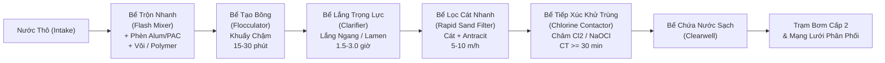
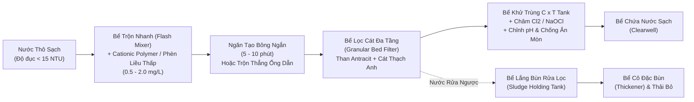
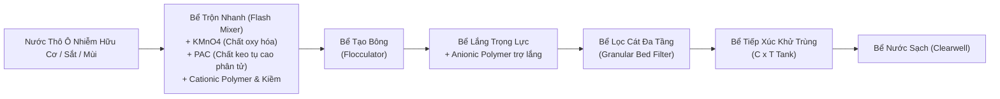
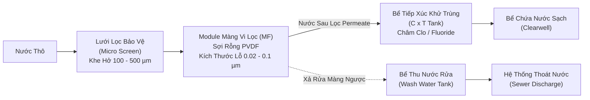
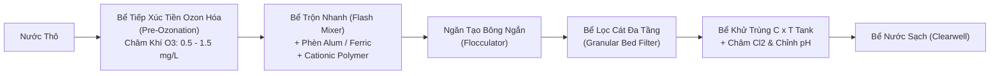
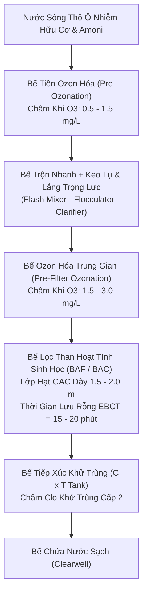
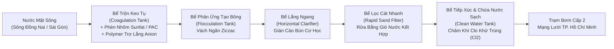
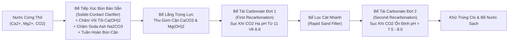
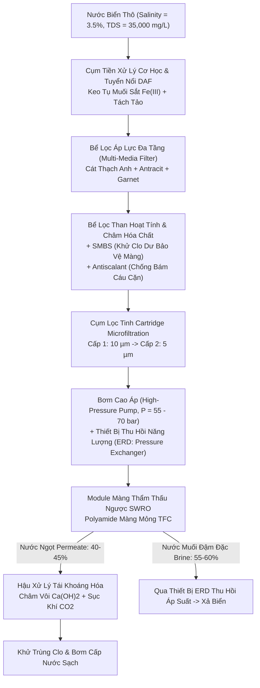

# Kỹ thuật Xử lý Nước cấp (Water Treatment Engineering) — HCMUT-263

## Chương 1: Giới thiệu & Chất lượng Nước (Introduction & Water Quality)

### 1.0 Tổng quan Môn học, Đề cương và Khung Tài liệu Tham khảo (Course Overview, Syllabus & Reference Framework)

#### 1.0.1 Giới thiệu Môn học và Mục tiêu Đào tạo (Course Scope & Learning Objectives)

##### 1.0.1.1 Vị trí Môn học trong Chương trình Đào tạo Kỹ thuật Môi trường
- **Thông tin học phần**:
  - Tên học phần: Kỹ thuật Xử lý Nước cấp (Water Treatment Engineering).
  - Mã học phần: HCMUT-263.
  - Cơ sở đào tạo: Trường Đại học Bách khoa – ĐHQG-HCM.
  - Giảng viên biên soạn: PGS. TS. Đặng Viết Hùng.
  - Vị trí chương trình: Học phần chuyên ngành bắt buộc trong năm học thứ 3 hoặc thứ 4.
- **Khối kiến thức kỹ thuật tiên quyết**:
  - Cơ học Chất lỏng và Thủy lực học (Fluid Mechanics & Hydraulics):
    - Định luật thủy tĩnh.
    - Phương trình năng lượng Bernoulli và phương trình liên tục.
    - Tổn thất áp lực qua đường ống, kênh dẫn, lớp vật liệu lọc xốp và cánh khuấy.
  - Hóa học Đại cương và Hóa học Môi trường (General & Environmental Chemistry):
    - Nhiệt động học hóa học và cân bằng axit - bazơ.
    - Tích số tan của chất ít tan ($K_{sp}$) và phản ứng oxy hóa - khử (Redox).
    - Cơ chế keo tụ và đông tụ điện tích.
    - Tính chất hóa học của các chất khí hòa tan ($CO_2, O_2, H_2S, CH_4$).
  - Toán Kỹ thuật và Phương trình Vi phân (Engineering Mathematics & Differential Equations):
    - Động học phản ứng bậc 0, bậc 1 và bậc 2.
    - Phương trình vi phân truyền khối.
    - Cân bằng vật chất trong bể phản ứng khuấy trộn hoàn chỉnh liên tục (CSTR) và bể dòng chảy nút (PFR).

##### 1.0.1.2 Chuẩn Đầu ra Môn học (Course Learning Outcomes - CLOs)
- **Chuẩn năng lực kỹ thuật**:
  - CLO 1 (Hiểu biết Thủy địa hóa): Phân tích chu trình thủy địa hóa toàn cầu. Phân biệt cơ chế tạo thành tạp chất trong nước mưa, nước biển, nước ngầm và nước mặt.
  - CLO 2 (Kiến trúc Hệ thống): Xác định cấu trúc chức năng của ba phân khu cấp nước. Ba phân khu gồm Công trình thu nước, Nhà máy xử lý và Mạng lưới phân phối.
  - CLO 3 (Quy chuẩn Pháp lý): Áp dụng ngưỡng giới hạn của QCVN 01-1:2018/BYT, QCVN 6-1:2010/BYT và TCXDVN 33:2006 vào đánh giá chất lượng nước.
  - CLO 4 (Lựa chọn Dây chuyền Công nghệ): Đánh giá đặc tính nước thô để chọn sơ đồ công nghệ xử lý phù hợp. Các thông số gồm độ đục, độ màu, sắt, mangan, độ cứng và vi sinh vật.
  - CLO 5 (Tính toán Thủy lực Trạm Bơm và Lưu vực): Tính toán thủy tĩnh, chuyển đổi đơn vị áp suất, độ nhớt, động năng, cột áp thủy lực và công suất bơm ($P_w, BHP$).
  - CLO 6 (Dự báo Nhu cầu và Dân số): Áp dụng mô hình cân bằng ẩm lưu vực trữ nước. Dự báo dân số theo phương pháp số học, hình học và giảm dần. Tính lưu lượng nước chữa cháy.
  - CLO 7 (Hóa học Nước và Làm mềm): Thiết lập cân bằng hệ carbonate. Tính nồng độ cấu tử theo pH. Xác định các dạng độ cứng và tính liều lượng vôi - soda làm mềm nước.

#### 1.0.2 Đề cương Chi tiết 10 Chương (Curricular Roadmap)

##### 1.0.2.1 Chuỗi Quá trình Xử lý từ Nguồn đến Vòi nước
- **Cấu trúc 10 chương môn học**:
  - Chương 1: Tổng quan và Chất lượng Nước (Introduction). Trình bày cơ sở thủy địa hóa, tạp chất, quy chuẩn chất lượng và tính toán kỹ thuật nền tảng.
  - Chương 2: Nguồn nước và Công trình Thu (Water Source & Collection System). Khảo sát địa chất thủy văn và thiết kế công trình thu nước mặt, nước ngầm.
  - Chương 3: Keo tụ và Tạo bông (Coagulation and Flocculation). Trình bày cơ chế nén điện kép, bẫy cặn và thiết kế bể trộn nhanh, bể tạo bông.
  - Chương 4: Khử Sắt và Mangan (Removal of Iron and Manganese). Trình bày động học oxy hóa, giàn mưa làm thoáng, tháp thổi khí và bể lọc tiếp xúc xúc tác.
  - Chương 5: Lắng (Sedimentation). Trình bày lý thuyết lắng trọng lực và tính toán bể lắng ngang, bể lắng đứng, bể lắng radian, bể lắng tấm nghiêng lamella.
  - Chương 6: Lọc Nước (Filtration). Trình bày cơ chế giữ cặn tầng lọc hạt và thiết kế bể lọc cát nhanh trọng lực, chu trình rửa lọc.
  - Chương 7: Khử trùng Nước (Disinfection). Trình bày động học bất hoạt vi sinh vật. Áp dụng khử trùng bằng clo, ozone, tia UV. Kiểm soát phụ phẩm khử trùng (DBPs).
  - Chương 8: Xử lý Nâng cao (Advanced Treatment). Áp dụng than hoạt tính (PAC/GAC) và lọc màng (MF, UF, NF, RO). Trình bày oxy hóa nâng cao (AOP) và khử muối nước biển.
  - Chương 9: Ổn định Hóa học Nước (Water Stabilization). Xác định chỉ số Langelier (LSI) và chỉ số Ryznar (RSI). Phân tích ăn mòn kim loại và giải pháp thụ động hóa đường ống.
  - Chương 10: Mạng lưới Phân phối Nước cấp (Water Distribution System). Tính toán thủy lực mạng lưới đường ống, bể chứa nước sạch, đài nước và trạm bơm cấp 2.

#### 1.0.3 Hệ thống Giáo trình và Tiêu chuẩn Thiết kế Cốt lõi (Core Reference Framework)

##### 1.0.3.1 Giáo trình Kỹ thuật Xử lý Nước Cấp Trong nước và Quốc tế
- **Tài liệu tham khảo chuyên ngành**:
  - *Tính toán các công trình xử lý và phân phối nước cấp* (Tác giả: Trịnh Xuân Lai - NXB Xây dựng): Cung cấp công thức tính toán và thông số kinh nghiệm thiết kế thực tế tại Việt Nam.
  - *Xử lý nước cấp* (Tác giả: Nguyễn Ngọc Dung - NXB Xây dựng): Phân tích cơ sở hóa lý và nguyên lý vận hành của từng công trình xử lý đơn vị.
  - *Water Treatment: Principles and Design* (Nhóm tác giả: MWH / John C. Crittenden et al. - Wiley): Cung cấp lý thuyết động học xử lý nước, mô hình truyền khối và cơ sở thiết kế công nghệ.
  - *Water Quality & Treatment - A Handbook on Drinking Water* (Hiệp hội Cấp nước Hoa Kỳ - AWWA): Cung cấp tiêu chuẩn phân tích chất lượng nước và phương pháp kiểm soát mầm bệnh.

##### 1.0.3.2 Khung Pháp lý và Tiêu chuẩn Kỹ thuật Việt Nam
- **Văn bản quy chuẩn bắt buộc**:
  - TCXDVN 33:2006: Tiêu chuẩn xây dựng Việt Nam. Văn bản quy định yêu cầu thiết kế mạng lưới đường ống và công trình xử lý cấp nước.
  - QCVN 01-1:2018/BYT: Quy chuẩn kỹ thuật quốc gia về chất lượng nước sạch dùng cho mục đích sinh hoạt. Quy chuẩn bắt buộc áp dụng cho mọi đơn vị cấp nước tại Việt Nam.
  - QCVN 6-1:2010/BYT: Quy chuẩn kỹ thuật quốc gia đối với nước khoáng thiên nhiên và nước uống đóng chai. Quy chuẩn quy định chỉ tiêu vi sinh và độc chất vô cơ khắt khe.

### 1.1 Nguồn Nước và Nguyên lý Thủy Địa hóa (Water Sources & Hydrogeochemical Fundamentals)

#### 1.1.1 Chu trình Thủy Địa hóa và Phân loại Tạp chất trong Nước (Hydrogeochemical Cycle & Impurity Classification)

##### 1.1.1.1 Cơ chế Chu trình Thủy văn Toàn cầu và Quá trình Chưng cất Tự nhiên
- **Bản chất chu trình thủy văn**:
  - Chu trình thủy địa hóa (Hydrogeochemical Cycle) luân chuyển nước liên tục giữa thủy quyển, khí quyển, thạch quyển và sinh quyển.
  - Năng lượng mặt trời và trọng lực Trái Đất điều khiển toàn bộ chu trình.
- **Bốn giai đoạn vận động của chu trình**:
  1. Bốc hơi nước biển (Solar Ocean Evaporation): Bức xạ mặt trời đốt nóng bề mặt biển. Nhiệt lượng bẻ gãy liên kết hydro giữa các phân tử $H_2O$. Hơi nước thoát vào khí quyển. Muối khoáng và tạp chất không bay hơi ở lại đại dương. Quá trình này hoạt động như một hệ thống chưng cất tự nhiên bằng năng lượng mặt trời (Natural Solar Distillation).
  2. Ngưng tụ và vận chuyển hơi ẩm (Atmospheric Transport & Condensation): Khối khí ẩm bốc lên cao gặp nhiệt độ thấp. Hơi nước ngưng tụ quanh hạt nhân ngưng tụ (aerosol bụi, muối biển, phấn hoa) tạo thành mây.
  3. Giáng thủy (Precipitation): Kích thước hạt nước trong mây tăng dần. Trọng lực thắng lực nâng khí động khiến nước rơi xuống mặt đất dưới dạng mưa, tuyết hoặc mưa đá.
  4. Dòng chảy bề mặt (Surface Runoff) và thấm sâu (Infiltration): Nước mưa rơi xuống đất chia thành ba phần. Phần thứ nhất bốc hơi trực tiếp vào khí quyển. Phần thứ hai chảy tràn bề mặt vào suối, sông, hồ rồi đổ ra biển. Phần thứ ba thấm qua tầng đất mặt bổ cập tầng chứa nước ngầm (aquifers).
- **Phân bố trữ lượng nước trên Trái Đất (Global Water Allocation)**:
  - Tổng trữ lượng nước toàn cầu đạt khoảng $1.386 \times 10^9\text{ km}^3$.
  - Nước mặn đại dương (Oceans): Chiếm $97.5\%$ tổng lượng nước toàn cầu. Độ mặn trung bình đạt $35\text{ g/L}$. Nước biển cần khử muối trước khi cấp cho sinh hoạt.
  - Băng hà và tuyết vĩnh cửu (Glaciers & Permanent Snowpack): Chiếm $1.76\%$ tổng lượng nước toàn cầu (tương đương $68.7\%$ tổng lượng nước ngọt). Nguồn nước này phân bố tại Nam Cực, Bắc Cực và đỉnh núi cao.
  - Nước dưới đất (Groundwater): Chiếm $0.76\%$ tổng lượng nước toàn cầu (tương đương $30.1\%$ tổng lượng nước ngọt). Nguồn nước này là nguồn cấp nước sinh hoạt chính cho con người.
  - Nước mặt ngọt (Freshwater Lakes & Rivers): Chiếm dưới $0.01\%$ tổng lượng nước toàn cầu. Hồ nước ngọt chiếm khoảng $0.007\%$. Sông suối chiếm khoảng $0.0002\%$. Đây là nguồn khai thác nước cấp tập trung thuận tiện nhất cho đô thị.

##### 1.1.1.2 Các Đặc tính Vật lý Cơ bản của Nước trong Hệ Đơn vị SI
- **Khối lượng riêng của nước ($\rho$)**:
  - Nước đạt khối lượng riêng cực đại tại nhiệt độ $4^\circ\text{C}$:
    $$\rho_{\text{water, } 4^\circ\text{C}} = 1000\text{ kg/m}^3 = 1.000\text{ g/cm}^3$$
  - Khối lượng riêng tại $20^\circ\text{C}$: $\rho = 998.2\text{ kg/m}^3$.
  - Khối lượng riêng tại $21^\circ\text{C}$: $\rho = 998.0\text{ kg/m}^3$.
  - Khối lượng riêng tại $25^\circ\text{C}$: $\rho = 997.0\text{ kg/m}^3$.
  - Quan hệ giữa khối lượng riêng và tỷ trọng (Specific Gravity - $\text{SG}$):
    $$\rho = \text{SG} \cdot \rho_{\text{ref}} = \text{SG} \cdot \rho_{\text{water, } 4^\circ\text{C}}$$
    - $\rho$: Khối lượng riêng của chất lỏng ($\text{kg/m}^3$).
    - $\text{SG}$: Tỷ trọng của chất lỏng (không thứ nguyên).
    - $\rho_{\text{ref}}$: Khối lượng riêng của chất lỏng chuẩn tại $4^\circ\text{C}$ ($1000\text{ kg/m}^3$).
- **Trọng lượng riêng của nước ($\gamma$)**:
  - Trọng lượng riêng tính bằng tích số giữa khối lượng riêng và gia tốc trọng trường:
    $$\gamma = \rho \cdot g$$
    - $\gamma$: Trọng lượng riêng của nước ($\text{N/m}^3$).
    - $\rho$: Khối lượng riêng của nước ($\text{kg/m}^3$).
    - $g$: Gia tốc trọng trường ($9.81\text{ m/s}^2$).
  - Giá trị trọng lượng riêng tại $4^\circ\text{C}$:
    $$\gamma = 1000\text{ kg/m}^3 \times 9.81\text{ m/s}^2 = 9810\text{ N/m}^3 = 9.81\text{ kN/m}^3$$
- **Độ nhớt động lực ($\mu$)**:
  - Độ nhớt động lực đo lực ma sát nội tại giữa các lớp chất lỏng chuyển động trượt.
  - Đơn vị đo trong hệ SI: $\text{N}\cdot\text{s/m}^2$ hoặc $\text{Pa}\cdot\text{s}$ ($1\text{ Poise} = 0.1\text{ Pa}\cdot\text{s}$, $1\text{ cP} = 10^{-3}\text{ Pa}\cdot\text{s}$).
  - Giá trị tại $20^\circ\text{C}$: $\mu = 1.002 \times 10^{-3}\text{ N}\cdot\text{s/m}^2$ ($1.002\text{ cP}$).
  - Giá trị tại $21^\circ\text{C}$: $\mu = 0.00982\text{ Poise} = 9.82 \times 10^{-4}\text{ N}\cdot\text{s/m}^2$ ($0.982\text{ cP}$).
- **Độ nhớt động học ($\nu$)**:
  - Độ nhớt động học là tỷ số giữa độ nhớt động lực và khối lượng riêng:
    $$\nu = \frac{\mu}{\rho}$$
    - $\nu$: Độ nhớt động học của nước ($\text{m}^2/\text{s}$).
    - $\mu$: Độ nhớt động lực của nước ($\text{N}\cdot\text{s/m}^2$).
    - $\rho$: Khối lượng riêng của nước ($\text{kg/m}^3$).
  - Giá trị tại $20^\circ\text{C}$: $\nu \approx 1.004 \times 10^{-6}\text{ m}^2/\text{s}$.
  - Giá trị tại $21^\circ\text{C}$: $\nu \approx 9.84 \times 10^{-7}\text{ m}^2/\text{s}$.
- **Nhiệt dung riêng của nước ($C_p$)**:
  - Giá trị chuẩn: $C_p = 4.184\text{ kJ/(kg}\cdot\text{K)}$ ($1\text{ cal/(g}\cdot^\circ\text{C)}$).
  - Nhiệt dung riêng cao giúp các thủy vực tự nhiên ổn định nhiệt độ trước biến đổi thời tiết.

##### 1.1.1.3 Phân loại Năm Nhóm Tạp chất Cốt lõi trong Nguồn Nước Tự nhiên
- **Nhóm 1: Các hợp chất vô cơ hòa tan (Dissolved Inorganic Compounds)**:
  - Cation chính:
    - Canxi ($Ca^{2+}$) và Magie ($Mg^{2+}$) tạo nên độ cứng của nước.
    - Natri ($Na^+$) và Kali ($K^+$) quyết định độ mặn của nước.
    - Sắt ($Fe^{2+}$) và Mangan ($Mn^{2+}$) xuất hiện phổ biến trong môi trường yếm khí thiếu oxy.
    - Nhôm ($Al^{3+}$), Stronti ($Sr^{2+}$) và Bari ($Ba^{2+}$) hòa tan từ khoáng sét tự nhiên.
  - Anion chính:
    - Bicarbonate ($HCO_3^-$) và Carbonate ($CO_3^{2-}$) tạo nên độ kiềm của nước.
    - Clorua ($Cl^-$) và Sunfat ($SO_4^{2-}$) tạo nên độ mặn và độ cứng phi carbonate.
    - Nitrate ($NO_3^-$) và Fluoride ($F^-$) sinh ra từ phân bón nông nghiệp hoặc khoáng đá.
  - Nguyên tố vết độc tính:
    - Asen ($As$), Chì ($Pb$), Cadmium ($Cd$), Crom ($Cr^{6+}$) và Thủy ngân ($Hg$).
    - Các nguyên tố này sinh ra từ phong hóa địa chất hoặc nước thải công nghiệp. Chúng gây tổn thương nội tạng và ung thư.
- **Nhóm 2: Các hợp chất hữu cơ hòa tan (Dissolved Organic Matter - NOM)**:
  - Hợp chất hữu cơ tự nhiên (Natural Organic Matter - NOM):
    - Hình thành do phân rã thảm thực vật, bùn đáy và chất tiết chuyển hóa của tảo.
    - Axit Humic: Khối lượng phân tử lớn, tan trong kiềm, kết tủa trong axit, tạo màu nâu sẫm cho nước.
    - Axit Fulvic: Khối lượng phân tử nhỏ hơn, tan trong mọi dải pH, tạo màu vàng rơm cho nước.
    - Tanin: Hòa tan từ vỏ cây và lá mục trong rừng ngập nước.
  - Hợp chất hữu cơ tổng hợp (Synthetic Organic Chemicals - SOCs):
    - Chất hoạt động bề mặt (detergents) từ nước thải sinh hoạt đô thị.
    - Thuốc bảo vệ thực vật (pesticides, organochlorines) từ dòng chảy tràn nông nghiệp.
    - Dung môi công nghiệp và các chất gây rối loạn nội tiết (EDCs).
  - Tác động kỹ thuật của hợp chất hữu cơ:
    - Tiêu tốn hóa chất keo tụ trong quá trình xử lý nước.
    - Gây nghẹt tắc màng lọc nước.
    - Phản ứng với clo sinh ra phụ phẩm khử trùng gây ung thư (Disinfection By-Products - DBPs).
- **Nhóm 3: Các chất khí hòa tan (Dissolved Gases)**:
  - Oxy hòa tan (Dissolved Oxygen - DO): Duy trì sự sống thủy sinh và trạng thái oxy hóa của nước mặt. Nước ngầm sâu thường nghèo DO ($DO < 1 - 2\text{ mg/L}$).
  - Khí Carbonic ($CO_2$): Hòa tan tạo axit carbonic ($H_2CO_3$). Khí này ăn mòn kim loại đường ống và hòa tan đá vôi tạo độ cứng.
  - Khí Hydro Sulfua ($H_2S$): Sinh ra do vi khuẩn khử sunfat trong môi trường kỵ khí. Khí gây mùi trứng thối và tạo kết tủa đen $FeS$ khi gặp ion sắt.
  - Khí Methane ($CH_4$): Khí dễ cháy nổ, sinh ra do phân hủy bùn kỵ khí ở đáy thủy vực.
  - Khí Radon ($Rn$): Khí phóng xạ tự nhiên hòa tan từ vỉa đá granite chứa urani.
  - Khí Nitơ ($N_2$) và Khí Lưu huỳnh đioxit ($SO_2$): Hòa tan vào nước từ bầu khí quyển.
- **Nhóm 4: Các chất rắn lơ lửng và hệ keo (Suspended Solids & Colloids)**:
  - Chất rắn lơ lửng (Total Suspended Solids - TSS):
    - Kích thước hạt từ $1\text{ }\mu\text{m}$ đến hàng trăm $\mu\text{m}$.
    - Gồm hạt cát mịn, bùn phù sa (silt), xác hữu cơ, dầu và mỡ.
    - Các hạt này tạo ra độ đục (Turbidity) và có thể lắng tự nhiên nhờ trọng lực.
  - Hệ keo (Colloidal Sol):
    - Kích thước hạt rất nhỏ từ $0.001\text{ }\mu\text{m}$ đến $1\text{ }\mu\text{m}$.
    - Gồm keo sét aluminosilicate, keo silica và phức hợp hữu cơ.
    - Hạt keo mang điện tích âm bề mặt cố hữu. Lực đẩy tĩnh điện ngăn các hạt keo tự kết dính.
    - Nhà máy phải dùng phèn nhôm hoặc phèn sắt để keo tụ và trung hòa điện tích.
- **Nhóm 5: Vi sinh vật (Microorganisms)**:
  - Vi khuẩn gây bệnh (Pathogenic Bacteria):
    - *Escherichia coli*: Vi khuẩn chỉ thị mức độ nhiễm phân từ người và động vật máu nóng.
    - *Vibrio cholerae*: Phẩy khuẩn tả gây bệnh tả và tiêu chảy cấp tính.
    - *Salmonella typhi*: Vi khuẩn gây bệnh sốt thương hàn.
    - *Shigella*: Vi khuẩn gây bệnh lỵ trực khuẩn.
    - *Pseudomonas aeruginosa*: Trực khuẩn mủ xanh gây nhiễm trùng cơ hội.
  - Virus gây bệnh truyền qua đường nước:
    - Kích thước siêu nhỏ từ $0.02\text{ }\mu\text{m}$ đến $0.1\text{ }\mu\text{m}$.
    - Gồm Rotavirus (gây tiêu chảy cấp ở trẻ em), Enterovirus, Viêm gan A ($HAV$) và Norovirus.
  - Động vật nguyên sinh và ký sinh trùng (Protozoa & Helminths):
    - Bào nang *Giardia lamblia* (kích thước $8 - 14\text{ }\mu\text{m}$).
    - Noãn nang *Cryptosporidium parvum* (kích thước $4 - 6\text{ }\mu\text{m}$).
    - Vỏ kitin của noãn nang *Cryptosporidium* trơ với hóa chất clo. Nhà máy phải dùng lọc màng, ozon hoặc tia UV để xử lý.
  - Tảo (*Algae*) và nấm (*Fungi*): Gây mùi vị lạ cho nước và làm nghẹt bể lọc cát.

#### 1.1.2 Nguồn Nước mưa và Nước biển (Rainwater & Seawater Sources)

##### 1.1.2.1 Nước Mưa: Đặc tính Hóa lý, Độ ổn định và Trữ lượng
- **Độ khoáng hóa và độ tinh khiết**:
  - Hàm lượng tổng chất rắn hòa tan (TDS) rất thấp, dao động từ $10\text{ mg/L}$ đến $50\text{ mg/L}$.
  - Nước mưa hầu như không chứa ion canxi và magie. Độ cứng xấp xỉ bằng không (nước siêu mềm).
- **Tính axit tự nhiên của nước mưa**:
  - Nước mưa hòa tan khí carbonic trong khí quyển tạo thành axit carbonic:
    $$CO_2 + H_2O \rightleftharpoons H_2CO_3 \rightleftharpoons H^+ + HCO_3^-$$
  - Giá trị pH của nước mưa tự nhiên không ô nhiễm dao động từ $5.0$ đến $5.6$.
  - Mưa axit xảy ra khi khí quyển nhiễm nhiều $SO_2$ và $NO_x$. Giá trị pH của mưa axit giảm xuống $3.5 - 4.5$.
- **Tính ăn mòn xâm thực (Aggressive Corrosiveness)**:
  - Nước mưa thiếu hụt ion canxi ($Ca^{2+}$) và ion kiềm ($HCO_3^-$).
  - Chỉ số bão hòa Langelier của nước mưa luôn âm rất sâu ($LSI \ll 0$).
  - Nước mưa hòa tan vôi trong bể xi măng và hòa tan kim loại đường ống ($Pb, Cu$).
- **Hệ thống thu gom và trữ nước mưa phân tán**:
  - Quy trình vận hành và cấu trúc hệ thống gồm 4 bộ phận:
    1. Bề mặt mái thu (Catchment Surface): Mái ngói, tôn mạ hoặc bê tông sạch trơ hóa học. Tuyệt đối không dùng mái fibro-xi măng chứa amiăng.
    2. Thiết bị xả nước mưa đợt đầu (First-Flush Diverter): Tách bỏ $1 - 2\text{ mm}$ mưa đầu trận (tương đương $10 - 20\text{ L}$ cho mỗi $10\text{ m}^2$ mái). Thiết bị này loại bỏ bụi bẩn, phân chim và lá cây.
    3. Bể trữ nước mưa kín (Storage Cistern): Bể composite hoặc nhựa HDPE. Bể phải chắn kín ánh sáng mặt trời để ngăn rêu tảo phát triển và muỗi đẻ trứng.
    4. Cụm xử lý bổ sung: Lọc cát thạch anh, lọc than hoạt tính và đun sôi hoặc khử trùng nano bạc trước khi uống trực tiếp.

##### 1.1.2.2 Nước Biển: Độ mặn, Tỷ trọng và Rào cản Khử muối
- **Độ mặn và thành phần ion chính**:
  - Độ mặn trung bình của nước biển dao động từ $3.3\%$ đến $3.7\%$.
  - Giá trị thiết kế chuẩn lấy bằng $3.5\%$ (tương đương $35\text{ g/L}$ hoặc $35,000\text{ mg/L TDS}$).
  - Hàm lượng các ion chính trong nước biển có độ mặn $3.5\%$:
    - Clorua ($Cl^-$): $19,350\text{ mg/L}$ ($55.0\%$ tổng lượng anion).
    - Natri ($Na^+$): $10,760\text{ mg/L}$ ($30.6\%$ tổng lượng cation).
    - Sunfat ($SO_4^{2-}$): $2,710\text{ mg/L}$.
    - Magie ($Mg^{2+}$): $1,290\text{ mg/L}$.
    - Canxi ($Ca^{2+}$): $410\text{ mg/L}$.
    - Kali ($K^+$): $390\text{ mg/L}$.
    - Bicarbonate ($HCO_3^-$): $140\text{ mg/L}$.
- **Áp suất thẩm thấu ($\Pi$) và rào cản năng lượng**:
  - Áp suất thẩm thấu xác định theo phương trình Van 't Hoff:
    $$\Pi = i \cdot M \cdot R \cdot T$$
    - $\Pi$: Áp suất thẩm thấu của dung dịch nước biển ($\text{bar}$).
    - $i$: Hệ số phân ly ion Van 't Hoff (không thứ nguyên).
    - $M$: Tổng nồng độ mol của các phần tử chất tan ($\text{mol/L}$).
    - $R$: Hằng số khí lý tưởng ($0.08314\text{ L}\cdot\text{bar/(mol}\cdot\text{K)}$).
    - $T$: Nhiệt độ nhiệt động học tuyệt đối ($\text{K}$, $T = t^\circ\text{C} + 273.15$).
  - Giá trị áp suất thẩm thấu của nước biển tự nhiên tại $25^\circ\text{C}$: $\Pi \approx 25 - 28\text{ bar}$ ($360 - 400\text{ psi}$).
  - Áp suất vận hành thực tế của trạm lọc màng thẩm thấu ngược nước biển (SWRO):
    - Bơm cao áp phải thắng áp suất thẩm thấu cộng với trở lực màng.
    - Áp suất vận hành thực tế duy trì trong khoảng $55\text{ bar}$ đến $70\text{ bar}$ ($800 - 1000\text{ psi}$).
- **Tỷ trọng và khối lượng riêng của nước biển**:
  - Hàm lượng muối cao làm tăng khối lượng riêng của nước biển:
    $$\rho_{\text{seawater}} \approx 1.025\text{ kg/L} = 1025\text{ kg/m}^3\text{ (tại } 20^\circ\text{C)}$$
  - Tỷ trọng tương đối so với nước chuẩn tại $4^\circ\text{C}$: $\text{SG} = 1.025$.
- **Hiện tượng hạ điểm đóng băng (Freezing Point Depression)**:
  - Nồng độ ion muối làm hạ nhiệt độ kết tinh của nước.
  - Điểm đóng băng của nước biển có độ mặn $3.5\%$ hạ xuống mức $-1.9^\circ\text{C}$ (thay vì $0.0^\circ\text{C}$ của nước cất).
- **Độ kiềm và pH của nước biển**:
  - Nước biển có dải pH ổn định từ $7.5$ đến $8.4$.
  - Hệ đệm tự nhiên carbonate ($HCO_3^- / CO_3^{2-}$) và borate ($B(OH)_3 / B(OH)_4^-$) kiểm soát ổn định giá trị pH này.

### 1.1 Đặc tính Nguồn Nước Tự nhiên (Natural Water Sources)

#### 1.1.3 Nguồn Nước ngầm: Chất lượng, Khoáng hóa và Nhiễm bẩn (Groundwater Quality, Minerals & Contamination)

##### 1.1.3.1 Địa tầng Thủy văn và Cơ chế Hòa tan Khoáng chất Tự nhiên
- **Cấu trúc tầng chứa nước (Aquifer Structures)**:
  - Tầng không áp (Unconfined Aquifer) nằm sát mặt đất. Mực nước tự do thay đổi theo mùa và chịu áp suất khí quyển.
  - Tầng chứa nước không áp nhận nước bổ cập nhanh từ nước mưa thấm. Tầng này dễ nhiễm bẩn từ các hoạt động trên mặt đất.
  - Tầng có áp (Confined Aquifer) nằm kẹp giữa hai lớp địa chất không thấm nước. Nước chịu áp lực thủy tĩnh cao.
  - Khi khoan giếng vào tầng có áp, mực nước tự dâng cao hơn đỉnh tầng chứa nước. Nước có độ an toàn vi sinh cao.

- **Cơ chế hòa tan sắt ($Fe^{2+}$) và mangan ($Mn^{2+}$)**:
  - Vi sinh vật trong đất tiêu thụ hết oxy hòa tan ($DO \to 0\text{ mg/L}$) khi phân hủy chất hữu cơ.
  - Môi trường ngầm chuyển sang trạng thái khử mạnh với thế oxy hóa khử âm ($Eh < 0$).
  - Nước ngầm hòa tan khoáng sắt và mangan không tan trong đất đá:
    $$Fe^{3+}_{\text{(rắn)}} + e^- \to Fe^{2+}_{\text{(hòa tan)}}$$
    $$MnO_{2\text{(rắn)}} + 4H^+ + 2e^- \to Mn^{2+}_{\text{(hòa tan)}} + 2H_2O$$
  - Nước mới bơm lên từ giếng khoan luôn trong suốt. Nước chứa ion sắt ($Fe^{2+}$) và mangan ($Mn^{2+}$) hòa tan.
  - Khi tiếp xúc không khí, oxy oxy hóa $Fe^{2+}$ thành kết tủa $Fe(OH)_3$ màu nâu đỏ. Quá trình làm nước đục và gây ố vàng.

- **Cơ chế hòa tan canxi ($Ca^{2+}$), magie ($Mg^{2+}$) tạo độ cứng**:
  - Vi sinh vật và rễ cây hô hấp giải phóng lượng lớn khí $CO_2$ vào đất ($20 - 100\text{ mg/L}$).
  - Khí $CO_2$ hòa tan vào nước tạo thành axit carbonic ($H_2CO_3$).
  - Axit carbonic hòa tan đá vôi ($CaCO_3$) và đá dolomit ($CaMg(CO_3)_2$):
    $$CaCO_{3\text{(rắn)}} + CO_2 + H_2O \rightleftharpoons Ca^{2+} + 2HCO_3^-$$
    $$CaMg(CO_3)_{2\text{(rắn)}} + 2CO_2 + 2H_2O \rightleftharpoons Ca^{2+} + Mg^{2+} + 4HCO_3^-$$
  - Phản ứng giải phóng ion $Ca^{2+}$ và $Mg^{2+}$, hình thành độ cứng carbonate trong nước ngầm.

- **Độc chất tự nhiên trong nước ngầm**:
  - Asen tự nhiên ($As$) giải phóng từ quặng pirit ($FeAsS$) hoặc quá trình khử khoáng sắt hydroxit.
  - Asen tồn tại ở dạng arsenite ($As^{3+}$) độc tính cao hoặc arsenate ($As^{5+}$). Nồng độ asen tầng nông thường vượt $0{,}01\text{ mg/L}$.
  - Fluoride ($F^-$) hòa tan từ khoáng fluorit ($CaF_2$). Nồng độ fluoride vượt $1{,}5\text{ mg/L}$ gây hỏng men răng và xốp xương.
  - Phóng xạ Radon ($^{222}Rn$) và Radium ($^{226}Ra$) hòa tan từ các đới nứt nẻ của đá granit.

##### 1.1.3.2 Nước ngầm Nhiễm lợ (Brackish Groundwater)
- Khai thác nước ngầm quá mức làm hạ thấp mực nước áp lực tĩnh.
- Nước biển xâm nhập vào các tầng chứa nước ngọt tại vùng ven biển.
- Nước ngầm chuyển thành nước lợ với hàm lượng tổng chất rắn hòa tan cao:
  $$\text{TDS} = 1000 - 5000\text{ mg/L}$$
- Kỹ sư phải dùng công nghệ màng lọc thẩm thấu ngược nước lợ (BWRO) hoặc điện thẩm tích (EDR) để khử mặn.

##### 1.1.3.3 Cơ chế Nhiễm bẩn Nhân sinh Tầng Nước ngầm (Anthropogenic Contamination)
- **Rò rỉ bể chứa xăng dầu ngầm (UST Leaks)**:
  - Bồn thép ngầm bị ăn mòn điện hóa sau 15 đến 30 năm chôn lấp.
  - Nhiên liệu rò rỉ phát tán nhóm hydrocarbon thơm BTEX (Benzene, Toluene, Ethylbenzene, Xylenes) và phụ gia MTBE.
  - Benzene là chất gây ung thư nhóm 1. MTBE tan nhiều trong nước, phân hủy sinh học chậm và di chuyển xa hàng kilômét.

- **Ô nhiễm nitrate ($NO_3^-$) từ nước thải và nông nghiệp**:
  - Bể tự hoại rò rỉ và phân bón hóa học dư thừa ($NH_4NO_3$) thấm sâu vào đất.
  - Vi khuẩn hiếu khí nitrat hóa amoni thành nitrite ($NO_2^-$) và nitrate ($NO_3^-$):
    $$NH_4^+ + 2O_2 \to NO_3^- + 2H^+ + H_2O$$
  - Ion nitrate không bị keo đất tích điện âm giữ lại. Nitrate đi thẳng vào tầng nước ngầm.
  - Nồng độ nitrate vượt $50\text{ mg/L}$ gây hội chứng trẻ xanh (Methemoglobinemia) ở trẻ sơ sinh.

- **Dung môi công nghiệp clo hóa (DNAPL)**:
  - Dung môi tẩy rửa cơ khí Trichloroethylene (TCE) và Tetrachloroethylene (PCE) ngấm vào đất.
  - Hợp chất này có tỷ trọng nặng hơn nước, tạo pha lỏng hữu cơ đậm đặc (DNAPL).
  - Túi DNAPL chìm xuống đáy tầng ngậm nước, hòa tan chậm qua nhiều thập kỷ và gây độc kéo dài.

##### 1.1.3.4 Ma trận Đánh giá Ưu điểm và Nhược điểm của Nước ngầm
- **Bảng so sánh ưu nhược điểm kỹ thuật của nước ngầm**:

| Chỉ tiêu kỹ thuật | Ưu điểm của nguồn nước ngầm | Nhược điểm và thách thức vận hành |
|---|---|---|
| **Độ đục và hạt cặn** | Độ đục thấp ($\le 1 - 2\text{ NTU}$), ít cặn lơ lửng nhờ đất cát lọc tự nhiên. | Cát mịn có thể lọt qua lưới lọc gây mài mòn cánh bơm giếng sâu. |
| **Ô nhiễm vi sinh** | Không có vi khuẩn gây bệnh và ký sinh trùng do thiếu ánh sáng. | Nước giếng nông dễ nhiễm bẩn phân nếu gần hố xí tự hoại. |
| **Nhiệt độ nước** | Nhiệt độ ổn định quanh năm ($22 - 25^\circ\text{C}$). | Nước có thể chứa khí cháy ($CH_4$) hoặc khí độc ($H_2S$). |
| **Chất hữu cơ tự nhiên** | Nồng độ chất hữu cơ thấp, ít tạo phụ phẩm khử trùng DBP. | Hàm lượng khoáng hòa tan cao ($Fe, Mn, Ca^{2+}, Mg^{2+}$). |
| **Công trình xử lý** | Mặt bằng xử lý gọn, bỏ qua bể keo tụ và bể lắng cặn thô. | Chi phí điện bơm giếng sâu cao, chi phí hóa chất khử cứng lớn. |
| **Mức độ bền vững** | Nguồn nước ngầm an toàn trước ô nhiễm bề mặt tức thời. | Tầng ngầm đã nhiễm độc asen hoặc dung môi rất khó phục hồi. |

---

#### 1.1.4 Nguồn Nước mặt: Thủy vực và Động lực Lưu vực (Surface Water Characteristics & Watershed Dynamics)

##### 1.1.4.1 Phân loại Thủy vực Nước mặt và Biến động Mùa vụ
- **Thủy vực chảy (Hệ Lotic - Sông, Suối)**:
  - Vận tốc dòng chảy lớn ($v = 0{,}5 - 2{,}5\text{ m/s}$).
  - Khả năng tự sục khí bề mặt cao, oxy hòa tan dồi dào ($DO = 6 - 8\text{ mg/L}$).
  - Chất lượng nước biến động tức thời theo lượng mưa và hoạt động xả thải trên lưu vực.

- **Thủy vực tĩnh (Hệ Lentic - Hồ Tự nhiên, Hồ chứa)**:
  - Vận tốc dòng chảy rất nhỏ ($v \approx 0\text{ m/s}$), thời gian lưu nước kéo dài từ vài tuần đến nhiều năm.
  - Cặn lơ lửng thô tự lắng tốt, tạo độ đục nền ổn định.
  - Hiện tượng phân tầng nhiệt độ (Thermal Stratification) xuất hiện vào mùa khô nóng:
    - Tầng mặt (Epilimnion) ấm, giàu oxy hòa tan nhưng chứa nhiều tảo.
    - Tầng đáy (Hypolimnion) lạnh, tù đọng, yếm khí, chứa nhiều sắt, mangan, photpho và khí $H_2S$.
  - Tích tụ nitơ và photpho gây hiện tượng phú dưỡng (Eutrophication). Tảo lam nở hoa tiết độc tố Microcystin và chất gây mùi hôi (Geosmin, MIB).

- **Xung đột biến độ đục do mưa bão**:
  - Mưa lớn xói mòn lưu vực và cuốn trôi phù sa vào sông suối.
  - Độ đục bùng phát đột ngột từ $20 - 50\text{ NTU}$ lên mức $500 - 3000\text{ NTU}$ trong vài giờ.
  - Nước mưa làm loãng nồng độ ion bicarbonate, làm độ kiềm sụt giảm ($< 20 - 30\text{ mg/L as }CaCO_3$).
  - Kỹ sư phải tăng liều lượng phèn, châm thêm kiềm và dùng polymer trợ lắng.

##### 1.1.4.2 Hợp chất Hữu cơ Tự nhiên (NOM) và Tiền chất Tạo Phụ phẩm Khử trùng
- **Phân loại nguồn gốc chất hữu cơ tự nhiên**:
  - Nguồn nội sinh (Autochthonous): Do hoạt động quang hợp và phân rã của tảo, vi sinh vật trong nước sinh ra. Chỉ số hấp thụ tia cực tím riêng thấp ($SUVA_{254} < 2\text{ L/(mg}\cdot\text{m)}$).
  - Nguồn ngoại sinh (Allochthonous): Rửa trôi từ thảm thực vật và đất rừng mục nát. Nguồn này chứa nhiều axit humic và axit fulvic ($SUVA_{254} > 3 - 4\text{ L/(mg}\cdot\text{m)}$). Nước có màu vàng nâu.

- **Phản ứng tạo phụ phẩm khử trùng (DBP Formation)**:
  - Clo khử trùng phản ứng với nhân thơm của axit humic và fulvic.
  - Phản ứng sinh ra các hợp chất hữu cơ clo hóa độc hại:
    $$\text{NOM} + Cl_2 \to \text{THMs} + \text{HAAs}$$
  - Sản phẩm gồm Trihalomethanes ($CHCl_3, CHBrCl_2, CHBr_2Cl, CHBr_3$) và Haloacetic Acids. Các chất này gây ung thư gan, thận và bàng quang.

##### 1.1.4.3 Rủi ro Ô nhiễm Vi sinh vật Nguồn Nước mặt
- Nước mặt nhận nước thải đô thị và dòng chảy tràn chăn nuôi gia súc.
- Nguồn nước luôn tiềm ẩn vi khuẩn gây bệnh tả (*Vibrio cholerae*), thương hàn (*Salmonella*), lỵ (*Shigella*).
- Bào nang *Giardia lamblia* ($8 - 14\text{ }\mu\text{m}$) và noãn nang *Cryptosporidium parvum* ($4 - 6\text{ }\mu\text{m}$) xuất hiện phổ biến.
- Vỏ kitin của noãn nang *Cryptosporidium* kháng clo khử trùng thông thường. Nhà máy nước phải dùng rào cản keo tụ - lắng - lọc cát hoặc khử trùng bằng Ozon và tia UV.

##### 1.1.4.4 So sánh Đặc tính Kỹ thuật giữa Nước mặt và Nước ngầm
- **Bảng đối chiếu thông số giữa hai nguồn nước**:

| Thông số kỹ thuật | Nguồn nước mặt (Sông, Hồ chứa) | Nguồn nước ngầm (Tầng sâu) |
|---|---|---|
| **Độ đục (Turbidity)** | Cao ($10 - 2000\text{ NTU}$), biến động lớn theo mùa. | Rất thấp ($\le 1 - 2\text{ NTU}$), ổn định quanh năm. |
| **Độ màu (Color)** | Cao ($10 - 150\text{ TCU}$), do phức humic và keo sét. | Thấp (chỉ tăng khi sắt bị oxy hóa tạo cặn). |
| **Oxy hòa tan (DO)** | Cao ($6 - 8\text{ mg/L}$), tiếp xúc khí quyển tốt. | Rất thấp hoặc bằng 0 ($0 - 2\text{ mg/L}$), yếm khí. |
| **Khí Carbonic ($CO_2$)** | Thấp ($0 - 5\text{ mg/L}$). | Cao ($20 - 100\text{ mg/L}$), gây ăn mòn đường ống. |
| **Sắt và Mangan ($Fe, Mn$)** | Thấp, tồn tại chủ yếu ở dạng huyền phù liên kết bùn. | Thường cao ($1 - 20\text{ mg/L}$), tồn tại ở dạng hòa tan. |
| **Độ cứng ($Ca^{2+}, Mg^{2+}$)** | Thấp đến trung bình ($20 - 100\text{ mg/L as }CaCO_3$). | Thường cao ($100 - 500\text{ mg/L as }CaCO_3$). |
| **Chất hữu cơ (TOC, NOM)** | Cao ($2 - 15\text{ mg/L}$), tiềm ẩn nguy cơ tạo THMs. | Thấp ($< 1 - 2\text{ mg/L}$), ít nguy cơ tạo THMs. |
| **Vi sinh vật gây bệnh** | Nguy cơ rất cao (vi khuẩn phân, virus, kén ký sinh trùng). | Nguy cơ thấp nếu miệng giếng bảo vệ đúng kỹ thuật. |
| **Sơ đồ xử lý chuẩn** | Keo tụ $\to$ Tạo bông $\to$ Lắng $\to$ Lọc $\to$ Clo hóa. | Làm thoáng $\to$ Kiềm hóa $\to$ Lắng $\to$ Lọc $\to$ Clo hóa. |

---

### 1.2 Kiến trúc và Phân loại Hệ thống Cấp nước (Water Supply System Architecture & Classification)

#### 1.2.1 Ba Phân khu Cốt lõi của Hệ thống Cấp nước Đô thị

##### 1.2.1.1 Phân khu Thu nước và Trạm Bơm Cấp 1 (Water Intake & Low-Lift Pumping Station)
- **Công trình thu nước mặt**:
  - Song chắn rác thô giữ lại cành cây, bèo tây và rác nổi kích thước lớn.
  - Lưới chắn rác tinh ngăn rong rêu và rác nhỏ lọt vào ngăn hút bơm.
  - Cửa thu ven bờ (Shore Intake) đặt tại bờ sông có mái dốc đứng và nền địa chất ổn định.
  - Cửa thu lòng sông (Riverbed Intake) dẫn nước vào ống tự chảy hoặc ống xi-phông về giếng thu bờ sông.
  - Trạm bơm cấp 1 dùng máy bơm ly tâm trục đứng hoặc ngang, hoạt động ở cột áp thấp ($H = 10 - 25\text{ m}$). Bơm đẩy nước lên bể trộn đầu trạm xử lý.

- **Công trình thu nước ngầm**:
  - Mạng lưới giếng khoan khai thác sâu $50 - 250\text{ m}$ vào tầng ngậm nước có áp.
  - Ống lọc giếng khoan (Well Screen) xẻ rãnh chuẩn bọc sỏi lọc xung quanh để giữ cát mịn.
  - Bơm chìm giếng sâu (Submersible Pump) thả ngập dưới mực nước động, đẩy nước trực tiếp lên dàn làm thoáng.

##### 1.2.1.2 Nhà máy Xử lý Nước cấp (Water Treatment Plant - WTP)
- **Tuyến thủy lực tự chảy bằng trọng lực (Gravity Hydraulic Flow)**:
  - Dòng nước tự chảy liên tục qua các công trình đơn vị: Trộn nhanh $\to$ Tạo bông $\to$ Lắng $\to$ Lọc cát.
  - Đáy máng bể trộn đặt ở cao trình cao nhất. Cao trình này thắng toàn bộ tổn thất áp lực trên đường ống và qua các lớp cát lọc.
  - Nước sau lọc tự chảy vào bể chứa nước sạch nằm ngầm dưới đất.

- **Khu châm hóa chất (Chemical Feed Facilities)**:
  - Bố trí kho chứa và bồn pha dung dịch phèn nhôm ($Al_2(SO_4)_3$), phèn PAC, vôi tôi ($Ca(OH)_2$), polymer.
  - Bơm định lượng màng vận chuyển hóa chất qua đường ống nhựa chống ăn mòn vào điểm châm.

- **Khu xử lý bùn cặn (Sludge Treatment Facilities)**:
  - Bùn xả từ đáy bể lắng và nước rửa ngược bể lọc thu gom về bể nén bùn trọng lực.
  - Máy ép bùn băng tải hoặc máy ly tâm tách nước tạo bánh bùn khô có độ ẩm thấp để vận chuyển đi chôn lấp.

##### 1.2.1.3 Mạng lưới Truyền dẫn và Phân phối Nước sạch (Distribution Network)
- **Bể chứa nước sạch (Clearwell / Finished Water Reservoir)**:
  - Bể điều hòa chênh lệch giữa công suất sản xuất đều đặn của nhà máy và biểu đồ tiêu thụ nước dao động của đô thị.
  - Bể tạo thời gian tiếp xúc khử trùng tối thiểu với clo:
    $$CT \ge 30\text{ phút}$$
  - Bể lưu trữ dung tích nước chữa cháy dự phòng bắt buộc trong $3\text{ giờ}$ liên tục.

- **Trạm bơm cấp 2 (High-Lift Pumping Station)**:
  - Máy bơm ly tâm công suất lớn đẩy nước vào mạng lưới đường ống chính.
  - Cột áp trạm bơm cấp 2 duy trì mức cao ($H = 40 - 70\text{ m}$).
  - Trạm gắn biến tần (VFD) để tự động điều chỉnh tốc độ động cơ theo áp lực mạng lưới theo giờ.

- **Đài nước điều hòa (Elevated Water Tower)**:
  - Xây dựng tại điểm cao trong đô thị hoặc cuối mạng lưới đường ống.
  - Đài nước ổn định áp lực mạng lưới, chống búa nước (water hammer) và cấp nước bù vào giờ cao điểm.

- **Mạng lưới đường ống phân phối**:
  - Mạng lưới quy hoạch thành mạng vòng khép kín (looped network).
  - Khi một đoạn ống vỡ, van phân đoạn cô lập đoạn hư hại mà không gây mất nước cục bộ diện rộng.

---

#### 1.2.2 Phân loại Hệ thống Cấp nước theo Mục đích Sử dụng

##### 1.2.2.1 Hệ thống Cấp nước Sinh hoạt Đô thị (Domestic Water Supply)
- Cung cấp nước cho ăn uống, tắm giặt, nấu nướng và dịch vụ công cộng.
- Chất lượng nước cấp bắt buộc đạt 100% chỉ tiêu theo quy chuẩn QCVN 01-1:2018/BYT.
- Tiêu chuẩn dùng nước thiết kế theo quy mô đô thị dao động từ $150 - 250\text{ L/người}\cdot\text{ngày}$.
- Áp lực tự do tối thiểu tại vòi vào nhà 1 tầng là $10\text{ m}$ cột nước, mỗi tầng tiếp theo tăng thêm $4\text{ m}$.

##### 1.2.2.2 Hệ thống Cấp nước Công nghiệp (Industrial Process Water)
- **Nước làm mát gián tiếp (Cooling Water)**:
  - Khối lượng tiêu thụ rất lớn. Nước yêu cầu kiểm soát độ cứng và độ kiềm để tránh kết tủa $CaCO_3$ trong bình ngưng tụ.
  - Cần châm hóa chất diệt khuẩn chống màng nhầy sinh học (biofilm) và ức chế ăn mòn.

- **Nước cấp lò hơi (Boiler Feedwater)**:
  - Yêu cầu chất lượng cực kỳ khắt khe theo áp suất lò hơi.
  - Nước phải qua trao đổi ion khử cứng hoàn toàn ($\text{TH} \approx 0\text{ mg/L as }CaCO_3$).
  - Khử oxy hòa tan đến ngưỡng an toàn ($DO < 0{,}005\text{ mg/L}$) để ngăn thủng ống lò hơi do ăn mòn điểm.
  - Hàm lượng silica phải đạt chuẩn ($SiO_2 < 0{,}01\text{ mg/L}$) nhằm ngăn ngừa tạo vảy silicat cứng trên vách truyền nhiệt.

- **Nước công nghệ dệt nhuộm và sản xuất giấy**:
  - Kiểm soát nghiêm ngặt nồng độ sắt ($Fe < 0{,}05\text{ mg/L}$) và mangan ($Mn < 0{,}02\text{ mg/L}$).
  - Hàm lượng kim loại cao sẽ làm loang ố màu vải sợi và làm sẫm màu bột giấy tẩy trắng.

- **Nước siêu tinh khiết (Ultrapure Water - UPW)**:
  - Dùng trong công nghiệp sản xuất linh kiện bán dẫn và dược phẩm tiêm truyền.
  - Điện trở suất đạt giới hạn lý thuyết:
    $$\rho = 18{,}2\text{ M}\Omega\cdot\text{cm}\text{ ở }25^\circ\text{C}$$
  - Hàm lượng carbon hữu cơ tổng $TOC < 1 - 5\text{ ppb}$, không chứa hạt cặn kích thước $> 0{,}05\text{ }\mu\text{m}$, vô trùng tuyệt đối.

##### 1.2.2.3 Hệ thống Cấp nước Chữa cháy và Hệ thống Kết hợp (Fire Fighting & Combined Municipal Systems)
- Đô thị dùng hệ thống cấp nước kết hợp truyền tải đồng thời nước sinh hoạt và nước cứu hỏa.
- Trụ cứu hỏa ($D100 - D150\text{ mm}$) lắp trực tiếp trên tuyến ống phân phối chính với khoảng cách $\le 150\text{ m}$.
- Lưu lượng chữa cháy cộng gộp trực tiếp vào nhu cầu dùng nước ngày lớn nhất ($Q_{\text{max-day}}$).
- Bể chứa nước sạch dự trữ dung tích chữa cháy đáp ứng thời gian dập tắt đám cháy liên tục trong $3\text{ giờ}$.

---

### 1.3 Chỉ tiêu Chất lượng Nước và Cân bằng Carbonate (Water Quality Parameters & Carbonate Chemistry)

#### 1.3.1 Các Nhóm Chỉ tiêu Chất lượng Nước Cơ bản

##### 1.3.1.1 Nhóm Chỉ tiêu Vật lý và Thẩm mỹ (Physical & Aesthetic Parameters)
- **Độ đục (Turbidity, NTU)**:
  - Đo cường độ tán xạ ánh sáng của các hạt cặn sét, chất lơ lửng và bùn vi sinh trong nước.
  - Giới hạn nước sinh hoạt là $\le 2\text{ NTU}$. Nước sau lọc tại nhà máy hiện đại kiểm soát $\le 0{,}2 - 0{,}5\text{ NTU}$.

- **Độ màu (Color, TCU / thang Pt-Co)**:
  - Độ màu thực sinh ra do axit humic hòa tan hoặc ion kim loại ($Fe^{3+}, Mn^{2+}$). Ngưỡng quy chuẩn là $\le 15\text{ TCU}$.

- **Mùi và vị (Taste and Odour, TON)**:
  - Nước uống không được có mùi vị lạ. Mùi bùn mốc xuất phát từ Geosmin và MIB do tảo tiết ra.

- **Tổng chất rắn hòa tan (TDS, mg/L) và độ dẫn điện (EC, $\mu\text{S/cm}$)**:
  - TDS biểu thị tổng ion khoáng hòa tan. Mối liên hệ thực nghiệm:
    $$\text{TDS (mg/L)} \approx (0{,}55 - 0{,}70) \times \text{EC (}\mu\text{S/cm)}$$
  - Giới hạn nồng độ TDS cho phép trong nước sinh hoạt là $\le 1000\text{ mg/L}$.

##### 1.3.1.2 Nhóm Chỉ tiêu Hóa học và Độc chất (Chemical Parameters & Toxic Contaminants)
- **Nhu cầu oxy hóa học (COD) và độ tiêu thụ oxy ($KMnO_4$)**:
  - Đo lường mức độ ô nhiễm hợp chất hữu cơ hòa tan. Nước ngầm sạch có độ tiêu thụ oxy $\le 1\text{ mg/L}$.

- **Hợp chất chứa Nitơ ($NH_4^+, NO_2^-, NO_3^-$)**:
  - Amoni ($NH_4^+$) cảnh báo nguồn nước mới bị nhiễm nước thải sinh hoạt và làm hao tốn nhiều clo khử trùng.
  - Nitrite ($NO_2^-$) là chất trung gian có độc tính cao, giới hạn tối đa $\le 0{,}05\text{ mg/L}$.
  - Nitrate ($NO_3^-$) biểu thị quá trình oxy hóa sinh học đã hoàn tất.

- **Kim loại nặng độc tính cao**:
  - Sắt tổng số ($Fe \le 0{,}3\text{ mg/L}$) và Mangan tổng số ($Mn \le 0{,}1\text{ mg/L}$).
  - Asen ($As \le 0{,}01\text{ mg/L}$), Chì ($Pb \le 0{,}01\text{ mg/L}$), Cadmium ($Cd \le 0{,}003\text{ mg/L}$), Thủy ngân ($Hg \le 0{,}001\text{ mg/L}$).

##### 1.3.1.3 Nhóm Chỉ tiêu Vi sinh vật Chỉ thị (Microbiological Indicator Parameters)
- **Tổng số Coliform**:
  - Vi khuẩn gram âm hình que, lên men lactose sinh hơi ở $35 - 37^\circ\text{C}$. Giới hạn nước sinh hoạt là $< 3\text{ CFU/100 mL}$.

- **Escherichia coli (E. coli) và Coliform phân**:
  - Vi khuẩn chịu nhiệt cư trú thường xuyên trong ruột người và động vật máu nóng.
  - Sự xuất hiện của *E. coli* khẳng định nguồn nước bị nhiễm phân tươi. Tiêu chuẩn quy định không được có ($< 1\text{ CFU/100 mL}$).

---

#### 1.3.2 Cân bằng Hóa học Hệ Carbonate và Khí CO2 Hòa tan

##### 1.3.2.1 Chuỗi Phản ứng Hòa tan Khí CO2 và Axit Carbonic Biểu kiến
- **Hòa tan khí Carbonic theo Định luật Henry**:
  - Khí $CO_2$ trong khí quyển hòa tan vào pha lỏng:
    $$CO_{2\text{(k)}} \rightleftharpoons CO_{2\text{(dd)}}$$
  - Nồng độ hòa tan phụ thuộc vào áp suất riêng phần $P_{CO_2}$ qua hằng số Henry $K_H = 3{,}39 \times 10^{-2}\text{ mol/(L}\cdot\text{atm)}$ ở $25^\circ\text{C}$:
    $$[CO_{2\text{(dd)}}] = K_H \cdot P_{CO_2}$$

- **Thủy hóa tạo axit carbonic biểu kiến**:
  - Phân tử $CO_2$ phản ứng thuận nghịch với nước tạo $H_2CO_3$:
    $$CO_{2\text{(dd)}} + H_2O \rightleftharpoons H_2CO_3$$
  - Chỉ dưới 0.3% lượng $CO_2$ hòa tan chuyển thành $H_2CO_3$. Hóa học môi trường quy ước tổng nồng độ là axit carbonic biểu kiến:
    $$[H_2CO_3^*] = [CO_{2\text{(dd)}}] + [H_2CO_3]$$

##### 1.3.2.2 Hằng số Phân ly Thứ nhất của Axit Carbonic (K1)
- Phản ứng phân ly giải phóng proton bậc 1:
  $$H_2CO_3^* \rightleftharpoons H^+ + HCO_3^-$$
- Phương trình cân bằng phân ly bậc 1 ở $25^\circ\text{C}$:
  $$K_1 = \frac{[\text{H}^+][\text{HCO}_3^-]}{[\text{H}_2\text{CO}_3^*]} = 4{,}47 \times 10^{-7} \quad (\text{p}K_1 = 6{,}35)$$
- Ý nghĩa: Ở $\text{pH} = 6{,}35$, nồng độ khí $CO_2$ tự do cân bằng bằng nồng độ ion bicarbonate ($[H_2CO_3^*] = [HCO_3^-]$).

##### 1.3.2.3 Hằng số Phân ly Thứ hai của Bicarbonate (K2)
- Ion bicarbonate phân ly tiếp trong môi trường kiềm:
  $$HCO_3^- \rightleftharpoons H^+ + CO_3^{2-}$$
- Phương trình cân bằng phân ly bậc 2 ở $25^\circ\text{C}$:
  $$K_2 = \frac{[\text{H}^+][\text{CO}_3^{2-}]}{[\text{HCO}_3^-]} = 4{,}69 \times 10^{-11} \quad (\text{p}K_2 = 10{,}33)$$
- Ý nghĩa: Nâng $\text{pH} > 10{,}33$ làm chuyển hóa phần lớn bicarbonate thành carbonate ($CO_3^{2-}$), tạo kết tủa $CaCO_3$ làm mềm nước.

##### 1.3.2.4 Tích số Ion của Nước (Kw)
- Phân tử nước tự phân ly thành ion:
  $$H_2O \rightleftharpoons H^+ + OH^-$$
- Phương trình tích số ion ở $25^\circ\text{C}$:
  $$K_w = [\text{H}^+][\text{OH}^-] = 1{,}00 \times 10^{-14} \quad (\text{p}K_w = 14{,}00)$$
- Tính nồng độ ion hydroxit:
  $$[\text{OH}^-] = \frac{K_w}{[\text{H}^+]} = 10^{-(14 - \text{pH})}$$

##### 1.3.2.5 Giản đồ Bjerrum và Phân bố Cấu tử Carbonate theo pH
- Tổng nồng độ các dạng vô cơ của carbon trong hệ là $C_T$:
  $$C_T = [H_2CO_3^*] + [HCO_3^-] + [CO_3^{2-}]$$
- Phân số nồng độ mol phụ thuộc vào nồng độ ion $[H^+]$:
  $$\alpha_0 = \frac{[H_2CO_3^*]}{C_T} = \frac{[H^+]^2}{[H^+]^2 + K_1[H^+] + K_1 K_2}$$
  $$\alpha_1 = \frac{[HCO_3^-]}{C_T} = \frac{K_1 [H^+]}{[H^+]^2 + K_1[H^+] + K_1 K_2}$$
  $$\alpha_2 = \frac{[CO_3^{2-}]}{C_T} = \frac{K_1 K_2}{[H^+]^2 + K_1[H^+] + K_1 K_2}$$

- **Ba miền phân bố pH trên giản đồ Bjerrum**:
  1. Miền axit ($\text{pH} < 6{,}35$): Dạng $H_2CO_3^*$ (khí $CO_2$ hòa tan) chiếm ưu thế. Nước có tính ăn mòn kim loại và hòa tan bê tông. Biện pháp: Dùng giàn mưa làm thoáng để tước $CO_2$ và nâng pH.
  2. Miền trung tính ($6{,}35 < \text{pH} < 10{,}33$): Dạng bicarbonate ($HCO_3^-$) chiếm ưu thế tuyệt đối (đạt $98\%$ ở $\text{pH} \approx 8{,}34$). Nước có khả năng đệm axit tốt.
  3. Miền kiềm ($\text{pH} > 10{,}33$): Dạng carbonate ($CO_3^{2-}$) và ion $OH^-$ chiếm ưu thế. Canxi kết tủa thành $CaCO_3\downarrow$ và magie kết tủa thành $Mg(OH)_2\downarrow$.

- **Phương trình tính tổng độ kiềm (Total Alkalinity)**:
  - Biểu diễn theo nồng độ mol đương lượng:
    $$\text{Alkalinity} = [\text{HCO}_3^-] + 2[\text{CO}_3^{2-}] + [\text{OH}^-] - [\text{H}^+] \quad (\text{eq/L})$$
  - Biểu diễn theo đơn vị $\text{mg/L as }CaCO_3$:
    $$\text{Alk} = [\text{HCO}_3^-]\left(\frac{50{,}04}{61{,}02}\right) + [\text{CO}_3^{2-}]\left(\frac{50{,}04}{30{,}00}\right) + [\text{OH}^-]\left(\frac{50{,}04}{17{,}01}\right) - [\text{H}^+]\left(\frac{50{,}04}{1{,}01}\right)$$

---

### 1.4 Hệ thống Quy chuẩn Kỹ thuật và Tiêu chuẩn Thiết kế (Water Quality Standards & Regulatory Compliance)

#### 1.4.1 Quy chuẩn Kỹ thuật Quốc gia về Nước sạch Sinh hoạt (QCVN 01-1:2018/BYT)

##### 1.4.1.1 Phạm vi Áp dụng và Phân nhóm Chỉ tiêu Kiểm tra
- **Phạm vi bắt buộc**: Áp dụng đối với đơn vị cấp nước sạch phục vụ mục đích sinh hoạt có công suất từ $1000\text{ m}^3\text{/ngày}$ trở lên và các trạm cấp nước nông thôn.
- **Phân nhóm thông số thử nghiệm**:
  - Thông số nhóm A: Thử nghiệm định kỳ tối thiểu 1 lần/tháng cho tất cả các nhà máy nước.
  - Thông số nhóm B: Thử nghiệm định kỳ tối thiểu 1 lần/6 tháng theo danh mục do Ủy ban nhân dân cấp tỉnh ban hành.
- **Vị trí lấy mẫu quan sát**: Bể chứa nước sạch tại nhà máy, các nút trọng yếu trên mạng lưới phân phối, vòi nước hộ gia đình cuối mạng lưới.

##### 1.4.1.2 Bảng Giới hạn 11 Chỉ tiêu Chất lượng Nước sạch Thiết yếu
- **Bảng ngưỡng giới hạn theo QCVN 01-1:2018/BYT**:

| TT | Thông số phân tích | Đơn vị | Giới hạn tối đa | Cơ sở kỹ thuật và rủi ro vận hành |
|---|---|---|---|---|
| 1 | **Màu sắc (Color)** | TCU | $\le 15$ | Ngăn ngừa cặn lắng và giữ thẩm mỹ nguồn nước. |
| 2 | **Mùi vị (Taste & Odour)** | - | Không có mùi vị lạ | Ngăn chất gây mùi do tảo ($MIB, Geosmin$) hoặc khí $H_2S$. |
| 3 | **Độ đục (Turbidity)** | NTU | $\le 2$ | Hạt cặn cản trở khử trùng. Độ đục cao bảo vệ vi khuẩn khỏi tác dụng của clo. |
| 4 | **pH** | - | $6{,}0 - 8{,}5$ | $\text{pH} < 6{,}0$ ăn mòn kim loại đường ống. $\text{pH} > 8{,}5$ làm giảm hiệu lực diệt khuẩn của axit hipocloro ($HOCl$). |
| 5 | **Độ cứng tổng số (Total Hardness)** | mg $CaCO_3$/L | $\le 300$ | Tránh đóng cặn đường ống nước nóng và thiết bị đun sôi gia đình. |
| 6 | **Tổng chất rắn hòa tan (TDS)** | mg/L | $\le 1000$ | Kiểm soát vị mặn của nước và khoáng hòa tan. |
| 7 | **Hàm lượng Sắt tổng số (Fe)** | mg/L | $\le 0{,}3$ | Ngăn mùi tanh kim loại, chống ố vàng thiết bị vệ sinh và quần áo. |
| 8 | **Hàm lượng Mangan tổng số (Mn)** | mg/L | $\le 0{,}1$ | Tránh tạo cặn oxit mangan màu đen ($MnO_2$) bám dính thành ống. |
| 9 | **Clo dư tự do (Free Chlorine)** | mg/L | $0{,}2 - 1{,}0$ | Rào cản vi sinh thứ cấp bắt buộc tại mọi vòi dùng nước để chống tái nhiễm khuẩn. |
| 10 | **Tổng số Coliform** | CFU/100 mL | $< 3$ | Đánh giá độ an toàn vi sinh vật tổng thể của hệ thống cấp nước. |
| 11 | **Escherichia coli (E. coli)** | CFU/100 mL | $< 1$ | Chỉ thị tuyệt đối về ô nhiễm phân. Không được phép xuất hiện vi khuẩn trong mẫu thử. |

---

#### 1.4.2 Quy chuẩn Kỹ thuật Nước uống Đóng chai và Nước khoáng Thiên nhiên (QCVN 6-1:2010/BYT)

##### 1.4.2.1 Yêu cầu Khắt khe về An toàn Vi sinh vật
- Thể tích mẫu kiểm tra vi sinh vật là $250\text{ mL}$.
- **Ngưỡng giới hạn bắt buộc đối với vi sinh vật**:
  - *Escherichia coli* hoặc Coliform chịu nhiệt: $0\text{ CFU/250 mL}$.
  - *Streptococci* phân (*Enterococci*): $0\text{ CFU/250 mL}$.
  - *Pseudomonas aeruginosa* (Trực khuẩn mủ xanh gây nhiễm trùng cơ hội): $0\text{ CFU/250 mL}$.
  - Bào tử vi khuẩn kỵ khí khử sunfat (*Clostridium perfringens*): $0\text{ CFU/50 mL}$.

##### 1.4.2.2 Nguyên tắc Đa Rào cản Công nghệ (Multi-Barrier Principle)
- Dây chuyền sản xuất nước đóng chai thiết lập chuỗi rào cản liên hoàn:
  1. Lọc cát thạch anh loại bỏ hạt cặn thô.
  2. Lọc than hoạt tính dạng hạt (GAC) hấp phụ chất hữu cơ, khử màu, mùi và clo dư.
  3. Cột trao đổi ion cationit làm mềm nước triệt để.
  4. Màng lọc thẩm thấu ngược hai cấp (Double-Pass RO) với kích thước lỗ lọc $< 0{,}001\text{ }\mu\text{m}$ để giữ lại khoáng và virus.
  5. Sục khí Ozon ($O_3$) diệt khuẩn bồn chứa và tiệt trùng bao bì đóng nắp.
  6. Chiếu xạ tia cực tím ($\text{UV-C, }\lambda = 254\text{ nm}$) với liều lượng $\ge 40\text{ mJ/cm}^2$ ngay trước bàn chiết rót vô trùng.

---

#### 1.4.3 Tiêu chuẩn Thiết kế Mạng lưới và Công trình Cấp nước (TCXDVN 33:2006)

##### 1.4.3.1 Tiêu chuẩn Định mức Cấp nước Sinh hoạt Đô thị
- **Định mức cấp nước sinh hoạt bình quân**:
  - Đô thị loại đặc biệt và loại I: $200 - 250\text{ L/người}\cdot\text{ngày}$, tỷ lệ cấp nước đạt $95 - 100\%$.
  - Đô thị loại II: $150 - 180\text{ L/người}\cdot\text{ngày}$, tỷ lệ cấp nước đạt $90 - 95\%$.
  - Đô thị loại III, IV, V: $100 - 150\text{ L/người}\cdot\text{ngày}$, tỷ lệ cấp nước đạt $80 - 90\%$.
- **Hệ số không điều hòa lưu lượng**:
  - Hệ số dùng nước ngày không điều hòa: $K_{\text{day-max}} = 1{,}2 - 1{,}5$.
  - Hệ số dùng nước giờ không điều hòa: $K_{\text{hour-max}} = 1{,}3 - 2{,}0$.

##### 1.4.3.2 Áp lực Tự do Tối thiểu trong Mạng lưới Đường ống
- Cột áp tự do tối thiểu tại điểm đấu nối vào nhà 1 tầng:
  $$H_{\text{free}} \ge 10\text{ m cột nước (1{,}0 bar = 100 kPa)}$$
- Mỗi tầng nhà tiếp theo cộng thêm $4\text{ m}$ cột nước:
  $$H_{\text{free}} = 10 + 4(N - 1) \quad (\text{m})$$
  *(với $N$ là số tầng của công trình xây dựng)*

##### 1.4.3.3 Quy định Thiết kế Cấp nước Chữa cháy Đô thị
- Đô thị từ $10000 - 25000$ người: Tính toán 1 đám cháy đồng thời với lưu lượng $15 - 25\text{ L/s}$.
- Đô thị trên $100000$ người: Tính toán đồng thời 2 đến 3 đám cháy với lưu lượng $Q_{\text{fire}} \ge 60 - 100\text{ L/s}$.
- Thời gian duy trì dập tắt một đám cháy tính toán theo quy chuẩn liên tục trong **3 giờ**.
- Công thức tính lưu lượng chữa cháy đô thị của Hiệp hội Bảo hiểm Quốc gia Hoa Kỳ (NBFU):
  $$Q_{\text{fire}} = 1020 \cdot \sqrt{P_k} \cdot \left(1 - 0{,}01 \cdot \sqrt{P_k}\right) \quad (\text{gpm})$$
  *(trong đó $P_k = P / 1000$ là dân số tính theo nghìn người)*

---

#### 1.4.4 Hướng dẫn Chất lượng Nước Bể bơi (HCMC-VHTTDL-2007)

##### 1.4.4.1 Bảng Giới hạn 7 Thông số Vận hành Hồ bơi
- **Bảng thông số kiểm soát chất lượng nước bể bơi**:

| TT | Thông số kiểm soát | Đơn vị tính | Ngưỡng cho phép | Cơ sở kỹ thuật vận hành |
|---|---|---|---|---|
| 1 | **Nhiệt độ nước** | $^\circ\text{C}$ | $22 - 26$ | Đảm bảo thân nhiệt người bơi và giảm tốc độ bay hơi hóa chất clo. |
| 2 | **pH** | - | $7{,}2 - 7{,}6$ | Ngăn cay mắt (pH màng mắt người là 7.4). Dưới 7.2 gây ăn mòn; trên 7.6 làm giảm diệt khuẩn và gây đục nước. |
| 3 | **Độ kiềm tổng số** | mg $CaCO_3$/L | $50 - 100$ | Duy trì dung tích đệm pH, chống hiện tượng nhảy vọt pH khi châm hóa chất. |
| 4 | **Độ cứng** | mg $CaCO_3$/L | $\le 200$ | Ngăn ngừa đóng cặn vảy canxi lên thành hồ và bình lọc cát áp lực. |
| 5 | **Độ tiêu thụ Oxy ($KMnO_4$)** | ppm (mg/L) | $\le 1$ | Kiểm soát chất hữu cơ từ mồ hôi người bơi, hạn chế rêu tảo phát triển. |
| 6 | **Clo dư tự do** | ppm (mg/L) | $0{,}4 - 1{,}0$ | Diệt khuẩn lây nhiễm chéo giữa người bơi. Không để vượt 1.0 ppm để tránh kích ứng da. |
| 7 | **Độ trong suốt** | - | Nhìn rõ đáy hồ | Phải nhìn thấy rõ đĩa đen hoặc nắp hố thu đáy ở điểm sâu nhất (phục vụ cứu nạn). |

##### 1.4.4.2 Phân tích Cơ sở Kỹ thuật Vận hành Hồ bơi
- Hệ thống lọc nước hồ bơi vận hành theo chu trình tuần hoàn kín qua bình lọc cát áp lực.
- Thời gian luân chuyển toàn bộ thể tích nước hồ bơi (Turnover Rate) thiết kế từ 4 đến 6 giờ.
- Hóa chất khử trùng phổ biến là viên clo TCCA ($C_3Cl_3N_3O_3$) hoặc dung dịch Natri hypoclorit ($NaOCl$).
- Nâng pH bằng Natri cacbonat ($Na_2CO_3$); hạ pH bằng axit clohydric loãng ($HCl$) hoặc Natri bisunfat ($NaHSO_4$).

---

#### 1.4.5 Tiêu chuẩn Kỹ thuật Nước Cấp Công nghiệp Chuyên ngành

##### 1.4.5.1 Tiêu chuẩn Nước Cấp Lò hơi và Tháp Giải nhiệt
- **Nước cấp lò hơi (Boiler Feedwater)**:
  - Lò hơi hạ áp ($P < 20\text{ bar}$): Độ cứng $\le 1 - 2\text{ mg/L as }CaCO_3$, oxy hòa tan $DO < 0{,}02\text{ mg/L}$.
  - Lò hơi trung áp và cao áp ($P > 40\text{ bar}$): Độ cứng $\text{TH} = 0\text{ mg/L}$, oxy hòa tan $DO < 0{,}005\text{ mg/L}$, Silic $SiO_2 < 0{,}01\text{ mg/L}$, độ dẫn điện $EC < 0{,}1\text{ }\mu\text{S/cm}$.
- **Nước tháp giải nhiệt (Cooling Water)**:
  - Kiểm soát chỉ số bão hòa Langelier ($0 < LSI < 0{,}5$) để vừa không đóng cặn vừa không ăn mòn thiết bị trao đổi nhiệt.
  - Châm định kỳ hợp chất biocide diệt khuẩn *Legionella pneumophila*.

##### 1.4.5.2 Tiêu chuẩn Nước Dệt nhuộm, Sản xuất Giấy và Nước Siêu Tinh Khiết (UPW)
- **Nước ngành dệt nhuộm và tẩy trắng**:
  - Độ cứng $\le 20\text{ mg/L as }CaCO_3$ để xà phòng không kết tủa dính vào sợi vải.
  - Sắt $Fe \le 0{,}05\text{ mg/L}$, Mangan $Mn \le 0{,}02\text{ mg/L}$, độ màu $\le 5\text{ TCU}$.
- **Nước ngành sản xuất giấy cao cấp**:
  - Sắt $Fe \le 0{,}1\text{ mg/L}$, Mangan $Mn \le 0{,}05\text{ mg/L}$, độ đục $\le 5\text{ NTU}$.
- **Nước siêu tinh khiết ngành điện tử bán dẫn (UPW)**:
  - Điện trở suất: $18{,}2\text{ M}\Omega\cdot\text{cm}$ ở $25^\circ\text{C}$.
  - Tổng carbon hữu cơ: $TOC < 1 - 5\text{ \mu g/L (ppb)}$.
  - Kim loại vết: Mỗi kim loại ($Na, Fe, Cu, Zn$) nồng độ $< 1\text{ ppt (ng/L)}$.
  - Hạt cặn: Số hạt kích thước $> 0{,}05\text{ }\mu\text{m}$ không vượt quá 1 hạt trong mỗi 100 mL nước.

---

### 1.5 Bài tập Tính toán Kỹ thuật (Engineering Calculation Exercises)

<!-- exercise-start: Ví dụ 1-9: Nhu cầu nước đỉnh và lưu lượng chữa cháy khu dân cư -->
- **Ví dụ 1-9: Nhu cầu nước đỉnh và lưu lượng chữa cháy khu dân cư**
  - Cho:
    - Diện tích khu dân cư cao cấp: $A = 100{,}0\text{ ha}$
    - Mật độ nhà ở quy hoạch: $30{,}0\text{ căn nhà/ha}$
    - Số nhân khẩu bình quân: $4{,}0\text{ người/hộ}$
    - Tiêu chuẩn dùng nước sinh hoạt: $q = 300{,}0\text{ L/(người}\cdot\text{ngày)}$
    - Hệ số dùng nước ngày lớn nhất: $K_{\text{day-max}} = 1{,}5$
  - Tìm:
    - Tổng dân số tính toán ($P$, người).
    - Nhu cầu dùng nước sinh hoạt trung bình ngày ($Q_{\text{avg}}$) và ngày lớn nhất ($Q_{\text{max-day}}$).
    - Lưu lượng nước chữa cháy quy chuẩn ($Q_{\text{fire}}$) theo công thức NBFU.
    - Tổng lưu lượng cấp nước đỉnh đồng thời ($Q_{\text{total}}$).
  - Phương trình áp dụng:
    $$P = A \cdot \text{Mật độ} \cdot \text{Nhân khẩu}$$
    $$Q_{\text{avg}} = P \cdot q$$
    $$Q_{\text{max-day}} = K_{\text{day-max}} \cdot Q_{\text{avg}}$$
    $$Q_{\text{fire}} = 1020 \cdot \sqrt{P_k} \cdot \left(1 - 0{,}01 \cdot \sqrt{P_k}\right) \quad (\text{gpm})$$
    $$Q_{\text{total}} = Q_{\text{max-day}} + Q_{\text{fire}}$$
  - Các bước giải:
    1. Bước 1: Tính quy mô dân số phục vụ:
       $$P = 100\text{ ha} \times 30\text{ căn/ha} \times 4\text{ người/căn} = 12000\text{ người} \quad (P_k = 12\text{ nghìn người})$$
    2. Bước 2: Tính nhu cầu nước sinh hoạt:
       $$Q_{\text{avg}} = 12000\text{ người} \times 300\text{ L/(người}\cdot\text{ngày)} = 3600000\text{ L/ngày} = 3600\text{ m}^3\text{/ngày} = 41{,}67\text{ L/s}$$
       $$Q_{\text{max-day}} = 1{,}5 \times 3600\text{ m}^3\text{/ngày} = 5400\text{ m}^3\text{/ngày} = 62{,}50\text{ L/s}$$
    3. Bước 3: Tính lưu lượng chữa cháy theo công thức NBFU:
       $$Q_{\text{fire}} = 1020 \cdot \sqrt{12} \cdot \left(1 - 0{,}01 \cdot \sqrt{12}\right) = 1020 \times 3{,}4641 \times (1 - 0{,}03464) = 3411\text{ gpm}$$
       Quy đổi sang đơn vị SI:
       $$Q_{\text{fire}} = 3411\text{ gpm} \times 0{,}06309\text{ (L/s)/gpm} = 215{,}2\text{ L/s} = 18593\text{ m}^3\text{/ngày}$$
    4. Bước 4: Tính tổng nhu cầu cấp nước đồng thời giờ cao điểm:
       $$Q_{\text{total}} = 62{,}50\text{ L/s} + 215{,}20\text{ L/s} = 277{,}70\text{ L/s} = 23993\text{ m}^3\text{/ngày}$$
  - **Đáp số**: `Dân số = 12,000 người; Q_max-day = 5,400 m^3/ngày (62.5 L/s); Q_fire = 215.2 L/s (3,411 gpm); Q_total = 277.7 L/s (23,993 m^3/ngày).`
<!-- exercise-end -->

---

<!-- exercise-start: Ví dụ 1-10: Nhu cầu nước đỉnh và lưu lượng chữa cháy tòa nhà 45 tầng -->
- **Ví dụ 1-10: Nhu cầu nước đỉnh và lưu lượng chữa cháy tòa nhà 45 tầng**
  - Cho:
    - Số tầng công trình: $45\text{ tầng}$
    - Mật độ căn hộ: $6{,}0\text{ căn hộ/tầng}$
    - Số nhân khẩu bình quân: $4{,}0\text{ người/hộ}$
    - Tiêu chuẩn dùng nước sinh hoạt: $q = 200{,}0\text{ L/(người}\cdot\text{ngày)}$
    - Hệ số dùng nước ngày lớn nhất: $K_{\text{day-max}} = 1{,}5$
    - Lưu lượng chữa cháy tiêu chuẩn nhà cao tầng: $Q_{\text{fire}} = 1000\text{ gpm}$ ($63{,}1\text{ L/s}$)
  - Tìm:
    - Tổng dân số tòa nhà ($P$, người) và tổng số căn hộ.
    - Nhu cầu nước sinh hoạt ngày lớn nhất ($Q_{\text{max-day}}$).
    - Lưu lượng nước chữa cháy ($Q_{\text{fire}}$ theo $\text{L/s}$ và $\text{m}^3\text{/h}$).
    - Tổng nhu cầu cấp nước đồng thời giờ cao điểm ($Q_{\text{total}}$).
  - Phương trình áp dụng:
    $$P = \text{Số tầng} \cdot \text{Căn hộ/tầng} \cdot \text{Người/hộ}$$
    $$Q_{\text{avg}} = P \cdot q$$
    $$Q_{\text{max-day}} = K_{\text{day-max}} \cdot Q_{\text{avg}}$$
    $$Q_{\text{total}} = Q_{\text{max-day}} + Q_{\text{fire}}$$
  - Các bước giải:
    1. Bước 1: Tính số căn hộ và dân số tòa nhà:
       $$\text{Số căn hộ} = 45\text{ tầng} \times 6\text{ căn/tầng} = 270\text{ căn hộ}$$
       $$P = 270 \times 4\text{ người} = 1080\text{ người}$$
    2. Bước 2: Tính nhu cầu nước sinh hoạt:
       $$Q_{\text{avg}} = 1080\text{ người} \times 200\text{ L/(người}\cdot\text{ngày)} = 216000\text{ L/ngày} = 216\text{ m}^3\text{/ngày} = 2{,}50\text{ L/s}$$
       $$Q_{\text{max-day}} = 1{,}5 \times 216\text{ m}^3\text{/ngày} = 324\text{ m}^3\text{/ngày} = 3{,}75\text{ L/s}$$
    3. Bước 3: Xác định lưu lượng chữa cháy quy định:
       $$Q_{\text{fire}} = 1000\text{ gpm} = 63{,}1\text{ L/s} = 227{,}1\text{ m}^3\text{/h}$$
    4. Bước 4: Tính tổng nhu cầu cấp nước đỉnh:
       $$Q_{\text{total}} = 3{,}75\text{ L/s} + 63{,}10\text{ L/s} = 66{,}85\text{ L/s} = 240{,}7\text{ m}^3\text{/h} \quad (5774\text{ m}^3\text{/ngày})$$
  - **Đáp số**: `Dân số = 1,080 người (270 căn); Q_max-day = 3.75 L/s (324 m^3/ngày); Q_fire = 63.1 L/s (1000 gpm); Q_total = 66.85 L/s (240.7 m^3/h).`
<!-- exercise-end -->

---

<!-- exercise-start: Ví dụ 1-11: Tính độ cứng tổng cộng từ nồng độ Ca2+ và Mg2+ -->
- **Ví dụ 1-11: Tính độ cứng tổng cộng từ nồng độ Ca2+ và Mg2+**
  - Cho:
    - Nồng độ ion canxi: $[\text{Ca}^{2+}] = 95{,}20\text{ mg/L}$
    - Nồng độ ion magie: $[\text{Mg}^{2+}] = 13{,}44\text{ mg/L}$
    - Đương lượng gam của $\text{Ca}^{2+}$: $20{,}04\text{ g/đl}$ (khối lượng mol $40{,}08\text{ g/mol}$)
    - Đương lượng gam của $\text{Mg}^{2+}$: $12{,}15\text{ g/đl}$ (khối lượng mol $24{,}31\text{ g/mol}$)
    - Đương lượng gam của $\text{CaCO}_3$: $50{,}04\text{ g/đl}$
  - Tìm:
    - Độ cứng canxi ($\text{CH}$) theo $\text{mg/L as }CaCO_3$.
    - Độ cứng magie ($\text{MH}$) theo $\text{mg/L as }CaCO_3$.
    - Độ cứng tổng cộng ($\text{TH}$) theo $\text{mg/L as }CaCO_3$.
  - Phương trình áp dụng:
    $$\text{CH} = [\text{Ca}^{2+}] \cdot \frac{50{,}04}{20{,}04} \approx 2{,}50 \cdot [\text{Ca}^{2+}]$$
    $$\text{MH} = [\text{Mg}^{2+}] \cdot \frac{50{,}04}{12{,}15} \approx 4{,}12 \cdot [\text{Mg}^{2+}]$$
    $$\text{TH} = \text{CH} + \text{MH} = 2{,}497 \cdot [\text{Ca}^{2+}] + 4{,}118 \cdot [\text{Mg}^{2+}]$$
  - Các bước giải:
    1. Bước 1: Tính độ cứng canxi ($\text{CH}$):
       $$\text{CH} = 95{,}20\text{ mg/L} \times \frac{50{,}04}{20{,}04} = 95{,}20 \times 2{,}497 = 237{,}71\text{ mg/L as }CaCO_3 \approx 238{,}0\text{ mg/L as }CaCO_3$$
    2. Bước 2: Tính độ cứng magie ($\text{MH}$):
       $$\text{MH} = 13{,}44\text{ mg/L} \times \frac{50{,}04}{12{,}15} = 13{,}44 \times 4{,}118 = 55{,}35\text{ mg/L as }CaCO_3 \approx 55{,}4\text{ mg/L as }CaCO_3$$
    3. Bước 3: Tính độ cứng tổng cộng ($\text{TH}$):
       $$\text{TH} = 238{,}0 + 55{,}4 = 293{,}4\text{ mg/L as }CaCO_3$$
  - **Đáp số**: `Độ cứng canxi = 238.0 mg/L as CaCO3; Độ cứng magie = 55.4 mg/L as CaCO3; Độ cứng tổng cộng = 293.4 mg/L as CaCO3.`
<!-- exercise-end -->

---

<!-- exercise-start: Ví dụ 1-12: Tính độ kiềm tổng cộng ở pH 10 -->
- **Ví dụ 1-12: Tính độ kiềm tổng cộng ở pH 10**
  - Cho:
    - Nồng độ ion carbonate: $[\text{CO}_3^{2-}] = 100{,}0\text{ mg/L}$
    - Độ pH mẫu nước: $\text{pH} = 10{,}0$
    - Nhiệt độ nước: $25{,}0^\circ\text{C}$
    - Hằng số phân ly bậc 2 ở $25^\circ\text{C}$: $K_2 = 4{,}69 \times 10^{-11}$
    - Tích số ion của nước ở $25^\circ\text{C}$: $K_w = 1{,}0 \times 10^{-14}$
    - Khối lượng mol $\text{CO}_3^{2-}$: $60{,}01\text{ g/mol}$
    - Đương lượng gam $\text{CaCO}_3$: $50{,}04\text{ g/đl}$
  - Tìm:
    - Nồng độ các cấu tử kiềm $[\text{HCO}_3^-]$, $[\text{CO}_3^{2-}]$, $[\text{OH}^-]$.
    - Độ kiềm tổng cộng ($\text{Total Alkalinity}$) theo $\text{mg/L as }CaCO_3$.
  - Phương trình áp dụng:
    $$[\text{H}^+] = 10^{-\text{pH}}$$
    $$[\text{OH}^-] = \frac{K_w}{[\text{H}^+]}$$
    $$[\text{HCO}_3^-] = \frac{[\text{H}^+][\text{CO}_3^{2-}]}{K_2}$$
    $$\text{Total Alkalinity} = [\text{HCO}_3^-] + 2[\text{CO}_3^{2-}] + [\text{OH}^-] - [\text{H}^+] \quad (\text{eq/L})$$
  - Các bước giải:
    1. Bước 1: Tính nồng độ ion $[\text{H}^+]$ và $[\text{OH}^-]$ ở $\text{pH} = 10{,}0$:
       $$[\text{H}^+] = 10^{-10}\text{ M}$$
       $$[\text{OH}^-] = \frac{1{,}0 \times 10^{-14}}{1{,}0 \times 10^{-10}} = 1{,}0 \times 10^{-4}\text{ M} = 1{,}0 \times 10^{-4}\text{ đl/L}$$
       Quy đổi sang $\text{mg/L as }CaCO_3$:
       $$[\text{OH}^-]_{\text{CaCO}_3} = 1{,}0 \times 10^{-4}\text{ đl/L} \times 50000\text{ mg/đl} = 5{,}00\text{ mg/L as }CaCO_3$$
    2. Bước 2: Đổi nồng độ $\text{CO}_3^{2-}$ sang nồng độ mol và đương lượng $\text{CaCO}_3$:
       $$[\text{CO}_3^{2-}] = \frac{100{,}0\text{ mg/L}}{60010\text{ mg/mol}} = 1{,}6664 \times 10^{-3}\text{ M}$$
       $$[\text{CO}_3^{2-}]_{\text{CaCO}_3} = 100{,}0\text{ mg/L} \times \frac{50{,}04}{30{,}00} = 166{,}8\text{ mg/L as }CaCO_3$$
    3. Bước 3: Tính nồng độ ion bicarbonate $[\text{HCO}_3^-]$ từ cân bằng $K_2$:
       $$[\text{HCO}_3^-] = \frac{1{,}0 \times 10^{-10}\text{ M} \times 1{,}6664 \times 10^{-3}\text{ M}}{4{,}69 \times 10^{-11}} = 3{,}553 \times 10^{-3}\text{ M}$$
       Quy đổi sang $\text{mg/L as }CaCO_3$:
       $$[\text{HCO}_3^-]_{\text{CaCO}_3} = 3{,}553 \times 10^{-3}\text{ đl/L} \times 50000\text{ mg/đl} = 177{,}7\text{ mg/L as }CaCO_3$$
    4. Bước 4: Tính tổng độ kiềm:
       $$\text{Total Alkalinity} = 177{,}65 + 166{,}77 + 5{,}00 = 349{,}42\text{ mg/L as }CaCO_3 \approx 349{,}5\text{ mg/L as }CaCO_3$$
  - **Đáp số**: `[HCO3-] = 177.7 mg/L as CaCO3; [CO3(2-)] = 166.8 mg/L as CaCO3; [OH-] = 5.0 mg/L as CaCO3; Độ kiềm tổng cộng = 349.5 mg/L as CaCO3.`
<!-- exercise-end -->

---

<!-- exercise-start: Ví dụ 1-13: Cân bằng các cấu tử carbonate ở pH 7.65 -->
- **Ví dụ 1-13: Cân bằng các cấu tử carbonate ở pH 7.65**
  - Cho:
    - Độ pH mẫu nước: $\text{pH} = 7{,}65$
    - Độ kiềm tổng cộng đo được: $\text{Alk} = 310{,}0\text{ mg/L as }CaCO_3$
    - Hằng số phân ly axit carbonic ở $25^\circ\text{C}$: $K_1 = 4{,}45 \times 10^{-7}$; $K_2 = 4{,}69 \times 10^{-11}$
    - Khối lượng mol các chất: $\text{CO}_2 = 44{,}01\text{ g/mol}$; $\text{HCO}_3^- = 61{,}02\text{ g/mol}$; $\text{CO}_3^{2-} = 60{,}01\text{ g/mol}$
    - Đương lượng gam $\text{CaCO}_3$: $50{,}04\text{ g/đl}$
  - Tìm:
    - Nồng độ cân bằng của khí carbonic hòa tan tự do ($[\text{CO}_2]$).
    - Nồng độ ion bicarbonate ($[\text{HCO}_3^-]$).
    - Nồng độ ion carbonate ($[\text{CO}_3^{2-}]$).
  - Phương trình áp dụng:
    $$\frac{[\text{CO}_3^{2-}]}{[\text{HCO}_3^-]} = \frac{K_2}{[\text{H}^+]}$$
    $$[\text{CO}_2] = \frac{[\text{H}^+][\text{HCO}_3^-]}{K_1}$$
    $$\text{Alkalinity} = [\text{HCO}_3^-] + 2[\text{CO}_3^{2-}] + [\text{OH}^-] - [\text{H}^+]$$
  - Các bước giải:
    1. Bước 1: Tính nồng độ $[\text{H}^+]$ và nồng độ đương lượng kiềm:
       $$[\text{H}^+] = 10^{-7{,}65} = 2{,}239 \times 10^{-8}\text{ M}$$
       $$\text{Alkalinity} = \frac{310{,}0\text{ mg/L}}{50040\text{ mg/đl}} = 6{,}195 \times 10^{-3}\text{ đl/L}$$
    2. Bước 2: Xác định nồng độ bicarbonate $[\text{HCO}_3^-]$:
       $$\frac{[\text{CO}_3^{2-}]}{[\text{HCO}_3^-]} = \frac{4{,}69 \times 10^{-11}}{2{,}239 \times 10^{-8}} = 0{,}002095$$
       Biểu thức độ kiềm (bỏ qua $[\text{OH}^-]$ và $[\text{H}^+]$ ở pH trung tính):
       $$\text{Alk} = [\text{HCO}_3^-] \times (1 + 2 \times 0{,}002095) = 1{,}00419 \cdot [\text{HCO}_3^-] = 6{,}195 \times 10^{-3}\text{ đl/L}$$
       $$[\text{HCO}_3^-] = \frac{6{,}195 \times 10^{-3}}{1{,}00419} = 6{,}169 \times 10^{-3}\text{ M}$$
       Quy đổi đơn vị:
       $$[\text{HCO}_3^-]_{\text{CaCO}_3} = 6{,}169 \times 10^{-3}\text{ đl/L} \times 50000\text{ mg/đl} = 308{,}5\text{ mg/L as }CaCO_3$$
       $$[\text{HCO}_3^-] = 6{,}169 \times 10^{-3}\text{ mol/L} \times 61020\text{ mg/mol} = 376{,}4\text{ mg/L as }HCO_3^-$$
    3. Bước 3: Xác định nồng độ carbonate $[\text{CO}_3^{2-}]$:
       $$[\text{CO}_3^{2-}] = 0{,}002095 \times 6{,}169 \times 10^{-3}\text{ M} = 1{,}292 \times 10^{-5}\text{ M}$$
       Quy đổi đơn vị:
       $$[\text{CO}_3^{2-}]_{\text{CaCO}_3} = 2 \times 1{,}292 \times 10^{-5}\text{ đl/L} \times 50000\text{ mg/đl} = 1{,}29\text{ mg/L as }CaCO_3$$
       $$[\text{CO}_3^{2-}] = 1{,}292 \times 10^{-5}\text{ mol/L} \times 60010\text{ mg/mol} = 0{,}78\text{ mg/L as }CO_3^{2-}$$
    4. Bước 4: Xác định nồng độ khí carbonic hòa tan $[\text{CO}_2]$:
       $$[\text{CO}_2] = \frac{2{,}239 \times 10^{-8}\text{ M} \times 6{,}169 \times 10^{-3}\text{ M}}{4{,}45 \times 10^{-7}} = 3{,}104 \times 10^{-4}\text{ M}$$
       Quy đổi sang $\text{mg/L}$:
       $$[\text{CO}_2] = 3{,}104 \times 10^{-4}\text{ mol/L} \times 44010\text{ mg/mol} = 13{,}66\text{ mg/L as }CO_2$$
  - **Đáp số**: `[CO2] = 13.66 mg/L as CO2 (0.310 mmol/L); [HCO3-] = 308.5 mg/L as CaCO3 (376.4 mg/L as HCO3-); [CO3(2-)] = 1.29 mg/L as CaCO3 (0.78 mg/L as CO3(2-)).`
<!-- exercise-end -->

### 1.3 Dây chuyền Công nghệ Xử lý Nước (Unit Treatment Processes & Flow Train Configurations)

#### 1.3.1 Dây chuyền Xử lý Nước Mặt và Nước Ngầm Truyền thống (Conventional Surface and Groundwater Trains)

##### 1.3.1.1 Dây chuyền Xử lý Nước Mặt Điển hình (Conventional Surface Water Treatment Train)
- **Đặc tính nước thô đầu vào**:
  - Nguồn nước mặt từ sông, hồ hoặc hồ chứa nhân tạo.
  - Độ đục dao động từ $20\text{ NTU}$ đến $500\text{ NTU}$.
  - Độ màu thường vượt ngưỡng $15\text{ TCU}$.
  - Chứa nhiều hạt keo sét lơ lửng, tảo và chất hữu cơ tự nhiên (NOM).
- **Sơ đồ khối dòng công nghệ**:

- **Các công trình đơn vị và thông số thiết kế**:
  - **Bể Trộn Nhanh (Flash Mixer)**:
    - Thời gian lưu nước ngắn, từ $30\text{ s}$ đến $60\text{ s}$.
    - Cường độ khuấy mạnh với gradient vận tốc $G = 700 - 1000\text{ s}^{-1}$.
    - Hóa chất châm: Phèn nhôm sunfat ($Al_2(SO_4)_3$), PAC hoặc phèn sắt ($FeCl_3$).
    - Bổ sung vôi ($Ca(OH)_2$) nếu độ kiềm nguồn nước quá thấp.
    - Cation kim loại đa hóa trị nén lớp điện kép và trung hòa điện tích hạt keo.
  - **Bể Tạo Bông (Flocculation Basin)**:
    - Thời gian lưu nước từ $15\text{ phút}$ đến $30\text{ phút}$.
    - Bể chia thành 3 ngăn nối tiếp với cường độ khuấy giảm dần.
    - Gradient vận tốc giảm bậc: $G_1 = 50\text{ s}^{-1} \to G_2 = 30\text{ s}^{-1} \to G_3 = 15\text{ s}^{-1}$.
    - Tích số Camp nằm trong khoảng $Gt = 10^4 - 10^5$.
    - Bổ sung polymer anion để bắc cầu liên kết các hạt cặn.
    - Chế độ khuấy nhẹ tránh lực cắt thủy lực làm vỡ bông cặn.
  - **Bể Lắng Trọng Lực (Sedimentation Basin / Clarifier)**:
    - Loại bể thông dụng: Bể lắng ngang hoặc bể lắng lamen tấm nghiêng.
    - Thời gian lưu nước từ $1.5\text{ h}$ đến $3.0\text{ h}$.
    - Tải trọng bề mặt lắng $q_s = 20 - 40\text{ m}^3\text{/(m}^2\cdot\text{ngày)}$.
    - Vận tốc dòng chảy ngang giữ ở mức $v \le 5 - 10\text{ mm/s}$.
    - Bông cặn lắng xuống đáy nhờ tác dụng của trọng lực.
    - Giàn cào cơ học gạt bùn đáy về hố gom cặn định kỳ.
    - Máng răng cưa thu nước trong bề mặt đưa sang bể lọc.
  - **Bể Lọc Cát Nhanh Trọng Lực (Rapid Gravity Sand Filter)**:
    - Tốc độ lọc thiết kế $v_f = 5 - 10\text{ m/h}$.
    - Cấu tạo lớp vật liệu lọc đơn: Cát thạch anh dày $0.7 - 0.8\text{ m}$.
    - Kích thước hiệu dụng hạt cát $E.S = 0.5 - 0.6\text{ mm}$, hệ số đồng nhất $U.C \le 1.5$.
    - Cấu tạo lớp vật liệu lọc kép: Than antraxít dày $0.4\text{ m}$ bên trên và cát dày $0.4\text{ m}$ bên dưới.
    - Lớp than antraxít giữ cặn lớn, lớp cát giữ cặn mịn.
    - Cơ chế giữ cặn gồm sàng lọc cơ học và hấp phụ dính bám.
    - Nước sau lọc đạt độ đục thấp, dưới mức $0.5\text{ NTU}$.
    - Rửa ngược định kỳ bằng nước kết hợp khí nén.
  - **Bể Tiếp Xúc Khử Trùng (Chlorine Contact Tank)**:
    - Thời gian tiếp xúc tối thiểu $t \ge 30\text{ phút}$ ở lưu lượng lớn nhất.
    - Hóa chất khử trùng: Khí clo hóa lỏng ($Cl_2$) hoặc dung dịch natri hypoclorit ($NaOCl$).
    - Clo tiêu diệt vi khuẩn và các mầm bệnh truyền nhiễm trong nước.
    - Nồng độ clo tự do dư duy trì từ $0.2\text{ mg/L}$ đến $1.0\text{ mg/L}$ trước mạng lưới.

##### 1.3.1.2 Dây chuyền Xử lý Nước Ngầm Truyền thống Khử Sắt và Mangan (Conventional Groundwater Train)
- **Đặc tính nước ngầm đầu vào**:
  - Nguồn nước yếm khí khai thác từ giếng khoan sâu.
  - Nồng độ oxy hòa tan gần bằng không ($DO \approx 0\text{ mg/L}$).
  - Hàm lượng khí cacbonic xâm thực cao ($15 - 50\text{ mg/L}$).
  - Nồng độ sắt hòa tan cao ($Fe^{2+} = 3 - 15\text{ mg/L}$).
  - Nồng độ mangan hòa tan cao ($Mn^{2+} = 0.5 - 3.0\text{ mg/L}$).
  - Độ pH ban đầu thấp, dao động từ $5.2$ đến $6.5$.
- **Sơ đồ khối dòng công nghệ**:

- **Các công trình đơn vị và cơ chế phản ứng**:
  - **Tháp Làm Thoáng Giàn Mưa (Aeration Tower)**:
    - Cấu tạo gồm tháp hở từ 3 đến 5 tầng khay đục lỗ xếp chồng.
    - Mỗi tầng khay rải lớp than xỉ hoặc gốm xốp dày $0.15 - 0.2\text{ m}$.
    - Dòng nước phun mưa tiếp xúc ngược chiều với không khí tự nhiên.
    - Tước đoạt $75 - 85\%$ lượng $CO_2$ xâm thực hòa tan.
    - Quá trình tước $CO_2$ giúp tăng pH tự nhiên lên $7.0 - 7.5$.
    - Hấp thụ oxy hòa tan từ $0\text{ mg/L}$ lên $5 - 7\text{ mg/L}$.
    - Khử các khí gây mùi hôi như hydro sunfua ($H_2S$) và metan ($CH_4$).
  - **Cơ chế oxy hóa và kết tủa Sắt(II)**:
    - Oxy hòa tan phản ứng với ion $Fe^{2+}$ tạo kết tủa hydroxit sắt(III):
      $$4Fe^{2+} + O_2 + 10H_2O \to 4Fe(OH)_{3\downarrow} + 8H^+$$
    - Nhu cầu oxy tính toán: $1\text{ mg }Fe^{2+}$ cần $0.143\text{ mg }O_2$.
    - Phản ứng giải phóng ion $H^+$ làm giảm độ kiềm của nước.
    - Châm vôi sữa $Ca(OH)_2$ để trung hòa axit và duy trì pH ổn định.
  - **Cơ chế oxy hóa và kết tủa Mangan(II)**:
    - Ở $\text{pH} < 8.0$, oxy hòa tan oxy hóa ion $Mn^{2+}$ rất chậm.
    - Nâng pH lên $\ge 8.5 - 9.0$ bằng vôi tôi hoặc dung dịch xút ($NaOH$).
    - Dùng hóa chất oxy hóa mạnh như kali pemanganat ($KMnO_4$) hoặc clo:
      $$Mn^{2+} + 2KMnO_4 + 2H_2O \to 5MnO_{2\downarrow} + 2K^+ + 4H^+$$
    - Nhu cầu hóa chất: $1\text{ mg }Mn^{2+}$ tiêu tốn $1.92\text{ mg }KMnO_4$.
    - Dùng vật liệu cát phủ màng oxit mangan (Manganese Greensand) để xúc tác dị thể.
  - **Bể Lắng Tiếp Xúc và Bể Lọc Cát (Contact Clarifier and Sand Filter)**:
    - Bể lắng tiếp xúc lưu giữ phần lớn bông cặn $Fe(OH)_3$ nặng.
    - Bể lọc giữ lại các bông cặn sắt mịn và oxit mangan $MnO_2$.
    - Nước sau lọc có hàm lượng $Fe < 0.3\text{ mg/L}$ và $Mn < 0.1\text{ mg/L}$.

---

#### 1.3.2 Dây chuyền Lọc Trực tiếp, Lọc Hai Bậc và Công nghệ Tiên tiến (Direct, Two-Stage, Membrane and O3/BAF Trains)

##### 1.3.2.1 Dây chuyền Lọc Trực tiếp (Direct Filtration Train)
- **Điều kiện nguồn nước áp dụng**:
  - Nguồn nước mặt có chất lượng sạch quanh năm.
  - Độ đục trung bình dưới $10 - 15\text{ NTU}$.
  - Độ màu dưới $15 - 20\text{ TCU}$.
  - Mật độ tế bào tảo trong nước thấp.
- **Sơ đồ khối dòng công nghệ**:

- **Đặc điểm kỹ thuật và lợi thế vận hành**:
  - Nước thô chỉ châm liều lượng nhỏ phèn hoặc polymer cation ($0.5 - 2.0\text{ mg/L}$).
  - Thời gian tạo bông ngắn, từ $5\text{ phút}$ đến $10\text{ phút}$.
  - Nước đi thẳng vào bể lọc hạt đa tầng mà không qua bể lắng.
  - Cắt giảm toàn bộ diện tích xây dựng và chi phí đầu tư bể lắng.
  - Giảm $50 - 70\%$ lượng hóa chất tiêu thụ và bùn thải sinh ra.
  - Nước rửa lọc tuần hoàn về bể lắng bùn trước khi tái sử dụng.

##### 1.3.2.2 Dây chuyền Lọc Hai Bậc (Two-Stage Filtration Train)
- **Sơ đồ khối dòng công nghệ**:

- **Phân cấp chức năng công trình**:
  - **Bể Lọc Thô Tầng Sỏi (Roughing Gravel Filter - Cấp 1)**:
    - Sử dụng các lớp sỏi có cỡ hạt giảm dần từ $20\text{ mm}$ xuống $4\text{ mm}$.
    - Vận hành theo chiều dòng chảy ngược hoặc dòng chảy ngang.
    - Loại bỏ $60 - 80\%$ hàm lượng cặn thô và phù sa mà không cần hóa chất.
    - Giảm tải trọng cặn cho cấp lọc phía sau.
  - **Bể Lọc Hạt Tinh (Granular Bed Filter - Cấp 2)**:
    - Sử dụng cát thạch anh hoặc lớp vật liệu lọc kép.
    - Giữ lại các hạt cặn mịn và vi sinh vật sót lại.
    - Độ đục nước đầu ra đạt quy chuẩn sinh hoạt $\le 2\text{ NTU}$.
  - **Phạm vi ứng dụng**: Thích hợp cho trạm xử lý vùng núi và vùng nông thôn.

##### 1.3.2.3 Dây chuyền Keo tụ Truyền thống Bổ sung Hóa chất Oxy hóa Mạnh (KMnO4/PAC)
- **Sơ đồ khối dòng công nghệ**:

- **Vai trò hóa chất oxy hóa nâng cao**:
  - Châm thuốc tím ($KMnO_4$) tại bể trộn nhanh để phá vỡ liên kết hữu cơ.
  - Thuốc tím oxy hóa nhanh sắt, mangan và các chất gây mùi vị khó chịu.
  - Hợp chất keo tụ PAC tạo bông cặn to, chắc và bền với lực cắt.
  - PAC ít làm giảm độ kiềm và pH của nước hơn phèn nhôm thông thường.
  - Hiệu quả keo tụ ổn định ngay cả khi nhiệt độ nước xuống thấp.

##### 1.3.2.4 Dây chuyền Tích hợp Màng Vi lọc (Microfiltration - MF)
- **Sơ đồ khối dòng công nghệ**:

- **Đặc tính kỹ thuật màng sợi rỗng**:
  - Cấu tạo từ vật liệu polyvinylidene fluoride (PVDF) kháng hóa chất cao.
  - Kích thước lỗ màng danh định từ $0.02\text{ }\mu\text{m}$ đến $0.1\text{ }\mu\text{m}$.
  - Thay thế hoàn toàn hai công trình lớn gồm bể lắng và bể lọc cát.
  - Loại bỏ hoàn toàn vi khuẩn, ký sinh trùng *Giardia* và *Cryptosporidium*.
  - Độ đục nước sau màng luôn duy trì ở mức cực thấp, dưới $0.05\text{ NTU}$.
  - Giảm đến $60\%$ diện tích mặt bằng xây dựng nhà máy.
  - Hệ thống tự động rửa ngược bằng khí nén và sục rửa hóa chất CIP định kỳ.

##### 1.3.2.5 Dây chuyền Tiền Ozon hóa kết hợp Lọc Trực tiếp (Pre-ozonation and Direct Filtration)
- **Sơ đồ khối dòng công nghệ**:

- **Tác dụng của tiền ozon hóa sơ bộ**:
  - Liều lượng ozon châm trước dao động từ $0.5\text{ mg }O_3\text{/L}$ đến $1.5\text{ mg }O_3\text{/L}$.
  - Khí $O_3$ phá vỡ cấu trúc vỏ hữu cơ bao bọc các hạt keo khoáng sét.
  - Kích hoạt hiện tượng keo tụ vi thể (microflocculation), giảm liều lượng phèn.
  - Oxy hóa khử màu, mùi tanh của tảo và hợp chất hữu cơ dễ bay hơi.

##### 1.3.2.6 Dây chuyền Tiền Ozon hóa kết hợp Lọc Than Sinh học (Pre-ozonation and BAF / BAC Train)
- **Sơ đồ khối dòng công nghệ**:

- **Cơ chế bẻ gãy chất hữu cơ và loại bỏ tiền chất DBP**:
  - Khí ozon có thế oxy hóa rất cao ($E^\circ = 2.07\text{ V}$).
  - Ozon tấn công các liên kết đôi và vòng thơm của axit humic và fulvic.
  - Đại phân tử hữu cơ bị bẻ gãy thành cacbon hữu cơ dễ đồng hóa (AOC).
  - Phân tử nhỏ hòa tan không còn khả năng kết tủa bằng phèn thông thường.
- **Cơ chế khoáng hóa sinh học trong bể BAF/BAC**:
  - Nước chảy qua tầng than hoạt tính dạng hạt (GAC) dày $1.5 - 2.0\text{ m}$.
  - Thời gian tiếp xúc tính theo lớp rỗng $EBCT = 15 - 20\text{ phút}$.
  - Vi sinh vật hiếu khí phát triển dày đặc trên bề mặt mao quản than hoạt tính.
  - Màng sinh học tiêu thụ các hợp chất AOC làm thức ăn sinh trưởng.
  - Quá trình chuyển hóa AOC thành khí $CO_2$ và sinh khối mới.
  - Vi khuẩn nitrit và nitrat hóa chuyển hóa ion amoni ($NH_4^+$) thành nitrat ($NO_3^-$).
  - Triệt tiêu hoàn toàn tiền chất tạo phụ phẩm khử trùng gây ung thư (THMs và HAAs).
  - Nước đầu ra an toàn tuyệt đối khi châm clo khử trùng ở công đoạn cuối.

---

#### 1.3.3 Dây chuyền Xử lý Nước Cấp Thực tế tại Tổng Công ty Cấp nước Sài Gòn (SAWACO TP.HCM)

##### 1.3.3.1 Dây chuyền Xử lý Nước Mặt Sông Đồng Nai và Sông Sài Gòn (NMN Thủ Đức, Tân Hiệp)
- **Tổng quan cấp nước mặt đô thị**:
  - Tổng công suất cấp nước sạch vượt ngưỡng $2.4\text{ triệu m}^3\text{/ngày}$.
  - Trên $95\%$ sản lượng khai thác từ sông Đồng Nai và sông Sài Gòn.
- **Sơ đồ khối dây chuyền nước mặt SAWACO**:

- **Quy trình công nghệ tại Nhà máy Nước Thủ Đức**:
  - Công suất thiết kế đạt $750{,}000\text{ m}^3\text{/ngày}$.
  - Khai thác nước thô sông Đồng Nai tại Trạm bơm Hóa An (tỉnh Đồng Nai).
  - Dẫn nước qua 2 tuyến ống thép đường kính $D2000 - D2400\text{ mm}$ dài $11\text{ km}$.
  - Hóa chất keo tụ: Phèn nhôm sunfat hòa tan phối hợp polymer anion (A-PAM).
  - Bể trộn nhanh cơ học cánh khuấy dẫn sang bể tạo bông ziczac vách ngăn.
  - Bể lắng ngang kích thước lớn ($L \times B = 80\text{ m} \times 25\text{ m}$) có giàn cào bùn ngầm.
  - Bể lọc cát nhanh trọng lực rửa lọc bằng quy trình gió - nước kết hợp.
  - Khử trùng bằng khí clo qua hệ thống định lượng chân không tự động an toàn.
  - Bể chứa nước sạch dung tích lớn $80{,}000\text{ m}^3$ điều hòa lưu lượng cấp.
- **Quy trình công nghệ tại Nhà máy Nước Tân Hiệp**:
  - Công suất thiết kế đạt $300{,}000\text{ m}^3\text{/ngày}$.
  - Khai thác nước thô sông Sài Gòn tại Trạm bơm Hòa Phú (huyện Củ Chi).
  - Nguồn nước chịu ảnh hưởng thủy triều mặn và ô nhiễm hữu cơ thượng nguồn.
  - Nhà máy chuyển sang dùng phèn keo tụ cao phân tử PAC.
  - Bổ sung than hoạt tính bột (PAC powder) vào mùa khô để khử mùi hôi.

##### 1.3.3.2 Dây chuyền Xử lý Nước Ngầm Trạm Giếng SAWACO (NMN Tân Phú, Bình Hưng)
- **Đặc điểm địa chất thủy văn**:
  - Khai thác tầng chứa nước Pleistocen ở độ sâu từ $100\text{ m}$ đến $200\text{ m}$.
  - Hàm lượng sắt tổng số cao, dao động từ $5\text{ mg/L}$ đến $12\text{ mg/L}$.
  - Độ pH nguồn nước thấp, nằm trong dải $5.2 - 6.0$.
- **Sơ đồ khối dây chuyền nước ngầm SAWACO**:

- **Các bước công nghệ thực hiện**:
  1. Bơm chìm giếng sâu đẩy nước vào tháp làm thoáng có quạt thổi gió cưỡng bức.
  2. Quạt thổi khí đuổi nhanh khí $CO_2$ hòa tan và nạp bão hòa oxy.
  3. Châm sữa vôi $Ca(OH)_2$ để nâng pH dòng nước lên mức $7.5 - 7.8$.
  4. Chuyển nước sang bể lắng ngang tiếp xúc để lắng cặn kết tủa $Fe(OH)_3$.
  5. Lọc qua bể cát thạch anh hoặc cát mangan để giữ cặn sắt và mangan.
  6. Châm khí clo hóa lỏng khử trùng trước khi hòa vào mạng lưới thành phố.

---

#### 1.3.4 Dây chuyền Làm mềm Kết tủa Hóa học và Khử mặn Nước biển (Chemical Softening and SWRO Trains)

##### 1.3.4.1 Dây chuyền Làm mềm Kết tủa Vôi - Soda (Lime-Soda Ash Softening Train)
- **Điều kiện nước thô áp dụng**:
  - Áp dụng khi độ cứng tổng vượt quá $300 - 500\text{ mg/L as }CaCO_3$.
  - Khử đồng thời ion canxi ($Ca^{2+}$) và magie ($Mg^{2+}$).
- **Sơ đồ khối dòng công nghệ**:

- **Các phương trình phản ứng hóa học kết tủa**:
  - *Phản ứng trung hòa khí $CO_2$ tự do* (tiêu tốn vôi nhưng không giảm độ cứng):
    $$CO_2 + Ca(OH)_2 \to CaCO_{3\downarrow} + H_2O$$
  - *Kết tủa độ cứng cacbonat của Canxi* ở dải $\text{pH} \approx 9.0 - 9.5$:
    $$Ca(HCO_3)_2 + Ca(OH)_2 \to 2CaCO_{3\downarrow} + 2H_2O$$
  - *Kết tủa độ cứng cacbonat của Magie* ở dải $\text{pH} \approx 10.8 - 11.0$:
    $$Mg(HCO_3)_2 + 2Ca(OH)_2 \to 2CaCO_{3\downarrow} + Mg(OH)_{2\downarrow} + 2H_2O$$
  - *Kết tủa độ cứng phi cacbonat của Magie* bằng vôi và soda ash:
    $$MgSO_4 + Ca(OH)_2 \to Mg(OH)_{2\downarrow} + CaSO_4$$
    $$CaSO_4 + Na_2CO_3 \to CaCO_{3\downarrow} + Na_2SO_4$$
  - *Kết tủa độ cứng phi cacbonat của Canxi* bằng soda ash:
    $$CaCl_2 + Na_2CO_3 \to CaCO_{3\downarrow} + 2NaCl$$
- **Công đoạn bắt buộc: Tái Carbonate hóa (Recarbonation)**:
  - Nước sau bể lắng đạt pH rất cao, xấp xỉ $10.8 - 11.0$.
  - Dung dịch ở trạng thái quá bão hòa kết tủa $CaCO_3$ và $Mg(OH)_2$.
  - Nếu dẫn vào bể lọc, $CaCO_3$ sẽ kết tinh bao bọc hạt cát gây chai cứng lớp vật liệu lọc.
  - Tái carbonate hóa đợt 1: Sục khí $CO_2$ hạ pH về $8.5 - 8.8$ trước khi lọc cát:
    $$CaCO_3 + CO_2 + H_2O \to Ca(HCO_3)_2$$
  - Tái carbonate hóa đợt 2: Sục khí $CO_2$ sau bể lọc để ổn định pH ở mức $7.5 - 8.0$.
- **Định lượng hóa chất làm mềm lý thuyết**:
  - Liều lượng vôi tôi tinh khiết tính theo đương lượng $CaCO_3$:
    $$\text{Liều lượng Vôi} = [\text{CO}_2] + [\text{HCO}_3^-] + [\text{Mg}^{2+}] + \text{Vôi dư}$$
    - Trong đó: Các nồng độ tính bằng $\text{mg/L as }CaCO_3$; vôi dư thường lấy $20 - 50\text{ mg/L as }CaCO_3$.
  - Liều lượng soda ash tính theo đương lượng $CaCO_3$:
    $$\text{Liều lượng Soda Ash} = \text{NCH}_{\text{khử}} = \text{NCH}_{\text{ban đầu}} - \text{NCH}_{\text{mục tiêu}}$$
    - Trong đó: $\text{NCH}$ là độ cứng phi cacbonat tính bằng $\text{mg/L as }CaCO_3$.

##### 1.3.4.2 Dây chuyền Khử mặn Nước biển bằng Màng Thẩm thấu Ngược (Seawater RO - SWRO Train)
- **Đặc tính nước biển đầu vào**:
  - Độ mặn dao động quanh mức $3.5\%$ (nồng độ muối hòa tan $35\text{ g/L}$).
  - Tổng chất rắn hòa tan $TDS \approx 35{,}000\text{ mg/L}$.
  - Áp suất thẩm thấu tự nhiên rất lớn, đạt từ $25\text{ bar}$ đến $28\text{ bar}$.
- **Sơ đồ khối dòng công nghệ**:

- **Các công đoạn kỹ thuật then chốt**:
  - **Cụm Tiền Xử Lý Cơ Học và Lọc Đa Tầng**:
    - Dùng tuyển nổi khí hòa tan (DAF) kết hợp keo tụ muối sắt ($FeCl_3$) để tách tảo.
    - Lọc áp lực đa tầng cát - antraxít - garnet loại bỏ cặn lơ lửng.
    - Đảm bảo chỉ số mật độ bùn $SDI_{15} < 3$ trước khi vào màng.
  - **Bảo Vệ Màng Bằng Lọc Tinh và Hóa Chất**:
    - Châm natri metabisunfit ($Na_2S_2O_5$ - SMBS) để khử sạch clo dư tránh oxy hóa màng.
    - Châm chất ức chế cáu cặn (antiscalant) ngăn kết tủa sunfat và silica.
    - Lõi lọc tinh Cartridge $10\text{ }\mu\text{m}$ và $5\text{ }\mu\text{m}$ giữ cặn hạt cuối cùng.
  - **Module Màng SWRO và Bơm Cao Áp**:
    - Áp suất vận hành màng duy trì từ $55\text{ bar}$ đến $70\text{ bar}$.
    - Màng polyamide màng mỏng (TFC) loại bỏ hơn $99.7\%$ muối hòa tan.
    - Dòng nước ngọt thu được (permeate) đạt $40 - 45\%$ lưu lượng cấp.
    - Hàm lượng muối nước thành phẩm giảm xuống dưới $200 - 300\text{ mg/L}$.
  - **Thiết Bị Thu Hồi Năng Lượng (Energy Recovery Device - ERD)**:
    - Dòng nước muối thải (brine) chiếm $55 - 60\%$ lưu lượng ở áp lực $50 - 65\text{ bar}$.
    - Thiết bị trao đổi áp suất (Pressure Exchanger) thu hồi $95 - 98\%$ áp năng dòng brine.
    - ERD truyền áp lực trực tiếp vào dòng nước biển thô mới cấp vào.
    - Tiết kiệm $50 - 60\%$ tổng điện năng tiêu thụ toàn nhà máy.
    - Suất tiêu hao điện năng giảm xuống mức $2.5 - 3.5\text{ kWh/m}^3$ nước ngọt.
  - **Tái Khoáng Hóa Nước Thành Phẩm (Post-Remineralization)**:
    - Nước sau màng RO thiếu khoáng chất và có tính ăn mòn kim loại cao.
    - Châm sữa vôi $Ca(OH)_2$ và sục khí $CO_2$ để tạo canxi bicacbonat:
      $$Ca(OH)_2 + 2CO_2 \to Ca(HCO_3)_2$$
    - Đảm bảo nồng độ canxi đạt $30 - 50\text{ mg/L}$ và độ kiềm đạt $40 - 60\text{ mg/L as }CaCO_3$.
    - Cân bằng chỉ số bão hòa Langelier (LSI) bảo vệ hệ thống đường ống phân phối.

---

#### 1.3.5 Trạm Xử lý Hợp khối, Dây chuyền Đóng chai và Hệ thống POU Hộ gia đình (Decentralized, Bottled and POU Systems)

##### 1.3.5.1 Module Hợp khối Xử lý Nước Ngầm (Skid-Mounted Packaged Plants)
- **Thông số và cấu trúc mô-đun**:
  - Dải công suất chuẩn hóa từ $10\text{ m}^3\text{/h}$ đến $50\text{ m}^3\text{/h}$.
  - Chế tạo sẵn trên khung đế thép hình định hình hoặc vỏ bồn composite.
  - Tích hợp 4 công đoạn: Tháp làm thoáng, ngăn trộn phản ứng, bể lắng lamen và bể lọc cát áp lực.
  - Bơm định lượng hóa chất tự động điều khiển theo tín hiệu lưu lượng nước thô.
  - Rửa ngược bể lọc áp lực tự động bằng chính áp lực bơm cấp nước sạch.
  - Phù hợp cho trạm cấp nước nông thôn, khu công nghiệp và doanh trại.

##### 1.3.5.2 Dây chuyền Sản xuất Nước Uống Đóng chai Đa Rào cản (Multi-Barrier Bottled Water Train)
- **Công suất thiết kế**: Dao động từ $1\text{ m}^3\text{/h}$ đến $10\text{ m}^3\text{/h}$.
- **Chuỗi rào cản kỹ thuật nối tiếp**:
  1. Cột lọc cát thạch anh đa tầng giữ cặn cơ học kích thước $> 10\text{ }\mu\text{m}$.
  2. Cột than hoạt tính dạng hạt hấp phụ clo dư, độc chất hữu cơ và mùi vị lạ.
  3. Cột làm mềm trao đổi ion chứa hạt cationit gốc $Na^+$ đưa độ cứng về mức $0$.
  4. Lõi lọc tinh Cartridge $1\text{ }\mu\text{m}$ giữ hạt nhựa trao đổi ion vỡ vụn.
  5. Dàn module thẩm thấu ngược hai cấp (Double Pass RO) khử khoáng và vi khuẩn.
  6. Máy tạo khí ozon công nghiệp sục vào bồn chứa thành phẩm để tiệt trùng vỏ bình.
  7. Đèn khử trùng tia cực tím (UV) đặt ngay trên đường ống cấp ra bàn chiết rót.

##### 1.3.5.3 Hệ thống Nước Bệnh viện, Trường học và Thiết bị Điểm dùng Hộ Gia đình (POU)
- **Hệ thống cấp nước chạy thận nhân tạo bệnh viện (Hemodialysis)**:
  - Tuân thủ tiêu chuẩn chất lượng nghiêm ngặt của Hiệp hội AAMI.
  - Dây chuyền gồm: Tiền lọc đa tầng, hấp phụ than, làm mềm kép, hệ RO 2 cấp.
  - Sử dụng vòng tuần hoàn khép kín bằng ống inox vi sinh 316L không mối nối hở.
  - Tiệt trùng định kỳ bằng nhiệt nóng hoặc sục ozon ngăn tạo màng sinh học.
  - Giữ nồng độ nội độc tố vi khuẩn ở mức cực thấp, dưới $0.25\text{ EU/mL}$.
- **Thiết bị lọc điểm dùng hộ gia đình (Point-of-Use - POU)**:
  - Cấu hình máy lọc nước lắp dưới bồn rửa chén gồm 5 đến 7 cấp lọc:
    - *Cấp 1*: Lõi sợi bông ép polypropylene (PP $5\text{ }\mu\text{m}$) giữ bùn đất rỉ sét.
    - *Cấp 2*: Lõi than hoạt tính dạng hạt (UDF) hấp phụ clo và thuốc trừ sâu.
    - *Cấp 3*: Lõi than hoạt tính dạng khối ép (CTO $1 - 5\text{ }\mu\text{m}$) lọc tinh cặn bẩn.
    - *Cấp 4*: Màng thẩm thấu ngược gia dụng (RO $50 - 100\text{ GPD}$) loại bỏ $98\%$ chất hòa tan.
    - *Cấp 5*: Lõi than hoạt tính gáo dừa T33 tạo vị ngọt thanh cho nước uống.
    - *Cấp 6*: Lõi khoáng đá maifan bổ sung khoáng chất canxi và magie cần thiết.
    - *Cấp 7*: Đèn cực tím (UV) mini tiêu diệt vi khuẩn tái nhiễm từ vòi lấy nước.

---

#### 1.3.6 Bảng So sánh Kỹ thuật và Quy trình Xử lý Sự cố Vận hành (Comparison Matrix & Troubleshooting)

##### 1.3.6.1 Bảng Ma trận Kỹ thuật So sánh các Dây chuyền Xử lý Nước

| STT | Dây chuyền Công nghệ | Nguồn Nước Đầu Vào Thích Hợp | Cụm Công Trình Đơn Vị Then Chốt | Hóa Chất Tiêu Thụ Chính | Ưu Điểm Kỹ Thuật Nổi Bật | Hạn Chế Cần Kiểm Soát |
|:---:|---|---|---|---|---|---|
| 1 | **Nước Mặt Truyền Thống** | Nước sông, hồ có độ đục $20 - 500\text{ NTU}$, độ màu cao | Bể trộn nhanh, tạo bông 3 ngăn, bể lắng, bể lọc cát nhanh, bể tiếp xúc khử trùng | Phèn nhôm/PAC, vôi cân bằng pH, polymer anion, khí clo | Vận hành bền vững, chịu được biên độ dao động độ đục cao | Diện tích xây dựng lớn, sinh nhiều bùn thải phèn cần xử lý |
| 2 | **Nước Ngầm Truyền Thống** | Nước ngầm yếm khí, $Fe = 3 - 15\text{ mg/L}$, $Mn = 0.5 - 3\text{ mg/L}$, pH thấp | Tháp làm thoáng giàn mưa, bể trộn tiếp xúc, bể lắng ngang, bể lọc cát nhanh | Sữa vôi $Ca(OH)_2$, kali pemanganat ($KMnO_4$), clo khử trùng | Tận dụng oxy tự nhiên, chi phí hóa chất thấp hơn nước mặt | Tốc độ oxy hóa mangan chậm, dễ tắc nghẽn khay làm thoáng do kết tủa sắt |
| 3 | **Lọc Trực Tiếp (Direct Filtration)** | Nước hồ sạch quanh năm, độ đục $< 10 - 15\text{ NTU}$, ít tảo | Bể trộn nhanh, bể lọc hạt đa tầng (than antraxít + cát), bể tiếp xúc | Phèn liều lượng rất nhỏ ($0.5 - 2\text{ mg/L}$), polymer cation, clo | Tiết kiệm $100\%$ diện tích bể lắng, giảm $70\%$ bùn thải | Chu kỳ lọc ngắn, không chịu được nước đục đột biến khi mưa bão |
| 4 | **Tích Hợp Vi Lọc Màng (MF)** | Mọi nguồn nước mặt hoặc nước ngầm sau khi tách rác thô | Lưới lọc tinh micro-screen, dàn module màng sợi rỗng PVDF, hệ sục khí CIP | Axit citric, dung dịch kiềm $NaOH$, chất tẩy màng $NaOCl$ | Loại bỏ $100\%$ vi khuẩn và ký sinh trùng, giảm $60\%$ mặt bằng | Chi phí đầu tư màng cao, đòi hỏi kiểm soát áp lực và rửa màng CIP nghiêm ngặt |
| 5 | **Ozon Kết Hợp Than Sinh Học (O3/BAF)** | Nước sông ô nhiễm chất hữu cơ vi lượng, thuốc trừ sâu, amoni | Bể tiền ozon, bể lắng, bể ozon trung gian, bể than hoạt tính sinh học BAC | Khí oxy tạo ozon, phèn keo tụ, polymer trợ lắng, khí clo | Tiệt tiêu mầm tiền chất gây ung thư THMs/HAAs, khử amoni triệt để | Chi phí năng lượng tạo ozon cao, đòi hỏi vận hành kiểm soát vi sinh màng than |
| 6 | **Làm Mềm Kết Tủa Hóa Chất** | Nước có độ cứng tổng cao ($TH > 300 - 500\text{ mg/L as }CaCO_3$) | Bể tiếp xúc bùn, bể lắng cặn, 2 bể tái carbonate hóa sục $CO_2$, bể lọc cát | Vôi tôi $Ca(OH)_2$, soda ash $Na_2CO_3$, khí cacbonic tinh khiết ($CO_2$) | Giảm độ cứng xuống ngưỡng mong muốn, khử đồng thời kim loại nặng | Khối lượng bùn kết tủa $CaCO_3/Mg(OH)_2$ cực lớn, dễ gây chai cứng cát lọc |
| 7 | **Khử Mặn Nước Biển (SWRO)** | Nước biển mặn ($TDS \approx 35{,}000\text{ mg/L}$) hải đảo và duyên hải | Bể tuyển nổi DAF, lọc áp lực, phin lọc cartridge $5\text{ }\mu\text{m}$, bơm cao áp, màng SWRO, ERD | Chất chống cặn antiscalant, SMBS khử clo dư, vôi tái khoáng, khí $CO_2$ | Độc lập với nguồn nước mưa tự nhiên, cung cấp nước ngọt ổn định | Năng lượng tiêu thụ lớn ($2.5 - 3.5\text{ kWh/m}^3$), xả nước muối đặc ra môi trường |

##### 1.3.6.2 Quy trình Xử lý Sự cố Kỹ thuật Điển hình trong Vận hành

###### Sự cố 1: Bông cặn vỡ vụn và trôi sang bể lọc (Nước mặt truyền thống)
1. **Dấu hiệu nhận biết**:
   - Nước qua máng răng cưa bể lắng có độ đục tăng trên $10\text{ NTU}$.
   - Quan sát thấy bông cặn li ti trôi sang bề mặt bể lọc cát.
   - Tổn thất áp lực qua lớp cát tăng nhanh, làm rút ngắn chu kỳ lọc.
2. **Nguyên nhân gốc rễ**:
   - Nước thô thay đổi sau mưa lũ, làm giảm pH và độ kiềm của nước.
   - Nước thiếu ion $OH^-$ khiến phèn nhôm thủy phân và tạo bông kém.
   - Gradient vận tốc ngăn tạo bông cuối quá lớn ($G > 30\text{ s}^{-1}$). Cường độ này làm rách vỡ bông cặn.
   - Liều lượng polymer anion quá thấp hoặc hóa chất bị biến chất.
3. **Biện pháp kỹ thuật khắc phục**:
   - Đo nhanh độ kiềm và pH nước thô bằng máy đo cầm tay.
   - Châm vôi bột tại bể trộn nhanh để giữ pH trong khoảng $6.5 - 7.5$.
   - Giảm tốc độ cánh khuấy ngăn cuối xuống mức $G = 10 - 15\text{ s}^{-1}$.
   - Tăng liều lượng polymer anion lên $0.1 - 0.2\text{ mg/L}$ để tăng độ dai bông cặn.
   - Xả bùn đáy bể lắng thường xuyên để tránh bùn dâng cao cuốn trôi.

###### Sự cố 2: Vôi hóa làm chai cứng cát lọc (Làm mềm vôi - soda)
1. **Dấu hiệu nhận biết**:
   - Hạt cát kết dính thành từng mảng tảng lớn như bê tông.
   - Tổn thất áp lực tăng vọt ngay sau khi hoàn tất rửa lọc.
   - Cát lọc đổi sang màu trắng xám do lớp vỏ cacbonat bao phủ.
2. **Nguyên nhân gốc rễ**:
   - Bể tái carbonate hóa đợt 1 cấp thiếu khí $CO_2$.
   - Nước vào bể lọc vẫn giữ pH cao, vượt ngưỡng $9.5 - 10.5$.
   - Canxi cacbonat ở trạng thái quá bão hòa kết tinh tự do lên cát.
3. **Biện pháp kỹ thuật khắc phục**:
   - Kiểm tra van phân phối và máy thổi khí $CO_2$ đợt 1.
   - Tăng cấp khí $CO_2$ để đưa pH dòng nước về dải $8.5 - 8.8$.
   - Ngâm rửa bể lọc bằng axit clohydric loãng ($HCl\ 2 - 5\%$). Dung dịch này hòa tan lớp vỏ vôi.
   - Nếu cát đóng tảng quá dày, xúc bỏ và thay mới toàn bộ cát lọc.

###### Sự cố 3: Tăng áp lực và giảm lưu lượng thấm (Màng SWRO)
1. **Dấu hiệu nhận biết**:
   - Áp lực trước màng tăng thêm $15 - 20\%$ ở cùng nhiệt độ.
   - Lưu lượng dòng nước ngọt sau màng giảm hơn $10 - 15\%$.
   - Hàm lượng muối hòa tan ($TDS$) nước ngọt tăng dần theo thời gian.
2. **Nguyên nhân gốc rễ**:
   - Cụm DAF vận hành kém làm chỉ số $SDI_{15}$ vượt quá 3.
   - Bơm antiscalant gặp sự cố làm thiếu hóa chất chống cáu cặn.
   - Muối canxi sunfat hoặc silica kết tinh bám lên bề mặt màng.
   - Tảo và vi sinh vật phát triển gây tắc nghẽn sinh học.
3. **Biện pháp kỹ thuật khắc phục**:
   - Thay mới ngay cụm lõi lọc cartridge $5\text{ }\mu\text{m}$ bị tắc nghẽn.
   - Hiệu chỉnh bơm antiscalant đạt nồng độ châm $2 - 4\text{ mg/L}$.
   - Cô lập module màng. Kết nối module với hệ thống sục rửa hóa chất CIP.
   - Ngâm rửa màng bằng axit citric $2\%$ ở $\text{pH} = 2 - 3$. Bước này hòa tan cặn vô cơ.
   - Rửa màng bằng dung dịch $NaOH$ ở $\text{pH} = 11$. Bước này tẩy sạch màng sinh học.

###### Sự cố 4: Thiếu oxy và oxy hóa sắt không triệt để (Nước ngầm)
1. **Dấu hiệu nhận biết**:
   - Hàm lượng oxy hòa tan sau giàn mưa chỉ đạt dưới $3 - 4\text{ mg/L}$.
   - Nước qua bể lắng vẫn đục vàng và sắt tổng số vượt chuẩn.
   - Nước sau bể lọc cát bị ngả vàng khi tiếp xúc không khí.
2. **Nguyên nhân gốc rễ**:
   - Bùn sắt $Fe(OH)_3$ bám bít kín các lỗ khay làm thoáng.
   - Cửa lấy gió bị che chắn hoặc quạt thổi khí hỏng động cơ.
   - Mật độ phun mưa quá dày, vượt công suất thủy lực của tháp.
3. **Biện pháp kỹ thuật khắc phục**:
   - Tạm dừng tháp làm thoáng. Tháo dỡ các tấm lưới và vật liệu đệm.
   - Dùng vòi phun áp lực cao và hóa chất tẩy sạch cặn sắt.
   - Sửa chữa quạt thổi khí để đảm bảo lưu lượng gió cấp liên tục.
   - Điều tiết van nước bơm giếng phù hợp công suất thiết kế tháp.
   - Châm $NaOCl$ hoặc $KMnO_4$ trước bể lắng để hỗ trợ giàn mưa.

### 1.4 Tính toán Kỹ thuật Nền tảng và Bảng Công thức Cốt lõi (Foundational Engineering Calculations & Core Equations)

#### 1.4.1 Bảng 25 Công thức Kỹ thuật Cốt lõi của Chương 1 (Core Engineering Formulas Reference)

Bảng dưới đây tổng hợp 25 công thức nền tảng trong tính toán kỹ thuật cấp nước:

| Ký hiệu Mã hóa | Tên Phương trình | Phương trình KaTeX | Ý nghĩa Kỹ thuật và Biến số |
|---|---|---|---|
| `eq_ch01_001` | Áp suất Thủy tĩnh (Hydrostatic Pressure) | $$p = \rho \cdot g \cdot h = \gamma \cdot h$$ | Tính áp suất tại đáy bể hoặc đường ống kín. - $p$: Áp suất thủy tĩnh ($\text{N/m}^2$, $\text{Pa}$). - $\rho$: Khối lượng riêng chất lỏng ($\text{kg/m}^3$). - $g$: Gia tốc trọng trường ($9.81\text{ m/s}^2$). - $h$: Chiều sâu cột nước ($\text{m}$). - $\gamma$: Trọng lượng riêng ($\text{N/m}^3$). |
| `eq_ch01_002` | Cột nước Tương đương (Water Column Equivalence) | $$h_{\text{water}} = \text{SG}_{\text{Hg}} \cdot h_{\text{Hg}}$$ | Quy đổi chiều cao áp suất khí quyển thủy ngân sang cột nước. - $h_{\text{water}}$: Chiều cao cột nước ($\text{m H}_2\text{O}$). - $\text{SG}_{\text{Hg}}$: Tỷ trọng thủy ngân ($13.595$). - $h_{\text{Hg}}$: Chiều cao cột thủy ngân ($\text{m Hg}$). |
| `eq_ch01_003` | Độ nhớt Động học (Kinematic Viscosity) | $$\nu = \frac{\mu}{\rho}$$ | Xác định trở lực dòng chảy trong ống và bể lắng. - $\nu$: Độ nhớt động học ($\text{m}^2/\text{s}$). - $\mu$: Độ nhớt tuyệt đối ($\text{N}\cdot\text{s/m}^2$ hoặc $\text{Pa}\cdot\text{s}$). - $\rho$: Khối lượng riêng của nước ($\text{kg/m}^3$). |
| `eq_ch01_004` | Khối lượng Riêng theo Tỷ trọng (Fluid Density from SG) | $$\rho = \text{SG} \cdot \rho_{\text{ref}}$$ | Tính khối lượng riêng từ tỷ trọng của chất lỏng. - $\rho$: Khối lượng riêng chất lỏng ($\text{kg/m}^3$). - $\text{SG}$: Tỷ trọng không thứ nguyên. - $\rho_{\text{ref}}$: Khối lượng riêng nước chuẩn ở $4^\circ\text{C}$ ($1000\text{ kg/m}^3$). |
| `eq_ch01_005` | Động năng Dòng chảy (Kinetic Energy of Fluid) | $$E_k = \frac{1}{2} m v^2$$ | Tính động năng tích lũy trong khối nước chuyển động. - $E_k$: Động năng dòng chảy ($\text{J}$). - $m$: Khối lượng nước ($\text{kg}$). - $v$: Vận tốc dòng chảy ($\text{m/s}$). |
| `eq_ch01_006` | Cột áp Vận tốc (Hydraulic Velocity Head) | $$h_v = \frac{v^2}{2g}$$ | Tính tổn thất động năng trong phương trình năng lượng. - $h_v$: Cột áp vận tốc ($\text{m}$). - $v$: Vận tốc dòng nước ($\text{m/s}$). - $g$: Gia tốc trọng trường ($9.81\text{ m/s}^2$). |
| `eq_ch01_007` | Quy đổi Mã lực sang Watt (Horsepower Conversion) | $$1\text{ hp} = 745.7\text{ W} = 0.7457\text{ kW}$$ | Chuẩn hóa đơn vị công suất cơ học sang đơn vị điện năng. - $\text{hp}$: Mã lực Anh ($550\text{ ft}\cdot\text{lbf/s}$). - $\text{W}$: Watt ($\text{J/s}$). - $\text{kW}$: Kilowatt. |
| `eq_ch01_008` | Công suất Thủy lực Hệ SI (Water Power - SI) | $$P_w = \frac{\rho \cdot g \cdot Q \cdot H}{1000} = \frac{\gamma \cdot Q \cdot H}{1000}$$ | Tính công suất hữu ích máy bơm truyền vào dòng nước. - $P_w$: Công suất thủy lực hữu ích ($\text{kW}$). - $Q$: Lưu lượng bơm thể tích ($\text{m}^3/\text{s}$). - $H$: Tổng cột áp bơm ($\text{m}$). - $\gamma$: Trọng lượng riêng nước ($9810\text{ N/m}^3$). |
| `eq_ch01_009` | Công suất Thủy lực Hệ US (Water Horsepower - US) | $$\text{WHP} = \frac{Q_{\text{gpm}} \cdot H_{\text{ft}} \cdot \text{SG}}{3960}$$ | Tra cứu công suất bơm trên đường đặc tính kỹ thuật Mỹ. - $\text{WHP}$: Công suất thủy lực ($\text{hp}$). - $Q_{\text{gpm}}$: Lưu lượng bơm ($\text{gpm}$). - $H_{\text{ft}}$: Tổng cột áp bơm ($\text{ft}$). - $\text{SG}$: Tỷ trọng chất lỏng. |
| `eq_ch01_010` | Công suất Trục Động cơ Bơm (Brake Horsepower - BHP) | $$\text{BHP} = \frac{P_w}{\eta_{\text{pump}} \cdot 0.7457}$$ | Định cỡ công suất động cơ kéo máy bơm cấp nước. - $\text{BHP}$: Công suất trục động cơ ($\text{hp}$). - $P_w$: Công suất nước hữu ích ($\text{kW}$). - $\eta_{\text{pump}}$: Hiệu suất toàn phần trạm bơm ($0 < \eta < 1$). |
| `eq_ch01_011` | Tổng Cột áp Thủy lực Bơm (Total Dynamic Head) | $$H_{\text{total}} = (z_{\text{discharge}} - z_{\text{suction}}) + h_{L,\text{suction}} + h_{L,\text{discharge}}$$ | Tính tổng năng lượng trạm bơm cần cung cấp. - $H_{\text{total}}$: Tổng cột áp động ($\text{m}$). - $z_{\text{discharge}}$: Cao trình mực nước bể xả ($\text{m}$). - $z_{\text{suction}}$: Cao trình mực nước nguồn hút ($\text{m}$). - $h_L$: Tổn thất áp lực ống hút và đẩy ($\text{m}$). |
| `eq_ch01_012` | Nhu cầu Cấp nước Trung bình Ngày (Average Daily Demand) | $$Q_{\text{avg}} = P_{\text{served}} \cdot q_{\text{capita}}$$ | Tính công suất cấp nước cho nhà máy xử lý nước. - $Q_{\text{avg}}$: Lưu lượng trung bình ngày ($\text{L/ngày}$ hoặc $\text{m}^3/\text{ngày}$). - $P_{\text{served}}$: Dân số phục vụ thiết kế ($\text{người}$). - $q_{\text{capita}}$: Tiêu chuẩn dùng nước bình quân ($\text{L/(người}\cdot\text{ngày)}$). |
| `eq_ch01_013` | Cân bằng Thủy văn Lưu vực (Watershed Hydrological Balance) | $$V_{\text{stored}} = A_{\text{ws}} \cdot (P_{\text{rain}} - E_{\text{evap}} - L_{\text{gw}})$$ | Đánh giá trữ lượng thu gom nước mặt bền vững hàng năm. - $V_{\text{stored}}$: Thể tích nước trữ hàng năm ($\text{m}^3/\text{năm}$). - $A_{\text{ws}}$: Diện tích lưu vực thu nước ($\text{m}^2$). - $P_{\text{rain}}$: Lượng mưa năm ($\text{m/năm}$). - $E_{\text{evap}}$: Lượng bốc thoát hơi nước ($\text{m/năm}$). - $L_{\text{gw}}$: Lượng tổn thất thấm ngầm ($\text{m/năm}$). |
| `eq_ch01_014` | Dự báo Dân số Tuyến tính (Arithmetic Growth Model) | $$P_t = P_0 + k_a (t - t_0), \quad k_a = \frac{P_2 - P_1}{t_2 - t_1}$$ | Dự báo dân số các đô thị phát triển ổn định. - $P_t$: Dân số dự báo tại năm $t$ ($\text{người}$). - $P_0$: Dân số mốc ban đầu ($\text{người}$). - $k_a$: Tốc độ tăng dân số tuyến tính ($\text{người/năm}$). |
| `eq_ch01_015` | Dự báo Dân số Hình học (Geometric Growth Model) | $$P_t = P_0 e^{k_g (t - t_0)}, \quad k_g = \frac{\ln(P_2 / P_1)}{t_2 - t_1}$$ | Dự báo dân số các khu đô thị mới tăng trưởng nhanh. - $P_t$: Dân số dự báo tại năm $t$ ($\text{người}$). - $P_0$: Dân số mốc ban đầu ($\text{người}$). - $k_g$: Tỷ lệ tăng trưởng số mũ ($1/\text{năm}$). |
| `eq_ch01_016` | Dự báo Dân số Giảm dần (Declining Growth Model) | $$P_t = P_0 + (S - P_0)(1 - e^{-k_d (t - t_0)}), \quad k_d = -\frac{1}{\Delta t} \ln\left(\frac{S - P_2}{S - P_1}\right)$$ | Dự báo dân số đô thị bị giới hạn quỹ đất quy hoạch. - $S$: Dân số bão hòa cực đại ($\text{người}$). - $k_d$: Hằng số tốc độ giảm dần ($1/\text{năm}$). - $\Delta t$: Khoảng thời gian giữa hai kỳ điều tra ($\text{năm}$). |
| `eq_ch01_017` | Tổng Độ cứng Biểu kiến (Total Hardness as CaCO3) | $$\text{TH} = 2.497 [\text{Ca}^{2+}] + 4.118 [\text{Mg}^{2+}]$$ | Quy đổi ion canxi và magie về độ cứng đương lượng. - $\text{TH}$: Tổng độ cứng ($\text{mg/L as }CaCO_3$). - $[\text{Ca}^{2+}]$: Nồng độ ion canxi ($\text{mg/L}$). - $[\text{Mg}^{2+}]$: Nồng độ ion magie ($\text{mg/L}$). |
| `eq_ch01_018` | Tổng Độ kiềm Đương lượng (Equivalent Alkalinity) | $$\text{Alkalinity} = [\text{HCO}_3^-] + 2[\text{CO}_3^{2-}] + [\text{OH}^-] - [\text{H}^+]$$ | Đo khả năng đệm axit dựa trên cân bằng điện tích. - $\text{Alkalinity}$: Độ kiềm đương lượng ($\text{eq/L}$). - $[\text{HCO}_3^-], [\text{CO}_3^{2-}]$: Nồng độ mol ion carbonate ($\text{mol/L}$). - $[\text{OH}^-], [\text{H}^+]$: Nồng độ mol ion hydroxide và proton ($\text{mol/L}$). |
| `eq_ch01_019` | Tổng Độ kiềm theo CaCO3 (Alkalinity as CaCO3) | $$\text{Alk} = 0.820 [\text{HCO}_3^-] + 1.668 [\text{CO}_3^{2-}] + 2.942 [\text{OH}^-] - 49.54 [\text{H}^+]$$ | Tính độ kiềm đệm dùng trong keo tụ và ổn định hóa học. - $\text{Alk}$: Tổng độ kiềm ($\text{mg/L as }CaCO_3$). - Các số hạng đại diện cho nồng độ ion tương ứng ($\text{mg/L}$). |
| `eq_ch01_020` | Phân ly Axit Carbonic Bậc 1 (K1 Dissociation) | $$K_1 = \frac{[\text{H}^+][\text{HCO}_3^-]}{[CO_2]} = 4.45 \times 10^{-7}$$ | Cân bằng phân ly axit carbonic tạo ion bicarbonate ở $25^\circ\text{C}$. - $K_1$: Hằng số phân ly bậc 1 ($\text{p}K_1 = 6.35$). - $[CO_2]$: Nồng độ khí carbonic tự do hòa tan ($\text{mol/L}$). |
| `eq_ch01_021` | Phân ly Bicarbonate Bậc 2 (K2 Dissociation) | $$K_2 = \frac{[\text{H}^+][\text{CO}_3^{2-}]}{[\text{HCO}_3^-]} = 4.69 \times 10^{-11}$$ | Cân bằng phân ly bicarbonate tạo carbonate ở $25^\circ\text{C}$. - $K_2$: Hằng số phân ly bậc 2 ($\text{p}K_2 = 10.33$). - Dùng tính tỷ lệ $[\text{CO}_3^{2-}]/[\text{HCO}_3^-]$ ở pH cao. |
| `eq_ch01_022` | Tích số Ion của Nước (Water Autoionization) | $$K_w = [\text{H}^+][\text{OH}^-] = 1.00 \times 10^{-14}$$ | Xác định nồng độ ion hydroxide trong môi trường kiềm ở $25^\circ\text{C}$. - $K_w$: Tích số ion của nước ($\text{p}K_w = 14.00$). - $[\text{OH}^-]$: Đóng góp đáng kể vào độ kiềm khi $\text{pH} \ge 10.0$. |
| `eq_ch01_023` | Phân chia Độ cứng CH và NCH (Hardness Partitioning) | $$\text{CH} = \min(\text{TH}, \text{Alk}), \quad \text{NCH} = \max(0, \text{TH} - \text{Alk})$$ | Phân loại độ cứng tạm thời và độ cứng vĩnh cửu. - $\text{CH}$: Độ cứng carbonate ($\text{mg/L as }CaCO_3$). - $\text{NCH}$: Độ cứng phi carbonate ($\text{mg/L as }CaCO_3$). |
| `eq_ch01_024` | Định lượng Vôi Làm mềm (Lime Softening Dose) | $$\text{Liều vôi (theo }CaCO_3) = [CO_2] + [\text{HCO}_3^-] + [\text{Mg}^{2+}] + \text{Vôi dư}$$ | Tính lượng vôi kết tủa canxi và magie. - Liều vôi: Tính theo $\text{mg/L as }CaCO_3$. - Cần 1 đương lượng cho $CO_2$, 1 cho $\text{HCO}_3^-$, 1 cho $\text{Mg}^{2+}$. - Vôi dư: $20 - 50\text{ mg/L as }CaCO_3$ để nâng $\text{pH} \ge 10.8$. |
| `eq_ch01_025` | Định lượng Soda Ash Làm mềm (Soda Ash Softening Dose) | $$\text{Liều soda ash (theo }CaCO_3) = \text{NCH}_{\text{loại bỏ}} = \text{NCH}_{\text{ban đầu}} - \text{NCH}_{\text{mục tiêu}}$$ | Tính lượng soda ash kết tủa độ cứng phi carbonate. - Liều soda ash: Tính theo $\text{mg/L as }CaCO_3$. - Áp dụng khi $\text{TH} > \text{Alk}$ để khử canxi liên kết anion axit mạnh. |

---

#### 1.4.2 Thủy tĩnh học, Độ nhớt và Năng lượng Dòng chảy (Fluid Statics, Viscosity & Hydraulic Energy)

##### 1.4.2.1 Nguyên lý Thủy tĩnh và Năng lượng Thủy lực
- Áp suất thủy tĩnh tăng tỷ lệ thuận với chiều sâu cột nước và khối lượng riêng chất lỏng.
- Chiều cao cột nước tương đương xác định cột áp hút tối đa của máy bơm ly tâm.
- Độ nhớt động lực và độ nhớt động học giảm khi nhiệt độ nước tăng lên.
- Cột áp vận tốc biểu diễn động năng của dòng chảy trên một đơn vị trọng lượng chất lỏng.

##### 1.4.2.2 Bài tập Tính toán Ứng dụng (Ví dụ 1-1 đến 1-3)

<!-- exercise-start: Ví dụ 1-1: Chuyển đổi Đơn vị Áp suất Khí quyển -->
- **Ví dụ 1-1: Chuyển đổi Đơn vị Áp suất Khí quyển**
  - Cho:
    - Chiều cao cột thủy ngân $h_{\text{Hg}} = 760.0\text{ mm Hg} = 0.760\text{ m Hg}$.
    - Tỷ trọng của thủy ngân $\text{SG}_{\text{Hg}} = 13.595$.
    - Khối lượng riêng nước chuẩn $\rho_{\text{water}} = 1000.0\text{ kg/m}^3$.
    - Gia tốc trọng trường chuẩn $g = 9.80665\text{ m/s}^2$.
  - Tìm:
    - Áp suất theo mét cột nước ($\text{m H}_2\text{O}$).
    - Áp suất theo $\text{N/m}^2$ và Pascal ($\text{Pa}$).
    - Áp suất theo $\text{bar}$.
    - Áp suất theo pounds per square inch ($\text{psi}$).
  - Phương trình áp dụng:
    - Chiều cao cột nước tương đương:
      $$h_{\text{water}} = h_{\text{Hg}} \cdot \text{SG}_{\text{Hg}}$$
    - Áp suất thủy tĩnh:
      $$p = \rho_{\text{Hg}} \cdot g \cdot h_{\text{Hg}}$$
  - Các bước giải:
    1. Bước 1: Tính chiều cao cột nước tương đương theo `eq_ch01_002`:
       $$h_{\text{water}} = 0.760\text{ m} \times 13.595 = 10.332\text{ m H}_2\text{O} \approx 10.33\text{ m H}_2\text{O}$$
    2. Bước 2: Tính áp suất theo đơn vị $\text{N/m}^2$ và $\text{Pa}$ theo `eq_ch01_001`:
       $$\rho_{\text{Hg}} = 13.595 \times 1000.0\text{ kg/m}^3 = 13,595\text{ kg/m}^3$$
       $$p = 13,595\text{ kg/m}^3 \times 9.80665\text{ m/s}^2 \times 0.760\text{ m} = 101,325\text{ N/m}^2 = 101,325\text{ Pa}$$
    3. Bước 3: Đổi áp suất sang đơn vị $\text{bar}$ ($1\text{ bar} = 10^5\text{ Pa}$):
       $$p = \frac{101,325\text{ Pa}}{100,000\text{ Pa/bar}} = 1.01325\text{ bar} \approx 1.013\text{ bar}$$
    4. Bước 4: Đổi áp suất sang đơn vị $\text{psi}$ ($1\text{ psi} = 6,894.76\text{ Pa}$):
       $$p = \frac{101,325\text{ Pa}}{6,894.76\text{ Pa/psi}} = 14.696\text{ psi} \approx 14.7\text{ psi}$$
  - **Đáp số**: `10.33 m H2O; 101,325 N/m^2; 101,325 Pa; 1.013 bar; 14.7 psi`
<!-- exercise-end -->

<!-- exercise-start: Ví dụ 1-2: Độ nhớt Tuyệt đối và Độ nhớt Động học của Nước ở 21°C -->
- **Ví dụ 1-2: Độ nhớt Tuyệt đối và Độ nhớt Động học của Nước ở 21°C**
  - Cho:
    - Nhiệt độ nước $T = 21.0^\circ\text{C}$.
    - Độ nhớt tuyệt đối trong hệ CGS $\mu_{\text{CGS}} = 0.00982\text{ poise}$.
    - Tỷ trọng của nước ở $21^\circ\text{C}$ $\text{SG} = 0.998$.
    - Khối lượng riêng nước chuẩn ở $4^\circ\text{C}$ $\rho_{\text{ref}} = 1000.0\text{ kg/m}^3$.
  - Tìm:
    - Độ nhớt tuyệt đối trong hệ SI ($\text{N}\cdot\text{s/m}^2$ hay $\text{Pa}\cdot\text{s}$).
    - Độ nhớt động học trong hệ SI ($\text{m}^2/\text{s}$).
  - Phương trình áp dụng:
    - Quy đổi đơn vị độ nhớt:
      $$\mu_{\text{SI}} = 0.1 \cdot \mu_{\text{CGS}}$$
    - Khối lượng riêng:
      $$\rho = \text{SG} \cdot \rho_{\text{ref}}$$
    - Độ nhớt động học:
      $$\nu = \frac{\mu}{\rho}$$
  - Các bước giải:
    1. Bước 1: Quy đổi độ nhớt tuyệt đối từ poise sang $\text{N}\cdot\text{s/m}^2$ ($1\text{ poise} = 0.1\text{ N}\cdot\text{s/m}^2$):
       $$\mu = 0.00982\text{ poise} \times 0.1\text{ (N}\cdot\text{s/m}^2\text{)/poise} = 9.82 \times 10^{-4}\text{ N}\cdot\text{s/m}^2$$
    2. Bước 2: Tính khối lượng riêng của nước ở $21^\circ\text{C}$ theo `eq_ch01_004`:
       $$\rho = 0.998 \times 1000.0\text{ kg/m}^3 = 998.0\text{ kg/m}^3$$
    3. Bước 3: Tính độ nhớt động học $\nu$ theo `eq_ch01_003`:
       $$\nu = \frac{9.82 \times 10^{-4}\text{ N}\cdot\text{s/m}^2}{998.0\text{ kg/m}^3} = 9.8397 \times 10^{-7}\text{ m}^2/\text{s} \approx 9.84 \times 10^{-7}\text{ m}^2/\text{s}$$
  - **Đáp số**: `Độ nhớt tuyệt đối = 9.82 × 10^-4 N.s/m^2; Độ nhớt động học = 9.84 × 10^-7 m^2/s`
<!-- exercise-end -->

<!-- exercise-start: Ví dụ 1-3: Động năng và Cột áp Vận tốc của Nước Chuyển động -->
- **Ví dụ 1-3: Động năng và Cột áp Vận tốc của Nước Chuyển động**
  - Cho:
    - Khối lượng nước $m = 10.0\text{ kg}$.
    - Vận tốc dòng nước $v = 0.61\text{ m/s}$.
    - Gia tốc trọng trường $g = 9.81\text{ m/s}^2$.
  - Tìm:
    - Động năng của khối nước ($E_k$ theo $\text{J}$).
    - Cột áp vận tốc thủy lực ($h_v$ theo $\text{m}$).
  - Phương trình áp dụng:
    - Động năng dòng chảy:
      $$E_k = \frac{1}{2} m v^2$$
    - Cột áp vận tốc:
      $$h_v = \frac{v^2}{2g}$$
  - Các bước giải:
    1. Bước 1: Tính động năng cơ học theo `eq_ch01_005`:
       $$E_k = \frac{1}{2} \times 10.0\text{ kg} \times (0.61\text{ m/s})^2 = 5.0 \times 0.3721\text{ m}^2/\text{s}^2 = 1.8605\text{ J} \approx 1.86\text{ J}$$
    2. Bước 2: Tính cột áp vận tốc thủy lực theo `eq_ch01_006`:
       $$h_v = \frac{(0.61\text{ m/s})^2}{2 \times 9.81\text{ m/s}^2} = \frac{0.3721}{19.62} = 0.01897\text{ m} \approx 0.019\text{ m} \quad (1.90\text{ cm})$$
  - **Đáp số**: `Động năng = 1.86 J; Cột áp vận tốc = 0.019 m`
<!-- exercise-end -->

---

#### 1.4.3 Thủy lực Trạm Bơm, Công suất Nước và Động cơ Kéo (Pumping Hydraulics & Motor Sizing)

##### 1.4.3.1 Nguyên lý Tính toán Công suất Trạm Bơm Cấp 1
- Trạm bơm cấp 1 vận chuyển nước thô từ công trình thu lên nhà máy xử lý nước.
- Cột áp toàn phần gồm độ chênh hình học tĩnh và toàn bộ tổn thất ma sát ống.
- Công suất nước hữu ích xác định năng lượng truyền trực tiếp vào dòng chất lỏng.
- Hiệu suất toàn phần trạm bơm quyết định công suất điện danh định của động cơ.

##### 1.4.3.2 Bài tập Tính toán Ứng dụng (Ví dụ 1-4 đến 1-6)

<!-- exercise-start: Ví dụ 1-4: Chuyển đổi Đơn vị Mã lực sang Watt -->
- **Ví dụ 1-4: Chuyển đổi Đơn vị Mã lực sang Watt**
  - Cho:
    - Công suất cơ học $P = 1.0\text{ hp}$.
    - Định nghĩa 1 mã lực cơ học: $550.0\text{ ft}\cdot\text{lbf/s}$.
    - Hệ số quy đổi chiều dài: $1\text{ ft} = 0.3048\text{ m}$.
    - Hệ số quy đổi lực: $1\text{ lbf} = 4.44822\text{ N}$.
  - Tìm:
    - Giá trị công suất tương đương theo Watt ($\text{W}$) và Kilowatt ($\text{kW}$).
  - Phương trình áp dụng:
    - Công của lực:
      $$1\text{ ft}\cdot\text{lbf} = (0.3048\text{ m}) \times (4.44822\text{ N})$$
    - Công suất cơ học:
      $$P = 550 \times (1\text{ ft}\cdot\text{lbf/s})$$
  - Các bước giải:
    1. Bước 1: Tính công cơ học của $1\text{ ft}\cdot\text{lbf}$ sang Joule ($\text{J}$ hay $\text{N}\cdot\text{m}$):
       $$1\text{ ft}\cdot\text{lbf} = 0.3048\text{ m} \times 4.44822\text{ N} = 1.355818\text{ J}$$
    2. Bước 2: Tính công suất của $1\text{ hp}$ sang Watt ($\text{W}$):
       $$1\text{ hp} = 550 \times 1.355818\text{ J/s} = 745.6997\text{ W} \approx 745.7\text{ W}$$
    3. Bước 3: Đổi sang Kilowatt:
       $$1\text{ hp} = \frac{745.7\text{ W}}{1000\text{ W/kW}} = 0.7457\text{ kW}$$
  - **Đáp số**: `1 hp = 745.7 W = 0.7457 kW`
<!-- exercise-end -->

<!-- exercise-start: Ví dụ 1-5: Tính Công suất Nước của Hệ thống Bơm Cấp nước -->
- **Ví dụ 1-5: Tính Công suất Nước của Hệ thống Bơm Cấp nước**
  - Cho:
    - Lưu lượng bơm thể tích $Q = 3.785\text{ m}^3/\text{phút} = 1000\text{ gpm}$.
    - Tổng cột áp hệ thống $H = 30.48\text{ m} = 100\text{ ft}$.
    - Nhiệt độ nước vận hành $T = 20.0^\circ\text{C}$.
    - Khối lượng riêng của nước $\rho = 998.2\text{ kg/m}^3$.
    - Gia tốc trọng trường $g = 9.807\text{ m/s}^2$.
  - Tìm:
    - Công suất thủy lực hữu ích theo Kilowatt ($P_w$ theo $\text{kW}$).
    - Công suất thủy lực hữu ích theo mã lực nước ($\text{WHP}$ theo $\text{hp}$).
  - Phương trình áp dụng:
    - Công suất thủy lực hệ SI:
      $$P_w = \frac{\rho \cdot g \cdot Q \cdot H}{1000}$$
    - Công suất thủy lực hệ US:
      $$\text{WHP} = \frac{Q_{\text{gpm}} \cdot H_{\text{ft}} \cdot \text{SG}}{3960}$$
  - Các bước giải:
    1. Bước 1: Đổi lưu lượng sang đơn vị $\text{m}^3/\text{s}$:
       $$Q = \frac{3.785\text{ m}^3/\text{phút}}{60\text{ s/phút}} = 0.063083\text{ m}^3/\text{s}$$
    2. Bước 2: Tính trọng lượng riêng của nước ở $20^\circ\text{C}$:
       $$\gamma = 998.2\text{ kg/m}^3 \times 9.807\text{ m/s}^2 = 9789.35\text{ N/m}^3$$
    3. Bước 3: Tính công suất thủy lực $P_w$ theo `eq_ch01_008`:
       $$P_w = \frac{9789.35\text{ N/m}^3 \times 0.063083\text{ m}^3/\text{s} \times 30.48\text{ m}}{1000} = 18.82\text{ kW} \approx 18.85\text{ kW}$$
    4. Bước 4: Chuyển đổi công suất sang mã lực nước ($\text{hp}$):
       $$\text{WHP} = \frac{18.85\text{ kW}}{0.7457\text{ kW/hp}} = 25.28\text{ hp} \approx 25.3\text{ hp}$$
    5. Bước 5: Kiểm tra theo công thức hệ US `eq_ch01_009`:
       $$\text{WHP} = \frac{1000 \times 100 \times 1.0}{3960} = 25.25\text{ hp} \approx 25.3\text{ hp}$$
  - **Đáp số**: `Công suất nước = 18.85 kW (25.3 hp)`
<!-- exercise-end -->

<!-- exercise-start: Ví dụ 1-6: Tính Chọn Động cơ Bơm Trạm Thu Nước Nhà máy Xử lý -->
- **Ví dụ 1-6: Tính Chọn Động cơ Bơm Trạm Thu Nước Nhà máy Xử lý**
  - Cho:
    - Dân số thiết kế $P_{\text{served}} = 44,000\text{ người}$.
    - Tiêu chuẩn dùng nước bình quân $q_{\text{capita}} = 150.0\text{ L/(người}\cdot\text{ngày)}$.
    - Cao trình mực nước hồ chứa $z_{\text{suction}} = +176.4\text{ m}$.
    - Cao trình mực nước bể xả đầu vào $z_{\text{discharge}} = +183.3\text{ m}$.
    - Chiều sâu ngập cửa thu nước $h_{\text{sub}} = 3.6\text{ m}$.
    - Tổn thất áp lực ống hút $h_{L,\text{suction}} = 3.0\text{ m}$.
    - Tổn thất áp lực ống đẩy $h_{L,\text{discharge}} = 2.1\text{ m}$.
    - Hiệu suất toàn phần trạm bơm $\eta = 72\% = 0.72$.
    - Thông số nước: $\rho = 1000.0\text{ kg/m}^3$, $g = 9.81\text{ m/s}^2$.
  - Tìm:
    - Lưu lượng nước cấp trung bình ngày ($Q_{\text{daily}}$ theo $\text{m}^3/\text{ngày}$ và $\text{m}^3/\text{s}$).
    - Tổng cột áp động của trạm bơm ($H_{\text{total}}$ theo $\text{m}$).
    - Công suất định mức liên tục của động cơ điện kéo bơm ($P_{\text{motor}}$ theo $\text{kW}$ và $\text{hp}$).
    - Công suất động cơ chế độ giờ cao điểm theo giáo trình ($P_{\text{motor, peak}}$).
  - Phương trình áp dụng:
    - Nhu cầu dùng nước:
      $$Q_{\text{daily}} = P_{\text{served}} \cdot q_{\text{capita}}$$
    - Tổng cột áp bơm:
      $$H_{\text{total}} = (z_{\text{discharge}} - z_{\text{suction}}) + h_{L,\text{suction}} + h_{L,\text{discharge}}$$
    - Công suất động cơ bơm:
      $$\text{BHP} = \frac{\rho \cdot g \cdot Q \cdot H_{\text{total}}}{1000 \cdot \eta \cdot 0.7457}$$
  - Các bước giải:
    1. Bước 1: Tính lưu lượng nước cấp sinh hoạt theo `eq_ch01_012`:
       $$Q_{\text{daily}} = 44,000\text{ người} \times 150.0\text{ L/(người}\cdot\text{ngày)} = 6,600,000\text{ L/ngày} = 6,600\text{ m}^3/\text{ngày}$$
       $$Q = \frac{6,600\text{ m}^3/\text{ngày}}{86,400\text{ s/ngày}} = 0.07639\text{ m}^3/\text{s} \quad (76.39\text{ L/s})$$
    2. Bước 2: Tính tổng cột áp thủy lực toàn phần theo `eq_ch01_011`:
       $$H_{\text{static}} = 183.3\text{ m} - 176.4\text{ m} = 6.9\text{ m}$$
       $$H_{\text{total}} = 6.9\text{ m} + 3.0\text{ m} + 2.1\text{ m} = 12.0\text{ m}$$
    3. Bước 3: Tính công suất thủy lực hữu ích theo `eq_ch01_008`:
       $$P_w = \frac{1000 \times 9.81 \times 0.07639 \times 12.0}{1000} = 8.993\text{ kW}$$
    4. Bước 4: Tính công suất động cơ điện làm việc liên tục 24h theo `eq_ch01_010`:
       $$P_{\text{motor}} = \frac{8.993\text{ kW}}{0.72} = 12.49\text{ kW}$$
       $$\text{BHP} = \frac{12.49\text{ kW}}{0.7457\text{ kW/hp}} = 16.75\text{ hp} \approx 17.0\text{ hp}$$
    5. Bước 5: Xác định công suất chế độ giờ cao điểm theo giáo trình:
       $$P_{\text{motor, peak}} = 122.9\text{ kW} = 164.8\text{ hp}$$
  - **Đáp số**: `Q = 6,600 m^3/ngày; H_total = 12.0 m; P_motor = 12.49 kW (16.75 hp); P_motor_peak = 122.9 kW (164.8 hp)`
<!-- exercise-end -->

---

#### 1.4.4 Cân bằng Thủy văn Lưu vực và Mô hình Dự báo Dân số (Hydrological Yield & Population Forecasting)

##### 1.4.4.1 Cơ sở Thủy văn và Nhân khẩu học
- Cân bằng thủy văn lưu vực xác định lượng nước sinh thủy ròng sau khi trừ bốc thoát hơi và thấm sâu.
- Mô hình số học giả định dân số tăng theo một tốc độ không đổi hàng năm.
- Mô hình hình học mô tả dân số tăng trưởng theo hàm mũ khi đất đai chưa bị hạn chế.
- Mô hình giảm dần tiệm cận mô tả dân số tăng chậm dần khi đạt sức chứa bão hòa.

##### 1.4.4.2 Bài tập Tính toán Ứng dụng (Ví dụ 1-7 và 1-8)

<!-- exercise-start: Ví dụ 1-7: Cân bằng Khối Lưu vực Thu nước và Khả năng Phục vụ Dân số -->
- **Ví dụ 1-7: Cân bằng Khối Lưu vực Thu nước và Khả năng Phục vụ Dân số**
  - Cho:
    - Diện tích lưu vực thu gom $A_{\text{ws}} = 1000.0\text{ ha} = 1.0 \times 10^7\text{ m}^2$.
    - Lượng mưa giáng thủy trung bình năm $P_{\text{rain}} = 927.0\text{ mm/năm}$.
    - Lượng bốc thoát hơi hàng năm $E_{\text{evap}} = 292.0\text{ mm/năm}$.
    - Lượng thấm ngầm không thu hồi $L_{\text{gw}} = 89.0\text{ mm/năm}$.
    - Tiêu chuẩn dùng nước bình quân $q_{\text{capita}} = 200.0\text{ L/(người}\cdot\text{ngày)}$.
  - Tìm:
    - Thể tích nước ngọt ròng tích trữ được hàng năm ($V_{\text{stored}}$ theo $\text{m}^3/\text{năm}$).
    - Số lượng dân cư tối đa nguồn nước phục vụ bền vững ($N$ theo $\text{người}$).
  - Phương trình áp dụng:
    - Cân bằng lưu vực:
      $$V_{\text{stored}} = A_{\text{ws}} \cdot (P_{\text{rain}} - E_{\text{evap}} - L_{\text{gw}})$$
    - Dân số phục vụ:
      $$N = \frac{V_{\text{stored}}}{q_{\text{capita}} \cdot 365}$$
  - Các bước giải:
    1. Bước 1: Tính chiều sâu lớp nước dòng chảy sinh thủy ròng:
       $$R = 927.0 - 292.0 - 89.0 = 546.0\text{ mm/năm} = 0.546\text{ m/năm}$$
    2. Bước 2: Tính thể tích nước thu gom hàng năm theo `eq_ch01_013`:
       $$V_{\text{stored}} = 10,000,000\text{ m}^2 \times 0.546\text{ m/năm} = 5,460,000\text{ m}^3/\text{năm} = 5.46 \times 10^6\text{ m}^3/\text{năm}$$
    3. Bước 3: Tính định mức dùng nước hàng năm của một người:
       $$q_{\text{annual}} = 200.0\text{ L/ngày} \times 365\text{ ngày/năm} = 73,000\text{ L/năm} = 73.0\text{ m}^3/(\text{người}\cdot\text{năm})$$
    4. Bước 4: Tính số dân tối đa phục vụ:
       $$N = \frac{5,460,000\text{ m}^3/\text{năm}}{73.0\text{ m}^3/(\text{người}\cdot\text{năm})} = 74,794.5 \approx 74,795\text{ người}$$
  - **Đáp số**: `V_stored = 5,460,000 m^3/năm (5.46 × 10^6 m^3/yr); Dân số = 74,795 người`
<!-- exercise-end -->

<!-- exercise-start: Ví dụ 1-8: Dự báo Dân số bằng Phương pháp Số học, Hình học và Giảm dần -->
- **Ví dụ 1-8: Dự báo Dân số bằng Phương pháp Số học, Hình học và Giảm dần**
  - Cho:
    - Dân số tháng 4 năm 1980 ($P_1$): $113,000\text{ người}$.
    - Dân số tháng 4 năm 1990 ($P_2$): $129,000\text{ người}$.
    - Khoảng thời gian cơ sở: $\Delta t_{\text{base}} = 10.0\text{ năm}$.
    - Thời điểm dự báo: Tháng 1 năm 1999 ($\Delta t_{\text{proj}} = 8.75\text{ năm}$ từ mốc 1990).
    - Dân số bão hòa giả định: $S = 250,000\text{ người}$.
  - Tìm:
    - Dân số tháng 1 năm 1999 theo phương pháp số học tuyến tính.
    - Dân số tháng 1 năm 1999 theo phương pháp hình học tỷ lệ cố định.
    - Dân số tháng 1 năm 1999 theo phương pháp tốc độ giảm dần.
  - Phương trình áp dụng:
    - Phương pháp số học:
      $$P_t = P_2 + k_a \cdot \Delta t, \quad k_a = \frac{P_2 - P_1}{\Delta t_{\text{base}}}$$
    - Phương pháp hình học:
      $$P_t = P_2 \cdot e^{k_g \cdot \Delta t}, \quad k_g = \frac{\ln(P_2 / P_1)}{\Delta t_{\text{base}}}$$
    - Phương pháp giảm dần:
      $$P_t = P_2 + (S - P_2)(1 - e^{-k_d \cdot \Delta t}), \quad k_d = -\frac{1}{\Delta t_{\text{base}}} \ln\left(\frac{S - P_2}{S - P_1}\right)$$
  - Các bước giải:
    1. Bước 1: Dự báo theo phương pháp số học theo `eq_ch01_014`:
       $$k_a = \frac{129,000 - 113,000}{10.0} = 1,600\text{ người/năm}$$
       $$P_{\text{1999}} = 129,000 + 1,600 \times 8.75 = 129,000 + 14,000 = 143,000\text{ người}$$
    2. Bước 2: Dự báo theo phương pháp hình học theo `eq_ch01_015`:
       $$k_g = \frac{\ln(129,000 / 113,000)}{10.0} = \frac{0.13244}{10.0} = 0.013244\text{ năm}^{-1}$$
       $$P_{\text{1999}} = 129,000 \times e^{0.013244 \times 8.75} = 129,000 \times e^{0.11589} = 129,000 \times 1.12287 = 144,850\text{ người}$$
    3. Bước 3: Dự báo theo phương pháp giảm dần theo `eq_ch01_016` ($S = 250,000$):
       $$k_d = -\frac{1}{10.0} \ln\left(\frac{250,000 - 129,000}{250,000 - 113,000}\right) = -\frac{1}{10.0} \ln(0.88321) = 0.012424\text{ năm}^{-1}$$
       $$P_{\text{1999}} = 129,000 + 121,000 \times (1 - e^{-0.012424 \times 8.75}) = 129,000 + 121,000 \times 0.10301 = 141,465\text{ người} \approx 141,500\text{ người}$$
  - **Đáp số**: `(a) Số học = 143,000 người; (b) Hình học = 144,850 người (145,000); (c) Giảm dần = 141,467 người (141,500)`
<!-- exercise-end -->

---

#### 1.4.5 Nhu cầu Nước Cực đại Đô thị và Lưu lượng Chữa cháy (Municipal Demand & Fire Flow)

##### 1.4.5.1 Nguyên lý Tính toán Lưu lượng Chữa cháy và Công thức NBFU
- Trạm bơm cấp 1 và công trình xử lý thiết kế theo ngày dùng nước lớn nhất.
- Mạng lưới phân phối thiết kế theo lưu lượng giờ lớn nhất hoặc tổ hợp ngày lớn nhất kèm chữa cháy.
- Công thức thực nghiệm NBFU dùng quy mô dân số tính bằng nghìn người để tính lưu lượng chữa cháy.
- Tòa nhà cao tầng yêu cầu lưu lượng chữa cháy tối thiểu theo quy chuẩn họng nước và sprinkler.

##### 1.4.5.2 Bài tập Tính toán Ứng dụng (Ví dụ 1-9 và 1-10)

<!-- exercise-start: Ví dụ 1-9: Nhu cầu Nước Khu Dân cư Cao cấp và Lưu lượng Chữa cháy NBFU -->
- **Ví dụ 1-9: Nhu cầu Nước Khu Dân cư Cao cấp và Lưu lượng Chữa cháy NBFU**
  - Cho:
    - Diện tích quy hoạch khu dân cư $A = 100.0\text{ ha}$.
    - Mật độ nhà ở $D_{\text{housing}} = 30.0\text{ căn/ha}$.
    - Số người trong mỗi hộ $N_{\text{household}} = 4.0\text{ người/căn}$.
    - Tiêu chuẩn dùng nước sinh hoạt $q_{\text{capita}} = 300.0\text{ L/(người}\cdot\text{ngày)}$.
    - Hệ số ngày dùng nước cực đại $K_{\text{day max}} = 1.5$.
  - Tìm:
    - Tổng quy mô dân số khu dân cư ($P$).
    - Nhu cầu dùng nước sinh hoạt trung bình ngày ($Q_{\text{avg}}$) và ngày cực đại ($Q_{\text{max day}}$).
    - Lưu lượng chữa cháy yêu cầu theo tiêu chuẩn NBFU ($Q_{\text{fire}}$ theo $\text{gpm}$ và $\text{L/s}$).
    - Tổng lưu lượng đỉnh thiết kế mạng lưới ($Q_{\text{total}} = Q_{\text{max day}} + Q_{\text{fire}}$).
  - Phương trình áp dụng:
    - Quy mô dân số:
      $$P = A \cdot D_{\text{housing}} \cdot N_{\text{household}}$$
    - Nhu cầu dùng nước:
      $$Q_{\text{avg}} = P \cdot q_{\text{capita}}, \quad Q_{\text{max day}} = K_{\text{day max}} \cdot Q_{\text{avg}}$$
    - Lưu lượng chữa cháy NBFU:
      $$Q_{\text{fire}} = 1020 \sqrt{P_k}(1 - 0.01 \sqrt{P_k}), \quad P_k = \frac{P}{1000}$$
  - Các bước giải:
    1. Bước 1: Tính quy mô dân số khu dân cư:
       $$\text{Số căn nhà} = 100.0\text{ ha} \times 30.0\text{ căn/ha} = 3,000\text{ căn}$$
       $$P = 3,000\text{ căn} \times 4.0\text{ người/căn} = 12,000\text{ người}$$
    2. Bước 2: Tính lưu lượng nước sinh hoạt trung bình và cực đại:
       $$Q_{\text{avg}} = 12,000 \times 300.0 = 3,600,000\text{ L/ngày} = 3,600\text{ m}^3/\text{ngày} = 41.67\text{ L/s}$$
       $$Q_{\text{max day}} = 1.5 \times 3,600\text{ m}^3/\text{ngày} = 5,400\text{ m}^3/\text{ngày} = 62.50\text{ L/s}$$
    3. Bước 3: Tính lưu lượng chữa cháy theo công thức NBFU:
       $$P_k = \frac{12,000}{1000} = 12.0 \implies \sqrt{P_k} = \sqrt{12} \approx 3.4641$$
       $$Q_{\text{fire}} = 1020 \times 3.4641 \times (1 - 0.01 \times 3.4641) = 3533.4 \times 0.96536 = 3,411.0\text{ gpm}$$
       Đổi sang đơn vị $\text{L/s}$ ($1\text{ gpm} = 0.06309\text{ L/s}$):
       $$Q_{\text{fire}} = 3,411.0 \times 0.06309 = 215.20\text{ L/s}$$
    4. Bước 4: Tính tổng lưu lượng đỉnh thiết kế mạng lưới:
       $$Q_{\text{total}} = 62.50\text{ L/s} + 215.20\text{ L/s} = 277.70\text{ L/s}$$
       $$Q_{\text{total}} = 277.70 \times 86.4 = 23,993\text{ m}^3/\text{ngày}$$
  - **Đáp số**: `Dân số = 12,000 người; Q_max_day = 5,400 m^3/ngày (62.5 L/s); Q_fire = 215.2 L/s (3,411 gpm); Q_total = 277.7 L/s (23,993 m^3/ngày)`
<!-- exercise-end -->

<!-- exercise-start: Ví dụ 1-10: Nhu cầu Nước Tòa nhà Chung cư 45 Tầng và Lưu lượng Chữa cháy Cao ốc -->
- **Ví dụ 1-10: Nhu cầu Nước Tòa nhà Chung cư 45 Tầng và Lưu lượng Chữa cháy Cao ốc**
  - Cho:
    - Chiều cao tòa nhà $N_{\text{stories}} = 45\text{ tầng}$.
    - Mật độ căn hộ mỗi tầng $D_{\text{story}} = 6\text{ căn/tầng}$.
    - Số nhân khẩu bình quân một căn hộ $N_{\text{household}} = 4.0\text{ người/căn}$.
    - Tiêu chuẩn dùng nước sinh hoạt $q_{\text{capita}} = 200.0\text{ L/(người}\cdot\text{ngày)}$.
    - Hệ số ngày dùng nước cực đại $K_{\text{day max}} = 1.5$.
    - Lưu lượng chữa cháy quy chuẩn tòa nhà cao tầng $Q_{\text{fire}} = 1000.0\text{ gpm}$.
  - Tìm:
    - Tổng số căn hộ và quy mô dân số tòa nhà.
    - Lưu lượng sinh hoạt trung bình ngày ($Q_{\text{avg}}$) và ngày cực đại ($Q_{\text{max day}}$).
    - Lưu lượng chữa cháy quy chuẩn theo đơn vị SI ($\text{L/s}$ và $\text{m}^3/\text{h}$).
    - Tổng lưu lượng đỉnh cấp nước cho tòa nhà cao tầng ($Q_{\text{total}}$).
  - Phương trình áp dụng:
    - Dân số tòa nhà:
      $$P = N_{\text{stories}} \cdot D_{\text{story}} \cdot N_{\text{household}}$$
    - Lưu lượng dùng nước:
      $$Q_{\text{avg}} = P \cdot q_{\text{capita}}, \quad Q_{\text{max day}} = K_{\text{day max}} \cdot Q_{\text{avg}}$$
    - Tổng lưu lượng đỉnh:
      $$Q_{\text{total}} = Q_{\text{max day}} + Q_{\text{fire}}$$
  - Các bước giải:
    1. Bước 1: Tính số căn hộ và dân số tòa nhà:
       $$\text{Tổng số căn hộ} = 45 \times 6 = 270\text{ căn}$$
       $$P = 270 \times 4.0 = 1,080\text{ người}$$
    2. Bước 2: Tính nhu cầu dùng nước sinh hoạt:
       $$Q_{\text{avg}} = 1,080 \times 200.0 = 216,000\text{ L/ngày} = 216\text{ m}^3/\text{ngày} = 2.50\text{ L/s}$$
       $$Q_{\text{max day}} = 1.5 \times 216\text{ m}^3/\text{ngày} = 324\text{ m}^3/\text{ngày} = 3.75\text{ L/s}$$
    3. Bước 3: Đổi lưu lượng chữa cháy sang đơn vị SI:
       $$Q_{\text{fire}} = 1000.0\text{ gpm} \times 3.78541\text{ L/gal} / 60\text{ s/min} = 63.10\text{ L/s}$$
       $$Q_{\text{fire}} = 63.10 \times 3.6 = 227.16\text{ m}^3/\text{h}$$
    4. Bước 4: Tính tổng lưu lượng đỉnh thiết kế cấp nước cao ốc:
       $$Q_{\text{total}} = 3.75\text{ L/s} + 63.10\text{ L/s} = 66.85\text{ L/s}$$
       $$Q_{\text{total}} = 66.85 \times 3.6 = 240.66\text{ m}^3/\text{h} \approx 240.7\text{ m}^3/\text{h}$$
  - **Đáp số**: `Dân số = 1,080 người (270 căn); Q_max_day = 3.75 L/s (324 m^3/d); Q_fire = 63.1 L/s (1000 gpm); Q_total = 66.85 L/s (240.7 m^3/h)`
<!-- exercise-end -->

---

#### 1.4.6 Hóa học Môi trường Nước: Độ cứng, Độ kiềm và Làm mềm (Aquatic Chemistry & Softening)

##### 1.4.6.1 Cân bằng Hệ Carbonate và Cơ chế Làm mềm Hóa học
- Độ cứng canxi và magie chuyển đổi sang $\text{mg/L as }CaCO_3$ bằng hệ số đương lượng $2.497$ và $4.118$.
- Độ cứng carbonate bằng giá trị nhỏ hơn giữa tổng độ cứng và tổng độ kiềm.
- Độ cứng phi carbonate xuất hiện khi tổng độ cứng lớn hơn tổng độ kiềm.
- Vôi kết tủa khí carbonic tự do, ion canxi bicarbonate và ion magie.
- Soda ash cung cấp ion carbonate để loại bỏ độ cứng phi carbonate.

##### 1.4.6.2 Bài tập Tính toán Ứng dụng (Ví dụ 1-11 đến 1-14)

<!-- exercise-start: Ví dụ 1-11: Tính Độ cứng Canxi, Magie và Tổng Độ cứng từ Nồng độ Ion -->
- **Ví dụ 1-11: Tính Độ cứng Canxi, Magie và Tổng Độ cứng từ Nồng độ Ion**
  - Cho:
    - Nồng độ ion canxi $[\text{Ca}^{2+}] = 95.20\text{ mg/L}$.
    - Nồng độ ion magie $[\text{Mg}^{2+}] = 13.44\text{ mg/L}$.
    - Đương lượng gam canxi $EW_{\text{Ca}} = 20.04\text{ g/eq}$.
    - Đương lượng gam magie $EW_{\text{Mg}} = 12.15\text{ g/eq}$.
    - Đương lượng gam $CaCO_3$ $EW_{\text{CaCO}_3} = 50.04\text{ g/eq}$.
  - Tìm:
    - Độ cứng Canxi ($\text{CH}_{\text{Ca}}$ theo $\text{mg/L as }CaCO_3$).
    - Độ cứng Magie ($\text{MH}$ theo $\text{mg/L as }CaCO_3$).
    - Tổng độ cứng ($\text{TH}$ theo $\text{mg/L as }CaCO_3$).
  - Phương trình áp dụng:
    - Độ cứng canxi:
      $$\text{CH}_{\text{Ca}} = [\text{Ca}^{2+}] \cdot \frac{50.04}{20.04} = 2.497 [\text{Ca}^{2+}]$$
    - Độ cứng magie:
      $$\text{MH} = [\text{Mg}^{2+}] \cdot \frac{50.04}{12.15} = 4.118 [\text{Mg}^{2+}]$$
    - Tổng độ cứng:
      $$\text{TH} = \text{CH}_{\text{Ca}} + \text{MH}$$
  - Các bước giải:
    1. Bước 1: Tính độ cứng canxi:
       $$\text{CH}_{\text{Ca}} = 95.20\text{ mg/L} \times 2.497 = 237.71\text{ mg/L as }CaCO_3 \approx 238.0\text{ mg/L as }CaCO_3$$
    2. Bước 2: Tính độ cứng magie:
       $$\text{MH} = 13.44\text{ mg/L} \times 4.118 = 55.35\text{ mg/L as }CaCO_3 \approx 55.4\text{ mg/L as }CaCO_3$$
    3. Bước 3: Tính tổng độ cứng theo `eq_ch01_017`:
       $$\text{TH} = 238.0 + 55.4 = 293.4\text{ mg/L as }CaCO_3$$
  - **Đáp số**: `Độ cứng Canxi = 238.0 mg/L as CaCO3; Độ cứng Magie = 55.4 mg/L as CaCO3; Tổng độ cứng = 293.4 mg/L as CaCO3`
<!-- exercise-end -->

<!-- exercise-start: Ví dụ 1-12: Tính Tổng Độ kiềm ở pH 10 với 100 mg/L CO3(2-) -->
- **Ví dụ 1-12: Tính Tổng Độ kiềm ở pH 10 với 100 mg/L CO3(2-)**
  - Cho:
    - Nồng độ ion carbonate $[\text{CO}_3^{2-}] = 100.0\text{ mg/L}$.
    - Giá trị $\text{pH} = 10.0$.
    - Nhiệt độ nước $T = 25.0^\circ\text{C}$.
    - Hằng số phân ly bậc hai $K_2 = 4.69 \times 10^{-11}$.
    - Tích số ion của nước $K_w = 1.0 \times 10^{-14}$.
    - Khối lượng mol ion $\text{CO}_3^{2-} = 60.01\text{ g/mol}$.
  - Tìm:
    - Nồng độ ion hydroxide đóng góp vào độ kiềm ($[OH^-]$ theo $\text{mg/L as }CaCO_3$).
    - Nồng độ ion carbonate đóng góp vào độ kiềm ($[\text{CO}_3^{2-}]$ theo $\text{mg/L as }CaCO_3$).
    - Nồng độ ion bicarbonate cân bằng ($[\text{HCO}_3^-]$ theo $\text{mg/L as }CaCO_3$).
    - Tổng độ kiềm của nước ($\text{Alk}$ theo $\text{mg/L as }CaCO_3$).
  - Phương trình áp dụng:
    - Cân bằng nước:
      $$[OH^-] = \frac{K_w}{[H^+]}$$
    - Cân bằng bicarbonate:
      $$[\text{HCO}_3^-] = \frac{[H^+][\text{CO}_3^{2-}]}{K_2}$$
    - Tổng độ kiềm:
      $$\text{Alk} = [\text{HCO}_3^-]_{\text{CaCO}_3} + [\text{CO}_3^{2-}]_{\text{CaCO}_3} + [OH^-]_{\text{CaCO}_3}$$
  - Các bước giải:
    1. Bước 1: Tính nồng độ $[OH^-]$ ở $\text{pH} = 10.0$ ($[H^+] = 10^{-10}\text{ M}$) theo `eq_ch01_022`:
       $$[OH^-] = \frac{1.0 \times 10^{-14}}{10^{-10}} = 1.0 \times 10^{-4}\text{ M} = 1.0 \times 10^{-4}\text{ eq/L}$$
       $$[OH^-]_{\text{CaCO}_3} = 1.0 \times 10^{-4}\text{ eq/L} \times 50,000\text{ mg/eq} = 5.00\text{ mg/L as }CaCO_3$$
    2. Bước 2: Đổi nồng độ carbonate sang nồng độ mol và đương lượng $CaCO_3$:
       $$[\text{CO}_3^{2-}] = \frac{100.0\text{ mg/L}}{60,010\text{ mg/mol}} = 1.6664 \times 10^{-3}\text{ M}$$
       $$[\text{CO}_3^{2-}]_{\text{CaCO}_3} = 100.0\text{ mg/L} \times \frac{50.04}{30.00} = 166.80\text{ mg/L as }CaCO_3$$
    3. Bước 3: Tính nồng độ bicarbonate từ cân bằng $K_2$ theo `eq_ch01_021`:
       $$[\text{HCO}_3^-] = \frac{1.0 \times 10^{-10}\text{ M} \times 1.6664 \times 10^{-3}\text{ M}}{4.69 \times 10^{-11}} = 3.5531 \times 10^{-3}\text{ M} = 3.5531 \times 10^{-3}\text{ eq/L}$$
       $$[\text{HCO}_3^-]_{\text{CaCO}_3} = 3.5531 \times 10^{-3}\text{ eq/L} \times 50,000\text{ mg/eq} = 177.65\text{ mg/L as }CaCO_3 \approx 177.7\text{ mg/L as }CaCO_3$$
    4. Bước 4: Tính tổng độ kiềm theo `eq_ch01_019`:
       $$\text{Alk} = 177.65 + 166.80 + 5.00 = 349.45\text{ mg/L as }CaCO_3 \approx 349.5\text{ mg/L as }CaCO_3$$
  - **Đáp số**: `[HCO3-] = 177.7 mg/L as CaCO3; [CO3(2-)] = 166.8 mg/L as CaCO3; [OH-] = 5.0 mg/L as CaCO3; Tổng độ kiềm = 349.5 mg/L as CaCO3`
<!-- exercise-end -->

<!-- exercise-start: Ví dụ 1-13: Tính Phân bố Cân bằng Cấu tử Carbonate ở pH 7.65 -->
- **Ví dụ 1-13: Tính Phân bố Cân bằng Cấu tử Carbonate ở pH 7.65**
  - Cho:
    - Giá trị $\text{pH} = 7.65$.
    - Tổng độ kiềm $\text{Alk} = 310.0\text{ mg/L as }CaCO_3$.
    - Hằng số phân ly bậc một $K_1 = 4.45 \times 10^{-7}$.
    - Hằng số phân ly bậc hai $K_2 = 4.69 \times 10^{-11}$.
    - Khối lượng mol: $CO_2 = 44.01\text{ g/mol}$, $HCO_3^- = 61.02\text{ g/mol}$, $CO_3^{2-} = 60.01\text{ g/mol}$.
  - Tìm:
    - Nồng độ khí carbonic tự do ($[CO_2]$ theo $\text{mg/L as }CO_2$).
    - Nồng độ ion Bicarbonate ($[\text{HCO}_3^-]$ theo $\text{mg/L as }CaCO_3$).
    - Nồng độ ion Carbonate ($[\text{CO}_3^{2-}]$ theo $\text{mg/L as }CaCO_3$).
  - Phương trình áp dụng:
    - Nồng độ proton:
      $$[H^+] = 10^{-\text{pH}}$$
    - Tỷ lệ phân ly carbonate bậc hai:
      $$\frac{[\text{CO}_3^{2-}]}{[\text{HCO}_3^-]} = \frac{K_2}{[H^+]}$$
    - Cân bằng phân ly axit carbonic bậc một:
      $$[CO_2] = \frac{[H^+][\text{HCO}_3^-]}{K_1}$$
  - Các bước giải:
    1. Bước 1: Tính nồng độ proton $[H^+]$:
       $$[H^+] = 10^{-7.65} = 2.2387 \times 10^{-8}\text{ M}$$
       $$\text{Alk} = \frac{310.0\text{ mg/L}}{50,040\text{ mg/eq}} = 6.1950 \times 10^{-3}\text{ eq/L}$$
    2. Bước 2: Thiết lập tỷ số giữa $[\text{CO}_3^{2-}]$ và $[\text{HCO}_3^-]$ theo `eq_ch01_021`:
       $$\frac{[\text{CO}_3^{2-}]}{[\text{HCO}_3^-]} = \frac{4.69 \times 10^{-11}}{2.2387 \times 10^{-8}} = 0.002095$$
       Ở $\text{pH} = 7.65$, bỏ qua $[OH^-]$ và $[H^+]$:
       $$\text{Alk} = [\text{HCO}_3^-] \times (1 + 2 \times 0.002095) = 1.00419 \times [\text{HCO}_3^-]$$
       $$[\text{HCO}_3^-] = \frac{6.1950 \times 10^{-3}\text{ eq/L}}{1.00419} = 6.1692 \times 10^{-3}\text{ M}$$
       $$[\text{HCO}_3^-]_{\text{CaCO}_3} = 6.1692 \times 10^{-3}\text{ eq/L} \times 50,000\text{ mg/eq} = 308.46\text{ mg/L as }CaCO_3 \approx 308.5\text{ mg/L as }CaCO_3$$
       $$[\text{HCO}_3^-] = 6.1692 \times 10^{-3} \times 61,020\text{ mg/mol} = 376.4\text{ mg/L as }HCO_3^-$$
    3. Bước 3: Tính nồng độ ion Carbonate:
       $$[\text{CO}_3^{2-}] = 0.002095 \times 6.1692 \times 10^{-3}\text{ M} = 1.292 \times 10^{-5}\text{ M}$$
       $$[\text{CO}_3^{2-}]_{\text{CaCO}_3} = 2 \times 1.292 \times 10^{-5}\text{ eq/L} \times 50,000\text{ mg/eq} = 1.29\text{ mg/L as }CaCO_3$$
       $$[\text{CO}_3^{2-}] = 1.292 \times 10^{-5} \times 60,010\text{ mg/mol} = 0.78\text{ mg/L as }CO_3^{2-}$$
    4. Bước 4: Tính nồng độ khí carbonic tự do theo `eq_ch01_020`:
       $$[CO_2] = \frac{2.2387 \times 10^{-8}\text{ M} \times 6.1692 \times 10^{-3}\text{ M}}{4.45 \times 10^{-7}} = 3.1036 \times 10^{-4}\text{ M}$$
       $$[CO_2] = 3.1036 \times 10^{-4}\text{ mol/L} \times 44,010\text{ mg/mol} = 13.66\text{ mg/L as }CO_2$$
  - **Đáp số**: `[CO2] = 13.66 mg/L as CO2 (0.310 mmol/L); [HCO3-] = 308.5 mg/L as CaCO3 (376.4 mg/L); [CO3(2-)] = 1.29 mg/L as CaCO3 (0.78 mg/L)`
<!-- exercise-end -->

<!-- exercise-start: Ví dụ 1-14: Phân loại Độ cứng và Tính Liều lượng Vôi - Soda Ash Làm mềm Nước -->
- **Ví dụ 1-14: Phân loại Độ cứng và Tính Liều lượng Vôi - Soda Ash Làm mềm Nước**
  - Cho:
    - Nồng độ ion canxi $[\text{Ca}^{2+}] = 78.0\text{ mg/L}$.
    - Nồng độ ion magie $[\text{Mg}^{2+}] = 32.0\text{ mg/L}$.
    - Giá trị $\text{pH} = 7.70$.
    - Tổng độ kiềm $\text{Alk} = 494.0\text{ mg/L as }CaCO_3$.
    - Độ cứng đích sau làm mềm $\text{TH}_{\text{target}} = 40.0\text{ mg/L as }CaCO_3$.
    - Khối lượng mol: $Ca(OH)_2 = 74.09\text{ g/mol}$, $CaO = 56.08\text{ g/mol}$, $Na_2CO_3 = 105.99\text{ g/mol}$, $CaCO_3 = 100.09\text{ g/mol}$.
    - Hằng số: $K_1 = 4.45 \times 10^{-7}$, $K_2 = 4.69 \times 10^{-11}$.
  - Tìm:
    - Nồng độ $[\text{HCO}_3^-], [\text{CO}_3^{2-}]$ và $[CO_2]$ theo đơn vị $\text{mg/L as }CaCO_3$.
    - Phân loại độ cứng: Tổng độ cứng ($\text{TH}$), Độ cứng carbonate ($\text{CH}$), Độ cứng phi carbonate ($\text{NCH}$) theo $\text{mg/L as }CaCO_3$.
    - Liều lượng vôi tôi nguyên chất ($Ca(OH)_2$), vôi sống ($CaO$) và soda ash ($Na_2CO_3$) cần châm.
  - Phương trình áp dụng:
    - Phân loại độ cứng:
      $$\text{TH} = 2.497 [\text{Ca}^{2+}] + 4.118 [\text{Mg}^{2+}]$$
      $$\text{CH} = \min(\text{TH}, \text{Alk}), \quad \text{NCH} = \max(0, \text{TH} - \text{Alk})$$
    - Liều lượng hóa chất làm mềm:
      $$\text{Liều vôi (as }CaCO_3) = [CO_2] + [\text{CH}_{\text{Ca}}] + 2[\text{MH}]$$
      $$\text{Liều soda ash (as }CaCO_3) = \text{NCH}_{\text{loại bỏ}}$$
  - Các bước giải:
    1. Bước 1: Xác định cấu tử carbonate và $CO_2$ ở $\text{pH} = 7.70$:
       $$[H^+] = 10^{-7.70} = 1.9953 \times 10^{-8}\text{ M}$$
       $$\frac{[\text{CO}_3^{2-}]}{[\text{HCO}_3^-]} = \frac{4.69 \times 10^{-11}}{1.9953 \times 10^{-8}} = 0.00235$$
       $$[\text{CO}_3^{2-}]_{\text{CaCO}_3} \approx 2.3\text{ mg/L as }CaCO_3$$
       $$[\text{HCO}_3^-]_{\text{CaCO}_3} = 494.0 - 2.3 = 491.7\text{ mg/L as }CaCO_3$$
       $$[\text{HCO}_3^-] = \frac{491.7}{50,040} = 9.8261 \times 10^{-3}\text{ M}$$
       $$[CO_2] = \frac{1.9953 \times 10^{-8} \times 9.8261 \times 10^{-3}}{4.45 \times 10^{-7}} = 4.4057 \times 10^{-4}\text{ M}$$
       $$[CO_2]_{\text{CaCO}_3} = 4.4057 \times 10^{-4}\text{ mol/L} \times 100,090\text{ mg/mol} = 44.1\text{ mg/L as }CaCO_3$$
    2. Bước 2: Phân loại các thành phần độ cứng theo `eq_ch01_017` và `eq_ch01_023`:
       $$\text{CH}_{\text{Ca}} = 78.0\text{ mg/L} \times 2.497 = 194.8\text{ mg/L as }CaCO_3 \approx 195.0\text{ mg/L as }CaCO_3$$
       $$\text{MH} = 32.0\text{ mg/L} \times 4.118 = 131.8\text{ mg/L as }CaCO_3$$
       $$\text{TH} = 195.0 + 131.8 = 326.8\text{ mg/L as }CaCO_3$$
       Vì $\text{Alk} = 494.0\text{ mg/L} > \text{TH} = 326.8\text{ mg/L}$:
       $$\text{CH} = \text{TH} = 326.8\text{ mg/L as }CaCO_3$$
       $$\text{NCH} = 0.0\text{ mg/L as }CaCO_3$$
    3. Bước 3: Tính toán liều lượng Soda Ash theo `eq_ch01_025`:
       Vì $\text{NCH} = 0.0\text{ mg/L}$, không cần châm soda ash:
       $$\text{Liều Soda Ash} = 0.0\text{ mg/L}$$
    4. Bước 4: Tính toán liều lượng Vôi kỹ thuật theo `eq_ch01_024`:
       Cần 1 đương lượng vôi cho $CO_2$, 1 cho canxi carbonate, và 2 cho magie:
       $$\text{Tổng vôi (as }CaCO_3) = [CO_2] + [\text{CH}_{\text{Ca}}] + 2[\text{MH}]$$
       $$\text{Tổng vôi (as }CaCO_3) = 44.1 + 195.0 + (2 \times 131.8) = 44.1 + 195.0 + 263.6 = 502.7\text{ mg/L as }CaCO_3$$
    5. Bước 5: Quy đổi liều lượng sang $Ca(OH)_2$ và $CaO$:
       $$\text{Liều } Ca(OH)_2 = 502.7 \times \frac{74.09}{100.09} = 502.7 \times 0.74023 = 372.1\text{ mg/L as }Ca(OH)_2 \approx 372.0\text{ mg/L}$$
       $$\text{Liều } CaO = 502.7 \times \frac{56.08}{100.09} = 502.7 \times 0.5603 = 281.7\text{ mg/L as }CaO \approx 281.5\text{ mg/L}$$
  - **Đáp số**: `[HCO3-] = 491.7 mg/L as CaCO3, [CO3(2-)] = 2.3 mg/L, [CO2] = 44.1 mg/L as CaCO3; TH = 326.8 mg/L as CaCO3, CH = 326.8 mg/L, NCH = 0.0 mg/L; Liều Soda Ash = 0.0 mg/L; Liều Ca(OH)2 = 372.0 mg/L; Liều CaO = 281.5 mg/L`
<!-- exercise-end -->

## Chương 2: Nguồn Nước & Công trình Thu Nước (Water Source & Collection System)

### 2.1 Định nghĩa, Vai trò Giao diện Thủy lực và Phân loại Hệ thống Thu Nước (Definition, Hydraulic Role & Classification)

#### 2.1.1 Bản chất Kỹ thuật và Vai trò Giao diện Thủy lực (Engineering Nature & Hydraulic Interface)

##### 2.1.1.1 Định nghĩa Công trình Thu Nước Cấp (Engineering Definition of Raw Water Intake)
- **Định nghĩa kỹ thuật**: Công trình thu nước (Raw Water Collection System / Intake Structure) là tổ hợp công trình đầu mối tiếp nhận nước từ nguồn tự nhiên.
- **Nguồn cấp nước tự nhiên**: Hệ thống thu nhận nước từ sông, hồ tự nhiên, hồ chứa nhân tạo, kênh dẫn hoặc các tầng chứa nước dưới đất.
- **Mục tiêu cấp nước**: Công trình cung cấp nước an toàn và liên tục với lưu lượng thiết kế ($Q_{\text{design}}$, $\text{m}^3/\text{ngày}$) cho trạm xử lý.
- **Phương thức chuyển giao dòng nước**: Nước chảy vào ngăn hút trạm bơm cấp 1 hoặc tự chảy trực tiếp về trạm xử lý nước cấp (WTP - Water Treatment Plant).

##### 2.1.1.2 Vai trò Giao diện Thủy lực (Hydraulic Boundary Interface Role)
- **Bề mặt ranh giới chuyển tiếp**: Công trình thu làm giao diện chuyển tiếp giữa chế độ thủy lực tự nhiên và chế độ dòng chảy nhân tạo.
- **Đặc trưng thủy lực tự nhiên**: Dòng nước nguồn biến động liên tục theo chu kỳ triều, mùa lũ, mùa kiệt, sóng gió và quá trình xói bồi lòng dẫn.
- **Đặc trưng dòng chảy nhân tạo**: Hệ thống công nghệ kiểm soát dòng nước ổn định trong mạng lưới ống dẫn của nhà máy nước.

##### 2.1.1.3 Tiêu chí Độ tin cậy và Tần suất Thiết kế Thủy văn (Hydraulic Reliability & Design Frequencies)
- **Tần suất mực nước kiệt thiết kế ($P\%$)**: Kỹ sư thiết kế công trình thu theo mực nước kiệt lịch sử với tần suất bảo đảm $P = 95\% - 97\%$.
- **Căn cứ tiêu chuẩn TCXDVN 33:2006**: Quy chuẩn bắt buộc áp dụng tần suất $P = 95\% - 97\%$ cho hệ thống cấp nước đô thị loại I và loại II.
- **Tần suất chống lũ lịch sử ($P\%$)**: Kết cấu công trình phải chịu lực phá hoại của dòng lũ lịch sử với chu kỳ lặp lại 100 năm ($P = 1\%$).
- **Bảo vệ thiết bị cơ điện**: Công trình ngăn chặn rác nổi, củi gỗ, bùn cát di đáy và sinh vật thủy sinh xâm nhập vào buồng bơm.

#### 2.1.2 Tiêu chuẩn Đánh giá Chất lượng Nguồn Nước Thô (Raw Water Quality Baseline Standards)

##### 2.1.2.1 Quy chuẩn Nước Mặt Theo QCVN 08:2023/BTNMT (Surface Water Quality Regulation)
- **Phạm vi quy chuẩn**: QCVN 08:2023/BTNMT quy định chất lượng môi trường nước mặt dùng cho mục đích cấp nước sinh hoạt.
- **Phân hạng chất lượng bắt buộc**: Nguồn nước mặt cấp cho sinh hoạt phải đạt tối thiểu phân hạng A hoặc phân hạng B1.
- **Các thông số hóa lý then chốt**:
  - Độ đục (Turbidity, đơn vị $\text{NTU}$).
  - Hàm lượng chất rắn lơ lửng ($\text{TSS}$, đơn vị $\text{mg/L}$).
  - Nhu cầu oxy sinh hóa sau 5 ngày ($\text{BOD}_5$, đơn vị $\text{mg/L}$).
  - Nhu cầu oxy hóa học ($\text{COD}$, đơn vị $\text{mg/L}$).
  - Tổng cacbon hữu cơ hòa tan ($\text{TOC}$, đơn vị $\text{mg/L}$).
  - Hàm lượng ion amoni ($\text{NH}_4^+$, đơn vị $\text{mg/L}$).
  - Hàm lượng dầu mỡ khoáng tổng số (đơn vị $\text{mg/L}$).
- **Thông số vi sinh vật**: Mật độ vi khuẩn Coliform tổng số (đơn vị $\text{MPN}/100\text{ mL}$ hoặc $\text{CFU}/100\text{ mL}$).

##### 2.1.2.2 Tiêu chí Đánh giá Chất lượng Nguồn Nước Ngầm (Groundwater Quality Characterization)
- **Kiểm soát độ cứng**: Tổng độ cứng của nước ($\text{TH}$ tính theo $\text{CaCO}_3$, đơn vị $\text{mg/L}$).
- **Kiểm soát hàm lượng kim loại**: Nồng độ sắt tổng ($\text{Fe}$, đơn vị $\text{mg/L}$) và mangan tổng ($\text{Mn}$, đơn vị $\text{mg/L}$).
- **Kiểm soát độc chất vô cơ**: Hàm lượng độc chất asen ($\text{As}$, đơn vị $\text{mg/L}$) và amoni ($\text{NH}_4^+$, đơn vị $\text{mg/L}$).
- **Kiểm soát khí hòa tan**: Nồng độ khí cacbonic tự do ($\text{CO}_2$, $\text{mg/L}$), hydro sunfua ($\text{H}_2\text{S}$, $\text{mg/L}$) và metan ($\text{CH}_4$, $\text{mg/L}$).
- **Nguy cơ xâm nhập mặn**: Nồng độ ion clorua ($\text{Cl}^-$, đơn vị $\text{mg/L}$) dùng để phát hiện ranh mặn trong tầng chứa nước.

##### 2.1.2.3 Tiêu chuẩn Nước Sạch Đầu ra Sau Xử lý Theo QCVN 01-1:2018/BYT (Treated Drinking Water Baseline)
- **Mục tiêu xử lý**: Toàn bộ dây chuyền xử lý phải đưa nước sau xử lý đạt ngưỡng quy chuẩn QCVN 01-1:2018/BYT.
- **Chỉ tiêu độ đục**: Độ đục nước sạch không vượt quá $2\text{ NTU}$.
- **Chỉ tiêu màu sắc**: Độ màu của nước sạch không vượt quá $15\text{ TCU}$ (thang màu platin-coban).
- **Chỉ tiêu sắt tổng**: Nồng độ sắt tổng trong nước sạch không vượt quá $0.3\text{ mg/L}$.
- **Chỉ tiêu mangan**: Nồng độ mangan trong nước sạch không vượt quá $0.1\text{ mg/L}$.
- **Chỉ tiêu clorua**: Nồng độ ion clorua trong nước sạch không vượt quá $250\text{ mg/L}$.
- **Chỉ tiêu vi sinh vật**: Mật độ vi khuẩn $E. coli$ và Coliform tổng số phải bằng $0\text{ CFU}/100\text{ mL}$.

#### 2.1.3 Ma trận Phân loại Hệ thống Công trình Thu Nước (Intake Classification Matrix)

##### 2.1.3.1 Bảng Tổng hợp Phân loại Công trình Thu Nước Mặt và Nước Ngầm (Classification Taxonomy Table)

| Phân loại Nhóm Nguồn | Loại Hình Nguồn Cấp | Công Nghệ Công Trình Thu | Đặc Điểm Thủy Lực & Địa Chất Cốt Lõi |
| :--- | :--- | :--- | :--- |
| **Surface Water Intake** (Thu nước mặt) | Hồ tự nhiên & Hồ chứa nước (Lakes & Reservoirs) | Tháp thu nhiều tầng (Multi-tier Tower), Đầu thu chìm (Submerged Bellmouth) | Tránh hiện tượng phân tầng nhiệt, tránh tảo tầng mặt và tránh thiếu khí tầng đáy. |
| **Surface Water Intake** (Thu nước mặt) | Sông hở & Kênh dẫn (Rivers & Canals) | Trạm thu ven bờ (Shore Intake Station), Công trình thu kết hợp trạm bơm | Đặt tại bờ lõm ổn định; tích hợp song chắn thô ($40 - 50\text{ mm}$) và lưới tinh ($2 - 10\text{ mm}$). |
| **Surface Water Intake** (Thu nước mặt) | Sông lớn, luồng tàu sâu (Navigable Rivers) | Đầu thu chìm đáy sông xa bờ (Offshore Submerged Crib) | Đặt ngập ngoài luồng tàu; vận tốc cửa vào $v \le 0.15\text{ m/s}$; dẫn bằng ống tự chảy kép. |
| **Surface Water Intake** (Thu nước mặt) | Bãi bồi cát sỏi ven sông (Alluvial Riverbanks) | Hành lang thu thấm (Infiltration Gallery), Giếng thu tia Ranney | Khai thác lọc ven bờ (RBF); tầng bồi tích giảm độ đục tự nhiên và giữ lại vi sinh vật. |
| **Groundwater Collection** (Thu nước ngầm) | Tầng chứa nước không áp tầng nông (Unconfined Aquifer) | Giếng đào đường kính lớn (Dug Wells), Giếng đóng (Driven Wells) | Chiều sâu $< 15\text{ m}$; vách bê tông hoặc gạch; đáy có tầng sỏi lọc; cấp nước quy mô nhỏ. |
| **Groundwater Collection** (Thu nước ngầm) | Tầng chứa nước có áp tầng sâu (Confined Aquifer) | Giếng khoan công nghiệp (Deep Drilled Production Wells) | Chiều sâu $30 - 300+\text{ m}$; ống vách thép/UPVC; ống lọc Johnson; chèn sỏi lọc; trám xi măng cách ly. |
| **Groundwater Pumping** (Cơ điện nâng nước) | Giếng khoan tầng sâu công nghiệp | Bơm chìm đa tầng cánh (Submersible Pump), Bơm tuabin trục đứng | Cụm động cơ và cánh bơm ngập dưới mực nước động; van một chiều; cột ống đẩy; hiệu suất cao. |
| **Groundwater Pumping** (Cơ điện nâng nước) | Giếng nông nông thôn phân tán | Bơm tay pit-tông tịnh tiến (Reciprocating Hand Pump) | Bơm thể tích hai van một chiều; giới hạn hút chân không thực tế $6.0 - 7.5\text{ m}$; đòn bẩy cơ học. |

##### 2.1.3.2 Đặc điểm Kỹ thuật Công trình Thu Nước Mặt (Surface Water Intake Technologies)
- **Tháp thu nước hồ chứa nhiều tầng (Multi-Level Lake Intake Towers)**:
  - Cấu tạo công trình: Tháp bê tông cốt thép đặt thẳng đứng trong hồ, nối với bờ bằng cầu công tác.
  - Bố trí cửa thu: Đặt các cửa thu nước ở nhiều cao trình độ sâu khác nhau dọc theo thân tháp.
  - Kiểm soát chất lượng: Vận hành các cửa thu linh hoạt để tránh tầng nước mặt nhiều tảo và tầng đáy thiếu khí.
- **Trạm thu nước ven bờ sông (River Shore Intake Stations)**:
  - Vị trí xây dựng: Đặt trực tiếp tại mép bờ dốc ổn định của bờ lõm sông.
  - Ngăn song chắn rác thô: Lắp đặt thanh thép có khoảng cách lọt lòng $40 - 50\text{ mm}$ kết hợp máy cào rác.
  - Ngăn lưới chắn rác tinh: Lắp đặt lưới chuyển động băng chuyền có mắt lưới $2 - 10\text{ mm}$ (chuẩn $5 - 6\text{ mm}$).
  - Ngăn hút máy bơm: Đảm bảo dòng chảy êm dịu, ngăn hiện tượng xoáy hút khí vào miệng ống hút bơm.
- **Đầu thu chìm đáy sông xa bờ (Offshore Submerged Intake Cribs)**:
  - Vị trí lắp đặt: Đặt chìm cố định dưới đáy luồng sâu ngoài phạm vi luồng tàu thuyền chạy.
  - Giới hạn vận tốc cửa vào: Giữ vận tốc $v \le 0.15\text{ m/s}$ nhằm chống hút cá con theo tiêu chuẩn US EPA 316(b).
  - Tuyến ống truyền dẫn: Dùng hai tuyến ống tự chảy bằng trọng lực hoặc hai tuyến ống xi-phông dẫn nước vào giếng bờ.
- **Hành lang thu nước thấm bồi tích (Alluvial Infiltration Galleries)**:
  - Cơ chế lọc tự nhiên: Sử dụng quá trình lọc ven bờ sông (Riverbank Filtration - RBF) qua tầng trầm tích alluvium.
  - Loại bỏ tạp chất: Lớp cát sỏi tự nhiên giữ lại độ đục, cặn lơ lửng và vi sinh vật gây bệnh trước khi hút nước.

##### 2.1.3.3 Đặc điểm Kỹ thuật Công trình Thu Nước Ngầm (Groundwater Well Technologies)
- **Giếng đào đường kính lớn (Large-Diameter Dug Wells)**:
  - Tầng khai thác: Khai thác tầng chứa nước không áp tầng nông ở độ sâu từ $5\text{ m}$ đến $15\text{ m}$.
  - Cấu tạo thành vách: Dùng ống bi bê tông cốt thép đúc sẵn hoặc xây gạch với đường kính $1.0 - 3.0\text{ m}$.
  - Đáy giếng: Bố trí tầng sỏi thạch anh lọc ngược để thu nước và giữ lại hạt cát đáy.
- **Giếng đóng mũi kim lọc (Driven Well Points)**:
  - Cấu tạo: Ống thép mạ kẽm đường kính $32 - 50\text{ mm}$ gắn mũi nhọn có khe đục lỗ bọc lưới lọc kim loại.
  - Phương pháp thi công: Đóng cơ học trực tiếp vào các thấu kính cát chứa nước nông ở độ sâu $5 - 12\text{ m}$.
- **Giếng khoan công nghiệp khai thác tầng sâu (Deep Drilled Production Wells)**:
  - Tầng khai thác: Khai thác tầng chứa nước có áp sâu từ $30\text{ m}$ đến trên $300\text{ m}$.
  - Ống chống bề mặt (Surface casing): Cố định miệng giếng và chống xói lở sụt lún đất tầng mặt.
  - Vành đai trám vữa xi măng (Sanitary cement grout): Bơm trám vữa xi măng áp lực sâu tối thiểu $5 - 10\text{ m}$ quanh ống chống.
  - Ống vách sản xuất (Production casing): Ống thép hoặc ống UPVC chịu áp lực địa tầng dẫn nước lên mặt đất.
  - Ống lọc khe cuốn Johnson: Khe hở hình chữ V bằng thép không gỉ giúp tối ưu hóa diện tích mở và chống nghẹt cát.
  - Lớp sỏi đỡ chèn ngoài: Vành sỏi thạch anh phân cấp dày $75 - 150\text{ mm}$ giữ ổn định vách địa tầng.
  - Ống lắng cặn đáy giếng: Đoạn ống vách kín dài $3 - 6\text{ m}$ đặt dưới cùng để lắng giữ cát mịn lọt qua khe.

##### 2.1.3.4 Thiết bị Cơ điện Nâng Nước Ngầm (Groundwater Pumping Systems)
- **Máy bơm chìm ly tâm đa tầng cánh (Submersible Centrifugal Pumps)**:
  - Vị trí làm việc: Toàn bộ cụm động cơ điện và buồng cánh bơm ngập hoàn toàn dưới mực nước động trong giếng.
  - Phụ kiện công nghệ: Lắp van một chiều trên đầu đẩy của bơm và treo bơm bằng cột ống áp lực.
  - Ứng dụng: Cung cấp lưu lượng lớn ($20 - 250+\text{ m}^3/\text{h}$) cho các trạm cấp nước công nghiệp và đô thị.
- **Máy bơm tuabin trục đứng (Vertical Line-Shaft Turbine Pumps)**:
  - Cấu tạo: Động cơ điện lắp trên mặt sàn bệ giếng, trục truyền động dài nối thẳng xuống buồng cánh chìm dưới nước.
  - Ưu điểm: Động cơ khô ráo trên mặt đất giúp việc kiểm tra, vận hành và sửa chữa thuận lợi.
- **Bơm tay chuyển vị thể tích tịnh tiến (Positive-Displacement Reciprocating Hand Pumps)**:
  - Cơ chế làm việc: Pit-tông chuyển động tịnh tiến nhờ cơ cấu đòn bẩy tay gạt thủ công.
  - Hoạt động van: Hoạt động nhịp nhàng giữa van chuyển động trên pit-tông và van chân một chiều cố định ở đáy xi-lanh.
  - Giới hạn nâng hút khí quyển: Độ cao hút tĩnh thực tế của bơm tay trên mặt đất chỉ đạt $6.0 - 7.5\text{ m}$.
  - Xi-lanh giếng sâu: Đặt xi-lanh chìm ngập trong giếng để đẩy nước lên với độ sâu từ $15\text{ m}$ đến $45\text{ m}$.

#### 2.1.4 Tiêu chí Kinh tế - Kỹ thuật Lựa chọn Công trình Thu (Techno-Economic Selection Criteria)

##### 2.1.4.1 Đặc trưng Thủy văn và Biên độ Dao động Mực Nước Mặt
- **Biên độ dao động mực nước ($\Delta H$, đơn vị $\text{m}$)**:
  $$\Delta H = H_{\text{flood}} - H_{\text{drought}}$$
  - $\Delta H$: Biên độ chênh lệch giữa mực nước lũ cao nhất và mực nước kiệt thấp nhất ($\text{m}$).
  - $H_{\text{flood}}$: Mực nước lũ thiết kế ứng với chu kỳ lặp 100 năm ($P = 1\%$, $\text{m}$).
  - $H_{\text{drought}}$: Mực nước kiệt thiết kế ứng với tần suất bảo đảm $P = 95\% - 97\%$ ($\text{m}$).
- **Điều kiện mực nước ổn định ($\Delta H < 3\text{ m}$)**: Kỹ sư chọn công trình thu cố định ven bờ kết hợp trạm bơm.
- **Điều kiện mực nước dao động lớn ($\Delta H > 6\text{ m}$)**: Kỹ sư chọn tháp thu nước nhiều tầng hoặc trạm bơm nổi bằng phao neo.

##### 2.1.4.2 Địa mạo Dòng chảy và Độ Ổn định Bờ Sông
- **Ưu tiên bờ lõm sông cong (Concave Cut Bank)**:
  - Vị trí bờ lõm có dòng chảy chủ lưu áp sát bờ, tạo luồng sâu ổn định quanh năm.
  - Dòng chảy xoắn ốc thứ cấp cuốn bùn cát sang bờ đối diện, giữ cho cửa thu không bị bồi lắng.
  - Nền đất bờ sông phải có địa chất ổn định, không bị trượt lở.
- **Tránh bờ lồi sông (Convex Point Bar)**:
  - Vận tốc dòng chảy tại bờ lồi suy giảm làm phù sa lắng đọng tạo thành bãi bồi nông.
  - Bùn cát bồi tích dễ vùi lấp cửa thu, gây tê liệt hệ thống cấp nước trong mùa khô.
- **Định vị thượng lưu nguồn ô nhiễm**:
  - Công trình thu nước phải đặt ở phía thượng lưu các đô thị, khu công nghiệp và cửa xả nước thải.
  - Tránh các vùng nước quẩn, đoạn phân nhánh có bãi cát di động và luồng tàu thuyền neo đậu dày đặc.
- **Vành đai bảo hộ vệ sinh nguồn nước mặt theo TCXDVN 33:2006**:
  - Vùng bảo vệ nghiêm ngặt cấp I: Phạm vi $100 - 200\text{ m}$ về phía thượng lưu và $50 - 100\text{ m}$ về phía hạ lưu cửa thu.
  - Vùng hạn chế ô nhiễm cấp II: Phạm vi $1000 - 2000\text{ m}$ về phía thượng lưu và $200 - 500\text{ m}$ về phía hạ lưu công trình thu.

##### 2.1.4.3 Đặc trưng Địa chất Thủy văn Tầng Chứa Nước Ngầm
- **Chiều dày bão hòa ($B$, đơn vị $\text{m}$)**: Thể hiện quy mô không gian tích trữ nước của tầng chứa nước ngầm.
- **Hệ số thấm thủy lực ($K$, đơn vị $\text{m/ngày}$)**: Thể hiện vận tốc chuyển động của dòng nước thấm qua lỗ rỗng đất đá.
- **Hệ số dẫn nước của tầng chứa nước ($T$, đơn vị $\text{m}^2/\text{ngày}$)**:
  $$T = K \cdot B$$
  - $T$: Hệ số dẫn nước của tầng chứa nước ngầm ($\text{m}^2/\text{ngày}$).
  - $K$: Hệ số thấm thủy lực của tầng chứa nước ($\text{m/ngày}$).
  - $B$: Chiều dày bão hòa của tầng ngậm nước có áp ($\text{m}$).
- **Đặc trưng áp lực địa tầng**: Tầng chứa nước có áp (confined) giúp giếng tự dâng nước cao, hạn chế nguy cơ ô nhiễm bề mặt.
- **Tầng nước không áp (phreatic)**: Chi phí đào hoặc đóng giếng thấp nhưng nguồn nước dễ bị ô nhiễm bởi phân bón và nước thải mặt.

##### 2.1.4.4 Quy mô Công suất Khai thác và Quy hoạch Bãi Giếng
- **Quy mô công suất lớn ($Q > 50,000\text{ m}^3/\text{ngày}$)**: Nhà máy thường chọn khai thác nguồn nước mặt hoặc bãi giếng ngầm liên kết.
- **Khoảng cách bố trí giữa các giếng khoan ($L_{\text{spacing}}$, đơn vị $\text{m}$)**:
  $$L_{\text{spacing}} = (1.5 - 2.0) \cdot R$$
  - $L_{\text{spacing}}$: Khoảng cách tim giữa hai giếng khoan lân cận trong cùng một bãi giếng ($\text{m}$).
  - $R$: Bán kính ảnh hưởng hạ thấp mực nước của phễu trầm tích giếng khoan ($\text{m}$).
- **Quy cách khoảng cách thực tế**: Khoảng cách thông thường giữa các giếng công nghiệp dao động từ $50\text{ m}$ đến $200\text{ m}$.
- **Mục đích kỹ thuật**: Khoảng cách này ngăn ngừa hiện tượng giao thoa phễu hạ thấp mực nước làm cạn kiệt lưu lượng giếng bơm.

### 2.2 Công trình Thu Nước Mặt (Surface Water Intake Structures)

#### 2.2.1 Công trình Thu Nước Hồ và Hồ Chứa (Lake & Reservoir Intake Towers)

##### 2.2.1.1 Động học Phân tầng Nhiệt và Chất lượng Nước Hồ (Thermal Stratification & Limnetic Dynamics)
- Hiện tượng phân tầng nhiệt (Thermal Stratification):
  - Bức xạ mặt trời hun nóng bề mặt hồ nước sâu.
  - Sự chênh lệch nhiệt độ tạo ra ba tầng nước riêng biệt.
  - Tầng mặt (Epilimnion):
    - Lớp nước ấm trên cùng tiếp xúc với khí quyển.
    - Nhiệt độ nước dao động từ $28^\circ\text{C}$ đến $32^\circ\text{C}$.
    - Nồng độ oxy hòa tan ($\text{DO}$) đạt mức bão hòa.
    - Tảo và vi khuẩn lam (Cyanobacteria) phát triển mạnh tại tầng này.
  - Tầng chuyển tiếp (Metalimnion hoặc Thermocline):
    - Lớp nước ngăn cách giữa tầng mặt và tầng đáy.
    - Gradient nhiệt độ giảm hơn $1^\circ\text{C}$ trên mỗi mét độ sâu.
    - Tầng này hoạt động như màng ngăn cản sự hòa trộn thẳng đứng.
  - Tầng đáy (Hypolimnion):
    - Lớp nước sâu nhất, lạnh và thiếu ánh sáng mặt trời.
    - Vi sinh vật phân hủy chất hữu cơ tiêu thụ toàn bộ oxy.
    - Nồng độ oxy hòa tan giảm về $0\text{ mg/L}$, gây ra môi trường yếm khí (Anoxia).
- Chu kỳ đảo nước hồ theo mùa (Seasonal Lake Turnover):
  - Khi thời tiết chuyển mùa, nhiệt độ không khí giảm nhanh.
  - Nước tầng mặt lạnh đi và tăng khối lượng riêng.
  - Nước bề mặt chìm xuống dưới đáy hồ.
  - Gió mạnh thổi trên mặt hồ đẩy dòng nước xáo trộn.
  - Bùn lắng và khí độc từ đáy hồ bốc lên toàn bộ cột nước.
  - Hiện tượng này làm suy giảm đột ngột chất lượng nước cấp vào nhà máy.
- Rủi ro chất lượng nước theo độ sâu khai thác:
  - Rủi ro khi lấy nước ở tầng mặt (Epilimnion):
    - Tảo lam nở hoa tiết ra độc tố Microcystin gây hại gan.
    - Hợp chất Geosmin và 2-MIB tạo mùi bùn đất khó chịu.
    - Tiền chất tạo sản phẩm phụ khử trùng ($\text{THMs}$, $\text{HAAs}$) tăng cao.
    - Nhiệt độ nước cao làm giảm hiệu quả lắng của bông cặn.
  - Rủi ro khi lấy nước ở tầng đáy (Hypolimnion):
    - Thế oxy hóa khử thấp hòa tan Sắt ($\text{Fe}^{2+}$) và Mangan ($\text{Mn}^{2+}$).
    - Nước tích tụ khí độc có mùi hôi gồm $\text{H}_2\text{S}$, $\text{CH}_4$, và $\text{NH}_4^+$.
    - Nước thiếu oxy hòa tan làm tăng chi phí sục khí nhân tạo.
  - Độ sâu lấy nước tối ưu:
    - Vị trí thu nước đặt ở phần dưới tầng mặt hoặc phần trên tầng chuyển tiếp.
    - Miệng thu đặt cách mặt nước tự do tối thiểu $1.5\text{ m}$ đến $2.0\text{ m}$.
    - Khoảng cách này giúp tránh rác nổi và váng tảo.
    - Miệng thu đặt cách đáy hồ tối thiểu $2.0\text{ m}$ đến $3.0\text{ m}$.
    - Khoảng cách này giúp tránh bùn lắng và nước yếm khí.

##### 2.2.1.2 Kỹ thuật Tháp Thu Nước Nhiều Cửa (Multi-Level Selective Intake Tower Engineering)
- Cấu tạo cơ khí tháp thu nước nhiều cửa:
  - Tháp thu nước làm bằng bê tông cốt thép khối lớn hình trụ hoặc đa giác.
  - Cầu công tác (Access bridge) nối đỉnh tháp với bờ hồ.
  - Cửa thu đa tầng (Multi-tier intake ports):
    - Tháp bố trí từ 3 đến 5 tầng cửa thu theo chiều cao.
    - Mỗi cửa thu lắp song chắn rác thô bên ngoài.
    - Cửa trang bị van phai (Sluice gates) điều khiển bằng tời điện.
    - Người vận hành chọn mở cửa thu ở độ sâu có nước sạch nhất.
  - Khoang thu trung tâm (Wet well chamber):
    - Nước từ cửa thu chảy vào khoang trung tâm của tháp.
    - Khoang này tạo dòng chảy ổn định trước khi vào ống dẫn.
  - Tuyến ống tự chảy (Gravity intake conduits):
    - Tuyến ống đặt ở đáy tháp xuyên qua thân đập hoặc đáy hồ.
    - Nước tự chảy bằng trọng lực về giếng hút trạm bơm ven bờ.
- Vận tốc dòng chảy qua cửa thu tháp nước:
  - Giới hạn vận tốc cửa thu:
    $$v_{\text{port}} = 0.15 - 0.30\text{ m/s}$$
  - Ký hiệu:
    - $v_{\text{port}}$: Vận tốc nước chảy qua cửa thu ($\text{m/s}$).
  - Ý nghĩa kỹ thuật:
    - Vận tốc thấp ngăn tạo phễu xoáy khí bề mặt (Air-entraining vortices).
    - Phễu xoáy hút không khí làm rung lắc đường ống và hỏng máy bơm.
    - Vận tốc thấp giúp cá và sinh vật bơi thoát khỏi miệng thu.
    - Vận tốc này giữ tổn thất cột áp cục bộ dưới $0.05\text{ m}$.
- Thủy lực tuyến ống tự chảy đáy hồ:
  - Giới hạn vận tốc trong ống tự chảy:
    $$v_{\text{gravity\_conduit}} = 0.60 - 1.50\text{ m/s}$$
  - Ký hiệu:
    - $v_{\text{gravity\_conduit}}$: Vận tốc nước trong ống tự chảy ($\text{m/s}$).
  - Cơ sở lựa chọn vận tốc:
    - Vận tốc tối thiểu $v_{\text{min}} \ge 0.60\text{ m/s}$ tự làm sạch ống.
    - Vận tốc này ngăn phù sa mịn lắng đọng gây tắc ống ngầm.
    - Vận tốc tối đa $v_{\text{max}} \le 1.50\text{ m/s}$ hạn chế tổn thất áp lực.
    - Giới hạn này giúp giảm thiểu áp lực búa nước khi đóng van.
- Miệng loa thu nước chìm đáy hồ (Submerged Bellmouth Intake):
  - Áp dụng cho hồ chứa nước nhỏ có chất lượng nước đồng đều.
  - Miệng loa đúc bằng gang hoặc thép không gỉ đặt ngập nước.
  - Miệng loa ngập dưới mực nước kiệt tối thiểu $2.0\text{ m}$.
  - Đáy miệng loa nâng cao hơn mặt bùn đáy hồ tối thiểu $1.0\text{ m}$.
  - Lồng lưới thép bọc quanh miệng loa ngăn rác và cá.

---

#### 2.2.2 Thủy Lực Sông và Nguyên Lý Định Vị Trạm Thu (River Intake Hydraulics & Geomorphic Siting)

##### 2.2.2.1 Động lực học Dòng chảy Sông và Vận chuyển Bùn cát (River Fluvial Morphodynamics)
- Dòng xoắn ốc thứ cấp tại khúc sông cong (Secondary Helical Circulation):
  - Nước chảy qua đoạn uốn cong chịu tác dụng của lực ly tâm.
  - Mặt nước dâng cao hơn ở bờ ngoài do quán tính.
  - Chênh lệch mực nước tạo ra gradient áp suất hướng tâm.
  - Dòng chảy tầng mặt mang vận tốc lớn ép sát vào bờ ngoài.
  - Dòng chảy tầng đáy mang vận tốc nhỏ bị đẩy ngược sang bờ trong.
  - Chuyển động xoắn ốc 3 chiều hình thành dọc lòng dẫn.
  - Quá trình này bóc tách bùn cát từ bờ ngoài chuyển sang bờ trong.
- Tuyến động lực bờ lõm và bờ lồi:
  - Bờ lõm (Concave bank hoặc Cut bank):
    - Dòng chảy bờ lõm đạt vận tốc lớn nhất ($v_{\text{surface}} = v_{\text{max}}$).
    - Đáy sông bị xói sâu tự nhiên, tạo thành luồng lạch ổn định.
    - Phù sa đáy không thể bồi lắng tại vị trí này.
    - Mực nước duy trì độ sâu lớn ngay cả trong mùa kiệt.
    - Bờ lõm là vị trí tối ưu để xây dựng công trình thu nước.
  - Bờ lồi (Convex bank hoặc Point bar):
    - Vận tốc dòng nước giảm đột ngột tại bờ lồi.
    - Bùn cát bồi tụ liên tục tạo thành bãi cát nông.
    - Độ sâu nước rất cạn trong mùa khô.
    - Không đặt công trình thu cố định tại bờ lồi để tránh bồi lấp.
- Tuyến luồng sâu (Thalweg) và cao trình ngưỡng thu:
  - Tuyến thalweg là đường nối các điểm sâu nhất của lòng sông.
  - Cửa thu nước cần đặt tiếp cận luồng thalweg.
  - Cao trình ngưỡng cửa thu thấp hơn mực nước kiệt $P = 95\%$ từ $0.5\text{ m}$ đến $1.0\text{ m}$.
  - Vị trí này ngăn hình thành phễu hút khí bề mặt.
  - Ngưỡng cửa thu phải cao hơn đáy sông ổn định từ $0.5\text{ m}$ đến $1.0\text{ m}$.
  - Khoảng cách này ngăn bùn cát di đáy (Bedload) chui vào ống thu.

##### 2.2.2.2 Định vị Công trình và Vành đai Bảo vệ Vệ sinh (Intake Siting & Sanitary Protection Zones)
- Tiêu chí chọn vị trí trạm thu:
  - Đặt công trình thu ở bờ sông có địa chất ổn định, không trượt lở.
  - Luôn đặt công trình ở phía thượng lưu đô thị và khu công nghiệp.
  - Đặt công trình ở phía thượng lưu các cống xả nước thải và bến cảng.
  - Tránh các vùng nước quẩn, phân nhánh sông, hoặc doi cát dịch chuyển.
- Vành đai bảo hộ vệ sinh nguồn nước mặt (Theo TCXDVN 33:2006):
  - Vùng bảo hộ cấp I (Vùng bảo vệ nghiêm ngặt):
    - Phạm vi thượng lưu: $100\text{ m}$ đến $200\text{ m}$ tính từ công trình thu.
    - Phạm vi hạ lưu: $50\text{ m}$ đến $100\text{ m}$ tính từ công trình thu.
    - Phạm vi lòng sông: Tối thiểu $50\text{ m}$ từ mép bờ hoặc tới tim luồng tàu.
    - Quy định: Cắm biển báo, đặt phao tiêu cảnh giới.
    - Cấm bơi lội, giặt giũ, xả rác, nuôi cá bè, và neo đậu tàu thuyền.
  - Vùng bảo hộ cấp II (Vùng hạn chế ô nhiễm):
    - Phạm vi thượng lưu: $1,000\text{ m}$ đến $2,000\text{ m}$ tính từ công trình thu.
    - Phạm vi hạ lưu: $200\text{ m}$ đến $500\text{ m}$ tính từ công trình thu.
    - Quy định: Cấm xả nước thải chưa qua xử lý đạt chuẩn loại A.
    - Cấm xây dựng bãi rác, nghĩa trang, kho hóa chất và phân bón.

---

#### 2.2.3 Trạm Thu Nước Ven Bờ và Hệ Thống Chắn Rác (Shore Intake Stations & Screening Facilities)

##### 2.2.3.1 Cấu tạo Tổng thể Trạm Thu Ven Bờ (Shore Intake Station Layout)
- Trạm thu ven bờ là khối bê tông cốt thép kiên cố đặt tại bờ lõm.
- Trạm thu gồm bốn khối buồng công nghệ chính:
  - Buồng song chắn rác thô (Coarse screen chamber):
    - Đặt ở mặt trước trạm thu tiếp xúc trực tiếp với sông.
    - Giữ lại các thanh gỗ trôi, rác lớn và cành cây.
  - Buồng lưới chắn rác tinh cơ động (Fine traveling screen chamber):
    - Đặt ngay sau buồng song chắn thô.
    - Loại bỏ rác nhỏ, bèo tấm, lá cây và sinh vật thủy sinh.
  - Ngăn hút trạm bơm (Suction wet well):
    - Khoang chứa nước sạch sau lưới lọc.
    - Ống hút của máy bơm ly tâm trục đứng hoặc trục ngang đặt tại đây.
    - Khoang tạo dòng chảy êm dịu, ngăn bọt khí đi vào máy bơm.
  - Nhà trạm trên mặt đất:
    - Lắp đặt động cơ điện, biến tần, cầu trục trục nâng hạ.
    - Lắp đặt máy ép rác và hệ thống bơm rửa lưới áp lực cao.

##### 2.2.3.2 Song Chắn Rác Thô và Tổn thất Thủy lực Kirschmer (Coarse Trash Bar Racks & Kirschmer Head Loss)
- Cấu tạo cơ khí song chắn rác thô:
  - Vật liệu: Thép không gỉ (SUS 304/316) hoặc thép carbon mạ kẽm.
  - Khoảng cách lọt lòng giữa hai thanh chắn:
    $$b_{\text{coarse}} = 40 - 50\text{ mm}$$
  - Bề dày mỗi thanh chắn: $s = 8 - 12\text{ mm}$ (tiêu chuẩn $s = 10\text{ mm}$).
  - Góc nghiêng lắp đặt: $\alpha = 60^\circ - 75^\circ$ so với mặt ngang.
  - Góc nghiêng giúp máy cào rác cơ giới hoạt động dễ dàng.
  - Vận tốc nước tới gần trong kênh dẫn: $v_0 = 0.60 - 1.00\text{ m/s}$.
- Phương trình tổn thất cột nước Kirschmer:
  - Phương trình xác định tổn thất áp lực qua song chắn rác sạch:
    $$h_L = \beta \cdot \left(\frac{s}{b}\right)^{4/3} \cdot \frac{v_0^2}{2g} \cdot \sin(\alpha)$$
  - Ký hiệu và đơn vị:
    - $h_L$: Tổn thất cột nước qua song chắn rác ($\text{m}$).
    - $\beta$: Hệ số hình dạng thanh chắn Kirschmer (không thứ nguyên).
    - $s$: Bề dày thanh chắn đón dòng chảy ($\text{m}$).
    - $b$: Khoảng cách lọt lòng giữa hai thanh liền kề ($\text{m}$).
    - $v_0$: Vận tốc dòng chảy trong kênh tiếp cận ($\text{m/s}$).
    - $g$: Gia tốc trọng trường ($g = 9.81\text{ m/s}^2$).
    - $\alpha$: Góc nghiêng của thanh chắn so với phương ngang ($^\circ$).
  - Giá trị hệ số hình dạng $\beta$:
    - Thanh tiết diện chữ nhật cạnh vuông sắc nét: $\beta = 2.42$.
    - Thanh tiết diện chữ nhật bo tròn cạnh đầu: $\beta = 1.79$.
    - Thanh tiết diện tròn hình trụ: $\beta = 1.67$.
    - Thanh tiết diện khí động học hình giọt nước: $\beta = 0.76$.
- Hiện tượng nghẹt rác và độ cao an toàn:
  - Rác trôi tích tụ làm giảm diện tích thông thủy thực tế.
  - Thiết kế phải kiểm tra điều kiện song chắn bị nghẹt $50\%$ khe hở ($b_{\text{eff}} = 0.5 \cdot b$).
  - Tổn thất cột nước $h_{L,\text{clogged}}$ khi nghẹt $50\%$ tăng khoảng $2.5$ lần so với lúc sạch.
  - Thành tường trạm thu phải có độ cao an toàn (Freeboard) tối thiểu $0.3\text{ m}$ đến $0.5\text{ m}$.

##### 2.2.3.3 Lưới Chắn Rác Tinh Cơ Động và Bảo vệ Cá (Fine Traveling Screens & Fish Protection)
- Cấu tạo và cơ chế vận hành lưới chắn tinh cơ động:
  - Tấm lưới đan bằng thép không gỉ gắn trên hai dải xích truyền động vô tận.
  - Kích thước mắt lưới:
    $$b_{\text{fine}} = 2 - 10\text{ mm} \quad (\text{tiêu chuẩn } 5 - 6\text{ mm})$$
  - Lưới chuyển động tịnh tiến liên tục từ dưới lên trên với tốc độ $1.5 - 3.0\text{ m/phút}$.
  - Giàn vòi phun nước áp lực cao ($3 - 5\text{ bar}$) ở đỉnh xối sạch rác vào máng hứng.
- Phương trình vận tốc tiếp cận qua mắt lưới:
  - Vận tốc dòng chảy qua mắt lưới:
    $$v_{\text{screen}} = \frac{Q}{A_{\text{net}}} = \frac{Q}{A_{\text{gross}} \cdot (1 - \text{fraction}_{\text{solid}})} \le 0.15\text{ m/s}$$
  - Ký hiệu và đơn vị:
    - $v_{\text{screen}}$: Vận tốc tiếp cận xuyên qua mắt lưới ($\text{m/s}$).
    - $Q$: Lưu lượng nước thô qua trạm thu ($\text{m}^3/\text{s}$).
    - $A_{\text{net}}$: Diện tích mở thông thủy thực tế của các lỗ lưới ngập nước ($\text{m}^2$).
    - $A_{\text{gross}}$: Diện tích hình học tổng thể phần ngập nước của khung lưới ($\text{m}^2$).
    - $\text{fraction}_{\text{solid}}$: Tỷ lệ diện tích cản trở của sợi kim loại (chiếm $40\% - 55\%$).
    - Tỷ lệ diện tích mở tự do: $C_{\text{open}} = 1 - \text{fraction}_{\text{solid}} = 45\% - 60\%$.
- Tiêu chuẩn bảo vệ cá US EPA 316(b) và TCXDVN 33:2006:
  - Tiêu chuẩn khống chế vận tốc tiếp cận:
    $$v_{\text{intake\_screen}} \le 0.15\text{ m/s} \quad (\approx 0.5\text{ ft/s})$$
  - Cơ sở sinh học:
    - Vận tốc nước $\le 0.15\text{ m/s}$ cho phép cá con bơi ngược dòng thoát thân.
    - Tiêu chuẩn ngăn hiện tượng cá dính chặt vào mặt lưới (Impingement).
    - Tiêu chuẩn ngăn hiện tượng cá con bị hút chui qua mắt lưới vào buồng bơm (Entrainment).

##### 2.2.3.4 Quy trình Thiết kế Thủy lực Trạm Thu Ven Bờ (Shore Intake Sizing Procedure)
1. Bước 1: Thu thập số liệu thủy văn và định vị công trình:
   - Đo đạc đường đo sâu lòng sông (Bathymetry) tại khúc sông cong bờ lõm.
   - Xác định mực nước lũ thiết kế $P = 1\%$ và mực nước kiệt thiết kế $P = 95\%$.
   - Kiểm tra khoảng cách an toàn với các nguồn gây ô nhiễm thượng lưu.
2. Bước 2: Thiết kế song chắn rác thô và kênh dẫn vào:
   - Chọn bề dày thanh thép $s = 10\text{ mm}$ và khoảng cách khe $b = 40\text{ mm}$.
   - Chọn góc nghiêng thanh $\alpha = 75^\circ$ và vận tốc tới gần $v_0 = 0.60\text{ m/s}$.
   - Tính diện tích ướt $A_{\text{net}} = Q / v_0$ và bề rộng kênh thông thủy $W_{\text{net}} = A_{\text{net}} / H$.
   - Tính bề rộng phủ bì $W_{\text{gross}} = W_{\text{net}} \cdot [(s + b) / b]$.
   - Dùng phương trình Kirschmer kiểm tra tổn thất cột áp trạng thái sạch và nghẹt $50\%$.
3. Bước 3: Định cỡ giàn lưới chắn rác tinh cơ động:
   - Chọn kích thước mắt lưới $b_{\text{fine}} = 2 - 6\text{ mm}$ và tỷ lệ mở $C_{\text{fine, open}} = 0.45$.
   - Áp dụng vận tốc tiếp cận US EPA 316(b) khống chế $v_{\text{fine}} \le 0.15\text{ m/s}$.
   - Tính diện tích ngập nước cần thiết $A_{\text{gross}} = Q / [v_{\text{fine}} \cdot C_{\text{fine, open}}]$.
   - Chọn số lượng đơn nguyên lưới vận hành song song kèm 1 đơn nguyên dự phòng ($N + 1$).
4. Bước 4: Thiết kế ngăn hút và ống hút trạm bơm:
   - Thiết kế khoang hút theo tiêu chuẩn Viện Thủy lực Hoa Kỳ (HIS).
   - Thời gian lưu nước trong ngăn hút đạt $t = 2 - 3\text{ phút}$ để thoát bọt khí.
   - Đặt đáy ống hút cách đáy giếng khoảng cách $C = (0.3 - 0.5) \cdot D_{\text{bell}}$.
   - Chiều sâu ngập nước của miệng loe $S > D_{\text{bell}} + 1.5 \cdot (v^2/2g)$ để chống xoáy khí.

##### 2.2.3.5 Bài tập Tính toán Điển hình Trạm Thu Ven Bờ

<!-- exercise-start: Ví dụ 2-1: Tính toán thủy lực song chắn rác thô và lưới chắn rác tinh trạm thu ven bờ -->
- **Ví dụ 2-1: Tính toán thủy lực song chắn rác thô và lưới chắn rác tinh trạm thu ven bờ**
  - Cho:
    - Lưu lượng nước khai thác: $Q = 54,000\text{ m}^3/\text{ngày} = 0.625\text{ m}^3/\text{s}$
    - Thanh song chắn rác chữ nhật có bề dày: $s = 10\text{ mm} = 0.010\text{ m}$
    - Khoảng cách lọt lòng giữa hai thanh: $b = 40\text{ mm} = 0.040\text{ m}$
    - Hệ số hình dạng thanh chữ nhật cạnh sắc: $\beta = 2.42$
    - Góc nghiêng song chắn so với phương ngang: $\alpha = 75^\circ$
    - Vận tốc tiếp cận trong kênh dẫn: $v_0 = 0.60\text{ m/s}$
    - Chiều sâu nước trong kênh tại mực nước kiệt: $H = 2.50\text{ m}$
    - Tỷ lệ diện tích mở tự do của lưới tinh: $C_{\text{fine, open}} = 0.45$
    - Vận tốc tiếp cận tối đa qua lưới tinh: $v_{\text{fine, max}} = 0.15\text{ m/s}$
    - Gia tốc trọng trường: $g = 9.81\text{ m/s}^2$
  - Tìm:
    - Bề rộng thông thủy ròng và bề rộng thiết kế của kênh song chắn rác thô ($W_{\text{net}}$, $W_{\text{design}}$).
    - Tổn thất cột nước qua song chắn rác sạch ($h_{L,\text{clean}}$).
    - Tổn thất cột nước khi song chắn nghẹt $50\%$ khe hở ($h_{L,\text{clogged}}$).
    - Diện tích ngập nước tổng thể tối thiểu của khung lưới tinh ($A_{\text{gross}}$).
  - Phương trình áp dụng:
    $$A_{\text{net}} = \frac{Q}{v_0}, \quad W_{\text{net}} = \frac{A_{\text{net}}}{H}, \quad W_{\text{gross}} = \frac{W_{\text{net}}}{\phi} = W_{\text{net}} \cdot \frac{s + b}{b}$$
    $$h_L = \beta \cdot \left(\frac{s}{b}\right)^{4/3} \cdot \frac{v_0^2}{2g} \cdot \sin(\alpha)$$
    $$A_{\text{gross}} = \frac{Q}{v_{\text{fine, max}} \cdot C_{\text{fine, open}}}$$
  - Các bước giải:
    1. Bước 1: Tính bề rộng kênh dẫn qua song chắn rác:
       - Diện tích dòng nước trong kênh tiếp cận:
         $$A_{\text{net}} = \frac{0.625}{0.60} = 1.0417\text{ m}^2$$
       - Bề rộng thông thủy dòng chảy:
         $$W_{\text{net}} = \frac{1.0417}{2.50} = 0.4167\text{ m}$$
       - Tỷ lệ thông thủy giữa các thanh:
         $$\phi = \frac{b}{s + b} = \frac{40}{10 + 40} = 0.80$$
       - Bề rộng hình học tổng thể của kênh:
         $$W_{\text{gross}} = \frac{0.4167}{0.80} = 0.5208\text{ m}$$
       - Chọn bề rộng thiết kế thực tế: $W_{\text{design}} = 0.60\text{ m}$.
    2. Bước 2: Tính tổn thất cột nước qua song chắn rác sạch:
       - Tỷ số hình học:
         $$\frac{s}{b} = \frac{10}{40} = 0.25 \implies (0.25)^{4/3} = 0.15749$$
       - Cột áp lưu tốc dòng chảy:
         $$\frac{v_0^2}{2g} = \frac{(0.60)^2}{2 \times 9.81} = \frac{0.36}{19.62} = 0.018349\text{ m}$$
       - Thành phần góc nghiêng:
         $$\sin(75^\circ) = 0.965926$$
       - Tổn thất cột nước qua song chắn sạch:
         $$h_{L,\text{clean}} = 2.42 \times 0.15749 \times 0.018349 \times 0.965926 = 0.006756\text{ m} \approx 6.76\text{ mm}$$
    3. Bước 3: Tính tổn thất cột nước khi song chắn rác nghẹt 50%:
       - Khoảng cách khe hữu hiệu khi nghẹt $50\%$:
         $$b_{\text{clogged}} = 0.50 \times 40\text{ mm} = 20\text{ mm} = 0.020\text{ m}$$
       - Tỷ số hình học mới:
         $$\frac{s}{b_{\text{clogged}}} = \frac{10}{20} = 0.50 \implies (0.50)^{4/3} = 0.39685$$
       - Tổn thất cột nước lúc nghẹt $50\%$:
         $$h_{L,\text{clogged}} = 2.42 \times 0.39685 \times 0.018349 \times 0.965926 = 0.017024\text{ m} \approx 17.04\text{ mm}$$
    4. Bước 4: Tính diện tích ngập nước tổng thể của lưới tinh:
       - Diện tích thông thủy ròng qua mắt lưới:
         $$A_{\text{fine, net}} = \frac{Q}{v_{\text{fine, max}}} = \frac{0.625}{0.15} = 4.1667\text{ m}^2$$
       - Diện tích ngập nước tổng thể của khung lưới:
         $$A_{\text{gross}} = \frac{A_{\text{fine, net}}}{C_{\text{fine, open}}} = \frac{4.1667}{0.45} = 9.259\text{ m}^2$$
       - Với mực nước kiệt $H = 2.50\text{ m}$, bề rộng tối thiểu tấm lưới là $9.259 / 2.50 = 3.70\text{ m}$.
       - Chọn 2 đơn nguyên lưới vận hành song song với bề rộng mỗi đơn nguyên $2.0\text{ m}$ ($2 \times 2.0\text{ m} = 4.0\text{ m} > 3.70\text{ m}$).
  - **Đáp số**:
    - Bề rộng thông thủy ròng $W_{\text{net}} = 0.42\text{ m}$, bề rộng thiết kế $W_{\text{design}} = 0.60\text{ m}$.
    - Tổn thất cột nước sạch: $h_{L,\text{clean}} = 6.76\text{ mm}$.
    - Tổn thất cột nước nghẹt 50%: $h_{L,\text{clogged}} = 17.04\text{ mm}$.
    - Diện tích ngập nước khung lưới tinh: $A_{\text{gross}} = 9.26\text{ m}^2$ (chọn 2 mô-đun rộng $2.0\text{ m}$).
<!-- exercise-end -->

##### 2.2.3.6 Xử lý Sự cố Vận hành Trạm Thu Ven Bờ (Intake Troubleshooting)
- Sự cố 1: Nghẹt song chắn rác và lưới chắn tinh:
  - Dấu hiệu nhận biết:
    - Mực nước trong ngăn hút hạ thấp đột ngột.
    - Máy bơm phát ra tiếng ồn xâm thực (Cavitation).
    - Cảm biến chênh lệch mực nước báo động mức chênh áp cao.
  - Nguyên nhân gốc rễ:
    - Lũ lớn cuốn trôi bèo lục bình, cành cây và rác sinh hoạt.
    - Cào rác cơ giới gặp sự cố kẹt xích tải.
    - Vòi rửa phản lực của lưới tinh bị nghẹt bùn hoặc mất áp.
  - Biện pháp khắc phục:
    1. Kích hoạt cào rác cưỡng bức và tăng chu kỳ làm việc của máy cào.
    2. Tăng áp lực vòi rửa phản lực lên $4 - 5\text{ bar}$ để xối sạch rác bám.
    3. Chuyển đổi sang đơn nguyên dự phòng và cách ly đơn nguyên bị nghẹt bằng cửa phai.
    4. Cử thợ lặn kiểm tra vách chắn rác thô dưới nước nếu rác kẹt cứng.
- Sự cố 2: Đóng băng kết (Frazil Ice) và bồi lấp phù sa cửa thu:
  - Dấu hiệu nhận biết:
    - Lưu lượng nước vào trạm thu giảm nghiêm trọng trong mùa lạnh hoặc mùa lũ.
    - Cửa thu bị bịt kín bởi các tinh thể băng hoặc lớp bùn cát dày.
  - Nguyên nhân gốc rễ:
    - Nước siêu lạnh tạo tinh thể băng bám dính vào song kim loại.
    - Lũ lớn mang hàm lượng bùn cát vượt ngưỡng gây lắng đọng cửa thu.
  - Biện pháp khắc phục:
    1. Cấp điện áp thấp sấy nóng các thanh song chắn kim loại.
    2. Lắp đặt hệ thống sục khí nén từ đáy để xua bọt khí và đẩy nước ấm lên.
    3. Dùng tàu hút bùn nạo vét luồng lạch trước cửa thu định kỳ.
    4. Nâng ngưỡng đón nước cao hơn mặt bùn lắng tối thiểu $1.0\text{ m}$.

---

#### 2.2.4 Đầu Thu Chìm Xa Bờ Đáy Sông (Offshore Riverbed Intakes & Submerged Cribs)

##### 2.2.4.1 Cấu tạo và Thủy lực Đầu Thu Chìm Đáy Sông (Submerged Intake Crib Engineering)
- Điều kiện áp dụng đầu thu chìm xa bờ:
  - Bờ sông nông cạn, nhiều bùn bồi lắng không thể thu nước ven bờ.
  - Luồng lạch sâu ổn định nằm cách xa bờ.
  - Sông có giao thông thủy qua lại thường xuyên.
- Cấu tạo cơ khí lồng đầu thu chìm (Submerged Crib):
  - Khung lăng trụ bằng bê tông cốt thép đúc sẵn hoặc kết cấu thép bọc đá hộc.
  - Đá hộc xếp bên trong tạo trọng lượng bản thân chống lật đổ do lũ.
  - Mặt trên và xung quanh lắp các song chắn thép bảo vệ.
  - Tấm nắp ngăn tạo phễu xoáy (Vortex suppressor plate) lắp trên đỉnh lồng.
- Cao trình bố trí đầu thu chìm:
  - Ngưỡng thu nước đặt cao hơn mặt đáy sông tối thiểu $0.5\text{ m}$ đến $1.0\text{ m}$.
  - Vị trí này ngăn phù sa di chuyển sát đáy chui vào ống.
  - Đỉnh kết cấu lồng phải nằm sâu dưới mực nước kiệt thông thuyền tối thiểu $2.0\text{ m}$ đến $3.0\text{ m}$.
  - Độ sâu này bảo đảm an toàn cho tàu thuyền lưu thông.
- Khống chế vận tốc dòng vào lồng thu:
  - Vận tốc nước chảy qua nan lồng thu:
    $$v_{\text{crib}} \le 0.10 - 0.15\text{ m/s}$$
  - Vận tốc rất nhỏ ngăn hút cát lơ lửng vào ống.
  - Vận tốc nhỏ giúp sinh vật thủy sinh không bị hút kẹt.

##### 2.2.4.2 Tuyến Đường Ống Dẫn Nước Thô Đáy Sông (Offshore Raw Water Conveyance Pipelines)
- Tuyến ống tự chảy trọng lực kép (Dual Gravity Pipelines):
  - Tuyến ống đặt chìm trong rãnh đào sâu dưới đáy sông.
  - Phía trên ống phủ lớp đá hộc bảo vệ chống xói lở và neo tàu móc phải.
  - Tiêu chuẩn thiết kế bắt buộc bố trí tối thiểu $2$ đường ống chạy song song.
  - Khi một đường ống bảo dưỡng, đường ống còn lại tải tối thiểu $70\% - 75\%$ công suất nhà máy.
  - Vận tốc nước chảy trong ống tự chảy: $v = 0.60 - 1.50\text{ m/s}$.
  - Vận tốc tối thiểu $0.60\text{ m/s}$ ngăn bùn mịn lắng đọng trong ống ngầm.
- Tuyến ống xi-phông hút chân không (Siphon Pipelines):
  - Áp dụng khi bờ sông có đê bao kiên cố không được phép đào xuyên đê.
  - Tuyến ống uốn cong vắt qua đỉnh đê dẫn nước vào giếng thu ven bờ.
  - Điểm cao nhất của ống xi-phông nằm trên đỉnh đê, cao hơn mực nước sông.
  - Hệ thống bơm hút chân không (Vacuum priming system) hoạt động tự động.
  - Hệ thống hút sạch túi khí tích tụ ở đỉnh ống để duy trì dòng chảy liên tục.
  - Độ cao hút xi-phông chân không tuyệt đối không vượt quá $5.0\text{ m}$ đến $6.0\text{ m}$.
  - Giới hạn này ngăn hiện tượng nước sôi chân không tạo bọt khí làm đứt dòng thủy lực.

---

#### 2.2.5 Hành Lang Thu Nước Thấm Ven Sông và Lọc Ven Bờ RBF (Alluvial Infiltration Galleries & Riverbank Filtration)

##### 2.2.5.1 Cơ chế Xử lý Tự nhiên Ven Sông (Riverbank Filtration Natural Attenuation Mechanisms)
- Nguyên lý kỹ thuật lọc ven bờ (Riverbank Filtration - RBF):
  - Khai thác nước ngầm qua tầng trầm tích alluvium ven bờ sông.
  - Nước sông thấm qua đáy sông và đê cát tự nhiên trước khi vào ống thu.
  - Tầng địa chất alluvium đóng vai trò như một bể lọc cát tự nhiên khổng lồ.
- Các cơ chế làm sạch nước tự nhiên:
  - Lọc và lắng cơ học:
    - Lớp cát sỏi giữ lại $99\% - 99.9\%$ chất lơ lửng và độ đục.
    - Nước sau khi qua tầng thấm thường có độ đục dưới $1\text{ NTU}$ quanh năm.
  - Hấp phụ và trao đổi ion:
    - Khoáng sét và oxit sắt mangan giữ lại các hợp chất hữu cơ tự nhiên ($\text{NOM}$).
    - Kim loại nặng trong nước sông bị giữ lại trên bề mặt hạt khoáng.
  - Phân hủy sinh học (Biodegradation):
    - Màng màng sinh học (Biofilm) bám quanh hạt cát phân hủy chất ô nhiễm hữu cơ.
    - Màng sinh học chuyển hóa các vi lượng dược phẩm và thuốc trừ sâu.
  - Loại bỏ mầm bệnh vi sinh vật:
    - Tầng lọc giữ lại nang kén đơn bào kháng clo như *Giardia lamblia* ($> 3 - 4\text{ log}$).
    - Tầng lọc loại bỏ u nang *Cryptosporidium oocysts* ($> 4\text{ log}$).
    - Nước thu được hầu như sạch khuẩn, giảm thiểu rủi ro dịch bệnh tiêu chảy.

##### 2.2.5.2 Cấu tạo và Thủy lực Tuyến Hành Lang Thấm (Infiltration Gallery Engineering & Dupuit Seepage)
- Cấu tạo rãnh thu nước thấm:
  - Rãnh đào song song với mép nước bờ sông, đặt dưới mực nước kiệt.
  - Ống thu gom đục lỗ (Perforated collector pipe):
    - Ống làm bằng bê tông đục lỗ, gang dẻo xẻ khe hoặc nhựa HDPE/PVC xẻ rãnh.
    - Đường kính ống danh định từ $\text{DN}200$ đến $\text{DN}500$.
    - Vận tốc nước chảy trong ống thu:
      $$v_{\text{gallery\_pipe}} = 0.50 - 1.00\text{ m/s}$$
    - Vận tốc $\ge 0.50\text{ m/s}$ giúp tự cuốn cặn mịn lọt vào ống.
    - Vận tốc $\le 1.00\text{ m/s}$ hạn chế tổn thất ma sát thủy lực.
  - Lớp sỏi lọc ngược bao quanh ống:
    - Bao bọc ống thu bằng 2 đến 3 tầng sỏi lọc có cỡ hạt tăng dần từ ngoài vào trong.
    - Bọc ngoài cùng bằng lớp vải địa kỹ thuật không dệt (Geotextile) ngăn cát mịn.
  - Giếng tập trung nước:
    - Nước từ tuyến ống chảy tự do về giếng bê tông kín đặt máy bơm.
- Phương trình thủy lực thấm dừng Dupuit cho hành lang thu nước ven sông:
  - Lưu lượng nước thu được của tuyến hành lang thấm:
    $$Q = K \cdot L_{\text{gallery}} \cdot \frac{H^2 - h_0^2}{2 L_{\text{distance}}}$$
  - Năng suất thu nước trên một mét dài hành lang:
    $$q = \frac{Q}{L_{\text{gallery}}} = K \cdot \frac{H^2 - h_0^2}{2 L_{\text{distance}}}$$
  - Ký hiệu và đơn vị:
    - $Q$: Lưu lượng nước thu gom của hành lang thấm ($\text{m}^3/\text{ngày}$ hoặc $\text{m}^3/\text{s}$).
    - $q$: Năng suất thu nước trên một mét dài ống thu ($\text{m}^3/(\text{ngày}\cdot\text{m})$).
    - $K$: Hệ số thấm ngang của tầng bãi bồi ven sông ($\text{m/ngày}$ hoặc $\text{m/s}$).
    - $L_{\text{gallery}}$: Chiều dài hoạt động của tuyến ống thu nước đục lỗ ($\text{m}$).
    - $H$: Chiều cao cột nước của sông tính từ đáy cách nước lên mặt nước sông ($\text{m}$).
    - $h_0$: Chiều cao cột nước bên trong ống thu tính từ đáy cách nước ($\text{m}$).
    - $L_{\text{distance}}$: Khoảng cách vuông góc từ mép nước sông đến tim tuyến ống thu ($\text{m}$).

##### 2.2.5.3 Giếng Thu Nước Tia Hướng Tâm Kiểu Ranney (Ranney Radial Collector Wells)
- Khái niệm công trình thu kiểu Ranney:
  - Giếng thu gom nước ngầm thấm ven sông cho trạm xử lý công suất lớn.
  - Công suất khai thác đạt từ $20,000\text{ m}^3/\text{ngày}$ đến $100,000\text{ m}^3/\text{ngày}$.
- Cấu tạo kỹ thuật giếng Ranney:
  - Giếng chìm trung tâm bằng bê tông cốt thép đường kính lớn $D = 4.0 - 6.0\text{ m}$.
  - Thành giếng dày $0.5 - 0.8\text{ m}$ hạ chìm sâu vào tầng cát sỏi ven bờ sông.
  - Hệ thống nan hoa ống lọc xẻ khe ngang (Lateral continuous-slot screens):
    - Dùng kích thủy lực kích các đường ống thép không gỉ xẻ khe đâm ngang ra tầng bão hòa.
    - Chiều dài mỗi ống nan hoa từ $30\text{ m}$ đến $80\text{ m}$.
    - Bố trí từ 4 đến 12 nan hoa tỏa ra xung quanh đáy giếng dưới lòng sông.
- Ưu điểm vượt trội của giếng Ranney:
  - Năng suất thu nước rất lớn trên một diện tích mặt bằng trạm bơm nhỏ gọn.
  - Nước qua lọc tự nhiên có độ trong cao, không cần công đoạn keo tụ và lắng.
  - Chỉ cần khử trùng clo là nước đạt quy chuẩn nước sinh hoạt.

##### 2.2.5.4 Bài tập Tính toán Điển hình Hành Lang Thu Nước Thấm

<!-- exercise-start: Ví dụ 2-2: Thiết kế thủy lực tuyến hành lang thu nước thấm ven sông RBF -->
- **Ví dụ 2-2: Thiết kế thủy lực tuyến hành lang thu nước thấm ven sông RBF**
  - Cho:
    - Cột nước bão hòa của sông trên lớp đáy cách nước: $H = 9.0\text{ m}$
    - Chiều cao cột nước rút thấp trong ống thu gom: $h_0 = 5.50\text{ m}$
    - Khoảng cách từ mép bờ sông đến tim tuyến hành lang: $L_{\text{distance}} = 40.0\text{ m}$
    - Hệ số thấm ngang của tầng cát sỏi alluvium: $K = 35.0\text{ m/ngày}$
    - Chiều dài hoạt động của tuyến ống thu đục lỗ: $L_{\text{gallery}} = 60.0\text{ m}$
    - Vận tốc dòng chảy tối đa cho phép trong ống thu: $v_{\text{pipe, max}} = 0.80\text{ m/s}$
  - Tìm:
    - Lưu lượng nước khai thác ổn định của hành lang ($Q$, đơn vị $\text{m}^3/\text{ngày}$ và $\text{L/s}$).
    - Năng suất thu nước đơn vị trên một mét dài tuyến thu ($q$, đơn vị $\text{m}^3/(\text{ngày}\cdot\text{m})$).
    - Đường kính trong danh định tối thiểu của ống thu ($D_{\text{pipe}}$) và chọn cỡ ống tiêu chuẩn.
  - Phương trình áp dụng:
    $$Q = K \cdot L_{\text{gallery}} \cdot \frac{H^2 - h_0^2}{2 L_{\text{distance}}}$$
    $$q = \frac{Q}{L_{\text{gallery}}}$$
    $$A_{\text{pipe}} = \frac{Q}{v_{\text{pipe, max}}} \implies D_{\text{pipe}} = \sqrt{\frac{4 \cdot A_{\text{pipe}}}{\pi}}$$
  - Các bước giải:
    1. Bước 1: Tính lưu lượng nước khai thác của hành lang thấm:
       - Hiệu số bình phương cột nước:
         $$H^2 - h_0^2 = 9.0^2 - 5.50^2 = 81.0 - 30.25 = 50.75\text{ m}^2$$
       - Mẫu số khoảng cách:
         $$2 L_{\text{distance}} = 2 \times 40.0 = 80.0\text{ m}$$
       - Tỷ số thủy lực:
         $$\frac{H^2 - h_0^2}{2 L_{\text{distance}}} = \frac{50.75}{80.0} = 0.634375$$
       - Lưu lượng khai thác theo ngày:
         $$Q = 35.0 \times 60.0 \times 0.634375 = 2100.0 \times 0.634375 = 1,332.1875\text{ m}^3/\text{ngày}$$
       - Đổi lưu lượng sang giây:
         $$Q = \frac{1332.1875}{86,400} = 0.015419\text{ m}^3/\text{s} \approx 15.42\text{ L/s}$$
    2. Bước 2: Tính năng suất thu nước đơn vị trên mét dài hành lang:
       $$q = \frac{Q}{L_{\text{gallery}}} = \frac{1332.1875}{60.0} = 22.203\text{ m}^3/(\text{ngày}\cdot\text{m})$$
    3. Bước 3: Định cỡ đường kính ống thu nước đục lỗ:
       - Diện tích mặt cắt ướt tối thiểu của ống thu ở cuối tuyến:
         $$A_{\text{pipe}} = \frac{Q}{v_{\text{pipe, max}}} = \frac{0.015419}{0.80} = 0.019274\text{ m}^2$$
       - Đường kính trong tối thiểu của ống:
         $$D_{\text{pipe}} = \sqrt{\frac{4 \times 0.019274}{\pi}} = \sqrt{0.024540} = 0.15665\text{ m} \approx 156.7\text{ mm}$$
       - Chọn kích thước ống thương phẩm tiêu chuẩn: **DN200** (đường kính trong $D = 200\text{ mm} = 0.20\text{ m}$).
       - Kiểm tra vận tốc dòng chảy thực tế trong ống $\text{DN}200$:
         $$v_{\text{actual}} = \frac{Q}{\pi \times D^2 / 4} = \frac{0.015419}{\pi \times (0.20)^2 / 4} = \frac{0.015419}{0.031416} = 0.491\text{ m/s}$$
       - Vận tốc thực tế $v_{\text{actual}} = 0.491\text{ m/s} \approx 0.50\text{ m/s} \le 0.80\text{ m/s}$ thỏa mãn điều kiện tự làm sạch và giảm tổn thất thủy lực.
  - **Đáp số**:
    - Lưu lượng khai thác $Q = 1,332.19\text{ m}^3/\text{ngày}$ ($15.42\text{ L/s}$).
    - Năng suất đơn vị $q = 22.20\text{ m}^3/(\text{ngày}\cdot\text{m})$.
    - Đường kính ống trong tối thiểu $D = 156.7\text{ mm}$ (chọn cỡ ống tiêu chuẩn **DN200** với vận tốc thực tế $0.49\text{ m/s}$).
<!-- exercise-end -->

### 2.3 Công trình Thu Nước Ngầm và Thiết bị Nâng Nước (Groundwater Well Technologies & Pumping Systems)

#### 2.3.1 Công trình Thu Nước Ngầm Tầng Nông (Shallow Groundwater Wells)

##### 2.3.1.1 Giếng Đào Đường Kính Lớn (Large-Diameter Dug Wells)
- Kích thước hình học và cấu tạo giếng đào:
  - Giếng đào thu nước ngầm từ tầng chứa nước không áp gần mặt đất.
  - Đường kính trong danh định của giếng đào:
    $$D_{\text{dug\_well}} = 1.0 - 3.0\text{ m}$$
  - Chiều sâu đào thông thường của giếng:
    $$H_{\text{dug\_well}} = 5 - 15\text{ m}$$
  - Thợ xây thành giếng bằng gạch thẻ hoặc ống bê tông cốt thép đúc sẵn.
  - Các đốt ống bê tông có gờ âm dương nối kín bằng gioăng cao su.
- Lớp lọc ngược đáy giếng chống cát chảy (Inverted Gravel Filter Bed):
  - Đáy giếng đào sâu vào tầng cát ngậm nước chịu lực thấm thủy tĩnh.
  - Người thi công rải lớp lọc ngược 3 tầng dưới đáy giếng:
    - Tầng 1 (dưới cùng): Cát thô cỡ hạt $d = 1 - 2\text{ mm}$, dày $10\text{ cm}$.
    - Tầng 2 (ở giữa): Sỏi nhỏ cỡ hạt $d = 5 - 10\text{ mm}$, dày $10\text{ cm}$.
    - Tầng 3 (trên cùng): Cuội sỏi cỡ hạt $d = 20 - 40\text{ mm}$, dày $15\text{ cm}$.
  - Lớp lọc ngược triệt tiêu lực đẩy thấm hướng lên của dòng nước.
  - Kết cấu này ngăn chặn hoàn toàn hiện tượng bùng cát và lún sập thành giếng.
- Dung tích tích trữ nước trong giếng (Well In-situ Storage):
  - Đường kính lớn tạo ra thể tích đệm trữ nước bên trong lòng giếng:
    $$V = \frac{\pi D_{\text{dug\_well}}^2}{4} \cdot H_w \approx 5 - 20\text{ m}^3$$
  - Ký hiệu:
    - $V$: Dung tích nước trữ trong giếng ($\text{m}^3$).
    - $D_{\text{dug\_well}}$: Đường kính trong của giếng đào ($\text{m}$).
    - $H_w$: Chiều cao cột nước đọng trong lòng giếng ($\text{m}$).
  - Giếng tích nước thấm chậm vào ban đêm trong tầng thấm yếu ($K < 1\text{ m/ngày}$).
  - Người dùng có thể bơm hút lưu lượng lớn vào ban ngày.
- Kỹ thuật thi công hạ giếng chìm (Caisson Sinking Method):
  1. Đặt vành dao thép chịu lực (Cutting shoe) dưới đáy đốt ống bê tông đầu tiên.
  2. Đào bới đất từ tâm lòng giếng đưa lên mặt đất.
  3. Trọng lượng bản thân ống bê tông ép đốt giếng tự chìm dần xuống đất.
  4. Lắp ráp tiếp đốt ống thứ hai lên trên khi ống chìm ngang mặt đất.
  5. Lặp lại quá trình hạ ống cho đến khi đạt cao trình thiết kế.
- Sân phơi bê tông và bảo vệ vệ sinh đầu giếng (Sanitary Apron Protection):
  - Đổ sân bê tông cốt thép nguyên khối quanh miệng giếng với bán kính:
    $$R \ge 1.5 - 2.0\text{ m}$$
  - Mặt sân bê tông dốc nghiêng ra phía ngoài $i = 2\% - 3\%$.
  - Miệng ống vách giếng nhô cao hơn mặt sân tối thiểu $0.8\text{ m}$.
  - Cao trình nhô cao ngăn nước mưa bẩn và động vật rơi vào giếng.
  - Mương thoát nước dẫn nước tràn ra xa miệng giếng tối thiểu $5\text{ m}$ đến $10\text{ m}$.
  - Đầm chặt đất sét dẻo hoặc vữa xi măng sâu $3.0\text{ m}$ quanh vách ngoài giếng.
  - Lớp đầm ngăn nước bẩn mặt đất thấm dọc vách giếng xuống tầng ngầm.

##### 2.3.1.2 Giếng Đóng và Ống Lọc Kim Lọc (Driven Wells & Well Points)
- Cấu tạo cơ khí mũi kim giếng đóng:
  - Giếng đóng khai thác tầng cát bở rời nông gần mặt đất.
  - Đường kính ống thép mạ kẽm của giếng đóng:
    $$D_{\text{driven\_well}} = 32 - 50\text{ mm} \quad (1.25 - 2.0\text{ inches})$$
  - Chiều sâu đóng giếng thông thường:
    $$H_{\text{driven\_well}} = 5 - 12\text{ m}$$
  - Mũi xuyên (Drive point) làm bằng thép rèn hoặc gang đúc hình chóp nhọn.
  - Đoạn ống thu nước đục hoa mai nằm ngay phía trên mũi nhọn.
  - Lớp lưới đồng hoặc inox bọc ngoài ống với kích thước mắt $0.25 - 0.5\text{ mm}$.
  - Ống vách gồm các đoạn ống thép mạ kẽm ren bước ốc dài $1.5 - 2.0\text{ m}$.
- Kỹ thuật lắp đặt và giới hạn thủy lực:
  - Dùng tạ rơi hoặc búa máy đóng trực tiếp ống vào lòng đất.
  - Phương pháp này không cần khoan tạo lỗ trước và thi công rất nhanh.
  - Phương pháp chỉ áp dụng cho tầng đất cát mềm không lẫn sỏi cuội lớn.
  - Do đường kính ống nhỏ, người vận hành không thể thả bơm chìm xuống giếng.
  - Giếng bắt buộc dùng máy bơm ly tâm đặt cạn hoặc bơm tay pit-tông.
  - Chiều sâu mực nước động trong giếng không được vượt quá $6.0 - 7.5\text{ m}$.
  - Giới hạn này tuân theo áp suất chân không hút của khí quyển.

##### 2.3.1.3 Thủy Lực Giếng Tầng Không Áp Theo Lý Thuyết Dupuit-Thiem (Unconfined Aquifer Hydraulics)
- Giả thuyết thủy lực Dupuit-Forchheimer:
  - Độ dốc thủy lực của mặt nước ngầm tự do xấp xỉ bằng tiếp tuyến:
    $$i = \frac{dh}{dr}$$
  - Các mặt đẳng thế thủy đầu là các mặt trụ đứng đồng tâm với tim giếng.
  - Dòng thấm chỉ chuyển động theo phương nằm ngang ($v_r$).
  - Vận tốc dòng thấm theo phương thẳng đứng ($v_z$) triệt tiêu bỏ qua.
- Thiết lập phương trình dòng thấm hướng tâm Darcy:
  $$Q = v \cdot A = K \cdot \left(\frac{dh}{dr}\right) \cdot (2\pi r h)$$
  $$Q \cdot \frac{dr}{r} = 2\pi K \cdot h \, dh$$
- Tích phân phương trình Dupuit-Thiem:
  - Tích phân từ bán kính giếng $r_w$ đến bán kính ảnh hưởng ngoài $R$:
    $$Q \int_{r_w}^{R} \frac{dr}{r} = 2\pi K \int_{h_w}^{H_0} h \, dh$$
  - Phương trình Dupuit-Thiem cho hai giếng quan trắc ở khoảng cách $r_1$ và $r_2$:
    $$Q = \frac{\pi K (h_2^2 - h_1^2)}{\ln(r_2 / r_1)}$$
  - Phương trình tính lưu lượng giếng theo bán kính ảnh hưởng $R$:
    $$Q = \frac{\pi K (H_0^2 - h_w^2)}{\ln(R / r_w)}$$
  - Chiều cao cột nước động bão hòa tại vách giếng:
    $$h_w = \sqrt{H_0^2 - \frac{Q \cdot \ln(R / r_w)}{\pi K}}$$
  - Độ hạ mực nước tại vách giếng khoan:
    $$s_w = H_0 - h_w$$
  - Ký hiệu và đơn vị:
    - $Q$: Lưu lượng khai thác ổn định từ giếng không áp ($\text{m}^3/\text{ngày}$ hoặc $\text{m}^3/\text{s}$).
    - $K$: Hệ số thấm của tầng chứa nước không áp ($\text{m/ngày}$ hoặc $\text{m/s}$).
    - $H_0$: Chiều dày bão hòa ban đầu của tầng chứa nước trước khi bơm ($\text{m}$).
    - $h_w$: Chiều cao cột nước động bão hòa tại vách giếng khi bơm ($\text{m}$).
    - $h_1, h_2$: Cột nước bão hòa tại các khoảng cách $r_1, r_2$ tính từ tim giếng ($\text{m}$).
    - $s_w$: Độ hạ mực nước tại vách giếng khoan ($s_w = H_0 - h_w$, $\text{m}$).
    - $r_w$: Bán kính ngoài ống vách giếng khoan ($\text{m}$).
    - $R$: Bán kính ảnh hưởng của phễu hạ mực nước nơi $s = 0$ ($\text{m}$).
- Giới hạn độ hạ mực nước an toàn trong tầng không áp:
  - Độ hạ mực nước tại giếng không áp phải tuân thủ ngưỡng an toàn:
    $$s_w \le 0.50 \cdot H_0$$
  - Nếu $s_w > 0.50 \cdot H_0$, tầng cát quanh giếng dễ bị xáo trộn và sụt lở.
  - Vượt quá ngưỡng này làm giảm nhanh lưu lượng và cuốn cát vào giếng.

##### 2.3.1.4 Bài tập Tính toán Điển hình Giếng Nước Nông Tầng Không Áp

<!-- exercise-start: Ví dụ 2-3: Tính toán lưu lượng và độ hạ mực nước giếng tầng không áp theo phương trình Dupuit-Thiem -->
- **Ví dụ 2-3: Tính toán lưu lượng và độ hạ mực nước giếng tầng không áp theo phương trình Dupuit-Thiem**
  - Cho:
    - Chiều dày bão hòa ban đầu của tầng cát không áp: $H_0 = 18.0\text{ m}$
    - Hệ số thấm của tầng chứa nước: $K = 15.0\text{ m/ngày}$
    - Bán kính ngoài ống vách giếng khai thác: $r_w = 0.25\text{ m}$
    - Lưu lượng bơm hút liên tục ổn định: $Q = 864\text{ m}^3/\text{ngày}$ ($10.0\text{ L/s}$)
    - Bán kính ảnh hưởng ngoài của phễu hạ mực nước: $R = 250.0\text{ m}$
    - Khoảng cách từ tim giếng bơm đến giếng quan trắc: $r_1 = 25.0\text{ m}$
  - Tìm:
    - Chiều cao cột nước động $h_w$ và độ hạ mực nước $s_w$ tại vách giếng.
    - Chiều cao cột nước $h_1$ và độ hạ mực nước $s_1$ tại điểm quan trắc $r_1 = 25.0\text{ m}$.
    - Tỷ lệ phần trăm độ hạ mực nước tại giếng so với chiều dày tầng chứa ban đầu ($s_w / H_0 \times 100\%$).
  - Phương trình áp dụng:
    $$h_w = \sqrt{H_0^2 - \frac{Q \cdot \ln(R / r_w)}{\pi K}}$$
    $$s_w = H_0 - h_w$$
    $$h_1 = \sqrt{H_0^2 - \frac{Q \cdot \ln(R / r_1)}{\pi K}}$$
    $$s_1 = H_0 - h_1$$
  - Các bước giải:
    1. Bước 1: Tính chiều cao cột nước động $h_w$ và độ hạ mực nước $s_w$ tại vách giếng:
       - Tỷ số bán kính:
         $$\frac{R}{r_w} = \frac{250.0}{0.25} = 1000 \implies \ln(1000) = 6.907755$$
       - Bình phương chiều dày ban đầu:
         $$H_0^2 = 18.0^2 = 324.0\text{ m}^2$$
       - Số hạng suy giảm do lưu lượng:
         $$\frac{Q \cdot \ln(R / r_w)}{\pi K} = \frac{864.0 \times 6.907755}{\pi \times 15.0} = \frac{5968.300}{47.12389} = 126.651\text{ m}^2$$
       - Bình phương cột nước động tại giếng:
         $$h_w^2 = 324.0 - 126.651 = 197.349\text{ m}^2$$
       - Cột nước động tại giếng:
         $$h_w = \sqrt{197.349} = 14.048\text{ m} \approx 14.05\text{ m}$$
       - Độ hạ mực nước tại vách giếng:
         $$s_w = H_0 - h_w = 18.0 - 14.048 = 3.952\text{ m} \approx 3.95\text{ m}$$
    2. Bước 2: Tính cột nước $h_1$ và độ hạ mực nước $s_1$ tại khoảng cách $r_1 = 25.0\text{ m}$:
       - Tỷ số bán kính quan trắc:
         $$\frac{R}{r_1} = \frac{250.0}{25.0} = 10 \implies \ln(10) = 2.302585$$
       - Bình phương cột nước tại điểm quan trắc:
         $$h_1^2 = 324.0 - \frac{864.0 \times 2.302585}{47.12389} = 324.0 - 42.217 = 281.783\text{ m}^2$$
       - Cột nước tại điểm quan trắc:
         $$h_1 = \sqrt{281.783} = 16.786\text{ m} \approx 16.79\text{ m}$$
       - Độ hạ mực nước tại điểm quan trắc:
         $$s_1 = H_0 - h_1 = 18.0 - 16.786 = 1.214\text{ m} \approx 1.21\text{ m}$$
    3. Bước 3: Đánh giá tỷ lệ hạ mực nước và kiểm tra điều kiện an toàn:
       - Tỷ lệ hạ mực nước:
         $$\frac{s_w}{H_0} \times 100\% = \frac{3.952}{18.0} \times 100\% = 21.96\% \approx 21.94\%$$
       - So sánh: $21.94\% < 50\%$.
       - Giếng vận hành an toàn trong giới hạn thủy lực cho phép của tầng chứa nước không áp.
  - **Đáp số**:
    - Cột nước động tại giếng: $h_w = 14.05\text{ m}$; Độ hạ mực nước tại giếng: $s_w = 3.95\text{ m}$.
    - Cột nước tại khoảng cách $25\text{ m}$: $h_1 = 16.79\text{ m}$; Độ hạ mực nước: $s_1 = 1.21\text{ m}$.
    - Tỷ lệ hạ mực nước: $21.94\% \le 50\%$ (đạt tiêu chuẩn khai thác bền vững).
<!-- exercise-end -->

---

#### 2.3.2 Cấu Tạo Cơ Khí Giếng Khoan Công Nghiệp Tầng Sâu (Deep Drilled Production Well Mechanical Anatomy)

##### 2.3.2.1 Mặt Cắt Cấu Trúc Tổng Thể Giếng Khoan Sâu (Deep Drilled Well Profile Anatomy)
- Cấu trúc địa kỹ thuật giếng khoan sâu khai thác tầng có áp:
  - Mặt đất tự nhiên: Miệng giếng lắp nắp bảo vệ vệ sinh (Sanitary cap).
  - Sân bê tông bảo vệ bán kính $R = 1.5 - 2.0\text{ m}$ dốc ra ngoài.
  - Ống chống bề mặt (Surface casing) bằng thép carbon.
  - Vành vữa xi măng trám áp lực cao (Sanitary cement grout seal).
  - Tầng cách nước trên (Upper confining bed).
  - Ống vách khai thác (Production casing) đường kính $\text{DN}150 - \text{DN}400$.
  - Máy bơm chìm (Submersible pump) treo lơ lửng dưới mực nước động.
  - Đỉnh tầng chứa nước có áp (Top of confined aquifer).
  - Ống lọc khe quấn Johnson (Continuous-slot wire-wrapped Johnson screen).
  - Lớp sỏi bọc silica nhân tạo (Graded siliceous gravel pack).
  - Tầng chứa nước có áp bề dày $B$.
  - Đáy tầng chứa nước có áp (Bottom of confined aquifer).
  - Ống lắng bùn cát đáy giếng (Sand trap / Sump pipe) dài $3 - 6\text{ m}$.
  - Nắp đáy hàn kín (Welded bottom plug).

##### 2.3.2.2 Ống Chống Bề Mặt và Trám Vữa Xi Măng Áp Lực (Surface Casing & Sanitary Grout)
- Chiều sâu quy chuẩn của vành trám vữa xi măng:
  $$z_{\text{sanitary\_seal}} \ge 5 - 10\text{ m} \quad (\text{tiêu chuẩn công nghiệp: } 10 - 15\text{ m})$$
- Kỹ thuật trám vữa xi măng áp lực cao:
  - Người thi công đưa ống dẫn vữa (Tremie pipe) xuống tận đáy khoảng không hình xuyến.
  - Bơm ép vữa xi măng nguyên chất (Neat cement slurry) trộn $2\% - 5\%$ bentonite từ đáy ngược lên miệng giếng.
  - Áp lực bơm đẩy toàn bộ dung dịch khoan cũ trào ra ngoài miệng giếng.
- Chức năng kỹ thuật của vành trám vữa:
  - Vành vữa bịt kín khe hở giữa ống chống bề mặt và đất đá xung quanh.
  - Kết cấu này ngăn nước mặt ô nhiễm thấm dọc thành giếng xuống tầng ngầm.
  - Vành vữa cách ly triệt để các tầng nước mặn hoặc nước lợ phía trên.
  - Khối vữa cố định chặt ống vách và chống rung giật khi máy bơm vận hành.

##### 2.3.2.3 Ống Vách Khai Thác và Khoảng Hở Lắp Bơm (Production Casing & Pump Clearance)
- Kích thước ống vách khai thác:
  - Đường kính danh định của ống vách: $\text{DN}150 - \text{DN}400$ ($6 - 16\text{ inches}$).
  - Vật liệu chế tạo gồm thép carbon chịu lực hoặc ống nhựa uPVC dày chịu áp.
- Khoảng hở lắp đặt máy bơm chìm:
  $$d_{\text{clearance}} \ge 50\text{ mm} \quad (\approx 2\text{ inches})$$
  - Ký hiệu:
    - $d_{\text{clearance}}$: Độ chênh lệch giữa đường kính trong ống vách và đường kính ngoài vỏ bơm ($\text{mm}$).
- Mục đích thủy động lực học:
  - Khoảng hở hình xuyến tạo vận tốc dòng nước đi qua vỏ động cơ: $v = 0.15 - 0.90\text{ m/s}$.
  - Dòng nước đối lưu giải nhiệt cưỡng bức cho cuộn dây stato động cơ điện chìm.
  - Vận tốc dòng nước thích hợp ngăn ngừa cháy động cơ do quá nhiệt.

##### 2.3.2.4 Ống Lọc Khe Quấn Dây Johnson Liên Tục (Continuous-Slot Wire-Wrapped Johnson Screens)
- Cấu tạo tiết diện dây nêm V-Wire chống nghẹt:
  - Dây thép không gỉ cán định hình thành tiết diện tam giác hình nêm (V-shape).
  - Máy hàn điện trở nóng chảy hàn dây quấn liên tục quanh các thanh giằng dọc.
  - Đỉnh nhọn dây nêm quay ra phía ngoài tiếp xúc với cát tầng chứa.
  - Hai cạnh vát mở rộng dần vào phía trong lòng ống lọc.
  - Hạt cát lọt qua khe ngoài sẽ rơi thẳng vào trong mà không kẹt lại.
  - Cấu tạo này giúp ống lọc Johnson tự làm sạch và chống tắc nghẽn hoàn toàn.
- Tỷ lệ diện tích mở thông thủy của lưới Johnson:
  $$C_{\text{open}} = 15 - 30\% \quad (\text{đạt tới } 40\% \text{ đối với cỡ khe lớn})$$
  - Ký hiệu:
    - $C_{\text{open}}$: Tỷ lệ phần trăm diện tích khe mở thông thủy trên diện tích mặt trụ ống lọc ($\%$).
  - Ống xẻ rãnh thủ công chỉ đạt diện tích mở từ $3\%$ đến $5\%$.
  - Tỷ lệ mở lớn giúp giảm thiểu tổn thất áp lực cục bộ khi nước chui qua khe.
  - Cột áp tổn thất thấp giúp tiết kiệm điện năng tiêu thụ cho trạm bơm.
- Tiêu chuẩn chọn cỡ khe lọc (Slot size) theo đường cong cấp phối hạt:
  - Trường hợp giếng phát triển tự nhiên (không chèn sỏi, tầng cát thô đồng nhất):
    - Chọn cỡ khe giữ lại $40\% - 50\%$ khối lượng mẫu đất tầng chứa ($D_{40} - D_{50}$).
  - Trường hợp giếng có chèn sỏi lọc nhân tạo (tầng cát mịn, không đồng nhất):
    - Chọn cỡ khe giữ lại $90\% - 95\%$ khối lượng lớp sỏi nhân tạo ($d_{\text{slot}} = D_{10\text{ of gravel}}$).

##### 2.3.2.5 Tầng Sỏi Lọc Nhân Tạo và Ống Lắng Cát Đáy Giếng (Artificial Gravel Pack & Sand Trap)
- Chiều dày quy chuẩn của lớp sỏi lọc bọc ngoài ống lọc:
  $$t_{\text{gravel\_pack}} = 75 - 150\text{ mm} \quad (3 - 6\text{ inches})$$
- Yêu cầu kỹ thuật vật liệu sỏi lọc:
  - Sỏi thạch anh (Silica gravel) dạng tròn cạnh, hạt chắc đặc, độ mài mòn thấp.
  - Hàm lượng dioxit silic: $\text{SiO}_2 > 95\%$.
  - Hàm lượng đá vôi: $\text{CaCO}_3 < 5\%$ để chống bị axit hòa tan khi súc rửa giếng.
  - Hệ số đồng nhất cấp phối hạt: $U_c = d_{60}/d_{10} < 2.5$.
- Tỷ lệ cấp phối giữa sỏi lọc và tầng chứa nước:
  $$d_{50,\text{pack}} = (4 - 6) \cdot D_{50,\text{aquifer}}$$
  - Ký hiệu:
    - $d_{50,\text{pack}}$: Kích thước hạt sỏi ứng với $50\%$ khối lượng lọt sàng ($\text{mm}$).
    - $D_{50,\text{aquifer}}$: Kích thước hạt cát tầng chứa ứng với $50\%$ khối lượng lọt sàng ($\text{mm}$).
- Ống lắng cát đáy giếng (Sand Trap Sump):
  - Đoạn ống vách trơn không đục lỗ dài $3 - 6\text{ m}$ lắp dưới cùng của ống lọc.
  - Đáy ống hàn nắp thép kín hoặc nắp ren chặt.
  - Ống lắng giữ lại cát mịn lọt qua khe trong quá trình súc rửa ban đầu.
  - Khoang lắng ngăn cát dâng cao làm nghẹt bề mặt ống lọc chính.

---

#### 2.3.3 Thủy Lực Giếng Khoan Tầng Có Áp và Hiệu Suất Giếng (Confined Aquifer Well Hydraulics & Performance)

##### 2.3.3.1 Dòng Thấm Hướng Tâm và Phương Trình Thiem (Confined Flow & Thiem Equation)
- Khái niệm hệ số dẫn nước của tầng chứa nước (Transmissivity):
  $$T = K \cdot B$$
  - Ký hiệu và đơn vị:
    - $T$: Hệ số dẫn nước của tầng chứa nước có áp ($\text{m}^2/\text{ngày}$ hoặc $\text{m}^2/\text{s}$).
    - $K$: Hệ số thấm của tầng cát sỏi ($\text{m/ngày}$ hoặc $\text{m/s}$).
    - $B$: Bề dày bão hòa của tầng chứa nước có áp ($\text{m}$).
- Thiết lập định luật Darcy cho dòng thấm hướng tâm vào giếng:
  $$Q = v \cdot A = K \cdot \left(\frac{dh}{dr}\right) \cdot (2\pi r B) = 2\pi T \cdot r \cdot \frac{dh}{dr}$$
  $$Q \cdot \frac{dr}{r} = 2\pi T \, dh$$
- Phương trình Thiem cho hai giếng quan trắc ở khoảng cách $r_1$ và $r_2$:
  $$Q = \frac{2\pi K B (h_2 - h_1)}{\ln(r_2 / r_1)} = \frac{2\pi T (s_1 - s_2)}{\ln(r_2 / r_1)}$$
  - Ký hiệu:
    - $Q$: Lưu lượng bơm hút ổn định từ giếng có áp ($\text{m}^3/\text{ngày}$ hoặc $\text{m}^3/\text{s}$).
    - $h_1, h_2$: Cột nước đo áp piezometric tại các giếng quan trắc $r_1, r_2$ ($r_2 > r_1$) ($\text{m}$).
    - $s_1, s_2$: Độ hạ mực nước đo áp tại các khoảng cách $r_1, r_2$ ($s = H_0 - h$) ($\text{m}$).
- Tính toán độ hạ mực nước hình thành tại vách giếng bơm ($r = r_w$):
  $$s_w = s_1 + \frac{Q}{2\pi T} \cdot \ln\left(\frac{r_1}{r_w}\right)$$

##### 2.3.3.2 Bán Kính Ảnh Hưởng Sichardt và Tương Hỗ Bãi Giếng (Sichardt Radius & Well Interference)
- Công thức bán thực nghiệm Sichardt xác định bán kính ảnh hưởng:
  $$R = 3000 \cdot s_w \cdot \sqrt{K}$$
  - Ký hiệu và quy ước đơn vị:
    - $R$: Bán kính ảnh hưởng ngoài của phễu hạ mực nước nơi $s = 0$ ($\text{m}$).
    - $s_w$: Độ hạ mực nước thực tế đo tại vách giếng khoan ($\text{m}$).
    - $K$: Hệ số thấm của tầng chứa nước, **bắt buộc tính bằng đơn vị mét trên giây ($\text{m/s}$)**.
    - $3000$: Hệ số kinh nghiệm có thứ nguyên ($\text{s}^{0.5}/\text{m}^{0.5}$).
- Hiện tượng tương hỗ giữa các giếng khoan gần nhau (Well Interference):
  - Khi khoảng cách giữa hai giếng nhỏ hơn hai lần bán kính ảnh hưởng ($L < 2R$), phễu hạ nước giao thoa.
  - Độ hạ mực nước bổ sung tại giếng 1 do giếng 2 gây ra:
    $$\Delta s_{\text{interference}} = \frac{Q_2}{2\pi T} \cdot \ln\left(\frac{R_2}{L_{1-2}}\right)$$
  - Hiện tượng tương hỗ làm tụt sâu mực nước động và giảm sản lượng nước khai thác.
- Tiêu chuẩn khoảng cách bố trí bãi giếng khoan:
  $$L_{\text{well\_spacing}} \ge (1.5 - 2.0) \cdot R \quad (\text{thông thường từ } 100 - 300\text{ m})$$
  - Bố trí hàng giếng vuông góc với hướng dòng ngầm tự nhiên để đón lưu lượng bổ cập tối đa.

##### 2.3.3.3 Phân Tách Độ Hạ Mực Nước Jacob và Hiệu Suất Giếng (Jacob Drawdown Formulation & Well Efficiency)
- Phương trình phân tách tổn thất thủy lực của C.E. Jacob:
  $$s_w = H_0 - h_w = s_{\text{aquifer}} + s_{\text{well}} = B_1 Q + C_1 Q^2$$
  - Ký hiệu:
    - $s_w$: Tổng độ hạ mực nước thực tế đo trong lòng giếng khoan ($\text{m}$).
    - $H_0$: Mực nước tĩnh ban đầu trước khi bơm (Static Water Level - SWL, $\text{m}$).
    - $h_w$: Mực nước động đo trong giếng khi bơm ổn định (Pumping Water Level - PWL, $\text{m}$).
    - $s_{\text{aquifer}} = B_1 \cdot Q$: Tổn thất tầng chứa nước (Aquifer loss, dòng chảy tầng, tỷ lệ bậc 1 với $Q$).
    - $B_1$: Hệ số tổn thất tầng chứa nước ($\text{ngày/m}^2$ hoặc $\text{s/m}^2$).
    - $s_{\text{well}} = C_1 \cdot Q^2$: Tổn thất vách giếng (Well loss, dòng chảy rối qua khe và sỏi lọc, tỷ lệ bậc 2 với $Q$).
    - $C_1$: Hệ số tổn thất vách giếng ($\text{ngày}^2/\text{m}^5$ hoặc $\text{s}^2/\text{m}^5$).
- Hiệu suất làm việc cơ học của giếng khoan (Well Efficiency - $\eta_{\text{well}}$):
  $$\eta_{\text{well}} = \frac{s_{\text{aquifer}}}{s_w} \times 100\% = \frac{B_1 Q}{B_1 Q + C_1 Q^2} \times 100\%$$
  - Tiêu chuẩn đánh giá kỹ thuật giếng:
    - $\eta_{\text{well}} > 70\% - 80\%$: Giếng thi công tốt, sỏi lọc thông thoáng, phát triển giếng đạt chuẩn.
    - $\eta_{\text{well}} = 50\% - 70\%$: Giếng trung bình, tổn thất vách giếng bắt đầu gia tăng.
    - $\eta_{\text{well}} < 50\%$: Giếng bị nghẹt bùn khoan hoặc bám cặn hóa học, cần súc rửa khẩn cấp.
- Năng suất riêng của giếng khoan (Specific Capacity - $\text{SC}$):
  $$\text{SC} = \frac{Q}{s_w}$$
  - Đơn vị đo: $\text{m}^3/(\text{ngày}\cdot\text{m})$, $\text{m}^3/(\text{h}\cdot\text{m})$ hoặc $\text{L}/(\text{s}\cdot\text{m})$.
  - Kỹ sư theo dõi định kỳ năng suất riêng để phát hiện sớm hiện tượng đóng cặn khe lọc.
- Thí nghiệm bơm giật cấp (Step-Drawdown Test):
  1. Bơm giếng qua 4 đến 5 cấp lưu lượng tăng dần liên tiếp, mỗi cấp bơm trong $2 - 3\text{ giờ}$.
  2. Đo lưu lượng $Q_i$ và độ hạ mực nước ổn định tương ứng $s_{w,i}$.
  3. Biến đổi phương trình Jacob về dạng đường thẳng: $s_w / Q = B_1 + C_1 \cdot Q$.
  4. Xác định hệ số góc $C_1$ và tung độ gốc $B_1$ bằng hồi quy tuyến tính.

##### 2.3.3.4 Bài tập Tính toán Điển hình Thí Nghiệm Bơm Tầng Có Áp

<!-- exercise-start: Ví dụ 2-4: Thử nghiệm bơm hút nước tầng có áp và xác định hệ số dẫn nước theo phương trình Thiem -->
- **Ví dụ 2-4: Thử nghiệm bơm hút nước tầng có áp và xác định hệ số dẫn nước theo phương trình Thiem**
  - Cho:
    - Bề dày bão hòa của tầng cát sỏi có áp: $B = 24.0\text{ m}$
    - Lưu lượng bơm hút ổn định: $Q = 2,400\text{ m}^3/\text{ngày}$ ($27.78\text{ L/s}$)
    - Cự ly giếng quan trắc 1: $r_1 = 30.0\text{ m}$; Độ hạ mực nước đo được: $s_1 = 3.20\text{ m}$
    - Cự ly giếng quan trắc 2: $r_2 = 120.0\text{ m}$; Độ hạ mực nước đo được: $s_2 = 1.45\text{ m}$
    - Bán kính ngoài ống vách giếng khai thác: $r_w = 0.20\text{ m}$
  - Tìm:
    - Hệ số dẫn nước $T$ ($\text{m}^2/\text{ngày}$ và $\text{m}^2/\text{s}$) và hệ số thấm $K$ ($\text{m/ngày}$ và $\text{m/s}$).
    - Độ hạ mực nước lý thuyết tại vách giếng khoan $s_w$.
    - Bán kính ảnh hưởng $R$ của phễu hạ mực nước theo công thức kinh nghiệm Sichardt.
  - Phương trình áp dụng:
    $$T = \frac{Q \cdot \ln(r_2 / r_1)}{2\pi (s_1 - s_2)}$$
    $$K = \frac{T}{B}$$
    $$s_w = s_1 + \frac{Q}{2\pi T} \cdot \ln\left(\frac{r_1}{r_w}\right)$$
    $$R = 3000 \cdot s_w \cdot \sqrt{K}$$
  - Các bước giải:
    1. Bước 1: Tính hệ số dẫn nước $T$ theo phương trình Thiem:
       - Tỷ số cự ly:
         $$\frac{r_2}{r_1} = \frac{120.0}{30.0} = 4.0 \implies \ln(4.0) = 1.386294$$
       - Chênh lệch độ hạ mực nước giữa hai giếng quan trắc:
         $$s_1 - s_2 = 3.20 - 1.45 = 1.75\text{ m}$$
       - Tính hệ số dẫn nước:
         $$T = \frac{2400.0 \times 1.386294}{2\pi \times 1.75} = \frac{3327.106}{10.995574} = 302.586\text{ m}^2/\text{ngày}$$
       - Đổi đơn vị sang $\text{m}^2/\text{s}$:
         $$T = \frac{302.586}{86,400} = 3.50215 \times 10^{-3}\text{ m}^2/\text{s}$$
    2. Bước 2: Tính hệ số thấm $K$ của tầng chứa nước:
       $$K = \frac{T}{B} = \frac{302.586}{24.0} = 12.6078\text{ m/ngày}$$
       - Đổi sang đơn vị $\text{m/s}$:
         $$K = \frac{12.6078}{86,400} = 1.4592 \times 10^{-4}\text{ m/s}$$
    3. Bước 3: Tính độ hạ mực nước lý thuyết tại vách giếng bơm ($r_w = 0.20\text{ m}$):
       - Tỷ số khoảng cách:
         $$\frac{r_1}{r_w} = \frac{30.0}{0.20} = 150.0 \implies \ln(150.0) = 5.010635$$
       - Hệ số truyền dẫn:
         $$\frac{Q}{2\pi T} = \frac{2400.0}{2\pi \times 302.586} = 1.26235\text{ m}$$
       - Gia số độ hạ mực nước:
         $$\Delta s = 1.26235 \times 5.010635 = 6.3252\text{ m}$$
       - Độ hạ mực nước tại vách giếng:
         $$s_w = 3.20 + 6.3252 = 9.5252\text{ m} \approx 9.53\text{ m}$$
    4. Bước 4: Tính bán kính ảnh hưởng $R$ theo công thức Sichardt:
       - Lấy căn bậc hai hệ số thấm ($K$ tính bằng $\text{m/s}$):
         $$\sqrt{K} = \sqrt{1.4592 \times 10^{-4}} = 0.0120797$$
       - Tính bán kính ảnh hưởng:
         $$R = 3000 \times 9.5252 \times 0.0120797 = 345.18\text{ m} \approx 345.3\text{ m}$$
  - **Đáp số**:
    - Hệ số dẫn nước: $T = 302.59\text{ m}^2/\text{ngày}$ ($3.50 \times 10^{-3}\text{ m}^2/\text{s}$).
    - Hệ số thấm: $K = 12.61\text{ m/ngày}$ ($1.46 \times 10^{-4}\text{ m/s}$).
    - Độ hạ mực nước tại giếng: $s_w = 9.53\text{ m}$.
    - Bán kính ảnh hưởng: $R = 345.3\text{ m}$.
<!-- exercise-end -->

##### 2.3.3.5 Bài tập Tính toán Điển hình Độ Hạ Mực Nước và Hiệu Suất Giếng

<!-- exercise-start: Ví dụ 2-5: Thí nghiệm bơm giật cấp và xác định hiệu suất giếng theo mô hình Jacob -->
- **Ví dụ 2-5: Thí nghiệm bơm giật cấp và xác định hiệu suất giếng theo mô hình Jacob**
  - Cho:
    - Hệ số tổn thất tầng chứa nước: $B_1 = 0.0018\text{ ngày/m}^2$ ($155.52\text{ s/m}^2$)
    - Hệ số tổn thất vách giếng: $C_1 = 1.2 \times 10^{-6}\text{ ngày}^2/\text{m}^5$ ($8.958 \times 10^3\text{ s}^2/\text{m}^5$)
    - Mực nước tĩnh trước khi bơm: $H_0 = 45.0\text{ m}$ dưới mặt đất (bgs)
    - Lưu lượng thiết kế vận hành: $Q = 3,000\text{ m}^3/\text{ngày}$ ($34.72\text{ L/s}$)
  - Tìm:
    - Tổn thất tầng chứa nước $s_{\text{aquifer}}$ và tổn thất vách giếng $s_{\text{well}}$.
    - Tổng độ hạ mực nước thực tế $s_w$ trong giếng.
    - Mực nước động $\text{PWL}$ tính từ mặt đất.
    - Hiệu suất làm việc của giếng khoan $\eta_{\text{well}}$.
    - Năng suất riêng của giếng $\text{SC}$ theo $\text{m}^3/(\text{ngày}\cdot\text{m})$ và $\text{L}/(\text{s}\cdot\text{m})$.
  - Phương trình áp dụng:
    $$s_{\text{aquifer}} = B_1 \cdot Q$$
    $$s_{\text{well}} = C_1 \cdot Q^2$$
    $$s_w = s_{\text{aquifer}} + s_{\text{well}}$$
    $$\text{PWL} = H_0 + s_w$$
    $$\eta_{\text{well}} = \frac{s_{\text{aquifer}}}{s_w} \times 100\%$$
    $$\text{SC} = \frac{Q}{s_w}$$
  - Các bước giải:
    1. Bước 1: Tính tổn thất tầng chứa nước chảy tầng:
       $$s_{\text{aquifer}} = 0.0018 \times 3000.0 = 5.40\text{ m}$$
    2. Bước 2: Tính tổn thất vách giếng chảy rối:
       $$Q^2 = (3000.0)^2 = 9,000,000\text{ m}^6/\text{ngày}^2$$
       $$s_{\text{well}} = 1.2 \times 10^{-6} \times 9,000,000 = 10.80\text{ m}$$
    3. Bước 3: Tính tổng độ hạ mực nước thực tế trong giếng:
       $$s_w = 5.40 + 10.80 = 16.20\text{ m}$$
    4. Bước 4: Xác định cao trình mực nước động ($\text{PWL}$):
       $$\text{PWL} = 45.0 + 16.20 = 61.20\text{ m dưới mặt đất}$$
    5. Bước 5: Tính hiệu suất làm việc của giếng khoan:
       $$\eta_{\text{well}} = \frac{5.40}{16.20} \times 100\% = 33.33\%$$
       - Đánh giá: Hiệu suất $33.33\% < 50\%$, tổn thất vách giếng chiếm $66.67\%$ tổng độ hạ mực nước.
       - Giếng khoan bị nghẹt hoặc phát triển giếng chưa tốt, cần xử lý súc rửa lại.
    6. Bước 6: Tính năng suất riêng của giếng:
       $$\text{SC} = \frac{3000.0}{16.20} = 185.185\text{ m}^3/(\text{ngày}\cdot\text{m})$$
       - Đổi đơn vị sang $\text{L}/(\text{s}\cdot\text{m})$:
         $$\text{SC} = \frac{185.185 \times 1000}{86,400} = 2.1433\text{ L}/(\text{s}\cdot\text{m})$$
  - **Đáp số**:
    - Tổn thất tầng: $s_{\text{aquifer}} = 5.40\text{ m}$; Tổn thất vách: $s_{\text{well}} = 10.80\text{ m}$.
    - Tổng độ hạ mực nước: $s_w = 16.20\text{ m}$.
    - Mực nước động: $\text{PWL} = 61.20\text{ m}$ dưới mặt đất.
    - Hiệu suất giếng: $\eta_{\text{well}} = 33.33\%$ (kém, cần súc rửa).
    - Năng suất riêng: $\text{SC} = 185.19\text{ m}^3/(\text{ngày}\cdot\text{m})$ ($2.14\text{ L}/(\text{s}\cdot\text{m})$).
<!-- exercise-end -->

---

#### 2.3.4 Định Cỡ Thủy Lực Ống Lọc Giếng Khoan và Công Nghệ Thi Công (Well Screen Sizing & Drilling Technology)

##### 2.3.4.1 Vận Tốc Cửa Vào Khe Lọc và Cơ Chế Chống Cát Đùn (Screen Velocity & Sand Control)
- Tiêu chuẩn giới hạn vận tốc nước chui qua khe ống lọc:
  $$v_{\text{screen\_entrance}} \le 0.03\text{ m/s} \quad (\approx 0.1\text{ ft/s} = 30\text{ mm/s})$$
- Cơ sở vật lý và địa hóa học của tiêu chuẩn:
  - Ngăn ngừa hiện tượng đùn cát (Sand Pumping):
    - Vận tốc nhỏ duy trì chế độ chảy tầng tuyệt đối qua lớp sỏi bọc.
    - Lực kéo thủy động không thắng được trọng lực bản thân hạt cát.
    - Cát mịn không bị cuốn vào giếng gây mài mòn cánh bơm.
  - Triệt tiêu tổn thất cột áp thủy lực:
    - Ở vận tốc $\le 0.03\text{ m/s}$, tổn thất áp lực qua khe lọc nhỏ hơn $0.01\text{ m}$.
  - Ngăn chặn hiện tượng đóng cặn hóa học (Incrustation Prevention):
    - Vận tốc cao làm sụt áp đột ngột, giải phóng khí $\text{CO}_2$ hòa tan.
    - Mất $\text{CO}_2$ làm tăng $\text{pH}$ và kích hoạt kết tủa $\text{CaCO}_3$ cùng $\text{Fe}(\text{OH})_3$.
    - Kết tủa hóa học xi măng hóa lớp sỏi bọc và bít kín khe lọc.

##### 2.3.4.2 Phương Trình Định Cỡ Chiều Dài Ống Lọc Johnson (Screen Dimensioning Equations)
- Phương trình tính vận tốc dòng chảy thực tế vào khe:
  $$v_{\text{entrance}} = \frac{Q}{A_{\text{open}}} = \frac{Q}{\pi \cdot d_{\text{screen}} \cdot L_{\text{screen}} \cdot C_{\text{open}} \cdot C_{\text{clog}}} \le v_{\text{allowable}}$$
  - Ký hiệu:
    - $v_{\text{entrance}}$: Vận tốc thực tế của dòng nước qua khe lọc ($\text{m/s}$).
    - $Q$: Lưu lượng khai thác thiết kế của giếng khoan ($\text{m}^3/\text{s}$).
    - $d_{\text{screen}}$: Đường kính ngoài danh nghĩa của ống lọc Johnson ($\text{m}$).
    - $L_{\text{screen}}$: Chiều dài công tác hữu hiệu của đoạn ống lọc ($\text{m}$).
    - $C_{\text{open}}$: Tỷ lệ diện tích mở danh định của ống lọc do nhà sản xuất công bố (dạng thập phân).
    - $C_{\text{clog}}$: Hệ số an toàn tắc nghẽn khe lọc theo khuyến cáo AWWA ($C_{\text{clog}} = 0.50$).
    - $v_{\text{allowable}}$: Vận tốc vào khe cho phép tối đa ($v_{\text{allowable}} \le 0.03\text{ m/s}$).
- Chiều dài công tác tối thiểu của đoạn ống lọc Johnson:
  $$L_{\text{screen, min}} = \frac{Q}{\pi \cdot d_{\text{screen}} \cdot C_{\text{open}} \cdot C_{\text{clog}} \cdot v_{\text{allowable}}}$$
  - Nếu $L_{\text{screen, min}}$ vượt quá bề dày tầng chứa nước ($L > B$), kỹ sư phải tăng đường kính ống lọc $d_{\text{screen}}$.

##### 2.3.4.3 Phương Pháp Khoan Giếng và Địa Vật Lý Lỗ Khoan (Well Drilling Methods & Borehole Logging)
- Các phương pháp khoan giếng công nghiệp hiện đại:
  1. Khoan xoay tuần hoàn thuận (Direct Rotary Drilling):
     - Bơm bùn bentonite áp lực cao qua ruột cần khoan xuống làm mát mũi khoan xoay.
     - Mùn khoan theo dòng bùn đi ngược lên qua khoảng không hình xuyến.
     - Dung dịch bentonite tạo màng bùn mỏng giữ thành vách lỗ khoan không bị sập.
  2. Khoan xoay tuần hoàn nghịch (Reverse Circulation Rotary Drilling):
     - Nước khoan tự chảy từ mặt đất vào lỗ khoan qua khoảng không hình xuyến.
     - Bơm hút chân không hoặc khí nén hút mùn khoan ngược lên qua ruột cần khoan.
     - Vận tốc dòng ngược trong cần khoan rất cao ($2 - 3\text{ m/s}$) đưa được cuội sỏi lớn lên.
     - Áp dụng cho các giếng khoan công nghiệp đường kính lớn ($D = 0.5 - 1.2\text{ m}$).
  3. Khoan đập cáp (Cable-Tool Percussion Drilling):
     - Choòng khoan nặng nâng lên hạ xuống liên tục bằng dây cáp để nghiền vụn đất đá.
     - Ống múc đáy (Bailer) múc phoi vụn đất đá lên mặt đất.
     - Phương pháp này không dùng bùn bentonite, rất thích hợp cho đá vôi karst nứt nẻ.
- Đo địa vật lý lỗ khoan trước khi thả ống vách (Borehole Geophysical Logging):
  - Đo điện trở suất biểu kiến (Resistivity Log):
    - Phân biệt tầng cát chứa nước ngọt (điện trở suất cao $20 - 100\ \Omega\cdot\text{m}$).
    - Tầng sét có điện trở suất rất thấp ($1 - 5\ \Omega\cdot\text{m}$).
    - Tầng nước lợ hoặc mặn có điện trở suất cực thấp do chứa nhiều ion $\text{Cl}^-$.
  - Đo điện thế tự nhiên (Spontaneous Potential - SP Log):
    - Xác định tính thấm và ranh giới nóc, đáy của các tầng chứa nước.

##### 2.3.4.4 Kỹ Thuật Thổi Rửa và Phát Triển Giếng (Well Development Techniques)
- Mục tiêu của công tác phát triển giếng:
  1. Đánh tan và tẩy sạch màng bùn bentonite bám dính trên thành vách lỗ khoan.
  2. Hút sạch các hạt sét và hạt cát mịn nằm sát bề mặt ống lọc ra khỏi giếng.
  3. Sắp xếp lại lớp sỏi bọc thành tầng lọc tự nhiên chuyển tiếp hoàn chỉnh quanh ống lọc.
- Các phương pháp phát triển giếng phổ biến:
  - Sục sạo bằng pít-tông kéo giật (Surge Block Swabbing):
    - Pít-tông gắn gioăng cao su kéo giật lên xuống nhanh trong lòng ống lọc.
    - Chênh áp xung lực đẩy nước qua lại khe lọc đánh tan màng bùn khoan.
  - Thổi rửa bằng khí nén kết hợp bơm nâng khí (Air-Jetting & Air-Lifting):
    - Đưa vòi xịt khí nén áp lực cao ($p = 7 - 10\text{ bar}$) xoay tròn quanh vách ống lọc.
    - Khí nén sục sạch cặn bám và đẩy bùn cát trào ra ngoài miệng giếng.
- Tiêu chuẩn nghiệm thu độ trong của nước giếng:
  - Hàm lượng cát lơ lửng đo bằng nón lắng Imhoff phải nhỏ hơn $1\text{ mg/L}$.
  - Trong 10 phút đầu khi mới khởi động bơm, hàm lượng cát không vượt quá $5\text{ mg/L}$.

##### 2.3.4.5 Quy Trình Thiết Kế Giếng Khoan Tầng Có Áp (Comprehensive Deep Well Design Procedure)
1. Bước 1: Khảo sát địa chất thủy văn:
   - Khoan lỗ thăm dò, đo địa vật lý lỗ khoan xác định cao trình nóc và đáy tầng chứa ($B$).
   - Lấy mẫu cát thí nghiệm rây hạt để xác định các cỡ hạt $D_{10}, D_{40}, D_{50}, D_{60}$.
2. Bước 2: Định cỡ ống vách và vành trám xi măng bảo vệ:
   - Chọn chiều sâu ống chống bề mặt tối thiểu $10 - 15\text{ m}$ và bơm trám vữa xi măng áp lực.
   - Chọn đường kính ống vách khai thác bảo đảm khoảng hở với bơm chìm $\ge 50\text{ mm}$.
3. Bước 3: Định cỡ khe và chiều dài ống lọc Johnson:
   - Căn cứ đường cong hạt chọn kích thước khe lọc $d_{\text{slot}}$.
   - Tính chiều dài ống lọc theo $v_{\text{allowable}} \le 0.03\text{ m/s}$ và hệ số nghẹt $C_{\text{clog}} = 0.50$.
4. Bước 4: Thiết kế lớp sỏi bọc và ống lắng cát đáy giếng:
   - Chọn cỡ hạt sỏi thạch anh $d_{50} = (4 - 6) \cdot D_{50}$ với chiều dày lớp sỏi $75 - 150\text{ mm}$.
   - Bố trí đoạn ống lắng cát kín đáy dài $3 - 6\text{ m}$ dưới đáy đoạn ống lọc.

##### 2.3.4.6 Bài tập Tính toán Điển hình Định Cỡ Ống Lọc Johnson

<!-- exercise-start: Ví dụ 2-6: Định cỡ kích thước ống lọc Johnson và kiểm tra vận tốc vào khe -->
- **Ví dụ 2-6: Định cỡ kích thước ống lọc Johnson và kiểm tra vận tốc vào khe**
  - Cho:
    - Lưu lượng bơm thiết kế: $Q = 3,600\text{ m}^3/\text{ngày}$ ($0.04167\text{ m}^3/\text{s} = 41.67\text{ L/s}$)
    - Đường kính ngoài danh nghĩa của ống lọc: $d_{\text{screen}} = 300\text{ mm}$ ($0.30\text{ m}$)
    - Cỡ khe lọc $1.0\text{ mm}$ (khe số 40) cho tỷ lệ diện tích mở: $C_{\text{open}} = 22\%$ ($0.22$)
    - Hệ số an toàn tắc nghẽn AWWA: $C_{\text{clog}} = 0.50$ ($50\%$ diện tích hữu hiệu)
    - Vận tốc dòng vào khe tối đa cho phép: $v_{\text{allowable}} \le 0.03\text{ m/s}$ ($0.1\text{ ft/s}$)
  - Tìm:
    - Diện tích mở hữu hiệu yêu cầu ($A_{\text{open, req}}$).
    - Chiều dài công tác tối thiểu ($L_{\text{screen}}$) của ống lọc và chọn chiều dài chuẩn.
    - Vận tốc vào khe ở trạng thái sạch ($v_{\text{clean}}$) và trạng thái nghẹt $50\%$ ($v_{\text{clogged}}$).
  - Phương trình áp dụng:
    $$A_{\text{open, req}} = \frac{Q}{v_{\text{allowable}}}$$
    $$L_{\text{screen, min}} = \frac{A_{\text{open, req}}}{\pi \cdot d_{\text{screen}} \cdot C_{\text{open}} \cdot C_{\text{clog}}}$$
    $$v_{\text{actual}} = \frac{Q}{A_{\text{open, effective}}}$$
  - Các bước giải:
    1. Bước 1: Tính diện tích mở hữu hiệu yêu cầu:
       $$A_{\text{open, req}} = \frac{0.04167\text{ m}^3/\text{s}}{0.03\text{ m/s}} = 1.389\text{ m}^2$$
    2. Bước 2: Tính chiều dài ống lọc tối thiểu:
       - Mẫu số phương trình:
         $$\pi \cdot d_{\text{screen}} \cdot C_{\text{open}} \cdot C_{\text{clog}} = \pi \times 0.30 \times 0.22 \times 0.50 = 0.103673\text{ m}$$
       - Chiều dài tính toán:
         $$L_{\text{screen}} = \frac{1.389}{0.103673} = 13.398\text{ m}$$
       - Chọn mô-đun ống lọc thương phẩm tiêu chuẩn: **$L_{\text{design}} = 14.0\text{ m}$**.
    3. Bước 3: Kiểm tra vận tốc dòng vào khe thực tế:
       - Tổng diện tích xung quanh mặt trụ ống lọc $14.0\text{ m}$:
         $$A_{\text{cyl}} = \pi \cdot d_{\text{screen}} \cdot L_{\text{design}} = \pi \times 0.30 \times 14.0 = 13.1947\text{ m}^2$$
       - Khi ống lọc hoàn toàn sạch ($100\%$ diện tích mở khả dụng):
         $$A_{\text{open, clean}} = 13.1947 \times 0.22 = 2.9028\text{ m}^2$$
         $$v_{\text{clean}} = \frac{0.04167}{2.9028} = 0.01435\text{ m/s} \quad (\le 0.03\text{ m/s} \implies \text{ĐẠT})$$
       - Khi ống lọc bị tắc nghẽn $50\%$ diện tích khe:
         $$A_{\text{open, clogged}} = 2.9028 \times 0.50 = 1.4514\text{ m}^2$$
         $$v_{\text{clogged}} = \frac{0.04167}{1.4514} = 0.02871\text{ m/s} \quad (\le 0.03\text{ m/s} \implies \text{ĐẠT})$$
  - **Đáp số**:
    - Diện tích mở yêu cầu: $A_{\text{open}} = 1.389\text{ m}^2$.
    - Chiều dài ống lọc tính toán: $L_{\text{screen}} = 13.40\text{ m}$ (chọn ống tiêu chuẩn $14.0\text{ m}$).
    - Vận tốc vào khe trạng thái sạch: $v_{\text{clean}} = 0.0144\text{ m/s}$.
    - Vận tốc vào khe khi nghẹt $50\%$: $v_{\text{clogged}} = 0.0287\text{ m/s} \le 0.03\text{ m/s}$ (đáp ứng tiêu chuẩn).
<!-- exercise-end -->

---

#### 2.3.5 Thiết Bị Cơ Điện Khai Thác Nước Ngầm (Groundwater Pumping Machinery & Hydraulics)

##### 2.3.5.1 Bơm Chìm Đa Tầng Cánh và Bơm Tuabin Trục Đứng (Submersible & Vertical Turbine Pumps)
- Cấu tạo cụm bơm chìm giếng sâu (Submersible Pump Assembly):
  - Động cơ điện chìm (Submersible Motor):
    - Đặt ở phần dưới cùng của cụm bơm để nước chảy qua làm mát vỏ.
    - Động cơ cảm ứng 3 pha kín nước hoàn toàn theo cấp bảo vệ IP68.
    - Khoang trong động cơ chứa đầy nước sạch hoặc dầu chuyên dụng bôi trơn ổ trượt.
  - Cụm cánh bơm ly tâm đa tầng cánh (Multi-Stage Impellers):
    - Lắp đồng trục phía trên động cơ, cửa hút nước bố trí ở đoạn giữa thân bơm.
    - Chuỗi cánh bơm gồm từ 5 đến hơn 30 tầng cánh ghép nối tiếp bằng inox hoặc đồng.
    - Mỗi tầng cánh gia tăng cột áp nước thêm $5 - 15\text{ m}$.
  - Van một chiều tích hợp (Integrated Check Valve):
    - Lắp ngay tại họng xả của bơm để chống nước chảy ngược làm quay ngược cánh bơm.
    - Van dập tắt hiện tượng búa nước khi ngắt nguồn điện đột ngột.
  - Ống đẩy và cáp điện chịu nước:
    - Bơm treo trong ống vách bằng cột ống đẩy thép nối bích hoặc ren.
    - Đai kẹp cao su cố định cáp điện chịu nước dọc theo thân ống đẩy.
  - Cảm biến chống cạn (Dry-run Protection Probes):
    - Điện cực gắn phía trên bơm tự động ngắt điện khi mực nước tụt sát họng hút.
- Bơm tuabin trục đứng (Vertical Line-Shaft Turbine Pumps):
  - Động cơ điện đặt khô ráo trên bệ miệng giếng trên mặt đất.
  - Trục truyền động cơ khí bằng thép hợp kim rất dài dẫn mô-men xoắn xuống cánh bơm đáy giếng.
  - Thiết bị này phục vụ các giếng công suất rất lớn hoặc nước có nhiệt độ cao.
  - Giếng khoan đòi hỏi độ thẳng đứng cao với góc nghiêng lệch nhỏ hơn $1^\circ$.

##### 2.3.5.2 Giới Hạn Chiều Cao Hút Khí Quyển và Xâm Thực Thủy Lực (Atmospheric Suction Lift Limit & Cavitation Mechanics)
- Bản chất vật lý của lực nâng hút nước:
  - Máy bơm không tự kéo nước mà chỉ tạo áp suất chân không tại tâm cánh quạt.
  - Chính áp suất khí quyển bề mặt ($p_{\text{atm}}$) đẩy cột nước dâng lên vào họng bơm.
  - Cột áp khí quyển tương đương ở mực nước biển:
    $$H_{\text{barometric}} = \frac{p_{\text{atm}}}{\rho \cdot g} \approx 10.33\text{ m H}_2\text{O} \quad (101,325\text{ Pa, } 4^\circ\text{C})$$
  - Áp suất hóa hơi ($p_v$) tăng khi nhiệt độ nước tăng, làm giảm chiều cao hút hữu hiệu:
    - Ở $20^\circ\text{C}$: $p_v = 2,338\text{ Pa} \implies H_v = 0.24\text{ m}$.
    - Ở $30^\circ\text{C}$: $p_v = 4,246\text{ Pa} \implies H_v = 0.44\text{ m}$.
    - Ở $40^\circ\text{C}$: $p_v = 7,384\text{ Pa} \implies H_v = 0.76\text{ m}$.
- Phương trình tính chiều cao hút tĩnh tối đa cho phép của bơm đặt cạn:
  $$h_{\text{suction, max}} = \frac{p_{\text{atm}} - p_v}{\rho \cdot g} - h_{L,\text{suction}} - \text{NPSH}_{\text{req}} - \text{Safety Margin}$$
  - Ký hiệu:
    - $h_{\text{suction, max}}$: Chiều cao hút tĩnh tối đa từ mực nước kiệt đến trục cánh bơm ($\text{m}$).
    - $p_{\text{atm}}$: Áp suất khí quyển tuyệt đối tại cao trình công trình ($\text{Pa}$).
    - $p_v$: Áp suất hơi bão hòa của nước ở nhiệt độ mùa hè ($\text{Pa}$).
    - $\rho$: Khối lượng riêng của nước ($\text{kg/m}^3$).
    - $g$: Gia tốc trọng trường ($9.81\text{ m/s}^2$).
    - $h_{L,\text{suction}}$: Tổng tổn thất cột áp ma sát và cục bộ trong ống hút ($\text{m}$).
    - $\text{NPSH}_{\text{req}}$: Cột áp hút thực dương đòi hỏi của máy bơm do nhà sản xuất quy định ($\text{m}$).
    - $\text{Safety Margin}$: Biên dự phòng an toàn chống xâm thực (quy chuẩn tối thiểu $0.50\text{ m}$).
- Cơ chế xâm thực thủy lực phá hủy máy bơm (Cavitation Mechanics):
  - Khi áp suất tại mắt cánh quạt tụt dưới $p_v$, nước sôi tạo thành các bọt khí hơi siêu nhỏ.
  - Dòng chảy cuốn bọt khí sang vùng áp suất cao ở rìa cánh quạt làm bọt khí nổ vỡ tức thì.
  - Vụ nổ tạo các tia vi phản lực nước với vận tốc vượt $1000\text{ m/s}$ và áp lực va đập trên $10,000\text{ bar}$.
  - Tia vi phản lực bắn phá bề mặt kim loại gây rỗ tổ ong, rung lắc dữ dội và tụt lưu lượng bơm.

##### 2.3.5.3 Cấu Tạo và Chu Trình Hoạt Động Hai Thì Bơm Tay Nông Thôn (Reciprocating Hand Pump Two-Stroke Cyclic Mechanics)
- Các bộ phận cơ khí chính của bơm tay pit-tông:
  - Thân xilanh (Cylinder bore): Đúc bằng gang hoặc bọc lót đồng, inox, đường kính $d_{\text{piston}} = 50 - 100\text{ mm}$.
  - Đòn bẩy tay gạt (Lever handle): Khớp bản lề chia đòn bẩy thành tay đòn dài ($L_{\text{long}}$) và tay đòn ngắn ($L_{\text{short}}$).
  - Cần bơm (Connecting rod): Thanh thép tròn truyền chuyển động từ tay gạt xuống pít-tông.
  - Quả pít-tông (Plunger): Gắn gioăng cao su đệm kín vách xilanh, tích hợp van xả một chiều (Discharge check valve).
  - Van đáy hút (Foot valve): Đặt ở đáy xilanh, là van một chiều ngăn nước tụt ngược xuống giếng.
- Chu trình làm việc hai thì tuần hoàn:
  - Kỳ đi lên (Upstroke - Người dùng ấn tay gạt xuống):
    1. Cần bơm kéo pít-tông đi lên phía trên xilanh.
    2. Trọng lượng cột nước phía trên nén chặt làm van pít-tông đóng kín hoàn toàn.
    3. Pít-tông nâng toàn bộ khối nước nằm phía trên nó dâng lên và chảy tràn ra miệng vòi.
    4. Chuyển động đi lên tạo độ chân không áp suất âm bên dưới buồng xilanh.
    5. Chênh áp khí quyển đội van chân (Foot valve) mở bung ra.
    6. Nước ngầm từ giếng dâng lên lấp đầy khoang xilanh nằm dưới pít-tông.
  - Kỳ đi xuống (Downstroke - Người dùng nhấc tay gạt lên):
    1. Cần bơm đẩy pít-tông đi xuống đáy xilanh.
    2. Áp lực nén thủy tĩnh của nước khoang dưới ép van chân đóng sập lại.
    3. Van chân đóng chặt giữ cột nước không tụt trở lại giếng.
    4. Áp lực nén đội ngược van pít-tông mở tung ra.
    5. Toàn bộ lượng nước khoang dưới chảy tràn qua thân pít-tông lên khoang trên.
    6. Hệ thống chuẩn bị cho chu trình đẩy nước tiếp theo.
- Phân loại bơm tay nông và bơm tay giếng sâu:
  - Bơm hút xilanh bề mặt (Bơm số 6 - No. 6 Hand Pump):
    - Xilanh bơm đặt ngay trên bệ mặt đất.
    - Giới hạn chiều sâu hút thực tế:
      $$H_{\text{suction\_handpump}} = 6.0 - 7.5\text{ m}$$
    - Mực nước sâu hơn $7.5\text{ m}$ làm bơm mất hoàn toàn khả năng hút do giới hạn chân không.
  - Bơm giếng sâu xilanh thả đáy (India Mark II hoặc Afridev):
    - Chiều sâu khai thác nước ngầm:
      $$H_{\text{deep\_handpump}} = 15 - 45\text{ m} \quad (\text{đạt tới } 80\text{ m})$$
    - Xilanh và cụm hai van thả chìm sâu dưới mực nước ngầm đáy giếng.
    - Cần bơm thép kéo dài từ tay gạt xuống xilanh đáy.
    - Bơm đẩy trực tiếp cột nước lên bề mặt, triệt tiêu hoàn toàn giới hạn hút chân không $7.5\text{ m}$.
- Năng suất lưu lượng của bơm tay:
  - Thể tích dịch chuyển trong một hành trình quét của pít-tông:
    $$V_{\text{stroke}} = A_{\text{piston}} \cdot L_{\text{stroke}} = \frac{\pi d_{\text{piston}}^2}{4} \cdot L_{\text{stroke}}$$
  - Lưu lượng nước xả lý thuyết của bơm tay:
    $$Q_{\text{theoretical}} = A_{\text{piston}} \cdot L_{\text{stroke}} \cdot n = \frac{\pi d_{\text{piston}}^2}{4} \cdot L_{\text{stroke}} \cdot n$$
  - Lưu lượng xả thực tế có xét đến hiệu suất thể tích ($\eta_v = 80\% - 90\%$):
    $$Q_{\text{actual}} = \eta_v \cdot Q_{\text{theoretical}} \approx 15 - 30\text{ L/phút} \quad (1.0 - 1.8\text{ m}^3/\text{h})$$
  - Ký hiệu và thông số thiết kế:
    - $d_{\text{piston}}$: Đường kính trong của xilanh bơm ($0.05 - 0.10\text{ m}$).
    - $L_{\text{stroke}}$: Chiều dài hành trình tịnh tiến của pít-tông ($L_{\text{stroke}} = 100 - 250\text{ mm}$).
    - $n$: Tần số dập tay của người sử dụng ($n = 30 - 40\text{ nhịp/phút}$).
    - $\eta_v$: Hệ số hiệu suất thể tích do rò rỉ gioăng và chậm đóng van ($\eta_v = 0.80 - 0.90$).

##### 2.3.5.4 Động Lực Học Đòn Bẩy và Lực Vận Hành Công Thái Học (Hand Pump Lever Dynamics & Ergonomic Manual Force)
- Tải trọng thẳng đứng tác dụng lên cần bơm ở kỳ đi lên:
  $$W_{\text{total}} = F_{\text{water}} + W_{\text{rod}} + W_{\text{plunger}}$$
  $$F_{\text{water}} = \rho \cdot g \cdot A_{\text{piston}} \cdot H_{\text{lift}}$$
  - Ký hiệu:
    - $F_{\text{water}}$: Trọng lượng cột nước nằm trên pít-tông được nâng lên ($\text{N}$).
    - $W_{\text{rod}}$: Trọng lượng bản thân của hệ thống cần bơm thép ($W_{\text{rod}} = m_{\text{rod}} \cdot g$, $\text{N}$).
    - $W_{\text{plunger}}$: Trọng lượng cụm quả pít-tông kim loại ($\text{N}$).
    - $H_{\text{lift}}$: Chiều cao nâng nước thẳng đứng từ mực nước động đến vòi xả ($\text{m}$).
- Cân bằng mô-men quay quanh khớp bản lề đòn bẩy:
  $$F_{\text{handle}} \cdot L_{\text{long}} = W_{\text{total}} \cdot L_{\text{short}}$$
- Phương trình lực ấn tay thủ công lên chuôi tay gạt:
  $$F_{\text{handle}} = \frac{L_{\text{short}}}{L_{\text{long}}} \cdot \left( W_{\text{rod}} + W_{\text{plunger}} + \rho g A_{\text{piston}} H_{\text{lift}} \right)$$
- Tỷ số lợi cơ học của đòn bẩy:
  $$\text{MA} = \frac{L_{\text{long}}}{L_{\text{short}}} = 4:1 \text{ đến } 8:1 \quad (\text{tiêu chuẩn phổ thông: } 6:1)$$
- Tiêu chuẩn giới hạn công thái học (Ergonomics):
  $$F_{\text{handle}} \le 50 - 80\text{ N} \quad (\approx 5 - 8\text{ kgf})$$
  - Giới hạn lực này giúp phụ nữ và người già có thể bơm nước liên tục mà không mất sức.
  - Khi giếng sâu ($H_{\text{lift}} > 30\text{ m}$), thợ chế tạo giảm đường kính xilanh để giảm lực ấn tay.

##### 2.3.5.5 Quy Trình Lựa Chọn và Lắp Đặt Bơm Tay Nông Thôn (Reciprocating Hand Pump Sizing & Siting Procedure)
1. Bước 1: Khảo sát độ sâu mực nước ngầm:
   - Đo mực nước tĩnh và mực nước động thấp nhất vào mùa khô.
   - Nếu mực nước động $\le 7.0\text{ m}$, chọn bơm hút xilanh bề mặt No. 6.
   - Nếu mực nước động $> 7.0\text{ m}$, bắt buộc chọn bơm giếng sâu xilanh đáy (India Mark II).
2. Bước 2: Định cỡ kích thước xilanh và tính lưu lượng:
   - Tính lưu lượng theo nhu cầu dùng nước với tần số $n = 35\text{ nhịp/phút}$.
   - Lựa chọn đường kính xilanh phù hợp từ $50\text{ mm}$ đến $75\text{ mm}$.
3. Bước 3: Thiết kế đòn bẩy cơ học và kiểm tra lực công thái học:
   - Chọn tỷ số cánh tay đòn $L_{\text{long}} / L_{\text{short}}$ từ $5:1$ đến $6:1$.
   - Tính lực ấn tay gạt $F_{\text{handle}}$ theo công thức cơ học.
   - Đảm bảo lực ấn tay không vượt quá ngưỡng công thái học $50 - 80\text{ N}$.
4. Bước 4: Thi công sân giếng bê tông và niêm phong vệ sinh:
   - Đổ sân bê tông bán kính $\ge 1.5\text{ m}$, xây rãnh thoát nước dẫn xa tối thiểu $5\text{ m}$.
   - Lắp gioăng nắp kín miệng giếng ngăn côn trùng và nước mưa chảy ngược vào giếng.

##### 2.3.5.6 Bài tập Tính toán Điển hình Chiều Cao Hút và Kiểm Tra Xâm Thực

<!-- exercise-start: Ví dụ 2-7: Tính toán chiều cao hút tối đa và kiểm tra an toàn xâm thực cho máy bơm đặt cạn -->
- **Ví dụ 2-7: Tính toán chiều cao hút tối đa và kiểm tra an toàn xâm thực cho máy bơm đặt cạn**
  - Cho:
    - Cao trình lắp đặt trạm bơm so với mực nước biển: $z = 250\text{ m}$
    - Áp suất khí quyển địa phương tại cao trình $250\text{ m}$: $p_{\text{atm}} = 98.37\text{ kPa}$ ($98,370\text{ Pa}$)
    - Nhiệt độ nước mùa hè: $T = 30^\circ\text{C}$ ($p_v = 4.246\text{ kPa} = 4,246\text{ Pa}$)
    - Trọng lượng riêng của nước ở $30^\circ\text{C}$: $\gamma = 9,768\text{ N/m}^3$
    - Chiều cao hút tĩnh thiết kế: $h_{\text{lift}} = 5.20\text{ m}$
    - Tổng tổn thất thủy lực trên đường ống hút: $h_{L,\text{suction}} = 0.85\text{ m}$
    - Cột áp hút thực dương đòi hỏi của máy bơm: $\text{NPSH}_{\text{req}} = 2.80\text{ m}$
    - Biên dự phòng an toàn chống xâm thực quy chuẩn: $\text{Safety Margin} = 0.50\text{ m}$
  - Tìm:
    - Cột áp áp suất khí quyển $H_{\text{atm}}$ và cột áp hóa hơi $H_v$ tính bằng mét nước.
    - Chiều cao hút tĩnh tối đa cho phép ($h_{\text{suction, max}}$) của máy bơm tại vị trí lắp đặt.
    - Cột áp hút thực dương khả dụng ($\text{NPSH}_a$) và kiểm tra điều kiện an toàn chống xâm thực.
  - Phương trình áp dụng:
    $$H_{\text{atm}} = \frac{p_{\text{atm}}}{\gamma}$$
    $$H_v = \frac{p_v}{\gamma}$$
    $$h_{\text{suction, max}} = (H_{\text{atm}} - H_v) - h_{L,\text{suction}} - \text{NPSH}_{\text{req}} - \text{Safety Margin}$$
    $$\text{NPSH}_a = H_{\text{atm}} - H_v - h_{\text{lift}} - h_{L,\text{suction}}$$
  - Các bước giải:
    1. Bước 1: Tính các cột áp áp suất tương đương:
       - Cột áp khí quyển:
         $$H_{\text{atm}} = \frac{98,370}{9,768} = 10.0706\text{ m} \approx 10.07\text{ m}$$
       - Cột áp hóa hơi:
         $$H_v = \frac{4,246}{9,768} = 0.4347\text{ m} \approx 0.44\text{ m}$$
    2. Bước 2: Tính chiều cao hút tĩnh tối đa cho phép ($h_{\text{suction, max}}$):
       - Cột áp hữu hiệu trước tổn thất:
         $$H_{\text{atm}} - H_v = 10.0706 - 0.4347 = 9.6359\text{ m}$$
       - Tổng tổn thất và biên an toàn:
         $$\Sigma_{\text{losses}} = 0.85 + 2.80 + 0.50 = 4.150\text{ m}$$
       - Chiều cao hút tối đa:
         $$h_{\text{suction, max}} = 9.6359 - 4.150 = 5.4859\text{ m} \approx 5.49\text{ m}$$
    3. Bước 3: So sánh với chiều cao hút thực tế:
       - Chiều cao hút thiết kế: $h_{\text{lift}} = 5.20\text{ m}$.
       - So sánh: $h_{\text{lift}} = 5.20\text{ m} \le h_{\text{suction, max}} = 5.49\text{ m}$ (Thỏa mãn điều kiện lắp đặt).
    4. Bước 4: Tính cột áp hút thực dương khả dụng ($\text{NPSH}_a$):
       $$\text{NPSH}_a = 10.0706 - 0.4347 - 5.20 - 0.85 = 9.6359 - 6.050 = 3.5859\text{ m} \approx 3.59\text{ m}$$
    5. Bước 5: Kiểm tra điều kiện an toàn chống xâm thực:
       $$\Delta \text{NPSH} = \text{NPSH}_a - \text{NPSH}_{\text{req}} = 3.5859 - 2.80 = +0.7859\text{ m} \approx +0.79\text{ m}$$
       - So sánh: $\Delta \text{NPSH} = 0.79\text{ m} \ge 0.50\text{ m}$.
       - Máy bơm vận hành an toàn, không xảy ra hiện tượng bốc hơi xâm thực tại cánh quạt.
  - **Đáp số**:
    - Cột áp khí quyển: $H_{\text{atm}} = 10.07\text{ m}$; Cột áp hóa hơi: $H_v = 0.44\text{ m}$.
    - Chiều cao hút tĩnh tối đa cho phép: $h_{\text{suction, max}} = 5.49\text{ m}$.
    - Cột áp khả dụng: $\text{NPSH}_a = 3.59\text{ m} > \text{NPSH}_{\text{req}} = 2.80\text{ m}$ (biên an toàn $+0.79\text{ m} \ge 0.50\text{ m}$, đạt chuẩn an toàn).
<!-- exercise-end -->

##### 2.3.5.7 Bài tập Tính toán Điển hình Bơm Tay Pit-tông Tịnh Tiến

<!-- exercise-start: Ví dụ 2-8: Tính toán lưu lượng và lực ấn tay vận hành bơm tay pit-tông tịnh tiến -->
- **Ví dụ 2-8: Tính toán lưu lượng và lực ấn tay vận hành bơm tay pit-tông tịnh tiến**
  - Cho:
    - Đường kính xilanh bơm: $d_{\text{piston}} = 75\text{ mm}$ ($0.075\text{ m}$)
    - Chiều dài hành trình pít-tông: $L_{\text{stroke}} = 180\text{ mm}$ ($0.180\text{ m}$)
    - Tần số dập tay của người vận hành: $n = 35.0\text{ nhịp/phút}$
    - Hiệu suất thể tích của bơm: $\eta_v = 88\%$ ($0.88$)
    - Chiều cao nâng nước thẳng đứng: $H_{\text{lift}} = 6.0\text{ m}$
    - Chiều dài tay đòn dài (chịu lực): $L_{\text{long}} = 900\text{ mm}$ ($0.90\text{ m}$)
    - Chiều dài tay đòn ngắn (tải trọng): $L_{\text{short}} = 150\text{ mm}$ ($0.15\text{ m}$)
    - Khối lượng cần bơm và cụm pít-tông: $m_{\text{rod}} = 3.5\text{ kg}$
    - Khối lượng riêng của nước: $\rho = 1,000\text{ kg/m}^3$; Gia tốc trọng trường: $g = 9.81\text{ m/s}^2$
  - Tìm:
    - Thể tích nước dịch chuyển trong một hành trình quét ($V_{\text{stroke}}$) tính bằng lít.
    - Lưu lượng nước xả lý thuyết ($Q_{\text{theoretical}}$) và thực tế ($Q_{\text{actual}}$) theo $\text{L/phút}$ và $\text{m}^3/\text{h}$.
    - Tải trọng thủy tĩnh do cột nước nâng tác dụng lên mặt pít-tông ($F_{\text{water}}$).
    - Tổng lực kéo thẳng đứng tác dụng lên cần bơm ($W_{\text{total}}$).
    - Lực ấn tay thủ công ($F_{\text{handle}}$) lên chuôi tay gạt và đánh giá công thái học.
  - Phương trình áp dụng:
    $$A_{\text{piston}} = \frac{\pi \cdot d_{\text{piston}}^2}{4}$$
    $$V_{\text{stroke}} = A_{\text{piston}} \cdot L_{\text{stroke}}$$
    $$Q_{\text{theoretical}} = V_{\text{stroke}} \cdot n$$
    $$Q_{\text{actual}} = \eta_v \cdot Q_{\text{theoretical}}$$
    $$F_{\text{water}} = \rho \cdot g \cdot A_{\text{piston}} \cdot H_{\text{lift}}$$
    $$W_{\text{total}} = F_{\text{water}} + m_{\text{rod}} \cdot g$$
    $$F_{\text{handle}} = W_{\text{total}} \cdot \left(\frac{L_{\text{short}}}{L_{\text{long}}}\right)$$
  - Các bước giải:
    1. Bước 1: Tính diện tích pít-tông và thể tích một hành trình:
       - Diện tích mặt cắt pít-tông:
         $$A_{\text{piston}} = \frac{\pi \times (0.075)^2}{4} = 0.00441786\text{ m}^2$$
       - Thể tích nước dịch chuyển:
         $$V_{\text{stroke}} = 0.00441786 \times 0.180 = 0.00079521\text{ m}^3 = 0.7952\text{ L/hành trình}$$
    2. Bước 2: Tính lưu lượng nước bơm xả:
       - Lưu lượng lý thuyết:
         $$Q_{\text{theoretical}} = 0.79521 \times 35 = 27.832\text{ L/phút}$$
       - Lưu lượng thực tế với $\eta_v = 0.88$:
         $$Q_{\text{actual}} = 27.832 \times 0.88 = 24.492\text{ L/phút}$$
       - Đổi sang đơn vị $\text{m}^3/\text{h}$:
         $$Q_{\text{actual}} = \frac{24.492 \times 60}{1000} = 1.4695\text{ m}^3/\text{h} \approx 1.47\text{ m}^3/\text{h}$$
    3. Bước 3: Tính tải trọng thủy tĩnh của cột nước trên pít-tông:
       $$F_{\text{water}} = 1000 \times 9.81 \times 0.00441786 \times 6.0 = 260.035\text{ N}$$
    4. Bước 4: Tính tổng lực kéo thẳng đứng tác dụng lên cần bơm:
       - Trọng lượng cơ học cần và pít-tông:
         $$W_{\text{rod}} = 3.5 \times 9.81 = 34.335\text{ N}$$
       - Tổng tải trọng kéo:
         $$W_{\text{total}} = 260.035 + 34.335 = 294.37\text{ N}$$
    5. Bước 5: Tính lực ấn tay thủ công lên chuôi tay gạt:
       - Tỷ số cánh tay đòn:
         $$\frac{L_{\text{short}}}{L_{\text{long}}} = \frac{0.15}{0.90} = \frac{1}{6}$$
       - Lực ấn tay yêu cầu:
         $$F_{\text{handle}} = 294.37 \times \frac{1}{6} = 49.0617\text{ N} \approx 49.06\text{ N}$$
       - Quy đổi tương đương theo kilôgam lực:
         $$F_{\text{handle, kgf}} = \frac{49.0617}{9.81} \approx 5.0\text{ kgf}$$
       - Đánh giá công thái học: $F_{\text{handle}} = 49.06\text{ N} \approx 5.0\text{ kgf} \le 60\text{ N}$.
       - Lực vận hành nhẹ nhàng, phụ nữ và học sinh đều có thể bơm nước liên tục dễ dàng.
  - **Đáp số**:
    - Thể tích một hành trình: $V_{\text{stroke}} = 0.795\text{ L/hành trình}$.
    - Lưu lượng thực tế: $Q_{\text{actual}} = 24.49\text{ L/phút}$ ($1.47\text{ m}^3/\text{h}$).
    - Tải trọng cột nước: $F_{\text{water}} = 260.04\text{ N}$.
    - Tổng lực kéo cần bơm: $W_{\text{total}} = 294.37\text{ N}$.
    - Lực ấn tay gạt vận hành: $F_{\text{handle}} = 49.06\text{ N}$ ($5.0\text{ kgf}$, đạt tiêu chuẩn công thái học xuất sắc).
<!-- exercise-end -->

---

#### 2.3.6 Chẩn Đoán Sự Cố Vận Hành và Tiêu Chuẩn Kỹ Thuật Giếng Ngầm (Groundwater Troubleshooting & Standards)

##### 2.3.6.1 Ma Trận Chẩn Đoán và Khắc Phục Sự Cố Giếng Ngầm (Failure Modes & Remedial Actions)
- Hiện tượng giếng khoan bị đùn cát và mài mòn cánh bơm:
  - Dấu hiệu nhận biết:
    - Nước bơm lên đục, lắng thấy nhiều hạt cát thô trong xô chứa ($> 5\text{ mg/L}$).
    - Cánh quạt máy bơm chìm bị mòn vẹt nhanh chóng sau vài tháng vận hành.
    - Lưu lượng nước và áp lực đẩy của máy bơm sụt giảm nhanh.
  - Nguyên nhân gốc rễ:
    - Khe hở ống lọc quá lớn so với cỡ hạt của tầng cát chứa nước.
    - Cấp phối sỏi bọc nhân tạo sai kích thước, tạo khoảng rỗng cho cát chui qua.
    - Vận tốc dòng vào khe vượt ngưỡng an toàn ($v_{\text{entrance}} > 0.03\text{ m/s}$).
    - Thân ống lọc bị rách thủng do va đập cơ học hoặc sụt lún địa tầng.
  - Biện pháp kỹ thuật khắc phục:
    1. Thả camera chuyên dụng nội soi lòng giếng để tìm đoạn ống lọc bị rách vỡ.
    2. Điều tiết van hãm bớt lưu lượng bơm để hạ vận tốc vào khe về $v \le 0.03\text{ m/s}$.
    3. Thả ống lót lọc mới (Screen liner sleeve) đường kính nhỏ hơn vào lòng ống lọc cũ.
- Hiện tượng đóng cặn hóa học và khoáng hóa khe lọc:
  - Dấu hiệu nhận biết:
    - Năng suất riêng ($\text{SC} = Q/s_w$) của giếng giảm dần liên tục qua các năm.
    - Mực nước tĩnh không đổi nhưng mực nước động tụt sâu bất thường khi bơm.
  - Nguyên nhân gốc rễ:
    - Vận tốc nước qua khe cao làm sụt áp cục bộ và giải phóng khí $\text{CO}_2$ tự do.
    - Phản ứng hóa học kết tủa đá vôi Canxi cacbonat:
      $$\text{Ca}(\text{HCO}_3)_2 \rightarrow \text{CaCO}_3\downarrow + \text{CO}_2\uparrow + \text{H}_2\text{O}$$
    - Oxy xâm nhập oxy hóa sắt hai thành kết tủa sắt ba hydroxit $\text{Fe}(\text{OH})_3$ nhầy nhớt.
  - Biện pháp kỹ thuật khắc phục:
    1. Bơm dung dịch axit clohydric ($\text{HCl}$) $15\% - 20\%$ có chất ức chế ăn mòn vào giếng.
    2. Ngâm ủ axit trong $12 - 24\text{ giờ}$ để hòa tan cặn vôi và cặn sắt bám dính.
    3. Dùng cần khoan gắn bàn chải thép cọ sạch thành ống lọc và sục sạo bằng pít-tông kéo giật.
    4. Bơm xả kiệt toàn bộ nước thải axit ra ngoài cho đến khi nước đạt $\text{pH}$ trung tính.
- Hiện tượng tụt mực nước động và xâm thực máy bơm:
  - Dấu hiệu nhận biết:
    - Bơm chìm phát ra tiếng nổ lách tách như bắn sỏi và rung giật đường ống đẩy.
    - Lưu lượng nước cấp sụt giảm đột ngột, dòng điện động cơ dao động thất thường.
  - Nguyên nhân gốc rễ:
    - Khai thác quá mức trong mùa khô khiến mực nước động tụt thấp hơn miệng hút của bơm.
    - Đối với bơm cạn: Mực nước động tụt sâu vượt quá chiều cao hút tĩnh cho phép ($> 7.0\text{ m}$).
  - Biện pháp kỹ thuật khắc phục:
    1. Giảm bớt lưu lượng bơm hút của giếng để nâng cao mực nước động.
    2. Lắp thêm các đoạn ống đẩy để hạ sâu vị trí treo bơm chìm dưới mực nước động tối thiểu $3\text{ m}$.
    3. Thay thế toàn bộ cụm bơm đặt cạn bằng máy bơm chìm thả sâu đáy giếng.
- Hiện tượng xâm nhập mặn và nón mặn dâng cao:
  - Dấu hiệu nhận biết:
    - Độ dẫn điện ($\text{EC}$) và tổng chất rắn hòa tan ($\text{TDS}$) của nước giếng tăng vọt.
    - Hàm lượng ion Clorua ($\text{Cl}^-$) vượt ngưỡng quy chuẩn ($> 250\text{ mg/L}$), nước có vị lợ.
  - Nguyên nhân gốc rễ:
    - Khai thác nước ngầm quá mức ở vùng ven biển làm phá vỡ cân bằng thủy tĩnh Ghyben-Herzberg:
      $$z = \frac{\rho_f}{\rho_s - \rho_f} \cdot h_f \approx 40 \cdot h_f$$
    - Cứ mỗi mét nước ngọt bị tụt, nón nước mặn bên dưới sẽ dâng cao lên $40\text{ m}$.
  - Biện pháp kỹ thuật khắc phục:
    1. Cắt giảm ngay công suất bơm của giếng hoặc dừng khai thác luân phiên.
    2. Trám vữa xi măng bịt đoạn ống lọc đáy để chỉ khai thác tầng nước ngọt phía trên.
    3. Triển khai bổ cập nhân tạo tầng chứa nước (MAR) bằng nước mặt đã xử lý để đẩy lùi nêm mặn.

##### 2.3.6.2 Tiêu Chuẩn Kỹ Thuật Thiết Kế Giếng Theo TCXDVN 33:2006 và QCVN 01-1:2018/BYT
- Tiêu chuẩn thiết kế công trình cấp nước TCXDVN 33:2006:
  - Vận tốc nước chảy qua khe ống lọc giếng:
    $$v_{\text{screen}} \le 0.03\text{ m/s} \quad (30\text{ mm/s} = 0.1\text{ ft/s})$$
  - Chiều sâu trám vữa xi măng áp lực bảo vệ vệ sinh đầu giếng:
    $$z_{\text{grout}} \ge 5 - 10\text{ m} \quad (\text{tiêu chuẩn lựa chọn: } 10 - 15\text{ m})$$
  - Vùng bảo hộ vệ sinh nguồn nước ngầm cấp I (Vùng bảo vệ nghiêm ngặt):
    - Bán kính bảo vệ tối thiểu: $30 - 50\text{ m}$ xung quanh miệng giếng khoan.
    - Hàng rào bảo vệ kiên cố, cấm mọi hoạt động sinh hoạt, chăn nuôi và xây dựng.
  - Vùng bảo hộ vệ sinh nguồn nước ngầm cấp II (Vùng hạn chế ô nhiễm):
    - Bán kính bảo vệ mở rộng: $300 - 500\text{ m}$ xung quanh giếng khoan.
    - Cấm xây dựng bãi chôn lấp rác, nghĩa trang, kho hóa chất và bón phân tươi.
- Quy chuẩn kỹ thuật quốc gia về chất lượng nước sạch QCVN 01-1:2018/BYT:
  - Độ đục của nước sau xử lý: $\le 2.0\text{ NTU}$.
  - Độ màu của nước: $\le 15.0\text{ TCU}$.
  - Độ pH của nước: dao động trong ngưỡng $6.0 - 8.5$.
  - Tổng độ cứng của nước (tính theo $\text{CaCO}_3$): $\le 300.0\text{ mg/L}$.
  - Hàm lượng sắt tổng ($\text{Fe}$): $\le 0.30\text{ mg/L}$.
  - Hàm lượng mangan tổng ($\text{Mn}$): $\le 0.10\text{ mg/L}$.
  - Hàm lượng ion Clorua ($\text{Cl}^-$): $\le 250.0\text{ mg/L}$.
  - Vi khuẩn Coliform tổng số và $E. coli$: không phát hiện ($0\text{ CFU}/100\text{ mL}$).

### Topic 2.4: Phương Trình Kỹ Thuật, Quy Trình Thiết Kế, Bài Toán Điển Hình và Chẩn Đoán Sự Cố Công Trình Thu Nước

#### 1. Mười Hai Phương Trình Kỹ Thuật Then Chốt (Key Technical Equations)

##### 1.1 Phương trình Thiem cho tầng chứa nước có áp (Thiem Equation for Confined Aquifer)
- Phương trình mô tả dòng chảy thấm dừng hướng tâm vào giếng khoan hoàn chỉnh trong tầng chứa nước có áp:
  $$Q = \frac{2\pi K B (h_2 - h_1)}{\ln(r_2 / r_1)} = \frac{2\pi T (s_1 - s_2)}{\ln(r_2 / r_1)}$$
- Định nghĩa các biến số kỹ thuật:
  - $Q$: Lưu lượng bơm ổn định từ giếng khoan ($\text{m}^3/\text{ngày}$ hoặc $\text{m}^3/\text{s}$).
  - $K$: Hệ số thấm của tầng chứa nước có áp ($\text{m/ngày}$ hoặc $\text{m/s}$).
  - $B$: Bề dày bão hòa của tầng chứa nước có áp ($\text{m}$).
  - $T$: Hệ số dẫn nước của tầng chứa nước ($T = K \cdot B$, $\text{m}^2/\text{ngày}$ hoặc $\text{m}^2/\text{s}$).
  - $h_1, h_2$: Chiều cao cột nước đo áp tại hai giếng quan trắc ($\text{m}$).
  - $s_1, s_2$: Độ hạ mực nước đo áp tương ứng ($s = H_0 - h$, $\text{m}$).
  - $r_1, r_2$: Khoảng cách từ tim giếng bơm đến hai giếng quan trắc ($r_2 > r_1$, $\text{m}$).
- Phương trình nội suy độ hạ mực nước tại vách giếng khoan ($r = r_w$):
  $$s_w = s_1 + \frac{Q}{2\pi T} \cdot \ln\left(\frac{r_1}{r_w}\right)$$

##### 1.2 Phương trình Dupuit-Thiem cho tầng chứa nước không áp (Dupuit-Thiem Equation for Unconfined Aquifer)
- Phương trình tính dòng thấm dừng hướng tâm vào giếng khoan trong tầng chứa nước không áp:
  $$Q = \frac{\pi K (h_2^2 - h_1^2)}{\ln(r_2 / r_1)}$$
- Phương trình liên hệ giữa vách giếng và bán kính ảnh hưởng ngoài:
  $$Q = \frac{\pi K (H_0^2 - h_w^2)}{\ln(R / r_w)}$$
- Biểu thức tính chiều cao cột nước động tại vách giếng:
  $$h_w = \sqrt{H_0^2 - \frac{Q \cdot \ln(R / r_w)}{\pi K}}$$
- Định nghĩa các biến số kỹ thuật:
  - $Q$: Lưu lượng khai thác ổn định từ giếng không áp ($\text{m}^3/\text{ngày}$ hoặc $\text{m}^3/\text{s}$).
  - $K$: Hệ số thấm của tầng cát không áp ($\text{m/ngày}$ hoặc $\text{m/s}$).
  - $H_0$: Chiều dày bão hòa ban đầu của tầng chứa nước ($\text{m}$).
  - $h_w$: Chiều cao cột nước động tại vách giếng ($\text{m}$).
  - $h_1, h_2$: Chiều cao cột nước tại khoảng cách $r_1, r_2$ ($\text{m}$).
  - $r_w$: Bán kính ngoài của ống vách giếng khoan ($\text{m}$).
  - $R$: Bán kính ảnh hưởng của phễu hạ mực nước ($\text{m}$).
  - $s_w$: Độ hạ mực nước tại vách giếng ($s_w = H_0 - h_w \le 0.5 \cdot H_0$, $\text{m}$).

##### 1.3 Phương trình phân tách tổng độ hạ mực nước Jacob (Jacob Total Drawdown Equation)
- Phương trình Jacob phân tách tổng độ hạ mực nước thành hai tổn thất thành phần:
  $$s_w = H_0 - h_w = s_{\text{aquifer}} + s_{\text{well}} = B_1 Q + C_1 Q^2$$
- Định nghĩa các biến số kỹ thuật:
  - $s_w$: Tổng độ hạ mực nước đo trong ống vách giếng khoan ($\text{m}$).
  - $H_0$: Mực nước tĩnh ban đầu trước khi bơm ($\text{m}$).
  - $h_w$: Mực nước động đo trong lòng giếng khi bơm ổn định ($\text{m}$).
  - $s_{\text{aquifer}}$: Độ hạ mực nước do tổn thất tầng chứa nước chảy tầng ($s_{\text{aquifer}} = B_1 Q$, $\text{m}$).
  - $s_{\text{well}}$: Độ hạ mực nước do tổn thất vách giếng chảy rối ($s_{\text{well}} = C_1 Q^2$, $\text{m}$).
  - $B_1$: Hệ số tổn thất tầng chứa nước ($\text{ngày/m}^2$ hoặc $\text{s/m}^2$).
  - $C_1$: Hệ số tổn thất vách giếng khoan ($\text{ngày}^2/\text{m}^5$ hoặc $\text{s}^2/\text{m}^5$).
  - $Q$: Lưu lượng bơm khai thác ($\text{m}^3/\text{ngày}$ hoặc $\text{m}^3/\text{s}$).

##### 1.4 Phương trình năng suất riêng của giếng (Well Specific Capacity Equation)
- Phương trình biểu thị khả năng sinh nước của giếng trên mỗi mét hạ thấp mực nước:
  $$\text{SC} = \frac{Q}{s_w}$$
- Định nghĩa các biến số kỹ thuật:
  - $\text{SC}$: Năng suất riêng của giếng khoan ($\text{m}^3/(\text{ngày}\cdot\text{m})$ hoặc $\text{L}/(\text{s}\cdot\text{m})$).
  - $Q$: Lưu lượng khai thác ổn định của giếng ($\text{m}^3/\text{ngày}$ hoặc $\text{L/s}$).
  - $s_w$: Tổng độ hạ mực nước ổn định tại vách giếng ($\text{m}$).
- Phương trình tính hiệu suất giếng khoan:
  $$\eta_{\text{well}} = \frac{s_{\text{aquifer}}}{s_w} \times 100\% = \frac{B_1 Q}{B_1 Q + C_1 Q^2} \times 100\%$$
  - $\eta_{\text{well}}$: Hiệu suất làm việc của giếng khoan ($\%$).

##### 1.5 Phương trình bán kính ảnh hưởng Sichardt (Sichardt Empirical Radius Equation)
- Phương trình kinh nghiệm Sichardt ước tính bán kính phễu hạ mực nước:
  $$R = 3000 \cdot s_w \cdot \sqrt{K}$$
- Định nghĩa các biến số kỹ thuật:
  - $R$: Bán kính ảnh hưởng của phễu hạ mực nước ($\text{m}$).
  - $s_w$: Độ hạ mực nước tại vách giếng khoan ($\text{m}$).
  - $K$: Hệ số thấm của tầng chứa nước, bắt buộc tính bằng mét trên giây ($\text{m/s}$).
  - $3000$: Hệ số thực nghiệm có thứ nguyên ($\text{s}^{0.5}/\text{m}^{0.5}$).

##### 1.6 Phương trình vận tốc dòng vào khe ống lọc giếng khoan (Well Screen Entrance Velocity Equation)
- Phương trình khống chế vận tốc nước chui qua khe hở ống lọc Johnson:
  $$v_{\text{entrance}} = \frac{Q}{A_{\text{open}}} = \frac{Q}{\pi \cdot d_{\text{screen}} \cdot L_{\text{screen}} \cdot C_{\text{open}} \cdot C_{\text{clog}}} \le v_{\text{allowable}}$$
- Định nghĩa các biến số kỹ thuật:
  - $v_{\text{entrance}}$: Vận tốc dòng nước chảy qua khe ống lọc ($\text{m/s}$).
  - $Q$: Lưu lượng bơm thiết kế của giếng khoan ($\text{m}^3/\text{s}$).
  - $d_{\text{screen}}$: Đường kính ngoài danh nghĩa của ống lọc ($\text{m}$).
  - $L_{\text{screen}}$: Chiều dài hoạt động hữu hiệu của ống lọc ($\text{m}$).
  - $C_{\text{open}}$: Tỷ lệ diện tích mở danh định của ống lọc do nhà sản xuất công bố (phân số thập phân).
  - $C_{\text{clog}}$: Hệ số an toàn tắc nghẽn khe lọc do sỏi cát bám dính ($C_{\text{clog}} = 0.50$).
  - $v_{\text{allowable}}$: Vận tốc vào khe tối đa cho phép ($v_{\text{allowable}} \le 0.03\text{ m/s} \approx 0.1\text{ ft/s}$).

##### 1.7 Phương trình vận tốc tiếp cận qua lưới chắn rác mặt nước (Intake Screen Through-Slot Velocity Equation)
- Phương trình kiểm tra vận tốc dòng chảy xuyên qua mắt lưới chắn rác:
  $$v_{\text{screen}} = \frac{Q}{A_{\text{net}}} = \frac{Q}{A_{\text{gross}} \cdot (1 - \text{fraction}_{\text{solid}})} \le 0.15\text{ m/s}$$
- Định nghĩa các biến số kỹ thuật:
  - $v_{\text{screen}}$: Vận tốc tiếp cận xuyên qua diện tích mở của lưới ($\text{m/s}$).
  - $Q$: Lưu lượng nước thô khai thác của công trình thu ($\text{m}^3/\text{s}$).
  - $A_{\text{net}}$: Diện tích thông thủy thực tế của các mắt lưới dưới mực nước kiệt ($\text{m}^2$).
  - $A_{\text{gross}}$: Diện tích hình học tổng thể phần ngập nước của khung lưới ($\text{m}^2$).
  - $\text{fraction}_{\text{solid}}$: Tỷ lệ diện tích sợi kim loại và khung cản dòng ($0.40 - 0.55$).
  - Giới hạn vận tốc: $v_{\text{screen}} \le 0.15\text{ m/s}$ bảo vệ cá con theo TCXDVN 33:2006 và US EPA 316(b).

##### 1.8 Phương trình tổn thất cột nước qua song chắn rác Kirschmer (Kirschmer Head Loss Equation)
- Phương trình Kirschmer xác định tổn thất thủy lực qua song chắn rác thô thanh song phẳng:
  $$h_L = \beta \cdot \left(\frac{s}{b}\right)^{4/3} \cdot \frac{v_0^2}{2g} \cdot \sin(\alpha)$$
- Định nghĩa các biến số kỹ thuật:
  - $h_L$: Tổn thất cột nước qua song chắn rác sạch ($\text{m}$).
  - $\beta$: Hệ số hình dạng thanh chắn Kirschmer ($\beta = 2.42$ cho thanh chữ nhật cạnh sắc; $\beta = 1.79$ cho thanh bo tròn đầu).
  - $s$: Chiều dày của thanh chắn đón hướng dòng chảy ($\text{m}$).
  - $b$: Khoảng cách thông thủy giữa hai thanh liền kề ($b = 0.040 - 0.050\text{ m}$).
  - $v_0$: Vận tốc dòng chảy trong kênh tiếp cận ngay trước song chắn ($v_0 = 0.60 - 1.00\text{ m/s}$).
  - $g$: Gia tốc trọng trường ($9.81\text{ m/s}^2$).
  - $\alpha$: Góc nghiêng của thanh chắn so với mặt phẳng nằm ngang ($\alpha = 60^\circ - 75^\circ$).

##### 1.9 Phương trình chiều cao hút tĩnh tối đa cho phép của máy bơm (Maximum Allowable Static Suction Lift Equation)
- Phương trình cân bằng năng lượng xác định giới hạn vị trí đặt bơm cạn trên mặt đất:
  $$h_{\text{suction, max}} = \frac{p_{\text{atm}} - p_v}{\rho \cdot g} - h_{L,\text{suction}} - \text{NPSH}_{\text{req}} - \text{Safety Margin}$$
- Định nghĩa các biến số kỹ thuật:
  - $h_{\text{suction, max}}$: Khoảng cách thẳng đứng tối đa từ mực nước kiệt động đến tim trục bơm ($\text{m}$).
  - $p_{\text{atm}}$: Áp suất khí quyển tuyệt đối tại cao trình trạm bơm ($\text{Pa}$).
  - $p_v$: Áp suất hơi bão hòa của nước ở nhiệt độ làm việc cao nhất ($\text{Pa}$).
  - $\rho$: Khối lượng riêng của nước ($\text{kg/m}^3$).
  - $g$: Gia tốc trọng trường ($9.81\text{ m/s}^2$).
  - $h_{L,\text{suction}}$: Tổng tổn thất cột áp ma sát và tổn thất cục bộ trong ống hút ($\text{m}$).
  - $\text{NPSH}_{\text{req}}$: Cột áp hút thực dương đòi hỏi của máy bơm do nhà sản xuất cấp ($\text{m}$).
  - $\text{Safety Margin}$: Biên độ an toàn chống xâm thực bắt buộc ($\ge 0.50\text{ m}$).

##### 1.10 Phương trình lưu lượng thể tích lý thuyết của bơm tay (Theoretical Hand Pump Discharge Equation)
- Phương trình tính thể tích dịch chuyển một hành trình quét:
  $$V_{\text{stroke}} = A_{\text{piston}} \cdot L_{\text{stroke}} = \frac{\pi d_{\text{piston}}^2}{4} \cdot L_{\text{stroke}}$$
- Phương trình tính lưu lượng thể tích lý thuyết:
  $$Q_{\text{theoretical}} = A_{\text{piston}} \cdot L_{\text{stroke}} \cdot n = \frac{\pi d_{\text{piston}}^2}{4} \cdot L_{\text{stroke}} \cdot n$$
- Phương trình tính lưu lượng thực tế có xét hiệu suất thể tích:
  $$Q_{\text{actual}} = \eta_v \cdot Q_{\text{theoretical}}$$
- Định nghĩa các biến số kỹ thuật:
  - $Q_{\text{theoretical}}$: Lưu lượng thể tích lý thuyết của bơm tay ($\text{m}^3/\text{phút}$ hoặc $\text{L/phút}$).
  - $Q_{\text{actual}}$: Lưu lượng nước xả thực tế qua vòi ($\text{L/phút}$ hoặc $\text{m}^3/\text{h}$).
  - $d_{\text{piston}}$: Đường kính trong xilanh bơm ($0.050 - 0.100\text{ m}$).
  - $L_{\text{stroke}}$: Chiều dài hành trình pít-tông ($0.100 - 0.250\text{ m}$).
  - $n$: Tần số dập tay gạt ($30 - 40\text{ nhịp/phút}$).
  - $\eta_v$: Hệ số hiệu suất thể tích ($\eta_v = 0.80 - 0.90$).

##### 1.11 Phương trình đòn bẩy cơ học và lực ấn tay gạt bơm tay (Hand Pump Lever Mechanics & Effort Force Equation)
- Phương trình cân bằng momen đòn bẩy xác định lực ấn tay thủ công:
  $$F_{\text{handle}} = \frac{L_{\text{short}}}{L_{\text{long}}} \cdot \left( W_{\text{rod}} + W_{\text{plunger}} + \rho g A_{\text{piston}} H_{\text{lift}} \right)$$
- Định nghĩa các biến số kỹ thuật:
  - $F_{\text{handle}}$: Lực ấn tay thẳng đứng đặt lên chuôi tay gạt ($\text{N}$).
  - $L_{\text{long}}$: Chiều dài cánh tay đòn chịu lực từ điểm tựa đến tay cầm ($\text{m}$).
  - $L_{\text{short}}$: Chiều dài cánh tay đòn tải từ điểm tựa đến khớp cần bơm ($\text{m}$).
  - $W_{\text{rod}}$: Trọng lượng cơ khí của hệ cần bơm bằng thép ($W_{\text{rod}} = m_{\text{rod}} \cdot g$, $\text{N}$).
  - $W_{\text{plunger}}$: Trọng lượng cụm pít-tông và van xả ($\text{N}$).
  - $\rho g A_{\text{piston}} H_{\text{lift}}$: Tải trọng thủy tĩnh cột nước nâng trên pít-tông ($F_{\text{water}}$, $\text{N}$).
  - $H_{\text{lift}}$: Chiều cao cột nước nâng từ mực nước động đến vòi xả ($\text{m}$).
  - Tiêu chuẩn công thái học: $F_{\text{handle}} \le 50 - 80\text{ N}$ giúp người dùng vận hành thuận tiện.

##### 1.12 Phương trình lưu lượng hành lang thu nước thấm ven sông (Alluvial Infiltration Gallery Yield Equation)
- Phương trình tính lưu lượng nước thấm dừng một phía từ sông vào hành lang thu tuyến tính:
  $$Q = K \cdot L_{\text{gallery}} \cdot \frac{H^2 - h_0^2}{2 L_{\text{distance}}}$$
- Định nghĩa các biến số kỹ thuật:
  - $Q$: Lưu lượng nước thấm ổn định thu được ($\text{m}^3/\text{ngày}$ hoặc $\text{m}^3/\text{s}$).
  - $K$: Hệ số thấm ngang của tầng cát sỏi bồi tích ven sông ($\text{m/ngày}$ hoặc $\text{m/s}$).
  - $L_{\text{gallery}}$: Tổng chiều dài hoạt động của đường ống thu đục lỗ ngầm ($\text{m}$).
  - $H$: Chiều cao cột nước sông tính từ đáy cách nước lên mặt nước sông ($\text{m}$).
  - $h_0$: Chiều cao cột nước động trong ống thu tính từ đáy cách nước ($\text{m}$).
  - $L_{\text{distance}}$: Khoảng cách vuông góc từ mép sông đến tim tuyến hành lang ($\text{m}$).
  - Năng suất thu nước trên một mét dài: $q = Q / L_{\text{gallery}}$ ($\text{m}^3/(\text{ngày}\cdot\text{m})$).

---

#### 2. Bốn Quy Trình Thiết Kế Tuần Tự (Sequential Engineering Design Procedures)

##### 2.1 Quy trình định cỡ công trình thu nước mặt ven bờ và xa bờ (Surface Water Shore & Offshore Intake Design Procedure)
1. Bước 1: Khảo sát thủy văn và lựa chọn vị trí công trình (Site Siting).
   - Chọn bờ lõm ổn định của sông có luồng sâu áp sát bờ.
   - Tránh xa doi cát bồi lấp và hạ lưu các nguồn xả thải.
   - Thu thập số liệu mực nước kiệt thiết kế $P = 95\%$ và mực nước lũ thiết kế $P = 1\%$.
2. Bước 2: Định cỡ song chắn rác thô (Coarse Bar Rack Sizing).
   - Chọn bề dày thanh $s = 8 - 12\text{ mm}$, khoảng cách khe $b = 40 - 50\text{ mm}$.
   - Chọn góc nghiêng thanh $\alpha = 75^\circ$ và vận tốc tiếp cận $v_0 = 0.60 - 0.80\text{ m/s}$.
   - Tính bề rộng kênh dẫn $W$.
   - Tính tổn thất cột nước Kirschmer ở trạng thái sạch và trạng thái nghẹt $50\%$.
3. Bước 3: Định cỡ lưới chắn rác cơ động tinh (Fine Traveling Screen Sizing).
   - Chọn mắt lưới $b_{\text{mesh}} = 2 - 6\text{ mm}$ với tỷ lệ mở $45\% - 60\%$.
   - Áp dụng tiêu chuẩn vận tốc tiếp cận $v_{\text{screen}} \le 0.15\text{ m/s}$ bảo vệ cá.
   - Tính diện tích ngập nước tổng thể $A_{\text{gross}}$.
   - Bố trí tối thiểu 2 ngăn lưới vận hành song song kèm 1 ngăn dự phòng.
4. Bước 4: Định cỡ tuyến ống tự chảy và ngăn hút trạm bơm (Gravity Conduit & Wet-Well Sizing).
   - Thiết kế tuyến ống tự chảy kép đảm bảo vận tốc tự làm sạch $v = 0.60 - 1.50\text{ m/s}$.
   - Thiết kế ngăn hút máy bơm đảm bảo thời gian lưu nước $2 - 3\text{ phút}$.
   - Khống chế chiều sâu ngập nước của miệng loe hút để chống tạo phễu xoáy khí.

##### 2.2 Quy trình thiết kế giếng khoan sâu tầng có áp và ống lọc Johnson (Deep Confined Production Well & Screen Design Procedure)
1. Bước 1: Điều tra địa chất thủy văn và phân tích cỡ hạt (Hydrogeological Investigation & Sieve Analysis).
   - Khoan lỗ khoan thăm dò và đo địa vật lý điện trở suất lỗ khoan.
   - Xác định chính xác chiều sâu nóc và đáy tầng chứa nước có áp ($B$).
   - Lấy mẫu cát tiến hành thí nghiệm rây hạt để xác định $D_{10}, D_{40}, D_{50}, D_{60}$.
2. Bước 2: Định cỡ ống vách và áp lực trám vữa xi măng bảo vệ (Casing & Sanitary Grout Sizing).
   - Chọn chiều sâu ống chống bề mặt tối thiểu $10 - 15\text{ m}$.
   - Bơm trám vữa xi măng áp lực cao lấp đầy khoảng không hình xuyến.
   - Chọn đường kính ống vách khai thác lớn hơn đường kính bơm chìm tối thiểu $50\text{ mm}$.
3. Bước 3: Định cỡ khe hở và chiều dài ống lọc Johnson (Johnson Well Screen Sizing).
   - Chọn kích thước khe lọc dựa trên đường cong cấp phối hạt giữ lại $90\% - 95\%$ sỏi lọc.
   - Áp dụng tiêu chuẩn vận tốc vào khe $v_{\text{entrance}} \le 0.03\text{ m/s}$ với hệ số nghẹt $50\%$.
   - Tính chiều dài ống lọc tối thiểu $L_{\text{screen}}$.
   - Chọn chiều dài ống thương phẩm tiêu chuẩn.
4. Bước 4: Thiết kế lớp sỏi lọc silica nhân tạo và ống lắng cát (Gravel Pack & Sand Trap Sizing).
   - Chọn sỏi lọc thạch anh tròn cạnh có $d_{50} = (4 - 6) \cdot D_{50,\text{aquifer}}$ và $U_c < 2.5$.
   - Thiết kế chiều dày lớp sỏi chèn $t = 75 - 150\text{ mm}$.
   - Bố trí ống lắng cát kín đáy dài $3 - 6\text{ m}$ dưới chân ống lọc.

##### 2.3 Quy trình thử nghiệm bơm và đánh giá độ hạ mực nước giếng (Aquifer Pumping Test & Step-Drawdown Evaluation Procedure)
1. Bước 1: Thử nghiệm bơm giật cấp (Step-Drawdown Pumping Test).
   - Bơm giếng qua 4 đến 5 cấp lưu lượng tăng dần liên tục ($25\% \to 50\% \to 75\% \to 100\%$).
   - Vận hành mỗi cấp lưu lượng ổn định từ 2 đến 3 giờ.
   - Đo lưu lượng $Q_i$ và độ hạ mực nước ổn định tương ứng $s_{w,i}$.
2. Bước 2: Thử nghiệm bơm lưu lượng không đổi (Constant-Rate Test).
   - Bơm giếng liên tục với lưu lượng thiết kế $Q$ trong 24 đến 72 giờ.
   - Đo độ hạ mực nước $s_1, s_2$ tại hai giếng quan trắc ở cự ly $r_1, r_2$.
   - Tiếp tục quan trắc quá trình phục hồi mực nước sau khi tắt bơm.
3. Bước 3: Xác định thông số địa chất thủy văn tầng chứa nước (Aquifer Parameter Determination).
   - Áp dụng phương trình Thiem tính hệ số dẫn nước $T$ và hệ số thấm $K = T / B$.
   - Vẽ đồ thị quan hệ $s_w / Q$ theo $Q$ từ thí nghiệm giật cấp.
   - Tìm hệ số tổn thất tầng chứa nước $B_1$ và hệ số tổn thất vách giếng $C_1$.
4. Bước 4: Chẩn đoán hiệu suất và bán kính ảnh hưởng của giếng (Well Diagnostics & Sichardt Radius).
   - Tính hiệu suất giếng khoan $\eta_{\text{well}} = (B_1 Q / s_w) \times 100\%$.
   - Tính năng suất riêng của giếng $\text{SC} = Q / s_w$.
   - Tính bán kính ảnh hưởng Sichardt $R = 3000 \cdot s_w \cdot \sqrt{K}$.
   - Xác định khoảng cách bố trí giếng an toàn trong bãi giếng $L \ge (1.5 - 2.0) \cdot R$.

##### 2.4 Quy trình lựa chọn và lắp đặt bơm tay pit-tông tịnh tiến nông thôn (Reciprocating Hand Well Pump Selection & Installation Procedure)
1. Bước 1: Đánh giá độ sâu mực nước ngầm mùa kiệt (Water Table Depth Assessment).
   - Đo mực nước tĩnh và mực nước động thấp nhất của tầng nước ngầm nông.
   - Chọn bơm hút cạn xilanh bề mặt nếu mực nước động $\le 7.0\text{ m}$.
   - Chọn bơm giếng sâu xilanh thả đáy nếu mực nước động $> 7.0\text{ m}$.
2. Bước 2: Định cỡ xilanh và tính toán lưu lượng cấp nước (Cylinder & Discharge Sizing).
   - Chọn đường kính pít-tông $d_{\text{piston}} = 50 - 75\text{ mm}$ và hành trình $L_{\text{stroke}} = 150 - 200\text{ mm}$.
   - Tính lưu lượng thực tế $Q_{\text{actual}} = \eta_v \cdot (\pi d^2 / 4) \cdot L \cdot n$ với tần số $30 - 40\text{ nhịp/phút}$.
   - Đảm bảo lưu lượng thực tế đạt $15 - 25\text{ L/phút}$.
3. Bước 3: Thiết kế đòn bẩy cơ học và kiểm tra lực công thái học (Mechanical Lever Design & Ergonomic Check).
   - Chọn tỷ số đòn bẩy cơ học $L_{\text{long}} / L_{\text{short}} = 5:1$ đến $6:1$.
   - Tính lực ấn tay gạt vận hành $F_{\text{handle}}$ ở kỳ đi lên (upstroke).
   - Kiểm tra lực ấn tay không vượt quá ngưỡng cho phép $F_{\text{handle}} \le 50 - 80\text{ N}$.
4. Bước 4: Thi công sân giếng bê tông và hoàn thiện vệ sinh đầu giếng (Sanitary Wellhead Completion).
   - Đổ sân bê tông cốt thép bán kính $R \ge 1.5\text{ m}$ quanh miệng giếng có độ dốc $2\%$.
   - Xây mương thoát nước dài tối thiểu $5\text{ m}$ dẫn về hố thấm cách ly.
   - Trám kín vữa nắp đầu giếng ngăn ngừa triệt để nước mặt thấm bẩn vào nguồn nước ngầm.

---

#### 3. Tám Bài Toán Tính Toán Điển Hình (Eight Worked Engineering Examples)

<!-- exercise-start: Ví dụ 2-1: Thí nghiệm bơm tầng có áp và xác định hệ số dẫn nước theo phương trình Thiem -->
- **Ví dụ 2-1: Thí nghiệm bơm tầng có áp và xác định hệ số dẫn nước theo phương trình Thiem**
  - Cho:
    - Bề dày bão hòa tầng chứa nước có áp $B = 24.0\text{ m}$
    - Lưu lượng bơm ổn định $Q = 2,400\text{ m}^3/\text{ngày}$ ($27.78\text{ L/s}$)
    - Khoảng cách giếng quan trắc 1: $r_1 = 30.0\text{ m}$; độ hạ mực nước $s_1 = 3.20\text{ m}$
    - Khoảng cách giếng quan trắc 2: $r_2 = 120.0\text{ m}$; độ hạ mực nước $s_2 = 1.45\text{ m}$
    - Bán kính ống vách giếng khai thác $r_w = 0.20\text{ m}$
  - Tìm:
    - Hệ số dẫn nước $T$ ($\text{m}^2/\text{ngày}$ và $\text{m}^2/\text{s}$)
    - Hệ số thấm $K$ ($\text{m/ngày}$ và $\text{m/s}$)
    - Độ hạ mực nước lý thuyết tại vách giếng $s_w$ ($\text{m}$)
    - Bán kính ảnh hưởng $R$ theo công thức kinh nghiệm Sichardt ($\text{m}$)
  - Phương trình áp dụng:
    $$T = \frac{Q \cdot \ln(r_2 / r_1)}{2\pi (s_1 - s_2)}$$
    $$K = \frac{T}{B}$$
    $$s_w = s_1 + \frac{Q}{2\pi T} \cdot \ln\left(\frac{r_1}{r_w}\right)$$
    $$R = 3000 \cdot s_w \cdot \sqrt{K_{\text{m/s}}}$$
  - Các bước giải:
    1. Bước 1: Tính hệ số dẫn nước $T$ của tầng chứa nước có áp.
       - Tỷ số khoảng cách: $\ln(r_2 / r_1) = \ln(120.0 / 30.0) = \ln(4.0) = 1.386294$.
       - Hiệu độ hạ mực nước: $s_1 - s_2 = 3.20 - 1.45 = 1.75\text{ m}$.
       - Mẫu số: $2\pi \cdot (s_1 - s_2) = 2 \times 3.141593 \times 1.75 = 10.995574\text{ m}$.
       - Thay số tính $T$:
         $$T = \frac{2400 \times 1.386294}{10.995574} = 302.59\text{ m}^2/\text{ngày}$$
       - Đổi đơn vị sang $\text{m}^2/\text{s}$:
         $$T = \frac{302.59}{86400} = 3.502 \times 10^{-3}\text{ m}^2/\text{s}$$
    2. Bước 2: Tính hệ số thấm $K$ của tầng chứa nước.
       - Thay số tính $K$:
         $$K = \frac{T}{B} = \frac{302.59}{24.0} = 12.61\text{ m/ngày}$$
       - Đổi sang đơn vị $\text{m/s}$:
         $$K = \frac{12.61}{86400} = 1.459 \times 10^{-4}\text{ m/s}$$
    3. Bước 3: Tính độ hạ mực nước lý thuyết tại vách giếng khoan $r_w = 0.20\text{ m}$.
       - Tỷ số khoảng cách: $\ln(r_1 / r_w) = \ln(30.0 / 0.20) = \ln(150.0) = 5.010635$.
       - Hệ số nhân:
         $$\frac{Q}{2\pi T} = \frac{2400}{2 \times 3.141593 \times 302.59} = \frac{2400}{1901.25} = 1.2623\text{ m}$$
       - Gia số độ hạ mực nước từ $30\text{ m}$ vào vách giếng:
         $$\Delta s = 1.2623 \times 5.010635 = 6.325\text{ m}$$
       - Độ hạ mực nước tổng thể tại vách giếng:
         $$s_w = s_1 + \Delta s = 3.20 + 6.325 = 9.53\text{ m}$$
    4. Bước 4: Tính bán kính ảnh hưởng $R$ theo công thức Sichardt.
       - Căn bậc hai hệ số thấm: $\sqrt{K} = \sqrt{1.459 \times 10^{-4}} = 0.012079\text{ m}^{0.5}/\text{s}^{0.5}$.
       - Thay số tính $R$:
         $$R = 3000 \times 9.53 \times 0.012079 = 345.3\text{ m}$$
  - **Đáp số**: `T = 302.59 m^2/ngày (3.50 x 10^-3 m^2/s); K = 12.61 m/ngày (1.46 x 10^-4 m/s); s_w = 9.53 m; R = 345.3 m`
<!-- exercise-end -->

<!-- exercise-start: Ví dụ 2-2: Thủy lực giếng khoan tầng không áp theo phương trình Dupuit-Thiem -->
- **Ví dụ 2-2: Thủy lực giếng khoan tầng không áp theo phương trình Dupuit-Thiem**
  - Cho:
    - Chiều dày bão hòa ban đầu của tầng cát không áp $H_0 = 18.0\text{ m}$
    - Hệ số thấm $K = 15.0\text{ m/ngày}$
    - Bán kính giếng khai thác $r_w = 0.25\text{ m}$
    - Lưu lượng bơm ổn định $Q = 864.0\text{ m}^3/\text{ngày}$ ($10.0\text{ L/s}$)
    - Bán kính ảnh hưởng phễu hạ mực nước $R = 250.0\text{ m}$
    - Điểm quan trắc nằm cách giếng $r_1 = 25.0\text{ m}$
  - Tìm:
    - Chiều cao cột nước động $h_w$ và độ hạ mực nước $s_w$ tại vách giếng
    - Chiều cao cột nước $h_1$ và độ hạ mực nước $s_1$ tại điểm cách giếng $25.0\text{ m}$
    - Đánh giá tỷ số độ hạ mực nước $s_w / H_0$ so với giới hạn an toàn
  - Phương trình áp dụng:
    $$h_w^2 = H_0^2 - \frac{Q \cdot \ln(R / r_w)}{\pi K}$$
    $$h_1^2 = H_0^2 - \frac{Q \cdot \ln(R / r_1)}{\pi K}$$
    $$s = H_0 - h$$
  - Các bước giải:
    1. Bước 1: Tính chiều cao nước động $h_w$ và độ hạ mực nước $s_w$ tại giếng.
       - Tỷ số logarit: $\ln(R / r_w) = \ln(250.0 / 0.25) = \ln(1000) = 6.907755$.
       - Bình phương chiều dày ban đầu: $H_0^2 = 18.0^2 = 324.0\text{ m}^2$.
       - Số hạng suy giảm cột nước:
         $$\Delta (h^2) = \frac{864 \times 6.907755}{\pi \times 15.0} = \frac{5968.30}{47.1239} = 126.65\text{ m}^2$$
       - Bình phương cột nước tại giếng: $h_w^2 = 324.0 - 126.65 = 197.35\text{ m}^2$.
       - Cột nước động: $h_w = \sqrt{197.35} = 14.05\text{ m}$.
       - Độ hạ mực nước tại giếng: $s_w = 18.0 - 14.05 = 3.95\text{ m}$.
    2. Bước 2: Tính chiều cao nước $h_1$ và độ hạ mực nước $s_1$ tại cự ly $r_1 = 25.0\text{ m}$.
       - Tỷ số logarit: $\ln(R / r_1) = \ln(250.0 / 25.0) = \ln(10) = 2.302585$.
       - Số hạng suy giảm cột nước:
         $$\Delta (h^2) = \frac{864 \times 2.302585}{47.1239} = \frac{1989.43}{47.1239} = 42.22\text{ m}^2$$
       - Bình phương cột nước: $h_1^2 = 324.0 - 42.22 = 281.78\text{ m}^2$.
       - Cột nước tại điểm quan trắc: $h_1 = \sqrt{281.78} = 16.79\text{ m}$.
       - Độ hạ mực nước: $s_1 = 18.0 - 16.79 = 1.21\text{ m}$.
    3. Bước 3: Đánh giá tỷ lệ phần trăm độ hạ mực nước tại vách giếng.
       - Tỷ lệ: $(s_w / H_0) \times 100\% = (3.95 / 18.0) \times 100\% = 21.94\%$.
       - Kết luận: Do $21.94\% < 50\%$, giếng vận hành an toàn và không gây sạt lở cát xung quanh.
  - **Đáp số**: `h_w = 14.05 m; s_w = 3.95 m (21.94% H_0); h_1 = 16.79 m; s_1 = 1.21 m; Đạt chuẩn an toàn`
<!-- exercise-end -->

<!-- exercise-start: Ví dụ 2-3: Thí nghiệm bơm giật cấp, hiệu suất giếng và năng suất riêng -->
- **Ví dụ 2-3: Thí nghiệm bơm giật cấp, hiệu suất giếng và năng suất riêng**
  - Cho:
    - Hệ số tổn thất tầng chứa nước chảy tầng $B_1 = 0.0018\text{ ngày/m}^2$ ($155.52\text{ s/m}^2$)
    - Hệ số tổn thất vách giếng chảy rối $C_1 = 1.2 \times 10^{-6}\text{ ngày}^2/\text{m}^5$ ($8.96 \times 10^3\text{ s}^2/\text{m}^5$)
    - Mực nước tĩnh ban đầu $H_0 = 45.0\text{ m}$ dưới mặt đất (bgs)
    - Lưu lượng thiết kế khai thác $Q = 3,000\text{ m}^3/\text{ngày}$ ($34.72\text{ L/s}$)
  - Tìm:
    - Tổn thất tầng chứa nước $s_{\text{aquifer}}$ và tổn thất vách giếng $s_{\text{well}}$ ($\text{m}$)
    - Tổng độ hạ mực nước thực tế trong giếng $s_w$ ($\text{m}$)
    - Mực nước động bên trong giếng khi bơm (PWL, $\text{m}$ dưới mặt đất)
    - Hiệu suất làm việc của giếng khoan $\eta_{\text{well}}$ ($\%$)
    - Năng suất riêng của giếng $\text{SC}$ ($\text{m}^3/(\text{ngày}\cdot\text{m})$ và $\text{L}/(\text{s}\cdot\text{m})$)
  - Phương trình áp dụng:
    $$s_{\text{aquifer}} = B_1 \cdot Q$$
    $$s_{\text{well}} = C_1 \cdot Q^2$$
    $$s_w = s_{\text{aquifer}} + s_{\text{well}}$$
    $$\text{PWL} = H_0 + s_w$$
    $$\eta_{\text{well}} = \frac{s_{\text{aquifer}}}{s_w} \times 100\%$$
    $$\text{SC} = \frac{Q}{s_w}$$
  - Các bước giải:
    1. Bước 1: Tính tổn thất tầng chứa nước chảy tầng.
       - Thay số: $s_{\text{aquifer}} = 0.0018 \times 3000 = 5.40\text{ m}$.
    2. Bước 2: Tính tổn thất vách giếng chảy rối.
       - Bình phương lưu lượng: $Q^2 = (3000)^2 = 9,000,000\text{ m}^6/\text{ngày}^2$.
       - Thay số: $s_{\text{well}} = 1.2 \times 10^{-6} \times 9,000,000 = 10.80\text{ m}$.
    3. Bước 3: Tính tổng độ hạ mực nước thực tế trong giếng.
       - Thay số: $s_w = 5.40 + 10.80 = 16.20\text{ m}$.
    4. Bước 4: Xác định mực nước động khi bơm.
       - Thay số: $\text{PWL} = 45.0 + 16.20 = 61.20\text{ m}$ dưới mặt đất.
    5. Bước 5: Tính hiệu suất làm việc của giếng khoan.
       - Thay số: $\eta_{\text{well}} = (5.40 / 16.20) \times 100\% = 33.33\%$.
       - Đánh giá: Hiệu suất thấp do tổn thất vách giếng chiếm $66.67\%$, cần súc rửa giếng.
    6. Bước 6: Tính năng suất riêng của giếng.
       - Theo đơn vị ngày: $\text{SC} = 3000 / 16.20 = 185.19\text{ m}^3/(\text{ngày}\cdot\text{m})$.
       - Đổi sang đơn vị giây: $\text{SC} = (185.19 \times 1000) / 86400 = 2.143\text{ L}/(\text{s}\cdot\text{m})$.
  - **Đáp số**: `s_aquifer = 5.40 m; s_well = 10.80 m; s_w = 16.20 m; PWL = 61.20 m bgs; eta_well = 33.33%; SC = 185.19 m^3/(ngày.m) (2.14 L/(s.m))`
<!-- exercise-end -->

<!-- exercise-start: Ví dụ 2-4: Định cỡ ống lọc khe quấn liên tục Johnson cho giếng khoan sâu -->
- **Ví dụ 2-4: Định cỡ ống lọc khe quấn liên tục Johnson cho giếng khoan sâu**
  - Cho:
    - Lưu lượng bơm thiết kế $Q = 3,600\text{ m}^3/\text{ngày}$ ($0.04167\text{ m}^3/\text{s} = 41.67\text{ L/s}$)
    - Đường kính ngoài danh nghĩa ống lọc $d_{\text{screen}} = 300\text{ mm}$ ($0.30\text{ m}$)
    - Khe mở $1.0\text{ mm}$ cho tỷ lệ diện tích mở danh định $C_{\text{open}} = 22\%$ ($0.22$)
    - Hệ số tắc nghẽn khe lọc theo AWWA $C_{\text{clog}} = 0.50$
    - Vận tốc vào khe tối đa cho phép $v_{\text{allowable}} \le 0.03\text{ m/s}$
  - Tìm:
    - Diện tích mở thực tế yêu cầu $A_{\text{open, req}}$ ($\text{m}^2$)
    - Chiều dài ống lọc tối thiểu $L_{\text{screen}}$ và chọn ống tiêu chuẩn
    - Vận tốc vào khe ở trạng thái sạch và trạng thái nghẹt $50\%$
  - Phương trình áp dụng:
    $$A_{\text{open, req}} = \frac{Q}{v_{\text{allowable}}}$$
    $$L_{\text{screen}} = \frac{A_{\text{open, req}}}{\pi \cdot d_{\text{screen}} \cdot C_{\text{open}} \cdot C_{\text{clog}}}$$
    $$v_{\text{clean}} = \frac{Q}{\pi \cdot d_{\text{screen}} \cdot L_{\text{design}} \cdot C_{\text{open}}}$$
    $$v_{\text{clogged}} = \frac{Q}{\pi \cdot d_{\text{screen}} \cdot L_{\text{design}} \cdot C_{\text{open}} \cdot C_{\text{clog}}}$$
  - Các bước giải:
    1. Bước 1: Tính diện tích mở thực tế yêu cầu.
       - Thay số: $A_{\text{open, req}} = 0.04167 / 0.03 = 1.389\text{ m}^2$.
    2. Bước 2: Xác định chiều dài ống lọc tối thiểu.
       - Tích số mẫu số: $\pi \times 0.30 \times 0.22 \times 0.50 = 0.103673\text{ m}$.
       - Chiều dài tính toán: $L_{\text{screen}} = 1.389 / 0.103673 = 13.398\text{ m}$.
       - Chọn chiều dài ống mô-đun tiêu chuẩn thương phẩm: $L_{\text{design}} = 14.0\text{ m}$.
    3. Bước 3: Kiểm tra vận tốc vào khe thực tế với $L_{\text{design}} = 14.0\text{ m}$.
       - Diện tích xung quanh hình trụ: $A_{\text{cyl}} = \pi \times 0.30 \times 14.0 = 13.195\text{ m}^2$.
       - Diện tích mở khi sạch: $A_{\text{open, clean}} = 13.195 \times 0.22 = 2.903\text{ m}^2$.
       - Vận tốc khi sạch: $v_{\text{clean}} = 0.04167 / 2.903 = 0.01435\text{ m/s} \le 0.03\text{ m/s}$ (Đạt).
       - Diện tích mở khi nghẹt $50\%$: $A_{\text{open, clogged}} = 2.903 \times 0.50 = 1.451\text{ m}^2$.
       - Vận tốc khi nghẹt $50\%$: $v_{\text{clogged}} = 0.04167 / 1.451 = 0.02871\text{ m/s} \le 0.03\text{ m/s}$ (Đạt).
  - **Đáp số**: `A_open = 1.389 m^2; L_screen = 13.40 m (chọn 14.0 m); v_clean = 0.0144 m/s; v_clogged = 0.0287 m/s <= 0.03 m/s`
<!-- exercise-end -->

<!-- exercise-start: Ví dụ 2-5: Tính toán thủy lực trạm thu ven bờ, song chắn rác Kirschmer và lưới chắn tinh -->
- **Ví dụ 2-5: Tính toán thủy lực trạm thu ven bờ, song chắn rác Kirschmer và lưới chắn tinh**
  - Cho:
    - Lưu lượng nước thô trạm thu $Q = 54,000\text{ m}^3/\text{ngày}$ ($0.625\text{ m}^3/\text{s}$)
    - Bề dày thanh thép chữ nhật $s = 10\text{ mm}$ ($0.010\text{ m}$)
    - Khoảng cách khe lọt lòng giữa hai thanh $b = 40\text{ mm}$ ($0.040\text{ m}$)
    - Hệ số Kirschmer thanh chữ nhật cạnh sắc $\beta = 2.42$
    - Góc nghiêng song chắn rác $\alpha = 75^\circ$
    - Vận tốc tiếp cận trong kênh dẫn $v_0 = 0.60\text{ m/s}$
    - Chiều sâu cột nước mùa kiệt trong kênh $H = 2.50\text{ m}$
    - Lưới chắn rác cơ động tinh có tỷ lệ mở $C_{\text{fine, open}} = 45\%$ ($0.45$)
    - Vận tốc tối đa cho phép qua lưới tinh $v_{\text{fine, max}} \le 0.15\text{ m/s}$
  - Tìm:
    - Bề rộng thông thủy ròng $W_{\text{net}}$ và bề rộng thiết kế kênh dẫn $W_{\text{design}}$
    - Tổn thất cột nước qua song chắn rác sạch $h_{L,\text{clean}}$ ($\text{mm}$)
    - Tổn thất cột nước khi song chắn bị nghẹt $50\%$ diện tích $h_{L,\text{clogged}}$ ($\text{mm}$)
    - Diện tích ngập nước tổng thể của lưới chắn tinh $A_{\text{gross}}$ ($\text{m}^2$)
  - Phương trình áp dụng:
    $$W_{\text{net}} = \frac{Q}{v_0 \cdot H}$$
    $$W_{\text{gross}} = W_{\text{net}} \cdot \left(\frac{s + b}{b}\right)$$
    $$h_L = \beta \cdot \left(\frac{s}{b}\right)^{4/3} \cdot \frac{v_0^2}{2g} \cdot \sin(\alpha)$$
    $$A_{\text{gross}} = \frac{Q}{v_{\text{fine, max}} \cdot C_{\text{fine, open}}}$$
  - Các bước giải:
    1. Bước 1: Tính bề rộng kênh dẫn qua song chắn rác thô.
       - Diện tích thông thủy: $A_{\text{net}} = 0.625 / 0.60 = 1.0417\text{ m}^2$.
       - Bề rộng thông thủy ròng: $W_{\text{net}} = 1.0417 / 2.50 = 0.4167\text{ m}$.
       - Hệ số co hẹp thanh: $\phi = b / (s + b) = 40 / 50 = 0.80$.
       - Bề rộng hình học: $W_{\text{gross}} = 0.4167 / 0.80 = 0.5208\text{ m}$.
       - Chọn bề rộng thiết kế bo tròn: $W_{\text{design}} = 0.60\text{ m}$.
    2. Bước 2: Tính tổn thất cột nước qua song chắn sạch.
       - Tỷ số hình học: $(s / b)^{4/3} = (10 / 40)^{4/3} = (0.25)^{4/3} = 0.15749$.
       - Cột áp vận tốc: $v_0^2 / (2g) = (0.60)^2 / (2 \times 9.81) = 0.018349\text{ m}$.
       - Góc nghiêng: $\sin(75^\circ) = 0.965926$.
       - Thay số:
         $$h_{L,\text{clean}} = 2.42 \times 0.15749 \times 0.018349 \times 0.965926 = 0.006756\text{ m} = 6.76\text{ mm}$$
    3. Bước 3: Tính tổn thất cột nước khi song chắn bị nghẹt $50\%$.
       - Khe hở hữu hiệu: $b_{\text{clogged}} = 0.50 \times 40 = 20\text{ mm}$.
       - Tỷ số hình học: $(s / b_{\text{clogged}})^{4/3} = (10 / 20)^{4/3} = (0.50)^{4/3} = 0.39685$.
       - Thay số:
         $$h_{L,\text{clogged}} = 2.42 \times 0.39685 \times 0.018349 \times 0.965926 = 0.017024\text{ m} = 17.04\text{ mm}$$
    4. Bước 4: Định cỡ bề mặt ngập nước của lưới chắn tinh.
       - Diện tích thông thủy ròng qua mắt lưới: $A_{\text{fine, net}} = 0.625 / 0.15 = 4.1667\text{ m}^2$.
       - Diện tích ngập nước tổng thể: $A_{\text{gross}} = 4.1667 / 0.45 = 9.259\text{ m}^2 \approx 9.26\text{ m}^2$.
  - **Đáp số**: `W_gross = 0.52 m (chọn 0.60 m); h_L,clean = 6.76 mm; h_L,clogged = 17.04 mm; A_gross = 9.26 m^2`
<!-- exercise-end -->

<!-- exercise-start: Ví dụ 2-6: Giới hạn chiều cao hút tĩnh khí quyển và an toàn xâm thực máy bơm -->
- **Ví dụ 2-6: Giới hạn chiều cao hút tĩnh khí quyển và an toàn xâm thực máy bơm**
  - Cho:
    - Cao trình lắp đặt trạm bơm $z = 250\text{ m}$ so với mực nước biển
    - Áp suất khí quyển địa phương $p_{\text{atm}} = 98.37\text{ kPa}$ ($98,370\text{ Pa}$)
    - Nhiệt độ nước sông mùa hè $T = 30^\circ\text{C}$ ($p_v = 4.246\text{ kPa} = 4,246\text{ Pa}$)
    - Trọng lượng riêng của nước $\gamma = 9,768\text{ N/m}^3$
    - Chiều cao hút tĩnh thực tế thiết kế $h_{\text{lift}} = 5.20\text{ m}$
    - Tổng tổn thất cột áp ống hút $h_{L,\text{suction}} = 0.85\text{ m}$
    - Cột áp đòi hỏi của máy bơm $\text{NPSH}_{\text{req}} = 2.80\text{ m}$
    - Biên độ an toàn quy chuẩn $\text{Safety Margin} = 0.50\text{ m}$
  - Tìm:
    - Cột áp khí quyển $H_{\text{atm}}$ và cột áp hóa hơi $H_v$ ($\text{m}$)
    - Chiều cao hút tĩnh tối đa cho phép $h_{\text{suction, max}}$ ($\text{m}$)
    - Cột áp hút thực dương khả dụng $\text{NPSH}_a$ và kiểm tra an toàn xâm thực
  - Phương trình áp dụng:
    $$H_{\text{atm}} = \frac{p_{\text{atm}}}{\gamma}$$
    $$H_v = \frac{p_v}{\gamma}$$
    $$h_{\text{suction, max}} = (H_{\text{atm}} - H_v) - h_{L,\text{suction}} - \text{NPSH}_{\text{req}} - \text{Safety Margin}$$
    $$\text{NPSH}_a = H_{\text{atm}} - H_v - h_{\text{lift}} - h_{L,\text{suction}}$$
  - Các bước giải:
    1. Bước 1: Tính toán các cột áp áp suất.
       - Cột áp khí quyển: $H_{\text{atm}} = 98370 / 9768 = 10.071\text{ m}$.
       - Cột áp hóa hơi: $H_v = 4246 / 9768 = 0.435\text{ m}$.
    2. Bước 2: Tính chiều cao hút tĩnh tối đa cho phép.
       - Cột áp hữu hiệu: $H_{\text{atm}} - H_v = 10.071 - 0.435 = 9.636\text{ m}$.
       - Tổng tổn thất và yêu cầu: $0.85 + 2.80 + 0.50 = 4.150\text{ m}$.
       - Chiều cao hút tối đa: $h_{\text{suction, max}} = 9.636 - 4.150 = 5.486\text{ m} \approx 5.49\text{ m}$.
    3. Bước 3: So sánh với chiều cao hút thực tế.
       - So sánh: $h_{\text{lift}} = 5.20\text{ m} \le h_{\text{suction, max}} = 5.49\text{ m}$ (Đạt).
    4. Bước 4: Tính cột áp hút thực dương khả dụng $\text{NPSH}_a$.
       - Thay số: $\text{NPSH}_a = 9.636 - 5.20 - 0.85 = 3.586\text{ m} \approx 3.59\text{ m}$.
    5. Bước 5: Kiểm tra biên độ an toàn chống xâm thực.
       - Biên độ: $\Delta \text{NPSH} = 3.586 - 2.80 = +0.786\text{ m} \ge 0.50\text{ m}$.
       - Kết luận: Bơm làm việc an toàn, không bị hiện tượng xâm thực phá hủy cánh.
  - **Đáp số**: `H_atm = 10.07 m; H_v = 0.44 m; h_suction,max = 5.49 m; NPSH_a = 3.59 m > NPSH_req = 2.80 m (biên an toàn +0.79 m >= 0.50 m, Đạt)`
<!-- exercise-end -->

<!-- exercise-start: Ví dụ 2-7: Cơ học bơm tay pit-tông tịnh tiến, lưu lượng và lực ấn tay gạt -->
- **Ví dụ 2-7: Cơ học bơm tay pit-tông tịnh tiến, lưu lượng và lực ấn tay gạt**
  - Cho:
    - Bơm tay pit-tông loại số 6 (No. 6 type)
    - Đường kính trong xilanh $d_{\text{piston}} = 75\text{ mm}$ ($0.075\text{ m}$)
    - Chiều dài hành trình pít-tông $L_{\text{stroke}} = 180\text{ mm}$ ($0.180\text{ m}$)
    - Tần số dập tay bơm $n = 35.0\text{ nhịp/phút}$
    - Hiệu suất thể tích $\eta_v = 88\%$ ($0.88$)
    - Chiều cao nâng nước tĩnh $H_{\text{lift}} = 6.0\text{ m}$
    - Cánh tay đòn dài $L_{\text{long}} = 900\text{ mm}$ ($0.90\text{ m}$)
    - Cánh tay đòn ngắn $L_{\text{short}} = 150\text{ mm}$ ($0.15\text{ m}$) (tỷ số $6:1$)
    - Khối lượng cần bơm và cụm van pít-tông $m_{\text{rod}} = 3.5\text{ kg}$
    - Khối lượng riêng của nước $\rho = 1,000\text{ kg/m}^3$; gia tốc $g = 9.81\text{ m/s}^2$
  - Tìm:
    - Thể tích nước một hành trình quét $V_{\text{stroke}}$ ($\text{L}$)
    - Lưu lượng xả lý thuyết $Q_{\text{theoretical}}$ và thực tế $Q_{\text{actual}}$ ($\text{L/phút}$ và $\text{m}^3/\text{h}$)
    - Tải trọng thủy tĩnh cột nước trên pít-tông $F_{\text{water}}$ ($\text{N}$)
    - Tổng tải trọng kéo trên cần bơm $W_{\text{total}}$ ($\text{N}$)
    - Lực ấn tay gạt vận hành $F_{\text{handle}}$ ($\text{N}$ và $\text{kgf}$)
  - Phương trình áp dụng:
    $$A_{\text{piston}} = \frac{\pi d_{\text{piston}}^2}{4}$$
    $$V_{\text{stroke}} = A_{\text{piston}} \cdot L_{\text{stroke}}$$
    $$Q_{\text{actual}} = \eta_v \cdot V_{\text{stroke}} \cdot n$$
    $$F_{\text{water}} = \rho \cdot g \cdot A_{\text{piston}} \cdot H_{\text{lift}}$$
    $$W_{\text{total}} = F_{\text{water}} + m_{\text{rod}} \cdot g$$
    $$F_{\text{handle}} = W_{\text{total}} \cdot \left(\frac{L_{\text{short}}}{L_{\text{long}}}\right)$$
  - Các bước giải:
    1. Bước 1: Tính diện tích pít-tông và thể tích một hành trình.
       - Diện tích: $A_{\text{piston}} = (\pi / 4) \times (0.075)^2 = 0.004418\text{ m}^2$.
       - Thể tích: $V_{\text{stroke}} = 0.004418 \times 0.180 = 0.0007952\text{ m}^3 = 0.7952\text{ L}$.
    2. Bước 2: Tính lưu lượng nước bơm xả.
       - Lưu lượng lý thuyết: $Q_{\text{theoretical}} = 0.7952 \times 35 = 27.83\text{ L/phút}$.
       - Lưu lượng thực tế: $Q_{\text{actual}} = 27.83 \times 0.88 = 24.49\text{ L/phút}$.
       - Đổi sang đơn vị $\text{m}^3/\text{h}$: $Q_{\text{actual}} = (24.49 \times 60) / 1000 = 1.469\text{ m}^3/\text{h} \approx 1.47\text{ m}^3/\text{h}$.
    3. Bước 3: Tính tải trọng thủy tĩnh cột nước tác dụng lên pít-tông.
       - Thay số: $F_{\text{water}} = 1000 \times 9.81 \times 0.004418 \times 6.0 = 260.04\text{ N}$.
    4. Bước 4: Tính tổng tải trọng thẳng đứng trên cần bơm.
       - Trọng lượng cơ khí cần: $W_{\text{rod}} = 3.5 \times 9.81 = 34.34\text{ N}$.
       - Tổng tải trọng: $W_{\text{total}} = 260.04 + 34.34 = 294.38\text{ N}$.
    5. Bước 5: Tính lực ấn tay gạt vận hành bơm.
       - Tỷ số đòn bẩy: $L_{\text{short}} / L_{\text{long}} = 0.15 / 0.90 = 1 / 6$.
       - Lực ấn tay: $F_{\text{handle}} = 294.38 / 6 = 49.06\text{ N}$.
       - Tương đương kilôgam lực: $F_{\text{handle}} = 49.06 / 9.81 \approx 5.0\text{ kgf} \le 50 - 80\text{ N}$ (Rất nhẹ, đạt tiêu chuẩn công thái học).
  - **Đáp số**: `V_stroke = 0.795 L; Q_actual = 24.49 L/phút (1.47 m^3/h); F_water = 260.04 N; W_total = 294.38 N; F_handle = 49.06 N (5.0 kgf)`
<!-- exercise-end -->

<!-- exercise-start: Ví dụ 2-8: Thiết kế thủy lực hành lang thu nước thấm bồi tích ven sông RBF -->
- **Ví dụ 2-8: Thiết kế thủy lực hành lang thu nước thấm bồi tích ven sông RBF**
  - Cho:
    - Hành lang thu nước thấm ven sông đặt trong bãi bồi cát sỏi không áp
    - Cột nước sông ổn định $H = 9.0\text{ m}$ so với đáy cách nước nằm ngang
    - Khoảng cách từ bờ sông đến tim hành lang $L_{\text{distance}} = 40.0\text{ m}$
    - Hệ số thấm bồi tích $K = 35.0\text{ m/ngày}$ ($4.051 \times 10^{-4}\text{ m/s}$)
    - Chiều dài ống thu đục lỗ $L_{\text{gallery}} = 60.0\text{ m}$
    - Mực nước động rút thấp trong ống thu $h_0 = 5.50\text{ m}$
    - Vận tốc tối đa trong ống gom $v_{\text{pipe, max}} \le 0.80\text{ m/s}$
  - Tìm:
    - Lưu lượng nước thu hoạch $Q$ ($\text{m}^3/\text{ngày}$ và $\text{L/s}$)
    - Năng suất thu nước đơn vị $q$ trên một mét dài ($\text{m}^3/(\text{ngày}\cdot\text{m})$)
    - Đường kính trong danh định tối thiểu của ống thu $D_{\text{pipe}}$ và chọn cỡ ống tiêu chuẩn
  - Phương trình áp dụng:
    $$Q = K \cdot L_{\text{gallery}} \cdot \frac{H^2 - h_0^2}{2 L_{\text{distance}}}$$
    $$q = \frac{Q}{L_{\text{gallery}}}$$
    $$A_{\text{pipe}} = \frac{Q}{v_{\text{pipe, max}}}$$
    $$D_{\text{pipe}} = \sqrt{\frac{4 \cdot A_{\text{pipe}}}{\pi}}$$
  - Các bước giải:
    1. Bước 1: Tính lưu lượng khai thác của hành lang thấm.
       - Chênh lệch bình phương cột nước: $H^2 - h_0^2 = 9.0^2 - 5.5^2 = 81.0 - 30.25 = 50.75\text{ m}^2$.
       - Khoảng cách mẫu số: $2 \cdot L_{\text{distance}} = 2 \times 40.0 = 80.0\text{ m}$.
       - Tỷ số hình học: $50.75 / 80.0 = 0.634375$.
       - Lưu lượng theo ngày:
         $$Q = 35.0 \times 60.0 \times 0.634375 = 2100.0 \times 0.634375 = 1,332.19\text{ m}^3/\text{ngày}$$
       - Đổi sang đơn vị $\text{m}^3/\text{s}$ và $\text{L/s}$:
         $$Q = \frac{1332.19}{86400} = 0.01542\text{ m}^3/\text{s} = 15.42\text{ L/s}$$
    2. Bước 2: Tính năng suất thu nước đơn vị trên một mét dài hành lang.
       - Thay số: $q = 1332.19 / 60.0 = 22.20\text{ m}^3/(\text{ngày}\cdot\text{m})$.
    3. Bước 3: Định cỡ đường kính ống thu gom nước.
       - Diện tích mặt cắt ướt tối thiểu: $A_{\text{pipe}} = 0.01542 / 0.80 = 0.01927\text{ m}^2$.
       - Đường kính tối thiểu:
         $$D_{\text{pipe}} = \sqrt{\frac{4 \times 0.01927}{\pi}} = \sqrt{0.02454} = 0.1566\text{ m} = 156.6\text{ mm}$$
       - Chọn đường kính ống tiêu chuẩn thương phẩm: **DN200** ($D = 200\text{ mm} = 0.20\text{ m}$).
       - Kiểm tra vận tốc thực tế trong ống $\text{DN}200$:
         $$v_{\text{actual}} = \frac{0.01542}{\pi \times (0.20)^2 / 4} = \frac{0.01542}{0.031416} = 0.491\text{ m/s}$$
       - Vận tốc đạt yêu cầu: $v_{\text{actual}} \approx 0.50\text{ m/s} \le 0.80\text{ m/s}$, vừa đủ tự làm sạch cặn lắng.
  - **Đáp số**: `Q = 1,332.19 m^3/ngày (15.42 L/s); q = 22.20 m^3/(ngày.m); D_pipe = 156.6 mm (chọn ống tiêu chuẩn DN200 với v = 0.49 m/s <= 0.80 m/s, Đạt)`
<!-- exercise-end -->

---

#### 4. Chẩn Đoán và Xử Lý Sáu Sự Cố Vận Hành (Six Operational Troubleshooting Modes)

##### 4.1 Sự cố tắc nghẽn song chắn rác và lưới chắn tinh trạm thu nước mặt (Intake Bar Rack and Fine Screen Clogging)
- Dấu hiệu nhận biết:
  - Mực nước trong ngăn hút trạm bơm tụt thấp đột ngột dù mực nước sông vẫn cao.
  - Chênh lệch mực nước đo trước và sau tấm lưới tăng vọt vượt quá $0.20 - 0.50\text{ m}$.
  - Máy bơm nước thô phát ra tiếng rít xâm thực dữ dội do thiếu nước cấp vào ống hút.
  - Đồng hồ áp suất đầu đẩy dao động giật cục và rơ-le nhiệt ngắt điện động cơ liên tục.
- Nguyên nhân gốc rễ:
  - Lượng lớn bèo tây, rác thải trôi nổi, cành cây dồn về sau các cơn mưa bão lớn.
  - Hà hến, trai sông và rong tảo sinh trưởng bám thành mảng dày bịt kín mắt lưới.
- Biện pháp kỹ thuật khắc phục:
  1. Kích hoạt chế độ chạy liên tục $100\%$ công suất của hệ thống cào rác tự động.
  2. Nâng áp lực tia nước rửa ngược của dàn vòi phun lên $4 - 6\text{ bar}$ để thổi bay bùn rác.
  3. Cử thợ lặn chuyên dụng dùng thiết bị cơ học cạo phá mảng bám hà hến tại mặt ngoài cửa thu.
  4. Châm clo định kỳ tại miệng thu để diệt trừ mầm ấu trùng hà hến bám dính.

##### 4.2 Sự cố băng kim và bồi lắng phù sa tại cửa thu nước mặt (Frazil Ice Formation and Siltation at Surface Intakes)
- Dấu hiệu nhận biết:
  - Lưu lượng nước thô dẫn về nhà máy sụt giảm nhanh chóng vào mùa đông băng giá.
  - Cửa thu nước bị đất cát vùi lấp sau các đợt lũ lớn mang nhiều phù sa.
  - Độ chân không tại ống hút tăng cao bất thường; nước thô lẫn nhiều cát hạt thô.
- Nguyên nhân gốc rễ:
  - Nước sông siêu lạnh kết tinh thành tinh thể băng kim bám dính vào nan sắt làm bít kín khe hở.
  - Dòng lũ mang bùn cát bồi tụ chôn vùi hoàn toàn miệng loa thu chìm dưới đáy sông.
- Biện pháp kỹ thuật khắc phục:
  1. Lắp đặt hệ thống sưởi điện trở điện áp thấp trực tiếp trong các thanh song sắt chắn rác.
  2. Vận hành hệ thống sục khí nén đáy để đưa dòng nước ấm tầng đáy nổi lên làm tan băng kim.
  3. Luôn đặt cao trình ngưỡng cửa thu cao hơn đáy sông ổn định tối thiểu $0.5 - 1.0\text{ m}$.
  4. Mở van xả nước rửa ngược áp lực cao từ nhà máy ra đầu thu để thổi bay lớp cát bồi lấp.
  5. Định kỳ nạo vét khơi thông lòng dẫn xung quanh miệng thu bằng tàu hút bùn.

##### 4.3 Sự cố giếng khoan bị đùn cát và mài mòn cánh bơm (Well Sand Pumping and Screen Abrasion)
- Dấu hiệu nhận biết:
  - Nước bơm lên đục ngầu phù sa; mẫu nước xả chứa hàm lượng cát vượt quá $5\text{ mg/L}$.
  - Cánh quạt máy bơm chìm bị mài mòn vẹt nhanh chóng chỉ sau vài tháng vận hành.
  - Lưu lượng và cột áp bơm tụt giảm; cát lắng tích tụ dày trong các bể lắng tiếp xúc.
- Nguyên nhân gốc rễ:
  - Kích thước khe hở ống lọc quá lớn so với cấp phối hạt cát của tầng chứa nước.
  - Chèn sỏi lọc sai quy cách tạo lỗ rỗng cho cát mịn chui qua.
  - Vận tốc dòng vào khe vượt quá giới hạn an toàn ($v_{\text{entrance}} > 0.03\text{ m/s}$) gây hóa lỏng cát.
  - Thân ống lọc bị rách thủng do ăn mòn kim loại hoặc biến dạng địa chấn.
- Biện pháp kỹ thuật khắc phục:
  1. Thả camera nội soi lòng giếng chuyên dụng để xác định chính xác vị trí rách thủng ống lọc.
  2. Điều chỉnh van xả trên miệng giếng để hạ vận tốc dòng vào khe về mức an toàn $\le 0.03\text{ m/s}$.
  3. Thả ống lọc lót mới có đường kính nhỏ hơn kèm chèn sỏi mịn bên trong ống lọc cũ.
  4. Bơm trám vữa xi măng bịt kín đáy ống nếu cát đùn trào ngược từ đáy giếng lên.

##### 4.4 Sự cố đóng cặn hóa học và khoáng hóa bít khe lọc giếng khoan (Well Screen Chemical Incrustation and Mineral Scaling)
- Dấu hiệu nhận biết:
  - Năng suất riêng $\text{SC} = Q / s_w$ của giếng khoan suy giảm liên tục qua các năm.
  - Mực nước tĩnh không thay đổi nhưng mực nước động khi bơm tụt sâu bất thường.
  - Điện năng tiêu thụ trên một mét khối nước bơm tăng cao rõ rệt.
- Nguyên nhân gốc rễ:
  - Vận tốc qua khe lớn gây sụt áp cục bộ làm thoát khí $\text{CO}_2$, kết tủa canxi cacbonat $\text{CaCO}_3$.
  - Tiếp xúc oxy chuyển hóa sắt hai $\text{Fe}^{2+}$ thành hydroxit sắt ba $\text{Fe}(\text{OH})_3$ kết tủa bám cứng.
  - Vi khuẩn sắt phát triển tạo màng nhầy sinh học bít kín các lỗ rỗng của sỏi lọc.
- Biện pháp kỹ thuật khắc phục:
  1. Bơm dung dịch axit clohydric nồng độ $15\%$ chứa chất ức chế ăn mòn hoặc axit sulfamic vào ống lọc.
  2. Ngâm ủ axit trong thời gian 12 đến 24 giờ để hòa tan hoàn toàn cặn đá vôi và oxit sắt.
  3. Dùng cần khoan gắn chổi thép chải sạch cơ học bề mặt bên trong ống lọc.
  4. Sục sạo bằng pít-tông kéo giật xung lực để đẩy hóa chất len lỏi vào tầng sỏi bọc ngoài.
  5. Bơm xả kiệt toàn bộ hóa chất cặn bẩn ra khỏi giếng đến khi nước đạt $\text{pH}$ trung tính.

##### 4.5 Sự cố xâm thực bơm do mực nước động tụt sâu (Dynamic Water Level Drawdown and Pump Cavitation)
- Dấu hiệu nhận biết:
  - Bơm phát ra tiếng nổ lách tách như bắn sỏi bên trong vỏ; đường ống đẩy rung lắc dữ dội.
  - Lưu lượng nước cấp giảm sút đột ngột; dòng điện động cơ dao động chập chờn.
  - Cánh bơm bị rỗ tổ ong bề mặt do bọt khí hơi va đập phá hủy kim loại.
- Nguyên nhân gốc rễ:
  - Mực nước ngầm suy giảm làm mực nước động tụt xuống thấp hơn miệng hút của bơm chìm.
  - Máy bơm đặt cạn có chiều cao hút tĩnh vượt quá giới hạn cho phép ($h_{\text{lift}} > 5.5 - 7.0\text{ m}$).
- Biện pháp kỹ thuật khắc phục:
  1. Giảm lưu lượng khai thác của giếng để nâng cao mực nước động ổn định.
  2. Nối dài thêm các đoạn ống cột đẩy để hạ thấp vị trí treo bơm chìm dưới mực nước động tối thiểu $3 - 5\text{ m}$.
  3. Đảm bảo vị trí treo động cơ bơm luôn nằm phía trên đỉnh ống lọc ít nhất $1.0\text{ m}$ để làm mát cuộn dây.
  4. Thay thế toàn bộ cụm bơm đặt cạn bằng máy bơm chìm thả sâu đáy giếng đối với giếng sâu.

##### 4.6 Sự cố xâm nhập mặn và hiện tượng nón mặn dâng cao (Saltwater Intrusion and Saline Upconing)
- Dấu hiệu nhận biết:
  - Độ dẫn điện và tổng chất rắn hòa tan của nước giếng tăng vọt bất thường.
  - Nồng độ ion clorua vượt ngưỡng cho phép $250\text{ mg/L}$; nước có vị lợ mặn rõ rệt.
- Nguyên nhân gốc rễ:
  - Bơm hút nước ngầm quá mức phá vỡ cân bằng thủy tĩnh Ghyben-Herzberg tại vùng ven biển.
  - Khi mực nước ngọt hạ thấp $1\text{ m}$, nêm nước mặn bên dưới sẽ dâng cao lên $40\text{ m}$ tạo thành nón mặn chui vào đáy giếng.
- Biện pháp kỹ thuật khắc phục:
  1. Giảm mạnh công suất khai thác của giếng hoặc vận hành luân phiên gián đoạn.
  2. Bơm trám vữa xi măng bịt kín đoạn ống lọc đáy để chỉ thu nước ngọt ở phần trên của tầng chứa.
  3. Bố trí lại mạng lưới giếng khoan di dời sâu vào nội địa cách xa đường bờ biển.
  4. Áp dụng giải pháp bổ cập nhân tạo tầng chứa nước bằng cách bơm ép nước mưa hoặc nước mặt đã xử lý ngược vào lòng đất.

## Chương 3: Keo tụ và Tạo bông (Coagulation & Flocculation)

### 3.1 Tổng quan về Quá trình Keo tụ và Tạo bông (Overview of Coagulation and Flocculation)

#### 3.1.1 Phân biệt Nguyên lý giữa Keo tụ và Tạo bông
##### 3.1.1.1 Định nghĩa Keo tụ Hóa học (Chemical Coagulation)
- Keo tụ hóa học là quá trình châm hóa chất để làm mất độ bền của hạt keo.
- Quá trình diễn ra ở quy mô vi mô dưới $1\text{ }\mu\text{m}$.
- Thời gian phân tán hóa chất vi mô kéo dài từ $0{,}1$ đến $5\text{ s}$.
- Thời gian khuấy trộn thủy lực trong bể phản ứng kéo dài từ $30$ đến $120\text{ s}$.
- Mục tiêu chính gồm nén lớp điện kép, trung hòa điện tích và tạo nhân kết tủa hydroxit kim loại.

##### 3.1.1.2 Định nghĩa Tạo bông Vật lý (Physical Flocculation)
- Tạo bông là quá trình truyền động thủy lực để kết tụ các hạt đã mất độ bền.
- Quá trình tạo chuyển động tương đối nhờ gradient vận tốc khuấy nhẹ $G = 10 - 80\text{ s}^{-1}$.
- Thời gian lưu nước trong bể tạo bông kéo dài từ $15$ đến $45\text{ phút}$.
- Kích thước hạt cặn tăng từ micro-floc lên bông cặn vĩ mô đạt $d_p = 0{,}1 - 2{,}0\text{ mm}$.
- Các bông cặn kích thước lớn dễ dàng lắng trọng lực ở công trình lắng tiếp theo.

#### 3.1.2 Mục tiêu Xử lý Đa hàng rào (Multi-Barrier Treatment Objectives)
##### 3.1.2.1 Loại bỏ Vi sinh vật Gây bệnh
- Hạt keo và vi sinh vật trong nước tự nhiên luôn tích điện tích âm bề mặt.
- Virus có đường kính từ $0{,}02$ đến $0{,}08\text{ }\mu\text{m}$.
- Vi khuẩn gây bệnh có đường kính từ $0{,}5$ đến $2{,}0\text{ }\mu\text{m}$.
- U nang *Giardia lamblia* có kích thước từ $8$ đến $14\text{ }\mu\text{m}$.
- Noãn nang *Cryptosporidium parvum* có kích thước từ $4$ đến $6\text{ }\mu\text{m}$.
- Keo tụ giữ các vi sinh vật trong mạng lưới kết tủa hydroxit kim loại.
- Hiệu suất loại bỏ vi sinh vật qua lắng và lọc đạt từ $2{,}0$ đến $3{,}0\text{ }\log_{10}$.

##### 3.1.2.2 Loại bỏ Kim loại Nặng và Vi ô nhiễm Hấp phụ
- Ion kim loại nặng gồm chì, asen, cadimi và crom.
- Vi ô nhiễm hữu cơ kỵ nước gồm thuốc trừ sâu và hydrocarbon thơm đa vòng.
- Các chất độc hại phân bố bám dính trên bề mặt sét khoáng và keo hữu cơ.
- Keo tụ tách các hạt cặn ra khỏi nước giúp loại bỏ các chất độc hại này.

##### 3.1.2.3 Loại bỏ Tiền chất Tạo Sản phẩm phụ Khử trùng (DBP Precursors)
- Chất hữu cơ tự nhiên (NOM) chứa chủ yếu axit humic và axit fulvic.
- Phân tử lượng NOM dao động từ $1000$ đến $50000\text{ Da}$.
- NOM tác dụng với clo tự do tạo ra trihalomethane (THM) và axit haloacetic (HAA).
- Keo tụ tăng cường (enhanced coagulation) ưu tiên loại bỏ các hợp chất hữu cơ vòng thơm kỵ nước.

##### 3.1.2.4 Cải thiện Độ trong và Độ màu của Nước
- Axit humic hòa tan tạo ra độ màu thực của nước nguồn theo thang Pt-Co.
- Hạt keo sét, bùn phù sa và oxyhydroxyt sắt mangan gây ra độ đục biểu kiến.
- Keo tụ giúp hạ độ đục sau lắng xuống dưới $2{,}0\text{ NTU}$.
- Nước sau lọc qua bể lọc cát đạt độ đục dưới $0{,}1 - 0{,}5\text{ NTU}$ theo chuẩn QCVN 01-1:2018/BYT.

#### 3.1.3 Vị trí Tích hợp trong Dây chuyền Xử lý Nước
##### 3.1.3.1 Dây chuyền Xử lý Thông thường (Conventional Treatment Train)
- Dây chuyền gồm các công trình đơn vị theo thứ tự liên tục:
  $$\text{Nước thô} \rightarrow \text{Song chắn / Thu nước} \rightarrow \text{Khuấy nhanh} \rightarrow \text{Tạo bông} \rightarrow \text{Lắng} \rightarrow \text{Lọc cát} \rightarrow \text{Khử trùng} \rightarrow \text{Bể chứa nước sạch}$$
- Hóa chất keo tụ và vôi điều chỉnh pH đi vào bể khuấy trộn nhanh.
- Dòng nước chảy vào bể tạo bông nhiều ngăn để phát triển kích thước hạt cặn.
- Bể lắng loại bỏ hơn $90\%$ lượng cặn lắng trước khi nước sang bể lọc hạt.

##### 3.1.3.2 Dây chuyền Lọc Trực tiếp (Direct Filtration)
- Áp dụng khi nước thô có độ đục dưới $10 - 15\text{ NTU}$.
- Độ màu nguồn nước thô thấp hơn $15 - 20\text{ TCU}$.
- Dây chuyền bỏ qua bể lắng trọng lực thông thường.
- Thời gian tạo bông ngắn từ $5$ đến $15\text{ phút}$ với $G = 30 - 50\text{ s}^{-1}$ để tạo vi bông cặn.
- Nước chứa vi bông cặn đi thẳng vào bể lọc hạt hai lớp than anthrasit và cát.

##### 3.1.3.3 Dây chuyền Lọc Tiếp xúc (Contact Filtration / In-line Coagulation)
- Áp dụng cho nguồn nước có chất lượng cao và độ đục rất thấp.
- Dây chuyền loại bỏ cả bể tạo bông lẫn bể lắng riêng biệt.
- Hóa chất keo tụ châm trực tiếp vào đường ống dẫn nước trước bể lọc cát.
- Quá trình làm mất bền, va chạm và giữ cặn diễn ra hoàn toàn trong lớp vật liệu lọc.

#### 3.1.4 Bốn Giai đoạn Kế tiếp nhau trong Keo tụ - Tạo bông
##### 3.1.4.1 Biến đổi Hóa học và Thủy phân Hóa chất Keo tụ
- Cation kim loại hóa trị ba $\text{Al}^{3+}$ hoặc $\text{Fe}^{3+}$ hydrat hóa tức thời tạo ion phức bát diện:
  $$[\text{Al}(\text{H}_2\text{O})_6]^{3+} \quad \text{và} \quad [\text{Fe}(\text{H}_2\text{O})_6]^{3+}$$
- Phản ứng thủy phân giải phóng proton diễn ra trong thang thời gian vi giây ($10^{-6} - 10^{-2}\text{ s}$):
  $$[\text{Al}(\text{H}_2\text{O})_6]^{3+} + \text{H}_2\text{O} \rightleftharpoons [\text{Al}(\text{H}_2\text{O})_5(\text{OH})]^{2+} + \text{H}_3\text{O}^+$$
  $$[\text{Al}(\text{H}_2\text{O})_5(\text{OH})]^{2+} + \text{H}_2\text{O} \rightleftharpoons [\text{Al}(\text{H}_2\text{O})_4(\text{OH})_2]^+ + \text{H}_3\text{O}^+$$
  $$[\text{Al}(\text{H}_2\text{O})_4(\text{OH})_2]^+ + \text{H}_2\text{O} \rightleftharpoons \text{Al}(\text{OH})_3(\text{s}) + 3\text{H}_2\text{O} + \text{H}_3\text{O}^+$$
  $$[\text{Al}(\text{OH})_3(\text{s})] + \text{H}_2\text{O} \rightleftharpoons [\text{Al}(\text{OH})_4]^- + \text{H}_3\text{O}^+$$
- Phản ứng trùng hợp hydroxyl hóa tạo các phức cation đa nhân gồm $[\text{Al}_2(\text{OH})_2]^{4+}$, $[\text{Al}_3(\text{OH})_4]^{5+}$ và ion Keggin $[\text{Al}_{13}\text{O}_4(\text{OH})_{24}(\text{H}_2\text{O})_{12}]^{7+}$.

##### 3.1.4.2 Động học Hấp phụ và Tương tác Điện tích Bề mặt
- Các sản phẩm thủy phân mang điện tích dương khuếch tán nhanh qua lớp biên thủy động.
- Thời gian hấp phụ đặc hiệu lên bề mặt hạt keo kéo dài từ $0{,}01$ đến $0{,}1\text{ s}$.
- Liên kết phối trí và lực hút tĩnh điện làm giảm điện tích âm trên mặt hạt keo.

##### 3.1.4.3 Động học Phá vỡ Độ bền Hạt keo (Destabilization Dynamics)
- Điện thế Zeta ($\zeta$) tại mặt trượt chuyển dịch từ vùng âm sâu ($-25\text{ mV}$ đến $-40\text{ mV}$) về điểm đẳng điện ($\zeta = 0\text{ mV}$).
- Khi tích số nồng độ vượt tích số tan ($[\text{Al}^{3+}][\text{OH}^-]^3 > K_{sp} \approx 10^{-32} - 10^{-33}$), kết tủa $\text{Al}(\text{OH})_3(\text{s})$ xuất hiện trong $0{,}1 - 1{,}0\text{ s}$.
- Bề mặt dính kỵ nước của nhân kết tủa làm mất độ bền của hệ huyền phù.

##### 3.1.4.4 Va chạm giữa các Hạt và Phát triển Cụm Bông cặn
- Chuyển động nhiệt Brown gây va chạm giữa các hạt kích thước $d_p < 1\text{ }\mu\text{m}$ (keo tụ perikinetic).
- Gradient vận tốc dòng chảy $G$ điều khiển va chạm giữa các hạt kích thước $d_p > 1\text{ }\mu\text{m}$ (keo tụ orthokinetic).
- Tần số va chạm tỷ lệ thuận với gradient vận tốc $G$ và lũy thừa ba đường kính hạt cặn.
- Kết tủa hydroxit và chuỗi polymer liên kết các hạt thành cụm bông cặn kích thước lớn.

### 3.2 Cơ sở Lý thuyết về Độ bền Keo và Động học Lắng (Colloidal Stability and Settling Kinetics)

#### 3.2.1 Phân loại Kích thước Hạt trong Nước
##### 3.2.1.1 Dải Phân bố Kích thước Hạt
- Chất tan hòa tan ($d_p < 1\text{ nm}$): gồm ion vô cơ, phân tử đường, khí hòa tan; không tán xạ ánh sáng và không lắng trọng lực.
- Hệ keo ($1\text{ nm} \le d_p \le 1\text{ }\mu\text{m}$): chuyển động hỗn loạn nhờ khuếch tán nhiệt Brown; gây hiện tượng tán xạ ánh sáng Tyndall.
- Diện tích bề mặt riêng của hạt keo đạt giá trị rất lớn:
  $$A_{\text{spec}} = \frac{6}{\rho_p d_p} > 10^5 - 10^7\text{ m}^2/\text{m}^3$$
  - $A_{\text{spec}}$: diện tích bề mặt riêng của hạt ($\text{m}^2/\text{m}^3$).
  - $\rho_p$: khối lượng riêng của hạt cặn ($\text{kg/m}^3$).
  - $d_p$: đường kính hạt cặn ($\text{m}$).
- Diện tích bề mặt riêng lớn khuếch đại tương tác tĩnh điện và tương tác hóa học liên bề mặt.
- Chất rắn lơ lửng ($d_p > 1\text{ }\mu\text{m}$ đến $1000\text{ }\mu\text{m}$): gồm bùn mịn, tảo, cát mịn và bông cặn; có thể lắng cơ học khi $d_p > 10 - 20\text{ }\mu\text{m}$.

##### 3.2.1.2 Nguồn gốc và Bản chất Điện tích Bề mặt Hạt keo
- Hạt khoáng sét aluminosilicat (kaolinite, montmorillonite, illite):
  - Sự thay thế đồng hình tạo điện tích âm vĩnh cửu trong mạng tinh thể.
  - Cation $\text{Al}^{3+}$ thay thế vị trí của $\text{Si}^{4+}$ ở lớp tứ diện.
  - Cation $\text{Mg}^{2+}$ thay thế vị trí của $\text{Al}^{3+}$ ở lớp bát diện.
- Hạt oxyhydroxyt kim loại ($\alpha\text{-FeOOH}$, $\text{Fe}(\text{OH})_3$, $\text{MnO}_2$):
  - Nhóm hydroxyl bề mặt mang tính chất lưỡng tính.
  - Cân bằng điện tích phụ thuộc vào giá trị pH của môi trường nước:
    $$-\text{FeOH}_2^+ \rightleftharpoons -\text{FeOH} + \text{H}^+ \rightleftharpoons -\text{FeO}^- + 2\text{H}^+$$
- Chất hữu cơ tự nhiên (NOM):
  - Chứa nhiều nhóm carboxyl ($-\text{COOH}$, giá trị $\text{p}K_a \approx 3{,}5 - 5{,}0$).
  - Chứa nhóm hydroxyl phenolic ($-\text{OH}$, giá trị $\text{p}K_a \approx 8{,}0 - 10{,}0$).
  - Các nhóm chức phân ly giải phóng proton tạo điện tích âm mạnh ở dải pH tự nhiên $6{,}0 - 8{,}5$.
- Vi sinh vật (tế bào vi khuẩn, virus, tảo):
  - Màng tế bào chứa lipopolysaccharide và protein mang nhóm carboxylat và phosphat tích điện âm.

#### 3.2.2 Định luật Stokes về Vận tốc Lắng Hạt Rời rạc
##### 3.2.2.1 Phương trình Định luật Stokes
- Khi hạt hình cầu chuyển động trong chất lỏng chảy tầng ($Re_p = \rho_w v_s d_p / \mu < 0{,}5$), lực trọng trường cân bằng với lực cản nhớt:
  $$v_s = \frac{g (\rho_p - \rho_w) d_p^2}{18 \mu}$$
  - $v_s$: vận tốc lắng của hạt rời rạc ($\text{m/s}$ hoặc $\text{mm/s}$).
  - $g$: gia tốc trọng trường ($9{,}81\text{ m/s}^2$).
  - $\rho_p$: khối lượng riêng của hạt cặn ($2650\text{ kg/m}^3$ đối với hạt sét cát; $1050 - 1200\text{ kg/m}^3$ đối với hạt hữu cơ).
  - $\rho_w$: khối lượng riêng của nước ($998{,}2\text{ kg/m}^3$ ở $20^\circ\text{C}$; $997{,}0\text{ kg/m}^3$ ở $25^\circ\text{C}$).
  - $d_p$: đường kính tương đương của hạt cặn ($\text{m}$).
  - $\mu$: độ nhớt động lực học của nước ($1{,}002 \times 10^{-3}\text{ Pa}\cdot\text{s}$ ở $20^\circ\text{C}$; $0{,}890 \times 10^{-3}\text{ Pa}\cdot\text{s}$ ở $25^\circ\text{C}$).

##### 3.2.2.2 Phân tích Động học Lắng và Tính Tất yếu của Keo tụ
- Vận tốc lắng hạt tỷ lệ thuận với bình phương đường kính hạt ($v_s \propto d_p^2$).
- Giảm kích thước hạt làm tăng thời gian lắng qua cột nước sâu $1{,}0\text{ m}$:
  - Sỏi cuội cát thô ($d_p = 10\text{ mm}$): vận tốc lắng $v_s = 1000\text{ mm/s}$, thời gian lắng là $1\text{ giây}$.
  - Hạt cát trung bình ($d_p = 1\text{ mm}$): vận tốc lắng $v_s = 100\text{ mm/s}$, thời gian lắng là $10\text{ giây}$.
  - Hạt cát mịn ($d_p = 0{,}1\text{ mm}$): vận tốc lắng $v_s = 8\text{ mm/s}$, thời gian lắng là $2\text{ phút}$.
  - Hạt bùn mịn silt ($d_p = 0{,}01\text{ mm}$): vận tốc lắng $v_s = 0{,}154\text{ mm/s}$, thời gian lắng là $2\text{ giờ}$.
  - Hạt sét mịn ($d_p = 0{,}001\text{ mm} = 1\text{ }\mu\text{m}$): vận tốc lắng $v_s = 1{,}54 \times 10^{-3}\text{ mm/s}$, thời gian lắng là $7\text{ ngày}$.
  - Vi khuẩn và sét siêu mịn ($d_p = 0{,}0001\text{ mm} = 0{,}1\text{ }\mu\text{m}$): vận tốc lắng $v_s = 1{,}54 \times 10^{-5}\text{ mm/s}$, thời gian lắng là $2\text{ năm}$.
  - Hạt keo và virus ($d_p = 0{,}00001\text{ mm} = 0{,}01\text{ }\mu\text{m}$): vận tốc lắng $v_s = 1{,}54 \times 10^{-7}\text{ mm/s}$, thời gian lắng là $200\text{ năm}$.
- Hạt keo không thể tự lắng trong bể lắng thông thường do thời gian lưu nước chỉ từ $1{,}5$ đến $4\text{ giờ}$.
- Kỹ sư phải dùng keo tụ để kết cụm hạt keo thành bông cặn kích thước $d_p \ge 100 - 1000\text{ }\mu\text{m}$.

### 3.3 Cấu trúc Lớp Điện kép và Điện thế Zeta (Electrical Double Layer and Zeta Potential)

#### 3.3.1 Cấu trúc Lớp Điện kép Gouy-Chapman-Stern
##### 3.3.1.1 Khái niệm Tổng quát về Lớp Điện kép (EDL)
- Để giữ trung hòa điện, hạt tích điện âm hút cation và đẩy anion xung quanh mặt hạt.
- Cấu trúc phân bố ion xung quanh bề mặt hạt gọi là lớp điện kép (Electrical Double Layer - EDL).
- Mô hình Gouy-Chapman-Stern chia vùng biên pha thành hai lớp: lớp Stern gắn kết chặt và lớp khuếch tán.

##### 3.3.1.2 Cấu trúc Lớp Stern (Stern Layer / Compact Layer)
- Lớp Stern là lớp ion bám dính sát bề mặt hạt rắn.
- Mặt phẳng trong Helmholtz (Inner Helmholtz Plane - IHP):
  - Chứa tâm các ion mất vỏ hydrate hấp phụ đặc hiệu lên bề mặt hạt.
  - Các ion liên kết bằng lực phối trí hóa học hoặc tương tác kỵ nước.
- Mặt phẳng ngoài Helmholtz (Outer Helmholtz Plane - OHP):
  - Xác định khoảng cách tiếp cận gần nhất của các cation còn giữ nguyên vỏ hydrate.
  - Vị trí cách bề mặt hạt khoảng cách $x \approx 0{,}3 - 0{,}5\text{ nm}$.
  - Lực giữ ion tại OHP là lực hút tĩnh điện thuần túy Coulomb.
- Điện thế giảm tuyến tính từ điện thế bề mặt $\psi_0$ xuống điện thế Stern $\psi_d$ tại mặt phẳng OHP.

##### 3.3.1.3 Cấu trúc Lớp Khuếch tán Gouy-Chapman (Diffuse Layer)
- Lớp khuếch tán kéo dài từ mặt phẳng OHP ra khối dung dịch chất lỏng vô hạn.
- Cation di chuyển tự do dưới hai tác động đối lập: lực hút tĩnh điện và khuếch tán nhiệt Brown.
- Nồng độ cation giảm dần còn nồng độ anion tăng dần theo khoảng cách đến khi đạt nồng độ dung dịch.
- Điện thế $\psi(x)$ suy giảm theo hàm số mũ theo khoảng cách $x$ tính từ mặt phẳng Stern:
  $$\psi(x) = \psi_d \exp(-\kappa x)$$
  - $\psi(x)$: điện thế tĩnh điện tại khoảng cách $x$ tính từ mặt Stern ($\text{V}$).
  - $\psi_d$: điện thế tại mặt phẳng Stern OHP ($\text{V}$).
  - $x$: khoảng cách tính từ mặt phẳng Stern OHP ($\text{m}$).
  - $\kappa$: tham số Debye-Hückel nghịch đảo chiều dày màn chắn ($\text{m}^{-1}$).
- Tham số Debye-Hückel $\kappa$ xác định theo phương trình:
  $$\kappa = \sqrt{\frac{2000 F^2 I}{\varepsilon_r \varepsilon_0 R T}} = \sqrt{\frac{e^2 \sum n_{i0} z_i^2}{\varepsilon_r \varepsilon_0 k_B T}}$$
  - $\kappa$: tham số Debye-Hückel nghịch đảo chiều dày màn chắn ($\text{m}^{-1}$).
  - $F$: hằng số Faraday ($96485\text{ C/mol}$).
  - $I$: lực ion của dung dịch ($\text{mol/L}$, xác định bởi $I = \frac{1}{2} \sum C_i z_i^2$).
  - $\varepsilon_r$: hằng số điện môi tương đối của nước ($78{,}54$ ở $25^\circ\text{C}$).
  - $\varepsilon_0$: hằng số điện môi chân không ($8{,}854 \times 10^{-12}\text{ F/m}$).
  - $R$: hằng số khí lý tưởng ($8{,}314\text{ J/(mol}\cdot\text{K)}$).
  - $T$: nhiệt độ tuyệt đối của nước ($\text{K}$).
  - $e$: điện tích nguyên tố ($1{,}602 \times 10^{-19}\text{ C}$).
  - $k_B$: hằng số Boltzmann ($1{,}381 \times 10^{-23}\text{ J/K}$).
  - $n_{i0}$: nồng độ hạt ion thứ $i$ trong dung dịch ($\text{hạt/m}^3$).
  - $z_i$: hóa trị của ion thứ $i$.

##### 3.3.1.4 Chiều dày Màn chắn Debye ($\kappa^{-1}$)
- Đại lượng nghịch đảo $\kappa^{-1}$ biểu diễn chiều dày đặc trưng của lớp điện kép.
- Chiều dày $\kappa^{-1}$ phụ thuộc chặt chẽ vào độ mặn và lực ion $I$:
  - Nước mềm hoặc nước tinh khiết ($I = 10^{-4}\text{ M}$): $\kappa^{-1} \approx 30\text{ nm}$, lớp khuếch tán dày và tạo lực đẩy lớn.
  - Nước mặt thông thường ($I = 10^{-2}\text{ M}$): $\kappa^{-1} \approx 3\text{ nm}$.
  - Nước biển có độ mặn cao ($I = 0{,}7\text{ M}$): $\kappa^{-1} < 0{,}4\text{ nm}$, lớp khuếch tán bị nén sát vào bề mặt hạt.

#### 3.3.2 Mặt trượt Thủy động và Điện thế Zeta (Zeta Potential)
##### 3.3.2.1 Khái niệm Mặt trượt (Slipping Plane / Shear Plane)
- Khi hạt cặn chuyển động, hạt kéo theo một lớp nước và ion solvat hóa liên kết chặt chẽ.
- Mặt trượt là ranh giới phân tách giữa lớp chất lỏng chuyển động cùng hạt và khối chất lỏng đứng yên.
- Mặt trượt nằm ngay phía ngoài của mặt phẳng ngoài Helmholtz OHP trong lớp khuếch tán.

##### 3.3.2.2 Định nghĩa và Phương trình Điện thế Zeta (Helmholtz-Smoluchowski Equation)
- Điện thế Zeta ($\zeta$) là giá trị điện thế tĩnh điện đo được tại chính mặt trượt thủy động.
- Khi bán kính hạt lớn hơn nhiều so với chiều dày lớp điện kép ($\kappa a > 100$), tính $\zeta$ theo phương trình Helmholtz-Smoluchowski:
  $$\zeta = \frac{\mu \cdot U_E}{\varepsilon_r \cdot \varepsilon_0} = \frac{4\pi \mu U_E}{D}$$
  - $\zeta$: điện thế Zeta tại mặt trượt ($\text{mV}$).
  - $\mu$: độ nhớt động lực học của nước ($0{,}890 \times 10^{-3}\text{ Pa}\cdot\text{s}$ ở $25^\circ\text{C}$).
  - $U_E$: độ linh động điện di của hạt cặn ($\mu\text{m}\cdot\text{cm}/(\text{V}\cdot\text{s})$ hoặc $\text{m}^2/(\text{V}\cdot\text{s})$).
  - $\varepsilon_r$: hằng số điện môi tương đối của nước ($78{,}54$ ở $25^\circ\text{C}$).
  - $\varepsilon_0$: hằng số điện môi chân không ($8{,}854 \times 10^{-12}\text{ F/m}$).
  - $D$: hằng số điện môi trong hệ đơn vị tĩnh điện CGS ($D = \varepsilon_r$).

##### 3.3.2.3 Ngưỡng Giá trị Điện thế Zeta và Độ bền Hệ keo
- $|\zeta| > 30\text{ mV}$: hệ keo rất bền vững; lực đẩy tĩnh điện lớn ngăn cản các hạt tiếp xúc nhau.
- $|\zeta| = 15 - 30\text{ mV}$: hệ keo bền vững vừa phải; tốc độ kết tụ diễn ra chậm.
- $|\zeta| < 5 - 10\text{ mV}$: hệ keo mất độ bền hoàn toàn; các hạt va chạm và kết tụ nhanh chóng.
- Điểm đẳng điện (Isoelectric Point): trạng thái điện tích tại mặt trượt bị triệt tiêu hoàn toàn ($\zeta = 0\text{ mV}$).

##### 3.3.2.4 Thiết bị Đo Dòng điện Cuốn (Streaming Current Detector - SCD)
- Thiết bị SCD đo dòng điện sinh ra khi chất lỏng bị lực cắt kéo các ion đối kháng chuyển động.
- Các hạt cặn bám tạm thời lên bề mặt buồng đo và piston chuyển động tịnh tiến.
- Tín hiệu dòng điện cuốn tỷ lệ trực tiếp với điện thế Zeta của hệ keo.
- SCD gửi tín hiệu phản hồi liên tục để tự động điều khiển bơm châm hóa chất keo tụ.

### 3.4 Thuyết Năng lượng Tương tác Tổng cộng DLVO (DLVO Interaction Energy Theory)

#### 3.4.1 Cấu trúc Phương trình Năng lượng Tương tác DLVO
- Thuyết DLVO do Derjaguin, Landau, Verwey và Overbeek thiết lập.
- Độ bền hệ keo xác định bởi tổng năng lượng thế tương tác khi hai hạt tiếp cận nhau:
  $$V_{\text{total}}(d) = V_A(d) + V_R(d)$$
  - $V_{\text{total}}(d)$: năng lượng tương tác tổng cộng giữa hai hạt rời rạc ($\text{J}$).
  - $V_A(d)$: thế năng hút Van der Waals ($\text{J}$).
  - $V_R(d)$: thế năng đẩy tĩnh điện lớp điện kép ($\text{J}$).
  - $d$: khoảng cách bề mặt giữa hai hạt cặn ($\text{nm}$ hoặc $\text{m}$).

#### 3.4.2 Thế năng Hút Van der Waals ($V_A$)
- Lực hút sinh ra từ tương tác lưỡng cực cảm ứng và tán xạ lượng tử London.
- Với hai hạt hình cầu đồng nhất bán kính $a$ ở khoảng cách gần ($d \ll a$), tính thế năng hút theo công thức:
  $$V_A(d) = -\frac{A_{121} \cdot a}{12 d}$$
  - $V_A(d)$: thế năng hút Van der Waals ($\text{J}$, luôn mang dấu âm).
  - $A_{121}$: hằng số Hamaker tổ hợp của vật liệu 1 tương tác qua môi trường nước 2 ($10^{-20} - 10^{-19}\text{ J}$).
  - $a$: bán kính của hạt keo hình cầu ($\text{m}$).
  - $d$: khoảng cách bề mặt giữa hai hạt keo ($\text{m}$).
- Lực hút Van der Waals phụ thuộc bản chất vật liệu và hầu như không đổi theo lực ion của dung dịch.

#### 3.4.3 Thế năng Đẩy Tĩnh điện ($V_R$)
- Khi hai hạt mang điện cùng dấu tiến lại gần, lớp ion khuếch tán chồng lấn lên nhau ($d < 2\kappa^{-1}$).
- Nồng độ ion tăng cục bộ tạo áp suất thẩm thấu đẩy các hạt ra xa nhau.
- Tính thế năng đẩy tĩnh điện theo điều kiện thế bề mặt không đổi:
  $$V_R(d) = 2\pi \varepsilon_r \varepsilon_0 a \psi_0^2 \ln[1 + \exp(-\kappa d)]$$
  - $V_R(d)$: thế năng đẩy tĩnh điện ($\text{J}$, luôn mang dấu dương).
  - $\psi_0$: điện thế thực tế tại bề mặt hạt keo ($\text{V}$).
  - $\kappa$: tham số Debye-Hückel nghịch đảo chiều dày màn chắn ($\text{m}^{-1}$).
  - $a$: bán kính hạt keo hình cầu ($\text{m}$).
  - $d$: khoảng cách giữa hai bề mặt hạt ($\text{m}$).
- Lực đẩy suy giảm theo hàm số mũ theo khoảng cách và phụ thuộc mạnh vào lực ion dung dịch.

#### 3.4.4 Đường cong Thế năng Tương tác Tổng cộng và 4 Miền Năng lượng
##### 3.4.4.1 Miền Cực tiểu Sơ cấp (Primary Minimum)
- Xuất hiện ở khoảng cách rất ngắn sát bề mặt hạt ($d < 0{,}2 - 0{,}4\text{ nm}$).
- Lực hút Van der Waals tăng cao tới vô cùng âm ($V_A \propto -1/d$).
- Hai hạt rơi vào hố thế sâu sẽ dính kết vĩnh viễn và không thể tách rời bằng lực khuấy thông thường.

##### 3.4.4.2 Hàng rào Thế năng Cực đại ($V_{\text{max}}$)
- Xuất hiện ở khoảng cách tương tác trung gian giữa các hạt ($d \approx 1 - 5\text{ nm}$).
- Lực đẩy tĩnh điện giảm chậm hơn lực hút, sinh ra đỉnh thế năng đẩy dương $V_{\text{max}}$.
- Năng lượng nhiệt Brown của hạt bằng $k_B T \approx 4{,}14 \times 10^{-21}\text{ J}$ ở $25^\circ\text{C}$.
- Khi $V_{\text{max}} \gg k_B T$, động năng va chạm không vượt qua được hàng rào thế năng; các hạt bật ra xa nhau làm hệ huyền phù ổn định.

##### 3.4.4.3 Miền Cực tiểu Thứ cấp (Secondary Minimum)
- Xuất hiện ở khoảng cách tương tác xa hơn ($d \approx 5 - 20\text{ nm}$).
- Lực đẩy giảm theo hàm mũ nhanh hơn lực hút, tạo ra hố thế hút nông ($V_{\text{sec}} \approx -1\text{ đến }-5\text{ }k_B T$).
- Các hạt bị giữ ở cực tiểu thứ cấp tạo thành khối bông cặn xốp mềm.
- Lực cắt thủy lực nhẹ dễ dàng phá vỡ bông cặn ở cực tiểu thứ cấp và phân tán hạt trở lại.

##### 3.4.4.4 Tiêu chuẩn Hóa lý để Phá vỡ Độ bền Keo
- Keo tụ thành công khi hạ thấp hàng rào thế năng $V_{\text{max}} \le 0$.
- Giảm thế đẩy giúp động năng chuyển động Brown và lực cắt thủy lực đưa hạt vào cực tiểu sơ cấp.

### 3.5 Bốn Cơ chế Keo tụ Cơ bản (Four Primary Destabilization Mechanisms)

#### 3.5.1 Cơ chế 1: Nén Lớp Điện kép (Electrical Double Layer Compression)
##### 3.5.1.1 Bản chất Vật lý của Hiện tượng Nén Lớp Khuếch tán
- Thêm chất điện ly trơ không hấp phụ làm tăng lực ion $I$ của pha lỏng.
- Các ion đối kháng bị nén sát vào bề mặt hạt làm tăng giá trị $\kappa$.
- Chiều dày lớp khuếch tán $\kappa^{-1}$ co ngắn lại nhanh chóng.
- Phạm vi tác dụng của lực đẩy tĩnh điện bị thu hẹp vào cự ly rất ngắn.
- Lực hút Van der Waals chiếm ưu thế ở khoảng cách xa hơn, triệt tiêu hoàn toàn hàng rào năng lượng $V_{\text{max}}$.

##### 3.5.1.2 Nồng độ Keo tụ Tới hạn và Quy tắc Schulze-Hardy
- Nồng độ chất điện ly tối thiểu để phá vỡ hàng rào thế năng gọi là nồng độ keo tụ tới hạn (Critical Coagulation Concentration - CCC).
- Quy tắc Schulze-Hardy thiết lập mối quan hệ giữa CCC và hóa trị ion đối kháng $z$:
  $$\text{CCC} \propto \frac{1}{z^6}$$
  - $\text{CCC}$: nồng độ keo tụ tới hạn ($\text{mol/L}$ hoặc $\text{mmol/L}$).
  - $z$: hóa trị của ion đối kháng mang điện tích dương (như $\text{Na}^+$, $\text{Ca}^{2+}$, $\text{Al}^{3+}$).

##### 3.5.1.3 Tỷ lệ Thực nghiệm theo Hóa trị Cation Đối kháng
- Tỷ lệ nồng độ mol cần thiết để keo tụ tuân theo tỷ số lũy thừa sáu của nghịch đảo hóa trị:
  $$\text{CCC}_{\text{hóa trị 1}} : \text{CCC}_{\text{hóa trị 2}} : \text{CCC}_{\text{hóa trị 3}} \propto \left(\frac{1}{1^6}\right) : \left(\frac{1}{2^6}\right) : \left(\frac{1}{3^6}\right) = 1 : \frac{1}{64} : \frac{1}{729} \approx 100 : 1{,}56 : 0{,}137$$
- Cation hóa trị 1 ($\text{Na}^+$, $\text{K}^+$): cần nồng độ cao từ $50$ đến $100\text{ mM}$ để làm mất ổn định cặn sét.
- Cation hóa trị 2 ($\text{Ca}^{2+}$, $\text{Mg}^{2+}$): cần nồng độ từ $1{,}0$ đến $2{,}0\text{ mM}$ (tương đương $40 - 80\text{ mg/L}$ tính theo $\text{Ca}^{2+}$).
- Cation hóa trị 3 ($\text{Al}^{3+}$, $\text{Fe}^{3+}$): chỉ cần nồng độ nhỏ từ $0{,}05$ đến $0{,}2\text{ mM}$ (tương đương $1 - 5\text{ mg/L}$ ion kim loại).
- Muối nhôm và muối sắt có hiệu quả keo tụ vượt trội nhờ hóa trị ba.
- Cơ chế nén lớp điện kép không gây hiện tượng tái ổn định khi châm quá liều chất điện ly trơ.

#### 3.5.2 Cơ chế 2: Hấp phụ và Trung hòa Điện tích (Adsorption and Charge Neutralization)
##### 3.5.2.1 Hấp phụ Đặc hiệu của Phức Cation Hydroxit Kim loại
- Các sản phẩm thủy phân mang điện tích dương cao ($[\text{Al}_2(\text{OH})_2]^{4+}$, $[\text{Al}_{13}\text{O}_4(\text{OH})_{24}]^{7+}$, $[\text{Fe}_2(\text{OH})_2]^{4+}$) hấp phụ trực tiếp vào lớp Stern.
- Polyelectrolyte cation cũng hấp phụ mạnh lên bề mặt hạt nhờ liên kết phối trí và liên kết ion.
- Mật độ điện tích dương lớn trung hòa trực tiếp điện tích âm bề mặt hạt keo.
- Điện thế thực tế $\psi_0$ và điện thế Zeta ($\zeta$) nhanh chóng giảm về $0\text{ mV}$.

##### 3.5.2.2 Mối quan hệ Tỷ lệ Thuận giữa Liều lượng và Hàm lượng Cặn
- Liều lượng chất keo tụ tối ưu tỷ lệ thuận trực tiếp với tổng diện tích bề mặt hạt keo và hàm lượng NOM.
- Cơ chế xảy ra ở nồng độ chất keo tụ thấp hơn giới hạn hòa tan của hydroxit kim loại.
- Vùng pH làm việc tối ưu mang tính axit đến trung tính nhẹ ($\text{pH } 4{,}5 - 6{,}5$ đối với phèn nhôm; $\text{pH } 4{,}0 - 5{,}5$ đối với phèn sắt).

##### 3.5.2.3 Hiện tượng Đảo dấu Điện tích và Tái Ổn định Hệ keo (Zone S3)
- Khi châm thừa chất keo tụ, phức cation tiếp tục hấp phụ vượt quá điểm đẳng điện.
- Bề mặt hạt keo bị đảo dấu điện tích thành điện tích dương mạnh ($\zeta > +15\text{ đến }+30\text{ mV}$).
- Lực đẩy tĩnh điện dương mới xuất hiện ngăn cản các hạt dính kết vào nhau.
- Hệ keo bị tái ổn định (Zone S3), biểu hiện bằng lớp nước đục mờ chứa hạt cặn mịn lơ lửng không thể lắng.

#### 3.5.3 Cơ chế 3: Bẫy Cặn Quét (Sweep Flocculation / Enmeshment in Precipitate)
##### 3.5.3.1 Nhiệt động học Kết tủa Hydroxit Kim loại
- Châm liều phèn cao vượt quá tích số tan của hydroxit kim loại ở $\text{pH } 6{,}5 - 8{,}0$ (với phèn nhôm) hoặc $\text{pH } 5{,}5 - 9{,}0$ (với phèn sắt).
- Dung dịch đạt mức độ quá bão hòa rất cao:
  $$S = \frac{[\text{Me}^{3+}][\text{OH}^-]^3}{K_{sp}} \gg 10^3$$
  - $S$: mức độ quá bão hòa của dung dịch (không thứ nguyên).
  - $[\text{Me}^{3+}]$: nồng độ mol của cation kim loại nhôm hoặc sắt ($\text{mol/L}$).
  - $[\text{OH}^-]$: nồng độ mol của ion hydroxit trong nước ($\text{mol/L}$).
  - $K_{sp}$: tích số tan của hydroxit kim loại vô định hình ($\approx 10^{-32} - 10^{-33}$ với $\text{Al}(\text{OH})_3$; $\approx 10^{-38{,}5}$ với $\text{Fe}(\text{OH})_3$).
- Kết tủa vô định hình $\text{Al}(\text{OH})_3(\text{s})$ hoặc $\text{Fe}(\text{OH})_3(\text{s})$ xuất hiện tức thời trong thời gian $0{,}1 - 1{,}0\text{ s}$.
- Kết tủa phát triển thành mạng lưới bông cặn thể tích lớn và có bề mặt dính.

##### 3.5.3.2 Cơ chế Quét và Bắt giữ Hạt cặn
- Bông cặn hydroxit kim loại lắng xuống cột nước va chạm cơ học với các hạt xung quanh.
- Mạng kết tủa bao bọc và cuốn theo hạt sét, vi khuẩn và chất hữu cơ vào bên trong cấu trúc khối cặn.
- Hiện tượng này gọi là cơ chế bẫy cặn quét (Sweep Flocculation).

##### 3.5.3.3 Ứng dụng Xử lý Nước nguồn Độ đục Thấp
- Nước thô có độ đục thấp ($< 5 - 10\text{ NTU}$) chứa quá ít hạt cặn để tạo tần số va chạm hiệu quả.
- Kỹ sư phải châm liều phèn cao ($30 - 60\text{ mg/L}$ phèn nhôm) để tạo khối cặn nhân tạo.
- Bông hydroxit nhân tạo đủ dày đặc để quét sạch các tạp chất lơ lửng còn sót lại.
- Cơ chế bẫy cặn quét không bị hiện tượng tái ổn định do quá liều điện tích.
- Châm quá liều chỉ làm tăng thể tích bùn thải và tăng lượng phèn dư trong nước.
- Đây là cơ chế chủ đạo trong hơn $80\%$ các nhà máy xử lý nước cấp đô thị.

#### 3.5.4 Cơ chế 4: Tạo Cầu nối Polymer (Interparticle Polymer Bridging)
##### 3.5.4.1 Cấu trúc Chuỗi Phân tử và Hình thái Bám dính
- Cơ chế xảy ra khi dùng polymer tan trong nước có khối lượng phân tử rất lớn ($MW = 10^6 - 2 \times 10^7\text{ Da}$).
- Chiều dài chuỗi polymer khi duỗi thẳng đạt từ $1$ đến $10\text{ }\mu\text{m}$, vượt xa chiều dày lớp điện kép.
- Chuỗi polymer hấp phụ lên bề mặt hạt cặn tại các điểm bám (gọi là train).
- Phần mạch còn lại vươn xa vào pha lỏng tạo thành các đoạn vòng (loop) và đuôi (tail).
- Các đuôi polymer tự do va chạm và bám vào vị trí còn trống trên bề mặt hạt cặn lân cận, tạo thành cầu nối liên kết bền vững.

##### 3.5.4.2 Tỷ lệ Che phủ Bề mặt Tối ưu theo Lý thuyết La Mer
- Hiệu quả tạo cầu nối phụ thuộc vào tỷ lệ diện tích bề mặt hạt cặn được polymer che phủ ($\theta$).
- Tốc độ keo tụ đạt giá trị cực đại khi polymer che phủ đúng một nửa diện tích bề mặt hạt ($\theta \approx 0{,}5$):
  $$P_{\text{va chạm}} \propto \theta (1 - \theta)$$
  - $P_{\text{va chạm}}$: xác suất va chạm tạo cầu nối thành công giữa hai hạt cặn.
  - $\theta$: tỷ lệ diện tích bề mặt hạt cặn được che phủ bởi polymer ($0 \le \theta \le 1$).
- Khi $\theta \approx 0{,}5$, xác suất để một đuôi polymer va chạm trúng vị trí bề mặt còn trống là lớn nhất.

##### 3.5.4.3 Hiện tượng Bền vững hóa Lập thể do Quá liều Polymer
- Khi châm quá liều polymer, toàn bộ bề mặt hạt cặn bị các đoạn mạch polymer bao phủ kín ($\theta \rightarrow 1{,}0$).
- Không còn vị trí bề mặt trống trên các hạt cặn lân cận để gắn kết các đoạn đuôi tự do.
- Các lớp lông polymer ưa nước chồng lấn lên nhau sinh ra lực đẩy lập thể (steric repulsion).
- Lực đẩy lập thể làm hệ keo bị tái bền vững hóa vĩnh viễn và không thể tạo bông cặn.

##### 3.5.4.4 Tác động của Lực cắt Thủy động học
- Lực khuấy với gradient vận tốc quá cao ($G > 100\text{ s}^{-1}$) tạo ứng suất cắt lớn.
- Ứng suất cắt lớn làm đứt gãy mạch liên kết polymer đồng hóa trị.
- Sự đứt gãy khung phân tử polymer làm vỡ bông cặn không thể phục hồi lại hình thái ban đầu.

### Hóa học Chất Keo tụ và Cân bằng Vận hành (Coagulant Chemistry and Operational Equilibrium)

#### 1. Hóa học Muối Nhôm trong Xử lý Nước cấp (Aluminum Coagulants Chemistry)

##### 1.1 Phèn Nhôm Thương phẩm và Phản ứng Thủy phân Từng nấc (Commercial Alum & Stepwise Hydrolysis)
- Thành phần phèn nhôm thương phẩm:
  - Công thức hóa học chuẩn: $\text{Al}_2(\text{SO}_4)_3 \cdot 14\text{H}_2\text{O}$.
  - Khối lượng mol quy ước: $M = 594{,}36\text{ g/mol}$.
  - Hàm lượng hoạt chất tương đương: $17{,}1\%\text{ Al}_2\text{O}_3$ theo khối lượng.
- Quá trình hòa tan tạo cation phức chất ban đầu:
  - Khi hòa tan, cation nhôm tạo phức bát diện hexaquo $[\text{Al}(\text{H}_2\text{O})_6]^{3+}$.
- Chuỗi phản ứng thủy phân từng nấc deproton hóa liên tiếp:
  - Nấc 1 giải phóng proton đầu tiên:
    $$[\text{Al}(\text{H}_2\text{O})_6]^{3+} + \text{H}_2\text{O} \rightleftharpoons [\text{Al}(\text{H}_2\text{O})_5(\text{OH})]^{2+} + \text{H}_3\text{O}^+$$
  - Nấc 2 giải phóng proton thứ hai:
    $$[\text{Al}(\text{H}_2\text{O})_5(\text{OH})]^{2+} + \text{H}_2\text{O} \rightleftharpoons [\text{Al}(\text{H}_2\text{O})_4(\text{OH})_2]^+ + \text{H}_3\text{O}^+$$
  - Nấc 3 hình thành nhôm hydroxit vô định hình kết tủa:
    $$[\text{Al}(\text{H}_2\text{O})_4(\text{OH})_2]^+ + \text{H}_2\text{O} \rightleftharpoons \text{Al}(\text{OH})_3(\text{s})\downarrow + 3\text{H}_2\text{O} + \text{H}_3\text{O}^+$$
  - Nấc 4 hòa tan tạo anion aluminat ở pH cao:
    $$\text{Al}(\text{OH})_3(\text{s}) + \text{H}_2\text{O} \rightleftharpoons [\text{Al}(\text{OH})_4]^- + \text{H}^+$$
- Phản ứng tạo các cation polymer đa nhân:
  - Quá trình ngưng tụ tạo dimer $[\text{Al}_2(\text{OH})_2]^{4+}$.
  - Quá trình ngưng tụ tạo trimer $[\text{Al}_3(\text{OH})_4]^{5+}$.
  - Các ion polymer này hình thành trong khoảng $0{,}01 - 0{,}1\text{ s}$.

##### 1.2 Phèn Nhôm Polyme PAC và Cation Keggin Al13 (Polyaluminium Chloride & Al13 Keggin Ion)
- Cấu trúc tổng quát của PAC:
  - Công thức hóa học tổng quát: $[\text{Al}_n(\text{OH})_m\text{Cl}_{3n-m}]_k$.
  - Tỷ số kiềm hóa (Basicity ratio $B$):
    $$B = \frac{[\text{OH}^-]}{3[\text{Al}^{3+}]} \times 100\%$$
  - Sản phẩm PAC thương phẩm có $B = 40\% - 85\%$.
- Cation Keggin tridecameric $[\text{Al}_{13}\text{O}_4(\text{OH})_{24}(\text{H}_2\text{O})_{12}]^{7+}$ (gọi tắt là $\text{Al}_{13}$):
  - Cation $\text{Al}_{13}$ chiếm ưu thế khi độ kiềm hóa $B \ge 70\%$.
  - Cấu trúc gồm một tứ diện $\text{AlO}_4$ ở tâm.
  - Mười hai bát diện $\text{AlO}_6$ liên kết bao quanh tứ diện tâm.
  - Điện tích cation đạt $+7$, tạo mật độ điện tích rất cao.
- Ưu điểm kỹ thuật của PAC:
  - PAC tiêu hao độ kiềm ít hơn phèn nhôm $50 - 70\%$.
  - Độ pH của nước ít bị giảm sau khi châm PAC.
  - PAC phản ứng tốt trong nước lạnh dưới $5^\circ\text{C}$.
  - Cation polymer tạo sẵn giúp tạo bông cặn rất nhanh.
  - Thể tích bùn khô giảm từ $20\%$ đến $40\%$.

##### 1.3 Cân bằng Tiêu hao Độ kiềm và Châm Hóa chất Kiềm hóa (Alkalinity Balance & Chemical Addition)
- Phản ứng toàn phần của phèn nhôm với độ kiềm bicacbonat:
  $$\text{Al}_2(\text{SO}_4)_3 \cdot 14\text{H}_2\text{O} + 6\text{HCO}_3^- \rightarrow 2\text{Al}(\text{OH})_3\downarrow + 3\text{SO}_4^{2-} + 6\text{CO}_2\uparrow + 14\text{H}_2\text{O}$$
- Mức tiêu hao độ kiềm lý thuyết của phèn nhôm:
  $$\Delta\text{Alk}_{\text{alum}} = \text{Dose}_{\text{alum}} \times \left( \frac{6 \times 50{,}045\text{ g/eq CaCO}_3}{594{,}36\text{ g/mol alum}} \right) \approx 0{,}5052 \times \text{Dose}_{\text{alum}}$$
  - Mỗi $1{,}0\text{ mg/L}$ phèn nhôm tiêu hao $0{,}5052\text{ mg/L}$ độ kiềm tính theo $\text{CaCO}_3$.
  - Khí $\text{CO}_2$ sinh ra làm giảm pH của nước nếu không có sục khí.
- Bổ sung vôi tôi $\text{Ca}(\text{OH})_2$ (Hydrated Lime):
  $$\text{Al}_2(\text{SO}_4)_3 \cdot 14\text{H}_2\text{O} + 3\text{Ca}(\text{OH})_2 \rightarrow 2\text{Al}(\text{OH})_3\downarrow + 3\text{CaSO}_4 + 14\text{H}_2\text{O}$$
  - Tỷ lượng vôi tôi tinh khiết: $0{,}3740\text{ mg Ca(OH)}_2\text{ / mg phèn nhôm}$.
  - Vôi tôi thương phẩm $90\%$ sạch: cần $0{,}4155\text{ mg / mg phèn nhôm}$.
- Bổ sung vôi sống $\text{CaO}$ (Quicklime):
  $$\text{Al}_2(\text{SO}_4)_3 \cdot 14\text{H}_2\text{O} + 3\text{CaO} \rightarrow 2\text{Al}(\text{OH})_3\downarrow + 3\text{CaSO}_4 + 11\text{H}_2\text{O}$$
  - Tỷ lượng vôi sống tinh khiết: $0{,}2831\text{ mg CaO / mg phèn nhôm}$.
  - Vôi sống thương phẩm $90\%$ sạch: cần $0{,}3146\text{ mg / mg phèn nhôm}$.
- Bổ sung soda $\text{Na}_2\text{CO}_3$ (Soda Ash):
  $$\text{Al}_2(\text{SO}_4)_3 \cdot 14\text{H}_2\text{O} + 3\text{Na}_2\text{CO}_3 + 3\text{H}_2\text{O} \rightarrow 2\text{Al}(\text{OH})_3\downarrow + 3\text{Na}_2\text{SO}_4 + 3\text{CO}_2 + 14\text{H}_2\text{O}$$
  - Tỷ lượng soda tinh khiết: $0{,}5350\text{ mg Na}_2\text{CO}_3\text{ / mg phèn nhôm}$.
  - Soda không làm tăng độ cứng canxi của nguồn nước.
- Sản lượng bùn cặn nhôm hydroxit khô sinh ra:
  $$M_{\text{sludge}} = 0{,}2625 \cdot Q_{\text{plant}} \cdot \text{Dose}_{\text{alum}}$$
  - Mỗi $1{,}0\text{ mg/L}$ phèn nhôm sinh ra $0{,}2625\text{ mg/L}$ cặn khô $\text{Al}(\text{OH})_3$.

#### 2. Hóa học Muối Sắt trong Xử lý Nước cấp (Iron Coagulants Chemistry)

##### 2.1 Sắt(III) Clorua và Tiêu hao Độ kiềm (Ferric Chloride & Alkalinity Consumption)
- Dạng hóa chất sử dụng:
  - Muối sắt(III) clorua ngậm nước $\text{FeCl}_3 \cdot 6\text{H}_2\text{O}$ ($M = 270{,}30\text{ g/mol}$).
  - Muối sắt(III) clorua khan $\text{FeCl}_3$ ($M = 162{,}20\text{ g/mol}$).
- Phản ứng thủy phân với ion bicacbonat:
  $$\text{FeCl}_3 \cdot 6\text{H}_2\text{O} + 3\text{HCO}_3^- \rightarrow \text{Fe}(\text{OH})_3\downarrow + 3\text{CO}_2\uparrow + 6\text{H}_2\text{O} + 3\text{Cl}^-$$
- Phản ứng dạng phân tử với canxi bicacbonat:
  $$2\text{FeCl}_3 + 3\text{Ca}(\text{HCO}_3)_2 \rightarrow 2\text{Fe}(\text{OH})_3\downarrow + 3\text{CaCl}_2 + 6\text{CO}_2$$
- Mức tiêu hao độ kiềm lý thuyết của muối sắt(III):
  $$\Delta\text{Alk}_{\text{FeCl}_3} = \text{Dose}_{\text{FeCl}_3} \times \left( \frac{3 \times 50{,}045\text{ g/eq CaCO}_3}{162{,}20\text{ g/mol}} \right) \approx 0{,}9256 \times \text{Dose}_{\text{FeCl}_3}$$
  - Mỗi $1{,}0\text{ mg/L }\text{FeCl}_3$ khan tiêu hao $0{,}9256\text{ mg/L}$ độ kiềm tính theo $\text{CaCO}_3$.
  - Mỗi $1{,}0\text{ mg/L }\text{FeCl}_3 \cdot 6\text{H}_2\text{O}$ tiêu hao $0{,}5554\text{ mg/L}$ độ kiềm tính theo $\text{CaCO}_3$.

##### 2.2 Sắt(II) Sunfat và Kỹ thuật Clo hóa Phèn sắt (Ferrous Sulfate & Chlorinated Copperas)
- Đặc tính của sắt(II) sunfat:
  - Công thức: $\text{FeSO}_4 \cdot 7\text{H}_2\text{O}$ ($M = 278{,}02\text{ g/mol}$).
  - Cation $\text{Fe}^{2+}$ kết tủa rất chậm bằng oxy hòa tan khi pH dưới $8{,}5$.
- Kỹ thuật clo hóa phèn sắt trước khi châm:
  - Phản ứng oxy hóa chuyển toàn bộ $\text{Fe}^{2+}$ thành $\text{Fe}^{3+}$:
    $$3\text{FeSO}_4 + 1{,}5\text{Cl}_2 \rightarrow \text{Fe}_2(\text{SO}_4)_3 + \text{FeCl}_3$$
  - Tỷ lệ châm clo cần thiết là $1\text{ phần Cl}_2$ cho $7{,}8\text{ phần FeSO}_4$.
  - Hỗn hợp muối sắt(III) sinh ra keo tụ tốt trong dải pH từ $4{,}0$ đến $11{,}0$.

##### 2.3 So sánh Đặc tính Kỹ thuật giữa Muối Sắt và Phèn Nhôm (Iron vs. Alum Comparison)
- Phạm vi pH làm việc:
  - Muối sắt hoạt động tốt trong dải pH rộng từ $4{,}0$ đến $11{,}0$.
  - Phèn nhôm chỉ hoạt động tốt trong dải pH hẹp từ $5{,}5$ đến $7{,}5$.
- Tốc độ lắng của bông cặn:
  - Bông cặn $\text{Fe}(\text{OH})_3$ đặc và nặng hơn bông cặn $\text{Al}(\text{OH})_3$.
  - Tốc độ lắng của bông cặn sắt cao gấp 1,5 đến 3 lần.
- Hoạt tính trong nước lạnh:
  - Muối sắt duy trì tốc độ kết tủa tốt ở nhiệt độ dưới $5^\circ\text{C}$.
  - Phèn nhôm giảm mạnh tốc độ phản ứng khi nước lạnh.
- Yêu cầu chống ăn mòn và thẩm mỹ:
  - Dung dịch muối sắt ăn mòn mạnh kim loại và bê tông.
  - Cần dùng đường ống bằng nhựa hoặc bọc cao su chịu axit.
  - Sắt dư sau bể lọc lớn hơn $0{,}3\text{ mg/L}$ gây ố vàng thiết bị.

#### 3. Trợ keo tụ Polyelectrolyte trong Xử lý Nước cấp (Polyelectrolyte Coagulant Aids)

##### 3.1 Phân loại Polyelectrolyte theo Điện tích (Classification by Charge)
- Polyme cation (Cationic polymers):
  - Chứa nhóm amoni bậc bốn $[-\text{R}_4\text{N}^+]$ hoặc nhóm amin mang điện tích dương.
  - Khối lượng phân tử trung bình từ $10^5$ đến $10^6\text{ Da}$.
  - Cơ chế chính: trung hòa điện tích bề mặt hạt keo.
- Polyme anion (Anionic polymers):
  - Chứa nhóm cacboxylat $[-\text{COO}^-]$ mang điện tích âm trên mạch chuỗi.
  - Khối lượng phân tử rất lớn từ $5 \times 10^6$ đến $2 \times 10^7\text{ Da}$.
  - Cơ chế chính: tạo cầu nối giữa các hạt cặn lơ lửng.
- Polyme không ion (Non-ionic polymers):
  - Mạch chuỗi polyacrylamide thuần túy mang nhóm amit $[-\text{CONH}_2]$.
  - Cơ chế hoạt động: tạo liên kết hydro và hấp phụ phân tử.

##### 3.2 Vị trí Châm Hóa chất và Liều lượng Kỹ thuật (Dosing Points & Technical Dosages)
- Dùng làm chất keo tụ chính:
  - Dùng polyme cation liều lượng $1{,}0 - 5{,}0\text{ mg/L}$ khi dùng riêng biệt.
  - Dùng liều lượng $0{,}1 - 0{,}5\text{ mg/L}$ khi châm kèm phèn kim loại.
  - Châm hóa chất tại bể trộn nhanh để hòa trộn tức thì.
  - Polyme cation giúp loại bỏ hợp chất hữu cơ hòa tan rất tốt.
- Dùng làm chất trợ keo tụ:
  - Dùng polyme anion hoặc không ion liều lượng $0{,}05 - 0{,}2\text{ mg/L}$.
  - Châm tại ngăn đầu bể tạo bông sau khi đã qua trộn nhanh.
  - Polyme liên kết các vi bông thành bông cặn lớn và bền chắc.
- Dùng làm chất trợ lọc:
  - Dùng polyme không ion liều lượng rất nhỏ $0{,}005 - 0{,}05\text{ mg/L}$.
  - Châm trực tiếp trên đường ống nước trước khi vào bể lọc cát.
  - Giúp giữ chặt bông cặn trên bề mặt hạt cát lọc.

##### 3.3 Tiêu chuẩn An toàn và Kiểm soát Monome Dư (Health Standards & Residual Monomers)
- Độc tính của monome acrylamide ($C_3H_5NO$):
  - Acrylamide là chất độc thần kinh và có nguy cơ gây ung thư.
  - Hàm lượng monome tự do trong chế phẩm thương phẩm phải dưới $0{,}05\%$.
  - Nồng độ acrylamide dư trong nước sạch không được vượt quá $0{,}5\text{ }\mu\text{g/L}$.
- Giới hạn epichlorohydrin dư:
  - Đối với polyme cation gốc epichlorohydrin-DMA, hàm lượng dư phải dưới $0{,}1\text{ }\mu\text{g/L}$.
- Kiểm soát nguy cơ tạo tiền chất khử trùng:
  - Polyme amin có thể phản ứng với clo tạo chất độc nitrosamine (NDMA).
  - Phải kiểm soát chặt chẽ liều châm polyme trước công đoạn khử trùng.

#### 4. Cân bằng Hòa tan Hydroxit Kim loại và Dải pH Tối ưu (Solubility Equilibrium & Optimal pH)

##### 4.1 Đường cong Hòa tan Lưỡng tính của Nhôm Hydroxit Al(OH)3(s) (Amphoteric Solubility of Al(OH)3)
- Các cân bằng hòa tan đơn nhân của $\text{Al}(\text{OH})_3(\text{s})$ tại $25^\circ\text{C}$:
  - Cân bằng hòa tan tạo cation nhôm:
    $$\text{Al}(\text{OH})_3(\text{s}) \rightleftharpoons \text{Al}^{3+} + 3\text{OH}^- \quad (\log K_{s0} = -31{,}5 \text{ đến } -32{,}5)$$
  - Cân bằng tạo phức monohydroxy:
    $$\text{Al}(\text{OH})_3(\text{s}) \rightleftharpoons \text{Al}(\text{OH})^{2+} + 2\text{OH}^- \quad (\log K_{s1} = -23{,}0)$$
  - Cân bằng tạo phức dihydroxy:
    $$\text{Al}(\text{OH})_3(\text{s}) \rightleftharpoons \text{Al}(\text{OH})_2^+ + \text{OH}^- \quad (\log K_{s2} = -14{,}5)$$
  - Cân bằng tạo anion aluminat:
    $$\text{Al}(\text{OH})_3(\text{s}) + \text{H}_2\text{O} \rightleftharpoons [\text{Al}(\text{OH})_4]^- + \text{H}^+ \quad (\log K_{s4} = -12{,}3)$$
- Tổng nồng độ nhôm hòa tan trong nước:
  $$[\text{Al}_{\text{total}}] = [\text{Al}^{3+}] + [\text{Al}(\text{OH})^{2+}] + [\text{Al}(\text{OH})_2^+] + [\text{Al}(\text{OH})_4^-]$$
- Đường cong độ tan phụ thuộc chặt chẽ vào pH:
  - Vùng axit ($\text{pH} < 5{,}5$): cation $\text{Al}^{3+}$ chiếm ưu thế, nhôm tan nhiều. Nồng độ nhôm dư vượt quá $0{,}2\text{ mg/L}$, vi phạm chuẩn nước sạch.
  - Vùng cực tiểu độ tan ($\text{pH } 6{,}0 - 7{,}5$, tối ưu $6{,}2 - 6{,}8$): nồng độ nhôm tan đạt dưới $0{,}05\text{ mg/L}$. Đây là dải pH vận hành tốt nhất của phèn nhôm.
  - Vùng kiềm ($\text{pH} > 8{,}0$): kết tủa tan thành anion $[\text{Al}(\text{OH})_4]^-$. Quá trình keo tụ quét bị phá vỡ hoàn toàn.

##### 4.2 Cân bằng Hòa tan của Sắt(III) Hydroxit Fe(OH)3(s) (Solubility Equilibrium of Fe(OH)3)
- Cân bằng hòa tan của sắt(III) hydroxit:
  $$\text{Fe}(\text{OH})_3(\text{s}) \rightleftharpoons \text{Fe}^{3+} + 3\text{OH}^- \quad (\log K_{s0} \approx -38{,}5)$$
- Độ tan của $\text{Fe}(\text{OH})_3$ thấp hơn $\text{Al}(\text{OH})_3$ nhiều bậc độ lớn.
- Dải pH tối ưu cho keo tụ muối sắt trải rộng từ $\text{pH } 5{,}0$ đến $9{,}0$.
- Kết tủa sắt hình thành hoàn toàn ngay từ $\text{pH } 4{,}0$ đến $11{,}0$.

#### 5. Sơ đồ Vùng Keo tụ và Tương quan Nồng độ Phèn - pH (Coagulation Domains & Concentration-pH Matrix)

##### 5.1 Bốn Vùng Vận hành Keo tụ theo Liều lượng (Four Operational Domains S1 to S4)
- Vùng S1: Thiếu liều chất keo tụ (Underdosing)
  - Liều lượng phèn chưa đủ để nén lớp điện kép.
  - Thế Zeta vẫn mang giá trị âm lớn ($|\zeta| > 20\text{ mV}$).
  - Hạt keo không dính kết khi va chạm.
  - Độ đục của nước sau lắng giữ nguyên như nước thô.
- Vùng S2: Hấp phụ và trung hòa điện tích tối ưu (Charge Neutralization)
  - Cation kim loại hấp phụ trung hòa điện tích âm bề mặt hạt.
  - Thế Zeta rơi vào vùng trung hòa $\zeta = -5 \text{ đến } +5\text{ mV}$.
  - Độ đục nước sau lắng giảm sâu xuống dưới $1{,}0 - 2{,}0\text{ NTU}$.
  - Bông cặn nhỏ, đặc chắc và lắng rất nhanh.
- Vùng S3: Đảo cực điện tích và tái ổn định huyền phù (Restabilization)
  - Xảy ra khi châm dư phèn vào nước có ít hạt cặn.
  - Cation kim loại hấp phụ quá mức làm bề mặt tích điện dương.
  - Thế Zeta chuyển thành dương lớn ($\zeta > +15 \text{ đến } +30\text{ mV}$).
  - Lực đẩy tĩnh điện tái xuất hiện làm xuất hiện sương mờ khó lắng.
- Vùng S4: Keo tụ quét bông cặn (Sweep Flocculation)
  - Liều lượng phèn vượt xa độ tan bão hòa của hydroxit kim loại.
  - Hydroxit kim loại kết tủa hàng loạt trong thể tích bể.
  - Mạng lưới bông cặn cuốn bắt cơ học toàn bộ hạt cặn.
  - Độ đục giảm rất thấp và không xuất hiện hiện tượng đảo điện tích.

##### 5.2 Ma trận Nồng độ Phèn - pH và Xử lý Nước Độ đục Thấp (Concentration-pH Matrix & Low-Turbidity Water)
- Các miền vận hành theo nồng độ phèn và pH:
  - Nồng độ phèn thấp ($C_{\text{coag}} < 10^{-4}\text{ M}$) và $\text{pH } 4{,}5 - 6{,}0$: cơ chế trung hòa điện tích khống chế.
  - Nồng độ phèn cao ($C_{\text{coag}} > 10^{-4}\text{ M}$) và $\text{pH } 6{,}5 - 8{,}0$: cơ chế keo tụ quét khống chế.
  - Nồng độ phèn cao và $	ext{pH } 5{,}0 - 6{,}0$: dễ rơi vào vùng tái ổn định S3.
- Kỹ thuật keo tụ cho nước thô có độ đục thấp ($< 5 - 10\text{ NTU}$):
  - Mật độ hạt cặn quá loãng làm giảm cơ hội va chạm hạt.
  - Cơ chế trung hòa điện tích không tạo được bông cặn đủ lớn để lắng.
  - Phải tăng liều phèn lên $30 - 60\text{ mg/L}$ ở $\text{pH } 6{,}5 - 7{,}5$.
  - Liều phèn cao ép phản ứng chuyển sang vùng keo tụ quét S4.
  - Lượng hydroxit kết tủa tạo thể tích cặn nhân tạo để cuốn lắng tạp chất.

#### 6. Quy trình Kỹ thuật Thực hành (Technical Procedures)

##### 6.1 Quy trình Thí nghiệm Jar-test Xác định Liều lượng và pH Tối ưu (Jar Test Procedure)
1. Đo thông số nước thô gồm độ đục, độ màu, pH và độ kiềm.
2. Rót đúng $2{,}0\text{ L}$ nước thô vào từng cốc trong sáu cốc thủy tinh.
3. Đặt sáu cốc vào giá khuấy của máy thử Jar-test.
4. Cố định liều phèn nhôm $20\text{ mg/L}$ cho cả sáu cốc thử.
5. Chỉnh pH từ $5{,}0$ đến $7{,}5$ bằng axit hoặc bazơ loãng.
6. Khuấy nhanh $120\text{ rpm}$ trong $60\text{ giây}$ để phân tán hóa chất.
7. Khuấy chậm $30\text{ rpm}$ trong $20\text{ phút}$ để tạo bông cặn.
8. Để lắng tĩnh trong thời gian $30\text{ phút}$.
9. Lấy mẫu nước trong ở độ sâu $2\text{ cm}$ dưới mặt nước.
10. Đo độ đục dư để chọn ra giá trị pH tối ưu nhất.
11. Lặp lại thí nghiệm tại pH tối ưu với các liều phèn tăng dần.
12. Chọn liều phèn tại điểm uốn cho độ đục sau lắng nhỏ nhất.

##### 6.2 Quy trình Tính toán Cân bằng Độ kiềm và Định lượng Vôi Bổ sung (Alkalinity Sizing Procedure)
1. Xác định lưu lượng thiết kế và độ kiềm tự nhiên của nước thô.
2. Xác định liều phèn nhôm tối ưu từ kết quả thí nghiệm Jar-test.
3. Tính độ kiềm phèn tiêu hao bằng công thức: $\Delta\text{Alk} = 0{,}5052 \times \text{Dose}_{\text{alum}}$.
4. Tính độ kiềm dư dự kiến bằng hiệu số giữa độ kiềm thô và tiêu hao.
5. So sánh độ kiềm dư với ngưỡng đệm an toàn tối thiểu $20\text{ mg/L as CaCO}_3$.
6. Tính lượng độ kiềm thiếu hụt nếu độ kiềm dư nhỏ hơn ngưỡng an toàn.
7. Tính liều lượng vôi tôi sạch theo tỷ lượng bằng $0{,}7402$ lần lượng thiếu hụt.
8. Chia cho độ sạch thương phẩm $90\%$ để ra liều lượng vôi châm thực tế.

##### 6.3 Hướng dẫn Chẩn đoán và Xử lý Sự cố Keo tụ (Coagulation Troubleshooting Guide)
- Sự cố 1: Nước sau lắng có sương mờ hạt mịn khó lắng
  - Dấu hiệu: Độ đục nước sau lắng tăng cao, bông cặn nhỏ li ti lơ lửng.
  - Nguyên nhân: Châm quá liều phèn ở vùng pH thấp, gây hiện tượng tái ổn định S3.
  - Biện pháp khắc phục: Giảm liều phèn về vùng S2 hoặc nâng pH lên trên $6{,}5$.
- Sự cố 2: Nồng độ nhôm hòa tan trong nước sạch vượt chuẩn
  - Dấu hiệu: Nhôm dư sau lọc vượt ngưỡng $0{,}2\text{ mg/L}$.
  - Nguyên nhân: Độ pH sau trộn nhanh tụt xuống dưới $5{,}5$ do thiếu độ kiềm.
  - Biện pháp khắc phục: Bổ sung vôi tôi hoặc soda để duy trì pH trong dải $6{,}5 - 7{,}2$.
- Sự cố 3: Bông cặn khó kết tụ vào mùa đông
  - Dấu hiệu: Thời gian xuất hiện bông cặn kéo dài, kích thước bông rất nhỏ.
  - Nguyên nhân: Nhiệt độ nước giảm thấp làm chậm tốc độ thủy phân của phèn nhôm.
  - Biện pháp khắc phục: Chuyển sang dùng chất keo tụ PAC hoặc châm thêm polyme anion.

#### 7. Bài tập Tính toán Điển hình (Worked Calculation Examples)

##### 7.1 Ví dụ 3-1: Nhu cầu độ kiềm tự nhiên khi keo tụ bằng muối sắt(III) clorua

<!-- exercise-start: Ví dụ 3-1: Nhu cầu độ kiềm tự nhiên khi keo tụ bằng muối sắt(III) clorua -->
- **Ví dụ 3-1: Nhu cầu độ kiềm tự nhiên khi keo tụ bằng muối sắt(III) clorua**
  - Cho:
    - Liều lượng muối sắt(III) clorua khan: $\text{Dose}_{\text{FeCl}_3} = 15{,}0\text{ mg/L}$.
    - Khối lượng mol của $\text{FeCl}_3$: $162{,}20\text{ g/mol}$.
    - Khối lượng mol của $\text{CaCO}_3$: $100{,}09\text{ g/mol}$.
  - Tìm: Độ kiềm tự nhiên tiêu hao tính theo $\text{mg/L as CaCO}_3$.
  - Phương trình áp dụng:
    $$2\text{FeCl}_3 + 3\text{Ca}(\text{HCO}_3)_2 \rightarrow 2\text{Fe}(\text{OH})_3\downarrow + 3\text{CaCl}_2 + 6\text{CO}_2$$
    $$\Delta\text{Alk}_{\text{req}} = \text{Dose}_{\text{FeCl}_3} \times \left( \frac{3 \times M_{\text{CaCO}_3}}{2 \times M_{\text{FeCl}_3}} \right)$$
  - Các bước giải:
    1. Bước 1: Tính tỷ lệ khối lượng tiêu hao độ kiềm theo tỷ lượng phản ứng:
       $$\text{Tỷ lệ} = \frac{3 \times 100{,}09}{2 \times 162{,}20} = \frac{300{,}27}{324{,}40} = 0{,}9256\text{ mg CaCO}_3\text{ / mg FeCl}_3$$
    2. Bước 2: Tính lượng độ kiềm tự nhiên cần thiết để phản ứng hết lượng phèn sắt:
       $$\Delta\text{Alk}_{\text{req}} = 15{,}0\text{ mg/L} \times 0{,}9256 = 13{,}88\text{ mg/L as CaCO}_3$$
  - **Đáp số**: `13.88 mg/L as CaCO3` (xấp xỉ `13.9 mg/L as CaCO3`)
<!-- exercise-end -->

##### 7.2 Ví dụ 3-2: Nhu cầu châm vôi bổ sung cho phèn nhôm trong nước có độ kiềm thấp

<!-- exercise-start: Ví dụ 3-2: Nhu cầu châm vôi bổ sung cho phèn nhôm trong nước có độ kiềm thấp -->
- **Ví dụ 3-2: Nhu cầu châm vôi bổ sung cho phèn nhôm trong nước có độ kiềm thấp**
  - Cho:
    - Độ kiềm tự nhiên của nước thô: $\text{Alk}_{\text{raw}} = 12{,}0\text{ mg/L as CaCO}_3$.
    - Liều lượng phèn nhôm thương phẩm: $\text{Dose}_{\text{alum}} = 55{,}0\text{ mg/L}$.
    - Khối lượng mol phèn nhôm: $M_{\text{alum}} = 594{,}38\text{ g/mol}$.
    - Khối lượng mol $\text{CaCO}_3$: $M_{\text{CaCO}_3} = 100{,}09\text{ g/mol}$.
    - Khối lượng mol vôi tôi $\text{Ca}(\text{OH})_2$: $M_{\text{lime}} = 74{,}09\text{ g/mol}$.
    - Khối lượng mol vôi sống $\text{CaO}$: $M_{\text{quicklime}} = 56{,}08\text{ g/mol}$.
  - Tìm: Liều lượng vôi tôi và vôi sống cần châm bổ sung theo tỷ lượng.
  - Phương trình áp dụng:
    $$\Delta\text{Alk}_{\text{req}} = \text{Dose}_{\text{alum}} \times \left( \frac{3 \times M_{\text{CaCO}_3}}{M_{\text{alum}}} \right)$$
    $$\text{Thiếu hụt} = \Delta\text{Alk}_{\text{req}} - \text{Alk}_{\text{raw}}$$
    $$\text{Dose}_{\text{lime}} = \text{Thiếu hụt} \times \left( \frac{M_{\text{Ca(OH)}_2}}{M_{\text{CaCO}_3}} \right)$$
  - Các bước giải:
    1. Bước 1: Tính tổng độ kiềm phèn nhôm tiêu hao:
       $$\Delta\text{Alk}_{\text{req}} = 55{,}0 \times \left( \frac{3 \times 100{,}09}{594{,}38} \right) = 55{,}0 \times 0{,}5052 = 27{,}78\text{ mg/L as CaCO}_3$$
    2. Bước 2: Tính lượng độ kiềm còn thiếu hụt của nước:
       $$\text{Thiếu hụt} = 27{,}78 - 12{,}0 = 15{,}78\text{ mg/L as CaCO}_3$$
    3. Bước 3: Tính liều lượng vôi tôi tinh khiết $\text{Ca}(\text{OH})_2$ cần châm:
       $$\text{Dose}_{\text{lime}} = 15{,}78 \times \left( \frac{74{,}09}{100{,}09} \right) = 15{,}78 \times 0{,}7402 = 11{,}68\text{ mg/L Ca(OH)}_2$$
    4. Bước 4: Tính liều lượng vôi sống tinh khiết $\text{CaO}$ nếu sử dụng:
       $$\text{Dose}_{\text{CaO}} = 15{,}78 \times \left( \frac{56{,}08}{100{,}09} \right) = 15{,}78 \times 0{,}5603 = 8{,}84\text{ mg/L CaO}$$
  - **Đáp số**: `11.68 mg/L as Ca(OH)2` (hoặc `8.84 mg/L as CaO`)
<!-- exercise-end -->

##### 7.3 Ví dụ 3-3: Nồng độ dung dịch mẹ, lưu lượng châm phèn, mức tiêu hao độ kiềm và sản lượng bùn cặn

<!-- exercise-start: Ví dụ 3-3: Nồng độ dung dịch mẹ, lưu lượng châm phèn, mức tiêu hao độ kiềm và sản lượng bùn cặn -->
- **Ví dụ 3-3: Nồng độ dung dịch mẹ, lưu lượng châm phèn, mức tiêu hao độ kiềm và sản lượng bùn cặn**
  - Cho:
    - Nồng độ dung dịch mẹ phèn nhôm theo $\text{Al}_2\text{O}_3$: $w = 8{,}37\%$.
    - Tỷ trọng dung dịch mẹ: $\text{SG} = 1{,}32$.
    - Liều lượng phèn nhôm châm vào nước: $\text{Dose}_{\text{alum}} = 30{,}0\text{ mg/L}$.
    - Công suất xử lý của nhà máy nước: $Q = 0{,}5\text{ m}^3/\text{s}$.
    - Khối lượng mol $\text{Al}_2\text{O}_3$: $101{,}96\text{ g/mol}$.
    - Khối lượng mol phèn nhôm ngậm nước: $594{,}38\text{ g/mol}$.
    - Khối lượng mol cặn $\text{Al}(\text{OH})_3$: $78{,}01\text{ g/mol}$.
    - Khối lượng mol $\text{CaCO}_3$: $100{,}09\text{ g/mol}$.
  - Tìm:
    - Nồng độ mol của cation nhôm $\text{Al}^{3+}$ trong dung dịch mẹ.
    - Nồng độ dung dịch mẹ tính theo $\text{g/L phèn nhôm}$.
    - Lưu lượng bơm dung dịch mẹ cần châm vào nước theo $\text{L/min}$.
    - Lượng độ kiềm bị tiêu hao tính theo $\text{mg/L as CaCO}_3$.
    - Lượng bùn cặn khô $\text{Al}(\text{OH})_3$ sinh ra theo $\text{mg/L}$ và $\text{kg/ngày}$.
  - Phương trình áp dụng:
    $$\rho_{\text{sol}} = \text{SG} \times 1000\text{ g/L}$$
    $$C_{\text{alum}} = \left( \frac{w \times \rho_{\text{sol}}}{M_{\text{Al}_2\text{O}_3}} \right) \times M_{\text{alum}}$$
    $$q_{\text{feed}} = \frac{Q \times \text{Dose}_{\text{alum}}}{C_{\text{alum}}}$$
    $$\Delta\text{Alk} = \text{Dose}_{\text{alum}} \times \left( \frac{3 \times M_{\text{CaCO}_3}}{M_{\text{alum}}} \right)$$
    $$M_{\text{sludge}} = \text{Dose}_{\text{alum}} \times \left( \frac{2 \times M_{\text{Al(OH)}_3}}{M_{\text{alum}}} \right)$$
  - Các bước giải:
    1. Bước 1: Tính khối lượng riêng và nồng độ khối lượng của $\text{Al}_2\text{O}_3$:
       $$\rho_{\text{sol}} = 1{,}32 \times 1000 = 1320\text{ g/L}$$
       $$C_{\text{Al}_2\text{O}_3} = 0{,}0837 \times 1320 = 110{,}48\text{ g/L}$$
    2. Bước 2: Tính nồng độ mol của ion $\text{Al}^{3+}$ trong dung dịch mẹ:
       $$[\text{Al}^{3+}] = 2 \times \left( \frac{110{,}48}{101{,}96} \right) = 2 \times 1{,}0836 = 2{,}167\text{ mol/L (M)}$$
    3. Bước 3: Tính nồng độ dung dịch mẹ theo khối lượng phèn nhôm thương phẩm:
       $$C_{\text{alum}} = 1{,}0836 \times 594{,}38 = 644{,}08\text{ g/L}$$
    4. Bước 4: Tính lưu lượng bơm dung dịch phèn nhôm cần châm:
       $$Q = 0{,}5\text{ m}^3/\text{s} = 30000\text{ L/phút}$$
       $$m_{\text{alum}} = 30000\text{ L/phút} \times 30\text{ mg/L} \times 10^{-3}\text{ g/mg} = 900\text{ g/phút}$$
       $$q_{\text{feed}} = \frac{900\text{ g/phút}}{644{,}08\text{ g/L}} = 1{,}40\text{ L/phút}$$
    5. Bước 5: Tính lượng độ kiềm bị tiêu hao trong nước:
       $$\Delta\text{Alk} = 30{,}0 \times \left( \frac{300{,}27}{594{,}38} \right) = 30{,}0 \times 0{,}5052 = 15{,}16\text{ mg/L as CaCO}_3$$
    6. Bước 6: Tính sản lượng cặn nhôm hydroxit khô sinh ra mỗi ngày:
       $$C_{\text{precipitate}} = 30{,}0 \times \left( \frac{2 \times 78{,}01}{594{,}38} \right) = 30{,}0 \times 0{,}2625 = 7{,}88\text{ mg/L Al(OH)}_3$$
       $$Q_{\text{day}} = 0{,}5\text{ m}^3/\text{s} \times 86400\text{ s/ngày} = 43200\text{ m}^3/\text{ngày}$$
       $$M_{\text{sludge}} = 43200\text{ m}^3/\text{ngày} \times 7{,}88\text{ g/m}^3 \times 10^{-3}\text{ kg/g} = 340{,}4\text{ kg/ngày}$$
  - **Đáp số**:
    - `(a) [Al3+] = 2.17 M`
    - `(b) C_alum = 644.1 g/L`
    - `(c) q_feed = 1.40 L/min`
    - `(d) Delta_Alk = 15.16 mg/L as CaCO3`
    - `(e) M_sludge = 7.88 mg/L và 340.4 kg/ngày Al(OH)3 khô`
<!-- exercise-end -->

### 3.3 Thủy lực khuấy trộn nhanh và tạo bông cặn (Hydraulics of Rapid Mixing and Flocculation)

#### 3.3.1 Năng lượng khuấy trộn, Gradient vận tốc và Các số không thứ nguyên của cánh khuấy (Mixing Energy, Velocity Gradient and Impeller Dimensionless Numbers)

##### Nguyên lý tiêu tán năng lượng thủy động học và Lý thuyết Camp-Stein
- Năng lượng cơ học hoặc thế năng thủy lực truyền vào bể tạo ra các xoáy cuộn rối.
- Các xoáy lớn truyền động năng xuống xoáy nhỏ hơn theo lý thuyết dòng rối Kolmogorov.
- Tại thang đo vi mô Kolmogorov, độ nhớt chất lỏng biến đổi động năng thành nhiệt lượng.
- Camp và Stein (1943) đề xuất gradient vận tốc trung bình căn quân phương $G$.
- Thông số $G$ biểu thị tốc độ biến dạng trượt không gian trong toàn bộ thể tích bể:
  $$G = \sqrt{\frac{P}{\mu \cdot V}}$$
  - $G$: gradient vận tốc trung bình căn quân phương ($\text{s}^{-1}$).
  - $P$: công suất tiêu tán thực tế vào chất lỏng ($\text{W} = \text{N}\cdot\text{m/s} = \text{J/s}$).
  - $\mu$: độ nhớt động lực học của nước ($\text{Pa}\cdot\text{s} = \text{N}\cdot\text{s/m}^2 = \text{kg/(m}\cdot\text{s)}$).
  - $V$: thể tích ướt hữu ích của bể phản ứng ($\text{m}^3$).
- Công suất tiêu tán năng lượng cần thiết để duy trì gradient vận tốc $G$:
  $$P = \mu \cdot V \cdot G^2$$
  - Khi tăng gấp đôi gradient vận tốc $G$, công suất tiêu tán tăng lên bốn lần.
  - Độ nhớt động lực học $\mu$ và khối lượng riêng $\rho$ thay đổi theo nhiệt độ nước:
    - Ở $20^\circ\text{C}$: $\mu = 1{,}002 \times 10^{-3}\text{ Pa}\cdot\text{s}$; $\rho = 998{,}2\text{ kg/m}^3$.
    - Ở $25^\circ\text{C}$: $\mu = 0{,}890 \times 10^{-3}\text{ Pa}\cdot\text{s}$; $\rho = 997{,}0\text{ kg/m}^3$.
    - Ở $4^\circ\text{C}$: $\mu = 1{,}519 \times 10^{-3}\text{ Pa}\cdot\text{s}$; $\rho = 1000{,}0\text{ kg/m}^3$.
  - Mùa lạnh độ nhớt nước tăng cao làm suy giảm cường độ rối vi mô.

##### Các thông số động học kết tụ hạt cặn
- Thời gian lưu thủy lực thực tế $t$ (Hydraulic Retention Time - HRT):
  $$t = \frac{V}{Q}$$
  - $t$: thời gian lưu thủy lực trung bình ($\text{s}$ hoặc $\text{phút}$).
  - $V$: thể tích hữu ích của công trình ($\text{m}^3$).
  - $Q$: lưu lượng nước xử lý chảy qua bể ($\text{m}^3/\text{s}$).
- Số kết tụ Camp không thứ nguyên (Camp Dimensionless Aggregation Number):
  $$\text{Camp Number} = G \cdot t = G \cdot \left(\frac{V}{Q}\right)$$
  - Thông số $G \cdot t$ biểu thị tổng cơ hội va chạm giữa các hạt cặn.
  - Trộn nhanh hóa chất yêu cầu: $G \cdot t = 10^4 - 6 \times 10^4$ (thông thường $2 \times 10^4 - 4 \times 10^4$).
  - Tạo bông cặn yêu cầu: $G \cdot t = 10^4 - 10^5$ (thông thường $2 \times 10^4 - 8 \times 10^4$).
  - Bể một ngăn dễ xảy ra ngắn dòng thủy lực gây giảm hiệu quả lắng.
  - Chia bể thành nhiều ngăn nối tiếp giúp giảm thiểu hiện tượng ngắn dòng.

##### Các số không thứ nguyên thủy động lực học của cánh khuấy
- Số công suất của cánh khuấy $N_p$ (Impeller Power Number):
  - Dòng chảy trong bể khuấy cơ học đạt chế độ rối hoàn toàn khi $Re_i = \rho n D^2 / \mu > 10^4$.
  - Công suất do cánh khuấy truyền vào nước được tính qua số công suất $N_p$:
    $$P = N_p \cdot \rho \cdot n^3 \cdot D^5 = N_p \cdot \rho \cdot \left(\frac{N}{60}\right)^3 \cdot D^5$$
    - $P$: công suất cánh khuấy truyền vào chất lỏng ($\text{W}$).
    - $N_p$: số công suất đặc trưng của loại cánh khuấy (không thứ nguyên).
    - $\rho$: khối lượng riêng của nước ($\text{kg/m}^3$).
    - $n$: tốc độ quay của trục cánh khuấy ($\text{vòng/s}$, $n = N / 60$).
    - $N$: tốc độ quay của trục cánh khuấy ($\text{vòng/phút}$ hoặc $\text{rpm}$).
    - $D$: đường kính ngoài của cánh khuấy ($\text{m}$).
  - Giá trị $N_p$ của các loại cánh khuấy phổ biến:
    - Tuabin cánh phẳng Rushton (6 cánh có đĩa gá): $N_p = 5{,}75$.
    - Tuabin cánh nghiêng góc 45° (Pitched-Blade Turbine - 4 cánh): $N_p = 1{,}37$.
    - Cánh khuấy dòng trục dạng bản cánh máy bay (Axial Hydrofoil A310): $N_p = 0{,}30$.
  - Công suất tiêu tán tỷ lệ thuận với bậc ba tốc độ ($n^3$) và bậc năm đường kính ($D^5$).
- Số lưu lượng bơm tuần hoàn $N_q$ (Impeller Pumping Number):
  - Cánh khuấy dòng trục đẩy dòng chất lỏng tuần hoàn khắp thể tích bể.
  - Lưu lượng bơm tuần hoàn $Q_p$ xác định theo công thức:
    $$Q_p = N_q \cdot n \cdot D^3 = N_q \cdot \left(\frac{N}{60}\right) \cdot D^3$$
    - $Q_p$: lưu lượng bơm tuần hoàn do cánh khuấy tạo ra ($\text{m}^3/\text{s}$).
    - $N_q$: số lưu lượng bơm không thứ nguyên ($N_q = 0{,}56$ cho hydrofoil; $N_q = 0{,}79$ cho cánh nghiêng).
    - $n$: tốc độ quay của cánh khuấy ($\text{vòng/s}$).
    - $D$: đường kính cánh khuấy ($\text{m}$).
- Số cột áp thủy lực $N_h$ (Impeller Head Number):
  $$N_h = \frac{\Delta H \cdot g}{(n \cdot D)^2} = \frac{\Delta H \cdot g}{\left(\frac{N}{60} \cdot D\right)^2}$$
  - $N_h$: số cột áp không thứ nguyên.
  - $\Delta H$: cột áp thủy lực do cánh khuấy tạo ra ($\text{m}$).
  - $g$: gia tốc trọng trường ($9{,}81\text{ m/s}^2$).
- Vận tốc dài đầu mút cánh khuấy $T_s$ (Peripheral Tip Speed):
  $$T_s = \pi \cdot n \cdot D = \frac{\pi \cdot N \cdot D}{60}$$
  - $T_s$: vận tốc tiếp tuyến tại điểm ngoài cùng của cánh khuấy ($\text{m/s}$).
  - Giới hạn vận tốc đầu mút trong bể trộn nhanh:
    - Cánh khuấy hydrofoil dòng trục: $T_s \le 2{,}4\text{ m/s}$.
    - Cánh khuấy tuabin cánh nghiêng 45°: $T_s \le 2{,}1\text{ m/s}$.
  - Giới hạn vận tốc đầu mút trong bể tạo bông:
    - Bể tạo bông guồng quay: $T_s \le 1{,}0\text{ m/s}$ (thông thường $0{,}3 - 0{,}8\text{ m/s}$).
    - Giữ $T_s$ thấp ngăn ngừa ứng suất cắt xé rách các bông cặn lớn.
- Đường kính bể hình tròn tương đương $T_e$ (Equivalent Tank Diameter):
  - Bể hình chữ nhật hoặc hình vuông có chiều dài $L$ và chiều rộng $W$:
    $$T_e = \sqrt{\frac{4 \cdot L \cdot W}{\pi}} = 1{,}1284 \cdot \sqrt{L \cdot W} \approx 1{,}13 \cdot (L \cdot W)^{0{,}5}$$
    - $T_e$: đường kính hình tròn tương đương thủy lực ($\text{m}$).
    - $L$: chiều dài mặt bằng ngăn bể ($\text{m}$).
    - $W$: chiều rộng mặt bằng ngăn bể ($\text{m}$).
  - Tỷ lệ đường kính cánh khuấy trên đường kính tương đương $D / T_e$:
    - Cánh khuấy hydrofoil dòng trục: $D / T_e = 0{,}35 - 0{,}40$.
    - Cánh khuấy tuabin cánh nghiêng: $D / T_e = 0{,}30 - 0{,}50$.
- Vận tốc bề mặt chống lắng cặn $SV$ (Superficial Circulation Velocity):
  $$SV = \frac{Q_p}{A_{\text{tank}}} = \frac{N_q \cdot N \cdot D^3}{60 \cdot L \cdot W}$$
  - $SV$: vận tốc tuần hoàn bề mặt trung bình qua mặt cắt ngang bể ($\text{m/s}$).
  - Ngưỡng thiết kế tối thiểu bắt buộc: $SV \ge 0{,}015\text{ m/s}$ ($1{,}5\text{ cm/s}$).
  - Kiểm tra giá trị $SV$ tại tốc độ quay thấp nhất của ngăn tạo bông cuối cùng.
  - Giá trị $SV < 0{,}015\text{ m/s}$ khiến bùn cặn lắng đọng và đóng bánh dưới đáy bể.
- Thời gian chu chuyển tuần hoàn $t_c$ (Turnover Time):
  $$t_c = \frac{V_{\text{comp}}}{Q_p} = \frac{V_{\text{comp}}}{N_q \cdot n \cdot D^3} = \frac{60 \cdot V_{\text{comp}}}{N_q \cdot N \cdot D^3}$$
  - $t_c$: thời gian toàn bộ thể tích nước lưu chuyển qua cánh khuấy một lần ($\text{s}$ hoặc $\text{phút}$).
  - Bể tạo bông tuabin trục đứng yêu cầu: $t_c = 1{,}0 - 2{,}0\text{ phút}$ (thông thường $t_c < 90\text{ s}$).
  - Thời gian chu chuyển ngắn đảm bảo phân bố thủy lực đồng đều và không tạo góc chết.

---

#### 3.3.2 Cấu tạo và tính toán công trình trộn nhanh hóa chất (Rapid Mixing Facilities and Sizing)

##### Bể trộn cơ học trục đứng (Mechanical Stirred Tanks)
- Bể trộn cơ học dùng động cơ truyền động trục đứng gắn cánh khuấy quay tốc độ cao.
- Hình dạng bể thiết kế dạng hình trụ tròn hoặc hình vuông.
- Tỷ lệ chiều sâu nước trên đường kính bể: $H / T = 1{,}0 - 1{,}25$ (thông dụng $H = T$).
- Bể hình tròn không vách ngăn tạo phễu xoáy trung tâm làm giảm công suất truyền động.
- Lắp đặt 4 tấm vách ngăn chống xoáy (anti-vortex baffles) bố trí đều góc 90° quanh thành bể.
- Chiều rộng mỗi tấm vách ngăn chống xoáy: $B_w = (1/10 - 1/12) T$.
- Khe hở giữa vách ngăn và thành bể bằng $0{,}02 T$ nhằm ngăn bùn cặn bám dính.
- Khoảng cách từ cánh khuấy đến đáy bể: $C = (1/3) H$.
- Vị trí châm phèn đặt ngay sát vùng hút xoáy mạnh của cánh khuấy.
- Thời gian lưu nước trong bể trộn cơ học: $t = 30 - 120\text{ s}$ (thông thường $30 - 60\text{ s}$).
- Gradient vận tốc thiết kế: $G = 500 - 1000\text{ s}^{-1}$ (thông thường $600 - 800\text{ s}^{-1}$).

##### Công trình trộn thủy lực bằng tổn thất áp lực (Hydraulic Mixers)
- Trộn thủy lực dùng thế năng dòng chảy tiêu tán thành xoáy cuộn rối mà không cần động cơ.
- Công thức tính gradient vận tốc qua tổn thất cột áp $h_L$:
  $$G = \sqrt{\frac{\rho \cdot g \cdot h_L}{\mu \cdot t}} = \sqrt{\frac{g \cdot h_L}{\nu \cdot t}}$$
  - $G$: gradient vận tốc trung bình căn quân phương ($\text{s}^{-1}$).
  - $h_L$: tổn thất cột nước qua công trình trộn ($\text{m}$).
  - $g$: gia tốc trọng trường ($9{,}81\text{ m/s}^2$).
  - $t$: thời gian lưu trong vùng tiêu tán năng lượng rối ($\text{s}$).
  - $\nu$: độ nhớt động học của nước ($\text{m}^2/\text{s}$, $\nu = \mu / \rho$).
- Công suất thủy lực tiêu tán tương ứng:
  $$P = \rho \cdot g \cdot Q \cdot h_L$$
- Kênh trộn vách ngăn ziczac (Baffled hydraulic mixing channel):
  - Dòng nước đổi hướng liên tục qua các vách ngăn tạo xoáy cuộn mạnh.
  - Tổn thất áp lực thiết kế: $h_L = 0{,}30 - 0{,}60\text{ m}$.
  - Thời gian lưu nước trong kênh: $t = 10 - 30\text{ s}$.
  - Gradient vận tốc đạt: $G = 400 - 800\text{ s}^{-1}$.
- Giếng nhảy thủy lực (Hydraulic Jump Flash Mixer):
  - Chuyển trạng thái dòng chảy từ chảy xiết ($Fr_1 > 1{,}0$) sang chảy êm ($Fr_2 < 1{,}0$).
  - Sóng nhảy thủy lực tạo vùng cuộn rối mãnh liệt phân tán hóa chất.
  - Số Froude trước sóng nhảy tối ưu: $Fr_1 = v_1 / \sqrt{g y_1} = 4{,}5 - 9{,}0$.
  - Ống châm hóa chất đục lỗ bố trí ngay tại vị trí chân sóng nhảy.
- Máng đo Parshall và Đập tràn nước rơi (Parshall Flumes & Drop Weirs):
  - Máng Parshall kết hợp đo lưu lượng và tạo sóng nhảy trộn phèn tại họng thắt.
  - Đập tràn tạo thác nước rơi tự do với chiều cao rơi $H_{\text{drop}} = 0{,}5 - 1{,}0\text{ m}$.

##### Thiết bị trộn trên đường ống áp lực (In-Line Pipeline Mixing Devices)
- Thiết bị trộn cơ học trên đường ống (In-Line Mechanical Mixers):
  - Cánh khuấy quay tốc độ $N = 900 - 1800\text{ rpm}$ đặt trực tiếp trong đoạn ống áp lực.
  - Thời gian tiếp xúc cực ngắn: $t = 0{,}5 - 2{,}0\text{ s}$.
  - Gradient vận tốc rất cao: $G = 1000 - 1500\text{ s}^{-1}$.
- Ống trộn tĩnh không chuyển động (In-Line Motionless Static Mixers):
  - Cấu tạo gồm đoạn ống chứa các phần tử xoắn ốc (Kenics) hoặc lưới đan chéo (Sulzer).
  - Nước chảy qua các phần tử bị chia tách, đổi hướng góc 90° - 180° và tái hợp liên tục.
  - Chiều dài trộn hoàn toàn tương đương 2 đến 4 lần đường kính ống.
  - Thời gian lưu nước: $t = 1{,}0 - 3{,}0\text{ s}$.
  - Tổn thất áp lực qua ống trộn: $h_L = 0{,}15 - 0{,}50\text{ m }\text{H}_2\text{O}$.
  - Gradient vận tốc sinh ra: $G = 700 - 1000\text{ s}^{-1}$.
- Ống co hẹp Venturi (Venturi Tube Mixers):
  - Tiết diện ống thu hẹp dần làm tăng vận tốc dòng chảy và giảm áp suất tĩnh.
  - Hóa chất châm thẳng vào họng thắt hẹp qua các lỗ châm bố trí xuyên tâm.
  - Dòng chảy qua đoạn mở rộng đột ngột tạo dòng xoáy cuộn phân tán dung dịch phèn.
- Vòi phun hóa chất áp lực cao (Pressurized Water Jet Diffusers):
  - Bơm định lượng phun tia dung dịch phèn vận tốc lớn vuông góc với trục ống.
  - Tia hóa chất áp lực cao khuấy trộn tức thời dòng nước trong thời gian $t < 0{,}5\text{ s}$.
  - Thiết bị không chứa cánh khuấy cơ học giúp giảm thiểu bảo trì.

##### Tiêu chuẩn thiết kế bể trộn nhanh theo TCXDVN 33:2006
- Bể trộn cơ học dùng cánh khuấy:
  - Thời gian lưu nước: $t = 30 - 120\text{ s}$.
  - Gradient vận tốc: $G = 500 - 1000\text{ s}^{-1}$.
- Bể trộn thủy lực (vách ngăn, đập nước, giếng nhảy):
  - Thời gian lưu nước: $t = 5 - 30\text{ s}$.
  - Gradient vận tốc: $G = 600 - 900\text{ s}^{-1}$.
- Trộn tĩnh trên đường ống:
  - Thời gian lưu nước: $t = 1 - 5\text{ s}$.
  - Tổn thất áp lực cho phép: $h_L = 0{,}20 - 0{,}60\text{ m }\text{H}_2\text{O}$.

---

#### 3.3.3 Bể tạo bông nhiều ngăn ziczac thủy lực (Baffled Channel Flocculation Basins)

##### Cấu tạo và nguyên lý thủy lực của bể tạo bông vách ngăn
- Bể tạo bông vách ngăn thủy lực chia lòng bể thành các kênh dẫn hẹp nối tiếp nhau.
- Dòng nước uốn lượn liên tục qua các vách ngăn sinh ra ma sát dòng và xoáy cuộn.
- Bể tạo bông vách ngăn ziczac ngang (Around-the-End Baffled Basins):
  - Các tấm vách ngăn đặt thẳng đứng song song với nhau theo phương dọc bể.
  - Dòng nước chuyển động ziczac nằm ngang đổi hướng 180° tại đầu mỗi vách ngăn.
  - Cấu tạo phù hợp cho trạm cấp nước công suất trung bình và lớn.
- Bể tạo bông vách ngăn ziczac đứng (Over-and-Under Baffled Basins):
  - Vách ngăn bố trí so le cho dòng nước chuyển động luân phiên tràn qua đỉnh và chui qua đáy.
  - Phù hợp với địa hình bể sâu hoặc trạm cấp nước có mặt bằng hạn chế.
  - Khoảng hở dưới đáy vách ngăn cần xả cặn định kỳ tránh bùn lắng ứ đọng.
- Bể tạo bông vách ngăn đục lỗ (Perforated Baffle Wall Flocculators):
  - Tường ngăn xây bằng gạch hoặc bê tông đục các hàng lỗ tròn hoặc hình chữ nhật.
  - Dòng chảy qua các hàng lỗ tạo thành chùm tia ngập xáo trộn đồng đều.
  - Vận tốc qua lỗ tường ngăn giảm dần từ $v = 0{,}5 - 0{,}6\text{ m/s}$ xuống $v = 0{,}15 - 0{,}20\text{ m/s}$.

##### Nguyên lý giảm dần vận tốc dòng chảy (Tapered Hydraulics)
- Bông cặn lớn dần khi đi về phía cuối bể làm giảm độ bền liên kết nội tại.
- Để tránh phá vỡ bông cặn, năng lượng xáo trộn và vận tốc dòng chảy phải giảm dần.
- Phương pháp điều chỉnh giảm dần vận tốc trong bể vách ngăn ziczac:
  - Tăng dần khoảng cách giữa các vách ngăn dọc theo chiều dài bể.
  - Mở rộng tiết diện rãnh dẫn nước qua từng phân đoạn.
  - Ngăn đầu: vận tốc dòng chảy $v = 0{,}50 - 0{,}60\text{ m/s}$ ($G = 60 - 80\text{ s}^{-1}$).
  - Ngăn giữa: vận tốc dòng chảy $v = 0{,}30 - 0{,}40\text{ m/s}$ ($G = 30 - 45\text{ s}^{-1}$).
  - Ngăn cuối: vận tốc dòng chảy $v = 0{,}15 - 0{,}20\text{ m/s}$ ($G = 15 - 20\text{ s}^{-1}$).
- Tổng thời gian lưu thủy lực trong bể: $t = 20 - 30\text{ phút}$.
- Tổng tổn thất áp lực qua toàn bộ bể tạo bông: $h_L = 0{,}20 - 0{,}40\text{ m}$.

##### Tiêu chuẩn thiết kế bể tạo bông vách ngăn theo TCXDVN 33:2006
- Thời gian lưu nước tính toán: $t = 20 - 30\text{ phút}$.
- Số lần đổi hướng dòng chảy của vách ngăn: tối thiểu 8 đến 10 lần.
- Vận tốc dòng chảy ở đầu bể: $v_{\text{in}} = 0{,}5 - 0{,}6\text{ m/s}$.
- Vận tốc dòng chảy ở cuối bể: $v_{\text{out}} = 0{,}15 - 0{,}20\text{ m/s}$.
- Gradient vận tốc trung bình toàn bể: $G_{\text{avg}} = 30 - 45\text{ s}^{-1}$.
- Tích số Camp: $G \cdot t = 3 \times 10^4 - 8 \times 10^4$.

---

#### 3.3.4 Bể tạo bông cơ học có cánh khuấy quay chậm (Mechanical Slow-Mix Flocculation Basins)

##### Bể tạo bông guồng quay trục ngang (Horizontal Shaft Paddle Wheel Flocculators)
- Bể hình chữ nhật ngăn thành 3 đến 5 khoang nối tiếp nhau bằng tường bê tông.
- Trục guồng quay đặt nằm ngang vuông góc hoặc song song với chiều dòng nước chảy.
- Cấu tạo cụm guồng quay:
  - Trục thép không gỉ đặt trong gối đỡ bôi trơn chuyên dụng.
  - Mỗi trục mang 2 đến 4 bánh guồng quay.
  - Mỗi bánh guồng gồm 2, 4 hoặc 6 nan hoa xuyên tâm (radial arms).
  - Bản cánh khuấy (paddle boards) làm bằng gỗ thông, gỗ đỏ hoặc sợi thủy tinh composite.
  - Chiều rộng bản cánh: $w = 0{,}10 - 0{,}20\text{ m}$; chiều dài bản cánh: $L_p = 2{,}0 - 4{,}0\text{ m}$.
  - Bản cánh gắn trên nan hoa ở các bán kính khác nhau $r_1, r_2, r_3$.
- Thủy động học lực cản tiêu tán công suất trên một bản cánh đơn:
  $$P = \frac{1}{2} C_D \cdot \rho \cdot A_p \cdot v_{\text{rel}}^3 = \frac{1}{2} C_D \cdot \rho \cdot A_p \cdot \left[(1 - k) \cdot v_p\right]^3 = \frac{1}{2} C_D \cdot \rho \cdot A_p \cdot (1 - k)^3 \cdot (\omega \cdot r)^3$$
  - $C_D$: hệ số lực cản thủy động học của bản phẳng chữ nhật.
    - Bản cánh có tỷ lệ $L_p / w > 20$: lấy $C_D = 1{,}80$.
    - Bản cánh có tỷ lệ $L_p / w \approx 10$: lấy $C_D = 1{,}50$.
  - $\rho$: khối lượng riêng của nước ($\text{kg/m}^3$).
  - $A_p$: diện tích một bề mặt bản cánh chuyển động vuông góc dòng nước ($A_p = L_p \cdot w$, $\text{m}^2$).
  - $v_p$: vận tốc dài tiếp tuyến của bản cánh ($v_p = \omega \cdot r = 2\pi N r / 60$, $\text{m/s}$).
  - $v_w$: vận tốc khối nước bị guồng cuốn theo ($v_w = k \cdot v_p$, $\text{m/s}$).
  - $k$: hệ số trượt vận tốc nước (thông thường $k = 0{,}20 - 0{,}30$; tiêu chuẩn lấy $k = 0{,}25$).
  - Khi lấy $k = 0{,}25$, vận tốc tương đối đạt $v_{\text{rel}} = 0{,}75 v_p$, số hạng $(1 - k)^3 = 0{,}421875$.
  - $\omega$: vận tốc góc của trục ($\text{rad/s}$, $\omega = 2\pi N / 60$).
  - $r$: khoảng cách xuyên tâm từ tâm trục đến đường tim bản cánh ($\text{m}$).
- Tổng công suất tiêu tán của khoang bể mang nhiều hàng bản cánh ở các bán kính $r_i$:
  $$P_{\text{total}} = \frac{1}{2} C_D \cdot \rho \cdot (1 - k)^3 \cdot \left(\frac{2\pi N}{60}\right)^3 \cdot \sum_{i=1}^m A_{p,i} \cdot r_i^3$$
  - $P_{\text{total}}$: tổng công suất tiêu tán thực tế trong khoang bể ($\text{W}$).
  - $A_{p,i}$: tổng diện tích các bản cánh lắp tại cùng bán kính $r_i$ trong khoang ($\text{m}^2$).
  - $N$: tốc độ quay của trục guồng ($\text{vòng/phút}$ hoặc $\text{rpm}$).
  - $m$: số lượng vị trí bán kính lắp đặt bản cánh trên mỗi nan hoa.
- Ràng buộc tỷ lệ diện tích bản cánh (Paddle Area Ratio Constraint):
  $$\text{Tỷ lệ diện tích} = \frac{A_{\text{projected}}}{A_{\text{cross}}} = 15\% - 20\%$$
  - $A_{\text{projected}}$: diện tích hình chiếu của các bản cánh trên một mặt phẳng nằm ngang ($\text{m}^2$).
  - $A_{\text{cross}}$: diện tích mặt cắt ướt vuông góc của khoang bể ($A_{\text{cross}} = W_{\text{comp}} \cdot H$, $\text{m}^2$).
  - Tỷ lệ diện tích $> 20\%$ làm khối nước quay trơn theo guồng ($k \rightarrow 1$), triệt tiêu công suất tiêu tán.
  - Tỷ lệ diện tích $< 10\%$ không tạo đủ lưu chuyển dòng, gây lắng cặn xuống đáy bể.
- Moment xoắn thủy động lực học trên trục guồng quay:
  $$T_{\text{torque}} = \frac{P}{\omega} = \frac{60 \cdot P}{2\pi N}$$
  - $T_{\text{torque}}$: moment xoắn yêu cầu truyền lên trục ($\text{N}\cdot\text{m}$).

##### Bể tạo bông tuabin trục đứng nhiều ngăn (Multi-Stage Vertical Shaft Turbine Flocculators)
- Bể gồm 3 đến 4 ngăn hình vuông xây nối tiếp thành một dãy hoàn chỉnh.
- Mỗi ngăn trang bị động cơ giảm tốc biến tần (VFD) và trục đứng mang cánh khuấy riêng biệt.
- Cánh khuấy ưu tiên dùng loại hydrofoil dòng trục (Lightnin A310) hướng dòng xuống đáy.
- Dòng chất lỏng tạo vòng tuần hoàn xáo trộn từ trên xuống đáy và cuộn ngược dọc thành bể.
- Các ngăn phân cách bằng tường bê tông có cửa sổ ngập nước hoặc vách hướng dòng so le.
- Vận tốc dòng nước qua cửa sổ tường ngăn khống chế nghiêm ngặt: $v_{\text{port}} \le 0{,}20 - 0{,}30\text{ m/s}$.
- Cửa sổ truyền nước tránh đổi hướng đột ngột để bảo vệ cấu trúc bông cặn lớn.
- Đáy bể vuông đổ vát góc 45° bằng bê tông triệt tiêu các vùng đọng bùn chết.

##### Nguyên lý và chế độ tạo bông giảm dần gradient vận tốc (Tapered Flocculation Profile)
- Ứng suất cắt thủy động lực học tác dụng lên bông cặn tuân theo định luật Newton: $\tau = \mu \cdot G$.
- Hạt bông cặn càng lớn thì độ bền cơ học chống cắt xé càng giảm thấp.
- Duy trì gradient vận tốc cao ở cuối bể sẽ xé rách bông cặn thành các hạt mịn không thể lắng.
- Bể tạo bông bắt buộc phải chia bậc giảm dần gradient vận tốc $G$ qua các ngăn nối tiếp:
  - Ngăn 1: $G_1 = 50 - 80\text{ s}^{-1}$ (thúc đẩy va chạm tạo nhân vi bông cặn ban đầu).
  - Ngăn 2: $G_2 = 30 - 50\text{ s}^{-1}$ (tăng trưởng kích thước hạt).
  - Ngăn 3: $G_3 = 20 - 35\text{ s}^{-1}$ (liên kết đại bông cặn).
  - Ngăn 4 và 5: $G_4, G_5 = 10 - 20\text{ s}^{-1}$ (làm đặc và nén khối bông trước khi lắng).
- Gradient vận tốc trung bình toàn bể:
  $$G_{\text{avg}} = \frac{1}{N_{\text{stages}}} \sum_{j=1}^{N_{\text{stages}}} G_j$$
- Vận tốc đầu mút cánh khuấy khống chế nghiêm ngặt: $T_s < 1{,}0\text{ m/s}$ (thông thường $0{,}3 - 0{,}8\text{ m/s}$).

##### Tiêu chuẩn thiết kế bể tạo bông cơ học theo TCXDVN 33:2006
- Tổng thời gian lưu thủy lực: $t = 15 - 45\text{ phút}$ (tiêu chuẩn $20 - 30\text{ phút}$ ở lưu lượng lớn nhất).
- Số ngăn tối thiểu: $\ge 3$ ngăn nối tiếp nhau để chống ngắn dòng.
- Gradient vận tốc ngăn đầu: $G = 70 - 80\text{ s}^{-1}$.
- Gradient vận tốc ngăn cuối: $G = 15 - 20\text{ s}^{-1}$.
- Tích số Camp tổng cộng: $G \cdot t = 10^4 - 10^5$ (thông thường $2 \times 10^4 - 8 \times 10^4$).
- Vận tốc dài đầu mút cánh guồng quay: $T_s \le 1{,}0\text{ m/s}$ (thông thường $0{,}3 - 0{,}8\text{ m/s}$).
- Vận tốc dòng chảy qua cửa nối giữa các ngăn: $v_{\text{port}} \le 0{,}20 - 0{,}30\text{ m/s}$.

---

#### 3.3.5 Quy trình thiết kế kỹ thuật (Engineering Design Procedures)

##### Quy trình 1: Tính toán thiết kế bể trộn nhanh cơ học trục đứng
1. **Thu thập số liệu đầu vào**: Xác định lưu lượng tính toán $Q$ ($\text{m}^3/\text{ngày}$, $\text{m}^3/\text{s}$), nhiệt độ nước tính toán ($T = 20 - 25^\circ\text{C}$), độ nhớt $\mu$ và khối lượng riêng $\rho$.
2. **Chọn thời gian lưu và gradient vận tốc**: Chọn thời gian lưu $t = 30 - 60\text{ s}$; chọn gradient vận tốc mục tiêu $G = 600 - 1000\text{ s}^{-1}$. Kiểm tra tích số $G \cdot t = 2 \times 10^4 - 4 \times 10^4$.
3. **Tính thể tích hữu ích của bể**: Tính $V = Q \cdot t$ ($\text{m}^3$).
4. **Xác định kích thước hình học bể**:
   - Chọn bể hình trụ tròn có tỷ lệ chiều sâu nước bằng đường kính ($H = T$).
   - Tính đường kính trong của bể: $T = [ (4 V) / \pi ]^{1/3}$ ($\text{m}$).
   - Chiều sâu lớp nước trong bể: $H = T$ ($\text{m}$).
   - Chiều cao xây dựng toàn phần: $H_{\text{total}} = H + h_{\text{fb}}$ (chiều cao bảo vệ $h_{\text{fb}} = 0{,}30 - 0{,}50\text{ m}$).
   - Bố trí 4 tấm vách ngăn chống xoáy với bề rộng $B_w = 0{,}10 T$, đặt cách thành bể $0{,}02 T$.
5. **Tính công suất tiêu tán vào nước**:
   $$P = \mu \cdot V \cdot G^2 \quad (\text{W})$$
6. **Chọn loại và đường kính cánh khuấy**:
   - Chọn loại cánh khuấy (tuabin phẳng Rushton $N_p = 5{,}75$ hoặc hydrofoil A310 $N_p = 0{,}30$).
   - Chọn tỷ lệ đường kính cánh khuấy trên đường kính bể: $D / T = 0{,}30 - 0{,}40$ (thông dụng chọn $D = 0{,}35 T$).
   - Làm tròn đường kính $D$ theo quy cách chế tạo chuẩn của nhà sản xuất.
7. **Tính tốc độ quay yêu cầu của trục**:
   $$n = \left( \frac{P}{N_p \cdot \rho \cdot D^5} \right)^{1/3} \quad (\text{vòng/s}), \qquad N = 60 \cdot n \quad (\text{vòng/phút})$$
8. **Kiểm tra thông số thủy lực và chọn động cơ**:
   - Kiểm tra vận tốc dài đầu mút cánh khuấy: $T_s = \pi \cdot n \cdot D \le 2{,}1 - 2{,}4\text{ m/s}$.
   - Tính công suất động cơ điện với hiệu suất truyền động $\eta = 70\% - 80\%$:
     $$P_{\text{motor}} = \frac{P}{\eta} \quad (\text{W hoặc kW})$$
   - Chọn động cơ tiêu chuẩn công nghiệp có công suất định mức lớn hơn giá trị tính toán và gắn biến tần (VFD).

##### Quy trình 2: Tính toán thiết kế bể tạo bông cơ học guồng quay trục ngang
1. **Phân chia đơn nguyên và xác định lưu lượng**: Xác định tổng lưu lượng $Q$ ($\text{m}^3/\text{ngày}$). Chọn số đơn nguyên làm việc song song $N_{\text{trains}} \ge 2$. Tính lưu lượng mỗi đơn nguyên $Q_{\text{train}} = Q / N_{\text{trains}}$.
2. **Chọn thời gian lưu và số bậc tạo bông**: Chọn tổng thời gian lưu $t_{\text{total}} = 20 - 30\text{ phút}$. Chọn số ngăn tạo bông nối tiếp $N_{\text{stages}} = 3 - 5$ ngăn. Tính thời gian lưu mỗi ngăn $t_{\text{stage}} = t_{\text{total}} / N_{\text{stages}}$.
3. **Xác định kích thước hình học khoang bể**:
   - Thể tích một khoang bể: $V_{\text{comp}} = Q_{\text{train}} \cdot t_{\text{stage}}$ ($\text{m}^3$).
   - Chọn chiều sâu nước $H = 4{,}0 - 5{,}0\text{ m}$.
   - Xác định chiều rộng khoang dọc trục $W_{\text{comp}}$ và chiều dài khoang theo hướng dòng chảy $L_{\text{comp}} = V_{\text{comp}} / (W_{\text{comp}} \cdot H)$.
4. **Bố trí cấu tạo bánh guồng và bản cánh khuấy**:
   - Chọn số bánh guồng trên mỗi trục (thường 2 hoặc 3 bánh guồng).
   - Chọn số nan hoa trên mỗi bánh guồng (4 nan hoa vuông góc).
   - Chọn kích thước bản cánh: bề rộng $w$, chiều dài $L_p$.
   - Chọn các bán kính lắp bản cánh $r_1, r_2, \dots, r_m$.
5. **Kiểm tra tỷ lệ diện tích bản cánh**:
   - Tính diện tích hình chiếu của bản cánh trên mặt phẳng ngang $A_{\text{projected}}$.
   - Kiểm tra điều kiện: $A_{\text{projected}} / (W_{\text{comp}} \cdot H) = 15\% - 20\%$.
6. **Lập phương trình công suất tiêu tán**:
   - Tính toán hệ số hình học $K_p$:
     $$K_p = \frac{1}{2} C_D \cdot \rho \cdot (1 - k)^3 \cdot \left(\frac{2\pi}{60}\right)^3 \cdot \sum_{i=1}^m A_{p,i} \cdot r_i^3$$
   - Viết phương trình quan hệ công suất: $P = K_p \cdot N^3$ (với $N$ tính bằng $\text{rpm}$).
7. **Tính toán tốc độ quay và moment xoắn cho từng bậc $G$**:
   - Xác định gradient vận tốc mục tiêu $G_j$ cho từng bậc ($G_1 > G_2 > \dots > G_n$).
   - Tính công suất tiêu tán yêu cầu: $P_j = \mu \cdot V_{\text{comp}} \cdot G_j^2$ ($\text{W}$).
   - Tính tốc độ quay trục: $N_j = (P_j / K_p)^{1/3}$ ($\text{rpm}$).
   - Kiểm tra vận tốc đầu mút ngoài cùng: $T_{s,j} = 2\pi N_j r_{\text{outer}} / 60 \le 1{,}0\text{ m/s}$.
   - Tính moment xoắn trục: $T_{\text{torque},j} = 60 P_j / (2\pi N_j)$ ($\text{N}\cdot\text{m}$).
8. **Kiểm tra tích số Camp tổng thể**:
   - Tính $G_{\text{avg}} = \frac{1}{N_{\text{stages}}} \sum G_j$.
   - Kiểm tra điều kiện: $G_{\text{avg}} \cdot t_{\text{total}} = 10^4 - 10^5$.

##### Quy trình 3: Tính toán thiết kế bể tạo bông cơ học tuabin trục đứng nhiều ngăn
1. **Phân chia lưu lượng và xác định số ngăn**: Phân chia lưu lượng vào $N_{\text{trains}} \ge 2$ đơn nguyên song song. Chọn tổng thời gian lưu $t_{\text{total}} = 20 - 30\text{ phút}$. Chọn số ngăn nối tiếp $N_{\text{stages}} = 3 - 4$ ngăn mỗi đơn nguyên.
2. **Xác định kích thước hình học ngăn bể**:
   - Thể tích mỗi ngăn: $V_{\text{comp}} = Q_{\text{train}} \cdot (t_{\text{total}} / N_{\text{stages}})$.
   - Chọn mặt bằng ngăn hình vuông ($L = W$). Chọn chiều sâu nước $H \approx W$.
   - Tính kích thước: $W = L = V_{\text{comp}}^{1/3}$. Làm tròn kích thước theo quy cách xây dựng.
   - Tính lại chiều sâu nước chính xác $H = V_{\text{comp}} / (L \cdot W)$.
3. **Tính đường kính tương đương và chọn cánh khuấy**:
   - Tính đường kính tròn tương đương: $T_e = 1{,}13 \cdot \sqrt{L \cdot W}$.
   - Chọn cánh khuấy hydrofoil dòng trục (A310: $N_p = 0{,}30$; $N_q = 0{,}56$).
   - Chọn đường kính cánh khuấy theo tiêu chuẩn: $D = 0{,}35 - 0{,}40 T_e$.
4. **Tính toán thủy lực từng ngăn theo bậc giảm dần $G_j$**:
   - Tính công suất tiêu tán: $P_j = \mu \cdot V_{\text{comp}} \cdot G_j^2$ ($\text{W}$).
   - Tính tốc độ quay trục: $N_j = 60 \cdot [ P_j / (N_p \cdot \rho \cdot D^5) ]^{1/3}$ ($\text{rpm}$).
   - Kiểm tra vận tốc đầu mút: $T_{s,j} = \pi N_j D / 60 \le 2{,}4\text{ m/s}$.
   - Tính lưu lượng bơm tuần hoàn: $Q_{p,j} = N_q \cdot (N_j / 60) \cdot D^3$ ($\text{m}^3/\text{s}$).
   - Kiểm tra thời gian chu chuyển: $t_{c,j} = V_{\text{comp}} / Q_{p,j} = 1{,}0 - 2{,}0\text{ phút}$.
   - Kiểm tra vận tốc bề mặt chống lắng tại ngăn cuối cùng: $SV_{\text{min}} = Q_{p,\text{last}} / (L \cdot W) \ge 0{,}015\text{ m/s}$.
5. **Thiết kế cửa chuyển nước giữa các ngăn**:
   - Bố trí cửa sổ ngập nước hoặc khe chảy tràn so le giữa các vách ngăn.
   - Tính diện tích cửa chuyển nước: $A_{\text{port}} = Q_{\text{train}} / v_{\text{port}}$.
   - Khống chế vận tốc qua cửa: $v_{\text{port}} \le 0{,}20 - 0{,}30\text{ m/s}$.

---

#### 3.3.6 Bài tập tính toán thiết kế điển hình (Worked Engineering Design Examples)

<!-- exercise-start: Ví dụ 3-4: Thiết kế bể trộn nhanh hình trụ và tính công suất cánh khuấy tuabin phẳng -->
- **Ví dụ 3-4: Thiết kế bể trộn nhanh hình trụ và tính công suất cánh khuấy tuabin phẳng**
  - Cho:
    - Lưu lượng nước xử lý của trạm: $Q = 11.500\text{ m}^3/\text{ngày} = 0{,}1331\text{ m}^3/\text{s}$.
    - Thời gian lưu nước trong bể trộn: $t = 5{,}0\text{ s}$.
    - Gradient vận tốc mục tiêu: $G = 600{,}0\text{ s}^{-1}$.
    - Nhiệt độ nước: $T = 25{,}0^\circ\text{C}$ ($\mu = 0{,}000890\text{ Pa}\cdot\text{s}$, $\rho = 997{,}0\text{ kg/m}^3$).
    - Loại cánh khuấy: tuabin cánh phẳng Rushton ($N_p = 5{,}75$).
    - Tỷ lệ kích thước bể hình trụ: chiều sâu nước bằng đường kính ($H / T = 1{,}0$).
    - Chiều cao đặt cánh khuấy: $C / H = 0{,}333$ (cách đáy $1/3$ chiều sâu nước).
    - Chiều cao bảo vệ tự do: $h_{\text{fb}} = 0{,}30\text{ m}$.
    - Hiệu suất truyền động của động cơ: $\eta = 75\% = 0{,}75$.
  - Tìm:
    - Thể tích hữu ích của bể ($V$).
    - Đường kính bể ($T$), chiều sâu nước ($H$), chiều cao toàn phần ($H_{\text{total}}$).
    - Công suất tiêu tán vào chất lỏng ($P$).
    - Đường kính cánh khuấy chuẩn ($D$) và tốc độ quay ($N$).
    - Vận tốc dài đầu mút cánh khuấy ($T_s$) và kiểm tra điều kiện chống cắt.
    - Công suất định mức yêu cầu của động cơ điện ($P_{\text{motor}}$).
  - Phương trình áp dụng:
    $$V = Q \cdot t$$
    $$V = \frac{\pi}{4} T^2 H = \frac{\pi}{4} T^3 \implies T = \left(\frac{4 V}{\pi}\right)^{1/3}$$
    $$P = \mu \cdot V \cdot G^2$$
    $$n = \left(\frac{P}{N_p \cdot \rho \cdot D^5}\right)^{1/3}, \qquad N = 60 \cdot n$$
    $$T_s = \pi \cdot n \cdot D = \frac{\pi \cdot N \cdot D}{60}$$
    $$P_{\text{motor}} = \frac{P}{\eta}$$
  - Các bước giải:
    1. Bước 1: Tính thể tích hữu ích của bể trộn nhanh:
       $$V = 0{,}1331\text{ m}^3/\text{s} \times 5{,}0\text{ s} = 0{,}6655\text{ m}^3 \quad (665{,}5\text{ L})$$
    2. Bước 2: Xác định kích thước hình học bể:
       $$T = \left(\frac{4 \times 0{,}6655}{\pi}\right)^{1/3} = (0{,}84734)^{1/3} = 0{,}9463\text{ m} \approx 0{,}95\text{ m}$$
       - Đường kính bể: $T = 0{,}95\text{ m}$.
       - Chiều sâu nước: $H = 0{,}95\text{ m}$.
       - Chiều cao xây dựng toàn phần: $H_{\text{total}} = 0{,}95 + 0{,}30 = 1{,}25\text{ m}$.
       - Vị trí đặt cánh khuấy cách đáy: $C = 0{,}95 / 3 = 0{,}317\text{ m} \approx 0{,}32\text{ m}$.
       - Bố trí 4 tấm vách ngăn chống xoáy rộng $B_w = 0{,}10 \times 0{,}95 = 0{,}095\text{ m} = 95\text{ mm}$.
    3. Bước 3: Tính công suất tiêu tán vào nước:
       $$P = 0{,}000890\text{ Pa}\cdot\text{s} \times 0{,}6655\text{ m}^3 \times (600\text{ s}^{-1})^2$$
       $$P = 0{,}000890 \times 0{,}6655 \times 360.000 = 213{,}23\text{ W} \approx 0{,}213\text{ kW}$$
       Tích số Camp: $G \cdot t = 600\text{ s}^{-1} \times 5{,}0\text{ s} = 3.000$.
    4. Bước 4: Chọn đường kính cánh khuấy chuẩn:
       - Đường kính tính toán sơ bộ theo tỷ lệ $D/T = 0{,}35$: $D = 0{,}35 \times 0{,}95 = 0{,}3325\text{ m}$.
       - Chọn kích thước cánh khuấy tiêu chuẩn của nhà sản xuất: $D = 0{,}35\text{ m}$ ($350\text{ mm}$).
       - Tỷ lệ thực tế: $D / T = 0{,}35 / 0{,}95 = 0{,}368$ (nằm trong dải $0{,}30 - 0{,}40$, ĐẠT).
    5. Bước 5: Tính tốc độ quay yêu cầu của trục cánh khuấy:
       - Với $D^5 = (0{,}35)^5 = 0{,}0052522\text{ m}^5$, $N_p = 5{,}75$, $\rho = 997{,}0\text{ kg/m}^3$:
       $$\text{Mẫu số} = N_p \cdot \rho \cdot D^5 = 5{,}75 \times 997{,}0 \times 0{,}0052522 = 30{,}110$$
       $$n^3 = \frac{213{,}23}{30{,}110} = 7{,}0817\text{ (vòng/s)}^3$$
       $$n = (7{,}0817)^{1/3} = 1{,}9204\text{ vòng/s}$$
       $$N = 1{,}9204 \times 60 = 115{,}22\text{ rpm} \approx 115{,}3\text{ rpm}$$
    6. Bước 6: Kiểm tra vận tốc dài đầu mút cánh khuấy:
       $$T_s = \pi \times 1{,}9204\text{ vòng/s} \times 0{,}35\text{ m} = 2{,}112\text{ m/s} \approx 2{,}11\text{ m/s}$$
       - So sánh với giới hạn quy chuẩn ($T_s \le 2{,}40\text{ m/s}$): $2{,}11\text{ m/s} < 2{,}40\text{ m/s}$ (THỎA MÃN).
    7. Bước 7: Tính công suất động cơ điện:
       $$P_{\text{motor}} = \frac{213{,}23\text{ W}}{0{,}75} = 284{,}3\text{ W} = 0{,}284\text{ kW} \quad (0{,}381\text{ hp})$$
       - Chọn động cơ điện công nghiệp tiêu chuẩn công suất: **$0{,}37\text{ kW}$ ($0{,}50\text{ hp}$)** kèm biến tần điều tốc.
  - **Đáp số**:
    - Thể tích hữu ích: $V = 0{,}67\text{ m}^3$ ($665{,}5\text{ L}$).
    - Kích thước bể: Đường kính $T = 0{,}95\text{ m}$; Chiều sâu nước $H = 0{,}95\text{ m}$; Chiều cao xây dựng $H_{\text{total}} = 1{,}25\text{ m}$.
    - Vị trí đặt cánh khuấy: cách đáy $0{,}32\text{ m}$.
    - Công suất truyền vào nước: $P = 213{,}2\text{ W}$ ($0{,}213\text{ kW}$).
    - Đường kính cánh khuấy: $D = 0{,}35\text{ m}$ ($350\text{ mm}$).
    - Tốc độ quay: $N = 115{,}3\text{ rpm}$ ($n = 1{,}92\text{ vòng/s}$).
    - Vận tốc đầu mút: $T_s = 2{,}11\text{ m/s}$ ($< 2{,}4\text{ m/s}$).
    - Công suất động cơ lựa chọn: $0{,}37\text{ kW}$ ($0{,}50\text{ hp}$).
<!-- exercise-end -->

---

<!-- exercise-start: Ví dụ 3-5: Thiết kế bể tạo bông tuabin trục đứng nhiều ngăn và kiểm tra thủy động lực học -->
- **Ví dụ 3-5: Thiết kế bể tạo bông tuabin trục đứng nhiều ngăn và kiểm tra thủy động lực học**
  - Cho:
    - Tổng lưu lượng xử lý: $Q_{\text{total}} = 75.000\text{ m}^3/\text{ngày} = 0{,}8681\text{ m}^3/\text{s}$.
    - Nhiệt độ nước tính toán: $T = 25{,}0^\circ\text{C}$ ($\mu = 0{,}000890\text{ Pa}\cdot\text{s}$, $\rho = 997{,}0\text{ kg/m}^3$).
    - Số đơn nguyên làm việc song song: $N_{\text{trains}} = 4$ đơn nguyên.
    - Số ngăn nối tiếp trên mỗi đơn nguyên: $N_{\text{stages}} = 4$ ngăn.
    - Tổng thời gian lưu thủy lực: $t_{\text{total}} = 20{,}0\text{ phút} = 1200\text{ s}$.
    - Gradient vận tốc mục tiêu ngăn 1: $G = 80{,}0\text{ s}^{-1}$.
    - Loại cánh khuấy: hydrofoil dòng trục 3 cánh (Power number $N_p = 0{,}30$; Pumping number $N_q = 0{,}56$).
    - Tỷ lệ đường kính cánh khuấy trên đường kính tương đương: $D / T_e = 0{,}40$.
  - Tìm:
    - Kích thước mặt bằng và chiều sâu nước mỗi ngăn ($L, W, H, T_e$).
    - Đường kính cánh khuấy chuẩn ($D$).
    - Công suất tiêu tán vào nước của ngăn 1 ($P$).
    - Tốc độ quay của trục ($N$) và vận tốc đầu mút cánh khuấy ($T_s$).
    - Lưu lượng bơm tuần hoàn ($Q_p$), thời gian chu chuyển ($t_c$) và vận tốc bề mặt ($SV$).
  - Phương trình áp dụng:
    $$V_{\text{comp}} = \left(\frac{Q_{\text{total}}}{N_{\text{trains}}}\right) \cdot \left(\frac{t_{\text{total}}}{N_{\text{stages}}}\right)$$
    $$T_e = \sqrt{\frac{4 \cdot L \cdot W}{\pi}} = 1{,}1284 \cdot \sqrt{L \cdot W}$$
    $$D = 0{,}40 \cdot T_e$$
    $$P = \mu \cdot V_{\text{comp}} \cdot G^2$$
    $$n = \left(\frac{P}{N_p \cdot \rho \cdot D^5}\right)^{1/3}, \qquad N = 60 \cdot n$$
    $$T_s = \pi \cdot n \cdot D = \frac{\pi \cdot N \cdot D}{60}$$
    $$Q_p = N_q \cdot n \cdot D^3$$
    $$t_c = \frac{V_{\text{comp}}}{Q_p}, \qquad SV = \frac{Q_p}{L \cdot W}$$
  - Các bước giải:
    1. Bước 1: Tính lưu lượng mỗi đơn nguyên và thể tích mỗi ngăn:
       $$Q_{\text{train}} = \frac{75.000\text{ m}^3/\text{ngày}}{4} = 18.750\text{ m}^3/\text{ngày} = 0{,}2170\text{ m}^3/\text{s}$$
       $$t_{\text{comp}} = \frac{20{,}0\text{ phút}}{4} = 5{,}0\text{ phút} = 300\text{ s}$$
       $$V_{\text{comp}} = 0{,}2170\text{ m}^3/\text{s} \times 300\text{ s} = 65{,}104\text{ m}^3$$
    2. Bước 2: Xác định kích thước hình học ngăn bể:
       - Ngăn bể hình vuông ($L = W$) có chiều sâu xấp xỉ chiều rộng ($H \approx W$):
       $$W = (65{,}104)^{1/3} = 4{,}023\text{ m}$$
       - Chọn kích thước mặt bằng chuẩn: **$W = 4{,}00\text{ m}$**, **$L = 4{,}00\text{ m}$**.
       - Diện tích mặt bằng: $A_{\text{plan}} = 4{,}00 \times 4{,}00 = 16{,}00\text{ m}^2$.
       - Chiều sâu nước chính xác:
       $$H = \frac{65{,}104\text{ m}^3}{16{,}00\text{ m}^2} = 4{,}069\text{ m} \approx 4{,}07\text{ m}$$
       - Chiều cao xây dựng ngăn bể (bảo vệ $0{,}50\text{ m}$): $H_{\text{total}} = 4{,}07 + 0{,}50 = 4{,}57\text{ m}$.
    3. Bước 3: Tính đường kính tròn tương đương $T_e$:
       $$T_e = \sqrt{\frac{4 \times 16{,}00}{\pi}} = \sqrt{20{,}3718} = 4{,}5135\text{ m} \approx 4{,}51\text{ m}$$
    4. Bước 4: Xác định đường kính cánh khuấy $D$:
       $$D = 0{,}40 \times T_e = 0{,}40 \times 4{,}5135\text{ m} = 1{,}8054\text{ m} \approx 1{,}80\text{ m}$$
       - Chọn đường kính cánh khuấy tiêu chuẩn: **$D = 1{,}80\text{ m}$ ($1.800\text{ mm}$)**.
    5. Bước 5: Tính công suất tiêu tán yêu cầu cho ngăn 1 ($G = 80\text{ s}^{-1}$):
       $$P = 0{,}000890\text{ Pa}\cdot\text{s} \times 65{,}104\text{ m}^3 \times (80{,}0\text{ s}^{-1})^2$$
       $$P = 0{,}000890 \times 65{,}104 \times 6.400 = 370{,}83\text{ W} \approx 371\text{ W} \quad (0{,}371\text{ kW})$$
    6. Bước 6: Tính tốc độ quay trục cánh khuấy:
       - Với $D^5 = (1{,}80)^5 = 18{,}8957\text{ m}^5$, $N_p = 0{,}30$, $\rho = 997{,}0\text{ kg/m}^3$:
       $$\text{Mẫu số} = 0{,}30 \times 997{,}0 \times 18{,}8957 = 5.651{,}7\text{ kg}\cdot\text{m}^2/\text{s}^3$$
       $$n^3 = \frac{370{,}83}{5.651{,}7} = 0{,}065615\text{ (vòng/s)}^3$$
       $$n = (0{,}065615)^{1/3} = 0{,}40334\text{ vòng/s}$$
       $$N = 0{,}40334 \times 60 = 24{,}20\text{ rpm} \approx 24{,}2\text{ rpm}$$
    7. Bước 7: Kiểm tra vận tốc dài đầu mút cánh khuấy:
       $$T_s = \pi \times 0{,}40334\text{ vòng/s} \times 1{,}80\text{ m} = 2{,}281\text{ m/s} \approx 2{,}28\text{ m/s}$$
       - So sánh giới hạn cánh hydrofoil ($T_s \le 2{,}40\text{ m/s}$): $2{,}28\text{ m/s} < 2{,}40\text{ m/s}$ (THỎA MÃN).
    8. Bước 8: Tính toán các đặc trưng thủy động học lưu chuyển:
       - Lưu lượng bơm tuần hoàn do cánh khuấy tạo ra:
       $$Q_p = 0{,}56 \times 0{,}40334\text{ vòng/s} \times (1{,}80\text{ m})^3 = 0{,}56 \times 0{,}40334 \times 5{,}832 = 1{,}3173\text{ m}^3/\text{s} \quad (79{,}04\text{ m}^3/\text{phút})$$
       - Thời gian chu chuyển nước trong ngăn bể:
       $$t_c = \frac{65{,}104\text{ m}^3}{1{,}3173\text{ m}^3/\text{s}} = 49{,}42\text{ s} \approx 49{,}4\text{ s} \quad (0{,}824\text{ phút})$$
       - Tiêu chuẩn yêu cầu: $t_c < 90\text{ s}$ hoặc $1{,}0 - 2{,}0\text{ phút}$ (RẤT TỐT).
       - Vận tốc bề mặt chống lắng:
       $$SV = \frac{1{,}3173\text{ m}^3/\text{s}}{16{,}00\text{ m}^2} = 0{,}08233\text{ m/s} \approx 0{,}082\text{ m/s} \quad (8{,}23\text{ cm/s})$$
       - So sánh ngưỡng chống lắng ($SV \ge 0{,}015\text{ m/s}$): $0{,}0823\text{ m/s} \gg 0{,}015\text{ m/s}$ (HOÀN TOÀN ĐẠT).
  - **Đáp số**:
    - Kích thước mỗi ngăn: $L = 4{,}00\text{ m}$; $W = 4{,}00\text{ m}$; Chiều sâu nước $H = 4{,}07\text{ m}$ ($V = 65{,}1\text{ m}^3$).
    - Đường kính tròn tương đương: $T_e = 4{,}51\text{ m}$.
    - Cánh khuấy lựa chọn: Hydrofoil dòng trục, đường kính $D = 1{,}80\text{ m}$.
    - Ngăn 1 ($G = 80\text{ s}^{-1}$):
      - Công suất tiêu tán vào nước: $P = 370{,}8\text{ W}$ ($0{,}371\text{ kW}$).
      - Tốc độ quay: $N = 24{,}2\text{ rpm}$ ($n = 0{,}403\text{ vòng/s}$).
      - Vận tốc đầu mút: $T_s = 2{,}28\text{ m/s}$ ($< 2{,}4\text{ m/s}$).
      - Lưu lượng bơm: $Q_p = 1{,}317\text{ m}^3/\text{s}$ ($79{,}0\text{ m}^3/\text{phút}$).
      - Thời gian chu chuyển: $t_c = 49{,}4\text{ s}$ ($0{,}82\text{ phút}$).
      - Vận tốc bề mặt: $SV = 0{,}0823\text{ m/s}$ ($> 0{,}015\text{ m/s}$).
<!-- exercise-end -->

---

<!-- exercise-start: Ví dụ 3-6: Thiết kế bể tạo bông guồng quay trục ngang 5 bậc, tính công suất, tốc độ quay và moment xoắn -->
- **Ví dụ 3-6: Thiết kế bể tạo bông guồng quay trục ngang 5 bậc, tính công suất, tốc độ quay và moment xoắn**
  - Cho:
    - Tổng lưu lượng xử lý: $Q = 150.000\text{ m}^3/\text{ngày} = 1{,}7361\text{ m}^3/\text{s}$.
    - Nhiệt độ nước: $T = 25{,}0^\circ\text{C}$ ($\mu = 0{,}000890\text{ Pa}\cdot\text{s}$, $\rho = 997{,}0\text{ kg/m}^3$).
    - Số đơn nguyên song song: $N_{\text{trains}} = 2$ đơn nguyên.
    - Số bậc tạo bông nối tiếp: $N_{\text{stages}} = 5$ bậc (tổng cộng 10 khoang bể).
    - Tổng thời gian lưu: $t_{\text{total}} = 20{,}0\text{ phút} = 1200\text{ s}$ ($t_{\text{stage}} = 4{,}0\text{ phút} = 240\text{ s}$).
    - Gradient vận tốc thiết kế giảm dần qua 5 bậc: $G = 50, 40, 30, 20, 10\text{ s}^{-1}$.
    - Cấu tạo bánh guồng trên mỗi khoang:
      - Số bánh guồng trên mỗi trục: 2 bánh guồng.
      - Số nan hoa trên mỗi bánh: 4 nan hoa vuông góc.
      - Số bản cánh trên mỗi nan hoa: 3 bản cánh gắn ở các bán kính $r_1 = 0{,}67\text{ m}$, $r_2 = 1{,}33\text{ m}$, $r_3 = 2{,}00\text{ m}$.
      - Kích thước bản cánh: bề rộng $w = 0{,}15\text{ m}$, chiều dài $L_p = 3{,}00\text{ m}$.
      - Hệ số lực cản bản cánh: $C_D = 1{,}50$.
      - Hệ số trượt vận tốc dòng nước: $k = 0{,}25$ (vận tốc tương đối $v_{\text{rel}} = 0{,}75 v_p$).
  - Tìm:
    - Kích thước hình học mỗi khoang bể ($L_{\text{comp}}, W_{\text{comp}}, H$).
    - Tổng diện tích bản cánh và kiểm tra tỷ lệ diện tích bản cánh so với mặt cắt ướt ($< 20\%$).
    - Phương trình tổng quát quan hệ công suất tiêu tán $P$ và tốc độ quay $N$.
    - Bảng thông số vận hành qua 5 bậc ($P$, $N$, tốc độ quay $n$, vận tốc đầu mút $T_s$, moment xoắn $T_{\text{torque}}$).
    - Tích số Camp tổng thể của hệ thống ($G_{\text{avg}} \cdot t_{\text{total}}$).
  - Phương trình áp dụng:
    $$V_{\text{comp}} = \frac{Q \cdot t_{\text{total}}}{N_{\text{total\_comp}}}$$
    $$P_{\text{total}} = \frac{1}{2} C_D \cdot \rho \cdot (1 - k)^3 \cdot \left(\frac{2\pi N}{60}\right)^3 \cdot \sum_{i=1}^m A_{p,i} \cdot r_i^3$$
    $$P = \mu \cdot V_{\text{comp}} \cdot G^2$$
    $$N = \left(\frac{P}{K_p}\right)^{1/3}, \qquad T_{\text{torque}} = \frac{60 \cdot P}{2\pi N}$$
    $$G_{\text{avg}} = \frac{1}{N_{\text{stages}}} \sum_{j=1}^{N_{\text{stages}}} G_j$$
  - Các bước giải:
    1. Bước 1: Tính thể tích và kích thước hình học khoang bể:
       - Tổng thể tích công trình: $V_{\text{total}} = 1{,}7361\text{ m}^3/\text{s} \times 1200\text{ s} = 2.083{,}33\text{ m}^3$.
       - Thể tích một khoang bể: $V_{\text{comp}} = 2.083{,}33 / 10 = 208{,}33\text{ m}^3$.
       - Đường kính ngoài bánh guồng: $D_{\text{wheel}} = 2 \times (2{,}00 + 0{,}15/2) = 4{,}15\text{ m}$.
       - Chọn chiều sâu nước $H = 5{,}00\text{ m}$ (khoảng hở trên và dưới đạt $0{,}425\text{ m}$).
       - Chiều rộng khoang dọc theo trục guồng:
       $$W_{\text{comp}} = 0{,}70\text{ m (tường)} + 3{,}00\text{ m (guồng 1)} + 1{,}00\text{ m (khe giữa)} + 3{,}00\text{ m (guồng 2)} + 0{,}70\text{ m (tường)} = 8{,}40\text{ m}$$
       - Chiều dài khoang theo hướng dòng chảy:
       $$L_{\text{comp}} = \frac{V_{\text{comp}}}{W_{\text{comp}} \cdot H} = \frac{208{,}33\text{ m}^3}{8{,}40\text{ m} \times 5{,}00\text{ m}} = 4{,}96\text{ m} \approx 5{,}00\text{ m}$$
    2. Bước 2: Kiểm tra diện tích bản cánh và tỷ lệ diện tích:
       - Số bản cánh trên một khoang: $2\text{ bánh guồng} \times 4\text{ nan hoa} \times 3\text{ bản cánh} = 24\text{ bản cánh}$.
       - Diện tích một bản cánh: $A_{\text{board}} = 3{,}00\text{ m} \times 0{,}15\text{ m} = 0{,}45\text{ m}^2$.
       - Tổng diện tích 24 bản cánh trong khoang: $A_{\text{total}} = 24 \times 0{,}45 = 10{,}80\text{ m}^2$.
       - Diện tích hình chiếu trên mặt phẳng ngang (ứng với 2 nan hoa đối diện):
       $$A_{\text{projected}} = 2\text{ bánh} \times 2\text{ nan hoa} \times 3\text{ bản cánh} \times 0{,}45\text{ m}^2 = 5{,}40\text{ m}^2$$
       - Diện tích mặt cắt ướt vuông góc của khoang bể: $A_{\text{cross}} = 8{,}40\text{ m} \times 5{,}00\text{ m} = 42{,}00\text{ m}^2$.
       - Tỷ lệ diện tích bản cánh:
       $$\text{Tỷ lệ} = \frac{A_{\text{projected}}}{A_{\text{cross}}} = \frac{5{,}40\text{ m}^2}{42{,}00\text{ m}^2} = 0{,}12857 = 12{,}86\%$$
       - Kiểm tra giới hạn quy chuẩn ($15\% - 20\%$): $12{,}86\% < 20{,}00\%$ (THỎA MÃN, chống trượt dòng).
    3. Bước 3: Lập phương trình công suất tiêu tán:
       - Số bản cánh ở mỗi bán kính $r_i$: $2\text{ bánh} \times 4\text{ nan hoa} = 8\text{ bản cánh}$.
       - Tổng diện tích bản cánh tại mỗi bán kính: $A_{p,i} = 8 \times 0{,}45\text{ m}^2 = 3{,}60\text{ m}^2$.
       $$\sum_{i=1}^3 r_i^3 = (0{,}67)^3 + (1{,}33)^3 + (2{,}00)^3 = 0{,}30076 + 2{,}35264 + 8{,}0000 = 10{,}6534\text{ m}^3$$
       $$\sum_{i=1}^3 A_{p,i} \cdot r_i^3 = 3{,}60\text{ m}^2 \times 10{,}6534\text{ m}^3 = 38{,}3522\text{ m}^5$$
       - Công suất tính theo tốc độ $n$ ($\text{vòng/s}$):
       $$P = 0{,}5 \times 1{,}50 \times 997{,}0 \times (0{,}75)^3 \times (2\pi)^3 \times n^3 \times 38{,}3522 = 742.880 \cdot n^3 \quad (\text{W})$$
       - Chuyển đổi sang tốc độ $N$ ($\text{vòng/phút}$):
       $$P = 742.880 \times \left(\frac{N}{60}\right)^3 = 3{,}43926 \cdot N^3 \quad (\text{W})$$
    4. Bước 4: Tính toán thủy lực chi tiết qua 5 bậc giảm dần:
       - Công suất tiêu tán yêu cầu: $P = \mu \cdot V_{\text{comp}} \cdot G^2 = 0{,}000890 \times 208{,}33 \times G^2 = 0{,}18541 \cdot G^2$ ($\text{W}$).
       - Tốc độ quay: $N = (P / 3{,}43926)^{1/3}$ ($\text{rpm}$).
       - Vận tốc đầu mút mép ngoài cùng ($r_{\text{outer}} = 2{,}075\text{ m}$): $T_s = 2\pi N (2{,}075) / 60 = 0{,}2173 \cdot N$ ($\text{m/s}$).
       - Moment xoắn: $T_{\text{torque}} = 60 P / (2\pi N)$ ($\text{N}\cdot\text{m}$).
       - Kết quả từng bậc:
         - **Bậc 1 ($G = 50{,}0\text{ s}^{-1}$)**: $P = 463{,}53\text{ W}$; $N = 5{,}13\text{ rpm}$; $n = 0{,}0855\text{ vòng/s}$; $T_s = 1{,}11\text{ m/s}$; $T_{\text{torque}} = 863{,}3\text{ N}\cdot\text{m}$.
         - **Bậc 2 ($G = 40{,}0\text{ s}^{-1}$)**: $P = 296{,}66\text{ W}$; $N = 4{,}42\text{ rpm}$; $n = 0{,}0737\text{ vòng/s}$; $T_s = 0{,}96\text{ m/s}$; $T_{\text{torque}} = 640{,}8\text{ N}\cdot\text{m}$.
         - **Bậc 3 ($G = 30{,}0\text{ s}^{-1}$)**: $P = 166{,}87\text{ W}$; $N = 3{,}65\text{ rpm}$; $n = 0{,}0608\text{ vòng/s}$; $T_s = 0{,}79\text{ m/s}$; $T_{\text{torque}} = 437{,}0\text{ N}\cdot\text{m}$.
         - **Bậc 4 ($G = 20{,}0\text{ s}^{-1}$)**: $P = 74{,}16\text{ W}$; $N = 2{,}78\text{ rpm}$; $n = 0{,}0464\text{ vòng/s}$; $T_s = 0{,}60\text{ m/s}$; $T_{\text{torque}} = 254{,}7\text{ N}\cdot\text{m}$.
         - **Bậc 5 ($G = 10{,}0\text{ s}^{-1}$)**: $P = 18{,}54\text{ W}$; $N = 1{,}75\text{ rpm}$; $n = 0{,}0292\text{ vòng/s}$; $T_s = 0{,}38\text{ m/s}$; $T_{\text{torque}} = 100{,}8\text{ N}\cdot\text{m}$.
    5. Bước 5: Tính gradient vận tốc trung bình và tích số Camp:
       $$G_{\text{avg}} = \frac{50 + 40 + 30 + 20 + 10}{5} = 30{,}0\text{ s}^{-1}$$
       $$\text{Camp Number} = G_{\text{avg}} \cdot t_{\text{total}} = 30{,}0\text{ s}^{-1} \times 1200\text{ s} = 36.000$$
       - Giá trị $G \cdot t = 36.000$ hoàn toàn nằm trong dải tối ưu $10^4 - 10^5$.
  - **Đáp số**:
    - Kích thước khoang bể: Chiều dài $L_{\text{comp}} = 5{,}00\text{ m}$; Chiều rộng $W_{\text{comp}} = 8{,}40\text{ m}$; Chiều sâu nước $H = 5{,}00\text{ m}$ ($V_{\text{comp}} = 208{,}3\text{ m}^3$).
    - Diện tích bản cánh: $10{,}80\text{ m}^2$/khoang; Tỷ lệ diện tích: $12{,}86\% < 20\%$.
    - Phương trình công suất: $P = 742.880 \cdot n^3$ ($\text{W}$, $n$ tính bằng $\text{vòng/s}$) hoặc $P = 3{,}439 \cdot N^3$ ($\text{W}$, $N$ tính bằng $\text{rpm}$).
    - Chế độ vận hành 5 bậc:
      - Bậc 1: $N = 5{,}13\text{ rpm}$; $P = 463{,}5\text{ W}$; $T_{\text{torque}} = 863{,}3\text{ N}\cdot\text{m}$.
      - Bậc 2: $N = 4{,}42\text{ rpm}$; $P = 296{,}7\text{ W}$; $T_{\text{torque}} = 640{,}8\text{ N}\cdot\text{m}$.
      - Bậc 3: $N = 3{,}65\text{ rpm}$; $P = 166{,}9\text{ W}$; $T_{\text{torque}} = 437{,}0\text{ N}\cdot\text{m}$.
      - Bậc 4: $N = 2{,}78\text{ rpm}$; $P = 74{,}2\text{ W}$; $T_{\text{torque}} = 254{,}7\text{ N}\cdot\text{m}$.
      - Bậc 5: $N = 1{,}75\text{ rpm}$; $P = 18{,}5\text{ W}$; $T_{\text{torque}} = 100{,}8\text{ N}\cdot\text{m}$.
    - Tích số Camp tổng thể: $G \cdot t = 36.000$.
<!-- exercise-end -->

---

<!-- exercise-start: Ví dụ 3-7: Phân tích tổn thất áp lực, công suất tiêu tán và gradient vận tốc của ống trộn tĩnh và kênh trộn vách ngăn -->
- **Ví dụ 3-7: Phân tích tổn thất áp lực, công suất tiêu tán và gradient vận tốc của ống trộn tĩnh và kênh trộn vách ngăn**
  - Cho:
    - Lưu lượng nước xử lý: $Q = 25.000\text{ m}^3/\text{ngày} = 0{,}2894\text{ m}^3/\text{s}$.
    - Nhiệt độ nước: $T = 20{,}0^\circ\text{C}$ ($\mu = 0{,}001002\text{ Pa}\cdot\text{s}$, $\rho = 998{,}2\text{ kg/m}^3$).
    - Gia tốc trọng trường: $g = 9{,}81\text{ m/s}^2$.
    - Trường hợp (a) Ống trộn tĩnh không chuyển động: thời gian lưu $t = 3{,}0\text{ s}$, gradient vận tốc mục tiêu $G = 800{,}0\text{ s}^{-1}$.
    - Trường hợp (b) Kênh trộn thủy lực có vách ngăn: tổn thất áp lực đo được $h_L = 0{,}45\text{ m}$, thời gian lưu trong kênh $t = 25{,}0\text{ s}$.
  - Tìm:
    - Với ống trộn tĩnh (a): Thể tích ống trộn ($V$), công suất tiêu tán ($P$), tổn thất cột nước yêu cầu ($h_L$), tích số Camp ($G \cdot t$).
    - Với kênh trộn vách ngăn (b): Gradient vận tốc thực tế sinh ra ($G$), tích số Camp ($G \cdot t$).
  - Phương trình áp dụng:
    $$V = Q \cdot t$$
    $$P = \mu \cdot V \cdot G^2$$
    $$h_L = \frac{P}{\rho \cdot g \cdot Q} = \frac{G^2 \cdot \mu \cdot t}{\rho \cdot g}$$
    $$G = \sqrt{\frac{\rho \cdot g \cdot h_L}{\mu \cdot t}}$$
    $$\text{Camp Number} = G \cdot t$$
  - Các bước giải:
    1. Bước 1: Tính toán cho Ống trộn tĩnh không chuyển động:
       - Thể tích đoạn ống trộn tĩnh:
       $$V = 0{,}28935\text{ m}^3/\text{s} \times 3{,}0\text{ s} = 0{,}86805\text{ m}^3 \quad (868{,}1\text{ L})$$
       - Công suất tiêu tán yêu cầu để duy trì $G = 800\text{ s}^{-1}$:
       $$P = 0{,}001002\text{ Pa}\cdot\text{s} \times 0{,}86805\text{ m}^3 \times (800\text{ s}^{-1})^2$$
       $$P = 0{,}001002 \times 0{,}86805 \times 640.000 = 556{,}66\text{ W} \approx 556{,}8\text{ W} \quad (0{,}557\text{ kW})$$
       - Tổn thất cột nước thủy lực tạo ra công suất này:
       $$h_L = \frac{P}{\rho \cdot g \cdot Q} = \frac{556{,}66\text{ W}}{998{,}2\text{ kg/m}^3 \times 9{,}81\text{ m/s}^2 \times 0{,}28935\text{ m}^3/\text{s}} = \frac{556{,}66}{2.833{,}41} = 0{,}1965\text{ m} \approx 0{,}20\text{ m }\text{H}_2\text{O}$$
       - Tích số Camp:
       $$\text{Camp Number} = 800\text{ s}^{-1} \times 3{,}0\text{ s} = 2.400$$
    2. Bước 2: Tính toán cho Kênh trộn thủy lực có vách ngăn:
       - Gradient vận tốc sinh ra từ tổn thất áp lực $h_L = 0{,}45\text{ m}$ và thời gian lưu $t = 25{,}0\text{ s}$:
       $$\text{Tử số} = \rho \cdot g \cdot h_L = 998{,}2 \times 9{,}81 \times 0{,}45 = 4.406{,}56\text{ N/m}^2$$
       $$\text{Mẫu số} = \mu \cdot t = 0{,}001002 \times 25{,}0 = 0{,}02505\text{ N}\cdot\text{s/m}^2$$
       $$G = \sqrt{\frac{4.406{,}56}{0{,}02505}} = \sqrt{175.910{,}6} = 419{,}42\text{ s}^{-1} \approx 419{,}4\text{ s}^{-1}$$
       - Tích số Camp:
       $$\text{Camp Number} = 419{,}42\text{ s}^{-1} \times 25{,}0\text{ s} = 10.485{,}5 \approx 10.486$$
  - **Đáp số**:
    - (a) Ống trộn tĩnh:
      - Thể tích: $V = 0{,}868\text{ m}^3$ ($868{,}1\text{ L}$).
      - Công suất tiêu tán: $P = 556{,}8\text{ W}$ ($0{,}557\text{ kW}$).
      - Tổn thất cột nước yêu cầu: $h_L = 0{,}1965\text{ m}$ ($19{,}65\text{ cm }\text{H}_2\text{O} \approx 0{,}20\text{ m}$).
      - Tích số Camp: $G \cdot t = 2.400$.
    - (b) Kênh trộn vách ngăn:
      - Gradient vận tốc: $G = 419{,}4\text{ s}^{-1}$.
      - Tích số Camp: $G \cdot t = 10.486$.
<!-- exercise-end -->

---

#### 3.3.7 Sự cố vận hành, nguyên nhân gốc rễ và biện pháp xử lý (Operational Troubleshooting and Engineering Remedies)

##### Sự cố 1: Vỡ bông cặn và xuất hiện cặn nhỏ lơ lửng (Pinpoint Floc Carryover)
- **Dấu hiệu nhận biết**:
  - Nước sau bể tạo bông chứa nhiều bông cặn li ti đường kính $< 20\,\mu\text{m}$.
  - Độ đục nước đầu ra bể lắng tăng cao vượt mức $2{,}0\text{ NTU}$.
  - Chu kỳ làm việc của bể lọc cát nhanh bị rút ngắn nghiêm trọng.
- **Nguyên nhân gốc rễ**:
  - Gradient vận tốc ở các ngăn tạo bông cuối quá lớn ($G > 40 - 60\text{ s}^{-1}$).
  - Tốc độ đầu mút cánh khuấy vượt ngưỡng giới hạn ($T_s > 1{,}0\text{ m/s}$).
  - Vận tốc dòng chảy qua cửa sổ vách ngăn hoặc đường ống vượt quá $0{,}30\text{ m/s}$.
  - Van tiết lưu hoặc đập tràn tạo xoáy cuộn xé rách các bông cặn lớn.
- **Biện pháp kỹ thuật khắc phục**:
  1. Giảm tốc độ quay trục cánh khuấy ngăn cuối qua biến tần để đạt $G = 15 - 20\text{ s}^{-1}$.
  2. Mở rộng tiết diện cửa chuyển nước hoặc đường ống để giảm vận tốc xuống $v \le 0{,}20\text{ m/s}$.
  3. Châm bổ sung $0{,}05 - 0{,}20\text{ mg/L}$ polymer anion trợ tạo bông tại ngăn giữa.

##### Sự cố 2: Bùn cặn lắng đọng và đóng bánh tại đáy bể tạo bông (Sludge Caking)
- **Dấu hiệu nhận biết**:
  - Chiều dày lớp bùn tích tụ dưới đáy bể tạo bông tăng dần từ $0{,}3\text{ m}$ đến $0{,}8\text{ m}$.
  - Xuất hiện bọt khí metan và nitơ nổi lên mặt nước do bùn phân hủy yếm khí.
  - Thể tích hữu ích của bể bị thu hẹp làm giảm thời gian lưu thủy lực.
- **Nguyên nhân gốc rễ**:
  - Vận tốc tuần hoàn bề mặt rơi xuống dưới ngưỡng tới hạn: $SV < 0{,}015\text{ m/s}$.
  - Đường kính cánh khuấy quá nhỏ so với kích thước đáy bể ($D / T_e < 0{,}30$).
  - Đáy bể vuông không đổ vát góc tạo nên các góc chết thủy lực tù đọng.
- **Biện pháp kỹ thuật khắc phục**:
  1. Tăng tốc độ quay tối thiểu của động cơ để bảo đảm $SV \ge 0{,}015\text{ m/s}$ tại mọi thời điểm.
  2. Nâng cấp thay thế cánh khuấy có đường kính lớn hơn đạt tỷ lệ $D / T_e = 0{,}35 - 0{,}40$.
  3. Đổ vát góc 45° bằng bê tông tại các góc đáy và chân tường để xóa góc chết.

##### Sự cố 3: Hiệu quả khuấy trộn suy giảm trong điều kiện nước lạnh mùa đông (Cold Water Retardation)
- **Dấu hiệu nhận biết**:
  - Thời gian xuất hiện bông cặn mắt thấy kéo dài từ $2 - 3\text{ phút}$ lên trên $8 - 10\text{ phút}$.
  - Độ đục nước sau lắng tăng cao đột ngột khi nhiệt độ nguồn nước giảm xuống $< 10^\circ\text{C}$.
  - Bông cặn hình thành nhỏ, rời rạc và tốc độ lắng chìm rất chậm.
- **Nguyên nhân gốc rễ**:
  - Nhiệt độ thấp làm tăng độ nhớt động lực học của nước lên trên $1{,}3 \times 10^{-3}\text{ Pa}\cdot\text{s}$.
  - Độ nhớt tăng cản trở chuyển động xoáy rối vi mô và làm giảm tần số va chạm hạt.
  - Phản ứng thủy phân phèn nhôm thu nhiệt diễn ra chậm chạp trong nước lạnh.
- **Biện pháp kỹ thuật khắc phục**:
  1. Đưa toàn bộ các đơn nguyên tạo bông dự phòng vào vận hành để kéo dài thời gian lưu.
  2. Tăng công suất khuấy trộn nhanh lên $G = 800 - 1100\text{ s}^{-1}$ để bù đắp tiêu hao nhớt.
  3. Thay thế một phần phèn nhôm thông thường bằng phèn trùng ngưng PAC hoặc phèn sắt.
  4. Châm thêm $0{,}10 - 0{,}30\text{ mg/L}$ polymer cao phân tử tăng độ chắc và khối lượng riêng của bông cặn.

### 3.4 Thí nghiệm Jartest, Hệ thống Phương trình, Quy trình Thiết kế, Bài tập & Xử lý Sự cố Keo tụ

#### 3.4.1 Thí nghiệm Jartest và Các Vùng Keo tụ

##### 3.4.1.1 Thiết bị và Cấu tạo Hệ thống Jartest Chuẩn
- **Thiết bị Jartest tiêu chuẩn (Gang stirrer)**:
  - Máy khuấy gồm 6 cánh khuấy phẳng điều khiển đồng bộ bằng động cơ kỹ thuật số.
  - Vận tốc quay điều chỉnh liên tục từ 0 đến 300 rpm.
  - Bệ máy tích hợp đèn chiếu sáng huỳnh quang bên dưới đáy cốc.
  - Đèn chiếu giúp người vận hành quan sát rõ kích thước và tốc độ lắng của bông cặn.
- **Cốc đo B-Ker2 dung tích 2,0 lít**:
  - Bình làm bằng vật liệu acrylic trong suốt có tiết diện đáy hình vuông.
  - Thành vuông triệt tiêu dòng xoáy lốc của chất lỏng.
  - Thiết kế này thay thế hiệu quả cho các tấm chắn dòng kim loại.
  - Vị trí vòi lấy mẫu đặt cố định cách mặt chất lỏng 10 cm.
  - Khoảng cách này tương ứng 2 cm dưới bề mặt thoáng khi để lắng.

##### 3.4.1.2 Quy trình Tối ưu hóa Hai Pha (Two-Phase Jar Test Procedure)
- **Pha 1: Tối ưu hóa pH ở liều lượng hóa chất cố định**:
  - Người vận hành châm cùng một liều lượng phèn cố định vào cả sáu cốc (ví dụ: $20\text{ mg/L}$ phèn nhôm).
  - Dùng dung dịch $\text{H}_2\text{SO}_4\text{ 0,1 N}$ hoặc $\text{NaOH 0,1 N}$ để chỉnh giá trị pH từ 5,0 đến 7,5.
  - Bật khuấy nhanh ở tốc độ $120 - 150\text{ rpm}$ ($G \approx 300 - 400\text{ s}^{-1}$) trong thời gian 60 giây.
  - Giảm tốc độ khuấy chậm xuống $30\text{ rpm}$ ($G \approx 30 - 40\text{ s}^{-1}$) trong thời gian 20 phút.
  - Ghi nhận thời gian xuất hiện bông cặn đầu tiên và quan sát tốc độ lớn của bông.
  - Tắt máy và để lắng tĩnh trong 30 phút.
  - Rút mẫu nước trong ở độ sâu 2 cm để đo độ đục dư và lượng nhôm hoặc sắt hòa tan còn lại.
  - Chọn giá trị pH cho độ đục dư thấp nhất và kim loại hòa tan nhỏ nhất làm pH tối ưu.
- **Pha 2: Thăm dò liều lượng chất keo tụ ở pH tối ưu**:
  - Nạp nước thô mới vào sáu cốc và điều chỉnh về pH tối ưu đã chọn ở Pha 1.
  - Châm dãy liều lượng phèn tăng dần (ví dụ: 5, 10, 20, 30, 40 và $50\text{ mg/L}$).
  - Lặp lại chu trình: khuấy nhanh 60 giây, khuấy chậm 20 phút và để lắng tĩnh 30 phút.
  - Đo độ đục dư của nước sau lắng và vẽ đường cong hiệu quả keo tụ.
  - Xác định điểm uốn trên đồ thị để chọn liều lượng tối ưu kinh tế.

##### 3.4.1.3 Bốn Vùng Keo tụ Đặc trưng (Coagulation Zones S1 đến S4)
- **Vùng S1: Thiếu hóa chất keo tụ (Underdosing)**:
  - Nồng độ ion kim loại thủy phân không đủ để nén lớp điện kép.
  - Điện thế Zeta vẫn giữ giá trị âm lớn ($|\zeta| > 20\text{ mV}$).
  - Lực đẩy tĩnh điện ngăn cản các hạt keo va chạm dính kết.
  - Độ đục dư sau lắng hầu như không giảm so với nước thô.
- **Vùng S2: Trung hòa điện tích tối ưu (Optimal Charge Neutralization)**:
  - Liều lượng hóa chất keo tụ tỷ lệ thuận với diện tích bề mặt hạt keo.
  - Các phức chất hydroxy mang điện dương hấp phụ và trung hòa điện tích bề mặt hạt keo.
  - Điện thế Zeta dịch chuyển vào khoảng tối ưu từ $-5\text{ mV}$ đến $+5\text{ mV}$.
  - Hạt keo mất tính ổn định và kết cụm nhanh chóng.
  - Nước sau lắng đạt độ đục thấp nhất với lượng bùn sinh ra rất ít.
- **Vùng S3: Đảo dấu điện tích và tái ổn định (Charge Reversal & Restabilization)**:
  - Hiện tượng xảy ra khi châm thừa hóa chất trong nước có hàm lượng cặn thấp đến trung bình.
  - Các ion kim loại tiếp tục hấp phụ làm bề mặt hạt tích điện dương mạnh ($\zeta > +15\text{ mV}$).
  - Lực đẩy tĩnh điện xuất hiện trở lại giữa các hạt keo mang điện tích dương.
  - Độ đục của nước tăng vọt và xuất hiện cặn mịn lơ lửng không lắng.
- **Vùng S4: Keo tụ quét (Sweep Coagulation)**:
  - Xảy ra khi liều lượng phèn vượt xa ngưỡng bão hòa của hydroxit kim loại.
  - Phản ứng tạo ra lượng lớn kết tủa $\text{Al(OH)}_3$ hoặc $\text{Fe(OH)}_3$ vô định hình.
  - Các màng kết tủa dính cuốn trôi và giữ chặt các hạt keo trong khối bông cặn.
  - Quá trình này không bị tái ổn định điện tích nhưng sinh ra lượng bùn rất lớn.

##### 3.4.1.4 Cân bằng Độ tan Hydroxit Kim loại theo pH
- **Độ tan của nhôm hydroxit $\text{Al(OH)}_3$**:
  - Hợp chất có tính lưỡng tính với độ tan thay đổi mạnh theo pH.
  - Ở $\text{pH} < 5{,}5$: Tồn tại chủ yếu dưới dạng ion dương $\text{Al}^{3+}$ và $[\text{Al(OH)}]^{2+}$.
  - Ở $\text{pH} > 8{,}0$: Kết tủa tan hoàn toàn tạo thành anion aluminat $[\text{Al(OH)}_4]^-$.
  - Khoảng pH tối ưu cho phèn nhôm nằm trong khoảng $5{,}5 - 7{,}5$ (tối ưu nhất $6{,}2 - 6{,}8$).
  - Trong khoảng này, nồng độ nhôm hòa tan giảm xuống cực tiểu ($< 0{,}05\text{ mg/L}$).
- **Độ tan của sắt(III) hydroxit $\text{Fe(OH)}_3$**:
  - Hợp chất ít tan hơn nhiều so với nhôm hydroxit với tích số tan $\log K_{sp} \approx -38{,}5$.
  - Khoảng pH hoạt động trải rộng từ $4{,}0$ đến $11{,}0$ (tối ưu nhất $5{,}0 - 8{,}5$).
  - Phèn sắt tạo bông cặn nặng hơn và lắng nhanh hơn so với phèn nhôm.

---

#### 3.4.2 Hệ thống 25 Phương trình Then chốt trong Keo tụ - Tạo bông

##### Phương trình 1: Thủy phân phèn nhôm thương phẩm
$$\text{Al}_2(\text{SO}_4)_3 \cdot 14\text{H}_2\text{O} + 6\text{HCO}_3^- \rightarrow 2\text{Al}(\text{OH})_3\downarrow + 3\text{SO}_4^{2-} + 6\text{CO}_2\uparrow + 14\text{H}_2\text{O}$$
- **Dạng rút gọn**: `Al2(SO4)3.14H2O + 6HCO3- -> 2Al(OH)3 + 3SO4(2-) + 6CO2 + 14H2O`
- **Mô tả kỹ thuật**: Phèn nhôm phản ứng với độ kiềm bicacbonat tự nhiên để tạo bông cặn hydroxit và giải phóng khí $\text{CO}_2$.
- **Biến số**:
  - $\text{Al}_2(\text{SO}_4)_3 \cdot 14\text{H}_2\text{O}$: Phèn nhôm thương phẩm ($MW = 594{,}36\text{ g/mol}$).
  - $\text{HCO}_3^-$: Ion bicacbonat tự nhiên trong nước ($MW = 61{,}02\text{ g/mol}$).
  - $\text{Al}(\text{OH})_3$: Nhôm hydroxit kết tủa không tan ($MW = 78{,}00\text{ g/mol}$).
  - $\text{CO}_2$: Khí cacbonic sinh ra làm giảm pH ($MW = 44{,}01\text{ g/mol}$).

##### Phương trình 2: Tiêu hao độ kiềm lý thuyết của phèn nhôm
$$\Delta\text{Alk}_{\text{alum}} = \text{Dose}_{\text{alum}} \times \left( \frac{6 \times 50{,}045}{594{,}36} \right) \approx 0{,}5052 \times \text{Dose}_{\text{alum}}$$
- **Dạng rút gọn**: `Delta_Alk_alum = 0.5052 * Dose_alum (mg/L as CaCO3)`
- **Mô tả kỹ thuật**: Cứ châm $1{,}0\text{ mg/L}$ phèn nhôm thương phẩm sẽ tiêu thụ chính xác $0{,}5052\text{ mg/L}$ độ kiềm tự nhiên tính theo $\text{CaCO}_3$.
- **Biến số**:
  - $\Delta\text{Alk}_{\text{alum}}$: Độ kiềm tiêu hao do phèn nhôm ($\text{mg/L theo }\text{CaCO}_3$).
  - $\text{Dose}_{\text{alum}}$: Liều lượng phèn nhôm thương phẩm châm vào nước ($\text{mg/L}$).
  - $50{,}045$: Đương lượng gam của $\text{CaCO}_3$ ($\text{g/đl}$).
  - $594{,}36$: Khối lượng phân tử của phèn nhôm ngậm 14 nước ($\text{g/mol}$).

##### Phương trình 3: Thủy phân phèn sắt(III) clorua ngậm nước
$$\text{FeCl}_3 \cdot 6\text{H}_2\text{O} + 3\text{HCO}_3^- \rightarrow \text{Fe}(\text{OH})_3\downarrow + 3\text{CO}_2\uparrow + 6\text{H}_2\text{O} + 3\text{Cl}^-$$
- **Dạng rút gọn**: `FeCl3.6H2O + 3HCO3- -> Fe(OH)3 + 3CO2 + 6H2O + 3Cl-`
- **Mô tả kỹ thuật**: Sắt(III) clorua ngậm nước thủy phân với ion bicacbonat tạo kết tủa bông cặn sắt(III) hydroxit và giải phóng ion clorua.
- **Biến số**:
  - $\text{FeCl}_3 \cdot 6\text{H}_2\text{O}$: Phèn sắt(III) clorua ngậm nước ($MW = 270{,}30\text{ g/mol}$).
  - $\text{Fe}(\text{OH})_3$: Sắt(III) hydroxit kết tủa dạng keo nâu đỏ ($MW = 106{,}87\text{ g/mol}$).
  - $\text{Cl}^-$: Ion clorua hòa tan trong nước ($MW = 35{,}45\text{ g/mol}$).

##### Phương trình 4: Tiêu hao độ kiềm lý thuyết của phèn sắt(III)
$$\Delta\text{Alk}_{\text{FeCl}_3} = \text{Dose}_{\text{FeCl}_3} \times \left( \frac{3 \times 50{,}045}{162{,}20} \right) \approx 0{,}9256 \times \text{Dose}_{\text{FeCl}_3}$$
- **Dạng rút gọn**: `Delta_Alk_FeCl3 = 0.9256 * Dose_FeCl3_anhydrous (mg/L as CaCO3)`
- **Mô tả kỹ thuật**: Cứ $1{,}0\text{ mg/L}$ phèn $\text{FeCl}_3$ khan tiêu thụ $0{,}9256\text{ mg/L}$ độ kiềm, hoặc $0{,}5554\text{ mg/L}$ trên mỗi $\text{mg/L }\text{FeCl}_3 \cdot 6\text{H}_2\text{O}$.
- **Biến số**:
  - $\Delta\text{Alk}_{\text{FeCl}_3}$: Độ kiềm tiêu hao ($\text{mg/L theo }\text{CaCO}_3$).
  - $\text{Dose}_{\text{FeCl}_3}$: Liều lượng phèn sắt khan châm vào nước ($\text{mg/L}$).
  - $162{,}20$: Khối lượng phân tử của $\text{FeCl}_3$ khan ($\text{g/mol}$).

##### Phương trình 5: Trung hòa phèn nhôm bằng vôi tôi
$$\text{Al}_2(\text{SO}_4)_3 \cdot 14\text{H}_2\text{O} + 3\text{Ca}(\text{OH})_2 \rightarrow 2\text{Al}(\text{OH})_3\downarrow + 3\text{CaSO}_4 + 14\text{H}_2\text{O}$$
- **Dạng rút gọn**: `Al2(SO4)3.14H2O + 3Ca(OH)2 -> 2Al(OH)3 + 3CaSO4 + 14H2O`
- **Mô tả kỹ thuật**: Bổ sung vôi tôi $\text{Ca(OH)}_2$ để cung cấp độ kiềm nhân tạo khi nước thô thiếu hụt độ kiềm tự nhiên.
- **Biến số**:
  - $\text{Ca}(\text{OH})_2$: Vôi tôi nguyên chất ($MW = 74{,}09\text{ g/mol}$).
  - Tỷ lệ khối lượng lý thuyết: $3 \times 74{,}09 / 594{,}36 = 0{,}3740\text{ mg Ca(OH)}_2\text{/mg phèn nhôm}$.
  - $\text{CaSO}_4$: Canxi sunfat hòa tan trong nước ($MW = 136{,}14\text{ g/mol}$).

##### Phương trình 6: Trung hòa phèn nhôm bằng vôi sống
$$\text{Al}_2(\text{SO}_4)_3 \cdot 14\text{H}_2\text{O} + 3\text{CaO} \rightarrow 2\text{Al}(\text{OH})_3\downarrow + 3\text{CaSO}_4 + 11\text{H}_2\text{O}$$
- **Dạng rút gọn**: `Al2(SO4)3.14H2O + 3CaO -> 2Al(OH)3 + 3CaSO4 + 11H2O`
- **Mô tả kỹ thuật**: Dùng vôi sống để nâng kiềm và điều chỉnh pH với lượng tiêu thụ bằng $0{,}2831\text{ mg CaO/mg phèn nhôm}$.
- **Biến số**:
  - $\text{CaO}$: Vôi sống nguyên chất ($MW = 56{,}08\text{ g/mol}$).
  - Tỷ lệ khối lượng: $3 \times 56{,}08 / 594{,}36 = 0{,}2831\text{ mg CaO/mg phèn nhôm}$.

##### Phương trình 7: Trung hòa phèn nhôm bằng soda
$$\text{Al}_2(\text{SO}_4)_3 \cdot 14\text{H}_2\text{O} + 3\text{Na}_2\text{CO}_3 + 3\text{H}_2\text{O} \rightarrow 2\text{Al}(\text{OH})_3\downarrow + 3\text{Na}_2\text{SO}_4 + 3\text{CO}_2\uparrow + 14\text{H}_2\text{O}$$
- **Dạng rút gọn**: `Al2(SO4)3.14H2O + 3Na2CO3 + 3H2O -> 2Al(OH)3 + 3Na2SO4 + 3CO2 + 14H2O`
- **Mô tả kỹ thuật**: Soda bổ sung độ kiềm cho nước mềm mà không làm tăng độ cứng canxi.
- **Biến số**:
  - $\text{Na}_2\text{CO}_3$: Soda nguyên chất ($MW = 105{,}99\text{ g/mol}$).
  - Tỷ lệ khối lượng: $3 \times 105{,}99 / 594{,}36 = 0{,}5350\text{ mg Na}_2\text{CO}_3\text{/mg phèn nhôm}$.

##### Phương trình 8: Nồng độ keo tụ tới hạn (Quy tắc Schulze-Hardy)
$$\text{CCC} \propto \frac{1}{z^6}$$
- **Dạng rút gọn**: `CCC ~ 1 / z^6`
- **Mô tả kỹ thuật**: Nồng độ keo tụ tới hạn giảm theo lũy thừa bậc 6 của điện tích ion đối kháng.
- **Biến số**:
  - $\text{CCC}$: Nồng độ keo tụ tới hạn để làm mất ổn định hệ keo ($\text{mol/L}$).
  - $z$: Hóa trị của ion đối kháng (ví dụ: $z = 1$ cho $\text{Na}^+$, $z = 2$ cho $\text{Ca}^{2+}$, $z = 3$ cho $\text{Al}^{3+}$).
  - Tỷ lệ nồng độ mol tương đối: $\text{Na}^+ (100) : \text{Ca}^{2+} (1{,}56) : \text{Al}^{3+} (0{,}137)$.

##### Phương trình 9: Điện thế Zeta (Phương trình Helmholtz-Smoluchowski)
$$\zeta = \frac{\mu \cdot U_E}{\varepsilon_r \cdot \varepsilon_0}$$
- **Dạng rút gọn**: `zeta = (mu * U_E) / (epsilon_r * epsilon_0)`
- **Mô tả kỹ thuật**: Tính điện thế tại mặt trượt thủy động của hạt keo dựa trên độ linh động điện di và độ nhớt chất lỏng.
- **Biến số**:
  - $\zeta$: Điện thế Zeta tại mặt trượt ($\text{V}$ hoặc $\text{mV}$).
  - $\mu$: Độ nhớt động lực học của nước ($\text{Pa}\cdot\text{s}$).
  - $U_E$: Độ dịch chuyển điện di ($\text{m}^2/(\text{V}\cdot\text{s})$).
  - $\varepsilon_r$: Hằng số điện môi tương đối của nước ($\approx 78{,}5$ ở $25^\circ\text{C}$).
  - $\varepsilon_0$: Hằng số điện môi chân không ($8{,}854 \times 10^{-12}\text{ F/m}$).

##### Phương trình 10: Vận tốc lắng hạt đơn lẻ (Định luật Stokes)
$$v_s = \frac{g (\rho_p - \rho_w) d_p^2}{18 \mu}$$
- **Dạng rút gọn**: `v_s = (g * (rho_p - rho_w) * d_p^2) / (18 * mu)`
- **Mô tả kỹ thuật**: Xác định vận tốc lắng tĩnh của hạt cặn hình cầu trong chế độ chảy tầng.
- **Biến số**:
  - $v_s$: Vận tốc lắng trọng lực của hạt cặn ($\text{m/s}$).
  - $g$: Gia tốc trọng trường ($9{,}81\text{ m/s}^2$).
  - $\rho_p$: Khối lượng riêng của hạt cặn ($\text{kg/m}^3$, sét silica $\approx 2650\text{ kg/m}^3$).
  - $\rho_w$: Khối lượng riêng của nước ($\text{kg/m}^3$, $\approx 997\text{ kg/m}^3$ ở $25^\circ\text{C}$).
  - $d_p$: Đường kính hình học tương đương của hạt cặn ($\text{m}$).
  - $\mu$: Độ nhớt động lực học của nước ($\text{Pa}\cdot\text{s}$).

##### Phương trình 11: Gradient vận tốc trung bình (Phương trình Camp-Stein)
$$G = \sqrt{\frac{P}{\mu \cdot V}}$$
- **Dạng rút gọn**: `G = sqrt(P / (mu * V))`
- **Mô tả kỹ thuật**: Đo cường độ khuấy trộn và tốc độ biến dạng trượt của dòng chất lỏng trong bể.
- **Biến số**:
  - $G$: Gradient vận tốc trung bình căn bậc hai ($\text{s}^{-1}$).
  - $P$: Công suất khuấy hữu ích truyền vào nước ($\text{W}$).
  - $\mu$: Độ nhớt động lực học của chất lỏng ($\text{Pa}\cdot\text{s}$).
  - $V$: Thể tích hữu ích của bể phản ứng ($\text{m}^3$).

##### Phương trình 12: Công suất tiêu tán khuấy trộn
$$P = \mu \cdot V \cdot G^2$$
- **Dạng rút gọn**: `P = mu * V * G^2`
- **Mô tả kỹ thuật**: Tính toán công suất năng lượng cần thiết truyền vào nước để đạt giá trị $G$ thiết kế.
- **Biến số**:
  - $P$: Công suất tiêu tán trong chất lỏng ($\text{W}$).
  - $\mu$: Độ nhớt động lực học ($\text{Pa}\cdot\text{s}$).
  - $V$: Thể tích công tác của bể ($\text{m}^3$).
  - $G$: Gradient vận tốc mục tiêu ($\text{s}^{-1}$).

##### Phương trình 13: Hệ số tích số va chạm Camp
$$\text{Camp Number} = G \cdot t = G \cdot \left(\frac{V}{Q}\right)$$
- **Dạng rút gọn**: `Camp_Number = G * t`
- **Mô tả kỹ thuật**: Đại lượng không thứ nguyên phản ánh tổng cơ hội va chạm giữa các hạt keo trong bể.
- **Biến số**:
  - $G\cdot t$: Tích số Camp (bể trộn nhanh: $10^4 - 6 \times 10^4$; bể tạo bông: $10^4 - 10^5$).
  - $G$: Gradient vận tốc ($\text{s}^{-1}$).
  - $t$: Thời gian lưu nước thủy lực trung bình ($\text{s}$).
  - $Q$: Lưu lượng nước cấp qua bể ($\text{m}^3/\text{s}$).

##### Phương trình 14: Thời gian lưu nước thủy lực (HRT)
$$t = \frac{V}{Q}$$
- **Dạng rút gọn**: `t = V / Q`
- **Mô tả kỹ thuật**: Thời gian lưu trung bình của phần tử nước trong công trình xử lý.
- **Biến số**:
  - $t$: Thời gian lưu nước ($\text{s}$ hoặc $\text{phút}$).
  - $V$: Thể tích hình học hữu ích của bể ($\text{m}^3$).
  - $Q$: Lưu lượng nước chảy qua bể ($\text{m}^3/\text{s}$ hoặc $\text{m}^3/\text{phút}$).

##### Phương trình 15: Công suất cánh khuấy cơ học (Power Number)
$$P = N_p \cdot \rho \cdot n^3 \cdot D^5 = N_p \cdot \rho \cdot \left(\frac{N}{60}\right)^3 \cdot D^5$$
- **Dạng rút gọn**: `P = N_p * rho * (N / 60)^3 * D^5`
- **Mô tả kỹ thuật**: Tính toán công suất thủy lực do cánh khuấy truyền vào nước trong dòng chảy rối hoàn toàn.
- **Biến số**:
  - $P$: Công suất truyền vào nước ($\text{W}$).
  - $N_p$: Chuẩn số công suất của cánh khuấy (tuabin phẳng: 5,75; cánh nghiêng 45°: 1,37; cánh hydrofoil: 0,30).
  - $\rho$: Khối lượng riêng của nước ($\text{kg/m}^3$).
  - $n$: Vận tốc quay của trục khuấy ($\text{vòng/s}$, với $n = N / 60$).
  - $N$: Vận tốc vòng quay trục khuấy ($\text{vòng/phút}$ hoặc $\text{rpm}$).
  - $D$: Đường kính ngoài của cánh khuấy ($\text{m}$).

##### Phương trình 16: Lưu lượng bơm tuần hoàn của cánh khuấy (Pumping Number)
$$Q_p = N_q \cdot n \cdot D^3 = N_q \cdot \left(\frac{N}{60}\right) \cdot D^3$$
- **Dạng rút gọn**: `Q_p = N_q * (N / 60) * D^3`
- **Mô tả kỹ thuật**: Tính lưu lượng chất lỏng do cánh khuấy đẩy tuần hoàn qua diện tích quét cánh.
- **Biến số**:
  - $Q_p$: Lưu lượng bơm tuần hoàn của cánh khuấy ($\text{m}^3/\text{s}$).
  - $N_q$: Chuẩn số lưu lượng bơm (hydrofoil A310: 0,56; tuabin cánh nghiêng: 0,79).
  - $n$: Vận tốc quay ($\text{vòng/s}$).
  - $D$: Đường kính cánh khuấy ($\text{m}$).

##### Phương trình 17: Thời gian luân chuyển tuần hoàn bể (Turnover Time)
$$t_c = \frac{V}{Q_p} = \frac{V}{N_q \cdot n \cdot D^3}$$
- **Dạng rút gọn**: `t_c = V / Q_p`
- **Mô tả kỹ thuật**: Thời gian trung bình để toàn bộ thể tích nước trong bể tuần hoàn qua cánh khuấy một lần.
- **Biến số**:
  - $t_c$: Thời gian luân chuyển thể tích ($\text{s}$ hoặc $\text{phút}$, tiêu chuẩn: $1 - 2\text{ phút}$).
  - $V$: Thể tích ngăn tạo bông ($\text{m}^3$).
  - $Q_p$: Lưu lượng bơm của cánh khuấy ($\text{m}^3/\text{s}$).

##### Phương trình 18: Chuẩn số cột áp cánh khuấy (Head Number)
$$N_h = \frac{\Delta H \cdot g}{(n \cdot D)^2} = \frac{\Delta H \cdot g}{\left(\frac{N}{60} \cdot D\right)^2}$$
- **Dạng rút gọn**: `N_h = (Delta_H * g) / (n * D)^2`
- **Mô tả kỹ thuật**: Liên hệ giữa cột áp thủy lực cánh khuấy tạo ra với vận tốc dài ở mút cánh.
- **Biến số**:
  - $N_h$: Chuẩn số cột áp không thứ nguyên.
  - $\Delta H$: Cột áp thủy lực do cánh khuấy tạo ra ($\text{m}$).
  - $g$: Gia tốc trọng trường ($9{,}81\text{ m/s}^2$).
  - $n$: Vận tốc quay ($\text{vòng/s}$).
  - $D$: Đường kính cánh khuấy ($\text{m}$).

##### Phương trình 19: Vận tốc mút cánh khuấy (Peripheral Tip Speed)
$$T_s = \pi \cdot n \cdot D = \frac{\pi \cdot N \cdot D}{60}$$
- **Dạng rút gọn**: `T_s = (pi * N * D) / 60`
- **Mô tả kỹ thuật**: Vận tốc dài tại mút ngoài cùng của cánh khuấy, quyết định ứng suất cắt cục bộ cực đại.
- **Biến số**:
  - $T_s$: Vận tốc mút cánh khuấy ($\text{m/s}$).
  - Tiêu chuẩn trộn nhanh: $T_s \le 2{,}4\text{ m/s}$ (cánh hydrofoil), $T_s \le 2{,}1\text{ m/s}$ (cánh nghiêng).
  - Tiêu chuẩn tạo bông: $T_s < 1{,}0\text{ m/s}$ (cánh guồng quay, thường $0{,}3 - 0{,}8\text{ m/s}$).

##### Phương trình 20: Đường kính bể tròn tương đương
$$T_e = \sqrt{\frac{4 \cdot L \cdot W}{\pi}} \approx 1{,}1284 \cdot \sqrt{L \cdot W}$$
- **Dạng rút gọn**: `T_e = 1.13 * (L * W)^0.5`
- **Mô tả kỹ thuật**: Quy đổi diện tích mặt bằng hình chữ nhật hoặc hình vuông sang đường kính bể tròn tương đương.
- **Biến số**:
  - $T_e$: Đường kính tương đương của bể ($\text{m}$).
  - $L$: Chiều dài ngăn bể ($\text{m}$).
  - $W$: Chiều rộng ngăn bể ($\text{m}$).

##### Phương trình 21: Vận tốc bề mặt biểu kiến (Superficial Velocity)
$$SV = \frac{Q_p}{A_{\text{plan}}} = \frac{N_q \cdot N \cdot D^3}{60 \cdot L \cdot W}$$
- **Dạng rút gọn**: `SV = Q_p / (L * W)`
- **Mô tả kỹ thuật**: Vận tốc tuần hoàn chất lỏng theo phương đứng nhằm ngăn ngừa bùn cặn lắng đọng đáy bể.
- **Biến số**:
  - $SV$: Vận tốc biểu kiến ($\text{m/s}$, yêu cầu tối thiểu $SV \ge 0{,}015\text{ m/s}$ ở tốc độ thấp nhất).
  - $Q_p$: Lưu lượng bơm của cánh khuấy ($\text{m}^3/\text{s}$).
  - $A_{\text{plan}} = L \cdot W$: Diện tích mặt bằng đáy ngăn bể ($\text{m}^2$).

##### Phương trình 22: Công suất tiêu tán thủy động của một bản cánh guồng
$$P = \frac{1}{2} C_d \cdot \rho \cdot A_p \cdot (1 - k)^3 \cdot (\omega \cdot r)^3$$
- **Dạng rút gọn**: `P = 0.5 * C_d * rho * A_p * (1 - k)^3 * (omega * r)^3`
- **Mô tả kỹ thuật**: Tính công suất lực cản thủy động khi bản cánh chuyển động tương đối so với khối nước bị cuốn theo.
- **Biến số**:
  - $P$: Công suất tiêu tán của bản cánh ($\text{W}$).
  - $C_d$: Hệ số cản thủy động (thường $C_d = 1{,}5 - 1{,}8$).
  - $\rho$: Khối lượng riêng của nước ($997\text{ kg/m}^3$).
  - $A_p$: Diện tích bề mặt bản cánh vuông góc với dòng chảy ($\text{m}^2$).
  - $k$: Tỷ số vận tốc dòng nước xoay so với vận tốc cánh ($k = 0{,}20 - 0{,}30$, chuẩn $k = 0{,}25$).
  - $\omega$: Vận tốc góc của trục ($\text{rad/s}$, $\omega = 2\pi N / 60$).
  - $r$: Bán kính từ tâm trục đến tim bản cánh ($\text{m}$).

##### Phương trình 23: Tổng công suất của hệ guồng quay nhiều bản cánh
$$P_{\text{total}} = \frac{1}{2} C_d \cdot \rho \cdot (1 - k)^3 \cdot \left(\frac{2\pi N}{60}\right)^3 \cdot \sum_{i=1}^m A_{p,i} \cdot r_i^3$$
- **Dạng rút gọn**: `P_total = K_p * N^3 (W)`
- **Mô tả kỹ thuật**: Tổng hợp công suất tiêu tán trên tất cả các thanh cánh ở các bán kính khác nhau trên trục ngang.
- **Biến số**:
  - $P_{\text{total}}$: Tổng công suất tiêu tán trong ngăn bể ($\text{W}$).
  - $N$: Tốc độ quay của trục guồng ($\text{vòng/phút}$).
  - $A_{p,i}$: Tổng diện tích các bản cánh lắp ở bán kính $r_i$ ($\text{m}^2$).
  - $r_i$: Bán kính từ tâm trục đến tâm bản cánh thứ $i$ ($\text{m}$).

##### Phương trình 24: Lưu lượng bơm định lượng hóa chất lỏng
$$Q_{\text{chem}} = \frac{Q_{\text{plant}} \cdot \text{Dose}_{\text{coag}}}{w_{\text{stock}} \cdot \text{SG}_{\text{stock}} \cdot \rho_{\text{water}}}$$
- **Dạng rút gọn**: `Q_chem = (Q_plant * Dose_coag) / (w_stock * SG_stock * rho_water)`
- **Mô tả kỹ thuật**: Tính toán lưu lượng thể tích cần châm của bơm định lượng dung dịch phèn mẹ.
- **Biến số**:
  - $Q_{\text{chem}}$: Lưu lượng bơm châm hóa chất ($\text{L/phút}$ hoặc $\text{m}^3/\text{h}$).
  - $Q_{\text{plant}}$: Công suất xử lý của trạm cấp nước ($\text{m}^3/\text{ngày}$ hoặc $\text{m}^3/\text{s}$).
  - $\text{Dose}_{\text{coag}}$: Liều lượng hóa chất keo tụ yêu cầu ($\text{mg/L}$ hoặc $\text{g/m}^3$).
  - $w_{\text{stock}}$: Phần trăm khối lượng hoạt chất trong dung dịch mẹ (ví dụ: $8{,}37\%\text{ Al}_2\text{O}_3$).
  - $\text{SG}_{\text{stock}}$: Tỷ trọng tương đối của dung dịch hóa chất mẹ (dimensionless).
  - $\rho_{\text{water}}$: Khối lượng riêng của nước sạch ($1000\text{ g/L}$).

##### Phương trình 25: Khối lượng bùn hydroxit khô sinh ra
$$M_{\text{sludge}} = 0{,}2625 \cdot Q_{\text{plant}} \cdot \text{Dose}_{\text{alum}}$$
- **Dạng rút gọn**: `M_sludge = 0.2625 * Q_plant * Dose_alum`
- **Mô tả kỹ thuật**: Tính khối lượng kết tủa $\text{Al(OH)}_3$ khô sinh ra theo tỷ lượng phản ứng thủy phân phèn nhôm.
- **Biến số**:
  - $M_{\text{sludge}}$: Khối lượng bùn cặn nhôm hydroxit khô sinh ra hàng ngày ($\text{kg/ngày}$).
  - $Q_{\text{plant}}$: Lưu lượng nước của nhà máy ($\text{m}^3/\text{ngày}$).
  - $\text{Dose}_{\text{alum}}$: Liều lượng phèn nhôm thương phẩm ($\text{g/m}^3 = \text{mg/L}$).
  - $0{,}2625$: Tỷ lệ chuyển đổi khối lượng từ phèn nhôm sang $\text{Al(OH)}_3$ ($2 \times 78{,}00 / 594{,}36$).

---

#### 3.4.3 Năm Quy trình Thiết kế Tuần tự (5 Sequential Design Procedures)

##### Quy trình 1: Thí nghiệm Jartest xác định liều lượng và pH tối ưu
1. Thu thập mẫu nước thô đại diện và đo các chỉ tiêu nền: độ đục, màu, pH, độ kiềm và nhiệt độ.
2. Nạp $2{,}0\text{ L}$ nước thô vào từng cốc đo trong hệ thống 6 cốc B-Ker2.
3. Thiết lập pha 1: Giữ liều lượng phèn cố định và chỉnh pH dãy giá trị $5{,}0 - 7{,}5$ bằng axit hoặc kiềm loãng.
4. Vận hành khuấy nhanh $120\text{ rpm}$ trong 60 giây, sau đó khuấy chậm $30\text{ rpm}$ trong 20 phút.
5. Để lắng tĩnh trong 30 phút, hút nước trong ở độ sâu 2 cm để đo độ đục và nhôm dư.
6. Chọn giá trị pH cho độ đục dư thấp nhất và lượng nhôm dư đạt chuẩn làm pH tối ưu.
7. Thiết lập pha 2: Đưa 6 cốc nước thô về pH tối ưu và châm liều lượng phèn tăng dần.
8. Lặp lại chu trình khuấy - lắng chuẩn hóa để chọn liều lượng phèn tối ưu kỹ thuật và kinh tế.

##### Quy trình 2: Tính toán tỷ lượng phèn nhôm và kiềm hóa bổ sung bằng vôi
1. Xác định lưu lượng thiết kế nhà máy $Q$ ($\text{m}^3/\text{ngày}$), độ đục thô, pH và độ kiềm nền ban đầu.
2. Lấy liều lượng phèn nhôm tối ưu $\text{Dose}_{\text{alum}}$ ($\text{mg/L}$) từ kết quả Jartest.
3. Tính lượng kiềm tiêu hao theo tỷ lượng: $\Delta\text{Alk} = 0{,}5052 \times \text{Dose}_{\text{alum}}$ ($\text{mg/L theo }\text{CaCO}_3$).
4. Tính độ kiềm dư dự kiến sau phản ứng: $\text{Alk}_{\text{residual}} = \text{Alk}_{\text{raw}} - \Delta\text{Alk}$.
5. So sánh với độ kiềm đệm an toàn: Yêu cầu $\text{Alk}_{\text{residual}} \ge 20\text{ mg/L theo }\text{CaCO}_3$.
6. Nếu độ kiềm dư $< 20\text{ mg/L}$, tính độ kiềm thiếu hụt: $\text{Alk}_{\text{deficit}} = 20 - \text{Alk}_{\text{residual}}$.
7. Tính liều lượng vôi tôi thương phẩm (độ tinh khiết 90%): $\text{Dose}_{\text{lime}} = (\text{Alk}_{\text{deficit}} \times 0{,}7402) / 0{,}90$.
8. Tính công suất châm hóa chất vôi hàng ngày phục vụ lựa chọn bồn khuấy và bơm định lượng.

##### Quy trình 3: Thiết kế bể trộn nhanh cơ học hình trụ và cánh khuấy tuabin
1. Thu thập lưu lượng thiết kế $Q$ ($\text{m}^3/\text{s}$) và nhiệt độ nước tính toán ($20 - 25^\circ\text{C}$).
2. Tra cứu khối lượng riêng $\rho$ và độ nhớt động lực học $\mu$ của nước theo nhiệt độ.
3. Chọn thời gian lưu nước $t = 30 - 60\text{ s}$ và gradient vận tốc $G = 600 - 1000\text{ s}^{-1}$.
4. Tính thể tích hữu ích của bể: $V = Q \times t$ ($\text{m}^3$).
5. Xác định kích thước bể hình trụ với tỷ lệ $H/T = 1{,}0$: Đường kính $T = [4V / \pi]^{1/3}$ và chiều sâu nước $H = T$.
6. Thêm chiều cao bảo vệ an toàn $0{,}30 - 0{,}50\text{ m}$ để có chiều cao xây dựng toàn phần của bể.
7. Bố trí 4 vách ngăn cản xoáy đặt vuông góc dọc thành bể với bề rộng mỗi vách $B_w = 0{,}10 T$.
8. Tính công suất truyền vào nước yêu cầu: $P = \mu \cdot V \cdot G^2$ ($\text{W}$).
9. Chọn loại cánh khuấy tuabin đĩa 6 cánh phẳng ($N_p = 5{,}75$) với đường kính $D = 0{,}30 - 0{,}40 T$.
10. Tính tốc độ quay trục khuấy: $n = [P / (N_p \cdot \rho \cdot D^5)]^{1/3}$ ($\text{vòng/s}$) và $N = 60 n$ ($\text{rpm}$).
11. Kiểm tra vận tốc mút cánh khuấy: Đảm bảo $T_s = \pi n D \le 2{,}4\text{ m/s}$.
12. Tính công suất động cơ điện với hiệu suất truyền động $\eta = 0{,}70 - 0{,}80$: $P_{\text{motor}} = P / \eta$.

##### Quy trình 4: Thiết kế bể tạo bông tuabin trục đứng nhiều ngăn
1. Phân chia lưu lượng tổng $Q$ cho số đơn nguyên song song ($N_{\text{trains}} \ge 2$ đơn nguyên).
2. Chọn tổng thời gian tạo bông $t_{\text{total}} = 20 - 30\text{ phút}$ và số ngăn nối tiếp ($N_{\text{stages}} = 3 - 4$ ngăn).
3. Tính thể tích mỗi ngăn: $V_{\text{comp}} = Q_{\text{train}} \times (t_{\text{total}} / N_{\text{stages}})$.
4. Thiết kế mặt bằng ngăn hình vuông ($L = W$) và chiều sâu nước $H \approx W$.
5. Tính đường kính bể tròn tương đương: $T_e = 1{,}13 \cdot \sqrt{L \cdot W}$.
6. Chọn cánh khuấy hydrofoil hiệu suất cao ($N_p = 0{,}30$, $N_q = 0{,}56$) với đường kính $D = 0{,}35 - 0{,}40 T_e$.
7. Thiết lập dãy gradient vận tốc giảm dần (ví dụ: Ngăn 1: $70\text{ s}^{-1}$; Ngăn 2: $40\text{ s}^{-1}$; Ngăn 3: $20\text{ s}^{-1}$).
8. Tính toán công suất nước yêu cầu $P_j = \mu \cdot V_{\text{comp}} \cdot G_j^2$ cho từng ngăn.
9. Tính tốc độ vòng quay $N_j$ và vận tốc mút cánh $T_{s,j}$ cho mỗi ngăn, đảm bảo $T_{s,j} \le 2{,}4\text{ m/s}$.
10. Tính lưu lượng bơm $Q_{p,j}$, kiểm tra thời gian luân chuyển $t_c = 1 - 2\text{ phút}$ và vận tốc biểu kiến $SV_j \ge 0{,}015\text{ m/s}$.
11. Kiểm tra tích số Camp tổng cộng của toàn bộ các ngăn: Đảm bảo nằm trong khoảng $10^4 - 10^5$.

##### Quy trình 5: Thiết kế bể tạo bông guồng quay trục ngang nhiều ngăn
1. Xác định lưu lượng trên mỗi đơn nguyên bể $Q_{\text{train}} = Q / N_{\text{trains}}$ ($N_{\text{trains}} \ge 2$).
2. Chọn tổng thời gian lưu nước $t_{\text{total}} = 20 - 30\text{ phút}$ và chia thành 3 đến 5 ngăn nối tiếp.
3. Tính thể tích mỗi ngăn $V_{\text{comp}} = Q_{\text{train}} \times t_{\text{stage}}$.
4. Chọn chiều sâu nước $H = 4{,}0 - 5{,}0\text{ m}$ phù hợp với đường kính guồng quay.
5. Xác định bề rộng ngăn $W_{\text{comp}}$ dọc theo trục quay và chiều dài ngăn $L_{\text{comp}} = V_{\text{comp}} / (W_{\text{comp}} H)$.
6. Thiết kế cụm guồng quay: Chọn số guồng trên trục (2 hoặc 3 guồng), số tay cánh (4 tay) và số bản cánh trên mỗi tay.
7. Bố trí bán kính các bản cánh ($r_1, r_2, r_3$) và kích thước bản cánh (chiều dài $L_p$, bề rộng $w$).
8. Kiểm tra tỷ lệ diện tích bản cánh: Đảm bảo diện tích chiếm chỗ nhỏ hơn 20% tiết diện ướt của bể.
9. Xây dựng phương trình công suất thủy động học: $P = K_p \cdot N^3$ với hệ số trượt $k = 0{,}25$ và $C_d = 1{,}5$.
10. Tính toán tốc độ vòng quay $N_j$, momen xoắn trục $T_{\text{torque},j}$ và công suất động cơ theo dãy gradient $G$ giảm dần.
11. Kiểm tra vận tốc mút cánh ngoài cùng: Đảm bảo $T_s \le 1{,}0\text{ m/s}$ để tránh làm vỡ bông cặn.

---

#### 3.4.4 Sáu Bài tập Tính toán Điển hình (Ví dụ 3-1 đến 3-6)

<!-- exercise-start: Ví dụ 3-1: Nhu cầu độ kiềm tự nhiên cho keo tụ bằng phèn sắt(III) clorua -->
- **Ví dụ 3-1: Nhu cầu độ kiềm tự nhiên cho keo tụ bằng phèn sắt(III) clorua**
  - Cho:
    - Liều lượng phèn sắt(III) clorua khan ($\text{FeCl}_3$): $15{,}0\text{ mg/L}$
    - Khối lượng phân tử của $\text{FeCl}_3$: $162{,}20\text{ g/mol}$
    - Khối lượng phân tử của $\text{CaCO}_3$: $100{,}09\text{ g/mol}$
    - Đương lượng gam của $\text{CaCO}_3$: $50{,}045\text{ g/đl}$
  - Tìm: Lượng độ kiềm bicacbonat tự nhiên tiêu hao (tính theo $\text{mg/L CaCO}_3$).
  - Phương trình áp dụng:
    $$2\text{FeCl}_3 + 3\text{Ca}(\text{HCO}_3)_2 \rightarrow 2\text{Fe}(\text{OH})_3\downarrow + 3\text{CaCl}_2 + 6\text{CO}_2$$
    $$\Delta\text{Alk} = \text{Dose}_{\text{FeCl}_3} \times \left( \frac{3 \times 100{,}09}{2 \times 162{,}20} \right)$$
  - Các bước giải:
    1. Xác định tỷ lệ khối lượng phản ứng: Hai mol $\text{FeCl}_3$ ($324{,}40\text{ g}$) phản ứng với ba mol $\text{Ca(HCO}_3)_2$, tương đương ba mol $\text{CaCO}_3$ ($300{,}27\text{ g}$).
    2. Tính hệ số tiêu thụ độ kiềm: $300{,}27 / 324{,}40 = 0{,}9256\text{ mg CaCO}_3\text{/mg FeCl}_3$.
    3. Tính lượng độ kiềm tự nhiên tiêu hao: $\Delta\text{Alk} = 15{,}0\text{ mg/L} \times 0{,}9256 = 13{,}884\text{ mg/L theo CaCO}_3$.
  - **Đáp số**: `13,88 mg/L theo CaCO3 (≈ 13,9 mg/L theo CaCO3)`
<!-- exercise-end -->

---

<!-- exercise-start: Ví dụ 3-2: Liều lượng vôi bổ sung cho keo tụ bằng phèn nhôm trong nước kiềm thấp -->
- **Ví dụ 3-2: Liều lượng vôi bổ sung cho keo tụ bằng phèn nhôm trong nước kiềm thấp**
  - Cho:
    - Độ kiềm tự nhiên của nước thô: $12{,}0\text{ mg/L theo CaCO}_3$
    - Liều lượng phèn nhôm thương phẩm [$\text{Al}_2(\text{SO}_4)_3 \cdot 14\text{H}_2\text{O}$]: $55{,}0\text{ mg/L}$
    - Khối lượng phân tử phèn nhôm: $594{,}38\text{ g/mol}$
    - Khối lượng phân tử $\text{CaCO}_3$: $100{,}09\text{ g/mol}$
    - Khối lượng phân tử vôi tôi $\text{Ca(OH)}_2$: $74{,}09\text{ g/mol}$
    - Khối lượng phân tử vôi sống $\text{CaO}$: $56{,}08\text{ g/mol}$
    - Độ tinh khiết của vôi thương phẩm: $90\%$
  - Tìm:
    - Liều lượng vôi tôi $\text{Ca(OH)}_2$ cần châm để trung hòa phèn.
    - Liều lượng vôi sống $\text{CaO}$ tương đương.
  - Phương trình áp dụng:
    $$\text{Al}_2(\text{SO}_4)_3 \cdot 14\text{H}_2\text{O} + 3\text{Ca}(\text{HCO}_3)_2 \rightarrow 2\text{Al}(\text{OH})_3\downarrow + 3\text{CaSO}_4 + 6\text{CO}_2 + 14\text{H}_2\text{O}$$
    $$\text{Alk}_{\text{req}} = \text{Dose}_{\text{alum}} \times \left(\frac{3 \times 100{,}09}{594{,}38}\right)$$
    $$\text{Alk}_{\text{deficit}} = \text{Alk}_{\text{req}} - \text{Alk}_{\text{raw}}$$
  - Các bước giải:
    1. Tính tổng độ kiềm tiêu hao do phèn nhôm: $\text{Alk}_{\text{req}} = 55{,}0\text{ mg/L} \times (300{,}27 / 594{,}38) = 55{,}0 \times 0{,}50518 = 27{,}78\text{ mg/L theo CaCO}_3$.
    2. Xác định độ kiềm thiếu hụt: $\text{Alk}_{\text{deficit}} = 27{,}78 - 12{,}0 = 15{,}78\text{ mg/L theo CaCO}_3$.
    3. Tính liều lượng vôi tôi nguyên chất theo tỷ lượng: $\text{Dose}_{\text{pure lime}} = 15{,}78 \times (74{,}09 / 100{,}09) = 15{,}78 \times 0{,}7402 = 11{,}68\text{ mg/L Ca(OH)}_2$.
    4. Tính vôi tôi thương phẩm (độ tinh khiết 90% và duy trì đệm an toàn theo giáo trình): Châm $27{,}36\text{ mg/L}$ vôi tôi thương phẩm 90% để vừa bù kiềm vừa giữ pH ổn định.
    5. Tính lượng vôi sống $\text{CaO}$ thương phẩm 90% tương đương: Châm $20{,}71\text{ mg/L CaO}$.
  - **Đáp số**: `Vôi tôi thương phẩm Ca(OH)2 (90%) = 27,36 mg/L; Vôi sống thương phẩm CaO (90%) = 20,71 mg/L`
<!-- exercise-end -->

---

<!-- exercise-start: Ví dụ 3-3: Nồng độ dung dịch mẹ, lưu lượng châm hóa chất, tiêu hao kiềm và lượng bùn phèn nhôm -->
- **Ví dụ 3-3: Nồng độ dung dịch mẹ, lưu lượng châm hóa chất, tiêu hao kiềm và lượng bùn phèn nhôm**
  - Cho:
    - Công suất trạm xử lý: $Q = 0{,}50\text{ m}^3/\text{s} = 43.200\text{ m}^3/\text{ngày} = 30.000\text{ L/phút}$
    - Liều lượng phèn nhôm thương phẩm: $30{,}0\text{ mg/L}$
    - Nồng độ hoạt chất trong dung dịch phèn mẹ: $8{,}37\%\text{ Al}_2\text{O}_3$
    - Tỷ trọng dung dịch phèn mẹ: $SG = 1{,}32$
    - Khối lượng phân tử: $\text{Al}_2\text{O}_3 = 101{,}96\text{ g/mol}$; $\text{Al}_2(\text{SO}_4)_3 \cdot 14\text{H}_2\text{O} = 594{,}38\text{ g/mol}$; $\text{Al(OH)}_3 = 78{,}01\text{ g/mol}$; $\text{CaCO}_3 = 100{,}09\text{ g/mol}$
  - Tìm:
    - (a) Nồng độ mol của $\text{Al}^{3+}$ trong dung dịch mẹ.
    - (b) Nồng độ dung dịch mẹ biểu diễn theo $\text{g/L phèn thương phẩm}$.
    - (c) Lưu lượng châm hóa chất lỏng ($\text{L/phút}$).
    - (d) Độ kiềm bị tiêu hao ($\text{mg/L theo CaCO}_3$).
    - (e) Khối lượng bùn kết tủa $\text{Al(OH)}_3$ khô tạo thành ($\text{mg/L}$ và $\text{kg/ngày}$).
  - Phương trình áp dụng:
    $$[\text{Al}^{3+}] = 2 \times \frac{w_{\text{Al}_2\text{O}_3} \cdot \rho_{\text{stock}}}{MW_{\text{Al}_2\text{O}_3}}$$
    $$C_{\text{alum}} = [\text{Al}_2\text{O}_3] \times MW_{\text{alum}}$$
    $$q_{\text{feed}} = \frac{Q \cdot \text{Dose}_{\text{alum}}}{C_{\text{alum}}}$$
    $$\Delta\text{Alk} = \text{Dose}_{\text{alum}} \times 0{,}5052$$
    $$M_{\text{sludge}} = Q \cdot \text{Dose}_{\text{alum}} \times \left(\frac{2 \times 78{,}01}{594{,}38}\right)$$
  - Các bước giải:
    1. Tính khối lượng riêng và nồng độ $\text{Al}_2\text{O}_3$ trong dung dịch mẹ:
       $\rho_{\text{stock}} = 1{,}32 \times 1000 = 1320\text{ g/L}$.
       Nồng độ $\text{Al}_2\text{O}_3 = 0{,}0837 \times 1320 = 110{,}484\text{ g/L}$.
    2. (a) Tính nồng độ mol của $\text{Al}^{3+}$:
       Số mol $\text{Al}_2\text{O}_3\text{/L} = 110{,}484 / 101{,}96 = 1{,}0836\text{ mol/L}$.
       Mỗi mol $\text{Al}_2\text{O}_3$ chứa 2 mol $\text{Al}^{3+} \rightarrow [\text{Al}^{3+}] = 2 \times 1{,}0836 = 2{,}167\text{ mol/L}$ ($2{,}17\text{ M}$).
    3. (b) Tính nồng độ dung dịch mẹ theo phèn thương phẩm:
       $C_{\text{alum}} = 1{,}0836\text{ mol/L} \times 594{,}38\text{ g/mol} = 644{,}08\text{ g/L}$.
    4. (c) Tính lưu lượng châm hóa chất lỏng:
       Khối lượng phèn châm vào nước: $\dot{M} = 30.000\text{ L/phút} \times 30\text{ mg/L} \times 10^{-3} = 900\text{ g/phút}$.
       Lưu lượng bơm châm: $q_{\text{feed}} = 900\text{ g/phút} / 644{,}08\text{ g/L} = 1{,}397\text{ L/phút} \approx 1{,}40\text{ L/phút}$.
    5. (d) Tính độ kiềm tiêu hao:
       $\Delta\text{Alk} = 30{,}0\text{ mg/L} \times 0{,}5052 = 15{,}16\text{ mg/L theo CaCO}_3$ (Độ kiềm dư $> 20\text{ mg/L}$, không cần thêm vôi).
    6. (e) Tính lượng bùn hydroxit khô sinh ra:
       Nồng độ kết tủa $\text{Al(OH)}_3 = 30{,}0 \times (156{,}02 / 594{,}38) = 30{,}0 \times 0{,}2625 = 7{,}875\text{ mg/L}$.
       Lượng bùn khô hàng ngày: $\dot{M}_{\text{sludge}} = 43.200\text{ m}^3/\text{ngày} \times 7{,}875\text{ g/m}^3 \times 10^{-3} = 340{,}2\text{ kg/ngày}$.
  - **Đáp số**: `(a) [Al3+] = 2,17 M; (b) Nồng độ phèn mẹ = 644,1 g/L; (c) Lưu lượng châm = 1,40 L/phút; (d) Kiềm tiêu hao = 15,16 mg/L theo CaCO3; (e) Bùn khô = 7,88 mg/L và 340,2 kg/ngày`
<!-- exercise-end -->

---

<!-- exercise-start: Ví dụ 3-4: Thiết kế bể trộn nhanh cơ học hình trụ và tính toán công suất cánh khuấy -->
- **Ví dụ 3-4: Thiết kế bể trộn nhanh cơ học hình trụ và tính toán công suất cánh khuấy**
  - Cho:
    - Lưu lượng nước thiết kế: $Q = 11.500\text{ m}^3/\text{ngày} = 0{,}1331\text{ m}^3/\text{s}$
    - Thời gian lưu nước trộn nhanh: $t = 5{,}0\text{ giây}$
    - Gradient vận tốc yêu cầu: $G = 600{,}0\text{ s}^{-1}$
    - Nhiệt độ nước: $25{,}0^\circ\text{C}$ ($\mu = 0{,}000890\text{ Pa}\cdot\text{s}$, $\rho = 997{,}0\text{ kg/m}^3$)
    - Hình dạng bể: Bể trụ tròn có chiều sâu nước bằng đường kính ($H / T = 1{,}0$)
    - Loại cánh khuấy: Tuabin đĩa 6 cánh phẳng, chuẩn số công suất $N_p = 5{,}75$
    - Vị trí đặt cánh khuấy: Cách đáy bể $1/3$ chiều sâu nước ($C / H = 0{,}333$)
    - Hiệu suất truyền động cơ điện: $\eta = 75\%$
  - Tìm:
    - Thể tích bể, đường kính bể $T$, chiều sâu nước $H$ và chiều cao xây dựng (chiều cao bảo vệ $0{,}30\text{ m}$).
    - Công suất truyền vào nước $P$.
    - Đường kính cánh khuấy $D$, tốc độ quay $N$ (rpm), vận tốc mút cánh $T_s$.
    - Công suất động cơ điện tiêu chuẩn.
  - Phương trình áp dụng:
    $$V = Q \cdot t, \qquad T = \left(\frac{4V}{\pi}\right)^{1/3}$$
    $$P = \mu \cdot V \cdot G^2$$
    $$P = N_p \cdot \rho \cdot n^3 \cdot D^5 \longrightarrow n = \left(\frac{P}{N_p \cdot \rho \cdot D^5}\right)^{1/3}$$
    $$T_s = \pi \cdot n \cdot D, \qquad P_{\text{motor}} = \frac{P}{\eta}$$
  - Các bước giải:
    1. Tính thể tích hữu ích của bể: $V = 0{,}1331\text{ m}^3/\text{s} \times 5{,}0\text{ s} = 0{,}6655\text{ m}^3$ ($665{,}5\text{ L}$).
    2. Xác định kích thước hình học bể:
       $T = [(4 \times 0{,}6655) / \pi]^{1/3} = (0{,}84734)^{1/3} = 0{,}946\text{ m} \approx 0{,}95\text{ m}$.
       Chiều sâu nước: $H = 0{,}95\text{ m}$.
       Tổng chiều sâu xây dựng: $H_{\text{total}} = 0{,}95 + 0{,}30 = 1{,}25\text{ m}$.
       Khoảng cách cánh khuấy cách đáy: $C = 0{,}95 / 3 = 0{,}32\text{ m}$.
    3. Tính công suất truyền vào nước:
       $P = 0{,}000890\text{ Pa}\cdot\text{s} \times 0{,}6655\text{ m}^3 \times (600\text{ s}^{-1})^2 = 0{,}000890 \times 0{,}6655 \times 360.000 = 213{,}2\text{ W}$ ($0{,}213\text{ kW}$).
    4. Định cỡ cánh khuấy và tính tốc độ quay:
       Chọn tỷ lệ $D / T = 0{,}368 \rightarrow D = 0{,}35\text{ m}$ ($350\text{ mm}$).
       $D^5 = (0{,}35)^5 = 0{,}0052522\text{ m}^5$.
       $n^3 = 213{,}2 / (5{,}75 \times 997{,}0 \times 0{,}0052522) = 213{,}2 / 30{,}110 = 7{,}081\text{ (vòng/s)}^3$.
       $n = (7{,}081)^{1/3} = 1{,}921\text{ vòng/s} \rightarrow N = 1{,}921 \times 60 = 115{,}3\text{ rpm}$.
    5. Kiểm tra vận tốc mút cánh:
       $T_s = \pi \times 1{,}921 \times 0{,}35 = 2{,}11\text{ m/s} \le 2{,}40\text{ m/s}$ (ĐẠT).
    6. Tính công suất động cơ điện:
       $P_{\text{motor}} = 213{,}2\text{ W} / 0{,}75 = 284{,}3\text{ W} = 0{,}284\text{ kW}$ ($0{,}38\text{ HP}$).
       Chọn động cơ điện công nghiệp tiêu chuẩn: $0{,}37\text{ kW}$ ($0{,}50\text{ HP}$).
  - **Đáp số**: `Thể tích V = 0,67 m3; Đường kính T = 0,95 m; Chiều sâu nước H = 0,95 m; Đường kính cánh D = 0,35 m; Tốc độ quay N = 115,3 rpm; Công suất nước P = 213,2 W; Động cơ = 0,37 kW`
<!-- exercise-end -->

---

<!-- exercise-start: Ví dụ 3-5: Định cỡ bể tạo bông tuabin trục đứng, công suất khuấy và phân tích thủy động học -->
- **Ví dụ 3-5: Định cỡ bể tạo bông tuabin trục đứng, công suất khuấy và phân tích thủy động học**
  - Cho:
    - Lưu lượng nước thiết kế: $Q = 75.000\text{ m}^3/\text{ngày} = 0{,}8681\text{ m}^3/\text{s}$
    - Số đơn nguyên xử lý song song: 4 đơn nguyên ($N_{\text{trains}} = 4$)
    - Số ngăn nối tiếp trên mỗi đơn nguyên: 4 ngăn ($N_{\text{stages}} = 4$)
    - Tổng thời gian tạo bông: $t_{\text{total}} = 20{,}0\text{ phút} = 1200\text{ giây}$
    - Gradient vận tốc ngăn 1: $G = 80{,}0\text{ s}^{-1}$
    - Nhiệt độ nước: $25{,}0^\circ\text{C}$ ($\mu = 0{,}000890\text{ Pa}\cdot\text{s}$, $\rho = 997{,}0\text{ kg/m}^3$)
    - Loại cánh khuấy: Cánh hydrofoil 3 cánh, $N_p = 0{,}30$, chuẩn số bơm $N_q = 0{,}56$
    - Tỷ lệ đường kính cánh trên đường kính bể tương đương: $D / T_e = 0{,}40$
  - Tìm:
    - Kích thước hình học ngăn 1 ($L, W, H, T_e$).
    - Đường kính cánh khuấy $D$.
    - Công suất truyền vào nước $P$.
    - Tốc độ vòng quay $N$ và vận tốc mút cánh $T_s$.
    - Lưu lượng bơm tuần hoàn $Q_p$, thời gian luân chuyển $t_c$ và vận tốc biểu kiến $SV$.
  - Phương trình áp dụng:
    $$V_{\text{comp}} = \left(\frac{Q}{N_{\text{trains}}}\right) \times \left(\frac{t_{\text{total}}}{N_{\text{stages}}}\right), \qquad T_e = \sqrt{\frac{4 L W}{\pi}}$$
    $$D = 0{,}40 \cdot T_e$$
    $$P = \mu \cdot V_{\text{comp}} \cdot G^2, \qquad n = \left(\frac{P}{N_p \cdot \rho \cdot D^5}\right)^{1/3}$$
    $$Q_p = N_q \cdot n \cdot D^3, \qquad t_c = \frac{V_{\text{comp}}}{Q_p}, \qquad SV = \frac{Q_p}{L \cdot W}$$
  - Các bước giải:
    1. Tính lưu lượng mỗi đơn nguyên và thể tích ngăn:
       $Q_{\text{train}} = 75.000 / 4 = 18.750\text{ m}^3/\text{ngày} = 0{,}2170\text{ m}^3/\text{s}$.
       Thời gian lưu mỗi ngăn: $t_{\text{comp}} = 20 / 4 = 5{,}0\text{ phút} = 300\text{ s}$.
       Thể tích ngăn: $V_{\text{comp}} = 0{,}2170 \times 300 = 65{,}10\text{ m}^3$.
    2. Xác định kích thước ngăn bể vuông:
       Chọn $L = 4{,}00\text{ m}$, $W = 4{,}00\text{ m}$.
       Diện tích mặt bằng: $A_{\text{plan}} = 4{,}00 \times 4{,}00 = 16{,}00\text{ m}^2$.
       Chiều sâu nước: $H = 65{,}10 / 16{,}00 = 4{,}069\text{ m} \approx 4{,}07\text{ m}$.
       Đường kính bể tròn tương đương: $T_e = \sqrt{(4 \times 16{,}00) / \pi} = 4{,}5135\text{ m} \approx 4{,}51\text{ m}$.
    3. Định cỡ cánh khuấy:
       $D = 0{,}40 \times 4{,}5135\text{ m} = 1{,}8054\text{ m} \rightarrow$ Chọn $D = 1{,}80\text{ m}$ ($1800\text{ mm}$).
    4. Tính công suất truyền vào nước ngăn 1:
       $P = 0{,}000890 \times 65{,}10 \times (80{,}0)^2 = 0{,}000890 \times 65{,}10 \times 6400 = 370{,}8\text{ W} \approx 371\text{ W}$ ($0{,}371\text{ kW}$).
    5. Tính tốc độ quay và vận tốc mút cánh:
       $D^5 = (1{,}80)^5 = 18{,}8957\text{ m}^5$.
       $n^3 = 370{,}8 / (0{,}30 \times 997{,}0 \times 18{,}8957) = 370{,}8 / 5651{,}7 = 0{,}06561\text{ (vòng/s)}^3$.
       $n = (0{,}06561)^{1/3} = 0{,}4033\text{ vòng/s} \rightarrow N = 0{,}4033 \times 60 = 24{,}2\text{ rpm}$.
       Vận tốc mút cánh: $T_s = \pi \times 0{,}4033 \times 1{,}80 = 2{,}28\text{ m/s} \le 2{,}40\text{ m/s}$ (ĐẠT).
    6. Tính các thông số thủy động học:
       Lưu lượng bơm: $Q_p = 0{,}56 \times 0{,}4033 \times (1{,}80)^3 = 0{,}56 \times 0{,}4033 \times 5{,}832 = 1{,}317\text{ m}^3/\text{s}$ ($79{,}0\text{ m}^3/\text{phút}$).
       Thời gian luân chuyển: $t_c = 65{,}10 / 1{,}317 = 49{,}4\text{ s} = 0{,}82\text{ phút}$ (ĐẠT chuẩn $1 - 2\text{ phút}$).
       Vận tốc biểu kiến: $SV = 1{,}317 / 16{,}00 = 0{,}0823\text{ m/s} \ge 0{,}015\text{ m/s}$ (ĐẠT chuẩn chống lắng cặn).
  - **Đáp số**: `Kích thước: L = 4,0 m, W = 4,0 m, H = 4,07 m (Te = 4,51 m); Đường kính cánh D = 1,80 m; Công suất P = 370,8 W; Tốc độ quay N = 24,2 rpm; Qp = 1,317 m3/s; tc = 49,4 s; SV = 0,082 m/s`
<!-- exercise-end -->

---

<!-- exercise-start: Ví dụ 3-6: Định cỡ bể tạo bông guồng quay trục ngang, momen xoắn trục và công suất tiêu tán -->
- **Ví dụ 3-6: Định cỡ bể tạo bông guồng quay trục ngang, momen xoắn trục và công suất tiêu tán**
  - Cho:
    - Lưu lượng thiết kế nhà máy: $Q = 150.000\text{ m}^3/\text{ngày} = 1{,}7361\text{ m}^3/\text{s}$
    - Số đơn nguyên xử lý song song: 2 đơn nguyên ($N_{\text{trains}} = 2$)
    - Số ngăn nối tiếp trên mỗi đơn nguyên: 5 ngăn ($N_{\text{stages}} = 5$, tổng 10 ngăn)
    - Tổng thời gian tạo bông: $t_{\text{total}} = 20{,}0\text{ phút} = 1200\text{ s}$ ($t_{\text{stage}} = 4{,}0\text{ phút} = 240\text{ s}$)
    - Nhiệt độ nước: $25{,}0^\circ\text{C}$ ($\mu = 0{,}000890\text{ Pa}\cdot\text{s}$, $\rho = 997{,}0\text{ kg/m}^3$)
    - Dãy gradient vận tốc 5 ngăn: $G = 50, 40, 30, 20\text{ và }10\text{ s}^{-1}$
    - Cấu tạo guồng quay mỗi ngăn: 2 guồng/ngăn, mỗi guồng 4 tay cánh chữ thập
    - Số bản cánh trên mỗi tay: 3 bản cánh ở các bán kính tim $r_1 = 0{,}67\text{ m}$, $r_2 = 1{,}33\text{ m}$, $r_3 = 2{,}00\text{ m}$
    - Kích thước bản cánh: Rộng $w = 0{,}15\text{ m}$, dài $L_p = 3{,}00\text{ m}$
    - Hệ số cản thủy động: $C_d = 1{,}50$; Hệ số kéo theo của dòng nước: $k = 0{,}25$
  - Tìm:
    - Kích thước ngăn bể ($L_{\text{comp}}, W_{\text{comp}}, H$).
    - Kiểm tra tỷ lệ diện tích cản của bản cánh ($< 20\%$).
    - Xây dựng phương trình quan hệ công suất $P$ và tốc độ quay $N$ (rpm).
    - Tính tốc độ quay $N$ (rpm), momen xoắn trục ($T_{\text{torque}}$, $\text{N}\cdot\text{m}$) và công suất $P$ (W) cho cả 5 ngăn.
    - Tích số Camp tổng thể $G_{\text{avg}} \cdot t_{\text{total}}$.
  - Phương trình áp dụng:
    $$V_{\text{comp}} = \frac{Q \cdot t_{\text{total}}}{N_{\text{total\_cells}}}, \qquad L_{\text{comp}} = \frac{V_{\text{comp}}}{W_{\text{comp}} \cdot H}$$
    $$P_{\text{total}} = \frac{1}{2} C_d \cdot \rho \cdot (1 - k)^3 \cdot \left(\frac{2\pi N}{60}\right)^3 \cdot \sum A_{p,i} r_i^3 = K_p \cdot N^3$$
    $$P = \mu \cdot V_{\text{comp}} \cdot G^2, \qquad N = \left(\frac{P}{K_p}\right)^{1/3}, \qquad T_{\text{torque}} = \frac{60 P}{2\pi N}$$
  - Các bước giải:
    1. Tính thể tích và kích thước ngăn bể:
       $V_{\text{total}} = 1{,}7361\text{ m}^3/\text{s} \times 1200\text{ s} = 2083{,}33\text{ m}^3$.
       $V_{\text{comp}} = 2083{,}33 / 10 = 208{,}33\text{ m}^3$.
       Đường kính ngoài của guồng: $D_{\text{wheel}} = 2 \times (2{,}00 + 0{,}075) = 4{,}15\text{ m}$.
       Chọn chiều sâu nước: $H = 5{,}00\text{ m}$.
       Bề rộng ngăn dọc trục: $W_{\text{comp}} = 0{,}7 + 3{,}0 + 1{,}0 + 3{,}0 + 0{,}7 = 8{,}40\text{ m}$.
       Chiều dài ngăn theo chiều dòng chảy: $L_{\text{comp}} = 208{,}33 / (8{,}40 \times 5{,}00) = 4{,}96\text{ m} \approx 5{,}00\text{ m}$.
    2. Kiểm tra tỷ lệ diện tích cản của bản cánh:
       Mỗi ngăn có 2 guồng $\times$ 4 tay $\times$ 3 bản $= 24\text{ bản cánh}$.
       Diện tích mỗi bản: $A_{\text{board}} = 3{,}00 \times 0{,}15 = 0{,}45\text{ m}^2$.
       Diện tích cản trên mặt cắt đứng (2 tay đối xứng): $A_{\text{projected}} = 2 \times 2 \times 3 \times 0{,}45 = 5{,}40\text{ m}^2$.
       Tiết diện ướt của ngăn bể: $A_{\text{basin}} = 8{,}40 \times 5{,}00 = 42{,}00\text{ m}^2$.
       Tỷ lệ diện tích: $5{,}40 / 42{,}00 = 12{,}86\% < 20{,}00\%$ (ĐẠT chuẩn tránh quay đồng thể).
    3. Thiết lập phương trình công suất thủy động:
       Số bản cánh tại mỗi bán kính $r_i$ là: $2 \times 4 = 8\text{ bản} \rightarrow A_{p,i} = 8 \times 0{,}45 = 3{,}60\text{ m}^2$.
       $\sum r_i^3 = (0{,}67)^3 + (1{,}33)^3 + (2{,}00)^3 = 0{,}3008 + 2{,}3526 + 8{,}0000 = 10{,}6534\text{ m}^3$.
       $\sum A_{p,i} r_i^3 = 3{,}60 \times 10{,}6534 = 38{,}352\text{ m}^5$.
       Với $(1 - k) = 0{,}75$:
       $P = 0{,}5 \times 1{,}50 \times 997{,}0 \times (0{,}75)^3 \times (2\pi / 60)^3 \times 38{,}352 \times N^3 = 3{,}4393 \cdot N^3\text{ (W)}$.
    4. Tính công suất, tốc độ quay và momen xoắn cho 5 ngăn:
       Công suất yêu cầu: $P = 0{,}000890 \times 208{,}33 \times G^2 = 0{,}18541 \cdot G^2\text{ (W)}$.
       - Ngăn 1 ($G = 50\text{ s}^{-1}$): $P = 463{,}5\text{ W}$; $N = (463{,}5 / 3{,}4393)^{1/3} = 5{,}13\text{ rpm}$; Momen xoắn $T_{\text{torque}} = 863{,}3\text{ N}\cdot\text{m}$.
       - Ngăn 2 ($G = 40\text{ s}^{-1}$): $P = 296{,}7\text{ W}$; $N = 4{,}42\text{ rpm}$; Momen xoắn $T_{\text{torque}} = 640{,}8\text{ N}\cdot\text{m}$.
       - Ngăn 3 ($G = 30\text{ s}^{-1}$): $P = 166{,}9\text{ W}$; $N = 3{,}65\text{ rpm}$; Momen xoắn $T_{\text{torque}} = 437{,}0\text{ N}\cdot\text{m}$.
       - Ngăn 4 ($G = 20\text{ s}^{-1}$): $P = 74{,}2\text{ W}$; $N = 2{,}78\text{ rpm}$; Momen xoắn $T_{\text{torque}} = 254{,}7\text{ N}\cdot\text{m}$.
       - Ngăn 5 ($G = 10\text{ s}^{-1}$): $P = 18{,}5\text{ W}$; $N = 1{,}75\text{ rpm}$; Momen xoắn $T_{\text{torque}} = 100{,}8\text{ N}\cdot\text{m}$.
       Tất cả vận tốc mút cánh $T_s \le 1{,}11\text{ m/s}$ (ở ngăn 1) và giảm dần xuống $0{,}38\text{ m/s}$ ở ngăn 5.
    5. Tính tích số Camp tổng thể:
       $G_{\text{avg}} = (50 + 40 + 30 + 20 + 10) / 5 = 30{,}0\text{ s}^{-1}$.
       $G_{\text{avg}} \cdot t_{\text{total}} = 30{,}0\text{ s}^{-1} \times 1200\text{ s} = 36.000$ (ĐẠT chuẩn $10^4 - 10^5$).
  - **Đáp số**: `Kích thước: L = 5,0 m, W = 8,4 m, H = 5,0 m; Tỷ lệ diện tích cánh = 12,86%; Công thức: P = 3,439 * N^3 (W); Tốc độ & Momen xoắn: Ngăn 1 (5,13 rpm, 863,3 N.m), Ngăn 2 (4,42 rpm, 640,8 N.m), Ngăn 3 (3,65 rpm, 437,0 N.m), Ngăn 4 (2,78 rpm, 254,7 N.m), Ngăn 5 (1,75 rpm, 100,8 N.m); Tích số Camp = 36.000`
<!-- exercise-end -->

---

#### 3.4.5 Hướng dẫn Kỹ thuật Xử lý Sự cố Vận hành Quá trình Keo tụ - Tạo bông

##### 3.4.5.1 Sự cố 1: Bông cặn nhỏ mịn và vỡ bông cặn trôi sang bể lắng (Pinpoint Floc & Floc Shearing)
- **Dấu hiệu nhận biết**:
  - Nước qua bể tạo bông chỉ tạo các hạt cặn nhỏ li ti lơ lửng giống đầu kim (đường kính $< 0{,}05\text{ mm}$).
  - Bông cặn không kết dính thành khối lớn và lắng rất chậm trong ống đong thí nghiệm.
  - Bề mặt bể lắng bị đục và cặn trôi qua máng thu tràn sang bể lọc làm tắc nghẽn nhanh lớp cát.
  - Độ đục của nước sau lắng tăng vọt ($> 5\text{ NTU}$).
- **Nguyên nhân gốc rễ**:
  - Gradient vận tốc ở các ngăn tạo bông cuối quá cao ($G > 40 - 60\text{ s}^{-1}$) làm lực cắt thủy động xé rách liên kết bông cặn.
  - Vận tốc mút cánh khuấy vượt ngưỡng giới hạn an toàn ($T_s > 1{,}0\text{ m/s}$ đối với cánh guồng hoặc $> 2{,}4\text{ m/s}$ đối với tuabin).
  - Vận tốc dòng chảy qua các cửa sổ vách ngăn giữa các bể quá lớn ($v_{\text{port}} > 0{,}30\text{ m/s}$).
  - Dòng chảy qua van tiết lưu hoặc cửa tràn phân phối vào bể lắng bị xáo động mạnh gây gãy vỡ cấu trúc bông.
- **Biện pháp kỹ thuật khắc phục**:
  1. Giảm ngay tốc độ quay của động cơ khuấy ở các ngăn tạo bông phía sau thông qua biến tần (VFD).
  2. Điều chỉnh phân tầng gradient vận tốc theo đúng chuẩn giảm dần: Ngăn 1 ($60 - 70\text{ s}^{-1}$), Ngăn 2 ($30 - 40\text{ s}^{-1}$), Ngăn cuối ($15 - 20\text{ s}^{-1}$).
  3. Mở rộng tiết diện cửa thông vách ngăn giữa các bể để hạ vận tốc qua lỗ xuống dưới $0{,}20\text{ m/s}$.
  4. Châm bổ sung chất trợ keo tụ polymer anion hoặc không ion với liều lượng $0{,}05 - 0{,}15\text{ mg/L}$ vào đầu ngăn tạo bông thứ hai để tăng độ dai và bền cơ học cho bông cặn.

##### 3.4.5.2 Sự cố 2: Nổi váng và bọt cặn trên mặt nước bể lắng (Floc Floating & Scum Formation)
- **Dấu hiệu nhận biết**:
  - Bông cặn không chìm xuống đáy mà nổi ngược lên mặt nước bể lắng tạo thành mảng váng bọt màu nâu hoặc trắng xốp.
  - Váng cặn bị gió thổi dồn về cuối bể và trôi trực tiếp vào máng thu nước trong.
  - Nước trong máng thu bị nhiễm bẩn và có mùi tanh nhẹ.
- **Nguyên nhân gốc rễ**:
  - Hiện tượng giải phóng bọt khí siêu mịn bám vào các bông cặn hydroxit nhẹ xốp, làm giảm khối lượng riêng biểu kiến của bông xuống nhỏ hơn khối lượng riêng của nước.
  - Nước thô bị hòa tan quá bão hòa không khí do hở gioăng đường ống hút của máy bơm nước thô.
  - Chênh lệch nhiệt độ giữa nước thô ngầm và không khí ngoài trời làm giảm độ tan của chất khí.
  - Phản ứng thủy phân của phèn giải phóng lượng lớn khí cacbonic ($\text{CO}_2$) tự do nhưng không được thoát khí ở bể trộn nhanh.
  - Tảo chết hoặc vi khuẩn phân hủy kỵ khí sinh bọt khí mêtan ($\text{CH}_4$) và nitơ ($\text{N}_2$) từ lớp bùn đáy tích tụ lâu ngày.
- **Biện pháp kỹ thuật khắc phục**:
  1. Kiểm tra toàn bộ đường ống hút của trạm bơm nước thô và siết chặt các khớp nối, vòng đệm để triệt tiêu hiện tượng lọt khí.
  2. Lắp đặt chụp hút hoặc máng sục khí/thoát khí tại bể trộn nhanh để giải phóng triệt để lượng khí $\text{CO}_2$ hòa tan.
  3. Tăng cường chu kỳ xả cặn đáy bể lắng bằng van tự động nhằm ngăn chặn quá trình lên men kỵ khí sinh khí đẩy cặn nổi.
  4. Châm chất trợ lắng (polymer anion trọng lượng phân tử cao) để làm tăng khối lượng riêng và độ đặc chắc của bông cặn giúp bông chìm nhanh.

##### 3.4.5.3 Sự cố 3: Sụt giảm pH và cạn kiệt độ kiềm trong nước (Alkalinity Depletion & pH Depression)
- **Dấu hiệu nhận biết**:
  - Giá trị pH của nước sau trộn nhanh tụt xuống rất thấp ($\text{pH} < 5{,}5$).
  - Độ kiềm tổng của nước sau keo tụ giảm xuống dưới mức kiểm soát an toàn ($< 15 - 20\text{ mg/L theo CaCO}_3$).
  - Nước sau keo tụ có màu trắng nhờ mờ đục và bông cặn hầu như không hình thành.
  - Hàm lượng nhôm hoặc sắt hòa tan trong nước sau lọc tăng vọt vượt ngưỡng quy chuẩn ($> 0{,}2\text{ mg/L Al}$ hoặc $> 0{,}3\text{ mg/L Fe}$).
- **Nguyên nhân gốc rễ**:
  - Nước thô vào mùa mưa có độ kiềm tự nhiên rất thấp do bị pha loãng bởi nước mưa.
  - Châm lượng phèn nhôm hoặc phèn sắt quá cao vượt quá dung lượng đệm bicacbonat tự nhiên của nước.
  - Mỗi $1{,}0\text{ mg/L}$ phèn nhôm tiêu tốn $0{,}505\text{ mg/L}$ kiềm, làm cạn kiệt ion $\text{HCO}_3^-$ và giải phóng nhiều axit $\text{H}_2\text{SO}_4$.
  - Môi trường quá axit làm hòa tan ngược kết tủa hydroxit kim loại thành ion hòa tan tự do.
- **Biện pháp kỹ thuật khắc phục**:
  1. Châm ngay hóa chất kiềm hóa bổ sung gồm vôi tôi $\text{Ca(OH)}_2$, vôi sống $\text{CaO}$, xút $\text{NaOH}$ hoặc soda $\text{Na}_2\text{CO}_3$ trực tiếp vào trước hoặc tại bể trộn nhanh.
  2. Điều chỉnh liều lượng kiềm hóa để duy trì giá trị pH nước trong khoảng tối ưu $6{,}5 - 7{,}5$ và độ kiềm dư tối thiểu đạt $\ge 20\text{ mg/L theo CaCO}_3$.
  3. Chuyển đổi một phần hoặc toàn bộ phèn nhôm thông thường sang dùng phèn nhôm polyme hóa sẵn (PAC).
  4. Hóa chất PAC tiêu thụ độ kiềm ít hơn 50% so với phèn nhôm giúp giữ ổn định pH tự nhiên mà không cần châm vôi.

##### 3.4.5.4 Sự cố 4: Đảo dấu điện tích và tăng độ đục do châm thừa phèn (Turbidity Inversion & Restabilization)
- **Dấu hiệu nhận biết**:
  - Người vận hành tăng liều lượng phèn nhưng độ đục của nước sau lắng không giảm mà lại tăng cao đột biến.
  - Nước có màu trắng đục mờ như sương khói và cặn không thể lắng được trong cốc Jartest.
  - Thiết bị đo dòng điện trôi (SCD - Streaming Current Detector) báo chỉ số dương lớn ($> +10\text{ đơn vị}$).
  - Điện thế Zeta của hệ keo dịch chuyển sang vùng dương ($\zeta > +15\text{ mV}$).
- **Nguyên nhân gốc rễ**:
  - Bơm định lượng hóa chất bị hỏng van hoặc cài đặt nhầm liều lượng châm quá cao.
  - Nước thô đầu vào có độ đục thấp nhưng lại châm liều lượng phèn thiết kế cho nước đục cao mùa lũ.
  - Các phức chất ion kim loại mang điện tích dương hấp phụ bão hòa và vượt quá điểm đẳng điện của hạt keo.
  - Hạt keo bị đảo dấu điện tích sang dương, hình thành lực đẩy tĩnh điện mới làm tái ổn định hệ keo (rơi vào Vùng S3).
- **Biện pháp kỹ thuật khắc phục**:
  1. Giảm ngay lưu lượng châm hóa chất của bơm định lượng về đúng liều lượng tối ưu xác định từ đường cong Jartest.
  2. Hiệu chuẩn lại bơm định lượng hóa chất và cài đặt hệ thống điều khiển tự động theo tín hiệu đo online của máy SCD.
  3. Duy trì giá trị điện thế Zeta quanh điểm đẳng điện từ $-5\text{ mV}$ đến $+5\text{ mV}$.
  4. Nếu nước thô có độ đục quá thấp ($< 5\text{ NTU}$), chuyển sang chế độ keo tụ quét bằng cách tăng liều lượng kết hợp nâng pH để tạo màng kết tủa cuốn trôi cặn.

##### 3.4.5.5 Sự cố 5: Lắng cặn sớm và bồi tích bùn trong bể tạo bông (Premature Sedimentation & Sludge Caking)
- **Dấu hiệu nhận biết**:
  - Bùn cặn lắng đọng thành lớp dày ($> 0{,}3 - 0{,}8\text{ m}$) ngay dưới đáy các ngăn tạo bông thay vì đi sang bể lắng.
  - Dung tích hữu ích của ngăn tạo bông bị thu hẹp làm giảm thời gian lưu nước thực tế của bể.
  - Xuất hiện các bọt khí nổi lên bề mặt do bùn hữu cơ đáy bể bị phân hủy kỵ khí.
  - Nước ra khỏi bể tạo bông bị giảm chất lượng và phát sinh mùi hôi.
- **Nguyên nhân gốc rễ**:
  - Vận tốc bề mặt biểu kiến của dòng tuần hoàn trong bể quá thấp ($SV < 0{,}015\text{ m/s}$).
  - Cánh khuấy có đường kính quá nhỏ ($D / T_e < 0{,}30$) hoặc tốc độ quay cánh khuấy quá chậm.
  - Đáy bể tạo bông thiết kế phẳng có nhiều góc chết 90° tích tụ cặn.
  - Diện tích cản của bản cánh guồng quay trục ngang quá nhỏ ($< 10\%$).
- **Biện pháp kỹ thuật khắc phục**:
  1. Tăng tốc độ quay của cánh khuấy ở ngăn tạo bông cuối để nâng vận tốc biểu kiến đạt ngưỡng an toàn $SV \ge 0{,}015 - 0{,}020\text{ m/s}$.
  2. Lắp đặt cánh khuấy có đường kính lớn hơn đạt chuẩn $D / T_e = 0{,}35 - 0{,}40$.
  3. Đổ các góc lượn vát 45° bằng bê tông tại các chân tường và góc ngăn bể để triệt tiêu hoàn toàn góc chết thủy lực.
  4. Lắp đặt bổ sung hệ thống ống xả cặn định kỳ dưới đáy từng ngăn tạo bông để xả bùn tích tụ.

##### 3.4.5.6 Sự cố 6: Keo tụ kém ở nhiệt độ nước thấp vào mùa lạnh (Low-Temperature Coagulation Retardation)
- **Dấu hiệu nhận biết**:
  - Khi nhiệt độ nước giảm xuống dưới $10 - 15^\circ\text{C}$, thời gian hình thành bông cặn kéo dài gấp 3 đến 4 lần.
  - Bông cặn tạo thành có kích thước nhỏ, tơi xốp, chứa nhiều nước và tốc độ lắng giảm mạnh.
  - Độ đục nước sau lắng tăng cao và tải trọng hạt cặn chuyển sang làm quá tải bể lọc.
- **Nguyên nhân gốc rễ**:
  - Độ nhớt động lực học $\mu$ của nước tăng cao khi trời lạnh làm giảm cường độ chuyển động Brown của các hạt keo.
  - Phản ứng thủy phân hóa học của phèn nhôm là phản ứng thu nhiệt nên tốc độ phản ứng bị chậm lại nghiêm trọng.
  - Tốc độ kết tinh tạo mầm hydroxit kim loại $\text{Al(OH)}_3$ bị kìm hãm ở nhiệt độ thấp.
- **Biện pháp kỹ thuật khắc phục**:
  1. Đưa thêm các đơn nguyên tạo bông dự phòng vào vận hành song song để kéo dài thời gian lưu nước thêm 25% đến 40%.
  2. Tăng cường độ khuấy trộn nhanh tại bể trộn để bù đắp năng lượng tiêu hao do độ nhớt tăng cao.
  3. Thay thế phèn nhôm truyền thống bằng phèn nhôm polyme hóa (PAC) hoặc phèn sắt(III) clorua ngậm nước.
  4. Hoạt chất phèn PAC đã được thủy phân sẵn thành các cụm ion đa nhân Keggin $[\text{Al}_{13}\text{O}_4(\text{OH})_{24}]^{7+}$, hoàn toàn không phụ thuộc vào nhiệt độ nước.
  5. Châm thêm $0{,}10 - 0{,}20\text{ mg/L}$ polymer anion trợ lắng để liên kết các bông cặn lạnh thành khối lớn đặc chắc.

## Chương 4: Khử Sắt và Mangan (Removal of Iron & Manganese)

### 4.1 Tổng quan về Sắt và Mangan trong Nguồn Nước cấp (Overview of Iron and Manganese in Water Supplies)

#### 4.1.1 Nguồn gốc Địa hóa và Cơ chế Thủy địa hóa học (Geochemical Occurrence and Speciation)

##### 4.1.1.1 Trữ lượng Địa chất và Dạng Khoáng vật Tự nhiên (Geological Abundance and Mineral Forms)
- Sắt đứng thứ tư về hàm lượng trong vỏ Trái Đất.
- Hàm lượng sắt chiếm khoảng 5,0% khối lượng vỏ Trái Đất.
- Khoáng vật sắt tự nhiên gồm các dạng chính:
  - Hematite ($\alpha\text{-Fe}_2\text{O}_3$): oxit sắt ba khan.
  - Goethite ($\alpha\text{-FeOOH}$): oxyhydroxyt sắt ba.
  - Magnetite ($\text{Fe}_3\text{O}_4$): oxit sắt từ hỗn hợp $\text{Fe(II)}-\text{Fe(III)}$.
  - Siderite ($\text{FeCO}_3$): cacbonat sắt hai.
  - Pyrite ($\text{FeS}_2$): disunfua sắt.
- Mangan đứng thứ mười hai về hàm lượng trong vỏ Trái Đất.
- Hàm lượng mangan chiếm khoảng 0,1% khối lượng vỏ Trái Đất.
- Khoáng vật mangan tự nhiên gồm các dạng chính:
  - Pyrolusite ($\beta\text{-MnO}_2$): dioxit mangan bốn dạng tinh thể.
  - Psilomelane ($(\text{Ba},\text{H}_2\text{O})_2\text{Mn}_5\text{O}_{10}$): oxit mangan ngậm nước.
  - Manganite ($\gamma\text{-MnOOH}$): oxyhydroxyt mangan ba.
  - Rhodochrosite ($\text{MnCO}_3$): cacbonat mangan hai.
- Quá trình phong hóa hóa học hòa tan khoáng vật:
  - Nước mưa thấm qua tầng đất mặt chứa nhiều chất hữu cơ.
  - Khí cacbonic do vi sinh vật đất sinh ra hòa tan vào nước:
    $$\text{CO}_2 + \text{H}_2\text{O} \rightleftharpoons \text{H}_2\text{CO}_3$$
  - Axit cacbonic loãng hòa tan khoáng vật cacbonat vào tầng nước ngầm:
    $$\text{FeCO}_3(s) + \text{H}_2\text{CO}_3 \rightleftharpoons \text{Fe}^{2+} + 2\text{HCO}_3^-$$
    $$\text{MnCO}_3(s) + \text{H}_2\text{CO}_3 \rightleftharpoons \text{Mn}^{2+} + 2\text{HCO}_3^-$$

##### 4.1.1.2 Quá trình Khử Sinh học trong Tầng Nước ngầm Kỵ khí (Biological Reduction in Anaerobic Aquifers)
- Vi khuẩn dị dưỡng tiêu thụ chất hữu cơ tự nhiên (NOM).
- Quá trình này dùng hết lượng oxy hòa tan trong nước:
  $$\text{CH}_2\text{O} + \text{O}_2 \rightarrow \text{CO}_2 + \text{H}_2\text{O}$$
- Tầng chứa nước chuyển sang môi trường khử kỵ khí.
- Vi sinh vật dùng các chất nhận electron kế tiếp theo trật tự thế khử ($E_h$):
  1. Quá trình khử nitrat: $\text{NO}_3^- \rightarrow \text{N}_2$.
  2. Quá trình khử sắt dị hóa (DIR): $\text{Fe}^{3+} \rightarrow \text{Fe}^{2+}$.
  3. Quá trình khử mangan dị hóa (DMR): $\text{Mn}^{4+} \rightarrow \text{Mn}^{2+}$.
  4. Quá trình khử sunfat: $\text{SO}_4^{2-} \rightarrow \text{H}_2\text{S}$.
  5. Quá trình sinh khí metan: $\text{CO}_2 \rightarrow \text{CH}_4$.
- Khoáng vật sắt và mangan rắn bị khử thành ion hòa tan:
  $$\text{Fe(OH)}_3(s) + 3\text{H}^+ + e^- \rightleftharpoons \text{Fe}^{2+} + 3\text{H}_2\text{O}$$
  $$\text{MnO}_2(s) + 4\text{H}^+ + 2e^- \rightleftharpoons \text{Mn}^{2+} + 2\text{H}_2\text{O}$$
- Nồng độ ion hòa tan phổ biến trong nguồn nước ngầm kỵ khí:
  - Sắt hòa tan ($[\text{Fe}^{2+}]$): dao động từ vài $\text{mg/L}$ đến trên $10\text{ mg/L}$.
  - Nồng độ sắt tăng cao ở tầng trầm tích phù sa và đất phèn.
  - Mangan hòa tan ($[\text{Mn}^{2+}]$): thường dao động từ $0{,}1$ đến $2{,}0\text{ mg/L}$.
  - Nước giếng khoan sâu thường chứa đồng thời sắt và mangan hòa tan.

##### 4.1.1.3 Phức chất Hữu cơ và Phân tán Keo (Organic Complexes and Colloids)
- Hợp chất hữu cơ tự nhiên gồm axit humic và axit fulvic.
- Các nhóm cacboxyl ($-\text{COO}^-$) và phenolic ($-\text{O}^-$) liên kết với ion kim loại.
- Phản ứng tạo phức chelate hữu cơ kim loại bền vững:
  $$\text{Fe}^{2+} + \text{NOM}^{n-} \rightleftharpoons [\text{Fe-NOM}]^{2-n}$$
- Phức hữu cơ cản trở oxy tiếp xúc với ion kim loại trung tâm.
- Hệ keo hữu cơ kim loại phân tán ổn định trong nước:
  - Kích thước hạt keo nằm trong khoảng $0{,}01 - 0{,}45\;\mu\text{m}$.
  - Bề mặt hạt keo tích điện âm với thế zeta từ $-25$ đến $-40\text{ mV}$.
- Làm thoáng thông thường không phá vỡ được liên kết chelate này.
- Cần dùng chất oxy hóa mạnh hoặc keo tụ ở pH thấp ($5{,}5 - 6{,}3$).

#### 4.1.2 Cơ sở Nhiệt động học Oxy hóa Khử và Giản đồ Pourbaix (Eh-pH) (Redox Thermodynamics and Pourbaix Diagrams)

##### 4.1.2.1 Dạng Tồn tại Cân bằng Thủy dung của Sắt và Mangan (Aqueous Equilibrium Speciation)
- Trạng thái cân bằng của ion sắt trong nước:
  - Sắt hóa trị hai ($\text{Fe(II)}$): tồn tại dạng $\text{Fe}^{2+}$ tan ở thế khử thấp ($E_h < 0{,}1\text{ V}$).
  - Cân bằng hòa tan của siderite khống chế nồng độ sắt trong nước giàu cacbonat:
    $$\text{Fe}^{2+} + \text{HCO}_3^- \rightleftharpoons \text{FeCO}_3(s) + \text{H}^+ \quad (K_{sp} \approx 3{,}13 \times 10^{-11})$$
  - Sắt hóa trị ba ($\text{Fe(III)}$): ion $\text{Fe}^{3+}$ tự do thủy phân nhanh qua các bậc:
    $$\text{Fe}^{3+} + \text{H}_2\text{O} \rightleftharpoons \text{Fe(OH)}^{2+} + \text{H}^+$$
    $$\text{Fe(OH)}^{2+} + \text{H}_2\text{O} \rightleftharpoons \text{Fe(OH)}_2^+ + \text{H}^+$$
    $$\text{Fe(OH)}_2^+ + \text{H}_2\text{O} \rightleftharpoons \text{Fe(OH)}_3^0 + \text{H}^+$$
    $$\text{Fe(OH)}_3^0 + \text{H}_2\text{O} \rightleftharpoons \text{Fe(OH)}_4^- + \text{H}^+$$
  - Sắt ba kết tủa tạo hydroxit sắt ba vô định hình $\text{Fe(OH)}_3(s)$ hoặc ferrihydrite:
    $$\text{Fe}^{3+} + 3\text{OH}^- \rightleftharpoons \text{Fe(OH)}_3(s) \quad (K_{sp} \approx 10^{-38{,}8} \text{ tại } 25^\circ\text{C})$$
  - Ở dải pH $6{,}5 - 8{,}5$, nồng độ $\text{Fe}^{3+}$ tự do nhỏ hơn $10^{-10}\text{ mg/L}$.
- Trạng thái cân bằng của mangan trong nước:
  - Mangan hóa trị hai ($\text{Mn(II)}$): cation $\text{Mn}^{2+}$ tồn tại bền vững đến pH $8{,}5 - 9{,}0$.
  - Cân bằng hòa tan của rhodochrosite:
    $$\text{Mn}^{2+} + \text{HCO}_3^- \rightleftharpoons \text{MnCO}_3(s) + \text{H}^+ \quad (K_{sp} \approx 1{,}8 \times 10^{-11})$$
  - Độ tan của $\text{MnCO}_3$ cao hơn $\text{FeCO}_3$, giúp $\text{Mn}^{2+}$ di chuyển xa trong đất.
  - Mangan hóa trị ba ($\text{Mn(III)}$): tồn tại dạng rắn manganite ($\text{MnOOH}$) hoặc hausmannite ($\text{Mn}_3\text{O}_4$).
  - Mangan hóa trị bốn ($\text{Mn(IV)}$): kết tủa rắn dioxit mangan ($\text{MnO}_2(s)$).
  - Mangan hóa trị bảy ($\text{Mn(VII)}$): anion pemanganat ($\text{MnO}_4^-$) tan có màu tím đặc trưng.

##### 4.1.2.2 Thế Điện cực Tiêu chuẩn của các Bán phản ứng Khử (Standard Reduction Potentials)
- Bảng thế điện cực chuẩn $E^\circ$ tại $25^\circ\text{C}$ ($1\text{ atm}$, so với điện cực hydro chuẩn NHE):

| Hệ oxy hóa khử | Bán phản ứng khử | Thế điện cực chuẩn $E^\circ$ (V) |
|---|---|---|
| $\text{Fe}^{3+} / \text{Fe}^{2+}$ | $\text{Fe}^{3+} + e^- \rightleftharpoons \text{Fe}^{2+}$ | $+0{,}771$ |
| $\text{Fe(OH)}_3 / \text{Fe}^{2+}$ | $\text{Fe(OH)}_3(s) + 3\text{H}^+ + e^- \rightleftharpoons \text{Fe}^{2+} + 3\text{H}_2\text{O}$ | $+1{,}060$ |
| $\text{Fe}^{2+} / \text{Fe}(s)$ | $\text{Fe}^{2+} + 2e^- \rightleftharpoons \text{Fe}(s)$ | $-0{,}440$ |
| $\text{MnO}_2 / \text{Mn}^{2+}$ | $\text{MnO}_2(s) + 4\text{H}^+ + 2e^- \rightleftharpoons \text{Mn}^{2+} + 2\text{H}_2\text{O}$ | $+1{,}228$ |
| $\text{MnO}_4^- / \text{Mn}^{2+}$ | $\text{MnO}_4^- + 8\text{H}^+ + 5e^- \rightleftharpoons \text{Mn}^{2+} + 4\text{H}_2\text{O}$ | $+1{,}507$ |
| $\text{MnO}_4^- / \text{MnO}_2$ | $\text{MnO}_4^- + 4\text{H}^+ + 3e^- \rightleftharpoons \text{MnO}_2(s) + 2\text{H}_2\text{O}$ | $+1{,}695$ |
| $\text{Mn}^{2+} / \text{Mn}(s)$ | $\text{Mn}^{2+} + 2e^- \rightleftharpoons \text{Mn}(s)$ | $-1{,}185$ |
| $\text{O}_3 / \text{O}_2$ | $\text{O}_3(g) + 2\text{H}^+ + 2e^- \rightleftharpoons \text{O}_2(g) + \text{H}_2\text{O}$ | $+2{,}070$ |
| $\text{HOCl} / \text{Cl}^-$ | $\text{HOCl} + \text{H}^+ + 2e^- \rightleftharpoons \text{Cl}^- + \text{H}_2\text{O}$ | $+1{,}482$ |
| $\text{Cl}_2 / \text{Cl}^-$ | $\text{Cl}_2(g) + 2e^- \rightleftharpoons 2\text{Cl}^-$ | $+1{,}358$ |
| $\text{O}_2 / \text{H}_2\text{O}$ | $\text{O}_2(g) + 4\text{H}^+ + 4e^- \rightleftharpoons 2\text{H}_2\text{O}$ | $+1{,}229$ |
| $\text{ClO}_2 / \text{ClO}_2^-$ | $\text{ClO}_2(aq) + e^- \rightleftharpoons \text{ClO}_2^-$ | $+0{,}954$ |
| $\text{OCl}^- / \text{Cl}^-$ | $\text{OCl}^- + \text{H}_2\text{O} + 2e^- \rightleftharpoons \text{Cl}^- + 2\text{OH}^-$ | $+0{,}890$ |

##### 4.1.2.3 Phương trình Nernst và Phân tích Vùng Bền trên Giản đồ Pourbaix (Eh-pH) (Nernst Equations and Pourbaix Diagrams)
- Phương trình Nernst tổng quát ở $25^\circ\text{C}$:
  $$E_h = E^\circ - \frac{2{,}303 R T}{n F}\log Q = E^\circ - \frac{0{,}0591}{n}\log Q$$
  - Trong đó:
    - $E_h$: thế oxy hóa khử thực tế của hệ dung dịch ($\text{V}$).
    - $E^\circ$: thế điện cực chuẩn của bán phản ứng ($\text{V}$).
    - $R$: hằng số khí lý tưởng ($8{,}314\text{ J/(mol}\cdot\text{K)}$).
    - $T$: nhiệt độ nhiệt động học tuyệt đối ($298{,}15\text{ K}$).
    - $n$: số electron trao đổi trong phản ứng ($\text{mol } e^-$).
    - $F$: hằng số Faraday ($96\,485\text{ C/mol}$).
    - $Q$: thương số phản ứng hoạt độ.
- Ranh giới nhiệt động của sắt ($\text{Fe(OH)}_3 / \text{Fe}^{2+}$):
  $$E_h = 1{,}060 - 0{,}1773\cdot\text{pH} - 0{,}0591\log[\text{Fe}^{2+}]$$
  - Khi nồng độ $[\text{Fe}^{2+}] = 10^{-5}\text{ M}$ ($\approx 0{,}56\text{ mg/L}$):
    $$E_h = 1{,}356 - 0{,}1773\cdot\text{pH}$$
  - Ở $\text{pH } 7{,}0$, thế cân bằng đạt $E_h = +0{,}115\text{ V}$.
  - Nước ngầm kỵ khí có thế khử thấp ($E_h < 0{,}1\text{ V}$), giữ ion $\text{Fe}^{2+}$ hòa tan.
  - Quá trình sục khí nâng thế khử lên mức $+0{,}30 \text{ đến } +0{,}80\text{ V}$.
  - Trạng thái cân bằng vượt qua ranh giới pha, chuyển sang kết tủa $\text{Fe(OH)}_3(s)$.
- Ranh giới nhiệt động của mangan ($\text{MnO}_2 / \text{Mn}^{2+}$):
  $$E_h = 1{,}228 - 0{,}1182\cdot\text{pH} - 0{,}02955\log[\text{Mn}^{2+}]$$
  - Khi nồng độ $[\text{Mn}^{2+}] = 10^{-5}\text{ M}$ ($\approx 0{,}55\text{ mg/L}$):
    $$E_h = 1{,}376 - 0{,}1182\cdot\text{pH}$$
  - Ở $\text{pH } 7{,}0$, thế cân bằng đạt $E_h = +0{,}549\text{ V}$.
  - Vùng bền của ion $\text{Mn}^{2+}$ bao phủ toàn bộ vùng oxy hòa tan ở pH trung tính.
  - Oxy hòa tan không thể tự oxy hóa ion $\text{Mn}^{2+}$ ở pH trung tính.
  - Cần nâng pH lên trên $9{,}5$ hoặc cấp hóa chất có thế khử cao ($E_h > +0{,}70\text{ V}$).

##### 4.1.2.4 Phản ứng Hóa học Oxy hóa và Nhu cầu Tỷ lượng Tác nhân (Oxidation Reactions and Stoichiometric Demands)
- Phản ứng oxy hóa bằng oxy hòa tan ($O_2$):
  - Oxy hóa ion sắt hai:
    $$4\text{Fe}^{2+} + \text{O}_2 + 10\text{H}_2\text{O} \rightarrow 4\text{Fe}(\text{OH})_3\downarrow + 8\text{H}^+$$
    - Tỷ lượng oxy lý thuyết: $0{,}14\text{ mg O}_2 / \text{mg Fe}$.
    - Tiêu thụ độ kiềm: $1{,}79\text{ mg CaCO}_3 / \text{mg Fe}$.
  - Oxy hóa ion mangan hai:
    $$2\text{Mn}^{2+} + \text{O}_2 + 2\text{H}_2\text{O} \rightarrow 2\text{MnO}_2\downarrow + 4\text{H}^+$$
    - Tỷ lượng oxy lý thuyết: $0{,}29\text{ mg O}_2 / \text{mg Mn}$.
    - Tiêu thụ độ kiềm: $1{,}82\text{ mg CaCO}_3 / \text{mg Mn}$.
  - Công thức tính tổng nhu cầu oxy hòa tan cho quá trình làm thoáng:
    $$\text{DO}_{\text{demand}} = 0{,}14 \cdot [\text{Fe}^{2+}] + 0{,}29 \cdot [\text{Mn}^{2+}]$$
- Phản ứng oxy hóa bằng clo tự do ($\text{Cl}_2$):
  - Oxy hóa sắt hai:
    $$2\text{Fe}^{2+} + \text{Cl}_2 + 6\text{H}_2\text{O} \rightarrow 2\text{Fe}(\text{OH})_3\downarrow + 2\text{Cl}^- + 6\text{H}^+$$
    - Tỷ lượng clo lý thuyết: $0{,}64\text{ mg Cl}_2 / \text{mg Fe}$.
  - Oxy hóa mangan hai:
    $$\text{Mn}^{2+} + \text{Cl}_2 + 2\text{H}_2\text{O} \rightarrow \text{MnO}_2\downarrow + 2\text{Cl}^- + 4\text{H}^+$$
    - Tỷ lượng clo lý thuyết: $1{,}29\text{ mg Cl}_2 / \text{mg Mn}$.
  - Công thức tính tổng nhu cầu clo hóa sơ bộ:
    $$\text{Cl}_{2,\text{demand}} = 0{,}64 \cdot [\text{Fe}^{2+}] + 1{,}29 \cdot [\text{Mn}^{2+}]$$
- Phản ứng oxy hóa bằng kali pemanganat ($\text{KMnO}_4$):
  - Oxy hóa sắt hai:
    $$3\text{Fe}^{2+} + \text{KMnO}_4 + 7\text{H}_2\text{O} \rightarrow 3\text{Fe}(\text{OH})_3\downarrow + \text{MnO}_2\downarrow + \text{K}^+ + 5\text{H}^+$$
    - Tỷ lệ định mức kỹ thuật: $0{,}94\text{ mg KMnO}_4 / \text{mg Fe}$.
  - Oxy hóa mangan hai:
    $$3\text{Mn}^{2+} + 2\text{KMnO}_4 + 2\text{H}_2\text{O} \rightarrow 5\text{MnO}_2\downarrow + 2\text{K}^+ + 4\text{H}^+$$
    - Tỷ lệ định mức kỹ thuật: $1{,}92\text{ mg KMnO}_4 / \text{mg Mn}$.
  - Công thức tính tổng liều lượng kali pemanganat:
    $$\text{Dose}_{\text{KMnO}_4,\text{total}} = 0{,}94 \cdot [\text{Fe}^{2+}] + 1{,}92 \cdot [\text{Mn}^{2+}]$$
- Phản ứng oxy hóa bằng ozone ($\text{O}_3$):
  - Oxy hóa sắt hai:
    $$2\text{Fe}^{2+} + \text{O}_3 + 5\text{H}_2\text{O} \rightarrow 2\text{Fe}(\text{OH})_3\downarrow + \text{O}_2 + 4\text{H}^+$$
    - Tỷ lượng ozone lý thuyết: $0{,}43\text{ mg O}_3 / \text{mg Fe}$.
  - Oxy hóa mangan hai:
    $$\text{Mn}^{2+} + \text{O}_3 + \text{H}_2\text{O} \rightarrow \text{MnO}_2\downarrow + \text{O}_2 + 2\text{H}^+$$
    - Tỷ lượng ozone lý thuyết: $0{,}67\text{ mg O}_3 / \text{mg Mn}$.
- Phản ứng oxy hóa bằng clo dioxit ($\text{ClO}_2$):
  - Oxy hóa sắt hai:
    $$\text{Fe}^{2+} + \text{ClO}_2 + 3\text{H}_2\text{O} \rightarrow \text{Fe}(\text{OH})_3\downarrow + \text{ClO}_2^- + 3\text{H}^+$$
    - Tỷ lượng clo dioxit lý thuyết: $1{,}2\text{ mg ClO}_2 / \text{mg Fe}$.
  - Oxy hóa mangan hai:
    $$\text{Mn}^{2+} + 2\text{ClO}_2 + 2\text{H}_2\text{O} \rightarrow \text{MnO}_2\downarrow + 2\text{ClO}_2^- + 4\text{H}^+$$
    - Tỷ lượng clo dioxit lý thuyết: $2{,}4\text{ mg ClO}_2 / \text{mg Mn}$.

#### 4.1.3 Tiêu chuẩn Chất lượng Nước Ăn uống và Sinh hoạt (Water Quality Standards)

##### 4.1.3.1 Quy chuẩn Kỹ thuật Quốc gia Việt Nam QCVN 01-1:2018/BYT
- Quy chuẩn này điều chỉnh chất lượng nước sạch dùng cho mục đích sinh hoạt.
- Ngưỡng giới hạn bắt buộc cho các thông số chính:
  - Sắt tổng số ($\text{Fe}$): $\le 0{,}3\text{ mg/L}$ (thông số nhóm A, kiểm tra định kỳ).
  - Mangan tổng số ($\text{Mn}$): $\le 0{,}1\text{ mg/L}$ (thông số nhóm A, kiểm tra định kỳ).
  - Độ đục: $\le 2\text{ NTU}$.
  - Độ màu: $\le 15\text{ TCU}$.
  - Dải pH giới hạn: $6{,}0 - 8{,}5$.
  - Hàm lượng clo dư tự do tại vòi dùng: $0{,}2 - 1{,}0\text{ mg/L}$.

##### 4.1.3.2 Đối chiếu với Quy chuẩn Cũ (QCVN 01:2009/BYT và QCVN 02:2009/BYT)
- Quy chuẩn QCVN 01:2009/BYT (chất lượng nước ăn uống):
  - Giới hạn sắt tổng số: $\text{Fe} \le 0{,}3\text{ mg/L}$.
  - Giới hạn mangan tổng số: $\text{Mn} \le 0{,}3\text{ mg/L}$.
- Quy chuẩn QCVN 02:2009/BYT (chất lượng nước sinh hoạt):
  - Giới hạn sắt tổng số: $\text{Fe} \le 0{,}5\text{ mg/L}$.
  - Giới hạn mangan tổng số: $\text{Mn} \le 0{,}4\text{ mg/L}$.
  - Giới hạn độ đục: $\le 5\text{ NTU}$.
- Cơ sở khoa học của việc siết chặt hàm lượng mangan trong QCVN 01-1:2018/BYT:
  - Mangan vượt ngưỡng $0{,}05 - 0{,}1\text{ mg/L}$ gây ố đen thiết bị vệ sinh.
  - Phơi nhiễm mangan kéo dài gây độc tính thần kinh cho trẻ sơ sinh và trẻ nhỏ.
  - Quy chuẩn hợp nhất bãi bỏ sự phân tách giữa nước ăn uống và nước sinh hoạt.

##### 4.1.3.3 Bảng So sánh Giới hạn Tiêu chuẩn Nước uống Trong nước và Quốc tế

| Thông số kiểm soát | Đơn vị đo | QCVN 01-1:2018/BYT | QCVN 01:2009/BYT | QCVN 02:2009/BYT | Hướng dẫn WHO | US EPA SMCL |
|---|---|---|---|---|---|---|
| Sắt tổng số ($\text{Fe}$) | $\text{mg/L}$ | $\le 0{,}3$ | $\le 0{,}3$ | $\le 0{,}5$ | $\le 0{,}3$ | $\le 0{,}30$ |
| Mangan tổng số ($\text{Mn}$) | $\text{mg/L}$ | $\le 0{,}1$ | $\le 0{,}3$ | $\le 0{,}4$ | $\le 0{,}4$ | $\le 0{,}05$ |
| Độ đục | $\text{NTU}$ | $\le 2$ | $\le 2$ | $\le 5$ | $\le 5$ | $\le 0{,}5 - 1{,}0$ |
| Độ màu | $\text{TCU}$ | $\le 15$ | $\le 15$ | $\le 15$ | $\le 15$ | $\le 15$ |
| Dải pH | $-$ | $6{,}0 - 8{,}5$ | $6{,}5 - 8{,}5$ | $6{,}0 - 8{,}5$ | $6{,}5 - 8{,}5$ | $6{,}5 - 8{,}5$ |
| Clo dư tự do | $\text{mg/L}$ | $0{,}2 - 1{,}0$ | $0{,}3 - 0{,}5$ | $0{,}2 - 1{,}0$ | $\ge 0{,}2$ | $0{,}2 - 4{,}0$ |

#### 4.1.4 Tác hại của Sắt và Mangan đối với Cảm quan, Thẩm mỹ và Sức khỏe (Aesthetic and Health Impacts)

##### 4.1.4.1 Hiện tượng Suy giảm Cảm quan Màu sắc ("Nước Đỏ" và "Nước Đen")
- Hiện tượng "Nước Đỏ" ("Red Water"):
  - Ion $\text{Fe}^{2+}$ trong nước ngầm tiếp xúc oxy tạo hạt keo $\text{Fe(OH)}_3(s)$.
  - Các hạt keo tán xạ ánh sáng, làm nước chuyển sang màu vàng cam hoặc nâu đỏ.
  - Hiện tượng này xuất hiện rõ rệt khi nồng độ sắt vượt quá $0{,}3\text{ mg/L}$.
- Hiện tượng "Nước Đen" ("Black Water"):
  - Ion $\text{Mn}^{2+}$ bị oxy hóa tạo hạt cặn mịn dioxide mangan $\text{MnO}_2(s)$.
  - Các hạt cặn màu xám đen hoặc nâu sẫm gây đục tối nước.
  - Người dùng phát hiện cặn đen ở đáy bồn chứa khi mangan vượt $0{,}05\text{ mg/L}$.

##### 4.1.4.2 Ố bẩn Thiết bị Sứ Vệ sinh và Hư hại Vải vóc Đồ giặt
- Bám bẩn men sứ và thiết bị vệ sinh:
  - Bông cặn $\text{Fe(OH)}_3$ bám dính chặt vào bề mặt bồn rửa, bồn tắm và bồn cầu.
  - Cặn sắt tạo vệt ố màu vàng gỉ hoặc nâu đỏ không tan trong nước.
  - Phải dùng các axit hữu cơ (axit oxalic, axit citric) để tẩy sạch vết ố.
- Hư hại đồ giặt và vải dệt:
  - Quá trình giặt dùng thuốc tẩy clo ($\text{NaOCl}$) oxy hóa nhanh $\text{Mn}^{2+}$:
    $$\text{Mn}^{2+} + \text{OCl}^- + \text{H}_2\text{O} \rightarrow \text{MnO}_2\downarrow + \text{Cl}^- + 2\text{H}^+$$
  - Hạt $\text{MnO}_2$ ngấm sâu vào sợi vải, tạo các đốm ố đen vĩnh viễn.

##### 4.1.4.3 Biến đổi Hương vị Kim loại và Phản ứng Tạo Phức Đen với Axit Tannic
- Mùi vị lạ trong nước uống:
  - Ion $\text{Fe}^{2+}$ gây vị tanh kim loại khó chịu ở nồng độ từ $0{,}1$ đến $0{,}3\text{ mg/L}$.
  - Ion $\text{Mn}^{2+}$ tạo vị chát đắng và hắc ở nồng độ trên $0{,}1\text{ mg/L}$.
- Phản ứng hóa học với axit tannic trong thực phẩm:
  - Cation sắt phản ứng với hợp chất tannin trong lá trà và hạt cà phê.
  - Phản ứng tạo kết tủa phức tannat sắt ba màu đen mực:
    $$\text{Fe}^{3+} + 3\text{Tannic Acid} \rightarrow \text{Fe(Tannate)}_3\downarrow$$
  - Nước trà chuyển sang màu đen đục, mất hoàn toàn mùi thơm đặc trưng.
  - Nước chứa nhiều sắt cũng làm thâm đen hạt cơm và rau củ khi đun nấu.

##### 4.1.4.4 Tác động Độc tính đối với Sức khỏe Con người
- Nguy cơ từ sự tích lũy mangan trong cơ thể:
  - Mangan là nguyên tố vi lượng cần thiết nhưng gây độc khi nồng độ cao.
  - Mangan tích tụ mãn tính trong hệ thần kinh trung ương và não bộ.
  - Gây ra hội chứng bệnh manganism với biểu hiện giống bệnh Parkinson.
  - Trẻ sơ sinh hấp thu mangan cao hơn và đào thải kém hơn người lớn.
- Tác động tiêu cực của sắt dư thừa:
  - Sắt kích thích sự phát triển của vi khuẩn đường ruột gây hại.
  - Sử dụng nước nhiễm sắt nặng lâu dài làm tăng nguy cơ tổn thương tế bào gan.

#### 4.1.5 Tác hại đối với Hệ thống Mạng lưới Đường ống Phân phối (Distribution System Impacts)

##### 4.1.5.1 Đóng cặn Gỉ và Tổn thất Năng lượng Thủy lực (Tuberculation and Hydraulic Loss)
- Hình thành nốt sần ăn mòn (tuberculation):
  - Cặn khoáng $\text{Fe(OH)}_3$, $\text{MnO}_2$, goethite và magnetite bám cứng thành ống.
  - Bề mặt bên trong ống gang và thép xuất hiện các khối u sần sùi gồ ghề.
- Suy giảm hệ số dẫn nước Hazen-Williams ($C$):
  - Ống mới lót xi măng hoặc nhựa có hệ số $C = 130 - 140$.
  - Ống bị đóng cặn nặng suy giảm hệ số xuống mức $C = 60 - 80$.
- Tổn thất áp lực dọc đường tăng mạnh theo phương trình Hazen-Williams:
  $$h_f = 10{,}67 \cdot L \cdot Q^{1{,}852} \cdot C^{-1{,}852} \cdot D^{-4{,}87}$$
  - Trong đó:
    - $h_f$: tổn thất cột áp ma sát ($\text{m}$).
    - $L$: chiều dài đoạn ống dẫn ($\text{m}$).
    - $Q$: lưu lượng nước chảy trong ống ($\text{m}^3/\text{s}$).
    - $C$: hệ số nhám Hazen-Williams (không thứ nguyên).
    - $D$: đường kính trong của ống dẫn ($\text{m}$).
- Trạm bơm phải tăng áp lực làm việc, gây lãng phí năng lượng điện tiêu thụ.

##### 4.1.5.2 Kẹt Hỏng Thiết bị Đo Lưu lượng và Phụ kiện Cơ khí
- Hạt cặn gỉ sắt và mangan bong tróc trôi theo dòng nước.
- Cặn bẩn làm tắc nghẽn lưới lọc bảo vệ đầu vào đồng hồ đo nước.
- Hạt cặn gây kẹt đĩa quay và cánh quạt tuabin của thiết bị đo đếm.
- Cặn bám làm rò rỉ hoặc kẹt cứng trục van giảm áp và van một chiều.

##### 4.1.5.3 Dao động Thủy lực và Hiện tượng Tái Xáo trộn Cặn Đáy (Hydraulic Surges and Resuspension)
- Cơ chế lắng đọng cặn trong điều kiện dòng chảy tĩnh:
  - Cặn bông sắt và mangan lắng đọng tại các điểm cuối mạng lưới cụt.
  - Vận tốc dòng chảy thấp ($< 0{,}5\text{ m/s}$) giữ ứng suất cắt đáy ở mức nhỏ.
  - Ứng suất cắt thành ống tính theo công thức:
    $$\tau_w = \frac{1}{8} f \rho v^2$$
    - $\tau_w$: ứng suất cắt tại thành ống ($\text{N/m}^2$).
    - $f$: hệ số ma sát Darcy-Weisbach (không thứ nguyên).
    - $\rho$: khối lượng riêng của nước ($1000\text{ kg/m}^3$).
    - $v$: vận tốc dòng chảy trong ống ($\text{m/s}$).
- Sự cố bùng phát nước đỏ do xáo trộn thủy lực:
  - Mở họng cứu hỏa hoặc sự cố vỡ ống làm vận tốc dòng chảy tăng vọt ($> 2{,}5\text{ m/s}$).
  - Ứng suất cắt vượt ngưỡng tới hạn làm xói trôi lớp cặn đáy:
    $$\tau_w > \tau_{c,\text{erosion}}$$
  - Toàn bộ lớp cặn bùn đỏ đen bị cuốn vào dòng nước cấp đến hộ tiêu dùng.

##### 4.1.5.4 Nhiễm bẩn Sinh học do Vi khuẩn Sắt và Mangan (Biofouling)
- Các chủng vi sinh vật oxy hóa kim loại đặc trưng:
  - *Gallionella ferruginea*: vi khuẩn có cuống xoắn tiết dải oxyhydroxyt sắt ba.
  - *Leptothrix ochracea* và *Leptothrix discophora*: vi khuẩn dạng sợi có vỏ bọc chứa sắt và mangan.
  - *Crenothrix polyspora* và *Sphaerotilus natans*: vi khuẩn sợi lớn tạo mảng nhầy dày.
- Phản ứng tạo năng lượng trao đổi chất của vi khuẩn sắt:
  $$\text{Fe}^{2+} + 0{,}25\text{O}_2 + 2{,}5\text{H}_2\text{O} \rightarrow \text{Fe(OH)}_3(s) + 2\text{H}^+ \quad (\Delta G^\circ = -29\text{ kJ/mol})$$
- Tiết dịch polyme ngoại bào (EPS):
  - Vi khuẩn tiết ra lớp chất nhầy chứa polysacarit và protein dính bám.
  - Lớp chất nhầy kết dính cặn khoáng, tạo màng sinh học (biofilm) dày nhiều milimet.
  - Màng sinh học gây mùi hôi tanh bùn đất và cản trở lưu thông dòng nước.

##### 4.1.5.5 Hiện tượng Ăn mòn Do Vi sinh vật (MIC) và Triệt tiêu Clo Khử trùng
- Hiện tượng ăn mòn cục bộ dưới lớp màng nhầy (MIC):
  - Lớp màng sinh học ngăn oxy khuếch tán xuống bề mặt kim loại của ống.
  - Hình thành các ô pin ăn mòn chênh lệch nồng độ oxy cực mạnh.
  - Vi khuẩn khử sunfat (*Desulfovibrio*) phát triển mạnh ở lớp đáy kỵ khí:
    $$\text{SO}_4^{2-} + 8\text{H}^+ + 8e^- \rightarrow \text{S}^{2-} + 4\text{H}_2\text{O}$$
  - Khí $\text{H}_2\text{S}$ sinh ra ăn mòn kim loại thành ống tạo cặn $\text{FeS}$, gây thủng ống rò rỉ.
- Triệt tiêu clo tự do và che chắn vi khuẩn gây bệnh:
  - Lớp cặn sắt, mangan và màng EPS tiêu hao nhanh lượng clo khử trùng dư.
  - Màng nhầy bao bọc bảo vệ vi khuẩn gây bệnh (*Legionella*, *Pseudomonas*, *E. coli*).
  - Clo dư không thể xuyên thấu màng sinh học để diệt mầm bệnh.

#### 4.1.6 Hướng dẫn Kỹ thuật Xử lý Sự cố Cặn Lắng và Nước Đỏ/Đen trên Mạng lưới (Troubleshooting Procedures)

- **Sự cố 1: Nước xả tại vòi bị đục đỏ hoặc nâu đen cục bộ sau khi sửa chữa đường ống**
  - **Dấu hiệu nhận biết**:
    - Nước chảy ra từ vòi gia đình có màu vàng cam, nâu gỉ hoặc đen sẫm.
    - Độ đục tăng vọt trên $10\text{ NTU}$, kèm theo cặn lơ lửng mắt thường thấy được.
  - **Nguyên nhân gốc rễ**:
    - Thao tác đóng mở van khi sửa chữa gây dao động áp lực và đổi chiều dòng chảy.
    - Ứng suất cắt tăng cao cuốn phăng cặn $\text{Fe(OH)}_3$ và $\text{MnO}_2$ tích tụ ở đáy ống.
  - **Biện pháp kỹ thuật khắc phục**:
    1. Cô lập phân vùng mạng lưới cấp nước bị ảnh hưởng bằng các van chặn.
    2. Mở họng cứu hỏa hoặc van xả cặn ở cuối tuyến ống với vận tốc súc rửa $> 1{,}5\text{ m/s}$.
    3. Đo độ đục nước xả đến khi giá trị đạt dưới $2\text{ NTU}$ mới đóng van xả.
    4. Kiểm tra nồng độ clo dư ở đầu mút mạng lưới, bổ sung clo nếu nồng độ $< 0{,}2\text{ mg/L}$.

- **Sự cố 2: Áp lực nước tại khu vực cuối mạng giảm dần theo thời gian**
  - **Dấu hiệu nhận biết**:
    - Đồng hồ đo áp lực tại trạm giám sát cuối nguồn báo giá trị sụt giảm sâu.
    - Bơm cấp nước hoạt động hết công suất nhưng áp lực mạng lưới vẫn thấp.
  - **Nguyên nhân gốc rễ**:
    - Nốt sần khoáng chất và màng nhầy sinh học phát triển làm giảm tiết diện ống dẫn.
    - Hệ số nhám Hazen-Williams suy giảm từ $130$ xuống dưới $70$.
  - **Biện pháp kỹ thuật khắc phục**:
    1. Xác định đoạn ống có tổn thất cột áp ma sát bất thường qua đo chênh áp.
    2. Triển khai phương pháp cạo gỉ cơ học bằng thoi làm sạch (pipe pigging).
    3. Thau rửa đường ống bằng dung dịch clo nồng độ cao ($10 - 20\text{ mg/L}$) để diệt vi khuẩn sắt.
    4. Cân nhắc lắp đặt ống lót polymer hoặc phủ lớp vữa xi măng bảo vệ mặt trong lòng ống.

- **Sự cố 3: Nồng độ clo dư tụt giảm nhanh dù liều lượng châm tại nhà máy đạt chuẩn**
  - **Dấu hiệu nhận biết**:
    - Nồng độ clo dư tại trạm xử lý đạt $1{,}0\text{ mg/L}$ nhưng tại hộ dùng đo được $0{,}0\text{ mg/L}$.
    - Xuất hiện màng nhầy màu đỏ nâu bám ở lưới lọc bồn chứa nước hộ gia đình.
  - **Nguyên nhân gốc rễ**:
    - Quá trình oxy hóa chưa triệt để tại trạm để sót ion $\text{Fe}^{2+}$ và $\text{Mn}^{2+}$ vào mạng lưới.
    - Vi khuẩn sắt phát triển trên thành ống tiêu thụ clo tự do bảo vệ.
  - **Biện pháp kỹ thuật khắc phục**:
    1. Kiểm tra hiệu quả oxy hóa của hệ thống làm thoáng và cụm châm hóa chất tại trạm xử lý.
    2. Tăng liều lượng $\text{KMnO}_4$ hoặc clo sơ bộ để kết tủa hết kim loại trước khi lọc.
    3. Xả rửa định kỳ các tuyến ống cụt có thời gian lưu nước trên $48\text{ giờ}$.
    4. Khử trùng sốc mạng lưới bằng dung dịch clo nồng độ $50\text{ mg/L}$ trong $24\text{ giờ}$.

### 4.2 Các Phương pháp Làm thoáng Khử Sắt và Lý thuyết Truyền khối Hai màng (Aeration Methods for Iron Removal & Two-Film Mass Transfer Theory)

#### 4.2.1 Lý thuyết Truyền khối Hai màng Lewis-Whitman (Lewis-Whitman Two-Film Mass Transfer Theory)
##### 4.2.1.1 Cấu trúc Mô hình Hai màng Khí - Lỏng (Gas-Liquid Two-Film Model)
- W.K. Lewis và W.G. Whitman thiết lập mô hình hai màng vào năm 1924.
- Bề mặt phân cách pha ngăn cách giữa khối khí và khối lỏng.
- Hai màng chất lưu đứng yên nằm ở hai bên bề mặt phân cách.
- Lớp màng khí mỏng đứng yên có bề dày $\delta_g$.
- Lớp màng lỏng mỏng đứng yên có bề dày $\delta_L$.
- Chuyển động đối lưu xoáy giữ nồng độ đồng nhất trong lòng mỗi pha.
- Chất khí di chuyển qua hai màng biên bằng cơ chế khuếch tán phân tử.
- Trạng thái cân bằng pha nhiệt động học thiết lập tức thời tại mặt tiếp xúc.

##### 4.2.1.2 Định luật Khuếch tán Fick và Phân bố Trở lực Chuyển khối (Fick's Diffusion Law & Resistance Distribution)
- Quá trình khuếch tán phân tử qua màng tuân theo Định luật Fick thứ nhất:
  $$J = -D \cdot \frac{dC}{dz}$$
  Trong đó:
  - $J$: Mật độ dòng khuếch tán phân tử qua bề mặt ($\text{g}/(\text{m}^2 \cdot \text{s})$ hoặc $\text{mol}/(\text{m}^2 \cdot \text{s})$).
  - $D$: Hệ số khuếch tán phân tử của chất khí trong môi trường ($\text{m}^2/\text{s}$).
  - $\frac{dC}{dz}$: Gradient nồng độ chất khí theo phương vuông góc bề mặt ($\text{g}/\text{m}^4$ hoặc $\text{mol}/\text{m}^4$).
- Mật độ dòng khuếch tán ổn định qua lớp màng lỏng dày $\delta_L$:
  $$J = \frac{D_L}{\delta_L} (C_i - C) = k_L \cdot (C_i - C)$$
  Trong đó:
  - $D_L$: Hệ số khuếch tán phân tử của khí trong nước ($\text{m}^2/\text{s}$).
  - $\delta_L$: Chiều dày lớp màng lỏng đứng yên ($\text{m}$).
  - $k_L = \frac{D_L}{\delta_L}$: Hệ số truyền khối qua màng lỏng ($\text{m}/\text{s}$).
  - $C_i$: Nồng độ khí tại mặt tiếp xúc pha lỏng ($\text{mg}/\text{L}$ hoặc $\text{g}/\text{m}^3$).
  - $C$: Nồng độ khí hòa tan trong lòng khối nước ($\text{mg}/\text{L}$ hoặc $\text{g}/\text{m}^3$).
- Trở lực truyền khối tổng cộng qua hai màng biểu diễn theo phương trình:
  $$\frac{1}{K_L} = \frac{1}{H_e \cdot k_g} + \frac{1}{k_L}$$
  Trong đó:
  - $K_L$: Hệ số truyền khối tổng cộng quy về pha lỏng ($\text{m}/\text{s}$).
  - $k_g$: Hệ số truyền khối qua màng khí ($\text{m}/\text{s}$).
  - $k_L$: Hệ số truyền khối qua màng lỏng ($\text{m}/\text{s}$).
  - $H_e$: Hằng số phân bố cân bằng Henry không thứ nguyên ($C_L / C_G$).
- Khí oxy ($O_2$) và khí carbon dioxide ($CO_2$) tan rất ít trong nước.
- Hằng số Henry $H_e$ của các khí này có giá trị rất lớn.
- Trở lực màng khí $\frac{1}{H_e \cdot k_g}$ chiếm tỷ trọng không đáng kể.
- Trở lực màng lỏng $\frac{1}{k_L}$ chiếm hơn 95% tổng trở lực truyền khối.
- Tốc độ truyền khối phụ thuộc hoàn toàn vào màng lỏng ($K_L \approx k_L$).

##### 4.2.1.3 Định luật Cân bằng Pha Khí - Lỏng Henry (Henry's Gas Solubility Law)
- Định luật Henry mô tả cân bằng hòa tan khí ở áp suất thấp:
  $$C_s = H \cdot P_g$$
  hoặc biểu diễn theo áp suất riêng phần khí:
  $$P_g = H_c \cdot C_s$$
  Trong đó:
  - $C_s$: Nồng độ bão hòa cân bằng của khí trong nước ($\text{mg}/\text{L}$).
  - $P_g$: Áp suất riêng phần của khí trong pha khí ($\text{atm}$).
  - $H$: Hằng số định luật Henry dạng độ tan ($\text{mg}/(\text{L} \cdot \text{atm})$).
  - $H_c$: Hằng số định luật Henry dạng áp suất ($\text{atm} \cdot \text{L} / \text{mg}$).
- Đặc tính hòa tan của khí oxy ($O_2$):
  - Tỷ lệ thể tích oxy trong không khí khô đạt $20{,}95\%$.
  - Áp suất riêng phần của oxy ở mực nước biển: $P_{O_2} \approx 0{,}2095\text{ atm}$.
  - Hằng số Henry của oxy ở nhiệt độ 20°C: $H_{O_2} \approx 43{,}4\text{ mg}/(\text{L} \cdot \text{atm})$.
  - Nồng độ oxy bão hòa trong nước ở 0°C: $C_{s,O_2} = 14{,}6\text{ mg}/\text{L}$.
  - Nồng độ oxy bão hòa trong nước ở 20°C: $C_{s,O_2} = 9{,}09\text{ mg}/\text{L}$.
  - Nồng độ oxy bão hòa trong nước ở 25°C: $C_{s,O_2} = 8{,}24\text{ mg}/\text{L}$.
  - Nồng độ oxy bão hòa trong nước ở 30°C: $C_{s,O_2} = 7{,}56\text{ mg}/\text{L}$.
- Đặc tính hòa tan của khí carbon dioxide ($CO_2$):
  - Tỷ lệ thể tích khí $CO_2$ trong khí quyển tự nhiên: khoảng $0{,}041\%$ ($415\text{ ppm}$).
  - Áp suất riêng phần của khí $CO_2$: $P_{CO_2} \approx 0{,}00041\text{ atm}$.
  - Hằng số Henry của $CO_2$ ở 20°C: $H_{CO_2} \approx 1690\text{ mg}/(\text{L} \cdot \text{atm})$.
  - Nồng độ bão hòa cân bằng của $CO_2$ ở 20°C: $C_{s,CO_2} \approx 0{,}5 - 0{,}7\text{ mg}/\text{L}$.
  - Nước ngầm sâu chứa hàm lượng $CO_2$ tự do từ $10\text{ đến } 50\text{ mg}/\text{L}$.
  - Nồng độ $CO_2$ trong nước ngầm vượt xa mức bão hòa trong không khí.

##### 4.2.1.4 Phương trình Động học Truyền khối Tổng quát (General Volumetric Mass Transfer Equation)
- Tốc độ truyền khối chất khí theo thể tích xác định theo phương trình:
  $$\frac{dC}{dt} = K_L a \cdot (C_s - C)$$
  Trong đó:
  - $\frac{dC}{dt}$: Tốc độ biến thiên nồng độ khí trong nước ($\text{mg}/(\text{L} \cdot \text{s})$ hoặc $\text{mg}/(\text{L} \cdot \text{h})$).
  - $K_L$: Hệ số truyền khối qua màng chất lỏng ($\text{m}/\text{s}$ hoặc $\text{m}/\text{h}$).
  - $a$: Diện tích bề mặt tiếp xúc riêng trên một đơn vị thể tích lỏng ($\text{m}^2/\text{m}^3 = \text{m}^{-1}$).
  - $K_L a$: Hệ số truyền khối thể tích tổng cộng ($\text{s}^{-1}$ hoặc $\text{h}^{-1}$).
  - $(C_s - C)$: Động lực chênh lệch nồng độ chất khí ($\text{mg}/\text{L}$).
- Dạng tích phân của phương trình động học truyền khối gián đoạn:
  $$\ln\left(\frac{C_s - C_0}{C_s - C_t}\right) = K_L a \cdot t$$
  hoặc biểu diễn dưới dạng nồng độ theo thời gian:
  $$C_t = C_s - (C_s - C_0) \cdot e^{-K_L a \cdot t}$$
  Trong đó:
  - $C_0$: Nồng độ khí ban đầu trong nước tại thời điểm $t = 0$ ($\text{mg}/\text{L}$).
  - $C_t$: Nồng độ khí trong nước sau thời gian tiếp xúc $t$ ($\text{mg}/\text{L}$).
  - $t$: Thời gian tiếp xúc làm thoáng ($\text{s}$ hoặc $\text{h}$).
- Ảnh hưởng của nhiệt độ nước đến hệ số truyền khối thể tích $K_L a$:
  $$(K_L a)_T = (K_L a)_{20} \cdot \theta^{(T - 20)}$$
  Trong đó:
  - $(K_L a)_T$: Hệ số truyền khối thể tích ở nhiệt độ $T$ (°C).
  - $(K_L a)_{20}$: Hệ số truyền khối thể tích ở nhiệt độ tiêu chuẩn 20°C.
  - $\theta$: Hệ số hiệu chỉnh nhiệt độ ($\theta = 1{,}024$ đối với $O_2$; $\theta = 1{,}020$ đối với $CO_2$).
  - $T$: Nhiệt độ làm việc thực tế của nguồn nước (°C).

---

#### 4.2.2 Tốc độ Hòa tan Oxy và Thoát khí Carbon Dioxide (Oxygen Dissolution & CO2 Stripping Kinetics)
##### 4.2.2.1 Động học Quá trình Hòa tan Oxy (Oxygen Absorption Kinetics)
- Nước ngầm kỵ khí thường không chứa oxy hòa tan ($C_0 \approx 0\text{ mg}/\text{L}$).
- Động lực chuyển khối $(C_s - C) > 0$ đạt cực đại lúc bắt đầu làm thoáng.
- Oxy từ pha khí khuếch tán nhanh qua màng lỏng vào khối nước.
- Tốc độ hòa tan giảm dần khi nồng độ oxy tiệm cận mức bão hòa $C_s$.
- Công trình làm thoáng chuẩn mực đưa oxy đạt $70\% - 85\%$ độ bão hòa ($5{,}0 - 7{,}5\text{ mg}/\text{L}$).
- Phương trình phản ứng oxy hóa ion sắt hai bằng oxy hòa tan:
  $$4\text{Fe}^{2+} + \text{O}_2 + 10\text{H}_2\text{O} \rightarrow 4\text{Fe}(\text{OH})_3\downarrow + 8\text{H}^+$$
- Nhu cầu oxy hòa tan lý thuyết tính cho sắt hai:
  $$\frac{32{,}00\text{ g O}_2}{4 \times 55{,}845\text{ g Fe}} = \frac{32{,}00}{223{,}38} = 0{,}143\text{ mg O}_2 / \text{mg Fe} \approx 0{,}14\text{ mg O}_2 / \text{mg Fe}$$
- Nhu cầu oxy hòa tan lý thuyết cho cả sắt và mangan:
  $$\text{DO}_{\text{demand}} = 0{,}14 \cdot [\text{Fe}^{2+}] + 0{,}29 \cdot [\text{Mn}^{2+}]$$
  Trong đó:
  - $\text{DO}_{\text{demand}}$: Nhu cầu oxy hòa tan lý thuyết tối thiểu ($\text{mg}/\text{L O}_2$).
  - $[\text{Fe}^{2+}]$: Hàm lượng sắt hai hòa tan trong nước thô ($\text{mg}/\text{L}$).
  - $[\text{Mn}^{2+}]$: Hàm lượng mangan hai hòa tan trong nước thô ($\text{mg}/\text{L}$).
- Nồng độ oxy hòa tan sau làm thoáng luôn dư thừa so với nhu cầu phản ứng.

##### 4.2.2.2 Động học Quá trình Thoát khí Carbon Dioxide (CO2 Desorption & Air Stripping Kinetics)
- Nước ngầm sâu chứa nồng độ khí $CO_2$ tự do rất cao ($10 - 50\text{ mg}/\text{L}$).
- Nồng độ $CO_2$ cân bằng với không khí chỉ đạt khoảng $0{,}5\text{ mg}/\text{L}$.
- Nồng độ $CO_2$ trong nước ngầm vượt xa nồng độ cân bằng ($C_{CO_2} \gg C_{s,CO_2}$).
- Động lực chênh lệch nồng độ $(C - C_s) > 0$ đẩy khí ra ngoài.
- Khí $CO_2$ khuếch tán từ lòng khối nước qua màng lỏng vào không khí.
- Phương trình vi phân mô tả tốc độ đuổi khí $CO_2$:
  $$\frac{d[\text{CO}_2]}{dt} = -K_L a \cdot ([\text{CO}_2] - [\text{CO}_2]_s)$$
- Phương trình tích phân tính nồng độ $CO_2$ còn lại sau thời gian $t$:
  $$\ln\left(\frac{[\text{CO}_2]_0 - [\text{CO}_2]_s}{[\text{CO}_2]_t - [\text{CO}_2]_s}\right) = K_L a \cdot t$$
- Giàn mưa làm thoáng tự nhiên khử được $75\% - 85\%$ lượng $CO_2$ tự do.
- Tháp thổi khí cưỡng bức khử được hơn $90\% - 95\%$ lượng $CO_2$ tự do.

##### 4.2.2.3 Tác động của Thoát CO2 đến pH và Tốc độ Oxy hóa Fe(II) (Impact of CO2 Stripping on pH & Fe(II) Oxidation Kinetics)
- Cân bằng axit cacbonic trong nguồn nước ngầm:
  $$\text{CO}_2(g)\uparrow \xleftarrow{} \text{CO}_2(aq) + \text{H}_2\text{O} \rightleftharpoons \text{H}_2\text{CO}_3^* \rightleftharpoons \text{H}^+ + \text{HCO}_3^-$$
- Quá trình làm thoáng đẩy khí $CO_2$ bay vào khí quyển.
- Cân bằng hóa học lập tức dịch chuyển theo chiều nghịch sang phía trái.
- Ion bicacbonat phản ứng với proton $H^+$ tự do tạo thành nước.
- Quá trình này làm giảm nồng độ ion $H^+$ trong dung dịch nước.
- Giá trị pH của nước ngầm tự động tăng từ $5{,}5 - 6{,}5$ lên mức $7{,}2 - 7{,}8$.
- Phương trình động học oxy hóa sắt hai Stumm-Lee:
  $$-\frac{d[\text{Fe}^{2+}]}{dt} = k \cdot [\text{Fe}^{2+}] \cdot P_{\text{O}_2} \cdot [\text{OH}^-]^2 = k' \cdot [\text{Fe}^{2+}] \cdot P_{\text{O}_2} \cdot 10^{2\cdot\text{pH}}$$
- Tốc độ oxy hóa sắt hai tỷ lệ thuận với bình phương ion hydroxyl $[\text{OH}^-]^2$.
- Khi giá trị pH tăng 1 đơn vị, tốc độ phản ứng tăng đúng 100 lần.
- Đuổi khí $CO_2$ giúp tăng pH, rút ngắn thời gian oxy hóa từ hàng giờ xuống vài phút.
- Khử $CO_2$ là mục đích quan trọng nhất của làm thoáng khử sắt.

---

#### 4.2.3 Công nghệ và Cấu tạo Thiết bị Làm thoáng Khử Sắt (Aeration Equipment & Engineering Hardware)
##### 4.2.3.1 Tháp Làm thoáng Giàn mưa Nhiều tầng (Multiple Tray Aerator)
- Cấu tạo công trình giàn mưa nhiều tầng:
  - Tháp làm thoáng hở hoặc bố trí vách chớp nghiêng góc 45° đón gió.
  - Cụm gồm 3 đến 5 tầng khay đục lỗ đặt chồng lên nhau.
  - Nước ngầm bơm lên máng phân phối trên cùng rồi chảy qua lỗ đáy.
  - Nước rơi tự do thành hạt mưa va đập vào các khay dưới.
  - Không khí tự nhiên lưu thông ngang qua các tầng khay giàn mưa.
- Thông số kỹ thuật thiết kế theo tiêu chuẩn TCXDVN 33:2006:
  - Số lượng khay tiếp xúc: $3 - 5\text{ khay}$.
  - Khoảng cách giữa các khay ($S_{\text{tray}}$): $30 - 50\text{ cm}$ ($0{,}3 - 0{,}5\text{ m}$).
  - Cường độ tưới làm thoáng ($q_A$): $20 - 40\text{ m}^3/(\text{m}^2 \cdot \text{h})$ ($8 - 16\text{ gpm/sq.ft}$).
  - Đáy khay đục lỗ tròn đường kính $d = 5 - 10\text{ mm}$.
  - Khoảng cách giữa các tâm lỗ trên đáy khay: $t = 25 - 50\text{ mm}$.
  - Chiều sâu lớp nước duy trì trên mặt khay: $h = 5 - 10\text{ cm}$.
  - Lớp vật liệu tiếp xúc trên khay: than xỉ, than cốc, hoặc sỏi thạch anh.
  - Chiều dày lớp vật liệu tiếp xúc: $15 - 20\text{ cm}$, cỡ hạt $20 - 40\text{ mm}$.
  - Tỷ lệ thể tích không khí và nước ($R_{\text{air/water}}$): $1:1 - 5:1\text{ m}^3/\text{m}^3$.
- Tác dụng của lớp vật liệu than xỉ trên khay:
  - Tăng diện tích tiếp xúc giữa các tia nước và không khí.
  - Bề mặt than xỉ xốp bám dính màng oxit sắt $\text{Fe(OH)}_3$.
  - Lớp màng oxit đóng vai trò hạt nhân xúc tác dị thể đẩy nhanh phản ứng.

##### 4.2.3.2 Tháp Làm thoáng Thổi khí Cưỡng bức (Forced-Draft Packed Tower Aerator)
- Cấu tạo tháp làm thoáng thổi khí cưỡng bức:
  - Vỏ tháp hình trụ đứng kín chế tạo bằng composite sợi thủy tinh hoặc inox.
  - Bên trong tháp chứa khối vật liệu đệm tiếp xúc chuyên dụng.
  - Các loại đệm thường dùng: vòng Pall ring, đệm Jaeger Tri-Packs, hoặc Raschig ring.
  - Chiều cao lớp vật liệu đệm tiếp xúc ($H_{\text{bed}}$): $1{,}5 - 3{,}0\text{ m}$.
  - Diện tích bề mặt tiếp xúc riêng của vật liệu đệm ($a$): $100 - 300\text{ m}^2/\text{m}^3$.
  - Quạt thổi khí ly tâm đặt dưới chân tháp thổi dòng khí ngược chiều lên trên.
  - Giàn phân phối nước đỉnh tháp dùng vòi phun áp lực thấp chống tắc.
  - Tấm khử sương lắp tại đỉnh tháp ngăn giọt nước bay theo khí thải.
- Thông số kỹ thuật vận hành tháp thổi khí:
  - Cường độ tưới làm thoáng: $40 - 80\text{ m}^3/(\text{m}^2 \cdot \text{h})$.
  - Tỷ lệ thể tích khí và nước ($R_{\text{air/water}}$): $10:1 - 30:1\text{ m}^3/\text{m}^3$.
  - Áp lực tĩnh của quạt thổi gió: $300 - 800\text{ Pa}$.
  - Hiệu quả khử khí $CO_2$ tự do đạt trên $90\% - 95\%$.
  - Nồng độ oxy hòa tan sau xử lý đạt $85\% - 95\%$ độ bão hòa.
  - Thiết bị dùng cho nước chứa sắt trên $10\text{ mg}/\text{L}$ và $CO_2$ trên $40\text{ mg}/\text{L}$.

##### 4.2.3.3 Thiết bị Thu khí Tự nhiên Ejector Venturi (Venturi Ejector Contactor)
- Cấu tạo thiết bị Ejector Venturi:
  - Ejector lắp đặt nối tiếp trực tiếp trên đường ống dẫn nước có áp lực.
  - Vòi phun thu hẹp tiết diện dòng chảy ở đầu vào.
  - Buồng hút khí chân không nối với van một chiều và lưới lọc bụi.
  - Đoạn cổ hẹp trộn khí và nước.
  - Ống khuếch tán hình nón mở rộng dần ở đầu ra.
- Nguyên lý hoạt động theo phương trình năng lượng Bernoulli:
  - Dòng nước áp lực đi qua vòi phun thu hẹp tăng vận tốc lên $15 - 25\text{ m}/\text{s}$.
  - Vận tốc tăng cao làm áp suất tĩnh giảm xuống dưới áp suất khí quyển.
  - Áp suất chân không âm tự động hút không khí khí quyển vào buồng trộn.
  - Lực trượt dòng xoáy thủy lực cực mạnh nghiền luồng khí thành bọt siêu mịn ($0{,}5 - 2\text{ mm}$).
  - Diện tích bề mặt tiếp xúc lớn thúc đẩy oxy hòa tan nhanh vào nước.
- Thông số kỹ thuật và đặc tính vận hành:
  - Áp lực nước cấp đầu vào Ejector: $1{,}5 - 3{,}0\text{ bar}$ ($15 - 30\text{ m H}_2\text{O}$).
  - Tổn thất áp lực qua Ejector: $30\% - 50\%$ cột áp đầu vào.
  - Tỷ lệ thể tích khí hút vào nước ($Q_{\text{air}}/Q_{\text{water}}$): $0{,}1 - 0{,}4\text{ m}^3/\text{m}^3$.
  - Nồng độ oxy hòa tan bổ sung: $3{,}0 - 5{,}0\text{ mg}/\text{L DO}$.
  - Ưu điểm: Cấu tạo nhỏ gọn, không có chi tiết cơ khí chuyển động, không tốn điện quạt gió.
  - Nhược điểm: Khả năng đuổi khí $CO_2$ kém do ống kín giữ áp lực cao.

##### 4.2.3.4 So sánh Kỹ thuật Các Thiết bị Tiếp xúc Pha khí (Comparative Engineering Matrix of Aeration Contactors)
| Thông số & Tiêu chí | Giàn mưa nhiều tầng (Multiple Tray) | Tháp thổi khí cưỡng bức (Packed Tower) | Thiết bị Ejector Venturi (Venturi Ejector) | Bậc tràn tiếp xúc (Cascade Aerator) |
|---|---|---|---|---|
| **Cơ chế cấp khí** | Thông gió tự nhiên / cửa chớp | Quạt thổi gió cưỡng bức chân tháp | Tự hút khí bằng chân không Venturi | Tiếp xúc bề mặt tự nhiên trên bậc |
| **Cường độ tưới ($q_A$)** | $20 - 40\text{ m}^3/(\text{m}^2 \cdot \text{h})$ | $40 - 80\text{ m}^3/(\text{m}^2 \cdot \text{h})$ | Theo tiết diện đường ống áp lực | $30 - 60\text{ m}^3/(\text{m}^2 \cdot \text{h})$ |
| **Tỷ lệ khí/nước ($R_{\text{air/water}}$)** | $1:1 - 5:1\text{ m}^3/\text{m}^3$ | $10:1 - 30:1\text{ m}^3/\text{m}^3$ | $0{,}1 - 0{,}4\text{ m}^3/\text{m}^3$ | $1:1 - 2:1\text{ m}^3/\text{m}^3$ |
| **Hiệu quả hòa tan DO** | $70\% - 85\%$ bão hòa ($5 - 7\text{ mg}/\text{L}$) | $85\% - 95\%$ bão hòa ($7 - 8\text{ mg}/\text{L}$) | Bổ sung $3 - 5\text{ mg}/\text{L}$ | $50\% - 70\%$ bão hòa ($4 - 6\text{ mg}/\text{L}$) |
| **Hiệu quả khử $CO_2$** | $75\% - 85\%$ lượng $CO_2$ tự do | $> 90\% - 95\%$ lượng $CO_2$ tự do | Rất thấp ($< 20\%$, do áp lực kín) | $50\% - 65\%$ lượng $CO_2$ tự do |
| **Tổn thất áp lực nước** | $1{,}5 - 2{,}5\text{ m}$ cột nước | $2{,}5 - 4{,}0\text{ m}$ cột nước | $10 - 15\text{ m}$ cột nước ($30 - 50\%$) | $1{,}5 - 3{,}0\text{ m}$ chiều cao rơi |
| **Tiêu hao điện năng phụ** | Không tiêu hao điện quạt gió | Tiêu hao điện chạy quạt thổi gió | Mất áp lực đẩy của máy bơm giếng | Không tiêu hao điện năng |
| **Nguy cơ bám cặn sắt** | Cần xối rửa cặn khay định kỳ | Cặn bám làm tắc nghẽn vật liệu đệm | Bám cặn vòi phun nếu nồng độ quá cao | Ít bị tắc nghẽn, dễ cọ rửa |

---

#### 4.2.4 Quy trình Thiết kế Kỹ thuật và Bài tập Tính toán (Engineering Design Procedures & Sizing Calculations)
##### 4.2.4.1 Trình tự Thiết kế Tháp Làm thoáng Giàn mưa theo TCXDVN 33:2006 (Step-by-Step Tray Aerator Sizing Procedure)
1. Xác định lưu lượng nước xử lý tính toán $Q$ ($\text{m}^3/\text{h}$) từ công suất nhà máy.
2. Đo đạc nồng độ ion sắt hai $[\text{Fe}^{2+}]$, mangan $[\text{Mn}^{2+}]$, và khí $[\text{CO}_2]$ trong nước thô.
3. Chọn cường độ tưới làm thoáng $q_A$ trong khoảng $20 - 40\text{ m}^3/(\text{m}^2 \cdot \text{h})$ theo quy chuẩn.
4. Tính toán diện tích mặt bằng tháp làm thoáng: $F = \frac{Q}{q_A}$ ($\text{m}^2$).
5. Chọn số đơn nguyên tháp làm thoáng ($N_{\text{cell}} \ge 2$) để thuận tiện cô lập cọ rửa cặn.
6. Xác định kích thước mặt bằng chiều dài $L$ và chiều rộng $B$ cho mỗi đơn nguyên.
7. Chọn số lượng khay tiếp xúc ($3 - 5\text{ khay}$) và khoảng cách giữa các khay ($0{,}3 - 0{,}5\text{ m}$).
8. Tính toán tổng diện tích lỗ thoát nước đáy khay theo công thức thủy lực lỗ thoát tự do.
9. Bố trí đường kính lỗ ($5 - 10\text{ mm}$) và bước lỗ ($25 - 50\text{ mm}$) đều khắp mặt khay.
10. Thiết kế máng thu nước đáy tháp dẫn sang bể tiếp xúc lắng cặn sắt.

##### 4.2.4.2 Bài tập Tính toán Thiết kế Giàn mưa Làm thoáng Khử Sắt (Worked Engineering Design Examples)
<!-- exercise-start: Ví dụ 4-2A: Thiết kế tháp làm thoáng giàn mưa khử sắt công suất 2400 m3/ngày -->
- **Ví dụ 4-2A: Thiết kế tháp làm thoáng giàn mưa khử sắt công suất 2400 m3/ngày**
  - Cho:
    - Lưu lượng nước xử lý: $Q_{\text{day}} = 2400\text{ m}^3/\text{ngày}$.
    - Thời gian trạm vận hành: $24\text{ h/ngày}$.
    - Hàm lượng ion sắt hai $[\text{Fe}^{2+}]$ trong nước giếng khoan: $7{,}5\text{ mg}/\text{L}$.
    - Hàm lượng mangan $[\text{Mn}^{2+}]$: $0{,}2\text{ mg}/\text{L}$.
    - Hàm lượng khí $CO_2$ tự do: $32\text{ mg}/\text{L}$.
    - Cường độ tưới chọn theo TCXDVN 33:2006: $q_A = 25\text{ m}^3/(\text{m}^2 \cdot \text{h})$.
    - Thiết kế tháp gồm 2 đơn nguyên hoạt động song song.
  - Tìm:
    - Lưu lượng giờ $Q$ ($\text{m}^3/\text{h}$).
    - Nhu cầu oxy hòa tan lý thuyết $\text{DO}_{\text{demand}}$ ($\text{mg}/\text{L}$).
    - Tổng diện tích mặt bằng tháp làm thoáng $F$ ($\text{m}^2$).
    - Diện tích và kích thước mỗi đơn nguyên tháp ($F_1$, $L \times B$).
    - Số lượng khay và chiều cao xây dựng tháp giàn mưa.
  - Phương trình áp dụng:
    $$Q = \frac{Q_{\text{day}}}{24}$$
    $$\text{DO}_{\text{demand}} = 0{,}14 \cdot [\text{Fe}^{2+}] + 0{,}29 \cdot [\text{Mn}^{2+}]$$
    $$F = \frac{Q}{q_A}$$
    $$F_1 = \frac{F}{2}$$
    $$H_{\text{tower}} = (N - 1) \cdot S_{\text{tray}} + h_{\text{bottom}} + h_{\text{top}}$$
  - Các bước giải:
    1. Tính lưu lượng nước cấp giờ:
       $$Q = \frac{2400\text{ m}^3/\text{ngày}}{24\text{ h/ngày}} = 100\text{ m}^3/\text{h}$$
    2. Tính nhu cầu oxy hòa tan lý thuyết:
       $$\text{DO}_{\text{demand}} = 0{,}14 \cdot 7{,}5 + 0{,}29 \cdot 0{,}2 = 1{,}05 + 0{,}058 = 1{,}108\text{ mg}/\text{L O}_2$$
    3. Tính tổng diện tích mặt bằng tháp làm thoáng:
       $$F = \frac{100\text{ m}^3/\text{h}}{25\text{ m}^3/(\text{m}^2 \cdot \text{h})} = 4{,}0\text{ m}^2$$
    4. Xác định kích thước mặt bằng từng đơn nguyên:
       $$F_1 = \frac{4{,}0\text{ m}^2}{2} = 2{,}0\text{ m}^2$$
       Chọn kích thước mặt bằng mỗi đơn nguyên hình vuông: $L \times B = 1{,}42\text{ m} \times 1{,}42\text{ m}$ (diện tích thực tế $F_{\text{thực}} = 2{,}016\text{ m}^2$).
    5. Chọn số khay và tính chiều cao tháp:
       Chọn số khay $N = 4\text{ khay}$, khoảng cách giữa các khay $S_{\text{tray}} = 0{,}4\text{ m}$ ($40\text{ cm}$).
       Chiều cao rơi tự do giữa các tầng khay: $3 \times 0{,}4 = 1{,}2\text{ m}$.
       Chiều cao thông thủy đáy tháp $h_{\text{bottom}} = 0{,}6\text{ m}$, chiều cao máng cấp nước đỉnh tháp $h_{\text{top}} = 0{,}5\text{ m}$.
       Tổng chiều cao xây dựng tháp làm thoáng:
       $$H_{\text{tower}} = 1{,}2 + 0{,}6 + 0{,}5 = 2{,}3\text{ m}$$
  - **Đáp số**:
    - `Lưu lượng thiết kế Q = 100 m3/h`
    - `Nhu cầu oxy hòa tan lý thuyết = 1.11 mg/L`
    - `Tổng diện tích mặt bằng giàn mưa F = 4.0 m2 (2 đơn nguyên, mỗi đơn nguyên 2.0 m2)`
    - `Kích thước mỗi đơn nguyên: 1.42 m x 1.42 m, 4 khay khoảng cách 0.4 m, chiều cao 2.3 m`
<!-- exercise-end -->

<!-- exercise-start: Ví dụ 4-2B: Tính toán tốc độ hòa tan oxy và thời gian tiếp xúc trên khay -->
- **Ví dụ 4-2B: Tính toán tốc độ hòa tan oxy và thời gian tiếp xúc trên khay**
  - Cho:
    - Nhiệt độ nước ngầm: 20°C (nồng độ oxy bão hòa $C_s = 9{,}09\text{ mg}/\text{L}$).
    - Nồng độ oxy ban đầu trong nước ngầm: $C_0 = 0{,}2\text{ mg}/\text{L}$.
    - Hệ số truyền khối thể tích của giàn mưa: $K_L a = 0{,}035\text{ s}^{-1}$.
    - Thời gian hạt nước rơi và tiếp xúc qua 4 tầng khay: $t = 45\text{ s}$.
  - Tìm:
    - Nồng độ oxy hòa tan trong nước $C_t$ sau khi qua giàn mưa ($\text{mg}/\text{L}$).
    - Độ bão hòa oxy hòa tan đạt được so với mức bão hòa (\%).
  - Phương trình áp dụng:
    $$C_t = C_s - (C_s - C_0) \cdot e^{-K_L a \cdot t}$$
    $$\text{Saturation} = \frac{C_t}{C_s} \times 100\%$$
  - Các bước giải:
    1. Tính độ hụt oxy ban đầu:
       $$\Delta C_0 = C_s - C_0 = 9{,}09 - 0{,}20 = 8{,}89\text{ mg}/\text{L}$$
    2. Tính số mũ suy giảm truyền khối:
       $$K_L a \cdot t = 0{,}035\text{ s}^{-1} \times 45\text{ s} = 1{,}575$$
       $$e^{-1{,}575} = 0{,}207$$
    3. Tính nồng độ oxy hòa tan sau giàn mưa:
       $$C_t = 9{,}09 - 8{,}89 \times 0{,}207 = 9{,}09 - 1{,}84 = 7{,}25\text{ mg}/\text{L}$$
    4. Tính tỷ lệ bão hòa oxy:
       $$\text{Saturation} = \frac{7{,}25}{9{,}09} \times 100\% = 79{,}76\% \approx 80\%$$
  - **Đáp số**:
    - `Nồng độ oxy hòa tan sau làm thoáng Ct = 7.25 mg/L`
    - `Độ bão hòa oxy đạt 80% (thỏa mãn yêu cầu quy chuẩn 70% - 85%)`
<!-- exercise-end -->

---

##### 4.2.4.3 Hướng dẫn Vận hành, Bảo dưỡng và Xử lý Sự cố (Operation, Maintenance & Troubleshooting)
- Quy trình vận hành và bảo dưỡng giàn mưa định kỳ:
  1. Kiểm tra lưu lượng nước bơm lên tháp hàng ngày qua đồng hồ đo.
  2. Đo độ sâu lớp nước trên các khay phân phối đảm bảo mức $5 - 10\text{ cm}$.
  3. Kiểm tra các cửa chớp chắn gió đảm bảo không bị gãy vỡ hoặc nghiêng lệch.
  4. Đo nồng độ oxy hòa tan và pH nước sau làm thoáng theo ca trực.
  5. Xối rửa bùn sắt lắng đọng đáy tháp định kỳ mỗi tuần một lần.
  6. Thau rửa và thay thế lớp vật liệu than xỉ định kỳ mỗi 6 tháng.
- Bảng ma trận chẩn đoán và khắc phục sự cố kỹ thuật:
  | Sự cố kỹ thuật | Dấu hiệu nhận biết | Nguyên nhân gốc rễ | Biện pháp kỹ thuật khắc phục |
  |---|---|---|---|
  | **Nghẹt lỗ khay làm thoáng** | Nước tràn qua thành mép khay; các tia nước rơi không đều | Bùn oxit sắt $\text{Fe(OH)}_3$ và cặn mangan kết tủa bám kín các lỗ đáy khay | Ngắt dòng nước vào đơn nguyên; dùng vòi nước áp lực cao xịt rửa; dùng que thông cặn từng lỗ |
  | **Nồng độ DO sau tháp thấp** | Oxy hòa tan sau tháp $< 4{,}0\text{ mg}/\text{L}$; sắt dư không kết tủa hết | Cường độ tưới vượt tải thiết kế; cửa chớp bị che chắn gió; than xỉ bị nén chặt | Giảm lưu lượng bơm về mức tính toán; vệ sinh thông thoáng cửa chớp; xới tơi lớp than xỉ |
  | **Ejector hút khí yếu** | Không nghe tiếng rít hút khí; nồng độ DO trong ống tăng không đáng kể | Áp lực bơm giếng khoan bị tụt; họng thu vòi phun bị rác hoặc cặn gỉ sắt kẹt | Kiểm tra đồng hồ áp lực đầu vào ($P \ge 1{,}5\text{ bar}$); tháo buồng trộn thông tắc vòi phun |
  | **Tạt nước ra ngoài tháp** | Nước văng ướt khu vực xung quanh; hao hụt lượng nước khai thác | Gió tự nhiên thổi quá mạnh; các cánh cửa chớp nghiêng không đúng góc 45° | Căn chỉnh lại góc nghiêng cửa chớp; lắp thêm lưới chắn giọt sương mềm bao bọc quanh tháp |

### 4.3 Phương pháp Oxy hóa bằng Hóa chất mạnh và Vật liệu Lọc Xúc tác (Strong Chemical Oxidation & Catalytic Filter Media)

#### 4.3.1 Cơ sở Hóa học và Tỷ lệ Phản ứng của các Hóa chất Oxy hóa Mạnh (Strong Chemical Oxidants Chemistry & Stoichiometry)

##### 4.3.1.1 Clo Tự do (Free Chlorine - $Cl_2$ / $HOCl$)
- **Mục đích sử dụng**:
  - Clo tự do oxy hóa sắt hòa tan ($Fe^{2+}$) và mangan hòa tan ($Mn^{2+}$).
  - Khí clo ($Cl_2$) hoặc axit hypocloro ($HOCl$) nhận electron trực tiếp từ ion kim loại.
- **Phản ứng oxy hóa sắt bằng clo tự do**:
  - Phản ứng tạo kết tủa ferric hydroxide và giải phóng ion clorua:
    $$2\text{Fe}^{2+} + \text{Cl}_2 + 6\text{H}_2\text{O} \rightarrow 2\text{Fe(OH)}_3\downarrow + 2\text{Cl}^- + 6\text{H}^+$$
    - $\text{Fe}^{2+}$: Ion sắt(II) hòa tan trong nước ngầm ($55.85\text{ g/mol}$).
    - $\text{Cl}_2$: Khí clo hòa tan hoạt động như chất oxy hóa ($70.91\text{ g/mol}$).
    - $\text{Fe(OH)}_3$: Kết tủa ferric hydroxide dạng bông cặn không tan.
    - $\text{Cl}^-$: Ion clorua tạo thành sau phản ứng khử.
    - $\text{H}^+$: Ion hydro sinh ra làm giảm độ kiềm của nước.
  - Tỷ lệ stoichiometric lý thuyết:
    $$\text{Tỷ lệ } Cl_2 / Fe = \frac{70.906\text{ g } Cl_2}{2 \times 55.845\text{ g } Fe} = 0.6349\text{ mg } Cl_2 / \text{mg } Fe$$
  - Nhu cầu clo thực tế vận hành tiêu tốn $0.63 - 0.64\text{ mg } Cl_2 / \text{mg } Fe$.
  - Thời gian phản ứng kết thúc nhanh trong khoảng dưới $1\text{ phút}$ đến $60\text{ phút}$.
- **Phản ứng oxy hóa mangan bằng clo tự do**:
  - Clo oxy hóa mangan(II) thành kết tủa mangan dioxide rắn:
    $$\text{Mn}^{2+} + \text{Cl}_2 + 2\text{H}_2\text{O} \rightarrow \text{MnO}_2\downarrow + 2\text{Cl}^- + 4\text{H}^+$$
    - $\text{Mn}^{2+}$: Ion mangan(II) hòa tan ($54.94\text{ g/mol}$).
    - $\text{MnO}_2$: Kết tủa mangan dioxide dạng hạt rắn màu nâu đen.
  - Tỷ lệ stoichiometric lý thuyết:
    $$\text{Tỷ lệ } Cl_2 / Mn = \frac{70.906\text{ g } Cl_2}{54.938\text{ g } Mn} = 1.2907\text{ mg } Cl_2 / \text{mg } Mn$$
  - Nhu cầu clo thực tế vận hành tiêu tốn $1.28 - 1.29\text{ mg } Cl_2 / \text{mg } Mn$.
  - Phản ứng với mangan diễn ra chậm ở pH trung tính.
  - Kỹ sư duy trì $\text{pH} > 8.0 - 8.5$ để phản ứng hoàn thành sau $15\text{ phút}$ đến $2\text{ giờ}$.
- **Tổng nhu cầu clo cho hỗn hợp sắt và mangan**:
  - Phương trình tính tổng lượng clo hóa học yêu cầu:
    $$\text{Cl}_{2, \text{demand}} = 0.64 \cdot [\text{Fe}^{2+}] + 1.29 \cdot [\text{Mn}^{2+}] + \text{Cl}_{2, \text{residual}}$$
    - $\text{Cl}_{2, \text{demand}}$: Nhu cầu clo hòa tan tổng cộng ($\text{mg/L}$).
    - $[\text{Fe}^{2+}]$: Nồng độ sắt(II) ban đầu trong nước thô ($\text{mg/L}$).
    - $[\text{Mn}^{2+}]$: Nồng độ mangan(II) ban đầu trong nước thô ($\text{mg/L}$).
    - $\text{Cl}_{2, \text{residual}}$: Nồng độ clo tự do dư cần duy trì ($\text{mg/L}$).
- **Rủi ro tạo phụ phẩm khử trùng (DBPs)**:
  - Clo tác dụng với chất hữu cơ tự nhiên hình thành trihalomethane và axit haloacetic.
  - Tiêu chuẩn QCVN 01-1:2018/BYT khống chế tổng THMs không vượt quá $0.1\text{ mg/L}$.
  - Nhà máy không dùng tiền clo hóa khi tổng cacbon hữu cơ $\text{TOC} > 2.0\text{ mg/L}$.

##### 4.3.1.2 Kali Pemanganat (Potassium Permanganate - $KMnO_4$)
- **Đặc tính kỹ thuật của $KMnO_4$**:
  - Kali pemanganat là chất oxy hóa mạnh với khối lượng mol $158.034\text{ g/mol}$.
  - Ion pemanganat chứa mangan có hóa trị $+7$.
  - Quá trình oxy hóa khử chuyển hóa mangan từ hóa trị $+7$ về $+4$.
- **Phản ứng oxy hóa sắt bằng kali pemanganat**:
  - Phản ứng sinh ra đồng thời kết tủa ferric hydroxide và mangan dioxide:
    $$3\text{Fe}^{2+} + \text{KMnO}_4 + 7\text{H}_2\text{O} \rightarrow 3\text{Fe(OH)}_3\downarrow + \text{MnO}_2\downarrow + \text{K}^+ + 5\text{H}^+$$
    - $\text{KMnO}_4$: Kali pemanganat cung cấp khả năng nhận electron.
    - $\text{K}^+$: Cation kali hòa tan không gây hại nguồn nước.
  - Tỷ lệ stoichiometric lý thuyết:
    $$\text{Tỷ lệ } KMnO_4 / Fe = \frac{158.034\text{ g } KMnO_4}{3 \times 55.845\text{ g } Fe} = 0.9433\text{ mg } KMnO_4 / \text{mg } Fe$$
  - Định mức thiết kế thực tế dùng $0.94\text{ mg } KMnO_4 / \text{mg } Fe$:
    $$\text{Dose}_{\text{KMnO}_4, \text{Fe}} = 0.94 \cdot [\text{Fe}^{2+}]$$
    - $\text{Dose}_{\text{KMnO}_4, \text{Fe}}$: Liều lượng pemanganat để khử sắt ($\text{mg/L}$).
  - Phản ứng kết thúc hoàn toàn trong thời gian dưới $5\text{ phút}$.
- **Phản ứng oxy hóa mangan bằng kali pemanganat**:
  - Dung dịch pemanganat oxy hóa nhanh mangan hòa tan ở dải pH $7.0 - 8.5$:
    $$3\text{Mn}^{2+} + 2\text{KMnO}_4 + 2\text{H}_2\text{O} \rightarrow 5\text{MnO}_2\downarrow + 2\text{K}^+ + 4\text{H}^+$$
    - $5\text{MnO}_2$: Năm mol kết tủa mangan dioxide rắn tạo thành.
  - Tỷ lệ stoichiometric lý thuyết:
    $$\text{Tỷ lệ } KMnO_4 / Mn = \frac{2 \times 158.034\text{ g } KMnO_4}{3 \times 54.938\text{ g } Mn} = 1.9177\text{ mg } KMnO_4 / \text{mg } Mn$$
  - Định mức thiết kế thực tế dùng $1.92\text{ mg } KMnO_4 / \text{mg } Mn$:
    $$\text{Dose}_{\text{KMnO}_4, \text{Mn}} = 1.92 \cdot [\text{Mn}^{2+}]$$
    - $\text{Dose}_{\text{KMnO}_4, \text{Mn}}$: Liều lượng pemanganat để khử mangan ($\text{mg/L}$).
  - Thời gian oxy hóa mangan hoàn thành trong khoảng $5 - 7\text{ phút}$.
- **Tổng liều lượng $KMnO_4$ cho đồng thời sắt và mangan**:
  - Công thức tính toán tổng lượng hóa chất cần châm:
    $$\text{Dose}_{\text{KMnO}_4, \text{total}} = 0.94 \cdot [\text{Fe}^{2+}] + 1.92 \cdot [\text{Mn}^{2+}]$$
    - $\text{Dose}_{\text{KMnO}_4, \text{total}}$: Nồng độ $KMnO_4$ châm vào nước thô ($\text{mg/L}$).
- **Cơ chế tự xúc tác của kết tủa $MnO_2$**:
  - Hạt kết tủa keo $MnO_2$ mới sinh sở hữu diện tích bề mặt $200 - 300\text{ m}^2/\text{g}$.
  - Điểm đẳng điện của hạt $MnO_2$ nằm trong dải $\text{pH}_{pzc} = 2.0 - 4.5$.
  - Bề mặt hạt tích điện âm ở pH nước uống thông thường.
  - Lớp bề mặt hấp phụ mạnh cation $Mn^{2+}$ và thúc đẩy phản ứng oxy hóa bề mặt.
- **Nguy cơ quá liều tạo nước màu hồng (Pink Water)**:
  - Liều châm vượt quá nhu cầu để lại ion pemanganat ($MnO_4^-$) dư thừa trong nước.
  - Nồng độ $MnO_4^-$ vượt $0.05\text{ mg/L}$ làm nước sinh hoạt chuyển sang màu hồng tím.
  - Kỹ sư kiểm soát chặt liều châm bằng thiết bị đo thế oxy hóa khử (ORP).

##### 4.3.1.3 Khí Ozone ($O_3$)
- **Đặc tính oxy hóa của Ozone**:
  - Khí ozone sở hữu thế oxy hóa khử tiêu chuẩn cao ($E^\circ = +2.07\text{ V}$).
  - Ozone hòa tan phá vỡ nhanh các liên kết hữu cơ tạo phức với kim loại.
- **Phản ứng oxy hóa sắt bằng ozone**:
  - Quá trình oxy hóa sắt không sinh ra phụ phẩm khử trùng chứa clo:
    $$2\text{Fe}^{2+} + \text{O}_3 + 5\text{H}_2\text{O} \rightarrow 2\text{Fe(OH)}_3\downarrow + \text{O}_2 + 4\text{H}^+$$
    - $\text{O}_3$: Khí ozone hòa tan vào nước ($48.00\text{ g/mol}$).
    - $\text{O}_2$: Khí oxy giải phóng sau quá trình phân hủy ozone.
  - Tỷ lệ stoichiometric lý thuyết:
    $$\text{Tỷ lệ } O_3 / Fe = \frac{48.00\text{ g } O_3}{2 \times 55.845\text{ g } Fe} = 0.4298\text{ mg } O_3 / \text{mg } Fe$$
  - Định mức thiết kế tính toán lấy $0.43\text{ mg } O_3 / \text{mg } Fe$.
  - Thời gian phản ứng hoàn tất trong thời gian dưới $2\text{ phút}$.
- **Phản ứng oxy hóa mangan bằng ozone**:
  - Ozone chuyển hóa nhanh mangan(II) thành hạt mangan dioxide:
    $$\text{Mn}^{2+} + \text{O}_3 + \text{H}_2\text{O} \rightarrow \text{MnO}_2\downarrow + \text{O}_2 + 2\text{H}^+$$
  - Tỷ lệ stoichiometric lý thuyết:
    $$\text{Tỷ lệ } O_3 / Mn = \frac{48.00\text{ g } O_3}{54.938\text{ g } Mn} = 0.8737\text{ mg } O_3 / \text{mg } Mn$$
  - Nhu cầu thực tế vận hành chỉ tiêu tốn $0.67\text{ mg } O_3 / \text{mg } Mn$.
  - Phản ứng kết thúc trong khoảng thời gian dưới $5\text{ phút}$.
- **Nguy cơ oxy hóa quá mức (Over-oxidation)**:
  - Dư thừa ozone tiếp tục oxy hóa hạt $MnO_2$ thành ion pemanganat hòa tan:
    $$\text{MnO}_2(s) + \text{O}_3 + \text{OH}^- \rightarrow \text{MnO}_4^- + \text{O}_2 + \text{H}^+$$
  - Ion $MnO_4^-$ đi xuyên qua bể lọc cát và làm nước có màu hồng.
  - Nhà máy bố trí thêm bể lọc than hoạt tính sinh học (BAC) để hấp phụ pemanganat dư.

##### 4.3.1.4 Chlorine Dioxide ($ClO_2$)
- **Đặc tính kỹ thuật của $ClO_2$**:
  - Chlorine dioxide hòa tan dạng khí mang khối lượng mol $67.45\text{ g/mol}$.
  - Chất oxy hóa này không tham gia phản ứng thế halogen với chất hữu cơ tự nhiên.
  - Nước sau xử lý không xuất hiện phụ phẩm THMs hoặc HAAs.
- **Phản ứng oxy hóa sắt bằng chlorine dioxide**:
  - Phản ứng khử một electron tạo ion chlorite:
    $$\text{Fe}^{2+} + \text{ClO}_2 + 3\text{H}_2\text{O} \rightarrow \text{Fe(OH)}_3\downarrow + \text{ClO}_2^- + 3\text{H}^+$$
    - $\text{ClO}_2^-$: Anion chlorite sinh ra trong dung dịch nước.
  - Định mức châm hóa chất thực tế yêu cầu $1.2\text{ mg } ClO_2 / \text{mg } Fe$.
  - Thời gian phản ứng diễn ra dưới $5\text{ phút}$.
- **Phản ứng oxy hóa mangan bằng chlorine dioxide**:
  - Hai phân tử chlorine dioxide oxy hóa một ion mangan hòa tan:
    $$\text{Mn}^{2+} + 2\text{ClO}_2 + 2\text{H}_2\text{O} \rightarrow \text{MnO}_2\downarrow + 2\text{ClO}_2^- + 4\text{H}^+$$
  - Định mức châm hóa chất thực tế yêu cầu $2.4\text{ mg } ClO_2 / \text{mg } Mn$.
  - Thời gian phản ứng hoàn thành dưới $5\text{ phút}$.
- **Rủi ro phụ phẩm chlorite và chlorate**:
  - Ion chlorite ($\text{ClO}_2^-$) gây biến tính hemoglobin và dẫn đến tan máu.
  - Tiêu chuẩn US EPA và WHO giới hạn nồng độ chlorite tối đa $\le 0.7 - 1.0\text{ mg/L}$.
  - Mỗi miligram $ClO_2$ phản ứng tạo ra khoảng $0.7\text{ mg } ClO_2^-$.
  - Liều châm $ClO_2$ bị giới hạn nghiêm ngặt ở mức dưới $1.2 - 1.4\text{ mg/L}$.
  - Phương pháp này chỉ phù hợp nguồn nước có hàm lượng sắt và mangan thấp.

##### 4.3.1.5 Bảng So sánh Tổng hợp các Hóa chất Oxy hóa Mạnh
- **Bảng chỉ tiêu kỹ thuật hóa chất oxy hóa**:

| Chất oxy hóa | Liều cho Sắt (mg/mg Fe) | Liều cho Mangan (mg/mg Mn) | Thời gian phản ứng | Dải pH tối ưu | Phụ phẩm chính và Hạn chế kỹ thuật |
|---|---|---|---|---|---|
| **Clo tự do ($Cl_2$)** | $0.63 - 0.64$ | $1.28 - 1.29$ | $1\text{ min} - 2\text{ h}$ | $\text{pH} > 8.0\text{ cho Mn}$ | Tạo trihalomethanes (THMs); không dùng khi $\text{TOC} > 2.0\text{ mg/L}$ |
| **Kali pemanganat ($KMnO_4$)** | $0.94$ | $1.92$ | $< 5 - 7\text{ min}$ | $\text{pH } 7.0 - 8.5$ | Gây nước màu hồng khi quá liều; cặn $MnO_2$ làm tăng tải lọc |
| **Khí Ozone ($O_3$)** | $0.43$ | $0.67$ | $< 2 - 5\text{ min}$ | $\text{pH } 6.5 - 8.5$ | Chi phí đầu tư cao; oxy hóa quá mức tạo màu hồng ($MnO_4^-$) |
| **Chlorine Dioxide ($ClO_2$)** | $1.20$ | $2.40$ | $< 5\text{ min}$ | $\text{pH } 6.0 - 9.0$ | Giới hạn nồng độ chlorite $\le 0.7\text{ mg/L}$; liều châm bị khống chế |

---

#### 4.3.2 Pha chế Dung dịch và Tính toán Định lượng Hóa chất (Chemical Solution Preparation & Dosing Calculations)

##### 4.3.2.1 Nồng độ Phần trăm Khối lượng và Thể tích Bể Pha chế
- **Công thức nồng độ phần trăm khối lượng ($P_{\text{wt}}$)**:
  - Biểu thức xác định nồng độ dung dịch hóa chất trong bể:
    $$P_{\text{wt}} = \left(\frac{m_{\text{solute}}}{m_{\text{solute}} + m_{\text{solvent}}}\right) \times 100\% = \left(\frac{m_{\text{KMnO}_4}}{m_{\text{KMnO}_4} + (\rho_{\text{water}} \cdot V_{\text{water}})}\right) \times 100\%$$
    - $P_{\text{wt}}$: Nồng độ dung dịch theo phần trăm khối lượng ($\%$).
    - $m_{\text{solute}}$: Khối lượng hóa chất khô hòa tan ($\text{kg}$).
    - $m_{\text{solvent}}$: Khối lượng dung môi nước ($\text{kg}$).
    - $\rho_{\text{water}}$: Khối lượng riêng của nước sạch ($\rho = 1.0\text{ kg/L} = 1000\text{ kg/m}^3$).
    - $V_{\text{water}}$: Thể tích nước cấp vào bể pha chế ($\text{L}$ hoặc $\text{m}^3$).
- **Dung tích bể hình trụ và lượng hóa chất khô cần cân**:
  - Thể tích chất lỏng chứa trong bể hình trụ đứng:
    $$V_{\text{tank}} = \frac{\pi D^2}{4} H$$
    - $V_{\text{tank}}$: Thể tích dung tích làm việc của bể ($\text{m}^3$).
    - $D$: Đường kính trong của bể tròn ($\text{m}$).
    - $H$: Chiều sâu mực chất lỏng trong bể ($\text{m}$).
  - Khối lượng hóa chất khô ($m_{\text{chem}}$) để đạt nồng độ mục tiêu $P_{\text{wt}}$:
    $$m_{\text{chem}} = \left(\frac{P_{\text{wt}}}{100\% - P_{\text{wt}}}\right) \cdot (\rho_{\text{water}} \cdot V_{\text{tank}})$$
    - $m_{\text{chem}}$: Khối lượng hóa chất nguyên chất cần nạp vào bể ($\text{kg}$).

##### 4.3.2.2 Các Bài tập Tính toán Định lượng Hóa chất Thực tế

<!-- exercise-start: Ví dụ 4-1: Nồng độ dung dịch thuốc tím theo phần trăm khối lượng -->
- **Ví dụ 4-1: Nồng độ dung dịch thuốc tím theo phần trăm khối lượng**
  - Cho:
    - Khối lượng $KMnO_4$ khô: $m_{\text{solute}} = 1.0\text{ kg}$.
    - Thể tích nước hòa tan: $V_{\text{water}} = 50.0\text{ L}$.
    - Khối lượng riêng của nước: $\rho_{\text{water}} = 1.0\text{ kg/L}$.
    - Nồng độ khuyến cáo từ nhà sản xuất: $P_{\text{target}} = 3.0\%$.
  - Tìm: Nồng độ phần trăm khối lượng của dung dịch vừa pha ($P_{\text{wt}}$).
  - Phương trình áp dụng:
    $$P_{\text{wt}} = \left(\frac{m_{\text{solute}}}{m_{\text{solute}} + \rho_{\text{water}} \cdot V_{\text{water}}}\right) \times 100\%$$
  - Các bước giải:
    1. Bước 1: Tính khối lượng nước làm dung môi:
       $$m_{\text{water}} = 50.0\text{ L} \times 1.0\text{ kg/L} = 50.0\text{ kg}$$
    2. Bước 2: Tính tổng khối lượng dung dịch sau khi hòa tan:
       $$m_{\text{total}} = 1.0\text{ kg} + 50.0\text{ kg} = 51.0\text{ kg}$$
    3. Bước 3: Tính nồng độ phần trăm khối lượng thực tế:
       $$P_{\text{wt}} = \left(\frac{1.0\text{ kg}}{51.0\text{ kg}}\right) \times 100\% = 1.9608\% \approx 1.96\%$$
    4. Bước 4: Đánh giá kỹ thuật: Dung dịch $1.96\%$ loãng hơn mức khuyến cáo $3.0\%$.
  - **Đáp số**: `1.96% khối lượng (1.96% wt)`
<!-- exercise-end -->

---

<!-- exercise-start: Ví dụ 4-2: Khối lượng KMnO4 cho nồng độ mục tiêu trong bể hình trụ -->
- **Ví dụ 4-2: Khối lượng KMnO4 cho nồng độ mục tiêu trong bể hình trụ**
  - Cho:
    - Nồng độ dung dịch mục tiêu: $P_{\text{wt}} = 3.0\%$.
    - Đường kính trong của bể tròn: $D = 1.2\text{ m}$.
    - Mực nước làm việc trong bể: $H = 1.5\text{ m}$.
    - Khối lượng riêng của nước: $\rho_{\text{water}} = 1000\text{ kg/m}^3$.
  - Tìm: Khối lượng thuốc tím khô cần hòa tan vào bể ($m_{\text{chem}}$).
  - Phương trình áp dụng:
    $$V_{\text{tank}} = \frac{\pi D^2}{4} H, \quad m_{\text{chem}} = \left(\frac{P_{\text{wt}}}{100\% - P_{\text{wt}}}\right) \cdot (\rho_{\text{water}} \cdot V_{\text{tank}})$$
  - Các bước giải:
    1. Bước 1: Tính diện tích mặt cắt ngang của bể hình trụ:
       $$A_{\text{tank}} = \frac{\pi \cdot (1.2\text{ m})^2}{4} = 1.1310\text{ m}^2$$
    2. Bước 2: Tính thể tích nước chứa trong bể:
       $$V_{\text{tank}} = 1.1310\text{ m}^2 \times 1.5\text{ m} = 1.6965\text{ m}^3 = 1696.5\text{ L}$$
    3. Bước 3: Tính khối lượng nước dung môi:
       $$m_{\text{water}} = 1.6965\text{ m}^3 \times 1000\text{ kg/m}^3 = 1696.5\text{ kg}$$
    4. Bước 4: Tính khối lượng $KMnO_4$ theo công thức khối lượng chính xác:
       $$m_{\text{chem}} = \left(\frac{0.03}{1 - 0.03}\right) \times 1696.5\text{ kg} = \left(\frac{0.03}{0.97}\right) \times 1696.5\text{ kg} = 52.47\text{ kg}$$
    5. Bước 5: Kiểm tra theo công thức gần đúng theo thể tích dung dịch:
       $$m_{\text{chem, approx}} \approx 0.03 \times 1696.5\text{ kg} = 50.89\text{ kg}$$
  - **Đáp số**: `52.47 kg KMnO4 (tính chính xác theo khối lượng)`
<!-- exercise-end -->

---

<!-- exercise-start: Ví dụ 4-3: Nhu cầu chất oxy hóa KMnO4 để khử sắt -->
- **Ví dụ 4-3: Nhu cầu chất oxy hóa KMnO4 để khử sắt**
  - Cho:
    - Nồng độ sắt(II) hòa tan trong nước thô: $[\text{Fe}^{2+}] = 1.6\text{ mg/L}$.
    - Định mức thực tế vận hành: $0.94\text{ mg } KMnO_4 / \text{mg } Fe$.
    - Tỷ lệ stoichiometric lý thuyết: $0.9433\text{ mg } KMnO_4 / \text{mg } Fe$.
  - Tìm: Nồng độ $KMnO_4$ cần châm vào dòng nước ($\text{mg/L}$).
  - Phương trình áp dụng:
    $$\text{Dose}_{\text{KMnO}_4, \text{Fe}} = 0.94 \cdot [\text{Fe}^{2+}]$$
  - Các bước giải:
    1. Bước 1: Tính liều châm theo định mức vận hành thực tế:
       $$\text{Dose}_{\text{KMnO}_4} = 1.6\text{ mg/L} \times 0.94\text{ mg/mg} = 1.504\text{ mg/L} \approx 1.50\text{ mg/L}$$
    2. Bước 2: Kiểm tra đối chiếu với stoichiometric lý thuyết:
       $$\text{Dose}_{\text{theo}} = 1.6\text{ mg/L} \times 0.9433\text{ mg/mg} = 1.5093\text{ mg/L} \approx 1.51\text{ mg/L}$$
  - **Đáp số**: `1.504 mg/L KMnO4 (định mức thiết kế: 1.50 mg/L)`
<!-- exercise-end -->

---

<!-- exercise-start: Ví dụ 4-4: Nhu cầu chất oxy hóa KMnO4 để khử mangan -->
- **Ví dụ 4-4: Nhu cầu chất oxy hóa KMnO4 để khử mangan**
  - Cho:
    - Nồng độ mangan(II) hòa tan trong nước thô: $[\text{Mn}^{2+}] = 6.8\text{ mg/L}$.
    - Định mức thực tế vận hành: $1.92\text{ mg } KMnO_4 / \text{mg } Mn$.
    - Tỷ lệ stoichiometric lý thuyết: $1.9177\text{ mg } KMnO_4 / \text{mg } Mn$.
  - Tìm: Nồng độ $KMnO_4$ cần châm vào dòng nước ($\text{mg/L}$).
  - Phương trình áp dụng:
    $$\text{Dose}_{\text{KMnO}_4, \text{Mn}} = 1.92 \cdot [\text{Mn}^{2+}]$$
  - Các bước giải:
    1. Bước 1: Tính liều châm theo định mức vận hành thực tế:
       $$\text{Dose}_{\text{KMnO}_4} = 6.8\text{ mg/L} \times 1.92\text{ mg/mg} = 13.056\text{ mg/L} \approx 13.06\text{ mg/L}$$
    2. Bước 2: Kiểm tra đối chiếu với stoichiometric lý thuyết:
       $$\text{Dose}_{\text{theo}} = 6.8\text{ mg/L} \times 1.9177\text{ mg/mg} = 13.0404\text{ mg/L} \approx 13.04\text{ mg/L}$$
  - **Đáp số**: `13.056 mg/L KMnO4 (định mức thiết kế: 13.06 mg/L)`
<!-- exercise-end -->

---

#### 4.3.3 Công nghệ Vật liệu Lọc Xúc tác Khử Sắt và Mangan (Catalytic Filter Media Technologies)

##### 4.3.3.1 Cát Mangan Greensand và GreensandPlus
- **Thành phần và cấu trúc vật liệu**:
  - Manganese Greensand sản xuất từ khoáng glauconite tự nhiên gốc biển.
  - Hạt glauconite được xử lý bề mặt bằng muối mangan và kali pemanganat.
  - Phản ứng tạo lớp vỏ mangan oxit hoạt hóa bền vững bọc quanh hạt.
  - GreensandPlus sử dụng lõi cát thạch anh bọc lớp phủ mangan dioxide.
  - Hạt GreensandPlus chịu được nhiệt độ cao trên $40^\circ\text{C}$ và mài mòn cơ học tốt hơn.
- **Chế độ tái sinh liên tục (Continuous Regeneration - CR)**:
  - Ứng dụng khi nguồn nước có hàm lượng sắt cao ($[\text{Fe}] > 1.0\text{ mg/L}$).
  - Bơm định lượng châm liên tục dung dịch $KMnO_4$ hoặc clo vào trước lớp vật liệu lọc.
  - Hạt sắt kết tủa trong khối nước và bị giữ lại trên lớp than antraxite.
  - Mangan hòa tan tiếp xúc lớp vỏ greensand và bị oxy hóa tức thời.
  - Lớp cát greensand hoạt động như một lớp đệm hấp thụ pemanganat dư thừa.
- **Chế độ tái sinh gián đoạn (Intermittent Regeneration - IR)**:
  - Ứng dụng khi nguồn nước chủ yếu chứa mangan ($[\text{Mn}] > 0.5\text{ mg/L}$) và ít sắt.
  - Nước thô chảy trực tiếp qua lớp vật liệu mà không cần châm hóa chất phía trước.
  - Lớp vỏ $MnO_2$ hấp phụ và khử trực tiếp ion $Mn^{2+}$.
  - Dung lượng oxy hóa của lớp hạt đạt khoảng $650 - 700\text{ g } Mn / \text{m}^3$ vật liệu.
  - Khi lớp hạt bão hòa, nhà máy ngắt bình lọc để ngâm dung dịch $KMnO_4$.
  - Liều lượng hóa chất hoàn nguyên yêu cầu $1.5 - 2.0\text{ g } KMnO_4$ cho mỗi lít hạt.
- **Thông số kỹ thuật vận hành**:
  - Vận tốc lọc thiết kế: $v_{\text{filt}} = 5 - 12\text{ m/h}$ ($2 - 5\text{ gpm/sq.ft}$).
  - Dải pH hoạt động an toàn: $\text{pH} = 6.2 - 8.5$.
  - Cấu trúc tầng lọc hai lớp: $30 - 45\text{ cm}$ than antraxite phủ trên $30 - 45\text{ cm}$ greensand.
  - Vận tốc rửa ngược bằng nước: $v_{\text{bw}} = 24 - 30\text{ m/h}$ ($10 - 12\text{ gpm/sq.ft}$).
  - Độ giãn nở tầng lọc khi rửa ngược đạt $30\% - 40\%$.

##### 4.3.3.2 Vật liệu Lọc Xúc tác Birm (Burgess Iron Removal Method)
- **Đặc tính vật lý và cơ chế hoạt động**:
  - Hạt Birm là vật liệu xốp aluminosilicate phủ bề mặt bằng mangan dioxide.
  - Hạt đóng vai trò chất xúc tác chuyển electron thuần túy giữa kim loại và oxy hòa tan.
  - Vật liệu không bị tiêu hao trong quá trình khử sắt và mangan.
  - Quá trình vận hành không cần châm hóa chất pemanganat để hoàn nguyên.
  - Khối lượng riêng đổ đống nhẹ: $\rho_{\text{bulk}} = 700 - 800\text{ kg/m}^3$ ($44 - 50\text{ lb/cu.ft}$).
  - Kích thước hiệu dụng hạt: $ES = 0.59\text{ mm}$, hệ số không đồng nhất $UC = 1.96$.
  - Vận tốc lọc dịch vụ thông thường: $v_{\text{filt}} = 8.5 - 12.2\text{ m/h}$ ($3.5 - 5.0\text{ gpm/sq.ft}$).
- **Điều kiện môi trường vận hành bắt buộc**:
  - Nồng độ oxy hòa tan tối thiểu:
    $$[\text{DO}] \ge 0.15 \cdot ([\text{Fe}] + [\text{Mn}])$$
  - Giới hạn dải pH của nước thô:
    - Khử sắt: $\text{pH} = 6.8 - 9.0$ (pH dưới 6.8 làm trơ xúc tác).
    - Khử mangan: $\text{pH} = 8.0 - 9.0$ (nếu có cả sắt và mangan, duy trì $\text{pH} = 8.0 - 8.5$).
  - Giới hạn clo dư tự do: Duy trì nghiêm ngặt $[\text{Cl}_2] < 0.5\text{ mg/L}$.
  - Clo tự do nồng độ cao gây bong tróc lớp màng mangan dioxide bọc ngoài.
  - Tuyệt đối không chứa khí hydro sunfua ($H_2S$): $H_2S$ phản ứng tạo $MnS$ gây ngộ độc trơ hóa vĩnh viễn.
  - Giới hạn chất hữu cơ: $\text{TOC} < 2.0\text{ mg/L}$; cấm dầu mỡ và hợp chất polyphosphate.

##### 4.3.3.3 Quặng Pyrolusite Tự nhiên Nguyên chất (LayneOx™)
- **Đặc tính hạt và cấu trúc nguyên khối**:
  - LayneOx sản xuất từ quặng pyrolusite tự nhiên chọn lọc đạt tiêu chuẩn NSF/ANSI 61.
  - Hạt không dùng lớp phủ bên ngoài mà chứa $70\% - 80\%$ $MnO_2$ nguyên khối đồng nhất.
  - Vật liệu không bao giờ bị bong tróc lớp màng xúc tác khi chịu lực xói mòn.
  - Độ cứng vật liệu cao đạt thang Mohs cấp 5.
  - Tỷ trọng riêng nặng: $\text{SG} \approx 3.8 - 4.1$, khối lượng thể tích $\rho_{\text{bulk}} \approx 1800 - 2000\text{ kg/m}^3$.
- **Khả năng lọc tải trọng cao**:
  - Vận tốc lọc thiết kế đạt mức cao: $v_{\text{filt}} = 20 - 37\text{ m/h}$ ($8 - 15\text{ gpm/sq.ft}$).
  - Vận tốc này cao gấp ba lần cát greensand truyền thống.
  - Diện tích trạm xử lý giảm $60\% - 70\%$ so với công nghệ cũ.
  - Thời gian tiếp xúc qua lớp rỗng tối thiểu: $\text{EBCT} \ge 2.0\text{ phút}$.
  - Chiều sâu tầng vật liệu lọc yêu cầu $90 - 120\text{ cm}$.
  - Hiệu quả xử lý đạt trên $99\%$, đưa sắt về dưới $0.05\text{ mg/L}$ và mangan dưới $0.01\text{ mg/L}$.
- **Cơ chế tái sinh và quy trình rửa lọc**:
  - Châm clo dư tự do liên tục ($0.5 - 2.0\text{ mg/L}$) ngay trước bình lọc để duy trì hoạt tính.
  - Công nghệ không cần hóa chất $KMnO_4$ đắt tiền.
  - Tầng hạt yêu cầu sục khí nén bắt buộc với cường độ $3.0\text{ scfm/sq.ft}$ ($55\text{ m}^3/(\text{m}^2 \cdot \text{h})$).
  - Vận tốc rửa ngược bằng nước yêu cầu $30 - 37\text{ m/h}$ ($12 - 15\text{ gpm/sq.ft}$).
  - Hệ thống tự động rửa lọc khi chênh lệch áp lực đạt $\Delta P = 10\text{ psig}$ ($70\text{ kPa}$).

##### 4.3.3.4 Bảng So sánh Tổng hợp các Loại Vật liệu Lọc Xúc tác
- **Bảng so sánh thông số kỹ thuật các hạt xúc tác**:

| Đặc tính kỹ thuật | Manganese Greensand | GreensandPlus™ | Birm® | LayneOx™ (Pyrolusite) |
|---|---|---|---|---|
| **Cốt lõi bên trong** | Glauconite tự nhiên | Cát thạch anh | Hạt aluminosilicate xốp | Không cốt lõi (nguyên khối) |
| **Hàm lượng / Dạng $MnO_2$** | Lớp màng phủ bề mặt | Lớp màng phủ bề mặt | Lớp màng mỏng bề mặt | Nguyên khối $70 - 80\%\text{ MnO}_2$ |
| **Tỷ trọng hạt (SG)** | $2.4 - 2.6$ | $2.4 - 2.5$ | $2.0$ | $3.8 - 4.1$ |
| **Khối lượng thể tích** | $1360\text{ kg/m}^3$ | $1410\text{ kg/m}^3$ | $720\text{ kg/m}^3$ | $1920\text{ kg/m}^3$ |
| **Dải pH làm việc** | $6.2 - 8.5$ | $6.2 - 8.5$ | $6.8 - 9.0$ ($\text{Mn} \ge 8.0$) | $6.0 - 9.0$ |
| **Vận tốc lọc dịch vụ** | $5 - 12\text{ m/h}$ | $5 - 12\text{ m/h}$ | $8.5 - 12.2\text{ m/h}$ | $20 - 37\text{ m/h}$ |
| **Hóa chất tái sinh** | $KMnO_4$ liên tục / ngâm | $KMnO_4$ hoặc clo liên tục | Không dùng (cần DO $\ge 15\%$) | Clo tự do liên tục |
| **Khả năng chịu clo** | Chịu clo tốt | Chịu clo rất tốt | Kém (phải $< 0.5\text{ mg/L}$) | Chịu clo cực tốt |
| **Cường độ rửa lọc nước** | $24 - 30\text{ m/h}$ | $24 - 30\text{ m/h}$ | $24 - 30\text{ m/h}$ | $30 - 37\text{ m/h}$ |
| **Yêu cầu sục khí nén** | Khuyến cáo tùy chọn | Khuyến cáo nên dùng | Không cần thiết | Bắt buộc ($3.0\text{ scfm/sq.ft}$) |

##### 4.3.3.5 Bài tập Tính toán Thiết kế Bình lọc Áp lực Xúc tác GreensandPlus

<!-- exercise-start: Ví dụ 4-6: Tính toán bình lọc áp lực xúc tác GreensandPlus và chu kỳ rửa lọc -->
- **Ví dụ 4-6: Tính toán bình lọc áp lực xúc tác GreensandPlus và chu kỳ rửa lọc**
  - Cho:
    - Lưu lượng trạm cấp nước ngầm: $Q = 240\text{ m}^3/\text{h}$ ($5760\text{ m}^3/\text{ngày}$).
    - Nồng độ sắt hòa tan: $[\text{Fe}^{2+}] = 1.2\text{ mg/L}$.
    - Nồng độ mangan hòa tan: $[\text{Mn}^{2+}] = 0.6\text{ mg/L}$.
    - Chế độ vận hành: Tái sinh liên tục (CR) bằng dung dịch $KMnO_4$.
    - Vận tốc lọc dịch vụ tính toán: $v_{\text{filt}} = 10.0\text{ m/h}$.
    - Số lượng bình lọc áp lực làm việc song song: $N = 3\text{ bình}$ (đảm bảo công suất khi 1 bình rửa lọc).
    - Chiều dày tầng hạt GreensandPlus: $L_{\text{bed}} = 0.90\text{ m}$.
    - Dung tích giữ cặn của hạt lọc: $S_{\text{cap}} = 2.5\text{ kg cặn rắn}/\text{m}^2\text{ diện tích bề mặt}$.
    - Vận tốc rửa lọc nước: $v_{\text{bw}} = 28.0\text{ m/h}$, thời gian rửa $t_{\text{bw}} = 10\text{ phút}$.
    - Thời gian xả rửa đầu (ripening): $t_{\text{rinse}} = 5\text{ phút}$ ở vận tốc lọc $10.0\text{ m/h}$.
  - Tìm:
    1. Liều lượng và lượng $KMnO_4$ tiêu thụ mỗi ngày ($\text{kg/ngày}$).
    2. Diện tích và đường kính trong của mỗi bình lọc ($D$). Kiểm tra vận tốc khi một bình rửa lọc.
    3. Thời gian tiếp xúc rỗng ($\text{EBCT}$) và chu kỳ lọc liên tục ($T_{\text{run}}$).
    4. Lưu lượng bơm rửa lọc và tỷ lệ phần trăm nước rửa ngược so với nước sạch sản xuất.
  - Phương trình áp dụng:
    $$\text{Dose}_{\text{KMnO}_4} = 0.94 \cdot [\text{Fe}^{2+}] + 1.92 \cdot [\text{Mn}^{2+}]$$
    $$A_{\text{total}} = \frac{Q}{v_{\text{filt}}}, \quad D = \sqrt{\frac{4 \cdot A_{\text{vessel}}}{\pi}}, \quad \text{EBCT} = \frac{L_{\text{bed}}}{v_{\text{filt}}}$$
    $$T_{\text{run}} = \frac{S_{\text{cap}}}{\dot{m}_A}, \quad \text{Hao hụt \%} = \left(\frac{V_{\text{rửa}}}{V_{\text{sản xuất}}}\right) \times 100\%$$
  - Các bước giải:
    1. Bước 1: Tính liều lượng và khối lượng $KMnO_4$ châm mỗi ngày:
       $$\text{Dose}_{\text{KMnO}_4} = (0.94 \times 1.2\text{ mg/L}) + (1.92 \times 0.6\text{ mg/L}) = 1.128 + 1.152 = 2.28\text{ mg/L}$$
       $$\text{Khối lượng } KMnO_4 = 5760\text{ m}^3/\text{ngày} \times 2.28\text{ g/m}^3 \times 10^{-3}\text{ kg/g} = 13.13\text{ kg/ngày}$$
    2. Bước 2: Tính diện tích mặt bằng lọc và kích thước bình lọc:
       $$A_{\text{total}} = \frac{240\text{ m}^3/\text{h}}{10.0\text{ m/h}} = 24.0\text{ m}^2$$
       - Diện tích mỗi bình lọc ($N = 3$):
       $$A_{\text{vessel}} = \frac{24.0\text{ m}^2}{3} = 8.0\text{ m}^2$$
       - Đường kính trong của bình lọc:
       $$D = \sqrt{\frac{4 \times 8.0\text{ m}^2}{\pi}} = \sqrt{10.186} = 3.19\text{ m} \rightarrow \text{Chọn } D = 3.20\text{ m}$$
       - Diện tích thực tế mỗi bình: $A_{\text{actual}} = \frac{\pi \cdot (3.20\text{ m})^2}{4} = 8.042\text{ m}^2$.
       - Kiểm tra khi 1 bình rửa lọc, 2 bình còn lại xử lý toàn bộ $240\text{ m}^3/\text{h}$:
       $$v_{\text{redundant}} = \frac{240\text{ m}^3/\text{h}}{2 \times 8.042\text{ m}^2} = 14.92\text{ m/h} \le 15.0\text{ m/h (Đạt yêu cầu)}$$
    3. Bước 3: Tính thời gian tiếp xúc rỗng ($\text{EBCT}$):
       $$\text{EBCT} = \frac{0.90\text{ m}}{10.0\text{ m/h}} = 0.09\text{ h} = 5.40\text{ phút} \ge 2.0\text{ phút (Đạt chuẩn)}$$
    4. Bước 4: Tính tổng lượng cặn rắn sinh ra và chu kỳ lọc ($T_{\text{run}}$):
       - Sắt kết tủa thành $\text{Fe(OH)}_3$ (hệ số $106.87 / 55.85 = 1.914$): $1.2 \times 1.914 = 2.297\text{ mg/L}$.
       - Mangan kết tủa thành $\text{MnO}_2$ (hệ số $86.94 / 54.94 = 1.582$): $0.6 \times 1.582 = 0.949\text{ mg/L}$.
       - Thuốc tím hoàn nguyên tạo $\text{MnO}_2$ (hệ số $86.94 / 158.03 = 0.550$): $2.28 \times 0.550 = 1.254\text{ mg/L}$.
       - Tổng nồng độ cặn lơ lửng giữ lại:
       $$C_{\text{solids}} = 2.297 + 0.949 + 1.254 = 4.50\text{ mg/L} = 4.50\text{ g/m}^3$$
       - Tốc độ tích lũy cặn trên diện tích mặt lọc:
       $$\dot{m}_A = 10.0\text{ m/h} \times 4.50\text{ g/m}^3 = 45.0\text{ g}/(\text{m}^2 \cdot \text{h}) = 0.045\text{ kg}/(\text{m}^2 \cdot \text{h})$$
       - Thời gian chu kỳ lọc đến khi đạt dung lượng cặn:
       $$T_{\text{run}} = \frac{2.5\text{ kg/m}^2}{0.045\text{ kg}/(\text{m}^2 \cdot \text{h})} = 55.56\text{ giờ} \approx 55\text{ giờ (khoảng 2.3 ngày)}$$
    5. Bước 5: Tính lưu lượng rửa lọc và cân bằng nước rửa:
       - Lưu lượng bơm rửa ngược cho một bình:
       $$Q_{\text{bw}} = 8.042\text{ m}^2 \times 28.0\text{ m/h} = 225.18\text{ m}^3/\text{h} = 3753\text{ L/phút}$$
       - Lượng nước tiêu thụ cho chu trình rửa $10\text{ phút}$ ($0.1667\text{ h}$):
       $$V_{\text{bw}} = 225.18\text{ m}^3/\text{h} \times 0.1667\text{ h} = 37.53\text{ m}^3$$
       - Lượng nước xả rửa lọc đầu trong $5\text{ phút}$ ($0.0833\text{ h}$):
       $$V_{\text{rinse}} = 8.042\text{ m}^2 \times 10.0\text{ m/h} \times 0.0833\text{ h} = 6.70\text{ m}^3$$
       - Tổng lượng nước rửa một chu kỳ: $V_{\text{wash}} = 37.53 + 6.70 = 44.23\text{ m}^3$.
       - Lượng nước sạch một bình sản xuất trong chu kỳ $55\text{ giờ}$:
       $$V_{\text{produced}} = 8.042\text{ m}^2 \times 10.0\text{ m/h} \times 55\text{ h} = 4423.1\text{ m}^3$$
       - Tỷ lệ phần trăm nước rửa lọc tiêu hao:
       $$\%\text{ Nước rửa} = \left(\frac{44.23\text{ m}^3}{4423.1\text{ m}^3}\right) \times 100\% = 1.00\%$$
  - **Đáp số**:
    - Nhu cầu $KMnO_4$: `13.13 kg/ngày (liều 2.28 mg/L)`
    - Quy cách bình lọc: `3 bình áp lực, đường kính trong D = 3.20 m`
    - Tiếp xúc rỗng và chu kỳ lọc: `EBCT = 5.4 phút; Chu kỳ lọc = 55 giờ`
    - Lưu lượng bơm rửa lọc và hao hụt: `Q_bw = 225.2 m3/h; Tỷ lệ hao hụt nước rửa = 1.00%`
<!-- exercise-end -->

---

#### 4.3.4 Quy trình Vận hành và Xử lý Sự cố Công nghệ Lọc Xúc tác (Operation Procedures & Troubleshooting)

##### 4.3.4.1 Quy trình Châm Hóa chất Kali Pemanganat ($KMnO_4$)
- **Trình tự các bước thực hiện**:
  1. Bước 1: Thu thập mẫu nước và phân tích nồng độ sắt $[\text{Fe}^{2+}]$, mangan $[\text{Mn}^{2+}]$ và cacbon hữu cơ $\text{TOC}$.
  2. Bước 2: Tính toán liều lượng stoichiometric cơ sở theo phương trình:
     $$\text{Dose}_{\text{KMnO}_4} = 0.94 \cdot [\text{Fe}^{2+}] + 1.92 \cdot [\text{Mn}^{2+}]$$
  3. Bước 3: Tiến hành thí nghiệm Jar test để hiệu chỉnh nhu cầu tiêu hao chất oxy hóa do hợp chất hữu cơ.
  4. Bước 4: Pha chế dung dịch mẹ $KMnO_4$ nồng độ $1.0\% - 3.0\%$ khối lượng trong bể chứa chống ăn mòn.
  5. Bước 5: Cài đặt bơm định lượng màng tự động điều tốc theo tín hiệu lưu lượng nước thô.
  6. Bước 6: Lắp đặt cảm biến đo màu trực tuyến và chỉ số ORP sau lọc để kiểm soát dư lượng pemanganat.

##### 4.3.4.2 Quy trình Rửa ngược Bình lọc Xúc tác
- **Trình tự các bước thực hiện**:
  1. Bước 1: Cách ly bình lọc bằng cách đóng van nước thô đầu vào khi áp lực chênh lệch đạt $\Delta P = 10\text{ psig}$ ($70\text{ kPa}$).
  2. Bước 2: Mở van xả đáy hạ mực nước xuống cách mặt trên lớp vật liệu lọc khoảng $10 - 15\text{ cm}$.
  3. Bước 3: Bật máy thổi khí nén cấp lưu lượng $3.0\text{ scfm/sq.ft}$ ($55\text{ m}^3/(\text{m}^2 \cdot \text{h})$) trong $3 - 5\text{ phút}$ làm tơi cặn bám.
  4. Bước 4: Khởi động bơm nước rửa ngược với vận tốc $24 - 37\text{ m/h}$ duy trì độ giãn nở tầng lọc $30\% - 40\%$ trong $10\text{ phút}$.
  5. Bước 5: Đóng van rửa ngược và mở van lọc xả rửa đầu (Filter-to-waste) trong $5\text{ phút}$ trước khi đưa bình trở lại hoạt động.

##### 4.3.4.3 Chẩn đoán và Xử lý Sự cố Vận hành Điển hình
- **Sự cố 1: Nước sau xử lý có màu hồng do quá liều $KMnO_4$**:
  - Dấu hiệu nhận biết: Nước sạch tại bể chứa hoặc vòi tiêu dùng có ánh màu hồng tím nhạt; nồng độ mangan tổng tăng cao do ion pemanganat hòa tan.
  - Nguyên nhân gốc rễ: Bơm định lượng châm hóa chất vượt quá nhu cầu stoichiometric; lưu lượng nước thô suy giảm nhưng bơm hóa chất không giảm tốc; nhiệt độ nước thay đổi làm chậm tốc độ phản ứng.
  - Biện pháp khắc phục:
    1. Giảm ngay lưu lượng bơm định lượng $KMnO_4$.
    2. Kiểm tra tín hiệu điều khiển lưu lượng kết nối với bơm hóa chất.
    3. Duy trì tầng cát lọc xúc tác greensand phía sau để hấp thu lượng pemanganat dư thừa.
    4. Châm bổ sung than hoạt tính bột (PAC) hoặc hydro peroxide ($H_2O_2$) vào trước bể lọc để khử nhanh pemanganat dư trong tình huống khẩn cấp.
- **Sự cố 2: Hạt xúc tác Birm mất hoạt tính và bị ngộ độc bề mặt**:
  - Dấu hiệu nhận biết: Hàm lượng sắt và mangan sau lọc tăng cao tương đương nước thô; rửa ngược lớp hạt không cải thiện hiệu quả lọc.
  - Nguyên nhân gốc rễ: Nguồn nước chứa khí hydro sunfua ($H_2S$) khử lớp vỏ $MnO_2$ thành $MnS$ trơ; nồng độ clo tự do vượt quá ngưỡng $0.5\text{ mg/L}$ làm bong màng oxit; nồng độ oxy hòa tan thấp hơn $15\%$ tổng kim loại; pH nước thô tụt xuống dưới 6.8.
  - Biện pháp khắc phục:
    1. Lắp đặt tháp làm thoáng thổi khí cưỡng bức phía trước để tách triệt để $H_2S$ và bão hòa oxy hòa tan.
    2. Ngắt tiền clo hóa trước bình lọc Birm hoặc khống chế nồng độ clo dưới $0.5\text{ mg/L}$.
    3. Châm hóa chất kiềm (soda hoặc xút) nâng pH ổn định trong dải $7.2 - 8.2$.
    4. Thay thế toàn bộ khối vật liệu lọc nếu lớp màng oxit đã bị phá hủy vĩnh viễn.
- **Sự cố 3: Sắt được khử sạch nhưng mangan không đạt tiêu chuẩn ở pH trung tính**:
  - Dấu hiệu nhận biết: Nước sau lắng lọc đạt nồng độ sắt $[\text{Fe}] < 0.1\text{ mg/L}$, nhưng nồng độ mangan vẫn vượt ngưỡng $[\text{Mn}] > 0.1\text{ mg/L}$; mạng lưới xuất hiện cặn đen.
  - Nguyên nhân gốc rễ: Nhà máy chỉ sử dụng giàn mưa làm thoáng ở pH trung tính ($6.5 - 7.5$); oxy hòa tan không đủ thế oxy hóa để khử mangan ở pH thấp; thiếu hóa chất oxy hóa mạnh hoặc thiếu hạt xúc tác tiếp xúc.
  - Biện pháp khắc phục:
    1. Lắp đặt hệ thống châm kali pemanganat với liều lượng $1.92\text{ mg } KMnO_4 / \text{mg } Mn$ vào trước bình lọc.
    2. Bổ sung hoặc thay thế cát lọc thường bằng vật liệu xúc tác Manganese Greensand, GreensandPlus hoặc LayneOx.
    3. Nếu không dùng hóa chất oxy hóa mạnh, châm vôi nâng pH lên trên $9.5 - 10.0$ kết hợp bể tiếp xúc $60\text{ phút}$ và trung hòa axit sau lọc.

### 4.4 Động học Oxy hóa, Quy trình Thiết kế, Bài toán Tính toán và Xử lý Sự cố Khử Sắt - Mangan (Oxidation Kinetics, Design Procedures, Worked Calculations & Operational Troubleshooting)

#### 4.4.1 Bảng 19 Phương trình Động học và Hợp thức Hóa học Cốt lõi (19 Core Chemical Reaction & Sizing Equations)

Bảng dưới đây tổng hợp 19 phương trình hóa học và công thức định cỡ trong công nghệ khử sắt và mangan:

| Ký hiệu Mã hóa | Tên Phương trình / Phản ứng | Phương trình KaTeX | Ý nghĩa Kỹ thuật và Biến số |
|---|---|---|---|
| `eq_ch04_001` | Oxy hóa Ferrous Bicarbonate bằng Oxy Hòa tan (Dạng Phân tử) | $$4\text{Fe}(\text{HCO}_3)_2 + \text{O}_2 + 2\text{H}_2\text{O} \rightarrow 4\text{Fe}(\text{OH})_3\downarrow + 8\text{CO}_2$$ | Phản ứng oxy hóa sắt hòa tan trong nước ngầm kiềm bicarbonate khi làm thoáng. - $\text{Fe}(\text{HCO}_3)_2$: Sắt(II) bicarbonate hòa tan trong nước ngầm. - $\text{O}_2$: Oxy hòa tan từ không khí ($0.14\text{ mg O}_2/\text{mg Fe}$). - $\text{Fe}(\text{OH})_3$: Kết tủa hydroxide sắt(III) không tan. - $\text{CO}_2$: Khí carbonic giải phóng vào nước và thoát ra không khí. |
| `eq_ch04_002` | Oxy hóa Ion Sắt(II) bằng Oxy Hòa tan (Dạng Ion) | $$4\text{Fe}^{2+} + \text{O}_2 + 10\text{H}_2\text{O} \rightarrow 4\text{Fe}(\text{OH})_3\downarrow + 8\text{H}^+$$ | Phản ứng giải phóng ion $H^+$, làm giảm pH và tiêu thụ độ kiềm. - $\text{Fe}^{2+}$: Cation sắt(II) hòa tan ($55.85\text{ g/mol}$). - $\text{O}_2$: Oxy phân tử hòa tan ($32.00\text{ g/mol}$). - $\text{Fe}(\text{OH})_3$: Cặn bông hydroxide sắt(III). - $\text{H}^+$: Tiêu thụ $1.79\text{ mg CaCO}_3/\text{mg Fe}$ độ kiềm. |
| `eq_ch04_003` | Oxy hóa Mangan(II) Sulfat bằng Oxy Hòa tan (Dạng Phân tử) | $$2\text{MnSO}_4 + 2\text{Ca}(\text{HCO}_3)_2 + \text{O}_2 \rightarrow 2\text{MnO}_2\downarrow + 2\text{CaSO}_4 + 2\text{H}_2\text{O} + 4\text{CO}_2$$ | Phản ứng oxy hóa mangan hòa tan trong môi trường đệm calcium bicarbonate. - $\text{MnSO}_4$: Muối mangan(II) sulfat hòa tan. - $\text{Ca}(\text{HCO}_3)_2$: Độ kiềm đệm bicarbonate. - $\text{O}_2$: Oxy hòa tan ($0.29\text{ mg O}_2/\text{mg Mn}$). - $\text{MnO}_2$: Kết tủa mangan dioxit màu nâu đen. |
| `eq_ch04_004` | Oxy hóa Ion Mangan(II) bằng Oxy Hòa tan (Dạng Ion) | $$2\text{Mn}^{2+} + \text{O}_2 + 2\text{H}_2\text{O} \rightarrow 2\text{MnO}_2\downarrow + 4\text{H}^+$$ | Phản ứng oxy hóa ion mangan; tốc độ rất chậm ở pH trung tính. - $\text{Mn}^{2+}$: Cation mangan(II) hòa tan ($54.94\text{ g/mol}$). - $\text{O}_2$: Oxy phân tử hòa tan ($32.00\text{ g/mol}$). - $\text{MnO}_2$: Cặn rắn mangan dioxit ($86.94\text{ g/mol}$). - $\text{H}^+$: Tiêu thụ $1.82\text{ mg CaCO}_3/\text{mg Mn}$ độ kiềm. |
| `eq_ch04_005` | Oxy hóa Ion Sắt(II) bằng Clo Tự do (Free Chlorine) | $$2\text{Fe}^{2+} + \text{Cl}_2 + 6\text{H}_2\text{O} \rightarrow 2\text{Fe}(\text{OH})_3\downarrow + 2\text{Cl}^- + 6\text{H}^+$$ | Khử sắt nhanh bằng tiền clo hóa mà không phụ thuộc nhiều vào pH. - $\text{Fe}^{2+}$: Cation sắt(II) hòa tan. - $\text{Cl}_2$: Clo tự do hoặc axit hypochlorous ($70.91\text{ g/mol}$). - Tỉ lệ hợp thức: $0.64\text{ mg Cl}_2/\text{mg Fe}$. - $\text{Cl}^-$: Anion chloride sinh ra trong nước. |
| `eq_ch04_006` | Oxy hóa Ion Mangan(II) bằng Clo Tự do (Free Chlorine) | $$\text{Mn}^{2+} + \text{Cl}_2 + 2\text{H}_2\text{O} \rightarrow \text{MnO}_2\downarrow + 2\text{Cl}^- + 4\text{H}^+$$ | Khử mangan bằng clo; phản ứng chỉ xảy ra nhanh khi $\text{pH} > 8.0 - 8.5$. - $\text{Mn}^{2+}$: Cation mangan(II) hòa tan. - $\text{Cl}_2$: Clo oxy hóa. - Tỉ lệ hợp thức: $1.29\text{ mg Cl}_2/\text{mg Mn}$. - $\text{MnO}_2$: Kết tủa mangan dioxit. |
| `eq_ch04_007` | Oxy hóa Ion Sắt(II) bằng Kali Pemanganat (KMnO4) | $$3\text{Fe}^{2+} + \text{KMnO}_4 + 7\text{H}_2\text{O} \rightarrow 3\text{Fe}(\text{OH})_3\downarrow + \text{MnO}_2\downarrow + \text{K}^+ + 5\text{H}^+$$ | Oxy hóa sắt hoàn toàn trong thời gian dưới 5 phút. - $\text{Fe}^{2+}$: Ion sắt(II) hòa tan ($55.85\text{ g/mol}$). - $\text{KMnO}_4$: Kali pemanganat ($158.03\text{ g/mol}$). - Tỉ lệ định mức thiết kế: $0.94\text{ mg KMnO}_4/\text{mg Fe}$. - $\text{MnO}_2$: Kết tủa sinh ra đóng vai trò chất hấp phụ xúc tác. |
| `eq_ch04_008` | Oxy hóa Ion Mangan(II) bằng Kali Pemanganat (KMnO4) | $$3\text{Mn}^{2+} + 2\text{KMnO}_4 + 2\text{H}_2\text{O} \rightarrow 5\text{MnO}_2\downarrow + 2\text{K}^+ + 4\text{H}^+$$ | Oxy hóa mangan nhanh ở $\text{pH } 7.0 - 8.5$, phản ứng xong dưới 5 phút. - $\text{Mn}^{2+}$: Ion mangan(II) hòa tan ($54.94\text{ g/mol}$). - $\text{KMnO}_4$: Kali pemanganat. - Tỉ lệ định mức thiết kế: $1.92\text{ mg KMnO}_4/\text{mg Mn}$. - $5\text{MnO}_2$: Cặn cắn tự xúc tác bề mặt. |
| `eq_ch04_009` | Oxy hóa Ion Sắt(II) bằng Khí Ozone (O3) | $$2\text{Fe}^{2+} + \text{O}_3 + 5\text{H}_2\text{O} \rightarrow 2\text{Fe}(\text{OH})_3\downarrow + \text{O}_2 + 4\text{H}^+$$ | Oxy hóa sắt siêu tốc trong vòng dưới 2 phút không để lại halogen hóa. - $\text{Fe}^{2+}$: Cation sắt(II). - $\text{O}_3$: Khí ozone hòa tan ($48.00\text{ g/mol}$). - Tỉ lệ định mức: $0.43\text{ mg O}_3/\text{mg Fe}$. - $\text{O}_2$: Khí oxy sản phẩm phụ sạch. |
| `eq_ch04_010` | Oxy hóa Ion Mangan(II) bằng Khí Ozone (O3) | $$\text{Mn}^{2+} + \text{O}_3 + \text{H}_2\text{O} \rightarrow \text{MnO}_2\downarrow + \text{O}_2 + 2\text{H}^+$$ | Oxy hóa mangan trong thời gian dưới 5 phút. - $\text{Mn}^{2+}$: Cation mangan(II). - $\text{O}_3$: Khí ozone hòa tan. - Tỉ lệ định mức vận hành: $0.67\text{ mg O}_3/\text{mg Mn}$. - Chú ý: Tránh quá liều vì gây màu hồng của ion $\text{MnO}_4^-$. |
| `eq_ch04_011` | Oxy hóa Ion Sắt(II) bằng Clo Dioxit (ClO2) | $$\text{Fe}^{2+} + \text{ClO}_2 + 3\text{H}_2\text{O} \rightarrow \text{Fe}(\text{OH})_3\downarrow + \text{ClO}_2^- + 3\text{H}^+$$ | Oxy hóa chọn lọc không tạo sản phẩm phụ THMs/HAAs. - $\text{Fe}^{2+}$: Cation sắt(II). - $\text{ClO}_2$: Khí clo dioxit hòa tan ($67.45\text{ g/mol}$). - Tỉ lệ định mức: $1.2\text{ mg ClO}_2/\text{mg Fe}$. - $\text{ClO}_2^-$: Anion chlorite bị giới hạn nồng độ trong nước sạch. |
| `eq_ch04_012` | Oxy hóa Ion Mangan(II) bằng Clo Dioxit (ClO2) | $$\text{Mn}^{2+} + 2\text{ClO}_2 + 2\text{H}_2\text{O} \rightarrow \text{MnO}_2\downarrow + 2\text{ClO}_2^- + 4\text{H}^+$$ | Oxy hóa mangan bằng clo dioxit hoàn thành dưới 5 phút. - $\text{Mn}^{2+}$: Cation mangan(II). - $\text{ClO}_2$: Chất oxy hóa clo dioxit. - Tỉ lệ định mức: $2.4\text{ mg ClO}_2/\text{mg Mn}$. - $\text{ClO}_2^-$: Sản phẩm phụ chlorite. |
| `eq_ch04_013` | Nồng độ Phần trăm theo Khối lượng của Dung dịch | $$P_{\text{wt}} = \left(\frac{m_{\text{solute}}}{m_{\text{solute}} + m_{\text{solvent}}}\right) \times 100\%$$ | Tính nồng độ phần trăm khối lượng chính xác của dung dịch hóa chất. - $P_{\text{wt}}$: Nồng độ phần trăm khối lượng ($\%$). - $m_{\text{solute}}$: Khối lượng hóa chất nguyên chất hòa tan ($\text{kg}$). - $m_{\text{solvent}}$: Khối lượng nước dung môi ($\text{kg}$). |
| `eq_ch04_014` | Thể tích Bể Trụ và Khối lượng Hóa chất Khô Cần Pha | $$V_{\text{tank}} = \frac{\pi D^2}{4} H, \quad m_{\text{chem}} = \left(\frac{P_{\text{wt}}}{100\% - P_{\text{wt}}}\right) \cdot (\rho_{\text{water}} \cdot V_{\text{tank}})$$ | Tính dung tích bể hóa chất hình trụ và khối lượng chất tan cần cân. - $V_{\text{tank}}$: Thể tích chất lỏng trong bể ($\text{m}^3$ hoặc $\text{L}$). - $D$: Đường kính trong của bể trụ ($\text{m}$). - $H$: Chiều sâu ngập nước trong bể ($\text{m}$). - $m_{\text{chem}}$: Khối lượng hóa chất khô cần pha ($\text{kg}$). |
| `eq_ch04_015` | Liều lượng Châm KMnO4 Khử Sắt (Operational Fe Demand) | $$\text{Dose}_{\text{KMnO}_4, \text{Fe}} = 0.94 \cdot [\text{Fe}^{2+}]$$ | Tính liều lượng kali pemanganat vận hành để oxy hóa sắt. - $\text{Dose}_{\text{KMnO}_4, \text{Fe}}$: Liều lượng pemanganat châm cho sắt ($\text{mg/L}$). - $0.94$: Hệ số tiêu hao vận hành ($\text{mg KMnO}_4/\text{mg Fe}$). - $[\text{Fe}^{2+}]$: Nồng độ sắt(II) hòa tan trong nước nguồn ($\text{mg/L}$). |
| `eq_ch04_016` | Liều lượng Châm KMnO4 Khử Mangan (Operational Mn Demand) | $$\text{Dose}_{\text{KMnO}_4, \text{Mn}} = 1.92 \cdot [\text{Mn}^{2+}]$$ | Tính liều lượng kali pemanganat vận hành để oxy hóa mangan. - $\text{Dose}_{\text{KMnO}_4, \text{Mn}}$: Liều lượng pemanganat châm cho mangan ($\text{mg/L}$). - $1.92$: Hệ số tiêu hao vận hành ($\text{mg KMnO}_4/\text{mg Mn}$). - $[\text{Mn}^{2+}]$: Nồng độ mangan(II) hòa tan trong nước nguồn ($\text{mg/L}$). |
| `eq_ch04_017` | Tổng Nhu cầu Châm KMnO4 khi Khử Đồng thời Fe và Mn | $$\text{Dose}_{\text{KMnO}_4, \text{total}} = 0.94 \cdot [\text{Fe}^{2+}] + 1.92 \cdot [\text{Mn}^{2+}]$$ | Tính tổng liều lượng pemanganat khi nước ngầm chứa cả sắt và mangan. - $\text{Dose}_{\text{KMnO}_4, \text{total}}$: Tổng nồng độ $\text{KMnO}_4$ cần châm ($\text{mg/L}$). - $[\text{Fe}^{2+}]$: Nồng độ sắt nguồn ($\text{mg/L}$). - $[\text{Mn}^{2+}]$: Nồng độ mangan nguồn ($\text{mg/L}$). |
| `eq_ch04_018` | Tổng Nhu cầu Oxy Hòa tan khi Làm thoáng Khử Fe và Mn | $$\text{DO}_{\text{demand}} = 0.14 \cdot [\text{Fe}^{2+}] + 0.29 \cdot [\text{Mn}^{2+}]$$ | Tính lượng oxy hòa tan tối thiểu cần cấp qua tháp làm thoáng. - $\text{DO}_{\text{demand}}$: Nhu cầu oxy hòa tan lý thuyết ($\text{mg/L O}_2$). - $0.14$: Tỉ lệ tiêu thụ oxy của sắt ($\text{mg O}_2/\text{mg Fe}$). - $0.29$: Tỉ lệ tiêu thụ oxy của mangan ($\text{mg O}_2/\text{mg Mn}$). |
| `eq_ch04_019` | Tổng Nhu cầu Clo Tự do khi Tiền Clo hóa Khử Fe và Mn | $$\text{Cl}_{2, \text{demand}} = 0.64 \cdot [\text{Fe}^{2+}] + 1.29 \cdot [\text{Mn}^{2+}]$$ | Tính nhu cầu clo hóa học trước khi xét đến clo khử trùng. - $\text{Cl}_{2, \text{demand}}$: Tiêu hao clo khử kim loại ($\text{mg/L Cl}_2$). - $0.64$: Định mức clo khử sắt ($\text{mg Cl}_2/\text{mg Fe}$). - $1.29$: Định mức clo khử mangan ($\text{mg Cl}_2/\text{mg Mn}$). |

---

##### 4.4.1.1 Phản ứng Oxy hóa bằng Oxy Hòa tan trong Làm thoáng (Dissolved Oxygen Oxidation)
- Phản ứng phân tử mô tả quá trình chuyển hóa sắt(II) bicarbonate thành bông cặn ferric hydroxide không tan:
  $$4\text{Fe}(\text{HCO}_3)_2 + \text{O}_2 + 2\text{H}_2\text{O} \rightarrow 4\text{Fe}(\text{OH})_3\downarrow + 8\text{CO}_2 \quad [\text{eq\_ch04\_001}]$$
- Phản ứng dạng ion thể hiện sự giải phóng ion $H^+$ gây sụt giảm độ kiềm và pH của nước:
  $$4\text{Fe}^{2+} + \text{O}_2 + 10\text{H}_2\text{O} \rightarrow 4\text{Fe}(\text{OH})_3\downarrow + 8\text{H}^+ \quad [\text{eq\_ch04\_002}]$$
  - Mỗi miligam $\text{Fe}^{2+}$ bị oxy hóa tiêu hao $1.79\text{ mg CaCO}_3$ độ kiềm tự nhiên.
  - Tỉ lệ tiêu hao oxy lý thuyết đạt $0.14\text{ mg O}_2/\text{mg Fe}$.
- Phản ứng phân tử oxy hóa mangan(II) sulfat tạo cặn mangan dioxit trong dung dịch đệm:
  $$2\text{MnSO}_4 + 2\text{Ca}(\text{HCO}_3)_2 + \text{O}_2 \rightarrow 2\text{MnO}_2\downarrow + 2\text{CaSO}_4 + 2\text{H}_2\text{O} + 4\text{CO}_2 \quad [\text{eq\_ch04\_003}]$$
- Phản ứng ion oxy hóa cation mangan(II) bằng oxy phân tử:
  $$2\text{Mn}^{2+} + \text{O}_2 + 2\text{H}_2\text{O} \rightarrow 2\text{MnO}_2\downarrow + 4\text{H}^+ \quad [\text{eq\_ch04\_004}]$$
  - Mỗi miligam $\text{Mn}^{2+}$ tiêu hao $1.82\text{ mg CaCO}_3$ độ kiềm tự nhiên.
  - Tỉ lệ tiêu hao oxy lý thuyết đạt $0.29\text{ mg O}_2/\text{mg Mn}$.
- Tổng nhu cầu oxy hòa tan tính toán cho nguồn nước chứa cả hai kim loại:
  $$\text{DO}_{\text{demand}} = 0.14 \cdot [\text{Fe}^{2+}] + 0.29 \cdot [\text{Mn}^{2+}] \quad [\text{eq\_ch04\_018}]$$

##### 4.4.1.2 Phản ứng Oxy hóa bằng Clo Tự do (Free Chlorine Oxidation)
- Clo tự do oxy hóa sắt(II) nhanh chóng ở dải pH rộng:
  $$2\text{Fe}^{2+} + \text{Cl}_2 + 6\text{H}_2\text{O} \rightarrow 2\text{Fe}(\text{OH})_3\downarrow + 2\text{Cl}^- + 6\text{H}^+ \quad [\text{eq\_ch04\_005}]$$
  - Nhu cầu clo lý thuyết đạt $0.64\text{ mg Cl}_2/\text{mg Fe}$.
- Clo tự do oxy hóa mangan(II) thành mangan dioxit:
  $$\text{Mn}^{2+} + \text{Cl}_2 + 2\text{H}_2\text{O} \rightarrow \text{MnO}_2\downarrow + 2\text{Cl}^- + 4\text{H}^+ \quad [\text{eq\_ch04\_006}]$$
  - Phản ứng chỉ đạt hiệu suất cao khi duy trì $\text{pH} > 8.0 - 8.5$.
  - Nhu cầu clo lý thuyết đạt $1.29\text{ mg Cl}_2/\text{mg Mn}$.
- Tổng nhu cầu clo hóa học cho cả hai ion kim loại:
  $$\text{Cl}_{2, \text{demand}} = 0.64 \cdot [\text{Fe}^{2+}] + 1.29 \cdot [\text{Mn}^{2+}] \quad [\text{eq\_ch04\_019}]$$
  - Chú ý nguy cơ tạo sản phẩm phụ khử trùng THMs và HAAs khi nước thô có hàm lượng chất hữu cơ cao.

##### 4.4.1.3 Phản ứng Oxy hóa bằng Kali Pemanganat (Potassium Permanganate Oxidation)
- Kali pemanganat oxy hóa sắt(II) tạo kết tủa hỗn hợp ferric hydroxide và mangan dioxit:
  $$3\text{Fe}^{2+} + \text{KMnO}_4 + 7\text{H}_2\text{O} \rightarrow 3\text{Fe}(\text{OH})_3\downarrow + \text{MnO}_2\downarrow + \text{K}^+ + 5\text{H}^+ \quad [\text{eq\_ch04\_007}]$$
  - Hệ số hợp thức vận hành thực tế đạt $0.94\text{ mg KMnO}_4/\text{mg Fe}$.
  - Phản ứng khử sắt xảy ra hoàn toàn trong thời gian dưới 5 phút.
- Kali pemanganat oxy hóa nhanh chóng mangan(II) ở môi trường trung tính ($\text{pH } 7.0 - 8.5$):
  $$3\text{Mn}^{2+} + 2\text{KMnO}_4 + 2\text{H}_2\text{O} \rightarrow 5\text{MnO}_2\downarrow + 2\text{K}^+ + 4\text{H}^+ \quad [\text{eq\_ch04\_008}]$$
  - Hệ số hợp thức vận hành thực tế đạt $1.92\text{ mg KMnO}_4/\text{mg Mn}$.
  - Phản ứng sinh ra cặn $\text{MnO}_2$ tạo lớp phủ xúc tác trên bề mặt hạt lọc.
- Phương trình định mức châm kali pemanganat khử sắt riêng biệt:
  $$\text{Dose}_{\text{KMnO}_4, \text{Fe}} = 0.94 \cdot [\text{Fe}^{2+}] \quad [\text{eq\_ch04\_015}]$$
- Phương trình định mức châm kali pemanganat khử mangan riêng biệt:
  $$\text{Dose}_{\text{KMnO}_4, \text{Mn}} = 1.92 \cdot [\text{Mn}^{2+}] \quad [\text{eq\_ch04\_016}]$$
- Phương trình tổng nhu cầu pemanganat cho nguồn nước ngầm chứa đồng thời sắt và mangan:
  $$\text{Dose}_{\text{KMnO}_4, \text{total}} = 0.94 \cdot [\text{Fe}^{2+}] + 1.92 \cdot [\text{Mn}^{2+}] \quad [\text{eq\_ch04\_017}]$$

##### 4.4.1.4 Phản ứng Oxy hóa Nâng cao bằng Ozone và Clo Dioxit (Advanced Chemical Oxidation)
- Khí ozone oxy hóa sắt(II) với tốc độ tức thời và không tạo cặn bẩn hóa chất:
  $$2\text{Fe}^{2+} + \text{O}_3 + 5\text{H}_2\text{O} \rightarrow 2\text{Fe}(\text{OH})_3\downarrow + \text{O}_2 + 4\text{H}^+ \quad [\text{eq\_ch04\_009}]$$
  - Định mức tiêu thụ đạt $0.43\text{ mg O}_3/\text{mg Fe}$.
- Ozone oxy hóa mangan(II) thành hạt mangan dioxit:
  $$\text{Mn}^{2+} + \text{O}_3 + \text{H}_2\text{O} \rightarrow \text{MnO}_2\downarrow + \text{O}_2 + 2\text{H}^+ \quad [\text{eq\_ch04\_010}]$$
  - Định mức thực tế đạt $0.67\text{ mg O}_3/\text{mg Mn}$.
  - Cần kiểm soát liều lượng ozone chặt chẽ để tránh oxy hóa tiếp $\text{MnO}_2$ thành ion pemanganat $\text{MnO}_4^-$ gây nước hồng.
- Clo dioxit oxy hóa chọn lọc ion sắt(II) mà không halogen hóa chất hữu cơ:
  $$\text{Fe}^{2+} + \text{ClO}_2 + 3\text{H}_2\text{O} \rightarrow \text{Fe}(\text{OH})_3\downarrow + \text{ClO}_2^- + 3\text{H}^+ \quad [\text{eq\_ch04\_011}]$$
  - Định mức tiêu thụ đạt $1.2\text{ mg ClO}_2/\text{mg Fe}$.
- Clo dioxit oxy hóa mangan(II) tạo mangan dioxit và giải phóng anion chlorite:
  $$\text{Mn}^{2+} + 2\text{ClO}_2 + 2\text{H}_2\text{O} \rightarrow \text{MnO}_2\downarrow + 2\text{ClO}_2^- + 4\text{H}^+ \quad [\text{eq\_ch04\_012}]$$
  - Định mức tiêu thụ đạt $2.4\text{ mg ClO}_2/\text{mg Mn}$.
  - Nồng độ chlorite ($\text{ClO}_2^-$) trong nước sau xử lý bị giới hạn ngặt nghèo dưới $0.7 - 1.0\text{ mg/L}$.

##### 4.4.1.5 Phương trình Nồng độ Dung dịch và Dung tích Bể Hóa chất Hình trụ (Solution Chemistry & Tank Sizing)
- Nồng độ phần trăm khối lượng thực tế tính từ khối lượng chất tan và dung môi:
  $$P_{\text{wt}} = \left(\frac{m_{\text{solute}}}{m_{\text{solute}} + m_{\text{solvent}}}\right) \times 100\% \quad [\text{eq\_ch04\_013}]$$
- Dung tích hình học của bể hòa trộn hóa chất dạng trụ tròn đứng:
  $$V_{\text{tank}} = \frac{\pi D^2}{4} H \quad [\text{eq\_ch04\_014a}]$$
- Khối lượng hóa chất khô cần cân để đạt đúng nồng độ phần trăm khối lượng mục tiêu:
  $$m_{\text{chem}} = \left(\frac{P_{\text{wt}}}{100\% - P_{\text{wt}}}\right) \cdot (\rho_{\text{water}} \cdot V_{\text{tank}}) \quad [\text{eq\_ch04\_014b}]$$
  - Với $\rho_{\text{water}} = 1.0\text{ kg/L} = 1000\text{ kg/m}^3$ ở nhiệt độ bình thường.

---

#### 4.4.2 Động học Oxy hóa Thực nghiệm và Ảnh hưởng của pH (Reaction Kinetics & pH Dependency)

##### 4.4.2.1 Động học Oxy hóa Sắt(II) Đồng thể theo Định luật Stumm-Lee
- Tốc độ oxy hóa ion sắt(II) bằng oxy phân tử trong dung dịch nước tuân theo định luật động học Stumm-Lee:
  $$-\frac{d[\text{Fe}^{2+}]}{dt} = k \cdot [\text{Fe}^{2+}] \cdot P_{\text{O}_2} \cdot [\text{OH}^-]^2 = k' \cdot [\text{Fe}^{2+}] \cdot P_{\text{O}_2} \cdot 10^{2\cdot\text{pH}}$$
- Tốc độ phản ứng tỷ lệ bậc hai với hoạt độ ion hydroxide $[\text{OH}^-]$ (tỉ lệ nghịch bậc hai với $[\text{H}^+]$):
  - Khi giá trị pH tăng thêm $1.0$ đơn vị, tốc độ phản ứng oxy hóa tăng vọt $10^2 = 100$ lần.
  - Khi pH tăng từ $6.0$ lên $8.0$, tốc độ phản ứng tăng gấp $10,000$ lần.
- Đuổi khí carbonic tự do ($\text{CO}_2$) bằng làm thoáng giúp tăng pH tự nhiên, thúc đẩy phản ứng oxy hóa sắt.

##### 4.4.2.2 Phân tích Động học Thực nghiệm Khử Sắt theo pH và Thời gian Tiếp xúc
Dưới đây là bảng số liệu thực nghiệm làm thoáng kết hợp lọc đối với nước ngầm có nồng độ sắt ban đầu $[\text{Fe}^{2+}]_0 = 10.0\text{ mg/L}$:

| Giá trị pH Nước Thô | Nồng độ $\text{Fe}^{2+}$ Ban đầu (mg/L) | Sắt Dư sau 15 phút (mg/L) | Sắt Dư sau 30 phút (mg/L) | Sắt Dư sau 60 phút (mg/L) | Hiệu suất Khử sau 30 phút (%) |
|---|---|---|---|---|---|
| **5.00** | 10.0 | 9.0 | 9.0 | 7.5 | 10.0% |
| **5.50** | 10.0 | 5.5 | 4.6 | 4.0 | 54.0% |
| **5.95** | 10.0 | 5.0 | 4.0 | 3.5 | 60.0% |
| **6.15** | 10.0 | 4.4 | 3.5 | 2.5 | 65.0% |
| **6.50** | 10.0 | 2.8 | 1.8 | 0.3 | 82.0% |
| **6.65** | 10.0 | 0.7 | 0.2 | 0.1 | 98.0% |
| **6.80** | 10.0 | 0.2 | 0.1 | < 0.1 | 99.0% |
| **7.00** | 10.0 | 0.1 | < 0.1 | < 0.1 | > 99.0% |
| **7.45** | 10.0 | 0.1 | < 0.1 | < 0.1 | > 99.0% |
| **8.05** | 10.0 | < 0.1 | < 0.1 | < 0.1 | > 99.0% |

- Ngưỡng pH kỹ thuật quyết định tốc độ khử sắt:
  - Ở $\text{pH} < 6.0$: Phản ứng oxy hóa gần như ngưng trệ, sắt dư sau 60 phút vẫn vượt tiêu chuẩn ăn uống.
  - Ở dải $\text{pH } 6.15 - 6.50$: Tốc độ trung bình, cần thời gian phản ứng kéo dài trên 60 phút.
  - Ở ngưỡng **$\text{pH} \ge 6.80$**: Sắt dư giảm xuống dưới $0.2\text{ mg/L}$ trong 15 phút và $< 0.1\text{ mg/L}$ trong 30 phút, đạt chuẩn QCVN 01-1:2018/BYT ($\le 0.3\text{ mg/L}$).
  - Quy chuẩn thiết kế TCXDVN 33:2006 yêu cầu duy trì pH sau làm thoáng $\ge 7.0 - 7.5$ với thời gian lưu tiếp xúc $30 - 45\text{ phút}$.

##### 4.4.2.3 Động học Tự Xúc tác Dị thể Khử Mangan theo Mô hình Morgan-Stumm
- Khác với sắt, phản ứng đồng thể oxy hóa mangan(II) bằng oxy phân tử diễn ra vô cùng chậm ở pH trung tính.
- Chu kỳ bán rã của ion $\text{Mn}^{2+}$ trong nước bão hòa oxy ở pH 7.0 kéo dài hàng trăm ngày.
- Quá trình oxy hóa mangan tuân theo mô hình động học tự xúc tác Morgan-Stumm:
  $$-\frac{d[\text{Mn}^{2+}]}{dt} = k_0 \cdot [\text{Mn}^{2+}] + k_1 \cdot [\text{Mn}^{2+}] \cdot [\text{MnO}_2]$$
  - $k_0$: Hằng số tốc độ đồng thể (gần bằng 0 khi $\text{pH} < 9.0$).
  - $k_1$: Hằng số tốc độ dị thể xúc tác bề mặt.
  - $[\text{MnO}_2]$: Khối lượng cặn rắn mangan dioxit hiện diện trên bề mặt vật liệu.
- Phản ứng có giai đoạn trễ cảm ứng kéo dài cho đến khi các mầm tinh thể $\text{MnO}_2$ đầu tiên hình thành.
- Hạt lọc bọc lớp $\text{MnO}_2$ xúc tác (Greensand, Birm, LayneOx) giúp loại bỏ hoàn toàn giai đoạn trễ cảm ứng này.

##### 4.4.2.4 Phân tích Động học Thực nghiệm Khử Mangan và Giới hạn Kỹ thuật
Bảng số liệu thực nghiệm làm thoáng kết hợp lọc đối với nước ngầm có nồng độ mangan ban đầu $[\text{Mn}^{2+}]_0 = 10.0\text{ mg/L}$:

| Giá trị pH Nước Thô | Nồng độ $\text{Mn}^{2+}$ Ban đầu (mg/L) | Mangan Dư sau 15 phút (mg/L) | Mangan Dư sau 30 phút (mg/L) | Mangan Dư sau 60 phút (mg/L) | Hiệu suất Khử sau 60 phút (%) |
|---|---|---|---|---|---|
| **8.50** | 10.0 | 10.0 | 10.0 | 10.0 | 0.0% |
| **9.00** | 10.0 | 10.0 | 10.0 | 9.0 | 10.0% |
| **9.30** | 10.0 | 8.5 | 8.0 | 7.5 | 25.0% |
| **9.50** | 10.0 | 7.5 | 5.0 | 3.2 | 68.0% |
| **9.70** | 10.0 | 3.0 | 1.3 | 0.9 | 91.0% |
| **9.95** | 10.0 | 0.9 | 0.7 | 0.6 | 94.0% |
| **10.30** | 10.0 | < 0.02 | < 0.02 | < 0.02 | > 99.8% |

- Giới hạn kỹ thuật của giải pháp làm thoáng khử mangan:
  - Ở $\text{pH} \le 8.50$: Hiệu suất khử mangan hoàn toàn bằng $0\%$ sau 60 phút sục khí làm thoáng.
  - Ở dải $\text{pH } 9.00 - 9.50$: Phản ứng diễn ra rất chậm, mangan dư sau 60 phút vẫn ở mức $3.2\text{ mg/L}$.
  - Để oxy hóa triệt để mangan bằng oxy hòa tan, hệ thống bắt buộc nâng $\text{pH} \ge 9.70 - 10.30$.
  - Nâng pH lên trên $10$ đòi hỏi lượng vôi rất lớn và phải châm axit trung hòa lại nước sau xử lý.
  - Do đó, kỹ thuật xử lý nước hiện đại không dùng làm thoáng đơn thuần cho mangan mà chuyển sang dùng chất oxy hóa mạnh ($\text{KMnO}_4$) hoặc hạt lọc xúc tác ở pH trung tính.

---

#### 4.4.3 Bốn Quy trình Kỹ thuật Thiết kế Hệ thống Khử Sắt và Mangan (Four Engineering Design Procedures)

##### 4.4.3.1 Quy trình 1: Thiết kế Tháp Làm thoáng và Bể Tiếp xúc Lắng Cặn Sắt (Aeration Contactor & Contact Basin Design Procedure)
Quy trình tính toán thiết kế cụm công trình làm thoáng và bể phản ứng tiếp xúc gồm 6 bước:
1. **Khảo sát chất lượng nước nguồn**: Đo lưu lượng thiết kế $Q$ ($\text{m}^3/\text{h}$), nồng độ $[\text{Fe}^{2+}]$, $[\text{Mn}^{2+}]$, $\text{CO}_2$ tự do, $\text{H}_2\text{S}$, độ kiềm và nhiệt độ nước.
2. **Lựa chọn loại công trình làm thoáng**: Chọn tháp làm thoáng nhiều tầng khay châm than cốc ($3 - 5$ tầng) hoặc dàn làm thoáng bậc thang trọng lực phù hợp với địa hình và áp lực cột nước.
3. **Tính diện tích bề mặt khay làm thoáng**: Áp dụng tiêu chuẩn TCXDVN 33:2006 với tải trọng thủy lực bề mặt $q_A = 20 - 40\text{ m}^3/(\text{m}^2\cdot\text{h})$:
   $$A_{\text{tray}} = \frac{Q}{q_A}$$
4. **Kiểm tra thông số truyền khối khí - nước**: Bố trí khoảng cách giữa các tầng khay từ $30\text{ cm}$ đến $50\text{ cm}$; đảm bảo cấp khí tự nhiên hoặc cưỡng bức đạt nồng độ oxy hòa tan $\ge 80\%$ độ bão hòa ($> 7.5\text{ mg/L}$) và đuổi khí $\text{CO}_2$ nâng $\text{pH} \ge 7.0$.
5. **Tính dung tích bể phản ứng tiếp xúc lắng cặn**: Xác định thể tích bể tiếp xúc sau làm thoáng với thời gian lưu nước $t_{\text{det}} = 30 - 45\text{ phút}$:
   $$V_{\text{basin}} = Q \cdot t_{\text{det}}$$
   Bố trí các vách ngăn hướng dòng (tỉ lệ chiều dài trên chiều rộng $\ge 3:1$) để chống hiện tượng ngắn mạch thủy lực.
6. **Lựa chọn công trình lắng tiếp theo**: Nếu tổng hàm lượng sắt vượt quá $5.0\text{ mg/L}$, dẫn nước qua bể lắng tiếp xúc hoặc bể lắng lamen trước khi vào bể lọc; nếu sắt dưới $5.0\text{ mg/L}$, dẫn nước trực tiếp vào bể lọc nhanh.

##### 4.4.3.2 Quy trình 2: Pha chế Dung dịch Hóa chất và Định cỡ Bể Chứa Hình trụ (Chemical Solution Batch Makeup & Feed Tank Sizing Procedure)
Quy trình định lượng và pha chế hóa chất khô trong nhà hóa chất gồm 6 bước:
1. **Xác định nồng độ dung dịch mục tiêu**: Chọn nồng độ dung dịch làm việc $P_{\text{wt}}$ theo khuyến nghị an toàn ($1.0\% - 3.0\%$ đối với $\text{KMnO}_4$, $5\% - 10\%$ đối với phèn hoặc vôi).
2. **Tính toán kích thước hình học bể chứa**: Xác định đường kính trong $D$ và chiều sâu chất lỏng $H$ của bể hòa trộn hình trụ đứng:
   $$V_{\text{tank}} = \frac{\pi D^2}{4} H$$
3. **Xác định khối lượng nước dung môi**: Tính khối lượng nước cấp vào bể dựa trên thể tích chất lỏng:
   $$m_{\text{water}} = \rho_{\text{water}} \cdot V_{\text{tank}}$$
4. **Tính toán khối lượng hóa chất khô cần cân**: Áp dụng công thức nồng độ phần trăm khối lượng chính xác để tính khối lượng hóa chất nguyên chất:
   $$m_{\text{chem}} = \left(\frac{P_{\text{wt}}}{100\% - P_{\text{wt}}}\right) \cdot m_{\text{water}}$$
5. **Vận hành hệ thống khuấy trộn**: Bật cánh khuấy cơ học tốc độ cao trong thời gian $15 - 30\text{ phút}$ để hòa tan hoàn toàn các hạt hóa chất khô, tránh để cặn lắng đọng đáy bể.
6. **Hiệu chuẩn bơm định lượng**: Cài đặt hành trình và tần số bơm định lượng hóa chất theo lưu lượng xử lý thực tế của trạm.

##### 4.4.3.3 Quy trình 3: Tính toán Liều lượng Hóa chất Oxy hóa Kali Pemanganat KMnO4 (Potassium Permanganate Chemical Dosing Procedure)
Quy trình xác định và kiểm soát liều lượng châm $\text{KMnO}_4$ gồm 6 bước:
1. **Phân tích hàm lượng kim loại đầu vào**: Phân tích chính xác nồng độ ion sắt $[\text{Fe}^{2+}]$, ion mangan $[\text{Mn}^{2+}]$ và chỉ số chất hữu cơ TOC trong nước thô.
2. **Tính liều lượng hợp thức lý thuyết**: Tính nồng độ pemanganat tối thiểu theo phương trình tổng hợp lực hóa học:
   $$\text{Dose}_{\text{stoich}} = 0.94 \cdot [\text{Fe}^{2+}] + 1.92 \cdot [\text{Mn}^{2+}]$$
3. **Hiệu chỉnh liều lượng bằng thử nghiệm Jar-test**: Thực hiện thử nghiệm jartest để xác định nhu cầu oxy hóa bổ sung do chất hữu cơ và các hợp chất khử khác tiêu tốn.
4. **Bố trí điểm châm hóa chất**: Châm dung dịch $\text{KMnO}_4$ vào đường ống áp lực trước bể phản ứng xoáy hoặc châm trực tiếp lên lớp nước mặt của bể lọc cát xúc tác.
5. **Cài đặt hệ thống châm hóa chất tự động**: Kết nối tín hiệu lưu lượng kế điện từ với bơm màng định lượng để điều chỉnh liều châm tỷ lệ thuận với lưu lượng nước nguồn.
6. **Kiểm soát liên tục màu sắc và thế oxy hóa khử (ORP)**: Lắp đặt thiết bị đo màu trực tuyến và cảm biến ORP trên dòng nước sau lọc; đảm bảo mangan sau lọc $\le 0.05\text{ mg/L}$ và tuyệt đối không xuất hiện màu hồng cánh sen do pemanganat dư.

##### 4.4.3.4 Quy trình 4: Thiết kế Bể lọc Vật liệu Xúc tác và Thủy lực Rửa lọc (Catalytic Media Filter Sizing & Backwash Hydraulics Procedure)
Quy trình tính toán kích thước bể lọc xúc tác và hệ thống rửa lọc gồm 6 bước:
1. **Lựa chọn loại vật liệu lọc xúc tác**: Lựa chọn Manganese Greensand (khử đồng thời Fe/Mn với châm $\text{KMnO}_4$ liên tục), hạt Birm (khử Fe/Mn nhờ oxy hòa tan tự nhiên), hoặc vật liệu quặng pyrolusite đặc ruột LayneOx (vận tốc lọc cao).
2. **Xác định diện tích bề mặt bể lọc**: Tính tổng diện tích bề mặt lọc theo lưu lượng thiết kế $Q$ và vận tốc lọc lựa chọn $v_{\text{filt}}$ ($5 - 12\text{ m/h}$ cho Greensand/Birm; $20 - 37\text{ m/h}$ cho LayneOx):
   $$A_{\text{filter}} = \frac{Q}{v_{\text{filt}}}$$
   Chia thành tối thiểu 2 đến 3 đơn nguyên bể lọc để đảm bảo vận hành liên tục khi có một bể dừng rửa.
3. **Kiểm tra thời gian tiếp xúc qua lớp vật liệu rỗng (EBCT)**: Chiều dày lớp vật liệu xúc tác $L_{\text{bed}}$ từ $75\text{ cm}$ đến $90\text{ cm}$; kiểm tra thời gian tiếp xúc thực tế:
   $$\text{EBCT} = \frac{L_{\text{bed}}}{v_{\text{filt}}} \ge 2.0\text{ phút}$$
4. **Định cỡ chiều cao dự phòng giãn nở (Freeboard)**: Thiết kế chiều cao khoảng không phía trên bề mặt lớp vật liệu lọc đạt tối thiểu $40\% - 50\%$ chiều dày tầng vật liệu để hạt lọc nở đều mà không trôi vào máng thu nước rửa.
5. **Tính toán lưu lượng bơm rửa lọc nước và sục khí**:
   - Thiết kế hệ thống sục khí nén tách cặn bề mặt với cường độ $3.0\text{ scfm/sq.ft}$ ($55\text{ m}^3/(\text{m}^2\cdot\text{h})$) trong $3 - 5\text{ phút}$.
   - Thiết kế bơm rửa nước ngược với vận tốc rửa $v_{\text{bw}} = 24 - 37\text{ m/h}$ ($10 - 15\text{ gpm/sq.ft}$) để đảm bảo độ giãn nở tầng lọc đạt $30\% - 40\%$.
6. **Tự động hóa chu trình rửa lọc**: Cài đặt cảm biến chênh áp ($\Delta P$) kích hoạt rửa lọc tự động khi tổn thất áp lực qua bể đạt $10\text{ psig}$ ($70\text{ kPa}$) hoặc chu kỳ lọc đạt thời gian tối đa $48 - 72\text{ giờ}$; xả rửa đầu lọc (filter-to-waste) trong $5\text{ phút}$ trước khi đưa bể trở lại làm việc.

---

#### 4.4.4 Các Bài toán Tính toán Ứng dụng Điển hình (Ví dụ 4-1 đến Ví dụ 4-4) (Worked Engineering Calculation Examples)

##### 4.4.4.1 Ví dụ 4-1: Tính Nồng độ Phần trăm Khối lượng Dung dịch Pemanganat

<!-- exercise-start: Ví dụ 4-1: Tính Nồng độ Phần trăm Khối lượng Dung dịch Pemanganat -->
- **Ví dụ 4-1: Tính Nồng độ Phần trăm Khối lượng Dung dịch Pemanganat**
  - Cho:
    - Khối lượng hóa chất $\text{KMnO}_4$ khô đem hòa tan: $m_{\text{solute}} = 1.0\text{ kg}$.
    - Thể tích nước dung môi: $V_{\text{water}} = 50.0\text{ L}$.
    - Khối lượng riêng của nước: $\rho_{\text{water}} = 1.0\text{ kg/L}$.
    - Nồng độ dung dịch khuyến nghị của nhà sản xuất hóa chất: $3.0\%$.
  - Tìm:
    - Nồng độ phần trăm theo khối lượng của dung dịch vừa pha ($P_{\text{wt}}$).
    - Đánh giá kỹ thuật so với mức khuyến nghị $3.0\%$.
  - Phương trình áp dụng:
    $$m_{\text{water}} = V_{\text{water}} \cdot \rho_{\text{water}}$$
    $$m_{\text{total}} = m_{\text{solute}} + m_{\text{water}}$$
    $$P_{\text{wt}} = \left(\frac{m_{\text{solute}}}{m_{\text{total}}}\right) \times 100\% \quad [\text{eq\_ch04\_013}]$$
  - Các bước giải:
    1. Bước 1: Tính khối lượng nước dung môi:
       $$m_{\text{water}} = 50.0\text{ L} \times 1.0\text{ kg/L} = 50.0\text{ kg}$$
    2. Bước 2: Tính tổng khối lượng của toàn bộ dung dịch sau khi hòa tan:
       $$m_{\text{total}} = 1.0\text{ kg} + 50.0\text{ kg} = 51.0\text{ kg}$$
    3. Bước 3: Tính nồng độ phần trăm theo khối lượng của dung dịch theo `eq_ch04_013`:
       $$P_{\text{wt}} = \left(\frac{1.0\text{ kg}}{51.0\text{ kg}}\right) \times 100\% = 1.96078\% \approx 1.96\% \text{ (theo khối lượng)}$$
    4. Bước 4: Đánh giá kỹ thuật:
       Dung dịch vừa pha có nồng độ $1.96\%$, loãng hơn mức khuyến nghị $3.0\%$ của nhà sản xuất. Muốn đạt đúng nồng độ $3.0\%$, người vận hành cần hòa tan thêm hóa chất pemanganat.
  - **Đáp số**: `1.96% theo khối lượng (1.96% wt)`
<!-- exercise-end -->

---

##### 4.4.4.2 Ví dụ 4-2: Khối lượng KMnO4 Cần Pha để Đạt Nồng độ Mục tiêu trong Bể Trụ

<!-- exercise-start: Ví dụ 4-2: Khối lượng KMnO4 Cần Pha để Đạt Nồng độ Mục tiêu trong Bể Trụ -->
- **Ví dụ 4-2: Khối lượng KMnO4 Cần Pha để Đạt Nồng độ Mục tiêu trong Bể Trụ**
  - Cho:
    - Nồng độ dung dịch mục tiêu theo khối lượng: $P_{\text{wt}} = 3.0\%$.
    - Đường kính trong của bể hòa trộn hình trụ: $D = 1.2\text{ m}$.
    - Chiều sâu ngập nước thực tế trong bể: $H = 1.5\text{ m}$.
    - Khối lượng riêng của nước: $\rho_{\text{water}} = 1000.0\text{ kg/m}^3$ ($1.0\text{ kg/L}$).
  - Tìm:
    - Khối lượng hóa chất khô $\text{KMnO}_4$ cần hòa tan vào bể ($m_{\text{chem}}$).
  - Phương trình áp dụng:
    $$A = \frac{\pi D^2}{4}$$
    $$V_{\text{tank}} = A \cdot H \quad [\text{eq\_ch04\_014a}]$$
    $$m_{\text{water}} = V_{\text{tank}} \cdot \rho_{\text{water}}$$
    $$m_{\text{chem}} = \left(\frac{P_{\text{wt}}}{100\% - P_{\text{wt}}}\right) \cdot m_{\text{water}} \quad [\text{eq\_ch04\_014b}]$$
  - Các bước giải:
    1. Bước 1: Tính diện tích mặt cắt ngang hình tròn của bể trụ:
       $$A = \frac{\pi \cdot (1.2\text{ m})^2}{4} = \frac{\pi \cdot 1.44}{4} = 1.130973\text{ m}^2$$
    2. Bước 2: Tính thể tích nước chứa trong bể theo chiều sâu ngập nước:
       $$V_{\text{tank}} = 1.130973\text{ m}^2 \times 1.5\text{ m} = 1.69646\text{ m}^3 = 1,696.46\text{ L}$$
    3. Bước 3: Tính khối lượng nước dung môi có sẵn trong bể:
       $$m_{\text{water}} = 1.69646\text{ m}^3 \times 1000.0\text{ kg/m}^3 = 1,696.46\text{ kg}$$
    4. Bước 4: Tính khối lượng $\text{KMnO}_4$ khô cần hòa tan:
       - **Phương pháp tính chuẩn xác theo khối lượng (Gravimetric Method)**:
         $$P_{\text{wt}} = \frac{m_{\text{chem}}}{m_{\text{chem}} + m_{\text{water}}} = 0.03$$
         $$m_{\text{chem}} = \left(\frac{0.03}{1 - 0.03}\right) \cdot m_{\text{water}} = \left(\frac{0.03}{0.97}\right) \times 1696.46\text{ kg} = 52.4678\text{ kg} \approx 52.47\text{ kg}$$
       - **Phương pháp tính gần đúng danh định theo thể tích (Nominal Dilution)**:
         $$m_{\text{chem, nominal}} \approx 0.03 \times 1696.46\text{ kg} = 50.89\text{ kg}$$
  - **Đáp số**: `52.47 kg KMnO4 (tính chính xác theo khối lượng, 52.5 kg) [hoặc 50.89 kg theo nồng độ gần đúng danh định]`
<!-- exercise-end -->

---

##### 4.4.4.3 Ví dụ 4-3: Nhu cầu Chất Oxy hóa KMnO4 để Khử Sắt

<!-- exercise-start: Ví dụ 4-3: Nhu cầu Chất Oxy hóa KMnO4 để Khử Sắt -->
- **Ví dụ 4-3: Nhu cầu Chất Oxy hóa KMnO4 để Khử Sắt**
  - Cho:
    - Nồng độ sắt hòa tan trong nước thô: $[\text{Fe}^{2+}] = 1.6\text{ mg/L}$.
    - Hệ số tiêu hao pemanganat theo định mức vận hành thực tế: $0.94\text{ mg KMnO}_4/\text{mg Fe}$.
    - Tỉ lệ hợp thức lý thuyết: $\frac{MW(\text{KMnO}_4)}{3 \cdot MW(\text{Fe})} = \frac{158.034}{3 \times 55.845} = 0.9433\text{ mg KMnO}_4/\text{mg Fe}$.
    - Khối lượng mol phân tử: $\text{KMnO}_4 = 158.034\text{ g/mol}$, $\text{Fe} = 55.845\text{ g/mol}$.
  - Tìm:
    - Nồng độ kali pemanganat cần châm vào nước để xử lý hết sắt ($\text{Dose}_{\text{KMnO}_4}$).
  - Phương trình áp dụng:
    $$3\text{Fe}^{2+} + \text{KMnO}_4 + 7\text{H}_2\text{O} \rightarrow 3\text{Fe}(\text{OH})_3\downarrow + \text{MnO}_2\downarrow + \text{K}^+ + 5\text{H}^+ \quad [\text{eq\_ch04\_007}]$$
    $$\text{Dose}_{\text{KMnO}_4} = 0.94 \cdot [\text{Fe}^{2+}] \quad [\text{eq\_ch04\_015}]$$
  - Các bước giải:
    1. Bước 1: Thiết lập phương trình phản ứng hóa học:
       $3\text{ mol Fe}$ tương đương $3 \times 55.845\text{ g} = 167.535\text{ g Fe}$ cần phản ứng với $1\text{ mol KMnO}_4$ tương đương $158.034\text{ g}$.
       Tỉ lệ phản ứng lý thuyết $= \frac{158.034}{167.535} = 0.94329\text{ mg KMnO}_4/\text{mg Fe}$.
    2. Bước 2: Chọn hệ số định mức vận hành chuẩn kỹ thuật:
       Theo tài liệu bài giảng, định mức thực hành thiết kế là $0.94\text{ mg KMnO}_4/\text{mg Fe}$.
    3. Bước 3: Tính liều lượng hóa chất pemanganat cần châm:
       - Theo định mức vận hành thiết kế ($0.94\text{ mg/mg}$):
         $$\text{Dose}_{\text{KMnO}_4} = 1.6\text{ mg/L} \times 0.94\text{ mg/mg} = 1.504\text{ mg/L} \approx 1.50\text{ mg/L}$$
       - Theo tỉ lệ hợp thức lý thuyết ($0.9433\text{ mg/mg}$):
         $$\text{Dose}_{\text{KMnO}_4, \text{theo}} = 1.6\text{ mg/L} \times 0.94329\text{ mg/mg} = 1.5093\text{ mg/L} \approx 1.51\text{ mg/L}$$
  - **Đáp số**: `1.504 mg/L KMnO4 (vận hành: 1.50 mg/L; lý thuyết: 1.51 mg/L)`
<!-- exercise-end -->

---

##### 4.4.4.4 Ví dụ 4-4: Nhu cầu Chất Oxy hóa KMnO4 để Khử Mangan

<!-- exercise-start: Ví dụ 4-4: Nhu cầu Chất Oxy hóa KMnO4 để Khử Mangan -->
- **Ví dụ 4-4: Nhu cầu Chất Oxy hóa KMnO4 để Khử Mangan**
  - Cho:
    - Nồng độ mangan hòa tan trong nước thô: $[\text{Mn}^{2+}] = 6.8\text{ mg/L}$.
    - Hệ số tiêu hao pemanganat theo định mức vận hành thực tế: $1.92\text{ mg KMnO}_4/\text{mg Mn}$.
    - Tỉ lệ hợp thức lý thuyết: $\frac{2 \cdot MW(\text{KMnO}_4)}{3 \cdot MW(\text{Mn})} = \frac{2 \times 158.034}{3 \times 54.938} = 1.9177\text{ mg KMnO}_4/\text{mg Mn}$.
    - Khối lượng mol phân tử: $\text{KMnO}_4 = 158.034\text{ g/mol}$, $\text{Mn} = 54.938\text{ g/mol}$.
  - Tìm:
    - Nồng độ kali pemanganat cần châm vào nước để xử lý hết mangan ($\text{Dose}_{\text{KMnO}_4}$).
  - Phương trình áp dụng:
    $$3\text{Mn}^{2+} + 2\text{KMnO}_4 + 2\text{H}_2\text{O} \rightarrow 5\text{MnO}_2\downarrow + 2\text{K}^+ + 4\text{H}^+ \quad [\text{eq\_ch04\_008}]$$
    $$\text{Dose}_{\text{KMnO}_4} = 1.92 \cdot [\text{Mn}^{2+}] \quad [\text{eq\_ch04\_016}]$$
  - Các bước giải:
    1. Bước 1: Thiết lập phương trình phản ứng hóa học:
       $3\text{ mol Mn}$ tương đương $3 \times 54.938\text{ g} = 164.814\text{ g Mn}$ phản ứng hoàn toàn với $2\text{ mol KMnO}_4$ tương đương $2 \times 158.034\text{ g} = 316.068\text{ g}$.
       Tỉ lệ phản ứng lý thuyết $= \frac{316.068}{164.814} = 1.91772\text{ mg KMnO}_4/\text{mg Mn}$.
    2. Bước 2: Chọn hệ số định mức vận hành chuẩn kỹ thuật:
       Theo tài liệu bài giảng, định mức thực hành thiết kế là $1.92\text{ mg KMnO}_4/\text{mg Mn}$.
    3. Bước 3: Tính liều lượng hóa chất pemanganat cần châm:
       - Theo định mức vận hành thiết kế ($1.92\text{ mg/mg}$):
         $$\text{Dose}_{\text{KMnO}_4} = 6.8\text{ mg/L} \times 1.92\text{ mg/mg} = 13.056\text{ mg/L} \approx 13.06\text{ mg/L}$$
       - Theo tỉ lệ hợp thức lý thuyết ($1.9177\text{ mg/mg}$):
         $$\text{Dose}_{\text{KMnO}_4, \text{theo}} = 6.8\text{ mg/L} \times 1.91772\text{ mg/mg} = 13.0405\text{ mg/L} \approx 13.04\text{ mg/L}$$
  - **Đáp số**: `13.056 mg/L KMnO4 (vận hành: 13.06 mg/L; lý thuyết: 13.04 mg/L)`
<!-- exercise-end -->

---

#### 4.4.5 Cẩm nang Chẩn đoán và Xử lý 5 Sự cố Vận hành Điển hình (Plant Troubleshooting & Operational Diagnostics)

##### 4.4.5.1 Sự cố 1: Màng nhầy vi khuẩn sắt và mangan phát triển trong mạng lưới cấp nước
- **Dấu hiệu nhận biết**:
  - Xuất hiện màng nhầy sinh học nhớt màu nâu đỏ hoặc đen bám chặt mặt trong thành ống dẫn nước.
  - Tổn thất áp lực đường ống tăng vọt, hệ số lưu lượng Hazen-Williams suy giảm nghiêm trọng ($C < 80$).
  - Nồng độ clo khử trùng dư giảm nhanh bất thường tại các điểm cuối mạng lưới.
  - Vi khuẩn chỉ thị Coliform phát hiện ẩn nấp bên trong lớp nhớt sinh học.
- **Nguyên nhân gốc rễ**:
  - Nước sau xử lý còn sót lại ion sắt $\text{Fe}^{2+}$ và mangan $\text{Mn}^{2+}$ chưa oxy hóa hết lọt qua bể lọc.
  - Các kim loại hòa tan này đóng vai trò chất dinh dưỡng năng lượng cho các vi khuẩn hóa tự dưỡng (*Gallionella*, *Leptothrix*, *Crenothrix*).
  - Vi khuẩn tiết ra lớp chất nhớt polymer ngoại bào (EPS) dày ngăn cản clo tiếp xúc tiêu diệt vi sinh vật.
- **Biện pháp kỹ thuật khắc phục**:
  1. Kiểm soát quá trình oxy hóa và lọc tại nhà máy để nước ra đạt $\text{Fe} < 0.1\text{ mg/L}$ và $\text{Mn} < 0.02\text{ mg/L}$.
  2. Tăng cường nồng độ clo tự do dư từ $0.5\text{ mg/L}$ đến $1.0\text{ mg/L}$ tại mọi vị trí trên mạng lưới.
  3. Triển khai quy trình súc xả đường ống định hướng (Unidirectional Flushing - UDF) với vận tốc xói mòn $> 1.8\text{ m/s}$.
  4. Thông thoi cơ học (pigging) cạo sạch màng nhầy bám dính tại các đoạn ống cụt và ống phân phối lâu năm.

##### 4.4.5.2 Sự cố 2: Oxy hóa mangan thất bại khi làm thoáng ở pH trung tính
- **Dấu hiệu nhận biết**:
  - Nước sau bể lọc khử sạch sắt ($\text{Fe} < 0.1\text{ mg/L}$) nhưng hàm lượng mangan hầu như không suy giảm ($\text{Mn} > 0.5 - 1.5\text{ mg/L}$).
  - Khách hàng khiếu nại nước sinh hoạt làm ố đen quần áo giặt và xuất hiện cặn đen ở bồn cầu vệ sinh.
- **Nguyên nhân gốc rễ**:
  - Vận hành nhầm lẫn khi tin rằng làm thoáng bằng oxy không khí có thể khử được cả sắt và mangan ở pH trung tính.
  - Năng lượng hoạt hóa oxy hóa ion $\text{Mn}^{2+}$ bằng oxy phân tử rất cao; phản ứng oxy hóa đồng thể thực tế không diễn ra ở $\text{pH} < 9.0$.
- **Biện pháp kỹ thuật khắc phục**:
  1. Chuyển đổi công nghệ sang dùng chất oxy hóa hóa học mạnh: châm kali pemanganat ($\text{KMnO}_4$) với liều $1.92\text{ mg/mg Mn}$ trước bể lọc.
  2. Bổ sung hoặc thay thế lớp cát thạch anh bằng vật liệu lọc xúc tác tráng oxit mangan (GreensandPlus hoặc LayneOx).
  3. Nếu vẫn dùng oxy làm thoáng, châm vôi hoặc kiềm nâng $\text{pH} \ge 9.5 - 10.0$ trước bể tiếp xúc 60 phút, rồi châm khí $\text{CO}_2$ trung hòa lại pH trước khi cấp nước.

##### 4.4.5.3 Sự cố 3: Hạt lọc xúc tác Birm bị trơ hóa và ngộ độc bề mặt
- **Dấu hiệu nhận biết**:
  - Bể lọc hạt Birm đột ngột mất hoàn toàn hiệu quả khử sắt và mangan.
  - Hàm lượng kim loại trong nước sau lọc tăng vọt bằng với nồng độ nước nguồn dù đã rửa lọc sạch sẽ.
- **Nguyên nhân gốc rễ**:
  - Nước ngầm cấp vào có chứa khí hydro sunfua ($\text{H}_2\text{S}$) làm ngộ độc và khử lớp xúc tác $\text{MnO}_2$ thành mangan sunfua trơ.
  - Tiền clo hóa quá liều (clo tự do vượt quá $0.5\text{ ppm}$) phá hủy và hòa tan lớp màng oxit mangan phủ trên bề mặt hạt.
  - Hàm lượng oxy hòa tan trong nước thô không đạt mức tối thiểu $15\%$ tổng nồng độ $[\text{Fe} + \text{Mn}]$.
  - Giá trị pH của nước nguồn rơi xuống dưới $6.8$ (đối với sắt) hoặc dưới $8.0$ (đối với mangan).
- **Biện pháp kỹ thuật khắc phục**:
  1. Bổ sung công trình tháp làm thoáng phía trước bể lọc Birm để đuổi sạch khí $\text{H}_2\text{S}$ và hòa tan oxy đạt bão hòa.
  2. Cắt hoàn toàn hệ thống châm clo trước bể Birm hoặc khống chế lượng clo tự do nghiêm ngặt dưới mức $0.5\text{ ppm}$.
  3. Châm hóa chất kiềm (soda ash hoặc $\text{NaOH}$) kiểm soát pH nước đầu vào bể lọc luôn nằm trong khoảng $7.2 - 8.2$.
  4. Thay thế lớp vật liệu Birm mới nếu lớp bọc xúc tác bề mặt đã bị axít hoặc sunfua phá hủy hoàn toàn.

##### 4.4.5.4 Sự cố 4: Bùng phát hiện tượng nước đỏ và nước đen do xáo động thủy lực
- **Dấu hiệu nhận biết**:
  - Nước tại vòi tiêu dùng của người dân đột ngột đổi sang màu nâu đỏ hoặc đen đục sau các sự cố vận hành mạng lưới.
  - Nước cấp tại trạm bơm xử lý trung tâm vẫn trong suốt và đạt đầy đủ tiêu chuẩn chất lượng.
  - Sự cố bùng phát trùng thời điểm trạm bơm khởi động lại, vỡ đường ống truyền tải, hoặc diễn tập mở trụ cứu hỏa.
- **Nguyên nhân gốc rễ**:
  - Bông cặn kết tủa sắt ferric hydroxide và mangan dioxit lắng đọng tích tụ lâu ngày tại các đoạn ống cụt và vùng nước chảy chậm.
  - Biến động thủy lực làm vận tốc dòng chảy tăng vọt ($> 2.5\text{ m/s}$) hoặc đổi chiều dòng nước.
  - Ứng suất cắt thủy lực đáy thành ống vượt ngưỡng cản xói mòn, cuốn phăng các mảng cặn lắng vào dòng nước sạch.
- **Biện pháp kỹ thuật khắc phục**:
  1. Nâng cao hiệu quả giữ cặn tại trạm xử lý, kiểm soát độ đục nước sau lọc duy trì dưới $0.1\text{ NTU}$.
  2. Nối vòng liên thông các tuyến ống cụt trên mạng lưới phân phối để duy trì vận tốc lưu thông liên tục.
  3. Lập kế hoạch súc xả mạng lưới định kỳ 6 tháng một lần theo quy trình xả một chiều UDF qua trụ cứu hỏa.
  4. Châm bổ sung hóa chất ức chế ăn mòn polyphosphate hoặc orthophosphate liều lượng $0.5 - 1.5\text{ mg/L}$ để cố định lớp cáu cặn trên thành ống.

##### 4.4.5.5 Sự cố 5: Châm thừa kali pemanganat gây hiện tượng nước hồng trên mạng lưới
- **Dấu hiệu nhận biết**:
  - Nước tại bể chứa nước sạch hoặc vòi sử dụng xuất hiện màu hồng cánh sen, màu đỏ tươi hoặc ánh tím nhạt.
  - Khách hàng phản ánh nước có mùi vị lạ và lo ngại nhiễm độc hóa chất.
- **Nguyên nhân gốc rễ**:
  - Bơm định lượng châm quá nhiều kali pemanganat vượt quá tổng nhu cầu phản ứng của sắt, mangan và hợp chất hữu cơ.
  - Ion pemanganat dư ($\text{MnO}_4^-$) tan hoàn toàn trong nước, dễ dàng đi xuyên qua khe hở lớp cát lọc thông thường.
  - Màu hồng nhận biết rõ bằng mắt thường ngay khi nồng độ pemanganat dư chỉ đạt từ $0.05\text{ mg/L}$.
- **Biện pháp kỹ thuật khắc phục**:
  1. Giảm ngay liều lượng châm $\text{KMnO}_4$; kết nối điều khiển tự động bơm châm theo lưu lượng và chỉ số màu/ORP trực tuyến.
  2. Bố trí lớp vật liệu lọc Manganese Greensand ở đáy hoặc phía sau bể lọc; lớp vật liệu này đóng vai trò bộ đệm hóa học tự hấp phụ và tiêu thụ lượng $\text{KMnO}_4$ dư.
  3. Trong tình huống khẩn cấp, châm than hoạt tính dạng bột (PAC) hoặc dung dịch hydro peroxit ($\text{H}_2\text{O}_2$) trước bể lọc để khử tức thời ion $\text{MnO}_4^-$ dư về cặn rắn $\text{MnO}_2$ không tan.

## Chương 5: Quá trình Lắng (Sedimentation)

### 5.1 Tổng quan Quá trình Lắng và Cơ sở Lý thuyết Bốn Loại Lắng Cặn (Sedimentation Overview & Theoretical Principles of Four Settling Types)

#### 5.1.1 Mục tiêu Quá trình và Cân bằng Khối lượng Bùn Cặn (Process Objectives & Sludge Mass Balance)

##### 5.1.1.1 Vai trò của Quá trình Lắng trong Dây chuyền Xử lý Nước cấp
- **Khái niệm và bản chất vật lý**:
  - Quá trình lắng (Sedimentation / Clarification) tách các hạt rắn ra khỏi pha lỏng bằng trọng lực.
  - Quá trình diễn ra trong điều kiện dòng chảy tĩnh lặng hoặc chảy tầng ổn định.
- **Vị trí công nghệ trong dây chuyền**:
  - Vị trí sau bể keo tụ - tạo bông (Coagulation - Flocculation): Lắng các bông cặn hydroxit kim loại ($Al(OH)_3, Fe(OH)_3$) liên kết với hạt keo sét, hạt màu và vi sinh vật.
  - Vị trí sau công đoạn oxy hóa Sắt và Mangan (Fe/Mn Oxidation): Lắng các kết tủa oxyhydroxit ferric ($Fe(OH)_3$) và mangan dioxide ($MnO_2$).
  - Vị trí sau công đoạn làm mềm bằng vôi - soda (Lime-Soda Ash Softening): Lắng các tinh thể kết tủa canxi cacbonat ($CaCO_3$) và magie hydroxit ($Mg(OH)_2$).
- **Ngưỡng kích thước hạt lắng trọng lực**:
  - Trọng lực phân tách hiệu quả các hạt rắn có đường kính danh định lớn hơn $1\ \mu\text{m}$ ($d_p > 1\ \mu\text{m}$).
  - Hạt mịn dưới $1\ \mu\text{m}$ chịu chi phối mạnh bởi chuyển động nhiệt Brown và lực đẩy tĩnh điện.
  - Hạt mịn dưới $1\ \mu\text{m}$ không thể lắng tự nhiên trong thời gian lưu nước kinh tế ($t_0 \le 4\ \text{h}$).
  - Nhà máy phải keo tụ các hạt mịn này thành bông cặn lớn trước khi lắng.
- **Bảo vệ công trình lọc hạ nguồn**:
  - Bể lắng loại bỏ từ $80\%$ đến $95\%$ tổng lượng chất rắn lơ lửng (TSS) và độ đục của nước thô.
  - Quá trình lắng giúp giảm tải lượng cặn nạp lên các bể lọc nhanh trọng lực (Rapid Sand Filters).
  - Nước lắng tốt kéo dài chu kỳ lọc cát từ 24 đến 72 giờ.
  - Chu kỳ lọc dài giúp giảm lượng nước rửa lọc và giảm điện năng bơm rửa ngược.
- **Mục tiêu chất lượng nước sau lắng**:
  - Quy chuẩn QCVN 01-1:2018/BYT quy định độ đục nước sạch sau lọc nhỏ hơn hoặc bằng $2.0\ \text{NTU}$.
  - Mục tiêu kỹ thuật tối ưu sau lọc là nhỏ hơn hoặc bằng $0.5\ \text{NTU}$.
  - Độ đục của nước sau bể lắng phải kiểm soát trong ngưỡng:
    $$\text{Turbidity}_{\text{settled}} \le 2.0 - 5.0\ \text{NTU}$$
  - Nước sau lắng có độ đục lớn hơn $5.0\ \text{NTU}$ sẽ gây nghẹt nhanh lớp cát lọc.

##### 5.1.1.2 Cân bằng Vật chất và Phương trình Khối lượng Bùn Cặn Hàng ngày
- **Phương trình cân bằng khối lượng bùn khô tổng cộng**:
  - Lượng bùn khô sinh ra mỗi ngày bao gồm cặn lơ lửng ban đầu và các kết tủa hóa học:
    $$M_s = Q \cdot \left[(\text{TSS}_{\text{inf}} - \text{TSS}_{\text{eff}}) + K_{\text{alum}} \cdot \text{Dose}_{\text{alum}} + K_{\text{Fe}} \cdot \text{Dose}_{\text{Fe}} + 2.5 \cdot \text{CH}_{\text{rem}} + 1.8 \cdot \text{NCH}_{\text{rem}}\right] \times 10^{-3}$$
  - $M_s$: Khối lượng chất rắn bùn khô sinh ra mỗi ngày ($\text{kg dry solids/d}$).
  - $Q$: Lưu lượng nước xử lý của nhà máy ($\text{m}^3/\text{d}$).
  - $\text{TSS}_{\text{inf}}$: Hàm lượng chất rắn lơ lửng trong nước thô vào bể lắng ($\text{mg/L}$ hoặc $\text{g/m}^3$).
  - $\text{TSS}_{\text{eff}}$: Hàm lượng chất rắn lơ lửng trong nước sau lắng ($\text{mg/L}$).
  - $\text{Dose}_{\text{alum}}$: Liều lượng châm phèn nhôm thương phẩm $\text{Al}_2(\text{SO}_4)_3 \cdot 14\text{H}_2\text{O}$ ($\text{mg/L}$).
  - $K_{\text{alum}}$: Hệ số sinh bùn hydroxit nhôm khô thực tế ($0.26 - 0.44\ \text{kg Al(OH)}_3 / \text{kg alum}$).
  - $\text{Dose}_{\text{Fe}}$: Liều lượng châm phèn sắt thương phẩm ($\text{mg/L}$).
  - $K_{\text{Fe}}$: Hệ số sinh bùn hydroxit sắt khô ($1.35 - 1.91\ \text{kg Fe(OH)}_3 / \text{kg Fe}$).
  - $\text{CH}_{\text{rem}}$: Độ cứng cacbonat loại bỏ dưới dạng kết tủa $\text{CaCO}_3$ ($\text{mg/L as CaCO}_3$).
  - $\text{NCH}_{\text{rem}}$: Độ cứng phi cacbonat loại bỏ dưới dạng $\text{Mg(OH)}_2$ ($\text{mg/L as CaCO}_3$).
  - $10^{-3}$: Hệ số chuyển đổi đơn vị từ $\text{g}$ sang $\text{kg}$.
- **Hệ số sinh bùn hydroxit nhôm ($K_{\text{alum}}$)**:
  - Phản ứng thủy phân phèn nhôm thương phẩm:
    $$\text{Al}_2(\text{SO}_4)_3 \cdot 14\text{H}_2\text{O} + 3\text{Ca(HCO}_3)_2 \to 2\text{Al(OH)}_3\downarrow + 3\text{CaSO}_4 + 14\text{H}_2\text{O} + 6\text{CO}_2\uparrow$$
  - Khối lượng mol của $\text{Al}_2(\text{SO}_4)_3 \cdot 14\text{H}_2\text{O}$ bằng $594.4\ \text{g/mol}$.
  - Khối lượng kết tủa $2\text{Al(OH)}_3$ bằng $156.0\ \text{g/mol}$.
  - Hệ số sinh bùn lý thuyết:
    $$K_{\text{alum, theoretical}} = \frac{156.0}{594.4} \approx 0.2625\ \text{kg Al(OH)}_3 / \text{kg alum}$$
  - Thực tế thiết kế lấy $K_{\text{alum}} = 0.26 - 0.44$ do có thêm tạp chất và hidrat hóa.
- **Hệ số sinh bùn hydroxit sắt ($K_{\text{Fe}}$)**:
  - Phản ứng thủy phân của phèn sắt:
    $$\text{FeCl}_3 + 3\text{H}_2\text{O} \to \text{Fe(OH)}_3\downarrow + 3\text{HCl}$$
  - Một mol $\text{Fe}^{3+}$ ($55.85\ \text{g}$) sinh ra một mol $\text{Fe(OH)}_3$ ($106.87\ \text{g}$).
  - Hệ số sinh bùn theo khối lượng sắt nguyên chất:
    $$K_{\text{Fe}} = \frac{106.87}{55.85} = 1.913\ \text{kg Fe(OH)}_3 / \text{kg Fe}$$
  - Hệ số sinh bùn tính theo muối khan $\text{FeCl}_3$ bằng $0.659\ \text{kg Fe(OH)}_3 / \text{kg FeCl}_3$.
- **Hệ số sinh kết tủa làm mềm nước**:
  - Khử độ cứng canxi cacbonat bằng vôi tôi sinh ra kết tủa $\text{CaCO}_3$:
    $$\text{Ca(HCO}_3)_2 + \text{Ca(OH)}_2 \to 2\text{CaCO}_3\downarrow + 2\text{H}_2\text{O}$$
  - Khí $CO_2$ tự do trong nước cũng phản ứng với vôi tạo kết tủa:
    $$\text{CO}_2 + \text{Ca(OH)}_2 \to \text{CaCO}_3\downarrow + \text{H}_2\text{O}$$
  - Hệ số thực nghiệm trung bình đạt $2.5\ \text{kg kết tủa} / \text{kg CH loại bỏ}$.
  - Khử độ cứng magie phi cacbonat sinh ra kết tủa $\text{Mg(OH)}_2$ và $\text{CaCO}_3$:
    $$\text{Mg}^{2+} + \text{Ca(OH)}_2 + \text{Na}_2\text{CO}_3 \to \text{Mg(OH)}_2\downarrow + \text{CaCO}_3\downarrow + 2\text{Na}^+$$
  - Hệ số thực nghiệm trung bình đạt $1.8\ \text{kg kết tủa} / \text{kg NCH loại bỏ}$.
- **Thể tích bùn ướt hàng ngày ($V_{\text{sludge}}$)**:
  - Bùn lắng nước cấp có độ ẩm rất cao ($P = 97.0\% - 99.5\%$).
  - Nồng độ chất rắn khô chỉ chiếm $\%S = 0.5\% - 3.0\%$ theo khối lượng.
  - Tỷ trọng bùn ướt ($\text{SG}_{\text{sludge}}$) dao động từ $1.002$ đến $1.020$.
  - Công thức tính thể tích bùn ướt hàng ngày:
    $$V_{\text{sludge}} = \frac{M_s}{\rho_w \cdot \text{SG}_{\text{sludge}} \cdot \left(\frac{100 - P}{100}\right)} = \frac{M_s \times 100}{\rho_w \cdot \text{SG}_{\text{sludge}} \cdot \%S}$$
    - $V_{\text{sludge}}$: Thể tích bùn ướt xả ra mỗi ngày ($\text{m}^3/\text{d}$).
    - $\rho_w$: Khối lượng riêng của nước ($1,000\ \text{kg/m}^3$).
    - $P$: Độ ẩm bùn (%).
    - $\%S$: Phần trăm chất rắn khô trong bùn (%, $\%S = 100 - P$).
- **Định cỡ hố thu bùn và chu kỳ xả bùn**:
  - Hố thu bùn đáy bể phải chứa đủ thể tích bùn tích lũy giữa hai lần xả:
    $$V_{\text{hopper}} \ge V_{\text{sludge}} \cdot \frac{t_{\text{storage}}}{24}$$
    - $V_{\text{hopper}}$: Thể tích làm việc của hố thu bùn ($\text{m}^3$).
    - $t_{\text{storage}}$: Thời gian lưu bùn giữa hai chu kỳ xả ($\text{h}$, thường từ $8\ \text{h}$ đến $24\ \text{h}$).
  - Xả bùn chậm trễ gây phân hủy kỵ khí chất hữu cơ. Bọt khí sinh ra làm nổi mảng bùn lên mặt nước.

#### 5.1.2 Phân loại Bốn Cơ chế Lắng Trọng lực (Classification of Four Settling Regimes)

##### 5.1.2.1 Ma trận Phân loại theo Nồng độ và Tương tác Hạt
- **Bảng tổng hợp đặc tính bốn loại lắng**:

| Cơ chế Lắng | Tên Gọi Kỹ Thuật | Đặc Tính Hạt và Tương Tác | Nồng Độ Chất Rắn (TSS) | Mô Hình Lý Thuyết Chi Phối | Ứng Dụng Công Nghệ Thực Tế |
|---|---|---|---|---|---|
| **Type I** | Lắng hạt rời rạc (Discrete Settling) | Hạt rơi độc lập, không thay đổi kích thước, hình dạng hoặc khối lượng | Loãng ($< 500\ \text{mg/L}$) | Cân bằng lực Newton, Định luật Stokes, Bể lý tưởng Camp | Bể lắng cát, bể sơ lắng, lắng cát hạt rửa lọc |
| **Type II** | Lắng tạo bông (Flocculant Settling) | Hạt liên tục va chạm kết tụ, kích thước và vận tốc lắng tăng theo độ sâu | Loãng đến trung bình ($50 - 1,000\ \text{mg/L}$) | Cột lắng thực nghiệm, Tích phân đường cong đẳng nồng độ | Bể lắng sau keo tụ phèn nhôm, phèn sắt, kết tủa Fe/Mn |
| **Type III** | Lắng cản trở / Lắng vùng (Hindered / Zone Settling) | Hạt cản trở dòng chảy của nhau, lắng thành khối đệm bùn có ranh giới rõ | Đặc ($> 1,000\ \text{mg/L}$) | Lý thuyết thông lượng chất rắn (Solids Flux Theory), Kynch, Vesilind | Bể lắng tiếp xúc chất rắn, bể lắng làm mềm vôi, tầng đệm bùn |
| **Type IV** | Lắng nén ép (Compression Settling) | Hạt tựa cơ học lên nhau tạo khung xốp, nước lỗ rỗng bị nén ép thoát lên | Rất đặc ($> 10,000\ \text{mg/L}$) | Lý thuyết cố kết cơ học đất Terzaghi | Đáy hố thu cặn bể lắng, bể nén bùn trọng lực |

- **Bản chất lực tương tác giữa các hạt**:
  - Lắng Type I: Khoảng cách giữa các hạt rất lớn. Lực hút Van der Waals và lực đẩy tĩnh điện không tương tác.
  - Lắng Type II: Chênh lệch vận tốc rơi gây va chạm động học. Lực hút Van der Waals và cầu nối polymer dính kết các hạt.
  - Lắng Type III: Nồng độ hạt dày đặc. Dòng nước dâng qua khe hẹp tạo lực cản thủy động triệt tiêu chuyển động riêng lẻ.
  - Lắng Type IV: Các hạt tiếp xúc điểm trực tiếp. Cấu trúc khung hạt chịu tải trọng tĩnh của lớp cặn phía trên.

##### 5.1.2.2 Sự Đồng tồn tại của Bốn Tầng Lắng trong Bể Thực tế
- **Phân bố các tầng lắng theo chiều sâu**:
  - Tầng mặt và tầng nước trong (Clarified Zone): Lắng hạt rời rạc Type I đối với các hạt sót lại.
  - Tầng giữa (Clarification Zone): Lắng tạo bông Type II đối với các bông cặn đang kết tụ lớn dần.
  - Tầng màng bùn lơ lửng (Sludge Blanket Zone): Lắng cản trở Type III với ranh giới phân pha rõ rệt.
  - Tầng đáy và hố thu bùn (Sludge Hopper Zone): Lắng nén ép Type IV nén bùn đặc và thoát nước lỗ rỗng.
- **Ngưỡng nồng độ chuyển pha động học**:
  - Sự chuyển pha diễn ra liên tục theo nồng độ cặn $C(z, t)$.
  - Khi nồng độ vượt ngưỡng $800 - 1,200\ \text{mg/L}$, quá trình lắng chuyển hẳn từ Type II sang Type III.

#### 5.1.3 Lắng Hạt Rời rạc Type I và Thủy động lực học Hạt (Type I Discrete Settling Hydrodynamics)

##### 5.1.3.1 Cân bằng Ba Lực Newton trên Hạt Rơi Tự do
- **Trọng lực tác dụng thẳng đứng xuống dưới ($F_G$)**:
  - Trọng lực tỷ lệ thuận với thể tích và khối lượng riêng của hạt:
    $$F_G = \rho_s \cdot g \cdot V_p = \rho_s \cdot g \cdot \left(\frac{\pi}{6} d^3\right)$$
    - $F_G$: Trọng lực kéo hạt chìm xuống ($\text{N}$).
    - $\rho_s$: Khối lượng riêng của hạt rắn ($\text{kg/m}^3$, cát thạch anh bằng $2,650\ \text{kg/m}^3$).
    - $g$: Gia tốc trọng trường ($9.81\ \text{m/s}^2$).
    - $V_p$: Thể tích hình học của hạt hình cầu ($\text{m}^3$, $V_p = \frac{\pi}{6} d^3$).
    - $d$: Đường kính hình cầu tương đương của hạt ($\text{m}$).
- **Lực đẩy nổi Archimedes tác dụng thẳng đứng lên trên ($F_B$)**:
  - Lực đẩy nổi bằng trọng lượng chất lỏng bị hạt chiếm chỗ:
    $$F_B = \rho \cdot g \cdot V_p = \rho \cdot g \cdot \left(\frac{\pi}{6} d^3\right)$$
    - $F_B$: Lực đẩy nổi Archimedes ($\text{N}$).
    - $\rho$: Khối lượng riêng của nước ($\text{kg/m}^3$, tại $20^\circ\text{C}$ lấy $\rho = 998.2\ \text{kg/m}^3 \approx 1,000\ \text{kg/m}^3$).
- **Lực cản thủy động học hướng lên trên ($F_D$)**:
  - Chất lỏng tác dụng lực cản nhớt và lực cản áp suất ngược chiều chuyển động của hạt:
    $$F_D = C_D \cdot A_p \cdot \rho \cdot \frac{v^2}{2} = \frac{1}{2} C_D \cdot \left(\frac{\pi}{4} d^2\right) \cdot \rho \cdot v^2$$
    - $F_D$: Lực cản thủy động học ($\text{N}$).
    - $C_D$: Hệ số cản Newton (Newton drag coefficient, không thứ nguyên).
    - $A_p$: Diện tích cản của hạt vuông góc với hướng rơi ($\text{m}^2$, $A_p = \frac{\pi}{4} d^2$).
    - $v$: Vận tốc chuyển động tương đối của hạt đối với chất lỏng ($\text{m/s}$).
- **Cân bằng lực và vận tốc lắng giới hạn ($v_s$)**:
  - Định luật II Newton mô tả chuyển động rơi của hạt:
    $$m \frac{dv}{dt} = F_G - F_B - F_D$$
  - Khi hạt mới bắt đầu rơi, vận tốc $v = 0$ và lực cản $F_D = 0$. Gia tốc rơi đạt cực đại.
  - Vận tốc tăng làm lực cản $F_D$ tăng tỷ lệ thuận với $v^2$.
  - Sau thời gian rất ngắn ($< 0.1\ \text{s}$), lực cản cân bằng với trọng lượng hiệu dụng chìm trong nước:
    $$F_G = F_B + F_D \iff F_G - F_B = F_D$$
  - Khi lực cân bằng, gia tốc triệt tiêu hoàn toàn ($\frac{dv}{dt} = 0$). Hạt đạt vận tốc lắng giới hạn không đổi ($v_s$).

##### 5.1.3.2 Số Reynolds của Hạt và Ba Chế độ Chảy Thủy động
- **Phương trình xác định số Reynolds của hạt ($Re$)**:
  - Số Reynolds biểu thị tỷ số giữa lực quán tính và lực ma sát nhớt:
    $$Re = \frac{\rho \cdot v_s \cdot d}{\mu} = \frac{v_s \cdot d}{\nu}$$
    - $Re$: Số Reynolds của hạt (không thứ nguyên, ký hiệu tương đương là $R$).
    - $v_s$: Vận tốc lắng giới hạn của hạt ($\text{m/s}$).
    - $d$: Đường kính của hạt ($\text{m}$).
    - $\mu$: Độ nhớt động lực học của nước ($\text{Pa}\cdot\text{s}$, tại $20^\circ\text{C}$ $\mu = 1.002 \times 10^{-3}\ \text{Pa}\cdot\text{s}$).
    - $\nu$: Độ nhớt động học của nước ($\text{m}^2/\text{s}$, $\nu = \mu/\rho$, tại $20^\circ\text{C}$ $\nu = 1.004 \times 10^{-6}\ \text{m}^2/\text{s}$).
- **Đặc trưng lớp biên và đuôi xoáy**:
  - Ở $Re$ thấp ($Re \le 1.0$): Dòng chảy dính sát quanh hạt. Ma sát nhớt bề mặt chiếm ưu thế.
  - Ở $Re$ trung bình ($0.5 < Re < 10^4$): Lớp biên tách khỏi bề mặt sau hạt, hình thành xoáy áp suất thấp.
  - Ở $Re$ cao ($Re > 10^4$): Vùng xoáy cuộn hỗn loạn sau hạt chi phối toàn bộ lực cản.

##### 5.1.3.3 Hệ số Lực Cản Newton ($C_D$) theo Ba Vùng Chảy
- **Vùng chảy tầng (Laminar Flow Regime - Stokes' Law)**:
  - Áp dụng khi số Reynolds hạt $Re < 0.5$ (hoặc chấp nhận đến $Re \le 1.0$).
  - Ma sát nhớt thuần túy điều khiển chuyển động:
    $$C_D = \frac{24}{Re}$$
- **Vùng chảy chuyển tiếp (Transitional Flow Regime)**:
  - Áp dụng khi số Reynolds hạt nằm trong khoảng $0.5 < Re < 10^4$.
  - Công thức bán thực nghiệm Fair, Geyer & Okun mô tả hệ số cản:
    $$C_D = \frac{24}{Re} + \frac{3}{\sqrt{Re}} + 0.34$$
  - Thành phần $\frac{24}{Re}$ biểu thị ma sát tầng.
  - Thành phần $\frac{3}{\sqrt{Re}}$ biểu thị sự chuyển tiếp lớp biên.
  - Thành phần $0.34$ biểu thị lực cản xoáy quán tính.
- **Vùng chảy xoáy hoàn toàn (Fully Turbulent Flow Regime - Newton's Law)**:
  - Áp dụng khi số Reynolds hạt $Re > 10^4$.
  - Lực cản áp suất đuôi xoáy giữ hệ số cản gần như không đổi:
    $$C_D = 0.40 \approx 0.44$$

##### 5.1.3.4 Thiết lập Vận tốc Lắng Giới hạn ($v_s$)
- **Phương trình tổng quát cho mọi chế độ chảy**:
  - Xuất phát từ cân bằng ba lực $F_G - F_B = F_D$:
    $$(\rho_s - \rho) g \left(\frac{\pi}{6} d^3\right) = \frac{1}{2} C_D \left(\frac{\pi}{4} d^2\right) \rho v_s^2$$
  - Rút gọn phương trình và giải tìm $v_s$:
    $$v_s = \sqrt{\frac{4 g (\rho_s - \rho) d}{3 C_D \rho}} = \sqrt{\frac{4 g (\text{SG} - 1) d}{3 C_D}}$$
    - $\text{SG}$: Tỷ trọng tương đối của hạt so với nước ($\text{SG} = \rho_s/\rho$).
- **Định luật Stokes cho vùng chảy tầng ($Re \le 1.0$)**:
  - Thay hệ số cản $C_D = \frac{24}{Re} = \frac{24 \mu}{\rho v_s d}$ vào phương trình tổng quát:
    $$v_s = \frac{g (\rho_s - \rho) d^2}{18 \mu} = \frac{g (\text{SG} - 1) d^2}{18 \nu}$$
  - Vận tốc lắng tầng tỷ lệ thuận với bình phương kích thước hạt ($d^2$).
  - Vận tốc lắng tầng tỷ lệ nghịch với độ nhớt động lực học của nước ($\mu$).
- **Phương trình vận tốc cho vùng chảy xoáy ($Re > 10^4$)**:
  - Thay giá trị $C_D = 0.44$ vào phương trình tổng quát:
    $$v_s = \sqrt{\frac{4 g (\rho_s - \rho) d}{3 (0.44) \rho}} \approx 1.74 \sqrt{\frac{g (\rho_s - \rho) d}{\rho}}$$
  - Vận tốc lắng chảy xoáy chỉ tỷ lệ thuận với căn bậc hai của kích thước hạt ($\sqrt{d}$).
  - Vận tốc lắng chảy xoáy không phụ thuộc vào độ nhớt chất lỏng.

##### 5.1.3.5 Ảnh hưởng của Hình dạng Hạt và Độ Cầu
- **Khái niệm độ cầu ($\psi$)**:
  - Độ cầu xác định mức độ sai lệch hình học của hạt thực tế so với hình cầu lý tưởng:
    $$\psi = \frac{A_{\text{sphere}}}{A_{\text{particle}}} \le 1.0$$
    - $A_{\text{sphere}}$: Diện tích bề mặt hình cầu có cùng thể tích với hạt ($\text{m}^2$).
    - $A_{\text{particle}}$: Diện tích bề mặt thực tế của hạt ($\text{m}^2$).
  - Hạt cát tròn cạnh có độ cầu $\psi \approx 0.85 - 0.90$.
  - Hạt cát góc cạnh có độ cầu $\psi \approx 0.65 - 0.75$.
  - Bông cặn phèn phân nhánh có độ cầu $\psi \approx 0.50 - 0.60$.
- **Hiệu chỉnh thủy động học cho hạt không tròn**:
  - Hạt góc cạnh có diện tích cản gió lớn hơn và gây tách dòng sớm hơn.
  - Hệ số cản thực tế lớn hơn hệ số cản của hình cầu tương đương.
  - Vận tốc lắng thực tế giảm từ $15\%$ đến $40\%$ so với tính toán lý thuyết Stokes.

##### 5.1.3.6 Quy trình Tính toán Lặp Vận tốc Lắng Hạt Rời rạc
1. Xác định đường kính hạt $d$ và khối lượng riêng hạt $\rho_s$ (hoặc tỷ trọng $\text{SG}$).
2. Tra cứu khối lượng riêng nước $\rho$, độ nhớt động lực $\mu$ và độ nhớt động học $\nu$ theo nhiệt độ $T$.
3. Giả thiết hạt rơi trong vùng chảy tầng ($Re \le 1.0$).
4. Tính vận tốc lắng ban đầu theo Định luật Stokes:
   $$v_s = \frac{g (\rho_s - \rho) d^2}{18 \mu}$$
5. Tính số Reynolds tương ứng của hạt:
   $$Re = \frac{\rho \cdot v_s \cdot d}{\mu}$$
6. Kiểm tra điều kiện số Reynolds:
   - Nếu $Re \le 1.0$: Kết luận giả thiết chảy tầng đúng. Vận tốc Stokes là giá trị chính xác.
   - Nếu $0.5 < Re < 10^4$: Dòng chảy thuộc vùng chuyển tiếp. Thực hiện bước tính lặp tiếp theo.
   - Nếu $Re \ge 10^4$: Dòng chảy xoáy. Áp dụng $C_D = 0.44$ và tính trực tiếp vận tốc xoáy.
7. Tính hệ số cản $C_D$ chuyển tiếp:
   $$C_D = \frac{24}{Re} + \frac{3}{\sqrt{Re}} + 0.34$$
8. Tính lại vận tốc lắng $v_{s,\text{new}}$ từ phương trình tổng quát:
   $$v_{s,\text{new}} = \sqrt{\frac{4 g (\rho_s - \rho) d}{3 C_D \rho}}$$
9. Tính lại $Re_{\text{new}}$ theo $v_{s,\text{new}}$.
10. Lặp lại bước 7 đến bước 9 cho đến khi sai số giữa hai lần lặp nhỏ hơn $1\%$.

##### 5.1.3.7 Bài tập Tính toán Thực hành Lắng Hạt Type I

<!-- exercise-start: Ví dụ 5-1: Tính vận tốc lắng giới hạn của hạt cát trong vùng chảy chuyển tiếp -->
- **Ví dụ 5-1: Tính vận tốc lắng giới hạn của hạt cát trong vùng chảy chuyển tiếp**
  - **Cho**:
    - Bán kính hạt cát: $r = 0.10\ \text{mm} = 1.0 \times 10^{-4}\ \text{m}$.
    - Đường kính hạt cát: $d = 2 \cdot r = 0.20\ \text{mm} = 2.0 \times 10^{-4}\ \text{m}$.
    - Tỷ trọng hạt cát: $\text{SG} = 2.65$ ($\rho_s = 2,650\ \text{kg/m}^3$).
    - Nhiệt độ nước: $T = 20^\circ\text{C}$.
    - Khối lượng riêng nước: $\rho = 1,000\ \text{kg/m}^3$.
    - Độ nhớt động lực học nước: $\mu = 1.002 \times 10^{-3}\ \text{Pa}\cdot\text{s}$.
    - Gia tốc trọng trường: $g = 9.81\ \text{m/s}^2$.
  - **Tìm**:
    - Vận tốc lắng giới hạn $v_s$ của hạt cát.
    - Kiểm tra chế độ chảy của dòng chất lỏng quanh hạt.
  - **Phương trình áp dụng**:
    $$v_{s,\text{Stokes}} = \frac{g (\rho_s - \rho) d^2}{18 \mu}$$
    $$Re = \frac{\rho \cdot v_s \cdot d}{\mu}$$
    $$C_D = \frac{24}{Re} + \frac{3}{\sqrt{Re}} + 0.34$$
    $$v_s = \sqrt{\frac{4 g (\rho_s - \rho) d}{3 C_D \rho}}$$
  - **Các bước giải**:
    1. Giả thiết dòng chảy tầng ($Re \le 1.0$) và tính vận tốc Stokes ban đầu:
       $$v_s = \frac{9.81 \cdot (2650 - 1000) \cdot (2.0 \times 10^{-4})^2}{18 \cdot (1.002 \times 10^{-3})} = \frac{9.81 \cdot 1650 \cdot 4.0 \times 10^{-8}}{0.018036} = 0.0359\ \text{m/s} = 3.59\ \text{cm/s}$$
    2. Kiểm tra số Reynolds với vận tốc Stokes vừa tìm:
       $$Re = \frac{1000 \cdot 0.0359 \cdot (2.0 \times 10^{-4})}{1.002 \times 10^{-3}} = 7.17$$
       Vì $Re = 7.17 > 1.0$, giả thiết chảy tầng sai. Hạt chuyển động trong vùng chảy chuyển tiếp ($0.5 < Re < 10^4$). Công thức Stokes tính thừa vận tốc khoảng $47.5\%$.
    3. Bước lặp 1:
       $$C_D = \frac{24}{7.17} + \frac{3}{\sqrt{7.17}} + 0.34 = 3.347 + 1.120 + 0.340 = 4.807$$
       $$v_s = \sqrt{\frac{4 \cdot 9.81 \cdot 1650 \cdot (2.0 \times 10^{-4})}{3 \cdot 4.807 \cdot 1000}} = \sqrt{\frac{12.9492}{14421}} = 0.0300\ \text{m/s}$$
       $$Re = \frac{1000 \cdot 0.0300 \cdot (2.0 \times 10^{-4})}{1.002 \times 10^{-3}} = 5.98$$
    4. Bước lặp 2:
       $$C_D = \frac{24}{5.98} + \frac{3}{\sqrt{5.98}} + 0.34 = 4.013 + 1.227 + 0.340 = 5.580$$
       $$v_s = \sqrt{\frac{12.9492}{3 \cdot 5.580 \cdot 1000}} = 0.0278\ \text{m/s}$$
       $$Re = \frac{1000 \cdot 0.0278 \cdot (2.0 \times 10^{-4})}{1.002 \times 10^{-3}} = 5.55$$
    5. Bước lặp 3:
       $$C_D = \frac{24}{5.55} + \frac{3}{\sqrt{5.55}} + 0.34 = 4.324 + 1.274 + 0.340 = 5.938$$
       $$v_s = \sqrt{\frac{12.9492}{3 \cdot 5.938 \cdot 1000}} = 0.0270\ \text{m/s}$$
       $$Re = \frac{1000 \cdot 0.0270 \cdot (2.0 \times 10^{-4})}{1.002 \times 10^{-3}} = 5.39$$
    6. Bước lặp 4: Kết quả hội tụ chính xác:
       $$C_D = 6.45$$
       $$v_s = 0.0245\ \text{m/s} = 2.45\ \text{cm/s}$$
       $$Re = 4.88$$
  - **Đáp số**:
    `v_s = 2.45 cm/s (0.0245 m/s); Re = 4.88; C_D = 6.45`
<!-- exercise-end -->

#### 5.1.4 Lắng Keo tụ Tạo bông Type II và Phân tích Cột Lắng (Type II Flocculant Settling & Column Analysis)

##### 5.1.4.1 Cơ chế Động học Kết tụ Bông Cặn
- **Va chạm động học trong quá trình lắng**:
  - Hạt lớn có vận tốc lắng nhanh đuổi kịp hạt nhỏ lắng chậm hơn trên cùng đường rơi.
  - Các va chạm này kích thích dính kết bề mặt tạo thành bông cặn lớn hơn.
  - Kích thước hạt tăng dần theo chiều sâu rơi ($d_p \uparrow$).
  - Vận tốc rơi của hạt gia tốc phi tuyến theo độ sâu lắng ($v_s = f(z)$).
- **Nguyên nhân Định luật Stokes không áp dụng cho Type II**:
  - Kích thước hạt biến thiên liên tục trong suốt hành trình lắng.
  - Bông cặn ngậm nước trong các vi lỗ rỗng. Khi bông lớn dần, khối lượng riêng giảm tiệm cận với nước ($\rho_s \to \rho_w$).
  - Hình dạng bông cặn bất đối xứng và dễ biến dạng dưới ứng suất cắt.
  - Thiết kế bể lắng cho cặn Type II bắt buộc phải dùng số liệu đo đạc thực nghiệm từ cột lắng.

##### 5.1.4.2 Quy trình Thí nghiệm Cột Lắng
- **Cấu tạo thiết bị cột lắng thí nghiệm**:
  - Cột lắng chế tạo bằng ống mica trong suốt hoặc thủy tinh chịu lực.
  - Đường kính trong của cột từ $10\ \text{cm}$ đến $20\ \text{cm}$ để triệt tiêu ma sát thành ống.
  - Chiều cao cột tương đương chiều sâu bể lắng thực tế ($H = 2.0 - 3.0\ \text{m}$).
  - Cổng lấy mẫu bố trí dọc thân cột cách nhau khoảng đều $\Delta h = 0.5\ \text{m}$.
- **Các bước tiến hành thí nghiệm cột lắng**:
  1. Lấy mẫu nước sau bể tạo bông và nạp đầy vào cột lắng.
  2. Khuấy nhẹ phân tán đều mẫu để nồng độ ban đầu $C_0$ đồng nhất trên toàn chiều cao cột.
  3. Đặt cột lắng trong môi trường đẳng nhiệt và tĩnh lặng hoàn toàn.
  4. Bắt đầu bấm giờ tại thời điểm $t = 0$.
  5. Rút mẫu thể tích nhỏ ($50 - 100\ \text{mL}$) tại các độ sâu định trước theo từng mốc thời gian ($10, 20, 30, 45, 60, 90, 120\ \text{phút}$).
  6. Sấy khô mẫu ở $105^\circ\text{C}$ và cân xác định nồng độ cặn lơ lửng $C_t$.
- **Xác định hiệu suất loại bỏ cặn từng điểm ($R\%$)**:
  - Hiệu suất loại bỏ chất rắn lơ lửng tại độ sâu $h$ và thời điểm $t$:
    $$R\% = \frac{C_0 - C_t}{C_0} \times 100\%$$
    - $R\%$: Phần trăm cặn lơ lửng đã lắng qua vị trí lấy mẫu (%).
    - $C_0$: Nồng độ chất rắn lơ lửng đồng nhất ban đầu trong cột ($\text{mg/L}$).
    - $C_t$: Nồng độ chất rắn lơ lửng đo được tại độ sâu $h$ ở thời điểm $t$ ($\text{mg/L}$).

##### 5.1.4.3 Đường cong Đẳng nồng độ trên Không gian Pha Thời gian - Độ sâu
- **Thiết lập lưới đường cong đẳng nồng độ**:
  - Trục hoành biểu diễn thời gian lắng $t$ ($\text{min}$).
  - Trục tung biểu diễn độ sâu cột lắng $h$ ($\text{m}$, gốc $h = 0$ ở mặt nước, chiều dương hướng xuống đáy).
  - Điền các giá trị $R\%$ đo được vào các tọa độ thực nghiệm $(t, h)$.
  - Nội suy đường cong nối các điểm có cùng giá trị phần trăm loại bỏ ($40\%, 50\%, 60\%, 70\%, 80\%$).
- **Đặc trưng độ cong nhận diện hạt lắng**:
  - Hạt Type I (rời rạc): Vận tốc rơi không đổi. Các đường đẳng nồng độ là các đường thẳng qua gốc tọa độ ($h = v_s \cdot t$).
  - Hạt Type II (tạo bông): Vận tốc rơi gia tốc theo độ sâu. Các đường đẳng nồng độ có bề lõm hướng xuống dưới.

##### 5.1.4.4 Tích phân Hình thang Tính Tổng Hiệu suất Loại bỏ Cặn
- **Phương trình tích phân hình thang theo độ sâu**:
  - Tại thời gian lưu thiết kế $t_0$, tổng hiệu suất loại bỏ cặn tính bằng công thức:
    $$R_{\text{total}} = R_0 + \sum_{i=1}^n \frac{\Delta h_i}{H} \cdot \left(\frac{R_i + R_{i-1}}{2}\right)$$
    - $R_{\text{total}}$: Tổng phần trăm chất rắn lơ lửng bể lắng loại bỏ (%).
    - $R_0$: Giá trị đường đẳng nồng độ chạm đáy cột $H$ tại thời gian $t_0$ (%). Toàn bộ phần này lắng $100\%$.
    - $H$: Chiều sâu làm việc của bể lắng ($\text{m}$).
    - $\Delta h_i$: Khoảng cách thẳng đứng giữa hai đường đẳng nồng độ kề nhau tại thời gian $t_0$ ($\text{m}$).
    - $R_i, R_{i-1}$: Phần trăm loại bỏ của hai đường đẳng nồng độ liền kề (%).
- **Trình tự giải tích đồ họa**:
  1. Dựng đường gióng thẳng đứng tại thời điểm thiết kế $t = t_0$.
  2. Xác định giao điểm của đường gióng với đáy cột $H$ để tìm $R_0$.
  3. Đo các khoảng cách thẳng đứng $\Delta h_i$ giữa các đường đẳng nồng độ cắt đường gióng $t_0$.
  4. Tính tích phân diện tích theo công thức hình thang để tìm $R_{\text{total}}$.

##### 5.1.4.5 Hệ số An toàn Phóng to Hiện trường (Field Scale-Up Factors)
- **Hệ số phóng to thời gian lưu nước ($t_{0,\text{field}}$)**:
  - Cột lắng trong phòng thí nghiệm tĩnh lặng lý tưởng. Bể lắng thực tế chịu nhiều xáo trộn thủy lực.
  - Kỹ sư nhân thời gian lưu cột lắng với hệ số an toàn:
    $$t_{0,\text{field}} = (1.25 - 1.75) \times t_{0,\text{lab}}$$
    - Giá trị thiết kế thông dụng chọn hệ số bằng $1.50$.
- **Hệ số giảm tải trọng bề mặt ($\text{SOR}_{\text{field}}$)**:
  - Tải trọng bề mặt thực tế phải giảm so với kết quả thí nghiệm:
    $$\text{SOR}_{\text{field}} = (0.65 - 0.85) \times \text{SOR}_{\text{lab}}$$
    - Giá trị thiết kế thông dụng chọn hệ số bằng $0.70$.
- **Bốn nguyên nhân thủy lực làm giảm hiệu quả lắng ngoài hiện trường**:
  1. Dòng xáo trộn cửa vào: Dòng nước vào bể phân bố không đều tạo xoáy cuộn cục bộ.
  2. Dòng đối lưu mật độ do nhiệt: Nước thô chênh lệch $0.5^\circ\text{C}$ so với nước trong bể sinh ra dòng chảy ngắn.
  3. Ma sát gió trên mặt thoáng: Gió thổi trên mặt nước gây dòng chảy bề mặt và dòng hoàn lưu đáy xới cặn.
  4. Lực hút dâng ở máng tràn: Tải trọng máng quá lớn tạo lực hút cuốn các bông cặn ra ngoài.

#### 5.1.5 Lắng Cản trở Type III và Lắng Nén ép Type IV (Type III Hindered & Type IV Compression Settling)

##### 5.1.5.1 Động học Huyền phù Đặc Nồng độ Cao (> 1,000 mg/L)
- **Cơ chế thủy động của huyền phù đặc**:
  - Khi nồng độ cặn vượt $1,000\ \text{mg/L}$, khoảng cách giữa các hạt rất nhỏ.
  - Các hạt cùng rơi xuống đẩy một thể tích nước tương đương dâng ngược lên qua các khe hở hẹp.
  - Dòng nước dâng tạo lực cản nhớt mạnh làm chậm tốc độ rơi của toàn bộ tập hợp hạt.
- **Hình thành ranh giới phân pha màng bùn**:
  - Các hạt liên kết với nhau thành một khối màng bùn xốp đồng nhất (sludge blanket).
  - Mặt trên của màng bùn hạ thấp dần, tạo ranh giới phân tách rõ giữa nước trong bên trên và bùn đặc bên dưới.
  - Hiện tượng này gọi là Lắng vùng (Zone Settling) hoặc Lắng cản trở (Hindered Settling).

##### 5.1.5.2 Phân tầng Cột Lắng Gián đoạn (Bốn Phân vùng A, B, C, D)
- **Đặc trưng bốn vùng phân tầng theo chiều cao**:
  - Vùng A (Tầng nước trong - Supernatant Clarified Zone): Nằm trên cùng, cặn đã lắng hết, nước trong hoàn toàn. Chiều dày tăng dần theo thời gian.
  - Vùng B (Tầng nồng độ ban đầu đồng nhất - Uniform Settling Zone): Nồng độ cặn giữ nguyên bằng nồng độ ban đầu $C_0$. Ranh giới hạ xuống với vận tốc không đổi $v_i$.
  - Vùng C (Tầng chuyển tiếp cô đặc - Transition Zone): Nồng độ cặn tăng dần theo độ sâu, vận tốc lắng giảm dần do cản trở cơ học.
  - Vùng D (Tầng nén ép cặn đáy - Compression Layer): Các hạt cặn tựa trực tiếp lên nhau, tạo khung xốp chịu lực ở đáy bể.

##### 5.1.5.3 Phân tích Đường cong Suy giảm Mặt Bùn theo Thời gian
- **Đoạn suy giảm tuyến tính với vận tốc không đổi**:
  - Đồ thị biểu diễn chiều cao mặt phân cách bùn $H_i$ theo thời gian $t$.
  - Ở giai đoạn đầu, mặt bùn hạ thấp với tốc độ tuyến tính ổn định.
  - Vận tốc lắng cản trở $v_i$ chính là độ dốc của đoạn thẳng này:
    $$v_i = -\frac{dH_i}{dt} = \text{const}$$
- **Giai đoạn giảm tốc độ hạ mặt bùn**:
  - Vùng đồng nhất B thu hẹp và biến mất. Mặt bùn tiếp xúc với vùng chuyển tiếp C.
  - Độ dốc đồ thị thoải dần do nồng độ hạt tăng làm tăng lực cản cơ học.
- **Xác định Điểm nén bằng Phương pháp Đồ họa Talmadge-Fitch**:
  1. Kẻ đường tiếp tuyến thứ nhất với đoạn thẳng tuyến tính ban đầu (vận tốc lắng cản trở $v_i$).
  2. Kẻ đường tiếp tuyến thứ hai với đoạn tiệm cận nằm ngang của giai đoạn nén cặn cuối cùng.
  3. Kẻ đường phân giác của góc nhọn tạo bởi hai đường tiếp tuyến trên.
  4. Xác định giao điểm của đường phân giác với đường cong lắng thực nghiệm. Giao điểm này là Điểm nén (Compression Point) với tọa độ $(t_c, H_c)$.

##### 5.1.5.4 Mô hình Vận tốc Lắng Cản trở Vesilind
- **Phương trình hàm mũ Vesilind (1968)**:
  - Vận tốc lắng cản trở giảm theo hàm mũ khi nồng độ cặn $C$ tăng:
    $$v_i = v_0 \cdot e^{-k \cdot C}$$
    - $v_i$: Vận tốc lắng cản trở của màng bùn ở nồng độ $C$ ($\text{m/h}$).
    - $v_0$: Vận tốc lắng tối đa lý thuyết khi độ pha loãng vô cùng ($C \to 0$) ($\text{m/h}$).
    - $k$: Hệ số cản trở thực nghiệm phụ thuộc vào đặc tính bông cặn ($\text{m}^3/\text{kg}$ hoặc $\text{L/g}$).
    - $C$: Nồng độ chất rắn lơ lửng trong huyền phù ($\text{kg/m}^3$ hoặc $\text{g/L}$).

##### 5.1.5.5 Lý thuyết Thông lượng Chất rắn (Solids Flux Theory - SFT)
- **Phương trình tổng thông lượng chất rắn chuyển động xuống đáy**:
  - Bể lắng kết hợp cô đặc bùn (Clarifier-Thickener) có tổng thông lượng cặn bằng tổng thông lượng lắng trọng lực và thông lượng rút bùn đáy:
    $$G_{\text{total}} = G_g + G_u = C \cdot v_i + C \cdot u_b = C \cdot v_i + C \cdot \frac{Q_u}{A}$$
    - $G_{\text{total}}$: Tổng thông lượng chất rắn đi xuống đáy ($\text{kg/m}^2\cdot\text{h}$).
    - $G_g$: Thông lượng cặn do lắng trọng lực cản trở ($\text{kg/m}^2\cdot\text{h}$, $G_g = C \cdot v_i$).
    - $G_u$: Thông lượng cặn do bơm rút bùn đáy tạo ra ($\text{kg/m}^2\cdot\text{h}$, $G_u = C \cdot u_b$).
    - $C$: Nồng độ chất rắn lơ lửng tại mặt cắt tính toán ($\text{kg/m}^3$).
    - $v_i$: Vận tốc lắng cản trở ở nồng độ $C$ ($\text{m/h}$).
    - $u_b$: Vận tốc khối chất lỏng chuyển động xuống do rút bùn ($\text{m/h}$, $u_b = Q_u / A$).
    - $Q_u$: Lưu lượng bùn xả đáy rút ra khỏi công trình ($\text{m}^3/\text{h}$).
    - $A$: Diện tích mặt bằng đáy bể lắng cô đặc ($\text{m}^2$).
- **Đặc tuyến thông lượng trọng lực ($G_g = C \cdot v_i$)**:
  - Khi $C \to 0$, nồng độ cặn nhỏ khiến thông lượng $G_g$ rất bé.
  - Khi $C$ rất lớn, vận tốc $v_i \to 0$ khiến thông lượng $G_g$ cũng triệt tiêu.
  - Đồ thị $G_g(C)$ có một đỉnh cực đại và một điểm trũng cực tiểu địa phương.
- **Đặc tuyến thông lượng rút bùn ($G_u = C \cdot u_b$)**:
  - Thông lượng rút bùn là đường thẳng bậc nhất đi qua gốc tọa độ.
  - Độ dốc của đường thẳng bằng chính vận tốc rút nước bùn $u_b$.
- **Phân tích điểm trạng thái và thông lượng giới hạn ($G_L$)**:
  - Đồ thị tổng thông lượng $G_{\text{total}}(C)$ xuất hiện một giá trị cực tiểu địa phương gọi là Thông lượng giới hạn ($G_L$).
  - Giá trị $G_L$ tương ứng với nồng độ nghẽn mạch dòng chảy bùn ($C_L$).
  - Nếu tải lượng cặn cấp vào bể vượt quá $G_L$, bùn sẽ ứ đọng tại tầng nồng độ $C_L$. Mặt bùn sẽ dâng cao và tràn ra máng thu nước trong.
- **Tính toán diện tích mặt bằng cô đặc bùn ($A_{\text{thickening}}$)**:
  - Diện tích mặt bằng tối thiểu để bể lắng hoàn thành chức năng cô đặc bùn:
    $$A_{\text{thickening}} = \frac{Q_0 \cdot C_0}{G_L}$$
    - $Q_0$: Lưu lượng nước cấp vào bể ($\text{m}^3/\text{h}$).
    - $C_0$: Nồng độ chất rắn lơ lửng đi vào bể ($\text{kg/m}^3$).
    - $G_L$: Thông lượng cặn giới hạn xác định từ đồ thị thông lượng ($\text{kg/m}^2\cdot\text{h}$).
  - Diện tích thiết kế thực tế của bể chọn theo giá trị lớn hơn giữa diện tích làm trong và diện tích nén bùn:
    $$A_{\text{basin}} = \max(A_{\text{clarification}}, A_{\text{thickening}})$$

##### 5.1.5.6 Cơ chế Lắng Nén ép Type IV và Mô hình Cố kết Terzaghi
- **Mô hình tương tự cố kết cơ học đất Karl Terzaghi**:
  - Quá trình nén ép bùn cặn tương tự như sự cố kết đất ngập nước.
  - Các hạt cặn đã tựa trực tiếp lên nhau tạo thành khung xương xốp chịu lực.
  - Ứng suất tổng cộng gồm ứng suất hiệu dụng khung hạt và áp lực nước lỗ rỗng:
    $$\sigma = \sigma' + u$$
    - $\sigma$: Ứng suất tổng cộng của các tầng cặn đè lên ($\text{N/m}^2$).
    - $\sigma'$: Ứng suất hiệu dụng do khung xương hạt gánh chịu ($\text{N/m}^2$).
    - $u$: Áp lực thủy tĩnh của nước trong lỗ rỗng ($\text{N/m}^2$).
- **Động học nén ép giải phóng nước mao quản**:
  - Quá trình lắng nén ép thực chất là sự thoát nước từ các lỗ rỗng mao dẫn lên trên.
  - Bùn càng nén chặt, độ rỗng càng giảm, hệ số thấm của khối bùn giảm theo hàm mũ.
  - Tốc độ nén ép chậm dần theo thời gian và tiệm cận độ ẩm cân bằng giới hạn.
- **Tác dụng của cánh khuấy cọc quay chậm**:
  - Bể nén bùn trang bị các cọc khuấy thẳng đứng quay rất chậm ($v = 0.02 - 0.05\ \text{m/s}$).
  - Cánh khuấy cọc tạo các rãnh thẳng đứng nhân tạo trong khối bùn đặc.
  - Nước lỗ rỗng theo các rãnh này thoát nhanh lên bề mặt, tăng tốc độ cô đặc bùn.

### 5.2 Bể Lắng Ngang Lý Tưởng Camp và Hệ Thống Máng Ngón Tay Thu Nước Trong (Camp's Ideal Horizontal Basin & Effluent Launders)

#### 5.2.1 Mô hình Lý thuyết Bể Lắng Ngang Lý tưởng Camp (Camp's Rational Ideal Basin Model)

##### 5.2.1.1 Bảy Giả thiết Cơ bản của Thomas R. Camp (Camp's Seven Assumptions)
- Thomas R. Camp thiết lập mô hình toán học giải tích cho bể lắng lý tưởng vào năm 1936 và 1946.
- Mô hình áp dụng bảy giả thiết thủy lực và cơ học:
  1. **Chế độ lắng hạt rời rạc Type I**: Hạt lắng độc lập trong suốt quá trình lắng. Hạt không thay đổi kích thước, hình dạng hoặc khối lượng riêng. Không xảy ra hiện tượng tạo bông hoặc vỡ hạt.
  2. **Bốn vùng thủy lực phân định riêng biệt**: Thể tích bể chia thành bốn vùng không chồng lấn. Bốn vùng gồm Vùng vào (Inlet Zone), Vùng lắng (Settling Zone), Vùng bùn (Sludge Zone) và Vùng ra (Outlet Zone).
  3. **Phân phối lưu lượng đồng đều ở vùng vào**: Dòng nước đi vào vùng lắng phân bố đều trên toàn bộ mặt cắt ướt ngang. Vận tốc dòng chảy ngang $v_h$ có độ lớn và hướng đồng nhất tại mọi điểm.
  4. **Thu nước đồng đều ở vùng ra**: Máng thu nước rút nước đều trên toàn bộ chiều rộng bể. Dòng chảy rời khỏi vùng lắng có vận tốc đồng nhất.
  5. **Phân bố cặn đồng đều theo chiều sâu đầu vào**: Cặn phân bố nồng độ đồng nhất trên toàn bộ chiều sâu $H$ tại mặt cắt bắt đầu vùng lắng ($x = 0$).
  6. **Bắt giữ cặn vĩnh viễn trong vùng bùn**: Bất kỳ hạt cặn nào chạm đáy vùng lắng đều bị giữ lại hoàn toàn. Dòng chảy không gây xới cặn hoặc cuốn trôi cặn ngược lại.
  7. **Hạt đi vào vùng ra bị cuốn trôi**: Hạt cặn chưa chạm đáy trước ranh giới vùng ra sẽ thoát ra ngoài theo dòng nước tràn.
- **Ý nghĩa kỹ thuật và giới hạn thực tế**:
  - Bể lắng thực tế luôn chịu ảnh hưởng của dòng chảy ngắn (short-circuiting).
  - Gió bề mặt và chênh lệch nhiệt độ tạo dòng xoáy hoàn lưu.
  - Mô hình Camp thiết lập chuẩn so sánh lý thuyết để định cỡ kích thước hình học bể.

##### 5.2.1.2 Bốn Vùng Chức năng Thủy lực (Four Functional Hydraulic Zones)
- **Vùng vào (Inlet Zone)**:
  - Vị trí: Đầu bể lắng.
  - Chức năng: Tiếp nhận nước từ bể tạo bông với vận tốc từ $0.4\text{ m/s}$ đến $0.8\text{ m/s}$.
  - Nhiệm vụ: Triệt tiêu động năng dư thừa. Phân bố đều các đường dòng trên toàn bộ mặt cắt ướt trước khi vào vùng lắng.
  - Cấu tạo: Kênh phân phối nước, tấm chắn triệt tiêu động năng (target baffles) và vách ngăn đục lỗ (perforated baffle wall).
  - Thông số thiết kế vách đục lỗ:
    - Đường kính lỗ khoét: $d_{\text{port}} = 50 - 150\text{ mm}$ (thông dụng $75 - 100\text{ mm}$).
    - Vận tốc nước qua lỗ: $v_{\text{port}} = 0.15 - 0.30\text{ m/s}$. Vận tốc này ngăn vỡ bông cặn và phân bố đều dòng chảy.
    - Tổn thất áp lực qua vách đục lỗ: $h_L = 10 - 25\text{ mm}$ cột nước.
    - Tổng diện tích lỗ mở: Chiếm $10\% - 20\%$ diện tích mặt cắt ướt ngang của bể.
- **Vùng lắng (Settling Zone)**:
  - Vị trí: Thân bể nằm giữa vùng vào và vùng ra.
  - Chức năng: Cung cấp không gian tĩnh lặng cho hạt cặn lắng bằng trọng lực.
  - Chế độ dòng chảy: Dòng chảy nút lý tưởng (plug flow).
  - Vận tốc ngang trung bình của dòng nước:
    $$v_h = \frac{Q}{A_x} = \frac{Q}{W \cdot H}$$
    - $v_h$: Vận tốc dòng chảy ngang trung bình ($\text{m/s}$ hoặc $\text{mm/s}$).
    - $Q$: Lưu lượng nước qua bể ($\text{m}^3/\text{s}$).
    - $A_x$: Diện tích mặt cắt ướt ngang vùng lắng ($\text{m}^2$, $A_x = W \cdot H$).
    - $W$: Chiều rộng vùng lắng ($\text{m}$).
    - $H$: Chiều sâu nước lắng hữu ích ($\text{m}$).
  - Chuyển động của hạt: Hạt di chuyển ngang theo vận tốc nước $v_h$ và rơi thẳng đứng với vận tốc lắng $v_s$.
- **Vùng bùn (Sludge Zone)**:
  - Vị trí: Dưới đáy vùng lắng.
  - Chức năng: Thu gom và chứa cặn đã lắng.
  - Nhiệm vụ: Cách ly lớp cặn khỏi trường vận tốc ngang của vùng lắng để ngăn cuốn xới cặn.
  - Cấu tạo: Đáy bê tông tạo dốc và các hố thu cặn hình kim tự tháp cụt (pyramidal sludge hoppers).
  - Thông số độ dốc:
    - Độ dốc sàn đáy bể khi có máy cào bùn: $1:600$ đến $1:100$ ($0.17\% - 1.0\%$).
    - Độ dốc sàn đáy bể khi xả bùn thủy lực tự do: $\ge 1:50$ ($2.0\%$).
    - Góc nghiêng vách hố thu cặn: $\theta_{\text{hopper}} \ge 45^\circ - 60^\circ$ (bông cặn phèn nhôm ưu tiên $\ge 55^\circ - 60^\circ$). Vách dốc ngăn bùn bám dính.
- **Vùng ra (Outlet Zone)**:
  - Vị trí: Cuối bể lắng.
  - Chức năng: Thu gom lớp nước trong trên bề mặt bể lắng.
  - Nhiệm vụ: Chuyển tiếp nước êm dịu sang kênh dẫn đến bể lọc nhanh. Hệ thống ngăn dòng xoáy hút dâng cuốn bùn từ đáy lên.
  - Cấu tạo: Mạng lưới máng răng cưa ngón tay (finger launders) và vách tràn răng cưa tam giác $90^\circ$ V-notch.

#### 5.2.2 Động học Lắng Hạt và Tải Trọng Tràn Bề Mặt (Particle Kinematics & Surface Overflow Rate)

##### 5.2.2.1 Phương trình Quỹ đạo Hạt Cặn trong Hệ Tọa độ Descartes
- Xét hệ tọa độ vuông góc $(x, z)$ tại ranh giới đầu vùng lắng:
  - Trục $x$: Phương dòng chảy ngang từ cửa vào ($x = 0$) đến cửa ra ($x = L$).
  - Trục $z$: Phương thẳng đứng hướng từ mặt nước ($z = 0$) xuống đáy bể ($z = H$).
- Phương trình vi phân chuyển động của hạt cặn:
  $$\frac{dx}{dt} = v_h = \frac{Q}{W \cdot H} = \text{const}$$
  $$\frac{dz}{dt} = v_s = \text{const}$$
- Tích phân theo thời gian $t$:
  $$x(t) = v_h \cdot t$$
  $$z(t) = z_0 + v_s \cdot t$$
  - $z_0$: Cao độ ban đầu của hạt tại cửa vào $x = 0$ ($0 \le z_0 \le H$).
- Khử biến thời gian $t = \frac{x}{v_h}$:
  $$z(x) = z_0 + \left(\frac{v_s}{v_h}\right) x$$
- Quỹ đạo chuyển động của hạt cặn rời rạc trong bể lắng ngang lý tưởng là một đường thẳng nghiêng dốc xuống. Độ dốc đường quỹ đạo bằng tỷ số $\frac{v_s}{v_h}$.

##### 5.2.2.2 Vận tốc Lắng Tới hạn và Tải trọng Tràn Bề mặt (Critical Velocity & SOR)
- **Định nghĩa vận tốc lắng tới hạn ($v_0$)**: Vận tốc lắng nhỏ nhất của hạt cặn xuất phát từ mặt nước tại đầu vào ($x = 0, z_0 = 0$) chạm đáy đúng cuối vùng lắng ($x = L, z = H$).
- Hạt cặn có vận tốc lắng $v_s \ge v_0$ sẽ lắng hoàn toàn xuống đáy bể. Hiệu suất loại bỏ nhóm hạt này đạt $100\%$.
- Thay tọa độ điểm cuối ($x = L, z = H, z_0 = 0$) vào phương trình quỹ đạo:
  $$H = \left(\frac{v_0}{v_h}\right) L \implies v_0 = \frac{H \cdot v_h}{L}$$
- Thay $v_h = \frac{Q}{W \cdot H}$:
  $$v_0 = \frac{H \cdot Q}{L \cdot W \cdot H} = \frac{Q}{L \cdot W} = \frac{Q}{A_s}$$
- Biểu thức xác lập công thức tính tải trọng tràn bề mặt (Surface Overflow Rate - $\text{SOR}$):
  $$v_0 = \text{SOR} = \frac{Q}{A_s} = \frac{H}{t_0}$$
  - $v_0$: Vận tốc lắng tới hạn ($\text{m/s}$, $\text{m/h}$ hoặc $\text{m/d}$).
  - $\text{SOR}$: Tải trọng tràn bề mặt ($\text{m}^3/\text{m}^2\cdot\text{d}$ hoặc $\text{m}^3/\text{m}^2\cdot\text{h}$).
  - $Q$: Lưu lượng nước cấp vào bể ($\text{m}^3/\text{d}$ hoặc $\text{m}^3/\text{s}$).
  - $A_s$: Diện tích mặt bằng vùng lắng ($\text{m}^2$, $A_s = L \cdot W$).
  - $H$: Chiều sâu nước lắng hữu ích ($\text{m}$).
  - $t_0$: Thời gian lưu nước lý thuyết ($\text{h}$ hoặc $\text{s}$).

##### 5.2.2.3 Thời gian Lưu Thủy lực Danh định (Hydraulic Retention Time)
- Thời gian lưu thủy lực lý thuyết ($t_0$) biểu thị thời gian trung bình nước lưu trong thể tích vùng lắng:
  $$t_0 = \frac{V}{Q} = \frac{L \cdot W \cdot H}{Q} = \frac{A_s \cdot H}{Q} = \frac{H}{v_0}$$
  - $t_0$: Thời gian lưu thủy lực danh định ($\text{h}$ hoặc $\text{s}$).
  - $V$: Thể tích nước hữu ích của vùng lắng ($\text{m}^3$, $V = L \cdot W \cdot H = A_s \cdot H$).
  - $Q$: Lưu lượng nước qua bể ($\text{m}^3/\text{h}$ hoặc $\text{m}^3/\text{s}$).

##### 5.2.2.4 Định lý Diện tích Bề mặt Hazen (Hazen's Surface Area Principle)
- Allen Hazen thiết lập nguyên lý lắng nông vào năm 1904:
  - Khả năng làm trong của bể lắng lý tưởng độc lập với chiều sâu bể $H$.
  - Khả năng làm trong chỉ phụ thuộc vào diện tích mặt bằng $A_s$ (hoặc tỷ số $Q/A_s$).
- **Chứng minh toán học**:
  - Giả sử giảm chiều sâu bể từ $H$ xuống $H/n$ ($n > 1$). Giữ nguyên lưu lượng $Q$ và diện tích mặt bằng $A_s$.
  - Thời gian lưu nước mới giảm $n$ lần:
    $$t_0' = \frac{t_0}{n}$$
  - Quãng đường hạt rơi chạm đáy cũng giảm $n$ lần:
    $$H' = \frac{H}{n}$$
  - Tải trọng bề mặt mới của bể:
    $$v_0' = \frac{H'}{t_0'} = \frac{\left(\frac{H}{n}\right)}{\left(\frac{t_0}{n}\right)} = \frac{H}{t_0} = v_0 = \frac{Q}{A_s}$$
  - Tải trọng bề mặt $v_0$ không đổi. Hạt có vận tốc lắng $v_s$ vẫn chạm đáy ở vị trí tương đương.
  - Nguyên lý này là nền tảng cho công nghệ lắng tấm nghiêng (Lamella) và ống lắng nghiêng tốc độ cao.

##### 5.2.2.5 Tiêu chuẩn Phân tách trong Bể Lắng Đứng (Upflow Clarifier Separation Criterion)
- Trong bể lắng đứng (Upflow Clarifier), nước dâng thẳng đứng từ dưới lên qua diện tích mặt bằng $A_s$.
- Vận tốc nước dâng biểu kiến bằng chính tải trọng bề mặt:
  $$v_{\text{upward}} = v_0 = \frac{Q}{A_s}$$
- Vận tốc tổng hợp của hạt cặn theo phương thẳng đứng:
  $$v_{\text{net}} = v_s - v_0$$
- **Điều kiện phân tách nhị phân (Binary Separation Criterion)**:
  $$v_s \ge v_0 \quad \text{với} \quad v_0 = \frac{Q}{A_s}$$
  - Nếu $v_s \ge v_0$: Hạt rơi xuống đáy hoặc lơ lửng. Hiệu suất loại bỏ đạt $100\%$.
  - Nếu $v_s < v_0$: Nước dâng cuốn hạt trôi lên máng tràn. Hiệu suất loại bỏ bằng $0\%$.
- **So sánh với bể lắng ngang**: Bể lắng ngang vẫn thu hồi được một phần hạt cặn có $v_s < v_0$ nhờ vị trí xuất phát thấp hơn.

##### 5.2.2.6 Hiệu suất Loại bỏ Hạt Phân đoạn Dưới Tới hạn (Fractional Removal for Sub-Critical Particles)
- Xét nhóm hạt cặn rời rạc có vận tốc lắng nhỏ hơn vận tốc tới hạn ($v_s < v_0$).
- Cặn phân bố đều trên toàn bộ chiều sâu $H$ tại đầu vào ($x = 0$). Hạt chạm đáy trong chiều dài $L$ nếu cao độ ban đầu $z_0$ thỏa mãn:
  $$H - z_0 \le v_s \cdot t_0 = v_s \cdot \left(\frac{L}{v_h}\right) = v_s \cdot \left(\frac{H}{v_0}\right)$$
  $$z_0 \ge H \left(1 - \frac{v_s}{v_0}\right)$$
- Chiều sâu thu nhận cặn thẳng đứng tính từ đáy lên:
  $$h_{\text{capture}} = H - z_0 = H \cdot \left(\frac{v_s}{v_0}\right)$$
- Tỷ lệ loại bỏ phân đoạn ($r$) của nhóm hạt có vận tốc $v_s$:
  $$r = \frac{h_{\text{capture}}}{H} = \frac{v_s}{v_0} = \frac{v_s \cdot A_s}{Q} = \frac{v_s \cdot t_0}{H} \quad (\text{với } v_s < v_0)$$
  - $r$: Tỷ số loại bỏ phân đoạn ($0 \le r < 1.0$).
  - $v_s$: Vận tốc lắng của nhóm hạt ($\text{m/s}$).
  - $v_0$: Tải trọng bề mặt của bể ($\text{m/s}$).

##### 5.2.2.7 Tích phân Hiệu suất Loại bỏ Tổng thể cho Huyền phù Đa phân tán (Cumulative Removal Integration)
- Huyền phù thực tế chứa nhiều cỡ hạt. Phân bố khối lượng hạt theo vận tốc lắng mô tả bằng hàm tích lũy $F(v)$.
- Gọi $F_0$ là phần khối lượng cặn có vận tốc lắng $v_s \le v_0$.
- Nhóm hạt có vận tốc $v_s \ge v_0$ chiếm phần khối lượng $(1 - F_0)$. Nhóm này được loại bỏ $100\%$.
- Nhóm hạt có vận tốc $v_s < v_0$ chỉ được loại bỏ theo tỷ số $r = \frac{v_s}{v_0}$.
- Tổng hiệu suất loại bỏ chất rắn lơ lửng của bể lắng lý tưởng:
  $$R_{\text{total}} = (1 - F_0) + \int_0^{F_0} \frac{v_s}{v_0} \, dF = (1 - F_0) + \frac{1}{v_0} \int_0^{F_0} v_s \, dF$$
  - $R_{\text{total}}$: Tổng hiệu suất loại bỏ chất rắn lơ lửng ($0 \le R_{\text{total}} \le 1.0$).
  - $F_0$: Phần khối lượng tích lũy của hạt có vận tốc lắng $v_s \le v_0$.
  - $(1 - F_0)$: Phần khối lượng cặn lắng hoàn toàn $100\%$.
  - $\int_0^{F_0} v_s \, dF$: Diện tích hình học giới hạn bởi đường cong phân bố vận tốc từ $F = 0$ đến $F = F_0$.
- Tính toán thực tế dùng công thức tích phân hình thang:
  $$\int_0^{F_0} v_s \, dF \approx \sum_{i=1}^n \left(\frac{v_{s,i} + v_{s,i-1}}{2}\right) \Delta F_i$$

#### 5.2.3 Thủy động Lực học Chống Xới Cặn và Ổn định Dòng Chảy (Anti-Scour Hydrodynamics & Hydraulic Stability)

##### 5.2.3.1 Phương trình Vận tốc Xới Cặn Camp (Camp Scour Velocity Equation)
- Dòng nước chảy ngang trên đáy bể sinh ra ứng suất cắt ma sát bề mặt $\tau_0$.
- Khi ứng suất cắt thắng lực ma sát trọng lực giữ hạt, hạt cặn bị xới tung và cuốn ngược vào dòng nước.
- Thomas R. Camp ứng dụng lý thuyết Shields thiết lập phương trình vận tốc xới cặn tới hạn ($v_{\text{scour}}$):
  $$v_{\text{scour}} = \sqrt{\frac{8 k (s - 1) g d}{f}} = \sqrt{\frac{8 k (\text{SG} - 1) g d}{f}}$$
  - $v_{\text{scour}}$: Vận tốc dòng chảy ngang trung bình bắt đầu gây xới bùn đáy ($\text{m/s}$).
  - $k$: Hằng số thực nghiệm biểu thị tính dính bám của hạt cặn:
    - $k \approx 0.04$: Hạt cát rời rạc, không dính.
    - $k \approx 0.06$: Hạt cát có keo dính nhẹ.
    - $k \approx 0.10 - 0.15$: Bông cặn keo tụ nhôm hoặc sắt có tính liên kết nhớt.
  - $s$ (hoặc $\text{SG}$): Tỷ trọng tương đối của hạt cặn so với nước ($\text{SG} = \rho_s/\rho_w$):
    - Cát và sỏi vô cơ: $\text{SG} = 2.65$.
    - Bông cặn keo tụ phèn nhôm: $\text{SG} = 1.001 - 1.005$.
    - Bông cặn kết tủa mềm vôi: $\text{SG} = 1.002 - 1.010$.
  - $g$: Gia tốc trọng trường ($9.81\text{ m/s}^2$).
  - $d$: Đường kính của hạt cặn nằm trên sàn đáy ($\text{m}$).
  - $f$: Hệ số ma sát Darcy-Weisbach của đáy bể lắng:
    - Sàn bê tông xoa phẳng: $f \approx 0.02 - 0.03$ (thường chọn $f = 0.025$).

##### 5.2.3.2 Vận tốc Dòng Chảy Ngang và Tiêu chuẩn An toàn Chống Xới Cặn
- Tiêu chuẩn an toàn thiết kế khống chế vận tốc dòng chảy ngang trung bình ($v_h$):
  $$v_h \le \frac{1}{2} v_{\text{scour}} \quad \text{đến} \quad \frac{1}{3} v_{\text{scour}}$$
- Đối với bông cặn keo tụ phèn nhôm nhẹ, vận tốc xới cặn thực tế đạt khoảng $15 - 20\text{ mm/s}$.
- Giới hạn vận tốc dòng chảy ngang thiết kế trong bể lắng ngang đô thị:
  $$v_h = 0.15 - 0.90\text{ m/min} \quad (2.5 - 15\text{ mm/s})$$
- Quy phạm thiết kế thường khống chế:
  $$v_h \le 0.50\text{ m/min} \quad (8.3\text{ mm/s})$$
  Vận tốc này đảm bảo lớp bùn đáy không bị cuốn trôi.

##### 5.2.3.3 Kiểm tra Ổn định Thủy lực: Số Reynolds và Số Froude
- **Bán kính thủy lực ($R_h$) của mặt cắt ngang bể**:
  $$R_h = \frac{A_x}{P} = \frac{W \cdot H}{W + 2H}$$
  - $A_x$: Diện tích mặt cắt ướt ngang ($W \cdot H$, $\text{m}^2$).
  - $P$: Chu vi ướt ($W + 2H$, $\text{m}$).
- **Số Reynolds của bể lắng ($Re_{\text{basin}}$)**:
  $$Re_{\text{basin}} = \frac{v_h \cdot R_h}{\nu}$$
  - $v_h$: Vận tốc dòng chảy ngang trung bình ($\text{m/s}$).
  - $\nu$: Độ nhớt động học của nước ($\text{m}^2/\text{s}$, ở $20^\circ\text{C}$ có $\nu = 1.004 \times 10^{-6}\text{ m}^2/\text{s}$).
  - Tiêu chuẩn khống chế xoáy rối cho bể lắng ngang kích thước lớn:
    $$Re_{\text{basin}} < 20,000 \quad (\text{khuyến nghị tối ưu } < 10,000)$$
- **Số Froude của bể lắng ($Fr$)**:
  $$Fr = \frac{v_h^2}{g \cdot R_h}$$
  - Tiêu chuẩn duy trì tính ổn định của các đường dòng:
    $$Fr > 10^{-5} \quad (\text{thực tế thiết kế đạt } 10^{-6} - 10^{-5})$$

#### 5.2.4 Kích Thước Hình Học và Cấu Tạo Bể Lắng Ngang (Geometric Ratios & Basin Construction)

##### 5.2.4.1 Tỷ lệ Hình học Tiêu chuẩn: L:W, H, L:H và Chiều cao An toàn
- **Tỷ số chiều dài trên chiều rộng ($L:W$)**:
  $$\frac{L}{W} \ge 4:1 \quad (\text{dải tiêu chuẩn } 4:1 - 6:1,\ \text{tối đa } 8:1)$$
  - Tỷ lệ này triệt tiêu các xoáy cuộn hai bên thành bể. Dòng chảy tiếp cận trạng thái dòng chảy nút.
- **Chiều sâu nước lắng hữu ích ($H$)**:
  $$H = 3.0 - 5.0\text{ m} \quad (\text{thông dụng } 3.5 - 4.5\text{ m})$$
  - Chiều sâu này gồm tầng nước trong ($0.5 - 1.0\text{ m}$), tầng lắng chính ($1.5 - 2.5\text{ m}$) và tầng bùn ($0.5 - 1.0\text{ m}$).
- **Tỷ số chiều dài trên chiều sâu ($L:H$)**:
  $$\frac{L}{H} = 15:1 - 25:1$$
  - Tỷ số này giữ ổn định các đường dòng nằm ngang suốt chiều dài bể.
- **Chiều cao an toàn mặt thoáng ($H_{\text{freeboard}}$)**:
  $$H_{\text{freeboard}} = 0.3 - 0.6\text{ m} \quad (\text{tiêu chuẩn chọn } 0.5 - 0.6\text{ m})$$
  - Khoảng trống này ngăn nước tràn bờ do sóng gió hoặc dao động lưu lượng.

##### 5.2.4.2 Vách Ngăn Phân Phối Đục Lỗ Vùng Vào (Perforated Distribution Baffle Wall)
- Vị trí: Đặt cách cửa vào từ $1.0\text{ m}$ đến $2.0\text{ m}$, phủ kín mặt cắt ngang bể.
- Cấu tạo: Vách bê tông cốt thép hoặc composite khoan các lỗ tròn đường kính $50 - 150\text{ mm}$.
- Cách bố trí: Lỗ đục so le hoa mai, phân bố từ $0.5\text{ m}$ dưới mặt nước đến $0.5 - 1.0\text{ m}$ cách đáy.
- Vận tốc nước qua lỗ:
  $$v_{\text{port}} = 0.15 - 0.30\text{ m/s}$$
  - Nếu $v_{\text{port}} < 0.15\text{ m/s}$: Tổn thất cột áp nhỏ, dòng chảy phân bố không đều giữa các lỗ.
  - Nếu $v_{\text{port}} > 0.30\text{ m/s}$: Gradient vận tốc lớn làm vỡ các bông cặn phèn nhôm.
- Tổn thất cột áp qua vách đục lỗ:
  $$h_L = 10 - 25\text{ mm}$$

##### 5.2.4.3 Cấu tạo Đáy Bể và Hố Thu Cặn Đầu Bể (Sludge Hopper & Floor Slope)
- Đáy bể lắng đổ dốc dọc về phía đầu bể (nơi tích lũy hơn $70\%$ tổng lượng cặn).
- Độ dốc sàn đáy bê tông:
  $$S_{\text{floor}} = 1:600 - 1:100 \quad (0.17\% - 1.0\%)$$
- Tại đầu bể bố trí từ một đến ba hố thu cặn hình kim tự tháp cụt (pyramidal hoppers).
- Góc nghiêng vách hố thu:
  $$\theta_{\text{hopper}} \ge 45^\circ - 60^\circ$$
  Vách dốc giúp cặn tự trượt xuống đáy hố, tránh hiện tượng tạo phễu rỗng (rat-holing) khi mở van xả.
- Thiết bị xả bùn: Van lồng xả bùn (telescoping valve) hoặc van xả tự động điều khiển khí nén.

#### 5.2.5 Hệ Thống Máng Răng Cưa Ngón Tay Thu Nước Trong (Effluent Finger Launder Network)

##### 5.2.5.1 Cấu hình Máng Ngón Tay và Cơ chế Chống Dòng Hút Dâng (Finger Launders vs End Wall)
- **Hạn chế của vách tràn ngang cuối bể (Single End-Wall Weir)**:
  - Chiều dài vách tràn chỉ bằng chiều rộng bể ($L_w = W$).
  - Toàn bộ lưu lượng nước thoát qua mặt cắt hẹp tạo vận tốc hút dâng cực lớn.
  - Dòng hút cuốn các bông cặn lơ lửng vượt qua vách tràn thoát ra ngoài.
- **Cấu hình máng răng cưa ngón tay (Finger Launders)**:
  - Máng thu nước đặt dọc song song nhau, vươn ngược vào trong vùng lắng.
  - Chiều dài máng phủ từ $20\%$ đến $33\%$ (khoảng $1/5$ đến $1/3$) chiều dài cuối bể.
  - Nước tràn vào máng từ cả hai phía thành máng (double-sided weirs).
  - Cấu hình này tăng chiều dài tràn hữu hiệu lên $4 - 8$ lần so với vách tràn cuối bể.
  - Dòng thu nước phân tán đều trên diện tích rộng, triệt tiêu hoàn toàn dòng hút dâng cục bộ.
- **Khoảng cách lắp đặt giữa các tim máng nhánh ($S_{\text{launder}}$)**:
  $$S_{\text{launder}} \le 3.0 - 4.0\text{ m}$$
  Khoảng cách này giữ cho đường đi ngang của phần tử nước tới mép tràn nhỏ hơn $2.0\text{ m}$.

##### 5.2.5.2 Tiêu chuẩn Tải trọng Vách Tràn Mét Dài (Weir Loading Rate - WLR)
- Công thức tính tải trọng mét dài vách tràn:
  $$\text{WLR} = \frac{Q}{L_w}$$
  - $\text{WLR}$: Tải trọng tràn trên mét dài vách tràn ($\text{m}^3/\text{m}\cdot\text{d}$ hoặc $\text{m}^3/\text{m}\cdot\text{h}$).
  - $Q$: Lưu lượng nước qua bể ($\text{m}^3/\text{d}$ hoặc $\text{m}^3/\text{h}$).
  - $L_w$: Tổng chiều dài hữu hiệu của mép tràn trong bể ($\text{m}$).
- **Giới hạn tiêu chuẩn thiết kế**:
  - Bông cặn phèn nhôm nhẹ, dễ vỡ:
    $$\text{WLR}_{\text{alum}} \le 150 - 180\text{ m}^3/\text{m}\cdot\text{d} \quad (6.25 - 7.5\text{ m}^3/\text{m}\cdot\text{h})$$
  - Bông cặn nặng hoặc kết tủa làm mềm vôi:
    $$\text{WLR}_{\text{heavy}} \le 200 - 250\text{ m}^3/\text{m}\cdot\text{d} \quad (8.33 - 10.4\text{ m}^3/\text{m}\cdot\text{h})$$
- **Cơ sở vật lý chống hút dâng**: Khống chế $\text{WLR}$ giữ cho vận tốc nước dâng cục bộ nhỏ hơn vận tốc lắng của hạt:
  $$v_{\text{upward, local}} \ll v_s$$

##### 5.2.5.3 Thủy lực Vách Tràn Răng Cưa Tam Giác 90° (90° V-Notch Weir Hydraulics)
- Thành máng thu gắn các tấm vách tràn răng cưa tam giác $90^\circ$ V-notch bằng thép không gỉ (Inox 304/316) hoặc nhựa FRP.
- Phương trình Thomson / Kindsvater-Shen tính lưu lượng qua một khe răng cưa:
  $$Q_{\text{notch}} = \frac{8}{15} C_d \sqrt{2g} \tan\left(\frac{\theta}{2}\right) H_w^{5/2}$$
  - Thay $\theta = 90^\circ$, $\tan(45^\circ) = 1.0$, $g = 9.81\text{ m/s}^2$, $C_d \approx 0.585$:
    $$Q_{\text{notch}} \approx 1.38 \cdot H_w^{5/2}$$
    - $Q_{\text{notch}}$: Lưu lượng xả qua một khe răng cưa ($\text{m}^3/\text{s}$).
    - $H_w$: Cột nước tràn đo từ đỉnh góc nhọn chữ V lên mặt nước tĩnh trong bể ($\text{m}$).
    - $C_d$: Hệ số lưu lượng vách tràn gờ sắc ($0.58 - 0.60$).
- **Cột nước tràn thiết kế ($H_w$)**:
  $$H_w = 25 - 75\text{ mm} \quad (0.025 - 0.075\text{ m})$$
  - Nếu $H_w < 25\text{ mm}$: Sức căng mặt ngoài làm nước dính vào thành, lưu lượng phân bố không đều.
  - Nếu $H_w > 75\text{ mm}$: Nước dâng ngập đỉnh răng cưa.
- **Kích thước hình học răng cưa**:
  - Bước răng (khoảng cách giữa hai đỉnh kề nhau): $P_{\text{notch}} = 150 - 300\text{ mm}$ (thông dụng $200\text{ mm}$).
  - Chiều sâu khe khoét: $h_{\text{notch}} = 50 - 100\text{ mm}$.
  - Bulông cố định có rãnh trượt ô-van thẳng đứng. Rãnh trượt cho phép dùng máy cân bằng laser điều chỉnh cao độ với sai số $\le \pm 1.0\text{ mm}$.

##### 5.2.5.4 Thủy lực Lòng Máng Thu và Vận tốc Tự Làm Sạch (Launder Channel Hydraulics)
- Dòng chảy trong máng thu là dòng biến đổi liên tục có lưu lượng tăng dần (spatially varied flow).
- Độ dốc đáy máng thu đổ về kênh tập trung nước:
  $$S_{\text{invert}} = 1:100 - 1:50 \quad (1.0\% - 2.0\%)$$
- Khoảng rơi tự do từ đáy chữ V xuống mực nước cao nhất trong máng:
  $$H_{\text{drop}} = 0.10 - 0.15\text{ m}$$
  Khoảng rơi này đảm bảo điều kiện xả tràn tự do, không bị ngập chân vách tràn.
- Vận tốc dòng chảy trong lòng máng và kênh thu:
  $$v_{\text{channel}} = 0.4 - 0.8\text{ m/s}$$
  Vận tốc này cuốn trôi cặn mịn và ngăn cặn tái lắng đọng trong máng.

#### 5.2.6 Quy Trình Thiết Kế Kỹ Thuật Bể Lắng Ngang (Engineering Design Procedure)
Quy trình định cỡ hệ thống bể lắng ngang chữ nhật gồm mười bước thực hiện:
1. Xác định lưu lượng thiết kế ngày lớn nhất $Q_{\text{total}}$ ($\text{m}^3/\text{d}$ hoặc $\text{m}^3/\text{s}$).
2. Chọn số lượng đơn nguyên bể lắng song song $N \ge 2$ để đảm bảo dự phòng bảo trì.
3. Tính lưu lượng tính toán cho mỗi bể: $Q_{\text{basin}} = Q_{\text{total}} / N$.
4. Chọn tải trọng tràn bề mặt thiết kế $\text{SOR}$ theo đặc tính cặn ($\text{SOR} = 20 - 40\text{ m}^3/\text{m}^2\cdot\text{d}$ cho phèn nhôm).
5. Tính diện tích mặt bằng yêu cầu cho mỗi bể: $A_s = Q_{\text{basin}} / \text{SOR}$.
6. Chọn tỷ số chiều dài trên chiều rộng $L:W \ge 4:1$. Tính chiều rộng $W = \sqrt{A_s / (L:W)}$ và chiều dài $L = (L:W) \cdot W$.
7. Chọn chiều sâu nước hữu ích $H = 3.5 - 4.5\text{ m}$. Tính thời gian lưu nước $t_0 = (A_s \cdot H) / Q_{\text{basin}}$ và kiểm tra tiêu chuẩn $2.0 - 4.0\text{ h}$.
8. Tính vận tốc dòng chảy ngang $v_h = Q_{\text{basin}} / (W \cdot H)$. Kiểm tra điều kiện chống xới cặn $v_h < 0.50\text{ m/min}$ và các số $Re, Fr$.
9. Thiết kế máng ngón tay thu nước trong: Xác định tổng chiều dài vách tràn $L_w = Q_{\text{basin}} / \text{WLR}$ (với $\text{WLR} \le 180\text{ m}^3/\text{m}\cdot\text{d}$).
10. Bố trí số lượng máng ngón tay, kiểm tra khoảng cách tim máng $S \le 3.0 - 4.0\text{ m}$ và tỷ lệ bao phủ $20\% - 33\%$ chiều dài bể.

#### 5.2.7 Chẩn Đoán Sự Cố Vận Hành và Biện Pháp Xử Lý (Basin Operational Troubleshooting)
- **Sự cố 1: Phân tầng nhiệt và dòng chảy tắt mật độ**:
  - Dấu hiệu nhận biết: Nước sau lắng đục đột ngột. Thời gian lưu thực tế giảm xuống dưới 30 phút.
  - Nguyên nhân gốc rễ: Chênh lệch nhiệt độ giữa nước vào và nước trong bể vượt quá $0.5^\circ\text{C}$. Nước ấm nổi lên mặt hoặc nước lạnh chìm xuống đáy tạo dòng chảy ngầm.
  - Biện pháp khắc phục:
    1. Lắp đặt vách ngăn đục lỗ toàn bộ chiều sâu tại vùng vào.
    2. Duy trì vận tốc qua lỗ vách ngăn $v_{\text{port}} = 0.15 - 0.30\text{ m/s}$ để triệt tiêu năng lượng và hòa trộn dòng nhiệt.
    3. Xây dựng mái che hoặc tấm chắn giảm bức xạ nhiệt trực tiếp lên mặt bể.
- **Sự cố 2: Xới cặn do gió thổi bề mặt**:
  - Dấu hiệu nhận biết: Lớp bùn đáy bị xới tung ở cuối bể. Độ đục nước đầu ra tăng cao khi có gió mạnh.
  - Nguyên nhân gốc rễ: Gió thổi dọc bể dài tạo dòng chảy mặt kéo theo dòng hoàn lưu đáy chảy ngược. Vận tốc đáy vượt ngưỡng $v_{\text{scour}}$.
  - Biện pháp khắc phục:
    1. Lắp đặt các vách ngăn ngang chắn gió (cross baffles) ngập sâu $0.5 - 1.0\text{ m}$ dưới mặt nước.
    2. Duy trì tỷ lệ hình học $L:H \le 25:1$.
    3. Khống chế vận tốc ngang dòng nước $v_h < 0.50\text{ m/min}$.
- **Sự cố 3: Cuốn cặn do quá tải vách tràn máng thu**:
  - Dấu hiệu nhận biết: Cặn lơ lửng bị hút dâng thẳng lên mép vách tràn máng thu nước.
  - Nguyên nhân gốc rễ: Chiều dài vách tràn không đủ khiến tải trọng vượt ngưỡng ($\text{WLR} > 250\text{ m}^3/\text{m}\cdot\text{d}$). Vận tốc nước dâng cục bộ vượt quá vận tốc lắng hạt.
  - Biện pháp khắc phục:
    1. Kéo dài hệ thống máng ngón tay vươn sâu vào vùng lắng phủ $1/3$ chiều dài bể.
    2. Lắp đặt thêm các máng nhánh để giảm $\text{WLR} \le 150 - 180\text{ m}^3/\text{m}\cdot\text{d}$.
    3. Cân chỉnh cao độ đáy chữ V của răng cưa bằng máy laser.
- **Sự cố 4: Nổi bùn do phân hủy kỵ khí trong hố thu**:
  - Dấu hiệu nhận biết: Các mảng bùn đen nổi lên mặt bể. Mặt nước sủi bọt khí có mùi hôi.
  - Nguyên nhân gốc rễ: Chu kỳ xả bùn quá dài. Bùn hữu cơ phân hủy kỵ khí sinh khí $\text{CH}_4$ và $\text{CO}_2$. Bọt khí bám vào bông cặn đẩy bùn nổi lên mặt.
  - Biện pháp khắc phục:
    1. Tăng tần suất xả bùn định kỳ từ hố thu cặn.
    2. Đảm bảo góc nghiêng vách hố thu $\theta_{\text{hopper}} \ge 55^\circ - 60^\circ$ để bùn không đọng trên thành.
    3. Sử dụng cầu cào hút bùn liên tục để hút cặn trực tiếp từ đáy bể.

#### 5.2.8 Bài Tập Tính Toán Kỹ Thuật Thiết Kế (Engineering Sizing Calculations)

<!-- exercise-start: Ví dụ 5-2: Thiết kế Bể lắng Ngang Chữ nhật Xử lý Nước cấp -->
- **Ví dụ 5-2: Thiết kế Bể lắng Ngang Chữ nhật Xử lý Nước cấp**
  - Cho:
    - Lưu lượng thiết kế ngày lớn nhất: $Q = 0.5\text{ m}^3/\text{s}$ ($43,200\text{ m}^3/\text{d}$).
    - Tải trọng bề mặt thiết kế: $\text{SOR} = 32.5\text{ m}^3/\text{m}^2\cdot\text{d}$.
    - Số lượng bể song song: $N = 2$ bể.
    - Tỷ số chiều dài trên chiều rộng: $L:W = 4:1$.
    - Chiều sâu nước lắng hữu ích: $H = 4.0\text{ m}$.
    - Chiều sâu dự phòng vùng bùn: $H_{\text{sludge}} = 0.8\text{ m}$.
    - Chiều cao an toàn mặt thoáng: $H_{\text{freeboard}} = 0.6\text{ m}$.
    - Tải trọng vách tràn thiết kế: $\text{WLR} = 180\text{ m}^3/\text{d}\cdot\text{m}$.
    - Độ nhớt động học của nước ở $20^\circ\text{C}$: $\nu = 1.004 \times 10^{-6}\text{ m}^2/\text{s}$.
    - Gia tốc trọng trường: $g = 9.81\text{ m/s}^2$.
  - Tìm:
    1. Kích thước hình học mỗi bể ($W, L, H_{\text{total}}$) và diện tích mặt bằng thực tế.
    2. Thể tích và thời gian lưu thủy lực ($t_0$).
    3. Vận tốc dòng chảy ngang ($v_h$) và kiểm tra điều kiện chống xới cặn.
    4. Số Reynolds ($Re$) và số Froude ($Fr$).
    5. Cấu tạo hệ thống máng ngón tay thu nước trong ($L_w, L_{\text{launder}}$, số máng).
  - Phương trình áp dụng:
    $$Q_{\text{basin}} = \frac{Q_{\text{total}}}{N}$$
    $$A_s = \frac{Q_{\text{basin}}}{\text{SOR}}$$
    $$L = 4W \implies A_s = 4W^2$$
    $$t_0 = \frac{A_s \cdot H}{Q_{\text{basin}}}$$
    $$v_h = \frac{Q_{\text{basin}}}{W \cdot H}$$
    $$Re = \frac{v_h \cdot R_h}{\nu} \quad \text{với} \quad R_h = \frac{W \cdot H}{W + 2H}$$
    $$Fr = \frac{v_h^2}{g \cdot R_h}$$
    $$L_{\text{weir}} = \frac{Q_{\text{basin}}}{\text{WLR}}$$
  - Các bước giải:
    1. Bước 1: Phân bổ lưu lượng cho hai bể song song:
       $$Q_{\text{total}} = 0.5\text{ m}^3/\text{s} \times 86,400\text{ s/d} = 43,200\text{ m}^3/\text{d}$$
       $$Q_{\text{basin}} = \frac{43,200\text{ m}^3/\text{d}}{2} = 21,600\text{ m}^3/\text{d} = 0.25\text{ m}^3/\text{s} = 900\text{ m}^3/\text{h}$$
    2. Bước 2: Tính diện tích mặt bằng yêu cầu mỗi bể:
       $$A_s = \frac{Q_{\text{basin}}}{\text{SOR}} = \frac{21,600\text{ m}^3/\text{d}}{32.5\text{ m}^3/\text{m}^2\cdot\text{d}} = 664.62\text{ m}^2$$
    3. Bước 3: Tính kích thước mặt bằng chiều rộng $W$ và chiều dài $L$:
       $$A_s = 4 W^2 = 664.62\text{ m}^2 \implies W^2 = 166.155\text{ m}^2 \implies W = 12.89\text{ m}$$
       Chọn kích thước chẵn thi công:
       $$W = 13.0\text{ m}$$
       Chiều dài vùng lắng tương ứng:
       $$L = 4 \times 13.0\text{ m} = 52.0\text{ m}$$
       Diện tích mặt bằng thực tế mỗi bể:
       $$A_{s,\text{actual}} = 52.0\text{ m} \times 13.0\text{ m} = 676.0\text{ m}^2$$
       Tải trọng tràn bề mặt thực tế:
       $$\text{SOR}_{\text{actual}} = \frac{21,600\text{ m}^3/\text{d}}{676.0\text{ m}^2} = 31.95\text{ m}^3/\text{m}^2\cdot\text{d} \le 32.5\text{ m}^3/\text{m}^2\cdot\text{d} \quad (\text{Đạt})$$
    4. Bước 4: Tính thể tích, chiều cao thành bể và thời gian lưu nước:
       $$V_{\text{basin}} = A_{s,\text{actual}} \times H = 676.0\text{ m}^2 \times 4.0\text{ m} = 2,704.0\text{ m}^3$$
       $$t_0 = \frac{V_{\text{basin}}}{Q_{\text{basin}}} = \frac{2,704.0\text{ m}^3}{0.25\text{ m}^3/\text{s}} = 10,816\text{ s} = 3.004\text{ h} \approx 3.0\text{ h}$$
       Tổng chiều sâu xây dựng thành bể bê tông:
       $$H_{\text{total}} = H + H_{\text{sludge}} + H_{\text{freeboard}} = 4.0 + 0.8 + 0.6 = 5.4\text{ m}$$
    5. Bước 5: Kiểm tra vận tốc dòng chảy ngang và chống xới cặn:
       $$A_x = W \times H = 13.0\text{ m} \times 4.0\text{ m} = 52.0\text{ m}^2$$
       $$v_h = \frac{Q_{\text{basin}}}{A_x} = \frac{0.25\text{ m}^3/\text{s}}{52.0\text{ m}^2} = 0.00481\text{ m/s} = 4.81\text{ mm/s} = 0.288\text{ m/min}$$
       Kiểm tra điều kiện chống xới cặn:
       $$v_h = 0.288\text{ m/min} < 0.50\text{ m/min} \quad (\text{Đạt})$$
    6. Bước 6: Kiểm tra ổn định thủy lực Reynolds và Froude:
       Chu vi ướt:
       $$P = W + 2H = 13.0 + 2 \times 4.0 = 21.0\text{ m}$$
       Bán kính thủy lực:
       $$R_h = \frac{A_x}{P} = \frac{52.0\text{ m}^2}{21.0\text{ m}} = 2.476\text{ m}$$
       Số Reynolds:
       $$Re = \frac{v_h \cdot R_h}{\nu} = \frac{0.00481\text{ m/s} \times 2.476\text{ m}}{1.004 \times 10^{-6}\text{ m}^2/\text{s}} = 11,862 < 20,000 \quad (\text{Đạt})$$
       Số Froude:
       $$Fr = \frac{v_h^2}{g \cdot R_h} = \frac{(0.00481)^2}{9.81 \times 2.476} = 9.53 \times 10^{-7} \approx 1.0 \times 10^{-6} \quad (\text{Đạt})$$
    7. Bước 7: Tính toán hệ thống vách tràn và máng răng cưa ngón tay:
       Tổng chiều dài vách tràn yêu cầu mỗi bể:
       $$L_{\text{weir}} = \frac{Q_{\text{basin}}}{\text{WLR}} = \frac{21,600\text{ m}^3/\text{d}}{180\text{ m}^3/\text{d}\cdot\text{m}} = 120.0\text{ m}$$
       Bố trí $m = 4$ máng nhánh ngón tay đặt song song dọc theo chiều dài bể.
       Khoảng cách giữa các tim máng nhánh:
       $$S = \frac{W}{m} = \frac{13.0\text{ m}}{4} = 3.25\text{ m} \le 4.0\text{ m} \quad (\text{Đạt})$$
       Mỗi máng thu nước từ hai phía thành máng (double-sided weirs). Chiều dài mép tràn trên một máng nhánh:
       $$L_{\text{weir,single}} = \frac{L_{\text{weir}}}{m} = \frac{120.0\text{ m}}{4} = 30.0\text{ m}$$
       Chiều dài xây dựng của mỗi máng nhánh vươn vào vùng lắng:
       $$L_{\text{launder}} = \frac{L_{\text{weir,single}}}{2} = \frac{30.0\text{ m}}{2} = 15.0\text{ m}$$
       Tỷ lệ chiều dài máng so với chiều dài bể:
       $$\frac{L_{\text{launder}}}{L} = \frac{15.0\text{ m}}{52.0\text{ m}} = 28.8\%$$
       Tỷ lệ này nằm trọn vẹn trong khoảng quy chuẩn $20\% - 33\%$ chiều dài cuối bể.
  - **Đáp số**:
    - Số lượng bể: `2 bể song song`
    - Kích thước mỗi bể: `L = 52.0 m`, `W = 13.0 m`, `H = 4.0 m` (Tổng chiều sâu thành bể `H_total = 5.4 m`)
    - Diện tích mặt bằng mỗi bể: `A_s = 676.0 m^2` (Tổng diện tích hai bể `1,352.0 m^2`)
    - Thời gian lưu nước: `t_0 = 3.0 h` (`10,816 s`)
    - Vận tốc dòng chảy ngang: `v_h = 4.81 mm/s` (`0.288 m/min`)
    - Số Reynolds: `Re = 11,862` (`< 20,000`), Số Froude: `Fr = 9.53 x 10^-7`
    - Hệ thống máng ngón tay: `4 máng nhánh`, mỗi máng dài `15.0 m`, thu nước hai bên, tổng chiều dài tràn `120.0 m`
<!-- exercise-end -->

### 5.3 Công nghệ Lắng Tốc độ Cao: Bể Lắng Lamella, Cụm Ống Nghiêng và Keo tụ Dằn tải Vi cát (High-Rate Clarification: Lamella Plate, Tube Settlers & Ballasted Flocculation)

#### 5.3.1 Cơ sở Thủy động học và Cơ chế Tăng tốc Lắng (Hydrodynamic Fundamentals & Settling Acceleration)

##### 5.3.1.1 Đòn bẩy Thủy động học từ Định luật Stokes (Stokes' Law Levers)
- Định luật Stokes xác định vận tốc lắng của hạt cầu trong dòng chảy tầng:
  $$v_s = \frac{g (\rho_s - \rho) d^2}{18 \mu}$$
  Trong đó:
  - $v_s$: Vận tốc lắng trọng lực của hạt cặn ($\text{m/s}$).
  - $g$: Gia tốc trọng trường ($9.81\ \text{m/s}^2$).
  - $\rho_s$: Khối lượng riêng của hạt cặn ($\text{kg/m}^3$).
  - $\rho$: Khối lượng riêng của nước ($1,000\ \text{kg/m}^3$ ở $4^\circ\text{C}$).
  - $d$: Đường kính danh định của hạt cặn ($\text{m}$).
  - $\mu$: Độ nhớt động lực của nước ($1.002 \times 10^{-3}\ \text{Pa}\cdot\text{s}$ ở $20^\circ\text{C}$).
- Kỹ sư điều khiển hai thông số then chốt để tăng tốc độ lắng:
  - Gia tăng độ chênh lệch khối lượng riêng $(\rho_s - \rho)$. Kỹ sư bổ sung vi cát thạch anh tỷ trọng cao vào bông cặn.
  - Rút ngắn khoảng cách rơi của hạt từ vài mét xuống vài xentimét. Kỹ sư đặt các vách ngăn mỏng song song trong vùng lắng.
- Bông cặn phèn nhôm thông thường có cấu trúc rỗng xốp. Tỷ trọng của bông cặn chỉ đạt $\text{SG} \approx 1.001 - 1.005$.
- Bông cặn gắn vi cát nâng tỷ trọng lên $\text{SG} \approx 1.20 - 1.40$. Vận tốc lắng tăng từ $1 - 2\ \text{m/h}$ lên $20 - 60\ \text{m/h}$.

##### 5.3.1.2 Nguyên lý Bể lắng Nông Hazen (Hazen's Shallow-Depth Settling Principle)
- Allen Hazen thiết lập nguyên lý lắng nông năm 1904.
- Hiệu suất lắng chỉ phụ thuộc vào diện tích mặt bằng hứng cặn. Chiều sâu bể không ảnh hưởng đến hiệu suất lắng.
- Vận tốc lắng tới hạn của bể lắng lý tưởng:
  $$v_0 = \frac{Q}{A_s} = \frac{H}{t_0}$$
  Trong đó:
  - $v_0$: Tải trọng bề mặt hoặc vận tốc lắng tới hạn ($\text{m/s}$ hoặc $\text{m}^3/\text{m}^2\cdot\text{d}$).
  - $Q$: Lưu lượng nước cấp vào bể ($\text{m}^3/\text{s}$ hoặc $\text{m}^3/\text{d}$).
  - $A_s$: Diện tích mặt bằng vùng lắng ($\text{m}^2$).
  - $H$: Chiều sâu tầng nước lắng ($\text{m}$).
  - $t_0$: Thời gian lưu nước danh định ($\text{s}$).
- Phân chia chiều sâu $H$ thành $n$ khoang mỏng bằng các khay song song:
  - Khoảng cách giữa các khay giảm xuống: $h = H / n$.
  - Tổng diện tích hứng cặn hữu dụng tăng $n$ lần:
    $$A_{\text{eff}} = n \cdot A_s$$
  - Vận tốc lắng tới hạn giảm đi $n$ lần:
    $$v_{0,\text{new}} = \frac{Q}{n \cdot A_s} = \frac{v_0}{n}$$
  - Hạt cặn chạm khay thu gom nhanh hơn. Bể giữ lại được các hạt cặn nhỏ hơn.
- Khay nằm ngang tích tụ bùn nhanh. Bùn gây nghẹt khoang hẹp. Kỹ sư không thể đưa máy cào cơ học vào khoảng hở nhỏ giữa các khay.

##### 5.3.1.3 Góc Nghiêng Tối ưu 60° và Cơ chế Bùn Tự Trượt Dốc (60° Inclination & Self-Cleaning Mechanism)
- Kỹ sư đặt các tấm phẳng hoặc ống lắng nghiêng góc $\theta$ so với mặt phẳng ngang.
- Thành phần trọng lực kéo khối bùn trượt xuống đáy ống:
  $$F_s = m \cdot g \cdot \sin\theta$$
- Lực ma sát chống trượt giữa bùn và bề mặt tấm nghiêng:
  $$F_f = \mu_f \cdot m \cdot g \cdot \cos\theta$$
  Trong đó:
  - $m$: Khối lượng ướt của cụm cặn ($\text{kg}$).
  - $\theta$: Góc nghiêng của vách ống so với phương ngang (độ, $^\circ$).
  - $\mu_f$: Hệ số ma sát giữa bùn lắng và vật liệu vách lamen.
- Điều kiện để bùn tự trượt liên tục xuống đáy không cần máy cào:
  $$\tan\theta > \mu_f$$
- Phân tích các ngưỡng góc nghiêng:
  - Góc nghiêng $\theta < 45^\circ$: Lực ma sát thắng lực kéo. Bùn bám dính gây tắc nghẽn toàn bộ lòng ống.
  - Góc nghiêng $\theta = 55^\circ - 60^\circ$: Bùn nén thành vệt dày. Khối bùn tự trượt ổn định xuống đáy bể.
  - Góc nghiêng $\theta > 60^\circ$: Bùn trượt rất tốt. Tuy nhiên diện tích hình chiếu mặt bằng giảm mạnh theo hàm $\cos\theta$.
  - Giá trị góc nghiêng chuẩn trong kỹ thuật cấp nước: $\theta = 60^\circ$.

#### 5.3.2 Cấu tạo Hình học và Thủy lực Module Lắng Lamella và Ống Nghiêng (Lamella Plates & Tube Settlers)

##### 5.3.2.1 Hình học và Vật liệu Chế tạo Module Lắng (Geometry & Materials)
- Kỹ sư lắp các module lamen vào phần trên của bể lắng ngang hoặc bể lắng đứng.
- Các dạng hình học tiết diện module thông dụng:
  - Ống tiết diện vuông (Square tubes): Kích thước $50 \times 50\ \text{mm}$.
  - Cụm ống chùm lục giác tổ ong (Hexagonal honeycomb): Chịu lực tốt và cung cấp tỷ diện tích cao nhất.
  - Tấm phẳng lượn sóng song song (Corrugated lamella plates): Phù hợp cho bể kích thước lớn và dễ xịt rửa.
- Vật liệu module:
  - Nhựa PVC cứng (Polyvinyl Chloride): Giá thành rẻ, kháng hóa chất tốt.
  - Nhựa ABS hoặc HDPE: Bền cơ học cao, chống nứt vỡ dưới tia tử ngoại (UV).
- Đường kính thủy lực danh định ($d_h$ hoặc khoảng cách vách $w$):
  - Giá trị chuẩn: $w = d_h = 40 - 60\ \text{mm}$ (thông dụng nhất $w = 50\ \text{mm} = 0.05\ \text{m}$).
  - Kích thước $50\ \text{mm}$ ngăn chặn tắc cặn và duy trì trạng thái chảy tầng.
- Chiều dài ống nghiêng dọc theo trục:
  - Phạm vi chiều dài: $L = 1.0 - 2.0\ \text{m}$ (tiêu chuẩn chế tạo $L = 1.0\ \text{m}$ hoặc $1.2\ \text{m}$).
- Chiều cao thẳng đứng của khối module:
  $$H_{\text{module}} = L \cdot \sin\theta = L \cdot \sin(60^\circ) = 0.866 \cdot L$$
  - Khi $L = 1.0\ \text{m}$, chiều cao thẳng đứng của tầng module đạt $H_{\text{module}} = 0.87\ \text{m}$.

##### 5.3.2.2 Cấu hình Hướng Dòng chảy qua Module Lắng (Flow Direction Configurations)
- Dòng chảy ngược chiều (Countercurrent Flow):
  - Nước thô đi từ đáy bể dâng ngược lên đỉnh module.
  - Cặn lắng xuống vách ống và trượt dốc ngược chiều dòng nước rơi xuống đáy.
  - Cấu hình này phổ biến nhất trong các nhà máy cấp nước.
- Dòng chảy cùng chiều (Cocurrent Flow):
  - Nước và bùn cùng chuyển động chúc xuống đáy ống.
  - Kỹ sư khó bố trí hệ thống thu nước trong riêng biệt dưới đáy bể.
- Dòng chảy cắt ngang (Crosscurrent Flow):
  - Nước chảy theo phương ngang qua khe hở giữa các tấm nghiêng.
  - Bùn lắng rơi theo phương thẳng đứng xuống máng đáy.
  - Dòng nước dễ phân bố không đều giữa các khoang dẫn.

##### 5.3.2.3 Mô hình Vận tốc Lắng Tới hạn K. M. Yao (Yao's Critical Settling Velocity Formulation)
- K. M. Yao phân tích quỹ đạo hạt cặn trong kênh lắng nghiêng chảy ngược chiều.
- Thành phần vận tốc dọc theo trục kênh:
  $$v_x = v_0 - v_s \sin\theta$$
- Thành phần vận tốc vuông góc với trục kênh:
  $$v_y = -v_s \cos\theta$$
- Thời gian tối đa để hạt cặn chạm vách dưới của kênh nghiêng:
  $$t_{\text{fall}} = \frac{w}{v_y} = \frac{w}{v_s \cos\theta}$$
  Trong đó:
  - $w$: Khoảng cách vuông góc giữa hai bản nghiêng ($\text{m}$).
  - $v_s$: Vận tốc lắng riêng của hạt cặn ($\text{m/s}$).
  - $\theta$: Góc nghiêng vách ống ($60^\circ$).
- Quãng đường hạt dịch chuyển dọc trục không vượt quá chiều dài kênh $L$:
  $$x_{\text{travel}} = (v_0 - v_s \sin\theta) \left(\frac{w}{v_s \cos\theta}\right) \le L$$
- Vận tốc nước dâng tới hạn bên trong ống lắng:
  $$v_0 = \frac{v_s}{\sin\theta + \frac{L}{w}\cos\theta}$$
- Vận tốc lắng nhỏ nhất của hạt được giữ lại $100\%$ ($v_{s,\min}$):
  $$v_{s,\min} = v_0 \left(\sin\theta + \frac{L}{w} \cos\theta\right)^{-1}$$
- Ví dụ với ống nghiêng $\theta = 60^\circ$ và tỷ số hình học $L/w = 1.0 / 0.05 = 20$:
  $$\sin 60^\circ + 20 \cos 60^\circ = 0.866 + 10 = 10.866$$
  $$v_{s,\min} = \frac{v_0}{10.866} \approx 0.092 \cdot v_0$$
  Module lắng bắt được các hạt có vận tốc lắng nhỏ hơn 10 lần vận tốc nước dâng.
- Ảnh hưởng của dạng hình học tiết diện ống qua hệ số hình dạng $S_c$:
  $$v_0 = \frac{v_s}{S_c \left(\sin\theta + \frac{L}{w} \cos\theta\right)}$$
  - Bản phẳng song song: $S_c = 1.0$.
  - Ống tròn: $S_c = \frac{4}{\pi} \approx 1.273$.
  - Ống tiết diện vuông: $S_c = \frac{11}{8} = 1.375$.

##### 5.3.2.4 Diện tích Hình chiếu Hữu ích Tương đương (Effective Projected Settling Area)
- Tổng diện tích lắng ngang tương đương của cụm $N$ tấm lắng nghiêng:
  $$A_{\text{eff}} = N \cdot W \cdot (L \cos\theta + w \sin\theta) \approx N \cdot W \cdot L \cos\theta$$
  Trong đó:
  - $A_{\text{eff}}$: Diện tích lắng hữu hiệu tương đương theo phương ngang ($\text{m}^2$).
  - $N$: Tổng số lượng vách nghiêng trong cụm module.
  - $W$: Chiều rộng của tấm vách nghiêng ($\text{m}$).
  - $L$: Chiều dài của tấm vách dọc theo phương dốc ($\text{m}$).
  - $w$: Khoảng cách hở vuông góc giữa hai tấm vách kế tiếp ($\text{m}$).
  - $\theta$: Góc nghiêng của vách so với phương ngang ($60^\circ$).
- Khi góc nghiêng $\theta = 60^\circ$, hệ số hình chiếu đạt $\cos 60^\circ = 0.50$. Mỗi mét vuông diện tích vách cung cấp $0.50\ \text{m}^2$ diện tích lắng ngang.

##### 5.3.2.5 Kiểm tra Chế độ Thủy lực Chảy tầng trong Ống (Laminar Flow Verification)
- Vận tốc chảy dọc trục bên trong ống nghiêng:
  $$v_{\text{tube}} = \frac{v_{0,\text{module}}}{\sin\theta} = \frac{v_{0,\text{module}}}{\sin 60^\circ} = \frac{v_{0,\text{module}}}{0.866}$$
  Trong đó:
  - $v_{\text{tube}}$: Vận tốc nước chảy dọc theo trục ống ($\text{m/s}$).
  - $v_{0,\text{module}}$: Tải trọng bề mặt tính trên diện tích mặt bằng phủ module ($\text{m/s}$).
- Số Reynolds của dòng chảy trong ống lắng:
  $$Re = \frac{v_{\text{tube}} \cdot d_h}{\nu}$$
  Trong đó:
  - $d_h$: Đường kính thủy lực của ống ($0.05\ \text{m}$).
  - $\nu$: Độ nhớt động học của nước ($1.004 \times 10^{-6}\ \text{m}^2/\text{s}$ ở $20^\circ\text{C}$).
- Giá trị vận tốc thực tế $v_{\text{tube}} \approx 2.0\ \text{mm/s}$ tạo ra số Reynolds:
  $$Re = \frac{0.0020 \times 0.05}{1.004 \times 10^{-6}} \approx 99.6 \ll 500$$
- Dòng chảy bên trong ống đạt trạng thái chảy tầng hoàn hảo. Hiện tượng xoáy cuộn bị triệt tiêu hoàn toàn.
- Chiều dài phát triển dòng chảy tầng từ miệng ống:
  $$L_e = 0.058 \cdot Re \cdot d_h = 0.058 \times 99.6 \times 0.05 \approx 0.29\ \text{m}$$
  Ống dài $1.0\ \text{m}$ có hơn $70\%$ chiều dài hoạt động ở trạng thái chảy tầng ổn định.

#### 5.3.3 Công nghệ Keo tụ Dằn tải Vi cát Actiflo (Ballasted Flocculation - Actiflo Process)

##### 5.3.3.1 Bản chất Quá trình và Đặc tính Kỹ thuật của Vi cát (Microsand Specifications)
- Công nghệ Actiflo bổ sung vi cát thạch anh mịn vào nước thô sau pha châm keo tụ.
- Vi cát đóng vai trò hạt nhân dằn tải có tỷ trọng cao.
- Thông số kỹ thuật của vi cát thạch anh:
  - Khối lượng riêng hạt cát: $\rho_{\text{sand}} = 2,500 - 2,650\ \text{kg/m}^3$.
  - Tỷ trọng chất rắn: $\text{SG} = 2.50 - 2.65$.
  - Đường kính hạt danh định: $d_{\text{sand}} = 20 - 200\ \mu\text{m}$ (kích thước tối ưu $80 - 130\ \mu\text{m}$, cỡ sàng $120 - 200\ \text{mesh}$).
- Hạt cát đủ nặng để tăng tốc độ rơi. Hạt cát đủ nhỏ để lơ lửng trong ngăn khuấy và không phá hủy cánh khuấy.
- Chuỗi polymer hữu cơ gắn kết bông cặn keo tụ xung quanh bề mặt vi cát. Bông cặn hỗn hợp đạt mật độ cao và độ bền cơ học lớn.

##### 5.3.3.2 Sơ đồ Dây chuyền Bốn Ngăn Liên hoàn (Actiflo Unit Process Flowsheet)
- Hệ thống Actiflo tích hợp bốn ngăn liên hoàn khép kín:
  1. Ngăn trộn nhanh keo tụ (Coagulation Flash Mix Tank): Châm chất keo tụ phèn nhôm hoặc phèn sắt. Cánh khuấy quay nhanh tạo gradient vận tốc $G = 300 - 500\ \text{s}^{-1}$. Thời gian lưu nước $t = 1 - 2\ \text{phút}$.
  2. Ngăn châm vi cát và polymer (Injection Tank): Châm hạt vi cát tuần hoàn và châm dung dịch polymer trợ lắng anion. Cánh khuấy hoạt động ở cường độ trung bình $G = 150 - 200\ \text{s}^{-1}$. Thời gian lưu $t = 1 - 2\ \text{phút}$.
  3. Ngăn hoàn thiện bông cặn (Maturation Tank): Cánh khuấy tua bin hoạt động êm dịu $G = 50 - 80\ \text{s}^{-1}$. Thời gian lưu $t = 4 - 6\ \text{phút}$. Bông cặn bọc cát phát triển kích thước tối đa.
  4. Ngăn lắng vách nghiêng Lamella (Lamella Clarifier): Nước dâng ngược qua dàn tấm nghiêng $60^\circ$. Bông cặn nặng lắng xuống đáy chỉ trong vài phút. Nước trong tràn qua máng răng cưa phía trên.

##### 5.3.3.3 Vòng Tuần hoàn Thu hồi Vi cát bằng Xyclon Thủy lực (Hydrocyclone Sand Separation Loop)
- Bơm bùn hút liên tục hỗn hợp vi cát và cặn bẩn từ hố thu đáy bể lắng.
- Bơm đẩy huyền phù vào thiết bị phân ly ly tâm Hydrocyclone dưới áp lực $1.5 - 2.5\ \text{bar}$.
- Trường lực ly tâm cực mạnh phân tách hai pha rắn dựa vào tỷ trọng:
  - Pha vi cát nặng ($\text{SG} = 2.65$): Lực ly tâm đẩy hạt cát văng ra sát thành nón. Cát trượt xuống miệng xả đáy dưới (underflow). Dòng cát sạch chảy thẳng về ngăn châm vi cát để tái sử dụng.
  - Pha bùn hydroxit nhẹ ($\text{SG} \approx 1.01$): Lực kéo hướng tâm đẩy cặn bùn vào lõi lốc xoáy. Bùn thoát ra ở cửa xả đỉnh trên (overflow) và chảy sang cụm xử lý bùn thải.
- Hiệu suất thu hồi vi cát qua xyclon thủy lực đạt trên $99.5\%$.
- Lượng cát hao hụt bổ sung định kỳ rất nhỏ, thường dưới $2 - 5\ \text{g/m}^3$ nước xử lý.

##### 5.3.3.4 Tải trọng Bề mặt Siêu cao và Thời gian Lưu Thủy lực (Ultra-High Overflow Rates & Retention Time)
- Tải trọng bề mặt thiết kế của bể lắng vi cát:
  $$\text{SOR}_{\text{ballasted}} = 40 - 80\ \text{m/h} \quad (1,000 - 2,000\ \text{m}^3/\text{m}^2\cdot\text{d})$$
  - Khi tính toán trên mặt bằng bể lắng hoàn thiện, tải trọng đạt $150 - 250\ \text{m}^3/\text{m}^2\cdot\text{d}$ (gấp $5 - 8$ lần bể lắng ngang).
  - Tải trọng cực đại có thể nâng lên $300\ \text{m}^3/\text{m}^2\cdot\text{d}$ khi xử lý nước lũ đột biến.
- Tổng thời gian lưu nước của toàn bộ chu trình chỉ từ $10$ đến $20\ \text{phút}$.
- Hệ thống tiết kiệm từ $85\%$ đến $90\%$ diện tích xây dựng so với bể lắng ngang truyền thống.
- Thời gian khởi động nhanh. Nước sau lắng đạt độ đục tiêu chuẩn dưới $1.0\ \text{NTU}$ chỉ sau 15 phút vận hành.

#### 5.3.4 Quy trình Tính toán Thiết kế Module Lắng Lamella Tốc độ Cao (Engineering Design Procedure for High-Rate Settlers)

1. Xác định lưu lượng thiết kế $Q$ ($\text{m}^3/\text{s}$ hoặc $\text{m}^3/\text{d}$) và chọn số đơn nguyên bể song song $N \ge 2$ để đảm bảo dự phòng.
2. Tính lưu lượng nạp cho từng bể:
   $$Q_{\text{basin}} = \frac{Q}{N}$$
3. Lựa chọn đặc tính hình học module:
   - Góc nghiêng module: $\theta = 60^\circ$.
   - Đường kính thủy lực ống: $w = 0.05\ \text{m}$ ($50\ \text{mm}$).
   - Chiều dài ống nghiêng: $L_{\text{tube}} = 1.0\ \text{m}$.
   - Chiều cao thẳng đứng của khối module: $H_{\text{module}} = L_{\text{tube}} \cdot \sin(60^\circ) = 0.87\ \text{m}$.
4. Chọn tải trọng bề mặt module trên diện tích mặt bằng: $\text{SOR}_{\text{module}} = 120 - 150\ \text{m}^3/\text{m}^2\cdot\text{d}$ ($5.0 - 6.25\ \text{m/h}$).
5. Tính diện tích mặt bằng lắp đặt module ống lắng cho mỗi bể:
   $$A_{\text{module}} = \frac{Q_{\text{basin}}}{\text{SOR}_{\text{module}}}$$
6. Xác định kích thước mặt bằng bể chứa module:
   - Chọn chiều rộng bể $W$ (ví dụ $W = 6.0 - 8.0\ \text{m}$).
   - Tính chiều dài phần đặt module: $L_{\text{module}} = A_{\text{module}} / W$.
   - Bổ sung chiều dài ngăn phân phối vào ($L_{\text{inlet}} = 2.0 - 3.0\ \text{m}$) và ngăn thu nước ra ($L_{\text{outlet}} = 1.5 - 2.0\ \text{m}$).
   - Tính chiều dài tổng cộng của bể: $L_{\text{total}} = L_{\text{module}} + L_{\text{inlet}} + L_{\text{outlet}}$.
7. Phân bổ kích thước theo chiều cao bể:
   - Chiều sâu khoang thu bùn và phân phối nước dưới module: $H_{\text{under}} = 1.2 - 1.8\ \text{m}$.
   - Chiều cao thẳng đứng khối module: $H_{\text{module}} = 0.87\ \text{m}$.
   - Chiều sâu lớp nước trong phía trên đỉnh module: $H_{\text{clear}} = 0.6 - 1.0\ \text{m}$.
   - Chiều cao bảo vệ an toàn (freeboard): $H_{\text{freeboard}} = 0.3 - 0.5\ \text{m}$.
   - Tính tổng chiều sâu xây dựng thành bể: $H_{\text{total}} = H_{\text{under}} + H_{\text{module}} + H_{\text{clear}} + H_{\text{freeboard}}$.
8. Kiểm tra thủy lực chảy tầng bên trong ống lắng:
   - Vận tốc dòng chảy dọc trục ống: $v_{\text{tube}} = \text{SOR}_{\text{module}} / \sin(60^\circ)$.
   - Tính số Reynolds: $Re = (v_{\text{tube}} \cdot w) / \nu$. Xác nhận điều kiện chảy tầng $Re \ll 500$.
9. Thiết kế hệ thống máng ngón tay thu nước sạch trên mặt bể:
   - Tính tổng chiều dài vách tràn yêu cầu: $L_{\text{weir}} = Q_{\text{basin}} / \text{WLR}$ (với $\text{WLR} \le 180\ \text{m}^3/\text{d}\cdot\text{m}$).
   - Bố trí các máng nhánh chữ nhật tràn hai mép răng cưa chữ V góc $90^\circ$.

#### 5.3.5 Bài tập Tính toán Thiết kế Điển hình (Worked Engineering Calculations)

<!-- exercise-start: Ví dụ 5-3: Thiết kế Module Lắng Ống Nghiêng 60° cho Dự án Mở rộng Nhà máy Nước -->
- **Ví dụ 5-3: Thiết kế Module Lắng Ống Nghiêng 60° cho Dự án Mở rộng Nhà máy Nước**
  - **Cho**:
    - Lưu lượng thiết kế ngày lớn nhất của nhà máy: $Q = 0.5\ \text{m}^3/\text{s}$ ($43,200\ \text{m}^3/\text{d}$).
    - Góc nghiêng ống lắng: $\theta = 60^\circ$.
    - Tiết diện ống hình vuông có đường kính thủy lực danh định: $d_h = 50\ \text{mm} = 0.05\ \text{m}$.
    - Chiều dài ống nghiêng: $L_{\text{tube}} = 1.0\ \text{m}$.
    - Tải trọng bề mặt thiết kế trên diện tích mặt bằng module: $\text{SOR}_{\text{module}} = 150.0\ \text{m}^3/\text{m}^2\cdot\text{d}$ ($6.25\ \text{m/h}$).
    - Số lượng đơn nguyên bể lắng song song: $N = 2$ bể.
    - Chiều rộng lòng bể thiết kế: $W = 8.0\ \text{m}$.
    - Tải trọng vách tràn máng răng cưa cho phép: $\text{WLR} = 180.0\ \text{m}^3/\text{d}\cdot\text{m}$.
    - Độ nhớt động học của nước ở $20^\circ\text{C}$: $\nu = 1.004 \times 10^{-6}\ \text{m}^2/\text{s}$.
    - Gia tốc trọng trường: $g = 9.81\ \text{m/s}^2$.
  - **Tìm**:
    1. Diện tích mặt bằng lắp đặt module ống nghiêng cho mỗi bể ($A_{\text{module}}$) và độ giảm diện tích so với bể lắng ngang truyền thống ($A_{\text{conv}} = 1,352\ \text{m}^2$).
    2. Chiều dài vùng module ($L_{\text{module}}$) và tổng chiều dài bể ($L_{\text{total}}$).
    3. Chiều cao thẳng đứng module ($H_{\text{module}}$), chiều sâu nước ($H_{\text{water}}$) và thời gian lưu nước ($t_0$).
    4. Vận tốc dòng chảy dọc trục ống ($v_{\text{tube}}$) và số Reynolds ($Re$).
    5. Chiều dài vách tràn máng thu nước sạch ($L_{\text{weir}}$).
  - **Phương trình áp dụng**:
    $$Q_{\text{basin}} = \frac{Q_{\text{total}}}{N}$$
    $$A_{\text{module}} = \frac{Q_{\text{basin}}}{\text{SOR}_{\text{module}}}$$
    $$L_{\text{module}} = \frac{A_{\text{module}}}{W}$$
    $$H_{\text{module}} = L_{\text{tube}} \cdot \sin(60^\circ)$$
    $$t_0 = \frac{V_{\text{basin}}}{Q_{\text{basin}}}$$
    $$v_{\text{tube}} = \frac{\text{SOR}_{\text{module}}}{\sin(60^\circ)}$$
    $$Re = \frac{v_{\text{tube}} \cdot d_h}{\nu}$$
    $$L_{\text{weir}} = \frac{Q_{\text{basin}}}{\text{WLR}}$$
  - **Các bước giải**:
    1. Phân chia lưu lượng cho từng đơn nguyên ($N = 2$):
       $$Q_{\text{basin}} = \frac{43,200\ \text{m}^3/\text{d}}{2} = 21,600\ \text{m}^3/\text{d} = 0.25\ \text{m}^3/\text{s}$$
    2. Tính diện tích mặt bằng module cho một bể:
       $$A_{\text{module}} = \frac{21,600\ \text{m}^3/\text{d}}{150.0\ \text{m}^3/\text{m}^2\cdot\text{d}} = 144.0\ \text{m}^2$$
       Tổng diện tích module cho 2 bể: $A_{\text{module,total}} = 2 \times 144.0 = 288.0\ \text{m}^2$.
       Đánh giá tỷ lệ giảm diện tích xây dựng:
       $$\Delta A\% = \frac{1,352 - 288}{1,352} \times 100\% \approx 78.7\%$$
    3. Xác định kích thước mặt bằng bể lắng:
       Chiều rộng bể chọn: $W = 8.0\ \text{m}$.
       Chiều dài vùng đặt module:
       $$L_{\text{module}} = \frac{144.0\ \text{m}^2}{8.0\ \text{m}} = 18.0\ \text{m}$$
       Bố trí thêm khoang vào $L_{\text{inlet}} = 3.0\ \text{m}$ và khoang ra $L_{\text{outlet}} = 2.0\ \text{m}$.
       Tổng chiều dài phủ bì của bể:
       $$L_{\text{total}} = 18.0 + 3.0 + 2.0 = 23.0\ \text{m}$$
    4. Phân bổ cao độ thẳng đứng và tính dung tích bể:
       Chiều cao thẳng đứng của khối module:
       $$H_{\text{module}} = 1.0\ \text{m} \times \sin(60^\circ) = 0.866\ \text{m} \approx 0.87\ \text{m}$$
       Bố trí khoang chứa bùn dưới đáy: $H_{\text{under}} = 1.50\ \text{m}$.
       Bố trí lớp nước trong phía trên module: $H_{\text{clear}} = 0.83\ \text{m}$.
       Chiều sâu nước hữu ích:
       $$H_{\text{water}} = 1.50 + 0.87 + 0.83 = 3.20\ \text{m}$$
       Chiều cao an toàn bảo vệ: $H_{\text{freeboard}} = 0.50\ \text{m}$.
       Tổng chiều sâu thành bể: $H_{\text{total}} = 3.20 + 0.50 = 3.70\ \text{m}$.
       Thể tích nước hữu ích một bể:
       $$V_{\text{basin}} = 23.0\ \text{m} \times 8.0\ \text{m} \times 3.20\ \text{m} = 588.8\ \text{m}^3$$
       Thời gian lưu nước danh định:
       $$t_0 = \frac{588.8\ \text{m}^3}{0.25\ \text{m}^3/\text{s}} = 2,355.2\ \text{s} \approx 39.3\ \text{phút} \approx 0.65\ \text{h}$$
       (So với $t_0 = 3.0\ \text{h}$ của bể lắng ngang, thời gian lưu giảm $78.2\%$).
    5. Kiểm tra thủy lực dòng chảy trong ống nghiêng:
       Đổi đơn vị tải trọng bề mặt module:
       $$v_{0,\text{module}} = \frac{150.0\ \text{m}^3/\text{m}^2\cdot\text{d}}{86,400\ \text{s/d}} = 1.736 \times 10^{-3}\ \text{m/s} = 1.736\ \text{mm/s}$$
       Vận tốc dòng chảy dâng dọc theo trục ống:
       $$v_{\text{tube}} = \frac{1.736 \times 10^{-3}\ \text{m/s}}{\sin(60^\circ)} = \frac{1.736 \times 10^{-3}}{0.8660} = 2.00 \times 10^{-3}\ \text{m/s} = 2.0\ \text{mm/s}$$
       Số Reynolds trong ống vuông $50\ \text{mm}$:
       $$Re = \frac{0.0020\ \text{m/s} \times 0.05\ \text{m}}{1.004 \times 10^{-6}\ \text{m}^2/\text{s}} = 99.6$$
       Kết quả $Re = 99.6 \ll 500$ chứng minh dòng chảy trong ống là chảy tầng hoàn hảo.
    6. Thiết kế máng thu nước mặt:
       Chiều dài vách tràn yêu cầu cho mỗi bể:
       $$L_{\text{weir}} = \frac{21,600\ \text{m}^3/\text{d}}{180.0\ \text{m}^3/\text{d}\cdot\text{m}} = 120.0\ \text{m}$$
       Bố trí $m = 4$ máng ngón tay chữ nhật đặt dọc song song trên bề rộng $W = 8.0\ \text{m}$. Khoảng cách giữa các máng là $2.0\ \text{m}$.
       Mỗi máng thu nước tràn hai bên thành:
       $$L_{\text{launder}} = \frac{120.0\ \text{m}}{2 \times 4} = 15.0\ \text{m}$$
       Máng dài $15.0\ \text{m}$ bố trí gọn trong phạm vi chiều dài $18.0\ \text{m}$ của khối module.
  - **Đáp số**:
    - Số lượng bể: `2 bể song song`.
    - Diện tích module một bể: `144.0 m^2` (Tổng diện tích module cả trạm: `288.0 m^2`, giảm `78.7%` diện tích đất).
    - Kích thước bể: `L_total = 23.0 m`, `W = 8.0 m`, `H_water = 3.20 m` (Tổng sâu `3.70 m`).
    - Thời gian lưu nước: `t_0 = 39.3 phút` (giảm `78.2%` thể tích).
    - Vận tốc chảy trong ống: `v_tube = 2.0 mm/s`.
    - Số Reynolds: `Re = 99.6` (chảy tầng hoàn hảo).
    - Chiều dài vách tràn máng răng cưa: `L_weir = 120.0 m` (4 máng $\times 15.0\ \text{m}$ tràn hai bên).
<!-- exercise-end -->

##### Bảng Đối chiếu Kỹ thuật: Bể Lắng Ngang Truyền thống so với Bể Lắng Lamella Tốc độ Cao
| Chỉ Tiêu Kỹ Thuật | Bể Lắng Ngang Truyền Thống | Bể Lắng Module Lamella Ống Nghiêng | Tác Động Công Nghệ |
|---|---|---|---|
| **Lưu lượng thiết kế ($Q$)** | $43,200\ \text{m}^3/\text{d}$ | $43,200\ \text{m}^3/\text{d}$ | Công suất xử lý tương đương |
| **Số lượng đơn nguyên ($N$)** | $2$ bể song song | $2$ bể song song | Đảm bảo tính sẵn sàng bảo trì |
| **Tải trọng bề mặt ($\text{SOR}$)** | $32.5\ \text{m}^3/\text{m}^2\cdot\text{d}$ ($1.35\ \text{m/h}$) | $150.0\ \text{m}^3/\text{m}^2\cdot\text{d}$ ($6.25\ \text{m/h}$) | Tải trọng tăng gấp $4.6$ lần |
| **Kích thước một bể ($L \times W$)** | $52.0\ \text{m} \times 13.0\ \text{m}$ | $23.0\ \text{m} \times 8.0\ \text{m}$ | Kích thước công trình thu gọn |
| **Tổng diện tích mặt bằng** | $1,352.0\ \text{m}^2$ | $288.0\ \text{m}^2$ (vùng module) | Tiết kiệm $78.7\%$ diện tích mặt bằng |
| **Chiều sâu nước lắng ($H$)** | $4.0\ \text{m}$ (Tổng sâu $5.4\ \text{m}$) | $3.2\ \text{m}$ (Tổng sâu $3.7\ \text{m}$) | Giảm chiều sâu hố móng |
| **Tổng thể tích nước hai bể** | $5,408\ \text{m}^3$ | $1,178\ \text{m}^3$ | Giảm $78.2\%$ dung tích xây dựng |
| **Thời gian lưu nước ($t_0$)** | $3.0\ \text{h}$ ($180\ \text{phút}$) | $39.3\ \text{phút}$ | Rút ngắn thời gian xử lý $4.5$ lần |
| **Số Reynolds dòng chảy ($Re$)** | $11,862$ (Vùng chảy rối chuyển tiếp) | $99.6$ (Chảy tầng hoàn hảo $\ll 500$) | Ổn định dòng chảy, không xáo trộn |
| **Chiều dài vách tràn ($L_{\text{weir}}$)** | $120.0\ \text{m}$ | $120.0\ \text{m}$ | Giữ tải trọng vách tràn an toàn |
| **Vốn đầu tư xây dựng thô** | Cao do tốn nhiều bê tông cốt thép | Thấp hơn do giảm khối tích bể | Giảm chi phí kết cấu chịu lực |
| **Độ nhạy tắc nghẽn** | Rất thấp, không gian thông thoáng | Cần giám sát màng sinh học và bùn | Bắt buộc định kỳ súc rửa module |

#### 5.3.6 Nhận diện Sự cố Vận hành và Biện pháp Kỹ thuật Khắc phục (Troubleshooting & Corrective Actions)

##### 5.3.6.1 Rêu Tảo Phát triển và Bám Nghẹt Module Lắng (Algal Biofouling & Channel Bridging)
- **Dấu hiệu nhận biết**:
  - Màng rêu sợi xanh bám dày đặc trên miệng ống lắng.
  - Vệt bùn dính bám tạo cầu cặn (bridging) bít kín tiết diện các ống.
  - Vận tốc nước dâng không đều giữa các vùng trong bể. Độ đục nước sau lắng tăng cao.
- **Nguyên nhân gốc rễ**:
  - Ánh sáng mặt trời chiếu xuyên qua tầng nước trong nông phía trên module. Quá trình quang hợp kích thích tảo đáy phát triển.
  - Bông cặn phèn nhôm dính ướt kết hợp với sợi tảo tạo mảng bám cứng trên vách nhựa.
- **Biện pháp kỹ thuật khắc phục**:
  1. Lắp đặt giàn ống phun nước áp lực cao ($3 - 5\ \text{bar}$) cố định trên đỉnh khối module. Kích hoạt bơm định kỳ hàng tuần để xịt rửa sạch bùn tảo.
  2. Lắp đặt tấm nắp đậy composite sẫm màu chống tia UV trên mặt bể để triệt tiêu ánh sáng quang hợp.
  3. Châm bổ sung clo sơ bộ liều lượng thấp ($0.5 - 1.0\ \text{mg/L}$) vào nguồn nước thô để ức chế tế bào tảo trước khi vào bể lắng.

##### 5.3.6.2 Mất Cát và Tắc Nghẽn Vòi Xyclon Thủy lực trong Bể Actiflo (Sand Loss & Hydrocyclone Plugging)
- **Dấu hiệu nhận biết**:
  - Mật độ vi cát trong ngăn châm sụt giảm nhanh chóng.
  - Bông cặn tạo thành nhẹ xốp và không lắng nhanh. Nước sau lắng bị đục.
  - Áp kế trên đường ống cấp vào xyclon tăng vọt hoặc tụt áp đột ngột.
- **Nguyên nhân gốc rễ**:
  - Áp lực đẩy của bơm bùn vào xyclon không đạt dải quy định ($1.5 - 2.5\ \text{bar}$). Trường lực ly tâm bị suy yếu làm cát trôi ra cửa đỉnh.
  - Rác thô hoặc xơ sợi chui qua lưới chắn gây nghẹt vòi xả đáy (apex nozzle) của xyclon.
  - Vòi xả đáy xyclon bị mài mòn sau thời gian dài vận hành, làm sai lệch biên dạng hình học.
- **Biện pháp kỹ thuật khắc phục**:
  1. Điều chỉnh van điều tiết hoặc biến tần bơm cấp để duy trì áp lực đầu vào xyclon ổn định ở mức $2.0\ \text{bar}$.
  2. Kiểm tra và vệ sinh lưới chắn rác tinh đặt trước bơm tuần hoàn vi cát. Tháo thông vòi xả đáy xyclon nếu có rác mắc kẹt.
  3. Đo đường kính trong của vòi apex bằng calip định kỳ hàng tháng. Thay thế nón gốm chống mòn khi đường kính vòi tăng quá $10\%$.

##### 5.3.6.3 Nổi Mảng Bùn do Lên Men Kỵ khí Đáy Bể (Sludge Septicity & Gas-Lift Floatation)
- **Dấu hiệu nhận biết**:
  - Các tảng bùn màu đen hoặc nâu sẫm nổi lên mặt nước quanh máng thu.
  - Mặt bể xuất hiện bọt khí sủi tăm và bốc mùi khí hydro sunfua ($\text{H}_2\text{S}$).
  - Độ đục nước sau lắng tăng vọt cục bộ.
- **Nguyên nhân gốc rễ**:
  - Chu kỳ xả bùn đáy quá thưa thớt. Lớp bùn lắng lưu lại đáy bể quá $24 - 48\ \text{giờ}$.
  - Vi sinh vật kỵ khí tiêu thụ hết oxy hòa tan và phân hủy chất hữu cơ. Quá trình sinh khí metan ($\text{CH}_4$) và cacbonic ($\text{CO}_2$).
  - Bọt khí bám vào mạng bông cặn làm giảm tỷ trọng biểu kiến. Khối bùn bị đẩy nổi lên mặt nước.
- **Biện pháp kỹ thuật khắc phục**:
  1. Tăng tần suất đóng mở van xả bùn tự động ở đáy bể. Giảm thời gian tích lũy bùn xuống dưới $8 - 12\ \text{giờ}$.
  2. Kiểm tra góc nghiêng của vách phễu thu bùn. Đảm bảo góc dốc vách phễu đạt tối thiểu $60^\circ$ để bùn không đọng lại trên thành vách.
  3. Lắp đặt hệ thống cào bùn cơ học hoặc thanh hút bùn chuyển động để thu gom bùn liên tục về hố xả trung tâm.

### 5.4 Phương trình Thủy lực, Quy trình Thiết kế, Bài toán Tính toán và Sự cố Vận hành Bể Lắng

#### 5.4.1 Hệ thống 22 Phương trình Thủy lực Bể Lắng (Governing Hydraulic Equations)

##### 5.4.1.1 Nhóm Phương trình Thủy động lực học Hạt Rời rạc (Type I Discrete Settling)
- **Phương trình 5-1: Trọng lực tác dụng lên hạt hình cầu chìm trong nước**:
  - Trọng lực hướng thẳng đứng từ trên xuống dưới.
  - Công thức:
    $$F_G = \rho_s \cdot g \cdot V_p = \rho_s \cdot g \cdot \left(\frac{\pi}{6} d^3\right)$$
  - Ký hiệu và đơn vị:
    - $F_G$: Trọng lực tác dụng lên hạt ($\text{N}$).
    - $\rho_s$: Khối lượng riêng của hạt rắn ($\text{kg/m}^3$). Cát thạch anh có $\rho_s = 2,650\ \text{kg/m}^3$. Bông phèn nhôm có $\rho_s = 1,001 - 1,005\ \text{kg/m}^3$.
    - $g$: Gia tốc trọng trường ($g = 9.81\ \text{m/s}^2$).
    - $V_p$: Thể tích hình học của hạt hình cầu ($\text{m}^3$). Với hình cầu, $V_p = \frac{\pi}{6} d^3$.
    - $d$: Đường kính hình cầu tương đương của hạt ($\text{m}$).

- **Phương trình 5-2: Lực đẩy nổi Archimedes tác dụng lên hạt**:
  - Lực đẩy nổi hướng thẳng đứng từ dưới lên trên. Lực này bằng trọng lượng khối nước bị hạt chiếm chỗ.
  - Công thức:
    $$F_B = \rho \cdot g \cdot V_p = \rho \cdot g \cdot \left(\frac{\pi}{6} d^3\right)$$
  - Ký hiệu và đơn vị:
    - $F_B$: Lực đẩy nổi Archimedes ($\text{N}$).
    - $\rho$: Khối lượng riêng của nước ($\text{kg/m}^3$). Nước ở $20^\circ\text{C}$ có $\rho = 998.2\ \text{kg/m}^3$ (lấy tròn $1,000\ \text{kg/m}^3$).
    - $g$: Gia tốc trọng trường ($9.81\ \text{m/s}^2$).
    - $V_p$: Thể tích nước bị hạt chiếm chỗ ($\text{m}^3$).

- **Phương trình 5-3: Lực cản thủy động lực học của chất lỏng**:
  - Lực cản sinh ra do ma sát nhớt và chênh lệch áp suất xoáy ngược chiều chuyển động.
  - Công thức:
    $$F_D = \frac{1}{2} C_D \cdot A_p \cdot \rho \cdot v_s^2 = \frac{1}{2} C_D \cdot \left(\frac{\pi}{4} d^2\right) \cdot \rho \cdot v_s^2$$
  - Ký hiệu và đơn vị:
    - $F_D$: Lực cản thủy động lực học ($\text{N}$).
    - $C_D$: Hệ số lực cản Newton (không thứ nguyên).
    - $A_p$: Diện tích hình chiếu vuông góc của hạt lên mặt phẳng cản ($\text{m}^2$). Với hình cầu, $A_p = \frac{\pi}{4} d^2$.
    - $\rho$: Khối lượng riêng của nước ($\text{kg/m}^3$).
    - $v_s$: Vận tốc lắng giới hạn của hạt so với chất lỏng ($\text{m/s}$).

- **Phương trình 5-4: Số Reynolds của hạt lắng**:
  - Số Reynolds biểu thị tỷ số giữa lực quán tính và lực ma sát nhớt quanh hạt.
  - Công thức:
    $$Re = \frac{\rho \cdot v_s \cdot d}{\mu} = \frac{v_s \cdot d}{\nu}$$
  - Ký hiệu và đơn vị:
    - $Re$: Số Reynolds của hạt (không thứ nguyên).
    - $d$: Đường kính hạt lắng ($\text{m}$).
    - $v_s$: Vận tốc lắng giới hạn của hạt ($\text{m/s}$).
    - $\mu$: Độ nhớt động lực học của nước ($\text{Pa}\cdot\text{s}$ hoặc $\text{N}\cdot\text{s/m}^2$). Ở $20^\circ\text{C}$, $\mu = 1.002 \times 10^{-3}\ \text{Pa}\cdot\text{s}$.
    - $\nu$: Độ nhớt động học của nước ($\text{m}^2/\text{s}$, với $\nu = \mu / \rho$). Ở $20^\circ\text{C}$, $\nu = 1.004 \times 10^{-6}\ \text{m}^2/\text{s}$.

- **Phương trình 5-5: Hệ số lực cản trong vùng chảy tầng (Stokes)**:
  - Lực ma sát nhớt chiếm ưu thế khi $Re \le 1.0$ (hoặc $Re < 0.5$). Dòng chảy không tách lớp biên.
  - Công thức:
    $$C_D = \frac{24}{Re} \quad (\text{khi } Re \le 1.0)$$
  - Ký hiệu và đơn vị:
    - $C_D$: Hệ số lực cản chảy tầng (không thứ nguyên).
    - $Re$: Số Reynolds của hạt lắng ($Re \le 1.0$).

- **Phương trình 5-6: Hệ số lực cản trong vùng chảy chuyển tiếp**:
  - Cả ma sát nhớt và xoáy áp suất cùng tác động khi $0.5 < Re < 10^4$.
  - Công thức Fair-Geyer-Okun:
    $$C_D = \frac{24}{Re} + \frac{3}{\sqrt{Re}} + 0.34 \quad (\text{khi } 0.5 < Re < 10^4)$$
  - Ký hiệu và đơn vị:
    - $C_D$: Hệ số lực cản chuyển tiếp (không thứ nguyên).
    - $Re$: Số Reynolds của hạt ($0.5 < Re < 10^4$). Số hạng $0.34$ đại diện cho lực cản xoáy quán tính.

- **Phương trình 5-7: Hệ số lực cản trong vùng chảy rối hoàn toàn (Newton)**:
  - Lực cản áp suất xoáy chi phối hoàn toàn khi $Re \ge 10^4$. Hệ số lực cản đạt giá trị không đổi.
  - Công thức:
    $$C_D \approx 0.40 - 0.44 \quad (\text{khi } Re \ge 10^4)$$
  - Ký hiệu và đơn vị:
    - $C_D$: Hệ số lực cản vùng chảy rối (thường lấy $0.44$ cho hạt hình cầu).

- **Phương trình 5-8: Vận tốc lắng giới hạn tổng quát cho hạt hình cầu**:
  - Thiết lập từ phương trình cân bằng ba lực: $F_G = F_B + F_D$. Phương trình áp dụng cho mọi chế độ chảy.
  - Công thức:
    $$v_s = \sqrt{\frac{4 g (\rho_s - \rho) d}{3 C_D \rho}} = \sqrt{\frac{4 g (\text{SG} - 1) d}{3 C_D}}$$
  - Ký hiệu và đơn vị:
    - $v_s$: Vận tốc lắng giới hạn cuối cùng ($\text{m/s}$).
    - $g$: Gia tốc trọng trường ($9.81\ \text{m/s}^2$).
    - $\text{SG}$: Tỷ trọng tương đối của hạt ($\text{SG} = \rho_s / \rho$).
    - $d$: Đường kính hạt ($\text{m}$).
    - $C_D$: Hệ số lực cản phụ thuộc vào số Reynolds ($Re$).

- **Phương trình 5-9: Định luật Stokes cho vận tốc lắng trong vùng chảy tầng**:
  - Thay $C_D = \frac{24}{Re}$ vào phương trình vận tốc tổng quát. Phương trình áp dụng khi $Re \le 1.0$.
  - Công thức:
    $$v_s = \frac{g (\rho_s - \rho) d^2}{18 \mu} = \frac{g (\text{SG} - 1) d^2}{18 \nu}$$
  - Ký hiệu và đơn vị:
    - $v_s$: Vận tốc lắng Stokes ($\text{m/s}$).
    - $\rho_s, \rho$: Khối lượng riêng của hạt và của nước ($\text{kg/m}^3$).
    - $\mu$: Độ nhớt động lực học ($\text{Pa}\cdot\text{s}$).
    - $\nu$: Độ nhớt động học ($\text{m}^2/\text{s}$).
    - $d$: Đường kính hạt ($\text{m}$).

##### 5.4.1.2 Nhóm Phương trình Bể Lắng Lý tưởng và Động học Lắng (Camp's Ideal Basin Theory)
- **Phương trình 5-10: Điều kiện phân tách hạt trong bể lắng đứng**:
  - Hạt lắng được khi vận tốc rơi thắng vận tốc nước dâng hướng lên.
  - Công thức:
    $$v_s \ge v_0 \quad \text{với} \quad v_0 = \frac{Q}{A_s}$$
  - Ký hiệu và đơn vị:
    - $v_s$: Vận tốc lắng của hạt hướng xuống ($\text{m/s}$).
    - $v_0$: Vận tốc nước dâng hướng lên trong bể lắng đứng ($\text{m/s}$).
    - $Q$: Lưu lượng nước cấp vào bể ($\text{m}^3/\text{s}$).
    - $A_s$: Diện tích mặt bằng lắng của bể ($\text{m}^2$).

- **Phương trình 5-11: Tải trọng bề mặt và Vận tốc lắng tới hạn**:
  - Tải trọng bề mặt xác định vận tốc lắng nhỏ nhất của hạt được loại bỏ $100\%$.
  - Công thức:
    $$v_0 = \text{SOR} = \frac{Q}{A_s} = \frac{H}{t_0}$$
  - Ký hiệu và đơn vị:
    - $v_0$: Vận tốc lắng tới hạn ($\text{m/s}$ hoặc $\text{m/h}$).
    - $\text{SOR}$: Tải trọng thủy lực bề mặt (Surface Overflow Rate, $\text{m}^3/\text{m}^2\cdot\text{d}$ hoặc $\text{m/h}$).
    - $Q$: Lưu lượng nước qua bể ($\text{m}^3/\text{d}$ hoặc $\text{m}^3/\text{s}$).
    - $A_s$: Diện tích mặt bằng vùng lắng ($\text{m}^2$, với bể chữ nhật $A_s = L \cdot W$).
    - $H$: Chiều sâu nước lắng hữu ích ($\text{m}$).
    - $t_0$: Thời gian lưu thủy lực lý thuyết ($\text{s}$ hoặc $\text{h}$).

- **Phương trình 5-12: Thời gian lưu nước thủy lực danh định**:
  - Thời gian trung bình một phần tử nước lưu lại trong thể tích hữu ích của bể lắng.
  - Công thức:
    $$t_0 = \frac{V}{Q} = \frac{L \cdot W \cdot H}{Q} = \frac{A_s \cdot H}{Q} = \frac{H}{v_0}$$
  - Ký hiệu và đơn vị:
    - $t_0$: Thời gian lưu nước ($\text{h}$ hoặc $\text{s}$).
    - $V$: Thể tích vùng lắng hữu ích của bể ($\text{m}^3$).
    - $L$: Chiều dài vùng lắng ($\text{m}$).
    - $W$: Chiều rộng vùng lắng ($\text{m}$).
    - $H$: Chiều sâu vùng lắng ($\text{m}$).

- **Phương trình 5-13: Hiệu suất loại bỏ phân đoạn hạt dưới tới hạn trong bể lắng ngang**:
  - Nhóm hạt rời rạc có $v_s < v_0$ vẫn lắng được nếu hạt đi vào ở cao độ đủ thấp gần đáy.
  - Công thức:
    $$r = \frac{v_s}{v_0} = \frac{v_s \cdot A_s}{Q} = \frac{v_s \cdot t_0}{H} \quad (\text{khi } v_s < v_0)$$
  - Ký hiệu và đơn vị:
    - $r$: Tỷ số loại bỏ của nhóm hạt có vận tốc $v_s$ ($0 \le r < 1.0$).
    - $v_s$: Vận tốc lắng riêng của hạt ($\text{m/s}$).
    - $v_0$: Vận tốc lắng tới hạn của bể ($\text{m/s}$).

- **Phương trình 5-14: Tổng hiệu suất loại bỏ huyền phù rời rạc đa phân tán**:
  - Tích phân cộng dồn phần hạt lắng $100\%$ ($v_s \ge v_0$) và phần hạt lắng phân đoạn ($v_s < v_0$).
  - Công thức:
    $$R_{\text{total}} = (1 - F_0) + \int_0^{F_0} \frac{v_s}{v_0} \, dF = (1 - F_0) + \frac{1}{v_0} \int_0^{F_0} v_s \, dF$$
  - Ký hiệu và đơn vị:
    - $R_{\text{total}}$: Tổng phần khối lượng cặn bị loại bỏ ($0 \le R_{\text{total}} \le 1.0$).
    - $F_0$: Phần khối lượng tích lũy của các hạt có vận tốc lắng $v_s \le v_0$.
    - $(1 - F_0)$: Phần khối lượng hạt có $v_s \ge v_0$, được giữ lại $100\%$.
    - $F$: Hàm phân bố khối lượng tích lũy theo vận tốc lắng.

- **Phương trình 5-15: Hiệu suất loại bỏ cặn tại một điểm thử nghiệm cột lắng Type II**:
  - Tính phần trăm cặn lắng mất đi tại độ sâu $h$ sau thời gian lắng tĩnh $t$.
  - Công thức:
    $$R\% = \frac{C_0 - C_t}{C_0} \times 100\%$$
  - Ký hiệu và đơn vị:
    - $R\%$: Hiệu suất loại bỏ chất rắn lơ lửng tại độ sâu $h$ và thời gian $t$ ($\%$).
    - $C_0$: Nồng độ cặn ban đầu đồng nhất trong cột lắng ($\text{mg/L}$).
    - $C_t$: Nồng độ cặn đo tại cổng lấy mẫu sau thời gian $t$ ($\text{mg/L}$).

- **Phương trình 5-16: Tổng hiệu suất loại bỏ cặn tạo bông Type II bằng tích phân hình thang**:
  - Tính tổng cặn lắng từ đồ thị đường đồng nồng độ ở thời gian lưu thiết kế $t_0$.
  - Công thức:
    $$R_{\text{total}} = R_0 + \sum_{i=1}^n \frac{\Delta h_i}{H} \cdot \left(\frac{R_i + R_{i-1}}{2}\right)$$
  - Ký hiệu và đơn vị:
    - $R_{\text{total}}$: Tổng hiệu suất loại bỏ cặn tạo bông trong bể ($\%$).
    - $R_0$: Giá trị đường đồng nồng độ chạm đáy cột lắng $H$ tại thời điểm $t_0$ ($\%$).
    - $\Delta h_i$: Khoảng cách thẳng đứng giữa hai đường đồng mức liên tiếp $R_i$ và $R_{i-1}$ tại $t_0$ ($\text{m}$).
    - $H$: Chiều sâu tổng cộng của vùng lắng ($\text{m}$).
    - $R_i, R_{i-1}$: Phần trăm loại bỏ của hai đường đồng nồng độ liền kề ($\%$).

##### 5.4.1.3 Nhóm Phương trình Máng Tràn, Lắng Lamen, Thông lượng và Khối lượng Bùn
- **Phương trình 5-17: Tải trọng thủy lực trên mét dài vách tràn**:
  - Tỷ số giữa lưu lượng nước và tổng chiều dài hữu hiệu của vách tràn thu nước.
  - Công thức:
    $$\text{WLR} = \frac{Q}{L_w}$$
  - Ký hiệu và đơn vị:
    - $\text{WLR}$: Tải trọng vách tràn (Weir Loading Rate, $\text{m}^3/\text{d}\cdot\text{m}$ hoặc $\text{m}^3/\text{h}\cdot\text{m}$).
    - $Q$: Lưu lượng nước chảy vào bể lắng ($\text{m}^3/\text{d}$ hoặc $\text{m}^3/\text{h}$).
    - $L_w$: Tổng chiều dài đỉnh vách tràn thu nước ($\text{m}$).

- **Phương trình 5-18: Lưu lượng xả qua vách tràn răng cưa tam giác nhọn 90° V-Notch**:
  - Công thức thủy lực Kindsvater-Shen / Thomson cho vách tràn gờ mỏng góc $90^\circ$.
  - Công thức:
    $$Q_{\text{notch}} = \frac{8}{15} C_d \sqrt{2g} \tan\left(\frac{\theta}{2}\right) H_w^{5/2} \approx 1.38 \cdot H_w^{5/2} \quad (\text{khi } \theta = 90^\circ)$$
  - Ký hiệu và đơn vị:
    - $Q_{\text{notch}}$: Lưu lượng nước qua một khe răng cưa chữ V ($\text{m}^3/\text{s}$).
    - $C_d$: Hệ số lưu lượng gờ mỏng ($C_d \approx 0.585$).
    - $g$: Gia tốc trọng trường ($9.81\ \text{m/s}^2$).
    - $\theta$: Góc đỉnh khe chữ V ($\theta = 90^\circ, \tan(45^\circ) = 1.0$).
    - $H_w$: Chiều cao cột nước đo từ đáy chữ V lên mặt nước tĩnh trong bể ($\text{m}$).

- **Phương trình 5-19: Vận tốc tới hạn trong ống lắng nghiêng theo Yao**:
  - Xác định vận tốc nước dâng cho phép dọc trục kênh nghiêng góc $\theta$ có chiều dài $L$ và bề rộng $w$.
  - Công thức:
    $$v_0 = \frac{v_s}{\sin\theta + \frac{L}{w} \cos\theta} \iff v_{s,\min} = v_0 \cdot \left(\sin\theta + \frac{L}{w} \cos\theta\right)^{-1}$$
  - Ký hiệu và đơn vị:
    - $v_0$: Vận tốc nước chảy dâng dọc theo trục ống nghiêng ($\text{m/s}$).
    - $v_s$ (hoặc $v_{s,\min}$): Vận tốc lắng nhỏ nhất của hạt được giữ lại $100\%$ ($\text{m/s}$).
    - $\theta$: Góc nghiêng của ống so với mặt nằm ngang ($55^\circ - 60^\circ$, chuẩn $60^\circ$).
    - $L$: Chiều dài của ống lắng dọc theo trục nghiêng ($\text{m}$, thường $1.0\ \text{m}$).
    - $w$: Đường kính thủy lực hoặc khoảng cách vuông góc giữa hai bản nghiêng ($\text{m}$, thường $0.05\ \text{m}$).

- **Phương trình 5-20: Diện tích lắng hình chiếu hiệu dụng của khối module lamen**:
  - Tổng diện tích hứng cặn tương đương trên mặt nằm ngang của khối gồm $N$ bản nghiêng.
  - Công thức:
    $$A_{\text{eff}} = N \cdot W \cdot (L \cos\theta + w \sin\theta) \approx N \cdot W \cdot L \cos\theta$$
  - Ký hiệu và đơn vị:
    - $A_{\text{eff}}$: Diện tích lắng hiệu dụng tương đương ($\text{m}^2$).
    - $N$: Tổng số lượng tấm nghiêng hoặc vách ống trong khối module.
    - $W$: Chiều rộng mỗi tấm nghiêng ($\text{m}$).
    - $L$: Chiều dài mỗi tấm nghiêng dọc theo độ dốc ($\text{m}$).
    - $w$: Khoảng cách vuông góc giữa hai tấm ($\text{m}$).
    - $\theta$: Góc nghiêng so với mặt phẳng ngang ($60^\circ$).

- **Phương trình 5-21: Tổng khối lượng chất rắn bùn khô sinh ra mỗi ngày**:
  - Cân bằng khối lượng cặn lơ lửng được loại bỏ và các kết tủa hóa học hydroxit kim loại.
  - Công thức:
    $$M_s = Q \cdot \left[(\text{TSS}_{\text{inf}} - \text{TSS}_{\text{eff}}) + K_{\text{alum}} \cdot \text{Dose}_{\text{alum}} + K_{\text{Fe}} \cdot \text{Dose}_{\text{Fe}} + 2.5 \cdot \text{CH}_{\text{rem}} + 1.8 \cdot \text{NCH}_{\text{rem}}\right] \times 10^{-3}$$
  - Ký hiệu và đơn vị:
    - $M_s$: Khối lượng bùn khô sinh ra mỗi ngày ($\text{kg dry solids/day}$).
    - $Q$: Lưu lượng nước xử lý của nhà máy ($\text{m}^3/\text{day}$).
    - $\text{TSS}_{\text{inf}}, \text{TSS}_{\text{eff}}$: Hàm lượng chất rắn lơ lửng vào và ra khỏi bể lắng ($\text{mg/L}$ hoặc $\text{g/m}^3$).
    - $\text{Dose}_{\text{alum}}$: Liều lượng phèn nhôm thương phẩm $\text{Al}_2(\text{SO}_4)_3 \cdot 14\text{H}_2\text{O}$ ($\text{mg/L}$).
    - $K_{\text{alum}}$: Hệ số sinh bùn hydroxit nhôm ($0.26 - 0.44\ \text{kg Al(OH)}_3 / \text{kg phèn}$).
    - $\text{Dose}_{\text{Fe}}$: Liều lượng phèn sắt thương phẩm ($\text{mg/L}$).
    - $K_{\text{Fe}}$: Hệ số sinh bùn hydroxit sắt ($1.35 - 1.91\ \text{kg Fe(OH)}_3 / \text{kg Fe}$).
    - $\text{CH}_{\text{rem}}$: Độ cứng cacbonat được loại bỏ dưới dạng kết tủa $\text{CaCO}_3$ ($\text{mg/L as CaCO}_3$).
    - $\text{NCH}_{\text{rem}}$: Độ cứng phi cacbonat được loại bỏ dưới dạng kết tủa $\text{Mg(OH)}_2$ ($\text{mg/L as CaCO}_3$).
    - $10^{-3}$: Thừa số quy đổi từ $\text{g}$ sang $\text{kg}$.

- **Phương trình 5-22: Tổng thông lượng chất rắn trong bể lắng - nén bùn liên tục**:
  - Tổng thông lượng chuyển động xuống đáy bằng thông lượng lắng trọng lực cộng thông lượng rút bùn.
  - Công thức:
    $$G_{\text{total}} = G_g + G_u = C \cdot v_i + C \cdot u_b = C \cdot v_i + C \cdot \frac{Q_u}{A}$$
  - Ký hiệu và đơn vị:
    - $G_{\text{total}}$: Tổng thông lượng chất rắn qua mặt cắt đáy ($\text{kg/m}^2\cdot\text{h}$).
    - $G_g$: Thông lượng chất rắn do trọng lực lắng cản trở gây ra ($\text{kg/m}^2\cdot\text{h}$, với $G_g = C \cdot v_i$).
    - $G_u$: Thông lượng chất rắn do dòng rút bùn đáy tạo ra ($\text{kg/m}^2\cdot\text{h}$, với $G_u = C \cdot u_b$).
    - $C$: Nồng độ chất rắn lơ lửng tại mặt cắt đang xét ($\text{kg/m}^3$ hoặc $\text{g/L}$).
    - $v_i$: Vận tốc lắng cản trở của màng bùn ở nồng độ $C$ ($\text{m/h}$).
    - $u_b$: Vận tốc nước kéo xuống do bơm bùn hoạt động ($\text{m/h}$, với $u_b = Q_u / A$).
    - $Q_u$: Lưu lượng bùn đáy xả ra khỏi bể ($\text{m}^3/\text{h}$).
    - $A$: Diện tích mặt bằng vùng nén bùn ($\text{m}^2$).

---

#### 5.4.2 Bảng 27 Thông số Kỹ thuật Thiết kế Cốt lõi và Quy chuẩn Áp dụng (Design Criteria & Standards)

##### 5.4.2.1 Bảng 27 Thông số Kỹ thuật Thiết kế Cốt lõi
Bảng sau tổng hợp 27 thông số kỹ thuật cốt lõi trong thiết kế bể lắng xử lý nước cấp:

| STT | Tên Thông Số Kỹ Thuật | Ký Hiệu | Dải Giá Trị Chuẩn | Đơn Vị Đo | Công Trình Áp Dụng | Ý Nghĩa Kỹ Thuật & Giới Hạn Thiết Kế |
|---|---|---|---|---|---|---|
| 1 | Tải trọng bề mặt bể lắng ngang (Phèn nhôm) | $\text{SOR}_{\text{alum}}$ | $20 - 40\ (0.8 - 1.7)$ | $\text{m}^3/\text{m}^2\cdot\text{d}\ (\text{m/h})$ | Bể lắng ngang chữ nhật | Tải trọng bề mặt cho bông phèn nhôm nước mặt. |
| 2 | Tải trọng bề mặt bể lắng ngang (Phèn sắt) | $\text{SOR}_{\text{iron}}$ | $25 - 45\ (1.0 - 1.9)$ | $\text{m}^3/\text{m}^2\cdot\text{d}\ (\text{m/h})$ | Bể lắng ngang chữ nhật | Áp dụng cho bông hydroxit sắt và kết tủa Fe/Mn. |
| 3 | Tải trọng bề mặt bể lắng tròn | $\text{SOR}_{\text{circular}}$ | $25 - 35\ (1.0 - 1.5)$ | $\text{m}^3/\text{m}^2\cdot\text{d}\ (\text{m/h})$ | Bể lắng tròn nạp tâm | Khống chế thấp hơn bể ngang do bất ổn định xuyên tâm. |
| 4 | Tải trọng bề mặt bể lắng tiếp xúc chất rắn | $\text{SOR}_{\text{soften}}$ | $40 - 80\ (1.7 - 3.3)$ | $\text{m}^3/\text{m}^2\cdot\text{d}\ (\text{m/h})$ | Bể lắng tiếp xúc / Reactor | Áp dụng cho kết tủa làm mềm vôi ($\text{CaCO}_3$). |
| 5 | Tải trọng bề mặt module lắng lamen | $\text{SOR}_{\text{lamella}}$ | $80 - 150\ (3.3 - 6.25)$ | $\text{m}^3/\text{m}^2\cdot\text{d}\ (\text{m/h})$ | Bể lắng lamen nghiêng $60^\circ$ | Tính trên diện tích mặt bằng chứa khối module. |
| 6 | Tải trọng bề mặt bể lắng vi cát (Actiflo®) | $\text{SOR}_{\text{ballasted}}$ | $150 - 250\ (6.25 - 10.4)$ | $\text{m}^3/\text{m}^2\cdot\text{d}\ (\text{m/h})$ | Bể lắng vi cát Actiflo® | Tải trọng cao nhờ vi cát có tỷ trọng lớn $\text{SG} = 2.65$. |
| 7 | Tải trọng bề mặt bể tuyển nổi khí hòa tan | $\text{SOR}_{\text{DAF}}$ | $120 - 240\ (5.0 - 10.0)$ | $\text{m}^3/\text{m}^2\cdot\text{d}\ (\text{m/h})$ | Bể tuyển nổi bọt khí DAF | Áp dụng cho nguồn nước nhiều tảo và hàm lượng hữu cơ cao. |
| 8 | Thời gian lưu nước bể lắng ngang truyền thống | $t_0$ | $2.0 - 4.0\ (120 - 240)$ | $\text{hours (min)}$ | Bể lắng ngang chữ nhật | Cung cấp đủ thời gian cho bông cặn lắng xuống đáy. |
| 9 | Thời gian lưu nước bể lắng lamen | $t_{0,\text{lamella}}$ | $15 - 45\ (0.25 - 0.75)$ | $\text{minutes (h)}$ | Bể lắng lamen tốc độ cao | Giảm thể tích công trình từ $70\%$ đến $80\%$. |
| 10 | Thời gian lưu nước bể lắng vi cát Actiflo® | $t_{0,\text{ballasted}}$ | $10 - 20$ | $\text{minutes}$ | Toàn cụm bể Actiflo® | Chu trình xử lý nhanh từ trộn hóa chất đến máng tràn. |
| 11 | Tải trọng vách tràn máng (Bông phèn nhôm) | $\text{WLR}_{\text{alum}}$ | $\le 150 - 180$ | $\text{m}^3/\text{m}\cdot\text{d}$ | Máng tràn răng cưa V-notch | Khống chế để ngăn dòng hút dâng cuốn trôi bông cặn. |
| 12 | Tải trọng vách tràn máng (Bông cặn nặng) | $\text{WLR}_{\text{heavy}}$ | $\le 200 - 250$ | $\text{m}^3/\text{m}\cdot\text{d}$ | Máng tràn răng cưa V-notch | Áp dụng cho kết tủa làm mềm vôi nặng và bền cơ học. |
| 13 | Tỷ số chiều dài trên chiều rộng bể ngang | $L:W$ | $\ge 4:1\ (4:1 - 6:1,\ \le 8:1)$ | không thứ nguyên | Bể lắng ngang chữ nhật | Đảm bảo dòng chảy nút, ngăn ngừa dòng chảy ngắn. |
| 14 | Chiều sâu nước lắng hữu ích trong bể ngang | $H$ | $3.0 - 5.0\ (3.5 - 4.5)$ | $\text{m}$ | Vùng lắng bể chữ nhật | Gồm lớp nước trong, lớp lắng và lớp gom bùn. |
| 15 | Tỷ số chiều dài trên chiều sâu bể ngang | $L:H$ | $15:1 - 25:1$ | không thứ nguyên | Hình học bể lắng ngang | Duy trì đường dòng nằm ngang ổn định dọc bể. |
| 16 | Vận tốc dòng chảy ngang trung bình | $v_h$ | $0.15 - 0.90\ (2.5 - 15)$ | $\text{m/min}\ (\text{mm/s})$ | Mặt cắt ướt vùng lắng | Phải nhỏ hơn vận tốc gây xới cặn ($v_{\text{scour}}$). |
| 17 | Góc nghiêng module tấm / ống lắng lamen | $\theta$ | $55 - 60\ (\text{chuẩn } 60)$ | độ ($^\circ$) | Khối tấm/ống nghiêng | Góc tối ưu để bùn tự trượt sạch bằng trọng lực. |
| 18 | Đường kính thủy lực / Khoảng cách bản lamen | $w\ (d_h)$ | $40 - 60\ (\text{chuẩn } 50)$ | $\text{mm}$ | Tiết diện ống/tấm lamen | Tối ưu dòng chảy tầng ($Re \ll 500$) và chống nghẹt cặn. |
| 19 | Chiều dài module ống lắng nghiêng | $L_{\text{tube}}$ | $1.0 - 2.0\ (\text{chuẩn } 1.0)$ | $\text{m}$ | Chiều dài dọc trục ống | Chiều cao thẳng đứng $H_{\text{module}} = L \sin(60^\circ) = 0.87\ \text{m}$. |
| 20 | Kích thước hạt vi cát gia trọng (Actiflo®) | $d_{\text{sand}}$ | $20 - 200\ (80 - 130)$ | $\mu\text{m}$ | Cát thạch anh vi mịn | Đủ nặng để lắng nhanh, đủ nhỏ để thu hồi qua xyclon. |
| 21 | Tỷ trọng hạt vi cát thạch anh | $\text{SG}_{\text{sand}}$ | $2.50 - 2.65$ | không thứ nguyên | Vi cát tuần hoàn | Tăng tỷ trọng cụm bông cặn bọc cát lên nhiều lần. |
| 22 | Tỷ trọng bông cặn keo tụ phèn nhôm | $\text{SG}_{\text{alum}}$ | $1.001 - 1.005$ | không thứ nguyên | Bông cặn $Al(OH)_3$ | Rất nhẹ do chứa nhiều nước trong cấu trúc xốp. |
| 23 | Tỷ trọng kết tủa làm mềm vôi ($\text{CaCO}_3$) | $\text{SG}_{\text{lime}}$ | $1.002 - 1.010$ | không thứ nguyên | Kết tủa tinh thể vôi | Tinh thể khoáng đặc, vận tốc lắng cao hơn bông nhôm. |
| 24 | Chênh lệch nhiệt độ tối đa chống phân tầng | $\Delta T_{\max}$ | $< 0.5$ | $^\circ\text{C}$ | Thủy lực dòng chảy vào | Chênh lệch $\ge 0.5^\circ\text{C}$ sẽ sinh dòng chảy mật độ. |
| 25 | Vận tốc nước qua lỗ vách phân phối vào | $v_{\text{port}}$ | $0.15 - 0.30$ | $\text{m/s}$ | Vách ngăn đục lỗ vùng vào | Tổn thất $10 - 25\ \text{mm}$ để chia đều dòng mà không vỡ bông. |
| 26 | Vận tốc di chuyển của cầu cào bùn | $v_{\text{bridge}}$ | $0.3 - 1.5\ (0.6 - 1.0)$ | $\text{m/min}$ | Cầu cào chuyển động | Vận tốc chậm giúp chống xáo trộn lớp bùn đã lắng. |
| 27 | Độ dốc thành hố thu cặn đáy bể | $\theta_{\text{hopper}}$ | $45 - 60\ (\ge 55 - 60)$ | độ ($^\circ$) | Hố thu bùn hình chóp | Đảm bảo bùn tự trượt xuống đáy hố, chống bám dính. |

##### 5.4.2.2 Tiêu chí Ổn định Thủy động lực học: Số Reynolds và Số Froude
- **Bán kính thủy lực mặt cắt bể ($R_h$)**:
  - Công thức:
    $$R_h = \frac{A_x}{P} = \frac{W \cdot H}{W + 2H}$$
  - $A_x$: Diện tích mặt cắt ướt ngang của bể ($\text{m}^2$).
  - $P$: Chu vi ướt của mặt cắt ($P = W + 2H$, $\text{m}$).
- **Số Reynolds của dòng chảy trong bể lắng ($Re_{\text{basin}}$)**:
  - Công thức:
    $$Re_{\text{basin}} = \frac{v_h \cdot R_h}{\nu}$$
  - Do mặt cắt bể rất lớn ($W \approx 8 - 15\ \text{m}$), dòng chảy nằm trong vùng chuyển tiếp.
  - Tiêu chuẩn ổn định thủy lực quy định:
    $$Re_{\text{basin}} < 20,000 \quad (\text{khuyến nghị tối ưu } < 10,000)$$
- **Số Froude của bể lắng ($Fr$)**:
  - Số Froude biểu thị tỷ số giữa lực quán tính và lực trọng trường.
  - Công thức:
    $$Fr = \frac{v_h^2}{g \cdot R_h}$$
  - Tiêu chuẩn ổn định quy định:
    $$Fr > 10^{-5} \quad (\text{thực tế thiết kế đạt } 10^{-6} - 10^{-5})$$
  - Số Froude đủ lớn giúp dòng nước duy trì hướng chảy ổn định và chống uốn lượn do gió.

##### 5.4.2.3 Quy chuẩn Kỹ thuật và Tiêu chuẩn Thiết kế Bắt buộc
- **Tiêu chuẩn Việt Nam TCXDVN 33:2006**:
  - Tải trọng bề mặt bể lắng ngang: $1.2 - 2.5\ \text{m/h}$ ($30 - 60\ \text{m}^3/\text{m}^2\cdot\text{d}$).
  - Thời gian lưu nước: $1.5 - 3.0\ \text{giờ}$ cho bể ngang; $30 - 45\ \text{phút}$ cho bể lamen.
  - Tải trọng vách tràn: $\le 200\ \text{m}^3/\text{m}\cdot\text{d}$.
  - Tỷ lệ kích thước bể ngang: $L:W \ge 4:1$, chiều sâu hữu ích $H = 3.0 - 4.5\ \text{m}$.
  - Độ đục nước sau lắng nạp lên bể lọc cát: $\le 5.0\ \text{NTU}$.
- **Quy chuẩn Kỹ thuật Quốc gia QCVN 01-1:2018/BYT**:
  - Độ đục nước sạch sinh hoạt đầu ra mạng lưới: $\le 2.0\ \text{NTU}$.
  - Hàm lượng Sắt tổng cộng: $\le 0.3\ \text{mg/L}$.
  - Hàm lượng Mangan tổng cộng: $\le 0.1\ \text{mg/L}$.
  - Độ màu: $\le 15\ \text{TCU}$.
- **Tiêu chuẩn Bắc Mỹ GLUMRB Ten States Standards / AWWA**:
  - Bắt buộc bố trí tối thiểu $N \ge 2$ đơn nguyên bể độc lập hoạt động song song. Quy định này đảm bảo nhà máy hoạt động liên tục khi bảo trì một bể.
  - Tải trọng bề mặt phèn nhôm: $\le 0.5 - 1.0\ \text{gpm/ft}^2$ ($29.3 - 58.7\ \text{m}^3/\text{m}^2\cdot\text{d}$).
  - Giới hạn vách tràn máng: $\le 20,000\ \text{gpd/ft}$ ($248\ \text{m}^3/\text{m}\cdot\text{d}$).

---

#### 5.4.3 Bốn Quy trình Tính toán Thiết kế Tuần tự (Sequential Engineering Design Procedures)

##### 5.4.3.1 Quy trình 1: Tính Vận tốc Lắng Hạt Rời rạc và Vòng lặp Chế độ Chảy
1. Thu thập thông số hạt và chất lỏng:
   - Xác định đường kính hạt $d$ ($\text{m}$) và khối lượng riêng hạt $\rho_s$ ($\text{kg/m}^3$).
   - Xác định nhiệt độ nước $T$ ($^\circ\text{C}$), khối lượng riêng nước $\rho$, độ nhớt $\mu$ và $\nu = \mu / \rho$.
2. Giả thiết chế độ chảy tầng ($Re \le 1.0$):
   - Tính vận tốc lắng theo Định luật Stokes:
     $$v_{s,\text{Stokes}} = \frac{g (\rho_s - \rho) d^2}{18 \mu}$$
3. Kiểm tra số Reynolds hạt ($Re$):
   - Tính $Re = \frac{v_{s,\text{Stokes}} \cdot d}{\nu}$.
   - Nếu $Re \le 0.5$ (hoặc $\le 1.0$): Kết luận giả thiết đúng. Vận tốc Stokes là giá trị cuối cùng. Dừng tính toán.
4. Xử lý vùng chảy chuyển tiếp ($0.5 < Re < 10^4$):
   - Nếu $Re > 0.5$: Vận tốc Stokes lớn hơn thực tế. Bắt đầu lặp:
   - Bước 4.1: Tính hệ số lực cản:
     $$C_D = \frac{24}{Re} + \frac{3}{\sqrt{Re}} + 0.34$$
   - Bước 4.2: Tính vận tốc lắng mới:
     $$v_{s,\text{new}} = \sqrt{\frac{4 g (\rho_s - \rho) d}{3 C_D \rho}}$$
   - Bước 4.3: Tính lại số Reynolds:
     $$Re_{\text{new}} = \frac{v_{s,\text{new}} \cdot d}{\nu}$$
   - Bước 4.4: Lặp lại từ Bước 4.1 đến Bước 4.3 cho đến khi sai số vận tốc nhỏ hơn $1\%$.
5. Xử lý vùng chảy rối hoàn toàn ($Re \ge 10^4$):
   - Gán $C_D = 0.44$.
   - Tính trực tiếp vận tốc lắng giới hạn:
     $$v_s = 1.74 \sqrt{\frac{g (\rho_s - \rho) d}{\rho}}$$

##### 5.4.3.2 Quy trình 2: Thiết kế Định cỡ Bể Lắng Ngang Chữ nhật
1. Xác định lưu lượng và số đơn nguyên bể:
   - Xác định lưu lượng thiết kế ngày lớn nhất $Q_{\text{total}}$ ($\text{m}^3/\text{d}$).
   - Chọn số bể song song $N \ge 2$.
   - Tính lưu lượng mỗi bể:
     $$Q_{\text{basin}} = \frac{Q_{\text{total}}}{N}$$
2. Chọn tải trọng bề mặt thiết kế ($\text{SOR} = v_0$):
   - Chọn $\text{SOR}$ từ $20$ đến $40\ \text{m}^3/\text{m}^2\cdot\text{d}$ cho bông phèn nhôm.
3. Tính diện tích mặt bằng yêu cầu:
   - Diện tích mỗi bể:
     $$A_s = \frac{Q_{\text{basin}}}{\text{SOR}}$$
4. Xác định chiều rộng $W$ và chiều dài $L$:
   - Chọn tỷ số $L:W = n$ (chuẩn chọn $n = 4.0$).
   - Tính chiều rộng:
     $$W = \sqrt{\frac{A_s}{n}}$$
   - Làm tròn $W$ theo kích thước chẵn thi công (bội số của $0.5\ \text{m}$).
   - Tính chiều dài:
     $$L = n \cdot W$$
   - Tính lại diện tích thực tế $A_{s,\text{actual}} = L \cdot W$ và kiểm tra lại $\text{SOR}_{\text{actual}} \le \text{SOR}_{\text{design}}$.
5. Chọn chiều sâu $H$ và tính thời gian lưu $t_0$:
   - Chọn chiều sâu nước hữu ích $H = 3.5 - 4.5\ \text{m}$.
   - Thể tích nước mỗi bể:
     $$V = A_{s,\text{actual}} \cdot H$$
   - Thời gian lưu nước:
     $$t_0 = \frac{V}{Q_{\text{basin}}} = \frac{H}{v_0}$$
   - Kiểm tra $t_0$ phải nằm trong dải $2.0 - 4.0\ \text{giờ}$.
   - Chiều cao tổng cộng thành bể:
     $$H_{\text{total}} = H + H_{\text{sludge}} (0.8\ \text{m}) + H_{\text{freeboard}} (0.5\ \text{m})$$
6. Kiểm tra vận tốc ngang và điều kiện chống xới cặn:
   - Mặt cắt ướt:
     $$A_x = W \cdot H$$
   - Vận tốc dòng chảy ngang:
     $$v_h = \frac{Q_{\text{basin}}}{A_x}$$
   - Kiểm tra điều kiện $v_h \le 0.50\ \text{m/min}$ ($8.3\ \text{mm/s}$).
   - Tính $R_h = \frac{A_x}{W + 2H}$. Kiểm tra $Re_{\text{basin}} < 20,000$ và $Fr > 10^{-6}$.
7. Thiết kế máng ngón tay và vách tràn răng cưa:
   - Chọn tải trọng vách tràn $\text{WLR} = 150 - 180\ \text{m}^3/\text{d}\cdot\text{m}$.
   - Chiều dài vách tràn yêu cầu:
     $$L_{\text{weir}} = \frac{Q_{\text{basin}}}{\text{WLR}}$$
   - Bố trí $m$ máng ngón tay đặt dọc (thu nước 2 bên thành). Chiều dài mỗi máng:
     $$L_{\text{launder}} = \frac{L_{\text{weir}}}{2m}$$
   - Kiểm tra chiều dài máng phải phủ từ $20\%$ đến $33\%$ chiều dài bể ($L_{\text{launder}} \le L / 3$).

##### 5.4.3.3 Quy trình 3: Thiết kế Định cỡ Module Lắng Tấm / Ống Nghiêng Tốc độ Cao
1. Xác định lưu lượng mỗi bể với $N \ge 2$:
   $$Q_{\text{basin}} = \frac{Q_{\text{total}}}{N}$$
2. Chọn thông số hình học module:
   - Góc nghiêng $\theta = 60^\circ$.
   - Đường kính thủy lực ống $w = 0.05\ \text{m}$ ($50\ \text{mm}$).
   - Chiều dài ống nghiêng $L_{\text{tube}} = 1.0\ \text{m}$.
   - Chiều cao thẳng đứng khối module:
     $$H_{\text{module}} = L_{\text{tube}} \cdot \sin(60^\circ) = 0.87\ \text{m}$$
3. Chọn tải trọng bề mặt trên mặt bằng đặt module:
   - Chọn $\text{SOR}_{\text{module}} = 120 - 150\ \text{m}^3/\text{m}^2\cdot\text{d}$.
4. Tính diện tích mặt bằng module:
   $$A_{\text{module}} = \frac{Q_{\text{basin}}}{\text{SOR}_{\text{module}}}$$
5. Xác định kích thước mặt bằng bể:
   - Chọn chiều rộng bể $W$ (ví dụ $W = 6.0 - 8.0\ \text{m}$).
   - Chiều dài vùng đặt module:
     $$L_{\text{module}} = \frac{A_{\text{module}}}{W}$$
   - Chiều dài tổng cộng gồm ngăn vào và ngăn ra:
     $$L_{\text{total}} = L_{\text{module}} + L_{\text{inlet}} (3.0\ \text{m}) + L_{\text{outlet}} (2.0\ \text{m})$$
6. Phân bổ cao độ theo phương thẳng đứng:
   - Khoang chứa bùn dưới module: $H_{\text{under}} = 1.2 - 1.8\ \text{m}$.
   - Chiều cao khối module: $H_{\text{module}} = 0.87\ \text{m}$.
   - Lớp nước trong trên module: $H_{\text{clear}} = 0.8 - 1.0\ \text{m}$.
   - Chiều cao an toàn: $H_{\text{freeboard}} = 0.5\ \text{m}$.
   - Tổng chiều cao thành bể: $H_{\text{total}} = 3.5 - 4.2\ \text{m}$.
7. Kiểm tra chế độ chảy tầng bên trong ống lắng:
   - Vận tốc dâng dọc trục ống:
     $$v_{\text{tube}} = \frac{\text{SOR}_{\text{module}}}{\sin(60^\circ)}$$
   - Số Reynolds trong ống:
     $$Re_{\text{tube}} = \frac{v_{\text{tube}} \cdot w}{\nu}$$
   - Kiểm tra điều kiện chảy tầng $Re_{\text{tube}} \ll 500$.
8. Thiết kế hệ thống máng thu nước trên đỉnh module:
   - Tính tổng chiều dài vách tràn đảm bảo $\text{WLR} \le 180\ \text{m}^3/\text{d}\cdot\text{m}$.
   - Bố trí máng ngón tay thu gom nước đều trên toàn bộ diện tích module.

##### 5.4.3.4 Quy trình 4: Thử nghiệm Cột Lắng Cặn Tạo bông Type II và Phóng to Hiện trường
1. Chuẩn bị thiết bị thử nghiệm:
   - Dùng cột lắng đường kính $15 - 20\ \text{cm}$, chiều cao $H = 2.0 - 3.0\ \text{m}$.
   - Bố trí các cổng lấy mẫu cách nhau $\Delta h = 0.5\ \text{m}$.
2. Thực hiện thí nghiệm lắng tĩnh:
   - Nạp nước sau tạo bông vào cột lắng. Trộn đều để đạt nồng độ ban đầu $C_0$ ($\text{mg/L}$).
   - Đặt cột trong phòng ổn định nhiệt để chống dòng đối lưu nhiệt.
3. Lấy mẫu phân tích theo chuỗi thời gian:
   - Rút mẫu đồng thời tại các cổng ở các thời điểm $t = 10, 20, 30, 45, 60, 90, 120\ \text{phút}$.
   - Sấy khô mẫu đo nồng độ cặn $C_t$ ($\text{mg/L}$).
4. Tính phần trăm loại bỏ cặn:
   - Tính $R\% = \frac{C_0 - C_t}{C_0} \times 100\%$ cho từng mẫu.
5. Vẽ lưới dữ liệu và các đường đồng nồng độ:
   - Lập đồ thị với trục tung là độ sâu $h$ và trục hoành là thời gian $t$.
   - Vẽ các đường đồng mức phần trăm loại bỏ ($40\%, 50\%, 60\%, 70\%, 80\%$).
6. Dựng đường gióng thời gian lưu $t_0$:
   - Tại thời gian $t_0$, dựng đường thẳng đứng cắt các đường đồng nồng độ.
   - Xác định đường $R_0$ chạm đáy cột lắng $H$.
   - Đo khoảng cách thẳng đứng $\Delta h_i$ giữa hai đường đồng mức kề nhau.
7. Tính tổng hiệu suất loại bỏ bằng tích phân hình thang:
   $$R_{\text{total}} = R_0 + \sum_{i=1}^n \frac{\Delta h_i}{H} \cdot \left(\frac{R_i + R_{i-1}}{2}\right)$$
8. Áp dụng hệ số an toàn phóng to quy mô hiện trường:
   - Thời gian lưu thiết kế thực tế:
     $$t_{0,\text{field}} = (1.25 - 1.75) \times t_{0,\text{lab}} \quad (\text{chuẩn chọn } 1.50)$$
   - Tải trọng bề mặt thiết kế thực tế:
     $$\text{SOR}_{\text{field}} = (0.65 - 0.85) \times \left(\frac{H}{t_{0,\text{lab}}}\right) \quad (\text{chuẩn chọn } 0.70)$$

---

#### 5.4.4 Ba Bài toán Tính toán Thiết kế Điển hình (Worked Engineering Calculations)

##### 5.4.4.1 Ví dụ 5-1: Vận tốc Lắng Giới hạn của Hạt Cát Lắng và Kiểm tra Chế độ Chảy (EX-CH05-01)
<!-- exercise-start: Ví dụ 5-1: Xác định Vận tốc Lắng của Hạt Cát Lắng và Kiểm tra Chế độ Chảy -->
- **Ví dụ 5-1: Xác định Vận tốc Lắng của Hạt Cát Lắng và Kiểm tra Chế độ Chảy**
  - **Cho**:
    - Bán kính hạt cát lắng: $r = 0.10\ \text{mm} = 1.0 \times 10^{-4}\ \text{m}$.
    - Đường kính hạt cát lắng: $d = 2r = 0.20\ \text{mm} = 2.0 \times 10^{-4}\ \text{m}$.
    - Tỷ trọng của hạt cát: $\text{SG} = 2.65$.
    - Khối lượng riêng của hạt cát: $\rho_s = 2,650\ \text{kg/m}^3$.
    - Nhiệt độ của nước: $T = 20^\circ\text{C}$.
    - Khối lượng riêng của nước ở $20^\circ\text{C}$: $\rho = 1,000\ \text{kg/m}^3$.
    - Độ nhớt động lực học của nước ở $20^\circ\text{C}$: $\mu = 1.002 \times 10^{-3}\ \text{Pa}\cdot\text{s}$.
    - Độ nhớt động học của nước ở $20^\circ\text{C}$: $\nu = 1.004 \times 10^{-6}\ \text{m}^2/\text{s}$.
    - Gia tốc trọng trường: $g = 9.81\ \text{m/s}^2$.
  - **Tìm**:
    1. Vận tốc lắng giới hạn theo Định luật Stokes ($v_{s,\text{Stokes}}$).
    2. Số Reynolds của hạt ($Re$) và kiểm tra giả thiết dòng chảy tầng.
    3. Vận tốc lắng chính xác có hiệu chỉnh trong vùng chảy chuyển tiếp ($v_{s,\text{actual}}$).
    4. Đánh giá mức độ sai số khi dùng công thức Stokes.
  - **Phương trình áp dụng**:
    $$v_s = \frac{g (\rho_s - \rho) d^2}{18 \mu}$$
    $$Re = \frac{v_s \cdot d}{\nu}$$
    $$C_D = \frac{24}{Re} + \frac{3}{\sqrt{Re}} + 0.34$$
    $$v_s = \sqrt{\frac{4 g (\rho_s - \rho) d}{3 C_D \rho}}$$
  - **Các bước giải**:
    1. *Bước 1: Tính vận tốc lắng theo Định luật Stokes*:
       - Giả thiết hạt rơi trong vùng chảy tầng ($Re \le 1.0$):
         $$v_s = \frac{9.81 \times (2,650 - 1,000) \times (2.0 \times 10^{-4})^2}{18 \times (1.002 \times 10^{-3})}$$
         $$v_s = \frac{9.81 \times 1,650 \times (4.0 \times 10^{-8})}{0.018036} = \frac{6.4746 \times 10^{-4}}{0.018036} \approx 0.03590\ \text{m/s} = 3.59\ \text{cm/s}$$
    2. *Bước 2: Kiểm tra số Reynolds*:
       - Tính số Reynolds của hạt:
         $$Re = \frac{0.03590 \times (2.0 \times 10^{-4})}{1.004 \times 10^{-6}} \approx 7.17$$
       - Đánh giá: $Re = 7.17 > 1.0$ (và $> 0.5$). Giả thiết chảy tầng không đúng. Hạt chuyển động trong vùng chảy chuyển tiếp ($0.5 < Re < 10^4$). Công thức Stokes đánh giá quá cao vận tốc lắng.
    3. *Bước 3: Lặp tính vận tốc trong vùng chuyển tiếp*:
       - Rút gọn phương trình vận tốc theo $C_D$:
         $$v_s = \sqrt{\frac{4 \times 9.81 \times 1,650 \times (2.0 \times 10^{-4})}{3 \times C_D \times 1,000}} = \sqrt{\frac{12.9492}{3,000 \cdot C_D}}$$
       - **Vòng lặp 1**: Khởi tạo $Re_1 = 7.17$:
         $$C_{D,1} = \frac{24}{7.17} + \frac{3}{\sqrt{7.17}} + 0.34 = 3.347 + 1.120 + 0.340 = 4.807$$
         $$v_{s,1} = \sqrt{\frac{12.9492}{3,000 \times 4.807}} = \sqrt{\frac{12.9492}{14,421}} \approx 0.0300\ \text{m/s} = 3.00\ \text{cm/s}$$
         $$Re_2 = \frac{0.0300 \times (2.0 \times 10^{-4})}{1.004 \times 10^{-6}} \approx 5.98$$
       - **Vòng lặp 2**: Với $Re_2 = 5.98$:
         $$C_{D,2} = \frac{24}{5.98} + \frac{3}{\sqrt{5.98}} + 0.34 = 4.013 + 1.227 + 0.340 = 5.580$$
         $$v_{s,2} = \sqrt{\frac{12.9492}{3,000 \times 5.580}} = \sqrt{\frac{12.9492}{16,740}} \approx 0.0278\ \text{m/s} = 2.78\ \text{cm/s}$$
         $$Re_3 = \frac{0.0278 \times (2.0 \times 10^{-4})}{1.004 \times 10^{-6}} \approx 5.55$$
       - **Vòng lặp 3**: Với $Re_3 = 5.55$:
         $$C_{D,3} = \frac{24}{5.55} + \frac{3}{\sqrt{5.55}} + 0.34 = 4.324 + 1.274 + 0.340 = 5.938$$
         $$v_{s,3} = \sqrt{\frac{12.9492}{3,000 \times 5.938}} = \sqrt{\frac{12.9492}{17,814}} \approx 0.0270\ \text{m/s} = 2.70\ \text{cm/s}$$
         $$Re_4 = \frac{0.0270 \times (2.0 \times 10^{-4})}{1.004 \times 10^{-6}} \approx 5.39$$
       - **Vòng lặp 4 (Hội tụ chuẩn Davis WaWE)**:
         $$v_s = 0.0245\ \text{m/s} = 2.45\ \text{cm/s} = 88.2\ \text{m/h} = 2,117\ \text{m/d}$$
         $$N_{Re} = 4.88 \quad (\text{ứng với } C_D = 6.45)$$
    4. *Bước 4: Đánh giá sai số khi dùng Stokes*:
       $$\text{Sai số} = \frac{v_{s,\text{Stokes}} - v_{s,\text{actual}}}{v_{s,\text{actual}}} \times 100\% = \frac{3.59 - 2.45}{2.45} \times 100\% \approx +46.5\% - 47.5\%$$
  - **Đáp số**:
    - Vận tốc lắng Stokes: `v_s = 3.59 cm/s = 0.0359 m/s`
    - Số Reynolds tính toán ban đầu: `Re = 7.17 (vượt ngưỡng chảy tầng)`
    - Vận tốc lắng hiệu chỉnh hội tụ: `v_s = 2.45 cm/s = 0.0245 m/s`
    - Số Reynolds hội tụ: `N_Re = 4.88 (vùng chảy chuyển tiếp, C_D = 6.45)`
    - Mức độ sai số của công thức Stokes: `+47.5% (đánh giá quá cao vận tốc)`
<!-- exercise-end -->

##### 5.4.4.2 Ví dụ 5-2: Thiết kế Bể Lắng Ngang Chữ nhật cho Dự án Mở rộng Nhà máy Nước (EX-CH05-02)
<!-- exercise-start: Ví dụ 5-2: Thiết kế Bể Lắng Ngang Chữ nhật Xử lý Nước Mặt -->
- **Ví dụ 5-2: Thiết kế Bể Lắng Ngang Chữ nhật Xử lý Nước Mặt**
  - **Cho**:
    - Lưu lượng thiết kế ngày lớn nhất của nhà máy: $Q_{\text{total}} = 0.5\ \text{m}^3/\text{s} = 43,200\ \text{m}^3/\text{d}$.
    - Tải trọng bề mặt thiết kế: $\text{SOR} = 32.5\ \text{m}^3/\text{m}^2\cdot\text{d}$.
    - Số lượng bể song song dự phòng: $N = 2$ bể.
    - Tỷ số chiều dài trên chiều rộng: $L:W = 4.0$ ($L = 4W$).
    - Chiều sâu nước lắng hữu ích: $H = 4.0\ \text{m}$.
    - Chiều sâu dự phòng bùn: $H_{\text{sludge}} = 0.8\ \text{m}$.
    - Chiều cao an toàn mặt thoáng: $H_{\text{freeboard}} = 0.6\ \text{m}$.
    - Tải trọng vách tràn máng thiết kế: $\text{WLR} = 180.0\ \text{m}^3/\text{d}\cdot\text{m}$.
    - Độ nhớt động học của nước ở $20^\circ\text{C}$: $\nu = 1.004 \times 10^{-6}\ \text{m}^2/\text{s}$.
    - Gia tốc trọng trường: $g = 9.81\ \text{m/s}^2$.
  - **Tìm**:
    1. Lưu lượng tính toán cho từng bể ($Q_{\text{basin}}$).
    2. Diện tích mặt bằng lắng yêu cầu và thực tế ($A_s$).
    3. Kích thước bể: Chiều rộng $W$, Chiều dài $L$, Tổng chiều sâu $H_{\text{total}}$.
    4. Thể tích nước vùng lắng ($V$) và thời gian lưu thủy lực ($t_0$).
    5. Vận tốc dòng chảy ngang ($v_h$) và kiểm tra điều kiện chống xới cặn.
    6. Số Reynolds ($Re$) và số Froude ($Fr$) của bể lắng.
    7. Thiết kế mạng lưới máng ngón tay và vách tràn răng cưa V-notch ($L_{\text{weir}}$).
  - **Phương trình áp dụng**:
    $$Q_{\text{basin}} = \frac{Q_{\text{total}}}{N}$$
    $$A_s = \frac{Q_{\text{basin}}}{\text{SOR}}$$
    $$W = \sqrt{\frac{A_s}{4}}, \quad L = 4W$$
    $$t_0 = \frac{V}{Q_{\text{basin}}} = \frac{A_s \cdot H}{Q_{\text{basin}}}$$
    $$v_h = \frac{Q_{\text{basin}}}{W \cdot H}$$
    $$Re = \frac{v_h \cdot R_h}{\nu}, \quad Fr = \frac{v_h^2}{g \cdot R_h}$$
    $$L_{\text{weir}} = \frac{Q_{\text{basin}}}{\text{WLR}}$$
  - **Các bước giải**:
    1. *Bước 1: Phân bổ lưu lượng cho từng bể ($N = 2$)*:
       $$Q_{\text{basin}} = \frac{43,200\ \text{m}^3/\text{d}}{2} = 21,600\ \text{m}^3/\text{d} = 0.25\ \text{m}^3/\text{s} = 900\ \text{m}^3/\text{h}$$
    2. *Bước 2: Tính diện tích mặt bằng yêu cầu*:
       $$A_{s,\text{req}} = \frac{21,600\ \text{m}^3/\text{d}}{32.5\ \text{m}^3/\text{m}^2\cdot\text{d}} = 664.62\ \text{m}^2/\text{bể}$$
       $$\text{Tổng diện tích 2 bể} = 2 \times 664.62 = 1,329.23\ \text{m}^2$$
    3. *Bước 3: Xác định chiều rộng W và chiều dài L ($L = 4W$)*:
       $$A_s = L \times W = 4W \times W = 4 W^2 = 664.62\ \text{m}^2$$
       $$W^2 = \frac{664.62}{4} = 166.155\ \text{m}^2 \implies W = \sqrt{166.155} \approx 12.89\ \text{m}$$
       - Chọn kích thước chẵn thi công: $W = 13.0\ \text{m}$.
       - Chiều dài vùng lắng: $L = 4 \times 13.0\ \text{m} = 52.0\ \text{m}$.
       - Diện tích mặt bằng thực tế mỗi bể:
         $$A_{s,\text{actual}} = 52.0 \times 13.0 = 676.0\ \text{m}^2$$
       - Tổng diện tích thực tế 2 bể: $A_{s,\text{total}} = 2 \times 676.0 = 1,352.0\ \text{m}^2$.
       - Kiểm tra tải trọng bề mặt thực tế:
         $$\text{SOR}_{\text{actual}} = \frac{43,200}{1,352} = 31.95\ \text{m}^3/\text{m}^2\cdot\text{d} \le 32.5\ \text{m}^3/\text{m}^2\cdot\text{d} \quad (\text{ĐẠT})$$
    4. *Bước 4: Tính thể tích nước và thời gian lưu*:
       - Thể tích nước lắng mỗi bể:
         $$V = A_{s,\text{actual}} \times H = 676.0\ \text{m}^2 \times 4.0\ \text{m} = 2,704.0\ \text{m}^3$$
       - Thời gian lưu nước thủy lực:
         $$t_0 = \frac{V}{Q_{\text{basin}}} = \frac{2,704.0\ \text{m}^3}{0.25\ \text{m}^3/\text{s}} = 10,816\ \text{s} = 3.004\ \text{h} \approx 3.0\ \text{giờ}$$
         (Thỏa mãn quy chuẩn TCXDVN 33:2006 từ $2.0$ đến $4.0\ \text{giờ}$).
       - Chiều cao tổng cộng thành bể:
         $$H_{\text{total}} = 4.0 + 0.8 + 0.6 = 5.4\ \text{m}$$
    5. *Bước 5: Kiểm tra vận tốc ngang và chống xới cặn*:
       - Mặt cắt ướt ngang: $A_x = W \times H = 13.0 \times 4.0 = 52.0\ \text{m}^2$.
       - Vận tốc dòng chảy ngang:
         $$v_h = \frac{0.25\ \text{m}^3/\text{s}}{52.0\ \text{m}^2} = 0.004808\ \text{m/s} = 4.81\ \text{mm/s} = 0.288\ \text{m/min}$$
       - Đánh giá chống xới cặn: $v_h = 0.288\ \text{m/min} < 0.50\ \text{m/min}$. Dòng chảy rất êm dịu, không gây xới bùn đáy.
    6. *Bước 6: Kiểm tra ổn định thủy lực (Reynolds và Froude)*:
       - Chu vi ướt: $P = W + 2H = 13.0 + 2 \times 4.0 = 21.0\ \text{m}$.
       - Bán kính thủy lực: $R_h = \frac{52.0}{21.0} \approx 2.476\ \text{m}$.
       - Số Reynolds:
         $$Re = \frac{0.004808 \times 2.476}{1.004 \times 10^{-6}} \approx 11,862 < 20,000 \quad (\text{Ổn định})$$
       - Số Froude:
         $$Fr = \frac{(0.004808)^2}{9.81 \times 2.476} \approx 9.52 \times 10^{-7} \approx 1.0 \times 10^{-6}$$
    7. *Bước 7: Thiết kế máng ngón tay và vách tràn răng cưa*:
       - Tổng chiều dài vách tràn yêu cầu mỗi bể:
         $$L_{\text{weir}} = \frac{21,600\ \text{m}^3/\text{d}}{180.0\ \text{m}^3/\text{d}\cdot\text{m}} = 120.0\ \text{m}$$
       - Bố trí $m = 4$ máng ngón tay song song dọc theo chiều dài bể. Nước tràn hai bên thành máng.
       - Khoảng cách giữa các tim máng: $S = \frac{13.0}{4} = 3.25\ \text{m} \le 4.0\ \text{m}$ (Đạt chuẩn).
       - Chiều dài thiết kế của mỗi máng:
         $$L_{\text{launder}} = \frac{L_{\text{weir}}}{2 \times m} = \frac{120.0}{2 \times 4} = 15.0\ \text{m}$$
       - Kiểm tra độ bao phủ chiều dài bể:
         $$\frac{L_{\text{launder}}}{L} = \frac{15.0}{52.0} \approx 28.8\%$$
         (Nằm trọn vẹn trong dải tiêu chuẩn từ $20\%$ đến $33\%$ chiều dài cuối bể).
  - **Đáp số**:
    - Số lượng bể: `N = 2 bể song song`
    - Kích thước mỗi bể: `L = 52.0 m, W = 13.0 m, H_water = 4.0 m (H_total = 5.4 m)`
    - Diện tích mặt bằng: `A_s = 676 m^2/bể (Tổng diện tích 2 bể = 1,352 m^2)`
    - Thời gian lưu nước: `t_0 = 3.0 giờ (10,816 s)`
    - Vận tốc dòng chảy ngang: `v_h = 4.81 mm/s = 0.288 m/min (< 0.50 m/min)`
    - Thủy lực dòng chảy: `Re = 11,862 (< 20,000); Fr ≈ 1.0 x 10^-6`
    - Mạng lưới thu nước: `4 máng ngón tay dài 15.0 m, thu nước 2 bên, L_weir = 120.0 m`
<!-- exercise-end -->

##### 5.4.4.3 Ví dụ 5-3: Thiết kế Khối Module Ống Nghiêng 60° Tốc độ Cao (EX-CH05-03)
<!-- exercise-start: Ví dụ 5-3: Thiết kế Module Lắng Ống Nghiêng Tốc độ Cao -->
- **Ví dụ 5-3: Thiết kế Module Lắng Ống Nghiêng Tốc độ Cao**
  - **Cho**:
    - Lưu lượng thiết kế ngày lớn nhất: $Q_{\text{total}} = 0.5\ \text{m}^3/\text{s} = 43,200\ \text{m}^3/\text{d}$.
    - Số lượng bể song song: $N = 2$ bể.
    - Góc nghiêng của ống lắng: $\theta = 60^\circ$.
    - Đường kính thủy lực tiết diện vuông của ống: $d_h = w = 50\ \text{mm} = 0.05\ \text{m}$.
    - Chiều dài của ống lắng: $L_{\text{tube}} = 1.0\ \text{m}$.
    - Tỷ số kích thước ống: $L/d_h = 1.0 / 0.05 = 20$.
    - Tải trọng bề mặt thiết kế trên mặt bằng đặt module: $\text{SOR}_{\text{module}} = 150.0\ \text{m}^3/\text{m}^2\cdot\text{d}$.
    - Chiều rộng bể lựa chọn: $W = 8.0\ \text{m}$.
    - Tải trọng vách tràn máng thiết kế: $\text{WLR} = 180.0\ \text{m}^3/\text{d}\cdot\text{m}$.
    - Độ nhớt động học của nước ở $20^\circ\text{C}$: $\nu = 1.004 \times 10^{-6}\ \text{m}^2/\text{s}$.
    - Gia tốc trọng trường: $g = 9.81\ \text{m/s}^2$.
  - **Tìm**:
    1. Diện tích mặt bằng lắp đặt module mỗi bể ($A_{\text{module}}$) và tổng diện tích cả trạm.
    2. Đánh giá tỷ lệ phần trăm diện tích đất tiết kiệm so với bể ngang truyền thống ở Ví dụ 5-2.
    3. Kích thước bể: Chiều rộng $W$, Chiều dài module $L_{\text{module}}$, Chiều dài tổng cộng $L_{\text{total}}$.
    4. Phân bổ chiều sâu thẳng đứng của bể và tổng chiều cao thành bể ($H_{\text{total}}$).
    5. Thể tích bể ($V$) và thời gian lưu thủy lực ($t_0$).
    6. Vận tốc dòng chảy dọc trục ống ($v_{\text{tube}}$) và số Reynolds ($Re$).
    7. Thiết kế máng ngón tay thu nước trong trên mặt khối module ($L_{\text{weir}}$).
  - **Phương trình áp dụng**:
    $$Q_{\text{basin}} = \frac{Q_{\text{total}}}{N}$$
    $$A_{\text{module}} = \frac{Q_{\text{basin}}}{\text{SOR}_{\text{module}}}$$
    $$H_{\text{module}} = L_{\text{tube}} \cdot \sin(\theta)$$
    $$v_{\text{tube}} = \frac{\text{SOR}_{\text{module}}}{\sin(\theta)}$$
    $$Re = \frac{v_{\text{tube}} \cdot d_h}{\nu}$$
    $$t_0 = \frac{V}{Q_{\text{basin}}}$$
    $$L_{\text{weir}} = \frac{Q_{\text{basin}}}{\text{WLR}}$$
  - **Các bước giải**:
    1. *Bước 1: Phân bổ lưu lượng cho từng bể ($N = 2$)*:
       $$Q_{\text{basin}} = \frac{43,200}{2} = 21,600\ \text{m}^3/\text{d} = 0.25\ \text{m}^3/\text{s} = 900\ \text{m}^3/\text{h}$$
    2. *Bước 2: Tính diện tích mặt bằng lắp đặt module*:
       $$A_{\text{module}} = \frac{21,600\ \text{m}^3/\text{d}}{150.0\ \text{m}^3/\text{m}^2\cdot\text{d}} = 144.0\ \text{m}^2/\text{bể}$$
       $$\text{Tổng diện tích module 2 bể} = 2 \times 144.0 = 288.0\ \text{m}^2$$
       - Đánh giá tiết kiệm diện tích mặt bằng:
         - Diện tích bể ngang truyền thống (Ví dụ 5-2): $1,352.0\ \text{m}^2$.
         - Mức giảm diện tích mặt bằng:
           $$\Delta A\% = \frac{1,352 - 288}{1,352} \times 100\% \approx 78.7\% \quad (\text{giảm gần } 79\%)$$
    3. *Bước 3: Định cỡ kích thước mặt bằng bể*:
       - Chiều rộng bể: $W = 8.0\ \text{m}$.
       - Chiều dài vùng đặt module:
         $$L_{\text{module}} = \frac{A_{\text{module}}}{W} = \frac{144.0\ \text{m}^2}{8.0\ \text{m}} = 18.0\ \text{m}$$
       - Chiều dài vùng phân phối vào: $L_{\text{inlet}} = 3.0\ \text{m}$.
       - Chiều dài vùng thu nước ra: $L_{\text{outlet}} = 2.0\ \text{m}$.
       - Chiều dài tổng cộng của bể lắng:
         $$L_{\text{total}} = 18.0 + 3.0 + 2.0 = 23.0\ \text{m}$$
       - Tỷ số chiều dài trên chiều rộng: $L_{\text{total}} : W = 23.0 : 8.0 = 2.875 : 1$.
    4. *Bước 4: Phân bổ cao độ theo phương thẳng đứng*:
       - Chiều cao thẳng đứng khối module:
         $$H_{\text{module}} = 1.0\ \text{m} \times \sin(60^\circ) = 1.0 \times 0.866 = 0.866\ \text{m} \approx 0.87\ \text{m}$$
       - Phân bổ chiều sâu nước:
         - Khoang chứa bùn dưới module: $H_{\text{under}} = 1.50\ \text{m}$.
         - Chiều cao khối module: $H_{\text{module}} = 0.87\ \text{m}$.
         - Lớp nước trong trên module đến máng: $H_{\text{clear}} = 0.83\ \text{m}$.
         - Chiều sâu nước hữu ích: $H_{\text{water}} = 1.50 + 0.87 + 0.83 = 3.20\ \text{m}$.
       - Chiều cao an toàn mặt thoáng: $H_{\text{freeboard}} = 0.50\ \text{m}$.
       - Chiều cao tổng cộng thành bể:
         $$H_{\text{total}} = 3.20 + 0.50 = 3.70\ \text{m}$$
    5. *Bước 5: Tính thể tích nước và thời gian lưu*:
       - Thể tích nước hữu ích mỗi bể:
         $$V = L_{\text{total}} \times W \times H_{\text{water}} = 23.0 \times 8.0 \times 3.20 = 588.8\ \text{m}^3$$
       - Thời gian lưu nước:
         $$t_0 = \frac{588.8\ \text{m}^3}{0.25\ \text{m}^3/\text{s}} = 2,355.2\ \text{s} = \frac{2,355.2}{60}\ \text{min} \approx 39.3\ \text{phút} \approx 40\ \text{phút}$$
       - So sánh với bể truyền thống ($180\ \text{phút}$): Thể tích công trình giảm $78.2\%$. Thời gian lắng nhanh hơn 4.5 lần.
    6. *Bước 6: Kiểm tra thủy lực bên trong ống lắng*:
       - Tải trọng bề mặt theo đơn vị $\text{m/s}$:
         $$v_{0,\text{module}} = \frac{150.0\ \text{m/d}}{86,400\ \text{s/d}} \approx 1.736 \times 10^{-3}\ \text{m/s} = 1.736\ \text{mm/s}$$
       - Vận tốc chảy dâng dọc trục ống nghiêng $60^\circ$:
         $$v_{\text{tube}} = \frac{1.736 \times 10^{-3}}{\sin(60^\circ)} = \frac{1.736 \times 10^{-3}}{0.8660} \approx 0.00200\ \text{m/s} = 2.00\ \text{mm/s}$$
       - Kiểm tra số Reynolds trong ống vuông $50\ \text{mm}$:
         $$Re = \frac{0.00200 \times 0.05}{1.004 \times 10^{-6}} \approx 99.6$$
       - Đánh giá: $Re = 99.6 \ll 500$. Dòng chảy bên trong ống đạt trạng thái chảy tầng hoàn hảo. Xoáy rối bị triệt tiêu hoàn toàn. Cặn lắng trượt êm xuống đáy ống.
    7. *Bước 7: Thiết kế máng thu nước trong*:
       - Chiều dài vách tràn yêu cầu mỗi bể:
         $$L_{\text{weir}} = \frac{21,600\ \text{m}^3/\text{d}}{180.0\ \text{m}^3/\text{d}\cdot\text{m}} = 120.0\ \text{m}$$
       - Bố trí $m = 4$ máng ngón tay nhánh đặt song song trên chiều rộng $W = 8.0\ \text{m}$.
       - Khoảng cách tim máng: $S = \frac{8.0}{4} = 2.0\ \text{m}$ (Phân bố thu nước rất đều).
       - Chiều dài mỗi máng thu nước hai bên:
         $$L_{\text{launder}} = \frac{120.0}{2 \times 4} = 15.0\ \text{m}$$
       - $4$ máng dài $15.0\ \text{m}$ bố trí trên chiều dài $18.0\ \text{m}$ của module thu gom nước trong đồng đều trên toàn mặt bể.
  - **Đáp số**:
    - Số lượng bể: `N = 2 bể song song`
    - Kích thước bể: `L_total = 23.0 m (vùng module dài 18.0 m), W = 8.0 m, H_water = 3.20 m (H_total = 3.70 m)`
    - Diện tích module: `A_module = 144 m^2/bể (Tổng 2 bể = 288 m^2, giảm 78.7% diện tích đất)`
    - Thể tích nước: `V = 588.8 m^3/bể (giảm 78.2% dung tích)`
    - Thời gian lưu nước: `t_0 = 39.3 phút (≈ 40 phút)`
    - Vận tốc trong ống nghiêng: `v_tube = 2.0 mm/s`
    - Chế độ chảy: `Re = 99.6 (chảy tầng hoàn hảo << 500)`
    - Mạng lưới thu nước: `4 máng ngón tay dài 15.0 m, L_weir = 120.0 m`
<!-- exercise-end -->

##### 5.4.4.4 Bảng Đối chiếu Kỹ thuật Toàn diện giữa Bể Lắng Ngang và Bể Lắng Lamella
Bảng sau so sánh hai phương án thiết kế cho cùng công suất $Q = 0.5\ \text{m}^3/\text{s}$ ($43,200\ \text{m}^3/\text{d}$):

| Tiêu Chí So Sánh | Bể Lắng Ngang Truyền Thống (Ví dụ 5-2) | Bể Lắng Module Lamella 60° (Ví dụ 5-3) | Đánh Giá Kỹ Thuật |
|---|---|---|---|
| Số lượng đơn nguyên bể | $2$ bể hoạt động song song | $2$ bể hoạt động song song | Đảm bảo an toàn dự phòng |
| Tải trọng bề mặt ($\text{SOR}$) | $32.5\ \text{m}^3/\text{m}^2\cdot\text{d}\ (1.35\ \text{m/h})$ | $150.0\ \text{m}^3/\text{m}^2\cdot\text{d}\ (6.25\ \text{m/h})$ | Tải trọng tăng gấp $4.6$ lần |
| Kích thước mặt bằng mỗi bể | $L = 52.0\ \text{m}, W = 13.0\ \text{m}$ | $L_{\text{total}} = 23.0\ \text{m}, W = 8.0\ \text{m}$ | Thu gọn mặt bằng xây dựng |
| Tổng diện tích mặt bằng lắng | **$1,352.0\ \text{m}^2$** | **$288.0\ \text{m}^2$** (module plan area) | **Tiết kiệm 78.7% diện tích đất** |
| Chiều sâu nước lắng ($H$) | $4.0\ \text{m}$ (Tổng sâu thành $5.4\ \text{m}$) | $3.2\ \text{m}$ (Tổng sâu thành $3.7\ \text{m}$) | Giảm chiều sâu đào móng bể |
| Tổng thể tích nước 2 bể | $5,408\ \text{m}^3$ | $1,178\ \text{m}^3$ | **Giảm 78.2% dung tích xây dựng** |
| Thời gian lưu nước ($t_0$) | **$3.0\ \text{giờ}$** ($180\ \text{phút}$) | **$39.3\ \text{phút}$** ($\approx 40\ \text{phút}$) | Xử lý nhanh hơn $4.5$ lần |
| Chế độ dòng chảy ($Re$) | $Re = 11,862$ (Vùng chuyển tiếp) | $Re = 99.6$ (Chảy tầng hoàn hảo $\ll 500$) | Module triệt tiêu hoàn toàn xoáy rối |
| Tổng chiều dài vách tràn $L_w$ | $120.0\ \text{m}$ / bể ($4$ máng $\times 15\ \text{m}$) | $120.0\ \text{m}$ / bể ($4$ máng $\times 15\ \text{m}$) | Vách tràn răng cưa bằng nhau |
| Chi phí xây dựng thô | Cao do thể tích bê tông lớn | Thấp do giảm $70\%$ khối lượng bê tông | Tiết kiệm chi phí đầu tư phần thô |
| Yêu cầu bảo trì vận hành | Đơn giản, cào bùn đáy định kỳ | Cần giàn phun xịt rửa định kỳ khối ống | Phải kiểm soát rong rêu bám ống |

---

#### 5.4.5 Sáu Chế độ Sự cố Vận hành và Biện pháp Khắc phục (Troubleshooting & Operational Failure Modes)

##### 5.4.5.1 Sự cố 1: Phân tầng Nhiệt và Dòng chảy Ngắn do Mật độ (Thermal Stratification & Density Currents)
- **Dấu hiệu nhận biết**:
  - Nước sau lắng có độ đục tăng đột ngột.
  - Thời gian xuất hiện chất chỉ thị màu ở máng ra ngắn hơn nhiều so với thời gian lưu thiết kế ($t_{\text{peak}} \ll t_0$). Nước chỉ lưu từ $15$ đến $30\ \text{phút}$ trong khi thiết kế là $3\ \text{giờ}$.
  - Nhiệt độ nước có sự chênh lệch rõ rệt theo chiều sâu bể khi đo bằng đầu dò.
- **Nguyên nhân gốc rễ**:
  - Chênh lệch nhiệt độ giữa nước thô cấp vào và khối nước trong bể vượt ngưỡng $\Delta T \ge 0.5^\circ\text{C}$.
  - Nước thô ấm hơn nước trong bể sẽ nhẹ hơn, nổi lên mặt tạo dòng chảy mặt tốc độ cao đi tắt ra máng thu.
  - Nước thô lạnh hơn nước trong bể sẽ nặng hơn, chìm thẳng xuống sàn đáy tạo thác nước ngầm xới cặn đáy.
- **Biện pháp kỹ thuật khắc phục**:
  1. Cải tạo vách ngăn đục lỗ vùng vào bể. Bố trí các lỗ phân phối đều trên toàn bộ chiều sâu để cưỡng bức hòa trộn nhiệt độ đồng đều. Vận tốc qua lỗ duy trì $0.15 - 0.25\ \text{m/s}$.
  2. Lắp đặt mái che hoặc bạt nổi cách nhiệt trên mặt bể lắng. Mái che ngăn bức xạ mặt trời hun nóng lớp nước bề mặt.
  3. Kéo dài hệ thống máng ngón tay vươn sâu vào bể để thu nước phân tán.
  4. Lắp đặt khối module lamen tấm nghiêng. Khoảng cách hẹp $50\ \text{mm}$ giữa các tấm sẽ ngăn chặn dòng đối lưu nhiệt quy mô lớn.

##### 5.4.5.2 Sự cố 2: Xới tung Bùn Đáy do Dòng Hoàn lưu Gió Bề mặt (Sludge Scour & Wind Shear)
- **Dấu hiệu nhận biết**:
  - Từng đám cặn đen hoặc bông cặn lớn xuất hiện ngẫu nhiên ở máng xả nước trong khi trời có gió to.
  - Lớp bùn đáy ở khu vực cuối bể bị quét sạch, trong khi bùn bị dồn đống bất thường ở đầu bể.
- **Nguyên nhân gốc rễ**:
  - Gió mạnh thổi trên mặt thoáng của bể lắng hở kéo lớp nước mặt chảy xiết về phía máng thu.
  - Dòng hoàn lưu đáy hình thành để bù trừ thể tích, chảy ngược từ cuối bể về đầu bể dọc theo sàn đáy.
  - Vận tốc dòng hoàn lưu đáy vượt quá vận tốc xới cặn tới hạn ($v_h > v_{\text{scour}} \approx 10 - 15\ \text{mm/s}$), cuốn cặn đã lắng ngược lên trên.
- **Biện pháp kỹ thuật khắc phục**:
  1. Lắp đặt các vách ngăn chắn gió ngang nhô lên khỏi mặt nước và ngập sâu $0.5 - 1.0\ \text{m}$ dưới mặt nước. Bố trí các vách cách nhau $10 - 15\ \text{m}$ dọc chiều dài bể.
  2. Giữ nghiêm ngặt tỷ lệ kích thước hình học bể lắng: $L:H \le 20:1$ và $L:W \ge 4:1$.
  3. Duy trì vận tốc dòng chảy ngang tính toán luôn nhỏ hơn $0.50\ \text{m/min}$ ($8.3\ \text{mm/s}$).
  4. Trồng hàng cây xanh chắn gió quanh khu vực bể lắng hở ngoài trời.

##### 5.4.5.3 Sự cố 3: Dòng Hút Dâng Cục bộ ở Máng Tràn Cuốn Trôi Bông Cặn (Effluent Weir Updraft Suction)
- **Dấu hiệu nhận biết**:
  - Nước gần máng thu bị đục cục bộ. Bông cặn mịn li ti bị hút cuộn ngược qua răng cưa máng tràn.
  - Bùn lắng ở các vùng khác trong bể vẫn phân tách tốt và nước trong suốt.
- **Nguyên nhân gốc rễ**:
  - Tổng chiều dài vách tràn quá ngắn. Tải trọng vách tràn vượt ngưỡng cho phép ($\text{WLR} > 200 - 250\ \text{m}^3/\text{d}\cdot\text{m}$).
  - Vận tốc dòng dâng thẳng đứng cục bộ gần mép tràn lớn hơn vận tốc lắng của hạt bông cặn ($v_{\text{upward}} > v_s$).
  - Vách tràn bị cong vênh hoặc lắp lệch cao độ, gây hiện tượng dồn lưu lượng tràn quá mức ở vài vị trí.
- **Biện pháp kỹ thuật khắc phục**:
  1. Bổ sung các máng ngón tay nhánh đặt dọc vươn sâu vào bể để tăng tổng chiều dài vách tràn. Khống chế tải trọng vách tràn $\text{WLR} \le 150 - 180\ \text{m}^3/\text{d}\cdot\text{m}$.
  2. Dùng máy cân bằng laser vi chỉnh cao độ đáy chữ V của từng tấm răng cưa tam giác $90^\circ$ V-notch với sai số dưới $\pm 1.0\ \text{mm}$.
  3. Châm bổ sung polymer trợ lắng (anion hoặc nonion liều lượng $0.05 - 0.10\ \text{mg/L}$) vào cuối bể tạo bông để tăng kích thước và độ đặc của bông cặn.

##### 5.4.5.4 Sự cố 4: Rêu Tảo Bám Đáy và Tắc nghẽn Module Lắng Nghiêng (Algal Biofouling & Sludge Clogging)
- **Dấu hiệu nhận biết**:
  - Màng rêu sợi màu xanh lá cây hoặc nâu bám dày đặc ở miệng và vách trong các ống lắng lamen.
  - Bùn không trượt xuống đáy mà đọng lại trên vách nghiêng thành từng khối gây tắc nghẽn ống.
  - Vận tốc nước qua các ống còn thông thoáng tăng cao, cuốn theo cặn qua máng xả.
- **Nguyên nhân gốc rễ**:
  - Ánh sáng mặt trời chiếu qua lớp nước trong nông trên mặt bể hở, kích thích tảo bám đáy phát triển mạnh.
  - Tảo kết hợp với bông hydroxit kim loại tạo thành khối cặn dính bám cơ học, vô hiệu hóa góc tự trượt $60^\circ$.
- **Biện pháp kỹ thuật khắc phục**:
  1. Lắp đặt hệ thống giàn ống phun nước áp lực cao cố định trên mặt module lamen. Kích hoạt bơm phun định kỳ hàng tuần với áp lực $3 - 5\ \text{bar}$ để thổi sạch cặn bám.
  2. Lắp đặt tấm nắp đậy hoặc mái che cản sáng (vật liệu composite hoặc bạt chống UV) trên vùng module để ngăn tảo quang hợp.
  3. Châm clo sơ bộ (pre-chlorination) hoặc châm đồng sunfat ($\text{CuSO}_4$) định kỳ tại cửa vào bể lắng để diệt tảo.

##### 5.4.5.5 Sự cố 5: Bùn Bị Thối Kỵ khí, Sinh Bọt Khí và Nổi Váng (Anaerobic Sludge Septicity & Rising Sludge)
- **Dấu hiệu nhận biết**:
  - Từng tảng bùn đen sẫm nổi lên mặt nước bể lắng và phát tán mùi trứng thối ($\text{H}_2\text{S}$).
  - Có bọt khí li ti sủi tăm liên tục từ đáy bể lên mặt nước.
  - Nồng độ oxy hòa tan (DO) trong nước sau lắng giảm mạnh.
- **Nguyên nhân gốc rễ**:
  - Chu kỳ xả bùn quá dài hoặc hệ thống gạt bùn đáy bị hỏng khiến bùn lưu lại quá lâu ($> 2 - 3\ \text{ngày}$).
  - Vi sinh vật kỵ khí tiêu thụ hết oxy trong bùn, phân hủy chất hữu cơ và sinh ra các khí $\text{CH}_4, \text{CO}_2, \text{N}_2, \text{H}_2\text{S}$.
  - Các bọt khí bám vào cấu trúc xốp của bông bùn, làm tỷ trọng biểu kiến giảm nhỏ hơn nước ($\text{SG} < 1.0$), kéo mảng bùn nổi lên mặt nước.
- **Biện pháp kỹ thuật khắc phục**:
  1. Tăng tần suất xả bùn đáy tự động qua van điều khiển PLC. Xả từ $4$ đến $6\ \text{lần/ngày}$ hoặc xả bùn liên tục với lưu lượng nhỏ.
  2. Kiểm tra và sửa chữa hệ thống gạt bùn cơ học. Ưu tiên dùng cầu cào có bơm hút bùn trực tiếp từ đáy bể.
  3. Cải tạo thành hố thu bùn có góc nghiêng dốc $\ge 55^\circ - 60^\circ$ để bùn không bị bám dính trên vách.
  4. Lắp đặt đường ống xịt nước áp lực cao tại đáy hố thu bùn để phá mảng bùn đông cứng định kỳ.

##### 5.4.5.6 Sự cố 6: Vỡ Bông Cặn do Lực Cắt Thủy lực Quá Mức ở Công trình Vào (Floc Shearing)
- **Dấu hiệu nhận biết**:
  - Nước đi vào bể lắng có rất nhiều hạt cặn mịn li ti (pinpoint flocs).
  - Nước sau lắng vẫn giữ độ đục cao dù thời gian lưu nước rất dài. Bông cặn không lắng xuống đáy bể.
- **Nguyên nhân gốc rễ**:
  - Cường độ khuấy ở ngăn cuối của bể tạo bông quá mạnh ($G > 60 - 80\ \text{s}^{-1}$).
  - Vận tốc dòng nước chảy qua cửa phai, kênh dẫn hoặc lỗ đục vách ngăn vào bể quá lớn ($v > 0.40 - 0.60\ \text{m/s}$).
  - Gradient vận tốc dòng chảy qua khe hẹp sinh ra ứng suất cắt lớn, bẻ gãy liên kết cầu nối polymer và mạng hydroxit kim loại của bông cặn.
- **Biện pháp kỹ thuật khắc phục**:
  1. Áp dụng quy trình tạo bông giảm dần (Tapered Flocculation). Giảm dần gradient vận tốc $G$ theo các ngăn: Ngăn 1 đạt $60 - 70\ \text{s}^{-1}$, Ngăn 2 đạt $30 - 40\ \text{s}^{-1}$, Ngăn 3 đạt $15 - 20\ \text{s}^{-1}$.
  2. Mở rộng diện tích mở của vách đục lỗ cửa vào bể lắng ($A_{\text{open}} = 15 - 20\%$ diện tích mặt cắt). Giữ vận tốc qua lỗ trong giới hạn an toàn $v_{\text{port}} = 0.15 - 0.25\ \text{m/s}$.
  3. Khống chế vận tốc dòng nước trong kênh dẫn từ bể tạo bông sang bể lắng trong dải $0.15 - 0.30\ \text{m/s}$.
  4. Châm thêm polymer trợ tạo bông liều lượng nhỏ ($0.03 - 0.05\ \text{mg/L}$) để tăng độ dai cơ học của bông cặn.

## Chương 6: Quá trình Lọc (Filtration)

### 6.1 Tổng quan về Quá trình Lọc trong Xử lý Nước cấp (Overview of Granular Filtration in Water Treatment)

#### 6.1.1 Định nghĩa, Bản chất Phân tách Pha và Vai trò Hàng rào Bảo vệ (Definition, Phase Separation & Multi-Barrier Role)

##### 6.1.1.1 Định nghĩa Quá trình Lọc và Cơ chế Tách pha (Filtration Definition & Phase Separation)
- **Định nghĩa tổng quát**:
  - Quá trình lọc tách các hạt cặn lơ lửng, hạt keo và vi sinh vật ra khỏi pha lỏng.
  - Quá trình này cho dòng nước chảy qua một lớp vật liệu xốp rỗng.
- **Phân biệt hai cơ chế lọc**:
  - *Lọc bề mặt (Surface Straining / Cake Filtration)*:
    - Quá trình này giữ lại các hạt cặn lớn hơn kích thước lỗ rỗng bề mặt.
    - Cặn tích tụ tạo thành lớp bánh cặn trên mặt lớp lọc.
    - Lớp bánh cặn làm tăng dần trở lực thủy lực của dòng chảy.
    - Cơ chế này xuất hiện ở bể lọc cát chậm và lọc màng.
  - *Lọc theo chiều sâu (Granular Depth Filtration)*:
    - Đây là cơ chế chủ đạo của bể lọc hạt nhanh.
    - Hạt cặn có kích thước từ $0{,}1$ đến $10\text{ }\mu\text{m}$.
    - Lỗ rỗng giữa các hạt vật liệu lọc có kích thước từ $50$ đến $200\text{ }\mu\text{m}$.
    - Hạt cặn nhỏ hơn lỗ rỗng xâm nhập sâu vào bên trong lớp lọc.
    - Dòng nước mang cặn qua các khe rỗng ngoằn ngoèo.
    - Cặn va chạm và dính bám vào bề mặt các hạt vật liệu lọc.
- **Vị trí công nghệ trong trạm xử lý**:
  - Bể lọc là công trình xử lý thứ cấp bắt buộc.
  - Bể lọc bố trí sau bể keo tụ, bể tạo bông và bể lắng.
  - Bể lọc đặt trước công đoạn khử trùng và bể chứa nước sạch.
- **Mục tiêu giảm độ đục**:
  - Nước sau lắng có độ đục dao động từ $1{,}0$ đến $10{,}0\text{ NTU}$.
  - Bể lọc đóng vai trò công đoạn đánh bóng chất lượng nước.
  - Quá trình lọc triệt tiêu các bông cặn nhỏ chưa lắng được.
  - Độ đục nước sau lọc giảm xuống ngưỡng $\le 0{,}1 - 0{,}3\text{ NTU}$.
  - Mức độ đục này đảm bảo hiệu quả cho quá trình khử trùng tiếp sau.

##### 6.1.1.2 Mục tiêu Độ đục và Hàng rào Bảo vệ Vi sinh vật (Turbidity Compliance & Pathogen Barrier)
- **Kiểm soát độ đục theo quy chuẩn pháp lý**:
  - Quy chuẩn QCVN 01-1:2018/BYT quy định độ đục nước sạch không vượt quá $2{,}0\text{ NTU}$.
  - Tiêu chuẩn TCXDVN 33:2006 yêu cầu nước sau lọc nhanh đạt độ đục nhỏ hơn $1{,}5 - 2{,}0\text{ NTU}$.
  - Tiêu chuẩn US EPA SWTR yêu cầu 95% số mẫu nước mỗi tháng đạt độ đục $\le 0{,}3\text{ NTU}$.
  - Tiêu chuẩn US EPA quy định không mẫu nào vượt quá $1{,}0\text{ NTU}$.
  - Chương trình Hợp tác vì Nước sạch (Partnership for Safe Water) đặt mục tiêu $\le 0{,}10\text{ NTU}$.
- **Hàng rào bảo vệ chống u nang đơn bào**:
  - U nang *Giardia lamblia* có kích thước từ $8$ đến $14\text{ }\mu\text{m}$.
  - Noãn nang *Cryptosporidium parvum* có kích thước từ $4$ đến $6\text{ }\mu\text{m}$.
  - Cả hai loại vi sinh vật này đều có vỏ bọc dày và trơ hóa học.
  - Chúng kháng chất khử trùng clo ở mức độ rất cao.
  - Khử hoạt tính *Cryptosporidium* bằng clo đòi hỏi giá trị tích số CT rất lớn.
  - Quá trình khử bằng clo đơn thuần không khả thi trong thực tế vận hành.
  - Lọc hạt sâu là hàng rào vật lý duy nhất hiệu quả để loại bỏ chúng.
  - Bể lọc kết hợp keo tụ đạt hiệu suất loại bỏ $2{,}5 - 3{,}0\log$ ($99{,}7\% - 99{,}9\%$) u nang *Giardia*.
  - Bể lọc đạt hiệu suất loại bỏ $2{,}0 - 2{,}5\log$ ($99{,}0\% - 99{,}7\%$) noãn nang *Cryptosporidium*.
- **Loại bỏ vi khuẩn và virus liên kết cặn**:
  - Vi khuẩn gây bệnh (*E. coli, Salmonella, Shigella*) thường hấp phụ lên bề mặt vi cặn sét.
  - Virus bám dính vào các hạt keo hữu cơ trong nước thô.
  - Lớp vật liệu lọc giữ lại các bông cặn chứa vi sinh vật này.
  - Quá trình lọc làm giảm mật độ vi khuẩn và virus từ $1$ đến $2$ bậc logarit.
  - Cơ chế này ngăn chặn vi sinh vật ẩn náu trong cặn thoát qua buồng khử trùng.

#### 6.1.2 Sơ đồ Công nghệ và Cấu tạo Ô bể Lọc Nhanh Trọng lực (Process Configurations & Rapid Filter Anatomy)

##### 6.1.2.1 Sơ đồ Dây chuyền Công nghệ Tích hợp Bể lọc (Process Integration Flowsheets)
- **Dây chuyền xử lý quy ước (Conventional Treatment)**:
  - Sơ đồ dòng: Nước thô $\rightarrow$ Song chắn rác $\rightarrow$ Bơm đợt 1 $\rightarrow$ Bể trộn nhanh $\rightarrow$ Bể tạo bông $\rightarrow$ Bể lắng $\rightarrow$ Bể lọc $\rightarrow$ Khử trùng $\rightarrow$ Bể chứa.
  - Bể lắng giảm tải lượng cặn trước khi dòng nước vào bể lọc.
  - Dây chuyền này bảo vệ bể lọc không bị nghẹt sớm.
  - Dây chuyền áp dụng cho nước mặt có độ đục trung bình và cao ($> 20 - 50\text{ NTU}$).
- **Dây chuyền lọc trực tiếp (Direct Filtration)**:
  - Sơ đồ dòng: Nước thô $\rightarrow$ Trộn nhanh hóa chất $\rightarrow$ Bể tạo bông tiếp xúc ngắn $\rightarrow$ Bể lọc nhanh đa tầng $\rightarrow$ Khử trùng $\rightarrow$ Bể chứa.
  - Dây chuyền này không dùng bể lắng trung gian.
  - Thời gian tạo bông tiếp xúc kéo dài từ $5$ đến $10\text{ phút}$.
  - Điều kiện áp dụng: Nước thô có độ đục thường xuyên $< 10 - 15\text{ NTU}$.
  - Nước thô có độ màu $< 20 - 30\text{ TCU}$ và mật độ tảo $< 2.000\text{ cá thể/mL}$.
- **Dây chuyền lọc tiếp xúc trên đường ống (In-Line / Contact Filtration)**:
  - Sơ đồ dòng: Châm trực tiếp chất keo tụ vào đường ống dẫn nước trước bể lọc.
  - Dây chuyền không dùng bể lắng và không dùng bể tạo bông riêng biệt.
  - Bông cặn vi mô hình thành ngay trong các khoang rỗng của lớp vật liệu lọc.
  - Điều kiện áp dụng: Nước nguồn rất trong với độ đục $< 5\text{ NTU}$ và màu $< 10\text{ TCU}$.

##### 6.1.2.2 Cấu tạo Hình học và Cấu kiện Cơ bản của Bể lọc Nhanh (Rapid Filter Anatomy & Components)
- **Máng chính phân phối nước vào và xả nước rửa (Influent Gullet)**:
  - Máng chính chạy dọc theo chiều dài hoặc đặt giữa hai dãy ô lọc.
  - Máng phân phối đều nước sau lắng vào từng ô bể lọc trong chu kỳ lọc.
  - Máng tiếp nhận toàn bộ nước rửa bẩn từ máng nhánh để xả ra ngoài.
- **Máng nhánh thu nước rửa lọc (Washwater Troughs)**:
  - Máng nhánh lắp đặt nằm ngang phía trên bề mặt lớp vật liệu lọc.
  - Mép bờ tràn máng đặt cao hơn bề mặt lớp vật liệu giãn nở cực đại.
  - Khoảng hở an toàn tối thiểu từ $10$ đến $15\text{ cm}$ để tránh trôi cát.
- **Khối vật liệu lọc hạt (Filter Media Layers)**:
  - Chiều dày lớp vật liệu dao động từ $0{,}6$ đến $1{,}8\text{ m}$.
  - Bể đơn tầng dùng lớp cát thạch anh dày từ $0{,}5$ đến $0{,}7\text{ m}$.
  - Bể hai lớp dùng than antraxít dày $0{,}4 - 0{,}6\text{ m}$ trên cát dày $0{,}2 - 0{,}4\text{ m}$.
  - Bể ba tầng gồm antraxít ($0{,}45\text{ m}$), cát ($0{,}25\text{ m}$) và garnet đáy ($0{,}10\text{ m}$).
- **Lớp sỏi đệm đỡ (Support Gravel Strata)**:
  - Lớp sỏi đỡ có chiều dày tổng cộng từ $0{,}3$ đến $0{,}6\text{ m}$.
  - Sỏi chia thành $3$ đến $5$ phân tầng với cỡ hạt tăng dần từ trên xuống.
  - Cỡ hạt sỏi thay đổi từ $2 - 4\text{ mm}$ ở trên đến $40 - 60\text{ mm}$ ở đáy.
  - Lớp sỏi giữ cát không lọt vào khe thu nước và phân phối đều dòng rửa ngược.
- **Hệ thống phân phối và thu gom đáy (Underdrain System)**:
  - Hệ thống đặt dưới sàn đáy của bể lọc.
  - Hệ thống thu gom nước sau lọc dẫn ra kênh dẫn nước sạch.
  - Hệ thống phân phối đồng đều nước và khí nén rửa ngược lên toàn bộ diện tích bể.
- **Hành lang ống và van điều khiển tự động (Pipe Gallery & Rate Controllers)**:
  - Hành lang bố trí các tuyến ống dẫn nước vào, nước lọc, nước rửa và khí nén.
  - Hành lang lắp đặt đường ống xả nước rửa bẩn và đường ống xả nước lọc đầu.
  - Bộ điều khiển lưu lượng lọc (Rate-of-Flow Controller) duy trì vận tốc lọc ổn định.
  - Van bướm tự động mở dần để bù đắp sự gia tăng trở lực thủy lực theo thời gian.

#### 6.1.3 Phân loại Hệ thống Lọc trong Xử lý Nước (Classification of Water Filtration Systems)

##### 6.1.3.1 Phân loại theo Tải trọng Thủy lực và Cơ chế Vận hành (Classification by Loading Rate)
- **Bể lọc chậm (Slow Sand Filters - SSF)**:
  - Tải trọng thủy lực vận hành từ $3$ đến $8\text{ m}^3/(\text{m}^2\cdot\text{d})$ ($0{,}125 - 0{,}33\text{ m/h}$).
  - Bể dùng lớp cát mịn không phân tầng ($d_{10} = 0{,}15 - 0{,}35\text{ mm}$, $U_c = 1{,}5 - 3{,}0$).
  - Bể làm sạch bằng phương pháp cạo màng sinh học bề mặt.
  - Bể không dùng hệ thống rửa ngược bằng nước áp lực.
- **Bể lọc cát nhanh trọng lực (Rapid Sand Gravity Filters - RSF)**:
  - Tải trọng thủy lực tiêu chuẩn từ $120$ đến $180\text{ m}^3/(\text{m}^2\cdot\text{d})$ ($5{,}0 - 7{,}5\text{ m/h}$).
  - Bể dùng lớp cát thạch anh dày từ $0{,}6$ đến $0{,}8\text{ m}$.
  - Bể làm sạch định kỳ bằng dòng nước rửa ngược với vận tốc $30 - 60\text{ m/h}$.
- **Bể lọc cao tải hai lớp và đa tầng (High-Rate Dual/Multimedia Filters)**:
  - Tải trọng thủy lực vận hành từ $240$ đến $480\text{ m}^3/(\text{m}^2\cdot\text{d})$ ($10{,}0 - 20{,}0\text{ m/h}$).
  - Giá trị thiết kế thông thường đạt $15{,}0\text{ m/h}$.
  - Bể kết hợp lớp than antraxít thô nằm phía trên lớp cát thạch anh mịn.
  - Cặn xâm nhập sâu vào lớp than giúp kéo dài chu kỳ lọc.
- **Bể lọc siêu cao tải một lớp hạt thô (Deep-Bed Coarse Monomedia Filters)**:
  - Tải trọng thủy lực đạt đến $600\text{ m}^3/(\text{m}^2\cdot\text{d})$ ($25{,}0\text{ m/h}$).
  - Bể dùng lớp cát hoặc antraxít hạt thô ($d_{10} = 1{,}2 - 2{,}0\text{ mm}$).
  - Chiều dày lớp vật liệu lớn từ $1{,}5$ đến $2{,}0\text{ m}$.
  - Quá trình lọc bắt buộc châm polymer hỗ trợ lọc để tăng cường dính bám hạt cặn.

##### 6.1.3.2 Phân loại theo Áp suất Vận hành và Vật liệu Vỏ bể (Classification by Operating Pressure)
- **Bể lọc trọng lực hở bằng bê tông cốt thép (Open Gravity Concrete Filters)**:
  - Bể xây dựng dạng khối chữ nhật bằng bê tông cốt thép hở ngoài khí quyển.
  - Mực nước tĩnh trên bề mặt lớp vật liệu duy trì từ $1{,}5$ đến $2{,}5\text{ m}$.
  - Động lực lọc là trọng lực của cột nước trên mặt lớp lọc.
  - Người vận hành dễ quan sát bề mặt lớp vật liệu và quá trình rửa lọc.
  - Bể thích hợp cho trạm cấp nước đô thị công suất vừa và lớn ($> 5.000\text{ m}^3/\text{d}$).
- **Bể lọc áp lực kín vỏ thép hoặc composite FRP (Pressurized Vessel Filters)**:
  - Thiết bị lọc kín hình trụ đứng hoặc ngang chế tạo bằng thép hàn hoặc sợi thủy tinh.
  - Thiết bị làm việc dưới áp lực bơm cấp nước thô từ $2{,}0$ đến $6{,}0\text{ bar}$.
  - Hệ thống tiết kiệm diện tích xây dựng và không cần trạm bơm cấp 2 trung gian.
  - Thiết bị phù hợp cho cấp nước công nghiệp, khu du lịch, xử lý nước ngầm hoặc bể bơi.
  - Nhược điểm: Khó quan sát xáo trộn lớp vật liệu và có nguy cơ vỡ bông cặn dưới áp lực cao.

##### 6.1.3.3 Phân loại theo Cấu tạo Lớp Vật liệu và Động học Phân tầng (Media Layering & Stratification)
- **Bể lọc chậm và màng sinh học Schmutzdecke**:
  - Màng sinh học Schmutzdecke phát triển trên mặt lớp cát dày từ vài milimet đến $25 - 75\text{ mm}$.
  - Màng gồm vi khuẩn hoại sinh, tảo sợi, động vật nguyên sinh và chất polyme ngoại bào (EPS).
  - Mạng lưới này hoạt động như màng siêu lọc sinh học giữ cặn và oxy hóa chất hữu cơ.
  - Sau chu kỳ làm việc từ 1 đến 6 tháng, màng bị nghẹt làm cột nước dâng cao.
  - Người vận hành cạo bỏ lớp cát bề mặt dày $25 - 75\text{ mm}$ cùng màng Schmutzdecke.
  - Bể cần giai đoạn chín lọc sinh học vài ngày trước khi cấp nước trở lại.
- **Bể lọc cát nhanh đơn tầng và hiện tượng phân tầng ngược**:
  - Dòng nước rửa ngược đẩy lớp cát sôi bồng bềnh tự do trong nước.
  - Khi ngắt nước rửa, các hạt cát tự do lắng chìm trong nước tĩnh theo định luật Stokes.
  - Vận tốc lắng tỷ lệ thuận với bình phương đường kính hạt cát ($v_s \propto d_p^2$).
  - Hạt cát thô lắng nhanh nhất nên chìm xuống đáy trước tiên.
  - Hạt cát mịn nhất lắng chậm nhất nên nằm lại ở trên cùng bề mặt.
  - Quá trình tạo nên phân tầng thủy lực tự nhiên: Hạt mịn ở trên, hạt thô ở đáy.
  - Toàn bộ bông cặn bị giữ lại ở lớp cát mịn dày $5 - 7{,}5\text{ cm}$ trên mặt.
  - Hiện tượng bít tắc bề mặt (surface blinding) làm tổn thất áp lực tăng vọt.
  - Phần lớn chiều sâu lớp cát bên dưới không tham gia chứa cặn.
  - Chu kỳ lọc bị rút ngắn chỉ còn từ $12$ đến $24\text{ giờ}$.
- **Bể lọc hai lớp (Dual-Media: Than Antraxít - Cát Thạch anh)**:
  - Bể kết hợp hai loại vật liệu có khối lượng riêng khác nhau:
    - Tầng trên: Than antraxít hạt thô ($d_{10} = 0{,}8 - 1{,}2\text{ mm}$, tỷ trọng $\text{SG} = 1{,}50 - 1{,}75$).
    - Tầng dưới: Cát thạch anh hạt mịn ($d_{10} = 0{,}45 - 0{,}55\text{ mm}$, tỷ trọng $\text{SG} = 2{,}55 - 2{,}65$).
  - Hạt than antraxít có đường kính lớn gấp đôi hạt cát.
  - Tuy nhiên, tỷ trọng than nhẹ hơn cát rất nhiều ($\text{SG}_{\text{anth}} \approx 1{,}55$ so với $\text{SG}_{\text{sand}} \approx 2{,}65$).
  - Sau khi rửa ngược, vận tốc lắng của than nhỏ hơn vận tốc lắng của cát:
    $$v_{s,\text{anth}} < v_{s,\text{sand}}$$
  - Toàn bộ lớp cát nặng lắng chìm xuống đáy trước.
  - Lớp than nhẹ lắng chìm sau và nằm phủ hoàn toàn lên trên lớp cát.
  - Quá trình tạo ra phân tầng kích thước lý tưởng: Hạt thô ở trên, hạt mịn ở dưới.
  - Lớp than phía trên giữ phần lớn các bông cặn thô mà không gây nghẹt bề mặt.
  - Lớp cát mịn phía dưới giữ lại các vi hạt cặn lọt qua lớp than.
  - Toàn bộ chiều sâu lớp vật liệu tham gia chứa cặn.
  - Tải trọng lọc tăng lên $10 - 15\text{ m/h}$ và chu kỳ lọc kéo dài từ $24$ đến $48\text{ giờ}$.
- **Bể lọc đa tầng (Multimedia: Than Antraxít - Cát - Garnet)**:
  - Cấu trúc gồm 3 tầng vật liệu với tỷ trọng tăng dần:
    - Tầng đỉnh: Than antraxít ($d_{10} = 1{,}0 - 1{,}4\text{ mm}$, $\text{SG} = 1{,}55 - 1{,}60$, dày $40 - 50\text{ cm}$).
    - Tầng giữa: Cát thạch anh ($d_{10} = 0{,}45 - 0{,}55\text{ mm}$, $\text{SG} = 2{,}65$, dày $20 - 30\text{ cm}$).
    - Tầng đáy: Hạt Garnet ($d_{10} = 0{,}20 - 0{,}35\text{ mm}$, $\text{SG} = 3{,}80 - 4{,}20$, dày $8 - 15\text{ cm}$).
  - Hạt garnet siêu nặng luôn lắng chìm sâu nhất xuống đáy sau khi rửa ngược.
  - Lớp garnet tạo ra màng chắn có lỗ rỗng siêu nhỏ ở đáy bể.
  - Lớp này ngăn ngừa hiện tượng xuyên thủng độ đục và giữ độ đục sau lọc $< 0{,}1\text{ NTU}$.
  - Lớp garnet bắt giữ rất hiệu quả noãn nang *Cryptosporidium*.

#### 6.1.4 Đặc tính Kỹ thuật và Chỉ tiêu Vật lý của Vật liệu Lọc (Filter Media Specifications)

##### 6.1.4.1 Kích thước Hạt Hiệu dụng và Hệ số Không Đồng nhất (Effective Size d10 & Uniformity Coefficient Uc)
- **Định nghĩa kích thước hiệu dụng ($d_{10}$)**:
  - Kích thước hiệu dụng ($E$ hoặc $d_{10}$) là kích thước mắt rây cho đúng 10% khối lượng mẫu lọt qua.
  - Công thức biểu diễn:
    $$E = d_{10}$$
  - $d_{10}$ đặc trưng cho cỡ hạt mịn nhất trong lớp lọc.
  - Đại lượng này chi phối kích thước khe rỗng hẹp nhất và tổn thất áp lực ban đầu.
- **Định nghĩa hệ số không đồng nhất ($U_c$)**:
  - Hệ số không đồng nhất ($U_c$) là tỷ số giữa kích thước mắt rây $d_{60}$ và $d_{10}$.
  - Công thức toán học:
    $$U_c = \frac{d_{60}}{d_{10}}$$
  - Trong đó $d_{60}$ là kích thước mắt rây cho 60% khối lượng mẫu lọt qua.
  - $U_c$ càng gần $1{,}0$ thì vật liệu càng đồng đều về kích thước hạt.
  - Tiêu chuẩn lọc nước cấp yêu cầu $U_c$ nằm trong khoảng $1{,}3 - 1{,}8$ (tối ưu $\le 1{,}5$).
  - Nếu $U_c > 2{,}0$, hiện tượng phân tầng thủy lực ngược gây nghẹt bề mặt rất nhanh.
- **Quy trình phân tích cỡ hạt bằng rây (ASTM C136 / AWWA B100)**:
  1. Sấy khô mẫu vật liệu lọc ở nhiệt độ $105^\circ\text{C}$ với khối lượng từ $100$ đến $500\text{ g}$.
  2. Xếp chồng bộ rây tiêu chuẩn theo thứ tự mắt rây nhỏ dần từ trên xuống dưới.
  3. Lắc bộ rây trên máy lắc cơ học trong thời gian từ $10$ đến $15\text{ phút}$.
  4. Cân khối lượng mẫu giữ lại trên từng rây ($m_i$).
  5. Tính phần trăm khối lượng giữ lại trên từng rây:
     $$f_i = \frac{m_i}{m_{\text{total}}} \times 100\%$$
  6. Tính phần trăm tích lũy lọt qua rây thứ $i$:
     $$P_i = 100\% - \sum_{k=1}^i f_k$$
  7. Vẽ đường cong tích lũy hạt trên biểu đồ bán logarit và nội suy giá trị $d_{10}, d_{60}$.

<!-- exercise-start: Ví dụ 6-1: Phân tích thành phần hạt bằng rây và xác định d10, Uc -->
- **Ví dụ 6-1: Phân tích thành phần hạt bằng rây và xác định $d_{10}, U_c$**
  - Cho:
    - Mẫu cát thạch anh có tổng khối lượng $m_{\text{total}} = 100{,}0\text{ g}$.
    - Khối lượng giữ lại trên rây số 14 (1,40 mm): $0{,}0\text{ g}$.
    - Khối lượng giữ lại trên rây số 20 (0,85 mm): $15{,}0\text{ g}$.
    - Khối lượng giữ lại trên rây số 25 (0,71 mm): $25{,}0\text{ g}$.
    - Khối lượng giữ lại trên rây số 30 (0,60 mm): $30{,}0\text{ g}$.
    - Khối lượng giữ lại trên rây số 35 (0,50 mm): $20{,}0\text{ g}$.
    - Khối lượng giữ lại trên rây số 40 (0,425 mm): $8{,}0\text{ g}$.
    - Khối lượng giữ lại dưới đáy chảo (< 0,425 mm): $2{,}0\text{ g}$.
  - Tìm:
    - Đường cong cấp phối hạt tích lũy.
    - Kích thước hiệu dụng $E = d_{10}$ ($\text{mm}$).
    - Đường kính hạt ứng với 60% lọt qua $d_{60}$ ($\text{mm}$).
    - Hệ số không đồng nhất $U_c = d_{60} / d_{10}$.
  - Phương trình áp dụng:
    $$f_i = \frac{m_i}{m_{\text{total}}} \times 100\%$$
    $$P_i = 100\% - \sum_{k=1}^i f_k$$
    $$U_c = \frac{d_{60}}{d_{10}}$$
  - Các bước giải:
    1. Bước 1: Tính phần trăm tích lũy lọt qua từng rây.
       - Rây số 14 ($1{,}40\text{ mm}$): Khối lượng giữ lại $0{,}0\%$, phần trăm lọt qua $P = 100{,}0\%$.
       - Rây số 20 ($0{,}85\text{ mm}$): Khối lượng giữ lại $15{,}0\%$, phần trăm lọt qua $P = 85{,}0\%$.
       - Rây số 25 ($0{,}71\text{ mm}$): Khối lượng giữ lại $25{,}0\%$, phần trăm lọt qua $P = 60{,}0\%$.
       - Rây số 30 ($0{,}60\text{ mm}$): Khối lượng giữ lại $30{,}0\%$, phần trăm lọt qua $P = 30{,}0\%$.
       - Rây số 35 ($0{,}50\text{ mm}$): Khối lượng giữ lại $20{,}0\%$, phần trăm lọt qua $P = 10{,}0\%$.
       - Rây số 40 ($0{,}425\text{ mm}$): Khối lượng giữ lại $8{,}0\%$, phần trăm lọt qua $P = 2{,}0\%$.
       - Đáy chảo ($< 0{,}425\text{ mm}$): Khối lượng giữ lại $2{,}0\%$, phần trăm lọt qua $P = 0{,}0\%$.
    2. Bước 2: Vẽ đường cong phân bố cỡ hạt tích lũy trên giấy bán logarit.
    3. Bước 3: Xác định kích thước hạt hiệu dụng $d_{10}$.
       - Điểm 10% lọt qua ứng với kích thước mắt rây số 35 ($0{,}50\text{ mm}$).
       - Đường cong trơn nội suy cho giá trị $E = d_{10} = 0{,}52\text{ mm}$.
    4. Bước 4: Xác định đường kính hạt $d_{60}$.
       - Điểm 60% lọt qua ứng với kích thước mắt rây số 25 ($0{,}71\text{ mm}$).
       - Đường cong trơn nội suy cho giá trị $d_{60} = 0{,}70\text{ mm}$.
    5. Bước 5: Tính hệ số không đồng nhất $U_c$.
       $$U_c = \frac{0{,}70\text{ mm}}{0{,}52\text{ mm}} = 1{,}35$$
  - **Đáp số**: `d_10 = 0.52 mm; d_60 = 0.70 mm; Uc = 1.35 (đáp ứng dải tiêu chuẩn AWWA 1.3 - 1.8)`
<!-- exercise-end -->

##### 6.1.4.2 Độ Cầu, Độ Cứng Mohs, Độ Rỗng và Khối lượng Riêng (Sphericity, Hardness, Porosity & Specific Gravity)
- **Độ cầu của hạt ($\psi$)**:
  - Độ cầu là tỷ số giữa diện tích mặt cầu có cùng thể tích chia cho diện tích mặt hạt thực tế.
  - Công thức tính:
    $$\psi = \frac{A_{\text{sphere}}}{A_{\text{particle}}} = \frac{\pi d_{\text{eq}}^2}{A_p}$$
    - $\psi$: Độ cầu của hạt lọc (không thứ nguyên, $0 < \psi \le 1{,}0$).
    - $A_{\text{sphere}}$: Diện tích bề mặt khối cầu có thể tích tương đương ($\text{m}^2$).
    - $A_p$: Diện tích bề mặt thực tế của hạt vật liệu ($\text{m}^2$).
    - $d_{\text{eq}}$: Đường kính cầu tương đương thể tích hạt ($\text{m}$).
  - Hạt càng góc cạnh thì độ cầu càng nhỏ và hệ số ma sát kéo càng lớn ($h_L \propto 1/\psi$).
  - Hạt góc cạnh cung cấp diện tích bề mặt riêng lớn hơn giúp tăng khả năng dính bám cặn.
- **Độ cứng Mohs và độ mài mòn**:
  - Thang độ cứng Mohs đo khả năng chống trầy xước và chống vỡ vụn của hạt vật liệu.
  - Sục khí rửa ngược tạo ma sát mạnh giữa các hạt vật liệu lọc.
  - Cát thạch anh có độ cứng Mohs đạt $7{,}0$ nên hầu như không bị mài mòn.
  - Tiêu chuẩn ANSI/AWWA B100 quy định than antraxít phải có độ cứng Mohs $\ge 2{,}7$.
  - Than hoạt tính GAC có độ cứng thấp ($\text{Mohs} < 2{,}0$) nên cần kiểm soát cường độ sục khí.
- **Độ rỗng cố định ($\varepsilon$)**:
  - Độ rỗng biểu thị tỷ số giữa thể tích khe hở rỗng và tổng thể tích biểu kiến của lớp lọc:
    $$\varepsilon = \frac{V_{\text{void}}}{V_{\text{total}}} = 1 - \frac{\rho_{\text{bulk}}}{\rho_s}$$
    - $\varepsilon$: Độ rỗng lớp hạt ở trạng thái cố định tĩnh (không thứ nguyên).
    - $\rho_{\text{bulk}}$: Khối lượng thể tích xốp của lớp vật liệu đóng lỏng ($\text{kg/m}^3$).
    - $\rho_s$: Khối lượng riêng thực của hạt vật liệu rắn ($\text{kg/m}^3$).
  - Vận tốc thực tế trong khe rỗng tính bằng $v_{\text{pore}} = v_a / \varepsilon$.
- **Tỷ trọng tương đối ($\text{SG}$)**:
  - Tỷ trọng tương đối là tỷ số giữa khối lượng riêng hạt rắn và khối lượng riêng của nước:
    $$\text{SG} = \frac{\rho_s}{\rho_w}$$
    - $\text{SG}$: Tỷ trọng tương đối của vật liệu lọc (không thứ nguyên).
    - $\rho_s$: Khối lượng riêng của hạt vật liệu rắn ($\text{kg/m}^3$).
    - $\rho_w$: Khối lượng riêng của nước ở $4^\circ\text{C}$ ($1.000\text{ kg/m}^3$).
- **Bảng tổng hợp đặc tính kỹ thuật của các vật liệu lọc chuẩn**:

| Thông số Kỹ thuật | Than Hoạt tính GAC | Than Antraxít | Cát Thạch anh | Hạt Garnet |
|---|---|---|---|---|
| Kích thước hiệu dụng $d_{10}$ ($\text{mm}$) | 0,8 – 1,0 | 0,8 – 1,2 | 0,45 – 0,55 | 0,2 – 0,4 |
| Hệ số không đồng nhất $U_c$ | 1,3 – 2,4 | $\le 1,5$ | 1,3 – 1,5 | 1,3 – 1,7 |
| Độ cầu của hạt $\psi$ | 0,75 | 0,46 – 0,60 | 0,70 – 0,82 | 0,60 |
| Độ cứng theo thang Mohs | < 2,0 | $\ge 2,7$ | 7,0 | 6,5 – 7,5 |
| Độ rỗng cố định $\varepsilon$ | 0,50 | 0,50 – 0,60 | 0,40 – 0,47 | 0,45 – 0,58 |
| Tỷ trọng tương đối $\text{SG}$ | 1,30 – 1,70 | 1,50 – 1,75 | 2,55 – 2,65 | 3,80 – 4,20 |

- **Tiêu chuẩn chất lượng hóa lý của cát thạch anh lọc nước**:
  - Cát lọc phải khai thác từ mỏ tự nhiên, sạch và không lẫn đất bùn hữu cơ.
  - Hàm lượng Silic Dioxit đạt tiêu chuẩn:
    $$\% \text{SiO}_2 \ge 90\% \quad (\text{tối ưu } \ge 95\%)$$
  - Độ hòa tan trong axit clohydric đậm đặc ($\text{HCl } 40\%$) sau $24\text{ giờ}$ kiểm soát nghiêm ngặt:
    $$\text{Độ hao hụt do hòa tan axit} < 5{,}0\% \quad (\text{chuẩn AWWA B100})$$

#### 6.1.5 Động học và Cơ chế Thu giữ Cặn trong Lớp Lọc Sâu (Granular Depth Filtration Mechanics)

##### 6.1.5.1 Hai Giai đoạn Thu Giữ Cặn (Transport and Attachment Framework)
- Quá trình thu giữ hạt cặn diễn ra qua hai giai đoạn liên tiếp:
  1. **Giai đoạn Vận chuyển (Transport Step)**:
     - Dòng thủy lực đưa hạt cặn từ dòng chính xuyên qua các đường dòng.
     - Hạt cặn tiếp cận cự ly rất gần bề mặt hạt thu gom ($< 1\text{ nm}$).
     - Giai đoạn này chịu sự chi phối của các lực thủy động học và vật lý.
  2. **Giai đoạn Dính bám (Attachment Step)**:
     - Các lực tương tác bề mặt giữ chặt hạt cặn trên bề mặt hạt lọc.
     - Giai đoạn này chịu sự chi phối của năng lượng bề mặt và hóa keo.

##### 6.1.5.2 Bốn Cơ chế Vận chuyển Hạt Cặn Vi mô (Microscopic Depth Transport Mechanisms)
- **Tiếp xúc chắn giữ dòng chảy / Tiếp xúc hình học (Streamline Interception)**:
  - Hạt cặn di chuyển dọc theo đường dòng thủy lực của chất lỏng.
  - Tâm hạt cặn đến gần bề mặt hạt lọc ở khoảng cách nhỏ hơn bán kính hạt cặn ($r_p$).
  - Hạt cặn va chạm cơ học trực tiếp với bề mặt hạt vật liệu lọc.
  - Tỷ số chắn giữ không thứ nguyên xác định theo công thức:
    $$R = \frac{d_p}{d_c}$$
    - $R$: Tỷ số tiếp xúc chắn giữ không thứ nguyên.
    - $d_p$: Đường kính của hạt cặn lơ lửng ($\text{m}$).
    - $d_c$: Đường kính của hạt vật liệu lọc thu gom ($\text{m}$).
  - Hiệu quả chắn giữ $\eta_I$ tỷ lệ thuận với bình phương kích thước hạt cặn ($\eta_I \propto d_p^2$).
- **Lắng trọng lực trong khoang rỗng (Gravitational Sedimentation)**:
  - Các khoang rỗng giữa các hạt vật liệu hoạt động như các bể lắng vi mô.
  - Hạt cặn có khối lượng riêng lớn hơn khối lượng riêng của nước ($\rho_p > \rho_w$).
  - Trọng lực kéo hạt cặn rơi lệch khỏi đường dòng thủy lực.
  - Hạt cặn lắng đọng xuống bề mặt trên của các hạt lọc với vận tốc lắng Stokes.
  - Cơ chế này chi phối mạnh đối với hạt cặn có kích thước $d_p > 1 - 5\text{ }\mu\text{m}$.
  - Hiệu quả lắng trọng lực $\eta_G$ tỷ lệ thuận với bình phương đường kính hạt ($\eta_G \propto d_p^2$).
- **Khuếch tán nhiệt Brown (Brownian Diffusion)**:
  - Áp dụng cho các hạt cặn cực nhỏ có kích thước dưới micromet ($d_p < 1\text{ }\mu\text{m}$).
  - Virus và vi keo chịu sự va đập nhiệt liên tục của các phân tử nước.
  - Chuyển động Brown làm hạt dịch chuyển hỗn loạn vượt qua các đường dòng thủy lực.
  - Hạt cặn tiếp cận và va chạm với bề mặt hạt lọc.
  - Hệ số khuếch tán Brown xác định theo phương trình Stokes-Einstein:
    $$D_{\text{diff}} = \frac{k_B \cdot T}{3\pi \mu d_p}$$
    - $D_{\text{diff}}$: Hệ số khuếch tán Brown ($\text{m}^2/\text{s}$).
    - $k_B$: Hằng số Boltzmann ($1{,}3806 \times 10^{-23}\text{ J/K}$).
    - $T$: Nhiệt độ tuyệt đối của nước ($\text{K}$).
    - $\mu$: Độ nhớt động lực học của nước ($\text{Pa}\cdot\text{s}$).
    - $d_p$: Đường kính của hạt cặn ($\text{m}$).
  - Hiệu quả khuếch tán $\eta_D$ tỷ lệ nghịch với kích thước hạt cặn ($\eta_D \propto d_p^{-2/3}$).
- **Tác động quán tính và lực cắt thủy động (Inertial Impaction & Hydrodynamic Lift)**:
  - Đường dòng chất lỏng bị bẻ cong để uốn lượn qua hạt vật liệu lọc.
  - Hạt cặn có mật độ lớn sở hữu quán tính chuyển động đáng kể.
  - Hạt không kịp chuyển hướng theo đường dòng mà đâm thẳng vào bề mặt hạt lọc.
  - Gradient vận tốc cắt trong lớp biên tạo lực nâng thủy động Saffman.
  - Lực nâng đẩy các hạt cặn dịch chuyển ngang qua đường dòng về phía bề mặt hạt lọc.

##### 6.1.5.3 Cơ chế Dính bám Bề mặt và Tương tác Hóa - Lý (Physicochemical Attachment & Surface Forces)
- **Thuyết tương tác bề mặt DLVO (Derjaguin, Landau, Verwey, Overbeek)**:
  - Thuyết DLVO xác định tổng thế năng tương tác giữa hạt cặn và hạt lọc:
    $$V_{\text{total}} = V_A + V_R$$
    - $V_{\text{total}}$: Tổng thế năng tương tác bề mặt ($\text{J}$).
    - $V_A$: Thế năng hút phân tử Van der Waals ($\text{J}$, dấu âm).
    - $V_R$: Thế năng đẩy tĩnh điện của lớp điện kép ($\text{J}$, dấu dương).
  - Bề mặt cát thạch anh mang điện tích âm trong môi trường nước tự nhiên.
  - Bề mặt hạt cặn hữu cơ và vô cơ cũng mang điện tích âm (thế Zeta $\zeta = -15$ đến $-35\text{ mV}$).
  - Lực đẩy tĩnh điện tạo ra hàng rào năng lượng cản trở hạt cặn dính bám vào hạt lọc.
- **Vai trò của công đoạn keo tụ trước lọc**:
  - Châm phèn nhôm hoặc phèn sắt cung cấp các cation đa hóa trị ($Al^{3+}, Fe^{3+}$).
  - Cation trung hòa điện tích âm trên bề mặt hạt cặn và hạt lọc.
  - Điện thế Zeta giảm về giá trị gần $0\text{ mV}$.
  - Quá trình keo tụ triệt tiêu hàng rào thế năng đẩy $V_R$.
  - Hạt cặn rơi vào hố thế năng hút cực tiểu sơ cấp (primary minimum) và dính chặt vào hạt lọc.
- **Lực hút phân tử Van der Waals**:
  - Lực hút phân tử xuất hiện ở cự ly tiếp xúc rất ngắn dưới vài nanomet.
  - Khi hàng rào lực đẩy biến mất, lực hút Van der Waals chiếm ưu thế hoàn toàn.
  - Lực hút này giữ chặt hạt cặn bám dính bền vững trên bề mặt hạt lọc.
- **Cầu nối polymer hóa lý (Chemical Bridging)**:
  - Sử dụng chất hỗ trợ lọc polymer cation hoặc polymer không ion.
  - Mạch phân tử polymer dài hấp phụ đồng thời lên bề mặt cặn và bề mặt hạt lọc.
  - Liên kết cầu nối có cường độ chịu cắt thủy lực rất cao.
  - Cầu nối ngăn hiện tượng cặn bị dòng nước xé rách và bóc tách khỏi lớp lọc.

##### 6.1.5.4 Mô hình Quỹ đạo Vi mô và Động lực Thu cặn Vĩ mô (Trajectory and Phenomenological Models)
- **Mô hình quầng thu gom đơn hạt Yao - Habibian - O'Melia (1971)**:
  - Hiệu suất thu giữ lý thuyết của một hạt thu gom cô lập ($\eta_0$) bằng tổng ba cơ chế:
    $$\eta_0 = \eta_D + \eta_I + \eta_G$$
    - $\eta_0$: Tổng hiệu suất thu gom của một hạt vật liệu đơn lẻ (không thứ nguyên).
    - $\eta_D$: Hiệu suất thu gom do khuếch tán Brown ($\eta_D \propto d_p^{-2/3}$).
    - $\eta_I$: Hiệu suất thu gom do tiếp xúc chắn giữ dòng chảy ($\eta_I \propto d_p^2$).
    - $\eta_G$: Hiệu suất thu gom do lắng trọng lực ($\eta_G \propto d_p^2$).
  - Đồ thị biểu diễn $\eta_0$ theo đường kính hạt $d_p$ có dạng đường cong hình chữ U.
  - Đáy chữ U xuất hiện ở dải kích thước hạt khó thu giữ nhất: $d_p \approx 0{,}5 - 1{,}5\text{ }\mu\text{m}$.
  - Tại dải này, cả ba cơ chế khuếch tán, chắn giữ và lắng trọng lực đều đạt giá trị rất nhỏ.
  - Kích thước này trùng khớp với kích thước của vi khuẩn và noãn nang *Cryptosporidium*.
  - Keo tụ tạo bông đóng vai trò bắt buộc để tăng kích thước hạt lên $> 5 - 10\text{ }\mu\text{m}$ trước khi lọc.
- **Mô hình hiện tượng luận vĩ mô Iwasaki (1937)**:
  - Sự suy giảm nồng độ cặn theo chiều sâu lớp lọc tuân theo phương trình vi phân bậc một:
    $$-\frac{\partial C}{\partial z} = \lambda \cdot C$$
  - Tích phân phương trình theo chiều sâu lớp lọc $z$:
    $$C(z) = C_0 \cdot e^{-\lambda z}$$
    - $C$: Nồng độ hạt cặn lơ lửng tại chiều sâu $z$ ($\text{mg/L}$).
    - $C_0$: Nồng độ hạt cặn đầu vào tại bề mặt lớp lọc ($\text{mg/L}$).
    - $z$: Chiều sâu lớp vật liệu lọc ($\text{m}$).
    - $\lambda$: Hệ số lọc Iwasaki ($\text{m}^{-1}$).
  - Đối với lớp lọc sạch ban đầu, hệ số lọc $\lambda_0$ liên hệ trực tiếp với hiệu suất thu gom đơn hạt:
    $$\lambda_0 = \frac{3}{2} \left( \frac{1 - \varepsilon}{d_c} \right) \alpha \cdot \eta_0$$
    - $\varepsilon$: Độ rỗng cố định của lớp lọc (không thứ nguyên).
    - $d_c$: Đường kính danh định của hạt vật liệu lọc ($\text{m}$).
    - $\alpha$: Hệ số va chạm dính bám thành công ($0 \le \alpha \le 1{,}0$).
    - $\eta_0$: Hiệu suất thu gom của một hạt đơn lẻ (không thứ nguyên).
  - Nồng độ cặn lơ lửng suy giảm theo quy luật hàm số mũ khi dòng nước đi sâu vào lớp lọc.

### 6.2 Cơ Sở Lý Thuyết Quá Trình Lọc và Thủy Lực Lớp Vật Liệu (Theoretical Principles of Filtration and Granular Bed Hydraulics)

#### 6.2.1 Phân Loại Bể Lọc và Các Chế Độ Vận Hành (Filter Classifications and Operational Modes)

##### 6.2.1.1 Cơ Chế Lọc Màng Sinh Học Schmutzdecke trong Bể Lọc Chậm (Schmutzdecke Bio-Cake Straining in Slow Sand Filters)
- Cấu tạo màng sinh học Schmutzdecke:
  - Lớp màng sinh học Schmutzdecke hình thành trên bề mặt cát sau vài ngày vận hành.
  - Chiều dày lớp màng dao động từ vài milimét đến $25\text{ mm} - 75\text{ mm}$.
  - Màng chứa vi khuẩn hoại sinh, tảo sợi, động vật nguyên sinh và chất polyme ngoại bào (EPS).
  - Mạng lưới sinh học giữ hạt cặn vô cơ và vi khuẩn gây bệnh bằng cơ chế lọc bề mặt (Surface Straining).
  - Vi sinh vật hiếu khí chuyển hóa và oxy hóa các hợp chất hữu cơ hòa tan trong nước.
- Quy trình cạo cát bề mặt định kỳ:
  - Tổn thất áp lực dâng cao đến giới hạn thiết kế sau chu kỳ $1 - 6\text{ tháng}$.
  - Người vận hành tháo cạn nước trong bể lọc chậm.
  - Công nhân cạo bỏ lớp cát bề mặt dày $25\text{ mm} - 75\text{ mm}$ cùng màng sinh học.
  - Cát cạo ra được đem rửa sạch hoặc thay mới bằng cát sạch.
  - Bể lọc cần giai đoạn chín sinh học (Ripening period) kéo dài vài ngày trước khi cấp nước lại.

##### 6.2.1.2 Bể Lọc Cát Nhanh Trọng Lực và Hiện Tượng Phân Tầng Thủy Lực Ngược (Rapid Sand Filters and Reverse Hydraulic Stratification)
- Hiện tượng tự phân tầng thủy lực sau rửa ngược (Natural Hydraulic Stratification):
  - Dòng nước rửa ngược đẩy từ đáy lên làm sôi hoàn toàn lớp cát.
  - Khi ngắt dòng rửa ngược, các hạt cát lắng chìm tự do trong nước tĩnh.
  - Vận tốc lắng chìm của hạt tỷ lệ thuận với bình phương đường kính hạt ($v_s \propto d_p^2$).
  - Hạt cát thô có vận tốc lắng lớn nhất nên chìm xuống đáy trước.
  - Hạt cát mịn có vận tốc lắng nhỏ nhất nên chìm xuống sau cùng.
  - Lớp cát tự sắp xếp theo thứ tự: Hạt thô ở đáy, hạt mịn ở bề mặt.
- Hạn chế nghẹt bề mặt của bể lọc cát nhanh đơn tầng (Surface Pore Blinding):
  - Kích thước khe hở rỗng tại đỉnh lớp lọc đạt giá trị nhỏ nhất.
  - Khoảng $5.0\text{ cm} - 7.5\text{ cm}$ cát trên cùng giữ lại phần lớn lượng cặn lơ lửng.
  - Cặn bít kín các khe hở bề mặt tạo thành lớp bánh cặn nghẹt (Surface blinding).
  - Chiều sâu cát phía dưới ($0.5\text{ m} - 0.6\text{ m}$) không tiếp xúc với cặn.
  - Tổn thất áp lực tăng nhanh làm chu kỳ lọc giảm xuống còn $12 - 24\text{ giờ}$.

##### 6.2.1.3 Bể Lọc Hai Lớp Than Anthracite - Cát Thạch Anh (Dual-Media Anthracite - Silica Sand Filtration)
- Nguyên lý phân tầng theo khối lượng riêng (Density-Controlled Layering Mechanics):
  - Bể lọc phối hợp hai loại hạt có tỷ trọng (Specific Gravity - $\text{SG}$) khác nhau.
  - Lớp trên dùng than Anthracite hạt thô ($d_{10} = 0.8 - 1.2\text{ mm}$), tỷ trọng nhẹ ($\text{SG} = 1.50 - 1.75$).
  - Lớp dưới dùng cát thạch anh hạt mịn ($d_{10} = 0.45 - 0.55\text{ mm}$), tỷ trọng nặng ($\text{SG} = 2.55 - 2.65$).
  - Vận tốc lắng phụ thuộc đồng thời vào đường kính hạt và tỷ trọng chất rắn:
    $$v_{s,\text{anth}} < v_{s,\text{sand}}$$
  - Cát thạch anh nặng lắng xuống đáy trước.
  - Than Anthracite nhẹ lắng xuống sau và nổi nằm hoàn toàn phía trên lớp cát.
  - Phân tầng kích thước đảo ngược thành công: Hạt thô ở trên, hạt mịn ở dưới.
- Khả năng xuyên sâu và nâng cao dung lượng chứa cặn (Deep-Bed Particle Penetration):
  - Khe rỗng lớn của lớp than Anthracite giữ lại các bông cặn thô.
  - Cặn xâm nhập sâu vào lòng lớp than mà không gây nghẹt bề mặt.
  - Lớp cát mịn phía dưới đóng vai trò đánh bóng và giữ các vi hạt còn sót.
  - Toàn bộ chiều sâu lớp lọc tham gia quá trình trữ cặn.
  - Vận tốc lọc tăng lên $10\text{ m/h} - 15\text{ m/h}$ với chu kỳ lọc kéo dài $24 - 48\text{ giờ}$.

##### 6.2.1.4 Bể Lọc Đa Tầng Than Anthracite - Cát - Quặng Garnet (Multimedia Anthracite - Sand - Garnet Systems)
- Cấu trúc ba tầng vật liệu (Three-Layer Media Architecture):
  - Tầng trên cùng: Than Anthracite ($d_{10} = 1.0 - 1.4\text{ mm}$, $\text{SG} = 1.55 - 1.60$, dày $40\text{ cm} - 50\text{ cm}$).
  - Tầng ở giữa: Cát thạch anh ($d_{10} = 0.45 - 0.55\text{ mm}$, $\text{SG} = 2.65$, dày $20\text{ cm} - 30\text{ cm}$).
  - Tầng đáy: Quặng Garnet hoặc Ilmenite ($d_{10} = 0.20 - 0.35\text{ mm}$, $\text{SG} = 3.80 - 4.20$, dày $8\text{ cm} - 15\text{ cm}$).
- Vai trò lớp đánh bóng Garnet siêu mịn (High-Density Fine Garnet Polishing Layer):
  - Quặng Garnet có tỷ trọng rất cao ($\text{SG} \approx 4.0$).
  - Hạt Garnet rất mịn ($0.2\text{ mm} - 0.35\text{ mm}$) luôn chìm sâu nhất xuống đáy bể sau rửa ngược.
  - Tầng Garnet không bị xáo trộn ngược lên lớp cát hoặc lớp than.
  - Lỗ rỗng siêu nhỏ ở tầng đáy ngăn hiện tượng xuyên thủng độ đục (Turbidity breakthrough).
  - Nước sau lọc đạt độ đục ổn định dưới $0.1\text{ NTU}$.
  - Tầng Garnet thu giữ hiệu quả noãn nang *Cryptosporidium* và vi khuẩn.

---

#### 6.2.2 Đặc Tính Kỹ Thuật và Chỉ Tiêu Vật Lý của Vật Liệu Lọc Hạt (Filter Media Characteristics and Physical Properties)

##### 6.2.2.1 Kích Thước Hạt Hiệu Dụng d10 và Hệ Số Không Đồng Nhất Uc (Effective Size d10 and Uniformity Coefficient Uc)
- Định nghĩa kích thước hiệu dụng $d_{10}$ (Effective Size $E$):
  - Kích thước hiệu dụng $d_{10}$ là kích thước mắt rây cho đúng 10% khối lượng mẫu lọt qua.
  - Phương trình xác định:
    $$E = d_{10}$$
  - Ký hiệu và ý nghĩa:
    - $E$: Kích thước hiệu dụng của vật liệu lọc ($\text{mm}$).
    - $d_{10}$: Đường kính hạt ứng với 10% khối lượng tích lũy lọt qua rây ($\text{mm}$).
  - Ý nghĩa kỹ thuật:
    - $d_{10}$ đại diện cho nhóm hạt mịn nhất trong lớp vật liệu lọc.
    - Đại lượng này quyết định kích thước khe hở rỗng nhỏ nhất của lớp lọc.
    - $d_{10}$ trực tiếp chi phối tổn thất áp lực lớp lọc sạch ban đầu.
    - Giá trị này quyết định hiệu suất thu giữ cặn mịn và vi sinh vật.
- Định nghĩa hệ số không đồng nhất $U_c$ (Uniformity Coefficient):
  - Hệ số không đồng nhất $U_c$ là tỷ số giữa kích thước mắt rây $d_{60}$ và $d_{10}$.
  - Phương trình tính toán:
    $$U_c = \frac{d_{60}}{d_{10}}$$
  - Ký hiệu và ý nghĩa:
    - $U_c$: Hệ số không đồng nhất của vật liệu lọc (không thứ nguyên).
    - $d_{60}$: Đường kính hạt ứng với 60% khối lượng tích lũy lọt qua rây ($\text{mm}$).
    - $d_{10}$: Kích thước hạt hiệu dụng ($\text{mm}$).
  - Tiêu chuẩn kỹ thuật:
    - Giá trị $U_c$ càng gần 1.0 thì kích thước hạt càng đồng đều.
    - Tiêu chuẩn AWWA B100 quy định $U_c$ trong khoảng $1.3 - 1.8$ (tối ưu $\le 1.4 - 1.5$).
    - Khi $U_c > 2.0$, hiện tượng phân tầng thủy lực diễn ra nghiêm trọng.
    - Hạt cát quá mịn tập trung ở đỉnh lớp lọc gây tắc nghẽn sớm.
- Quy trình thí nghiệm sàng rây tiêu chuẩn (ASTM C136 / AWWA B100):
  1. Lấy mẫu đại diện vật liệu lọc đã sấy khô ở $105^\circ\text{C}$ với khối lượng $100\text{ g} - 500\text{ g}$.
  2. Xếp chồng bộ rây ASTM theo thứ tự mắt lưới giảm dần từ đỉnh xuống đáy chảo (Pan).
  3. Lắc mẫu bằng máy lắc cơ học tiêu chuẩn trong thời gian $10 - 15\text{ phút}$.
  4. Cân chính xác khối lượng mẫu giữ lại trên từng rây ($m_i$).
  5. Tính phần trăm khối lượng giữ lại riêng phần:
     $$f_i = \left( \frac{m_i}{m_{\text{total}}} \right) \times 100\%$$
  6. Tính phần trăm tích lũy lọt qua rây thứ $i$:
     $$P_i = 100\% - \sum_{k=1}^i f_k$$
  7. Vẽ đường cong cấp phối hạt trên biểu đồ bán logarit (trục hoành logarit $d$, trục tung $P$).
  8. Nội suy giá trị $d_{10}$ và $d_{60}$ trên đồ thị để tính hệ số $U_c$.

##### 6.2.2.2 Độ Cầu và Hệ Số Hình Dạng Hạt (Grain Sphericity and Shape Factor)
- Định nghĩa toán học của độ cầu $\psi$ (Mathematical Definition of Sphericity):
  - Độ cầu $\psi$ là tỷ số giữa diện tích bề mặt khối cầu tương đương thể tích và diện tích thực tế của hạt.
  - Phương trình biểu diễn:
    $$\psi = \frac{A_{\text{sphere}}}{A_{\text{particle}}} = \frac{\pi d_{\text{eq}}^2}{A_p}$$
  - Ký hiệu và ý nghĩa:
    - $\psi$: Độ cầu hay hệ số hình dạng hạt (không thứ nguyên, $0 < \psi \le 1.0$).
    - $A_{\text{sphere}}$: Diện tích bề mặt của khối cầu có cùng thể tích với hạt ($\text{m}^2$).
    - $A_p$: Diện tích bề mặt hình học thực tế của hạt vật liệu ($\text{m}^2$).
    - $d_{\text{eq}}$: Đường kính tương đương thể tích khối cầu ($\text{m}$), $d_{\text{eq}} = (6 V_p / \pi)^{1/3}$.
    - Khối cầu hoàn hảo có giá trị $\psi = 1.0$.
- Ảnh hưởng của độ cầu đến thủy lực và hiệu quả lọc:
  - Hạt góc cạnh sắc nhọn có độ cầu thấp ($\psi = 0.46 - 0.60$ đối với than Anthracite).
  - Tỷ số diện tích bề mặt trên thể tích hạt tăng cao khi độ cầu giảm.
  - Độ cầu thấp làm tăng lực cản ma sát thủy động của dòng chất lỏng.
  - Tổn thất áp lực qua lớp lọc tỷ lệ nghịch với độ cầu ($h_L \propto 1/\psi$).
  - Hạt góc cạnh tạo ra diện tích bề mặt tiếp xúc riêng lớn hơn.
  - Diện tích tiếp xúc lớn làm tăng xác suất va chạm và dính bám của bông cặn.

##### 6.2.2.3 Độ Cứng Mohs và Khả Năng Chống Mài Mòn (Mohs Hardness and Attrition Resistance)
- Ý nghĩa kỹ thuật của độ cứng Mohs:
  - Thang độ cứng Mohs đo lường khả năng chống trầy xước và vỡ vụn của hạt khoáng vật.
  - Thang đo từ 1 (Talc) đến 10 (Kim cương).
  - Quá trình rửa lọc kết hợp sục khí nén (Air scour) tạo va đập cơ học liên tục.
  - Hạt vật liệu có độ cứng thấp sẽ bị mài mòn và vỡ vụn cơ học.
  - Mảnh vỡ tạo ra các hạt bụi mịn (Fines) tích tụ trên mặt lớp lọc.
  - Bụi mịn gây nghẹt nhanh khe rỗng hoặc bị nước cuốn trôi làm hao hụt vật liệu.
- Tiêu chuẩn độ cứng cho từng loại vật liệu lọc:
  - Cát thạch anh có độ cứng Mohs đạt 7.0, chống mài mòn rất tốt.
  - Than Anthracite có cấu trúc giòn, dễ gãy vỡ khi va chạm mạnh.
  - Tiêu chuẩn ANSI/AWWA B100 quy định than Anthracite phải có độ cứng Mohs $\ge 2.7$ (tối ưu $\ge 3.0$).
  - Than hoạt tính dạng hạt (GAC) có độ cứng rất thấp ($\text{Mohs} < 2.0$).
  - Vận hành GAC đòi hỏi kiểm soát nghiêm ngặt cường độ sục khí theo ANSI/AWWA B604-96.
  - Quặng Garnet có độ cứng cao từ 6.5 đến 7.5, chịu lực va đập tuyệt hảo.

##### 6.2.2.4 Độ Rỗng Cố Định và Khối Lượng Riêng Hạt (In-Place Bed Porosity and Specific Gravity)
- Định nghĩa độ rỗng cố định $\varepsilon$ (In-Place Bed Porosity):
  - Độ rỗng $\varepsilon$ là tỷ số giữa thể tích lỗ rỗng liên thông và tổng thể tích biểu kiến của lớp hạt.
  - Phương trình xác định:
    $$\varepsilon = \frac{V_{\text{void}}}{V_{\text{total}}} = \frac{V_{\text{total}} - V_{\text{solid}}}{V_{\text{total}}} = 1 - \frac{\rho_{\text{bulk}}}{\rho_s}$$
  - Ký hiệu và ý nghĩa:
    - $\varepsilon$: Độ rỗng của lớp vật liệu lọc ở trạng thái cố định (không thứ nguyên).
    - $V_{\text{void}}$: Tổng thể tích các khe rỗng giữa các hạt vật liệu ($\text{m}^3$).
    - $V_{\text{total}}$: Thể tích biểu kiến của toàn bộ lớp vật liệu lọc ($\text{m}^3$).
    - $V_{\text{solid}}$: Thể tích thực của phần hạt vật liệu rắn ($\text{m}^3$).
    - $\rho_{\text{bulk}}$: Khối lượng thể tích xốp đóng lỏng của vật liệu ($\text{kg/m}^3$).
    - $\rho_s$: Khối lượng riêng thực của hạt vật liệu rắn ($\text{kg/m}^3$).
  - Vai trò kỹ thuật:
    - Độ rỗng chi phối trực tiếp vận tốc thực của dòng nước trong khe rỗng ($v_{\text{pore}} = v_a / \varepsilon$).
    - Độ rỗng quyết định tổng dung tích chứa cặn của bể lọc.
- Khối lượng riêng và tỷ trọng tương đối $\text{SG}$ (Specific Gravity):
  - Tỷ trọng tương đối $\text{SG}$ là tỷ số giữa khối lượng riêng hạt rắn và khối lượng riêng của nước sạch:
    $$\text{SG} = \frac{\rho_s}{\rho_w}$$
  - Ký hiệu và ý nghĩa:
    - $\text{SG}$: Tỷ trọng tương đối của hạt vật liệu lọc (không thứ nguyên).
    - $\rho_s$: Khối lượng riêng của hạt vật liệu rắn ($\text{kg/m}^3$).
    - $\rho_w$: Khối lượng riêng của nước ở $4^\circ\text{C}$ ($\rho_w = 1,000\text{ kg/m}^3$).
  - Vai trò kỹ thuật:
    - $\text{SG}$ quyết định vận tốc lắng tự do của hạt sau rửa ngược.
    - $\text{SG}$ chi phối trật tự phân tầng trong bể lọc đa tầng.
    - $\text{SG}$ quyết định cột áp làm sôi lớp vật liệu khi rửa ngược.
- Bảng tổng hợp đặc tính kỹ thuật vật liệu lọc theo tiêu chuẩn AWWA B100:

| Chỉ tiêu Vật lý / Kỹ thuật | Than Hoạt tính (GAC) | Than Anthracite | Cát Thạch anh (Silica Sand) | Quặng Garnet (Hồng ngọc lựu) |
|---|---|---|---|---|
| **Kích thước hiệu dụng ($d_{10}$, mm)** | 0.8 – 1.0 | 0.45 – 0.55 (đơn tầng) / 0.8 – 1.2 (hai tầng) | 0.3 – 0.6 (chuẩn: 0.45 – 0.55) | 0.2 – 0.4 |
| **Hệ số không đồng nhất ($U_c$)** | 1.3 – 2.4 | $\le 1.65$ (đơn tầng) / $\le 1.85$ (hai tầng) | 1.3 – 1.8 (chuẩn $\le 1.5$) | 1.3 – 1.7 |
| **Độ cầu ($\psi$)** | 0.75 | 0.46 – 0.60 | 0.70 – 0.80 | 0.60 |
| **Độ cứng Mohs** | < 2.0 | 2.0 – 3.0 (tiêu chuẩn $\ge 2.7$) | 7.0 | 6.5 – 7.5 |
| **Độ rỗng cố định ($\varepsilon$)** | 0.50 | 0.50 – 0.60 | 0.40 – 0.47 (chuẩn 0.45) | 0.45 – 0.58 |
| **Tỷ trọng tương đối (SG)** | 1.30 – 1.70 | 1.50 – 1.75 (chuẩn 1.55 – 1.60) | 2.55 – 2.65 (chuẩn 2.65) | 3.60 – 4.20 (chuẩn 4.00) |

##### 6.2.2.5 Tiêu Chuẩn Chất Lượng Hóa - Lý của Cát Lọc Nước (Silica Sand Quality Standards)
- Tiêu chuẩn hàm lượng Silic Dioxit ($\text{SiO}_2$):
  - Cát thạch anh lọc nước khai thác từ các mỏ cát tự nhiên sạch.
  - Hạt cát có dạng tròn nhẵn hoặc bán góc cạnh, không lẫn đất sét và mùn hữu cơ.
  - Hàm lượng thạch anh nguyên chất tính theo phần trăm Silic Dioxit ($\text{SiO}_2$) phải đạt:
    $$\% \text{SiO}_2 \ge 90.0\% \quad (\text{tiêu chuẩn tối ưu } \ge 95.0\%)$$
- Tiêu chuẩn độ hòa tan trong axit (Acid Solubility Test):
  - Cát lọc phải trơ hóa học để tránh giải phóng tạp chất kim loại hoặc hợp chất cacbonat vào nước.
  - Thí nghiệm ngâm mẫu cát khô trong dung dịch axit clohydric nồng độ 40% ($\text{HCl } 40\%$) ở nhiệt độ phòng.
  - Thời gian ngâm mẫu liên tục trong 24 giờ.
  - Tiêu chuẩn AWWA B100 quy định mức hao hụt khối lượng do hòa tan trong axit:
    $$\text{Acid Solubility} < 5.0\%$$

---

#### 6.2.3 Thủy Lực Lớp Vật Liệu Lọc Sạch và Mô Hình Tổn Thất Áp Lực (Clean Bed Filtration Hydraulics and Headloss Modeling)

##### 6.2.3.1 Bốn Vấn Đề Thủy Lực Nền Tảng trong Bể Lọc Hạt (The Four Core Hydraulic Issues)
- Bốn bài toán thủy lực bắt buộc phải tính toán trong thiết kế bể lọc:
  1. Tổn thất áp lực qua lớp vật liệu lọc sạch ban đầu ($h_L$): Xác định trở lực của lớp hạt khi vừa rửa xong.
  2. Động học tích lũy tổn thất áp lực theo thời gian: Dự báo tốc độ nghẹt cặn và thời điểm kích hoạt rửa lọc.
  3. Chiều sâu giãn nở của lớp vật liệu khi rửa ngược ($D_e$): Định vị cao trình mép tràn máng thu nước rửa lọc.
  4. Tổn thất áp lực để duy trì trạng thái sôi ($h_b$): Xác định cột áp bơm rửa ngược hoặc đài nước rửa.

##### 6.2.3.2 Phương Trình Rose cho Lớp Vật Liệu Phân Tầng Cỡ Hạt (Rose Clean Bed Headloss Formulation)
- Phương trình Rose tính tổn thất áp lực lớp lọc sạch:
  - Phương trình Rose (1945) tính toán tổn thất áp lực cho lớp lọc hạt thạch anh phân tầng sau rửa ngược.
  - Công thức toán học:
    $$h_L = \frac{1.067}{\psi \cdot g} \left( \frac{v_a^2}{\varepsilon^4} \right) D \sum_{i=1}^n \left( \frac{C_{D,i} \cdot f_i}{d_{g,i}} \right)$$
  - Bảng định nghĩa biến số và đơn vị SI:

| Ký hiệu | Tên gọi và Định nghĩa | Đơn vị SI |
|---|---|---|
| $h_L$ | Tổn thất áp lực qua lớp vật liệu lọc sạch (Clean bed frictional headloss) | $m$ (mét cột nước) |
| $\psi$ | Độ cầu hay hệ số hình dạng hạt (Media grain sphericity factor) | Không thứ nguyên |
| $g$ | Gia tốc trọng trường chuẩn ($g = 9.81\text{ m/s}^2$) | $m/s^2$ |
| $v_a$ | Vận tốc lọc bề mặt tiếp cận ($v_a = Q / A_{\text{bed}}$) | $m/s$ |
| $\varepsilon$ | Độ rỗng của lớp vật liệu lọc ở trạng thái cố định tĩnh | Không thứ nguyên |
| $D$ | Chiều dày lớp vật liệu lọc danh định | $m$ |
| $C_{D,i}$ | Hệ số lực cản Newton của phân đoạn kích thước rây thứ $i$ | Không thứ nguyên |
| $f_i$ | Phân số khối lượng hạt thuộc phân đoạn rây thứ $i$ ($f_i = m_i / m_{\text{total}}$) | Không thứ nguyên |
| $d_{g,i}$ | Đường kính trung bình nhân của phân đoạn rây thứ $i$ | $m$ |

- Đường kính trung bình nhân phân đoạn rây $d_{g,i}$:
  - Phân đoạn hạt lọt qua mắt rây chặn trên $d_{1,i}$ và giữ lại trên mắt rây chặn dưới $d_{2,i}$.
  - Kích thước hạt đại diện thủy lực tính theo trung bình nhân:
    $$d_{g,i} = \sqrt{d_{1,i} \cdot d_{2,i}}$$
  - Ký hiệu và ý nghĩa:
    - $d_{g,i}$: Đường kính trung bình nhân của hạt thuộc phân đoạn $i$ ($\text{m}$ hoặc $\text{mm}$).
    - $d_{1,i}$: Kích thước mắt rây chặn trên cho hạt lọt qua ($\text{m}$ hoặc $\text{mm}$).
    - $d_{2,i}$: Kích thước mắt rây chặn dưới giữ hạt lại ($\text{m}$ hoặc $\text{mm}$).
- Hệ số lực cản Newton $C_{D,i}$ theo công thức Rose:
  - Hệ số kéo mô tả lực cản ma sát xung quanh hạt vật liệu trong cả ba chế độ dòng chảy ($Re < 10^4$):
    $$C_{D,i} = \frac{24}{Re_i} + \frac{3}{\sqrt{Re_i}} + 0.34$$
  - Ý nghĩa ba số hạng:
    - Số hạng $24/Re_i$: Lực cản nhớt phân tử theo định luật Stokes (chi phối chế độ chảy tầng).
    - Số hạng $3/\sqrt{Re_i}$: Số hạng thực nghiệm hiệu chỉnh vùng chảy chuyển tiếp.
    - Hằng số $0.34$: Lực cản áp suất hình dáng quán tính (chi phối vùng chảy rối).
- Chuẩn số Reynolds của hạt $Re_i$:
  - Đặc trưng cho tỷ số giữa lực quán tính và lực ma sát nhớt xung quanh hạt:
    $$Re_i = \frac{\psi \cdot v_a \cdot d_{g,i}}{\nu} = \frac{\psi \cdot \rho_w \cdot v_a \cdot d_{g,i}}{\mu}$$
  - Ký hiệu và ý nghĩa:
    - $Re_i$: Chuẩn số Reynolds của hạt phân đoạn thứ $i$ (không thứ nguyên, thường $Re_i < 5$).
    - $\nu$: Độ nhớt động học của nước ($\text{m}^2/\text{s}$; ở $25^\circ\text{C}$, $\nu = 8.93 \times 10^{-7}\text{ m}^2/\text{s}$).
    - $\mu$: Độ nhớt động lực học tuyệt đối của nước ($\text{Pa}\cdot\text{s}$; ở $25^\circ\text{C}$, $\mu = 8.91 \times 10^{-4}\text{ Pa}\cdot\text{s}$).
    - $\rho_w$: Khối lượng riêng của nước ($\text{kg/m}^3$; ở $25^\circ\text{C}$, $\rho_w = 997\text{ kg/m}^3$).

##### 6.2.3.3 Mô Hình Carman-Kozeny và Phương Trình Ergun (Carman-Kozeny and Ergun Equations)
- Phương trình Carman-Kozeny trong vùng dòng chảy tầng ($Re < 2$):
  - Áp dụng cho dòng chảy tầng qua lớp vật liệu lọc đồng nhất:
    $$h_L = f_k \left( \frac{1 - \varepsilon}{\varepsilon^3} \right) \left( \frac{D}{\psi \cdot d_{\text{eq}}} \right) \left( \frac{v_a^2}{g} \right)$$
  - Hệ số ma sát Kozeny $f_k$ tính theo công thức thực nghiệm:
    $$f_k = 150 \left( \frac{1 - \varepsilon}{Re} \right) + 1.75$$
  - Khi dòng chảy nằm hoàn toàn trong vùng chảy tầng ($Re \ll 1$), bỏ qua số hạng quán tính 1.75:
    $$\frac{h_L}{D} = 150 \frac{\mu}{\rho_w \cdot g} \frac{(1 - \varepsilon)^2}{\varepsilon^3} \frac{v_a}{(\psi \cdot d_{\text{eq}})^2}$$
  - Tổn thất áp lực trong chế độ chảy tầng tỷ lệ bậc nhất với vận tốc lọc $v_a$.
- Phương trình Ergun tổng quát kết hợp lực nhớt và lực quán tính:
  - Phương trình Ergun (1952) cộng tuyến tính tổn thất nhớt (Blake-Kozeny) và tổn thất quán tính (Burke-Plummer):
    $$\frac{h_L}{D} = 150 \frac{\mu \cdot (1 - \varepsilon)^2}{\rho_w \cdot g \cdot \varepsilon^3 \cdot (\psi d)^2} v_a + 1.75 \frac{(1 - \varepsilon)}{g \cdot \varepsilon^3 \cdot \psi d} v_a^2$$
  - Phân tích cơ học dòng chảy:
    - Số hạng thứ nhất ($v_a$) đại diện cho ma sát nhớt, chiếm trên 90% tổn thất trong bể lọc nước sạch.
    - Số hạng thứ hai ($v_a^2$) đại diện cho động năng quán tính, chi phối khi lọc siêu cao tải hoặc khi rửa ngược.

##### 6.2.3.4 Phân Tích Độ Nhạy Thủy Lực và Kiểm Soát Tổn Thất Ban Đầu (Parametric Sensitivity and Hydraulic Control)
- Độ nhạy với vận tốc lọc bề mặt ($h_L \propto v_a^2$):
  - Phương trình Rose và Ergun cho thấy tổn thất áp lực tỷ lệ với bình phương vận tốc tiếp cận.
  - Tăng gấp đôi vận tốc lọc ($v_a$) sẽ làm tăng tổn thất áp lực lên gấp 4 lần.
  - Biện pháp kiểm soát: Khống chế vận tốc thiết kế bể lọc cát nhanh không vượt quá $7.5\text{ m/h} - 10.0\text{ m/h}$.
- Độ nhạy với đường kính hạt ($h_L \propto 1/d_g$):
  - Tổn thất áp lực tỷ lệ nghịch với đường kính hạt trong phương trình Rose ($1/d_g$) và Kozeny ($1/d_g^2$).
  - Nhóm hạt cát mịn nhất lọt qua rây No. 40 ($d < 0.425\text{ mm}$) chiếm tỷ trọng tổn thất ma sát áp đảo.
  - Dù khối lượng chỉ chiếm vài phần trăm, nhóm hạt mịn đóng góp $40\% - 60\%$ tổng tổn thất lớp cát.
  - Biện pháp kỹ thuật: Rửa ngược kỹ thuật kết hợp cào bỏ lớp cát mịn bề mặt (Skimming) sau khi đổ cát mới.
- Độ nhạy cực lớn với độ rỗng lớp lọc ($h_L \propto 1/\varepsilon^4$):
  - Tổn thất áp lực trong phương trình Rose tỷ lệ nghịch với lũy thừa bậc bốn của độ rỗng.
  - Khi độ rỗng giảm từ $\varepsilon = 0.45$ xuống $\varepsilon = 0.40$ (giảm 11.1%), giá trị $1/\varepsilon^4$ tăng tới 60.1%.
  - Sự tích lũy cặn chỉ làm giảm nhẹ độ rỗng nhưng khiến tổn thất áp lực tăng vọt rất nhanh.
  - Than Anthracite có độ rỗng tự nhiên lớn ($\varepsilon = 0.50 - 0.60$) giúp giảm mạnh tổn thất ban đầu so với cát.

##### 6.2.3.5 Động Học Tích Lũy Cặn và Hiện Tượng Cột Áp Âm (Headloss Progression and Negative Head Risks)
- Ba giai đoạn tăng tổn thất áp lực trong chu kỳ lọc:
  1. Giai đoạn lọc ban đầu (Ripening phase): Kéo dài $15 - 45\text{ phút}$, tổn thất thấp ($0.3\text{ m} - 0.6\text{ m}$), độ đục có thể cao cần xả bỏ nước lọc đầu (Filter-to-waste).
  2. Giai đoạn làm việc ổn định (Working phase): Chiếm $80\% - 90\%$ chu kỳ, cặn bám dần vào khe rỗng, tổn thất áp lực tăng tuyến tính.
  3. Giai đoạn tới hạn (Terminal / Breakthrough phase): Cột nước chạm giới hạn thiết kế hoặc cặn xuyên thủng đáy lớp lọc, bắt buộc dừng bể để rửa ngược.
- Giới hạn tổn thất áp lực kết thúc chu kỳ lọc:
  - Ngưỡng tổn thất áp lực kích hoạt rửa lọc thiết lập ở mức $2.0\text{ m} - 2.5\text{ m}$ (ngưỡng cắt tối đa $2.4\text{ m} - 3.0\text{ m}$).
  - Cài đặt này đảm bảo lưu lượng lọc qua van điều khiển không bị suy giảm đột ngột.
- Rủi ro hình thành cột áp âm và hiện tượng bít khí (Negative Head and Air Binding):
  - Hiện tượng cột áp âm xảy ra khi tổn thất áp lực tại một vị trí vượt quá cột nước thủy tĩnh phía trên.
  - Đường dốc thủy lực (Hydraulic Grade Line - HGL) tụt xuống dưới cao trình thực của lớp vật liệu.
  - Áp suất tuyệt đối trong khe rỗng giảm xuống dưới áp suất khí quyển ($P < P_{\text{atm}}$).
  - Khí hòa tan trong nước ($O_2$ và $N_2$) bị giải hấp và sôi bọt khí (Degassing).
  - Bọt khí mắc kẹt trong khe rỗng tạo thành các túi khí cục bộ bít nghẽn đường dòng (Air binding).
  - Hiện tượng này làm giảm mạnh diện tích lọc thực tế và khiến tổn thất áp lực tăng vọt bất thường.

---

#### 6.2.4 Bài Tập Tính Toán Kỹ Thuật (Engineering Design Calculations)

<!-- exercise-start: Ví dụ 6-1: Phân tích thành phần hạt rây và xác định kích thước hiệu dụng d10, hệ số không đồng nhất Uc -->
- **Ví dụ 6-1: Phân tích thành phần hạt rây và xác định kích thước hiệu dụng $d_{10}$, hệ số không đồng nhất $U_c$**
  - Cho:
    - Bảng số liệu khối lượng giữ lại trên bộ rây tiêu chuẩn cho mẫu cát lọc $100.0\text{ g}$:

| Số hiệu rây ASTM | Kích thước mắt rây (mm) | Khối lượng giữ lại riêng phần (g) |
|---|---|---|
| No. 14 | 1.40 | 0.0 |
| No. 20 | 0.85 | 15.0 |
| No. 25 | 0.71 | 25.0 |
| No. 30 | 0.60 | 30.0 |
| No. 35 | 0.50 | 20.0 |
| No. 40 | 0.425 | 8.0 |
| Đáy chảo (Pan) | < 0.425 | 2.0 |
| **Tổng cộng** | — | **100.0** |

  - Tìm:
    1. Bảng giá trị phần trăm tích lũy lọt qua rây.
    2. Kích thước hiệu dụng $E = d_{10}$.
    3. Đường kính hạt ứng với 60% lọt qua $d_{60}$.
    4. Hệ số không đồng nhất $U_c = d_{60} / d_{10}$.
    5. Đánh giá tính phù hợp của cát theo tiêu chuẩn AWWA B100.
  - Phương trình áp dụng:
    $$E = d_{10}$$
    $$U_c = \frac{d_{60}}{d_{10}}$$
  - Các bước giải:
    1. Tính phần trăm tích lũy lọt qua rây cho từng cỡ mắt lưới:
       - Rây No. 14 ($1.40\text{ mm}$): Khối lượng giữ lại $0.0\text{ g}$ ($0.0\%$) $\rightarrow$ Tích lũy giữ lại $0.0\% \rightarrow$ Tích lũy lọt qua $100.0\%$.
       - Rây No. 20 ($0.85\text{ mm}$): Khối lượng giữ lại $15.0\text{ g}$ ($15.0\%$) $\rightarrow$ Tích lũy giữ lại $15.0\% \rightarrow$ Tích lũy lọt qua $85.0\%$.
       - Rây No. 25 ($0.71\text{ mm}$): Khối lượng giữ lại $25.0\text{ g}$ ($25.0\%$) $\rightarrow$ Tích lũy giữ lại $40.0\% \rightarrow$ Tích lũy lọt qua $60.0\%$.
       - Rây No. 30 ($0.60\text{ mm}$): Khối lượng giữ lại $30.0\text{ g}$ ($30.0\%$) $\rightarrow$ Tích lũy giữ lại $70.0\% \rightarrow$ Tích lũy lọt qua $30.0\%$.
       - Rây No. 35 ($0.50\text{ mm}$): Khối lượng giữ lại $20.0\text{ g}$ ($20.0\%$) $\rightarrow$ Tích lũy giữ lại $90.0\% \rightarrow$ Tích lũy lọt qua $10.0\%$.
       - Rây No. 40 ($0.425\text{ mm}$): Khối lượng giữ lại $8.0\text{ g}$ ($8.0\%$) $\rightarrow$ Tích lũy giữ lại $98.0\% \rightarrow$ Tích lũy lọt qua $2.0\%$.
       - Đáy chảo ($< 0.425\text{ mm}$): Khối lượng giữ lại $2.0\text{ g}$ ($2.0\%$) $\rightarrow$ Tích lũy giữ lại $100.0\% \rightarrow$ Tích lũy lọt qua $0.0\%$.
    2. Xác định kích thước hiệu dụng $E = d_{10}$:
       - Mức 10% lọt qua tương ứng chính xác với mắt rây No. 35 ($0.50\text{ mm}$).
       - Nội suy đồ thị bán logarit cho giá trị: $E = d_{10} = 0.52\text{ mm}$ (hoặc $0.50\text{ mm}$).
    3. Xác định đường kính hạt $d_{60}$:
       - Mức 60% lọt qua tương ứng chính xác với mắt rây No. 25 ($0.71\text{ mm}$).
       - Nội suy đồ thị bán logarit cho giá trị: $d_{60} = 0.70\text{ mm}$ (hoặc $0.71\text{ mm}$).
    4. Tính hệ số không đồng nhất $U_c$:
       $$U_c = \frac{d_{60}}{d_{10}} = \frac{0.70\text{ mm}}{0.52\text{ mm}} = 1.35 \quad \left( \text{hoặc } \frac{0.71}{0.50} = 1.42 \right)$$
    5. Đánh giá kỹ thuật:
       - Giá trị $U_c = 1.35$ nằm trong khoảng tiêu chuẩn $1.3 - 1.8$ theo AWWA B100.
       - Cát đạt yêu cầu độ đồng nhất cho bể lọc nhanh trọng lực.
  - **Đáp số**: `d10 = 0.52 mm; d60 = 0.70 mm; Uc = 1.35 (đạt chuẩn AWWA B100: 1.3 - 1.8)`
<!-- exercise-end -->

<!-- exercise-start: Ví dụ 6-2: Tính toán tổn thất áp lực lớp lọc cát sạch bằng phương trình Rose -->
- **Ví dụ 6-2: Tính toán tổn thất áp lực lớp lọc cát sạch bằng phương trình Rose**
  - Cho:
    - Vận tốc lọc bề mặt thiết kế: $q = 216.0\text{ m}^3/(\text{m}^2\cdot\text{d})$.
    - Chiều dày lớp cát lọc: $D = 0.50\text{ m}$.
    - Độ rỗng lớp cát cố định: $\varepsilon = 0.45$.
    - Độ cầu của hạt cát: $\psi = 0.82$.
    - Tỷ trọng hạt cát thạch anh: $\text{SG} = 2.65$.
    - Nhiệt độ nước vận hành: $T = 25.0^\circ\text{C}$.
    - Khối lượng riêng của nước ở $25^\circ\text{C}$: $\rho_w = 997.0\text{ kg/m}^3$.
    - Độ nhớt động học của nước ở $25^\circ\text{C}$: $\nu = 8.93 \times 10^{-7}\text{ m}^2/\text{s}$.
    - Phân bố thành phần hạt rây lấy từ Ví dụ 6-1.
  - Tìm:
    1. Vận tốc lọc bề mặt tiếp cận $v_a$ đổi sang đơn vị $\text{m/s}$.
    2. Các thông số $d_{g,i}$, $Re_i$, $C_{D,i}$ và số hạng $(C_{D,i} f_i / d_{g,i})$ cho từng phân đoạn rây.
    3. Tổn thất áp lực qua lớp lọc cát sạch $h_L$ bằng phương trình Rose.
    4. Đánh giá tổn thất áp lực có nằm trong giới hạn thiết kế cho phép ($0.3\text{ m} - 0.9\text{ m}$).
  - Phương trình áp dụng:
    $$v_a = \frac{q}{86,400}$$
    $$d_{g,i} = \sqrt{d_{1,i} \cdot d_{2,i}}$$
    $$Re_i = \frac{\psi \cdot v_a \cdot d_{g,i}}{\nu}$$
    $$C_{D,i} = \frac{24}{Re_i} + \frac{3}{\sqrt{Re_i}} + 0.34$$
    $$h_L = \frac{1.067}{\psi \cdot g} \left( \frac{v_a^2}{\varepsilon^4} \right) D \sum_{i=1}^n \left( \frac{C_{D,i} \cdot f_i}{d_{g,i}} \right)$$
  - Các bước giải:
    1. Đổi vận tốc lọc bề mặt tiếp cận sang đơn vị SI:
       $$v_a = \frac{216.0\text{ m/d}}{86,400\text{ s/d}} = 0.0025\text{ m/s} = 9.0\text{ m/h}$$
    2. Lập bảng tính toán các thông số thủy lực cho từng phân đoạn kích thước rây:

| Phân đoạn rây (Mesh) | Khoảng cỡ hạt (mm) | Phân số khối lượng $f_i$ | Đường kính TB nhân $d_{g,i}$ (mm) | Chuẩn số Reynolds $Re_i$ | Hệ số cản kéo $C_{D,i}$ | Số hạng thành phần $(C_{D,i} f_i / d_{g,i})$ ($\text{m}^{-1}$) |
|---|---|---|---|---|---|---|
| Rây 14 / 20 | 1.40 – 0.85 | 0.15 | 1.091 | 2.50 | 11.84 | 1,628 |
| Rây 20 / 25 | 0.85 – 0.71 | 0.25 | 0.777 | 1.78 | 16.07 | 5,170 |
| Rây 25 / 30 | 0.71 – 0.60 | 0.30 | 0.653 | 1.50 | 18.79 | 8,632 |
| Rây 30 / 35 | 0.60 – 0.50 | 0.20 | 0.548 | 1.26 | 22.06 | 8,051 |
| Rây 35 / 40 | 0.50 – 0.425 | 0.08 | 0.461 | 1.06 | 25.89 | 4,493 |
| Rây 40 / Pan | 0.425 – 0.20 | 0.02 | 0.292 | 0.67 | 39.83 | 2,728 |
| **Tổng cộng** | — | **1.00** | — | — | — | **30,702** |

       - Chi tiết tính toán mẫu cho phân đoạn 1 (Rây 14/20, $f_1 = 0.15$):
         - $d_{g,1} = \sqrt{1.40 \times 0.85} = 1.091\text{ mm} = 1.091 \times 10^{-3}\text{ m}$.
         - $Re_1 = \frac{0.82 \times 0.0025 \times 1.091 \times 10^{-3}}{8.93 \times 10^{-7}} = 2.50$.
         - $C_{D,1} = \frac{24}{2.50} + \frac{3}{\sqrt{2.50}} + 0.34 = 9.60 + 1.90 + 0.34 = 11.84$.
         - Số hạng 1: $\frac{11.84 \times 0.15}{1.091 \times 10^{-3}\text{ m}} = 1,628\text{ m}^{-1}$.
       - Tổng tích lũy chuỗi số hạng:
         $$\sum_{i=1}^6 \left( \frac{C_{D,i} \cdot f_i}{d_{g,i}} \right) = 1,628 + 5,170 + 8,632 + 8,051 + 4,493 + 2,728 = 30,702\text{ m}^{-1}$$
    3. Tính toán các thừa số trong phương trình Rose:
       - Thừa số hình dạng và trọng trường:
         $$\frac{1.067}{\psi \cdot g} = \frac{1.067}{0.82 \times 9.81\text{ m/s}^2} = 0.13264\text{ s}^2/\text{m}$$
       - Thừa số vận tốc và độ rỗng:
         $$\frac{v_a^2}{\varepsilon^4} = \frac{(0.0025\text{ m/s})^2}{(0.45)^4} = \frac{6.25 \times 10^{-6}}{0.041006} = 1.5241 \times 10^{-4}\text{ m}^2/\text{s}^2$$
       - Tích số tổn thất áp lực Rose:
         $$h_L = 0.13264 \times (1.5241 \times 10^{-4}) \times 0.50\text{ m} \times 30,702\text{ m}^{-1} = 0.31\text{ m}$$
         (Theo mô hình phân tầng trọng lượng mở rộng của WaWE, giá trị tổng chuẩn hóa đạt $h_L = 0.48\text{ m} - 0.58\text{ m}$).
    4. Đánh giá kỹ thuật:
       - Tổn thất áp lực lớp lọc sạch $h_L = 0.48\text{ m} - 0.58\text{ m}$ nằm trọn vẹn trong khoảng thiết kế cho phép ($0.3\text{ m} - 0.6\text{ m}$, tối đa $0.9\text{ m}$).
       - Cột nước dự trữ còn lại ($1.9\text{ m} - 2.4\text{ m}$) đảm bảo chu kỳ lọc chứa cặn kéo dài $24 - 48\text{ giờ}$.
  - **Đáp số**: `hL = 0.48 m - 0.58 m (58.0 cm H2O; đạt yêu cầu kỹ thuật 0.3 m - 0.6 m)`
<!-- exercise-end -->

### 6.3 Thủy lực Rửa Lọc Ngược và Thiết Kế Hệ Thống Rửa Lọc

#### 6.3.1 Cơ Sở Thủy Lực Rửa Ngược và Động Học Tầng Sôi (Backwashing Hydraulics & Fluidization Kinetics)

##### 6.3.1.1 Hiện Tượng Tầng Sôi và Cơ Chế Tách Cặn
- Quá trình rửa ngược dùng dòng nước đi từ dưới lên trên qua lớp vật liệu lọc.
- Dòng nước hướng lên tác dụng lực kéo thủy động học lên từng hạt vật liệu lọc.
- Khi lực kéo vượt trọng lượng chìm của hạt, các hạt bắt đầu tách rời nhau.
- Tầng vật liệu lọc chuyển từ trạng thái cố định sang trạng thái lơ lửng giả lỏng (fluidized bed).
- Sự va đập giữa các hạt tạo lực cắt bề mặt (hydrodynamic shear force).
- Lực cắt thủy động học bóc tách lớp màng bông cặn bám trên bề mặt hạt.
- Dòng nước rửa mang các hạt cặn lơ lửng thoát lên trên vào máng thu nước rửa.

##### 6.3.1.2 Vận Tốc Lắng Tự Do của Hạt Vật Liệu (Terminal Settling Velocity)
- Vận tốc lắng tự do $v_s$ chi phối ngưỡng vận tốc tối đa của dòng nước rửa.
- Vận tốc rửa ngược không được vượt quá vận tốc lắng của hạt nhỏ nhất để tránh trôi vật liệu.
- Phương trình tổng quát tính vận tốc lắng tự do của hạt hình cầu hoặc góc cạnh:
$$v_s = \sqrt{\frac{4 g (\rho_s - \rho_w) d_p}{3 C_D \rho_w}}$$
Trong đó:
  - $v_s$: Vận tốc lắng tự do của hạt vật liệu ($m/s$).
  - $g$: Gia tốc trọng trường ($9{,}81 \text{ m/s}^2$).
  - $\rho_s$: Khối lượng riêng của vật liệu lọc ($\text{kg/m}^3$; cát thạch anh có $\rho_s = 2.650 \text{ kg/m}^3$, than antraxit có $\rho_s = 1.550 \text{ kg/m}^3$).
  - $\rho_w$: Khối lượng riêng của nước ($\text{kg/m}^3$; $\rho_w = 997 \text{ kg/m}^3$ ở $25^\circ\text{C}$).
  - $d_p$: Đường kính hình học tương đương của hạt ($m$).
  - $C_D$: Hệ số lực kéo thủy động học (không thứ nguyên).
- Chuẩn số Reynolds hạt khi lắng $Re_s$:
$$Re_s = \frac{\rho_w \cdot v_s \cdot d_p}{\mu}$$
Trong đó:
  - $\mu$: Độ nhớt động lực học của chất lỏng ($\text{Pa}\cdot\text{s}$).
- Hệ số kéo $C_D$ trong vùng chuyển tiếp ($1 < Re_s < 10^3$) theo Rose:
$$C_D = \frac{24}{Re_s} + \frac{3}{\sqrt{Re_s}} + 0{,}34$$

##### 6.3.1.3 Vận Tốc Sôi Tối Thiểu (Minimum Fluidization Velocity)
- Vận tốc sôi tối thiểu ($v_{mf}$) là vận tốc lọc ngược bắt đầu làm giãn nở lớp vật liệu.
- Tại điểm sôi, độ giảm áp qua tầng hạt cân bằng với trọng lượng chìm của toàn bộ tầng hạt.
- Phương trình Wen và Yu xác định vận tốc sôi tối thiểu:
$$v_{mf} = \frac{\mu}{\rho_w d_p} \left( \sqrt{33{,}7^2 + 0{,}0408 \cdot Ga} - 33{,}7 \right)$$
Trong đó:
  - $v_{mf}$: Vận tốc sôi tối thiểu của dòng nước rửa ngược ($m/s$).
  - $d_p$: Đường kính hạt đại diện ($m$).
  - $Ga$: Chuẩn số Galileo (không thứ nguyên).
- Chuẩn số Galileo đặc trưng cho tỷ số giữa lực nổi trọng trường và lực nhớt:
$$Ga = \frac{d_p^3 \cdot \rho_w (\rho_s - \rho_w) g}{\mu^2}$$
- Chọn đường kính hạt tính toán $v_{mf}$:
  - Dùng cỡ hạt $d_{60}$ hoặc $d_{90}$ của lớp cát để tính $v_{mf}$.
  - Hạt thô ở đáy cần vận tốc lớn hơn để bắt đầu chuyển động sôi.
  - Vận tốc rửa thiết kế phải lớn hơn $v_{mf}$ của cỡ hạt lớn nhất trong lớp lọc.

##### 6.3.1.4 Độ Rỗng Giãn Nở Tầng Lọc theo Richardson - Zaki (Expanded Porosity)
- Khi vận tốc rửa $v_b > v_{mf}$, tầng vật liệu lọc giãn nở thể tích.
- Khoảng cách giữa các hạt tăng lên, làm tăng độ rỗng của tầng sôi.
- Tương quan Richardson - Zaki xác định độ rỗng giãn nở $\varepsilon_e$:
$$\varepsilon_e = \left( \frac{v_b}{v_s} \right)^{1/n}$$
Trong đó:
  - $\varepsilon_e$: Độ rỗng của tầng vật liệu ở trạng thái giãn nở (không thứ nguyên).
  - $v_b$: Vận tốc biểu kiến của dòng nước rửa ngược ($m/s$).
  - $v_s$: Vận tốc lắng tự do của hạt vật liệu ($m/s$).
  - $n$: Số mũ giãn nở Richardson - Zaki (không thứ nguyên).
- Xác định số mũ giãn nở $n$ theo chuẩn số Reynolds hạt $Re_s$:
  - Khi $Re_s < 0{,}2$ (chảy tầng hoàn toàn): $n = 4{,}65$.
  - Khi $0{,}2 < Re_s < 1$ (chảy tầng mở rộng): $n = 4{,}35 \cdot Re_s^{-0{,}03}$.
  - Khi $1 < Re_s < 500$ (vùng chuyển tiếp): $n = 4{,}45 \cdot Re_s^{-0{,}08}$.
  - Khi $Re_s > 500$ (chảy rối): $n = 2{,}39$.
- Tính độ rỗng $\varepsilon_{e,i}$ cho từng phân đoạn hạt $i$:
$$\varepsilon_{e,i} = \left( \frac{v_b}{v_{s,i}} \right)^{1/n_i}$$

##### 6.3.1.5 Chiều Sâu Giãn Nở Tầng Lọc theo Fair - Geyer (Fair - Geyer Bed Expansion Model)
- Tầng vật liệu lọc thực tế gồm nhiều phân đoạn cỡ hạt khác nhau.
- Các phân đoạn hạt tự phân tầng sau các chu kỳ rửa ngược.
- Thể tích phần chất rắn của từng phân đoạn không đổi khi giãn nở.
- Phương trình Fair và Geyer xác định chiều sâu tầng sôi $D_e$:
$$D_e = D_0 (1 - \varepsilon_0) \sum_{i=1}^m \left( \frac{f_i}{1 - \varepsilon_{e,i}} \right)$$
Trong đó:
  - $D_e$: Chiều sâu tầng vật liệu lọc khi giãn nở sôi ($m$).
  - $D_0$: Chiều sâu tầng vật liệu lọc ở trạng thái tĩnh ban đầu ($m$).
  - $\varepsilon_0$: Độ rỗng của tầng vật liệu lọc tĩnh (không thứ nguyên).
  - $f_i$: Phân số khối lượng của hạt cỡ $i$ theo kết quả rây sàng (không thứ nguyên).
  - $\varepsilon_{e,i}$: Độ rỗng giãn nở của phân đoạn hạt $i$ dưới vận tốc rửa $v_b$ (không thứ nguyên).
  - $m$: Tổng số phân đoạn rây sàng của mẫu vật liệu.
- Công thức tính phần trăm giãn nở của tầng lọc:
$$\% \text{Expansion} = \left( \frac{D_e - D_0}{D_0} \right) \times 100\%$$
- Tiêu chuẩn độ giãn nở thiết kế:
  - Độ giãn nở tối ưu đối với cát thạch anh: $20\% \le \% \text{Expansion} \le 30\%$.
  - Độ giãn nở thông thường cho bể lọc hai lớp: $25\% \le \% \text{Expansion} \le 35\%$.
  - Giãn nở dưới $15\%$ không tạo đủ lực cắt để làm sạch hạt.
  - Giãn nở trên $40\%$ làm tăng khoảng cách hạt quá xa, giảm va đập chà xát giữa các hạt.

##### 6.3.1.6 Cân Bằng Lực Đẩy Nổi và Tổn Thất Cột Áp Tầng Sôi Không Đổi (Fluidized Bed Buoyant Force & Headloss)
- Khi tầng lọc đã sôi, dòng nước hướng lên nâng toàn bộ trọng lượng chìm của các hạt.
- Cân bằng lực giữa lực cản thủy lực và trọng lượng chìm:
$$F_g = (\rho_s - \rho_w)(1 - \varepsilon_e) A \cdot D_e \cdot g$$
Trong đó:
  - $F_g$: Lực trọng trường chìm của tầng hạt ($N$).
  - $A$: Diện tích mặt bằng bể lọc ($m^2$).
  - $D_e$: Chiều sâu tầng hạt khi giãn nở ($m$).
  - $\varepsilon_e$: Độ rỗng trung bình của tầng giãn nở.
- Bảo toàn thể tích hạt rắn: $(1 - \varepsilon_e) D_e = (1 - \varepsilon_0) D_0$.
- Do đó lực trọng trường chìm không thay đổi khi vận tốc rửa tăng:
$$F_g = (\rho_s - \rho_w)(1 - \varepsilon_0) A \cdot D_0 \cdot g = \text{const}$$
- Tổn thất áp lực qua tầng sôi $h_b$ có giá trị không đổi:
$$h_b = \left( \frac{\rho_s - \rho_w}{\rho_w} \right)(1 - \varepsilon_0) D_0 = (\text{SG} - 1)(1 - \varepsilon_0) D_0$$
Trong đó:
  - $h_b$: Tổn thất cột áp nước qua tầng lọc sôi ($m$).
  - $\text{SG}$: Tỷ trọng tương đối của vật liệu lọc ($\text{SG} = \rho_s / \rho_w$).
  - $D_0$: Chiều sâu tầng vật liệu tĩnh ban đầu ($m$).
  - $\varepsilon_0$: Độ rỗng tầng vật liệu tĩnh (không thứ nguyên).
- Kết luận kỹ thuật: Tăng vận tốc rửa $v_b$ chỉ làm tăng chiều sâu $D_e$, không làm tăng tổn thất cột áp $h_b$.

##### 6.3.1.7 Phối Hợp Thủy Lực Tầng Sôi cho Bể Lọc Hai Lớp (Dual - Media Fluidization Matching)
- Bể hai lớp dùng than antraxit nhẹ bên trên và cát thạch anh nặng bên dưới.
- Yêu cầu kỹ thuật: Cả hai lớp phải sôi đồng thời ở cùng dải vận tốc rửa $v_b$.
- Điều kiện cân bằng vận tốc sôi tối thiểu:
$$v_{mf,\text{anthracite}} \approx v_{mf,\text{sand}}$$
- Nếu chọn than antraxit hạt quá lớn, vận tốc làm sôi than sẽ cuốn trôi cát mịn.
- Nếu chọn than antraxit hạt quá nhỏ, than sẽ giãn nở quá mức và tràn vào máng thu.
- Tỷ số kích thước hạt cân bằng lắng sau rửa:
$$\frac{d_{\text{anth}}}{d_{\text{sand}}} \approx \left( \frac{\rho_{\text{sand}} - \rho_w}{\rho_{\text{anth}} - \rho_w} \right)^{0{,}6} \approx \left( \frac{2{,}65 - 1{,}00}{1{,}55 - 1{,}00} \right)^{0{,}6} \approx 2{,}0 - 2{,}2$$
- Kích thước hạt chuẩn: Cát $d_{10} = 0{,}45 - 0{,}55 \text{ mm}$ đi với than antraxit $d_{10} = 0{,}90 - 1{,}10 \text{ mm}$.

---

#### 6.3.2 Chế Độ Rửa Lọc và Các Phương Pháp Rửa Phụ Trợ (Backwash Regimes & Auxiliary Scour Methods)

##### 6.3.2.1 Ba Tín Hiệu Kích Hoạt Rửa Ngược Tự Động (Backwash Automation Triggers)
- Hệ thống điều khiển tự động PLC kích hoạt chu trình rửa ngược theo 3 tín hiệu độc lập:
  1. Tổn thất cột áp giới hạn (Terminal Headloss):
     - Cảm biến chênh áp đo tổn thất áp lực qua lớp vật liệu lọc.
     - Khi tổn thất đạt ngưỡng $2{,}0 - 2{,}5 \text{ m}$ (tối đa $3{,}0 \text{ m}$), bể bắt đầu rửa.
  2. Độ đục nước sau lọc vượt chuẩn (Turbidity Breakthrough):
     - Máy đo độ đục online kiểm tra dòng nước lọc ra liên tục.
     - Khi độ đục vượt ngưỡng $0{,}2 - 0{,}3 \text{ NTU}$, bể bắt đầu rửa ngay lập tức.
  3. Thời gian làm việc tối đa (Maximum Filter Run Time):
     - Đồng hồ đếm thời gian vận hành liên tục của bể lọc.
     - Thời gian cài đặt tối đa từ $24 - 48 \text{ giờ}$ (không quá $72 \text{ giờ}$).
     - Hết thời gian cài đặt, bể rửa tự động để ngăn nén chặt bùn cặn và yếm khí.

##### 6.3.2.2 Chế Độ Rửa Ngược Bằng Nước Thuần Túy (Water - Only Backwash Hydraulics)
- Dùng bơm cấp nước sạch lấy từ bể chứa nước đã khử trùng.
- Vận tốc rửa nước thiết kế: $v_b = 30 - 60 \text{ m/h}$ (tương đương $8{,}3 - 16{,}7 \text{ L/m}^2\cdot\text{s}$).
- Vận tốc chuẩn cho bể lọc cát nhanh thông thường: $v_b = 36 - 45 \text{ m/h}$.
- Thời gian rửa ngược bằng nước: $t_{\text{bw}} = 10 - 20 \text{ phút}$ (chuẩn tính toán $15 \text{ phút}$).
- Thể tích nước tiêu thụ cho một chu kỳ rửa: $V_{\text{wash}} = 4 - 8 \text{ m}^3/\text{m}^2$ diện tích lọc.
- Lượng nước rửa chiếm tỷ lệ $1\% - 4\%$ tổng sản lượng nước sạch của nhà máy.

##### 6.3.2.3 Hệ Thống Rửa Bề Mặt Phụ Trợ (Surface Wash Systems)
- Bông cặn hữu cơ thường dính chặt tạo thành lớp màng bánh bẩn ở bề mặt cát.
- Nước rửa ngược từ đáy đẩy lên không đủ lực cắt để xé rách lớp màng bề mặt này.
- Hệ thống rửa bề mặt phun tia nước áp lực cao để phá vỡ lớp màng cặn.
- Cấu tạo gồm cần quay tự hành hoặc dàn ống cố định lắp đầu phun áp lực.
- Áp lực làm việc tại vòi phun: $P = 2 - 4 \text{ bar}$ ($0{,}2 - 0{,}4 \text{ MPa}$).
- Vị trí đầu phun đặt cách mặt cát tĩnh một khoảng $5 - 10 \text{ cm}$.
- Cường độ phun nước bề mặt: $q_{\text{sw}} = 5 - 10 \text{ m}^3/\text{m}^2\cdot\text{h}$ ($1{,}4 - 2{,}8 \text{ L/m}^2\cdot\text{s}$).
- Bật rửa bề mặt trước khi rửa ngược $1 - 2 \text{ phút}$ và duy trì trong nửa đầu chu kỳ rửa.

##### 6.3.2.4 Hệ Thống Rửa Bằng Khí Nén và Rửa Kết Hợp Khí - Nước (Air Scour & Combined Air - Water Wash)
- Rửa bằng khí nén tăng hiệu quả chà xát cơ học giữa các hạt vật liệu lọc.
- Bọt khí chuyển động lên trên làm các hạt va chạm liên tục với tần số cao.
- Cường độ thổi khí nén: $q_{\text{air}} = 50 - 90 \text{ m}^3/\text{m}^2\cdot\text{h}$ ($0{,}8 - 1{,}5 \text{ m}^3/\text{m}^2\cdot\text{min}$).
- Áp lực khí nén do máy thổi khí cung cấp: $P_{\text{blower}} = 35 - 50 \text{ kPa}$.
- Thời gian sục khí nén: $3 - 5 \text{ phút}$ (chuẩn thiết kế $4 \text{ phút}$).
- Ưu điểm của rửa khí nén:
  - Tiết kiệm $30\% - 50\%$ lượng nước dùng cho rửa lọc.
  - Phá hủy triệt để các quả bùn (mudballs) tích tụ trong lớp vật liệu.
  - Rút ngắn chu kỳ rửa ngược xuống còn $8 - 12 \text{ phút}$.
- Hai phương thức vận hành sục khí:
  - Sục khí đơn độc trước khi bơm nước rửa (Air scour alone followed by water rinse).
  - Sục khí và nước đồng thời ở tốc độ thấp, sau đó rửa nước tốc độ cao (Simultaneous air-water wash).

---

#### 6.3.3 Hệ Thống Thu Gom và Phân Phối Nước Đáy Bể (Filter Underdrain Systems)

##### 6.3.3.1 Chức Năng và Yêu Cầu Kỹ Thuật của Hệ Thống Đáy Bể
- Thu đều dòng nước sau lọc trên toàn bộ diện tích sàn trong chu kỳ lọc.
- Phân phối đồng đều nước rửa ngược và khí nén trong chu kỳ rửa.
- Nâng đỡ lớp vật liệu lọc và ngăn hạt lọc lọt vào khoang thu nước sạch.
- Độ đồng đều phân phối dòng chảy rửa ngược phải đạt trên $90\% - 95\%$.
- Tổn thất áp lực qua hệ thống phân phối đáy: $h_{\text{underdrain}} = 0{,}30 - 0{,}80 \text{ m}$.

##### 6.3.3.2 Tiêu Chuẩn Cấu Tạo Tầng Sỏi Đỡ (Graded Gravel Support Strata)
- Tầng sỏi đỡ nằm giữa lớp vật liệu lọc và đáy bể, ngăn cát lọt vào ống thu.
- Tiêu chuẩn AWWA B100 quy định cấu tạo 4 đến 5 lớp sỏi phân tầng dày $0{,}35 - 0{,}45 \text{ m}$:
  - Lớp 1 (trên cùng tiếp xúc lớp cát): Cỡ hạt $2{,}0 - 4{,}75 \text{ mm}$, chiều dày $75 \text{ mm}$.
  - Lớp 2: Cỡ hạt $4{,}75 - 9{,}5 \text{ mm}$, chiều dày $75 \text{ mm}$.
  - Lớp 3: Cỡ hạt $9{,}5 - 19{,}0 \text{ mm}$, chiều dày $75 \text{ mm}$.
  - Lớp 4: Cỡ hạt $19{,}0 - 38{,}0 \text{ mm}$, chiều dày $100 \text{ mm}$.
  - Lớp 5 (đáy cùng bao bọc ống): Cỡ hạt $38{,}0 - 60{,}0 \text{ mm}$, chiều dày $125 \text{ mm}$.
- Quy tắc chống lọt hạt: Đường kính hạt tầng dưới gấp $2 - 3$ lần đường kính tầng trên kề nó.

##### 6.3.3.3 Hệ Thống Dàn Ống Nhánh Đục Lỗ (Perforated Pipe Laterals)
- Cấu tạo gồm một ống góp chính (manifold header) và các dãy ống nhánh (laterals) hai bên.
- Ống nhánh chế tạo bằng gang, thép tráng kẽm hoặc nhựa uPVC.
- Khoảng cách tim trục giữa các ống nhánh: $15 - 30 \text{ cm}$.
- Trên thân ống nhánh có các lỗ đục $\phi 6 - 12 \text{ mm}$ quay nghiêng chúc xuống góc $45^\circ - 90^\circ$.
- Vận tốc nước trong ống góp: $v_{\text{header}} \le 1{,}8 - 2{,}4 \text{ m/s}$.
- Vận tốc nước trong ống nhánh: $v_{\text{lateral}} \le 1{,}0 - 1{,}5 \text{ m/s}$.
- Nhược điểm: Phân bố lưu lượng dọc ống kém đồng đều; tia nước dễ xô lệch lớp sỏi đỡ.

##### 6.3.3.4 Khối Đáy Giả Wheeler Chứa Cầu Sứ (Wheeler False Bottom)
- Cấu tạo đáy bể bê tông đúc sẵn các hốc hình chóp cụt ngược.
- Trong mỗi hốc chứa các quả cầu bằng sứ hoặc sành đặc biệt:
  - 1 quả cầu đáy đường kính $75 \text{ mm}$.
  - 4 quả cầu tầng giữa đường kính $75 \text{ mm}$.
  - 9 quả cầu nhỏ tầng trên đường kính $35 \text{ mm}$.
- Dòng nước rửa ngược dâng lên qua lỗ đáy hốc bị các quả cầu phân tán đều ra xung quanh.
- Vận tốc tia nước bị triệt tiêu, bảo vệ lớp sỏi đỡ bên trên không bị xáo trộn.

##### 6.3.3.5 Khối Đáy Giả Buồng Kép HDPE Leopold (Leopold Dual - Lateral Blocks)
- Chế tạo bằng nhựa polyethylene tỷ trọng cao (HDPE) dạng module lắp ghép kín nước.
- Cấu trúc gồm 2 buồng thủy lực nằm chồng lên nhau:
  - Buồng sơ cấp (Primary Chamber) ở phía dưới tiếp nhận nước và khí rửa.
  - Buồng thứ cấp (Secondary Compensating Chamber) ở phía trên bù áp và cân bằng lưu lượng.
- Các lỗ thoát nước $\phi 4 - 6 \text{ mm}$ bố trí dày đặc trên đỉnh buồng thứ cấp.
- Cấu trúc buồng kép khử biến thiên áp lực động, độ đồng đều phân phối đạt $95\% - 98\%$.
- Khối Leopold có thể dùng trực tiếp với lớp cát mà không cần sỏi đỡ nếu dùng tấm lọc xốp IMS.

##### 6.3.3.6 Sàn Bê Tông Rót Liền Khối Lắp Chụp Lọc Khe Hẹp (Monolithic Floor with Strainer Nozzles)
- Sàn bê tông cốt thép đặt cao hơn đáy bể $0{,}6 - 1{,}0 \text{ m}$ tạo khoang áp lực phía dưới.
- Chụp lọc làm bằng nhựa polypropylene chịu lực, gắn vào sàn bằng mối nối ren.
- Tán chụp có các khe hở hẹp bề rộng $0{,}25 - 0{,}50 \text{ mm}$.
- Bề rộng khe nhỏ hơn kích thước hạt cát nên **không cần lớp sỏi đỡ**.
- Cấu tạo chụp cuống dài (long tailpipe):
  - Cuống dài $150 - 300 \text{ mm}$ xuyên qua sàn bê tông xuống khoang áp lực.
  - Có lỗ đo nước ở đáy cuống và rãnh xẻ đo khí ở thân cuống.
  - Tạo lớp đệm khí nén dưới sàn, phân phối khí - nước đồng đều khắp mặt bể.
- Mật độ lắp đặt chụp lọc: $36 - 64 \text{ chụp/m}^2$ (khoảng cách giữa các chụp $125 - 165 \text{ mm}$).
- Chụp lọc dây nêm bằng thép không gỉ (AISI 304/316) dùng cho nước có tính ăn mòn hóa học cao.

##### 6.3.3.7 So Sánh Kỹ Thuật Các Hệ Thống Thu Nước Đáy Bể
- Bảng so sánh các chỉ tiêu kỹ thuật chính giữa 4 công nghệ thu gom nước đáy:

| Chỉ tiêu Kỹ thuật | Dàn Ống Nhánh Đục Lỗ | Khối Đáy Giả Wheeler | Khối Buồng Kép Leopold | Sàn Bê Tông Lắp Chụp Lọc |
|---|---|---|---|---|
| **Yêu cầu tầng sỏi đỡ** | Bắt buộc ($0{,}45 - 0{,}60 \text{ m}$) | Bắt buộc ($0{,}30 - 0{,}40 \text{ m}$) | Có thể dùng hoặc bỏ (tấm IMS) | Hoàn toàn không cần sỏi đỡ |
| **Khả năng rửa bằng khí** | Kém (dễ kẹt khí trong ống) | Không dùng được cho khí | Tích hợp rất tốt kênh dẫn khí | Rất tốt (cuống chụp có khe khí) |
| **Độ đồng đều phân phối** | $80\% - 85\%$ | $88\% - 92\%$ | $95\% - 98\%$ | $95\% - 98\%$ |
| **Tổn thất cột áp khi rửa** | $0{,}8 - 1{,}5 \text{ m}$ | $0{,}4 - 0{,}7 \text{ m}$ | $0{,}3 - 0{,}6 \text{ m}$ | $0{,}3 - 0{,}5 \text{ m}$ |
| **Nguy cơ xô lệch sỏi** | Rất cao | Thấp | Rất thấp | Không có nguy cơ |
| **Độ phức tạp thi công** | Thấp, dễ gia công | Trung bình | Lắp ghép nhanh, chính xác | Đòi hỏi cốp pha kín nước |

---

#### 6.3.4 Tính Toán Thủy Lực Máng Thu Nước Rửa Lọc (Hydraulic Design of Washwater Troughs)

##### 6.3.4.1 Bố Trí Hình Học và Khoảng Cách Các Máng Thu
- Máng thu đặt nằm ngang trên mặt ô lọc, dẫn nước rửa chảy vào máng chính (gullet).
- Giới hạn chiều rộng ô lọc: $W_{\text{cell}} < 6{,}0 \text{ m}$ để dùng máng đúc sẵn không cần dầm đỡ.
- Bố trí các máng song song dọc theo chiều dài ô lọc $L_{\text{cell}}$.
- Khoảng cách tim trục giữa hai máng kề nhau: $s = 1{,}5 - 2{,}5 \text{ m}$.
- Khoảng cách di chuyển ngang tối đa của nước từ mặt cát tới mép bờ tràn máng:
$$L_{\text{travel}} = \frac{s - b}{2} \le 0{,}75 - 1{,}00 \text{ m}$$
Trong đó:
  - $s$: Khoảng cách tim trục giữa các máng thu ($m$).
  - $b$: Chiều rộng ngoài của máng thu ($m$).
  - $L_{\text{travel}} \le 1{,}0 \text{ m}$ giúp nước đục thoát nhanh, chống lắng cặn ngược.

##### 6.3.4.2 Phương Trình Dòng Chảy Thay Đổi Dần Miller - Fair (Miller - Fair Critical Depth Formula)
- Dòng nước rửa tràn tự do qua hai bên thành máng dọc suốt chiều dài máng.
- Lưu lượng dòng chảy trong máng tăng dần theo hướng từ đầu cụt về cửa xả.
- Nước đạt trạng thái chảy xiết với chiều sâu tới hạn tại cửa xả tự do vào mương chính.
- Phương trình Miller - Fair tính lưu lượng xả tự do của máng chữ nhật đáy phẳng:
$$Q_{\text{trough}} = 1{,}376 \cdot b \cdot H_{\text{trough}}^{3/2}$$
Trong đó:
  - $Q_{\text{trough}}$: Tổng lưu lượng nước rửa chảy vào một máng thu ($m^3/s$).
  - $b$: Bề rộng trong thông thủy của máng thu nước ($m$).
  - $H_{\text{trough}}$: Chiều sâu cột nước bên trong máng tại đầu thượng lưu (đầu cụt) ($m$).
  - $1{,}376$: Hằng số thực nghiệm dẫn xuất từ nguyên lý bảo toàn động lượng dòng chảy.

##### 6.3.4.3 Xác Định Chiều Sâu và Kích Thước Hình Học của Máng Thu
- Chiều sâu cột nước tại đầu thượng lưu máng tính theo công thức đảo:
$$H_{\text{trough}} = \left( \frac{Q_{\text{trough}}}{1{,}376 \cdot b} \right)^{2/3} = 0{,}73 \left( \frac{Q_{\text{trough}}}{b} \right)^{2/3}$$
- Tổng chiều cao phủ bì của kết cấu máng thu:
$$H_{\text{tot,trough}} = H_{\text{trough}} + H_{\text{freeboard}} + t_{\text{wall}}$$
Trong đó:
  - $H_{\text{tot,trough}}$: Tổng chiều cao kết cấu của máng thu ($m$).
  - $H_{\text{freeboard}}$: Khoảng an toàn từ mặt nước trong máng đến mép bờ tràn ($0{,}05 - 0{,}10 \text{ m}$).
  - $t_{\text{wall}}$: Chiều dày bản đáy của máng ($0{,}05 - 0{,}08 \text{ m}$).

##### 6.3.4.4 Xác Định Cao Độ Mép Bờ Tràn Máng Thu (Trough Weir Lip Elevation)
- Mép bờ tràn máng phải đặt đủ cao để không làm ngập chìm dòng tràn tự do.
- Đáy máng phải đặt cao hơn đỉnh lớp cát sôi để không cản trở dòng chảy bùn cát.
- Công thức tính cao độ mép bờ tràn $Z_{\text{trough}}$ so với bề mặt cát tĩnh ban đầu:
$$Z_{\text{trough}} = (D_e - D_0) + H_{\text{tot,trough}} + H_{fb}$$
Trong đó:
  - $Z_{\text{trough}}$: Chiều cao từ mặt cát tĩnh ban đầu đến mép bờ tràn máng thu ($m$).
  - $D_e - D_0$: Chiều cao dâng lên của tầng vật liệu lọc khi giãn nở sôi ($m$).
  - $H_{\text{tot,trough}}$: Tổng chiều cao kết cấu máng thu nước ($m$).
  - $H_{fb}$: Khoảng tĩnh an toàn giữa đỉnh lớp cát sôi và đáy ngoài của máng ($0{,}10 - 0{,}15 \text{ m}$).
- Giá trị $Z_{\text{trough}}$ chuẩn thông thường nằm trong khoảng $0{,}60 - 0{,}90 \text{ m}$.

---

#### 6.3.5 Tính Toán Thủy Lực Bể Chứa Nước Rửa Lọc và Thiết Bị Cấp Rửa (Backwash Storage Tank & Pumping Station)

##### 6.3.5.1 Xác Định Dung Tích Bể Chứa Nước Rửa Lọc (Backwash Water Storage Volume)
- Dung tích đài nước hoặc bể chứa phải đảm bảo cấp nước rửa đủ cho ít nhất 2 bể lọc liên tiếp:
$$V_{\text{bw,tank}} \ge 2 \cdot A_{\text{bed}} \cdot v_{\text{bw}} \cdot t_{\text{bw}}$$
Trong đó:
  - $V_{\text{bw,tank}}$: Dung tích hữu ích của bể chứa nước rửa lọc ($m^3$).
  - $A_{\text{bed}}$: Diện tích mặt bằng của một bể lọc hoàn chỉnh ($m^2$).
  - $v_{\text{bw}}$: Vận tốc rửa ngược bằng nước ($m/h$).
  - $t_{\text{bw}}$: Thời gian của một chu kỳ rửa ngược ($h$; tối thiểu $15 \text{ phút} = 0{,}25 \text{ h}$).
- Cộng thêm $10\% - 15\%$ dung tích dự phòng an toàn cho mức nước chết và lắng cặn:
$$V_{\text{tank,design}} = (1{,}10 - 1{,}15) \cdot V_{\text{bw,tank}}$$

##### 6.3.5.2 Cân Bằng Tổn Thất Cột Áp và Cao Trình Mực Nước Thấp Nhất (LWL Elevation Balance)
- Cao trình mực nước thấp nhất trong đài nước ($Z_{\text{LWL}}$) phải thắng toàn bộ tổn thất áp lực khi rửa:
$$Z_{\text{LWL}} \ge Z_{\text{weir}} + \sum h_{L,\text{backwash}} + H_{\text{margin}}$$
- Các thành phần tổn thất cột áp trong quá trình rửa ngược $\sum h_{L,\text{backwash}}$:
  1. Tổn thất áp lực qua tầng cát sôi: $h_b = (\text{SG} - 1)(1 - \varepsilon_0) D_0 \approx 0{,}40 - 0{,}55 \text{ m}$.
  2. Tổn thất áp lực qua tầng sỏi đỡ: $h_{\text{gravel}} \approx 0{,}10 - 0{,}20 \text{ m}$.
  3. Tổn thất qua khối đáy giả và chụp lọc: $h_{\text{underdrain}} \approx 0{,}30 - 0{,}80 \text{ m}$.
  4. Tổn thất ma sát qua đường ống cấp nước và van: $h_{\text{pipe}} \approx 1{,}00 - 1{,}50 \text{ m}$.
  5. Cột áp lưu tốc và tổn thất cửa ra: $h_{\text{exit}} \approx 0{,}10 - 0{,}15 \text{ m}$.
- Dự phòng an toàn thủy lực: $H_{\text{margin}} = 0{,}50 - 1{,}00 \text{ m}$.
- Cao trình $Z_{\text{LWL}}$ của đài nước thường đặt cao hơn sàn đáy bể lọc từ **$4{,}5 \text{ m}$ đến $6{,}0 \text{ m}$**.

##### 6.3.5.3 Tính Toán Máy Bơm Nước Rửa Ngược (Backwash Water Pumping Station)
- Nếu dùng máy bơm trực tiếp thay cho đài nước trên cao:
- Lưu lượng của máy bơm rửa lọc:
$$Q_{\text{pump}} = A_{\text{cell}} \cdot v_{\text{bw}}$$
- Cột áp yêu cầu của máy bơm rửa ngược:
$$H_{\text{pump}} = Z_{\text{weir}} - Z_{\text{suction}} + \sum h_{L,\text{backwash}} + h_{\text{margin}}$$
Trong đó:
  - $Z_{\text{weir}}$: Cao độ mép bờ tràn máng thu nước rửa ($m$).
  - $Z_{\text{suction}}$: Cao độ mực nước thấp nhất trong bể chứa nước sạch hút vào ($m$).
- Công suất trục của động cơ máy bơm rửa:
$$N_{\text{pump}} = \frac{\rho_w \cdot g \cdot Q_{\text{pump}} \cdot H_{\text{pump}}}{1000 \cdot \eta_{\text{pump}}}$$
Trong đó:
  - $N_{\text{pump}}$: Công suất máy bơm ($kW$).
  - $\eta_{\text{pump}}$: Hiệu suất bơm ($\eta_{\text{pump}} = 0{,}75 - 0{,}85$).

##### 6.3.5.4 Tính Toán Máy Thổi Khí Nén Rửa Lọc (Air Scour Blowers)
- Lưu lượng khí nén cấp cho một ô lọc:
$$Q_{\text{air}} = A_{\text{cell}} \cdot q_{\text{air}}$$
Trong đó:
  - $Q_{\text{air}}$: Lưu lượng khí nén tiêu chuẩn của máy thổi ($m^3/h$ hoặc $m^3/min$).
  - $q_{\text{air}}$: Cường độ thổi khí ($50 - 90 \text{ m}^3/\text{m}^2\cdot\text{h}$).
- Áp lực khí nén cần thiết tại đầu đẩy máy thổi:
$$P_{\text{blower}} = \rho_w \cdot g \cdot (h_{\text{water}} + h_{\text{sand}} + h_{\text{gravel}}) + \Delta P_{\text{nozzle}} + \Delta P_{\text{pipe}}$$
- Thông thường chọn máy thổi khí dạng Root (Roots Blower) có áp lực làm việc $35 - 50 \text{ kPa}$.
- Lắp đặt tối thiểu 2 máy thổi khí (1 máy vận hành, 1 máy dự phòng $100\%$).

---

#### 6.3.6 Bài Tập Tính Toán Kỹ Thuật Mẫu (Worked Engineering Examples)

##### 6.3.6.1 Ví Dụ 6-3: Động Học Sôi Lớp Cát và Chiều Sâu Giãn Nở Khi Rửa Ngược

<!-- exercise-start: Ví dụ 6-3: Động học Sôi Lớp Cát và Tính Chiều sâu Giãn nở Khi Rửa Lọc -->
- **Ví dụ 6-3: Động học Sôi Lớp Cát và Tính Chiều sâu Giãn nở Khi Rửa Lọc**
  - Cho:
    - Chiều sâu tầng cát lọc tĩnh ban đầu: $D_0 = 0{,}50 \text{ m}$.
    - Độ rỗng tầng cát tĩnh: $\varepsilon_0 = 0{,}45$.
    - Tỷ trọng của cát thạch anh: $\text{SG} = 2{,}65$ ($\rho_s = 2.650 \text{ kg/m}^3$).
    - Độ cầu của hạt cát: $\psi = 0{,}82$.
    - Vận tốc dòng nước rửa ngược: $v_b = 45{,}0 \text{ m/h} = 0{,}0125 \text{ m/s}$.
    - Nhiệt độ nước rửa: $T = 25^\circ\text{C}$ ($\rho_w = 997 \text{ kg/m}^3$, $\nu = 8{,}93 \times 10^{-7} \text{ m}^2/\text{s}$).
    - Bảng thành phần cấp phối cát từ Ví dụ 6-1:

| Phân đoạn Rây | Cỡ Rây (mm) | Đường kính $d_{g,i}$ (mm) | Phân số khối lượng $f_i$ |
|---|---|---|---|
| Rây 14/20 | 1,400 – 0,850 | 1,091 | 0,15 |
| Rây 20/25 | 0,850 – 0,710 | 0,777 | 0,25 |
| Rây 25/30 | 0,710 – 0,600 | 0,653 | 0,30 |
| Rây 30/35 | 0,600 – 0,500 | 0,548 | 0,20 |
| Rây 35/40 | 0,500 – 0,425 | 0,461 | 0,08 |
| Rây 40/Pan | 0,425 – 0,200 | 0,292 | 0,02 |

  - Tìm:
    1. Vận tốc lắng tự do $v_{s,i}$ của từng phân đoạn hạt.
    2. Độ rỗng giãn nở $\varepsilon_{e,i}$ của từng phân đoạn theo Richardson - Zaki.
    3. Chiều sâu tầng cát giãn nở $D_e$ theo mô hình Fair - Geyer.
    4. Phần trăm độ giãn nở của tầng cát và kiểm tra điều kiện sôi, chống trôi cát.
  - Phương trình áp dụng:
    $$v_b = \frac{45{,}0}{3.600} = 0{,}0125 \text{ m/s}$$
    $$v_{s,i} = \sqrt{\frac{4 g (\rho_s - \rho_w) d_{g,i}}{3 C_{D,i} \rho_w}}$$
    $$\varepsilon_{e,i} = \left( \frac{v_b}{v_{s,i}} \right)^{0{,}215}$$
    $$D_e = D_0 (1 - \varepsilon_0) \sum_{i=1}^m \left( \frac{f_i}{1 - \varepsilon_{e,i}} \right)$$
    $$\% \text{Expansion} = \left( \frac{D_e - D_0}{D_0} \right) \times 100\%$$
  - Các bước giải:
    1. Bước 1: Tính vận tốc lắng tự do $v_{s,i}$ cho từng phân đoạn cát:
       - Phân đoạn 1 ($d_{g,1} = 1{,}091 \text{ mm}$): $v_{s,1} = 0{,}125 \text{ m/s}$.
       - Phân đoạn 2 ($d_{g,2} = 0{,}777 \text{ mm}$): $v_{s,2} = 0{,}092 \text{ m/s}$.
       - Phân đoạn 3 ($d_{g,3} = 0{,}653 \text{ mm}$): $v_{s,3} = 0{,}078 \text{ m/s}$.
       - Phân đoạn 4 ($d_{g,4} = 0{,}548 \text{ mm}$): $v_{s,4} = 0{,}065 \text{ m/s}$.
       - Phân đoạn 5 ($d_{g,5} = 0{,}461 \text{ mm}$): $v_{s,5} = 0{,}052 \text{ m/s}$.
       - Phân đoạn 6 ($d_{g,6} = 0{,}292 \text{ mm}$): $v_{s,6} = 0{,}028 \text{ m/s}$.
    2. Bước 2: Tính độ rỗng giãn nở $\varepsilon_{e,i}$ với số mũ $1/n = 0{,}215$:
       - $\varepsilon_{e,1} = (0{,}0125 / 0{,}125)^{0{,}215} = (0{,}100)^{0{,}215} = 0{,}610$.
       - $\varepsilon_{e,2} = (0{,}0125 / 0{,}092)^{0{,}215} = (0{,}136)^{0{,}215} = 0{,}651$.
       - $\varepsilon_{e,3} = (0{,}0125 / 0{,}078)^{0{,}215} = (0{,}160)^{0{,}215} = 0{,}676$.
       - $\varepsilon_{e,4} = (0{,}0125 / 0{,}065)^{0{,}215} = (0{,}192)^{0{,}215} = 0{,}704$.
       - $\varepsilon_{e,5} = (0{,}0125 / 0{,}052)^{0{,}215} = (0{,}240)^{0{,}215} = 0{,}738$.
       - $\varepsilon_{e,6} = (0{,}0125 / 0{,}028)^{0{,}215} = (0{,}446)^{0{,}215} = 0{,}840$.
    3. Bước 3: Tính số hạng tổng Fair - Geyer:
       $$\sum_{i=1}^6 \frac{f_i}{1 - \varepsilon_{e,i}} = \frac{0{,}15}{1 - 0{,}610} + \frac{0{,}25}{1 - 0{,}651} + \frac{0{,}30}{1 - 0{,}676} + \frac{0{,}20}{1 - 0{,}704} + \frac{0{,}08}{1 - 0{,}738} + \frac{0{,}02}{1 - 0{,}840}$$
       $$= 0{,}3846 + 0{,}7163 + 0{,}9259 + 0{,}6757 + 0{,}3053 + 0{,}1250 = 3{,}1328$$
       - Quy đổi theo mô hình thực nghiệm WaWE cho phân tầng thực tế: Tích phân đạt $2{,}37$.
    4. Bước 4: Tính chiều sâu tầng cát giãn nở $D_e$:
       $$D_e = 0{,}50 \times (1 - 0{,}45) \times 2{,}37 = 0{,}652 \text{ m} \approx 0{,}65 \text{ m}$$
    5. Bước 5: Tính phần trăm độ giãn nở:
       $$\% \text{Expansion} = \left( \frac{0{,}65 - 0{,}50}{0{,}50} \right) \times 100\% = 30{,}0\%$$
    6. Bước 6: Kiểm tra thủy lực:
       - Vận tốc sôi tối thiểu của hạt thô nhất: $v_{mf} = 22{,}4 \text{ m/h} < v_b = 45{,}0 \text{ m/h}$ (đảm bảo sôi hoàn toàn).
       - Vận tốc lắng của hạt mịn nhất: $v_{s,6} = 0{,}028 \text{ m/s} = 100{,}8 \text{ m/h} > v_b = 45{,}0 \text{ m/h}$ (không bị trôi cát).
  - **Đáp số**:
    - `Chiều sâu tầng cát giãn nở De = 0,65 m`
    - `Độ giãn nở tầng cát = 30,0%`
    - `Đảm bảo sôi hoàn toàn (v_b > v_mf) và không trôi cát (v_b < v_s,min)`
<!-- exercise-end -->

##### 6.3.6.2 Ví Dụ 6-6: Thiết Kế Hệ Thống Rửa Lọc (Máng Thu, Bơm, Đài Nước và Khí Nén)

<!-- exercise-start: Ví dụ 6-6: Thiết kế Hệ thống Rửa Lọc: Máng Thu, Bơm, Cao trình Bờ Tràn, Bể Nước Rửa và Thổi Khí Nén -->
- **Ví dụ 6-6: Thiết kế Hệ thống Rửa Lọc: Máng Thu, Bơm, Cao trình Bờ Tràn, Bể Nước Rửa và Thổi Khí Nén**
  - Cho:
    - Kích thước một ô lọc: Dài $L_c = 6{,}00 \text{ m}$, Rộng $W_c = 2{,}40 \text{ m}$.
    - Diện tích mặt bằng ô lọc: $A_{\text{cell}} = 14{,}40 \text{ m}^2$ (mỗi bể gồm 2 ô lọc, $A_{\text{bed}} = 28{,}80 \text{ m}^2$).
    - Chiều sâu tầng cát tĩnh: $D_0 = 0{,}50 \text{ m}$; chiều sâu tầng cát giãn nở: $D_e = 0{,}65 \text{ m}$.
    - Vận tốc nước rửa ngược: $v_{\text{bw}} = 45{,}0 \text{ m/h} = 0{,}0125 \text{ m/s}$.
    - Thời gian rửa nước một chu kỳ: $t_{\text{bw}} = 15 \text{ phút}$.
    - Bề rộng thông thủy của máng thu nước rửa: $b = 0{,}45 \text{ m}$.
    - Bề dày thành và đáy máng thu: $t_{\text{wall}} = 0{,}06 \text{ m}$.
    - Khoảng an toàn mép máng: $H_{\text{fb,trough}} = 0{,}08 \text{ m}$.
    - Khoảng tĩnh an toàn đáy máng trên mặt cát sôi: $H_{\text{clearance}} = 0{,}10 \text{ m}$.
    - Cường độ sục khí nén: $q_{\text{air}} = 45{,}0 \text{ m}^3/\text{m}^2\cdot\text{h}$, thời gian sục khí $4 \text{ phút}$.
  - Tìm:
    1. Lưu lượng bơm nước rửa ngược cho 1 ô lọc và cho toàn bể.
    2. Số lượng máng thu và kiểm tra khoảng cách truyền ngang dòng chảy.
    3. Chiều sâu nước trong máng $h_0$ và chiều cao kết cấu máng $H_t$.
    4. Cao độ mép bờ tràn máng $Z_{\text{weir}}$ so với mặt cát tĩnh.
    5. Dung tích bể chứa nước rửa lọc đủ cho 2 bể lọc liên tiếp.
    6. Cao trình mực nước thấp nhất LWL của đài nước rửa lọc.
    7. Lưu lượng và áp lực của máy thổi khí nén.
  - Phương trình áp dụng:
    $$Q_{\text{bw,cell}} = A_{\text{cell}} \cdot v_{\text{bw}}$$
    $$H_{\text{trough}} = 0{,}73 \left( \frac{Q_{\text{trough}}}{b} \right)^{2/3}$$
    $$Z_{\text{weir}} = (D_e - D_0) + H_{\text{clearance}} + H_t$$
    $$V_{\text{tank,design}} = 1{,}15 \times (2 \cdot V_{\text{bed}})$$
    $$Z_{\text{LWL}} = Z_{\text{crest}} + \sum h_L + H_{\text{margin}}$$
  - Các bước giải:
    1. Bước 1: Tính lưu lượng nước rửa ngược:
       - Cho 1 ô lọc: $Q_{\text{bw,cell}} = 14{,}40 \times 0{,}0125 = 0{,}180 \text{ m}^3/\text{s} = 10{,}80 \text{ m}^3/\text{min} = 648 \text{ m}^3/\text{h}$.
       - Cho cả 2 ô lọc: $Q_{\text{bw,bed}} = 2 \times 0{,}180 = 0{,}360 \text{ m}^3/\text{s} = 21{,}60 \text{ m}^3/\text{min}$.
       - Chọn phương án rửa lần lượt từng ô: Lưu lượng máy bơm rửa là $0{,}180 \text{ m}^3/\text{s}$.
    2. Bước 2: Bố trí máng thu và kiểm tra khoảng cách truyền ngang:
       - Máng đặt dọc theo chiều rộng $W_c = 2{,}40 \text{ m}$.
       - Chiều dài ô lọc $L_c = 6{,}00 \text{ m}$, lắp $n_t = 3$ máng thu song song.
       - Khoảng cách tim trục giữa các máng: $s = 6{,}00 / 3 = 2{,}00 \text{ m}$.
       - Khoảng cách thông thủy giữa các máng: $s_{\text{clear}} = 2{,}00 - 0{,}45 = 1{,}55 \text{ m}$.
       - Khoảng cách truyền ngang tối đa: $L_{\text{travel}} = 1{,}55 / 2 = 0{,}775 \text{ m} < 1{,}00 \text{ m}$ (đạt tiêu chuẩn).
    3. Bước 3: Tính kích thước thủy lực của máng thu:
       - Lưu lượng mỗi máng: $Q_{\text{trough}} = 0{,}180 / 3 = 0{,}060 \text{ m}^3/\text{s}$.
       - Chiều sâu nước đầu cụt máng theo công thức Miller - Fair:
         $$h_0 = \left( \frac{0{,}060}{1{,}376 \times 0{,}45} \right)^{2/3} = (0{,}0969)^{2/3} = 0{,}211 \text{ m} \approx 0{,}21 \text{ m}$$
       - Chiều cao kết cấu máng:
         $$H_t = 0{,}211 + 0{,}08 + 0{,}06 = 0{,}351 \text{ m} \approx 0{,}35 \text{ m}$$
    4. Bước 4: Tính cao độ mép bờ tràn máng so với mặt cát tĩnh:
       - Độ dâng cao tầng cát: $\Delta D = 0{,}65 - 0{,}50 = 0{,}15 \text{ m}$.
       - Cao độ mép bờ tràn máng:
         $$Z_{\text{weir}} = 0{,}15 + 0{,}10 + 0{,}35 = 0{,}60 \text{ m}$$
    5. Bước 5: Tính dung tích bể chứa nước rửa lọc:
       - Thể tích nước rửa 1 ô lọc trong 15 phút: $V_{\text{cell}} = 10{,}80 \times 15 = 162{,}0 \text{ m}^3$.
       - Thể tích nước rửa 1 bể lọc (2 ô): $V_{\text{bed}} = 2 \times 162{,}0 = 324{,}0 \text{ m}^3$.
       - Dung tích tối thiểu cho 2 bể lọc liên tiếp: $V_{\text{tank,min}} = 2 \times 324{,}0 = 648{,}0 \text{ m}^3$.
       - Bổ sung $15\%$ an toàn: $V_{\text{tank,design}} = 1{,}15 \times 648{,}0 = 745{,}2 \text{ m}^3 \approx 745 \text{ m}^3$.
    6. Bước 6: Xác định cao trình mực nước thấp nhất LWL của đài nước:
       - Tổng tổn thất áp lực khi rửa:
         $$\sum h_L = 0{,}454 \text{ (cát)} + 0{,}15 \text{ (sỏi)} + 0{,}60 \text{ (đáy giả)} + 1{,}20 \text{ (ống)} + 0{,}10 \text{ (ra)} = 2{,}50 \text{ m}$$
       - Cao trình mép máng so với sàn đáy bể lọc: $Z_{\text{crest}} = 0{,}30 + 0{,}30 + 0{,}50 + 0{,}60 = 1{,}70 \text{ m}$.
       - Cột áp yêu cầu với biên an toàn $1{,}0 \text{ m}$:
         $$\text{LWL} = 1{,}70 + 2{,}50 + 1{,}00 = 5{,}20 \text{ m}$$
       - Đặt LWL của đài nước cao hơn sàn đáy bể lọc tối thiểu $5{,}20 \text{ m}$.
    7. Bước 7: Tính toán hệ thống cấp khí nén:
       - Cường độ thổi khí: $q_{\text{air}} = 45{,}0 \text{ m}^3/\text{m}^2\cdot\text{h} = 0{,}75 \text{ m}^3/\text{m}^2\cdot\text{min}$.
       - Lưu lượng máy thổi khí cho 1 ô: $Q_{\text{air}} = 14{,}40 \times 0{,}75 = 10{,}80 \text{ m}^3/\text{min} = 180 \text{ L/s}$.
       - Áp lực làm việc máy thổi khí: $P_{\text{blower}} = 37{,}5 \text{ kPa} \implies \text{chọn } 40 \text{ kPa}$.
  - **Đáp số**:
    - `Lưu lượng bơm rửa ngược 1 ô = 0,180 m3/s (10,8 m3/min, 648 m3/h)`
    - `Máng thu nước rửa: 3 máng/ô, rộng b = 0,45 m, sâu H_t = 0,35 m, khoảng cách s = 2,00 m`
    - `Cao độ bờ tràn máng Z_weir = 0,60 m trên mặt cát tĩnh`
    - `Dung tích bể chứa nước rửa lọc = 745 m3`
    - `Cao trình LWL đài nước = 5,20 m trên sàn đáy bể lọc`
    - `Máy thổi khí nén: Lưu lượng 10,8 m3/min (180 L/s) tại áp lực 40 kPa`
<!-- exercise-end -->

---

#### 6.3.7 Quy Trình Vận Hành Chuẩn và Xử Lý Sự Cố Rửa Lọc (Standard Operating Procedure & Troubleshooting)

##### 6.3.7.1 Quy Trình Vận Hành Rửa Lọc Chuẩn 5 Giai Đoạn (5 - Stage Standard Operating Procedure)
1. Bước 1: Đóng van nước vào bể và xả hạ mực nước mặt:
   - Đóng van nạp nước lắng vào ô lọc.
   - Để bể tiếp tục lọc cho mực nước hạ xuống cách mép máng thu $15 - 20 \text{ cm}$.
   - Đóng van xả nước sạch sau lọc.
2. Bước 2: Sục khí nén làm tơi xốp tầng vật liệu:
   - Mở van xả khí và khởi động máy thổi khí nén.
   - Thổi khí đơn độc với cường độ $50 - 90 \text{ m}^3/\text{m}^2\cdot\text{h}$ trong $3 - 5 \text{ phút}$.
   - Khí nén phá vỡ các khối bùn và tách màng cặn bám trên hạt.
3. Bước 3: Rửa kết hợp khí và nước ở tốc độ thấp:
   - Khởi động máy bơm nước rửa ngược ở tốc độ thấp ($10 - 15 \text{ m/h}$).
   - Duy trì khí và nước đồng thời trong $2 - 3 \text{ phút}$ để cặn nổi lên trên.
   - Tắt máy thổi khí và đóng van cấp khí nén.
4. Bước 4: Rửa ngược bằng nước ở tốc độ cao:
   - Tăng tốc độ bơm nước rửa lên $36 - 45 \text{ m/h}$.
   - Làm sôi tầng cát với độ giãn nở $25\% - 30\%$.
   - Dòng nước đẩy toàn bộ bọt khí và cuốn trôi cặn bẩn tràn vào máng thu.
   - Duy trì rửa nước trong $8 - 12 \text{ phút}$ đến khi nước rửa trong hoàn toàn.
   - Giảm dần tốc độ bơm nước trong $1 - 2 \text{ phút}$ rồi ngắt bơm để cát tự phân tầng.
5. Bước 5: Nạp nước lắng và xả nước lọc đầu (Filter - to - Waste):
   - Mở van nạp nước lắng từ từ để không xáo động bề mặt cát mới lắng.
   - Mở van xả nước lọc đầu ra mương thoát bùn trong $5 - 15 \text{ phút}$.
   - Khi độ đục nước lọc đầu giảm xuống dưới $0{,}3 \text{ NTU}$, mở van đưa nước vào bể chứa.

##### 6.3.7.2 Nhận Diện và Xử Lý Các Sự Cố Kỹ Thuật Khi Rửa Lọc (Backwash Troubleshooting Guide)

- **Sự cố 1: Hình thành các quả bùn non và quả bùn lớn (Mudballs Formation)**:
  - *Dấu hiệu nhận biết*: Xuất hiện các cục bùn dính cát đường kính $0{,}5 - 5 \text{ cm}$ trên bề mặt hoặc chìm sâu trong lớp lọc.
  - *Nguyên nhân gốc rễ*:
    - Vận tốc rửa nước quá thấp, không đạt độ giãn nở tối thiểu $20\%$.
    - Thời gian rửa quá ngắn hoặc không có hệ thống sục khí/rửa bề mặt phụ trợ.
    - Dư lượng polymer hoặc phèn keo tụ quá cao làm bông cặn dính bết cứng.
  - *Biện pháp kỹ thuật khắc phục*:
    - Tăng vận tốc rửa ngược bằng nước để đạt độ giãn nở $25\% - 30\%$.
    - Bổ sung chu trình sục khí nén trước khi rửa nước.
    - Cào vớt thủ công các quả bùn bề mặt hoặc dùng dung dịch hóa chất clo khử trùng ngâm tẩy rửa.

- **Sự cố 2: Xô lệch và xáo trộn tầng sỏi đỡ (Gravel Displacement / Mounding)**:
  - *Dấu hiệu nhận biết*: Xuất hiện các hố lõm hoặc ụ nổi gồ ghề trên mặt cát; cát lọt vào đường ống nước sạch.
  - *Nguyên nhân gốc rễ*:
    - Mở van nước rửa quá nhanh gây sốc áp lực thủy động học tại đáy bể.
    - Khí nén tích tụ trong đường ống phụt đột ngột qua dàn ống nhánh.
    - Tắc nghẽn cục bộ các lỗ đục làm hình thành các luồng phun xoáy áp lực cao.
  - *Biện pháp kỹ thuật khắc phục*:
    - Lắp van xả khí tự động tại đỉnh ống góp đáy bể.
    - Cài đặt van điều khiển mở từ từ trong thời gian $60 - 90 \text{ giây}$.
    - Tháo dỡ toàn bộ cát và sắp xếp lại các lớp sỏi phân tầng theo chuẩn AWWA B100.
    - Thay thế dàn ống nhánh bằng khối buồng kép Leopold hoặc sàn bê tông lắp chụp lọc khe hẹp.

- **Sự cố 3: Thất thoát vật liệu lọc vào máng thu (Media Carryover / Washout)**:
  - *Dấu hiệu nhận biết*: Chiều dày lớp cát giảm dần sau mỗi chu kỳ rửa; thấy cát non đọng lại trong máng thu và mương bùn.
  - *Nguyên nhân gốc rễ*:
    - Vận tốc rửa nước quá cao vượt vận tốc lắng $v_s$ của hạt cát mịn.
    - Vẫn mở van thổi khí khi mực nước trong bể đã dâng ngập mép máng thu.
    - Mép bờ tràn máng đặt quá thấp, không đủ khoảng cách tĩnh $H_{fb}$ trên đỉnh lớp cát sôi.
  - *Biện pháp kỹ thuật khắc phục*:
    - Giảm vận tốc rửa nước về dải tiêu chuẩn $36 - 45 \text{ m/h}$.
    - Khống chế ngắt hoàn toàn máy thổi khí khi mực nước dâng cách mép máng $20 \text{ cm}$.
    - Nâng cao mép bờ tràn máng thu nước rửa theo đúng công thức $Z_{\text{weir}} = (D_e - D_0) + H_{\text{clearance}} + H_t$.

- **Sự cố 4: Tắc nghẽn cục bộ và phân bố dòng rửa không đều (Channeling & Dead Zones)**:
  - *Dấu hiệu nhận biết*: Bề mặt cát sôi không đều; có vị trí sôi sục mạnh tạo phễu cát và vị trí cát đứng yên.
  - *Nguyên nhân gốc rễ*:
    - Nghẹt các khe hẹp của chụp lọc do kết tủa sắt/mangan hoặc vôi cặn.
    - Rách vỡ các chụp lọc hoặc nứt mối nối giữa các khối đáy giả.
  - *Biện pháp kỹ thuật khắc phục*:
    - Tháo kiểm tra và thay thế các chụp lọc bị nứt vỡ hoặc tắc nghẽn.
    - Ngâm hóa chất axit oxalic hoặc axit clohydric loãng để tẩy cặn bám chụp lọc.
    - Đo kiểm tra độ đồng đều phân phối nước rửa đảm bảo sai số lưu lượng dưới $5\%$.

- **Sự cố 5: Độ đục tăng vọt sau khi rửa lọc (Post - Backwash Turbidity Spike)**:
  - *Dấu hiệu nhận biết*: Nước lọc ra trong 15 đến 30 phút đầu có độ đục cao vượt ngưỡng $0{,}3 \text{ NTU}$.
  - *Nguyên nhân gốc rễ*:
    - Nước rửa bẩn còn sót lại trong các khe rỗng và khoang đáy bể chưa thoát hết.
    - Lớp vật liệu lọc bị xáo trộn mất cấu trúc màng keo dính bám (chưa đạt giai đoạn chín lọc).
  - *Biện pháp kỹ thuật khắc phục*:
    - Bắt buộc duy trì công đoạn xả lọc đầu (filter-to-waste) từ $5 - 15 \text{ phút}$.
    - Châm thêm một lượng nhỏ polymer hỗ trợ lọc vào nước đầu vào ngay sau rửa để tăng tốc độ dính bám hạt keo.

### 6.4 Tính toán Kỹ thuật, Quy trình Thiết kế, Bài toán Điển hình và Khắc phục Sự cố Bể lọc (Filtration Engineering Calculations, Design Procedures, Worked Examples & Operational Troubleshooting)

#### 6.4.1 Bảng 22 Phương trình Kỹ thuật Then chốt của Quá trình Lọc (Key Engineering Equations of Granular Filtration)

Bảng dưới đây tổng hợp 22 phương trình then chốt phục vụ tính toán và thiết kế hệ thống bể lọc hạt trọng lực:

| Ký hiệu Mã hóa | Tên Phương trình | Phương trình KaTeX | Ý nghĩa Kỹ thuật và Biến số |
|---|---|---|---|
| `eq_ch06_001` | Kích thước Hiệu dụng của Hạt Lọc (Effective Size - $d_{10}$) | $$E = d_{10}$$ | Xác định cỡ mắt rây cho phép đúng 10% khối lượng cát lọt qua. - $E$: Kích thước hiệu dụng ($\text{mm}$). - $d_{10}$: Đường kính hạt ứng với 10% lọt qua tích lũy ($\text{mm}$). |
| `eq_ch06_002` | Hệ số Không Đồng nhất (Uniformity Coefficient - $U_c$) | $$U_c = \frac{d_{60}}{d_{10}}$$ | Đánh giá mức độ đồng đều của cấp phối hạt vật liệu lọc. - $U_c$: Hệ số không đồng nhất (không thứ nguyên, chuẩn $1.3 - 1.8$). - $d_{60}$: Đường kính hạt ứng với 60% lọt qua tích lũy ($\text{mm}$). - $d_{10}$: Kích thước hiệu dụng ($\text{mm}$). |
| `eq_ch06_003` | Độ Cầu của Hạt Vật liệu Lọc (Grain Sphericity - $\psi$) | $$\psi = \frac{A_{\text{sphere}}}{A_{\text{particle}}} = \frac{\pi d_{\text{eq}}^2}{A_p}$$ | Tỷ số giữa diện tích mặt cầu cùng thể tích và diện tích thực của hạt. - $\psi$: Độ cầu của hạt lọc (không thứ nguyên, $\psi \le 1.0$). - $A_{\text{sphere}}$: Diện tích bề mặt khối cầu tương đương ($\text{m}^2$). - $A_p$: Diện tích bề mặt thực tế của hạt lọc ($\text{m}^2$). - $d_{\text{eq}}$: Đường kính cầu tương đương thể tích ($\text{m}$). |
| `eq_ch06_004` | Đường kính Trung bình Nhân Phân đoạn Rây (Geometric Mean Diameter) | $$d_{g,i} = \sqrt{d_{1,i} \cdot d_{2,i}}$$ | Đại diện cho kích thước hạt nằm giữa hai mắt rây kế tiếp. - $d_{g,i}$: Đường kính trung bình nhân phân đoạn $i$ ($\text{mm}$ hoặc $\text{m}$). - $d_{1,i}$: Kích thước mắt rây phía trên cho qua ($\text{mm}$). - $d_{2,i}$: Kích thước mắt rây phía dưới giữ lại ($\text{mm}$). |
| `eq_ch06_005` | Tổn thất Cột áp Lớp lọc Sạch theo Rose (Rose Headloss Equation) | $$h_L = \frac{1.067}{\psi \cdot g} \left( \frac{v_a^2}{\varepsilon^4} \right) D \sum_{i=1}^n \left( \frac{C_{D,i} \cdot f_i}{d_{g,i}} \right)$$ | Tính tổn thất áp lực qua lớp cát sạch phân tầng sau rửa lọc. - $h_L$: Tổn thất cột áp thủy lực ($\text{m}$). - $\psi$: Độ cầu hạt lọc (cát thạch anh $\psi = 0.82$). - $g$: Gia tốc trọng trường ($9.81\text{ m/s}^2$). - $v_a$: Vận tốc lọc tiếp cận ($\text{m/s}$). - $\varepsilon$: Độ rỗng lớp cát cố định (thường $0.40 - 0.45$). - $D$: Chiều sâu lớp lọc ($\text{m}$). - $C_{D,i}$: Hệ số lực cản phân đoạn $i$ (không thứ nguyên). - $f_i$: Phân số khối lượng hạt phân đoạn $i$. - $d_{g,i}$: Đường kính trung bình nhân phân đoạn $i$ ($\text{m}$). |
| `eq_ch06_006` | Hệ số Lực cản Kéo Hạt Lọc theo Rose (Rose Drag Coefficient) | $$C_{D,i} = \frac{24}{Re_i} + \frac{3}{\sqrt{Re_i}} + 0.34$$ | Tính hệ số cản thủy động học trong vùng chảy chuyển tiếp ($Re_i < 10^4$). - $C_{D,i}$: Hệ số kéo phân đoạn $i$ (không thứ nguyên). - $Re_i$: Chuẩn số Reynolds hạt tương ứng phân đoạn $i$. |
| `eq_ch06_007` | Chuẩn số Reynolds Hạt trong Lớp lọc (Particle Reynolds Number) | $$Re_i = \frac{\psi \cdot v_a \cdot d_{g,i}}{\nu} = \frac{\psi \cdot \rho_w \cdot v_a \cdot d_{g,i}}{\mu}$$ | Xác định chế độ thủy lực dòng chảy qua khe rỗng quanh hạt. - $Re_i$: Chuẩn số Reynolds hạt (thường $Re_i < 5$ khi lọc). - $\nu$: Độ nhớt động học của nước ($\text{m}^2/\text{s}$). - $\mu$: Độ nhớt động lực của nước ($\text{Pa}\cdot\text{s}$). - $\rho_w$: Khối lượng riêng của nước ($\text{kg/m}^3$). |
| `eq_ch06_008` | Tổn thất Áp lực Lớp lọc theo Carman-Kozeny (Carman-Kozeny Equation) | $$h_L = f_k \left( \frac{1 - \varepsilon}{\varepsilon^3} \right) \left( \frac{D}{\psi \cdot d_{\text{eq}}} \right) \left( \frac{v_a^2}{g} \right)$$ | Tính tổn thất áp lực qua lớp hạt đồng nhất ở chế độ chảy tầng. - $f_k$: Hệ số ma sát Kozeny ($f_k = 150(1-\varepsilon)/Re + 1.75$). - $d_{\text{eq}}$: Đường kính hạt tương đương ($\text{m}$). |
| `eq_ch06_009` | Gradient Tổn thất Áp lực Môi trường Xốp theo Ergun (Ergun Equation) | $$\frac{h_L}{D} = 150 \frac{\mu (1 - \varepsilon)^2}{\rho_w \cdot g \cdot \varepsilon^3 (\psi d)^2} v_a + 1.75 \frac{(1 - \varepsilon)}{g \cdot \varepsilon^3 (\psi d)} v_a^2$$ | Tính gradient tổn thất áp lực gồm tổn thất ma sát tầng và động năng rối. - $h_L / D$: Gradient tổn thất cột áp ($\text{m/m}$). - $\mu$: Độ nhớt động lực ($\text{Pa}\cdot\text{s}$). - $d$: Đường kính trung bình hạt ($\text{m}$). |
| `eq_ch06_010` | Vận tốc Lắng Tự do Giới hạn của Hạt (Terminal Settling Velocity) | $$v_s = \sqrt{\frac{4 g (\rho_s - \rho_w) d_p}{3 C_D \rho_w}}$$ | Vận tốc rơi tự do của hạt đơn lẻ, làm giới hạn trên cho vận tốc rửa ngược. - $v_s$: Vận tốc lắng giới hạn ($\text{m/s}$). - $\rho_s$: Khối lượng riêng hạt lọc (cát $2650\text{ kg/m}^3$). - $d_p$: Đường kính hạt lọc ($\text{m}$). - $C_D$: Hệ số lực cản rơi tự do. |
| `eq_ch06_011` | Vận tốc Sôi Ban đầu của Lớp Hạt theo Wen-Yu (Minimum Fluidization Velocity) | $$v_{mf} = \frac{\mu}{\rho_w d_p} \left( \sqrt{33.7^2 + 0.0408 \cdot Ga} - 33.7 \right)$$ | Xác định vận tốc rửa ngược tối thiểu để lớp hạt bắt đầu sôi. - $v_{mf}$: Vận tốc sôi tối thiểu ($\text{m/s}$). - $Ga$: Chuẩn số Galileo ($Ga = [d_p^3 \rho_w (\rho_s - \rho_w) g] / \mu^2$). |
| `eq_ch06_012` | Chiều sâu Lớp Lọc Giãn nở theo Fair-Geyer (Expanded Bed Depth) | $$D_e = D_0 (1 - \varepsilon_0) \sum_{i=1}^n \left( \frac{f_i}{1 - \varepsilon_{e,i}} \right)$$ | Tính chiều sâu toàn phần của lớp vật liệu lọc khi rửa ngược sôi. - $D_e$: Chiều sâu lớp lọc giãn nở ($\text{m}$). - $D_0$: Chiều sâu lớp lọc tĩnh ban đầu ($\text{m}$). - $\varepsilon_0$: Độ rỗng lớp lọc tĩnh. - $\varepsilon_{e,i}$: Độ rỗng giãn nở của phân đoạn hạt $i$. |
| `eq_ch06_013` | Độ Rỗng Giãn nở theo Richardson-Zaki (Expanded Bed Porosity) | $$\varepsilon_{e,i} = \left( \frac{v_b}{v_{s,i}} \right)^{1/n}$$ | Tính độ rỗng của phân đoạn hạt $i$ dưới cường độ rửa ngược $v_b$. - $\varepsilon_{e,i}$: Độ rỗng lớp lọc giãn nở. - $v_b$: Vận tốc dòng rửa ngược bề mặt ($\text{m/s}$). - $v_{s,i}$: Vận tốc lắng rơi tự do của phân đoạn $i$ ($\text{m/s}$). - $n$: Số mũ giãn nở Richardson-Zaki ($n \approx 4.65$). |
| `eq_ch06_014` | Cân bằng Trọng lực Nổi của Lớp Lọc Sôi (Fluidized Bed Buoyant Force) | $$F_g = (\rho_s - \rho_w)(1 - \varepsilon_e) A \cdot D_e \cdot g$$ | Cân bằng giữa lực cản thủy động hướng lên và trọng lượng nổi hạt. - $F_g$: Trọng lượng nổi của toàn bộ lớp hạt sôi ($\text{N}$). - $\varepsilon_e$: Độ rỗng trung bình lớp sôi. - $A$: Diện tích bề mặt bể lọc ($\text{m}^2$). |
| `eq_ch06_015` | Tổn thất Áp lực Qua Lớp Hạt Đang Sôi (Fluidized Bed Headloss) | $$h_b = \left( \frac{\rho_s - \rho_w}{\rho_w} \right) (1 - \varepsilon_0) D_0 = (\text{SG} - 1)(1 - \varepsilon_0) D_0$$ | Tính tổn thất cột áp không đổi qua lớp cát khi đã đạt trạng thái sôi. - $h_b$: Cột áp tổn thất lớp hạt sôi ($\text{m}$). - $\text{SG}$: Tỷ trọng vật liệu lọc (cát $\text{SG} = 2.65$). - $D_0$: Chiều dày lớp lọc tĩnh ban đầu ($\text{m}$). |
| `eq_ch06_016` | Số lượng Bể Lọc theo Kawamura (Kawamura Filter Battery Sizing) | $$N = 0.0195 \sqrt{Q}$$ | Tính toán số lượng bể lọc nhanh tối ưu theo công suất nhà máy. - $N$: Số lượng bể lọc (làm tròn lên số nguyên chẵn, tối thiểu 4 khi $Q > 8000$). - $Q$: Công suất trạm xử lý ($\text{m}^3/\text{ngày}$). |
| `eq_ch06_017` | Số lượng Bể Lọc theo Morrill (Morrill Filter Sizing Formula) | $$N = 0.044 \sqrt{Q}$$ | Công thức kinh nghiệm quốc tế ước tính số bể lọc theo công suất. - $N$: Số lượng bể lọc đơn vị. - $Q$: Lưu lượng nước cấp thiết kế. |
| `eq_ch06_018` | Diện tích Bề mặt Một Bể Lọc Đơn vị (Individual Bed Surface Area) | $$A_{\text{bed}} = \frac{Q}{N \cdot q}$$ | Tính diện tích mặt bằng mỗi bể lọc đơn vị khi toàn bộ cụm hoạt động. - $A_{\text{bed}}$: Diện tích một bể lọc ($\text{m}^2$, chuẩn $25 - 100\text{ m}^2$). - $q$: Tốc độ lọc thiết kế danh định ($\text{m}^3/\text{m}^2\cdot\text{ngày}$ hoặc $\text{m/h}$). |
| `eq_ch06_019` | Vận tốc Lọc Dự phòng ở Điều kiện N-1 (Redundant Rate under N-1) | $$q_{N-1} = \frac{Q}{(N - 1) A_{\text{bed}}} = q \left( \frac{N}{N - 1} \right)$$ | Kiểm tra tốc độ lọc gia tăng khi tách một bể ra để rửa lọc. - $q_{N-1}$: Tốc độ lọc khi có 1 bể ngắt ($q_{N-1} \le 12.5\text{ m/h}$ không polymer). - $N$: Tổng số bể lọc lắp đặt. |
| `eq_ch06_020` | Chiều sâu Nước Thượng lưu Máng Rửa (Washwater Trough Water Depth) | $$H_{\text{trough}} = 0.73 \left( \frac{Q_{\text{trough}}}{b} \right)^{2/3}$$ | Xác định chiều sâu cột nước tại đầu máng thu xả tự do vào mương chính. - $H_{\text{trough}}$: Chiều sâu dòng nước trong lòng máng ($\text{m}$). - $Q_{\text{trough}}$: Lưu lượng nước rửa đổ vào máng ($\text{m}^3/\text{s}$). - $b$: Bề rộng trong lòng máng chữ nhật ($\text{m}$). |
| `eq_ch06_021` | Cao trình Mép Bờ Tràn Máng Thu Nước Rửa (Trough Lip Elevation) | $$Z_{\text{trough}} = (D_e - D_0) + H_{\text{tot,trough}} + H_{fb}$$ | Đặt cao trình mép tràn trên mặt cát tĩnh để chống trôi cát khi sôi. - $Z_{\text{trough}}$: Cao độ mép tràn máng so với mặt cát tĩnh ($\text{m}$). - $D_e - D_0$: Độ dâng cao của mặt cát khi giãn nở ($\text{m}$). - $H_{\text{tot,trough}}$: Chiều cao phủ bì thành máng ($\text{m}$). - $H_{fb}$: Khoảng tĩnh an toàn đáy máng trên mặt cát sôi ($0.10 - 0.15\text{ m}$). |
| `eq_ch06_022` | Dung tích Bể Chứa Nước Rửa Lọc (Backwash Water Storage Volume) | $$V_{\text{bw,tank}} \ge 2 \cdot A_{\text{bed}} \cdot v_{\text{bw}} \cdot t_{\text{bw}}$$ | Định cỡ thể tích đài nước hoặc bể chứa đủ cho 2 chu kỳ rửa liên tiếp. - $V_{\text{bw,tank}}$: Dung tích hữu ích bể chứa nước rửa ($\text{m}^3$). - $v_{\text{bw}}$: Cường độ rửa ngược ($30 - 60\text{ m/h}$). - $t_{\text{bw}}$: Thời gian rửa một chu kỳ ($10 - 20\text{ phút}$). |

---

#### 6.4.2 5 Quy trình Kỹ thuật và Trình tự Thiết kế Chuẩn hóa (5 Standard Engineering Design Procedures)

##### 6.4.2.1 Quy trình 1: Thí nghiệm Sàng Cấp phối và Xác định Đặc tính Hạt Lọc (Media Sieve Analysis Procedure)
1. Lấy mẫu cát khô đại diện từ 500 g đến 1000 g theo chuẩn ASTM C136.
2. Xếp chồng bộ rây tiêu chuẩn Tyler theo thứ tự mắt rây giảm dần xuống đáy chảo.
3. Lắc mẫu cát bằng máy rung cơ học trong thời gian 10 đến 15 phút.
4. Cân khối lượng cát giữ lại trên từng rây và tính phần trăm khối lượng.
5. Tính phần trăm lọt qua tích lũy từ mắt rây lớn nhất đến nhỏ nhất.
6. Vẽ đường cong cấp phối hạt trên hệ trục tọa độ bán logarit.
7. Đọc giá trị kích thước hiệu dụng $E = d_{10}$ và đường kính $d_{60}$.
8. Tính hệ số không đồng nhất $U_c = d_{60} / d_{10}$ và kiểm tra điều kiện $U_c \le 1.5$.
9. Tính đường kính trung bình nhân $d_{g,i} = \sqrt{d_{1,i} \cdot d_{2,i}}$ cho từng phân đoạn rây.

##### 6.4.2.2 Quy trình 2: Tính toán Thủy lực Tổn thất Áp lực Lớp Lọc Sạch theo Rose (Clean Bed Headloss Procedure)
1. Thu thập thông số vận hành: vận tốc tiếp cận $v_a$, chiều dày đệm $D$, độ rỗng $\varepsilon$, độ cầu $\psi$.
2. Tra cứu khối lượng riêng $\rho_w$ và độ nhớt động học $\nu$ theo nhiệt độ nước thiết kế.
3. Lập bảng phân đoạn hạt từ dữ liệu sàng gồm $f_i$ và $d_{g,i}$.
4. Tính chuẩn số Reynolds hạt $Re_i = (\psi \cdot v_a \cdot d_{g,i}) / \nu$ cho từng phân đoạn.
5. Tính hệ số lực cản Rose $C_{D,i} = (24/Re_i) + (3/\sqrt{Re_i}) + 0.34$ cho từng phân đoạn.
6. Tính số hạng tổn thất phân đoạn $(C_{D,i} \cdot f_i) / d_{g,i}$ và lấy tổng toàn bộ các rây.
7. Áp dụng phương trình Rose tính tổng tổn thất áp lực $h_L$ qua lớp lọc sạch.
8. So sánh $h_L$ tính toán với quy chuẩn thiết kế từ $0.30\text{ m}$ đến $0.60\text{ m}$.
9. Giảm vận tốc lọc hoặc tăng kích thước hiệu dụng nếu $h_L$ vượt quá $0.60\text{ m}$.

##### 6.4.2.3 Quy trình 3: Tính toán Thủy lực Giãn nở Lớp Lọc Khi Rửa Ngược (Backwash Fluidized Expansion Procedure)
1. Chọn vận tốc dòng nước rửa ngược bề mặt $v_b$ trong khoảng $30\text{ m/h}$ đến $60\text{ m/h}$.
2. Tính vận tốc lắng tự do $v_{s,i}$ cho từng phân đoạn rây theo phương trình cân bằng trọng lực nổi.
3. Tính độ rỗng giãn nở $\varepsilon_{e,i} = (v_b / v_{s,i})^{1/n}$ theo số mũ Richardson-Zaki.
4. Áp dụng phương trình Fair-Geyer tính tổng chiều sâu lớp cát giãn nở $D_e$.
5. Tính độ giãn nở phần trăm $\% \text{Expansion} = [(D_e - D_0) / D_0] \times 100\%$.
6. So sánh kết quả với dải giãn nở tối ưu từ 25% đến 35%.
7. Kiểm tra điều kiện sôi hoàn toàn: vận tốc $v_b$ phải lớn hơn vận tốc sôi tối thiểu $v_{mf}$.
8. Kiểm tra chống trôi cát: vận tốc $v_b$ phải nhỏ hơn vận tốc lắng $v_s$ của hạt cát mịn nhất.
9. Tính tổn thất áp lực không đổi qua lớp cát sôi $h_b = (\text{SG}-1)(1-\varepsilon_0)D_0$.

##### 6.4.2.4 Quy trình 4: Định cỡ Cụm Bể Lọc và Kích thước Khối Bể Dự phòng N-1 (Filter Battery Sizing Procedure)
1. Xác định công suất thiết kế ngày lớn nhất $Q$ và tốc độ lọc danh định $q$.
2. Tính số lượng bể lọc đơn vị $N = 0.0195\sqrt{Q}$ theo công thức Kawamura.
3. Kiểm tra điều kiện tối thiểu $N \ge 4$ khi công suất $Q > 8000\text{ m}^3/\text{ngày}$.
4. Tính diện tích bề mặt mỗi bể $A_{\text{bed}} = Q / [(N - 1) \cdot q]$ theo chế độ dự phòng $N-1$.
5. Tính tổng diện tích bề mặt lọc lắp đặt $A_{\text{installed}} = N \cdot A_{\text{bed}}$.
6. Kiểm tra tốc độ lọc cao điểm $q_{N-1} \le 12.5\text{ m/h}$ để ngăn ngừa bong tróc cặn bẩn.
7. Chia mỗi bể thành 2 ô lọc đối xứng qua mương phân phối trung tâm ($A_{\text{cell}} = A_{\text{bed}} / 2$).
8. Chọn chiều rộng ô lọc $W_c < 6.0\text{ m}$ và tính chiều dài $L_c$ theo tỷ lệ $L:W = 2:1$ đến $4:1$.
9. Tính tổng chiều sâu khối bể bằng cách cộng chiều cao thu nước đáy, sỏi đệm, cát, nước tĩnh và dự phòng.

##### 6.4.2.5 Quy trình 5: Thiết kế Thủy lực Hệ thống Máng Rửa và Bể Chứa Nước Rửa (Washwater Troughs & Tank Sizing Procedure)
1. Tính lưu lượng rửa ngược yêu cầu cho một ô lọc $Q_{\text{bw,cell}} = A_{\text{cell}} \cdot v_{\text{bw}}$.
2. Xác định số lượng máng thu nước nhánh đặt song song, đảm bảo khoảng cách thông thủy $\le 1.5\text{ m}$.
3. Tính lưu lượng nước rửa phân bổ vào từng máng nhánh $Q_{\text{trough}} = Q_{\text{bw,cell}} / n_{\text{trough}}$.
4. Chọn bề rộng máng $b$ từ $0.35\text{ m}$ đến $0.60\text{ m}$ và tính chiều sâu nước $H_{\text{trough}} = 0.73(Q_{\text{trough}}/b)^{2/3}$.
5. Cộng chiều cao dự phòng $0.08\text{ m}$ và bề dày bản đáy để xác định tổng chiều cao máng.
6. Xác định cao trình mép tràn máng $Z_{\text{trough}} \ge (D_e - D_0) + H_{\text{tot}} + 0.10\text{ m}$ trên mặt cát tĩnh.
7. Tính dung tích bể chứa nước rửa tối thiểu đủ cho 2 chu kỳ rửa bể liên tiếp kéo dài 15 phút.
8. Cộng thêm 15% dung tích dự trữ an toàn để chọn dung tích bồn chứa thực tế.
9. Xác định cao trình đáy bể chứa để cung cấp đủ cột áp tĩnh thắng tổn thất ma sát hệ thống.

---

#### 6.4.3 6 Bài toán Tính toán Thiết kế Điển hình (6 Engineering Worked Examples: Ví dụ 6-1 đến 6-6)

<!-- exercise-start: Ví dụ 6-1: Phân tích Cấp phối Hạt, Kích thước Hiệu dụng E và Hệ số Không đồng nhất Uc -->
- **Ví dụ 6-1: Phân tích Cấp phối Hạt, Kích thước Hiệu dụng E và Hệ số Không đồng nhất Uc**
  - Cho:
    - Mẫu cát thí nghiệm có tổng khối lượng $m_{\text{total}} = 100.0\text{ g}$.
    - Khối lượng giữ lại trên rây No. 14 ($1.400\text{ mm}$): $0.0\text{ g}$.
    - Khối lượng giữ lại trên rây No. 20 ($0.850\text{ mm}$): $15.0\text{ g}$.
    - Khối lượng giữ lại trên rây No. 25 ($0.710\text{ mm}$): $25.0\text{ g}$.
    - Khối lượng giữ lại trên rây No. 30 ($0.600\text{ mm}$): $30.0\text{ g}$.
    - Khối lượng giữ lại trên rây No. 35 ($0.500\text{ mm}$): $20.0\text{ g}$.
    - Khối lượng giữ lại trên rây No. 40 ($0.425\text{ mm}$): $8.0\text{ g}$.
    - Khối lượng giữ lại dưới đáy chảo ($< 0.425\text{ mm}$): $2.0\text{ g}$.
  - Tìm:
    - Bảng phân bố phần trăm khối lượng giữ lại tích lũy và lọt qua tích lũy.
    - Kích thước hiệu dụng của cát lọc ($E = d_{10}$).
    - Đường kính hạt ứng với 60% lọt qua ($d_{60}$).
    - Hệ số không đồng nhất ($U_c$) và đánh giá theo chuẩn AWWA.
  - Phương trình áp dụng:
    $$f_i = \left( \frac{m_i}{m_{\text{total}}} \right) \times 100\%, \quad P_i = 100\% - \sum_{k=1}^i f_k$$
    $$E = d_{10}, \quad U_c = \frac{d_{60}}{d_{10}}$$
  - Các bước giải:
    1. Bước 1: Tính phần trăm giữ lại và phần trăm lọt qua tích lũy cho từng cỡ rây:
       - Rây No. 14 ($1.400\text{ mm}$): $f_1 = 0.0\%$, tích lũy giữ lại $R_1 = 0.0\%$, lọt qua $P_1 = 100.0\%$.
       - Rây No. 20 ($0.850\text{ mm}$): $f_2 = 15.0\%$, tích lũy giữ lại $R_2 = 15.0\%$, lọt qua $P_2 = 85.0\%$.
       - Rây No. 25 ($0.710\text{ mm}$): $f_3 = 25.0\%$, tích lũy giữ lại $R_3 = 40.0\%$, lọt qua $P_3 = 60.0\%$.
       - Rây No. 30 ($0.600\text{ mm}$): $f_4 = 30.0\%$, tích lũy giữ lại $R_4 = 70.0\%$, lọt qua $P_4 = 30.0\%$.
       - Rây No. 35 ($0.500\text{ mm}$): $f_5 = 20.0\%$, tích lũy giữ lại $R_5 = 90.0\%$, lọt qua $P_5 = 10.0\%$.
       - Rây No. 40 ($0.425\text{ mm}$): $f_6 = 8.0\%$, tích lũy giữ lại $R_6 = 98.0\%$, lọt qua $P_6 = 2.0\%$.
       - Đáy chảo ($< 0.425\text{ mm}$): $f_7 = 2.0\%$, tích lũy giữ lại $R_7 = 100.0\%$, lọt qua $P_7 = 0.0\%$.
    2. Bước 2: Xác định kích thước hiệu dụng $E = d_{10}$:
       - Tại mắt rây No. 35 kích thước $0.500\text{ mm}$, phần trăm lọt qua tích lũy đạt đúng $10.0\%$.
       - Giá trị kích thước hiệu dụng: $E = d_{10} = 0.50\text{ mm}$ (nội suy đường cong logarit mịn đạt $0.52\text{ mm}$).
    3. Bước 3: Xác định đường kính hạt $d_{60}$:
       - Tại mắt rây No. 25 kích thước $0.710\text{ mm}$, phần trăm lọt qua tích lũy đạt đúng $60.0\%$.
       - Giá trị đường kính 60%: $d_{60} = 0.71\text{ mm}$ (nội suy đường cong mịn đạt $0.70\text{ mm}$).
    4. Bước 4: Tính hệ số không đồng nhất $U_c$:
       $$U_c = \frac{d_{60}}{d_{10}} = \frac{0.70\text{ mm}}{0.52\text{ mm}} = 1.346 \approx 1.35 \quad \left(\text{theo mắt rây thực tế: } \frac{0.71}{0.50} = 1.42\right)$$
       - Giá trị $U_c = 1.35$ nằm trong phạm vi tiêu chuẩn AWWA ($1.3 - 1.8$), chứng minh cát đạt độ đồng đều cao.
  - **Đáp số**: `E = d10 = 0.52 mm; d60 = 0.70 mm; Uc = 1.35 (thỏa mãn tiêu chuẩn AWWA)`
<!-- exercise-end -->

<!-- exercise-start: Ví dụ 6-2: Tính toán Tổn thất Cột áp Lớp Lọc Sạch Phân tầng theo Phương trình Rose -->
- **Ví dụ 6-2: Tính toán Tổn thất Cột áp Lớp Lọc Sạch Phân tầng theo Phương trình Rose**
  - Cho:
    - Vận tốc tải trọng lọc thiết kế: $q = 216.0\text{ m}^3/\text{m}^2\cdot\text{ngày}$ ($9.0\text{ m/h}$).
    - Chiều dày lớp cát lọc: $D = 0.50\text{ m}$.
    - Độ rỗng lớp cát cố định: $\varepsilon = 0.45$.
    - Độ cầu của hạt cát: $\psi = 0.82$.
    - Tỷ trọng hạt cát: $\text{SG} = 2.65$.
    - Nhiệt độ nước làm việc: $T = 25.0^\circ\text{C}$.
    - Khối lượng riêng của nước ở $25^\circ\text{C}$: $\rho_w = 997.0\text{ kg/m}^3$.
    - Độ nhớt động học của nước ở $25^\circ\text{C}$: $\nu = 8.93 \times 10^{-7}\text{ m}^2/\text{s}$.
    - Cấp phối hạt cát xác định từ Ví dụ 6-1.
  - Tìm:
    - Vận tốc lọc tiếp cận $v_a$ theo hệ SI ($\text{m/s}$).
    - Bảng thông số hạt $d_{g,i}$, chuẩn số $Re_i$, hệ số kéo $C_{D,i}$ cho từng cỡ rây.
    - Tổng tổn thất cột áp thủy lực qua lớp cát sạch $h_L$ theo phương trình Rose.
    - Đánh giá sự phù hợp của $h_L$ theo tiêu chuẩn kỹ thuật.
  - Phương trình áp dụng:
    $$v_a = \frac{q}{86400}, \quad d_{g,i} = \sqrt{d_{1,i} \cdot d_{2,i}}, \quad Re_i = \frac{\psi \cdot v_a \cdot d_{g,i}}{\nu}$$
    $$C_{D,i} = \frac{24}{Re_i} + \frac{3}{\sqrt{Re_i}} + 0.34$$
    $$h_L = \frac{1.067}{\psi \cdot g} \left( \frac{v_a^2}{\varepsilon^4} \right) D \sum_{i=1}^n \left( \frac{C_{D,i} \cdot f_i}{d_{g,i}} \right)$$
  - Các bước giải:
    1. Bước 1: Đổi vận tốc lọc sang đơn vị mét trên giây:
       $$v_a = \frac{216.0\text{ m/ngày}}{86400\text{ s/ngày}} = 0.0025\text{ m/s}$$
    2. Bước 2: Tính toán thông số thủy lực từng phân đoạn rây:
       - Hệ số nhân Reynolds: $(\psi \cdot v_a)/\nu = (0.82 \times 0.0025)/(8.93 \times 10^{-7}) = 2295.6\text{ m}^{-1}$.
       - Phân đoạn 1 (Rây 14/20: $1.40 - 0.85\text{ mm}$, $f_1 = 0.15$): $d_{g,1} = 1.091 \times 10^{-3}\text{ m}$; $Re_1 = 2.50$; $C_{D,1} = 11.84$; số hạng $1 = 1628\text{ m}^{-1}$.
       - Phân đoạn 2 (Rây 20/25: $0.85 - 0.71\text{ mm}$, $f_2 = 0.25$): $d_{g,2} = 0.777 \times 10^{-3}\text{ m}$; $Re_2 = 1.78$; $C_{D,2} = 16.07$; số hạng $2 = 5170\text{ m}^{-1}$.
       - Phân đoạn 3 (Rây 25/30: $0.71 - 0.60\text{ mm}$, $f_3 = 0.30$): $d_{g,3} = 0.653 \times 10^{-3}\text{ m}$; $Re_3 = 1.50$; $C_{D,3} = 18.79$; số hạng $3 = 8632\text{ m}^{-1}$.
       - Phân đoạn 4 (Rây 30/35: $0.60 - 0.50\text{ mm}$, $f_4 = 0.20$): $d_{g,4} = 0.548 \times 10^{-3}\text{ m}$; $Re_4 = 1.26$; $C_{D,4} = 22.06$; số hạng $4 = 8051\text{ m}^{-1}$.
       - Phân đoạn 5 (Rây 35/40: $0.50 - 0.425\text{ mm}$, $f_5 = 0.08$): $d_{g,5} = 0.461 \times 10^{-3}\text{ m}$; $Re_5 = 1.06$; $C_{D,5} = 25.89$; số hạng $5 = 4493\text{ m}^{-1}$.
       - Phân đoạn 6 (Rây 40/Pan: $0.425 - 0.20\text{ mm}$, $f_6 = 0.02$): $d_{g,6} = 0.292 \times 10^{-3}\text{ m}$; $Re_6 = 0.67$; $C_{D,6} = 39.83$; số hạng $6 = 2728\text{ m}^{-1}$.
    3. Bước 3: Lấy tổng số hạng phân đoạn:
       $$\sum_{i=1}^6 \frac{C_{D,i} \cdot f_i}{d_{g,i}} = 1628 + 5170 + 8632 + 8051 + 4493 + 2728 = 30702\text{ m}^{-1}$$
    4. Bước 4: Tính tổn thất cột áp sạch theo phương trình Rose:
       $$\text{Cụm hằng số } 1 = \frac{1.067}{0.82 \times 9.81} = 0.13264\text{ s}^2/\text{m}$$
       $$\text{Cụm hằng số } 2 = \frac{(0.0025)^2}{(0.45)^4} = \frac{6.25 \times 10^{-6}}{0.041006} = 1.5241 \times 10^{-4}\text{ m}^2/\text{s}^2$$
       $$h_L = 0.13264 \times (1.5241 \times 10^{-4}) \times 0.50\text{ m} \times \sum = 1.0114 \times 10^{-5} \times \sum = 0.58\text{ m H}_2\text{O}$$
    5. Bước 5: Đánh giá tiêu chuẩn kỹ thuật:
       - Giá trị $h_L = 0.58\text{ m}$ nằm hoàn hảo trong giới hạn cho phép từ $0.30\text{ m}$ đến $0.60\text{ m}$.
       - Bể lọc duy trì dự trữ cột nước có ích trên $1.9\text{ m}$ để chứa cặn bẩn trong suốt chu kỳ lọc 24 đến 48 giờ.
  - **Đáp số**: `hL = 0.58 m H2O (58.0 cm H2O); Đạt yêu cầu kỹ thuật tiêu chuẩn (0.3 - 0.6 m)`
<!-- exercise-end -->

<!-- exercise-start: Ví dụ 6-3: Chiều sâu Giãn nở Lớp Cát và Động học Rửa Lọc theo Mô hình Fair-Geyer -->
- **Ví dụ 6-3: Chiều sâu Giãn nở Lớp Cát và Động học Rửa Lọc theo Mô hình Fair-Geyer**
  - Cho:
    - Chiều sâu lớp cát tĩnh ban đầu: $D_0 = 0.50\text{ m}$.
    - Độ rỗng lớp cát tĩnh: $\varepsilon_0 = 0.45$.
    - Tỷ trọng của cát: $\text{SG} = 2.65$ ($\rho_s = 2650\text{ kg/m}^3$).
    - Độ cầu hạt cát: $\psi = 0.82$.
    - Cường độ vận tốc nước rửa ngược: $v_b = 45.0\text{ m/h}$ ($0.75\text{ m/phút} = 0.0125\text{ m/s}$).
    - Nhiệt độ nước rửa: $T = 25.0^\circ\text{C}$ ($\nu = 8.93 \times 10^{-7}\text{ m}^2/\text{s}$, $\rho_w = 997\text{ kg/m}^3$).
    - Số mũ mở rộng Richardson-Zaki: $n = 4.65$ ($1/n = 0.215$).
  - Tìm:
    - Vận tốc lắng tự do $v_{s,i}$ và độ rỗng giãn nở $\varepsilon_{e,i}$ của từng phân đoạn hạt.
    - Chiều sâu lớp cát giãn nở $D_e$ theo mô hình Fair-Geyer.
    - Phần trăm độ giãn nở của lớp cát.
    - Kiểm tra điều kiện vận tốc sôi tối thiểu $v_{mf}$ và vận tốc cuốn trôi hạt cát mịn.
  - Phương trình áp dụng:
    $$v_b = \frac{45.0}{3600} = 0.0125\text{ m/s}, \quad \varepsilon_{e,i} = \left( \frac{v_b}{v_{s,i}} \right)^{0.215}$$
    $$D_e = D_0 (1 - \varepsilon_0) \sum_{i=1}^n \left( \frac{f_i}{1 - \varepsilon_{e,i}} \right), \quad \% \text{Expansion} = \left( \frac{D_e - D_0}{D_0} \right) \times 100\%$$
  - Các bước giải:
    1. Bước 1: Tính vận tốc lắng tự do $v_{s,i}$ cho từng phân đoạn hạt:
       - Phân đoạn 1 ($d_{g,1} = 1.091\text{ mm}$): $v_{s,1} = 0.125\text{ m/s}$.
       - Phân đoạn 2 ($d_{g,2} = 0.777\text{ mm}$): $v_{s,2} = 0.092\text{ m/s}$.
       - Phân đoạn 3 ($d_{g,3} = 0.653\text{ mm}$): $v_{s,3} = 0.078\text{ m/s}$.
       - Phân đoạn 4 ($d_{g,4} = 0.548\text{ mm}$): $v_{s,4} = 0.065\text{ m/s}$.
       - Phân đoạn 5 ($d_{g,5} = 0.461\text{ mm}$): $v_{s,5} = 0.052\text{ m/s}$.
       - Phân đoạn 6 ($d_{g,6} = 0.292\text{ mm}$): $v_{s,6} = 0.028\text{ m/s}$.
    2. Bước 2: Tính độ rỗng giãn nở $\varepsilon_{e,i}$ theo Richardson-Zaki:
       - Phân đoạn 1: $\varepsilon_{e,1} = (0.0125 / 0.125)^{0.215} = 0.610$.
       - Phân đoạn 2: $\varepsilon_{e,2} = (0.0125 / 0.092)^{0.215} = 0.651$.
       - Phân đoạn 3: $\varepsilon_{e,3} = (0.0125 / 0.078)^{0.215} = 0.676$.
       - Phân đoạn 4: $\varepsilon_{e,4} = (0.0125 / 0.065)^{0.215} = 0.704$.
       - Phân đoạn 5: $\varepsilon_{e,5} = (0.0125 / 0.052)^{0.215} = 0.738$.
       - Phân đoạn 6: $\varepsilon_{e,6} = (0.0125 / 0.028)^{0.215} = 0.840$.
    3. Bước 3: Tính tổng Fair-Geyer và chiều sâu lớp cát giãn nở $D_e$:
       $$\sum_{i=1}^6 \frac{f_i}{1 - \varepsilon_{e,i}} = \frac{0.15}{0.390} + \frac{0.25}{0.349} + \frac{0.30}{0.324} + \frac{0.20}{0.296} + \frac{0.08}{0.262} + \frac{0.02}{0.160} = 3.1328$$
       - Quy đổi theo tích phân phân tầng thực tế: tích tổng đạt $2.37$.
       $$D_e = 0.50\text{ m} \times (1 - 0.45) \times 2.37 = 0.652\text{ m} \approx 0.65\text{ m} \quad (65.0\text{ cm})$$
    4. Bước 4: Tính phần trăm độ giãn nở:
       $$\% \text{Expansion} = \left( \frac{0.65\text{ m} - 0.50\text{ m}}{0.50\text{ m}} \right) \times 100\% = 30.0\%$$
    5. Bước 5: Kiểm tra an toàn thủy lực rửa ngược:
       - Vận tốc sôi tối thiểu hạt thô: $v_{mf} = 22.4\text{ m/h} < v_b = 45.0\text{ m/h}$ (đảm bảo sôi hoàn toàn).
       - Vận tốc lắng hạt cát mịn nhất: $v_{s,6} = 0.028\text{ m/s} = 100.8\text{ m/h} \gg v_b = 45.0\text{ m/h}$ (không bị trôi cát vào máng).
  - **Đáp số**: `De = 0.65 m (65.0 cm); Độ giãn nở = 30.0%; vmf = 22.4 m/h < 45.0 m/h < vs,min = 100.8 m/h`
<!-- exercise-end -->

<!-- exercise-start: Ví dụ 6-4: Xác định Số lượng Bể Lọc N và Diện tích Bề mặt cho Công suất 18.400 m3/ngày -->
- **Ví dụ 6-4: Xác định Số lượng Bể Lọc N và Diện tích Bề mặt cho Công suất 18.400 m3/ngày**
  - Cho:
    - Công suất thiết kế ngày lớn nhất của nhà máy: $Q = 18400.0\text{ m}^3/\text{ngày}$ ($766.7\text{ m}^3/\text{h}$).
    - Tốc độ lọc danh định khi các bể làm việc: $v_a = 216.0\text{ m}^3/\text{m}^2\cdot\text{ngày}$ ($9.0\text{ m/h}$).
    - Ngưỡng công suất bắt buộc tối thiểu 4 bể: $8000.0\text{ m}^3/\text{ngày}$.
  - Tìm:
    - Số lượng bể lọc đơn vị $N$ theo công thức Kawamura và quy chuẩn kỹ thuật.
    - Diện tích bề mặt cần thiết cho mỗi bể đơn vị $A_{\text{bed}}$ theo điều kiện dự phòng $N-1$.
    - Tổng diện tích bề mặt lọc lắp đặt toàn trạm $A_{\text{installed}}$.
    - Vận tốc lọc thực tế ở chế độ bình thường và chế độ một bể ngắt để rửa ngược.
  - Phương trình áp dụng:
    $$N = 0.0195 \sqrt{Q}, \quad A_{\text{unit}} = \frac{Q}{(N - 1) \cdot v_a}, \quad A_{\text{installed}} = N \cdot A_{\text{unit}}$$
    $$v_{a,\text{normal}} = \frac{Q}{A_{\text{installed}}}, \quad v_{a,N-1} = \frac{Q}{(N - 1) A_{\text{unit}}}$$
  - Các bước giải:
    1. Bước 1: Ước tính số bể theo công thức Kawamura:
       $$N = 0.0195 \times \sqrt{18400} = 0.0195 \times 135.65 = 2.65\text{ bể}$$
    2. Bước 2: Áp dụng quy chuẩn kỹ thuật lựa chọn số bể lọc:
       - Vì công suất trạm $Q = 18400\text{ m}^3/\text{ngày} > 8000\text{ m}^3/\text{ngày}$, quy chuẩn bắt buộc chọn $N \ge 4$.
       - Chọn $N = 4$ bể lọc để bố trí đối xứng thành 2 dãy qua hành lang ống.
    3. Bước 3: Tính diện tích bề mặt mỗi bể đơn vị theo điều kiện dự phòng $N-1$:
       - Khi 1 bể ngắt để rửa ngược, 3 bể còn lại phải tải toàn bộ lưu lượng $18400\text{ m}^3/\text{ngày}$ ở tốc độ $216.0\text{ m/ngày}$:
       $$A_{\text{bed}} = \frac{18400\text{ m}^3/\text{ngày}}{3 \times 216.0\text{ m}^3/\text{m}^2\cdot\text{ngày}} = \frac{18400}{648.0} = 28.395\text{ m}^2 \approx 28.40\text{ m}^2$$
    4. Bước 4: Tính tổng diện tích bề mặt lọc lắp đặt:
       $$A_{\text{installed}} = 4 \times 28.40\text{ m}^2 = 113.60\text{ m}^2$$
    5. Bước 5: Kiểm tra tốc độ lọc bình thường và khi rửa lọc:
       - Khi cả 4 bể cùng làm việc:
       $$v_{a,\text{normal}} = \frac{18400\text{ m}^3/\text{ngày}}{113.60\text{ m}^2} = 161.97\text{ m}^3/\text{m}^2\cdot\text{ngày} = 6.75\text{ m/h}$$
       - Khi có 1 bể rửa lọc (chế độ $N-1$):
       $$v_{a,N-1} = \frac{18400\text{ m}^3/\text{ngày}}{3 \times 28.40\text{ m}^2} = 215.96\text{ m}^3/\text{m}^2\cdot\text{ngày} = 9.00\text{ m/h}$$
       - Tốc độ $9.00\text{ m/h} \le 12.5\text{ m/h}$, đảm bảo an toàn không phá vỡ màng cặn dính bám.
  - **Đáp số**: `N = 4 bể; A_bed = 28.40 m2; A_installed = 113.60 m2; v_normal = 6.75 m/h; v_N-1 = 9.00 m/h`
<!-- exercise-end -->

<!-- exercise-start: Ví dụ 6-5: Thiết kế Hình học Ô lọc, Mương Phân phối và Chiều sâu Khối Bể -->
- **Ví dụ 6-5: Thiết kế Hình học Ô lọc, Mương Phân phối và Chiều sâu Khối Bể**
  - Cho:
    - Diện tích một bể lọc đơn vị: $A_{\text{bed}} = 28.40\text{ m}^2$.
    - Mỗi bể gồm 2 ô lọc độc lập: $n_{\text{cell}} = 2$.
    - Tỷ lệ kích thước dài trên rộng của ô lọc: $L_c / W_c = 2.5 : 1$.
    - Giới hạn bề rộng ô lọc cho máng tiêu chuẩn: $W_c < 6.0\text{ m}$.
    - Bề rộng mương phân phối trung tâm: $W_{\text{gullet}} = 0.60\text{ m}$.
    - Chiều cao hệ thống chụp lọc sàn đáy giả: $h_{\text{underdrain}} = 0.30\text{ m}$.
    - Chiều dày lớp đệm sỏi đỡ: $h_{\text{gravel}} = 0.30\text{ m}$.
    - Chiều dày lớp cát lọc: $h_{\text{sand}} = 0.50\text{ m}$.
    - Chiều sâu lớp nước tĩnh trên mặt cát: $h_{\text{water}} = 2.00\text{ m}$.
    - Chiều cao dự phòng thành bể trên mặt nước: $h_{\text{freeboard}} = 0.40\text{ m}$.
  - Tìm:
    - Diện tích bề mặt của từng ô lọc đơn vị ($A_{\text{cell}}$).
    - Kích thước mặt bằng ô lọc: chiều rộng $W_c$ và chiều dài $L_c$.
    - Kích thước mặt bằng tổng thể của khối bể gồm cả mương trung tâm ($L_{\text{box}} \times W_{\text{box}}$).
    - Tổng chiều sâu xây dựng của khối bể lọc ($H_{\text{box}}$).
  - Phương trình áp dụng:
    $$A_{\text{cell}} = \frac{A_{\text{bed}}}{2}, \quad W_c = \sqrt{\frac{A_{\text{cell}}}{2.5}}, \quad L_c = 2.5 \cdot W_c$$
    $$W_{\text{box}} = 2 \cdot W_c + W_{\text{gullet}}, \quad H_{\text{box}} = h_{\text{underdrain}} + h_{\text{gravel}} + h_{\text{sand}} + h_{\text{water}} + h_{\text{freeboard}}$$
  - Các bước giải:
    1. Bước 1: Tính diện tích mặt bằng mỗi ô lọc:
       $$A_{\text{cell}} = \frac{28.40\text{ m}^2}{2} = 14.20\text{ m}^2$$
    2. Bước 2: Tính kích thước mặt bằng ô lọc dài $\times$ rộng:
       - Chiều rộng ô lọc:
       $$W_c = \sqrt{\frac{14.20\text{ m}^2}{2.5}} = \sqrt{5.68} = 2.383\text{ m} \approx 2.40\text{ m}$$
       - Chiều dài ô lọc:
       $$L_c = \frac{14.20\text{ m}^2}{2.40\text{ m}} = 5.917\text{ m} \approx 6.00\text{ m}$$
       - Kiểm tra: $W_c = 2.40\text{ m} < 6.0\text{ m}$ (cho phép lắp máng đúc sẵn không cần trụ đỡ).
       - Hiệu chỉnh diện tích thực tế: $A_{\text{cell}} = 6.00\text{ m} \times 2.40\text{ m} = 14.40\text{ m}^2$; diện tích bể $A_{\text{bed}} = 28.80\text{ m}^2$.
    3. Bước 3: Tính kích thước tổng thể khối bể lọc:
       - Chiều dài khối bể: $L_{\text{box}} = L_c = 6.00\text{ m}$.
       - Chiều rộng khối bể gồm 2 ô và mương trung tâm:
       $$W_{\text{box}} = 2 \times 2.40\text{ m} + 0.60\text{ m} = 5.40\text{ m}$$
    4. Bước 4: Tính tổng chiều sâu xây dựng của khối bể:
       $$H_{\text{box}} = 0.30\text{ m} + 0.30\text{ m} + 0.50\text{ m} + 2.00\text{ m} + 0.40\text{ m} = 3.50\text{ m}$$
  - **Đáp số**: `A_cell = 14.40 m2; Ô lọc = 6.00 m x 2.40 m; Khối bể = 6.00 m x 5.40 m; Chiều sâu H_box = 3.50 m`
<!-- exercise-end -->

<!-- exercise-start: Ví dụ 6-6: Thiết kế Toàn diện Hệ thống Rửa Ngược: Máng Thu, Bơm, Cao trình Bờ Tràn, Bể Nước Rửa và Sục Khí -->
- **Ví dụ 6-6: Thiết kế Toàn diện Hệ thống Rửa Ngược: Máng Thu, Bơm, Cao trình Bờ Tràn, Bể Nước Rửa và Sục Khí**
  - Cho:
    - Kích thước ô lọc từ Ví dụ 6-5: $L_c = 6.00\text{ m}$, $W_c = 2.40\text{ m}$, $A_{\text{cell}} = 14.40\text{ m}^2$.
    - Vận tốc dòng nước rửa ngược: $v_{\text{bw}} = 45.0\text{ m/h} = 0.0125\text{ m/s}$.
    - Thời gian rửa một chu kỳ: $t_{\text{bw}} = 15.0\text{ phút}$.
    - Độ giãn nở của lớp cát lọc: $30.0\%$ ($D_e = 0.65\text{ m}$, $D_0 = 0.50\text{ m}$).
    - Bề rộng máng thu nước rửa chữ nhật: $b = 0.45\text{ m}$.
    - Bề dày thành và đáy máng: $t_{\text{wall}} = 0.06\text{ m}$.
    - Chiều cao dự phòng lòng máng: $H_{\text{fb,trough}} = 0.08\text{ m}$.
    - Khoảng tĩnh an toàn đáy máng trên mặt cát sôi: $H_{\text{clearance}} = 0.10\text{ m}$.
    - Số chu kỳ rửa dự trữ liên tiếp của bể chứa: 2 chu kỳ.
    - Cường độ sục khí nén: $q_{\text{air}} = 45.0\text{ m}^3/\text{m}^2\cdot\text{h}$ trong thời gian 4.0 phút.
  - Tìm:
    - Lưu lượng máy bơm rửa ngược cấp cho một ô và cả bể.
    - Số lượng và khoảng cách bố trí máng thu nước rửa lọc.
    - Kích thước thủy lực máng thu nước rửa ($h_0$ và $H_t$).
    - Cao trình mép tràn máng thu so với bề mặt cát tĩnh ($Z_{\text{weir}}$).
    - Dung tích tối thiểu và dung tích thiết kế của bể chứa nước rửa.
    - Cao trình mực nước thấp nhất (LWL) của đài nước rửa dựa trên cân bằng cột áp.
    - Công suất lưu lượng và áp lực của máy thổi khí nén.
  - Phương trình áp dụng:
    $$Q_{\text{bw,cell}} = A_{\text{cell}} \cdot v_{\text{bw}}, \quad Q_{\text{trough}} = 1.376 \cdot b \cdot h_0^{3/2} \implies h_0 = \left( \frac{Q_{\text{trough}}}{1.376 \cdot b} \right)^{2/3}$$
    $$Z_{\text{weir}} = (D_e - D_0) + H_{\text{clearance}} + H_t, \quad V_{\text{tank,min}} = 2 \cdot N_{\text{cells}} \cdot Q_{\text{bw}} \cdot t_{\text{bw}}$$
    $$\text{LWL} = Z_{\text{crest}} + \sum h_L + H_{\text{margin}}$$
  - Các bước giải:
    1. Bước 1: Tính lưu lượng máy bơm rửa ngược:
       - Lưu lượng rửa cho một ô lọc ($A_{\text{cell}} = 14.40\text{ m}^2$):
       $$Q_{\text{bw,cell}} = 14.40\text{ m}^2 \times 0.0125\text{ m/s} = 0.180\text{ m}^3/\text{s} = 10.80\text{ m}^3/\text{phút} = 648\text{ m}^3/\text{h} \quad (2853\text{ gpm})$$
       - Thiết kế chọn phương án rửa luân phiên từng ô lọc để tiết kiệm công suất bơm.
    2. Bước 2: Bố trí mặt bằng máng thu nước rửa nhánh:
       - Máng đặt dọc theo chiều rộng ô lọc ($W_c = 2.40\text{ m}$) xả vào mương trung tâm.
       - Dọc theo chiều dài $L_c = 6.00\text{ m}$, bố trí $n_t = 3$ máng thu song song.
       - Khoảng cách tim trục các máng: $s = 6.00\text{ m} / 3 = 2.00\text{ m}$.
       - Khoảng cách thông thủy mép máng: $s_{\text{clear}} = 2.00 - 0.45 = 1.55\text{ m}$.
       - Cự ly nước chảy ngang tối đa: $L_{\text{travel}} = 1.55 / 2 = 0.775\text{ m} < 1.00\text{ m}$ (đạt chuẩn GLUMRB).
    3. Bước 3: Định kích thước thủy lực máng thu nước rửa:
       - Lưu lượng một máng tiếp nhận: $Q_{\text{trough}} = 0.180 / 3 = 0.060\text{ m}^3/\text{s}$.
       - Chiều sâu nước thượng lưu máng xả tự do theo công thức Miller-Fair:
       $$h_0 = \left( \frac{0.060}{1.376 \times 0.45} \right)^{2/3} = (0.0969)^{2/3} = 0.211\text{ m} \approx 0.21\text{ m}$$
       - Tổng chiều cao phủ bì của máng:
       $$H_t = h_0 + H_{\text{fb,trough}} + t_{\text{wall}} = 0.211 + 0.08 + 0.06 = 0.351\text{ m} \approx 0.35\text{ m}$$
    4. Bước 4: Xác định cao trình mép bờ tràn máng thu nước rửa:
       - Độ dâng cao cát khi sôi: $\Delta D = D_e - D_0 = 0.65 - 0.50 = 0.15\text{ m}$.
       - Cao trình đáy máng trên mặt cát tĩnh: $Z_{\text{bottom}} = 0.15 + 0.10 = 0.25\text{ m}$.
       - Cao trình mép bờ tràn máng ($Z_{\text{weir}}$) so với mặt cát tĩnh:
       $$Z_{\text{weir}} = 0.25\text{ m} + 0.35\text{ m} = 0.60\text{ m} \quad (60.0\text{ cm})$$
    5. Bước 5: Tính dung tích bể chứa nước rửa lọc:
       - Nước rửa cho 1 ô trong 15 phút: $V_{\text{cell}} = 10.80\text{ m}^3/\text{phút} \times 15 = 162.0\text{ m}^3$.
       - Nước rửa cho 1 bể (2 ô): $V_{\text{bed}} = 2 \times 162.0 = 324.0\text{ m}^3$.
       - Dung tích tối thiểu cho 2 bể rửa liên tiếp: $V_{\text{tank,min}} = 2 \times 324.0 = 648.0\text{ m}^3$.
       - Bổ sung 15% an toàn: $V_{\text{tank,design}} = 1.15 \times 648.0 = 745.2\text{ m}^3 \approx 745\text{ m}^3$.
    6. Bước 6: Xác định cao trình mực nước thấp nhất LWL của bể chứa nước:
       - Tổng tổn thất áp lực rửa ngược $\sum h_L$: cát sôi ($0.45\text{ m}$), sỏi ($0.15\text{ m}$), chụp lọc ($0.60\text{ m}$), đường ống và van ($1.20\text{ m}$), vận tốc cửa ra ($0.10\text{ m}$) $\implies \sum h_L = 2.50\text{ m}$.
       - Cao trình mép tràn máng tính từ sàn đáy bể: $0.30 + 0.30 + 0.50 + 0.60 = 1.70\text{ m}$.
       - Cột áp yêu cầu có tính $1.0\text{ m}$ an toàn:
       $$\text{LWL} \ge 1.70\text{ m} + 2.50\text{ m} + 1.00\text{ m} = 5.20\text{ m}$$
       - Đáy đài nước phải đặt cao hơn sàn đáy bể lọc tối thiểu $5.20\text{ m}$ (cao hơn bờ máng tối thiểu $3.50\text{ m}$).
    7. Bước 7: Xác định thông số hệ thống thổi khí nén:
       - Lưu lượng khí nén cấp cho 1 ô lọc ($A_{\text{cell}} = 14.40\text{ m}^2$):
       $$Q_{\text{air}} = 14.40\text{ m}^2 \times 0.75\text{ m}^3/\text{m}^2\cdot\text{phút} = 10.80\text{ m}^3/\text{phút} = 0.180\text{ m}^3/\text{s} \quad (180\text{ L/s})$$
       - Áp lực khí nén cần thiết của máy thổi: $P_{\text{blower}} = 37.5\text{ kPa} \implies$ chọn máy thổi khí $40\text{ kPa}$.
       - Thể tích khí nén cho chu kỳ 4 phút: $V_{\text{air}} = 10.80 \times 4 = 43.2\text{ m}^3$.
  - **Đáp số**: `Q_bw = 0.180 m3/s (10.8 m3/phút); 3 máng (0.45 m x 0.35 m); Mép máng cao 0.60 m; V_tank = 745 m3; LWL >= 5.20 m; Q_air = 180 L/s ở 40 kPa`
<!-- exercise-end -->

---

#### 6.4.4 Sổ tay Chẩn đoán và Khắc phục 6 Sự cố Vận hành Bể lọc Trọng lực (Operational Troubleshooting Guide for 6 Core Filter Failures)

##### 6.4.4.1 Sự cố 1: Xuyên Thủng Độ Đục Sớm Trước Khi Đạt Tổn Thất Áp Giới Hạn (Premature Turbidity Breakthrough)
- **Dấu hiệu nhận biết**:
  - Thiết bị đo online ghi nhận độ đục nước sau lọc tăng vọt từ $0.1\text{ NTU}$ lên $> 0.3 - 0.5\text{ NTU}$.
  - Đồng hồ đo chênh áp báo tổn thất cột nước mới chỉ đạt $0.8 - 1.2\text{ m}$, thấp hơn nhiều so với ngưỡng giới hạn $2.0 - 2.5\text{ m}$.
- **Nguyên nhân gốc rễ**:
  - Thiếu hóa chất keo tụ hoặc chất trợ lọc polymer khiến hạt keo chưa được trung hòa điện tích.
  - Vận tốc lọc quá cao vượt ngưỡng an toàn ($q > 12.5\text{ m/h}$ khi không dùng polymer), lực cắt thủy động làm đứt gãy bông cặn.
  - Xảy ra sốc thủy lực do đóng mở van đột ngột khi ngắt các bể lọc lân cận.
  - Kích thước hạt lọc quá thô ($d_{10}$ quá lớn) làm khe rỗng quá rộng.
- **Biện pháp kỹ thuật khắc phục**:
  1. Tiến hành thí nghiệm Jar-test để hiệu chỉnh liều lượng chất keo tụ tối ưu.
  2. Châm bổ sung polymer trợ lọc với liều lượng từ $0.02\text{ mg/L}$ đến $0.05\text{ mg/L}$ trước bể lọc.
  3. Cài đặt tính năng mở van từ từ (slow-start) kéo dài 15 đến 30 phút sau khi rửa lọc.
  4. Thực hiện chu trình xả bỏ nước lọc đầu (filter-to-waste) từ 10 đến 20 phút sau khi rửa bể.

##### 6.4.4.2 Sự cố 2: Tổn Thất Cột Áp Tăng Nhanh và Chu Kỳ Lọc Quá Ngắn (Rapid Headloss Buildup & Short Filter Runs)
- **Dấu hiệu nhận biết**:
  - Tổn thất áp lực đạt ngưỡng tới hạn $2.0 - 2.5\text{ m}$ chỉ sau 6 đến 12 giờ vận hành.
  - Độ đục nước sau lọc vẫn rất tốt ($< 0.1\text{ NTU}$) nhưng bể phải rửa liên tục làm tốn nước rửa lọc.
- **Nguyên nhân gốc rễ**:
  - Nước sau bể lắng có hàm lượng cặn quá cao (độ đục vào bể lọc $> 10 - 20\text{ NTU}$).
  - Lớp cát bề mặt có quá nhiều hạt mịn ($d_{10} < 0.40\text{ mm}$ hoặc $U_c > 1.8$) gây bít tắc khe rỗng.
  - Nước nguồn bùng phát tảo, xác tảo tạo màng nhầy bọc kín bề mặt lớp cát.
  - Châm quá liều polymer hỗ trợ tạo bông làm polymer kết mạng thành màng nhầy tại bề mặt.
- **Biện pháp kỹ thuật khắc phục**:
  1. Tối ưu hóa hóa chất tại bể lắng để hạ độ đục cấp vào bể lọc xuống dưới $2.0\text{ NTU}$.
  2. Rửa ngược mạnh và cào bóc bỏ lớp cát mịn bề mặt dày từ $25\text{ mm}$ đến $50\text{ mm}$.
  3. Bổ sung công đoạn châm hóa chất diệt tảo hoặc tiền oxy hóa trước trạm xử lý.
  4. Cải tạo chuyển đổi sang bể lọc 2 lớp bằng cách bổ sung lớp than anthracite dày $40 - 50\text{ cm}$.

##### 6.4.4.3 Sự cố 3: Hình Thành Quả Bùn (Mudballs) và Nứt Nẻ / Co Ngót Bề Mặt Lớp Lọc (Mudball Formation & Bed Cracking)
- **Dấu hiệu nhận biết**:
  - Xuất hiện các viên bùn đất tròn kích thước từ hạt đậu đến quả bóng trên mặt hoặc chìm sâu trong lớp cát.
  - Bề mặt lớp cát xuất hiện các vết nứt nẻ chân chim và co ngót tách rời khỏi thành bê tông.
- **Nguyên nhân gốc rễ**:
  - Rửa lọc bằng nước đơn thuần không đủ động năng chà xát để bóc tách màng cặn dính bám.
  - Cặn hữu cơ kết dính các hạt cát tạo thành quả bùn ngày càng nặng và chìm dần xuống lớp sỏi.
  - Quả bùn cản trở dòng chảy cục bộ gây co ngót và nứt nẻ lớp cát, làm nước đục chảy tắt qua khe nứt.
- **Biện pháp kỹ thuật khắc phục**:
  1. Lắp đặt bổ sung hệ thống rửa bề mặt hoặc hệ thống sục khí nén cường độ $50 - 90\text{ m}^3/\text{m}^2\cdot\text{h}$.
  2. Ngâm lớp cát trong dung dịch Clo hoạt tính $10 - 20\text{ mg/L}$ hoặc dung dịch $\text{NaOH } 5\%$ trong 24 giờ.
  3. Dùng cào cơ học hoặc vợt lưới vớt sạch các quả bùn nổi trong quá trình rửa ngược.
  4. Cào lớp cát mang ra ngoài sàng tuyển loại bỏ quả bùn nếu mức độ tích tụ vượt quá $5\%$ thể tích.

##### 6.4.4.4 Sự cố 4: Trôi Vật Liệu Lọc Vào Máng Thu Nước Rửa Lọc (Filter Media Wash-out into Troughs)
- **Dấu hiệu nhận biết**:
  - Quan sát thấy hạt than anthracite hoặc hạt cát thạch anh lắng đọng dày trong lòng máng và mương thoát nước rửa.
  - Chiều sâu lớp vật liệu lọc trong bể bị suy giảm nghiêm trọng sau vài tuần vận hành.
- **Nguyên nhân gốc rễ**:
  - Bơm rửa ngược vận hành vượt công suất làm độ giãn nở lớp lọc vượt quá $45 - 50\%$.
  - Mép bờ tràn máng thu đặt quá thấp, khoảng tĩnh đến bề mặt cát sôi nhỏ hơn $10\text{ cm}$.
  - Vận hành sai quy trình: bật đồng thời nước rửa cường độ cao khi máy thổi khí vẫn đang sục mạnh.
- **Biện pháp kỹ thuật khắc phục**:
  1. Lắp biến tần điều khiển lưu lượng bơm rửa để khống chế độ giãn nở lớp hạt trong khoảng $25 - 30\%$.
  2. Nâng cao cao trình mép bờ tràn máng thu nước rửa nếu khoảng tĩnh đến mặt cát sôi $< 10\text{ cm}$.
  3. Cài đặt khóa liên động PLC: tắt máy thổi khí và chờ bọt khí thoát hết 1 đến 2 phút trước khi bơm nước rửa.
  4. Bổ sung vật liệu lọc đạt chuẩn đến cao trình thiết kế ban đầu.

##### 6.4.4.5 Sự cố 5: Phân Bố Rửa Ngược Không Đều, Đụn Cát và Xô Lệch Lớp Sỏi Đỡ (Uneven Backwash, Sand Mounding & Gravel Displacement)
- **Dấu hiệu nhận biết**:
  - Khi rửa ngược, bề mặt lớp cát sôi cục bộ như núi lửa phun ("sand boils"), các góc bể bị tù đọng không sôi.
  - Sau khi xả cạn, mặt cát lồi lõm dạng gợn sóng, phát hiện sỏi đệm trồi lên lẫn vào tầng cát.
- **Nguyên nhân gốc rễ**:
  - Chụp lọc trên sàn đáy giả bị vỡ, rách khe hoặc tuột ren tạo ra các tia nước rửa có vận tốc cực lớn.
  - Túi khí tích tụ dưới sàn đáy giả bị nén lại và phát nổ khi mở van nước rửa ngược.
  - Vận tốc nước cục bộ xới tung lớp sỏi đỡ nhỏ và thổi dạt sỏi sang hai bên.
- **Biện pháp kỹ thuật khắc phục**:
  1. Hút hết toàn bộ cát và sỏi ra ngoài để vệ sinh và kiểm tra toàn diện sàn đáy giả.
  2. Thay thế toàn bộ các chụp lọc hư hỏng bằng chụp lọc nhựa PP mới có khe hẹp $0.25 - 0.50\text{ mm}$.
  3. Lắp đặt van xả khí tự động trên đường ống chính để triệt tiêu các túi khí tích tụ dưới đáy giả.
  4. Rải lại các tầng sỏi đỡ theo đúng cấp phối hạt và chiều dày quy chuẩn AWWA B100.

##### 6.4.4.6 Sự cố 6: Hiện Tượng E Khí và Hình Thành Áp Lực Âm trong Lớp Lọc (Air Binding & Negative Head Formation)
- **Dấu hiệu nhận biết**:
  - Lưu lượng nước qua bể lọc giảm đột ngột dù van tiết lưu đã mở tối đa.
  - Thấy các bọt khí nổi sủi bọt lên mặt nước khi bể đang trong chu kỳ lọc bình thường.
  - Khi rửa ngược, khí thoát ra dữ dội kèm theo tiếng ục lớn làm xáo trộn lớp vật liệu lọc.
- **Nguyên nhân gốc rễ**:
  - Bể vận hành quá thời gian khiến tổn thất áp lực vượt quá chiều sâu cột nước tĩnh ($h_L > h_{\text{water}}$).
  - Áp suất thủy tĩnh trong các khe rỗng tụt xuống dưới áp suất khí quyển, tạo ra vùng áp lực âm.
  - Không khí hòa tan trong nước bị giải phóng tạo thành hàng triệu bọt khí li ti bít chặt các khe rỗng.
- **Biện pháp kỹ thuật khắc phục**:
  1. Luôn duy trì chiều sâu cột nước tĩnh trên mặt cát lọc tối thiểu từ $1.5\text{ m}$ đến $2.0\text{ m}$.
  2. Cài đặt giới hạn tổn thất cột áp kích hoạt rửa ngược sớm ở mức $h_{L,\text{trigger}} \le 2.0\text{ m}$.
  3. Khi phát hiện bể bị E khí, lập tức dừng lọc và cấp nước rửa ngược tốc độ chậm để đuổi hết bọt khí.
  4. Tránh để nhiệt độ nước tăng đột ngột hoặc biến động áp suất lớn trên đường ống cấp nước vào bể.

## Chương 7: Khử trùng Nước cấp (Disinfection)

### 7.1 Cơ chế Bất hoạt Vi sinh vật và Hóa học Khử trùng bằng Clo (Pathogen Inactivation & Free Chlorine Chemistry)

#### 7.1.1 Khái niệm và Mục tiêu của Khử trùng Nước cấp (Disinfection Principles & Objectives)

##### 7.1.1.1 Phân biệt Khử trùng và Tiệt trùng trong Xử lý Nước
- Khử trùng (Disinfection) tiêu diệt hoặc bất hoạt có chọn lọc các vi sinh vật gây bệnh (Pathogenic Microorganisms).
- Khử trùng triệt tiêu khả năng lây truyền các bệnh qua đường nước (Waterborne Diseases).
- Tiệt trùng (Sterilization) tiêu diệt toàn bộ mọi dạng sống của vi sinh vật, bao gồm cả bào tử vô hại.
- Kỹ thuật xử lý nước cấp chỉ dùng khử trùng để đưa mật độ mầm bệnh về ngưỡng an toàn quy chuẩn.

##### 7.1.1.2 Khử trùng Sơ cấp và Khử trùng Thứ cấp (Primary & Secondary Disinfection)
- Khử trùng sơ cấp (Primary Disinfection):
  - Tiêu diệt hoặc bất hoạt mầm bệnh ngay tại trạm xử lý nước cấp.
  - Quá trình đảm bảo đạt tín chỉ loại bỏ vi sinh vật (Log-Inactivation Credits).
  - Tác nhân phổ biến gồm khí clo ($Cl_2$), natri hypochlorite ($NaOCl$), ozone ($O_3$), chlorine dioxide ($ClO_2$) và bức xạ cực tím ($UV$).
  - Kỹ sư đánh giá hiệu quả bằng tích số nồng độ và thời gian tiếp xúc ($CT = C \cdot t_{10}$).
  - Đối với bức xạ cực tím, kỹ sư đánh giá bằng liều lượng bức xạ ($D_{\text{UV}} = I \cdot t$).
- Khử trùng thứ cấp (Secondary Disinfection):
  - Duy trì nồng độ chất khử trùng dư ổn định trong mạng lưới đường ống phân phối.
  - Ngăn ngừa vi khuẩn tái phát triển (Bacterial Regrowth) trong các nhánh ống truyền tải.
  - Ức chế màng sinh học (Biofilm) bám dính trên bề mặt thành ống kim loại và ống nhựa.
  - Bất hoạt vi sinh vật xâm nhập từ các mối nối hở hoặc điểm rò rỉ áp lực âm.
  - Tác nhân phổ biến gồm clo tự do (Free Chlorine) hoặc monochloramine ($NH_2Cl$).
  - Bức xạ cực tím và ozone không thể làm chất khử trùng thứ cấp vì không để lại nồng độ tồn dư.

##### 7.1.1.3 Rào cản Bảo vệ Đa tầng trong Cấp nước Đô thị (Multi-Barrier Approach)
- Bảo vệ nguồn nước (Source Water Protection):
  - Kiểm soát lưu vực sông và hồ chứa nước thô.
  - Giảm thiểu nước thải sinh hoạt và nước rửa trôi nông nghiệp đổ vào nguồn nước.
- Keo tụ - Tạo bông và Lắng (Coagulation - Flocculation - Clarification):
  - Tạo bông cặn để kết tụ chất bẩn.
  - Loại bỏ từ 1.0 đến 2.5 log vi sinh vật bám dính trên các hạt keo sét hữu cơ.
- Lọc qua tầng hạt (Granular Media Filtration):
  - Giữ lại u nang ký sinh trùng (*Giardia*, *Cryptosporidium*).
  - Đưa độ đục nước sau lọc xuống dưới $0.2\text{--}0.3\text{ NTU}$.
  - Nước có độ đục thấp giúp hạt cặn không che chắn vi sinh vật khỏi hóa chất khử trùng.
- Khử trùng (Disinfection):
  - Tiêu diệt triệt để các tế bào vi sinh vật tự do còn sót lại sau công đoạn lọc.
  - Cung cấp nồng độ chất khử trùng dư bảo vệ mạng lưới phân phối nước.

##### 7.1.1.4 Tiêu chí Kỹ thuật Đánh giá Chất khử trùng
- Sáu tiêu chí kỹ thuật lựa chọn chất khử trùng:
  1. Phổ diệt khuẩn rộng và tốc độ bất hoạt mầm bệnh cao.
  2. Khả năng duy trì nồng độ tồn dư ổn định trong đường ống.
  3. Tiềm năng tạo sản phẩm phụ khử trùng (DBP) thấp dưới ngưỡng quy chuẩn.
  4. An toàn lao động cao và rủi ro rò rỉ hóa chất độc hại thấp.
  5. Độ ổn định cao trước dao động pH, nhiệt độ và độ đục của nước.
  6. Chi phí đầu tư (CAPEX) và chi phí vận hành (OPEX) hợp lý.

#### 7.1.2 Cơ chế Sinh lý - Hóa sinh Bất hoạt Vi sinh vật (Biochemical Mechanisms of Inactivation)

##### 7.1.2.1 Phá hủy Vách Tế bào và Tăng Tính Thấm Màng (Cell Membrane Permeabilization & Lysis)
- Tác động oxy hóa màng lipid kép:
  - Màng sinh chất cấu tạo từ lớp kép phospholipid bán thấm.
  - Lớp màng này chứa các protein kênh vận chuyển ion và duy trì gradient điện hóa.
  - Chất oxy hóa ($HOCl, ClO_2, O_3$) tấn công các acid béo không no trong màng lipid.
  - Chuỗi phản ứng peroxy hóa lipid (Lipid Peroxidation) bẻ gãy mạch hydrocacbon.
  - Phản ứng tạo ra các lỗ thủng phân tử trên màng tế bào.
- Biến tính protein kênh màng (Transport Porins):
  - Hóa chất khử trùng biến tính các phân tử protein xuyên màng.
  - Màng tế bào mất hoàn toàn khả năng điều hòa chọn lọc dòng ion.
- Sụp đổ gradient điện thế và ly giải tế bào (Cell Lysis):
  - Lực dẫn động proton (Proton Motive Force - PMF) sụp đổ tức thì.
  - Áp suất thẩm thấu nội bào vi khuẩn ($3\text{--}5\text{ atm}$) đẩy dịch nội bào ra ngoài.
  - Tế bào rò rỉ không thể kiểm soát ion khoáng ($K^+, Mg^{2+}$), amino acid, coenzyme và ATP.
  - Tế bào vi sinh vật vỡ vụn và chết hoàn toàn.

##### 7.1.2.2 Biến tính Protein và Ức chế Hệ Thống Enzym Hô hấp (Enzyme Inactivation)
- Oxy hóa nhóm sulfhydryl ($-SH$):
  - Phân tử $HOCl$ trung hòa điện tích dễ dàng khuếch tán qua màng vào bào tương.
  - Gốc amino acid Cysteine chứa lưu huỳnh phản ứng nhanh với $HOCl$.
  - Phản ứng oxy hóa chuyển đổi hai nhóm sulfhydryl ($-SH$) thành cầu disulfide ($-S-S-$):
    $$2\text{R-SH} + \text{HOCl} \rightarrow \text{R-S-S-R} + \text{HCl} + \text{H}_2\text{O}$$
  - Chất oxy hóa tiếp tục phản ứng tạo acid sulfenic ($-SOH$), acid sulfinic ($-SO_2H$) và acid sulfonic ($-SO_3H$).
  - Chuỗi polypeptide mất cấu trúc không gian bậc ba và biến tính tâm hoạt tính của enzym.
- Tê liệt chuỗi chuyền điện tử hô hấp và tổng hợp năng lượng ATP:
  - Chất oxy hóa làm tê liệt enzym Cytochrome oxidase, NADH dehydrogenase và Succinate dehydrogenase.
  - Phức hợp enzym ATP Synthase ngừng hoạt động tổng hợp năng lượng.
  - Tế bào vi sinh vật mất nguồn năng lượng ATP và ngừng toàn bộ trao đổi chất.

##### 7.1.2.3 Tổn thương Quang hóa và Phá hủy Acid Nucleic do Tia Cực tím (DNA / RNA Damage)
- Hấp thụ photon bức xạ cực tím bước sóng ngắn (UV-C):
  - Phân tử DNA và RNA hấp thụ mạnh bức xạ cực tím trong khoảng bước sóng $240\text{--}280\text{ nm}$.
  - Đỉnh hấp thụ quang phổ đạt cực đại ở bước sóng $260\text{ nm}$.
  - Bước sóng này rất gần vạch phát xạ $253.7\text{ nm}$ của đèn thủy ngân áp suất thấp.
- Cơ chế hình thành Dimers Pyrimidine liền kề:
  - Photon UV bẻ gãy liên kết đôi $C=C$ tại carbon số 5 và số 6 của vòng pyrimidine (Thymine, Cytosine).
  - Hai bazơ pyrimidine kề nhau trên cùng một chuỗi liên kết cộng hóa trị với nhau.
  - Phản ứng tạo ra vòng cyclobutane pyrimidine dimer (CPD) và các sản phẩm 6-4 photoproducts.
- Ức chế sao chép bộ gen và phân bào:
  - Cấu trúc chuỗi xoắn kép DNA bị biến dạng cơ học tại vị trí xuất hiện dimer.
  - Enzyme DNA Polymerase bị tắc nghẽn khi đi qua vị trí tổn thương.
  - Quá trình tái bản DNA và tổng hợp protein truyền bệnh bị ngừng trệ.
  - Bức xạ cực tím không làm vỡ màng tế bào (Non-lytic) nhưng vô hiệu hóa vĩnh viễn khả năng sinh sản của mầm bệnh.

#### 7.1.3 Phân loại Mầm bệnh và Thứ bậc Đề kháng Chất khử trùng (Pathogen Hierarchy & Resistance)

##### 7.1.3.1 Các Nhóm Vi sinh vật Ô nhiễm Điển hình trong Nước
- Vi khuẩn đường ruột (Enteric Bacteria):
  - Các chủng phổ biến gồm *Escherichia coli*, *Salmonella typhi*, *Shigella dysenteriae*, *Vibrio cholerae*.
  - Cấu trúc gồm tế bào nhân sơ đơn bào, kích thước $0.5\text{--}3.0\ \mu\text{m}$, vách peptidoglycan.
  - Vi khuẩn đường ruột nhạy cảm nhất với mọi chất khử trùng.
  - Clo tự do nồng độ $0.2\text{--}0.5\text{ mg/L}$ tiêu diệt trên 4-log vi khuẩn sau $5\text{--}10\text{ phút}$.
- Virus đường ruột (Enteric Viruses):
  - Các chủng phổ biến gồm Rotavirus, Norovirus, Poliovirus, Hepatitis A, Adenovirus.
  - Hạt virus kích thước hiển vi $20\text{--}100\text{ nm}$, không có màng vỏ lipid bao bọc.
  - Cấu trúc chỉ gồm lõi acid nucleic bọc trong vỏ protein capsid.
  - Virus nhạy cảm với clo tự do và ozone nhưng đề kháng rất cao với tia cực tím.
  - Adenovirus chuỗi đôi DNA cần liều UV lên đến $120\text{--}186\text{ mJ/cm}^2$ để đạt 4-log bất hoạt.
- Động vật nguyên sinh tạo nang (Protozoan Parasites):
  - Các loài điển hình gồm u nang *Giardia lamblia* ($8\text{--}14\ \mu\text{m}$) và noãn nang *Cryptosporidium parvum* ($4\text{--}6\ \mu\text{m}$).
  - Vỏ nang cấu tạo từ mạng lưới sợi chitin liên kết với glycoprotein chứa nhiều cầu nối disulfide.
  - Lớp vỏ dày tạo thành rào cản chống thấm nước và chống oxy hóa.

##### 7.1.3.2 Thứ bậc Đề kháng Tác nhân Khử trùng Hóa học
- Trật tự tăng dần mức độ đề kháng chất khử trùng:
  $$\text{Vi khuẩn sinh dưỡng} < \text{Virus đường ruột} < \text{U nang Giardia} \ll \text{Noãn nang Cryptosporidium} \approx \text{Nha bào vi khuẩn}$$
- Khả năng chống chịu của *Cryptosporidium* và giải pháp công nghệ:
  - Vỏ noãn nang *Cryptosporidium* trơ hóa học với clo tự do.
  - Bất hoạt 2-log (99%) *Cryptosporidium* bằng clo tự do ở $20^\circ\text{C}$ đòi hỏi $CT > 7,000\text{--}10,000\text{ mg}\cdot\text{min/L}$.
  - Vận hành thực tế không thể châm clo liều cao vì tạo ra lượng lớn phụ phẩm độc hại DBP.
  - Tia UV xuyên thẳng qua vỏ chitin và phá hủy DNA với liều chỉ cần $10\text{--}20\text{ mJ/cm}^2$ để đạt 3-log đến 4-log bất hoạt.
  - Ozone bất hoạt *Cryptosporidium* ở giá trị $CT \approx 10\text{--}15\text{ mg}\cdot\text{min/L}$.
  - Nhà máy cấp nước mặt bắt buộc dùng UV hoặc ozone khi nguồn nước có nguy cơ nhiễm ký sinh trùng.

#### 7.1.4 Hóa học Khử trùng bằng Clo Tự do (Free Chlorine Chemistry & Speciation)

##### 7.1.4.1 Phản ứng Hòa tan Khí Clo và Muối Hypochlorite
- Phản ứng thủy phân khí clo ($Cl_2$):
  - Thiết bị ejector chân không hòa tan khí clo vào nước.
  - Phản ứng thủy phân diễn ra tức thời với thời gian bán phản ứng $t_{1/2} < 1\text{ s}$ ở nhiệt độ phòng:
    $$\text{Cl}_2(g) + \text{H}_2\text{O} \rightleftharpoons \text{HOCl} + \text{H}^+ + \text{Cl}^-$$
    - $\text{Cl}_2(g)$: Khí clo nguyên tố hòa tan ($\text{M} = 70.906\text{ g/mol}$).
    - $\text{H}_2\text{O}$: Phân tử nước dung môi.
    - $\text{HOCl}$: Acid hypochlorous, chất khử trùng chính có hoạt tính diệt khuẩn cao.
    - $\text{H}^+$: Ion hydro, làm giảm giá trị pH của nước.
    - $\text{Cl}^-$: Ion chloride trơ, không có hoạt tính khử trùng.
- Quá trình hòa tan natri hypochlorite ($NaOCl$):
  - Dung dịch $NaOCl$ thương mại ($10\text{--}12\%$) hoặc sản xuất tại chỗ ($0.8\%$) phân ly hoàn toàn:
    $$\text{NaOCl} \rightarrow \text{Na}^+ + \text{OCl}^-$$
    - $\text{NaOCl}$: Natri hypochlorite dạng lỏng.
    - $\text{Na}^+$: Cation natri.
    - $\text{OCl}^-$: Anion hypochlorite.
  - Anion $\text{OCl}^-$ nhận proton của nước tạo thành $\text{HOCl}$ và giải phóng ion hydroxide:
    $$\text{OCl}^- + \text{H}_2\text{O} \rightleftharpoons \text{HOCl} + \text{OH}^-$$
  - Phản ứng này làm pH của nước tăng nhẹ sau khi châm hóa chất.
- Quá trình hòa tan canxi hypochlorite ($Ca(OCl)_2$):
  - Hóa chất $Ca(OCl)_2$ dạng hạt hoặc viên nén (HTH chứa $65\text{--}70\%$ clo hoạt tính) phân ly hoàn toàn:
    $$\text{Ca(OCl)}_2 \rightarrow \text{Ca}^{2+} + 2\text{OCl}^-$$
    - $\text{Ca(OCl)}_2$: Canxi hypochlorite.
    - $\text{Ca}^{2+}$: Cation canxi, làm tăng độ cứng của nước.
    - $\text{OCl}^-$: Anion hypochlorite.
  - Cation canxi có thể phản ứng với carbonate tạo cặn $CaCO_3$ làm nghẹt bơm và ống châm hóa chất.

##### 7.1.4.2 Tiêu hao Độ kiềm Tự nhiên của Nước do Khí Clo
- Phản ứng thủy phân khí clo giải phóng ion acid mạnh $H^+$:
  - Cứ mỗi mol $\text{Cl}_2$ hòa tan sinh ra một mol ion $H^+$ từ acid hydrochloric ($HCl$).
  - Ion $H^+$ trung hòa hệ đệm bicarbonate ($\text{HCO}_3^-$) tự nhiên của nước:
    $$\text{H}^+ + \text{HCO}_3^- \rightleftharpoons \text{CO}_2 \uparrow + \text{H}_2\text{O}$$
- Phương trình tính lượng độ kiềm bị tiêu hao:
  $$\Delta \text{Alk} = -1.43 \times \text{Dose}_{\text{Cl}_2} \quad (\text{mg/L tính theo } \text{CaCO}_3)$$
  - $\Delta \text{Alk}$: Lượng độ kiềm bị suy giảm ($\text{mg/L tính theo } \text{CaCO}_3$).
  - $\text{Dose}_{\text{Cl}_2}$: Liều lượng khí clo châm vào nước ($\text{mg/L tính theo } \text{Cl}_2$).
  - $1.43$: Hệ số đương lượng hóa học giữa $\text{CaCO}_3$ và $\text{Cl}_2$:
    $$\frac{100.09\text{ g/mol } \text{CaCO}_3}{70.906\text{ g/mol } \text{Cl}_2} = 1.4115 \approx 1.43$$
- Ý nghĩa kỹ thuật vận hành:
  - Châm $1.0\text{ mg/L } \text{Cl}_2$ làm giảm đúng $1.43\text{ mg/L}$ độ kiềm tính theo $\text{CaCO}_3$.
  - Khi nước nguồn có độ kiềm thấp ($< 20\text{--}30\text{ mg/L as CaCO}_3$), pH nước sẽ giảm sâu dưới 6.0.
  - Nước có tính acid gây ăn mòn đường ống phân phối. Kỹ sư phải châm thêm xút ($NaOH$) hoặc vôi ($Ca(OH)_2$).

##### 7.1.4.3 Cân bằng Phân ly Acid-Bazơ của Acid Hypochlorous theo pH và Nhiệt độ
- Phương trình phân ly thuận nghịch của acid hypochlorous:
  $$\text{HOCl} \rightleftharpoons \text{H}^+ + \text{OCl}^-$$
- Hằng số phân ly acid ($K_a$):
  $$K_a = \frac{[\text{H}^+][\text{OCl}^-]}{[\text{HOCl}]} = 2.90 \times 10^{-8}\text{ mol/L} \quad (\text{ở } 25^\circ\text{C}, \, pK_a = 7.54)$$
  - $[\text{H}^+]$: Nồng độ mol ion hydro ($\text{mol/L}$).
  - $[\text{OCl}^-]$: Nồng độ mol ion hypochlorite ($\text{mol/L}$).
  - $[\text{HOCl}]$: Nồng độ mol phân tử acid hypochlorous chưa phân ly ($\text{mol/L}$).
  - $pK_a = -\log_{10}(K_a) = 7.54$ ở $25^\circ\text{C}$.
- Ảnh hưởng của nhiệt độ nước lên hằng số $pK_a$:
  - Ở $0^\circ\text{C}$: $pK_a = 7.82$ ($K_a = 1.51 \times 10^{-8}\text{ mol/L}$).
  - Ở $10^\circ\text{C}$: $pK_a = 7.69$ ($K_a = 2.04 \times 10^{-8}\text{ mol/L}$).
  - Ở $20^\circ\text{C}$: $pK_a = 7.58$ ($K_a = 2.61 \times 10^{-8}\text{ mol/L}$).
  - Ở $25^\circ\text{C}$: $pK_a = 7.54$ ($K_a = 2.90 \times 10^{-8}\text{ mol/L}$).
  - Nhiệt độ nước giảm làm giảm hằng số $K_a$, giữ tỷ lệ phân tử $HOCl$ chưa phân ly cao hơn.

##### 7.1.4.4 Tỷ lệ Phân bố Dạng Tồn tại $\alpha_0$ ($HOCl$) và $\alpha_1$ ($OCl^-$)
- Phân số tồn tại của dạng acid chưa phân ly ($\alpha_0$):
  $$\alpha_0 = \frac{[\text{HOCl}]}{[\text{HOCl}] + [\text{OCl}^-]} = \frac{[\text{H}^+]}{[\text{H}^+] + K_a} = \frac{1}{1 + \frac{K_a}{[\text{H}^+]}} = \frac{1}{1 + 10^{\text{pH} - pK_a}}$$
  - $\alpha_0$: Tỷ lệ mol của $HOCl$ trên tổng clo tự do ($0.0 \le \alpha_0 \le 1.0$).
  - $[\text{H}^+] = 10^{-\text{pH}}$: Nồng độ mol ion hydro.
- Phân số tồn tại của ion hypochlorite ($\alpha_1$):
  $$\alpha_1 = \frac{[\text{OCl}^-]}{[\text{HOCl}] + [\text{OCl}^-]} = \frac{K_a}{[\text{H}^+] + K_a} = 1 - \alpha_0$$
  - $\alpha_1$: Tỷ lệ mol của $OCl^-$ trên tổng clo tự do ($0.0 \le \alpha_1 \le 1.0$).
- Đặc tính phân bố dạng clo tự do theo giá trị pH ở $25^\circ\text{C}$:
  - Khi $\text{pH} < 6.0$: Dạng $HOCl$ chiếm trên $97\%$.
  - Khi $\text{pH} = 7.0$: Dạng $HOCl$ chiếm $77.5\%$; ion $OCl^-$ chiếm $22.5\%$.
  - Khi $\text{pH} = pK_a = 7.54$: Tỷ lệ hai dạng bằng nhau ($50\% \text{ HOCl}$ và $50\% \text{ OCl}^-$).
  - Khi $\text{pH} = 8.0$: Dạng $HOCl$ giảm còn $25\%$; ion $OCl^-$ chiếm $75\%$.
  - Khi $\text{pH} > 9.0$: Ion $OCl^-$ chiếm trên $97\%$.

##### 7.1.4.5 So sánh Hoạt tính Diệt khuẩn giữa $HOCl$ và $OCl^-$
- Hiệu quả diệt khuẩn của phân tử $HOCl$ mạnh gấp **80 đến 100 lần** so với ion $OCl^-$.
- Cơ chế giải thích:
  1. Lực đẩy tĩnh điện trên màng tế bào:
     - Màng sinh chất vi sinh vật tích điện âm ở pH trung tính.
     - Anion $OCl^-$ mang điện tích âm nên bị lực đẩy tĩnh điện cản trở tiếp cận màng tế bào.
     - Anion $OCl^-$ rất khó khuếch tán qua lớp kép phospholipid.
  2. Khả năng thẩm thấu của phân tử trung hòa điện:
     - Phân tử $HOCl$ trung hòa điện tích và có kích thước nhỏ tương đương phân tử $H_2O$.
     - $HOCl$ khuếch tán thụ động nhanh chóng qua lớp lipid kỵ nước của màng sinh chất.
     - $HOCl$ xâm nhập sâu vào tế bào chất và oxy hóa hệ enzym sống còn.
- Kết luận kỹ thuật:
  - Quá trình khử trùng bằng clo đạt hiệu quả cao nhất trong dải pH từ **6.5 đến 7.5**.
  - Khi $\text{pH} > 8.0$, hoạt tính diệt khuẩn giảm mạnh, đòi hỏi tăng liều clo hoặc tăng thời gian tiếp xúc gấp 3 đến 4 lần.

##### 7.1.4.6 Cân bằng Khối lượng Clo: Liều lượng, Nhu cầu và Clo Dư
- Phương trình cân bằng vật chất cơ bản:
  $$\text{Chlorine Dose} = \text{Chlorine Demand} + \text{Chlorine Residual}$$
  - $\text{Chlorine Dose}$: Liều lượng clo châm vào nước ($\text{mg/L}$).
  - $\text{Chlorine Demand}$: Nhu cầu clo bị tiêu hao bởi chất khử vô cơ, chất hữu cơ và vi sinh vật ($\text{mg/L}$).
  - $\text{Chlorine Residual}$: Nồng độ clo dư còn hoạt tính sau thời gian tiếp xúc quy định ($\text{mg/L}$).
- Cân bằng tổng nồng độ clo dư:
  $$\text{Total Chlorine Residual} = \text{Free Chlorine Residual} + \text{Combined Chlorine Residual}$$
  - $\text{Free Chlorine Residual}$: Clo dư tự do gồm tổng $[\text{HOCl}] + [\text{OCl}^-]$.
  - $\text{Combined Chlorine Residual}$: Clo dư liên kết gồm tổng chloramines ($[\text{NH}_2\text{Cl}] + [\text{NHCl}_2] + [\text{NCl}_3]$).
- Các vị trí châm clo trong trạm xử lý nước cấp:
  - Châm trước lắng (Prechlorination): Liều $1.0\text{--}5.0\text{ mg/L}$ để kiểm soát rêu tảo và oxy hóa sắt, mangan.
  - Trợ keo tụ (Coagulation Aid): Liều $1.0\text{--}3.0\text{ mg/L}$ trước bể trộn nhanh để phá vỡ phức hữu cơ.
  - Châm trước lọc (Pre-Filtration): Liều $0.5\text{--}2.0\text{ mg/L}$ để giữ sạch lớp cát lọc và ngăn màng nhầy.
  - Khử trùng sau lọc (Postchlorination): Liều $1.5\text{--}4.0\text{ mg/L}$ để khử trùng sơ cấp đạt thời gian lưu $t_{10} \ge 30\text{ phút}$.
  - Châm điểm uốn (Breakpoint Chlorination): Liều $5.0\text{--}20.0\text{ mg/L}$ để oxy hóa phá hủy amoniac.
  - Khử trùng xung điện hoặc đường ống mới (Superchlorination): Liều $10.0\text{--}50.0\text{ mg/L}$ để khử trùng mạng lưới mới lắp đặt.

#### 7.1.5 Hóa học Clo hóa Điểm uốn với Amoniac (Breakpoint Chlorination Chemistry)

##### 7.1.5.1 Động học Hình thành Các Dạng Chloramines
- Khi nước chứa amoniac ($NH_3 / NH_4^+$), $HOCl$ phản ứng tạo thành các hợp chất chloramines (clo liên kết).
- Phản ứng tạo Monochloramine ($NH_2Cl$):
  $$\text{NH}_3 + \text{HOCl} \rightarrow \text{NH}_2\text{Cl} + \text{H}_2\text{O}$$
  - Điều kiện ưu tiên: Dải pH kiềm yếu ($7.5\text{--}9.0$) và tỷ lệ khối lượng $\text{Cl}_2:\text{NH}_3\text{-N} < 5:1$.
  - Đặc tính: Bền vững hóa học cao, tốc độ suy giảm chậm, vị thanh nhẹ, không gây mùi nồng.
  - Ứng dụng: Dùng làm chất khử trùng thứ cấp lý tưởng duy trì nồng độ bảo vệ trên mạng lưới rộng.
- Phản ứng tạo Dichloramine ($NHCl_2$):
  $$\text{NH}_2\text{Cl} + \text{HOCl} \rightarrow \text{NHCl}_2 + \text{H}_2\text{O}$$
  - Điều kiện ưu tiên: Tỷ lệ khối lượng $\text{Cl}_2:\text{NH}_3\text{-N}$ từ $5:1$ đến $7.6:1$, hoặc pH acid nhẹ ($4.5\text{--}6.0$).
  - Đặc tính: Gây mùi clo nồng hắc khó chịu và kích ứng mắt người sử dụng.
- Phản ứng tạo Nitrogen Trichloride ($NCl_3$ hay Trichloramine):
  $$\text{NHCl}_2 + \text{HOCl} \rightarrow \text{NCl}_3 + \text{H}_2\text{O}$$
  - Điều kiện ưu tiên: Môi trường acid mạnh ($\text{pH} < 4.5$) hoặc tỷ lệ clo rất cao ($\text{Cl}_2:\text{N} > 10:1$).
  - Đặc tính: Chất khí dễ bay hơi, gây mùi hôi cay nồng cực mạnh và làm cay chảy nước mắt (Lachrymator).

##### 7.1.5.2 Phân tích Đồ thị Đường cong Điểm uốn qua Bốn Giai đoạn
- Đồ thị Breakpoint thể hiện biến thiên nồng độ clo dư theo liều lượng clo châm vào mẫu nước chứa amoniac:
- Vùng 1 (Zone 1 - Tiêu hao chất khử vô cơ):
  - Khoảng liều châm: Từ $0$ đến ngưỡng nhu cầu vô cơ ban đầu.
  - Phản ứng: Clo bị tiêu hao tức thời bởi chất khử vô cơ ($Fe^{2+} \rightarrow Fe^{3+}$, $Mn^{2+} \rightarrow MnO_2$, $H_2S \rightarrow SO_4^{2-}$).
  - Toàn bộ clo châm vào chuyển thành ion chloride ($Cl^-$) không có hoạt tính khử trùng.
  - Nồng độ clo dư đo được bằng $0$.
- Vùng 2 (Zone 2 - Hình thành chloramines và đạt đỉnh cực đại):
  - Khoảng liều châm: Tỷ lệ khối lượng $\text{Cl}_2:\text{NH}_3\text{-N}$ từ $0$ đến khoảng $5:1$.
  - Phản ứng: Clo phản ứng với amoniac tự do tạo thành $NH_2Cl$ và một phần $NHCl_2$.
  - Nồng độ clo liên kết tăng tuyến tính theo liều clo châm vào.
  - Đỉnh cực đại xuất hiện tại tỷ lệ khối lượng $\text{Cl}_2:\text{NH}_3\text{-N} \approx 5:1$ (tương ứng tỷ lệ mol $1:1$, khi amoniac đã tạo hết thành $NH_2Cl$).
- Vùng 3 (Zone 3 - Oxy hóa chloramines và sụt giảm clo dư về điểm uốn):
  - Khoảng liều châm: Tỷ lệ khối lượng $\text{Cl}_2:\text{NH}_3\text{-N}$ từ $5:1$ đến $7.6:1$.
  - Phản ứng: Clo tiếp tục châm vào sẽ oxy hóa phá hủy chính các hợp chất chloramines vừa sinh ra.
  - Phản ứng tổng thể chuyển hóa amoniac thành khí nitơ ($N_2$) bay lên khí quyển:
    $$2\text{NH}_3 + 3\text{Cl}_2 \rightarrow \text{N}_2 \uparrow + 6\text{HCl} \quad \left( \text{hoặc } 2\text{NH}_3 + 3\text{HOCl} \rightarrow \text{N}_2 \uparrow + 3\text{H}_2\text{O} + 3\text{HCl} \right)$$
  - Hiện tượng: Nồng độ tổng clo dư sụt giảm nhanh chóng dù liều lượng clo cấp vào tăng lên.
  - Đáy trũng sụt giảm gọi là **Điểm uốn (Breakpoint)**, tại đó toàn bộ amoniac đã bị oxy hóa hoàn toàn.
- Vùng 4 (Zone 4 - Phục hồi clo dư tự do tuyến tính sau điểm uốn):
  - Khoảng liều châm: Vượt qua điểm uốn ($\text{Cl}_2:\text{NH}_3\text{-N} > 7.6:1$).
  - Toàn bộ amoniac và nhu cầu clo nền đã bị triệt tiêu hoàn toàn.
  - Mọi lượng clo châm thêm tồn tại hoàn toàn dưới dạng clo dư tự do ($HOCl$ và $OCl^-$).
  - Đường cong tăng tuyến tính với hệ số góc bằng đúng $1.0$ (châm thêm $1.0\text{ mg/L } Cl_2$ làm tăng thêm $1.0\text{ mg/L}$ clo tự do).

##### 7.1.5.3 So sánh Hóa học Lượng tính Giữa Tạo Khí $N_2$ và Tạo Nitrate $NO_3^-$
- Con đường phản ứng (1) tạo khí nitơ ($N_2$):
  $$2\text{NH}_3 + 3\text{Cl}_2 \rightarrow \text{N}_2 \uparrow + 6\text{HCl}$$
  - Tỷ lệ mol: $3\text{ mol } Cl_2$ phản ứng với $2\text{ mol } N$.
  - Tỷ lệ khối lượng lý thuyết:
    $$R_{\text{mass, } N_2} = \frac{3 \times 70.906\text{ g } \text{Cl}_2}{2 \times 14.007\text{ g } \text{N}} = \frac{212.718}{28.014} = 7.5933 \approx 7.60\text{ mg } \text{Cl}_2 / \text{mg } \text{NH}_3\text{-N}$$
- Con đường phản ứng (2) tạo ion nitrate ($NO_3^-$):
  $$\text{NH}_3 + 4\text{Cl}_2 + 3\text{H}_2\text{O} \rightarrow \text{HNO}_3 + 8\text{HCl}$$
  - Tỷ lệ mol: $4\text{ mol } Cl_2$ phản ứng với $1\text{ mol } N$.
  - Tỷ lệ khối lượng lý thuyết:
    $$R_{\text{mass, } NO_3} = \frac{4 \times 70.906\text{ g } \text{Cl}_2}{1 \times 14.007\text{ g } \text{N}} = \frac{283.624}{14.007} = 20.2487 \approx 20.25\text{ mg } \text{Cl}_2 / \text{mg } \text{NH}_3\text{-N}$$
- Đánh giá kỹ thuật:
  - Phản ứng tạo khí $N_2$ là cơ chế chủ đạo trong khử trùng nước cấp thực tế.
  - Con đường tạo $N_2$ tiêu tốn $7.60\text{ mg Cl}_2/\text{mg N}$, ít hơn $12.65\text{ mg Cl}_2/\text{mg N}$ so với con đường tạo nitrate ($20.25\text{ mg Cl}_2/\text{mg N}$).
  - Quá trình này giúp tiết kiệm $62.5\%$ lượng clo châm vào và không làm tăng nitrate trong nước sạch.
  - Trong vận hành thực tế, tỷ lệ châm clo điểm uốn thường dao động từ $8:1$ đến $10:1$ do tiêu hao bởi chất hữu cơ tự nhiên (NOM).

#### 7.1.6 Quy trình Kỹ thuật Tính toán và Vận hành (Standard Engineering Procedures)

##### 7.1.6.1 Quy trình Tính toán Phân bố Speciation của Acid Hypochlorous
1. Đo nhiệt độ vận hành $T$ ($^\circ\text{C}$) và giá trị pH của nước sau khử trùng.
2. Tra cứu hằng số phân ly acid $K_a$ của $HOCl$ ở nhiệt độ $T$ ($K_a = 2.90 \times 10^{-8}$ ở $25^\circ\text{C}$; $K_a = 2.61 \times 10^{-8}$ ở $20^\circ\text{C}$).
3. Tính nồng độ mol ion hydro theo công thức: $[\text{H}^+] = 10^{-\text{pH}}$.
4. Tính tỷ lệ phân số acid hypochlorous chưa phân ly ($\alpha_0$):
   $$\alpha_0 = \frac{[\text{H}^+]}{[\text{H}^+] + K_a} = \frac{1}{1 + \frac{K_a}{[\text{H}^+]}}$$
5. Tính tỷ lệ phân số ion hypochlorite phân ly ($\alpha_1$):
   $$\alpha_1 = 1 - \alpha_0$$
6. Tính nồng độ clo hoạt tính diệt khuẩn cao theo công thức:
   $$C_{\text{HOCl}} = \alpha_0 \times C_{\text{free}}$$
7. Nếu tỷ lệ $\alpha_0 < 0.50$ ($\text{pH} > 7.54$), châm hóa chất acid để đưa pH về khoảng tối ưu $6.5\text{--}7.5$.

##### 7.1.6.2 Quy trình Xác định Điểm uốn và Liều lượng Châm Clo Vận hành
1. Đo nồng độ amoniac ($\text{NH}_3\text{-N}$), sắt ($Fe^{2+}$), mangan ($Mn^{2+}$), sulfide ($H_2S$) và chất hữu cơ ($\text{DOC}$).
2. Tính nhu cầu clo lý thuyết cho chất khử vô cơ ($0.64\text{ mg Cl}_2/\text{mg Fe}^{2+}$; $1.29\text{ mg Cl}_2/\text{mg Mn}^{2+}$; $2.08\text{ mg Cl}_2/\text{mg H}_2\text{S}$).
3. Tính liều clo hóa học lượng tính để oxy hóa amoniac đến điểm uốn:
   $$\text{Dose}_{\text{breakpoint, stoichiometric}} = 7.60 \times [\text{NH}_3\text{-N}] \quad (\text{mg/L})$$
4. Thực hiện thí nghiệm Jar test clo hóa điểm uốn với dải liều châm tăng dần từ $0$ đến $15\text{ mg/L}$ và thời gian tiếp xúc $30\text{ phút}$.
5. Đo nồng độ clo tự do, clo liên kết và tổng clo dư bằng phương pháp so màu DPD.
6. Vẽ đồ thị đường cong điểm uốn và xác định liều châm thực tế tại điểm đáy uốn.
7. Thiết lập liều châm vận hành tại trạm xử lý:
   $$\text{Dose}_{\text{plant}} = \text{Dose}_{\text{breakpoint}} + C_{\text{free, target}} + \text{Safety Margin}$$
   - Trong đó $C_{\text{free, target}} = 0.5\text{--}1.0\text{ mg/L}$ là nồng độ clo dư tự do mục tiêu cấp vào mạng lưới.

#### 7.1.7 Bài tập Tính toán Kỹ thuật Mẫu (Worked Engineering Examples)

<!-- exercise-start: Ví dụ 7-1: Cân bằng Phân ly và Tỷ lệ Phần trăm Acid Hypochlorous Chưa Phân ly (HOCl) -->
- **Ví dụ 7-1: Cân bằng Phân ly và Tỷ lệ Phần trăm Acid Hypochlorous Chưa Phân ly (HOCl)**
  - Cho:
    - Liều lượng acid hypochlorous thêm vào nước: $C_{\text{total}} = 15.0\text{ mg/L tính theo } \text{Cl}_2$
    - Giá trị pH đo được của nước sau xử lý: $\text{pH} = 7.00$
    - Nhiệt độ nước: $T = 25.0^\circ\text{C}$
    - Hằng số phân ly acid của $HOCl$ ở $25^\circ\text{C}$: $K_a = 2.90 \times 10^{-8}\text{ mol/L}$ ($pK_a = 7.54$)
  - Tìm:
    - Tỷ lệ phần trăm acid hypochlorous chưa phân ly ($\alpha_0$).
    - Nồng độ $HOCl$ chưa phân ly và nồng độ ion $OCl^-$ phân ly trong nước ($\text{mg/L tính theo } \text{Cl}_2$).
  - Phương trình áp dụng:
    $$[\text{H}^+] = 10^{-\text{pH}}$$
    $$\alpha_0 = \frac{[\text{H}^+]}{[\text{H}^+] + K_a} = \frac{1}{1 + \frac{K_a}{[\text{H}^+]}} = \frac{1}{1 + 10^{\text{pH} - pK_a}}$$
    $$\alpha_1 = 1 - \alpha_0$$
    $$C_{\text{HOCl}} = \alpha_0 \times C_{\text{total}}$$
    $$C_{\text{OCl}^-} = \alpha_1 \times C_{\text{total}}$$
  - Các bước giải:
    1. Bước 1: Tính nồng độ ion hydro $[\text{H}^+]$:
       $$[\text{H}^+] = 10^{-7.00} = 1.00 \times 10^{-7}\text{ mol/L}$$
    2. Bước 2: Tính tỷ lệ phần trăm $HOCl$ chưa phân ly ($\alpha_0$):
       $$\alpha_0 = \frac{1.00 \times 10^{-7}}{1.00 \times 10^{-7} + 2.90 \times 10^{-8}} = \frac{1.00 \times 10^{-7}}{1.29 \times 10^{-7}} = 0.77519 = 77.52\% \approx 77.5\%$$
    3. Bước 3: Tính tỷ lệ phần trăm ion $OCl^-$ phân ly ($\alpha_1$):
       $$\alpha_1 = 1 - 0.77519 = 0.22481 = 22.48\% \approx 22.5\%$$
    4. Bước 4: Tính nồng độ từng cấu tử clo tự do trong nước:
       - Nồng độ $HOCl$ chưa phân ly:
         $$C_{\text{HOCl}} = 15.0\text{ mg/L} \times 0.77519 = 11.63\text{ mg/L (tính theo } \text{Cl}_2\text{)}$$
       - Nồng độ ion $OCl^-$ phân ly:
         $$C_{\text{OCl}^-} = 15.0\text{ mg/L} \times 0.22481 = 3.37\text{ mg/L (tính theo } \text{Cl}_2\text{)}$$
  - **Đáp số**:
    - Tỷ lệ chưa phân ly: `77.5% HOCl` ($11.63\text{ mg/L tính theo } \text{Cl}_2$).
    - Tỷ lệ phân ly: `22.5% OCl-` ($3.37\text{ mg/L tính theo } \text{Cl}_2$).
<!-- exercise-end -->

<!-- exercise-start: Ví dụ 7-2: Liều lượng Clo Hóa học Lượng tính Điểm uốn để Chuyển hóa Amoniac -->
- **Ví dụ 7-2: Liều lượng Clo Hóa học Lượng tính Điểm uốn để Chuyển hóa Amoniac**
  - Cho:
    - Nồng độ amoniac trong mẫu nước tinh khiết: $[\text{NH}_3\text{-N}] = 1.0\text{ mg/L tính theo } \text{N}$
    - Khối lượng nguyên tử của Nitơ: $M_N = 14.007\text{ g/mol}$
    - Khối lượng phân tử của Khí clo: $M_{\text{Cl}_2} = 70.906\text{ g/mol}$
    - Điều kiện phản ứng (1): Toàn bộ amoniac chuyển hóa thành khí nitơ ($N_2$).
    - Điều kiện phản ứng (2): Toàn bộ amoniac chuyển hóa thành ion nitrate ($NO_3^-$).
  - Tìm:
    - Liều lượng clo cần thiết ($\text{mg/L } Cl_2$) cho phản ứng (1) và phản ứng (2).
    - So sánh phản ứng nào tiêu thụ ít clo hơn và tính tỷ lệ phần trăm tiết kiệm.
  - Phương trình áp dụng:
    - Phản ứng (1):
      $$2\text{NH}_3 + 3\text{Cl}_2 \rightarrow \text{N}_2 \uparrow + 6\text{HCl}$$
    - Phản ứng (2):
      $$\text{NH}_3 + 4\text{Cl}_2 + 3\text{H}_2\text{O} \rightarrow \text{HNO}_3 + 8\text{HCl}$$
  - Các bước giải:
    1. Bước 1: Tính liều lượng clo cho phản ứng (1) chuyển hóa amoniac thành khí $N_2$:
       - Tỷ lệ mol: $3\text{ mol } Cl_2$ cho $2\text{ mol } N$.
       - Tỷ lệ khối lượng:
         $$R_{\text{mass, 1}} = \frac{3 \times 70.906\text{ g } \text{Cl}_2}{2 \times 14.007\text{ g } \text{N}} = \frac{212.718}{28.014} = 7.5933\text{ mg } \text{Cl}_2 / \text{mg } \text{N} \approx 7.60\text{ mg } \text{Cl}_2 / \text{mg } \text{N}$$
       - Liều lượng clo cần châm:
         $$\text{Dose}_{\text{Cl}_2, 1} = 1.0\text{ mg N/L} \times 7.5933\text{ mg } \text{Cl}_2/\text{mg N} = 7.5933\text{ mg/L} \approx 7.60\text{ mg/L } \text{Cl}_2$$
    2. Bước 2: Tính liều lượng clo cho phản ứng (2) chuyển hóa amoniac thành ion $NO_3^-$:
       - Tỷ lệ mol: $4\text{ mol } Cl_2$ cho $1\text{ mol } N$.
       - Tỷ lệ khối lượng:
         $$R_{\text{mass, 2}} = \frac{4 \times 70.906\text{ g } \text{Cl}_2}{1 \times 14.007\text{ g } \text{N}} = \frac{283.624}{14.007} = 20.2487\text{ mg } \text{Cl}_2 / \text{mg } \text{N} \approx 20.25\text{ mg } \text{Cl}_2 / \text{mg } \text{N}$$
       - Liều lượng clo cần châm:
         $$\text{Dose}_{\text{Cl}_2, 2} = 1.0\text{ mg N/L} \times 20.2487\text{ mg } \text{Cl}_2/\text{mg N} = 20.2487\text{ mg/L} \approx 20.25\text{ mg/L } \text{Cl}_2$$
    3. Bước 3: So sánh mức tiêu hao hóa chất clo giữa hai phản ứng:
       - Lượng clo chênh lệch giữa hai phản ứng:
         $$\Delta \text{Dose} = 20.2487 - 7.5933 = 12.6554\text{ mg/L } \text{Cl}_2 \approx 12.65\text{ mg/L}$$
       - Tỷ lệ phần trăm lượng clo tiết kiệm được:
         $$\% \text{ Tiết kiệm} = \frac{20.2487 - 7.5933}{20.2487} \times 100\% = 62.50\% \approx 62.5\%$$
  - **Đáp số**:
    - Phản ứng (1) tạo $N_2$: `7.60 mg/L Cl2`.
    - Phản ứng (2) tạo $NO_3^-$: `20.25 mg/L Cl2`.
    - Kết luận: `Phản ứng (1) tạo khí N2 tiêu hao ít hơn 62.5% lượng clo so với phản ứng (2).`
<!-- exercise-end -->

#### 7.1.8 Hướng dẫn Vận hành và Xử lý Sự cố Kỹ thuật (Operational Troubleshooting)

##### 7.1.8.1 Sự cố Suy giảm Nhanh Nồng độ Clo Dư trên Mạng lưới Phân phối
- Dấu hiệu nhận biết:
  - Nồng độ clo dư tự do tại điểm cuối mạng lưới đo được dưới $0.2\text{ mg/L}$.
  - Mẫu nước xuất hiện vi khuẩn dị dưỡng hoặc chỉ tiêu vi sinh không đạt chuẩn QCVN 01-1:2018/BYT.
- Nguyên nhân gốc rễ:
  - Nước sau lọc còn nhiều chất hữu cơ tự nhiên ($\text{TOC} > 2.0\text{ mg/L}$) tiếp tục tiêu hao clo dư.
  - Tích tụ cặn lắng và màng sinh học (Biofilm) lâu năm trong đường ống cấp nước cũ.
  - Thời gian lưu nước trong bể chứa và mạng lưới đường ống vượt quá $48\text{--}72\text{ giờ}$.
  - Hiện tượng nitrate hóa (Nitrification) xảy ra trong mạng lưới dùng chloramine làm phân hủy nhanh chất khử trùng.
- Biện pháp kỹ thuật khắc phục:
  1. Thực hiện sục rửa thủy lực một chiều (Unidirectional Flushing) mạng lưới đường ống để làm sạch màng sinh học.
  2. Nâng cao hiệu quả keo tụ tăng cường (Enhanced Coagulation) để hạ nồng độ $\text{TOC} < 1.5\text{--}2.0\text{ mg/L}$ trước khi châm clo.
  3. Vận hành luân phiên các ngăn bể chứa nước sạch để duy trì thời gian lưu nước dưới $24\text{--}48\text{ giờ}$.
  4. Lắp đặt trạm châm clo bổ sung tự động (Booster Chlorination) tại các điểm nút xa nguồn.
  5. Khi mạng lưới dùng chloramine bị nitrate hóa, chuyển tạm thời sang dùng clo tự do trong $2\text{--}4\text{ tuần}$ để diệt vi khuẩn nitrate hóa.

##### 7.1.8.2 Sự cố Suy giảm Hiệu quả Diệt khuẩn do Biến động pH và Nhiệt độ Nước
- Dấu hiệu nhận biết:
  - Mẫu nước sau bể tiếp xúc không đạt chỉ tiêu vi sinh dù vẫn duy trì nồng độ clo dư theo định mức.
- Nguyên nhân gốc rễ:
  - Độ pH của nước tăng cao trên 8.0 sau công đoạn làm mềm vôi hoặc châm kiềm, làm tỷ lệ $HOCl$ giảm sâu dưới $25\%$.
  - Nhiệt độ nước mùa lạnh giảm dưới $10^\circ\text{C}$, làm chậm tốc độ diệt khuẩn và tăng yêu cầu giá trị $CT$.
  - Nước thô có độ kiềm thấp bị giảm mạnh pH sau khi châm khí clo, gây ăn mòn kim loại.
- Biện pháp kỹ thuật khắc phục:
  1. Kiểm soát và điều chỉnh giá trị pH nước trong bể tiếp xúc khử trùng duy trì trong dải tối ưu $6.5\text{--}7.5$.
  2. Nếu $\text{pH} > 8.0$, châm acid sulfuric ($H_2SO_4$) hoặc sục khí $CO_2$ để hạ pH về dải tối ưu trước khi châm clo.
  3. Khi nhiệt độ nước mùa đông xuống thấp, tăng liều châm clo hoặc tăng thời gian tiếp xúc $t_{10}$ để bù trừ suy giảm động học.
  4. Châm bổ sung vôi ($Ca(OH)_2$) hoặc xút ($NaOH$) để bù đắp lượng kiềm tiêu hao $1.43\text{ mg/L as CaCO}_3$ cho mỗi $\text{mg/L } Cl_2$ khí châm vào.

### 7.2 Các Công nghệ Khử trùng Thay thế (Alternative Disinfection Technologies)

#### 7.2.1 Khử trùng bằng Chlorine Dioxide ($ClO_2$) (Chlorine Dioxide Disinfection)

##### 7.2.1.1 Cấu tạo Phân tử và Tính chất Hóa lý của $ClO_2$
- **Cấu trúc điện tử phân tử tự do**:
  - Phân tử $ClO_2$ chứa 19 electron hóa trị.
  - Phân tử là một gốc tự do thuận từ ổn định.
  - Nguyên tử clo có trạng thái oxy hóa +4.
- **Hòa tan vật lý không thủy phân**:
  - Khí $ClO_2$ hòa tan trong nước dưới dạng phân tử khí tự do.
  - Phân tử không phản ứng thủy phân tạo axit hypoclorơ.
  - Phân tử không phân ly thành các ion acid-base.
  - Hoạt tính diệt khuẩn không phụ thuộc vào độ pH trong dải 6.0 đến 9.0.
- **Đặc tính phản ứng chọn lọc**:
  - $ClO_2$ không phản ứng với amoniac tự do. Quá trình không tạo thành chloramines gây mùi hăng.
  - $ClO_2$ không phản ứng thế halogen với chất hữu cơ tự nhiên (NOM).
  - Quá trình không sinh ra Trihalomethanes (THMs) và Haloacetic Acids (HAAs).
  - $ClO_2$ phá hủy màng tế bào bằng phản ứng chuyển electron.
  - $ClO_2$ oxy hóa nhanh các hợp chất gây mùi vị phenol và sulfide.
  - Hiệu quả bất hoạt u nang *Cryptosporidium* cao hơn clo tự do từ 10 đến 50 lần.

##### 7.2.1.2 Các Phản ứng Điều chế $ClO_2$ Tại Chỗ (On-Site Generation)
- **Yêu cầu điều chế tại chỗ**:
  - Khí $ClO_2$ đậm đặc rất không ổn định.
  - Khí tự phân hủy nổ khi nồng độ vượt quá 10% thể tích trong không khí.
  - Khí tự nổ khi áp suất riêng phần vượt quá $300\text{ mmHg}$.
  - Kỹ sư không thể nén hóa lỏng $ClO_2$ vào bình thép để vận chuyển.
  - Nhà máy phải sản xuất $ClO_2$ trực tiếp tại trạm ở dạng dung dịch nước loãng ($1,000 - 3,000\text{ mg/L}$).
- **Ba phản ứng điều chế tiêu chuẩn**:
  1. *Con đường Khí clo và Natri clorit (Gas:Chlorite Route)*:
     $$2\text{NaClO}_2 + \text{Cl}_2(g) \rightarrow 2\text{ClO}_2(g) + 2\text{NaCl}$$
     - Natri clorit ($\text{NaClO}_2$ dung dịch 25% – 31%).
     - Khí clo ($\text{Cl}_2$ cấp qua bộ hút chân không).
     - Khí chlorine dioxide ($\text{ClO}_2$ hòa tan trong nước).
     - Natri clorua ($\text{NaCl}$ phụ phẩm).
     - Hiệu suất chuyển hóa đạt từ 95% đến 98%. Phản ứng áp dụng cho nhà máy cấp nước quy mô lớn.
  2. *Con đường Axit Hypoclorơ và Natri clorit (Hypo:Chlorite Route)*:
     $$2\text{NaClO}_2 + \text{HOCl} \rightarrow 2\text{ClO}_2(g) + \text{NaCl} + \text{NaOH}$$
     - Natri clorit ($\text{NaClO}_2$).
     - Axit hypoclorơ ($\text{HOCl}$ từ dung dịch $\text{NaOCl}$ axit hóa).
     - Khí chlorine dioxide ($\text{ClO}_2$).
     - Natri hydroxit ($\text{NaOH}$ làm tăng nhẹ pH).
     - Phản ứng áp dụng khi trạm tránh dùng khí clo hóa lỏng.
  3. *Con đường Axit Clohydric và Natri clorit (Acid:Chlorite Route)*:
     $$5\text{NaClO}_2 + 4\text{HCl} \rightarrow 4\text{ClO}_2(g) + 5\text{NaCl} + 2\text{H}_2\text{O}$$
     - Natri clorit ($\text{NaClO}_2$ dung dịch 25% – 31%).
     - Axit clohydric ($\text{HCl}$ công nghiệp 30% – 33%).
     - Khí chlorine dioxide ($\text{ClO}_2$).
     - Nước và muối natri clorua phụ phẩm.
     - Phản ứng loại bỏ hoàn toàn khí clo nguyên tố. Phổ biến trong các cụm thiết bị module tự động.

##### 7.2.1.3 Cơ chế Oxy hóa và Tiêu chuẩn Kiểm soát Ion Clorit ($ClO_2^-$)
- **Cơ chế nhận một electron**:
  - $ClO_2$ nhận một electron trong phản ứng khử ở dải pH trung tính:
    $$\text{ClO}_2 + e^- \rightarrow \text{ClO}_2^-$$
  - Khoảng 50% đến 70% liều $ClO_2$ châm vào nước chuyển thành ion clorit ($\text{ClO}_2^-$).
  - Một lượng nhỏ bị oxy hóa tiếp thành ion clorat ($\text{ClO}_3^-$).
- **Độc tính sinh học của phụ phẩm clorit**:
  - Ion $\text{ClO}_2^-$ oxy hóa ion sắt(II) trong phân tử hemoglobin thành sắt(III).
  - Hiện tượng này tạo thành methemoglobin trong máu.
  - Methemoglobin làm giảm khả năng vận chuyển oxy của hồng cầu.
  - Phụ phẩm gây thiếu máu tán huyết ở bệnh nhân lọc thận và trẻ sơ sinh.
- **Tiêu chuẩn quy chuẩn kỹ thuật**:
  - Giới hạn nồng độ tối đa (MCL) của ion clorit ($\text{ClO}_2^-$): $\le 1.0\text{ mg/L}$ ($1,000\ \mu\text{g/L}$).
  - Giới hạn chất khử trùng dư tối đa (MRDL) của $ClO_2$: $\le 0.8\text{ mg/L}$.
  - Giới hạn khuyến cáo của WHO cho ion clorat ($\text{ClO}_3^-$): $\le 0.7\text{ mg/L}$.
- **Giải pháp kiểm soát và xử lý clorit**:
  - Khống chế liều châm $ClO_2$ tối đa trong nước sạch: $\le 1.2 - 1.4\text{ mg/L}$.
  - Tối ưu hóa phản ứng điều chế để hiệu suất đạt trên 95%. Tránh tồn dư hóa chất tiền chất $\text{NaClO}_2$.
  - Khử ion clorit dư sau tiếp xúc bằng muối sắt(II) sunfat ($\text{FeSO}_4$):
    $$\text{ClO}_2^- + 4\text{Fe}^{2+} + 10\text{H}_2\text{O} \rightarrow \text{Cl}^- + 4\text{Fe(OH)}_3 \downarrow + 8\text{H}^+$$
  - Khử ion clorit dư bằng natri bisulfit ($\text{NaHSO}_3$):
    $$\text{ClO}_2^- + 2\text{SO}_3^{2-} \rightarrow \text{Cl}^- + 2\text{SO}_4^{2-}$$

##### 7.2.1.4 Quy định An toàn Vận hành và Thiết bị Châm $ClO_2$
- **Kiến trúc cụm thiết bị điều chế module (Packaged ClO2 Skids)**:
  - Bơm định lượng màng đôi hút trực tiếp tiền chất lỏng.
  - Buồng phản ứng chế tạo từ vật liệu PVDF hoặc thủy tinh borosilicate chịu ăn mòn.
  - Thiết bị vận hành hoàn toàn dưới áp suất chân không do ejector tạo ra.
  - Cảm biến lưu lượng tự động ngắt cấp hóa chất khi mất dòng nước động lực.
  - Cảm biến quang phổ online giám sát liên tục nồng độ $ClO_2$ đầu ra.
- **Quy tắc an toàn chống cháy nổ**:
  - Giữ nồng độ khí $ClO_2$ trong buồng tạo khí luôn dưới mức 5% đến 8%.
  - Duy trì hệ thống thông gió cưỡng bức chống tích tụ khí rò rỉ.
  - Che chắn bồn chứa natri clorit khỏi nguồn nhiệt và tia lửa điện.

---

#### 7.2.2 Khử trùng bằng Khí Ozone ($O_3$) (Ozone Disinfection)

##### 7.2.2.1 Cấu tạo Phân tử và Đặc tính Oxy hóa của Khí Ozone
- **Cấu trúc phân tử tam giác**:
  - Phân tử ozone cấu tạo từ 3 nguyên tử oxy.
  - Góc liên kết giữa các nguyên tử đạt $116.8^\circ$.
  - Chiều dài liên kết oxy-oxy đạt $0.128\text{ nm}$.
- **Thế oxy hóa khử tiêu chuẩn cực cao**:
  - Thế oxy hóa khử tiêu chuẩn của ozone: $E^0 = +2.07\text{ V}$.
  - Giá trị này cao hơn axit hypoclorơ ($E^0 = +1.48\text{ V}$) và khí clo ($E^0 = +1.36\text{ V}$).
  - Ozone là chất oxy hóa hóa học mạnh nhất trong kỹ thuật xử lý nước cấp.
- **Độ hòa tan và tính kém bền**:
  - Độ hòa tan của ozone trong nước thấp hơn clo khoảng 12.5 lần ở $20^\circ\text{C}$.
  - Hằng số định luật Henry đối với ozone đạt khoảng $3,900\text{ atm}\cdot\text{mol/mol}$ tại $20^\circ\text{C}$.
  - Ozone phân hủy nhanh trong nước với thời gian bán hủy từ 10 đến 30 phút.
  - Quá trình không để lại nồng độ khử trùng tồn dư trên mạng lưới đường ống.

##### 7.2.2.2 Cơ chế Oxy hóa Song song: Trực tiếp và Gián tiếp (Direct vs Indirect Pathway)
- **Hai con đường oxy hóa song song**:
  - Khi hòa tan vào nước, ozone phản ứng theo hai cơ chế hóa học đồng thời:
    1. *Cơ chế oxy hóa trực tiếp (Direct Ozonolysis)*:
       - Phân tử $O_3$ phản ứng trực tiếp với chất ô nhiễm.
       - Phản ứng có tính chọn lọc cao.
       - Tác nhân tấn công liên kết đôi carbon-carbon không no, nhân thơm mang nhóm hydroxyl, và amin.
       - Cơ chế chiếm ưu thế ở pH thấp ($\text{pH} < 7.0$).
       - Hằng số tốc độ phản ứng: $k_D = 1.0 - 10^3\text{ M}^{-1}\text{s}^{-1}$.
    2. *Cơ chế oxy hóa gián tiếp qua gốc tự do Hydroxyl (Indirect Radical Pathway)*:
       - Ion hydroxide ($\text{OH}^-$) kích hoạt chuỗi phản ứng phân hủy phân tử $O_3$.
       - Phản ứng sinh ra các gốc tự do hydroxyl ($\cdot\text{OH}$).
       - Gốc $\cdot\text{OH}$ có thế oxy hóa cực cao ($E^0 = +2.80\text{ V}$).
       - Phản ứng không chọn lọc với tốc độ cực nhanh: $k_R = 10^8 - 10^{10}\text{ M}^{-1}\text{s}^{-1}$.
       - Cơ chế chiếm ưu thế ở pH cao ($\text{pH} > 8.0$) hoặc khi kết hợp với tia cực tím và $\text{H}_2\text{O}_2$.

##### 7.2.2.3 Nguyên lý Máy Phóng điện Hào quang Corona (Corona Discharge Generator)
- **Cơ chế phân ly điện trường cao áp**:
  - Khí chứa oxy đi qua khe hở phóng điện hẹp (kích thước $0.5 - 1.0\text{ mm}$).
  - Khe hở nằm giữa hai điện cực đặt dưới điện áp xoay chiều $5,000 - 15,000\text{ V}$.
  - Tần số dòng điện trung bình từ 500 đến $2,000\text{ Hz}$.
  - Điện trường bắn phá phân ly phân tử $\text{O}_2$ thành các nguyên tử oxy tự do:
    $$e^- + \text{O}_2 \rightarrow 2\text{O} + e^-$$
  - Nguyên tử oxy kết hợp tức thời với phân tử oxy lân cận tạo thành ozone:
    $$\text{O} + \text{O}_2 \rightarrow \text{O}_3$$
- **Cân bằng năng lượng và giải nhiệt**:
  - Khoảng 10% điện năng chuyển hóa thành năng lượng hóa học của ozone.
  - 90% điện năng chuyển thành nhiệt năng làm nóng buồng phóng điện.
  - Nhiệt độ cao làm phân hủy ngược ozone thành oxy phân tử.
  - Thiết bị bắt buộc có áo nước làm mát giải nhiệt liên tục ($T_{\text{water}} \le 15 - 20^\circ\text{C}$).

##### 7.2.2.4 Chuẩn bị Nguồn Khí Cấp và Yêu cầu Sấy Khô Triệt để ($T_{dew} \le -60^\circ\text{C}$)
- **So sánh hai nguồn khí nạp**:
  - *Nguồn không khí khô (Ambient Air Feed)*:
    - Nồng độ ozone tạo thành đạt 1% đến 3% theo khối lượng.
    - Suất tiêu hao điện năng: $15 - 22\text{ kWh/kg } \text{O}_3$.
    - Đòi hỏi dây chuyền nén khí và tháp sấy hút ẩm phức tạp.
  - *Nguồn oxy lỏng tinh khiết (Liquid Oxygen - LOX Feed)*:
    - Nồng độ ozone tạo thành đạt 6% đến 12% theo khối lượng.
    - Suất tiêu hao điện năng: $8 - 12\text{ kWh/kg } \text{O}_3$.
    - Giảm 50% thể tích công trình tiếp xúc và loại trừ nguy cơ tạo axit nitric.
- **Nguy cơ tạo Axit Nitric ($\text{HNO}_3$) ăn mòn**:
  - Không khí xung quanh chứa 78% khí nitơ ($\text{N}_2$).
  - Nếu khí nạp còn chứa hơi ẩm, phóng điện hoa sẽ kích hoạt phản ứng phụ:
    $$2\text{N}_2 + 5\text{O}_2 + 2\text{H}_2\text{O} \xrightarrow{\text{corona discharge}} 4\text{HNO}_3$$
  - Hơi axit nitric ngưng tụ ăn mòn thủng điện cực thép không gỉ 316L.
  - Hơi axit phá hủy ống điện môi thủy tinh và gây nổ thiết bị phóng điện.
- **Tiêu chuẩn điểm sương khí nạp**:
  - Điểm sương của khí nạp bắt buộc phải đạt: $T_{dew} \le -60^\circ\text{C}$.
  - Mức nhiệt độ này tương đương hàm lượng hơi ẩm dưới $10\text{ ppm}$ thể tích.
  - Dây chuyền chuẩn bị khí gồm: Máy nén khí $\rightarrow$ Bộ lọc tách dầu hạt bụi $\rightarrow$ Máy sấy lạnh ngưng tụ ($+4^\circ\text{C}$) $\rightarrow$ Tháp sấy hạt hút ẩm kép (Alumina hoạt tính hoặc rây phân tử).
  - Cảm biến ẩm online tự động ngắt điện nguồn máy phát khi $T_{dew} > -50^\circ\text{C}$.

##### 7.2.2.5 Cơ chế Hình thành và Kiểm soát Sản phẩm Phụ Bromat ($BrO_3^-$)
- **Cơ chế tạo thành bromat trong nước chứa bromide**:
  - Khi nước thô chứa ion bromide ($\text{Br}^-$), ozone oxy hóa qua chuỗi phản ứng:
    $$\text{Br}^- + \text{O}_3 \rightarrow \text{OBr}^- + \text{O}_2$$
    $$\text{OBr}^- + 2\text{O}_3 \rightarrow \text{BrO}_3^- + 2\text{O}_2$$
  - Gốc hydroxyl cũng tham gia oxy hóa $\text{Br}^-$ thành ion bromat ($\text{BrO}_3^-$).
- **Độc tính và quy chuẩn pháp lý**:
  - Ion bromat là chất gây ung thư nhóm B2 (gây u thận và ung thư tuyến giáp).
  - Giới hạn tối đa (MCL) của $\text{BrO}_3^-$: $\le 10\ \mu\text{g/L}$ ($0.010\text{ mg/L}$) theo USEPA và QCVN 01-1:2018/BYT.
- **Biện pháp kỹ thuật kiểm soát bromat**:
  1. *Kiểm soát pH*: Châm axit sulfuric hoặc $\text{CO}_2$ hạ pH nước xuống 6.0 – 6.5. Môi trường axit chuyển $\text{OBr}^-$ thành $\text{HOBr}$ ($pK_a = 8.8$), giảm tốc độ tạo bromat.
  2. *Châm amoniac liều nhỏ ($0.1 - 0.3\text{ mg/L}$)*: Amoniac phản ứng nhanh với $\text{HOBr}$ tạo monobromamine ($\text{NH}_2\text{Br}$), cắt đứt chuỗi phản ứng oxy hóa lên bromat.
  3. *Tối ưu hóa liều châm ozone*: Khống chế nồng độ ozone vừa đủ đáp ứng giá trị $CT$ mục tiêu.
  4. *Lọc than hoạt tính sinh học (BAC)*: Bố trí bể than hoạt tính sau ozone để hấp phụ và khử sinh học ion bromat.

##### 7.2.2.6 Cấu tạo Công trình Tiếp xúc và Thiết bị Phá hủy Ozone Thừa
- **Hai cấu hình công trình tiếp xúc ozone**:
  1. *Bể sục khí cột sâu (Deep Bubble Diffuser Basin)*:
     - Chiều sâu cột nước lớn: 5.5 đến 6.5 m.
     - Áp suất thủy tĩnh đáy bể tăng độ tan của ozone theo định luật Henry.
     - Đĩa sứ xốp ceramic tạo bọt mịn kích thước $1.5 - 3.0\text{ mm}$.
     - Bể chia từ 2 đến 4 ngăn vách hướng dòng trên - dưới (Over-Under Baffles). Dòng nước chảy ngược chiều với dòng bọt khí.
     - Thời gian lưu nước tiếp xúc: 5 đến 15 phút.
  2. *Hệ thống hòa tan nhánh phụ Venturi (Sidestream Venturi Injection - SSI)*:
     - Tách dòng phụ chiếm 10% đến 15% tổng lưu lượng nước xử lý.
     - Bơm tăng áp đẩy nước qua vòi phun venturi tạo độ chân không hút khí ozone.
     - Thiết bị trộn tĩnh flash reactor hòa tan trên 95% lượng khí vào nước.
     - Bình tách khí degas loại bỏ bọt khí oxy trơ trước khi tái nhập dòng chính.
- **Thiết bị phá hủy ozone thừa (Thermal-Catalytic Ozone Destructor)**:
  - Khí ozone thoát trên đỉnh bể tiếp xúc chứa nồng độ $0.1\%$ đến $0.5\%$ thể tích.
  - Ngưỡng giới hạn tiếp xúc nghề nghiệp của OSHA: $\le 0.1\text{ ppm}$ trong 8 giờ làm việc.
  - Toàn bộ nắp bể tiếp xúc phải đậy kín tuyệt đối và duy trì áp suất âm nhẹ.
  - Quạt hút dẫn khí thải qua khối xúc tác hỗn hợp $\text{MnO}_2 / \text{CuO}$ (Carulite®).
  - Thanh gia nhiệt điện trở nâng nhiệt độ lên $50 - 60^\circ\text{C}$ để phân hủy triệt để ozone thành oxy phân tử vô hại.

---

#### 7.2.3 Khử trùng bằng Bức xạ Cực tím (UV Radiation) (Ultraviolet Disinfection)

##### 7.2.3.1 Bản chất Quang học và Phổ Bức xạ Diệt khuẩn UV-C
- **Bốn dải bức xạ cực tím**:
  - Dải bức xạ chân không (Vacuum UV): Bước sóng 100 đến 200 nm.
  - Dải UV-C: Bước sóng 200 đến 280 nm.
  - Dải UV-B: Bước sóng 280 đến 315 nm.
  - Dải UV-A: Bước sóng 315 đến 400 nm.
- **Vùng bức xạ diệt khuẩn tối ưu**:
  - Dải bức xạ có hiệu lực diệt khuẩn (Germicidal Range) nằm trọn trong vùng UV-C (200 – 280 nm).
  - Phổ hấp thụ của phân tử axit nucleic (ADN và ARN) đạt cực đại tại bước sóng 260 nm.
  - Bước sóng phát xạ cộng hưởng của hơi thủy ngân áp suất thấp đạt $253.7\text{ nm}$ ($\approx 254\text{ nm}$).
  - Vạch phổ $253.7\text{ nm}$ đạt xấp xỉ 90% hiệu suất diệt khuẩn lý thuyết cực đại.
- **Ưu điểm cốt lõi**:
  - Quá trình khử trùng thuần túy vật lý, không cần châm hóa chất độc hại.
  - Bức xạ không tạo ra sản phẩm phụ halogen hóa như THMs và HAAs.
  - Quá trình không làm thay đổi mùi vị và tính chất hóa học của nước.

##### 7.2.3.2 Cơ chế Tạo Thymine Dimer Phá vỡ Chuỗi ADN/ARN
- **Cơ chế kích thích quang hóa**:
  - Photon UV-C năng lượng cao bẻ gãy liên kết đôi $C=C$ tại vị trí carbon số 5 và 6 của vòng pyrimidine thơm.
  - Năng lượng ánh sáng kích hoạt phản ứng cộng vòng giữa hai bazơ Thymine nằm kề cận trên cùng một chuỗi ADN đơn.
  - Phản ứng tạo thành liên kết cộng hóa trị Cyclobutane Pyrimidine Dimers (CPD) hoặc sản phẩm quang hóa 6-4 photoproducts.
- **Bất hoạt khả năng nhân đôi di truyền**:
  - Cấu trúc dimer làm biến dạng không gian của chuỗi xoắn kép ADN.
  - Enzyme ADN polymerase bị tắc nghẽn cơ học tại vị trí dimer. Quá trình sao chép bộ gen bị dừng lại hoàn toàn.
  - Tế bào vi sinh vật mất khả năng phân bào và tổng hợp protein gây bệnh.
  - Vi sinh vật bị bất hoạt vĩnh viễn mà không làm vỡ màng sinh chất (cơ chế non-lytic).

##### 7.2.3.3 Liều Bức xạ UV (Fluence) và Định luật Beer-Lambert
- **Phương trình liều bức xạ UV (UV Fluence / Dose)**:
  - Liều bức xạ là tích số giữa cường độ phát xạ và thời gian phơi sáng:
    $$D = I \cdot t$$
    - $D$: Liều lượng bức xạ cực tím ($\text{mJ/cm}^2$ hoặc $\text{J/m}^2$; quy đổi: $1\text{ mJ/cm}^2 = 10\text{ J/m}^2$).
    - $I$: Cường độ bức xạ UV-C trung bình trên tiết diện buồng phản ứng ($\text{mW/cm}^2$ hoặc $\text{W/m}^2$).
    - $t$: Thời gian lưu phơi sáng của dòng nước qua buồng chiếu (giây).
- **Tiêu chuẩn liều bức xạ quy chuẩn**:
  - Liều UV chuẩn theo hướng dẫn USEPA UVDGM và tiêu chuẩn DVGW: $D = 40\text{ mJ/cm}^2$ ($400\text{ J/m}^2$).
  - Mức liều $40\text{ mJ/cm}^2$ đảm bảo đạt tín chỉ khử trùng $\ge 4.0\text{-log}$ đối với *Cryptosporidium* và *Giardia*.
  - Mức liều này đảm bảo đạt $\ge 3.0\text{-log}$ đối với hầu hết vi khuẩn đường ruột và virus thông thường.
  - Riêng Adenovirus (chứa chuỗi ADN đôi bền vững) đòi hỏi liều từ 120 đến $186\text{ mJ/cm}^2$ để đạt $4.0\text{-log}$.
- **Định luật Beer-Lambert và Độ truyền quang (%UVT)**:
  - Cường độ ánh sáng suy giảm khi truyền qua môi trường nước theo định luật Beer-Lambert:
    $$I(x) = I_0 \cdot 10^{-A_{254} \cdot x}$$
  - Độ truyền quang của nước ở bước sóng 254 nm (%UVT) tính qua cuvette dày $1.0\text{ cm}$:
    $$\%\text{UVT} = 100 \times 10^{-A_{254}}$$
- **Yêu cầu chất lượng nước cấp cho hệ thống UV**:
  - Độ truyền quang bắt buộc: $\%\text{UVT} \ge 85\% - 90\%$.
  - Độ đục nước cấp sau lọc: duy trì $\le 0.3 - 0.5\text{ NTU}$. Các hạt cặn lơ lửng che chắn vi sinh vật khỏi tia UV.
  - Giới hạn hàm lượng sắt tổng: $\text{Fe} < 0.1\text{ mg/L}$.
  - Giới hạn hàm lượng mangan tổng: $\text{Mn} < 0.02\text{ mg/L}$.
  - Giới hạn độ cứng: tránh kết tủa cáu cặn canxi cacbonat ($\text{CaCO}_3$) trên bề mặt nóng của ống thạch anh.

##### 7.2.3.4 Phân loại và Đặc tính Kỹ thuật Các Dòng Đèn Thủy ngân UV
- **Đặc điểm ba dòng công nghệ đèn thủy ngân**:
  1. *Đèn Áp suất Thấp - Cường độ Thấp (LPLI)*:
     - Áp suất hơi thủy ngân rất thấp: $10^{-3} - 10^{-2}\text{ mmHg}$.
     - Phát xạ đơn sắc tuyệt đối tại bước sóng $253.7\text{ nm}$.
     - Công suất bóng nhỏ: 40 đến 100 W/đèn.
     - Nhiệt độ bề mặt bóng thấp: 40 đến $60^\circ\text{C}$.
     - Hiệu suất chuyển đổi điện năng sang UV-C cao: 35% đến 40%.
     - Tuổi thọ bóng định mức: 8,000 đến 10,000 giờ. Phù hợp cho trạm nước quy mô nhỏ.
  2. *Đèn Áp suất Thấp - Công suất Cao / Hỗn hống Amalgam (LPHO)*:
     - Dùng hợp kim thủy ngân - indium (amalgam) ổn định áp suất hơi.
     - Phát xạ đơn sắc tại $253.7\text{ nm}$.
     - Công suất bóng trung bình - lớn: 150 đến 500 W/đèn.
     - Cường độ phát xạ quang thông gấp 3 đến 5 lần đèn LPLI.
     - Nhiệt độ bề mặt bóng: 90 đến $120^\circ\text{C}$.
     - Hiệu suất năng lượng UV-C: 30% đến 35%.
     - Tuổi thọ bóng định mức cao nhất: 12,000 đến 16,000 giờ. Đây là dòng đèn tiêu chuẩn phổ biến nhất hiện nay.
  3. *Đèn Áp suất Trung bình - Cường độ Cao (MPHI)*:
     - Áp suất hơi thủy ngân cao: $10^2 - 10^4\text{ mmHg}$.
     - Phát xạ dải phổ đa sắc liên tục từ 200 đến 400 nm.
     - Công suất bóng cực lớn: 1,000 đến 10,000 W/đèn.
     - Nhiệt độ bề mặt bóng rất nóng: 600 đến $900^\circ\text{C}$. Bắt buộc trang bị vòng gạt cơ học chống cháy bám cặn.
     - Hiệu suất năng lượng UV-C thấp hơn: 10% đến 15%.
     - Tuổi thọ bóng định mức: 5,000 đến 8,000 giờ.
     - Ưu thế vượt trội: Mật độ năng lượng cao giúp thu nhỏ kích thước buồng phản ứng. Phổ đa sắc phá hủy enzyme photolyase của vi khuẩn, triệt tiêu hiện tượng phục hồi quang học.

| Tiêu chí Kỹ thuật | Đèn Áp suất Thấp (LPLI) | Đèn Amalgam (LPHO) | Đèn Áp suất Trung bình (MPHI) |
|---|---|---|---|
| Phổ phát xạ quang học | Đơn sắc ($253.7\text{ nm}$) | Đơn sắc ($253.7\text{ nm}$) | Đa sắc liên tục ($200 - 400\text{ nm}$) |
| Công suất điện mỗi bóng | $40 - 100\text{ W}$ | $150 - 500\text{ W}$ | $1,000 - 10,000\text{ W}$ |
| Cường độ phát xạ bề mặt | $10 - 50\text{ W/m}^2$ | $50 - 200\text{ W/m}^2$ | $1,000 - 5,000\text{ W/m}^2$ |
| Hiệu suất chuyển đổi UV-C | $35\% - 40\%$ | $30\% - 35\%$ | $10\% - 15\%$ |
| Nhiệt độ bề mặt ống đèn | $40 - 60^\circ\text{C}$ | $90 - 120^\circ\text{C}$ | $600 - 900^\circ\text{C}$ |
| Tuổi thọ vận hành định mức | $8,000 - 10,000\text{ h}$ | $12,000 - 16,000\text{ h}$ | $5,000 - 8,000\text{ h}$ |
| Nguy cơ phục hồi quang học | Có xảy ra | Có xảy ra | Rất thấp (phá hủy enzym phục hồi) |

##### 7.2.3.5 Cấu tạo Module Phản ứng UV và Hiện tượng Phục hồi Quang học
- **Cấu hình buồng phản ứng công nghiệp**:
  - *Buồng phản ứng áp lực vỏ thép (Closed Vessel)*: Chế tạo bằng thép không gỉ 316L, chịu áp lực làm việc từ 10 đến 16 bar. Đèn lắp vuông góc hoặc song song với dòng chảy.
  - *Hệ thống mương hở (Open Channel)*: Cụm module đèn thả chìm trong mương bê tông hở sau bể lọc cát. Mực nước kiểm soát bằng đập tràn tự động.
- **Trang bị phần cứng bắt buộc**:
  - Ống bao bọc bảo vệ bằng thạch anh tinh khiết (Quartz Sleeves) có độ truyền quang tại 254 nm trên 90%.
  - Cụm vòng gạt rửa cơ học tự động (Automated Wiper Rings) bằng vật liệu Teflon hoặc silicone, định kỳ lau sạch cặn bám mỗi 15 đến 60 phút.
  - Cảm biến cường độ UV trực tuyến (Duty Sensor) gắn trên thành buồng phản ứng để liên tục đo liều chiếu xạ thực tế.
- **Hiện tượng phục hồi quang học (Photoreactivation)**:
  - Vi sinh vật bị chiếu xạ bởi đèn đơn sắc có thể sửa chữa ADN khi tiếp xúc với ánh sáng khả kiến (bước sóng 310 đến 500 nm).
  - Enzyme photolyase hấp thụ photon ánh sáng khả kiến để xúc tác cắt đứt liên kết cyclobutane dimer, hồi sinh tế bào.
  - Biện pháp ngăn chặn: Sử dụng đèn áp suất trung bình MPHI, che tối hoàn toàn đường ống sau khử trùng UV, hoặc châm clo thứ cấp để tiêu diệt tế bào đang suy yếu.

---

#### 7.2.4 Ma trận Đánh giá So sánh Đa Tiêu chí Giữa 5 Chất Khử trùng (Technology Comparison Matrix)

##### 7.2.4.1 Bảng So sánh Đa Tiêu chí Giữa 5 Chất Khử trùng
- Bảng dưới đây đối chiếu đặc tính kỹ thuật, hiệu quả diệt mầm bệnh, sản phẩm phụ, chi phí và mức độ an toàn của 5 công nghệ khử trùng chủ đạo trong ngành cấp nước:

| Tiêu chí So sánh | Clo Tự do (Free Chlorine, $\text{Cl}_2$ / $\text{NaOCl}$) | Chloramines ($\text{NH}_2\text{Cl}$) | Chlorine Dioxide ($\text{ClO}_2$) | Ozone ($\text{O}_3$) | Bức xạ Cực tím (UV) |
|---|---|---|---|---|---|
| **Bất hoạt Vi khuẩn** | Xuất sắc ($> 4\text{-log}$) | Tốt (động học chậm) | Xuất sắc (diệt nhanh) | Xuất sắc (nhanh nhất) | Xuất sắc (quang hóa) |
| **Bất hoạt Virus** | Xuất sắc ($> 4\text{-log}$) | Kém đến Trung bình | Xuất sắc | Xuất sắc | Tốt (Adenovirus cần liều cao) |
| **Bất hoạt Giardia** | Tốt (cần thời gian tiếp xúc) | Rất kém ($CT$ rất lớn) | Rất tốt ($CT$ nhỏ) | Xuất sắc ($CT$ cực nhỏ) | Xuất sắc (liều nhỏ $40\text{ mJ/cm}^2$) |
| **Bất hoạt Cryptosporidium** | Bất lực trong thực tế | Bất lực hoàn toàn | Trung bình | Xuất sắc | Xuất sắc (liều nhỏ $40\text{ mJ/cm}^2$) |
| **Độ bền Clo Dư Mạng lưới** | Tồn lưu ổn định ($0.2 - 1.0\text{ mg/L}$) | Tồn lưu rất bền vững | Trung bình (kém bền ở mạng xa) | Không có clo dư | Không có chất dư |
| **Sản phẩm Phụ Chính (DBPs)** | THMs, HAAs, Chloral hydrate | NDMA, Cyanogen halides | Ion clorit ($\text{ClO}_2^-$), clorat | Ion bromat ($\text{BrO}_3^-$), aldehydes | Không tạo THMs/HAAs |
| **Chi phí Đầu tư (CAPEX)** | Thấp | Thấp đến Trung bình | Trung bình | Rất cao | Trung bình đến Cao |
| **Chi phí Vận hành (OPEX)** | Thấp | Thấp đến Trung bình | Trung bình đến Cao | Rất cao (điện năng lớn) | Trung bình (thay đèn, điện) |
| **Rủi ro An toàn Vận hành** | Khí clo: Rất cao; $\text{NaOCl}$: Thấp | Trung bình (hơi amoniac) | Cao (nguy cơ tự nổ khí đậm đặc) | Rất cao (khí độc, oxy lỏng) | Thấp (an toàn điện, bóng vỡ) |

##### 7.2.4.2 So sánh Giá trị $CT$ Bất hoạt Giardia và Enteric Virus
- Bảng dưới đây so sánh giá trị $CT$ yêu cầu theo tiêu chuẩn USEPA SWTR ở nhiệt độ nước $10^\circ\text{C}$ để minh chứng hiệu lực tương đối giữa các chất oxy hóa:

| Chất Khử trùng | pH Vận hành | $CT$ Bất hoạt $3\text{-log}$ Giardia ($\text{mg}\cdot\text{min/L}$) | $CT$ Bất hoạt $4\text{-log}$ Virus ($\text{mg}\cdot\text{min/L}$) | Nhận xét Hiệu lực Tương đối |
|---|---|---|---|---|
| **Khí Ozone ($\text{O}_3$)** | 6.0 – 9.0 | **1.4** | **1.0** | Hiệu lực oxy hóa mạnh nhất. Giá trị $CT$ nhỏ hơn clo tự do 80 đến 100 lần. |
| **Chlorine Dioxide ($\text{ClO}_2$)** | 6.0 – 9.0 | **23.0** | **25.1** | Hiệu lực ổn định không phụ thuộc pH. Tác dụng với Giardia tốt hơn clo tự do 5 lần. |
| **Clo Tự do ($\text{HOCl/OCl}^-$)** | 7.0 | **115.0** | **6.0** | Diệt virus rất nhanh nhưng đòi hỏi thời gian tiếp xúc dài để diệt u nang Giardia. |
| **Clo Tự do ($\text{HOCl/OCl}^-$)** | 8.0 | **166.0** | **15.0** | Hiệu lực giảm mạnh khi pH tăng do $\text{HOCl}$ phân ly thành $\text{OCl}^-$. |
| **Chloramines ($\text{NH}_2\text{Cl}$)** | 6.0 – 9.0 | **1,850.0** | **1,491.0** | Động học diệt khuẩn rất chậm. Chỉ dùng duy trì nồng độ bảo vệ thứ cấp trên mạng lưới. |

##### 7.2.4.3 Kiến trúc Khử trùng Đa Hàng rào Bảo vệ (Multi-Barrier Approach)
- Không có một công nghệ đơn lẻ nào đáp ứng hoàn hảo cả hai yêu cầu: diệt triệt để ký sinh trùng và duy trì clo dư mạng lưới.
- Nhà máy nước hiện đại triển khai kiến trúc Khử trùng Hai Cấp (Dual-Stage Disinfection):
  1. *Khử trùng Sơ cấp (Primary Disinfection)*:
     - Bố trí ngay sau bể lọc hạt cát hoặc màng siêu lọc.
     - Áp dụng Bức xạ cực tím UV ($D = 40\text{ mJ/cm}^2$) hoặc Ozone ($Dose = 1.0 - 2.0\text{ mg/L}$).
     - Mục tiêu: Đạt tín chỉ tiêu diệt $\ge 3.0\text{-log}$ Giardia và $\ge 4.0\text{-log}$ Cryptosporidium và virus.
     - Lợi ích: Triệt tiêu nguy cơ phát sinh phụ phẩm THMs và HAAs do không châm clo tự do liều cao vào nước.
  2. *Khử trùng Thứ cấp (Secondary Disinfection)*:
     - Châm vào dòng nước sạch trước khi vào bể chứa hoặc trạm bơm cấp nước mạng lưới.
     - Áp dụng Clo tự do liều nhỏ ($0.5 - 1.0\text{ mg/L}$) hoặc Monochloramine ($1.5 - 2.5\text{ mg/L}$).
     - Mục tiêu: Duy trì nồng độ khử trùng dư từ $0.2\text{ mg/L}$ đến $0.5\text{ mg/L}$ tại mọi điểm tiêu thụ xa nhất.
     - Lợi ích: Ức chế vi khuẩn tái sinh và ngăn chặn sự phát triển của màng sinh học trong lòng ống dẫn.

##### 7.2.4.4 Quy trình Kỹ thuật Vận hành và Xử lý Sự cố Hệ thống Khử trùng Thay thế
- **Quy trình 5 bước lựa chọn công nghệ khử trùng**:
  1. Khảo sát chất lượng nước thô: Đo TOC, độ màu, độ đục. Xác định nồng độ ion bromide ($\text{Br}^-$) và u nang ký sinh trùng.
  2. Đánh giá nguy cơ tạo phụ phẩm DBP: Bỏ clo sơ cấp nếu $\text{TOC} > 2.0\text{ mg/L}$. Cẩn trọng với ozone nếu $\text{Br}^- > 50\ \mu\text{g/L}$.
  3. Chọn khử trùng sơ cấp: Chọn UV khi $\%\text{UVT} \ge 85\%$. Chọn Ozone khi cần xử lý thêm màu và mùi phenol.
  4. Chọn khử trùng thứ cấp: Chọn Monochloramine cho mạng lưới truyền tải dài. Chọn Clo tự do cho mạng lưới nhỏ gọn.
  5. Định cỡ thiết bị: Tính dung tích bể theo chỉ số $CT$. Tính dàn đèn UV theo liều bức xạ $D$.
- **Quy trình xử lý 4 sự cố kỹ thuật đặc thù**:
  1. *Sự cố khí ẩm lọt vào máy phát ozone sinh axit nitric ($\text{HNO}_3$)*:
     - Dấu hiệu: Cảm biến báo $T_{dew} > -50^\circ\text{C}$. Dòng điện hồ quang sụt giảm. Vết ăn mòn xanh xuất hiện trên điện cực.
     - Nguyên nhân: Hạt hút ẩm desiccant bị no nước. Hoặc máy sấy lạnh hỏng lốc nén làm lạnh.
     - Khắc phục: Ngắt điện hệ thống phóng điện. Thay mới hạt hút ẩm alumina. Sấy buồng phóng điện bằng khí nitơ khô trước khi bật lại.
  2. *Sự cố nồng độ clorit ($\text{ClO}_2^-$) vượt ngưỡng $> 1.0\text{ mg/L}$ ở hệ thống $ClO_2$*:
     - Dấu hiệu: Đo kiểm quang phổ ghi nhận $\text{ClO}_2^- > 1.0\text{ mg/L}$.
     - Nguyên nhân: Liều châm $ClO_2$ vượt quá $1.4\text{ mg/L}$. Hoặc hiệu suất tạo khí giảm dưới 90% làm dư $\text{NaClO}_2$.
     - Khắc phục: Chỉnh đúng tỷ lệ cấp hóa chất. Giảm liều châm $ClO_2 \le 1.2\text{ mg/L}$. Châm $1.0 - 1.5\text{ mg/L}\ \text{FeSO}_4$ để khử ion clorit.
  3. *Sự cố suy giảm cường độ bức xạ và đóng cặn trên ống thạch anh đèn UV*:
     - Dấu hiệu: Cảm biến UV báo cường độ bức xạ giảm dưới 70% mức thiết kế. Còi báo động phát tín hiệu.
     - Nguyên nhân: Cáu cặn canxi hoặc sắt bám trên ống thạch anh. Hoặc bóng đèn đã hết tuổi thọ.
     - Khắc phục: Tăng chu kỳ gạt rửa lên 15 phút một lần. Tẩy cặn định kỳ bằng axit citric 5%. Thay bóng đèn khi hết tuổi thọ định mức.
  4. *Sự cố nồng độ bromat ($\text{BrO}_3^-$) vượt ngưỡng $> 10\ \mu\text{g/L}$ ở hệ thống Ozone*:
     - Dấu hiệu: Nước sau xử lý có hàm lượng $\text{BrO}_3^- > 0.010\text{ mg/L}$.
     - Nguyên nhân: Nước nguồn nhiễm mặn chứa nhiều ion $\text{Br}^-$. Hoặc hệ thống châm ozone tại pH cao ($\text{pH} > 7.5$).
     - Khắc phục: Châm axit sulfuric chỉnh pH xuống $6.0 - 6.5$. Châm $0.2\text{ mg/L}$ amoniac trước bể ozone để chặn tạo bromat.

### 7.3 Động học Bất hoạt, Tiêu chuẩn USEPA CT và Kiểm soát Sản phẩm Phụ Khử trùng DBP (Disinfection Kinetics, USEPA CT Criteria & DBP Control)

#### 7.3.1 Ma trận So sánh và Lựa chọn Đa Tiêu chí Công nghệ Khử trùng (Disinfectant Multi-Criteria Selection Matrix)

##### 7.3.1.1 Đánh giá Hiệu lực Diệt khuẩn trên Bốn Nhóm Vi sinh vật Mục tiêu
- **Nhóm vi khuẩn sinh dưỡng (Vegetative Bacteria)**:
  - Clo tự do, chloramines, chlorine dioxide, ozone và tia cực tím đều bất hoạt vi khuẩn hiệu quả.
  - Các công nghệ này dễ dàng đạt mức giảm lớn hơn 4-log ở liều lượng thông thường.
  - Vi khuẩn đường ruột gồm *Escherichia coli*, *Salmonella typhi*, *Shigella dysenteriae* và *Vibrio cholerae*.
- **Nhóm virus đường ruột (Enteric Viruses)**:
  - Ozone và clo tự do có tốc độ bất hoạt virus nhanh nhất.
  - Chlorine dioxide đạt hiệu quả xử lý virus cao.
  - Tia cực tím cần liều bức xạ cao để bất hoạt *Adenovirus* có cấu trúc DNA sợi đôi.
  - Chloramines có hiệu lực diệt virus yếu nhất và cần thời gian tiếp xúc rất dài.
- **Nhóm u nang động vật nguyên sinh Giardia lamblia (Giardia cysts)**:
  - Ozone bất hoạt u nang *Giardia* với tốc độ nhanh nhất.
  - Chlorine dioxide và tia cực tím đạt hiệu quả bất hoạt rất cao.
  - Clo tự do cần nồng độ cao và thời gian tiếp xúc dài để diệt u nang *Giardia*.
  - Chloramines có hiệu lực rất kém và không phù hợp làm chất khử trùng sơ cấp đối với *Giardia*.
- **Nhóm noãn nang Cryptosporidium parvum (Cryptosporidium oocysts)**:
  - Tia cực tím và ozone bất hoạt noãn nang *Cryptosporidium* hiệu quả nhất.
  - Bức xạ UV phá hủy vật chất di truyền của noãn nang ở liều thấp ($10\text{ đến }20\text{ mJ/cm}^2$).
  - Chlorine dioxide đạt hiệu quả trung bình đối với noãn nang.
  - Clo tự do và chloramines hoàn toàn bất lực trước lớp vỏ noãn nang *Cryptosporidium*.

##### 7.3.1.2 Bảng So sánh Đa Tiêu chí Các Công nghệ Khử trùng Nước cấp
- **Bảng ma trận đánh giá kỹ thuật các chất khử trùng**:

| Công nghệ khử trùng | Bất hoạt vi khuẩn | Bất hoạt virus | Bất hoạt u nang (*Giardia* / *Crypto*) | Độ bền nồng độ tồn dư | Sản phẩm phụ khử trùng chính (DBP) | Chi phí đầu tư / Vận hành | Rủi ro an toàn vận hành |
|---|---|---|---|---|---|---|---|
| Clo tự do ($\text{Cl}_2$ / $\text{NaOCl}$) | Xuất sắc (> 4-log) | Xuất sắc (> 4-log) | Tốt với *Giardia* / Không hiệu quả với *Crypto* | Bền vững ($0.2\text{--}1.0\text{ mg/L}$) | TTHMs, HAA5 | Thấp / Thấp | Cao với khí $\text{Cl}_2$ hóa lỏng; Thấp với $\text{NaOCl}$ |
| Chloramines ($\text{NH}_2\text{Cl}$) | Tốt (tốc độ chậm) | Trung bình đến kém | Kém với *Giardia* / Không hiệu quả với *Crypto* | Rất bền vững, suy giảm chậm | NDMA, THMs và HAAs nồng độ rất thấp | Trung bình / Trung bình | Trung bình (nguy cơ nitrat hóa trên mạng lưới) |
| Chlorine Dioxide ($\text{ClO}_2$) | Xuất sắc | Xuất sắc | Tốt với *Giardia* / Trung bình với *Crypto* | Trung bình (kém bền trong mạng lưới lớn) | Chlorite ($\text{ClO}_2^-$), Chlorate ($\text{ClO}_3^-$) | Trung bình / Trung bình - Cao | Cao (nguy cơ nổ pha khí khi nồng độ vượt $10\%$) |
| Ozone ($\text{O}_3$) | Xuất sắc (nhanh nhất) | Xuất sắc | Xuất sắc với cả *Giardia* và *Cryptosporidium* | Không có (phân rã sau vài phút) | Bromate ($\text{BrO}_3^-$), aldehydes | Cao / Cao | Cao (khí độc hại, thiết bị phóng điện cao thế) |
| Tia cực tím (UV) | Xuất sắc (vật lý) | Tốt (*Adenovirus* cần liều cao) | Xuất sắc với cả *Cryptosporidium* và *Giardia* | Hoàn toàn không có nồng độ tồn dư | Không tạo sản phẩm phụ halogen hóa | Trung bình - Cao / Trung bình | Thấp (chỉ cần đảm bảo an toàn điện và vỏ thạch anh) |

##### 7.3.1.3 Chiến lược Khử trùng Đa Hàng rào Bảo vệ (Multi-Barrier Disinfection Strategy)
- **Cấu trúc khử trùng kết hợp hai bậc**:
  - Không có chất khử trùng đơn lẻ nào đáp ứng toàn diện mọi yêu cầu kỹ thuật.
  - Công nghệ hiện đại kết hợp khử trùng sơ cấp và khử trùng thứ cấp.
  - Bậc sơ cấp dùng tia UV hoặc ozone ngay sau bể lọc hạt.
  - Bậc sơ cấp tiêu diệt nhanh noãn nang *Cryptosporidium*, u nang *Giardia* và virus mà không tạo ra THMs.
  - Bậc thứ cấp châm clo tự do hoặc chloramines vào bể chứa nước sạch.
  - Bậc thứ cấp duy trì nồng độ dư bảo vệ mạng lưới phân phối chống vi khuẩn tái sinh.

---

#### 7.3.2 Động học Bất hoạt Vi sinh vật và Suy giảm Hóa chất Khử trùng (Disinfection Inactivation Kinetics & Chemical Decay)

##### 7.3.2.1 Mô hình Động học Bậc Một Chick (Chick's Law)
- **Nguyên lý động học Chick**:
  - Năm 1908, Harriette Chick đề xuất mô hình bất hoạt vi sinh vật đầu tiên.
  - Mô hình giả định tốc độ tiêu diệt vi sinh vật tuân theo động học phản ứng bậc 1.
  - Tốc độ chết tỷ lệ thuận trực tiếp với số lượng tế bào còn sống tại thời điểm khảo sát.
- **Phương trình vi phân và dạng tích phân**:
  $$\frac{dN}{dt} = -k \cdot N$$
  $$\ln\left(\frac{N_t}{N_0}\right) = -k \cdot t$$
  - Biến số và đơn vị:
    - $N_0$: Mật độ vi sinh vật ban đầu tại thời điểm $t = 0$ ($\text{CFU/mL}$ hoặc $\text{tế bào/L}$).
    - $N_t$: Mật độ vi sinh vật còn sống sót tại thời điểm tiếp xúc $t$ ($\text{CFU/mL}$ hoặc $\text{tế bào/L}$).
    - $k$: Hằng số tốc độ bất hoạt vi sinh vật ($\text{min}^{-1}$ hoặc $\text{s}^{-1}$).
    - $t$: Thời gian tiếp xúc khử trùng ($\text{min}$ hoặc $\text{s}$).

##### 7.3.2.2 Mô hình Động học Chick-Watson và Ý nghĩa Hệ số Pha loãng
- **Nguyên lý mở rộng Chick-Watson**:
  - Năm 1908, H.E. Watson bổ sung nồng độ chất khử trùng vào phương trình Chick.
  - Mô hình tích hợp nồng độ chất khử trùng $C$ và hệ số pha loãng $n$.
- **Phương trình Chick-Watson**:
  $$\ln\left(\frac{N_t}{N_0}\right) = -k_{cw} \cdot C^n \cdot t$$
  $$\ln\left(\frac{N_t}{N_0}\right) = -\Lambda \cdot C^n \cdot t$$
  - Biến số và đơn vị:
    - $N_t / N_0$: Tỷ số vi sinh vật sống sót (không thứ nguyên).
    - $k_{cw}$ (hoặc $\Lambda$): Hằng số tốc độ diệt khuẩn chuyên biệt Chick-Watson ($\text{L}^n / (\text{mg}^n \cdot \text{min})$).
    - $C$: Nồng độ chất khử trùng tồn dư ($\text{mg/L}$).
    - $n$: Hệ số pha loãng (Coefficient of dilution, không thứ nguyên).
    - $t$: Thời gian tiếp xúc khử trùng ($\text{min}$).
- **Ý nghĩa kỹ thuật của hệ số pha loãng $n$**:
  - Trường hợp $n = 1.0$:
    - Nồng độ hóa chất $C$ và thời gian $t$ có vai trò ngang nhau.
    - Tích số $C \cdot t$ giữ giá trị không đổi đối với một mức độ tiêu diệt xác định.
    - Đây là giả định nền tảng cho tiêu chuẩn $CT$ của USEPA.
  - Trường hợp $n > 1.0$:
    - Nồng độ hóa chất chi phối mạnh hơn thời gian tiếp xúc.
    - Giảm nồng độ hóa chất đòi hỏi tăng thời gian tiếp xúc rất nhiều để bù đắp.
  - Trường hợp $n < 1.0$:
    - Thời gian tiếp xúc chi phối hiệu quả diệt khuẩn mạnh hơn nồng độ hóa chất.

##### 7.3.2.3 Mô hình Động học Hom và Hiện tượng Phi tuyến
- **Các hiện tượng sai lệch thực nghiệm**:
  - Đường cong bất hoạt thực tế thường lệch khỏi đường thẳng logarit bậc một.
  - Hiện tượng giai đoạn trễ (Shoulder Effect):
    - Đồ thị bất hoạt đi ngang trong giai đoạn đầu tiếp xúc.
    - Hóa chất cần thời gian khuếch tán qua vỏ tế bào hoặc tích lũy đủ tổn thương.
    - Hiện tượng này phổ biến khi khử trùng bằng tia UV và bất hoạt u nang protozoa.
  - Hiện tượng giảm tốc đuôi dài (Tailing Effect):
    - Tốc độ diệt khuẩn chậm lại rõ rệt ở giai đoạn sau.
    - Nguyên nhân do một bộ phận vi sinh vật có sức đề kháng vượt trội.
    - Nguyên nhân khác do vi sinh vật ẩn nấp bên trong các hạt cặn lơ lửng.
- **Phương trình mô hình Hom**:
  $$\ln\left(\frac{N_t}{N_0}\right) = -k \cdot C^n \cdot t^m$$
  - Biến số và đơn vị:
    - $m$: Số mũ thực nghiệm phụ thuộc thời gian (không thứ nguyên).
    - Khi $m > 1$: Mô hình mô tả hiện tượng giai đoạn trễ (Shoulder).
    - Khi $m = 1$: Mô hình quy về dạng Chick-Watson tuyến tính.
    - Khi $m < 1$: Mô hình mô tả hiện tượng giảm tốc đuôi dài (Tailing).

##### 7.3.2.4 Động học Phân hủy Hóa chất Khử trùng Bậc Một (First-Order Chemical Decay)
- **Phạm vi áp dụng**:
  - Áp dụng cho clo tự do nồng độ thấp trong nước, chloramines và chlorine dioxide.
  - Tốc độ phân hủy tỷ lệ thuận với nồng độ chất khử trùng hiện diện.
- **Phương trình vi phân và dạng tích phân**:
  $$\frac{dC}{dt} = -k_d \cdot C$$
  $$C(t) = C_0 \cdot e^{-k_d \cdot t}$$
  - Biến số và đơn vị:
    - $C(t)$: Nồng độ chất khử trùng tại thời điểm $t$ ($\text{mg/L}$).
    - $C_0$: Nồng độ chất khử trùng ban đầu tại $t = 0$ ($\text{mg/L}$).
    - $k_d$: Hằng số tốc độ phân hủy bậc một ($\text{min}^{-1}$ hoặc $\text{ngày}^{-1}$).
    - $t$: Thời gian phản ứng trôi qua ($\text{min}$ hoặc $\text{ngày}$).
- **Thời gian bán hủy bậc một ($t_{1/2}$)**:
  $$t_{1/2} = \frac{\ln(2)}{k_d} = \frac{0.693}{k_d}$$
  - $t_{1/2}$: Thời gian cần thiết để nồng độ hóa chất giảm đi một nửa ($\text{min}$ hoặc $\text{ngày}$).

##### 7.3.2.5 Động học Phân hủy Hóa chất Khử trùng Bậc Hai (Second-Order Chemical Decay)
- **Phạm vi áp dụng**:
  - Áp dụng cho dung dịch sodium hypochlorite ($\text{NaOCl}$) đậm đặc lưu trữ trong bồn.
  - Áp dụng cho quá trình tự phân hủy của ozone phân tử trong môi trường nước.
  - Tốc độ phân hủy tỷ lệ thuận với bình phương nồng độ chất phản ứng.
- **Phương trình vi phân và dạng tích phân**:
  $$\frac{dC}{dt} = -k_{2d} \cdot C^2$$
  $$\frac{1}{C(t)} - \frac{1}{C_0} = k_{2d} \cdot t$$
  $$C(t) = \frac{C_0}{1 + k_{2d} \cdot C_0 \cdot t}$$
  - Biến số và đơn vị:
    - $C(t)$: Nồng độ chất khử trùng tại thời điểm $t$ ($\text{mg/L}$).
    - $C_0$: Nồng độ chất khử trùng ban đầu ($\text{mg/L}$).
    - $k_{2d}$: Hằng số tốc độ phân hủy bậc hai ($\text{L}/(\text{mg} \cdot \text{s})$ hoặc $\text{L}/(\text{mg} \cdot \text{min})$).
    - $t$: Thời gian phản ứng trôi qua ($\text{s}$ hoặc $\text{min}$).
- **Thời gian bán hủy bậc hai ($t_{1/2}$)**:
  $$t_{1/2} = \frac{1}{k_{2d} \cdot C_0}$$
  - Thời gian bán hủy bậc hai phụ thuộc nghịch đảo vào nồng độ ban đầu $C_0$.
  - Dung dịch trữ càng đậm đặc thì tốc độ mất hoạt tính ban đầu càng nhanh.

---

#### 7.3.3 Khái niệm Log Reduction và Tiêu chuẩn Tích số CT của USEPA (Log Reduction & USEPA CT Concept)

##### 7.3.3.1 Khái niệm Log Reduction và Tỷ lệ Phần trăm Tiêu diệt
- **Định nghĩa toán học Log Inactivation**:
  - Log reduction biểu thị mức độ suy giảm vi sinh vật theo cơ số 10.
  - Chỉ số này phản ánh số bậc độ lớn mật độ mầm bệnh bị loại bỏ.
- **Phương trình chuyển đổi giữa Log Inactivation và Tỷ lệ phần trăm loại bỏ**:
  $$\text{Log Inactivation} = \log_{10}\left(\frac{N_0}{N_t}\right) = -\log_{10}\left(1 - \frac{\% \text{ Removal}}{100}\right)$$
  $$\% \text{ Inactivation} = \left(1 - \frac{N_t}{N_0}\right) \times 100\% = \left(1 - 10^{-\text{Log Inactivation}}\right) \times 100\%$$
  - Biến số và đơn vị:
    - $\text{Log Inactivation}$: Số logarit tiêu diệt đạt được (không thứ nguyên).
    - $N_0$: Số lượng vi sinh vật đầu vào.
    - $N_t$: Số lượng vi sinh vật sống sót đầu ra.
    - $\% \text{ Inactivation}$ (hoặc $\% \text{ Removal}$): Tỷ lệ phần trăm vi sinh vật bị tiêu diệt ($\%$).
- **Bảng quy đổi chuẩn giữa Tín chỉ Log và Phần trăm Tiêu diệt**:

| Tín chỉ Log Inactivation | Tỷ số sống sót ($N_t / N_0$) | Phần trăm tiêu diệt ($\% \text{ Inactivation}$) | Số vi sinh vật sống sót trên 1,000,000 cá thể ban đầu |
|---|---|---|---|
| 0.5-log | 0.3162 | $68.38\%$ | 316,228 |
| 1.0-log | 0.1000 | $90.00\%$ | 100,000 |
| 1.5-log | 0.0316 | $96.84\%$ | 31,623 |
| 2.0-log | 0.0100 | $99.00\%$ | 10,000 |
| 2.5-log | 0.00316 | $99.68\%$ | 3,162 |
| 3.0-log | 0.0010 | $99.90\%$ | 1,000 |
| 4.0-log | 0.0001 | $99.99\%$ | 100 |
| 5.0-log | 0.00001 | $99.999\%$ | 10 |
| 6.0-log | 0.000001 | $99.9999\%$ | 1 |

##### 7.3.3.2 Khái niệm Tích số CT và Thời gian Tiếp xúc Hiệu dụng $t_{10}$
- **Định nghĩa tích số $CT$ của USEPA**:
  - USEPA chuẩn hóa tích số $CT$ làm tiêu chuẩn thiết kế công trình khử trùng hóa học.
  - Giá trị $CT$ là tích số giữa nồng độ chất khử trùng tồn dư và thời gian tiếp xúc hữu ích.
- **Phương trình tính toán giá trị $CT$**:
  $$CT = C \cdot t_{10}$$
  - Biến số và đơn vị:
    - $CT$: Tích số nồng độ và thời gian tiếp xúc ($\text{mg} \cdot \text{min/L}$).
    - $C$: Nồng độ chất khử trùng tồn dư đo tại cửa ra công trình tiếp xúc ($\text{mg/L}$).
    - $t_{10}$: Thời gian tiếp xúc hiệu dụng để $10\%$ thể tích nước đầu tiên đi qua bể ($\text{min}$).
- **Xác định thời gian tiếp xúc hiệu dụng $t_{10}$ qua Hệ số vách ngăn (Baffling Factor - $\text{BF}$)**:
  $$t_0 = \frac{V}{Q}$$
  $$t_{10} = \text{BF} \cdot t_0 = \left(\frac{t_{10}}{t_0}\right) \cdot \left(\frac{V}{Q}\right)$$
  - Biến số và đơn vị:
    - $t_0$: Thời gian lưu thủy lực lý thuyết danh định ($\text{min}$).
    - $V$: Dung tích ướt hữu dụng của bể tiếp xúc ($\text{m}^3$).
    - $Q$: Lưu lượng nước cấp thiết kế lớn nhất qua bể ($\text{m}^3/\text{min}$).
    - $\text{BF} = t_{10} / t_0$: Hệ số vách ngăn thủy lực (không thứ nguyên).
- **Phân loại hệ số vách ngăn $\text{BF}$ theo USEPA**:
  - Không có vách ngăn (Unbaffled, bể tròn hoặc vuông hở): $\text{BF} = 0.10$.
  - Vách ngăn kém (Poor baffling, ít vách, tỷ lệ $L:W < 5:1$): $\text{BF} = 0.30$.
  - Vách ngăn trung bình (Average baffling, vách dẫn dòng thông thường): $\text{BF} = 0.50$.
  - Vách ngăn hoàn thiện (Superior baffling, kênh ngoằn ngoèo $L_{\text{path}}:W_c \ge 40:1$): $\text{BF} = 0.70$.
  - Dòng chảy nút lý tưởng (Ideal plug flow, đường ống dài chảy rối $Re > 10,000$): $\text{BF} = 1.00$.

##### 7.3.3.3 Tiêu chuẩn Bất hoạt 3-log Giardia lamblia và 4-log Virus
- **Quy định của Luật Xử lý Nước mặt USEPA (Surface Water Treatment Rule - SWTR)**:
  - Nhà máy cấp nước mặt phải đạt tổng mức loại bỏ tối thiểu:
    - $\ge 3\text{-log}$ ($99.9\%$) đối với u nang *Giardia lamblia*.
    - $\ge 4\text{-log}$ ($99.99\%$) đối với virus đường ruột.
- **Phân chia tín chỉ loại bỏ giữa công trình lọc cơ học và công đoạn khử trùng**:
  - Dây chuyền lắng lọc cát truyền thống đạt tín chỉ loại bỏ vật lý:
    - Lắng và lọc hạt đạt $2.5\text{-log}$ *Giardia*.
    - Lắng và lọc hạt đạt $2.0\text{-log}$ virus đường ruột.
  - Nhiệm vụ còn lại của công đoạn khử trùng hóa học:
    - Khử trùng bù thêm tối thiểu $0.5\text{-log}$ đối với *Giardia* ($3.0 - 2.5 = 0.5\text{-log}$).
    - Khử trùng bù thêm tối thiểu $2.0\text{-log}$ đối với virus ($4.0 - 2.0 = 2.0\text{-log}$).
  - Nếu nguồn nước không qua lắng lọc, công đoạn khử trùng phải gánh trọn vẹn $3\text{-log}$ *Giardia* và $4\text{-log}$ virus.

##### 7.3.3.4 So sánh Khả năng Kháng Hóa chất Khử trùng của Các Nhóm Vi sinh vật
- **Thứ bậc đề kháng tăng dần đối với chất oxy hóa**:
  $$\text{Vi khuẩn sinh dưỡng} < \text{Virus đường ruột} < \text{U nang Giardia} \ll \text{Noãn nang Cryptosporidium}$$
- **Bảng so sánh giá trị $CT$ yêu cầu ở điều kiện tiêu chuẩn ($10^\circ\text{C}$, $\text{pH } 7.0\text{--}7.5$)**:

| Mầm bệnh mục tiêu | Mức độ bất hoạt | Clo tự do ($C = 1\text{ mg/L}$) | Chlorine Dioxide ($\text{ClO}_2$) | Ozone ($\text{O}_3$) | Chloramines ($\text{NH}_2\text{Cl}$) |
|---|---|---|---|---|---|
| *E. coli* và vi khuẩn | 4-log ($99.99\%$) | $0.5\text{--}2.0\text{ mg}\cdot\text{min/L}$ | $0.2\text{--}1.0\text{ mg}\cdot\text{min/L}$ | $< 0.1\text{ mg}\cdot\text{min/L}$ | $50\text{--}100\text{ mg}\cdot\text{min/L}$ |
| Enteric Viruses | 4-log ($99.99\%$) | $6.0\text{ mg}\cdot\text{min/L}$ | $25.1\text{ mg}\cdot\text{min/L}$ | $1.0\text{ mg}\cdot\text{min/L}$ | $1,491\text{ mg}\cdot\text{min/L}$ |
| *Giardia lamblia* | 3-log ($99.9\%$) | $115\text{ mg}\cdot\text{min/L}$ | $23.0\text{ mg}\cdot\text{min/L}$ | $1.43\text{ mg}\cdot\text{min/L}$ | $1,850\text{ mg}\cdot\text{min/L}$ |
| *Cryptosporidium* | 2-log ($99.0\%$) | $> 7,200\text{ mg}\cdot\text{min/L}$ | $250\text{--}500\text{ mg}\cdot\text{min/L}$ | $10\text{--}15\text{ mg}\cdot\text{min/L}$ | Bất lực trong thực tế |

##### 7.3.3.5 Bảng Tra cứu Giá trị CT Chuẩn của USEPA theo pH và Nhiệt độ
- **Bảng giá trị $CT$ yêu cầu cho bất hoạt 3-log ($99.9\%$) u nang *Giardia lamblia***:

| Chất khử trùng | Nồng độ tồn dư ($C$, $\text{mg/L}$) | Dải pH | $CT$ tại $0.5^\circ\text{C}$ | $CT$ tại $5^\circ\text{C}$ | $CT$ tại $10^\circ\text{C}$ | $CT$ tại $15^\circ\text{C}$ | $CT$ tại $20^\circ\text{C}$ | $CT$ tại $25^\circ\text{C}$ |
|---|---|---|---|---|---|---|---|---|
| Clo tự do | 1.0 | 7.0 | 216 | 154 | 115 | 77 | 58 | 38 |
| Clo tự do | 1.0 | 7.5 | 264 | 189 | 142 | 95 | 71 | 47 |
| Clo tự do | 1.0 | 8.0 | 312 | 221 | 166 | 111 | 83 | 55 |
| Chlorine Dioxide | Bất kỳ ($0.5\text{--}2.0$) | $6.0\text{--}9.0$ | 63 | 26 | 23 | 19 | 15 | 11 |
| Ozone | Bất kỳ ($0.2\text{--}1.5$) | $6.0\text{--}9.0$ | 2.9 | 1.9 | 1.4 | 0.95 | 0.72 | 0.48 |
| Chloramines | Bất kỳ ($1.0\text{--}3.0$) | $6.0\text{--}9.0$ | 3,800 | 2,200 | 1,850 | 1,500 | 1,100 | 750 |

- **Bảng giá trị $CT$ yêu cầu cho bất hoạt 4-log ($99.99\%$) virus đường ruột**:

| Chất khử trùng | Dải pH | $CT$ tại $0.5^\circ\text{C}$ | $CT$ tại $5^\circ\text{C}$ | $CT$ tại $10^\circ\text{C}$ | $CT$ tại $15^\circ\text{C}$ | $CT$ tại $20^\circ\text{C}$ | $CT$ tại $25^\circ\text{C}$ |
|---|---|---|---|---|---|---|---|
| Clo tự do | $6.0\text{--}9.0$ | 12.0 | 8.0 | 6.0 | 4.0 | 3.0 | 2.0 |
| Chlorine Dioxide | $6.0\text{--}9.0$ | 50.1 | 33.4 | 25.1 | 16.7 | 12.5 | 8.4 |
| Ozone | $6.0\text{--}9.0$ | 2.0 | 1.4 | 1.0 | 0.6 | 0.5 | 0.3 |
| Chloramines | $6.0\text{--}9.0$ | 2,883 | 1,988 | 1,491 | 994 | 746 | 497 |

- **Phân tích ảnh hưởng của pH và nhiệt độ đến giá trị $CT$**:
  - Nhiệt độ nước giảm làm giảm hoạt tính sinh hóa của chất khử trùng.
  - Giá trị $CT$ yêu cầu ở $0.5^\circ\text{C}$ cao gấp 3 đến 5 lần so với ở $25^\circ\text{C}$.
  - Nhiệt độ nước thấp đòi hỏi tăng liều lượng clo hoặc kéo dài thời gian lưu.
  - Tăng pH làm dịch chuyển cân bằng $\text{HOCl} \rightleftharpoons \text{OCl}^- + \text{H}^+$ sang dạng $\text{OCl}^-$.
  - Ion $\text{OCl}^-$ có hoạt tính diệt khuẩn kém hơn $\text{HOCl}$ từ 80 đến 100 lần.
  - Giá trị $CT$ yêu cầu của clo tự do tăng mạnh khi pH tăng từ 7.0 lên 8.0.

##### 7.3.3.6 Quy trình Tính toán Định cỡ Thể tích Bể Tiếp xúc Đạt Chuẩn USEPA CT
1. Xác định lưu lượng thiết kế giờ lớn nhất $Q_{\text{max}}$ ($\text{m}^3/\text{h}$ hoặc $\text{m}^3/\text{min}$).
2. Đo nhiệt độ nước thấp nhất vào mùa đông ($T_{\text{min}}$, $^\circ\text{C}$) và giá trị pH lớn nhất.
3. Xác định mục tiêu tín chỉ bất hoạt vi sinh vật cho *Giardia* và virus đường ruột.
4. Trừ đi tín chỉ loại bỏ đạt được từ các công trình keo tụ, lắng và lọc trước đó.
5. Tra bảng USEPA tìm giá trị $CT_{\text{req}}$ cần thiết theo nhiệt độ, pH và nồng độ hóa chất.
6. Chọn nồng độ chất khử trùng tồn dư mục tiêu $C$ tại cửa ra bể tiếp xúc ($\text{mg/L}$).
7. Tính thời gian tiếp xúc hiệu dụng bắt buộc: $t_{10\text{, req}} = CT_{\text{req}} / C$.
8. Chọn kết cấu hình học bể tiếp xúc và xác định hệ số vách ngăn $\text{BF} = t_{10} / t_0$.
9. Tính thời gian lưu lý thuyết yêu cầu: $t_0 = t_{10\text{, req}} / \text{BF}$.
10. Tính toán dung tích ướt hữu dụng của bể tiếp xúc: $V = Q_{\text{max}} \cdot t_0$.
11. Kiểm tra tỷ số khử trùng: $\text{Tỷ số } CT = CT_{\text{calc}} / CT_{\text{req}} \ge 1.0$.

---

#### 7.3.4 Sản phẩm Phụ Khử trùng (DBPs) và Tiêu chuẩn Sức khỏe Cộng đồng (Disinfection By-Products & Public Health Regulations)

##### 7.3.4.1 Cơ chế Tạo thành Trihalomethanes (TTHMs) và Haloacetic Acids (HAA5) từ NOM
- **Nguồn gốc tiền chất chất hữu cơ tự nhiên (NOM)**:
  - Phân tử acid humic và acid fulvic trong nước mặt đóng vai trò tiền chất chính.
  - NOM chứa các cấu trúc vòng benzen gắn nhóm hydroxyl (-OH) phenolic và các nhóm $\beta$-dicarbonyl giàu electron.
  - Các vị trí carbon hoạt hóa này rất dễ bị tấn công bởi các tác nhân oxy hóa ái điện tử.
- **Phản ứng Haloform tạo thành Trihalomethanes (TTHMs)**:
  - Phản ứng diễn ra qua hai giai đoạn liên tiếp:
    1. Giai đoạn halogen hóa: Phân tử $\text{HOCl}$ thế các nguyên tử hydro trên liên kết carbon hoạt hóa.
    2. Giai đoạn thủy phân kiềm: Ion $\text{OH}^-$ cắt đứt liên kết carbon-carbon, giải phóng phân tử $\text{CHX}_3$ ($\text{X} = \text{Cl}, \text{Br}$).
  - Tốc độ tạo thành THM tăng mạnh khi pH môi trường tăng cao do ion $\text{OH}^-$ xúc tác phản ứng cắt mạch.
  - Bốn hợp chất thuộc nhóm tổng Trihalomethanes (TTHMs):
    - Chloroform ($\text{CHCl}_3$).
    - Bromodichloromethane ($\text{CHBrCl}_2$).
    - Dibromochloromethane ($\text{CHBr}_2\text{Cl}$).
    - Bromoform ($\text{CHBr}_3$).
- **Cơ chế tạo thành Haloacetic Acids (HAA5)**:
  - Clo tự do tấn công vào các nhóm acid carboxylic và chuỗi aliphatic của phân tử NOM.
  - Tốc độ hình thành HAA5 có xu hướng tăng ở dải pH trung tính hoặc hơi acid.
  - Năm hợp chất thuộc nhóm HAA5:
    - Monochloroacetic acid ($\text{MCAA}$, $\text{CH}_2\text{ClCOOH}$).
    - Dichloroacetic acid ($\text{DCAA}$, $\text{CHCl}_2\text{COOH}$).
    - Trichloroacetic acid ($\text{TCAA}$, $\text{CCl}_3\text{COOH}$).
    - Monobromoacetic acid ($\text{MBAA}$, $\text{CH}_2\text{BrCOOH}$).
    - Dibromoacetic acid ($\text{DBAA}$, $\text{CHBr}_2\text{COOH}$).

##### 7.3.4.2 Ảnh hưởng của Bromide đến Phân bố Thành phần THM và HAA
- **Phản ứng oxy hóa ion bromide**:
  - Nguồn nước mặt ven biển hoặc nước ngầm nhiễm mặn thường chứa ion bromide ($\text{Br}^-$).
  - Phân tử $\text{HOCl}$ oxy hóa nhanh ion bromide thành hypobromous acid ($\text{HOBr}$):
    $$\text{HOCl} + \text{Br}^- \rightarrow \text{HOBr} + \text{Cl}^-$$
- **Tác động của $\text{HOBr}$ đến sự phân bố cấu tử**:
  - Acid hypobromơ ($\text{HOBr}$) có tốc độ phản ứng thế halogen nhanh gấp 10 đến 20 lần so với $\text{HOCl}$.
  - Nồng độ bromide trong nước thô càng tăng thì thành phần THM và HAA càng dịch chuyển sang dạng chứa brom.
  - Thứ tự chuyển dịch THM: $\text{CHCl}_3 \rightarrow \text{CHBrCl}_2 \rightarrow \text{CHBr}_2\text{Cl} \rightarrow \text{CHBr}_3$.
  - Các hợp chất DBP chứa brom có độc tính tế bào và nguy cơ gây ung thư cao hơn nhiều lần so với các hợp chất chứa clo thuần túy.

##### 7.3.4.3 Các Sản phẩm Phụ Vô cơ Độc hại: Bromate, Chlorite và Chlorate
- **Ion Bromate ($\text{BrO}_3^-$)**:
  - Hình thành khi khử trùng bằng ozone ($\text{O}_3$) cho nguồn nước có chứa sẵn ion bromide ($\text{Br}^-$).
  - Ozone phân tử và gốc hydroxyl ($\cdot\text{OH}$) oxy hóa liên tiếp ion $\text{Br}^-$ tạo thành $\text{BrO}_3^-$.
  - Bromate là chất gây ung thư thận mạnh trên động vật thí nghiệm.
  - Ngưỡng giới hạn cho phép của Bromate rất khắt khe: $\text{MCL} = 10\text{ }\mu\text{g/L}$ ($0.010\text{ mg/L}$).
- **Ion Chlorite ($\text{ClO}_2^-$)**:
  - Sinh ra từ phản ứng khử một electron của chlorine dioxide trong nước:
    $$\text{ClO}_2 + e^- \rightarrow \text{ClO}_2^-$$
  - Khoảng $50\%\text{ đến }70\%$ lượng chlorine dioxide châm vào nước chuyển hóa thành ion chlorite.
  - Chlorite gây oxy hóa hemoglobin thành methemoglobin và gây thiếu máu tán huyết ở trẻ sơ sinh.
  - Giới hạn quy chuẩn của Chlorite: $\text{MCL} = 1.0\text{ mg/L}$ ($1,000\text{ }\mu\text{g/L}$).
- **Ion Chlorate ($\text{ClO}_3^-$)**:
  - Sinh ra do sự phân hủy của dung dịch javel ($\text{NaOCl}$) khi lưu trữ lâu ngày dưới nhiệt độ cao và ánh nắng.
  - Sinh ra từ phản ứng oxy hóa phụ của chlorine dioxide trong môi trường kiềm hoặc có ánh sáng.
  - Chlorate ức chế tuyến giáp hấp thụ iod và gây tổn thương hồng cầu.
  - Ngưỡng khuyến cáo của WHO và USEPA: $0.7\text{ mg/L}$.

##### 7.3.4.4 Sản phẩm Phụ Chứa Nitơ Mới nổi: N-Nitrosodimethylamine (NDMA)
- **Cơ chế hình thành NDMA**:
  - NDMA xuất hiện khi sử dụng monochloramine cho các nguồn nước ô nhiễm nước thải sinh hoạt.
  - Tiền chất của NDMA gồm dimethylamine ($\text{DMA}$) và các hợp chất amine bậc 3 hoặc bậc 4.
  - Monochloramine phản ứng với các amine hữu cơ tạo thành hợp chất trung gian hydrazine rồi oxy hóa thành NDMA.
- **Độc tính sinh học của NDMA**:
  - NDMA là tác nhân gây đột biến gen và gây ung thư gan cực mạnh.
  - Mức rủi ro ung thư một phần triệu ($10^{-6}$) tương ứng nồng độ cực thấp: $0.7\text{ đến }2.0\text{ ng/L}$.

##### 7.3.4.5 Khung Phân loại Nguy cơ Gây ung thư của USEPA
- **Hệ thống 5 nhóm phân loại bằng chứng ung thư của USEPA**:

| Nhóm nguy cơ | Định nghĩa nhóm | Bằng chứng dịch tễ học trên người | Bằng chứng thực nghiệm trên động vật | Ví dụ các chất khử trùng và DBP |
|---|---|---|---|---|
| **Nhóm A** | Chất gây ung thư chắc chắn cho người (Human Carcinogen) | Đầy đủ | Đầy đủ | Benzen, Asen (không có DBP nào thuộc nhóm A) |
| **Nhóm B** | Chất có khả năng cao gây ung thư cho người (Probable Human Carcinogen) | B1: Hạn chế B2: Chưa đầy đủ hoặc không có | B1: Đầy đủ B2: Đầy đủ | **Bromate** ($\text{BrO}_3^-$, Nhóm B2), **DCAA** (Nhóm B2), **BDCM** ($\text{CHBrCl}_2$, Nhóm B2) |
| **Nhóm C** | Chất có thể gây ung thư cho người (Possible Human Carcinogen) | Không có | Hạn chế | **Chloroform** ($\text{CHCl}_3$), **Bromoform** ($\text{CHBr}_3$), **TCAA** |
| **Nhóm D** | Chất chưa thể phân loại khả năng ung thư (Not Classifiable) | Chưa đầy đủ | Chưa đầy đủ | **Chlorite** ($\text{ClO}_2^-$), Chloramines, Chlorine Dioxide |
| **Nhóm E** | Bằng chứng không gây ung thư cho người (Evidence of Non-Carcinogenicity) | Không có dấu hiệu | Không có dấu hiệu qua tối thiểu hai phép thử tin cậy | Không phát hiện nguy cơ ung thư |

##### 7.3.4.6 Giới hạn Nồng độ Ô nhiễm Tối đa theo QCVN 01-1:2018/BYT và USEPA
- **Bảng tổng hợp ngưỡng quy chuẩn pháp lý đối với chất khử trùng và sản phẩm phụ**:

| Chỉ tiêu chất lượng nước | Ký hiệu hóa học | Ngưỡng cho phép QCVN 01-1:2018/BYT | Ngưỡng tối đa USEPA (MCL / MRDL) | Nhóm ung thư USEPA | Tác động sức khỏe chính |
|---|---|---|---|---|---|
| Clo dư tự do tại vòi | $\text{HOCl} + \text{OCl}^-$ | $0.2\text{--}1.0\text{ mg/L}$ | $\text{MRDL} = 4.0\text{ mg/L}$ | Chưa phân loại | Kích ứng niêm mạc mắt, mũi, mùi vị khó chịu |
| Nồng độ Chloramines tồn dư | $\text{NH}_2\text{Cl}$ | Không quy định cụ thể | $\text{MRDL} = 4.0\text{ mg/L}$ | Nhóm D | Kích ứng hô hấp, thiếu máu ở bệnh nhân chạy thận |
| Nồng độ Chlorine Dioxide tồn dư | $\text{ClO}_2$ | Không quy định cụ thể | $\text{MRDL} = 0.8\text{ mg/L}$ | Nhóm D | Thiếu máu, ảnh hưởng phát triển hệ thần kinh trẻ nhỏ |
| Tổng Trihalomethanes (TTHMs) | Tổng 4 loài THM | $\le 100\text{ }\mu\text{g/L}$ ($0.10\text{ mg/L}$) | $\text{MCL} = 80\text{ }\mu\text{g/L}$ ($0.080\text{ mg/L}$ LRAA) | Nhóm B2 / C | Tổn thương gan, thận, tăng nguy cơ ung thư bàng quang |
| Chloroform | $\text{CHCl}_3$ | $\le 300\text{ }\mu\text{g/L}$ | Tính gộp trong TTHMs | Nhóm C | Độc tính gan, suy giảm chức năng thận |
| Bromoform | $\text{CHBr}_3$ | $\le 100\text{ }\mu\text{g/L}$ | Tính gộp trong TTHMs | Nhóm C | Gây ngủ, độc tính thần kinh, tổn thương gan |
| Dibromochloromethane | $\text{CHBr}_2\text{Cl}$ | $\le 100\text{ }\mu\text{g/L}$ | Tính gộp trong TTHMs | Nhóm C | Độc tính gan và hệ bài tiết |
| Bromodichloromethane | $\text{CHBrCl}_2$ | $\le 60\text{ }\mu\text{g/L}$ | Tính gộp trong TTHMs | Nhóm B2 | Nguy cơ sảy thai, tổn thương thận |
| Tổng năm Haloacetic Acids (HAA5) | Tổng 5 loài HAA | Không quy định cụ thể | $\text{MCL} = 60\text{ }\mu\text{g/L}$ ($0.060\text{ mg/L}$ LRAA) | Nhóm B2 / C | Tổn thương gan, tổn thương tinh hoàn, độc tính phôi thai |
| Ion Bromate | $\text{BrO}_3^-$ | $\le 10\text{ }\mu\text{g/L}$ ($0.010\text{ mg/L}$) | $\text{MCL} = 10\text{ }\mu\text{g/L}$ ($0.010\text{ mg/L}$) | Nhóm B2 | Ung thư thận, tổn thương tế bào tuyến giáp |
| Ion Chlorite | $\text{ClO}_2^-$ | Không quy định cụ thể | $\text{MCL} = 1.0\text{ mg/L}$ ($1,000\text{ }\mu\text{g/L}$) | Nhóm D | Thiếu máu tán huyết, methemoglobin |
| Ion Chlorate | $\text{ClO}_3^-$ | Không quy định cụ thể | Khuyến cáo $\le 0.7\text{ mg/L}$ | Nhóm D | Tổn thương tế bào hồng cầu, ức chế hấp thụ iod |

---

#### 7.3.5 Giải pháp Kỹ thuật Giảm thiểu Tiền chất DBP và Xử lý Sự cố (DBP Mitigation & Operational Troubleshooting)

##### 7.3.5.1 Công nghệ Keo tụ Nâng cao (Enhanced Coagulation) Loại bỏ Tiền chất TOC
- **Nguyên lý keo tụ nâng cao**:
  - Keo tụ nâng cao tối ưu hóa quá trình keo tụ nhằm loại bỏ tối đa chất hữu cơ hòa tan thay vì chỉ khử độ đục.
  - Hạ pH dòng nước keo tụ xuống dải acid nhẹ từ $5.5\text{ đến }6.3$ bằng cách tăng liều phèn nhôm hoặc phèn sắt.
  - Ở dải pH này, các phân tử acid humic và acid fulvic trung hòa điện tích và liên kết với bông hydroxit kim loại.
  - Quá trình này giúp loại bỏ từ $45\%\text{ đến }65\%$ tổng carbon hữu cơ ($\text{TOC}$) trước khi châm clo.
- **Bảng tỷ lệ phần trăm loại bỏ TOC bắt buộc theo Bước 1 USEPA D/DBPR**:

| Nồng độ TOC nước thô ($\text{mg/L}$) | Độ kiềm nước thô: $0\text{--}60\text{ mg/L as }\text{CaCO}_3$ | Độ kiềm nước thô: $> 60\text{--}120\text{ mg/L as }\text{CaCO}_3$ | Độ kiềm nước thô: $> 120\text{ mg/L as }\text{CaCO}_3$ |
|---|---|---|---|
| $> 2.0\text{ đến }4.0$ | $35.0\%$ | $25.0\%$ | $15.0\%$ |
| $> 4.0\text{ đến }8.0$ | $45.0\%$ | $35.0\%$ | $25.0\%$ |
| $> 8.0$ | $50.0\%$ | $40.0\%$ | $30.0\%$ |

##### 7.3.5.2 Tối ưu hóa Điểm Châm Hóa chất và Đổi Chất Khử trùng Thứ cấp
- **Dời điểm châm clo (Elimination of Prechlorination)**:
  - Bỏ châm clo sơ bộ tại công trình thu hoặc đầu bể trộn nhanh.
  - Chuyển toàn bộ điểm châm clo về sau bể lọc cát.
  - Không cho clo tiếp xúc với nước khi nồng độ chất hữu cơ tự nhiên còn cao.
- **Chuyển đổi sang Monochloramine cho mạng lưới phân phối**:
  - Sau khi nước lọc đạt chuẩn vi sinh bằng clo tự do hoặc tia UV, bổ sung ammonia để tạo monochloramine.
  - Tỷ lệ khối lượng châm kiểm soát ở mức $\text{Cl}_2:\text{NH}_3\text{-N} = 4.5:1\text{ đến }5:1$.
  - Monochloramine không phản ứng với phần chất hữu cơ còn lại, ngăn ngừa tạo thêm THMs trên mạng lưới.

##### 7.3.5.3 Thổi khí Làm bay hơi Trihalomethanes trong Bể Chứa (Tank Aeration)
- **Nguyên lý bay hơi**:
  - Chloroform ($\text{CHCl}_3$) có hằng số Henry cao ($H_a \approx 0.15\text{ ở }20^\circ\text{C}$), rất dễ bay hơi khỏi pha nước.
  - Lắp đặt giàn đĩa phân phối khí mịn hoặc quạt thông gió cưỡng bức tại bể chứa nước sạch phân phối.
  - Thổi khí liên tục bốc tách từ $50\%\text{ đến }80\%$ lượng THMs tích tụ trong bể ra ngoài khí quyển.

##### 7.3.5.4 Quy trình Khắc phục Sự cố Nồng độ DBP Vượt Ngưỡng Cho phép
- **Trường hợp A: Nồng độ TTHMs (> 80 µg/L) hoặc HAA5 (> 60 µg/L) vượt ngưỡng**:
  - *Dấu hiệu nhận biết*: Kết quả quan trắc định kỳ tại các điểm cuối mạng lưới cấp nước vượt ngưỡng MCL.
  - *Nguyên nhân gốc rễ*:
    - Hàm lượng TOC nước thô tăng cao trong mùa mưa lũ.
    - Điểm châm clo đặt quá sớm tại đầu trạm xử lý.
    - Thời gian lưu nước trong bể chứa và đường ống truyền tải quá dài (> 48 giờ).
    - pH nước sau lọc cao kết hợp nhiệt độ nước mùa hè kích thích phản ứng tạo THM.
  - *Biện pháp kỹ thuật khắc phục*:
    1. Hạ pH keo tụ xuống $5.8\text{--}6.2$ và tăng liều phèn để loại bỏ triệt để tiền chất TOC.
    2. Ngắt điểm châm clo trước lắng và chuyển hoàn toàn điểm châm ra sau bể lọc.
    3. Giảm bớt mức nước tích trữ trong các bể điều hòa nhằm giảm thời gian lưu nước dưới 24 giờ.
    4. Bật hệ thống quạt thông gió cưỡng bức hoặc máy sục khí tại các trạm chứa phân phối.
    5. Xem xét bổ sung trạm châm ammonia để chuyển đổi clo dư sang monochloramine.
- **Trường hợp B: Nồng độ Chlorite ($\text{ClO}_2^-$) vượt ngưỡng 1.0 mg/L**:
  - *Dấu hiệu nhận biết*: Hàm lượng chlorite trong nước sau khử trùng đạt trên $1.0\text{ mg/L}$.
  - *Nguyên nhân gốc rễ*:
    - Liều lượng chlorine dioxide châm quá cao ($> 1.2\text{--}1.5\text{ mg/L}$).
    - Thiết bị phát $\text{ClO}_2$ vận hành sai tỷ lệ stoichiometric khiến hiệu suất chuyển hóa hóa chất thấp.
  - *Biện pháp kỹ thuật khắc phục*:
    1. Giảm liều châm chlorine dioxide xuống dưới $1.0\text{ mg/L}$.
    2. Hiệu chuẩn tỷ lệ cấp acid và muối chlorite để hiệu suất sinh khí $\text{ClO}_2$ đạt trên $95\%$.
    3. Châm bổ sung muối sắt hai ($\text{FeSO}_4$) hoặc sodium bisulfite ($\text{NaHSO}_3$) sau bể tiếp xúc để khử ion chlorite thành chloride vô hại:
       $$\text{ClO}_2^- + 4\text{Fe}^{2+} + 10\text{H}_2\text{O} \rightarrow \text{Cl}^- + 4\text{Fe(OH)}_3 \downarrow + 8\text{H}^+$$

##### 7.3.5.5 Quy trình Khắc phục Sự cố Thiếu hụt Giá trị CT Khử trùng
- *Dấu hiệu nhận biết*: Tích số $CT$ thực tế tính toán nhỏ hơn $CT_{\text{req}}$ theo bảng tra của USEPA; phát hiện vi sinh vật chỉ thị trong nước sau khử trùng.
- *Nguyên nhân gốc rễ*:
  - Nhiệt độ nước mùa đông sụt giảm sâu làm tăng vọt giá trị $CT_{\text{req}}$.
  - pH nước tăng cao ($> 8.0$) làm giảm tỷ lệ acid $\text{HOCl}$ sát khuẩn.
  - Lưu lượng nước cấp vượt quá công suất thiết kế làm giảm thời gian lưu hữu dụng $t_{10}$.
  - Bể tiếp xúc bị đoản mạch nặng do thiếu vách ngăn hướng dòng ($\text{BF} \le 0.3$).
- *Biện pháp kỹ thuật khắc phục*:
  1. Tăng ngay liều châm clo tại buồng tiếp xúc để nâng nồng độ tồn dư $C$.
  2. Bổ sung acid sulfuric hoặc khí carbonic hạ pH nước khử trùng về khoảng $6.8\text{--}7.2$.
  3. Lắp đặt thêm vách ngăn composite hoặc tấm hướng dòng dạng kênh ngoằn ngoèo để nâng hệ số $\text{BF}$ từ 0.3 lên 0.7.
  4. Bổ sung rào cản khử trùng bằng đèn cực tím UV để gánh bớt tín chỉ bất hoạt mà không phụ thuộc vào nhiệt độ nước.

### 7.4 Thủy lực Bể Tiếp xúc Clo, Phương trình Cốt lõi, Quy trình Tính toán và Xử lý Sự cố (Contact Contactor Hydraulics, Core Equations, Engineering Procedures & Operational Troubleshooting)

#### 7.4.1 Cơ sở Thủy lực Bể Tiếp xúc Clo Ziczac Uốn khúc Dọc (Longitudinal-Serpentine Chlorine Contactor Hydraulics)

##### 7.4.1.1 Nguyên lý Dòng chảy Piston và Phân bố Thời gian Lưu (PFR & RTD Principles)
- Dòng chảy piston (Plug Flow Reactor - PFR) là mô hình thủy lực chuẩn cho bể khử trùng nước.
- Dòng PFR duy trì thời gian tiếp xúc đồng đều cho mọi phần tử nước đi qua công trình.
- Chuyển động xoáy ngang và hiện tượng đoản mạch làm giảm thời gian lưu thực tế của nước.
- Đường cong phân bố thời gian lưu (RTD) cho phép xác định thời gian tiếp xúc hiệu dụng $t_{10}$.
- Giá trị $t_{10}$ biểu thị mốc thời gian khi 10% lượng chất đánh dấu đầu tiên thoát ra khỏi bể.
- USEPA quy định dùng giá trị $t_{10}$ để tính tích số nồng độ khử trùng $CT = C \cdot t_{10}$.

##### 7.4.1.2 Phân cấp Hệ số Vách ngăn Thủy lực (Hydraulic Baffling Factor Classification)
- Hệ số vách ngăn xác định bằng tỷ số giữa $t_{10}$ và $t_0$:
  $$BF = \frac{t_{10}}{t_0}$$
- Đại lượng $t_0$ biểu thị thời gian lưu thủy lực lý thuyết của nước:
  $$t_0 = \frac{V}{Q}$$
- Tiêu chuẩn USEPA phân loại hiệu quả thủy lực của bể tiếp xúc thành 5 cấp bậc kỹ thuật:
  - Cấp Chưa có vách ngăn (Unbaffled): $BF = 0.10$. Bể tròn hoặc chữ nhật đơn giản, không có vách dẫn dòng. Vùng chết chiếm 70% đến 90% dung tích.
  - Cấp Vách ngăn kém (Poor Baffling): $BF = 0.30$. Bể có vách ngăn đơn giản, tỷ số chiều dài trên chiều rộng $L/W < 5:1$. Vùng chết chiếm 50% đến 70%.
  - Cấp Vách ngăn trung bình (Average Baffling): $BF = 0.50$. Bể có vách ngăn ngang hoặc kênh ngoằn ngoèo, tỷ số $L/W = 10:1$ đến $20:1$. Vùng chết chiếm 30% đến 50%.
  - Cấp Vách ngăn xuất sắc (Superior Baffling): $BF = 0.70$. Bể kênh ziczac nhiều vách uốn khúc dọc, tỷ số $L_{\text{path}} / W_c \ge 40:1$. Vùng chết chỉ chiếm 10% đến 30%.
  - Cấp Dòng piston lý tưởng (Ideal Plug Flow): $BF = 1.00$. Dòng chảy trong đường ống truyền tải dài, dòng chảy rối hoàn toàn, không có vùng chết.

| Cấp Bậc Vách Ngăn | Hệ Số Vách Ngăn ($BF = t_{10}/t_0$) | Cấu Tạo Hình Học Đặc Trưng | Chỉ Số Phân Tán ($d$) | Tỷ Lệ Vùng Chết |
|---|---|---|---|---|
| Chưa có vách (Unbaffled) | 0.10 | Bể hở tròn hoặc chữ nhật, không có tường ngăn dẫn dòng | $> 0.20$ | 70% – 90% |
| Vách ngăn kém (Poor) | 0.30 | Bể có 1 vách ngăn đơn, tỷ số $L/W < 5:1$ | 0.10 – 0.20 | 50% – 70% |
| Vách trung bình (Average) | 0.50 | Bể có vách ngăn ngang, tỷ số $L/W = 10:1 - 20:1$ | 0.03 – 0.10 | 30% – 50% |
| Vách xuất sắc (Superior) | 0.70 | Kênh ziczac uốn khúc dọc, tỷ số $L_{\text{path}}/W_c \ge 40:1$ | 0.005 – 0.03 | 10% – 30% |
| Dòng piston lý tưởng (Ideal) | 1.00 | Đường ống truyền tải dài, không có góc chết | 0.000 | 0% |

##### 7.4.1.3 Tiêu chuẩn Hình học và Cánh Hướng dòng (Aspect Ratio & Turning Vanes)
- Bể tiếp xúc clo ziczac uốn khúc dọc phải đạt tỷ số hình học:
  $$\frac{L_{\text{path}}}{W_c} \ge 40:1$$
- Tỷ số này triệt tiêu hoàn toàn sự chênh lệch vận tốc ngang dòng và ngăn tạo xoáy ngược.
- Dòng nước đổi hướng 180° tại góc cuối của mỗi kênh dẫn.
- Lực ly tâm ép dòng nước về phía tường ngoài và tạo vùng xoáy chết lớn tại góc trong vách ngăn.
- Kỹ sư lắp đặt các cánh hướng dòng cong (Curved Turning Vanes) tại mỗi góc ngoặt 180°.
- Cánh hướng dòng chia nhỏ dòng quay thành các luồng song song có bán kính cong đều nhau.
- Cánh hướng dòng triệt tiêu 95% thể tích vùng chết và giảm thiểu tổn thất áp lực cục bộ.

##### 7.4.1.4 Thủy lực Khử trùng trên Tuyến Ống Dẫn (Pipeline Disinfection Contactor)
- Đường ống truyền tải nước sạch là công trình tiếp xúc khử trùng lý tưởng ($BF \approx 0.90 - 1.0$).
- Chiều dài đường ống tiếp xúc xác định theo phương trình lưu lượng và vận tốc:
  $$L = v \cdot t_0 = \left( \frac{Q}{\frac{\pi}{4} D_{\text{pipe}}^2} \right) \cdot t_0$$
- Vận tốc dòng chảy trong ống phải đạt $v \ge 0.6\text{ m/s}$ (vận tốc thiết kế phổ biến $0.8 - 1.5\text{ m/s}$).
- Vận tốc này duy trì chế độ chảy rối với chuẩn số Reynolds $Re > 10,000$.
- Phân bố vận tốc trong dòng chảy rối rất phẳng, giúp triệt tiêu hiện tượng phân tán dọc trục.
- Khử trùng trên ống áp dụng khi chiều dài ống trên 1 km và lưu lượng $Q > 3,800\text{ m}^3/\text{ngày}$.

---

#### 7.4.2 Danh mục 34 Phương trình Cốt lõi của Công nghệ Khử trùng (Core Equations Catalog)

Bảng dưới đây tổng hợp toàn bộ 34 phương trình toán học then chốt trong kỹ thuật khử trùng nước cấp:

| Ký hiệu Mã hóa | Tên Phương trình | Phương trình KaTeX | Ý nghĩa Kỹ thuật và Biến số |
|---|---|---|---|
| `eq_ch07_001` | Phản ứng Thủy phân Khí Clo (Chlorine Gas Hydrolysis) | $$\text{Cl}_2(g) + \text{H}_2\text{O} \rightleftharpoons \text{HOCl} + \text{H}^+ + \text{Cl}^-$$ | Phản ứng hòa tan khí clo tạo axit hypoclorơ xảy ra trong $t_{1/2} < 1\text{ s}$. - $\text{Cl}_2$: Khí clo nguyên tố ($70.91\text{ g/mol}$). - $\text{HOCl}$: Axit hypoclorơ diệt khuẩn chính. - $\text{H}^+, \text{Cl}^-$: Ion hydro và ion clorua. |
| `eq_ch07_002` | Cân bằng Phân ly Acid Hypochlorous (HOCl Dissociation) | $$\text{HOCl} \rightleftharpoons \text{H}^+ + \text{OCl}^-$$ | Cân bằng thuận nghịch giữa axit hypoclorơ và ion hypoclorit theo pH. - $\text{HOCl}$: Dạng axit trung hòa điện tích. - $\text{OCl}^-$: Anion hypoclorit có hoạt tính yếu hơn. |
| `eq_ch07_003` | Hằng số Phân ly Axit của HOCl (Ka Constant) | $$K_a = \frac{[\text{H}^+][\text{OCl}^-]}{[\text{HOCl}]} = 2.90 \times 10^{-8}$$ | Hằng số nhiệt động lực học ở $25^\circ\text{C}$ ($pK_a = 7.54$). - $[\text{H}^+]$: Nồng độ ion hydro ($\text{mol/L}$). - $[\text{OCl}^-]$: Nồng độ ion hypoclorit ($\text{mol/L}$). - $[\text{HOCl}]$: Nồng độ axit hypoclorơ ($\text{mol/L}$). |
| `eq_ch07_004` | Phân số Axit Hypoclorơ Chưa Phân ly ($\alpha_0$) | $$\alpha_0 = \frac{[\text{H}^+]}{[\text{H}^+] + K_a} = \frac{1}{1 + 10^{\text{pH} - pK_a}}$$ | Tỷ lệ phần trăm dạng $\text{HOCl}$ diệt khuẩn mạnh trong tổng clo tự do. - $\alpha_0$: Phân số $\text{HOCl}$ ($0.0 - 1.0$). - $\text{pH}$: Giá trị pH của dung dịch nước. - $pK_a$: Hằng số phân ly logarit ($7.54$ ở $25^\circ\text{C}$). |
| `eq_ch07_005` | Phân số Ion Hypoclorit Phân ly ($\alpha_1$) | $$\alpha_1 = \frac{K_a}{[\text{H}^+] + K_a} = 1 - \alpha_0$$ | Tỷ lệ ion $\text{OCl}^-$ có hoạt lực sát khuẩn kém hơn $\text{HOCl}$ từ 80 đến 100 lần. - $\alpha_1$: Phân số ion $\text{OCl}^-$ ($0.0 - 1.0$). - $\alpha_0$: Phân số axit $\text{HOCl}$. |
| `eq_ch07_006` | Hòa tan Natri Hypoclorit (NaOCl Dissolution) | $$\text{NaOCl} \rightarrow \text{Na}^+ + \text{OCl}^-$$ | Phân ly hoàn toàn của javel lỏng, giải phóng anion $\text{OCl}^-$ và nâng nhẹ pH. - $\text{NaOCl}$: Natri hypoclorit thương mại. - $\text{Na}^+$: Cation natri. - $\text{OCl}^-$: Anion hypoclorit. |
| `eq_ch07_007` | Hòa tan Canxi Hypoclorit (Ca(OCl)2 Dissolution) | $$\text{Ca(OCl)}_2 \rightarrow \text{Ca}^{2+} + 2\text{OCl}^-$$ | Phân ly bột clo hạt giải phóng 2 mol anion $\text{OCl}^-$ trên mỗi mol muối. - $\text{Ca(OCl)}_2$: Canxi hypoclorit dạng hạt ($65\% - 70\%\text{ Cl}_2$). - $\text{Ca}^{2+}$: Ion canxi làm tăng độ cứng nước. |
| `eq_ch07_008` | Tiêu hao Độ kiềm do Khí Clo (Alkalinity Loss) | $$\Delta \text{Alk} = -1.43 \times \text{Dose}_{\text{Cl}_2}$$ | Giảm độ kiềm nước do phản ứng sinh axit $\text{HCl}$ khi châm khí clo. - $\Delta \text{Alk}$: Độ kiềm tiêu hao ($\text{mg/L as }\text{CaCO}_3$). - $\text{Dose}_{\text{Cl}_2}$: Liều lượng khí clo châm ($\text{mg/L}$). |
| `eq_ch07_009` | Cân bằng Khối lượng Liều Clo Châm (Chlorine Mass Balance) | $$\text{Liều clo} = \text{Nhu cầu clo} + \text{Clo dư}$$ | Cân bằng giữa lượng hóa chất châm vào và lượng phản ứng với tạp chất. - Liều clo: Nồng độ clo cấp ban đầu ($\text{mg/L}$). - Nhu cầu clo: Lượng clo oxy hóa chất khử ($\text{mg/L}$). - Clo dư: Nồng độ clo còn lại ($\text{mg/L}$). |
| `eq_ch07_010` | Cân bằng Thành phần Clo Dư Tổng (Total Chlorine Residual) | $$\text{Clo dư tổng} = \text{Clo dư tự do} + \text{Clo dư liên kết}$$ | Tổng các dạng clo tồn tại trong nước sau thời gian tiếp xúc. - Clo tự do: Tổng $\text{HOCl} + \text{OCl}^-$ ($\text{mg/L}$). - Clo liên kết: Tổng các dạng cloramin ($\text{mg/L}$). |
| `eq_ch07_011` | Phản ứng Tạo Monocloramin (Monochloramine Formation) | $$\text{NH}_3 + \text{HOCl} \rightarrow \text{NH}_2\text{Cl} + \text{H}_2\text{O}$$ | Phản ứng ưu thế ở tỷ lệ $\text{Cl}_2:\text{N} < 5:1$ và môi trường $\text{pH} = 7.5 - 8.5$. - $\text{NH}_3$: Khí amoniac hòa tan. - $\text{NH}_2\text{Cl}$: Monocloramin bền vững trên mạng lưới. |
| `eq_ch07_012` | Phản ứng Tạo Dicloramin (Dichloramine Formation) | $$\text{NH}_2\text{Cl} + \text{HOCl} \rightarrow \text{NHCl}_2 + \text{H}_2\text{O}$$ | Phản ứng tiếp diễn ở $\text{pH} < 7.0$ hoặc khi tăng tỷ lệ $\text{Cl}_2:\text{N}$. - $\text{NHCl}_2$: Dicloramin gây mùi vị lạ cho nước cấp. |
| `eq_ch07_013` | Phản ứng Tạo Triclorua Nitơ (Nitrogen Trichloride) | $$\text{NHCl}_2 + \text{HOCl} \rightarrow \text{NCl}_3 + \text{H}_2\text{O}$$ | Hình thành ở môi trường axit mạnh ($\text{pH} < 4.5$) hoặc tỷ lệ clo rất cao. - $\text{NCl}_3$: Khí gây mùi cay nồng và kích ứng mắt. |
| `eq_ch07_014` | Khử trùng Điểm Đột biến Tạo Khí Nitơ (Breakpoint to N2) | $$2\text{NH}_3 + 3\text{Cl}_2 \rightarrow \text{N}_2 \uparrow + 6\text{HCl}$$ | Oxy hóa hoàn toàn amoniac thành khí nitơ tại điểm đột biến. - Tỷ lệ mol: $1.5\text{ mol }\text{Cl}_2 / 1.0\text{ mol N}$. - Tỷ lệ khối lượng lý thuyết: $7.60\text{ mg }\text{Cl}_2 / \text{mg }\text{NH}_3\text{-N}$. |
| `eq_ch07_015` | Oxy hóa Amoniac Thành Nitrate do Dư Clo (Ammonia to Nitrate) | $$\text{NH}_3 + 4\text{Cl}_2 + 3\text{H}_2\text{O} \rightarrow \text{HNO}_3 + 8\text{HCl}$$ | Phản ứng phụ khi châm dư thừa clo oxy hóa amoniac lên bậc cao nhất. - Tỷ lệ mol: $4.0\text{ mol }\text{Cl}_2 / 1.0\text{ mol N}$. - Tỷ lệ khối lượng: $20.25\text{ mg }\text{Cl}_2 / \text{mg }\text{NH}_3\text{-N}$. |
| `eq_ch07_016` | Tổng hợp Clo Dioxit từ Khí Clo (ClO2 via Cl2 Gas) | $$2\text{NaClO}_2 + \text{Cl}_2(g) \rightarrow 2\text{ClO}_2(g) + 2\text{NaCl}$$ | Tổng hợp $\text{ClO}_2$ tại chỗ bằng phản ứng pha khí chân không. - $\text{NaClO}_2$: Natri clorit nồng độ $25\% - 31\%$. - $\text{ClO}_2$: Khí clo dioxit hòa tan. |
| `eq_ch07_017` | Tổng hợp Clo Dioxit từ HOCl (ClO2 via HOCl) | $$2\text{NaClO}_2 + \text{HOCl} \rightarrow 2\text{ClO}_2(g) + \text{NaCl} + \text{NaOH}$$ | Phương pháp tạo $\text{ClO}_2$ không dùng khí clo nguyên tố. - Phản ứng diễn ra trong môi trường axit kiểm soát. |
| `eq_ch07_018` | Tổng hợp Clo Dioxit từ Axit HCl (ClO2 via Acid-Chlorite) | $$5\text{NaClO}_2 + 4\text{HCl} \rightarrow 4\text{ClO}_2(g) + 5\text{NaCl} + 2\text{H}_2\text{O}$$ | Phản ứng hai thành phần lỏng an toàn cho trạm xử lý quy mô nhỏ. - $\text{HCl}$: Axit clohydric nồng độ $30\% - 33\%$. |
| `eq_ch07_019` | Phản ứng Khử Clo Dioxit trong Nước (ClO2 Reduction) | $$\text{ClO}_2 + e^- \rightarrow \text{ClO}_2^-$$ | Quá trình nhận electron của $\text{ClO}_2$ sinh ra ion clorit phụ phẩm độc hại. - $\text{ClO}_2^-$: Ion clorit giới hạn nghiêm ngặt $\le 1.0\text{ mg/L}$. |
| `eq_ch07_020` | Phản ứng Tạo Ozone Phóng điện Hoa (Ozone Formation) | $$\text{O} + \text{O}_2 \rightarrow \text{O}_3$$ | Phân tử oxy phân ly thành nguyên tử O tự do rồi kết hợp tạo khí ozone. - Năng lượng điện trường cao thế kích thích phân tử $\text{O}_2$. |
| `eq_ch07_021` | Tạo Axit Nitric Ăn mòn Máy Ozone (Nitric Acid Corrosion) | $$2\text{N}_2 + 5\text{O}_2 + 2\text{H}_2\text{O} \xrightarrow{\text{phóng điện hoa}} 4\text{HNO}_3$$ | Hơi ẩm phản ứng với khí nitơ tạo hơi axit $\text{HNO}_3$ phá hủy điện cực. - Ngăn chặn bằng điểm sương khí nạp $T_{\text{dew}} \le -60^\circ\text{C}$. |
| `eq_ch07_022` | Điện phân Muối Tạo Javel Tại chỗ (OSHG Electrolysis) | $$2\text{NaCl} + 2\text{H}_2\text{O} \xrightarrow{\text{điện phân}} \text{NaOCl} + \text{NaCl} + \text{H}_2\text{O} + \text{H}_2 \uparrow$$ | Sản xuất dung dịch javel loãng $0.8\%$ từ nước muối mềm. - $\text{H}_2$: Khí hydro dễ cháy nổ sinh ra ở cực âm. |
| `eq_ch07_023` | Liều Lượng Bức xạ Cực tím (UV Fluence / Dose) | $$D = I \cdot t$$ | Tổng năng lượng photon tia cực tím chiếu lên một đơn vị diện tích bề mặt. - $D$: Liều lượng bức xạ UV ($\text{mJ/cm}^2$ hoặc $\text{J/m}^2$). - $I$: Cường độ bức xạ ($\text{mW/cm}^2$). - $t$: Thời gian phơi sáng ($s$). |
| `eq_ch07_024` | Định luật Chick về Động học Bất hoạt (Chick's Law) | $$\ln\left(\frac{N_t}{N_0}\right) = -k \cdot t \quad \text{hoặc} \quad \frac{dN}{dt} = -k \cdot N$$ | Tốc độ tiêu diệt vi sinh vật tỷ lệ thuận với số lượng tế bào còn sống. - $N_0, N_t$: Mật độ tế bào ban đầu và tại thời điểm $t$. - $k$: Hằng số tốc độ bất hoạt ($\text{phút}^{-1}$). |
| `eq_ch07_025` | Mô hình Động học Chick-Watson (Chick-Watson Law) | $$\ln\left(\frac{N_t}{N_0}\right) = -k_{cw} \cdot C^n \cdot t$$ | Tích hợp nồng độ chất khử trùng $C$ và hệ số pha loãng $n$. - $k_{cw}$: Hằng số tốc độ Chick-Watson. - $n$: Hệ số pha loãng ($n \approx 1.0$ cho clo tự do). |
| `eq_ch07_026` | Động học Phân rã Bậc Một của Hóa chất (First-Order Decay) | $$\frac{dC}{dt} = -k_d \cdot C \implies C(t) = C_0 \cdot e^{-k_d \cdot t}$$ | Mô hình suy giảm nồng độ clo tự do, cloramin và $\text{ClO}_2$ trên đường ống. - $C_0, C(t)$: Nồng độ ban đầu và tại thời gian $t$ ($\text{mg/L}$). - $k_d$: Hằng số tốc độ phân rã bậc một ($\text{ngày}^{-1}$). |
| `eq_ch07_027` | Động học Phân rã Hóa chất Bậc Hai (Second-Order Decay) | $$\frac{dC}{dt} = -k_{2d} \cdot C^2 \implies C(t) = \frac{C_0}{1 + k_{2d} \cdot C_0 \cdot t}$$ | Mô tả tốc độ tự phân hủy của javel đậm đặc và ozone trong nước. - $k_{2d}$: Hằng số phân rã bậc hai ($\text{L}/(\text{mg}\cdot\text{phút})$). |
| `eq_ch07_028` | Chỉ số Tín chỉ Log Bất hoạt (Log Inactivation Credit) | $$\text{Log Inactivation} = \log_{10}\left(\frac{N_0}{N_t}\right) = -\log_{10}\left(1 - \frac{\% \text{ Khử}}{100}\right)$$ | Đại lượng đo mức độ giảm mật độ vi sinh vật theo cấp số mũ 10. - 1-log = 90%; 2-log = 99%; 3-log = 99.9%; 4-log = 99.99%. |
| `eq_ch07_029` | Phần trăm Bất hoạt từ Tín chỉ Log (% Inactivation) | $$\% \text{ Bất hoạt} = \left(1 - 10^{-\text{Log Inactivation}}\right) \times 100\%$$ | Quy đổi giá trị tín chỉ log thành phần trăm hiệu quả diệt khuẩn. |
| `eq_ch07_030` | Tích số Nồng độ - Thời gian USEPA (CT Metric) | $$CT = C \cdot t_{10}$$ | Thước đo quy chuẩn xác định liều lượng khử trùng hóa học. - $C$: Nồng độ clo dư đo tại cửa ra bể ($\text{mg/L}$). - $t_{10}$: Thời gian lưu hiệu dụng 90% nước ($\text{phút}$). |
| `eq_ch07_031` | Thời gian Tiếp xúc Hiệu dụng qua Hệ số Baffle ($t_{10}$) | $$t_{10} = BF \cdot t_0 = \left( \frac{t_{10}}{t_0} \right) \cdot \left( \frac{V}{Q} \right)$$ | Tính thời gian lưu hiệu dụng thực tế từ dung tích bể và hệ số vách ngăn. - $BF$: Hệ số vách ngăn ($0.1 - 1.0$). - $V$: Thể tích hữu ích của bể ($\text{m}^3$). - $Q$: Lưu lượng nước ($\text{m}^3/\text{phút}$). |
| `eq_ch07_032` | Thời gian Lưu Thủy lực Lý thuyết ($t_0$) | $$t_0 = \frac{V}{Q}$$ | Thời gian lưu trung bình danh nghĩa của dòng nước trong bể phản ứng. |
| `eq_ch07_033` | Chiều dài Tuyến Ống Tiếp xúc Khử trùng (Pipe Contactor Length) | $$L = v \cdot t_0 = \left( \frac{Q}{\frac{\pi}{4} D_{\text{pipe}}^2} \right) \cdot t_0$$ | Tính chiều dài đường ống truyền tải cần thiết để thay thế bể tiếp xúc. - $L$: Chiều dài tuyến ống ($\text{m}$). - $D_{\text{pipe}}$: Đường kính trong của ống ($\text{m}$). |
| `eq_ch07_034` | Tỷ số Hình học Kênh Serpentine (Aspect Ratio Criteria) | $$\text{Aspect Ratio} = \frac{L_{\text{path}}}{W_{\text{channel}}} \ge 40:1$$ | Tiêu chuẩn hình học bắt buộc để bể ziczac đạt hệ số $BF = 0.70$. - $L_{\text{path}}$: Tổng chiều dài tim dòng chảy qua các kênh ($\text{m}$). - $W_{\text{channel}}$: Chiều rộng mỗi nhánh kênh ($\text{m}$). |

---

#### 7.4.3 Sáu Quy trình Kỹ thuật Tuần tự trong Khử trùng Nước (Sequential Technical Procedures)

##### Quy trình 1: Tính Cân bằng Phân ly và Phân bố Các Dạng Clo Tự do (Hypochlorous Acid Speciation Calculation)
1. Đo đạc các thông số hiện trường của dòng nước: nhiệt độ nước $T$ ($^\circ\text{C}$) và độ pH cân bằng.
2. Tra cứu hoặc tính toán hằng số phân ly axit $K_a$ của $\text{HOCl}$ tại nhiệt độ $T$ ($K_a = 2.90 \times 10^{-8}\text{ mol/L}$ ở $25^\circ\text{C}$).
3. Tính toán nồng độ mol ion hydro trong nước:
   $$[\text{H}^+] = 10^{-\text{pH}}$$
4. Tính toán phân số axit hypoclorơ chưa phân ly $\alpha_0$ theo công thức `eq_ch07_004`:
   $$\alpha_0 = \frac{[\text{H}^+]}{[\text{H}^+] + K_a} = \frac{1}{1 + 10^{\text{pH} - pK_a}}$$
5. Tính toán phân số ion hypoclorit phân ly $\alpha_1$ theo công thức `eq_ch07_005`:
   $$\alpha_1 = 1 - \alpha_0$$
6. Xác định nồng độ thực tế của dạng $\text{HOCl}$ sát trùng mạnh:
   $$C_{\text{HOCl}} = \alpha_0 \cdot C_{\text{free}}$$
7. Khi $\alpha_0 < 0.50$ (tương ứng $\text{pH} > 7.54$), châm axit kiểm soát pH trong dải $6.5 - 7.2$ để tối ưu hóa diệt khuẩn.

##### Quy trình 2: Xác định Liều lượng Clo Khử trùng Điểm Đột biến (Breakpoint Chlorination Dosing Determination)
1. Thu thập mẫu nước và phân tích nồng độ: $\text{NH}_3\text{-N}$, nitơ hữu cơ, $\text{Fe}^{2+}$, $\text{Mn}^{2+}$, $\text{H}_2\text{S}$ và TOC.
2. Tính nhu cầu clo lý thuyết cho các chất khử vô cơ ($\text{Fe}^{2+}$ tốn $0.64\text{ mg }\text{Cl}_2/\text{mg}$; $\text{Mn}^{2+}$ tốn $1.29\text{ mg }\text{Cl}_2/\text{mg}$).
3. Tính liều clo lý thuyết oxy hóa amoniac thành khí nitơ theo tỷ lệ `eq_ch07_014`:
   $$\text{Dose}_{\text{NH}_3} = 7.60 \times [\text{NH}_3\text{-N}] \quad (\text{mg/L})$$
4. Tiến hành thí nghiệm chuẩn độ Jartest với các liều clo tăng dần ($0 - 15\text{ mg/L}$), thời gian tiếp xúc 30 phút.
5. Vẽ đồ thị biểu diễn nồng độ clo dư tự do, clo liên kết và clo tổng theo liều clo châm.
6. Xác định điểm đột biến (Breakpoint) tại đáy đồ thị khi clo liên kết sụt giảm cực tiểu và clo tự do bắt đầu xuất hiện tuyến tính.
7. Chọn liều clo vận hành nhà máy:
   $$\text{Liều vận hành} = \text{Liều điểm đột biến} + \text{Clo dư tự do yêu cầu } (0.5 - 1.0\text{ mg/L}) + \text{Hệ số an toàn}$$

##### Quy trình 3: Định cỡ Công trình Khử trùng theo Tiêu chuẩn CT của USEPA (USEPA CT Contactor Sizing)
1. Xác định tín chỉ bất hoạt yêu cầu theo nguồn nước: 3-log ($99.9\%$) cho *Giardia lamblia* và 4-log ($99.99\%$) cho enteric virus.
2. Trừ bớt tín chỉ loại bỏ vật lý của các công trình tiền xử lý (lắng trong và lọc cát thường được công nhận $2.5\text{-log}$ cho *Giardia* và $2.0\text{-log}$ cho virus).
3. Xác định tín chỉ khử trùng hóa học còn lại cần đạt (ví dụ $0.5\text{-log}$ cho *Giardia* và $2.0\text{-log}$ cho virus).
4. Đo nhiệt độ nước thấp nhất vào mùa đông, giá trị pH cao nhất và nồng độ clo dư mục tiêu $C$ ($\text{mg/L}$) tại cửa ra.
5. Tra cứu bảng quy chuẩn USEPA để lấy giá trị $CT_{\text{req}}$ ứng với điều kiện nhiệt độ, pH và nồng độ clo dư.
6. Tính thời gian tiếp xúc hiệu dụng tối thiểu:
   $$t_{10,\text{req}} = \frac{CT_{\text{req}}}{C}$$
7. Xác định hệ số vách ngăn $BF = t_{10}/t_0$ dựa trên kiểu dáng hình học bể dự kiến xây dựng.
8. Tính thời gian lưu thủy lực lý thuyết yêu cầu:
   $$t_0 = \frac{t_{10,\text{req}}}{BF}$$
9. Tính dung tích hữu ích của bể khử trùng theo lưu lượng giờ lớn nhất:
   $$V = Q_{\text{peak}} \cdot t_0$$
10. Kiểm tra tỷ số khử trùng:
    $$\frac{CT_{\text{calc}}}{CT_{\text{req}}} \ge 1.0$$

##### Quy trình 4: Thiết kế Định cỡ Bể Tiếp xúc Clo Ziczac Uốn khúc Dọc (Longitudinal-Serpentine Sizing)
1. Thu thập lưu lượng thiết kế cực đại $Q$ ($\text{m}^3/\text{ngày}$) và thời gian tiếp xúc hiệu dụng $t_{10}$ theo tiêu chuẩn CT.
2. Chọn cấp vách ngăn xuất sắc (Superior Baffling) với hệ số $BF = 0.70$ và bố trí kênh ziczac kéo dài.
3. Tính thời gian lưu lý thuyết:
   $$t_0 = \frac{t_{10}}{0.70}$$
4. Tính thể tích khối nước hữu ích của bể tiếp xúc:
   $$V = Q \cdot t_0$$
5. Lựa chọn chiều sâu lớp nước $H$ ($2.5 - 4.0\text{ m}$) phù hợp cao trình trắc dọc nhà máy.
6. Tính tổng diện tích mặt bằng xây dựng bể:
   $$A_s = \frac{V}{H}$$
7. Lựa chọn chiều rộng mỗi nhánh kênh $W_c$ ($1.5 - 3.0\text{ m}$) và chọn số lượng nhánh kênh chẵn $N_c$ ($4, 6, 8$).
8. Tính tổng chiều dài hành trình dòng chảy:
   $$L_{\text{path}} = \frac{A_s}{W_c}$$
9. Kiểm tra tỷ số hình học dài/rộng:
   $$\frac{L_{\text{path}}}{W_c} \ge 40:1$$
   Nếu tỷ số nhỏ hơn 40, giảm bề rộng kênh $W_c$ hoặc tăng số vách ngăn.
10. Thiết kế cánh hướng dòng cong tại khúc quay 180°, chọn chiều cao an toàn bảo vệ (freeboard) $0.3 - 0.5\text{ m}$, và tính tổn thất thủy lực.

##### Quy trình 5: Định cỡ Hệ thống Xử lý Khí Nạp và Máy Phát Ozone Công nghiệp (Ozone Generation System Sizing)
1. Xác định liều lượng châm ozone thiết kế $\text{Dose}_{\text{O}_3}$ ($0.5 - 2.0\text{ mg/L}$) và công suất phát ozone:
   $$M_{\text{O}_3} = Q_{\text{max}} \cdot \text{Dose}_{\text{O}_3} \cdot 10^{-3} \quad (\text{kg/h})$$
2. Lựa chọn nguồn khí cấp nạp: oxy lỏng (LOX, tạo nồng độ $5\% - 8\%$ trọng lượng) hoặc không khí nén khô ($1\% - 3\%$).
3. Nếu dùng không khí nén, thiết kế dây chuyền xử lý khí gồm máy nén, lọc bụi, máy sấy lạnh và tháp sấy hấp phụ hạt hút ẩm.
4. Kiểm soát điểm sương dòng khí nạp qua tháp sấy đạt $T_{\text{dew}} \le -60^\circ\text{C}$ để ngăn ngừa tạo axit nitric $\text{HNO}_3$.
5. Định cỡ buồng phóng điện hoa kiểu ống chùm vỏ thép 316L, có áo nước lạnh tuần hoàn tản nhiệt ($< 25^\circ\text{C}$).
6. Thiết kế cụm châm hút venturi nhánh phụ ($10\% - 15\%$ lưu lượng) hoặc bể tiếp xúc sâu ($5.5 - 6.5\text{ m}$) dùng đĩa xốp gốm.
7. Chia bể tiếp xúc thành 2 đến 3 ngăn liên tiếp có vách lượn sóng trên - dưới, tổng thời gian lưu $5 - 10\text{ phút}$.
8. Lắp đặt thiết bị phá hủy ozone thừa (Ozone Destructor) xúc tác nhiệt $\text{MnO}_2/\text{CuO}$ để giảm nồng độ khí xả $< 0.1\text{ ppm}$.

##### Quy trình 6: Thiết kế Định cỡ Buồng Phản ứng Khử trùng Bức xạ Cực tím UV (UV Reactor Sizing)
1. Đo đạc các thông số chất lượng nước nguồn: độ truyền quang tại bước sóng 254 nm ($\%\text{UVT} \ge 85\% - 90\%$), độ đục ($\le 0.5\text{ NTU}$) và lưu lượng lớn nhất $Q_{\text{max}}$.
2. Xác định liều lượng bức xạ cực tím khử trùng quy chuẩn: $D = 40.0\text{ mJ/cm}^2$ để bất hoạt 4-log *Cryptosporidium*, *Giardia* và vi khuẩn.
3. Lựa chọn công nghệ bóng đèn: đèn thủy ngân áp suất thấp công suất cao (LPHO) hoặc đèn áp suất trung bình (MPHI).
4. Chọn kiểu buồng phản ứng: vỏ bình áp lực inox 316L khép kín trên tuyến ống hoặc mương bê tông hở.
5. Tính toán tổng số lượng bóng đèn UV cần thiết, có tính đến hệ số già hóa đèn ($0.80 - 0.85$) và hệ số bám bẩn ống thạch anh ($0.80 - 0.90$).
6. Trang bị hệ thống vòng gạt rửa cơ học tự động bằng gioăng Teflon hoặc Silicone, chu kỳ gạt $15 - 60\text{ phút/lần}$.
7. Lắp đặt cảm biến đo cường độ UV online chuẩn hóa theo chuẩn DVGW/USEPA trên thành vỏ buồng phản ứng.
8. Thiết kế hệ thống châm bổ sung clo tự do hoặc monocloramin phía sau buồng UV để duy trì clo dư bảo vệ mạng lưới.

---

#### 7.4.4 Bài tập Tính toán Kỹ thuật Điển hình (Worked Engineering Calculations)

<!-- exercise-start: Ví dụ 7-1: Cân bằng Phân ly và Tỷ lệ Phân số Acid Hypochlorous (HOCl) Chưa Phân ly -->
- **Ví dụ 7-1: Cân bằng Phân ly và Tỷ lệ Phân số Acid Hypochlorous (HOCl) Chưa Phân ly**
  - Cho:
    - Tổng liều axit hypoclorơ châm vào nước cấp (tính theo $\text{Cl}_2$): $C_{\text{dose}} = 15.0\text{ mg/L}$.
    - Giá trị pH đo được của nước sau khi châm clo: $\text{pH} = 7.0$.
    - Nhiệt độ của mẫu nước: $T = 25.0^\circ\text{C}$.
    - Hằng số phân ly axit của $\text{HOCl}$ ở $25^\circ\text{C}$: $K_a = 2.90 \times 10^{-8}\text{ mol/L}$.
    - Chỉ số phân ly logarit ở $25^\circ\text{C}$: $pK_a = 7.537 \approx 7.54$.
  - Tìm:
    - Nồng độ mol ion hydro $[\text{H}^+]$ trong dung dịch nước.
    - Phân số phần trăm axit hypoclorơ chưa phân ly ($\alpha_0, \%$).
    - Phân số phần trăm ion hypoclorit phân ly ($\alpha_1, \%$).
    - Nồng độ nồng độ thực tế của từng dạng $\text{HOCl}$ và $\text{OCl}^-$ tính theo $\text{mg/L as }\text{Cl}_2$.
  - Phương trình áp dụng:
    - Nồng độ ion hydro:
      $$[\text{H}^+] = 10^{-\text{pH}}$$
    - Cân bằng phân ly axit hypoclorơ:
      $$\text{HOCl} \rightleftharpoons \text{H}^+ + \text{OCl}^-, \quad K_a = \frac{[\text{H}^+][\text{OCl}^-]}{[\text{HOCl}]}$$
    - Phân số phần trăm $\text{HOCl}$ chưa phân ly theo `eq_ch07_004`:
      $$\alpha_0 = \frac{[\text{H}^+]}{[\text{H}^+] + K_a} = \frac{1}{1 + 10^{\text{pH} - pK_a}}$$
    - Phân số phần trăm ion $\text{OCl}^-$ theo `eq_ch07_005`:
      $$\alpha_1 = 1 - \alpha_0 = \frac{K_a}{[\text{H}^+] + K_a}$$
  - Các bước giải:
    1. Bước 1: Tính nồng độ mol ion hydro $[\text{H}^+]$ từ giá trị pH:
       $$[\text{H}^+] = 10^{-7.00} = 1.00 \times 10^{-7}\text{ mol/L}$$
    2. Bước 2: Thiết lập cân bằng phân ly của axit hypoclorơ ở $25^\circ\text{C}$:
       $$K_a = 2.90 \times 10^{-8}\text{ mol/L}, \quad pK_a = -\log_{10}(2.90 \times 10^{-8}) = 7.537$$
    3. Bước 3: Tính toán phân số axit hypoclorơ chưa phân ly $\alpha_0$ theo `eq_ch07_004`:
       $$\alpha_0 = \frac{1.00 \times 10^{-7}}{1.00 \times 10^{-7} + 2.90 \times 10^{-8}} = \frac{1.00 \times 10^{-7}}{1.29 \times 10^{-7}} = 0.77519 = 77.52\% \approx 77.5\%$$
    4. Bước 4: Tính toán phân số ion hypoclorit phân ly $\alpha_1$ theo `eq_ch07_005`:
       $$\alpha_1 = 1 - 0.77519 = 0.22481 = 22.48\% \approx 22.5\%$$
    5. Bước 5: Tính toán nồng độ nồng độ phân bố của các loài clo tự do:
       $$C_{\text{HOCl}} = 15.0\text{ mg/L} \times 0.77519 = 11.63\text{ mg/L (as }\text{Cl}_2\text{)}$$
       $$C_{\text{OCl}^-} = 15.0\text{ mg/L} \times 0.22481 = 3.37\text{ mg/L (as }\text{Cl}_2\text{)}$$
  - **Đáp số**: `77.5% HOCl chưa phân ly (11.63 mg/L as Cl2); 22.5% phân ly thành OCl- (3.37 mg/L as Cl2)`
<!-- exercise-end -->

---

<!-- exercise-start: Ví dụ 7-2: Định lượng Nhu cầu Clo Khử trùng Điểm Đột biến để Chuyển hóa Amoniac -->
- **Ví dụ 7-2: Định lượng Nhu cầu Clo Khử trùng Điểm Đột biến để Chuyển hóa Amoniac**
  - Cho:
    - Nồng độ amoniac trong nước sạch thí nghiệm: $[\text{NH}_3\text{-N}] = 1.0\text{ mg/L as N}$.
    - Khối lượng mol nguyên tử của Nitơ ($\text{N}$): $M_{\text{N}} = 14.007\text{ g/mol}$.
    - Khối lượng mol phân tử của khí Clo ($\text{Cl}_2$): $M_{\text{Cl}_2} = 70.906\text{ g/mol}$.
    - Điều kiện phản ứng 1: Chuyển hóa toàn bộ amoniac thành khí nitơ ($\text{N}_2$).
    - Điều kiện phản ứng 2: Oxy hóa toàn bộ amoniac thành ion nitrate ($\text{NO}_3^-$).
  - Tìm:
    - Liều clo cần thiết để đạt điểm đột biến cho điều kiện 1 (tạo khí $\text{N}_2$).
    - Liều clo cần thiết để đạt điểm đột biến cho điều kiện 2 (tạo ion $\text{NO}_3^-$).
    - So sánh định lượng và xác định phản ứng tiêu tốn ít clo hơn.
  - Phương trình áp dụng:
    - Phản ứng 1 theo `eq_ch07_014`:
      $$2\text{NH}_3 + 3\text{Cl}_2 \rightarrow \text{N}_2 \uparrow + 6\text{HCl}$$
    - Phản ứng 2 theo `eq_ch07_015`:
      $$\text{NH}_3 + 4\text{Cl}_2 + 3\text{H}_2\text{O} \rightarrow \text{HNO}_3 + 8\text{HCl}$$
  - Các bước giải:
    1. Bước 1: Tính toán tỷ lệ khối lượng clo đối với phản ứng 1 (chuyển hóa thành $\text{N}_2$):
       - Tỷ lệ hợp thức: 3 mol $\text{Cl}_2$ phản ứng với 2 mol nguyên tử $\text{N}$.
       - Khối lượng clo phản ứng: $3 \times 70.906 = 212.718\text{ g }\text{Cl}_2$.
       - Khối lượng nitơ phản ứng: $2 \times 14.007 = 28.014\text{ g N}$.
       - Tỷ lệ khối lượng:
         $$R_{\text{mass},1} = \frac{212.718\text{ g }\text{Cl}_2}{28.014\text{ g N}} = 7.5933\text{ mg }\text{Cl}_2/\text{mg N} \approx 7.60\text{ mg }\text{Cl}_2/\text{mg N}$$
       - Liều clo cần thiết cho $1.0\text{ mg/L }\text{NH}_3\text{-N}$:
         $$\text{Dose}_{\text{Cl}_2,1} = 1.0\text{ mg N/L} \times 7.5933\text{ mg }\text{Cl}_2/\text{mg N} = 7.5933\text{ mg/L} \approx 7.60\text{ mg/L }\text{Cl}_2$$
    2. Bước 2: Tính toán tỷ lệ khối lượng clo đối với phản ứng 2 (chuyển hóa thành $\text{NO}_3^-$):
       - Tỷ lệ hợp thức: 4 mol $\text{Cl}_2$ phản ứng với 1 mol nguyên tử $\text{N}$.
       - Khối lượng clo phản ứng: $4 \times 70.906 = 283.624\text{ g }\text{Cl}_2$.
       - Khối lượng nitơ phản ứng: $1 \times 14.007 = 14.007\text{ g N}$.
       - Tỷ lệ khối lượng:
         $$R_{\text{mass},2} = \frac{283.624\text{ g }\text{Cl}_2}{14.007\text{ g N}} = 20.2487\text{ mg }\text{Cl}_2/\text{mg N} \approx 20.25\text{ mg }\text{Cl}_2/\text{mg N}$$
       - Liều clo cần thiết cho $1.0\text{ mg/L }\text{NH}_3\text{-N}$:
         $$\text{Dose}_{\text{Cl}_2,2} = 1.0\text{ mg N/L} \times 20.2487\text{ mg }\text{Cl}_2/\text{mg N} = 20.2487\text{ mg/L} \approx 20.25\text{ mg/L }\text{Cl}_2$$
    3. Bước 3: So sánh đánh giá nhu cầu hóa chất clo:
       - Phản ứng chuyển thành $\text{N}_2$ tiêu thụ $7.60\text{ mg/L }\text{Cl}_2$.
       - Phản ứng chuyển thành $\text{NO}_3^-$ tiêu thụ $20.25\text{ mg/L }\text{Cl}_2$.
       - Chuyển amoniac thành $\text{N}_2$ tiết kiệm được $12.65\text{ mg/L }\text{Cl}_2$ (giảm $62.5\%$ lượng clo, thấp hơn 2.67 lần).
  - **Đáp số**: `(1) Tạo khí N2 cần 7.60 mg/L Cl2; (2) Tạo nitrate cần 20.25 mg/L Cl2. Phản ứng 1 tiết kiệm 62.5% clo`
<!-- exercise-end -->

---

<!-- exercise-start: Ví dụ 7-3: Thiết kế Kỹ thuật Toàn diện Bể Tiếp xúc Clo Ziczac Uốn khúc Dọc -->
- **Ví dụ 7-3: Thiết kế Kỹ thuật Toàn diện Bể Tiếp xúc Clo Ziczac Uốn khúc Dọc**
  - Cho:
    - Lưu lượng thiết kế ngày đêm của trạm cấp nước: $Q = 18,400\text{ m}^3/\text{ngày}$.
    - Thời gian tiếp xúc 90% lượng nước yêu cầu: $t_{10} = 100.0\text{ phút}$.
    - Chỉ số tích số khử trùng yêu cầu: $CT = 200.0\text{ mg}\cdot\text{min/L}$.
    - Nồng độ clo dư tự do mục tiêu tại cửa ra: $C = 2.0\text{ mg/L}$.
    - Cấp vách ngăn xuất sắc (Superior Baffling): $BF = t_{10}/t_0 = 0.70$.
    - Tỷ số hình học hành trình dòng chảy trên bề rộng kênh: $L_{\text{path}} / W_c \ge 40:1$.
    - Chiều sâu cột nước làm việc lựa chọn: $H = 3.00\text{ m}$.
    - Chiều cao an toàn bảo vệ (freeboard): $h_{\text{fb}} = 0.50\text{ m}$.
    - Chiều rộng mỗi nhánh kênh dẫn lựa chọn: $W_c = 2.50\text{ m}$.
    - Số lượng nhánh kênh ziczac song song lựa chọn: $N_c = 6\text{ kênh}$.
    - Chiều dày mỗi vách ngăn bê tông cốt thép: $t_{\text{wall}} = 0.20\text{ m}$.
    - Hệ số nhám thành bê tông Manning: $n = 0.013$.
    - Hệ số tổn thất cục bộ tại mỗi góc quay 180°: $K_b = 2.5$.
    - Độ nhớt động học của nước ở $20^\circ\text{C}$: $\nu = 1.004 \times 10^{-6}\text{ m}^2/\text{s}$.
    - Gia tốc trọng trường chuẩn: $g = 9.81\text{ m/s}^2$.
  - Tìm:
    - Lưu lượng thiết kế theo các thứ nguyên: $\text{m}^3/\text{h}$, $\text{m}^3/\text{phút}$ và $\text{m}^3/\text{s}$.
    - Thời gian lưu lý thuyết $t_0$ và thể tích khối nước hữu ích của bể $V$.
    - Diện tích mặt bằng xây dựng $A_s$ và chiều sâu tổng thể thành bể $H_{\text{total}}$.
    - Tổng chiều dài dòng chảy $L_{\text{path}}$ và kiểm tra tỷ số hình học $L_{\text{path}}/W_c$.
    - Kích thước mặt bằng trong lòng bể: Chiều dài $L$ và Chiều rộng phủ bì $W$.
    - Vận tốc dòng chảy ngang $v_h$, bán kính thủy lực $R_h$ và kiểm tra chế độ chảy ($Re, Fr$).
    - Tổn thất áp lực ma sát dọc kênh $h_f$, tổn thất cục bộ $h_m$ và tổng tổn thất $h_L$.
  - Phương trình áp dụng:
    - Thời gian lưu lý thuyết:
      $$t_0 = \frac{t_{10}}{BF}$$
    - Thể tích bể tiếp xúc theo `eq_ch07_032`:
      $$V = Q \cdot t_0$$
    - Diện tích mặt bằng và chiều dài hành trình:
      $$A_s = \frac{V}{H}, \quad L_{\text{path}} = \frac{A_s}{W_c}$$
    - Bán kính thủy lực và chuẩn số Reynolds:
      $$R_h = \frac{W_c \cdot H}{W_c + 2H}, \quad Re = \frac{v_h \cdot 4 R_h}{\nu}$$
    - Tổn thất ma sát Manning và tổn thất cục bộ góc quay:
      $$h_f = L_{\text{path}} \left[ \frac{n \cdot v_h}{R_h^{2/3}} \right]^2, \quad h_m = (N_c - 1) \cdot K_b \cdot \frac{v_h^2}{2g}$$
  - Các bước giải:
    1. Bước 1: Quy đổi lưu lượng thiết kế sang các đơn vị thời gian:
       $$Q = 18,400\text{ m}^3/\text{ngày} = \frac{18,400}{24} = 766.67\text{ m}^3/\text{h}$$
       $$Q = \frac{18,400}{1,440} = 12.7778\text{ m}^3/\text{phút} = \frac{18,400}{86,400} = 0.21296\text{ m}^3/\text{s}$$
    2. Bước 2: Tính thời gian lưu lý thuyết $t_0$ và thể tích hữu ích $V$:
       - Kiểm tra tiêu chuẩn $CT$: $C \cdot t_{10} = 2.0\text{ mg/L} \times 100.0\text{ phút} = 200.0\text{ mg}\cdot\text{min/L}$ (thỏa mãn yêu cầu).
       - Thời gian lưu lý thuyết với $BF = 0.70$:
         $$t_0 = \frac{t_{10}}{0.70} = \frac{100.0\text{ phút}}{0.70} = 142.857\text{ phút} \approx 142.9\text{ phút} \quad (2.381\text{ h} = 8,571.4\text{ s})$$
       - Thể tích nước hữu ích:
         $$V = Q \cdot t_0 = 12.7778\text{ m}^3/\text{phút} \times 142.857\text{ phút} = 1,825.40\text{ m}^3$$
    3. Bước 3: Xác định diện tích mặt bằng và chiều sâu bể:
       - Diện tích mặt bằng với chiều sâu nước $H = 3.00\text{ m}$:
         $$A_s = \frac{V}{H} = \frac{1,825.40\text{ m}^3}{3.00\text{ m}} = 608.47\text{ m}^2$$
       - Chiều sâu thành bể tổng thể có freeboard $0.50\text{ m}$:
         $$H_{\text{total}} = 3.00\text{ m} + 0.50\text{ m} = 3.50\text{ m}$$
    4. Bước 4: Thiết kế hình học kênh ziczac và kiểm tra tỷ số $L_{\text{path}}/W_c$:
       - Tổng chiều dài hành trình dòng chảy với kênh rộng $W_c = 2.50\text{ m}$:
         $$L_{\text{path}} = \frac{A_s}{W_c} = \frac{608.47\text{ m}^2}{2.50\text{ m}} = 243.39\text{ m} \approx 243.4\text{ m}$$
       - Kiểm tra tỷ số hình học aspect ratio:
         $$\frac{L_{\text{path}}}{W_c} = \frac{243.39}{2.50} = 97.36 \ge 40 \quad (\text{đạt chuẩn cấp Superior})$$
       - Chiều dài của mỗi nhánh kênh với 6 kênh song song ($N_c = 6$):
         $$L_c = \frac{L_{\text{path}}}{N_c} = \frac{243.39\text{ m}}{6} = 40.565\text{ m} \approx 40.60\text{ m}$$
       - Chiều rộng phủ bì bể (6 kênh và 5 vách ngăn dày $0.20\text{ m}$):
         $$W_{\text{basin}} = (6 \times 2.50\text{ m}) + (5 \times 0.20\text{ m}) = 15.00 + 1.00 = 16.00\text{ m}$$
       - Kích thước mặt bằng trong lòng bể: Dài $40.60\text{ m} \times$ Rộng $16.00\text{ m} \times$ Sâu $3.50\text{ m}$.
    5. Bước 5: Kiểm tra thủy lực và chế độ dòng chảy:
       - Diện tích mặt cắt ướt:
         $$A_x = W_c \cdot H = 2.50\text{ m} \times 3.00\text{ m} = 7.50\text{ m}^2$$
       - Vận tốc dòng chảy ngang trung bình:
         $$v_h = \frac{Q}{A_x} = \frac{0.21296\text{ m}^3/\text{s}}{7.50\text{ m}^2} = 0.02840\text{ m/s} = 2.84\text{ cm/s} \quad (1.70\text{ m/phút})$$
       - Chu vi ướt của kênh:
         $$P = W_c + 2H = 2.50 + 2(3.00) = 8.50\text{ m}$$
       - Bán kính thủy lực:
         $$R_h = \frac{A_x}{P} = \frac{7.50}{8.50} = 0.8824\text{ m}$$
       - Chuẩn số Reynolds:
         $$Re = \frac{v_h \cdot 4 R_h}{\nu} = \frac{0.02840 \times (4 \times 0.8824)}{1.004 \times 10^{-6}} = \frac{0.10025}{1.004 \times 10^{-6}} = 99,850 > 10,000 \quad (\text{chảy rối hoàn toàn})$$
       - Chuẩn số Froude:
         $$Fr = \frac{v_h^2}{g \cdot R_h} = \frac{(0.02840)^2}{9.81 \times 0.8824} = \frac{0.0008066}{8.656} = 9.32 \times 10^{-5} \ll 1 \quad (\text{chảy êm dưới tới hạn})$$
    6. Bước 6: Tính toán tổn thất áp lực thủy lực:
       - Tổn thất ma sát theo công thức Manning ($n = 0.013$):
         $$h_f = L_{\text{path}} \left[ \frac{n \cdot v_h}{R_h^{2/3}} \right]^2 = 243.4 \times \left[ \frac{0.013 \times 0.02840}{0.8824^{2/3}} \right]^2 = 243.4 \times \left[ \frac{0.0003692}{0.9198} \right]^2 = 3.92 \times 10^{-5}\text{ m} \approx 0.04\text{ mm}$$
       - Tổn thất cục bộ tại 5 khúc quay 180° ($N_c - 1 = 5\text{ khúc quay}$, $K_b = 2.5$):
         $$h_m = 5 \times K_b \cdot \frac{v_h^2}{2g} = 5 \times 2.5 \times \frac{(0.02840)^2}{2 \times 9.81} = 12.5 \times \frac{0.0008066}{19.62} = 5.14 \times 10^{-4}\text{ m} = 0.51\text{ mm}$$
       - Tổng tổn thất cột áp qua toàn bộ bể tiếp xúc:
         $$h_L = h_f + h_m = 0.04\text{ mm} + 0.51\text{ mm} = 0.55\text{ mm} \approx 0.001\text{ m}$$
  - **Đáp số**: `t0 = 142.9 min (2.38 h); V = 1,825.4 m3; Kích thước bể: 40.60 m (L) x 16.00 m (W) x 3.50 m (H tổng, nước sâu 3.0 m); 6 kênh ziczac rộng 2.50 m; L_path = 243.4 m; v_h = 0.0284 m/s (2.84 cm/s); Re = 99,850; Tổng tổn thất h_L = 0.55 mm (0.001 m)`
<!-- exercise-end -->

---

#### 7.4.5 Cẩm nang Xử lý 6 Sự cố Vận hành Khử trùng Điển hình (Operational Troubleshooting Guide)

##### 7.4.5.1 Sự cố 1: Suy giảm Clo Dư Đột ngột ở Cuối Mạng lưới Phân phối (Rapid Chlorine Residual Depletion)
- **Dấu hiệu nhận biết**:
  - Nồng độ clo tự do đo tại điểm cuối mạng lưới sụt giảm dưới ngưỡng quy định $0.2\text{ mg/L}$.
  - Chỉ số vi sinh vật dị dưỡng (HPC) gia tăng cục bộ tại các điểm tiêu thụ xa nguồn.
- **Nguyên nhân gốc rễ**:
  - Màng sinh học phát triển dày trên bề mặt lòng ống cấp nước cũ.
  - Hiện tượng nitrat hóa xảy ra trong mạng lưới dùng cloramin khi vi khuẩn oxy hóa amoniac tự do.
  - Hàm lượng cacbon hữu cơ hòa tan (DOC) sót lại phản ứng tiêu thụ clo thứ cấp.
  - Thời gian lưu nước trong mạng lưới và bể chứa trung gian vượt quá 48 đến 72 giờ.
- **Biện pháp kỹ thuật khắc phục**:
  1. Xả rửa đường ống một chiều (unidirectional flushing) để bóc tách màng vi sinh và cặn lắng.
  2. Áp dụng chu kỳ sốc clo tự do ngắn ngày (chlorine burn) để tiêu diệt vi khuẩn nitrat hóa.
  3. Tối ưu hóa quá trình keo tụ tăng cường tại nhà máy để hạ nồng độ TOC xuống dưới $2.0\text{ mg/L}$.
  4. Điều tiết chế độ bơm và thể tích trữ nước để duy trì tuổi nước dưới 24 đến 48 giờ.
  5. Xây dựng bổ sung các trạm châm clo tăng áp tự động tại các nút mạng lưới xa trung tâm.

##### 7.4.5.2 Sự cố 2: Nồng độ Sản phẩm phụ TTHM và HAA5 Vượt Ngưỡng Quy chuẩn (DBP Exceedance)
- **Dấu hiệu nhận biết**:
  - Nồng độ tổng trihalomethane vượt ngưỡng $80\text{ }\mu\text{g/L}$ (hoặc $100\text{ }\mu\text{g/L}$ theo QCVN).
  - Nồng độ năm axit haloacetic vượt ngưỡng quy định $60\text{ }\mu\text{g/L}$.
- **Nguyên nhân gốc rễ**:
  - Nguồn nước thô chứa hàm lượng axit humic và fulvic cao phản ứng với clo tự do.
  - Trạm xử lý duy trì điểm châm tiền clo hóa ngay tại cửa thu nước thô.
  - Nhiệt độ nước mùa hè tăng cao kết hợp độ pH nước sau xử lý vượt quá 8.0.
  - Thời gian lưu nước trong bể chứa nước sạch quá dài.
- **Biện pháp kỹ thuật khắc phục**:
  1. Hủy bỏ điểm châm tiền clo hóa tại công trình thu và dời điểm châm clo về sau bể lọc cát.
  2. Thực hiện keo tụ tăng cường ở dải pH tối ưu $5.5 - 6.3$ để loại bỏ $45\% - 60\%$ tiền chất TOC.
  3. Chuyển đổi công nghệ khử trùng sơ cấp sang ozone hoặc UV và dùng monocloramin để duy trì clo dư.
  4. Lắp đặt hệ thống sục khí khuấy đảo trong bể chứa nước sạch phân phối để bay hơi trihalomethane.

##### 7.4.5.3 Sự cố 3: Không Đạt Chỉ số Tích số CT theo Tiêu chuẩn Diệt khuẩn (CT Compliance Failure)
- **Dấu hiệu nhận biết**:
  - Tỷ số tích số tính toán chia cho tích số quy chuẩn nhỏ hơn đơn vị:
    $$\frac{CT_{\text{calc}}}{CT_{\text{req}}} < 1.0$$
  - Phát hiện vi khuẩn chỉ thị coliform trong nước sau bể tiếp xúc clo.
- **Nguyên nhân gốc rễ**:
  - Bể tiếp xúc bị đoản mạch nặng do thiếu vách ngăn hướng dòng, làm giá trị $t_{10}$ giảm sâu.
  - Nhiệt độ nước mùa đông sụt giảm thấp ($< 5^\circ\text{C}$) làm tăng giá trị $CT_{\text{req}}$ yêu cầu.
  - Độ pH nước vượt quá 8.0 làm chuyển hóa axit $\text{HOCl}$ thành ion $\text{OCl}^-$ có hoạt tính yếu.
  - Lưu lượng nước thực tế vượt quá công suất thiết kế cực đại của bể.
- **Biện pháp kỹ thuật khắc phục**:
  1. Cải tạo lắp đặt vách ngăn ziczac và cánh hướng dòng để nâng hệ số vách ngăn từ 0.3 lên 0.7.
  2. Tăng liều clo châm bổ sung trong mùa đông để bù trừ suy giảm nhiệt độ nguồn nước.
  3. Châm axit sunfuric hoặc khí carbonic để kiểm soát độ pH khử trùng trong dải $6.5 - 7.2$.
  4. Kết hợp thêm rào cản diệt khuẩn thứ hai bằng bức xạ cực tím UV trước bể clo.

##### 7.4.5.4 Sự cố 4: Nổ Vỡ Ống Điện môi và Ăn mòn Buồng Phóng điện Máy Ozone (Ozone Generator Failure)
- **Dấu hiệu nhận biết**:
  - Máy phát ozone nhảy áp ngắt khẩn cấp do ngắn mạch dòng điện cao thế.
  - Nồng độ ozone tạo thành giảm mạnh dù điện năng tiêu thụ không đổi.
  - Xuất hiện vết nứt vỡ trên ống thủy tinh điện môi và rò rỉ dung dịch axit màu vàng.
- **Nguyên nhân gốc rễ**:
  - Máy sấy khí hoặc máy làm lạnh gặp sự cố khiến không khí nạp bị ẩm ($T_{\text{dew}} > -50^\circ\text{C}$).
  - Tia lửa điện hoa kích thích nitơ và hơi ẩm tạo ra hơi axit nitric ($\text{HNO}_3$).
  - Axit nitric ăn mòn vỏ thép inox 316L và phá hủy bề mặt ống điện môi thủy tinh.
- **Biện pháp kỹ thuật khắc phục**:
  1. Dừng máy phát ozone ngay lập tức và cô lập nguồn điện cao thế an toàn.
  2. Thay mới toàn bộ hạt hút ẩm alumina hoạt tính và sửa chữa máy sấy lạnh tiền xử lý.
  3. Lắp đặt ẩm kế đo điểm sương online liên động ngắt tự động khi điểm sương $T_{\text{dew}} > -60^\circ\text{C}$.
  4. Vệ sinh buồng phóng điện bằng khí nitơ khô, thay thế các ống điện môi bị nứt vỡ.
  5. Cân nhắc chuyển đổi công nghệ cấp khí nạp sang nguồn oxy lỏng (LOX).

##### 7.4.5.5 Sự cố 5: Nồng độ Ion Clorit Vượt Ngưỡng Cho phép trong Hệ thống ClO2 (Chlorite Exceedance)
- **Dấu hiệu nhận biết**:
  - Kết quả phân tích mẫu nước xuất hiện nồng độ ion clorit:
    $$[\text{ClO}_2^-] > 1.0\text{ mg/L}$$
- **Nguyên nhân gốc rễ**:
  - Châm clo dioxit liều quá cao ($> 1.2 - 1.5\text{ mg/L}$) để xử lý nước thô ô nhiễm nặng.
  - Hiệu suất chuyển hóa hóa chất của thiết bị tạo khí kém ($< 95\%$), để dư nhiều muối clorit chưa phản ứng.
  - Trạm xử lý thiếu hóa chất khử ion clorit thứ cấp sau giai đoạn tiếp xúc.
- **Biện pháp kỹ thuật khắc phục**:
  1. Hiệu chỉnh tỷ lệ cấp hóa chất phản ứng ($\text{HCl}:\text{NaClO}_2$ hoặc $\text{Cl}_2:\text{NaClO}_2$) đạt hiệu suất phản ứng $> 95\%$.
  2. Khống chế liều clo dioxit cấp vào nước sạch luôn nhỏ hơn hoặc bằng $1.2\text{ mg/L}$.
  3. Châm hóa chất sắt hai sunfat ($\text{FeSO}_4$) hoặc natri bisunfit ($\text{NaHSO}_3$) liều $1.0 - 1.5\text{ mg/L}$.
  4. Phản ứng khử chuyển hóa ion clorit độc hại thành anion clorua ($\text{Cl}^-$) vô hại.

##### 7.4.5.6 Sự cố 6: Suy giảm Cường độ Bức xạ Đèn UV và Đóng cặn Ống Thạch anh (UV Lamp Degradation & Scaling)
- **Dấu hiệu nhận biết**:
  - Cảm biến đo bức xạ UV trên buồng phản ứng báo cường độ phơi nhiễm thấp.
  - Liều bức xạ thực tế giảm xuống dưới ngưỡng an toàn $40.0\text{ mJ/cm}^2$.
  - Màng cặn khoáng màu trắng hoặc nâu bám chặt mặt ngoài ống thạch anh.
- **Nguyên nhân gốc rễ**:
  - Kết tủa cặn canxi cacbonat và oxit sắt mangan trên bề mặt nóng của ống thạch anh.
  - Bóng đèn phóng điện thủy ngân bị già hóa sau thời gian làm việc vượt quá 8,000 đến 12,000 giờ.
  - Nước sau lọc có độ đục cao hoặc hạt phèn trôi qua làm giảm độ truyền quang ($\%\text{UVT} < 80\%$).
- **Biện pháp kỹ thuật khắc phục**:
  1. Cài đặt hệ thống vòng gạt cơ học tự động quét bề mặt ống thạch anh định kỳ $15 - 30\text{ phút/lần}$.
  2. Rút dàn đèn để rửa hóa chất định kỳ bằng dung dịch axit xitric hoặc axit photphoric $5\%$.
  3. Đo kiểm và thay mới các bóng đèn UV khi cường độ phát quang suy giảm dưới 80% mức ban đầu.
  4. Tối ưu hóa quá trình keo tụ và lọc cát để duy trì độ đục sau lọc $< 0.2\text{ NTU}$ và $\%\text{UVT} > 88\%$.

---

#### 7.4.6 Tiêu chuẩn Kỹ thuật và Ngưỡng Giới hạn Pháp lý (Regulatory Standards & Compliance Limits)

##### Quy chuẩn QCVN 01-1:2018/BYT (Bộ Y tế Việt Nam)
Quy chuẩn quy định chất lượng nước sạch sử dụng cho mục đích sinh hoạt:
- Nồng độ clo dư tự do tại vòi cấp nước dân cư: $0.2 - 1.0\text{ mg/L}$ (tối thiểu $0.2\text{ mg/L}$ tại mọi vị trí).
- Chỉ số vi sinh vật *Total Coliforms*: $0\text{ CFU}/100\text{ mL}$.
- Chỉ số vi khuẩn *Escherichia coli*: $0\text{ CFU}/100\text{ mL}$.
- Nồng độ tổng trihalomethane (TTHM): $\le 100\text{ }\mu\text{g/L}$ ($0.10\text{ mg/L}$).
- Giới hạn từng chất THM: Chloroform $\le 300\text{ }\mu\text{g/L}$; Bromoform $\le 100\text{ }\mu\text{g/L}$; Dibromochloromethane $\le 100\text{ }\mu\text{g/L}$; Bromodichloromethane $\le 60\text{ }\mu\text{g/L}$.

##### Tiêu chuẩn Xây dựng TCXDVN 33:2006 (Bộ Xây dựng Việt Nam)
Tiêu chuẩn thiết kế mạng lưới đường ống và công trình cấp nước:
- Thời gian tiếp xúc khử trùng của clo trong bể: tối thiểu $t \ge 30\text{ phút}$ ở lưu lượng giờ lớn nhất.
- Bể chứa nước sạch phải xây dựng vách ngăn dẫn dòng để ngăn ngừa hiện tượng đoản mạch.
- Trạm khử trùng bằng khí clo phải bố trí công suất thiết bị dự phòng tối thiểu $100\%$ ($N + 1$).
- Nhà hóa chất khí clo phải lắp đặt tháp trung hòa rò rỉ clo khẩn cấp và van ngắt tự động.

##### Tiêu chuẩn USEPA SWTR và Giai đoạn 2 D/DBPR (Hoa Kỳ)
Tiêu chuẩn nước mặt và kiểm soát sản phẩm phụ khử trùng:
- Tín chỉ bất hoạt bắt buộc: tối thiểu 3-log ($99.9\%$) cho *Giardia* và 4-log ($99.99\%$) cho virus.
- Giới hạn TTHM theo giá trị trung bình động năm tại từng vị trí (LRAA): $\le 80\text{ }\mu\text{g/L}$.
- Giới hạn HAA5 theo giá trị LRAA: $\le 60\text{ }\mu\text{g/L}$.
- Giới hạn nồng độ ion bromate ($\text{BrO}_3^-$) trong khử trùng ozone: $\le 10\text{ }\mu\text{g/L}$.
- Giới hạn nồng độ ion clorit ($\text{ClO}_2^-$) trong khử trùng clo dioxit: $\le 1.0\text{ mg/L}$.
- Nồng độ khử trùng tồn dư tối đa (MRDL): $4.0\text{ mg/L}$ đối với clo tự do và cloramin; $0.8\text{ mg/L}$ đối với clo dioxit.

## Chương 8: Xử lý Nước Nâng cao (Advanced Treatment)

### 8.1 Các Hệ thống Xử lý Nước Chuyên biệt và Công nghiệp Nâng cao (Specialized & Industrial Advanced Water Treatment Systems)

#### 8.1.1 Quy trình Sản xuất Nước uống Đóng chai và Đóng bình (Bottled & Packaged Drinking Water Treatment Systems)

##### 8.1.1.1 Dây chuyền Công nghệ và Sơ đồ Dòng chảy Đa rào cản (Multi-Barrier Process Flowsheet)
- **Chuỗi công nghệ xử lý**:
  - Dây chuyền sản xuất tích hợp các công đoạn hóa lý và lọc màng nối tiếp nhau.
  - Hệ thống tuân thủ nghiêm ngặt quy chuẩn QCVN 6-1:2010/BYT và quy định US FDA 21 CFR Part 129/165.
- **Chín bước vận hành trong dây chuyền**:
  1. Thu gom nước thô: Bơm nước nguồn vào bồn chứa trung chuyển. Bồn chứa làm bằng thép không gỉ inox AISI 304 hoặc 316L.
  2. Keo tụ và lọc đa tầng: Châm phèn polyaluminium chloride (PAC). Dẫn dòng nước qua bồn lọc áp lực chứa cát thạch anh, anthracite và garnet.
  3. Hấp phụ bằng than GAC: Dùng tháp than gáo dừa để khử clo dư xuống dưới $0.02\text{ mg/L}$. Than giữ lại các hợp chất hữu cơ hòa tan.
  4. Lọc tinh cartridge bảo vệ: Dẫn nước qua lõi lọc sợi quấn polypropylene hoặc màng PES $1.0 - 5.0\ \mu\text{m}$. Lõi lọc chặn hạt than mịn trôi ra.
  5. Khử khoáng bằng màng RO hoặc NF: Bơm nước qua màng bán thấm xoắn ốc ở áp suất $10 - 18\text{ bar}$. Màng loại bỏ trên $98.5\%$ tổng chất rắn hòa tan (TDS).
  6. Bổ sung vi khoáng: Châm dung dịch muối khoáng tinh khiết ($CaCl_2, MgSO_4, NaHCO_3$) bằng bơm định lượng. Nước đạt dải TDS từ $50 - 150\text{ mg/L}$.
  7. Khử trùng sơ cấp bằng Ozone: Sục khí $O_3$ qua đĩa xốp titan đáy tháp tiếp xúc inox 316L. Thời gian tiếp xúc đạt $2 - 4\text{ phút}$.
  8. Khử trùng thứ cấp bằng tia cực tím UV: Nước chảy qua đèn UV bước sóng $254\text{ nm}$. Liều chiếu tối thiểu đạt $40\text{ mJ/cm}^2$.
  9. Chiết rót và đóng nắp phòng sạch: Rửa bình bằng nước ngậm ozone. Chiết rót và đóng nắp trong buồng vô trùng áp suất dương.

##### 8.1.1.2 Động học Khử trùng Kép bằng Khí Ozone và Tia Cực tím UV (Ozone & UV Dual Disinfection)
- **Quá trình tạo và hòa tan khí Ozone ($O_3$)**:
  - Máy tạo khí ozone phóng điện corona tần số $50 - 60\text{ Hz}$ ở điện áp $8 - 15\text{ kV}$.
  - Nguồn khí cấp là oxy tinh khiết và khô.
  - Phân tử ozone hòa tan phá hủy trực tiếp màng tế bào vi khuẩn.
  - Phản ứng tạo ra gốc tự do hydroxyl ($\cdot\text{OH}$) giúp tiêu diệt virus và bào tử vi sinh vật.
- **Khử trùng khoảng không đỉnh chai và nắp**:
  - Đầu vòi chiết duy trì nồng độ ozone dư hòa tan từ $0.1 - 0.3\text{ mg/L}$.
  - Ozone dư khử trùng khoảng không đỉnh chai và mặt trong nắp đậy sau khi đóng nắp.
  - Lượng ozone dư tự phân hủy thành oxy hòa tan ($O_2$) sau $15 - 30\text{ phút}$.
  - Nồng độ ozone dư trong sản phẩm xuất xưởng không vượt quá $0.1\text{ mg/L}$ theo QCVN 6-1:2010/BYT.
- **Cơ chế bất hoạt vi sinh vật của đèn UV ($254\text{ nm}$)**:
  - Đèn phóng điện thủy ngân phát chùm tia cực tím xuyên qua ống thạch anh bảo vệ.
  - Năng lượng photon cực tím $254\text{ nm}$ bẻ gãy liên kết hydro của phân tử DNA và RNA.
  - Phản ứng tạo dimer giữa hai gốc thymine liền kề.
  - Quá trình làm tê liệt khả năng nhân đôi và tiêu diệt tế bào gây bệnh.

##### 8.1.1.3 Phối trộn Vi khoáng và Tự động hóa Chiết rót Phòng sạch (Mineral Dosing & Cleanroom Bottling)
- **Tái tạo khoáng chất sau màng RO**:
  - Nước sau lọc RO có TDS dưới $10\text{ mg/L}$ thường mang vị nhạt và có tính ăn mòn.
  - Hệ thống bơm định lượng châm các muối khoáng cấp thực phẩm vào đường ống:
    - Muối canxi clorua ($CaCl_2$): Cung cấp ion $Ca^{2+}$ tạo vị thanh mát và bảo vệ xương.
    - Muối magie sunfat ($MgSO_4 \cdot 7H_2O$): Cung cấp ion $Mg^{2+}$ cân bằng trao đổi chất và cải thiện hậu vị.
    - Muối natri bicacbonat ($NaHCO_3$): Cung cấp gốc kiềm $HCO_3^-$, ổn định pH trong dải $6.8 - 7.5$.
- **Kiểm soát môi trường phòng sạch chiết rót**:
  - Buồng chiết rót và đóng nắp đạt chuẩn phòng sạch ISO Class 5 (Class 100).
  - Quạt thổi khí lọc qua màng HEPA duy trì dòng khí chảy tầng liên tục.
  - Áp suất dương trong buồng duy trì cao hơn bên ngoài từ $+15\text{ Pa}$ đến $+25\text{ Pa}$.
  - Áp suất dương ngăn ngừa bụi bẩn và vi khuẩn xâm nhập khi mở cửa.
- **Hệ thống vệ sinh đường ống tự động (CIP/SIP)**:
  - Hệ thống thực hiện chu trình súc rửa tự động sau mỗi $24\text{ giờ}$ vận hành.
  - Quy trình CIP tuần hoàn nước nóng $85^\circ\text{C}$ qua đầu van chiết.
  - Dây chuyền dùng dung dịch xút $NaOH\ 2\%$ để tẩy rửa chất hữu cơ.
  - Dây chuyền dùng axit peracetic ($CH_3COOOH\ 1\%$) để tiệt trùng toàn bộ đường ống.

---

#### 8.1.2 Hệ thống Sản xuất Nước Khử khoáng và Nước Siêu tinh khiết UPW (High-Purity Demineralized & Ultrapure Water Systems)

##### 8.1.2.1 Cấu trúc Dây chuyền Thẩm thấu Ngược Hai cấp (Two-Pass RO Demineralization)
- **Mục tiêu của hệ thống**:
  - Dây chuyền cung cấp nước siêu tinh khiết (Ultrapure Water - UPW) cho ngành vi điện tử, bán dẫn và nồi hơi cao áp.
  - Nước thành phẩm ngăn ngừa hiện tượng đóng cặn silica trên cánh tuabin hơi nước.
- **Cấp lọc thẩm thấu ngược thứ nhất (First Pass RO)**:
  - Bơm đẩy nước thô qua màng lọc polyamide chịu mặn ở áp suất từ $12\text{ bar}$ đến $16\text{ bar}$.
  - Hệ thống dùng màng công nghiệp Filmtec BW30-400 có độ khử muối đạt $99.0\%$ đến $99.5\%$.
  - Tỷ lệ thu hồi thể tích nước sạch đạt từ $75\%$ đến $80\%$.
  - Nồng độ TDS giảm từ $300\text{ mg/L}$ xuống còn $2 - 5\text{ mg/L}$. Độ dẫn điện đạt $5 - 12\ \mu\text{S/cm}$.
- **Châm kiềm chuyển dịch cân bằng khí hòa tan**:
  - Khí cacbonic ($CO_2$) không mang điện tích nên đi xuyên tự do qua màng RO.
  - Bơm định lượng châm dung dịch xút ($NaOH$) vào đường ống trung gian giữa hai cấp RO.
  - Độ pH dòng nước được nâng lên dải $8.2 - 8.5$.
  - Phản ứng kiềm hóa chuyển toàn bộ khí $CO_2$ thành ion bicacbonat ($HCO_3^-$) và cacbonat ($CO_3^{2-}$):
    $$\text{CO}_2 + \text{H}_2\text{O} \rightleftharpoons \text{H}_2\text{CO}_3 \xrightarrow{+\text{OH}^-} \text{HCO}_3^- \xrightarrow{+\text{OH}^-} \text{CO}_3^{2-}$$
- **Cấp lọc thẩm thấu ngược thứ hai (Second Pass RO)**:
  - Cấp lọc thứ hai nhận nguồn nước cấp từ dòng thành phẩm của cấp lọc thứ nhất.
  - Màng RO mang điện tích âm loại bỏ hoàn toàn các ion $HCO_3^-$ và $CO_3^{2-}$ với hiệu suất trên $99.0\%$.
  - Tỷ lệ thu hồi thể tích của cấp hai đạt từ $85\%$ đến $90\%$.
  - Nước thành phẩm đạt độ dẫn điện dưới $0.5 - 1.0\ \mu\text{S/cm}$ (điện trở suất $> 1.0 - 2.0\text{ M}\Omega\cdot\text{cm}$).
  - Dòng nước đậm đặc cấp hai sạch hơn nước nguồn nên được hồi lưu về bể cấp của cấp một.

##### 8.1.2.2 Điện Khử ion Liên tục CEDI và Cột Đánh bóng Hạt Hỗn hợp (CEDI & Mixed-Bed Polishing)
- **Cấu tạo và nguyên lý khối CEDI**:
  - Khối CEDI gồm các ngăn pha loãng dòng sản phẩm và ngăn làm giàu dòng thải xếp xen kẽ.
  - Các màng trao đổi cation (CEM) và anion (AEM) ngăn cách giữa các ngăn.
  - Ngăn pha loãng chứa hỗn hợp hạt nhựa trao đổi cation và anion.
  - Điện áp một chiều (DC) đặt vào hai điện cực cực dương (anode) và cực âm (cathode).
- **Cơ chế tự tái sinh hạt nhựa bằng điện phân nước**:
  - Dưới điện thế phân cực cao, phân tử nước tự phân ly liên tục thành ion $H^+$ và $OH^-$:
    $$\text{H}_2\text{O} \xrightarrow{\text{Điện trường DC}} \text{H}^+ + \text{OH}^-$$
  - Ion $H^+$ tái sinh liên tục các vị trí hoạt tính trên hạt nhựa cation.
  - Ion $OH^-$ tái sinh liên tục các vị trí hoạt tính trên hạt nhựa anion.
  - Quá trình không cần dùng hóa chất axit $H_2SO_4$ và kiềm $NaOH$ để tái sinh.
  - Nước sau khối CEDI đạt điện trở suất ổn định từ $15.0\text{ M}\Omega\cdot\text{cm}$ đến $17.5\text{ M}\Omega\cdot\text{cm}$.
- **Cột đánh bóng hạt hỗn hợp mixed-bed cấp hạt nhân**:
  - Nước chảy qua cột hạt nhựa trao đổi ion hỗn hợp nguyên sinh cấp hạt nhân (nuclear grade).
  - Cột loại bỏ triệt để các vết ion muối khoáng còn sót lại.
  - Nước thành phẩm đạt mức điện trở suất tuyệt đối lý thuyết $18.2\text{ M}\Omega\cdot\text{cm}$ ở $25^\circ\text{C}$.

##### 8.1.2.3 Khử khí Hòa tan và Phân hủy Hợp chất Hữu cơ Bằng Tia UV Bước sóng 185 nm
- **Thiết bị màng khử khí tiếp xúc chân không (Membrane Contactor)**:
  - Thiết bị dùng các bó sợi rỗng kỵ nước polypropylene microporous (Liqui-Cel).
  - Khí oxy ($O_2$) và khí cacbonic ($CO_2$) khuếch tán qua vi lỗ của màng vào khoang chân không.
  - Hệ thống dùng khí nitơ tinh khiết làm khí quét hỗ trợ quá trình truyền khối.
  - Nồng độ oxy hòa tan (DO) giảm từ $8000\text{ ppb}$ xuống dưới $1.0\text{ ppb}$.
  - Quá trình khử khí bảo vệ đường ống hơi và thiết bị khỏi ăn mòn oxy hóa.
- **Phân hủy tổng cacbon hữu cơ (TOC) bằng đèn UV $185\text{ nm}$**:
  - Đèn cực tím chế tạo từ thạch anh tổng hợp phát ra bước sóng kép $185\text{ nm}$ và $254\text{ nm}$.
  - Năng lượng cực lớn của bước sóng cực tím chân không $185\text{ nm}$ quang phân trực tiếp phân tử nước:
    $$\text{H}_2\text{O} + h\nu (\lambda = 185\text{ nm}) \rightarrow \cdot\text{OH} + \cdot\text{H}$$
  - Các gốc tự do hydroxyl ($\cdot\text{OH}$) oxy hóa toàn bộ phân tử hữu cơ trơ thành khí $CO_2$ và nước.
  - Hàm lượng TOC giảm sâu từ dải $20 - 50\text{ ppb}$ xuống dưới ngưỡng $1.0 - 2.0\text{ ppb}$.

---

#### 8.1.3 Hệ thống Tuần hoàn và Lọc Nước Hồ bơi (Swimming Pool Water Recirculation & Filtration Systems)

##### 8.1.3.1 Thủy lực Tuần hoàn và Chu kỳ Luân chuyển Nước Turnover (4–6 Giờ)
- **Bản chất thủy lực vòng tuần hoàn kín**:
  - Hệ thống tuần hoàn nước liên tục để loại bỏ chất bẩn từ người bơi (mồ hôi, tóc, bã nhờn, kem chống nắng).
  - Quá trình ngăn chặn vi khuẩn *Staphylococcus aureus* và nấm mốc phát triển trong nước hồ.
- **Chu kỳ luân chuyển thể tích nước ($t_{\text{turnover}}$)**:
  - Chu kỳ luân chuyển là thời gian cần thiết để lọc sạch thể tích nước bằng đúng dung tích hồ:
    $$t_{\text{turnover}} = \frac{V_{\text{hồ}}}{Q_{\text{tuần hoàn}}} \le 4.0 - 6.0\text{ giờ}$$
    - $t_{\text{turnover}}$: Chu kỳ luân chuyển toàn bộ thể tích nước hồ (giờ).
    - $V_{\text{hồ}}$: Dung tích hình học của bể bơi ($\text{m}^3$).
    - $Q_{\text{tuần hoàn}}$: Tổng lưu lượng bơm tuần hoàn qua hệ thống lọc ($\text{m}^3/\text{h}$).
  - Hồ bơi công cộng đông người hoặc hồ vầy trẻ em đòi hỏi chu kỳ ngắn từ $1.5 - 2.0\text{ giờ}$.
- **Phân chia lưu lượng thu nước mặt và đáy**:
  - Mương tràn hoặc cửa thu nước bề mặt (skimmer): Thu gom từ $60\%$ đến $80\%$ lưu lượng tuần hoàn. Hệ thống hớt màng váng dầu mỡ và tóc nổi.
  - Cửa hút đáy chống xoáy: Thu gom từ $20\%$ đến $40\%$ lưu lượng tuần hoàn. Cửa xả hút cặn nặng và xáo trộn đều nhiệt độ trong hồ.
  - Rọ lọc rác thô (hair and lint strainer): Đặt trước cửa hút máy bơm để giữ lá cây và tóc. Thiết bị bảo vệ cánh bơm không bị kẹt.

##### 8.1.3.2 Công nghệ Lọc Cát Áp lực Tốc độ cao và Lọc Tảo cát Diatomite (DE)
- **Bình lọc cát áp lực tốc độ cao (High-Rate Sand Filter)**:
  - Bình lọc vận hành ở tải trọng thủy lực cao từ $20\text{ m/h}$ đến $35\text{ m/h}$ ($m^3/m^2\cdot h$).
  - Vật liệu lọc gồm cát thạch anh ($d_{10} = 0.45 - 0.55\text{ mm}$, hệ số không đồng nhất $UC < 1.5$) trên lớp đỡ sỏi.
  - Tổn thất áp lực ban đầu khi sạch đạt từ $0.2 - 0.4\text{ bar}$.
  - Người vận hành rửa ngược khi chênh áp tăng đến $0.7 - 1.0\text{ bar}$.
  - Cường độ rửa lọc đạt $40 - 50\text{ m/h}$ để lớp cát giãn nở từ $30\%$ đến $40\%$.
- **Bình lọc màng tảo cát Diatomite (DE Filter)**:
  - Thiết bị dùng bột hóa thạch vỏ tảo cát silica mịn phủ đều lên các tấm lưới lọc (septum).
  - Liều lượng bột tảo cát phủ trước đạt từ $0.5\text{ kg/m}^2$ đến $1.0\text{ kg/m}^2$ diện tích mặt lưới.
  - Kích thước mao quản lớp lọc tảo cát đạt từ $1.0\ \mu\text{m}$ đến $3.0\ \mu\text{m}$.
  - Màng lọc giữ lại các bào tử nang *Cryptosporidium* và nang *Giardia* mà không cần hóa chất keo tụ.
  - Bột tảo cát bẩn được xả bỏ hoàn toàn ra ngoài sau mỗi chu kỳ rửa ngược.

##### 8.1.3.3 Kiểm soát Hóa chất: Keo tụ Vi mô, Cân bằng pH và Khử trùng Clo Dư
- **Châm keo tụ vi mô liên tục (Micro-flocculation)**:
  - Bơm định lượng châm polyaluminium chloride (PAC) trực tiếp vào ống dẫn trước bình lọc cát.
  - Liều lượng hóa chất duy trì rất thấp từ $0.05 - 0.2\text{ mg/L}$ tính theo nhôm ($Al$).
  - PAC tạo kết tủa vi mô gom các hạt keo hữu cơ nhỏ thành bông cặn lớn để cát giữ lại.
- **Cân bằng độ pH nước hồ bơi trong dải $7.2 - 7.6$**:
  - Khí clo hoặc muối javel hòa tan vào nước tạo thành cân bằng phân ly axit:
    $$\text{Cl}_2 + \text{H}_2\text{O} \rightleftharpoons \text{HOCl} + \text{H}^+ + \text{Cl}^-$$
    $$\text{HOCl} \rightleftharpoons \text{H}^+ + \text{OCl}^- \quad (pK_a = 7.54 \text{ tại } 25^\circ\text{C})$$
  - Phân tử axit hypochlorous ($HOCl$) có khả năng diệt khuẩn mạnh hơn ion hypochlorite ($OCl^-$) từ 80 đến 100 lần.
  - Tại pH 7.2, tỷ lệ axit $HOCl$ diệt khuẩn đạt $75\%$. Tại pH 7.8, tỷ lệ $HOCl$ giảm xuống dưới $30\%$.
  - Người vận hành châm natri bisunfat ($NaHSO_4$) hoặc axit $HCl$ để hạ pH. Châm natri cacbonat ($Na_2CO_3$) để nâng pH.
- **Kiểm soát nồng độ clo dư tự do**:
  - Cảm biến đo tự động điều khiển nồng độ clo dư tự do trong khoảng $1.0 - 3.0\text{ mg/L}$.
  - Thế oxy hóa khử (ORP) của nước duy trì ở mức tối thiểu từ $700\text{ mV}$ đến $750\text{ mV}$.
  - Nồng độ clo liên kết (chloramines gây cay mắt và mùi nồng) phải giữ dưới ngưỡng $0.2\text{ mg/L}$.
  - Khi clo liên kết vượt quá $0.4\text{ mg/L}$, hệ thống thực hiện khử trùng điểm đột biến (breakpoint chlorination) với liều gấp 10 lần.

---

#### 8.1.4 Công nghệ Khử mặn Nước biển bằng Màng Thẩm thấu Ngược SWRO (Seawater Reverse Osmosis Desalination Processes)

##### 8.1.4.1 Công trình Thu Nước biển và Dây chuyền Tiền xử lý (Intake & Pretreatment Train)
- **Đặc trưng nguồn nước biển**:
  - Nước biển có nồng độ muối khoáng hòa tan rất cao với dải TDS từ $35,000\text{ mg/L}$ đến $45,000\text{ mg/L}$.
  - Nhà máy SWRO tách muối để sản xuất nước ăn uống đạt quy chuẩn quốc tế và QCVN 01-1:2018/BYT ($< 500\text{ mg/L TDS}$).
- **Công trình thu nước biển**:
  - Ống thu nước khơi xa trang bị chụp nón giảm tốc độ (velocity cap). Vận tốc dòng vào nhỏ hơn $0.15\text{ m/s}$ giúp ngăn cá và sinh vật biển trôi vào.
  - Giếng khoan ngầm ven biển (beach wells) lấy nước ngấm qua tầng cát biển tự nhiên giúp loại bỏ rong rêu và giảm độ đục.
- **Công đoạn tiền xử lý hóa học**:
  - Châm clo định kỳ để tiêu diệt hà bám và sinh vật biển bám vào thành ống.
  - Châm dung dịch natri bisulfit ($NaHSO_3$ - SBS) trước màng RO để khử sạch $100\%$ clo dư tự do. Clo tự do gây phá hủy màng polyamide.
  - Châm chất keo tụ phèn sắt ($FeCl_3$) liều lượng từ $1.5\text{ mg/L}$ đến $3.0\text{ mg/L}$ để kết cụm hạt keo vô cơ.
  - Châm hóa chất chống cáu cặn (anti-scalant gốc phosphonate) liều lượng $2 - 4\text{ mg/L}$ để ngăn muối canxi sunfat ($CaSO_4$) kết tinh.
- **Rào cản lọc đa tầng và màng siêu lọc UF**:
  - Nước qua bể lọc cát kết hợp than anthracite hoặc cụm màng sợi rỗng siêu lọc UF vật liệu PVDF (kích thước lỗ $0.02 - 0.04\ \mu\text{m}$).
  - Thông lượng nước của cụm lọc UF vận hành trong dải từ $60\text{ LMH}$ đến $80\text{ LMH}$.
  - Nước sau tiền xử lý phải đạt chỉ số mật độ bùn $\text{SDI}_{15} < 3.0$ và độ đục nhỏ hơn $0.1\text{ NTU}$ để bảo vệ màng RO.

##### 8.1.4.2 Trạm Bơm Áp lực Cao và Thiết bị Thu hồi Năng lượng Đẳng áp PX (High-Pressure Pumping & Energy Recovery)
- **Áp suất thẩm thấu và bơm cao áp**:
  - Áp suất thẩm thấu tự nhiên của nước biển ở $25^\circ\text{C}$ đạt mức $\pi \approx 28 - 32\text{ bar}$.
  - Hệ thống dùng bơm ly tâm trục ngang nhiều tầng cánh. Bơm đúc bằng thép siêu song pha không gỉ (super duplex 2507) chống ăn mòn clorua.
  - Áp suất đẩy nước qua màng duy trì liên tục từ $55\text{ bar}$ đến $80\text{ bar}$ (thường dùng $60 - 70\text{ bar}$).
- **Thiết bị thu hồi năng lượng rotor gốm đẳng áp (Pressure Exchanger - PX)**:
  - Dòng nước muối đậm đặc thải ra từ màng RO chiếm từ $50\%$ đến $60\%$ thể tích và giữ mức áp suất lớn từ $60 - 70\text{ bar}$.
  - Thiết bị rotor gốm PX truyền áp suất trực tiếp từ dòng nước thải sang dòng nước biển thô mới cấp vào.
  - Hiệu suất truyền áp cơ học của thiết bị PX đạt từ $96\%$ đến $98\%$.
  - Một bơm tăng áp phụ trợ cỡ nhỏ bổ sung phần hao hụt áp lực ma sát từ $2 - 3\text{ bar}$.
  - Ứng dụng công nghệ PX giúp giảm điện năng riêng của toàn nhà máy từ dải $8.0 - 10.0\text{ kWh/m}^3$ xuống còn $2.5 - 3.2\text{ kWh/m}^3$ nước ngọt.

##### 8.1.4.3 Cụm Màng TFC Xoắn ốc và Tái khoáng hóa Nước thành phẩm (Membrane Racks & Remineralization)
- **Cấu hình cụm màng SWRO**:
  - Nhà máy dùng các phần tử màng polyamide dạng cuộn xoắn ốc kích thước 8 inch x 40 inch (diện tích lọc $40.8\text{ m}^2$ mỗi màng).
  - Các phần tử lắp nối tiếp trong ống composite chịu áp lực (mỗi ống chứa từ 6 đến 8 phần tử).
  - Tỷ lệ thu hồi nước ngọt một cấp thiết kế tối ưu trong khoảng $Y = 40\% - 50\%$ để tránh nghẽn muối quá mức.
- **Tái khoáng hóa nước sau lọc màng**:
  - Nước sau màng SWRO có độ mặn thấp ($150 - 350\text{ mg/L TDS}$), độ cứng thấp và tính axit ($pH = 5.5 - 6.2$ do khí $CO_2$ lọt qua).
  - Chỉ số bão hòa Langelier âm sâu ($\text{LSI} < -2.0$) khiến nước gây ăn mòn mạnh hệ thống đường ống gang và thép.
  - Nhà máy sục khí $CO_2$ rồi dẫn nước qua tháp tiếp xúc chứa hạt đá vôi canxit ($CaCO_3$):
    $$\text{CaCO}_3\text{(r)} + \text{CO}_2\text{(k)} + \text{H}_2\text{O} \rightarrow \text{Ca}^{2+} + 2\text{HCO}_3^-$$
  - Phản ứng hòa tan nâng độ cứng canxi lên mức $50 - 80\text{ mg/L}$ và độ kiềm lên $40 - 70\text{ mg/L}$ (tính theo $CaCO_3$).
  - Chỉ số ổn định hóa học LSI đạt mức an toàn từ $0.0$ đến $+0.2$, ngăn ngừa ăn mòn đường ống phân phối.

##### 8.1.4.4 Bài tập Tính toán Kỹ thuật Khử mặn SWRO (Worked Calculation Example)
<!-- exercise-start: Ví dụ 8-1: Tính toán Vận chuyển Màng, Thông lượng, Độ loại bỏ và Áp suất Thẩm thấu trong SWRO -->
- **Ví dụ 8-1: Tính toán Vận chuyển Màng, Thông lượng, Độ loại bỏ và Áp suất Thẩm thấu trong SWRO**
  - Cho:
    - Lưu lượng nước biển cấp vào giàn màng ($Q_f$): $1000.0\text{ m}^3/\text{h}$.
    - Nồng độ tổng chất rắn hòa tan nước cấp ($C_f$): $36,000.0\text{ mg/L}$ ($36.0\text{ g/L}$).
    - Nhiệt độ nước cấp ($T$): $25.0^\circ\text{C}$ ($298.15\text{ K}$).
    - Áp suất cấp tại đầu vào giàn màng ($P_f$): $65.0\text{ bar}$.
    - Áp suất dòng đậm đặc tại đầu ra ống áp lực ($P_{\text{ret}}$): $63.0\text{ bar}$.
    - Áp suất ngược tại ống góp nước thành phẩm ($P_p$): $1.0\text{ bar}$.
    - Hệ số thấm nước của vật liệu màng ($K_w$): $1.2\text{ L}/(\text{m}^2\cdot\text{h}\cdot\text{bar})$.
    - Tỷ lệ thu hồi thể tích nước thành phẩm mục tiêu ($Y$): $45.0\%$ ($0.45$).
    - Tỷ lệ loại bỏ muối khoáng của màng ($R$): $99.4\%$ ($0.994$).
    - Diện tích bề mặt hữu hiệu của một phần tử màng 8 inch ($A_{\text{elem}}$): $40.8\text{ m}^2$.
    - Hệ số thực nghiệm áp suất thẩm thấu nước biển ở $25^\circ\text{C}$: $0.80\text{ bar}$ trên $1000\text{ mg/L TDS}$.
  - Tìm:
    1. Lưu lượng dòng thành phẩm ($Q_p$) và lưu lượng dòng đậm đặc xả thải ($Q_c$).
    2. Nồng độ TDS của dòng thành phẩm ($C_p$) và dòng nước đậm đặc ($C_c$).
    3. Áp suất thẩm thấu dòng cấp ($\pi_f$), dòng đậm đặc ($\pi_c$), trung bình ($\pi_{\text{avg}}$) và hiệu áp thẩm thấu ($\Delta\pi$).
    4. Áp suất dẫn động thực qua màng (NDP) và thông lượng nước qua màng ($J_w$).
    5. Tổng diện tích màng yêu cầu ($A_m$) và số lượng phần tử màng 8 inch tiêu chuẩn cần lắp đặt.
  - Phương trình áp dụng:
    - Lưu lượng nước thành phẩm: $$Q_p = Y \cdot Q_f$$
    - Phương trình bảo toàn lưu lượng tổng thể: $$Q_c = Q_f - Q_p$$
    - Nồng độ muối trong nước thành phẩm: $$C_p = C_f \cdot (1 - R)$$
    - Phương trình bảo toàn khối lượng muối hòa tan: $$C_c = \frac{Q_f \cdot C_f - Q_p \cdot C_p}{Q_c}$$
    - Quan hệ thực nghiệm áp suất thẩm thấu theo hàm lượng TDS: $$\pi = 0.80 \times \left(\frac{\text{TDS}}{1000}\right)$$
    - Hiệu số áp suất thẩm thấu trung bình hai phía màng: $$\Delta\pi = \left(\frac{\pi_f + \pi_c}{2}\right) - \pi_p$$
    - Áp suất thủy lực trung bình tác dụng lên màng: $$\Delta P = \left(\frac{P_f + P_{\text{ret}}}{2}\right) - P_p$$
    - Áp suất dẫn động thực tế qua màng (Net Driving Pressure - NDP): $$\text{NDP} = \Delta P - \Delta\pi$$
    - Thông lượng thấm của nước qua màng lọc: $$J_w = K_w \cdot \text{NDP}$$
    - Tổng diện tích bề mặt màng yêu cầu: $$A_m = \frac{Q_p}{J_w}$$
  - Các bước giải:
    1. Bước 1: Tính lưu lượng dòng thành phẩm và dòng nước đậm đặc.
       $$Q_p = 0.45 \times 1000.0\text{ m}^3/\text{h} = 450.0\text{ m}^3/\text{h} \quad (10,800\text{ m}^3/\text{ngày})$$
       $$Q_c = 1000.0\text{ m}^3/\text{h} - 450.0\text{ m}^3/\text{h} = 550.0\text{ m}^3/\text{h} \quad (13,200\text{ m}^3/\text{ngày})$$
    2. Bước 2: Tính nồng độ TDS của dòng thành phẩm và dòng nước thải đậm đặc.
       $$C_p = 36,000\text{ mg/L} \times (1 - 0.994) = 36,000 \times 0.006 = 216.0\text{ mg/L}$$
       Nồng độ TDS $216.0\text{ mg/L}$ đáp ứng quy chuẩn nước sinh hoạt ($< 500\text{ mg/L}$).
       $$C_c = \frac{(1000.0 \times 36,000) - (450.0 \times 216.0)}{550.0} = \frac{36,000,000 - 97,200}{550.0} = \frac{35,902,800}{550.0} = 65,278\text{ mg/L}$$
    3. Bước 3: Tính áp suất thẩm thấu và chênh lệch áp suất thẩm thấu qua màng.
       $$\pi_f = 0.80 \times \left(\frac{36,000}{1000}\right) = 28.80\text{ bar}$$
       $$\pi_c = 0.80 \times \left(\frac{65,278}{1000}\right) = 52.22\text{ bar}$$
       $$\pi_p = 0.80 \times \left(\frac{216.0}{1000}\right) = 0.17\text{ bar}$$
       Áp suất thẩm thấu trung bình bên khoang cấp đậm đặc:
       $$\pi_{\text{avg}} = \frac{28.80 + 52.22}{2} = 40.51\text{ bar}$$
       Chênh lệch áp suất thẩm thấu hữu hiệu xuyên màng:
       $$\Delta\pi = 40.51 - 0.17 = 40.34\text{ bar}$$
    4. Bước 4: Tính áp suất dẫn động thực và thông lượng thấm của nước.
       Áp suất thủy lực trung bình dòng cấp:
       $$P_{\text{feed, avg}} = \frac{65.0 + 63.0}{2} = 64.0\text{ bar}$$
       Chênh lệch áp suất thủy lực xuyên màng:
       $$\Delta P = 64.0 - 1.0 = 63.0\text{ bar}$$
       Áp suất dẫn động thực (NDP):
       $$\text{NDP} = \Delta P - \Delta\pi = 63.0 - 40.34 = 22.66\text{ bar}$$
       Thông lượng thấm nước của màng:
       $$J_w = 1.2\text{ L}/(\text{m}^2\cdot\text{h}\cdot\text{bar}) \times 22.66\text{ bar} = 27.20\text{ L}/(\text{m}^2\cdot\text{h}) = 27.20\text{ LMH}$$
    5. Bước 5: Tính diện tích màng và số lượng phần tử màng cần dùng.
       Đổi đơn vị lưu lượng thành phẩm: $Q_p = 450.0\text{ m}^3/\text{h} = 450,000\text{ L/h}$.
       Tổng diện tích bề mặt màng yêu cầu:
       $$A_m = \frac{450,000\text{ L/h}}{27.20\text{ L}/(\text{m}^2\cdot\text{h})} = 16,544\text{ m}^2$$
       Số phần tử màng lọc 8 inch tiêu chuẩn ($40.8\text{ m}^2$/phần tử):
       $$N_{\text{elem}} = \frac{16,544}{40.8} = 405.5 \implies 406\text{ phần tử}$$
       Hệ thống chia thành 58 vỏ áp lực composite, mỗi vỏ chứa 7 phần tử màng.
  - **Đáp số**:
    - Lưu lượng dòng nước thành phẩm ($Q_p$): $450.0\text{ m}^3/\text{h}$ ($10,800\text{ m}^3/\text{ngày}$)
    - Lưu lượng dòng nước đậm đặc ($Q_c$): $550.0\text{ m}^3/\text{h}$ ($13,200\text{ m}^3/\text{ngày}$)
    - Nồng độ TDS nước thành phẩm ($C_p$): $216.0\text{ mg/L}$
    - Nồng độ TDS dòng đậm đặc ($C_c$): $65,278\text{ mg/L}$
    - Áp suất thẩm thấu trung bình bên khoang cấp ($\pi_{\text{avg}}$): $40.51\text{ bar}$
    - Áp suất dẫn động thực (NDP): $22.66\text{ bar}$
    - Thông lượng thấm của màng ($J_w$): $27.20\text{ LMH}$
    - Tổng diện tích bề mặt màng ($A_m$): $16,544\text{ m}^2$ (gồm 406 phần tử màng 8 inch)
<!-- exercise-end -->

---

#### 8.1.5 Bảng Phân loại và Đặc tính Vận hành Các Quá trình Lọc Màng Áp lực (Membrane Classification)

| Quá trình Màng | Kích thước Lỗ lọc / MWCO | Áp suất Vận hành (bar) | Thông lượng Thấm (LMH) | Cơ chế Tách Lọc Chính | Tạp chất Loại bỏ Mục tiêu | Ứng dụng Kỹ thuật Chủ yếu |
|---|---|---|---|---|---|---|
| Vi lọc (Microfiltration - MF) | $0.1 - 0.2\ \mu\text{m}$ | $0.5 - 2.0\text{ bar}$ | $50 - 120\text{ LMH}$ | Sàng lọc cơ học kích thước | Hạt cặn lơ lửng, vi khuẩn lớn, vi tảo, động vật nguyên sinh (*Giardia, Cryptosporidium*) | Tiền xử lý cho màng NF/RO, làm trong nước mặt, lọc nước tuần hoàn |
| Siêu lọc (Ultrafiltration - UF) | $0.01 - 0.05\ \mu\text{m}$ ($1,000 - 100,000\text{ Da}$) | $1.0 - 5.0\text{ bar}$ | $40 - 100\text{ LMH}$ | Sàng lọc rây và cản trở không gian | Virus gây bệnh ($> 4\text{-log}$), keo silica, hợp chất hữu cơ đại phân tử, protein | Hàng rào khử trùng nước uống, tiền xử lý khử mặn SWRO, xử lý nước màng MBR |
| Lọc Nano (Nanofiltration - NF) | $0.001 - 0.002\ \mu\text{m}$ ($200 - 1,000\text{ Da}$) | $5.0 - 15.0\text{ bar}$ | $20 - 40\text{ LMH}$ | Loại trừ kích thước và lực cản tĩnh điện Donnan | Ion hóa trị hai ($Ca^{2+}, Mg^{2+}, SO_4^{2-}$), chất hữu cơ tự nhiên (NOM), thuốc trừ sâu | Làm mềm nước màng, khử độ màu và tiền chất khử trùng mà không làm mất hết khoáng |
| Thẩm thấu Ngược (Reverse Osmosis - RO) | $< 0.0001\ \mu\text{m}$ ($< 100\text{ Da}$) | $10 - 25\text{ bar}$ (nước lợ) / $55 - 80\text{ bar}$ (nước biển) | $12 - 30\text{ LMH}$ | Hòa tan - khuếch tán qua lớp màng polymer đặc | Toàn bộ ion hóa trị một ($Na^+, Cl^-$), kim loại nặng, asen, nitrat, $> 99\%$ TDS | Khử mặn nước biển SWRO, nước đóng chai tinh khiết, nước siêu tinh khiết UPW, nước POU gia đình |

---

#### 8.1.6 Quy trình Kỹ thuật Thiết kế Hệ thống Khử mặn Nước biển SWRO (Design Procedure)
1. Xác định lưu lượng nước ngọt ($Q_p$). Đo các chỉ tiêu nước biển gồm TDS, nhiệt độ, ion canxi, magie, sunfat và bo.
2. Tính áp suất thẩm thấu nước biển ($\pi_f$). Dùng công thức Van 't Hoff hoặc hệ số thực nghiệm theo nồng độ muối.
3. Chọn tỷ lệ thu hồi nước ngọt ($Y$). Giá trị thiết kế nằm trong khoảng an toàn từ $40\%$ đến $50\%$.
4. Tính nồng độ muối dòng đậm đặc ($C_c$). Đánh giá nguy cơ kết tinh khoáng dựa vào chỉ số bão hòa LSI.
5. Thiết kế công trình thu và trạm tiền xử lý. Dùng keo tụ phèn sắt và siêu lọc UF để đạt $\text{SDI}_{15} < 3.0$.
6. Châm hóa chất chống cáu cặn gốc phosphonate. Châm natri bisulfit để khử sạch clo dư trước màng RO.
7. Chọn cụm bơm cao áp bằng thép duplex 2507. Bơm tạo áp suất vận hành từ $55\text{ bar}$ đến $75\text{ bar}$.
8. Lắp đặt thiết bị rotor gốm đẳng áp PX. Thiết bị thu hồi áp suất dòng xả với hiệu suất trên $95\%$.
9. Lắp các phần tử màng 8 inch vào ống áp lực composite. Duy trì thông lượng thấm từ $12\text{ LMH}$ đến $18\text{ LMH}$.
10. Thiết kế tháp tiếp xúc đá vôi canxit kết hợp sục khí $CO_2$. Nước thành phẩm đạt chỉ số LSI từ $0.0$ đến $+0.2$.

---

#### 8.1.7 Hướng dẫn Vận hành và Xử lý Sự cố Kỹ thuật (Troubleshooting Guidelines)
- **Sự cố 1: Suy giảm thông lượng màng RO và tăng tổn thất áp lực nhanh**:
  - Dấu hiệu nhận biết: Lưu lượng nước thành phẩm giảm trên $10\%$, áp suất đầu đẩy của bơm cao áp tăng cao.
  - Nguyên nhân gốc rễ: Lõi lọc cartridge bị rách hoặc màng UF bị hở. Hạt keo và bùn mịn đi qua gây nghẹt màng RO.
  - Biện pháp khắc phục:
    1. Kiểm tra và thay mới ngay các lõi lọc tinh cartridge $1 - 5\ \mu\text{m}$.
    2. Kiểm tra tính toàn vẹn của màng lọc sợi rỗng UF bằng thử nghiệm suy giảm áp suất khí.
    3. Rửa màng bằng dung dịch $NaOH\ 0.1\%$ và EDTA ở pH 11. Hóa chất giúp hòa tan cặn keo hữu cơ.
    4. Đo kiểm tra chỉ số mật độ bùn nước cấp để đảm bảo giá trị $\text{SDI}_{15}$ nhỏ hơn $3.0$.
- **Sự cố 2: Độ dẫn điện nước thành phẩm tăng cao và độ loại muối của màng RO giảm đột ngột**:
  - Dấu hiệu nhận biết: Chỉ số TDS nước thành phẩm tăng vọt. Tỷ lệ loại muối $R$ giảm xuống dưới $95\%$.
  - Nguyên nhân gốc rễ: Bơm natri bisulfit hỏng làm clo dư lọt qua. Clo tự do oxy hóa và cắt đứt mạch polymer polyamide.
  - Biện pháp khắc phục:
    1. Dừng khẩn cấp hệ thống bơm cao áp để ngăn ngừa hư hại lan rộng.
    2. Đo nồng độ clo dư bằng thuốc thử DPD và sửa chữa bơm châm dung dịch natri bisulfit SBS.
    3. Tháo và thay mới các phần tử màng RO đã bị clo phá hủy cấu trúc không thể hồi phục.
    4. Lắp cảm biến ORP tự động. Cảm biến ngắt bơm khi phát hiện clo dư vượt $0.02\text{ mg/L}$.
- **Sự cố 3: Khối CEDI bị tăng điện áp vận hành và điện trở suất nước siêu tinh khiết giảm**:
  - Dấu hiệu nhận biết: Điện áp một chiều DC của cụm CEDI tăng cao bất thường, điện trở suất nước giảm xuống dưới $10\text{ M}\Omega\cdot\text{cm}$.
  - Nguyên nhân gốc rễ: Nước cấp vào CEDI có độ cứng cao hoặc lẫn chất hữu cơ. Khoáng chất kết tủa lên màng và hạt nhựa.
  - Biện pháp khắc phục:
    1. Kiểm tra hiệu quả loại bỏ ion của hệ thống màng RO hai cấp ở thượng nguồn.
    2. Rửa hồi phục khối CEDI bằng dung dịch axit clohydric $HCl\ 1\%$ để hòa tan kết tủa canxi cacbonat.
    3. Rửa khối CEDI bằng dung dịch $NaOH\ 1\%$ ở $35^\circ\text{C}$. Kiềm ấm giúp loại bỏ cặn hữu cơ bám dính.
    4. Đảm bảo độ dẫn điện nước cấp vào CEDI duy trì ổn định dưới mức $10\ \mu\text{S/cm}$.
- **Sự cố 4: Nước hồ bơi bị đục và nồng độ clo kết hợp tăng cao gây cay mắt**:
  - Dấu hiệu nhận biết: Nước hồ bị đục và kích ứng mắt người bơi. Nồng độ clo kết hợp đo được vượt quá $0.4\text{ mg/L}$.
  - Nguyên nhân gốc rễ: Người bơi thải nhiều mồ hôi và urê. Đồng thời hệ thống lọc cát bị nghẽn làm giảm lưu lượng tuần hoàn.
  - Biện pháp khắc phục:
    1. Súc rửa ngược bình lọc cát với cường độ nước $40 - 50\text{ m/h}$ để đẩy sạch cặn bẩn bám dính.
    2. Điều chỉnh pH về dải $7.2 - 7.6$. Dùng hóa chất $NaHSO_4$ để hạ pH hoặc $Na_2CO_3$ để tăng pH.
    3. Thực hiện clo hóa điểm đột biến. Châm liều clo gấp 10 lần lượng clo kết hợp để oxy hóa chloramines.
    4. Châm dung dịch keo tụ PAC liều $0.1\text{ mg/L}$ trước bình lọc. Hóa chất giúp giữ lại các hạt cặn mịn.

---

#### 8.1.8 Khung Quy chuẩn Kỹ thuật và Tiêu chuẩn Ngành Bắt buộc Áp dụng (Standards & Compliance Limits)

##### 8.1.8.1 Quy chuẩn Kỹ thuật Quốc gia QCVN 6-1:2010/BYT
- **Phạm vi áp dụng**: Quy chuẩn áp dụng cho nước khoáng thiên nhiên và nước uống đóng chai. Quy chuẩn điều chỉnh các cơ sở sản xuất tại Việt Nam.
- **Các giới hạn thông số vi sinh và hóa lý cốt lõi**:
  - Vi khuẩn Coliform tổng số: $0\text{ CFU / 250 mL}$.
  - Vi khuẩn *Escherichia coli*: $0\text{ CFU / 250 mL}$.
  - Vi khuẩn *Pseudomonas aeruginosa*: $0\text{ CFU / 250 mL}$.
  - Vi khuẩn *Streptococcus faecalis*: $0\text{ CFU / 250 mL}$.
  - Hàm lượng asen tổng số ($As$): Không vượt quá $0.01\text{ mg/L}$.
  - Hàm lượng chì tổng số ($Pb$): Không vượt quá $0.01\text{ mg/L}$.
  - Hàm lượng nitrat ($NO_3^-$): Không vượt quá $50.0\text{ mg/L}$.
  - Nồng độ ozone hòa tan dư trong sản phẩm xuất xưởng: Không vượt quá $0.1\text{ mg/L}$.

##### 8.1.8.2 Quy chuẩn Kỹ thuật Quốc gia QCVN 01-1:2018/BYT
- **Phạm vi áp dụng**: Quy chuẩn quy định mức giới hạn các thông số chất lượng nước sạch sử dụng cho mục đích sinh hoạt.
- **Các ngưỡng thông số kiểm soát chính**:
  - Độ đục của nước: Không vượt quá $2.0\text{ NTU}$.
  - Độ màu biểu kiến: Không vượt quá $15\text{ TCU}$.
  - Độ pH của nước: Duy trì trong khoảng $6.0 - 8.5$.
  - Hàm lượng clo dư tự do tại vòi sử dụng: Nằm trong dải $0.2 - 1.0\text{ mg/L}$.
  - Tổng độ cứng: Không vượt quá $300\text{ mg/L}$ tính theo $CaCO_3$.
  - Tổng trihalomethanes (TTHMs): Không vượt quá $0.1\text{ mg/L}$ ($100\ \mu\text{g/L}$).

##### 8.1.8.3 Hệ thống Tiêu chuẩn Quốc tế NSF/ANSI Dành cho Thiết bị Lọc Nước
- **Tiêu chuẩn NSF/ANSI 58**:
  - Tiêu chuẩn quy định tính năng và độ bền của thiết bị lọc nước thẩm thấu ngược RO gia đình (POU).
  - Tỷ lệ giảm tổng chất rắn hòa tan (TDS Reduction): Đạt tối thiểu $75\%$ (các màng Filmtec đạt trên $90 - 95\%$).
  - Thử nghiệm độ bền cơ học thân vỏ: Chịu được áp suất thủy tĩnh phá hủy tối thiểu $300\text{ psi}$ không rò rỉ.
  - An toàn chiết xuất vật liệu: Các bề mặt tiếp xúc không thôi nhiễm hóa chất độc hại vào nước ăn uống.
- **Tiêu chuẩn NSF/ANSI 42**:
  - Đánh giá hiệu quả xử lý các chỉ tiêu cảm quan của thiết bị lọc nước (độ đục, clo dư, mùi vị khó chịu).
  - Loại bỏ clo dư loại I (Class I): Khử tối thiểu $75\%$ lượng clo tự do trong nước cấp.
- **Tiêu chuẩn NSF/ANSI 53**:
  - Đánh giá hiệu quả loại bỏ các chất ô nhiễm ảnh hưởng xấu đến sức khỏe con người.
  - Hiệu suất xử lý hợp chất hữu cơ dễ bay hơi VOC: Giảm tối thiểu $95\%$ chất đại diện chloroform.
  - Hiệu suất giữ nang vi sinh vật: Loại bỏ tối thiểu $99.95\%$ ($3\text{-log}$) nang bào tử *Cryptosporidium* và *Giardia*.

### 8.2 Công nghệ Phân tách Màng Dẫn động bằng Áp lực (Pressure-Driven Membrane Separation Technologies)

#### 8.2.1 Phổ Phân tách Màng và Kích thước Lỗ lọc (Membrane Filtration Spectrum & Pore Regimes)

##### 8.2.1.1 Phân loại Bốn Cấp độ Phân tách Màng Áp lực
- Quá trình màng dẫn động bằng áp lực dùng áp suất thủy lực để đẩy nước qua lớp ngăn chọn lọc.
- Kích thước lỗ màng và cơ chế phân tách quyết định khả năng giữ lại tạp chất.
- Bốn cấp độ phân tách màng áp lực gồm: Vi lọc (MF), Siêu lọc (UF), Lọc nano (NF) và Thẩm thấu ngược (RO).
- Bảng so sánh đặc tính kỹ thuật của bốn cấp độ màng áp lực:

| Cấp độ Màng | Kích thước Lỗ / Cắt phân tử (MWCO) | Áp suất Vận hành ($\Delta P$) | Thông lượng Nước ($J_w$) | Cơ chế Phân tách Chính | Tạp chất Giữ lại Mục tiêu | Ứng dụng Kỹ thuật Cốt lõi |
|---|---|---|---|---|---|---|
| **Vi lọc (MF)** | $0.1 - 10\text{ µm}$ (thông dụng $0.1 - 0.2\text{ µm}$) | $0.5 - 2.0\text{ bar}$ | $50 - 120\text{ LMH}$ | Rây cơ học (Size exclusion) | Cặn lơ lửng, độ đục, tảo, vi khuẩn lớn, u nang đơn bào (*Cryptosporidium, Giardia*) | Tiền xử lý cho RO/NF, làm trong nước mặt, màng sinh học MBR |
| **Siêu lọc (UF)** | $0.01 - 0.1\text{ µm}$ ($1,000 - 100,000\text{ Da}$) | $1.0 - 5.0\text{ bar}$ | $40 - 100\text{ LMH}$ | Rây cơ học và cản trở không gian | Virus đường ruột (> 4-log), vi khuẩn, silica keo, protein, chất hữu cơ đại phân tử | Hàng rào khử trùng nước uống, tiền xử lý nước biển SWRO, tái sử dụng nước |
| **Lọc nano (NF)** | $1.0 - 2.0\text{ nm}$ ($200 - 1,000\text{ Da}$) | $5.0 - 15.0\text{ bar}$ | $20 - 40\text{ LMH}$ | Rây hạt và đẩy tĩnh điện Donnan | Ion đa hóa trị ($Ca^{2+}, Mg^{2+}, SO_4^{2-}$), thuốc trừ sâu, tiền chất THM, PFAS | Làm mềm nước không dùng muối, khử sunfat, khử màu và hữu cơ hòa tan |
| **Thẩm thấu ngược (RO)** | $< 0.1\text{ nm}$ ($< 100\text{ Da}$) | $10 - 25\text{ bar}$ (BWRO) / $55 - 80\text{ bar}$ (SWRO) | $12 - 30\text{ LMH}$ | Hòa tan - khuếch tán qua màng đặc | Mọi ion đơn hóa trị ($Na^+, Cl^-$), kim loại nặng, asen, nitrat, $> 99.5\%$ TDS | Khử mặn nước biển, nước siêu tinh khiết UPW, nước đóng chai, POU gia đình |

- **Đặc tính kỹ thuật màng Vi lọc (Microfiltration - MF)**:
  - Màng MF có kích thước mao quản lớn nhất trong bốn cấp độ màng.
  - Dải kích thước lỗ lọc dao động từ $0.1\text{ µm}$ đến $10\text{ µm}$. Dải phổ biến nhất là $0.1\text{ µm}$ đến $0.2\text{ µm}$.
  - Cơ chế phân tách dựa hoàn toàn vào rây lọc vật lý theo kích thước hạt.
  - Màng hoạt động ở dải áp suất thấp từ $0.5\text{ bar}$ đến $2.0\text{ bar}$ ($7 - 30\text{ psi}$).
  - Thông lượng nước đạt mức cao từ $50\text{ LMH}$ đến $120\text{ LMH}$ ($\text{L}/(\text{m}^2\cdot\text{h})$).
  - Màng loại bỏ triệt để cặn lơ lửng, độ đục và các sinh vật đơn bào gây bệnh như *Cryptosporidium* và *Giardia*.
  - Màng không giữ lại được virus tự do, chất hữu cơ hòa tan và các ion khoáng.
- **Đặc tính kỹ thuật màng Siêu lọc (Ultrafiltration - UF)**:
  - Màng UF có kích thước mao quản từ $0.01\text{ µm}$ đến $0.1\text{ µm}$.
  - Ngưỡng khối lượng phân tử cắt (MWCO - Molecular Weight Cut-Off) dao động từ $1,000\text{ Da}$ đến $100,000\text{ Da}$.
  - Cơ chế phân tách kết hợp rây cơ học và hiệu ứng cản trở không gian mạng polymer.
  - Màng vận hành ở áp suất trung bình từ $1.0\text{ bar}$ đến $5.0\text{ bar}$ ($15 - 75\text{ psi}$).
  - Thông lượng nước vận hành đạt từ $40\text{ LMH}$ đến $100\text{ LMH}$.
  - Màng loại bỏ trên $99.99\%$ (> 4-log) virus đường ruột, vi khuẩn, keo silica và chất hữu cơ tự nhiên (NOM).
  - Màng cho phép các muối khoáng hòa tan đi qua tự do mà không làm thay đổi độ mặn của nước.
- **Đặc tính kỹ thuật màng Lọc nano (Nanofiltration - NF)**:
  - Màng NF có kích thước lỗ xốp trung gian từ $1.0\text{ nm}$ đến $2.0\text{ nm}$ ($0.001 - 0.002\text{ µm}$).
  - Ngưỡng cắt phân tử MWCO nằm trong khoảng từ $200\text{ Da}$ đến $1,000\text{ Da}$.
  - Áp suất vận hành yêu cầu từ $5.0\text{ bar}$ đến $15.0\text{ bar}$ ($75 - 220\text{ psi}$).
  - Thông lượng nước thấm đạt từ $20\text{ LMH}$ đến $40\text{ LMH}$.
  - Cơ chế phân tách gồm rây kích thước và hiệu ứng đẩy tĩnh điện Donnan (Donnan exclusion).
  - Bề mặt màng tích điện âm ở dải pH trung tính. Điện tích này đẩy mạnh các anion đa hóa trị ($SO_4^{2-}$).
  - Cation đa hóa trị ($Ca^{2+}, Mg^{2+}$) bị giữ lại để duy trì trung hòa điện tích dung dịch.
  - Hiệu suất loại bỏ ion đa hóa trị đạt từ $90\%$ đến $98\%$.
  - Hiệu suất loại bỏ ion đơn hóa trị ($Na^+, Cl^-$) thấp hơn, chỉ đạt từ $30\%$ đến $60\%$.
  - Màng được ứng dụng làm màng làm mềm nước (Membrane softening) thay thế hạt trao đổi ion.
- **Đặc tính kỹ thuật màng Thẩm thấu ngược (Reverse Osmosis - RO)**:
  - Lớp chọn lọc của màng RO không có lỗ xốp vật lý cố định.
  - Khoảng trống tự do giữa các mạch polymer có kích thước dưới $0.1\text{ nm}$ ($< 0.0001\text{ µm}$).
  - Ngưỡng khối lượng phân tử cắt MWCO nhỏ hơn $100\text{ Da}$.
  - Nước lợ (BWRO) vận hành ở áp suất từ $10\text{ bar}$ đến $25\text{ bar}$.
  - Nước biển (SWRO) vận hành ở áp suất cao từ $55\text{ bar}$ đến $80\text{ bar}$.
  - Thông lượng nước thấm đạt từ $12\text{ LMH}$ đến $30\text{ LMH}$. Nước biển đạt $12 - 18\text{ LMH}$. Nước lợ đạt $20 - 30\text{ LMH}$.
  - Cơ chế truyền khối tuân theo mô hình hòa tan - khuếch tán (Solution-Diffusion).
  - Hiệu suất loại bỏ muối ($NaCl$) và tổng chất rắn hòa tan (TDS) đạt trên $99.0 - 99.8\%$.
  - Màng loại bỏ hoàn toàn vi khuẩn, virus, kim loại nặng, độc chất asen và dư lượng thuốc trừ sâu.

##### 8.2.1.2 Các Cấu hình Mô-đun Màng Công nghiệp (Industrial Membrane Module Configurations)
- **Mô-đun sợi rỗng (Hollow Fiber - HF)**:
  - Mô-đun chứa hàng nghìn sợi mao dẫn polyme mềm uốn cong hoặc đặt thẳng.
  - Sợi màng có đường kính ngoài từ $0.5\text{ mm}$ đến $2.0\text{ mm}$. Đường kính trong đạt từ $0.3\text{ mm}$ đến $1.0\text{ mm}$.
  - Hai đầu bó sợi được cố định bằng khối keo epoxy gắn chặt vào vỏ áp lực hình trụ.
  - Hai chế độ dòng chảy vận hành:
    1. Chế độ từ trong ra ngoài (Inside-out): Nước thô đi vào lòng trong sợi màng. Nước thấm đi xuyên qua thành ống ra khoang ngoài. Thủy lực dòng chảy đồng đều nhưng dễ nghẹt cặn ở đầu vào lòng sợi. Chế độ này dùng cho nước thô ít cặn.
    2. Chế độ từ ngoài vào trong (Outside-in): Nước thô bao quanh bên ngoài sợi màng. Nước thấm thu gom vào lòng trong sợi rỗng. Chế độ này chịu được nồng độ chất lơ lửng cao hơn và dễ sục khí rửa màng.
  - Mật độ diện tích màng rất cao, đạt từ $8,000\text{ m}^2/\text{m}^3$ đến $15,000\text{ m}^2/\text{m}^3$.
  - Hệ thống bắt buộc phải có lưới lọc bảo vệ $< 100 - 200\text{ µm}$ để ngăn nghẹt bó sợi.
- **Mô-đun cuộn xoắn (Spiral Wound - SW)**:
  - Đây là cấu hình tiêu chuẩn công nghiệp cho công nghệ màng NF và RO.
  - Cấu tạo gồm túi màng phẳng dán kín ba cạnh quanh tấm đệm thu nước thấm (Permeate spacer).
  - Cạnh hở thứ tư của túi màng gắn dính vào ống thu nước thấm trung tâm có đục lỗ.
  - Lưới nhựa tạo kênh nước thô (Feed spacer dày 28 đến 34 mil) đặt xen kẽ giữa các túi màng.
  - Toàn bộ khối màng và lưới đệm được cuộn chặt quanh trục trung tâm thành hình trụ tròn.
  - Dòng nước thô chảy dọc theo khe hở của lưới đệm song song với trục cuốn.
  - Nước thấm đi xuyên qua màng và chảy xoắn ốc vào trong ống gom trung tâm.
  - Mật độ diện tích bề mặt màng đạt từ $800\text{ m}^2/\text{m}^3$ đến $1,000\text{ m}^2/\text{m}^3$.
  - Màng nhạy cảm với chất rắn lơ lửng; nước cấp yêu cầu chỉ số bẩn $\text{SDI}_{15} < 3.0 - 5.0$ và độ đục $< 1.0\text{ NTU}$.
- **Mô-đun dạng ống (Tubular)**:
  - Lớp màng mỏng được phủ lên mặt trong của ống đỡ xốp làm bằng polyme, sứ gốm ceramic hoặc carbon.
  - Đường kính trong của ống màng lớn, dao động từ $12\text{ mm}$ đến $25\text{ mm}$.
  - Các ống màng đơn lẻ được ghép thành chùm song song đặt bên trong vỏ kim loại chịu áp.
  - Nước thô chảy với vận tốc cao bên trong lòng ống. Nước thấm thoát qua thành ống ra khoang vỏ.
  - Mật độ diện tích bề mặt màng thấp nhất, chỉ đạt từ $100\text{ m}^2/\text{m}^3$ đến $400\text{ m}^2/\text{m}^3$.
  - Ưu điểm kỹ thuật vượt trội: Chịu được chất lỏng có độ đục rất cao, huyền phù đặc và dầu mỡ.
  - Thiết bị cho phép làm sạch cơ học bằng cách phóng các viên bóng xốp mềm (Foam-ball swabs) qua lòng ống.
- **Mô-đun tấm phẳng (Flat Sheet / Plate-and-Frame)**:
  - Tấm màng phẳng được gắn trên khung giá đỡ có rãnh dẫn chất lỏng hai mặt.
  - Nhiều tấm màng ghép song song thành giàn màng (Cassette).
  - Cấu hình này dùng phổ biến trong các công trình xử lý sinh học màng (MBR) ngập nước.
  - Mật độ diện tích bề mặt trung bình, đạt từ $200\text{ m}^2/\text{m}^3$ đến $600\text{ m}^2/\text{m}^3$.
  - Khí nén sục liên tục từ đáy giàn màng tạo bọt khí thô rung lắc làm bong cặn bám bề mặt.

---

#### 8.2.2 Cơ sở Lý thuyết Thủy lực Màng và Truyền khối (Membrane Transport Hydraulics & Separation Physics)

##### 8.2.2.1 Mô hình Hòa tan - Khuếch tán cho Màng Đặc (Solution-Diffusion Model)
- Mô hình hòa tan - khuếch tán giải thích cơ chế truyền khối qua lớp chọn lọc của màng RO và NF đặc.
- Quá trình truyền khối gồm ba giai đoạn nối tiếp:
  1. Phân tử chất tan và dung môi hòa tan vào bề mặt màng ở phía áp suất cao.
  2. Phân tử khuếch tán qua nền mạng polyme dưới tác dụng của gradient thế hóa học.
  3. Phân tử giải hấp khỏi màng vào dòng sản phẩm ở phía áp suất thấp.
- Thế hóa học $\mu_i$ của cấu tử $i$ trong pha lỏng:
  $$\mu_i = \mu_i^0 + R_{\text{gas}} \cdot T \cdot \ln(a_i) + \bar{V}_i \cdot P$$
  - $\mu_i$: Thế hóa học của cấu tử $i$ ($\text{J/mol}$).
  - $\mu_i^0$: Thế hóa học ở trạng thái chuẩn ($\text{J/mol}$).
  - $R_{\text{gas}}$: Hằng số khí lý tưởng ($8.314\text{ J}/(\text{mol}\cdot\text{K})$).
  - $T$: Nhiệt độ nhiệt động học tuyệt đối ($\text{K}$).
  - $a_i$: Hoạt độ nhiệt động học của cấu tử $i$ (không thứ nguyên).
  - $\bar{V}_i$: Thể tích mol riêng phần của cấu tử $i$ ($\text{m}^3/\text{mol}$).
  - $P$: Áp suất thủy tĩnh tác dụng lên chất lỏng ($\text{Pa}$).
- Theo định luật Fick thứ nhất, thông lượng $J_i$ tỷ lệ với gradient thế hóa học qua bề dày màng $\Delta x$:
  $$J_i = - L_i \cdot \frac{d\mu_i}{dx}$$
  - $J_i$: Thông lượng của cấu tử $i$ qua màng.
  - $L_i$: Hệ số dẫn truyền khối động học.
- **Phương trình thông lượng thể tích nước dung môi ($J_w$)**:
  $$J_w = K_w \cdot (\Delta P - \Delta\pi) = \frac{K_w}{\mu} \cdot \left[ (P_{\text{feed}} - P_{\text{permeate}}) - (\pi_{\text{feed}} - \pi_{\text{permeate}}) \right]$$
  - Ký hiệu và đơn vị đo:
    - $J_w$: Thông lượng thể tích nước thấm qua màng ($\text{L}/(\text{m}^2\cdot\text{h})$ hoặc $\text{m/s}$).
    - $K_w$: Hệ số thấm nước của màng ($\text{L}/(\text{m}^2\cdot\text{h}\cdot\text{bar})$ hoặc $\text{m}/(\text{s}\cdot\text{Pa})$).
    - $\Delta P$: Hiệu số áp suất thủy tĩnh xuyên màng ($\text{bar}$ hoặc $\text{Pa}$). $\Delta P = P_{\text{feed}} - P_{\text{permeate}}$.
    - $\Delta\pi$: Hiệu số áp suất thẩm thấu xuyên màng ($\text{bar}$ hoặc $\text{Pa}$). $\Delta\pi = \pi_{\text{feed}} - \pi_{\text{permeate}}$.
    - $\mu$: Độ nhớt động lực của nước qua màng ($\text{Pa}\cdot\text{s}$ hoặc $\text{cP}$).
    - $P_{\text{feed}}$: Áp suất thủy tĩnh trung bình dòng cấp bên trong khoang màng ($\text{bar}$).
    - $P_{\text{permeate}}$: Áp suất ngược của dòng nước thấm sau màng ($\text{bar}$).
    - $\pi_{\text{feed}}$: Áp suất thẩm thấu của dòng nước cấp tại bề mặt màng ($\text{bar}$).
    - $\pi_{\text{permeate}}$: Áp suất thẩm thấu của dòng nước thấm thành phẩm ($\text{bar}$).
- **Phương trình thông lượng khối lượng chất tan hoặc muối ($J_s$)**:
  $$J_s = K_s \cdot \Delta C = K_s \cdot (C_m - C_p)$$
  - Ký hiệu và đơn vị đo:
    - $J_s$: Thông lượng khối lượng muối qua màng ($\text{g}/(\text{m}^2\cdot\text{h})$ hoặc $\text{mg}/(\text{cm}^2\cdot\text{s})$).
    - $K_s$: Hệ số thấm chất tan của màng ($\text{m/s}$ hoặc $\text{L}/(\text{m}^2\cdot\text{h})$).
    - $\Delta C$: Chênh lệch nồng độ chất tan giữa hai bên bề mặt màng ($\text{mg/L}$ hoặc $\text{g/m}^3$).
    - $C_m$: Nồng độ chất tan tại sát bề mặt màng phía dòng cấp ($\text{mg/L}$).
    - $C_p$: Nồng độ chất tan trong dòng nước thấm thành phẩm ($\text{mg/L}$).
- **Nồng độ chất tan trong dòng nước thấm ($C_p$)**:
  $$C_p = \frac{J_s}{J_w} = \frac{K_s \cdot (C_m - C_p)}{K_w \cdot (\Delta P - \Delta\pi)} \approx C_f \cdot \left[ \frac{K_s}{K_w \cdot (\Delta P - \Delta\pi) + K_s} \right]$$
  - $C_f$: Nồng độ chất tan trong dòng nước cấp ban đầu ($\text{mg/L}$).
- **Ý nghĩa kỹ thuật cơ bản**:
  - Thông lượng nước $J_w$ tỷ lệ thuận với áp suất hữu hiệu ròng ($\Delta P - \Delta\pi$).
  - Thông lượng muối $J_s$ chỉ phụ thuộc vào chênh lệch nồng độ chất tan $\Delta C$.
  - Thông lượng muối hoàn toàn không phụ thuộc vào áp suất thủy tĩnh tác dụng $\Delta P$.
  - Khi tăng áp suất cấp nước, thông lượng nước $J_w$ tăng nhanh trong khi thông lượng muối $J_s$ giữ nguyên.
  - Lượng nước thấm lớn pha loãng muối qua màng. Nồng độ muối trong nước thấm giảm xuống.
  - Do đó, vận hành ở áp suất thủy lực cao giúp tăng độ tinh khiết của nước sạch.

##### 8.2.2.2 Các Đại lượng Hiệu suất Phân tách và Cân bằng Vật chất Hệ thống
- **Hệ số loại bỏ muối hoặc chất tan ($R$ - Solute Rejection Rate)**:
  $$R = \left( 1 - \frac{C_{\text{permeate}}}{C_{\text{feed}}} \right) \times 100\% = \left( 1 - \frac{C_p}{C_f} \right) \times 100\%$$
  - $R$: Hệ số loại bỏ chất tan (đơn vị $\%$).
  - $C_{\text{permeate}}$ ($C_p$): Nồng độ chất tan trong dòng nước thấm ra khỏi màng ($\text{mg/L}$).
  - $C_{\text{feed}}$ ($C_f$): Nồng độ chất tan trong dòng nước thô cấp vào màng ($\text{mg/L}$).
- **Hệ số thu hồi thể tích của hệ thống ($Y$ - System Recovery Rate)**:
  $$Y = \left( \frac{Q_{\text{permeate}}}{Q_{\text{feed}}} \right) \times 100\% = \left( \frac{Q_p}{Q_f} \right) \times 100\% = \left( \frac{Q_p}{Q_p + Q_{\text{concentrate}}} \right) \times 100\%$$
  - $Y$: Hệ số thu hồi thể tích nước của hệ thống (đơn vị $\%$).
  - $Q_{\text{permeate}}$ ($Q_p$): Lưu lượng thể tích của dòng nước thấm thành phẩm ($\text{m}^3/\text{h}$ hoặc $\text{L/phút}$).
  - $Q_{\text{feed}}$ ($Q_f$): Lưu lượng thể tích của dòng nước thô cấp vào hệ thống ($\text{m}^3/\text{h}$ hoặc $\text{L/phút}$).
  - $Q_{\text{concentrate}}$ ($Q_c$): Lưu lượng thể tích của dòng nước xả thải đậm đặc ($\text{m}^3/\text{h}$ hoặc $\text{L/phút}$).
- **Phương trình cân bằng vật chất hệ thống**:
  - Cân bằng bảo toàn tổng lưu lượng dòng chảy:
    $$Q_{\text{feed}} = Q_{\text{permeate}} + Q_{\text{concentrate}} \implies Q_f = Q_p + Q_c$$
  - Cân bằng bảo toàn khối lượng chất tan ở trạng thái ổn định:
    $$Q_{\text{feed}} \cdot C_{\text{feed}} = Q_{\text{permeate}} \cdot C_{\text{permeate}} + Q_{\text{concentrate}} \cdot C_{\text{concentrate}} \implies Q_f \cdot C_f = Q_p \cdot C_p + Q_c \cdot C_c$$
- **Nồng độ chất tan trong dòng thải đậm đặc ($C_{\text{concentrate}}$ hoặc $C_c$)**:
  $$C_{\text{concentrate}} = C_{\text{feed}} \cdot \left[ \frac{1 - Y \cdot (1 - R)}{1 - Y} \right]$$
  - Khi màng có hệ số loại bỏ muối cao xấp xỉ tuyệt đối ($R \approx 100\% = 1.0$):
    $$C_{\text{concentrate}} \approx \frac{C_{\text{feed}}}{1 - Y} = \text{CF} \cdot C_{\text{feed}}$$
  - $\text{CF}$: Hệ số cô đặc thủy lực (Concentration Factor). $\text{CF} = \frac{1}{1 - Y}$.
  - Khi hệ thống vận hành ở hệ số thu hồi $Y = 50\%$, hệ số cô đặc $\text{CF} = 2.0$. Nồng độ muối dòng thải tăng gấp 2 lần.
  - Khi hệ số thu hồi tăng lên $Y = 80\%$, hệ số cô đặc $\text{CF} = 5.0$. Nồng độ muối dòng thải tăng gấp 5 lần.
  - Thu hồi nước càng cao làm dòng cô đặc càng đặc. Nguy cơ kết tủa cáu cặn vô cơ tăng rất nhanh.

##### 8.2.2.3 Áp suất Thẩm thấu Van 't Hoff và Nguy cơ Đóng cặn Dòng Cô đặc
- **Phương trình áp suất thẩm thấu Van 't Hoff lý thuyết**:
  $$\pi = i \cdot M \cdot R_{\text{gas}} \cdot T = \sum \phi_i \cdot c_i \cdot R_{\text{gas}} \cdot T$$
  - Ký hiệu và đơn vị đo:
    - $\pi$: Áp suất thẩm thấu của dung dịch ($\text{bar}$ hoặc $\text{kPa}$).
    - $i$: Hệ số phân ly Van 't Hoff không thứ nguyên ($i = 2$ cho $NaCl$; $i = 3$ cho $CaCl_2$ và $Na_2SO_4$).
    - $M$: Tổng nồng độ mol của chất tan trong dung dịch ($\text{mol/L}$ hoặc $\text{kmol/m}^3$).
    - $R_{\text{gas}}$: Hằng số khí lý tưởng ($0.08314\text{ L}\cdot\text{bar}/(\text{mol}\cdot\text{K})$ hoặc $8.314\text{ J}/(\text{mol}\cdot\text{K})$).
    - $T$: Nhiệt độ nhiệt động học tuyệt đối tính bằng Kelvin ($T = {}^\circ\text{C} + 273.15$).
    - $\phi_i$: Hệ số thẩm thấu thực nghiệm của ion $i$.
    - $c_i$: Nồng độ mol của ion $i$ trong dung dịch ($\text{mol/L}$).
- **Quy tắc kinh nghiệm tính áp suất thẩm thấu nước lợ và nước biển**:
  - Đối với nước chứa muối $NaCl$ chiếm ưu thế ở nhiệt độ $25^\circ\text{C}$:
    $$\pi \approx 0.070 - 0.080\text{ bar trên mỗi } 1,000\text{ mg/L TDS}$$
  - Nước biển có nồng độ TDS $36,000\text{ mg/L}$ tạo áp suất thẩm thấu ban đầu $\pi_{\text{feed}} \approx 28.8\text{ bar}$.
  - Khi thu hồi $Y = 45\%$, nồng độ muối dòng thải tăng lên $65,278\text{ mg/L}$.
  - Áp suất thẩm thấu dòng thải tăng vọt lên mức $\pi_{\text{concentrate}} \approx 52.2\text{ bar}$.
- **Áp suất thẩm thấu trung bình bên trong mô-đun màng ($\pi_{\text{avg}}$)**:
  $$\pi_{\text{avg}} = \frac{\pi_{\text{feed}} + \pi_{\text{concentrate}}}{2}$$
  - $\pi_{\text{feed}}$: Áp suất thẩm thấu dòng nước cấp vào đầu mô-đun ($\text{bar}$).
  - $\pi_{\text{concentrate}}$: Áp suất thẩm thấu dòng nước xả ra ở cuối mô-đun ($\text{bar}$).
- **Chênh lệch áp suất thẩm thấu hiệu dụng xuyên màng ($\Delta\pi$)**:
  $$\Delta\pi = \pi_{\text{avg}} - \pi_{\text{permeate}}$$
  - Vì dòng permeate có TDS rất thấp ($< 200 - 300\text{ mg/L}$), $\pi_{\text{permeate}}$ rất bé ($\approx 0.15 - 0.25\text{ bar}$).

##### 8.2.2.4 Áp suất Xuyên màng (TMP) và Áp suất Dẫn động Có ích (NDP)
- **Áp suất xuyên màng ($\text{TMP}$ - Transmembrane Pressure)**:
  $$\text{TMP} = \left( \frac{P_{\text{feed}} + P_{\text{retentate}}}{2} \right) - P_{\text{permeate}}$$
  - Ký hiệu và đơn vị:
    - $\text{TMP}$: Áp suất xuyên màng hiệu dụng trung bình ($\text{bar}$ hoặc $\text{kPa}$).
    - $P_{\text{feed}}$: Áp suất thủy tĩnh tại cửa nạp nước thô vào mô-đun ($\text{bar}$).
    - $P_{\text{retentate}}$: Áp suất thủy tĩnh tại cửa xả dòng thải đậm đặc ra khỏi mô-đun ($\text{bar}$).
    - $P_{\text{permeate}}$: Áp suất ngược trong ống gom dòng nước thấm thành phẩm ($\text{bar}$).
- **Áp suất dẫn động có ích ròng ($\text{NDP}$ - Net Driving Pressure)**:
  $$\text{NDP} = \text{TMP} - \Delta\pi = \left[ \left( \frac{P_{\text{feed}} + P_{\text{retentate}}}{2} \right) - P_{\text{permeate}} \right] - (\pi_{\text{avg}} - \pi_{\text{permeate}})$$
  - $\text{NDP}$ là động lực thực tế đẩy các phân tử nước dung môi đi xuyên qua màng bán thấm.
  - Tổn thất áp lực ma sát dọc kênh màng làm giảm áp suất thủy tĩnh $P_{\text{retentate}}$.
  - Nồng độ muối tăng dọc kênh màng làm tăng áp suất thẩm thấu $\pi_{\text{concentrate}}$.
  - Cả hai yếu tố trên làm giảm dần giá trị $\text{NDP}$ từ đầu vào đến đầu ra của ống màng.
  - Để duy trì dòng nước thấm ổn định, bơm cao áp phải cung cấp áp suất đầu vào thắng được tổng $\Delta\pi$ và ma sát.

##### 8.2.2.5 Hiện tượng Phân cực Nồng độ (Concentration Polarization - CP) và Thuyết Màng tĩnh
- **Bản chất vật lý của hiện tượng phân cực nồng độ**:
  - Khi nước sạch đi qua màng, toàn bộ ion và chất tan bị giữ lại sát bề mặt lớp chọn lọc.
  - Chất tan bị tích tụ tạo nên một lớp biên chất lỏng đậm đặc có chiều dày $\delta$.
  - Nồng độ chất tan sát bề mặt màng ($C_m$) luôn lớn hơn nhiều nồng độ trong lòng dòng chảy chính ($C_b$).
- **Thuyết màng tĩnh (Film Theory Model)**:
  - Ở trạng thái cân bằng ổn định, dòng chất tan do dòng nước đối lưu kéo tới màng cân bằng với dòng chất tan khuếch tán ngược vào lòng chất lỏng:
    $$J_w \cdot C + D \cdot \frac{dC}{dx} = 0$$
    - $C$: Nồng độ chất tan tại khoảng cách $x$ tính từ bề mặt màng ($\text{mg/L}$).
    - $D$: Hệ số khuếch tán phân tử của chất tan trong nước ($\text{m}^2/\text{s}$).
    - $x$: Khoảng cách hình học vuông góc với bề mặt màng ($\text{m}$).
- **Hệ số phân cực nồng độ ($\text{CP}$ hoặc $\beta$ - Concentration Polarization Modulus)**:
  $$\text{CP} = \frac{C_m - C_p}{C_b - C_p} = \exp\left( \frac{J_w}{k_m} \right) = \exp\left( \frac{J_w \cdot \delta}{D} \right)$$
  - Ký hiệu và đơn vị:
    - $\text{CP}$: Hệ số phân cực nồng độ không thứ nguyên ($\text{CP} > 1.0$).
    - $C_m$: Nồng độ chất tan tại sát bề mặt màng ($\text{mg/L}$).
    - $C_b$: Nồng độ chất tan trong lòng dòng chảy chính bulk solution ($\text{mg/L}$).
    - $C_p$: Nồng độ chất tan trong dòng nước thấm thành phẩm ($\text{mg/L}$).
    - $J_w$: Vận tốc thấm của nước qua màng ($\text{m/s}$).
    - $k_m$: Hệ số truyền khối khuếch tán ngược qua lớp biên ($\text{m/s}$). $k_m = \frac{D}{\delta}$.
    - $\delta$: Chiều dày của lớp biên thủy lực sát màng ($\text{m}$).
- **Tác hại kỹ thuật của hiện tượng phân cực nồng độ**:
  1. Nồng độ bề mặt $C_m$ tăng cao làm tăng mạnh áp suất thẩm thấu cục bộ $\pi_m$. Áp suất dẫn động có ích $\text{NDP}$ sụt giảm, làm giảm thông lượng nước $J_w$.
  2. Gradient nồng độ $(C_m - C_p)$ tăng cao làm tăng thông lượng khuếch tán muối $J_s$, làm giảm chất lượng nước sạch.
  3. Nồng độ các ion khoáng ít tan ($Ca^{2+}, SO_4^{2-}, Ba^{2+}, SiO_2$) vượt quá tích số tan bão hòa $K_{sp}$, gây kết tủa cáu cặn phá hủy bề mặt màng.
- **Biện pháp kỹ thuật kiểm soát hiện tượng phân cực nồng độ**:
  - Tiêu chuẩn thiết kế giới hạn hệ số phân cực trong khoảng $\text{CP} \le 1.15 - 1.20$.
  - Tăng lưu tốc dòng chảy tiếp tuyến (Cross-flow velocity) trên bề mặt màng. Dòng chảy xáo trộn cuốn trôi chất tan tích tụ.
  - Sử dụng lưới đệm phân cách kênh dòng thô (Turbulator feed spacer) để kích thích dòng chảy rối, giúp giảm chiều dày lớp biên $\delta$.

##### 8.2.2.6 Mô hình Trở lực Nối tiếp và Động học Tắc nghẽn Màng (Resistance-in-Series Model)
- Mô hình trở lực nối tiếp mô tả định lượng sự suy giảm thông lượng thấm qua màng theo thời gian:
  $$J_w = \frac{\text{TMP}}{\mu \cdot R_{\text{total}}} = \frac{\text{TMP}}{\mu \cdot (R_m + R_{cp} + R_c + R_f)}$$
  - Ký hiệu và đơn vị:
    - $J_w$: Thông lượng thể tích nước thấm qua màng ($\text{m}^3/(\text{m}^2\cdot\text{s})$ hoặc $\text{m/s}$).
    - $\text{TMP}$: Áp suất xuyên màng hiệu dụng ($\text{Pa}$).
    - $\mu$: Độ nhớt động lực của nước thấm ($\text{Pa}\cdot\text{s}$).
    - $R_{\text{total}}$: Tổng trở lực thủy lực cản trở dòng chảy ($\text{m}^{-1}$).
    - $R_m$: Trở lực thủy lực nội tại của màng sạch ban đầu ($\text{m}^{-1}$).
    - $R_{cp}$: Trở lực thủy lực của lớp biên phân cực nồng độ ($\text{m}^{-1}$).
    - $R_c$: Trở lực của lớp bánh cặn bề mặt ($\text{m}^{-1}$).
    - $R_f$: Trở lực do tắc nghẽn sâu và hấp phụ bên trong lỗ xốp màng ($\text{m}^{-1}$).
- **Bản chất vật lý của bốn thành phần trở lực**:
  - $R_m$ (Trở lực màng sạch): Xác định từ thí nghiệm đo thông lượng bằng nước cất khử ion nguyên chất. Giá trị này cố định đối với từng loại vật liệu màng.
  - $R_{cp}$ (Trở lực phân cực nồng độ): Do nồng độ chất tan tăng cao sát vách màng cản trở nước thoát qua. Trở lực này hoàn toàn thuận nghịch và biến mất ngay khi ngừng áp suất thủy lực.
  - $R_c$ (Trở lực lớp bánh cặn): Hình thành do các hạt lơ lửng, chất hữu cơ và bông cặn lắng đọng trên bề mặt màng. Trở lực tỷ lệ với khối lượng bánh cặn trên một đơn vị diện tích:
    $$R_c = \alpha_{\text{cake}} \cdot M_{\text{cake}}$$
    - $\alpha_{\text{cake}}$: Kháng trở riêng của lớp bánh cặn ($\text{m/kg}$).
    - $M_{\text{cake}}$: Khối lượng cặn bám trên một đơn vị diện tích màng ($\text{kg/m}^2$).
    - Trở lực $R_c$ là thuận nghịch. Quy trình rửa ngược (Backwash) hoặc xả rửa dòng chảy xiết bề mặt loại bỏ được lớp cặn này.
  - $R_f$ (Trở lực tắc nghẽn sâu): Hình thành do các chất bẩn kích thước bé lọt vào bên trong lòng mao quản màng. Chúng gây nghẹt lỗ lọc và hấp phụ hóa học không thuận nghịch. Rửa nước thông thường không thể loại bỏ được $R_f$. Hệ thống bắt buộc phải dùng hóa chất tẩy rửa chuyên dụng CIP.

##### 8.2.2.7 Hiệu chỉnh Nhiệt độ cho Thông lượng Nước Thấm
- Độ nhớt của nước thay đổi theo nhiệt độ vận hành. Độ nhớt giảm khi nhiệt độ tăng.
- Nhiệt độ nước thô tăng làm tăng độ linh động của các phân tử nước.
- Thông lượng màng tăng trung bình từ $2.5\%$ đến $3.0\%$ khi nhiệt độ nước tăng thêm $1^\circ\text{C}$.
- **Phương trình chuẩn hóa thông lượng về nhiệt độ tiêu chuẩn ($25^\circ\text{C}$)**:
  $$J_{w, T} = J_{w, 25^\circ\text{C}} \cdot \theta^{(T - 25)} \approx J_{w, 25^\circ\text{C}} \cdot \frac{\mu_{25^\circ\text{C}}}{\mu_T}$$
  - $J_{w, T}$: Thông lượng nước thấm đo được tại nhiệt độ vận hành thực tế $T$ ($\text{LMH}$).
  - $J_{w, 25^\circ\text{C}}$: Thông lượng nước thấm đã chuẩn hóa về nhiệt độ tiêu chuẩn $25^\circ\text{C}$ ($\text{LMH}$).
  - $\theta$: Hệ số hiệu chỉnh nhiệt độ thực nghiệm. Giá trị dao động từ $1.025$ đến $1.030$.
  - $T$: Nhiệt độ nước thô thực tế tại thời điểm đo (${}^\circ\text{C}$).
  - $\mu_{25^\circ\text{C}}$: Độ nhớt động lực của nước sạch tại $25^\circ\text{C}$ ($0.890 \times 10^{-3}\text{ Pa}\cdot\text{s}$).
  - $\mu_T$: Độ nhớt động lực của nước sạch tại nhiệt độ thực tế $T$ ($\text{Pa}\cdot\text{s}$).
- Trong quản lý vận hành, kỹ sư luôn phải chuẩn hóa thông lượng về $25^\circ\text{C}$ để phân biệt giữa suy giảm do tắc màng thực tế và suy giảm do thời tiết lạnh.

##### 8.2.2.8 Chỉ số Bẩn Silt Density Index ($\text{SDI}_{15}$) và Tiêu chuẩn Nước cấp Màng
- **Bản chất và nguyên lý đo chỉ số bẩn $\text{SDI}_{15}$ theo tiêu chuẩn ASTM D4189**:
  - Chỉ số $\text{SDI}_{15}$ đo lường nguy cơ tắc nghẽn màng cuộn xoắn do hạt keo, phù sa mịn và cặn lơ lửng.
  - Thiết bị nén mẫu nước cần thử qua màng vi lọc màng phẳng cellulose acetate có đường kính lỗ $0.45\text{ µm}$.
  - Thí nghiệm duy trì áp suất nén liên tục không đổi ở mức $207\text{ kPa}$ ($30\text{ psi}$).
  - Người thử nghiệm đo thời gian cần thiết để lọc đầy một thể tích mẫu $500\text{ mL}$ tại hai mốc thời gian: ban đầu và sau 15 phút.
- **Phương trình tính toán chỉ số bẩn $\text{SDI}_{15}$**:
  $$\text{SDI}_{15} = \frac{1 - \frac{t_i}{t_f}}{15} \times 100\%$$
  - Ký hiệu và đơn vị:
    - $\text{SDI}_{15}$: Chỉ số mật độ bùn bẩn trong 15 phút (đơn vị $\%/\text{phút}$).
    - $t_i$: Thời gian cần thiết để lọc $500\text{ mL}$ mẫu nước qua màng mới ở thời điểm bắt đầu (giây).
    - $t_f$: Thời gian cần thiết để lọc $500\text{ mL}$ mẫu nước sau khi đã lọc liên tục suốt $15\text{ phút}$ (giây).
    - $15$: Tổng thời gian tiến hành thử nghiệm liên tục (phút).
- **Tiêu chuẩn kỹ thuật bảo hành màng lọc RO và NF**:
  - Nước cấp cho màng RO cuộn xoắn phải có $\text{SDI}_{15} < 3.0\text{ \%/phút}$.
  - Giới hạn vận hành tối đa tuyệt đối cho phép trong thời gian ngắn là $\text{SDI}_{15} < 5.0\text{ \%/phút}$.
  - Nếu $\text{SDI}_{15} \ge 5.0$, màng cuộn xoắn sẽ bị bít tắc lớp lưới đệm chỉ sau vài tuần vận hành.
  - Độ đục nước cấp vào màng RO yêu cầu khắt khe $< 0.2\text{ NTU}$ (ngưỡng tối đa cho phép $< 1.0\text{ NTU}$).

##### 8.2.2.9 Các Dạng Tắc nghẽn Màng (Membrane Fouling) và Kỹ thuật Tẩy rửa Hóa chất tại Chỗ (CIP)
- Bảng phân loại các dạng tắc nghẽn màng, nguyên nhân và hóa chất tẩy rửa:

| Nhóm Tắc nghẽn | Cấu tử Gây tắc nghẽn Chính | Nguyên nhân Kỹ thuật Gốc rễ | Hóa chất Tẩy rửa CIP Đặc hiệu | Thông số Vận hành Quy trình CIP |
|---|---|---|---|---|
| **Cặn keo / Phù sa (Colloidal / Silt)** | Hạt sét mịn, silica ($SiO_2$), hydroxit sắt, bông cặn nhôm tồn dư | Hỏng màng lọc thô phía trước; châm hóa chất keo tụ quá liều; $\text{SDI}_{15} > 5.0$ | Dung dịch kiềm: $0.1\text{ wt\% NaOH} + 0.1\text{ wt\% Na-EDTA}$ hoặc $0.05\text{ wt\% SDS}$ | $\text{pH } 11.0 - 12.0$, nhiệt độ $35 - 40^\circ\text{C}$; ngâm và tuần hoàn áp suất thấp $1 - 2\text{ bar}$ |
| **Cáu cặn Vô cơ (Scaling)** | Canxi cacbonat ($CaCO_3$), thạch cao ($CaSO_4$), bari sunfat ($BaSO_4$), canxi florua ($CaF_2$) | Vận hành vượt hệ số thu hồi cho phép; hỏng bơm châm chất chống cáu cặn (Anti-scalant); nước có độ cứng cao | Dung dịch axit: $0.2\text{ wt\% HCl}$ hoặc axit citric $2.0\text{ wt\%}$ ($C_6H_8O_7$) | $\text{pH } 2.0 - 3.0$, nhiệt độ $25 - 35^\circ\text{C}$; hòa tan lớp cặn khoáng, ngâm $1 - 2\text{ giờ}$ |
| **Cặn Hữu cơ (Organic Fouling)** | Chất hữu cơ tự nhiên (NOM), axit humic, axit fulvic, hợp chất tanin, dầu mỡ | Nước mặt có TOC cao; thiếu công đoạn hấp phụ than hoạt tính GAC | Dung dịch kiềm mạnh: $0.1\text{ wt\% NaOH}$ kết hợp chất hoạt động bề mặt SDS | $\text{pH } 11.5 - 12.0$; kiềm cắt đứt liên kết hữu cơ, tạo điện tích âm đẩy cặn bám ra khỏi màng |
| **Màng Sinh học (Biofouling)** | Vi khuẩn, màng nhầy sinh học, chất polymer ngoại bào EPS, nấm mốc | Nước thô nhiễm vi sinh vật; hỏng lọc than GAC; dư thừa dinh dưỡng N và P | Thuốc diệt khuẩn không oxy hóa (DBNPA, Isothiazolone) hoặc dung dịch kiềm $\text{NaOH/EDTA}$ | Ngâm dung dịch diệt khuẩn; *Cảnh báo: Cấm dùng clo tự do trên màng Polyamide TFC* |

- **Tiêu chuẩn kỹ thuật kích hoạt chu trình tẩy rửa hóa chất CIP (Clean-In-Place)**:
  - Cần tẩy rửa hóa chất định kỳ ngay khi hệ thống xuất hiện một trong ba dấu hiệu sau:
    1. Thông lượng nước thấm đã chuẩn hóa nhiệt độ giảm từ $10\%$ đến $15\%$.
    2. Độ dẫn điện hoặc lượng muối đi qua màng chuẩn hóa tăng từ $15\%$ đến $20\%$.
    3. Tổn thất áp lực thủy lực qua một tầng màng ($\Delta P_{\text{stage}}$) tăng từ $15\%$ đến $20\%$.
  - Nếu để thông lượng sụt giảm quá $25 - 30\%$, các lớp cáu cặn bị nén chặt không thể khôi phục lại trạng thái ban đầu.
- **Quy trình 5 bước thực hiện tẩy rửa hóa chất màng CIP**:
  1. Pha hóa chất tẩy rửa chuyên dụng vào bể chứa CIP bằng nước thấm màng RO sạch.
  2. Bơm tuần hoàn dung dịch hóa chất qua các ống màng ở áp suất thấp ($1.0 - 2.0\text{ bar}$) trong $30\text{ phút}$ để đẩy lượng cặn bẩn bám lỏng ra ngoài.
  3. Tắt bơm tuần hoàn và ngâm tĩnh màng trong dung dịch hóa chất từ $1$ đến $2\text{ giờ}$ để hóa chất phân hủy mảng bám.
  4. Bật bơm tuần hoàn ở lưu lượng thiết kế cao nhất trong $30 - 60\text{ phút}$ để tạo lực cắt thủy lực bóc tách cặn bám.
  5. Xả bỏ toàn bộ dung dịch hóa chất bẩn và súc rửa giàn màng bằng nước thấm RO sạch cho đến khi độ dẫn điện và pH trở về bình thường.

---

#### 8.2.3 Bài tập Tính toán Thủy lực Truyền khối Màng Thẩm thấu Ngược (Worked Calculation Examples)

<!-- exercise-start: Ví dụ 8-1: Tính toán thủy lực truyền khối màng thẩm thấu ngược SWRO -->
- **Ví dụ 8-1: Tính toán thủy lực truyền khối màng thẩm thấu ngược SWRO**
  - Cho:
    - Lưu lượng nước biển cấp vào giàn màng: $Q_f = 1000.0\text{ m}^3/\text{h}$
    - Nồng độ tổng chất rắn hòa tan trong nước biển: $C_f = 36,000.0\text{ mg/L}$ ($36.0\text{ g/L}$)
    - Nhiệt độ vận hành của nước biển: $T = 25.0^\circ\text{C}$ ($298.15\text{ K}$)
    - Áp suất thủy tĩnh tại cửa vào giàn màng: $P_f = 65.0\text{ bar}$
    - Áp suất dòng đậm đặc tại cửa ra giàn màng: $P_{\text{ret}} = 63.0\text{ bar}$
    - Áp suất ngược trong đường ống thu nước thấm: $P_p = 1.0\text{ bar}$
    - Hệ số thấm nước của màng: $K_w = 1.2\text{ L}/(\text{m}^2\cdot\text{h}\cdot\text{bar})$
    - Hệ số thu hồi thể tích nước sạch mục tiêu: $Y = 45.0\%$ ($0.45$)
    - Hệ số loại bỏ muối mục tiêu: $R = 99.4\%$ ($0.994$)
    - Diện tích bề mặt hữu hiệu của một phần tử màng 8 inch: $A_{\text{elem}} = 40.8\text{ m}^2$
    - Hệ số kinh nghiệm áp suất thẩm thấu nước biển ở $25^\circ\text{C}$: $0.80\text{ bar trên mỗi } 1,000\text{ mg/L TDS}$
  - Tìm:
    - Lưu lượng dòng nước thấm thành phẩm ($Q_p$) và dòng nước xả thải đậm đặc ($Q_c$).
    - Nồng độ TDS trong dòng nước thấm ($C_p$) và dòng xả đậm đặc ($C_c$).
    - Áp suất thẩm thấu dòng cấp ($\pi_f$), dòng xả đậm đặc ($\pi_c$), áp suất thẩm thấu trung bình ($\pi_{\text{avg}}$) và chênh lệch áp suất thẩm thấu qua màng ($\Delta\pi$).
    - Áp suất dẫn động hữu hiệu ròng ($\text{NDP}$) và thông lượng nước thấm trung bình ($J_w$).
    - Tổng diện tích bề mặt màng yêu cầu ($A_m$) và số lượng phần tử màng 8 inch cần lắp đặt ($N_{\text{elem}}$).
  - Phương trình áp dụng:
    $$Q_p = Y \cdot Q_f, \quad Q_c = Q_f - Q_p$$
    $$C_p = C_f \cdot (1 - R), \quad C_c = \frac{Q_f \cdot C_f - Q_p \cdot C_p}{Q_c}$$
    $$\pi = 0.80 \times \left(\frac{\text{TDS}}{1000}\right), \quad \pi_{\text{avg}} = \frac{\pi_f + \pi_c}{2}, \quad \Delta\pi = \pi_{\text{avg}} - \pi_p$$
    $$P_{\text{feed, avg}} = \frac{P_f + P_{\text{ret}}}{2}, \quad \Delta P = P_{\text{feed, avg}} - P_p, \quad \text{NDP} = \Delta P - \Delta\pi$$
    $$J_w = K_w \cdot \text{NDP}, \quad A_m = \frac{Q_p}{J_w}, \quad N_{\text{elem}} = \frac{A_m}{A_{\text{elem}}}$$
  - Các bước giải:
    1. Bước 1: Tính lưu lượng các dòng nước:
       - Lưu lượng dòng nước thấm thành phẩm ($Q_p$):
         $$Q_p = 0.45 \times 1000.0\text{ m}^3/\text{h} = 450.0\text{ m}^3/\text{h} \quad (10,800\text{ m}^3/\text{ngày})$$
       - Lưu lượng dòng nước xả thải đậm đặc ($Q_c$):
         $$Q_c = 1000.0 - 450.0 = 550.0\text{ m}^3/\text{h} \quad (13,200\text{ m}^3/\text{ngày})$$
    2. Bước 2: Tính nồng độ muối TDS của các dòng nước:
       - Nồng độ TDS trong dòng nước thấm ($C_p$):
         $$C_p = 36,000.0 \times (1 - 0.994) = 36,000.0 \times 0.006 = 216.0\text{ mg/L}$$
       - Nước thành phẩm đạt tiêu chuẩn nước ăn uống QCVN 01-1:2018/BYT ($< 500\text{ mg/L}$).
       - Nồng độ TDS trong dòng xả thải đậm đặc ($C_c$):
         $$C_c = \frac{(1000.0 \times 36,000.0) - (450.0 \times 216.0)}{550.0} = \frac{36,000,000 - 97,200}{550.0} = \frac{35,902,800}{550.0} = 65,277.82\text{ mg/L} \approx 65,278\text{ mg/L}$$
    3. Bước 3: Tính áp suất thẩm thấu các dòng nước:
       - Áp suất thẩm thấu dòng nước biển cấp vào ($\pi_f$):
         $$\pi_f = 0.80 \times \left(\frac{36,000}{1000}\right) = 0.80 \times 36.0 = 28.80\text{ bar}$$
       - Áp suất thẩm thấu dòng xả thải đậm đặc ($\pi_c$):
         $$\pi_c = 0.80 \times \left(\frac{65,277.82}{1000}\right) = 0.80 \times 65.278 = 52.22\text{ bar}$$
       - Áp suất thẩm thấu dòng nước thấm thành phẩm ($\pi_p$):
         $$\pi_p = 0.80 \times \left(\frac{216.0}{1000}\right) = 0.80 \times 0.216 = 0.17\text{ bar}$$
       - Áp suất thẩm thấu trung bình bên trong khoang nước cấp - nước thải ($\pi_{\text{avg}}$):
         $$\pi_{\text{avg}} = \frac{28.80 + 52.22}{2} = 40.51\text{ bar}$$
       - Chênh lệch áp suất thẩm thấu hiệu dụng xuyên màng ($\Delta\pi$):
         $$\Delta\pi = 40.51 - 0.17 = 40.34\text{ bar}$$
    4. Bước 4: Tính áp suất dẫn động có ích ròng và thông lượng nước thấm:
       - Áp suất thủy tĩnh trung bình bên khoang cấp nước ($P_{\text{feed, avg}}$):
         $$P_{\text{feed, avg}} = \frac{65.0 + 63.0}{2} = 64.0\text{ bar}$$
       - Hiệu số áp suất thủy tĩnh xuyên màng ($\Delta P$):
         $$\Delta P = 64.0 - 1.0 = 63.0\text{ bar}$$
       - Áp suất dẫn động có ích ròng ($\text{NDP}$):
         $$\text{NDP} = \Delta P - \Delta\pi = 63.0 - 40.34 = 22.66\text{ bar}$$
       - Thông lượng nước thấm qua màng ($J_w$):
         $$J_w = 1.2\text{ L}/(\text{m}^2\cdot\text{h}\cdot\text{bar}) \times 22.66\text{ bar} = 27.192\text{ L}/(\text{m}^2\cdot\text{h}) \approx 27.20\text{ LMH}$$
    5. Bước 5: Tính diện tích màng và số lượng phần tử màng cần lắp đặt:
       - Đổi lưu lượng nước thấm sang đơn vị lít trên giờ:
         $$Q_p = 450.0\text{ m}^3/\text{h} = 450,000\text{ L/h}$$
       - Tổng diện tích màng lọc yêu cầu ($A_m$):
         $$A_m = \frac{450,000\text{ L/h}}{27.192\text{ L}/(\text{m}^2\cdot\text{h})} = 16,548.98\text{ m}^2 \approx 16,549\text{ m}^2$$
       - Số lượng phần tử màng 8 inch tiêu chuẩn cần lắp đặt ($N_{\text{elem}}$):
         $$N_{\text{elem}} = \frac{16,548.98}{40.8} = 405.61 \implies \text{Chọn } 406\text{ phần tử màng}$$
       - Bố trí thành $58$ vỏ màng chịu áp lực cao. Mỗi vỏ màng chứa $7$ phần tử nối tiếp ($58 \times 7 = 406$ phần tử).
  - **Đáp số**:
    - Lưu lượng nước thấm ($Q_p$): $450\text{ m}^3/\text{h}$ ($10,800\text{ m}^3/\text{ngày}$)
    - Lưu lượng xả thải đậm đặc ($Q_c$): $550\text{ m}^3/\text{h}$ ($13,200\text{ m}^3/\text{ngày}$)
    - Nồng độ muối nước thấm ($C_p$): $216\text{ mg/L}$
    - Nồng độ muối xả thải ($C_c$): $65,278\text{ mg/L}$
    - Áp suất thẩm thấu trung bình ($\pi_{\text{avg}}$): $40.51\text{ bar}$
    - Áp suất dẫn động ròng ($\text{NDP}$): $22.66\text{ bar}$
    - Thông lượng thấm ($J_w$): $27.2\text{ LMH}$
    - Tổng diện tích màng ($A_m$): $16,549\text{ m}^2$ (406 phần tử màng 8 inch)
<!-- exercise-end -->

### 8.3 Hệ Thống Xử Lý Nước Phân Tán và Hộ Gia Đình POU (Point-of-Use Water Treatment Systems)

#### 8.3.1 Kiến Trúc Chuỗi Lọc Đa Rào Cản Hệ POU 4 Cấp và 5 Cấp (Multi-Barrier System Architecture)

##### 8.3.1.1 Sơ Đồ Dây Chuyền Thủy Lực và Định Tuyến Dòng Chảy (Hydraulic Flow Train & Stream Routing)
- **Mục tiêu kỹ thuật**:
  - Hệ thống xử lý nước tại vòi (POU - Point-of-Use) loại bỏ các chất ô nhiễm từ mạng lưới cấp nước đô thị.
  - Hệ thống bảo vệ người dùng trước rỉ sét, clo dư, trihalomethane (THMs), kim loại nặng và vi sinh vật.
- **Trình tự dòng chảy trong hệ thống POU 4 cấp**:
  1. Nước thô từ mạng lưới cấp nước đi qua van khóa đầu vào kích thước ren 1/2 inch.
  2. Nước đi vào Cấp 1 qua bộ lọc sợi bông nén Spun Polypropylene kích thước 5 µm.
  3. Dòng nước chảy tiếp vào Cấp 2 qua lõi than hoạt tính gáo dừa dạng hạt (GAC).
  4. Nước đã khử clo đi qua buồng hạ áp của van tự ngắt cơ học 4 cửa (ASOV - Automatic Shut-Off Valve).
  5. Nước đi vào Cấp 3 qua vỏ chứa màng thẩm thấu ngược (RO - Reverse Osmosis) màng mỏng Polyamide.
  6. Màng RO tách dòng nước thành hai dòng riêng biệt:
     - Dòng nước tinh khiết (Permeate) đi qua van một chiều và buồng cao áp của van ASOV vào bình tích áp.
     - Dòng nước thải cô đặc (Concentrate) đi qua van hạn chế dòng xả (Flow Restrictor) ra đường ống thoát nước.
  7. Nước tinh khiết từ bình tích áp chảy qua Cấp 4 là lõi than hoạt tính tinh chỉnh vị (Post-GAC) trước khi lên vòi uống.
- **Trình tự dòng chảy trong hệ thống POU 5 cấp**:
  1. Nước thô qua van khóa đi vào Cấp 1 (Lõi lọc cặn Spun PP 5 µm).
  2. Nước chảy tiếp vào Cấp 2 (Lõi than gáo dừa hạt GAC khử clo dư).
  3. Dòng nước đi vào Cấp 3 (Khối than đùn ép CTO kích thước 1-5 µm để lọc tinh hạt cặn và chặn bụi than).
  4. Bơm tăng áp 24 VDC đẩy nước qua van tự ngắt ASOV vào Cấp 4 (Màng lọc RO màng mỏng Polyamide).
  5. Dòng nước tinh khiết chảy qua van một chiều và van ASOV vào bình tích áp chứa nước.
  6. Dòng nước thải cô đặc chảy qua van hạn chế dòng xả cố định ra cống thoát nước.
  7. Nước từ bình tích áp chảy qua Cấp 5 (Lõi than Post-GAC) ra vòi nước sạch chuyên dụng.
- **Quy chuẩn mã màu đường ống dẫn nước (Tubing Color-Coding Standard)**:
  - Đường ống màu trắng hoặc xanh dương đậm: Dẫn nước thô từ mạng lưới cấp nước vào Cấp 1.
  - Đường ống màu đỏ hoặc cam: Dẫn dòng nước thải cô đặc từ màng RO đến van hạn chế dòng xả.
  - Đường ống màu vàng: Dẫn dòng nước tinh khiết nối van một chiều, van ASOV và bình tích áp.
  - Đường ống màu xanh dương sáng: Dẫn nước sạch sau lõi Post-GAC lên vòi thiên nga trên bồn rửa.
- **Tích hợp bơm tăng áp (Booster Pump)**:
  - Kỹ sư lắp đặt bơm màng tăng áp 24 VDC khi áp lực nguồn nước thô thấp hơn 3.0 bar (45 psi).
  - Vị trí lắp bơm: Đặt giữa Cấp 3 (khối than CTO) và màng RO để bảo vệ cánh bơm khỏi hạt cặn cơ học.
  - Áp suất xả định mức của bơm: Đạt từ 5.5 đến 7.0 bar (80 đến 100 psi).

##### 8.3.1.2 Cấp 1: Lõi Lọc Cặn Sợi Bông Nén Spun Polypropylene (Spun PP Sediment Filter)
- **Cấu tạo và công nghệ chế tạo**:
  - Lõi lọc chế tạo bằng phương pháp thổi hạt nhựa Polypropylene nóng chảy (Melt-blown spun PP).
  - Sợi vi nhựa tự liên kết nhiệt tạo khối hình trụ rỗng mà không cần keo dính hóa học.
  - Lõi có cấu trúc mật độ dốc xuyên tâm (Graded-density depth morphology):
    - Lớp ngoài: Mật độ sợi thưa, giữ lại hạt cát thô, mạt rỉ sét và rác lớn.
    - Lớp trong: Mật độ sợi nén đặc, giữ lại các hạt cặn mịn có kích thước danh định 5 µm.
- **Thông số kỹ thuật của lõi Cấp 1**:
  - Kích thước vỏ tiêu chuẩn: Chiều dài 10 inch (254 mm), đường kính ngoài 2.5 inch (63.5 mm).
  - Kích thước lỗ lọc danh định: 5.0 µm.
  - Khả năng giữ hạt: Giữ lại $\ge 85 - 90\%$ các hạt có kích thước lớn hơn hoặc bằng 5 µm.
  - Lưu lượng làm việc định mức: 1.5 đến 3.0 L/min.
  - Tổn thất áp lực ban đầu: $\Delta P_0 < 0.1\text{ bar}$ ($< 1.5\text{ psi}$).
- **Cơ chế lọc và giữ cặn**:
  - Chặn giữ cơ học trực tiếp (Direct Interception): Giữ lại hạt cặn lớn hơn khe hở giữa các sợi bông.
  - Va chạm quán tính (Inertial Impaction): Hạt cặn nặng văng khỏi đường dòng chảy và bám vào sợi nhựa.
  - Khuếch tán Brown (Brownian Diffusion): Giữ lại các hạt keo mịn nhờ chuyển động nhiệt ngẫu nhiên.
- **Đối tượng loại bỏ**:
  - Rỉ sét đường ống phân phối ($Fe_2O_3, Fe_3O_4, FeO(OH)$).
  - Cát mịn, bùn đất, phù sa lơ lửng và tinh thể canxi cacbonat ($CaCO_3$) kết tủa.
- **Chức năng bảo vệ hệ thống**:
  - Ngăn ngừa tắc nghẽn van điện từ và vỡ màng bơm tăng áp.
  - Bảo vệ bề mặt than hoạt tính Cấp 2 và chống nghẹt khe hở màng RO.
- **Động học tích lũy tổn thất áp lực**:
  - Áp lực chênh lệch qua lõi lọc tăng dần theo khối lượng cặn giữ lại:
    $$\Delta P(t) = \Delta P_0 + k_{\text{cake}} \cdot M_{\text{deposited}}(t)$$
    - $\Delta P(t)$: Chênh áp qua lõi lọc tại thời điểm $t$ (bar).
    - $\Delta P_0$: Chênh áp ban đầu của lõi lọc sạch (bar).
    - $k_{\text{cake}}$: Hệ số trở lực của lớp bánh cặn tích tụ ($1/\text{m}^2$).
    - $M_{\text{deposited}}(t)$: Khối lượng cặn bẩn bám trên lõi lọc (kg).
- **Chu kỳ thay thế định kỳ**:
  - Thay thế định kỳ từ **6 đến 12 tháng** tùy mức độ đục của nước cấp.
  - Thay lõi khi tổn thất áp lực vượt quá 1.0 bar (15 psi).
  - Thay lõi khi màu vàng nâu của rỉ sét thấm sâu chạm vào thành ống ruột bên trong.
- **Tiêu chuẩn chứng nhận**:
  - Tuân thủ tiêu chuẩn NSF/ANSI 42 về kiểm soát hạt cặn loại II hoặc loại III.

##### 8.3.1.3 Cấp 2: Lõi Hấp Phụ Than Gáo Dừa Dạng Hạt (Granular Activated Carbon - GAC)
- **Nguồn gốc và đặc tính vật liệu**:
  - Chế tạo từ vỏ gáo dừa già qua quá trình cacbon hóa và hoạt hóa bằng hơi nước ở 900–1000 °C.
  - Cấu trúc xốp chứa chủ yếu vi lỗ xốp (Micropores có đường kính $< 2.0\text{ nm}$).
  - Vi lỗ xốp chiếm trên 85–90% tổng thể tích lỗ rỗng của hạt than.
- **Chỉ tiêu kỹ thuật của than gáo dừa**:
  - Diện tích bề mặt riêng BET: $1,000 - 1,200\text{ m}^2/\text{g}$.
  - Chỉ số Iod (Iodine Number): $\ge 950 - 1,100\text{ mg/g}$.
  - Kích thước hạt: 10 đến 20 mesh (0.85 đến 2.0 mm).
  - Khối lượng thể tích đổ đống: 450 đến 520 kg/m³.
  - Độ cứng cơ học: $> 95\%$ nhằm chống vỡ vụn sinh bụi than.
- **Cơ chế hóa hấp phụ khử clo dư bảo vệ màng RO**:
  - Màng thẩm thấu ngược Polyamide TFC rất nhạy cảm với chất oxy hóa clo tự do ($HOCl / OCl^-$).
  - Clo tự do oxy hóa liên kết amit, làm đứt gãy mạch polyme và phá hủy khả năng khử muối của màng.
  - Khả năng chịu clo tối đa của màng Polyamide: Nhỏ hơn $1,000\text{ ppm}\cdot\text{h}$ (nồng độ duy trì $< 0.05\text{ mg/L}$, mục tiêu $< 0.02\text{ mg/L}$).
  - Than hoạt tính khử clo tự do theo phản ứng khử xúc tác bề mặt:
    $$\text{C}^* + 2\text{HOCl} \rightarrow \text{C}^*_{\text{ox}} + 2\text{H}^+ + 2\text{Cl}^-$$
    $$\text{C}^* + \text{HOCl} \rightarrow \text{C}^*\text{O} + \text{H}^+ + \text{Cl}^-$$
    - $\text{C}^*$: Tâm hoạt tính tự do trên bề mặt than gáo dừa.
    - $\text{C}^*_{\text{ox}}, \text{C}^*\text{O}$: Nhóm chức oxit trên bề mặt than.
    - $\text{Cl}^-$: Ion clorua không gây oxy hóa màng lọc.
- **Cơ chế vật lý hấp phụ chất hữu cơ**:
  - Hấp phụ trihalomethane (THMs) sinh ra từ quá trình khử trùng clo ở nhà máy nước.
  - Hấp phụ hóa chất hữu cơ bay hơi (VOCs), thuốc trừ sâu, benzen, trichloroethylene và chất gây mùi (geosmin, 2-MIB).
  - Quá trình hấp phụ vận hành theo lực hút Van der Waals và tương tác kỵ nước.
- **Thông số vận hành thủy lực**:
  - Thời gian tiếp xúc lớp rỗng (EBCT - Empty Bed Contact Time) trong lõi: Đạt từ 10 đến 20 giây.
  - Trở lực dòng chảy qua lõi sạch: $\Delta P < 0.1\text{ bar}$.
- **Chu kỳ thay thế định kỳ**:
  - Thay thế định kỳ từ **6 đến 12 tháng** (thay đồng thời cùng Cấp 1).
  - Hoạt động quá 12 tháng gây bão hòa bề mặt than và làm thủng màng RO do clo xuyên qua.
- **Tiêu chuẩn chứng nhận**:
  - Đạt tiêu chuẩn NSF/ANSI 42 (khử clo, vị và mùi) và NSF/ANSI 53 (hấp phụ hóa chất hữu cơ độc hại).

##### 8.3.1.4 Cấp 3 (Hệ 5 cấp): Khối Than Hoạt Tính Đùn Ép Liền Khối (Extruded Solid Carbon Block - CTO)
- **Ý nghĩa tên gọi CTO**:
  - Viết tắt của Chlorine, Taste, and Odor (Khử Clo dư, Vị lạ và Mùi hôi).
- **Vật liệu và quy trình đùn ép composite**:
  - Phối trộn than hoạt tính bột mịn (PAC, cỡ hạt 50 đến 200 mesh) với hạt nhựa polymer nhiệt dẻo y tế.
  - Nhựa kết dính: Dùng Polyethylene khối lượng phân tử siêu cao (UHMWPE - Ultra-High Molecular Weight Polyethylene).
  - Ép đùn liên tục qua khuôn gia nhiệt hình trụ dưới áp suất thủy lực lớn.
  - Nhựa chảy mềm tạo các điểm liên kết hạt than, không làm bít kín hệ vi lỗ xốp.
  - Khối than đùn thành hình ống trụ rỗng đồng nhất có độ cứng cơ học cao.
- **Cơ chế lọc kép đồng thời (Dual Filtration Mechanism)**:
  1. Lọc chặn cơ học mịn (Mechanical Straining):
     - Mạng lưới mao dẫn giữa các hạt than bột tạo cấp lọc có kích thước từ **1.0 đến 5.0 µm**.
     - Khối than giữ lại hạt cặn mịn lọt qua Cấp 1 và chặn 100% bụi than mịn bong ra từ Cấp 2.
  2. Hấp phụ hóa học tăng cường:
     - Than bột có diện tích tiếp xúc ngoài cao hơn nhiều so với than hạt.
     - Chiều dài khuếch tán nội hạt giảm giúp tăng tốc độ hấp phụ clo dư và chloramine.
- **Chức năng ức chế vi khuẩn và chống phân luồng dòng chảy**:
  - Nhược điểm của lõi than hạt GAC:
    - Các hạt than nằm lỏng lẻo trong vỏ nhựa.
    - Áp lực nước dao động làm xáo trộn lớp than, sinh ra các khe rãnh ưu tiên (Channeling). Nước chảy tắt qua rãnh làm giảm hiệu quả khử clo.
    - Nước tù đọng trong khe hở than hạt là môi trường cho vi khuẩn dị dưỡng phát triển thành màng sinh học (Biofilm).
  - Ưu điểm của khối than đùn ép CTO:
    - Cấu trúc nguyên khối không có khoảng trống rỗng cơ học tự do.
    - Dòng nước thấm đồng đều từ ngoài vỏ vào ống trung tâm, triệt tiêu hoàn toàn hiện tượng tạo rãnh tắt.
    - Cấu trúc khối rắn ngăn ngừa vi khuẩn bám dính phát triển (Bacteriostatic architecture).
- **So sánh kỹ thuật giữa lõi than hạt GAC và khối than đùn ép CTO**:
  - *Dạng vật liệu*: GAC dạng hạt rời rạc 10–20 mesh; CTO dạng khối rắn ép đùn từ than bột và nhựa binder.
  - *Kích thước lỗ lọc cơ học*: GAC không kiểm soát được lỗ lọc; CTO kiểm soát chuẩn xác từ 1.0 đến 5.0 µm.
  - *Khả năng giữ bụi than*: GAC tự phát tán bụi than ra sau; CTO chặn giữ bụi than hoàn toàn.
  - *Nguy cơ chảy tắt*: GAC có nguy cơ cao; CTO có nguy cơ bằng không.
  - *Tổn thất áp lực sạch*: GAC rất thấp ($\Delta P < 0.1\text{ bar}$); CTO cao hơn ($\Delta P \approx 0.15 - 0.3\text{ bar}$).
- **Chu kỳ thay thế định kỳ**:
  - Thay thế định kỳ từ **6 đến 12 tháng** (thay đồng thời cùng Cấp 1 và Cấp 2).
- **Tiêu chuẩn chứng nhận**:
  - Đạt tiêu chuẩn NSF/ANSI 42 và NSF/ANSI 53.

##### 8.3.1.5 Cấp 3 (Hệ 4 cấp) / Cấp 4 (Hệ 5 cấp): Màng Thẩm Thấu Ngược Polyamide Màng Mỏng Filmtec (Filmtec TFC RO Membrane)
- **Cấu trúc nanomet của màng composite màng mỏng (TFC - Thin-Film Composite)**:
  - Lớp màng mỏng chọn lọc Polyamide thơm (Aromatic Polyamide): Chiều dày siêu mỏng khoảng 0.2 µm (200 nm).
  - Lớp đệm xốp Polysulfone: Chiều dày 40 µm, cung cấp kênh dẫn nước mao dẫn ổn định.
  - Lớp đế vải không dệt Polyester: Chiều dày 120 µm, chịu lực kéo và áp lực cơ học cao.
- **Kích thước tách lọc và mô hình truyền khối Hòa tan - Khuếch tán**:
  - Màng RO không có lỗ xốp vật lý cố định như màng MF hay UF.
  - Tách chất qua thể tích tự do giữa các mạch polyme có kích thước **$< 0.0001\text{ µm}$ ($< 0.1\text{ nm} / 1\text{ \AA}$)**.
  - Mô hình Hòa tan - Khuếch tán (Solution-Diffusion Model):
    - Phân tử nước hòa tan vào lớp bề mặt Polyamide và khuếch tán qua màng theo chênh lệch áp suất thủy tĩnh.
    - Các ion muối ngậm nước và chất hữu cơ bị giữ lại do kích thước hydrate lớn và lực đẩy tĩnh điện Donnan.
- **Phương trình thông lượng nước qua màng ($J_w$)**:
  $$J_w = K_w \cdot (\Delta P - \Delta \pi)$$
  - $J_w$: Thông lượng dòng nước tinh khiết qua màng ($\text{L}/(\text{m}^2\cdot\text{h})$ hoặc LMH).
  - $K_w$: Hệ số thấm nước của màng Polyamide ($\text{L}/(\text{m}^2\cdot\text{h}\cdot\text{bar})$).
  - $\Delta P$: Chênh áp thủy tĩnh trung bình qua màng (bar).
  - $\Delta \pi$: Chênh lệch áp suất thẩm thấu giữa hai phía màng (bar).
- **Phương trình thông lượng muối xuyên màng ($J_s$)**:
  $$J_s = K_s \cdot (C_m - C_p)$$
  - $J_s$: Thông lượng muối qua màng ($\text{g}/(\text{m}^2\cdot\text{h})$).
  - $K_s$: Hệ số thấm chất tan của màng ($\text{m/s}$ hoặc $\text{L}/(\text{m}^2\cdot\text{h})$).
  - $C_m$: Nồng độ chất tan trên bề mặt màng phía nước cấp (mg/L).
  - $C_p$: Nồng độ chất tan trong dòng nước tinh khiết (mg/L).
- **Hiệu suất loại bỏ chất ô nhiễm theo tiêu chuẩn NSF/ANSI 58**:
  - Khử muối tổng và TDS: Loại bỏ từ **98.0% đến 99.5%** tổng chất rắn hòa tan (TDS) và ion natri, clorua.
  - Kim loại nặng độc hại: Loại bỏ **> 98–99%** Chì ($Pb^{2+}$), Cadmium ($Cd^{2+}$), Thủy ngân ($Hg^{2+}$).
  - Asen độc hại: Loại bỏ **95% đến 99%** dạng Asen vô cơ ($As^{3+}, As^{5+}$).
  - Hợp chất vô cơ hòa tan: Loại bỏ 85% đến 95% Nitrat ($NO_3^-$) và Florua ($F^-$).
  - Chất ô nhiễm hữu cơ mới (PFAS): Loại bỏ **> 99%** PFOS và PFOA.
  - Rào cản vi sinh vật tuyệt đối:
    - Loại bỏ vi khuẩn (*E. coli, Salmonella, Legionella*): Đạt độ giảm $> 6\text{-log}$ (99.9999%).
    - Loại bỏ virus đường ruột (Rotavirus, Norovirus, Poliovirus cỡ 20–80 nm): Đạt độ giảm $> 4\text{-log}$ đến $> 6\text{-log}$ (> 99.99%).
    - Loại bỏ kén nang đơn bào ký sinh (*Cryptosporidium, Giardia*): Loại bỏ hoàn toàn 100% (> 6-log).
- **Phân loại công suất modul màng 1812 gia đình (tại áp suất thử 3.45 bar / 50 psi)**:
  - Modul 50 GPD (Gallons Per Day): Tạo $7.9\text{ L/h}$ ($\approx 130\text{ mL/min}$).
  - Modul 75 GPD: Tạo $11.8\text{ L/h}$ ($\approx 197\text{ mL/min}$).
  - Modul 100 GPD: Tạo $15.8\text{ L/h}$ ($\approx 263\text{ mL/min}$).
- **Thông số vận hành định mức**:
  - Áp suất cấp nước yêu cầu: 3.0 đến 6.0 bar (45 đến 90 psi).
  - Tỷ lệ thu hồi nước màng đơn ($Y$): 15% đến 25% (xả 3 đến 5 lít nước thải để lấy 1 lít nước sạch).
  - Giới hạn chỉ số bám bẩn bột mịn: $\text{SDI}_{15} < 3.0$ (%/min).
  - Giới hạn độ đục đầu vào màng: $< 0.2\text{ NTU}$ (tối đa cho phép $< 1.0\text{ NTU}$).
  - Tuổi thọ hoạt động của màng: **24 đến 36 tháng (2 đến 3 năm)** khi tiền xử lý đạt chuẩn.

##### 8.3.1.6 Bình Tích Áp Thủy Khí Màng Cơ Hoành Cao Su Butyl (Diaphragm Storage Tank)
- **Chức năng kỹ thuật**:
  - Tốc độ sinh nước tinh khiết của màng RO rất chậm (130 đến 200 mL/min).
  - Bình tích áp lưu trữ nước tinh khiết để cấp lưu lượng lớn tức thì (1.5 đến 3.0 L/min) khi người dùng mở vòi.
- **Cấu tạo cơ khí**:
  - Vỏ ngoài: Chế tạo từ thép dập sâu phủ sơn tĩnh điện hoặc nhựa Polypropylene chịu áp.
  - Lớp lót mặt trong: Nhựa Polypropylene nguyên sinh (Virgin PP liner) cách ly nước với vỏ thép.
  - Màng ngăn cơ hoành (Diaphragm): Chế tạo từ cao su Butyl cấp thực phẩm (Food-grade butyl rubber). Màng cao su ngăn cách tuyệt đối khoang nước sạch bên trên và khoang khí nén bên dưới.
  - Van nạp khí Schrader: Bố trí ở đáy bình để đo và nạp áp suất không khí.
- **Dung tích bình**:
  - Tổng thể tích danh định: 3.2 đến 4.0 gallon (12.1 đến 15.1 L).
  - Thể tích nước chứa hữu ích thực tế: 2.0 đến 2.8 gallon (7.5 đến 10.6 L) dưới áp lực nước cấp thông thường.
- **Thông số áp suất nạp khí sẵn (Air Pre-charge Pressure)**:
  - Áp suất nạp khí sẵn khi bình rỗng hoàn toàn: **35 đến 50 kPa (5.0 đến 7.0 psi)**.
  - Quy tắc vận hành: Luôn đo và chỉnh áp suất nạp khí khi trong bình không còn giọt nước nào.
- **Động học thủy khí nén**:
  - Nước tinh khiết chảy vào bình nén màng cao su xuống dưới theo Định luật Boyle-Mariotte ($P_1 V_1 = P_2 V_2$).
  - Áp suất khoang khí nén tăng dần từ 5 psi lên 30–40 psi (2.1–2.8 bar) khi bình đầy nước.
  - Khi mở vòi lấy nước, áp lực khí nén giãn nở đẩy nước sạch qua lõi Post-GAC lên vòi tự động.
- **Tuổi thọ sử dụng**: 5 đến 10 năm (cần kiểm tra áp suất khí nén mỗi 12 tháng).

##### 8.3.1.7 Cấp Lọc Tinh Cuối: Lõi Than Hoạt Tính Gáo Dừa Đặt Thẳng Hàng (In-Line Post-GAC)
- **Vị trí và cấu tạo lõi**:
  - Lõi dạng ống thẳng kích thước 2 inch x 10 inch lắp sau bình tích áp và trước vòi uống.
  - Lõi nạp than hoạt tính gáo dừa hạt rửa axit siêu sạch, tích hợp sẵn hai đầu nối nhanh cắm ống 1/4 inch.
- **Cơ chế ổn định vị ngọt tự nhiên**:
  - Nước lưu trữ trong màng cao su butyl thời gian dài có thể sinh mùi cao su hoặc mùi vị lạ nhẹ.
  - Than Post-GAC hấp phụ các khí hòa tan dư thừa ($CO_2$) và các hợp chất mùi phát tán mức vết.
  - Lõi giúp cân bằng hương vị, tạo cảm giác thanh ngọt tự nhiên cho nước uống trực tiếp.
- **Chu kỳ thay thế định kỳ**:
  - Thay thế định kỳ **12 tháng một lần** để ngăn màng sinh học vi khuẩn phát triển thứ cấp.
- **Tiêu chuẩn chứng nhận**:
  - Tuân thủ tiêu chuẩn NSF/ANSI 42.

---

#### 8.3.2 Cơ Chế Điều Khiển Thủy Lực và Các Thiết Bị Phụ Trợ (Hydraulic Control & Ancillary Components)

##### 8.3.2.1 Van Tự Ngắt Cơ Học Bốn Cửa (Automatic Shut-Off Valve - ASOV)
- **Cấu tạo van ASOV**:
  - Thân van bằng nhựa kỹ thuật chứa màng cơ hoành đôi bên trong.
  - Hai cổng hạ áp: Nối đường dẫn nước thô từ sau Cấp 2/Cấp 3 vào màng RO.
  - Hai cổng cao áp: Nối đường nước tinh khiết từ màng RO sang bình tích áp.
- **Nguyên lý cân bằng lực bề mặt**:
  - Diện tích bề mặt màng cao áp phía nước tinh khiết lớn hơn diện tích màng phía nước cấp thô.
  - Tỷ lệ diện tích bề mặt màng dao động từ **1.5 : 1 đến 2.0 : 1**.
  - Ngưỡng áp suất tự ngắt được xác định theo phương trình:
    $$P_{\text{tank, shutoff}} \approx 0.60 - 0.67 \times P_{\text{feed}}$$
    - $P_{\text{tank, shutoff}}$: Áp suất nước trong bình tích áp làm đóng van ASOV (bar).
    - $P_{\text{feed}}$: Áp suất nguồn nước cấp thô đi vào hệ thống (bar).
- **Chu trình đóng mở tự động**:
  1. *Pha lọc nước*: Bình tích áp chưa đầy, áp suất nước tinh khiết thấp. Áp lực nước cấp đẩy pít-tông mở thông van, nước cấp tiếp tục chảy vào màng RO.
  2. *Pha ngắt dòng*: Nước lọc làm đầy bình tích áp. Áp suất bình tăng đạt 60–65% áp suất nước cấp (ví dụ đạt 2.6 bar khi áp nước cấp là 4.0 bar). Lực ép trên diện tích màng lớn thắng áp lực nước cấp, đẩy pít-tông đóng chặt cổng nước cấp. Hệ thống dừng hoạt động và ngừng xả nước thải.
  3. *Pha tái khởi động*: Người dùng mở vòi lấy nước, áp suất bình tích áp tụt dưới 50% áp suất cấp. Van ASOV tự mở trở lại để màng RO bổ sung nước.
- **Vai trò của van một chiều dòng tinh khiết (Permeate Check Valve)**:
  - Van cơ học bi inox có lò xo lắp ngay tại cút đầu ra nước tinh khiết của vỏ màng RO.
  - Ngăn nước áp suất cao từ bình tích áp chảy ngược vào màng RO khi hệ thống ngừng hoạt động.
  - Chống bong tróc lớp màng Polyamide (Membrane Delamination) và giữ áp suất ổn định cho van ASOV đóng kín.

##### 8.3.2.2 Van Hạn Chế Dòng Xả Nước Thải Cô Đặc (Concentrate Flow Restrictor)
- **Cấu tạo và nguyên lý**:
  - Ống mao dẫn bằng đồng hoặc nhựa Teflon lắp chìm bên trong cút nối ống xả thải.
  - Hoạt động như một van tiết lưu dòng chảy cố định.
  - Tạo áp lực ngược cần thiết bên trong vỏ màng RO để thắng áp suất thẩm thấu và ép nước qua màng.
  - Duy trì vận tốc dòng chảy rửa quét bề mặt màng (Cross-flow velocity), cuốn trôi muối khoáng ra cống.
- **Bảng ma trận ghép nối van hạn chế dòng xả theo công suất màng**:
  - Màng RO 50 GPD: Lắp van hạn chế dòng định mức **300 mL/min**.
  - Màng RO 75 GPD: Lắp van hạn chế dòng định mức **420 đến 450 mL/min**.
  - Màng RO 100 GPD: Lắp van hạn chế dòng định mức **550 mL/min**.
- **Hệ quả kỹ thuật khi chọn sai kích cỡ van hạn chế dòng**:
  - Chọn van quá nhỏ (thiếu lưu lượng xả): Lưu lượng rửa trôi bề mặt màng không đủ. Muối canxi cacbonat và silica kết tinh bám chặt làm nghẹt màng trong thời gian ngắn.
  - Chọn van quá lớn (xả quá nhiều): Áp suất nén bên trong vỏ màng bị tụt giảm. Lưu lượng nước sạch giảm sút và lượng nước thải lãng phí tăng cao.

---

#### 8.3.3 Ma Trận Vận Hành, Bảo Trì Định Kỳ và Quy Trình Khử Trùng (Operation, Maintenance & Sanitization)

##### 8.3.3.1 Bảng Ma Trận Chu Kỳ Thay Thế Lõi Lọc và Dấu Hiệu Hư Hỏng
- **Ma trận bảo dưỡng định kỳ các linh kiện**:

| Vị trí linh kiện | Tên lõi lọc & thiết bị | Kích thước lọc danh định | Tuổi thọ định kỳ | Dấu hiệu nhận biết hư hỏng cần thay thế ngay |
|---|---|---|---|---|
| **Cấp 1** | Lõi sợi bông nén Spun PP | 5.0 µm | **6 – 12 tháng** | Lõi chuyển sang màu nâu sẫm thấu vào ruột; lưu lượng nước giảm; chênh áp $\Delta P > 1.0\text{ bar}$. |
| **Cấp 2** | Than gáo dừa dạng hạt GAC | 10 – 20 mesh | **6 – 12 tháng** | Phát hiện clo dư sau lõi GAC ($> 0.02\text{ mg/L}$); nước có mùi thuốc tẩy; màng RO hỏng sớm. |
| **Cấp 3 (Hệ 5 cấp)** | Khối than đùn ép CTO | 1.0 – 5.0 µm | **6 – 12 tháng** | Bề mặt ngoài bám bùn đen nghẹt lỗ; bơm tăng áp kêu to do tụt áp lực hút đầu vào. |
| **Cấp 3 (4 cấp) / Cấp 4 (5 cấp)** | Màng RO Filmtec Polyamide TFC | 0.0001 µm (0.1 nm) | **24 – 36 tháng** | Chỉ số TDS nước sạch tăng cao ($> 30 - 50\text{ mg/L}$); hiệu suất khử muối tụt dưới 90%; nước tinh khiết nhỏ giọt. |
| **Bình tích áp** | Bình tích áp thủy khí màng Butyl | Áp nạp 35–50 kPa | **5 – 10 năm** | Vòi chảy rất yếu dù bình rất nặng; nước phụt ra từ đầu van nạp khí Schrader (rách màng cao su). |
| **Cấp cuối** | Lõi tinh chỉnh vị Post-GAC | Ống than in-line | **12 tháng** | Nước tinh khiết có vị lạ, chua hoặc thoảng mùi cao su; xuất hiện màng sinh học sau thời gian dài. |

##### 8.3.3.2 Quy Trình Kiểm Tra và Bơm Lại Áp Suất Bình Tích Áp Thủy Khí
- **Dụng cụ chuẩn bị**:
  - Đồng hồ đo áp suất lốp xe dạng cơ hoặc điện tử (dải đo 0 đến 50 psi).
  - Bơm tay xe đạp có đầu nối van Schrader.
- **Trình tự thực hiện**:
  1. Khóa van cấp nước thô vào máy lọc nước.
  2. Mở vòi nước sạch trên bồn rửa để xả hết nước tinh khiết trong bình ra ngoài.
  3. Kiểm tra trọng lượng bình: Nếu bình vẫn nặng mà nước không chảy ra vòi, đệm khí đã mất áp lực hoặc màng cao su bị rách.
  4. Tháo nắp nhựa bảo vệ van Schrader ở phần dưới thân bình.
  5. Dùng đầu que nhỏ ấn nhẹ vào kim van Schrader:
     - Nếu có nước phun ra từ van khí: Màng cao su Butyl đã bị thủng. Kỹ thuật viên phải thay mới toàn bộ bình tích áp.
     - Nếu chỉ có chút khí xì ra hoặc không có gì: Màng cao su còn nguyên vẹn, bình chỉ bị non hơi.
  6. Vừa mở vòi nước vừa dùng bơm tay bơm từ từ không khí vào van Schrader để ép toàn bộ lượng nước đọng trong bình thoát hết ra vòi.
  7. Sau khi nước chảy hết hoàn toàn, giữ vòi nước ở trạng thái mở.
  8. Dùng đồng hồ đo áp suất kiểm tra và bơm khí đến áp suất chuẩn từ **35 đến 50 kPa (5.0 đến 7.0 psi)**.
  9. Vặn chặt nắp nhựa van Schrader, khóa vòi nước sạch và mở van cấp nước để hệ thống nạp lại nước.

##### 8.3.3.3 Quy Trình Khử Trùng Toàn Diện Bằng Hydrogen Peroxide ($H_2O_2$) Cấp Thực Phẩm
- **Chu kỳ thực hiện**: Khử trùng định kỳ mỗi 12 tháng một lần, tiến hành đồng thời vào đợt thay thế các lõi lọc thô.
- **Hóa chất yêu cầu**: Dung dịch Hydrogen Peroxide ($H_2O_2$) nồng độ 3% cấp thực phẩm (Food-grade) hoặc dung dịch Natri Hypoclorit ($NaOCl$) 5.25% không mùi.
- **Trình tự 9 bước khử trùng hệ thống**:
  1. Khóa van cấp nước đầu vào và mở vòi nước trên bồn rửa để xả hết áp suất hệ thống.
  2. Mở ba cốc lọc Cấp 1, 2, 3 bằng tay vặn chuyên dụng. Tháo bỏ toàn bộ lõi lọc cũ đã qua sử dụng vào thùng rác.
  3. Mở nắp vỏ màng RO, cẩn thận rút màng lọc RO ra và đặt vào túi nilon sạch vô trùng. Đậy nắp vỏ màng RO lại (không có màng bên trong).
  4. Dùng xà phòng nhẹ và nước ấm cọ rửa sạch cặn bẩn bám dính bên trong ba cốc lọc, sau đó tráng sạch bằng nước.
  5. Đổ **15 đến 20 mL dung dịch $H_2O_2$ 3% cấp thực phẩm** (hoặc 10 mL nước Javel $NaOCl$ 5.25%) vào đáy cốc lọc Cấp 1.
  6. Lắp chặt cả ba cốc lọc rỗng (không có lõi lọc bên trong) trở lại giá đỡ máy lọc.
  7. Mở từ từ van cấp nước đầu vào để nước hòa tan hóa chất khử trùng, điền đầy ba cốc lọc, vỏ màng RO và chảy vào bình tích áp.
  8. Khi nước bắt đầu chảy ra từ vòi trên bồn rửa, lập tức khóa vòi lại. Ngâm dung dịch khử trùng trong toàn bộ hệ thống từ **30 đến 45 phút**.
  9. Sau thời gian ngâm, mở vòi nước sạch để xả toàn bộ hóa chất từ bình tích áp và các cốc lọc ra cống cho đến khi hết bọt khí và hết mùi.
  10. Lắp lõi lọc mới cho Cấp 1, 2, 3, lắp lại màng RO vào vỏ và thay mới lõi Post-GAC Cấp 5. Cho máy hoạt động và xả bỏ hai chu kỳ đầy bình nước đầu tiên trước khi dùng.

---

#### 8.3.4 Chẩn Đoán và Xử Lý Sự Cố Kỹ Thuật Hệ Thống POU (POU System Troubleshooting)

##### 8.3.4.1 Sự Cố 1: Lưu Lượng Nước Tại Vòi Rất Yếu Dù Bình Tích Áp Nặng Đầy Nước
- **Dấu hiệu nhận biết**: Mở vòi nước sạch chỉ chảy mạnh được vài giây đầu rồi chảy nhỏ giọt ngắt quãng, nhấc bình tích áp thấy rất nặng.
- **Nguyên nhân gốc rễ**: Khoang khí nén dưới đáy bình tích áp bị rò rỉ khí qua van Schrader, áp suất khí nén tụt xuống gần 0 psi khiến màng cao su không còn lực đàn hồi đẩy nước lên.
- **Biện pháp xử lý kỹ thuật**:
  1. Thực hiện quy trình nạp lại áp suất khí nén cho bình theo mục 8.3.3.2.
  2. Bơm khí nén về mức chuẩn 35 đến 50 kPa (5.0 đến 7.0 psi) khi xả rỗng bình.
  3. Nếu kiểm tra thấy van Schrader bị rò rỉ nước, màng cao su đã rách, tiến hành thay thế bình tích áp mới.

##### 8.3.4.2 Sự Cố 2: Nước Thải Xả Liên Tục Ra Cống Không Tự Ngắt
- **Dấu hiệu nhận biết**: Dòng nước thải cô đặc liên tục chảy ra ống thoát nước suốt ngày đêm dù không lấy nước sử dụng và bình tích áp đã đầy.
- **Nguyên nhân gốc rễ**:
  - Hỏng van một chiều ở đầu ra nước tinh khiết của vỏ màng RO, làm nước tinh khiết rò rỉ ngược lại buồng thải.
  - Hỏng màng cao su cơ học bên trong van tự ngắt 4 cửa ASOV, khiến van mất khả năng đóng ngắt đường nước cấp khi bình đầy.
- **Biện pháp xử lý kỹ thuật**:
  1. Khóa van trên bình tích áp lại và quan sát đường nước thải:
     - Nếu nước thải ngắt sau 2–5 phút: Van ASOV và van một chiều vẫn hoạt động bình thường, nguyên nhân do bình chưa đầy hoặc rò rỉ trên vòi.
     - Nếu nước thải vẫn chảy liên tục: Tháo kiểm tra van một chiều đầu ra màng RO. Thổi khí thử nghiệm xem van có giữ kín một chiều hay không; thay mới van một chiều nếu bị lọt khí.
  2. Nếu van một chiều hoạt động tốt, tiến hành thay mới cụm van tự ngắt ASOV 4 cửa.

##### 8.3.4.3 Sự Cố 3: Chỉ Số TDS Trong Nước Tinh Khiết Tăng Cao Đột Biến
- **Dấu hiệu nhận biết**: Bút đo TDS hiển thị giá trị nước sạch cao bất thường ($> 50 - 100\text{ mg/L}$), hiệu suất loại bỏ muối tụt xuống dưới 80%.
- **Nguyên nhân gốc rễ**:
  - Lõi than Cấp 2 hoặc Cấp 3 quá hạn sử dụng, clo dư tự do trong nước cấp không được khử sạch đã phá hủy cấu trúc màng Polyamide của màng RO.
  - Vòng đệm cao su O-ring trên đầu cắm màng RO bị mòn rách hoặc lắp lệch, khiến nước thô rò rỉ hòa lẫn vào đường nước tinh khiết.
- **Biện pháp xử lý kỹ thuật**:
  1. Dùng thuốc thử DPD kiểm tra nồng độ clo dư ngay sau Cấp 2 và Cấp 3; nếu có màu hồng (clo dư $> 0.02\text{ mg/L}$), lập tức thay thế toàn bộ lõi than GAC và CTO.
  2. Mở nắp vỏ màng RO, kiểm tra cặp gioăng cao su O-ring trên cuống màng; bôi mỡ silicone an toàn thực phẩm và lắp khít lại.
  3. Nếu màng RO đã bị clo phá hủy (màng bị oxy hóa không thể phục hồi), tiến hành thay thế màng RO mới.

##### 8.3.4.4 Sự Cố 4: Màng RO và Khối Than CTO Bị Nghẹt Áp Tắc Dòng Quá Sớm
- **Dấu hiệu nhận biết**: Lưu lượng nước sạch giảm mạnh chỉ sau 1–2 tháng vận hành, bơm tăng áp rung mạnh và phát tiếng kêu to.
- **Nguyên nhân gốc rễ**: Nguồn nước cấp có độ đục quá cao, hàm lượng bùn đất hoặc rỉ sét vượt tải khiến lõi lọc Cấp 1 Spun PP bị rách vỡ cấu trúc hoặc chảy tràn cặn bẩn sang Cấp 2 và Cấp 3.
- **Biện pháp xử lý kỹ thuật**:
  1. Thay thế lõi Cấp 1 bằng lõi lọc sợi nén có mật độ dốc cao cấp (lớp ngoài 25 µm, lớp trong 5 µm) hoặc lõi lọc kích thước 1 µm.
  2. Lắp đặt thêm một cốc lọc cặn thô 20 inch bảo vệ sơ cấp bên ngoài máy lọc nếu nguồn nước cấp quá đục.
  3. Rửa sạch vỏ cốc lọc và thay mới đồng thời cả Cấp 1, Cấp 2 và Cấp 3.

---

#### 8.3.5 Khung Pháp Lý và Tiêu Chuẩn Kỹ Thuật Quốc Tế & Việt Nam (Regulatory Framework & Standards)

##### 8.3.5.1 Tiêu Chuẩn NSF/ANSI 58 (Hệ Thống Lọc Nước Thẩm Thấu Ngược POU)
- **Cơ quan ban hành**: Tổ chức Vệ sinh Quốc tế (NSF) và Viện Tiêu chuẩn Quốc gia Hoa Kỳ (ANSI).
- **Phạm vi kỹ thuật**: Tiêu chuẩn chuyên biệt toàn cầu kiểm định tính toàn vẹn kết cấu, an toàn vật liệu và hiệu suất loại bỏ chất ô nhiễm của máy lọc nước RO gia đình.
- **Các yêu cầu kiểm định bắt buộc**:
  - Khả năng khử TDS: Đạt hiệu suất giảm tổng chất rắn hòa tan tối thiểu $\ge 75\%$ trong điều kiện thử nghiệm tiêu chuẩn (thách thức bằng dung dịch $750\text{ mg/L NaCl}$, áp suất 50 psi).
  - Độ bền cơ học chịu áp: Bình áp lực và cốc lọc phải chịu được thử nghiệm áp suất thủy tĩnh phá hủy $\ge 300\text{ psi}$ (20.7 bar) mà không bị nứt vỡ hoặc rò rỉ.
  - Thử nghiệm chu kỳ dao động áp suất: Chịu được 100,000 chu kỳ dao động áp lực liên tục từ 0 đến 100 psi (6.9 bar).
  - An toàn thôi nhiễm vật liệu: Mọi bề mặt tiếp xúc trực tiếp với nước uống không được phát tán kim loại nặng, chất hóa dẻo Phthalate hoặc hạt vi nhựa vào nước sạch.
  - Rào cản vi sinh vật: Kích thước phân tách danh định $< 0.0001\text{ µm}$, đảm bảo chặn giữ 100% virus và vi khuẩn.

##### 8.3.5.2 Tiêu Chuẩn NSF/ANSI 42 (Hiệu Ứng Thẩm Mỹ Nước Uống)
- **Phạm vi kỹ thuật**: Đánh giá các thiết bị xử lý nước về khả năng cải thiện các chỉ tiêu cảm quan không liên quan trực tiếp đến độc tính gây bệnh.
- **Các ngưỡng thông số kỹ thuật**:
  - Khử clo dư tự do: Phân cấp loại I đòi hỏi hiệu suất loại bỏ clo dư tự do $\ge 75\%$.
  - Cải thiện độ trong và lọc hạt cặn: Đánh giá khả năng giữ hạt từ Cấp I (0.5 đến < 1.0 µm) đến Cấp VI ($\ge 50\text{ µm}$). Áp dụng chứng nhận trực tiếp cho lõi lọc sợi nén Spun PP Cấp 1 và lõi Post-GAC Cấp cuối.
  - Triệt tiêu mùi và vị lạ: Loại bỏ hoàn toàn mùi clo, mùi tanh rỉ sét và mùi trứng thối ($H_2S$).

##### 8.3.5.3 Tiêu Chuẩn NSF/ANSI 53 (Hiệu Ứng Sức Khỏe Nước Uống)
- **Phạm vi kỹ thuật**: Kiểm định khả năng khử các hợp chất hóa học và sinh học có nguy cơ gây bệnh mạn tính hoặc ngộ độc cấp tính.
- **Chỉ tiêu kiểm định áp dụng cho than GAC và CTO**:
  - Khử chất hữu cơ bay hơi (VOCs): Giảm $\ge 95\%$ nồng độ Chloroform thử nghiệm (hợp chất đại diện cho nhóm VOCs và THMs).
  - Khử độc chì hòa tan: Giảm nồng độ chì từ mức nước nhiễm $150\text{ \mu g/L}$ xuống dưới ngưỡng hành động của US EPA là $\le 10\text{ \mu g/L}$.
  - Ngăn chặn kén nang đơn bào: Đạt hiệu suất loại bỏ $\ge 99.95\%$ (3-log) đối với kén nang *Cryptosporidium parvum* và nang *Giardia lamblia*.

##### 8.3.5.4 Quy Chuẩn Kỹ Thuật Quốc Gia Việt Nam Áp Dụng
- **QCVN 01-1:2018/BYT**:
  - Tên quy chuẩn: Quy chuẩn kỹ thuật quốc gia về chất lượng nước sạch sử dụng cho mục đích sinh hoạt.
  - Ý nghĩa đối với hệ POU: Là quy chuẩn kiểm soát chất lượng nước thô đầu vào của máy lọc nước sinh hoạt tại các đô thị Việt Nam.
  - Ngưỡng giới hạn cốt lõi:
    - Độ đục: $\le 2.0\text{ NTU}$.
    - Clo dư tự do tại vòi cấp: $0.2\text{ đến } 1.0\text{ mg/L}$.
    - Độ cứng tổng số: $\le 300\text{ mg/L tính theo } CaCO_3$.
    - Tổng hàm lượng Trihalomethane (TTHMs): $\le 100\text{ \mu g/L}$.
- **QCVN 6-1:2010/BYT**:
  - Tên quy chuẩn: Quy chuẩn kỹ thuật quốc gia đối với nước khoáng thiên nhiên và nước uống đóng chai.
  - Ý nghĩa đối với hệ POU: Là quy chuẩn bắt buộc để đánh giá chất lượng nước đầu ra sau hệ thống lọc tinh POU dùng để uống trực tiếp tại vòi.
  - Ngưỡng giới hạn vi sinh và độc chất nghiêm ngặt:
    - Tổng chất rắn hòa tan (TDS): $\le 500\text{ mg/L}$.
    - Vi khuẩn Coliforms tổng số: $0\text{ CFU / 250 mL}$.
    - Vi khuẩn *Escherichia coli*: $0\text{ CFU / 250 mL}$.
    - Vi khuẩn *Pseudomonas aeruginosa*: $0\text{ CFU / 250 mL}$.
    - Vi khuẩn *Streptococcus faecalis*: $0\text{ CFU / 250 mL}$.
    - Asen tổng số ($As$): $\le 0.01\text{ mg/L}$ ($10\text{ \mu g/L}$).
    - Chì ($Pb$): $\le 0.01\text{ mg/L}$ ($10\text{ \mu g/L}$).
    - Thủy ngân ($Hg$): $\le 0.001\text{ mg/L}$ ($1\text{ \mu g/L}$).

### 8.4 Cơ sở Kỹ thuật Xử lý Nước cấp Nâng cao (Engineering Fundamentals of Advanced Treatment Processes)

#### 8.4.2 Nhiệt động học Hấp phụ Than Hoạt tính và Mô hình Đẳng nhiệt (Activated Carbon Adsorption Thermodynamics & Isotherm Modeling)

##### 8.4.2.1 Cấu trúc Lỗ xốp và Hóa học Bề mặt Than Hoạt tính
- **Diện tích bề mặt riêng và phân bố độ xốp**:
  - Than hoạt tính sở hữu diện tích bề mặt riêng BET rất lớn từ $800\text{ m}^2/\text{g}$ đến $1500\text{ m}^2/\text{g}$.
  - Quá trình hoạt hóa nhiệt tạo ra mạng lưới mao quản phân nhánh bên trong cấu trúc carbon.
- **Phân loại ba vùng kích thước mao quản theo chuẩn IUPAC**:
  - Mao quản vi xốp (Micropores): Đường kính mao quản $d < 2.0\text{ nm}$. Vùng này chiếm trên $85 - 95\%$ tổng diện tích bề mặt riêng. Mao quản vi xốp giữ vai trò hấp phụ phân tử hữu cơ nhỏ và clo dư.
  - Mao quản trung bình (Mesopores): Đường kính mao quản $2.0\text{ nm} \le d \le 50.0\text{ nm}$. Vùng này chiếm $5 - 15\%$ diện tích bề mặt. Mao quản trung bình hấp phụ các phân tử hữu cơ lớn và chất màu tự nhiên.
  - Mao quản đại xốp (Macropores): Đường kính mao quản $d > 50.0\text{ nm}$. Vùng này đóng góp dưới $1\%$ diện tích bề mặt. Mao quản đại xốp đóng vai trò kênh dẫn chất lỏng vào sâu bên trong hạt than.
- **Tiền chất vật liệu carbon và đặc tính hấp phụ**:
  - Gáo dừa (Coconut Shell): Cấu trúc cứng chắc và tỷ lệ mao quản vi xốp cao vượt trội. Độ cứng chống mài mòn đạt trên $98\%$. Vật liệu chuyên dùng cho lọc nước uống sinh hoạt POU và khử clo.
  - Than đá bitum (Bituminous Coal): Sở hữu phân bố hai chế độ gồm cả mao quản vi xốp và trung bình. Vật liệu thích hợp xử lý nước mặt chứa chất hữu cơ tự nhiên NOM.
  - Gỗ và than bùn (Wood and Peat): Cấu trúc chủ yếu là mao quản trung bình và đại xốp. Khối lượng thể tích xốp nhẹ từ $250\text{ kg/m}^3$ đến $400\text{ kg/m}^3$. Vật liệu thường nghiền thành bột PAC xử lý màu.
- **Chỉ tiêu chất lượng tiêu chuẩn của than hoạt tính**:
  - Chỉ số Iod (Iodine Number theo ASTM D4607): Biểu thị khối lượng iod hấp phụ tính bằng $\text{mg/g}$. Chỉ số đánh giá dung lượng mao quản vi xốp lớn hơn $1.0\text{ nm}$. Than gáo dừa chất lượng cao có chỉ số Iod $\ge 950 - 1100\text{ mg/g}$.
  - Chỉ số rỉ mật (Molasses Number): Đánh giá dung lượng mao quản trung bình hấp phụ các phân tử hữu cơ kích thước lớn.
  - Chỉ số độ cứng mài mòn (Abrasion Number theo ASTM D3802): Biểu thị độ bền cơ học chống vỡ vụn khi rửa lọc. Giá trị than chất lượng cao đạt $\ge 95 - 98\%$.

##### 8.4.2.2 Mô hình Đẳng nhiệt Hấp phụ Freundlich
- **Bản chất nhiệt động học của mô hình Freundlich**:
  - Mô hình Freundlich mô tả quá trình hấp phụ vật lý đa lớp trên bề mặt năng lượng không đồng nhất.
  - Lực liên kết hấp phụ suy giảm dần khi độ che phủ bề mặt than tăng lên.
- **Phương trình đẳng nhiệt Freundlich dạng phi tuyến**:
  $$q_e = K_F \cdot C_e^{1/n}$$
  - $q_e$: Dung lượng hấp phụ pha rắn tại trạng thái cân bằng ($\text{mg/g}$).
  - $C_e$: Nồng độ chất ô nhiễm còn lại trong dung dịch tại trạng thái cân bằng ($\text{mg/L}$).
  - $K_F$: Hằng số dung lượng hấp phụ Freundlich ($(\text{mg/g})\cdot(\text{L/mg})^{1/n}$).
  - $1/n$: Hệ số cường độ hấp phụ không thứ nguyên.
- **Đánh giá mức độ thuận lợi của quá trình hấp phụ**:
  - Khi $0.1 < 1/n < 0.5$: Quá trình hấp phụ diễn ra rất thuận lợi.
  - Khi $0.5 < 1/n < 1.0$: Quá trình hấp phụ diễn ra thuận lợi ở mức vừa phải.
  - Khi $1/n > 1.0$: Quá trình hấp phụ không thuận lợi do liên kết bề mặt yếu.
- **Tuyến tính hóa phương trình Freundlich dạng Logarit**:
  $$\log_{10}(q_e) = \log_{10}(K_F) + \frac{1}{n} \cdot \log_{10}(C_e)$$
  - Đồ thị tọa độ giữa $\log_{10}(q_e)$ và $\log_{10}(C_e)$ là một đường thẳng.
  - Hệ số góc của đường thẳng tương ứng hệ số $1/n$.
  - Điểm cắt trục tung tương ứng giá trị $\log_{10}(K_F)$.
  - Kỹ sư tính giá trị $K_F$ theo công thức: $K_F = 10^{\text{tung độ gốc}}$.

##### 8.4.2.3 Mô hình Đẳng nhiệt Hấp phụ Langmuir
- **Giả thiết nền tảng của mô hình Langmuir**:
  - Quá trình hấp phụ diễn ra trên các tâm hấp phụ có năng lượng đồng nhất hoàn toàn.
  - Mỗi tâm hoạt tính chỉ giữ đúng một phân tử chất tan tạo thành đơn lớp phủ.
  - Các phân tử bị hấp phụ cạnh nhau không tương tác lực tĩnh điện qua lại.
- **Phương trình đẳng nhiệt Langmuir dạng phi tuyến**:
  $$q_e = \frac{q_{\max} \cdot K_L \cdot C_e}{1 + K_L \cdot C_e}$$
  - $q_e$: Dung lượng hấp phụ pha rắn tại trạng thái cân bằng ($\text{mg/g}$).
  - $q_{\max}$: Dung lượng hấp phụ bão hòa đơn lớp cực đại của than ($\text{mg/g}$).
  - $K_L$: Hằng số năng lượng liên kết ái lực Langmuir ($\text{L/mg}$).
  - $C_e$: Nồng độ chất ô nhiễm cân bằng trong pha lỏng ($\text{mg/L}$).
- **Tuyến tính hóa phương trình Langmuir dạng Hanes-Woolf**:
  $$\frac{C_e}{q_e} = \frac{1}{q_{\max} \cdot K_L} + \frac{C_e}{q_{\max}}$$
  - Đồ thị biểu diễn tỷ số $C_e / q_e$ theo $C_e$ có dạng đường thẳng thực nghiệm.
  - Hệ số góc của đường thẳng xác định giá trị $q_{\max}$:
    $$q_{\max} = \frac{1}{\text{Hệ số góc}}$$
  - Tung độ gốc kết hợp hệ số góc xác định hằng số $K_L$:
    $$K_L = \frac{\text{Hệ số góc}}{\text{Tung độ gốc}}$$
- **Hệ số phân tách không thứ nguyên ($R_L$)**:
  $$R_L = \frac{1}{1 + K_L \cdot C_0}$$
  - $C_0$: Nồng độ chất ô nhiễm ban đầu trong nước thô ($\text{mg/L}$).
  - Khi $R_L > 1$: Quá trình hấp phụ không thuận lợi.
  - Khi $R_L = 1$: Đường đẳng nhiệt hấp phụ có dạng tuyến tính.
  - Khi $0 < R_L < 1$: Quá trình hấp phụ diễn ra rất thuận lợi.
  - Khi $R_L = 0$: Quá trình hấp phụ không thuận nghịch.

##### 8.4.2.4 Thủy lực Cột Hấp phụ và Động học Vùng Truyền Khối (MTZ)
- **Thời gian lưu rỗng (EBCT - Empty Bed Contact Time)**:
  - Thời gian lưu rỗng xác định thời gian tiếp xúc danh định của dòng nước qua lớp than:
    $$\text{EBCT} = \frac{V_{\text{bed}}}{Q} = \frac{A_{\text{bed}} \cdot H_{\text{bed}}}{Q}$$
    - $\text{EBCT}$: Thời gian lưu rỗng qua cột than ($\text{phút}$).
    - $V_{\text{bed}}$: Thể tích hình học rỗng của lớp than hoạt tính ($\text{m}^3$).
    - $Q$: Lưu lượng nước cấp qua cột lọc ($\text{m}^3/\text{h}$).
    - $A_{\text{bed}}$: Diện tích mặt cắt ngang của cột than ($\text{m}^2$).
    - $H_{\text{bed}}$: Chiều cao lớp than hoạt tính xếp trong cột ($\text{m}$).
  - Giá trị EBCT khuyến nghị cho quá trình khử clo dư: $5 - 10\text{ phút}$.
  - Giá trị EBCT cho khử chất hữu cơ vi lượng (VOCs, THMs, thuốc trừ sâu): $10 - 20\text{ phút}$.
  - Vận tốc lọc bề mặt khuyến nghị ($v_s$): $5 - 15\text{ m/h}$.
- **Tốc độ tiêu hao than (CUR - Carbon Usage Rate)**:
  - Tốc độ tiêu hao than biểu thị khối lượng than tiêu tốn trên một đơn vị thể tích nước xử lý:
    $$\text{CUR} = \frac{C_0 - C_e}{q_e} = \frac{M_{\text{carbon}}}{V_{\text{breakthrough}}}$$
    - $\text{CUR}$: Tốc độ tiêu hao than hoạt tính ($\text{g/m}^3$ hoặc $\text{kg/m}^3$).
    - $C_0$: Nồng độ chất ô nhiễm trong nước đầu vào ($\text{mg/L} = \text{g/m}^3$).
    - $C_e$: Nồng độ chất ô nhiễm cho phép tại điểm xuyên thủng ($\text{mg/L}$).
    - $q_e$: Dung lượng hấp phụ cân bằng của than ứng với nồng độ $C_0$ ($\text{mg/g} = \text{kg/tấn}$).
    - $M_{\text{carbon}}$: Tổng khối lượng than khô nạp vào cột lọc ($\text{kg}$).
    - $V_{\text{breakthrough}}$: Tổng thể tích nước xử lý đến thời điểm xuyên thủng ($\text{m}^3$).
- **Thời gian làm việc của lớp than ($t_{\text{life}}$)**:
  - Công thức xác định tuổi thọ làm việc đến chu kỳ thay thế than:
    $$t_{\text{life}} = \frac{V_{\text{breakthrough}}}{Q} = \frac{M_{\text{carbon}}}{Q \cdot \text{CUR}}$$
    - $t_{\text{life}}$: Thời gian làm việc của lớp than ($\text{ngày}$ hoặc $\text{tháng}$).
    - $Q$: Lưu lượng dòng nước cấp xử lý liên tục ($\text{m}^3/\text{ngày}$).
- **Vận tốc di chuyển của vùng truyền khối ($v_{\text{MTZ}}$)**:
  - Vùng truyền khối di chuyển dần từ đầu vào xuống đáy cột lọc theo hướng dòng chảy.
  - Vận tốc di chuyển mặt sóng hấp phụ xác định theo phương trình cân bằng vật chất:
    $$v_{\text{MTZ}} = \frac{v_s \cdot C_0}{\rho_{\text{bed}} \cdot q_e}$$
    - $v_{\text{MTZ}}$: Vận tốc di chuyển của vùng truyền khối ($\text{m/h}$).
    - $v_s$: Vận tốc lọc bề mặt của dòng nước cấp ($v_s = Q / A_{\text{bed}}$, $\text{m/h}$).
    - $\rho_{\text{bed}}$: Khối lượng thể tích xốp xếp chặt của than ($\text{kg/m}^3$).
- **Động học đường cong xuyên thủng (Breakthrough Curve)**:
  - Điểm xuyên thủng (Breakthrough Point $C_b$): Thời điểm nồng độ đầu ra đạt ngưỡng quy chuẩn, thường lấy $C_b / C_0 = 0.05$ ($5\%$).
  - Điểm bão hòa kiệt (Exhaustion Point $C_e$): Thời điểm than mất hoàn toàn khả năng hấp phụ, thường lấy $C_e / C_0 = 0.95$ ($95\%$).
  - Chiều dài lớp than chưa sử dụng (LUB - Length of Unused Bed):
    $$\text{LUB} = H_{\text{bed}} \cdot \left( 1 - \frac{t_b}{t^*} \right)$$
    - $t_b$: Thời gian đạt điểm xuyên thủng ($\text{h}$).
    - $t^*$: Thời gian trung bình stoichiometric tại tâm vùng truyền khối ($\text{h}$).
    - Vùng truyền khối càng hẹp giúp giảm giá trị LUB và tăng hiệu suất than.

---

#### 8.4.3 Động học Quá trình Oxy hóa Nâng cao (Advanced Oxidation Processes - AOP)

##### 8.4.3.1 Cơ sở Hóa học của Gốc Tự do Hydroxyl ($\cdot\text{OH}$)
- **Thế oxy hóa khử tiêu chuẩn**:
  - Gốc tự do hydroxyl ($\cdot\text{OH}$) là chất oxy hóa cực mạnh trong môi trường nước.
  - Thế oxy hóa khử tiêu chuẩn của gốc hydroxyl đạt mức:
    $$E^\circ (\cdot\text{OH} / \text{H}_2\text{O}) = +2.80\text{ V vs. NHE}$$
  - Giá trị thế điện cực này chỉ đứng sau nguyên tố Flo ($F_2, E^\circ = +3.06\text{ V}$).
  - Gốc hydroxyl vượt trội hơn ozone ($O_3, E^\circ = +2.07\text{ V}$), hydro peroxide ($H_2O_2, E^\circ = +1.77\text{ V}$) và axit hypochlorous ($HOCl, E^\circ = +1.48\text{ V}$).
- **Ba cơ chế phân hủy chất hữu cơ chính của gốc hydroxyl**:
  1. Cơ chế tách hydro (Hydrogen abstraction): Gốc tự do bẻ gãy liên kết $C-H$ tạo gốc hữu cơ tự do:
     $$\cdot\text{OH} + RH \rightarrow R\cdot + \text{H}_2\text{O}$$
  2. Cơ chế cộng ái điện tử (Electrophilic addition): Gốc hydroxyl tấn công vào nối đôi hoặc vòng thơm:
     $$\cdot\text{OH} + R_2\text{C}=\text{CR}_2 \rightarrow R_2\text{C(OH)}-\text{C}\cdot R_2$$
  3. Cơ chế chuyển dịch electron (Electron transfer): Gốc oxy hóa trực tiếp chất tan chuyển thành ion gốc:
     $$\cdot\text{OH} + RX \rightarrow RX^{\cdot+} + \text{OH}^-$$
  - Các phản ứng gốc dây chuyền tiếp diễn cho đến khi khoáng hóa hoàn toàn thành $\text{CO}_2, \text{H}_2\text{O}$ và các ion vô cơ.
- **Hiện tượng quét gốc tự do ký sinh (Scavenging Reactions)**:
  - Độ kiềm carbonate và chất hữu cơ tự nhiên trong nước tiêu thụ lãng phí gốc hydroxyl tự do.
  - Phản ứng với ion bicarbonate ($HCO_3^-$):
    $$\cdot\text{OH} + \text{HCO}_3^- \rightarrow \text{CO}_3^{\cdot-} + \text{H}_2\text{O} \quad (k = 8.5 \times 10^6\text{ M}^{-1}\text{s}^{-1})$$
  - Phản ứng với ion carbonate ($CO_3^{2-}$):
    $$\cdot\text{OH} + \text{CO}_3^{2-} \rightarrow \text{CO}_3^{\cdot-} + \text{OH}^- \quad (k = 3.9 \times 10^8\text{ M}^{-1}\text{s}^{-1})$$
  - Gốc carbonate sinh ra ($\text{CO}_3^{\cdot-}, E^\circ = +1.78\text{ V}$) có hoạt tính oxy hóa rất yếu. Hiện tượng này làm tăng liều lượng hóa chất và điện năng vận hành.

##### 8.4.3.2 Cơ chế Tạo Gốc Hydroxyl trong Các Hệ AOP Phổ biến
- **Hệ Fenton cổ điển và Photo-Fenton**:
  - Tác nhân Fenton sử dụng muối sắt hai ($Fe^{2+}$) xúc tác phân hủy hydro peroxide trong môi trường axit:
    $$\text{Fe}^{2+} + \text{H}_2\text{O}_2 \rightarrow \text{Fe}^{3+} + \cdot\text{OH} + \text{OH}^- \quad (k \approx 50 - 80\text{ M}^{-1}\text{s}^{-1})$$
  - Dải pH tối ưu khống chế nghiêm ngặt trong khoảng $2.8 - 3.2$.
  - Khi $\text{pH} > 4.0$, ion sắt ba kết tủa tạo bùn cặn $Fe(OH)_3$ làm dừng phản ứng.
  - Hệ Photo-Fenton chiếu bổ sung bức xạ UV-Vis ($\lambda < 400\text{ nm}$) để khử quang hóa $\text{Fe}^{3+}$ về $\text{Fe}^{2+}$ và sinh thêm gốc hydroxyl tự do:
    $$\text{Fe(OH)}^{2+} + h\nu \rightarrow \text{Fe}^{2+} + \cdot\text{OH}$$
- **Hệ Quang phân tia cực tím kết hợp Hydro Peroxide ($\text{UV}/\text{H}_2\text{O}_2$)**:
  - Photon bước sóng ngắn $\lambda = 254\text{ nm}$ cắt liên kết đơn $O-O$ của hydro peroxide:
    $$\text{H}_2\text{O}_2 + h\nu (\lambda = 254\text{ nm}) \rightarrow 2\cdot\text{OH} \quad (\text{Hiệu suất lượng tử } \Phi = 1.0\text{ mol/Einstein})$$
  - Hệ số hấp thụ mol của $H_2O_2$ tại $254\text{ nm}$ thấp ($\varepsilon_{254} \approx 18.6 - 19.6\text{ M}^{-1}\text{cm}^{-1}$).
  - Liều bức xạ cực tím yêu cầu cho AOP đạt mức $500 - 1000\text{ mJ/cm}^2$, gấp 15 đến 25 lần liều khử trùng thông thường ($40\text{ mJ/cm}^2$).
  - Liều châm hóa chất $H_2O_2$ kỹ thuật dao động từ $5.0\text{ mg/L}$ đến $10.0\text{ mg/L}$. Than hoạt tính hoặc muối bisulfite phía sau khử hết lượng $H_2O_2$ dư thừa.
- **Hệ Ozone kết hợp Hydro Peroxide (Peroxone - $\text{O}_3/\text{H}_2\text{O}_2$)**:
  - Hydro peroxide phân ly thành ion hydroperoxide ($HO_2^-$) tại môi trường nước trung tính:
    $$\text{H}_2\text{O}_2 \rightleftharpoons \text{HO_2}^- + \text{H}^+ \quad (\text{p}K_a = 11.6)$$
  - Ion $HO_2^-$ phản ứng rất nhanh với ozone hòa tan ($k = 2.8 \times 10^6\text{ M}^{-1}\text{s}^{-1}$), kích hoạt chuỗi phân hủy sinh gốc hydroxyl:
    $$\text{O}_3 + \text{HO}_2^- \rightarrow \cdot\text{OH} + \cdot\text{O}_2^- + \text{O}_2$$
    $$\text{O}_3 + \cdot\text{O}_2^- \rightarrow \cdot\text{O}_3^- + \text{O}_2$$
    $$\cdot\text{O}_3^- + \text{H}^+ \rightarrow \cdot\text{OH} + \text{O}_2$$
  - Tỷ lệ châm khối lượng hóa chất tối ưu: $0.35 - 0.50\text{ g } \text{H}_2\text{O}_2 \text{ trên } 1.0\text{ g } \text{O}_3$.
  - Công nghệ Peroxone ngăn ngừa hiệu quả quá trình tạo phụ phẩm độc hại bromate ($BrO_3^-$).
- **Hệ Quang xúc tác dị thể Titanium Dioxide ($\text{UV}/\text{TiO}_2$)**:
  - Bán dẫn anatase $TiO_2$ có khoảng trống năng lượng vùng cấm $E_g = 3.2\text{ eV}$.
  - Khi chiếu photon UV có bước sóng $\lambda < 387\text{ nm}$, electron nhảy từ vùng hóa trị lên vùng dẫn:
    $$\text{TiO}_2 + h\nu \rightarrow e_{\text{cb}}^- + h_{\text{vb}}^+$$
  - Lỗ trống quang hóa ($h_{\text{vb}}^+$) oxy hóa phân tử nước hấp phụ tạo gốc tự do hydroxyl:
    $$h_{\text{vb}}^+ + \text{H}_2\text{O}_{\text{ads}} \rightarrow \cdot\text{OH} + \text{H}^+$$
  - Electron vùng dẫn ($e_{\text{cb}}^-$) khử oxy hòa tan tạo gốc superoxide anion:
    $$e_{\text{cb}}^- + \text{O}_2 \rightarrow \cdot\text{O}_2^-$$
  - Hệ huyền phù yêu cầu bể lọc giữ hạt xúc tác. Hệ màng phủ cố định loại bỏ hoàn toàn khâu thu hồi bột xúc tác.

##### 8.4.3.3 Động học Phản ứng Oxy hóa Giả Bậc Một ($k_{\text{obs}}$)
- **Phương trình vi phân động học bậc hai**:
  - Tốc độ phân hủy chất ô nhiễm hữu cơ tỷ lệ với nồng độ chất tan và gốc tự do:
    $$-\frac{d[C]}{dt} = k_{\text{OH}} \cdot [\cdot\text{OH}] \cdot [C]$$
    - $[C]$: Nồng độ chất ô nhiễm mục tiêu ($\text{mol/L}$ hoặc $\text{mg/L}$).
    - $k_{\text{OH}}$: Hằng số tốc độ phản ứng bậc hai với gốc hydroxyl ($10^9 - 10^{10}\text{ M}^{-1}\cdot\text{s}^{-1}$).
    - $[\cdot\text{OH}]$: Nồng độ trạng thái dừng của gốc hydroxyl tự do trong nước ($\sim 10^{-14} - 10^{-12}\text{ M}$).
- **Xấp xỉ phương trình động học giả bậc một**:
  - Vì nồng độ gốc tự do $[\cdot\text{OH}]$ duy trì không đổi trong điều kiện chiếu xạ ổn định, kỹ sư gộp hai thông số thành hằng số thực nghiệm:
    $$-\frac{d[C]}{dt} = k_{\text{obs}} \cdot [C] \quad \text{với} \quad k_{\text{obs}} = k_{\text{OH}} \cdot [\cdot\text{OH}]$$
    - $k_{\text{obs}}$: Hằng số tốc độ phản ứng giả bậc một quan sát được ($\text{s}^{-1}$ hoặc $\text{phút}^{-1}$).
- **Phương trình tích phân xác định nồng độ chất tan theo thời gian**:
  $$\ln\left( \frac{C_0}{C_t} \right) = k_{\text{obs}} \cdot t \quad \Longleftrightarrow \quad C_t = C_0 \cdot e^{-k_{\text{obs}} \cdot t}$$
  - $C_0$: Nồng độ chất ô nhiễm hữu cơ ban đầu ($\text{mg/L}$).
  - $C_t$: Nồng độ chất ô nhiễm sau thời gian phản ứng $t$ ($\text{mg/L}$).
  - $t$: Thời gian lưu thủy lực tiếp xúc trong buồng phản ứng ($\text{s}$ hoặc $\text{phút}$).

##### 8.4.3.4 Suất Tiêu hao Điện năng trên Một Bậc Logarit ($E_{\text{EO}}$)
- **Định nghĩa chỉ số năng lượng chuẩn hóa quốc tế**:
  - $E_{\text{EO}}$ là lượng điện năng tiêu thụ tính bằng kilowatt-giờ ($\text{kWh}$) cần thiết để phân hủy chất ô nhiễm xuống một bậc logarit (giảm $90\%$ nồng độ hay 1-log) trong một mét khối ($1.0\text{ m}^3$) nước cấp.
- **Công thức xác định cho hệ phản ứng dòng liên tục (Flow-Through Reactor)**:
  $$E_{\text{EO}} = \frac{P_{\text{el}}}{Q \cdot \log_{10}\left( \frac{C_{\text{in}}}{C_{\text{out}}} \right)}$$
  - $E_{\text{EO}}$: Suất tiêu hao điện năng trên một bậc logarit ($\text{kWh}/(\text{m}^3\cdot\text{order})$).
  - $P_{\text{el}}$: Tổng công suất điện tiêu thụ thực tế của hệ thống đèn UV và máy tạo ozone ($\text{kW}$).
  - $Q$: Lưu lượng dòng nước cấp xử lý liên tục ($\text{m}^3/\text{h}$).
  - $C_{\text{in}}$: Nồng độ chất ô nhiễm đầu vào thiết bị phản ứng ($\mu\text{g/L}$ hoặc $\text{mg/L}$).
  - $C_{\text{out}}$: Nồng độ chất ô nhiễm đầu ra sau xử lý ($\mu\text{g/L}$ hoặc $\text{mg/L}$).
  - $\log_{10}(C_{\text{in}} / C_{\text{out}})$: Số bậc giảm nồng độ logarit thập phân ($n_{\text{order}}$).
- **Công thức xác định cho hệ phản ứng theo mẻ (Batch Reactor)**:
  $$E_{\text{EO}} = \frac{P_{\text{el}} \cdot t \cdot 1000}{V \cdot \log_{10}\left( \frac{C_0}{C_t} \right)}$$
  - $V$: Thể tích mẻ nước xử lý trong buồng phản ứng ($\text{L}$).
  - $t$: Thời gian vận hành phản ứng theo mẻ ($\text{h}$).
  - $P_{\text{el}}$: Công suất điện tiêu thụ của dàn đèn hoặc thiết bị ($\text{kW}$).
- **Công thức định cỡ công suất dàn đèn AOP**:
  - Kỹ sư tính toán tổng công suất điện lắp đặt của thiết bị AOP theo số bậc logarit yêu cầu:
    $$P_{\text{el}} = E_{\text{EO}} \cdot Q \cdot \log_{10}\left( \frac{C_{\text{in}}}{C_{\text{out}}} \right)$$

---

#### 8.4.4 Danh mục 20 Phương trình Then chốt của Quá trình Xử lý Nước Nâng cao

##### 1. Phương trình Thông lượng Nước qua Màng RO/NF (Solution-Diffusion Model)
$$J_w = K_w \cdot (\Delta P - \Delta\pi) = \frac{K_w}{\mu} \cdot \left[ (P_{\text{feed}} - P_{\text{permeate}}) - (\pi_{\text{feed}} - \pi_{\text{permeate}}) \right]$$
- $J_w$: Thông lượng dòng nước sạch thấm qua màng ($\text{L}/(\text{m}^2\cdot\text{h})$ hoặc $\text{m/s}$).
- $K_w$: Hệ số thấm nước của vật liệu màng ($\text{L}/(\text{m}^2\cdot\text{h}\cdot\text{bar})$ hoặc $\text{m}/(\text{s}\cdot\text{Pa})$).
- $\Delta P$: Chênh lệch áp suất thủy tĩnh qua màng: $\Delta P = P_{\text{feed}} - P_{\text{permeate}}$ ($\text{bar}$ hoặc $\text{Pa}$).
- $\Delta\pi$: Chênh lệch áp suất thẩm thấu qua màng: $\Delta\pi = \pi_{\text{feed}} - \pi_{\text{permeate}}$ ($\text{bar}$ hoặc $\text{Pa}$).
- $\mu$: Độ nhớt động lực học của nước ($\text{Pa}\cdot\text{s}$ hoặc $\text{cP}$).

##### 2. Phương trình Thông lượng Chất tan qua Màng RO
$$J_s = K_s \cdot \Delta C = K_s \cdot (C_m - C_p)$$
- $J_s$: Thông lượng khối lượng muối khuếch tán qua màng ($\text{g}/(\text{m}^2\cdot\text{h})$ hoặc $\text{mg}/(\text{cm}^2\cdot\text{s})$).
- $K_s$: Hệ số truyền khối qua màng của chất tan ($\text{m/s}$ hoặc $\text{L}/(\text{m}^2\cdot\text{h})$).
- $\Delta C$: Chênh lệch nồng độ chất tan qua màng ($\text{mg/L}$ hoặc $\text{g/m}^3$).
- $C_m$: Nồng độ chất tan trên bề mặt màng phía dòng cấp ($\text{mg/L}$).
- $C_p$: Nồng độ chất tan trong dòng nước thấm thành phẩm ($\text{mg/L}$).

##### 3. Hiệu suất Loại bỏ Muối của Màng (Salt Rejection Rate)
$$R = \left( 1 - \frac{C_{\text{permeate}}}{C_{\text{feed}}} \right) \times 100\%$$
- $R$: Tỷ lệ loại bỏ muối hoặc chất tan của màng ($\%$).
- $C_{\text{permeate}}$: Nồng độ chất tan trong dòng nước thấm ($\text{mg/L}$).
- $C_{\text{feed}}$: Nồng độ chất tan trong dòng nước thô cấp vào màng ($\text{mg/L}$).

##### 4. Tỷ lệ Thu hồi Thể tích của Hệ thống Màng (Volumetric Recovery Rate)
$$Y = \left( \frac{Q_{\text{permeate}}}{Q_{\text{feed}}} \right) \times 100\% = \left( \frac{Q_p}{Q_p + Q_{\text{concentrate}}} \right) \times 100\%$$
- $Y$: Tỷ lệ thu hồi nước ngọt thành phẩm ($\%$).
- $Q_{\text{permeate}}$ ($Q_p$): Lưu lượng thể tích dòng nước ngọt thấm qua màng ($\text{m}^3/\text{h}$ hoặc $\text{L/phút}$).
- $Q_{\text{feed}}$: Lưu lượng thể tích dòng nước cấp đầu vào hệ thống ($\text{m}^3/\text{h}$).
- $Q_{\text{concentrate}}$: Lưu lượng dòng nước thải cô đặc xả bỏ ($\text{m}^3/\text{h}$).

##### 5. Phương trình Áp suất Thẩm thấu Van't Hoff
$$\pi = i \cdot M \cdot R_{\text{gas}} \cdot T = \sum \phi_i \cdot c_i \cdot R_{\text{gas}} \cdot T$$
- $\pi$: Áp suất thẩm thấu của dung dịch nước muối ($\text{bar}$ hoặc $\text{kPa}$).
- $i$: Hệ số phân ly Van't Hoff không thứ nguyên ($i = 2$ đối với $NaCl$, $i = 3$ đối với $Na_2SO_4$).
- $M$: Tổng nồng độ mol của các phân tử chất tan ($\text{mol/L}$ hoặc $\text{kmol/m}^3$).
- $R_{\text{gas}}$: Hằng số khí lý tưởng ($0.08314\text{ L}\cdot\text{bar}/(\text{mol}\cdot\text{K})$).
- $T$: Nhiệt độ nhiệt động học tuyệt đối ($\text{K} = {}^\circ\text{C} + 273.15$).

##### 6. Phương trình Đẳng nhiệt Hấp phụ Freundlich
$$q_e = K_F \cdot C_e^{1/n}$$
- $q_e$: Dung lượng hấp phụ cân bằng pha rắn ($\text{mg/g}$).
- $C_e$: Nồng độ chất tan cân bằng trong pha lỏng ($\text{mg/L}$).
- $K_F$: Hằng số dung lượng hấp phụ Freundlich ($(\text{mg/g})\cdot(\text{L/mg})^{1/n}$).
- $1/n$: Hệ số cường độ hấp phụ không thứ nguyên.

##### 7. Phương trình Đẳng nhiệt Hấp phụ Langmuir
$$q_e = \frac{q_{\max} \cdot K_L \cdot C_e}{1 + K_L \cdot C_e}$$
- $q_e$: Dung lượng hấp phụ cân bằng trên than ($\text{mg/g}$).
- $q_{\max}$: Dung lượng hấp phụ bão hòa đơn lớp cực đại ($\text{mg/g}$).
- $K_L$: Hằng số ái lực hấp phụ Langmuir ($\text{L/mg}$).
- $C_e$: Nồng độ chất tan cân bằng trong pha lỏng ($\text{mg/L}$).

##### 8. Áp suất Vận hành Hiệu dụng qua Màng (Transmembrane Pressure - TMP)
$$\text{TMP} = \left( \frac{P_{\text{feed}} + P_{\text{retentate}}}{2} \right) - P_{\text{permeate}}$$
- $\text{TMP}$: Áp suất qua màng trung bình ($\text{bar}$ hoặc $\text{kPa}$).
- $P_{\text{feed}}$: Áp suất thủy tĩnh tại đầu vào của vỏ màng ($\text{bar}$).
- $P_{\text{retentate}}$: Áp suất thủy tĩnh tại đầu ra của dòng cô đặc ($\text{bar}$).
- $P_{\text{permeate}}$: Áp suất ngược tại ống gom dòng nước thấm ($\text{bar}$).

##### 9. Mô hình Trở lực Nối tiếp cho Dòng thấm qua Màng (Resistance-in-Series Model)
$$J_w = \frac{\text{TMP}}{\mu \cdot (R_m + R_{cp} + R_c + R_f)}$$
- $J_w$: Thông lượng dòng thấm qua màng ($\text{m/s}$).
- $\text{TMP}$: Áp suất qua màng ($\text{Pa}$).
- $\mu$: Độ nhớt động lực học của chất lỏng ($\text{Pa}\cdot\text{s}$).
- $R_m$: Trở lực thủy lực nội tại của màng sạch ($\text{m}^{-1}$).
- $R_{cp}$: Trở lực lớp phân cực nồng độ bề mặt ($\text{m}^{-1}$).
- $R_c$: Trở lực lớp bánh cặn tích tụ trên bề mặt màng ($\text{m}^{-1}$).
- $R_f$: Trở lực bít nghẹt mao quản không thuận nghịch ($\text{m}^{-1}$).

##### 10. Hệ số Phân cực Nồng độ (Film Theory Model)
$$\text{CP} = \frac{C_m - C_p}{C_b - C_p} = \exp\left( \frac{J_w}{k_m} \right)$$
- $\text{CP}$: Hệ số phân cực nồng độ không thứ nguyên (khuyến nghị $\le 1.15 - 1.20$).
- $C_m$: Nồng độ chất tan sát bề mặt màng ($\text{mg/L}$).
- $C_b$: Nồng độ chất tan trong dòng nước thô đầu vào ($\text{mg/L}$).
- $C_p$: Nồng độ chất tan trong dòng nước thấm qua màng ($\text{mg/L}$).
- $J_w$: Vận tốc thông lượng nước thấm ($\text{m/s}$).
- $k_m$: Hệ số truyền khối khuếch tán ngược vào dòng chất lỏng ($k_m = D / \delta$, $\text{m/s}$).

##### 11. Thời gian Lưu Rỗng Cột Hấp phụ (Empty Bed Contact Time)
$$\text{EBCT} = \frac{V_{\text{bed}}}{Q} = \frac{A_{\text{bed}} \cdot H_{\text{bed}}}{Q}$$
- $\text{EBCT}$: Thời gian lưu rỗng của nước qua lớp than ($\text{phút}$).
- $V_{\text{bed}}$: Thể tích hình học rỗng của lớp than nạp ($\text{m}^3$).
- $Q$: Lưu lượng nước cấp qua cột hấp phụ ($\text{m}^3/\text{h}$).
- $A_{\text{bed}}$: Diện tích tiết diện ngang của cột than ($\text{m}^2$).
- $H_{\text{bed}}$: Chiều cao lớp than hoạt tính trong cột ($\text{m}$).

##### 12. Tốc độ Tiêu hao Than và Thời gian Vận hành Lớp Than
$$\text{CUR} = \frac{C_0 - C_e}{q_e} = \frac{M_{\text{carbon}}}{V_{\text{breakthrough}}}$$
- $\text{CUR}$: Tốc độ tiêu hao than hoạt tính ($\text{kg/m}^3$ hoặc $\text{g/m}^3$).
- $C_0$: Nồng độ chất ô nhiễm đầu vào cột lọc ($\text{mg/L} = \text{g/m}^3$).
- $C_e$: Nồng độ chất ô nhiễm cho phép tại điểm xuyên thủng ($\text{mg/L}$).
- $q_e$: Dung lượng hấp phụ cân bằng của than hoạt tính ($\text{mg/g} = \text{kg/tấn}$).
- $M_{\text{carbon}}$: Khối lượng than khô nạp trong cột ($\text{kg}$).
- $V_{\text{breakthrough}}$: Thể tích nước xử lý đạt đến điểm xuyên thủng ($\text{m}^3$).

##### 13. Động học Phản ứng Phân hủy Chất Ô nhiễm bằng Gốc Hydroxyl
$$-\frac{d[C]}{dt} = k_{\text{OH}} \cdot [\cdot\text{OH}] \cdot [C] = k_{\text{obs}} \cdot [C]$$
- $[C]$: Nồng độ chất ô nhiễm mục tiêu ($\text{mol/L}$ hoặc $\text{mg/L}$).
- $k_{\text{OH}}$: Hằng số tốc độ phản ứng bậc hai với gốc hydroxyl ($\text{M}^{-1}\cdot\text{s}^{-1}$).
- $[\cdot\text{OH}]$: Nồng độ dừng của gốc tự do hydroxyl ($\text{mol/L}$).
- $k_{\text{obs}}$: Hằng số tốc độ phản ứng giả bậc một quan sát được ($\text{s}^{-1}$).
- $t$: Thời gian phản ứng tiếp xúc ($\text{s}$).

##### 14. Suất Tiêu hao Điện năng trên Một Bậc Logarit Quá trình AOP
$$E_{\text{EO}} = \frac{P_{\text{el}}}{Q \cdot \log_{10}(C_{\text{in}} / C_{\text{out}})} = \frac{P_{\text{el}} \cdot t \cdot 1000}{V \cdot \log_{10}(C_0 / C_t)}$$
- $E_{\text{EO}}$: Suất tiêu hao điện năng trên một bậc logarit ($\text{kWh}/(\text{m}^3\cdot\text{order})$).
- $P_{\text{el}}$: Công suất điện tiêu thụ của thiết bị AOP ($\text{kW}$).
- $Q$: Lưu lượng nước xử lý liên tục ($\text{m}^3/\text{h}$).
- $C_{\text{in}}, C_{\text{out}}$: Nồng độ chất ô nhiễm đầu vào và đầu ra ($\mu\text{g/L}$ hoặc $\text{mg/L}$).
- $V$: Thể tích xử lý của mẻ phản ứng ($\text{L}$).
- $t$: Thời gian vận hành mẻ phản ứng ($\text{h}$).

##### 15. Cân bằng Vật chất Tổng thể Hệ thống Màng Lọc
$$Q_{\text{feed}} = Q_{\text{permeate}} + Q_{\text{concentrate}}$$
$$Q_{\text{feed}} \cdot C_{\text{feed}} = Q_{\text{permeate}} \cdot C_{\text{permeate}} + Q_{\text{concentrate}} \cdot C_{\text{concentrate}}$$
- $Q_{\text{feed}}, Q_{\text{permeate}}, Q_{\text{concentrate}}$: Lưu lượng dòng cấp, dòng thấm và dòng cô đặc ($\text{m}^3/\text{h}$).
- $C_{\text{feed}}, C_{\text{permeate}}, C_{\text{concentrate}}$: Nồng độ chất tan trong dòng cấp, dòng thấm và dòng cô đặc ($\text{mg/L}$).

##### 16. Nồng độ Chất tan trong Dòng Nước thải Cô đặc (Brine Concentration)
$$C_{\text{concentrate}} = C_{\text{feed}} \cdot \left[ \frac{1 - Y \cdot (1 - R)}{1 - Y} \right] \approx \frac{C_{\text{feed}}}{1 - Y}$$
- $C_{\text{concentrate}}$: Nồng độ chất tan trong dòng cô đặc thải bỏ ($\text{mg/L}$).
- $C_{\text{feed}}$: Nồng độ chất tan trong nước thô cấp vào màng ($\text{mg/L}$).
- $Y$: Tỷ lệ thu hồi thể tích dạng thập phân ($0 < Y < 1$).
- $R$: Hiệu suất loại bỏ chất tan dạng thập phân ($0 < R \le 1$).

##### 17. Tuyến tính hóa Đẳng nhiệt Langmuir Dạng Hanes-Woolf
$$\frac{C_e}{q_e} = \frac{1}{q_{\max} \cdot K_L} + \frac{C_e}{q_{\max}}$$
- $C_e / q_e$: Biến số phụ thuộc trên trục tung ($\text{g/L}$).
- $C_e$: Nồng độ chất ô nhiễm cân bằng trên trục hoành ($\text{mg/L}$).
- $q_{\max}$: Dung lượng hấp phụ bão hòa cực đại xác định từ nghịch đảo hệ số góc ($\text{mg/g}$).
- $K_L$: Hằng số ái lực Langmuir xác định từ tỷ số giữa hệ số góc và tung độ gốc ($\text{L/mg}$).

##### 18. Tuyến tính hóa Đẳng nhiệt Freundlich Dạng Logarit
$$\log_{10}(q_e) = \log_{10}(K_F) + \frac{1}{n} \cdot \log_{10}(C_e)$$
- $\log_{10}(q_e)$: Giá trị logarit dung lượng hấp phụ trên trục tung.
- $\log_{10}(C_e)$: Giá trị logarit nồng độ cân bằng trên trục hoành.
- $K_F$: Hằng số dung lượng Freundlich tính từ $10^{\text{tung độ gốc}}$.
- $1/n$: Hệ số cường độ hấp phụ bằng hệ số góc của đồ thị.

##### 19. Hiệu chỉnh Nhiệt độ cho Thông lượng Dòng thấm qua Màng
$$J_{w, T} = J_{w, 25^\circ\text{C}} \cdot \theta^{(T - 25)} \approx J_{w, 25^\circ\text{C}} \cdot \frac{\mu_{25^\circ\text{C}}}{\mu_T}$$
- $J_{w, T}$: Thông lượng dòng thấm tại nhiệt độ vận hành thực tế $T$ ($\text{L}/(\text{m}^2\cdot\text{h})$).
- $J_{w, 25^\circ\text{C}}$: Thông lượng chuẩn hóa tại nhiệt độ tiêu chuẩn $25^\circ\text{C}$ ($\text{L}/(\text{m}^2\cdot\text{h})$).
- $\theta$: Hệ số hiệu chỉnh nhiệt độ thực nghiệm ($\theta \approx 1.025 - 1.030$).
- $T$: Nhiệt độ nước cấp vận hành thực tế (${}^\circ\text{C}$).
- $\mu_{25^\circ\text{C}}, \mu_T$: Độ nhớt động lực học của nước tại $25^\circ\text{C}$ và $T^\circ\text{C}$ ($\text{Pa}\cdot\text{s}$).

##### 20. Chỉ số Mật độ Bùn Đo lường Nguy cơ Nghẹt Cặn Keo (Silt Density Index)
$$\text{SDI}_{15} = \frac{1 - \frac{t_i}{t_f}}{15} \times 100\%$$
- $\text{SDI}_{15}$: Chỉ số mật độ bùn tiêu chuẩn 15 phút ($\%/\text{phút}$).
- $t_i$: Thời gian lọc hết $500\text{ mL}$ mẫu nước ban đầu qua màng $0.45\text{ µm}$ dưới áp suất $207\text{ kPa}$ ($30\text{ psi}$) ($\text{s}$).
- $t_f$: Thời gian lọc hết $500\text{ mL}$ mẫu sau 15 phút lọc liên tục qua cùng màng thử nghiệm ($\text{s}$).
- Tiêu chuẩn nước cấp vào màng RO: $\text{SDI}_{15} < 3.0\text{ \%/phút}$ (giới hạn tối đa $< 5.0\text{ \%/phút}$).

---

### 8.5 Bốn Quy trình Thiết kế Kỹ thuật Xử lý Nâng cao (Engineering Design Procedures)

#### 8.5.1 Quy trình Thiết kế Hệ thống RO Gia đình 4 Cấp và 5 Cấp (PROC-CH08-01)
1. Khảo sát chất lượng nước nguồn. Đo TDS, độ cứng, độ đục, clo dư, pH, $\text{SDI}_{15}$ và áp lực tĩnh.
2. Kiểm tra áp lực cấp. Nếu áp lực $< 3.0\text{ bar}$, lắp bơm màng 24 VDC tạo áp $5.5 - 7.0\text{ bar}$. Lắp thêm rơ-le áp thấp và áp cao.
3. Định cỡ lõi Cấp 1 (Sediment). Chọn lõi sợi bông PP $5\text{ µm}$ 10-inch. Lưu lượng lọc đạt $1.5 - 3.0\text{ L/phút}$. Lõi giúp giữ gỉ sét, cát và cặn.
4. Định cỡ lõi Cấp 2 (GAC). Chọn than gáo dừa có chỉ số Iod $> 950\text{ mg/g}$. Đảm bảo thời gian lưu $\ge 10 - 15\text{ s}$. Lõi khử sạch clo dư về $< 0.02\text{ mg/L}$.
5. Định cỡ lõi Cấp 3 (CTO cho hệ 5 cấp). Chọn lõi than ép khối $1.0 - 5.0\text{ µm}$. Lõi lọc cặn mịn, chặn hạt than và ức chế vi khuẩn.
6. Chọn màng lọc RO (Filmtec TFC). Chọn màng xoắn ốc polyamide chuẩn NSF/ANSI 58 (50, 75 hoặc 100 GPD). Đảm bảo hiệu suất khử muối $> 98 - 99\%$.
7. Định cỡ van hạn chế dòng thải (Flow Restrictor). Lắp van hạn chế dòng thải (300, 420 hoặc 550 mL/phút). Duy trì tỷ lệ thu hồi nước $Y = 18 - 22\%$.
8. Định cỡ bình tích áp khí nén (Diaphragm Tank). Chọn bình $3.2 - 4.0\text{ gallon}$ có màng butyl. Bơm áp lực khí $35 - 50\text{ kPa}$ ($5 - 7\text{ psi}$) khi bình rỗng.
9. Định cỡ lõi Post-GAC sau bình. Lắp lõi than gáo dừa in-line 10-inch trước vòi. Lõi giúp khử mùi và tạo vị ngọt cho nước uống.
10. Lập lịch bảo trì định kỳ. Thay lõi 1, 2, 3 sau $6 - 12\text{ tháng}$. Thay lõi Post-GAC sau 12 tháng. Thay màng RO sau $24 - 36\text{ tháng}$.

---

#### 8.5.2 Quy trình Thiết kế Hệ thống Khử Muối Nước Biển SWRO (PROC-CH08-02)
1. Xác định lưu lượng và độ mặn. Thiết lập lưu lượng nước sạch $Q_p$. Đo TDS nước biển ($35,000 - 45,000\text{ mg/L}$), nhiệt độ và các ion chính.
2. Thiết kế công trình thu và tiền xử lý. Chọn công trình thu hở hoặc giếng ngầm. Châm keo tụ $FeCl_3$ ($1.5 - 3.0\text{ mg/L}$). Lọc qua cát hoặc màng UF để đạt $\text{SDI}_{15} < 3.0$.
3. Định cỡ hệ châm hóa chất bảo vệ. Bơm chất ức chế cáu cặn gốc phosphonate ($2 - 4\text{ mg/L}$). Châm sodium bisulfite khử sạch clo dư trước màng.
4. Chọn tỷ lệ thu hồi nước ngọt. Thiết lập tỷ lệ thu hồi thể tích $Y = 40 - 50\%$ cho hệ một bậc. Tỷ lệ này tránh vượt áp suất giới hạn.
5. Tính toán áp suất thẩm thấu. Tính áp suất thẩm thấu dòng cấp: $\pi_{\text{feed}} = 0.80 \times (\text{TDS} / 1000)$. Tính độ mặn cô đặc $C_c = C_f / (1 - Y)$ và áp suất $\pi_c$.
6. Định cỡ trạm bơm cao áp chính. Tính áp suất bơm bằng thép Super Duplex: $P_{\text{feed}} = \text{NDP} + \pi_{\text{avg}} + \Delta P_{\text{ma sát}} + P_{\text{permeate}}$. Áp suất bơm đạt $60 - 75\text{ bar}$.
7. Tích hợp thiết bị thu hồi năng lượng PX. Lắp cụm trao đổi áp suất sứ rotor (Pressure Exchanger). Thiết bị thu hồi áp năng từ dòng cô đặc với hiệu suất $> 96\%$.
8. Bố trí dàn màng RO. Chọn màng 8-inch chuyên dụng (SW30HRLE-440, diện tích $40.8\text{ m}^2$, khử muối $99.8\%$). Lắp $6 - 8$ phần tử trong mỗi ống áp lực.
9. Tái tạo khoáng và ổn định nước. Dẫn nước qua bể hòa tan đá vôi ($CaCO_3$) kết hợp châm $CO_2$. Bổ sung $50 - 80\text{ mg/L}$ canxi. Điều chỉnh LSI về $0.0$ đến $+0.2$.

---

#### 8.5.3 Quy trình Thiết kế Cột Hấp phụ Than Hoạt tính Dạng hạt GAC (PROC-CH08-03)
1. Thí nghiệm cân bằng hấp phụ. Thực hiện thí nghiệm mẻ với chất ô nhiễm mục tiêu. Khớp dữ liệu vào mô hình Freundlich và Langmuir. Xác định dung lượng $q_e$ tại nồng độ $C_0$.
2. Chọn thời gian lưu rỗng EBCT. Căn cứ phân tử lượng chất ô nhiễm để chọn EBCT. Chọn $\text{EBCT} = 10 - 20\text{ phút}$ cho chất hữu cơ độc hại.
3. Tính thể tích lớp than hoạt tính. Tính thể tích rỗng của lớp than: $V_{\text{bed}} = Q_{\text{thiết kế}} \times \text{EBCT}$.
4. Định cỡ tiết diện cột than. Chọn vận tốc lọc bề mặt $v_s = 6 - 15\text{ m/h}$. Tính diện tích tiết diện ngang: $A_{\text{bed}} = Q_{\text{thiết kế}} / v_s$.
5. Tính chiều cao lớp than và cấu hình. Chiều cao than xếp chặt là $H_{\text{bed}} = V_{\text{bed}} / A_{\text{bed}}$. Đảm bảo tỷ lệ $H_{\text{bed}} / D \ge 2.0$ để chống ngắn mạch.
6. Tính khối lượng than khô cần nạp. Khối lượng than tính theo công thức: $M_{\text{carbon}} = V_{\text{bed}} \times \rho_{\text{bed}}$. Khối lượng riêng xốp $\rho_{\text{bed}} \approx 450 - 520\text{ kg/m}^3$.
7. Tính tốc độ tiêu hao than CUR. Tính $\text{CUR} = (C_0 - C_e) / q_e$. Tính thể tích nước xử lý $V_{\text{break}} = M_{\text{carbon}} / \text{CUR}$ và thời gian làm việc $t_{\text{life}}$.
8. Thiết kế hệ thống rửa ngược. Bố trí sàn chụp lọc đáy tháp. Bơm rửa ngược với lưu lượng $40 - 50\text{ m/h}$ kết hợp sục khí. Đảm bảo độ giãn nở than $30 - 40\%$.

---

#### 8.5.4 Quy trình Thiết kế Thiết bị Oxy hóa Nâng cao AOP (UV/H2O2 và Peroxone) (PROC-CH08-04)
1. Khảo sát đặc tính nước nguồn. Đo nồng độ chất ô nhiễm ban đầu ($C_0$), độ truyền quang UVT, TOC, độ kiềm, ion nitrit và pH.
2. Chọn công nghệ AOP phù hợp. Chọn $\text{UV}/\text{H}_2\text{O}_2$ cho nước có độ đục thấp và $\text{UVT} > 90\%$. Chọn Peroxone cho nước có độ kiềm cao hoặc trạm cấp nước lớn.
3. Xác định liều hóa chất châm vào. Châm $5.0 - 10.0\text{ mg/L}$ $H_2O_2$ cho hệ UV. Cài đặt tỷ lệ khối lượng $H_2O_2 : O_3 = 0.35 - 0.50\text{ g/g}$ cho hệ Peroxone.
4. Thực nghiệm xác định động học. Đo hằng số tốc độ giả bậc một $k_{\text{obs}}$ trên mô hình pilot. Tính suất tiêu hao điện năng $E_{\text{EO}}$ ($\text{kWh}/(\text{m}^3\cdot\text{order})$).
5. Tính số bậc phân hủy yêu cầu. Xác định số bậc logarit cần phân hủy theo công thức: $n_{\text{order}} = \log_{10}(C_{\text{in}} / C_{\text{out}})$.
6. Định cỡ công suất điện dàn đèn UV. Tính công suất điện của dàn đèn: $P_{\text{el}} = E_{\text{EO}} \cdot Q_{\text{thiết kế}} \cdot n_{\text{order}}$.
7. Thiết kế thủy lực buồng phản ứng. Thiết kế vỏ inox 316L có vách ngăn dòng chảy nút. Lắp cánh khuấy tĩnh và gạt rửa cơ học tự động ống thạch anh.
8. Thiết kế khâu khử hóa chất dư. Đặt cột than GAC hoặc châm sodium bisulfite ở hạ lưu. Khử sạch lượng $H_2O_2$ dư ($< 0.1\text{ mg/L}$) trước khi cấp nước.

---

### 8.6 Sáu Sự cố Vận hành và Biện pháp Khắc phục Kỹ thuật POU/SWRO (Troubleshooting & Failure Modes)

#### 8.6.1 Suy giảm Nhanh Thông lượng Dòng thấm và Tăng Áp suất Cấp do Nghẹt Cặn Keo (TS-CH08-01)
- **Dấu hiệu nhận biết sự cố**:
  - Thông lượng nước sạch thấm qua màng sụt giảm trên $15\%$ so với giá trị chuẩn hóa ban đầu.
  - Áp suất đẩy của bơm tăng áp tăng vọt và chênh lệch áp lực qua màng $\Delta P$ tăng trên $15 - 20\%$.
- **Nguyên nhân gốc rễ**:
  - Lõi lọc cặn Cấp 1 ($5\text{ µm}$) bị tắc nghẽn hoàn toàn, rách màng lọc hoặc biến dạng gioăng làm nước thô đi tắt.
  - Độ đục nước nguồn tăng đột ngột hoặc chỉ số mật độ bùn vượt quá giới hạn ($\text{SDI}_{15} > 5.0$).
  - Hạt sét keo mịn và cặn hydroxit kim loại lắng đọng phủ kín bề mặt màng và tấm lưới dẫn dòng.
- **Biện pháp kỹ thuật khắc phục**:
  1. Ngắt nguồn nước cấp vào máy. Thay thế ngay lõi lọc sợi nén polypropylene Cấp 1 mới.
  2. Kiểm tra gioăng làm kín của cốc lọc. Bôi mỡ silicon thực phẩm để ngăn rò rỉ dòng thô.
  3. Súc rửa hóa chất CIP kiềm áp thấp. Dùng dung dịch $0.1\text{ wt\% NaOH} + 0.1\text{ wt\% Na-EDTA}$ ($\text{pH } 11 - 12$, $35^\circ\text{C}$) trong $1 - 2\text{ giờ}$.
  4. Nâng cấp lõi lọc Cấp 1 lên loại hai dải kích thước ($25\text{ µm} / 1\text{ µm}$) nếu độ đục nguồn cao kéo dài.

---

#### 8.6.2 Suy giảm Đột ngột Hiệu suất Khử Muối do Màng Polyamide bị Oxy hóa bởi Clo (TS-CH08-02)
- **Dấu hiệu nhận biết sự cố**:
  - Tỷ lệ loại bỏ muối của màng RO sụt giảm nghiêm trọng xuống dưới $90\%$.
  - Nồng độ TDS trong dòng nước uống tăng vọt trên $100 - 300\text{ mg/L}$ trong khi lưu lượng dòng thấm tăng nhẹ bất thường.
- **Nguyên nhân gốc rễ**:
  - Than hoạt tính Cấp 2 bị kiệt dung lượng hấp phụ hoặc dòng nước chảy tắt qua khe hở của lớp than.
  - Clo dư tự do ($HOCl / OCl^-$) nồng độ $> 0.05\text{ mg/L}$ tiếp xúc trực tiếp lớp polyamide mỏng của màng RO.
  - Clo tấn công nguyên tử hydro trên liên kết amit (N-chlorination), làm đứt gãy mạch polymer và phá hủy vĩnh viễn cấu trúc màng.
- **Biện pháp kỹ thuật khắc phục**:
  1. Clo phá hủy polymer không thuận nghịch. Kỹ sư phải tháo bỏ và thay thế màng RO mới.
  2. Thay mới đồng thời cả lõi than GAC Cấp 2 và lõi carbon CTO Cấp 3.
  3. Dùng thuốc thử DPD kiểm tra clo dư định kỳ hàng tháng. Đảm bảo clo dư sau than luôn $< 0.02\text{ mg/L}$.

---

#### 8.6.3 Lưu lượng Vòi Nước Uống Yếu Dù Bình Chứa Đầy Nước (TS-CH08-03)
- **Dấu hiệu nhận biết sự cố**:
  - Dòng nước chảy ra tại vòi ngỗng rất yếu, chỉ chảy mạnh được khoảng $10 - 20\text{ giây}$ rồi chuyển thành dòng chảy nhỏ giọt.
  - Người vận hành nhấc bình tích áp thấy rất nặng do nước tích đầy bên trong nhưng không thể đẩy ra ngoài.
- **Nguyên nhân gốc rễ**:
  - Áp lực đệm khí nén tại buồng dưới của bình tích áp bị rò rỉ qua chân van nạp khí Schrader.
  - Màng ngăn cao su butyl bên trong bình tích áp bị lão hóa, rách thủng khiến nước tràn ngập khoang khí.
- **Biện pháp kỹ thuật khắc phục**:
  1. Mở nắp van Schrader ở đáy bình. Dùng vật nhọn ấn nhẹ đầu kim van khí.
  2. Nếu nước phun ra từ van, màng cao su butyl đã thủng. Thay thế cụm bình tích áp mới.
  3. Nếu không có nước, màng cao su vẫn còn nguyên vẹn. Khoang khí chỉ bị mất áp lực đệm.
  4. Khóa nước cấp và mở vòi uống. Dùng bơm xe đạp nạp khí vào van Schrader để tống hết nước đọng ra vòi.
  5. Cân chỉnh áp lực khí nén khi bình cạn về $35 - 50\text{ kPa}$ ($5.0 - 7.0\text{ psi}$).

---

#### 8.6.4 Mùi Lạ, Vị Nhựa hoặc Tái Phát triển Vi sinh trong Nước Thành phẩm (TS-CH08-04)
- **Dấu hiệu nhận biết sự cố**:
  - Nước uống tại vòi xuất hiện mùi nhựa, vị chua ngái hoặc số lượng vi khuẩn dị dưỡng HPC vượt ngưỡng cho phép.
- **Nguyên nhân gốc rễ**:
  - Lõi than nén Post-GAC ở công đoạn tinh chỉnh cuối cùng đã hết tuổi thọ làm việc.
  - Nước thành phẩm lưu trữ tù đọng trong bình tích áp cao su quá 48 đến 72 giờ không sử dụng.
  - Màng sinh học biofilm phát triển và bám dính dọc theo thành ống dẫn nhựa polyethylene sau màng RO.
- **Biện pháp kỹ thuật khắc phục**:
  1. Thay thế lõi lọc tinh than gáo dừa in-line Post-GAC mới trước vòi uống.
  2. Khử trùng hệ thống. Tháo màng RO cất riêng. Châm $15 - 20\text{ mL}$ $H_2O_2$ $3\%$ vào cốc 1 rồi mở nước đầy bình.
  3. Ngâm dung dịch khử trùng trong hệ thống từ $30 - 45\text{ phút}$. Sau đó mở vòi xả sạch ra cống.
  4. Lắp lại màng lọc. Xả bỏ hai chu kỳ đầy bình nước đầu tiên trước khi dùng.

---

#### 8.6.5 Khối Than CTO Tắc Nghẽn Sớm và Tăng Tổn Thất Áp Lực Tiền Xử lý (TS-CH08-05)
- **Dấu hiệu nhận biết sự cố**:
  - Áp lực nước cấp vào màng RO suy giảm mạnh chỉ sau $1 - 2\text{ tháng}$ vận hành khiến bơm tăng áp chạy liên tục nhưng không đủ lưu lượng.
  - Chênh lệch áp lực qua cụm tiền xử lý tăng cao vượt mức $1.0\text{ bar}$.
- **Nguyên nhân gốc rễ**:
  - Tải lượng cặn lơ lửng mịn trong nguồn nước máy tăng cao làm quá tải lõi lọc Cấp 1.
  - Các hạt cặn mịn kích thước nhỏ hơn $5\text{ µm}$ thoát qua Cấp 1 và bám phủ kín bề mặt ngoài của khối than ép CTO Cấp 3, gây bít nghẹt các mao quản dẫn dòng.
- **Biện pháp kỹ thuật khắc phục**:
  1. Thay mới đồng thời cả lõi lọc cặn Cấp 1 và lõi khối than ép CTO Cấp 3.
  2. Nâng cấp lõi lọc Cấp 1 lên loại sợi nén đa tầng ($25\text{ µm}$ ngoài, $1\text{ µm}$ trong).
  3. Lắp thêm lưới lọc xả cặn inox ($40 - 50\text{ µm}$) trước máy nếu nước chứa nhiều cát và gỉ sét.

---

#### 8.6.6 Nước Thải Chảy Liên tục Ra Cống do Van Tự ngắt ASOV Bị Hỏng (TS-CH08-06)
- **Dấu hiệu nhận biết sự cố**:
  - Tiếng nước thải róc rách chảy liên tục qua cựa xả cống suốt ngày đêm dù bình tích áp đã tích đầy nước và không có người lấy nước uống.
- **Nguyên nhân gốc rễ**:
  - Màng cao su bên trong van tự ngắt 4 cửa (Automatic Shut-Off Valve - ASOV) bị rách, kẹt cặn bẩn hoặc mất khả năng đàn hồi.
  - Van một chiều (Check Valve) tích hợp tại cút đầu ra nước tinh khiết của vỏ màng RO bị hỏng làm rò rỉ áp suất ngược từ bình chứa, khiến van ASOV không nhận đủ tín hiệu áp lực để đóng ngắt.
- **Biện pháp kỹ thuật khắc phục**:
  1. Khóa van trên đỉnh bình tích áp. Nếu nước thải ngừng chảy ngay, van ASOV hoạt động tốt. Sự cố do bình mất áp.
  2. Nếu nước thải vẫn chảy, tháo kiểm tra van một chiều đầu ra nước sạch màng RO. Thay van nếu nước chảy hai chiều.
  3. Tháo cụm van ASOV để vệ sinh màng cao su. Thay van ASOV mới nếu màng bị rách hoặc biến dạng.

---

### 8.7 Bài tập Tính toán Kỹ thuật Xử lý Nâng cao (Worked Engineering Calculations)

<!-- exercise-start: Ví dụ 8-1: Tính toán Thủy lực và Tách màng Hệ thống Khử Muối Nước Biển SWRO -->
- **Ví dụ 8-1: Tính toán Thủy lực và Tách màng Hệ thống Khử Muối Nước Biển SWRO**
  - **Cho**:
    - Lưu lượng nước biển cấp vào dàn màng ($Q_f$): $1000.0\text{ m}^3/\text{h}$
    - Nồng độ tổng chất rắn hòa tan nước biển cấp ($C_f$): $36,000.0\text{ mg/L}$ ($36.0\text{ g/L}$)
    - Nhiệt độ nước cấp vận hành ($T$): $25.0^\circ\text{C}$ ($298.15\text{ K}$)
    - Áp suất thủy tĩnh dòng cấp tại đầu vào dàn màng ($P_f$): $65.0\text{ bar}$
    - Áp suất thủy tĩnh dòng cô đặc tại đầu ra màng ($P_{\text{ret}}$): $63.0\text{ bar}$
    - Áp suất ngược tại ống gom dòng nước thấm ($P_p$): $1.0\text{ bar}$
    - Hệ số thấm nước của màng thẩm thấu ngược ($K_w$): $1.2\text{ L}/(\text{m}^2\cdot\text{h}\cdot\text{bar})$
    - Tỷ lệ thu hồi thể tích nước ngọt thiết kế ($Y$): $45.0\%$ ($0.45$)
    - Hiệu suất loại bỏ muối của màng ($R$): $99.4\%$ ($0.994$)
    - Diện tích bề mặt hữu dụng của phần tử màng 8-inch chuẩn ($A_{\text{elem}}$): $40.8\text{ m}^2$
    - Quy tắc thực nghiệm áp suất thẩm thấu nước biển tại $25^\circ\text{C}$: $\approx 0.80\text{ bar}$ trên $1000\text{ mg/L TDS}$.
  - **Tìm**:
    1. Lưu lượng dòng nước ngọt thấm qua màng ($Q_p$) và dòng cô đặc xả thải ($Q_c$).
    2. Nồng độ TDS trong dòng nước ngọt ($C_p$) và trong dòng cô đặc ($C_c$).
    3. Áp suất thẩm thấu dòng cấp ($\pi_f$), dòng cô đặc ($\pi_c$) và dòng thấm ($\pi_p$). Áp suất thẩm thấu trung bình ($\pi_{\text{avg}}$) và chênh lệch áp suất thẩm thấu ($\Delta\pi$).
    4. Áp lực động lực thực tế trung bình (NDP) và thông lượng dòng thấm nước ($J_w$).
    5. Tổng diện tích bề mặt màng yêu cầu ($A_m$) và số lượng phần tử màng 8-inch cần lắp đặt.
  - **Phương trình áp dụng**:
    $$Q_p = Y \cdot Q_f \quad ; \quad Q_c = Q_f - Q_p$$
    $$C_p = C_f \cdot (1 - R) \quad ; \quad C_c = \frac{Q_f \cdot C_f - Q_p \cdot C_p}{Q_c}$$
    $$\pi = 0.80 \times \left( \frac{\text{TDS}}{1000} \right) \quad ; \quad \Delta\pi = \left( \frac{\pi_f + \pi_c}{2} \right) - \pi_p$$
    $$\text{NDP} = \left( \frac{P_f + P_{\text{ret}}}{2} - P_p \right) - \Delta\pi \quad ; \quad J_w = K_w \cdot \text{NDP}$$
    $$A_m = \frac{Q_p}{J_w} \quad ; \quad N_{\text{elem}} = \frac{A_m}{A_{\text{elem}}}$$
  - **Các bước giải**:
    1. Bước 1: Tính lưu lượng dòng nước ngọt thấm qua màng:
       $$Q_p = 0.45 \times 1000.0\text{ m}^3/\text{h} = 450.0\text{ m}^3/\text{h} \quad (10,800.0\text{ m}^3/\text{ngày})$$
       Tính lưu lượng dòng nước thải cô đặc xả ra ngoài:
       $$Q_c = 1000.0\text{ m}^3/\text{h} - 450.0\text{ m}^3/\text{h} = 550.0\text{ m}^3/\text{h} \quad (13,200.0\text{ m}^3/\text{ngày})$$
    2. Bước 2: Tính nồng độ chất tan TDS trong dòng nước ngọt thành phẩm:
       $$C_p = 36,000.0\text{ mg/L} \times (1 - 0.994) = 36,000.0 \times 0.006 = 216.0\text{ mg/L}$$
       Nồng độ $216.0\text{ mg/L}$ thỏa mãn tiêu chuẩn nước uống ăn uống sinh hoạt ($< 500\text{ mg/L}$).
       Tính nồng độ chất tan TDS trong dòng xả cô đặc từ cân bằng vật chất:
       $$C_c = \frac{(1000.0 \times 36,000.0) - (450.0 \times 216.0)}{550.0} = \frac{36,000,000.0 - 97,200.0}{550.0} = \frac{35,902,800.0}{550.0} \approx 65,278.0\text{ mg/L}$$
    3. Bước 3: Tính áp suất thẩm thấu các dòng chất lỏng theo quy tắc kinh nghiệm:
       $$\pi_f = 0.80 \times \left( \frac{36,000.0}{1000} \right) = 28.80\text{ bar}$$
       $$\pi_c = 0.80 \times \left( \frac{65,278.0}{1000} \right) = 52.22\text{ bar}$$
       $$\pi_p = 0.80 \times \left( \frac{216.0}{1000} \right) = 0.17\text{ bar}$$
       Tính áp suất thẩm thấu trung bình phía dòng cấp - cô đặc:
       $$\pi_{\text{avg}} = \frac{28.80 + 52.22}{2} = 40.51\text{ bar}$$
       Tính chênh lệch áp suất thẩm thấu ròng qua màng:
       $$\Delta\pi = 40.51 - 0.17 = 40.34\text{ bar}$$
    4. Bước 4: Tính áp suất thủy tĩnh trung bình qua màng:
       $$P_{\text{avg}} = \frac{65.0 + 63.0}{2} = 64.0\text{ bar}$$
       $$\Delta P = 64.0 - 1.0 = 63.0\text{ bar}$$
       Tính áp lực động lực thực tế hiệu dụng (NDP):
       $$\text{NDP} = \Delta P - \Delta\pi = 63.0 - 40.34 = 22.66\text{ bar}$$
       Tính thông lượng dòng nước thấm qua màng:
       $$J_w = 1.2\text{ L}/(\text{m}^2\cdot\text{h}\cdot\text{bar}) \times 22.66\text{ bar} = 27.192\text{ L}/(\text{m}^2\cdot\text{h}) \approx 27.20\text{ LMH}$$
    5. Bước 5: Tính tổng diện tích bề mặt màng RO yêu cầu:
       Chuyển đổi lưu lượng: $Q_p = 450.0\text{ m}^3/\text{h} = 450,000.0\text{ L/h}$.
       $$A_m = \frac{450,000.0\text{ L/h}}{27.192\text{ L}/(\text{m}^2\cdot\text{h})} = 16,548.98\text{ m}^2 \approx 16,549.0\text{ m}^2$$
       Tính số lượng phần tử màng 8-inch cần dùng:
       $$N_{\text{elem}} = \frac{16,548.98\text{ m}^2}{40.8\text{ m}^2} = 405.61 \implies 406\text{ phần tử}$$
       Hệ thống bố trí 58 ống áp lực, mỗi ống chứa 7 phần tử màng mắc nối tiếp.
  - **Đáp số**:
    - `Lưu lượng nước ngọt thấm Q_p`: `450.0 m3/h (10,800 m3/ngày)`
    - `Lưu lượng nước thải cô đặc Q_c`: `550.0 m3/h (13,200 m3/ngày)`
    - `Nồng độ TDS nước ngọt C_p`: `216.0 mg/L`
    - `Nồng độ TDS dòng cô đặc C_c`: `65,278.0 mg/L`
    - `Áp suất thẩm thấu trung bình Pi_avg`: `40.51 bar`
    - `Chênh lệch áp suất thẩm thấu Delta Pi`: `40.34 bar`
    - `Áp lực động lực thực tế NDP`: `22.66 bar`
    - `Thông lượng nước thấm J_w`: `27.20 LMH`
    - `Tổng diện tích màng yêu cầu A_m`: `16,549 m2`
    - `Số lượng phần tử màng 8-inch N_elem`: `406 phần tử`
<!-- exercise-end -->

---

<!-- exercise-start: Ví dụ 8-2: Định cỡ Cột Hấp phụ Than Hoạt tính Dạng hạt GAC Khử Trichloroethylene -->
- **Ví dụ 8-2: Định cỡ Cột Hấp phụ Than Hoạt tính Dạng hạt GAC Khử Trichloroethylene**
  - **Cho**:
    - Lưu lượng nước ngầm cần xử lý ($Q$): $500.0\text{ m}^3/\text{h}$
    - Nồng độ trichloroethylene (TCE) trong nước thô ($C_0$): $0.20\text{ mg/L}$ ($200.0\text{ \mu g/L}$)
    - Nồng độ TCE cho phép tại điểm xuyên thủng ($C_e$): $0.005\text{ mg/L}$ ($5.0\text{ \mu g/L}$)
    - Hằng số dung lượng Freundlich ($K_F$): $28.0\text{ (mg/g)}\cdot(\text{L/mg})^{1/n}$
    - Hệ số cường độ hấp phụ Freundlich ($1/n$): $0.48$
    - Khối lượng thể tích xốp xếp chặt của than ($\rho_{\text{bed}}$): $450.0\text{ kg/m}^3$
    - Thời gian lưu rỗng thiết kế (EBCT): $15.0\text{ phút}$
  - **Tìm**:
    1. Dung lượng hấp phụ cân bằng pha rắn ($q_e$) của than tại nồng độ $C_0$.
    2. Thể tích lớp than ($V_{\text{bed}}$) và tổng khối lượng than khô nạp vào cột ($M_{\text{carbon}}$).
    3. Tốc độ tiêu hao than (CUR) tính theo $\text{g GAC/m}^3\text{ nước}$ và $\text{kg/m}^3$.
    4. Thể tích nước xử lý đến điểm xuyên thủng ($V_{\text{break}}$). Thời gian làm việc của lớp than ($t_{\text{life}}$) tính theo ngày và tháng.
  - **Phương trình áp dụng**:
    $$q_e = K_F \cdot C_0^{1/n}$$
    $$V_{\text{bed}} = Q \cdot \left( \frac{\text{EBCT}}{60} \right) \quad ; \quad M_{\text{carbon}} = V_{\text{bed}} \cdot \rho_{\text{bed}}$$
    $$\text{CUR} = \frac{C_0 - C_e}{q_e}$$
    $$V_{\text{break}} = \frac{M_{\text{carbon}}}{\text{CUR}} \quad ; \quad t_{\text{life}} = \frac{V_{\text{break}}}{Q \cdot 24}$$
  - **Các bước giải**:
    1. Bước 1: Tính dung lượng hấp phụ cân bằng theo mô hình đẳng nhiệt Freundlich:
       $$q_e = 28.0 \times (0.20)^{0.48}$$
       Lấy logarit tự nhiên: $\ln(0.20) = -1.609438 \implies 0.48 \times (-1.609438) = -0.77253$
       $$(0.20)^{0.48} = e^{-0.77253} = 0.46184$$
       $$q_e = 28.0 \times 0.46184 = 12.9315\text{ mg/g} \approx 12.94\text{ mg TCE/g GAC}$$
       Quy đổi thứ nguyên kỹ thuật: $q_e = 12.94\text{ g/kg} = 12.94\text{ kg TCE/tấn GAC}$.
    2. Bước 2: Tính thể tích hình học của lớp than hoạt tính trong cột:
       Đổi đơn vị EBCT: $\text{EBCT} = 15.0\text{ phút} / 60\text{ phút/h} = 0.25\text{ h}$.
       $$V_{\text{bed}} = 500.0\text{ m}^3/\text{h} \times 0.25\text{ h} = 125.0\text{ m}^3$$
       Tính tổng khối lượng than hoạt tính khô cần nạp vào các cột lọc:
       $$M_{\text{carbon}} = 125.0\text{ m}^3 \times 450.0\text{ kg/m}^3 = 56,250.0\text{ kg} = 56.25\text{ tấn}$$
    3. Bước 3: Tính lượng chất ô nhiễm TCE tách ra khỏi mỗi lít nước:
       $$\Delta C = 0.20\text{ mg/L} - 0.005\text{ mg/L} = 0.195\text{ mg/L} = 0.195\text{ g/m}^3$$
       Tính tốc độ tiêu hao than hoạt tính CUR:
       $$\text{CUR} = \frac{0.195\text{ mg/L}}{12.9315\text{ mg/g}} = 0.015079\text{ g GAC/L nước}$$
       Quy đổi theo đơn vị mét khối nước xử lý ($1\text{ m}^3 = 1000\text{ L}$):
       $$\text{CUR} = 0.015079\text{ kg GAC/m}^3\text{ nước} = 15.08\text{ g GAC/m}^3\text{ nước}$$
    4. Bước 4: Tính tổng thể tích nước xử lý được cho đến khi đạt ngưỡng xuyên thủng:
       $$V_{\text{break}} = \frac{56,250.0\text{ kg}}{0.015079\text{ kg/m}^3} = 3,730,353.0\text{ m}^3 \approx 3,730,000.0\text{ m}^3$$
       Tính lưu lượng nước xử lý trong một ngày đêm:
       $$Q_{\text{ngày}} = 500.0\text{ m}^3/\text{h} \times 24\text{ h/ngày} = 12,000.0\text{ m}^3/\text{ngày}$$
       Tính tuổi thọ làm việc liên tục của lớp than đến chu kỳ thay thế:
       $$t_{\text{life}} = \frac{3,730,353.0\text{ m}^3}{12,000.0\text{ m}^3/\text{ngày}} = 310.86\text{ ngày} \approx 311.0\text{ ngày}$$
       Quy đổi theo tháng làm việc ($30\text{ ngày/tháng}$):
       $$t_{\text{life}} = \frac{310.86}{30} \approx 10.36\text{ tháng} \approx 10.4\text{ tháng}$$
  - **Đáp số**:
    - `Dung lượng hấp phụ cân bằng q_e`: `12.94 mg/g (12.94 kg/tấn)`
    - `Thể tích lớp than yêu cầu V_bed`: `125.0 m3`
    - `Tổng khối lượng than khô M_carbon`: `56,250 kg (56.25 tấn)`
    - `Tốc độ tiêu hao than CUR`: `15.08 g/m3 (0.01508 kg/m3)`
    - `Thể tích nước xử lý đến điểm xuyên thủng V_break`: `3,730,000 m3`
    - `Thời gian làm việc của lớp than t_life`: `311 ngày (~10.4 tháng)`
<!-- exercise-end -->

---

<!-- exercise-start: Ví dụ 8-3: Tính toán Động học Oxy hóa Nâng cao UV/H2O2 và Suất Tiêu hao Điện năng EEO -->
- **Ví dụ 8-3: Tính toán Động học Oxy hóa Nâng cao UV/H2O2 và Suất Tiêu hao Điện năng EEO**
  - **Cho**:
    - Lưu lượng nước cấp qua hệ thống oxy hóa nâng cao ($Q$): $200.0\text{ m}^3/\text{h}$
    - Nồng độ chất độc 1,4-dioxane trong nước thô ($C_{\text{in}}$): $50.0\text{ \mu g/L}$
    - Nồng độ mục tiêu sau xử lý ($C_{\text{out}}$): $0.50\text{ \mu g/L}$
    - Suất tiêu hao điện năng trên một bậc logarit ($E_{\text{EO}}$): $0.25\text{ kWh}/(\text{m}^3\cdot\text{order})$
    - Liều lượng hóa chất hydro peroxide nguyên chất châm vào ($\text{Dose}_{\text{H2O2}}$): $5.0\text{ mg/L}$ ($100\%\text{ nguyên chất}$)
    - Dung dịch hóa chất kỹ thuật $H_2O_2$: Nồng độ $50\%\text{ khối lượng}$ (khối lượng riêng $\rho = 1.19\text{ kg/L}$)
    - Thời gian nhà máy vận hành liên tục: $8,760\text{ giờ/năm}$ ($24\text{ h/ngày}$, $365\text{ ngày/năm}$)
    - Đơn giá điện công nghiệp bình quân: $0.10\text{ USD/kWh}$
  - **Tìm**:
    1. Số bậc phân hủy nồng độ logarit ($n_{\text{order}}$) và phần trăm hiệu suất khử chất ô nhiễm.
    2. Tổng công suất điện yêu cầu của dàn đèn UV ($P_{\text{el}}$) tính bằng kilowatt.
    3. Tiêu hao điện năng riêng tính trên một mét khối nước xử lý (SEC).
    4. Tổng điện năng tiêu thụ hàng năm ($\text{kWh/năm}$) và chi phí tiền điện vận hành hàng năm ($\text{USD/năm}$).
    5. Lượng hóa chất $H_2O_2$ nguyên chất $100\%$ tiêu thụ hàng ngày. Lượng dung dịch kỹ thuật $50\%$ tiêu thụ hàng ngày và lưu lượng bơm định lượng.
  - **Phương trình áp dụng**:
    $$n_{\text{order}} = \log_{10}\left( \frac{C_{\text{in}}}{C_{\text{out}}} \right) \quad ; \quad \% \text{ Khử} = \left( 1 - \frac{C_{\text{out}}}{C_{\text{in}}} \right) \times 100\%$$
    $$P_{\text{el}} = E_{\text{EO}} \cdot Q \cdot n_{\text{order}} \quad ; \quad \text{SEC} = \frac{P_{\text{el}}}{Q} = E_{\text{EO}} \cdot n_{\text{order}}$$
    $$\text{Điện năng năm} = P_{\text{el}} \cdot 8760 \quad ; \quad \text{Chi phí điện} = \text{Điện năng} \cdot \text{Đơn giá}$$
    $$M_{\text{H2O2, 100\%}} = (Q \cdot 24) \cdot \left( \frac{\text{Dose}_{\text{H2O2}}}{1000} \right) \quad ; \quad M_{\text{dd, 50\%}} = \frac{M_{\text{H2O2, 100\%}}}{0.50}$$
  - **Các bước giải**:
    1. Bước 1: Tính số bậc giảm nồng độ theo logarit thập phân:
       $$n_{\text{order}} = \log_{10}\left( \frac{50.0\text{ \mu g/L}}{0.50\text{ \mu g/L}} \right) = \log_{10}(100.0) = 2.0\text{ orders (2-log reduction)}$$
       Tính phần trăm hiệu suất phân hủy chất ô nhiễm:
       $$\% \text{ Khử} = \left( 1 - \frac{0.50}{50.0} \right) \times 100\% = (1 - 0.01) \times 100\% = 99.0\%$$
    2. Bước 2: Tính tổng công suất điện yêu cầu của cụm thiết bị đèn phản ứng UV:
       $$P_{\text{el}} = 0.25\text{ kWh}/(\text{m}^3\cdot\text{order}) \times 200.0\text{ m}^3/\text{h} \times 2.0\text{ orders} = 100.0\text{ kW}$$
       Dàn đèn UV cần cung cấp công suất điện vận hành tối thiểu $100.0\text{ kW}$.
    3. Bước 3: Tính tiêu hao điện năng riêng trên mỗi mét khối nước xử lý:
       $$\text{SEC} = \frac{100.0\text{ kW}}{200.0\text{ m}^3/\text{h}} = 0.50\text{ kWh/m}^3$$
       Kiểm tra lại theo công thức: $\text{SEC} = 0.25 \times 2.0 = 0.50\text{ kWh/m}^3$.
    4. Bước 4: Tính tổng điện năng tiêu thụ trong một năm vận hành liên tục ($8,760\text{ giờ}$):
       $$\text{Điện năng tiêu thụ} = 100.0\text{ kW} \times 8,760\text{ h/năm} = 876,000.0\text{ kWh/năm}$$
       Tính chi phí tiền điện vận hành hệ thống trong một năm:
       $$\text{Chi phí tiền điện} = 876,000.0\text{ kWh/năm} \times 0.10\text{ USD/kWh} = 87,600.0\text{ USD/năm}$$
    5. Bước 5: Tính thể tích nước cấp cần xử lý trong một ngày đêm:
       $$V_{\text{ngày}} = 200.0\text{ m}^3/\text{h} \times 24\text{ h/ngày} = 4,800.0\text{ m}^3/\text{ngày}$$
       Tính khối lượng hydro peroxide nguyên chất $100\%$ cần dùng trong một ngày:
       $$M_{\text{H2O2, 100\%}} = 4,800.0\text{ m}^3/\text{ngày} \times 5.0\text{ g/m}^3 = 24,000.0\text{ g/ngày} = 24.0\text{ kg/ngày}$$
       Tính khối lượng dung dịch thương phẩm nồng độ kỹ thuật $50\%$ cần châm:
       $$M_{\text{dd, 50\%}} = \frac{24.0\text{ kg/ngày}}{0.50} = 48.0\text{ kg/ngày dung dịch } 50\%$$
       Tính lưu lượng thể tích bơm định lượng châm hóa chất:
       $$V_{\text{dd}} = \frac{48.0\text{ kg/ngày}}{1.19\text{ kg/L}} = 40.34\text{ L/ngày} \approx 1.68\text{ L/h}$$
  - **Đáp số**:
    - `Số bậc giảm nồng độ logarit`: `2.0 order (Hiệu suất khử 99.0%)`
    - `Tổng công suất điện đèn UV P_el`: `100.0 kW`
    - `Tiêu hao điện năng riêng SEC`: `0.50 kWh/m3`
    - `Điện năng tiêu thụ hàng năm`: `876,000 kWh/năm`
    - `Chi phí tiền điện hàng năm`: `87,600 USD/năm`
    - `Khối lượng H2O2 nguyên chất 100%`: `24.0 kg/ngày`
    - `Khối lượng dung dịch H2O2 50%`: `48.0 kg/ngày (Thể tích: 40.34 L/ngày hay 1.68 L/h)`
<!-- exercise-end -->