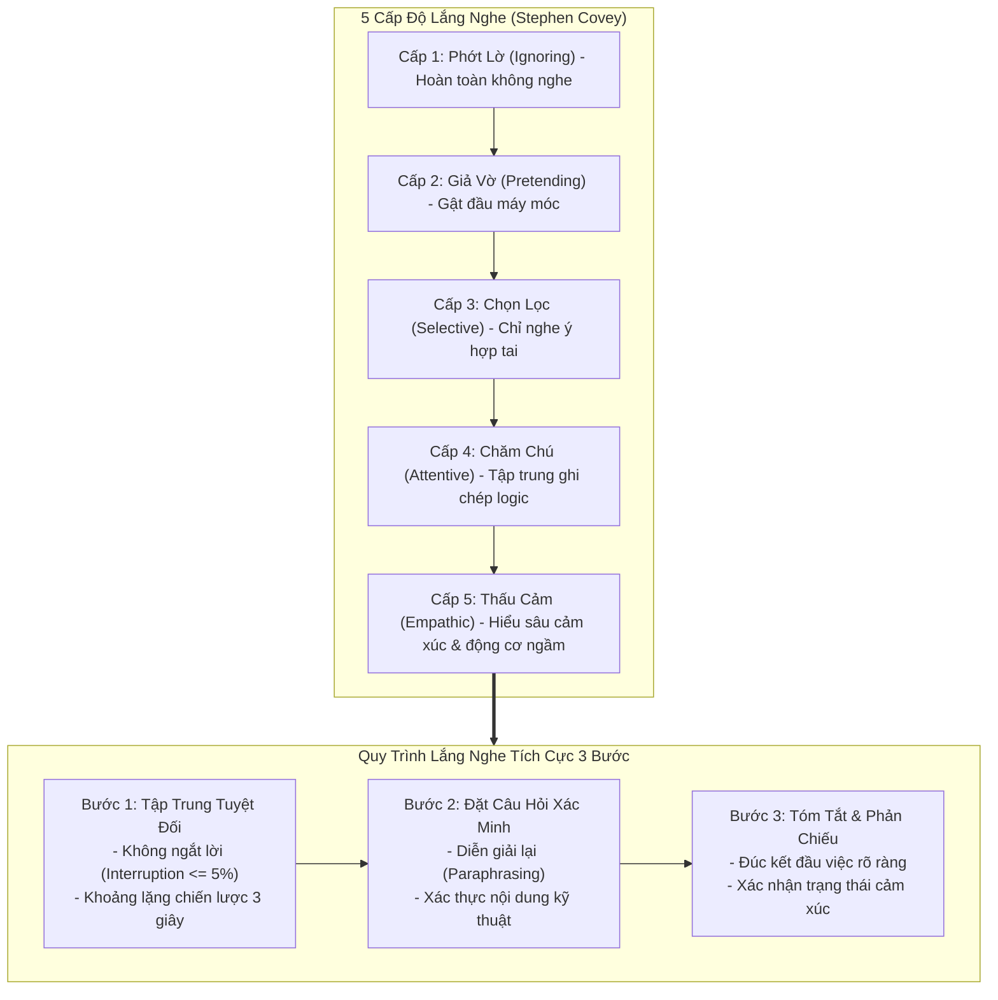
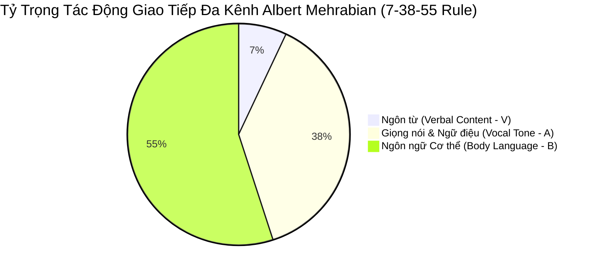
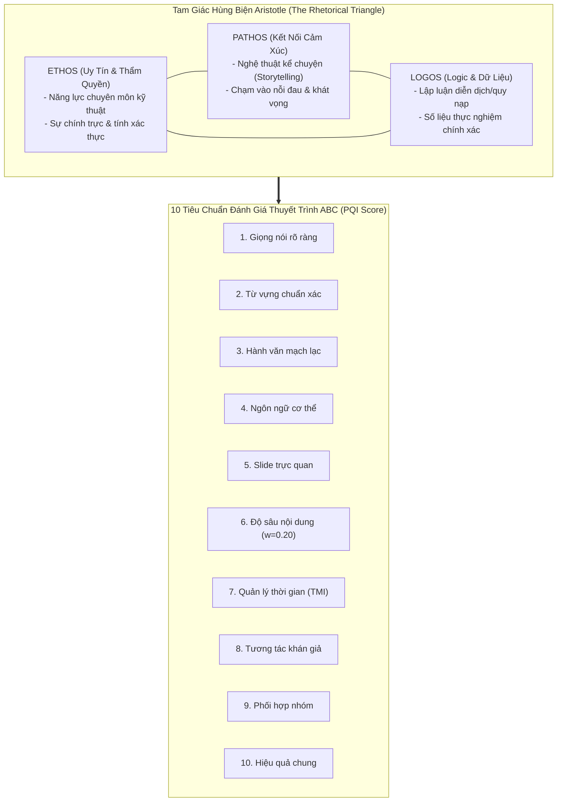
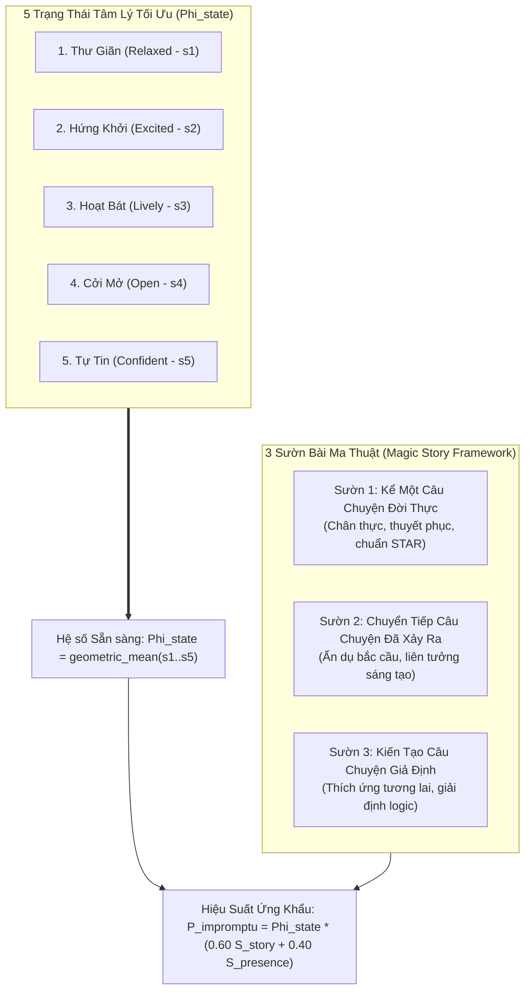
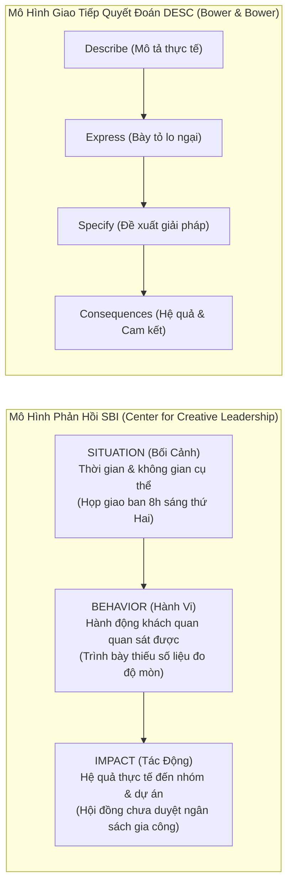

## Chương 4: Kỹ năng giao tiếp và thuyết trình trong lãnh đạo (Communication & Presentation Skills in Leadership)

- **Mã môn học**: ME4625 (Kỹ năng Lãnh đạo - Leadership Skills)
- **Khoa phụ trách**: Khoa Cơ Khí — Bộ môn Kỹ thuật Hệ thống Công nghiệp, Trường Đại học Bách Khoa - ĐHQG TP.HCM
- **Giảng viên biên soạn**: TS. Phan Thành Nhân
- **Thông số học phần**: 3 Tín chỉ (6 ECTS) | 16 Slide bài giảng lý thuyết & thực hành chuyên sâu
- **Mục tiêu cốt lõi**: Trang bị cho sinh viên kỹ thuật tư duy truyền thông chiến lược, năng lực kết nối đa chiều, làm chủ nghệ thuật hùng biện - thuyết trình và kỹ năng ứng khẩu chuẩn mực trong môi trường quản trị công nghiệp.

---

### 4.1 Bản chất & Nền tảng Chiến lược của Giao tiếp trong Lãnh đạo

#### 4.1.1 Khái niệm & Định vị Giao tiếp trong Khung Lãnh đạo Hiện đại
##### 4.1.1.1 Định nghĩa Học thuật & Bản chất Trao đổi Thông tin Hai Chiều
###### 4.1.1.1.1 Định nghĩa Chuẩn mực Môn học ME4625
- Giao tiếp trong lãnh đạo (*Leadership Communication*) là tiến trình trao đổi thông tin chiến lược, ý niệm, chỉ thị và cảm xúc có chủ đích giữa nhà lãnh đạo với nhân viên, đồng nghiệp và các bên liên quan (*stakeholders*).
- Bản chất không phải là sự truyền đạt thông tin một chiều (*one-way transmission*) mang tính cơ học, mà là một quá trình tương tác tương hỗ đa chiều nhằm kiến tạo sự thấu hiểu chung (*shared understanding*) và định hướng hành vi của tập thể hướng tới mục tiêu chiến lược.
- Giao tiếp lãnh đạo gắn liền với việc chuyển giao quyền lực mềm (*soft power*), truyền cảm hứng và thiết lập chuẩn mực văn hóa tổ chức.

###### 4.1.1.1.2 Bản chất Tương tác Hai Chiều (Bi-directional Exchange)
- Thiết lập vòng lặp giao tiếp mở: Thông tin được phát đi từ người lãnh đạo đòi hỏi phải có phản hồi ngược trở lại (*feedback loop*) từ người đi theo để kiểm chứng mức độ chính xác của nhận thức.
- Xóa bỏ tư duy chỉ huy áp đặt (*command-and-control*): Thay thế bằng cơ chế đối thoại cộng tác (*collaborative dialogue*), trong đó tiếng nói của cấp cơ sở được lắng nghe và tôn trọng.
- Đo lường chất lượng giao tiếp thông qua sự thay đổi nhận thức, cảm xúc tích cực và mức độ cam kết hành động thực tế của người nhận thay vì chỉ đo lường số lượng văn bản hay mệnh lệnh ban hành.

##### 4.1.1.2 Mối quan hệ giữa Giao tiếp và Tam giác Lãnh đạo Hughes-Ginnett-Curphy
###### 4.1.1.2.1 Tác động đến Chủ thể Lãnh đạo (Leader)
- Giao tiếp là phương tiện ngoại hiện hóa năng lực lãnh đạo, hệ giá trị, tầm nhìn và phong cách hành vi của cá nhân người đứng đầu.
- Giúp người lãnh đạo xây dựng quyền lực cá nhân (*referent power & expert power*) thay vì chỉ phụ thuộc vào quyền lực chức vị pháp lý (*legitimate power*).
- Đòi hỏi sự tự nhận thức sâu sắc (*self-awareness*) về giọng điệu, vi biểu cảm và cử chỉ nhằm đảm bảo tính chân thực (*authenticity*) trong mọi thông điệp.

###### 4.1.1.2.2 Tác động đến Người đi theo (Follower)
- Giải tỏa sự mơ hồ về mục tiêu, làm rõ kỳ vọng công việc và tiêu chuẩn hoàn thành nhiệm vụ của cấp dưới.
- Đáp ứng các nhu cầu tâm lý cơ bản theo Thuyết Tự quyết (*Self-Determination Theory* của Deci & Ryan): Nhu cầu tự chủ (*Autonomy*), Nhu cầu năng lực (*Competence*), và Nhu cầu gắn kết (*Relatedness*).
- Chuyển đổi trạng thái từ tuân thủ thụ động (*passive compliance*) sang gắn kết chủ động (*active engagement*) và đồng sáng tạo (*co-creation*).

###### 4.1.1.2.3 Thích ứng với Bối cảnh Tình huống (Situation)
- Môi trường công nghiệp 4.0 và chuyển đổi số tạo ra các bối cảnh giao tiếp phi truyền thống: Nhóm làm việc từ xa (*remote teams*), môi trường đa văn hóa, và các tình huống khủng hoảng kỹ thuật khẩn cấp.
- Đòi hỏi sự linh hoạt trong việc lựa chọn kênh truyền tải thông tin phù hợp với độ phức tạp và mức độ nhạy cảm của tình huống theo Thuyết Độ giàu Phương tiện (*Media Richness Theory*).
- Điều chỉnh cường độ, tần suất và ngôn phong giao tiếp dựa trên áp lực thời gian và mức độ rủi ro vận hành của hệ thống.

---

#### 4.1.2 Bốn Trụ cột Vai trò Cốt lõi của Giao tiếp Lãnh đạo
##### 4.1.2.1 Truyền đạt Tầm nhìn và Sứ mệnh (Vision & Mission Alignment)
###### 4.1.2.1.1 Cơ chế Chuyển hóa Chiến lược Thành Hành động Cụ thể
- Tầm nhìn chiến lược nếu chỉ nằm trên văn bản sẽ trở thành khẩu hiệu vô nghĩa; giao tiếp là công cụ giải mã (*decoding*) các mục tiêu vĩ mô thành các chỉ số hành động cụ thể (*KPIs, OKRs*) cho từng phòng ban và cá nhân kỹ sư.
- Sử dụng ngôn ngữ hình tượng, ẩn dụ (*metaphor*) và các câu chuyện truyền cảm hứng để biến các định hướng trừu tượng thành bức tranh tương lai sinh động mà mọi thành viên đều có thể hình dung rõ ràng.
- Đảm bảo tính nhất quán của thông điệp xuyên suốt các tầng nấc quản trị từ hội đồng quản trị đến xưởng sản xuất thực địa.

###### 4.1.2.1.2 Khung Truyền thông Tầm nhìn Kotter 8 Bước (Giai đoạn 4: Communicating the Buy-in)
- Vận dụng nguyên lý số 4 của John Kotter: Tận dụng mọi kênh truyền thông có thể để liên tục nhắc nhở và khắc sâu tầm nhìn đổi mới vào tiềm thức của tổ chức.
- Lãnh đạo bằng gương mẫu (*Walk the talk*): Hành vi thực tế của nhà lãnh đạo phải là thông điệp trực quan sống động nhất, minh chứng cho tầm nhìn đã công bố.
- Đo lường mức độ đồng thuận (*buy-in*) thông qua khảo sát mức độ thấu hiểu và các buổi thảo luận bàn tròn định kỳ.

##### 4.1.2.2 Tạo Động lực và Thắt chặt Gắn kết Đội ngũ (Motivation & Team Cohesion)
###### 4.1.2.2.1 Liên kết Thuyết Động lực Herzberg & Maslow
- Giao tiếp mang tính công nhận (*recognition*) đáp ứng nhu cầu bậc cao về lòng tự trọng và khẳng định bản thân trong Tháp nhu cầu Maslow.
- Theo Mô hình Hai yếu tố của Frederick Herzberg: Lời khen ngợi chân thành, sự phản hồi mang tính ghi nhận đóng vai trò là yếu tố tạo động lực nội tại (*motivator factors*), giúp gia tăng vượt bậc năng suất lao động và sự tận tụy.
- Giảm thiểu các yếu tố bất mãn (*hygiene factors*) thông qua việc minh bạch hóa thông tin chính sách, chế độ đãi ngộ và lộ trình thăng tiến kỹ thuật.

###### 4.1.2.2.2 Thúc đẩy Tâm lý Sở hữu Chung (Psychological Ownership)
- Giao tiếp trao quyền (*empowering communication*): Sử dụng các đại từ mang tính bao hàm ("chúng ta", "đội ngũ của chúng ta") thay vì đại từ phân tách ("tôi", "các anh").
- Khuyến khích nhân viên tham gia đóng góp ý kiến vào quá trình hoạch định giải pháp kỹ thuật, tạo dựng cảm giác làm chủ dự án.
- Tôn vinh các sáng kiến đổi mới kỹ thuật dù là nhỏ nhất nhằm duy trì ngọn lửa sáng tạo trong toàn xưởng sản xuất.

##### 4.1.2.3 Giải quyết Xung đột và Quản trị Khác biệt (Conflict Resolution)
###### 4.1.2.3.1 Khung Quản trị Xung đột Thomas-Kilmann (TKI)
- Nhận diện bản chất xung đột trong các dự án kỹ thuật liên ngành: Xung đột mục tiêu, xung đột quy trình công nghệ, và xung đột phân bổ nguồn lực.
- Ứng dụng linh hoạt 5 phong cách xử lý xung đột của Thomas-Kilmann: Hợp tác (*Collaborating*), Thỏa hiệp (*Compromising*), Cạnh tranh (*Competing*), Né tránh (*Avoiding*), và Nhượng bộ (*Accommodating*).
- Trong đó, phong cách Hợp tác đòi hỏi kỹ năng giao tiếp đỉnh cao để tìm kiếm giải pháp cùng thắng (*Win-Win*), tối ưu hóa cả lợi ích kỹ thuật lẫn mối quan hệ đồng nghiệp.

###### 4.1.2.3.2 Kỹ thuật Tách Con người Khỏi Vấn đề (Fisher & Ury - Getting to Yes)
- Tập trung vào bản chất sự cố kỹ thuật và dữ liệu đo lường khách quan, tuyệt đối không quy chụp vào đạo đức hay tính cách cá nhân của kỹ sư phụ trách.
- Khám phá các mối quan tâm sâu kín (*underlying interests*) thay vì bám chặt vào vị thế cố định (*fixed positions*) của các bên tranh chấp.
- Kiến tạo các tiêu chí khách quan chung để thẩm định và lựa chọn phương án công nghệ tối ưu.

##### 4.1.2.4 Nền tảng Xây dựng Niềm tin Vững chắc (Trust Building)
###### 4.1.2.4.1 Phương trình Niềm tin (The Trust Equation)
- Mô hình định lượng niềm tin của Charles H. Green:
  $$\text{Trust Quotient (TQ)} = \frac{C_{\text{credibility}} + R_{\text{reliability}} + I_{\text{intimacy}}}{S_{\text{self-orientation}}}$$
  - $C_{\text{credibility}}$ (Sự uy tín chuyên môn): Được khẳng định qua lời nói chuẩn xác, dùng đúng thuật ngữ kỹ thuật, dữ liệu minh bạch.
  - $R_{\text{reliability}}$ (Sự đáng tin cậy): Thể hiện ở việc giữ đúng cam kết, lời nói luôn đi đôi với hành động và tiến độ bàn giao.
  - $I_{\text{intimacy}}$ (Sự thấu cảm, gần gũi): Mức độ an toàn tâm lý mà nhân viên cảm nhận được khi chia sẻ khó khăn, thất bại.
  - $S_{\text{self-orientation}}$ (Sự vụ lợi cá nhân): Mẫu số triệt tiêu niềm tin; khi nhà lãnh đạo chỉ quan tâm đến lợi ích hay thành tích riêng, chỉ số niềm tin sẽ sụp đổ.

###### 4.1.2.4.2 Tính Minh bạch và Nhất quán Ngôn - Hành (Behavioral Integrity)
- Sự đồng nhất tuyệt đối giữa tuyên bố công khai và hành động thực thi trong công việc hàng ngày.
- Dũng cảm nhận trách nhiệm khi xảy ra sự cố kỹ thuật thay vì tìm kiếm vật tế thần để đổ lỗi.
- Thiết lập văn hóa "nói sự thật không bị trừng phạt", tạo tiền đề cho sự trung thực trong báo cáo dữ liệu kỹ thuật.

---

#### 4.1.3 Năm Yếu tố Cơ bản của Tiến trình Giao tiếp & Bộ Tứ Nguyên tắc Vận hành
##### 4.1.3.1 Năm Thành phần Cấu thành Mô hình Giao tiếp Chuẩn mực
###### 4.1.3.1.1 Chủ thể Gửi (Sender/Encoder)
- Là người khởi xướng thông điệp (nhà lãnh đạo, quản lý dự án, kỹ sư trưởng).
- Chịu trách nhiệm mã hóa (*encoding*) ý niệm, chiến lược hoặc yêu cầu kỹ thuật thành hệ thống ký hiệu, ngôn từ, hình ảnh và biểu cảm trực quan dễ hiểu đối với người nghe.

###### 4.1.3.1.2 Nội dung/Thông điệp (Message)
- Ý nghĩa cốt lõi cần chuyển tải: Kế hoạch sản xuất, thông số kỹ thuật mới, tầm nhìn chiến lược, hoặc phản hồi đánh giá nhân sự.
- Đòi hỏi cấu trúc logic chặt chẽ, luận điểm rõ ràng, dữ liệu định lượng có thể kiểm chứng và thông điệp hành động cụ thể (*Call to Action*).

###### 4.1.3.1.3 Kênh Truyền tải (Transmission Channel)
- Phương tiện dẫn truyền thông điệp từ chủ thể gửi đến đối tượng nhận.
- Đa dạng hóa các kênh: Trực tiếp mặt đối mặt (*face-to-face*), văn bản báo cáo kỹ thuật, thư điện tử (*email*), mạng xã hội nội bộ, bảng tin xưởng, hệ thống họp trực tuyến.
- Nguyên lý Media Richness: Sử dụng kênh có độ giàu cao (gặp trực tiếp) cho thông điệp phức tạp, nhạy cảm; sử dụng kênh văn bản cho thông số quy chuẩn định lượng.

###### 4.1.3.1.4 Đối tượng Nhận (Receiver/Decoder)
- Cá nhân hoặc nhóm tiếp nhận thông điệp (kỹ sư vận hành, công nhân xưởng, khách hàng, đối tác liên danh).
- Thực hiện quá trình giải mã (*decoding*) dựa trên lăng kính nhận thức, kinh nghiệm chuyên môn, nền tảng văn hóa và trạng thái tâm lý cá nhân tại thời điểm tiếp nhận.

###### 4.1.3.1.5 Phản hồi (Feedback)
- Tín hiệu phản hồi từ người nhận trở lại người gửi, giúp khép kín vòng lặp giao tiếp (*closed-loop*).
- Là công cụ duy nhất giúp người lãnh đạo đo lường thông điệp được hiểu đúng bao nhiêu phần trăm, phát hiện kịp thời các sai lệch nhận thức để hiệu chỉnh ngay lập tức.

##### 4.1.3.2 Bộ Tứ Nguyên tắc Vận hành Thông tin trong Môi trường Kỹ thuật
###### 4.1.3.2.1 Nguyên tắc Rõ ràng (Clarity & Precision)
- Không dùng từ ngữ đa nghĩa, mơ hồ gây hiểu lầm trong quy trình thao tác máy; chuẩn hóa các ký hiệu kỹ thuật theo tiêu chuẩn ISO/TC.
- Thông điệp ngắn gọn, trực diện, tập trung vào trọng tâm cốt lõi, tránh diễn đạt dài dòng làm loãng thông tin quan trọng.

###### 4.1.3.2.2 Nguyên tắc Phù hợp Đối tượng (Audience Relevance & Appropriateness)
- Tùy biến ngôn ngữ theo trình độ và đặc thù của người nhận: Nói với ban giám đốc bằng ngôn ngữ tài chính và chỉ số ROI; nói với kỹ sư thiết kế bằng thông số kỹ thuật dung sai; nói với công nhân bằng quy trình thao tác an toàn trực quan.
- Thấu hiểu tâm lý, thái độ và kỳ vọng của đối tượng để lựa chọn văn phong trang trọng, thân mật hay thúc giục phù hợp.

###### 4.1.3.2.3 Nguyên tắc Đúng Thời điểm (Timeliness)
- Thông tin chiến lược hoặc cảnh báo rủi ro an toàn phải được truyền đạt trước khi sự việc diễn ra, đảm bảo đủ thời gian cho cấp dưới chuẩn bị và phản ứng.
- Tránh đưa thông tin quan trọng vào thời điểm người nghe đang kiệt sức, căng thẳng cực độ hoặc đang bị phân tán bởi nhiều sự cố đồng thời.

###### 4.1.3.2.4 Nguyên tắc Kịp thời & Thích ứng (Agility & Responsiveness)
- Phản hồi ngay lập tức khi nhận được câu hỏi chất vấn kỹ thuật hoặc báo cáo bất thường từ hiện trường.
- Kịp thời điều chỉnh kênh giao tiếp và cách tiếp cận khi nhận thấy dấu hiệu tắc nghẽn thông tin hoặc xung đột ngầm đang bùng phát.

---

#### 4.1.4 Ba Phong cách Giao tiếp Lãnh đạo Điển hình (Table tbl_ch04_02)
##### 4.1.4.1 Phong cách Thẳng thắn – Quyết đoán (Assertive / Directive Style)
###### 4.1.4.1.1 Đặc trưng Hành vi & Tín hiệu Ngôn ngữ
- Giao tiếp trực diện, ngắn gọn, đi thẳng vào bản chất vấn đề, không vòng vo né tránh.
- Mệnh lệnh rõ ràng, dứt khoát, xác lập chính xác thời hạn hoàn thành (*deadlines*) và trách nhiệm cá nhân cụ thể.
- Ngữ điệu mạnh mẽ, chắc nịch, tư thế đĩnh đạc, ánh mắt nhìn thẳng kiên định.

###### 4.1.4.1.2 Bối cảnh Áp dụng Tối ưu (Quản trị Khủng hoảng, Sự cố Kỹ thuật Khẩn cấp)
- Khi xảy ra sự cố hỏa hoạn, rò rỉ hóa chất, sự cố sập nguồn dây chuyền sản xuất đòi hỏi phải hành động tức thì để bảo vệ tính mạng con người và tài sản.
- Trong các tình huống đàm phán ranh giới kỹ thuật cốt lõi hoặc khi cần tái lập trật tự kỷ luật nghiêm ngặt trong tổ chức.

##### 4.1.4.2 Phong cách Lắng nghe – Chia sẻ (Empathetic / Collaborative Style)
###### 4.1.4.2.1 Đặc trưng Hành vi & Cơ chế Đối thoại Hai Chiều
- Chủ động đặt các câu hỏi mở, kiên nhẫn lắng nghe toàn diện quan điểm của các thành viên trước khi đưa ra ý kiến cá nhân.
- Tôn trọng sự khác biệt, ghi nhận cảm xúc và thể hiện sự thấu cảm chân thành với những áp lực mà cấp dưới đang gánh chịu.
- Sử dụng ngôn ngữ mềm mỏng, ngữ điệu ấm áp, ánh mắt khích lệ, tạo bầu không khí cởi mở và an toàn tuyệt đối.

###### 4.1.4.2.2 Bối cảnh Áp dụng Tối ưu (Brainstorming Sáng tạo, Đồng cảm, Xây dựng Văn hóa Nhóm)
- Trong các phiên thảo luận tìm giải pháp R&D đổi mới sản phẩm, tái cấu trúc quy trình công nghệ cần huy động tối đa trí tuệ tập thể.
- Khi hòa giải bất đồng nội bộ, giải tỏa tâm lý lo âu của đội ngũ trong giai đoạn chuyển đổi tổ chức hoặc khi kèm cặp (*mentoring*) kỹ sư trẻ.

##### 4.1.4.3 Phong cách Thuyết phục – Truyền cảm hứng (Inspirational / Transformational Style)
###### 4.1.4.3.1 Đặc trưng Tác động Cảm xúc & Năng lượng Lan tỏa
- Đánh thức ngọn lửa nhiệt huyết, khát vọng cống hiến và niềm tự hào nghề nghiệp của các thành viên.
- Sử dụng nghệ thuật kể chuyện (*storytelling*), hình ảnh ẩn dụ giàu sức gợi và viễn cảnh tương lai tươi sáng vượt qua mọi nghịch cảnh hiện tại.
- Ngữ điệu truyền cảm, biến chuyển linh hoạt, cử chỉ cơ thể mở rộng, tràn đầy năng lượng tích cực và nhiệt huyết lãnh đạo.

###### 4.1.4.3.2 Bối cảnh Áp dụng Tối ưu (Tuyên bố Chiến lược, Khởi xướng Đổi mới, Vận động Chuyển đổi)
- Lễ công bố tầm nhìn chiến lược 5 năm, phát động chiến dịch cải tiến năng suất chất lượng toàn công ty (Kaizen/Lean).
- Kêu gọi toàn thể kỹ sư đồng lòng vượt qua khó khăn khi tiếp nhận hợp đồng công nghệ quy mô quốc tế với yêu cầu kỹ thuật ngặt nghèo.

##### 4.1.4.4 Ma trận So sánh Toàn diện 3 Phong cách Giao tiếp Lãnh đạo (Table tbl_ch04_02)

| Tiêu Chí So Sánh | Phong Cách Thẳng thắn – Quyết đoán | Phong Cách Lắng nghe – Chia sẻ | Phong Cách Thuyết phục – Truyền cảm hứng |
|---|---|---|---|
| **Mục tiêu Trọng tâm** | Ra quyết định nhanh, kiểm soát kỷ luật, định hướng hành động | Thấu hiểu, giải tỏa xung đột, kích thích sáng tạo nội tại | Thúc đẩy đổi mới, truyền tải tầm nhìn, tạo động lực mạnh mẽ |
| **Bản chất Dòng tin** | Một chiều từ trên xuống (*Top-Down*), cô đọng, dứt khoát | Hai chiều bình đẳng (*Bi-directional*), tương tác cởi mở | Lan tỏa đa chiều (*Radiant*), kết nối tâm lý và cảm xúc |
| **Ngữ điệu & Giọng nói** | Dứt khoát, âm lượng vừa đến lớn, đanh thép, ngắt nhịp gọn | Trầm ấm, nhẹ nhàng, tốc độ vừa phải, khoảng lặng thấu cảm | Hào sảng, giàu nhạc điệu, biểu cảm biến hóa, đầy nhiệt huyết |
| **Ngôn ngữ Cơ thể** | Tư thế đứng thẳng, ánh mắt nhìn trực diện, bàn tay dứt khoát | Nghiêng người về trước, gật đầu khích lệ, lòng bàn tay mở | Đôi tay mở rộng khoáng đạt, nét mặt rạng rỡ, bước đi tự tin |
| **Bối cảnh Vận dụng** | Xử lý khủng hoảng, sự cố kỹ thuật khẩn cấp, thời gian gấp rút | Giải quyết bất đồng, họp ý tưởng R&D, tạo động lực gắn kết | Công bố định hướng chiến lược mới, vận động chuyển đổi số |
| **Rủi ro nếu Lạm dụng** | Gây ức chế tâm lý, triệt tiêu sáng kiến, tạo văn hóa sợ hãi | Kéo dài thời gian ra quyết định, làm loãng mục tiêu chính | Sa đà vào viển vông sáo rỗng nếu thiếu năng lực thực thi |

---

### 4.2 Mô hình Truyền thông Kỹ thuật Shannon-Weaver & Rào cản Tổ chức, Tối ưu hóa Kênh truyền

```mermaid
flowchart LR
    subgraph SenderSide ["Bên Gửi (Leader)"]
        Source["Nguồn Thông Tin<br/>(Information Source)"] --> Encoder["Bộ Mã Hóa<br/>(Transmitter / Encoding)"]
    end
    
    Encoder -->|"Tín Hiệu (Signal)"| Channel["Kênh Truyền Tải (Channel)<br/>Direct / Email / Report"]
    
    subgraph NoiseZone ["Nguồn Nhiễu (Noise Source)"]
        N1["Rào cản Cấp bậc (N_rank)"]
        N2["Định kiến Cá nhân (N_bias)"]
        N3["Nhiễu Môi trường (N_noise_env)"]
        N4["Thiếu Lắng nghe (N_listen)"]
    end
    NoiseZone -.->|"Gây suy hao & méo mó"| Channel
    
    Channel -->|"Tín Hiệu Nhận Được"| Decoder["Bộ Giải Mã<br/>(Receiver / Decoding)"]
    
    subgraph ReceiverSide ["Bên Nhận (Follower)"]
        Decoder --> Destination["Đích Đến<br/>(Destination)"]
    end
    
    Destination ==>|"Vòng Lặp Phản Hồi Hai Chiều (Feedback Loop - Giảm 65% Nhiễu)"| Source
```

#### 4.2.1 Khung Lý thuyết Truyền thông Kỹ thuật Shannon-Weaver (1949)
##### 4.2.1.1 Kiến trúc Hệ thống Truyền tin 6 Giai đoạn Cốt lõi
###### 4.2.1.1.1 Nguồn Thông tin Chiến lược (Information Source)
- Nơi khởi tạo dữ liệu, ý đồ chiến lược hoặc quyết định kỹ thuật của ban lãnh đạo doanh nghiệp.
- Mức độ phức tạp của thông tin phụ thuộc vào lượng thông tin entropy theo lý thuyết tin học.

###### 4.2.1.1.2 Bộ Mã hóa (Transmitter/Encoder)
- Chuyển hóa ý niệm tư duy thành hệ thống tín hiệu truyền dẫn (ngôn ngữ tự nhiên, bản vẽ kỹ thuật CAD/CAM, slide thuyết trình, biểu đồ Gantt).
- Sai số mã hóa xuất hiện khi người lãnh đạo dùng từ ngữ chuyên sâu không tương thích với vốn từ của người nhận.

###### 4.2.1.1.3 Kênh Truyền tải (Channel)
- Môi trường vật lý hoặc kỹ thuật số trung gian để dẫn truyền tín hiệu.
- Mỗi kênh có dung lượng băng thông (*channel capacity*) và đặc tính suy hao vật lý riêng biệt.

###### 4.2.1.1.4 Nguồn Nhiễu (Noise Source)
- Tập hợp mọi yếu tố làm biến dạng, cản trở hoặc triệt tiêu tín hiệu trên đường truyền.
- Gồm nhiễu kỹ thuật (mất sóng mạng, micro rè), nhiễu tâm lý (lo lắng, mất tập trung), và nhiễu ngữ nghĩa (*semantic noise*).

###### 4.2.1.1.5 Bộ Giải mã (Receiver/Decoder)
- Thiết bị hoặc giác quan của người nhận chuyển đổi tín hiệu tiếp nhận thành thông điệp có ý nghĩa.
- Bị chi phối bởi định kiến cá nhân, mức độ mệt mỏi và kinh nghiệm chuyên môn của người tiếp nhận.

###### 4.2.1.1.6 Đích đến & Vòng lặp Phản hồi (Destination & Feedback Loop)
- Bộ não của đối tượng đích, nơi thông tin được xử lý để hình thành quyết định hành động.
- Cơ chế phản hồi cho phép người phát kiểm tra độ chính xác của quá trình tái tạo thông điệp tại đích đến.

##### 4.2.1.2 Định luật Suy hao và Biến dạng Thông tin trong Quản lý Phân cấp
###### 4.2.1.2.1 Hiệu ứng Tam sao Thất bản qua các Tầng Quản lý (Serial Distortion Effect)
- Hiện tượng suy giảm lũy tiến lượng thông tin khi đi qua cấu trúc hình tháp nhiều tầng nấc: Giám đốc -> Trưởng phòng -> Kỹ sư trưởng -> Tổ trưởng -> Công nhân xưởng.
- Nghiên cứu thực nghiệm chỉ ra rằng qua mỗi cấp quản lý trung gian, khoảng 20% đến 25% nội dung thông tin chiến lược bị thất thoát hoặc bóp méo; xuống đến cấp cơ sở chỉ còn lại dưới 40% giá trị nguyên bản.
- Biến dạng do hiện tượng gạn lọc (*filtering*): Mỗi cấp quản lý trung gian thường có xu hướng chỉ báo cáo tin tốt và giấu đi tin xấu để bảo vệ thành tích cá nhân.

###### 4.2.1.2.2 Thuyết Độ giàu Phương tiện Truyền thông (Media Richness Theory - Daft & Lengel)
- Xếp hạng độ giàu truyền thông: Gặp mặt trực tiếp (*Face-to-Face*) > Họp trực tuyến qua Video > Đàm thoại âm thanh > Thư điện tử/Nhắn tin cá nhân > Báo cáo số liệu tĩnh.
- Quy tắc tương thích: Sử dụng phương tiện giàu thông tin khi thông điệp có tính mơ hồ cao (*equivocality*), cảm xúc phức tạp; sử dụng phương tiện gọn nhẹ cho các chỉ thị quy chuẩn, định lượng đơn giản.

---

#### 4.2.2 Bốn Rào cản Giao tiếp Cốt tử trong Doanh nghiệp Kỹ thuật
##### 4.2.2.1 Khác biệt Cấp bậc (Hierarchical Filtering & Mum Effect)
###### 4.2.2.1.1 Tâm lý E ngại Quyền lực và Nỗi sợ Bị trừng phạt
- Cấp dưới có xu hướng né tránh nói thật về các sai hỏng trong quá trình chế tạo máy vì sợ bị khiển trách, trừ lương hoặc mất cơ hội thăng tiến.
- Thiếu hụt an toàn tâm lý (*Psychological Safety*) khiến kỹ sư hiện trường chọn cách im lặng ngay cả khi nhận thấy nguy cơ sự cố nghiêm trọng.

###### 4.2.2.1.2 Hiệu ứng Im lặng Giữ mình (Mum Effect)
- Hiện tượng cấp dưới chủ động trì hoãn hoặc lọc bỏ các tin tức tiêu cực khi báo cáo lên cấp trên, tạo ra bức tranh màu hồng ảo tưởng làm lãnh đạo ra quyết định sai lầm.

##### 4.2.2.2 Định kiến & Thiên vị Cá nhân (Cognitive Biases & Preconceptions)
###### 4.2.2.2.1 Hiệu ứng Hào quang (Halo Effect) và Hiệu ứng Kèn sừng (Horn Effect)
- Đánh giá thông điệp dựa trên ấn tượng về người nói thay vì nội dung khách quan: Ý kiến của nhân viên được ưu ái luôn được coi là đúng; ý kiến của kỹ sư có bất đồng trong quá khứ bị gạt phăng không xem xét.

###### 4.2.2.2.2 Thiên kiến Xác nhận (Confirmation Bias) của Nhà Quản lý
- Lãnh đạo chỉ lắng nghe và thu nhận những dữ liệu phù hợp với định kiến có sẵn của mình, phớt lờ các số liệu đo lường kỹ thuật cảnh báo sai lệch.

##### 4.2.2.3 Quá tải Thông tin & Nhiễu Đa kênh (Information Overload & Multi-Channel Noise)
###### 4.2.2.3.1 Bùng nổ Kênh Truyền thông Số Phân mảnh
- Sự bủa vây của hàng chục nhóm chat Zalo, Telegram, hệ thống thư điện tử Outlook, phần mềm Jira, Asana, Teams khiến kỹ sư bị phân mảnh nhận thức (*cognitive fragmentation*).
- Thông điệp chỉ đạo quan trọng bị trôi mất giữa hàng trăm thông báo hỗn tạp không phân loại thứ tự ưu tiên.

###### 4.2.2.3.2 Tình trạng Kiệt sức Kỹ thuật số (Digital Fatigue)
- Người lao động rơi vào trạng thái tê liệt xử lý thông tin (*analysis paralysis*), dẫn đến giảm sút nghiêm trọng khả năng ghi nhớ và thực thi chính xác các thông số kỹ thuật.

##### 4.2.2.4 Thiếu Kỹ năng Lắng nghe & Độc thoại Chỉ huy (Command Monologue)
###### 4.2.2.4.1 Bẫy Độc quyền Ý kiến của Nhà Lãnh đạo
- Người lãnh đạo ngộ nhận rằng lãnh đạo đồng nghĩa với việc nói nhiều hơn, liên tục cắt ngang lời cấp dưới để áp đặt giải pháp của bản thân.
- Không cho người nói hoàn thành trọn vẹn câu trình bày, ngắt lời dựa trên các suy diễn chủ quan non nớt.

###### 4.2.2.4.2 Hội chứng Bất lực Tập nhiễm (Learned Helplessness)
- Nhân viên dần hình thành thói quen buông xuôi: "Nói ra sếp cũng không nghe, tốt nhất là cứ làm theo lệnh dù biết rõ phương án đó sẽ gây lỗi kỹ thuật".

---

#### 4.2.3 Lượng hóa Suy hao Kênh truyền: Công thức Hiệu suất Shannon-Weaver & SNR
##### 4.2.3.1 Phương trình Hiệu suất Truyền đạt Thông tin (eq_ch04_002)
###### 4.2.3.1.1 Biểu thức Toán học Tổng quát
$$\eta_{\text{comm}} = \frac{S_{\text{signal}}}{S_{\text{signal}} + N_{\text{noise}}} \times 100\% = \left( 1 - \frac{\sum_{i=1}^{k} N_i}{S_{\text{total}}} \right) \times 100\%$$

###### 4.2.3.1.2 Bảng Định nghĩa Biến số, Thứ nguyên và Ý nghĩa Tham số

| Ký hiệu | Tên Gọi Tham Số | Đơn Vị | Khoảng Giá Trị | Ý Nghĩa Thực Tiễn trong Hệ Thống Quản Trị |
|---|---|---|---|---|
| $\eta_{\text{comm}}$ | Hiệu suất kênh giao tiếp | $\%$ | $0.0 - 100.0$ | Tỷ lệ phần trăm thông tin chiến lược hữu ích được truyền đạt trọn vẹn đến đích |
| $S_{\text{signal}}$ | Lượng tín hiệu thông tin hữu ích | đơn vị tin | $0.0 - S_{\text{total}}$ | Khối lượng thông số kỹ thuật/mục tiêu được tiếp nhận chính xác không méo mó |
| $S_{\text{total}}$ | Tổng lượng thông tin ban đầu | đơn vị tin | $> 0$ | Toàn bộ nội dung chiến lược/yêu cầu công việc do nhà lãnh đạo phát đi ban đầu |
| $N_{\text{noise}}$ | Tổng lượng suy hao do nhiễu | đơn vị tin | $0.0 - S_{\text{total}}$ | Tổng mức độ thất thoát, bóp méo thông điệp gây ra bởi toàn bộ rào cản tổ chức |
| $N_{\text{rank}}$ | Suy hao do phân cấp quản lý | đơn vị tin | $\ge 0$ | Tổn thất do e ngại cấp bậc, lọc thông tin tiêu cực qua nhiều tầng trung gian |
| $N_{\text{bias}}$ | Suy hao do định kiến cá nhân | đơn vị tin | $\ge 0$ | Tổn thất do thiên kiến xác nhận, áp đặt chủ quan của người nhận/gửi |
| $N_{\text{noise\_env}}$ | Suy hao do nhiễu môi trường đa kênh | đơn vị tin | $\ge 0$ | Mất mát do quá tải nhóm chat, gián đoạn thông tin, tiếng ồn hiện trường xưởng |
| $N_{\text{listen}}$ | Suy hao do kỹ năng lắng nghe kém | đơn vị tin | $\ge 0$ | Tổn thất do cắt ngang lời, lắng nghe hời hợt, không xác minh lại thông tin |

###### 4.2.3.1.3 Phân rã Véc-tơ Thành phần Suy hao $\sum N_i$
- Tổng lượng nhiễu được xác định bằng mô hình cộng tính tuyến tính của 4 rào cản tổ chức cốt tử:
  $$N_{\text{noise}} = \sum_{i=1}^{4} N_i = N_{\text{rank}} + N_{\text{bias}} + N_{\text{noise\_env}} + N_{\text{listen}}$$
- Khi $\eta_{\text{comm}} < 50.0\%$, kênh giao tiếp rơi vào trạng thái "tê liệt một phần", rủi ro sai lỗi kỹ thuật trong thực thi vượt ngưỡng 80%.

##### 4.2.3.2 Chỉ số Tỷ số Tín hiệu trên Nhiễu (SNR) trong Truyền thông Lãnh đạo
###### 4.2.3.2.1 Biểu thức Tính toán SNR Decibel
$$\text{SNR}_{\text{dB}} = 10 \cdot \log_{10}\left( \frac{S_{\text{signal}}}{N_{\text{noise}}} \right) = 10 \cdot \log_{10}\left( \frac{\eta_{\text{comm}}}{100 - \eta_{\text{comm}}} \right)$$

###### 4.2.3.2.2 Chuẩn mực Vận hành Kỹ thuật Doanh nghiệp
- Ngưỡng tối thiểu chấp nhận được: $\eta_{\text{comm}} \ge 70.0\%$ (tương đương $\text{SNR} \ge +3.68 \text{ dB}$).
- Ngưỡng tối ưu chuẩn quốc tế (World-class communication): $\eta_{\text{comm}} \ge 85.0\%$ (tương đương $\text{SNR} \ge +7.53 \text{ dB}$).

---

#### 4.2.4 Chiến lược Kỹ thuật Khắc phục Rào cản & Kiến trúc Giao tiếp Mở
##### 4.2.4.1 Thiết lập Môi trường An toàn Tâm lý (Psychological Safety)
###### 4.2.4.1.1 Chuẩn hóa Văn hóa Phân tích Sự cố Không Đổ lỗi (Blameless Post-Mortem)
- Khi dây chuyền gặp sự cố kỹ thuật, tập trung toàn lực vào truy tìm nguyên nhân gốc rễ theo sơ đồ xương cá Ishikawa và 5 Whys, tuyệt đối cấm chỉ trích cá nhân.
- Khuyến khích kỹ sư công khai các sai sót tiềm ẩn (*near-misses*) để toàn hệ thống cùng học hỏi và phòng ngừa rủi ro tương lai.

###### 4.2.4.1.2 Tái định nghĩa Chính sách Cửa mở (Open Door Policy 2.0)
- Không chỉ mở cửa phòng làm việc thụ động mà người lãnh đạo phải chủ động thực hành quản trị bằng cách đi dạo hiện trường (*Management By Walking Around - MBWA*).
- Trực tiếp xuống xưởng trao đổi thân tình với công nhân, phá vỡ khoảng cách quyền lực và thu thập dữ liệu thô chưa bị gạn lọc.

##### 4.2.4.2 Tối ưu hóa Kênh truyền qua Cơ chế Giao tiếp Vòng lặp Đóng (Closed-Loop)
###### 4.2.4.2.1 Nguyên lý Giao tiếp Khép kín (Closed-Loop Communication)
- Bước 1 (Sender Phát lệnh): Người gửi đưa ra chỉ thị kỹ thuật rõ ràng, kèm thời hạn.
- Bước 2 (Receiver Nhại lệnh): Người nhận lặp lại nguyên văn thông số chỉ thị then chốt để xác minh nhận thức.
- Bước 3 (Sender Khẳng định): Người gửi kiểm tra lại, nếu đúng phát tín hiệu "Chính xác, thực hiện ngay", nếu sai hiệu chỉnh tức thì.

###### 4.2.4.2.2 Giao thức Báo cáo Chuẩn mực Y tế - Hàng không - Kỹ thuật SBAR
- **S (Situation - Tình trạng)**: Báo cáo ngắn gọn sự cố gì đang diễn ra trong 10 giây đầu.
- **B (Background - Bối cảnh)**: Cung cấp thông số vận hành lịch sử, nguyên nhân trực tiếp dẫn tới hiện tượng.
- **A (Assessment - Đánh giá)**: Nhận định chuyên môn về mức độ nghiêm trọng và rủi ro lây lan của lỗi.
- **R (Recommendation - Đề xuất)**: Kiến nghị hành động kỹ thuật cụ thể cần ban lãnh đạo phê duyệt ngay lập tức.

---

### 4.3 Kỹ năng Lắng nghe Tích cực (Active Listening), Thấu cảm & Kỹ thuật Đặt Câu hỏi Khơi mở

#### 4.3.1 Khung Lý thuyết Lắng nghe Tích cực của Carl Rogers & Stephen Covey
##### 4.3.1.1 Phân biệt Bản chất: Nghe Thụ động (Hearing) vs Lắng nghe Chủ động (Active Listening)
###### 4.3.1.1.1 Cơ chế Sinh học vs Quá trình Nhận thức Ý thức
- *Hearing (Nghe thụ động)*: Phản xạ sinh lý học tự nhiên của màng nhĩ khi tiếp nhận sóng âm thanh truyền trong không khí, không đòi hỏi sự tập trung ý chí hay tiêu tốn năng lượng tinh thần.
- *Active Listening (Lắng nghe chủ động)*: Tiến trình tâm lý - nhận thức phức hợp đòi hỏi sự nỗ lực tập trung tối đa, tiếp nhận có chọn lọc, giải mã ý nghĩa ngữ nghĩa và thấu cảm sâu sắc với tâm trạng của người nói.

###### 4.3.1.1.2 Thái độ Tôn trọng Vô điều kiện (Unconditional Positive Regard)
- Nguyên lý tâm lý học Carl Rogers: Tiếp nhận quan điểm của nhân viên với sự cởi mở hoàn toàn, tạm gác lại mọi phán xét định kiến, đặt mình vào thế giới nội tâm của người nói để thấu cảm trọn vẹn bối cảnh của họ.

##### 4.3.1.2 Năm Cấp độ Lắng nghe của Stephen Covey
###### 4.3.1.2.1 Cấp độ 1: Phớt lờ (Ignoring)
- Người nghe hoàn toàn không chú ý, đang mải mê làm việc riêng (lướt điện thoại, gõ bàn phím), xem lời nói của cấp dưới như tiếng ồn vô nghĩa.

###### 4.3.1.2.2 Cấp độ 2: Giả vờ nghe (Pretending to Listen)
- Có biểu hiện cơ học bề ngoài như gật đầu, phát ra các từ đệm "ừ", "à", "thế à" nhưng tâm trí đang phiêu du nơi khác; người nói ngay lập tức cảm nhận được sự giả tạo.

###### 4.3.1.2.3 Cấp độ 3: Lắng nghe chọn lọc (Selective Listening)
- Chỉ đón nghe những thông tin củng cố quan điểm của bản thân hoặc những chi tiết bản thân có thể bắt bẻ, bỏ qua bức tranh toàn cảnh và cảm xúc của người nói.

###### 4.3.1.2.4 Cấp độ 4: Lắng nghe chăm chú (Attentive Listening)
- Tập trung cao độ vào câu từ, ghi chép cẩn thận các luận điểm logic nhưng chủ yếu xử lý ở tầng duy lý (*cognitive level*), chưa chạm đến tầng cảm xúc và động cơ ẩn sâu.

###### 4.3.1.2.5 Cấp độ 5: Lắng nghe thấu cảm (Empathic Listening)
- Đỉnh cao của nghệ thuật giao tiếp lãnh đạo: Lắng nghe bằng cả đôi tai (ngôn từ), đôi mắt (ngôn ngữ cơ thể), và trái tim (cảm xúc, linh cảm). Thấu hiểu trọn vẹn thế giới nhân sinh quan của đối phương trước khi mong muốn được người khác thấu hiểu mình.

---

#### 4.3.2 Quy trình Lắng nghe Tích cực 3 Bước Chuẩn mực trong Lãnh đạo Kỹ thuật
##### 4.3.2.1 Bước 1: Tập trung Tuyệt đối & Kiểm soát Phản xạ Cắt ngang
###### 4.3.2.1.1 Giới hạn Tỷ lệ Cắt ngang Lời Người nói ($\delta_{\text{interrupt}} \le 5\%$)
- Tuyệt đối kiềm chế phản xạ ngắt lời khi người nói chưa kết thúc ý trọn vẹn. Ngắt lời là hành vi bộc lộ sự thiếu tôn trọng và làm gãy vụn mạch suy nghĩ của cấp dưới.
- Tiêu chuẩn định lượng: Tỷ lệ thời gian can thiệp cắt ngang không được vượt quá $5\%$ tổng thời lượng người khác đang diễn giải ($\delta_{\text{interrupt}} \le 0.05$).

###### 4.3.2.1.2 Kỹ thuật Khoảng lặng Chiến lược 3 Giây (The 3-Second Golden Pause)
- Sau khi người đối thoại dứt lời, giữ im lặng có chủ đích từ 2 đến 3 giây trước khi phản hồi.
- Tác dụng tâm lý kép: Giúp người lãnh đạo xử lý thông tin thấu đáo, đồng thời trao cơ hội cho nhân viên tự bổ sung các ý tưởng sâu kín mà họ vừa ngập ngừng chưa dám nói hết.

##### 4.3.2.2 Bước 2: Đặt Câu hỏi Xác minh để Kiểm chứng Hiểu biết (Paraphrasing & Clarifying)
###### 4.3.2.2.1 Kỹ thuật Diễn giải lại bằng Ngôn từ Riêng (Paraphrasing Script)
- Không lặp lại vẹt câu từ của nhân viên, mà cô đọng lại các ý cốt lõi theo cách hiểu của bản thân:
  - *Kịch bản chuẩn*: "Nếu tôi hiểu đúng ý của anh Tuấn, thì vấn đề cốt lõi của dây chuyền hiện nay là do áp lực khí nén không ổn định ở công đoạn 3, đúng không?"
- Giúp người nói cảm nhận được sự tôn trọng và tạo cơ hội sửa sai ngay nếu lãnh đạo giải mã lệch hướng.

###### 4.3.2.2.2 Câu hỏi Làm rõ Chi tiết Kỹ thuật (Clarification Probe)
- Sử dụng các câu hỏi thăm dò khách quan: "Anh có thể giải thích rõ hơn chỉ số dung sai này đã vượt ngưỡng cho phép trong bao lâu không?"

##### 4.3.2.3 Bước 3: Tóm tắt Ý chính & Phản chiếu Cảm xúc (Summarizing & Emotion Reflecting)
###### 4.3.2.3.1 Đúc kết Đầu việc Hành động Cụ thể (Actionable Summary)
- Chốt lại buổi đối thoại bằng bản tóm tắt súc tích: Ai làm gì, thời hạn khi nào, kết quả đầu ra là gì, nguồn lực hỗ trợ từ lãnh đạo ra sao.

###### 4.3.2.3.2 Phản chiếu Cảm xúc Chân thực (Empathy Validation)
- Gọi tên trạng thái cảm xúc của cấp dưới để giải tỏa áp lực: "Tôi nhận thấy dự án này đang gây áp lực rất lớn lên anh và cả đội ngũ xưởng cơ điện. Chúng ta sẽ cùng nhau tháo gỡ điểm nghẽn này."

---

#### 4.3.3 Nghệ thuật Đặt Câu hỏi Khơi mở trong Lãnh đạo Kỹ thuật
##### 4.3.3.1 Phân loại Câu hỏi: Mở (Open-Ended) vs Đóng (Close-Ended)
###### 4.3.3.1.1 Bản chất và Giá trị của Câu hỏi Mở (Wh-Questions)
- Bắt đầu bằng: *Như thế nào? Cái gì? Tại sao? Bằng cách nào?*
- Mục đích: Kích hoạt bán cầu não sáng tạo, khuyến khích nhân viên chia sẻ sâu về nguyên nhân kỹ thuật, khơi mở ý tưởng đột phá và bộc lộ cảm nghĩ thực tế.
- Ví dụ lãnh đạo: "Theo các kỹ sư xưởng, chúng ta có thể cải tiến khâu gá đặt phôi này như thế nào để giảm 15% thời gian chu kỳ gia công?"

###### 4.3.3.1.2 Bản chất và Giá trị của Câu hỏi Đóng (Polar/Verification Questions)
- Bắt đầu bằng: *Có phải không? Đã xong chưa? Bao nhiêu? Đạt hay không đạt?*
- Mục đích: Chốt lại quyết định dứt khoát, xác minh tính chuẩn xác của dữ liệu kỹ thuật hoặc yêu cầu cam kết cụ thể trong tình huống khẩn cấp.
- Ví dụ lãnh đạo: "Lô hàng 500 chi tiết này đã vượt qua khâu kiểm tra độ nhám bề mặt chưa?"

##### 4.3.3.2 Kỹ thuật Phễu Câu hỏi (The Funnel Questioning Technique)
###### 4.3.3.2.1 Tầng 1: Câu hỏi Rộng Định vị Bức tranh Toàn cảnh
- Mở đầu bằng câu hỏi bao quát: "Bức tranh tổng thể của dự án cải tiến hiệu suất dây chuyền tháng này đang tiến triển ra sao?"

###### 4.3.3.2.2 Tầng 2: Câu hỏi Thăm dò Đào sâu Chi tiết (5 Whys Probe)
- Thu hẹp trọng tâm: "Tại sao thời gian dừng máy (*downtime*) tuần qua lại tăng vọt tại trạm dập số 2?" -> Tiếp tục đào sâu 5 tầng câu hỏi tại sao để chạm tới nguyên nhân gốc rễ.

###### 4.3.3.2.3 Tầng 3: Câu hỏi Khóa Chốt Xác lập Cam kết Hành động
- Kết thúc ở đáy phễu bằng câu hỏi đóng: "Vậy phương án thay thế phớt chặn dầu này sẽ được hoàn tất trước 17h00 chiều nay đúng không?"

##### 4.3.3.3 Khung Câu hỏi Định hướng Giải pháp (Solution-Focused Inquiry)
###### 4.3.3.3.1 Chuyển Dịch Tâm Lý từ Bắt Lỗi sang Kiến Tạo Tương Lai
- Thay thế các câu hỏi truy bức tiêu cực: *"Tại sao anh lại để xảy ra lỗi ngớ ngẩn này?"* (Kích hoạt cơ chế tự vệ, bao biện, giấu diếm).
- Bằng câu hỏi kiến tạo: *"Chúng ta đã rút ra bài học kỹ thuật gì từ sự cố này, và giải pháp nào sẽ ngăn chặn nó tái diễn vĩnh viễn trong tương lai?"* (Kích hoạt tư duy giải quyết vấn đề và tinh thần trách nhiệm).

---

#### 4.3.4 Tỷ số Hiệu quả Lắng nghe Chủ động & Phản hồi Xây dựng (ALFER)
##### 4.3.4.1 Phương trình Toán học ALFER (eq_ch04_005)
$$\text{ALFER} = \frac{\gamma \cdot L_{\text{active}} \cdot (1 - \delta_{\text{interrupt}})}{T_{\text{dialogue}}} \times \left( 1 + \frac{F_{\text{constructive}}}{F_{\text{total}}} \right)$$

##### 4.3.4.2 Ý nghĩa Các Tham số trong Đo lường Năng lực Đối thoại
- $L_{\text{active}}$: Điểm số đánh giá mức độ tập trung và thấu cảm khi lắng nghe (thang 0-100).
- $\delta_{\text{interrupt}}$: Tỷ lệ thời gian cắt ngang lời người nói ($0 \le \delta \le 1$). Khi người lãnh đạo liên tục ngắt lời ($\delta \to 1$), chỉ số $\text{ALFER} \to 0$.
- $T_{\text{dialogue}}$: Thời lượng buổi đối thoại định kỳ (phút), phản ánh mức độ cô đọng và hiệu quả thời gian.
- $\gamma$: Hệ số chuẩn hóa thời lượng đối thoại (phút).
- $\frac{F_{\text{constructive}}}{F_{\text{total}}}$: Tỷ lệ phản hồi mang tính xây dựng tập trung vào hành vi trên tổng số phản hồi đưa ra (giá trị từ 0.0 đến 1.0).
- Chỉ số ALFER cao phản ánh một nhà lãnh đạo biết lắng nghe sâu, kiểm soát cái tôi, đối thoại súc tích và luôn đưa ra các định hướng phát triển thực chất cho nhân viên.

---

### 4.4 Giao tiếp Phi ngôn ngữ & Quy tắc Tác động Đa kênh Albert Mehrabian (7-38-55 Rule)

#### 4.4.1 Nghiên cứu Nền tảng của Albert Mehrabian & Bản chất Quy tắc 7-38-55
##### 4.4.1.1 Nguồn gốc Thí nghiệm Mehrabian & Ferris (1967)
###### 4.4.1.1.1 Phạm vi Áp dụng Chuẩn Xác: Giao tiếp Cảm xúc và Thái độ
- Thí nghiệm kinh điển của Giáo sư Albert Mehrabian (Đại học California, Los Angeles - UCLA) nghiên cứu cách con người giải mã thông điệp khi có sự **mâu thuẫn** giữa các kênh truyền tải về mặt cảm xúc, niềm tin và thái độ (*feelings and attitudes*).
- Không áp dụng quy tắc này cho việc truyền tải dữ liệu kỹ thuật thuần túy (ví dụ: công thức toán học, bản vẽ kỹ thuật máy móc không thể truyền tải 93% qua cử chỉ).
- Tuy nhiên, trong vai trò lãnh đạo, việc truyền cảm hứng, giải quyết khủng hoảng và thiết lập niềm tin hoàn toàn nằm trong miền chi phối của giao tiếp cảm xúc và thái độ.

###### 4.4.1.1.2 Ba Kênh Tác động Cốt lõi (The 3V Model)
- **Verbal ($V_{\text{verbal}}$ - Ngôn từ)**: Nội dung từ ngữ, câu chữ, thuật ngữ chuyên môn được chuẩn bị trên văn bản hoặc kịch bản nói.
- **Vocal ($A_{\text{vocal}}$ - Giọng nói / Thanh âm)**: Âm lượng, cao độ, ngữ điệu, tốc độ nói, độ vang, khoảng ngắt và nhịp thở.
- **Body Language ($B_{\text{body}}$ - Ngôn ngữ cơ thể)**: Ánh mắt, vi biểu cảm khuôn mặt, nụ cười, cử chỉ tay chân, dáng đứng và không gian tiếp xúc.

##### 4.4.1.2 Công thức Tác động Giao tiếp Đa kênh (eq_ch04_001)
###### 4.4.1.2.1 Biểu thức Toán học
$$I_{\text{comm}} = w_v \cdot V_{\text{verbal}} + w_a \cdot A_{\text{vocal}} + w_b \cdot B_{\text{body}} = 0.07 \cdot V_{\text{verbal}} + 0.38 \cdot A_{\text{vocal}} + 0.55 \cdot B_{\text{body}}$$

###### 4.4.1.2.2 Tỷ lệ Chi phối Tuyệt đối của Yếu tố Phi Ngôn ngữ
- Tổng tỷ trọng của các yếu tố phi ngôn ngữ:
  $$w_{\text{nonverbal}} = w_a + w_b = 0.38 + 0.55 = 0.93 \quad (93.0\%)$$
- Tỷ lệ chi phối phi ngôn ngữ so với ngôn từ thuần túy:
  $$R_{\text{nonverbal}} = \frac{w_a + w_b}{w_v} = \frac{0.38 + 0.55}{0.07} = \frac{0.93}{0.07} \approx 13.29 \text{ lần}$$
- Tín hiệu phi ngôn ngữ có sức nặng tác động cảm xúc gấp hơn 13 lần so với từ ngữ được thốt ra.

---

#### 4.4.2 Hiện tượng Bất nhất Giao tiếp (Incongruent Communication)
##### 4.4.2.1 Cơ chế Tâm lý Tiến hóa & Bất hòa Nhận thức (Cognitive Dissonance)
###### 4.4.2.1.1 Phản xạ Sinh tồn của Não bộ Người nghe
- Về mặt tiến hóa sinh học hàng triệu năm trước khi ngôn ngữ viết ra đời, loài người sinh tồn nhờ giải mã chính xác âm thanh gầm rú và ngôn ngữ cơ thể của đồng loại và thú dữ.
- Do đó, hạch hạnh nhân (*amygdala*) và hệ thần kinh tự chủ của người nghe được lập trình sẵn để ưu tiên tin vào các tín hiệu phi ngôn ngữ vô thức hơn là lời nói có ý thức.
- Khi lời nói khẳng định "Tôi rất tự tin và ủng hộ dự án này" nhưng ngữ điệu ngập ngừng, ánh mắt nhìn xuống đất, hai tay khoanh chặt trước ngực, não bộ người nghe lập tức phát tín hiệu cảnh báo: "Người này đang nói dối hoặc đang giấu diếm nguy cơ!".

###### 4.4.2.1.2 Sự Xói mòn Uy tín Lãnh đạo (Credibility Erosion)
- Hiện tượng bất nhất giao tiếp phá vỡ trụ cột niềm tin; cấp dưới rơi vào trạng thái hoang mang, nghi kỵ động cơ của ban lãnh đạo và nảy sinh tâm lý phòng thủ, làm sụt giảm nghiêm trọng hiệu suất toàn nhóm.

##### 4.4.2.2 Nghiên cứu Tình huống Điển hình (Case Study EX-CH04-01)
- Lãnh đạo chuẩn bị nội dung phát biểu hoàn hảo ($V_{\text{verbal}} = 90.0/100$), nhưng do căng thẳng nên giọng nói run rẩy ($A_{\text{vocal}} = 45.0/100$) và tư thế né tránh ($B_{\text{body}} = 35.0/100$).
- Điểm tác động giao tiếp thực tế chỉ đạt $42.65/100$, hoàn toàn thất bại trong việc truyền cảm hứng dù bài phát biểu được viết rất xuất sắc.

---

#### 4.4.3 Ba Trụ cột Tín hiệu Phi Ngôn ngữ của Nhà Lãnh đạo Chuyên nghiệp
##### 4.4.3.1 Kênh Ngữ điệu & Thanh âm Học (Vocal Acoustics - $A_{\text{vocal}}$)
###### 4.4.3.1.1 Cao độ (Pitch) và Kỹ thuật Thở Cơ hoành (Diaphragmatic Breathing)
- Giọng nói trầm ấm, phát ra từ khoang bụng (cơ hoành) tạo ra cảm giác vững chãi, bình tĩnh và thẩm quyền chuyên môn cao.
- Giọng nói the thé phát ra từ cổ họng bộc lộ sự căng thẳng, lo lắng và mất kiểm soát tâm lý.

###### 4.4.3.1.2 Tốc độ (Pace) và Nghệ thuật Ngắt giọng (Strategic Pausing)
- Tốc độ nói chuẩn mực trong thuyết trình lãnh đạo: 120 đến 150 từ/phút.
- Kỹ thuật hãm tốc khi chuẩn bị nêu bật một thông điệp kỹ thuật then chốt; sử dụng khoảng ngắt 1-2 giây ngay trước và sau từ khóa quan trọng để tạo điểm nhấn âm thanh.

###### 4.4.3.1.3 Triệt tiêu Từ Ký sinh (Eliminating Verbal Fillers)
- Loại bỏ hoàn toàn các từ rác vô thức: *"ừm", "à", "thì", "là", "kiểu như", "đúng không ạ"*.
- Từ ký sinh xuất hiện khi não bộ chưa kịp tìm ra từ tiếp theo nhưng dây thanh quản vẫn tiếp tục phát âm thanh do sợ khoảng lặng. Giải pháp: Tập làm quen với sự im lặng có chủ đích giữa các câu.

##### 4.4.3.2 Kênh Ngôn ngữ Cơ thể & Dáng điệu (Kinesics & Posture - $B_{\text{body}}$)
###### 4.4.3.2.1 Tư thế Uy quyền Mở (Open Power Posture)
- Đứng vững chãi, hai chân mở rộng bằng vai, trọng tâm cơ thể phân bổ đều trên hai bàn chân, giữ thẳng cột sống và mở rộng lồng ngực.
- Tránh các tư thế khép kín phòng thủ: Bỏ tay vào túi quần, khoanh tay trước ngực, đan các ngón tay bồn chồn hoặc đu đưa thân người qua lại.

###### 4.4.3.2.2 Quy tắc Giao tiếp Mắt Lãnh đạo (The 3-5 Second Eye Contact Protocol)
- Không quét mắt vu vơ trên trần nhà hoặc lướt nhanh qua hội trường.
- Chia khán phòng thành 3 cung (Trái - Giữa - Phải); duy trì giao tiếp mắt trực tiếp với một cá nhân cụ thể trong 3 đến 5 giây (đủ để hoàn thành một ý câu trọn vẹn), sau đó chuyển sang người khác. Điều này tạo ra cảm giác kết nối cá nhân sâu sắc cho toàn bộ khán phòng.

###### 4.4.3.2.3 Cử chỉ Bàn tay Biểu cảm (Hand Gestures)
- Luôn giữ bàn tay trong "hộp cử chỉ" (*gesture box* - từ thắt lưng đến xương ức).
- Sử dụng cử chỉ lòng bàn tay mở hướng lên trên (*palms up*) khi kêu gọi hợp tác, truyền tải sự minh bạch và tin cậy; hướng xuống (*palms down*) khi khẳng định nguyên tắc dứt khoát; tuyệt đối tránh chỉ một ngón trỏ vào mặt người nghe (*finger pointing*).

##### 4.4.3.3 Thuyết Không gian Giao tiếp Proxemics (Edward T. Hall) trong Quản trị
###### 4.4.3.3.1 Bốn Vùng Không gian Giao tiếp Chuẩn mực

| Tên Vùng Không Gian | Khoảng Cách Vật Lý | Ứng Dụng Thực Tiễn trong Môi Trường Lãnh Đạo Kỹ Thuật |
|---|---|---|
| **Vùng Thân mật (Intimate)** | $< 0.45 \text{ m}$ ($0 - 1.5 \text{ ft}$) | Giao tiếp riêng tư; tránh xâm phạm nơi công sở vì gây cảm giác đe dọa quấy rối |
| **Vùng Cá nhân (Personal)** | $0.45 - 1.20 \text{ m}$ ($1.5 - 4 \text{ ft}$) | Đối thoại 1-1, trao đổi riêng với kỹ sư tại bàn làm việc, kèm cặp hướng dẫn kỹ thuật |
| **Vùng Xã hội (Social)** | $1.20 - 3.60 \text{ m}$ ($4 - 12 \text{ ft}$) | Họp nhóm dự án, thảo luận bàn tròn xưởng, phỏng vấn tuyển dụng kỹ thuật |
| **Vùng Công cộng (Public)** | $> 3.60 \text{ m}$ ($> 12 \text{ ft}$) | Thuyết trình đại hội trường, phát biểu trước toàn thể nhà máy, hội nghị khách hàng |

###### 4.4.3.3.2 Bố trí Mặt bằng Hội họp Tối ưu hóa Dòng Chảy Giao tiếp
- Bàn tròn (*Round table*): Tượng trưng cho sự bình đẳng, khuyến khích tranh luận và sáng tạo giải pháp R&D.
- Bàn chữ U (*U-Shape*): Giúp người chủ trì dễ dàng di chuyển vào trung tâm để tương tác trực diện với từng thành viên.
- Bố trí kiểu phòng học truyền thống: Phù hợp cho việc truyền đạt quy chuẩn kỹ thuật an toàn một chiều nhưng hạn chế sự tương tác phản hồi.

---

### 4.5 Kỹ năng Thuyết trình Chuyên nghiệp: Tam giác Hùng biện Aristotle & Bộ 10 Tiêu chuẩn Đánh giá (ABC Standard)

#### 4.5.1 Tam giác Hùng biện Cổ điển của Aristotle (The Rhetorical Triangle)
##### 4.5.1.1 Ethos (Uy tín, Đạo đức & Thẩm quyền của Diễn giả)
###### 4.5.1.1.1 Thiết lập Thẩm quyền Chuyên môn Kỹ thuật
- Thể hiện sự am hiểu sâu sắc về hệ thống cơ khí, công nghệ sản xuất và các tiêu chuẩn kiểm định chất lượng quốc tế.
- Trích dẫn các nghiên cứu khoa học uy tín, bằng chứng sáng chế và kinh nghiệm thực chiến tại các nhà máy lớn.

###### 4.5.1.1.2 Sự Chính trực và Tính Xác thực (Authenticity)
- Người nói thuyết phục bằng sự chân thành, không thổi phồng thành tích dự án, dám thừa nhận các giới hạn kỹ thuật của hệ thống hiện tại.
- Khán giả tin vào giải pháp bởi vì họ đặt niềm tin trọn vẹn vào nhân cách của người trình bày.

##### 4.5.1.2 Pathos (Kết nối Cảm xúc & Năng lực Thấu cảm Khán phòng)
###### 4.5.1.2.1 Đánh thức Cảm xúc Khán giả qua Nghệ thuật Kể chuyện
- Con người không đưa ra quyết định thuần túy bằng logic mà bị thúc đẩy mạnh mẽ bởi cảm xúc (hy vọng, tự hào, nỗi sợ hãi rủi ro, lòng trắc ẩn).
- Kể câu chuyện thực tế về những khó khăn mà công nhân xưởng phải đối mặt hàng ngày khi vận hành máy móc cũ kỹ, từ đó khơi dậy khát khao đổi mới công nghệ tự động hóa.

###### 4.5.1.2.2 Tạo Dựng Sự Đồng cảm (Empathic Resonance)
- Nói bằng chính ngôn ngữ và nỗi trăn trở của người nghe; cho khán phòng thấy diễn giả thực sự hiểu rõ những áp lực về chỉ tiêu năng suất và an toàn mà họ đang gánh vác.

##### 4.5.1.3 Logos (Logic, Lập luận Chặt chẽ & Minh chứng Dữ liệu)
###### 4.5.1.3.1 Cấu trúc Lập luận Diễn dịch và Quy nạp trong Kỹ thuật
- Lập luận Diễn dịch (*Deductive*): Đi từ nguyên lý vật lý/cơ học tổng quát -> áp dụng vào bài toán thiết kế chi tiết cụ thể.
- Lập luận Quy nạp (*Inductive*): Đi từ các mẫu thử nghiệm đo lường hỏng hóc thực tế -> khái quát hóa quy luật mài mòn của dao cắt.

###### 4.5.1.3.2 Minh chứng Số liệu và Biểu đồ Khoa học
- Sử dụng các thông số đo lường tin cậy ($C_p, C_{pk}$, dung sai micromet, phân bố Weibull) thay vì những nhận định cảm tính chung chung.
- Trực quan hóa dữ liệu qua biểu đồ Pareto, biểu đồ xu hướng, sơ đồ nhiệt để khán giả dễ dàng nắm bắt quy luật biến thiên.

##### 4.5.1.4 Cân bằng Động Tam giác Hùng biện trong Bài Thuyết trình Lãnh đạo
###### 4.5.1.4.1 Cạm bẫy Thuần Logos của Kỹ sư Kỹ thuật
- Bài trình bày ngập tràn số liệu khô khan, phương trình vi phân phức tạp nhưng thiếu Ethos (không tạo được uy tín thuyết phục) và thiếu Pathos (gây buồn ngủ, xa cách), khiến hội đồng đầu tư không cảm nhận được giá trị kinh doanh và tính cấp bách của dự án.

###### 4.5.1.4.2 Cạm bẫy Sáo rỗng khi Quá phụ thuộc vào Pathos
- Diễn giả nói rất hùng hồn, tràn đầy cảm xúc nhiệt huyết nhưng khi hội đồng kỹ thuật chất vấn sâu về tính khả thi, chi phí chế tạo, độ bền mỏi thì hoàn toàn lúng túng do thiếu nền tảng Logos vững chắc.
- Bài thuyết trình lãnh đạo đỉnh cao phải đạt sự cân bằng hoàn hảo: Khởi đầu bằng Ethos để tạo niềm tin, dẫn dắt bằng Pathos để khơi dậy năng lượng, và thuyết phục tuyệt đối bằng Logos để bảo chứng tính khả thi.

---

#### 4.5.2 Phân tích Diễn giả Mẫu: Kỹ thuật Sân khấu & Diễn đạt
##### 4.5.2.1 Phân tích Clip "Bí mật Tình yêu" (MC Hoàng Oanh)
###### 4.5.2.1.1 Đỉnh cao Kết nối Cảm xúc Pathos
- Khai thác chiều sâu trải nghiệm bản thân đầy xúc động, sử dụng chất giọng truyền cảm, nhấn nhá từng câu chữ để chạm tới trái tim người nghe.
- Làm chủ sân khấu bằng sự mềm mại, biểu cảm ánh mắt chân thực và nụ cười rạng rỡ tạo cảm giác thân mật tuyệt đối.

###### 4.5.2.1.2 Bài học Ứng dụng cho Thuyết trình Kỹ thuật
- Học tập cách biến một chủ đề trừu tượng thành thông điệp gần gũi; sử dụng các điểm dừng ngắt nhịp đúng lúc để thông điệp lắng sâu vào tâm trí khán giả.

##### 4.5.2.2 Phân tích Clip "I see something" (Dananjaya Hettiarachchi - World Champion of Public Speaking)
###### 4.5.2.2.1 Nghệ thuật Sử dụng Đạo cụ Trực quan (The Rose Prop)
- Diễn giả bước ra sân khấu cầm trên tay một bông hồng héo tàn và cánh hoa rơi rụng, lập tức thu hút 100% sự tò mò của cả hội trường trong 5 giây đầu tiên.
- Bông hoa trở thành biểu tượng xuyên suốt câu chuyện về sự chuyển hóa từ một thanh niên lầm lỡ trở thành nhà vô địch thế giới.

###### 4.5.2.2.2 Kỹ thuật Chuyển động Sân khấu & Cấu trúc Vòng tròn (Circular Structure)
- Diễn giả chia sân khấu thành 3 mốc thời gian: Quá khứ nghèo khó bên trái, hiện tại vượt khó ở giữa, tương lai thành công bên phải.
- Kết bài bằng chính thông điệp mở đầu: "I see something in you, but I don't know what it is", tạo nên sự tròn trịa, trọn vẹn và xúc động mãnh liệt.

##### 4.5.2.3 Bốn Câu hỏi Gợi ý Đánh giá Diễn giả Chuyên nghiệp
1. **Ấn tượng sâu sắc nhất**: Cử chỉ, giọng nói, đạo cụ hay câu chuyện nào của diễn giả khiến bạn nhớ mãi không quên?
2. **Đối chiếu 10 tiêu chuẩn**: Diễn giả đã xuất sắc ở những tiêu chí nào trong bộ 10 chuẩn mực ABC?
3. **Điểm có thể làm tốt hơn**: Nếu được cố vấn cho diễn giả, bạn sẽ đề xuất cải thiện chi tiết nào (thời lượng, phân bổ cử chỉ, hay chiều sâu luận điểm)?
4. **Bài học rút ra cho bản thân**: Bạn sẽ áp dụng ngay kỹ thuật nào (kể chuyện STAR, mở đầu bằng câu hỏi, hay khoảng lặng chiến lược) vào bài thuyết trình đồ án tốt nghiệp sắp tới?

---

#### 4.5.3 Bộ 10 Tiêu chuẩn Đánh giá Thuyết trình Lãnh đạo Chuyên nghiệp (ABC Standard)
##### 4.5.3.1 Tiêu chí 1: Giọng nói (Voice & Acoustic Delivery - $C_1$)
- Giọng nói to, rõ ràng, phát âm tròn vành rõ chữ, nhịp thở đều đặn.
- Không nói lắp, không nuốt từ, không hụt hơi ở cuối câu, triệt tiêu 100% các từ ký sinh rác (*ừm, à, thì, là*).

##### 4.5.3.2 Tiêu chí 2: Từ vựng (Terminology & Conceptual Precision - $C_2$)
- Sử dụng chuẩn xác các khái niệm kỹ thuật, thuật ngữ chuyên ngành (CAD, FEA, TQM, Six Sigma, Dung sai vị trí).
- Tránh lạm dụng tiếng lóng, từ ngữ mơ hồ hoặc từ ngữ địa phương gây khó hiểu cho người nghe.

##### 4.5.3.3 Tiêu chí 3: Hành văn (Grammar, Structure & Register - $C_3$)
- Cấu trúc ngữ pháp chuẩn mực, câu văn gãy gọn, đầy đủ chủ vị, diễn đạt mạch lạc.
- Phong cách ngôn ngữ phù hợp với trình độ học vấn và văn hóa của đối tượng khán giả (*Audience Register*).

##### 4.5.3.4 Tiêu chí 4: Ngôn ngữ Cơ thể (Body Language & Executive Presence - $C_4$)
- Dáng đứng tự tin, đĩnh đạc, làm chủ hoàn toàn không gian sân khấu.
- Duy trì eye-contact 3-5 giây với khán phòng, cử chỉ tay mở rộng linh hoạt, biểu cảm khuôn mặt chân thành, giàu năng lượng.

##### 4.5.3.5 Tiêu chí 5: Kỹ thuật Slide Trực quan (Slide Engineering & No-Verbatim - $C_5$)
- Slide thiết kế tối giản, chuyên nghiệp, tỷ lệ hình ảnh/sơ đồ cao, tuân thủ nguyên tắc thị giác (tương phản màu sắc, phân cấp cỡ chữ).
- **Quy tắc tuyệt đối: Không đọc chép slide** (*No-Verbatim Reading*). Slide chỉ đóng vai trò hỗ trợ trực quan, diễn giả là người làm chủ nội dung.

##### 4.5.3.6 Tiêu chí 6: Chiều sâu & Rộng Nội dung (Content Depth & Breadth - $C_6$)
- Nội dung mang hàm lượng khoa học kỹ thuật cao, dữ liệu được kiểm chứng nghiêm ngặt.
- Cấu trúc logic: Đặt vấn đề -> Phân tích nguyên nhân -> Đề xuất giải pháp -> Đánh giá hiệu quả kinh tế - kỹ thuật. Chiếm trọng số cao nhất trong bài thuyết trình ($w_6 = 0.20$).

##### 4.5.3.7 Tiêu chí 7: Quản lý Thời gian Chặt chẽ (Time Management & Pacing - $C_7$)
- Hoàn thành bài nói chính xác trong khung thời gian quy định (ví dụ 3 phút, 5 phút hoặc 10 phút).
- Phân bổ thời lượng cân đối giữa phần mở đầu (15%), thân bài (75%), và kết luận (10%). Vi phạm vượt thời gian sẽ bị áp chế tài phạt nặng qua chỉ số TMI.

##### 4.5.3.8 Tiêu chí 8: Giao tiếp Tương tác với Khán giả (Audience Engagement - $C_8$)
- Chủ động tương tác bằng câu hỏi thăm dò đầu giờ, điều hướng sự chú ý của người nghe bằng ánh mắt và ngôn ngữ cơ thể.
- Lắng nghe thấu đáo và trả lời thỏa đáng các câu hỏi chất vấn phản biện (*Q&A Session*).

##### 4.5.3.9 Tiêu chí 9: Phối hợp Nhóm Nhịp nhàng (Team Coordination & Synergy - $C_9$)
- Chuyển giao lượt nói giữa các thành viên mượt mà bằng các câu dẫn tiếp nối tự nhiên (*smooth transition*).
- Tinh thần đồng đội cao: Khi một người nói, các thành viên còn lại đứng nghiêm túc, tập trung lắng nghe và hỗ trợ chuyển slide hoặc ghi chép câu hỏi.

##### 4.5.3.10 Tiêu chí 10: Đánh giá Hiệu quả Chung từ Khán giả (Audience Impact - $C_{10}$)
- Mức độ hài lòng và tiếp thu thông điệp của khán phòng sau khi bài thuyết trình kết thúc.
- Bài phát biểu có tạo ra sự thay đổi nhận thức, truyền cảm hứng và thôi thúc người nghe hành động hay không.

---

#### 4.5.4 Lượng hóa Chất lượng Thuyết trình: Chỉ số PQI & Hàm Phạt Thời gian TMI
##### 4.5.4.1 Phương trình Chỉ số Chất lượng Thuyết trình Toàn diện (PQI - eq_ch04_003)
###### 4.5.4.1.1 Biểu thức Toán học Tổng quát
$$\text{PQI} = \sum_{j=1}^{10} w_j \cdot C_j = w_1 C_1 + w_2 C_2 + \dots + w_{10} C_{10}, \quad \sum_{j=1}^{10} w_j = 1.0$$

###### 4.5.4.1.2 Bảng Trọng số Chuẩn Hóa Đại học Bách Khoa

| Mã Tiêu Chí | Tên Tiêu Chuẩn Đánh Giá | Ký Hiệu | Trọng Số Chuẩn ($w_j$) | Thang Điểm |
|---|---|---|---|---|
| **C1** | Giọng nói rõ ràng, mạch lạc, không từ ký sinh | $C_1$ | $0.10$ ($10\%$) | $1.0 - 10.0$ |
| **C2** | Từ vựng chuyên môn, khái niệm chuẩn xác | $C_2$ | $0.05$ ($5\%$) | $1.0 - 10.0$ |
| **C3** | Hành văn đúng ngữ pháp, hợp trình độ khán giả | $C_3$ | $0.05$ ($5\%$) | $1.0 - 10.0$ |
| **C4** | Ngôn ngữ cơ thể tự tin, sinh động, mắt kết nối | $C_4$ | $0.10$ ($10\%$) | $1.0 - 10.0$ |
| **C5** | Kỹ thuật slide trực quan, không đọc chép | $C_5$ | $0.10$ ($10\%$) | $1.0 - 10.0$ |
| **C6** | Chiều sâu và bề rộng nội dung kỹ thuật | $C_6$ | $0.20$ ($20\%$) | $1.0 - 10.0$ |
| **C7** | Quản lý thời gian, tuân thủ định mức (TMI) | $C_7$ | $0.10$ ($10\%$) | $1.0 - 10.0$ |
| **C8** | Giao tiếp tương tác hiệu quả với khán giả | $C_8$ | $0.10$ ($10\%$) | $1.0 - 10.0$ |
| **C9** | Phối hợp nhóm nhịp nhàng, chuyển tiếp mượt mà | $C_9$ | $0.10$ ($10\%$) | $1.0 - 10.0$ |
| **C10** | Đánh giá hiệu quả tổng thể từ khán phòng | $C_{10}$ | $0.10$ ($10\%$) | $1.0 - 10.0$ |

##### 4.5.4.2 Hàm Phạt Quản lý Thời gian Khắt khe (TMI - eq_ch04_006)
###### 4.5.4.2.1 Biểu thức Toán học Chế tài Thời gian
$$\text{TMI} = \max\left( 0, 100 - k_{\text{penalty}} \cdot \frac{|T_{\text{actual}} - T_{\text{target}}|}{T_{\text{target}}} \times 100 \right)$$
- $T_{\text{actual}}$: Thời lượng thuyết trình thực tế ghi nhận bằng đồng hồ bấm giờ (phút).
- $T_{\text{target}}$: Thời lượng định mức được ban tổ chức phân bổ (phút).
- $k_{\text{penalty}}$: Hệ số phạt nghiêm ngặt do hội đồng quy định (thông thường $k_{\text{penalty}} = 2.0$).
- Điểm hiệu chỉnh tiêu chí Quản lý thời gian đưa vào tính PQI:
  $$C_{7,\text{adj}} = C_{7,\text{raw}} \times \left( \frac{\text{TMI}}{100} \right)$$
- Khi bài nói vượt quá $25\%$ thời gian quy định với $k=2.0$, $\text{TMI}$ giảm xuống $50\%$, kéo theo điểm số tiêu chí 7 bị trừ đi một nửa, trực tiếp làm tụt hạng xếp loại của toàn bộ nhóm.

---

#### 4.5.5 Quy trình 4 Giai đoạn Chuẩn bị & Kiểm soát Thuyết trình Lãnh đạo (PROC-CH04-01)
##### 4.5.5.1 Giai đoạn 1: Audience & Objective Profiling (Phân tích Đối tượng & Xác định Mục tiêu)
- Phân tích kỹ lưỡng quy mô, thành phần chuyên môn, kỳ vọng và tâm lý của khán giả.
- Định hình thông điệp duy nhất cần người nghe ghi nhớ sâu sắc sau bài nói (*Core Takeaway*).
- Xác định mục tiêu thuyết trình: Để thông báo, để đào tạo kỹ thuật, hay để thuyết phục phê duyệt dự án.

##### 4.5.5.2 Giai đoạn 2: Slide & Structure Engineering (Thiết kế Cấu trúc & Kỹ nghệ Trực quan Slide)
- Xây dựng sườn bài theo công thức 3 phần kinh điển: Mở bài ấn tượng (15% thời gian), Thân bài logic (70% thời gian), Kết bài kêu gọi hành động (15% thời gian).
- Áp dụng quy tắc thiết kế slide: 1 slide tối đa 1 ý niệm chính; tối đa 6 dòng chữ mỗi slide; tăng cường hình vẽ 3D, video mô phỏng chuyển động cơ khí thay cho chữ viết.
- Phân bổ ngân sách thời gian chi tiết cho từng slide (Quy tắc vàng: Trung bình 1.0 đến 1.5 phút/slide).

##### 4.5.5.3 Giai đoạn 3: Nonverbal & Vocal Rehearsal (Tổng duyệt Giọng nói & Phi ngôn ngữ)
- Đứng tập thử trước gương hoặc quay video tự ghi hình toàn diện bài nói tối thiểu 3 lần.
- Kiểm tra và triệt tiêu toàn bộ từ ký sinh rác (*ừm, à*); luyện thở cơ hoành để hạ tông giọng trầm ấm.
- Đồng bộ cử chỉ bàn tay và ánh mắt theo từng chuyển tiếp luận điểm; chỉ định thành viên giữ vai trò bấm giờ (*time-keeper*).

##### 4.5.5.4 Giai đoạn 4: Interactive Delivery & Feedback Loop (Trình diễn Tương tác & Thu nhận Phản hồi)
- Khởi đầu bằng câu chuyện thực tế hoặc câu hỏi gợi mở để kích hoạt sự chú ý của hội trường trong 30 giây đầu.
- Giữ phong thái làm chủ sân khấu, quan sát phản ứng của người nghe để kịp thời điều chỉnh tốc độ nói.
- Dành thời gian thỏa đáng cho phần hỏi đáp phản biện (*Q&A*); lắng nghe trọn vẹn câu hỏi, cảm ơn và trả lời súc tích dựa trên dữ liệu khoa học.

---

### 4.6 Kỹ thuật Thuyết trình Ứng khẩu (Impromptu Speaking): 5 Trạng thái Tâm lý & Khung Sườn Ma thuật

#### 4.6.1 Bản chất và Thử thách của Thuyết trình Ứng khẩu trong Lãnh đạo
##### 4.6.1.1 Định nghĩa Học thuật & Bối cảnh Đời thực (Real-World Scenarios)
- Thuyết trình ứng khẩu (*Impromptu Speaking*) là dạng thuyết trình mà người nói phải thực hiện ngay lập tức mà không có hoặc chỉ có một khoảng thời gian chuẩn bị cực ngắn (dưới 1 đến 2 phút).
- Bối cảnh xuất hiện liên tục trong đời sống quản trị kỹ thuật:
  - Bất ngờ được tổng giám đốc yêu cầu báo cáo tiến độ và quan điểm kỹ thuật trong cuộc họp giao ban.
  - Phỏng vấn tuyển dụng kỹ thuật cấp cao với các câu hỏi xử lý tình huống hóc búa từ hội đồng.
  - Bị khách hàng hoặc chủ đầu tư chất vấn bất ngờ ngay tại hiện trường công trường xây dựng/nhà máy.
  - Phát biểu ngẫu hứng trong tiệc tri ân đối tác hoặc lễ xuất quân dự án mới.

##### 4.6.1.2 Phản ứng Sinh học "Chiến hay Chạy" & Hiện tượng Đơ Não (Mind Blanking / Freezing)
- Khi bị gọi tên phát biểu bất ngờ, hạch hạnh nhân (*amygdala*) kích hoạt hệ thần kinh giao cảm, giải phóng ồ ạt hormone cortisol và adrenaline vào máu.
- Hậu quả sinh lý: Nhịp tim tăng nhanh, lòng bàn tay toát mồ hôi, co thắt dây thanh quản, lượng máu dồn về các cơ bắp chân tay để chuẩn bị chạy trốn, làm suy giảm lượng máu lên vỏ não trước trán (*prefrontal cortex*).
- Dẫn đến hiện tượng đơ não (*freezing*): Đầu óc hoàn toàn trống rỗng, không thể suy nghĩ logic, quên sạch kiến thức chuyên môn đã tích lũy.

---

#### 4.6.2 Năm Trạng thái Tâm lý Tối ưu Giúp Đột phá Năng lực Ứng khẩu
##### 4.6.2.1 Trạng thái 1: Thư giãn (Relaxed - $s_1$)
- Thả lỏng toàn bộ cơ bắp vùng cổ, vai, gáy; thực hiện 3 nhịp thở sâu bằng cơ hoành để hạ nhịp tim và giảm nồng độ cortisol.
- Tâm thế buông bỏ nỗi sợ bị phán xét; chấp nhận rằng bài nói không cần phải hoàn hảo như một bài diễn văn viết sẵn, mà là một cuộc trò chuyện chân thành.

##### 4.6.2.2 Trạng thái 2: Hứng khởi (Excited - $s_2$)
- Não bộ xử lý hưng phấn và lo lắng qua cùng một cơ chế sinh lý. Kỹ thuật tái đóng khung tâm lý (*anxiety reappraisal*): Thay vì tự nhủ "Mình đang sợ quá", hãy tự nói với bản thân "Mình đang rất hào hứng đón nhận thử thách này!".
- Nhìn nhận chủ đề được giao như một cơ hội tuyệt vời để thể hiện bản lĩnh và chia sẻ góc nhìn cá nhân.

##### 4.6.2.3 Trạng thái 3: Hoạt bát (Lively - $s_3$)
- Tươi tắn, giàu năng lượng vận động; sử dụng ánh mắt linh hoạt và nụ cười ấm áp khi bước lên bục nói.
- Khởi động nhanh các cơ khớp hàm bằng cách mỉm cười nhẹ, sẵn sàng cho việc phát âm hoạt bát, tròn vành rõ chữ.

##### 4.6.2.4 Trạng thái 4: Cởi mở (Open - $s_4$)
- Mở rộng vòng đón nhận ý tưởng; không khép kín tư duy, sẵn sàng đón nhận bất kỳ chủ đề ngẫu nhiên nào dù kỳ lạ đến đâu.
- Mở rộng ngôn ngữ cơ thể: Dang rộng hai tay, lòng bàn tay hướng về phía khán giả, xóa nhòa khoảng cách tâm lý.

##### 4.6.2.5 Trạng thái 5: Tự tin (Confident - $s_5$)
- Niềm tin vững chắc vào giá trị và trải nghiệm sống của bản thân: "Không ai trên đời hiểu câu chuyện của mình rõ hơn chính mình!".
- Bước đi dõng dạc, tư thế thẳng đứng, ánh mắt nhìn thẳng bao quát khán phòng trước khi cất lời.

---

#### 4.6.3 Lượng hóa Năng lực Ứng khẩu: Hàm Hiệu suất & Hệ số Sẵn sàng Tâm lý (eq_ch04_004)
##### 4.6.3.1 Phương trình Toán học Tổng quát
$$P_{\text{impromptu}} = \Phi_{\text{state}} \cdot \left( \alpha \cdot S_{\text{story}} + \beta \cdot S_{\text{presence}} \right)$$

##### 4.6.3.2 Hệ số Sẵn sàng Tâm lý Trung bình Nhân ($\Phi_{\text{state}}$)
$$\Phi_{\text{state}} = \left( \prod_{m=1}^{5} s_m \right)^{1/5} = \sqrt[5]{s_1 \cdot s_2 \cdot s_3 \cdot s_4 \cdot s_5}$$
- $s_m \in [0, 1]$: Chỉ số đánh giá 5 trạng thái tâm lý tối ưu (Thư giãn, Hứng khởi, Hoạt bát, Cởi mở, Tự tin).
- Sử dụng trung bình nhân (*geometric mean*) phản ánh tính chất "nút cổ chai" (*bottleneck*): Nếu chỉ cần một trạng thái tâm lý bị tụt xuống quá thấp (ví dụ hoảng loạn cực độ làm $s_1 \to 0$), toàn bộ hệ số sẵn sàng $\Phi_{\text{state}}$ sẽ sụp đổ, khiến người nói rơi vào trạng thái tê liệt.

##### 4.6.3.3 Phân rã Trọng số Thành phần Kỹ thuật
- $S_{\text{story}}$: Điểm số cấu trúc nội dung bài nói theo sườn ma thuật (thang 0-100), trọng số $\alpha = 0.60$.
- $S_{\text{presence}}$: Điểm phong thái làm chủ sân khấu, cử chỉ và giọng nói (thang 0-100), trọng số $\beta = 0.40$.
- Điểm hiệu suất $P_{\text{impromptu}} \ge 65.0$ được coi là đạt chuẩn xuất sắc trong các kỳ phỏng vấn nhanh của các tập đoàn đa quốc gia.

---

#### 4.6.4 Ba Sườn Bài Ma thuật Ứng khẩu (Magic Story Frameworks)
##### 4.6.4.1 Sườn 1: Kể Một Câu Chuyện Đời Thực (Personal Anecdote / Real-Life Story)
###### 4.6.4.1.1 Cấu trúc Chuẩn STAR (Situation - Task - Action - Result)
- Khởi nguồn từ một sự kiện có thật mà bản thân người nói đã trực tiếp trải qua trong quá khứ (trong gia đình, trường học, hay xưởng thực tập).
- Cấu trúc: Nêu bối cảnh khó khăn -> Nhiệm vụ thử thách -> Hành động quyết liệt đã triển khai -> Kết quả định lượng và bài học lãnh đạo đúc kết.

###### 4.6.4.1.2 Ưu thế Tuyệt đối trong Phỏng vấn Kỹ thuật
- Độ tin cậy cực cao (*High Authenticity*): Do là chuyện thật của bản thân, diễn giả không bao giờ bị quên kịch bản và không sợ bị hội đồng hỏi vặn chi tiết.
- Cảm xúc tự nhiên, lời nói chân thành, giúp ứng viên ghi điểm vượt bậc trước nhà tuyển dụng.

##### 4.6.4.2 Sườn 2: Chuyển Tiếp Một Câu Chuyện Đã Xảy Ra (Analogy & Story Metaphor)
###### 4.6.4.2.1 Kỹ thuật Bắc cầu Ẩn dụ (The Conceptual Bridge)
- Khi gặp một chủ đề trừu tượng hoặc mới lạ mà bản thân chưa từng trải qua trực tiếp, sử dụng một câu chuyện trong quá khứ làm bàn đạp ẩn dụ để bắc cầu sang chủ đề mới.
- Câu dẫn chuyển tiếp: *"Chủ đề về 'Khủng hoảng chip bán dẫn toàn cầu' hôm nay làm tôi nhớ lại một sự cố mất điện đột ngột tại xưởng thực tập cơ khí năm thứ 3 của chúng tôi..."*.

###### 4.6.4.2.2 Khái quát hóa Bài học Liên ngành
- Rút ra quy luật chung từ câu chuyện nhỏ để giải thích bài toán lớn, thể hiện tư duy khái quát hóa và liên kết hệ thống sắc bén của người lãnh đạo.

##### 4.6.4.3 Sườn 3: Kiến Tạo Một Câu Chuyện Giả Định / Thích Ứng (Hypothetical & Visionary Scenario)
###### 4.6.4.3.1 Vẽ nên Bức tranh Tương lai Giả định
- Vận dụng trí tưởng tượng logic để xây dựng một tình huống giả định trong tương lai: *"Hãy tưởng tượng 5 năm nữa, khi toàn bộ nhà máy của chúng ta được tự động hóa hoàn toàn bằng robot AGV..."*.
- Đưa khán giả vào một cuộc hành trình trải nghiệm giả tưởng để làm nổi bật tầm nhìn và giải pháp công nghệ cần thực thi ngay hôm nay.

###### 4.6.4.3.2 Kiểm soát Tính Logic để Tránh Bẫy Viển Vông
- Tình huống giả định phải dựa trên các quy luật vật lý và xu hướng kinh tế kỹ thuật có cơ sở, tránh biến bài nói thành khoa học viễn tưởng thiếu tính khả thi.

---

#### 4.6.5 Quy trình Thuyết trình Ứng khẩu Nhanh 3 Bước STAR (PROC-CH04-02)
##### 4.6.5.1 Bước 1: 1-Minute Preparation & State Calibrate (60 Giây Kích hoạt Tâm lý & Định hình Sườn)
- **00s - 10s (Calibrate State)**: Hít sâu 3 nhịp bằng cơ hoành, thả lỏng cơ vai, kích hoạt 5 trạng thái tâm lý tích cực, mỉm cười nhẹ.
- **10s - 30s (Select Framework)**: Chọn ngay Sườn 1 (Kể một câu chuyện đời thực có sẵn trong ngân hàng ký ức) phù hợp nhất với từ khóa chủ đề.
- **30s - 60s (Anchor 3 Milestones)**: Chốt nhanh 3 mốc điểm tựa trên lòng bàn tay: (1) Câu mở đầu Hook; (2) Hành động đột phá cốt lõi; (3) Bài học lãnh đạo đúc kết. Tuyệt đối không cố viết thành câu văn hoàn chỉnh.

##### 4.6.5.2 Bước 2: 2-Minute Delivery via STAR Framework (120 Giây Trình diễn Xuất sắc)
- **00s - 20s (The Hook & Message)**: Mở đầu ấn tượng bằng một câu hỏi gợi mở hoặc tuyên bố một bài học đắt giá, thu hút toàn bộ sự chú ý của người nghe.
- **20s - 50s (Situation & Task)**: Phác họa nhanh bối cảnh thử thách kỹ thuật và áp lực mà bản thân phải đối mặt trong quá khứ.
- **50s - 90s (Action)**: Nêu bật hành động quyết đoán, phương pháp kỹ thuật và tư duy đổi mới mà bản thân đã áp dụng để vượt qua khó khăn.
- **90s - 110s (Result)**: Đưa ra con số kết quả định lượng cụ thể (tiết kiệm bao nhiêu giờ dừng máy, nâng bao nhiêu % sản lượng).
- **110s - 120s (Takeaway & Call to Action)**: Khái quát hóa thành thông điệp lãnh đạo truyền cảm hứng và gửi lời cảm ơn đến hội đồng.

##### 4.6.5.3 Bước 3: Peer Feedback & Rapid Iteration (Phản hồi Chéo Tức thì & Luân chuyển Thực hành)
- Bạn học ngồi đối diện đưa ra nhận xét tức thì trong 60 giây dựa trên 10 tiêu chuẩn ABC.
- Đổi vai trò hoặc luân chuyển sang bắt cặp với bạn học mới để rèn luyện phản xạ liên tục trong môi trường áp lực cao.

---

### 4.7 Mô hình Phản hồi Kiến tạo (Constructive Feedback) & Xử lý Khủng hoảng Giao tiếp Lãnh đạo

#### 4.7.1 Khung Lý thuyết Phản hồi Xây dựng trong Quản trị Nhân lực Hiện đại
##### 4.7.1.1 Phân định Rạch ròi: Phản hồi Xây dựng vs Công kích Cá nhân (Ad Hominem)
###### 4.7.1.1.1 Tập trung vào Hành vi Khách quan Quan sát được (Observable Behaviors)
- Phản hồi xây dựng chỉ nhắm vào hành động, lời nói hoặc sản phẩm kỹ thuật cụ thể có thể ghi nhận bằng giác quan hoặc dữ liệu đo lường.
- Tuyệt đối không tấn công vào động cơ, đạo đức, trí thông minh hay tính cách cá nhân của cấp dưới.
- So sánh ngôn từ:
  - *Công kích cá nhân (Sai lầm)*: "Anh làm việc vô trách nhiệm và cẩu thả quá mức!" (Gây tự ái, kích hoạt phản xạ phòng thủ phản kháng).
  - *Phản hồi xây dựng (Chuẩn mực)*: "Bản vẽ chi tiết trục vít này thiếu kích thước dung sai hình học tại ngõng trục số 2" (Rõ ràng, khách quan, hướng tới sửa lỗi).

###### 4.7.1.1.2 Mục tiêu Phát triển Con người (Developmental Intent)
- Động cơ đưa ra phản hồi phải xuất phát từ mong muốn chân thành giúp nhân viên hoàn thiện năng lực kỹ thuật và tiến bộ nghề nghiệp, không phải để trút giận hay thể hiện quyền uy của người lãnh đạo.

##### 4.7.1.2 Mô hình Phản hồi SBI của Center for Creative Leadership (CCL)
###### 4.7.1.2.1 Trụ cột S (Situation - Bối cảnh Cụ thể)
- Nêu rõ thời gian, địa điểm và bối cảnh diễn ra sự việc, tránh các từ ngữ khái quát hóa mơ hồ như *"lúc nào anh cũng", "bao giờ anh cũng thế"*.
- Ví dụ: *"Trong cuộc họp giao ban sáng thứ Hai tuần này tại xưởng thực hành cơ điện..."*.

###### 4.7.1.2.2 Trụ cột B (Behavior - Hành vi Quan sát được)
- Mô tả chính xác hành vi cụ thể mà không phán xét hay suy diễn cảm tính.
- Ví dụ: *"...khi trình bày về sự cố dừng máy ép thủy lực, anh đã không đưa ra số liệu đo lường áp suất thực tế mà chỉ nói chung chung do hệ thống cũ..."*.

###### 4.7.1.2.3 Trụ cột I (Impact - Hệ quả và Tác động)
- Nêu rõ tác động trực tiếp của hành vi đó lên tiến độ dự án, chi phí sản xuất, hoặc cảm xúc của các thành viên khác trong nhóm.
- Ví dụ: *"...điều này khiến ban giám đốc chưa thể phê duyệt ngân sách mua phụ tùng thay thế, làm chậm tiến độ sửa chữa của toàn xưởng 2 ngày."*.

##### 4.7.1.3 Mô hình Giao tiếp Quyết đoán Khẳng định DESC (Bower & Bower)
###### 4.7.1.3.1 D - Describe (Mô tả Thực trạng Khách quan)
- Nêu thực trạng một cách trung thực dựa trên sự kiện kỹ thuật đã được kiểm chứng.

###### 4.7.1.3.2 E - Express (Bày tỏ Cảm nhận và Mối Lo ngại)
- Sử dụng cấu trúc thông điệp "Tôi" (*I-statement*) thay vì "Anh/Chị" (*You-statement*): *"Tôi rất lo lắng về nguy cơ mất an toàn lao động khi..."*.

###### 4.7.1.3.3 S - Specify (Đề xuất Giải pháp Cải tiến Cụ thể)
- Đưa ra yêu cầu rõ ràng, khả thi về hành vi mong muốn thay đổi trong tương lai: *"Tôi muốn anh từ ngày mai sẽ kiểm tra van an toàn trước 15 phút trước khi mở máy..."*.

###### 4.7.1.3.4 C - Consequences (Nêu rõ Hệ quả Tích cực và Hậu quả)
- Làm rõ lợi ích nếu cải tiến tốt và biện pháp kỷ luật nếu hành vi vi phạm tiếp tục tái diễn: *"Nếu làm đúng, dây chuyền sẽ vận hành an toàn tuyệt đối và anh sẽ được cộng điểm thi đua tháng."*.

##### 4.7.1.4 Phê phán Mô hình Kẹp Sandwich & Xu hướng Radical Candor (Kim Scott)
###### 4.7.1.4.1 Hạn chế của Mô hình Kẹp Sandwich (Khen - Chê - Khen)
- Khi nhà quản lý luôn mở đầu bằng lời khen sáo rỗng, chêm lời phê bình ở giữa, rồi kết thúc bằng lời khen gượng gạo, nhân viên sẽ dần mất niềm tin vào mọi lời khen ngợi.
- Tạo ra tâm lý nghi ngờ đề phòng: Cứ mỗi khi sếp khen, nhân viên lại nơm nớp lo sợ chuẩn bị bị "ăn mắng".

###### 4.7.1.4.2 Triết lý Thẳng thắn Triệt để (Radical Candor)
- Kết hợp hoàn hảo giữa hai trục: Quan tâm Cá nhân Sâu sắc (*Care Personally*) và Trực tiếp Thử thách (*Challenge Directly*).
- Thẳng thắn chỉ ra lỗi sai kỹ thuật ngay lập tức với ngôn phong tôn trọng và thiện chí hỗ trợ tối đa, giúp nhân viên sửa lỗi nhanh nhất có thể.

---

#### 4.7.2 Ma trận Xử lý Khủng hoảng & Khắc phục Sự cố Giao tiếp (Troubleshooting Matrix)

| Mã Sự Cố | Nhận Diện Triệu Chứng (Symptom) | Nguyên Nhân Gốc Rễ Kỹ Thuật & Tâm Lý (Root Cause) | Quy Trình Can Thiệp Khắc Phục (Corrective Protocol) |
|---|---|---|---|
| **TS-CH04-01** | Bất nhất Ngôn ngữ - Phi ngôn ngữ ($I_{\text{comm}} < 50$), người nghe hoang mang, nghi ngờ uy tín | Căng thẳng thần kinh, sợ hãi, thiếu niềm tin vào thông điệp; ánh mắt lảng tránh, giọng run | 1. Hít sâu 3 nhịp thở cơ hoành làm ấm giọng nói. 2. Mở rộng hai vai, giải phóng tay khỏi túi quần. 3. Áp dụng quy tắc eye-contact 3-5 giây với từng vùng khán phòng. 4. Tự nhắc nhở bản thân về giá trị phụng sự người nghe. |
| **TS-CH04-02** | Cháy giáo án nghiêm trọng ($T_{\text{actual}} > 1.20 T_{\text{target}}$), bị trừ điểm TMI, hội đồng cắt ngang | Slide quá nhiều chữ dẫn đến đọc chép; tham chi tiết; không có time-keeper báo mốc | 1. Cắt giảm 50% số chữ trên slide, chỉ để từ khóa. 2. Tuân thủ định mức 1.0 - 1.5 phút/slide. 3. Phân công 1 thành viên báo hiệu tại mốc 50% và 80% thời gian. 4. Chuẩn bị sẵn kịch bản lướt nhanh các slide phụ khi còn 2 phút. |
| **TS-CH04-03** | Tắc nghẽn ý tưởng, đơ não (*Freezing*) khi ứng khẩu bất ngờ, im lặng lúng túng | Cơn bão hormone Cortisol gây tê liệt vỏ não trước trán do sợ bị phán xét; cố nhớ lý thuyết | 1. Kích hoạt ngay Sườn 1: Kể một câu chuyện đời thực có thật của bản thân. 2. Bắt đầu bằng 1 câu hỏi tương tác để có 10s định hình. 3. Khóa chặt 3 điểm tựa STAR trên bàn tay và trình bày mạch lạc. |

---

#### 4.7.3 Xử lý Khủng hoảng Truyền thông Kỹ thuật (Technical Crisis Communication)
##### 4.7.3.1 Giao thức 5 Nguyên tắc Vàng khi Xảy ra Sự cố Kỹ thuật Nghiêm trọng
1. **Nhanh chóng & Kịp thời (First & Fast)**: Cung cấp thông tin ban đầu trong vòng 60 phút đầu tiên để ngăn chặn tin đồn thất thiệt.
2. **Minh bạch & Sự thật (Fact-based Transparency)**: Tuyệt đối không giấu diếm số liệu sai sót; cung cấp dữ liệu kỹ thuật khách quan đã được xác minh.
3. **Thấu cảm & Đặt Con người Lên Trên Hết (People First)**: Ưu tiên bảo vệ an toàn tính mạng, sức khỏe của người lao động trước khi bàn về thiệt hại máy móc.
4. **Một Đầu mối Phát ngôn Duy nhất (Single Voice)**: Chỉ định duy nhất 1 người phát ngôn có đủ thẩm quyền và chuyên môn để tránh mâu thuẫn thông điệp.
5. **Kế hoạch Hành động Khắc phục Rõ ràng (Action Plan)**: Nêu rõ các bước điều tra nguyên nhân gốc rễ và cam kết thời hạn giải quyết dứt điểm sự cố.

##### 4.7.3.2 Kịch bản Mẫu Thông cáo Sự cố của Kỹ sư Trưởng / Giám đốc Kỹ thuật
> *"Kính thưa toàn thể ban giám đốc và anh em kỹ sư, vào lúc 09h30 sáng nay tại dây chuyền dập tấm số 3 đã xảy ra sự cố quá tải dầu thủy lực dẫn đến dừng máy khẩn cấp. Rất may mắn, nhờ hệ thống cảm biến ngắt tự động hoạt động chuẩn xác, 100% công nhân vận hành đều an toàn tuyệt đối. Hiện tại, đội phản ứng nhanh cơ điện đã cô lập trạm bơm và đang tiến hành thay thế gioăng cao áp. Dự kiến toàn bộ dây chuyền sẽ được nghiệm thu an toàn và tái khởi động trước 16h00 chiều nay. Chúng tôi cam kết sẽ rà soát lại toàn bộ quy trình bảo dưỡng định kỳ để sự cố tương tự không bao giờ tái diễn."*

---

### 4.8 Ngân hàng Bài tập Tình huống Lãnh đạo & Lời giải Tính toán Định lượng Kỹ thuật

#### 4.8.1 Tổng quan Ma trận Tham số Kỹ thuật & Chuẩn Đầu ra Học thuật (ABET & DCMH)
##### 4.8.1.1 Bảng Tham số Thiết kế Hệ thống Giao tiếp Lãnh đạo (Design Parameters)

| Tên Tham Số Kỹ Thuật | Ký Hiệu | Khoảng Đề Xuất | Đơn Vị | Quy Trình Vận Hành & Slide Bài Giảng |
|---|---|---|---|---|
| Tỷ lệ Chi phối Phi ngôn ngữ Mehrabian | $R_{\text{nonverbal}}$ | $13.0 - 14.0$ | hệ số $[-]$ | Tỷ lệ $(38\% + 55\%) / 7\% = 13.29$ lần (Slide 7) |
| Ngưỡng Hiệu suất Kênh Giao tiếp Tối thiểu | $\eta_{\text{comm, min}}$ | $70.0 - 95.0$ | $\%$ | Mô hình Shannon-Weaver; giảm suy hao do cấp bậc (Slide 6) |
| Điểm Chuẩn Chất lượng Thuyết trình Lãnh đạo | $\text{PQI}_{\text{target}}$ | $8.0 - 10.0$ | điểm $(1-10)$ | Bộ 10 tiêu chuẩn đánh giá thuyết trình chuẩn ABC (Slide 11) |
| Tỷ số Thời gian Chuẩn bị trên Trình bày | $R_{\text{prep\_deliv}}$ | $0.50$ | hệ số $[-]$ | Định mức thực hành: 1.0 phút chuẩn bị / 2.0 phút trình bày (Slide 15) |
| Dung sai Thời gian Thuyết trình Cho phép | $\Delta T_{\text{tol}}$ | $0.0 - 5.0$ | $\%$ | Độ lệch cho phép không bị áp chế tài phạt (Slide 11) |
| Tỷ lệ Cắt ngang Tối đa trong Lắng nghe | $\delta_{\text{interrupt, max}}$ | $0.0 - 5.0$ | $\%$ | Quy tắc lắng nghe tích cực: không ngắt lời người nói (Slide 7) |

##### 4.8.1.2 Chuẩn Kiểm định Quốc tế & Đề Cương Môn Học Áp Dụng
- **ABET Criteria 3 (Student Outcome 3 - SO 3)**: *"An ability to communicate effectively with a range of audiences"* — Khả năng giao tiếp hiệu quả bằng văn bản, lời nói, đồ họa với nhiều đối tượng khán giả kỹ thuật và phi kỹ thuật khác nhau.
- **DCMH.ME4625.4.0**: Chuẩn đầu ra Chương 4 Đề cương chi tiết môn học Kỹ năng Lãnh đạo - Khoa Cơ Khí, Trường Đại học Bách Khoa ĐHQG TP.HCM.

---

#### 4.8.2 EX-CH04-01: Multi-Channel Communication Congruence & Mehrabian Impact Analysis
##### 4.8.2.1 Dữ liệu Đầu vào & Bối cảnh Tình huống Kỹ thuật
- **Bối cảnh**: Giám đốc sản xuất thông báo chiến lược tái cấu trúc nhà xưởng và điều chuyển nhân sự kỹ thuật. Lãnh đạo đã dành nhiều ngày chuẩn bị văn bản phát biểu súc tích, lập luận logic và dùng từ ngữ chuẩn mực. Tuy nhiên, do áp lực tâm lý, khi phát biểu trước 200 kỹ sư và công nhân, vị giám đốc nói với giọng run rẩy, ánh mắt lảng tránh, tay đan chặt vào nhau.
- **Dữ liệu số liệu định lượng**:
  - Điểm chất lượng nội dung ngôn từ ($V_{\text{verbal}}$): $90.0 / 100 \text{ điểm}$
  - Điểm ngữ điệu và âm học giọng nói ($A_{\text{vocal}}$): $45.0 / 100 \text{ điểm}$
  - Điểm ngôn ngữ cơ thể và ánh mắt ($B_{\text{body}}$): $35.0 / 100 \text{ điểm}$
  - Trọng số thành phần theo quy tắc Albert Mehrabian: $w_v = 0.07, w_a = 0.38, w_b = 0.55$
  - Ngưỡng tác động giao tiếp lãnh đạo mục tiêu ($I_{\text{target}}$): $75.0 / 100 \text{ điểm}$

##### 4.8.2.2 Câu hỏi Yêu cầu
1. Tính toán Điểm tác động giao tiếp tổng hợp ($I_{\text{comm}}$) theo mô hình Albert Mehrabian (7-38-55 Rule).
2. Phân tích hiện tượng Giao tiếp bất nhất (*Incongruent Communication*), giải thích cơ chế tâm lý tiến hóa khiến nhân viên cảm thấy bất an và hoài nghi về năng lực của ban lãnh đạo.
3. Đề xuất phương án huấn luyện phục hồi phi ngôn ngữ để nâng điểm $A_{\text{vocal}}$ lên $80.0$ và $B_{\text{body}}$ lên $85.0$; tính toán điểm số tác động mới và so sánh với ngưỡng mục tiêu.

##### 4.8.2.3 Các Bước Tính toán & Phân tích Đa Tầng Step-by-Step
- **Bước 1: Tính điểm tác động giao tiếp ban đầu theo $\text{eq\_ch04\_001}$**:
  $$I_{\text{comm}} = w_v \cdot V_{\text{verbal}} + w_a \cdot A_{\text{vocal}} + w_b \cdot B_{\text{body}}$$
  $$I_{\text{comm}} = (0.07 \times 90.0) + (0.38 \times 45.0) + (0.55 \times 35.0)$$
  $$I_{\text{comm}} = 6.30 + 17.10 + 19.25 = 42.65 / 100 \text{ điểm}$$
  - So sánh với ngưỡng mục tiêu: $I_{\text{comm}} = 42.65 < I_{\text{target}} = 75.0$ (Thấp hơn mục tiêu $32.35$ điểm, tức hụt $43.13\%$).

- **Bước 2: Phân tích hiện tượng giao tiếp bất nhất**:
  - Dù phần ngôn từ đạt mức xuất sắc ($90.0/100$), nhưng tỷ trọng đóng góp của ngôn từ chỉ chiếm khiêm tốn $7\%$ ($0.07 \times 90.0 = 6.30$ điểm).
  - Ngược lại, hai kênh phi ngôn ngữ chiếm tới $93\%$ trọng số tác động cảm xúc ($38\% + 55\%$). Do giọng nói run rẩy ($45.0$) và ngôn ngữ cơ thể khép kín ($35.0$), tổng điểm phi ngôn ngữ chỉ đóng góp:
    $$\text{Nonverbal Contribution} = 17.10 + 19.25 = 36.35 \text{ điểm / } 93.0 \text{ điểm tối đa } (39.09\%)$$
  - *Cơ chế tâm lý*: Khi có sự xung đột giữa lời nói tự tin và cử chỉ run rẩy, não bộ cấp dưới giải mã tín hiệu phi ngôn ngữ như bằng chứng thực tế của sự bất an hoặc dối trá. Hệ quả là tin đồn nhà máy sắp phá sản bùng phát, gây hoang mang toàn diện.

- **Bước 3: Kế hoạch can thiệp tái huấn luyện & Tính toán điểm số mới**:
  - *Can thiệp*: Áp dụng PROC-CH04-01: Luyện tập thở cơ hoành 15 phút mỗi ngày, tập nói trước gương hạ tông giọng, duy trì giao tiếp mắt 3-5 giây và mở rộng hai tay khi nói.
  - Điểm số sau huấn luyện: $V_{\text{verbal}} = 90.0, A_{\text{vocal}} = 80.0, B_{\text{body}} = 85.0$.
  - Tính điểm tác động mới:
    $$I_{\text{comm, new}} = (0.07 \times 90.0) + (0.38 \times 80.0) + (0.55 \times 85.0)$$
    $$I_{\text{comm, new}} = 6.30 + 30.40 + 46.75 = 83.45 / 100 \text{ điểm}$$
  - Mức tăng trưởng tuyệt đối: $\Delta I = 83.45 - 42.65 = +40.80 \text{ điểm}$.
  - Tỷ lệ tăng trưởng tương đối:
    $$\% \text{Gain} = \frac{40.80}{42.65} \times 100\% = +95.66\%$$
  - Điểm số mới $83.45$ vượt xa ngưỡng mục tiêu $I_{\text{target}} = 75.0$ ($+8.45$ điểm, vượt $11.27\%$), khôi phục hoàn toàn uy tín lãnh đạo.

##### 4.8.2.4 Kết luận (Final Answer)
Điểm tác động giao tiếp ban đầu chỉ đạt 42.65/100 do bất nhất phi ngôn ngữ; sau khi chuẩn hóa giọng nói và ngôn ngữ cơ thể, chỉ số đạt 83.45/100 (+95.66%), đảm bảo thông điệp lãnh đạo truyền cảm hứng và thiết lập niềm tin vững chắc.

---

#### 4.8.3 EX-CH04-02: Hierarchical Communication Barriers & Shannon-Weaver Noise Reduction
##### 4.8.3.1 Dữ liệu Đầu vào & Bối cảnh Tình huống Kỹ thuật
- **Bối cảnh**: Thông điệp chiến lược nâng cao chỉ số an toàn lao động và chất lượng OEE từ Giám đốc điều hành được truyền đạt xuống xưởng sản xuất qua 4 cấp quản lý trung gian. Do các rào cản tổ chức, thông tin bị suy hao và bóp méo nghiêm trọng.
- **Dữ liệu số liệu định lượng**:
  - Tổng lượng thông tin chiến lược phát đi ($S_{\text{total}}$): $100.0 \text{ đơn vị}$
  - Suy hao do rào cản cấp bậc quản lý ($N_{\text{rank}}$): $18.0 \text{ đơn vị}$
  - Suy hao do định kiến và thiên vị cá nhân ($N_{\text{bias}}$): $14.0 \text{ đơn vị}$
  - Suy hao do nhiễu môi trường đa kênh ($N_{\text{noise\_env}}$): $12.0 \text{ đơn vị}$
  - Suy hao do kỹ năng lắng nghe kém ($N_{\text{listen}}$): $16.0 \text{ đơn vị}$
  - Chuẩn hiệu suất truyền đạt tối thiểu chấp nhận được ($\eta_{\text{min}}$): $70.0\%$
  - Tỷ lệ triệt tiêu suy hao khi áp dụng văn hóa giao tiếp mở và phản hồi 2 chiều: $65.0\%$

##### 4.8.3.2 Câu hỏi Yêu cầu
1. Tính tổng mức suy hao thông tin ($\sum N_i$) và hiệu suất truyền tải qua kênh giao tiếp ($\eta_{\text{comm}}$).
2. Xác định các rào cản chiếm tỷ trọng suy hao lớn nhất; phân tích rủi ro kỹ thuật vận hành khi hiệu suất dưới 50%.
3. Thiết lập cơ chế đối thoại 2 chiều và quy chuẩn phản hồi SBAR giúp giảm $65.0\%$ tổng lượng suy hao; tính toán hiệu suất kênh truyền sau tối ưu hóa và mức cải thiện SNR (dB).

##### 4.8.3.3 Các Bước Tính toán & Phân tích Đa Tầng Step-by-Step
- **Bước 1: Tính tổng suy hao và hiệu suất ban đầu theo $\text{eq\_ch04\_002}$**:
  $$N_{\text{noise}} = \sum_{i=1}^{4} N_i = N_{\text{rank}} + N_{\text{bias}} + N_{\text{noise\_env}} + N_{\text{listen}}$$
  $$N_{\text{noise}} = 18.0 + 14.0 + 12.0 + 16.0 = 60.0 \text{ đơn vị thông tin}$$
  - Lượng tín hiệu hữu ích tiếp nhận tại xưởng:
    $$S_{\text{signal}} = S_{\text{total}} - N_{\text{noise}} = 100.0 - 60.0 = 40.0 \text{ đơn vị}$$
  - Hiệu suất kênh truyền ban đầu:
    $$\eta_{\text{comm}} = \left( \frac{S_{\text{signal}}}{S_{\text{total}}} \right) \times 100\% = \left( \frac{40.0}{100.0} \right) \times 100\% = 40.00\%$$
  - So sánh chuẩn: $\eta_{\text{comm}} = 40.00\% < \eta_{\text{min}} = 70.00\%$ (Thấp hơn nghiêm trọng $30.0$ điểm phần trăm).

- **Bước 2: Phân tích tỷ trọng rào cản và rủi ro vận hành**:
  - Tỷ trọng suy hao từng rào cản trên tổng suy hao $60.0$:
    - Rào cản cấp bậc: $\frac{18.0}{60.0} \times 100\% = 30.00\%$
    - Thiếu lắng nghe: $\frac{16.0}{60.0} \times 100\% = 26.67\%$
    - Định kiến cá nhân: $\frac{14.0}{60.0} \times 100\% = 23.33\%$
    - Nhiễu môi trường: $\frac{12.0}{60.0} \times 100\% = 20.00\%$
  - Nhận xét: Rào cản cấp bậc và thiếu lắng nghe chiếm tới $56.67\%$ tổng tổn thất.
  - *Rủi ro kỹ thuật*: Khi thông tin mất mát tới $60\%$, các kỹ sư xưởng không nắm được các thông số cảnh báo dung sai nhiệt độ, dẫn tới gia công hàng loạt phế phẩm, phát sinh chi phí phế phẩm hàng trăm triệu đồng và gây mất an toàn lao động.

- **Bước 3: Tối ưu hóa kênh truyền với cơ chế phản hồi 2 chiều**:
  - Tỷ lệ giảm suy hao: $65.0\%$ ($0.65$).
  - Mức suy hao mới sau cải tiến:
    $$N_{\text{noise, new}} = N_{\text{noise}} \times (1 - 0.65) = 60.0 \times 0.35 = 21.0 \text{ đơn vị}$$
  - Lượng tín hiệu hữu ích mới:
    $$S_{\text{signal, new}} = S_{\text{total}} - N_{\text{noise, new}} = 100.0 - 21.0 = 79.0 \text{ đơn vị}$$
  - Hiệu suất kênh mới:
    $$\eta_{\text{comm, new}} = \left( \frac{79.0}{100.0} \right) \times 100\% = 79.00\%$$
  - So sánh chuẩn: $\eta_{\text{comm, new}} = 79.00\% > \eta_{\text{min}} = 70.00\%$ (Vượt chuẩn $+9.00\%$, tăng trưởng $+39.00$ điểm phần trăm).
  - Tính toán cải thiện SNR (dB):
    $$\text{SNR}_{\text{old}} = 10 \log_{10}\left(\frac{40.0}{60.0}\right) = 10 \log_{10}(0.6667) = -1.76 \text{ dB}$$
    $$\text{SNR}_{\text{new}} = 10 \log_{10}\left(\frac{79.0}{21.0}\right) = 10 \log_{10}(3.7619) = +5.75 \text{ dB}$$
    $$\Delta \text{SNR} = +5.75 - (-1.76) = +7.51 \text{ dB}$$

##### 4.8.3.4 Kết luận (Final Answer)
Hiệu suất truyền đạt thông điệp ban đầu chỉ đạt 40.00% do rào cản cấp bậc và lắng nghe kém; việc áp dụng cơ chế phản hồi 2 chiều và môi trường mở giúp giảm 65.0% suy hao, nâng hiệu suất lên 79.00%.

---

#### 4.8.4 EX-CH04-03: 10-Criteria Leadership Presentation Evaluation & Time Penalty Optimization
##### 4.8.4.1 Dữ liệu Đầu vào & Bối cảnh Tình huống Kỹ thuật
- **Bối cảnh**: Nhóm sinh viên kỹ thuật trình bày đề án cải tiến hệ thống tự động hóa trước hội đồng phản biện doanh nghiệp. Bài trình bày rất sâu sắc về kỹ thuật, nhưng nhóm bị sa đà vào việc giải thích chi tiết code và mô hình toán, dẫn đến vượt quá thời gian quy định $25\%$.
- **Dữ liệu số liệu định lượng**:
  - Thời lượng định mức quy định ($T_{\text{target}}$): $10.0 \text{ phút}$
  - Thời lượng trình bày thực tế ($T_{\text{actual}}$): $12.5 \text{ phút}$
  - Điểm thô tiêu chí 7 trước phạt ($C_{7,\text{raw}}$): $6.0 / 10.0 \text{ điểm}$
  - Hệ số phạt vượt thời gian quy định ($k_{\text{penalty}}$): $2.0$
  - Điểm các tiêu chí thành phần khác (thang 1-10):
    - $C_1$ (Giọng nói): $8.5$ | $C_2$ (Từ vựng kỹ thuật): $9.0$ | $C_3$ (Hành văn): $8.0$
    - $C_4$ (Ngôn ngữ cơ thể): $7.5$ | $C_5$ (Kỹ thuật slide): $8.5$ | $C_6$ (Độ sâu nội dung): $9.5$
    - $C_8$ (Tương tác khán giả): $8.0$ | $C_9$ (Phối hợp nhóm): $8.5$ | $C_{10}$ (Đánh giá chung): $9.0$
  - Bảng trọng số: $w_6 = 0.20$; $w_2 = w_3 = 0.05$; $w_1 = w_4 = w_5 = w_7 = w_8 = w_9 = w_{10} = 0.10$.

##### 4.8.4.2 Câu hỏi Yêu cầu
1. Tính toán Chỉ số tuân thủ thời gian ($\text{TMI}$) và Điểm số tiêu chí Quản lý thời gian sau hiệu chỉnh ($C_{7,\text{adj}}$) theo công thức $\text{eq\_ch04\_006}$.
2. Tính Chỉ số chất lượng thuyết trình toàn diện ($\text{PQI}$) của nhóm theo bộ 10 tiêu chuẩn chuẩn mực ($\text{eq\_ch04\_003}$).
3. Đề xuất giải pháp kiểm soát thời lượng bằng quy tắc 1 slide/phút và phân công time-keeper; tính toán điểm $\text{PQI}_{\text{opt}}$ khi hoàn thành trong $9.8$ phút ($C_7 = 9.5$) và cải thiện $C_4$ lên $8.5$.

##### 4.8.4.3 Các Bước Tính toán & Phân tích Đa Tầng Step-by-Step
- **Bước 1: Tính chỉ số TMI và điểm hiệu chỉnh $C_{7,\text{adj}}$ theo $\text{eq\_ch04\_006}$**:
  - Độ lệch thời gian tương đối:
    $$\Delta T_{\text{rel}} = \frac{|T_{\text{actual}} - T_{\text{target}}|}{T_{\text{target}}} \times 100\% = \frac{|12.5 - 10.0|}{10.0} \times 100\% = \frac{2.5}{10.0} \times 100\% = 25.0\%$$
  - Chỉ số tuân thủ thời gian:
    $$\text{TMI} = \max\left( 0, 100 - k_{\text{penalty}} \cdot \Delta T_{\text{rel}} \right) = \max(0, 100 - 2.0 \times 25.0) = \max(0, 100 - 50.0) = 50.0\%$$
  - Điểm tiêu chí 7 sau chế tài phạt:
    $$C_{7,\text{adj}} = C_{7,\text{raw}} \times \left( \frac{\text{TMI}}{100} \right) = 6.0 \times 0.50 = 3.00 / 10.0 \text{ điểm}$$

- **Bước 2: Tính chỉ số chất lượng bài thuyết trình PQI theo $\text{eq\_ch04\_003}$**:
  $$\text{PQI} = \sum_{j=1}^{10} w_j C_j = 0.10 C_1 + 0.05 C_2 + 0.05 C_3 + 0.10 C_4 + 0.10 C_5 + 0.20 C_6 + 0.10 C_{7,\text{adj}} + 0.10 C_8 + 0.10 C_9 + 0.10 C_{10}$$
  $$\text{PQI} = (0.10 \times 8.5) + (0.05 \times 9.0) + (0.05 \times 8.0) + (0.10 \times 7.5) + (0.10 \times 8.5) + (0.20 \times 9.5) + (0.10 \times 3.0) + (0.10 \times 8.0) + (0.10 \times 8.5) + (0.10 \times 9.0)$$
  $$\text{PQI} = 0.85 + 0.45 + 0.40 + 0.75 + 0.85 + 1.90 + 0.30 + 0.80 + 0.85 + 0.90 = 8.05 / 10.00 \text{ điểm}$$
  - Nhận xét: Nhóm xếp loại Giỏi cận kề Khá do bị mất tới $0.70$ điểm PQI tổng thể chỉ vì vi phạm thời gian.

- **Bước 3: Tối ưu hóa phân bổ thời lượng & Tái tính toán**:
  - Áp dụng kiểm soát nghiêm ngặt: $T_{\text{actual}} = 9.8 \text{ phút}$.
    $$\Delta T_{\text{rel}} = \frac{|9.8 - 10.0|}{10.0} \times 100\% = \frac{0.2}{10.0} \times 100\% = 2.0\%$$
    $$\text{TMI} = \max(0, 100 - 2.0 \times 2.0) = 96.0\% \implies C_{7,\text{opt}} = 9.5 \text{ điểm}$$
  - Cải thiện tác phong ngôn ngữ cơ thể: $C_4$ tăng từ $7.5$ lên $8.5$.
  - Tính điểm $\text{PQI}_{\text{opt}}$ mới:
    $$\text{PQI}_{\text{opt}} = \text{PQI}_{\text{old}} - w_7 C_{7,\text{adj}} + w_7 C_{7,\text{opt}} + w_4 (C_{4,\text{new}} - C_{4,\text{old}})$$
    $$\text{PQI}_{\text{opt}} = 8.05 - (0.10 \times 3.0) + (0.10 \times 9.5) + 0.10 \times (8.5 - 7.5)$$
    $$\text{PQI}_{\text{opt}} = 8.05 - 0.30 + 0.95 + 0.10 = 8.80 / 10.00 \text{ điểm}$$
  - Mức tăng trưởng: $+0.75$ điểm ($+9.32\%$), đưa bài thuyết trình đạt chuẩn Xuất sắc toàn diện.

##### 4.8.4.4 Kết luận (Final Answer)
Điểm chất lượng thuyết trình ban đầu là PQI = 8.05/10.00 do bị phạt nặng vì vượt 25% thời lượng; tối ưu hóa quản lý thời gian giúp nâng điểm lên 8.80/10.00 điểm, đạt chuẩn xuất sắc của hội đồng.

---

#### 4.8.5 EX-CH04-04: Impromptu Presentation 5-State Performance & 3-Story Framework Optimization
##### 4.8.5.1 Dữ liệu Đầu vào & Bối cảnh Tình huống Kỹ thuật
- **Bối cảnh**: Trong vòng phỏng vấn kỹ thuật trực tiếp tại tập đoàn đa quốc gia, ứng viên được giao chủ đề ngẫu hứng: *"Hãy trình bày quan điểm về tầm quan trọng của việc dám thừa nhận sai lầm kỹ thuật trong văn hóa doanh nghiệp"*. Ứng viên có đúng 1 phút chuẩn bị và 2 phút trình bày trước hội đồng 5 chuyên gia.
- **Dữ liệu số liệu định lượng**:
  - Thời gian chuẩn bị cho phép: $1.0 \text{ phút}$ | Thời gian trình bày định mức: $2.0 \text{ phút}$
  - Đánh giá 5 trạng thái tâm lý tích cực của ứng viên (hệ số $[0, 1]$):
    - $s_1$ (Thư giãn): $0.80$
    - $s_2$ (Hứng khởi): $0.85$
    - $s_3$ (Hoạt bát): $0.75$
    - $s_4$ (Cởi mở): $0.90$
    - $s_5$ (Tự tin): $0.80$
  - Điểm cấu trúc bài nói theo sườn ma thuật ($S_{\text{story}}$): $88.0 / 100 \text{ điểm}$
  - Điểm phong thái sân khấu và giọng điệu ($S_{\text{presence}}$): $82.0 / 100 \text{ điểm}$
  - Trọng số cấu trúc $\alpha = 0.60$, trọng số phong thái $\beta = 0.40$.

##### 4.8.5.2 Câu hỏi Yêu cầu
1. Tính Hệ số sẵn sàng tâm lý tổng hợp ($\Phi_{\text{state}}$) bằng phương pháp trung bình nhân của 5 trạng thái tâm lý tối ưu theo $\text{eq\_ch04\_004}$.
2. Tính Điểm hiệu suất thuyết trình ứng khẩu tổng thể ($P_{\text{impromptu}}$).
3. So sánh ưu thế vượt trội của chiến lược "Kể một câu chuyện đời thực" so với "Kiến tạo câu chuyện hư cấu" trong bối cảnh phỏng vấn kỹ thuật; xây dựng kịch bản 120 giây chuẩn mực theo mô hình STAR.

##### 4.8.5.3 Các Bước Tính toán & Phân tích Đa Tầng Step-by-Step
- **Bước 1: Tính Hệ số sẵn sàng tâm lý $\Phi_{\text{state}}$ theo $\text{eq\_ch04\_004}$**:
  - Tích số của 5 trạng thái tâm lý:
    $$\text{Product} = \prod_{m=1}^{5} s_m = 0.80 \times 0.85 \times 0.75 \times 0.90 \times 0.80$$
    $$\text{Product} = 0.68 \times 0.75 \times 0.90 \times 0.80 = 0.51 \times 0.72 = 0.3672$$
  - Khai căn bậc 5:
    $$\Phi_{\text{state}} = (0.3672)^{1/5} = (0.3672)^{0.20} \approx 0.81734 \quad (81.73\%)$$
  - Nhận xét: Ứng viên đạt trạng thái sẵn sàng tâm lý rất cao, không bị nghẽn nút cổ chai ở bất kỳ trạng thái nào (mọi $s_m \ge 0.75$).

- **Bước 2: Tính điểm hiệu suất thuyết trình ứng khẩu tổng thể**:
  - Điểm kỹ thuật cơ sở (Base Technical Performance):
    $$S_{\text{base}} = \alpha \cdot S_{\text{story}} + \beta \cdot S_{\text{presence}} = (0.60 \times 88.0) + (0.40 \times 82.0)$$
    $$S_{\text{base}} = 52.80 + 32.80 = 85.60 \text{ điểm}$$
  - Điểm hiệu suất ứng khẩu thực tế sau khi nhân hệ số tâm lý:
    $$P_{\text{impromptu}} = \Phi_{\text{state}} \cdot S_{\text{base}} = 0.81734 \times 85.60 \approx 69.96 / 100 \text{ điểm}$$
  - So sánh chuẩn: Đạt mức $69.96/100$, vượt ngưỡng tuyển dụng kỹ sư trưởng $65.0/100$.

- **Bước 3: Phân tích chiến lược sườn bài & Kịch bản 120 giây chuẩn STAR**:
  - *So sánh chiến lược*: Sườn "Kể một câu chuyện đời thực" vượt trội hơn hẳn câu chuyện hư cấu trong phỏng vấn kỹ thuật vì:
    - Tính xác thực cao (*High Authenticity*): Hội đồng kỹ thuật luôn đánh giá cao sự trung thực về những va vấp thực tế.
    - Không sợ quên ý: Câu chuyện của chính mình thì các chi tiết dung sai, mã máy móc đều nằm trong tiềm thức.
    - Tránh rủi ro bị bẫy logic khi hội đồng xoáy sâu vào chi tiết kỹ thuật.
  - *Kịch bản 120 giây chuẩn STAR*:
    - **00s - 20s (Hook)**: *"Một vết nứt 2 milimet trên trục cán từng dạy tôi bài học quý giá hơn 4 năm đại học về tính trung thực kỹ thuật."*
    - **20s - 50s (Situation & Task)**: Bối cảnh gia công chi tiết khuôn dập tại xưởng cơ khí, phát hiện dấu hiệu sai lệch dung sai sau khi gia công xong nhưng đã gần hết giờ làm việc.
    - **50s - 90s (Action)**: Thay vì che giấu hoặc bàn giao cho ca sau, bản thân đã chủ động báo ngay cho tổ trưởng kỹ thuật, xin dừng công đoạn để hiệu chỉnh lại đồ gá dao.
    - **90s - 110s (Result)**: Tránh được sự cố làm hỏng lô phôi thép trị giá 50 triệu đồng; được xưởng trưởng biểu dương tinh thần trách nhiệm.
    - **110s - 120s (Takeaway)**: *"Thừa nhận sai lầm không phải là điểm yếu, mà là phẩm chất can đảm cao nhất của một kỹ sư lãnh đạo để bảo vệ chất lượng sản phẩm."*

##### 4.8.5.4 Kết luận (Final Answer)
Hệ số sẵn sàng tâm lý đạt Phi_state = 0.8173 (81.73%); điểm hiệu suất ứng khẩu đạt P_impromptu = 69.96/100 điểm; vận dụng sườn câu chuyện thực tế chuẩn STAR trong 2 phút giúp giải quyết trọn vẹn thử thách phỏng vấn ứng khẩu.

---
