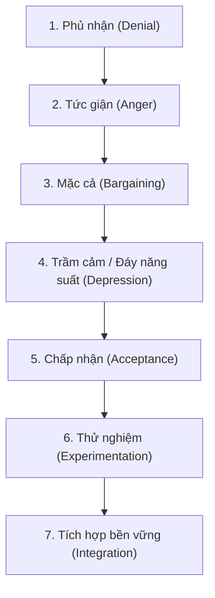

## Chương 9: Lãnh đạo trong môi trường thay đổi

### 9.1. Bản chất môi trường biến động: Mô hình VUCA, BANI & Bộ ba Thay đổi - Đổi mới - Thích ứng

#### 9.1.1. Bộ ba khái niệm cốt lõi trong tổ chức kỹ thuật
##### 9.1.1.1. Thay đổi (Change) - Chuyển dịch trạng thái vận hành
- **Định nghĩa học thuật**: Sự dịch chuyển có chủ đích hoặc bị tác động của một hệ thống từ trạng thái cân bằng hiện tại ($S_0$) sang trạng thái tương lai mong muốn ($S_1$) nhằm nâng cao hiệu quả hoạt động, thích ứng với đòi hỏi của thị trường hoặc giải quyết các bất cập nội tại.
- **Bản chất động lực học**: Thay đổi trong doanh nghiệp kỹ thuật không diễn ra tự phát mà chịu sự chi phối của áp lực chuyển đổi công nghệ, tối ưu hóa chi phí sản xuất, số hóa dây chuyền, hoặc điều chỉnh mô hình kinh doanh.
- **Phân loại cấp độ thay đổi**:
  - *Thay đổi tiệm tiến (Incremental Change)*: Cải tiến liên tục quy trình theo triết lý Kaizen, nâng cấp từng phần mềm điều khiển, tinh chỉnh thông số kỹ thuật dây chuyền.
  - *Thay đổi mang tính bước ngoặt (Transformational / Radical Change)*: Tái cấu trúc toàn diện tổ chức, chuyển dịch hoàn toàn từ quy trình phát triển sản phẩm Thác nước (Waterfall) sang Agile/DevOps, tự động hóa toàn bộ nhà máy với công nghệ số hóa công nghiệp 4.0.
- **Hệ quả đối với con người**: Mọi sự thay đổi quy trình hay công nghệ đều kéo theo sự thay đổi về thói quen, quyền hạn, trách nhiệm và tâm lý của đội ngũ kỹ sư vận hành.

##### 9.1.1.2. Đổi mới (Innovation) - Sáng tạo và gia tăng giá trị
- **Định nghĩa học thuật**: Quá trình chuyển hóa các ý tưởng sáng tạo thành hiện thực để tạo ra hoặc áp dụng những sản phẩm, dịch vụ, quy trình công nghệ hoặc mô hình tổ chức hoàn toàn mới, mang lại giá trị gia tăng định lượng cho tổ chức và khách hàng.
- **Phương trình giá trị đổi mới**:
  $$\text{Đổi Mới (Innovation)} = \text{Ý Tưởng Sáng Tạo (Creativity)} \times \text{Thực Thi Thành Công (Execution)} \times \text{Tạo Giá Trị Gia Tăng (Value Creation)}$$
- **Phân biệt Sáng tạo vs Đổi mới**:
  - *Sáng tạo (Creativity)*: Năng lực tư duy phát kiến ra những ý tưởng mới mẻ, đột phá nhưng có thể chưa được kiểm chứng về mặt thương mại hay tính khả thi kỹ thuật.
  - *Đổi mới (Innovation)*: Giai đoạn thương mại hóa hoặc ứng dụng kỹ thuật thành công ý tưởng sáng tạo vào dây chuyền sản xuất thực tế để giải quyết bài toán năng suất, chi phí, hoặc trải nghiệm khách hàng.
- **4 Loại hình đổi mới theo chuẩn Oslo Manual & ISO 56002:2019**:
  - *Đổi mới sản phẩm (Product Innovation)*: Thiết kế thế hệ sản phẩm cơ điện tử thông minh tích hợp IoT mới.
  - *Đổi mới quy trình (Process Innovation)*: Tái cấu trúc dây chuyền lắp ráp tự động hóa giúp cắt giảm 40% chu kỳ chuỗi cung ứng.
  - *Đổi mới mô hình kinh doanh (Business Model Innovation)*: Chuyển từ bán thiết bị phần cứng truyền thống sang mô hình cung cấp giải pháp dịch vụ định kỳ (Equipment-as-a-Service).
  - *Đổi mới tổ chức (Organizational Innovation)*: Thiết lập các nhóm R&D tự chủ đa chức năng (Cross-functional Autonomous Squads).

##### 9.1.1.3. Thích ứng (Adaptation) - Tính linh hoạt và phục hồi kiên cường
- **Định nghĩa học thuật**: Năng lực phản ứng linh hoạt, điều chỉnh cấu trúc hành vi, chiến lược và cách phân bổ nguồn lực của một cá nhân hoặc tổ chức nhằm duy trì sự tồn tại, phát triển bền vững trước những biến động bất ngờ của môi trường bên ngoài.
- **Tính kiên cường tổ chức (Organizational Resilience)**: Khả năng chịu đựng cú sốc thị trường (đứt gãy chuỗi cung ứng, thay đổi đột ngột chính sách công nghệ) và nhanh chóng tái lập trạng thái cân bằng mới với năng lực vượt trội hơn.
- **Vòng lặp thích ứng OODA Loop (Observe - Orient - Decide - Act)**:
  - *Quan sát (Observe)*: Thu thập tín hiệu yếu (weak signals) và dữ liệu vận hành kỹ thuật.
  - *Định hướng (Orient)*: Phân tích bối cảnh, loại bỏ các giả định lỗi thời, giải mã xu hướng công nghệ.
  - *Quyết định (Decide)*: Lựa chọn phương án can thiệp thích ứng với rủi ro trong tầm kiểm soát.
  - *Hành động (Act)*: Triển khai nhanh chóng thông qua các vòng lặp thử nghiệm ngắn ngày (Sprints).

#### 9.1.2. Môi trường biến động hiện đại: Khung phân tích VUCA và BANI
##### 9.1.2.1. Khung phân tích VUCA trong công nghệ và kinh doanh
###### 9.1.2.1.1. Phân tích 4 chiều không gian VUCA (Volatility, Uncertainty, Complexity, Ambiguity)
- **Biến động (Volatility)**:
  - *Bản chất*: Tốc độ, cường độ và tần suất thay đổi diễn ra cực nhanh và khó dự đoán trước quy mô (ví dụ: biến động giá nguyên vật liệu bán dẫn, biến đổi công nghệ đột phá genAI).
  - *Thách thức lãnh đạo*: Kế hoạch dài hạn cố định nhanh chóng bị lỗi thời; chu kỳ tồn tại của sản phẩm công nghệ bị rút ngắn từ nhiều năm xuống còn vài quý.
- **Bất định (Uncertainty)**:
  - *Bản chất*: Thiếu hụt thông tin cơ sở để dự phóng tương lai dù quá khứ có dữ liệu dồi dào; các quan hệ nhân quả truyền thống không còn lặp lại chính xác.
  - *Thách thức lãnh đạo*: Tê liệt phân tích (Analysis Paralysis); nỗi sợ ra quyết định sai lầm của các kỹ sư trưởng do thiếu dữ liệu hoàn hảo.
- **Phức tạp (Complexity)**:
  - *Bản chất*: Hệ thống bao gồm vô số biến số tương tác phi tuyến tính, các vòng phản hồi đa tầng khiến cho một thay đổi nhỏ ở mắt xích này gây ra đứt gãy dây chuyền ở hệ sinh thái khác (hiệu ứng cánh bướm trong chuỗi cung ứng kỹ thuật).
  - *Thách thức lãnh đạo*: Khó xác định nguyên nhân gốc rễ; các giải pháp tuyến tính đơn tầng thường làm phát sinh tác dụng phụ tiêu cực ngoài dự kiến.
- **Mơ hồ (Ambiguity)**:
  - *Bản chất*: Thiếu sự rõ ràng về ý nghĩa của sự việc, hiện tượng; ranh giới mập mờ giữa cơ hội và thách thức kỹ thuật; thông điệp đa nghĩa và không có tiền lệ giải quyết.
  - *Thách thức lãnh đạo*: Nhầm lẫn trong việc xác định ưu tiên chiến lược; bất đồng nhận thức sâu sắc giữa các bộ phận kỹ thuật và kinh doanh.

###### 9.1.2.1.2. Chiến lược phản ứng VUCA Prime (Bob Johansen)
- **Tầm nhìn (Vision) đối đầu Biến động (Volatility)**:
  - Xác lập mục tiêu cốt lõi và sứ mệnh không lay chuyển làm kim chỉ nam dài hạn, trong khi linh hoạt điều chỉnh chiến thuật vận hành ngắn hạn.
- **Thấu hiểu (Understanding) đối đầu Bất định (Uncertainty)**:
  - Dành thời gian tiếp xúc tiền tuyến (Gemba walk), lắng nghe phản hồi của người dùng và thu thập dữ liệu cảm biến thực tế để giảm thiểu vùng mù thông tin.
- **Minh bạch / Rõ ràng (Clarity) đối đầu Phức tạp (Complexity)**:
  - Đơn giản hóa cấu trúc tổ chức, minh bạch hóa quy trình quyết định, cô đọng các quy chuẩn kỹ thuật thành các chỉ số vận hành tinh gọn (Lean KPIs).
- **Linh hoạt / Nhanh nhạy (Agility) đối đầu Mơ hồ (Ambiguity)**:
  - Áp dụng văn hóa phát triển linh hoạt Agile, thử nghiệm các giả thuyết kỹ thuật thông qua sản phẩm khả dụng tối thiểu (MVP) thay vì chờ đợi bản thiết kế hoàn hảo.

###### 9.1.2.1.3. Chỉ số năng lực thích ứng VUCA (VUCA Resilience Metric)
- **Mô hình định lượng hóa mức độ kiên cường hệ thống**:
  $$\text{Index}_{\text{resilience}} = \frac{\text{Tốc Độ Phản Ứng (Speed of Response)} \times \text{Độ Đa Dạng Kỹ Năng (Skill Redundancy)}}{\text{Độ Trễ Ra Quyết Định (Decision Latency)} \times \text{Chi Phí Thích Ứng (Cost of Adaptation)}}$$
- **Ứng dụng**: Đánh giá năng lực một phòng thí nghiệm R&D trong việc xoay trục giải pháp công nghệ khi nhà cung cấp linh kiện chủ chốt dừng hỗ trợ đột ngột.

##### 9.1.2.2. Khung phân tích thế giới BANI (Jamais Cascio)
###### 9.1.2.2.1. 4 đặc tính BANI (Brittle, Anxious, Non-linear, Incomprehensible)
- **Dễ vỡ (Brittle)**: Các hệ thống trông có vẻ kiên cố, hoàn hảo trên giấy tờ nhưng có thể đổ vỡ hoàn toàn khi gặp một áp lực vượt ngưỡng thiết kế (ví dụ: dây chuyền Just-in-Time không có tồn kho đệm bị tê liệt khi cảng biển đình công).
- **Lo âu (Anxious)**: Tâm lý bất an, sợ hãi sai lầm bao trùm nhân sự, dẫn đến phản xạ thụ động, phòng thủ và trốn tránh trách nhiệm đổi mới.
- **Phi tuyến tính (Non-linear)**: Mất tương xứng giữa nguyên nhân và kết quả; nỗ lực đầu tư lớn có thể mang lại kết quả mờ nhạt, trong khi một lỗi mã nguồn nhỏ làm sập toàn bộ mạng lưới phân phối điện.
- **Khó hiểu (Incomprehensible)**: Dữ liệu quá tải và thuật toán phức tạp (như học sâu AI Black-box) đưa ra kết quả mà con người không thể lý giải trực tiếp bằng trực giác cơ bản.

###### 9.1.2.2.2. Cơ chế lãnh đạo chuyển hóa BANI sang đối sách bền vững
- *Đối phó Brittle bằng Resilience & Slack*: Xây dựng năng lực dự phòng (redundancy), tính kiên cường và vùng đệm an toàn trong thiết kế hệ thống.
- *Đối phó Anxious bằng Empathy & Psychological Safety*: Lãnh đạo bằng sự thấu cảm, tạo môi trường an toàn tâm lý không phán xét.
- *Đối phó Non-linear bằng Context & Adaptability*: Hiểu sâu bối cảnh động, chấp nhận các bước tiến linh hoạt thay vì ép buộc lộ trình tuyến tính cứng nhắc.
- *Đối phó Incomprehensible bằng Transparency & Intuition*: Tăng cường tính giải trình, trực quan hóa dữ liệu và kết hợp trí tuệ tập thể.

#### 9.1.3. Bảng phân tích cơ hội và thách thức của lãnh đạo trong môi trường thay đổi
##### 9.1.3.1. Phân tích ma trận ưu điểm và thách thức (Bảng tbl_ch09_leading_in_changing_environment_02)
- Dữ liệu nguyên văn từ tài liệu giảng dạy ME4625 Slide 8:

| Ưu điểm (Opportunities & Strengths) | Thách thức (Obstacles & Challenges) |
|---|---|
| **Tăng khả năng sáng tạo và cạnh tranh**: Áp lực thay đổi buộc đội ngũ phá vỡ lối mòn tư duy, khai phá các bằng sáng chế và giải pháp công nghệ vượt trội đối thủ. | **Kháng cự thay đổi từ nhân viên**: Tâm lý ngại xáo trộn, nỗi sợ mất quyền lợi, thiếu kỹ năng dẫn tới hành vi trì hoãn hoặc chống đối ngầm. |
| **Thích nghi nhanh với thị trường**: Tổ chức linh hoạt nắm bắt kịp thời các làn sóng công nghệ mới (AI, Robotics, Green Tech), gia tăng thị phần. | **Nguy cơ thất bại nếu không có kế hoạch rõ ràng**: Đổi mới vội vã, thiếu lộ trình chuẩn xác dẫn tới lãng phí ngân sách R&D và khủng hoảng niềm tin nội bộ. |
| **Nâng cao năng suất và động lực làm việc**: Tự động hóa và quy trình mới giải phóng kỹ sư khỏi việc thủ công lặp lại, khơi gợi tinh thần làm chủ công việc. | **Áp lực cao, cần kỹ năng xử lý xung đột hiệu quả**: Sự va chạm giữa văn hóa làm việc cũ và mới tạo ra căng thẳng thần kinh kéo dài và nguy cơ kiệt sức (burnout). |

##### 9.1.3.2. Tiêu chuẩn quốc tế về hệ thống quản lý đổi mới sáng tạo ISO 56002:2019
- **Mã định danh**: STD-CH09-01 (ISO 56002:2019 - Innovation Management System — Guidance).
- **Phạm vi áp dụng**: Hướng dẫn xây dựng hệ thống quản lý đổi mới toàn diện, từ khâu nhận diện bối cảnh, cam kết của lãnh đạo cấp cao, hoạch định danh mục đổi mới, quản trị rủi ro thử nghiệm đến đánh giá kết quả kinh tế.
- **Tương thích đề cương**: Đáp ứng chuẩn đầu ra DCMH.ME4625.09.0 (Session 12) về năng lực lãnh đạo và quản trị dự án kỹ thuật hiện đại.

---

### 9.2. Mô hình quản trị thay đổi 3 giai đoạn của Kurt Lewin (Unfreeze - Change - Refreeze)

#### 9.2.1. Nguyên lý phân tích trường lực (Force Field Analysis)
##### 9.2.1.1. Lực thúc đẩy (Driving Forces) và Lực cản trở (Restraining Forces)
- **Lực thúc đẩy (Driving Forces - $F_{\text{driving}}$)**:
  - Các yếu tố ngoại sinh và nội sinh đẩy tổ chức về phía trạng thái mới: Yêu cầu chuyển đổi số từ thị trường, chỉ đạo quyết liệt từ ban giám đốc, nhu cầu rút ngắn chu kỳ thiết kế, sự xuống cấp của công nghệ cũ.
  - Mang tính chủ động, tạo động lực dịch chuyển ban đầu.
- **Lực cản trở (Restraining Forces - $F_{\text{restraining}}$)**:
  - Các rào cản ngăn chặn sự thay đổi và duy trì nguyên trạng: Nỗi sợ thất bại cá nhân, quán tính thói quen vận hành kiểu cũ, sự thiếu hụt kỹ năng công nghệ mới, tình trạng quá tải công việc hiện hữu, nỗi lo mất việc làm hoặc giảm vị thế xã hội.
  - Mang tính ma sát tâm lý và bảo thủ tổ chức.

##### 9.2.1.2. Phương trình cân bằng trường lực Lewin Net Force Field Equilibrium (eq_ch09_001)
###### 9.2.1.2.1. Biểu diễn toán học và định nghĩa biến số
- **Phương trình chính tắc (eq_ch09_001)**:
  $$\Delta F_{\text{net}} = \sum_{i=1}^n w_i \cdot F_{\text{driving}, i} - \sum_{j=1}^m v_j \cdot F_{\text{restraining}, j}$$
- **Bảng biến số kỹ thuật**:
  - $\Delta F_{\text{net}}$: Lực thúc đẩy ròng sau cân bằng (Đơn vị: điểm lực).
  - $F_{\text{driving}, i}$: Cường độ của lực thúc đẩy thứ $i$ (Thang đo Likert chuẩn hóa: $1 - 10$ điểm).
  - $F_{\text{restraining}, j}$: Cường độ của lực cản trở thứ $j$ (Thang đo Likert chuẩn hóa: $1 - 10$ điểm).
  - $w_i, v_j$: Trọng số tác động tương đối của từng lực ($\sum w_i = 1.0, \sum v_j = 1.0$ hoặc hệ số quy đổi chuyên gia).
- **Quy tắc trạng thái hệ thống**:
  - $\Delta F_{\text{net}} < 0$: Hệ thống bị khóa chặt trong trạng thái đóng băng tiêu cực; mọi sáng kiến đều bị dập tắt bởi lực cản.
  - $\Delta F_{\text{net}} = 0$: Trạng thái cân bằng động bán bền (Quasi-stationary equilibrium); tổ chức dậm chân tại chỗ.
  - $\Delta F_{\text{net}} > 0$: Trạng thái phá vỡ cân bằng; quá trình chuyển dịch diễn ra theo chiều hướng mới.

###### 9.2.1.2.2. Quy luật ma sát tâm lý và nghịch lý tăng áp lực ép buộc
- **Nghịch lý lãnh đạo độc đoán**: Khi gặp kháng cự, người lãnh đạo thiếu kinh nghiệm thường có xu hướng gia tăng mệnh lệnh hành chính, đe dọa kỷ luật (tức là cố tình tăng $\sum F_{\text{driving}}$).
- **Hệ quả nghịch lý**: Theo định luật hành vi Kurt Lewin, việc tăng lực thúc đẩy cưỡng bức sẽ tự động kích hoạt phản lực tương đương từ phía nhân viên (làm tăng $\sum F_{\text{restraining}}$ dưới dạng phản kháng thụ động, đình công ngầm, phá hoại quy trình). Kết quả là sức căng hệ thống (System Tension) tăng vọt, nguy cơ bùng nổ xung đột phá hủy.
- **Tiên đề quản trị ưu tiên**: Chiến lược lãnh đạo thông minh và bền vững nhất luôn là **tìm cách triệt tiêu hoặc chuyển hóa lực cản trở** (giảm mẫu số $F_{\text{restraining}}$) thay vì chỉ tăng lực thúc đẩy đơn thuần.

###### 9.2.1.2.3. Định mức thông số kỹ thuật lực thúc đẩy ròng ($\Delta F_{\text{net}} \ge +10.0$ điểm)
- Để đảm bảo dự án chuyển đổi không bị tái phát trạng thái cũ khi kết thúc giai đoạn hỗ trợ, lực thúc đẩy ròng kỹ thuật cần đạt ngưỡng an toàn:
  $$\Delta F_{\text{net}} \ge +10.0 \quad \text{điểm lực}$$
- Mức chênh lệch này đủ mạnh để vượt qua sức ỳ ma sát tĩnh của cơ cấu tổ chức doanh nghiệp.

#### 9.2.2. Chi tiết 3 giai đoạn chuyển dịch tổ chức Kurt Lewin
##### 9.2.2.1. Giai đoạn 1: Rã đông (Unfreezing) - Phá vỡ thế cân bằng cũ
- **Mục tiêu**: Làm suy yếu các mối liên kết hành vi cũ, giúp nhân viên nhận thức rõ ràng rằng phương thức hoạt động hiện tại không còn khả thi trước biến động bên ngoài.
- **Hành động lãnh đạo then chốt**:
  - Công khai các số liệu cảnh báo khủng hoảng kỹ thuật: Tỷ lệ sản phẩm lỗi tăng cao, chi phí làm lại phình to, khiếu nại khách hàng nghiêm trọng.
  - Tạo cảm giác cấp bách có kiểm soát mà không gây hoảng loạn tâm lý.
  - Thiết lập vùng an toàn tâm lý: Trấn an nhân viên rằng sự thay đổi nhằm mục tiêu bảo vệ công việc tương lai chứ không phải để thanh trừng nhân sự.

##### 9.2.2.2. Giai đoạn 2: Chuyển đổi / Thay đổi (Changing / Moving) - Thực thi thử nghiệm
- **Mục tiêu**: Hướng dẫn đội ngũ dịch chuyển từ lề lối cũ sang quy trình, công cụ, tư duy vận hành mới.
- **Hành động lãnh đạo then chốt**:
  - Triển khai mô hình thử nghiệm giới hạn (Pilot Project / Sandbox) nhằm khoanh vùng rủi ro kỹ thuật.
  - Tổ chức các buổi đào tạo thực chiến (Hands-on training) kết hợp mô hình huấn luyện kèm cặp 1-on-1 từ các kỹ sư tiên phong (Change Champions).
  - Khuyến khích tư duy lặp (Iterative mindset): Chấp nhận sai sót nhỏ trong quá trình làm quen và điều chỉnh tức thì.

##### 9.2.2.3. Giai đoạn 3: Tái đóng băng (Refreezing) - Thể chế hóa trạng thái mới
- **Mục tiêu**: Cố định trạng thái cân bằng mới thành chuẩn mực hoạt động hàng ngày, ngăn ngừa nguy cơ nhân viên quay trở lại thói quen cũ khi lãnh đạo lơi lỏng giám sát.
- **Hành động lãnh đạo then chốt**:
  - Văn bản hóa toàn bộ quy trình mới thành quy trình thao tác chuẩn (Standard Operating Procedures - SOP).
  - Tái cấu trúc hệ thống đo lường hiệu suất (KPIs / OKRs) và chính sách lương thưởng gắn liền với việc áp dụng công nghệ mới.
  - Tuyên dương công khai và thăng chức cho những cá nhân gương mẫu trong việc duy trì chuẩn mực mới.

---

### 9.3. Mô hình 8 bước chuyển đổi tổ chức của John Kotter

#### 9.3.1. Cấu trúc 3 phân kỳ và 8 bước hành động chuyển đổi
##### 9.3.1.1. Phân kỳ I: Khởi tạo bối cảnh và kích hoạt thay đổi (Tạo động lực)
###### 9.3.1.1.1. Bước 1: Thiết lập cảm giác cấp bách sâu sắc (Establish a Sense of Urgency)
- **Bản chất**: Phá vỡ tâm lý tự mãn (Complacency) của tổ chức kỹ thuật vốn quen với thành công trong quá khứ.
- **Hành vi cụ thể**: Trình bày kịch bản "Bàn cờ đang bốc cháy" (Burning Platform) dựa trên dữ liệu định lượng: Thị phần sụt giảm, đối thủ tung ra công nghệ tự động hóa với chi phí chỉ bằng 50%, các chỉ số an toàn kỹ thuật suy thoái.
- **Chỉ số đo lường**: Tối thiểu 75% cán bộ chủ chốt và kỹ sư cấp cao thừa nhận tính cấp bách sống còn của việc phải thay đổi.

###### 9.3.1.1.2. Bước 2: Thành lập liên minh dẫn đường quyền lực (Build a Guiding Coalition)
- **Bản chất**: Tập hợp một nhóm lãnh đạo hạt nhân có đủ quyền lực pháp lý, uy tín chuyên môn, nguồn lực tài chính và năng lực kết nối.
- **Tiêu chuẩn thành viên liên minh**:
  - Quyền lực chức vụ (Position Power): Đủ thẩm quyền phê duyệt ngân sách và dỡ bỏ quy định cũ.
  - Chuyên môn kỹ thuật sâu sắc (Expertise): Được cộng đồng kỹ sư tôn trọng về năng lực giải quyết sự cố.
  - Uy tín cá nhân (Credibility): Có tiếng nói trung thực, được nhân viên tin tưởng.
  - Kỹ năng lãnh đạo (Leadership): Khả năng điều phối và truyền cảm hứng.

###### 9.3.1.1.3. Bước 3: Phát triển tầm nhìn chiến lược và sáng kiến (Develop Strategic Vision & Initiatives)
- **Bản chất**: Xây dựng bức tranh tương lai rõ ràng, hấp dẫn và khả thi sau khi hoàn tất chuyển đổi.
- **Quy tắc kiểm tra tầm nhìn (Kotter's 5-Minute Rule)**: Tầm nhìn chuyển đổi phải đủ cô đọng và trực quan để có thể giải thích trọn vẹn và thuyết phục người nghe trong vòng dưới 5 phút.

##### 9.3.1.2. Phân kỳ II: Lôi cuốn và kích hoạt toàn bộ tổ chức (Gắn kết đội ngũ)
###### 9.3.1.2.1. Bước 4: Truyền thông tầm nhìn chuyển đổi đa kênh (Communicate Change Vision)
- **Bản chất**: Sử dụng mọi kênh truyền thông có thể để liên tục truyền tải tầm nhìn mới vào tâm thức của từng kỹ sư và nhân viên vận hành.
- **Nguyên tắc "Làm gương" (Walk the Talk)**: Lãnh đạo cấp cao phải là người đầu tiên tuân thủ quy trình mới; sự bất nhất giữa lời nói và hành vi của lãnh đạo là nguyên nhân hàng đầu làm sụp đổ lòng tin.
- **Hệ số lặp lại**: Thông điệp tầm nhìn cần được lặp lại liên tục trong các cuộc họp giao ban hàng tuần, bản tin nội bộ, và đối thoại 1-on-1.

###### 9.3.1.2.2. Bước 5: Trao quyền hành động trên diện rộng và xóa bỏ rào cản (Empower Broad-Based Action)
- **Bản chất**: Loại bỏ các rào cản cơ cấu, quy chế quan liêu, hệ thống đánh giá lỗi thời cản trở nhân viên thực hiện sáng kiến đổi mới.
- **Hành động then chốt**: Phân quyền ra quyết định kỹ thuật xuống cấp cơ sở, cung cấp đầy đủ công cụ phần mềm/phần cứng, xóa bỏ các thủ tục phê duyệt rườm rà cản trở tiến độ.

###### 9.3.1.2.3. Bước 6: Hoạch định và tạo lập các thắng lợi ngắn hạn (Generate Short-term Wins)
- **Bản chất**: Tạo ra những kết quả cải tiến rõ ràng, có thể đo đếm được trong vòng 30 đến 90 ngày đầu tiên của dự án chuyển đổi.
- **Ý nghĩa tâm lý học**: Thắng lợi ngắn hạn đập tan luận điệu hoài nghi của những người bảo thủ, tiếp thêm năng lượng cho đội ngũ tiên phong và chứng minh giá trị tài chính ban đầu cho các nhà tài trợ dự án.

##### 9.3.1.3. Phân kỳ III: Củng cố và duy trì chuyển dịch bền vững (Thể chế hóa)
###### 9.3.1.3.1. Bước 7: Củng cố thành quả và thúc đẩy thêm thay đổi (Consolidate Gains & Produce More Change)
- **Bản chất**: Không tuyên bố chiến thắng quá sớm; sử dụng uy tín và đà thắng lợi ngắn hạn để giải quyết các nút thắt kỹ thuật phức tạp hơn và mở rộng quy mô chuyển đổi sang các phân xưởng/phòng ban khác.
- **Bổ sung nhân sự**: Tuyển dụng hoặc điều động thêm các nhân sự có tư duy đổi mới vào các vị trí then chốt để duy trì gia tốc chuyển đổi.

###### 9.3.1.3.2. Bước 8: Gắn chặt cách tiếp cận mới vào văn hóa tổ chức (Anchor New Approaches in Culture)
- **Bản chất**: Khắc sâu hành vi mới vào văn hóa và hệ giá trị vô hình của tổ chức ("Ở đây chúng tôi luôn làm việc theo cách này").
- **Cơ chế kế thừa**: Đảm bảo thế hệ lãnh đạo kế cận được đào tạo và thấm nhuần văn hóa đổi mới để các quy trình tiên tiến không bị thoái trào khi có sự chuyển giao thế hệ.

#### 9.3.2. Mô hình định lượng chỉ số thành công chuyển đổi Kotter Composite Change Success Index (CSI)
##### 9.3.2.1. Phương trình CSI và chuẩn hóa trọng số giai đoạn (eq_ch09_002)
- **Công thức tính toán (eq_ch09_002)**:
  $$\text{CSI} = \sum_{k=1}^8 w_k \cdot S_k \quad \text{với } \sum_{k=1}^8 w_k = 1.0$$
- **Định nghĩa các đại lượng**:
  - $\text{CSI}$: Chỉ số thành công chuyển đổi Kotter tổng hợp (Thang đo chuẩn hóa: $[0.0, 1.0]$ hoặc tỷ lệ phần trăm $0\% - 100\%$).
  - $k \in \{1, 2, \dots, 8\}$: Đại diện cho 8 bước trong quy trình chuyển đổi John Kotter.
  - $S_k$: Điểm số chuẩn hóa mức độ thực thi chất lượng tại bước thứ $k$ (Thang điểm $0 - 10$ hoặc $[0, 1]$).
  - $w_k$: Trọng số tương đối của bước $k$ phản ánh mức độ rủi ro chiến lược (Trong trường hợp đánh giá đồng đều: $w_k = \frac{1}{8} = 0.125$).

##### 9.3.2.2. Ngưỡng chuẩn đánh giá mức độ sẵn sàng Kotter ($\text{CSI} \in [0.75, 1.00]$)
- **Phổ đánh giá chất lượng chuyển đổi**:
  - $\text{CSI} < 0.60$: Nguy cơ thất bại chuyển đổi cực kỳ cao; quy trình bị đứt gãy nghiêm trọng tại các bước cốt lõi.
  - $0.60 \le \text{CSI} < 0.75$: Chuyển đổi tiềm ẩn rủi ro tái phát trạng thái cũ do thiếu hụt liên minh hoặc chưa gắn kết văn hóa.
  - $0.75 \le \text{CSI} \le 1.00$: **Ngưỡng chuẩn xuất sắc**; đảm bảo quá trình chuyển đổi diễn ra đồng bộ, bền vững và mang lại hiệu quả kinh tế lâu dài.

##### 9.3.2.3. Các sai lầm chí tử (Fatal Traps) tại từng bước và cơ chế phòng ngừa
- *Bẫy Bước 1*: Đánh giá thấp mức độ khó khăn khi phá vỡ sự tự mãn, dẫn đến thông điệp thiếu sức nặng.
- *Bẫy Bước 3*: Nhầm lẫn giữa một "kế hoạch hành động chi tiết 200 trang" với một "tầm nhìn chiến lược truyền cảm hứng".
- *Bẫy Bước 6*: Trông chờ vào các kết quả ngẫu nhiên thay vì chủ động lên kế hoạch và phân bổ ngân sách riêng cho các thắng lợi 90 ngày.
- *Bẫy Bước 7*: Tuyên bố thắng lợi quá sớm khi mới chỉ đạt được một vài chỉ tiêu ngắn hạn, tạo cơ hội cho lực cản trở vùng lên.

---

### 9.4. Kháng cự thay đổi: Tâm lý học, Mô hình chẩn đoán & 6 Chiến lược vượt qua

#### 9.4.1. Bản chất tâm lý học của sự kháng cự thay đổi
##### 9.4.1.1. Đường cong chuyển đổi tâm lý Kübler-Ross trong môi trường doanh nghiệp
###### 9.4.1.1.1. 7 cung bậc cảm xúc (Phủ nhận -> Tức giận -> Mặc cả -> Trầm cảm -> Chấp nhận -> Thử nghiệm -> Tích hợp)
1. **Phủ nhận (Denial)**:
   - *Biểu hiện*: "Quy trình Waterfall của chúng ta vẫn chạy tốt 10 năm nay, Agile chỉ là phong trào nhất thời của ban quản lý."
   - *Trạng thái năng suất*: Năng suất công việc tạm thời không đổi nhưng bắt đầu xuất hiện sự thờ ơ thông tin.
2. **Tức giận (Anger)**:
   - *Biểu hiện*: Oán trách lãnh đạo, đổ lỗi cho công cụ mới gây mất thời gian, phàn nàn công khai trong phòng ăn hoặc nhóm trò chuyện riêng.
   - *Trạng thái năng suất*: Xung đột nội bộ gia tăng, bầu không khí làm việc căng thẳng.
3. **Mặc cả (Bargaining)**:
   - *Biểu hiện*: "Chúng tôi có thể chỉ áp dụng Daily Standup nhưng giữ nguyên toàn bộ tài liệu đặc tả 500 trang như cũ được không?"
   - *Trạng thái năng suất*: Tìm kiếm các giải pháp thỏa hiệp nửa vời nhằm trì hoãn thay đổi triệt để.
4. **Trầm cảm / Hụt hẫng (Depression)**:
   - *Biểu hiện*: Cảm giác bất lực, hoang mang, tự ti về năng lực thích ứng với công nghệ mới; năng suất chạm đáy (The Valley of Despair).
   - *Trạng thái năng suất*: Nguy cơ xin nghỉ việc của các kỹ sư cốt lõi tăng vọt.
5. **Chấp nhận (Acceptance)**:
   - *Biểu hiện*: Nhận ra sự thật không thể đảo ngược; bắt đầu ngừng than phiền và chấp nhận làm quen với thực tế mới.
   - *Trạng thái năng suất*: Tinh thần bình ổn trở lại, bắt đầu mở lòng tiếp nhận đào tạo.
6. **Thử nghiệm (Experimentation)**:
   - *Biểu hiện*: Tự nguyện chạy thử một Sprint nhỏ, khám phá các tính năng mới của phần mềm quản lý dự án.
   - *Trạng thái năng suất*: Xuất hiện những cải tiến năng suất bước đầu.
7. **Tích hợp (Integration)**:
   - *Biểu hiện*: Quy trình mới trở thành phản xạ tự nhiên; kỹ sư tự hào chia sẻ kinh nghiệm cho nhân sự mới.
   - *Trạng thái năng suất*: Năng suất vượt qua mức cơ sở ban đầu trước chuyển đổi.

###### 9.4.1.1.2. Các can thiệp lãnh đạo tương ứng tại từng điểm đáy của đường cong tâm lý
- *Tại pha Phủ nhận*: Cung cấp dữ liệu minh bạch, liên tục đối thoại trực tiếp, không để khoảng trống tin đồn.
- *Tại pha Tức giận*: Lắng nghe chủ động không phán xét, chấp nhận xả cảm xúc, không áp đặt kỷ luật hành chính cứng nhắc.
- *Tại pha Mặc cả*: Giữ vững nguyên tắc cốt lõi của tầm nhìn nhưng linh hoạt về lộ trình chi tiết.
- *Tại pha Trầm cảm*: Hỗ trợ tâm lý, cử người hướng dẫn 1-on-1, hạ thấp chỉ tiêu tạm thời để giảm áp lực thần kinh.
- *Tại pha Thử nghiệm & Tích hợp*: Khen thưởng thành tích sớm, nhân rộng điển hình, thể chế hóa thành quy chuẩn.

##### 9.4.1.2. Công thức chuyển đổi Gleicher - Beckhard - Harris (Gleicher Formula for Change)
###### 9.4.1.2.1. Phương trình $C = D \times V \times F > R$
- **Công thức kinh điển**:
  $$C = D \times V \times F > R$$
- **Trong đó**:
  - $C$: Khả năng chuyển đổi thành công (Possibility of Change).
  - $D$: Sự bất mãn với trạng thái hiện tại (Dissatisfaction with the status quo).
  - $V$: Tính thuyết phục của tầm nhìn tương lai (Vision of what is possible).
  - $F$: Tính rõ ràng của các bước đi đầu tiên (First concrete steps towards the vision).
  - $R$: Sức kháng cự tự nhiên đối với sự thay đổi (Resistance to change).

###### 9.4.1.2.2. Ý nghĩa hàm số nhân và rủi ro triệt tiêu chuyển đổi khi một yếu tố bằng không
- **Tính chất toán học cốt lõi**: Mối quan hệ giữa $D, V, F$ là **phép nhân (Multiplicative relationship)**, không phải phép cộng tuyến tính.
- **Hệ quả quản trị sống còn**:
  - Nếu bất kỳ yếu tố nào bằng không ($D = 0$ hoặc $V = 0$ hoặc $F = 0$), tích số sẽ lập tức trở về 0:
    $$0 \times V \times F = 0 < R \implies \text{Chuyển đổi hoàn toàn thất bại!}$$
  - *Nếu $D = 0$*: Đội ngũ hoàn toàn hài lòng với hiện trạng, không thấy lý do phải thay đổi.
  - *Nếu $V = 0$*: Đội ngũ bất mãn sâu sắc nhưng không biết đi về đâu, sinh ra hoang mang và hỗn loạn.
  - *Nếu $F = 0$*: Đội ngũ có tầm nhìn vĩ đại nhưng không biết ngày mai phải bắt đầu từ việc gì, dẫn tới tê liệt hành động.

#### 9.4.2. Mô hình chẩn đoán chuyển đổi cá nhân Prosci ADKAR
##### 9.4.2.1. 5 thành tố cấu trúc ADKAR (Awareness, Desire, Knowledge, Ability, Reinforcement)
- **Awareness (Nhận thức)**: Hiểu rõ lý do kinh doanh và bối cảnh thị trường bắt buộc phải thay đổi quy trình kỹ thuật.
- **Desire (Khao khát)**: Mong muốn cá nhân tham gia và ủng hộ sự thay đổi, giải quyết câu hỏi vị kỷ WIIFM (*What's In It For Me? - Tôi được lợi gì từ việc này?*).
- **Knowledge (Kiến thức)**: Nắm vững kiến thức chuyên môn, quy trình và kỹ năng cần thiết để vận hành trong trạng thái mới.
- **Ability (Năng lực thực tế)**: Khả năng chuyển hóa kiến thức lý thuyết thành kỹ năng thao tác chuẩn xác trong điều kiện sản xuất thực tế.
- **Reinforcement (Củng cố)**: Các cơ chế ghi nhận, khen thưởng và hỗ trợ liên tục nhằm duy trì hành vi mới lâu dài.

##### 9.4.2.2. Hàm xác định điểm nghẽn rào cản Prosci ADKAR Barrier Point Function (eq_ch09_003)
- **Phương trình tối ưu hóa nhận diện rào cản (eq_ch09_003)**:
  $$\text{ADKAR}_{\text{barrier}} = \arg\min_{d \in \{A, D, K, A_b, R\}} \{S_d\} \quad \text{với } S_d < \tau_{\text{readiness}}$$
- **Giải thích thông số**:
  - $\text{ADKAR}_{\text{barrier}}$: Chiều thành tố rào cản then chốt đầu tiên làm tắc nghẽn toàn bộ chuỗi chuyển đổi.
  - $d \in \{A, D, K, A_b, R\}$: 5 chiều đo lường tương ứng của mô hình ADKAR.
  - $S_d$: Điểm số chuẩn hóa của từng chiều $d$ theo kết quả khảo sát nhân viên (Thang điểm $0\% - 100\%$).
  - $\tau_{\text{readiness}}$: Ngưỡng sẵn sàng an toàn tối thiểu (Theo chuẩn quốc tế Prosci: $\tau_{\text{readiness}} \ge 75.0\%$).
- **Nguyên lý Điểm nghẽn liên tục (Sequential Barrier Principle)**: Mô hình ADKAR mang tính tuần tự nghiêm ngặt. Nếu một chiều phía trước chưa vượt ngưỡng $\tau$, việc đầu tư dồn dập vào các chiều phía sau hoàn toàn vô nghĩa (ví dụ: Ép nhân viên đi học đào tạo kỹ thuật - *Knowledge & Ability* khi họ chưa hề có khao khát - *Desire* sẽ chỉ làm tăng sự tức giận và lãng phí chi phí đào tạo).

##### 9.4.2.3. Quy trình 5 bước chẩn đoán & hóa giải kháng cự (PROC-CH09-02)
- **Bước 1**: Lắng nghe chủ động và khảo sát định lượng để nhận diện chính xác căn nguyên kháng cự ($S_d < 75\%$).
- **Bước 2**: Nâng cao nhận thức (Awareness) thông qua minh bạch hóa dữ liệu cạnh tranh và áp lực thị trường.
- **Bước 3**: Khơi gợi khao khát (Desire) bằng cách làm rõ lợi ích phát triển nghề nghiệp cá nhân (WIIFM) và thiết lập cam kết bảo vệ việc làm.
- **Bước 4**: Đào tạo nâng cao năng lực (Knowledge & Ability) qua các buổi thực hành Sandbox kèm cặp 1-on-1 có người bảo hộ.
- **Bước 5**: Củng cố (Reinforcement) bằng việc gắn KPI đổi mới, trao thưởng đột xuất và tổ chức vinh danh định kỳ.

#### 9.4.3. 6 Chiến lược vượt qua kháng cự của Kotter & Schlesinger (1979)
##### 9.4.3.1. Chiến lược 1: Giáo dục và Giao tiếp (Education & Communication)
- **Bối cảnh áp dụng**: Kháng cự bắt nguồn từ việc thiếu thông tin, hiểu lầm về mục tiêu chuyển đổi, hoặc thông tin bị sai lệch.
- **Phương pháp thực hiện**: Tổ chức các buổi hội thảo toàn thể (Town Hall), gửi bản tin kỹ thuật nội bộ, gặp gỡ nhóm nhỏ giải đáp trực tiếp các băn khoăn.
- **Ưu điểm**: Khi nhân viên đã được thuyết phục về mặt lý trí, họ sẽ trở thành những người tích cực hỗ trợ chuyển đổi.
- **Hạn chế / Chi phí**: Đòi hỏi rất nhiều thời gian và công sức của lãnh đạo, đặc biệt khi số lượng nhân sự bị ảnh hưởng lớn.

##### 9.4.3.2. Chiến lược 2: Tham gia và Gắn kết (Participation & Involvement)
- **Bối cảnh áp dụng**: Lãnh đạo không nắm giữ toàn bộ thông tin thiết kế cần thiết, và các đối tượng kháng cự có sức ảnh hưởng lớn đến kết quả dự án.
- **Phương pháp thực hiện**: Mời các kỹ sư chủ chốt tham gia trực tiếp vào ban soạn thảo quy trình mới, lấy ý kiến đóng góp vào thiết kế giao diện công cụ.
- **Ưu điểm**: Tăng cường tối đa tính cam kết làm chủ (Ownership); tận dụng được tri thức thực tiễn của người vận hành trực tiếp.
- **Hạn chế / Chi phí**: Tiến độ ra quyết định có thể bị kéo dài; có thể dẫn tới những giải pháp thỏa hiệp kém tối ưu về mặt kỹ thuật.

##### 9.4.3.3. Chiến lược 3: Tạo điều kiện và Hỗ trợ (Facilitation & Support)
- **Bối cảnh áp dụng**: Kháng cự xuất phát từ nỗi sợ hãi thất bại, lo âu về sự thiếu hụt năng lực và áp lực tâm lý quá tải.
- **Phương pháp thực hiện**: Mở các lớp đào tạo kỹ năng mới trong giờ làm việc, cấp ngân sách cho các công cụ trợ giúp, cung cấp dịch vụ tư vấn tâm lý, cho phép kéo dài thời gian làm quen.
- **Ưu điểm**: Xoa dịu hiệu quả nỗi bất an cá nhân; xây dựng lòng trung thành và văn hóa tổ chức nhân văn.
- **Hạn chế / Chi phí**: Tốn kém chi phí đào tạo và nguồn lực hỗ trợ; đòi hỏi sự kiên nhẫn cao và không đảm bảo chắc chắn thành công nếu nhân viên thiếu ý chí.

##### 9.4.3.4. Chiến lược 4: Thương lượng và Thỏa thuận (Negotiation & Agreement)
- **Bối cảnh áp dụng**: Một cá nhân hoặc nhóm quyền lực chắc chắn sẽ bị mất mát lợi ích rõ ràng (mất quyền kiểm soát ngân sách, mất phụ cấp ca kíp cũ) và họ có sức mạnh ngăn chặn dự án.
- **Phương pháp thực hiện**: Ký kết các thỏa thuận chuyển tiếp, cam kết giữ nguyên mức thu nhập trong giai đoạn đầu, hoán đổi quyền lợi kỹ thuật khác tương đương.
- **Ưu điểm**: Hóa giải nhanh chóng nguy cơ đối đầu gay gắt từ những nhân sự chủ chốt có quyền lực phủ quyết.
- **Hạn chế / Chi phí**: Chi phí tài chính cao; có thể tạo tiền lệ xấu khiến các bộ phận khác cũng yêu sách đòi hỏi quyền lợi tương tự.

##### 9.4.3.5. Chiến lược 5: Thao túng và Lôi kéo (Manipulation & Co-optation)
- **Bối cảnh áp dụng**: Các chiến lược khác tỏ ra quá tốn kém hoặc không khả thi do áp lực thời gian gấp rút, trong khi ngân sách bị thắt chặt.
- **Phương pháp thực hiện**: Chọn lựa thông tin một cách có chủ đích (Manipulation) hoặc mời thủ lĩnh nhóm chống đối vào một vị trí danh nghĩa trong ban chỉ đạo thay đổi mà không cho quyền can thiệp thực chất (Co-optation).
- **Ưu điểm**: Thực hiện nhanh chóng với chi phí tài chính thấp.
- **Hạn chế / Rủi ro**: Rủi ro đạo đức cực lớn; nếu nhân viên phát hiện mình bị lừa dối hoặc lợi dụng, toàn bộ lòng tin vào lãnh đạo sẽ sụp đổ hoàn toàn, biến kháng cự thụ động thành phá hoại công khai.

##### 9.4.3.6. Chiến lược 6: Cưỡng bức công khai và ngầm (Explicit & Implicit Coercion)
- **Bối cảnh áp dụng**: Tình huống khủng hoảng sống còn khẩn cấp (khủng hoảng an toàn cháy nổ, phá sản cận kề) đòi hỏi tốc độ chuyển đổi tức thì, trong khi các bên liên quan bất hợp tác tuyệt đối.
- **Phương pháp thực hiện**: Đưa ra tối hậu thư hành chính: Buộc tuân thủ hoặc bị sa thải, điều chuyển công tác sang vị trí thấp hơn, cắt thưởng toàn bộ.
- **Ưu điểm**: Tốc độ thực thi nhanh nhất; vượt qua mọi rào cản trì trệ ngay lập tức.
- **Hạn chế / Rủi ro**: Phá hủy hoàn toàn văn hóa an toàn tâm lý; gây phẫn nộ ngầm, triệt tiêu động lực sáng tạo và dẫn đến làn sóng nghỉ việc của nhân tài.

##### 9.4.3.7. Ma trận so sánh bối cảnh áp dụng, ưu điểm và rủi ro đánh đổi của 6 chiến lược

| Chiến lược | Bối cảnh chỉ định tối ưu | Ưu điểm cốt lõi | Rủi ro & Đánh đổi | Tốc độ | Chi phí |
|---|---|---|---|:---:|:---:|
| **1. Giáo dục & Giao tiếp** | Thiếu thông tin hoặc thông tin sai lệch | Nhân viên hiểu rõ và tự nguyện cam kết | Rất tốn thời gian đối thoại | Chậm | Trung bình |
| **2. Tham gia & Gắn kết** | Lãnh đạo thiếu dữ liệu, nhóm cản trở có quyền lực | Tối đa hóa tinh thần làm chủ và chất lượng giải pháp | Nguy cơ thỏa hiệp giải pháp tồi | Chậm | Cao |
| **3. Tạo điều kiện & Hỗ trợ** | Lo sợ cá nhân, bất an vì thiếu kỹ năng | Giải tỏa triệt để nỗi sợ và căng thẳng | Tốn kém ngân sách đào tạo | Trung bình | Rất cao |
| **4. Thương lượng & Thỏa thuận** | Nhóm chịu thiệt thòi có quyền lực ngăn cản | Tránh được xung đột đối đầu trực diện | Chi phí nhượng bộ lớn, tạo tiền lệ xấu | Nhanh | Cao |
| **5. Thao túng & Lôi kéo** | Hết thời gian, các giải pháp khác quá đắt đỏ | Nhanh, chi phí tiền mặt thấp | Nguy cơ phá hủy lòng tin vĩnh viễn | Nhanh | Thấp |
| **6. Cưỡng bức hành chính** | Khủng hoảng sống còn, tốc độ là tối thượng | Hành động được thực thi ngay lập tức | Phá hủy tinh thần, tăng tỷ lệ bỏ việc | Cực nhanh | Thấp (ngắn hạn) |

---

### 9.5. Lãnh đạo thích ứng (Adaptive Leadership - Heifetz) & An toàn tâm lý (Psychological Safety)

#### 9.5.1. Khung lý thuyết Lãnh đạo Thích ứng Ronald Heifetz & Marty Linsky
##### 9.5.1.1. Phân biệt Thách thức Kỹ thuật (Technical Problems) vs Thách thức Thích ứng (Adaptive Challenges)
- Sự khác biệt bản chất giữa hai loại thách thức trong quản trị kỹ thuật:

| Tiêu chí phân tích | Thách thức Kỹ thuật (Technical Problems) | Thách thức Thích ứng (Adaptive Challenges) |
|---|---|---|
| **Định nghĩa vấn đề** | Vấn đề rõ ràng, xác định được nguyên nhân chính xác bằng dữ liệu đo đếm. | Vấn đề phức tạp, đa nghĩa, ranh giới mập mờ và khó định nghĩa đồng thuận. |
| **Bản chất giải pháp** | Đã có sẵn quy chuẩn kỹ thuật (SOP), công thức toán học hoặc tiền lệ giải quyết. | Đòi hỏi phải học hỏi phương thức mới, thay đổi tư duy, niềm tin và thói quen làm việc. |
| **Chủ thể thực hiện** | Các chuyên gia kỹ thuật, kỹ sư lành nghề hoặc người có thẩm quyền chức vụ. | Toàn thể nhân viên và các bên liên quan trực tiếp; chuyên gia không thể làm thay. |
| **Thời gian giải quyết** | Ngắn hạn đến trung hạn (theo chu kỳ bảo trì, lập trình, sửa chữa). | Dài hạn, đòi hỏi sự kiên trì thay đổi hành vi văn hóa qua nhiều giai đoạn. |
| **Thước đo thành công** | Hệ thống kỹ thuật vận hành trở lại đúng thông số thiết kế ban đầu. | Năng lực tổ chức được nâng cấp, đội ngũ tự chủ giải quyết các bài toán mới. |

##### 9.5.1.2. 4 dạng thức công việc thích ứng kinh điển (4 Archetypes of Adaptive Work)
1. **Khoảng cách giữa giá trị tuyên bố và hành vi thực tế (The Gap between Espoused Values and Behavior)**:
   - *Ví dụ*: Doanh nghiệp tuyên bố "Đổi mới sáng tạo là số 1", nhưng trong thực tế lại trừ lương kỹ sư ngay khi thử nghiệm thất bại.
2. **Các cam kết cạnh tranh (Competing Commitments)**:
   - *Ví dụ*: Đội ngũ kỹ thuật vừa muốn rút ngắn tối đa chu kỳ ra mắt sản phẩm mới (Speed-to-Market), vừa không chịu nới lỏng quy trình kiểm thử chất lượng 6 tháng nghiêm ngặt.
3. **Nói ra điều cấm kỵ (Speaking the Unspeakable)**:
   - *Ví dụ*: Nêu thẳng sự thật rằng dòng sản phẩm chủ lực truyền thống đang dần trở nên vô dụng trước công nghệ AI mới, dù dòng sản phẩm đó là "đứa con tinh thần" của Tổng giám đốc.
4. **Tránh né công việc (Work Avoidance)**:
   - *Ví dụ*: Đội ngũ sa đà vào các cuộc tranh luận tiểu tiết về màu sắc giao diện phần mềm để né tránh việc phải học lại kiến trúc đám mây phức tạp.

##### 9.5.1.3. Kỹ năng "Đứng trên ban công" (Getting on the Balcony) và "Trên sàn nhảy" (On the Dance Floor)
- **Trên sàn nhảy (On the Dance Floor)**: Trực tiếp tham gia vào nhịp độ công việc hàng ngày, đắm chìm trong việc sửa lỗi mã nguồn, giải quyết sự cố máy móc, đối phó với áp lực tiến độ.
- **Đứng trên ban công (Getting on the Balcony)**: Kỹ năng chủ động bước lùi lại về mặt nhận thức để quan sát toàn cảnh bức tranh lớn từ trên cao.
- **Năng lực chuyển đổi hai vị thế**: Người lãnh đạo thích ứng phải có khả năng liên tục di chuyển qua lại giữa sàn nhảy và ban công: Vừa thấu hiểu chi tiết kỹ thuật vận hành ở tuyến đầu, vừa nhìn thấy rõ cấu trúc các dòng xung đột quyền lực và phản ứng tâm lý của toàn hệ thống.

##### 9.5.1.4. Điều tiết áp lực trong Vùng cân bằng động hữu hiệu (Productive Zone of Disequilibrium - PZD)
- **Mô hình PZD**:
  - *Ngưỡng dưới (Threshold of Learning)*: Nếu áp lực quá thấp, tổ chức sẽ chìm trong sự tự mãn, không có động lực để học hỏi cái mới.
  - *Ngưỡng trên (Limit of Tolerance)*: Nếu áp lực quá cao, hệ thống sẽ rơi vào tình trạng hoảng loạn, tê liệt hoặc đổ vỡ cấu trúc.
  - *Vùng PZD*: Khoảng cách giữa hai ngưỡng, nơi mức độ căng thẳng vừa đủ kích thích sự sáng tạo và thích ứng mà không làm kiệt sức đội ngũ.
- **Nhiệm vụ của lãnh đạo**: Đóng vai trò như một "van điều áp" (Thermostat): Biết cách tăng nhiệt khi tổ chức thờ ơ, và biết cách hạ nhiệt khi áp lực vượt quá ngưỡng chịu đựng tâm lý của nhân viên.

#### 9.5.2. Văn hóa An toàn Tâm lý (Amy Edmondson) & Vận tốc Đổi mới Kỹ thuật
##### 9.5.2.1. Khái niệm và 4 góc phần tư văn hóa tổ chức của Amy Edmondson
- **Định nghĩa An toàn tâm lý (Psychological Safety)**: Niềm tin chung của các thành viên trong nhóm rằng tập thể là nơi an toàn để chấp nhận rủi ro giữa các cá nhân; bất kỳ ai cũng có thể lên tiếng phản biện, thừa nhận sai lầm, hoặc đề xuất ý tưởng mới mà không sợ bị trừng phạt, làm nhục hay cô lập.
- **4 Góc phần tư văn hóa tổ chức (Ma trận An toàn tâm lý vs Tiêu chuẩn trách nhiệm giải trình)**:

| Mức độ An toàn tâm lý \ Trách nhiệm giải trình | Trách nhiệm Giải trình Thấp (Low Accountability) | Trách nhiệm Giải trình Cao (High Accountability) |
|---|---|---|
| **An toàn Tâm lý Cao (High Psychological Safety)** | **Vùng Thoải Mái (Comfort Zone)**: Mọi người thân thiện, cởi mở nhưng không có động lực phấn đấu, năng suất trì trệ. | **VÙNG HỌC HỎI & ĐỔI MỚI (Learning & High-Performance Zone)**: Đội ngũ dám thử nghiệm đột phá, thẳng thắn nhận lỗi, hợp tác đỉnh cao và đạt hiệu suất vượt bậc. |
| **An toàn Tâm lý Thấp (Low Psychological Safety)** | **Vùng Thờ Ơ (Apathy Zone)**: Nhân viên làm việc như robot, không quan tâm tới chất lượng, thụ động chờ lệnh. | **Vùng Lo Âu (Anxiety Zone)**: Áp lực KPI khắc nghiệt nhưng luôn sợ hãi bị trừng phạt; hiện tượng giấu lỗi kỹ thuật và đấu đá nội bộ tràn lan. |

##### 9.5.2.2. Chỉ số An toàn Tâm lý & Phương trình Vận tốc Đổi mới Innovation Velocity (eq_ch09_004)
- **Hệ thống phương trình chuẩn hóa (eq_ch09_004)**:
  $$\text{PSI} = \frac{1}{p}\sum_{i=1}^p \text{SafetyScore}_i \quad \text{và} \quad \text{Velocity}_{\text{innov}} = \text{PSI} \cdot \left(\frac{N_{\text{experiments}}}{T_{\text{cycle}}}\right) \cdot (1 - R_{\text{resistance}})$$
- **Định nghĩa các biến số kỹ thuật**:
  - $\text{PSI}$: Chỉ số An toàn Tâm lý trung bình của nhóm (Psychological Safety Index, thang điểm $1.0 - 5.0$). Ngưỡng chuẩn khuyến nghị: $\text{PSI} \in [4.00, 5.00]$.
  - $\text{SafetyScore}_i$: Điểm khảo sát mức độ an toàn tâm lý của thành viên thứ $i$ qua bảng hỏi chuẩn 7 câu của Amy Edmondson.
  - $p$: Tổng số thành viên trong nhóm kỹ sư khảo sát.
  - $\text{Velocity}_{\text{innov}}$: Vận tốc đổi mới sáng tạo thực tế của tổ chức (Đơn vị: ý tưởng thử nghiệm thành công / tháng).
  - $N_{\text{experiments}}$: Tổng số thử nghiệm kỹ thuật được đề xuất và thực thi trong kỳ.
  - $T_{\text{cycle}}$: Chu kỳ thời gian trung bình để hoàn thành một vòng thử nghiệm (Đơn vị: ngày hoặc tháng).
  - $R_{\text{resistance}}$: Hệ số cản trở tâm lý và thủ tục phê duyệt quan liêu (Thang đo chuẩn hóa: $[0.0, 1.0]$).
- **Ý nghĩa cơ học**: Vận tốc đổi mới tỷ lệ thuận trực tiếp với chỉ số an toàn tâm lý và tần suất thử nghiệm, đồng thời tỷ lệ nghịch với sức cản của quy trình quan liêu.

##### 9.5.2.3. Quy trình 4 bước phân tích sự cố không quy trách nhiệm (Blameless Post-Mortem Protocol)
1. **Thiết lập vùng an toàn và tái hiện dòng sự kiện khách quan (Objective Timeline Reconstruction)**:
   - Tập hợp các kỹ sư liên quan trực tiếp đến sự cố.
   - Ghi nhận chính xác mốc thời gian và dữ liệu kỹ thuật thực tế phát sinh mà không chỉ trích cá nhân thao tác.
2. **Phân tích nguyên nhân hệ thống qua 5-Whys và biểu đồ Ishikawa (Systemic Root Cause Analysis)**:
   - Đặt câu hỏi "Tại sao hệ thống cho phép lỗi này xảy ra?" thay vì "Ai đã bấm nhầm nút?".
   - Tìm kiếm khiếm khuyết trong tài liệu hướng dẫn, cấu hình phần mềm kiểm thử, hoặc sự thiếu hụt quy trình kiểm tra chéo.
3. **Chuyển hóa bài học thất bại thành hành động cải tiến kỹ thuật (Actionable Process Engineering)**:
   - Xây dựng các cơ chế ngăn lỗi tự động (Poka-yoke) trong mã nguồn hoặc dây chuyền sản xuất.
   - Tinh chỉnh các kịch bản kiểm thử tự động để bắt lỗi tương tự trong tương lai.
4. **Công khai tài liệu bài học và biểu dương người báo cáo sự cố (Lesson Learned Archiving & Championing)**:
   - Lưu trữ biên bản vào cơ sở tri thức dùng chung của công ty.
   - Tuyên dương công khai kỹ sư đã dũng cảm dừng dây chuyền hoặc chủ động báo cáo lỗ hổng kỹ thuật sớm.

#### 9.5.3. Định lượng hiệu quả tài chính của chuyển đổi: Phương trình ROI Thay đổi (eq_ch09_005)
##### 9.5.3.1. Công thức tính $\text{ROI}_{\text{change}}$ và Thời gian hoàn vốn (Payback Period)
- **Phương trình Tỷ suất hoàn vốn đầu tư chuyển đổi (eq_ch09_005)**:
  $$\text{ROI}_{\text{change}} = \frac{\Delta \text{Savings} + \Delta \text{Revenue} - C_{\text{transformation}}}{C_{\text{transformation}}} \times 100\%$$
- **Phương trình Thời gian hoàn vốn đầu tư (Payback Period)**:
  $$\text{Payback Period} = \frac{C_{\text{transformation}}}{\text{Lợi Ích Tài Chính Hàng Tháng}} = \frac{C_{\text{transformation}}}{(\Delta \text{Savings} + \Delta \text{Revenue}) / 12} \quad (\text{tháng})$$
- **Bảng biến số tài chính**:
  - $\text{ROI}_{\text{change}}$: Tỷ suất hoàn vốn đầu tư của chương trình quản trị thay đổi (Đơn vị: $\%$, ngưỡng chuẩn $\ge 50.0\%$).
  - $\Delta \text{Savings}$: Tổng chi phí vận hành và phế phẩm được cắt giảm hàng năm nhờ quy trình mới (USD/năm).
  - $\Delta \text{Revenue}$: Doanh thu gia tăng hàng năm nhờ rút ngắn thời gian đưa sản phẩm ra thị trường (Time-to-Market) (USD/năm).
  - $C_{\text{transformation}}$: Tổng ngân sách đầu tư chuyển đổi (bao gồm chi phí tư vấn, bản quyền phần mềm, đào tạo và thời gian chết của dây chuyền) (USD).

##### 9.5.3.2. Tiêu chuẩn định mức tài chính cho dự án chuyển đổi quy trình kỹ thuật
- Dự án chuyển đổi kỹ thuật chỉ được phê duyệt khi chứng minh được:
  1. $\text{ROI}_{\text{change}} \ge 50.0\%$ trong năm tài chính đầu tiên.
  2. Thời gian hoàn vốn $\text{Payback Period} \le 6.0$ tháng.
  3. Tỷ lệ giảm phế phẩm kỹ thuật $\ge 50.0\%$.

---

### 9.6. Xử lý sự cố chuyển đổi (Troubleshooting Matrix) & Quy trình mẫu (Standard Operating Procedures)

#### 9.6.1. Ma trận xử lý sự cố lãnh đạo thay đổi (Troubleshooting Matrix)
##### 9.6.1.1. TS-CH09-01: Kháng cự thụ động và Quán tính tâm lý thói quen cũ
- **Mã định danh sự cố**: TS-CH09-01.
- **Hiện tượng / Triệu chứng (Symptom)**: Nhân viên gật đầu đồng ý trong cuộc họp nhưng không thực thi trong thực tế; liên tục trì hoãn việc áp dụng phần mềm mới; tìm lý do để quay lại ghi chép sổ sách thủ công cũ.
- **Nguyên nhân cốt lõi (Root Cause)**:
  - Nỗi sợ bị lộ điểm yếu năng lực trước đồng nghiệp khi chưa thành thạo công nghệ.
  - Cảm giác bị tước đoạt vùng an toàn và quyền tự chủ quen thuộc.
  - Thiếu niềm tin vào độ ổn định của hệ thống mới.
- **Giải pháp xử lý dứt điểm (Resolution)**:
  - Tổ chức các phiên đối thoại mở 1-on-1 để lắng nghe lo âu thực chất mà không quy chụp thái độ.
  - Thiết lập môi trường chạy thử nghiệm độc lập (Sandbox / Staging environment) nơi mọi sai sót không ảnh hưởng đến dữ liệu sản xuất thật.
  - Tuyên dương công khai những cá nhân dũng cảm thử nghiệm công cụ mới đầu tiên; gắn người kèm cặp hỗ trợ ngay tại chỗ.

##### 9.6.1.2. TS-CH09-02: Hiện tượng Kiệt sức vì thay đổi (Change Fatigue) & Bội thực sáng kiến
- **Mã định danh sự cố**: TS-CH09-02.
- **Hiện tượng / Triệu chứng (Symptom)**: Đội ngũ kỹ sư kiệt sức, căng thẳng cực độ; chất lượng thiết kế giảm sút; tỷ lệ vắng mặt hoặc xin nghỉ ốm tăng cao; tinh thần hoài nghi bao trùm ("Lại một chiến dịch đổi mới vô bổ nữa").
- **Nguyên nhân cốt lõi (Root Cause)**:
  - Ban giám đốc tung ra quá nhiều sáng kiến chuyển đổi cùng lúc mà không phân bổ nguồn lực tương xứng.
  - Không có trật tự ưu tiên; không đóng lại các dự án cũ đã lỗi thời.
  - Kéo dài trạng thái khẩn cấp giả tạo khiến hệ thần kinh của nhân viên bị quá tải liên tục.
- **Giải pháp xử lý dứt điểm (Resolution)**:
  - Thiết lập giới hạn số lượng công việc đang thực hiện (WIP Limit - Work in Progress) ở cấp độ chiến lược.
  - Dũng cảm tạm dừng hoặc hủy bỏ các dự án thứ yếu, dồn toàn bộ nguồn lực và tâm trí cho 1-2 sáng kiến mang lại giá trị gia tăng cao nhất.
  - Đảm bảo nhịp độ làm việc bền vững (Sustainable Pace) theo chuẩn Agile, bổ sung thời gian nghỉ ngơi và tái tạo năng lượng cho kỹ sư sau mỗi mốc bàn giao lớn.

#### 9.6.2. Quy trình chuẩn quản trị chuyển đổi và giải quyết kháng cự
##### 9.6.2.1. PROC-CH09-01: Quy trình 8 giai đoạn Kotter-Lewin triển khai chuyển đổi công nghệ
- **Mã quy trình**: PROC-CH09-01.
- **Các bước thực hiện chuẩn mực**:
  1. *Khảo sát hiện trạng & Kiến tạo cảm giác cấp bách sâu sắc (Establish Urgency)*: Phân tích tổn thất tài chính nếu giữ nguyên trạng thái cũ.
  2. *Thành lập liên minh lãnh đạo nòng cốt đủ quyền hạn (Build Guiding Coalition)*: Tập hợp đại diện quản lý, chuyên gia kỹ thuật và đại diện nhân viên vận hành.
  3. *Định hình tầm nhìn chiến lược và lộ trình cụ thể (Develop Strategic Vision)*: Xác định rõ trạng thái đích và các chỉ số hoàn thành sau 6-12 tháng.
  4. *Truyền thông tầm nhìn đa kênh nhất quán (Communicate Change Vision)*: Lắng nghe phản hồi hai chiều, loại bỏ khoảng trống tin đồn.
  5. *Trao quyền hành động, xóa bỏ rào cản quy chế (Empower Broad-Based Action)*: Cấp quyền quyết định, dỡ bỏ các phê duyệt trung gian không cần thiết.
  6. *Hoạch định và tạo lập các thắng lợi ngắn hạn then chốt (Generate Short-term Wins)*: Đạt kết quả có thể đo lường trong 30-90 ngày đầu tiên.
  7. *Củng cố thành quả, duy trì đà cải tiến (Consolidate Gains)*: Tránh tuyên bố thắng lợi sớm, tiếp tục giải quyết các điểm nghẽn sâu hơn.
  8. *Thể chế hóa văn hóa đổi mới vào DNA tổ chức (Anchor in Culture)*: Ban hành chuẩn mực SOP mới và gắn vào tiêu chí đánh giá thăng tiến.

##### 9.6.2.2. PROC-CH09-02: Quy trình 5 bước ADKAR hóa giải kháng cự cá nhân
- **Mã quy trình**: PROC-CH09-02.
- **Các bước thực hiện chuẩn mực**:
  1. *Lắng nghe chủ động và chẩn đoán căn nguyên rào cản*: Khảo sát điểm số 5 thành tố ADKAR để định vị chính xác Barrier Point.
  2. *Nâng cao nhận thức (Awareness)*: Cung cấp thông tin khách quan về áp lực cạnh tranh kỹ thuật từ thị trường bên ngoài.
  3. *Khơi gợi khao khát (Desire)*: Tổ chức trao đổi giải tỏa lo lắng, làm rõ quyền lợi và giá trị cá nhân thu được khi thành thạo kỹ năng mới.
  4. *Đào tạo năng lực thực hành (Knowledge & Ability)*: Cung cấp tài liệu tinh gọn, tạo môi trường thực hành không áp lực rủi ro và huấn luyện viên kèm sát.
  5. *Củng cố thành quả bền vững (Reinforcement)*: Khen thưởng kịp thời các thành tựu bước đầu, hỗ trợ giải quyết sự cố phát sinh trong 100 ngày đầu.

---

### 9.7. Bài tập định lượng & Nghiên cứu tình huống chuyển đổi kỹ thuật chuyên sâu

#### 9.7.1. Bài tập EX-CH09-01: Phân tích Cân bằng Lực Lewin & Chuyển đổi Agile R&D
##### 9.7.1.1. Thông số đề bài và ma trận lực ban đầu
- **Mã bài tập**: EX-CH09-01 (Slide 5, DCMH.ME4625.09.0).
- **Bối cảnh tình huống**: Một trung tâm R&D cơ khí chính xác gồm 25 kỹ sư đang gặp khủng hoảng nghiêm trọng khi ban lãnh đạo yêu cầu chuyển đổi toàn bộ quy trình phát triển sản phẩm từ mô hình Thác nước (Waterfall) truyền thống sang mô hình linh hoạt Agile/Scrum.
- **Ma trận số liệu lực ban đầu (Thang điểm Likert $1 - 10$ điểm)**:
  - *Lực thúc đẩy ngoại sinh & nội sinh ($F_{\text{driving}}$)*:
    1. Yêu cầu khẩn cấp từ thị trường và đối thủ cạnh tranh ($F_{D1}$): $9.0$ điểm.
    2. Mệnh lệnh chuyển đổi từ Ban Giám đốc điều hành ($F_{D2}$): $8.5$ điểm.
    3. Kỳ vọng tăng năng suất và hiệu quả chuỗi phát triển ($F_{D3}$): $8.0$ điểm.
  - *Lực cản trở tâm lý & quy trình ($F_{\text{restraining}}$)*:
    1. Nỗi sợ thất bại và tâm lý né tránh rủi ro của kỹ sư ($F_{R1}$): $9.5$ điểm.
    2. Quán tính thói quen và sự phụ thuộc vào quy trình cũ ($F_{R2}$): $8.5$ điểm.
    3. Thiếu hụt kỹ năng và kiến thức thực hành Agile/Scrum ($F_{R3}$): $7.5$ điểm.
    4. Tình trạng quá tải công việc hiện hữu và căng thẳng thần kinh ($F_{R4}$): $6.0$ điểm.

##### 9.7.1.2. Tính toán trạng thái ban đầu và độ lệch lực bế tắc
- Áp dụng phương trình Kurt Lewin (eq_ch09_001) với trọng số đồng nhất ($w_i = 1.0, v_j = 1.0$):
  - Tổng lực thúc đẩy ban đầu:
    $$\sum_{i=1}^3 F_{\text{driving}, i} = 9.0 + 8.5 + 8.0 = 25.5 \quad \text{điểm}$$
  - Tổng lực cản trở ban đầu:
    $$\sum_{j=1}^4 F_{\text{restraining}, j} = 9.5 + 8.5 + 7.5 + 6.0 = 31.5 \quad \text{điểm}$$
  - Lực thúc đẩy ròng ban đầu:
    $$\Delta F_{\text{net, initial}} = \sum F_{\text{driving}} - \sum F_{\text{restraining}} = 25.5 - 31.5 = \mathbf{-6.0} \quad \text{điểm} < 0$$
- **Kết luận chuyên gia**: Hệ thống rơi vào trạng thái bế tắc tiêu cực nghiêm trọng ($\Delta F < 0$). Tổng lực cản trở lớn hơn lực thúc đẩy tới $6.0$ điểm. Nếu lãnh đạo tiếp tục tăng áp lực mệnh lệnh ($F_{D2}$), lực cản $F_{R1}$ và $F_{R4}$ sẽ tăng tương ứng, gây nguy cơ đình công ngầm và làm sụp đổ hoàn toàn dự án.

##### 9.7.1.3. Đánh giá tác động gói can thiệp 4 giải pháp lãnh đạo và tính toán lực thúc đẩy ròng
- **Gói giải pháp lãnh đạo tập trung triệt tiêu lực cản**:
  1. *Thiết lập Văn hóa An toàn Tâm lý Amy Edmondson*: Cam kết không kỷ luật các sai sót trong 3 tháng đầu chuyển đổi $\implies$ Giảm lực cản $F_{R1}$ một lượng $\Delta R_1 = 5.0$ điểm.
     $$F'_{R1} = 9.5 - 5.0 = 4.5 \quad \text{điểm}$$
  2. *Triển khai mô hình Pilot Agile Sandbox*: Áp dụng quy trình mới trên một module phụ, duy trì quy trình cũ cho phần lõi để giảm sốc quán tính $\implies$ Giảm lực cản $F_{R2}$ một lượng $\Delta R_2 = 4.0$ điểm.
     $$F'_{R2} = 8.5 - 4.0 = 4.5 \quad \text{điểm}$$
  3. *Huấn luyện Agile Coach 1-on-1*: Cử chuyên gia thực chiến kèm cặp từng nhóm kỹ sư hàng ngày $\implies$ Giảm lực cản thiếu kỹ năng $F_{R3}$ một lượng $\Delta R_3 = 4.5$ điểm.
     $$F'_{R3} = 7.5 - 4.5 = 3.0 \quad \text{điểm}$$
  4. *Tự động hóa công việc lặp lại & Tạm dừng dự án thứ yếu (WIP Limit)*: Giải phóng thời gian cho kỹ sư $\implies$ Giảm quá tải $F_{R4}$ một lượng $\Delta R_4 = 3.0$ điểm.
     $$F'_{R4} = 6.0 - 3.0 = 3.0 \quad \text{điểm}$$
- **Tính toán tổng lực sau can thiệp**:
  - Tổng lực cản trở mới:
    $$\sum F'_{\text{restraining}} = 4.5 + 4.5 + 3.0 + 3.0 = \mathbf{15.0} \quad \text{điểm}$$
  - Mức giảm lực cản phần trăm:
    $$\% \text{ Giảm Lực Cản} = \frac{31.5 - 15.0}{31.5} \times 100\% = \mathbf{52.38\%} \approx 52.4\%$$
  - Lực thúc đẩy được củng cố (nhờ kỹ sư bắt đầu thấy lợi ích thực tiễn, $F_{D3}$ tăng từ $8.0$ lên $9.0$ điểm):
    $$\sum F'_{\text{driving}} = 9.0 + 8.5 + 9.0 = \mathbf{26.5} \quad \text{điểm}$$
  - Lực thúc đẩy ròng sau can thiệp:
    $$\Delta F'_{\text{net}} = \sum F'_{\text{driving}} - \sum F'_{\text{restraining}} = 26.5 - 15.0 = \mathbf{+11.5} \quad \text{điểm}$$
- **Kết luận chuyên gia**: $\Delta F'_{\text{net}} = +11.5 > +10.0$ điểm (vượt ngưỡng kỹ thuật chuẩn). Hệ thống chính thức thoát khỏi điểm bế tắc, kích hoạt chuyển dịch tổ chức bền vững.

##### 9.7.1.4. Lập kế hoạch lộ trình 3 giai đoạn Unfreeze - Change - Refreeze chi tiết 16 tuần
- **Giai đoạn 1: Rã đông (Unfreeze - Tuần 1 đến Tuần 3)**:
  - *Tuần 1*: Tổ chức Town Hall công khai phân tích bế tắc kỹ thuật, chia sẻ dữ liệu cạnh tranh sống còn.
  - *Tuần 2*: Tổ chức các phiên lắng nghe 1-on-1 giữa trưởng nhóm và từng kỹ sư, ghi nhận toàn bộ lo ngại.
  - *Tuần 3*: Ban hành bản cam kết an toàn tâm lý và chính sách hỗ trợ chuyển đổi từ Ban Giám đốc.
- **Giai đoạn 2: Chuyển dịch (Change - Tuần 4 đến Tuần 12)**:
  - *Tuần 4 - 6*: Chạy thử nghiệm Sprint 1 và Sprint 2 trên dự án Sandbox với sự đồng hành của Agile Coach.
  - *Tuần 7 - 9*: Tổ chức Retrospective hàng tuần để tinh chỉnh quy trình; bắt đầu áp dụng cho 50% dự án.
  - *Tuần 10 - 12*: Triển khai toàn diện trên tất cả các module sản phẩm; giải quyết các vướng mắc tích hợp.
- **Giai đoạn 3: Đóng băng mới (Refreeze - Tuần 13 đến Tuần 16)**:
  - *Tuần 13 - 14*: Văn bản hóa quy trình Agile thành tài liệu SOP chính thức của trung tâm R&D.
  - *Tuần 15*: Tái cấu trúc bảng đánh giá KPI quý gắn liền với hiệu quả Sprint và tinh thần cộng tác.
  - *Tuần 16*: Tổ chức lễ vinh danh nhóm kỹ sư tiên phong và tổng kết các chỉ số hiệu quả kinh tế.

#### 9.7.2. Bài tập EX-CH09-02: Chỉ số Thực thi 8 Bước Kotter (CSI) & Tỷ suất Hoàn vốn ROI Chuyển đổi
##### 9.7.2.1. Dữ liệu đầu vào dự án tái cấu trúc quy trình kỹ thuật sản phẩm mới
- **Mã bài tập**: EX-CH09-02 (Slide 7 & 9, DCMH.ME4625.09.0).
- **Quy mô dự án**: Phòng Kỹ thuật phát triển sản phẩm mới gồm $N = 25$ kỹ sư.
- **Thông số tài chính cơ sở trước chuyển đổi**:
  - Chi phí khắc phục sai hỏng kỹ thuật và làm lại sản phẩm lỗi hàng năm (Legacy Waterfall process):
    $$C_{\text{defect, legacy}} = 1,200,000 \quad \text{USD/năm}$$
  - Ngân sách đầu tư tổng thể cho chương trình chuyển đổi 8 bước Kotter:
    $$C_{\text{transformation}} = 400,000 \quad \text{USD}$$
- **Mục tiêu kỹ thuật và doanh thu kỳ vọng năm đầu**:
  - Tỷ lệ cắt giảm lỗi kỹ thuật nhờ quy trình mới: $\eta_{\text{defect}} = 65.0\%$.
  - Doanh thu gia tăng trực tiếp nhờ rút ngắn chu kỳ đưa sản phẩm ra thị trường (Time-to-Market):
    $$\Delta \text{Revenue} = 350,000 \quad \text{USD/năm}$$
- **Bảng điểm khảo sát mức độ thực thi 8 bước Kotter ($S_k$, thang điểm $0 - 10$)**:
  - $S_1$ (Establish Urgency): $9.0$ điểm.
  - $S_2$ (Build Guiding Coalition): $8.5$ điểm.
  - $S_3$ (Develop Strategic Vision): $9.0$ điểm.
  - $S_4$ (Communicate Change Vision): $8.0$ điểm.
  - $S_5$ (Empower Broad-Based Action): $8.5$ điểm.
  - $S_6$ (Generate Short-term Wins): $9.0$ điểm.
  - $S_7$ (Consolidate Gains): $8.0$ điểm.
  - $S_8$ (Anchor in Culture): $8.5$ điểm.
  - Trọng số các bước đồng đều: $w_k = 0.125$ với $\forall k \in \{1, \dots, 8\}$.

##### 9.7.2.2. Tính toán định lượng Chỉ số Thành công Kotter CSI
- Áp dụng phương trình John Kotter CSI (eq_ch09_002):
  $$\text{CSI} = \sum_{k=1}^8 w_k \cdot S_k = 0.125 \times (9.0 + 8.5 + 9.0 + 8.0 + 8.5 + 9.0 + 8.0 + 8.5)$$
  $$\text{Tổng điểm thô} = 68.5 \quad \text{điểm}$$
  $$\text{CSI} = 0.125 \times 68.5 = 8.5625 \quad \text{trên thang 10}$$
  $$\text{CSI} = \frac{8.5625}{10} = \mathbf{0.85625} = \mathbf{85.63\%}$$
- **Đánh giá chất lượng**: $\text{CSI} = 85.63\% \ge 75.0\%$ (Vượt ngưỡng chuẩn xuất sắc). Lộ trình 8 bước được triển khai đồng bộ, vững chắc, không có bước nào bị xem nhẹ hay bỏ qua.

##### 9.7.2.3. Phân tích tài chính chi tiết: Tiết kiệm chi phí, Doanh thu tăng thêm, ROI và Payback Period
- **Tiết kiệm chi phí trực tiếp hàng năm từ giảm phế phẩm**:
  $$\Delta \text{Savings} = C_{\text{defect, legacy}} \times \eta_{\text{defect}} = 1,200,000 \times 65\% = \mathbf{780,000} \quad \text{USD/năm}$$
- **Tổng lợi ích tài chính thu về trong Năm thứ nhất**:
  $$\text{Total Benefit}_{\text{Year 1}} = \Delta \text{Savings} + \Delta \text{Revenue} = 780,000 + 350,000 = \mathbf{1,130,000} \quad \text{USD}$$
- **Lợi ích tài chính ròng Năm 1 sau khi khấu trừ chi phí chuyển đổi**:
  $$\text{Net Benefit} = \text{Total Benefit}_{\text{Year 1}} - C_{\text{transformation}} = 1,130,000 - 400,000 = \mathbf{730,000} \quad \text{USD}$$
- **Tỷ suất hoàn vốn đầu tư chuyển đổi ($\text{ROI}_{\text{change}}$, eq_ch09_005)**:
  $$\text{ROI}_{\text{change}} = \frac{\text{Net Benefit}}{C_{\text{transformation}}} \times 100\% = \frac{730,000}{400,000} \times 100\% = \mathbf{182.5\%}$$
- **Thời gian thu hồi vốn đầu tư (Payback Period)**:
  $$\text{Lợi ích trung bình mỗi tháng} = \frac{1,130,000}{12} \approx 94,166.67 \quad \text{USD/tháng}$$
  $$\text{Payback Period} = \frac{400,000}{94,166.67} = \mathbf{4.2477} \approx \mathbf{4.25} \quad \text{tháng (khoảng 128 - 130 ngày)}$$
- **Kết luận chuyên gia**: Dự án đạt hiệu quả kinh tế phi thường với ROI đạt $182.5\%$ (gấp hơn 3.6 lần ngưỡng tối thiểu $50\%$) và hoàn vốn thần tốc chỉ sau $4.25$ tháng vận hành.

##### 9.7.2.4. Thiết kế lộ trình 90 ngày Thắng lợi Ngắn hạn (90-Day Quick Wins Action Plan)
- **Tháng 1 (Ngày 1 - 30): Tự động hóa công cụ kiểm thử mô phỏng (Automated Testing Framework)**:
  - *Hành động*: Triển khai bộ phần mềm kiểm thử tự động cho module thiết kế cơ sở.
  - *Kết quả đo được*: Rút ngắn 50% thời gian chạy mô phỏng tải trọng (từ 16 giờ xuống 8 giờ); phát hiện sớm 12 lỗi tiềm ẩn.
- **Tháng 2 (Ngày 31 - 60): Xuất xưởng Module sản phẩm thí điểm vượt hạn 2 tuần**:
  - *Hành động*: Áp dụng quy trình mới để hoàn thiện module cảm biến nhiệt cho đối tác chiến lược.
  - *Kết quả đo được*: Bàn giao sớm hơn kế hoạch 14 ngày mà không có bất kỳ lỗi kỹ thuật cấp 1 nào.
- **Tháng 3 (Ngày 61 - 90): Tổ chức Innovation Town Hall & Công bố tiết kiệm tài chính**:
  - *Hành động*: Họp toàn thể trung tâm, công bố con số tiết kiệm sơ bộ 60,000 USD trong quý đầu.
  - *Khen thưởng*: Trao bằng khen và phần thưởng tiền mặt cho 3 kỹ sư có sáng kiến cải tiến xuất sắc nhất.

#### 9.7.3. Bài tập EX-CH09-03: Chẩn đoán Điểm nghẽn Rào cản Chuyển đổi theo Chuẩn Prosci ADKAR
##### 9.7.3.1. Dữ liệu khảo sát định lượng 30 kỹ sư và xác định ngưỡng tới hạn
- **Mã bài tập**: EX-CH09-03 (Slide 8, DCMH.ME4625.09.0).
- **Đối tượng khảo sát**: $N_{\text{team}} = 30$ kỹ sư cơ khí và phần mềm nhúng.
- **Ngưỡng sẵn sàng chuyển đổi tới hạn chuẩn hóa**: $\tau_{\text{readiness}} = 75.0\%$.
- **Kết quả điểm số khảo sát cơ sở ban đầu (Baseline ADKAR Scores)**:
  - Awareness ($A$): $82.0\%$ (Đạt nhận thức lý do từ áp lực thị trường).
  - Desire ($D$): $42.0\%$ (Rất thấp - Biểu hiện kháng cự ngầm).
  - Knowledge ($K$): $68.0\%$ (Dưới chuẩn - Thiếu hụt kiến thức hệ thống).
  - Ability ($A_b$): $36.0\%$ (Cực kỳ thấp - Tắc nghẽn kỹ năng thực thi).
  - Reinforcement ($R$): $48.0\%$ (Dưới chuẩn - Thiếu cơ chế khuyến khích).
  - Điểm trung bình ADKAR ban đầu:
    $$\overline{\text{ADKAR}}_{\text{base}} = \frac{82 + 42 + 68 + 36 + 48}{5} = \mathbf{55.2\%}$$

##### 9.7.3.2. Thuật toán chẩn đoán điểm nghẽn rào cản (Barrier Point Diagnosis)
- Áp dụng hàm rào cản Prosci ADKAR (eq_ch09_003):
  $$\text{ADKAR}_{\text{barrier}} = \arg\min_{d \in \{A, D, K, A_b, R\}} \{S_d\} \quad \text{với } S_d < 75.0\%$$
- So sánh từng thành tố với ngưỡng $\tau = 75.0\%$:
  - $A = 82.0\% \ge 75.0\% \implies \text{Đạt chuẩn}$. Kỹ sư hiểu rất rõ vì sao công ty phải đổi mới.
  - $D = 42.0\% < 75.0\% \implies \text{RÀO CẢN TÂM LÝ KHỞI PHÁT}$.
  - $K = 68.0\% < 75.0\% \implies \text{Chưa đạt}$.
  - $A_b = 36.0\% < 75.0\% \implies \mathbf{ĐIỂM\ NGHẼN\ NGHIÊM\ TRỌNG\ NHẤT}\ (\min S_d = 36\%)$.
- **Phân tích tâm lý học chuyên sâu**:
  - Kỹ sư hiểu lý do kinh doanh của công ty ($A=82\%$), nhưng họ không có khao khát tự thân ($D=42\%$) vì cảm thấy việc áp dụng phần mềm mới làm tăng khối lượng công việc cá nhân mà không thấy quyền lợi rõ ràng (thiếu WIIFM).
  - Điểm nghẽn chí tử nằm ở Năng lực thực tế ($A_b=36\%$): Kỹ sư lo sợ việc không vận hành được công cụ mới sẽ khiến họ bị đánh giá kém, bị mất chức danh chuyên gia hoặc bị sa thải khi phát sinh sai sót kỹ thuật.

##### 9.7.3.3. Đo lường hiệu quả gói can thiệp cải thiện chỉ số ADKAR toàn diện
- **Triển khai gói can thiệp đa tầng trong 4 tuần**:
  - Can thiệp Desire: Ban Giám đốc cam kết chính sách thưởng dự án và bảo đảm vị trí việc làm $\implies$ Điểm $D$ tăng $+38.0\%$:
    $$D_{\text{post}} = 42.0\% + 38.0\% = \mathbf{80.0\%} \ge 75.0\%$$
  - Can thiệp Knowledge: Tổ chức chuỗi Tech Talk chuyên sâu và cấp tài liệu chuẩn $\implies$ Điểm $K$ tăng $+18.0\%$:
    $$K_{\text{post}} = 68.0\% + 18.0\% = \mathbf{86.0\%} \ge 75.0\%$$
  - Can thiệp Ability: Mở phòng thực hành Sandbox có người hướng dẫn 1-on-1 $\implies$ Điểm $A_b$ tăng $+46.0\%$:
    $$A_{b, \text{post}} = 36.0\% + 46.0\% = \mathbf{82.0\%} \ge 75.0\%$$
  - Can thiệp Reinforcement: Gắn giải thưởng "Sáng kiến kỹ thuật của tháng" $\implies$ Điểm $R$ tăng $+35.0\%$:
    $$R_{\text{post}} = 48.0\% + 35.0\% = \mathbf{83.0\%} \ge 75.0\%$$
- **Đánh giá tổng thể sau can thiệp**:
  - Điểm trung bình ADKAR sau can thiệp:
    $$\overline{\text{ADKAR}}_{\text{post}} = \frac{82.0 + 80.0 + 86.0 + 82.0 + 83.0}{5} = \mathbf{84.2\%}$$
  - Mức cải thiện tổng thể: Tăng từ $55.2\%$ lên $84.2\%$ ($+29.0\%$ tuyệt đối).
  - $100\%$ các chỉ số đều vượt ngưỡng an toàn $\ge 75.0\%$. Điểm nghẽn rào cản hoàn toàn bị triệt tiêu.

##### 9.7.3.4. Thiết kế Ma trận Kế hoạch Truyền thông Nội bộ 4 tuần hóa giải kháng cự

| Tuần | Đối tượng nhận tin (Audience) | Thông điệp cốt lõi (Core Message) | Kênh truyền thông (Channel) | Tần suất | Người phụ trách (Owner) |
|:---:|---|---|---|:---:|---|
| **1** | Toàn thể 30 kỹ sư & quản lý nhóm | Lý do chiến lược, bức tranh thị trường và cam kết an toàn việc làm từ Ban Giám đốc | Town Hall trực tiếp kết hợp Q&A mở | 1 phiên (120 phút) | Giám đốc Kỹ thuật & Trưởng nhóm R&D |
| **2** | Từng nhóm kỹ thuật nhỏ (5-6 người) | Giải tỏa lo lắng cụ thể, lắng nghe đề xuất điều chỉnh quy trình, làm rõ WIIFM | Workshop thảo luận bàn tròn & 1-on-1 | 2 buổi / nhóm | Trưởng nhóm dự án |
| **3** | Các kỹ sư trực tiếp vận hành công cụ | Hướng dẫn thao tác thực chiến, chia sẻ mẹo xử lý lỗi trong môi trường Sandbox | Tech Lab thực hành trên máy tính | 3 buổi / tuần | Tech Champions & Agile Coach |
| **4** | Toàn thể phòng R&D và Ban Giám đốc | Tôn vinh kết quả vận hành thành công đầu tiên, trao thưởng sáng kiến | Bản tin Slack/Teams nội bộ & Happy Hour | Hàng tuần | Trưởng phòng R&D |

#### 9.7.4. Bài tập EX-CH09-04: Đo lường Văn hóa An toàn Tâm lý, Tốc độ Đổi mới & Blameless Post-Mortem
##### 9.7.4.1. Thông số khảo sát văn hóa tâm lý và tốc độ phát kiến sáng tạo
- **Mã bài tập**: EX-CH09-04 (Slide 6, DCMH.ME4625.09.0).
- **Quy mô nhóm**: $p = 20$ kỹ sư phát triển sản phẩm công nghệ cao.
- **Hiện trạng văn hóa trước can thiệp (Baseline)**:
  - Điểm Chỉ số An toàn Tâm lý trung bình:
    $$\text{PSI}_{\text{base}} = 2.4 / 5.0 \quad (\text{Rất thấp - Nằm trong Vùng Lo Âu / Anxiety Zone})$$
  - Tỷ lệ kỹ sư giấu lỗi kỹ thuật do sợ bị trừng phạt: $\text{Rate}_{\text{conceal}} = 45.0\%$.
  - Tốc độ đề xuất ý tưởng sáng tạo bình quân:
    $$\text{Rate}_{\text{ideas, base}} = 4.0 \quad \text{ý tưởng / kỹ sư / năm}$$
  - Thiệt hại do phát hiện lỗi muộn ở khâu sản xuất hàng loạt:
    $$C_{\text{late defect}} = 280,000 \quad \text{USD/năm}$$
- **Kế hoạch triển khai chương trình An toàn tâm lý Amy Edmondson**:
  - Ngân sách hàng năm cho chương trình Blameless Post-Mortem, công cụ Sandbox và đào tạo văn hóa học hỏi:
    $$C_{\text{safety program}} = 45,000 \quad \text{USD/năm}$$

##### 9.7.4.2. Phân tích định lượng tác động gia tăng của chỉ số PSI lên tần suất thử nghiệm và phát hiện lỗi
- **Kết quả khảo sát sau 6 tháng áp dụng chính sách văn hóa mới**:
  - Chỉ số An toàn Tâm lý tăng vọt lên mức:
    $$\text{PSI}_{\text{post}} = \mathbf{4.6 / 5.0} \quad (\text{Tăng } +91.67\% \text{ - Bước vào Vùng Học Hỏi Đỉnh Cao / Learning Zone})$$
  - Nhờ loại bỏ hoàn toàn nỗi sợ trừng phạt cá nhân, tỷ lệ báo cáo lỗi kỹ thuật sớm ở giai đoạn thiết kế tăng từ $55.0\%$ lên:
    $$\text{Rate}_{\text{early report}} = \mathbf{92.0\%}$$
  - Tốc độ phát kiến ý tưởng đổi mới của kỹ sư tăng từ $4.0$ lên:
    $$\text{Rate}_{\text{ideas, post}} = \mathbf{18.5} \quad \text{ý tưởng / kỹ sư / năm}$$
  - Tỷ lệ tăng trưởng ý tưởng sáng tạo:
    $$\% \Delta \text{Ideas} = \frac{18.5 - 4.0}{4.0} \times 100\% = \mathbf{+362.5\%}$$
- **Vận tốc đổi mới sáng tạo ($\text{Velocity}_{\text{innov}}$, eq_ch09_004)**:
  - Tần suất thử nghiệm tăng gấp 4.6 lần nhờ chu kỳ kiểm thử $T_{\text{cycle}}$ rút ngắn từ 30 ngày xuống 7 ngày và hệ số cản trở tâm lý $R_{\text{resistance}}$ giảm từ $0.70$ xuống $0.10$.

##### 9.7.4.3. Đánh giá tài chính ròng và tính toán ROI của văn hóa an toàn tâm lý
- **Lợi ích tài chính ròng thu được từ việc ngăn ngừa lỗi muộn**:
  - Nhờ $92\%$ lỗi kỹ thuật được phát hiện và xử lý ngay tại phòng lab thiết kế, toàn bộ chi phí sửa lỗi muộn trị giá 280,000 USD được triệt tiêu hoàn toàn:
    $$\Delta \text{Benefit} = 280,000 \quad \text{USD/năm}$$
- **Chi phí thực hiện chương trình an toàn học hỏi**:
  $$C_{\text{safety program}} = 45,000 \quad \text{USD/năm}$$
- **Lợi nhuận kinh tế ròng (Net Financial Savings)**:
  $$\text{Net Savings} = \Delta \text{Benefit} - C_{\text{safety program}} = 280,000 - 45,000 = \mathbf{235,000} \quad \text{USD/năm}$$
- **Tỷ suất hoàn vốn đầu tư chương trình An toàn Tâm lý (ROI)**:
  $$\text{ROI} = \frac{\text{Net Savings}}{C_{\text{safety program}}} \times 100\% = \frac{235,000}{45,000} \times 100\% = \mathbf{522.22\%} \approx \mathbf{522.2\%}$$
- **Kết luận chuyên gia**: Đầu tư vào việc xây dựng văn hóa an toàn tâm lý mang lại tỷ suất hoàn vốn kỷ lục $522.2\%$, chứng minh luận điểm khoa học của Amy Edmondson rằng sự an toàn tâm lý không phải là sự dễ dãi mà là đòn bẩy kinh tế tối thượng cho các tổ chức công nghệ cao.

##### 9.7.4.4. Triển khai quy trình 4 bước Blameless Post-Mortem chuyển hóa sai sót kỹ thuật thành tài sản tri thức
1. **Bước 1: Tái hiện dòng thời gian khách quan (Timeline Reconstruction)**:
   - Khi xảy ra sự cố nổ mạch thử nghiệm, toàn đội tập hợp trong vòng 24 giờ.
   - Ghi nhận chi tiết: 14:15 cấp nguồn 24V, 14:18 cảm biến quá dòng không ngắt, 14:20 nổ linh kiện công suất.
   - Quy tắc bất khả xâm phạm: Tuyệt đối không sử dụng ngôn từ đổ lỗi ("Tại anh A quên đóng rơ-le").
2. **Bước 2: Phân tích nguyên nhân hệ thống bằng 5-Whys**:
   - *Tại sao rơ-le không ngắt?* $\rightarrow$ Do tín hiệu xung bị trễ 200ms.
   - *Tại sao tín hiệu bị trễ?* $\rightarrow$ Do luồng xử lý vi điều khiển bị nghẽn lệnh lặp.
   - *Tại sao nghẽn lệnh lặp?* $\rightarrow$ Do hàm ngắt ưu tiên không được thiết lập trong thư viện mẫu.
   - *Tại sao thư viện mẫu thiếu hàm ngắt?* $\rightarrow$ Do chưa có danh mục kiểm tra an toàn (Checklist) khi phát hành code mẫu.
   - *Nguyên nhân gốc rễ*: Thiếu quy trình kiểm duyệt thư viện dùng chung, hoàn toàn không phải lỗi cá nhân kỹ sư lắp ráp.
3. **Bước 3: Cải tiến kỹ thuật phòng ngừa vĩnh viễn**:
   - Cập nhật firmware: Thêm mạch bảo vệ phần cứng độc lập (Hardware Watchdog) tự ngắt nguồn sau 10ms.
   - Tự động hóa kiểm thử mã nguồn với công cụ Static Analysis trước khi nạp chip.
4. **Bước 4: Xuất bản tài liệu học tập (Lesson Learned Repository)**:
   - Lưu trữ case study vào thư viện điện tử của trung tâm R&D.
   - Trao huy hiệu "Kỹ sư dũng cảm vì chất lượng hệ thống" cho người đã bấm dừng nguồn khẩn cấp kịp thời cứu dây chuyền.
