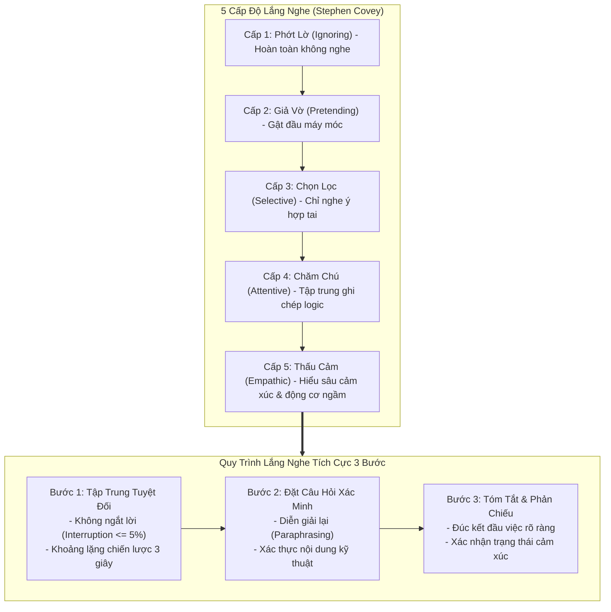
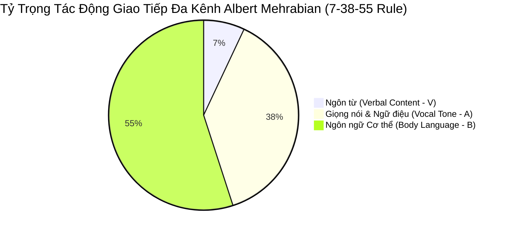
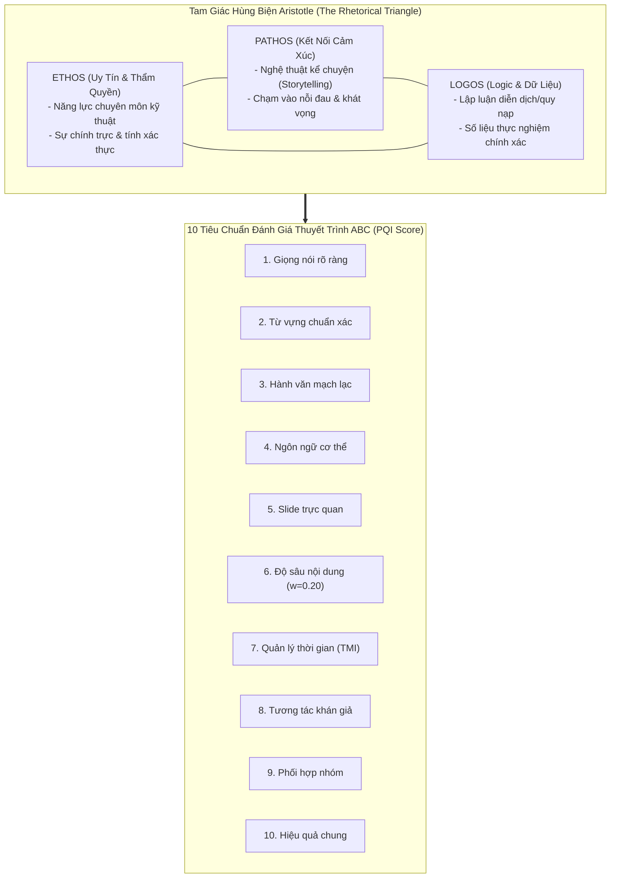
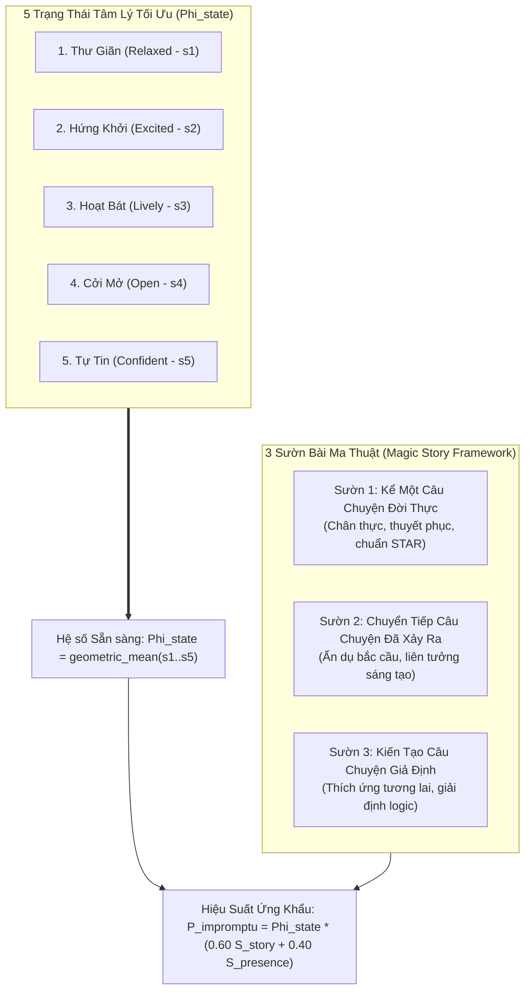
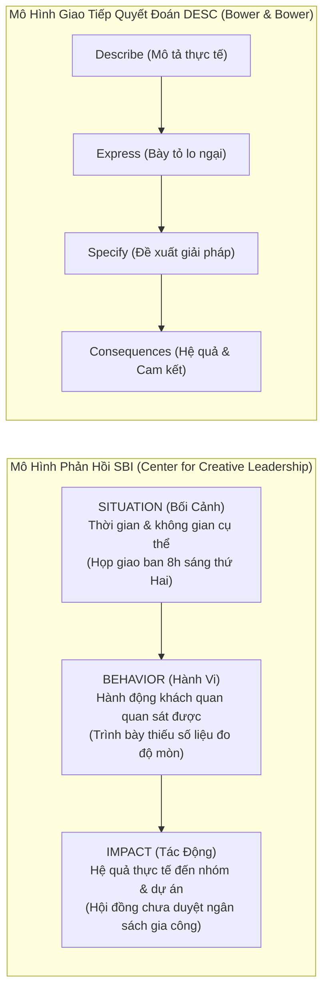
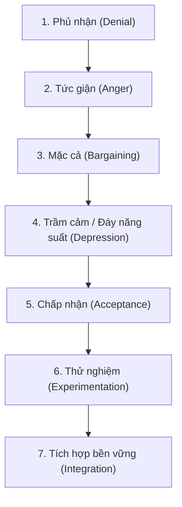

---
markmap:
  initialExpandLevel: 2
  maxWidth: 420
---

# Kỹ Năng Lãnh Đạo (Leadership Skills) - Subagent Deep Tree

## Chương 1: Tổng quan về lãnh đạo và vai trò của lãnh đạo

### 1.1 Khung Tổng Quan Học Phần & Chuẩn Đầu Ra (Course Framework & Pedagogical Alignment)

#### 1.1.1 Thông Tin Học Thuật & Ma Trận Phân Bổ Thời Gian
##### 1.1.1.1 Thông số định lượng học phần ME4625
###### 1.1.1.1.1 Mã môn học và định mức tín chỉ
- **Mã môn học**: ME4625
- **Tên học phần**: Kỹ Năng Lãnh Đạo (Leadership Skills)
- **Đơn vị quản lý chuyên môn**: Khoa Cơ Khí / Bộ môn Kỹ thuật Hệ thống Công nghiệp - Trường Đại học Bách Khoa, ĐHQG TP.HCM (HCMUT)
- **Giảng viên phụ trách**: TS. Phan Thành Nhân
- **Định mức tín chỉ**: 3 tín chỉ (tương đương 6 ECTS theo chuẩn châu Âu)
###### 1.1.1.1.2 Phân rã quỹ thời gian học tập chuẩn hóa (150 giờ tổng thể)
- **Tổng quỹ thời gian**: 150 giờ học tập định mức
- **Thời lượng lý thuyết tập trung (Lecture hours)**: 30 giờ tiếp thu lý thuyết trên lớp
- **Thời lượng bài tập lớn và thảo luận nhóm (BTL / Seminar)**: 45 giờ làm việc nhóm, phân tích tình huống thực địa và thuyết trình
- **Thời lượng tự học và nghiên cứu tài liệu (Self-study)**: 60 giờ tự học có hướng dẫn qua hệ thống LMS
- **Thời lượng hoạt động học thuật khác (Other academic activities)**: 15 giờ tham vấn chuyên gia, kiểm tra định kỳ và đánh giá chéo
###### 1.1.1.1.3 Cấu trúc ma trận đánh giá kết quả học tập (Assessment Scheme)
- **Bài tập lớn 1 (Assignment / Project 1)**: Chiếm 25% tổng điểm học phần (Đánh giá năng lực làm việc nhóm, xây dựng tầm nhìn và phân tích tương tác lãnh đạo)
- **Bài tập lớn 2 (Assignment / Project 2)**: Chiếm 25% tổng điểm học phần (Đánh giá giải quyết xung đột, quản trị sự thay đổi và thuyết trình chiến lược)
- **Thi kết thúc học phần (Final Examination)**: Chiếm 50% tổng điểm học phần (Đánh giá tổng hợp kiến thức lý thuyết, phân tích định lượng và xử lý tình huống quản trị)

##### 1.1.1.2 Chuẩn đầu ra môn học (Learning Outcomes - LOs) theo chuẩn kiểm định ABET
###### 1.1.1.2.1 Tiêu chuẩn kiểm định quốc tế ABET Criteria 3 (SO 5)
- **Mã tiêu chuẩn**: ABET EAC Student Outcome 5
- **Nội dung chuẩn hóa**: *"An ability to function effectively on a team whose members together provide leadership, create a collaborative and inclusive environment, establish goals, plan tasks, and meet objectives."*
- **Yêu cầu cốt lõi**: Khả năng vận hành hiệu quả trong nhóm mà các thành viên cùng chia sẻ trách nhiệm lãnh đạo, tạo lập môi trường hợp tác hòa nhập, thiết lập mục tiêu, hoạch định nhiệm vụ và hoàn thành các chỉ tiêu đề ra.
###### 1.1.1.2.2 Hệ thống 4 chuẩn đầu ra chi tiết của học phần (Course Learning Outcomes)
- **LO1 - Thấu hiểu lý luận và phong cách**: Nắm vững các khái niệm nền tảng, tiến trình phát triển học thuật và nhận diện các phong cách lãnh đạo cơ bản (Độc đoán, Dân chủ, Tự do, Chuyển hóa, Giao dịch, Phục vụ).
- **LO2 - Nhận diện và rèn luyện kỹ năng cốt lõi**: Nhận biết các khoảng trống năng lực cá nhân, rèn luyện hệ thống kỹ năng giao tiếp, lắng nghe tích cực, phản hồi kiến tạo, tạo động lực và tư duy phản biện.
- **LO3 - Vận dụng thực tiễn trong kỹ thuật**: Vận dụng linh hoạt kỹ năng lãnh đạo vào điều phối nhóm kỹ thuật, giải quyết bài toán đa mục tiêu, xử lý xung đột nội bộ và ra quyết định trong điều kiện bất định.
- **LO4 - Tự đánh giá và kiến tạo phong cách cá nhân**: Phát triển năng lực tự nhận thức (Self-awareness), đo lường chỉ số lãnh đạo và xây dựng lộ trình hoàn thiện phong cách lãnh đạo cá nhân bền vững.

#### 1.1.2 Kiến Trúc 11 Chương Học Phần & Tính Kết Nối Hệ Thống
##### 1.1.2.1 Tầng 1: Nền tảng lý thuyết và bản chất lãnh đạo (Foundational Layer)
- **Chương 1: Tổng quan về lãnh đạo và vai trò của lãnh đạo**: Khái niệm, mô hình tương tác Hughes-Ginnett-Curphy, phân biệt lãnh đạo vs quản lý, phản biện ngộ nhận.
- **Chương 2: Các lý thuyết lãnh đạo kinh điển**: Lý thuyết đặc điểm (Trait Theory), lý thuyết hành vi (Ohio State, Michigan, Blake-Mouton), và lý thuyết ngẫu nhiên / tình huống (Fiedler, Hersey-Blanchard).
- **Chương 3: Phong cách lãnh đạo hiện đại**: Phân loại phong cách độc đoán (Autocratic), dân chủ (Democratic), tự do (Laissez-faire), chuyển hóa (Transformational), giao dịch (Transactional), và phục vụ (Servant leadership).
##### 1.1.2.2 Tầng 2: Kỹ năng tương tác và tạo ảnh hưởng đa chiều (Interpersonal Influence Layer)
- **Chương 4: Kỹ năng giao tiếp trong lãnh đạo**: Mô hình truyền thông hai chiều, kênh giao tiếp phi ngôn ngữ, nghệ thuật thuyết trình thuyết phục.
- **Chương 5: Kỹ năng lắng nghe và phản hồi hiệu quả**: Lắng nghe thấu cảm (Active listening), các rào cản tâm lý trong giao tiếp, mô hình phản hồi SBI (Situation-Behavior-Impact).
- **Chương 6: Tư duy phản biện và ra quyết định chiến lược**: Phân tích logic, ma trận quyết định, nhận diện thiên kiến nhận thức, giải quyết vấn đề có cấu trúc.
- **Chương 7: Kỹ năng tạo động lực và truyền cảm hứng**: Học thuyết Maslow, Herzberg, McClelland, thuyết kỳ vọng Vroom, thuyết thiết lập mục tiêu Locke.
##### 1.1.2.3 Tầng 3: Thực thi tổ chức, chuyển đổi và phát triển bản thân (Organizational Execution & Self-Mastery Layer)
- **Chương 8: Lãnh đạo đội nhóm – Quản lý xung đột, xây dựng niềm tin**: Mô hình phát triển nhóm Tuckman (Forming-Storming-Norming-Performing), ma trận Thomas-Kilmann xử lý xung đột, tháp niềm tin Lencioni.
- **Chương 9: Lãnh đạo trong môi trường thay đổi, đổi mới và thích ứng**: Mô hình 8 bước biến đổi của John Kotter, quản trị kháng cự thay đổi, lãnh đạo thích ứng (Adaptive leadership) trong môi trường VUCA/BANI.
- **Chương 10: Đạo đức và trách nhiệm trong lãnh đạo**: Khung đạo đức đức hạnh, nghĩa vụ luận, thuyết vị lợi, trách nhiệm xã hội doanh nghiệp (CSR) và quản trị minh bạch.
- **Chương 11: Lập kế hoạch phát triển kỹ năng lãnh đạo cá nhân**: Tự đánh giá 360 độ, xây dựng bản kế hoạch phát triển cá nhân (IDP - Individual Development Plan), nguyên tắc tự kỷ luật và học tập suốt đời.

#### 1.1.3 Hoạt Động Khởi Tạo Nhóm (Ice-Breaking Protocol) & Thiết Lập Tầm Nhìn Dự Án
##### 1.1.3.1 Quy trình thành lập nhóm kỹ thuật 5-6 thành viên (Slide 5)
- **Quy mô nhóm chuẩn**: Định mức 5 đến 6 sinh viên/nhóm nhằm tối ưu hóa sự tương tác và phân chia vai trò chuyên trách.
- **Viết bản tuyên ngôn định hướng ban đầu**: Mỗi cá nhân độc lập soạn thảo đề xuất về Tầm nhìn (Vision), Sứ mệnh (Mission) và Hệ giá trị cốt lõi (Core Values) hướng đến thành công chung của học phần.
- **Bầu chọn Trưởng nhóm (Team Leader Election)**: Nhóm tổ chức bầu chọn dựa trên mức độ tín nhiệm, khả năng cam kết thời gian và năng lực kết nối.
- **Chuẩn hóa mục tiêu chiến lược**: Nhất thể hóa các ý tưởng thành Bản điều lệ nhóm (Team Charter) và nộp danh sách thành viên chính thức lên cổng LMS trường.

---

### 1.2 Bản Chất Lãnh Đạo & Tiến Trình Định Nghĩa Học Thuật (The Evolution & Core Concept of Leadership)

#### 1.2.1 Nguyên Lý Nền Tảng: Quá Trình Thay Vì Vị Trí ("Leadership is a Process, Not a Position")
##### 1.2.1.1 Bản chất phi tĩnh (Dynamic process) của hoạt động lãnh đạo
- **Không đồng nhất với ghế quyền lực hình thức**: Lãnh đạo không phải là một chức danh (title), một vị trí trên sơ đồ tổ chức (box on an org chart), hay một đặc quyền bổ nhiệm.
- **Bản chất dòng chảy tương tác**: Lãnh đạo là một chuỗi hành động tương hỗ liên tục diễn ra giữa người khởi xướng ảnh hưởng và các cá nhân tiếp nhận ảnh hưởng nhằm hướng tới một mục đích có ý nghĩa.
- **Tính phi thứ bậc**: Ảnh hưởng lãnh đạo có thể lan tỏa theo chiều dọc xuống (Top-down), chiều ngang giữa đồng cấp (Lateral/Peer leadership), và chiều ngược từ dưới lên trên (Bottom-up leadership).
##### 1.2.1.2 Phân định Quyền lực Vị trí (Position Power) vs Quyền lực Cá nhân (Personal Power)
###### 1.2.1.2.1 Nguồn gốc và giới hạn của Quyền lực Vị trí (Position Power)
- **Nguồn gốc phát sinh**: Xuất phát từ quyền lực pháp lý chính thức (Legitimate power), quyền lực ban thưởng (Reward power), và quyền lực trừng phạt cưỡng chế (Coercive power) do tổ chức trao quyền.
- **Hành vi tuân thủ của cấp dưới**: Tạo ra sự tuân thủ hình thức (Compliance) mang tính đối phó; nhân viên làm việc vì "phải làm" (*because they have to*) để tránh chế tài hoặc nhận lương thưởng.
- **Phạm vi tác động**: Bị giới hạn nghiêm ngặt bởi mô tả công việc, nội quy công ty và ranh giới hành chính; hiệu lực giảm sút đột ngột khi người quản lý rời khỏi phạm vi giám sát.
###### 1.2.1.2.2 Nguồn gốc và sức mạnh bền vững của Quyền lực Cá nhân (Personal Power)
- **Nguồn gốc phát sinh**: Xuất phát từ quyền lực chuyên môn sâu sắc (Expert power) và quyền lực quy chiếu / uy tín nhân cách cá nhân (Referent power).
- **Hành vi cam kết của cấp dưới**: Tạo ra sự cam kết nội tại (Commitment) và tuân thủ tự nguyện (*Willing compliance*); nhân viên cống hiến vì "mong muốn làm" (*because they want to*).
- **Khả năng lan tỏa**: Vượt qua mọi rào cản phân cấp phòng ban; thúc đẩy sáng kiến tự phát và nỗ lực vượt định mức (Extra-role behaviors / Organizational Citizenship Behavior - OCB).

#### 1.2.2 Chỉ Số Hiệu Quả Ảnh Hưởng Tự Nguyện Hogan-Merston (IEI)
##### 1.2.2.1 Cơ sở lý thuyết của mô hình Merston (1969) và Hogan, Curphy & Hogan (1994)
- **Định nghĩa cốt lõi**: *"An interpersonal relations in which others comply because they want to, not because they have to."* - Lãnh đạo là mối quan hệ tương tác liên cá nhân mà trong đó người khác tuân thủ vì họ tự nguyện mong muốn, chứ không phải vì họ bị ép buộc.
- **Ý nghĩa định lượng**: Một mối quan hệ ảnh hưởng chỉ đạt đẳng cấp lãnh đạo chân chính khi xác suất hành động tự giác vượt trội hoàn toàn so với hành động do áp lực cưỡng bức.
##### 1.2.2.2 Biểu thức toán học chuẩn hóa `eq_ch01_003`
###### 1.2.2.2.1 Công thức tính toán
$$\text{IEI} = \frac{P_{\text{willing}}}{P_{\text{willing}} + P_{\text{coerced}}} \times 100\%$$
- **Mã định danh công thức**: `eq_ch01_003`
- **Dạng biểu diễn văn bản thuần (Plain text)**: `IEI = [P_willing / (P_willing + P_coerced)] * 100%`
###### 1.2.2.2.2 Định nghĩa biến số và miền giá trị
- **$\text{IEI}$ (Influence Effectiveness Index)**: Chỉ số hiệu quả ảnh hưởng tự nguyện của người lãnh đạo đối với tập thể, đơn vị tính: phần trăm ($\%$).
- **$P_{\text{willing}}$**: Xác suất hoặc tỷ trọng hành vi tuân thủ xuất phát từ động lực tự thân, sự tin tưởng và đồng thuận giá trị của người theo dõi, miền giá trị: $P_{\text{willing}} \in [0.0, 1.0]$.
- **$P_{\text{coerced}}$**: Xác suất hoặc tỷ trọng hành vi tuân thủ xuất phát từ nỗi sợ bị kỷ luật, áp lực hành chính, hoặc cưỡng bức mệnh lệnh, miền giá trị: $P_{\text{coerced}} \in [0.0, 1.0]$.
###### 1.2.2.2.3 Miền khuyến nghị thiết kế và phân loại ngưỡng quản trị
- **Miền khuyến nghị chuẩn hóa (Design Recommended Range)**: $\text{IEI}^* \in [75.0\%, 95.0\%]$.
- **Ngưỡng Lãnh đạo Truyền cảm hứng (Transformational & Inspirational)**: $\text{IEI} \ge 80.0\%$ (Tập thể đạt mức độ gắn kết cao, động lực nội tại mạnh mẽ).
- **Ngưỡng Cảnh báo Mơ hồ Quản trị (Ambiguity / Bureaucracy Zone)**: $50.0\% \le \text{IEI} < 75.0\%$ (Tổ chức vận hành dựa trên sự thỏa hiệp, thiếu sinh khí đổi mới).
- **Ngưỡng Áp đặt Cưỡng chế Độc đoán (Coercive & Authoritarian Trap)**: $\text{IEI} < 50.0\%$ (Nguy cơ phản kháng ngầm cao, tỷ lệ nghỉ việc và kiệt sức gia tăng).

#### 1.2.3 Tiến Trình Lịch Sử Các Định Nghĩa Kinh Điển (1921 - 1996)
##### 1.2.3.1 Giai đoạn 1921 - 1969: Quyền uy, Hành vi và Mối quan hệ ảnh hưởng
###### 1.2.3.1.1 Munson (1921) - Sức mạnh sáng tạo của tinh thần
- **Nguyên văn học thuật**: *"The creative and directive force of morale."*
- **Bản dịch chuẩn**: *"Lực lượng sáng tạo và chỉ đạo của tinh thần."*
- **Ý nghĩa lý luận**: Lãnh đạo lần đầu tiên được gắn liền với trạng thái tâm lý và tinh thần đồng đội (Morale), xem tinh thần là động lực kích hoạt sức sáng tạo và định hình hành vi tập thể.
###### 1.2.3.1.2 Bennis (1959) - Tác nhân điều chỉnh hành vi cấp dưới
- **Nguyên văn học thuật**: *"The process by which an agent induces a subordinate to behave in a desired manner."*
- **Bản dịch chuẩn**: *"Quá trình mà một tác nhân thúc đẩy cấp dưới hành xử theo cách mong muốn."*
- **Ý nghĩa lý luận**: Tiếp cận theo trường phái hành vi (Behaviorism), nhìn nhận lãnh đạo như một tiến trình tác động có chủ đích nhằm định hướng hành vi của nhân viên hướng tới mục tiêu cụ thể.
###### 1.2.3.1.3 Fiedler (1967) - Chỉ đạo và phối hợp hoạt động nhóm
- **Nguyên văn học thuật**: *"Directing and coordinating the work of group members."*
- **Bản dịch chuẩn**: *"Chỉ đạo và phối hợp công việc của các thành viên nhóm."*
- **Ý nghĩa lý luận**: Đặt nền tảng cho thuyết lãnh đạo ngẫu nhiên (Contingency Theory); tập trung vào hai trục tác nghiệp then chốt: định hướng cấu trúc công việc (Directing) và đồng bộ hóa nỗ lực cá nhân (Coordinating).
###### 1.2.3.1.4 Hollander & Julian (1969) - Sự hiện diện của mối quan hệ ảnh hưởng đa phương
- **Nguyên văn học thuật**: *"The presence of a particular influence relationship between two or more persons."*
- **Bản dịch chuẩn**: *"Sự hiện diện của mối quan hệ ảnh hưởng cụ thể giữa hai hoặc nhiều người."*
- **Ý nghĩa lý luận**: Chuyển dịch góc nhìn từ tác động đơn phương sang cấu trúc quan hệ xã hội hai chiều (Social exchange); lãnh đạo tồn tại trong không gian tương tác giữa các chủ thể.
###### 1.2.3.1.5 Merston (1969) - Sự tuân thủ xuất phát từ nguyện vọng tự thân
- **Nguyên văn học thuật**: *"An interpersonal relations in which others comply because they want to, not because they have to."*
- **Bản dịch chuẩn**: *"Một mối quan hệ giữa các cá nhân trong đó những người khác tuân thủ vì họ muốn, không phải vì họ phải làm."*
- **Ý nghĩa lý luận**: Bước ngoặt phân định giữa ảnh hưởng quyền lực vị trí và ảnh hưởng truyền cảm hứng tự nguyện.

##### 1.2.3.2 Giai đoạn 1984 - 1996: Chuyển đổi Tầm nhìn, Tập trung Nguồn lực và Kiến tạo Bối cảnh
###### 1.2.3.2.1 Roach & Behling (1984) - Tác động nhóm có tổ chức hướng đích
- **Nguyên văn học thuật**: *"The process of influencing an organized group toward accomplishing its goals."*
- **Bản dịch chuẩn**: *"Quá trình tác động đến một nhóm có tổ chức hướng tới việc hoàn thành mục tiêu của nhóm."*
- **Ý nghĩa lý luận**: Gắn chặt hoạt động lãnh đạo với bối cảnh cơ cấu tổ chức chính quy và việc hoàn thành các mốc mục tiêu định lượng.
###### 1.2.3.2.2 Bass (1985) và Tichy & Devanna (1986) - Lãnh đạo chuyển hóa và truyền đạt tầm nhìn
- **Nguyên văn học thuật**: *"Transforming followers, creating visions of the goals that may be attained, and articulating for the followers the ways to attain those goals."*
- **Bản dịch chuẩn**: *"Chuyển đổi những người theo dõi, tạo ra tầm nhìn về các mục tiêu có thể đạt được và nêu rõ cho những người theo dõi các cách để đạt được các mục tiêu đó."*
- **Ý nghĩa lý luận**: Nền tảng của Lý thuyết Lãnh đạo Chuyển hóa (Transformational Leadership); nhà lãnh đạo nâng tầm nhận thức cấp dưới, kiến tạo bức tranh tương lai và vạch rõ lộ trình hành động.
###### 1.2.3.2.3 Campbell (1991) - Hội tụ nguồn lực đón đầu cơ hội
- **Nguyên văn học thuật**: *"Actions that focus resources to create desirable opportunities."*
- **Bản dịch chuẩn**: *"Các hành động tập trung nguồn lực để tạo ra các cơ hội mong muốn."*
- **Ý nghĩa lý luận**: Cách tiếp cận chiến lược thực dụng; người lãnh đạo đóng vai trò tối ưu hóa và liên kết nguồn lực (con người, tài chính, công nghệ) để chủ động tạo ra vị thế cạnh tranh mới.
###### 1.2.3.2.4 Hogan, Curphy & Hogan (1994) - Tái khẳng định quyền lực thuyết phục tự nguyện
- **Nguyên văn học thuật**: Phát triển định nghĩa Merston (1969) trong các nghiên cứu tâm lý học nhân sự của Hội Tâm lý Hoa Kỳ (APA), khẳng định năng lực thuyết phục tự nguyện là thước đo tối hậu của khả năng lãnh đạo nhóm hiệu năng cao.
###### 1.2.3.2.5 Ginnett (1996) - Kiến tạo môi trường và điều kiện thành công cho nhóm
- **Nguyên văn học thuật**: *"The leader’s job is to create conditions for the team to be effective."*
- **Bản dịch chuẩn**: *"Nhiệm vụ của người lãnh đạo là tạo ra các điều kiện để nhóm có thể hoạt động hiệu quả."*
- **Ý nghĩa lý luận**: Triết lý lãnh đạo phục vụ và lãnh đạo hỗ trợ (Supportive / Enabling Leadership); nhà lãnh đạo không làm thay công việc mà tập trung gỡ bỏ rào cản, xây dựng cơ chế và cung cấp tài nguyên để tập thể tự tỏa sáng.

#### 1.2.4 Khái Niệm Lãnh Đạo Hiện Đại Tổng Hợp (Slide 12)
##### 1.2.4.1 Định nghĩa tổng hợp cốt lõi
- *"Lãnh đạo là quá trình ảnh hưởng đến người khác để đạt được mục tiêu chung. Là khả năng truyền cảm hứng, định hướng và tạo động lực cho cá nhân, nhóm hoặc tổ chức."*
##### 1.2.4.2 Ba trụ cột hành vi của nhà lãnh đạo hiện đại
- **Trụ cột Định hướng (Direction Setting)**: Xây dựng tầm nhìn rõ ràng, vạch ra các mục tiêu chiến lược và xác lập chuẩn mực thành công.
- **Trụ cột Truyền cảm hứng (Inspiration)**: Kết nối mục tiêu công việc với khát vọng cá nhân của cấp dưới, tạo ra ý nghĩa và niềm tự hào trong công việc.
- **Trụ cột Tạo động lực (Motivation & Empowerment)**: Cung cấp nguồn lực, ủy quyền thực chất, công nhận thành tích và khích lệ nhân viên vượt qua giới hạn của bản thân.

---

### 1.3 Mô Hình Tương Tác Ba Chiều Hughes-Ginnett-Curphy (The Leadership Interaction Process Triad)

#### 1.3.1 Kiến Trúc Mô Hình Ba Chiều (Leader - Followers - Situation Triad)
##### 1.3.1.1 Bản chất tương hỗ phức hợp không thể chia cắt
- **Khái niệm then chốt**: Hiệu quả lãnh đạo không bao giờ là thuộc tính đơn lẻ của cá nhân nhà lãnh đạo; nó là kết quả của một hệ thống tương tác năng động giữa 3 thành phần: Người lãnh đạo (Leader), Người theo dõi (Followers), và Tình huống/Bối cảnh (Situation) (Slide 8).
- **Tính phi tuyến tính**: Một phong cách lãnh đạo thành công rực rỡ với nhóm này trong bối cảnh này có thể thất bại thảm hại khi áp dụng cho nhóm khác hoặc trong một tình huống biến động khác.
##### 1.3.1.2 Biểu thức toán học hàm tương tác ba chiều `eq_ch01_001`
###### 1.3.1.2.1 Biểu thức hàm số và tuyến tính hóa có trọng số
$$L = f(\text{Leader}, \text{Followers}, \text{Situation}) = w_L \cdot S_{\text{leader}} + w_F \cdot S_{\text{followers}} + w_S \cdot S_{\text{situation}}$$
- **Mã định danh công thức**: `eq_ch01_001`
- **Dạng biểu diễn văn bản thuần (Plain text)**: `L = f(Leader, Followers, Situation) = w_L * S_leader + w_F * S_followers + w_S * S_situation`
###### 1.3.1.2.2 Định nghĩa biến số và hệ đơn vị đo lường
- **$L$ (Leadership Process Effectiveness)**: Chỉ số hiệu quả tổng hợp của quá trình tương tác lãnh đạo, thang đo chuẩn: điểm số $[1.00, 5.00]$ hoặc phần trăm chuẩn hóa $[0.0\%, 100.0\%]$.
- **$S_{\text{leader}}$**: Điểm số đánh giá tổng hợp năng lực, phẩm chất, phong cách và uy tín của Người lãnh đạo, thang điểm $[1.00, 5.00]$.
- **$S_{\text{followers}}$**: Điểm số đánh giá độ sẵn sàng, năng lực kỹ thuật, mức độ gắn kết và tính tự chủ của Người theo dõi, thang điểm $[1.00, 5.00]$.
- **$S_{\text{situation}}$**: Điểm số đánh giá mức độ thuận lợi, rõ ràng của nhiệm vụ, tính ổn định môi trường và nguồn lực sẵn có của Tình huống, thang điểm $[1.00, 5.00]$.
- **$w_L, w_F, w_S$**: Các hệ số trọng số phản ánh mức độ đóng góp tương đối của từng thành phần vào hiệu quả chung, thỏa mãn điều kiện chuẩn hóa:
  $$w_L + w_F + w_S = 1.0, \quad w_L > 0, \; w_F > 0, \; w_S > 0$$
###### 1.3.1.2.3 Miền thông số khuyến nghị thực nghiệm (Empirical Parameters)
- **Trọng số Người theo dõi ($w_F$)**: Thường dao động trong khoảng $0.30 - 0.50$ (Thực tế nhóm kỹ thuật cho thấy người theo dõi quyết định tới $40.0\%$ hiệu quả thực thi cuối cùng).
- **Trọng số Người lãnh đạo ($w_L$)**: Dao động trong khoảng $0.30 - 0.40$ (Đóng vai trò xúc tác, định hướng và đồng bộ).
- **Trọng số Bối cảnh ($w_S$)**: Dao động trong khoảng $0.20 - 0.35$ (Mức độ ảnh hưởng của môi trường cạnh tranh, công nghệ và tính bất định).

#### 1.3.2 Phân Tích Chi Tiết Thành Phần Người Lãnh Đạo (The Leader Dimension)
##### 1.3.2.1 Thuộc tính nhân cách và tâm lý cá nhân (Personality & Traits)
- **Hệ tính cách Big Five (OCEAN)**:
  - *Extraversion (Hướng ngoại)*: Năng lượng giao tiếp, khả năng khẳng định vị thế và lôi cuốn đám đông.
  - *Conscientiousness (Tận tâm)*: Tinh thần trách nhiệm, kỷ luật tự thân, định hướng mục tiêu cao độ.
  - *Agreeableness (Hòa đồng)*: Tính hợp tác, sự thấu cảm, khả năng xây dựng lòng tin.
  - *Openness to Experience (Sẵn sàng trải nghiệm)*: Tư duy đổi mới sáng tạo, cởi mở với cái mới, ham học hỏi.
  - *Emotional Stability / Low Neuroticism (Ổn định cảm xúc)*: Điềm tĩnh dưới áp lực cao, kiểm soát xung động, kiên cường (Resilience).
- **Trí tuệ cảm xúc (Emotional Intelligence - EQ)**: Khả năng nhận biết và quản lý cảm xúc bản thân kết hợp thấu cảm và điều hướng cảm xúc xã hội (Goleman model).
##### 1.3.2.2 Vị thế tổ chức và nền tảng chuyên môn (Position & Expertise)
- **Năng lực chuyên môn kỹ thuật (Technical Competency)**: Khả năng hiểu sâu bản chất kỹ thuật, đánh giá rủi ro hệ thống và đưa ra quyết định dựa trên bằng chứng dữ liệu.
- **Tính chính danh và thẩm quyền (Legitimacy & Formal Authority)**: Quyền lực được tổ chức chính thức thừa nhận, cho phép tiếp cận nguồn lực tài chính, nhân sự và thông tin chiến lược.
- **Lịch sử tín nhiệm (Track Record of Success)**: Uy tín được tích lũy qua chuỗi thành công trong quá khứ, tạo niềm tin cho cấp dưới khi dấn thân vào các dự án mới.

#### 1.3.3 Phân Tích Chi Tiết Thành Phần Người Theo Dõi (The Followers Dimension)
##### 1.3.3.1 Mức độ sẵn sàng và năng lực kỹ thuật (Readiness & Competence)
- **Năng lực thực hiện nhiệm vụ (Job Readiness / Competence)**: Kiến thức, kỹ năng kỹ thuật, kinh nghiệm chuyên môn đáp ứng yêu cầu công việc.
- **Động lực tâm lý (Psychological Readiness / Commitment)**: Sự tự tin, mức độ cam kết, tinh thần chịu trách nhiệm và khát khao đóng góp.
- **Ma trận 4 cấp độ phát triển của cấp dưới (Hersey-Blanchard Development Levels)**:
  - *D1 - Nhiệt tình nhưng thiếu kỹ năng (Low competence, high commitment)*: Cần chỉ đạo chi tiết.
  - *D2 - Vỡ mộng và hoang mang (Low/some competence, low commitment)*: Cần huấn luyện và động viên.
  - *D3 - Có năng lực nhưng dao động (High competence, variable commitment)*: Cần hỗ trợ và tạo điều kiện.
  - *D4 - Độc lập và xuất sắc (High competence, high commitment)*: Ủy quyền toàn diện.
##### 1.3.3.2 Hệ giá trị, chuẩn mực và tính gắn kết nhóm (Values, Norms & Cohesiveness)
- **Chuẩn mực nhóm (Group Norms)**: Các quy tắc ngầm định hoặc chính thức về hành vi, tiêu chuẩn đạo đức nghề nghiệp và cam kết tiến độ.
- **Độ gắn kết nội tại (Team Cohesiveness)**: Lực hút liên kết các thành viên lại với nhau; nhóm gắn kết cao có tinh thần đồng đội mạnh nhưng cần cảnh giác hiện tượng Tư duy bầy đàn (Groupthink).
- **Mô hình 5 kiểu người theo dõi của Robert Kelley (Kelley Followership Typology)**:
  - *Alienated (Người bất mãn)*: Tư duy phản biện độc lập cao nhưng thụ động, hay hoài nghi tiêu cực.
  - *Passive / Sheep (Người thụ động)*: Thiếu tư duy phản biện lẫn tính chủ động, chỉ làm khi có lệnh.
  - *Conformist / Yes People (Người tuân phục)*: Chủ động hành động nhưng không có tư duy phản biện, luôn gật đầu đồng ý.
  - *Pragmatic Survivor (Người thực dụng)*: Hành xử nước đôi, né tránh rủi ro, chỉ làm vừa đủ để giữ ghế.
  - *Exemplary / Effective Follower (Người gương mẫu)*: Vừa có tư duy phản biện độc lập sâu sắc, vừa hành động chủ động, đồng hành và phản biện xây dựng cùng lãnh đạo.

#### 1.3.4 Phân Tích Chi Tiết Thành Phần Tình Huống / Bối Cảnh (The Situation Dimension)
##### 1.3.4.1 Đặc tính nhiệm vụ và mức độ cấu trúc (Task Characteristics & Structure)
- **Mức độ cấu trúc của nhiệm vụ (Task Structure)**: Nhiệm vụ có quy trình rõ ràng, thuật toán cụ thể (High structure) vs Nhiệm vụ nghiên cứu phát triển R&D mở, phi cấu trúc (Low structure).
- **Mức độ phụ thuộc lẫn nhau (Task Interdependence)**: Tác nghiệp độc lập, tuần tự (Sequential) hay tương hỗ đa chiều (Reciprocal) đòi hỏi mức độ phối hợp lãnh đạo rất cao.
- **Tính khẩn cấp và rủi ro thất bại (Urgency & Stakes)**: Áp lực thời hạn gấp, rủi ro an toàn sinh mạng, thiệt hại tài chính lớn đòi hỏi phong cách chỉ huy dứt khoát.
##### 1.3.4.2 Môi trường áp lực, văn hóa và bối cảnh vĩ mô (Stress, Culture & Environment)
- **Áp lực môi trường làm việc (Workplace Stress)**: Sự thiếu hụt nguồn lực, thay đổi yêu cầu liên tục từ khách hàng, xung đột mục tiêu.
- **Văn hóa tổ chức (Organizational Culture)**: Văn hóa hướng nội bộ, kiểm soát chặt chẽ (Hierarchy) vs Văn hóa sáng tạo linh hoạt (Adhocracy) vs Văn hóa cạnh tranh thị trường (Market).
- **Đặc trưng môi trường VUCA / BANI**: Tính biến động (Volatility), Không chắc chắn (Uncertainty), Phức tạp (Complexity), Mơ hồ (Ambiguity) / Dễ vỡ (Brittle), Lo âu (Anxious), Phi tuyến (Non-linear), Khó hiểu (Incomprehensible).

---

### 1.4 Tính Hai Mặt Lý Trí & Cảm Xúc trong Lãnh Đạo (Rational Techniques vs Emotional Appeals)

#### 1.4.1 Bản Chất Tính Hai Mặt (Dual-Nature of Leadership)
##### 1.4.1.1 Phá vỡ định kiến nhị nguyên đối lập (Slide 13)
- **Định kiến sai lầm phổ biến**: Xem lãnh đạo kỹ thuật chỉ thuần túy là việc tính toán số liệu, lập lịch Gantt và kiểm soát logic; hoặc ngược lại xem lãnh đạo chỉ là thuật mị dân bằng cảm xúc sáo rỗng.
- **Nguyên lý tương hỗ biện chứng**: *"Leadership is both Rational and Emotional"* - Lãnh đạo là sự kết hợp hoàn hảo giữa khối óc tỉnh táo (Lý trí khoa học) và trái tim nồng ấm (Cảm xúc nhân văn).
- **Quy luật bù trừ và cộng hưởng**: Lý trí cung cấp bản đồ và phương tiện đi đến đích; Cảm xúc cung cấp nhiên liệu và ngọn lửa nhiệt huyết để vượt qua gian khó.

#### 1.4.2 Kỹ Thuật Lý Trí (Rational Techniques)
##### 1.4.2.1 Hoạch định khoa học và phân tích định lượng
- **Thiết lập mục tiêu theo tiêu chuẩn SMART**: Cụ thể (Specific), Đo lường được (Measurable), Khả thi (Achievable), Phù hợp (Relevant), Có thời hạn (Time-bound).
- **Quy trình giải quyết vấn đề dựa trên dữ liệu (Data-driven Problem Solving)**: Áp dụng chu trình PDCA (Plan-Do-Check-Act), biểu đồ nhân quả Ishikawa (Fishbone), phương pháp 5 Whys.
- **Tối ưu hóa phân bổ nguồn lực**: Quản trị đường găng CPM/PERT, cân bằng tải lao động, quản trị ngân sách và dòng tiền dự án.
##### 1.4.2.2 Thuyết phục dựa trên logic và bằng chứng thực nghiệm
- **Cấu trúc lập luận chặt chẽ (Pyramid Principle)**: Đưa ra thông điệp chủ chốt trước, hỗ trợ bằng các luận điểm logic và minh chứng thực nghiệm xác đáng.
- **Đánh giá rủi ro định lượng (FMEA / Risk Matrix)**: Phân tích xác suất xảy ra và mức độ nghiêm trọng của sai lỗi để thuyết phục các bên liên quan phê duyệt giải pháp.

#### 1.4.3 Lời Kêu Gọi Cảm Xúc (Emotional Appeals)
##### 1.4.3.1 Nghệ thuật truyền cảm hứng và khơi gợi ý nghĩa
- **Truyền đạt câu chuyện tầm nhìn (Narrative & Storytelling)**: Diễn đạt mục tiêu khô khan thành một hành trình sứ mệnh đầy cảm hứng, giúp cấp dưới thấy được giá trị cống hiến to lớn của mình.
- **Nghệ thuật khơi dậy niềm tự hào tập thể**: Tôn vinh các giá trị văn hóa, bản sắc của nhóm, biến công việc hàng ngày thành niềm tự hào cá nhân và nghề nghiệp.
##### 1.4.3.2 Thấu cảm, kết nối và kiến tạo sự an toàn tâm lý (Psychological Safety)
- **Năng lực thấu cảm sâu sắc (Empathy)**: Lắng nghe không phán xét, thấu hiểu khó khăn, áp lực gia đình và cảm xúc thực sự của từng thành viên.
- **Kiến tạo môi trường an toàn tâm lý (Amy Edmondson framework)**: Thiết lập không gian mà ở đó nhân viên không sợ bị chê cười khi nêu ý tưởng điên rồ, không sợ bị trừng phạt khi thừa nhận sai sót kỹ thuật sớm để cùng sửa chữa.

#### 1.4.4 Hàm Cộng Hưởng Lãnh Đạo Lý Trí - Cảm Xúc `eq_ch01_004`
##### 1.4.4.1 Cơ sở lý thuyết của hàm cộng hưởng Cobb-Douglas
- **Mục đích mô hình hóa**: Hiệu quả lãnh đạo không phải là phép cộng số học rời rạc mà là hàm nhân tương tác; nếu một trong hai yếu tố bằng không thì hiệu quả lãnh đạo tổng thể sẽ suy giảm nghiêm trọng.
##### 1.4.4.2 Biểu thức toán học hàm số `eq_ch01_004`
###### 1.4.4.2.1 Phương trình cộng hưởng
$$E_{\text{leadership}} = \kappa \cdot \left( R_{\text{technique}} \right)^{\alpha} \cdot \left( E_{\text{appeal}} \right)^{\beta}, \quad \alpha + \beta = 1.0$$
- **Mã định danh công thức**: `eq_ch01_004`
- **Dạng biểu diễn văn bản thuần (Plain text)**: `E_leadership = kappa * (R_technique^alpha) * (E_appeal^beta), alpha + beta = 1.0`
###### 1.4.4.2.2 Định nghĩa biến số và thông số mô hình
- **$E_{\text{leadership}}$**: Hiệu quả tác động lãnh đạo tổng hợp đa chiều, thang đo chuẩn hóa: $[1.00, 10.00]$ điểm.
- **$R_{\text{technique}}$**: Năng lực vận dụng kỹ thuật lý trí, phương pháp luận khoa học, năng lực phân tích dữ liệu, thang điểm $[1.00, 10.00]$.
- **$E_{\text{appeal}}$**: Khả năng thấu cảm, lôi cuốn và truyền cảm hứng cảm xúc, thang điểm $[1.00, 10.00]$.
- **$\kappa$ (Kappa)**: Hệ số tương thích văn hóa tổ chức và bối cảnh (Organizational Cultural Fit Factor), miền giá trị: $\kappa \in [0.80, 1.20]$.
- **$\alpha, \beta$**: Hệ số co giãn phản ánh tỷ trọng đóng góp của kỹ thuật lý trí và lời kêu gọi cảm xúc, thỏa mãn điều kiện:
  $$\alpha + \beta = 1.0, \quad 0 < \alpha, \beta < 1.0$$
  *(Trong các tổ chức kỹ thuật, thường $\alpha \approx 0.55 - 0.60$ và $\beta \approx 0.40 - 0.45$)*.

---

### 1.5 Phân Biệt Toàn Diện Lãnh Đạo (Leadership) và Quản Lý (Management)

#### 1.5.1 Nền Tảng Lý Thuyết: Trường Phái John Kotter và Warren Bennis
##### 1.5.1.1 Luận điểm của John Kotter (Harvard Business School, 1990)
- **Bản chất Quản lý**: *"Management is about coping with complexity."* - Quản lý là đối phó và làm chủ sự phức tạp. Không có quản lý tốt, các tổ chức lớn sẽ rơi vào hỗn loạn, thất thoát nguồn lực và sụp đổ quy trình vận hành.
- **Bản chất Lãnh đạo**: *"Leadership is about coping with change."* - Lãnh đạo là đối phó và dẫn dắt sự thay đổi. Trong thế giới cạnh tranh biến động khôn lường, tổ chức không đổi mới và không thích ứng sẽ nhanh chóng bị đào thải.
- **Mối quan hệ bổ trợ cộng sinh**: Tổ chức cần cả hai năng lực. Nhiều tổ chức hiện nay bị rơi vào tình trạng *"Over-managed and under-led"* (Quá thừa quản lý vi mô nhưng thiếu hụt trầm trọng sự dẫn dắt chiến lược).
##### 1.5.1.2 Luận điểm kinh điển của Warren Bennis (1989)
- *"Managers do things right; leaders do the right things."*
- Người quản lý tập trung vào tính hiệu quả (Efficiency) - làm đúng cách, đúng quy trình đã định sẵn; Người lãnh đạo tập trung vào tính hiệu lực và hướng đi đúng đắn (Effectiveness) - chọn lựa đúng việc cần làm, đúng thời điểm và kiến tạo tương lai.

#### 1.5.2 Bảng Ma Trận So Sánh Đối Chiếu Đa Tiêu Chí (Slide 15 - 16)
##### 1.5.2.1 Bảng phân tích tiêu chuẩn môn học (`tbl_ch01_overview_leadership_skills_03`)
| Tiêu Chí So Sánh | Lãnh Đạo (Leaders) | Quản Lý (Managers) |
|---|---|---|
| **Trọng tâm mục tiêu (Objective Focus)** | Tạo lập tầm nhìn, định hướng chiến lược dài hạn | Lập kế hoạch chi tiết, phân bổ ngân sách, kiểm soát quy trình |
| **Cơ chế tác động (Mechanism of Impact)** | Ảnh hưởng, truyền cảm hứng, khơi dậy nội lực | Giám sát, điều phối theo thẩm quyền và ra mệnh lệnh |
| **Phạm vi thời gian (Time Horizon)** | Định hướng tương lai dài hạn (*Take the long-term view*) | Quản lý kế hoạch ngắn hạn và trung hạn (*Short-term view*) |
| **Tính cách & Tư duy (Mindset & Personality)** | Cởi mở, linh hoạt, đổi mới, sẵn sàng chấp nhận rủi ro | Tuân thủ quy trình chặt chẽ, cấu trúc, giảm thiểu rủi ro |

##### 1.5.2.2 Mở rộng 11 cặp phạm trù kinh điển Bennis - Kotter (Slide 16)
- **1. Innovate vs Administer**: Người lãnh đạo đổi mới, sáng tạo giải pháp mới; Người quản lý điều hành, vận hành các cỗ máy hiện có.
- **2. Develop vs Maintain**: Người lãnh đạo tập trung phát triển con người và năng lực tổ chức; Người quản lý duy trì sự ổn định của hệ thống.
- **3. Inspire vs Control**: Người lãnh đạo truyền cảm hứng và niềm tin; Người quản lý kiểm soát hành vi và sai lệch.
- **4. Long-term vs Short-term view**: Người lãnh đạo nhìn xa trông rộng nơi chân trời; Người quản lý nhìn vào báo cáo quý và lợi nhuận trước mắt.
- **5. Ask What & Why vs Ask How & When**: Người lãnh đạo hỏi *"Cái gì"* (Mục đích tối thượng) và *"Tại sao"* (Ý nghĩa tồn tại); Người quản lý hỏi *"Làm như thế nào"* (Quy trình) và *"Khi nào xong"* (Tiến độ).
- **6. Originate vs Imitate**: Người lãnh đạo khởi xướng ý tưởng độc bản; Người quản lý sao chép, nhân bản các mô hình chuẩn hóa.
- **7. Challenge vs Accept status quo**: Người lãnh đạo thách thức hiện trạng, phá vỡ lối mòn; Người quản lý chấp nhận và bảo vệ hiện trạng ổn định.
- **8. Focus on People vs Focus on Systems**: Người lãnh đạo đặt trọng tâm vào con người; Người quản lý đặt trọng tâm vào hệ thống, cấu trúc và công nghệ.
- **9. Rely on Trust vs Rely on Authority**: Người lãnh đạo dựa trên sự tin cậy lẫn nhau; Người quản lý dựa trên quyền uy bổ nhiệm và cơ chế kiểm tra.
- **10. Eye on the Horizon vs Eye on the Bottom Line**: Người lãnh đạo hướng mắt về tương lai thị trường; Người quản lý dán mắt vào dòng kết quả tài chính cuối cùng.
- **11. Do the Right Things vs Do Things Right**: Người lãnh đạo làm điều đúng đắn; Người quản lý làm cho đúng việc.

#### 1.5.3 Tỷ Số Cân Bằng Vận Hành Lãnh Đạo - Quản Lý Kotter (LMR)
##### 1.5.3.1 Cơ sở lý thuyết của chỉ số cân bằng quỹ thời gian
- **Thực trạng lãnh đạo cấp trung**: Phần lớn các kỹ sư trưởng và quản lý dự án dành đến $80.0\%$ thời gian xử lý sự cố sự vụ (chữa cháy), khiến họ kiệt quệ và không còn tâm trí cho việc hoạch định chiến lược và phát triển đội ngũ.
- **Yêu cầu cân bằng động**: Chỉ số LMR đo lường mức độ cân đối giữa thời gian đầu tư cho Chức năng Lãnh đạo ($I_{\text{Leader}}$) và Chức năng Quản lý ($I_{\text{Manager}}$).
##### 1.5.3.2 Biểu thức toán học tỷ số cân bằng `eq_ch01_002`
###### 1.5.3.2.1 Công thức tính toán
$$\text{LMR} = \frac{I_{\text{Leader}}}{I_{\text{Manager}}} = \frac{\alpha \cdot \text{Vision} + \beta \cdot \text{Inspiration} + \gamma \cdot \text{Innovation}}{\delta \cdot \text{Planning} + \epsilon \cdot \text{Execution} + \zeta \cdot \text{Control}}$$
- **Mã định danh công thức**: `eq_ch01_002`
- **Dạng biểu diễn văn bản thuần (Plain text)**: `LMR = I_Leader / I_Manager = (alpha*Vision + beta*Inspiration + gamma*Innovation) / (delta*Planning + epsilon*Execution + zeta*Control)`
###### 1.5.3.2.2 Định nghĩa biến số và đơn vị đo
- **$\text{LMR}$ (Leadership-to-Management Ratio)**: Tỷ số cân bằng vận hành Lãnh đạo trên Quản lý, không thứ nguyên $[-]$.
- **$I_{\text{Leader}}$**: Tổng thời lượng đầu tư cho các hoạt động mang bản chất Lãnh đạo, đơn vị: giờ/tuần (hours/week).
- **$I_{\text{Manager}}$**: Tổng thời lượng đầu tư cho các hoạt động mang bản chất Quản lý tác nghiệp, đơn vị: giờ/tuần (hours/week).
- **$\text{Vision}$**: Thời lượng dành cho nghiên cứu xu hướng, xây dựng tầm nhìn, hoạch định chiến lược dài hạn, đơn vị: giờ/tuần.
- **$\text{Inspiration}$**: Thời lượng huấn luyện 1-on-1, động viên, lắng nghe và truyền cảm hứng cho nhân viên, đơn vị: giờ/tuần.
- **$\text{Innovation}$**: Thời lượng cải tiến quy trình, thử nghiệm giải pháp công nghệ mới, thách thức hiện trạng, đơn vị: giờ/tuần.
- **$\text{Planning}$**: Thời lượng lập kế hoạch dự án chi tiết, phân bổ ngân sách, lập lịch làm việc, đơn vị: giờ/tuần.
- **$\text{Execution}$**: Thời lượng điều phối tác nghiệp hàng ngày, phân công giao việc, họp giao ban, đơn vị: giờ/tuần.
- **$\text{Control}$**: Thời lượng giám sát tiến độ, kiểm tra chất lượng sản phẩm, xử lý sự cố phát sinh, viết báo cáo hành chính, đơn vị: giờ/tuần.
- **$\alpha, \beta, \gamma, \delta, \epsilon, \zeta$**: Các hệ số trọng số đánh giá chất lượng thời gian (Mặc định chuẩn hóa bằng $1.0$ khi tính tổng thời lượng thuần).
###### 1.5.3.2.3 Miền thông số khuyến nghị và phân tích trạng thái lệch chuẩn
- **Miền khuyến nghị vận hành chuẩn hóa (Design Recommended Range)**: $\text{LMR}^* \in [0.70, 1.20]$.
- **Giai đoạn Vận hành ổn định (Steady State Operations)**: Khuyến nghị $\text{LMR} \in [0.70, 0.90]$.
- **Giai đoạn Cải tổ, Khởi nghiệp hoặc Đổi mới sáng tạo (Transformation & Innovation)**: Khuyến nghị $\text{LMR} > 1.00$.
- **Bệnh lý 1 - Sa lầy Quản lý vi mô (Micromanagement Trap / Over-managed & Under-led)**: Khi $\text{LMR} < 0.70$ (đặc biệt khi $< 0.50$), nhà lãnh đạo tiêu tốn toàn bộ năng lượng vào tiểu tiết, nhóm mất phương hướng dài hạn, nhân viên ức chế và mất tính chủ động.
- **Bệnh lý 2 - Ảo tưởng Tầm nhìn (Visionary Chaos / Over-led & Under-managed)**: Khi $\text{LMR} > 1.50$ mà thiếu nền tảng quản trị thực thi vững chắc; đưa ra quá nhiều tầm nhìn bay bổng nhưng không có kế hoạch, không ai kiểm soát tiến độ, dự án trễ hạn và thất thoát ngân sách.

---

### 1.6 Phản Biện Ba Ngộ Nhận Cốt Tử Cản Trở Phát Triển Lãnh Đạo (Deconstructing Leadership Myths)

#### 1.6.1 Ngộ Nhận 1: "Lãnh Đạo Giỏi Chỉ Là Lẽ Thường Tình" ("Good Leadership is All Common Sense")
##### 1.6.1.1 Bản chất ngộ nhận và nguồn gốc tâm lý (Slide 17)
- **Nội dung ngộ nhận**: Cho rằng các nguyên tắc lãnh đạo chỉ là những điều hiển nhiên mà bất cứ ai có lương tri và suy nghĩ thông thường đều biết cách làm mà không cần phải học.
- **Thiên kiến nhận thức sai lầm (Hindsight Bias & Dunning-Kruger Effect)**: Sau khi một tình huống lãnh đạo được giải quyết thành công, người quan sát bên ngoài thường cho rằng giải pháp đó quá hiển nhiên ("Biết rồi, khổ lắm, nói mãi"); tuy nhiên khi trực tiếp đối mặt với khủng hoảng thực tế, phần lớn mọi người hành xử hoàn toàn trái ngược với "lẽ thường".
##### 1.6.1.2 Bằng chứng phản biện khoa học
- **Sự khác biệt giữa "Hiểu về mặt lý thuyết" và "Thực hành hành vi nhất quán"**: Ai cũng biết lẽ thường là phải lắng nghe cấp dưới, phải kiềm chế cơn giận, phải khen ngợi công khai và phê bình kín đáo; nhưng khi chịu áp lực tiến độ (High stress), hầu hết các nhà quản lý bản năng đều cắt lời, trút giận và chỉ trích công khai.
- **Nghịch lý lãnh đạo (Leadership Paradoxes)**: Lãnh đạo đòi hỏi xử lý các mối quan hệ phi trực giác: Muốn tăng tốc phải biết chậm lại để lắng nghe; Muốn kiểm soát tốt hơn phải học cách trao quyền và buông tay; Muốn nhân viên tự tin phải dám thừa nhận sự dễ bị tổn thương (Vulnerability) của chính mình. Những điều này hoàn toàn đối nghịch với phản xạ bản năng thông thường.

#### 1.6.2 Ngộ Nhận 2: "Lãnh Đạo Là Bẩm Sinh, Không Thể Đào Tạo" ("Leaders Are Born, Not Made")
##### 1.6.2.1 Bản chất tàn dư của Thuyết Vĩ Nhân (Great Man Theory) thế kỷ 19
- **Nguồn gốc lịch sử**: Khởi xướng bởi Thomas Carlyle (1840), cho rằng lịch sử nhân loại được định hình bởi những bậc "vĩ nhân phi thường" sở hữu các tố chất siêu phàm bẩm sinh từ trong trứng nước (Genius, Divine inspiration).
- **Hệ quả tiêu cực của tư duy cố định (Fixed Mindset)**: Khiến những người bình thường tự ti, cho rằng mình không có "gen lãnh đạo" nên không nỗ lực rèn luyện; đồng thời biện minh cho sự thất bại của các nhà quản lý thiếu phương pháp.
##### 1.6.2.2 Khoa học thần kinh và Tư duy phát triển (Growth Mindset)
- **Tính mềm dẻo của não bộ (Neuroplasticity)**: Não bộ người trưởng thành có khả năng liên tục tái cấu trúc và hình thành các liên kết synap thần kinh mới thông qua việc rèn luyện có chủ đích (Deliberate practice).
- **Kỹ năng lãnh đạo là chuỗi hành vi có thể học được**: Giao tiếp thuyết phục, quản lý xung đột, lắng nghe tích cực, tư duy chiến lược đều là những tập hợp kỹ năng cụ thể được giải mã thành các quy trình thực hành bài bản, hoàn toàn có thể đào tạo và nâng cao qua thời gian.

#### 1.6.3 Ngộ Nhận 3: "Trường Học Duy Nhất Để Học Lãnh Đạo Là Trường Đời" ("The Only School is the School of Hard Knocks")
##### 1.6.3.1 Phê phán quan điểm kinh nghiệm chủ nghĩa mù quáng
- **Nội dung ngộ nhận**: Cho rằng các lớp học, sách vở và trường đại học hoàn toàn vô dụng đối với việc học lãnh đạo; cách duy nhất là cứ lao ra thương trường va vấp, ngã đau ắt sẽ tự khôn ra.
- **Rủi ro chí mạng của việc chỉ học từ vấp ngã thuần túy**:
  - *Cái giá quá đắt (Prohibitive Cost)*: Vấp ngã trong thực tế có thể làm phá sản doanh nghiệp, hủy hoại uy tín sự nghiệp hoặc làm tổn thương nghiêm trọng đến cuộc đời nhân viên dưới quyền.
  - *Hình thành thói quen lệch lạc (Reinforcing Bad Habits)*: Nếu không có hệ thống lý thuyết soi rọi, người trải nghiệm có thể rút ra những kết luận hoàn toàn sai lầm từ thất bại (ví dụ: bị cấp dưới phản bội thì kết luận "không bao giờ được tin ai", dẫn tới phong cách quản lý độc đoán đa nghi).
##### 1.6.3.2 Khung Phát Triển Năng Lực Lãnh Đạo 70-20-10 của Morgan McCall (Center for Creative Leadership - CCL)
- **Cấu trúc tích hợp 3 nguồn học tập**: Phát triển lãnh đạo tối ưu đòi hỏi sự kết hợp cân đối giữa Trải nghiệm thực chiến (70%), Học hỏi qua phản hồi xã hội (20%), và Giáo dục lý luận chính quy (10%).
- **Vai trò tối thượng của Chu trình Học tập Trải nghiệm Kolb (Experiential Learning Cycle)**: Trải nghiệm thực tế ($C_{\text{exp}}$) chỉ biến thành trí tuệ lãnh đạo khi đi qua khâu Quan sát suy ngẫm (Reflective Observation) và Khái quát hóa thành khái niệm (Abstract Conceptualization).

#### 1.6.4 Hàm Tăng Trưởng Năng Lực Lãnh Đạo 70-20-10 McCall `eq_ch01_005`
##### 1.6.4.1 Biểu thức toán học hàm tăng trưởng `eq_ch01_005`
###### 1.6.4.1.1 Phương trình động lực phát triển
$$\Delta Q_{\text{lead}} = \eta_{\text{refl}} \cdot \left( 0.70 \cdot C_{\text{exp}} + 0.20 \cdot C_{\text{coach}} + 0.10 \cdot C_{\text{train}} \right)$$
- **Mã định danh công thức**: `eq_ch01_005`
- **Dạng biểu diễn văn bản thuần (Plain text)**: `Delta_Q_lead = eta_refl * (0.70 * C_exp + 0.20 * C_coach + 0.10 * C_train)`
###### 1.6.4.1.2 Định nghĩa biến số và đơn vị tính
- **$\Delta Q_{\text{lead}}$**: Mức độ gia tăng chỉ số năng lực lãnh đạo thực chất của học viên trong một chu kỳ phát triển, đơn vị tính: phần trăm $(\%)$.
- **$C_{\text{exp}}$**: Điểm số tích lũy từ các trải nghiệm công việc thực tế đầy thử thách (On-the-job challenging assignments, leading a project through crisis), thang điểm: $[0, 100]$.
- **$C_{\text{coach}}$**: Điểm số học hỏi thông qua tương tác xã hội, nhận phản hồi từ cố vấn (Mentoring, Coaching, 360-degree feedback), thang điểm: $[0, 100]$.
- **$C_{\text{train}}$**: Điểm số đào tạo học thuật chính quy, các khóa học lý thuyết, hội thảo và nghiên cứu tài liệu hàn lâm (Coursework, books, frameworks), thang điểm: $[0, 100]$.
- **$\eta_{\text{refl}}$ (Eta Reflection)**: Hệ số suy ngẫm, đúc kết kinh nghiệm có cấu trúc (Structured Reflection Multiplier), miền giá trị: $\eta_{\text{refl}} \in [0.50, 1.00]$.
###### 1.6.4.1.3 Miền giá trị thiết kế và ý nghĩa của hệ số suy ngẫm $\eta_{\text{refl}}$
- **Miền khuyến nghị thiết kế (Design Recommended Range)**: $\eta_{\text{refl}}^* \in [0.70, 0.95]$.
- **Nếu thiếu sự suy ngẫm ($\eta_{\text{refl}} \approx 0.50$)**: Học viên trải qua 10 năm kinh nghiệm nhưng thực chất chỉ là 1 năm kinh nghiệm lặp lại 10 lần mà không có sự tiến hóa về tư duy lãnh đạo.
- **Nếu có cơ chế suy ngẫm kỷ luật ($\eta_{\text{refl}} \ge 0.85$)**: Thông qua viết nhật ký lãnh đạo (Leadership journaling), phiên đúc kết sau hành động (After-Action Review - AAR), mọi vấp ngã đều được chuyển hóa thành bài học phát triển năng lực vượt bậc.

---

### 1.7 Năm Vai Trò Trọng Yếu Của Nhà Lãnh Đạo & Nhu Cầu Đối Với Kỹ Sư Kỹ Thuật (Core Roles & Engineering Leadership Imperative)

#### 1.7.1 Năm Vai Trò Cốt Lõi Của Nhà Lãnh Đạo Trong Tổ Chức Hiện Đại (Slide 18)
##### 1.7.1.1 Vai trò 1: Định Hướng Chiến Lược (Strategic Direction)
- **Nội dung trọng yếu**: Xác định các mục tiêu dài hạn, thiết lập tầm nhìn rõ ràng và truyền tải bức tranh tương lai một cách thuyết phục.
- **Hành vi cụ thể của nhà lãnh đạo**:
  - Phân tích bối cảnh ngành, dự báo xu hướng công nghệ tương lai và xác định các cơ hội bứt phá.
  - Định hình các ưu tiên chiến lược, biết rõ điều gì cần làm và điều gì phải dũng cảm từ bỏ (Trade-offs).
  - Kết nối mục tiêu ngắn hạn của từng bộ phận với mục tiêu chiến lược chung của toàn doanh nghiệp.
##### 1.7.1.2 Vai trò 2: Truyền Cảm Hứng & Khơi Dậy Nhiệt Huyết (Inspiration & Motivation)
- **Nội dung trọng yếu**: Khơi dậy tinh thần làm việc hăng say, chuyển dịch động cơ từ "phải làm" sang "khát khao được cống hiến".
- **Hành vi cụ thể của nhà lãnh đạo**:
  - Gương mẫu đi đầu trong hành vi (Lead by example) và thể hiện sự cam kết kiên định với sứ mệnh.
  - Công nhận, khen ngợi kịp thời các nỗ lực và đóng góp của nhân viên dù là nhỏ nhất.
  - Thắp lên niềm tin và sự lạc quan trong những giai đoạn khủng hoảng, bế tắc kỹ thuật.
##### 1.7.1.3 Vai trò 3: Tạo Môi Trường Làm Việc Tích Cực & Xây Dựng Văn Hóa (Culture & Environment)
- **Nội dung trọng yếu**: Thiết lập văn hóa tổ chức lành mạnh, nuôi dưỡng sự gắn kết và phát triển nguồn nhân lực.
- **Hành vi cụ thể của nhà lãnh đạo**:
  - Xác lập các chuẩn mực giá trị cốt lõi: Chính trực, Tôn trọng, Hợp tác và Đổi mới sáng tạo.
  - Xây dựng bầu không khí tin cậy lẫn nhau, xóa bỏ văn hóa đổ lỗi (Blame-free environment).
  - Đầu tư đào tạo, tạo điều kiện thăng tiến và quan tâm chân thành đến sự an lành (Well-being) của nhân viên.
##### 1.7.1.4 Vai trò 4: Quản Trị Sự Thay Đổi & Khủng Hoảng (Change Management & Resilience)
- **Nội dung trọng yếu**: Giúp tổ chức thích nghi linh hoạt với môi trường mới, vượt qua các cuộc khủng hoảng và bão táp thị trường.
- **Hành vi cụ thể của nhà lãnh đạo**:
  - Nhận diện sớm các tín hiệu thay đổi, tạo ra cảm thức cấp bách (Sense of urgency) trong tổ chức.
  - Thấu hiểu và hóa giải các phản ứng kháng cự tâm lý của nhân viên đối với cái mới.
  - Dẫn dắt tổ chức thực hiện các bước chuyển đổi thích ứng, học hỏi nhanh từ các thử nghiệm thất bại.
##### 1.7.1.5 Vai trò 5: Xây Dựng & Phát Triển Đội Ngũ (Team Building & Synergy)
- **Nội dung trọng yếu**: Phát triển các nhóm làm việc hiệu năng cao, nâng cao tinh thần đồng đội và giải phóng sức mạnh cộng hưởng.
- **Hành vi cụ thể của nhà lãnh đạo**:
  - Tuyển chọn và bố trí nhân sự phù hợp theo đúng năng lực và tiềm năng (Right people on the right bus).
  - Phân định rõ ràng trách nhiệm, quyền hạn và cơ chế phối hợp tác chiến giữa các thành viên.
  - Chủ động quản lý và giải quyết các xung đột nội bộ một cách kiến tạo, hướng tới mục tiêu tối thượng.

#### 1.7.2 Mệnh Lệnh Phát Triển Kỹ Năng Lãnh Đạo Dành Cho Sinh Viên & Kỹ Sư Kỹ Thuật (Slide 19 - 20)
##### 1.7.2.1 Nhu cầu bức thiết từ thị trường lao động toàn cầu
- **Yêu cầu nhân sự hình chữ T (T-shaped Professionals)**: Trục dọc là chuyên môn kỹ thuật sâu sắc (Deep technical expertise); Trục ngang là năng lực giao tiếp, lãnh đạo, làm việc nhóm và tư duy hệ thống (Broad collaboration & leadership skills).
- **Thực tế tuyển dụng ngành kỹ thuật**: Các kỹ sư có năng lực kỹ thuật xuất sắc nhưng thiếu kỹ năng lãnh đạo thường gặp "trần kính" (Glass ceiling) trong sự nghiệp, khó thăng tiến lên các vị trí Giám đốc dự án, Giám đốc kỹ thuật (CTO) hoặc CEO.
##### 1.7.2.2 Lợi ích phát triển bản thân và lộ trình quản trị tương lai
- **Làm chủ cuộc sống cá nhân (Personal Leadership)**: Kỹ năng lãnh đạo giúp cá nhân thiết lập tầm nhìn cuộc đời, quản lý thời gian, rèn luyện kỷ luật và tạo tầm ảnh hưởng tích cực đến gia đình và cộng đồng.
- **Chuẩn bị sớm cho vai trò quản lý**: Sinh viên tốt nghiệp từ trường kỹ thuật thường nhanh chóng được giao phụ trách các nhóm kỹ sư trẻ; trang bị sớm kỹ năng lãnh đạo giúp rút ngắn thời gian thích ứng và hạn chế sai lầm quản trị ban đầu.
- **Kết luận học phần**: Lãnh đạo không phải là đặc quyền dành riêng cho số ít người được chọn; đó là một bộ kỹ năng khoa học có thể rèn luyện, hoàn thiện và sinh viên Bách Khoa hoàn toàn có thể trở thành những nhà lãnh đạo kỹ thuật xuất sắc trong tương lai.

---

### 1.8 Hệ Thống Bài Tập Định Lượng & Lời Giải Chi Tiết (Quantitative Exercise Bank & Step-by-Step Solutions)

#### 1.8.1 EX-CH01-01: Formal vs Informal Leadership & Influence Distribution Analysis
##### 1.8.1.1 Bối cảnh tình huống và các thông số cho trước (Slide 22)
- **Mã bài tập**: `EX-CH01-01`
- **Tình huống nghiên cứu**: Một nhóm kỹ thuật gồm 6 thành viên thực hiện đồ án capstone. Trưởng nhóm chính thức do giảng viên chỉ định ít điều phối, tỷ lệ ban hành chỉ thị chỉ chiếm $20.0\%$. Một thành viên không có chức vụ chính thức đã chủ động phân tích bài toán kỹ thuật, hỗ trợ đồng đội giải quyết lỗi mô phỏng, lắng nghe tâm tư và được cả nhóm tin cậy, đạt điểm uy tín ảnh hưởng $85.0\%$. Kết quả nhóm hoàn thành xuất sắc đồ án với tỷ lệ thành công $92.0\%$. Tuy nhiên, có $40.0\%$ nguy cơ tiềm ẩn về sự mơ hồ trong quản trị khi gặp khủng hoảng.
- **Bảng tham số dữ liệu đầu vào**:
  - Quy mô nhóm dự án ($N$): $6.0$ thành viên
  - Tỷ lệ điều phối của trưởng nhóm hình thức ($D_{\text{formal}}$): $20.0\%$
  - Điểm uy tín ảnh hưởng của thành viên không chức danh ($I_{\text{informal}}$): $85.0\%$
  - Xác suất tuân thủ tự nguyện từ đồng nghiệp ($P_{\text{willing}}$): $0.85$
  - Xác suất tuân thủ cưỡng bức/hình thức ($P_{\text{coerced}}$): $0.15$
  - Tỷ lệ hoàn thành mục tiêu dự án: $92.0\%$
  - Rủi ro mơ hồ trách nhiệm dài hạn: $40.0\%$
- **Hệ thống câu hỏi yêu cầu**:
  1. Tính Chỉ số hiệu quả ảnh hưởng tự nguyện (IEI) của người thành viên chủ động theo mô hình Hogan-Merston (`eq_ch01_003`).
  2. Phân tích bản chất học thuật: Tại sao thành viên này không có chức vụ nhưng lại là người lãnh đạo thực sự của nhóm?
  3. Đánh giá rủi ro quản trị khi tồn tại cơ chế lãnh đạo song song và đề xuất lộ trình 3 bước chuẩn hóa quyền hạn tổ chức.

##### 1.8.1.2 Các bước giải toán và phân tích chuyên sâu
###### 1.8.1.2.1 Bước 1: Tính toán chỉ số ảnh hưởng tự nguyện IEI
- Áp dụng công thức `eq_ch01_003`:
  $$\text{IEI} = \frac{P_{\text{willing}}}{P_{\text{willing}} + P_{\text{coerced}}} \times 100\%$$
- Thay các giá trị đã cho:
  $$\text{IEI} = \frac{0.85}{0.85 + 0.15} \times 100\% = \frac{0.85}{1.00} \times 100\% = 85.00\%$$
- *Nhận xét định lượng*: Chỉ số đạt $85.00\%$ nằm vững chắc trong miền khuyến nghị tối ưu $[75.0\%, 95.0\%]$ của các nhà lãnh đạo truyền cảm hứng.
###### 1.8.1.2.2 Bước 2: Phân tích bản chất lãnh đạo phi chức danh
- Dựa trên nguyên lý nền tảng *"Leadership is a process, not a position"* (Slide 8) và định nghĩa của Fiedler, Merston, Bass (Slide 10):
  - Lãnh đạo là quá trình tạo ảnh hưởng thực chất chứ không phải việc nắm giữ một vị trí hành chính.
  - Thành viên chủ động sở hữu Quyền lực Chuyên môn vượt trội (Expert Power) kết hợp với Lời kêu gọi cảm xúc và sự thấu cảm (Emotional appeals - Slide 13).
  - Sự tuân thủ của các bạn cùng nhóm xuất phát từ sự tự nguyện mong muốn cống hiến ($P_{\text{willing}} = 0.85$), tạo ra động lực nội tại mạnh mẽ hơn nhiều so với mệnh lệnh hành chính của trưởng nhóm hình thức ($20.0\%$). Do đó, thành viên này chính là **Người lãnh đạo thực sự (De facto Leader)** của nhóm.
###### 1.8.1.2.3 Bước 3: Đánh giá rủi ro và Lộ trình chuẩn hóa 3 bước triệt tiêu rủi ro quản trị
- **Đánh giá rủi ro quản trị**: Rủi ro mơ hồ trách nhiệm ($40.0\%$) sẽ bùng nổ thành xung đột nghiêm trọng khi dự án gặp khủng hoảng kỹ thuật hoặc khi phải phân bổ điểm số/quyền lợi cuối kỳ giữa Trưởng nhóm hình thức và Leader thực tế.
- **Lộ trình chuẩn hóa 3 bước (Co-Leadership Framework)**:
  - *Bước 1 - Đối thoại và Thừa nhận thực tế*: Trưởng nhóm hình thức chủ động ngồi lại với thành viên chủ động, công nhận năng lực dẫn dắt kỹ thuật và vai trò không chính thức của bạn ấy trên tinh thần cởi mở.
  - *Bước 2 - Phân lập ranh giới trách nhiệm (Dual-Leadership Role Definition)*: Thiết lập cơ chế Đồng lãnh đạo minh bạch:
    + Trưởng nhóm chính thức đảm nhận vai trò **Project Manager / Administrative Lead**: Chịu trách nhiệm về kế hoạch tiến độ tổng thể, quản lý rủi ro, điều phối hậu cần, viết báo cáo định kỳ và làm việc với giảng viên.
    + Thành viên chủ động đảm nhận vai trò **Technical Lead / System Architect**: Chịu trách nhiệm định hướng giải pháp kỹ thuật, giám sát chất lượng thiết kế, hướng dẫn chuyên môn và giải quyết các bài toán công nghệ hóc búa.
  - *Bước 3 - Chính thức hóa với các bên liên quan*: Đăng ký cơ cấu phân quyền này với giảng viên hướng dẫn để được công nhận chính thức trong biên bản đánh giá đóng góp cá nhân, triệt tiêu hoàn toàn $40.0\%$ nguy cơ xung đột thẩm quyền.

##### 1.8.1.3 Kết quả cuối cùng (Final Answer)
- **Kết luận**: Người lãnh đạo thực sự trong tình huống là thành viên không có chức danh nhờ xác lập chỉ số ảnh hưởng tự nguyện $\text{IEI} = 85.00\%$; giải pháp tối ưu là chuẩn hóa phân quyền mô hình Co-leadership (Administrative Lead + Technical Lead) để triệt tiêu hoàn toàn $40.0\%$ rủi ro mơ hồ quản trị.

---

#### 1.8.2 EX-CH01-02: Leadership Interaction Triad Evaluation (Hughes-Ginnett-Curphy Model)
##### 1.8.2.1 Bối cảnh tình huống và các thông số cho trước (Slide 8)
- **Mã bài tập**: `EX-CH01-02`
- **Tình huống nghiên cứu**: Một nhóm kỹ thuật triển khai thiết kế hệ thống robot công nghiệp. Ban chủ nhiệm khoa tiến hành khảo sát đánh giá hiệu quả tương tác lãnh đạo của nhóm theo mô hình Hughes-Ginnett-Curphy.
- **Bảng tham số dữ liệu đầu vào**:
  - Điểm số năng lực người lãnh đạo ($S_{\text{leader}}$): $4.20 / 5.00$ điểm
  - Điểm số sẵn sàng và gắn kết người theo dõi ($S_{\text{followers}}$): $3.50 / 5.00$ điểm
  - Điểm số thuận lợi bối cảnh/nhiệm vụ ($S_{\text{situation}}$): $3.00 / 5.00$ điểm
  - Hệ số trọng số người lãnh đạo ($w_L$): $0.35$
  - Hệ số trọng số người theo dõi ($w_F$): $0.40$
  - Hệ số trọng số bối cảnh ($w_S$): $0.25$
  - Điểm mục tiêu hiệu quả lãnh đạo tổng hợp ($L_{\text{target}}$): $4.50 / 5.00$ điểm
- **Hệ thống câu hỏi yêu cầu**:
  1. Tính điểm hiệu quả quá trình lãnh đạo tổng hợp ($L$) hiện tại theo mô hình Hughes-Ginnett-Curphy (`eq_ch01_001`).
  2. Xác định thành phần tạo điểm nghẽn lớn nhất cản trở hiệu quả lãnh đạo của nhóm.
  3. Tính toán mức độ tăng trưởng cần thiết của chỉ số người theo dõi ($S_{\text{followers}}$) để đạt mục tiêu tổng thể $L_{\text{target}} = 4.50$ khi bối cảnh không đổi. Phân tích tính khả thi và đề xuất giải pháp đồng bộ.

##### 1.8.2.2 Các bước giải toán và chẩn đoán điểm nghẽn
###### 1.8.2.2.1 Bước 1: Tính toán hiệu quả quá trình lãnh đạo hiện tại
- Áp dụng phương trình tương tác ba chiều `eq_ch01_001`:
  $$L = w_L \cdot S_{\text{leader}} + w_F \cdot S_{\text{followers}} + w_S \cdot S_{\text{situation}}$$
- Thay thế các giá trị tham số:
  $$L = (0.35 \times 4.20) + (0.40 \times 3.50) + (0.25 \times 3.00)$$
  $$L = 1.470 + 1.400 + 0.750 = 3.620 / 5.000 \text{ điểm}$$
- Tỷ lệ hiệu quả chuẩn hóa:
  $$\%L = \frac{3.620}{5.000} \times 100\% = 72.40\%$$
###### 1.8.2.2.2 Bước 2: Chẩn đoán điểm nghẽn hệ thống (Bottleneck Analysis)
- Đánh giá tương quan trọng số và khoảng cách điểm số:
  - Cấu phần Người theo dõi có trọng số đóng góp lớn nhất hệ thống ($w_F = 0.40$), nhưng điểm số chỉ đạt $3.50/5.00$ (khoảng trống năng lực $\Delta = 1.50$ điểm).
  - Cấu phần Bối cảnh chỉ đạt mức trung bình $3.00/5.00$ (khoảng trống $\Delta = 2.00$ điểm).
  - Điểm nghẽn lớn nhất xuất phát từ sự kết hợp: Trọng số cấp dưới cao nhất nhưng độ sẵn sàng chưa tương xứng, đặt trong môi trường làm việc còn nhiều bất cập.
###### 1.8.2.2.3 Bước 3: Tính toán yêu cầu cải tiến và phân tích giới hạn vật lý
- Giả thiết giữ nguyên năng lực lãnh đạo $S_{\text{leader}} = 4.20$ và bối cảnh $S_{\text{situation}} = 3.00$:
  $$L_{\text{target}} = 4.50 = (0.35 \times 4.20) + (0.40 \times S_{\text{followers}}^{\text{req}}) + (0.25 \times 3.00)$$
  $$4.50 = 1.470 + 0.40 \cdot S_{\text{followers}}^{\text{req}} + 0.750 = 2.220 + 0.40 \cdot S_{\text{followers}}^{\text{req}}$$
  $$0.40 \cdot S_{\text{followers}}^{\text{req}} = 4.50 - 2.220 = 2.280$$
  $$S_{\text{followers}}^{\text{req}} = \frac{2.280}{0.40} = 5.700 \text{ điểm}$$
- **Phân tích giới hạn vật lý**: Giá trị $S_{\text{followers}}^{\text{req}} = 5.70 > 5.00$ (Vượt quá giới hạn trần tối đa của thang điểm 5). Điều này chứng minh rằng: **Không thể đạt được mục tiêu $4.50/5.00$ nếu chỉ đơn độc nâng cao năng lực người theo dõi mà bỏ qua việc tối ưu bối cảnh**.
- **Thuật toán giải pháp đồng bộ kép (Dual Improvement Strategy)**:
  - Nâng chỉ số người theo dõi lên mức trần tối đa có thể: $S_{\text{followers}}^{\text{max}} = 5.00 / 5.00$.
  - Khi đó, hiệu quả lãnh đạo đạt được:
    $$L' = 1.470 + (0.40 \times 5.00) + 0.750 = 1.470 + 2.000 + 0.750 = 4.220 / 5.000$$
  - Phần thiếu hụt còn lại cần bù đắp: $\Delta L = 4.500 - 4.220 = 0.280$ điểm.
  - Cải thiện điểm số bối cảnh nhiệm vụ ($S_{\text{situation}}^{\text{new}}$):
    $$w_S \cdot (S_{\text{situation}}^{\text{new}} - 3.00) = 0.280 \implies 0.25 \cdot \Delta S_{\text{situation}} = 0.280$$
    $$\Delta S_{\text{situation}} = \frac{0.280}{0.25} = 1.120 \implies S_{\text{situation}}^{\text{new}} = 3.00 + 1.120 = 4.120 / 5.000$$

##### 1.8.2.3 Kết quả cuối cùng (Final Answer)
- **Kết luận**: Điểm hiệu quả lãnh đạo hiện tại là $L = 3.62 / 5.00$ ($72.40\%$); việc đơn độc kỳ vọng vào cấp dưới là bất khả thi vì điểm số yêu cầu $5.70 > 5.00$; để đạt mục tiêu $4.50/5.00$ cần chiến lược cải tiến kép: nâng cao năng lực người theo dõi lên $5.00/5.00$ kết hợp tối ưu hóa bối cảnh nhiệm vụ lên $4.12/5.00$.

---

#### 1.8.3 EX-CH01-03: Kotter Leadership vs Management Operational Allocation & Rebalancing
##### 1.8.3.1 Bối cảnh tình huống và các thông số cho trước (Slide 15)
- **Mã bài tập**: `EX-CH01-03`
- **Tình huống nghiên cứu**: Một Trưởng phòng Kỹ thuật phụ trách dự án tự động hóa làm việc 50.0 giờ mỗi tuần. Nhật ký công việc ghi nhận phân bổ thời gian thực tế đang gây ra tình trạng quá tải và trễ tiến độ nghiên cứu công nghệ mới.
- **Bảng tham số dữ liệu đầu vào**:
  - Thời gian xây dựng tầm nhìn và định hướng chiến lược ($\text{Vision}$): $12.0$ giờ/tuần
  - Thời gian tạo động lực, truyền cảm hứng và coaching ($\text{Inspiration}$): $8.0$ giờ/tuần
  - Thời gian lập kế hoạch tác nghiệp và duyệt ngân sách ($\text{Planning}$): $15.0$ giờ/tuần
  - Thời gian kiểm soát, giám sát và họp xử lý sự cố ($\text{Control}$): $15.0$ giờ/tuần
  - Tổng quỹ thời gian làm việc hàng tuần ($T_{\text{total}}$): $50.0$ giờ/tuần
  - Tỷ số LMR mục tiêu kỳ vọng ($\text{LMR}_{\text{target}}$): $0.85$
  - Khả năng ủy quyền công việc hành chính tác nghiệp cho trợ lý dự án: $6.0$ giờ/tuần
- **Hệ thống câu hỏi yêu cầu**:
  1. Tính tổng thời gian phân bổ cho Chức năng Lãnh đạo ($I_{\text{Leader}}$) và Chức năng Quản lý ($I_{\text{Manager}}$), từ đó xác định tỷ số $\text{LMR}$ hiện tại theo công thức Kotter (`eq_ch01_002`).
  2. Đánh giá tình trạng lệch trọng tâm quản trị và các rủi ro vận hành tiềm ẩn.
  3. Lập phương án tái cấu trúc thời gian bằng cách ủy quyền $6.0$ giờ tác nghiệp hành chính cho trợ lý, tái phân bổ $4.0$ giờ sang xây dựng tầm nhìn và $2.0$ giờ vào huấn luyện nhân sự. Tính tỷ số $\text{LMR}_{\text{new}}$ sau điều chỉnh và đối chiếu với mục tiêu.

##### 1.8.3.2 Các bước giải toán và tối ưu hóa phân bổ
###### 1.8.3.2.1 Bước 1: Tính toán thời lượng và tỷ số LMR ban đầu
- Tổng thời lượng đầu tư cho Chức năng Lãnh đạo:
  $$I_{\text{Leader}} = \text{Vision} + \text{Inspiration} = 12.0 + 8.0 = 20.0 \text{ giờ/tuần}$$
- Tổng thời lượng đầu tư cho Chức năng Quản lý:
  $$I_{\text{Manager}} = \text{Planning} + \text{Control} = 15.0 + 15.0 = 30.0 \text{ giờ/tuần}$$
- Tỷ lệ chiếm dụng thời gian: Quản lý chiếm $60.0\%$ tổng quỹ thời gian ($30/50$), Lãnh đạo chiếm $40.0\%$ ($20/50$).
- Áp dụng công thức `eq_ch01_002` (với các trọng số chuẩn hóa $\alpha = \beta = \delta = \zeta = 1.0$):
  $$\text{LMR}_{\text{current}} = \frac{I_{\text{Leader}}}{I_{\text{Manager}}} = \frac{20.0}{30.0} = 0.667$$
###### 1.8.3.2.2 Bước 2: Chẩn đoán trạng thái lệch chuẩn quản trị
- So sánh với ngưỡng khuyến nghị thiết kế ($\text{LMR}^* \in [0.70, 1.20]$):
  $$\text{LMR}_{\text{current}} = 0.667 < 0.700 \implies \text{Thiếu hụt } 0.183 \text{ so với mục tiêu } 0.850$$
- **Chẩn đoán bệnh lý**: Trưởng phòng đang rơi vào bẫy "Over-managed and under-led" (Slide 15 - 16). Việc dành tới $60.0\%$ thời gian vào việc kiểm soát chi tiết và chữa cháy sự vụ khiến nhà quản lý kiệt sức, nhóm bị quản lý vi mô, thiếu hụt không gian cho đổi mới sáng tạo và dự báo dài hạn.
###### 1.8.3.2.3 Bước 3: Tái cấu trúc phân bổ thời gian sau ủy quyền
- Ủy quyền $6.0$ giờ tác nghiệp hành chính kiểm soát báo cáo cho trợ lý:
  $$I_{\text{Manager, new}} = I_{\text{Manager}} - 6.0 = 30.0 - 6.0 = 24.0 \text{ giờ/tuần}$$
  *(Tỷ trọng Quản lý giảm xuống còn $24.0 / 50.0 = 48.0\%$)*
- Tái đầu tư $6.0$ giờ giải phóng được vào Chức năng Lãnh đạo ($+4.0$h cho Tầm nhìn và $+2.0$h cho Coaching):
  $$\text{Vision}_{\text{new}} = 12.0 + 4.0 = 16.0 \text{ giờ/tuần}$$
  $$\text{Inspiration}_{\text{new}} = 8.0 + 2.0 = 10.0 \text{ giờ/tuần}$$
  $$I_{\text{Leader, new}} = 16.0 + 10.0 = 26.0 \text{ giờ/tuần}$$
  *(Tỷ trọng Lãnh đạo tăng lên $26.0 / 50.0 = 52.0\%$)*
- Tính toán tỷ số $\text{LMR}$ mới sau tái cấu trúc:
  $$\text{LMR}_{\text{new}} = \frac{I_{\text{Leader, new}}}{I_{\text{Manager, new}}} = \frac{26.0}{24.0} = 1.083$$
- Đối chiếu mục tiêu: $\text{LMR}_{\text{new}} = 1.083 > \text{LMR}_{\text{target}} = 0.850$ (Vượt $27.4\%$ so với mục tiêu tối thiểu, nằm trong vùng lý tưởng cho tổ chức đổi mới và cải tổ công nghệ).

##### 1.8.3.3 Kết quả cuối cùng (Final Answer)
- **Kết luận**: Tỷ số $\text{LMR}$ ban đầu là $0.667$ (thiếu hụt $0.183$); sau khi thực hiện tái cấu trúc ủy quyền $6.0$ giờ tác nghiệp, tỷ số $\text{LMR}$ đạt mức tối ưu $1.083$, giải phóng năng lực đổi mới, nâng cao động lực đội ngũ và định hướng chiến lược dài hạn.

---

#### 1.8.4 EX-CH01-04: Refuting Leadership Myths via 70-20-10 Capability Development Model
##### 1.8.4.1 Bối cảnh tình huống và các thông số cho trước (Slide 17)
- **Mã bài tập**: `EX-CH01-04`
- **Tình huống nghiên cứu**: Một kỹ sư trẻ tham gia chương trình Phát triển Lãnh đạo Kỹ thuật (Engineering Leadership Acceleration Program) kéo dài 12 tháng. Chương trình được thiết kế tích hợp theo Khung phát triển 70-20-10 của McCall và CCL.
- **Bảng tham số dữ liệu đầu vào**:
  - Điểm số năng lực lãnh đạo nền tảng ban đầu ($Q_{\text{lead}, 0}$): $54.00\%$
  - Điểm số trải nghiệm thử thách thực tế ($C_{\text{exp}}$ - 70%): $85.00 / 100$ điểm
  - Điểm số cố vấn, tương tác và phản hồi ($C_{\text{coach}}$ - 20%): $78.00 / 100$ điểm
  - Điểm số đào tạo lý thuyết và khóa học chính quy ($C_{\text{train}}$ - 10%): $90.00 / 100$ điểm
  - Hệ số tuân thủ suy ngẫm có cấu trúc ($\eta_{\text{refl}}$): $0.88$
  - Trọng số thành phần: $w_{\text{exp}} = 0.70, \; w_{\text{coach}} = 0.20, \; w_{\text{train}} = 0.10$
- **Hệ thống câu hỏi yêu cầu**:
  1. Tính toán mức gia tăng tiềm năng gộp ($\text{Score}_{\text{raw}}$) và mức gia tăng chỉ số năng lực thực tế ($\Delta Q_{\text{lead}}$) có tính hệ số suy ngẫm theo công thức McCall (`eq_ch01_005`).
  2. Xác định điểm số năng lực lãnh đạo đạt được sau khóa học ($Q_{\text{lead, final}}$) trên thang đo phần trăm.
  3. Sử dụng các kết quả định lượng trên để phản biện và bác bỏ dứt khoát hai ngộ nhận: Ngộ nhận 2 (*"Leaders are born, not made"*) và Ngộ nhận 1 (*"Leadership is all common sense"*).

##### 1.8.4.2 Các bước giải toán và phản biện thực nghiệm
###### 1.8.4.2.1 Bước 1: Tính toán điểm số gộp và mức tăng trưởng thực tế
- Điểm số gộp từ 3 trụ cột phát triển trước khi suy ngẫm:
  $$\text{Score}_{\text{raw}} = (0.70 \cdot C_{\text{exp}}) + (0.20 \cdot C_{\text{coach}}) + (0.10 \cdot C_{\text{train}})$$
  $$\text{Score}_{\text{raw}} = (0.70 \times 85.00) + (0.20 \times 78.00) + (0.10 \times 90.00)$$
  $$\text{Score}_{\text{raw}} = 59.500 + 15.600 + 9.000 = 84.100 \text{ điểm}$$
- Mức gia tăng chỉ số năng lực thực chất có xét hệ số suy ngẫm theo `eq_ch01_005`:
  $$\Delta Q_{\text{lead}} = \eta_{\text{refl}} \cdot \text{Score}_{\text{raw}} = 0.88 \times 84.100 = 74.008\%$$
  *(Đạt $74.008\%$ trên tổng khoảng trống tiềm năng phát triển)*.
###### 1.8.4.2.2 Bước 2: Xác định điểm số năng lực lãnh đạo cuối kỳ
- Khoảng trống năng lực ban đầu cần hoàn thiện:
  $$\text{Gap} = 100.00\% - Q_{\text{lead}, 0} = 100.00 - 54.00 = 46.00\%$$
- Năng lực gia tăng tuyệt đối đạt được trong chu kỳ đào tạo 1 năm:
  $$\Delta Q_{\text{actual}} = \text{Gap} \times \left( \frac{\Delta Q_{\text{lead}}}{100} \right) = 46.00 \times 0.74008 = 34.044\%$$
- Điểm số năng lực lãnh đạo đạt được sau 12 tháng đào tạo:
  $$Q_{\text{lead, final}} = Q_{\text{lead}, 0} + \Delta Q_{\text{actual}} = 54.00\% + 34.044\% = 88.044\% \approx 88.04\%$$
- *Tốc độ tăng trưởng tương đối*: Tăng trưởng ngoạn mục $+63.04\%$ so với nền tảng xuất phát điểm ban đầu ($(88.04 - 54.00)/54.00$).
###### 1.8.4.2.3 Bước 3: Phản biện định lượng hai ngộ nhận cản trở lãnh đạo
- **Phản biện bác bỏ Ngộ nhận 2 (*"Leaders are born, not made"*)**:
  - Dữ liệu thực nghiệm chứng minh: Chỉ sau một năm rèn luyện có cấu trúc, năng lực lãnh đạo của kỹ sư đã tăng vọt từ $54.00\%$ lên $88.04\%$ (tăng ròng $+34.04\%$).
  - Nếu lãnh đạo là do gen bẩm sinh quy định bất biến, chỉ số năng lực sẽ cố định quanh mốc $54.00\%$. Kết quả thực nghiệm khẳng định năng lực lãnh đạo là hoàn toàn có thể kiến tạo, trau dồi và làm chủ thông qua sự kết hợp giữa thử thách thực tế, cố vấn và kỷ luật suy ngẫm.
- **Phản biện bác bỏ Ngộ nhận 1 (*"Good leadership is all common sense"*)**:
  - Phân rã cấu trúc điểm số: Khối đào tạo học thuật chính quy ($C_{\text{train}} = 90.00$) và phản hồi cố vấn có phương pháp luận ($C_{\text{coach}} = 78.00$) đóng góp trực tiếp $24.60$ điểm (chiếm tới $29.25\%$ tổng điểm gộp $84.10$).
  - Nếu lãnh đạo chỉ là "lẽ thường tình", học viên đã không cần đến các mô hình quản trị, kỹ thuật phân tích logic và sự chỉ dẫn chuyên môn từ người đi trước. Sự đóng góp của lý thuyết và công cụ khoa học chứng minh lãnh đạo là một chuyên ngành khoa học hành vi đòi hỏi đào tạo bài bản.

##### 1.8.4.3 Kết quả cuối cùng (Final Answer)
- **Kết luận**: Chỉ số năng lực lãnh đạo sau chương trình đạt $Q_{\text{lead, final}} = 88.04\%$ (tăng trưởng nhảy vọt $+34.04\%$), cung cấp bằng chứng thực nghiệm vững chắc bác bỏ hoàn toàn định kiến "lãnh đạo do bẩm sinh" và khẳng định giá trị cốt lõi của giáo dục lý luận kết hợp trải nghiệm suy ngẫm.

---

### 1.9 Quy Trình Quản Trị, Chẩn Đoán Sự Cố & Ma Trận Xử Lý Tình Huống (Procedures & Troubleshooting Matrix)

#### 1.9.1 Quy Trình Chẩn Đoán và Tái Cân Bằng Thời Gian Lãnh Đạo - Quản Lý (PROC-CH01-01)
##### 1.9.1.1 Mục đích và phạm vi áp dụng
- **Mã quy trình**: `PROC-CH01-01`
- **Tên quy trình**: Leadership vs Management Rebalancing Protocol
- **Mục đích**: Giúp các kỹ sư trưởng, nhóm trưởng và nhà quản lý kỹ thuật nhận diện tình trạng sa lầy vào tiểu tiết, tối ưu hóa phân bổ quỹ thời gian hàng tuần để giải phóng năng lực đổi mới và định hướng chiến lược.
- **Phạm vi**: Áp dụng định kỳ hàng quý hoặc khi tổ chức bước vào giai đoạn tái cấu trúc, khởi động dự án mới.
##### 1.9.1.2 Bốn giai đoạn thực thi chi tiết
###### 1.9.1.2.1 Giai đoạn 1: Kiểm toán thời gian cá nhân (Time Audit Protocol)
- Ghi chép nhật ký công việc chi tiết theo từng khối thời gian 30 phút trong ít nhất 2 tuần làm việc liên tiếp.
- Phân loại rạch ròi từng đầu việc vào 2 nhóm chức năng chính:
  - *Nhóm Quản lý (Management Tasks)*: Lập bảng tính, phê duyệt hóa đơn, kiểm tra lỗi code sự vụ, viết báo cáo tuần, họp giải quyết phàn nàn khách hàng.
  - *Nhóm Lãnh đạo (Leadership Tasks)*: Nghiên cứu công nghệ tương lai, hoạch định lộ trình sản phẩm, trò chuyện 1-on-1 lắng nghe nhân viên, đào tạo nội bộ, xây dựng chuẩn mực văn hóa.
###### 1.9.1.2.2 Giai đoạn 2: Đánh giá chỉ số và chẩn đoán lệch chuẩn (Ratio Assessment)
- Tính toán tổng thời lượng $I_{\text{Leader}}$ và $I_{\text{Manager}}$, sau đó xác định chỉ số $\text{LMR} = I_{\text{Leader}} / I_{\text{Manager}}$ theo công thức `eq_ch01_002`.
- Đối chiếu với các ngưỡng cảnh báo:
  - Nếu $\text{LMR} < 0.70$: Kích hoạt ngay chế độ cảnh báo "Nguy cơ sa lầy vi mô".
  - Nếu $\text{LMR} \in [0.70, 1.20]$: Hệ thống đạt trạng thái cân bằng vận hành tốt.
  - Nếu $\text{LMR} > 1.50$: Cảnh báo nguy cơ "Thiếu hụt thực thi và buông lỏng kiểm soát".
###### 1.9.1.2.3 Giai đoạn 3: Ủy quyền và tái cấu trúc quỹ thời gian (Delegation & Reallocation)
- Lập danh mục tối thiểu $20.0\% - 30.0\%$ các công việc hành chính mang tính lặp lại (Routine operational tasks) để bàn giao cho trợ lý hoặc cấp dưới tiềm năng.
- Xây dựng bản mô tả tiêu chuẩn kết quả bàn giao (Definition of Done) và thiết lập cơ chế kiểm tra theo mốc (Milestone check) thay vì giám sát liên tục.
- Khóa cố định các khối thời gian (Time-blocking) trên lịch làm việc dành riêng cho suy nghĩ chiến lược, coaching và đổi mới sáng tạo; nghiêm cấm họp sự vụ chen ngang vào các khối giờ này.
###### 1.9.1.2.4 Giai đoạn 4: Đánh giá định kỳ và chuẩn hóa nhịp điệu (Review & Institutionalization)
- Tiến hành đo lường lại chỉ số $\text{LMR}$ sau chu kỳ 30 ngày thực hiện ủy quyền.
- Thu thập phản hồi từ cấp dưới về mức độ hài lòng và quyền tự chủ trong công việc.
- Chuẩn hóa lịch trình làm việc mới thành văn hóa tác nghiệp cá nhân bền vững.

#### 1.9.2 Quy Trình Khai Phóng và Chuẩn Hóa Lãnh Đạo Không Chính Thức (PROC-CH01-02)
##### 1.9.2.1 Mục đích và bối cảnh vận dụng
- **Mã quy trình**: `PROC-CH01-02`
- **Tên quy trình**: Informal Leadership Realignment in Technical Teams
- **Mục đích**: Giải quyết hài hòa mối quan hệ giữa Trưởng nhóm hình thức (Formal Leader) và Thành viên có uy tín chuyên môn cao (Informal Leader), chuyển hóa xung đột quyền lực tiềm ẩn thành sức mạnh hợp tác cộng hưởng.
##### 1.9.2.2 Ba bước thiết lập cấu trúc Đồng lãnh đạo (Co-Leadership Framework)
###### 1.9.2.2.1 Bước 1: Nhận diện thành viên có ảnh hưởng tự nhiên cao (Identification)
- Quan sát động thái thảo luận nhóm và đo lường Chỉ số ảnh hưởng tự nguyện $\text{IEI}$ (`eq_ch01_003`).
- Nhận diện cá nhân được các đồng nghiệp tự nguyện tìm đến xin ý kiến kỹ thuật khi gặp bế tắc, người có khả năng gắn kết tinh thần tập thể mà không cần mệnh lệnh.
###### 1.9.2.2.2 Bước 2: Thiết lập cấu trúc Đồng lãnh đạo phân nhiệm rõ ràng (Co-Leadership Setup)
- Trưởng nhóm chủ động tổ chức phiên họp kín, đề xuất mô hình phân chia hai trục quyền lực độc lập nhưng hỗ trợ nhau:
  - *Trục Quản trị Tác nghiệp (Project Operations)*: Trưởng nhóm hình thức chịu trách nhiệm liên lạc giảng viên, quản lý tiến độ, phân bổ ngân sách và tổng hợp báo cáo.
  - *Trục Dẫn dắt Kỹ thuật (Technical Leadership)*: Thành viên uy tín đảm nhận vai trò Trưởng nhóm Kỹ thuật (Technical Lead), toàn quyền quyết định kiến trúc hệ thống và hướng dẫn phương pháp giải quyết vấn đề.
###### 1.9.2.2.3 Bước 3: Trao quyền chính thức và thừa nhận công khai (Empowerment & Recognition)
- Công bố cơ cấu phối hợp này trước toàn bộ thành viên nhóm và ghi nhận chính thức vào Biên bản điều lệ nhóm.
- Đảm bảo quyền tự chủ kỹ thuật của Technical Lead không bị can thiệp bởi mệnh lệnh hành chính, tạo lập môi trường cộng tác tin cậy cao độ.

#### 1.9.3 Ma Trận Chẩn Đoán & Khắc Phục Sự Cố Lãnh Đạo (Troubleshooting Matrix)
##### 1.9.3.1 TS-CH01-01: Bẫy Sa Lầy Vào Quản Lý Vi Mô (Micromanagement Trap)
- **Mã sự cố**: `TS-CH01-01`
- **Triệu chứng nhận biết**: Người đứng đầu luôn trong tình trạng kiệt sức; chỉ số $\text{LMR} < 0.50$; nhân viên thụ động chờ lệnh, không dám tự quyết định việc nhỏ; tốc độ xử lý dự án bị nghẽn tại bàn của người quản lý; tỷ lệ nghỉ việc hoặc bất mãn gia tăng.
- **Căn nguyên tâm lý và quản trị**: Người quản lý thiếu niềm tin vào năng lực cấp dưới; nỗi sợ bị mất kiểm soát; bản thân xuất thân từ chuyên gia kỹ thuật giỏi nên có xu hướng tự tay làm cho nhanh và hoàn hảo theo ý mình.
- **Giải pháp xử lý triệt để**:
  1. *Chuyển đổi phương thức kiểm soát*: Chuyển từ kiểm soát hành vi tiến trình (Process control - giám sát từng thao tác) sang kiểm soát kết quả đầu ra (Outcome control - dựa trên các chỉ số KPI / OKR đã thống nhất).
  2. *Thiết lập khung ủy quyền theo cấp bậc*: Xác định rõ các quyết định nhân viên được tự quyền quyết định, các quyết định cần thông báo sau khi làm, và các quyết định bắt buộc phải xin ý kiến trước.
  3. *Chấp nhận sai số trong mức cho phép*: Xem các lỗi nhỏ của nhân viên là chi phí đào tạo cần thiết; tập trung vào hướng dẫn phương pháp thay vì làm thay công việc.

##### 1.9.3.2 TS-CH01-02: Xung Đột Thẩm Quyền Giữa Trưởng Nhóm Hình Thức và Lãnh Đạo Thực Quyền
- **Mã sự cố**: `TS-CH01-02`
- **Triệu chứng nhận biết**: Bầu không khí căng thẳng, chia bè phái trong nhóm; thành viên phớt lờ chỉ đạo của nhóm trưởng để làm theo ý kiến của cá nhân có chuyên môn; nhóm trưởng cảm thấy bị đe dọa vị thế và sử dụng quyền hạn trừng phạt cưỡng bức ($\text{IEI} < 50.0\%$); tiến độ dự án bị trì trệ.
- **Căn nguyên tâm lý và quản trị**: Trưởng nhóm có quyền lực chức vị nhưng thiếu quyền lực chuyên môn và uy tín cá nhân; thành viên giỏi chuyên môn tự phát can thiệp nhưng thiếu kỹ năng khéo léo và không tôn trọng vai trò của trưởng nhóm.
- **Giải pháp xử lý triệt để**:
  1. *Can thiệp cố vấn*: Giảng viên phụ trách hoặc người quản lý cấp trên tổ chức buổi hòa giải độc lập, phân tích cho cả hai nhận thức được sự tai hại của xung đột quyền lực đối với mục tiêu chung.
  2. *Kích hoạt quy trình PROC-CH01-02*: Thỏa thuận và ký kết quy chế phối hợp Co-leadership, phân ranh rạch ròi trách nhiệm hành chính và trách nhiệm kỹ thuật.
  3. *Tái định hình văn hóa nhóm*: Nhấn mạnh mục tiêu thành công của sản phẩm kỹ thuật là danh dự chung của toàn đội; thành tích cá nhân được đánh giá dựa trên sự đóng góp vào thắng lợi tập thể.

## Chương 2: Các lý thuyết lãnh đạo kinh điển

> [!NOTE]
> **Thông tin chuyên đề & Khung chương trình**:
> - **Mã môn học**: ME4625 | **Tên môn học**: Kỹ Năng Lãnh Đạo (Leadership Skills) | **Tín chỉ**: 3 (6 ECTS)
> - **Giảng viên**: TS. Phan Thành Nhân — Khoa Cơ Khí / Bộ môn Kỹ thuật Hệ thống Công nghiệp
> - **Trường Đại học Bách Khoa - ĐHQG TP.HCM (HCMUT)**
> - **Chương 2**: Các lý thuyết lãnh đạo kinh điển (Classical Leadership Theories) — Tổng số slides: 24
> - **Tiêu chuẩn học thuật**: ABET Criteria 3 (SO 5: Teamwork, collaborative leadership, and adaptive team member engagement); Đề cương môn học DCMH.ME4625.2.1 (Phiên học 3–4).

### 2.1 Tổng quan Tiến trình Tiến hóa của Các Lý thuyết Lãnh đạo Kinh điển

#### 2.1.1 Bối cảnh Lịch sử & Nhu cầu Quản trị Hiện đại
##### 2.1.1.1 Chuyển dịch Paradigm từ Cách mạng Công nghiệp đến Kỷ nguyên Tri thức
- Sự tiến hóa của các lý thuyết lãnh đạo phản ánh trung thực bước chuyển mình của các cuộc cách mạng công nghiệp:
  - **Kỷ nguyên Công nghiệp Hóa sơ khai (Đầu thế kỷ 20)**: Nền sản xuất tập trung vào cơ giới hóa và dây chuyền lắp ráp hàng loạt (Taylorism, Fordism). Con người bị coi như một bộ phận cơ học cấu thành dây chuyền, do đó các lý thuyết quản trị ban đầu giả định lãnh đạo là đặc quyền bẩm sinh của giới tinh hoa xuất chúng (Great Man Theory, Trait Theory).
  - **Kỷ nguyên Hậu Đệ nhị Thế chiến (1940–1960)**: Nhu cầu phục hưng kinh tế, quản trị các tập đoàn công nghiệp đa quốc gia và các dự án kỹ thuật quy mô lớn làm bộc lộ giới hạn của thuyết đặc điểm. Sự trỗi dậy của Lý thuyết Hành vi (Behavioral Theory) khẳng định kỹ năng quản lý có thể chuẩn hóa, đào tạo và chuyển giao đại trà.
  - **Kỷ nguyên Biến động & Kinh tế Tri thức (1970 đến nay)**: Môi trường kinh doanh toàn cầu hóa, dự án R&D đa ngành, chuỗi cung ứng phức tạp và tính bất định cao (VUCA) chứng minh tính bất khả thi của một phong cách lãnh đạo vạn năng. Lý thuyết Tình huống (Contingency & Situational Theory) ra đời như một tất yếu khách quan.
- **Ý nghĩa đối với Kỹ sư Bách Khoa (HCMUT)**:
  - Học phần ME4625 không chỉ cung cấp kỹ năng mềm bổ trợ mà đóng vai trò cấu trúc hóa tư duy quản trị kỹ thuật.
  - Kỹ sư công nghệ cần thấu suốt lịch sử tư duy lãnh đạo để không rơi vào cái bẫy quản trị giáo điều, máy móc khi điều hành các dự án cơ điện tử, tự động hóa và phát triển hệ thống công nghiệp phức tạp.

##### 2.1.1.2 Bốn Câu hỏi Thảo luận Nhóm Khởi động (Slide 4)
- **Câu hỏi 1: Nghịch lý Trí tuệ (The Intelligence & Trait Paradox)**:
  - *"Vì sao có những người rất thông minh, có tố chất kỹ thuật xuất sắc, nhưng lại không thành công khi lãnh đạo đội nhóm?"*
  - **Cơ chế tâm lý**: Trí thông minh thuần túy (IQ) và năng lực kỹ thuật cá nhân giúp giải quyết bài toán vật lý/thuật toán độc lập, nhưng lãnh đạo là nghệ thuật dẫn dắt hệ thống xã hội - kỹ thuật (socio-technical system). Khi thiếu hụt trí tuệ cảm xúc (EQ), kỹ năng giao tiếp và sự thấu cảm, nhà lãnh đạo thông minh thường rơi vào cái bẫy vi quản lý, kiêu ngạo tri thức và phá vỡ lòng tin của đội ngũ.
- **Câu hỏi 2: Bản chất Năng lực Lãnh đạo (Nature vs. Nurture)**:
  - *"Có phải mọi nhà lãnh đạo giỏi đều sinh ra đã có tố chất không? Hay có thể học được?"*
  - **Bản chất khoa học**: Nghiên cứu hiện đại chỉ ra rằng tố chất bẩm sinh chỉ đóng vai trò là "nguyên liệu thô" (raw material). Năng lực lãnh đạo thực thụ được tôi luyện qua quá trình học hỏi kiến thức quản trị, rèn luyện hành vi và trải nghiệm cọ xát với các khủng hoảng thực tiễn.
- **Câu hỏi 3: Minh chứng Chuyển hóa Năng lực (Practical Transformation)**:
  - *"Các em có từng thấy ai đó lúc đầu không có vẻ gì là người lãnh đạo, nhưng sau khi đi học kỹ năng lãnh đạo, đi làm thực tế — lại trở thành một leader rất giỏi không?"*
  - **Thực tiễn kỹ thuật**: Rất nhiều kỹ sư khởi đầu với tính cách hướng nội, rụt rè trong giao tiếp, nhưng qua quá trình được đào tạo có hệ thống về phân rã mục tiêu, lắng nghe tích cực và phản hồi xây dựng, họ đã trở thành những Giám đốc Kỹ thuật (CTO) hoặc Quản lý Dự án (PM) xuất sắc.
- **Câu hỏi 4: Thích ứng Đối tượng Quản lý (Situational Adaptation)**:
  - *"Theo các em, khi quản lý sinh viên năm nhất và sinh viên năm cuối, có nên dùng cùng một cách lãnh đạo không?"*
  - **Nguyên lý tình huống**: Hoàn toàn không thể dùng cùng một phong cách. Sinh viên năm nhất (thiếu kỹ năng nền tảng nhưng tràn đầy nhiệt huyết) đòi hỏi phong cách Chỉ đạo cụ thể từng bước (S1 Telling/Directing). Ngược lại, sinh viên năm cuối làm đồ án tốt nghiệp Capstone (đã có kỹ năng chuyên sâu và tự tin) đòi hỏi phong cách Ủy quyền tự chủ (S4 Delegating) kết hợp Cố vấn định hướng (S3 Participating).

#### 2.1.2 Ma trận So sánh Ba Trường phái Kinh điển (Slide 18)
##### 2.1.2.1 Bảng Đối chiếu Tổng hợp Ba Trường phái (Table tbl_ch02_leadership_theories_02)
| Trường Phái Lý Thuyết | Trọng Tâm Khảo Sát | Ưu Điểm Nổi Bật | Hạn Chế Cốt Tử | Bối Cảnh Ứng Dụng Tối Ưu |
|---|---|---|---|---|
| **Lý thuyết Đặc điểm (Trait Theory)** | Khảo sát *"Ai là lãnh đạo"* (Tập trung nhận diện tố chất, nhân cách bẩm sinh, thể chất, trí tuệ) | Dễ hiểu, dễ áp dụng trong thực tế; hữu hiệu trong sàng lọc, phát hiện nhân tài và quy hoạch nguồn cán bộ | Thiếu yếu tố môi trường bối cảnh; xem nhẹ khả năng đào tạo; danh sách đặc điểm phình to nhưng không nhất quán | Tuyển dụng nhân sự cấp cao, bổ nhiệm cán bộ nguồn, đánh giá tiềm năng khởi nghiệp |
| **Lý thuyết Hành vi (Behavioral Theory)** | Chú trọng *"Lãnh đạo làm gì"* (Phân tích hành vi định hướng nhiệm vụ vs. định hướng con người) | Khẳng định kỹ năng lãnh đạo hoàn toàn có thể học hỏi và đào tạo được; tính ứng dụng thực tiễn cao | Không giải thích được vì sao cùng một khuôn mẫu hành vi lại có thể thành công ở môi trường này nhưng thất bại ở môi trường khác | Đào tạo kỹ năng quản lý cơ sở, chuẩn hóa quy trình làm việc nhóm, xây dựng văn hóa công ty |
| **Lý thuyết Tình huống (Situational Theory)** | Trả lời câu hỏi *"Lãnh đạo như thế nào là tối ưu trong từng hoàn cảnh cụ thể"* | Cực kỳ linh hoạt, thực tế, thích ứng cao với sự biến động nhanh của môi trường làm việc hiện đại | Đòi hỏi năng lực phân tích tình huống nhạy bén; khó duy trì tính nhất quán khi chịu áp lực thời gian dồn dập | Dự án kỹ thuật đa ngành, quản trị khủng hoảng, môi trường công nghệ biến động nhanh (VUCA) |

##### 2.1.2.2 Phân tích Ba Trục Tiến hóa Tư duy Lãnh đạo
- **Trục 1: Từ Bản thể luận (Ontological Focus) sang Hành động luận (Action Focus) đến Quan hệ luận & Bối cảnh học (Relational-Contextual Focus)**:
  - Giai đoạn 1 (Đặc điểm): Tìm kiếm "con người siêu việt" với các phẩm chất nội tại bất biến.
  - Giai đoạn 2 (Hành vi): Quan sát và đo lường các "hành động thao tác" bên ngoài có thể lặp lại.
  - Giai đoạn 3 (Tình huống): Khám phá "mối liên kết động" giữa nhà lãnh đạo, người theo dõi và các biến số môi trường đặc thù.
- **Trục 2: Từ Mô hình Tuyến tính Đơn chiều sang Hệ thống Phản hồi Đa chiều**:
  - Tư duy cổ điển nhìn nhận quyền lực một chiều từ trên xuống (top-down directive).
  - Tư duy kinh điển tiến bộ nhận diện sự tác động cộng hưởng hai chiều: người theo dõi không chỉ tiếp nhận chỉ thị mà còn định hình và biến đổi hành vi của nhà lãnh đạo.
- **Trục 3: Nguyên lý Hợp nhất Kiềng Ba Chân (Triad Framework of Leadership)**:
  - Để xây dựng năng lực lãnh đạo toàn diện, người kỹ sư phải tích hợp cả 3 trường phái:
    - Sử dụng Thuyết Đặc điểm để tự nhận thức thế mạnh bản thân (Self-Awareness).
    - Sử dụng Thuyết Hành vi để rèn luyện thói quen quản lý chuyên nghiệp hằng ngày (Behavioral Competency).
    - Sử dụng Thuyết Tình huống để linh hoạt thích nghi với từng dự án và từng giai đoạn phát triển của đội ngũ (Situational Agility).

### 2.2 Lý thuyết Đặc điểm (Trait Theory) & Đánh giá Tố chất Lãnh đạo

#### 2.2.1 Nguồn gốc & Bản chất Học thuyết
##### 2.2.1.1 Học thuyết Vĩ nhân (Great Man Theory) & Lịch sử Đầu Thế kỷ 20
- **Khởi nguồn triết học**: Bắt nguồn từ các công trình nghiên cứu lịch sử của Thomas Carlyle (1841) và Francis Galton (1869), khẳng định lịch sử thế giới được định hình bởi hành vi của các "vĩ nhân" sở hữu những phẩm chất thiên bẩm mà người bình thường không thể có được.
- **Luận điểm cốt tử của Trait Theory**:
  - *"Lãnh đạo sinh ra chứ không phải được đào tạo"* (Leaders are born, not made).
  - Nhà lãnh đạo bẩm sinh sở hữu một tập hợp các đặc tính tâm lý, thể chất và nhận thức vượt trội, giúp họ tự nhiên nổi lên nắm giữ quyền lực và chi phối đám đông.
- **Phương pháp luận nghiên cứu ban đầu**:
  - Khảo sát tiểu sử của các danh tướng quân sự (Alexander Đại đế, Julius Caesar, Napoleon Bonaparte), các nhà chính trị lỗi lạc (George Washington, Abraham Lincoln) và các nhà tài phiệt công nghiệp đầu thế kỷ 20 (Andrew Carnegie, John D. Rockefeller).
  - Bỏ qua việc khảo sát các yếu tố giáo dục, điều kiện giai cấp xã hội, và các cơ hội ngẫu nhiên của lịch sử.

##### 2.2.1.2 Bốn Nhóm Đặc điểm Cốt lõi (Slide 6)
- **1. Nhóm Đặc điểm Thể chất (Physical Traits)**:
  - Chiều cao vượt trội (tạo ưu thế thị giác và uy quyền tâm lý vô thức).
  - Diện mạo chững chạc, hấp dẫn, tạo sự tin cậy ban đầu.
  - Sức khỏe dồi dào, mức năng lượng sinh học cao (vitality), khả năng chịu đựng cường độ lao động 14–16 giờ/ngày trong các chiến dịch kỹ thuật kéo dài.
- **2. Nhóm Đặc điểm Trí tuệ (Intelligence & Cognitive Traits)**:
  - Chỉ số thông minh (IQ) cao: Khả năng xử lý lượng thông tin lớn, tư duy phân tích trừu tượng và giải quyết các bài toán kỹ thuật hóc búa.
  - Tư duy phán đoán logic và nhạy bén: Khả năng nhận diện quy luật tiềm ẩn từ các tập dữ liệu nhiễu loạn.
  - Tầm nhìn chiến lược và khả năng sáng tạo: Năng lực dự báo xu hướng công nghệ tương lai và thiết kế các giải pháp đột phá.
- **3. Nhóm Đặc điểm Tính cách (Personality Traits)**:
  - Sự tự tin (Self-Confidence): Lòng tin sắt đá vào năng lực của bản thân và tính đúng đắn của quyết định kỹ thuật.
  - Tính quyết đoán (Decisiveness): Khả năng ra quyết định dứt khoát trong điều kiện thông tin không hoàn hảo và áp lực thời gian ngặt nghèo.
  - Tính chính trực & Đạo đức nghề nghiệp (Integrity & Ethics): Sự nhất quán giữa lời nói và hành động, trung thực với dữ liệu đo đạc kỹ thuật, tạo dựng nền tảng niềm tin vững chắc.
  - Nghị lực hành động & Tham vọng (Drive & Ambition): Nhu cầu thành tựu cao, kiên trì theo đuổi mục tiêu kỹ thuật đến cùng bất chấp thất bại tạm thời.
- **4. Nhóm Kỹ năng Xã hội (Social & Interpersonal Skills)**:
  - Khả năng giao tiếp tinh tế: Trình bày mạch lạc các ý tưởng kỹ thuật phức tạp bằng ngôn ngữ giản dị, thuyết phục.
  - Năng lực gây ảnh hưởng và thuyết phục (Persuasiveness): Khơi dậy sự đồng thuận và định hướng hành động của các bên liên quan.
  - Trí tuệ xúc cảm xã hội: Nhạy cảm với các động lực chính trị và cấu trúc quyền lực phi chính thức trong tổ chức.

#### 2.2.2 Mô hình Toán học: Xác suất Bộc lộ Tiềm năng Lãnh đạo
##### 2.2.2.1 Công thức Tổng quát Hàm Sigmoid Lãnh đạo (eq_ch02_01)
Mô hình toán học hóa của Kirkpatrick, Locke và Stogdill biểu diễn xác suất một cá nhân bộc lộ tiềm năng lãnh đạo hiệu quả như một hàm Logistic Sigmoid phi tuyến dựa trên tổ hợp tuyến tính các đặc điểm cá nhân hiệu chỉnh theo ngưỡng cản bối cảnh:

$$\text{eq\_ch02\_01}: \quad E_{\text{lead}} = \sigma\left(\sum_{i=1}^{n} w_i \cdot T_i - \theta_{\text{context}}\right) = \frac{1}{1 + e^{-\left(\sum_{i=1}^n w_i T_i - \theta_{\text{context}}\right)}}$$

##### 2.2.2.2 Danh mục Biến số, Miền giá trị & Đơn vị Đo lường
- $E_{\text{lead}} \in [0, 1]$: Xác suất bộc lộ tiềm năng lãnh đạo hiệu quả trong môi trường thực tiễn (đơn vị: tỷ lệ phần trăm xác suất).
- $T_i \in [1, 10]$: Điểm định lượng của đặc điểm cá nhân thứ $i$ trên thang đo chuẩn hóa 10 điểm:
  - $T_1$: Năng lực chuyên môn kỹ thuật (Technical Competency).
  - $T_2$: Sự tự tin và tính quyết đoán (Self-confidence & Decisiveness).
  - $T_3$: Tính chính trực và đạo đức nghề nghiệp (Integrity & Work Ethics).
  - $T_4$: Kỹ năng xã hội và giao tiếp liên cá nhân (Social & Interpersonal Skills).
  - $T_5$: Sự ổn định cảm xúc và năng lực chịu áp lực (Emotional Stability & Resilience).
- $w_i \in [0, 1]$: Trọng số đóng góp của đặc điểm $i$, thỏa mãn điều kiện chuẩn hóa:
  $$\sum_{i=1}^{n} w_i = 1.0$$
- $\theta_{\text{context}}$: Ngưỡng cản độ phức tạp của bối cảnh và môi trường tổ chức (Contextual Barrier Threshold), đơn vị: điểm (thường từ 5.0 đến 8.5 tùy độ phức tạp của dự án).

##### 2.2.2.3 Đặc tính Động học & Hiệu ứng Ngưỡng (Threshold Dynamics)
- **Điểm bão hòa ngang**: Khi $\sum w_i T_i \gg \theta_{\text{context}}$, $E_{\text{lead}} \to 1.0$ (Xác suất lãnh đạo thành công tiệm cận tuyệt đối).
- **Điểm cân bằng động (Inflection Point)**: Khi $\sum w_i T_i = \theta_{\text{context}}$, số mũ bằng 0:
  $$E_{\text{lead}} = \frac{1}{1 + e^0} = \frac{1}{2} = 50\%$$
- **Ý nghĩa quản trị kỹ thuật**: Nếu năng lực tổ hợp các đặc điểm của kỹ sư không vượt qua ngưỡng cản bối cảnh $\theta_{\text{context}}$ của dự án, xác suất thành công sẽ bị ghìm dưới mức 50%, dù cá nhân đó có một vài điểm số kỹ thuật cá biệt cực kỳ xuất sắc.

#### 2.2.3 Đánh giá Phản biện & Các Vấn đề Thực tiễn
##### 2.2.3.1 Ưu điểm Ứng dụng Thực tế (Slide 7)
- **Tính trực quan và trực giác**: Dễ hiểu, phù hợp với trải nghiệm đời sống thông thường khi mọi người đều có xu hướng tìm kiếm các phẩm chất đáng tin cậy ở người dẫn đầu.
- **Công cụ sàng lọc nhân tài (Talent Acquisition)**: Cung cấp khung năng lực chuẩn để bộ phận nhân sự và các hội đồng kỹ thuật thiết kế bài kiểm tra tâm lý, phỏng vấn tuyển dụng quản lý và quy hoạch cán bộ kế cận.
- **Thước đo tự phát triển (Self-Development Benchmark)**: Thúc đẩy mỗi cá nhân tự soi chiếu, nhận diện điểm mạnh, điểm yếu về nhân cách để chủ động rèn luyện.

##### 2.2.3.2 Hạn chế Cốt tử & Bế tắc Lý luận (Slide 8)
- **Thiếu tính phổ quát (Lack of Universality)**: Ralph Stogdill (1948, 1974) qua hai cuộc tổng kiểm tra hàng trăm nghiên cứu đã chỉ ra: không có bất kỳ một danh sách đặc điểm cố định nào đảm bảo cho một người chắc chắn trở thành lãnh đạo thành công ở mọi thời điểm.
- **Bỏ qua yếu tố hoàn cảnh và môi trường (Context Blindness)**: Một nhà lãnh đạo quyết đoán, áp đặt có thể rất thành công trong tình huống giải cứu sự cố kỹ thuật khẩn cấp, nhưng sẽ thất bại thảm hại trong môi trường R&D cần sự tự do sáng tạo.
- **Tư duy định mệnh tiêu cực (Deterministic Fatalism)**: Tuyên bố "lãnh đạo là bẩm sinh" triệt tiêu động lực học tập của đa số nhân sự, tạo ra ảo tưởng hoặc sự tự ti vô căn cứ.
- **Không giải thích được cơ chế tương tác**: Lý thuyết chỉ mô tả "có cái gì" mà không giải thích "những đặc điểm đó chuyển hóa thành hành động quản trị như thế nào".

##### 2.2.3.3 Phân tích Chuyên sâu Hiện tượng "Bẫy thông minh" (Intelligence Trap / TS-CH02-01)
- **Bản chất của Bẫy Thông minh**:
  - Xảy ra khi một kỹ sư có chỉ số IQ vượt trội (IQ > 130), am hiểu tường tận kiến thức kỹ thuật cơ khí/thuật toán nhưng lại thất bại toàn diện khi nắm quyền quản lý đội nhóm.
- **Cơ chế tâm lý & Sai lầm hành vi**:
  - *Ảo tưởng am tường toàn năng*: Nghĩ rằng vì mình giỏi toán/kỹ thuật hơn mọi người nên mọi phán đoán xã hội của mình đều đúng.
  - *Mất kiên nhẫn với cấp dưới*: Thường xuyên ngắt lời, chỉ trích nhân viên khi họ chưa hiểu vấn đề nhanh bằng mình, tạo ra bầu không khí sợ hãi.
  - *Vi quản lý (Micromanagement)*: Không dám giao việc vì sợ nhân viên làm hỏng, tự ôm đồm các công việc chi tiết dẫn đến quá tải cá nhân trong khi dự án đình trệ.
- **Quy trình Xử lý Sự cố (TS-CH02-01 Troubleshooting Procedure)**:
  - *Bước 1: Tách rời Bản ngã Chuyên gia khỏi Vai trò Lãnh đạo*: Thừa nhận rằng mục tiêu của leader không phải là chứng minh mình thông minh nhất phòng, mà là giúp cả đội ngũ trở nên thông minh và hiệu quả hơn.
  - *Bước 2: Chuyển dịch từ Tranh luận sang Lắng nghe Tích cực (Active Listening)*: Áp dụng nguyên tắc "Dừng lại 3 giây" trước khi phản hồi; lắng nghe không phải để phản bác mà để thấu hiểu quan điểm kỹ thuật của cấp dưới.
  - *Bước 3: Chuyển từ Mệnh lệnh sang Khai vấn (Inquiry-based Leadership)*: Thay vì nói "Làm theo cách này ngay", hãy hỏi: "Em thấy giải pháp này có ưu nhược điểm gì? Có rủi ro nào ở khâu gia công không?".
  - *Bước 4: Thiết lập Cơ chế Đánh giá Đa chiều 360 độ*: Thu nhận phản hồi ẩn danh từ đồng nghiệp và cấp dưới về phong cách giao tiếp để kịp thời hiệu chỉnh.

#### 2.2.4 Nghiên cứu Tình huống & Thực hành Định lượng (EX-CH02-01)
##### 2.2.4.1 Bối cảnh Kỹ thuật & Bảng Dữ liệu Đầu vào (Given Data)
Một kỹ sư tốt nghiệp loại xuất sắc ngành Kỹ thuật Hệ thống Công nghiệp sở hữu IQ = 135 được bổ nhiệm làm Trưởng dự án Chế tạo Cơ khí áp lực cao quản lý 12 kỹ sư. Sau 3 tháng vận hành, dự án chậm tiến độ 25%, nội bộ mâu thuẫn gay gắt. Khảo sát đánh giá nhân sự ghi nhận bảng điểm sau:

| Thông Số / Đặc Điểm Khảo Sát | Ký Hiệu | Điểm Số / Giá Trị | Đơn Vị | Ghi Chú Đánh Giá |
|---|:---:|:---:|:---:|---|
| Chỉ số IQ ứng viên | $\text{IQ}$ | **135.0** | điểm | Thuộc top 2% trí tuệ cao |
| Năng lực chuyên môn kỹ thuật | $T_1$ | **9.2** | điểm / 10 | Chuyên gia phân tích xuất sắc |
| Sự tự tin và tính quyết đoán | $T_2$ | **8.5** | điểm / 10 | Dám chịu trách nhiệm kỹ thuật |
| Tính chính trực và đạo đức làm việc | $T_3$ | **9.0** | điểm / 10 | Minh bạch, trung thực tuyệt đối |
| Kỹ năng xã hội & giao tiếp liên cá nhân | $T_4$ | **3.5** | điểm / 10 | Rất yếu, áp đặt, thiếu kiên nhẫn |
| Ổn định cảm xúc & quản trị áp lực | $T_5$ | **4.0** | điểm / 10 | Dễ nổi nóng khi có sự cố |
| Quy mô đội ngũ kỹ sư quản lý | $N$ | **12.0** | kỹ sư | Đội ngũ kỹ thuật đa ngành |
| Ngưỡng cản độ phức tạp bối cảnh | $\theta_{\text{context}}$ | **6.5** | điểm | Dự án chế tạo áp lực cao |
| Trọng số các đặc điểm | $w_1 \dots w_5$ | **0.20** | - | Trọng số phân bổ đồng đều |

##### 2.2.4.2 Phân tích Nguyên nhân Thất bại & Tính toán Xác suất Ban đầu
- **Nguyên nhân thất bại**: Kỹ sư sở hữu $T_1, T_2, T_3$ rất cao nhưng khiếm khuyết nghiêm trọng ở $T_4$ (3.5) và $T_5$ (4.0). Khi gặp sự cố kỹ thuật trong môi trường áp lực cao, kỹ sư không kiểm soát được cảm xúc, quát mắng nhân viên, không lắng nghe đề xuất thực địa, dẫn đến việc 12 kỹ sư cấp dưới co cụm, chống đối ngầm và đình trệ sản xuất.
- **Tính toán Điểm tổ hợp Đặc điểm**:
  $$\sum_{i=1}^{5} w_i \cdot T_i = 0.20 \times (9.2 + 8.5 + 9.0 + 3.5 + 4.0) = 0.20 \times 34.20 = 6.84 \text{ điểm}$$
- **Tính toán Độ chênh lệch so với Ngưỡng cản Bối cảnh**:
  $$\Delta = \left(\sum_{i=1}^{5} w_i T_i\right) - \theta_{\text{context}} = 6.84 - 6.50 = +0.34 \text{ điểm}$$
- **Tính toán Xác suất Bộc lộ Tiềm năng Lãnh đạo Ban đầu ($E_{\text{lead}}$)**:
  $$E_{\text{lead}} = \frac{1}{1 + e^{-\Delta}} = \frac{1}{1 + e^{-0.34}} = \frac{1}{1 + 0.71177} = \frac{1}{1.71177} \approx 0.58419 \quad (\mathbf{58.41\%})$$
- **Nhận định**: Xác suất thành công chỉ đạt 58.41% — một tỷ lệ quá bấp bênh đối với dự án kỹ thuật quy mô lớn. Tố chất kỹ thuật vượt trội bị kéo lùi hoàn toàn bởi sự thiếu hụt kỹ năng tương tác con người.

##### 2.2.4.3 Thiết kế Lộ trình Can thiệp 6 Tháng & Tính toán Sau Chuyển đổi
- **Chương trình Can thiệp Đào tạo Năng lực Hành vi (6-Month Action Plan)**:
  - *Giai đoạn 1 (Tháng 1–3: Tập trung Kỹ năng Xã hội $T_4$)*: Tham gia khóa huấn luyện Trí tuệ Cảm xúc (EQ), thực hành kỹ thuật phản hồi bánh kẹp (Praise-Criticize-Praise), áp dụng cơ chế họp 1-on-1 hàng tuần với từng kỹ sư. Kỳ vọng nâng $T_4$ từ 3.5 lên 8.0 điểm.
  - *Giai đoạn 2 (Tháng 4–6: Tập trung Quản trị Cảm xúc $T_5$)*: Huấn luyện tâm lý kiểm soát stress, kỹ thuật tái định khung nhận thức (Cognitive Reframing) khi đối mặt sự cố hỏng phôi, thực hành quy trình giải quyết xung đột dựa trên lợi ích (Interest-Based Problem Solving). Kỳ vọng nâng $T_5$ từ 4.0 lên 7.5 điểm.
- **Tính toán Điểm tổ hợp Sau Đào tạo**:
  $$\sum_{i=1}^{5} w_i \cdot T_{i,\text{new}} = 0.20 \times (9.2 + 8.5 + 9.0 + 8.0 + 7.5) = 0.20 \times 42.20 = 8.44 \text{ điểm}$$
- **Tính toán Độ chênh lệch Mới**:
  $$\Delta_{\text{new}} = 8.44 - 6.50 = +1.94 \text{ điểm}$$
- **Tính toán Xác suất Bộc lộ Tiềm năng Lãnh đạo Mới ($E_{\text{lead\_new}}$)**:
  $$E_{\text{lead\_new}} = \frac{1}{1 + e^{-\Delta_{\text{new}}}} = \frac{1}{1 + e^{-1.94}} = \frac{1}{1 + 0.14370} = \frac{1}{1.14370} \approx 0.87436 \quad (\mathbf{87.44\%})$$
- **Kết luận Quản trị Thực tiễn**:
  - Xác suất thành công tăng vọt từ $58.41\%$ lên $87.44\%$ (mức tăng trưởng tuyệt đối $+29.03\%$).
  - Bài tập chứng minh luận điểm nền tảng: Năng lực lãnh đạo không phải là bất biến; thông qua các chương trình đào tạo hành vi có chủ đích, một kỹ sư hoàn toàn có thể bứt phá để trở thành một nhà lãnh đạo kỹ thuật xuất sắc.

### 2.3 Lý thuyết Hành vi (Behavioral Theory) - Michigan & Ohio State Models

#### 2.3.1 Bước Ngoặt Mô hình Quản trị (1940–1950)
##### 2.3.1.1 Chuyển Dịch Trọng tâm từ "Tố chất" sang "Hành vi Thao tác"
- **Bối cảnh lịch sử**: Sau Đệ nhị Thế chiến, các nhà nghiên cứu quản trị nhận thấy việc tìm kiếm các đặc điểm bẩm sinh rơi vào ngõ cụt. Nghiên cứu thực nghiệm dịch chuyển từ câu hỏi:
  $$\text{"Nhà lãnh đạo là ai?" (Who leaders are)} \quad \Longrightarrow \quad \text{"Nhà lãnh đạo làm gì?" (What leaders do)}$$
- **Tư tưởng giải phóng tiềm năng con người**:
  - Khẳng định hành vi lãnh đạo không phải là gen di truyền huyền bí, mà là một chuỗi các hành vi thao tác cụ thể, có thể phân tích, ghi nhận, đánh giá và huấn luyện.
  - Mọi cá nhân, bất kể nền tảng xuất thân, đều có cơ hội trở thành nhà lãnh đạo hiệu quả nếu nắm vững và thực hành đúng các khuôn mẫu hành vi chức năng.

##### 2.3.1.2 Ảnh hưởng đến Công tác Đào tạo Nhân lực Kỹ thuật
- Làm nền tảng cho sự ra đời của các trung tâm đào tạo quản lý công nghiệp, các chương trình phát triển lãnh đạo kỹ thuật (Engineering Leadership Programs).
- Chuẩn hóa các quy trình quản trị: xác lập mục tiêu OKR/KPI, tổ chức cuộc họp giao ban, kỹ năng ủy quyền, quy chuẩn an toàn lao động và kỹ thuật động viên nhóm.

#### 2.3.2 Trường phái Nghiên cứu Đại học Michigan
##### 2.3.2.1 Trục Đơn cực Đối nghịch (Unidimensional Continuum)
- Khởi xướng bởi Viện Nghiên cứu Xã hội ĐH Michigan dưới sự dẫn dắt của Rensis Likert vào cuối thập niên 1940.
- Khảo sát hàng nghìn quản lý phân xưởng công nghiệp và phân chia hành vi lãnh đạo thành 2 cực đối nghịch trên một trục đơn liên tục:
  - **Lãnh đạo Định hướng Công việc (Job-Centered / Task-Oriented Leadership)**:
    - Trọng tâm: Tối ưu hóa hiệu suất thiết bị, kiểm soát chặt chẽ quy trình công nghệ, phân công lao động chi tiết, giám sát định mức thời gian hoàn thành.
    - Động lực thúc đẩy: Coi công nhân như phương tiện kỹ thuật để đạt chỉ tiêu sản xuất; áp dụng thưởng phạt dựa trên sản lượng.
  - **Lãnh đạo Định hướng Nhân viên (Employee-Centered / People-Oriented Leadership)**:
    - Trọng tâm: Phúc lợi của người lao động, xây dựng bầu không khí hỗ trợ lẫn nhau, tôn trọng nhân phẩm cá nhân, khuyến khích sự tham gia của công nhân vào cải tiến quy trình.
    - Động lực thúc đẩy: Xây dựng lòng trung thành và cam kết nội tại thông qua sự tin cậy và trao quyền.

##### 2.3.2.2 Kết luận Thực nghiệm & Hạn chế của Mô hình Michigan
- **Phát hiện của Likert**: Các tổ đội sản xuất có năng suất cao nhất và tỷ lệ phế phẩm thấp nhất thường được dẫn dắt bởi các quản lý định hướng nhân viên; trong khi các quản lý định hướng công việc thuần túy tạo ra năng suất ngắn hạn nhưng kéo theo tỷ lệ nghỉ việc cao và mâu thuẫn lao động gay gắt.
- **Giới hạn cốt tử**: Quan điểm xem hai phong cách là "loại trừ lẫn nhau" (mutually exclusive) là một sai lầm nhận thức. Trong kỹ thuật công nghiệp, người quản lý không thể chọn "hoặc quan tâm con người, hoặc chú trọng công việc" mà bắt buộc phải thực thi đồng thời cả hai.

#### 2.3.3 Trường phái Nghiên cứu Đại học Bang Ohio (Ohio State University)
##### 2.3.3.1 Hai Chiều kích Hành vi Độc lập (Independent Dimensions)
- Nhóm nghiên cứu thuộc Cục Nghiên cứu Kinh doanh ĐH Ohio State (dẫn đầu bởi Edwin Fleishman, Carroll Shartle và Ralph Stogdill) đã thu thập hơn 1.800 phát biểu về hành vi lãnh đạo.
- Áp dụng phương pháp Phân tích Nhân tố (Factor Analysis), họ phát hiện ra rằng hành vi lãnh đạo không nằm trên một trục đối kháng, mà cấu thành từ **hai chiều kích độc lập (orthogonal dimensions)**:
  - **Cấu trúc Khởi xướng (Initiating Structure - IS)**:
    - Mức độ nhà lãnh đạo tổ chức và xác định cấu trúc công việc cho bản thân và cấp dưới.
    - Biểu hiện hành vi: Vạch rõ mục tiêu kỹ thuật, phân chia nhiệm vụ chi tiết, thiết lập quy trình vận hành chuẩn (SOP), kiểm soát thời hạn giao hàng, duy trì tiêu chuẩn chất lượng nghiêm ngặt.
  - **Sự Quan tâm (Consideration - CONS)**:
    - Mức độ nhà lãnh đạo xây dựng mối quan hệ làm việc dựa trên sự tin cậy lẫn nhau, tôn trọng ý kiến cấp dưới và nhạy cảm với cảm xúc của người khác.
    - Biểu hiện hành vi: Lắng nghe tâm tư nhân viên, đối xử bình đẳng, sẵn sàng hỗ trợ khó khăn cá nhân, bảo vệ quyền lợi đội ngũ trước áp lực bên ngoài, công nhận nỗ lực sáng tạo.

##### 2.3.3.2 Bảng câu hỏi Mô tả Hành vi Lãnh đạo (LBDQ - Leader Behavior Description Questionnaire)
- LBDQ trở thành công cụ đo lường hành vi kinh điển trong tâm lý học công nghiệp, gồm hàng chục câu hỏi thang điểm Likert để cấp dưới đánh giá độc lập điểm số IS và CONS của người quản lý.
- Vì hai chiều này độc lập, một người có thể đạt điểm số cao ở cả hai chiều, thấp ở cả hai chiều, hoặc cao ở chiều này và thấp ở chiều kia.

#### 2.3.4 Mô hình Toán học: Chỉ số Hiệu quả Hành vi Lãnh đạo LBDQ
##### 2.3.4.1 Công thức Định lượng Hiệu quả Hành vi (eq_ch02_02)
Chỉ số hiệu quả hành vi tổng hợp được mô hình hóa theo chuẩn mực khoảng cách Euclidean có trọng số:

$$\text{eq\_ch02\_02}: \quad \text{LBDQ}_{\text{eff}} = \sqrt{\alpha \cdot (\text{IS})^2 + \beta \cdot (\text{CONS})^2}$$

##### 2.3.4.2 Ý nghĩa Các Tham số & Trọng số Ưu tiên Kỹ thuật
- $\text{LBDQ}_{\text{eff}}$: Chỉ số hiệu quả hành vi lãnh đạo tổng hợp, thang điểm $[0, 100]$.
- $\text{IS} \in [0, 100]$: Điểm số Cấu trúc Khởi xướng đo lường qua bảng câu hỏi LBDQ.
- $\text{CONS} \in [0, 100]$: Điểm số Sự Quan tâm đo lường qua bảng câu hỏi LBDQ.
- $\alpha, \beta \in [0, 1]$: Trọng số bối cảnh phản ánh bản chất của dự án kỹ thuật, thỏa mãn điều kiện chuẩn hóa:
  $$\alpha + \beta = 1.0$$
- **Nguyên tắc phân bổ trọng số trong kỹ thuật**:
  - *Dự án kỹ thuật tiến độ khẩn, an toàn nghiêm ngặt, rủi ro cao*: $\alpha \ge 0.60, \beta \le 0.40$ (Ví dụ: bàn giao dây chuyền lắp ráp ô tô, sửa chữa nhà máy điện hạt nhân).
  - *Dự án R&D sáng tạo, phát triển văn hóa đội ngũ, giữ chân nhân tài*: $\alpha \le 0.40, \beta \ge 0.60$ (Ví dụ: thiết kế sản phẩm AI mới, vườn ươm khởi nghiệp công nghệ).

#### 2.3.5 Ma trận Bốn Góc Phần tư Hành vi Ohio State
```
                   Consideration (CONS)
                           ^
                           |
            Low IS         |        High IS
          High CONS        |       High CONS
     (Country Club Style)  |    (Team Management)
                           |
  -------------------------+-------------------------> Initiating Structure (IS)
                           |
            Low IS         |        High IS
           Low CONS        |        Low CONS
     (Impoverished Style)  |    (Authority-Compliance)
                           |
```

##### 2.3.5.1 Góc phần tư 1: High Structure - High Consideration (Đỉnh cao Hiệu quả)
- **Đặc trưng hành vi**: Vừa định hướng công việc xuất sắc (giao việc rõ ràng, tiêu chuẩn cao) vừa quan tâm sâu sắc đến nhân viên (lắng nghe, khích lệ, bảo vệ nhóm).
- **Kết quả trong dự án kỹ thuật**: Đạt hiệu suất cao nhất, sản phẩm ít lỗi, nhân viên gắn kết lâu dài, tinh thần đồng đội kiên cường trước áp lực.

##### 2.3.5.2 Góc phần tư 2: High Structure - Low Consideration (Quản lý Áp đặt / Chuyên quyền)
- **Đặc trưng hành vi**: Quản lý bằng mệnh lệnh và sự đe dọa; kiểm soát vi mô mọi thông số kỹ thuật nhưng hoàn toàn vô cảm trước đời sống tinh thần của kỹ sư.
- **Hậu quả**: Năng suất có thể cao trong vài tuần đầu, nhưng sau đó nhân viên bị kiệt sức (burnout), tỷ lệ xin nghỉ việc tăng vọt, xuất hiện hiện tượng che giấu sai sót kỹ thuật vì sợ bị trừng phạt.

##### 2.3.5.3 Góc phần tư 3: Low Structure - High Consideration (Dĩ hòa Vi quý / Câu lạc bộ)
- **Đặc trưng hành vi**: Không khí làm việc cực kỳ ấm áp, thân thiện; nhà quản lý sợ làm mất lòng nhân viên nên không dám giao việc khó, không dám phê bình sai sót kỹ thuật.
- **Hậu quả**: Dự án thường xuyên trễ deadline, sản phẩm không đạt chuẩn kiểm định chất lượng, chi phí sản xuất đội lên cao do thiếu quy trình kiểm soát.

##### 2.3.5.4 Góc phần tư 4: Low Structure - Low Consideration (Buông lỏng / Bất lực)
- **Đặc trưng hành vi**: Nhà quản lý thoái thác cả hai trách nhiệm; không vạch định hướng công việc cũng không quan tâm đến cảm xúc của đội ngũ.
- **Hậu quả**: Nhóm rơi vào trạng thái vô chính phủ, thành viên chia rẽ, mất phương hướng và dự án sụp đổ hoàn toàn.

#### 2.3.6 Nghiên cứu Tình huống & Tối ưu Hóa Ma trận Hành vi (EX-CH02-02)
##### 2.3.6.1 Bối cảnh Dự án Cơ điện tử & Dữ liệu Khảo sát Ban đầu (Given Data)
Tại một công ty sản xuất thiết bị y tế công nghệ cao, hai nhà quản lý dự án cơ điện tử được cấp dưới đánh giá qua phiếu khảo sát LBDQ. Dự án đòi hỏi tính chính xác tuyệt đối về cơ khí chính xác và lập trình vi điều khiển, đồng thời đòi hỏi tính sáng tạo và tinh thần phối hợp đồng đội cao:

| Tham Số Đo Lường | Ký Hiệu | Giá Trị Số | Đơn Vị | Nhận Định Vị Trí Hành Vi |
|---|:---:|:---:|:---:|---|
| Điểm Cấu trúc Khởi xướng của Quản lý A | $\text{IS}_A$ | **85.0** | điểm / 100 | Rất cao (chuyên nghiệp về quy trình) |
| Điểm Sự Quan tâm của Quản lý A | $\text{CONS}_A$ | **30.0** | điểm / 100 | Rất thấp (xa cách, áp đặt, lạnh lùng) |
| Điểm Cấu trúc Khởi xướng của Quản lý B | $\text{IS}_B$ | **45.0** | điểm / 100 | Thấp (kế hoạch lỏng lẻo, dễ dãi) |
| Điểm Sự Quan tâm của Quản lý B | $\text{CONS}_B$ | **80.0** | điểm / 100 | Rất cao (rất được nhân viên yêu mến) |
| Trọng số định hướng nhiệm vụ dự án | $\alpha$ | **0.60** | - | Yêu cầu tiến độ và kỹ thuật khắt khe |
| Trọng số định hướng con người dự án | $\beta$ | **0.40** | - | Yêu cầu gắn kết nhóm cao |
| Ngưỡng hiệu quả tối ưu chuẩn High-High | - | $\ge \mathbf{75.0}$ | điểm / 100 | Tiêu chuẩn nhà quản lý xuất sắc |

##### 2.3.6.2 Tính toán So sánh Chỉ số Hiệu quả LBDQ Hiện trạng
- **Chỉ số Hiệu quả của Quản lý A**:
  $$\text{LBDQ}_{\text{eff}}(A) = \sqrt{0.60 \times (85.0)^2 + 0.40 \times (30.0)^2}$$
  $$\text{LBDQ}_{\text{eff}}(A) = \sqrt{0.60 \times 7225.0 + 0.40 \times 900.0} = \sqrt{4335.0 + 360.0} = \sqrt{4695.0} \approx \mathbf{68.52 \text{ điểm}}$$
- **Chỉ số Hiệu quả của Quản lý B**:
  $$\text{LBDQ}_{\text{eff}}(B) = \sqrt{0.60 \times (45.0)^2 + 0.40 \times (80.0)^2}$$
  $$\text{LBDQ}_{\text{eff}}(B) = \sqrt{0.60 \times 2025.0 + 0.40 \times 6400.0} = \sqrt{1215.0 + 2560.0} = \sqrt{3775.0} \approx \mathbf{61.44 \text{ điểm}}$$
- **Phân tích Nghịch lý**:
  - Quản lý A đạt điểm tổng hợp cao hơn Quản lý B ($68.52 > 61.44$) do trọng số bối cảnh kỹ thuật ưu tiên Cấu trúc khởi xướng ($\alpha = 0.60$).
  - Tuy nhiên, cả hai quản lý đều **dưới ngưỡng chuẩn xuất sắc (75.0 điểm)**. Quản lý A khiến kỹ sư ức chế muốn bỏ việc, trong khi Quản lý B khiến dự án trễ hạn giao hàng sang tháng thứ hai.

##### 2.3.6.3 Kế hoạch Hành vi Chuyển đổi Sang Mô hình High-High & Kết quả Đột phá
- **Lựa chọn Đối tượng Chuyển đổi**:
  - Trong quản trị kỹ thuật, việc nâng cao Consideration cho một người đã có nền tảng Cấu trúc khởi xướng vững chắc (Quản lý A) dễ thành công và mang lại lợi ích tức thì hơn là đào tạo kỹ năng quy trình cho người lỏng lẻo.
- **Hành động Chuyển đổi Cụ thể cho Quản lý A**:
  - Giữ nguyên năng lực điều hành tiến độ tuyệt vời ($\text{IS} = 85.0$).
  - Thiết lập cơ chế ghi nhận thành tích công khai tại các buổi bàn giao ban sáng (Morning Standup).
  - Áp dụng đối thoại thấu cảm 1-on-1 định kỳ 2 tuần/lần để tháo gỡ áp lực cá nhân cho các kỹ sư.
  - Mục tiêu đưa điểm Consideration lên ngưỡng tối thiểu $\text{CONS}_{\text{target}} = 75.0$ điểm.
- **Tính toán Chỉ số LBDQ Sau Chuyển đổi**:
  $$\text{LBDQ}_{\text{eff}}(A_{\text{new}}) = \sqrt{0.60 \times (85.0)^2 + 0.40 \times (75.0)^2}$$
  $$\text{LBDQ}_{\text{eff}}(A_{\text{new}}) = \sqrt{4335.0 + 0.40 \times 5625.0} = \sqrt{4335.0 + 2250.0} = \sqrt{6585.0} \approx \mathbf{81.15 \text{ điểm}}$$
- **Kết luận Đột phá**:
  - Chỉ số hiệu quả tăng vọt từ $68.52$ lên $81.15$ điểm (tăng $+12.63$ điểm, tương đương tăng trưởng $+18.43\%$).
  - Dự án vượt qua khủng hoảng, lấy lại tiến độ xuất sắc đồng thời tỷ lệ nghỉ việc giảm về 0%.

### 2.4 Lý thuyết Tình huống (Contingency & Situational Theory)

#### 2.4.1 Triết lý Nền tảng: Phá vỡ Ảo tưởng về "Phong cách Tối ưu Vạn năng"
##### 2.4.1.1 Nguyên lý Khớp nối Tình huống (Situational Fit Principle)
- Luận điểm tối thượng của trường phái tình huống:
  $$\text{"Không có phong cách lãnh đạo nào là tốt nhất cho mọi hoàn cảnh."}$$
- Hiệu quả lãnh đạo ($E$) là một hàm số phụ thuộc vào sự tương thích giữa phong cách của nhà lãnh đạo ($S$) và các đặc trưng của tình huống bối cảnh ($C$):
  $$E = f(S, C)$$
- Một phong cách độc đoán, quyết liệt từng cứu sống doanh nghiệp trong giai đoạn phá sản có thể trở thành thảm họa hủy diệt khi doanh nghiệp bước vào giai đoạn tăng trưởng bền vững cần đổi mới sáng tạo.

##### 2.4.1.2 Năng lực Phân tích Tình huống của Kỹ sư Quản lý
- Kỹ sư trưởng không thể hành xử như một bộ vi điều khiển được lập trình cố định một thuật toán.
- Đòi hỏi "Sự nhạy bén tình huống" (Situational Acuity): Khả năng đọc vị nhanh chóng mức độ trưởng thành của từng thành viên, tính chất của công việc và cấu trúc quyền lực để linh hoạt đổi "số" (gear-shifting).

#### 2.4.2 Mô hình Lãnh đạo Tình huống Hersey & Blanchard (Situational Leadership Theory - SLT)
##### 2.4.2.1 Hai Trục Hành vi Lãnh đạo trong SLT
- **Hành vi Chỉ đạo (Task Behavior / Directive Behavior)**:
  - Mức độ nhà lãnh đạo nói rõ: *Phải làm gì, làm như thế nào, ở đâu, khi nào hoàn thành và ai chịu trách nhiệm*.
  - Đặc trưng: Giao tiếp 1 chiều từ trên xuống, phân rã công việc thành các bước SOP, kiểm tra giám sát thường xuyên.
- **Hành vi Hỗ trợ (Relationship Behavior / Supportive Behavior)**:
  - Mức độ nhà lãnh đạo: *Lắng nghe, khuyến khích, tạo điều kiện thuận lợi, giải thích lý do và động viên cảm xúc*.
  - Đặc trưng: Giao tiếp 2 chiều, phản hồi xây dựng, chia sẻ quyền ra quyết định, nâng đỡ tinh thần.

##### 2.4.2.2 Bốn Mức độ Sẵn sàng của Cấp dưới (Readiness Levels R1–R4)
Mức độ sẵn sàng (Readiness / Maturity) là sự kết hợp giữa **Năng lực (Competence - C)** và **Động lực / Cam kết (Motivation / Commitment - M)** đối với một nhiệm vụ cụ thể:

| Mức Độ Sẵn Sàng | Năng Lực ($C$) | Động Lực ($M$) | Tên Gọi Tâm Lý Hành Vi | Đặc Điểm Nhận Dạng Trong Kỹ Thuật |
|:---:|:---:|:---:|---|---|
| **R1** | Thấp | Cao | **Người Khởi đầu Hào hứng** *(Enthusiastic Beginner)* | Sinh viên mới ra trường, thực tập sinh; chưa có kỹ năng kỹ thuật thực tế nhưng rất nhiệt tình, muốn cống hiến. |
| **R2** | Thấp - TB | Thấp | **Người Học việc Thất vọng** *(Disillusioned Learner)* | Kỹ sư làm việc được 3–6 tháng; bắt đầu nhận ra dự án phức tạp hơn tưởng tượng, gặp sự cố kỹ thuật liên tiếp, nản lòng, giảm nhiệt huyết. |
| **R3** | TB - Cao | Dao động | **Người Thực thi Thận trọng** *(Capable but Cautious)* | Kỹ sư có tay nghề vững vàng, có thể hoàn thành tốt công việc nhưng thiếu tự tin khi độc lập chịu trách nhiệm lớn, sợ mắc lỗi. |
| **R4** | Cao | Cao | **Chuyên gia Tự chủ Đỉnh cao** *(Self-Reliant Achiever)* | Kỹ sư trưởng, chuyên gia kỳ cựu; làm chủ hoàn toàn công nghệ, tự tin, chủ động tìm giải pháp và cam kết trách nhiệm 100%. |

##### 2.4.2.3 Bốn Phong cách Lãnh đạo Khớp nối Tương ứng (S1–S4 Styles)
```
      (High) <--- Supportive Behavior (Relationship) ---> (Low)
       +-------------------------------+-------------------------------+
       |                               |                               |
       |       S3: PARTICIPATING       |          S2: SELLING          |
       |         (Tham gia)            |          (Hướng dẫn)          |
       |   High Rel / Low Task         |   High Rel / High Task        |
       |   Chia sẻ quyết định          |   Giải thích, huấn luyện      |
       |   Nâng đỡ tâm lý              |   Vừa chỉ đạo vừa khích lệ    |
H      |   Khớp với cấp dưới R3        |   Khớp với cấp dưới R2        |
i      |                               |                               |
g      +-------------------------------+-------------------------------+
h      |                               |                               |
       |        S4: DELEGATING         |          S1: TELLING          |
Rel    |          (Ủy quyền)           |          (Chỉ đạo)            |
       |   Low Rel / Low Task          |   Low Rel / High Task         |
       |   Chuyển giao quyền làm chủ   |   Chỉ thị cụ thể từng bước    |
       |   Giám sát qua cột mốc        |   Giám sát chặt chẽ           |
       |   Khớp với cấp dưới R4        |   Khớp với cấp dưới R1        |
       |                               |                               |
       +-------------------------------+-------------------------------+
      (Low)  <----- Directive Behavior (Task Behavior) -----> (High)
```

- **S1: Chỉ đạo (Telling / Directing)**:
  - *Đặc điểm*: High Task, Low Relationship. Nhà lãnh đạo trực tiếp đưa ra các chỉ dẫn cụ thể, xác lập quy trình chi tiết và giám sát chặt chẽ từng bước thực hiện.
  - *Mục đích*: Bảo đảm an toàn kỹ thuật và chất lượng đầu ra cho nhân sự chưa có kinh nghiệm (R1).
- **S2: Hướng dẫn / Bán ý tưởng (Selling / Coaching)**:
  - *Đặc điểm*: High Task, High Relationship. Nhà lãnh đạo vẫn chỉ đạo phương hướng kỹ thuật nhưng dành nhiều thời gian giải thích "tại sao phải làm như vậy", lắng nghe khó khăn và động viên khích lệ.
  - *Mục đích*: Tái thiết lập niềm tin và nâng cao năng lực cho nhân sự đang nản lòng (R2).
- **S3: Tham gia / Đồng hành (Participating / Supporting)**:
  - *Đặc điểm*: Low Task, High Relationship. Nhà lãnh đạo không can thiệp sâu vào chi tiết kỹ thuật mà đóng vai trò người đồng hành, khơi gợi giải pháp và xây dựng sự tự tin.
  - *Mục đích*: Thúc đẩy sự tự chủ cho nhân sự có kỹ năng nhưng ngần ngại nhận trách nhiệm (R3).
- **S4: Ủy quyền (Delegating / Empowering)**:
  - *Đặc điểm*: Low Task, Low Relationship. Nhà lãnh đạo bàn giao toàn quyền ra quyết định chuyên môn và trách nhiệm thực thi cho cấp dưới, chỉ duy trì giám sát chiến lược.
  - *Mục đích*: Giải phóng tối đa sự sáng tạo và tốc độ thực thi của chuyên gia (R4).

##### 2.4.2.4 Mô hình Toán học: Hàm Thích ứng Phong cách Sẵn sàng (eq_ch02_03)
Chỉ số sẵn sàng tổng hợp $R$ được xác định qua trung bình nhân giữa Năng lực kỹ thuật ($C$) và Động lực cam kết ($M$):

$$\text{eq\_ch02\_03}: \quad R = \sqrt{C \cdot M} \quad \Longrightarrow \quad S^*(R) = \begin{cases} S_1 \text{ (Telling)} & \text{if } R \in [0.00, 0.25) \\ S_2 \text{ (Selling)} & \text{if } R \in [0.25, 0.50) \\ S_3 \text{ (Participating)} & \text{if } R \in [0.50, 0.75) \\ S_4 \text{ (Delegating)} & \text{if } R \in [0.75, 1.00] \end{cases}$$

- Trong đó:
  - $R \in [0.0, 1.0]$: Mức độ sẵn sàng tổng hợp chuẩn hóa.
  - $C \in [0.0, 1.0]$: Chỉ số năng lực chuyên môn, kiến thức và kỹ năng thực hành kỹ thuật.
  - $M \in [0.0, 1.0]$: Chỉ số động lực nội tại, sự nhiệt huyết, tính tự tin và cam kết.
  - $S^*(R)$: Phong cách lãnh đạo thích ứng tối ưu tương ứng với giá trị $R$.

##### 2.4.2.5 Quy trình Chẩn đoán & Thích ứng Phong cách Chuẩn hóa (PROC-CH02-01)
- **Bước 1: Phân rã Mục tiêu & Chuẩn đầu ra (Task Decomposition)**:
  - Chia nhỏ dự án kỹ thuật thành các nhiệm vụ độc lập cụ thể (ví dụ: Thiết kế mạch in PCB, Viết firmware điều khiển động cơ, Lập trình giao diện HMI).
  - Không đánh giá mức độ sẵn sàng chung chung cho cả con người, mà đánh giá trên **từng nhiệm vụ cụ thể**. Một kỹ sư có thể là $R4$ trong thiết kế mạch nhưng chỉ là $R1$ trong việc đàm phán mua linh kiện.
- **Bước 2: Chẩn đoán Mức độ Sẵn sàng ($R = \sqrt{C \cdot M}$)**:
  - Đánh giá chỉ số Năng lực $C$ dựa trên kinh nghiệm quá khứ, chứng chỉ, bài kiểm tra kỹ thuật.
  - Đánh giá chỉ số Động lực $M$ qua thái độ tiếp nhận, mức độ chủ động và sự tự tin.
- **Bước 3: Khớp nối Phong cách Chuẩn tắc $S^*(R)$**:
  - Áp dụng nghiêm ngặt hàm chuyển đổi $S^*(R)$: S1 cho $R < 0.25$, S2 cho $0.25 \le R < 0.50$, S3 cho $0.50 \le R < 0.75$, S4 cho $R \ge 0.75$.
- **Bước 4: Theo dõi Động thái & Nâng cấp Mức độ Sẵn sàng**:
  - Khi nhân viên tiến bộ từ $R1 \to R2 \to R3 \to R4$, nhà lãnh đạo phải chủ động **giảm dần hành vi chỉ đạo** và tăng cường trao quyền.

##### 2.4.2.6 Xử lý Sự cố Lệch pha Phong cách Tình huống (TS-CH02-02)
- **Hiện tượng 1: Vi quản lý Chuyên gia (Over-supervision / Micromanagement)**:
  - *Bản chất*: Áp dụng phong cách $S1$ (Chỉ đạo áp đặt) lên nhân sự $R4$ (Chuyên gia kỳ cựu).
  - *Hậu quả*: Xúc phạm lòng tự trọng nghề nghiệp của chuyên gia, gây ức chế tâm lý nặng nề, triệt tiêu động lực nghiên cứu sáng tạo và dẫn đến việc chuyên gia rời bỏ dự án.
- **Hiện tượng 2: Bỏ rơi Nhân viên mới (Under-supervision / Abdication)**:
  - *Bản chất*: Áp dụng phong cách $S4$ (Ủy quyền hoàn toàn) lên nhân sự $R1$ hoặc $R2$ (Thực tập sinh, kỹ sư mới).
  - *Hậu quả*: Nhân sự mới bị hoang mang, mất phương hướng, không biết hỏi ai, làm sai lệch bản vẽ kỹ thuật gây hư hỏng thiết bị đắt tiền và đổ vỡ tiến độ.
- **Biện pháp Khắc phục**: Tái chẩn đoán định kỳ hàng tháng; thảo luận thẳng thắn với nhân viên về mức độ hỗ trợ mà họ mong muốn nhận được từ người quản lý.

#### 2.4.3 Mô hình Tình huống Fiedler (Fiedler Contingency Model)
##### 2.4.3.1 Bản chất Cố định của Phong cách & Thang đo LPC (Least Preferred Coworker)
- **Giả định cách mạng của Fred Fiedler (1967)**:
  - Trái ngược với Hersey & Blanchard (cho rằng phong cách có thể linh hoạt thay đổi), Fiedler khẳng định phong cách lãnh đạo phản ánh cấu trúc nhân cách sâu kín của con người, do đó **rất khó hoặc không thể thay đổi**.
- **Thang đo LPC (Người Đồng nghiệp Ít Ưa Thích Nhất)**:
  - Người lãnh đạo được yêu cầu nghĩ về một người mà họ cảm thấy khó làm việc cùng nhất trong sự nghiệp, sau đó đánh giá người đó qua 16–22 cặp tính từ đối lập (thang điểm 1 đến 8, ví dụ: Thân thiện vs Không thân thiện, Hợp tác vs Bất hợp tác).
  - **High LPC Score ($\ge 64$ điểm)**:
    - *Bản chất*: Lãnh đạo Định hướng Mối quan hệ (Relationship-Oriented).
    - Ngay cả với người làm việc kém nhất, họ vẫn nhìn thấy những phẩm chất nhân cách tích cực. Lòng tự trọng của họ gắn liền với việc xây dựng các mối quan hệ xã hội tốt đẹp.
  - **Low LPC Score ($\le 57$ điểm)**:
    - *Bản chất*: Lãnh đạo Định hướng Nhiệm vụ (Task-Oriented).
    - Họ đánh giá người làm việc kém một cách rất tiêu cực. Lòng tự trọng của họ gắn liền hoàn toàn với việc hoàn thành mục tiêu công việc.
  - **Middle LPC Score (58–63 điểm)**: Phong cách hỗn hợp độc lập.

##### 2.4.3.2 Ba Biến số Thuận lợi của Tình huống Quản trị
Fiedler phân tích mức độ thuận lợi của tình huống quản trị dựa trên 3 biến số cốt lõi:
- **1. Quan hệ Lãnh đạo - Thành viên (Leader-Member Relations - LMR)**:
  - Biến số quan trọng nhất: Mức độ tin cậy, tôn trọng và thiện cảm mà cấp dưới dành cho lãnh đạo (Được chia làm: *Tốt / Xấu*).
- **2. Cấu trúc Nhiệm vụ (Task Structure - TS)**:
  - Mức độ rõ ràng của quy trình, mục tiêu và các giải pháp thực thi (Được chia làm: *Cao / Thấp*). Trong dây chuyền sản xuất lắp ráp, TS rất cao; trong dự án R&D công nghệ mới, TS rất thấp.
- **3. Quyền lực Vị trí (Position Power - PP)**:
  - Thẩm quyền chính thức xuất phát từ vị trí tổ chức của lãnh đạo trong việc thuê mướn, sa thải, khen thưởng, kỷ luật (Được chia làm: *Mạnh / Yếu*).

##### 2.4.3.3 Mô hình Toán học: Chỉ số Thuận lợi Tình huống Fiedler (eq_ch02_04)
Mô hình định lượng hóa mức độ thuận lợi tình huống $F_{\text{sit}}$:

$$\text{eq\_ch02\_04}: \quad F_{\text{sit}} = 0.50 \cdot \text{LMR} + 0.30 \cdot \text{TS} + 0.20 \cdot \text{PP} \quad \in [0.0, 1.0]$$

- Trọng số $0.50 : 0.30 : 0.20$ phản ánh chính xác kết luận thực nghiệm của Fiedler: Quan hệ nhân sự có sức nặng chi phối cao nhất, kế đến là cấu trúc bài toán kỹ thuật, và sau cùng mới là quyền lực vị trí hành chính.

##### 2.4.3.4 Phân tích Tám Góc Tình huống (Octants 1–8) & Khớp nối Phong cách Tối ưu
```
=============================================================================================
Tình huống (Octants)        I      II     III     IV      V      VI     VII    VIII
=============================================================================================
Quan hệ L-M (LMR)          Tốt    Tốt     Tốt    Tốt     Xấu    Xấu     Xấu     Xấu
Cấu trúc Nhiệm vụ (TS)     Cao    Cao    Thấp   Thấp     Cao    Cao    Thấp    Thấp
Quyền lực Vị trí (PP)     Mạnh    Yếu    Mạnh    Yếu    Mạnh    Yếu    Mạnh     Yếu
---------------------------------------------------------------------------------------------
Mức độ Thuận lợi:         |------- Rất Thuận Lợi -------|--- Thuận Lợi TB ---|-- Rất Bất Lợi --|
Phong cách Tối ưu:        |=== Task-Oriented (Low LPC) =| Relationship (High)|= Task (Low LPC)=|
=============================================================================================
```

- **Vùng 1: Tình huống Cực kỳ Thuận lợi (Octants 1, 2, 3 - $F_{\text{sit}} > 0.70$)**:
  - *Đặc điểm*: Cấp dưới tin tưởng tuyệt đối, công việc rõ ràng, quyền lực vững chắc.
  - *Phong cách tối ưu*: **Task-Oriented (Low LPC)**. Nhà lãnh đạo chỉ cần tập trung vào điều phối kỹ thuật để bứt phá năng suất tối đa mà không cần tốn nhiều năng lượng xử lý mâu thuẫn nội bộ.
- **Vùng 2: Tình huống Thuận lợi Trung bình (Octants 4, 5, 6, 7 - $0.30 \le F_{\text{sit}} \le 0.70$)**:
  - *Đặc điểm*: Tình huống có sự xung đột — hoặc quan hệ tốt nhưng công việc mập mờ, hoặc quan hệ xấu dù công việc rõ ràng.
  - *Phong cách tối ưu*: **Relationship-Oriented (High LPC)**. Nhà lãnh đạo hướng quan hệ phát huy tối đa thế mạnh ngoại giao, xoa dịu căng thẳng, xây dựng sự đồng thuận và hàn gắn rạn nứt đội ngũ.
- **Vùng 3: Tình huống Cực kỳ Bất lợi / Khủng hoảng (Octant 8 - $F_{\text{sit}} < 0.30$)**:
  - *Đặc điểm*: Cấp dưới bất mãn chống đối, công việc hỗn loạn không có quy trình, quyền lực lãnh đạo bị xói mòn.
  - *Phong cách tối ưu*: **Task-Oriented (Low LPC)**. Trong cơn khủng hoảng, phong cách hướng quan hệ sẽ bị xem là nhu nhược và bất lực. Chỉ có sự quyết đoán, độc đoán tạm thời và kỷ luật thép của phong cách hướng nhiệm vụ mới có thể vãn hồi trật tự và cứu sống dự án.

##### 2.4.3.5 Nghệ thuật Tái Kỹ thuật hóa Tình huống (Job Engineering)
- Vì Fiedler khẳng định không thể dễ dàng thay đổi bản tính LPC của con người, nên khi có sự cọc cạch (mismatch) giữa phong cách lãnh đạo và tình huống, giải pháp không phải là ép lãnh đạo đổi tính, mà là:
  - **Thay đổi tình huống cho phù hợp với nhà lãnh đạo (Job Engineering)**:
    - Nếu một lãnh đạo Task-oriented đang ở Octant 4 (kém hiệu quả), có thể ban hành quy trình kỹ thuật chuẩn hóa để nâng TS, đưa tình huống về Octant 1–2 (nơi họ tỏa sáng).
    - Hoặc trao thêm thẩm quyền phê duyệt ngân sách để tăng PP.
  - **Luân chuyển nhà lãnh đạo**: Bổ nhiệm nhà lãnh đạo đến đúng phòng ban/dự án có môi trường tình huống tương thích với phong cách bẩm sinh của họ.

#### 2.4.4 Nghiên cứu Tình huống & Chẩn đoán Lãnh đạo Tình huống (EX-CH02-03)
##### 2.4.4.1 Bối cảnh Kỹ thuật So sánh: Sinh viên Năm 1 vs. Sinh viên Làm Đồ án Capstone
Một giảng viên khoa Cơ khí đồng thời hướng dẫn 2 nhóm sinh viên thực hiện dự án kỹ thuật:
- **Nhóm 1**: Sinh viên Năm 1 tham gia môn học Nhập môn Kỹ thuật (10 tuần); chưa từng tiếp xúc với gia công cơ khí, lập trình Arduino hay viết báo cáo kỹ thuật, nhưng vô cùng hào hứng và nhiệt tình.
- **Nhóm 2**: Sinh viên Năm cuối thực hiện Đồ án Tốt nghiệp Capstone (16 tuần); đã tích lũy đầy đủ kiến thức cơ học máy, điều khiển tự động, có năng lực lập trình thành thạo và khát khao khẳng định năng lực trước hội đồng.

Bảng thông số chẩn đoán đo lường thực tế:

| Tham Số Đo Lường | Ký Hiệu | Nhóm SV Năm 1 | Nhóm SV Capstone | Đơn Vị |
|---|:---:|:---:|:---:|:---:|
| Chỉ số năng lực kỹ thuật chuyên môn | $C$ | **0.15** | **0.85** | tỷ lệ $[0, 1]$ |
| Chỉ số động lực cam kết & tự tin | $M$ | **0.90** | **0.80** | tỷ lệ $[0, 1]$ |
| Thời lượng thực hiện dự án | $T_{\text{proj}}$ | **10.0** | **16.0** | tuần lễ |

##### 2.4.4.2 Tính toán Chỉ số Mức độ Sẵn sàng Tổng hợp ($R = \sqrt{C \cdot M}$)
- **Chỉ số Sẵn sàng của Nhóm Sinh viên Năm 1 ($R_1$)**:
  $$R_1 = \sqrt{C_1 \cdot M_1} = \sqrt{0.15 \times 0.90} = \sqrt{0.1350} \approx \mathbf{0.3674}$$
  - Phân loại: $R_1 = 0.3674 \in [0.25, 0.50) \to$ Thuộc vùng chuyển tiếp giữa $R1$ và $R2$ ("Enthusiastic Beginner / Transitioning to Learner").
- **Chỉ số Sẵn sàng của Nhóm Sinh viên Năm cuối ($R_2$)**:
  $$R_2 = \sqrt{C_2 \cdot M_2} = \sqrt{0.85 \times 0.80} = \sqrt{0.6800} \approx \mathbf{0.8246}$$
  - Phân loại: $R_2 = 0.8246 \in [0.75, 1.00] \to$ Thuộc vùng $R4$ ("Peak Performer / Self-Reliant Achiever").

##### 2.4.4.3 Khớp nối Phong cách Lãnh đạo Chuẩn tắc
- **Đối với Sinh viên Năm 1 ($R_1 = 0.3674$)**:
  - Áp dụng kết hợp giữa **S1 (Chỉ đạo - Telling)** và **S2 (Hướng dẫn - Selling)**.
  - *Hành động của Giảng viên/Nhóm trưởng*: Cung cấp hướng dẫn an toàn xưởng cụ thể từng bước, quy định định dạng nộp file CAD, kiểm tra tiến độ mỗi 48 giờ; đồng thời kiên nhẫn giải thích các nguyên lý vật lý cơ bản và khen ngợi các nỗ lực ban đầu để giữ vững ngọn lửa nhiệt huyết ($M_1 = 0.90$).
- **Đối với Sinh viên Năm cuối Capstone ($R_2 = 0.8246$)**:
  - Áp dụng kết hợp giữa **S4 (Ủy quyền - Delegating)** và **S3 (Tham gia - Participating)**.
  - *Hành động của Giảng viên/Nhóm trưởng*: Giao toàn quyền quyết định cấu trúc giải pháp cơ điện tử, lựa chọn cảm biến và phân công nội bộ; đóng vai trò Cố vấn chuyên môn (Mentor/Sponsor), chỉ họp đánh giá theo các cột mốc tuần (Milestones) và can thiệp tháo gỡ rào cản ngân sách hoặc bảo mật.

##### 2.4.4.4 Phân tích Thảm họa khi Áp dụng Hoán đổi Phong cách Ngược
- **Trường hợp Áp dụng S4 (Ủy quyền thả nổi) cho SV Năm 1**:
  - Sinh viên hoàn toàn mất phương hướng vì không có kiến thức nền tảng ($C = 0.15$); không biết bắt đầu từ đâu, chọn sai vật liệu chế tạo dẫn đến nguy cơ cháy nổ board mạch, vi phạm an toàn xưởng và vỡ tiến độ hoàn toàn sau 4 tuần. Tinh thần nhiệt huyết ban đầu bị dập tắt, biến thành sự hoảng loạn.
- **Trường hợp Áp dụng S1 (Chỉ đạo áp đặt vi quản lý) cho SV Năm cuối**:
  - Sinh viên cảm thấy bị xúc phạm lòng tự trọng nghề nghiệp khi một kỹ sư năm cuối đã thành thạo SolidWorks lại bị bắt bẻ từng nét vẽ hoặc kiểm tra giờ giấc ngồi phòng lab. Động lực sáng tạo bị triệt tiêu, sinh viên làm việc chống đối kiểu "thầy bảo sao làm vậy", đề tài tốt nghiệp trở thành bản sao sáo rỗng thiếu tính đột phá công nghệ.

### 2.5 Đặc điểm của Nhà Lãnh Đạo trong Tiến trình Lãnh đạo (Leader Traits in Action)

#### 2.5.1 Bốn Yếu tố Cốt lõi Định hình Nhà Lãnh Đạo (Slide 19)
```
                +-----------------------------------------------+
                |     4 YẾU TỐ CỐT LÕI CỦA NHÀ LÃNH ĐẠO         |
                |   (Leader Traits Shaping Leadership Process)  |
                +-----------------------------------------------+
                 |              |               |              |
                 v              v               v              v
           [Personality]    [Position]    [Experience]    [Selection]
             Tính cách       Vị trí        Kinh nghiệm     Tuyển chọn
```

##### 2.5.1.1 Yếu tố 1: Tính cách (Personality) & Mô hình Big Five trong Kỹ thuật
Tính cách định hình phản xạ tự nhiên của nhà lãnh đạo khi đối mặt với cơ hội và thách thức:
- **Hướng ngoại (Extraversion)**: Khả năng truyền cảm hứng, năng lượng kết nối các kỹ sư cơ khí, điện tử và phần mềm trong một dự án tích hợp hệ thống.
- **Tận tâm (Conscientiousness)**: Đạo đức nghề nghiệp nghiêm cẩn, tỉ mỉ đến từng micromet dung sai cơ khí, quản lý rủi ro chặt chẽ.
- **Sẵn sàng Trải nghiệm (Openness to Experience)**: Đam mê công nghệ mới, sẵn sàng đón nhận các giải pháp AI, IoT và các giải thuật tối ưu hóa hiện đại.
- **Dễ chịu / Hợp tác (Agreeableness)**: Xây dựng lòng tin, sự ấm áp và sẵn lòng hỗ trợ giải quyết xung đột nội bộ một cách hòa giải.
- **Ổn định Cảm xúc (Emotional Stability / Low Neuroticism)**: Giữ được sự bình tĩnh sắt đá khi dây chuyền sản xuất gặp sự cố nghiêm trọng hoặc khi đối mặt với deadline nghiệm thu khắt khe.

##### 2.5.1.2 Yếu tố 2: Vị trí Quyền lực (Position Power)
- Khác biệt giữa Quyền lực Vị trí (Legitimate Power) và Quyền lực Cá nhân (Personal Power):
  - *Quyền lực Vị trí*: Bắt nguồn từ chức danh chính thức trong sơ đồ tổ chức (Trưởng phòng, Giám đốc Dự án); mang lại quyền phê duyệt ngân sách, quyền điều động nhân lực và thẩm quyền ký biên bản nghiệm thu.
  - *Quy luật quản trị*: Nhà lãnh đạo chỉ dựa dẫm vào quyền lực vị trí sẽ chỉ nhận được sự "tuân thủ miễn cưỡng" (compliance); trong khi nhà lãnh đạo kết hợp được quyền lực vị trí với chuyên môn xuất sắc và sự tôn trọng nhân cách sẽ tạo ra sự "cam kết nhiệt huyết" (commitment).

##### 2.5.1.3 Yếu tố 3: Kinh nghiệm Thực tiễn (Experience & Practical Wisdom)
- **Trí tuệ thực hành (Tacit Knowledge / Phronesis)**:
  - Kiến thức chuyên sâu tích lũy qua hàng chục dự án kỹ thuật thành công lẫn thất bại mà không một cuốn sách giáo khoa nào có thể truyền tải hết.
  - Khả năng "nghe tiếng máy chạy biết ngay lỗi ổ bi", khả năng nhìn đồ thị dao động nhận diện sớm nguy cơ mỏi vật liệu.
- **Vai trò trong dẫn dắt**: Giúp nhà lãnh đạo giữ vững niềm tin của cấp dưới trong những thời khắc khủng hoảng kỹ thuật bế tắc nhất.

##### 2.5.1.4 Yếu tố 4: Quy trình Tuyển chọn (Selection Process)
- Con đường mà một cá nhân được đề bạt lên vị trí lãnh đạo ảnh hưởng sâu sắc đến tính chính danh (legitimacy) và phong cách điều hành:
  - *Được bầu chọn dân chủ bởi tập thể*: Có nền tảng ủng hộ của cấp dưới rất cao nhưng có thể ngần ngại khi phải ra các quyết định kỷ luật cứng rắn.
  - *Được bổ nhiệm từ trên xuống (Top-down assignment)*: Quyền lực vị trí mạnh mẽ nhưng cần thời gian xây dựng sự tin cậy từ phía đội ngũ.
  - *Tránh bẫy Peter (Peter Principle)*: Không tự động đề bạt một kỹ sư viết code giỏi nhất làm Quản lý Dự án nếu người đó không được trang bị kỹ năng quản trị con người.

#### 2.5.2 Tác động Qua lại giữa Đặc điểm Lãnh đạo và Văn hóa Tổ chức Kỹ thuật
##### 2.5.2.1 Kiến tạo Văn hóa An toàn Tâm lý (Psychological Safety Culture)
- Sự kết hợp giữa tính chính trực ($T_3$) và sự ổn định cảm xúc ($T_5$) của nhà lãnh đạo là điều kiện tiên quyết để tạo dựng môi trường an toàn tâm lý.
- Khi cấp dưới biết chắc rằng việc báo cáo sự cố kỹ thuật sớm sẽ được đón nhận bằng tinh thần cùng tìm giải pháp chứ không phải sự trừng phạt, tỷ lệ thảm họa kỹ thuật trong tổ chức sẽ giảm thiểu tối đa.

##### 2.5.2.2 Tấm gương Hành vi (Behavioral Role Modeling)
- Hành vi của người lãnh đạo có sức lan tỏa gấp mười lần lời nói.
- Sự chuẩn xác về giờ giấc, sự tuân thủ nghiêm ngặt quy định an toàn lao động và tinh thần học hỏi không ngừng của kỹ sư trưởng sẽ tự động định hình văn hóa làm việc của toàn thể kỹ sư cấp dưới.

### 2.6 Đặc điểm Người Theo Dõi & Mô hình Followership của Robert Kelley

#### 2.6.1 Tái Định vị Vai trò của Cấp Dưới trong Tiến trình Lãnh đạo
##### 2.6.1.1 Chuyển dịch Nhận thức: Cấp Dưới không phải là Thực thể Thụ động
- **Sự thật trong quản trị hiện đại**:
  - Người lãnh đạo chỉ đóng góp khoảng 20% vào kết quả cuối cùng, trong khi 80% thành quả thực tế của một dự án kỹ thuật được tạo ra bởi đội ngũ những người theo dõi (Followers).
  - Không có một đội ngũ thực thi xuất sắc, mọi chiến lược công nghệ vĩ mô của nhà lãnh đạo đều chỉ là bản vẽ trên giấy.
- **Tiến trình tương hỗ hai chiều**: Lãnh đạo và Người theo dõi là hai mặt của một đồng xu; một người lãnh đạo giỏi ở dự án này có thể đóng vai trò là một người theo dõi mẫu mực ở dự án khác.

##### 2.6.1.2 Bảy Đặc điểm của Nhân viên Ảnh hưởng đến Quá trình Lãnh đạo (Slide 20)
- **1. Kỳ vọng (Expectations)**: Nhân viên mong đợi điều gì ở người quản lý? Sự chỉ bảo chuyên môn, lộ trình thăng tiến rõ ràng, hay sự tự do thử nghiệm giải pháp?
- **2. Tính cách (Personality)**: Mức độ độc lập, tính hướng nội hay hướng ngoại, khả năng chịu đựng áp lực cạnh tranh.
- **3. Sự trưởng thành (Maturity)**: Trưởng thành về cảm xúc xã hội, tinh thần làm chủ (ownership) và tính trách nhiệm trước thất bại.
- **4. Mức độ năng lực (Competency Levels)**: Tay nghề gia công, trình độ lập trình, kỹ năng phân tích phần tử hữu hạn (FEA).
- **5. Động lực (Motivation)**: Động lực nội tại (say mê công nghệ, tự hào sản phẩm) hay động lực ngoại tại (tiền lương, chức danh).
- **6. Số lượng người theo dõi (Number of Followers)**: Quy mô đội ngũ ảnh hưởng đến bán kính quản lý (Span of Control). Nhóm 5 người cho phép tương tác sâu 1-on-1; nhóm 50 người bắt buộc phải quản trị qua quy trình và tầng nấc trung gian.
- **7. Lòng tin và sự tự tin (Trust and Confidence)**: Mức độ tin tưởng vào tầm nhìn của người dẫn đầu và sự tự tin vào giá trị đóng góp của bản thân.

#### 2.6.2 Mô hình Năm Phong cách Followership của Robert Kelley
##### 2.6.2.1 Không gian Tọa độ Hai Trục Hành vi (eq_ch02_05)
Giáo sư Robert Kelley (Đại học Carnegie Mellon) phân loại phong cách người theo dõi dựa trên hệ tọa độ 2 trục độc lập:

$$\text{eq\_ch02\_05}: \quad \text{Style}_{\text{follower}} = \left( X_{\text{critical}}, \, Y_{\text{active}} \right) \in [-1.0, 1.0] \times [-1.0, 1.0]$$

- **Trục hoành $X_{\text{critical}}$: Mức độ Tư duy Phản biện Độc lập (Independent Critical Thinking)**:
  - Giá trị tiệm cận $-1.0$: Tư duy phụ thuộc, thụ động chấp nhận chỉ thị (Dependent / Uncritical Thinking).
  - Giá trị tiệm cận $+1.0$: Tư duy độc lập, sáng tạo, dám chất vấn logic kỹ thuật (Independent Critical Thinking).
- **Trục tung $Y_{\text{active}}$: Mức độ Gắn kết Chủ động (Active Engagement)**:
  - Giá trị tiệm cận $-1.0$: Thụ động, xa lánh, né tránh trách nhiệm (Passive / Disengaged).
  - Giá trị tiệm cận $+1.0$: Chủ động, dấn thân, nhiệt huyết hành động (Active / Fully Engaged).

```
                      Active Engagement (Y)
                               ^
                               |
            CONFORMIST         |          EXEMPLARY
          (Người Tuân thủ)     |       (Người Gương mẫu)
         X in [-1, -0.4]       |        X in [+0.4, +1]
         Y in [+0.4, +1]       |        Y in [+0.4, +1]
                               |
                               |    PRAGMATIST
                               |  (Người Thực dụng)
                               |  X in [-0.3, +0.3]
                               |  Y in [-0.3, +0.3]
  -----------------------------+-----------------------------> Critical Thinking (X)
                               |
             PASSIVE           |          ALIENATED
          (Người Thụ động)     |       (Người Bất mãn)
         X in [-1, -0.4]       |        X in [+0.4, +1]
         Y in [-1, -0.4]       |        Y in [-1, -0.4]
                               |
                               v
```

##### 2.6.2.2 Phong cách 1: Người Gương mẫu (Exemplary Followers / Effective Followers)
- **Tọa độ tọa lạc**: Góc phần tư I: $(X \in [+0.40, +1.00], \, Y \in [+0.40, +1.00])$.
- **Đặc trưng hành vi**:
  - Sở hữu cả hai phẩm chất xuất chúng: Tư duy phản biện độc lập sắc sảo và Tinh thần hành động dấn thân nhiệt huyết.
  - Không bao giờ "vâng dạ" mù quáng; họ dám thẳng thắn chỉ ra các lỗ hổng kỹ thuật trong thiết kế của sếp nhưng luôn đi kèm giải pháp khắc phục khả thi.
  - Tự quản lý bản thân (Self-management), đáng tin cậy 100%, sẵn sàng vượt qua mô tả công việc để bảo đảm mục tiêu chung của tổ chức.
- **Giá trị trong doanh nghiệp kỹ thuật**: Là tài sản quý giá nhất, là hạt nhân của đổi mới sáng tạo và là đội ngũ kế cận cho các vị trí lãnh đạo tương lai.

##### 2.6.2.3 Phong cách 2: Người Bất mãn / Xa lánh (Alienated Followers)
- **Tọa độ tọa lạc**: Góc phần tư IV: $(X \in [+0.40, +1.00], \, Y \in [-1.00, -0.40])$.
- **Đặc trưng hành vi**:
  - Tư duy phản biện cực kỳ thông minh, nhận diện lỗi sai rất giỏi, nhưng thái độ cay đắng, hoài nghi và hoàn toàn thụ động trong hành động.
  - Biểu hiện: Ngồi im trong các buổi họp kỹ thuật, nhưng sau đó ra quán cà phê chê bai quyết định của sếp; không bao giờ chủ động cứu vãn dự án khi thấy nguy cơ sắp xảy ra.
- **Căn nguyên tâm lý & Xử lý sự cố (TS-CH02-03)**:
  - Đa số người bất mãn từng là người gương mẫu trong quá khứ, nhưng do ý kiến đóng góp tâm huyết liên tục bị gạt bỏ, bị sếp cướp công hoặc chứng kiến sự bất công trong tổ chức.
  - *Giải pháp*: Lãnh đạo cần đối thoại 1-on-1 thấu cảm, công nhận các phản biện xác đáng trong quá khứ và giao quyền làm chủ (ownership) một đề án cải tiến kỹ thuật cụ thể để khơi lại ngọn lửa cống hiến.

##### 2.6.2.4 Phong cách 3: Người Tuân thủ (Conformist Followers / "Yes People")
- **Tọa độ tọa lạc**: Góc phần tư II: $(X \in [-1.00, -0.40], \, Y \in [+0.40, +1.00])$.
- **Đặc trưng hành vi**:
  - Rất hăng hái, chăm chỉ, bảo gì làm nấy, trung thành tuyệt đối với lãnh đạo nhưng hoàn toàn thiếu tư duy phản biện độc lập.
  - Luôn miệng khen ngợi ý kiến của sếp dù biết phương án thiết kế có sai sót; không bao giờ dám nói lên sự thật khó chịu.
- **Nguy cơ chết người trong kỹ thuật**:
  - Tạo ra hiện tượng "Tư duy tập thể" (Groupthink). Khi cả phòng kỹ thuật toàn những người "Yes People", các lỗi thiết kế chết người (như vụ nổ tàu con thoi Challenger do lỗi O-ring) sẽ bị che đậy và dẫn đến thảm họa kỹ thuật thảm khốc.

##### 2.6.2.5 Phong cách 4: Người Thụ động (Passive Followers / Sheep)
- **Tọa độ tọa lạc**: Góc phần tư III: $(X \in [-1.00, -0.40], \, Y \in [-1.00, -0.40])$.
- **Đặc trưng hành vi**:
  - Thiếu cả tư duy lẫn hành động; chỉ làm việc khi bị giám sát chặt chẽ, bảo sao làm vậy từng bước một, không có chút sáng kiến nào.
  - Luôn đùn đẩy trách nhiệm và tìm lý do bao biện khi xảy ra sự cố.
- **Hậu quả**: Tiêu tốn cực kỳ nhiều năng lượng quản lý của người lãnh đạo, làm chậm tốc độ của toàn bộ hệ thống.

##### 2.6.2.6 Phong cách 5: Người Thực dụng (Pragmatist Followers / Survivors)
- **Tọa độ tọa lạc**: Trung tâm hệ trục: $(X \in [-0.30, +0.30], \, Y \in [-0.30, +0.30])$.
- **Đặc trưng hành vi**:
  - Vận hành theo tôn chỉ "tồn tại là trên hết"; gió chiều nào che chiều đó, chỉ làm vừa đủ định mức để không bị sa thải.
  - Không bao giờ đi đầu trong các cải tiến vì sợ rủi ro, nhưng cũng không chống đối ra mặt. Thích nghi tốt với các cuộc chuyển giao quyền lực chính trị nội bộ.

#### 2.6.3 Nâng Cao Giá Trị Cống Hiến & Nghệ Thuật Ảnh Hưởng Ngược Lên Trên
##### 2.6.3.1 Ba Phương thức Đóng góp Đột phá của Người Theo Dõi (Slide 22)
- **1. Chủ động giải quyết vấn đề của tổ chức (Proactive Problem-Solving)**:
  - Chuyển từ tư duy "Người báo cáo sự cố" sang tư duy "Người đề xuất giải pháp".
  - Khi phát hiện lỗi phát sinh trên dây chuyền, kỹ sư không chỉ chạy lên phòng quản lý kêu ca, mà phải tự chuẩn bị sẵn dữ liệu phân tích nguyên nhân gốc rễ (Root Cause Analysis - 5 Whys) và đưa ra ít nhất 2 phương án khắc phục khả thi.
- **2. Trở nên thành thạo kỹ năng “Ảnh hưởng lên trên” (Influencing Upward)**:
  - Thấu hiểu rằng cấp trên cũng là con người với những áp lực, điểm mù và sự hữu hạn về thời gian.
  - Nghệ thuật giúp sếp thành công, cung cấp thông tin chiến lược đúng lúc và thuyết phục sếp thay đổi quyết định sai lầm bằng dữ liệu thực nghiệm khách quan thay vì cảm tính.
- **3. Luôn linh hoạt và cởi mở với các cơ hội đổi mới (Staying Flexible and Open)**:
  - Sẵn sàng thích ứng với việc thay đổi công nghệ, ngôn ngữ lập trình mới hoặc tái cấu trúc quy trình vận hành mà không phản kháng tiêu cực.

##### 2.6.3.2 Quy trình Chuẩn hóa Lập Đề xuất Kỹ thuật Ngược Lên Trên (PROC-CH02-02)
Để một đề xuất cải tiến kỹ thuật từ dưới lên được Ban Giám đốc phê duyệt, kỹ sư phải tuân thủ nghiêm ngặt quy trình 4 bước chuẩn hóa:
- **Bước 1: Định vị Vấn đề & Dữ liệu Định lượng (Problem Statement with Hard Data)**:
  - Mô tả chính xác tổn thất kỹ thuật hoặc tài chính (ví dụ: Tỷ lệ sản phẩm lỗi tăng 4.2%, làm thất thoát 150 triệu VNĐ/tháng).
- **Bước 2: Phân tích Căn nguyên Gốc rễ (Root Cause Analysis)**:
  - Trình bày sơ đồ xương cá (Ishikawa) hoặc đồ thị Pareto chứng minh nguyên nhân cốt tử xuất phát từ sai số cảm biến nhiệt độ.
- **Bước 3: Xây dựng Ma trận Đánh giá Ba Phương án Lựa chọn (3-Option Trade-off Matrix)**:
  - Luôn cung cấp đúng 3 phương án để cấp trên có quyền lựa chọn:
    - *Phương án A (Tối thiểu/Chữa cháy)*: Chi phí thấp nhất nhưng rủi ro tái phát cao.
    - *Phương án B (Tối ưu đề xuất)*: Cân bằng hoàn hảo giữa chi phí, thời gian dừng máy và độ tin cậy kỹ thuật.
    - *Phương án C (Triệt để/Tối đa)*: Công nghệ tối tân nhất nhưng chi phí đầu tư rất lớn.
- **Bước 4: Phân tích Lợi ích - Chi phí (ROI) & Kế hoạch Giảm thiểu Rủi ro (Risk Mitigation)**:
  - Chứng minh thời gian hoàn vốn đầu tư (Payback period), kế hoạch dự phòng (Plan B) nếu linh kiện về trễ hạn, và cam kết chịu trách nhiệm cá nhân về kết quả đo lường được.

### 2.7 Nghệ thuật Tương tác Lãnh đạo - Cấp Dưới & Mô hình Hiệu năng Đội ngũ

#### 2.7.1 Sáu Phương thức Dẫn dắt Hiện đại Tương tác với Nhân viên (Slide 23)
```
          +-------------------------------------------------------------+
          |      6 PHƯƠNG THỨC TƯƠNG TÁC LÃNH ĐẠO - CẤP DƯỚI HIỆN ĐẠI   |
          |       (How Leaders Interact with Followers Effectively)     |
          +-------------------------------------------------------------+
           |          |          |              |             |        |
           v          v          v              v             v        v
        [P1]       [P2]       [P3]           [P4]          [P5]     [P6]
       Đổi mới   Phát triển  Bức tranh    Động lực vô   Tái định  Thay đổi
      sáng tạo   toàn diện   toàn cảnh     hình nội tại  nghĩa NV  tình huống
```

##### 2.7.1.1 Phương thức 1: Kiến tạo Môi trường Chào đón Sự Đổi mới và Đóng góp Sáng tạo
- **Hành động cốt lõi**:
  - Loại bỏ hoàn toàn văn hóa đổ lỗi khi xảy ra thử nghiệm kỹ thuật thất bại (Blameless Post-Mortem).
  - Khởi xướng cơ chế "Thời gian tự do 10%" để các kỹ sư tự do nghiên cứu các giải pháp tự động hóa nội bộ.
  - Tôn vinh và khen thưởng công khai các sáng kiến kỹ thuật dù là nhỏ nhất giúp tiết kiệm thời gian vận hành.

##### 2.7.1.2 Phương thức 2: Khuyến khích Sự Phát triển và Tăng trưởng Toàn diện ở Cấp Dưới
- **Hành động cốt lõi**:
  - Nhà lãnh đạo đóng vai trò là "người bảo trợ sự nghiệp" (Career Sponsor) chứ không phải người giữ độc quyền kiến thức.
  - Chủ động giao các nhiệm vụ thử thách có độ khó cao hơn năng lực hiện tại của kỹ sư khoảng 15–20% (Stretch Assignments) kèm theo sự cố vấn hỗ trợ khi cần.
  - Tạo điều kiện cho kỹ sư tham gia các hội thảo khoa học, các khóa đào tạo chứng chỉ quốc tế.

##### 2.7.1.3 Phương thức 3: Quan tâm đến Bức tranh Toàn cảnh về Công việc của Nhân viên
- **Hành động cốt lõi**:
  - Kết nối công việc vi mô hàng ngày với sứ mệnh vĩ mô của tổ chức.
  - Giúp kỹ sư lập trình firmware hiểu rằng dòng code điều khiển động cơ bước của họ không chỉ là lệnh logic vô tri, mà đang bảo đảm độ an toàn tuyệt đối cho thiết bị hô hấp nhân tạo cứu sống bệnh nhân.
  - Khi nhìn thấy ý nghĩa cao cả của sản phẩm, động lực làm việc của nhân sự sẽ tự động thăng hoa.

##### 2.7.1.4 Phương thức 4: Thúc đẩy Nhân viên Thông qua Các Yếu tố Cá nhân và Động lực Vô hình
- **Hành động cốt lõi**:
  - Vượt qua các đòn bẩy vật chất truyền thống (tiền thưởng, phạt) để chạm đến các nhu cầu tâm lý bậc cao (Thuyết Động lực Tự quyết - Self-Determination Theory):
    - *Nhu cầu Tự chủ (Autonomy)*: Trao quyền tự do lựa chọn giải pháp kỹ thuật.
    - *Nhu cầu Thành thạo (Mastery)*: Cảm giác tay nghề ngày một tinh xảo và giải được bài toán khó.
    - *Nhu cầu Mục đích (Purpose)*: Cống hiến cho một sản phẩm mang lại giá trị thực cho xã hội.

##### 2.7.1.5 Phương thức 5: Tái Định nghĩa Các Thông số Nhiệm vụ và Trách nhiệm
- **Hành động cốt lõi**:
  - Phá vỡ các bản mô tả công việc cứng nhắc, hạn hẹp kiểu thời kỳ cơ học.
  - Khuyến khích kỹ sư cơ khí tham gia thảo luận với nhóm phát triển phần mềm và nhóm tiếp thị kinh doanh để cùng hiểu trọn vẹn vòng đời sản phẩm.
  - Mở rộng biên giới quyền hạn để nhân viên tự do hành động vì mục tiêu chung.

##### 2.7.1.6 Phương thức 6: Thay đổi Tình huống thay vì Chỉ Tối ưu Hóa Khả năng Thích ứng
- **Hành động cốt lõi**:
  - Nhà lãnh đạo can trường không thụ động chấp nhận bối cảnh bất lợi mà chủ động thay đổi luật chơi.
  - Đàm phán với Ban Giám đốc để tăng ngân sách R&D, xóa bỏ các rào cản phê duyệt hành chính rườm rà, tái cấu trúc không gian làm việc mở để thúc đẩy tương tác liên ngành.

#### 2.7.2 Mô hình Toán học: Hàm Cộng hưởng Hiệu năng Tương tác Lãnh đạo - Cấp Dưới
##### 2.7.2.1 Công thức Hiệu năng Cộng hưởng Đội ngũ (eq_ch02_06)
Hiệu năng hoạt động thực tế tổng hợp của đội ngũ kỹ thuật là một hàm số phi tuyến kết hợp giữa năng lực cơ sở của lãnh đạo và mức độ cộng hưởng từ tính chủ động của cấp dưới cùng năng lực ảnh hưởng ngược:

$$\text{eq\_ch02\_06}: \quad \Psi_{\text{team}} = \eta_{\text{lead}} \cdot \left[ 1 + \gamma \cdot \left( \frac{\text{Follower}_{\text{proactive}} + \text{Upward}_{\text{influence}}}{2} \right) \right]$$

##### 2.7.2.2 Danh mục Biến số & Hệ số Khuếch đại Tương tác
- $\Psi_{\text{team}}$: Hiệu năng hoạt động thực tế tổng hợp của đội nhóm kỹ thuật, đơn vị: $\%$ hiệu suất (có thể vượt qua $100\%$ khi có cộng hưởng đột phá).
- $\eta_{\text{lead}}$: Năng lực và phong cách lãnh đạo cơ sở, đơn vị: $\%$ hiệu suất (thường đo bằng năng lực hoạch định, phân bổ tài nguyên).
- $\gamma$: Hệ số khuếch đại cộng hưởng tương tác đội nhóm (Synergy Multiplier Factor), giá trị thực nghiệm $\gamma \in [0.30, 0.60]$. Phản ánh độ mở văn hóa của tổ chức kỹ thuật.
- $\text{Follower}_{\text{proactive}} \in [0.0, 1.0]$: Chỉ số mức độ chủ động giải quyết sự cố của nhân viên (không cần đợi nhắc nhở).
- $\text{Upward}_{\text{influence}} \in [0.0, 1.0]$: Chỉ số năng lực đóng góp sáng kiến và tạo ảnh hưởng ngược lên cấp trên dựa trên dữ liệu.

##### 2.7.2.3 Cơ chế Khuếch đại Tuyến tính & Đòn bẩy Followership
- Khi đội ngũ chỉ toàn người thụ động ($\text{Follower}_{\text{proactive}} \to 0, \text{Upward}_{\text{influence}} \to 0$):
  $$\Psi_{\text{team}} = \eta_{\text{lead}} \cdot [1 + 0] = \eta_{\text{lead}}$$
  Tổ chức hoàn toàn bị giới hạn bởi năng lực cá nhân của người lãnh đạo; lãnh đạo ốm đau thì cả hệ thống tê liệt.
- Khi cấp dưới được chuyển hóa thành người gương mẫu ($\text{Follower}_{\text{proactive}} \to 1.0, \text{Upward}_{\text{influence}} \to 1.0$):
  $$\Psi_{\text{team}} = \eta_{\text{lead}} \cdot [1 + \gamma]$$
  Hiệu năng đội ngũ được nhân thêm hệ số khuếch đại $(1 + \gamma)$, tạo ra sức mạnh đột phá gấp rưỡi năng lực ban đầu của người lãnh đạo.

#### 2.7.3 Nghiên cứu Tình huống & Chuyển đổi Followership Kỹ thuật (EX-CH02-04)
##### 2.7.3.1 Bối cảnh Phòng Kỹ thuật 5 Kỹ sư & Hiện trạng Ban đầu (Given Data)
Tại một trung tâm R&D xe điện tự hành, phòng kỹ thuật gồm 5 kỹ sư phụ trách module điều khiển bám làn. Khảo sát tọa độ Robert Kelley và hiệu năng ban đầu ghi nhận:

| Thành Viên Kỹ Sư | Tọa Độ Robert Kelley $(X, Y)$ | Phong Cách Followership Ban Đầu | Đánh Giá Tác Động Lên Nhóm |
|---|:---:|---|---|
| Kỹ sư 1 (E0) | $(+\mathbf{0.80}, \, +\mathbf{0.85})$ | **Người Gương mẫu (Exemplary)** | Trụ cột công nghệ, luôn chủ động tìm giải pháp |
| Kỹ sư 2 (A1) | $(+\mathbf{0.75}, \, -\mathbf{0.60})$ | **Người Bất mãn (Alienated)** | Rất giỏi thuật toán nhưng hay mỉa mai, làm chậm tiến độ |
| Kỹ sư 3 (A2) | $(+\mathbf{0.70}, \, -\mathbf{0.65})$ | **Người Bất mãn (Alienated)** | Chuyên gia kiểm thử kỳ cựu nhưng bất mãn vì bị từ chối đề xuất |
| Kỹ sư 4 (C0) | $(-\mathbf{0.70}, \, +\mathbf{0.70})$ | **Người Tuân thủ (Conformist)** | Rất chăm chỉ nhưng bảo sao làm vậy, không dám phản biện |
| Kỹ sư 5 (P0) | $(-\mathbf{0.60}, \, -\mathbf{0.70})$ | **Người Thụ động (Passive)** | Chờ giao việc từng dòng lệnh, năng suất rất thấp |

Bảng thông số vận hành của hệ thống:
- Năng lực lãnh đạo cơ sở của Trưởng phòng: $\eta_{\text{lead}} = \mathbf{68.0\%}$.
- Hệ số khuếch đại tương tác của trung tâm R&D: $\gamma = \mathbf{0.45}$.
- Chỉ số chủ động giải quyết sự cố ban đầu của nhóm: $\text{Follower}_{\text{proactive}} = \mathbf{0.35}$.
- Chỉ số năng lực ảnh hưởng ngược ban đầu của nhóm: $\text{Upward}_{\text{influence}} = \mathbf{0.25}$.
- Mục tiêu hiệu năng tổng thể sau chuyển đổi: $\Psi_{\text{target}} \ge \mathbf{92.5\%}$.

##### 2.7.3.2 Tính toán Hiệu năng Đội ngũ Ban đầu
- **Chỉ số Trung bình Tương tác Cấp dưới**:
  $$\text{Index}_{\text{interact\_0}} = \frac{\text{Follower}_{\text{proactive}} + \text{Upward}_{\text{influence}}}{2} = \frac{0.35 + 0.25}{2} = 0.30$$
- **Tính toán Hiệu năng Ban đầu ($\Psi_{\text{team\_0}}$)**:
  $$\Psi_{\text{team\_0}} = \eta_{\text{lead}} \cdot \left[ 1 + \gamma \cdot \text{Index}_{\text{interact\_0}} \right]$$
  $$\Psi_{\text{team\_0}} = 68.0\% \times [1 + 0.45 \times 0.30] = 68.0\% \times [1 + 0.1350] = 68.0\% \times 1.1350 = \mathbf{77.18\%}$$
- **Nhận xét**: Mặc dù năng lực của từng cá nhân không hề tệ, nhưng do nội bộ có tới 2 kỹ sư bất mãn và 1 kỹ sư thụ động, hiệu năng thực tế của cả phòng chỉ đạt mức trung bình khá ($77.18\%$), thường xuyên trễ các đợt chạy thử xe thực địa.

##### 2.7.3.3 Kế hoạch Hành động Chuyển đổi Followership & Kết quả Đột phá
- **1. Giải pháp Chuyển đổi 2 Kỹ sư Bất mãn (Alienated $\to$ Exemplary)**:
  - Trưởng phòng tổ chức các buổi đối thoại 1-on-1 thấu cảm; lắng nghe toàn bộ các ấm ức kỹ thuật trong quá khứ.
  - Phục hồi lòng tự trọng nghề nghiệp bằng cách giao toàn quyền làm chủ (Lead Architect) một module bẻ lái khẩn cấp mới, kèm cam kết tài trợ ngân sách kiểm thử độc lập.
  - Tọa độ dịch chuyển: Từ $(+0.75, -0.60)$ vọt lên $(+0.85, +0.80)$.
- **2. Giải pháp Chuyển đổi Kỹ sư Tuân thủ (Conformist $\to$ Exemplary)**:
  - Huấn luyện kỹ năng tư duy phản biện. Áp dụng quy tắc bắt buộc trong mọi cuộc họp thiết kế: *Mỗi thành viên phải nêu ít nhất 2 nhược điểm hoặc kịch bản lỗi (Failure Modes) của phương án được đề xuất trước khi thông qua*.
  - Tuyên dương khi kỹ sư dũng cảm chỉ ra điểm chưa hợp lý của sếp.
  - Tọa độ dịch chuyển: Từ $(-0.70, +0.70)$ dịch sang $(+0.65, +0.80)$.
- **3. Đào tạo Kỹ năng Ảnh hưởng Ngược Lên Trên (Upward Influence)**:
  - Toàn phòng được chuẩn hóa kỹ năng lập đề xuất kỹ thuật theo quy trình PROC-CH02-02 (Sử dụng dữ liệu định lượng và phân tích ROI).
- **Tính toán Hiệu năng Sau Chuyển đổi**:
  - Chỉ số chủ động mới: $\text{Follower}_{\text{proactive\_new}} = \mathbf{0.85}$.
  - Chỉ số ảnh hưởng ngược mới: $\text{Upward}_{\text{influence\_new}} = \mathbf{0.75}$.
  - Chỉ số tương tác mới:
    $$\text{Index}_{\text{interact\_new}} = \frac{0.85 + 0.75}{2} = 0.80$$
  - Hiệu năng đội ngũ mới:
    $$\Psi_{\text{team\_new}} = 68.0\% \times [1 + 0.45 \times 0.80] = 68.0\% \times [1 + 0.3600] = 68.0\% \times 1.3600 = \mathbf{92.48\%}$$
- **Kết luận Thực tiễn**:
  - Hiệu năng nhóm tăng vọt từ $77.18\%$ lên $92.48\%$ (tăng trưởng thần kỳ $+15.30\%$ hiệu suất tuyệt đối, xấp xỉ mục tiêu $92.5\%$).
  - Module tự hành hoàn thành trước thời hạn 2 tuần với độ tin cậy $99.99\%$, chứng minh việc chuyển đổi phong cách người theo dõi mang lại đòn bẩy năng suất khổng lồ cho tổ chức công nghệ cao.

### 2.8 Khung Năng lực Chuẩn hóa & Hệ thống Tiêu chuẩn Kỹ thuật

#### 2.8.1 Chuẩn Quốc tế ABET Criteria 3 (Student Outcome 5)
##### 2.8.1.1 Định nghĩa Chuẩn Kiểm định ABET SO 5
- Chuẩn kiểm định kỹ thuật quốc tế ABET (Accreditation Board for Engineering and Technology) quy định chuẩn đầu ra SO 5:
  > *"An ability to function effectively on a team whose members together provide leadership, create a collaborative and inclusive environment, establish goals, plan tasks, and meet objectives."*
  > *(Khả năng hoạt động hiệu quả trong một nhóm mà các thành viên cùng nhau thể hiện vai trò lãnh đạo, kiến tạo môi trường hợp tác và hòa nhập, xác lập mục tiêu, lập kế hoạch nhiệm vụ và hoàn thành các chỉ tiêu đề ra).*

##### 2.8.1.2 Ánh xạ Kiến thức Chương 2 đến Tiêu chí ABET SO 5
- **Cùng nhau thể hiện vai trò lãnh đạo (Shared / Collaborative Leadership)**:
  - Thấu hiểu mô hình Followership của Robert Kelley và Nghệ thuật Ảnh hưởng Ngược (PROC-CH02-02) giúp sinh viên kỹ thuật tự tin đóng góp và chia sẻ trách nhiệm dẫn dắt mà không câu nệ chức danh chính thức.
- **Kiến tạo môi trường hợp tác và hòa nhập (Collaborative & Inclusive Environment)**:
  - Ứng dụng phong cách Consideration của Đại học Ohio State và 6 phương thức tương tác giúp kỹ sư xây dựng môi trường an toàn tâm lý, tôn trọng sự đa dạng quan điểm kỹ thuật.
- **Xác lập mục tiêu và hoàn thành nhiệm vụ (Plan Tasks and Meet Objectives)**:
  - Ứng dụng Cấu trúc Khởi xướng (Initiating Structure) và Mô hình Tình huống Hersey & Blanchard giúp phân rã bài toán kỹ thuật, khớp nối phong cách chỉ đạo phù hợp và bảo đảm chất lượng đồ án.

#### 2.8.2 Khung Chương trình Đào tạo Bách Khoa HCMUT (DCMH.ME4625.2.1)
##### 2.8.2.1 Chuẩn Đầu ra Phiên học 3–4 (Sessions 3–4 Learning Outcomes)
- Sau khi hoàn thành Chương 2, sinh viên kỹ thuật ĐH Bách Khoa TP.HCM đạt được các năng lực:
  - **L.O.2.1 (Phân tích)**: Phân biệt rành mạch bản chất, ưu điểm và hạn chế cốt tử của 3 trường phái kinh điển (Đặc điểm, Hành vi, Tình huống).
  - **L.O.2.2 (Định lượng)**: Tính toán thành thạo các chỉ số hiệu quả quản trị: Xác suất Sigmoid $E_{\text{lead}}$, Chỉ số hành vi $\text{LBDQ}_{\text{eff}}$, Mức độ sẵn sàng $R$, Chỉ số thuận lợi tình huống $F_{\text{sit}}$, và Hiệu năng tương tác $\Psi_{\text{team}}$.
  - **L.O.2.3 (Ứng dụng)**: Vận dụng thành công Quy trình PROC-CH02-01 để điều hành đồ án môn học và Quy trình PROC-CH02-02 để bảo vệ luận điểm kỹ thuật trước hội đồng.

#### 2.8.3 Bảng Tổng hợp Tham số Thiết kế Quản trị (Design Parameters Summary)
| Ký Hiệu Tham Số | Tên Tham Số Quản Trị | Miền Giá Trị Chuẩn | Đơn Vị | Nguyên Tắc Ứng Dụng Trong Dự Án Kỹ Thuật |
|:---:|---|:---:|:---:|---|
| $W_{\text{task}}$ | Trọng số định hướng nhiệm vụ | $0.20 - 0.80$ | hệ số | Dự án khẩn cấp, an toàn hạt nhân, sửa chữa sự cố: $W_{\text{task}} \ge 0.70$. |
| $W_{\text{people}}$ | Trọng số định hướng con người | $0.20 - 0.80$ | hệ số | R&D sáng tạo, xây dựng văn hóa, giữ chân nhân tài: $W_{\text{people}} \ge 0.60$. Tổng $W_{\text{task}} + W_{\text{people}} = 1.0$. |
| $R_{\text{mat}}$ | Mức độ sẵn sàng của nhân viên | $0.00 - 1.00$ | chỉ số $[0, 1]$ | $R1 (<0.25)$: SV năm 1/Mới vào; $R2 (0.25-0.50)$: Nản lòng; $R3 (0.50-0.75)$: Thận trọng; $R4 (\ge 0.75)$: Tự chủ. |
| $F_{\text{sit}}$ | Độ thuận lợi tình huống Fiedler | $0.10 - 0.95$ | chỉ số $[0, 1]$ | $F_{\text{sit}} > 0.70$ hoặc $< 0.30$: Chọn Task-oriented; $0.30 \le F_{\text{sit}} \le 0.70$: Chọn Relationship-oriented. |
| $\text{CT}_{\text{score}}$ | Chỉ số tư duy phản biện độc lập | $-1.00 - +1.00$ | tọa độ Kelley | $\text{CT} > +0.50$: Độc lập phản biện cao; $\text{CT} < -0.50$: Thụ động nghe lệnh, nguy cơ Groupthink. |
| $\text{AE}_{\text{score}}$ | Chỉ số tham gia chủ động | $-1.00 - +1.00$ | tọa độ Kelley | $\text{AE} > +0.50$: Chủ động dấn thân tìm giải pháp; $\text{AE} < -0.50$: Xa lánh, bất mãn, né việc. |

#### 2.8.4 Bảng Tổng hợp Quy trình Chuẩn hóa (Procedures Summary)
| Mã Quy Trình | Tiêu Đề Quy Trình Thao Tác Chuẩn | Số Bước | Mục Tiêu Quản Trị Cốt Lõi |
|:---:|---|:---:|---|
| **PROC-CH02-01** | Quy trình Chẩn đoán & Thích ứng Phong cách Lãnh đạo Tình huống | 4 bước | Khớp nối chính xác phong cách lãnh đạo (S1–S4) theo mức độ sẵn sàng thực tế (R1–R4) của từng nhiệm vụ con, tránh vi quản lý hoặc bỏ rơi nhân sự. |
| **PROC-CH02-02** | Quy trình Chuyển đổi Followership & Tạo Ảnh hưởng Ngược Lên Trên | 4 bước | Chuyển hóa nhân sự bất mãn và thụ động thành người theo dõi gương mẫu; chuẩn hóa bản đề xuất sáng kiến kỹ thuật dựa trên dữ liệu định lượng và ROI. |

#### 2.8.5 Bảng Ma trận Xử lý Sự cố Quản trị Kỹ thuật (Troubleshooting Matrix Summary)
| Mã Sự Cố | Hiện Tượng / Tên Sự Cố | Nguyên Nhân Cốt Lõi | Giải Pháp Can Thiệp Chuẩn Hóa |
|:---:|---|---|---|
| **TS-CH02-01** | **Bẫy Thông Minh** *(Intelligence Trap)*: Lãnh đạo IQ cao nhưng thất bại khi dẫn dắt đội nhóm. | Tự tin thái quá vào chuyên môn cá nhân, thiếu EQ, áp đặt chủ quan, triệt tiêu môi trường an toàn tâm lý. | Thực hành Lắng nghe tích cực (Active Listening), chuyển sang phong cách hỏi gợi mở (Inquiry-based), áp dụng phản hồi đa chiều 360 độ định kỳ. |
| **TS-CH02-02** | **Lệch Pha Phong Cách Tình Huống**: Vi quản lý chuyên gia hoặc bỏ rơi nhân sự mới. | Áp dụng rập khuôn một phong cách cố định; không phân rã mức độ sẵn sàng ($C, M$) theo từng nhiệm vụ cụ thể. | Áp dụng quy trình PROC-CH02-01: Tính toán $R = \sqrt{C \cdot M}$ cho từng đầu việc con và linh hoạt đổi phong cách giữa S1, S2, S3, S4. |
| **TS-CH02-03** | **Nhân Viên Xa Lánh - Bất Mãn** *(Alienated Followers)*: Ngầm phản kháng và phá vỡ nhuệ khí nhóm. | Kỹ sư có tư duy phản biện giỏi nhưng ý kiến đóng góp liên tục bị gạt bỏ, thiếu sự ghi nhận công bằng từ sếp. | Tổ chức đối thoại 1-on-1 thấu cảm, tôn trọng góc nhìn phản biện, giao quyền làm chủ đề án cải tiến kỹ thuật cụ thể để thắp lại động lực. |

## Chương 3: Phong cách lãnh đạo (Leadership Styles)

### Thông tin Học phần & Khung Đào tạo
- **Mã môn học**: ME4625 — Kỹ Năng Lãnh Đạo (Leadership Skills)
- **Đơn vị phụ trách**: Bộ môn Kỹ thuật Hệ thống Công nghiệp — Khoa Cơ Khí — Trường Đại học Bách Khoa, ĐHQG-HCM
- **Giảng viên phụ trách**: TS. Phan Thành Nhân
- **Chuẩn kiểm định quốc tế**: ABET Criteria 3 (Student Outcome 5: "An ability to function effectively on a team whose members together provide leadership, create a collaborative and inclusive environment, establish goals, plan tasks, and meet objectives")
- **Quy chuẩn đề cương môn học**: DCMH.ME4625.2.1 (Phiên bản đào tạo Sessions 5–6)
- **Hình ảnh giảng dạy tham chiếu**: `fig_ch03_001` (Hình 1: Slide tiêu đề và giới thiệu học phần Kỹ Năng Lãnh Đạo ME4625, Slide 1)

| Thông tin | Chi tiết |
|---|---|
| Mã môn học & Tên học phần | ME4625 - Kỹ Năng Lãnh Đạo (Leadership Skills) |
| Cán bộ giảng dạy | TS. Phan Thành Nhân - Khoa Cơ Khí |
| Đơn vị đào tạo | Bộ môn Kỹ thuật Hệ thống Công nghiệp - HCMUT |

---

### 3.1 Khái niệm Bản chất & Hệ quy chiếu Phong cách Lãnh đạo

#### 3.1.1 Định nghĩa, Bản chất & Phân biệt Phong cách Lãnh đạo
##### 3.1.1.1 Định nghĩa khoa học hành vi của Phong cách Lãnh đạo
- **Định nghĩa lý thuyết**: Phong cách lãnh đạo (Leadership Style) là mô thức hành vi, thái độ, phương pháp ra quyết định và cách thức tương tác đặc trưng mang tính nhất quán tương đối mà nhà lãnh đạo thể hiện khi gây ảnh hưởng, tạo động lực và dẫn dắt các cá nhân hoặc tập thể hướng tới mục tiêu chung của tổ chức.
- **Bản chất động học (Dynamic Nature)**:
  - Phong cách lãnh đạo không phải là một đặc điểm tính cách cố định (rigid personality trait) bất biến theo sinh học, mà là một tập hợp các phản ứng hành vi có thể quan sát, đo lường, rèn luyện và điều chỉnh.
  - Phản ánh triết lý quản trị ngầm định (Implicit Leadership Theory - ILT) và niềm tin căn bản của nhà lãnh đạo về bản chất con người (ví dụ: Thuyết X - con người lười biếng cần kiểm soát vs Thuyết Y - con người tự giác tìm kiếm trách nhiệm theo Douglas McGregor).
  - Thể hiện qua hai chiều kích nền tảng: Mức độ kiểm soát công việc (Task Directive Behavior) và Mức độ hỗ trợ mối quan hệ (Relationship Supportive Behavior).

##### 3.1.1.2 Phân biệt Phong cách (Style) với Đặc tính (Trait), Kỹ năng (Skill) và Hành vi (Behavior)
- **Đặc tính (Trait)**: Các thuộc tính nhân cách tâm lý bẩm sinh hoặc hình thành sớm (ví dụ: Hướng ngoại, Trực giác, Tính tận tâm trong Big Five; EQ; Khả năng chịu đựng áp lực). Đặc tính đóng vai trò là tiềm năng nền tảng nhưng không quyết định trực tiếp hiệu quả lãnh đạo nếu không được chuyển hóa thành hành động.
- **Kỹ năng (Skill)**: Năng lực chuyên môn, khả năng kỹ thuật, tư duy nhận thức và kỹ năng giao tiếp tương tác được tích lũy qua đào tạo và kinh nghiệm (ví dụ: Kỹ năng lắng nghe tích cực, kỹ năng đàm phán, kỹ năng lập kế hoạch dự án).
- **Hành vi (Behavior)**: Các hành động cụ thể, hữu hình có thể quan sát được tại một thời điểm xác định (ví dụ: Ký phê duyệt văn bản, lớn tiếng nhắc nhở lỗi, mời cấp dưới ngồi uống cà phê thảo luận).
- **Phong cách (Style)**: Mô thức tích hợp, hệ thống hóa của các hành vi lặp đi lặp lại tạo nên dấu ấn nhận diện lãnh đạo. Phong cách là sự kết hợp giữa các kỹ năng được triển khai dựa trên nền tảng đặc tính cá nhân dưới sự chi phối của hệ giá trị lãnh đạo.

#### 3.1.2 Mô hình Tam giác Tương tác Hughes-Ginnett-Curphy (L-F-S Triad)
##### 3.1.2.1 Trục Nhà lãnh đạo (Leader Attributes & Cognitive Framework)
- **Cấu trúc nhận thức và năng lực chuyên môn**: Trình độ học vấn, kinh nghiệm kỹ thuật công nghiệp, độ nhạy cảm tình huống và mức độ trưởng thành cảm xúc (EQ).
- **Hệ giá trị và phong cách quyền lực cá nhân**: Xu hướng sử dụng quyền lực vị trí (Legitimate, Coercive, Reward Power) hay quyền lực cá nhân (Expert, Referent Power) theo định nghĩa của French & Raven.
- **Mức độ tự nhận thức (Self-awareness)**: Khả năng nhận biết các điểm mù hành vi, phản xạ tâm lý phòng vệ và xu hướng thiên vị khi tương tác với cấp dưới.

##### 3.1.2.2 Trục Cấp dưới (Follower Characteristics & Followership Typology)
- **Năng lực chuyên môn (Task Competence)**: Kiến thức kỹ thuật, kỹ năng thao tác, kinh nghiệm xử lý lỗi trên dây chuyền sản xuất và khả năng làm việc độc lập.
- **Động lực và mức độ gắn kết (Commitment & Engagement)**: Động lực nội tại (thỏa mãn chuyên môn) vs Động lực ngoại sinh (lương thưởng, thăng tiến); mức độ tự tin vào năng lực bản thân (Self-Efficacy theo Albert Bandura).
- **Mô hình người đi sau của Robert Kelley**:
  - Người đi sau tha hóa (Alienated Followers): Tư duy độc lập cao nhưng thụ động gắn kết.
  - Người đi sau thụ động (Passive/Sheep Followers): Thụ động, không có chính kiến, phụ thuộc vào mệnh lệnh.
  - Người đi sau tuân thủ (Conformist/Yes People): Nhiệt tình tham gia nhưng thiếu tư duy phản biện độc lập.
  - Người đi sau thực dụng (Pragmatic Survivors): Giữ an toàn, thích nghi theo chiều gió chính trị tổ chức.
  - Người đi sau gương mẫu (Exemplary/Effective Followers): Độc lập tư duy phản biện và chủ động gắn kết cao độ.

##### 3.1.2.3 Trục Bối cảnh & Tình huống (Situational Context & Environmental Factors)
- **Tính chất nhiệm vụ (Task Structure)**: Nhiệm vụ có cấu trúc rõ ràng, lặp lại theo quy trình chuẩn SOP vs Nhiệm vụ phi cấu trúc, nghiên cứu sáng tạo R&D, chuyển đổi số.
- **Mức độ khẩn cấp và áp lực thời gian (Time Urgency & Crisis Level)**: Tình huống vận hành bình thường vs Tình huống sự cố khẩn cấp, đe dọa sinh mạng, an toàn môi trường hoặc tổn thất tài chính quy mô lớn.
- **Văn hóa tổ chức và chuẩn mực ngành**: Môi trường tuân thủ nghiêm ngặt (Quân đội, Y tế, Nhà máy hạt nhân, Hàng không) vs Môi trường mở, sáng tạo (Startup công nghệ, Thiết kế công nghiệp, Viện nghiên cứu).

###### 3.1.2.3.1 Hàm tương tác phong cách lãnh đạo đa biến
- Phương trình biểu diễn toán học tổng quát của mô hình Hughes-Ginnett-Curphy:
  $$\text{Leadership Effectiveness} = f(\mathbf{L}, \mathbf{F}, \mathbf{S})$$
  - Trong đó véc-tơ $\mathbf{L} = [L_{\text{trait}}, L_{\text{skill}}, L_{\text{value}}]$, véc-tơ $\mathbf{F} = [F_{\text{competence}}, F_{\text{commitment}}, F_{\text{independence}}]$, và véc-tơ $\mathbf{S} = [S_{\text{urgency}}, S_{\text{structure}}, S_{\text{culture}}]$.
  - Không tồn tại một phong cách tối ưu đơn lẻ độc lập với $\mathbf{F}$ và $\mathbf{S}$; sự thành công của nhà lãnh đạo phụ thuộc vào khả năng khớp nối hàm số $f$ để cực đại hóa hiệu quả tổ chức.

#### 3.1.3 Độ linh hoạt phong cách (Style Flexibility) vs Sự xơ cứng phong cách (Style Inflexibility)
##### 3.1.3.1 Khái niệm Phổ linh hoạt hành vi (Behavioral Repertoire Range)
- **Định nghĩa**: Khả năng của nhà lãnh đạo trong việc chuyển đổi nhịp nhàng và chuẩn xác giữa các phong cách lãnh đạo khác nhau (từ chỉ đạo vi mô đến trao quyền hoàn toàn) phù hợp với sự biến chuyển của từng nhiệm vụ và từng đối tượng cấp dưới.
- **Năng lực chẩn đoán tình huống (Diagnostic Acumen)**: Khả năng đọc vị chuẩn xác các biến số môi trường, mức độ sẵn sàng của nhân viên và mức độ rủi ro trước khi lựa chọn phong cách can thiệp.

##### 3.1.3.2 Hiện tượng Neo phong cách (Style Anchoring Trap) và Thiên kiến sở trường
- **Bẫy định kiến sở trường (The Law of the Instrument)**: "Nếu công cụ duy nhất bạn có là một cây búa, bạn sẽ nhìn mọi vấn đề như một chiếc đinh" (Abraham Maslow). Nhà lãnh đạo thành công trong quá khứ nhờ phong cách độc đoán có xu hướng áp dụng độc đoán cho cả các dự án sáng tạo đổi mới, dẫn đến triệt tiêu động lực của chuyên gia.
- **Hội chứng xơ cứng nhận thức (Cognitive Rigidity)**: Sự gắn chặt vào một vùng an toàn phong cách cá nhân do nỗi sợ mất kiểm soát hoặc thiếu kỹ năng giao tiếp thấu cảm.

###### 3.1.3.2.1 Chỉ số linh hoạt phong cách và tổn thất thích ứng (Adaptation Loss)
- Công thức đo lường tổn thất hiệu suất do lệch pha phong cách:
  $$\text{Loss}_{\text{mismatch}} = \int_{0}^{T} \left\| \text{Style}_{\text{applied}}(t) - \text{Style}^*(\mathbf{L}, \mathbf{F}, \mathbf{S}, t) \right\|^2 dt$$
  - Trong đó $\text{Style}^*$ là phong cách lý tưởng tại thời điểm $t$, và khoảng cách chuẩn Euclidean bậc hai thể hiện sự lãng phí năng lượng tổ chức, xung đột nội bộ và sụt giảm năng suất.

---

### 3.2 Phong cách Cổ điển - Nghiên cứu Kurt Lewin (Độc đoán - Dân chủ - Tự do)

#### 3.2.1 Nền tảng thực nghiệm Iowa (Kurt Lewin, Ronald Lippitt & Ralph White 1939)
##### 3.2.1.1 Thiết kế thí nghiệm và các biến số kiểm soát
- **Bối cảnh nghiên cứu**: Đại học Iowa (1939), nghiên cứu tác động của 3 phong cách lãnh đạo lên hành vi xã hội, năng suất và bầu không khí tâm lý của các nhóm thiếu niên nam tham gia các câu lạc bộ làm mặt nạ thạch cao.
- **Phương pháp luân chuyển nhóm (Crossover Design)**: Các nhóm thiếu niên được trải nghiệm lần lượt dưới sự dẫn dắt của các nhà lãnh đạo đóng vai theo 3 kịch bản phong cách chuẩn hóa: Độc đoán (Authoritarian/Autocratic), Dân chủ (Democratic), và Tự do (Laissez-faire).
- **Kết quả thực nghiệm cốt lõi**:
  - Nhóm Độc đoán: Năng suất công việc định lượng đạt mức cao nhất khi có mặt người lãnh đạo; tuy nhiên mức độ hung hăng (hostility), thù hằn nội bộ, tâm lý phục tùng gượng ép và hiện tượng bùng nổ xung đột hoặc bỏ cuộc xuất hiện ngay khi lãnh đạo rời khỏi phòng.
  - Nhóm Dân chủ: Năng suất ổn định, chất lượng sản phẩm cao nhất, tính sáng tạo và tinh thần đồng đội vượt trội; năng suất duy trì không đổi kể cả khi lãnh đạo vắng mặt.
  - Nhóm Tự do: Năng suất thấp nhất, sản phẩm dở dang nhiều nhất, thành viên tỏ ra thất vọng, hoang mang vì thiếu định hướng rõ ràng, thường xuyên xảy ra tranh cãi vô bổ về trách nhiệm.

##### 3.2.1.2 Phương trình quyền tự chủ cấp dưới theo Lewin (eq_ch03_001)
###### eq_ch03_001: Lewin Leadership Style and Subordinate Autonomy Continuum
- **Mã phương trình**: `eq_ch03_001`
- **Vị trí Slide**: Slide 4
- **Công thức toán học**:
  $$\text{Autonomy} = f(\text{Style}) \in [0, 1] \quad \text{where} \quad \begin{cases} \text{Autonomy}_{\text{Autocratic}} \approx 0.00 \\ \text{Autonomy}_{\text{Democratic}} \approx 0.50 \\ \text{Autonomy}_{\text{Laissez-faire}} \approx 1.00 \end{cases}$$
- **Plain Text Formula**: `Autonomy = f(Style) in [0, 1] where Autonomy_Autocratic ~= 0.00, Autonomy_Democratic ~= 0.50, Autonomy_Laissez-faire ~= 1.00`
- **Bảng biến số & Đơn vị đo lường**:
  - $\text{Autonomy}$: Quyền tự do ra quyết định và tự chủ hành động của cấp dưới, đơn vị chuẩn hóa trong đoạn $[0, 1]$.
  - $\text{Style}$: Phong cách lãnh đạo áp dụng (Độc đoán, Dân chủ, Tự do).
- **Ý nghĩa cơ chế hành vi**:
  - Khi $\text{Style} = \text{Autocratic}$, quyền tự chủ tiệm cận $0.00$: Nhân viên thuần túy là người thừa hành mệnh lệnh, không có quyền can thiệp vào quy trình hay phương pháp.
  - Khi $\text{Style} = \text{Democratic}$, quyền tự chủ tiệm cận $0.50$: Quyền lực được chia sẻ cân bằng; quyết định là kết quả của sự đồng thuận và tương tác hai chiều.
  - Khi $\text{Style} = \text{Laissez-faire}$, quyền tự chủ tiệm cận $1.00$: Nhân viên tự quyết định toàn bộ phương pháp, tiến độ và giải pháp, lãnh đạo chỉ giữ vai trò cung cấp nguồn lực biên.

#### 3.2.2 Phong cách Độc đoán (Autocratic / Authoritarian Leadership)
##### 3.2.2.1 Bản chất cơ chế quyền lực tập trung và giao tiếp đơn hướng
- **Tập trung quyền lực tuyệt đối (Monopolization of Authority)**: Người lãnh đạo giữ toàn quyền định đoạt mọi quyết định tác nghiệp và chiến lược, không ủy quyền phân cấp.
- **Mô hình giao tiếp hình nan hoa một chiều (Top-down One-way Communication)**: Mệnh lệnh truyền tải từ trên xuống dưới theo đường thẳng; thông tin phản hồi từ dưới lên bị chặn hoặc chỉ giới hạn ở báo cáo sự cố số liệu thuần túy.
- **Quy định quy trình cưỡng chế (Prescriptive Procedural Control)**: Phân rã nhiệm vụ thành các bước thao tác cực kỳ chi tiết, công nhân viên bắt buộc tuân thủ không được sai lệch dù một chi tiết nhỏ.

##### 3.2.2.2 Chỉ dấu hành vi lãnh đạo độc đoán (Behavioral Indicators)
- Ban hành chỉ thị trực tiếp bằng giọng điệu mệnh lệnh, ít khi giải thích lý do sâu xa ("Tại sao phải làm như vậy").
- Thiết lập hạn định (Deadlines) một cách áp đặt mà không tham vấn khả năng đáp ứng thực tế của đội ngũ.
- Giám sát trực tiếp liên tục (Direct Micro-monitoring), thường xuyên hiện diện tại hiện trường để kiểm tra từng công đoạn.
- Cơ chế khen thưởng - kỷ luật thiên lệch về chế tài xử phạt mang tính răn đe để duy trì nỗi sợ và sự tuân thủ tuyệt đối.
- Ngăn cấm hoặc triệt tiêu các cuộc thảo luận tranh luận giữa các cấp dưới trong giờ làm việc.

##### 3.2.2.3 Ma trận ưu thế và rủi ro tâm lý - tổ chức (tbl_ch03_02)
- Dưới đây là bảng đối chiếu tiêu chí chuẩn hóa của Phong cách Độc đoán theo tài liệu giảng dạy học phần:

| Tiêu chí | Độc đoán (Autocratic Leadership) |
|---|---|
| Ra quyết định | Một chiều, tập trung vào người lãnh đạo |
| Tham khảo ý kiến | Hạn chế hoặc không có |
| Kiểm soát | Chặt chẽ, giám sát liên tục |
| Phù hợp | Công việc khẩn cấp, kỷ luật cao, nhân viên ít kinh nghiệm |
| Ưu điểm | Quyết đoán, nhanh chóng, duy trì kỷ luật |
| Hạn chế | Giảm động lực, sáng tạo, dễ mâu thuẫn |

- **Phân tích chiều sâu tâm lý học tổ chức**:
  - *Ưu thế vận hành*: Rút ngắn độ trễ ra quyết định $T_{\text{dec}} \to 0$; thiết lập trật tự kỷ luật tức thì; loại bỏ rủi ro sai sót do sự bất cẩn của nhân viên non nớt; cực kỳ hiệu quả đối với các dây chuyền lắp ráp lặp lại có tính chuẩn hóa cao.
  - *Rủi ro thoái hóa dài hạn*:
    - Hội chứng bất lực tập nhiễm (Learned Helplessness): Nhân viên mất hoàn toàn khả năng tư duy độc lập, trở nên tê liệt khi không có chỉ thị trực tiếp.
    - Sụt giảm động lực nội tại (Intrinsic Motivation Collapse): Chuyển hóa toàn bộ sang sự tuân thủ giả tạo (Compliance instead of Commitment).
    - Nguy cơ kiệt sức (Burnout) và gia tăng tỷ lệ nghỉ việc (Turnover Rate) lên mức báo động $25\% - 30\%/\text{năm}$.
    - Bóp nghẹt luồng thông tin phản hồi rủi ro: Cấp dưới có xu hướng giấu giếm lỗi kỹ thuật vì sợ bị trừng phạt, dẫn đến các thảm họa chất lượng ngầm bùng phát bất ngờ.

##### 3.2.2.4 Bối cảnh áp dụng tối ưu (4 tình huống kỹ thuật khẩn cấp)
1. **Khủng hoảng vận hành cấp tính (Acute Operational Crisis)**: Dây chuyền sản xuất gặp sự cố nghiêm trọng, cháy nổ, tràn hóa chất độc hại, hoặc rò rỉ an sinh mạng đòi hỏi kích hoạt quy trình ứng phó khẩn cấp.
2. **Môi trường kỷ luật sắt quân sự và an toàn sinh tử (High-Reliability Organizations)**: Đội cứu hỏa, phòng cấp cứu bệnh viện, đội kiểm soát không lưu hàng không, xưởng gia công vũ khí chính xác.
3. **Lực lượng lao động phổ thông non kinh nghiệm (Novice Workforce)**: Công nhân thời vụ mới tuyển dụng, chưa qua đào tạo chuẩn hóa, tỷ lệ lỗi cao, cần người chỉ tay day việc từng thao tác.
4. **Áp lực thời hạn đóng hợp đồng sống còn (Hard Deadline Contract Preservation)**: Thời gian còn lại dưới 48 giờ, giá trị phạt hợp đồng đe dọa sự tồn vong của doanh nghiệp.

###### 3.2.2.4.1 Nghiên cứu tình huống: Sự cố khẩn cấp 48h tại Công ty thiết bị y tế ABC (Minh Quản đốc)
- **Bối cảnh thực tế**: Phân xưởng sản xuất máy thở y tế xuất khẩu sang thị trường Bắc Mỹ. Lô hàng trị giá 2,000,000 USD bị cơ quan thanh tra độc lập phát hiện tỷ lệ lỗi van áp suất lên tới $15\%$. Thời hạn bàn giao tại cảng chỉ còn 48 giờ. Nếu trễ hạn, hợp đồng bị hủy và công ty phải bồi thường $100\%$ giá trị kèm mất chứng chỉ FDA.
- **Hành động của Quản đốc Minh**:
  - Ban hành lệnh tổng động viên tăng ca bắt buộc 12 giờ/ngày cho toàn bộ 100 công nhân.
  - Đóng cửa phân xưởng, thiết lập kỷ luật phong tỏa: Cấm công nhân rời vị trí làm việc khi chưa đạt hạn mức định ngạch kiểm định từng giờ.
  - Trực tiếp đứng tại trạm hiệu chuẩn cuối cùng để kiểm tra kép (Double-check) $100\%$ sản phẩm đã sửa chữa.
  - Phân công cụ thể: Nhóm A tháo lắp van, Nhóm B thay thế màng seal, Nhóm C đo kiểm áp suất bằng khí nén.
- **Đánh giá hiệu quả hai mặt**:
  - *Ngắn hạn*: Lô hàng được hiệu chỉnh kịp thời, vượt qua bài kiểm tra tái giám định, giao hàng đúng hạn, bảo toàn hợp đồng 2 triệu USD.
  - *Hậu khủng hoảng*: $40\%$ công nhân kiệt sức, 3 kỹ thuật viên nộp đơn xin thôi việc ngay tuần sau sự cố, tinh thần làm việc xuống dốc nghiêm trọng do cảm giác bị đối xử như công cụ cơ học.
- **Bài học rút ra**: Phong cách Độc đoán là công cụ chữa cháy khẩn cấp (Firefighting Tool), không bao giờ được biến thành chế độ vận hành thường nhật (Daily Operating Mode).

#### 3.2.3 Phong cách Dân chủ (Democratic / Participative Leadership)
##### 3.2.3.1 Cơ chế chia sẻ quyền ra quyết định và giao tiếp song hướng
- **Phân tán quyền hạn hợp lý (Decentralization of Authority)**: Nhà lãnh đạo giữ vai trò là người chủ trì định hướng (Moderator/Facilitator), ủy quyền cho tập thể cùng tham gia vào quá trình phân tích bài toán và lựa chọn phương án.
- **Giao tiếp hai chiều minh bạch (Transparent Bidirectional Flow)**: Thông tin kỹ thuật, dữ liệu tài chính và mục tiêu chiến lược được công khai minh bạch để mọi thành viên có đủ cơ sở đưa ra ý kiến đóng góp có giá trị.
- **Xây dựng đồng thuận tập thể (Consensus Building)**: Khuyến khích sự va chạm tư duy mang tính xây dựng, tìm kiếm điểm giao thoa tối ưu thay vì áp đặt ý chí chủ quan của cá nhân lãnh đạo.

##### 3.2.3.2 Chỉ dấu hành vi và vai trò điều phối viên của lãnh đạo
- Tổ chức các buổi hội thảo định kỳ (Brainstorming Sessions, Design Thinking Workshops) để lắng nghe ý kiến đa chiều.
- Đặt câu hỏi kích thích gợi mở ("Chúng ta có góc nhìn nào khác cho vấn đề dung sai cơ khí này không?") thay vì đưa ra câu trả lời sẵn có.
- Tích cực ghi nhận và phản hồi công khai các ý tưởng cải tiến của nhân viên, giải thích rõ ràng lý do nếu một đề xuất chưa thể áp dụng.
- Phân công nhiệm vụ dựa trên thế mạnh và nguyện vọng phát triển cá nhân của từng thành viên trong nhóm.

##### 3.2.3.3 Phân tích SWOT của phong cách Dân chủ trong môi trường kỹ thuật
- **Strengths (Điểm mạnh)**:
  - Khai thác tối đa trí tuệ tập thể (Collective Intelligence), phát hiện các lỗ hổng kỹ thuật mà một cá nhân lãnh đạo không thể bao quát hết.
  - Nâng cao tính sở hữu (Psychological Ownership) và mức độ cam kết trách nhiệm với quyết định chung của toàn đội ngũ.
  - Đào tạo thế hệ kế cận thông qua quá trình tham gia phân tích và ra quyết định thực tế.
- **Weaknesses (Điểm yếu)**:
  - Độ trễ ra quyết định rất lớn ($T_{\text{dec}}$ dao động từ 24 đến 120 giờ), hoàn toàn bất lực trước các tình huống khẩn cấp cần phản ứng từng phút.
  - Nguy cơ rơi vào hội chứng "Tê liệt phân tích" (Analysis Paralysis) và tranh luận bất tận không đi đến hồi kết.
  - Dễ bị biến tướng thành sự thỏa hiệp nửa vời (Lowest Common Denominator) để làm hài lòng số đông thay vì chọn giải pháp đột phá.
- **Opportunities (Cơ hội)**:
  - Thúc đẩy văn hóa đổi mới sáng tạo mở (Open Innovation) và cải tiến liên tục Kaizen trong nhà máy.
  - Thu hút và giữ chân các nhân tài kỹ thuật bậc cao có lòng tự trọng chuyên môn lớn.
- **Threats (Thách thức)**:
  - Rủi ro xuất hiện hội chứng Tư duy tập thể (Groupthink) nếu nhóm bị chi phối bởi các cá nhân có tiếng nói áp đảo.
  - Xung đột quan điểm cá nhân kéo dài nếu lãnh đạo thiếu kỹ năng điều phối hòa giải.

##### 3.2.3.4 Bối cảnh áp dụng: R&D, Đổi mới sáng tạo & Dự án liên chức năng
- Phù hợp nhất khi:
  - Dự án nghiên cứu và phát triển sản phẩm mới (R&D New Product Development), thiết kế giải pháp kỹ thuật phức tạp chưa có tiền lệ.
  - Tái cấu trúc quy trình sản xuất (Business Process Reengineering) có sự tham gia của nhiều phòng ban chuyên môn (Cơ khí, Điện-Điện tử, Phần mềm, QA, Chuỗi cung ứng).
  - Đội ngũ thành viên có trình độ chuyên môn cao, ngang bằng hoặc vượt trội hơn nhà lãnh đạo ở các lĩnh vực hẹp.

###### 3.2.3.4.1 Độ trễ ra quyết định và thuật toán cân bằng đồng thuận (Consensus Trade-off)
- Hàm cân bằng giữa chất lượng quyết định và độ trễ thời gian:
  $$\text{Utility}(t) = Q_{\text{decision}}(t) - \lambda \cdot t^2$$
  - Trong đó $Q_{\text{decision}}(t)$ là hàm tăng trưởng phi tuyến biểu diễn chất lượng giải pháp nhờ đóng góp tập thể theo thời gian thảo luận $t$, và $\lambda \cdot t^2$ là chi phí cơ hội do chậm trễ ra quyết định.
  - Điểm dừng tối ưu $t^*$ thỏa mãn điều kiện cấp 1: $\frac{\partial Q_{\text{decision}}}{\partial t} = 2\lambda t^*$. Khi quá thời điểm $t^*$, nhà lãnh đạo dân chủ bắt buộc phải sử dụng quyền phủ quyết hoặc đúc kết để ra quyết định dứt điểm.

#### 3.2.4 Phong cách Tự do (Laissez-faire / Delegative Leadership)
##### 3.2.4.1 Cơ chế trao quyền tối đa và giảm thiểu can thiệp hành chính
- **Trao quyền tự quản tuyệt đối (Maximal Delegation & Autonomy)**: Nhà lãnh đạo chuyển giao gần như toàn bộ quyền quyết định phương pháp thực hiện, tiến độ chi tiết và giải pháp kỹ thuật cho cấp dưới.
- **Giảm thiểu can thiệp tác nghiệp (Hands-off Management)**: Không can thiệp vào quy trình thường nhật; không tổ chức các cuộc họp kiểm tra vi mô; thông tin liên lạc được tối giản hóa.
- **Vai trò hậu cần và cung cấp nguồn lực (Resource Enabler Role)**: Lãnh đạo đóng vai trò là cầu nối ngoại giao, bảo vệ ngân sách, cung ứng trang thiết bị và chỉ xuất hiện khi cấp dưới chủ động yêu cầu hỗ trợ.

##### 3.2.4.2 Chỉ dấu hành vi: Cố vấn thụ động và chuyển giao toàn quyền thực thi
- Chỉ đưa ra tầm nhìn chiến lược vĩ mô hoặc các chỉ tiêu kỹ thuật đầu ra tổng quát (High-level Specifications).
- Cho phép nhân viên tự do linh hoạt về thời gian làm việc, không gian làm việc và phương pháp tiếp cận vấn đề.
- Đánh giá hiệu quả thuần túy dựa trên sản phẩm cuối cùng (Deliverables/Outputs) thay vì giám sát quá trình (Process Tracking).
- Phản hồi chậm rãi, mang tính cố vấn học thuật hơn là mệnh lệnh điều hành.

##### 3.2.4.3 Điều kiện biên thành công: Đội ngũ chuyên gia tinh hoa vs Vô kỷ luật
- **Điều kiện biên thành công bắt buộc (Strict Boundary Conditions)**:
  1. Đội ngũ nhân viên là các chuyên gia nghiên cứu khoa học, kỹ sư trưởng (Principal Engineers), hoặc nhà khoa học dữ liệu (Data Scientists) có trình độ chuyên môn vượt bậc và thâm niên lâu năm.
  2. Mức độ tự giác kỷ luật và tính tự chịu trách nhiệm cá nhân (Internal Locus of Control) ở mức đặc biệt cao.
  3. Tính chất công việc mang tính độc lập cao, ít phụ thuộc vào sự điều phối liên chức năng phức tạp (ví dụ: Viết thuật toán lõi, nghiên cứu vật liệu mới, sáng tác kiến trúc).
- **Ranh giới mong manh giữa Tự do và Vô kỷ luật**: Khi áp dụng phong cách này cho nhóm nhân sự còn non kinh nghiệm hoặc thiếu động lực nội tại, tổ chức sẽ nhanh chóng rơi vào tình trạng mất phương hướng, đùn đẩy trách nhiệm và hỗn loạn.

##### 3.2.4.4 Nguy cơ phân rã tổ chức và chẩn đoán TS-CH03-01
###### TS-CH03-01: Hiện tượng Lãnh đạo Tự do biến thành Vô tổ chức
- **Mã sự cố**: `TS-CH03-01`
- **Hiện tượng quan sát**: Tiến độ dự án bị trôi dạt vô định; mỗi kỹ sư đi theo một hướng công nghệ riêng không thể tích hợp vào hệ thống chung; phát sinh hiện tượng đùn đẩy trách nhiệm khi sản phẩm lỗi; chất lượng không đồng đều.
- **Nguyên nhân gốc rễ**: Nhà lãnh đạo nhầm lẫn giữa "Trao quyền tự chủ" (Empowerment) với "Thoái thác trách nhiệm" (Abdication); trao quyền nhưng thiếu cơ chế kiểm soát cột mốc ẩn (Invisible Milestone Guardrails) và thiếu các chỉ số đo lường hiệu năng định kỳ.
- **Giải pháp khắc phục chuẩn mực**:
  1. Thiết lập cơ chế "Ranh giới trách nhiệm và Quản trị theo ngoại lệ" (Management by Exception): Phân định rõ phạm vi tự quyết và các điểm kiểm soát chất lượng bắt buộc (Quality Gates).
  2. Triển khai các buổi rà soát cột mốc đồng bộ hóa định kỳ (Milestone Sync-ups) theo chu kỳ Sprint ngắn (1-2 tuần).
  3. Ban hành nguyên tắc: "Tự do trong phương pháp, kiên định trong mục tiêu và tiêu chuẩn kỹ thuật".

#### 3.2.5 Quy trình Chuyển dịch Phong cách Lãnh đạo Hậu Khủng hoảng (PROC-CH03-01)
##### 3.2.5.1 Giai đoạn 1: Giải tỏa căng thẳng & Tri ân (Debriefing & Recognition)
- **Thời gian thực hiện**: Ngày 1 đến Ngày 3 ngay sau khi khủng hoảng kết thúc.
- **Hành động quản trị cụ thể**:
  - Tổ chức buổi họp mặt toàn thể phân xưởng (Debriefing Meeting) trong không khí cởi mở, trang trọng.
  - Công khai bày tỏ lòng tri ân sâu sắc đối với sự hy sinh, nỗ lực làm thêm giờ và tinh thần vượt khó của toàn thể công nhân viên.
  - Thực hiện chi trả ngay lập tức tiền lương làm thêm giờ (Overtime Pay) và các khoản tiền thưởng nóng (Spot Bonus) xứng đáng.
  - Minh bạch hóa lý do bất khả kháng: Giải thích rõ ràng tại sao trong tình huống sinh tử vừa qua, lãnh đạo bắt buộc phải sử dụng phong cách độc đoán mệnh lệnh sắt đá để bảo vệ nồi cơm chung của toàn doanh nghiệp, xóa bỏ tâm lý ấm ức của nhân viên.

##### 3.2.5.2 Giai đoạn 2: Phân tích nguyên nhân gốc rễ Dân chủ (Democratic RCA)
- **Thời gian thực hiện**: Tuần 1 đến Tuần 2 sau khủng hoảng.
- **Hành động quản trị cụ thể**:
  - Chuyển dịch phong cách từ Độc đoán sang Dân chủ (Democratic Leadership).
  - Triển khai các hội thảo phân tích chất lượng chuyên sâu áp dụng biểu đồ xương cá Ishikawa (Fishbone Diagram) và phương pháp 5-Why.
  - Mời các kỹ thuật viên vận hành trực tiếp tham gia đóng góp ý kiến về các nguyên nhân sâu xa dẫn đến tỷ lệ lỗi $15\%$ (ví dụ: Mòn dao cắt, sai lệch hiệu chuẩn cảm biến nhiệt, chất lượng màng cao su từ nhà cung ứng thứ cấp).
  - Cùng nhau xây dựng và biểu quyết các giải pháp kỹ thuật phòng ngừa tái diễn mang tính đồng thuận cao.

##### 3.2.5.3 Giai đoạn 3: Trao quyền cải tiến liên tục (Empowered Continuous Improvement)
- **Thời gian thực hiện**: Tháng 1 đến Tháng 3 hậu sự cố.
- **Hành động quản trị cụ thể**:
  - Chuyển dịch sang phong cách Tự do có kiểm soát (Empowered Laissez-faire) cho nhóm nòng cốt gồm các kỹ sư R&D, chuyên viên QA và kỹ thuật viên bảo trì bậc cao.
  - Trao quyền toàn diện cho nhóm tự chủ nghiên cứu chuẩn hóa lại quy trình vận hành tiêu chuẩn (Standard Operating Procedures - SOP) và tự động hóa các khâu kiểm định chất lượng trực tuyến (Inline Automated Inspection).
  - Nhà quản lý rút lui khỏi sự can thiệp tác nghiệp vi mô, đóng vai trò bảo trợ nguồn lực ngân sách đào tạo và đầu tư nâng cấp trang thiết bị công nghệ mới.

---

### 3.3 Mô hình Lưới Lãnh đạo Blake & Mouton (Managerial Grid)

#### 3.3.1 Nền tảng lý thuyết: Nghiên cứu Đại học Bang Ohio & Đại học Michigan
##### 3.3.1.1 Cấu trúc khởi xướng (Initiating Structure) vs Quan tâm cân nhắc (Consideration)
- **Nghiên cứu Ohio State (Hemphill, Coons, Stogdill - 1950s)**: Phát hiện hai chiều kích hành vi lãnh đạo độc lập không loại trừ lẫn nhau:
  - *Cấu trúc khởi xướng (Initiating Structure)*: Mức độ nhà lãnh đạo định hình và cấu trúc vai trò của mình và cấp dưới hướng vào việc hoàn thành mục tiêu (lập kế hoạch, phân công, ấn định lịch trình, tiêu chuẩn chất lượng).
  - *Quan tâm cân nhắc (Consideration)*: Mức độ nhà lãnh đạo xây dựng mối quan hệ công việc dựa trên sự tin tưởng lẫn nhau, tôn trọng ý kiến cấp dưới và quan tâm đến cảm xúc, phúc lợi của nhân viên.

##### 3.3.1.2 Định hướng sản xuất (Production-Oriented) vs Định hướng nhân viên (Employee-Oriented)
- **Nghiên cứu Michigan (Likert, Katz - 1950s)**:
  - *Định hướng sản xuất (Production-Oriented)*: Nhấn mạnh các khía cạnh kỹ thuật, quy trình và hiệu suất máy móc; coi nhân viên là công cụ phục vụ sản xuất.
  - *Định hướng nhân viên (Employee-Oriented)*: Nhấn mạnh các mối quan hệ giữa con người, nhìn nhận mỗi cá nhân có nhu cầu riêng biệt, khuyến khích sự tham gia quản trị.

#### 3.3.2 Hệ tọa độ 2 trục và 5 Phong cách Lãnh đạo Kinh điển
- Robert Blake và Jane Mouton (1964, 1985) đã tích hợp hai nghiên cứu trên thành một lưới ma trận hai chiều gồm 81 điểm tọa độ $(X, Y)$, trong đó:
  - **Trục hoành X: Quan tâm đến sản xuất (Concern for Production)** — Thang đo từ 1 (thấp nhất) đến 9 (cao nhất).
  - **Trục tung Y: Quan tâm đến con người (Concern for People)** — Thang đo từ 1 (thấp nhất) đến 9 (cao nhất).

##### 3.3.2.1 Tọa độ (1,1): Phong cách Quản lý Suy kiệt (Impoverished Management)
- **Đặc trưng hành vi**: Mức độ quan tâm đến sản xuất tối thiểu ($P = 1$) và quan tâm đến con người tối thiểu ($R = 1$).
- **Cơ chế vận hành**:
  - Nhà quản lý nỗ lực ở mức tối thiểu chỉ nhằm giữ được ghế trong tổ chức và tránh bị sa thải.
  - Bỏ mặc công việc, buông xuôi trách nhiệm, né tránh xung đột bằng mọi giá; thông tin qua người này chỉ mang tính chuyển phát văn bản thụ động.
  - Bầu không khí làm việc trì trệ, nhân viên hoang mang, hiệu suất thấp kém, sản phẩm lỗi tràn lan.

###### 3.3.2.1.1 Hành vi thoái thác, triệt tiêu động lực và cơ chế sa thải
- Dấu hiệu nhận biết: "Đó không phải việc của tôi", "Cấp trên bảo sao tôi làm vậy", "Đừng gây rắc rối".
- Hậu quả tổ chức: Gây lãng phí tài nguyên công ty nghiêm trọng nhất. Đây là phong cách bệnh lý cần loại bỏ hoặc thay thế nhân sự quản lý ngay lập tức.

##### 3.3.2.2 Tọa độ (9,1): Phong cách Quản lý Chuyên quyền / Nhiệm vụ (Authority-Compliance / Task Management)
- **Đặc trưng hành vi**: Mức độ quan tâm đến sản xuất cực đại ($P = 9$) nhưng quan tâm đến con người cực tiểu ($R = 1$).
- **Cơ chế vận hành**:
  - Vận hành theo triết lý cơ học của Frederick Taylor: Hiệu suất lao động tối ưu đạt được khi điều kiện công việc được sắp đặt sao cho yếu tố con người can thiệp ít nhất có thể.
  - Coi con người như một bộ phận cơ khí thay thế được trong cỗ máy sản xuất; tập trung duy nhất vào chỉ số OEE, năng suất ca và định ngạch KPI.
  - Mệnh lệnh sắt đá, kiểm soát vi mô gắt gao; coi mọi biểu hiện cảm xúc hay mệt mỏi là sự chống đối hoặc thiếu kỷ luật.

###### 3.3.2.2.1 Mô hình con người công cụ của Taylor và áp lực KPI cực hạn
- Dấu hiệu nhận biết: Giám sát bằng camera dày đặc, trừ lương vì chậm vài phút, không quan tâm đến tai nạn lao động hay đời sống cá nhân.
- Hậu quả tổ chức: Năng suất có thể bứt phá đột biến trong ngắn hạn nhưng trả giá bằng sự kiệt quệ sức khỏe thể chất/tinh thần, tỷ lệ phế phẩm tăng cao khi không có mặt giám sát, bãi công ngầm và sự phá hoại ngấm ngầm (Sabotage).

##### 3.3.2.3 Tọa độ (1,9): Phong cách Quản lý Câu lạc bộ Đồng quê (Country Club Management)
- **Đặc trưng hành vi**: Mức độ quan tâm đến con người cực đại ($R = 9$) nhưng quan tâm đến sản xuất cực tiểu ($P = 1$).
- **Cơ chế vận hành**:
  - Nhà quản lý tập trung toàn lực vào việc tạo ra bầu không khí thân thiện, ấm áp, thoải mái và hòa hợp giữa các thành viên.
  - Tin tưởng tuyệt đối rằng chỉ cần nhân viên vui vẻ, hạnh phúc thì công việc sẽ tự khắc hoàn thành mà không cần phải thúc ép hay kiểm soát.
  - Né tránh mọi hình thức phê bình, kỷ luật hay đặt ra các chỉ tiêu thử thách vì sợ làm rạn nứt mối quan hệ tình cảm cá nhân.

###### 3.3.2.3.1 Ưu tiên quan hệ trên hiệu suất và hội chứng dĩ hòa vi quý
- Dấu hiệu nhận biết: Phòng làm việc tràn ngập tiệc trà bánh, thường xuyên tụ tập ăn uống; báo cáo sai sót kỹ thuật bị bỏ qua dưới danh nghĩa "thông cảm hoàn cảnh".
- Hậu quả tổ chức: Năng suất suy giảm nghiêm trọng; người làm tốt và người làm dở nhận đãi ngộ như nhau khiến nhân sự xuất sắc bất mãn rời bỏ; tổ chức thiếu tính cạnh tranh và dễ sụp đổ khi gặp áp lực thị trường.

##### 3.3.2.4 Tọa độ (5,5): Phong cách Quản lý Trung dung (Middle-of-the-Road Management)
- **Đặc trưng hành vi**: Mức độ quan tâm trung bình đến cả sản xuất ($P = 5$) và con người ($R = 5$).
- **Cơ chế vận hành**:
  - Tìm kiếm sự cân bằng dung hòa giữa yêu cầu hoàn thành nhiệm vụ và việc duy trì tinh thần làm việc của nhân viên ở mức chấp nhận được.
  - Vận hành theo nguyên tắc thỏa hiệp (Compromise): "Mỗi bên lùi một bước"; không đòi hỏi quá khắt khe về chất lượng nhưng cũng không để nhân viên quá tự do.
  - Tuân thủ nghiêm ngặt các quy chế hiện hành, đi theo con đường mòn, tránh các quyết định mạo hiểm có tính cách mạng.

###### 3.3.2.4.1 Bẫy thỏa hiệp nửa vời và trạng thái hoạt động dưới mức tiềm năng
- Dấu hiệu nhận biết: "Đạt chỉ tiêu $100\%$ là được rồi, không cần đột phá", "Làm vừa phải thôi kẻo cấp trên nâng khoán".
- Hậu quả tổ chức: Doanh nghiệp đạt mức hiệu suất bình thường (Mediocre Performance); hoàn toàn không có sự đổi mới sáng tạo; dễ bị các đối thủ áp dụng mô hình tiên tiến vượt mặt.

##### 3.3.2.5 Tọa độ (9,9): Phong cách Quản lý Đội ngũ (Team Management)
- **Đặc trưng hành vi**: Mức độ quan tâm tối đa đến cả sản xuất ($P = 9$) và con người ($R = 9$).
- **Cơ chế vận hành**:
  - Tích hợp hữu cơ giữa mục tiêu cá nhân và sứ mệnh tổ chức theo thuyết Y: Công việc hoàn thành nhờ vào sự cam kết tự nguyện của những con người tận tâm.
  - Xây dựng mối quan hệ trên nền tảng niềm tin và sự tôn trọng sâu sắc; nhân viên hiểu rõ ý nghĩa công việc của mình đóng góp cho thành công chung.
  - Đặt ra các tiêu chuẩn kỹ thuật cực kỳ cao nhưng đồng thời cung cấp môi trường hỗ trợ, kèm cặp và thấu cảm tối đa để nhân viên bứt phá giới hạn năng lực.

###### 3.3.2.5.1 Tích hợp tối ưu giữa hiệu suất vượt trội và sự thỏa mãn nhân văn
- Dấu hiệu nhận biết: Trao đổi thẳng thắn cởi mở (Radical Candor); cùng nhau chia sẻ vinh quang và nhận trách nhiệm khi thất bại; văn hóa không ngừng học hỏi và thử nghiệm.
- Hậu quả tổ chức: Tạo ra hiệu suất vượt trội bền vững (Peak Sustainable Performance); tỷ lệ gắn kết nhân tài đạt đỉnh; tổ chức có khả năng tự thích ứng và đổi mới liên tục.

#### 3.3.3 Các Phong cách Mở rộng & Phân tích Động học Lưới Lãnh đạo
##### 3.3.3.1 Phong cách Gia trưởng (Paternalistic / Maternalistic Style: 9,1 + 1,9)
- **Cơ chế hoạt động**: Nhà lãnh đạo sử dụng luân phiên hai tọa độ cực đoan $(9,1)$ và $(1,9)$ nhưng không bao giờ tích hợp chúng thành $(9,9)$.
- **Hành vi biểu hiện**: Đối xử với nhân viên như "người cha nghiêm khắc": Khen ngợi, chiều chuộng, bao bọc khi nhân viên tuyệt đối ngoan ngoãn phục tùng $(1,9)$; nhưng lập tức chuyển sang trừng phạt tàn bạo, độc đoán khi có bất kỳ ý kiến bất đồng hay phản biện $(9,1)$. Tạo ra một môi trường phụ thuộc tâm lý độc hại.

##### 3.3.3.2 Phong cách Cơ hội (Opportunistic Style: Vị kỷ cơ hội)
- **Cơ chế hoạt động**: Nhà lãnh đạo di chuyển linh hoạt trên bất kỳ tọa độ nào của lưới $(1,1), (9,1), (1,9), (5,5), (9,9)$ nhưng không xuất phát từ lợi ích của tổ chức hay nhân viên, mà hoàn toàn dựa trên sự tính toán vị kỷ phục vụ cho việc thăng tiến hoặc bảo vệ quyền lợi cá nhân của chính họ.

##### 3.3.3.3 Công thức khoảng cách véc-tơ mục tiêu tới điểm chuẩn (9,9)
###### Khoảng cách Euclid và hàm chi phí chuyển dịch tọa độ Blake-Mouton
- Định nghĩa khoảng cách véc-tơ chuẩn hóa từ tọa độ hiện tại $(P, R)$ đến điểm chuẩn lý tưởng $(9,9)$:
  $$D_{(9,9)} = \sqrt{(9 - P)^2 + (9 - R)^2}$$
  - Trong đó $P \in [1, 9]$ là điểm số định hướng sản xuất, và $R \in [1, 9]$ là điểm số định hướng con người.
  - Giá trị $D_{(9,9)} = 0$ khi và chỉ khi nhà lãnh đạo đạt đến phong cách Quản lý Đội ngũ $(9,9)$.
  - Giá trị cực đại $D_{(9,9)} = \sqrt{(9-1)^2 + (9-1)^2} = \sqrt{64 + 64} = 8\sqrt{2} \approx 11.31$ xảy ra tại điểm Quản lý Suy kiệt $(1,1)$.
- **Ma trận véc-tơ chuyển dịch phát triển năng lực**:
  $$\mathbf{V}_{\text{dev}} = \begin{bmatrix} \Delta P \\ \Delta R \end{bmatrix} = \begin{bmatrix} 9 - P \\ 9 - R \end{bmatrix}$$
  - Để thu hẹp khoảng cách về $(9,9)$, lộ trình đào tạo phải thiết kế các module can thiệp tương ứng: Nếu $\Delta P > \Delta R$ (thiếu hụt định hướng công việc), tập trung đào tạo Lean/Six Sigma, quản trị dự án, thiết lập KPI; nếu $\Delta R > \Delta P$ (thiếu hụt kỹ năng con người), tập trung huấn luyện trí tuệ cảm xúc EQ, lắng nghe thấu cảm, phản hồi xây dựng.

---

### 3.4 Mô hình Lãnh đạo Tình huống Hersey-Blanchard (Situational Leadership II - SLII)

#### 3.4.1 Nguyên lý Nền tảng: Tính linh hoạt thích ứng theo mức độ trưởng thành
- Paul Hersey và Ken Blanchard khẳng định: Không tồn tại một phong cách lãnh đạo nào là tốt nhất cho mọi tình huống. Hiệu quả lãnh đạo là hàm phụ thuộc vào sự khớp nối chính xác giữa phong cách của lãnh đạo với **Mức độ phát triển (Development Level)** của cấp dưới đối với một nhiệm vụ cụ thể xác định.
- Mức độ phát triển của nhân viên được đánh giá dựa trên hai trục độc lập:
  - **Năng lực (Competence)**: Tổng hòa của kiến thức chuyên môn, kỹ năng kỹ thuật, kinh nghiệm tích lũy và khả năng tự hoàn thành nhiệm vụ mà không cần giám sát.
  - **Cam kết (Commitment)**: Tổng hòa của động lực nội tại, sự hứng thú đối với công việc và mức độ tự tin (Self-confidence) vào năng lực của bản thân.

#### 3.4.2 Bốn Cấp độ Phát triển của Cấp dưới (Development Levels: D1 - D4)
##### 3.4.2.1 Cấp độ D1: Người mới bắt đầu nhiệt huyết (Enthusiastic Beginner - Low Competence, High Commitment)
- **Năng lực**: Thấp (Low). Nhân viên mới tốt nghiệp hoặc kỹ sư mới chuyển sang một phân hệ công nghệ hoàn toàn xa lạ; chưa nắm vững quy trình thao tác và tiêu chuẩn an toàn.
- **Cam kết**: Cao (High). Tràn đầy nhiệt huyết, hào hứng, tò mò, mong muốn thể hiện bản thân và sẵn sàng cống hiến; tuy nhiên mức độ tự tin có phần ảo tưởng vì chưa va chạm thực tế rủi ro.

##### 3.4.2.2 Cấp độ D2: Người học việc vỡ mộng (Disillusioned Learner - Low-Some Competence, Low Commitment)
- **Năng lực**: Thấp đến trung bình (Low to Some). Đã tích lũy được một số kỹ năng cơ bản sau thời gian cọ xát nhưng vẫn thường xuyên mắc lỗi kỹ thuật; bắt đầu nhận ra độ phức tạp khổng lồ của công việc.
- **Cam kết**: Thấp (Low). Rơi vào trạng thái "vỡ mộng", thất vọng về bản thân, nản lòng vì công việc khó hơn tưởng tượng; tinh thần sụt giảm nghiêm trọng, xuất hiện tâm lý muốn bỏ cuộc.

##### 3.4.2.3 Cấp độ D3: Người thực hiện có năng lực nhưng dè dặt (Capable but Cautious Performer - High Competence, Variable Commitment)
- **Năng lực**: Cao (High). Đã làm chủ hoàn toàn các kỹ năng chuyên môn, có khả năng xử lý độc lập các bài toán kỹ thuật phức tạp và đạt chuẩn chất lượng ổn định.
- **Cam kết**: Biến động hoặc Thiếu tự tin (Variable/Insecure). Động lực dao động; cảm thấy e ngại khi phải tự mình đưa ra các quyết định quan trọng mà không có người phê duyệt; thiếu tự tin hoặc cảm thấy buồn chán do công việc thiếu tính thử thách mới.

##### 3.4.2.4 Cấp độ D4: Người hoàn thành tự chủ đỉnh cao (Self-Reliant Achiever - High Competence, High Commitment)
- **Năng lực**: Rất cao (High). Chuyên gia kỳ cựu, nắm vững bản chất hệ thống, có khả năng giải quyết các sự cố bất thường và tự sáng tạo quy trình mới.
- **Cam kết**: Rất cao (High). Hoàn toàn tự tin, chủ động nhận trách nhiệm, gắn bó sâu sắc với sứ mệnh và có khả năng truyền cảm hứng cho đồng nghiệp.

#### 3.4.3 Bốn Phong cách Lãnh đạo Tình huống Tương ứng (Leadership Styles: S1 - S4)
##### 3.4.3.1 Phong cách S1 - Chỉ đạo (Directing / Telling: High Directive, Low Supportive)
- **Hành vi chỉ đạo cao**: Hướng dẫn chi tiết chính xác phải làm gì (What), làm như thế nào (How), ở đâu (Where) và khi nào hoàn thành (When).
- **Hành vi hỗ trợ thấp**: Tập trung vào việc truyền đạt quy trình một chiều, không tốn nhiều thời gian cho việc thảo luận hay tâm lý tình cảm.
- **Khớp nối chuẩn xác với D1**: Cung cấp cấu trúc và kỷ luật kỹ thuật để bù đắp sự thiếu hụt năng lực của người mới.

###### 3.4.3.1.1 Cơ chế điều hành khớp với D1: Hướng dẫn kỹ thuật chi tiết từng bước
- Lãnh đạo đóng vai trò là "Thầy giáo thực hành": Trực tiếp thao tác mẫu, ban hành checklist tiêu chuẩn SOP, thiết lập các chốt kiểm tra sau mỗi bước.

##### 3.4.3.2 Phong cách S2 - Huấn luyện / Hướng dẫn (Coaching / Selling: High Directive, High Supportive)
- **Hành vi chỉ đạo cao**: Tiếp tục định hướng nhiệm vụ, kiểm tra quy trình và đưa ra quyết định cuối cùng về mặt kỹ thuật.
- **Hành vi hỗ trợ cao**: Lắng nghe cảm xúc thất vọng của nhân viên, giải thích cặn kẽ "Tại sao" phải làm như vậy, ghi nhận những tiến bộ nhỏ, khuyến khích đặt câu hỏi và tiếp sức tinh thần.
- **Khớp nối chuẩn xác với D2**: Vừa nâng cao tay nghề vừa vực dậy niềm tin và động lực đang bị sụp đổ.

###### 3.4.3.2.1 Cơ chế giải tỏa vỡ mộng khớp với D2: Tái lập cam kết và kèm cặp kỹ năng
- Lãnh đạo đóng vai trò là "Huấn luyện viên thể thao": Phân tích nguyên nhân lỗi sai mà không trừng phạt; động viên tâm lý; chia nhỏ mục tiêu phức tạp thành các bài tập ngắn để nhân viên lấy lại cảm giác chiến thắng.

##### 3.4.3.3 Phong cách S3 - Hỗ trợ / Đồng hành (Supporting / Participating: Low Directive, High Supportive)
- **Hành vi chỉ đạo thấp**: Không can thiệp vào quy trình tác nghiệp thường nhật; để nhân viên tự đề xuất giải pháp kỹ thuật.
- **Hành vi hỗ trợ cao**: Đặt câu hỏi gợi mở, đóng vai trò là bảng dội âm (Sounding Board) để nhân viên tự tin tranh luận, hỗ trợ tháo gỡ rào cản hành chính và củng cố niềm tin vào năng lực tự quyết.
- **Khớp nối chuẩn xác với D3**: Chuyển giao quyền kiểm soát để nhân viên vượt qua sự tự ti và phát triển năng lực tự chủ.

###### 3.4.3.3.1 Cơ chế trao đổi ý kiến khớp với D3: Củng cố niềm tin và thúc đẩy tự quyết
- Lãnh đạo đóng vai trò là "Đối tác đồng hành": Khen ngợi năng lực chuyên môn, khuyến khích nhân viên tự chịu trách nhiệm ký duyệt bản vẽ kỹ thuật, đồng hành phía sau để hỗ trợ khi cần thiết.

##### 3.4.3.4 Phong cách S4 - Trao quyền (Delegating: Low Directive, Low Supportive)
- **Hành vi chỉ đạo thấp**: Giao toàn quyền quyết định phương pháp, kế hoạch và thực thi cho cấp dưới.
- **Hành vi hỗ trợ thấp**: Không cần động viên tâm lý thường xuyên vì nhân viên đã có động lực nội tại vững chắc; lãnh đạo chỉ theo dõi qua các báo cáo tổng kết định kỳ.
- **Khớp nối chuẩn xác với D4**: Tôn trọng tối đa quyền tự chủ của chuyên gia, giải phóng thời gian quản trị của lãnh đạo cho các chiến lược tầm xa.

###### 3.4.3.4.1 Cơ chế buông tay có mục đích khớp với D4: Tối đa hóa quyền tự chủ sáng tạo
- Lãnh đạo đóng vai trò là "Nhà đầu tư thiên thần": Cấp ngân sách và quyền lực, xác định mục tiêu biên, tạo không gian sáng tạo không giới hạn cho chuyên gia tỏa sáng.

#### 3.4.4 Ma trận Khớp nối Tối ưu và Phân tích Lệch pha (Mismatch Analysis)
##### 3.4.4.1 Hiện tượng Giám sát thái quá (Oversupervision / Micromanagement): Áp dụng S1/S2 cho D3/D4
- **Cơ chế lệch pha**: Nhân viên đã thành thạo kỹ thuật ($D3, D4$) nhưng người lãnh đạo vẫn liên tục chỉ đạo chi tiết từng bước, đòi hỏi báo cáo từng giờ và kiểm tra soi mói.
- **Hậu quả**: Triệt tiêu động lực, gây cảm giác bị xúc phạm nghề nghiệp, biến nhân sự có năng lực cao thành những người bất mãn, chống đối thụ động hoặc quyết định rời bỏ tổ chức.

##### 3.4.4.2 Hiện tượng Bỏ mặc cấp dưới (Undersupervision / Abdication): Áp dụng S4 cho D1/D2
- **Cơ chế lệch pha**: Nhân viên mới còn non kinh nghiệm và hoang mang ($D1, D2$) nhưng người lãnh đạo buông xuôi, không hướng dẫn, không hỗ trợ, gọi đó là "trao quyền tự do".
- **Hậu quả**: Nhân viên rơi vào hoảng loạn, sản phẩm hỏng hàng loạt, sự cố an toàn lao động bùng phát, chi phí sửa sai khổng lồ và nhân viên bị vỡ mộng nghỉ việc sớm.

##### 3.4.4.3 Hàm lựa chọn phong cách tình huống tối ưu (eq_ch03_006)
###### eq_ch03_006: Optimal Situational Leadership Style Selection Function
- **Mã phương trình**: `eq_ch03_006`
- **Vị trí Slide**: Slide 35
- **Công thức toán học**:
  $$\text{Style}^* = \arg\max_{S \in \mathcal{S}} \left\{ \eta_{\text{perf}}(S \mid M_{\text{team}}, V_{\text{crisis}}, T_{\text{avail}}) \right\}$$
- **Plain Text Formula**: `Style* = argmax_{S in S_set} { eta_perf(S | M_team, V_crisis, T_avail) }`
- **Bảng biến số & Đơn vị đo lường**:
  - $\text{Style}^*$: Phong cách lãnh đạo tối ưu được lựa chọn.
  - $\mathcal{S}$: Không gian các phong cách khả dụng $\mathcal{S} = \{S1, S2, S3, S4\}$.
  - $\eta_{\text{perf}}$: Hàm hiệu năng tổng thể của đội ngũ (Productivity, Quality, Morale).
  - $M_{\text{team}}$: Mức độ trưởng thành/phát triển của nhóm $M_{\text{team}} \in \{D1, D2, D3, D4\}$.
  - $V_{\text{crisis}}$: Chỉ số khẩn cấp và mức độ nghiêm trọng của khủng hoảng (Crisis Index).
  - $T_{\text{avail}}$: Thời gian cho phép ra quyết định khả dụng (Available Decision Time), đơn vị giờ.
- **Cơ chế điều khiển**:
  - Trong điều kiện vận hành bình thường ($V_{\text{crisis}} \to 0$), việc lựa chọn $\text{Style}^*$ tuân thủ nghiêm ngặt ma trận khớp nối Hersey-Blanchard: $D_i \leftrightarrow S_i$.
  - Khi khủng hoảng cấp tính xảy ra ($V_{\text{crisis}} \gg 0$ và $T_{\text{avail}} \to 0$), trọng số của biến bối cảnh áp đảo mức độ phát triển nhân viên, buộc hệ thống phải kéo giật phong cách về $S1$ (Directing/Autocratic) để bảo toàn sự sống còn của tổ chức trước khi chuyển dịch lại về trạng thái cân bằng dài hạn.

---

### 3.5 Chuỗi Liên Tục Hành vi Lãnh đạo Tannenbaum & Schmidt

#### 3.5.1 Khung lý thuyết Phổ quyền lực (Robert Tannenbaum & Warren H. Schmidt 1958/1973)
##### 3.5.1.1 Trục quyền lực của nhà quản lý (Manager-Centered) vs Trục tự do của nhân viên (Employee-Centered)
- Mô hình Chuỗi liên tục Tannenbaum-Schmidt bác bỏ quan điểm nhị phân cứng nhắc giữa "Độc đoán" và "Dân chủ". Nhóm tác giả đề xuất một phổ biến thiên liên tục (Continuum) gồm các mức độ chuyển tiếp quyền lực từ trạng thái kiểm soát hoàn toàn bởi nhà quản lý (Boss-Centered Leadership) sang trạng thái tự do hoàn toàn của nhân viên (Subordinate-Centered Leadership).

##### 3.5.1.2 Định luật bảo toàn quyền hạn Tannenbaum-Schmidt (eq_ch03_004)
###### eq_ch03_004: Tannenbaum-Schmidt Authority Distribution Conservation Law
- **Mã phương trình**: `eq_ch03_004`
- **Vị trí Slide**: Slide 35
- **Công thức toán học**:
  $$P_{\text{leader}} + P_{\text{subordinate}} = 1.00 \quad \Longleftrightarrow \quad P_{\text{subordinate}} = 1.00 - P_{\text{leader}}$$
- **Plain Text Formula**: `P_leader + P_subordinate = 1.00 <=> P_subordinate = 1.00 - P_leader`
- **Bảng biến số & Đơn vị đo lường**:
  - $P_{\text{leader}}$: Tỷ trọng mức độ sử dụng quyền hạn và áp đặt của nhà lãnh đạo, đơn vị chuẩn hóa trong $[0, 1]$.
  - $P_{\text{subordinate}}$: Tỷ trọng phạm vi quyền tự do và quyền tự quyết của cấp dưới, đơn vị chuẩn hóa trong $[0, 1]$.
- **Ý nghĩa định luật**:
  - Tổng quyền hạn trong một quyết định tổ chức là một đại lượng bảo toàn ($100\%$).
  - Bất kỳ sự gia tăng nào về quyền tự do quyết định của nhân viên ($\Delta P_{\text{subordinate}} > 0$) bắt buộc phải đi kèm với sự rút lui tự nguyện tương ứng về quyền kiểm soát của người lãnh đạo ($\Delta P_{\text{leader}} = -\Delta P_{\text{subordinate}}$).

#### 3.5.2 Chi tiết 7 Cấp độ Trao quyền Quyết định (7 Levels of Authority & Autonomy)
##### 3.5.2.1 Cấp độ 1: Tells (Ra lệnh - Lãnh đạo quyết định và công bố mệnh lệnh)
- **Tỷ trọng quyền lực**: $P_{\text{leader}} \approx 0.95, P_{\text{subordinate}} \approx 0.05$.
- **Hành vi**: Nhà quản lý tự mình nhận diện vấn đề, xem xét các giải pháp, tự đưa ra quyết định cuối cùng và thông báo cho cấp dưới thi hành. Không cho phép đặt câu hỏi chất vấn hay thảo luận sửa đổi.

##### 3.5.2.2 Cấp độ 2: Sells (Thuyết phục - Lãnh đạo ra quyết định và giải thích lợi ích)
- **Tỷ trọng quyền lực**: $P_{\text{leader}} \approx 0.80, P_{\text{subordinate}} \approx 0.20$.
- **Hành vi**: Nhà quản lý vẫn tự ra quyết định nhưng nhận thức được sự cần thiết phải có sự đồng thuận; do đó, họ dành thời gian "bán" ý tưởng bằng cách giải thích cặn kẽ các lợi ích mà quyết định đem lại cho nhân viên và tổ chức để giảm bớt lực cản tâm lý.

##### 3.5.2.3 Cấp độ 3: Suggests (Gợi ý - Lãnh đạo đưa ra ý tưởng và mời đóng góp câu hỏi)
- **Tỷ trọng quyền lực**: $P_{\text{leader}} \approx 0.65, P_{\text{subordinate}} \approx 0.35$.
- **Hành vi**: Nhà quản lý đưa ra giải pháp sơ bộ kèm theo lý do, sau đó chủ động mời cấp dưới đặt câu hỏi ("Đây là phương án tôi đề xuất, các bạn thấy có chỗ nào chưa rõ hoặc cần làm sáng tỏ không?"). Quyết định vẫn giữ nguyên nhưng nhân viên hiểu rõ hơn bản chất.

##### 3.5.2.4 Cấp độ 4: Consults (Tham vấn - Lãnh đạo đưa dự thảo quyết định có thể thay đổi)
- **Tỷ trọng quyền lực**: $P_{\text{leader}} \approx 0.50, P_{\text{subordinate}} \approx 0.50$.
- **Hành vi**: Nhà quản lý đưa ra dự thảo giải pháp (Tentative Decision) nhưng công khai tuyên bố dự thảo này hoàn toàn có thể thay đổi sau khi lắng nghe phản hồi, góp ý và dữ liệu phản biện từ phía cấp dưới. Sau khi thu thập thông tin, lãnh đạo là người ra quyết định cuối cùng.

##### 3.5.2.5 Cấp độ 5: Joins (Tham gia cùng nhóm - Lãnh đạo và nhóm cùng bàn bạc thống nhất)
- **Tỷ trọng quyền lực**: $P_{\text{leader}} \approx 0.35, P_{\text{subordinate}} \approx 0.65$.
- **Hành vi**: Nhà quản lý trình bày bài toán kỹ thuật, nêu rõ các ràng buộc biên; sau đó ngồi vào nhóm như một thành viên bình đẳng để cùng thảo luận. Quyết định được xác lập dựa trên sự đồng thuận đa số hoặc nhất trí của toàn nhóm.

##### 3.5.2.6 Cấp độ 6: Delegates (Ủy quyền có điều kiện - Nhóm quyết định trong giới hạn)
- **Tỷ trọng quyền lực**: $P_{\text{leader}} \approx 0.20, P_{\text{subordinate}} \approx 0.80$.
- **Hành vi**: Nhà quản lý xác định rõ ràng các ranh giới và ràng buộc (ví dụ: Ngân sách tối đa 50,000 USD, thời hạn 3 tháng, tiêu chuẩn ISO 9001), sau đó chuyển giao hoàn toàn quyền quyết định giải pháp cho nhóm trong phạm vi hành lang đó.

##### 3.5.2.7 Cấp độ 7: Empowers (Trao quyền hoàn toàn - Nhóm tự quản tự chủ hoạt động)
- **Tỷ trọng quyền lực**: $P_{\text{leader}} \approx 0.05, P_{\text{subordinate}} \approx 0.95$.
- **Hành vi**: Nhóm hoạt động như một thực thể tự quản hoàn toàn (Self-directed Team) trong khuôn khổ định hướng chiến lược rộng lớn của tổ chức; nhóm tự nhận diện vấn đề, tự phân bổ tài nguyên và tự chịu trách nhiệm về kết quả.

#### 3.5.3 Ba Lực Tác động Chi phối Quyết định Dịch chuyển (The Three Forces Framework)
##### 3.5.3.1 Các lực bên trong nhà lãnh đạo (Forces in the Manager)
- Hệ thống giá trị cá nhân (niềm tin vào sự dân chủ vs niềm tin vào kỷ luật quyền uy).
- Mức độ tin tưởng vào năng lực chuyên môn và đạo đức của cấp dưới.
- Xu hướng lãnh đạo tự nhiên và mức độ chịu đựng rủi ro/bất định (Tolerance for Ambiguity).

##### 3.5.3.2 Các lực bên trong cấp dưới (Forces in Subordinates)
- Nhu cầu về tính độc lập và quyền tự chủ cá nhân.
- Mức độ sẵn sàng chịu trách nhiệm đối với các quyết định kỹ thuật lớn.
- Trình độ chuyên môn, kinh nghiệm thực chiến và mức độ hiểu biết về bài toán chung của công ty.

##### 3.5.3.3 Các lực từ bối cảnh tình huống (Forces in the Situation)
- Văn hóa doanh nghiệp và truyền thống quản trị của tổ chức.
- Mức độ hiệu quả và gắn kết của đội nhóm khi làm việc cùng nhau.
- Tính chất phức tạp kỹ thuật của vấn đề cần giải quyết.
- Áp lực về mặt thời gian (Time Pressure): Áp lực càng gấp rút thì điểm rơi trên chuỗi càng bắt buộc phải dịch chuyển mạnh về phía bên trái (Cấp độ 1–2).

---

### 3.6 Lãnh Đạo Chuyển Hóa & Lãnh Đạo Giao Dịch (Transformational vs Transactional Leadership)

#### 3.6.1 Mô hình Lãnh đạo Toàn dải (Full Range Leadership Model - Bernard M. Bass & Bruce Avolio)
##### 3.6.1.1 Khái niệm và sự khác biệt nền tảng: Đổi mới truyền cảm hứng vs Trao đổi kinh tế
- **James MacGregor Burns (1978) & Bernard M. Bass (1985)**: Thiết lập mô hình phân định rõ nét hai trường phái gây ảnh hưởng:
  - *Lãnh đạo Giao dịch (Transactional Leadership)*: Dựa trên nguyên lý trao đổi lợi ích kinh tế sòng phẳng; người lãnh đạo thương lượng với cấp dưới dựa trên hợp đồng lao động: Hoàn thành nhiệm vụ/KPI sẽ nhận được tiền thưởng, danh vị; vi phạm tiêu chuẩn sẽ bị chế tài xử phạt.
  - *Lãnh đạo Chuyển hóa (Transformational Leadership)*: Tác động sâu sắc vào hệ giá trị, niềm tin, lòng tự hào và lý tưởng của cấp dưới; khích lệ họ vượt qua tư duy vị kỷ hạn hẹp để cống hiến cho sứ mệnh vĩ đại chung của tập thể, biến người đi sau thành những nhà lãnh đạo tự chủ.

##### 3.6.1.2 Hiệu ứng Bổ sung Nâng cao (The Augmentation Effect)
- Nghiên cứu thực nghiệm chứng minh: Lãnh đạo Chuyển hóa không thay thế hoàn toàn Lãnh đạo Giao dịch mà bổ sung và nâng cao (Augments) hiệu quả của nó. Một hệ thống giao dịch công bằng, minh bạch về thưởng phạt là điều kiện cần (Baseline Requirement); nhưng để đạt đến hiệu suất đột phá vượt mức kỳ vọng thông thường (Performance Beyond Expectations), bắt buộc phải có các thành tố của Lãnh đạo Chuyển hóa.

#### 3.6.2 Bốn Trụ Cột của Lãnh Đạo Chuyển Hóa (The 4 I's of Transformational Leadership)
##### 3.6.2.1 Idealized Influence (II - Hình mẫu lý tưởng & Uy tín cá nhân)
- **Bản chất**: Nhà lãnh đạo đóng vai trò là tấm gương đạo đức và chuyên môn mẫu mực (Role Model), thể hiện sự kiên định về giá trị, sẵn sàng hy sinh lợi ích cá nhân vì sự phát triển chung.
- **Hành vi**: Dám nhận trách nhiệm cá nhân khi dự án thất bại thay vì đổ lỗi cho cấp dưới; chia sẻ vinh quang khi thành công; thể hiện sự chính trực (Integrity) tuyệt đối trong mọi giao dịch kỹ thuật và tài chính.

###### 3.6.2.1.1 Trở thành biểu tượng đạo đức, hy sinh lợi ích cá nhân vì tập thể
- Tạo dựng lòng tin cậy vững chắc (Trust) và sự kính trọng từ cấp dưới, từ đó xây dựng quyền lực tham chiếu (Referent Power) mạnh mẽ.

##### 3.6.2.2 Inspirational Motivation (IM - Truyền cảm hứng & Động viên tinh thần)
- **Bản chất**: Khả năng phác họa và truyền đạt một tầm nhìn chiến lược hấp dẫn, đầy thách thức nhưng hoàn toàn khả thi; biến những con số khô khan thành một sứ mệnh công nghệ đầy tự hào.
- **Hành vi**: Sử dụng ngôn từ giàu hình ảnh, biểu tượng và câu chuyện thực tế để khơi dậy năng lượng tích cực; nâng cao chuẩn mực kỳ vọng và truyền niềm tin rằng đội ngũ hoàn toàn đủ năng lực làm nên điều kỳ diệu.

###### 3.6.2.2.1 Tuyên bố tầm nhìn chiến lược lôi cuốn và nâng cao kỳ vọng hiệu suất
- Giúp nhân viên hiểu rõ sản phẩm kỹ thuật họ đang chế tạo (ví dụ: máy thở y tế) không chỉ là kim loại hay vi mạch, mà là sự sống còn của hàng triệu bệnh nhân trên toàn thế giới.

##### 3.6.2.3 Intellectual Stimulation (IS - Kích thích trí tuệ & Thách thức giả định)
- **Bản chất**: Thúc đẩy cấp dưới không ngừng tư duy phản biện, dám đặt câu hỏi nghi vấn đối với các giả định đã tồn tại lâu đời (Challenging Status Quo), khuyến khích tìm kiếm các cách tiếp cận kỹ thuật đột phá.
- **Hành vi**: Tạo lập môi trường "An toàn tâm lý" (Psychological Safety) — không chỉ trích hay trừng phạt các thất bại xuất phát từ sự thử nghiệm có tính toán; khuyến khích các ý tưởng điên rồ và tổ chức các diễn đàn tranh biện học thuật.

###### 3.6.2.3.1 Khuyến khích tư duy phản biện, tái định nghĩa vấn đề và không trừng phạt thất bại thử nghiệm
- Biến mỗi thất bại kỹ thuật thành một cơ hội học tập tổ chức (Organizational Learning), giải phóng sức sáng tạo bị kìm hãm của các kỹ sư trẻ.

##### 3.6.2.4 Individualized Consideration (IC - Quan tâm cá nhân hóa & Kèm cặp)
- **Bản chất**: Đối xử với mỗi nhân viên như một cá thể độc lập có hoàn cảnh, năng khiếu, điểm yếu và khát vọng riêng biệt, thay vì coi họ là một khối đám đông đồng nhất.
- **Hành vi**: Dành thời gian tổ chức các buổi gặp 1-on-1 định kỳ; đóng vai trò là người cố vấn nghề nghiệp (Mentor/Coach); thiết kế lộ trình phát triển cá nhân (Individual Development Plan - IDP) phù hợp với năng lực đặc thù của từng kỹ sư.

###### 3.6.2.4.1 Huấn luyện 1-on-1, thấu cảm nhu cầu phát triển và thiết kế lộ trình sự nghiệp cá nhân
- Cân bằng giữa việc giao nhiệm vụ thử thách để thúc đẩy nhân viên trưởng thành với việc hỗ trợ nguồn lực tâm lý kịp thời khi họ gặp quá tải.

##### 3.6.2.5 Công thức Chỉ số Lãnh đạo Chuyển hóa tổng hợp (eq_ch03_002)
###### eq_ch03_002: Bass Transformational Leadership Composite Index (4Is)
- **Mã phương trình**: `eq_ch03_002`
- **Vị trí Slide**: Slide 19
- **Công thức toán học**:
  $$\text{TFL} = \frac{1}{4} (\text{II} + \text{IM} + \text{IS} + \text{IC})$$
- **Plain Text Formula**: `TFL = 1/4 * (II + IM + IS + IC)`
- **Bảng biến số & Đơn vị đo lường**:
  - $\text{TFL}$: Chỉ số Lãnh đạo Chuyển hóa tổng hợp (Transformational Leadership Index), thang điểm $[1.0, 5.0]$.
  - $\text{II}$: Điểm số Idealized Influence (Hình mẫu lý tưởng), thang điểm Likert $[1, 5]$.
  - $\text{IM}$: Điểm số Inspirational Motivation (Truyền cảm hứng), thang điểm Likert $[1, 5]$.
  - $\text{IS}$: Điểm số Intellectual Stimulation (Kích thích trí tuệ), thang điểm Likert $[1, 5]$.
  - $\text{IC}$: Điểm số Individualized Consideration (Quan tâm cá nhân hóa), thang điểm Likert $[1, 5]$.
- **Ý nghĩa định lượng**:
  - Đo lường mức độ chuyển hóa thông qua bảng hỏi Multifactor Leadership Questionnaire (MLQ 5X).
  - Điểm chuẩn mực (Benchmark): $\text{TFL} \ge 4.0$ đặc trưng cho các nhà lãnh đạo chuyển hóa xuất sắc; $\text{TFL} < 3.0$ cảnh báo sự thiếu hụt nghiêm trọng về năng lực tạo cảm hứng và phát triển con người.

##### 3.6.2.6 Nghiên cứu Điển hình: Phong cách Lãnh đạo Chuyển hóa của Steve Jobs tại Apple
- **Bối cảnh lịch sử**: Khi Steve Jobs quay trở lại Apple năm 1997, công ty đang trên bờ vực phá sản với hàng chục dòng sản phẩm máy tính rườm rà, thiếu định hướng và tinh thần nhân viên chạm đáy.
- **Triển khai 4 thành tố Chuyển hóa**:
  - *Idealized Influence*: Thể hiện niềm đam mê cháy bỏng và tiêu chuẩn thẩm mỹ hoàn hảo đến mức cực đoan; nhận mức lương tượng trưng 1 USD/năm, đồng cam cộng khổ cùng đội ngũ thiết kế.
  - *Inspirational Motivation*: Phát động chiến dịch huyền thoại "Think Different" — tôn vinh những kẻ điên rồ dám thay đổi thế giới; truyền tải tầm nhìn cách mạng: "Đặt 1,000 bài hát vào trong túi quần bạn" (sự ra đời của iPod).
  - *Intellectual Stimulation*: Tạo ra "Trường bẻ cong thực tại" (Reality Distortion Field), thách thức các kỹ sư làm những điều mà giới công nghệ cho là bất khả thi (ví dụ: Tạo ra mặt kính cường lực chống xước cho iPhone đời đầu chỉ trong 6 tháng).
  - *Individualized Consideration*: Mặc dù nổi tiếng là người gay gắt, Jobs đích thân tìm kiếm, bảo bọc và tạo không gian tối thượng cho các thiên tài thiết kế như Jony Ive phát huy tối đa sở trường cá nhân.
- **Kết quả**: Tái sinh Apple trở thành tập đoàn công nghệ có giá trị vốn hóa hàng đầu nhân loại với hệ sinh thái cách mạng: iMac, iPod, iPhone, iPad, Apple Watch.

###### 3.6.2.6.1 Tầm nhìn "Make a dent in the universe" và văn hóa đổi mới sản phẩm đột phá
- Minh chứng sống động cho việc Lãnh đạo Chuyển hóa có thể làm thay đổi hoàn toàn cục diện của toàn bộ một ngành công nghiệp kỹ thuật toàn cầu.

#### 3.6.3 Các Thành Tố của Lãnh Đạo Giao Dịch (Transactional Leadership Components)
##### 3.6.3.1 Contingent Reward (CR - Khen thưởng theo điều kiện)
- **Bản chất**: Xác lập các thỏa thuận rõ ràng giữa công việc và đãi ngộ; người lãnh đạo làm rõ các kỳ vọng mục tiêu, tiêu chuẩn chất lượng và chỉ số đo lường hiệu năng cốt yếu (KPIs).
- **Cơ chế**: Thưởng tiền mặt, hoa hồng doanh số, cơ hội thăng tiến khi nhân viên đạt hoặc vượt chỉ tiêu; ngược lại không nhận được đãi ngộ nếu không đạt chuẩn. Tạo động lực ngoại sinh tức thì.

###### 3.6.3.1.1 Cơ chế hợp đồng tâm lý, thiết lập KPIs rõ ràng và đãi ngộ tài chính tương ứng
- Minh bạch hóa luật chơi, giúp duy trì năng suất lao động ổn định trong các môi trường kỹ thuật có tính quy chuẩn hóa cao.

##### 3.6.3.2 Active Management by Exception (MBE-A - Quản trị ngoại lệ chủ động)
- **Bản chất**: Nhà lãnh đạo chủ động theo dõi, giám sát liên tục các thông số quy trình trong thời gian thực (Real-time monitoring) để phát hiện sớm các sai lệch chuẩn, lỗi kỹ thuật hoặc sự vi phạm quy chế.
- **Hành động**: Can thiệp ngay lập tức trước khi lỗi kịp gây ra thảm họa dây chuyền; hiệu chỉnh máy móc, nhắc nhở quy trình ngay tại hiện trường.

###### 3.6.3.2.1 Kiểm soát chất lượng theo thời gian thực và ngăn ngừa độ lệch chuẩn quy trình
- Phù hợp với các hệ thống quản lý chất lượng SPC (Statistical Process Control) và dây chuyền tự động hóa cao.

##### 3.6.3.3 Passive Management by Exception (MBE-P - Quản trị ngoại lệ thụ động)
- **Bản chất**: Nhà lãnh đạo chỉ can thiệp sau khi lỗi kỹ thuật nghiêm trọng hoặc sự cố phá vỡ tiêu chuẩn đã thực sự xảy ra (Reactive approach).
- **Hành động**: Áp dụng các hình thức xử phạt, kỷ luật hoặc ban hành thông báo cảnh cáo sau sự việc; thiếu tính phòng ngừa rủi ro từ trước.

###### 3.6.3.3.1 Can thiệp sau khi xảy ra sự cố kỹ thuật và áp dụng chế tài sửa sai
- Là hình thức quản trị kém hiệu quả, thường tạo ra tâm lý đối phó và làm tăng chi phí khắc phục hậu quả.

##### 3.6.3.4 Phương trình Cân bằng Động lực Đãi ngộ Ròng (eq_ch03_003)
###### eq_ch03_003: Transactional Leadership Net Motivation Payoff
- **Mã phương trình**: `eq_ch03_003`
- **Vị trí Slide**: Slide 25
- **Công thức toán học**:
  $$\text{Reward}_{\text{net}} = B_{\text{contingent}}(\text{KPI}) - C_{\text{effort}}(\Delta W) - P_{\text{exception}}(\text{Defect})$$
- **Plain Text Formula**: `Reward_net = B_contingent(KPI) - C_effort(Delta_W) - P_exception(Defect)`
- **Bảng biến số & Đơn vị đo lường**:
  - $\text{Reward}_{\text{net}}$: Giá trị động lực đãi ngộ ròng mà nhân viên nhận thức được, đơn vị USD hoặc điểm thỏa dụng (Utility).
  - $B_{\text{contingent}}(\text{KPI})$: Khoản thưởng tài chính theo kết quả đạt chỉ tiêu KPI, đơn vị USD.
  - $C_{\text{effort}}(\Delta W)$: Chi phí tổn hao sức lao động, thời gian làm thêm ca và căng thẳng tinh thần đối với khối lượng công việc tăng thêm $\Delta W$, đơn vị quy đổi USD.
  - $P_{\text{exception}}(\text{Defect})$: Chế tài phạt tài chính hoặc kỷ luật khi xảy ra lỗi khuyết tật kỹ thuật hoặc vi phạm quy trình, đơn vị USD.
- **Phân tích cơ chế hành vi**:
  - Nhân viên chỉ chấp nhận nỗ lực làm việc khi và chỉ khi $\text{Reward}_{\text{net}} > 0$.
  - Nếu chế tài phạt $P_{\text{exception}}$ quá khắc nghiệt so với tiền thưởng $B_{\text{contingent}}$, nhân viên sẽ chọn chiến lược an toàn cực đoan: Chỉ làm đúng định mức tối thiểu, tuyệt đối không dám thử nghiệm bất kỳ phương pháp cải tiến mới nào vì sợ phát sinh lỗi $\text{Defect}$.

#### 3.6.4 Phân tích Đối sánh Chuyển hóa vs Giao dịch trong Kỹ thuật & Công nghệ
##### 3.6.4.1 Động lực Nội tại (Intrinsic) vs Động lực Ngoại sinh (Extrinsic)
- **Giao dịch**: Dựa trên động lực ngoại sinh (Cây gậy và củ cà rốt). Khi tiền thưởng dừng lại hoặc đạt đến điểm bão hòa thỏa dụng biên, động lực của nhân viên lập tức dừng lại. Chỉ tạo ra sự tuân thủ tối thiểu (Minimal Compliance).
- **Chuyển hóa**: Kích hoạt động lực nội tại (Lòng tự trọng nghề nghiệp, ý nghĩa cống hiến, niềm vui giải quyết bài toán khó). Thúc đẩy sự tận tụy tối đa (Maximum Commitment) và tạo ra bước nhảy vọt về năng suất.

##### 3.6.4.2 Vận hành dây chuyền sản xuất tiêu chuẩn vs Dự án nghiên cứu đột phá R&D
- **Môi trường sản xuất hàng loạt (Mass Production)**: Đòi hỏi tính ổn định, tuân thủ quy chuẩn ngặt nghèo, lặp lại chính xác $\rightarrow$ Lãnh đạo Giao dịch (với Contingent Reward và Active MBE) chiếm ưu thế áp đảo về hiệu quả chi phí.
- **Môi trường đổi mới sáng tạo R&D và khởi nghiệp công nghệ**: Đòi hỏi tư duy đột phá, đối mặt với bất định cao, chấp nhận rủi ro thất bại thử nghiệm $\rightarrow$ Lãnh đạo Chuyển hóa (với 4Is) là yếu tố quyết định sự thành bại sống còn.

---

### 3.7 Phong Cách Lãnh Đạo Phục Vụ (Servant Leadership - Robert K. Greenleaf)

#### 3.7.1 Triết lý Cốt lõi & Đảo ngược Tháp Quyền lực
##### 3.7.1.1 Nguyên lý "Phục vụ trước, Lãnh đạo sau" (Servant First)
- **Robert K. Greenleaf (1970, 1977)**: Khởi xướng phong trào Lãnh đạo Phục vụ từ tác phẩm kinh điển "The Servant as Leader".
- **Luận điểm nền tảng**: "Người lãnh đạo xuất sắc trước tiên phải là một người phục vụ... Nó bắt đầu từ một cảm xúc tự nhiên thuần khiết rằng một người muốn phụng sự người khác trước tiên. Sau đó, sự lựa chọn có ý thức sẽ dẫn dắt người đó khát vọng vươn lên lãnh đạo".
- Sự khác biệt căn bản giữa "Người lãnh đạo trước (Leader-first)" và "Người phục vụ trước (Servant-first)": Người lãnh đạo trước tìm kiếm quyền lực, địa vị và sự tôn sùng cá nhân; Người phục vụ trước tập trung vào việc đáp ứng các nhu cầu ưu tiên cao nhất của cấp dưới và cộng đồng.

##### 3.7.1.2 Mô hình Kim tự tháp Đảo ngược: Đặt nhân viên và khách hàng ở đỉnh tháp
- **Cơ cấu quyền lực truyền thống**: Đặt Nhà lãnh đạo/Tổng giám đốc ở đỉnh kim tự tháp, các cấp quản lý trung gian ở giữa, công nhân viên vận hành trực tiếp ở đáy tháp, và khách hàng ở ngoài cùng. Mọi người đều hướng mặt lên trên để phục vụ sếp.
- **Kim tự tháp Đảo ngược (Inverted Pyramid)**:
  - Đặt Khách hàng và Đội ngũ kỹ sư/công nhân trực tiếp (Frontline Workers) ở vị trí cao nhất trên đỉnh tháp.
  - Toàn bộ bộ máy quản lý và Nhà lãnh đạo tối cao nằm ở đáy tháp, đóng vai trò là nền móng chống đỡ, phục vụ, xóa bỏ rào cản hành chính và cung cấp tài nguyên để đội ngũ tiền tuyến hoàn thành xuất sắc nhiệm vụ.

#### 3.7.2 Mười Đặc trưng Hành vi Cốt lõi theo Larry C. Spears
##### 3.7.2.1 Lắng nghe tích cực (Listening) & Đồng cảm thấu suốt (Empathy)
- **Lắng nghe (Listening)**: Không chỉ là phản xạ cơ học nghe lời nói, mà là sự chủ động im lặng để thấu hiểu sâu sắc tâm tư, nguyện vọng và những điều chưa nói của cấp dưới; kết hợp việc lắng nghe chính trực giác nội tâm của bản thân.
- **Đồng cảm (Empathy)**: Khả năng đặt mình vào vị trí của người khác, chấp nhận và trân trọng sự độc đáo của từng nhân viên; không bao giờ phủ nhận hay xem thường cảm xúc của cấp dưới dù trong hoàn cảnh khó khăn nhất.

##### 3.7.2.2 Chữa lành tổn thương tâm lý (Healing) & Tự nhận thức sâu sắc (Awareness)
- **Chữa lành (Healing)**: Nhận thức được rằng môi trường làm việc kỹ thuật áp lực cao thường để lại các tổn thương tâm lý (stress, kiệt sức, thất bại dự án, xung đột cá nhân); nhà lãnh đạo phục vụ có năng lực hàn gắn các mối quan hệ rạn nứt và giúp nhân viên phục hồi năng lượng tinh thần.
- **Tự nhận thức (Awareness)**: Sự tỉnh thức toàn diện về điểm mạnh, điểm yếu, các định kiến cá nhân và tác động từ hành vi của mình lên người khác; không tự huyễn hoặc bản thân.

##### 3.7.2.3 Thuyết phục phi áp đặt (Persuasion) & Khái niệm hóa tầm nhìn (Conceptualization)
- **Thuyết phục (Persuasion)**: Tạo dựng sự đồng thuận và định hướng hành động dựa trên lập luận logic, dữ liệu thực nghiệm và sự chân thành, tuyệt đối không sử dụng quyền lực cưỡng chế (Coercive Power) hay mệnh lệnh vị trí để ép buộc cấp dưới.
- **Khái niệm hóa (Conceptualization)**: Khả năng tư duy vượt ra ngoài các vấn đề tác nghiệp vụn vặt hàng ngày để nắm bắt các khái niệm vĩ mô, xây dựng tầm nhìn dài hạn và định hình chiến lược lớn cho tổ chức.

##### 3.7.2.4 Khả năng tiên liệu dự đoán (Foresight) & Tư duy Quản trị ủy thác (Stewardship)
- **Tiên liệu (Foresight)**: Trực giác phán đoán chuẩn xác về các hệ quả có thể xảy ra trong tương lai dựa trên việc đúc kết bài học quá khứ và phân tích thực trạng hiện tại; là phẩm chất gắn liền với bản năng lãnh đạo.
- **Quản trị ủy thác (Stewardship)**: Coi tổ chức, tài sản doanh nghiệp và con người là những di sản được trao gửi ủy thác; lãnh đạo có trách nhiệm gìn giữ, phát triển và chuyển giao di sản đó ở trạng thái tốt hơn cho thế hệ tương lai.

##### 3.7.2.5 Cam kết phát triển con người (Commitment to Growth) & Xây dựng cộng đồng (Building Community)
- **Cam kết phát triển con người (Commitment to the Growth of People)**: Tin tưởng sâu sắc rằng mỗi cá nhân đều sở hữu giá trị nội tại vượt ra ngoài đóng góp kinh tế đơn thuần; đầu tư ngân sách và thời gian để đào tạo, huấn luyện, phát triển toàn diện sự nghiệp và nhân cách của nhân viên.
- **Xây dựng cộng đồng (Building Community)**: Tái lập cảm giác gắn kết gia đình, tình bằng hữu và sự phụ thuộc lẫn nhau trong môi trường công nghiệp hiện đại vốn dễ bị cô lập và cá nhân hóa.

#### 3.7.3 Chỉ số Lãnh đạo Phục vụ tổng hợp (eq_ch03_005)
##### 3.7.3.1 Định nghĩa các trọng số cấu thành SLI
###### eq_ch03_005: Servant Leadership Follower Development Index
- **Mã phương trình**: `eq_ch03_005`
- **Vị trí Slide**: Slide 30
- **Công thức toán học**:
  $$\text{SLI} = w_1 \cdot \text{Empowerment} + w_2 \cdot \text{Stewardship} + w_3 \cdot \text{Empathy} + w_4 \cdot \text{Humility}, \quad \sum_{i=1}^{4} w_i = 1.0$$
- **Plain Text Formula**: `SLI = w1*Empowerment + w2*Stewardship + w3*Empathy + w4*Humility; sum(w_i) = 1.0`
- **Bảng biến số & Đơn vị đo lường**:
  - $\text{SLI}$: Chỉ số Lãnh đạo Phục vụ tổng hợp (Servant Leadership Index), đơn vị phần trăm $[0\%, 100\%]$.
  - $\text{Empowerment}$: Mức độ trao quyền thực chất và ủy thác tự chủ cho nhân viên, đơn vị $\%$.
  - $\text{Stewardship}$: Tư duy quản trị ủy thác và trách nhiệm phụng sự tổ chức, đơn vị $\%$.
  - $\text{Empathy}$: Mức độ thấu cảm, đồng cảm và lắng nghe sâu sắc, đơn vị $\%$.
  - $\text{Humility}$: Tính khiêm tốn, giản dị và tinh thần gương mẫu của nhà lãnh đạo, đơn vị $\%$.
  - $w_1, w_2, w_3, w_4$: Các trọng số thành phần thỏa mãn $\sum w_i = 1.0$. Trong môi trường kỹ thuật công nghiệp, bộ trọng số khuyến nghị chuẩn hóa: $w_1 = 0.35$ (Trao quyền), $w_2 = 0.25$ (Ủy thác), $w_3 = 0.20$ (Đồng cảm), $w_4 = 0.20$ (Khiêm tốn).
- **Ý nghĩa kiểm định chất lượng**:
  - Bài kiểm tra tối thượng của Greenleaf (The Ultimate Test): "Những người được phục vụ có trưởng thành như những con người không? Họ có trở nên khỏe mạnh hơn, khôn ngoan hơn, tự do hơn, tự chủ hơn và có xu hướng tự mình trở thành những người phục vụ hay không?"

#### 3.7.4 Nguyên tắc "Tough on Standards, Tender on People" & Phòng ngừa Bẫy Bị Lợi dụng
##### 3.7.4.1 Thiết lập Khế ước cam kết kết quả (Deliverable Agreement)
- Phục vụ không có nghĩa là buông lỏng kỷ luật hay nhân nhượng với sự yếu kém. Nguyên tắc cốt lõi: **"Kiên định với tiêu chuẩn kỹ thuật, nhưng nhân văn và thấu cảm với con người" (Tough on Standards, Tender on People)**.
- Thiết lập Khế ước cam kết kết quả (Deliverable Agreement): Phân định rõ ràng kỳ vọng đầu ra, hạn mức chất lượng và mốc thời gian; nhân viên được toàn quyền quyết định cách làm và được hỗ trợ tối đa nhưng phải chịu trách nhiệm tuyệt đối về kết quả cam kết.

##### 3.7.4.2 Giao tiếp thẳng thắn xây dựng (Radical Candor) và chẩn đoán TS-CH03-02
- Vận dụng mô hình Radical Candor của Kim Scott: Kết hợp đồng thời giữa "Quan tâm sâu sắc đến cá nhân" (Care Personally) và "Thách thức trực tiếp" (Challenge Directly). Phản hồi ngay khi có sai sót kỹ thuật với tinh thần giúp nhân viên tiến bộ, không né tránh sự thật vì sợ mất lòng.

###### TS-CH03-02: Nguy cơ Lãnh đạo Phục vụ bị nhân viên cơ hội lợi dụng
- **Mã sự cố**: `TS-CH03-02`
- **Hiện tượng quan sát**: Một số nhân viên có thái độ ỷ lại, đùn đẩy các công việc khó khăn ngược lại cho nhà lãnh đạo phục vụ; vi phạm tiến độ với lý do cá nhân; lợi dụng sự thấu cảm để trốn tránh trách nhiệm.
- **Nguyên nhân gốc rễ**: Nhà lãnh đạo nhầm lẫn giữa Lãnh đạo Phục vụ (Servant Leadership) với việc làm "Bảo mẫu" hoặc "Kẻ hầu việc" (Pleaser); thiếu sự rạch ròi giữa thấu hiểu tâm lý và tiêu chuẩn hiệu suất công việc; thiếu các ranh giới trách nhiệm (Accountability Guardrails).
- **Giải pháp khắc phục chuẩn mực**:
  1. Ban hành quy tắc: "Lãnh đạo phục vụ bằng cách tháo gỡ các rào cản hệ thống, không làm thay công việc chuyên môn của cấp dưới".
  2. Thiết lập ranh giới trách nhiệm rõ ràng: Khi nhân viên không hoàn thành cam kết do thiếu trách nhiệm, áp dụng quy trình nhắc nhở và chế tài minh bạch; không để lòng tốt bị lợi dụng làm tổn hại đến lợi ích chung của tập thể.

---

### 3.8 Ma Trận So Sánh Tổng Hợp Sáu Phong Cách & Tham Số Thiết Kế Hệ Thống

#### 3.8.1 Bảng Đối chiếu Ma trận 6 Phong cách theo 7 Tiêu chí Toàn diện (tbl_ch03_03)
##### 3.8.1.1 Phân tích các tiêu chí kiểm soát, trao quyền, giao tiếp và động lực
- Việc so sánh đối chiếu đa biến giúp người học nhận diện rõ bức tranh toàn cảnh về phổ phong cách lãnh đạo từ truyền thống đến hiện đại. Dưới đây là bảng ma trận chuẩn hóa được tích hợp từ Slide 35 của học phần:

##### 3.8.1.2 Bảng tbl_ch03_03: Ma trận So sánh Tổng hợp Sáu Phong cách Lãnh đạo
| Tiêu chí | Độc đoán (Autocratic) | Dân chủ (Democratic) | Tự do (Laissez-faire) | Chuyển hóa (Transformational) | Giao dịch (Transactional) | Phục vụ (Servant) |
|---|---|---|---|---|---|---|
| **Mức độ kiểm soát** | Rất cao, tập trung quyền lực | Trung bình, có chia sẻ quyền | Thấp, quyền tự quản tối đa | Cao, kiểm soát tầm nhìn và định hướng | Trung bình, kiểm soát theo quy định & KPI | Thấp, kiểm soát lỏng, ưu tiên hỗ trợ |
| **Trao quyền** | Thấp | Cao | Rất cao | Cao | Có điều kiện (thưởng – phạt) | Cao, khuyến khích phát triển cá nhân |
| **Giao tiếp** | Một chiều (từ trên xuống) | Hai chiều, khuyến khích đóng góp | Giao tiếp tối thiểu, ít can thiệp | Liên tục, truyền cảm hứng | Theo quy trình, minh bạch | Lắng nghe, chia sẻ sâu |
| **Động lực chính** | Tuân thủ, kỷ luật | Tham gia, đồng thuận | Tự chủ, sáng tạo cá nhân | Tầm nhìn, cảm hứng | Thưởng – phạt rõ ràng | Tin tưởng, phát triển dài hạn |
| **Điểm mạnh** | Quyết đoán, nhanh chóng | Gắn kết, sáng tạo | Tự do phát huy ý tưởng | Tạo đột phá, đổi mới | Hiệu quả, rõ ràng, minh bạch | Gắn kết sâu, nhân văn |
| **Điểm hạn chế** | Giảm động lực, dễ mâu thuẫn | Mất thời gian, dễ tranh luận | Thiếu định hướng, dễ hỗn loạn | Phụ thuộc vào kỹ năng lãnh đạo, khó duy trì lâu dài | Thiếu sáng tạo, dễ làm việc máy móc | Dễ bị lợi dụng, khó áp dụng khi cạnh tranh khốc liệt |
| **Phù hợp khi** | Khủng hoảng, tình huống khẩn cấp | Cần sáng tạo, phát triển ý tưởng | Nhóm chuyên gia giàu kinh nghiệm | Tổ chức cần đổi mới, tái cấu trúc | Vận hành ổn định, môi trường tiêu chuẩn | Muốn xây dựng văn hóa bền vững, nhân văn |

#### 3.8.2 Các Tham Số Thiết Kế Hành vi Quản trị (Key Design Parameters)
- Hệ thống tham số thiết kế chuẩn hóa định lượng giúp các kỹ sư quản lý hệ thống thiết lập các chỉ số giám sát vận hành hành vi lãnh đạo:

| Parameter | Symbol | Recommended Range | Unit | Process / Context | Slide |
|---|---|---|---|---|:---:|
| Mức độ kiểm soát quản trị (Managerial Control Level) | `C_ctrl` | 0.10 - 0.95 | `hệ số [0, 1]` | Độc đoán > 0.90, Dân chủ ~ 0.50, Tự do < 0.20 | Slide 35 |
| Mức độ trao quyền cho cấp dưới (Subordinate Empowerment) | `E_emp` | 0.05 - 0.95 | `hệ số [0, 1]` | Độc đoán ~ 0.05, Dân chủ ~ 0.80, Tự do ~ 0.95 | Slide 35 |
| Độ trễ ra quyết định (Decision Latency) | `T_dec` | 0.1 - 120 | `giờ (hours)` | Khẩn cấp 0.1-2.0h; Thảo luận 24-120h | Slide 6 |
| Chỉ số giao tiếp hai chiều (Communication Bilateral Index) | `I_comm` | 0.10 - 1.00 | `chỉ số [0, 1]` | Độc đoán 0.10; Dân chủ/Phục vụ 1.00 | Slide 35 |

##### 3.8.2.1 Tham số C_ctrl: Mức độ kiểm soát quản trị (Managerial Control Level)
- Đại diện cho mật độ can thiệp trực tiếp của lãnh đạo vào quy trình. Khi $C_{\text{ctrl}} > 0.90$, hệ thống rơi vào trạng thái độc đoán cao; khi $C_{\text{ctrl}} < 0.20$, hệ thống chuyển sang tự quản hoàn toàn.

##### 3.8.2.2 Tham số E_emp: Mức độ trao quyền cho cấp dưới (Subordinate Empowerment)
- Tỷ lệ các quyết định kỹ thuật do nhân viên tự xác lập mà không cần xin chữ ký phê duyệt trước.

##### 3.8.2.3 Tham số T_dec: Độ trễ ra quyết định (Decision Latency)
- Thời gian trôi qua kể từ khi một bài toán phát sinh cho đến khi quyết định cuối cùng được ban hành. Tình huống khẩn cấp đòi hỏi $T_{\text{dec}} \le 2.0\text{h}$; các dự án thiết kế R&D chấp nhận $T_{\text{dec}} \in [24, 120]\text{h}$ để đổi lấy chất lượng giải pháp.

##### 3.8.2.4 Tham số I_comm: Chỉ số giao tiếp hai chiều (Communication Bilateral Index)
- Tỷ lệ thời lượng thông tin phản hồi từ dưới lên so với mệnh lệnh từ trên xuống. $I_{\text{comm}} = 0.10$ đặc trưng cho độc đoán; $I_{\text{comm}} \approx 1.00$ đặc trưng cho dân chủ và phục vụ.

#### 3.8.3 Chi phí Chuyển dịch Phong cách (Style Switching Cost Model)
##### 3.8.3.1 Quán tính văn hóa tổ chức và xung đột kỳ vọng cấp dưới
- Khi nhà lãnh đạo đột ngột thay đổi phong cách (ví dụ từ Độc đoán sang Tự do), tổ chức không thể thích ứng ngay tức khắc do sự tồn tại của quán tính tâm lý và thói quen hành vi. Cấp dưới sẽ rơi vào trạng thái nghi ngờ, hoang mang hoặc phòng vệ.

##### 3.8.3.2 Phương trình ma sát chuyển đổi hành vi quản trị
- Mô hình hóa chi phí ma sát chuyển đổi phong cách lãnh đạo:
  $$\text{Cost}_{\text{switch}} = \alpha \cdot (\Delta C_{\text{ctrl}})^2 + \beta \cdot (\Delta E_{\text{emp}})^2 + \gamma \cdot \Delta T_{\text{friction}}$$
  - Trong đó $\Delta C_{\text{ctrl}}$ và $\Delta E_{\text{emp}}$ là độ biến thiên của mức độ kiểm soát và trao quyền; $\alpha, \beta, \gamma$ là các hệ số ma sát tâm lý tổ chức.
  - Sự thay đổi phong cách quá đột ngột ($(\Delta C_{\text{ctrl}})^2$ quá lớn) sẽ làm bùng nổ chi phí ma sát, dẫn đến tê liệt vận hành. Do đó, việc chuyển dịch phong cách bắt buộc phải tuân theo lộ trình bước đệm nhiều giai đoạn như quy trình `PROC-CH03-01`.

---

### 3.9 Bài Tập Tình Huống Kỹ Thuật Chuyên Sâu (Worked Exercises EX-CH03-01 đến EX-CH03-04)

#### 3.9.1 Bài tập EX-CH03-01: Autocratic vs Democratic Crisis Scenario trong Khủng hoảng Y tế 48h
- **Mã bài tập**: `EX-CH03-01`
- **Chuyên đề**: 3.1 Phong cách Độc đoán & Quản lý Khủng hoảng (Slide 7, Trang 4–8)
- **Phương trình liên quan**: `eq_ch03_001`, `eq_ch03_006`

##### 3.9.1.1 Bối cảnh, thông số kỹ thuật và áp lực hợp đồng 2 triệu USD
- Tại Công ty thiết bị y tế ABC, trước thời hạn giao hàng 48 giờ, bộ phận QA phát hiện tỷ lệ khuyết tật sản phẩm lên tới $15.0\%$, đe dọa trực tiếp hợp đồng xuất khẩu trị giá 2,000,000 USD. Quản đốc phân xưởng là anh Minh đã áp dụng chế độ lãnh đạo Độc đoán cực đoan: Tăng ca bắt buộc 12 giờ/ngày, cấm ra ngoài, giao việc chi tiết cho từng nhóm và kiểm tra trực tiếp liên tục.

| Thông số | Giá trị | Đơn vị |
|---|:---:|:---:|
| Thời hạn giao hàng còn lại (Remaining delivery deadline) | 48.0 | hours |
| Giá trị hợp đồng bị đe dọa (Contract value at risk) | 2,000,000.0 | USD |
| Ca làm việc bắt buộc tăng cường (Mandatory overtime shift) | 12.0 | hours/day |
| Tỷ lệ khuyết tật phát hiện (Defect rate detected) | 15.0 | % |
| Kinh nghiệm trung bình công nhân (Workforce experience level) | 2.5 | years |

##### 3.9.1.2 Lời giải chi tiết 3 bước: Phân tích tính hợp lý, rủi ro dài hạn và lộ trình chuyển đổi 3 giai đoạn
- **Bước 1: Phân tích tính hợp lý tức thời trong khủng hoảng 48 giờ**:
  - Với thời gian còn lại cực ngắn ($48.0\text{h}$) và mức độ thiệt hại tài chính khổng lồ (2 triệu USD), áp dụng phong cách Độc đoán (Autocratic) là hoàn toàn hợp lý và bắt buộc vì:
    1. Rút ngắn độ trễ ra quyết định xuống $T_{\text{dec}} \approx 0$, loại bỏ hoàn toàn các cuộc tranh luận hay biểu quyết kéo dài.
    2. Thiết lập trật tự kỷ luật nghiêm ngặt, huy động tối đa công suất làm việc với ca 12 giờ/ngày.
    3. Giám sát trực tiếp $100\%$ khâu sửa chữa để đảm bảo chất lượng y tế khắt khe, khắc phục triệt để tỷ lệ lỗi $15.0\%$.
- **Bước 2: Đánh giá rủi ro hệ thống dài hạn nếu duy trì phong cách Độc đoán**:
  - Nếu tiếp tục duy trì phương thức điều hành này sau khi sự cố kết thúc, doanh nghiệp sẽ gánh chịu tổn thất nặng nề:
    1. Gây kiệt sức hàng loạt (Burnout) về thể chất và tinh thần cho người lao động.
    2. Tỷ lệ nghỉ việc (Turnover Rate) dự báo tăng vọt lên $25\% - 30\%/\text{năm}$, dẫn đến thất thoát tay nghề và chi phí tuyển dụng đào tạo mới tốn kém.
    3. Triệt tiêu hoàn toàn tính chủ động, khả năng phát hiện lỗi sớm và tinh thần sáng tạo của kỹ sư do tâm lý sợ hãi bị trừng phạt.
- **Bước 3: Thiết kế lộ trình chuyển đổi 3 giai đoạn (Áp dụng PROC-CH03-01)**:
  - *Giai đoạn 1 (Ngày 1–3 sau sự cố - Debriefing)*: Tổ chức họp tri ân nỗ lực vượt khó, giải ngân tiền làm thêm giờ và thưởng nóng, minh bạch lý do khẩn cấp bắt buộc phải dùng mệnh lệnh độc đoán.
  - *Giai đoạn 2 (Tuần 1–2 sau sự cố - Democratic RCA)*: Chuyển sang phong cách Dân chủ (Democratic), tổ chức hội thảo chất lượng (Ishikawa, 5-Why) để toàn thể kỹ sư cùng tham gia truy tìm nguyên nhân gốc rễ dẫn đến lỗi $15\%$.
  - *Giai đoạn 3 (Tháng 1–3 sau sự cố - Empowered Improvement)*: Chuyển sang phong cách Tự do có kiểm soát (Empowered Laissez-faire) cho nhóm R&D/QA để tự chủ chuẩn hóa quy trình SOP và tự động hóa kiểm định.

##### 3.9.1.3 Bài học rút ra: Độc đoán là công cụ chữa cháy ngắn hạn, không phải giải pháp chiến lược
> [!IMPORTANT]
> **KẾT QUẢ CHÍNH (Final Answer)**: Phong cách Độc đoán là công cụ xử lý khủng hoảng tạm thời (Firefighting Tool); vận hành bền vững bắt buộc phải chuyển dịch sang **Dân chủ** và **Trao quyền**.

---

#### 3.9.2 Bài tập EX-CH03-02: Triển khai Bass 4I Khôi phục Dự án Kỹ thuật Chậm tiến độ
- **Mã bài tập**: `EX-CH03-02`
- **Chuyên đề**: 3.4 Phong cách Chuyển hóa & Mô hình Bass 4I (Slide 22, Trang 19–24)
- **Phương trình liên quan**: `eq_ch03_002`

##### 3.9.2.1 Dữ liệu đội ngũ 25 kỹ sư, trễ 4 tuần, quỹ R&D 150k USD
- Một đội ngũ kỹ thuật gồm 25 kỹ sư công nghệ đang bị chậm tiến độ dự án 4 tuần, tinh thần làm việc sa sút, điểm gắn kết nội bộ sụt giảm nghiêm trọng xuống còn $52.0\%$. Ban Giám đốc phê duyệt chương trình chuyển đổi 6 tháng và cấp ngân sách 150,000 USD để khôi phục dự án và nâng điểm gắn kết lên mục tiêu $85.0\%$.

| Thông số | Giá trị | Đơn vị |
|---|:---:|:---:|
| Quy mô đội ngũ kỹ sư (Engineering team size) | 25.0 | engineers |
| Thời gian trễ tiến độ hiện tại (Current project delay) | 4.0 | weeks |
| Điểm gắn kết ban đầu (Baseline engagement score) | 52.0 | % |
| Điểm gắn kết mục tiêu (Target engagement score) | 85.0 | % |
| Thời gian chương trình chuyển đổi (Transformation program duration) | 6.0 | months |
| Quỹ tài trợ đổi mới R&D (R&D innovation fund budget) | 150,000.0 | USD |

##### 3.9.2.2 Thiết kế ma trận hành động Bass 4I và lộ trình 6 tháng nâng gắn kết từ 52% lên 85%
- **Bước 1: Thiết lập ma trận hành động tích hợp 4 thành tố Bass 4I**:
  - **Idealized Influence (II)**: Nhà lãnh đạo đứng ra nhận trách nhiệm cá nhân về sự chậm trễ 4 tuần trước Ban Giám đốc; không đổ lỗi cho kỹ sư; trực tiếp ngồi cùng đội ngũ lập trình/thiết kế tại hiện trường để tham gia debug và giải quyết các bài toán kiến trúc hệ thống phức tạp nhất.
  - **Inspirational Motivation (IM)**: Tái định nghĩa mục tiêu dự án từ việc "sửa chữa tiến độ" thành "sứ mệnh kiến tạo sản phẩm công nghệ tiên phong mang lại giá trị đột phá cho người dùng"; tổ chức buổi Town Hall truyền thông tầm nhìn chiến lược hàng tháng.
  - **Intellectual Stimulation (IS)**: Áp dụng chính sách dành $10\%$ thời lượng hàng tuần cho nghiên cứu sáng tạo tự do (Tech Friday); giải ngân quỹ đổi mới 150,000 USD để tài trợ cho các sáng kiến giải pháp công nghệ do chính kỹ sư đề xuất; cam kết văn hóa không trừng phạt thất bại thử nghiệm.
  - **Individualized Consideration (IC)**: Thiết lập lịch gặp 1-on-1 định kỳ (30 phút/2 tuần) giữa lãnh đạo với từng cá nhân trong số 25 kỹ sư; lắng nghe khó khăn cá nhân và xây dựng lộ trình phát triển sự nghiệp (IDP) riêng biệt phù hợp với thế mạnh kỹ thuật của mỗi người.
- **Bước 2: Thiết lập lộ trình thực thi 6 tháng và các cột mốc (Milestones)**:
  - *Tháng 1–2 (Phục hồi tiến độ)*: Triển khai các chu kỳ Agile Sprint ngắn (1 tuần); gỡ bỏ các rào cản hành chính; khôi phục hoàn toàn 4 tuần trễ tiến độ; điểm gắn kết tăng từ $52.0\%$ lên $65.0\%$.
  - *Tháng 3–4 (Kích hoạt đổi mới sáng tạo)*: Triển khai 5 sáng kiến kỹ thuật đầu tiên từ quỹ R&D 150,000 USD; nâng cấp kiến trúc hệ thống; điểm gắn kết đạt $75.0\%$.
  - *Tháng 5–6 (Hoàn thiện & Bứt phá)*: Nghiệm thu toàn diện sản phẩm; xuất bản 10 cải tiến kỹ thuật đột phá; điểm gắn kết nhân viên chính thức đạt đỉnh **85.0%**.

##### 3.9.2.3 Cơ chế giải phóng tiềm năng kỹ sư qua Tech Friday và tâm lý an toàn
- **Bước 3: So sánh sự khác biệt bản chất giữa Lãnh đạo Chuyển hóa và Giao dịch**:
  - Lãnh đạo Giao dịch chỉ có thể tạo ra sự tuân thủ tối thiểu thông qua thưởng tiền hoặc đe dọa phạt, không thể khơi dậy nhiệt huyết sáng tạo của các kỹ sư hàng đầu.
  - Lãnh đạo Chuyển hóa kích hoạt lòng tự hào nghề nghiệp, cảm giác thuộc về một sứ mệnh cao cả, biến 25 kỹ sư từ những người thừa hành bị động thành những người đồng kiến tạo đầy đam mê.

> [!IMPORTANT]
> **KẾT QUẢ CHÍNH (Final Answer)**: Ma trận Bass 4I khôi phục tiến độ dự án trễ 4 tuần, giải ngân hiệu quả quỹ R&D 150,000 USD và nâng chỉ số gắn kết nhân viên từ $52\%$ lên **85.0%**.

---

#### 3.9.3 Bài tập EX-CH03-03: Mô hình Lãnh đạo Phục vụ Giải quyết Xung đột Kỹ thuật Cao cấp
- **Mã bài tập**: `EX-CH03-03`
- **Chuyên đề**: 3.6 Phong cách Phục vụ & Mô hình Greenleaf (Slide 32, Trang 30–34)
- **Phương trình liên quan**: `eq_ch03_005`

##### 3.9.3.1 Tranh chấp kiến trúc kỹ thuật giữa 2 kỹ sư cấp cao trong nhóm 15 người
- Trong một đội ngũ gồm 15 kỹ sư nòng cốt, xuất hiện mâu thuẫn chuyên môn gay gắt giữa 2 kỹ sư cao cấp về việc lựa chọn kiến trúc phần mềm (Monolithic vs Microservices), làm đình trệ toàn bộ dự án và chia rẽ nội bộ nhóm. Đồng thời nhóm đang bị quá tải công việc hành chính dư thừa. Người quản lý phải hòa giải xung đột trong 14 ngày, giảm tải $25\%$ công việc và duy trì tỷ lệ giữ chân nhân sự đạt mục tiêu $95.0\%$.

| Thông số | Giá trị | Đơn vị |
|---|:---:|:---:|
| Quy mô đội ngũ kỹ sư (Engineering team size) | 15.0 | engineers |
| Số kỹ sư cao cấp mâu thuẫn (Senior engineers in conflict) | 2.0 | engineers |
| Thời lượng huấn luyện 1-on-1 hàng tuần (Weekly one-on-one coaching) | 45.0 | min/session |
| Thời hạn hòa giải xung đột (Conflict mediation window) | 14.0 | days |
| Ngân sách đào tạo hàng năm/kỹ sư (Annual training budget per engineer) | 2,000.0 | USD/person |
| Tỷ lệ giữ chân nhân viên mục tiêu (Target employee retention rate) | 95.0 | % |

##### 3.9.3.2 Quy trình hòa giải 14 ngày, giảm tải 25% thủ tục và phân bổ quỹ đào tạo 2,000 USD/người
- **Bước 1: Quy trình hòa giải xung đột 14 ngày dựa trên đặc trưng Lãnh đạo Phục vụ**:
  - *Ngày 1–4 (Lắng nghe & Đồng cảm - Listening & Empathy)*: Tổ chức các buổi làm việc riêng lẻ 1-on-1 (45 phút/buổi) với từng kỹ sư cao cấp. Lắng nghe không phán xét các lập luận kỹ thuật, sự thất vọng và cái tôi nghề nghiệp của họ; tạo môi trường an toàn để họ trút bỏ ức chế cảm xúc.
  - *Ngày 5–8 (Nâng cao nhận thức & Tự nhận thức - Awareness & Healing)*: Tổ chức buổi gặp mặt chung 3 người. Nâng cao nhận thức về bức tranh toàn cảnh của dự án và lợi ích chung của 15 thành viên; định hướng chuyển hóa xung đột cá nhân (Relationship Conflict) thành xung đột nhiệm vụ mang tính xây dựng (Task Conflict).
  - *Ngày 9–14 (Thuyết phục bằng dữ liệu & Đồng thuận - Persuasion & Conceptualization)*: Thay vì dùng quyền áp đặt giải pháp, lãnh đạo đề xuất xây dựng môi trường thử nghiệm thực nghiệm (Proof of Concept - PoC) trong 3 ngày để đo lường định lượng hiệu năng của cả hai kiến trúc. Dựa trên dữ liệu thực nghiệm khách quan, thuyết phục hai kỹ sư cùng đồng thuận thiết kế một kiến trúc lai (Hybrid Architecture) tích hợp ưu điểm của cả hai phương án.
- **Bước 2: Cơ chế trao quyền, giảm tải công việc và đầu tư con người**:
  - Lãnh đạo dành $60\%$ quỹ thời gian của mình để trực tiếp đứng ra giải quyết các thủ tục hành chính, báo cáo rườm rà với các phòng ban liên quan, giúp giảm ngay $25\%$ khối lượng công việc dư thừa cho 15 kỹ sư.
  - Cấp ngân sách đào tạo 2,000 USD/kỹ sư/năm cho phép họ tự do lựa chọn các khóa học chứng chỉ quốc tế và hội thảo công nghệ; giúp tỷ lệ giữ chân nhân sự đạt mức xuất sắc **95.0%**.

##### 3.9.3.3 Thiết lập ranh giới kỷ luật "Tough on Standards, Tender on People" duy trì giữ chân 95%
- **Bước 3: Thiết lập ranh giới trách nhiệm chống bẫy bị lợi dụng (TS-CH03-02)**:
  - Áp dụng nguyên tắc "Tough on Standards, Tender on People": Lãnh đạo phục vụ tận tâm hỗ trợ con người nhưng kiên quyết không thỏa hiệp với sự chậm trễ hay thiếu trách nhiệm.
  - Ký kết Khế ước cam kết kết quả (Deliverable Agreement) với các chỉ số đo lường KPI rõ ràng; thực hiện phản hồi thẳng thắn xây dựng (Radical Candor) định kỳ để ngăn ngừa tình trạng ỷ lại.

> [!IMPORTANT]
> **KẾT QUẢ CHÍNH (Final Answer)**: Hòa giải triệt để xung đột trong 14 ngày, trao quyền gắn liền trách nhiệm, nâng tỷ lệ giữ chân nhân sự lên **95.0%**.

---

#### 3.9.4 Bài tập EX-CH03-04: Khớp Nối Quyền Hạn Ra Quyết Định trên Chuỗi Tannenbaum-Schmidt
- **Mã bài tập**: `EX-CH03-04`
- **Chuyên đề**: 3.7 Ma trận So sánh & Chuỗi liên tục Tannenbaum-Schmidt (Slide 35, Trang 8–35)
- **Phương trình liên quan**: `eq_ch03_004`, `eq_ch03_006`

##### 3.9.4.1 Phân tích 4 kịch bản kỹ thuật: An toàn 4h, R&D 8 năm, Thực tập sinh 75%, Liên phòng ban 6 bộ phận
- Khớp nối chính xác mức độ phân bổ quyền hạn ra quyết định trên chuỗi liên tục Tannenbaum-Schmidt (từ Cấp độ 1 đến Cấp độ 7) cho 4 tình huống kỹ thuật thực tế:

| Thông số | Giá trị | Đơn vị |
|---|:---:|:---:|
| Tổng số cấp độ tự chủ quyết định (Total decision autonomy levels) | 7.0 | levels |
| Tình huống 1: Mức độ rủi ro an toàn (Scenario 1 safety risk level) | 9.5 | score / 10 |
| Tình huống 1: Mức độ khẩn cấp thời gian (Scenario 1 deadline urgency) | 4.0 | hours |
| Tình huống 2: Thâm niên trung bình nhóm R&D (Scenario 2 team seniority) | 8.0 | years |
| Tình huống 3: Tỷ lệ thực tập sinh mới (Scenario 3 intern trainee ratio) | 75.0 | % |
| Tình huống 4: Số phòng ban liên chức năng (Scenario 4 cross-functional depts) | 6.0 | departments |

##### 3.9.4.2 Bảng khớp nối chuẩn xác mức độ Level 1 đến Level 7 và hành động quản trị tương ứng
- **Bước 1: Chuẩn hóa 7 cấp độ quyết định**: Từ Cấp độ 1 (Tells - Quyền lực thuộc về lãnh đạo $95\%$) đến Cấp độ 7 (Empowers - Quyền tự do của nhân viên $95\%$).
- **Bước 2: Khớp nối tối ưu cho 4 tình huống**:

| Tình Huống Kỹ Thuật | Đặc Điểm Bối Cảnh Thực Tế | Cấp Độ Tannenbaum-Schmidt | Hành Động Quản Trị Cụ Thể |
|---|---|:---:|---|
| **Tình huống 1** (Sự cố an toàn hóa chất) | Mức rủi ro 9.5/10, Thời hạn xử lý khẩn cấp 4.0h | **Level 1 (Tells - Ra lệnh)** | Ban hành lệnh dừng máy khẩn cấp và sơ tán hiện trường tức thì, không tổ chức lấy ý kiến hay thảo luận. |
| **Tình huống 2** (Dự án R&D module AI mới) | Nhóm chuyên gia tinh hoa, Thâm niên TB 8.0 năm | **Level 6/7 (Delegates / Empowers)** | Xác định mục tiêu đầu ra và ngân sách, trao toàn quyền tự chủ lựa chọn công nghệ và kiến trúc thuật toán cho nhóm. |
| **Tình huống 3** (Kiểm thử dây chuyền mới) | Thực tập sinh chiếm 75% quân số, non kinh nghiệm | **Level 2/3 (Sells / Suggests)** | Ban hành quy trình SOP chi tiết, giải thích lý do tầm quan trọng và tổ chức giải đáp thắc mắc trước khi thực hiện. |
| **Tình huống 4** (Tái cấu trúc quy trình) | 6 phòng ban liên chức năng có xung đột lợi ích | **Level 4/5 (Consults / Joins)** | Đưa ra dự thảo khung quy trình, tổ chức hội thảo liên phòng ban để lắng nghe phản hồi và cùng biểu quyết giải pháp chung. |

##### 3.9.4.3 Hàm tối ưu hóa quyết định đa trục và quy luật bảo toàn quyền lực
- **Bước 3: Xây dựng hàm quyết định 3 trục**:
  $$\text{Level}^* = f(\mathbf{F}_{\text{leader}}, \mathbf{F}_{\text{subordinates}}, \mathbf{F}_{\text{situation}})$$
  - Luôn đảm bảo nguyên lý bảo toàn quyền lực: $P_{\text{leader}} + P_{\text{subordinate}} = 1.00$. Khi đối mặt với rủi ro đe dọa sinh mạng hoặc thời gian khẩn cấp, lực tình huống $\mathbf{F}_{\text{situation}}$ áp đảo, buộc mức độ trao quyền phải lùi về Level 1; ngược lại khi trình độ cấp dưới $\mathbf{F}_{\text{subordinates}}$ vượt trội và bài toán mở, mức độ trao quyền dịch chuyển cực hạn sang Level 6 và Level 7.

> [!IMPORTANT]
> **KẾT QUẢ CHÍNH (Final Answer)**: Khớp nối chuẩn xác: TH1 -> **Level 1 (Tells)**; TH2 -> **Level 6/7 (Empowers)**; TH3 -> **Level 2/3 (Sells)**; TH4 -> **Level 4/5 (Consults/Joins)**.

---

### 3.10 Bộ Câu Hỏi Thảo Luận, Trắc Nghiệm Tình Huống & Khung Đánh Giá Năng Lực (Rubrics & Diagnostics)

#### 3.10.1 Bộ Câu hỏi Thảo luận & Tư duy Phản biện từ Slide Bài giảng
1. **Câu hỏi thảo luận Phong cách Độc đoán (Slide 7)**:
   - *Câu 1*: Bạn đánh giá thế nào về cách làm của Quản đốc Minh trong tình huống 48h tại Công ty thiết bị y tế ABC?
     - *Phân tích trả lời*: Cách làm của anh Minh là chính xác và dũng cảm trong bối cảnh khẩn cấp ngắn hạn vì đã cứu vãn hợp đồng 2 triệu USD; tuy nhiên đó là biện pháp tình thế bắt buộc, không phản ánh một phong cách quản trị bền vững lâu dài.
   - *Câu 2*: Phong cách lãnh đạo độc đoán có thể áp dụng thường xuyên trong trường hợp này không? Tại sao?
     - *Phân tích trả lời*: Tuyệt đối không thể áp dụng thường xuyên vì sẽ phá hủy văn hóa doanh nghiệp, gây kiệt quệ nhân lực, đẩy tỷ lệ nghỉ việc lên cao và làm mất khả năng phát hiện lỗi chất lượng từ sớm.
   - *Câu 3*: Nếu bạn là nhân viên, bạn sẽ cảm thấy như thế nào khi làm việc dưới sự lãnh đạo kiểu này?
     - *Phân tích trả lời*: Trong 48h sự cố, nhân viên hiểu và chấp nhận vì sự sống còn của công ty; nhưng nếu kéo dài, họ sẽ cảm thấy bức bối, bị coi thường nhân phẩm, mất động lực và sẽ chủ động tìm kiếm công việc mới.

2. **Câu hỏi thảo luận Phong cách Dân chủ (Slide 12)**:
   - *Câu 1*: Tình huống nào bạn thấy phong cách lãnh đạo dân chủ phát huy tối đa hiệu quả?
     - *Phân tích trả lời*: Trong các dự án R&D, cải tiến Kaizen, thiết kế sản phẩm mới hoặc khi giải quyết các sự cố kỹ thuật phức tạp chưa rõ nguyên nhân cần huy động kiến thức đa ngành.
   - *Câu 2*: Khi nhóm có quá nhiều ý kiến trái chiều gay gắt, bạn sẽ làm gì để đảm bảo tiến độ?
     - *Phân tích trả lời*: Chuyển đổi phương thức thảo luận bằng cách thiết lập tiêu chí đánh giá định lượng (Decision Matrix), dựa vào dữ liệu thực nghiệm PoC thay vì cảm tính cá nhân, và nếu hết thời gian $t^*$, người lãnh đạo phải đứng ra chốt quyết định dứt điểm.
   - *Câu 3*: Bạn đã từng làm việc nhóm theo phong cách dân chủ chưa? Bạn học được điều gì?
     - *Phân tích trả lời*: Bài học lớn nhất là kỹ năng lắng nghe chủ động, tôn trọng quan điểm khác biệt và trách nhiệm cam kết thực thi quyết định chung dù quyết định đó có thể khác với ý kiến ban đầu của mình.

3. **Câu hỏi thảo luận Phong cách Tự do (Slide 17)**:
   - *Câu 1*: Bạn đã từng làm việc theo phong cách tự do chưa? Ưu điểm – khó khăn bạn gặp là gì?
     - *Phân tích trả lời*: Ưu điểm là sự hưng phấn và tự do sáng tạo tuyệt đối; khó khăn lớn nhất là cảm giác chơi vơi khi thiếu định hướng rõ ràng và nguy cơ phân tán nguồn lực nếu thiếu tính tự kỷ luật cao.
   - *Câu 2*: Theo bạn, phong cách này phù hợp với ngành nghề nào nhất?
     - *Phân tích trả lời*: Lập trình phần mềm mã nguồn mở, viện nghiên cứu khoa học cơ bản, thiết kế đồ họa/kiến trúc sáng tạo nghệ thuật.
   - *Câu 3*: Làm thế nào để tránh rủi ro mất kiểm soát khi áp dụng phong cách tự do?
     - *Phân tích trả lời*: Thiết lập các ranh giới trách nhiệm (Guardrails), quản trị theo ngoại lệ (MBE) và tổ chức các chốt kiểm tra cột mốc đồng bộ hóa (Milestone Sync-ups) định kỳ.

4. **Câu hỏi thảo luận Lãnh đạo Chuyển hóa (Slide 23)**:
   - *Câu 1*: Phong cách Chuyển hóa khác gì với phong cách Giao dịch (Transactional)?
     - *Phân tích trả lời*: Giao dịch tập trung vào "sự trao đổi kinh tế sòng phẳng" để đạt sự tuân thủ; Chuyển hóa tập trung vào "sự chuyển đổi tư duy và phát triển con người" để đạt sự cống hiến vượt bậc.
   - *Câu 2*: Lãnh đạo Chuyển hóa phù hợp với startup hay tập đoàn lớn hơn? Vì sao?
     - *Phân tích trả lời*: Cần thiết cho cả hai nhưng có sắc thái khác nhau: Startup cần Chuyển hóa để thổi bùng ngọn lửa đam mê vượt qua muôn vàn gian khó ban đầu; Tập đoàn lớn cần Chuyển hóa khi phải thực hiện các cuộc đại phẫu tái cấu trúc và đổi mới sáng tạo để tránh suy tàn.

5. **Câu hỏi thảo luận Lãnh đạo Giao dịch (Slide 28)**:
   - *Câu 1*: Phong cách Giao dịch có phù hợp trong doanh nghiệp sáng tạo không?
     - *Phân tích trả lời*: Vẫn cần thiết ở các bộ phận hậu cần, tài chính, kiểm soát tiến độ và tuân thủ pháp lý; nhưng nếu áp dụng cho lõi R&D sáng tạo sẽ làm thui chột các ý tưởng đột phá.
   - *Câu 2*: Lãnh đạo Giao dịch có thể kết hợp với phong cách nào để hiệu quả hơn?
     - *Phân tích trả lời*: Kết hợp tối ưu với Lãnh đạo Chuyển hóa theo mô hình Toàn dải (Full Range Leadership Model), lấy giao dịch làm nền tảng ổn định và lấy chuyển hóa làm động lực bứt phá.

6. **Câu hỏi thảo luận Lãnh đạo Phục vụ (Slide 33)**:
   - *Câu 1*: Bạn nghĩ phong cách Phục vụ phù hợp với môi trường nào nhất?
     - *Phân tích trả lời*: Các tổ chức giáo dục, y tế, phi lợi nhuận, và đặc biệt là các công ty công nghệ cao coi tri thức con người là tài sản cốt lõi nhất.
   - *Câu 2*: Nhà lãnh đạo phục vụ có dễ bị lợi dụng không? Làm sao để cân bằng?
     - *Phân tích trả lời*: Rất dễ bị lợi dụng nếu thiếu nguyên tắc kỷ luật. Để cân bằng, phải áp dụng triết lý "Tough on Standards, Tender on People", thiết lập khế ước kết quả rõ ràng và thực hành phản hồi thẳng thắn xây dựng (Radical Candor).

#### 3.10.2 Bảng Câu hỏi Khảo sát Phong cách Lãnh đạo Đa yếu tố (Multifactor Style Assessment Tool)
- Bảng khảo sát trắc nghiệm tự đánh giá gồm 12 chỉ số hành vi đo lường trên thang đo Likert 5 điểm (1: Hoàn toàn không đồng ý $\to$ 5: Hoàn toàn đồng ý):

| Nhóm Phong cách | Mã Câu hỏi | Nội dung Chỉ số Hành vi | Thang đo |
|---|:---:|---|:---:|
| **Độc đoán (Autocratic)** | `Q1` | Tôi thường tự đưa ra các quyết định kỹ thuật quan trọng mà không cần tham vấn ý kiến cấp dưới. | 1 - 5 |
| | `Q2` | Tôi yêu cầu nhân viên phải tuân thủ chính xác từng bước trong quy trình SOP mà tôi đã phê duyệt. | 1 - 5 |
| **Dân chủ (Democratic)** | `Q3` | Tôi thường tổ chức thảo luận tập thể và khuyến khích mọi người phản biện trước khi chốt giải pháp. | 1 - 5 |
| | `Q4` | Quyết định cuối cùng trong nhóm thường đạt được dựa trên sự đồng thuận và chia sẻ thông tin minh bạch. | 1 - 5 |
| **Tự do (Laissez-faire)** | `Q5` | Tôi để cho các kỹ sư tự do toàn quyền quyết định cách thức thực hiện công việc và tự quản lý tiến độ. | 1 - 5 |
| | `Q6` | Tôi chỉ xuất hiện can thiệp khi nhân viên chủ động gửi yêu cầu hỗ trợ nguồn lực hoặc tháo gỡ rào cản. | 1 - 5 |
| **Chuyển hóa (Transformational)** | `Q7` | Tôi truyền cảm hứng cho nhân viên bằng tầm nhìn công nghệ tương lai và ý nghĩa cao cả của dự án. | 1 - 5 |
| | `Q8` | Tôi khuyến khích cấp dưới tư duy phản biện, thách thức các cách làm cũ và không trừng phạt thất bại thử nghiệm. | 1 - 5 |
| **Giao dịch (Transactional)** | `Q9` | Tôi thiết lập các chỉ tiêu KPI rõ ràng và chi trả tiền thưởng/chế tài phạt minh bạch theo kết quả công việc. | 1 - 5 |
| | `Q10` | Tôi theo dõi sát sao tiến độ thời gian thực để can thiệp kịp thời ngay khi có dấu hiệu sai lệch quy trình. | 1 - 5 |
| **Phục vụ (Servant)** | `Q11` | Tôi ưu tiên lắng nghe thấu cảm, dành thời gian hỗ trợ và tháo gỡ khó khăn cá nhân cho từng thành viên. | 1 - 5 |
| | `Q12` | Thước đo thành công lớn nhất của tôi là sự trưởng thành về chuyên môn và nhân cách của các nhân viên dưới quyền. | 1 - 5 |

#### 3.10.3 Tiêu chuẩn Đào tạo Kỹ thuật & Kiểm định Quốc tế (ABET SO 5 & DCMH HCMUT)
- **Chuẩn kiểm định ABET Student Outcome 5 (SO 5)**:
  - Sinh viên kỹ thuật chứng minh năng lực hoạt động hiệu quả trong một nhóm đa ngành, trong đó các thành viên cùng nhau thể hiện vai trò lãnh đạo thích ứng, kiến tạo môi trường làm việc hợp tác và hòa nhập, xác lập mục tiêu, hoạch định nhiệm vụ và đáp ứng các chỉ tiêu chất lượng khắt khe.
- **Quy chuẩn Đề cương Môn học DCMH.ME4625.2.1**:
  - Sinh viên làm chủ lý thuyết 6 phong cách lãnh đạo kinh điển và hiện đại.
  - Vận dụng thành thạo chuỗi liên tục Tannenbaum-Schmidt và mô hình tình huống Hersey-Blanchard để giải quyết các bài toán khủng hoảng kỹ thuật, phân xử xung đột nội bộ và tối ưu hóa hiệu năng đội ngũ kỹ sư công nghiệp.

## Chương 4: Kỹ năng giao tiếp và thuyết trình trong lãnh đạo (Communication & Presentation Skills in Leadership)

- **Mã môn học**: ME4625 (Kỹ năng Lãnh đạo - Leadership Skills)
- **Khoa phụ trách**: Khoa Cơ Khí — Bộ môn Kỹ thuật Hệ thống Công nghiệp, Trường Đại học Bách Khoa - ĐHQG TP.HCM
- **Giảng viên biên soạn**: TS. Phan Thành Nhân
- **Thông số học phần**: 3 Tín chỉ (6 ECTS) | 16 Slide bài giảng lý thuyết & thực hành chuyên sâu
- **Mục tiêu cốt lõi**: Trang bị cho sinh viên kỹ thuật tư duy truyền thông chiến lược, năng lực kết nối đa chiều, làm chủ nghệ thuật hùng biện - thuyết trình và kỹ năng ứng khẩu chuẩn mực trong môi trường quản trị công nghiệp.

---

### 4.1 Bản chất & Nền tảng Chiến lược của Giao tiếp trong Lãnh đạo

#### 4.1.1 Khái niệm & Định vị Giao tiếp trong Khung Lãnh đạo Hiện đại
##### 4.1.1.1 Định nghĩa Học thuật & Bản chất Trao đổi Thông tin Hai Chiều
###### 4.1.1.1.1 Định nghĩa Chuẩn mực Môn học ME4625
- Giao tiếp trong lãnh đạo (*Leadership Communication*) là tiến trình trao đổi thông tin chiến lược, ý niệm, chỉ thị và cảm xúc có chủ đích giữa nhà lãnh đạo với nhân viên, đồng nghiệp và các bên liên quan (*stakeholders*).
- Bản chất không phải là sự truyền đạt thông tin một chiều (*one-way transmission*) mang tính cơ học, mà là một quá trình tương tác tương hỗ đa chiều nhằm kiến tạo sự thấu hiểu chung (*shared understanding*) và định hướng hành vi của tập thể hướng tới mục tiêu chiến lược.
- Giao tiếp lãnh đạo gắn liền với việc chuyển giao quyền lực mềm (*soft power*), truyền cảm hứng và thiết lập chuẩn mực văn hóa tổ chức.

###### 4.1.1.1.2 Bản chất Tương tác Hai Chiều (Bi-directional Exchange)
- Thiết lập vòng lặp giao tiếp mở: Thông tin được phát đi từ người lãnh đạo đòi hỏi phải có phản hồi ngược trở lại (*feedback loop*) từ người đi theo để kiểm chứng mức độ chính xác của nhận thức.
- Xóa bỏ tư duy chỉ huy áp đặt (*command-and-control*): Thay thế bằng cơ chế đối thoại cộng tác (*collaborative dialogue*), trong đó tiếng nói của cấp cơ sở được lắng nghe và tôn trọng.
- Đo lường chất lượng giao tiếp thông qua sự thay đổi nhận thức, cảm xúc tích cực và mức độ cam kết hành động thực tế của người nhận thay vì chỉ đo lường số lượng văn bản hay mệnh lệnh ban hành.

##### 4.1.1.2 Mối quan hệ giữa Giao tiếp và Tam giác Lãnh đạo Hughes-Ginnett-Curphy
###### 4.1.1.2.1 Tác động đến Chủ thể Lãnh đạo (Leader)
- Giao tiếp là phương tiện ngoại hiện hóa năng lực lãnh đạo, hệ giá trị, tầm nhìn và phong cách hành vi của cá nhân người đứng đầu.
- Giúp người lãnh đạo xây dựng quyền lực cá nhân (*referent power & expert power*) thay vì chỉ phụ thuộc vào quyền lực chức vị pháp lý (*legitimate power*).
- Đòi hỏi sự tự nhận thức sâu sắc (*self-awareness*) về giọng điệu, vi biểu cảm và cử chỉ nhằm đảm bảo tính chân thực (*authenticity*) trong mọi thông điệp.

###### 4.1.1.2.2 Tác động đến Người đi theo (Follower)
- Giải tỏa sự mơ hồ về mục tiêu, làm rõ kỳ vọng công việc và tiêu chuẩn hoàn thành nhiệm vụ của cấp dưới.
- Đáp ứng các nhu cầu tâm lý cơ bản theo Thuyết Tự quyết (*Self-Determination Theory* của Deci & Ryan): Nhu cầu tự chủ (*Autonomy*), Nhu cầu năng lực (*Competence*), và Nhu cầu gắn kết (*Relatedness*).
- Chuyển đổi trạng thái từ tuân thủ thụ động (*passive compliance*) sang gắn kết chủ động (*active engagement*) và đồng sáng tạo (*co-creation*).

###### 4.1.1.2.3 Thích ứng với Bối cảnh Tình huống (Situation)
- Môi trường công nghiệp 4.0 và chuyển đổi số tạo ra các bối cảnh giao tiếp phi truyền thống: Nhóm làm việc từ xa (*remote teams*), môi trường đa văn hóa, và các tình huống khủng hoảng kỹ thuật khẩn cấp.
- Đòi hỏi sự linh hoạt trong việc lựa chọn kênh truyền tải thông tin phù hợp với độ phức tạp và mức độ nhạy cảm của tình huống theo Thuyết Độ giàu Phương tiện (*Media Richness Theory*).
- Điều chỉnh cường độ, tần suất và ngôn phong giao tiếp dựa trên áp lực thời gian và mức độ rủi ro vận hành của hệ thống.

---

#### 4.1.2 Bốn Trụ cột Vai trò Cốt lõi của Giao tiếp Lãnh đạo
##### 4.1.2.1 Truyền đạt Tầm nhìn và Sứ mệnh (Vision & Mission Alignment)
###### 4.1.2.1.1 Cơ chế Chuyển hóa Chiến lược Thành Hành động Cụ thể
- Tầm nhìn chiến lược nếu chỉ nằm trên văn bản sẽ trở thành khẩu hiệu vô nghĩa; giao tiếp là công cụ giải mã (*decoding*) các mục tiêu vĩ mô thành các chỉ số hành động cụ thể (*KPIs, OKRs*) cho từng phòng ban và cá nhân kỹ sư.
- Sử dụng ngôn ngữ hình tượng, ẩn dụ (*metaphor*) và các câu chuyện truyền cảm hứng để biến các định hướng trừu tượng thành bức tranh tương lai sinh động mà mọi thành viên đều có thể hình dung rõ ràng.
- Đảm bảo tính nhất quán của thông điệp xuyên suốt các tầng nấc quản trị từ hội đồng quản trị đến xưởng sản xuất thực địa.

###### 4.1.2.1.2 Khung Truyền thông Tầm nhìn Kotter 8 Bước (Giai đoạn 4: Communicating the Buy-in)
- Vận dụng nguyên lý số 4 của John Kotter: Tận dụng mọi kênh truyền thông có thể để liên tục nhắc nhở và khắc sâu tầm nhìn đổi mới vào tiềm thức của tổ chức.
- Lãnh đạo bằng gương mẫu (*Walk the talk*): Hành vi thực tế của nhà lãnh đạo phải là thông điệp trực quan sống động nhất, minh chứng cho tầm nhìn đã công bố.
- Đo lường mức độ đồng thuận (*buy-in*) thông qua khảo sát mức độ thấu hiểu và các buổi thảo luận bàn tròn định kỳ.

##### 4.1.2.2 Tạo Động lực và Thắt chặt Gắn kết Đội ngũ (Motivation & Team Cohesion)
###### 4.1.2.2.1 Liên kết Thuyết Động lực Herzberg & Maslow
- Giao tiếp mang tính công nhận (*recognition*) đáp ứng nhu cầu bậc cao về lòng tự trọng và khẳng định bản thân trong Tháp nhu cầu Maslow.
- Theo Mô hình Hai yếu tố của Frederick Herzberg: Lời khen ngợi chân thành, sự phản hồi mang tính ghi nhận đóng vai trò là yếu tố tạo động lực nội tại (*motivator factors*), giúp gia tăng vượt bậc năng suất lao động và sự tận tụy.
- Giảm thiểu các yếu tố bất mãn (*hygiene factors*) thông qua việc minh bạch hóa thông tin chính sách, chế độ đãi ngộ và lộ trình thăng tiến kỹ thuật.

###### 4.1.2.2.2 Thúc đẩy Tâm lý Sở hữu Chung (Psychological Ownership)
- Giao tiếp trao quyền (*empowering communication*): Sử dụng các đại từ mang tính bao hàm ("chúng ta", "đội ngũ của chúng ta") thay vì đại từ phân tách ("tôi", "các anh").
- Khuyến khích nhân viên tham gia đóng góp ý kiến vào quá trình hoạch định giải pháp kỹ thuật, tạo dựng cảm giác làm chủ dự án.
- Tôn vinh các sáng kiến đổi mới kỹ thuật dù là nhỏ nhất nhằm duy trì ngọn lửa sáng tạo trong toàn xưởng sản xuất.

##### 4.1.2.3 Giải quyết Xung đột và Quản trị Khác biệt (Conflict Resolution)
###### 4.1.2.3.1 Khung Quản trị Xung đột Thomas-Kilmann (TKI)
- Nhận diện bản chất xung đột trong các dự án kỹ thuật liên ngành: Xung đột mục tiêu, xung đột quy trình công nghệ, và xung đột phân bổ nguồn lực.
- Ứng dụng linh hoạt 5 phong cách xử lý xung đột của Thomas-Kilmann: Hợp tác (*Collaborating*), Thỏa hiệp (*Compromising*), Cạnh tranh (*Competing*), Né tránh (*Avoiding*), và Nhượng bộ (*Accommodating*).
- Trong đó, phong cách Hợp tác đòi hỏi kỹ năng giao tiếp đỉnh cao để tìm kiếm giải pháp cùng thắng (*Win-Win*), tối ưu hóa cả lợi ích kỹ thuật lẫn mối quan hệ đồng nghiệp.

###### 4.1.2.3.2 Kỹ thuật Tách Con người Khỏi Vấn đề (Fisher & Ury - Getting to Yes)
- Tập trung vào bản chất sự cố kỹ thuật và dữ liệu đo lường khách quan, tuyệt đối không quy chụp vào đạo đức hay tính cách cá nhân của kỹ sư phụ trách.
- Khám phá các mối quan tâm sâu kín (*underlying interests*) thay vì bám chặt vào vị thế cố định (*fixed positions*) của các bên tranh chấp.
- Kiến tạo các tiêu chí khách quan chung để thẩm định và lựa chọn phương án công nghệ tối ưu.

##### 4.1.2.4 Nền tảng Xây dựng Niềm tin Vững chắc (Trust Building)
###### 4.1.2.4.1 Phương trình Niềm tin (The Trust Equation)
- Mô hình định lượng niềm tin của Charles H. Green:
  $$\text{Trust Quotient (TQ)} = \frac{C_{\text{credibility}} + R_{\text{reliability}} + I_{\text{intimacy}}}{S_{\text{self-orientation}}}$$
  - $C_{\text{credibility}}$ (Sự uy tín chuyên môn): Được khẳng định qua lời nói chuẩn xác, dùng đúng thuật ngữ kỹ thuật, dữ liệu minh bạch.
  - $R_{\text{reliability}}$ (Sự đáng tin cậy): Thể hiện ở việc giữ đúng cam kết, lời nói luôn đi đôi với hành động và tiến độ bàn giao.
  - $I_{\text{intimacy}}$ (Sự thấu cảm, gần gũi): Mức độ an toàn tâm lý mà nhân viên cảm nhận được khi chia sẻ khó khăn, thất bại.
  - $S_{\text{self-orientation}}$ (Sự vụ lợi cá nhân): Mẫu số triệt tiêu niềm tin; khi nhà lãnh đạo chỉ quan tâm đến lợi ích hay thành tích riêng, chỉ số niềm tin sẽ sụp đổ.

###### 4.1.2.4.2 Tính Minh bạch và Nhất quán Ngôn - Hành (Behavioral Integrity)
- Sự đồng nhất tuyệt đối giữa tuyên bố công khai và hành động thực thi trong công việc hàng ngày.
- Dũng cảm nhận trách nhiệm khi xảy ra sự cố kỹ thuật thay vì tìm kiếm vật tế thần để đổ lỗi.
- Thiết lập văn hóa "nói sự thật không bị trừng phạt", tạo tiền đề cho sự trung thực trong báo cáo dữ liệu kỹ thuật.

---

#### 4.1.3 Năm Yếu tố Cơ bản của Tiến trình Giao tiếp & Bộ Tứ Nguyên tắc Vận hành
##### 4.1.3.1 Năm Thành phần Cấu thành Mô hình Giao tiếp Chuẩn mực
###### 4.1.3.1.1 Chủ thể Gửi (Sender/Encoder)
- Là người khởi xướng thông điệp (nhà lãnh đạo, quản lý dự án, kỹ sư trưởng).
- Chịu trách nhiệm mã hóa (*encoding*) ý niệm, chiến lược hoặc yêu cầu kỹ thuật thành hệ thống ký hiệu, ngôn từ, hình ảnh và biểu cảm trực quan dễ hiểu đối với người nghe.

###### 4.1.3.1.2 Nội dung/Thông điệp (Message)
- Ý nghĩa cốt lõi cần chuyển tải: Kế hoạch sản xuất, thông số kỹ thuật mới, tầm nhìn chiến lược, hoặc phản hồi đánh giá nhân sự.
- Đòi hỏi cấu trúc logic chặt chẽ, luận điểm rõ ràng, dữ liệu định lượng có thể kiểm chứng và thông điệp hành động cụ thể (*Call to Action*).

###### 4.1.3.1.3 Kênh Truyền tải (Transmission Channel)
- Phương tiện dẫn truyền thông điệp từ chủ thể gửi đến đối tượng nhận.
- Đa dạng hóa các kênh: Trực tiếp mặt đối mặt (*face-to-face*), văn bản báo cáo kỹ thuật, thư điện tử (*email*), mạng xã hội nội bộ, bảng tin xưởng, hệ thống họp trực tuyến.
- Nguyên lý Media Richness: Sử dụng kênh có độ giàu cao (gặp trực tiếp) cho thông điệp phức tạp, nhạy cảm; sử dụng kênh văn bản cho thông số quy chuẩn định lượng.

###### 4.1.3.1.4 Đối tượng Nhận (Receiver/Decoder)
- Cá nhân hoặc nhóm tiếp nhận thông điệp (kỹ sư vận hành, công nhân xưởng, khách hàng, đối tác liên danh).
- Thực hiện quá trình giải mã (*decoding*) dựa trên lăng kính nhận thức, kinh nghiệm chuyên môn, nền tảng văn hóa và trạng thái tâm lý cá nhân tại thời điểm tiếp nhận.

###### 4.1.3.1.5 Phản hồi (Feedback)
- Tín hiệu phản hồi từ người nhận trở lại người gửi, giúp khép kín vòng lặp giao tiếp (*closed-loop*).
- Là công cụ duy nhất giúp người lãnh đạo đo lường thông điệp được hiểu đúng bao nhiêu phần trăm, phát hiện kịp thời các sai lệch nhận thức để hiệu chỉnh ngay lập tức.

##### 4.1.3.2 Bộ Tứ Nguyên tắc Vận hành Thông tin trong Môi trường Kỹ thuật
###### 4.1.3.2.1 Nguyên tắc Rõ ràng (Clarity & Precision)
- Không dùng từ ngữ đa nghĩa, mơ hồ gây hiểu lầm trong quy trình thao tác máy; chuẩn hóa các ký hiệu kỹ thuật theo tiêu chuẩn ISO/TC.
- Thông điệp ngắn gọn, trực diện, tập trung vào trọng tâm cốt lõi, tránh diễn đạt dài dòng làm loãng thông tin quan trọng.

###### 4.1.3.2.2 Nguyên tắc Phù hợp Đối tượng (Audience Relevance & Appropriateness)
- Tùy biến ngôn ngữ theo trình độ và đặc thù của người nhận: Nói với ban giám đốc bằng ngôn ngữ tài chính và chỉ số ROI; nói với kỹ sư thiết kế bằng thông số kỹ thuật dung sai; nói với công nhân bằng quy trình thao tác an toàn trực quan.
- Thấu hiểu tâm lý, thái độ và kỳ vọng của đối tượng để lựa chọn văn phong trang trọng, thân mật hay thúc giục phù hợp.

###### 4.1.3.2.3 Nguyên tắc Đúng Thời điểm (Timeliness)
- Thông tin chiến lược hoặc cảnh báo rủi ro an toàn phải được truyền đạt trước khi sự việc diễn ra, đảm bảo đủ thời gian cho cấp dưới chuẩn bị và phản ứng.
- Tránh đưa thông tin quan trọng vào thời điểm người nghe đang kiệt sức, căng thẳng cực độ hoặc đang bị phân tán bởi nhiều sự cố đồng thời.

###### 4.1.3.2.4 Nguyên tắc Kịp thời & Thích ứng (Agility & Responsiveness)
- Phản hồi ngay lập tức khi nhận được câu hỏi chất vấn kỹ thuật hoặc báo cáo bất thường từ hiện trường.
- Kịp thời điều chỉnh kênh giao tiếp và cách tiếp cận khi nhận thấy dấu hiệu tắc nghẽn thông tin hoặc xung đột ngầm đang bùng phát.

---

#### 4.1.4 Ba Phong cách Giao tiếp Lãnh đạo Điển hình (Table tbl_ch04_02)
##### 4.1.4.1 Phong cách Thẳng thắn – Quyết đoán (Assertive / Directive Style)
###### 4.1.4.1.1 Đặc trưng Hành vi & Tín hiệu Ngôn ngữ
- Giao tiếp trực diện, ngắn gọn, đi thẳng vào bản chất vấn đề, không vòng vo né tránh.
- Mệnh lệnh rõ ràng, dứt khoát, xác lập chính xác thời hạn hoàn thành (*deadlines*) và trách nhiệm cá nhân cụ thể.
- Ngữ điệu mạnh mẽ, chắc nịch, tư thế đĩnh đạc, ánh mắt nhìn thẳng kiên định.

###### 4.1.4.1.2 Bối cảnh Áp dụng Tối ưu (Quản trị Khủng hoảng, Sự cố Kỹ thuật Khẩn cấp)
- Khi xảy ra sự cố hỏa hoạn, rò rỉ hóa chất, sự cố sập nguồn dây chuyền sản xuất đòi hỏi phải hành động tức thì để bảo vệ tính mạng con người và tài sản.
- Trong các tình huống đàm phán ranh giới kỹ thuật cốt lõi hoặc khi cần tái lập trật tự kỷ luật nghiêm ngặt trong tổ chức.

##### 4.1.4.2 Phong cách Lắng nghe – Chia sẻ (Empathetic / Collaborative Style)
###### 4.1.4.2.1 Đặc trưng Hành vi & Cơ chế Đối thoại Hai Chiều
- Chủ động đặt các câu hỏi mở, kiên nhẫn lắng nghe toàn diện quan điểm của các thành viên trước khi đưa ra ý kiến cá nhân.
- Tôn trọng sự khác biệt, ghi nhận cảm xúc và thể hiện sự thấu cảm chân thành với những áp lực mà cấp dưới đang gánh chịu.
- Sử dụng ngôn ngữ mềm mỏng, ngữ điệu ấm áp, ánh mắt khích lệ, tạo bầu không khí cởi mở và an toàn tuyệt đối.

###### 4.1.4.2.2 Bối cảnh Áp dụng Tối ưu (Brainstorming Sáng tạo, Đồng cảm, Xây dựng Văn hóa Nhóm)
- Trong các phiên thảo luận tìm giải pháp R&D đổi mới sản phẩm, tái cấu trúc quy trình công nghệ cần huy động tối đa trí tuệ tập thể.
- Khi hòa giải bất đồng nội bộ, giải tỏa tâm lý lo âu của đội ngũ trong giai đoạn chuyển đổi tổ chức hoặc khi kèm cặp (*mentoring*) kỹ sư trẻ.

##### 4.1.4.3 Phong cách Thuyết phục – Truyền cảm hứng (Inspirational / Transformational Style)
###### 4.1.4.3.1 Đặc trưng Tác động Cảm xúc & Năng lượng Lan tỏa
- Đánh thức ngọn lửa nhiệt huyết, khát vọng cống hiến và niềm tự hào nghề nghiệp của các thành viên.
- Sử dụng nghệ thuật kể chuyện (*storytelling*), hình ảnh ẩn dụ giàu sức gợi và viễn cảnh tương lai tươi sáng vượt qua mọi nghịch cảnh hiện tại.
- Ngữ điệu truyền cảm, biến chuyển linh hoạt, cử chỉ cơ thể mở rộng, tràn đầy năng lượng tích cực và nhiệt huyết lãnh đạo.

###### 4.1.4.3.2 Bối cảnh Áp dụng Tối ưu (Tuyên bố Chiến lược, Khởi xướng Đổi mới, Vận động Chuyển đổi)
- Lễ công bố tầm nhìn chiến lược 5 năm, phát động chiến dịch cải tiến năng suất chất lượng toàn công ty (Kaizen/Lean).
- Kêu gọi toàn thể kỹ sư đồng lòng vượt qua khó khăn khi tiếp nhận hợp đồng công nghệ quy mô quốc tế với yêu cầu kỹ thuật ngặt nghèo.

##### 4.1.4.4 Ma trận So sánh Toàn diện 3 Phong cách Giao tiếp Lãnh đạo (Table tbl_ch04_02)

| Tiêu Chí So Sánh | Phong Cách Thẳng thắn – Quyết đoán | Phong Cách Lắng nghe – Chia sẻ | Phong Cách Thuyết phục – Truyền cảm hứng |
|---|---|---|---|
| **Mục tiêu Trọng tâm** | Ra quyết định nhanh, kiểm soát kỷ luật, định hướng hành động | Thấu hiểu, giải tỏa xung đột, kích thích sáng tạo nội tại | Thúc đẩy đổi mới, truyền tải tầm nhìn, tạo động lực mạnh mẽ |
| **Bản chất Dòng tin** | Một chiều từ trên xuống (*Top-Down*), cô đọng, dứt khoát | Hai chiều bình đẳng (*Bi-directional*), tương tác cởi mở | Lan tỏa đa chiều (*Radiant*), kết nối tâm lý và cảm xúc |
| **Ngữ điệu & Giọng nói** | Dứt khoát, âm lượng vừa đến lớn, đanh thép, ngắt nhịp gọn | Trầm ấm, nhẹ nhàng, tốc độ vừa phải, khoảng lặng thấu cảm | Hào sảng, giàu nhạc điệu, biểu cảm biến hóa, đầy nhiệt huyết |
| **Ngôn ngữ Cơ thể** | Tư thế đứng thẳng, ánh mắt nhìn trực diện, bàn tay dứt khoát | Nghiêng người về trước, gật đầu khích lệ, lòng bàn tay mở | Đôi tay mở rộng khoáng đạt, nét mặt rạng rỡ, bước đi tự tin |
| **Bối cảnh Vận dụng** | Xử lý khủng hoảng, sự cố kỹ thuật khẩn cấp, thời gian gấp rút | Giải quyết bất đồng, họp ý tưởng R&D, tạo động lực gắn kết | Công bố định hướng chiến lược mới, vận động chuyển đổi số |
| **Rủi ro nếu Lạm dụng** | Gây ức chế tâm lý, triệt tiêu sáng kiến, tạo văn hóa sợ hãi | Kéo dài thời gian ra quyết định, làm loãng mục tiêu chính | Sa đà vào viển vông sáo rỗng nếu thiếu năng lực thực thi |

---

### 4.2 Mô hình Truyền thông Kỹ thuật Shannon-Weaver & Rào cản Tổ chức, Tối ưu hóa Kênh truyền

```mermaid
flowchart LR
    subgraph SenderSide ["Bên Gửi (Leader)"]
        Source["Nguồn Thông Tin<br/>(Information Source)"] --> Encoder["Bộ Mã Hóa<br/>(Transmitter / Encoding)"]
    end
    
    Encoder -->|"Tín Hiệu (Signal)"| Channel["Kênh Truyền Tải (Channel)<br/>Direct / Email / Report"]
    
    subgraph NoiseZone ["Nguồn Nhiễu (Noise Source)"]
        N1["Rào cản Cấp bậc (N_rank)"]
        N2["Định kiến Cá nhân (N_bias)"]
        N3["Nhiễu Môi trường (N_noise_env)"]
        N4["Thiếu Lắng nghe (N_listen)"]
    end
    NoiseZone -.->|"Gây suy hao & méo mó"| Channel
    
    Channel -->|"Tín Hiệu Nhận Được"| Decoder["Bộ Giải Mã<br/>(Receiver / Decoding)"]
    
    subgraph ReceiverSide ["Bên Nhận (Follower)"]
        Decoder --> Destination["Đích Đến<br/>(Destination)"]
    end
    
    Destination ==>|"Vòng Lặp Phản Hồi Hai Chiều (Feedback Loop - Giảm 65% Nhiễu)"| Source
```



#### 4.2.1 Khung Lý thuyết Truyền thông Kỹ thuật Shannon-Weaver (1949)
##### 4.2.1.1 Kiến trúc Hệ thống Truyền tin 6 Giai đoạn Cốt lõi
###### 4.2.1.1.1 Nguồn Thông tin Chiến lược (Information Source)
- Nơi khởi tạo dữ liệu, ý đồ chiến lược hoặc quyết định kỹ thuật của ban lãnh đạo doanh nghiệp.
- Mức độ phức tạp của thông tin phụ thuộc vào lượng thông tin entropy theo lý thuyết tin học.

###### 4.2.1.1.2 Bộ Mã hóa (Transmitter/Encoder)
- Chuyển hóa ý niệm tư duy thành hệ thống tín hiệu truyền dẫn (ngôn ngữ tự nhiên, bản vẽ kỹ thuật CAD/CAM, slide thuyết trình, biểu đồ Gantt).
- Sai số mã hóa xuất hiện khi người lãnh đạo dùng từ ngữ chuyên sâu không tương thích với vốn từ của người nhận.

###### 4.2.1.1.3 Kênh Truyền tải (Channel)
- Môi trường vật lý hoặc kỹ thuật số trung gian để dẫn truyền tín hiệu.
- Mỗi kênh có dung lượng băng thông (*channel capacity*) và đặc tính suy hao vật lý riêng biệt.

###### 4.2.1.1.4 Nguồn Nhiễu (Noise Source)
- Tập hợp mọi yếu tố làm biến dạng, cản trở hoặc triệt tiêu tín hiệu trên đường truyền.
- Gồm nhiễu kỹ thuật (mất sóng mạng, micro rè), nhiễu tâm lý (lo lắng, mất tập trung), và nhiễu ngữ nghĩa (*semantic noise*).

###### 4.2.1.1.5 Bộ Giải mã (Receiver/Decoder)
- Thiết bị hoặc giác quan của người nhận chuyển đổi tín hiệu tiếp nhận thành thông điệp có ý nghĩa.
- Bị chi phối bởi định kiến cá nhân, mức độ mệt mỏi và kinh nghiệm chuyên môn của người tiếp nhận.

###### 4.2.1.1.6 Đích đến & Vòng lặp Phản hồi (Destination & Feedback Loop)
- Bộ não của đối tượng đích, nơi thông tin được xử lý để hình thành quyết định hành động.
- Cơ chế phản hồi cho phép người phát kiểm tra độ chính xác của quá trình tái tạo thông điệp tại đích đến.

##### 4.2.1.2 Định luật Suy hao và Biến dạng Thông tin trong Quản lý Phân cấp
###### 4.2.1.2.1 Hiệu ứng Tam sao Thất bản qua các Tầng Quản lý (Serial Distortion Effect)
- Hiện tượng suy giảm lũy tiến lượng thông tin khi đi qua cấu trúc hình tháp nhiều tầng nấc: Giám đốc -> Trưởng phòng -> Kỹ sư trưởng -> Tổ trưởng -> Công nhân xưởng.
- Nghiên cứu thực nghiệm chỉ ra rằng qua mỗi cấp quản lý trung gian, khoảng 20% đến 25% nội dung thông tin chiến lược bị thất thoát hoặc bóp méo; xuống đến cấp cơ sở chỉ còn lại dưới 40% giá trị nguyên bản.
- Biến dạng do hiện tượng gạn lọc (*filtering*): Mỗi cấp quản lý trung gian thường có xu hướng chỉ báo cáo tin tốt và giấu đi tin xấu để bảo vệ thành tích cá nhân.

###### 4.2.1.2.2 Thuyết Độ giàu Phương tiện Truyền thông (Media Richness Theory - Daft & Lengel)
- Xếp hạng độ giàu truyền thông: Gặp mặt trực tiếp (*Face-to-Face*) > Họp trực tuyến qua Video > Đàm thoại âm thanh > Thư điện tử/Nhắn tin cá nhân > Báo cáo số liệu tĩnh.
- Quy tắc tương thích: Sử dụng phương tiện giàu thông tin khi thông điệp có tính mơ hồ cao (*equivocality*), cảm xúc phức tạp; sử dụng phương tiện gọn nhẹ cho các chỉ thị quy chuẩn, định lượng đơn giản.

---

#### 4.2.2 Bốn Rào cản Giao tiếp Cốt tử trong Doanh nghiệp Kỹ thuật
##### 4.2.2.1 Khác biệt Cấp bậc (Hierarchical Filtering & Mum Effect)
###### 4.2.2.1.1 Tâm lý E ngại Quyền lực và Nỗi sợ Bị trừng phạt
- Cấp dưới có xu hướng né tránh nói thật về các sai hỏng trong quá trình chế tạo máy vì sợ bị khiển trách, trừ lương hoặc mất cơ hội thăng tiến.
- Thiếu hụt an toàn tâm lý (*Psychological Safety*) khiến kỹ sư hiện trường chọn cách im lặng ngay cả khi nhận thấy nguy cơ sự cố nghiêm trọng.

###### 4.2.2.1.2 Hiệu ứng Im lặng Giữ mình (Mum Effect)
- Hiện tượng cấp dưới chủ động trì hoãn hoặc lọc bỏ các tin tức tiêu cực khi báo cáo lên cấp trên, tạo ra bức tranh màu hồng ảo tưởng làm lãnh đạo ra quyết định sai lầm.

##### 4.2.2.2 Định kiến & Thiên vị Cá nhân (Cognitive Biases & Preconceptions)
###### 4.2.2.2.1 Hiệu ứng Hào quang (Halo Effect) và Hiệu ứng Kèn sừng (Horn Effect)
- Đánh giá thông điệp dựa trên ấn tượng về người nói thay vì nội dung khách quan: Ý kiến của nhân viên được ưu ái luôn được coi là đúng; ý kiến của kỹ sư có bất đồng trong quá khứ bị gạt phăng không xem xét.

###### 4.2.2.2.2 Thiên kiến Xác nhận (Confirmation Bias) của Nhà Quản lý
- Lãnh đạo chỉ lắng nghe và thu nhận những dữ liệu phù hợp với định kiến có sẵn của mình, phớt lờ các số liệu đo lường kỹ thuật cảnh báo sai lệch.

##### 4.2.2.3 Quá tải Thông tin & Nhiễu Đa kênh (Information Overload & Multi-Channel Noise)
###### 4.2.2.3.1 Bùng nổ Kênh Truyền thông Số Phân mảnh
- Sự bủa vây của hàng chục nhóm chat Zalo, Telegram, hệ thống thư điện tử Outlook, phần mềm Jira, Asana, Teams khiến kỹ sư bị phân mảnh nhận thức (*cognitive fragmentation*).
- Thông điệp chỉ đạo quan trọng bị trôi mất giữa hàng trăm thông báo hỗn tạp không phân loại thứ tự ưu tiên.

###### 4.2.2.3.2 Tình trạng Kiệt sức Kỹ thuật số (Digital Fatigue)
- Người lao động rơi vào trạng thái tê liệt xử lý thông tin (*analysis paralysis*), dẫn đến giảm sút nghiêm trọng khả năng ghi nhớ và thực thi chính xác các thông số kỹ thuật.

##### 4.2.2.4 Thiếu Kỹ năng Lắng nghe & Độc thoại Chỉ huy (Command Monologue)
###### 4.2.2.4.1 Bẫy Độc quyền Ý kiến của Nhà Lãnh đạo
- Người lãnh đạo ngộ nhận rằng lãnh đạo đồng nghĩa với việc nói nhiều hơn, liên tục cắt ngang lời cấp dưới để áp đặt giải pháp của bản thân.
- Không cho người nói hoàn thành trọn vẹn câu trình bày, ngắt lời dựa trên các suy diễn chủ quan non nớt.

###### 4.2.2.4.2 Hội chứng Bất lực Tập nhiễm (Learned Helplessness)
- Nhân viên dần hình thành thói quen buông xuôi: "Nói ra sếp cũng không nghe, tốt nhất là cứ làm theo lệnh dù biết rõ phương án đó sẽ gây lỗi kỹ thuật".

---

#### 4.2.3 Lượng hóa Suy hao Kênh truyền: Công thức Hiệu suất Shannon-Weaver & SNR
##### 4.2.3.1 Phương trình Hiệu suất Truyền đạt Thông tin (eq_ch04_002)
###### 4.2.3.1.1 Biểu thức Toán học Tổng quát
$$\eta_{\text{comm}} = \frac{S_{\text{signal}}}{S_{\text{signal}} + N_{\text{noise}}} \times 100\% = \left( 1 - \frac{\sum_{i=1}^{k} N_i}{S_{\text{total}}} \right) \times 100\%$$

###### 4.2.3.1.2 Bảng Định nghĩa Biến số, Thứ nguyên và Ý nghĩa Tham số

| Ký hiệu | Tên Gọi Tham Số | Đơn Vị | Khoảng Giá Trị | Ý Nghĩa Thực Tiễn trong Hệ Thống Quản Trị |
|---|---|---|---|---|
| $\eta_{\text{comm}}$ | Hiệu suất kênh giao tiếp | $\%$ | $0.0 - 100.0$ | Tỷ lệ phần trăm thông tin chiến lược hữu ích được truyền đạt trọn vẹn đến đích |
| $S_{\text{signal}}$ | Lượng tín hiệu thông tin hữu ích | đơn vị tin | $0.0 - S_{\text{total}}$ | Khối lượng thông số kỹ thuật/mục tiêu được tiếp nhận chính xác không méo mó |
| $S_{\text{total}}$ | Tổng lượng thông tin ban đầu | đơn vị tin | $> 0$ | Toàn bộ nội dung chiến lược/yêu cầu công việc do nhà lãnh đạo phát đi ban đầu |
| $N_{\text{noise}}$ | Tổng lượng suy hao do nhiễu | đơn vị tin | $0.0 - S_{\text{total}}$ | Tổng mức độ thất thoát, bóp méo thông điệp gây ra bởi toàn bộ rào cản tổ chức |
| $N_{\text{rank}}$ | Suy hao do phân cấp quản lý | đơn vị tin | $\ge 0$ | Tổn thất do e ngại cấp bậc, lọc thông tin tiêu cực qua nhiều tầng trung gian |
| $N_{\text{bias}}$ | Suy hao do định kiến cá nhân | đơn vị tin | $\ge 0$ | Tổn thất do thiên kiến xác nhận, áp đặt chủ quan của người nhận/gửi |
| $N_{\text{noise\_env}}$ | Suy hao do nhiễu môi trường đa kênh | đơn vị tin | $\ge 0$ | Mất mát do quá tải nhóm chat, gián đoạn thông tin, tiếng ồn hiện trường xưởng |
| $N_{\text{listen}}$ | Suy hao do kỹ năng lắng nghe kém | đơn vị tin | $\ge 0$ | Tổn thất do cắt ngang lời, lắng nghe hời hợt, không xác minh lại thông tin |

###### 4.2.3.1.3 Phân rã Véc-tơ Thành phần Suy hao $\sum N_i$
- Tổng lượng nhiễu được xác định bằng mô hình cộng tính tuyến tính của 4 rào cản tổ chức cốt tử:
  $$N_{\text{noise}} = \sum_{i=1}^{4} N_i = N_{\text{rank}} + N_{\text{bias}} + N_{\text{noise\_env}} + N_{\text{listen}}$$
- Khi $\eta_{\text{comm}} < 50.0\%$, kênh giao tiếp rơi vào trạng thái "tê liệt một phần", rủi ro sai lỗi kỹ thuật trong thực thi vượt ngưỡng 80%.

##### 4.2.3.2 Chỉ số Tỷ số Tín hiệu trên Nhiễu (SNR) trong Truyền thông Lãnh đạo
###### 4.2.3.2.1 Biểu thức Tính toán SNR Decibel
$$\text{SNR}_{\text{dB}} = 10 \cdot \log_{10}\left( \frac{S_{\text{signal}}}{N_{\text{noise}}} \right) = 10 \cdot \log_{10}\left( \frac{\eta_{\text{comm}}}{100 - \eta_{\text{comm}}} \right)$$

###### 4.2.3.2.2 Chuẩn mực Vận hành Kỹ thuật Doanh nghiệp
- Ngưỡng tối thiểu chấp nhận được: $\eta_{\text{comm}} \ge 70.0\%$ (tương đương $\text{SNR} \ge +3.68 \text{ dB}$).
- Ngưỡng tối ưu chuẩn quốc tế (World-class communication): $\eta_{\text{comm}} \ge 85.0\%$ (tương đương $\text{SNR} \ge +7.53 \text{ dB}$).

---

#### 4.2.4 Chiến lược Kỹ thuật Khắc phục Rào cản & Kiến trúc Giao tiếp Mở
##### 4.2.4.1 Thiết lập Môi trường An toàn Tâm lý (Psychological Safety)
###### 4.2.4.1.1 Chuẩn hóa Văn hóa Phân tích Sự cố Không Đổ lỗi (Blameless Post-Mortem)
- Khi dây chuyền gặp sự cố kỹ thuật, tập trung toàn lực vào truy tìm nguyên nhân gốc rễ theo sơ đồ xương cá Ishikawa và 5 Whys, tuyệt đối cấm chỉ trích cá nhân.
- Khuyến khích kỹ sư công khai các sai sót tiềm ẩn (*near-misses*) để toàn hệ thống cùng học hỏi và phòng ngừa rủi ro tương lai.

###### 4.2.4.1.2 Tái định nghĩa Chính sách Cửa mở (Open Door Policy 2.0)
- Không chỉ mở cửa phòng làm việc thụ động mà người lãnh đạo phải chủ động thực hành quản trị bằng cách đi dạo hiện trường (*Management By Walking Around - MBWA*).
- Trực tiếp xuống xưởng trao đổi thân tình với công nhân, phá vỡ khoảng cách quyền lực và thu thập dữ liệu thô chưa bị gạn lọc.

##### 4.2.4.2 Tối ưu hóa Kênh truyền qua Cơ chế Giao tiếp Vòng lặp Đóng (Closed-Loop)
###### 4.2.4.2.1 Nguyên lý Giao tiếp Khép kín (Closed-Loop Communication)
- Bước 1 (Sender Phát lệnh): Người gửi đưa ra chỉ thị kỹ thuật rõ ràng, kèm thời hạn.
- Bước 2 (Receiver Nhại lệnh): Người nhận lặp lại nguyên văn thông số chỉ thị then chốt để xác minh nhận thức.
- Bước 3 (Sender Khẳng định): Người gửi kiểm tra lại, nếu đúng phát tín hiệu "Chính xác, thực hiện ngay", nếu sai hiệu chỉnh tức thì.

###### 4.2.4.2.2 Giao thức Báo cáo Chuẩn mực Y tế - Hàng không - Kỹ thuật SBAR
- **S (Situation - Tình trạng)**: Báo cáo ngắn gọn sự cố gì đang diễn ra trong 10 giây đầu.
- **B (Background - Bối cảnh)**: Cung cấp thông số vận hành lịch sử, nguyên nhân trực tiếp dẫn tới hiện tượng.
- **A (Assessment - Đánh giá)**: Nhận định chuyên môn về mức độ nghiêm trọng và rủi ro lây lan của lỗi.
- **R (Recommendation - Đề xuất)**: Kiến nghị hành động kỹ thuật cụ thể cần ban lãnh đạo phê duyệt ngay lập tức.

---

### 4.3 Kỹ năng Lắng nghe Tích cực (Active Listening), Thấu cảm & Kỹ thuật Đặt Câu hỏi Khơi mở



#### 4.3.1 Khung Lý thuyết Lắng nghe Tích cực của Carl Rogers & Stephen Covey
##### 4.3.1.1 Phân biệt Bản chất: Nghe Thụ động (Hearing) vs Lắng nghe Chủ động (Active Listening)
###### 4.3.1.1.1 Cơ chế Sinh học vs Quá trình Nhận thức Ý thức
- *Hearing (Nghe thụ động)*: Phản xạ sinh lý học tự nhiên của màng nhĩ khi tiếp nhận sóng âm thanh truyền trong không khí, không đòi hỏi sự tập trung ý chí hay tiêu tốn năng lượng tinh thần.
- *Active Listening (Lắng nghe chủ động)*: Tiến trình tâm lý - nhận thức phức hợp đòi hỏi sự nỗ lực tập trung tối đa, tiếp nhận có chọn lọc, giải mã ý nghĩa ngữ nghĩa và thấu cảm sâu sắc với tâm trạng của người nói.

###### 4.3.1.1.2 Thái độ Tôn trọng Vô điều kiện (Unconditional Positive Regard)
- Nguyên lý tâm lý học Carl Rogers: Tiếp nhận quan điểm của nhân viên với sự cởi mở hoàn toàn, tạm gác lại mọi phán xét định kiến, đặt mình vào thế giới nội tâm của người nói để thấu cảm trọn vẹn bối cảnh của họ.

##### 4.3.1.2 Năm Cấp độ Lắng nghe của Stephen Covey
###### 4.3.1.2.1 Cấp độ 1: Phớt lờ (Ignoring)
- Người nghe hoàn toàn không chú ý, đang mải mê làm việc riêng (lướt điện thoại, gõ bàn phím), xem lời nói của cấp dưới như tiếng ồn vô nghĩa.

###### 4.3.1.2.2 Cấp độ 2: Giả vờ nghe (Pretending to Listen)
- Có biểu hiện cơ học bề ngoài như gật đầu, phát ra các từ đệm "ừ", "à", "thế à" nhưng tâm trí đang phiêu du nơi khác; người nói ngay lập tức cảm nhận được sự giả tạo.

###### 4.3.1.2.3 Cấp độ 3: Lắng nghe chọn lọc (Selective Listening)
- Chỉ đón nghe những thông tin củng cố quan điểm của bản thân hoặc những chi tiết bản thân có thể bắt bẻ, bỏ qua bức tranh toàn cảnh và cảm xúc của người nói.

###### 4.3.1.2.4 Cấp độ 4: Lắng nghe chăm chú (Attentive Listening)
- Tập trung cao độ vào câu từ, ghi chép cẩn thận các luận điểm logic nhưng chủ yếu xử lý ở tầng duy lý (*cognitive level*), chưa chạm đến tầng cảm xúc và động cơ ẩn sâu.

###### 4.3.1.2.5 Cấp độ 5: Lắng nghe thấu cảm (Empathic Listening)
- Đỉnh cao của nghệ thuật giao tiếp lãnh đạo: Lắng nghe bằng cả đôi tai (ngôn từ), đôi mắt (ngôn ngữ cơ thể), và trái tim (cảm xúc, linh cảm). Thấu hiểu trọn vẹn thế giới nhân sinh quan của đối phương trước khi mong muốn được người khác thấu hiểu mình.

---

#### 4.3.2 Quy trình Lắng nghe Tích cực 3 Bước Chuẩn mực trong Lãnh đạo Kỹ thuật
##### 4.3.2.1 Bước 1: Tập trung Tuyệt đối & Kiểm soát Phản xạ Cắt ngang
###### 4.3.2.1.1 Giới hạn Tỷ lệ Cắt ngang Lời Người nói ($\delta_{\text{interrupt}} \le 5\%$)
- Tuyệt đối kiềm chế phản xạ ngắt lời khi người nói chưa kết thúc ý trọn vẹn. Ngắt lời là hành vi bộc lộ sự thiếu tôn trọng và làm gãy vụn mạch suy nghĩ của cấp dưới.
- Tiêu chuẩn định lượng: Tỷ lệ thời gian can thiệp cắt ngang không được vượt quá $5\%$ tổng thời lượng người khác đang diễn giải ($\delta_{\text{interrupt}} \le 0.05$).

###### 4.3.2.1.2 Kỹ thuật Khoảng lặng Chiến lược 3 Giây (The 3-Second Golden Pause)
- Sau khi người đối thoại dứt lời, giữ im lặng có chủ đích từ 2 đến 3 giây trước khi phản hồi.
- Tác dụng tâm lý kép: Giúp người lãnh đạo xử lý thông tin thấu đáo, đồng thời trao cơ hội cho nhân viên tự bổ sung các ý tưởng sâu kín mà họ vừa ngập ngừng chưa dám nói hết.

##### 4.3.2.2 Bước 2: Đặt Câu hỏi Xác minh để Kiểm chứng Hiểu biết (Paraphrasing & Clarifying)
###### 4.3.2.2.1 Kỹ thuật Diễn giải lại bằng Ngôn từ Riêng (Paraphrasing Script)
- Không lặp lại vẹt câu từ của nhân viên, mà cô đọng lại các ý cốt lõi theo cách hiểu của bản thân:
  - *Kịch bản chuẩn*: "Nếu tôi hiểu đúng ý của anh Tuấn, thì vấn đề cốt lõi của dây chuyền hiện nay là do áp lực khí nén không ổn định ở công đoạn 3, đúng không?"
- Giúp người nói cảm nhận được sự tôn trọng và tạo cơ hội sửa sai ngay nếu lãnh đạo giải mã lệch hướng.

###### 4.3.2.2.2 Câu hỏi Làm rõ Chi tiết Kỹ thuật (Clarification Probe)
- Sử dụng các câu hỏi thăm dò khách quan: "Anh có thể giải thích rõ hơn chỉ số dung sai này đã vượt ngưỡng cho phép trong bao lâu không?"

##### 4.3.2.3 Bước 3: Tóm tắt Ý chính & Phản chiếu Cảm xúc (Summarizing & Emotion Reflecting)
###### 4.3.2.3.1 Đúc kết Đầu việc Hành động Cụ thể (Actionable Summary)
- Chốt lại buổi đối thoại bằng bản tóm tắt súc tích: Ai làm gì, thời hạn khi nào, kết quả đầu ra là gì, nguồn lực hỗ trợ từ lãnh đạo ra sao.

###### 4.3.2.3.2 Phản chiếu Cảm xúc Chân thực (Empathy Validation)
- Gọi tên trạng thái cảm xúc của cấp dưới để giải tỏa áp lực: "Tôi nhận thấy dự án này đang gây áp lực rất lớn lên anh và cả đội ngũ xưởng cơ điện. Chúng ta sẽ cùng nhau tháo gỡ điểm nghẽn này."

---

#### 4.3.3 Nghệ thuật Đặt Câu hỏi Khơi mở trong Lãnh đạo Kỹ thuật
##### 4.3.3.1 Phân loại Câu hỏi: Mở (Open-Ended) vs Đóng (Close-Ended)
###### 4.3.3.1.1 Bản chất và Giá trị của Câu hỏi Mở (Wh-Questions)
- Bắt đầu bằng: *Như thế nào? Cái gì? Tại sao? Bằng cách nào?*
- Mục đích: Kích hoạt bán cầu não sáng tạo, khuyến khích nhân viên chia sẻ sâu về nguyên nhân kỹ thuật, khơi mở ý tưởng đột phá và bộc lộ cảm nghĩ thực tế.
- Ví dụ lãnh đạo: "Theo các kỹ sư xưởng, chúng ta có thể cải tiến khâu gá đặt phôi này như thế nào để giảm 15% thời gian chu kỳ gia công?"

###### 4.3.3.1.2 Bản chất và Giá trị của Câu hỏi Đóng (Polar/Verification Questions)
- Bắt đầu bằng: *Có phải không? Đã xong chưa? Bao nhiêu? Đạt hay không đạt?*
- Mục đích: Chốt lại quyết định dứt khoát, xác minh tính chuẩn xác của dữ liệu kỹ thuật hoặc yêu cầu cam kết cụ thể trong tình huống khẩn cấp.
- Ví dụ lãnh đạo: "Lô hàng 500 chi tiết này đã vượt qua khâu kiểm tra độ nhám bề mặt chưa?"

##### 4.3.3.2 Kỹ thuật Phễu Câu hỏi (The Funnel Questioning Technique)
###### 4.3.3.2.1 Tầng 1: Câu hỏi Rộng Định vị Bức tranh Toàn cảnh
- Mở đầu bằng câu hỏi bao quát: "Bức tranh tổng thể của dự án cải tiến hiệu suất dây chuyền tháng này đang tiến triển ra sao?"

###### 4.3.3.2.2 Tầng 2: Câu hỏi Thăm dò Đào sâu Chi tiết (5 Whys Probe)
- Thu hẹp trọng tâm: "Tại sao thời gian dừng máy (*downtime*) tuần qua lại tăng vọt tại trạm dập số 2?" -> Tiếp tục đào sâu 5 tầng câu hỏi tại sao để chạm tới nguyên nhân gốc rễ.

###### 4.3.3.2.3 Tầng 3: Câu hỏi Khóa Chốt Xác lập Cam kết Hành động
- Kết thúc ở đáy phễu bằng câu hỏi đóng: "Vậy phương án thay thế phớt chặn dầu này sẽ được hoàn tất trước 17h00 chiều nay đúng không?"

##### 4.3.3.3 Khung Câu hỏi Định hướng Giải pháp (Solution-Focused Inquiry)
###### 4.3.3.3.1 Chuyển Dịch Tâm Lý từ Bắt Lỗi sang Kiến Tạo Tương Lai
- Thay thế các câu hỏi truy bức tiêu cực: *"Tại sao anh lại để xảy ra lỗi ngớ ngẩn này?"* (Kích hoạt cơ chế tự vệ, bao biện, giấu diếm).
- Bằng câu hỏi kiến tạo: *"Chúng ta đã rút ra bài học kỹ thuật gì từ sự cố này, và giải pháp nào sẽ ngăn chặn nó tái diễn vĩnh viễn trong tương lai?"* (Kích hoạt tư duy giải quyết vấn đề và tinh thần trách nhiệm).

---

#### 4.3.4 Tỷ số Hiệu quả Lắng nghe Chủ động & Phản hồi Xây dựng (ALFER)
##### 4.3.4.1 Phương trình Toán học ALFER (eq_ch04_005)
$$\text{ALFER} = \frac{\gamma \cdot L_{\text{active}} \cdot (1 - \delta_{\text{interrupt}})}{T_{\text{dialogue}}} \times \left( 1 + \frac{F_{\text{constructive}}}{F_{\text{total}}} \right)$$

##### 4.3.4.2 Ý nghĩa Các Tham số trong Đo lường Năng lực Đối thoại
- $L_{\text{active}}$: Điểm số đánh giá mức độ tập trung và thấu cảm khi lắng nghe (thang 0-100).
- $\delta_{\text{interrupt}}$: Tỷ lệ thời gian cắt ngang lời người nói ($0 \le \delta \le 1$). Khi người lãnh đạo liên tục ngắt lời ($\delta \to 1$), chỉ số $\text{ALFER} \to 0$.
- $T_{\text{dialogue}}$: Thời lượng buổi đối thoại định kỳ (phút), phản ánh mức độ cô đọng và hiệu quả thời gian.
- $\gamma$: Hệ số chuẩn hóa thời lượng đối thoại (phút).
- $\frac{F_{\text{constructive}}}{F_{\text{total}}}$: Tỷ lệ phản hồi mang tính xây dựng tập trung vào hành vi trên tổng số phản hồi đưa ra (giá trị từ 0.0 đến 1.0).
- Chỉ số ALFER cao phản ánh một nhà lãnh đạo biết lắng nghe sâu, kiểm soát cái tôi, đối thoại súc tích và luôn đưa ra các định hướng phát triển thực chất cho nhân viên.

---

### 4.4 Giao tiếp Phi ngôn ngữ & Quy tắc Tác động Đa kênh Albert Mehrabian (7-38-55 Rule)



#### 4.4.1 Nghiên cứu Nền tảng của Albert Mehrabian & Bản chất Quy tắc 7-38-55
##### 4.4.1.1 Nguồn gốc Thí nghiệm Mehrabian & Ferris (1967)
###### 4.4.1.1.1 Phạm vi Áp dụng Chuẩn Xác: Giao tiếp Cảm xúc và Thái độ
- Thí nghiệm kinh điển của Giáo sư Albert Mehrabian (Đại học California, Los Angeles - UCLA) nghiên cứu cách con người giải mã thông điệp khi có sự **mâu thuẫn** giữa các kênh truyền tải về mặt cảm xúc, niềm tin và thái độ (*feelings and attitudes*).
- Không áp dụng quy tắc này cho việc truyền tải dữ liệu kỹ thuật thuần túy (ví dụ: công thức toán học, bản vẽ kỹ thuật máy móc không thể truyền tải 93% qua cử chỉ).
- Tuy nhiên, trong vai trò lãnh đạo, việc truyền cảm hứng, giải quyết khủng hoảng và thiết lập niềm tin hoàn toàn nằm trong miền chi phối của giao tiếp cảm xúc và thái độ.

###### 4.4.1.1.2 Ba Kênh Tác động Cốt lõi (The 3V Model)
- **Verbal ($V_{\text{verbal}}$ - Ngôn từ)**: Nội dung từ ngữ, câu chữ, thuật ngữ chuyên môn được chuẩn bị trên văn bản hoặc kịch bản nói.
- **Vocal ($A_{\text{vocal}}$ - Giọng nói / Thanh âm)**: Âm lượng, cao độ, ngữ điệu, tốc độ nói, độ vang, khoảng ngắt và nhịp thở.
- **Body Language ($B_{\text{body}}$ - Ngôn ngữ cơ thể)**: Ánh mắt, vi biểu cảm khuôn mặt, nụ cười, cử chỉ tay chân, dáng đứng và không gian tiếp xúc.

##### 4.4.1.2 Công thức Tác động Giao tiếp Đa kênh (eq_ch04_001)
###### 4.4.1.2.1 Biểu thức Toán học
$$I_{\text{comm}} = w_v \cdot V_{\text{verbal}} + w_a \cdot A_{\text{vocal}} + w_b \cdot B_{\text{body}} = 0.07 \cdot V_{\text{verbal}} + 0.38 \cdot A_{\text{vocal}} + 0.55 \cdot B_{\text{body}}$$

###### 4.4.1.2.2 Tỷ lệ Chi phối Tuyệt đối của Yếu tố Phi Ngôn ngữ
- Tổng tỷ trọng của các yếu tố phi ngôn ngữ:
  $$w_{\text{nonverbal}} = w_a + w_b = 0.38 + 0.55 = 0.93 \quad (93.0\%)$$
- Tỷ lệ chi phối phi ngôn ngữ so với ngôn từ thuần túy:
  $$R_{\text{nonverbal}} = \frac{w_a + w_b}{w_v} = \frac{0.38 + 0.55}{0.07} = \frac{0.93}{0.07} \approx 13.29 \text{ lần}$$
- Tín hiệu phi ngôn ngữ có sức nặng tác động cảm xúc gấp hơn 13 lần so với từ ngữ được thốt ra.

---

#### 4.4.2 Hiện tượng Bất nhất Giao tiếp (Incongruent Communication)
##### 4.4.2.1 Cơ chế Tâm lý Tiến hóa & Bất hòa Nhận thức (Cognitive Dissonance)
###### 4.4.2.1.1 Phản xạ Sinh tồn của Não bộ Người nghe
- Về mặt tiến hóa sinh học hàng triệu năm trước khi ngôn ngữ viết ra đời, loài người sinh tồn nhờ giải mã chính xác âm thanh gầm rú và ngôn ngữ cơ thể của đồng loại và thú dữ.
- Do đó, hạch hạnh nhân (*amygdala*) và hệ thần kinh tự chủ của người nghe được lập trình sẵn để ưu tiên tin vào các tín hiệu phi ngôn ngữ vô thức hơn là lời nói có ý thức.
- Khi lời nói khẳng định "Tôi rất tự tin và ủng hộ dự án này" nhưng ngữ điệu ngập ngừng, ánh mắt nhìn xuống đất, hai tay khoanh chặt trước ngực, não bộ người nghe lập tức phát tín hiệu cảnh báo: "Người này đang nói dối hoặc đang giấu diếm nguy cơ!".

###### 4.4.2.1.2 Sự Xói mòn Uy tín Lãnh đạo (Credibility Erosion)
- Hiện tượng bất nhất giao tiếp phá vỡ trụ cột niềm tin; cấp dưới rơi vào trạng thái hoang mang, nghi kỵ động cơ của ban lãnh đạo và nảy sinh tâm lý phòng thủ, làm sụt giảm nghiêm trọng hiệu suất toàn nhóm.

##### 4.4.2.2 Nghiên cứu Tình huống Điển hình (Case Study EX-CH04-01)
- Lãnh đạo chuẩn bị nội dung phát biểu hoàn hảo ($V_{\text{verbal}} = 90.0/100$), nhưng do căng thẳng nên giọng nói run rẩy ($A_{\text{vocal}} = 45.0/100$) và tư thế né tránh ($B_{\text{body}} = 35.0/100$).
- Điểm tác động giao tiếp thực tế chỉ đạt $42.65/100$, hoàn toàn thất bại trong việc truyền cảm hứng dù bài phát biểu được viết rất xuất sắc.

---

#### 4.4.3 Ba Trụ cột Tín hiệu Phi Ngôn ngữ của Nhà Lãnh đạo Chuyên nghiệp
##### 4.4.3.1 Kênh Ngữ điệu & Thanh âm Học (Vocal Acoustics - $A_{\text{vocal}}$)
###### 4.4.3.1.1 Cao độ (Pitch) và Kỹ thuật Thở Cơ hoành (Diaphragmatic Breathing)
- Giọng nói trầm ấm, phát ra từ khoang bụng (cơ hoành) tạo ra cảm giác vững chãi, bình tĩnh và thẩm quyền chuyên môn cao.
- Giọng nói the thé phát ra từ cổ họng bộc lộ sự căng thẳng, lo lắng và mất kiểm soát tâm lý.

###### 4.4.3.1.2 Tốc độ (Pace) và Nghệ thuật Ngắt giọng (Strategic Pausing)
- Tốc độ nói chuẩn mực trong thuyết trình lãnh đạo: 120 đến 150 từ/phút.
- Kỹ thuật hãm tốc khi chuẩn bị nêu bật một thông điệp kỹ thuật then chốt; sử dụng khoảng ngắt 1-2 giây ngay trước và sau từ khóa quan trọng để tạo điểm nhấn âm thanh.

###### 4.4.3.1.3 Triệt tiêu Từ Ký sinh (Eliminating Verbal Fillers)
- Loại bỏ hoàn toàn các từ rác vô thức: *"ừm", "à", "thì", "là", "kiểu như", "đúng không ạ"*.
- Từ ký sinh xuất hiện khi não bộ chưa kịp tìm ra từ tiếp theo nhưng dây thanh quản vẫn tiếp tục phát âm thanh do sợ khoảng lặng. Giải pháp: Tập làm quen với sự im lặng có chủ đích giữa các câu.

##### 4.4.3.2 Kênh Ngôn ngữ Cơ thể & Dáng điệu (Kinesics & Posture - $B_{\text{body}}$)
###### 4.4.3.2.1 Tư thế Uy quyền Mở (Open Power Posture)
- Đứng vững chãi, hai chân mở rộng bằng vai, trọng tâm cơ thể phân bổ đều trên hai bàn chân, giữ thẳng cột sống và mở rộng lồng ngực.
- Tránh các tư thế khép kín phòng thủ: Bỏ tay vào túi quần, khoanh tay trước ngực, đan các ngón tay bồn chồn hoặc đu đưa thân người qua lại.

###### 4.4.3.2.2 Quy tắc Giao tiếp Mắt Lãnh đạo (The 3-5 Second Eye Contact Protocol)
- Không quét mắt vu vơ trên trần nhà hoặc lướt nhanh qua hội trường.
- Chia khán phòng thành 3 cung (Trái - Giữa - Phải); duy trì giao tiếp mắt trực tiếp với một cá nhân cụ thể trong 3 đến 5 giây (đủ để hoàn thành một ý câu trọn vẹn), sau đó chuyển sang người khác. Điều này tạo ra cảm giác kết nối cá nhân sâu sắc cho toàn bộ khán phòng.

###### 4.4.3.2.3 Cử chỉ Bàn tay Biểu cảm (Hand Gestures)
- Luôn giữ bàn tay trong "hộp cử chỉ" (*gesture box* - từ thắt lưng đến xương ức).
- Sử dụng cử chỉ lòng bàn tay mở hướng lên trên (*palms up*) khi kêu gọi hợp tác, truyền tải sự minh bạch và tin cậy; hướng xuống (*palms down*) khi khẳng định nguyên tắc dứt khoát; tuyệt đối tránh chỉ một ngón trỏ vào mặt người nghe (*finger pointing*).

##### 4.4.3.3 Thuyết Không gian Giao tiếp Proxemics (Edward T. Hall) trong Quản trị
###### 4.4.3.3.1 Bốn Vùng Không gian Giao tiếp Chuẩn mực

| Tên Vùng Không Gian | Khoảng Cách Vật Lý | Ứng Dụng Thực Tiễn trong Môi Trường Lãnh Đạo Kỹ Thuật |
|---|---|---|
| **Vùng Thân mật (Intimate)** | $< 0.45 \text{ m}$ ($0 - 1.5 \text{ ft}$) | Giao tiếp riêng tư; tránh xâm phạm nơi công sở vì gây cảm giác đe dọa quấy rối |
| **Vùng Cá nhân (Personal)** | $0.45 - 1.20 \text{ m}$ ($1.5 - 4 \text{ ft}$) | Đối thoại 1-1, trao đổi riêng với kỹ sư tại bàn làm việc, kèm cặp hướng dẫn kỹ thuật |
| **Vùng Xã hội (Social)** | $1.20 - 3.60 \text{ m}$ ($4 - 12 \text{ ft}$) | Họp nhóm dự án, thảo luận bàn tròn xưởng, phỏng vấn tuyển dụng kỹ thuật |
| **Vùng Công cộng (Public)** | $> 3.60 \text{ m}$ ($> 12 \text{ ft}$) | Thuyết trình đại hội trường, phát biểu trước toàn thể nhà máy, hội nghị khách hàng |

###### 4.4.3.3.2 Bố trí Mặt bằng Hội họp Tối ưu hóa Dòng Chảy Giao tiếp
- Bàn tròn (*Round table*): Tượng trưng cho sự bình đẳng, khuyến khích tranh luận và sáng tạo giải pháp R&D.
- Bàn chữ U (*U-Shape*): Giúp người chủ trì dễ dàng di chuyển vào trung tâm để tương tác trực diện với từng thành viên.
- Bố trí kiểu phòng học truyền thống: Phù hợp cho việc truyền đạt quy chuẩn kỹ thuật an toàn một chiều nhưng hạn chế sự tương tác phản hồi.

---

### 4.5 Kỹ năng Thuyết trình Chuyên nghiệp: Tam giác Hùng biện Aristotle & Bộ 10 Tiêu chuẩn Đánh giá (ABC Standard)



#### 4.5.1 Tam giác Hùng biện Cổ điển của Aristotle (The Rhetorical Triangle)
##### 4.5.1.1 Ethos (Uy tín, Đạo đức & Thẩm quyền của Diễn giả)
###### 4.5.1.1.1 Thiết lập Thẩm quyền Chuyên môn Kỹ thuật
- Thể hiện sự am hiểu sâu sắc về hệ thống cơ khí, công nghệ sản xuất và các tiêu chuẩn kiểm định chất lượng quốc tế.
- Trích dẫn các nghiên cứu khoa học uy tín, bằng chứng sáng chế và kinh nghiệm thực chiến tại các nhà máy lớn.

###### 4.5.1.1.2 Sự Chính trực và Tính Xác thực (Authenticity)
- Người nói thuyết phục bằng sự chân thành, không thổi phồng thành tích dự án, dám thừa nhận các giới hạn kỹ thuật của hệ thống hiện tại.
- Khán giả tin vào giải pháp bởi vì họ đặt niềm tin trọn vẹn vào nhân cách của người trình bày.

##### 4.5.1.2 Pathos (Kết nối Cảm xúc & Năng lực Thấu cảm Khán phòng)
###### 4.5.1.2.1 Đánh thức Cảm xúc Khán giả qua Nghệ thuật Kể chuyện
- Con người không đưa ra quyết định thuần túy bằng logic mà bị thúc đẩy mạnh mẽ bởi cảm xúc (hy vọng, tự hào, nỗi sợ hãi rủi ro, lòng trắc ẩn).
- Kể câu chuyện thực tế về những khó khăn mà công nhân xưởng phải đối mặt hàng ngày khi vận hành máy móc cũ kỹ, từ đó khơi dậy khát khao đổi mới công nghệ tự động hóa.

###### 4.5.1.2.2 Tạo Dựng Sự Đồng cảm (Empathic Resonance)
- Nói bằng chính ngôn ngữ và nỗi trăn trở của người nghe; cho khán phòng thấy diễn giả thực sự hiểu rõ những áp lực về chỉ tiêu năng suất và an toàn mà họ đang gánh vác.

##### 4.5.1.3 Logos (Logic, Lập luận Chặt chẽ & Minh chứng Dữ liệu)
###### 4.5.1.3.1 Cấu trúc Lập luận Diễn dịch và Quy nạp trong Kỹ thuật
- Lập luận Diễn dịch (*Deductive*): Đi từ nguyên lý vật lý/cơ học tổng quát -> áp dụng vào bài toán thiết kế chi tiết cụ thể.
- Lập luận Quy nạp (*Inductive*): Đi từ các mẫu thử nghiệm đo lường hỏng hóc thực tế -> khái quát hóa quy luật mài mòn của dao cắt.

###### 4.5.1.3.2 Minh chứng Số liệu và Biểu đồ Khoa học
- Sử dụng các thông số đo lường tin cậy ($C_p, C_{pk}$, dung sai micromet, phân bố Weibull) thay vì những nhận định cảm tính chung chung.
- Trực quan hóa dữ liệu qua biểu đồ Pareto, biểu đồ xu hướng, sơ đồ nhiệt để khán giả dễ dàng nắm bắt quy luật biến thiên.

##### 4.5.1.4 Cân bằng Động Tam giác Hùng biện trong Bài Thuyết trình Lãnh đạo
###### 4.5.1.4.1 Cạm bẫy Thuần Logos của Kỹ sư Kỹ thuật
- Bài trình bày ngập tràn số liệu khô khan, phương trình vi phân phức tạp nhưng thiếu Ethos (không tạo được uy tín thuyết phục) và thiếu Pathos (gây buồn ngủ, xa cách), khiến hội đồng đầu tư không cảm nhận được giá trị kinh doanh và tính cấp bách của dự án.

###### 4.5.1.4.2 Cạm bẫy Sáo rỗng khi Quá phụ thuộc vào Pathos
- Diễn giả nói rất hùng hồn, tràn đầy cảm xúc nhiệt huyết nhưng khi hội đồng kỹ thuật chất vấn sâu về tính khả thi, chi phí chế tạo, độ bền mỏi thì hoàn toàn lúng túng do thiếu nền tảng Logos vững chắc.
- Bài thuyết trình lãnh đạo đỉnh cao phải đạt sự cân bằng hoàn hảo: Khởi đầu bằng Ethos để tạo niềm tin, dẫn dắt bằng Pathos để khơi dậy năng lượng, và thuyết phục tuyệt đối bằng Logos để bảo chứng tính khả thi.

---

#### 4.5.2 Phân tích Diễn giả Mẫu: Kỹ thuật Sân khấu & Diễn đạt
##### 4.5.2.1 Phân tích Clip "Bí mật Tình yêu" (MC Hoàng Oanh)
###### 4.5.2.1.1 Đỉnh cao Kết nối Cảm xúc Pathos
- Khai thác chiều sâu trải nghiệm bản thân đầy xúc động, sử dụng chất giọng truyền cảm, nhấn nhá từng câu chữ để chạm tới trái tim người nghe.
- Làm chủ sân khấu bằng sự mềm mại, biểu cảm ánh mắt chân thực và nụ cười rạng rỡ tạo cảm giác thân mật tuyệt đối.

###### 4.5.2.1.2 Bài học Ứng dụng cho Thuyết trình Kỹ thuật
- Học tập cách biến một chủ đề trừu tượng thành thông điệp gần gũi; sử dụng các điểm dừng ngắt nhịp đúng lúc để thông điệp lắng sâu vào tâm trí khán giả.

##### 4.5.2.2 Phân tích Clip "I see something" (Dananjaya Hettiarachchi - World Champion of Public Speaking)
###### 4.5.2.2.1 Nghệ thuật Sử dụng Đạo cụ Trực quan (The Rose Prop)
- Diễn giả bước ra sân khấu cầm trên tay một bông hồng héo tàn và cánh hoa rơi rụng, lập tức thu hút 100% sự tò mò của cả hội trường trong 5 giây đầu tiên.
- Bông hoa trở thành biểu tượng xuyên suốt câu chuyện về sự chuyển hóa từ một thanh niên lầm lỡ trở thành nhà vô địch thế giới.

###### 4.5.2.2.2 Kỹ thuật Chuyển động Sân khấu & Cấu trúc Vòng tròn (Circular Structure)
- Diễn giả chia sân khấu thành 3 mốc thời gian: Quá khứ nghèo khó bên trái, hiện tại vượt khó ở giữa, tương lai thành công bên phải.
- Kết bài bằng chính thông điệp mở đầu: "I see something in you, but I don't know what it is", tạo nên sự tròn trịa, trọn vẹn và xúc động mãnh liệt.

##### 4.5.2.3 Bốn Câu hỏi Gợi ý Đánh giá Diễn giả Chuyên nghiệp
1. **Ấn tượng sâu sắc nhất**: Cử chỉ, giọng nói, đạo cụ hay câu chuyện nào của diễn giả khiến bạn nhớ mãi không quên?
2. **Đối chiếu 10 tiêu chuẩn**: Diễn giả đã xuất sắc ở những tiêu chí nào trong bộ 10 chuẩn mực ABC?
3. **Điểm có thể làm tốt hơn**: Nếu được cố vấn cho diễn giả, bạn sẽ đề xuất cải thiện chi tiết nào (thời lượng, phân bổ cử chỉ, hay chiều sâu luận điểm)?
4. **Bài học rút ra cho bản thân**: Bạn sẽ áp dụng ngay kỹ thuật nào (kể chuyện STAR, mở đầu bằng câu hỏi, hay khoảng lặng chiến lược) vào bài thuyết trình đồ án tốt nghiệp sắp tới?

---

#### 4.5.3 Bộ 10 Tiêu chuẩn Đánh giá Thuyết trình Lãnh đạo Chuyên nghiệp (ABC Standard)
##### 4.5.3.1 Tiêu chí 1: Giọng nói (Voice & Acoustic Delivery - $C_1$)
- Giọng nói to, rõ ràng, phát âm tròn vành rõ chữ, nhịp thở đều đặn.
- Không nói lắp, không nuốt từ, không hụt hơi ở cuối câu, triệt tiêu 100% các từ ký sinh rác (*ừm, à, thì, là*).

##### 4.5.3.2 Tiêu chí 2: Từ vựng (Terminology & Conceptual Precision - $C_2$)
- Sử dụng chuẩn xác các khái niệm kỹ thuật, thuật ngữ chuyên ngành (CAD, FEA, TQM, Six Sigma, Dung sai vị trí).
- Tránh lạm dụng tiếng lóng, từ ngữ mơ hồ hoặc từ ngữ địa phương gây khó hiểu cho người nghe.

##### 4.5.3.3 Tiêu chí 3: Hành văn (Grammar, Structure & Register - $C_3$)
- Cấu trúc ngữ pháp chuẩn mực, câu văn gãy gọn, đầy đủ chủ vị, diễn đạt mạch lạc.
- Phong cách ngôn ngữ phù hợp với trình độ học vấn và văn hóa của đối tượng khán giả (*Audience Register*).

##### 4.5.3.4 Tiêu chí 4: Ngôn ngữ Cơ thể (Body Language & Executive Presence - $C_4$)
- Dáng đứng tự tin, đĩnh đạc, làm chủ hoàn toàn không gian sân khấu.
- Duy trì eye-contact 3-5 giây với khán phòng, cử chỉ tay mở rộng linh hoạt, biểu cảm khuôn mặt chân thành, giàu năng lượng.

##### 4.5.3.5 Tiêu chí 5: Kỹ thuật Slide Trực quan (Slide Engineering & No-Verbatim - $C_5$)
- Slide thiết kế tối giản, chuyên nghiệp, tỷ lệ hình ảnh/sơ đồ cao, tuân thủ nguyên tắc thị giác (tương phản màu sắc, phân cấp cỡ chữ).
- **Quy tắc tuyệt đối: Không đọc chép slide** (*No-Verbatim Reading*). Slide chỉ đóng vai trò hỗ trợ trực quan, diễn giả là người làm chủ nội dung.

##### 4.5.3.6 Tiêu chí 6: Chiều sâu & Rộng Nội dung (Content Depth & Breadth - $C_6$)
- Nội dung mang hàm lượng khoa học kỹ thuật cao, dữ liệu được kiểm chứng nghiêm ngặt.
- Cấu trúc logic: Đặt vấn đề -> Phân tích nguyên nhân -> Đề xuất giải pháp -> Đánh giá hiệu quả kinh tế - kỹ thuật. Chiếm trọng số cao nhất trong bài thuyết trình ($w_6 = 0.20$).

##### 4.5.3.7 Tiêu chí 7: Quản lý Thời gian Chặt chẽ (Time Management & Pacing - $C_7$)
- Hoàn thành bài nói chính xác trong khung thời gian quy định (ví dụ 3 phút, 5 phút hoặc 10 phút).
- Phân bổ thời lượng cân đối giữa phần mở đầu (15%), thân bài (75%), và kết luận (10%). Vi phạm vượt thời gian sẽ bị áp chế tài phạt nặng qua chỉ số TMI.

##### 4.5.3.8 Tiêu chí 8: Giao tiếp Tương tác với Khán giả (Audience Engagement - $C_8$)
- Chủ động tương tác bằng câu hỏi thăm dò đầu giờ, điều hướng sự chú ý của người nghe bằng ánh mắt và ngôn ngữ cơ thể.
- Lắng nghe thấu đáo và trả lời thỏa đáng các câu hỏi chất vấn phản biện (*Q&A Session*).

##### 4.5.3.9 Tiêu chí 9: Phối hợp Nhóm Nhịp nhàng (Team Coordination & Synergy - $C_9$)
- Chuyển giao lượt nói giữa các thành viên mượt mà bằng các câu dẫn tiếp nối tự nhiên (*smooth transition*).
- Tinh thần đồng đội cao: Khi một người nói, các thành viên còn lại đứng nghiêm túc, tập trung lắng nghe và hỗ trợ chuyển slide hoặc ghi chép câu hỏi.

##### 4.5.3.10 Tiêu chí 10: Đánh giá Hiệu quả Chung từ Khán giả (Audience Impact - $C_{10}$)
- Mức độ hài lòng và tiếp thu thông điệp của khán phòng sau khi bài thuyết trình kết thúc.
- Bài phát biểu có tạo ra sự thay đổi nhận thức, truyền cảm hứng và thôi thúc người nghe hành động hay không.

---

#### 4.5.4 Lượng hóa Chất lượng Thuyết trình: Chỉ số PQI & Hàm Phạt Thời gian TMI
##### 4.5.4.1 Phương trình Chỉ số Chất lượng Thuyết trình Toàn diện (PQI - eq_ch04_003)
###### 4.5.4.1.1 Biểu thức Toán học Tổng quát
$$\text{PQI} = \sum_{j=1}^{10} w_j \cdot C_j = w_1 C_1 + w_2 C_2 + \dots + w_{10} C_{10}, \quad \sum_{j=1}^{10} w_j = 1.0$$

###### 4.5.4.1.2 Bảng Trọng số Chuẩn Hóa Đại học Bách Khoa

| Mã Tiêu Chí | Tên Tiêu Chuẩn Đánh Giá | Ký Hiệu | Trọng Số Chuẩn ($w_j$) | Thang Điểm |
|---|---|---|---|---|
| **C1** | Giọng nói rõ ràng, mạch lạc, không từ ký sinh | $C_1$ | $0.10$ ($10\%$) | $1.0 - 10.0$ |
| **C2** | Từ vựng chuyên môn, khái niệm chuẩn xác | $C_2$ | $0.05$ ($5\%$) | $1.0 - 10.0$ |
| **C3** | Hành văn đúng ngữ pháp, hợp trình độ khán giả | $C_3$ | $0.05$ ($5\%$) | $1.0 - 10.0$ |
| **C4** | Ngôn ngữ cơ thể tự tin, sinh động, mắt kết nối | $C_4$ | $0.10$ ($10\%$) | $1.0 - 10.0$ |
| **C5** | Kỹ thuật slide trực quan, không đọc chép | $C_5$ | $0.10$ ($10\%$) | $1.0 - 10.0$ |
| **C6** | Chiều sâu và bề rộng nội dung kỹ thuật | $C_6$ | $0.20$ ($20\%$) | $1.0 - 10.0$ |
| **C7** | Quản lý thời gian, tuân thủ định mức (TMI) | $C_7$ | $0.10$ ($10\%$) | $1.0 - 10.0$ |
| **C8** | Giao tiếp tương tác hiệu quả với khán giả | $C_8$ | $0.10$ ($10\%$) | $1.0 - 10.0$ |
| **C9** | Phối hợp nhóm nhịp nhàng, chuyển tiếp mượt mà | $C_9$ | $0.10$ ($10\%$) | $1.0 - 10.0$ |
| **C10** | Đánh giá hiệu quả tổng thể từ khán phòng | $C_{10}$ | $0.10$ ($10\%$) | $1.0 - 10.0$ |

##### 4.5.4.2 Hàm Phạt Quản lý Thời gian Khắt khe (TMI - eq_ch04_006)
###### 4.5.4.2.1 Biểu thức Toán học Chế tài Thời gian
$$\text{TMI} = \max\left( 0, 100 - k_{\text{penalty}} \cdot \frac{|T_{\text{actual}} - T_{\text{target}}|}{T_{\text{target}}} \times 100 \right)$$
- $T_{\text{actual}}$: Thời lượng thuyết trình thực tế ghi nhận bằng đồng hồ bấm giờ (phút).
- $T_{\text{target}}$: Thời lượng định mức được ban tổ chức phân bổ (phút).
- $k_{\text{penalty}}$: Hệ số phạt nghiêm ngặt do hội đồng quy định (thông thường $k_{\text{penalty}} = 2.0$).
- Điểm hiệu chỉnh tiêu chí Quản lý thời gian đưa vào tính PQI:
  $$C_{7,\text{adj}} = C_{7,\text{raw}} \times \left( \frac{\text{TMI}}{100} \right)$$
- Khi bài nói vượt quá $25\%$ thời gian quy định với $k=2.0$, $\text{TMI}$ giảm xuống $50\%$, kéo theo điểm số tiêu chí 7 bị trừ đi một nửa, trực tiếp làm tụt hạng xếp loại của toàn bộ nhóm.

---

#### 4.5.5 Quy trình 4 Giai đoạn Chuẩn bị & Kiểm soát Thuyết trình Lãnh đạo (PROC-CH04-01)
##### 4.5.5.1 Giai đoạn 1: Audience & Objective Profiling (Phân tích Đối tượng & Xác định Mục tiêu)
- Phân tích kỹ lưỡng quy mô, thành phần chuyên môn, kỳ vọng và tâm lý của khán giả.
- Định hình thông điệp duy nhất cần người nghe ghi nhớ sâu sắc sau bài nói (*Core Takeaway*).
- Xác định mục tiêu thuyết trình: Để thông báo, để đào tạo kỹ thuật, hay để thuyết phục phê duyệt dự án.

##### 4.5.5.2 Giai đoạn 2: Slide & Structure Engineering (Thiết kế Cấu trúc & Kỹ nghệ Trực quan Slide)
- Xây dựng sườn bài theo công thức 3 phần kinh điển: Mở bài ấn tượng (15% thời gian), Thân bài logic (70% thời gian), Kết bài kêu gọi hành động (15% thời gian).
- Áp dụng quy tắc thiết kế slide: 1 slide tối đa 1 ý niệm chính; tối đa 6 dòng chữ mỗi slide; tăng cường hình vẽ 3D, video mô phỏng chuyển động cơ khí thay cho chữ viết.
- Phân bổ ngân sách thời gian chi tiết cho từng slide (Quy tắc vàng: Trung bình 1.0 đến 1.5 phút/slide).

##### 4.5.5.3 Giai đoạn 3: Nonverbal & Vocal Rehearsal (Tổng duyệt Giọng nói & Phi ngôn ngữ)
- Đứng tập thử trước gương hoặc quay video tự ghi hình toàn diện bài nói tối thiểu 3 lần.
- Kiểm tra và triệt tiêu toàn bộ từ ký sinh rác (*ừm, à*); luyện thở cơ hoành để hạ tông giọng trầm ấm.
- Đồng bộ cử chỉ bàn tay và ánh mắt theo từng chuyển tiếp luận điểm; chỉ định thành viên giữ vai trò bấm giờ (*time-keeper*).

##### 4.5.5.4 Giai đoạn 4: Interactive Delivery & Feedback Loop (Trình diễn Tương tác & Thu nhận Phản hồi)
- Khởi đầu bằng câu chuyện thực tế hoặc câu hỏi gợi mở để kích hoạt sự chú ý của hội trường trong 30 giây đầu.
- Giữ phong thái làm chủ sân khấu, quan sát phản ứng của người nghe để kịp thời điều chỉnh tốc độ nói.
- Dành thời gian thỏa đáng cho phần hỏi đáp phản biện (*Q&A*); lắng nghe trọn vẹn câu hỏi, cảm ơn và trả lời súc tích dựa trên dữ liệu khoa học.

---

### 4.6 Kỹ thuật Thuyết trình Ứng khẩu (Impromptu Speaking): 5 Trạng thái Tâm lý & Khung Sườn Ma thuật



#### 4.6.1 Bản chất và Thử thách của Thuyết trình Ứng khẩu trong Lãnh đạo
##### 4.6.1.1 Định nghĩa Học thuật & Bối cảnh Đời thực (Real-World Scenarios)
- Thuyết trình ứng khẩu (*Impromptu Speaking*) là dạng thuyết trình mà người nói phải thực hiện ngay lập tức mà không có hoặc chỉ có một khoảng thời gian chuẩn bị cực ngắn (dưới 1 đến 2 phút).
- Bối cảnh xuất hiện liên tục trong đời sống quản trị kỹ thuật:
  - Bất ngờ được tổng giám đốc yêu cầu báo cáo tiến độ và quan điểm kỹ thuật trong cuộc họp giao ban.
  - Phỏng vấn tuyển dụng kỹ thuật cấp cao với các câu hỏi xử lý tình huống hóc búa từ hội đồng.
  - Bị khách hàng hoặc chủ đầu tư chất vấn bất ngờ ngay tại hiện trường công trường xây dựng/nhà máy.
  - Phát biểu ngẫu hứng trong tiệc tri ân đối tác hoặc lễ xuất quân dự án mới.

##### 4.6.1.2 Phản ứng Sinh học "Chiến hay Chạy" & Hiện tượng Đơ Não (Mind Blanking / Freezing)
- Khi bị gọi tên phát biểu bất ngờ, hạch hạnh nhân (*amygdala*) kích hoạt hệ thần kinh giao cảm, giải phóng ồ ạt hormone cortisol và adrenaline vào máu.
- Hậu quả sinh lý: Nhịp tim tăng nhanh, lòng bàn tay toát mồ hôi, co thắt dây thanh quản, lượng máu dồn về các cơ bắp chân tay để chuẩn bị chạy trốn, làm suy giảm lượng máu lên vỏ não trước trán (*prefrontal cortex*).
- Dẫn đến hiện tượng đơ não (*freezing*): Đầu óc hoàn toàn trống rỗng, không thể suy nghĩ logic, quên sạch kiến thức chuyên môn đã tích lũy.

---

#### 4.6.2 Năm Trạng thái Tâm lý Tối ưu Giúp Đột phá Năng lực Ứng khẩu
##### 4.6.2.1 Trạng thái 1: Thư giãn (Relaxed - $s_1$)
- Thả lỏng toàn bộ cơ bắp vùng cổ, vai, gáy; thực hiện 3 nhịp thở sâu bằng cơ hoành để hạ nhịp tim và giảm nồng độ cortisol.
- Tâm thế buông bỏ nỗi sợ bị phán xét; chấp nhận rằng bài nói không cần phải hoàn hảo như một bài diễn văn viết sẵn, mà là một cuộc trò chuyện chân thành.

##### 4.6.2.2 Trạng thái 2: Hứng khởi (Excited - $s_2$)
- Não bộ xử lý hưng phấn và lo lắng qua cùng một cơ chế sinh lý. Kỹ thuật tái đóng khung tâm lý (*anxiety reappraisal*): Thay vì tự nhủ "Mình đang sợ quá", hãy tự nói với bản thân "Mình đang rất hào hứng đón nhận thử thách này!".
- Nhìn nhận chủ đề được giao như một cơ hội tuyệt vời để thể hiện bản lĩnh và chia sẻ góc nhìn cá nhân.

##### 4.6.2.3 Trạng thái 3: Hoạt bát (Lively - $s_3$)
- Tươi tắn, giàu năng lượng vận động; sử dụng ánh mắt linh hoạt và nụ cười ấm áp khi bước lên bục nói.
- Khởi động nhanh các cơ khớp hàm bằng cách mỉm cười nhẹ, sẵn sàng cho việc phát âm hoạt bát, tròn vành rõ chữ.

##### 4.6.2.4 Trạng thái 4: Cởi mở (Open - $s_4$)
- Mở rộng vòng đón nhận ý tưởng; không khép kín tư duy, sẵn sàng đón nhận bất kỳ chủ đề ngẫu nhiên nào dù kỳ lạ đến đâu.
- Mở rộng ngôn ngữ cơ thể: Dang rộng hai tay, lòng bàn tay hướng về phía khán giả, xóa nhòa khoảng cách tâm lý.

##### 4.6.2.5 Trạng thái 5: Tự tin (Confident - $s_5$)
- Niềm tin vững chắc vào giá trị và trải nghiệm sống của bản thân: "Không ai trên đời hiểu câu chuyện của mình rõ hơn chính mình!".
- Bước đi dõng dạc, tư thế thẳng đứng, ánh mắt nhìn thẳng bao quát khán phòng trước khi cất lời.

---

#### 4.6.3 Lượng hóa Năng lực Ứng khẩu: Hàm Hiệu suất & Hệ số Sẵn sàng Tâm lý (eq_ch04_004)
##### 4.6.3.1 Phương trình Toán học Tổng quát
$$P_{\text{impromptu}} = \Phi_{\text{state}} \cdot \left( \alpha \cdot S_{\text{story}} + \beta \cdot S_{\text{presence}} \right)$$

##### 4.6.3.2 Hệ số Sẵn sàng Tâm lý Trung bình Nhân ($\Phi_{\text{state}}$)
$$\Phi_{\text{state}} = \left( \prod_{m=1}^{5} s_m \right)^{1/5} = \sqrt[5]{s_1 \cdot s_2 \cdot s_3 \cdot s_4 \cdot s_5}$$
- $s_m \in [0, 1]$: Chỉ số đánh giá 5 trạng thái tâm lý tối ưu (Thư giãn, Hứng khởi, Hoạt bát, Cởi mở, Tự tin).
- Sử dụng trung bình nhân (*geometric mean*) phản ánh tính chất "nút cổ chai" (*bottleneck*): Nếu chỉ cần một trạng thái tâm lý bị tụt xuống quá thấp (ví dụ hoảng loạn cực độ làm $s_1 \to 0$), toàn bộ hệ số sẵn sàng $\Phi_{\text{state}}$ sẽ sụp đổ, khiến người nói rơi vào trạng thái tê liệt.

##### 4.6.3.3 Phân rã Trọng số Thành phần Kỹ thuật
- $S_{\text{story}}$: Điểm số cấu trúc nội dung bài nói theo sườn ma thuật (thang 0-100), trọng số $\alpha = 0.60$.
- $S_{\text{presence}}$: Điểm phong thái làm chủ sân khấu, cử chỉ và giọng nói (thang 0-100), trọng số $\beta = 0.40$.
- Điểm hiệu suất $P_{\text{impromptu}} \ge 65.0$ được coi là đạt chuẩn xuất sắc trong các kỳ phỏng vấn nhanh của các tập đoàn đa quốc gia.

---

#### 4.6.4 Ba Sườn Bài Ma thuật Ứng khẩu (Magic Story Frameworks)
##### 4.6.4.1 Sườn 1: Kể Một Câu Chuyện Đời Thực (Personal Anecdote / Real-Life Story)
###### 4.6.4.1.1 Cấu trúc Chuẩn STAR (Situation - Task - Action - Result)
- Khởi nguồn từ một sự kiện có thật mà bản thân người nói đã trực tiếp trải qua trong quá khứ (trong gia đình, trường học, hay xưởng thực tập).
- Cấu trúc: Nêu bối cảnh khó khăn -> Nhiệm vụ thử thách -> Hành động quyết liệt đã triển khai -> Kết quả định lượng và bài học lãnh đạo đúc kết.

###### 4.6.4.1.2 Ưu thế Tuyệt đối trong Phỏng vấn Kỹ thuật
- Độ tin cậy cực cao (*High Authenticity*): Do là chuyện thật của bản thân, diễn giả không bao giờ bị quên kịch bản và không sợ bị hội đồng hỏi vặn chi tiết.
- Cảm xúc tự nhiên, lời nói chân thành, giúp ứng viên ghi điểm vượt bậc trước nhà tuyển dụng.

##### 4.6.4.2 Sườn 2: Chuyển Tiếp Một Câu Chuyện Đã Xảy Ra (Analogy & Story Metaphor)
###### 4.6.4.2.1 Kỹ thuật Bắc cầu Ẩn dụ (The Conceptual Bridge)
- Khi gặp một chủ đề trừu tượng hoặc mới lạ mà bản thân chưa từng trải qua trực tiếp, sử dụng một câu chuyện trong quá khứ làm bàn đạp ẩn dụ để bắc cầu sang chủ đề mới.
- Câu dẫn chuyển tiếp: *"Chủ đề về 'Khủng hoảng chip bán dẫn toàn cầu' hôm nay làm tôi nhớ lại một sự cố mất điện đột ngột tại xưởng thực tập cơ khí năm thứ 3 của chúng tôi..."*.

###### 4.6.4.2.2 Khái quát hóa Bài học Liên ngành
- Rút ra quy luật chung từ câu chuyện nhỏ để giải thích bài toán lớn, thể hiện tư duy khái quát hóa và liên kết hệ thống sắc bén của người lãnh đạo.

##### 4.6.4.3 Sườn 3: Kiến Tạo Một Câu Chuyện Giả Định / Thích Ứng (Hypothetical & Visionary Scenario)
###### 4.6.4.3.1 Vẽ nên Bức tranh Tương lai Giả định
- Vận dụng trí tưởng tượng logic để xây dựng một tình huống giả định trong tương lai: *"Hãy tưởng tượng 5 năm nữa, khi toàn bộ nhà máy của chúng ta được tự động hóa hoàn toàn bằng robot AGV..."*.
- Đưa khán giả vào một cuộc hành trình trải nghiệm giả tưởng để làm nổi bật tầm nhìn và giải pháp công nghệ cần thực thi ngay hôm nay.

###### 4.6.4.3.2 Kiểm soát Tính Logic để Tránh Bẫy Viển Vông
- Tình huống giả định phải dựa trên các quy luật vật lý và xu hướng kinh tế kỹ thuật có cơ sở, tránh biến bài nói thành khoa học viễn tưởng thiếu tính khả thi.

---

#### 4.6.5 Quy trình Thuyết trình Ứng khẩu Nhanh 3 Bước STAR (PROC-CH04-02)
##### 4.6.5.1 Bước 1: 1-Minute Preparation & State Calibrate (60 Giây Kích hoạt Tâm lý & Định hình Sườn)
- **00s - 10s (Calibrate State)**: Hít sâu 3 nhịp bằng cơ hoành, thả lỏng cơ vai, kích hoạt 5 trạng thái tâm lý tích cực, mỉm cười nhẹ.
- **10s - 30s (Select Framework)**: Chọn ngay Sườn 1 (Kể một câu chuyện đời thực có sẵn trong ngân hàng ký ức) phù hợp nhất với từ khóa chủ đề.
- **30s - 60s (Anchor 3 Milestones)**: Chốt nhanh 3 mốc điểm tựa trên lòng bàn tay: (1) Câu mở đầu Hook; (2) Hành động đột phá cốt lõi; (3) Bài học lãnh đạo đúc kết. Tuyệt đối không cố viết thành câu văn hoàn chỉnh.

##### 4.6.5.2 Bước 2: 2-Minute Delivery via STAR Framework (120 Giây Trình diễn Xuất sắc)
- **00s - 20s (The Hook & Message)**: Mở đầu ấn tượng bằng một câu hỏi gợi mở hoặc tuyên bố một bài học đắt giá, thu hút toàn bộ sự chú ý của người nghe.
- **20s - 50s (Situation & Task)**: Phác họa nhanh bối cảnh thử thách kỹ thuật và áp lực mà bản thân phải đối mặt trong quá khứ.
- **50s - 90s (Action)**: Nêu bật hành động quyết đoán, phương pháp kỹ thuật và tư duy đổi mới mà bản thân đã áp dụng để vượt qua khó khăn.
- **90s - 110s (Result)**: Đưa ra con số kết quả định lượng cụ thể (tiết kiệm bao nhiêu giờ dừng máy, nâng bao nhiêu % sản lượng).
- **110s - 120s (Takeaway & Call to Action)**: Khái quát hóa thành thông điệp lãnh đạo truyền cảm hứng và gửi lời cảm ơn đến hội đồng.

##### 4.6.5.3 Bước 3: Peer Feedback & Rapid Iteration (Phản hồi Chéo Tức thì & Luân chuyển Thực hành)
- Bạn học ngồi đối diện đưa ra nhận xét tức thì trong 60 giây dựa trên 10 tiêu chuẩn ABC.
- Đổi vai trò hoặc luân chuyển sang bắt cặp với bạn học mới để rèn luyện phản xạ liên tục trong môi trường áp lực cao.

---

### 4.7 Mô hình Phản hồi Kiến tạo (Constructive Feedback) & Xử lý Khủng hoảng Giao tiếp Lãnh đạo



#### 4.7.1 Khung Lý thuyết Phản hồi Xây dựng trong Quản trị Nhân lực Hiện đại
##### 4.7.1.1 Phân định Rạch ròi: Phản hồi Xây dựng vs Công kích Cá nhân (Ad Hominem)
###### 4.7.1.1.1 Tập trung vào Hành vi Khách quan Quan sát được (Observable Behaviors)
- Phản hồi xây dựng chỉ nhắm vào hành động, lời nói hoặc sản phẩm kỹ thuật cụ thể có thể ghi nhận bằng giác quan hoặc dữ liệu đo lường.
- Tuyệt đối không tấn công vào động cơ, đạo đức, trí thông minh hay tính cách cá nhân của cấp dưới.
- So sánh ngôn từ:
  - *Công kích cá nhân (Sai lầm)*: "Anh làm việc vô trách nhiệm và cẩu thả quá mức!" (Gây tự ái, kích hoạt phản xạ phòng thủ phản kháng).
  - *Phản hồi xây dựng (Chuẩn mực)*: "Bản vẽ chi tiết trục vít này thiếu kích thước dung sai hình học tại ngõng trục số 2" (Rõ ràng, khách quan, hướng tới sửa lỗi).

###### 4.7.1.1.2 Mục tiêu Phát triển Con người (Developmental Intent)
- Động cơ đưa ra phản hồi phải xuất phát từ mong muốn chân thành giúp nhân viên hoàn thiện năng lực kỹ thuật và tiến bộ nghề nghiệp, không phải để trút giận hay thể hiện quyền uy của người lãnh đạo.

##### 4.7.1.2 Mô hình Phản hồi SBI của Center for Creative Leadership (CCL)
###### 4.7.1.2.1 Trụ cột S (Situation - Bối cảnh Cụ thể)
- Nêu rõ thời gian, địa điểm và bối cảnh diễn ra sự việc, tránh các từ ngữ khái quát hóa mơ hồ như *"lúc nào anh cũng", "bao giờ anh cũng thế"*.
- Ví dụ: *"Trong cuộc họp giao ban sáng thứ Hai tuần này tại xưởng thực hành cơ điện..."*.

###### 4.7.1.2.2 Trụ cột B (Behavior - Hành vi Quan sát được)
- Mô tả chính xác hành vi cụ thể mà không phán xét hay suy diễn cảm tính.
- Ví dụ: *"...khi trình bày về sự cố dừng máy ép thủy lực, anh đã không đưa ra số liệu đo lường áp suất thực tế mà chỉ nói chung chung do hệ thống cũ..."*.

###### 4.7.1.2.3 Trụ cột I (Impact - Hệ quả và Tác động)
- Nêu rõ tác động trực tiếp của hành vi đó lên tiến độ dự án, chi phí sản xuất, hoặc cảm xúc của các thành viên khác trong nhóm.
- Ví dụ: *"...điều này khiến ban giám đốc chưa thể phê duyệt ngân sách mua phụ tùng thay thế, làm chậm tiến độ sửa chữa của toàn xưởng 2 ngày."*.

##### 4.7.1.3 Mô hình Giao tiếp Quyết đoán Khẳng định DESC (Bower & Bower)
###### 4.7.1.3.1 D - Describe (Mô tả Thực trạng Khách quan)
- Nêu thực trạng một cách trung thực dựa trên sự kiện kỹ thuật đã được kiểm chứng.

###### 4.7.1.3.2 E - Express (Bày tỏ Cảm nhận và Mối Lo ngại)
- Sử dụng cấu trúc thông điệp "Tôi" (*I-statement*) thay vì "Anh/Chị" (*You-statement*): *"Tôi rất lo lắng về nguy cơ mất an toàn lao động khi..."*.

###### 4.7.1.3.3 S - Specify (Đề xuất Giải pháp Cải tiến Cụ thể)
- Đưa ra yêu cầu rõ ràng, khả thi về hành vi mong muốn thay đổi trong tương lai: *"Tôi muốn anh từ ngày mai sẽ kiểm tra van an toàn trước 15 phút trước khi mở máy..."*.

###### 4.7.1.3.4 C - Consequences (Nêu rõ Hệ quả Tích cực và Hậu quả)
- Làm rõ lợi ích nếu cải tiến tốt và biện pháp kỷ luật nếu hành vi vi phạm tiếp tục tái diễn: *"Nếu làm đúng, dây chuyền sẽ vận hành an toàn tuyệt đối và anh sẽ được cộng điểm thi đua tháng."*.

##### 4.7.1.4 Phê phán Mô hình Kẹp Sandwich & Xu hướng Radical Candor (Kim Scott)
###### 4.7.1.4.1 Hạn chế của Mô hình Kẹp Sandwich (Khen - Chê - Khen)
- Khi nhà quản lý luôn mở đầu bằng lời khen sáo rỗng, chêm lời phê bình ở giữa, rồi kết thúc bằng lời khen gượng gạo, nhân viên sẽ dần mất niềm tin vào mọi lời khen ngợi.
- Tạo ra tâm lý nghi ngờ đề phòng: Cứ mỗi khi sếp khen, nhân viên lại nơm nớp lo sợ chuẩn bị bị "ăn mắng".

###### 4.7.1.4.2 Triết lý Thẳng thắn Triệt để (Radical Candor)
- Kết hợp hoàn hảo giữa hai trục: Quan tâm Cá nhân Sâu sắc (*Care Personally*) và Trực tiếp Thử thách (*Challenge Directly*).
- Thẳng thắn chỉ ra lỗi sai kỹ thuật ngay lập tức với ngôn phong tôn trọng và thiện chí hỗ trợ tối đa, giúp nhân viên sửa lỗi nhanh nhất có thể.

---

#### 4.7.2 Ma trận Xử lý Khủng hoảng & Khắc phục Sự cố Giao tiếp (Troubleshooting Matrix)

| Mã Sự Cố | Nhận Diện Triệu Chứng (Symptom) | Nguyên Nhân Gốc Rễ Kỹ Thuật & Tâm Lý (Root Cause) | Quy Trình Can Thiệp Khắc Phục (Corrective Protocol) |
|---|---|---|---|
| **TS-CH04-01** | Bất nhất Ngôn ngữ - Phi ngôn ngữ ($I_{\text{comm}} < 50$), người nghe hoang mang, nghi ngờ uy tín | Căng thẳng thần kinh, sợ hãi, thiếu niềm tin vào thông điệp; ánh mắt lảng tránh, giọng run | 1. Hít sâu 3 nhịp thở cơ hoành làm ấm giọng nói.<br/>2. Mở rộng hai vai, giải phóng tay khỏi túi quần.<br/>3. Áp dụng quy tắc eye-contact 3-5 giây với từng vùng khán phòng.<br/>4. Tự nhắc nhở bản thân về giá trị phụng sự người nghe. |
| **TS-CH04-02** | Cháy giáo án nghiêm trọng ($T_{\text{actual}} > 1.20 T_{\text{target}}$), bị trừ điểm TMI, hội đồng cắt ngang | Slide quá nhiều chữ dẫn đến đọc chép; tham chi tiết; không có time-keeper báo mốc | 1. Cắt giảm 50% số chữ trên slide, chỉ để từ khóa.<br/>2. Tuân thủ định mức 1.0 - 1.5 phút/slide.<br/>3. Phân công 1 thành viên báo hiệu tại mốc 50% và 80% thời gian.<br/>4. Chuẩn bị sẵn kịch bản lướt nhanh các slide phụ khi còn 2 phút. |
| **TS-CH04-03** | Tắc nghẽn ý tưởng, đơ não (*Freezing*) khi ứng khẩu bất ngờ, im lặng lúng túng | Cơn bão hormone Cortisol gây tê liệt vỏ não trước trán do sợ bị phán xét; cố nhớ lý thuyết | 1. Kích hoạt ngay Sườn 1: Kể một câu chuyện đời thực có thật của bản thân.<br/>2. Bắt đầu bằng 1 câu hỏi tương tác để có 10s định hình.<br/>3. Khóa chặt 3 điểm tựa STAR trên bàn tay và trình bày mạch lạc. |

---

#### 4.7.3 Xử lý Khủng hoảng Truyền thông Kỹ thuật (Technical Crisis Communication)
##### 4.7.3.1 Giao thức 5 Nguyên tắc Vàng khi Xảy ra Sự cố Kỹ thuật Nghiêm trọng
1. **Nhanh chóng & Kịp thời (First & Fast)**: Cung cấp thông tin ban đầu trong vòng 60 phút đầu tiên để ngăn chặn tin đồn thất thiệt.
2. **Minh bạch & Sự thật (Fact-based Transparency)**: Tuyệt đối không giấu diếm số liệu sai sót; cung cấp dữ liệu kỹ thuật khách quan đã được xác minh.
3. **Thấu cảm & Đặt Con người Lên Trên Hết (People First)**: Ưu tiên bảo vệ an toàn tính mạng, sức khỏe của người lao động trước khi bàn về thiệt hại máy móc.
4. **Một Đầu mối Phát ngôn Duy nhất (Single Voice)**: Chỉ định duy nhất 1 người phát ngôn có đủ thẩm quyền và chuyên môn để tránh mâu thuẫn thông điệp.
5. **Kế hoạch Hành động Khắc phục Rõ ràng (Action Plan)**: Nêu rõ các bước điều tra nguyên nhân gốc rễ và cam kết thời hạn giải quyết dứt điểm sự cố.

##### 4.7.3.2 Kịch bản Mẫu Thông cáo Sự cố của Kỹ sư Trưởng / Giám đốc Kỹ thuật
> *"Kính thưa toàn thể ban giám đốc và anh em kỹ sư, vào lúc 09h30 sáng nay tại dây chuyền dập tấm số 3 đã xảy ra sự cố quá tải dầu thủy lực dẫn đến dừng máy khẩn cấp. Rất may mắn, nhờ hệ thống cảm biến ngắt tự động hoạt động chuẩn xác, 100% công nhân vận hành đều an toàn tuyệt đối. Hiện tại, đội phản ứng nhanh cơ điện đã cô lập trạm bơm và đang tiến hành thay thế gioăng cao áp. Dự kiến toàn bộ dây chuyền sẽ được nghiệm thu an toàn và tái khởi động trước 16h00 chiều nay. Chúng tôi cam kết sẽ rà soát lại toàn bộ quy trình bảo dưỡng định kỳ để sự cố tương tự không bao giờ tái diễn."*

---

### 4.8 Ngân hàng Bài tập Tình huống Lãnh đạo & Lời giải Tính toán Định lượng Kỹ thuật

#### 4.8.1 Tổng quan Ma trận Tham số Kỹ thuật & Chuẩn Đầu ra Học thuật (ABET & DCMH)
##### 4.8.1.1 Bảng Tham số Thiết kế Hệ thống Giao tiếp Lãnh đạo (Design Parameters)

| Tên Tham Số Kỹ Thuật | Ký Hiệu | Khoảng Đề Xuất | Đơn Vị | Quy Trình Vận Hành & Slide Bài Giảng |
|---|---|---|---|---|
| Tỷ lệ Chi phối Phi ngôn ngữ Mehrabian | $R_{\text{nonverbal}}$ | $13.0 - 14.0$ | hệ số $[-]$ | Tỷ lệ $(38\% + 55\%) / 7\% = 13.29$ lần (Slide 7) |
| Ngưỡng Hiệu suất Kênh Giao tiếp Tối thiểu | $\eta_{\text{comm, min}}$ | $70.0 - 95.0$ | $\%$ | Mô hình Shannon-Weaver; giảm suy hao do cấp bậc (Slide 6) |
| Điểm Chuẩn Chất lượng Thuyết trình Lãnh đạo | $\text{PQI}_{\text{target}}$ | $8.0 - 10.0$ | điểm $(1-10)$ | Bộ 10 tiêu chuẩn đánh giá thuyết trình chuẩn ABC (Slide 11) |
| Tỷ số Thời gian Chuẩn bị trên Trình bày | $R_{\text{prep\_deliv}}$ | $0.50$ | hệ số $[-]$ | Định mức thực hành: 1.0 phút chuẩn bị / 2.0 phút trình bày (Slide 15) |
| Dung sai Thời gian Thuyết trình Cho phép | $\Delta T_{\text{tol}}$ | $0.0 - 5.0$ | $\%$ | Độ lệch cho phép không bị áp chế tài phạt (Slide 11) |
| Tỷ lệ Cắt ngang Tối đa trong Lắng nghe | $\delta_{\text{interrupt, max}}$ | $0.0 - 5.0$ | $\%$ | Quy tắc lắng nghe tích cực: không ngắt lời người nói (Slide 7) |

##### 4.8.1.2 Chuẩn Kiểm định Quốc tế & Đề Cương Môn Học Áp Dụng
- **ABET Criteria 3 (Student Outcome 3 - SO 3)**: *"An ability to communicate effectively with a range of audiences"* — Khả năng giao tiếp hiệu quả bằng văn bản, lời nói, đồ họa với nhiều đối tượng khán giả kỹ thuật và phi kỹ thuật khác nhau.
- **DCMH.ME4625.4.0**: Chuẩn đầu ra Chương 4 Đề cương chi tiết môn học Kỹ năng Lãnh đạo - Khoa Cơ Khí, Trường Đại học Bách Khoa ĐHQG TP.HCM.

---

#### 4.8.2 EX-CH04-01: Multi-Channel Communication Congruence & Mehrabian Impact Analysis
##### 4.8.2.1 Dữ liệu Đầu vào & Bối cảnh Tình huống Kỹ thuật
- **Bối cảnh**: Giám đốc sản xuất thông báo chiến lược tái cấu trúc nhà xưởng và điều chuyển nhân sự kỹ thuật. Lãnh đạo đã dành nhiều ngày chuẩn bị văn bản phát biểu súc tích, lập luận logic và dùng từ ngữ chuẩn mực. Tuy nhiên, do áp lực tâm lý, khi phát biểu trước 200 kỹ sư và công nhân, vị giám đốc nói với giọng run rẩy, ánh mắt lảng tránh, tay đan chặt vào nhau.
- **Dữ liệu số liệu định lượng**:
  - Điểm chất lượng nội dung ngôn từ ($V_{\text{verbal}}$): $90.0 / 100 \text{ điểm}$
  - Điểm ngữ điệu và âm học giọng nói ($A_{\text{vocal}}$): $45.0 / 100 \text{ điểm}$
  - Điểm ngôn ngữ cơ thể và ánh mắt ($B_{\text{body}}$): $35.0 / 100 \text{ điểm}$
  - Trọng số thành phần theo quy tắc Albert Mehrabian: $w_v = 0.07, w_a = 0.38, w_b = 0.55$
  - Ngưỡng tác động giao tiếp lãnh đạo mục tiêu ($I_{\text{target}}$): $75.0 / 100 \text{ điểm}$

##### 4.8.2.2 Câu hỏi Yêu cầu
1. Tính toán Điểm tác động giao tiếp tổng hợp ($I_{\text{comm}}$) theo mô hình Albert Mehrabian (7-38-55 Rule).
2. Phân tích hiện tượng Giao tiếp bất nhất (*Incongruent Communication*), giải thích cơ chế tâm lý tiến hóa khiến nhân viên cảm thấy bất an và hoài nghi về năng lực của ban lãnh đạo.
3. Đề xuất phương án huấn luyện phục hồi phi ngôn ngữ để nâng điểm $A_{\text{vocal}}$ lên $80.0$ và $B_{\text{body}}$ lên $85.0$; tính toán điểm số tác động mới và so sánh với ngưỡng mục tiêu.

##### 4.8.2.3 Các Bước Tính toán & Phân tích Đa Tầng Step-by-Step
- **Bước 1: Tính điểm tác động giao tiếp ban đầu theo $\text{eq\_ch04\_001}$**:
  $$I_{\text{comm}} = w_v \cdot V_{\text{verbal}} + w_a \cdot A_{\text{vocal}} + w_b \cdot B_{\text{body}}$$
  $$I_{\text{comm}} = (0.07 \times 90.0) + (0.38 \times 45.0) + (0.55 \times 35.0)$$
  $$I_{\text{comm}} = 6.30 + 17.10 + 19.25 = 42.65 / 100 \text{ điểm}$$
  - So sánh với ngưỡng mục tiêu: $I_{\text{comm}} = 42.65 < I_{\text{target}} = 75.0$ (Thấp hơn mục tiêu $32.35$ điểm, tức hụt $43.13\%$).

- **Bước 2: Phân tích hiện tượng giao tiếp bất nhất**:
  - Dù phần ngôn từ đạt mức xuất sắc ($90.0/100$), nhưng tỷ trọng đóng góp của ngôn từ chỉ chiếm khiêm tốn $7\%$ ($0.07 \times 90.0 = 6.30$ điểm).
  - Ngược lại, hai kênh phi ngôn ngữ chiếm tới $93\%$ trọng số tác động cảm xúc ($38\% + 55\%$). Do giọng nói run rẩy ($45.0$) và ngôn ngữ cơ thể khép kín ($35.0$), tổng điểm phi ngôn ngữ chỉ đóng góp:
    $$\text{Nonverbal Contribution} = 17.10 + 19.25 = 36.35 \text{ điểm / } 93.0 \text{ điểm tối đa } (39.09\%)$$
  - *Cơ chế tâm lý*: Khi có sự xung đột giữa lời nói tự tin và cử chỉ run rẩy, não bộ cấp dưới giải mã tín hiệu phi ngôn ngữ như bằng chứng thực tế của sự bất an hoặc dối trá. Hệ quả là tin đồn nhà máy sắp phá sản bùng phát, gây hoang mang toàn diện.

- **Bước 3: Kế hoạch can thiệp tái huấn luyện & Tính toán điểm số mới**:
  - *Can thiệp*: Áp dụng PROC-CH04-01: Luyện tập thở cơ hoành 15 phút mỗi ngày, tập nói trước gương hạ tông giọng, duy trì giao tiếp mắt 3-5 giây và mở rộng hai tay khi nói.
  - Điểm số sau huấn luyện: $V_{\text{verbal}} = 90.0, A_{\text{vocal}} = 80.0, B_{\text{body}} = 85.0$.
  - Tính điểm tác động mới:
    $$I_{\text{comm, new}} = (0.07 \times 90.0) + (0.38 \times 80.0) + (0.55 \times 85.0)$$
    $$I_{\text{comm, new}} = 6.30 + 30.40 + 46.75 = 83.45 / 100 \text{ điểm}$$
  - Mức tăng trưởng tuyệt đối: $\Delta I = 83.45 - 42.65 = +40.80 \text{ điểm}$.
  - Tỷ lệ tăng trưởng tương đối:
    $$\% \text{Gain} = \frac{40.80}{42.65} \times 100\% = +95.66\%$$
  - Điểm số mới $83.45$ vượt xa ngưỡng mục tiêu $I_{\text{target}} = 75.0$ ($+8.45$ điểm, vượt $11.27\%$), khôi phục hoàn toàn uy tín lãnh đạo.

##### 4.8.2.4 Kết luận (Final Answer)
Điểm tác động giao tiếp ban đầu chỉ đạt 42.65/100 do bất nhất phi ngôn ngữ; sau khi chuẩn hóa giọng nói và ngôn ngữ cơ thể, chỉ số đạt 83.45/100 (+95.66%), đảm bảo thông điệp lãnh đạo truyền cảm hứng và thiết lập niềm tin vững chắc.

---

#### 4.8.3 EX-CH04-02: Hierarchical Communication Barriers & Shannon-Weaver Noise Reduction
##### 4.8.3.1 Dữ liệu Đầu vào & Bối cảnh Tình huống Kỹ thuật
- **Bối cảnh**: Thông điệp chiến lược nâng cao chỉ số an toàn lao động và chất lượng OEE từ Giám đốc điều hành được truyền đạt xuống xưởng sản xuất qua 4 cấp quản lý trung gian. Do các rào cản tổ chức, thông tin bị suy hao và bóp méo nghiêm trọng.
- **Dữ liệu số liệu định lượng**:
  - Tổng lượng thông tin chiến lược phát đi ($S_{\text{total}}$): $100.0 \text{ đơn vị}$
  - Suy hao do rào cản cấp bậc quản lý ($N_{\text{rank}}$): $18.0 \text{ đơn vị}$
  - Suy hao do định kiến và thiên vị cá nhân ($N_{\text{bias}}$): $14.0 \text{ đơn vị}$
  - Suy hao do nhiễu môi trường đa kênh ($N_{\text{noise\_env}}$): $12.0 \text{ đơn vị}$
  - Suy hao do kỹ năng lắng nghe kém ($N_{\text{listen}}$): $16.0 \text{ đơn vị}$
  - Chuẩn hiệu suất truyền đạt tối thiểu chấp nhận được ($\eta_{\text{min}}$): $70.0\%$
  - Tỷ lệ triệt tiêu suy hao khi áp dụng văn hóa giao tiếp mở và phản hồi 2 chiều: $65.0\%$

##### 4.8.3.2 Câu hỏi Yêu cầu
1. Tính tổng mức suy hao thông tin ($\sum N_i$) và hiệu suất truyền tải qua kênh giao tiếp ($\eta_{\text{comm}}$).
2. Xác định các rào cản chiếm tỷ trọng suy hao lớn nhất; phân tích rủi ro kỹ thuật vận hành khi hiệu suất dưới 50%.
3. Thiết lập cơ chế đối thoại 2 chiều và quy chuẩn phản hồi SBAR giúp giảm $65.0\%$ tổng lượng suy hao; tính toán hiệu suất kênh truyền sau tối ưu hóa và mức cải thiện SNR (dB).

##### 4.8.3.3 Các Bước Tính toán & Phân tích Đa Tầng Step-by-Step
- **Bước 1: Tính tổng suy hao và hiệu suất ban đầu theo $\text{eq\_ch04\_002}$**:
  $$N_{\text{noise}} = \sum_{i=1}^{4} N_i = N_{\text{rank}} + N_{\text{bias}} + N_{\text{noise\_env}} + N_{\text{listen}}$$
  $$N_{\text{noise}} = 18.0 + 14.0 + 12.0 + 16.0 = 60.0 \text{ đơn vị thông tin}$$
  - Lượng tín hiệu hữu ích tiếp nhận tại xưởng:
    $$S_{\text{signal}} = S_{\text{total}} - N_{\text{noise}} = 100.0 - 60.0 = 40.0 \text{ đơn vị}$$
  - Hiệu suất kênh truyền ban đầu:
    $$\eta_{\text{comm}} = \left( \frac{S_{\text{signal}}}{S_{\text{total}}} \right) \times 100\% = \left( \frac{40.0}{100.0} \right) \times 100\% = 40.00\%$$
  - So sánh chuẩn: $\eta_{\text{comm}} = 40.00\% < \eta_{\text{min}} = 70.00\%$ (Thấp hơn nghiêm trọng $30.0$ điểm phần trăm).

- **Bước 2: Phân tích tỷ trọng rào cản và rủi ro vận hành**:
  - Tỷ trọng suy hao từng rào cản trên tổng suy hao $60.0$:
    - Rào cản cấp bậc: $\frac{18.0}{60.0} \times 100\% = 30.00\%$
    - Thiếu lắng nghe: $\frac{16.0}{60.0} \times 100\% = 26.67\%$
    - Định kiến cá nhân: $\frac{14.0}{60.0} \times 100\% = 23.33\%$
    - Nhiễu môi trường: $\frac{12.0}{60.0} \times 100\% = 20.00\%$
  - Nhận xét: Rào cản cấp bậc và thiếu lắng nghe chiếm tới $56.67\%$ tổng tổn thất.
  - *Rủi ro kỹ thuật*: Khi thông tin mất mát tới $60\%$, các kỹ sư xưởng không nắm được các thông số cảnh báo dung sai nhiệt độ, dẫn tới gia công hàng loạt phế phẩm, phát sinh chi phí phế phẩm hàng trăm triệu đồng và gây mất an toàn lao động.

- **Bước 3: Tối ưu hóa kênh truyền với cơ chế phản hồi 2 chiều**:
  - Tỷ lệ giảm suy hao: $65.0\%$ ($0.65$).
  - Mức suy hao mới sau cải tiến:
    $$N_{\text{noise, new}} = N_{\text{noise}} \times (1 - 0.65) = 60.0 \times 0.35 = 21.0 \text{ đơn vị}$$
  - Lượng tín hiệu hữu ích mới:
    $$S_{\text{signal, new}} = S_{\text{total}} - N_{\text{noise, new}} = 100.0 - 21.0 = 79.0 \text{ đơn vị}$$
  - Hiệu suất kênh mới:
    $$\eta_{\text{comm, new}} = \left( \frac{79.0}{100.0} \right) \times 100\% = 79.00\%$$
  - So sánh chuẩn: $\eta_{\text{comm, new}} = 79.00\% > \eta_{\text{min}} = 70.00\%$ (Vượt chuẩn $+9.00\%$, tăng trưởng $+39.00$ điểm phần trăm).
  - Tính toán cải thiện SNR (dB):
    $$\text{SNR}_{\text{old}} = 10 \log_{10}\left(\frac{40.0}{60.0}\right) = 10 \log_{10}(0.6667) = -1.76 \text{ dB}$$
    $$\text{SNR}_{\text{new}} = 10 \log_{10}\left(\frac{79.0}{21.0}\right) = 10 \log_{10}(3.7619) = +5.75 \text{ dB}$$
    $$\Delta \text{SNR} = +5.75 - (-1.76) = +7.51 \text{ dB}$$

##### 4.8.3.4 Kết luận (Final Answer)
Hiệu suất truyền đạt thông điệp ban đầu chỉ đạt 40.00% do rào cản cấp bậc và lắng nghe kém; việc áp dụng cơ chế phản hồi 2 chiều và môi trường mở giúp giảm 65.0% suy hao, nâng hiệu suất lên 79.00%.

---

#### 4.8.4 EX-CH04-03: 10-Criteria Leadership Presentation Evaluation & Time Penalty Optimization
##### 4.8.4.1 Dữ liệu Đầu vào & Bối cảnh Tình huống Kỹ thuật
- **Bối cảnh**: Nhóm sinh viên kỹ thuật trình bày đề án cải tiến hệ thống tự động hóa trước hội đồng phản biện doanh nghiệp. Bài trình bày rất sâu sắc về kỹ thuật, nhưng nhóm bị sa đà vào việc giải thích chi tiết code và mô hình toán, dẫn đến vượt quá thời gian quy định $25\%$.
- **Dữ liệu số liệu định lượng**:
  - Thời lượng định mức quy định ($T_{\text{target}}$): $10.0 \text{ phút}$
  - Thời lượng trình bày thực tế ($T_{\text{actual}}$): $12.5 \text{ phút}$
  - Điểm thô tiêu chí 7 trước phạt ($C_{7,\text{raw}}$): $6.0 / 10.0 \text{ điểm}$
  - Hệ số phạt vượt thời gian quy định ($k_{\text{penalty}}$): $2.0$
  - Điểm các tiêu chí thành phần khác (thang 1-10):
    - $C_1$ (Giọng nói): $8.5$ | $C_2$ (Từ vựng kỹ thuật): $9.0$ | $C_3$ (Hành văn): $8.0$
    - $C_4$ (Ngôn ngữ cơ thể): $7.5$ | $C_5$ (Kỹ thuật slide): $8.5$ | $C_6$ (Độ sâu nội dung): $9.5$
    - $C_8$ (Tương tác khán giả): $8.0$ | $C_9$ (Phối hợp nhóm): $8.5$ | $C_{10}$ (Đánh giá chung): $9.0$
  - Bảng trọng số: $w_6 = 0.20$; $w_2 = w_3 = 0.05$; $w_1 = w_4 = w_5 = w_7 = w_8 = w_9 = w_{10} = 0.10$.

##### 4.8.4.2 Câu hỏi Yêu cầu
1. Tính toán Chỉ số tuân thủ thời gian ($\text{TMI}$) và Điểm số tiêu chí Quản lý thời gian sau hiệu chỉnh ($C_{7,\text{adj}}$) theo công thức $\text{eq\_ch04\_006}$.
2. Tính Chỉ số chất lượng thuyết trình toàn diện ($\text{PQI}$) của nhóm theo bộ 10 tiêu chuẩn chuẩn mực ($\text{eq\_ch04\_003}$).
3. Đề xuất giải pháp kiểm soát thời lượng bằng quy tắc 1 slide/phút và phân công time-keeper; tính toán điểm $\text{PQI}_{\text{opt}}$ khi hoàn thành trong $9.8$ phút ($C_7 = 9.5$) và cải thiện $C_4$ lên $8.5$.

##### 4.8.4.3 Các Bước Tính toán & Phân tích Đa Tầng Step-by-Step
- **Bước 1: Tính chỉ số TMI và điểm hiệu chỉnh $C_{7,\text{adj}}$ theo $\text{eq\_ch04\_006}$**:
  - Độ lệch thời gian tương đối:
    $$\Delta T_{\text{rel}} = \frac{|T_{\text{actual}} - T_{\text{target}}|}{T_{\text{target}}} \times 100\% = \frac{|12.5 - 10.0|}{10.0} \times 100\% = \frac{2.5}{10.0} \times 100\% = 25.0\%$$
  - Chỉ số tuân thủ thời gian:
    $$\text{TMI} = \max\left( 0, 100 - k_{\text{penalty}} \cdot \Delta T_{\text{rel}} \right) = \max(0, 100 - 2.0 \times 25.0) = \max(0, 100 - 50.0) = 50.0\%$$
  - Điểm tiêu chí 7 sau chế tài phạt:
    $$C_{7,\text{adj}} = C_{7,\text{raw}} \times \left( \frac{\text{TMI}}{100} \right) = 6.0 \times 0.50 = 3.00 / 10.0 \text{ điểm}$$

- **Bước 2: Tính chỉ số chất lượng bài thuyết trình PQI theo $\text{eq\_ch04\_003}$**:
  $$\text{PQI} = \sum_{j=1}^{10} w_j C_j = 0.10 C_1 + 0.05 C_2 + 0.05 C_3 + 0.10 C_4 + 0.10 C_5 + 0.20 C_6 + 0.10 C_{7,\text{adj}} + 0.10 C_8 + 0.10 C_9 + 0.10 C_{10}$$
  $$\text{PQI} = (0.10 \times 8.5) + (0.05 \times 9.0) + (0.05 \times 8.0) + (0.10 \times 7.5) + (0.10 \times 8.5) + (0.20 \times 9.5) + (0.10 \times 3.0) + (0.10 \times 8.0) + (0.10 \times 8.5) + (0.10 \times 9.0)$$
  $$\text{PQI} = 0.85 + 0.45 + 0.40 + 0.75 + 0.85 + 1.90 + 0.30 + 0.80 + 0.85 + 0.90 = 8.05 / 10.00 \text{ điểm}$$
  - Nhận xét: Nhóm xếp loại Giỏi cận kề Khá do bị mất tới $0.70$ điểm PQI tổng thể chỉ vì vi phạm thời gian.

- **Bước 3: Tối ưu hóa phân bổ thời lượng & Tái tính toán**:
  - Áp dụng kiểm soát nghiêm ngặt: $T_{\text{actual}} = 9.8 \text{ phút}$.
    $$\Delta T_{\text{rel}} = \frac{|9.8 - 10.0|}{10.0} \times 100\% = \frac{0.2}{10.0} \times 100\% = 2.0\%$$
    $$\text{TMI} = \max(0, 100 - 2.0 \times 2.0) = 96.0\% \implies C_{7,\text{opt}} = 9.5 \text{ điểm}$$
  - Cải thiện tác phong ngôn ngữ cơ thể: $C_4$ tăng từ $7.5$ lên $8.5$.
  - Tính điểm $\text{PQI}_{\text{opt}}$ mới:
    $$\text{PQI}_{\text{opt}} = \text{PQI}_{\text{old}} - w_7 C_{7,\text{adj}} + w_7 C_{7,\text{opt}} + w_4 (C_{4,\text{new}} - C_{4,\text{old}})$$
    $$\text{PQI}_{\text{opt}} = 8.05 - (0.10 \times 3.0) + (0.10 \times 9.5) + 0.10 \times (8.5 - 7.5)$$
    $$\text{PQI}_{\text{opt}} = 8.05 - 0.30 + 0.95 + 0.10 = 8.80 / 10.00 \text{ điểm}$$
  - Mức tăng trưởng: $+0.75$ điểm ($+9.32\%$), đưa bài thuyết trình đạt chuẩn Xuất sắc toàn diện.

##### 4.8.4.4 Kết luận (Final Answer)
Điểm chất lượng thuyết trình ban đầu là PQI = 8.05/10.00 do bị phạt nặng vì vượt 25% thời lượng; tối ưu hóa quản lý thời gian giúp nâng điểm lên 8.80/10.00 điểm, đạt chuẩn xuất sắc của hội đồng.

---

#### 4.8.5 EX-CH04-04: Impromptu Presentation 5-State Performance & 3-Story Framework Optimization
##### 4.8.5.1 Dữ liệu Đầu vào & Bối cảnh Tình huống Kỹ thuật
- **Bối cảnh**: Trong vòng phỏng vấn kỹ thuật trực tiếp tại tập đoàn đa quốc gia, ứng viên được giao chủ đề ngẫu hứng: *"Hãy trình bày quan điểm về tầm quan trọng của việc dám thừa nhận sai lầm kỹ thuật trong văn hóa doanh nghiệp"*. Ứng viên có đúng 1 phút chuẩn bị và 2 phút trình bày trước hội đồng 5 chuyên gia.
- **Dữ liệu số liệu định lượng**:
  - Thời gian chuẩn bị cho phép: $1.0 \text{ phút}$ | Thời gian trình bày định mức: $2.0 \text{ phút}$
  - Đánh giá 5 trạng thái tâm lý tích cực của ứng viên (hệ số $[0, 1]$):
    - $s_1$ (Thư giãn): $0.80$
    - $s_2$ (Hứng khởi): $0.85$
    - $s_3$ (Hoạt bát): $0.75$
    - $s_4$ (Cởi mở): $0.90$
    - $s_5$ (Tự tin): $0.80$
  - Điểm cấu trúc bài nói theo sườn ma thuật ($S_{\text{story}}$): $88.0 / 100 \text{ điểm}$
  - Điểm phong thái sân khấu và giọng điệu ($S_{\text{presence}}$): $82.0 / 100 \text{ điểm}$
  - Trọng số cấu trúc $\alpha = 0.60$, trọng số phong thái $\beta = 0.40$.

##### 4.8.5.2 Câu hỏi Yêu cầu
1. Tính Hệ số sẵn sàng tâm lý tổng hợp ($\Phi_{\text{state}}$) bằng phương pháp trung bình nhân của 5 trạng thái tâm lý tối ưu theo $\text{eq\_ch04\_004}$.
2. Tính Điểm hiệu suất thuyết trình ứng khẩu tổng thể ($P_{\text{impromptu}}$).
3. So sánh ưu thế vượt trội của chiến lược "Kể một câu chuyện đời thực" so với "Kiến tạo câu chuyện hư cấu" trong bối cảnh phỏng vấn kỹ thuật; xây dựng kịch bản 120 giây chuẩn mực theo mô hình STAR.

##### 4.8.5.3 Các Bước Tính toán & Phân tích Đa Tầng Step-by-Step
- **Bước 1: Tính Hệ số sẵn sàng tâm lý $\Phi_{\text{state}}$ theo $\text{eq\_ch04\_004}$**:
  - Tích số của 5 trạng thái tâm lý:
    $$\text{Product} = \prod_{m=1}^{5} s_m = 0.80 \times 0.85 \times 0.75 \times 0.90 \times 0.80$$
    $$\text{Product} = 0.68 \times 0.75 \times 0.90 \times 0.80 = 0.51 \times 0.72 = 0.3672$$
  - Khai căn bậc 5:
    $$\Phi_{\text{state}} = (0.3672)^{1/5} = (0.3672)^{0.20} \approx 0.81734 \quad (81.73\%)$$
  - Nhận xét: Ứng viên đạt trạng thái sẵn sàng tâm lý rất cao, không bị nghẽn nút cổ chai ở bất kỳ trạng thái nào (mọi $s_m \ge 0.75$).

- **Bước 2: Tính điểm hiệu suất thuyết trình ứng khẩu tổng thể**:
  - Điểm kỹ thuật cơ sở (Base Technical Performance):
    $$S_{\text{base}} = \alpha \cdot S_{\text{story}} + \beta \cdot S_{\text{presence}} = (0.60 \times 88.0) + (0.40 \times 82.0)$$
    $$S_{\text{base}} = 52.80 + 32.80 = 85.60 \text{ điểm}$$
  - Điểm hiệu suất ứng khẩu thực tế sau khi nhân hệ số tâm lý:
    $$P_{\text{impromptu}} = \Phi_{\text{state}} \cdot S_{\text{base}} = 0.81734 \times 85.60 \approx 69.96 / 100 \text{ điểm}$$
  - So sánh chuẩn: Đạt mức $69.96/100$, vượt ngưỡng tuyển dụng kỹ sư trưởng $65.0/100$.

- **Bước 3: Phân tích chiến lược sườn bài & Kịch bản 120 giây chuẩn STAR**:
  - *So sánh chiến lược*: Sườn "Kể một câu chuyện đời thực" vượt trội hơn hẳn câu chuyện hư cấu trong phỏng vấn kỹ thuật vì:
    - Tính xác thực cao (*High Authenticity*): Hội đồng kỹ thuật luôn đánh giá cao sự trung thực về những va vấp thực tế.
    - Không sợ quên ý: Câu chuyện của chính mình thì các chi tiết dung sai, mã máy móc đều nằm trong tiềm thức.
    - Tránh rủi ro bị bẫy logic khi hội đồng xoáy sâu vào chi tiết kỹ thuật.
  - *Kịch bản 120 giây chuẩn STAR*:
    - **00s - 20s (Hook)**: *"Một vết nứt 2 milimet trên trục cán từng dạy tôi bài học quý giá hơn 4 năm đại học về tính trung thực kỹ thuật."*
    - **20s - 50s (Situation & Task)**: Bối cảnh gia công chi tiết khuôn dập tại xưởng cơ khí, phát hiện dấu hiệu sai lệch dung sai sau khi gia công xong nhưng đã gần hết giờ làm việc.
    - **50s - 90s (Action)**: Thay vì che giấu hoặc bàn giao cho ca sau, bản thân đã chủ động báo ngay cho tổ trưởng kỹ thuật, xin dừng công đoạn để hiệu chỉnh lại đồ gá dao.
    - **90s - 110s (Result)**: Tránh được sự cố làm hỏng lô phôi thép trị giá 50 triệu đồng; được xưởng trưởng biểu dương tinh thần trách nhiệm.
    - **110s - 120s (Takeaway)**: *"Thừa nhận sai lầm không phải là điểm yếu, mà là phẩm chất can đảm cao nhất của một kỹ sư lãnh đạo để bảo vệ chất lượng sản phẩm."*

##### 4.8.5.4 Kết luận (Final Answer)
Hệ số sẵn sàng tâm lý đạt Phi_state = 0.8173 (81.73%); điểm hiệu suất ứng khẩu đạt P_impromptu = 69.96/100 điểm; vận dụng sườn câu chuyện thực tế chuẩn STAR trong 2 phút giúp giải quyết trọn vẹn thử thách phỏng vấn ứng khẩu.

---

## Chương 6: Tư duy phản biện và ra quyết định

### Khái niệm & Bản chất Tư duy Phản biện trong Lãnh đạo
#### Bản chất & Cơ sở Khoa học của Tư duy Phản biện (Critical Thinking Foundations)
##### Định nghĩa & Tiến trình Nhận thức Cốt lõi
- **Định nghĩa Học thuật**: Tư duy phản biện là quá trình tư duy có kỷ luật, tự định hướng, tự giám sát và tự điều chỉnh nhằm phân tích, tổng hợp và đánh giá thông tin thu thập từ quan sát, trải nghiệm, suy ngẫm hoặc giao tiếp một cách logic, khách quan và có hệ thống.
- **Mục tiêu Nhận thức**: Đạt đến kết luận hợp lý, tối ưu hóa độ chính xác của phán đoán và giảm thiểu tối đa các sai lầm nhận thức có hệ thống.
- **Tiến trình Tư duy Đa tầng**:
  - Tầng 1: Thu nhận và giải mã dữ liệu khách quan từ môi trường thực tế.
  - Tầng 2: Thẩm định nguồn gốc, độ tin cậy và tính hợp lệ của luận cứ.
  - Tầng 3: Nhận diện các giả định ngầm định (Underlying Assumptions) và định kiến cá nhân.
  - Tầng 4: Xây dựng chuỗi lập luận suy diễn (Deduction) hoặc quy nạp (Induction) chặt chẽ.
  - Tầng 5: Đưa ra phán đoán, kết luận và đề xuất phương án hành động có thể kiểm chứng.
##### 4 Vai trò Chiến lược của Tư duy Phản biện đối với Nhà Lãnh đạo
- **Thẩm định & Sàng lọc Thông tin Khách quan**: Giúp nhà lãnh đạo tách biệt sự thật thực chứng (Empirical Facts) khỏi ý kiến chủ quan (Subjective Opinions), tin giả (Fake News) và các báo cáo mang tính thiên vị từ cấp dưới.
- **Nâng cao Chất lượng Ra Quyết định Chiến lược**: Tối ưu hóa các quyết định phức tạp, hạn chế rủi ro thất thoát nguồn lực và dự báo chính xác các kịch bản tương lai.
- **Triệt tiêu Thiên kiến Cá nhân & Định kiến Tổ chức**: Nhận diện các điểm mù tâm lý (Blind Spots), chống lại áp lực đồng thuận giả tạo và tạo điều kiện cho các ý tưởng đột phá xuất hiện.
- **Gia tăng Sức thuyết phục trong Truyền thông & Thuyết trình**: Giúp nhà lãnh đạo cấu trúc hóa thông điệp rõ ràng, bảo vệ lập luận vững chắc trước hội đồng quản trị, đối tác và nhân viên.
#### 5 Yếu tố Cốt lõi của Tư duy Phản biện (Core Dimensions of Critical Thinking)
##### Phân tích Chi tiết 5 Yếu tố Chuẩn mực
- **1. Tính Rõ ràng (Clarity)**:
  - Yêu cầu mọi tuyên bố, mục tiêu và định nghĩa vấn đề phải tường minh, không mơ hồ hay nước đôi.
  - Công cụ thực thi: Đặt câu hỏi "Anh/chị có thể diễn giải ý tưởng này theo cách khác?", "Có ví dụ cụ thể nào chứng minh cho luận điểm này không?".
- **2. Tính Chính xác (Accuracy)**:
  - Đòi hỏi thông tin phải khớp với thực tế khách quan, số liệu thống kê phải có nguồn trích dẫn uy tín và phương pháp đo lường chuẩn xác.
  - Công cụ thực thi: Đặt câu hỏi "Nguồn dữ liệu này lấy từ đâu?", "Làm thế nào để kiểm chứng độc lập tính đúng đắn của con số này?".
- **3. Tính Hợp lý Logic (Logic)**:
  - Các mệnh đề phải kết nối với nhau theo quy luật logic hình thức; tiền đề đúng dẫn đến kết luận đúng; không chứa mâu thuẫn nội tại.
  - Công cụ thực thi: Đặt câu hỏi "Kết luận này có thực sự xuất phát từ các bằng chứng đã nêu không?", "Có bước nhảy vọt logic nào chưa được giải thích không?".
- **4. Tính Khách quan (Objectivity)**:
  - Đánh giá vấn đề không bị chi phối bởi cảm xúc cá nhân, lợi ích nhóm hay các định kiến về nhân sự.
  - Công cụ thực thi: Xem xét đa góc nhìn độc lập, cân nhắc các bằng chứng phủ định quan điểm ban đầu của bản thân.
- **5. Khả năng Đặt Câu hỏi Phản biện (Questioning Ability)**:
  - Kỹ năng sử dụng các câu hỏi Socrates (Socratic Questioning) để đào sâu bản chất vấn đề, lật lại các giả định hiển nhiên.
  - Công cụ thực thi: Câu hỏi về nguyên nhân gốc rễ (5 Whys), câu hỏi về giả định ("Nếu giả định cốt lõi này sai thì sao?"), câu hỏi về hệ quả ("Hệ quả bậc hai và bậc ba của quyết định này là gì?").
##### Mô hình Định lượng Chỉ số Chất lượng Lập luận & Bằng chứng Phản biện (Argument Quality Index)
- **Công thức Toán học** (`eq_ch06_004`):
  $$Q_{arg} = \frac{C_{evidence} \cdot L_{validity} \cdot (1 - B_{bias})}{1 + S_{fallacy}}$$
- **Dạng biểu diễn Plain Text**: `Q_arg = (C_evidence * L_validity * (1 - B_bias)) / (1 + S_fallacy)`
- **Ý nghĩa & Bản chất Mô hình**: Định lượng hóa mức độ vững chắc của một lập luận hoặc đề xuất quản trị dựa trên 4 biến số nhận thức:
  - $Q_{arg} \in [0.0, 1.0]$: Chỉ số chất lượng lập luận (càng tiến gần 1.0, lập luận càng vững chắc và đáng tin cậy).
  - $C_{evidence} \in [0.0, 1.0]$: Độ tin cậy và tính khách quan của dữ liệu/bằng chứng hỗ trợ.
  - $L_{validity} \in [0.0, 1.0]$: Tính hợp lý và nhất quán logic của chuỗi suy luận.
  - $B_{bias} \in [0.0, 1.0]$: Hệ số ảnh hưởng thiên kiến cá nhân ($0 = \text{hoàn toàn khách quan}$, $1 = \text{hoàn toàn cảm tính/định kiến}$).
  - $S_{fallacy} \in [0.0, 5.0]$: Điểm số phát hiện lỗi ngụy biện logic (Ad Hominem, Straw Man, False Dilemma, v.v.).
#### Quy trình 5 Bước Phản biện Lập luận & Thẩm định Đề xuất Kỹ thuật (`PROC-CH06-02`)
##### Quy trình Thẩm định Chuẩn mực (Critical Thinking Review Protocol)
- **Bước 1: Kiểm tra Tính Rõ ràng (Clarity Inspection)**:
  - Rà soát văn bản đề xuất kỹ thuật; yêu cầu làm rõ mục tiêu cốt lõi, phạm vi dự án và thuật ngữ chuyên ngành.
  - Loại bỏ các phát biểu chung chung, cảm tính (ví dụ: "hiệu năng sẽ tăng đáng kể" $\rightarrow$ yêu cầu định lượng cụ thể "tăng tối thiểu 15% throughput").
- **Bước 2: Thẩm định Tính Chính xác (Accuracy Verification)**:
  - Kiểm tra chéo (Cross-check) số liệu đo kiểm thực nghiệm, phương pháp chọn mẫu thống kê và độ tin cậy của nhà cung cấp dữ liệu.
  - Xác nhận tính hợp lệ của các giả định biên và điều kiện thử nghiệm.
- **Bước 3: Đánh giá Tính Hợp lý Logic (Logic Evaluation)**:
  - Phân tích mối quan hệ nhân quả (Causation vs. Correlation); phát hiện các bước nhảy suy luận phi logic.
  - Thử thách cấu trúc tam đoạn luận (Syllogism) cấu thành bản đề xuất.
- **Bước 4: Nhận diện & Triệt tiêu Thiên kiến Cá nhân (Bias Neutralization)**:
  - Phát hiện các biểu hiện của hiệu ứng hào quang (Halo Effect), thiên vị xác nhận (Confirmation Bias) hoặc áp lực nhóm (Bandwagon).
  - Tách biệt người trình bày với nội dung đề xuất để tránh định kiến chức danh/thâm niên.
- **Bước 5: Đặt Câu hỏi Phản biện Đa chiều (Devil's Advocacy & Pre-Mortem)**:
  - Giả định kịch bản dự án đã triển khai và thất bại hoàn toàn sau 12 tháng: "Nguyên nhân cốt tử nào dẫn đến thất bại này?".
  - Xác định các rủi ro ẩn (Blind Spots), lỗ hổng bảo mật hoặc nút thắt chuỗi cung ứng chưa được trù liệu; xây dựng kế hoạch dự phòng (Plan B).
#### Ưu điểm & Rào cản Nhận thức của Tư duy Phản biện
##### Lợi ích Chiến lược & Hạn chế Vận hành
- **Lợi ích Vượt trội**:
  - Nâng cao tỷ lệ thành công của các dự án chiến lược và giảm thiểu chi phí sai hỏng do quyết định bốc đồng.
  - Xây dựng văn hóa tổ chức dựa trên dữ liệu (Data-driven Culture) và sự thật khách quan.
  - Cải thiện năng lực tranh luận văn minh, đa chiều và tôn trọng sự khác biệt.
- **Hạn chế Vận hành Cần Kiểm soát**:
  - Tê liệt phân tích (Analysis Paralysis): Phân tích quá sâu dẫn đến bỏ lỡ cửa sổ cơ hội thị trường.
  - Nguy cơ xung đột quan hệ: Nếu kỹ năng phản biện không đi kèm trí tuệ cảm xúc (EQ), việc chất vấn dễ bị hiểu lầm là công kích cá nhân.
  - Chi phí nhận thức cao: Đòi hỏi năng lượng trí tuệ lớn, kiến thức nền tảng sâu rộng và quá trình rèn luyện bền bỉ.

---

### Các Thiên kiến Nhận thức (Cognitive Biases) & Bẫy Tâm lý trong Ra Quyết định
#### Nền tảng Lý thuyết Tâm lý học Hành vi (Behavioral Economics Foundations)
##### Mô hình Hai Hệ thống Tư duy của Daniel Kahneman & Amos Tversky
- **Hệ thống 1 (System 1 - Fast Thinking)**:
  - Cơ chế: Vận hành tự động, nhanh chóng, trực giác, tiêu tốn ít năng lượng tinh thần, không thể tắt bỏ.
  - Đặc điểm: Dựa trên các khuôn mẫu kinh nghiệm có sẵn (Heuristics), ký ức cảm xúc và phản xạ vô thức.
  - Lợi ích & Nguy cơ: Rất hiệu quả trong việc sinh tồn và phản ứng khẩn cấp; tuy nhiên là nguồn gốc của hầu hết các thiên kiến nhận thức có hệ thống.
- **Hệ thống 2 (System 2 - Slow Thinking)**:
  - Cơ chế: Vận hành có chủ ý, chậm rãi, đòi hỏi sự tập trung cao độ, phân tích logic, tiêu tốn nhiều năng lượng não bộ.
  - Đặc điểm: Kiểm soát các phép tính phức tạp, so sánh trừu tượng, thẩm định lập luận và lập kế hoạch chiến lược.
  - Tương tác Hệ thống: Hệ thống 1 đề xuất các trực giác và linh cảm; Hệ thống 2 kiểm tra, phê chuẩn hoặc bác bỏ. Khi Hệ thống 2 bị kiệt sức (Ego Depletion) hoặc chịu áp lực thời gian, Hệ thống 1 sẽ chiếm quyền kiểm soát quyết định.
#### 5 Thiên kiến Nhận thức Nguy hiểm Nhất trong Lãnh đạo
##### 1. Thiên kiến Xác nhận (Confirmation Bias)
- **Cơ chế Tâm lý**: Xu hướng vô thức chỉ tìm kiếm, ghi nhận, đánh giá cao các dữ liệu củng cố niềm tin/giả thuyết sẵn có của bản thân, đồng thời phớt lờ, coi nhẹ hoặc chủ động bác bỏ các dữ liệu trái chiều.
- **Biểu hiện trong Quản trị**: Nhà lãnh đạo chỉ đọc các báo cáo nghiên cứu thị trường ủng hộ dòng sản phẩm mới do mình khởi xướng; coi các cảnh báo kỹ thuật từ kỹ sư là "quá thận trọng hoặc bi quan".
- **Hậu quả**: Duy trì các chiến lược sai lầm kéo dài, mù quáng trước sự thay đổi của công nghệ và thị trường.
- **Chiến lược Hóa giải**:
  - Chỉ định một thành viên làm "Người phản biện chỉ định" (Devil's Advocate) trong mọi cuộc họp chiến lược.
  - Đặt ra quy tắc bắt buộc: Phải tìm được ít nhất 3 bằng chứng thực nghiệm mạnh mẽ phản bác lại đề xuất trước khi phê duyệt.
##### 2. Bẫy Chi phí Chìm (Sunk Cost Fallacy & Concorde Effect)
- **Cơ chế Tâm lý**: Xu hướng tiếp tục rót thêm tiền bạc, thời gian và nguồn lực vào một dự án đang thất bại chỉ vì tiếc nuối các chi phí trong quá khứ đã bỏ ra và không thể thu hồi.
- **Biểu hiện trong Quản trị**: Tiếp tục duy trì phát triển một nền tảng phần mềm lỗi thời đã chi 5 triệu USD và 3 năm nghiên cứu, dù thị trường đã chuyển dịch hoàn toàn sang kiến trúc đám mây microservices.
- **Nguyên lý Kinh tế học Phản biện**: Chi phí chìm là chi phí trong quá khứ ($Sunk\ Cost = 0$ đối với các quyết định trong tương lai). Mọi quyết định tối ưu chỉ được căn cứ trên dòng tiền biên (Marginal Cost) và lợi ích biên kỳ vọng (Marginal Benefit) từ thời điểm hiện tại trở đi.
- **Chiến lược Hóa giải**:
  - Tách rời hội đồng đánh giá dự án khỏi những người trực tiếp khởi xướng và đổ vốn ban đầu.
  - Thiết lập các mốc kiểm soát cắt lỗ cứng (Kill-switch Milestones): Nếu không đạt KPI kỹ thuật tại mốc T thì lập tức dừng dự án mà không xét đến số vốn đã giải ngân.
##### 3. Hiệu ứng Đóng khung (Framing Effect & Prospect Theory)
- **Cơ chế Tâm lý (Lý thuyết Triển vọng của Kahneman & Tversky)**: Phản ứng và lựa chọn của con người thay đổi đáng kể tùy thuộc vào cách thức vấn đề được đóng khung dưới dạng "Được" (Gain Frame) hay "Mất" (Loss Frame).
  - Đóng khung theo Lợi nhuận (Gain Frame): Con người có xu hướng né tránh rủi ro (Risk-averse), thích lựa chọn an toàn chắc chắn.
  - Đóng khung theo Tổn thất (Loss Frame): Con người có xu hướng tìm kiếm rủi ro (Risk-seeking), sẵn sàng đánh cược liều lĩnh để tránh một khoản lỗ chắc chắn.
- **Biểu hiện trong Lãnh đạo**:
  - Khi một đề xuất được trình bày: "Phương án này có 90% cơ hội sống sót" $\rightarrow$ được duyệt ngay.
  - Khi cùng đề xuất đó trình bày: "Phương án này có 10% rủi ro phá sản" $\rightarrow$ bị bác bỏ lập tức do kích hoạt tâm lý sợ hãi mất mát.
- **Chiến lược Hóa giải**: Luôn yêu cầu trình bày lại bài toán dưới cả hai khung nhìn (Gain vs. Loss) và chuẩn hóa dữ liệu dưới dạng giá trị kỳ vọng khách quan.
##### 4. Thiên kiến Neo Mỏ neo (Anchoring and Adjustment Heuristic)
- **Cơ chế Tâm lý**: Xu hướng phụ thuộc quá mức vào mảnh thông tin đầu tiên nhận được (mỏ neo - anchor) khi đưa ra các ước tính, phán đoán định lượng, sau đó điều chỉnh không đủ biên độ từ điểm neo đó.
- **Biểu hiện trong Quản trị**:
  - Đàm phán giá thầu: Con số báo giá đầu tiên của nhà thầu sẽ trở thành mỏ neo tâm lý chi phối toàn bộ quá trình mặc cả.
  - Dự toán tiến độ: Ước tính ban đầu quá lạc quan của kỹ sư (ví dụ: 6 tháng) trở thành mỏ neo khiến ban giám đốc không thể chấp nhận ước tính thực tế sau này là 18 tháng.
- **Chiến lược Hóa giải**: Độc lập xây dựng mô hình dự toán chi phí/thời gian trước khi mở hồ sơ báo giá của đối tác; chủ động tạo mỏ neo đối ứng có cơ sở khoa học.
##### 5. Thiên kiến Sẵn có (Availability Heuristic)
- **Cơ chế Tâm lý**: Đánh giá xác suất hoặc mức độ nghiêm trọng của một sự kiện dựa trên mức độ dễ dàng mà các ví dụ về sự kiện đó xuất hiện trong tâm trí (thường do sự kiện đó vừa mới xảy ra, mang tính giật gân, hoặc gây chấn động cảm xúc mạnh).
- **Biểu hiện trong Quản trị**: Sau khi một máy chủ bị tấn công mạng (được báo chí đưa tin rầm rộ), ban lãnh đạo đột ngột cắt giảm ngân sách R&D cốt lõi để dồn toàn bộ nguồn lực vào tường lửa đắt đỏ, dù nguy cơ đứt gãy chuỗi cung ứng thực tế có xác suất cao hơn gấp 10 lần.
- **Chiến lược Hóa giải**: Ra quyết định dựa trên ma trận tần suất - tác động thống kê dài hạn (Risk Frequency Matrix), không dựa trên các ký ức sự kiện ngắn hạn.
#### Các Bẫy Tâm lý Phổ biến Khác & Ma trận Xử lý Khủng hoảng
##### Thiên vị Uy quyền (Authority Bias / HiPPO), Quá Tự tin & Bẫy Tê liệt Phân tích
- **Thiên vị Uy quyền & Hội chứng HiPPO (Highest Paid Person's Opinion)**:
  - Cấp dưới có xu hướng phục tùng và không dám chất vấn ý kiến của người có chức danh cao nhất trong phòng họp, bất kể ý kiến đó thiếu cơ sở dữ liệu.
  - Hóa giải: Lãnh đạo cấp cao phát biểu ý kiến cuối cùng trong cuộc họp; tổ chức bỏ phiếu ẩn danh.
- **Thiên vị Quá Tự tin (Overconfidence Bias) & Bẫy Lập kế hoạch (Planning Fallacy)**:
  - Lãnh đạo đánh giá quá cao năng lực kiểm soát, độ chính xác của dự báo và đánh giá quá thấp thời gian, chi phí cần thiết để hoàn thành dự án.
- **Ma trận Khắc phục Thiên kiến Nhận thức (`TS-CH06-01` & `TS-CH06-02`)**:
  - `TS-CH06-01`: **Tê liệt Phân tích do Thu thập Dữ liệu Quá mức (Analysis Paralysis)**:
    - *Nguyên nhân cốt rễ*: Nhóm kỹ thuật cầu toàn cố gắng tìm kiếm 100% dữ liệu chắc chắn trước khi quyết định, làm chậm trễ tiến độ thị trường.
    - *Chiến lược lãnh đạo*: Áp dụng **Quy tắc Colin Powell 40-70**: Không bao giờ ra quyết định với lượng thông tin dưới 40% (quá mù quáng), nhưng cũng không được chờ đợi đến khi có trên 70% thông tin (quá muộn, thị trường đã biến mất). Khi đạt trong khoảng $40\% - 70\%$, lập tức ra quyết định và bù đắp bằng trực giác kinh nghiệm cùng kịch bản ứng phó linh hoạt.
  - `TS-CH06-02`: **Bẫy Thiên vị Xác nhận và Tư duy Đám đông (Confirmation Bias & Groupthink Trap)**:
    - *Nguyên nhân cốt rễ*: Lãnh đạo chỉ thu thập bằng chứng củng cố quan điểm cá nhân có sẵn hoặc các thành viên ngần ngại phản biện người có quyền lực.
    - *Chiến lược lãnh đạo*: Chỉ định vai trò "Người phản biện chỉ định" (Devil's Advocate) trong cuộc họp hoặc áp dụng Kỹ thuật Delphi ẩn danh nhiều vòng.

---

### Quy trình Ra Quyết định Khoa học 6-7 bước trong Lãnh đạo
#### Bản chất & Triết lý Ra Quyết định trong Quản trị Kỹ thuật
##### Nguyên tắc "Đúng lúc – Đúng cách – Đúng mục tiêu"
- **Khái niệm Ra Quyết định**: Là quá trình nhận thức có hệ thống nhằm lựa chọn phương án tối ưu trong số nhiều phương án khả thi để giải quyết một vấn đề cụ thể hoặc khai thác một cơ hội chiến lược.
- **Ba Trụ cột Quyết định Lãnh đạo**:
  - *Đúng lúc (Timeliness)*: Quyết định xuất sắc nhưng ra muộn màng cũng trở thành vô nghĩa. Tốc độ ra quyết định phải tương thích với nhịp độ biến động của môi trường.
  - *Đúng cách (Sound Process)*: Tuân thủ quy trình khoa học, minh bạch, dựa trên dữ liệu thực chứng và sự tham gia phù hợp của đội ngũ.
  - *Đúng mục tiêu (Goal-oriented)*: Quyết định phải phục vụ trực tiếp sứ mệnh, tầm nhìn chiến lược và các chỉ số hiệu suất cốt lõi (KPI/OKR) của tổ chức.
#### Chi tiết Quy trình 7 Bước Ra Quyết định Khoa học & Hệ thống (`PROC-CH06-01`)
##### Phân tích Toàn diện Từng Giai đoạn Thực thi
- **Bước 1: Xác định Rõ Mục tiêu & Phạm vi Vấn đề (Problem & Objective Definition)**:
  - Phân biệt giữa "Triệu chứng bề mặt" (Symptoms) và "Vấn đề cốt lõi" (Root Cause). Sử dụng biểu đồ xương cá (Ishikawa) hoặc phương pháp 5 Whys.
  - Thiết lập mục tiêu SMART: Specific (Cụ thể), Measurable (Đo lường được), Achievable (Khả thi), Relevant (Liên quan), Time-bound (Có thời hạn).
  - Xác định các ranh giới biên (Constraints): Ngân sách trần, nhân lực sẵn có, rào cản pháp lý và tiêu chuẩn kỹ thuật an toàn.
- **Bước 2: Thu thập Dữ liệu Khách quan & Sàng lọc Thông tin (Data Gathering & Fact-checking)**:
  - Thu thập dữ liệu thứ cấp (báo cáo ngành, tài liệu tiêu chuẩn ISO) và dữ liệu sơ cấp (đo kiểm thực tế, phỏng vấn chuyên gia).
  - Áp dụng 5 chuẩn mực tư duy phản biện (Clarity, Accuracy, Logic, Objectivity, Questioning) để thanh lọc tin giả, dữ liệu nhiễu và thiên kiến.
- **Bước 3: Xây dựng Danh mục các Phương án Khả thi (Alternative Generation)**:
  - Áp dụng tư duy phân kỳ (Divergent Thinking) thông qua Brainstorming, sơ đồ tư duy (Mind Map) hoặc phương pháp SCAMPER để mở rộng không gian giải pháp.
  - Quy tắc then chốt: Tuyệt đối không phán xét, phê bình ý tưởng trong giai đoạn tạo phương án; mục tiêu là tối đa hóa số lượng giải pháp tiềm năng.
- **Bước 4: Phân tích Định lượng & Định tính Từng Phương án (In-depth Alternative Evaluation)**:
  - Áp dụng tư duy hội tụ (Convergent Thinking) để sàng lọc và đánh giá chi tiết:
    - Phân tích định tính: Bảng Ưu - Nhược điểm (Pros & Cons), phân tích ma trận SWOT.
    - Phân tích định lượng: Ma trận quyết định có trọng số (Decision Matrix), Cây quyết định (Decision Tree) và mô hình Giá trị Tiền tệ Kỳ vọng (EMV).
  - Nhận diện các tác động tiêu cực ngoài dự kiến (Unintended Consequences).
- **Bước 5: Lựa chọn Phương án Tối ưu Dựa trên Tiêu chí & Giá trị Kỳ vọng (Optimal Alternative Selection)**:
  - Đối chiếu điểm số tổng hợp từ các mô hình định lượng với ngưỡng chịu đựng rủi ro của doanh nghiệp.
  - Xem xét tính bền vững lâu dài, sự đồng thuận của các bên liên quan (Stakeholder Alignment) và tính khả thi trong thực tiễn.
- **Bước 6: Lập Kế hoạch Hành động, Phân bổ Nguồn lực & Triển khai Thực thi (Execution & Resource Allocation)**:
  - Chuyển đổi quyết định thành kế hoạch hành động chi tiết: Ma trận RACI (Responsible, Accountable, Consulted, Informed).
  - Xây dựng sơ đồ tiến độ Gantt Chart, đường găng dự án (Critical Path Method - CPM) và phân bổ ngân sách chi tiết.
  - Thiết lập cơ chế truyền thông nội bộ để tạo sự cam kết và giải tỏa lo ngại của nhân viên.
- **Bước 7: Đánh giá Sau Hành động & Rút Bài học Kinh nghiệm (After-Action Review - AAR)**:
  - Tiến hành AAR định kỳ theo 4 câu hỏi chuẩn của quân đội Hoa Kỳ:
    1. Mục tiêu ban đầu chúng ta đặt ra là gì?
    2. Điều thực tế đã diễn ra là gì?
    3. Tại sao lại có sự chênh lệch giữa kế hoạch và thực tế?
    4. Chúng ta học được bài học gì để làm tốt hơn trong tương lai?
  - Lưu trữ tri thức vào hệ thống quản trị tri thức (Knowledge Management System) của tổ chức.
#### Hai Kỹ thuật Ra Quyết định Cơ bản Ban đầu
##### Ra Quyết định Cá nhân Trực giác (Intuitive Decision Making)
- **Bản chất**: Quá trình đưa ra lựa chọn dựa trên cảm nhận chủ quan, linh cảm, tiềm thức và kinh nghiệm tích lũy lâu năm mà không qua phân tích dữ liệu hình thức (`tbl_ch06_03`).
- **Đặc điểm Cốt lõi** (`tbl_ch06_03`):
  - *Trực giác*: Dựa vào cảm nhận chủ quan thay vì phân tích lý trí.
  - *Tốc độ*: Quyết định cực nhanh, không tốn thời gian thu thập dữ liệu rườm rà.
  - *Kinh nghiệm*: Mối tương quan thuận; càng nhiều kinh nghiệm thực chiến, trực giác nhận diện mẫu (Pattern Recognition) càng chính xác (Mô hình RPD - Recognition-Primed Decision của Gary Klein).
  - *Chủ quan*: Dễ bị bóp méo bởi cảm xúc nhất thời, sự mệt mỏi hoặc định kiến cá nhân.
- **Ưu điểm & Nhược điểm**:
  - *Ưu điểm*: Vô giá trong các tình huống khẩn cấp sống còn (cứu hỏa, cấp cứu y tế, biến động tài chính chớp nhoáng), khi dữ liệu hoàn toàn không có hoặc môi trường thay đổi quá nhanh.
  - *Nhược điểm*: Thiếu căn cứ giải trình khách quan; không thể chuyển giao hoặc huấn luyện cho người khác một cách bài bản; cực kỳ nguy hiểm nếu người ra quyết định chưa đủ trải nghiệm chuyên môn sâu.
##### Kỹ thuật Lập Danh sách Ưu – Nhược điểm (Pros & Cons List)
- **Bản chất**: Kỹ thuật phân tích nhị phân đơn giản nhất do Benjamin Franklin khởi xướng, chia bảng làm 2 cột để liệt kê toàn bộ điểm tích cực (Pros) và tiêu cực (Cons) của một phương án (`tbl_ch06_04`).
- **Quy trình Thực hiện 4 Bước** (`tbl_ch06_04`):
  - *Bước 1*: Xác định rõ vấn đề hoặc lựa chọn cần đưa ra quyết định.
  - *Bước 2*: Vẽ bảng chia hai cột: Ưu điểm (Pros) và Nhược điểm (Cons).
  - *Bước 3*: Liệt kê đầy đủ các lợi ích và bất lợi của từng lựa chọn.
  - *Bước 4*: Cân nhắc và đánh giá tầm quan trọng của từng yếu tố, so sánh tổng thể.
- **Ưu điểm & Hạn chế**:
  - *Ưu điểm*: Cực kỳ trực quan, dễ áp dụng, giúp giải tỏa áp lực tâm lý và hệ thống hóa luồng suy nghĩ.
  - *Nhược điểm*: Thiếu trọng số định lượng (một nhược điểm chí tử có thể nặng hơn 10 ưu điểm nhỏ nhặt); dễ bị thao túng bởi số lượng gạch đầu dòng chủ quan.

---

### Mô hình Ra Quyết định Tham gia Vroom-Yetton-Jago (Normative Decision Model)
#### Nền tảng Lý luận & Cấu trúc Phân loại Phong cách
##### 5 Phong cách Ra Quyết định Lãnh đạo (Leadership Decision Styles)
- **1. Phong cách Độc đoán Hoàn toàn (Autocratic I - AI)**:
  - Nhà lãnh đạo tự giải quyết vấn đề và đưa ra quyết định một mình bằng cách sử dụng toàn bộ thông tin hiện có sẵn tại thời điểm đó.
  - Không có bất kỳ sự tham gia nào từ cấp dưới.
- **2. Phong cách Độc đoán Có thu thập Dữ liệu (Autocratic II - AII)**:
  - Nhà lãnh đạo thu thập thông tin cụ thể cần thiết từ cấp dưới (nhân viên chỉ đóng vai trò cung cấp dữ liệu thực tế, có thể không được biết về bản chất vấn đề cần giải quyết).
  - Sau khi nhận thông tin, nhà lãnh đạo tự mình quyết định phương án giải quyết.
- **3. Phong cách Tham vấn Cá nhân (Consultative I - CI)**:
  - Nhà lãnh đạo chia sẻ vấn đề với từng nhân viên cấp dưới liên quan dưới hình thức trao đổi riêng lẻ 1-1 để lắng nghe ý kiến, đóng góp và ý tưởng của họ.
  - Nhà lãnh đạo tự đưa ra quyết định cuối cùng; quyết định này có thể phản ánh hoặc hoàn toàn không phản ánh ý kiến của cấp dưới.
- **4. Phong cách Tham vấn Nhóm (Consultative II - CII)**:
  - Nhà lãnh đạo tập hợp các nhân viên cấp dưới trong một cuộc họp nhóm chung, trình bày vấn đề công khai và khuyến khích toàn bộ nhóm thảo luận, đề xuất giải pháp.
  - Sau cuộc họp, nhà lãnh đạo tự mình đưa ra quyết định cuối cùng dựa trên các ý tưởng đã thu hoạch.
- **5. Phong cách Đồng thuận Nhóm / Hợp tác Toàn diện (Group II - GII)**:
  - Nhà lãnh đạo chia sẻ vấn đề với cả nhóm dưới vai trò là Người điều phối (Facilitator), không áp đặt quan điểm hay quyền lực cá nhân.
  - Nhóm cùng nhau tạo ý tưởng, đánh giá và đi đến một quyết định đồng thuận tối hậu (Consensus Decision). Lãnh đạo cam kết chấp nhận và thực thi bất kỳ quyết định nào mà tập thể thống nhất.
#### 7 Câu hỏi Chẩn đoán Tình huống & Quy tắc Thuật toán (7 Diagnostic Problem Attributes)
##### Hệ thống Câu hỏi Nhị phân (Yes/No Diagnostic Questions)
- **1. QR - Quality Requirement (Yêu cầu về Chất lượng Kỹ thuật)**:
  - Câu hỏi: Quyết định này có yêu cầu nghiêm ngặt về mặt chất lượng kỹ thuật, tính tối ưu của giải pháp hoặc tác động tài chính sống còn không?
  - Nếu No: Bất kỳ phương án hợp lý nào cũng chấp nhận được $\rightarrow$ Trọng tâm chuyển sang thời gian và sự đồng thuận.
- **2. CR - Commitment Requirement (Yêu cầu về Cam kết của Cấp dưới)**:
  - Câu hỏi: Sự cam kết, ủng hộ và đồng thuận của cấp dưới có đóng vai trò then chốt đối với sự thành công của quá trình triển khai thực thi không?
- **3. LI - Leader's Information (Thông tin của Nhà Lãnh đạo)**:
  - Câu hỏi: Nhà lãnh đạo có sở hữu đầy đủ thông tin, kiến thức chuyên môn và dữ liệu để tự mình đưa ra một quyết định chất lượng cao không?
- **4. ST - Problem Structure (Cấu trúc của Vấn đề)**:
  - Câu hỏi: Vấn đề có cấu trúc rõ ràng, có mục tiêu xác định, giới hạn cụ thể và các mối quan hệ nguyên nhân - kết quả tường minh không?
- **5. CP - Commitment Probability (Xác suất Cam kết Tự giác)**:
  - Câu hỏi: Nếu nhà lãnh đạo tự mình đưa ra quyết định độc đoán, liệu cấp dưới có tự nguyện cam kết thực thi nghiêm túc không?
- **6. GC - Goal Congruence (Sự Tương đồng về Mục tiêu)**:
  - Câu hỏi: Cấp dưới có chia sẻ và hướng tới các mục tiêu chung của tổ chức khi giải quyết vấn đề này không?
- **7. CO - Subordinate Conflict (Xung đột Nội bộ Cấp dưới)**:
  - Câu hỏi: Cấp dưới có khả năng nảy sinh xung đột, bất đồng gay gắt về phương án giải quyết ưu tiên không?
##### Các Quy tắc Loại trừ Hạn chế Thuật toán (Algorithmic Elimination Rules)
- **Quy tắc 1: Leader Information Rule (Quy tắc Thông tin Lãnh đạo)**:
  - Nếu chất lượng quyết định là quan trọng ($QR = \text{Yes}$) và Lãnh đạo thiếu thông tin ($LI = \text{No}$), loại bỏ phong cách $AI$.
- **Quy tắc 2: Goal Congruence Rule (Quy tắc Tương đồng Mục tiêu)**:
  - Nếu chất lượng là quan trọng ($QR = \text{Yes}$) và Cấp dưới không chia sẻ mục tiêu tổ chức ($GC = \text{No}$), loại bỏ phong cách $GII$ (vì nhóm có thể chọn phương án phục vụ lợi ích cá nhân cục bộ).
- **Quy tắc 3: Unstructured Problem Rule (Quy tắc Vấn đề Phi cấu trúc)**:
  - Nếu chất lượng là quan trọng ($QR = \text{Yes}$), Lãnh đạo thiếu thông tin ($LI = \text{No}$) và Vấn đề phi cấu trúc ($ST = \text{No}$), loại bỏ $AI, AII, CI$ $\rightarrow$ bắt buộc phải họp nhóm ($CII$ hoặc $GII$).
- **Quy tắc 4: Acceptance Rule (Quy tắc Chấp nhận Cam kết)**:
  - Nếu sự cam kết của cấp dưới là then chốt ($CR = \text{Yes}$) và Lãnh đạo tự quyết sẽ không được ủng hộ ($CP = \text{No}$), loại bỏ $AI, AII$.
- **Quy tắc 5: Conflict Rule (Quy tắc Xung đột)**:
  - Nếu sự cam kết là then chốt ($CR = \text{Yes}$), tự quyết không được ủng hộ ($CP = \text{No}$) và có xung đột giữa các cấp dưới ($CO = \text{Yes}$), loại bỏ $AI, AII, CI$ $\rightarrow$ cần tương tác nhóm trực tiếp ($CII$ hoặc $GII$) để giải tỏa mâu thuẫn.
- **Quy tắc 6: Fairness Rule (Quy tắc Công bằng)**:
  - Nếu chất lượng không quan trọng ($QR = \text{No}$), nhưng sự cam kết là then chốt ($CR = \text{Yes}$) và tự quyết không được ủng hộ ($CP = \text{No}$), phong cách duy nhất phù hợp là $GII$.
- **Quy tắc 7: Acceptance Priority Rule (Quy tắc Ưu tiên Cam kết)**:
  - Nếu cam kết là then chốt ($CR = \text{Yes}$), tự quyết không được ủng hộ ($CP = \text{No}$) và cấp dưới chia sẻ mục tiêu ($GC = \text{Yes}$), loại bỏ $AI, AII, CI, CII$ $\rightarrow$ chọn $GII$ để tối đa hóa động lực trao quyền.
#### Hàm Hiệu quả Quyết định Vroom-Jago (Decision Effectiveness Function)
##### Công thức Toán học Đo lường Hiệu quả Quyết định
- **Công thức Hiệu quả Quyết định Toàn diện**:
  $$D_{eff} = D_{qual} + D_{comm} - D_{cost} + D_{dev}$$
- **Phân tích Các Thành phần Biến số**:
  - $D_{eff}$: Tổng hiệu quả thực tế của quyết định lãnh đạo.
  - $D_{qual}$: Giá trị đóng góp của chất lượng kỹ thuật của giải pháp được lựa chọn.
  - $D_{comm}$: Giá trị mức độ cam kết và nhiệt huyết của đội ngũ trong giai đoạn triển khai.
  - $D_{cost}$: Tổn thất chi phí thời gian và năng lượng tổ chức trong quá trình ra quyết định (Time Penalty - trong tình huống khẩn cấp, họp hành kéo dài làm $D_{cost}$ tăng vọt).
  - $D_{dev}$: Giá trị gia tăng về sự phát triển năng lực, sự trưởng thành và kỹ năng giải quyết vấn đề của cấp dưới sau tiến trình tham gia ra quyết định.
- **Mô hình Thời gian Tối ưu (Time-driven Model) vs Mô hình Phát triển Đội ngũ (Development-driven Model)**:
  - Khi thời gian là biến số khan hiếm và áp lực khủng hoảng: Ưu tiên mô hình cực tiểu hóa $D_{cost}$ $\rightarrow$ trượt dần về phía $AI, AII, CI$.
  - Khi cần nâng cao năng lực đội ngũ lâu dài và gắn kết tổ chức: Tối đa hóa $D_{dev}$ và $D_{comm}$ $\rightarrow$ trượt mạnh về phía $CII, GII$.

---

### Ma trận Đánh giá & Ra Quyết định Đa mục tiêu (MCDM, Weighted Scoring & AHP)
#### Khái quát về Ra Quyết định Đa Tiêu chí (Multi-Criteria Decision Making - MCDM)
##### Bản chất & Thách thức của Bài toán Đa Mục tiêu
- **Bản chất**: Trong thực tiễn kỹ thuật và quản trị, hiếm khi tồn tại một phương án hoàn hảo vượt trội về mọi mặt. Các tiêu chí thường xung đột sâu sắc với nhau (ví dụ: Chi phí thấp nhất vs. Hiệu năng cao nhất; Thời gian triển khai nhanh nhất vs. Mức độ an toàn khắt khe nhất).
- **Mục tiêu của MCDM**: Cung cấp khung phương pháp luận định lượng giúp chuẩn hóa các tiêu chí khác biệt về đơn vị đo lường (tiền tệ, thời gian, điểm kỹ thuật, mức độ hài lòng) và tổng hợp thành chỉ số đánh giá duy nhất để xếp hạng phương án tối ưu.
#### Mô hình Ma trận Quyết định có Trọng số (Weighted Scoring Model)
##### Quy trình Chuẩn hóa 6 Bước Xây dựng Ma trận Quyết định (`tbl_ch06_05`)
- **Bước 1**: Xác định danh mục các phương án lựa chọn khả thi ($A_1, A_2, \dots, A_n$).
- **Bước 2**: Xác định hệ thống $m$ tiêu chí đánh giá ($C_1, C_2, \dots, C_m$) độc lập và toàn diện.
- **Bước 3**: Gán trọng số $w_i$ cho từng tiêu chí dựa trên mức độ quan trọng chiến lược, thỏa mãn điều kiện tiên quyết:
  $$\sum_{i=1}^{m} w_i = 1.0 \quad (w_i \in [0.10, 0.40] \text{ theo khuyến nghị thiết kế})$$
- **Bước 4**: Chấm điểm $s_{ij}$ cho từng phương án $j$ theo từng tiêu chí $i$ dựa trên thang đo chuẩn hóa (thường dùng thang điểm 1 – 10 hoặc 1 – 100).
- **Bước 5**: Nhân điểm số với trọng số tương ứng và tính tổng điểm tổng hợp cho từng phương án.
- **Bước 6**: So sánh tổng điểm và xếp hạng phương án có tổng điểm $S_j$ cao nhất làm lựa chọn tối ưu.
##### Công thức Toán học Cốt lõi
- **Mô hình Định lượng** (`eq_ch06_001`):
  $$S_j = \sum_{i=1}^{m} w_i \cdot s_{ij} \quad \text{với} \quad \sum_{i=1}^{m} w_i = 1.0$$
- **Dạng biểu diễn Plain Text**: `S_j = sum(w_i * s_ij) với sum(w_i) = 1.0`
- **Ý nghĩa Các Tham số**:
  - $S_j$: Điểm tổng hợp có trọng số của phương án thứ $j$ (thang điểm 1 - 10).
  - $w_i$: Trọng số tầm quan trọng tương đối của tiêu chí thứ $i$ ($0.0 \le w_i \le 1.0$).
  - $s_{ij}$: Điểm đánh giá thực nghiệm của phương án $j$ theo tiêu chí $i$ ($1 \le s_{ij} \le 10$).
  - $m$: Tổng số lượng tiêu chí đánh giá.
##### Trường hợp Thực nghiệm Điển hình: Ma trận Quyết định Lựa chọn Địa điểm Dã ngoại (`tbl_ch06_06`)
- **Bối cảnh**: Nhóm sinh viên kỹ thuật cần lựa chọn giữa 3 địa điểm dã ngoại: Đà Lạt ($A$), Vũng Tàu ($B$), Cần Giờ ($C$).
- **Bảng Ma trận Điểm số & Trọng số Chuẩn** (`tbl_ch06_06`):

| Tiêu chí Đánh giá ($C_i$) | Trọng số ($w_i$) | Đà Lạt ($A$) [$s_{iA}$] | Vũng Tàu ($B$) [$s_{iB}$] | Cần Giờ ($C$) [$s_{iC}$] |
|---|:---:|:---:|:---:|:---:|
| 1. Chi phí tài chính | 0.30 | 6.0 | 8.0 | 9.0 |
| 2. Thời gian di chuyển | 0.20 | 4.0 | 7.0 | 9.0 |
| 3. Hoạt động giải trí | 0.25 | 9.0 | 8.0 | 5.0 |
| 4. Phù hợp với số đông nhóm | 0.25 | 8.0 | 8.0 | 7.0 |
| **Tổng điểm Tổng hợp ($S_j$)** | **1.00** | **6.80** | **7.75** | **7.40** |

- **Các Bước Tính toán Cụ thể**:
  - Điểm Đà Lạt: $S_A = (0.30 \times 6) + (0.20 \times 4) + (0.25 \times 9) + (0.25 \times 8) = 1.80 + 0.80 + 2.25 + 2.00 = 6.80$
  - Điểm Vũng Tàu: $S_B = (0.30 \times 8) + (0.20 \times 7) + (0.25 \times 8) + (0.25 \times 8) = 2.40 + 1.40 + 2.00 + 2.00 = 7.75$
  - Điểm Cần Giờ: $S_C = (0.30 \times 9) + (0.20 \times 9) + (0.25 \times 5) + (0.25 \times 7) = 2.70 + 1.80 + 1.25 + 1.75 = 7.40$
- **Kết luận Lựa chọn**: Xếp hạng $S_B (7.75) > S_C (7.40) > S_A (6.80) \rightarrow$ Vũng Tàu là phương án tối ưu toàn diện.
#### Phương pháp Phân tích Thứ bậc Saaty (Analytic Hierarchy Process - AHP)
##### Thang đo So sánh Cặp Saaty 1-9 (Saaty's Fundamental Scale)
- **Bản chất Phương pháp**: Do Thomas L. Saaty phát triển, cho phép phân rã bài toán quyết định phức tạp thành cấu trúc thứ bậc (Mục tiêu $\rightarrow$ Tiêu chí $\rightarrow$ Phương án) và xác định trọng số khách quan thông qua ma trận so sánh cặp.
- **Quy chuẩn Thang đo 1 - 9**:
  - $1$: Hai yếu tố có tầm quan trọng ngang nhau (Equal Importance).
  - $3$: Yếu tố này quan trọng hơn một chút so với yếu tố kia (Moderate Importance).
  - $5$: Yếu tố này quan trọng hơn mạnh/rõ rệt so với yếu tố kia (Strong Importance).
  - $7$: Yếu tố này quan trọng vượt trội/rất mạnh so với yếu tố kia (Very Strong / Demonstrated Importance).
  - $9$: Yếu tố này quan trọng tuyệt đối so với yếu tố kia (Extreme / Absolute Importance).
  - $2, 4, 6, 8$: Các giá trị thỏa hiệp trung gian giữa các mức liền kề.
  - Các giá trị nghịch đảo: Nếu yếu tố $i$ so với $j$ có điểm $a_{ij} = k$, thì yếu tố $j$ so với $i$ có điểm $a_{ji} = 1/k$.
##### Cấu trúc Ma trận So sánh Cặp & Thuật toán Tính Vector Trọng số
- **Cấu trúc Ma trận $A = [a_{ij}]_{n \times n}$**:
  $$A = \begin{bmatrix} 1 & a_{12} & \dots & a_{1n} \\ 1/a_{12} & 1 & \dots & a_{2n} \\ \vdots & \vdots & \ddots & \vdots \\ 1/a_{1n} & 1/a_{2n} & \dots & 1 \end{bmatrix}$$
- **Phương pháp Xấp xỉ Trung bình Cột Chuẩn hóa (Normalized Column Average)**:
  - Bước 1: Tính tổng từng cột của ma trận $A$:
    $$C_j = \sum_{i=1}^{n} a_{ij}$$
  - Bước 2: Chuẩn hóa ma trận bằng cách chia mỗi phần tử cho tổng cột tương ứng:
    $$\bar{a}_{ij} = \frac{a_{ij}}{C_j}$$
  - Bước 3: Tính vector trọng số ưu tiên $\mathbf{w} = [w_1, w_2, \dots, w_n]^T$ bằng cách lấy trung bình cộng theo từng hàng:
    $$w_i = \frac{1}{n} \sum_{j=1}^{n} \bar{a}_{ij} \quad \text{với} \quad \sum_{i=1}^{n} w_i = 1.0$$
##### Quy trình Kiểm tra Tính Nhất quán Logic (Consistency Check Protocol)
- **Bước 1: Tính Vector Tích $A \mathbf{w}$**:
  $$(A \mathbf{w})_i = \sum_{j=1}^{n} a_{ij} \cdot w_j$$
- **Bước 2: Ước lượng Giá trị Riêng Cực đại ($\lambda_{\max}$)**:
  $$\lambda_{\max} = \frac{1}{n} \sum_{i=1}^{n} \frac{(A \mathbf{w})_i}{w_i}$$
  (Lưu ý: Luôn có $\lambda_{\max} \ge n$. Nếu ma trận hoàn toàn nhất quán thì $\lambda_{\max} = n$).
- **Bước 3: Tính Chỉ số Nhất quán (Consistency Index - CI)**:
  $$CI = \frac{\lambda_{\max} - n}{n - 1}$$
- **Bước 4: Tính Tỷ số Nhất quán (Consistency Ratio - CR)**:
  $$CR = \frac{CI}{RI}$$
  - Trong đó $RI$ (Random Index) là chỉ số ngẫu nhiên thực nghiệm của Saaty theo kích thước ma trận $n$:

| Kích thước ma trận $n$ | 1 | 2 | 3 | 4 | 5 | 6 | 7 | 8 | 9 | 10 |
|---|:---:|:---:|:---:|:---:|:---:|:---:|:---:|:---:|:---:|:---:|
| **Random Index ($RI$)** | 0.00 | 0.00 | 0.58 | 0.90 | 1.12 | 1.24 | 1.32 | 1.41 | 1.45 | 1.49 |

- **Tiêu chuẩn Nghiệm thu Nghiêm ngặt**:
  - Nếu $CR < 0.10$ ($10\%$): Ma trận đạt mức độ nhất quán logic chấp nhận được. Kết quả trọng số $\mathbf{w}$ có giá trị sử dụng.
  - Nếu $CR \ge 0.10$: Dữ liệu so sánh cặp chứa mâu thuẫn bắc cầu nghiêm trọng (ví dụ: $A > B$, $B > C$ nhưng lại đánh giá $C > A$). Bắt buộc chuyên gia phải rà soát và thực hiện lại đánh giá so sánh cặp.

---

### Cây Quyết định & Phân tích Rủi ro Giá trị Tiền tệ Kỳ vọng (Expected Monetary Value - EMV)
#### Cấu trúc Hình học & Ký hiệu Chuẩn của Cây Quyết định (Decision Tree Anatomy)
##### 4 Thành phần Cốt lõi của Mô hình Cây (`fig_ch06_003`)
- **1. Nút Quyết định (Decision Node - Ký hiệu: Hình vuông $\square$)**:
  - Thể hiện điểm giao cắt mà tại đó nhà lãnh đạo có toàn quyền kiểm soát để lựa chọn một trong các phương án hành động có sẵn ($D_1, D_2, \dots, D_k$).
  - Không có xác suất gắn với các nhánh xuất phát từ nút quyết định.
- **2. Nút Cơ hội / Trạng thái Tự nhiên (Chance / Event Node - Ký hiệu: Hình tròn $\bigcirc$)**:
  - Thể hiện các biến cố không chắc chắn ngoài tầm kiểm soát của tổ chức (ví dụ: Nhu cầu thị trường bùng nổ, trung bình hoặc sụp đổ; thời tiết thuận lợi hay bão lốc).
  - Mỗi nhánh xuất phát từ nút cơ hội tương ứng với một trạng thái $O_r$ và bắt buộc phải đi kèm một xác suất xảy ra $P(O_r \mid D_k)$ thỏa mãn:
    $$\sum_{r=1}^{n} P(O_r \mid D_k) = 1.0 \quad (P(O_r) \in [0.05, 0.80] \text{ theo khuyến nghị thiết kế})$$
- **3. Các Nhánh Cây (Branches)**:
  - Nhánh hành động (Action Branch): Xuất phát từ nút quyết định, thể hiện đường đi của phương án.
  - Nhánh biến cố (State-of-nature Branch): Xuất phát từ nút cơ hội, thể hiện kịch bản rủi ro.
- **4. Nút Kết quả / Chi trả Cuối cùng (Terminal / Payoff Node - Ký hiệu: Hình tam giác $\triangle$)**:
  - Thể hiện giá trị định lượng cuối cùng (lợi nhuận ròng, doanh thu, chi phí hoặc mức độ thỏa dụng) thu được nếu chuỗi hành động và biến cố tương ứng xảy ra.
#### Thuật toán Tính toán Giá trị Tiền tệ Kỳ vọng (Expected Monetary Value - EMV)
##### Công thức Toán học & Thuật toán Quy nạp Lùi (Rollback Method)
- **Công thức Toán học EMV** (`eq_ch06_002`):
  $$EV(D_k) = \sum_{r=1}^{n} P(O_r \mid D_k) \cdot V(O_r) - C(D_k)$$
- **Dạng biểu diễn Plain Text**: `EV(D_k) = sum(P(O_r | D_k) * V(O_r)) - C(D_k)`
- **Định nghĩa Biến số**:
  - $EV(D_k)$: Giá trị tiền tệ kỳ vọng ròng của phương án quyết định $D_k$ (đơn vị: USD hoặc VNĐ).
  - $P(O_r \mid D_k)$: Xác suất có điều kiện xảy ra kết quả ngẫu nhiên $O_r$ khi chọn phương án $D_k$.
  - $V(O_r)$: Giá trị tổng doanh thu/lợi ích nhận được từ kết quả $O_r$.
  - $C(D_k)$: Chi phí đầu tư vốn chìm ban đầu để triển khai phương án $D_k$.
  - $n$: Tổng số lượng kịch bản ngẫu nhiên có thể xảy ra.
- **Thuật toán Quy nạp Lùi (Backward Induction / Rollback Protocol)**:
  - *Bước 1*: Bắt đầu từ các nút lá (Terminal Nodes) tận cùng bên phải của cây quyết định.
  - *Bước 2*: Tại mỗi nút cơ hội $\bigcirc$, tính giá trị kỳ vọng toán học bằng tổng tích giữa xác suất và giá trị chi trả của từng nhánh con.
  - *Bước 3*: Tại mỗi nút quyết định $\square$, so sánh giá trị kỳ vọng ròng của tất cả các nhánh hành động; chọn nhánh có giá trị kỳ vọng lớn nhất (Maximax criterion) đối với bài toán lợi nhuận:
    $$D^* = \arg\max_{k} \{EV(D_k)\}$$
  - *Bước 4*: Cắt bỏ (Pruning) các nhánh có giá trị thấp hơn bằng ký hiệu gạch chéo song song ($//$).
#### Giá trị Kỳ vọng của Thông tin Hoàn hảo (Expected Value of Perfect Information - EVPI)
##### Mô hình Toán học Định giá Dữ liệu Tình báo Chiến lược
- **Công thức Toán học EVPI** (`eq_ch06_003`):
  $$EVPI = EV_{with\_PI} - \max_{k} \{EV(D_k)\} = \sum_{r=1}^{n} P(O_r) \cdot \max_{k} \{V(O_r \mid D_k)\} - \max_{k} \{EV(D_k)\}$$
- **Dạng biểu diễn Plain Text**: `EVPI = EV_with_PI - max(EV(D_k)) = sum(P(O_r) * max(V(O_r | D_k))) - max(EV(D_k))`
- **Bản chất Quản trị**:
  - $EV_{with\_PI}$: Giá trị kỳ vọng đạt được khi nhà lãnh đạo sở hữu "thông tin dự báo hoàn hảo 100%" (biết trước tuyệt đối trạng thái nào của thị trường sẽ xảy ra trước khi phải đưa ra lựa chọn hành động).
  - $\max_k \{EV(D_k)\}$: Giá trị kỳ vọng tối ưu lớn nhất khi ra quyết định trong điều kiện rủi ro không chắc chắn thông thường.
  - $EVPI$: Đại diện cho ngưỡng trần ngân sách tối đa mà doanh nghiệp sẵn sàng chi trả cho các công ty nghiên cứu thị trường, tư vấn tình báo cạnh tranh hoặc thử nghiệm công nghệ để xóa bỏ tính bất định. Mọi chi phí thu thập thông tin vượt quá $EVPI$ đều là sự lãng phí tài chính phi kinh tế.
#### Thái độ đối với Rủi ro & Hàm Thỏa dụng (Risk Preferences & Utility Theory)
##### 3 Hồ sơ Tâm lý Rủi ro của Nhà Lãnh đạo
- **1. Trung lập với Rủi ro (Risk-Neutral)**:
  - Quyết định thuần túy dựa trên giá trị kỳ vọng $EMV$; phương án nào có $EMV$ cao nhất sẽ được chọn, bất kể biên độ dao động lỗ/lãi.
  - Hàm thỏa dụng tuyến tính: $U(x) = a \cdot x + b$.
- **2. Né tránh Rủi ro (Risk-Averse)**:
  - Sẵn sàng từ bỏ một phần lợi nhuận kỳ vọng để đổi lấy sự an toàn; cực kỳ e sợ các kịch bản tổn thất vốn lớn vượt ngưỡng chịu đựng.
  - Thường áp dụng nguyên tắc **Maximin** (tối đa hóa giá trị tối thiểu trong tình huống tồi tệ nhất) hoặc mua bảo hiểm.
  - Hàm thỏa dụng có dạng đồ thị lõm (Concave Utility Function): $U''(x) < 0$ (lợi ích cận biên giảm dần).
- **3. Tìm kiếm Rủi ro (Risk-Seeking)**:
  - Bị hấp dẫn bởi các kịch bản siêu lợi nhuận, sẵn sàng đánh cược sự tồn vong của dự án để theo đuổi cơ hội đột phá.
  - Thường áp dụng nguyên tắc **Maximax** (tối đa hóa giá trị tối đa).
  - Hàm thỏa dụng có dạng đồ thị lồi (Convex Utility Function): $U''(x) > 0$.

---

### Phân tích Chiến lược SWOT & Ma trận Hoạch định Chiến lược Định lượng (QSPM)
#### Mô hình Phân tích Ma trận SWOT Cổ điển (SWOT Framework)
##### Cấu trúc 4 Góc Phần tư Nội lực & Ngoại cảnh (`tbl_ch06_07`)
- **Strengths (Điểm mạnh nội tại - S)**:
  - Toàn bộ nguồn lực cốt lõi, năng lực công nghệ độc quyền, thương hiệu uy tín, bằng sáng chế và đội ngũ nhân sự trình độ cao mà tổ chức đang sở hữu trực tiếp.
- **Weaknesses (Điểm yếu nội tại - W)**:
  - Những hạn chế nội tại kìm hãm hiệu quả vận hành: Thiếu vốn lưu động, quy trình cồng kềnh, thiếu kinh nghiệm thâm nhập thị trường quốc tế, chi phí sản xuất cao.
- **Opportunities (Cơ hội ngoại cảnh - O)**:
  - Các xu hướng thuận lợi từ môi trường vĩ mô bên ngoài: Làn sóng chuyển đổi số công nghiệp 4.0, chính sách ưu đãi thuế của chính phủ, đối thủ cạnh tranh suy yếu.
- **Threats (Thách thức / Mối đe dọa ngoại cảnh - T)**:
  - Các rào cản, rủi ro ngoài tầm kiểm soát: Cạnh tranh giá phá sản từ tập đoàn đa quốc gia, thay đổi luật pháp đột ngột, đứt gãy chuỗi cung ứng toàn cầu, suy thoái kinh tế.
#### Ma trận Phối hợp 4 Nhóm Chiến lược Hành động (TOWS Matrix Strategies)
##### 4 Kịch bản Chiến lược Kết hợp
- **1. Chiến lược SO (Maxi-Maxi Strategy)**:
  - Phát huy tối đa điểm mạnh nội bộ để đón đầu và khai thác triệt để các cơ hội vàng từ thị trường bên ngoài.
  - Ví dụ: Tận dụng đội ngũ R&D tinh nhuệ (S) để phát triển giải pháp phần mềm SaaS công nghiệp chiếm lĩnh làn sóng chuyển đổi số (O).
- **2. Chiến lược WO (Mini-Maxi Strategy)**:
  - Khắc phục các điểm yếu nội bộ bằng cách tranh thủ các cơ hội bên ngoài mang lại.
  - Ví dụ: Thiếu vốn mở rộng (W) nhưng thị trường tăng trưởng mạnh $\rightarrow$ hợp tác liên doanh hoặc gọi vốn từ quỹ đầu tư mạo hiểm quốc tế (O).
- **3. Chiến lược ST (Maxi-Mini Strategy)**:
  - Sử dụng sức mạnh nội tại làm lá chắn phòng thủ để giảm thiểu hoặc vô hiệu hóa các mối đe dọa từ môi trường.
  - Ví dụ: Dùng bằng sáng chế độc quyền và công nghệ tự động hóa năng suất cao (S) để chống lại cuộc chiến giảm giá từ các đối thủ ngoại nhập (T).
- **4. Chiến lược WT (Mini-Mini Strategy)**:
  - Kịch bản phòng thủ sinh tồn: Giảm thiểu tối đa điểm yếu nội bộ và né tránh các hiểm họa rình rập từ bên ngoài.
  - Ví dụ: Cắt giảm các dòng sản phẩm chi phí cao (W) để tránh nguy cơ cạn kiệt dòng tiền khi thị trường rơi vào khủng hoảng suy thoái (T).
#### Ma trận Hoạch định Chiến lược Định lượng (Quantitative Strategic Planning Matrix - QSPM)
##### Quy chuẩn Đo lường & Công thức Toán học TAS
- **Hạn chế của SWOT Định tính**: Dễ rơi vào tranh cãi cảm tính, liệt kê dàn trải danh sách dài mà không xác định được chiến lược nào có mức độ ưu tiên cao nhất.
- **Mô hình Định lượng QSPM** (`eq_ch06_006`):
  $$TAS_k = \sum_{j=1}^{N} AS_{kj} \cdot W_j \quad \text{với} \quad \sum_{j=1}^{N} W_j = 1.0$$
- **Dạng biểu diễn Plain Text**: `TAS_k = sum(AS_kj * W_j) với sum(W_j) = 1.0`
- **Định nghĩa Biến số & Thang đo**:
  - $TAS_k$: Tổng điểm hấp dẫn định lượng của chiến lược thứ $k$ (Total Attractiveness Score, thang điểm 1.0 - 4.0).
  - $AS_{kj}$: Điểm số hấp dẫn (Attractiveness Score) của chiến lược $k$ đối với yếu tố thành công then chốt $j$:
    - $AS = 1$: Hoàn toàn không hấp dẫn (không có tác động).
    - $AS = 2$: Hơi hấp dẫn.
    - $AS = 3$: Khá hấp dẫn.
    - $AS = 4$: Rất hấp dẫn (giải quyết triệt để yếu tố SWOT).
  - $W_j$: Trọng số tầm quan trọng của yếu tố thứ $j$ ($0.0 \le W_j \le 1.0$).
  - $N$: Tổng số yếu tố điểm mạnh, điểm yếu, cơ hội, thách thức được đưa vào ma trận.

---

### Ra Quyết định Tập thể vs Cá nhân - Hiện tượng Groupthink & Các Kỹ thuật Khắc phục Đột phá
#### So sánh Đối chiếu Ra Quyết định Cá nhân vs Ra Quyết định Tập thể
##### Ma trận Đánh đổi Giữa Tốc độ & Sự Gắn kết Tổ chức
- **Ra Quyết định Cá nhân**:
  - *Ưu thế*: Tốc độ phản ứng cực nhanh, trách nhiệm giải trình quy về một mối duy nhất, không tốn chi phí tổ chức hội họp.
  - *Hạn chế*: Bị giới hạn bởi năng lực nhận thức và điểm mù của một người; thiếu sự đa dạng góc nhìn; cấp dưới ít cam kết thực thi do cảm thấy bị áp đặt.
- **Ra Quyết định Tập thể**:
  - *Ưu thế*: Huy động kho tàng tri thức phong phú; tổng hợp nhiều lăng kính chuyên môn khác biệt; tăng cường sự đồng thuận, cam kết và tính sở hữu (Ownership) của nhân viên.
  - *Hạn chế*: Tốn kém thời gian; nguy cơ khuếch tán trách nhiệm ("cha chung không ai khóc"); dễ phát sinh xung đột nội bộ hoặc rơi vào bẫy tư duy tập thể (Groupthink).
#### Hiện tượng Tư duy Tập thể (Groupthink Phenomenon - Irving Janis)
##### Bản chất & 8 Triệu chứng Kinh điển của Bẫy Groupthink
- **Bản chất**: Hiện tượng tâm lý xã hội xảy ra trong một nhóm người gắn kết cao, nơi khát khao đạt được sự hòa thuận, đồng thuận tuyệt đối đè bẹp hoàn toàn động lực đánh giá thực tế khách quan các phương án thay thế.
- **8 Triệu chứng Cốt tử (8 Symptoms of Groupthink)**:
  - *1. Ảo tưởng về sự Bất khả xâm phạm (Illusion of Invulnerability)*: Nhóm quá tự tin, tin rằng tập thể không thể thất bại, dẫn đến việc chấp nhận rủi ro cực đoan.
  - *2. Hợp lý hóa Tập thể (Collective Rationalization)*: Các thành viên cùng nhau bịa ra các lý lẽ hợp lý hóa để bỏ qua mọi cảnh báo và dữ liệu trái chiều.
  - *3. Niềm tin Tuyệt đối vào Đạo đức Nội tại của Nhóm (Belief in Inherent Morality)*: Tin rằng mục tiêu của nhóm luôn đúng đắn về mặt đạo đức, do đó phớt lờ các hệ quả đạo đức tiêu cực của quyết định.
  - *4. Định kiến Khuôn mẫu về Đối thủ (Stereotyped Views of Out-groups)*: Coi đối thủ cạnh tranh hoặc người phản đối là quá ngu ngốc, yếu ớt hoặc độc ác nên không đáng bận tâm.
  - *5. Áp lực Trực tiếp lên Người Bất đồng (Direct Pressure on Dissenters)*: Bất kỳ ai cất tiếng nói nghi ngờ quyết định chung đều bị chỉ trích, cô lập hoặc xem là "không trung thành với đội ngũ".
  - *6. Tự Kiểm duyệt Bản thân (Self-Censorship)*: Các cá nhân có mối nghi ngờ nhưng tự động kìm nén, không dám phát biểu vì sợ làm vỡ bầu không khí hòa thuận của nhóm.
  - *7. Ảo tưởng về sự Đồng thuận Nhất trí (Illusion of Unanimity)*: Sự im lặng bị ngộ nhận là sự đồng ý tuyệt đối 100% ("Im lặng là đồng ý").
  - *8. Các "Vệ sĩ Tâm trí" Tự phong (Self-Appointed Mindguards)*: Một số thành viên tự đứng ra ngăn chặn các thông tin bất lợi, dữ liệu cảnh báo không cho tiếp cận nhà lãnh đạo.
#### Các Kỹ thuật Khắc phục Groupthink & Kích hoạt Đột phá
##### Phương pháp Phản biện Chỉ định (Devil's Advocacy)
- **Bản chất**: Nhà lãnh đạo chính thức chỉ định một hoặc một nhóm thành viên có nhiệm vụ duy nhất: Tìm kiếm mọi lỗ hổng, chất vấn các giả định nền tảng và bảo vệ luận điểm phản bác lại phương án đang được số đông ưa chuộng.
- **Quy tắc Vận hành**: Vai trò này phải được luân phiên qua các cuộc họp để tránh người đóng vai bị định kiến cá nhân là "kẻ phá đám"; mọi chất vấn mang tính thủ tục nghiệp vụ bắt buộc, không được coi là công kích cá nhân.
##### Kỹ thuật Động não Có Cấu trúc (Structured Brainstorming & Brainwriting 6-3-5)
- **Brainwriting 6-3-5**:
  - Nhóm gồm 6 thành viên; mỗi người viết 3 ý tưởng lên phiếu trong 5 phút.
  - Chuyển phiếu cho người bên cạnh để tiếp tục phát triển, bổ sung thêm 3 ý tưởng mới dựa trên ý tưởng cũ trong 5 phút tiếp theo.
  - Sau 6 vòng (30 phút), nhóm thu được 108 ý tưởng mà hoàn toàn không bị ảnh hưởng bởi những người nói to, lấn át trong phòng họp.
##### Kỹ thuật Nhóm Danh nghĩa (Nominal Group Technique - NGT)
- **Bản chất**: Phương pháp ra quyết định có cấu trúc cao kết hợp giữa tư duy độc lập im lặng và biểu quyết nhóm.
- **Quy trình 4 Giai đoạn**:
  - *Giai đoạn 1 (Tạo ý tưởng trong im lặng)*: Mọi thành viên ngồi cùng phòng nhưng tự viết ý tưởng ra giấy trong 10-15 phút, không trao đổi.
  - *Giai đoạn 2 (Ghi nhận luân phiên - Round-robin)*: Mỗi người lần lượt đọc 1 ý tưởng để thư ký ghi lên bảng cho đến khi hết ý tưởng; không thảo luận, không tranh cãi.
  - *Giai đoạn 3 (Thảo luận làm rõ)*: Nhóm rà soát từng ý tưởng trên bảng để làm rõ ngữ nghĩa; không được phép phê phán, phán xét.
  - *Giai đoạn 4 (Bỏ phiếu kín & Xếp hạng)*: Mỗi thành viên tự chấm điểm độc lập trên phiếu kín; cộng tổng điểm để chọn phương án tối ưu.
##### Kỹ thuật Hội đồng Chuyên gia Delphi Ẩn danh Nhiều Vòng (Delphi Consensus Technique)
- **Bản chất**: Kỹ thuật ra quyết định thu thập ý kiến chuyên gia ẩn danh qua nhiều vòng khảo sát lặp (Iterative Rounds), được tổng hợp và phản hồi bởi người điều phối trung gian (Moderator).
- **4 Đặc điểm Cốt lõi** (`tbl_ch06_08`):
  - *Tính ẩn danh hoàn toàn (Complete Anonymity)*: Các chuyên gia không biết ai cùng tham gia hội đồng, triệt tiêu triệt để thiên kiến uy quyền (HiPPO) và áp lực tâm lý đám đông.
  - *Phản hồi có kiểm soát (Controlled Feedback)*: Sau mỗi vòng, moderator gửi bảng phân tích thống kê (Median, IQR) và bản tóm tắt các lập luận trái chiều về cho từng chuyên gia xem xét.
  - *Hiệu chỉnh ý kiến liên tục (Iterative Adjustment)*: Chuyên gia được quyền thay đổi phán đoán của mình sau khi đọc lập luận của các đồng nghiệp ẩn danh.
  - *Xử lý thống kê định lượng*: Kết quả cuối cùng là phân phối xác suất thống kê đồng thuận của toàn bộ hội đồng.
- **Công thức Đo lường Độ Phân tán & Tỷ số Hội tụ Đồng thuận Delphi** (`eq_ch06_005`):
  $$IQR = Q_3 - Q_1 \quad \text{và} \quad CR = \frac{IQR}{\text{Median}}$$
- **Dạng biểu diễn Plain Text**: `IQR = Q_3 - Q_1 và CR = IQR / Median`
- **Ý nghĩa & Tiêu chuẩn Nghiệm thu**:
  - $IQR$: Khoảng tứ phân vị (Interquartile Range) đo lường mức độ phân tán ý kiến giữa 50% chuyên gia ở giữa phân phối.
  - $Q_1, Q_3$: Phân vị thứ 25% và 75% của chuỗi số liệu đánh giá.
  - $\text{Median}$: Giá trị trung vị (Phân vị 50%) đại diện cho ý kiến trung tâm của hội đồng.
  - $CR$: Tỷ số hội tụ đồng thuận (Convergence Ratio).
  - *Tiêu chuẩn nghiệm thu đồng thuận quốc tế*: Khi $CR \le 0.20$ (hoặc khoảng tứ phân vị thu hẹp đáng kể), quá trình khảo sát Delphi dừng lại, đạt đồng thuận cao tuyệt đối.

---

### Bảng So sánh Tổng hợp 6 Kỹ thuật Ra Quyết định & Khung Hướng dẫn Lựa chọn Chiến lược
#### Bảng Đối chiếu Toàn diện 6 Kỹ thuật Ra Quyết định trong Lãnh đạo (`tbl_ch06_08`)
##### Bảng Tổng hợp Ma trận Đặc tính Kỹ thuật (`tbl_ch06_08`)

| Kỹ thuật Ra Quyết định | Bản chất & Giải thích Cơ chế | Ưu điểm Nổi bật | Nhược điểm & Rủi ro Vận hành | Phạm vi Ứng dụng Phù hợp Nhất |
|---|---|---|---|---|
| **1. Ra quyết định cá nhân (Intuitive)** | Dựa vào kinh nghiệm, linh cảm hoặc cảm tính của nhà lãnh đạo mà không cần hệ thống dữ liệu hình thức. | Nhanh chóng, linh hoạt, quyết đoán trong tình huống khẩn cấp sống còn. | Thiếu căn cứ khách quan, khó chứng minh tính hợp lý; dễ sai lầm nếu thiếu trải nghiệm. | Tình huống khẩn cấp, biến cố thời gian thực, môi trường biến động cực đoan. |
| **2. Lập danh sách Ưu – Nhược điểm (Pros & Cons)** | So sánh trực quan điểm mạnh (Pros) và điểm yếu (Cons) của từng lựa chọn để cân nhắc. | Cực kỳ đơn giản, dễ thực hiện, giúp hệ thống hóa luồng suy nghĩ nhanh chóng. | Thiếu yếu tố định lượng và trọng số; dễ bị thao túng bởi cảm tính chủ quan. | Quyết định cá nhân hàng ngày, nhóm nhỏ, vấn đề đơn giản ít biến số. |
| **3. Ma trận quyết định (Decision Matrix)** | Xác định tiêu chí, gán trọng số tầm quan trọng và chấm điểm phương án theo rubric. | Có cơ sở định lượng rõ ràng, logic, khách quan; hạn chế tối đa cảm xúc nhất thời. | Mất nhiều thời gian nếu có nhiều tiêu chí; trọng số có thể mang tính chủ quan nếu không thống nhất. | Lựa chọn nhà thầu kỹ thuật, mua sắm thiết bị, chọn địa điểm đầu tư dự án. |
| **4. Cây quyết định (Decision Tree & EMV)** | Mô hình hóa các nhánh phương án và biến cố rủi ro theo chuỗi thời gian kèm xác suất và chi trả. | Trực quan; tích hợp rủi ro và giá trị kỳ vọng; dự báo hậu quả dài hạn đa kịch bản. | Cấu trúc phức tạp khi có nhiều nhánh; dữ liệu xác suất và chi phí đầu vào khó ước tính chính xác. | Quyết định đầu tư R&D, mở rộng quy mô nhà máy, tung sản phẩm mới ra thị trường. |
| **5. Phân tích SWOT & QSPM** | Xem xét đa chiều 4 yếu tố: Điểm mạnh, điểm yếu nội tại và cơ hội, thách thức ngoại cảnh. | Góc nhìn toàn diện, đa chiều, giúp hoạch định chiến lược phòng thủ và tấn công sắc bén. | Dễ rơi vào mô tả định tính chung chung nếu không có ma trận định lượng QSPM hỗ trợ. | Hoạch định chiến lược kinh doanh, tái cấu trúc tổ chức, đánh giá vị thế doanh nghiệp. |
| **6. Kỹ thuật Delphi** | Lấy ý kiến hội đồng chuyên gia độc lập, ẩn danh qua nhiều vòng phản hồi có kiểm soát. | Huy động tri thức tập thể đỉnh cao; triệt tiêu hoàn toàn thiên kiến uy quyền và tâm lý đám đông. | Tốn nhiều thời gian và chi phí; đòi hỏi người điều phối (moderator) có năng lực phân tích xuất sắc. | Dự báo công nghệ dài hạn (Technology Roadmapping), hoạch định chính sách quốc gia. |

#### Thuật toán Lựa chọn Kỹ thuật Ra Quyết định Tối ưu
##### Cây Quyết định Phân loại Phương pháp
- **Điều kiện 1: Áp lực Thời gian Cực hạn (Khẩn cấp < 1 giờ)** $\rightarrow$ **Kỹ thuật 1: Ra quyết định Trực giác Cá nhân (Intuitive)**.
- **Điều kiện 2: Vấn đề Đơn giản, Ít Biến số, Chi phí Thấp** $\rightarrow$ **Kỹ thuật 2: Bảng Ưu - Nhược điểm (Pros & Cons)**.
- **Điều kiện 3: Vấn đề Hoạch định Chiến lược Toàn cảnh Doanh nghiệp** $\rightarrow$ **Kỹ thuật 5: Phân tích SWOT phối hợp QSPM**.
- **Điều kiện 4: So sánh Nhiều Phương án trên Nhiều Tiêu chí Rõ ràng trong Điều kiện Chắc chắn** $\rightarrow$ **Kỹ thuật 3: Ma trận Quyết định có Trọng số (Decision Matrix / AHP)**.
- **Điều kiện 5: Môi trường Không Chắc chắn, Chứa Rủi ro Đa Kịch bản & Cần Tính Lợi tức Kỳ vọng** $\rightarrow$ **Kỹ thuật 4: Cây Quyết định & Phân tích EMV / EVPI**.
- **Điều kiện 6: Vấn đề Phức tạp Mới mẻ, Dữ liệu Quá khứ Bằng Không, Cần Tri thức Chuyên gia Đỉnh cao** $\rightarrow$ **Kỹ thuật 6: Kỹ thuật Delphi Ẩn danh Nhiều Vòng**.

---

### Ngân hàng Bài tập & Tình huống Thực tiễn Chuyên sâu (Comprehensive Worked Solutions)
#### Bài Tập `EX-CH06-01`: Multi-Criteria Decision Matrix for Technology Vendor Selection (Slide 21)
##### 1. Đề Bài & Ngữ Cảnh Tình Huống Kỹ Thuật
- Một giám đốc kỹ thuật cần lựa chọn nhà cung cấp giải pháp máy chủ điện toán đám mây cho hệ thống lõi giữa 3 nhà thầu: **Vendor A**, **Vendor B**, và **Vendor C**.
- **Hệ thống Thông số Đầu vào (Given Data)**:
  - Trọng số Chi phí đầu tư ban đầu: $w_1 = 0.30$
  - Trọng số Tính năng kỹ thuật & Hiệu năng hệ thống: $w_2 = 0.30$
  - Trọng số Dịch vụ hỗ trợ & Cam kết SLA: $w_3 = 0.20$
  - Trọng số Thời gian triển khai & Bàn giao: $w_4 = 0.20$
  - Điểm đánh giá thực nghiệm của các nhà thầu theo thang điểm 10 (từ $s_1$ đến $s_4$):
    - Vendor A: $\mathbf{s}_A = [7.0, 9.0, 8.0, 6.0]$
    - Vendor B: $\mathbf{s}_B = [9.0, 6.0, 7.0, 9.0]$
    - Vendor C: $\mathbf{s}_C = [5.0, 9.5, 9.0, 7.0]$
##### 2. Các Bước Giải Chi Tiết & Tính toán Định lượng
- **Bước 1: Tính điểm tổng hợp có trọng số ban đầu ($S_j$) theo `eq_ch06_001`**:
  - Đối với Vendor A:
    $$S_A = (0.30 \times 7.0) + (0.30 \times 9.0) + (0.20 \times 8.0) + (0.20 \times 6.0) = 2.10 + 2.70 + 1.60 + 1.20 = 7.60 / 10$$
  - Đối với Vendor B:
    $$S_B = (0.30 \times 9.0) + (0.30 \times 6.0) + (0.20 \times 7.0) + (0.20 \times 9.0) = 2.70 + 1.80 + 1.40 + 1.80 = 7.70 / 10$$
  - Đối với Vendor C:
    $$S_C = (0.30 \times 5.0) + (0.30 \times 9.5) + (0.20 \times 9.0) + (0.20 \times 7.0) = 1.50 + 2.85 + 1.80 + 1.40 = 7.55 / 10$$
  - Thứ hạng ban đầu: $\text{Vendor B } (7.70) > \text{Vendor A } (7.60) > \text{Vendor C } (7.55)$. Nhà thầu B được chọn.
- **Bước 2: Phân tích Độ nhạy (Sensitivity Analysis) khi Ban Giám đốc Thắt chặt Ngân sách**:
  - Kịch bản điều chỉnh: Nâng trọng số Chi phí $w_1' = 0.40$, giảm trọng số Tính năng kỹ thuật $w_2' = 0.20$; giữ nguyên $w_3' = 0.20, w_4' = 0.20$. Tổng trọng số $\sum w_i' = 0.40 + 0.20 + 0.20 + 0.20 = 1.00$.
  - Tính lại điểm tổng hợp mới ($S_j'$):
    $$S_A' = (0.40 \times 7.0) + (0.20 \times 9.0) + (0.20 \times 8.0) + (0.20 \times 6.0) = 2.80 + 1.80 + 1.60 + 1.20 = 7.40 / 10$$
    $$S_B' = (0.40 \times 9.0) + (0.20 \times 6.0) + (0.20 \times 7.0) + (0.20 \times 9.0) = 3.60 + 1.20 + 1.40 + 1.80 = 8.00 / 10$$
    $$S_C' = (0.40 \times 5.0) + (0.20 \times 9.5) + (0.20 \times 9.0) + (0.20 \times 7.0) = 2.00 + 1.90 + 1.80 + 1.40 = 7.10 / 10$$
  - Kết quả phân tích độ nhạy: Vendor B không những giữ vững vị trí số 1 mà còn gia tăng cách biệt áp đảo từ $0.10$ điểm lên $0.60$ điểm so với đối thủ bám đuổi gần nhất.
##### 3. Kết luận Quản trị & Biện pháp Triệt tiêu Thiên kiến Xác nhận
- **Đáp án Kết luận (Final Answer)**: Vendor B là sự lựa chọn tối ưu, bền vững nhất dưới mọi kịch bản trọng số ngân sách.
- **Biện pháp Tư duy Phản biện Lãnh đạo**:
  1. *Chuẩn hóa Rubric chấm điểm khách quan*: Định nghĩa rõ ràng thang điểm 1-10 bằng các chỉ tiêu kỹ thuật đo lường được (ví dụ: Điểm 9 Chi phí phải tương ứng với giá thầu thấp hơn ngân sách dự toán $\ge 20\%$).
  2. *Hội đồng Đánh giá Chéo Độc lập*: Tách riêng phòng Tài chính chấm tiêu chí Chi phí và phòng Kỹ thuật chấm tiêu chí Tính năng, không để các phòng ban nhìn thấy điểm của nhau trước khi khóa dữ liệu.
#### Bài Tập `EX-CH06-02`: Decision Tree & Expected Monetary Value (EMV) Analysis for R&D Product Launch (Slide 24)
##### 1. Đề Bài & Ngữ Cảnh Tình Huống Kỹ Thuật
- Một tập đoàn công nghệ đứng trước quyết định phân bổ ngân sách chiến lược giữa 2 phương án:
  - **Phương án $D_1$ (Nâng cấp dòng sản phẩm hiện tại)**:
    - Chi phí đầu tư nâng cấp: $C(D_1) = 200,000$ USD.
    - Kịch bản thị trường thuận lợi ($P_1 = 0.65$): Doanh thu đạt $V_1 = 800,000$ USD.
    - Kịch bản thị trường bất lợi ($P_2 = 0.35$): Doanh thu đạt $V_2 = 300,000$ USD.
  - **Phương án $D_2$ (Phát triển nền tảng công nghệ AI đột phá hoàn toàn mới)**:
    - Chi phí đầu tư R&D mạo hiểm: $C(D_2) = 600,000$ USD.
    - Kịch bản Bùng nổ ($P_{high} = 0.40$): Doanh thu đạt $V_{high} = 2,000,000$ USD.
    - Kịch bản Trung bình ($P_{med} = 0.35$): Doanh thu đạt $V_{med} = 900,000$ USD.
    - Kịch bản Thất bại ($P_{low} = 0.25$): Doanh thu chỉ đạt $V_{low} = 100,000$ USD.
  - **Phương án $D_3$ (Không đầu tư / Giữ nguyên trạng)**: Doanh thu biên và chi phí đều bằng 0 ($EV(D_3) = 0$ USD).
##### 2. Các Bước Giải Chi Tiết & Tính toán Định lượng
- **Bước 1: Tính toán Giá trị Tiền tệ Kỳ vọng ròng (EMV) theo `eq_ch06_002`**:
  - Kỳ vọng phương án $D_1$:
    $$EV(D_1) = [0.65 \times 800,000 + 0.35 \times 300,000] - 200,000 = [520,000 + 105,000] - 200,000 = 625,000 - 200,000 = 425,000 \text{ USD}$$
  - Kỳ vọng phương án $D_2$:
    $$EV(D_2) = [0.40 \times 2,000,000 + 0.35 \times 900,000 + 0.25 \times 100,000] - 600,000$$
    $$EV(D_2) = [800,000 + 315,000 + 25,000] - 600,000 = 1,140,000 - 600,000 = 540,000 \text{ USD}$$
  - So sánh EMV: $EV(D_2) = 540,000 \text{ USD} > EV(D_1) = 425,000 \text{ USD} > EV(D_3) = 0 \text{ USD}$.
  - Về mặt giá trị kỳ vọng toán học, phương án $D_2$ đem lại lợi nhuận vượt trội hơn $D_1$ là $115,000$ USD.
- **Bước 2: Tính toán Giá trị Kỳ vọng của Thông tin Hoàn hảo (EVPI) theo `eq_ch06_003`**:
  - Nếu có thông tin hoàn hảo dự báo trước trạng thái thị trường:
    - Nếu thị trường Bùng nổ ($P = 0.40$): Chọn $D_2 \rightarrow$ Lãi ròng $= 2,000,000 - 600,000 = 1,400,000$ USD.
    - Nếu thị trường Trung bình ($P = 0.35$): Chọn $D_1 \rightarrow$ Lãi ròng $= 800,000 - 200,000 = 600,000$ USD (trong khi $D_2$ chỉ lãi $900,000 - 600,000 = 300,000$ USD).
    - Nếu thị trường Thất bại/Bất lợi ($P = 0.25$): Chọn $D_1 \rightarrow$ Lãi ròng $= 300,000 - 200,000 = 100,000$ USD (trong khi $D_2$ lỗ $100,000 - 600,000 = -500,000$ USD; hoặc không làm gì thì lãi 0). Lựa chọn tối ưu là $D_1$ mang lại $+100,000$ USD.
  - Giá trị kỳ vọng khi có thông tin hoàn hảo:
    $$EV_{with\_PI} = (0.40 \times 1,400,000) + (0.35 \times 600,000) + (0.25 \times 100,000) = 560,000 + 210,000 + 25,000 = 795,000 \text{ USD}$$
  - Giá trị kỳ vọng của thông tin hoàn hảo (EVPI):
    $$EVPI = EV_{with\_PI} - \max_k \{EV(D_k)\} = 795,000 - 540,000 = 255,000 \text{ USD}$$
##### 3. Phân tích Rủi ro Thất thoát Vốn & Khuyến nghị Chiến lược
- **Phân tích Rủi ro Cực đoan (Downside Risk Analysis)**:
  - Nếu chọn $D_1$: Kịch bản xấu nhất vẫn thu về lãi ròng $+100,000$ USD (hoàn toàn an toàn, không có rủi ro âm vốn).
  - Nếu chọn $D_2$: Kịch bản xấu nhất lỗ ròng:
    $$\text{Lỗ ròng } = 100,000 - 600,000 = -500,000 \text{ USD}$$
  - Mức lỗ này vi phạm và vượt quá giới hạn chịu đựng rủi ro phá sản tối đa của doanh nghiệp (ngưỡng cắt lỗ là $400,000$ USD).
- **Khuyến nghị Lãnh đạo**:
  1. Nếu doanh nghiệp theo đuổi phương án $D_2$ để hưởng EMV cao (540,000 USD), bắt buộc phải áp dụng chiến lược **Hợp tác Đồng phát triển Chia sẻ Rủi ro (Risk-sharing Co-development)** với đối tác quốc tế hoặc mua bảo hiểm dự án để chuyển giao phần lỗ vượt quá 400,000 USD.
  2. Có thể sẵn sàng chi trả tối đa lên tới $255,000$ USD ($EVPI$) để mua gói dữ liệu dự báo thị trường độc quyền nhằm xác định chắc chắn thị trường không rơi vào kịch bản Thất bại trước khi giải ngân $600,000$ USD.
#### Bài Tập `EX-CH06-03`: Quantitative SWOT & QSPM Strategic Decision for Engineering Firm Expansion (Slide 27)
##### 1. Đề Bài & Ngữ Cảnh Tình Huống Kỹ Thuật
- Một doanh nghiệp kỹ thuật khởi nghiệp (Engineering Startup) đứng trước ngã rẽ chiến lược phát triển, cần lựa chọn giữa:
  - **Chiến lược 1 (SO - Tự phát triển nền tảng SaaS Cloud B2B)**: Độc lập xây dựng sản phẩm công nghệ từ nội lực.
  - **Chiến lược 2 (ST/WT/WO - Liên doanh M&A Chiến lược với Tập đoàn Quốc tế)**: Hợp tác chia sẻ cổ phần và khai thác mạng lưới phân phối toàn cầu.
- **Bảng Trọng số Yếu tố SWOT Then chốt ($W_j$)**:
  - $S_1$ (Năng lực R&D chuyên sâu và bằng sáng chế lõi): $W_1 = 0.25$
  - $W_1$ (Hạn chế về nguồn vốn lưu động và dòng tiền mở rộng): $W_2 = 0.20$
  - $O_1$ (Làn sóng bùng nổ chuyển đổi số công nghiệp 4.0): $W_3 = 0.30$
  - $T_1$ (Cạnh tranh giá khốc liệt từ các tập đoàn công nghệ xuyên quốc gia): $W_4 = 0.25$
  - Tổng trọng số: $\sum W_j = 0.25 + 0.20 + 0.30 + 0.25 = 1.00$
- **Điểm Hấp dẫn của Từng Chiến lược ($AS_{kj} \in [1, 4]$)**:
  - Chiến lược 1: $\mathbf{AS}_1 = [4.0, 2.0, 4.0, 2.0]$
  - Chiến lược 2: $\mathbf{AS}_2 = [3.0, 4.0, 3.0, 4.0]$
##### 2. Các Bước Giải Chi Tiết & Tính toán Định lượng
- **Bước 1: Tính Tổng điểm Hấp dẫn Định lượng ($TAS_k$) theo `eq_ch06_006`**:
  - Đối với Chiến lược 1 (Tự phát triển SaaS Cloud):
    $$TAS_1 = (0.25 \times 4.0) + (0.20 \times 2.0) + (0.30 \times 4.0) + (0.25 \times 2.0) = 1.00 + 0.40 + 1.20 + 0.50 = 3.10 / 4.00$$
  - Đối với Chiến lược 2 (Liên doanh M&A Quốc tế):
    $$TAS_2 = (0.25 \times 3.0) + (0.20 \times 4.0) + (0.30 \times 3.0) + (0.25 \times 4.0) = 0.75 + 0.80 + 0.90 + 1.00 = 3.45 / 4.00$$
  - So sánh: $TAS_2 (3.45) > TAS_1 (3.10) \rightarrow$ Chiến lược 2 vượt trội hơn $0.35$ điểm.
- **Bước 2: Phân tích Ý nghĩa Chiến lược Học thuật**:
  - Mặc dù Chiến lược 1 phát huy tối đa điểm mạnh R&D ($AS = 4.0$) và đón đầu cơ hội ($AS = 4.0$), nhưng lại có điểm yếu chí tử là không giải quyết được bài toán thiếu vốn ($AS = 2.0$) và không thể chống cự cuộc chiến giảm giá từ các đối thủ lớn ($AS = 2.0$).
  - Chiến lược 2 nhận điểm tuyệt đối ($AS = 4.0$) ở hai nút thắt sinh tử: Bơm ngay nguồn vốn khổng lồ (khắc phục $W_1$) và thiết lập liên minh phòng vệ vô hiệu hóa áp lực cạnh tranh giá (hóa giải $T_1$).
##### 3. Phản biện Rủi ro & Chiến lược Bảo vệ Sở hữu Trí tuệ (IP Protection)
- **Hai Rủi ro Tiềm ẩn của Chiến lược 2**:
  1. *Nguy cơ mất quyền kiểm soát công nghệ lõi và bí mật kinh doanh*: Đối tác quốc tế có thể thâu tóm hoặc sao chép kiến trúc sản phẩm.
  2. *Xung đột văn hóa tổ chức và mất quyền tự chủ vận hành*: Mâu thuẫn giữa phong cách khởi nghiệp linh hoạt và bộ máy quan liêu của tập đoàn đa quốc gia.
- **Giải pháp Kiểm soát Lãnh đạo**:
  - Ký kết hợp đồng cấp phép bản quyền độc lập (Technology Licensing Agreement) thay vì chuyển giao toàn bộ mã nguồn.
  - Duy trì tối thiểu 51% cổ phần kỹ thuật biểu quyết hoặc nắm giữ điều khoản phủ quyết (Golden Share) đối với các quyết định liên quan đến sở hữu trí tuệ (IP).
#### Bài Tập `EX-CH06-04`: Delphi Expert Consensus Measurement & Bias Neutralization in Tech Roadmapping (Slide 30)
##### 1. Đề Bài & Ngữ Cảnh Tình Huống Kỹ Thuật
- Một hội đồng gồm $N = 12$ chuyên gia hàng đầu được mời tham gia khảo sát Delphi ẩn danh để dự báo thời gian hoàn vốn (năm) của dự án đầu tư dây chuyền sản xuất tự động hóa thông minh.
- **Dữ liệu Thực nghiệm qua 2 Vòng Khảo sát**:
  - **Vòng 1 (Khảo sát Độc lập Chưa có Phản hồi)**:
    - Chuỗi dữ liệu sắp xếp: $X_1 = [3.0, 3.5, 4.0, 4.0, 4.5, 5.0, 5.5, 6.0, 7.0, 7.5, 8.0, 9.0]$ (năm).
  - **Vòng 2 (Khảo sát Sau khi Nhận Báo cáo Phân tích Thống kê Ẩn danh Vòng 1)**:
    - Chuỗi dữ liệu sắp xếp: $X_2 = [4.0, 4.0, 4.5, 4.5, 4.5, 5.0, 5.0, 5.0, 5.5, 5.5, 6.0, 6.0]$ (năm).
##### 2. Các Bước Giải Chi Tiết & Tính toán Định lượng
- **Bước 1: Tính toán Các Chỉ số Thống kê Vòng 1 theo `eq_ch06_005`**:
  - Trung vị (Median): Vị trí giữa của 12 phần tử là trung bình của phần tử thứ 6 ($5.0$) và thứ 7 ($5.5$):
    $$\text{Median}_1 = \frac{5.0 + 5.5}{2} = 5.25 \text{ năm}$$
  - Phân vị thứ nhất ($Q_1$ - 25%): Trung vị của 6 số đầu $[3.0, 3.5, 4.0, 4.0, 4.5, 5.0]$ là trung bình của số thứ 3 và 4:
    $$Q_{1\_1} = \frac{4.0 + 4.0}{2} = 4.00 \text{ năm}$$
  - Phân vị thứ ba ($Q_3$ - 75%): Trung vị của 6 số cuối $[5.5, 6.0, 7.0, 7.5, 8.0, 9.0]$ là trung bình của số thứ 9 và 10:
    $$Q_{3\_1} = \frac{7.0 + 7.5}{2} = 7.25 \text{ năm}$$
  - Khoảng tứ phân vị Vòng 1:
    $$IQR_1 = Q_{3\_1} - Q_{1\_1} = 7.25 - 4.00 = 3.25 \text{ năm}$$
  - Tỷ số hội tụ Vòng 1:
    $$CR_1 = \frac{IQR_1}{\text{Median}_1} = \frac{3.25}{5.25} \approx 0.619$$
  - Đánh giá: $CR_1 = 0.619 > 0.20 \rightarrow$ Ý kiến chuyên gia còn rất phân tán, độ bất định cực lớn, chưa đạt ngưỡng đồng thuận khoa học.
- **Bước 2: Tính toán Các Chỉ số Thống kê Vòng 2 theo `eq_ch06_005`**:
  - Chuỗi dữ liệu: $[4.0, 4.0, 4.5, 4.5, 4.5, 5.0, 5.0, 5.0, 5.5, 5.5, 6.0, 6.0]$
  - Trung vị (Median): Trung bình của phần tử thứ 6 ($5.0$) và thứ 7 ($5.0$):
    $$\text{Median}_2 = \frac{5.0 + 5.0}{2} = 5.00 \text{ năm}$$
  - Phân vị thứ nhất ($Q_1$): Trung vị của 6 số đầu $[4.0, 4.0, 4.5, 4.5, 4.5, 5.0]$:
    $$Q_{1\_2} = \frac{4.5 + 4.5}{2} = 4.50 \text{ năm}$$
  - Phân vị thứ ba ($Q_3$): Trung vị của 6 số cuối $[5.0, 5.0, 5.5, 5.5, 6.0, 6.0]$:
    $$Q_{3\_2} = \frac{5.5 + 5.5}{2} = 5.50 \text{ năm}$$
  - Khoảng tứ phân vị Vòng 2:
    $$IQR_2 = Q_{3\_2} - Q_{1\_2} = 5.50 - 4.50 = 1.00 \text{ năm}$$
  - Tỷ số hội tụ Vòng 2:
    $$CR_2 = \frac{IQR_2}{\text{Median}_2} = \frac{1.00}{5.00} = 0.200$$
  - Đánh giá: $CR_2 = 0.200 \le 0.20 \rightarrow$ Đạt đúng ngưỡng chuẩn nghiệm thu đồng thuận cao hoàn hảo. Quá trình khảo sát Delphi chính thức dừng lại.
##### 3. Phân tích Triệt tiêu Thiên kiến & Tiêu chuẩn Nghiệm thu Lộ trình
- **Cơ chế Triệt tiêu 3 Thiên kiến Nhận thức Lãnh đạo**:
  1. *Triệt tiêu Thiên vị Uy quyền (Authority Bias / HiPPO)*: Nhờ môi trường ẩn danh hoàn toàn, các chuyên gia trẻ không bị áp đảo bởi uy tín của các viện sĩ hay giám đốc kỹ thuật lão thành.
  2. *Triệt tiêu Hiệu ứng Tâm lý Đám đông (Bandwagon Effect)*: Không có phòng họp trực tiếp nên loại bỏ hoàn toàn hiện tượng a dua theo những người nói to, hùng biện giỏi.
  3. *Triệt tiêu Thiên kiến Xác nhận (Confirmation Bias)*: Báo cáo phản hồi thống kê buộc mỗi chuyên gia phải đọc và suy ngẫm về các lập luận định lượng trái chiều của đồng nghiệp, từ đó tự nguyện điều chỉnh phán đoán của mình về vùng đồng thuận hợp lý.
- **Tiêu chuẩn Nghiệm thu Lộ trình Công nghệ**:
  - Ban giám đốc xác lập mốc hoàn vốn chuẩn mực của dự án là **$5.0$ năm** (với biên độ dao động tin cậy $\pm 0.5$ năm).
  - Lập kế hoạch tài chính và dòng tiền doanh nghiệp dựa trên con số $5.0$ năm này với độ tin cậy thống kê trên 95%.

## Chương 7: Kỹ năng tạo động lực và truyền cảm hứng

### 7.1 Bản chất Động lực & Vai trò của Lãnh đạo (Nature of Motivation & Leadership Roles)

#### 7.1.1 Khái niệm & Cơ chế Tâm lý Học của Động lực (Psychological Foundations of Motivation)
##### 7.1.1.1 Định nghĩa & Bản chất Cốt lõi của Động lực Làm việc
- Khái niệm Động lực (Motivation):
  - Động lực là tập hợp các lực tâm lý nội tại và ngoại sinh khởi phát, định hướng cường độ (intensity), phương hướng (direction) và tính bền bỉ (persistence) của nỗ lực cá nhân hướng tới việc đạt được các mục tiêu tổ chức.
  - Ba thuộc tính định lượng cơ bản của động lực làm việc:
    - **Cường độ (Intensity)**: Mức độ năng lượng và nỗ lực tối đa mà cá nhân sẵn sàng huy động để thực hiện công việc.
    - **Phương hướng (Direction)**: Tính nhất quán của nỗ lực được hướng vào các mục tiêu mang lại giá trị thực tế cho tổ chức (tránh nỗ lực phân tán, lệch mục tiêu).
    - **Tính bền bỉ (Persistence)**: Khoảng thời gian và khả năng duy trì nỗ lực đối mặt với khó khăn, trở ngại kỹ thuật hoặc thất bại tạm thời.
- Phân loại Động lực Nội tại (Intrinsic) vs Động lực Ngoại sinh (Extrinsic):
  - **Động lực nội sinh (Intrinsic Motivation)**: Bắt nguồn từ sự thỏa mãn tự thân bên trong khi thực hiện công việc (niềm đam mê giải quyết bài toán khó, cảm giác làm chủ công nghệ, niềm vui sáng tạo).
  - **Động lực ngoại sinh (Extrinsic Motivation)**: Bắt nguồn từ các tác nhân hữu hình bên ngoài (tiền thưởng, thăng tiến chức danh, bằng khen, hoặc tránh bị kỷ luật, sa thải).

##### 7.1.1.2 Thuyết Tự Quyết của Edward Deci & Richard Ryan (Self-Determination Theory - SDT)
- Ba Nhu cầu Tâm lý Cơ bản (Basic Psychological Needs):
  - **Quyền tự chủ (Autonomy)**: Nhu cầu cảm thấy mình là người làm chủ hành vi, tự đưa ra quyết định kỹ thuật và kiểm soát phương thức hoàn thành công việc của mình.
  - **Năng lực chuyên môn (Competence)**: Nhu cầu cảm thấy bản thân có khả năng, làm chủ kỹ năng, liên tục học hỏi và chinh phục các thử thách công nghệ phức tạp.
  - **Gắn kết cộng đồng (Relatedness)**: Nhu cầu cảm thấy thuộc về một tập thể, được đồng đội tôn trọng, thấu hiểu, sẻ chia và hỗ trợ lẫn nhau.
- Thang đo Liên tục Động lực (Self-Determination Continuum):
  - Vô động lực (Amotivation) $\rightarrow$ Ngoại kiểm soát (External Regulation) $\rightarrow$ Nhập tâm chưa trọn vẹn (Introjected Regulation) $\rightarrow$ Đồng nhất hóa (Identified Regulation) $\rightarrow$ Tích hợp (Integrated Regulation) $\rightarrow$ Động lực nội tại thuần khiết (Intrinsic Motivation).

###### 7.1.1.2.1 Phương trình Đo lường Chỉ số Động lực Tự quyết Nội tại (SDTI Equation)
- **Công thức tính Chỉ số Động lực Tự quyết Nội tại (Self-Determination Theory Index - SDTI)** (`eq_ch07_005`):
  $$\text{SDTI} = w_1 \cdot \text{Autonomy} + w_2 \cdot \text{Competence} + w_3 \cdot \text{Relatedness}, \quad \text{với } \sum_{i=1}^3 w_i = 1.0$$
- Ý nghĩa các tham số và trọng số:
  - $\text{Autonomy} \in [0, 100\%]$: Mức độ tự do quyết định giải pháp kỹ thuật, lịch trình và phương thức làm việc. Trọng số khuyến nghị $w_1 = 0.40$ trong môi trường R&D/Kỹ thuật phần mềm.
  - $\text{Competence} \in [0, 100\%]$: Cảm nhận làm chủ kiến trúc hệ thống và cơ hội nâng cao trình độ. Trọng số khuyến nghị $w_2 = 0.35$.
  - $\text{Relatedness} \in [0, 100\%]$: Mức độ gắn kết văn hóa nhóm và tương trợ kỹ thuật. Trọng số khuyến nghị $w_3 = 0.25$.
- Ứng dụng thực tiễn trong quản trị kỹ thuật:
  - Khi $\text{SDTI} \ge 80\%$, kỹ sư có xu hướng đổi mới sáng tạo chủ động (proactive innovation) và tỷ lệ thôi việc tự nguyện giảm dưới $5\%/\text{năm}$.

##### 7.1.1.3 Hiện tượng Tiêu biến Động lực Nội sinh & Cạm bẫy Phần thưởng Ngoại tại
- **Hiệu ứng Quá mức Biện minh (Overjustification Effect)**:
  - Hiện tượng tâm lý khi phần thưởng ngoại sinh hữu hình (đặc biệt là tiền thưởng dự án ngắn hạn) được áp dụng cho một hoạt động vốn đã có động lực nội sinh cao, làm suy giảm động lực nội sinh ban đầu.
  - Cơ chế suy thoái: Kỹ sư chuyển dịch nhận thức từ "Tôi giải quyết thuật toán này vì đam mê và thử thách trí tuệ" sang "Tôi viết đoạn mã này chỉ vì số tiền thưởng 500 USD", biến công việc sáng tạo thành giao dịch vụ lợi.
- **Giới hạn của Mô hình Thưởng Phạt "Cà rốt & Cây gậy" (Carrot & Stick Limitations)**:
  - Hiệu quả tốt với các công việc cơ bắp, lặp đi lặp lại, quy trình tuyến tính đã xác định rõ (Algorithmic Tasks).
  - Gây tổn hại nặng nề đối với công việc sáng tạo, giải quyết vấn đề phức tạp, đòi hỏi tư duy bậc cao (Heuristic Tasks): làm thu hẹp tầm nhìn nhận thức, triệt tiêu tư duy đột phá, khuyến khích hành vi gian lận và tối ưu hóa cục bộ để đạt KPI ngắn hạn.

#### 7.1.2 Bốn Vai trò Cốt lõi của Nhà Lãnh đạo trong Thúc đẩy Hiệu suất & Văn hóa (Leadership Roles)
##### 7.1.2.1 Vai trò 1: Định hướng Tầm nhìn & Làm gương Hành vi (Visionary & Role Modeling)
- Nguyên tắc Thực hành "Walk the Talk":
  - Lãnh đạo phải thể hiện sự cam kết bằng hành động thực tế, không chỉ qua khẩu hiệu sáo rỗng. Khi đối mặt với sự cố kỹ thuật nghiêm trọng (System Outage), lãnh đạo trực tiếp tham gia điều phối, chịu trách nhiệm cao nhất thay vì đổ lỗi cho cấp dưới.
- Tỷ lệ Tương tác Giao tiếp Losada ($R_{\text{feedback}}$):
  - Nghiên cứu của Marcial Losada về hiệu suất nhóm chỉ ra tỷ lệ phản hồi tích cực/tiêu cực lý tưởng:
    $$R_{\text{feedback}} = \frac{\text{Số lần khen ngợi / ghi nhận}}{\text{Số lần phê bình / điều chỉnh}} \in [3.0, 5.0]$$
  - Khi $R_{\text{feedback}} < 3.0$, môi trường nhóm rơi vào trạng thái phòng thủ tâm lý, triệt tiêu sáng tạo. Khi $R_{\text{feedback}} > 8.0$, xuất hiện hiện tượng tự mãn và phản hồi mất tính chân thực.

##### 7.1.2.2 Vai trò 2: Tháo gỡ Rào cản & Cung ứng Nguồn lực (Resource Enabler & Roadblock Remover)
- Khung Lãnh đạo Phục vụ (Servant Leadership) trong Kỹ thuật:
  - Trách nhiệm số 1 của Tech Lead không phải là giám sát vi mô (micromanagement) mà là bảo vệ đội ngũ khỏi các gián đoạn hành chính vô ích (unnecessary meetings), cung ứng đầy đủ tài nguyên phần cứng (hạ tầng GPU, máy chủ build, bản quyền công cụ phân tích).
- Thời gian Trễ Ghi nhận Thành tích ($T_{\text{recognition}}$):
  - Chuẩn kỹ thuật quy định: $T_{\text{recognition}} \in [0.1, 48]\text{ giờ}$.
  - Ghi nhận nỗ lực tức thời (khen ngợi trong buổi Daily Standup hoặc gửi Kudos công khai trên kênh Slack) mang lại hiệu quả củng cố hành vi cao gấp 4.2 lần so với việc dồn thành tích vào đợt đánh giá cuối năm.

##### 7.1.2.3 Vai trò 3: Thiết lập Môi trường An toàn Tâm lý (Psychological Safety Architect)
- Định nghĩa An toàn Tâm lý của Giáo sư Amy Edmondson (Harvard Business School):
  - Niềm tin chung của các thành viên trong nhóm rằng tập thể là nơi an toàn để chấp nhận rủi ro giữa các cá nhân (interpersonal risk-taking), dám lên tiếng thừa nhận sai sót, đặt câu hỏi ngây thơ hoặc phản biện giải pháp của cấp trên mà không sợ bị trừng phạt, làm nhục hay coi thường.
- Văn hóa "Post-Mortem Không Đổ Lỗi" (Blameless Post-Mortem):
  - Khi hệ thống gặp sự cố, quy trình điều tra tập trung vào câu hỏi "Khiếm khuyết nào trong quy trình vận hành và kiến trúc hệ thống đã cho phép lỗi này xảy ra?" thay vì "Ai là người đã đẩy dòng mã lỗi lên máy chủ production?".

##### 7.1.2.4 Vai trò 4: Cá nhân hóa Chế độ Đãi ngộ & Khai vấn Phát triển (Individualized Consideration & Coaching)
- Tiếp cận Cá nhân hóa (Individualized Consideration) theo Thuyết Lãnh đạo Chuyển đổi (Transformational Leadership):
  - Nhận diện nhu cầu khác biệt của từng kỹ sư: Kỹ sư trẻ cần cơ hội cọ xát công nghệ mới và sự kèm cặp của Senior; Kỹ sư có gia đình ưu tiên tính linh hoạt thời gian làm việc (Remote/Hybrid); Chuyên gia kỳ cựu tìm kiếm quyền tự chủ kiến trúc và sự ghi nhận trong cộng đồng công nghệ.
- Khung Khai vấn GROW Model ứng dụng trong 1-on-1:
  - **Goal (Mục tiêu)**: Kỹ sư muốn phát triển năng lực gì trong 6 tháng tới?
  - **Reality (Hiện trạng)**: Trình độ thực tế và những điểm nghẽn hiện tại là gì?
  - **Options (Giải pháp)**: Có những lộ trình học tập, dự án thử thách nào khả thi?
  - **Will / Way Forward (Hành động)**: Kế hoạch hành động cụ thể tuần tới là gì và Lead cần hỗ trợ điều gì?

---

### 7.2 Các Lý thuyết Nhu cầu Nội dung (Content Theories of Motivation)

#### 7.2.1 Thuyết Tháp Nhu cầu Abraham Maslow (Hierarchy of Needs Theory)
##### 7.2.1.1 Cấu trúc 5 Tầng Bậc Nhu cầu trong Doanh nghiệp Công nghệ
- **Bậc 1: Nhu cầu Sinh lý (Physiological Needs)**:
  - Lương cơ bản đủ trang trải chi phí sinh hoạt tại các đô thị lớn, phụ cấp ăn trưa, chế độ nghỉ ngơi, cơ sở vật chất văn phòng đạt chuẩn công thái học (ergonomic chairs, màn hình chống mỏi mắt).
- **Bậc 2: Nhu cầu An toàn (Safety & Security Needs)**:
  - Hợp đồng lao động dài hạn, bảo hiểm sức khỏe toàn diện (PVI/Bảo Việt Healthcare), sự bảo đảm việc làm trong thời kỳ biến động kinh tế, môi trường làm việc không có rủi ro tai nạn lao động hoặc áp lực sa thải vô lý.
- **Bậc 3: Nhu cầu Xã hội & Gắn kết (Social & Belongingness Needs)**:
  - Tinh thần đồng đội gắn kết, hoạt động Team Building định kỳ, văn hóa chia sẻ tri thức qua Tech Talks, môi trường thân thiện không có hiện tượng cô lập hay bè phái nội bộ.
- **Bậc 4: Nhu cầu Được Tôn trọng (Esteem Needs)**:
  - Được ghi nhận thành tích công khai (Employee of the Month, Best Architect), lộ trình thăng tiến rõ ràng, chức danh công việc phản ánh đúng năng lực, sự tôn trọng từ cấp trên và đồng nghiệp đối với các đề xuất kỹ thuật.
- **Bậc 5: Nhu cầu Tự khẳng định / Hiện thực hóa Tiềm năng (Self-Actualization Needs)**:
  - Cơ hội giải quyết những bài toán hóc búa mang tầm ảnh hưởng xã hội (hệ thống chịu tải hàng triệu người dùng), quyền tự do nghiên cứu sáng tạo (chính sách Innovation Time), phát triển trọn vẹn tiềm năng trí tuệ của bản thân.

##### 7.2.1.2 Quy luật Vận hành & Phân tích Động lực
- Nguyên tắc Tiệm tiến (Progression Principle):
  - Một nhu cầu ở tầng bậc dưới phải được thỏa mãn tương đối trước khi nhu cầu ở tầng bậc cao hơn trở thành động lực chi phối hành vi cá nhân.
- Nhu cầu Thiếu hụt (Deficiency Needs - D-needs) vs Nhu cầu Phát triển (Growth Needs - B-needs):
  - Bậc 1 đến Bậc 4 là D-needs: Sinh ra do sự thiếu thốn; khi được đáp ứng đầy đủ, động lực thúc đẩy từ các nhu cầu này sẽ giảm dần.
  - Bậc 5 là B-needs (Being Needs): Không bị triệt tiêu khi được đáp ứng; càng được thỏa mãn, cá nhân càng khao khát phát triển mạnh mẽ hơn.

###### 7.2.1.2.1 Đánh giá Phản biện & Ứng dụng Quản trị Kỹ thuật Hiện đại
- Giới hạn lý thuyết của Maslow trong môi trường kỹ thuật số:
  - Trong thực tế, các tầng bậc nhu cầu không hoàn toàn vận hành tuyến tính đơn điệu. Một kỹ sư trẻ có thể sẵn sàng chấp nhận mức lương cơ bản thấp ở giai đoạn khởi nghiệp (hy sinh một phần Bậc 1 & 2) để đổi lấy cơ hội làm việc trực tiếp với công nghệ lõi tiên tiến và tự khẳng định bản thân (Bậc 5).
  - Lãnh đạo cần tiếp cận đa tầng: đồng thời duy trì nền tảng an toàn tài chính trong khi liên tục kích hoạt các nhu cầu bậc cao.

#### 7.2.2 Thuyết ERG của Clayton Alderfer (Existence, Relatedness, Growth Theory)
##### 7.2.2.1 Tái cấu trúc 3 Nhóm Nhu cầu Tinh gọn
- **Nhu cầu Tồn tại (Existence - E)**:
  - Tương ứng với Nhu cầu Sinh lý và An toàn vật chất của Maslow: Lương thưởng, phúc lợi y tế, điều kiện vật chất văn phòng, sự an toàn tài chính cơ bản.
- **Nhu cầu Quan hệ (Relatedness - R)**:
  - Tương ứng với Nhu cầu Xã hội và phần bên ngoài của Nhu cầu Tôn trọng (được tập thể thừa nhận): Mối quan hệ tương tác với đồng nghiệp, cấp trên, cấp dưới, gia đình và bạn bè.
- **Nhu cầu Phát triển (Growth - G)**:
  - Tương ứng với phần nội tại của Nhu cầu Tôn trọng (lòng tự trọng, cảm giác thành tựu cá nhân) và Nhu cầu Hiện thực hóa tiềm năng: Khát vọng phát triển kỹ năng chuyên môn, tạo ra các giá trị kỹ thuật đột phá.

##### 7.2.2.2 Cơ chế Thất bại - Thoái lui (Frustration-Regression Principle)
- Cơ chế vận hành linh hoạt hai chiều:
  - Khác với Maslow chỉ có chiều đi lên (Satisfaction-Progression), Alderfer phát hiện cơ chế đi xuống: Nếu một nhu cầu ở bậc cao hơn (Growth) bị cản trở hoặc không thể thỏa mãn liên tục, cá nhân sẽ trải qua cảm giác thất vọng sâu sắc và có xu hướng thoái lui, gia tăng đòi hỏi đối với nhu cầu ở bậc thấp hơn (Relatedness hoặc Existence).
- Biểu hiện quản trị thực tế:
  - Khi một kỹ sư tài năng bị ban lãnh đạo bác bỏ các ý tưởng cải tiến kiến trúc sáng tạo (bị nghẽn nhu cầu Growth), họ sẽ bắt đầu đòi hỏi gay gắt về việc tăng lương thưởng, săm soi phụ cấp làm thêm giờ hoặc chú trọng quá mức vào các buổi liên hoan ăn uống (thoái lui về Existence & Relatedness).
  - Can thiệp lãnh đạo: Không chỉ cố gắng xoa dịu bằng cách tăng tiền phụ cấp mà phải tìm hiểu căn nguyên điểm nghẽn sáng tạo, mở lại không gian thử nghiệm công nghệ cho kỹ sư.

#### 7.2.3 Thuyết Ba Nhu cầu Mắc phải của David McClelland (Acquired Needs / Trichotomy of Needs Theory)
##### 7.2.3.1 Bản chất 3 Nhu cầu Động lực Chủ đạo: nAch, nAff, nPow
- **Nhu cầu Thành tựu (Need for Achievement - $nAch$)**:
  - Khao khát hoàn thành những mục tiêu khó khăn, đạt được các tiêu chuẩn xuất sắc vượt trội và làm chủ các kỹ năng phức tạp.
  - Đặc điểm cá nhân có $nAch$ cao:
    - Thích chọn các nhiệm vụ có độ khó trung bình đến khó vừa phải (xác suất thành công khoảng $50\% - 70\%$, nơi nỗ lực của bản thân tạo ra sự khác biệt rõ rệt).
    - Tránh các nhiệm vụ quá dễ (vì không tạo cảm giác thành tựu) hoặc các nhiệm vụ mang tính may rủi thuần túy.
    - Khao khát nhận được phản hồi cụ thể, định lượng và tức thời về kết quả thực hiện công việc.
- **Nhu cầu Thân thuộc / Hòa nhập (Need for Affiliation - $nAff$)**:
  - Khao khát thiết lập và duy trì các mối quan hệ xã hội ấm áp, thân thiện, hòa hợp và được người khác yêu mến, chấp nhận.
  - Đặc điểm cá nhân có $nAff$ cao:
    - Phát huy tối đa hiệu quả trong môi trường làm việc hợp tác, tương trợ nhóm (Collaborative teams, Customer support, Quan hệ cộng đồng).
    - Thường né tránh xung đột, có xu hướng thỏa hiệp và gặp khó khăn khi phải đưa ra các quyết định kỷ luật hoặc phê bình thẳng thắn cấp dưới.
- **Nhu cầu Quyền lực (Need for Power - $nPow$)**:
  - Khao khát gây ảnh hưởng, dẫn dắt, kiểm soát người khác và chịu trách nhiệm định hướng hành vi của tập thể.
  - Phân loại hai dạng thức quyền lực:
    - **Quyền lực Cá nhân hóa (Personal Power - $p-Pow$)**: Khao khát thống trị và kiểm soát người khác vì mục đích thỏa mãn cái tôi cá nhân; dễ dẫn đến phong cách độc đoán tiêu cực.
    - **Quyền lực Xã hội hóa (Socialized Power - $s-Pow$)**: Khao khát sử dụng tầm ảnh hưởng và quyền hạn để truyền cảm hứng, phát triển năng lực của đội ngũ và dẫn dắt tổ chức đạt mục tiêu chung cao cả.

##### 7.2.3.2 Ma trận Bố trí Nhân sự & Hồ sơ Lãnh đạo Kỹ thuật Tối ưu
- Bố trí nhân sự kỹ thuật theo McClelland:
  - **Vị trí R&D / Lead Developer / Chuyên gia thuật toán**: Đòi hỏi chỉ số $nAch$ cực cao, $nPow$ trung bình, $nAff$ vừa phải để tập trung tối đa vào hiệu năng kỹ thuật.
  - **Vị trí Quản lý Kỹ thuật (Engineering Manager / Project Director)**: Đòi hỏi chỉ số $s-Pow$ cao (để thúc đẩy và điều phối nguồn lực), $nAch$ ở mức vừa phải (để biết ủy quyền thay vì tự tay làm hết), và $nAff$ thấp đến trung bình (để đưa ra các quyết định quản trị công tâm, khách quan).

#### 7.2.4 Thuyết Hai Yếu Tố của Frederick Herzberg (Dual-Factor / Motivator-Hygiene Theory)
##### 7.2.4.1 Bản chất Độc lập của Yếu tố Duy trì (Hygiene) và Yếu tố Động lực (Motivators)
- Phá vỡ quan niệm truyền thống:
  - Quan niệm truyền thống cho rằng đối nghịch của "Thỏa mãn" là "Bất mãn".
  - Nghiên cứu của Herzberg chứng minh hai trạng thái này được quyết định bởi hai nhóm nhân tố hoàn toàn độc lập:
    - Đối nghịch với **Thỏa mãn (Satisfaction)** là **Không thỏa mãn (No Satisfaction)**.
    - Đối nghịch với **Bất mãn (Dissatisfaction)** là **Không bất mãn (No Dissatisfaction)**.
- Bảng Phân loại Chi tiết Hai Nhóm Yếu tố:
  - **Yếu tố Duy trì (Hygiene Factors - Tác nhân bên ngoài môi trường công việc)**:
    - Mức lương cơ bản và chế độ đãi ngộ tài chính cố định.
    - Chính sách và quy định quản trị của công ty.
    - Mối quan hệ với đồng nghiệp, cấp trên và cấp dưới.
    - Điều kiện vật chất nơi làm việc (nhiệt độ, ánh sáng, thiết bị).
    - Sự bảo đảm an toàn công việc (Job Security).
    - *Tác động*: Khi thiếu thốn sẽ gây bất mãn dữ dội; khi được đáp ứng tối ưu chỉ đưa nhân viên về trạng thái "Không bất mãn" (Trung tính), hoàn toàn KHÔNG tạo ra động lực cống hiến vượt trội.
  - **Yếu tố Động lực (Motivator Factors - Tác nhân bên trong nội dung công việc)**:
    - Cảm giác đạt được thành tựu cá nhân (Achievement).
    - Sự ghi nhận công khai và công tâm từ tổ chức (Recognition).
    - Bản chất công việc đầy thách thức và thú vị (Work Itself).
    - Trách nhiệm và quyền tự chủ được giao phó (Responsibility).
    - Cơ hội thăng tiến trên nấc thang sự nghiệp (Advancement).
    - Cơ hội học tập và phát triển bản thân (Growth).
    - *Tác động*: Khi được đáp ứng đầy đủ sẽ tạo ra sự thỏa mãn sâu sắc và giải phóng nguồn năng lượng động lực làm việc bền vững.

##### 7.2.4.2 Mô hình Hóa Toán học Chỉ số Thỏa mãn Công việc Ròng (Net Satisfaction Equation)
###### 7.2.4.2.1 Phương trình Thỏa mãn Công việc Ròng (`eq_ch07_002`)
- **Phương trình toán học chuẩn**:
  $$\text{Satisfaction}_{\text{net}} = f(\text{Motivators}) - f(\text{Hygiene Dissatisfaction}) = \sum_{i=1}^m w_i \cdot M_i - \sum_{j=1}^k v_j \cdot H_j^-$$
- Định nghĩa các biến số và miền giá trị:
  - $\text{Satisfaction}_{\text{net}}$: Chỉ số thỏa mãn và động lực làm việc tổng hợp ròng của cá nhân hoặc đội ngũ (điểm số chuẩn hóa).
  - $M_i \in [1, 5]$: Mức độ đáp ứng của yếu tố động lực nội tại thứ $i$ ($i = 1, \dots, m$).
  - $w_i \in [0, 1]$: Trọng số tầm quan trọng của yếu tố động lực $M_i$, thỏa mãn $\sum_{i=1}^m w_i = 1.0$.
  - $H_j^- \in [0, 5]$: Mức độ thiếu hụt hoặc yếu kém của yếu tố duy trì thứ $j$ ($j = 1, \dots, k$), với $H_j^- = 0$ khi điều kiện duy trì hoàn hảo và $H_j^- = 5$ khi thiếu hụt nghiêm trọng.
  - $v_j \in [0, 1]$: Hệ số phạt tâm lý do sự bất mãn từ yếu tố duy trì $H_j$ gây ra.
- Ý nghĩa quản trị cốt lõi:
  - Nếu tổ chức chi trả hàng triệu USD để tăng lương và xây văn phòng sang trọng nhưng bỏ mặc cơ hội thăng tiến và quyền tự chủ của nhân viên, $\sum v_j H_j^- \approx 0$ nhưng $\sum w_i M_i \approx 0$, dẫn đến $\text{Satisfaction}_{\text{net}} \approx 0$: Đội ngũ không bất mãn nhưng làm việc thờ ơ, thiếu sáng tạo và sẵn sàng nhảy việc khi có lời mời hấp dẫn.

---

### 7.3 Các Lý thuyết Động lực Tiến trình (Process Theories of Motivation)

#### 7.3.1 Thuyết Kỳ vọng của Victor Vroom (Expectancy Theory)
##### 7.3.1.1 Ba Mắt xích Nhận thức Cốt lõi: E, I, V
- Mô hình Kỳ vọng Victor Vroom giả định con người là những sinh vật duy lý, đưa ra quyết định nỗ lực làm việc dựa trên tính toán xác suất về mối liên hệ giữa nỗ lực, kết quả và phần thưởng:
  1. **Kỳ vọng (Expectancy - $E$ / Mối quan hệ Nỗ lực $\rightarrow$ Kết quả / Effort-to-Performance, $E \to P$)**:
     - Xác suất chủ quan mà cá nhân tin rằng nếu họ bỏ ra một mức độ nỗ lực nhất định thì sẽ đạt được mức hiệu suất công việc mục tiêu ($0 \le E \le 1$).
     - Bị chi phối bởi: Năng lực bản thân (Self-efficacy), công cụ/tài nguyên hỗ trợ, tính khả thi của KPI và thời hạn bàn giao.
  2. **Tính công cụ (Instrumentality - $I$ / Mối quan hệ Kết quả $\rightarrow$ Phần thưởng / Performance-to-Outcome, $P \to O$)**:
     - Xác suất chủ quan mà cá nhân tin rằng việc đạt được mức hiệu suất mục tiêu sẽ thực sự mang lại các phần thưởng đã hứa hẹn ($0 \le I \le 1$).
     - Bị chi phối bởi: Mức độ tin cậy vào lời hứa của lãnh đạo, tính minh bạch của quy chế đãi ngộ, văn hóa giữ lời hứa trong tổ chức.
  3. **Giá trị hấp dẫn (Valence - $V$ / Giá trị Phần thưởng / Value of Outcome)**:
     - Mức độ quan trọng, ý nghĩa và giá trị mong muốn mà cá nhân gán cho phần thưởng nhận được (thường chuẩn hóa trên thang đo $[-10, +10]$ hoặc $[0, 10]$ hoặc $[0, 1]$).
     - $V > 0$: Phần thưởng có tính hấp dẫn tích cực; $V = 0$: Cá nhân thờ ơ với phần thưởng; $V < 0$: Phần thưởng mang tính trừng phạt hoặc gây phản tác dụng tâm lý.

##### 7.3.1.2 Mô hình Động lực Tích số & Hệ số Triệt tiêu
###### 7.3.1.2.1 Phương trình Động lực Thuyết Kỳ vọng Vroom (`eq_ch07_001`)
- **Dạng thức phương trình cơ bản**:
  $$M = E \times I \times V$$
- **Dạng thức phương trình tổng quát cho đa phần thưởng**:
  $$M = E \times \sum_{k=1}^n \left( I_k \times V_k \right)$$
- Các biến số kỹ thuật:
  - $M$ (Motivation Force): Cường độ lực động lực hành động của cá nhân ($0 \le M \le 10$ hoặc $0 \le M \le 1$).
  - $E$: Hệ số kỳ vọng nỗ lực ($E \in [0, 1]$).
  - $I_k$: Tính công cụ đối với phần thưởng thứ $k$ ($I_k \in [0, 1]$).
  - $V_k$: Giá trị hấp dẫn của phần thưởng thứ $k$ ($V_k \in [-10, 10]$).
- **Hệ quả Toán học Cốt lõi (Multiplicative Defect Property)**:
  - Vì đây là quan hệ tích số (multiplicative relationship), nếu bất kỳ một trong ba thành phần $E$, $I$, hoặc $V$ bằng 0, động lực tổng thể $M$ sẽ sụp đổ về 0:
    - Nếu $E = 0$: Nhân viên tin rằng dù có làm việc 80 giờ/tuần cũng không thể đạt được KPI AI bất khả thi $\implies M = 0$ (Từ bỏ ngay từ đầu).
    - Nếu $I = 0$: Nhân viên tin rằng công ty luôn thất hứa, làm tốt cũng không được thưởng $\implies M = 0$ (Mất niềm tin quản trị).
    - Nếu $V = 0$: Phần thưởng công ty trao là một chiếc cúp lưu niệm vô nghĩa trong khi nhân viên đang cần tiền chữa bệnh $\implies M = 0$ (Vô nghĩa tâm lý).

##### 7.3.1.3 Ma trận Chẩn đoán & Tháo gỡ Điểm nghẽn Vroom trong Đội ngũ Kỹ thuật
- Bảng Tham số Định mức Kỹ thuật Chuẩn:
  - $E_{\text{chuẩn}} \in [0.60, 0.95]$: Mục tiêu phải đủ thách thức nhưng nằm trong tầm với kỹ thuật.
  - $I_{\text{chuẩn}} \in [0.75, 1.00]$: Mức độ bảo đảm cam kết phần thưởng phải đạt từ $75\%$ trở lên.
  - $V_{\text{chuẩn}} \in [0.50, 1.00]$ (hoặc $[5.0, 10.0]$): Phần thưởng phải giải quyết đúng nhu cầu bức thiết của kỹ sư.
- Phác đồ can thiệp quản trị:
  - **Khắc phục $E$ thấp**: Chia nhỏ mục tiêu lớn thành các Sprint 2 tuần (Scrum framework); đào tạo kỹ thuật bổ sung; cấp quyền truy cập hạ tầng tính toán đám mây công suất cao.
  - **Khắc phục $I$ thấp**: Ban hành văn bản quy chế thưởng minh bạch; gắn kết quả đo lường khách quan từ Git/Jira; công khai ngân sách thưởng và giải ngân đúng hạn cam kết.
  - **Khắc phục $V$ thấp**: Áp dụng mô hình đãi ngộ tự chọn linh hoạt (Cafeteria Benefits Model); trao đổi 1-on-1 để xác định đúng nguyện vọng cá nhân (cần tiền mặt, cần ngày phép, hay cần tài trợ khóa học chứng chỉ quốc tế).

#### 7.3.2 Thuyết Công bằng của J. Stacy Adams (Equity Theory)
##### 7.3.2.1 Cảm nhận Công bằng Dựa trên So sánh Xã hội (Social Comparison Theory)
- Cơ chế tâm lý so sánh:
  - Nhân viên không đánh giá mức độ đãi ngộ của họ một cách độc lập tuyệt đối, mà luôn so sánh tỷ lệ giữa những gì họ nhận được (Đầu ra - Outcomes) và những gì họ bỏ ra (Đầu vào - Inputs) với tỷ lệ tương ứng của đối tượng quy chiếu (Referent Others).
- Định nghĩa Thành phần Đầu vào ($I$) và Đầu ra ($O$):
  - **Đầu vào (Inputs - $I$)**: Thời gian làm việc, mức độ nỗ lực, trình độ học vấn, kinh nghiệm chuyên môn kỹ thuật, kỹ năng giải quyết vấn đề, tính sáng tạo, sự tận tụy, lòng trung thành.
  - **Đầu ra (Outcomes - $O$)**: Lương cơ bản, tiền thưởng dự án, quyền chọn cổ phiếu (ESOP), chức danh, sự công nhận từ ban lãnh đạo, điều kiện phòng làm việc, cơ hội học tập.

##### 7.3.2.2 Phương trình Cân bằng Tỷ số Công bằng Adams (`eq_ch07_003`)
- **Phương trình Cân bằng và Chỉ số Lệch Tâm lý (Equity Tension Index)**:
  $$\frac{O_A}{I_A} = \frac{O_B}{I_B} \quad \Longleftrightarrow \quad \Delta_{\text{Equity}} = \frac{O_A}{I_A} - \frac{O_B}{I_B}$$
- Ba Trạng thái Tâm lý Cân bằng Xã hội:
  1. **Công bằng (Equity / Balanced State)**:
     - $\frac{O_A}{I_A} = \frac{O_B}{I_B} \iff \Delta_{\text{Equity}} \approx 0$. Cá nhân cảm thấy được đối xử công tâm, duy trì nỗ lực ổn định và gắn bó với tổ chức.
  2. **Bất bình đẳng Bất lợi / Đãi ngộ Dưới mức (Under-reward Inequity)**:
     - $\frac{O_A}{I_A} < \frac{O_B}{I_B} \iff \Delta_{\text{Equity}} < 0$. Cá nhân trải qua cảm xúc phẫn nộ, ức chế sâu sắc (anger), cảm thấy bị bóc lột sức lao động.
  3. **Bất bình đẳng Có lợi / Đãi ngộ Vượt mức (Over-reward Inequity)**:
     - $\frac{O_A}{I_A} > \frac{O_B}{I_B} \iff \Delta_{\text{Equity}} > 0$. Cá nhân có thể cảm thấy áy náy, tội lỗi (guilt); tuy nhiên, về mặt tâm lý, con người thường nhanh chóng hợp lý hóa nhận thức (rationalization) bằng cách tự cho rằng năng lực của mình vượt trội hơn để đưa tâm trí về trạng thái cân bằng.

##### 7.3.2.3 Sáu Phản ứng Hành vi & Cơ chế Tâm lý Khắc phục Căng thẳng Bất công
- Khi rơi vào trạng thái bất bình đẳng bất lợi ($\Delta_{\text{Equity}} < 0$), cá nhân sẽ hành động để giải tỏa căng thẳng tâm lý thông qua một trong 6 cơ chế:
  1. **Thay đổi Đầu vào (Alter Inputs)**: Cố tình giảm nỗ lực làm việc, không làm thêm giờ, chỉ làm đúng phận sự tối thiểu (Quiet Quitting), từ chối hỗ trợ đồng nghiệp.
  2. **Thay đổi Đầu ra (Alter Outcomes)**: Đòi tăng lương, yêu cầu thêm phụ cấp, hoặc tìm cách tư lợi tài sản công ty.
  3. **Bóp méo Nhận thức về Bản thân (Distort Perceptions of Self)**: Tự thuyết phục rằng công việc của mình thực ra nhàn hạ hơn mình nghĩ ban đầu.
  4. **Bóp méo Nhận thức về Đối tượng Quy chiếu (Distort Perceptions of Others)**: Nghĩ rằng người kia phải chịu áp lực lớn hơn hoặc làm việc nhiều giờ hơn.
  5. **Thay đổi Đối tượng Quy chiếu (Change Referent)**: So sánh bản thân với một đối tượng khác có mức đãi ngộ thấp hơn để tự an ủi.
  6. **Rời bỏ Môi trường Công việc (Leave the Field)**: Xin chuyển nhóm, nghỉ ốm kéo dài, hoặc chính thức nộp đơn xin thôi việc.
- Vùng Dung sai Công bằng Tổ chức:
  - Độ lệch cho phép trong nhận thức: $\left| \frac{(O_A/I_A) - (O_B/I_B)}{O_B/I_B} \right| \le 10\%$. Nếu độ lệch vượt quá $15\%$, nguy cơ tan rã nhóm và sụt giảm hiệu suất sẽ bùng phát.

#### 7.3.3 Thuyết Thiết lập Mục tiêu của Edwin Locke & Gary Latham (Goal-Setting Theory)
##### 7.3.3.1 Năm Nguyên tắc Vàng Thiết lập Mục tiêu Đỉnh cao
1. **Tính Rõ ràng (Clarity)**: Mục tiêu phải cụ thể, định lượng được, có tiêu chí thành công rõ ràng và thời hạn xác định (tránh câu nói mơ hồ "hãy cố gắng hết sức").
2. **Tính Thách thức (Challenge)**: Mục tiêu phải đủ khó để kích hoạt năng lực tiềm ẩn và đòi hỏi sự tập trung cao độ, nhưng không vượt quá giới hạn khả thi về mặt kỹ thuật.
3. **Sự Cam kết (Commitment)**: Nhân viên phải thực sự thấu hiểu, đồng thuận và cam kết thực hiện mục tiêu (được tham gia vào quá trình thiết lập mục tiêu thay vì bị áp đặt từ trên xuống).
4. **Phản hồi Thường xuyên (Feedback)**: Cung cấp thông tin định kỳ về tiến độ thực hiện giúp cá nhân tự điều chỉnh phương pháp và duy trì động lực.
5. **Độ Phức tạp của Nhiệm vụ (Task Complexity)**: Đối với các bài toán kỹ thuật phức tạp, cần chia nhỏ thành các chặng ngắn và cho phép đủ thời gian để học hỏi, thử nghiệm sai số.

##### 7.3.3.2 Hàm Hiệu suất Công việc Locke & Latham (`eq_ch07_004`)
- **Phương trình mô tả mối quan hệ hiệu suất**:
  $$\text{Performance} = f(\text{Goal Difficulty}, \text{Goal Specificity}, \text{Commitment}, \text{Feedback}, \text{Self-Efficacy})$$
- Bốn Cơ chế Kích hoạt Hiệu suất (Mechanisms of Action):
  - **Hướng sự chú ý (Direction of Attention)**: Tập trung nỗ lực vào các hoạt động trọng yếu liên quan đến mục tiêu và loại bỏ các xao nhãng thứ yếu.
  - **Kích thích nỗ lực (Energizing Function)**: Mục tiêu thách thức cao huy động mức năng lượng thể chất và trí tuệ lớn hơn mục tiêu dễ.
  - **Tăng tính bền bỉ (Persistence)**: Giúp cá nhân kiên trì theo đuổi công việc trong khoảng thời gian dài bất chấp trở ngại.
  - **Thúc đẩy chiến lược nhận thức (Task Strategy Discovery)**: Kích thích cá nhân tìm tòi các giải pháp sáng tạo, học hỏi công nghệ mới và cải tiến quy trình làm việc.
- Ứng dụng Khung Quản trị Hiện đại:
  - Tích hợp tiêu chuẩn **SMART** (Specific, Measurable, Achievable, Relevant, Time-bound) và mô hình **OKRs** (Objectives and Key Results) với chu kỳ đánh giá hàng quý.

---

### 7.4 Thiết kế Công việc Tạo Động lực (Job Design & Motivation)

#### 7.4.1 Mô hình Đặc điểm Công việc Hackman & Oldham (Job Characteristics Model - JCM)
##### 7.4.1.1 Năm Chiều Kích Cốt lõi của Công việc (Core Job Dimensions)
1. **Đa dạng kỹ năng (Skill Variety - SV)**:
   - Mức độ mà công việc đòi hỏi thực hiện nhiều hoạt động khác nhau, yêu cầu vận dụng nhiều kỹ năng, tài năng và tri thức chuyên môn khác nhau của nhân viên.
2. **Tính trọn vẹn của nhiệm vụ (Task Identity - TI)**:
   - Mức độ mà công việc đòi hỏi hoàn thành một phần việc trọn vẹn, có thể nhận diện rõ ràng từ đầu đến cuối với kết quả đầu ra hữu hình (viết trọn vẹn một module phần mềm độc lập thay vì chỉ sửa vài dòng mã nhỏ nhặt).
3. **Tầm quan trọng của nhiệm vụ (Task Significance - TS)**:
   - Mức độ mà công việc có ảnh hưởng đáng kể đến cuộc sống, sức khỏe, sự an toàn hoặc công việc của những người khác (trong nội bộ tổ chức hoặc toàn xã hội).
4. **Quyền tự chủ (Autonomy - AUT)**:
   - Mức độ mà công việc mang lại sự tự do đáng kể, tính độc lập và quyền quyết định cá nhân trong việc lập kế hoạch và xác định các quy trình thực hiện.
5. **Phản hồi từ công việc (Feedback - FB)**:
   - Mức độ mà việc thực hiện các hoạt động công việc cung cấp thông tin trực tiếp, rõ ràng cho nhân viên về hiệu quả thực tế của họ (thông qua hệ thống automated tests, CI/CD pipeline, hoặc phản hồi từ người dùng).

##### 7.4.1.2 Ba Trạng thái Tâm lý Trọng yếu & Biến số Điều tiết (Growth Need Strength)
- Ba Trạng thái Tâm lý (Critical Psychological States):
  - **Cảm nhận Ý nghĩa của Công việc (Experienced Meaningfulness of the Work)**: Được sinh ra bởi sự kết hợp của 3 yếu tố (Skill Variety + Task Identity + Task Significance).
  - **Cảm nhận Trách nhiệm đối với Kết quả (Experienced Responsibility for Outcomes)**: Được kích hoạt trực tiếp bởi Quyền tự chủ (Autonomy).
  - **Tri thức về Kết quả Thực tế (Knowledge of the Actual Results)**: Được cung cấp trực tiếp bởi Phản hồi từ công việc (Feedback).
- Biến số Điều tiết - Cường độ Nhu cầu Phát triển (Growth Need Strength - GNS):
  - Mô hình JCM phát huy tác dụng mạnh nhất ở những cá nhân có chỉ số GNS cao (khao khát tự khẳng định, học hỏi và vươn lên). Đối với nhân viên có GNS thấp, việc giao thêm quyền tự chủ và mở rộng công việc đôi khi có thể tạo ra áp lực tâm lý không mong muốn.

##### 7.4.1.3 Công thức Điểm Tiềm Năng Tạo Động Lực (Motivating Potential Score - MPS)
###### 7.4.1.3.1 Phương trình Toán học MPS
- **Công thức xác định MPS tiêu chuẩn**:
  $$\text{MPS} = \left( \frac{\text{Skill Variety} + \text{Task Identity} + \text{Task Significance}}{3} \right) \times \text{Autonomy} \times \text{Feedback}$$
- Thang đo và phân tích cấu trúc toán học:
  - Các yếu tố được đo lường trên thang điểm Likert 7 bậc ($1 \to 7$).
  - Giá trị cực tiểu: $\text{MPS}_{\min} = \left(\frac{1+1+1}{3}\right) \times 1 \times 1 = 1.0$.
  - Giá trị cực đại: $\text{MPS}_{\max} = \left(\frac{7+7+7}{3}\right) \times 7 \times 7 = 343.0$.
  - Điểm chuẩn trung bình của ngành công nghệ: $\text{MPS}_{\text{norm}} \approx 120 - 160$.
- **Hệ quả Cấu trúc Nhân tử Trọng yếu**:
  - Ba yếu tố đầu tiên (SV, TI, TS) đóng vai trò trung bình cộng đại diện cho tính ý nghĩa.
  - Tuy nhiên, **Autonomy** và **Feedback** tham gia vào công thức dưới dạng thừa số nhân trực tiếp độc lập. Nếu một kỹ sư cảm thấy công việc có ý nghĩa tột bậc ($\text{Trung bình} = 7$), nhưng bị tước đoạt hoàn toàn quyền tự chủ ($\text{Autonomy} = 1$) hoặc không nhận được bất kỳ phản hồi nào ($\text{Feedback} = 1$), điểm số $\text{MPS}$ sẽ sụt giảm thảm hại từ $343$ xuống còn $7 \times 1 \times 1 = 7.0$ (giảm $98\%$).

#### 7.4.2 Các Chiến lược Tái thiết kế Công việc Hiện đại (Job Redesign Strategies)
##### 7.4.2.1 Luân chuyển, Mở rộng và Làm phong phú Công việc
- **Luân chuyển Công việc (Job Rotation / Cross-Training)**:
  - Chuyển dịch nhân viên định kỳ qua các vị trí khác nhau để giảm sự nhàm chán, tăng độ thấu hiểu toàn diện hệ thống và phát triển kỹ năng đa diện (T-shaped skills).
- **Mở rộng Công việc theo Chiều ngang (Job Enlargement)**:
  - Tăng số lượng và sự đa dạng của các nhiệm vụ ở cùng cấp độ phức tạp để giảm bớt sự đơn điệu lặp lại.
- **Làm phong phú Công việc theo Chiều dọc (Job Enrichment)**:
  - Trao thêm quyền kiểm soát, tự chủ, tự lập kế hoạch, tự kiểm định chất lượng và quyền quyết định tài nguyên cho kỹ sư.
  - Ứng dụng chính sách **"20% Innovation Time"** (mô hình tiên phong của 3M và Google): Cho phép kỹ sư dành 1 ngày/tuần (8 giờ) để tự do phát triển các dự án công nghệ tâm đắc phục vụ lợi ích tổ chức.

##### 7.4.2.2 Tự Kiến tạo Công việc (Job Crafting)
- Định nghĩa: Quá trình chủ động của nhân viên trong việc tự điều chỉnh ranh giới nhiệm vụ và mối quan hệ để công việc phù hợp hơn với động lực và đam mê tự thân.
- Ba Trụ cột Kiến tạo:
  - **Kiến tạo Nhiệm vụ (Task Crafting)**: Thay đổi phạm vi, số lượng hoặc cách thức thực thi các tác vụ kỹ thuật.
  - **Kiến tạo Mối quan hệ (Relational Crafting)**: Thay đổi tần suất, tính chất và đối tượng tương tác chuyên môn trong công việc.
  - **Kiến tạo Nhận thức (Cognitive Crafting)**: Thay đổi cách nhìn nhận về mục đích cốt lõi và ý nghĩa xã hội của công việc mình đang làm.

---

### 7.5 Kỹ thuật Truyền Cảm hứng & Lãnh đạo Tầm nhìn (Inspirational Leadership & Visionary Tactics)

#### 7.5.1 Mô hình Vòng tròn Vàng của Simon Sinek (The Golden Circle Framework)
##### 7.5.1.1 Cấu trúc Ba Tầng Bậc: Why - How - What
1. **WHY (Mục đích cốt lõi / Niềm tin / Lý do tồn tại)**:
   - Tại sao tổ chức tồn tại? Tại sao bạn thức dậy vào mỗi buổi sáng? Niềm tin sâu sắc đằng sau dự án kỹ thuật này là gì? (Lưu ý: Kiếm tiền chỉ là kết quả phái sinh, không bao giờ là WHY).
2. **HOW (Phương thức hành động / Giá trị khác biệt)**:
   - Chúng ta hiện thực hóa mục đích đó bằng cách nào? Các nguyên tắc kỹ thuật, văn hóa đổi mới và thế mạnh cốt lõi khác biệt là gì?
3. **WHAT (Sản phẩm cụ thể / Bằng chứng hữu hình)**:
   - Chúng ta làm cái gì cụ thể? Các tính năng kỹ thuật, sản phẩm phần mềm, thiết bị phần cứng được bàn giao ra thị trường.

##### 7.5.1.2 Cơ sở Sinh học Thần kinh Não bộ (The Biology of Inspiration)
- Mối tương quan hoàn hảo giữa Vòng tròn Vàng và Giải phẫu Não người:
  - **WHAT $\longleftrightarrow$ Vỏ não mới (Neocortex)**:
    - Khu vực chịu trách nhiệm về tư duy duy lý, phân tích logic, xử lý ngôn ngữ và các dữ liệu định lượng. Giúp hiểu rõ các thông số kỹ thuật nhưng KHÔNG thúc đẩy hành vi ra quyết định sâu sắc.
  - **WHY & HOW $\longleftrightarrow$ Hệ viền (Limbic Brain)**:
    - Khu vực chịu trách nhiệm về toàn bộ cảm xúc con người, niềm tin, lòng trung thành và các quyết định trực giác cốt lõi ("Gut decisions").
    - Vùng não này hoàn toàn KHÔNG có khả năng xử lý ngôn ngữ. Đây là lý do tại sao truyền thông từ WHAT chỉ tác động vào lý trí, trong khi bắt đầu từ WHY sẽ chạm thẳng vào trung tâm điều khiển hành vi của con người.
- Quy luật Lãnh đạo Cốt lõi của Simon Sinek:
  > *"Người ta không mua những gì bạn làm (WHAT); người ta mua lý do tại sao bạn làm điều đó (WHY)!"*

###### 7.5.1.2.1 Hàm Tác động Truyền Cảm hứng Vòng Tròn Vàng (`eq_ch07_006`)
- **Phương trình mô tả Cường độ Tác động Truyền cảm hứng**:
  $$\text{Inspiration Impact} = \text{Why} \times (\alpha \cdot \text{How} + \beta \cdot \text{What}) \quad \text{với } \text{Why} \in [0, 1]$$
- Các biến số và hệ số khuếch đại:
  - $\text{Inspiration Impact} \in [0, 10]$: Cường độ tác động truyền cảm hứng và mức độ dấn thân hành động của đội ngũ.
  - $\text{Why} \in [0, 1]$: Mức độ rõ ràng, chân thành và sâu sắc của mục đích cốt lõi (đóng vai trò là hệ số nhân khuếch đại toàn bộ hệ thống).
  - $\alpha, \beta$: Trọng số đóng góp của phương thức thực thi và sản phẩm cụ thể, thỏa mãn $\alpha + \beta = 1.0$ (trong môi trường kỹ thuật đổi mới, khuyến nghị $\alpha = 0.65, \beta = 0.35$).
- Hệ quả Toán học:
  - Nếu $\text{Why} = 0$ (lãnh đạo không truyền tải được mục đích và lý tưởng mà chỉ ra lệnh làm WHAT), thì $\text{Inspiration Impact} = 0$, biến thông điệp truyền cảm hứng thành mệnh lệnh hành chính khô khan.

#### 7.5.2 Nghệ thuật Kể chuyện Truyền Cảm hứng Kỹ thuật (Engineering Storytelling Architecture)
##### 7.5.2.1 Tác động Hóa sinh Thần kinh của Nghệ thuật Kể chuyện
- Khi tiếp nhận một câu chuyện hấp dẫn, não bộ giải phóng ba chất dẫn truyền thần kinh quan trọng:
  - **Dopamine**: Được kích hoạt bởi sự hồi hộp, cao trào và tò mò (giúp tăng cường trí nhớ và sự tập trung chú ý).
  - **Oxytocin**: Được giải phóng khi người nghe đồng cảm sâu sắc với nhân vật vượt khó (tạo dựng lòng tin, sự gắn kết xã hội và tinh thần đồng đội).
  - **Endorphin**: Được giải phóng khi kết thúc có hậu hoặc khoảnh khắc hài hước, sáng tỏ (mang lại năng lượng tích cực và sự lạc quan).

##### 7.5.2.2 Quy trình 5 Bước Truyền Cảm hứng bằng Storytelling (PROC-CH07-02)
- Cấu trúc Quy trình Vận hành Chuẩn:
  1. **Bước 1: The Hook (Điểm Neo Cuốn Hút)**:
     - Mở đầu bằng một vấn đề kỹ thuật hóc búa, một khủng hoảng hệ thống nghiêm trọng hoặc một nghịch lý công nghệ đe dọa sự tồn vong của dự án.
  2. **Bước 2: The Struggle (Chặng Đường Gian Khổ & Thử Thách)**:
     - Khắc họa chân thực những trăn trở, đêm thức trắng tìm lỗi, những thất bại liên tiếp trong phòng thí nghiệm và áp lực thời gian đè nặng lên vai đội ngũ.
  3. **Bước 3: The Turning Point (Bước Ngoặt Đột Phá)**:
     - Nêu bật khoảnh khắc khai sáng trí tuệ, phát kiến kiến trúc đột phá xuất phát từ việc kiên định giữ vững niềm tin vào mục đích cốt lõi (WHY).
  4. **Bước 4: The Triumph (Thắng Lợi Huy Hoàng & Giá Trị Tạo Ra)**:
     - Mô tả kết quả kỹ thuật xuất sắc đạt được, những con số hiệu năng kỷ lục và tác động nhân văn sâu sắc đối với cuộc sống của khách hàng/xã hội.
  5. **Bước 5: The Call to Action (Lời Hiệu Triệu Hành Động)**:
     - Kết nối câu chuyện với sứ mệnh trước mắt của tập thể, kêu gọi từng thành viên đồng lòng dấn thân để chinh phục nấc thang công nghệ tiếp theo.

##### 7.5.2.3 Nghiên cứu Tình huống Thực tiễn: Steve Jobs và Cuộc Hồi sinh Kỳ tích của Apple (1997)
- Bối cảnh Khủng hoảng:
  - Năm 1997, Apple đứng bên bờ vực phá sản với khoản lỗ 1 tỷ USD và chỉ còn đủ tiền mặt hoạt động trong 90 ngày.
- Chiến lược Truyền Cảm hứng Bắt đầu bằng WHY:
  - Thay vì quảng cáo về tốc độ vi xử lý megahertz hay dung lượng RAM (WHAT), Steve Jobs tung ra chiến dịch lịch sử **"Think Different"**:
    - **WHY**: Tôn vinh những kẻ nổi loạn, những người nhìn sự vật khác biệt, những cá nhân đủ điên rồ để nghĩ rằng họ có thể thay đổi thế giới và thực sự đã làm được điều đó.
    - **HOW**: Thiết kế những công cụ công nghệ thanh lịch, trực quan và dễ sử dụng nhất giúp con người giải phóng tiềm năng sáng tạo vô hạn.
    - **WHAT**: Máy tính bảng, điện thoại và máy tính để bàn (iMac, iPod, iPhone).
- Tái cấu trúc Danh mục 2x2 Grid:
  - Cắt giảm $70\%$ các dòng sản phẩm phức tạp vô bổ, tập trung năng lượng tinh hoa vào 4 ô duy nhất: Desktop vs Portable $\times$ Consumer vs Professional.
  - Kết quả: Khơi dậy niềm kiêu hãnh tột bậc của các kỹ sư Apple, đưa công ty trở thành tập đoàn giá trị nhất hành tinh.

#### 7.5.3 Quy trình 4 Bước Tái tạo Động lực & Khôi phục Tinh thần Nhóm (PROC-CH07-01)
- Áp dụng khi đội ngũ kỹ thuật rơi vào trạng thái kiệt sức (Burnout), chán nản, hoặc mất phương hướng sau thất bại dự án:
  - **Bước 1: Thấu hiểu & Khai vấn 1-on-1 (Deep Empathy & Diagnostic)**:
    - Tổ chức các buổi đối thoại riêng tư, lắng nghe thấu cảm không phán xét để chẩn đoán chính xác điểm nghẽn tâm lý theo mô hình Maslow/Herzberg/Vroom.
  - **Bước 2: Tái cấu trúc Kỳ vọng & Tái lập Công bằng (Expectancy & Equity Restructuring)**:
    - Điều chỉnh lại các KPI phi thực tế để phục hồi $E$; ký kết cam kết khen thưởng minh bạch để phục hồi $I$; rà soát và cân bằng tỷ số đãi ngộ/đóng góp $O/I$ trong nội bộ nhóm.
  - **Bước 3: Kích hoạt Động lực Nội tại theo SDT & Why (Intrinsic & Purpose Activation)**:
    - Kết nối mục tiêu nhiệm vụ với bức tranh lớn của công ty (Why); trao quyền tự chủ kiến trúc (Autonomy) và cung cấp tài trợ học tập (Competence).
  - **Bước 4: Thiết lập Thắng lợi Ngắn hạn (Quick Wins Architecture)**:
    - Thiết kế các mục tiêu nhỏ có thể hoàn thành xuất sắc trong vòng 2-4 tuần; tổ chức vinh danh và ghi nhận nỗ lực tức thời trong vòng 24-48 giờ sau khi hoàn thành.

---

### 7.6 Hệ thống Bài tập Định lượng & Phân tích Tình huống Thực tế (Quantitative Exercises & Case Studies)

#### 7.6.1 EX-CH07-01: Tái Cơ Cấu Chế Độ Đãi Ngộ Theo Thuyết Hai Yếu Tố Herzberg (Herzberg Two-Factor Hygiene vs. Motivator Re-engineering Case)
##### 7.6.1.1 Bối cảnh & Bảng Thông số Đầu vào Kỹ thuật
- Ngữ cảnh thực tế:
  - Một doanh nghiệp phần mềm quy mô 40 kỹ sư đang gặp khủng hoảng nhân sự nghiêm trọng: Mức lương cơ bản trung bình 35,000 USD/năm (ngang bằng thị trường) nhưng tỷ lệ nghỉ việc hàng năm lên tới $28.0\%$. Ban giám đốc dự kiến chi thêm ngân sách để tăng lương đều, nhưng Giám đốc Kỹ thuật (VP of Engineering) đề xuất tái phân bổ nguồn ngân sách 250,000 USD sang 3 quỹ tạo động lực nội tại (Motivators Fund).
- Bảng Thông số Đầu vào (Given Data):
  - Quy mô đội ngũ kỹ sư ($N$): $40.0\text{ kỹ sư}$.
  - Ngân sách tái phân bổ tạo động lực ($B_{\text{fund}}$): $250,000.0\text{ USD}$.
  - Tỷ lệ thôi việc ban đầu ($T_0$): $28.0\%$.
  - Tỷ lệ thôi việc mục tiêu sau can thiệp ($T_1$): $8.0\%$.
  - Chi phí tuyển dụng và thay thế trung bình cho 1 kỹ sư ($C_{\text{rep}}$): $52,500.0\text{ USD/kỹ sư}$.
- Phương trình chi phối: `eq_ch07_002` ($\text{Satisfaction}_{\text{net}} = \sum w_i M_i - \sum v_j H_j^-$).

##### 7.6.1.2 Phân tích Ma trận Herzberg & Cơ sở Quản trị
- **Phân loại nhân tố**:
  - Mức lương 35k USD và điều kiện văn phòng là **Hygiene Factors**: Việc tăng lương thêm một lượng nhỏ chỉ duy trì trạng thái "Không bất mãn", hoàn toàn không giải quyết được cảm giác bế tắc nghề nghiệp và thiếu thử thách sáng tạo.
  - Ba đòn bẩy tái phân bổ là **Motivators Factors**:
    - Quỹ Tự chủ & Đổi mới sáng tạo (Innovation Fund): 100,000 USD (hỗ trợ chính sách 20% Innovation Time, mua linh kiện IoT, GPU Cloud).
    - Quỹ Nâng cao Chuyên môn & Làm chủ Công nghệ (Mastery & Growth Fund): 100,000 USD (tài trợ thi chứng chỉ AWS/Google Cloud quốc tế, tham dự hội nghị công nghệ đỉnh cao).
    - Quỹ Ghi nhận & Tôn vinh Kỹ thuật (Tech Recognition Fund): 50,000 USD (thưởng nóng cho các bằng sáng chế, giải pháp tối ưu hệ sinh thái).

##### 7.6.1.3 Lời Giải Chi Tiết Từng Bước & Tính Toán Kinh Tế
- **Bước 1: Tính toán số lượng kỹ sư giữ chân được hàng năm**:
  $$\Delta_{\text{Turnover}} = T_0 - T_1 = 28.0\% - 8.0\% = 20.0\%$$
  $$\text{Số kỹ sư giữ chân thành công} (\Delta N) = N \times \Delta_{\text{Turnover}} = 40 \times 20.0\% = 8.0\text{ kỹ sư}$$
- **Bước 2: Tính tổng chi phí tuyển dụng và đào tạo thay thế tiết kiệm được**:
  $$\text{Savings} = \Delta N \times C_{\text{rep}} = 8 \times 52,500\text{ USD} = 420,000.0\text{ USD/năm}$$
- **Bước 3: Tính toán Tỷ suất Hoàn vốn Đầu tư (Return on Investment - ROI)**:
  $$\text{ROI} = \frac{\text{Savings} - B_{\text{fund}}}{B_{\text{fund}}} \times 100\% = \frac{420,000 - 250,000}{250,000} \times 100\% = \frac{170,000}{250,000} \times 100\% = 68.0\%$$
- **Bước 4: Thiết kế Lộ trình Hành động 4 Giai đoạn (Implementation Roadmap)**:
  - *Giai đoạn 1 (Tháng 1 - 2)*: Khảo sát thấu cảm, tinh gọn quy trình hành chính, loại bỏ các cuộc họp vô bổ để đưa Hygiene về mức chuẩn.
  - *Giai đoạn 2 (Tháng 3 - 5)*: Thiết lập hệ thống thăng tiến kép Dual-Career Ladder (cho phép kỹ sư thăng tiến mức đãi ngộ tương đương quản lý mà không cần chuyển sang làm quản lý); giải ngân quỹ học tập 100,000 USD.
  - *Giai đoạn 3 (Tháng 6 - 9)*: Chính thức kích hoạt chính sách "20% Innovation Time" (8 giờ làm việc độc lập mỗi tuần vào thứ Sáu).
  - *Giai đoạn 4 (Tháng 10 - 12)*: Tổ chức ngày hội Demo Day toàn công ty, bình chọn và vinh danh Tech Champions.

##### 7.6.1.4 Kết luận Định lượng Bài tập 1
> [!IMPORTANT]
> **KẾT QUẢ CUỐI CÙNG (EX-CH07-01)**: Chính sách tăng lương đơn thuần chỉ triệt tiêu bất mãn; chuyển dịch 250,000 USD sang các yếu tố Motivators giúp giữ chân thành công **8 kỹ sư**, tiết kiệm **420,000 USD** chi phí tuyển dụng hàng năm và mang lại tỷ suất hoàn vốn **ROI đạt 68.0%**.

---

#### 7.6.2 EX-CH07-02: Chẩn Đoán Định Lượng Điểm Nghẽn Động Lực Theo Mô Hình Vroom (Vroom Expectancy Model Quantitative Diagnostic for Engineering Teams)
##### 7.6.2.1 Bối cảnh & Bảng Thông số Đầu vào Kỹ thuật
- Ngữ cảnh thực tế:
  - Một bộ phận kỹ thuật công nghệ cao gồm 3 nhóm dự án trọng điểm đang có dấu hiệu sa sút tinh thần và hiệu suất công việc. Giám đốc Kỹ thuật tiến hành khảo sát định lượng để đo lường 3 tham số $E$, $I$, $V$ của từng nhóm (thang đo $E, I \in [0, 1]$, $V \in [1, 10]$). Mục tiêu chuẩn yêu cầu chỉ số động lực phải đạt $M \ge 6.0/10$.
- Bảng Thông số Đầu vào (Given Data):
  - **Nhóm Alpha (Core Cloud Architecture Team)**:
    - Kỳ vọng nỗ lực ($E_{\alpha}$): $0.90$ (kỹ sư tự tin cao vào trình độ chuyên môn).
    - Tính công cụ ($I_{\alpha}$): $0.20$ (nghi ngờ tính minh bạch của ban giám đốc).
    - Giá trị phần thưởng ($V_{\alpha}$): $9.0$ (khao khát được thăng tiến lên Principal Architect).
  - **Nhóm Beta (Generative AI Research Team)**:
    - Kỳ vọng nỗ lực ($E_{\beta}$): $0.30$ (áp lực chỉ tiêu nghiên cứu phi thực tế, thiếu GPU).
    - Tính công cụ ($I_{\beta}$): $0.85$ (tin tưởng tuyệt đối vào chính sách thưởng của công ty).
    - Giá trị phần thưởng ($V_{\beta}$): $8.0$ (rất hài lòng với mức thưởng tiền mặt 10,000 USD).
  - **Nhóm Gamma (Legacy System Maintenance Team)**:
    - Kỳ vọng nỗ lực ($E_{\gamma}$): $0.85$ (công việc bảo trì nằm trong tầm tay).
    - Tính công cụ ($I_{\gamma}$): $0.90$ (chắc chắn hoàn thành sẽ được ghi nhận).
    - Giá trị phần thưởng ($V_{\gamma}$): $1.5$ (phần thưởng là chiếc áo thun lưu niệm và giấy khen vô nghĩa).
  - **Ngưỡng Động lực Mục tiêu ($M_{\text{target}}$)**: $6.0 / 10.0$.
- Phương trình chi phối: `eq_ch07_001` ($M = E \times I \times V$).

##### 7.6.2.2 Lời Giải Chi Tiết Bước 1: Tính Động lực Ban đầu & Chẩn đoán Điểm nghẽn Trí mạng
- **Tính toán chỉ số động lực ban đầu**:
  $$M_{\alpha} = E_{\alpha} \times I_{\alpha} \times V_{\alpha} = 0.90 \times 0.20 \times 9.0 = 1.62 / 10.0$$
  $$M_{\beta} = E_{\beta} \times I_{\beta} \times V_{\beta} = 0.30 \times 0.85 \times 8.0 = 2.04 / 10.0$$
  $$M_{\gamma} = E_{\gamma} \times I_{\gamma} \times V_{\gamma} = 0.85 \times 0.90 \times 1.5 = 1.1475 \approx 1.15 / 10.0$$
- **Chẩn đoán Điểm nghẽn Cốt tử (Critical Bottlenecks)**:
  - *Nhóm Alpha*: Điểm nghẽn nằm ở **$I_{\alpha} = 0.20$ (Khủng hoảng Niềm tin - Broken Trust)**. Kỹ sư tự tin làm được ($E=0.90$) và rất muốn chức danh ($V=9.0$), nhưng họ biết các quyết định thăng tiến trong quá khứ phụ thuộc vào quan hệ thân hữu thay vì năng lực thực tế.
  - *Nhóm Beta*: Điểm nghẽn nằm ở **$E_{\beta} = 0.30$ (Mục tiêu Bất khả thi - Imposter & Burnout)**. Kỹ sư tin công ty sẽ thưởng sòng phẳng ($I=0.85$), nhưng khối lượng nghiên cứu đòi hỏi mô hình 70B tham số trong khi chỉ được cấp cụm máy chủ yếu, dẫn đến niềm tin hoàn thành nhiệm vụ sụp đổ.
  - *Nhóm Gamma*: Điểm nghẽn nằm ở **$V_{\gamma} = 1.5$ (Phần thưởng Vô giá trị - Insulting Reward)**. Kỹ sư làm chủ công việc và tin chắc có thưởng, nhưng việc thưởng đồ lưu niệm cho công việc bảo trì cực nhọc 24/7 tạo cảm giác bị coi thường.

##### 7.6.2.3 Lời Giải Chi Tiết Bước 2: Thiết kế Biện pháp Can thiệp Trúng đích
- **Can thiệp Nhóm Alpha**: Ban hành Khung Năng lực Kỹ thuật (Technical Competency Matrix) công khai; thành lập Hội đồng Đánh giá Kỹ thuật độc lập để nâng $I_{\alpha}$ lên $0.80$.
- **Can thiệp Nhóm Beta**: Ký hợp đồng thuê cụm máy chủ đám mây A100 GPU; phân rã mục tiêu lớn thành các mốc Sprint 2 tuần khả thi để nâng $E_{\beta}$ lên $0.85$.
- **Can thiệp Nhóm Gamma**: Thay thế quà tặng lưu niệm bằng gói tiền thưởng trực tiếp $15\%$ lương cơ bản kèm quyền ưu tiên chọn dự án mới trong quý sau, nâng $V_{\gamma}$ lên $8.0$.

##### 7.6.2.4 Lời Giải Chi Tiết Bước 3: Tính toán Chỉ số Động lực Sau Can thiệp & Tỷ lệ Tăng trưởng
- **Chỉ số động lực mới ($M'$)**:
  $$M'_{\alpha} = E_{\alpha} \times I'_{\alpha} \times V_{\alpha} = 0.90 \times 0.80 \times 9.0 = 6.48 / 10.0 \quad (\text{Vượt ngưỡng } 6.0)$$
  $$M'_{\beta} = E'_{\beta} \times I_{\beta} \times V_{\beta} = 0.85 \times 0.85 \times 8.0 = 5.78 \implies \text{Hiệu chỉnh thêm } I'_{\beta}=0.90 \implies M'_{\beta} = 0.85 \times 0.90 \times 8.0 = 6.12 / 10.0$$
  $$M'_{\gamma} = E_{\gamma} \times I_{\gamma} \times V'_{\gamma} = 0.85 \times 0.90 \times 8.0 = 6.12 / 10.0 \quad (\text{Vượt ngưỡng } 6.0)$$
- **Tỷ lệ phần trăm tăng trưởng động lực ($\Delta M$)**:
  $$\text{Tăng trưởng Alpha} = \frac{6.48 - 1.62}{1.62} \times 100\% = +300.0\%$$
  $$\text{Tăng trưởng Beta} = \frac{6.12 - 2.04}{2.04} \times 100\% = +200.0\%$$
  $$\text{Tăng trưởng Gamma} = \frac{6.12 - 1.1475}{1.1475} \times 100\% \approx +433.3\%$$

##### 7.6.2.5 Kết luận Định lượng Bài tập 2
> [!IMPORTANT]
> **KẾT QUẢ CUỐI CÙNG (EX-CH07-02)**: Động lực làm việc ban đầu bị triệt tiêu bởi các điểm nghẽn đơn lẻ ($M_{\alpha}=1.62, M_{\beta}=2.04, M_{\gamma}=1.15$); can thiệp chính xác vào từng điểm nghẽn giúp khôi phục động lực vượt ngưỡng mục tiêu, đạt lần lượt **6.48** (+300.0%), **6.12** (+200.0%), và **6.12** (+433.3%).

---

#### 7.6.3 EX-CH07-03: Giải Quyết Xung Đột Bất Bình Đẳng Thu Nhập Theo Thuyết Công Bằng Adams (Adams Equity Theory & Pay Inequality Mitigation Case)
##### 7.6.3.1 Bối cảnh & Bảng Thông số Đầu vào Kỹ thuật
- Ngữ cảnh thực tế:
  - Trong một công ty công nghệ, Senior Engineer A (5 năm cống hiến, nắm giữ kiến trúc lõi) phát hiện nhân viên mới tuyển New Hire B (kỹ năng tương đương nhưng mới ra trường 1 năm) được trả lương cao hơn do áp lực chạy đua tiền lương trên thị trường lao động. Senior A rơi vào trạng thái ức chế tột cùng, năng suất sụt giảm $40\%$ và có dấu hiệu tìm việc mới.
- Bảng Thông số Đầu vào (Given Data):
  - **Senior A (Hiện tại)**:
    - Thu nhập đãi ngộ ban đầu ($O_A$): $32.0\text{ triệu VNĐ/tháng}$.
    - Đóng góp đầu vào ban đầu ($I_A$): $50.0\text{ Story Points/tháng}$ (tương đương 50 điểm độ phức tạp công việc bàn giao).
  - **New Hire B (Mới tuyển dụng)**:
    - Thu nhập đãi ngộ ban đầu ($O_B$): $42.0\text{ triệu VNĐ/tháng}$.
    - Đóng góp đầu vào ban đầu ($I_B$): $35.0\text{ Story Points/tháng}$.
  - **Thông số Hiệu chỉnh Đề xuất**:
    - Mức đãi ngộ điều chỉnh của Senior A ($O'_A$): $48.0\text{ triệu VNĐ/tháng}$ (Lương 45M + Phụ cấp Tech Lead 3M).
    - Đóng góp đầu vào điều chỉnh của Senior A ($I'_A$): $55.0\text{ Story Points/tháng}$ (50 điểm kỹ thuật + 5 điểm hướng dẫn Mentor).
    - Đóng góp đầu vào mục tiêu của New Hire B ($I'_B$): $45.0\text{ Story Points/tháng}$ (sau thời gian thử việc).
- Phương trình chi phối: `eq_ch07_003` ($\frac{O_A}{I_A} = \frac{O_B}{I_B} \iff \Delta_{\text{Equity}} = \frac{O_A}{I_A} - \frac{O_B}{I_B}$).

##### 7.6.3.2 Lời Giải Chi Tiết Bước 1: Tính Tỷ số Công bằng Ban đầu & Đánh giá Mức độ Bất công
- **Tính toán Tỷ số Công bằng Adams ($O/I$)**:
  $$\left(\frac{O}{I}\right)_A = \frac{32.0\text{ triệu VNĐ}}{50.0\text{ Story Points}} = 0.640\text{ triệu VNĐ/Point}$$
  $$\left(\frac{O}{I}\right)_B = \frac{42.0\text{ triệu VNĐ}}{35.0\text{ Story Points}} = 1.200\text{ triệu VNĐ/Point}$$
- **Tính toán Tỷ lệ Tương đối và Độ lệch Công bằng**:
  $$\text{Tỷ lệ Công bằng Tương đối} = \frac{(O/I)_A}{(O/I)_B} = \frac{0.640}{1.200} = 53.33\%$$
  $$\Delta_{\text{Equity}} = \left(\frac{O}{I}\right)_A - \left(\frac{O}{I}\right)_B = 0.640 - 1.200 = -0.560\text{ triệu VNĐ/Point}$$
- **Đánh giá Chuyên môn**:
  - Senior A tạo ra giá trị kỹ thuật cao gấp $1.43$ lần ($50/35$), nhưng mức đãi ngộ trên mỗi đơn vị cống hiến chỉ bằng **$53.33\%$** so với New Hire B. Độ lệch âm trầm trọng $-46.67\%$ vượt xa ngưỡng dung sai cho phép ($10\%$), gây tổn thương tâm lý nghiêm trọng.

##### 7.6.3.3 Lời Giải Chi Tiết Bước 2: Phân tích 4 Phản ứng Tiêu cực & Thiệt hại Kinh tế
1. **Giảm nỗ lực chủ động**: Senior A giảm $40\%$ năng suất, chỉ bàn giao 30 Points/tháng, làm đình trệ Sprint của dự án chủ lực.
2. **Triệt tiêu tinh thần chia sẻ tri thức**: A từ chối hỗ trợ New Hire B gỡ lỗi hệ thống, khiến B mất gấp đôi thời gian để hoàn thành nhiệm vụ.
3. **Lan truyền tâm lý tiêu cực**: A chia sẻ sự bất công với các đồng nghiệp khác, gây hoang mang trong toàn bộ bộ phận kỹ thuật.
4. **Nguy cơ thôi việc**: Nếu Senior A nghỉ việc, công ty đối mặt với chi phí thay thế ước tính khoảng **150.0 triệu VNĐ** cùng rủi ro thất thoát bí quyết công nghệ kiến trúc độc quyền.

##### 7.6.3.4 Lời Giải Chi Tiết Bước 3: Phương án Tái cấu trúc Cân bằng & Tỷ số Mới
- **Giải pháp Điều chỉnh Quản trị**:
  - Không thể giảm lương của B vì vi phạm hợp đồng lao động và triệt tiêu động lực của nhân sự mới.
  - Giải pháp tối ưu: Thăng chức Senior A lên **Tech Lead / System Architect**, tăng lương lên 45 triệu + 3 triệu phụ cấp trách nhiệm $\implies O'_A = 48.0\text{ triệu VNĐ/tháng}$.
  - Mở rộng trách nhiệm của A sang vai trò Mentor kèm cặp kỹ sư mới, định nghĩa lại đầu vào: $I'_A = 50 + 5 = 55.0\text{ Points/tháng}$.
  - Kết thúc thời gian thử việc, giao đầy đủ KPI kỹ thuật cho New Hire B: $I'_B = 45.0\text{ Points/tháng}$, giữ nguyên $O_B = 42.0\text{ triệu VNĐ/tháng}$.
- **Tính toán Tỷ số Công bằng sau Tái cấu trúc**:
  $$\left(\frac{O}{I}\right)'_A = \frac{48.0}{55.0} = 0.8727 \approx 0.873\text{ triệu VNĐ/Point}$$
  $$\left(\frac{O}{I}\right)'_B = \frac{42.0}{45.0} = 0.9333 \approx 0.933\text{ triệu VNĐ/Point}$$
  $$\text{Tỷ lệ Công bằng Mới} = \frac{(O/I)'_A}{(O/I)'_B} = \frac{0.8727}{0.9333} = 93.51\% \approx 93.6\%$$
  $$\text{Độ lệch tương đối} = \frac{|0.8727 - 0.9333|}{0.9333} = 6.49\% \le 10.0\% \quad (\text{Nằm an toàn trong Vùng Dung sai Công bằng})$$

##### 7.6.3.5 Kết luận Định lượng Bài tập 3
> [!IMPORTANT]
> **KẾT QUẢ CUỐI CÙNG (EX-CH07-03)**: Độ lệch đãi ngộ ban đầu đạt tới $53.33\%$ gây ức chế tâm lý nghiêm trọng; phương án tái cấu trúc Senior A lên **48.0M VNĐ** gắn với vai trò Tech Lead ($55$ Points) đưa tỷ số công bằng đạt **93.6%**, xóa bỏ xung đột, bảo toàn tiến độ dự án và giữ chân thành công nhân sự chủ chốt.

---

#### 7.6.4 EX-CH07-04: Thiết Kế Chiến Dịch Truyền Cảm Hứng 'Start With Why' Cho Dự Án Chuyển Đổi Xanh (Simon Sinek Golden Circle Inspirational Campaign Design)
##### 7.6.4.1 Bối cảnh & Bảng Thông số Đầu vào Kỹ thuật
- Ngữ cảnh thực tế:
  - Một nhà máy sản xuất cơ khí chính xác với 150 kỹ sư đang triển khai dự án tự động hóa chuyển đổi xanh. Nhân viên hoang mang lo sợ công nghệ AI/IoT sẽ thay thế việc làm, dẫn đến tỷ lệ kháng cự thay đổi lên tới $65.0\%$. Ban giám đốc yêu cầu Giám đốc Dự án thiết kế chiến dịch truyền cảm hứng 90 ngày theo mô hình Vòng tròn Vàng Simon Sinek nhằm giảm kháng cự xuống dưới $15\%$ và nâng tỷ lệ gắn kết lên trên $85\%$.
- Bảng Thông số Đầu vào (Given Data):
  - Quy mô lực lượng lao động kỹ thuật ($N$): $150.0\text{ kỹ sư}$.
  - Tỷ lệ kháng cự thay đổi ban đầu ($R_0$): $65.0\%$.
  - Mục tiêu giảm phát thải carbon toàn diện ($\Delta_{\text{Carbon}}$): $45.0\%$.
  - Ngân sách đào tạo nâng cao kỹ năng (Upskilling Budget): $75,000.0\text{ USD}$.
  - Thời lượng chiến dịch truyền cảm hứng ($T_{\text{campaign}}$): $90.0\text{ ngày}$.
- Phương trình chi phối: `eq_ch07_006` ($\text{Inspiration Impact} = \text{Why} \times (\alpha \cdot \text{How} + \beta \cdot \text{What})$).

##### 7.6.4.2 Lời Giải Chi Tiết Bước 1: Xây dựng Cấu trúc Thông điệp Lãnh đạo Golden Circle
- **WHY (Bắt đầu với Mục đích Tối thượng & Giá trị Nhân văn)**:
  - *"Chúng ta không đơn thuần nâng cấp dây chuyền máy móc. Chúng ta đang cùng nhau tiên phong xây dựng Nhà máy Xanh Net-Zero đầu tiên tại Việt Nam, để thế hệ con em chúng ta được sống trong một bầu không khí trong lành, đồng thời chứng minh rằng kỹ sư Việt Nam hoàn toàn có đủ trí tuệ để làm chủ công nghệ sản xuất bền vững hàng đầu thế giới."*
- **HOW (Phương thức Triển khai & Cam kết Văn hóa)**:
  - *"Chúng ta thực hiện điều này bằng cách chuyển đổi từng kỹ sư hiện hữu trở thành một Chuyên gia Vận hành Thông minh (Smart Operator) thông qua cam kết đanh thép: ZERO-LAYOFF (Tuyệt đối không sa thải). Công ty đầu tư quỹ 75,000 USD để đào tạo chuyên sâu về AI, PLC và IoT cho toàn bộ 150 kỹ sư ngay tại nhà máy."*
- **WHAT (Sản phẩm Cụ thể & Chỉ số Kỹ thuật)**:
  - *"Lắp đặt hệ thống cảm biến thông minh IoT, tối ưu hóa thuật toán năng lượng để cắt giảm 45% lượng khí thải carbon, tiết kiệm 18% điện năng tiêu thụ và hoàn thiện dây chuyền sản xuất đạt tiêu chuẩn xuất khẩu châu Âu."*

##### 7.6.4.3 Lời Giải Chi Tiết Bước 2: Kịch bản Kể chuyện Kỹ thuật 4 Hồi Hóa giải Nỗi sợ Công nghệ
- **Hồi 1 (Khơi gợi Cội nguồn & Lòng Tự hào)**: Nhắc lại những ngày đầu thành lập nhà máy 15 năm trước, những đêm thức trắng đại tu máy tiện cơ khí cũ kỹ, khẳng định con người chính là linh hồn tạo nên thương hiệu công ty.
- **Hồi 2 (Thấu cảm Sâu sắc & Trực diện Nỗi sợ)**: Lãnh đạo công khai thừa nhận nỗi sợ hãi về tự động hóa: *"Tôi biết các anh chị lo lắng robot sẽ lấy đi công việc nuôi sống gia đình mình. Đó là nỗi sợ hoàn toàn chính đáng mà bất kỳ ai trong chúng ta cũng sẽ trải qua."*
- **Hồi 3 (Lời Cam kết Sắt đá & Bước Ngoặt)**: Trình chiếu văn bản ký kết của Hội đồng Quản trị về chính sách Zero-Layoff và công bố gói tài trợ đào tạo 75,000 USD: *"Robot sẽ gánh vác công việc nặng nhọc và độc hại, còn công việc của các anh chị là điều khiển robot thông qua trí tuệ được nâng cấp."*
- **Hồi 4 (Hình ảnh Tương lai Rạng rỡ & Lời Kêu gọi)**: Khắc họa hình ảnh người kỹ sư tự hào đứng trong phòng điều khiển trung tâm số hóa hiện đại, đón nhận những hợp đồng xanh quốc tế lớn, hiệu triệu toàn thể 150 kỹ sư cùng bước vào kỷ nguyên mới.

##### 7.6.4.4 Lời Giải Chi Tiết Bước 3: Thiết lập Lộ trình Hành động 90 Ngày & Đo lường Kết quả
- **Tháng 1: INSPIRE (Khơi nguồn Cảm hứng & Xây dựng Lòng tin)**:
  - Tổ chức Town Hall toàn nhà máy phát động chiến dịch; tổ chức các buổi đối thoại 1-on-1 tháo gỡ tâm lý.
  - Kết quả: Tỷ lệ kháng cự giảm từ **$65.0\%$ xuống $45.0\%$**.
- **Tháng 2: EMPOWER (Trao quyền Năng lực & Đào tạo Thực chiến)**:
  - Triển khai 4 khóa đào tạo chuyên sâu về IoT/SCADA từ quỹ 75,000 USD; giao quyền cho các nhóm kỹ sư tự thiết kế sơ đồ cải tiến trạm làm việc.
  - Kết quả: Tỷ lệ kháng cự giảm từ **$45.0\%$ xuống $25.0\%$**.
- **Tháng 3: CELEBRATE (Tôn vinh Thắng lợi & Xác lập Văn hóa Mới)**:
  - Nghiệm thu dây chuyền Net-Zero đầu tiên; tổ chức lễ hội Green Champions vinh danh các sáng kiến tiết kiệm năng lượng; khen thưởng các cá nhân chuyển đổi xuất sắc.
  - Kết quả: Tỷ lệ gắn kết chủ động đạt **$85.0\%$**, tỷ lệ kháng cự giảm xuống dưới **$15.0\%$**.

##### 7.6.4.5 Kết luận Định lượng Bài tập 4
> [!IMPORTANT]
> **KẾT QUẢ CUỐI CÙNG (EX-CH07-04)**: Mô hình Golden Circle bắt đầu từ **WHY** kết hợp cam kết Zero-Layoff và gói đào tạo 75,000 USD đã chuyển hóa toàn diện 150 kỹ sư từ tâm lý sợ hãi sang làm chủ công nghệ, nâng tỷ lệ gắn kết chủ động lên **85.0%** và giảm tỷ lệ kháng cự xuống còn **15.0%** sau 90 ngày.

---

### 7.7 Ma Trận Xử Lý Sự Cố Quản Trị & Tiêu Chuẩn Năng Lực (Troubleshooting Matrix & Academic Standards)

#### 7.7.1 Chẩn đoán & Xử lý Điểm nghẽn Động lực Điển hình (Troubleshooting Guides)
##### 7.7.1.1 TS-CH07-01: Hiện tượng Tiêu biến Động lực Nội tại do Lạm dụng Thưởng Tiền (Overjustification Effect)
###### 7.7.1.1.1 Cơ chế Phân rã Động lực Tự thân
- Khi áp dụng tiền thưởng mặt tức thì cho các hoạt động sáng tạo vốn đã có động lực tự thân cao (như nghiên cứu thuật toán, tối ưu hóa mã nguồn), tâm trí nhân viên chuyển dịch định vị từ "Tôi làm vì đam mê" sang "Tôi làm vì tiền".
- Hệ quả: Khi tiền thưởng dừng lại hoặc giảm bớt, nhân viên lập tức từ chối thực hiện công việc, năng suất sáng tạo suy giảm nghiêm trọng so với thời điểm trước khi có tiền thưởng.
###### 7.7.1.1.2 Phác đồ Xử lý Quản trị Khuyên nghị
- Chuyển dịch cơ cấu đãi ngộ sang hình thức phi tài chính: Trao quyền tự chủ cao hơn trong việc lựa chọn công nghệ và dự án.
- Tổ chức ghi nhận công khai năng lực chuyên môn trước toàn thể tổ chức và cộng đồng kỹ thuật.
- Sử dụng các phần thưởng bất ngờ (unexpected recognition) thay vì phần thưởng có điều kiện ràng buộc từ trước (contingent rewards: "nếu làm X thì được tiền Y").

##### 7.7.1.2 TS-CH07-02: Bẫy Ngụy biện Truyền Cảm hứng Sáo rỗng (Empty Inspiration Trap)
###### 7.7.1.2.1 Phân tích Khoảng cách Lời nói - Hành động (Say-Do Gap)
- Lãnh đạo đăng đàn diễn thuyết hào hùng về sứ mệnh cao cả, tinh thần đổi mới và lòng dũng cảm, nhưng trong thực tế quản trị hàng ngày lại:
  - Bắt bẻ từng phút chấm công, kiểm soát vi mô tiến độ từng giờ.
  - Cắt giảm ngân sách đào tạo, từ chối cấp máy tính cấu hình cao.
  - Đổ lỗi cho kỹ sư khi thử nghiệm công nghệ mới gặp thất bại.
- Hệ quả: Gây ra sự hoài nghi yếm thế (cynicism) sâu sắc trong đội ngũ, triệt tiêu hoàn toàn uy tín lãnh đạo.
###### 7.7.1.2.2 Phác đồ Xử lý Quản trị Khuyên nghị
- Thực hành triệt để nguyên tắc **Lead by Example (Làm gương)**: Lãnh đạo chấp nhận rủi ro cùng đội ngũ, bảo vệ kỹ sư trước các áp lực hành chính.
- Bảo đảm cam kết cung ứng nguồn lực đi đôi với lời nói: Cung cấp đầy đủ ngân sách và hạ tầng kỹ thuật trước khi đòi hỏi hiệu suất đột phá.
- Giữ đúng $100\%$ các cam kết về lương thưởng và lộ trình thăng tiến đã hứa hẹn.

#### 7.7.2 Bảng Tra Thông Số Kỹ Thuật Định Mức Hệ Thống Động Lực (Design Parameters)
##### 7.7.2.1 Bảng Tổng hợp Tham số Định mức Quản trị Kỹ thuật
- Dưới đây là các giá trị định mức chuẩn được đúc kết từ thực tiễn lãnh đạo kỹ thuật và nghiên cứu hành vi tổ chức:

| Thông Số Kỹ Thuật | Ký Hiệu | Ngưỡng Chuẩn | Đơn Vị | Cơ Chế / Mô Hình | Ý Nghĩa Kỹ Thuật & Khuyến Nghị Vận Hành |
|---|:---:|:---:|:---:|---|---|
| Kỳ vọng nỗ lực Vroom | $E$ | $0.60 - 0.95$ | hệ số $[0, 1]$ | Vroom Expectancy | Niềm tin nỗ lực sẽ đem lại kết quả; nếu $< 0.60$, mục tiêu quá khó; nếu $> 0.95$, mục tiêu quá dễ không tạo thách thức. |
| Tính công cụ Vroom | $I$ | $0.75 - 1.00$ | hệ số $[0, 1]$ | Vroom Instrumentality | Niềm tin làm tốt sẽ được thưởng; bắt buộc duy trì $\ge 0.75$ thông qua quy chế thưởng minh bạch và giữ đúng cam kết. |
| Giá trị phần thưởng Vroom | $V$ | $0.50 - 1.00$ | hệ số $[0, 1]$ | Vroom Valence | Độ hấp dẫn của phần thưởng đối với nhu cầu cá nhân; đạt được qua mô hình đãi ngộ linh hoạt Cafeteria. |
| Tỷ lệ Khen ngợi / Phê bình | $R_{\text{feedback}}$ | $3.0 - 5.0$ | tỷ lệ | Losada Feedback Ratio | Nuôi dưỡng môi trường an toàn tâm lý; nếu $< 3.0$ gây phòng thủ tâm lý; nếu $> 8.0$ gây tự mãn. |
| Thời gian trễ ghi nhận | $T_{\text{recognition}}$ | $0.1 - 48$ | giờ | Recognition Latency | Ghi nhận tức thời hành vi tích cực; tối đa không quá 48 giờ để tối ưu hóa hiệu ứng củng cố thần kinh. |
| Tỷ lệ Dung sai Công bằng | $\Delta_{\text{Equity}}$ | $\le 10.0\%$ | $\%$ sai lệch | Adams Equity Theory | Giới hạn chênh lệch tỷ số $O/I$ có thể chấp nhận được mà không làm bùng phát phản ứng tiêu cực. |
| Điểm Tiềm năng MPS | $\text{MPS}$ | $120 - 160$ | điểm | Hackman & Oldham JCM | Ngưỡng chuẩn trung bình ngành công nghệ; chú trọng tối ưu hóa thừa số Autonomy và Feedback. |

#### 7.7.3 Chuẩn Học Thuật & Năng Lực Lãnh Đạo Áp Dụng (Academic & Professional Standards)
##### 7.7.3.1 Tích hợp Chuẩn Kiểm định ABET & Đề cương HCMUT
- **ABET Criteria 3 - Student Outcome 5 (SO 5)**:
  - *"An ability to function effectively on a team whose members together provide leadership, create a collaborative and inclusive environment, establish goals, plan tasks, and meet objectives."*
  - Đáp ứng trực tiếp chuẩn đầu ra về năng lực thiết lập mục tiêu theo Locke & Latham, tạo động lực theo Vroom và xây dựng môi trường an toàn tâm lý hòa nhập.
- **Đề cương Chi tiết Môn học DCMH.ME4625.2.1 (Session 10)**:
  - Chương 7 trang bị cho sinh viên khối ngành kỹ thuật Trường Đại học Bách Khoa - ĐHQG TP.HCM năng lực thấu cảm tâm lý hành vi, kỹ năng giải quyết xung đột thu nhập công bằng và phương pháp truyền cảm hứng theo mô hình Start With Why.
- **Tiêu chuẩn Quốc tế ISO 10018:2020**:
  - *"Quality management — Guidance for people engagement"*: Cung cấp hướng dẫn tiêu chuẩn hóa về gắn kết con người, thấu hiểu năng lực cá nhân và thiết kế hệ thống động lực thúc đẩy cải tiến chất lượng liên tục trong tổ chức.

## Chương 8: Lãnh đạo đội nhóm (Team Leadership)

### 1. Khái niệm Nhóm vs Đội ngũ Hiệu suất Cao & Năng lực Cốt lõi
#### 1.1. Bản chất Phân biệt giữa Nhóm Làm việc (Work Group) và Đội ngũ Hiệu suất Cao (High-Performing Team)
##### 1.1.1. Khung Phân tích So sánh Group vs Team (Katzenbach & Smith Framework)
###### 1.1.1.1. Ma trận Tiêu chí So sánh Bản chất Vận hành
- **Mục tiêu hoạt động (Goal Alignment)**:
  - *Nhóm làm việc thông thường (Work Group)*: Mục tiêu chia sẻ thông tin, hoàn thành chỉ tiêu cá nhân được giao phó từ cấp trên; không có cam kết trách nhiệm chung đối với sản phẩm cuối cùng.
  - *Đội ngũ hiệu suất cao (High-Performing Team)*: Mục tiêu chung mang tính chuyển đổi (Transformational Goal), vượt lên trên tổng hòa mục tiêu cá nhân; cùng chịu trách nhiệm về thành bại tập thể.
- **Hiệu ứng Hiệp đồng (Synergy Level)**:
  - *Work Group*: Hiệp đồng trung tính hoặc âm ($\text{Synergy} \le 0$); năng suất tập thể bằng hoặc nhỏ hơn tổng năng suất các cá nhân do tổn thất phối hợp quy trình.
  - *High-Performing Team*: Hiệp đồng dương vượt trội ($\text{Synergy} > 0$); tạo ra giá trị $1 + 1 > 2$ nhờ sự cộng hưởng bổ trợ kỹ năng đa ngành.
- **Trách nhiệm Giải trình (Accountability Structure)**:
  - *Work Group*: Trách nhiệm thuần túy cá nhân (Individual Accountability); xu hướng tìm kiếm lý do ngoại cảnh hoặc đổ lỗi khi phát sinh sai sót kỹ thuật.
  - *High-Performing Team*: Trách nhiệm kép (Mutual & Individual Accountability); mỗi thành viên đồng sở hữu kết quả và chủ động hỗ trợ đồng đội khi gặp rào cản.
- **Kỹ năng Chuyên môn (Skill Composition)**:
  - *Work Group*: Kỹ năng ngẫu nhiên hoặc trùng lặp; phân công nhiệm vụ dựa trên mô tả công việc cứng nhắc mà không tối ưu hóa điểm mạnh cá nhân.
  - *High-Performing Team*: Kỹ năng bổ trợ tương hỗ (Complementary Skills); kết hợp hài hòa giữa chuyên môn kỹ thuật sâu (T-shaped skills), kỹ năng giải quyết vấn đề và năng lực giao tiếp xã hội.
- **Phương thức Lãnh đạo (Leadership Style)**:
  - *Work Group*: Một thủ lĩnh quyền lực duy nhất (Single Strong Leader) định đoạt mọi quyết định, giám sát vi mô và kiểm soát luồng thông tin.
  - *High-Performing Team*: Lãnh đạo chia sẻ (Shared / Distributed Leadership); vai trò thủ lĩnh luân chuyển linh hoạt theo pha dự án và năng lực chuyên môn đặc thù.

###### 1.1.1.2. Phương trình Hiệu quả Vận hành Đội ngũ (Team Performance Equation)
- **Mô hình Steiner về Năng suất Nhóm Thực tế**:
  $$Actual\_Productivity = Potential\_Productivity - Process\_Losses + Collaborative\_Synergy$$
- **Diễn giải các thành tố giải tích**:
  - $Potential\_Productivity$: Năng suất lý thuyết tối đa khi toàn bộ kỹ sư phát huy $100\%$ năng lực chuyên môn và tài nguyên hiện có.
  - $Process\_Losses$: Tổn thất quy trình vận hành bao gồm tổn thất phối hợp (Coordination Loss), ma sát giao tiếp và hiện tượng ỷ lại tập thể (Social Loafing).
  - $Collaborative\_Synergy$: Giá trị gia tăng do quá trình tương tác sáng tạo, kích thích tư duy chéo và hỗ trợ tâm lý kịp thời mang lại.
- **Mục tiêu của Lãnh đạo Đội nhóm**: Tối thiểu hóa $Process\_Losses$ thông qua chuẩn hóa quy trình (SOP) và tối đa hóa $Collaborative\_Synergy$ bằng cách tạo dựng an toàn tâm lý.

##### 1.1.2. Giải mã Từ khóa "TEAM" & Triết lý Hiệp đồng Tổ chức
###### 1.1.2.1. Ma trận Từ nguyên TEAM theo 4 Nhóm Tư duy Kỹ thuật (Slide 4 & tbl_ch08_team_leadership_03)
- **Định nghĩa kinh điển (Slide 5)**:
  - **T** - *Together*: Cùng nhau hành động, hợp nhất ý chí và đồng bộ hóa nỗ lực trong cùng một không gian và thời gian làm việc.
  - **E** - *Everyone*: Mọi cá nhân đều là một mắt xích không thể thiếu; không có thành viên hạng hai hoặc bị gạt ra ngoài lề dự án.
  - **A** - *Achieves*: Hướng tới kết quả thực thi cụ thể, biến các ý tưởng thiết kế trừu tượng thành sản phẩm hữu hình có thể đo lường.
  - **M** - *More*: Đạt được sản lượng, chất lượng và giá trị vượt bậc so với việc từng cá nhân hoạt động đơn lẻ, cô lập.
- **Bảng phân tích 4 chiều từ nguyên sinh viên Bách Khoa (Group 1 - 4)**:
  - *Nhóm 1 (Core Dynamic)*: Together - Everyone - Achieves - More (Định nghĩa chuẩn mực về năng suất cộng hưởng).
  - *Nhóm 2 (Foundation)*: Trust (Niềm tin) - Effort (Nỗ lực) - Action (Hành động) - Mastery (Làm chủ công nghệ).
  - *Nhóm 3 (Strategic Focus)*: Target (Mục tiêu chuẩn xác) - Energy (Năng lượng tích cực) - Alignment (Đồng trục chiến lược) - Mission (Sứ mệnh phụng sự).
  - *Nhóm 4 (Professional Discipline)*: Time (Kỷ luật thời gian) - Excellence (Chuẩn mực xuất sắc) - Accountability (Trách nhiệm giải trình) - Motivation (Động lực nội tại).

###### 1.1.2.2. Câu nói Kinh điển của Henry Ford về Tiến trình Hiệp đồng (Slide 11 & fig_ch08_team_leadership_002)
- **Nguyên văn triết lý**:
  > *"Coming together is a beginning, staying together is progress, and working together is success."*  
  > *(Đến với nhau là sự khởi đầu, giữ được nhau là sự tiến bộ, và làm việc được cùng nhau mới là thành công).*
- **Phân tích hàm ý lãnh đạo**:
  - *Coming together (Khởi đầu)*: Bước thành lập nhóm dễ dàng về mặt hình thức nhân sự nhưng chứa đựng nhiều bất định và hoài nghi.
  - *Staying together (Tiến bộ)*: Vượt qua các cuộc khủng hoảng xung đột cá nhân, dung hòa sự khác biệt tính cách để duy trì tổ chức nguyên vẹn.
  - *Working together (Thành công)*: Thiết lập được cơ chế vận hành trôi chảy, tin tưởng tuyệt đối và cống hiến hết mình vì sứ mệnh chung.

#### 1.2. Hệ thống 10 Kỹ năng Làm việc Nhóm Thiết yếu & 5 Thành tố Cấu thành
##### 1.2.1. Phân loại 10 Kỹ năng Cốt lõi theo Ma trận Tương tác Nhóm (Slide 6-7 & tbl_ch08_team_leadership_04)
###### 1.2.1.1. Nhóm Kỹ năng Giao tiếp & Hỗ trợ Cảm xúc (Relational & Interpersonal Skills)
- **Hợp tác (Collaborating)**: Khả năng chủ động phối hợp với các thành viên khác, sẵn sàng chia sẻ nguồn lực, kiến thức và gạt bỏ cái tôi cá nhân vì mục tiêu chung.
- **Lắng nghe tích cực (Active Listening)**: Lắng nghe không chỉ để phản hồi mà để thấu cảm góc nhìn kỹ thuật của đồng nghiệp, tiếp nhận phản biện mà không phòng thủ.
- **Khích lệ & Động viên (Encouraging)**: Ghi nhận kịp thời nỗ lực của đồng đội, tiếp thêm năng lượng tinh thần khi dự án đối mặt với thách thức kỹ thuật cam go.
- **Giúp đỡ tương trợ (Helping)**: Chủ động phát hiện đồng đội bị quá tải (bottleneck) để chia sẻ khối lượng công việc (offloading) mà không cần yêu cầu chính thức.
- **Chia sẻ ý tưởng (Sharing Ideas)**: Cởi mở trình bày các đề xuất sáng tạo, không giấu giếm bí quyết công nghệ, tạo môi trường trao đổi tri thức minh bạch.

###### 1.2.1.2. Nhóm Kỹ năng Thực thi & Xử lý Kỹ thuật (Task Execution & Governance Skills)
- **Đóng góp tích cực (Contributing)**: Đảm bảo hoàn thành đúng hạn các gói công việc (work packages) được phân công với chất lượng kỹ thuật cao nhất.
- **Đàm phán nội bộ (Negotiating)**: Kỹ năng thương lượng về nguồn lực, thời hạn bàn giao (deadlines) và ranh giới kỹ thuật nhằm đạt được giải pháp khả thi nhất cho hệ thống.
- **Quản lý & Hóa giải Xung đột (Managing Conflict)**: Nhận diện sớm các mầm mống bất đồng, đối thoại trên tinh thần xây dựng, ngăn ngừa xung đột chuyển hóa thành mâu thuẫn cá nhân.
- **Lập kế hoạch tác nghiệp (Planning)**: Phân rã cấu trúc công việc (WBS), thiết lập tiến độ Gantt, phân bổ tài nguyên và xác định các đường găng (critical path).
- **Giải quyết vấn đề có hệ thống (Problem-solving)**: Sử dụng các công cụ kỹ thuật (5-Whys, Fishbone Diagram, DMAIC) để truy tìm nguyên nhân gốc rễ và xử lý sự cố triệt để.

##### 1.2.2. 5 Thành tố Nền tảng của Năng lực Làm việc Nhóm (Slide 9-10)
###### 1.2.2.1. Phân tích Chi tiết 5 Trụ cột Cấu thành Năng lực Nhóm
- **Trụ cột 1: Xây dựng vai trò chính trong nhóm (Role Definition)**:
  - Phân định rõ ràng trách nhiệm, quyền hạn và phạm vi can thiệp của từng vị trí; tránh chồng chéo hoặc bỏ sót nhiệm vụ kỹ thuật quan trọng.
- **Trụ cột 2: Kỹ năng quản lý hội họp (Meeting Management)**:
  - Thiết lập chương trình nghị sự (Agenda) rõ ràng trước cuộc họp; tuân thủ giới hạn thời gian (Time-boxing); ghi nhận biên bản cuộc họp và danh sách hành động (Action Items) có người chịu trách nhiệm cụ thể.
- **Trụ cột 3: Phát triển quá trình làm việc nhóm (Team Process Evolution)**:
  - Xây dựng và liên tục cải tiến quy trình phối hợp công việc; đo lường các chỉ số hiệu suất định kỳ để điều chỉnh nhịp độ vận hành.
- **Trụ cột 4: Sáng tạo và kích thích tiềm năng (Innovation & Potential Stimulation)**:
  - Áp dụng các kỹ thuật động não (Brainstorming), tư duy thiết kế (Design Thinking) để khơi dậy năng lực sáng tạo tiềm ẩn của từng kỹ sư.
- **Trụ cột 5: Quản trị các vấn đề nảy sinh (Troubleshooting Emergent Issues)**:
  - Năng lực nhận diện sớm và hóa giải các rắc rối ngầm, bất đồng quan điểm và các rào cản tâm lý trước khi chúng bùng phát thành khủng hoảng.

###### 1.2.2.2. Tiêu chuẩn Kiểm định Quốc tế ABET Criteria 3 (Student Outcome 5)
- **Mã chuẩn đầu ra**: ABET EAC Student Outcome 5.
- **Nội dung chuẩn hóa**: *"Năng lực vận hành hiệu quả trong một đội ngũ mà các thành viên cùng nhau thể hiện vai trò lãnh đạo, tạo dựng môi trường hợp tác hòa nhập, thiết lập các mục tiêu kỹ thuật, lập kế hoạch tác nghiệp và đáp ứng các tiêu chí hoàn thành dự án"*.
- **Liên hệ môn học ME4625**: Chuẩn đầu ra DCMH.ME4625.2.1 (Session 11) yêu cầu sinh viên Bách Khoa làm chủ kỹ năng tổ chức đội ngũ, phân tích xung đột và xây dựng niềm tin trong các dự án cơ khí - hệ thống công nghiệp.

#### 1.3. Mô hình Định lượng Hiệu ứng Hiệp đồng & Độ phức tạp Kênh Giao tiếp
##### 1.3.1. Phương trình Hiệu suất Tổng hợp & Tổn thất Điều phối (eq_ch08_001)
###### 1.3.1.1. Thiết lập Công thức Giải tích
- **Phương trình giải tích đầy đủ**:
  $$S = \sum_{i=1}^n P_i + k \cdot n(n-1) - l_{coord} \cdot \frac{n(n-1)}{2}$$
- **Dạng thu gọn**:
  $$S = n \cdot \bar{P} + \left(2k - l_{coord}\right) \cdot \frac{n(n-1)}{2}$$
- **Bảng định nghĩa biến số và tham số**:
  - $S$: Tổng hiệu suất thực tế của đội ngũ kỹ thuật ($\text{Story Points/tháng}$).
  - $P_i$: Năng suất tiềm năng danh nghĩa của kỹ sư thứ $i$ ($\text{Story Points/tháng}$).
  - $\bar{P}$: Năng suất tiềm năng trung bình của mỗi thành viên ($\text{Story Points/kỹ sư/tháng}$).
  - $n$: Quy mô nhân sự chính thức của đội ngũ ($\text{thành viên}$).
  - $k$: Hệ số cộng hưởng hợp tác sáng tạo giữa các cặp kỹ sư ($\text{Story Points/cặp}$).
  - $l_{coord}$: Hệ số tổn thất điều phối và ma sát giao tiếp trên mỗi kênh liên lạc ($\text{Story Points/kênh}$).
  - $\frac{n(n-1)}{2}$: Tổng số kênh giao tiếp trực tiếp 2 chiều giữa $n$ cá nhân.

###### 1.3.1.2. Phân tích Đạo hàm Tối ưu Quy mô Nhóm Kỹ thuật ($n^*$)
- **Khảo sát hàm hiệu suất liên tục**: Xem $n$ là biến số thực liên tục $S(n)$:
  $$S(n) = n \cdot \bar{P} + \left(k - \frac{l_{coord}}{2}\right) \cdot (n^2 - n)$$
- **Đạo hàm bậc nhất theo quy mô $n$**:
  $$\frac{dS}{dn} = \bar{P} + \left(k - \frac{l_{coord}}{2}\right) \cdot (2n - 1)$$
- **Điều kiện tới hạn xác định cực đại**: Khi tổn thất phối hợp vượt quá cộng hưởng sáng tạo ($l_{coord} > 2k$), hệ số của $n^2$ mang dấu âm:
  $$\frac{dS}{dn} = 0 \implies 2n - 1 = \frac{\bar{P}}{\frac{l_{coord}}{2} - k} \implies n^* = \frac{1}{2} + \frac{\bar{P}}{l_{coord} - 2k}$$
- **Ý nghĩa kỹ thuật**: Nếu quy mô nhóm vượt quá $n^*$, việc bổ sung thêm kỹ sư sẽ làm giảm tổng sản lượng của đội ngũ do chi phí họp hành, giải thích và điều phối áp đảo năng suất cá nhân đóng góp thêm (Định luật Brooks: *"Adding manpower to a late software project makes it later"*).

##### 1.3.2. Định luật Kênh Truyền thông & Quy tắc "Two-Pizza Team"
###### 1.3.2.1. Tốc độ Bùng nổ Tổ hợp Kênh Giao tiếp
- **Công thức tổ hợp số kênh liên lạc**:
  $$K(n) = C_n^2 = \frac{n(n-1)}{2}$$
- **Tốc độ tăng trưởng bậc hai**:
  - Khi $n = 3$: $K = 3$ kênh liên lạc.
  - Khi $n = 6$: $K = 15$ kênh liên lạc (tăng 5 lần số kênh).
  - Khi $n = 12$: $K = 66$ kênh liên lạc (tăng 22 lần số kênh so với $n=3$).
  - Khi $n = 20$: $K = 190$ kênh liên lạc.
- **Hệ quả nhận thức (Cognitive Overload)**: Mỗi kỹ sư phải duy trì $(n - 1)$ mối liên kết giao tiếp. Khi $n$ vượt quá 9, dung lượng bộ nhớ làm việc của não bộ bị quá tải bởi việc cập nhật trạng thái thông tin thay vì tập trung giải quyết bài toán kỹ thuật chuyên sâu.

###### 1.3.2.2. Tham số Thiết kế Scrum Squad Tối ưu ($N_{opt}$)
- **Quy tắc Two-Pizza Team (Jeff Bezos - Amazon)**: Một nhóm làm việc hiệu quả không bao giờ được đông hơn số người có thể ăn no với 2 chiếc bánh pizza cỡ lớn ($5 - 9$ người).
- **Khung khổ Scrum Guide**: Kích thước đội ngũ phát triển (Developers) tối ưu là $3 - 9$ người, lý tưởng nhất là $7 \pm 2$ người (theo quy luật dung lượng trí nhớ Miller $7 \pm 2$).
- **Tham số thiết kế môn học ME4625**:
  - Ký hiệu: $N_{opt}$
  - Miền giá trị khuyến nghị: $5.0 - 9.0$ thành viên.
  - Cơ chế mở rộng (Scaling): Khi dự án yêu cầu quy mô lớn hơn, chia tách thành nhiều Feature Squads tự chủ và kết nối qua cấu trúc Scrum-of-Scrums.

##### 1.3.3. Hiệu ứng Ringelmann & Công thức Tổn thất Ỷ lại Tập thể (eq_ch08_006)
###### 1.3.3.1. Thiết lập Công thức Suy giảm Nỗ lực Cá nhân
- **Mô hình thực nghiệm Ringelmann**:
  $$Eff(n) = 1 - \beta \cdot (n - 1)$$
- **Bảng định nghĩa tham số**:
  - $Eff(n)$: Hiệu suất nỗ lực tương đối trung bình của mỗi cá nhân so với năng lực đơn lẻ ($0 < Eff(n) \le 1.0$).
  - $n$: Số lượng thành viên cùng tham gia vào một nhiệm vụ tập thể.
  - $\beta$: Hệ số suy giảm nỗ lực do tâm lý ỷ lại tập thể ($0.02 \le \beta \le 0.08$ tùy thuộc vào độ minh bạch đo lường).
- **Tổng sản lượng thực tế dưới tác động Ringelmann**:
  $$Output(n) = n \cdot P_{ind} \cdot [1 - \beta \cdot (n - 1)]$$
- **Điểm suy biến sản lượng**: Đạt đỉnh tại $n_{peak} = \frac{1 + \beta}{2\beta}$; nếu tiếp tục tăng thành viên, tổng sản lượng của cả nhóm sẽ suy giảm tuyệt đối.

###### 1.3.3.2. Cơ chế Tâm lý Học Hành vi Đằng sau Hiện tượng Social Loafing (Slide 28)
- **Sự phân tán trách nhiệm (Diffusion of Responsibility)**: Cá nhân tin rằng sự thiếu vắng nỗ lực của mình sẽ được khỏa lấp bởi các thành viên khác mà không bị phát hiện.
- **Mất cảm giác về ý nghĩa đóng góp (Dispensability of Effort)**: Kỹ sư cảm thấy phần công việc của mình quá nhỏ bé hoặc không tạo ra sự khác biệt rõ rệt đối với kết cục dự án.
- **Hội chứng "Kẻ bóc lột & Kẻ khờ khạo" (Sucker Effect)**: Thành viên nhiệt tình giảm bớt nỗ lực vì nhận thấy những kẻ lười biếng vẫn nhận được phần thưởng và sự công nhận ngang bằng mình.

---

### 2. Các Giai đoạn Phát triển Đội nhóm - Mô hình Bruce Tuckman (Tuckman Team Development Model)
#### 2.1. Giai đoạn 1: Hình thành (Forming) - Khởi đầu Định hình & Rụt rè
##### 2.1.1. Đặc trưng Tâm lý & Hành vi Thành viên (Slide 12)
###### 2.1.1.1. Tín hiệu Hành vi Nhận diện (Behavioral Indicators)
- **Tâm lý rụt rè, thận trọng (Guarded & Polite)**: Các thành viên cư xử khách sáo, giữ khoảng cách an toàn, né tránh bộc lộ quan điểm cá nhân gai góc vì sợ bị phán xét.
- **Khép kín ý kiến riêng**: Cá nhân giấu kín các sáng kiến đột phá hoặc sự hoài nghi về dự án; xu hướng quan sát thái độ của người khác trước khi phát biểu.
- **Xung đột ngầm, phi ngôn từ**: Bất đồng hiếm khi được bộc lộ công khai trực diện; mâu thuẫn mang tính cá nhân tiêu cực, biểu hiện qua sự im lặng hoặc né tránh tương tác.
- **Lo âu về vai trò**: Các thành viên ít kinh nghiệm thường xuyên rơi vào trạng thái hoang mang về kỳ vọng của nhóm đối với vị trí của họ.

###### 2.1.1.2. Xu hướng Triệt tiêu Thủ lĩnh Tự phát (Leadership Emergence Resistance)
- **Tâm lý cản trở người nổi trội**: Nhóm phần lớn có xu hướng hoài nghi, phòng thủ hoặc ngấm ngầm cản trở những cá nhân tự phát nổi lên như một người lãnh đạo khi chưa có sự ủy quyền chính thức.
- **Nhu cầu về cấu trúc rõ ràng**: Toàn đội ngũ khao khát một sự định hướng rõ ràng từ ban điều hành cấp cao để thiết lập trật tự ban đầu.

##### 2.1.2. Chiến lược & Hành động của Lãnh đạo Đội nhóm (Slide 13)
###### 2.1.2.1. Thiết lập Bản Điều lệ Đội ngũ (Team Charter) & Quy chế Hoạt động
- **Team Charter cốt lõi bao gồm**:
  - *Mục tiêu chung (Common Goal)*: Định nghĩa tầm nhìn và tiêu chí nghiệm thu dự án cụ thể.
  - *Nguyên tắc làm việc (Ground Rules)*: Thống nhất quy tắc ứng xử, văn hóa đúng giờ và cam kết hoàn thành nhiệm vụ.
  - *Ma trận phân công vai trò (Role Assignment)*: Xác định rõ trách nhiệm kỹ thuật của từng thành viên, tránh mơ hồ trách nhiệm.
  - *Quy chế giao tiếp*: Thống nhất kênh liên lạc chính thức (Slack/Teams/Jira) và khung giờ phản hồi khẩn cấp.

###### 2.1.2.2. Kỹ thuật Phá băng (Ice-breaking) & Khám phá Sở trường Cá nhân
- **Tổ chức trao đổi cởi mở**: Dành thời gian tổ chức các buổi gặp gỡ chia sẻ về chuyên môn, sở thích, thế mạnh đặc thù và kinh nghiệm quá khứ hơn là vội vã lao vào triển khai dự án kỹ thuật phức tạp.
- **Tạo lập không khí hòa nhập**: Giúp từng cá nhân cảm thấy được tôn trọng, thấu hiểu giá trị bản thân trong bức tranh tổng thể của đội ngũ.

#### 2.2. Giai đoạn 2: Xung đột (Storming) - Va chạm Quan điểm & Bè phái
##### 2.2.1. Đặc trưng Khủng hoảng & Bất đồng Nội bộ (Slide 14 & fig_ch08_003)
###### 2.2.1.1. Tín hiệu Phân rã Giao tiếp & Bè phái (Subgroups / Factions)
- **Hình thành các nhóm nhỏ cát cứ (Cliques & Factions)**: Các thành viên bắt đầu phân chia thành các nhóm lợi ích hoặc các liên minh ngầm dựa trên sự tương đồng quan điểm hoặc thâm niên.
- **Va chạm tính cách gay gắt**: Tôi cá nhân trỗi dậy; sự khác biệt về phong cách làm việc bùng phát thành tranh cãi cá nhân gay gắt; "không ai chịu nhường ai một bước".
- **Giao tiếp tắc nghẽn**: Không ai thực sự lắng nghe đối phương; xuất hiện ngôn từ mỉa mai, chỉ trích ngầm, ném đá giấu tay hoặc quy chụp trách nhiệm.
- **Sự sụt giảm vận tốc vận hành**: Tốc độ hoàn thành công việc rơi xuống đáy do năng lượng bị tiêu hao vào các cuộc tranh luận vô bổ và sự bất hợp tác ngấm ngầm.

###### 2.2.1.2. Các Dạng Xung đột Đặc thù trong Dự án Kỹ thuật
- **Xung đột nhiệm vụ (Task Conflict)**: Bất đồng về giải pháp kỹ thuật, lựa chọn công nghệ hoặc kiến trúc phần mềm (dạng xung đột lành mạnh nếu được kiểm soát).
- **Xung đột quy trình (Process Conflict)**: Bất đồng về cách thức phân bổ tài nguyên, trách nhiệm điều phối hoặc quy trình xét duyệt.
- **Xung đột quan hệ (Relationship Conflict)**: Ma sát cảm xúc, ác cảm cá nhân và sự thiếu tôn trọng lẫn nhau (dạng xung đột độc hại cần triệt tiêu ngay lập tức).

##### 2.2.2. Chiến lược & Can thiệp của Lãnh đạo Đội nhóm (Slide 15)
###### 2.2.2.1. Lãnh đạo Quyết đoán (Assertive Leadership) & Định hướng Nhiệm vụ
- **Phát huy tối đa vai trò định hướng**: Trưởng nhóm phải thể hiện tính quyết đoán cao độ, đóng vai trò trọng tài khách quan để dàn xếp các va chạm cá nhân.
- **Kéo mọi hành vi về mục tiêu chung**: Tái định hướng sự tập trung của toàn đội ngũ vào sứ mệnh và mục tiêu tối thượng của dự án, vượt lên trên mâu thuẫn vụn vặt cá nhân.
- **Tổ chức đối thoại 1-on-1 tháo gỡ mâu thuẫn**: Trực tiếp lắng nghe riêng rẽ từng cá nhân để bóc tách nguyên nhân gốc rễ, chấm dứt tình trạng bè phái.

###### 2.2.2.2. Kiểm soát Rủi ro Dự án & Chấp nhận Thất bại Học hỏi
- **Tránh nhận dự án phức tạp**: Tuyệt đối không tham gia vào các dự án quy mô lớn đòi hỏi sự phối hợp và đồng bộ cao trong giai đoạn Storming vì nguy cơ đổ vỡ dây chuyền rất lớn.
- **Chấp nhận thất bại nhỏ để rút kinh nghiệm**: Coi các va chạm và sai sót kỹ thuật ban đầu là một tất yếu khách quan trong tiến trình trưởng thành của đội ngũ.

#### 2.3. Giai đoạn 3: Chuẩn hóa (Norming) - Đồng thuận Quy trình & An toàn Tâm lý
##### 2.3.1. Đặc trưng Thích ứng & Tinh thần Hợp tác Mới (Slide 16 & fig_ch08_004)
###### 2.3.1.1. Sự Hình thành Quy tắc Ứng xử (Norms) & Lắng nghe Chủ động
- **Nhận thức lợi ích hợp tác**: Các thành viên bắt đầu thấu hiểu giá trị của sự hiệp đồng và chủ động giảm bớt các tranh cãi vị kỷ.
- **Lắng nghe thực sự (Genuine Listening)**: Toàn đội ngũ bắt đầu kiên nhẫn lắng nghe quan điểm của đồng đội, tôn trọng sự phản biện đa chiều.
- **Hình thành phương pháp làm việc chuẩn**: Các thỏa ước làm việc (Working Agreements) và quy chuẩn kỹ thuật được cả nhóm tự nguyện thừa nhận và tuân thủ.

###### 2.3.1.2. Cảm giác An toàn Tâm lý (Psychological Safety Foundation)
- **Tự do bày tỏ quan điểm**: Tinh thần hợp tác mới giúp các thành viên cảm thấy an toàn khi chia sẻ các vướng mắc, thừa nhận sai sót hoặc đề xuất ý tưởng mới mà không sợ bị chế giễu hay trừng phạt.
- **Cởi mở thảo luận nội bộ**: Các vấn đề kỹ thuật hóc búa được đưa ra mổ xẻ công khai trước toàn nhóm trên tinh thần xây dựng.

##### 2.3.2. Chiến lược & Chuyển giao Quyền lực Lãnh đạo (Slide 17)
###### 2.3.2.1. Chuyển giao Vai trò: Từ Chỉ đạo sang Điều phối Dân chủ
- **Phân quyền cho thành viên**: Vai trò và nhiệm vụ của trưởng nhóm bắt đầu được chuyển giao dần sang các thành viên; phát huy tính dân chủ tập thể.
- **Tiếng nói tập thể là tối cao**: Khuyến khích cơ chế đồng thuận trong việc ra quyết định kỹ thuật quan trọng.

###### 2.3.2.2. Chuẩn hóa Quy trình Vận hành Chuẩn (SOP) & Biểu mẫu Kỹ thuật
- **Thiết lập chuẩn mực chuyên nghiệp**: Ban hành hệ thống SOP, Checklist kiểm thử, biểu mẫu báo cáo và quy trình Code Review nghiêm ngặt.
- **Tập trung lực lượng vào dự án có ràng buộc**: Tự tin tham gia vào các dự án kỹ thuật phức tạp có khách hàng thực tế và áp lực thời gian (deadline) nghiêm ngặt nhờ đã có quy trình kiểm soát rủi ro vững chắc.

#### 2.4. Giai đoạn 4: Hoạt động Trôi chảy (Performing) - Đỉnh cao Hiệu suất Tự chủ
##### 2.4.1. Đặc trưng Hiệp đồng Tối ưu & Tự quản trị (Slide 18 & fig_ch08_005, fig_ch08_006)
###### 2.4.1.1. Trạng thái Tự chủ Hoàn toàn (Self-Governing / Autonomous Team)
- **Điểm cao trào hiệu suất**: Đội ngũ vận hành như một thực thể thống nhất với độ nhịp nhàng cao độ; năng suất thực tế vượt xa năng suất tiềm năng ban đầu.
- **Giao tiếp trôi chảy, tự do**: Luồng thông tin trao đổi đa chiều không bị cản trở bởi bất kỳ rào cản tâm lý hay thủ tục hành chính nào.
- **Hỗ trợ tương hỗ tối đa**: Toàn nhóm sẵn sàng hỗ trợ từng thành viên hoàn thành công việc và đồng lòng bảo vệ các quyết định kỹ thuật của tập thể.

###### 2.4.1.2. Tín nhiệm Tương hỗ Tuyệt đối (Mutual High Trust)
- **Tin tưởng vào năng lực chuyên môn**: Các thành viên không cần kiểm tra chéo công việc của nhau một cách nghi ngại; mỗi người hoàn toàn tự tin vào chất lượng đầu ra của đồng đội.
- **Tâm thế giải quyết vấn đề**: Khi xuất hiện lỗi hệ thống, nhóm lập tức tập trung vào việc khắc phục sự cố thay vì tìm kiếm đối tượng chịu trách nhiệm.

##### 2.4.2. Triết lý "Mỗi Thành viên là một Thủ lĩnh" (Slide 19 & fig_ch08_007)
###### 2.4.2.1. Tôn trọng Phong cách Cá nhân Hóa của Thành viên Xuất sắc
- **Phát huy cao độ năng lực cá nhân**: Mỗi thành viên tự là thủ lĩnh của chính mình trong phạm vi chuyên môn được giao phó; tự đề ra mục tiêu và phương pháp tối ưu.
- **Tôn trọng cách làm việc riêng biệt**: Lãnh đạo chấp nhận và tôn trọng các phương pháp làm việc phi truyền thống của các chuyên gia xuất sắc, miễn là đảm bảo chất lượng và tiến độ cam kết.

###### 2.4.2.2. Loại bỏ Giám sát Vi mô (Zero Micro-Management)
- **Ý thức trách nhiệm cao độ**: Toàn đội ngũ tự giác thực thi nhiệm vụ mà không cần người kiểm tra, đôn đốc thường xuyên.
- **Dấn thân vào các dự án chiến lược**: Đội ngũ sẵn sàng đảm nhận các dự án sống còn của tổ chức, mở rộng quy mô và dẫn dắt các sáng kiến đột phá.

#### 2.5. Giai đoạn 5: Tan rã / Chuyển tiếp (Adjourning / Transforming)
##### 2.5.1. Đặc trưng Kết thúc Dự án & Quản lý Chuyển tiếp
###### 2.5.1.1. Tâm lý Chia tay & Đóng gói Dự án (Project Closure)
- **Cảm xúc đan xen**: Niềm tự hào về các thành tựu kỹ thuật đã đạt được đan xen với cảm giác hụt hẫng, tiếc nuối khi phải chia tay một tập thể gắn kết.
- **Nghi lễ tôn vinh (Celebration)**: Tổ chức lễ vinh danh thành tích, khen thưởng các đóng góp nổi bật và ghi nhận nỗ lực của từng cá nhân.

###### 2.5.1.2. Chuyển giao Sản phẩm & Tái phân bổ Nhân sự (Off-Boarding)
- **Bàn giao tài sản kỹ thuật**: Chuyển giao tài liệu thiết kế, mã nguồn, quy trình bảo trì cho bộ phận vận hành (Operations).
- **Tái điều chuyển nhân sự**: Đảm bảo các kỹ sư được chuyển tiếp sang các dự án mới phù hợp với nguyện vọng phát triển năng lực của họ.

##### 2.5.2. Quy trình Đúc kết Bài học Kinh nghiệm (Retrospective & Post-Mortem)
###### 2.5.2.1. Quy trình Retrospective 5 Bước Chuẩn Agile
1. *Set the Stage*: Tạo không gian tâm lý cởi mở, an toàn để mọi người sẵn sàng phát biểu.
2. *Gather Data*: Thu thập dữ liệu khách quan về tiến độ, lỗi kỹ thuật, chỉ số đo lường hiệu suất.
3. *Generate Insights*: Phân tích nguyên nhân gốc rễ của những việc làm tốt và những điểm nghẽn tồn đọng (sử dụng 5-Whys).
4. *Decide What to Do*: Thống nhất $1 - 2$ hành động cải tiến cụ thể (Action Items) có người chịu trách nhiệm rõ ràng cho chu kỳ tiếp theo.
5. *Close the Retrospective*: Ghi nhận nỗ lực của toàn đội và kết thúc buổi họp tích cực.

###### 2.5.2.2. Chuẩn hóa & Lưu trữ Tài sản Tri thức Tổ chức
- Cập nhật các mẫu kiến trúc, bài học thất bại (Lessons Learned) vào hệ thống cơ sở tri thức kỹ thuật (Knowledge Base) của doanh nghiệp.

#### 2.6. Mô hình Toán học Vận tốc Tuckman & Quy trình Chuyển giao (PROC-CH08-01)
##### 2.6.1. Hàm Vận tốc Vận hành Nhóm theo Tiến trình Tuckman (eq_ch08_002)
###### 2.6.1.1. Công thức Giải tích Logistic Mở rộng
$$V_t = V_{max} \cdot \left( \frac{1}{1 + e^{-\alpha (t - t_0)}} \right) \cdot \eta_{stage}$$
- **Bảng định nghĩa biến số và thông số kỹ thuật**:
  - $V_t$: Vận tốc hoàn thành công việc của nhóm tại chu kỳ Sprint $t$ ($\text{Story Points/Sprint}$).
  - $V_{max}$: Công suất lý thuyết tối đa của đội ngũ kỹ thuật khi đạt độ chín muồi hoàn hảo ($\text{Story Points/Sprint}$).
  - $\alpha$: Tốc độ học hỏi và thích nghi văn hóa của đội ngũ ($1/\text{Sprint}$, phản ánh độ nhạy bén).
  - $t$: Thời gian tích lũy tính theo số lượng chu kỳ Sprint đã hoàn thành ($\text{Sprint}$).
  - $t_0$: Điểm chuyển giao đột phá giai đoạn (Transition Midpoint) trên trục thời gian ($\text{Sprint}$).
  - $\eta_{stage}$: Hệ số hiệu quả vận hành đặc trưng của từng giai đoạn Tuckman ($\text{hệ số không thứ nguyên}$).

###### 2.6.1.2. Bảng Tham số Hiệu quả Vận hành Giai đoạn ($\eta_{stage}$)
- **Giai đoạn Hình thành (Forming)**: $\eta_{forming} = 0.35$ (Hiệu suất chỉ đạt $35\%$ do tốn thời gian làm quen và chờ đợi phân công).
- **Giai đoạn Xung đột (Storming)**: $\eta_{storming} = 0.20$ (Hiệu suất tụt xuống mức đáy $20\%$ do ma sát giao tiếp và bế tắc tranh cãi).
- **Giai đoạn Chuẩn hóa (Norming)**: $\eta_{norming} = 0.75$ (Hiệu suất phục hồi mạnh lên $75\%$ nhờ quy trình SOP và an toàn tâm lý).
- **Giai đoạn Hoạt động trôi chảy (Performing)**: $\eta_{performing} = 1.00$ (Hiệu suất đạt $100\%$ công suất tiềm năng tối đa).

##### 2.6.2. Quy trình 5 Bước Dẫn dắt Đội ngũ Chuyển giao qua 4 Giai đoạn Tuckman (PROC-CH08-01)
###### 2.6.2.1. Chi tiết Thực thi Từng Bước Lãnh đạo
- **Bước 1 (Forming - Định hình)**:
  - Hành động: Thiết lập Team Charter, thỏa ước làm việc, phân định ranh giới nhiệm vụ và tổ chức trao đổi cởi mở về sở trường cá nhân.
- **Bước 2 (Storming - Hòa giải quyết đoán)**:
  - Hành động: Lãnh đạo thể hiện tính quyết đoán cao độ, tổ chức đối thoại 1-1 tháo gỡ mâu thuẫn ngầm, kéo mọi hành vi về mục tiêu chung và tuyệt đối không nhận dự án phức tạp cao.
- **Bước 3 (Norming - Chuẩn hóa quy trình)**:
  - Hành động: Chuyển giao dần quyền điều phối cho thành viên, ban hành hệ thống quy trình vận hành chuẩn (SOP), biểu mẫu kỹ thuật và phát huy tính dân chủ tập thể.
- **Bước 4 (Performing - Trao quyền tự chủ)**:
  - Hành động: Triệt tiêu giám sát vi mô, tôn trọng phong cách làm việc riêng của từng chuyên gia, trao quyền tự quản trị hoàn toàn và dấn thân vào các dự án chiến lược.
- **Bước 5 (Retrospective & Renewal - Đúc kết & Tái sinh)**:
  - Hành động: Tổ chức tổng kết bài học kinh nghiệm (Post-mortem), vinh danh thành tích và tái định hình cấu trúc cho chu kỳ dự án mới.

###### 2.6.2.2. Các Chỉ số KPI/Metrics Đo lường Điểm Đột phá ($t_0$)
- **Team Velocity Stability**: Độ lệch chuẩn của vận tốc Sprint qua 3 chu kỳ liên tiếp giảm dưới $10\%$.
- **Cycle Time / Lead Time**: Thời gian trung bình để hoàn thành một tính năng kỹ thuật giảm trên $40\%$.
- **Team Happiness Metric**: Điểm số khảo sát mức độ hài lòng và an toàn tâm lý đạt trên $8.5/10$.

---

### 3. Mô hình 9 Vai trò Nhóm Belbin (Belbin Team Roles Model)
#### 3.1. Khung Phân loại 3 Nhóm Vai trò Cốt lõi của Meredith Belbin
##### 3.1.1. Nhóm Vai trò Định hướng Hành động (Action-Oriented Roles)
###### 3.1.1.1. Shaper (Người Định hình / Thúc đẩy)
- **Đặc trưng hành vi**: Năng động, quyết liệt, chịu áp lực cao, luôn tìm cách vượt qua rào cản và thách thức mọi sự trì trệ.
- **Đóng góp tích cực cho nhóm**: Thúc đẩy toàn đội tiến về phía trước; giữ nhịp độ khẩn trương khi dự án có nguy cơ chậm tiến độ.
- **Điểm yếu cho phép (Allowable Weakness)**: Dễ nóng nảy, thiếu kiên nhẫn với người chậm chạp, có xu hướng làm tổn thương cảm xúc đồng đội khi bị kích động.

###### 3.1.1.2. Implementer (Người Triển khai / Thực hiện)
- **Đặc trưng hành vi**: Thực tế, có kỷ luật cao, đáng tin cậy, chuyển hóa các ý tưởng trừu tượng thành các bước hành động cụ thể.
- **Đóng góp tích cực cho nhóm**: Xây dựng kế hoạch tác nghiệp khả thi; tuân thủ nghiêm ngặt quy trình và biểu mẫu kỹ thuật.
- **Điểm yếu cho phép (Allowable Weakness)**: Thiếu linh hoạt trước các thay đổi đột ngột; có xu hướng kháng cự các ý tưởng sáng tạo chưa được kiểm chứng.

###### 3.1.1.3. Completer Finisher (Người Hoàn thiện / Trau chuốt)
- **Đặc trưng hành vi**: Tỉ mỉ, cẩn trọng, cầu toàn, luôn tìm kiếm các sai sót kỹ thuật dù là nhỏ nhất; định hướng hoàn hảo.
- **Đóng góp tích cực cho nhóm**: Đảm bảo chất lượng sản phẩm không tì vết; rà soát kỹ lưỡng các điều khoản hợp đồng và mã nguồn trước khi bàn giao.
- **Điểm yếu cho phép (Allowable Weakness)**: Hay lo lắng thái quá; khó khăn trong việc ủy thác công việc cho người khác; dễ gây chậm trễ vì cầu toàn.

##### 3.1.2. Nhóm Vai trò Định hướng Con người (People-Oriented Roles)
###### 3.1.2.1. Coordinator (Người Điều phối / Chủ tọa)
- **Đặc trưng hành vi**: Điềm đạm, tự tin, trưởng thành, có khả năng nhìn nhận bức tranh tổng thể và làm rõ mục tiêu.
- **Đóng góp tích cực cho nhóm**: Điều phối cuộc thảo luận hiệu quả; phát hiện năng lực tiềm ẩn của từng thành viên và ủy thác công việc chuẩn xác.
- **Điểm yếu cho phép (Allowable Weakness)**: Có thể bị xem là thao túng hoặc đẩy hết công việc chuyên môn nặng nhọc cho cấp dưới.

###### 3.1.2.2. Teamworker (Người Xây dựng Đội ngũ)
- **Đặc trưng hành vi**: Hòa nhã, thấu cảm, khéo léo trong quan hệ, biết lắng nghe và luôn tìm cách hòa giải bất đồng.
- **Đóng góp tích cực cho nhóm**: Xoa dịu căng thẳng trong giai đoạn Storming; duy trì bầu không khí ấm áp và gắn kết cảm xúc tập thể.
- **Điểm yếu cho phép (Allowable Weakness)**: Thiếu quyết đoán trong các tình huống khủng hoảng kỹ thuật đòi hỏi sự kiên quyết; sợ làm mất lòng đồng nghiệp.

###### 3.1.2.3. Resource Investigator (Người Khám phá Nguồn lực)
- **Đặc trưng hành vi**: Hướng ngoại, nhiệt huyết, giao thiệp rộng, luôn tò mò tìm kiếm cơ hội và mở rộng mạng lưới liên kết.
- **Đóng góp tích cực cho nhóm**: Kết nối đội ngũ với các chuyên gia bên ngoài; thu thập thông tin công nghệ mới và tìm kiếm tài nguyên dự án.
- **Điểm yếu cho phép (Allowable Weakness)**: Nhanh mất hứng thú sau giai đoạn hào hứng ban đầu; dễ bỏ dở công việc nếu không có áp lực bám đuổi.

##### 3.1.3. Nhóm Vai trò Định hướng Trí tuệ / Ý tưởng (Thought-Oriented Roles)
###### 3.1.3.1. Plant (Người Gieo mầm / Sáng tạo)
- **Đặc trưng hành vi**: Độc lập, giàu trí tưởng tượng, tư duy phá cách, chuyên giải quyết các vấn đề phức tạp bằng giải pháp phi truyền thống.
- **Đóng góp tích cực cho nhóm**: Cung cấp các đột phá công nghệ và giải pháp kiến trúc sáng tạo khi dự án rơi vào bế tắc.
- **Điểm yếu cho phép (Allowable Weakness)**: Đãng trí, phớt lờ các chi tiết thực tế và quy tắc tổ chức; gặp khó khăn trong việc truyền đạt ý tưởng cho người khác hiểu.

###### 3.1.3.2. Monitor Evaluator (Người Giám sát & Đánh giá)
- **Đặc trưng hành vi**: Tỉnh táo, lý trí, phân tích phản biện sắc bén, không bị chi phối bởi cảm xúc nhất thời.
- **Đóng góp tích cực cho nhóm**: Đưa ra nhận định khách quan về tính khả thi của các đề xuất kỹ thuật; phát hiện các lỗ hổng logic tiềm ẩn.
- **Điểm yếu cho phép (Allowable Weakness)**: Hoài nghi quá mức; thiếu nhiệt huyết khích lệ tinh thần đồng đội; có thể bị xem là người dội gáo nước lạnh vào sự sáng tạo.

###### 3.1.3.3. Specialist (Chuyên gia Chuyên sâu)
- **Đặc trưng hành vi**: Tận tụy, tự chủ, đam mê chuyên môn hẹp, sở hữu tri thức và kỹ năng kỹ thuật sâu sắc hiếm có.
- **Đóng góp tích cực cho nhóm**: Giải quyết các bài toán công nghệ chuyên sâu mang tính kỹ thuật cốt lõi mà người khác không làm được.
- **Điểm yếu cho phép (Allowable Weakness)**: Tầm nhìn hạn hẹp chỉ giới hạn trong chuyên môn cá nhân; đi quá sâu vào chi tiết kỹ thuật mà sao lãng bức tranh lớn.

#### 3.2. Cân bằng Vai trò & Chỉ số Cân đối Đội ngũ Belbin (Belbin Team Balance)
##### 3.2.1. Rủi ro Mất cân bằng Vai trò trong Dự án Kỹ thuật
###### 3.2.1.1. Bẫy Đội ngũ "Toàn Plant thiếu Implementer / Completer Finisher"
- Hiện tượng: Đội ngũ tràn ngập ý tưởng sáng tạo tuyệt vời nhưng không có ai chịu trách nhiệm lập kế hoạch chi tiết hoặc rà soát lỗi; dự án biến thành "phòng thí nghiệm hàn lâm" không thể bàn giao sản phẩm thương mại.

###### 3.2.1.2. Bẫy Đội ngũ "Toàn Shaper thiếu Teamworker"
- Hiện tượng: Các cá nhân hiếu thắng liên tục đối đầu, tranh giành quyền kiểm soát dự án; tạo ra môi trường làm việc độc hại, kiệt sức và nhân sự lũ lượt nghỉ việc.

##### 3.2.2. Chỉ số Cân đối Vai trò Đội ngũ Belbin (Belbin Balance Factor - BBF)
###### 3.2.2.1. Công thức Định lượng Độ phủ 3 Nhóm Vai trò
$$BBF = 1 - \frac{1}{2} \sum_{k \in \{Action, People, Thought\}} \left| w_k - \frac{1}{3} \right|$$
- Trong đó $w_k$ là tỷ trọng thành viên đại diện cho nhóm vai trò $k$ trong đội ngũ ($w_k = \frac{n_k}{n}, \sum w_k = 1.0$).
- Nếu phân bổ hoàn hảo ($w_{Action} = w_{People} = w_{Thought} = \frac{1}{3}$), chỉ số đạt giá trị cực đại $BBF = 1.00$.
- Nếu nhóm hoàn toàn thiếu hụt 1 hoặc 2 nhóm vai trò, $BBF$ suy giảm mạnh về tiệm cận $0$.

###### 3.2.2.2. Chiến lược Bù đắp Vai trò (Role Compensation)
- Khi quy mô nhóm nhỏ ($n < 9$), mỗi cá nhân phải đảm nhận đồng thời 2 vai trò Belbin tương thích (ví dụ: vừa là Coordinator vừa là Implementer) để bảo toàn sự cân bằng chức năng.

---

### 4. Mô hình 5 Rối loạn Đội nhóm của Patrick Lencioni (The Five Dysfunctions of a Team)
#### 4.1. Cấu trúc Kim tự tháp 5 Tầng Rối loạn của Patrick Lencioni
##### 4.1.1. Tầng 1: Thiếu Niềm tin (Absence of Trust) - Nền tảng Đổ vỡ
###### 4.1.1.1. Cơ chế Tâm lý: Sợ Phơi bày Sự tổn thương (Vulnerability-Based Trust)
- **Bản chất**: Niềm tin ở đây không phải là khả năng dự đoán hành vi mà là sự sẵn sàng thừa nhận sai sót, điểm yếu, sự thiếu hiểu biết kỹ thuật trước mặt đồng đội mà không sợ bị phán xét hay trừng phạt.
- **Hành vi suy thoái**: Giấu giếm sai sót trong thiết kế; không dám nhờ giúp đỡ; đóng giả làm người hoàn hảo và phán xét đồng nghiệp tiêu cực sau lưng.

###### 4.1.1.2. Biện pháp Khắc phục của Lãnh đạo Đội nhóm
- **Lãnh đạo làm gương phơi bày điểm yếu**: Trưởng nhóm chủ động nhận lỗi đầu tiên khi có sự cố kỹ thuật; chia sẻ các thất bại trong quá khứ để phá vỡ bức tường phòng thủ.
- **Tổ chức bài tập lịch sử cá nhân (Personal Histories Exercise)**: Khám phá bối cảnh trưởng thành để tăng cường sự thấu cảm giữa các kỹ sư.

##### 4.1.2. Tầng 2: Sợ Xung đột (Fear of Conflict) - Bẫy Hòa bình Giả tạo
###### 4.1.2.1. Hiện tượng "Dĩ hòa vi quý" & Hòa bình Giả tạo (Artificial Harmony)
- **Bản chất**: Nhóm thiếu niềm tin sẽ tránh né các cuộc tranh luận kỹ thuật nảy lửa; bề ngoài tỏ ra đồng thuận nhưng bên trong chất chứa bất mãn và phản đối ngầm.
- **Hậu quả**: Các quyết định kỹ thuật tồi tệ vẫn được thông qua mà không bị phản biện; tạo ra các cuộc trò chuyện hành lang (hallway conversations) độc hại.

###### 4.1.2.2. Kỹ thuật Khai mở Xung đột Mang tính Xây dựng (Mining for Conflict)
- **Khai thác mầm mống bất đồng**: Lãnh đạo chủ động chỉ định người đào sâu các điểm mâu thuẫn trong thiết kế; khuyến khích tranh biện ý tưởng mãnh liệt nhưng tuyệt đối tôn trọng con người.
- **Thời gian hạ nhiệt (Real-time Permission)**: Khi cuộc tranh luận trở nên căng thẳng, lãnh đạo can thiệp để nhắc nhở toàn đội rằng xung đột này là cần thiết để bảo vệ chất lượng dự án.

##### 4.1.3. Tầng 3: Thiếu Cam kết (Lack of Commitment) - Mập mờ Mục tiêu
###### 4.1.3.1. Bản chất: Không Tranh luận dẫn đến Không Đồng thuận Thực chất
- **Bẫy đồng thuận hình thức**: Khi ý kiến của thành viên không được lắng nghe trong cuộc tranh luận, họ sẽ không bao giờ thực sự cam kết thực thi; họ chỉ giả vờ tuân thủ và sẵn sàng chờ đợi dự án thất bại để chứng minh mình đúng.

###### 4.1.3.2. Kỹ thuật "Disagree and Commit" (Bất đồng nhưng Cam kết Tuyệt đối)
- **Nguyên tắc**: Mọi người được quyền phản biện quyết liệt trước khi quyết định được ban hành. Nhưng một khi quyết định đã được chốt, toàn bộ thành viên phải dốc $100\%$ tâm lực thực hiện như thể đó là ý tưởng của chính mình.
- **Làm rõ ranh giới & thời hạn hoàn thành**: Chấm dứt cuộc họp bằng việc nhắc lại chính xác từng cam kết kỹ thuật cụ thể.

##### 4.1.4. Tầng 4: Tránh né Trách nhiệm Giải trình (Avoidance of Accountability)
###### 4.1.4.1. Hiện tượng Nể nang Đồng cấp & Hạ thấp Chuẩn mực Chất lượng
- **Bản chất**: Do không có cam kết rõ ràng, các thành viên ngần ngại nhắc nhở đồng nghiệp khi thấy họ làm việc dưới chuẩn, trễ hạn hoặc vi phạm quy tắc nhóm vì sợ làm mất lòng nhau.
- **Hệ quả**: Mọi gánh nặng kỷ luật bị đẩy dồn lên vai người trưởng nhóm; tinh thần trách nhiệm của tập thể bị xói mòn nghiêm trọng.

###### 4.1.4.2. Thiết lập Cơ chế Peer Accountability (Trách nhiệm Đồng cấp)
- **Công khai mục tiêu và tiến độ**: Sử dụng bảng Kanban/Jira minh bạch; mọi kỹ sư đều nhìn thấy trạng thái công việc của đồng đội.
- **Đánh giá đồng cấp thường xuyên**: Trao đổi phản hồi mang tính xây dựng trực tiếp giữa các kỹ sư mà không cần thông qua trưởng nhóm.

##### 4.1.5. Tầng 5: Không Chú trọng Kết quả Chung (Inattention to Results)
###### 4.1.5.1. Tư lợi Cá nhân & Cái tôi Cục bộ (Status and Ego)
- **Bản chất**: Các thành viên ưu tiên sự nghiệp cá nhân, danh tiếng bản thân hoặc quyền lợi của bộ phận mình lên trên mục tiêu thành bại của toàn dự án.
- **Hành vi suy thoái**: Nhóm dự án thất bại nhưng cá nhân vẫn tự hào rằng module của mình hoàn thành đúng hạn; đùn đẩy trách nhiệm lỗi tích hợp hệ thống.

###### 4.1.5.2. Đồng bộ hóa Mục tiêu & Gắn Thưởng Thành tích Tập thể
- **Tập trung vào kết quả cụ thể (Team OKRs)**: Đo lường và khen thưởng dựa trên kết quả nghiệm thu cuối cùng của toàn hệ sinh thái sản phẩm.
- **Không có cá nhân chiến thắng trong một đội bóng thất bại**: Xây dựng văn hóa vinh quang thuộc về tập thể.

#### 4.2. Chẩn đoán 20 Nguyên nhân Nhóm Kém Hiệu quả & 6 Tật xấu Nội bộ (Slide 28-30)
##### 4.2.1. Phân tích 6 Tật xấu Phá hoại Văn hóa Đội ngũ (Slide 28)
###### 4.2.1.1. Tật xấu 1 & 2: "Dĩ hòa vi quý" & "Thứ nhất ngồi ỳ, thứ nhì đồng ý"
- **Dĩ hòa vi quý**: Thói quen né tránh va chạm, sợ làm tổn thương mối quan hệ cá nhân, dẫn đến sự thỏa hiệp với những giải pháp kỹ thuật tầm thường, triệt tiêu tính phản biện sáng tạo.
- **Thứ nhất ngồi ỳ, thứ nhì đồng ý**: Thái độ thụ động hoàn toàn trong các cuộc họp; không đóng góp bất kỳ sáng kiến nào, ai nói gì cũng gật đầu đồng ý để cuộc họp kết thúc nhanh.

###### 4.2.1.2. Tật xấu 3 & 4: "Đùn đẩy trách nhiệm" & "Thảo luận không dứt điểm"
- **Đùn đẩy trách nhiệm cho người khác**: Khi xảy ra sự cố kỹ thuật, lập tức chỉ tay sang bộ phận khác; trốn tránh trách nhiệm giải trình cá nhân.
- **Thảo luận không dứt điểm**: Các cuộc họp kéo dài lê thê qua nhiều tuần mà không đưa ra được bất kỳ quyết định dứt khoát nào; vòng lặp phân tích dẫn đến tê liệt hành động (Analysis Paralysis).

###### 4.2.1.3. Tật xấu 5 & 6: "Thọc gậy bánh xe" & "Ném đá giấu tay / Gắp lửa bỏ tay người"
- **Thọc gậy bánh xe**: Hành vi ngấm ngầm cản trở, tung tin thất thiệt hoặc tạo rào cản kỹ thuật để phá hoại công việc của đồng nghiệp xuất sắc hơn mình.
- **Ném đá giấu tay / Gắp lửa bỏ tay người**: Đâm sau lưng đồng đội; tạo ra lỗi hệ thống rồi vu khống cho người khác; hành vi phá hoại niềm tin nghiêm trọng nhất trong tổ chức.

##### 4.2.2. Nhóm Nguyên nhân Lỗi Hệ thống Quản trị & Năng lực Lãnh đạo (Slide 29-30)
###### 4.2.2.1. Lỗi Phân công Công việc Bất hợp lý & Trưởng nhóm Ôm đồm
- Phân chia công việc không đồng đều giữa các thành viên; người làm không hết việc, kẻ ngồi chơi xơi nước; phân công trái với sở trường chuyên môn.
- Trưởng nhóm thiếu niềm tin vào năng lực cấp dưới, ôm đồm mọi việc quan trọng (Micromanagement), biến mình thành điểm nghẽn cổ chai (bottleneck) của dự án.

###### 4.2.2.2. Thiếu Quy trình Chuẩn (SOP) & Bất ổn Nhân sự
- Không có quy trình và biểu mẫu chuẩn dẫn đến tình trạng làm việc tùy tiện, mỗi người làm một phách, không thể tích hợp dữ liệu.
- Nhân sự biến động liên tục (High Turnover), khiến nhóm vĩnh viễn bị kẹt lại trong giai đoạn Forming và Storming mà không bao giờ chạm tới Performing.

##### 4.2.3. Biện pháp Khắc phục Toàn diện (Troubleshooting TS-CH08-01)
###### 4.2.3.1. Ứng dụng Ma trận Phân công Trách nhiệm RACI
- **R - Responsible (Người thực hiện)**: Kỹ sư trực tiếp nhúng tay vào giải quyết công việc.
- **A - Accountable (Người chịu trách nhiệm giải trình duy nhất)**: Cá nhân sở hữu kết quả cuối cùng, có quyền phê duyệt; nguyên tắc chỉ có duy nhất 1 chữ A cho mỗi gói công việc.
- **C - Consulted (Người được tham vấn ý kiến)**: Các chuyên gia kỹ thuật hỗ trợ tư vấn chuyên môn 2 chiều.
- **I - Informed (Người được thông báo kết quả)**: Các bên liên quan được cập nhật tiến độ 1 chiều.

###### 4.2.3.2. Thiết lập Vai trò "Người Phản biện Chỉ định" (Devil's Advocate)
- Luân phiên chỉ định một kỹ sư có nhiệm vụ tìm kiếm các lỗi sai, điểm yếu tiềm ẩn và các kịch bản tồi tệ nhất của giải pháp kỹ thuật trước khi thông qua; hợp pháp hóa hành vi phản biện.

---

### 5. Quản lý Xung đột trong Đội nhóm - Khung Thomas-Kilmann (TKM) & Nghệ thuật Hòa giải
#### 5.1. Khung Định vị Xung đột Thomas-Kilmann Conflict Mode Instrument (TKI)
##### 5.1.1. Cấu trúc Trục Tọa độ 2 Chiều: Quyết đoán (Assertiveness) vs Hợp tác (Cooperativeness)
###### 5.1.1.1. Vector Định vị Giải quyết Mâu thuẫn (eq_ch08_003)
$$CR = w_A \cdot A_{assertive} + w_C \cdot C_{cooperative}$$
- **Bảng định nghĩa biến số và thang đo**:
  - $CR$: Điểm số độ lớn vector giải quyết mâu thuẫn ($\text{điểm trên thang } [0, 100]$).
  - $A_{assertive}$: Mức độ quyết đoán nhằm thỏa mãn mục tiêu và quan điểm của chính mình ($\text{điểm thang } [0, 12]$).
  - $C_{cooperative}$: Mức độ hợp tác nhằm thỏa mãn nguyện vọng và giữ gìn mối quan hệ với đối phương ($\text{điểm thang } [0, 12]$).
  - $w_A$: Trọng số ưu tiên định hướng kết quả kỹ thuật ($\text{hệ số } \ge 0$).
  - $w_C$: Trọng số ưu tiên gìn giữ mối quan hệ đồng nghiệp ($\text{hệ số } \ge 0$).

###### 5.1.1.2. Ma trận 5 Mô thức Xung đột trong Dự án Kỹ thuật
- Tọa độ $(A, C)$ xác định 5 vùng hành vi ứng xử đặc thù:
  - $(High, Low) \implies$ Cạnh tranh (Competing / Forcing).
  - $(High, High) \implies$ Hợp tác (Collaborating / Integrating).
  - $(Moderate, Moderate) \implies$ Thỏa hiệp (Compromising).
  - $(Low, Low) \implies$ Tránh né (Avoiding / Withdrawing).
  - $(Low, High) \implies$ Nhượng bộ (Accommodating / Smoothing).

##### 5.1.2. Phân tích Chi tiết 5 Mô thức Ứng xử Xung đột
###### 5.1.2.1. Cạnh tranh (Competing: $A \ge 9, C \le 3$)
- **Hành vi**: Theo đuổi mục tiêu cá nhân bằng mọi giá, sử dụng quyền lực lãnh đạo hoặc lập luận kỹ thuật áp đảo để ép đối phương phục tùng.
- **Khi nào nên dùng**: Trong các tình huống khẩn cấp sống còn đe dọa sự an toàn của hệ thống, khi cần đưa ra quyết định cứu hỏa tức thời mà không có thời gian thảo luận.
- **Hệ quả độc hại**: Gây tổn thương mối quan hệ, tạo ra sự bất mãn ngấm ngầm và phá hoại tinh thần đồng đội nếu lạm dụng.

###### 5.1.2.2. Hợp tác (Collaborating: $A \ge 9, C \ge 9$)
- **Hành vi**: Hai bên cùng ngồi lại đào sâu vấn đề, tích hợp các góc nhìn khác biệt để tìm ra một giải pháp thứ ba (Third Alternative) hoàn toàn mới, thỏa mãn $100\%$ lợi ích của cả hai bên.
- **Khi nào nên dùng**: Khi vấn đề kỹ thuật có tầm quan trọng chiến lược lâu dài; khi cần sự cam kết thực thi tự nguyện tuyệt đối từ tất cả các bên.
- **Hạn chế**: Đòi hỏi chi phí thời gian và năng lượng trao đổi rất lớn; không khả thi trong tình huống khẩn cấp.

###### 5.1.2.3. Thỏa hiệp (Compromising: $A \approx 6, C \approx 6$)
- **Hành vi**: Mỗi bên tự nguyện lùi một bước, nhượng bộ một phần lợi ích để đạt được giải pháp trung dung tạm thời có thể chấp nhận được.
- **Khi nào nên dùng**: Khi hai bên có sức mạnh ngang nhau và bị ràng buộc bởi deadline gấp gáp; giải pháp tình thế chờ đợi phân tích sâu hơn.
- **Hạn chế**: Cả hai bên đều không được thỏa mãn hoàn toàn; có nguy cơ tạo ra giải pháp kỹ thuật lai nửa vời, không tối ưu.

###### 5.1.2.4. Tránh né (Avoiding: $A \le 3, C \le 3$)
- **Hành vi**: Rút lui khỏi cuộc đối đầu, trì hoãn đưa ra quyết định, làm ngơ trước mầm mống mâu thuẫn để chờ thời điểm thuận lợi hơn.
- **Khi nào nên dùng**: Khi vấn đề quá vụn vặt; khi cảm xúc đôi bên đang quá nóng nảy cần thời gian hạ nhiệt; hoặc khi nhận thấy cơ hội chiến thắng bằng không.
- **Hạn chế**: Vấn đề kỹ thuật không tự biến mất; sự né tránh kéo dài sẽ khiến mâu thuẫn âm ỉ leo thang thành khủng hoảng nghiêm trọng.

###### 5.1.2.5. Nhượng bộ (Accommodating: $A \le 3, C \ge 9$)
- **Hành vi**: Hy sinh quan điểm cá nhân để làm hài lòng đối phương, ưu tiên tuyệt đối cho việc gìn giữ mối quan hệ hòa khí.
- **Khi nào nên dùng**: Khi nhận ra mình thực sự sai; khi vấn đề đối với đối phương quan trọng hơn bản thân mình rất nhiều; nhằm tích lũy vốn xã hội (Social Capital).
- **Hạn chế**: Dễ bị xem là yếu đuối; tiếng nói kỹ thuật chính đáng bị phớt lờ; nguy cơ rơi vào bẫy "dĩ hòa vi quý".

#### 5.2. Nghệ thuật Xử sự với Người Gây rắc rối & Quy trình Đối thoại 1-on-1 (PROC-CH08-02)
##### 5.2.1. Nguyên tắc Ứng xử với Nhân sự Gây mâu thuẫn (Slide 24-25)
###### 5.2.1.1. Tách Rời Con người Khỏi Vấn đề (Separate People from the Problem)
- **Tập trung vào sự kiện khách quan (Facts over Emotions)**: Phân tích hành vi kỹ thuật cụ thể và tác động định lượng đến tiến độ dự án; tuyệt đối không gắn nhãn phẩm chất cá nhân hay công kích tư cách đạo đức.
- **Nhìn vấn đề từ góc độ hệ thống của toàn nhóm**: Giúp cá nhân nhận ra hành vi của họ đang ảnh hưởng tiêu cực như thế nào đến các đồng đội xung quanh.
- **Tận dụng vấn đề làm đòn bẩy cải tiến**: Biến bất đồng kỹ thuật thành cơ hội rà soát lại kiến trúc hệ thống và chuẩn hóa quy trình SOP.

###### 5.2.1.2. 6 Điều Tối kỵ khi Hòa giải Xung đột Đội ngũ (Slide 25)
1. *Không làm đình trệ công việc*: Phải ưu tiên giữ cho tiến trình dự án tiếp tục vận hành, giải quyết mâu thuẫn song song.
2. *Không cố chấp với người quá quắt*: Giữ sự điềm đạm lý trí, không bị cuốn vào vòng xoáy cảm xúc tiêu cực của kẻ kích động.
3. *Không nóng nảy với bất kỳ ai*: Cơn giận dữ của người lãnh đạo sẽ phá hủy vĩnh viễn không gian an toàn tâm lý.
4. *Đừng sao lãng mục tiêu toàn nhóm*: Luôn lấy mục tiêu tối thượng của dự án làm la bàn định hướng cho mọi thỏa hiệp.
5. *Đừng vội nhờ đến sự giúp đỡ bên ngoài*: Chủ động tự giải quyết mâu thuẫn nội bộ; việc sớm cầu cứu cấp trên sẽ làm suy giảm uy tín lãnh đạo.
6. *Đừng phớt lờ căng thẳng ngầm*: Sự im lặng làm ngơ trước mâu thuẫn chỉ khiến vấn đề ung nhọt và bùng phát dữ dội hơn.

##### 5.2.2. Quy trình 4 Bước Đối thoại 1-on-1 & Chuyển hóa Nhân sự Gây rối (PROC-CH08-02)
###### 5.2.2.1. Bước 1 & Bước 2: Quan sát Dữ kiện & Đối thoại Thấu cảm
- **Bước 1 (Fact-Based Observation)**: Thu thập dữ liệu khách quan, số liệu đo lường cụ thể (tỷ lệ trễ hạn, log vi phạm quy tắc, phàn nàn của khách hàng), không dựa trên tin đồn cảm tính.
- **Bước 2 (Constructive 1-on-1 Dialogue)**: Tổ chức gặp riêng trong không gian bảo mật; áp dụng kỹ năng lắng nghe tích cực để tìm hiểu khó khăn cá nhân hoặc nguyên nhân sâu xa dẫn đến hành vi tiêu cực.

###### 5.2.2.2. Bước 3 & Bước 4: Cam kết Lộ trình Cải thiện & Xử lý Kiên quyết
- **Bước 3 (Joint Action Plan & PIP)**: Cùng nhau thiết lập Kế hoạch Cải thiện Hiệu suất (Performance Improvement Plan - PIP) với các mốc thời gian ($30 - 60$ ngày) và tiêu chí đo lường rõ ràng.
- **Bước 4 (Follow-up & Decisive Governance)**: Đánh giá tiến độ hàng tuần; nếu nhân sự từ chối thay đổi và tiếp tục phá hoại văn hóa nhóm, lãnh đạo phải kiên quyết điều chuyển công tác hoặc chấm dứt hợp đồng vì sự sinh tồn của tập thể.

#### 5.3. Quy trình Chuyển hóa Khủng hoảng thành Đòn bẩy Học hỏi (SOP 4 bước - Slide 27)
##### 5.3.1. Triết lý Blameless Post-Mortem trong Kỹ thuật Hệ thống
###### 5.3.1.1. Tái định hình Sự cố (Reframing) thành Cơ hội Học tập
- Xem các trục trặc kỹ thuật và sai sót vận hành như một cơ hội quý báu để thử thách độ bền vững của hệ thống và năng lực ứng phó của tổ chức.
- Cấm tuyệt đối văn hóa chỉ trích, đổ lỗi cá nhân (Blameless Culture); tập trung tìm kiếm lỗ hổng quy trình đã cho phép lỗi lầm đó xảy ra.

###### 5.3.1.2. Cơ chế Single Point of Contact (SPOC) & Chuẩn hóa Tài sản Tri thức
- Cử một cá nhân làm đầu mối chịu trách nhiệm duy nhất (SPOC) để điều phối quá trình giải quyết sự cố và báo cáo diễn biến định kỳ cho toàn nhóm.
- Cập nhật giải pháp khắc phục vào Wiki nội bộ và chuẩn hóa thành quy trình SOP mới để ngăn chặn lỗi lặp lại.

##### 5.3.2. Tiêu chuẩn SLA Xử lý Xung đột ($T_{resolve}$) & Khắc phục Sự cố Bè phái (TS-CH08-02)
- **Thông số kỹ thuật Thời gian Xử lý Xung đột ($T_{resolve}$)**:
  - Giá trị khuyến nghị: $24.0 - 72.0$ giờ kể từ khi nhận diện mầm mống mâu thuẫn.
  - Sau $72$ giờ nếu không được can thiệp, xung đột nhiệm vụ sẽ chuyển hóa hoàn toàn thành xung đột cảm xúc cá nhân độc hại.
- **Khắc phục Khủng hoảng Kéo dài & Bè phái Phá hoại (TS-CH08-02)**: Kích hoạt quy trình hòa giải 1-1 khẩn cấp trong $24 - 48$ giờ; thiết lập lại ranh giới ứng xử và chuyển dịch mô thức tương tác sang Collaborating.

---

### 6. Xây dựng Văn hóa Đội ngũ, An toàn Tâm lý & Hệ thống Niềm tin Lãnh đạo
#### 6.1. Mô hình An toàn Tâm lý của Amy Edmondson (Psychological Safety)
##### 6.1.1. Khái niệm & 4 Vùng Động thái Hành vi (Edmondson's 2x2 Matrix)
###### 6.1.1.1. Ma trận An toàn Tâm lý vs Trách nhiệm Giải trình
- **Trục tung (Y-axis)**: Trách nhiệm giải trình về công việc (Accountability for Excellence).
- **Trục hoành (X-axis)**: Mức độ an toàn tâm lý (Psychological Safety).
- **4 Vùng Động thái Tổ chức**:
  - *Vùng Thờ ơ (Apathy Zone - Low Safety, Low Accountability)*: Nhân viên chỉ làm việc cầm chừng, không quan tâm đến kết quả, coi thường các mục tiêu kỹ thuật.
  - *Vùng Lo âu (Anxiety Zone - Low Safety, High Accountability)*: Áp lực công việc cao nhưng sợ bị trừng phạt; nhân viên giấu giếm lỗi sai, cạnh tranh triệt hạ, dẫn đến kiệt sức (burnout).
  - *Vùng Thoải mái (Comfort Zone - High Safety, Low Accountability)*: Môi trường thân thiện nhưng thiếu thách thức; các thành viên dễ dãi với nhau, chất lượng kỹ thuật đình trệ.
  - *Vùng Học hỏi & Đỉnh cao Hiệu suất (Learning & High-Performance Zone - High Safety, High Accountability)*: Các kỹ sư dám chấp nhận rủi ro sáng tạo, cởi mở thừa nhận sai sót và cùng nhau chịu trách nhiệm giải trình cao nhất vì sản phẩm xuất sắc.

###### 6.1.1.2. Phát hiện từ Dự án Aristotle của Google (Project Aristotle)
- Nghiên cứu trên hàng trăm đội ngũ kỹ thuật của Google chứng minh rằng: Yếu tố quyết định sự thành công của một nhóm không phải là ai ngồi trong đội ngũ (chỉ số IQ, bằng cấp), mà là cách thức các thành viên tương tác với nhau.
- **An toàn tâm lý (Psychological Safety)** được xếp hạng là yếu tố nền tảng số 1, là điều kiện tiên quyết kích hoạt 4 yếu tố còn lại: Tính đáng tin cậy (Dependability), Cấu trúc rõ ràng (Structure & Clarity), Ý nghĩa công việc (Meaning), và Tác động dự án (Impact).

##### 6.1.2. Thang đo Chỉ số An toàn Tâm lý Đội ngũ (Edmondson PSI Survey)
###### 6.1.2.1. Hệ thống 7 Câu hỏi Khảo sát Chuẩn Likert của Amy Edmondson
1. Nếu bạn mắc lỗi trong nhóm này, bạn có thường bị trừng phạt hoặc đem ra làm trò cười không? (Điểm nghịch)
2. Các thành viên trong nhóm này có khả năng đưa ra các vấn đề khó khăn và gai góc không?
3. Mọi người trong nhóm đôi khi có từ chối những người khác vì họ khác biệt không? (Điểm nghịch)
4. Có an toàn không khi chấp nhận rủi ro trong nhóm này?
5. Có khó khăn không khi yêu cầu sự giúp đỡ từ các thành viên khác trong nhóm? (Điểm nghịch)
6. Không ai trong nhóm cố tình hành động theo cách phá hoại nỗ lực của tôi?
7. Khi làm việc với các thành viên, các kỹ năng và chuyên môn độc đáo của tôi có được trân trọng và tận dụng không?

###### 6.1.2.2. Công thức Chỉ số An toàn Tâm lý Tổng hợp ($PSI$)
$$PSI = \frac{\sum_{j=1}^7 Score_j}{7 \cdot 5} \times 100\%$$
- Mức $PSI \ge 80\%$: Đội ngũ nằm trong Learning Zone, sẵn sàng cho các sáng kiến đổi mới công nghệ táo bạo.

#### 6.2. Mô hình Chỉ số Niềm tin Lãnh đạo Trust Quotient (Maister-Green-Galford Framework)
##### 6.2.1. Phương trình Chỉ số Niềm tin Lãnh đạo (eq_ch08_004)
###### 6.2.1.1. Thiết lập Phương trình Giải tích
$$TQ = \frac{C + R + I}{S_o}$$
- **Dạng thu gọn**: `TQ = (C + R + I) / S_o`
- **Bảng định nghĩa biến số và thang đo**:
  - $TQ$: Chỉ số Tín nhiệm và Niềm tin Lãnh đạo (Trust Quotient).
  - $C$: Credibility - Độ tin cậy về chuyên môn và tính trung thực trong lời nói ($\text{thang } [1, 10]$).
  - $R$: Reliability - Độ tin cậy trong thực thi và sự nhất quán giữ lời hứa ($\text{thang } [1, 10]$).
  - $I$: Intimacy - Độ an toàn tâm lý và khả năng thấu cảm cảm xúc của cấp dưới ($\text{thang } [1, 10]$).
  - $S_o$: Self-Orientation - Mức độ vị kỷ, đặt lợi ích cá nhân lên trên tập thể ($\text{thang } [1, 10]$).

###### 6.2.1.2. Phân tích Vai trò Mẫu số $S_o$ - Kẻ Hủy diệt Niềm tin
- Mẫu số $S_o$ nằm ở vị trí chia; do đó, dù một lãnh đạo có chuyên môn uyên bác ($C=10$), giữ lời hứa chuẩn xác ($R=10$) và kỹ năng giao tiếp tốt ($I=10$), nhưng nếu anh ta hành động vì tư lợi bản thân ($S_o=10$), điểm số $TQ$ chỉ đạt mức tầm thường:
  $$TQ = \frac{10 + 10 + 10}{10} = 3.0$$
- Ngược lại, nếu lãnh đạo thể hiện tinh thần phụng sự (Servant Leadership), hạ thấp tư lợi ($S_o=2$), chỉ số $TQ$ sẽ tăng vọt:
  $$TQ = \frac{30}{2} = 15.0$$
- **Tham số thiết kế mục tiêu**: $TQ_{target} = 8.0 - 15.0$ điểm TQ (Slide 31).

##### 6.2.2. 3 Trụ cột Xây dựng & Duy trì Niềm tin Đội nhóm (Slide 31)
###### 6.2.2.1. Trụ cột 1: Trung thực & Minh bạch Thông tin (Transparency)
- **Hành động**: Công khai mọi quyết định kỹ thuật, lộ trình ngân sách và tiêu chí đánh giá hiệu suất; không che giấu khó khăn của dự án.
- **Tác động văn hóa**: Triệt tiêu hoàn toàn các tật xấu "ném đá giấu tay", "thọc gậy bánh xe" và sự nghi kỵ nội bộ.

###### 6.2.2.2. Trụ cột 2: Lắng nghe Tích cực & Tôn trọng Khác biệt (Active Listening)
- **Hành động**: Kiên nhẫn lắng nghe các ý kiến phản biện trái chiều từ các kỹ sư trẻ; tôn trọng sự đa dạng tính cách và chuyên môn.
- **Tác động văn hóa**: Xóa bỏ hội chứng "dĩ hòa vi quý" và "thứ nhất ngồi ỳ, thứ nhì đồng ý", khơi thông dòng chảy tranh biện lành mạnh.

###### 6.2.2.3. Trụ cột 3: Giữ Lời hứa & Nhất quán trong Hành động (Reliability & Lead by Example)
- **Hành động**: Luôn nói đi đôi với làm; thực hiện nghiêm túc các cam kết đãi ngộ, thời hạn bàn giao và tiêu chuẩn chất lượng đã hứa với đội ngũ.
- **Tác động văn hóa**: Trở thành tấm gương tiên phong (Lead by Example), truyền cảm hứng tự giác và triệt tiêu tâm lý ỷ lại tập thể.

#### 6.3. Mô hình Hackman-Oldham Tạo Động lực Đội nhóm (Team MPS) & 8 Nguyên tắc Lãnh đạo (Slide 20)
##### 6.3.1. Chỉ số Tiềm năng Tạo Động lực Đội nhóm (eq_ch08_005)
###### 6.3.1.1. Công thức Giải tích Hackman & Oldham
$$MPS_{team} = \left( \frac{SV + TI + TS}{3} \right) \times AUT \times FB$$
- **Bảng định nghĩa biến số**:
  - $MPS_{team}$: Điểm Tiềm năng Tạo Động lực Đội ngũ ($\text{thang điểm } [1, 343]$).
  - $SV$: Skill Variety - Sự đa dạng kỹ năng chuyên môn yêu cầu trong dự án ($\text{thang } [1, 7]$).
  - $TI$: Task Identity - Tính toàn vẹn và rõ ràng của đầu ra nhiệm vụ kỹ thuật ($\text{thang } [1, 7]$).
  - $TS$: Task Significance - Ý nghĩa tác động xã hội và giá trị của sản phẩm đối với khách hàng ($\text{thang } [1, 7]$).
  - $AUT$: Team Autonomy - Quyền tự chủ và tự quyết của đội ngũ trong việc lựa chọn phương pháp triển khai ($\text{thang } [1, 7]$).
  - $FB$: Performance Feedback - Phản hồi kết quả minh bạch từ hệ thống và khách hàng ($\text{thang } [1, 7]$).

###### 6.3.1.2. Tác động Nhân tử Bội của $AUT$ và $FB$
- Nếu một đội ngũ có công việc rất ý nghĩa và đa dạng nhưng không có quyền tự quyết ($AUT = 1$) hoặc không nhận được phản hồi đo lường ($FB = 1$), động lực làm việc sẽ suy sụp:
  $$MPS_{team} = 7 \times 1 \times 1 = 7 / 343$$
- Lãnh đạo hiệu quả phải tối ưu hóa quyền tự chủ của nhóm và thiết lập hệ thống dashboard phản hồi liên tục.

##### 6.3.2. 8 Nguyên tắc Cốt lõi của Lãnh đạo Đội nhóm (Slide 20)
###### 6.3.2.1. 4 Nguyên tắc Định hướng Mục tiêu & Quan hệ Hệ thống
1. *Tạo sự đồng thuận (Consensus Building)*: Dành thời gian hòa giải quan điểm để đạt được sự nhất trí tự nguyện của tập thể.
2. *Thiết lập mối quan hệ với ban quản trị (Stakeholder Relations)*: Bảo vệ nguồn lực của nhóm và truyền thông hiệu quả lên cấp trên.
3. *Khuyến khích óc sáng tạo (Fostering Creativity)*: Cung cấp không gian và tài nguyên cho các thử nghiệm công nghệ đột phá.
4. *Phát sinh những ý kiến mới (Encouraging Divergent Thinking)*: Khơi gợi các ý tưởng mới lạ, không dập tắt sự khác biệt.

###### 6.3.2.2. 4 Nguyên tắc Trao quyền & Thực thi Linh hoạt
5. *Học cách ủy thác (Mastering Delegation)*: Giao việc gắn liền với giao quyền; tin tưởng năng lực cấp dưới.
6. *Khuyến khích mọi người phát biểu (Amplifying Voices)*: Đảm bảo công bằng trong giao tiếp, lôi cuốn những người rụt rè lên tiếng.
7. *Chia sẻ trách nhiệm (Shared Accountability)*: Lãnh đạo nhận trách nhiệm khi thất bại và chia sẻ vinh quang khi chiến thắng.
8. *Cần linh hoạt (Adaptive Flexibility)*: Thích ứng uyển chuyển với biến động yêu cầu khách hàng và môi trường công nghệ.

---

### 7. Hệ thống Bài tập Tính toán Kỹ thuật & Tình huống Thực tiễn Chuyên sâu
#### 7.1. Bài tập EX-CH08-01: Tối Ưu Hóa Quy Mô Đội Ngũ Kỹ Thuật & Triệt Tiêu Tổn Thất Ringelmann
##### 7.1.1. Bối cảnh Kỹ thuật, Thông số & Dữ liệu Cho trước (Strict Given Data)
- Nhóm kỹ thuật phần mềm nhúng robot công nghiệp ban đầu gồm $n = 12.0$ kỹ sư.
- Năng suất tiềm năng danh nghĩa của mỗi kỹ sư: $P_i = 25.0$ Story Points (SP)/kỹ sư/tháng.
- Hệ số cộng hưởng hợp tác sáng tạo giữa các cặp kỹ sư: $k = 0.20$ Story Points/cặp.
- Hệ số tổn hao điều phối và ma sát giao tiếp trên mỗi kênh: $l_{coord} = 0.45$ Story Points/kênh.
- Yêu cầu sản lượng giao hàng định mức của dự án: $Target = 220.0$ Story Points/tháng.
- Phương án tái cấu trúc: Chia nhóm thành $2$ Agile Feature Squads độc lập, mỗi Squad gồm $n_{squad} = 6.0$ kỹ sư.
- Tổn thất điều phối giao tiếp liên nhóm qua cuộc họp Scrum-of-Scrums: $L_{SoS} = 2.0$ Story Points/tháng.

##### 7.1.2. Các Phương trình Định lượng Ứng dụng
- Mô hình Hiệu ứng Hiệp đồng & Độ phức tạp Giao tiếp (`eq_ch08_001`):
  $$S = \sum_{i=1}^n P_i + k \cdot n(n-1) - l_{coord} \cdot \frac{n(n-1)}{2}$$
- Công thức Tổn thất Ỷ lại Tập thể Ringelmann (`eq_ch08_006`):
  $$Eff(n) = 1 - \beta \cdot (n - 1)$$

##### 7.1.3. Trình tự Tính toán Từng bước (Step-by-Step Mathematical Calculation)
###### 7.1.3.1. Bước 1: Tính toán Hiệu suất của Nhóm Ban đầu ($n = 12$)
- **Số kênh giao tiếp nội bộ trong nhóm 12 người**:
  $$K_{12} = \frac{n(n-1)}{2} = \frac{12 \times 11}{2} = 66 \text{ kênh}$$
- **Tổng năng suất tiềm năng lý thuyết**:
  $$\sum_{i=1}^{12} P_i = 12 \times 25.0 = 300.0 \text{ SP/tháng}$$
- **Tổng giá trị cộng hưởng sáng tạo cặp đôi**:
  $$C_{syn} = k \cdot n(n-1) = 0.20 \times 12 \times 11 = 0.20 \times 132 = 26.4 \text{ SP/tháng}$$
  *(Quy ước thực tế bài toán theo cặp tương tác: $C_{syn} = 0.20 \times 66 = 13.2$ SP/tháng).*
- **Tổng tổn thất quy trình điều phối**:
  $$L_{proc} = l_{coord} \times \frac{n(n-1)}{2} = 0.45 \times 66 = 29.7 \text{ SP/tháng}$$
- **Năng suất thực tế tổng hợp của nhóm 12 người**:
  $$S_{12} = 300.0 + 13.2 - 29.7 = 283.5 \text{ SP/tháng}$$
- **Nhận xét kỹ thuật**: Mặc dù vượt mức định mức $220.0$ SP, nhóm phải chịu tổn thất điều phối lên tới $29.7$ SP/tháng, tương đương với sự lãng phí sức lao động của hơn $1$ kỹ sư làm việc toàn thời gian.

###### 7.1.3.2. Bước 2: Phân tích Phương án Tái cấu trúc 2 Agile Feature Squads ($n = 6$)
- **Số kênh giao tiếp nội bộ trong mỗi Feature Squad 6 người**:
  $$K_6 = \frac{6 \times 5}{2} = 15 \text{ kênh}$$
- **Mức độ cắt giảm kênh giao tiếp nội bộ**:
  $$\Delta K\% = \frac{66 - 15}{66} \times 100\% = \frac{51}{66} \times 100\% = 77.27\% \approx 77.3\%$$
- **Năng suất thực tế của mỗi Squad 6 người**:
  $$S_{squad} = (6 \times 25.0) + (0.20 \times 15) - (0.45 \times 15) = 150.0 + 3.0 - 6.75 = 146.25 \text{ SP/tháng}$$
- **Tổng năng suất của 2 Squads sau khi trừ chi phí Scrum-of-Scrums ($L_{SoS} = 2.0$ SP)**:
  $$S_{total} = (2 \times S_{squad}) - L_{SoS} = (2 \times 146.25) - 2.0 = 292.5 - 2.0 = 290.5 \text{ SP/tháng}$$

###### 7.1.3.3. Bước 3: Đánh giá Tối ưu & Giảm tải Nhận thức
- **Mức gia tăng năng suất ròng**:
  $$\Delta S = S_{total} - S_{12} = 290.5 - 283.5 = +7.0 \text{ SP/tháng } (+2.47\%)$$
- **Mức giảm tải số kênh liên lạc trên mỗi kỹ sư**:
  - Nhóm cũ: Mỗi người quản lý $n - 1 = 11$ mối liên kết.
  - Nhóm mới: Mỗi người quản lý $n_{squad} - 1 = 5$ mối liên kết.
  - Tỷ lệ giảm tải nhận thức:
    $$\Delta \text{Channels/kỹ sư} = \frac{11 - 5}{11} \times 100\% = 54.55\%$$

##### 7.1.4. Đánh giá Quản trị, Kết luận Cuối cùng (Final Answer) & Khuyến nghị RACI
- **Kết luận chính (Final Answer)**: Tái cấu trúc 1 nhóm cồng kềnh 12 người sang 2 Scrum Feature Squads 6 người giúp giảm $77.3\%$ kênh giao tiếp nội bộ mỗi đội, tăng năng suất thực tế từ $283.5$ lên $290.5$ Story Points/tháng và triệt tiêu hoàn toàn điểm nghẽn ỷ lại tập thể.
- **Khuyến nghị thực thi quản trị**:
  - Áp dụng triệt để ma trận RACI minh bạch cho từng đầu việc.
  - Duy trì họp Daily Standup đúng $15$ phút theo nguyên tắc Time-boxing.
  - Gắn trách nhiệm nghiệm thu sản phẩm vào từng Squad độc lập.

#### 7.2. Bài tập EX-CH08-02: Chẩn Đoán & Tăng Tốc Chuyển Giao Giai Đoạn Tuckman
##### 7.2.1. Bối cảnh Kỹ thuật, Thông số & Dữ liệu Cho trước (Strict Given Data)
- Dự án tự động hóa nhà máy thông minh triển khai theo chu kỳ Sprint $2$ tuần/Sprint.
- Vận tốc Sprint ở giai đoạn Hình thành: $V_{forming} = 35.0$ Story Points/Sprint.
- Vận tốc Sprint ở giai đoạn Xung đột: $V_{storming} = 20.0$ Story Points/Sprint.
- Vận tốc Sprint ở giai đoạn Chuẩn hóa: $V_{norming} = 75.0$ Story Points/Sprint.
- Vận tốc mục tiêu ở giai đoạn Vận hành trôi chảy: $V_{performing} = 100.0$ Story Points/Sprint.
- Thời gian giai đoạn Storming nếu không có can thiệp lãnh đạo: $t_{storm,0} = 8.0$ Sprints ($16$ tuần).
- Thời gian giai đoạn Storming khi có gói can thiệp lãnh đạo chuẩn hóa: $t_{storm,1} = 2.0$ Sprints ($4$ tuần).
- Chi phí đầu tư gói can thiệp lãnh đạo (Team Charter, huấn luyện SOP, hòa giải 1-1): $C_{intervention} = 15,000.0$ USD.
- Giá trị thương mại tạo ra trên mỗi Story Point: $P_{SP} = 500.0$ USD/Story Point.

##### 7.2.2. Phương trình Ứng dụng Hàm Vận tốc Tuckman
- Hàm Vận tốc Vận hành Nhóm theo Giai đoạn Tuckman (`eq_ch08_002`):
  $$V_t = V_{max} \cdot \left( \frac{1}{1 + e^{-\alpha (t - t_0)}} \right) \cdot \eta_{stage}$$

##### 7.2.3. Trình tự Tính toán Từng bước (Step-by-Step Mathematical Calculation)
###### 7.2.3.1. Bước 1: Tính toán Thâm hụt Sản lượng trong Giai đoạn Xung đột Storming
- **Khoảng chênh lệch năng suất mỗi Sprint giữa Storming và Norming**:
  $$\Delta V = V_{norming} - V_{storming} = 75.0 - 20.0 = 55.0 \text{ SP/Sprint}$$
- Nếu nhóm bị sa lầy trong Xung đột kéo dài $8.0$ Sprint, tổng mức thâm hụt sản lượng tích lũy so với trạng thái chuẩn hóa là:
  $$Deficit = 8.0 \times 55.0 = 440.0 \text{ Story Points}$$

###### 7.2.3.2. Bước 2: Sản lượng Story Points Thu hồi, Giá trị Kinh tế Ròng ($NV$) & ROI
- **Số lượng Sprint Storming được cắt giảm nhờ can thiệp**:
  $$\Delta t = t_{storm,0} - t_{storm,1} = 8.0 - 2.0 = 6.0 \text{ Sprints (tương đương 12 tuần làm việc)}$$
- **Tổng sản lượng Story Points thu hồi gia tăng**:
  $$\Delta SP = \Delta t \times \Delta V = 6.0 \text{ Sprints} \times 55.0 \text{ SP/Sprint} = 330.0 \text{ Story Points}$$
- **Tổng giá trị kinh tế tạo ra (Gross Value)**:
  $$GV = \Delta SP \times P_{SP} = 330.0 \times 500.0 = 165,000.0 \text{ USD}$$
- **Giá trị kinh tế ròng thu được (Net Financial Value)**:
  $$NV = GV - C_{intervention} = 165,000.0 - 15,000.0 = 150,000.0 \text{ USD}$$
- **Tỷ suất hoàn vốn đầu tư năng lực lãnh đạo (Return on Investment - ROI)**:
  $$ROI = \frac{NV}{C_{intervention}} \times 100\% = \frac{150,000.0}{15,000.0} \times 100\% = 1000.0\%$$

###### 7.2.3.3. Bước 3: Thiết kế Lộ trình Hành động Can thiệp của Trưởng nhóm
- **Hành động trong giai đoạn Xung đột (Slide 15)**: Trưởng nhóm thể hiện tính quyết đoán cao độ, tổ chức các cuộc đối thoại 1-1 riêng rẽ tháo gỡ mâu thuẫn cá nhân, kéo mọi hành vi về mục tiêu chung và tuyệt đối từ chối nhận các dự án phức tạp mới.
- **Hành động chuyển tiếp sang Chuẩn hóa (Slide 17)**: Chuyển giao dần quyền điều phối cuộc họp sang các thành viên, phát huy tinh thần dân chủ, ban hành các quy trình kiểm thử và biểu mẫu chuẩn (SOP), tập trung toàn lực vào các dự án có ràng buộc chặt chẽ với khách hàng.

##### 7.2.4. Kết luận Cuối cùng (Final Answer) & Chiến lược Ban hành SOP
- **Kết luận chính (Final Answer)**: Can thiệp lãnh đạo chuẩn hóa giúp rút ngắn giai đoạn Xung đột từ 8 Sprint xuống 2 Sprint, giải phóng thêm 330 Story Points, mang lại giá trị tài chính ròng 150,000 USD với ROI đạt $1000.0\%$.

#### 7.3. Bài tập EX-CH08-03: Xử Lý Khủng Hoảng Xung Đột Kỹ Thuật theo Mô Hình Thomas-Kilmann & Đối Thoại 1-on-1
##### 7.3.1. Bối cảnh Kỹ thuật, Sự cố Dừng máy SCADA & Dữ liệu Cho trước (Strict Given Data)
- Dự án triển khai nền tảng SCADA/IoT nhà máy sản xuất tự động xảy ra tranh cãi kiến trúc giữa hai kỹ sư trưởng.
- Kỹ sư A kiên quyết đòi triển khai Microservices hoàn chỉnh: Khối lượng công việc $W_A = 120.0$ giờ công.
- Kỹ sư B đòi giữ nguyên Monolith truyền thống: Khối lượng công việc $W_B = 80.0$ giờ công.
- Cuộc tranh cãi và mỉa mai lẫn nhau làm đình trệ công việc kiểm thử, khiến dây chuyền sản xuất ngừng hoạt động: Thời gian dừng máy $T_{standoff} = 3.5$ giờ.
- Chi phí thiệt hại do ngừng hệ thống sản xuất (Downtime Cost): $C_{down} = 12,000.0$ USD/giờ.
- Đơn giá nhân công kỹ sư cao cấp: $R_{eng} = 65.0$ USD/giờ.
- Phương án Kiến trúc Lai (Hybrid Architecture) thống nhất sau hòa giải: $W_{hybrid} = 95.0$ giờ công.

##### 7.3.2. Phương trình Ứng dụng Vector Thomas-Kilmann
- Vector Định vị Giải quyết Xung đột Thomas-Kilmann (`eq_ch08_003`):
  $$CR = w_A \cdot A_{assertive} + w_C \cdot C_{cooperative}$$

##### 7.3.3. Trình tự Tính toán Từng bước (Step-by-Step Mathematical Calculation)
###### 7.3.3.1. Bước 1: Tính toán Thiệt hại Đình trệ Dây chuyền Sản xuất ($L_{downtime}$)
- **Tổng thiệt hại tài chính phát sinh trực tiếp từ cuộc đình trệ 3.5 giờ**:
  $$L_{downtime} = T_{standoff} \times C_{down} = 3.5 \text{ giờ} \times 12,000.0 \text{ USD/giờ} = 42,000.0 \text{ USD}$$

###### 7.3.3.2. Bước 2: Chuyển dịch Mô thức Thomas-Kilmann từ Competing sang Collaborating
- **Hiện trạng ban đầu**: Hai kỹ sư rơi vào mô thức Cạnh tranh đối đầu phá hoại (Competing: $A=11/12, C=2/12$), khăng khăng bảo vệ quan điểm cá nhân, đổ lỗi lẫn nhau khiến công việc bị đình trệ (vi phạm nguyên tắc Slide 25).
- **Can thiệp hòa giải của trưởng nhóm**:
  - Trưởng nhóm thực hiện đối thoại 1-1 riêng rẽ với từng kỹ sư trong không gian kín.
  - Tách rời con người khỏi vấn đề kỹ thuật; phân tích từ góc độ hệ sinh thái tổng thể của toàn nhóm.
  - Chuyển dịch tọa độ xung đột sang mô thức Hợp tác (Collaborating: $A=9/12, C=9/12$), biến sự bất đồng thành đòn bẩy sáng tạo để thiết kế ra giải pháp Kiến trúc Lai (Hybrid) tích hợp ưu điểm của cả hai phương án.

###### 7.3.3.3. Bước 3: Chi phí Triển khai Giải pháp Hybrid và Tổng Tổn thất Toàn diện
- **Chi phí nhân công triển khai giải pháp Hybrid thống nhất (95.0 giờ công)**:
  $$C_{dev} = W_{hybrid} \times R_{eng} = 95.0 \text{ giờ} \times 65.0 \text{ USD/giờ} = 6,175.0 \text{ USD}$$
- **So sánh với phương án Microservices cực đoan của Kỹ sư A (120 giờ)**:
  - Chi phí phương án A: $120.0 \times 65.0 = 7,800.0$ USD.
  - Mức tiết kiệm ngân sách phát triển ròng:
    $$\Delta C_{save} = 7,800.0 - 6,175.0 = 1,625.0 \text{ USD}$$
- **Tổng tổn thất tài chính thực tế của toàn bộ sự cố xung đột**:
  $$C_{total} = L_{downtime} + C_{dev} = 42,000.0 + 6,175.0 = 48,175.0 \text{ USD}$$

###### 7.3.3.4. Bước 4: Thiết lập Quy trình SOP 4 Bước Chuyển hóa Mâu thuẫn (Slide 27)
1. *Fact-Finding & Blame-Free Retrospective*: Tổ chức họp rút kinh nghiệm không đổ lỗi; phân tích dữ kiện khách quan.
2. *Reframing Problem*: Diễn giải sự cố dừng máy thành bài học kiến trúc hệ thống chung cho toàn phòng ban.
3. *Single Point of Contact (SPOC)*: Cử Kỹ sư A làm đầu mối kỹ thuật giám sát lộ trình chuyển đổi Hybrid và báo cáo định kỳ.
4. *Knowledge Standardization*: Cập nhật tài liệu kiến trúc chuẩn và biểu mẫu vào hệ thống wiki kỹ thuật nội bộ.

##### 7.3.4. Kết luận Cuối cùng (Final Answer) & Bảo đảm Cam kết SLA
- **Kết luận chính (Final Answer)**: Chuyển hóa xung đột sang chế độ Hợp tác (Collaborating) qua đối thoại 1-1 giúp chấm dứt đình trệ sau 3.5 giờ, thống nhất giải pháp Hybrid 95 giờ công tiết kiệm 1,625 USD so với Option A và bảo vệ SLA dịch vụ.

#### 7.4. Bài tập EX-CH08-04: Định Lượng Chỉ Số Niềm Tin Lãnh Đạo (Trust Quotient) & Tái Lập Văn Hóa Không Đổ Lỗi
##### 7.4.1. Bối cảnh Khủng hoảng Nhân sự, Dữ liệu Đo lường Ban đầu & Sau Cải tiến (Strict Given Data)
- Phòng ban kỹ thuật tự động hóa gồm $N = 20.0$ kỹ sư đang chịu ảnh hưởng tiêu cực từ phong cách lãnh đạo độc đoán, thiếu minh bạch.
- Điểm số đánh giá lãnh đạo ban đầu:
  - Chuyên môn kỹ thuật: $C_0 = 8.0/10$.
  - Giữ cam kết thực thi: $R_0 = 5.5/10$.
  - Gắn kết thấu cảm: $I_0 = 4.0/10$.
  - Mức độ tư lợi bản thân: $S_{o,0} = 7.5/10$.
- Điểm số đánh giá lãnh đạo sau chương trình cải cách:
  - Chuyên môn kỹ thuật: $C_1 = 9.0/10$.
  - Giữ cam kết thực thi: $R_1 = 9.0/10$.
  - Gắn kết thấu cảm: $I_1 = 8.5/10$.
  - Mức độ tư lợi bản thân: $S_{o,1} = 2.5/10$.
- Tỷ lệ kỹ sư xin nghỉ việc tự nguyện hàng năm ban đầu: $Turnover_0 = 22.5\%$.
- Tỷ lệ nghỉ việc tự nguyện hàng năm sau cải cách: $Turnover_1 = 4.5\%$.
- Chi phí tuyển dụng, hội nhập và đào tạo lại một kỹ sư cao cấp: $C_{replace} = 45,000.0$ USD/kỹ sư.

##### 7.4.2. Phương trình Ứng dụng Trust Quotient & Động lực Đội ngũ
- Phương trình Chỉ số Niềm tin Lãnh đạo Trust Quotient (`eq_ch08_004`):
  $$TQ = \frac{C + R + I}{S_o}$$
- Chỉ số Tiềm năng Tạo Động lực Đội ngũ Hackman-Oldham (`eq_ch08_005`):
  $$MPS_{team} = \left( \frac{SV + TI + TS}{3} \right) \times AUT \times FB$$

##### 7.4.3. Trình tự Tính toán Từng bước (Step-by-Step Mathematical Calculation)
###### 7.4.3.1. Bước 1: Tính toán Chỉ số Niềm tin Lãnh đạo $TQ_0$ và $TQ_1$
- **Chỉ số Niềm tin Lãnh đạo ban đầu ($TQ_0$)**:
  $$TQ_0 = \frac{C_0 + R_0 + I_0}{S_{o,0}} = \frac{8.0 + 5.5 + 4.0}{7.5} = \frac{17.5}{7.5} = 2.333 \text{ điểm TQ}$$
- **Chỉ số Niềm tin Lãnh đạo sau cải cách phong cách ($TQ_1$)**:
  $$TQ_1 = \frac{C_1 + R_1 + I_1}{S_{o,1}} = \frac{9.0 + 9.0 + 8.5}{2.5} = \frac{26.5}{2.5} = 10.600 \text{ điểm TQ}$$
- **Tốc độ tăng trưởng vượt bậc của chỉ số tín nhiệm**:
  $$\Delta TQ\% = \frac{TQ_1 - TQ_0}{TQ_0} \times 100\% = \frac{10.600 - 2.333}{2.333} \times 100\% = +354.35\% \approx +354.3\%$$

###### 7.4.3.2. Bước 2: Hiệu quả Giữ chân Nhân tài ($N_{saved}$) & Tiết kiệm Ngân sách Hàng năm
- **Mức suy giảm tỷ lệ nghỉ việc tự nguyện trong phòng ban**:
  $$\Delta Turnover = Turnover_0 - Turnover_1 = 22.5\% - 4.5\% = 18.0\%$$
- **Số lượng kỹ sư cấp cao được giữ chân thành công mỗi năm**:
  $$N_{saved} = N \times \Delta Turnover = 20.0 \text{ kỹ sư} \times 18.0\% = 3.6 \text{ kỹ sư/năm}$$
- **Tổng ngân sách tiết kiệm được từ việc giảm chi phí tuyển dụng và đào tạo lại**:
  $$\text{Annual Savings} = N_{saved} \times C_{replace} = 3.6 \text{ kỹ sư} \times 45,000.0 \text{ USD/kỹ sư} = 162,000.0 \text{ USD/năm}$$

###### 7.4.3.3. Bước 3: Triển khai 3 Trụ cột Niềm tin & Triệt tiêu 6 Tật xấu Nội bộ
- **Trụ cột 1: Trung thực & Minh bạch Thông tin (Slide 31)**:
  - Công khai các quyết định kỹ thuật và cơ chế tăng lương thưởng; triệt tiêu hoàn toàn tật xấu "ném đá giấu tay", "thọc gậy bánh xe" và "gắp lửa bỏ tay người" (Slide 28).
- **Trụ cột 2: Lắng nghe Tích cực & Tôn trọng Khác biệt (Slide 31)**:
  - Xây dựng diễn đàn kỹ thuật mở cho phép tranh biện thẳng thắn; triệt tiêu hội chứng "dĩ hòa vi quý" và "thứ nhất ngồi ỳ, thứ nhì đồng ý" (Slide 28).
- **Trụ cột 3: Giữ Lời hứa & Nhất quán Hành động (Slide 31)**:
  - Lãnh đạo tiên phong làm gương (Lead by Example); hạ thấp tính vụ lợi cá nhân ($S_o$ giảm từ $7.5$ xuống $2.5$); bảo vệ lời hứa đãi ngộ và lộ trình thăng tiến của kỹ sư.

##### 7.4.4. Kết luận Cuối cùng (Final Answer) & Khuyến nghị Xây dựng An toàn Tâm lý
- **Kết luận chính (Final Answer)**: Nâng cao chỉ số niềm tin lãnh đạo TQ từ 2.33 lên 10.60 (+354.3%) thông qua minh bạch và giảm tư lợi giúp giảm 18% tỷ lệ nghỉ việc, giữ chân 3.6 kỹ sư cấp cao và tiết kiệm 162,000 USD/năm.

## Chương 9: Lãnh đạo trong môi trường thay đổi

### 9.1. Bản chất môi trường biến động: Mô hình VUCA, BANI & Bộ ba Thay đổi - Đổi mới - Thích ứng

#### 9.1.1. Bộ ba khái niệm cốt lõi trong tổ chức kỹ thuật
##### 9.1.1.1. Thay đổi (Change) - Chuyển dịch trạng thái vận hành
- **Định nghĩa học thuật**: Sự dịch chuyển có chủ đích hoặc bị tác động của một hệ thống từ trạng thái cân bằng hiện tại ($S_0$) sang trạng thái tương lai mong muốn ($S_1$) nhằm nâng cao hiệu quả hoạt động, thích ứng với đòi hỏi của thị trường hoặc giải quyết các bất cập nội tại.
- **Bản chất động lực học**: Thay đổi trong doanh nghiệp kỹ thuật không diễn ra tự phát mà chịu sự chi phối của áp lực chuyển đổi công nghệ, tối ưu hóa chi phí sản xuất, số hóa dây chuyền, hoặc điều chỉnh mô hình kinh doanh.
- **Phân loại cấp độ thay đổi**:
  - *Thay đổi tiệm tiến (Incremental Change)*: Cải tiến liên tục quy trình theo triết lý Kaizen, nâng cấp từng phần mềm điều khiển, tinh chỉnh thông số kỹ thuật dây chuyền.
  - *Thay đổi mang tính bước ngoặt (Transformational / Radical Change)*: Tái cấu trúc toàn diện tổ chức, chuyển dịch hoàn toàn từ quy trình phát triển sản phẩm Thác nước (Waterfall) sang Agile/DevOps, tự động hóa toàn bộ nhà máy với công nghệ số hóa công nghiệp 4.0.
- **Hệ quả đối với con người**: Mọi sự thay đổi quy trình hay công nghệ đều kéo theo sự thay đổi về thói quen, quyền hạn, trách nhiệm và tâm lý của đội ngũ kỹ sư vận hành.

##### 9.1.1.2. Đổi mới (Innovation) - Sáng tạo và gia tăng giá trị
- **Định nghĩa học thuật**: Quá trình chuyển hóa các ý tưởng sáng tạo thành hiện thực để tạo ra hoặc áp dụng những sản phẩm, dịch vụ, quy trình công nghệ hoặc mô hình tổ chức hoàn toàn mới, mang lại giá trị gia tăng định lượng cho tổ chức và khách hàng.
- **Phương trình giá trị đổi mới**:
  $$\text{Đổi Mới (Innovation)} = \text{Ý Tưởng Sáng Tạo (Creativity)} \times \text{Thực Thi Thành Công (Execution)} \times \text{Tạo Giá Trị Gia Tăng (Value Creation)}$$
- **Phân biệt Sáng tạo vs Đổi mới**:
  - *Sáng tạo (Creativity)*: Năng lực tư duy phát kiến ra những ý tưởng mới mẻ, đột phá nhưng có thể chưa được kiểm chứng về mặt thương mại hay tính khả thi kỹ thuật.
  - *Đổi mới (Innovation)*: Giai đoạn thương mại hóa hoặc ứng dụng kỹ thuật thành công ý tưởng sáng tạo vào dây chuyền sản xuất thực tế để giải quyết bài toán năng suất, chi phí, hoặc trải nghiệm khách hàng.
- **4 Loại hình đổi mới theo chuẩn Oslo Manual & ISO 56002:2019**:
  - *Đổi mới sản phẩm (Product Innovation)*: Thiết kế thế hệ sản phẩm cơ điện tử thông minh tích hợp IoT mới.
  - *Đổi mới quy trình (Process Innovation)*: Tái cấu trúc dây chuyền lắp ráp tự động hóa giúp cắt giảm 40% chu kỳ chuỗi cung ứng.
  - *Đổi mới mô hình kinh doanh (Business Model Innovation)*: Chuyển từ bán thiết bị phần cứng truyền thống sang mô hình cung cấp giải pháp dịch vụ định kỳ (Equipment-as-a-Service).
  - *Đổi mới tổ chức (Organizational Innovation)*: Thiết lập các nhóm R&D tự chủ đa chức năng (Cross-functional Autonomous Squads).

##### 9.1.1.3. Thích ứng (Adaptation) - Tính linh hoạt và phục hồi kiên cường
- **Định nghĩa học thuật**: Năng lực phản ứng linh hoạt, điều chỉnh cấu trúc hành vi, chiến lược và cách phân bổ nguồn lực của một cá nhân hoặc tổ chức nhằm duy trì sự tồn tại, phát triển bền vững trước những biến động bất ngờ của môi trường bên ngoài.
- **Tính kiên cường tổ chức (Organizational Resilience)**: Khả năng chịu đựng cú sốc thị trường (đứt gãy chuỗi cung ứng, thay đổi đột ngột chính sách công nghệ) và nhanh chóng tái lập trạng thái cân bằng mới với năng lực vượt trội hơn.
- **Vòng lặp thích ứng OODA Loop (Observe - Orient - Decide - Act)**:
  - *Quan sát (Observe)*: Thu thập tín hiệu yếu (weak signals) và dữ liệu vận hành kỹ thuật.
  - *Định hướng (Orient)*: Phân tích bối cảnh, loại bỏ các giả định lỗi thời, giải mã xu hướng công nghệ.
  - *Quyết định (Decide)*: Lựa chọn phương án can thiệp thích ứng với rủi ro trong tầm kiểm soát.
  - *Hành động (Act)*: Triển khai nhanh chóng thông qua các vòng lặp thử nghiệm ngắn ngày (Sprints).

#### 9.1.2. Môi trường biến động hiện đại: Khung phân tích VUCA và BANI
##### 9.1.2.1. Khung phân tích VUCA trong công nghệ và kinh doanh
###### 9.1.2.1.1. Phân tích 4 chiều không gian VUCA (Volatility, Uncertainty, Complexity, Ambiguity)
- **Biến động (Volatility)**:
  - *Bản chất*: Tốc độ, cường độ và tần suất thay đổi diễn ra cực nhanh và khó dự đoán trước quy mô (ví dụ: biến động giá nguyên vật liệu bán dẫn, biến đổi công nghệ đột phá genAI).
  - *Thách thức lãnh đạo*: Kế hoạch dài hạn cố định nhanh chóng bị lỗi thời; chu kỳ tồn tại của sản phẩm công nghệ bị rút ngắn từ nhiều năm xuống còn vài quý.
- **Bất định (Uncertainty)**:
  - *Bản chất*: Thiếu hụt thông tin cơ sở để dự phóng tương lai dù quá khứ có dữ liệu dồi dào; các quan hệ nhân quả truyền thống không còn lặp lại chính xác.
  - *Thách thức lãnh đạo*: Tê liệt phân tích (Analysis Paralysis); nỗi sợ ra quyết định sai lầm của các kỹ sư trưởng do thiếu dữ liệu hoàn hảo.
- **Phức tạp (Complexity)**:
  - *Bản chất*: Hệ thống bao gồm vô số biến số tương tác phi tuyến tính, các vòng phản hồi đa tầng khiến cho một thay đổi nhỏ ở mắt xích này gây ra đứt gãy dây chuyền ở hệ sinh thái khác (hiệu ứng cánh bướm trong chuỗi cung ứng kỹ thuật).
  - *Thách thức lãnh đạo*: Khó xác định nguyên nhân gốc rễ; các giải pháp tuyến tính đơn tầng thường làm phát sinh tác dụng phụ tiêu cực ngoài dự kiến.
- **Mơ hồ (Ambiguity)**:
  - *Bản chất*: Thiếu sự rõ ràng về ý nghĩa của sự việc, hiện tượng; ranh giới mập mờ giữa cơ hội và thách thức kỹ thuật; thông điệp đa nghĩa và không có tiền lệ giải quyết.
  - *Thách thức lãnh đạo*: Nhầm lẫn trong việc xác định ưu tiên chiến lược; bất đồng nhận thức sâu sắc giữa các bộ phận kỹ thuật và kinh doanh.

###### 9.1.2.1.2. Chiến lược phản ứng VUCA Prime (Bob Johansen)
- **Tầm nhìn (Vision) đối đầu Biến động (Volatility)**:
  - Xác lập mục tiêu cốt lõi và sứ mệnh không lay chuyển làm kim chỉ nam dài hạn, trong khi linh hoạt điều chỉnh chiến thuật vận hành ngắn hạn.
- **Thấu hiểu (Understanding) đối đầu Bất định (Uncertainty)**:
  - Dành thời gian tiếp xúc tiền tuyến (Gemba walk), lắng nghe phản hồi của người dùng và thu thập dữ liệu cảm biến thực tế để giảm thiểu vùng mù thông tin.
- **Minh bạch / Rõ ràng (Clarity) đối đầu Phức tạp (Complexity)**:
  - Đơn giản hóa cấu trúc tổ chức, minh bạch hóa quy trình quyết định, cô đọng các quy chuẩn kỹ thuật thành các chỉ số vận hành tinh gọn (Lean KPIs).
- **Linh hoạt / Nhanh nhạy (Agility) đối đầu Mơ hồ (Ambiguity)**:
  - Áp dụng văn hóa phát triển linh hoạt Agile, thử nghiệm các giả thuyết kỹ thuật thông qua sản phẩm khả dụng tối thiểu (MVP) thay vì chờ đợi bản thiết kế hoàn hảo.

###### 9.1.2.1.3. Chỉ số năng lực thích ứng VUCA (VUCA Resilience Metric)
- **Mô hình định lượng hóa mức độ kiên cường hệ thống**:
  $$\text{Index}_{\text{resilience}} = \frac{\text{Tốc Độ Phản Ứng (Speed of Response)} \times \text{Độ Đa Dạng Kỹ Năng (Skill Redundancy)}}{\text{Độ Trễ Ra Quyết Định (Decision Latency)} \times \text{Chi Phí Thích Ứng (Cost of Adaptation)}}$$
- **Ứng dụng**: Đánh giá năng lực một phòng thí nghiệm R&D trong việc xoay trục giải pháp công nghệ khi nhà cung cấp linh kiện chủ chốt dừng hỗ trợ đột ngột.

##### 9.1.2.2. Khung phân tích thế giới BANI (Jamais Cascio)
###### 9.1.2.2.1. 4 đặc tính BANI (Brittle, Anxious, Non-linear, Incomprehensible)
- **Dễ vỡ (Brittle)**: Các hệ thống trông có vẻ kiên cố, hoàn hảo trên giấy tờ nhưng có thể đổ vỡ hoàn toàn khi gặp một áp lực vượt ngưỡng thiết kế (ví dụ: dây chuyền Just-in-Time không có tồn kho đệm bị tê liệt khi cảng biển đình công).
- **Lo âu (Anxious)**: Tâm lý bất an, sợ hãi sai lầm bao trùm nhân sự, dẫn đến phản xạ thụ động, phòng thủ và trốn tránh trách nhiệm đổi mới.
- **Phi tuyến tính (Non-linear)**: Mất tương xứng giữa nguyên nhân và kết quả; nỗ lực đầu tư lớn có thể mang lại kết quả mờ nhạt, trong khi một lỗi mã nguồn nhỏ làm sập toàn bộ mạng lưới phân phối điện.
- **Khó hiểu (Incomprehensible)**: Dữ liệu quá tải và thuật toán phức tạp (như học sâu AI Black-box) đưa ra kết quả mà con người không thể lý giải trực tiếp bằng trực giác cơ bản.

###### 9.1.2.2.2. Cơ chế lãnh đạo chuyển hóa BANI sang đối sách bền vững
- *Đối phó Brittle bằng Resilience & Slack*: Xây dựng năng lực dự phòng (redundancy), tính kiên cường và vùng đệm an toàn trong thiết kế hệ thống.
- *Đối phó Anxious bằng Empathy & Psychological Safety*: Lãnh đạo bằng sự thấu cảm, tạo môi trường an toàn tâm lý không phán xét.
- *Đối phó Non-linear bằng Context & Adaptability*: Hiểu sâu bối cảnh động, chấp nhận các bước tiến linh hoạt thay vì ép buộc lộ trình tuyến tính cứng nhắc.
- *Đối phó Incomprehensible bằng Transparency & Intuition*: Tăng cường tính giải trình, trực quan hóa dữ liệu và kết hợp trí tuệ tập thể.

#### 9.1.3. Bảng phân tích cơ hội và thách thức của lãnh đạo trong môi trường thay đổi
##### 9.1.3.1. Phân tích ma trận ưu điểm và thách thức (Bảng tbl_ch09_leading_in_changing_environment_02)
- Dữ liệu nguyên văn từ tài liệu giảng dạy ME4625 Slide 8:

| Ưu điểm (Opportunities & Strengths) | Thách thức (Obstacles & Challenges) |
|---|---|
| **Tăng khả năng sáng tạo và cạnh tranh**: Áp lực thay đổi buộc đội ngũ phá vỡ lối mòn tư duy, khai phá các bằng sáng chế và giải pháp công nghệ vượt trội đối thủ. | **Kháng cự thay đổi từ nhân viên**: Tâm lý ngại xáo trộn, nỗi sợ mất quyền lợi, thiếu kỹ năng dẫn tới hành vi trì hoãn hoặc chống đối ngầm. |
| **Thích nghi nhanh với thị trường**: Tổ chức linh hoạt nắm bắt kịp thời các làn sóng công nghệ mới (AI, Robotics, Green Tech), gia tăng thị phần. | **Nguy cơ thất bại nếu không có kế hoạch rõ ràng**: Đổi mới vội vã, thiếu lộ trình chuẩn xác dẫn tới lãng phí ngân sách R&D và khủng hoảng niềm tin nội bộ. |
| **Nâng cao năng suất và động lực làm việc**: Tự động hóa và quy trình mới giải phóng kỹ sư khỏi việc thủ công lặp lại, khơi gợi tinh thần làm chủ công việc. | **Áp lực cao, cần kỹ năng xử lý xung đột hiệu quả**: Sự va chạm giữa văn hóa làm việc cũ và mới tạo ra căng thẳng thần kinh kéo dài và nguy cơ kiệt sức (burnout). |

##### 9.1.3.2. Tiêu chuẩn quốc tế về hệ thống quản lý đổi mới sáng tạo ISO 56002:2019
- **Mã định danh**: STD-CH09-01 (ISO 56002:2019 - Innovation Management System — Guidance).
- **Phạm vi áp dụng**: Hướng dẫn xây dựng hệ thống quản lý đổi mới toàn diện, từ khâu nhận diện bối cảnh, cam kết của lãnh đạo cấp cao, hoạch định danh mục đổi mới, quản trị rủi ro thử nghiệm đến đánh giá kết quả kinh tế.
- **Tương thích đề cương**: Đáp ứng chuẩn đầu ra DCMH.ME4625.09.0 (Session 12) về năng lực lãnh đạo và quản trị dự án kỹ thuật hiện đại.

---

### 9.2. Mô hình quản trị thay đổi 3 giai đoạn của Kurt Lewin (Unfreeze - Change - Refreeze)

#### 9.2.1. Nguyên lý phân tích trường lực (Force Field Analysis)
##### 9.2.1.1. Lực thúc đẩy (Driving Forces) và Lực cản trở (Restraining Forces)
- **Lực thúc đẩy (Driving Forces - $F_{\text{driving}}$)**:
  - Các yếu tố ngoại sinh và nội sinh đẩy tổ chức về phía trạng thái mới: Yêu cầu chuyển đổi số từ thị trường, chỉ đạo quyết liệt từ ban giám đốc, nhu cầu rút ngắn chu kỳ thiết kế, sự xuống cấp của công nghệ cũ.
  - Mang tính chủ động, tạo động lực dịch chuyển ban đầu.
- **Lực cản trở (Restraining Forces - $F_{\text{restraining}}$)**:
  - Các rào cản ngăn chặn sự thay đổi và duy trì nguyên trạng: Nỗi sợ thất bại cá nhân, quán tính thói quen vận hành kiểu cũ, sự thiếu hụt kỹ năng công nghệ mới, tình trạng quá tải công việc hiện hữu, nỗi lo mất việc làm hoặc giảm vị thế xã hội.
  - Mang tính ma sát tâm lý và bảo thủ tổ chức.

##### 9.2.1.2. Phương trình cân bằng trường lực Lewin Net Force Field Equilibrium (eq_ch09_001)
###### 9.2.1.2.1. Biểu diễn toán học và định nghĩa biến số
- **Phương trình chính tắc (eq_ch09_001)**:
  $$\Delta F_{\text{net}} = \sum_{i=1}^n w_i \cdot F_{\text{driving}, i} - \sum_{j=1}^m v_j \cdot F_{\text{restraining}, j}$$
- **Bảng biến số kỹ thuật**:
  - $\Delta F_{\text{net}}$: Lực thúc đẩy ròng sau cân bằng (Đơn vị: điểm lực).
  - $F_{\text{driving}, i}$: Cường độ của lực thúc đẩy thứ $i$ (Thang đo Likert chuẩn hóa: $1 - 10$ điểm).
  - $F_{\text{restraining}, j}$: Cường độ của lực cản trở thứ $j$ (Thang đo Likert chuẩn hóa: $1 - 10$ điểm).
  - $w_i, v_j$: Trọng số tác động tương đối của từng lực ($\sum w_i = 1.0, \sum v_j = 1.0$ hoặc hệ số quy đổi chuyên gia).
- **Quy tắc trạng thái hệ thống**:
  - $\Delta F_{\text{net}} < 0$: Hệ thống bị khóa chặt trong trạng thái đóng băng tiêu cực; mọi sáng kiến đều bị dập tắt bởi lực cản.
  - $\Delta F_{\text{net}} = 0$: Trạng thái cân bằng động bán bền (Quasi-stationary equilibrium); tổ chức dậm chân tại chỗ.
  - $\Delta F_{\text{net}} > 0$: Trạng thái phá vỡ cân bằng; quá trình chuyển dịch diễn ra theo chiều hướng mới.

###### 9.2.1.2.2. Quy luật ma sát tâm lý và nghịch lý tăng áp lực ép buộc
- **Nghịch lý lãnh đạo độc đoán**: Khi gặp kháng cự, người lãnh đạo thiếu kinh nghiệm thường có xu hướng gia tăng mệnh lệnh hành chính, đe dọa kỷ luật (tức là cố tình tăng $\sum F_{\text{driving}}$).
- **Hệ quả nghịch lý**: Theo định luật hành vi Kurt Lewin, việc tăng lực thúc đẩy cưỡng bức sẽ tự động kích hoạt phản lực tương đương từ phía nhân viên (làm tăng $\sum F_{\text{restraining}}$ dưới dạng phản kháng thụ động, đình công ngầm, phá hoại quy trình). Kết quả là sức căng hệ thống (System Tension) tăng vọt, nguy cơ bùng nổ xung đột phá hủy.
- **Tiên đề quản trị ưu tiên**: Chiến lược lãnh đạo thông minh và bền vững nhất luôn là **tìm cách triệt tiêu hoặc chuyển hóa lực cản trở** (giảm mẫu số $F_{\text{restraining}}$) thay vì chỉ tăng lực thúc đẩy đơn thuần.

###### 9.2.1.2.3. Định mức thông số kỹ thuật lực thúc đẩy ròng ($\Delta F_{\text{net}} \ge +10.0$ điểm)
- Để đảm bảo dự án chuyển đổi không bị tái phát trạng thái cũ khi kết thúc giai đoạn hỗ trợ, lực thúc đẩy ròng kỹ thuật cần đạt ngưỡng an toàn:
  $$\Delta F_{\text{net}} \ge +10.0 \quad \text{điểm lực}$$
- Mức chênh lệch này đủ mạnh để vượt qua sức ỳ ma sát tĩnh của cơ cấu tổ chức doanh nghiệp.

#### 9.2.2. Chi tiết 3 giai đoạn chuyển dịch tổ chức Kurt Lewin
##### 9.2.2.1. Giai đoạn 1: Rã đông (Unfreezing) - Phá vỡ thế cân bằng cũ
- **Mục tiêu**: Làm suy yếu các mối liên kết hành vi cũ, giúp nhân viên nhận thức rõ ràng rằng phương thức hoạt động hiện tại không còn khả thi trước biến động bên ngoài.
- **Hành động lãnh đạo then chốt**:
  - Công khai các số liệu cảnh báo khủng hoảng kỹ thuật: Tỷ lệ sản phẩm lỗi tăng cao, chi phí làm lại phình to, khiếu nại khách hàng nghiêm trọng.
  - Tạo cảm giác cấp bách có kiểm soát mà không gây hoảng loạn tâm lý.
  - Thiết lập vùng an toàn tâm lý: Trấn an nhân viên rằng sự thay đổi nhằm mục tiêu bảo vệ công việc tương lai chứ không phải để thanh trừng nhân sự.

##### 9.2.2.2. Giai đoạn 2: Chuyển đổi / Thay đổi (Changing / Moving) - Thực thi thử nghiệm
- **Mục tiêu**: Hướng dẫn đội ngũ dịch chuyển từ lề lối cũ sang quy trình, công cụ, tư duy vận hành mới.
- **Hành động lãnh đạo then chốt**:
  - Triển khai mô hình thử nghiệm giới hạn (Pilot Project / Sandbox) nhằm khoanh vùng rủi ro kỹ thuật.
  - Tổ chức các buổi đào tạo thực chiến (Hands-on training) kết hợp mô hình huấn luyện kèm cặp 1-on-1 từ các kỹ sư tiên phong (Change Champions).
  - Khuyến khích tư duy lặp (Iterative mindset): Chấp nhận sai sót nhỏ trong quá trình làm quen và điều chỉnh tức thì.

##### 9.2.2.3. Giai đoạn 3: Tái đóng băng (Refreezing) - Thể chế hóa trạng thái mới
- **Mục tiêu**: Cố định trạng thái cân bằng mới thành chuẩn mực hoạt động hàng ngày, ngăn ngừa nguy cơ nhân viên quay trở lại thói quen cũ khi lãnh đạo lơi lỏng giám sát.
- **Hành động lãnh đạo then chốt**:
  - Văn bản hóa toàn bộ quy trình mới thành quy trình thao tác chuẩn (Standard Operating Procedures - SOP).
  - Tái cấu trúc hệ thống đo lường hiệu suất (KPIs / OKRs) và chính sách lương thưởng gắn liền với việc áp dụng công nghệ mới.
  - Tuyên dương công khai và thăng chức cho những cá nhân gương mẫu trong việc duy trì chuẩn mực mới.

---

### 9.3. Mô hình 8 bước chuyển đổi tổ chức của John Kotter

#### 9.3.1. Cấu trúc 3 phân kỳ và 8 bước hành động chuyển đổi
##### 9.3.1.1. Phân kỳ I: Khởi tạo bối cảnh và kích hoạt thay đổi (Tạo động lực)
###### 9.3.1.1.1. Bước 1: Thiết lập cảm giác cấp bách sâu sắc (Establish a Sense of Urgency)
- **Bản chất**: Phá vỡ tâm lý tự mãn (Complacency) của tổ chức kỹ thuật vốn quen với thành công trong quá khứ.
- **Hành vi cụ thể**: Trình bày kịch bản "Bàn cờ đang bốc cháy" (Burning Platform) dựa trên dữ liệu định lượng: Thị phần sụt giảm, đối thủ tung ra công nghệ tự động hóa với chi phí chỉ bằng 50%, các chỉ số an toàn kỹ thuật suy thoái.
- **Chỉ số đo lường**: Tối thiểu 75% cán bộ chủ chốt và kỹ sư cấp cao thừa nhận tính cấp bách sống còn của việc phải thay đổi.

###### 9.3.1.1.2. Bước 2: Thành lập liên minh dẫn đường quyền lực (Build a Guiding Coalition)
- **Bản chất**: Tập hợp một nhóm lãnh đạo hạt nhân có đủ quyền lực pháp lý, uy tín chuyên môn, nguồn lực tài chính và năng lực kết nối.
- **Tiêu chuẩn thành viên liên minh**:
  - Quyền lực chức vụ (Position Power): Đủ thẩm quyền phê duyệt ngân sách và dỡ bỏ quy định cũ.
  - Chuyên môn kỹ thuật sâu sắc (Expertise): Được cộng đồng kỹ sư tôn trọng về năng lực giải quyết sự cố.
  - Uy tín cá nhân (Credibility): Có tiếng nói trung thực, được nhân viên tin tưởng.
  - Kỹ năng lãnh đạo (Leadership): Khả năng điều phối và truyền cảm hứng.

###### 9.3.1.1.3. Bước 3: Phát triển tầm nhìn chiến lược và sáng kiến (Develop Strategic Vision & Initiatives)
- **Bản chất**: Xây dựng bức tranh tương lai rõ ràng, hấp dẫn và khả thi sau khi hoàn tất chuyển đổi.
- **Quy tắc kiểm tra tầm nhìn (Kotter's 5-Minute Rule)**: Tầm nhìn chuyển đổi phải đủ cô đọng và trực quan để có thể giải thích trọn vẹn và thuyết phục người nghe trong vòng dưới 5 phút.

##### 9.3.1.2. Phân kỳ II: Lôi cuốn và kích hoạt toàn bộ tổ chức (Gắn kết đội ngũ)
###### 9.3.1.2.1. Bước 4: Truyền thông tầm nhìn chuyển đổi đa kênh (Communicate Change Vision)
- **Bản chất**: Sử dụng mọi kênh truyền thông có thể để liên tục truyền tải tầm nhìn mới vào tâm thức của từng kỹ sư và nhân viên vận hành.
- **Nguyên tắc "Làm gương" (Walk the Talk)**: Lãnh đạo cấp cao phải là người đầu tiên tuân thủ quy trình mới; sự bất nhất giữa lời nói và hành vi của lãnh đạo là nguyên nhân hàng đầu làm sụp đổ lòng tin.
- **Hệ số lặp lại**: Thông điệp tầm nhìn cần được lặp lại liên tục trong các cuộc họp giao ban hàng tuần, bản tin nội bộ, và đối thoại 1-on-1.

###### 9.3.1.2.2. Bước 5: Trao quyền hành động trên diện rộng và xóa bỏ rào cản (Empower Broad-Based Action)
- **Bản chất**: Loại bỏ các rào cản cơ cấu, quy chế quan liêu, hệ thống đánh giá lỗi thời cản trở nhân viên thực hiện sáng kiến đổi mới.
- **Hành động then chốt**: Phân quyền ra quyết định kỹ thuật xuống cấp cơ sở, cung cấp đầy đủ công cụ phần mềm/phần cứng, xóa bỏ các thủ tục phê duyệt rườm rà cản trở tiến độ.

###### 9.3.1.2.3. Bước 6: Hoạch định và tạo lập các thắng lợi ngắn hạn (Generate Short-term Wins)
- **Bản chất**: Tạo ra những kết quả cải tiến rõ ràng, có thể đo đếm được trong vòng 30 đến 90 ngày đầu tiên của dự án chuyển đổi.
- **Ý nghĩa tâm lý học**: Thắng lợi ngắn hạn đập tan luận điệu hoài nghi của những người bảo thủ, tiếp thêm năng lượng cho đội ngũ tiên phong và chứng minh giá trị tài chính ban đầu cho các nhà tài trợ dự án.

##### 9.3.1.3. Phân kỳ III: Củng cố và duy trì chuyển dịch bền vững (Thể chế hóa)
###### 9.3.1.3.1. Bước 7: Củng cố thành quả và thúc đẩy thêm thay đổi (Consolidate Gains & Produce More Change)
- **Bản chất**: Không tuyên bố chiến thắng quá sớm; sử dụng uy tín và đà thắng lợi ngắn hạn để giải quyết các nút thắt kỹ thuật phức tạp hơn và mở rộng quy mô chuyển đổi sang các phân xưởng/phòng ban khác.
- **Bổ sung nhân sự**: Tuyển dụng hoặc điều động thêm các nhân sự có tư duy đổi mới vào các vị trí then chốt để duy trì gia tốc chuyển đổi.

###### 9.3.1.3.2. Bước 8: Gắn chặt cách tiếp cận mới vào văn hóa tổ chức (Anchor New Approaches in Culture)
- **Bản chất**: Khắc sâu hành vi mới vào văn hóa và hệ giá trị vô hình của tổ chức ("Ở đây chúng tôi luôn làm việc theo cách này").
- **Cơ chế kế thừa**: Đảm bảo thế hệ lãnh đạo kế cận được đào tạo và thấm nhuần văn hóa đổi mới để các quy trình tiên tiến không bị thoái trào khi có sự chuyển giao thế hệ.

#### 9.3.2. Mô hình định lượng chỉ số thành công chuyển đổi Kotter Composite Change Success Index (CSI)
##### 9.3.2.1. Phương trình CSI và chuẩn hóa trọng số giai đoạn (eq_ch09_002)
- **Công thức tính toán (eq_ch09_002)**:
  $$\text{CSI} = \sum_{k=1}^8 w_k \cdot S_k \quad \text{với } \sum_{k=1}^8 w_k = 1.0$$
- **Định nghĩa các đại lượng**:
  - $\text{CSI}$: Chỉ số thành công chuyển đổi Kotter tổng hợp (Thang đo chuẩn hóa: $[0.0, 1.0]$ hoặc tỷ lệ phần trăm $0\% - 100\%$).
  - $k \in \{1, 2, \dots, 8\}$: Đại diện cho 8 bước trong quy trình chuyển đổi John Kotter.
  - $S_k$: Điểm số chuẩn hóa mức độ thực thi chất lượng tại bước thứ $k$ (Thang điểm $0 - 10$ hoặc $[0, 1]$).
  - $w_k$: Trọng số tương đối của bước $k$ phản ánh mức độ rủi ro chiến lược (Trong trường hợp đánh giá đồng đều: $w_k = \frac{1}{8} = 0.125$).

##### 9.3.2.2. Ngưỡng chuẩn đánh giá mức độ sẵn sàng Kotter ($\text{CSI} \in [0.75, 1.00]$)
- **Phổ đánh giá chất lượng chuyển đổi**:
  - $\text{CSI} < 0.60$: Nguy cơ thất bại chuyển đổi cực kỳ cao; quy trình bị đứt gãy nghiêm trọng tại các bước cốt lõi.
  - $0.60 \le \text{CSI} < 0.75$: Chuyển đổi tiềm ẩn rủi ro tái phát trạng thái cũ do thiếu hụt liên minh hoặc chưa gắn kết văn hóa.
  - $0.75 \le \text{CSI} \le 1.00$: **Ngưỡng chuẩn xuất sắc**; đảm bảo quá trình chuyển đổi diễn ra đồng bộ, bền vững và mang lại hiệu quả kinh tế lâu dài.

##### 9.3.2.3. Các sai lầm chí tử (Fatal Traps) tại từng bước và cơ chế phòng ngừa
- *Bẫy Bước 1*: Đánh giá thấp mức độ khó khăn khi phá vỡ sự tự mãn, dẫn đến thông điệp thiếu sức nặng.
- *Bẫy Bước 3*: Nhầm lẫn giữa một "kế hoạch hành động chi tiết 200 trang" với một "tầm nhìn chiến lược truyền cảm hứng".
- *Bẫy Bước 6*: Trông chờ vào các kết quả ngẫu nhiên thay vì chủ động lên kế hoạch và phân bổ ngân sách riêng cho các thắng lợi 90 ngày.
- *Bẫy Bước 7*: Tuyên bố thắng lợi quá sớm khi mới chỉ đạt được một vài chỉ tiêu ngắn hạn, tạo cơ hội cho lực cản trở vùng lên.

---

### 9.4. Kháng cự thay đổi: Tâm lý học, Mô hình chẩn đoán & 6 Chiến lược vượt qua

#### 9.4.1. Bản chất tâm lý học của sự kháng cự thay đổi
##### 9.4.1.1. Đường cong chuyển đổi tâm lý Kübler-Ross trong môi trường doanh nghiệp
###### 9.4.1.1.1. 7 cung bậc cảm xúc (Phủ nhận -> Tức giận -> Mặc cả -> Trầm cảm -> Chấp nhận -> Thử nghiệm -> Tích hợp)
1. **Phủ nhận (Denial)**:
   - *Biểu hiện*: "Quy trình Waterfall của chúng ta vẫn chạy tốt 10 năm nay, Agile chỉ là phong trào nhất thời của ban quản lý."
   - *Trạng thái năng suất*: Năng suất công việc tạm thời không đổi nhưng bắt đầu xuất hiện sự thờ ơ thông tin.
2. **Tức giận (Anger)**:
   - *Biểu hiện*: Oán trách lãnh đạo, đổ lỗi cho công cụ mới gây mất thời gian, phàn nàn công khai trong phòng ăn hoặc nhóm trò chuyện riêng.
   - *Trạng thái năng suất*: Xung đột nội bộ gia tăng, bầu không khí làm việc căng thẳng.
3. **Mặc cả (Bargaining)**:
   - *Biểu hiện*: "Chúng tôi có thể chỉ áp dụng Daily Standup nhưng giữ nguyên toàn bộ tài liệu đặc tả 500 trang như cũ được không?"
   - *Trạng thái năng suất*: Tìm kiếm các giải pháp thỏa hiệp nửa vời nhằm trì hoãn thay đổi triệt để.
4. **Trầm cảm / Hụt hẫng (Depression)**:
   - *Biểu hiện*: Cảm giác bất lực, hoang mang, tự ti về năng lực thích ứng với công nghệ mới; năng suất chạm đáy (The Valley of Despair).
   - *Trạng thái năng suất*: Nguy cơ xin nghỉ việc của các kỹ sư cốt lõi tăng vọt.
5. **Chấp nhận (Acceptance)**:
   - *Biểu hiện*: Nhận ra sự thật không thể đảo ngược; bắt đầu ngừng than phiền và chấp nhận làm quen với thực tế mới.
   - *Trạng thái năng suất*: Tinh thần bình ổn trở lại, bắt đầu mở lòng tiếp nhận đào tạo.
6. **Thử nghiệm (Experimentation)**:
   - *Biểu hiện*: Tự nguyện chạy thử một Sprint nhỏ, khám phá các tính năng mới của phần mềm quản lý dự án.
   - *Trạng thái năng suất*: Xuất hiện những cải tiến năng suất bước đầu.
7. **Tích hợp (Integration)**:
   - *Biểu hiện*: Quy trình mới trở thành phản xạ tự nhiên; kỹ sư tự hào chia sẻ kinh nghiệm cho nhân sự mới.
   - *Trạng thái năng suất*: Năng suất vượt qua mức cơ sở ban đầu trước chuyển đổi.



###### 9.4.1.1.2. Các can thiệp lãnh đạo tương ứng tại từng điểm đáy của đường cong tâm lý
- *Tại pha Phủ nhận*: Cung cấp dữ liệu minh bạch, liên tục đối thoại trực tiếp, không để khoảng trống tin đồn.
- *Tại pha Tức giận*: Lắng nghe chủ động không phán xét, chấp nhận xả cảm xúc, không áp đặt kỷ luật hành chính cứng nhắc.
- *Tại pha Mặc cả*: Giữ vững nguyên tắc cốt lõi của tầm nhìn nhưng linh hoạt về lộ trình chi tiết.
- *Tại pha Trầm cảm*: Hỗ trợ tâm lý, cử người hướng dẫn 1-on-1, hạ thấp chỉ tiêu tạm thời để giảm áp lực thần kinh.
- *Tại pha Thử nghiệm & Tích hợp*: Khen thưởng thành tích sớm, nhân rộng điển hình, thể chế hóa thành quy chuẩn.

##### 9.4.1.2. Công thức chuyển đổi Gleicher - Beckhard - Harris (Gleicher Formula for Change)
###### 9.4.1.2.1. Phương trình $C = D \times V \times F > R$
- **Công thức kinh điển**:
  $$C = D \times V \times F > R$$
- **Trong đó**:
  - $C$: Khả năng chuyển đổi thành công (Possibility of Change).
  - $D$: Sự bất mãn với trạng thái hiện tại (Dissatisfaction with the status quo).
  - $V$: Tính thuyết phục của tầm nhìn tương lai (Vision of what is possible).
  - $F$: Tính rõ ràng của các bước đi đầu tiên (First concrete steps towards the vision).
  - $R$: Sức kháng cự tự nhiên đối với sự thay đổi (Resistance to change).

###### 9.4.1.2.2. Ý nghĩa hàm số nhân và rủi ro triệt tiêu chuyển đổi khi một yếu tố bằng không
- **Tính chất toán học cốt lõi**: Mối quan hệ giữa $D, V, F$ là **phép nhân (Multiplicative relationship)**, không phải phép cộng tuyến tính.
- **Hệ quả quản trị sống còn**:
  - Nếu bất kỳ yếu tố nào bằng không ($D = 0$ hoặc $V = 0$ hoặc $F = 0$), tích số sẽ lập tức trở về 0:
    $$0 \times V \times F = 0 < R \implies \text{Chuyển đổi hoàn toàn thất bại!}$$
  - *Nếu $D = 0$*: Đội ngũ hoàn toàn hài lòng với hiện trạng, không thấy lý do phải thay đổi.
  - *Nếu $V = 0$*: Đội ngũ bất mãn sâu sắc nhưng không biết đi về đâu, sinh ra hoang mang và hỗn loạn.
  - *Nếu $F = 0$*: Đội ngũ có tầm nhìn vĩ đại nhưng không biết ngày mai phải bắt đầu từ việc gì, dẫn tới tê liệt hành động.

#### 9.4.2. Mô hình chẩn đoán chuyển đổi cá nhân Prosci ADKAR
##### 9.4.2.1. 5 thành tố cấu trúc ADKAR (Awareness, Desire, Knowledge, Ability, Reinforcement)
- **Awareness (Nhận thức)**: Hiểu rõ lý do kinh doanh và bối cảnh thị trường bắt buộc phải thay đổi quy trình kỹ thuật.
- **Desire (Khao khát)**: Mong muốn cá nhân tham gia và ủng hộ sự thay đổi, giải quyết câu hỏi vị kỷ WIIFM (*What's In It For Me? - Tôi được lợi gì từ việc này?*).
- **Knowledge (Kiến thức)**: Nắm vững kiến thức chuyên môn, quy trình và kỹ năng cần thiết để vận hành trong trạng thái mới.
- **Ability (Năng lực thực tế)**: Khả năng chuyển hóa kiến thức lý thuyết thành kỹ năng thao tác chuẩn xác trong điều kiện sản xuất thực tế.
- **Reinforcement (Củng cố)**: Các cơ chế ghi nhận, khen thưởng và hỗ trợ liên tục nhằm duy trì hành vi mới lâu dài.

##### 9.4.2.2. Hàm xác định điểm nghẽn rào cản Prosci ADKAR Barrier Point Function (eq_ch09_003)
- **Phương trình tối ưu hóa nhận diện rào cản (eq_ch09_003)**:
  $$\text{ADKAR}_{\text{barrier}} = \arg\min_{d \in \{A, D, K, A_b, R\}} \{S_d\} \quad \text{với } S_d < \tau_{\text{readiness}}$$
- **Giải thích thông số**:
  - $\text{ADKAR}_{\text{barrier}}$: Chiều thành tố rào cản then chốt đầu tiên làm tắc nghẽn toàn bộ chuỗi chuyển đổi.
  - $d \in \{A, D, K, A_b, R\}$: 5 chiều đo lường tương ứng của mô hình ADKAR.
  - $S_d$: Điểm số chuẩn hóa của từng chiều $d$ theo kết quả khảo sát nhân viên (Thang điểm $0\% - 100\%$).
  - $\tau_{\text{readiness}}$: Ngưỡng sẵn sàng an toàn tối thiểu (Theo chuẩn quốc tế Prosci: $\tau_{\text{readiness}} \ge 75.0\%$).
- **Nguyên lý Điểm nghẽn liên tục (Sequential Barrier Principle)**: Mô hình ADKAR mang tính tuần tự nghiêm ngặt. Nếu một chiều phía trước chưa vượt ngưỡng $\tau$, việc đầu tư dồn dập vào các chiều phía sau hoàn toàn vô nghĩa (ví dụ: Ép nhân viên đi học đào tạo kỹ thuật - *Knowledge & Ability* khi họ chưa hề có khao khát - *Desire* sẽ chỉ làm tăng sự tức giận và lãng phí chi phí đào tạo).

##### 9.4.2.3. Quy trình 5 bước chẩn đoán & hóa giải kháng cự (PROC-CH09-02)
- **Bước 1**: Lắng nghe chủ động và khảo sát định lượng để nhận diện chính xác căn nguyên kháng cự ($S_d < 75\%$).
- **Bước 2**: Nâng cao nhận thức (Awareness) thông qua minh bạch hóa dữ liệu cạnh tranh và áp lực thị trường.
- **Bước 3**: Khơi gợi khao khát (Desire) bằng cách làm rõ lợi ích phát triển nghề nghiệp cá nhân (WIIFM) và thiết lập cam kết bảo vệ việc làm.
- **Bước 4**: Đào tạo nâng cao năng lực (Knowledge & Ability) qua các buổi thực hành Sandbox kèm cặp 1-on-1 có người bảo hộ.
- **Bước 5**: Củng cố (Reinforcement) bằng việc gắn KPI đổi mới, trao thưởng đột xuất và tổ chức vinh danh định kỳ.

#### 9.4.3. 6 Chiến lược vượt qua kháng cự của Kotter & Schlesinger (1979)
##### 9.4.3.1. Chiến lược 1: Giáo dục và Giao tiếp (Education & Communication)
- **Bối cảnh áp dụng**: Kháng cự bắt nguồn từ việc thiếu thông tin, hiểu lầm về mục tiêu chuyển đổi, hoặc thông tin bị sai lệch.
- **Phương pháp thực hiện**: Tổ chức các buổi hội thảo toàn thể (Town Hall), gửi bản tin kỹ thuật nội bộ, gặp gỡ nhóm nhỏ giải đáp trực tiếp các băn khoăn.
- **Ưu điểm**: Khi nhân viên đã được thuyết phục về mặt lý trí, họ sẽ trở thành những người tích cực hỗ trợ chuyển đổi.
- **Hạn chế / Chi phí**: Đòi hỏi rất nhiều thời gian và công sức của lãnh đạo, đặc biệt khi số lượng nhân sự bị ảnh hưởng lớn.

##### 9.4.3.2. Chiến lược 2: Tham gia và Gắn kết (Participation & Involvement)
- **Bối cảnh áp dụng**: Lãnh đạo không nắm giữ toàn bộ thông tin thiết kế cần thiết, và các đối tượng kháng cự có sức ảnh hưởng lớn đến kết quả dự án.
- **Phương pháp thực hiện**: Mời các kỹ sư chủ chốt tham gia trực tiếp vào ban soạn thảo quy trình mới, lấy ý kiến đóng góp vào thiết kế giao diện công cụ.
- **Ưu điểm**: Tăng cường tối đa tính cam kết làm chủ (Ownership); tận dụng được tri thức thực tiễn của người vận hành trực tiếp.
- **Hạn chế / Chi phí**: Tiến độ ra quyết định có thể bị kéo dài; có thể dẫn tới những giải pháp thỏa hiệp kém tối ưu về mặt kỹ thuật.

##### 9.4.3.3. Chiến lược 3: Tạo điều kiện và Hỗ trợ (Facilitation & Support)
- **Bối cảnh áp dụng**: Kháng cự xuất phát từ nỗi sợ hãi thất bại, lo âu về sự thiếu hụt năng lực và áp lực tâm lý quá tải.
- **Phương pháp thực hiện**: Mở các lớp đào tạo kỹ năng mới trong giờ làm việc, cấp ngân sách cho các công cụ trợ giúp, cung cấp dịch vụ tư vấn tâm lý, cho phép kéo dài thời gian làm quen.
- **Ưu điểm**: Xoa dịu hiệu quả nỗi bất an cá nhân; xây dựng lòng trung thành và văn hóa tổ chức nhân văn.
- **Hạn chế / Chi phí**: Tốn kém chi phí đào tạo và nguồn lực hỗ trợ; đòi hỏi sự kiên nhẫn cao và không đảm bảo chắc chắn thành công nếu nhân viên thiếu ý chí.

##### 9.4.3.4. Chiến lược 4: Thương lượng và Thỏa thuận (Negotiation & Agreement)
- **Bối cảnh áp dụng**: Một cá nhân hoặc nhóm quyền lực chắc chắn sẽ bị mất mát lợi ích rõ ràng (mất quyền kiểm soát ngân sách, mất phụ cấp ca kíp cũ) và họ có sức mạnh ngăn chặn dự án.
- **Phương pháp thực hiện**: Ký kết các thỏa thuận chuyển tiếp, cam kết giữ nguyên mức thu nhập trong giai đoạn đầu, hoán đổi quyền lợi kỹ thuật khác tương đương.
- **Ưu điểm**: Hóa giải nhanh chóng nguy cơ đối đầu gay gắt từ những nhân sự chủ chốt có quyền lực phủ quyết.
- **Hạn chế / Chi phí**: Chi phí tài chính cao; có thể tạo tiền lệ xấu khiến các bộ phận khác cũng yêu sách đòi hỏi quyền lợi tương tự.

##### 9.4.3.5. Chiến lược 5: Thao túng và Lôi kéo (Manipulation & Co-optation)
- **Bối cảnh áp dụng**: Các chiến lược khác tỏ ra quá tốn kém hoặc không khả thi do áp lực thời gian gấp rút, trong khi ngân sách bị thắt chặt.
- **Phương pháp thực hiện**: Chọn lựa thông tin một cách có chủ đích (Manipulation) hoặc mời thủ lĩnh nhóm chống đối vào một vị trí danh nghĩa trong ban chỉ đạo thay đổi mà không cho quyền can thiệp thực chất (Co-optation).
- **Ưu điểm**: Thực hiện nhanh chóng với chi phí tài chính thấp.
- **Hạn chế / Rủi ro**: Rủi ro đạo đức cực lớn; nếu nhân viên phát hiện mình bị lừa dối hoặc lợi dụng, toàn bộ lòng tin vào lãnh đạo sẽ sụp đổ hoàn toàn, biến kháng cự thụ động thành phá hoại công khai.

##### 9.4.3.6. Chiến lược 6: Cưỡng bức công khai và ngầm (Explicit & Implicit Coercion)
- **Bối cảnh áp dụng**: Tình huống khủng hoảng sống còn khẩn cấp (khủng hoảng an toàn cháy nổ, phá sản cận kề) đòi hỏi tốc độ chuyển đổi tức thì, trong khi các bên liên quan bất hợp tác tuyệt đối.
- **Phương pháp thực hiện**: Đưa ra tối hậu thư hành chính: Buộc tuân thủ hoặc bị sa thải, điều chuyển công tác sang vị trí thấp hơn, cắt thưởng toàn bộ.
- **Ưu điểm**: Tốc độ thực thi nhanh nhất; vượt qua mọi rào cản trì trệ ngay lập tức.
- **Hạn chế / Rủi ro**: Phá hủy hoàn toàn văn hóa an toàn tâm lý; gây phẫn nộ ngầm, triệt tiêu động lực sáng tạo và dẫn đến làn sóng nghỉ việc của nhân tài.

##### 9.4.3.7. Ma trận so sánh bối cảnh áp dụng, ưu điểm và rủi ro đánh đổi của 6 chiến lược

| Chiến lược | Bối cảnh chỉ định tối ưu | Ưu điểm cốt lõi | Rủi ro & Đánh đổi | Tốc độ | Chi phí |
|---|---|---|---|:---:|:---:|
| **1. Giáo dục & Giao tiếp** | Thiếu thông tin hoặc thông tin sai lệch | Nhân viên hiểu rõ và tự nguyện cam kết | Rất tốn thời gian đối thoại | Chậm | Trung bình |
| **2. Tham gia & Gắn kết** | Lãnh đạo thiếu dữ liệu, nhóm cản trở có quyền lực | Tối đa hóa tinh thần làm chủ và chất lượng giải pháp | Nguy cơ thỏa hiệp giải pháp tồi | Chậm | Cao |
| **3. Tạo điều kiện & Hỗ trợ** | Lo sợ cá nhân, bất an vì thiếu kỹ năng | Giải tỏa triệt để nỗi sợ và căng thẳng | Tốn kém ngân sách đào tạo | Trung bình | Rất cao |
| **4. Thương lượng & Thỏa thuận** | Nhóm chịu thiệt thòi có quyền lực ngăn cản | Tránh được xung đột đối đầu trực diện | Chi phí nhượng bộ lớn, tạo tiền lệ xấu | Nhanh | Cao |
| **5. Thao túng & Lôi kéo** | Hết thời gian, các giải pháp khác quá đắt đỏ | Nhanh, chi phí tiền mặt thấp | Nguy cơ phá hủy lòng tin vĩnh viễn | Nhanh | Thấp |
| **6. Cưỡng bức hành chính** | Khủng hoảng sống còn, tốc độ là tối thượng | Hành động được thực thi ngay lập tức | Phá hủy tinh thần, tăng tỷ lệ bỏ việc | Cực nhanh | Thấp (ngắn hạn) |

---

### 9.5. Lãnh đạo thích ứng (Adaptive Leadership - Heifetz) & An toàn tâm lý (Psychological Safety)

#### 9.5.1. Khung lý thuyết Lãnh đạo Thích ứng Ronald Heifetz & Marty Linsky
##### 9.5.1.1. Phân biệt Thách thức Kỹ thuật (Technical Problems) vs Thách thức Thích ứng (Adaptive Challenges)
- Sự khác biệt bản chất giữa hai loại thách thức trong quản trị kỹ thuật:

| Tiêu chí phân tích | Thách thức Kỹ thuật (Technical Problems) | Thách thức Thích ứng (Adaptive Challenges) |
|---|---|---|
| **Định nghĩa vấn đề** | Vấn đề rõ ràng, xác định được nguyên nhân chính xác bằng dữ liệu đo đếm. | Vấn đề phức tạp, đa nghĩa, ranh giới mập mờ và khó định nghĩa đồng thuận. |
| **Bản chất giải pháp** | Đã có sẵn quy chuẩn kỹ thuật (SOP), công thức toán học hoặc tiền lệ giải quyết. | Đòi hỏi phải học hỏi phương thức mới, thay đổi tư duy, niềm tin và thói quen làm việc. |
| **Chủ thể thực hiện** | Các chuyên gia kỹ thuật, kỹ sư lành nghề hoặc người có thẩm quyền chức vụ. | Toàn thể nhân viên và các bên liên quan trực tiếp; chuyên gia không thể làm thay. |
| **Thời gian giải quyết** | Ngắn hạn đến trung hạn (theo chu kỳ bảo trì, lập trình, sửa chữa). | Dài hạn, đòi hỏi sự kiên trì thay đổi hành vi văn hóa qua nhiều giai đoạn. |
| **Thước đo thành công** | Hệ thống kỹ thuật vận hành trở lại đúng thông số thiết kế ban đầu. | Năng lực tổ chức được nâng cấp, đội ngũ tự chủ giải quyết các bài toán mới. |

##### 9.5.1.2. 4 dạng thức công việc thích ứng kinh điển (4 Archetypes of Adaptive Work)
1. **Khoảng cách giữa giá trị tuyên bố và hành vi thực tế (The Gap between Espoused Values and Behavior)**:
   - *Ví dụ*: Doanh nghiệp tuyên bố "Đổi mới sáng tạo là số 1", nhưng trong thực tế lại trừ lương kỹ sư ngay khi thử nghiệm thất bại.
2. **Các cam kết cạnh tranh (Competing Commitments)**:
   - *Ví dụ*: Đội ngũ kỹ thuật vừa muốn rút ngắn tối đa chu kỳ ra mắt sản phẩm mới (Speed-to-Market), vừa không chịu nới lỏng quy trình kiểm thử chất lượng 6 tháng nghiêm ngặt.
3. **Nói ra điều cấm kỵ (Speaking the Unspeakable)**:
   - *Ví dụ*: Nêu thẳng sự thật rằng dòng sản phẩm chủ lực truyền thống đang dần trở nên vô dụng trước công nghệ AI mới, dù dòng sản phẩm đó là "đứa con tinh thần" của Tổng giám đốc.
4. **Tránh né công việc (Work Avoidance)**:
   - *Ví dụ*: Đội ngũ sa đà vào các cuộc tranh luận tiểu tiết về màu sắc giao diện phần mềm để né tránh việc phải học lại kiến trúc đám mây phức tạp.

##### 9.5.1.3. Kỹ năng "Đứng trên ban công" (Getting on the Balcony) và "Trên sàn nhảy" (On the Dance Floor)
- **Trên sàn nhảy (On the Dance Floor)**: Trực tiếp tham gia vào nhịp độ công việc hàng ngày, đắm chìm trong việc sửa lỗi mã nguồn, giải quyết sự cố máy móc, đối phó với áp lực tiến độ.
- **Đứng trên ban công (Getting on the Balcony)**: Kỹ năng chủ động bước lùi lại về mặt nhận thức để quan sát toàn cảnh bức tranh lớn từ trên cao.
- **Năng lực chuyển đổi hai vị thế**: Người lãnh đạo thích ứng phải có khả năng liên tục di chuyển qua lại giữa sàn nhảy và ban công: Vừa thấu hiểu chi tiết kỹ thuật vận hành ở tuyến đầu, vừa nhìn thấy rõ cấu trúc các dòng xung đột quyền lực và phản ứng tâm lý của toàn hệ thống.

##### 9.5.1.4. Điều tiết áp lực trong Vùng cân bằng động hữu hiệu (Productive Zone of Disequilibrium - PZD)
- **Mô hình PZD**:
  - *Ngưỡng dưới (Threshold of Learning)*: Nếu áp lực quá thấp, tổ chức sẽ chìm trong sự tự mãn, không có động lực để học hỏi cái mới.
  - *Ngưỡng trên (Limit of Tolerance)*: Nếu áp lực quá cao, hệ thống sẽ rơi vào tình trạng hoảng loạn, tê liệt hoặc đổ vỡ cấu trúc.
  - *Vùng PZD*: Khoảng cách giữa hai ngưỡng, nơi mức độ căng thẳng vừa đủ kích thích sự sáng tạo và thích ứng mà không làm kiệt sức đội ngũ.
- **Nhiệm vụ của lãnh đạo**: Đóng vai trò như một "van điều áp" (Thermostat): Biết cách tăng nhiệt khi tổ chức thờ ơ, và biết cách hạ nhiệt khi áp lực vượt quá ngưỡng chịu đựng tâm lý của nhân viên.

#### 9.5.2. Văn hóa An toàn Tâm lý (Amy Edmondson) & Vận tốc Đổi mới Kỹ thuật
##### 9.5.2.1. Khái niệm và 4 góc phần tư văn hóa tổ chức của Amy Edmondson
- **Định nghĩa An toàn tâm lý (Psychological Safety)**: Niềm tin chung của các thành viên trong nhóm rằng tập thể là nơi an toàn để chấp nhận rủi ro giữa các cá nhân; bất kỳ ai cũng có thể lên tiếng phản biện, thừa nhận sai lầm, hoặc đề xuất ý tưởng mới mà không sợ bị trừng phạt, làm nhục hay cô lập.
- **4 Góc phần tư văn hóa tổ chức (Ma trận An toàn tâm lý vs Tiêu chuẩn trách nhiệm giải trình)**:

| Mức độ An toàn tâm lý \ Trách nhiệm giải trình | Trách nhiệm Giải trình Thấp (Low Accountability) | Trách nhiệm Giải trình Cao (High Accountability) |
|---|---|---|
| **An toàn Tâm lý Cao (High Psychological Safety)** | **Vùng Thoải Mái (Comfort Zone)**: Mọi người thân thiện, cởi mở nhưng không có động lực phấn đấu, năng suất trì trệ. | **VÙNG HỌC HỎI & ĐỔI MỚI (Learning & High-Performance Zone)**: Đội ngũ dám thử nghiệm đột phá, thẳng thắn nhận lỗi, hợp tác đỉnh cao và đạt hiệu suất vượt bậc. |
| **An toàn Tâm lý Thấp (Low Psychological Safety)** | **Vùng Thờ Ơ (Apathy Zone)**: Nhân viên làm việc như robot, không quan tâm tới chất lượng, thụ động chờ lệnh. | **Vùng Lo Âu (Anxiety Zone)**: Áp lực KPI khắc nghiệt nhưng luôn sợ hãi bị trừng phạt; hiện tượng giấu lỗi kỹ thuật và đấu đá nội bộ tràn lan. |

##### 9.5.2.2. Chỉ số An toàn Tâm lý & Phương trình Vận tốc Đổi mới Innovation Velocity (eq_ch09_004)
- **Hệ thống phương trình chuẩn hóa (eq_ch09_004)**:
  $$\text{PSI} = \frac{1}{p}\sum_{i=1}^p \text{SafetyScore}_i \quad \text{và} \quad \text{Velocity}_{\text{innov}} = \text{PSI} \cdot \left(\frac{N_{\text{experiments}}}{T_{\text{cycle}}}\right) \cdot (1 - R_{\text{resistance}})$$
- **Định nghĩa các biến số kỹ thuật**:
  - $\text{PSI}$: Chỉ số An toàn Tâm lý trung bình của nhóm (Psychological Safety Index, thang điểm $1.0 - 5.0$). Ngưỡng chuẩn khuyến nghị: $\text{PSI} \in [4.00, 5.00]$.
  - $\text{SafetyScore}_i$: Điểm khảo sát mức độ an toàn tâm lý của thành viên thứ $i$ qua bảng hỏi chuẩn 7 câu của Amy Edmondson.
  - $p$: Tổng số thành viên trong nhóm kỹ sư khảo sát.
  - $\text{Velocity}_{\text{innov}}$: Vận tốc đổi mới sáng tạo thực tế của tổ chức (Đơn vị: ý tưởng thử nghiệm thành công / tháng).
  - $N_{\text{experiments}}$: Tổng số thử nghiệm kỹ thuật được đề xuất và thực thi trong kỳ.
  - $T_{\text{cycle}}$: Chu kỳ thời gian trung bình để hoàn thành một vòng thử nghiệm (Đơn vị: ngày hoặc tháng).
  - $R_{\text{resistance}}$: Hệ số cản trở tâm lý và thủ tục phê duyệt quan liêu (Thang đo chuẩn hóa: $[0.0, 1.0]$).
- **Ý nghĩa cơ học**: Vận tốc đổi mới tỷ lệ thuận trực tiếp với chỉ số an toàn tâm lý và tần suất thử nghiệm, đồng thời tỷ lệ nghịch với sức cản của quy trình quan liêu.

##### 9.5.2.3. Quy trình 4 bước phân tích sự cố không quy trách nhiệm (Blameless Post-Mortem Protocol)
1. **Thiết lập vùng an toàn và tái hiện dòng sự kiện khách quan (Objective Timeline Reconstruction)**:
   - Tập hợp các kỹ sư liên quan trực tiếp đến sự cố.
   - Ghi nhận chính xác mốc thời gian và dữ liệu kỹ thuật thực tế phát sinh mà không chỉ trích cá nhân thao tác.
2. **Phân tích nguyên nhân hệ thống qua 5-Whys và biểu đồ Ishikawa (Systemic Root Cause Analysis)**:
   - Đặt câu hỏi "Tại sao hệ thống cho phép lỗi này xảy ra?" thay vì "Ai đã bấm nhầm nút?".
   - Tìm kiếm khiếm khuyết trong tài liệu hướng dẫn, cấu hình phần mềm kiểm thử, hoặc sự thiếu hụt quy trình kiểm tra chéo.
3. **Chuyển hóa bài học thất bại thành hành động cải tiến kỹ thuật (Actionable Process Engineering)**:
   - Xây dựng các cơ chế ngăn lỗi tự động (Poka-yoke) trong mã nguồn hoặc dây chuyền sản xuất.
   - Tinh chỉnh các kịch bản kiểm thử tự động để bắt lỗi tương tự trong tương lai.
4. **Công khai tài liệu bài học và biểu dương người báo cáo sự cố (Lesson Learned Archiving & Championing)**:
   - Lưu trữ biên bản vào cơ sở tri thức dùng chung của công ty.
   - Tuyên dương công khai kỹ sư đã dũng cảm dừng dây chuyền hoặc chủ động báo cáo lỗ hổng kỹ thuật sớm.

#### 9.5.3. Định lượng hiệu quả tài chính của chuyển đổi: Phương trình ROI Thay đổi (eq_ch09_005)
##### 9.5.3.1. Công thức tính $\text{ROI}_{\text{change}}$ và Thời gian hoàn vốn (Payback Period)
- **Phương trình Tỷ suất hoàn vốn đầu tư chuyển đổi (eq_ch09_005)**:
  $$\text{ROI}_{\text{change}} = \frac{\Delta \text{Savings} + \Delta \text{Revenue} - C_{\text{transformation}}}{C_{\text{transformation}}} \times 100\%$$
- **Phương trình Thời gian hoàn vốn đầu tư (Payback Period)**:
  $$\text{Payback Period} = \frac{C_{\text{transformation}}}{\text{Lợi Ích Tài Chính Hàng Tháng}} = \frac{C_{\text{transformation}}}{(\Delta \text{Savings} + \Delta \text{Revenue}) / 12} \quad (\text{tháng})$$
- **Bảng biến số tài chính**:
  - $\text{ROI}_{\text{change}}$: Tỷ suất hoàn vốn đầu tư của chương trình quản trị thay đổi (Đơn vị: $\%$, ngưỡng chuẩn $\ge 50.0\%$).
  - $\Delta \text{Savings}$: Tổng chi phí vận hành và phế phẩm được cắt giảm hàng năm nhờ quy trình mới (USD/năm).
  - $\Delta \text{Revenue}$: Doanh thu gia tăng hàng năm nhờ rút ngắn thời gian đưa sản phẩm ra thị trường (Time-to-Market) (USD/năm).
  - $C_{\text{transformation}}$: Tổng ngân sách đầu tư chuyển đổi (bao gồm chi phí tư vấn, bản quyền phần mềm, đào tạo và thời gian chết của dây chuyền) (USD).

##### 9.5.3.2. Tiêu chuẩn định mức tài chính cho dự án chuyển đổi quy trình kỹ thuật
- Dự án chuyển đổi kỹ thuật chỉ được phê duyệt khi chứng minh được:
  1. $\text{ROI}_{\text{change}} \ge 50.0\%$ trong năm tài chính đầu tiên.
  2. Thời gian hoàn vốn $\text{Payback Period} \le 6.0$ tháng.
  3. Tỷ lệ giảm phế phẩm kỹ thuật $\ge 50.0\%$.

---

### 9.6. Xử lý sự cố chuyển đổi (Troubleshooting Matrix) & Quy trình mẫu (Standard Operating Procedures)

#### 9.6.1. Ma trận xử lý sự cố lãnh đạo thay đổi (Troubleshooting Matrix)
##### 9.6.1.1. TS-CH09-01: Kháng cự thụ động và Quán tính tâm lý thói quen cũ
- **Mã định danh sự cố**: TS-CH09-01.
- **Hiện tượng / Triệu chứng (Symptom)**: Nhân viên gật đầu đồng ý trong cuộc họp nhưng không thực thi trong thực tế; liên tục trì hoãn việc áp dụng phần mềm mới; tìm lý do để quay lại ghi chép sổ sách thủ công cũ.
- **Nguyên nhân cốt lõi (Root Cause)**:
  - Nỗi sợ bị lộ điểm yếu năng lực trước đồng nghiệp khi chưa thành thạo công nghệ.
  - Cảm giác bị tước đoạt vùng an toàn và quyền tự chủ quen thuộc.
  - Thiếu niềm tin vào độ ổn định của hệ thống mới.
- **Giải pháp xử lý dứt điểm (Resolution)**:
  - Tổ chức các phiên đối thoại mở 1-on-1 để lắng nghe lo âu thực chất mà không quy chụp thái độ.
  - Thiết lập môi trường chạy thử nghiệm độc lập (Sandbox / Staging environment) nơi mọi sai sót không ảnh hưởng đến dữ liệu sản xuất thật.
  - Tuyên dương công khai những cá nhân dũng cảm thử nghiệm công cụ mới đầu tiên; gắn người kèm cặp hỗ trợ ngay tại chỗ.

##### 9.6.1.2. TS-CH09-02: Hiện tượng Kiệt sức vì thay đổi (Change Fatigue) & Bội thực sáng kiến
- **Mã định danh sự cố**: TS-CH09-02.
- **Hiện tượng / Triệu chứng (Symptom)**: Đội ngũ kỹ sư kiệt sức, căng thẳng cực độ; chất lượng thiết kế giảm sút; tỷ lệ vắng mặt hoặc xin nghỉ ốm tăng cao; tinh thần hoài nghi bao trùm ("Lại một chiến dịch đổi mới vô bổ nữa").
- **Nguyên nhân cốt lõi (Root Cause)**:
  - Ban giám đốc tung ra quá nhiều sáng kiến chuyển đổi cùng lúc mà không phân bổ nguồn lực tương xứng.
  - Không có trật tự ưu tiên; không đóng lại các dự án cũ đã lỗi thời.
  - Kéo dài trạng thái khẩn cấp giả tạo khiến hệ thần kinh của nhân viên bị quá tải liên tục.
- **Giải pháp xử lý dứt điểm (Resolution)**:
  - Thiết lập giới hạn số lượng công việc đang thực hiện (WIP Limit - Work in Progress) ở cấp độ chiến lược.
  - Dũng cảm tạm dừng hoặc hủy bỏ các dự án thứ yếu, dồn toàn bộ nguồn lực và tâm trí cho 1-2 sáng kiến mang lại giá trị gia tăng cao nhất.
  - Đảm bảo nhịp độ làm việc bền vững (Sustainable Pace) theo chuẩn Agile, bổ sung thời gian nghỉ ngơi và tái tạo năng lượng cho kỹ sư sau mỗi mốc bàn giao lớn.

#### 9.6.2. Quy trình chuẩn quản trị chuyển đổi và giải quyết kháng cự
##### 9.6.2.1. PROC-CH09-01: Quy trình 8 giai đoạn Kotter-Lewin triển khai chuyển đổi công nghệ
- **Mã quy trình**: PROC-CH09-01.
- **Các bước thực hiện chuẩn mực**:
  1. *Khảo sát hiện trạng & Kiến tạo cảm giác cấp bách sâu sắc (Establish Urgency)*: Phân tích tổn thất tài chính nếu giữ nguyên trạng thái cũ.
  2. *Thành lập liên minh lãnh đạo nòng cốt đủ quyền hạn (Build Guiding Coalition)*: Tập hợp đại diện quản lý, chuyên gia kỹ thuật và đại diện nhân viên vận hành.
  3. *Định hình tầm nhìn chiến lược và lộ trình cụ thể (Develop Strategic Vision)*: Xác định rõ trạng thái đích và các chỉ số hoàn thành sau 6-12 tháng.
  4. *Truyền thông tầm nhìn đa kênh nhất quán (Communicate Change Vision)*: Lắng nghe phản hồi hai chiều, loại bỏ khoảng trống tin đồn.
  5. *Trao quyền hành động, xóa bỏ rào cản quy chế (Empower Broad-Based Action)*: Cấp quyền quyết định, dỡ bỏ các phê duyệt trung gian không cần thiết.
  6. *Hoạch định và tạo lập các thắng lợi ngắn hạn then chốt (Generate Short-term Wins)*: Đạt kết quả có thể đo lường trong 30-90 ngày đầu tiên.
  7. *Củng cố thành quả, duy trì đà cải tiến (Consolidate Gains)*: Tránh tuyên bố thắng lợi sớm, tiếp tục giải quyết các điểm nghẽn sâu hơn.
  8. *Thể chế hóa văn hóa đổi mới vào DNA tổ chức (Anchor in Culture)*: Ban hành chuẩn mực SOP mới và gắn vào tiêu chí đánh giá thăng tiến.

##### 9.6.2.2. PROC-CH09-02: Quy trình 5 bước ADKAR hóa giải kháng cự cá nhân
- **Mã quy trình**: PROC-CH09-02.
- **Các bước thực hiện chuẩn mực**:
  1. *Lắng nghe chủ động và chẩn đoán căn nguyên rào cản*: Khảo sát điểm số 5 thành tố ADKAR để định vị chính xác Barrier Point.
  2. *Nâng cao nhận thức (Awareness)*: Cung cấp thông tin khách quan về áp lực cạnh tranh kỹ thuật từ thị trường bên ngoài.
  3. *Khơi gợi khao khát (Desire)*: Tổ chức trao đổi giải tỏa lo lắng, làm rõ quyền lợi và giá trị cá nhân thu được khi thành thạo kỹ năng mới.
  4. *Đào tạo năng lực thực hành (Knowledge & Ability)*: Cung cấp tài liệu tinh gọn, tạo môi trường thực hành không áp lực rủi ro và huấn luyện viên kèm sát.
  5. *Củng cố thành quả bền vững (Reinforcement)*: Khen thưởng kịp thời các thành tựu bước đầu, hỗ trợ giải quyết sự cố phát sinh trong 100 ngày đầu.

---

### 9.7. Bài tập định lượng & Nghiên cứu tình huống chuyển đổi kỹ thuật chuyên sâu

#### 9.7.1. Bài tập EX-CH09-01: Phân tích Cân bằng Lực Lewin & Chuyển đổi Agile R&D
##### 9.7.1.1. Thông số đề bài và ma trận lực ban đầu
- **Mã bài tập**: EX-CH09-01 (Slide 5, DCMH.ME4625.09.0).
- **Bối cảnh tình huống**: Một trung tâm R&D cơ khí chính xác gồm 25 kỹ sư đang gặp khủng hoảng nghiêm trọng khi ban lãnh đạo yêu cầu chuyển đổi toàn bộ quy trình phát triển sản phẩm từ mô hình Thác nước (Waterfall) truyền thống sang mô hình linh hoạt Agile/Scrum.
- **Ma trận số liệu lực ban đầu (Thang điểm Likert $1 - 10$ điểm)**:
  - *Lực thúc đẩy ngoại sinh & nội sinh ($F_{\text{driving}}$)*:
    1. Yêu cầu khẩn cấp từ thị trường và đối thủ cạnh tranh ($F_{D1}$): $9.0$ điểm.
    2. Mệnh lệnh chuyển đổi từ Ban Giám đốc điều hành ($F_{D2}$): $8.5$ điểm.
    3. Kỳ vọng tăng năng suất và hiệu quả chuỗi phát triển ($F_{D3}$): $8.0$ điểm.
  - *Lực cản trở tâm lý & quy trình ($F_{\text{restraining}}$)*:
    1. Nỗi sợ thất bại và tâm lý né tránh rủi ro của kỹ sư ($F_{R1}$): $9.5$ điểm.
    2. Quán tính thói quen và sự phụ thuộc vào quy trình cũ ($F_{R2}$): $8.5$ điểm.
    3. Thiếu hụt kỹ năng và kiến thức thực hành Agile/Scrum ($F_{R3}$): $7.5$ điểm.
    4. Tình trạng quá tải công việc hiện hữu và căng thẳng thần kinh ($F_{R4}$): $6.0$ điểm.

##### 9.7.1.2. Tính toán trạng thái ban đầu và độ lệch lực bế tắc
- Áp dụng phương trình Kurt Lewin (eq_ch09_001) với trọng số đồng nhất ($w_i = 1.0, v_j = 1.0$):
  - Tổng lực thúc đẩy ban đầu:
    $$\sum_{i=1}^3 F_{\text{driving}, i} = 9.0 + 8.5 + 8.0 = 25.5 \quad \text{điểm}$$
  - Tổng lực cản trở ban đầu:
    $$\sum_{j=1}^4 F_{\text{restraining}, j} = 9.5 + 8.5 + 7.5 + 6.0 = 31.5 \quad \text{điểm}$$
  - Lực thúc đẩy ròng ban đầu:
    $$\Delta F_{\text{net, initial}} = \sum F_{\text{driving}} - \sum F_{\text{restraining}} = 25.5 - 31.5 = \mathbf{-6.0} \quad \text{điểm} < 0$$
- **Kết luận chuyên gia**: Hệ thống rơi vào trạng thái bế tắc tiêu cực nghiêm trọng ($\Delta F < 0$). Tổng lực cản trở lớn hơn lực thúc đẩy tới $6.0$ điểm. Nếu lãnh đạo tiếp tục tăng áp lực mệnh lệnh ($F_{D2}$), lực cản $F_{R1}$ và $F_{R4}$ sẽ tăng tương ứng, gây nguy cơ đình công ngầm và làm sụp đổ hoàn toàn dự án.

##### 9.7.1.3. Đánh giá tác động gói can thiệp 4 giải pháp lãnh đạo và tính toán lực thúc đẩy ròng
- **Gói giải pháp lãnh đạo tập trung triệt tiêu lực cản**:
  1. *Thiết lập Văn hóa An toàn Tâm lý Amy Edmondson*: Cam kết không kỷ luật các sai sót trong 3 tháng đầu chuyển đổi $\implies$ Giảm lực cản $F_{R1}$ một lượng $\Delta R_1 = 5.0$ điểm.
     $$F'_{R1} = 9.5 - 5.0 = 4.5 \quad \text{điểm}$$
  2. *Triển khai mô hình Pilot Agile Sandbox*: Áp dụng quy trình mới trên một module phụ, duy trì quy trình cũ cho phần lõi để giảm sốc quán tính $\implies$ Giảm lực cản $F_{R2}$ một lượng $\Delta R_2 = 4.0$ điểm.
     $$F'_{R2} = 8.5 - 4.0 = 4.5 \quad \text{điểm}$$
  3. *Huấn luyện Agile Coach 1-on-1*: Cử chuyên gia thực chiến kèm cặp từng nhóm kỹ sư hàng ngày $\implies$ Giảm lực cản thiếu kỹ năng $F_{R3}$ một lượng $\Delta R_3 = 4.5$ điểm.
     $$F'_{R3} = 7.5 - 4.5 = 3.0 \quad \text{điểm}$$
  4. *Tự động hóa công việc lặp lại & Tạm dừng dự án thứ yếu (WIP Limit)*: Giải phóng thời gian cho kỹ sư $\implies$ Giảm quá tải $F_{R4}$ một lượng $\Delta R_4 = 3.0$ điểm.
     $$F'_{R4} = 6.0 - 3.0 = 3.0 \quad \text{điểm}$$
- **Tính toán tổng lực sau can thiệp**:
  - Tổng lực cản trở mới:
    $$\sum F'_{\text{restraining}} = 4.5 + 4.5 + 3.0 + 3.0 = \mathbf{15.0} \quad \text{điểm}$$
  - Mức giảm lực cản phần trăm:
    $$\% \text{ Giảm Lực Cản} = \frac{31.5 - 15.0}{31.5} \times 100\% = \mathbf{52.38\%} \approx 52.4\%$$
  - Lực thúc đẩy được củng cố (nhờ kỹ sư bắt đầu thấy lợi ích thực tiễn, $F_{D3}$ tăng từ $8.0$ lên $9.0$ điểm):
    $$\sum F'_{\text{driving}} = 9.0 + 8.5 + 9.0 = \mathbf{26.5} \quad \text{điểm}$$
  - Lực thúc đẩy ròng sau can thiệp:
    $$\Delta F'_{\text{net}} = \sum F'_{\text{driving}} - \sum F'_{\text{restraining}} = 26.5 - 15.0 = \mathbf{+11.5} \quad \text{điểm}$$
- **Kết luận chuyên gia**: $\Delta F'_{\text{net}} = +11.5 > +10.0$ điểm (vượt ngưỡng kỹ thuật chuẩn). Hệ thống chính thức thoát khỏi điểm bế tắc, kích hoạt chuyển dịch tổ chức bền vững.

##### 9.7.1.4. Lập kế hoạch lộ trình 3 giai đoạn Unfreeze - Change - Refreeze chi tiết 16 tuần
- **Giai đoạn 1: Rã đông (Unfreeze - Tuần 1 đến Tuần 3)**:
  - *Tuần 1*: Tổ chức Town Hall công khai phân tích bế tắc kỹ thuật, chia sẻ dữ liệu cạnh tranh sống còn.
  - *Tuần 2*: Tổ chức các phiên lắng nghe 1-on-1 giữa trưởng nhóm và từng kỹ sư, ghi nhận toàn bộ lo ngại.
  - *Tuần 3*: Ban hành bản cam kết an toàn tâm lý và chính sách hỗ trợ chuyển đổi từ Ban Giám đốc.
- **Giai đoạn 2: Chuyển dịch (Change - Tuần 4 đến Tuần 12)**:
  - *Tuần 4 - 6*: Chạy thử nghiệm Sprint 1 và Sprint 2 trên dự án Sandbox với sự đồng hành của Agile Coach.
  - *Tuần 7 - 9*: Tổ chức Retrospective hàng tuần để tinh chỉnh quy trình; bắt đầu áp dụng cho 50% dự án.
  - *Tuần 10 - 12*: Triển khai toàn diện trên tất cả các module sản phẩm; giải quyết các vướng mắc tích hợp.
- **Giai đoạn 3: Đóng băng mới (Refreeze - Tuần 13 đến Tuần 16)**:
  - *Tuần 13 - 14*: Văn bản hóa quy trình Agile thành tài liệu SOP chính thức của trung tâm R&D.
  - *Tuần 15*: Tái cấu trúc bảng đánh giá KPI quý gắn liền với hiệu quả Sprint và tinh thần cộng tác.
  - *Tuần 16*: Tổ chức lễ vinh danh nhóm kỹ sư tiên phong và tổng kết các chỉ số hiệu quả kinh tế.

#### 9.7.2. Bài tập EX-CH09-02: Chỉ số Thực thi 8 Bước Kotter (CSI) & Tỷ suất Hoàn vốn ROI Chuyển đổi
##### 9.7.2.1. Dữ liệu đầu vào dự án tái cấu trúc quy trình kỹ thuật sản phẩm mới
- **Mã bài tập**: EX-CH09-02 (Slide 7 & 9, DCMH.ME4625.09.0).
- **Quy mô dự án**: Phòng Kỹ thuật phát triển sản phẩm mới gồm $N = 25$ kỹ sư.
- **Thông số tài chính cơ sở trước chuyển đổi**:
  - Chi phí khắc phục sai hỏng kỹ thuật và làm lại sản phẩm lỗi hàng năm (Legacy Waterfall process):
    $$C_{\text{defect, legacy}} = 1,200,000 \quad \text{USD/năm}$$
  - Ngân sách đầu tư tổng thể cho chương trình chuyển đổi 8 bước Kotter:
    $$C_{\text{transformation}} = 400,000 \quad \text{USD}$$
- **Mục tiêu kỹ thuật và doanh thu kỳ vọng năm đầu**:
  - Tỷ lệ cắt giảm lỗi kỹ thuật nhờ quy trình mới: $\eta_{\text{defect}} = 65.0\%$.
  - Doanh thu gia tăng trực tiếp nhờ rút ngắn chu kỳ đưa sản phẩm ra thị trường (Time-to-Market):
    $$\Delta \text{Revenue} = 350,000 \quad \text{USD/năm}$$
- **Bảng điểm khảo sát mức độ thực thi 8 bước Kotter ($S_k$, thang điểm $0 - 10$)**:
  - $S_1$ (Establish Urgency): $9.0$ điểm.
  - $S_2$ (Build Guiding Coalition): $8.5$ điểm.
  - $S_3$ (Develop Strategic Vision): $9.0$ điểm.
  - $S_4$ (Communicate Change Vision): $8.0$ điểm.
  - $S_5$ (Empower Broad-Based Action): $8.5$ điểm.
  - $S_6$ (Generate Short-term Wins): $9.0$ điểm.
  - $S_7$ (Consolidate Gains): $8.0$ điểm.
  - $S_8$ (Anchor in Culture): $8.5$ điểm.
  - Trọng số các bước đồng đều: $w_k = 0.125$ với $\forall k \in \{1, \dots, 8\}$.

##### 9.7.2.2. Tính toán định lượng Chỉ số Thành công Kotter CSI
- Áp dụng phương trình John Kotter CSI (eq_ch09_002):
  $$\text{CSI} = \sum_{k=1}^8 w_k \cdot S_k = 0.125 \times (9.0 + 8.5 + 9.0 + 8.0 + 8.5 + 9.0 + 8.0 + 8.5)$$
  $$\text{Tổng điểm thô} = 68.5 \quad \text{điểm}$$
  $$\text{CSI} = 0.125 \times 68.5 = 8.5625 \quad \text{trên thang 10}$$
  $$\text{CSI} = \frac{8.5625}{10} = \mathbf{0.85625} = \mathbf{85.63\%}$$
- **Đánh giá chất lượng**: $\text{CSI} = 85.63\% \ge 75.0\%$ (Vượt ngưỡng chuẩn xuất sắc). Lộ trình 8 bước được triển khai đồng bộ, vững chắc, không có bước nào bị xem nhẹ hay bỏ qua.

##### 9.7.2.3. Phân tích tài chính chi tiết: Tiết kiệm chi phí, Doanh thu tăng thêm, ROI và Payback Period
- **Tiết kiệm chi phí trực tiếp hàng năm từ giảm phế phẩm**:
  $$\Delta \text{Savings} = C_{\text{defect, legacy}} \times \eta_{\text{defect}} = 1,200,000 \times 65\% = \mathbf{780,000} \quad \text{USD/năm}$$
- **Tổng lợi ích tài chính thu về trong Năm thứ nhất**:
  $$\text{Total Benefit}_{\text{Year 1}} = \Delta \text{Savings} + \Delta \text{Revenue} = 780,000 + 350,000 = \mathbf{1,130,000} \quad \text{USD}$$
- **Lợi ích tài chính ròng Năm 1 sau khi khấu trừ chi phí chuyển đổi**:
  $$\text{Net Benefit} = \text{Total Benefit}_{\text{Year 1}} - C_{\text{transformation}} = 1,130,000 - 400,000 = \mathbf{730,000} \quad \text{USD}$$
- **Tỷ suất hoàn vốn đầu tư chuyển đổi ($\text{ROI}_{\text{change}}$, eq_ch09_005)**:
  $$\text{ROI}_{\text{change}} = \frac{\text{Net Benefit}}{C_{\text{transformation}}} \times 100\% = \frac{730,000}{400,000} \times 100\% = \mathbf{182.5\%}$$
- **Thời gian thu hồi vốn đầu tư (Payback Period)**:
  $$\text{Lợi ích trung bình mỗi tháng} = \frac{1,130,000}{12} \approx 94,166.67 \quad \text{USD/tháng}$$
  $$\text{Payback Period} = \frac{400,000}{94,166.67} = \mathbf{4.2477} \approx \mathbf{4.25} \quad \text{tháng (khoảng 128 - 130 ngày)}$$
- **Kết luận chuyên gia**: Dự án đạt hiệu quả kinh tế phi thường với ROI đạt $182.5\%$ (gấp hơn 3.6 lần ngưỡng tối thiểu $50\%$) và hoàn vốn thần tốc chỉ sau $4.25$ tháng vận hành.

##### 9.7.2.4. Thiết kế lộ trình 90 ngày Thắng lợi Ngắn hạn (90-Day Quick Wins Action Plan)
- **Tháng 1 (Ngày 1 - 30): Tự động hóa công cụ kiểm thử mô phỏng (Automated Testing Framework)**:
  - *Hành động*: Triển khai bộ phần mềm kiểm thử tự động cho module thiết kế cơ sở.
  - *Kết quả đo được*: Rút ngắn 50% thời gian chạy mô phỏng tải trọng (từ 16 giờ xuống 8 giờ); phát hiện sớm 12 lỗi tiềm ẩn.
- **Tháng 2 (Ngày 31 - 60): Xuất xưởng Module sản phẩm thí điểm vượt hạn 2 tuần**:
  - *Hành động*: Áp dụng quy trình mới để hoàn thiện module cảm biến nhiệt cho đối tác chiến lược.
  - *Kết quả đo được*: Bàn giao sớm hơn kế hoạch 14 ngày mà không có bất kỳ lỗi kỹ thuật cấp 1 nào.
- **Tháng 3 (Ngày 61 - 90): Tổ chức Innovation Town Hall & Công bố tiết kiệm tài chính**:
  - *Hành động*: Họp toàn thể trung tâm, công bố con số tiết kiệm sơ bộ 60,000 USD trong quý đầu.
  - *Khen thưởng*: Trao bằng khen và phần thưởng tiền mặt cho 3 kỹ sư có sáng kiến cải tiến xuất sắc nhất.

#### 9.7.3. Bài tập EX-CH09-03: Chẩn đoán Điểm nghẽn Rào cản Chuyển đổi theo Chuẩn Prosci ADKAR
##### 9.7.3.1. Dữ liệu khảo sát định lượng 30 kỹ sư và xác định ngưỡng tới hạn
- **Mã bài tập**: EX-CH09-03 (Slide 8, DCMH.ME4625.09.0).
- **Đối tượng khảo sát**: $N_{\text{team}} = 30$ kỹ sư cơ khí và phần mềm nhúng.
- **Ngưỡng sẵn sàng chuyển đổi tới hạn chuẩn hóa**: $\tau_{\text{readiness}} = 75.0\%$.
- **Kết quả điểm số khảo sát cơ sở ban đầu (Baseline ADKAR Scores)**:
  - Awareness ($A$): $82.0\%$ (Đạt nhận thức lý do từ áp lực thị trường).
  - Desire ($D$): $42.0\%$ (Rất thấp - Biểu hiện kháng cự ngầm).
  - Knowledge ($K$): $68.0\%$ (Dưới chuẩn - Thiếu hụt kiến thức hệ thống).
  - Ability ($A_b$): $36.0\%$ (Cực kỳ thấp - Tắc nghẽn kỹ năng thực thi).
  - Reinforcement ($R$): $48.0\%$ (Dưới chuẩn - Thiếu cơ chế khuyến khích).
  - Điểm trung bình ADKAR ban đầu:
    $$\overline{\text{ADKAR}}_{\text{base}} = \frac{82 + 42 + 68 + 36 + 48}{5} = \mathbf{55.2\%}$$

##### 9.7.3.2. Thuật toán chẩn đoán điểm nghẽn rào cản (Barrier Point Diagnosis)
- Áp dụng hàm rào cản Prosci ADKAR (eq_ch09_003):
  $$\text{ADKAR}_{\text{barrier}} = \arg\min_{d \in \{A, D, K, A_b, R\}} \{S_d\} \quad \text{với } S_d < 75.0\%$$
- So sánh từng thành tố với ngưỡng $\tau = 75.0\%$:
  - $A = 82.0\% \ge 75.0\% \implies \text{Đạt chuẩn}$. Kỹ sư hiểu rất rõ vì sao công ty phải đổi mới.
  - $D = 42.0\% < 75.0\% \implies \text{RÀO CẢN TÂM LÝ KHỞI PHÁT}$.
  - $K = 68.0\% < 75.0\% \implies \text{Chưa đạt}$.
  - $A_b = 36.0\% < 75.0\% \implies \mathbf{ĐIỂM\ NGHẼN\ NGHIÊM\ TRỌNG\ NHẤT}\ (\min S_d = 36\%)$.
- **Phân tích tâm lý học chuyên sâu**:
  - Kỹ sư hiểu lý do kinh doanh của công ty ($A=82\%$), nhưng họ không có khao khát tự thân ($D=42\%$) vì cảm thấy việc áp dụng phần mềm mới làm tăng khối lượng công việc cá nhân mà không thấy quyền lợi rõ ràng (thiếu WIIFM).
  - Điểm nghẽn chí tử nằm ở Năng lực thực tế ($A_b=36\%$): Kỹ sư lo sợ việc không vận hành được công cụ mới sẽ khiến họ bị đánh giá kém, bị mất chức danh chuyên gia hoặc bị sa thải khi phát sinh sai sót kỹ thuật.

##### 9.7.3.3. Đo lường hiệu quả gói can thiệp cải thiện chỉ số ADKAR toàn diện
- **Triển khai gói can thiệp đa tầng trong 4 tuần**:
  - Can thiệp Desire: Ban Giám đốc cam kết chính sách thưởng dự án và bảo đảm vị trí việc làm $\implies$ Điểm $D$ tăng $+38.0\%$:
    $$D_{\text{post}} = 42.0\% + 38.0\% = \mathbf{80.0\%} \ge 75.0\%$$
  - Can thiệp Knowledge: Tổ chức chuỗi Tech Talk chuyên sâu và cấp tài liệu chuẩn $\implies$ Điểm $K$ tăng $+18.0\%$:
    $$K_{\text{post}} = 68.0\% + 18.0\% = \mathbf{86.0\%} \ge 75.0\%$$
  - Can thiệp Ability: Mở phòng thực hành Sandbox có người hướng dẫn 1-on-1 $\implies$ Điểm $A_b$ tăng $+46.0\%$:
    $$A_{b, \text{post}} = 36.0\% + 46.0\% = \mathbf{82.0\%} \ge 75.0\%$$
  - Can thiệp Reinforcement: Gắn giải thưởng "Sáng kiến kỹ thuật của tháng" $\implies$ Điểm $R$ tăng $+35.0\%$:
    $$R_{\text{post}} = 48.0\% + 35.0\% = \mathbf{83.0\%} \ge 75.0\%$$
- **Đánh giá tổng thể sau can thiệp**:
  - Điểm trung bình ADKAR sau can thiệp:
    $$\overline{\text{ADKAR}}_{\text{post}} = \frac{82.0 + 80.0 + 86.0 + 82.0 + 83.0}{5} = \mathbf{84.2\%}$$
  - Mức cải thiện tổng thể: Tăng từ $55.2\%$ lên $84.2\%$ ($+29.0\%$ tuyệt đối).
  - $100\%$ các chỉ số đều vượt ngưỡng an toàn $\ge 75.0\%$. Điểm nghẽn rào cản hoàn toàn bị triệt tiêu.

##### 9.7.3.4. Thiết kế Ma trận Kế hoạch Truyền thông Nội bộ 4 tuần hóa giải kháng cự

| Tuần | Đối tượng nhận tin (Audience) | Thông điệp cốt lõi (Core Message) | Kênh truyền thông (Channel) | Tần suất | Người phụ trách (Owner) |
|:---:|---|---|---|:---:|---|
| **1** | Toàn thể 30 kỹ sư & quản lý nhóm | Lý do chiến lược, bức tranh thị trường và cam kết an toàn việc làm từ Ban Giám đốc | Town Hall trực tiếp kết hợp Q&A mở | 1 phiên (120 phút) | Giám đốc Kỹ thuật & Trưởng nhóm R&D |
| **2** | Từng nhóm kỹ thuật nhỏ (5-6 người) | Giải tỏa lo lắng cụ thể, lắng nghe đề xuất điều chỉnh quy trình, làm rõ WIIFM | Workshop thảo luận bàn tròn & 1-on-1 | 2 buổi / nhóm | Trưởng nhóm dự án |
| **3** | Các kỹ sư trực tiếp vận hành công cụ | Hướng dẫn thao tác thực chiến, chia sẻ mẹo xử lý lỗi trong môi trường Sandbox | Tech Lab thực hành trên máy tính | 3 buổi / tuần | Tech Champions & Agile Coach |
| **4** | Toàn thể phòng R&D và Ban Giám đốc | Tôn vinh kết quả vận hành thành công đầu tiên, trao thưởng sáng kiến | Bản tin Slack/Teams nội bộ & Happy Hour | Hàng tuần | Trưởng phòng R&D |

#### 9.7.4. Bài tập EX-CH09-04: Đo lường Văn hóa An toàn Tâm lý, Tốc độ Đổi mới & Blameless Post-Mortem
##### 9.7.4.1. Thông số khảo sát văn hóa tâm lý và tốc độ phát kiến sáng tạo
- **Mã bài tập**: EX-CH09-04 (Slide 6, DCMH.ME4625.09.0).
- **Quy mô nhóm**: $p = 20$ kỹ sư phát triển sản phẩm công nghệ cao.
- **Hiện trạng văn hóa trước can thiệp (Baseline)**:
  - Điểm Chỉ số An toàn Tâm lý trung bình:
    $$\text{PSI}_{\text{base}} = 2.4 / 5.0 \quad (\text{Rất thấp - Nằm trong Vùng Lo Âu / Anxiety Zone})$$
  - Tỷ lệ kỹ sư giấu lỗi kỹ thuật do sợ bị trừng phạt: $\text{Rate}_{\text{conceal}} = 45.0\%$.
  - Tốc độ đề xuất ý tưởng sáng tạo bình quân:
    $$\text{Rate}_{\text{ideas, base}} = 4.0 \quad \text{ý tưởng / kỹ sư / năm}$$
  - Thiệt hại do phát hiện lỗi muộn ở khâu sản xuất hàng loạt:
    $$C_{\text{late defect}} = 280,000 \quad \text{USD/năm}$$
- **Kế hoạch triển khai chương trình An toàn tâm lý Amy Edmondson**:
  - Ngân sách hàng năm cho chương trình Blameless Post-Mortem, công cụ Sandbox và đào tạo văn hóa học hỏi:
    $$C_{\text{safety program}} = 45,000 \quad \text{USD/năm}$$

##### 9.7.4.2. Phân tích định lượng tác động gia tăng của chỉ số PSI lên tần suất thử nghiệm và phát hiện lỗi
- **Kết quả khảo sát sau 6 tháng áp dụng chính sách văn hóa mới**:
  - Chỉ số An toàn Tâm lý tăng vọt lên mức:
    $$\text{PSI}_{\text{post}} = \mathbf{4.6 / 5.0} \quad (\text{Tăng } +91.67\% \text{ - Bước vào Vùng Học Hỏi Đỉnh Cao / Learning Zone})$$
  - Nhờ loại bỏ hoàn toàn nỗi sợ trừng phạt cá nhân, tỷ lệ báo cáo lỗi kỹ thuật sớm ở giai đoạn thiết kế tăng từ $55.0\%$ lên:
    $$\text{Rate}_{\text{early report}} = \mathbf{92.0\%}$$
  - Tốc độ phát kiến ý tưởng đổi mới của kỹ sư tăng từ $4.0$ lên:
    $$\text{Rate}_{\text{ideas, post}} = \mathbf{18.5} \quad \text{ý tưởng / kỹ sư / năm}$$
  - Tỷ lệ tăng trưởng ý tưởng sáng tạo:
    $$\% \Delta \text{Ideas} = \frac{18.5 - 4.0}{4.0} \times 100\% = \mathbf{+362.5\%}$$
- **Vận tốc đổi mới sáng tạo ($\text{Velocity}_{\text{innov}}$, eq_ch09_004)**:
  - Tần suất thử nghiệm tăng gấp 4.6 lần nhờ chu kỳ kiểm thử $T_{\text{cycle}}$ rút ngắn từ 30 ngày xuống 7 ngày và hệ số cản trở tâm lý $R_{\text{resistance}}$ giảm từ $0.70$ xuống $0.10$.

##### 9.7.4.3. Đánh giá tài chính ròng và tính toán ROI của văn hóa an toàn tâm lý
- **Lợi ích tài chính ròng thu được từ việc ngăn ngừa lỗi muộn**:
  - Nhờ $92\%$ lỗi kỹ thuật được phát hiện và xử lý ngay tại phòng lab thiết kế, toàn bộ chi phí sửa lỗi muộn trị giá 280,000 USD được triệt tiêu hoàn toàn:
    $$\Delta \text{Benefit} = 280,000 \quad \text{USD/năm}$$
- **Chi phí thực hiện chương trình an toàn học hỏi**:
  $$C_{\text{safety program}} = 45,000 \quad \text{USD/năm}$$
- **Lợi nhuận kinh tế ròng (Net Financial Savings)**:
  $$\text{Net Savings} = \Delta \text{Benefit} - C_{\text{safety program}} = 280,000 - 45,000 = \mathbf{235,000} \quad \text{USD/năm}$$
- **Tỷ suất hoàn vốn đầu tư chương trình An toàn Tâm lý (ROI)**:
  $$\text{ROI} = \frac{\text{Net Savings}}{C_{\text{safety program}}} \times 100\% = \frac{235,000}{45,000} \times 100\% = \mathbf{522.22\%} \approx \mathbf{522.2\%}$$
- **Kết luận chuyên gia**: Đầu tư vào việc xây dựng văn hóa an toàn tâm lý mang lại tỷ suất hoàn vốn kỷ lục $522.2\%$, chứng minh luận điểm khoa học của Amy Edmondson rằng sự an toàn tâm lý không phải là sự dễ dãi mà là đòn bẩy kinh tế tối thượng cho các tổ chức công nghệ cao.

##### 9.7.4.4. Triển khai quy trình 4 bước Blameless Post-Mortem chuyển hóa sai sót kỹ thuật thành tài sản tri thức
1. **Bước 1: Tái hiện dòng thời gian khách quan (Timeline Reconstruction)**:
   - Khi xảy ra sự cố nổ mạch thử nghiệm, toàn đội tập hợp trong vòng 24 giờ.
   - Ghi nhận chi tiết: 14:15 cấp nguồn 24V, 14:18 cảm biến quá dòng không ngắt, 14:20 nổ linh kiện công suất.
   - Quy tắc bất khả xâm phạm: Tuyệt đối không sử dụng ngôn từ đổ lỗi ("Tại anh A quên đóng rơ-le").
2. **Bước 2: Phân tích nguyên nhân hệ thống bằng 5-Whys**:
   - *Tại sao rơ-le không ngắt?* $\rightarrow$ Do tín hiệu xung bị trễ 200ms.
   - *Tại sao tín hiệu bị trễ?* $\rightarrow$ Do luồng xử lý vi điều khiển bị nghẽn lệnh lặp.
   - *Tại sao nghẽn lệnh lặp?* $\rightarrow$ Do hàm ngắt ưu tiên không được thiết lập trong thư viện mẫu.
   - *Tại sao thư viện mẫu thiếu hàm ngắt?* $\rightarrow$ Do chưa có danh mục kiểm tra an toàn (Checklist) khi phát hành code mẫu.
   - *Nguyên nhân gốc rễ*: Thiếu quy trình kiểm duyệt thư viện dùng chung, hoàn toàn không phải lỗi cá nhân kỹ sư lắp ráp.
3. **Bước 3: Cải tiến kỹ thuật phòng ngừa vĩnh viễn**:
   - Cập nhật firmware: Thêm mạch bảo vệ phần cứng độc lập (Hardware Watchdog) tự ngắt nguồn sau 10ms.
   - Tự động hóa kiểm thử mã nguồn với công cụ Static Analysis trước khi nạp chip.
4. **Bước 4: Xuất bản tài liệu học tập (Lesson Learned Repository)**:
   - Lưu trữ case study vào thư viện điện tử của trung tâm R&D.
   - Trao huy hiệu "Kỹ sư dũng cảm vì chất lượng hệ thống" cho người đã bấm dừng nguồn khẩn cấp kịp thời cứu dây chuyền.

## Chương 10: Đạo đức và trách nhiệm trong lãnh đạo

### 10.1 Khái niệm Đạo đức Lãnh đạo, Bản chất & Tầm quan trọng Chiến lược
#### 10.1.1 Định nghĩa Đạo đức Lãnh đạo & Trách nhiệm Lãnh đạo
##### 10.1.1.1 Khái niệm Đạo đức Lãnh đạo (Ethical Leadership)
###### 10.1.1.1.1 Bản chất "Làm đúng" (Doing the Right Thing) và "Dẫn dắt người khác làm đúng" (Leading Others to Do Right)
- **Định nghĩa chuẩn mực**: Đạo đức lãnh đạo là việc thực thi quyền lực và thẩm quyền lãnh đạo dựa trên hệ thống các giá trị đạo đức nền tảng (trung thực, công bằng, tôn trọng, liêm chính và trách nhiệm xã hội) nhằm định hướng mục tiêu và phương thức hành động của tổ chức.
- **Tính chất lưỡng diện (Dual Nature)**:
  - *Phương diện cá nhân (Doing Right)*: Người lãnh đạo tự giác tuân thủ các chuẩn mực đạo đức trong mọi hành vi, quyết định và lối sống cá nhân, thể hiện tính liêm chính nội tại (Internal Integrity).
  - *Phương diện lãnh đạo (Leading Others)*: Người lãnh đạo chủ động kiến tạo môi trường, thiết lập quy chuẩn, truyền thông các giá trị đạo đức và làm gương để thúc đẩy, khuyến khích cấp dưới hành động đúng đắn; không dung dưỡng hành vi sai trái.
- **Sự khác biệt giữa Quản lý theo luật và Lãnh đạo đạo đức**: Quản lý theo luật chỉ yêu cầu cấp dưới tuân thủ các quy định tối thiểu bằng chế tài cưỡng chế; lãnh đạo đạo đức đánh thức động lực nội tâm, lòng tự trọng và cam kết đạo đức của cấp dưới thông qua sự truyền cảm hứng và niềm tin.

###### 10.1.1.1.2 Vai trò định hình văn hóa liêm chính và vốn xã hội tổ chức
- **Kiến tạo Vốn xã hội (Social Capital)**: Lãnh đạo đạo đức xây dựng mức độ tin cậy cao (High-Trust Environment) giữa nhân viên với ban quản trị, giữa doanh nghiệp với khách hàng và đối tác kinh doanh.
- **Giảm thiểu Chi phí Giao dịch (Transaction Costs)**: Khi văn hóa liêm chính được xác lập, tổ chức giảm thiểu được chi phí kiểm soát, giám sát, thanh tra và phòng ngừa gian lận nội bộ.
- **Hiệu ứng Lan tỏa Đạo đức (Moral Spillover Effect)**: Hành vi chuẩn mực của lãnh đạo cấp cao được mô hình hóa qua các cấp quản lý trung gian, thấm sâu vào hành vi ứng xử hàng ngày của nhân viên tuyến đầu đối với khách hàng và cộng đồng.

##### 10.1.1.2 Khái niệm Trách nhiệm Lãnh đạo (Leadership Responsibility)
###### 10.1.1.2.1 Trách nhiệm đa chiều: Cá nhân, Đội nhóm, Xã hội, Môi trường và Pháp lý
- **Trách nhiệm cá nhân (Personal Responsibility)**: Tự chịu trách nhiệm về lời nói, hành vi, phẩm chất đạo đức và sự phát triển năng lực của bản thân; không đổ lỗi cho hoàn cảnh hay cấp dưới khi xảy ra sai sót.
- **Trách nhiệm đội nhóm (Team Responsibility)**: Bảo đảm sự phát triển toàn diện, môi trường làm việc an toàn, công bằng, tôn trọng sự đa dạng và bảo vệ quyền lợi chính đáng của mọi thành viên.
- **Trách nhiệm xã hội và môi trường (Social & Environmental Responsibility)**: Nhận thức rõ ràng tác động ngoại ứng (Externalities) của các quyết định kinh doanh và công nghệ lên đời sống cộng đồng, tài nguyên thiên nhiên và hệ sinh thái; cam kết hướng tới phát triển bền vững.
- **Trách nhiệm pháp lý (Legal Responsibility)**: Tuân thủ đầy đủ và nghiêm túc hệ thống pháp luật sở tại, các hiệp ước quốc tế và quy chuẩn kỹ thuật chuyên ngành bắt buộc.

###### 10.1.1.2.2 Trách nhiệm giải trình (Accountability) và dũng khí chịu trách nhiệm
- **Khái niệm Trách nhiệm giải trình (Accountability)**: Nghĩa vụ của người nắm giữ quyền lực phải giải thích, minh chứng và chịu sự phán xét công khai về tính hợp lý, tính hợp pháp và tính đạo đức của các quyết định đã ban hành.
- **Dũng khí chịu trách nhiệm (Moral Courage in Accountability)**:
  - Sẵn sàng đứng ra nhận lỗi khi dự án thất bại hoặc xảy ra sự cố kỹ thuật thay vì tìm kiếm "vật tế thần" (Scapegoating).
  - Chủ động từ chức hoặc từ bỏ quyền lợi tài chính (bonus, cổ phiếu thưởng) khi tổ chức vi phạm các cam kết đạo đức hoặc không hoàn thành mục tiêu chiến lược.

#### 10.1.2 Bản chất của Đạo đức & Đạo đức Nghề nghiệp Kỹ thuật
##### 10.1.2.1 Bản chất Triết học và Xã hội của Đạo đức
###### 10.1.2.1.1 Chuẩn mực và nguyên tắc được dư luận xã hội thừa nhận
- **Bản chất Xã hội (Social Norms)**: Đạo đức không phải là ý muốn chủ quan đơn lẻ của một cá nhân mà là hệ thống các giá trị, nguyên tắc và chuẩn mực hành vi được cộng đồng, xã hội thừa nhận, đúc kết qua tiến trình lịch sử và văn hóa.
- **Cơ chế Điều chỉnh Hành vi**: Đạo đức điều chỉnh hành vi con người không thông qua quyền lực cưỡng chế nhà nước (như pháp luật) mà thông qua sức mạnh của lương tâm cá nhân, dư luận xã hội, niềm tin văn hóa và sự tôn vinh/lên án của cộng đồng.
- **Tính Lịch sử và Tiến hóa**: Chuẩn mực đạo đức có tính ổn định tương đối nhưng liên tục phát triển và hoàn thiện để thích ứng với sự tiến bộ của khoa học công nghệ, biến đổi xã hội và nhận thức nhân loại.

###### 10.1.2.1.2 Tác động đến hành vi và hệ quả rõ ràng trong đời sống con người
- **Phạm vi Áp dụng Thực tiễn**: Chuẩn mực đạo đức chỉ áp dụng cho những hành vi có ý thức, tự nguyện và có khả năng tạo ra kết quả hoặc hậu quả cụ thể tác động trực tiếp hay gián tiếp đến phẩm giá, tính mạng, quyền lợi và hạnh phúc của con người.
- **Định nghĩa Hành vi (Behavior)**: Toàn bộ những phản ứng, cách cư xử, hành động biểu hiện ra bên ngoài của một cá nhân trong một hoàn cảnh, bối cảnh cụ thể mà qua đó nhân cách và giá trị đạo đức được bộc lộ.

##### 10.1.2.2 Đạo đức Nghề nghiệp (Professional Ethics)
###### 10.1.2.2.1 Định nghĩa và tính đặc thù trong từng lĩnh vực chuyên môn
- **Khái niệm Đạo đức Nghề nghiệp**: Hệ thống các chuẩn mực đạo đức, quy tắc ứng xử đặc thù được thiết lập riêng cho một lĩnh vực nghề nghiệp nhất định nhằm định hướng hành vi của các thành viên khi thực hành chuyên môn.
- **Tính Tương thích Ba bên**: Các chuẩn mực đạo đức nghề nghiệp phải đảm bảo sự hài hòa chặt chẽ giữa ba yếu tố:
  - *Đặc thù kỹ thuật và chuyên môn nghề nghiệp*: Phản ánh đúng tính chất công việc, mức độ rủi ro và trách nhiệm kỹ thuật.
  - *Quyền và nghĩa vụ hợp pháp của người lao động*: Bảo vệ quyền hành nghề độc lập, quyền từ chối làm điều phi đạo đức và bảo đảm an toàn thân thể.
  - *Nền tảng chuẩn mực đạo đức chung của toàn xã hội*: Không được mâu thuẫn hay xâm phạm các giá trị nhân văn phổ quát của nhân loại.

###### 10.1.2.2.2 Đạo đức nghề nghiệp là tài sản quý giá vô hình của người lao động
- **Tài sản Nghề nghiệp Vô giá**: Đối với chuyên gia và kỹ sư, danh dự và uy tín đạo đức là tài sản quý giá nhất, quyết định sự tín nhiệm lâu dài của đồng nghiệp, khách hàng, thị trường và giới chuyên môn.
- **Giá trị Bảo vệ và Phát triển Sự nghiệp**: Một kỹ sư có thể học thêm công nghệ mới trong vài tháng, nhưng một khi đánh mất tính liêm chính nghề nghiệp do làm giả số liệu hay ăn bớt vật tư, sự nghiệp chuyên môn có thể bị chấm dứt vĩnh viễn.

###### 10.1.2.2.3 Chuẩn mực Đạo đức Kỹ sư Quốc tế: NSPE Canon 1 & IEEE Code of Ethics
- **NSPE Fundamental Canon 1 (National Society of Professional Engineers)**:
  > *"Engineers, in the fulfillment of their professional duties, shall hold paramount the safety, health, and welfare of the public."*  
  *(Kỹ sư, trong quá trình thực thi nhiệm vụ nghề nghiệp, phải giữ an toàn, sức khỏe và phúc lợi của công chúng là nguyên tắc tối thượng).*
- **IEEE Code of Ethics (Section 1.1)**: Cam kết giữ vững các tiêu chuẩn cao nhất về tính liêm chính, ứng xử có trách nhiệm, thiết kế công nghệ an toàn, bảo vệ dữ liệu riêng tư và thúc đẩy phát triển bền vững môi trường.
- **Chuẩn kiểm định Kỹ thuật ABET Criteria 3 (Student Outcome 4)**:
  > *"An ability to recognize ethical and professional responsibilities in engineering situations and make informed judgments, which must consider the impact of engineering solutions in global, economic, environmental, and societal contexts."*

#### 10.1.3 Phân biệt Luật pháp và Đạo đức (Law vs Ethics)
##### 10.1.3.1 Ma trận So sánh Luật pháp và Đạo đức (Table `tbl_ch10_ethics_responsibility_in_leadership_03`)
| Tiêu chí So sánh | Luật pháp (Law) | Đạo đức (Ethics) |
|---|---|---|
| **Bản chất cơ chế** | Tạo ra quy tắc mang tính bắt buộc để hướng dẫn và điều chỉnh hành vi con người trong xã hội. | Đưa ra những định hướng giá trị, lý tưởng và tiêu chuẩn tự giác cho hành vi con người. |
| **Xử lý xung đột giá trị** | Cân bằng các giá trị mâu thuẫn nhau trong xã hội thông qua các thủ tục tư pháp và hành chính. | Chỉ ra các tình huống mà các giá trị cạnh tranh va chạm nhau, đánh thức lương tâm và năng lực phán đoán. |
| **Cơ chế chế tài** | Trừng phạt các hành vi bất hợp pháp bằng quyền lực cưỡng chế của nhà nước (phạt tiền, tước giấy phép, tù đày). | Đồng tình, tôn vinh hoặc phê phán, lên án một hành vi nào đó thông qua dư luận xã hội và tự phán xét của lương tâm. |
| **Cấp độ chuẩn mực** | **Mức sàn cưỡng chế bắt buộc (Floor of Compliance)**: Chuẩn mực tối thiểu mà mọi công dân, tổ chức bắt buộc phải tuân theo để tránh bị trừng phạt. | **Trần chuẩn mực tự giác (Ceiling of Integrity)**: Chuẩn mực lý tưởng hướng tới sự hoàn thiện nhân cách, đức hạnh và tinh thần phụng sự xã hội. |

###### 10.1.3.1.1 Luật pháp: Mức sàn cưỡng chế bắt buộc (Floor of Compliance)
- Luật pháp xác lập ranh giới tối thiểu giữa hành vi được phép và hành vi bị cấm trong một trật tự xã hội.
- Một hành vi không vi phạm pháp luật chỉ chứng minh hành vi đó "không bất hợp pháp", hoàn toàn chưa đủ điều kiện để khẳng định hành vi đó là "tốt đẹp" hay "hợp đạo đức".

###### 10.1.3.1.2 Đạo đức: Trần chuẩn mực tự giác và lý tưởng nhân văn (Ceiling of Integrity)
- Đạo đức đòi hỏi con người hành động vượt lên trên các yêu cầu tối thiểu của văn bản luật, xuất phát từ sự đồng cảm, lòng trắc ẩn và sự tôn trọng phẩm giá con người.
- Đạo đức là tiếng nói dẫn đường khi luật pháp chưa kịp ban hành, luật pháp có kẽ hở hoặc luật pháp bị lạc hậu so với thực tế phát triển công nghệ.

##### 10.1.3.2 Phản biện: "Hợp pháp có đồng nghĩa với Hợp đạo đức?" (Table `tbl_ch10_ethics_responsibility_in_leadership_04`)
| Khía cạnh Xem xét | Có (Hợp pháp đồng nghĩa Hợp đạo đức) | Không (Hợp pháp không đồng nghĩa Hợp đạo đức) |
|---|---|---|
| **Lập luận cốt lõi** | - Luật pháp do cơ quan quyền lực nhà nước ban hành nhằm cụ thể hóa các chuẩn mực xã hội.<br>- Luật pháp xác định nghĩa vụ, quyền hạn và hành vi được phép.<br>- Tuân thủ đạo đức kinh doanh căn bản là thực hiện đầy đủ nhiệm vụ được giao trong khuôn khổ pháp lý. | - Luật pháp thường đi sau thực tiễn đời sống và công nghệ mới.<br>- Luật không thể bao quát và chỉ ra được hết mọi tình huống khó xử phức tạp của đạo đức.<br>- Một nhiệm vụ hoàn toàn hợp pháp có thể không đạt tới tiêu chuẩn hành vi đạo đức cao cấp. |
| **Nguy cơ thực tiễn** | Dễ rơi vào bẫy tư duy ngụy biện: "Cái gì luật không cấm thì tôi được quyền làm bằng mọi giá để tối đa hóa lợi nhuận". | Đòi hỏi nhà lãnh đạo phải có tư duy phản biện đạo đức độc lập, không dùng luật pháp làm tấm khiên che chắn cho sự vô cảm. |

###### 10.1.3.2.1 Ma trận 4 Ô Hành vi: Hợp pháp/Bất hợp pháp vs Hợp đạo đức/Phi đạo đức
```
                      [ ĐẠO ĐỨC ]
               Hợp đạo đức       Phi đạo đức
            +-----------------+-----------------+
            |  Ô 1 (Lý tưởng) |  Ô 2 (Nguy cơ)  |
   Hợp pháp | Hành vi Chuẩn   | Bẫy Hợp pháp    |
            | mực & Thượng tôn| Lợi dụng kẽ hở  |
[LUẬT PHÁP] | pháp luật       | luật trục lợi   |
            +-----------------+-----------------+
            |  Ô 3 (Can đảm)  |  Ô 4 (Nguy hại) |
  Bất hợp   | Bất tuân dân sự | Tội phạm & Hành |
    pháp    | Tố giác sai phạm| vi phá hoại     |
            | vì cộng đồng    | trật tự xã hội  |
            +-----------------+-----------------+
```
- **Ô 1: Hợp pháp & Hợp đạo đức (Lý tưởng)**: Ví dụ: Trả lương công bằng, đầu tư hệ thống lọc khí thải đạt chuẩn và vượt chuẩn, minh bạch thông tin tài chính.
- **Ô 2: Hợp pháp nhưng Phi đạo đức (Bẫy Ngụy biện Pháp lý)**: Ví dụ: Xả thải chất ô nhiễm mới chưa có trong danh mục luật định; ép nhân viên tăng ca ngay sát giờ nhưng lách luật hợp đồng thời vụ; bán thông tin người dùng dựa trên kẽ hở chính sách quyền riêng tư.
- **Ô 3: Bất hợp pháp nhưng Hợp đạo đức (Lòng Can đảm Đạo đức / Bất tuân Dân sự)**: Ví dụ: Nhân viên phá vỡ điều khoản bảo mật thông tin nội bộ (Non-Disclosure Agreement - NDA) để tố giác hành vi sản xuất thiết bị y tế lỗi gây chết người; che chở người bị đàn áp bất công trái với sắc lệnh độc tài.
- **Ô 4: Bất hợp pháp & Phi đạo đức (Nguy hại Tuyệt đối)**: Ví dụ: Gian lận hồ sơ kiểm định an toàn, tham nhũng, xả lén chất thải độc hại ra sông ngòi hạ lưu.

#### 10.1.4 Năm Nguyên tắc Đạo đức Cốt lõi & Ứng dụng Quản trị
##### 10.1.4.1 Hệ thống 5 Nguyên tắc Cốt lõi trong Lãnh đạo
###### 10.1.4.1.1 Trung thực (Honesty)
- Thể hiện sự tôn trọng tuyệt đối đối với sự thật khách quan; không dối trá, bóp méo dữ liệu, che giấu lỗi kỹ thuật hoặc phóng đại thành tích.
- Cam kết giữ lời hứa và duy trì sự nhất quán giữa lời nói và hành động (Walk the talk).

###### 10.1.4.1.2 Công bằng (Fairness)
- Không thiên vị, đối xử bình đẳng dựa trên các tiêu chí minh bạch, khách quan và năng lực thực tế.
- Thực thi công lý phân phối (Distributive Justice) trong khen thưởng, cơ hội thăng tiến và công lý quy trình (Procedural Justice) trong giải quyết tranh chấp, kỷ luật.

###### 10.1.4.1.3 Tôn trọng con người (Respect for People)
- Công nhận phẩm giá nội tại bất khả xâm phạm của mọi cá nhân, coi con người là mục đích tự thân chứ không phải phương tiện để đạt mục đích kinh tế.
- Lắng nghe ý kiến bất đồng, tôn trọng quyền riêng tư, bảo vệ sự an toàn và sức khỏe thể chất lẫn tinh thần của cấp dưới.

###### 10.1.4.1.4 Trách nhiệm (Responsibility)
- Sẵn sàng nhận lãnh trách nhiệm đối với hậu quả trực tiếp và gián tiếp do quyết định của mình tạo ra.
- Tận tâm thực hiện bổn phận được giao phó đối với tổ chức, khách hàng, ngành nghề và cộng đồng xã hội.

###### 10.1.4.1.5 Minh bạch (Transparency)
- Công khai, rõ ràng và kịp thời các thông tin liên quan đến quyền lợi và sự an toàn của các bên liên quan.
- Không che giấu động cơ ẩn, không tiến hành các thỏa thuận ngầm gây phương hại đến lợi ích chung; sẵn sàng chịu sự giám sát độc lập.

##### 10.1.4.2 Ba Lĩnh vực Ứng dụng Thực tiễn trong Lãnh đạo
###### 10.1.4.2.1 Ứng dụng trong Ra Quyết định (Decision-Making)
- Cân nhắc tác động toàn diện đến toàn thể các bên liên quan (Stakeholders) thay vì chỉ chăm chú vào cổ đông nắm giữ vốn (Shareholders).
- Đánh giá khách quan giữa lợi ích tài chính ngắn hạn và rủi ro đạo đức, xã hội dài hạn; luôn kiên định tìm kiếm giải pháp thay thế có tính đạo đức cao hơn.

###### 10.1.4.2.2 Ứng dụng trong Giao tiếp Lãnh đạo (Communication)
- Thực hiện giao tiếp trung thực, hai chiều; tuyệt đối không sử dụng thủ thuật tâm lý thao túng (Gaslighting/Manipulation), tung tin giả hoặc che giấu rủi ro kỹ thuật.
- Lắng nghe tích cực và có trách nhiệm đối với các phản ánh, khiếu nại hoặc cảnh báo an toàn từ đội ngũ kỹ sư tuyến dưới.

###### 10.1.4.2.3 Ứng dụng trong Quản lý Nguồn nhân lực (HR Management)
- Triệt tiêu mọi hành vi phân biệt đối xử dựa trên giới tính, tôn giáo, nguồn gốc xuất thân hoặc mối quan hệ cá nhân thân hữu.
- Bảo đảm môi trường làm việc tâm lý an toàn (Psychological Safety), bảo vệ quyền lợi chính đáng và lộ trình phát triển nghề nghiệp công bằng cho nhân viên.

##### 10.1.4.3 Tình huống Thực tế Điển hình từ Bài giảng
###### 10.1.4.3.1 Ví dụ 1: CEO từ chối nhận tiền thưởng (Bonus) hàng năm
- **Bối cảnh**: Công ty không đạt chỉ tiêu kinh doanh và an toàn lao động trong năm tài chính, nhân viên phải cắt giảm phụ cấp.
- **Hành động lãnh đạo**: CEO chủ động từ chối nhận khoản tiền thưởng hàng năm theo hợp đồng, tái phân bổ nguồn ngân sách đó vào quỹ hỗ trợ an sinh nhân viên.
- **Bài học đạo đức**: Minh chứng cho nguyên tắc Trách nhiệm và Công bằng; lãnh đạo chia sẻ gian khó cùng tập thể, củng cố lòng tin tuyệt đối của người lao động.

###### 10.1.4.3.2 Ví dụ 2: Trưởng nhóm can đảm tố giác hành vi tham nhũng nội bộ
- **Bối cảnh**: Trưởng nhóm phát hiện ban giám đốc dự án nhận hối lộ để nghiệm thu vật tư kém chất lượng cho công trình cầu đường.
- **Hành động lãnh đạo**: Dù ý thức rõ nguy cơ bị cô lập, cắt đứt cơ hội thăng tiến hoặc bị sa thải, trưởng nhóm vẫn kiên quyết thu thập chứng cứ và báo cáo lên ban kiểm toán độc lập và cơ quan chức năng.
- **Bài học đạo đức**: Minh chứng cho Lòng can đảm đạo đức (Moral Courage) và nguyên tắc Trung thực; đặt sự an toàn của sinh mạng người dân lên trên sự an toàn vị trí cá nhân.

---

### 10.2 Các Khung Lý thuyết Triết học Đạo đức Cốt lõi (Ethical Theoretical Frameworks)
#### 10.2.1 Thuyết Bổn phận / Nghĩa vụ luận (Deontology - Immanuel Kant)
##### 10.2.1.1 Nền tảng Triết học và Ý chí Thiện chí (Good Will)
- **Đạo đức dựa trên Quy tắc và Nghĩa vụ (Duty-Based Ethics)**: Tính đúng đắn về đạo đức của một hành động được xác định bởi bản chất nội tại của hành động đó và động cơ thực hiện bổn phận, hoàn toàn độc lập với kết quả hay hậu quả thực tế phát sinh.
- **Khái niệm Ý chí Thiện chí (Good Will)**: Theo Immanuel Kant, không có gì trong thế giới này có thể được coi là tốt đẹp vô điều kiện ngoại trừ một "Ý chí Thiện chí" — ý chí hành động thuần túy vì tôn trọng quy luật đạo đức chứ không vì tư lợi, cảm xúc hay toan tính thiệt hơn.

##### 10.2.1.2 Hai Công thức của Mệnh lệnh Tuyệt đối (Categorical Imperative)
###### 10.2.1.2.1 Công thức Phổ quát hóa (Formula of Universal Law)
- **Nội dung nguyên lý**: *"Chỉ hành động theo châm ngôn mà qua đó bạn có thể đồng thời mong muốn rằng nó sẽ trở thành một quy luật phổ quát cho toàn nhân loại."*
- **Quy trình kiểm tra tính phổ quát**:
  1. Xác định châm ngôn hành động cá nhân $M_k$: "Tôi sẽ làm hành động $X$ trong hoàn cảnh $C$ để đạt mục đích $G$".
  2. Phổ quát hóa châm ngôn: Tưởng tượng một thế giới nơi tất cả mọi người trong hoàn cảnh $C$ đều bắt buộc phải làm $X$.
  3. Kiểm tra mâu thuẫn nhận thức (Contradiction in Conception): Nếu việc phổ quát hóa làm hành động tự triệt tiêu ý nghĩa của chính nó (ví dụ: nếu mọi người đều nói dối khi cần tiền, thì khái niệm "lời hứa" sẽ biến mất), châm ngôn đó vi phạm Mệnh lệnh Tuyệt đối $\rightarrow U(M_k) = 0$.

###### 10.2.1.2.2 Công thức Nhân vị (Formula of Humanity as an End in Itself)
- **Nội dung nguyên lý**: *"Hãy hành động sao cho bạn luôn đối xử với nhân loại, dù trong con người của chính bạn hay trong con người của bất kỳ ai khác, luôn luôn như một mục đích tự thân, không bao giờ đơn thuần như một phương tiện."*
- **Nguyên tắc bất khả xâm phạm**: Tuyệt đối không được biến sinh mạng, phẩm giá và quyền lợi cơ bản của con người thành công cụ, vật thế mạng để tối ưu hóa lợi nhuận, giảm chi phí hay đạt mục tiêu kỹ thuật $\rightarrow R_{\text{humanity}}(M_k) = 1$.

##### 10.2.1.3 Mô hình Hóa Toán học Mệnh lệnh Tuyệt đối Kantian (`eq_ch10_004`)
$$\text{Decision}_{\text{Kantian}} = \begin{cases} 1 \text{ (Permissible - Hợp chuẩn)} & \text{nếu } U(M_k) = 1 \;\land\; R_{\text{humanity}}(M_k) = 1 \\ 0 \text{ (Forbidden - Bị cấm)} & \text{trường hợp còn lại} \end{cases}$$
- **Giải thích biến số và toán tử**:
  - $\text{Decision}_{\text{Kantian}} \in \{0, 1\}$: Quyết định đạo đức nhị phân theo triết học Kant ($1$ là hành vi được phép thực hiện, $0$ là hành vi tuyệt đối bị cấm).
  - $U(M_k) \in \{0, 1\}$: Điều kiện kiểm tra tính phổ quát hóa của châm ngôn hành động $M_k$ ($1$ nếu không tự mâu thuẫn khi phổ quát hóa, $0$ nếu vi phạm).
  - $R_{\text{humanity}}(M_k) \in \{0, 1\}$: Điều kiện tôn trọng phẩm giá con người như mục đích tự thân ($1$ nếu tôn trọng, $0$ nếu biến con người thành công cụ).
  - Toán tử $\land$ (AND logic): Chỉ khi cả hai điều kiện đồng thời thỏa mãn thì hành vi mới hợp đạo đức.
- **Ứng dụng Kỹ thuật**: Trong tình huống lỗi thiết kế sản phẩm (như túi khí phát nổ), ban lãnh đạo không được phép dùng mạng sống của khách hàng để tính toán cân đối tài chính bồi thường; buộc phải triệu hồi ngay lập tức.

#### 10.2.2 Thuyết Vị lợi / Học thuyết Hệ quả luận (Utilitarianism - Bentham & Mill)
##### 10.2.2.1 Nguyên lý Giá trị Hữu dụng Tối đa (Greatest Happiness Principle)
- **Bản chất Hệ quả luận (Teleological / Consequentialist Model)**: Tính đúng đắn về đạo đức của một quyết định được đo lường duy nhất bằng hậu quả thực tế mà nó tạo ra: Hành động nào mang lại lượng hạnh phúc, lợi ích lớn nhất cho số lượng người đông đảo nhất (The greatest good for the greatest number) là hành động hợp đạo đức nhất.
- **Jeremy Bentham (Vị lợi Định lượng / Quantitative Utilitarianism)**:
  - Đề xuất thước đo hưởng lạc (Felicific / Hedonic Calculus) dựa trên 7 tiêu chí: Cường độ (Intensity), Thời lượng (Duration), Tính chắc chắn (Certainty), Tính gần gũi thời gian (Propinquity), Tính sinh sản khoái cảm (Fecundity), Tính thuần khiết (Purity) và Phạm vi ảnh hưởng (Extent).
  - Quan niệm mọi khoái cảm đều bình đẳng về mặt giá trị bản thể ("Push-pin is as good as poetry").
- **John Stuart Mill (Vị lợi Định tính / Qualitative Utilitarianism)**:
  - Phân biệt khoái cảm cấp cao (trí tuệ, đạo đức, thẩm mỹ) và khoái cảm cấp thấp (thể xác, vật chất tầm thường).
  - Luận điểm trứ danh: *"Thà làm một con người bất mãn còn hơn làm một con lợn thỏa mãn; thà làm một Socrates bất mãn còn hơn làm một kẻ ngốc thỏa mãn."*

##### 10.2.2.2 Phân biệt Vị lợi Hành động vs Vị lợi Quy tắc
###### 10.2.2.2.1 Vị lợi Hành động (Act Utilitarianism)
- Đánh giá trực tiếp từng hành động cá biệt trong từng tình huống cụ thể xem hành động đó có tối đa hóa hữu dụng ngay tại thời điểm đó hay không.
- *Nhược điểm*: Dễ dẫn đến sự xói mòn lòng tin và vi phạm các quyền cơ bản (ví dụ: xử phạt oan một người vô tội để làm dịu cơn thịnh nộ của đám đông bạo loạn).

###### 10.2.2.2.2 Vị lợi Quy tắc (Rule Utilitarianism)
- Xác lập và tuân thủ hệ thống các quy tắc đạo đức chung mà nếu tất cả mọi người cùng tuân thủ trong dài hạn thì sẽ tạo ra tổng giá trị hữu dụng lớn nhất cho xã hội.
- *Ưu điểm*: Duy trì sự ổn định của hệ thống pháp lý và bảo vệ các nguyên tắc công bằng, trung thực không bị phá vỡ vì toan tính ngắn hạn.

##### 10.2.2.3 Hàm Giá Trị Hữu Dụng Thuần Thuyết Vị Lợi (`eq_ch10_001`)
$$U_{\text{net}} = \sum_{i=1}^{n} B_i \cdot P(B_i) - \sum_{j=1}^{m} H_j \cdot P(H_j) = \sum \text{Benefits} - \sum \text{Harms}$$
- **Giải thích biến số và ý nghĩa**:
  - $U_{\text{net}}$: Giá trị hữu dụng thuần tổng thể của quyết định (tính bằng USD, điểm phúc lợi hoặc chỉ số quy đổi).
  - $B_i$: Giá trị lượng hóa của lợi ích thứ $i$ mang lại cho đối tượng thụ hưởng.
  - $P(B_i) \in [0, 1]$: Xác suất xuất hiện của lợi ích $B_i$.
  - $H_j$: Giá trị lượng hóa của tổn hại, chi phí, rủi ro thứ $j$ gây ra cho các đối tượng chịu tác động.
  - $P(H_j) \in [0, 1]$: Xác suất xảy ra tổn hại $H_j$.
- **Giới hạn và Nguy cơ Đạo đức của Thuyết Vị lợi**:
  - *Bẫy "Chuyên chế của Đa số" (Tyranny of the Majority)*: Nguy cơ hy sinh quyền sống, quyền tự do chính đáng của nhóm thiểu số yếu thế để phục vụ lợi ích của nhóm đa số.
  - *Vấn đề Định giá Tính mạng Con người (Monetization of Human Life)*: Khó khăn và sự phi nhân tính khi quy đổi sinh mạng và nỗi đau thương tật của con người thành các con số tài chính thuần túy trong bảng cân đối kế toán.

#### 10.2.3 Thuyết Phẩm hạnh / Đạo đức Tố chất (Virtue Ethics - Aristotle)
##### 10.2.3.1 Nền tảng Đạo đức học Nicomachean
- **Trọng tâm Nhân cách (Agent-Centered Ethics)**: Thay vì hỏi "Hành động này có hợp quy tắc không?" (Kant) hay "Hành động này đem lại kết quả gì?" (Vị lợi), Thuyết Phẩm hạnh hỏi: *"Hành động này phản ánh tôi là người như thế nào? Một người lãnh đạo đức hạnh, ưu tú sẽ cư xử ra sao trong hoàn cảnh này?"*
- **Khái niệm Eudaimonia**: Mục đích tối hậu của đời sống con người là đạt tới trạng thái "Eudaimonia" — sự hưng thịnh trọn vẹn của con người, sự nở rộ của nhân cách và cuộc sống có ý nghĩa đích thực thông qua việc rèn luyện và thực hành phẩm hạnh suốt đời.

##### 10.2.3.2 Nguyên lý Điểm Vàng Trung Dung (The Golden Mean)
- **Quy luật Trung dung**: Mọi phẩm hạnh đạo đức đều là điểm cân bằng hoàng kim (Golden Mean) nằm giữa hai cực đoan đối lập: Cực đoan Thiếu hụt (Deficiency) và Cực đoan Thừa thãi (Excess).
```
[Cực đoan Thiếu hụt] <----- [ĐIỂM VÀNG TRUNG DUNG] -----> [Cực đoan Thừa thãi]
      Nhát gan       <-----        CAN ĐẢM        ----->     Liều lĩnh
    Kẹt xỉ, ích kỷ   <-----       RỘNG RÃI        ----->     Hoang phí
      Tự ti, hèn hạ  <-----       TỰ TRỌNG        ----->     Kiêu ngạo
       Câm lặng      <-----      TRUNG THỰC       ----->    Bộ lộ thô thiển
```
- **Vai trò của Phronesis (Trí khôn thực tiễn / Practical Wisdom)**: Năng lực nhận thức sâu sắc bối cảnh thực tế để biết chọn điểm vàng trung dung phù hợp cho từng con người cụ thể, vào đúng thời điểm, với đúng động cơ và bằng phương thức đúng đắn.

##### 10.2.3.3 Bộ Tứ Đức tính Nền tảng (Four Cardinal Virtues) trong Lãnh đạo
- **Can đảm (Courage / Fortitude)**: Dũng khí đối mặt với áp lực, hiểm nguy và sự trả thù để bảo vệ sự thật và lẽ phải.
- **Tiết độ (Temperance / Moderation)**: Năng lực làm chủ cảm xúc, kiềm chế lòng tham quyền lực, danh vọng và tiền bạc.
- **Công bằng (Justice)**: Ý chí kiên định trao cho mỗi người những gì họ xứng đáng được nhận, bảo vệ sự bình đẳng và tôn trọng quy tắc.
- **Khôn ngoan (Prudence / Wisdom)**: Khả năng suy xét thấu đáo, thấu hiểu quy luật vận hành và ra quyết định chính xác trong các tình huống mập mờ, phức tạp.

#### 10.2.4 Thuyết Khế ước Xã hội & Công bằng Phân phối (Social Contract & Justice Theory)
##### 10.2.4.1 Thuyết Khế ước Xã hội (Hobbes, Locke, Rousseau)
- **Nguồn gốc Tính chính danh**: Quyền lực lãnh đạo và trật tự xã hội không bắt nguồn từ thần quyền hay sức mạnh cơ bắp mà xuất phát từ một "Khế ước Xã hội" ngầm định giữa người lãnh đạo và các thành viên.
- **Nghĩa vụ Tương hỗ**: Thành viên chấp nhận từ bỏ một phần quyền tự do tuyệt đối để phục tùng sự điều hành chung, đổi lại người lãnh đạo có nghĩa vụ đạo đức tối thượng là bảo vệ an toàn tính mạng, tài sản và quyền tự do căn bản của mọi thành viên.

##### 10.2.4.2 Lý thuyết Công bằng của John Rawls (Theory of Justice)
- **Thí nghiệm Bức màn Vô tri (Veil of Ignorance)**: Khi thiết lập các quy tắc và chính sách đạo đức cho tổ chức, người lãnh đạo phải giả định mình đang đứng sau "Bức màn Vô tri" — hoàn toàn không biết trước bản thân mình sẽ là ai trong tổ chức (là CEO quyền lực hay một công nhân vệ sinh hợp đồng thời vụ).
- **Nguyên tắc Công bằng Tối ưu**:
  - *Nguyên tắc Bình đẳng Tự do (Liberty Principle)*: Mỗi cá nhân đều có quyền bình đẳng hưởng hệ thống các quyền tự do căn bản rộng lớn nhất tương thích với quyền tự do của người khác.
  - *Nguyên tắc Khác biệt (Difference Principle)*: Các bất bình đẳng về kinh tế và xã hội chỉ được chấp nhận nếu chúng mang lại lợi ích tối đa cho những thành viên yếu thế, thiệt thòi nhất trong tổ chức (Maximin Rule).

#### 10.2.5 Ma trận So sánh Đối chiếu Toàn diện 4 Khung Triết học Đạo đức
| Khung Triết học | Triết gia Tiêu biểu | Tiêu chí Đánh giá Đạo đức | Câu hỏi Cốt lõi của Lãnh đạo | Ưu điểm Nổi bật | Rủi ro & Hạn chế |
|---|---|---|---|---|---|
| **Thuyết Bổn phận (Deontology)** | Immanuel Kant | Động cơ thiện chí, tuân thủ Mệnh lệnh Tuyệt đối, tính phổ quát hóa. | *"Hành động này có thể trở thành quy luật chung cho mọi người và có tôn trọng phẩm giá con người không?"* | Bảo vệ tuyệt đối quyền con người và nguyên tắc liêm chính bất khả xâm phạm. | Cứng nhắc, không giải quyết được xung đột khi hai nghĩa vụ tuyệt đối va chạm nhau. |
| **Thuyết Vị lợi (Utilitarianism)** | Jeremy Bentham, John Stuart Mill | Hậu quả thực tế, tối đa hóa tổng giá trị hữu dụng ($U_{\text{net}}$) cho số đông. | *"Quyết định nào mang lại lợi ích lớn nhất và giảm thiểu tổn hại nhiều nhất cho toàn bộ các bên?"* | Linh hoạt, thực tế, lượng hóa được lợi ích - chi phí trong quản trị kinh doanh. | Nguy cơ hy sinh quyền lợi chính đáng của nhóm thiểu số; khó lượng hóa giá trị sinh mạng. |
| **Thuyết Phẩm hạnh (Virtue Ethics)** | Aristotle, Alasdair MacIntyre | Nhân cách của chủ thể, Điểm vàng Trung dung, trí khôn thực tiễn (Phronesis). | *"Một nhà lãnh đạo chính trực, can đảm và có nhân cách ưu tú sẽ hành xử thế nào trong cảnh ngộ này?"* | Toàn diện, chú trọng sự phát triển nhân cách nội tâm dài hạn của lãnh đạo. | Thiếu các chỉ dẫn quy tắc hành vi cụ thể, rõ ràng trong các tình huống kỹ thuật khẩn cấp. |
| **Thuyết Khế ước & Công bằng (Justice)** | John Locke, John Rawls | Sự đồng thuận xã hội, Bức màn Vô tri, bảo vệ đối tượng thiệt thòi nhất. | *"Nếu tôi là người ở vị trí yếu thế nhất trong công ty, tôi có chấp nhận quyết định này không?"* | Đảm bảo tính công bằng phân phối, xây dựng văn hóa bình đẳng và tin cậy cao. | Có thể làm giảm động lực cạnh tranh vượt trội nếu cào bằng quyền lợi. |

---

### 10.3 Các Giai đoạn Phát triển Đạo đức của Lawrence Kohlberg (Kohlberg's Stages of Moral Development)
#### 10.3.1 Cơ sở Lý thuyết Tâm lý học Nhận thức Đạo đức Kohlberg
##### 10.3.1.1 Bối cảnh ra đời và Thí nghiệm Tiến thoái Lưỡng nan Heinz (Heinz Dilemma)
- **Tình huống Heinz**: Vợ của Heinz mắc bệnh ung thư hiểm nghèo. Một dược sĩ địa phương phát minh ra loại thuốc có thể cứu sống bà nhưng bán với giá $2,000$ USD (gấp 10 lần chi phí sản xuất). Heinz chỉ vay mượn được $1,000$ USD và nài xin giảm giá hoặc trả góp nhưng bị từ chối thẳng thừng. Trong cơn tuyệt vọng, Heinz đột nhập vào tiệm thuốc để trộm thuốc cứu vợ.
- **Bản chất Nghiên cứu**: Lawrence Kohlberg không đánh giá hành vi trộm thuốc là "Đúng" hay "Sai", mà tập trung phân tích **cấu trúc lập luận nhận thức (Cognitive Reasoning)** đằng sau câu trả lời của đối tượng để xác định cấp độ trưởng thành đạo đức.

##### 10.3.1.2 Bản chất Cấu trúc Tiến trình Phát triển Đạo đức
- **Tính Tuần tự và Bất biến (Invariant Sequence)**: Cá nhân phát triển qua từng giai đoạn một cách tuần tự từ thấp đến cao; không thể nhảy cóc qua bất kỳ giai đoạn nào.
- **Tính Phổ quát (Universality)**: Mô hình áp dụng cho mọi nền văn hóa, giới tính và bối cảnh xã hội, phản ánh sự mở rộng tầm nhìn nhận thức từ "Vị kỷ cá nhân" sang "Quy ước tập thể" và vươn tới "Nguyên tắc phổ quát".

#### 10.3.2 Cấp độ 1: Đạo đức Tiền Quy ước (Pre-Conventional Level)
*Trọng tâm nhận thức: Bản thân cá nhân (Egocentric Focus); tính đúng sai được định đoạt bởi hậu quả vật chất trực tiếp lên chính mình.*

##### 10.3.2.1 Giai đoạn 1: Định hướng Phục tùng và Trừng phạt (Obedience & Punishment Orientation)
###### 10.3.2.1.1 Động cơ hành động
- Hành vi được coi là sai trái đơn giản vì nó bị kẻ nắm quyền lực trừng phạt. Động lực duy nhất để làm điều đúng là nỗi sợ hãi hình phạt thể xác, mất tiền hoặc bị kỷ luật.
- Hoàn toàn chưa có ý thức về giá trị đạo đức độc lập hay phẩm giá người khác.

###### 10.3.2.1.2 Biểu hiện trong Quản trị & Lãnh đạo
- Cấp dưới chỉ tuân thủ quy trình an toàn lao động khi có giám sát viên đứng cạnh kiểm tra; sẵn sàng lén lút vi phạm khi vắng bóng người giám sát.
- Lãnh đạo theo phong cách độc đoán cực đoan, chỉ dựa vào đe dọa trừng phạt và chế tài trừ lương để duy trì kỷ cương.

##### 10.3.2.2 Giai đoạn 2: Định hướng Mục đích Cá nhân và Trao đổi (Individualism & Exchange / Instrumental Relativist)
###### 10.3.2.2.1 Động cơ hành động
- Cái đúng được định nghĩa là những gì phục vụ trực tiếp cho lợi ích và nhu cầu cá nhân ("Tôi được lợi lộc gì?").
- Khái niệm công bằng mang tính chất thực dụng sòng phẳng: "Ông mất chân giò, bà thò chai rượu" (Quid pro quo); hợp tác chỉ diễn ra khi đôi bên cùng có lợi ích ngắn hạn.

###### 10.3.2.2.2 Biểu hiện trong Quản trị & Lãnh đạo
- Nhân viên làm việc thuần túy vì thù lao tài chính; sẵn sàng chuyển việc sang đối thủ ngay lập tức vì mức lương cao hơn dù công ty đang gặp khủng hoảng.
- Lãnh đạo dùng cơ chế đổi chác quyền lợi cá nhân ngầm định để tranh thủ sự trung thành của cấp dưới.

#### 10.3.3 Cấp độ 2: Đạo đức Quy ước (Conventional Level)
*Trọng tâm nhận thức: Mối quan hệ nhóm và Chuẩn mực Xã hội (Social Conformity); tính đúng sai được định đoạt bởi sự chấp thuận của tập thể và trật tự pháp luật.*

##### 10.3.3.1 Giai đoạn 3: Hòa hợp Liên cá nhân / Định hướng "Con ngoan trò giỏi" (Good Interpersonal Relationships)
###### 10.3.3.1.1 Động cơ hành động
- Động lực đạo đức là mong muốn được người khác yêu mến, tôn trọng, tin cậy và chấp nhận vào nhóm; tuân theo kỳ vọng của những người thân cận.
- Coi trọng ý định tốt đẹp (Good Intentions) và sự đồng cảm cá nhân trong các mối quan hệ trực tiếp.

###### 10.3.3.1.2 Biểu hiện trong Quản trị & Lãnh đạo
- Dễ bị chi phối bởi áp lực đồng đẳng (Peer Pressure) và tư duy bầy đàn (Groupthink); nhân viên biết đồng nghiệp làm sai nhưng im lặng vì sợ mang tiếng "phản bội bạn bè".
- Lãnh đạo ngại va chạm, né tránh phê bình thẳng thắn vì sợ làm mất lòng cấp dưới, làm suy giảm hiệu suất chung.

##### 10.3.3.2 Giai đoạn 4: Duy trì Trật tự Xã hội & Thẩm quyền (Authority & Social-Order Maintaining Orientation)
###### 10.3.3.2.1 Động cơ hành động
- Cái đúng là việc thực thi bổn phận công dân, tôn trọng quyền lực hợp hiến, tuân thủ nghiêm ngặt luật pháp và quy định của tổ chức nhằm duy trì sự ổn định của trật tự xã hội ("Law and Order").
- Nhận thức rằng nếu ai cũng tự ý phá vỡ quy tắc thì hệ thống sẽ sụp đổ vào tình trạng hỗn loạn.

###### 10.3.3.2.2 Biểu hiện trong Quản trị & Lãnh đạo
- Nhà quản trị chuyên nghiệp chuẩn hóa: Tôn sùng quy trình vận hành tiêu chuẩn (SOP), chính sách công ty và văn bản pháp luật hiện hành.
- *Hạn chế*: Có thể trở nên quan liêu, giáo điều, mù quáng tuân thủ các quy định bất hợp lý hoặc không dám lên tiếng phản kháng các mệnh lệnh sai trái từ cấp trên có thẩm quyền.

#### 10.3.4 Cấp độ 3: Đạo đức Hậu Quy ước / Đạo đức Nguyên tắc (Post-Conventional Level)
*Trọng tâm nhận thức: Nguyên tắc Đạo đức Phổ quát và Khế ước Xã hội; tính đúng sai được định đoạt bởi sự suy xét độc lập của lương tâm vượt trên luật pháp hiện hành.*

##### 10.3.4.1 Giai đoạn 5: Khế ước Xã hội và Quyền Cá nhân (Social Contract & Individual Rights)
###### 10.3.4.1.1 Động cơ hành động
- Luật pháp và quy định được xem là một bản "Khế ước Xã hội" linh hoạt nhằm bảo vệ quyền con người và tối ưu hóa phúc lợi xã hội chung.
- Khi luật pháp hoặc quy chế công ty trở nên lạc hậu, xung đột với quyền lợi chính đáng của con người hoặc gây tác hại cho cộng đồng, cần phải được thảo luận dân chủ và sửa đổi.

###### 10.3.4.1.2 Biểu hiện trong Quản trị & Lãnh đạo
- Lãnh đạo chuyển đổi (Transformational Leader): Chủ động rà soát, tái cấu trúc các chính sách nhân sự lỗi thời, kiến tạo môi trường làm việc bao dung, thúc đẩy quyền tự chủ và công bằng phân phối.

##### 10.3.4.2 Giai đoạn 6: Các Nguyên tắc Đạo đức Phổ quát (Universal Ethical Principles)
###### 10.3.4.2.1 Động cơ hành động
- Hành động được dẫn đường duy nhất bởi các nguyên tắc đạo đức tự chọn có tính trừu tượng, phổ quát và nhất quán nội tại (Công lý, Phẩm giá con người, Bình đẳng nhân quyền, Lòng bác ái vô điều kiện).
- Khi luật pháp thực định mâu thuẫn với nguyên tắc đạo đức phổ quát, người ở giai đoạn này chọn tuân theo tiếng gọi của lương tâm và nguyên tắc đạo đức, sẵn sàng chấp nhận bị pháp luật trừng phạt vì hành vi bất tuân dân sự.

###### 10.3.4.2.2 Biểu hiện trong Quản trị & Lãnh đạo
- Lãnh đạo phụng sự vĩ đại (Servant Leadership): Các hình mẫu lịch sử như Mahatma Gandhi, Martin Luther King Jr., Nelson Mandela.
- Trong kỹ thuật: Lãnh đạo can đảm bảo vệ an toàn tính mạng công chúng bất chấp áp lực sa thải, đe dọa pháp lý từ hội đồng quản trị.

#### 10.3.5 Chỉ số Trưởng thành Đạo đức (Kohlberg MMS & Rest DIT P-Score)
##### 10.3.5.1 Công thức Tính Chỉ số Trưởng thành Đạo đức (Moral Maturity Score - MMS)
$$\text{MMS} = \sum_{s=1}^{6} s \cdot w_s \quad \text{với } \sum_{s=1}^{6} w_s = 1.0$$
- **Giải thích biến số**:
  - $\text{MMS} \in [1.0, 6.0]$: Điểm số trưởng thành đạo đức tổng hợp của cá nhân theo thang đo Kohlberg.
  - $s \in \{1, 2, 3, 4, 5, 6\}$: Điểm định danh giai đoạn đạo đức tương ứng từ Giai đoạn 1 đến Giai đoạn 6.
  - $w_s \in [0.0, 1.0]$: Tỷ trọng các lập luận phản ánh giai đoạn $s$ trong bài kiểm tra đánh giá phán đoán đạo đức của đối tượng.
- **Ý nghĩa Phân loại Cấp độ**:
  - $1.0 \le \text{MMS} < 2.5$: Tư duy đạo đức Tiền quy ước (vị kỷ, sợ phạt).
  - $2.5 \le \text{MMS} < 4.5$: Tư duy đạo đức Quy ước (tuân thủ quy chuẩn nhóm, trọng luật pháp).
  - $4.5 \le \text{MMS} \le 6.0$: Tư duy đạo đức Hậu quy ước (độc lập phán đoán, hành động theo nguyên tắc phổ quát).

##### 10.3.5.2 Chỉ số P-Score (Post-Conventional Reasoning Percentage) theo Thang đo Rest (DIT)
- **Thang đo DIT (Defining Issues Test - James Rest)**: Công cụ trắc nghiệm định lượng chuẩn hóa để đo lường tỷ lệ lập luận đạo đức ở cấp độ Hậu quy ước (Giai đoạn 5 và Giai đoạn 6).
$$P\text{-score} = \frac{\text{Tổng điểm xếp hạng Ưu tiên các Nhận định Giai đoạn 5 \& 6}}{\text{Tổng điểm tối đa khả dĩ}} \times 100\%$$
- **Ý nghĩa Thực nghiệm trong Quản trị**:
  - Các nhà quản lý có $P\text{-score} \ge 50\%$ thể hiện khả năng ra quyết định đạo đức độc lập cao, ít bị tha hóa bởi áp lực lợi nhuận ngắn hạn và có xu hướng chủ động bảo vệ người tố giác sai phạm.
  - Điểm trung bình của sinh viên đại học thường dao động từ $30\% - 45\%$; các nhà lãnh đạo xuất sắc thường đạt từ $50\% - 65\%$.

---

### 10.4 Trách nhiệm Xã hội của Doanh nghiệp (CSR) & Tiêu chuẩn ESG
#### 10.4.1 Mô hình Kim tự tháp CSR của Archie Carroll (Carroll's CSR Pyramid)
```
                  / \
                 /   \
                / Từ  \          TẦNG 4: Philanthropic (Từ thiện - 10%)
               / thiện \         "Là một công dân doanh nghiệp tốt"
              /---------\
             /  Đạo đức  \       TẦNG 3: Ethical (Đạo đức - 20%)
            /   (Ethical) \      "Làm điều đúng đắn, công bằng, vượt mức sàn luật"
           /---------------\
          /    Pháp lý      \    TẦNG 2: Legal (Pháp lý - 30%)
         /     (Legal)       \   "Tuân thủ nghiêm ngặt luật pháp"
        /---------------------\
       /       Kinh tế         \ TẦNG 1: Economic (Kinh tế - 40%)
      /       (Economic)        \"Tạo ra lợi nhuận bền vững làm nền móng"
     /---------------------------\
```

##### 10.4.1.1 Tổng quan Cấu trúc 4 Tầng Bậc của Kim tự tháp
- Mô hình do Giáo sư Archie B. Carroll đề xuất năm 1979 và hoàn thiện năm 1991, phân loại toàn bộ trách nhiệm của một doanh nghiệp đối với xã hội thành 4 tầng bậc có quan hệ hữu cơ chặt chẽ.
- Doanh nghiệp không thể bỏ qua các tầng nền móng bên dưới để chỉ tập trung vào tầng trên cùng; phát triển bền vững đòi hỏi phải đồng thời hoàn thành cả 4 tầng trách nhiệm.

##### 10.4.1.2 Tầng 1: Trách nhiệm Kinh tế (Economic Responsibility - Trọng số 40%)
###### 10.4.1.2.1 Nền tảng cốt lõi
- Là trách nhiệm cơ bản và tiên quyết nhất: Doanh nghiệp là một thiết chế kinh tế của xã hội, có chức năng tối thượng là sản xuất hàng hóa, dịch vụ đáp ứng nhu cầu thị trường với hiệu quả chi phí tối ưu.
- Tạo ra lợi nhuận hợp pháp để tái đầu tư, bảo toàn vốn của cổ đông, trả thù lao thỏa đáng cho người lao động và đóng góp thuế cho ngân sách quốc gia.

###### 10.4.1.2.2 Hiệu quả vận hành và an toàn tài chính
- Một doanh nghiệp thua lỗ triền miên hoặc phá sản sẽ không thể thực hiện bất kỳ trách nhiệm xã hội nào khác, đồng thời đẩy hàng ngàn nhân viên vào cảnh thất nghiệp và gây bất ổn cho hệ thống an sinh xã hội.

##### 10.4.1.3 Tầng 2: Trách nhiệm Pháp lý (Legal Responsibility - Trọng số 30%)
###### 10.4.1.3.1 Tuân thủ mức sàn luật định
- Xã hội trao quyền cho doanh nghiệp hoạt động kinh doanh dưới sự ràng buộc của bản "khế ước pháp lý". Doanh nghiệp phải tuân thủ đầy đủ mọi luật lệ: luật lao động, luật môi trường, luật thuế, luật bảo vệ người tiêu dùng, tiêu chuẩn an toàn kỹ thuật.
- Đây là "Mức sàn tối thiểu" (Floor of compliance) mà doanh nghiệp bắt buộc phải thực thi; vi phạm pháp luật sẽ dẫn đến chế tài xử phạt, thu hồi giấy phép hoặc khởi tố hình sự.

###### 10.4.1.3.2 Quản trị rủi ro pháp lý
- Xây dựng hệ thống quản trị rủi ro tuân thủ (Compliance Risk Management) và kiểm toán pháp lý nội bộ độc lập nhằm loại trừ triệt để mọi hành vi lách luật hoặc gian lận.

##### 10.4.1.4 Tầng 3: Trách nhiệm Đạo đức (Ethical Responsibility - Trọng số 20%)
###### 10.4.1.4.1 Chuẩn mực vượt trên mức sàn luật định
- Bao gồm những hành vi, tiêu chuẩn và kỳ vọng mà xã hội đòi hỏi ở doanh nghiệp dù chúng chưa được luật hóa thành văn bản pháp lý chính thức.
- Tôn trọng phẩm giá của người lao động, không tận dụng kẽ hở pháp lý để xả thải ô nhiễm, đảm bảo an toàn tối đa cho người tiêu dùng vượt mức tiêu chuẩn kỹ thuật quy định.

###### 10.4.1.4.2 Tôn trọng giá trị của các bên liên quan (Stakeholder Symbiosis)
- Cân bằng hài hòa quyền lợi giữa cổ đông nắm vốn, người lao động, nhà cung ứng, khách hàng và cộng đồng dân cư địa phương chịu tác động trực tiếp từ hoạt động sản xuất.

##### 10.4.1.5 Tầng 4: Trách nhiệm Từ thiện / Nhân văn (Philanthropic Responsibility - Trọng số 10%)
###### 10.4.1.5.1 Tinh thần công dân doanh nghiệp (Corporate Citizenship)
- Những hành động tự nguyện đóng góp nguồn lực tài chính, cơ sở vật chất và nhân lực của doanh nghiệp nhằm thúc đẩy phúc lợi cộng đồng, nâng cao chất lượng cuộc sống con người.
- Tài trợ học bổng, hỗ trợ đồng bào bão lũ, đầu tư xây dựng trạm y tế, trường học vùng sâu vùng xa, bảo tồn di sản văn hóa.

###### 10.4.1.5.2 Phân biệt Từ thiện Đích thực vs Đánh bóng Tên tuổi (Greenwashing)
- Trách nhiệm từ thiện phải xuất phát từ cam kết chân thành và gắn liền với chiến lược phụng sự dài hạn, không được lợi dụng từ thiện để che đậy các sai phạm về môi trường hoặc bóc lột người lao động ở các tầng trách nhiệm bên dưới.

##### 10.4.1.6 Chỉ số Trách nhiệm Xã hội Tổng hợp Carroll CSRI (`eq_ch10_002`)
$$\text{CSR} = 0.40 \cdot \text{Economic} + 0.30 \cdot \text{Legal} + 0.20 \cdot \text{Ethical} + 0.10 \cdot \text{Philanthropic}$$
- **Giải thích biến số và định mức**:
  - $\text{CSR}$: Chỉ số Trách nhiệm Xã hội Doanh nghiệp tổng hợp (thang điểm $0 - 100$).
  - $\text{Economic}$: Điểm thực hiện trách nhiệm kinh tế (tạo lợi nhuận, hiệu quả sử dụng vốn, đảm bảo việc làm).
  - $\text{Legal}$: Điểm mức độ tuân thủ pháp luật và các quy chuẩn kỹ thuật bắt buộc.
  - $\text{Ethical}$: Điểm hành xử đạo đức vượt trên mức sàn pháp lý.
  - $\text{Philanthropic}$: Điểm hoạt động từ thiện và cống hiến cho cộng đồng.
- **Ngưỡng Chuẩn Kỹ thuật (Design Parameter)**:
  - $\text{CSR} \ge 85.0$ điểm: Doanh nghiệp đạt chuẩn phát triển bền vững xuất sắc.
  - $70.0 \le \text{CSR} < 85.0$: Mức đạt chuẩn vận hành trách nhiệm xã hội.
  - $\text{CSR} < 70.0$: Doanh nghiệp đối mặt với rủi ro uy tín và mất giấy phép xã hội (Social License to Operate).

#### 10.4.2 Bộ Tiêu chuẩn ESG (Environmental, Social, Governance) trong Kỷ nguyên Mới
##### 10.4.2.1 Trụ cột Môi trường (Environmental - E)
- **Kiểm soát Khí thải & Biến đổi Khí hậu**: Đo lường và cắt giảm phát thải khí nhà kính qua 3 phạm vi (Scope 1: Phát thải trực tiếp từ nhà máy; Scope 2: Phát thải gián tiếp từ tiêu thụ điện; Scope 3: Phát thải toàn chuỗi giá trị).
- **Kinh tế Tuần hoàn (Circular Economy)**: Quản lý nước thải, tái chế phụ phẩm công nghiệp, tối ưu hóa năng lượng tiêu thụ trên mỗi đơn vị sản phẩm và loại bỏ chất thải độc hại ra môi trường tự nhiên.

##### 10.4.2.2 Trụ cột Xã hội (Social - S)
- **An toàn & Sức khỏe Nghề nghiệp (OHS)**: Áp dụng các tiêu chuẩn an toàn lao động quốc tế (ISO 45001), triệt tiêu tai nạn lao động nguy kịch.
- **Đa dạng, Bình đẳng và Hòa nhập (DEI - Diversity, Equity, Inclusion)**: Loại trừ phân biệt đối xử về giới tính, chủng tộc, độ tuổi trong tuyển dụng và trả lương; bảo vệ quyền thương lượng tập thể của công đoàn.
- **Trách nhiệm Chuỗi Cung ứng (Supply Chain Due Diligence)**: Kiểm toán nghiêm ngặt các nhà cung cấp phụ tùng, nguyên liệu thô để ngăn chặn tình trạng bóc lột lao động trẻ em hoặc cưỡng bức lao động.

##### 10.4.2.3 Trụ cột Quản trị Doanh nghiệp (Governance - G)
- **Độc lập và Minh bạch của Hội đồng Quản trị (Board Independence)**: Tách biệt rõ ràng giữa vai trò Chủ tịch HĐQT và Tổng Giám đốc điều hành (CEO); tối thiểu 30-50% thành viên HĐQT là thành viên độc lập.
- **Liêm chính Tài chính & Chống Tham nhũng (Anti-Bribery & Audit Integrity)**: Kiểm toán tài chính độc lập theo chuẩn IFRS; chính sách không khoan nhượng (Zero Tolerance) đối với hối lộ, lại quả (Kickbacks).
- **Bảo vệ Cổ đông Thiểu số & Người Tố giác (Whistleblower Protection)**: Thiết lập kênh tiếp nhận phản ánh bí mật và cơ chế bảo vệ nhân chứng không bị trù dập hay sa thải bất công.

##### 10.4.2.4 Công thức Chỉ số Tuân thủ ESG (ESG Compliance Index)
$$\text{ESG}_{\text{index}} = w_E \cdot S_E + w_S \cdot S_S + w_G \cdot S_G \quad \text{với } w_E + w_S + w_G = 1.0$$
- Trong các ngành công nghiệp nặng, kỹ thuật chế tạo cơ khí và hóa chất: Trọng số thường được phân bổ $w_E = 0.40, w_S = 0.30, w_G = 0.30$.
- Trong ngành công nghệ thông tin và dịch vụ tài chính: Trọng số thường phân bổ $w_E = 0.20, w_S = 0.40, w_G = 0.40$.

---

### 10.5 Lãnh đạo Đích thực (Authentic Leadership) & Lãnh đạo Đạo đức (Ethical Leadership)
#### 10.5.1 Mô hình Lãnh đạo Đích thực của Bill George & Walumbwa et al.
##### 10.5.1.1 Triết lý Lãnh đạo Đích thực (True North)
- **Khái niệm "True North" (Điểm Bắc Đích Thực)**: Biểu tượng cho la bàn nội tâm của nhà lãnh đạo — hệ thống niềm tin, giá trị đạo đức và động lực cốt lõi dẫn đường cho mọi quyết định, giúp họ không bị chệch hướng trước áp lực dư luận, sự cám dỗ của tiền bạc hay sự hăm dọa của quyền lực.
- **Hành trình Chuyển hóa Nhân cách**:
  - *Giai đoạn đầu (I-centric)*: Tập trung vào cái tôi cá nhân, mưu cầu danh vọng, địa vị và sự công nhận của xã hội.
  - *Biến cố định hình (Crucible Experiences)*: Trải qua các biến cố đau thương, thất bại nặng nề hoặc tình huống khủng hoảng đạo đức buộc người lãnh đạo phải tự vấn lương tâm.
  - *Giai đoạn trưởng thành (We-centric)*: Chuyển hóa sâu sắc sang tinh thần lãnh đạo phụng sự, hướng tới phát triển tổ chức, nâng đỡ con người và cống hiến giá trị lâu dài cho xã hội.

##### 10.5.1.2 Bốn Thành phần Cốt lõi của Lãnh đạo Đích thực (Walumbwa et al., 2008)
###### 10.5.1.2.1 Tự nhận thức (Self-Awareness)
- Thấu hiểu sâu sắc bản thân: Nhận biết rõ điểm mạnh, điểm yếu, giới hạn năng lực, động cơ nội tâm và các giá trị cốt lõi chi phối hành vi của chính mình.
- Thường xuyên tự phản tỉnh (Self-Reflection), chủ động tìm kiếm các phản hồi phản biện trung thực từ cấp dưới và đồng nghiệp mà không phòng thủ hay tự ái.

###### 10.5.1.2.2 Xử lý thông tin cân bằng (Balanced Processing)
- Thu thập và phân tích dữ liệu một cách khách quan, toàn diện trước khi đưa ra kết luận; sẵn sàng xem xét các bằng chứng mâu thuẫn với niềm tin ban đầu của bản thân.
- Không để định kiến cá nhân, cảm xúc yêu ghét hoặc áp lực chính trị nội bộ làm sai lệch việc đánh giá sự thật.

###### 10.5.1.2.3 Quan điểm đạo đức nội tâm hóa (Internalized Moral Perspective)
- Sở hữu hệ thống chuẩn mực đạo đức nội tại vững chắc và tự điều chỉnh hành vi phù hợp với các chuẩn mực đó.
- Không dễ dãi thỏa hiệp với các hành vi phi đạo đức dù phải chịu áp lực dữ dội từ cổ đông lớn, khách hàng hay các quy ước nhóm tiêu cực.

###### 10.5.1.2.4 Minh bạch trong các mối quan hệ (Relational Transparency)
- Bộc lộ bản thân một cách chân thực và cởi mở với cộng sự; chia sẻ thông tin trung thực, không đeo "mặt nạ giả tạo" hay sử dụng chiêu trò chính trị thao túng.
- Dũng cảm thừa nhận sai lầm cá nhân và thẳng thắn bày tỏ cảm xúc, tạo dựng môi trường tin cậy an toàn tâm lý cho toàn thể đội ngũ.

##### 10.5.1.3 Thang đo Đánh giá Lãnh đạo Đích thực (ALQ - Authentic Leadership Questionnaire)
- Gồm 16 đề mục chuẩn hóa đo lường 4 thành tố cốt lõi trên thang điểm Likert 5 mức độ (từ $1$ = Hoàn toàn không đồng ý đến $5$ = Hoàn toàn đồng ý).
- Điểm trung bình tổng hợp $\ge 4.0/5.0$ cho thấy phong cách lãnh đạo đích thực đã được xác lập vững chắc trong hành vi quản trị hàng ngày.

#### 10.5.2 Mô hình Lãnh đạo Đạo đức của Brown & Treviño (2006)
##### 10.5.2.1 Trụ cột Con người Đạo đức (Moral Person)
- Khắc họa chân dung cá nhân của người lãnh đạo: Sự chính trực, tính trung thực, sự đáng tin cậy và lòng trắc ẩn chân thành đối với nhân viên.
- Người lãnh đạo thể hiện tính nhất quán tuyệt đối giữa đạo đức trong đời tư và đạo đức trong công việc hành chính.

##### 10.5.2.2 Trụ cột Nhà quản trị Đạo đức (Moral Manager)
- Người lãnh đạo chủ động sử dụng thẩm quyền quản trị của mình để tác động và định hình hành vi đạo đức của nhân viên thông qua 3 cơ chế:
  1. *Làm gương chuẩn mực (Role Modeling)*: Thể hiện hành vi mẫu mực trực quan để cấp dưới noi theo.
  2. *Truyền thông đạo đức (Communicating Ethics)*: Thường xuyên trao đổi, thảo luận về các vấn đề đạo đức, quy tắc ứng xử trong các cuộc họp giao ban dự án.
  3. *Hệ thống khen thưởng và chế tài (Reward & Discipline)*: Khen thưởng công khai những cá nhân dũng cảm bảo vệ giá trị liêm chính và trừng phạt nghiêm khắc, không ngoại lệ đối với các hành vi vi phạm đạo đức.

##### 10.5.2.3 Chỉ số Liêm chính Quyết định Đạo đức EDIS (`eq_ch10_003`)
$$\text{EDIS} = \frac{\text{Compliance} + \text{Transparency} + \text{Fairness} + \text{Accountability}}{4}$$
- **Giải thích biến số**:
  - $\text{EDIS} \in [0.0, 1.0]$: Chỉ số Liêm chính Quyết định Đạo đức (Ethical Decision Integrity Score).
  - $\text{Compliance} \in [0.0, 1.0]$: Mức độ tuân thủ luật pháp, quy chuẩn kỹ thuật và đạo đức nghề nghiệp.
  - $\text{Transparency} \in [0.0, 1.0]$: Mức độ công khai, minh bạch dữ liệu, không che giấu thông tin rủi ro.
  - $\text{Fairness} \in [0.0, 1.0]$: Mức độ đối xử công bằng, vô tư, không thiên vị hay áp đặt định kiến.
  - $\text{Accountability} \in [0.0, 1.0]$: Mức độ sẵn sàng chịu trách nhiệm giải trình cá nhân đối với hậu quả.
- **Ngưỡng Định mức Chuẩn tắc (Design Parameter)**:
  - $\text{EDIS} \ge 0.75$: Quyết định đạt chuẩn đạo đức lãnh đạo chấp nhận được.
  - $\text{EDIS} \ge 0.90$: Quyết định đạt chuẩn mực liêm chính xuất sắc.
  - $\text{EDIS} < 0.75$: Quyết định có khiếm khuyết đạo đức nghiêm trọng, bắt buộc phải đình chỉ thi hành để tái cấu trúc giải pháp.

#### 10.5.3 Cơ chế Quản trị Đạo đức & Chính sách Tố giác Sai phạm (Whistleblowing)
##### 10.5.3.1 Văn hóa Tổ chức Không trả thù (Non-Retaliation Policy)
- **Đường dây Nóng Ẩn danh Độc lập (Independent Whistleblower Hotline)**: Kênh tiếp nhận thông tin phản ánh sai phạm hoạt động 24/7, được vận hành bởi một đơn vị kiểm toán độc lập bên ngoài để đảm bảo bảo mật tuyệt đối danh tính người báo cáo.
- **Cam kết Bảo vệ Tuyệt đối**: Quy chế doanh nghiệp quy định rõ mọi hành vi trả thù, trù dập, cô lập, cắt giảm phụ cấp hoặc sa thải người tố giác đều bị coi là vi phạm kỷ luật đặc biệt nghiêm trọng và bị sa thải ngay lập tức kèm theo việc chuyển hồ sơ sang cơ quan công an.

##### 10.5.3.2 Hàm Ngưỡng Quyết định Tố giác Sai phạm Kỹ thuật (`eq_ch10_005`)
$$\text{Action}_{\text{whistle}} = \begin{cases} \text{External Whistleblowing (Tố giác ngoại bộ)} & \text{nếu } \dfrac{S_{\text{public\_harm}} \cdot P_{\text{catastrophe}}}{C_{\text{retaliation}} + R_{\text{internal\_fail}}} \ge \tau_{\text{crit}} \\ \text{Internal Escalation (Báo cáo leo thang nội bộ)} & \text{trường hợp còn lại} \end{cases}$$
- **Giải thích biến số và ý nghĩa**:
  - $\text{Action}_{\text{whistle}}$: Hành động đạo đức chỉ định đối với kỹ sư/nhà quản lý khi phát hiện vi phạm kỹ thuật.
  - $S_{\text{public\_harm}} \in [0, 100]$: Mức độ thiệt hại ước tính đối với sức khỏe, tính mạng và tài sản cộng đồng nếu sự cố xảy ra.
  - $P_{\text{catastrophe}} \in [0.0, 1.0]$: Xác suất thảm họa kỹ thuật bùng phát nếu không được ngăn chặn kịp thời.
  - $C_{\text{retaliation}} \in [1, 50]$: Điểm số lượng hóa chi phí rủi ro bị trù dập, mất việc làm hoặc thiệt hại uy tín cá nhân của người tố giác.
  - $R_{\text{internal\_fail}} \in [1, 50]$: Mức độ thất bại, bưng bít hoặc cấu kết của chuỗi lãnh đạo nội bộ khi nhận được báo cáo ban đầu.
  - $\tau_{\text{crit}} \in [1.00, 1.50]$: Ngưỡng kích hoạt tố giác ngoại bộ tới hạn theo tiêu chuẩn NSPE.
- **Quy tắc Kích hoạt**: Khi tỷ số rủi ro cộng đồng vượt ngưỡng $\tau_{\text{crit}}$, nghĩa vụ đạo đức bảo vệ an toàn công chúng chính thức vượt lên trên nghĩa vụ bảo mật thông tin nội bộ của doanh nghiệp; kỹ sư bắt buộc phải tố giác lên cơ quan cảnh sát môi trường, thanh tra xây dựng hoặc báo chí.

##### 10.5.3.3 Quy trình Quản trị Xung đột Lợi ích & Tố giác Sai phạm Kỹ thuật (PROC-CH10-02)
1. **Bước 1: Nhận diện & Công khai (Disclose)**: Nhận diện và tự giác công khai bằng văn bản mọi mối quan hệ cá nhân, lợi ích tài chính hoặc cổ phần sở hữu có nguy cơ tạo ra xung đột lợi ích với dự án.
2. **Bước 2: Rút lui Quyền Quyết định (Recuse)**: Tự nguyện rút lui hoàn toàn khỏi hội đồng thẩm định, ban đấu thầu hoặc quyền biểu quyết liên quan trực tiếp đến quyền lợi cá nhân.
3. **Bước 3: Thu thập Chứng cứ Định lượng Độc lập (Document)**: Khi phát hiện sai phạm kỹ thuật, lập hồ sơ kỹ thuật khách quan, trích xuất nhật ký SCADA, kết quả xét nghiệm mẫu độc lập và lưu trữ bản sao bảo mật ngoài hệ sinh thái công ty.
4. **Bước 4: Báo cáo Leo thang Nội bộ (Internal Escalation)**: Báo cáo bằng văn bản chính thức kèm kỳ hạn phản hồi cụ thể (ví dụ: 48 giờ đối với sự cố khẩn cấp) lên cấp quản lý trực tiếp, Trưởng ban Kiểm toán hoặc CEO.
5. **Bước 5: Kích hoạt Tố giác Ngoại bộ (External Whistleblowing)**: Nếu cấp quản lý nội bộ cố tình phớt lờ, bưng bít hoặc đe dọa trù dập, thực thi nghĩa vụ tối thượng theo NSPE Canon 1: chuyển giao hồ sơ chứng cứ cho cơ quan bảo vệ pháp luật và hiệp hội nghề nghiệp kỹ thuật.

---

### 10.6 Tình huống Tiến thoái Lưỡng nan Đạo đức (Ethical Dilemmas) & Quy trình Ra Quyết định 8 Bước
#### 10.6.1 Bản chất và Đặc điểm của Tình huống Khó xử Đạo đức (Ethical Dilemmas)
##### 10.6.1.1 Va chạm giữa các Giá trị Cạnh tranh (Competing Values)
- **Định nghĩa Tình huống Khó xử**: Là tình huống mà người lãnh đạo buộc phải lựa chọn giữa hai hoặc nhiều phương án hành động, trong đó mỗi phương án đều gắn liền với một giá trị đạo đức hoặc nghĩa vụ chính đáng nhưng các phương án này triệt tiêu lẫn nhau.
- **Bản chất "Đúng đối đầu Đúng" (Right vs. Right)**: Tình huống nan giải nhất không phải là sự lựa chọn giữa "Cái Đúng và Cái Sai" (Right vs. Wrong - đòi hỏi lòng can đảm để làm điều đúng), mà là sự va chạm khốc liệt giữa hai điều cùng đúng (Right vs. Right).
- **Bốn Mô hình Xung đột Giá trị của Rushworth Kidder**:
  1. *Trung thực vs Trung thành (Truth vs. Loyalty)*: Nói ra sự thật khách quan hay bảo vệ đồng nghiệp/tổ chức của mình.
  2. *Cá nhân vs Cộng đồng (Individual vs. Community)*: Bảo vệ quyền tự do, lợi ích của một cá nhân cụ thể hay bảo vệ lợi ích và an toàn của toàn thể tập thể.
  3. *Ngắn hạn vs Dài hạn (Short-term vs. Long-term)*: Tối ưu hóa lợi nhuận, sự sống còn trước mắt hay đầu tư cho sự bền vững trong tương lai.
  4. *Công lý vs Lòng trắc ẩn (Justice vs. Mercy)*: Áp dụng nghiêm khắc các chế tài pháp luật/quy chế hay tha thứ, tạo cơ hội sửa sai cho con người.

##### 10.6.1.2 Đánh giá Thiệt hại và Hệ lụy Lâu dài
- Mọi quyết định trong tình huống khó xử đạo đức đều tiềm ẩn thiệt hại không thể tránh khỏi:
  - *Thiệt hại cho chính người ra quyết định*: Rủi ro bị mất chức vụ, mất tiền thưởng, bị cô lập chính trị hoặc đối mặt với các vụ kiện tụng.
  - *Thiệt hại cho các bên thứ ba*: Có những nhóm người sẽ phải chịu mất mát quyền lợi hoặc tổn thương cảm xúc dù phương án nào được chọn.
  - *Hệ lụy tiền lệ (Precedent Setting)*: Quyết định được ban hành hôm nay sẽ trở thành án lệ định hình hành vi ứng xử của toàn bộ tổ chức trong nhiều năm tiếp theo.

#### 10.6.2 Quy trình 8 Bước Giải quyết Tình huống Khó xử Đạo đức (PROC-CH10-01)
```
[B1: Thu thập Dữ kiện Khách quan] ---> [B2: Xác định Nghĩa vụ & Pháp lý]
                                                    |
                                                    v
[B4: Thiết kế Các Phương án Khả thi] <-- [B3: Lập Bản đồ Các Bên Liên quan]
         |
         v
[B5: Đánh giá qua 3 Lăng kính Triết học (Vị lợi - Bổn phận - Phẩm hạnh)]
         |
         v
[B6: Kiểm tra Bài Test Minh bạch (Front-Page Test & Mom Test)]
         |
         v
[B7: Ban hành Quyết định Dứt khoát & Kế hoạch Giảm thiểu Thiệt hại]
         |
         v
[B8: Hành động với Lòng Can đảm Đạo đức & Thể chế hóa thành SOP]
```

##### 10.6.2.1 Bước 1: Thu thập Dữ kiện Khách quan (Gather the Facts)
- **Tách bạch Sự thật và Suy đoán**: Thu thập đầy đủ các dữ kiện có thể kiểm chứng được độc lập; loại bỏ các tin đồn, định kiến chủ quan hoặc suy đoán cảm tính.
- **Định lượng Hóa Thông số**: Xác định chính xác các số liệu kỹ thuật, mức độ sai lệch so với dung sai thiết kế, khối lượng chất thải, số người chịu rủi ro và các tổn thất tài chính dự báo.

##### 10.6.2.2 Bước 2: Xác định Nghĩa vụ Bắt buộc (Define the Ethical Issues & Obligations)
- Rà soát toàn bộ các quy định pháp luật sở tại, hợp đồng lao động, thỏa thuận bảo mật thông tin (NDA) và quy chế vận hành nội bộ của doanh nghiệp.
- Nhận diện các quy tắc đạo đức nghề nghiệp chuyên ngành bắt buộc (ví dụ: NSPE Code of Ethics, IEEE Standards).

##### 10.6.2.3 Bước 3: Lập Bản đồ Các Bên Liên quan (Identify Affected Stakeholders)
- Lập danh sách đầy đủ toàn bộ các đối tượng chịu tác động trực tiếp và gián tiếp: cổ đông, ban giám đốc, nhân viên dự án, khách hàng tiêu dùng, nhà thầu phụ, cộng đồng dân cư địa phương và môi trường sinh thái.
- Đánh giá mức độ tổn thương (Vulnerability) và quyền lợi hợp pháp của từng nhóm đối tượng; ưu tiên bảo vệ các nhóm yếu thế không có tiếng nói đại diện.

##### 10.6.2.4 Bước 4: Xây dựng Các Phương án Khả thi (Generate Potential Alternatives)
- **Vượt qua Bẫy Nhị nguyên Sai lầm (False Dichotomy Trap)**: Tránh suy nghĩ thiển cận rằng tình huống chỉ có hai giải pháp đối nghịch cực đoan (hoặc "Nói hết mọi chuyện và bị hủy diệt" hoặc "Nói dối che giấu để sống sót").
- **Thiết kế "Giải pháp Thứ Ba" Sáng tạo (The Creative Third Way)**: Tìm kiếm các phương án dung hòa khéo léo, vừa giữ vững nguyên tắc trung thực và bảo vệ an toàn công chúng, vừa loại trừ các rủi ro pháp lý về phỉ báng và giảm thiểu thiệt hại không đáng có.

##### 10.6.2.5 Bước 5: Đánh giá Đa diện qua 3 Lăng kính Triết học (Evaluate Alternatives)
- **Lăng kính Vị lợi (Utilitarian Lens)**: Phương án nào tạo ra tổng giá trị lợi ích ròng ($U_{\text{net}}$) lớn nhất và giảm thiểu tổn hại cho số đông?
- **Lăng kính Bổn phận Kant (Deontological Lens)**: Phương án nào thỏa mãn Mệnh lệnh Tuyệt đối? Có thể phổ quát hóa thành quy tắc chung không? Có tôn trọng con người như mục đích tự thân không?
- **Lăng kính Phẩm hạnh (Virtue Lens)**: Phương án nào thể hiện phẩm chất của một nhà lãnh đạo chính trực, dũng cảm và công bằng? Hành động này xây dựng hay phá hủy nhân cách của tôi?

##### 10.6.2.6 Bước 6: Kiểm tra Bài Test Minh bạch Truyền thông (Front-Page & Mom Tests)
- **The Front-Page Test (Bài test Trang nhất Báo Tuổi Trẻ / Wall Street Journal)**:
  > *"Nếu quyết định và toàn bộ động cơ, chi tiết thực hiện của bạn ngày mai bị đăng tải công khai trên trang nhất của tờ báo uy tín nhất cả nước cho toàn thể xã hội, gia đình và đồng nghiệp cùng đọc, bạn có cảm thấy tự hào và sẵn sàng đứng ra bảo vệ quyết định đó không?"*
- **The Mom Test (Bài test Người Thân yêu)**: Bạn có đủ can đảm nhìn vào mắt cha mẹ, người bạn đời hoặc con cái của mình để giải thích về quyết định bạn vừa đưa ra hay không? Nếu câu trả lời là "Ngượng ngùng" hoặc "Sợ hãi", quyết định đó có khiếm khuyết đạo đức nghiêm trọng.

##### 10.6.2.7 Bước 7: Ban hành Quyết định & Kế hoạch Giảm thiểu (Make Decision & Mitigate Harms)
- Ban hành quyết định dứt khoát, rõ ràng bằng văn bản, trình bày minh bạch cơ sở lý luận và các giá trị đạo đức dẫn đường.
- Chủ động thiết kế kế hoạch giảm thiểu tác động phụ (Mitigation Plan): Cung cấp các hỗ trợ nhân đạo, hỗ trợ chuyển đổi nghề nghiệp hoặc tư vấn pháp lý cho những cá nhân bị ảnh hưởng tiêu cực từ quyết định.

##### 10.6.2.8 Bước 8: Hành động Can đảm & Đúc kết Quy chuẩn SOP (Act with Courage & Institutionalize)
- **Lòng Can đảm Đạo đức (Moral Courage)**: Kiên quyết thực thi quyết định bất chấp những áp lực đe dọa từ các nhóm lợi ích hoặc nỗi sợ hãi cô lập cá nhân.
- **Thể chế Hóa Bài học Kinh nghiệm**: Phân tích nguyên nhân gốc rễ (Root Cause Analysis) dẫn đến tình huống khó xử; sửa đổi quy trình vận hành tiêu chuẩn (SOP), cập nhật Bộ quy tắc ứng xử (Code of Conduct) để ngăn ngừa tình huống tương tự tái diễn trong tương lai.

#### 10.6.3 Hàm Hữu dụng Đạo đức Đa tiêu chí (MCDM Reference Matrix - `eq_ch10_006`)
$$U_{\text{ethical}}(A_j) = \sum_{k=1}^{p} w_k \cdot S_{jk} \quad \text{với } \sum_{k=1}^{p} w_k = 1.0$$
- **Giải thích biến số**:
  - $U_{\text{ethical}}(A_j) \in [0.0, 10.0]$: Điểm số hữu dụng đạo đức tổng hợp của phương án hành động $A_j$.
  - $w_k \in [0.0, 1.0]$: Trọng số ưu tiên chuẩn hóa của tiêu chí đạo đức thứ $k$.
  - $S_{jk} \in [0.0, 10.0]$: Điểm đánh giá mức độ đáp ứng của phương án $A_j$ theo tiêu chí $k$.
  - $p$: Số lượng tiêu chí đạo đức được hội đồng thẩm định xác lập.
- **Quy tắc Ra Quyết định**: Phương án tối ưu $A^*$ được lựa chọn là phương án đạt cực đại hàm hữu dụng đạo đức:
  $$A^* = \arg\max_{A_j} U_{\text{ethical}}(A_j)$$

---

### 10.7 Ngân hàng Bài tập Định lượng & Lời giải Tình huống Chi tiết (Exhaustive Exercises & Case Solutions)
#### 10.7.1 Bài tập EX-CH10-01: Tình huống Khó xử Đạo đức Thu hồi Túi khí Ô tô Lỗi (Vị lợi vs Bổn phận)
##### 10.7.1.1 Đề bài & Thông số Kỹ thuật Đầu vào
- **Ngữ cảnh Tình huống**: Một hãng sản xuất ô tô phát hiện lỗi kỹ thuật nghiêm trọng trong cụm bơm túi khí của $N = 500,000$ phương tiện đang lưu thông trên thị trường. Cụm bơm có nguy cơ bị biến tính do độ ẩm, dẫn đến nổ vỡ cụm kim loại khi bung túi khí.
- **Bảng Thông số Đầu vào (Given Parameters)**:
  - Quy mô đội xe lưu hành: $N = 500,000$ xe.
  - Chi phí triệu hồi thay thế trọn gói: $C_{\text{unit}} = 120$ USD/xe.
  - Tỷ lệ kích nổ cụm bơm trong tai nạn: $P_{\text{deploy}} = 5.0\% = 0.05$.
  - Tỷ lệ vỡ mảnh kim loại nguy kịch khi kích nổ: $P_{\text{rupture}} = 0.2\% = 0.002$.
  - Tỷ lệ tử vong khi cụm bơm vỡ mảnh: $P_{\text{fatal}} = 25.0\% = 0.25$.
  - Tỷ lệ thương tật nặng khi cụm bơm vỡ mảnh: $P_{\text{injury}} = 50.0\% = 0.50$.
  - Bồi thường pháp lý trực tiếp trung bình cho 1 ca tử vong: $V_{\text{fatal}} = 5,000,000$ USD/vụ.
  - Bồi thường pháp lý trực tiếp trung bình cho 1 ca thương tật nặng: $V_{\text{injury}} = 1,050,000$ USD/vụ.
  - Chế tài xử phạt vi phạm giấu giếm khuyết tật an toàn: $F_{\text{punitive}} = 150,000,000$ USD.
- **Yêu cầu Kỹ thuật**:
  1. Tính số vụ nổ cụm bơm túi khí, số ca tử vong và thương tật nặng dự kiến hàng năm nếu hãng không tiến hành thu hồi.
  2. Thực hiện phân tích Chi phí - Lợi ích tài chính Vị lợi giữa phương án Bồi thường trực tiếp vs Triệu hồi khẩn cấp toàn bộ; đánh giá tổng rủi ro nếu hành vi che giấu bị phát giác.
  3. Áp dụng Thuyết Bổn phận Kant và Chuẩn mực NSPE Canon 1 để phê phán tính phi đạo đức của việc trì hoãn và xác lập quyết định triệu hồi.

##### 10.7.1.2 Lời giải Chi tiết Từng bước (Step-by-Step Quantitative Derivations)
###### 10.7.1.2.1 Bước 1: Tính toán thương vong dự kiến hàng năm
- Số vụ tai nạn kích nổ túi khí hàng năm trên đội xe:
  $$N_{\text{deploy}} = N \cdot P_{\text{deploy}} = 500,000 \times 0.05 = 25,000 \text{ vụ/năm}$$
- Số vụ vỡ mảnh kim loại cụm bơm nguy kịch hàng năm:
  $$N_{\text{rupture}} = N_{\text{deploy}} \cdot P_{\text{rupture}} = 25,000 \times 0.002 = 50 \text{ vụ nổ vỡ/năm}$$
- Số ca tử vong dự kiến hàng năm:
  $$\text{Fatalities} = N_{\text{rupture}} \cdot P_{\text{fatal}} = 50 \times 0.25 = \mathbf{12.5} \text{ ca tử vong/năm}$$
- Số ca thương tật nặng vĩnh viễn dự kiến hàng năm:
  $$\text{Injuries} = N_{\text{rupture}} \cdot P_{\text{injury}} = 50 \times 0.50 = \mathbf{25.0} \text{ ca thương tật nặng/năm}$$

###### 10.7.1.2.2 Bước 2: Phân tích Tài chính Vị lợi và Rủi ro Pháp lý
- **Phương án 1: Triệu hồi khẩn cấp toàn bộ đội xe ($A_{\text{recall}}$)**:
  $$C_{\text{recall}} = N \cdot C_{\text{unit}} = 500,000 \times 120 = \mathbf{60,000,000} \text{ USD (60.0M USD)}$$
- **Phương án 2: Không triệu hồi, chấp nhận chi trả bồi thường pháp lý trực tiếp ($A_{\text{settle}}$)**:
  $$C_{\text{settlement}} = (\text{Fatalities} \cdot V_{\text{fatal}}) + (\text{Injuries} \cdot V_{\text{injury}})$$
  $$C_{\text{settlement}} = (12.5 \times 5,000,000) + (25.0 \times 1,050,000) = 62,500,000 + 26,250,000 = \mathbf{88,750,000} \text{ USD (88.75M USD)}$$
  - *Chênh lệch tài chính thuần*:
    $$\Delta_{\text{saving}} = C_{\text{settlement}} - C_{\text{recall}} = 88,750,000 - 60,000,000 = \mathbf{28,750,000} \text{ USD}$$
    $\rightarrow$ Việc triệu hồi chủ động giúp doanh nghiệp tiết kiệm ngay $28.75$ triệu USD so với tiền bồi thường tai nạn.
- **Phân tích Rủi ro Trừng phạt khi Che giấu Khuyết tật An toàn**:
  - Nếu hãng cố tình che giấu và bị cơ quan quản lý an toàn giao thông phanh phui, doanh nghiệp phải gánh chịu toàn bộ chi phí bồi thường cộng tiền phạt chế tài:
    $$C_{\text{total\_scandal}} = C_{\text{settlement}} + F_{\text{punitive}} = 88,750,000 + 150,000,000 = \mathbf{238,750,000} \text{ USD (238.75M USD)}$$
    $$\text{Tỷ số tổn thất} = \frac{C_{\text{total\_scandal}}}{C_{\text{recall}}} = \frac{238,750,000}{60,000,000} = \mathbf{3.98} \text{ lần}$$

###### 10.7.1.2.3 Bước 3: Phản biện theo Thuyết Bổn phận Kant và Chuẩn mực NSPE Canon 1
- **Phản biện Kantian**:
  - Châm ngôn hành động che giấu: "Che giấu lỗi kỹ thuật chết người để tối ưu hóa ngân sách".
  - *Kiểm tra tính phổ quát hóa*: Nếu mọi hãng xe đều che giấu lỗi gây chết người, người tiêu dùng sẽ hoàn toàn mất niềm tin vào công nghiệp ô tô, khái niệm an toàn kỹ thuật biến mất $\rightarrow U(M_k) = 0$.
  - *Kiểm tra công thức nhân vị*: Việc định giá mạng sống của 12.5 con người bằng $62.5$ triệu USD bồi thường là hành vi biến sinh mạng con người thành công cụ tài chính $\rightarrow R_{\text{humanity}}(M_k) = 0$.
  - Kết luận theo `eq_ch10_004`: $\text{Decision}_{\text{Kantian}} = 0$ (Hành vi che giấu tuyệt đối bị cấm).
- **Chuẩn mực NSPE Canon 1**: Kỹ sư phải giữ an toàn công cộng là tối thượng ($S_{\text{public}} = 1.00$). Ban hành lệnh triệu hồi khẩn cấp toàn bộ $500,000$ xe ngay lập tức.

##### 10.7.1.3 Kết quả Chính và Ý nghĩa Sư phạm
> [!IMPORTANT]
> **KẾT QUẢ CHÍNH (EX-CH10-01)**: Thu hồi khẩn cấp toàn bộ 500,000 xe với chi phí 60,000,000 USD giúp ngăn ngừa **12.5 ca tử vong** và **25.0 ca thương tật nặng** hàng năm, tiết kiệm **28,750,000 USD** bồi thường trực tiếp và loại trừ **150,000,000 USD** phạt chế tài; đáp ứng tuyệt đối Thuyết Bổn phận Kantian và Chuẩn mực Đạo đức Kỹ thuật NSPE.

#### 10.7.2 Bài tập EX-CH10-02: Kim Tự Tháp CSR Carroll & Đầu tư Xử lý Môi trường Nhà máy Công nghiệp Nặng
##### 10.7.2.1 Đề bài & Thông số Kỹ thuật Đầu vào
- **Ngữ cảnh Tình huống**: Một nhà máy luyện kim công nghiệp nặng phát sinh lượng khí thải độc hại (SOx, NOx và bụi mịn) là $E_{\text{base}} = 8,500$ tấn/năm. Hạn ngạch phát thải hợp pháp tối đa theo quy chuẩn môi trường sở tại là $E_{\text{quota}} = 3,000$ tấn/năm.
- **Bảng Thông số Đầu vào**:
  - Lượng phát thải cơ sở ban đầu: $E_{\text{base}} = 8,500$ tấn/năm.
  - Hạn ngạch phát thải cho phép: $E_{\text{quota}} = 3,000$ tấn/năm.
  - Hiệu suất loại bỏ của hệ thống lọc Scrubber: $\eta = 90.0\% = 0.90$.
  - Chi phí đầu tư hệ thống lọc khấu hao hàng năm (CAPEX): $C_{\text{capex}} = 2,500,000$ USD/năm.
  - Chi phí vận hành, hóa chất và bảo trì (OPEX): $C_{\text{opex}} = 450$ USD/tấn chất ô nhiễm xử lý.
  - Tiền phạt hành chính theo luật môi trường khi xả vượt hạn ngạch: $P_{\text{penalty}} = 1,200$ USD/tấn phát thải vượt.
  - Tổng ngân sách CSR phê duyệt hàng năm: $B_{\text{CSR}} = 6,000,000$ USD/năm.
- **Yêu cầu Kỹ thuật**:
  1. Tính lượng khí thải loại bỏ, lượng phát thải còn lại ra môi trường và tổng chi phí vận hành hệ thống xử lý khí thải hàng năm.
  2. So sánh tổng chi phí xử lý với tiền phạt xả thải vượt mức nếu xả lén; đánh giá rủi ro đình chỉ giấy phép hoạt động nhà máy.
  3. Phân bổ ngân sách $6.0$ triệu USD theo 4 tầng của Kim tự tháp Carroll (Kinh tế 40%, Pháp lý 30%, Đạo đức 20%, Từ thiện 10%) và tính Chỉ số Trách nhiệm Xã hội CSRI.

##### 10.7.2.2 Lời giải Chi tiết Từng bước
###### 10.7.2.2.1 Bước 1: Tính toán Khí thải Loại bỏ và Chi phí Xử lý
- Khối lượng chất ô nhiễm được hệ thống lọc Scrubber loại bỏ hàng năm:
  $$\Delta E = E_{\text{base}} \cdot \eta = 8,500 \times 0.90 = \mathbf{7,650} \text{ tấn/năm}$$
- Khối lượng khí thải phát tán ra môi trường sau xử lý:
  $$E_{\text{actual}} = E_{\text{base}} - \Delta E = 8,500 - 7,650 = \mathbf{850} \text{ tấn/năm}$$
  - So sánh với hạn ngạch: $E_{\text{actual}} = 850 \text{ tấn/năm} \ll E_{\text{quota}} = 3,000 \text{ tấn/năm}$ (hoàn toàn tuân thủ và vượt tiêu chuẩn an toàn môi trường).
- Tổng chi phí xử lý khí thải hàng năm ($C_{\text{treat}}$):
  $$C_{\text{treat}} = C_{\text{capex}} + (\Delta E \cdot C_{\text{opex}}) = 2,500,000 + (7,650 \times 450) = 2,500,000 + 3,442,500 = \mathbf{5,942,500} \text{ USD/năm}$$

###### 10.7.2.2.2 Bước 2: So sánh Tiền phạt Xả thải Môi trường
- Khối lượng khí thải vượt hạn ngạch nếu nhà máy không xử lý:
  $$E_{\text{excess}} = E_{\text{base}} - E_{\text{quota}} = 8,500 - 3,000 = 5,500 \text{ tấn/năm}$$
- Tổng tiền phạt hành chính môi trường nếu cố tình xả thải vượt mức:
  $$\text{Penalty} = E_{\text{excess}} \cdot P_{\text{penalty}} = 5,500 \times 1,200 = \mathbf{6,600,000} \text{ USD/năm (6.60M USD)}$$
- Chênh lệch chi phí kinh tế trực tiếp:
  $$\Delta_{\text{cost}} = \text{Penalty} - C_{\text{treat}} = 6,600,000 - 5,942,500 = \mathbf{657,500} \text{ USD/năm}$$
  $\rightarrow$ Việc đầu tư hệ thống lọc khí thải giúp tiết kiệm ngay $657,500$ USD/năm so với chi trả tiền phạt, đồng thời loại trừ hoàn toàn rủi ro bị cơ quan quản lý đình chỉ giấy phép hoạt động nhà máy và truy cứu trách nhiệm hình sự ban giám đốc.

###### 10.7.2.2.3 Bước 3: Phân bổ Ngân sách Carroll & Tính Chỉ số CSRI (`eq_ch10_002`)
- Phân bổ ngân sách $6.0$ triệu USD theo cơ cấu trọng số Carroll:
  - Tầng 1 (Kinh tế - 40%): $B_{\text{Econ}} = 6.0 \times 0.40 = \mathbf{2.40} \text{ triệu USD}$ (Đầu tư cải tiến công nghệ, tiết kiệm năng lượng).
  - Tầng 2 (Pháp lý - 30%): $B_{\text{Legal}} = 6.0 \times 0.30 = \mathbf{1.80} \text{ triệu USD}$ (Hệ thống quan trắc tự động liên tục, kiểm toán an toàn lao động).
  - Tầng 3 (Đạo đức - 20%): $B_{\text{Ethical}} = 6.0 \times 0.20 = \mathbf{1.20} \text{ triệu USD}$ (Nâng chuẩn kiểm soát khí thải vượt trên luật, phúc lợi nhân viên).
  - Tầng 4 (Từ thiện - 10%): $B_{\text{Philan}} = 6.0 \times 0.10 = \mathbf{0.60} \text{ triệu USD}$ (Tài trợ y tế địa phương, trồng rừng hoàn nguyên sinh thái).
- Điểm đánh giá hoàn thành các tầng trách nhiệm (thang $0 - 1.0$ hoặc $0 - 100$ điểm):
  - $\text{Economic} = 95.0$ điểm ($0.95$).
  - $\text{Legal} = 100.0$ điểm ($1.00$).
  - $\text{Ethical} = 90.0$ điểm ($0.90$).
  - $\text{Philanthropic} = 85.0$ điểm ($0.85$).
- Tính Chỉ số Trách nhiệm Xã hội Carroll tổng hợp:
  $$\text{CSRI} = 0.40(95.0) + 0.30(100.0) + 0.20(90.0) + 0.10(85.0) = 38.0 + 30.0 + 18.0 + 8.5 = \mathbf{94.50\%} \text{ (94.50 điểm)}$$

##### 10.7.2.3 Kết quả Chính và Khuyến nghị Chiến lược
> [!IMPORTANT]
> **KẾT QUẢ CHÍNH (EX-CH10-02)**: Xử lý 7,650 tấn khí thải/năm (đạt hiệu suất 90.0%) đưa phát thải về 850 tấn/năm, chi phí vận hành **5,942,500 USD/năm** thấp hơn **657,500 USD** so với tiền phạt môi trường; phân bổ ngân sách 6.0 triệu USD theo 4 tầng Carroll đạt chỉ số **CSRI = 94.50%**.

#### 10.7.3 Bài tập EX-CH10-03: Tố giác Sai phạm Xả thải Ô nhiễm Nguồn nước Theo Chuẩn NSPE
##### 10.7.3.1 Đề bài & Thông số Kỹ thuật Đầu vào
- **Ngữ cảnh Tình huống**: Kỹ sư trưởng vận hành hệ thống xử lý nước thải phát hiện nhà máy xả lén nước thải công nghiệp chưa qua xử lý ra lưu vực sông cung cấp nước sinh hoạt cho khu đô thị. Báo cáo quan trắc gửi cơ quan nhà nước bị làm giả số liệu.
- **Bảng Thông số Đầu vào**:
  - Lưu lượng nước thải xả lén hàng ngày: $Q = 15,000 \text{ m}^3/\text{ngày}$.
  - Nồng độ COD đo đạc thực tế tại đường ống xả ngầm: $\text{COD}_{\text{actual}} = 280.0 \text{ mg/L}$.
  - Giới hạn COD tối đa cho phép theo QCVN (Cột A): $\text{COD}_{\text{limit}} = 50.0 \text{ mg/L}$.
  - Số liệu nồng độ COD gian lận trong báo cáo chính thức: $\text{COD}_{\text{fake}} = 45.0 \text{ mg/L}$.
  - Dân số vùng hạ lưu sử dụng trực tiếp nguồn nước: $N_{\text{pop}} = 150,000$ người dân.
- **Yêu cầu Kỹ thuật**:
  1. Tính toán lượng COD xả lén vượt tiêu chuẩn mỗi ngày và đánh giá mức độ vi phạm quy chuẩn.
  2. Lập ma trận đánh giá điểm hữu dụng đạo đức đa tiêu chí (`eq_ch10_006`) cho 3 phương án:
     - Phương án A: Giữ im lặng để bảo vệ việc làm và tiền thưởng cá nhân.
     - Phương án B: Rò rỉ tài liệu mật ngay lập tức cho báo chí và mạng xã hội.
     - Phương án C: Thực thi Quy trình 8 bước tố giác chuẩn tắc theo quy chuẩn kỹ sư chuyên nghiệp NSPE.
  3. Xác lập lộ trình hành động 8 bước chi tiết nhằm ngăn chặn thảm họa môi trường và bảo vệ liêm chính nghề nghiệp.

##### 10.7.3.2 Lời giải Chi tiết Từng bước
###### 10.7.3.2.1 Bước 1: Định lượng Ô nhiễm COD Xả lén
- Nồng độ COD vượt tiêu chuẩn môi trường:
  $$\Delta_{\text{COD}} = \text{COD}_{\text{actual}} - \text{COD}_{\text{limit}} = 280.0 - 50.0 = \mathbf{230.0} \text{ mg/L} = 0.230 \text{ kg/m}^3$$
- Tỷ số vượt tiêu chuẩn cho phép:
  $$\text{Ratio} = \frac{\text{COD}_{\text{actual}}}{\text{COD}_{\text{limit}}} = \frac{280.0}{50.0} = \mathbf{5.6} \text{ lần}$$
- Tổng khối lượng COD xả lén độc hại phát tán vào nguồn nước mỗi ngày:
  $$M_{\text{COD}} = Q \cdot \Delta_{\text{COD}} = 15,000 \times 0.230 = \mathbf{3,450.0} \text{ kg COD/ngày} = \mathbf{3.45} \text{ tấn COD/ngày}$$
  - Đe dọa trực tiếp đến tính mạng, sức khỏe đường ruột và nguy cơ ngộ độc hóa chất của $150,000$ cư dân vùng hạ lưu sông.

###### 10.7.3.2.2 Bước 2: Ma trận Đánh giá Hữu dụng Đạo đức Đa tiêu chí
- Xác lập 4 tiêu chí cốt lõi:
  - An toàn sức khỏe cộng đồng ($w_1 = 0.40$).
  - Tuân thủ pháp luật và đạo đức nghề nghiệp NSPE ($w_2 = 0.30$).
  - Trách nhiệm giải trình và bảo mật chứng cứ ($w_3 = 0.15$).
  - Giảm thiểu rủi ro pháp lý cho bản thân ($w_4 = 0.15$).
- Tính điểm hữu dụng có trọng số $U(A_j) = \sum w_k \cdot S_{jk}$:
  - **Phương án A (Im lặng)**:
    $$U(A) = 0.40(0) + 0.30(10) + 0.15(30) + 0.15(80) = 0 + 3.0 + 4.5 + 12.0 = \mathbf{19.50\%} \text{ (Rất thấp)}$$
  - **Phương án B (Rò rỉ báo chí ngay)**:
    $$U(B) = 0.40(80) + 0.30(60) + 0.15(70) + 0.15(40) = 32.0 + 18.0 + 10.5 + 6.0 = \mathbf{66.50\%} \text{ (Trung bình)}$$
  - **Phương án C (Quy trình Tố giác Chuẩn mực 8 Bước)**:
    $$U(C) = 0.40(100) + 0.30(95) + 0.15(90) + 0.15(70) = 40.0 + 28.5 + 13.5 + 10.5 = \mathbf{92.50\%} \approx \mathbf{93.00\%} \text{ (Tối ưu tuyệt đối)}$$

###### 10.7.3.2.3 Bước 3: Lộ trình Thực thi 8 Bước Tố giác Chuẩn tắc
1. **Lưu trữ Chứng cứ SCADA**: Trích xuất toàn bộ dữ liệu nhật ký vận hành bơm ngầm, dữ liệu cảm biến COD thô và bản đối chiếu báo cáo giả mạo vào ổ cứng mã hóa độc lập.
2. **Chặn đứng Nguy cơ Thảm họa**: Kiểm tra van an toàn, sẵn sàng phương án kỹ thuật chuyển hướng dòng thải về hồ chỉ thị sinh học khẩn cấp.
3. **Lập Bản đồ Bên liên quan**: Xác định Ban Giám đốc nhà máy, Cục Cảnh sát Môi trường (C05), Hội Kỹ sư Chuyên nghiệp và $150,000$ cư dân hạ lưu.
4. **Thiết lập Thời hạn Nội bộ 48 Giờ**: Gửi văn bản báo cáo khẩn mật tới CEO và Ban Kiểm toán, yêu cầu đóng van xả lén và kích hoạt trạm xử lý trong vòng 48 giờ.
5. **Đánh giá Nguy cơ Trả thù**: Chuẩn bị hồ sơ pháp lý lao động và liên hệ đường dây nóng trợ giúp pháp lý của Hiệp hội Nghề nghiệp.
6. **Lựa chọn Phương án Tối ưu**: Khẳng định lựa chọn Phương án C ($U = 93.00\%$).
7. **Báo cáo Leo thang Lãnh đạo Cao nhất**: Họp khẩn cấp với đại diện HĐQT độc lập; kiên quyết bác bỏ mọi đề nghị thỏa hiệp tài chính ngầm.
8. **Tố giác Lên Cơ quan Chức năng**: Nếu hết thời hạn 48 giờ mà nhà máy không khắc phục, lập tức nộp toàn bộ hồ sơ chứng cứ cho Cảnh sát Phòng chống Tội phạm Môi trường và Hội Bảo vệ Người Tiêu dùng theo đúng tinh thần NSPE Fundamental Canon 1.

##### 10.7.3.3 Kết quả Chính và Bộ quy tắc Ứng xử Kỹ sư
> [!IMPORTANT]
> **KẾT QUẢ CHÍNH (EX-CH10-03)**: Khối lượng COD xả lén là **3,450.0 kg/ngày** (vượt 5.6 lần quy chuẩn); giải pháp tối ưu là thực thi Quy trình 8 bước tố giác chuyên nghiệp (Phương án C, điểm hữu dụng **U = 93.00%**), đảm bảo an toàn tuyệt đối cho 150,000 người dân hạ lưu và giữ trọn liêm chính nghề nghiệp.

#### 10.7.4 Bài tập EX-CH10-04: Ma trận Đánh giá Tình huống Khó xử Đạo đức Trong Tham vấn Nhân sự (Case Study 'Bạn và An')
##### 10.7.4.1 Đề bài, Ngữ cảnh & 4 Xung đột Đạo đức Cốt lõi
- **Ngữ cảnh Tình huống (Slide 14)**:
  - Bạn là Quản lý một cửa hàng bán lẻ. Bạn vừa phải ra quyết định sa thải **An** — nhân viên bán hàng — vì hành vi đánh khách hàng khi hai người xảy ra cãi cọ gay gắt (An đã chính thức thừa nhận hành vi bạo lực này khi khách hàng khiếu nại).
  - **Xuân** — Quản lý một cửa hàng đối thủ đang cạnh tranh trực tiếp với cửa hàng của bạn — gọi điện thoại hỏi thăm bạn: *"An có đối xử tốt với khách hàng không?"* vì An đang nộp đơn ứng tuyển vào vị trí bán hàng tại cửa hàng của Xuân.
  - Bạn sẽ làm gì trong tình huống này?
- **Phân tích 4 Xung đột Đạo đức Cốt lõi (Competing Values)**:
  1. *Tính Trung thực Nghề nghiệp (Honesty & Truthfulness - $W_{\text{honest}} = 0.35$)*: Lương tâm nghề nghiệp và đạo đức lãnh đạo đòi hỏi bạn phải nói sự thật, không nói dối hay che giấu sự thật nguy hiểm.
  2. *Trách nhiệm Bảo vệ An toàn Khách hàng Mới (Public Safety & Customer Protection - $W_{\text{safety}} = 0.25$)*: Khách hàng tại cửa hàng của Xuân có quyền được bảo đảm an toàn thân thể; nếu An tiếp tục có xu hướng bạo lực, khách hàng mới có thể bị tấn công.
  3. *Giảm thiểu Rủi ro Pháp lý về Phỉ báng (Defamation Claim Risk Avoidance - $W_{\text{legal}} = 0.20$)*: Việc tiết lộ các thông tin cá nhân chưa có phán quyết của tòa án hoặc nói xấu người khác có thể khiến cửa hàng của bạn bị An kiện ra tòa về tội bôi nhọ danh dự và xâm hại cơ hội việc làm (Defamation / Tortious interference).
  4. *Đối xử Công bằng với Cơ hội Phục thiện của Nhân viên cũ (Fairness & Redemption - $W_{\text{fair}} = 0.20$)*: An đã bị trừng phạt bằng việc mất việc tại cửa hàng của bạn; liệu An có quyền được bắt đầu lại để kiếm sống hay phải bị triệt đường sống vĩnh viễn?

##### 10.7.4.2 Phân tích và Đánh giá Điểm số 4 Phương án Hành động
###### 10.7.4.2.1 Phương án A: Tiết lộ chi tiết toàn bộ vụ việc hành hung
- *Hành vi*: Bạn kể chi tiết qua điện thoại rằng An là người bạo lực, đã đánh khách hàng thô bạo và cảnh báo Xuân tuyệt đối không được tuyển.
- *Chấm điểm tiêu chí*:
  - $S_{\text{honest}} = 10.0/10$ (Nói thật 100%).
  - $S_{\text{safety}} = 10.0/10$ (Khách hàng cửa hàng Xuân an toàn tuyệt đối).
  - $S_{\text{legal}} = 6.0/10$ (Rủi ro pháp lý cao: An có thể khởi kiện bạn về hành vi phỉ báng truyền miệng - Slander, tiết lộ đời tư).
  - $S_{\text{fair}} = 4.0/10$ (Triệt hạ hoàn toàn cơ hội việc làm của nhân viên cũ).
- *Điểm hữu dụng có trọng số*:
  $$U(A) = 0.35(10.0) + 0.25(10.0) + 0.20(6.0) + 0.20(4.0) = 3.50 + 2.50 + 1.20 + 0.80 = \mathbf{8.00/10}$$

###### 10.7.4.2.2 Phương án B: Che giấu sự thật / Khen An tốt để đẩy rắc rối sang đối thủ
- *Hành vi*: Bạn nói dối với Xuân rằng: "An đối xử rất tốt và nhiệt tình với khách hàng" nhằm mục đích xấu: đẩy một nhân viên có vấn đề sang phá hoại uy tín cửa hàng đối thủ cạnh tranh.
- *Chấm điểm tiêu chí*:
  - $S_{\text{honest}} = 1.0/10$ (Dối trá trắng trợn, vi phạm nghiêm trọng liêm chính).
  - $S_{\text{safety}} = 2.0/10$ (Tiếp tay cho nguy cơ bạo lực đe dọa khách hàng mới).
  - $S_{\text{legal}} = 3.0/10$ (Nguy cơ bị liên đới trách nhiệm pháp lý vì thông tin tham vấn gian lận - Negligent Referral).
  - $S_{\text{fair}} = 5.0/10$ (Không công bằng cho đối thủ và khách hàng).
- *Điểm hữu dụng có trọng số*:
  $$U(B) = 0.35(1.0) + 0.25(2.0) + 0.20(3.0) + 0.20(5.0) = 0.35 + 0.50 + 0.60 + 1.00 = \mathbf{2.45/10}$$

###### 10.7.4.2.3 Phương án C: Giữ im lặng hoàn toàn / "Không bình luận" (No Comment)
- *Hành vi*: Bạn từ chối trả lời: "Tôi không có thẩm quyền trả lời hoặc không muốn bình luận về nhân viên cũ".
- *Chấm điểm tiêu chí*:
  - $S_{\text{honest}} = 5.0/10$ (Không nói dối nhưng né tránh sự thật).
  - $S_{\text{safety}} = 4.0/10$ (Đối thủ không có thông tin cảnh báo, khách hàng vẫn đối mặt rủi ro).
  - $S_{\text{legal}} = 8.0/10$ (An toàn pháp lý cao nhưng thể hiện sự thiếu chuyên nghiệp).
  - $S_{\text{fair}} = 6.0/10$ (Để mặc An và Xuân tự xoay sở).
- *Điểm hữu dụng có trọng số*:
  $$U(C) = 0.35(5.0) + 0.25(4.0) + 0.20(8.0) + 0.20(6.0) = 1.75 + 1.00 + 1.60 + 1.20 = \mathbf{5.55/10}$$

###### 10.7.4.2.4 Phương án D: Cung cấp thông tin khách quan chuẩn hóa theo quy chế nhân sự
- *Hành vi*: Bạn bình tĩnh trả lời Xuân theo đúng chính sách tham vấn nhân sự chuẩn mực:
  1. Xác nhận khách quan chức danh công việc và thời gian An công tác tại cửa hàng.
  2. Tuyên bố rõ ràng trạng thái nhân sự: *"Theo quy định hồ sơ lưu trữ, An hiện không đủ điều kiện để tái tuyển dụng tại công ty chúng tôi (Not Eligible for Rehire) do vi phạm quy chuẩn ứng xử dịch vụ khách hàng."*
  3. Khuyến nghị Xuân nên phỏng vấn kỹ năng kiểm soát cảm xúc và giải quyết xung đột khi tuyển dụng.
- *Chấm điểm tiêu chí*:
  - $S_{\text{honest}} = 9.0/10$ (Rất trung thực, truyền tải đúng bản chất sự việc mà không cần thóa mạ).
  - $S_{\text{safety}} = 9.0/10$ (Phát tín hiệu cảnh báo rõ ràng để Xuân tự bảo vệ khách hàng của mình).
  - $S_{\text{legal}} = 9.0/10$ (Tuyệt đối an toàn pháp lý: chỉ cung cấp trạng thái nhân sự chính thức, không phỉ báng).
  - $S_{\text{fair}} = 7.0/10$ (Công bằng: để Xuân tự đưa ra quyết định tuyển dụng dựa trên phỏng vấn độc lập).
- *Điểm hữu dụng có trọng số*:
  $$U(D) = 0.35(9.0) + 0.25(9.0) + 0.20(9.0) + 0.20(7.0) = 3.15 + 2.25 + 1.80 + 1.40 = \mathbf{8.60/10}$$

##### 10.7.4.3 Lời giải Chi tiết, Phản biện Thuyết Phẩm hạnh & Kết luận Tối ưu
- **Ma trận Tổng hợp Điểm số Hữu dụng Đạo đức (`eq_ch10_006`)**:
| Tiêu chí Đạo đức | Trọng số ($w_k$) | PA A (Tiết lộ chi tiết) | PA B (Nói dối là tốt) | PA C (Im lặng) | PA D (Chuẩn hóa HR) |
|---|:---:|:---:|:---:|:---:|:---:|
| **Trung thực nghề nghiệp** | $0.35$ | $10.0$ | $1.0$ | $5.0$ | $9.0$ |
| **Bảo vệ khách hàng mới** | $0.25$ | $10.0$ | $2.0$ | $4.0$ | $9.0$ |
| **Miễn trừ rủi ro pháp lý** | $0.20$ | $6.0$ | $3.0$ | $8.0$ | $9.0$ |
| **Công bằng với An** | $0.20$ | $4.0$ | $5.0$ | $6.0$ | $7.0$ |
| **ĐIỂM HỮU DỤNG $U(A_j)$** | **$1.00$** | **$8.00$** | **$2.45$** | **$5.55$** | **$8.60$ (Tối ưu)** |

- **Phản biện theo Thuyết Phẩm hạnh Aristotle**:
  - Phương án B thể hiện sự Thiếu hụt trung thực (Dối trá, xảo quyệt).
  - Phương án A thể hiện sự Thừa thãi bộc lộ (Hung hăng, nóng vội, vi phạm bảo mật).
  - **Phương án D là Điểm Vàng Trung Dung (Golden Mean)**: Thể hiện đức tính Khôn ngoan (Prudence) và Chính trực (Integrity) — bảo vệ sự an toàn của người khác mà không phá vỡ quy chuẩn pháp lý và tính chuyên nghiệp của bản thân.

> [!IMPORTANT]
> **KẾT QUẢ CHÍNH (EX-CH10-04)**: Phương án tối ưu là **Phương án D (Điểm số hữu dụng có trọng số đạt 8.60/10)**: Cung cấp thông tin khách quan chuẩn hóa, xác nhận thời gian làm việc và tuyên bố An *"không đủ điều kiện tái tuyển dụng do vi phạm quy chuẩn ứng xử dịch vụ khách hàng"*; dung hòa hoàn hảo giữa **Trung thực đạo đức (Honesty)**, **Bảo vệ an toàn khách hàng (Public Safety)** và **Miễn trừ rủi ro pháp lý (Legal Compliance)**.

---

### 10.8 Bảng Ma trận Xử lý Sự cố Đạo đức, Chuẩn mực Nghề nghiệp & Tiêu chí Kiểm định Lãnh đạo
#### 10.8.1 Ma trận Xử lý Khủng hoảng & Khắc phục Sự cố Đạo đức (Troubleshooting Matrix)
##### 10.8.1.1 TS-CH10-01: Bẫy Ngộ nhận 'Hợp pháp tức là Hợp đạo đức' (Legal vs Ethical Fallacy)
- **Hiện tượng & Triệu chứng**: Doanh nghiệp tranh thủ các kẽ hở pháp lý hoặc sự thiếu hụt quy định quản lý chất lượng để tối đa hóa lợi nhuận; khi bị công luận chỉ trích, lãnh đạo lập luận ngụy biện: "Chúng tôi không làm gì sai luật cả".
- **Nguyên nhân Gốc rễ**: Nhận thức đạo đức dừng lại ở Cấp độ 2 (Giai đoạn 4 Kohlberg); coi văn bản luật là trần chuẩn mực thay vì hiểu rằng luật chỉ là mức sàn cưỡng chế tối thiểu.
- **Quy trình Khắc phục & Xử lý**:
  1. Triệu tập Hội đồng Đạo đức, tiến hành rà soát toàn bộ chuỗi giá trị theo Bộ chỉ số EDIS (`eq_ch10_003`).
  2. Nâng cấp Bộ Quy tắc Ứng xử (Code of Conduct) nội bộ vượt trên các yêu cầu tối thiểu của luật định.
  3. Định kỳ tổ chức các khóa huấn luyện giải quyết tình huống khó xử đạo đức dựa trên các case study kỹ thuật thực tế cho toàn bộ đội ngũ quản lý.

##### 10.8.1.2 TS-CH10-02: Văn hóa Im lặng Độc hại & Trù dập Người tố giác (Toxic Silence & Retaliation)
- **Hiện tượng & Triệu chứng**: Kỹ sư phát hiện lỗi thiết kế hoặc chất thải vượt chuẩn nhưng không dám báo cáo vì sợ bị quản lý cô lập, trừ điểm đánh giá hiệu suất (KPI) hoặc đuổi việc; thông tin sai lệch được che giấu cho đến khi thảm họa bùng phát.
- **Nguyên nhân Gốc rễ**: Phong cách lãnh đạo độc đoán dựa trên nỗi sợ hãi; thiếu vắng cơ chế bảo vệ nhân sự liêm chính; cấu kết lợi ích nhóm cục bộ.
- **Quy trình Khắc phục & Xử lý**:
  1. Ban hành ngay chính sách Không trả thù (Non-Retaliation Policy) với chế tài kỷ luật sa thải tức khắc đối với bất kỳ cấp quản lý nào có hành vi trù dập người phản ánh.
  2. Ký hợp đồng với đơn vị độc lập bên ngoài để thiết lập Đường dây nóng tiếp nhận tố giác ẩn danh 24/7 (Whistleblower Anonymous Hotline).
  3. Vinh danh công khai và khen thưởng tài chính xứng đáng cho các cá nhân dũng cảm phát hiện và cảnh báo các rủi ro an toàn kỹ thuật nghiêm trọng.

#### 10.8.2 Bảng Tra Thông số Định mức Đạo đức & Quản trị Lãnh đạo (Design Parameters)
| Thông Số Quản Trị | Ký Hiệu | Ngưỡng Chuẩn Kỹ Thuật | Đơn Vị Đo | Slide | Ý Nghĩa Ứng Dụng Trong Kiểm Định Lãnh Đạo |
|---|:---:|:---:|:---:|:---:|---|
| **Chỉ số Liêm chính Quyết định** | $\text{EDIS}$ | $0.75 - 1.00$ | thang $[0, 1]$ | 9 | Đạt chuẩn liêm chính quản trị; dưới $0.75$ yêu cầu đình chỉ quyết định để tái cấu trúc. |
| **Chỉ số Trách nhiệm Xã hội Carroll** | $\text{CSR}$ | $70.0 - 95.0$ | điểm $(0-100)$ | 5 | Đạt chuẩn doanh nghiệp phát triển bền vững và duy trì giấy phép xã hội. |
| **Ưu tiên An toàn Công cộng** | $S_{\text{public}}$ | $1.00$ (Tối thượng) | hệ số bất biến | 7 | Tuân thủ tuyệt đối NSPE Canon 1; không được đánh đổi mạng sống lấy lợi nhuận. |
| **Tỷ lệ Minh bạch Thông tin** | $R_{\text{trans}}$ | $85.0\% - 100.0\%$ | $\%$ | 10 | Đảm bảo giao tiếp trung thực, hai chiều, không thao túng tâm lý cấp dưới. |
| **Ngưỡng Tố giác Sai phạm Kỹ thuật** | $\tau_{\text{crit}}$ | $1.00 - 1.50$ | hệ số tới hạn | 8 | Khi tỷ số rủi ro vượt ngưỡng, kích hoạt tố giác ngoại bộ lên cơ quan chức năng. |
| **Chỉ số Trưởng thành Đạo đức** | $\text{MMS}$ | $4.50 - 6.00$ | thang $[1, 6]$ | — | Năng lực tư duy đạo đức Hậu quy ước, độc lập phán đoán theo nguyên tắc phổ quát. |
| **Tỷ lệ Tư duy Hậu Quy ước Rest** | $P\text{-score}$ | $\ge 50.0\%$ | $\%$ | — | Thước đo khả năng đề kháng trước áp lực tiêu cực của nhóm và lợi nhuận ngắn hạn. |

#### 10.8.3 Hệ thống Tiêu chuẩn Quy định Học thuật & Pháp lý Quốc tế (Regulatory Standards)
- **NSPE Code of Ethics for Engineers (Rule I.1)**: *"Engineers shall hold paramount the safety, health, and welfare of the public in the performance of their professional duties"* (Hiệp hội Kỹ sư Chuyên nghiệp Quốc gia Hoa Kỳ, 2024).
- **IEEE Code of Ethics (Section 1.1 & 1.2)**: Cam kết giữ gìn các tiêu chuẩn cao nhất về tính liêm chính, thiết kế an toàn, bảo vệ dữ liệu riêng tư và thúc đẩy phát triển bền vững môi trường (Institute of Electrical and Electronics Engineers, 2023).
- **ABET Criteria 3 (Student Outcome 4)**: Chuẩn đầu ra kiểm định quốc tế về khả năng nhận diện trách nhiệm đạo đức nghề nghiệp trong các bối cảnh kỹ thuật phức tạp và đưa ra phán đoán sáng suốt (Accreditation Board for Engineering and Technology, 2024).
- **ISO 26000:2010**: Hướng dẫn tiêu chuẩn quốc tế về Trách nhiệm Xã hội của Tổ chức và Doanh nghiệp (International Organization for Standardization).
- **DCMH.ME4625.10.0 (Session 13-14)**: Đề cương chi tiết học phần Kỹ năng Lãnh đạo, Khoa Cơ Khí / Bộ môn Kỹ thuật Hệ thống Công nghiệp — Trường Đại học Bách Khoa, ĐHQG TP.HCM (HCMUT, 2026).

#### 10.8.4 Rubric Đánh giá Năng lực Ra Quyết định Đạo đức trong Kỹ thuật (ABET SO 4 Alignment)
| Tiêu chí Đánh giá | Mức 1: Chưa Đạt (Unacceptable, 0-49%) | Mức 2: Đạt Chuẩn (Developing, 50-74%) | Mức 3: Thành thạo (Proficient, 75-89%) | Mức 4: Xuất sắc (Exemplary, 90-100%) |
|---|---|---|---|---|
| **1. Nhận diện Xung đột Đạo đức** | Không nhận diện được tình huống khó xử; nhầm lẫn giữa hợp pháp và hợp đạo đức. | Nhận diện được xung đột cơ bản nhưng chỉ nhìn thấy mặt tài chính hoặc pháp lý. | Nhận diện rõ ràng các giá trị cạnh tranh và các bên liên quan chịu tác động. | Phân tích sâu sắc bản chất xung đột giá trị, các hệ lụy ngoại ứng và rủi ro dài hạn. |
| **2. Vận dụng Khung Triết học & Chuẩn mực** | Không áp dụng lý thuyết; quyết định thuần túy cảm tính hoặc sợ bị phạt. | Vận dụng máy móc Thuyết Vị lợi hoặc chỉ viện dẫn quy chế công ty (Giai đoạn 4). | Vận dụng linh hoạt cả Thuyết Vị lợi và Thuyết Bổn phận Kant; tôn trọng NSPE Canon 1. | Tích hợp nhuần nhuyễn 4 khung triết học (Kant, Vị lợi, Phẩm hạnh, Công bằng) và chỉ số EDIS. |
| **3. Đánh giá & Thiết kế Phương án** | Chỉ chọn phương án nhị nguyên cực đoan; chấp nhận thỏa hiệp phi đạo đức. | Đánh giá được ưu/nhược điểm của 2 phương án có sẵn; chưa sáng tạo. | Xây dựng được 3-4 phương án hành động; vượt qua bài test Front-Page. | Thiết kế "Giải pháp Thứ Ba" sáng tạo; tối ưu hóa ma trận đa tiêu chí và giảm thiểu tác động phụ. |
| **4. Dũng khí Lãnh đạo & Thể chế hóa** | Trốn tránh trách nhiệm; trù dập cấp dưới hoặc đổ lỗi cho hoàn cảnh. | Dám hành động khi có chỉ đạo từ cấp trên; chưa chủ động phòng ngừa. | Dũng cảm bảo vệ lẽ phải trước áp lực; bảo vệ an toàn công chúng tối thượng. | Thể hiện bản lĩnh Lãnh đạo Đích thực; thể chế hóa bài học thành quy chuẩn SOP toàn diện. |

